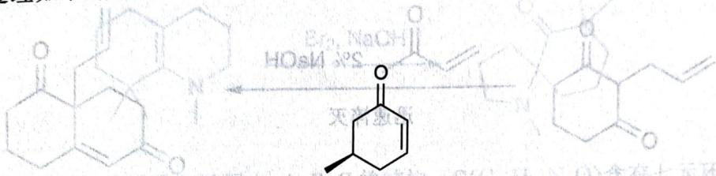
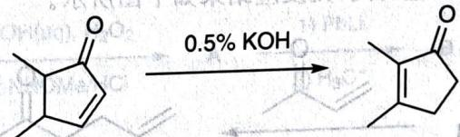

# 题-129：环状不饱和酮的消旋化与重排反应

> **来源**：化学竞赛初赛讲义·第11讲 习题11.107
> **难度**：⭐⭐⭐
> **教学层级**：拓展

---

## 题目

环状不饱和酮常常会发生一些有趣的反应。

1. 用 KH 处理如下底物后加热一段时间, 淬灭反应后发现获得了完全消旋的原料。请用机理解释之。

chemical

Chemical reaction scheme showing transformation of a ketone to a cyclic ester with hydroxylamine and acetyl group

2. 取代的环戊烯酮可以发生以下重排。请给出该转换的反应机理并说明反应的动力。

chemical

Chemical reaction showing oxidation of a cyclic ketone to a cyclopentenone under 0.5% KOH conditions

---

## 答案

答案待补充

---

## 解题思路

详见同目录下答案文件

---

## 知识点

- [[有机反应机理]]
- [[反应机理]]

---

## 相关题目

- [[题-070-初赛讲义-人名反应与机理推断-习题11.108]]

> 答案见 [[04-题库/教材习题/化学竞赛初赛讲义/答案/第11讲-人名反应与机理推断-答案]]