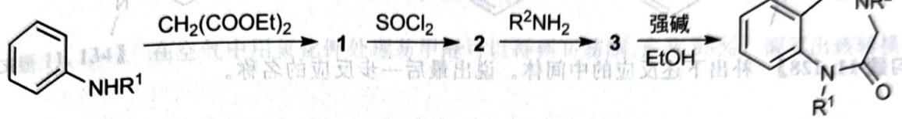

# 题-131：内二酰胺制备中的重排反应

> **来源**：化学竞赛初赛讲义·第11讲 习题11.123
> **难度**：⭐⭐⭐
> **教学层级**：拓展

---

## 题目

下面是一种制备内二酰胺的方法,其中涉及一步重排反应得到产物。推理三个中间体的结构,写出最后一步反应的两个关键中间体(并在后者上画出电子流动以示出如何得到产物)。最后一步反应为何发生?

chemical

Nitration reaction equation of benzene

---

## 答案

答案待补充

---

## 解题思路

详见同目录下答案文件

---

## 知识点

- [[有机反应机理]]
- [[反应机理]]

---

## 相关题目

- [[题-070-初赛讲义-人名反应与机理推断-习题11.108]]

> 答案见 [[04-题库/教材习题/化学竞赛初赛讲义/答案/第11讲-人名反应与机理推断-答案]]