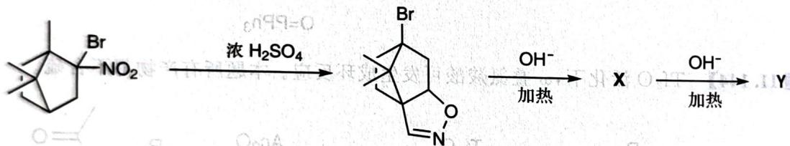

---
title: 题-132-初赛讲义-人名反应与机理推断-习题11.146
type: 题目
source: 化学竞赛初赛讲义·第11讲·人名反应与机理推断
subject: 化学原理
module: 化学原理
submodule: 人名反应与机理推断
question_type: 计算题
difficulty: 3
teaching_level: 拓展
exam_stage: 初赛
syllabus_codes: ["1"]
knowledge_points: ["[[有机反应机理]]", "[[反应机理]]"]
tags: [化竞, 初赛讲义, 人名反应与机理推断, 化学原理]
aliases: [初赛讲义-人名反应与机理推断-习题11.146]
status: 已填充
updated: 2026-07-18
---

# 题-132：萜类化合物中的异构化与重排反应

> **来源**：化学竞赛初赛讲义·第11讲 习题11.146
> **难度**：⭐⭐⭐
> **教学层级**：拓展

---

## 题目

研究萜类化合物时曾涉及如下反应：

chemical

Organic reaction pathway showing bromination, acidification, and dehydration steps with reagents H₂SO₄ and OH⁻

已知 X 中不含羰基, 有一个可发生银镜反应的有机小分子伴随 Y 的生成。

1. 写出第一步反应的反应机理。
2. 第二步反应为一异构化反应。画出 X 的结构。
3. 写出生成 Y 反应的机理。

---

## 答案

答案待补充

---

## 解题思路

详见同目录下答案文件

---

## 知识点

- [[有机反应机理]]
- [[反应机理]]

---

## 相关题目

- [[题-070-初赛讲义-人名反应与机理推断-习题11.108]]
