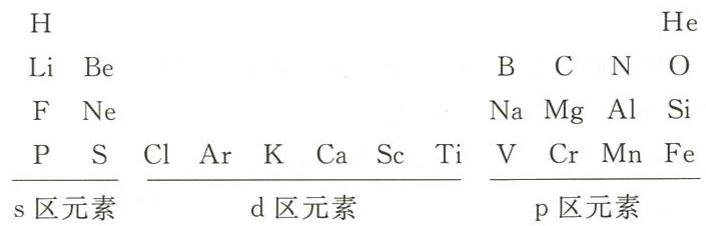

---
title: "例5.9 新量子数规定下的元素周期表"
type: 题目
source: 《无机化学 例题与习题》第4版
subject: 无机和结构化学
module: 原子结构
question_type: 例题
difficulty: 5
knowledge_points: ["[[量子数]]", "[[元素周期表]]", "[[简并度]]", "[[周期律]]", "[[假设推断]]"]
status: 已填充
updated: 2026-07-09
tags: [化竞, 教材习题, 无机化学例题与习题]
exam_stage: 初赛
---

# 例5.9 新量子数规定下的元素周期表

## 题目

若 4 个量子数 $n$, $l$, $m$ 和 $m_s$ 的取值及相互关系重新规定如下：
- $n$ 为正整数；
- 对于给定的 $n$，$l$ 取 $0, 1, 2, \dots, (n-1)$；
- 对于给定的 $l$，$m$ 取 $0, +1, +2, \dots, +l$（共 $l+1$ 个值）；
- $m_s = \pm\frac{1}{2}$。

据此得到新的元素周期表。回答下列问题：
(1) 第二、第四周期各有多少种元素？
(2) p 区元素共有多少列？
(3) 位于第三周期最右一列的元素的原子序数是多少？
(4) 原元素周期表中电负性最大的元素，在新表中位于第几周期、第几列？
(5) 新表中第一个具有 d 电子的元素，在原表中位于第几周期、第几列？

## 解答

新规定中 $m$ 的取值不同于标准规定：

| $l$ | 轨道 | $m$ 取值数 | 简并度 |
|:---:|:---:|:---:|:---:|
| 0 | s | 1 (0) | 1 |
| 1 | p | 2 (0, +1) | 2 |
| 2 | d | 3 (0, +1, +2) | 3 |

每种轨道容纳电子数 = 简并度 × 2（$m_s = \pm\frac{1}{2}$）。

各周期元素数目：

| 周期 | 填充轨道 | 元素数 |
|:---:|:---:|:---:|
| 1 | 1s | 2 |
| 2 | 2s, 2p | 2+4=6 |
| 3 | 3s, 3p, 3d | 2+4+6=12 |
| 4 | 4s, 4p, 4d, 4f | 2+4+6+8=20 |

回答：
(1) 第二周期 **6** 种元素，第四周期 **12** 种元素
(2) p 区元素共有 **4** 列
(3) 第三周期最右一列为 Si，原子序数 **14**
(4) 原表中电负性最大的 F，在新表中位于**第三周期、第 1 列**
(5) 新表中第一个具有 d 电子的元素是 Cl，在原表中位于**第三周期、第 17 列（VIIA 族）**

