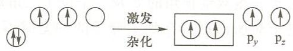
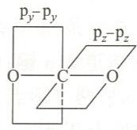

---
title: "例6.1 CO₂的sp杂化与成键"
type: 题目
source: 《无机化学 例题与习题》第4版
subject: 无机和结构化学
module: 分子结构
question_type: 例题
difficulty: 2
knowledge_points: ["[[sp杂化]]", "[[CO2结构]]", "[[sigma键]]", "[[pi键]]", "[[离域pi键]]"]
status: 已填充
updated: 2026-07-09
tags: [化竞, 教材习题, 无机化学例题与习题]
exam_stage: 初赛
---

# 例6.1 CO₂的sp杂化与成键

## 题目

二氧化碳 $(\mathrm{O=C=O})$ 分子为直线形，C 原子与两个 O 原子之间均成双键。试用杂化轨道理论解释这一事实。

## 解答

$\mathrm{CO}_2$ 分子为直线形，碳氧之间有双键 O=C=O。

C 原子经 **sp 杂化**形成两条能量相等的 sp 杂化轨道，与两个 O 原子的 $2\mathrm{p}_x$ 轨道重叠成 $\sigma$ 键，决定了分子为直线形。

C 原子中未参与杂化的 $\mathrm{p}_y$ 轨道与左边 O 的 $\mathrm{p}_y$ 轨道成 $\pi$ 键；C 的 $\mathrm{p}_z$ 轨道与右边 O 的 $\mathrm{p}_z$ 轨道成另一个 $\pi$ 键。

故 $\mathrm{CO}_2$ 分子中有**两个碳氧双键**，即两个 $\sigma$ 键 + 两个 $\pi$ 键（或描述为两个 $\Pi_3^4$ 离域 $\pi$ 键）。

