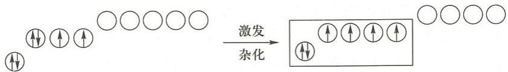
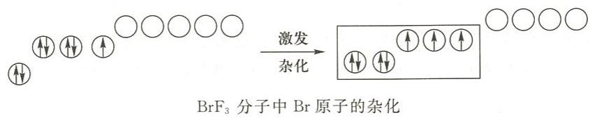
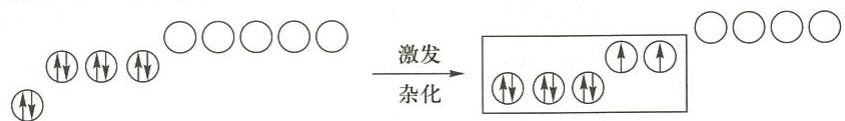
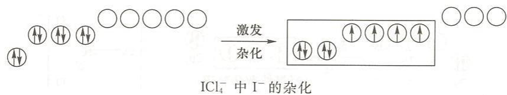

---
title: "例6.3 VSEPR+杂化（含孤电子对）"
type: 题目
source: 《无机化学 例题与习题》第4版
subject: 无机和结构化学
module: 分子结构
question_type: 例题
difficulty: 3
knowledge_points: ["[[VSEPR]]", "[[sp3d杂化]]", "[[sp3d2杂化]]", "[[SF4]]", "[[BrF₃]]", "[[I3-]]", "[[ICl4-]]", "[[变形四面体]]", "[[T形]]"]
status: 已填充
updated: 2026-07-09
tags: [化竞, 教材习题, 无机化学例题与习题]
exam_stage: 初赛
---

# 例6.3 VSEPR+杂化（含孤电子对）

## 题目

试用 VSEPR 理论判断下列分子或离子的空间构型，再用杂化轨道理论说明成键情况：
(1) $\mathrm{SF}_4$ (2) $\mathrm{BrF}_3$ (3) $\mathrm{I}_3^-$ (4) $\mathrm{ICl}_4^-$

## 解答

| 分子/离子 | 价层电子总数 | 电子对数 | 电子对构型 | 分子构型 |
|:---:|:---:|:---:|:---:|:---:|
| $\mathrm{SF}_4$ | 10 | 5 | 三角双锥 | **变形四面体** |
| $\mathrm{BrF}_3$ | 10 | 5 | 三角双锥 | **T形** |
| $\mathrm{I}_3^-$ | 10 | 5 | 三角双锥 | **直线形** |
| $\mathrm{ICl}_4^-$ | 12 | 6 | 正八面体 | **正方形** |

### 杂化方式

- $\mathrm{SF}_4$：S 采用 **$\mathrm{sp}^3\mathrm{d}$** 杂化，5 条杂化轨道中 4 条与 F 成 $\sigma$ 键，1 条为孤电子对（指向三角双锥底面）

- $\mathrm{BrF}_3$：Br 采用 **$\mathrm{sp}^3\mathrm{d}$** 杂化，3 条成键 + 2 条孤电子对（占据底面两个顶点）

- $\mathrm{I}_3^-$：中心 $\mathrm{I}^-$ 采用 **$\mathrm{sp}^3\mathrm{d}$** 杂化，2 条成键（顶角）+ 3 条孤电子对（底面三角形）

- $\mathrm{ICl}_4^-$：中心 $\mathrm{I}^-$ 采用 **$\mathrm{sp}^3\mathrm{d}^2$** 杂化，4 条成键（平面四边形）+ 2 条孤电子对（正方形两侧）

