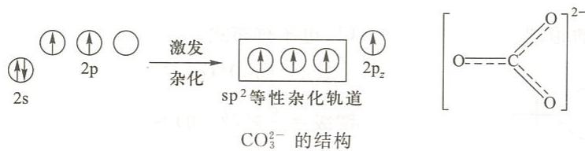
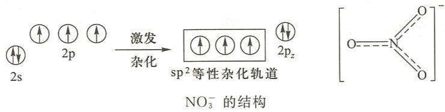
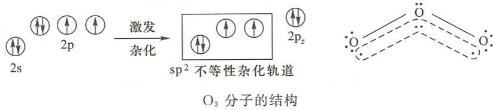

---
title: "例6.5 离域π键的判断与解释"
type: 题目
source: 《无机化学 例题与习题》第4版
subject: 无机和结构化学
module: 分子结构
question_type: 例题
difficulty: 4
knowledge_points: ["[[离域π键]]", "[[大π键]]", "[[CO32-]]", "[[NO3-]]", "[[O3]]", "[[sp2杂化]]", "[[Π符号]]"]
status: 已填充
updated: 2026-07-09
tags: [化竞, 教材习题, 无机化学例题与习题]
exam_stage: 初赛
---

# 例6.5 离域π键的判断与解释

## 题目

试解释下列分子或离子中形成的共轭 $\pi$ 键：
(1) $\mathrm{CO}_3^{2-}$，$\Pi_4^6$ (2) $\mathrm{NO}_3^-$，$\Pi_4^6$ (3) $\mathrm{O}_3$，$\Pi_3^4$

## 解答

### (1) $\mathrm{CO}_3^{2-}$，$\Pi_4^6$

中心 C 原子采用 $\mathrm{sp}^2$ 等性杂化，用 3 个 $\mathrm{sp}^2$ 杂化轨道与 3 个 O 的 $2\mathrm{p}_x$ 成 $\sigma$ 键（平面三角形）。

垂直于平面方向：C 有 1 个未杂化的 $2\mathrm{p}_z$（含 1 个电子），3 个 O 各有 1 个 $2\mathrm{p}_z$（各含 1 个电子），加上离子的 2 个额外电子，共 6 个电子在 4 个 $\mathrm{p}_z$ 轨道中运动。

→ **$\Pi_4^6$**（4 个原子 6 个电子的大 $\pi$ 键）

### (2) $\mathrm{NO}_3^-$，$\Pi_4^6$

中心 N 采用 $\mathrm{sp}^2$ 等性杂化（同上）。N 的 $2\mathrm{p}_z$ 含 2 个电子，3 个 O 各含 1 个，加上 1 个额外电子，共 6 个电子。

→ **$\Pi_4^6$**

### (3) $\mathrm{O}_3$，$\Pi_3^4$

中心 O 采用 $\mathrm{sp}^2$ 不等性杂化。中心 O 的 $2\mathrm{p}_z$ 含 2 个电子，两个配体 O 各含 1 个电子，共 4 个电子在 3 个 $\mathrm{p}_z$ 轨道中。

→ **$\Pi_3^4$**（3 个原子 4 个电子的大 $\pi$ 键）

> **$\Pi_n^m$ 符号含义**：$n$ = 参与原子数，$m$ = 电子总数。
