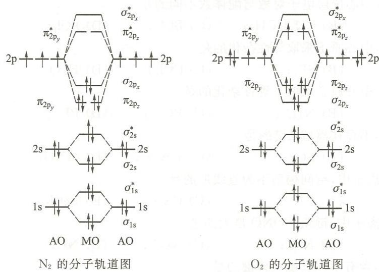

---
title: "例6.7 分子轨道理论解释电离能"
type: 题目
source: 《无机化学 例题与习题》第4版
subject: 无机和结构化学
module: 分子结构
question_type: 例题
difficulty: 3
knowledge_points: ["[[分子轨道理论]]", "[[电离能]]", "[[N2]]", "[[O2]]", "[[最高占据轨道]]"]
status: 已填充
updated: 2026-07-09
tags: [化竞, 教材习题, 无机化学例题与习题]
exam_stage: 初赛
---

# 例6.7 分子轨道理论解释电离能

## 题目

(1) N 原子的电离能与 $\mathrm{N}_2$ 分子的电离能哪一个大些，为什么？
(2) O 原子的电离能与 $\mathrm{O}_2$ 分子的电离能哪一个大些，为什么？

## 解答

**(1) $\mathrm{N}_2$ 分子的电离能更大。**

从 $\mathrm{N}_2$ 的分子轨道图可知，$\mathrm{N}_2$ 最高占据轨道（$\sigma_{2\mathrm{p}}$）的能量低于 N 原子最高能级（2p）的电子能量。因此从 $\mathrm{N}_2$ 中失去电子需要更多能量。

**(2) O 原子的电离能更大。**

从 $\mathrm{O}_2$ 的分子轨道图可知，$\mathrm{O}_2$ 最高占据轨道（$\pi_{2\mathrm{p}}^*$）的能量**高于** O 原子 2p 轨道的能量。因此从 O 原子中失去电子需要更多能量。

> **关键**：比较电离能大小时，需比较最高占据轨道的能量——轨道能量越低，电子越难失去，电离能越大。

