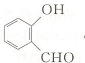

# 晶体结构 填空题（7.11-7.22）

---

## 7.11 比较大小
(1) 晶格能：$\mathrm{AlF_3}$ **>** $\mathrm{AlCl_3}$，NaCl **>** KCl
(2) 溶解度：$\mathrm{CuF_2}$ **<** $\mathrm{CuCl_2}$，$\mathrm{Ca(HCO_3)_2}$ **>** $\mathrm{NaHCO_3}$

---

## 7.12 晶胞中离子总数
立方 ZnS：**8**；NaCl：**8**；CsCl：**2**

---

## 7.13 CdS 的晶体结构
$r_+/r_- = 97/184 = 0.527$，理论应为 **NaCl** 型（配位数 **6:6**）。但实际为立方 ZnS 型（配位数 **4:4**），主要由**正负离子间的相互极化作用**造成。

---

## 7.14 沸点比较

| 比较 | 结果 | 原因 |
|:---:|:---:|:---|
| NaCl < MgCl₂ | MgCl₂ 离子键更强 |
| AgCl < KCl | Ag⁺ 极化能力强，共价成分增加 |
| NH₃ > PH₃ | NH₃ 分子间氢键 |
| CO₂ < SO₂ | CO₂ 非极性，SO₂ 极性；色散力 CO₂ < SO₂ |
| O₃ < SO₂ | O₃ 极性 < SO₂，色散力也小 |
| O₃ > O₂ | O₃ 极性分子，O₂ 非极性 |
| Ne < Ar | Ar 半径大，色散力大 |
| HF < H₂O | H₂O 氢键数多且汽化时全断开 |
| HF > NH₃ | HF 氢键比 NH₃ 强 |
| H₂S > HCl | H₂S 半径大，色散力大 |
| HF > HI | HF 氢键很强 |

---

## 7.15 键极性比较
$\mathrm{PbO > PbS}$，$\mathrm{FeCl_3 < FeCl_2}$，$\mathrm{SnS > SnS_2}$，$\mathrm{AsH_3 < SeH_2}$，$\mathrm{PH_3 < H_2S}$，$\mathrm{HF > H_2O}$

---

## 7.16 氢键判断

能形成分子内氢键：**③④⑥**
不能形成分子间氢键：**④⑤**
> $\mathrm{HF_2^-}$：F—H---F，无多余 H 形成分子间氢键。$\mathrm{NH_4^+}$：N 无孤电子对。

---

## 7.17 热稳定性排序
$\mathrm{K_2CO_3 > Na_2CO_3 > MgCO_3 > MnCO_3 > PbCO_3}$

---

## 7.18 阳离子极化能力排序
$\mathrm{ZnCl_2 > MnCl_2 > CaCl_2 > KCl}$

---

## 7.19 偶极矩比较
$\mathrm{CO_2 < SO_2}$，$\mathrm{CCl_4 = CH_4}$（均为 0），$\mathrm{PH_3 < NH_3}$，$\mathrm{BF_3 < NF_3}$，$\mathrm{NH_3 > NF_3}$，$\mathrm{CH_3OCH_3 > C_6H_6}$

---

## 7.20 金属晶体堆积方式
(1) 配位数 8 的**体心立方**堆积
(2) 配位数 **12** 的面心立方堆积
(3) 配位数 **12** 的**六方紧密**堆积
- **面心立方**和**六方紧密**空间利用率相等（74.05%）
- 六方紧密以 **ABAB** 方式堆积，面心立方以 **ABCABC** 方式
- 区别在第 **三** 层

---

## 7.21 金属 Cu（面心立方）
配位数 **12**，晶胞原子数 **4**，原子半径 **127.8 pm**，密度 **8.94 $\mathrm{g \cdot cm^{-3}}$**，空间占有率 **74.05%**

---

## 7.22 金属 K（体心立方）
晶胞原子数 **2**，原子半径 **230 pm**
> 由 $\rho = m/V$ 求 $V$，再由 $a = \sqrt[3]{V}$，$r = \frac{\sqrt{3}}{4}a$

---

## 参考答案

| 题号 | 答案要点 |
|:---:|:---|
| 7.11 | (1) AlF₃ > AlCl₃；NaCl > KCl (2) CuF₂ < CuCl₂；Ca(HCO₃)₂ > NaHCO₃ |
| 7.12 | ZnS: 8；NaCl: 8；CsCl: 2 |
| 7.13 | r₊/r₋ = 0.527，理论NaCl型(6:6)；实际ZnS型(4:4)；离子极化作用 |
| 7.14 | 见解题思路详细比较表 |
| 7.15 | PbO > PbS；FeCl₃ < FeCl₂；SnS > SnS₂；AsH₃ < SeH₂；PH₃ < H₂S；HF > H₂O |
| 7.16 | 分子内氢键：③④⑥；不能形成分子间氢键：④⑤ |
| 7.17 | K₂CO₃ > Na₂CO₃ > MgCO₃ > MnCO₃ > PbCO₃ |
| 7.18 | ZnCl₂ > MnCl₂ > CaCl₂ > KCl |
| 7.19 | CO₂ < SO₂；CCl₄ = CH₄(=0)；PH₃ < NH₃；BF₃ < NF₃；NH₃ > NF₃；CH₃OCH₃ > C₆H₆ |
| 7.20 | (1) 体心立方 (2) 12 (3) 12 六方紧密；74.05%；ABAB；ABCABC；三 |
| 7.21 | 12；4；127.8 pm；8.94 g/cm³；74.05% |
| 7.22 | 2；230 pm |

---

## 解题思路

### 7.11 比较大小

**(1) 晶格能**

**AlF₃ > AlCl₃**：
- AlF₃：离子性较强（F⁻ 半径小，不易极化），离子键强，晶格能大
- AlCl₃：Al³⁺ 电荷高、半径小，极化能力强；Cl⁻ 半径大、变形性强 → 共价成分增加，晶格能降低

**NaCl > KCl**：
- Na⁺ 半径（95 pm）< K⁺ 半径（133 pm）
- 根据Born-Lande公式 $U \propto \dfrac{Z^+ Z^-}{r_+ + r_-}$，NaCl 的离子间距更小，晶格能更大

**(2) 溶解度**

**CuF₂ < CuCl₂**：
- Cu²⁺ 极化能力强（18e⁻ 构型），与 F⁻（不易极化）形成的 CuF₂ 离子性较强
- CuCl₂ 中 Cl⁻ 变形性较大，与 Cu²⁺ 相互极化增强，共价成分增加
- 但实际 CuF₂ 溶解度小于 CuCl₂，因为 CuF₂ 的晶格能较大（F⁻ 半径小）

**Ca(HCO₃)₂ > NaHCO₃**：
- Ca(HCO₃)₂ 是可溶性盐，在水中完全溶解
- NaHCO₃ 溶解度相对较小（NaHCO₃ 的溶解度约 9.6 g/100mL，20°C）

### 7.12 晶胞中离子总数

| 晶体类型 | 晶胞描述 | 计算 | 总离子数 |
|:---:|:---|:---|:---:|
| 立方ZnS | Zn²⁺在四面体空隙（4个）+ S²⁻在面心立方（4个） | 4+4 | **8** |
| NaCl | Na⁺（4个）+ Cl⁻（4个）各占面心立方位置 | 4+4 | **8** |
| CsCl | Cs⁺（1个体心）+ Cl⁻（8个顶点×1/8） | 1+1 | **2** |

### 7.13 CdS 的晶体结构

**半径比计算**：
$$\frac{r_+}{r_-} = \frac{r(\mathrm{Cd^{2+}})}{r(\mathrm{S^{2-}})} = \frac{97}{184} = 0.527$$

**理论预测**：半径比 0.527 在 0.414～0.732 范围内，应为 **NaCl 型**（配位数 **6:6**）

**实际情况**：CdS 实际为**立方 ZnS 型**（配位数 **4:4**）

**原因**：Cd²⁺（18e⁻ 电子构型）极化能力强，S²⁻（半径大）变形性强，**正负离子间的相互极化作用**使离子键共价成分增加，配位数降低。

### 7.14 沸点比较

| 比较 | 结果 | 原因 |
|:---:|:---:|:---|
| NaCl vs MgCl₂ | MgCl₂ > NaCl | Mg²⁺ 电荷+2，离子键更强，晶格能更大 |
| AgCl vs KCl | KCl > AgCl | Ag⁺（18e⁻）极化能力强，AgCl 共价成分增加，分子间力减弱 |
| NH₃ vs PH₃ | NH₃ > PH₃ | NH₃ 分子间存在氢键 |
| CO₂ vs SO₂ | SO₂ > CO₂ | CO₂ 非极性，SO₂ 极性，色散力 SO₂ > CO₂ |
| O₃ vs SO₂ | SO₂ > O₃ | O₃ 极性 < SO₂，色散力也较小 |
| O₃ vs O₂ | O₃ > O₂ | O₃ 极性分子，O₂ 非极性，O₃ 分子间力更强 |
| Ne vs Ar | Ar > Ne | Ar 电子数多，色散力大 |
| HF vs H₂O | H₂O > HF | H₂O 可形成4个氢键（2H+2孤对），HF 只能形成2个 |
| HF vs NH₃ | HF > NH₃ | F 电负性大，F—H···F 氢键比 N—H···N 强 |
| H₂S vs HCl | H₂S > HCl | H₂S 分子量大，色散力大 |
| HF vs HI | HF > HI | HF 氢键很强，HI 仅色散力 |

### 7.15 键极性比较

- **PbO > PbS**：O²⁻ 半径小，电荷密度高，与 Pb²⁺ 间静电引力更强
- **FeCl₃ < FeCl₂**：Fe³⁺ 极化能力更强，与 Cl⁻ 相互极化程度更大，共价成分增加
- **SnS > SnS₂**：Sn²⁺ 极化能力 > Sn⁴⁺（半径大），与 S²⁻ 相互极化更强
- **AsH₃ < SeH₂**：Se 电负性 > As，Se—H 键极性更大
- **PH₃ < H₂S**：S 电负性 > P，S—H 键极性更大
- **HF > H₂O**：F 电负性 > O，H—F 键极性更大

### 7.16 氢键判断

**能形成分子内氢键的**：③④⑥
- 分子内氢键要求同一分子内有 H 供体（如 —OH、—NH）和 H 受体（如 O、N 的孤电子对），且空间位置合适

**不能形成分子间氢键的**：④⑤
- HF₂⁻：F—H···F 氢键已形成，无多余 H 形成分子间氢键
- NH₄⁺：N 无孤电子对，不能作为 H 受体形成分子间氢键

### 7.17 热稳定性排序

碳酸盐热稳定性取决于阳离子对 CO₃²⁻ 的极化能力：
$$\mathrm{K_2CO_3 > Na_2CO_3 > MgCO_3 > MnCO_3 > PbCO_3}$$

- K⁺、Na⁺：电荷+1，半径大，极化能力弱，碳酸盐稳定
- Mg²⁺：电荷+2，半径较小，极化能力中等
- Mn²⁺、Pb²⁺：过渡金属离子，极化能力较强，碳酸盐较易分解
- Pb²⁺ 极化能力最强（18e⁻ 构型），PbCO₃ 最易分解

### 7.18 阳离子极化能力排序

$$\mathrm{ZnCl_2 > MnCl_2 > CaCl_2 > KCl}$$

极化能力排序规则：
- 电荷越高 → 极化能力越强
- 半径越小 → 极化能力越强
- 18e⁻ 构型 > 不规则构型 > 8e⁻ 构型

Zn²⁺（18e⁻，电荷+2）> Mn²⁺（不规则，电荷+2）> Ca²⁺（8e⁻，电荷+2）> K⁺（8e⁻，电荷+1）

### 7.19 偶极矩比较

| 比较 | 结果 | 原因 |
|:---:|:---:|:---|
| CO₂ vs SO₂ | CO₂ < SO₂ | CO₂ 直线形对称（μ=0）；SO₂ V形（μ≠0） |
| CCl₄ vs CH₄ | CCl₄ = CH₄ = 0 | 均为正四面体对称，键矩完全抵消 |
| PH₃ vs NH₃ | PH₃ < NH₃ | N 电负性大，N—H 键极性更大 |
| BF₃ vs NF₃ | BF₃ < NF₃ | BF₃ 平面三角形对称（μ=0）；NF₃ 三角锥形（μ≠0） |
| NH₃ vs NF₃ | NH₃ > NF₃ | NH₃ 中孤电子对贡献与键矩同向；NF₃ 中键矩偏向F，与孤对贡献反向 |
| CH₃OCH₃ vs C₆H₆ | CH₃OCH₃ > C₆H₆ | 二甲醚极性（μ≠0）；苯对称（μ=0） |

### 7.20 金属晶体堆积方式

**(1)** 配位数 **8** 的是**体心立方**堆积（bcc）

**(2)** 配位数 **12** 的是面心立方最紧密堆积（fcc）

**(3)** 配位数 **12** 的是**六方紧密**堆积（hcp）

- **面心立方**和**六方紧密**的空间利用率相等，均为 **74.05%**
- 六方紧密以 **ABAB** 方式堆积，面心立方以 **ABCABC** 方式堆积
- 两种堆积方式的区别出现在第 **三** 层（A层之后：ABAB 回到 A；ABCABC 继续到 C）

### 7.21 金属 Cu（面心立方）

Cu 为面心立方最紧密堆积：
- 配位数：**12**（每个原子与12个相邻原子接触）
- 晶胞中原子数：$8 \times \frac{1}{8} + 6 \times \frac{1}{2} = 4$
- 原子半径：$r = \frac{\sqrt{2}}{4}a$，由密度 $\rho = 8.94\ \mathrm{g/cm^3}$ 可求 $a$，再得 $r = 127.8\ \mathrm{pm}$
- 密度：**8.94 g·cm⁻³**
- 空间占有率：$\frac{\pi}{3\sqrt{2}} = $ **74.05%**

### 7.22 金属 K（体心立方）

K 为体心立方堆积：
- 晶胞原子数：$8 \times \frac{1}{8} + 1 = $ **2**
- 由密度和摩尔质量求晶胞参数 $a$，再由 $r = \frac{\sqrt{3}}{4}a$ 求原子半径
- 原子半径：**230 pm**