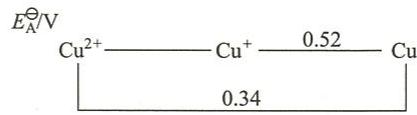

---
title: "由电极电势求溶度积"
type: 题目
source: 《无机化学 例题与习题》第4版
subject: 无机和结构化学
module: 氧化还原反应
question_type: 例题
difficulty: 4
knowledge_points: ["[[溶度积]]", "[[电极电势]]", "[[能斯特方程]]", "[[Latimer图]]", "[[CuBr]]"]
status: 已填充
updated: 2026-07-09
tags: [化竞, 教材习题, 无机化学例题与习题]
exam_stage: 初赛
---

# 例10.6 由电极电势求溶度积

## 题目

已知：

$$
\mathrm{Cu}^{2+} + 2\mathrm{e}^{-} = \mathrm{Cu} \quad E^{\ominus} = 0.34 \; \mathrm{V}
$$

$$
\mathrm{Cu}^{+} + \mathrm{e}^{-} = \mathrm{Cu} \quad E^{\ominus} = 0.52 \; \mathrm{V}
$$

$$
\mathrm{Cu}^{2+} + \mathrm{Br}^{-} + \mathrm{e}^{-} = \mathrm{CuBr} \quad E^{\ominus} = 0.65 \; \mathrm{V}
$$

试求 CuBr 的 $K_{\mathrm{sp}}^{\ominus}$。

## 解答

### 第一步：求 $E^{\ominus}(\mathrm{Cu}^{2+}/\mathrm{Cu}^{+})$

将部分题设条件画在元素电势图上：

$$
E^{\ominus}(\mathrm{Cu}^{2+}/\mathrm{Cu}) = \frac{E^{\ominus}(\mathrm{Cu}^{2+}/\mathrm{Cu}^{+}) \times 1 + E^{\ominus}(\mathrm{Cu}^{+}/\mathrm{Cu}) \times 1}{1 + 1}
$$

所以：

$$
E^{\ominus}(\mathrm{Cu}^{2+}/\mathrm{Cu}^{+}) = 2E^{\ominus}(\mathrm{Cu}^{2+}/\mathrm{Cu}) - E^{\ominus}(\mathrm{Cu}^{+}/\mathrm{Cu}) = 2 \times 0.34 \; \mathrm{V} - 0.52 \; \mathrm{V} = 0.16 \; \mathrm{V}
$$

即 $\mathrm{Cu}^{2+} + \mathrm{e}^{-} = \mathrm{Cu}^{+}$ 的 $E^{\ominus}(\mathrm{Cu}^{2+}/\mathrm{Cu}^{+}) = 0.16 \; \mathrm{V}$。

### 第二步：利用 CuBr 沉淀平衡求 $K_{\mathrm{sp}}^{\ominus}$

将

$$
\mathrm{Cu}^{2+} + \mathrm{Br}^{-} + \mathrm{e}^{-} = \mathrm{CuBr} \quad E^{\ominus} = 0.65 \; \mathrm{V}
$$

的 $E^{\ominus} = 0.65 \; \mathrm{V}$ 看成

$$
\mathrm{Cu}^{2+} + \mathrm{e}^{-} = \mathrm{Cu}^{+}
$$

的非标准电极电势 $E$，这个非标准状态是由 $c(\mathrm{Br}^{-}) = 1.0 \; \mathrm{mol} \cdot \mathrm{dm}^{-3}$ 时的 $c(\mathrm{Cu}^{+})$ 决定的。

根据 $\mathrm{CuBr} = \mathrm{Cu}^{+} + \mathrm{Br}^{-}$，$K_{\mathrm{sp}}^{\ominus} = c(\mathrm{Cu}^{+}) \cdot c(\mathrm{Br}^{-})$，得：

$$
c(\mathrm{Cu}^{+}) = \frac{K_{\mathrm{sp}}^{\ominus}}{c(\mathrm{Br}^{-})} = K_{\mathrm{sp}}^{\ominus}
$$

代入电极反应 $\mathrm{Cu}^{2+} + \mathrm{e}^{-} = \mathrm{Cu}^{+}$ 的能斯特方程：

$$
E = E^{\ominus}(\mathrm{Cu}^{2+}/\mathrm{Cu}^{+}) + 0.059 \; \mathrm{V} \lg \frac{1}{c(\mathrm{Cu}^{+})}
$$

$$
0.65 \; \mathrm{V} = 0.16 \; \mathrm{V} + 0.059 \; \mathrm{V} \lg \frac{1}{K_{\mathrm{sp}}^{\ominus}}
$$

$$
\lg K_{\mathrm{sp}}^{\ominus} = \frac{0.16 \; \mathrm{V} - 0.65 \; \mathrm{V}}{0.059 \; \mathrm{V}} = -8.31
$$

$$
K_{\mathrm{sp}}^{\ominus} = 4.9 \times 10^{-9}
$$
