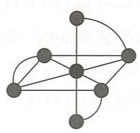
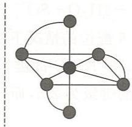
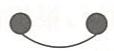
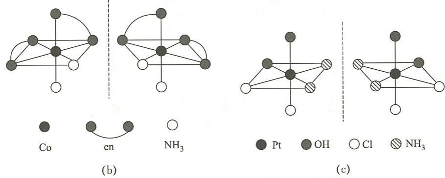

# 例 11.2 配位化合物的旋光异构体

## 题目

指出下列配位化合物可能有的旋光异构体，并将其画出。

(1) $\left[\mathrm{Co}(\mathrm{en})_{3}\right]\mathrm{Cl}_{3}$

(2) $\left[\mathrm{Cu}(\mathrm{NH}_{3})_{4}(\mathrm{H}_{2}\mathrm{O})_{2}\right]\mathrm{Cl}_{2}$

(3) $\left[\mathrm{Co}(\mathrm{NH}_3)_2(\mathrm{en})_2\right]\mathrm{Cl}_3$

(4) $\left[\mathrm{Pt}(\mathrm{NH}_3)_2\mathrm{BrCl}\right]$

(5) $\left[\mathrm{Pt}(\mathrm{NH}_3)_2(\mathrm{OH})_2\mathrm{Cl}_2\right]$

(6) $\left[\mathrm{Co}(\mathrm{NH}_3)(\mathrm{en})\mathrm{Cl}_3\right]$

## 解答

(1)、(3)、(5) 有旋光异构体。

**(1)** $\left[\mathrm{Co}(\mathrm{en})_{3}\right]^{3+}$ 的旋光异构体：
- $\left[\mathrm{Co}(\mathrm{en})_{3}\right]^{3+}$ 具有$D_3$对称性，没有对称面和对称中心
- 存在一对对映异构体（$\Delta$-构型和$\Lambda$-构型）

**(3)** $\left[\mathrm{Co}(\mathrm{NH}_3)_2(\mathrm{en})_2\right]^{3+}$ 的旋光异构体：
- 只有顺式异构体具有旋光性
- 反式异构体存在对称面，无旋光性

**(5)** $\left[\mathrm{Pt}(\mathrm{NH}_3)_2(\mathrm{OH})_2\mathrm{Cl}_2\right]$ 的旋光异构体：
- 只有特定构型的几何异构体才具有旋光性

## 解题思路

1. **旋光异构体的判断标准**：
   - 分子必须具有手性（不对称性）
   - 没有对称面（$\sigma$）
   - 没有对称中心（$i$）
   - 没有$S_n$轴

2. **常见判断方法**：
   - 画出分子的立体结构
   - 寻找是否存在对称面
   - 如果分子与其镜像不能重合，则具有旋光性

3. **八面体配合物的旋光异构**：
   - $[M(\text{en})_3]$型配合物：具有旋光性
   - $[M(\text{en})_2\text{A}_2]$型：只有顺式有旋光性
   - $[M(\text{en})\text{A}_2\text{B}_2]$型：需要具体分析

4. **平面四边形配合物**：
   - 通常无旋光异构体（存在对称面）
   - 除非有特殊的手性配体