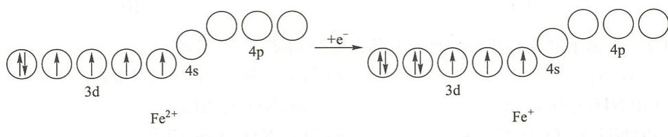

---
title: "磁矩与配合物的电子结构"
type: 题目
source: 《无机化学 例题与习题》第4版
subject: 无机和结构化学
module: 配位化学
question_type: 例题
difficulty: 3
knowledge_points: ["[[磁矩]]", "[[未成对电子]]", "[[杂化轨道]]", "[[内轨型]]", "[[外轨型]]", "[[配位化合物]]"]
status: 已填充
updated: 2026-07-09
tags: [化竞, 教材习题, 无机化学例题与习题]
exam_stage: 初赛
---

# 例 11.3 磁矩与配合物的电子结构

## 题目

研究发现棕色配位化合物 $\left[\mathrm{Fe}(\mathrm{NO})(\mathrm{H}_{2}\mathrm{O})_{5}\right]\mathrm{SO}_{4}$ 显顺磁性，并测得其磁矩为 $3.8 \mu_{B}$。

(1) 试给出中心d电子的排布方式及杂化轨道类型；

(2) $\left[\mathrm{Fe}(\mathrm{NO})(\mathrm{H}_{2}\mathrm{O})_{5}\right]\mathrm{SO}_{4}$ 中 $\mathrm{N}-\mathrm{O}$ 键的键长与自由NO分子中的键长相比，变长还是变短？试简述理由。

## 解答

**(1) 中心d电子的排布方式及杂化轨道类型**

磁矩 $\mu$ 和中心单电子数 $n$ 的关系式为：
$$
\mu = \sqrt{n(n+2)} \mu_B
$$

将 $\mu = 3.8\mu_B$ 代入上式，得 $[\mathrm{Fe(NO)(H_2O)_5}]\mathrm{SO}_4$ 中心单电子数 $n = 3$

中心有3个单电子，可见不是 $\mathrm{Fe^{2+}}$，而是氧化NO过程中得到1个电子生成的 $\mathrm{Fe^+}$：
$$
\mathrm{Fe^{2+} + NO = Fe^+ + NO^+}
$$

该过程的电子排布变化如图所示：

进一步形成配位化合物的反应为

$$
\mathrm{Fe^+ + NO^+ + 5H_2O + SO_4^{2-} = [Fe(NO)(H_2O)_5]SO_4}
$$

$\mathrm{Fe^+}$ 没有空的内层d轨道，故在6配位的情况下为外轨型 $\mathrm{sp^3d^2}$ 杂化。

**(2) N-O键长比较**

$\left[\mathrm{Fe}(\mathrm{NO})(\mathrm{H}_{2}\mathrm{O})_{5}\right]\mathrm{SO}_{4}$ 中N-O的键长比自由NO分子中的键长**变短**。

**理由**：
- 自由NO分子中N-O键的键级为2.5
- $\left[\mathrm{Fe}(\mathrm{NO})(\mathrm{H}_{2}\mathrm{O})_{5}\right]\mathrm{SO}_{4}$ 中N-O键的键级为3
- 键级增大使键长变短

## 解题思路

1. **磁矩公式的应用**：
   - $\mu = \sqrt{n(n+2)} \mu_B$，其中 $n$ 为未成对电子数
   - 根据磁矩可以推算出未成对电子数

2. **判断氧化态**：
   - 根据未成对电子数推断中心离子的氧化态
   - Fe的常见氧化态：$\mathrm{Fe^+ (3d^7)}$、$\mathrm{Fe^{2+} (3d^6)}$、$\mathrm{Fe^{3+} (3d^5)}$

3. **杂化轨道类型判断**：
   - 内轨型：$(n-1)d + ns + np$，如 $d^2sp^3$
   - 外轨型：$ns + np + nd$，如 $sp^3d^2$
   - 判断依据：中心离子是否有空的内层d轨道

4. **键级与键长的关系**：
   - 键级越大，键长越短
   - 键级越大，键能越大
