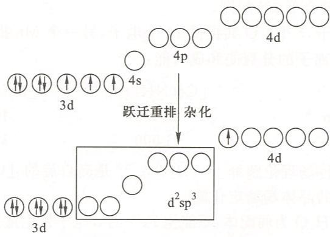

# 例 11.4 磁矩判断杂化类型与空间构型

## 题目

已知下列配位化合物的磁矩，根据配位化合物价键理论给出中心轨道的杂化类型、中心d电子的排布、配位单元的空间构型。

(1) $\left[\mathrm{Co}(\mathrm{NH}_3)_6\right]^{2+}$，$\mu = 3.9\mu_B$

(2) $\left[\mathrm{Pt}(\mathrm{CN})_4\right]^{2-}$，$\mu = 0\mu_B$

(3) $\left[\mathrm{Mn}(\mathrm{SCN})_{6}\right]^{4-}$，$\mu = 6.1\mu_B$

(4) $\left[\mathrm{Co}(\mathrm{NO}_2)_6\right]^{4-}$，$\mu = 1.8\mu_B$

## 解答

由配位化合物磁矩可以求出其中心d轨道的单电子数，以判断中心d电子的排布方式，进而得到中心轨道的杂化类型和配位单元的空间构型。

以 $\left[\mathrm{Co}(\mathrm{NO}_2)_6\right]^{4-}$ 为例进行讨论。根据磁矩 $\mu$ 和单电子数 $n$ 的关系式：
$$
\mu = \sqrt{n(n+2)} \mu_B
$$

由 $\left[\mathrm{Co}(\mathrm{NO}_2)_6\right]^{4-}$ 的 $\mu = 1.8\mu_B$ 可以求得 $n = 1$。这说明强场 $\mathrm{NO_2^-}$ 使 $\mathrm{Co^{2+}}$ 的3d轨道的7个电子发生了重排，3d轨道只排布3对电子，同时有1个3d轨道电子跃迁到4d轨道，如下图所示。中心采取 $d^2sp^3$ 杂化，正八面体构型。

利用类似的方法对题设各配位化合物进行讨论，结果如下表：

| 配位单元 | 磁矩/$\mu_B$ | 单电子数 | 中心d电子的排布 | 中心轨道的杂化类型 | 空间构型 |
|----------|-------------|---------|----------------|------------------|----------|
| $[Co(NH_3)_6]^{2+}$ | 3.9 | 3 | $t_{2g}^5 e_g^2$ | $sp^3d^2$ | 八面体 |
| $[Pt(CN)_4]^{2-}$ | 0 | 0 | $d_{xz}^2 d_{yz}^2 d_{xy}^2 d_{z^2}^2$ | $dsp^2$ | 正方形 |
| $[Mn(SCN)_6]^{4-}$ | 6.1 | 5 | $t_{2g}^3 e_g^2$ | $sp^3d^2$ | 八面体 |
| $[Co(NO_2)_6]^{4-}$ | 1.8 | 1 | $t_{2g}^6 e_g^1$ | $d^2sp^3$ | 八面体 |

## 解题思路

1. **磁矩计算未成对电子数**：
   - 使用公式 $\mu = \sqrt{n(n+2)} \mu_B$
   - 反推得到 $n = \frac{\sqrt{\mu^2+4}-2}{2}$

2. **判断弱场/强场**：
   - 弱场：$\Delta < P$，电子优先占据高能轨道（高自旋）
   - 强场：$\Delta > P$，电子优先成对（低自旋）

3. **杂化类型判断**：
   - $sp^3d^2$：外轨型，弱场八面体
   - $d^2sp^3$：内轨型，强场八面体
   - $dsp^2$：内轨型，平面四边形
   - $sp^3$：外轨型，四面体

4. **空间构型**：
   - 6配位：八面体
   - 4配位：平面四边形或四面体