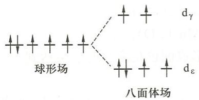
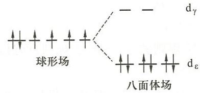

---
title: "例11.6-晶体场理论与CFSE计算"
type: 题目
exam_stage: 初赛
subject: 无机和结构化学
difficulty: 3
teaching_level: 巩固
knowledge_points: ["[[晶体场理论]]", "[[CFSE]]", "[[分裂能]]", "[[成对能]]", "[[高自旋]]", "[[低自旋]]"]
tags: [化竞, 教材习题, 无机化学例题与习题]
updated: 2026-07-09
source: 《无机化学 例题与习题》第4版
module: 配位化学
status: 已填充
---
# 例 11.6 晶体场理论与CFSE计算

## 题目

已知两个配离子的分裂能和成对能：

| 配离子 | $\Delta/\mathrm{cm^{-1}}$ | $P/\mathrm{cm^{-1}}$ |
|--------|--------------------------|----------------------|
| $[\mathrm{Co(NH_3)_6}]^{3+}$ | 23000 | 21000 |
| $[\mathrm{Fe(H_2O)_6}]^{2+}$ | 10400 | 15000 |

(1) 用价键理论及晶体场理论解释 $\left[\mathrm{Fe}\left(\mathrm{H}_{2}\mathrm{O}\right)_{6}\right]^{2+}$ 是高自旋的，$\left[\mathrm{Co}\left(\mathrm{NH}_{3}\right)_{6}\right]^{3+}$ 是低自旋的；

(2) 计算两种配离子的晶体场稳定化能。

## 解答

**(1) 高自旋与低自旋的解释**

**价键理论解释**：
- $\mathrm{H_2O}$ 为弱配体，不能使 $\mathrm{Fe^{2+}}$ 的d电子发生重排，因此 $\left[\mathrm{Fe}\left(\mathrm{H}_{2}\mathrm{O}\right)_{6}\right]^{2+}$ 是高自旋的
- $\mathrm{NH_3}$ 对 $\mathrm{Co^{3+}}$ 为强配体，能使 $\mathrm{Co^{3+}}$ 的d电子发生重排，因此 $\left[\mathrm{Co}\left(\mathrm{NH}_{3}\right)_{6}\right]^{3+}$ 是低自旋的

**晶体场理论解释**：
- $\left[\mathrm{Fe}\left(\mathrm{H}_{2}\mathrm{O}\right)_{6}\right]^{2+}$ 的 $\Delta < P$，d电子采取高自旋排布
- $\left[\mathrm{Co}\left(\mathrm{NH}_{3}\right)_{6}\right]^{3+}$ 的 $\Delta > P$，d轨道电子采取低自旋排布

**(2) CFSE计算**

**$\left[\mathrm{Fe(H_2O)_6}\right]^{2+}$ 的CFSE**：
- $\mathrm{Fe^{2+}}$ 为 $d^6$ 构型
- 高自旋排布：$t_{2g}^4 e_g^2$

$$
\begin{aligned}
\mathrm{CFSE} &= 0 - (-0.4\Delta \times 4 + 0.6\Delta \times 2) \\
&= 0.4\Delta \\
&= 0.4 \times 10400 \, \mathrm{cm^{-1}} \\
&= 4160 \, \mathrm{cm^{-1}}
\end{aligned}
$$

**$\left[\mathrm{Co}\left(\mathrm{NH}_{3}\right)_{6}\right]^{3+}$ 的CFSE**：
- $\mathrm{Co^{3+}}$ 为 $d^6$ 构型
- 低自旋排布：$t_{2g}^6 e_g^0$

$$
\begin{aligned}
\mathrm{CFSE} &= 0 - (-0.4\Delta \times 6 + 2P) \\
&= 2.4\Delta - 2P \\
&= 2.4 \times 23000 \, \mathrm{cm^{-1}} - 2 \times 21000 \, \mathrm{cm^{-1}} \\
&= 13200 \, \mathrm{cm^{-1}}
\end{aligned}
$$

## 解题思路

1. **晶体场理论基本概念**：
   - 在配体电场作用下，中心金属的d轨道发生能级分裂
   - 八面体场中：$d$ 轨道分裂为 $t_{2g}$（低能）和 $e_g$（高能）

2. **高自旋与低自旋的判断**：
   - 当 $\Delta > P$ 时，电子优先成对，形成低自旋配合物
   - 当 $\Delta < P$ 时，电子优先占据高能轨道，形成高自旋配合物

3. **CFSE计算公式**：
   - $t_{2g}$ 轨道上每个电子的能量：$-0.4\Delta$
   - $e_g$ 轨道上每个电子的能量：$+0.6\Delta$
   - 考虑电子成对能 $P$

4. **CFSE的物理意义**：
   - CFSE越大，配合物越稳定
   - 低自旋配合物通常有更大的CFSE