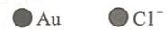

---
title: "配位平衡与沉淀平衡"
type: 题目
source: 《无机化学 例题与习题》第4版
subject: 无机和结构化学
module: 配位化学
question_type: 例题
difficulty: 4
knowledge_points: ["[[配位平衡]]", "[[沉淀平衡]]", "[[稳定常数]]", "[[溶度积]]", "[[沉淀溶解]]"]
status: 已填充
updated: 2026-07-09
tags: [化竞, 教材习题, 无机化学例题与习题]
exam_stage: 初赛
---

# 例 11.9 配位平衡与沉淀平衡

## 题目

将 $0.20 \, \mathrm{mol \cdot dm^{-3}}$ $\mathrm{AgNO_3}$ 溶液 $0.50 \, \mathrm{dm^3}$ 和 $6.0 \, \mathrm{mol \cdot dm^{-3}}$ $\mathrm{NH_3}$ 溶液 $0.50 \, \mathrm{dm^3}$ 混合后，加入 $1.19 \, \mathrm{g}$ $\mathrm{KBr}$ 固体。通过计算说明是否有沉淀生成。

已知 $\left[\mathrm{Ag}(\mathrm{NH}_3)_2\right]^+$ 的 $K_{\text{稳}}^{\ominus} = 1.1 \times 10^7$，$\mathrm{AgBr}$ 的 $K_{\mathrm{sp}}^{\ominus} = 5.4 \times 10^{-13}$。

## 解答

**第一步：计算混合后各物质的初始浓度**

混合溶液的体积为 $1.0 \, \mathrm{dm^3}$。

反应前混合溶液中：
$$
c(\mathrm{Ag^+}) = \frac{0.20 \times 0.50}{1.0} = 0.10 \, \mathrm{mol \cdot dm^{-3}}
$$
$$
c(\mathrm{NH_3}) = \frac{6.0 \times 0.50}{1.0} = 3.0 \, \mathrm{mol \cdot dm^{-3}}
$$

**第二步：计算配位平衡后 $\mathrm{Ag^+}$ 浓度**

由于 $\left[\mathrm{Ag}(\mathrm{NH}_3)_2\right]^+$ 的 $K_{\text{稳}}^{\ominus}$ 较大且 $\mathrm{NH_3}$ 过量，则溶液中 $\mathrm{Ag^+}$ 与 $\mathrm{NH_3}$ 充分反应后几乎全部转化为 $\left[\mathrm{Ag}(\mathrm{NH}_3)_2\right]^+$，同时消耗掉 $c(\mathrm{NH_3}) = 0.20 \, \mathrm{mol \cdot dm^{-3}}$。

反应后溶液中：
$$
c\left(\left[\mathrm{Ag}(\mathrm{NH}_3)_2\right]^+\right) = 0.10 \, \mathrm{mol \cdot dm^{-3}}
$$
$$
c(\mathrm{NH_3}) = 3.0 - 0.20 = 2.8 \, \mathrm{mol \cdot dm^{-3}}
$$

由反应：
$$
\mathrm{Ag^+ + 2NH_3 = [Ag(NH_3)_2]^+}
$$
$$
K_{\text{稳}}^{\ominus} = \frac{c\left([\mathrm{Ag(NH_3)_2}]^+\right)}{c(\mathrm{Ag^+}) \cdot \left[c(\mathrm{NH_3})\right]^2}
$$

代入数据：
$$
1.1 \times 10^7 = \frac{0.10}{c(\mathrm{Ag^+}) \times 2.8^2}
$$

解得：
$$
c(\mathrm{Ag^+}) = \frac{0.10}{1.1 \times 10^7 \times 7.84} = 1.2 \times 10^{-9} \, \mathrm{mol \cdot dm^{-3}}
$$

**第三步：计算 $\mathrm{Br^-}$ 浓度**

若 $1.19 \, \mathrm{g}$ $\mathrm{KBr}$ 全部溶于溶液中：
$$
c(\mathrm{Br^-}) = \frac{1.19}{119 \times 1.0} = 0.010 \, \mathrm{mol \cdot dm^{-3}}
$$

**第四步：判断是否有沉淀**

计算离子积：
$$
Q_i = c(\mathrm{Ag^+}) \cdot c(\mathrm{Br^-}) = 1.2 \times 10^{-9} \times 0.010 = 1.2 \times 10^{-11}
$$

因为 $Q_i > K_{\mathrm{sp}}^{\ominus}$（$1.2 \times 10^{-11} > 5.4 \times 10^{-13}$），故**有 $\mathrm{AgBr}$ 沉淀生成**。

## 解题思路

1. **配位平衡计算**：
   - 首先判断反应是否完全（比较 $K_{\text{稳}}^{\ominus}$ 的大小）
   - 计算配位平衡后各物质的浓度

2. **沉淀平衡判断**：
   - 计算离子积 $Q_i = c(\mathrm{M^+}) \cdot c(\mathrm{X^-})$
   - 比较 $Q_i$ 与 $K_{\mathrm{sp}}^{\ominus}$ 的大小
   - 若 $Q_i > K_{\mathrm{sp}}^{\ominus}$，则有沉淀生成

3. **多重平衡问题**：
   - 配位平衡和沉淀平衡同时存在
   - 需要分别计算各平衡的浓度
   - 最后综合判断

4. **关键公式**：
   - 配位平衡：$K_{\text{稳}}^{\ominus} = \frac{c([\mathrm{ML}_n])}{c(\mathrm{M}) \cdot c(\mathrm{L})^n}$
   - 沉淀平衡：$K_{\mathrm{sp}}^{\ominus} = c(\mathrm{M^+}) \cdot c(\mathrm{X^-})$
