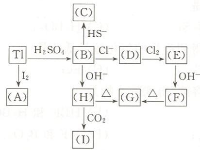

# 例13.6 给出各方框中字母所代表的物质，并写出有关化学反应方程式。

根据铊及其化合物的转化关系图，推断各字母代表的物质。

---

## 答案

**(A)**—TlI；**(B)**—$\mathrm{Tl}_{2}\mathrm{SO}_{4}$；**(C)**—$\mathrm{Tl}_{2}\mathrm{S}$；**(D)**—$\mathrm{TlCl}$；**(E)**—$\mathrm{TlCl}_{3}$；**(F)**—$\mathrm{Tl}_{2}\mathrm{O}_{3}$；**(G)**—$\mathrm{Tl}_{2}\mathrm{O}$；**(H)**—$\mathrm{TlOH}$；**(I)**—$\mathrm{Tl}_{2}\mathrm{CO}_{3}$。

反应方程式：

$$\mathrm{Tl}\longrightarrow (\mathrm{A}):\quad 2\mathrm{Tl} + \mathrm{I}_2 = 2\mathrm{TlI}$$

$$\mathrm{Tl}\longrightarrow (\mathrm{B}):\quad 2\mathrm{Tl} + \mathrm{H}_2\mathrm{SO}_4 = \mathrm{Tl}_2\mathrm{SO}_4 + \mathrm{H}_2\uparrow$$

$$(\mathrm{B}) \longrightarrow (\mathrm{C}):\quad \mathrm{Tl_2SO_4 + HS^- = Tl_2S\downarrow + HSO_4^-}$$

$$(\mathrm{B}) \longrightarrow (\mathrm{D}):\quad \mathrm{Tl_2SO_4 + 2Cl^- = 2TlCl\downarrow + SO_4^{2-}}$$

$$(\mathrm{D}) \longrightarrow (\mathrm{E}):\quad \mathrm{TlCl + Cl_2 = TlCl_3}$$

$$(\mathrm{E}) \longrightarrow (\mathrm{F}):\quad 2\mathrm{TlCl}_3 + 6\mathrm{OH}^- = \mathrm{Tl}_2\mathrm{O}_3\downarrow +6\mathrm{Cl}^- +3\mathrm{H}_2\mathrm{O}$$

$$(\mathrm{B}) \longrightarrow (\mathrm{H}):\quad \mathrm{Tl_2SO_4 + 2OH^- = 2TlOH + SO_4^{2-}}$$

$$(\mathrm{H}) \longrightarrow (\mathrm{G}):\quad 2\mathrm{TlOH}\stackrel{\triangle}{=} \mathrm{Tl}_2\mathrm{O} + \mathrm{H}_2\mathrm{O}$$

$$(\mathrm{F})\rightarrow(\mathrm{G}):\quad \mathrm{Tl_2O_3}\stackrel{\triangle}{=}\mathrm{Tl_2O+O_2}\uparrow$$

$$(\mathrm{H})\rightarrow(\mathrm{I}):\quad 2\mathrm{TlOH+CO_2= Tl_2CO_3}\downarrow+\mathrm{H_2O}$$