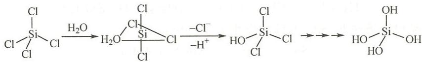

# 例14.6 简要回答下列各题。

**(1)** 为什么 Si 很难与酸作用，即使是与氧化性很强的酸也难作用，但却与碱发生反应？

**(2)** 为什么 $\mathrm{CCl}_{4}$ 遇水不发生水解，而 $\mathrm{BCl}_{3}$ 和 $\mathrm{SiCl}_{4}$ 却剧烈水解？

---

## 答案

**(1)** 单质硅具有较强的非金属性，所以硅不易与酸反应。氧化性的酸如 $\mathrm{HNO}_{3}$ 可以将 Si 氧化成 $\mathrm{SiO}_{2}$：

$$3 \mathrm{Si} + 4 \mathrm{HNO}_{3}(\text{浓}) = 3 \mathrm{SiO}_{2} + 4 \mathrm{NO} \uparrow + 2 \mathrm{H}_{2}\mathrm{O}$$

但是生成物 $\mathrm{SiO}_{2}$ 不溶于水，附在反应物 Si 的表面，使反应不能进行下去。

在加热条件下 Si 可与氢氟酸反应：

$$\mathrm{Si} + 4 \mathrm{HF} = \mathrm{SiF}_{4} \uparrow + 2 \mathrm{H}_{2} \uparrow$$

其原因是产物 $\mathrm{SiF}_{4}$ 挥发脱离体系，使反应进行彻底。

硅易与碱反应：

$$\mathrm{Si} + 2 \mathrm{NaOH} + \mathrm{H}_{2}\mathrm{O} = \mathrm{Na}_{2}\mathrm{SiO}_{3} + 2 \mathrm{H}_{2} \uparrow$$

这体现了硅的非金属性，而且产物为可溶性的 $\mathrm{Na}_{2}\mathrm{SiO}_{3}$，反应较为容易进行。

**(2)** $\mathrm{CCl}_{4}$ 分子中的 C 原子没有空的价层轨道，加之 C—Cl 键较强而难以解离，所以 $\mathrm{CCl}_{4}$ 不水解。

$\mathrm{BCl}_{3}$ 分子中的硼原子虽然没有 3d 价层轨道，但由于硼的缺电子特点，有空的 2p 轨道可接受 $\mathrm{H}_{2}\mathrm{O}$ 分子中 O 原子的电子对配位：

$$\mathrm{BCl}_{3} + 3 \mathrm{H}_{2}\mathrm{O} = \mathrm{B(OH)}_{3} + 3 \mathrm{HCl}$$

$\mathrm{SiCl}_{4}$ 分子中的 Si（$\mathrm{sp}^{3}$ 杂化）有空的 3d 价层轨道，可形成 $\mathrm{sp}^{3}\mathrm{d}$ 杂化而接受 $\mathrm{H}_{2}\mathrm{O}$ 中 O 的电子对配位：

$$\mathrm{SiCl}_{4} + 4 \mathrm{H}_{2}\mathrm{O} = \mathrm{H}_{4}\mathrm{SiO}_{4} \downarrow + 4 \mathrm{HCl}$$

水解过程可描述为：

