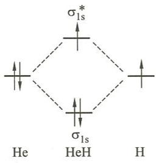
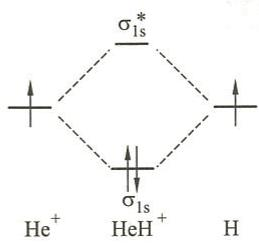
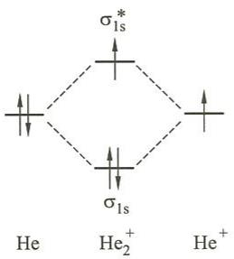
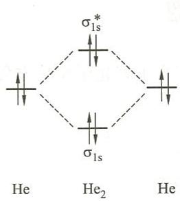

# 例18.2 分子轨道理论讨论存在可能性

## 题目

从分子轨道理论出发讨论下列分子和离子存在的可能性。

(1) HeH；(2) $\mathrm{HeH^+}$；(3) $\mathrm{He_2^+}$；(4) $\mathrm{He_2}$。

## 解答

HeH、$\mathrm{HeH^+}$、$\mathrm{He_2^+}$ 和 $\mathrm{He_2}$ 的分子轨道能级图见下图：

(a)

(c)

(b)

(d)

它们存在的可能性由键级大小决定。

**(1)** HeH 键级为 $\frac{1}{2}$，He与H之间的键较弱，但键级不为0，因此HeH有存在的可能性。

**(2)** $\mathrm{HeH^+}$ 键级为1，He与H之间形成共价单键，因此 $\mathrm{HeH^+}$ 有存在的可能性。

**(3)** $\mathrm{He_2^+}$ 键级为 $\frac{1}{2}$，共价键较弱，但键级不为0，因此 $\mathrm{He_2^+}$ 有存在的可能性。

**(4)** $\mathrm{He_2}$ 键级为0，He与He之间不存在共价键，因此 $\mathrm{He_2}$ 没有存在的可能性。