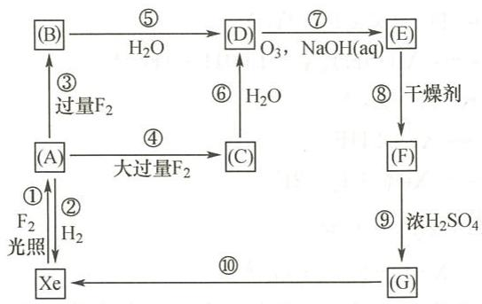

---
title: "例18.3-Xe化合物推断与反应方程式"
type: 题目
exam_stage: 决赛
subject: 无机和结构化学
difficulty: 4
teaching_level: 拓展
knowledge_points: ["[[XeF2]]", "[[氢和稀有气体]]", "[[XeO3]]", "[[XeO4]]", "[[稀有气体化合物]]", "[[推断题]]"]
tags: [化竞, 教材习题, 无机化学例题与习题]
updated: 2026-07-09
source: 《无机化学 例题与习题》第4版
module: 元素化学
status: 已填充
---
# 例18.3 Xe化合物推断与反应方程式

## 题目

给出方框中(A)-(G)所代表物质的化学式，并写出过程①-⑩的化学反应方程式。

## 解答

| 代号 | 物质 |
|:---:|:---|
| (A) | $\mathrm{XeF_2}$ |
| (B) | $\mathrm{XeF_4}$ |
| (C) | $\mathrm{XeF_6}$ |
| (D) | $\mathrm{XeO_3}$ |
| (E) | $\mathrm{Na_4XeO_6 \cdot 8H_2O}$ |
| (F) | $\mathrm{Na_4XeO_6}$ |
| (G) | $\mathrm{XeO_4}$ |

### 反应方程式

| 编号 | 方程式 |
|:---:|:---|
| ① | $\mathrm{Xe + F_2 \xrightarrow{光照} XeF_2}$ |
| ② | $\mathrm{XeF_2 + H_2 \xrightarrow{400°C} Xe + 2HF}$ |
| ③ | $\mathrm{XeF_2 + F_2(过量) = XeF_4}$ |
| ④ | $\mathrm{XeF_2 + 2F_2(大过量) \xlongequal{\triangle} XeF_6}$ |
| ⑤ | $\mathrm{6XeF_4 + 12H_2O = 2XeO_3 + 4Xe\uparrow + 24HF + 3O_2\uparrow}$ |
| ⑥ | $\mathrm{XeF_6 + 3H_2O = XeO_3 + 6HF}$ |
| ⑦ | $\mathrm{XeO_3 + 4NaOH + O_3 + 6H_2O = Na_4XeO_6\cdot 8H_2O + O_2}$ |
| ⑧ | $\mathrm{Na_4XeO_6\cdot 8H_2O \xrightarrow{干燥剂} Na_4XeO_6 + 8H_2O}$ |
| ⑨ | $\mathrm{Na_4XeO_6 + 2H_2SO_4(浓) = XeO_4 + 2Na_2SO_4 + 2H_2O}$ |
| ⑩ | $\mathrm{XeO_4 = Xe\uparrow + 2O_2\uparrow}$ |