# 第 34 届中国化学奥林匹克（决赛）试题-1 评分标准

(2020年11月16日，杭州)

第1题（14分）

具有 $\mathrm{R}_{2} \mathrm{C}$ : 形式的有机中间体称为卡宾, M. Driess 等报道了基于咕吨骨架的双 X 卡宾 1 和 $\mathbf{Y}_{4}$ 进行反应, 首次分离得到双 X 卡宾稳定的零价 $\mathbf{Y}_{2}$ 加合物 2。单晶 X 射线衍射实验测定显示, 2 中 Y-Y 键长为 $223.69 \mathrm{pm}$ , 两个 X-Y 键长分别为 $213.07 \mathrm{pm}$ 和 $212.63 \mathrm{pm}$ , C-O-C 键角为 $121.1^{\circ}$ 。已知某些原子的共价单键半径 (pm) 为: B, 82; C, 77; N, 75; O, 73; F, 72; Al, 118; Si, 117; P, 106; S, 102; Cl, 99。

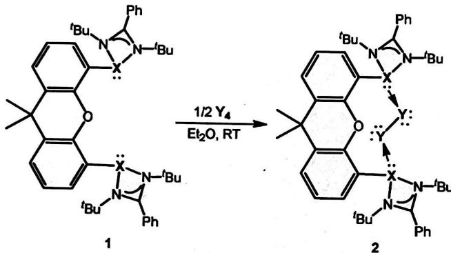

1-1 工业上利用直接还原的方法将 Y 矿中的 Y 元素转化为单质 $Y_{4}$ 。写出 X 和 Y 元素并画出 $Y_{4}$ 的几何构型，描述 $Y_{4}$ 中的 Y-Y 化学键形状。

1-2 研究发现， $\mathrm{Li}_{3} \mathrm{~N}$ 和 $\mathrm{Y}_{2} \mathrm{~S}_{5}$ 按摩尔比 3:2 混合球磨反应 $1 \mathrm{~h}$ ，产生 $\mathrm{Li}_{2} \mathrm{~S}$ 、红色 $\mathrm{Y}$ 、氮气、化合物 $\mathbf{A}$ ；进一步球磨， $\mathbf{A}$ 与 $\mathrm{Li}_{2} \mathrm{~S}$ 反应产生 $\mathbf{B}$ 和红色 $\mathrm{Y}$ 。 $\mathbf{A}$ 和 $\mathbf{B}$ 可用于全固态锂离子可充电电池材料。 $\mathbf{A}$ 中阴离子含有 $\mathrm{Y}-\mathrm{Y}$ 键， $\mathbf{A}$ 中 $\mathrm{Y}$ 含量为 $21.95 \%$ ； $\mathbf{B}$ 中 $\mathrm{Y}$ 的含量为 $17.20 \%$ ， $\mathbf{B}$ 中阴离子具有四面体结构。推断 $\mathbf{A}$ 和 $\mathbf{B}$ 的化学式。

1-3 写出化合物 2 中 O 和 X 的杂化轨道。

1-4 化合物 2 与 N-杂环卡宾作用产生化合物 3，化合物 3 进一步与 $\left[\mathrm{PhC}\left(\mathrm{N}^{\mathrm{t}}\mathrm{Bu}\right)_{2}\right]\mathrm{GeCl}$ 作用生成化合物 C 和含 Ge 的 D；C 和 D 含 Y 的质量百分数分别为 $3.90\%$ 和 $6.74\%$ ，D 中 Ge 的配位数为 3。写出 C 和 D 的结构。

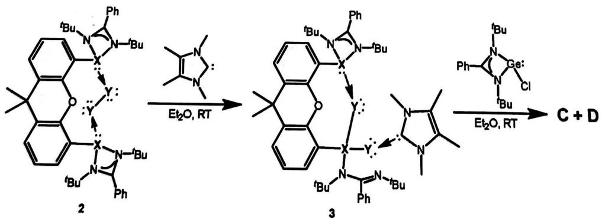

## 第1题（14分）

<table><tr><td colspan="3">1-1(4分)X=Si,Y=P。(各1分,共2分)四面体(1分),弯键(1分)</td></tr><tr><td colspan="3">1-2(4分)A:Li4P2S6;B:Li3PS4A的推断:因为Y=P,从题知:Li3N+P4S10→Li2S+P+N2+A(LiPS),可以判断A和B均为硫磷化锂的化合物。A中有P-P键至少有2个P,A中含有P 21.95%,那么A的式量为282.2,若含有1个Li,则含有S=(282.2-2×30.97-6.94)/32.07=6.65;若含有2个Li,则含有S=6.44;若含有3个Li,则含有S=6.22;若含有4个Li,则含有S=6.00;所以A为Li4P2S6。(2分)28Li3N+9P4S10→14N2+12Li4P2S6+12P+18Li2SB的推断:Li4P2S6+Li2S→P+B(Li3S3P2),B中阴离子具有四面体结构,阴离子由P和S构成,可以表达为PS4,所以可以认为B是Li3PS4,与已知条件B中Y含量为17.20%一致。【从A含P 21.95%,B含磷17.20%看出,B中P含量减少,可假定B中一个P进行计算,得到式量为180.1,容易推出Li3PS4。】(2分)5Li4P2S6+2Li2S→8Li3PS4+2P</td></tr><tr><td colspan="3">1-3(2分)O:sp2杂化(1分);X(Si)为sp3杂化(1分)</td></tr><tr><td colspan="3">1-4(4分)</td></tr><tr><td colspan="2">C</td><td>D</td></tr><tr><td colspan="2">(2分)</td><td>(2分)</td></tr></table>

第2题（12分）
二氧化碳是造成温室效应的主要物质。随着化石燃料的燃烧以及森林的破坏，大气层中和海水中溶解的 $CO_{2}$ 浓度持续增加。研究发现，海洋中 pH 已从工业化前的 8.16 降至目前的 8.04。科学家预言，如果再不引起重视，到 2100 年海洋中 pH 将降至 7.7 左右，这将导致海洋中某些浮游生物和珊瑚等的严重破坏。为了检测深海中的 $CO_{2}$ 浓度，设计了一种基于光学监测的 $CO_{2}$ 传感器，结构示意图如下：

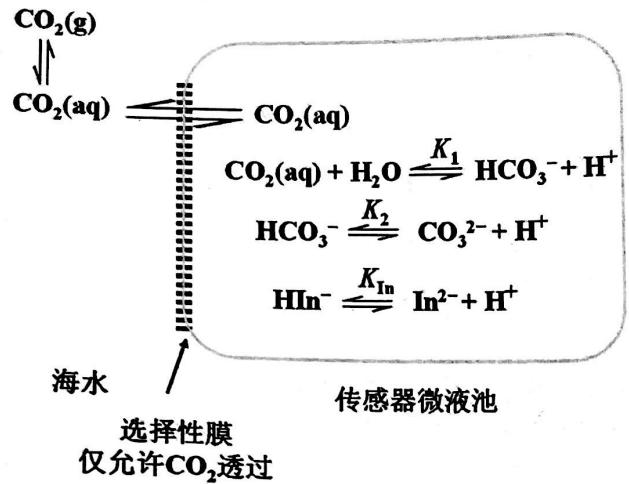

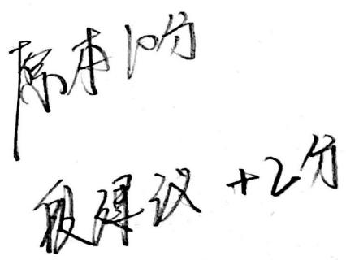

该传感器的微液池内含 $50.0 \mu mol \cdot L^{-1}$ 的溴百里酚蓝（用 NaHIn 表示）和 $42.0 \mu mol \cdot L^{-1}$ 的 NaOH 溶液。海水中溶解的 $CO_{2}$ 透过选择性膜进入传感器微池（其他物质均不能透过），达到相应酸碱解离平衡。指示剂的 HIn⁻ 形式和 In²⁻ 形式分别在 434 nm 和 620 nm 处有最大吸收， $H_{2}In$ 形式在中性至碱性条件下，浓度忽略不计。通过测定 620 nm 和 434 nm 的吸光度比值 $R_{A}=A_{620}/A_{434}$ ，可检测海水中溶解的 $CO_{2}$ 浓度（即平衡浓度 $[CO_{2}(aq)]$ ）。

已知 $\mathrm{HIn}^{-}$ 和 $\mathrm{In}^{2-}$ 在最大吸收波长处的摩尔吸光系数如下:

$$
\begin{array}{l} \varepsilon_ {4 3 4} ^ {\mathrm{HIn} ^ {-}} = 8. 0 0 \times 1 0 ^ {3} \mathrm{mol} \cdot \mathrm{L} ^ {- 1} \cdot \mathrm{cm} ^ {- 1}; \quad \varepsilon_ {6 2 0} ^ {\mathrm{HIn} ^ {-}} = 0; \\ \varepsilon_ {4 3 4} ^ {\mathrm{In} ^ {2 -}} = 1. 9 0 \times 1 0 ^ {3} \mathrm{mol} \cdot \mathrm{L} ^ {- 1} \cdot \mathrm{cm} ^ {- 1}; \quad \varepsilon_ {6 2 0} ^ {\mathrm{In} ^ {2 -}} = 1. 7 0 \times 1 0 ^ {4} \mathrm{mol} \cdot \mathrm{L} ^ {- 1} \cdot \mathrm{cm} ^ {- 1} \\ K _ {1} = 3. 0 \times 1 0 ^ {- 7}; \quad K _ {2} = 3. 0 \times 1 0 ^ {- 1 1}; \quad K _ {\mathrm{In}} = 2. 0 \times 1 0 ^ {- 7}; \quad K _ {\mathrm{w}} = 6. 7 \times 1 0 ^ {- 1 5} \end{array}
$$

实验测得 $R_{A}=2.84$ 。

2-1 计算传感器微池内溶液的 $\mathrm{pH}$ 。

2-2 写出传感器微池内溶液的电荷平衡方程式。

2-3 计算海水中溶解的 $\mathrm{CO}_{2}$ 平衡浓度。

第2题（12分）

$$
\begin{array}{l} \text {2 - 1 (5 分)} \\ c _ {\mathrm{In}} = [ \mathrm{H} _ {2} \mathrm{In} ] + [ \mathrm{HIn} ^ {-} ] + [ \mathrm{In} ^ {2 -} ] \approx [ \mathrm{HIn} ^ {-} ] + [ \mathrm{In} ^ {2 -} ] = 5 0. 0 (\mu \mathrm{mol} \cdot \mathrm{L} ^ {- 1}) \\ c (\mathrm{Na} ^ {+}) = [ \mathrm{Na} ^ {+} ] = 4 2. 0 + 5 0. 0 = 9 2. 0 (\mu \mathrm{mol} \cdot \mathrm{L} ^ {- 1}) \\ A _ {6 2 0} = \varepsilon_ {6 2 0} ^ {\mathrm{In} ^ {2 -}} b [ \mathrm{In} ^ {2 -} ] = 1. 7 0 \times 1 0 ^ {4} \times b \times [ \mathrm{In} ^ {2 -} ] \\ A _ {4 3 4} = \varepsilon_ {4 3 4} ^ {\mathrm{HIn} ^ {-}} b [ \mathrm{HIn} ^ {-} ] + \varepsilon_ {4 3 4} ^ {\mathrm{In} ^ {2 -}} b [ \mathrm{In} ^ {2 -} ] = 8. 0 0 \times 1 0 ^ {3} \times b \times [ \mathrm{HIn} ^ {-} ] + 1. 9 0 \times 1 0 ^ {3} \times b \times [ \mathrm{In} ^ {2 -} ] \\ (\text {公式0.5分，结果0.5分}) \\ R _ {\mathrm{A}} = A _ {6 2 0} / A _ {4 3 4} = 2. 8 4 \end{array}
$$

<table><tr><td> $\frac{[In^{2-}]}{[HIn^{-}]} = 1.96$ (或者 $\frac{[HIn^{-}]}{[In^{2-}]} = 0.511$ )</td><td>(1分)</td></tr><tr><td>pH = p $K_{\ln}$  + lg $\frac{[In^{2-}]}{[HIn^{-}]}$  = -lg( $2.0 \times 10^{-7}$ )+lg $1.96$ =6.99</td><td>(公式1分,结果0.5分)</td></tr><tr><td> $[H^{+}] = 1.0 \times 10^{-7}$ (mol·L−1)</td><td>(0.5分)</td></tr><tr><td>2-2(2分)溶液中电荷平衡方程式为: $[Na^{+}] + [H^{+}] = [HCO_{3}^{-}] + 2[CO_{3}^{2-}] + [HIn^{-}] + 2[In^{2-}] + [OH^{-}]$ </td><td>(2分)</td></tr><tr><td>2-3(5分) $[HIn^{-}] = \delta_{HIn^{-}} \cdot c_{In} = \frac{[H^{+}]}{[H^{+}] + K_{In}} \times c_{In} = \frac{1.0 \times 10^{-7}}{1.0 \times 10^{-7} + 2.0 \times 10^{-7}} \times 50.0 = 17$ (μmol·L−1)</td><td rowspan="3">(各0.5分)</td></tr><tr><td> $[In^{2-}] = \delta_{In^{2-}} \cdot c_{In} = \frac{K_{In}}{[H^{+}] + K_{In}} \times c_{In} = \frac{2.0 \times 10^{-7}}{1.0 \times 10^{-7} + 2.0 \times 10^{-7}} \times 50.0 = 33$ (μmol·L−1)</td></tr><tr><td> $[HCO_{3}^{-}] = \frac{K_{1}[CO_{2}(aq)]}{[H^{+}]} = \frac{3.0 \times 10^{-7} \times [CO_{2}(aq)]}{1.0 \times 10^{-7}} = 3.0 \times [CO_{2}(aq)]$ (mol·L−1)</td></tr><tr><td> $[CO_{3}^{2-}] = \frac{K_{1}K_{2}[CO_{2}(aq)]}{[H^{+}]^{2}} = \frac{3.0 \times 10^{-7} \times 3.3 \times 10^{-11} \times [CO_{2}(aq)]}{(1.0 \times 10^{-7})^{2}} = 9.9 \times 10^{-4} [CO_{2}(aq)]$ (mol·L−1)</td><td>(两式各1分,共2分)</td></tr><tr><td> $[OH^{-}] = \frac{K_{w}}{[H^{+}]} = \frac{6.7 \times 10^{-15}}{1.0 \times 10^{-7}} = 6.7 \times 10^{-8}$ (mol·L−1)</td><td>(0.5分)</td></tr><tr><td>将以上各式代入电荷平衡方程式可得: $92.0 \times 10^{-6} + 1.0 \times 10^{-7} = 3.0 \times [CO_{2}(aq)] + 2 \times 9.9 \times 10^{-4} [CO_{2}(aq)] + 17 \times 10^{-6} + 2 \times 33 \times 10^{-6} + 6.7 \times 10^{-8}$  $[CO_{2}(aq)] = 9.0 \times 10^{-6}/3.0 = 3.0 \times 10^{-6}$ (mol·L−1)</td><td>(0.5分)(1分)</td></tr></table>

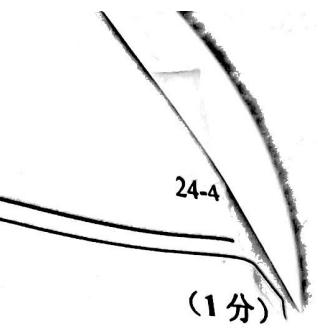

近似,需说明过程及近似方式.

## 第3题（13分）

双氧阴离子指超氧离子和过氧离子等。含有超氧离子的化合物是氧分子的单电子还原产物，广泛存在于自然界中，例如超氧化物歧化酶存在于生物体内，是活性氧清除系统中第一个发挥作用的抗氧化酶；又例如碱金属(M)-O₂电池具有长的循环寿命和超高能量密度，但放电过程会形成碱金属超氧化物，如何调控 MO₂ 的稳定性保证氧气还原反应在固态催化剂表面持续高效进行是 M-O₂ 电池的一项重大挑战。
3-1 利用分子轨道理论写出单线态 O₂ 和三线态 O₂ 的电子排布；写出 O₂ 激发态的电子排布；比较单线态与三线态 O₂ 的能量高低。
3-2 下列三个图 A、B、C 是 Na 或 K 的超氧化合物的晶体结构示意图（大球表示金属原子，小球表示氧原子），写出每个晶体结构的结构基元和点阵。已知 NaO₂ 属于立方晶系，KO₂ 属于四方晶系。

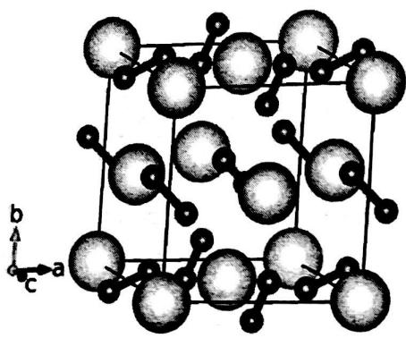  
A

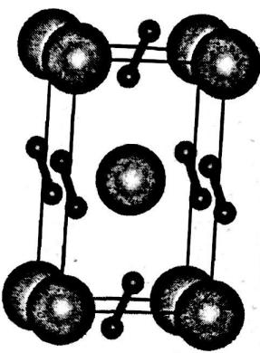  
B

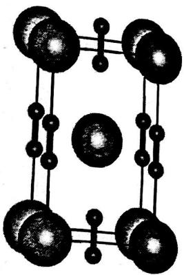  
C

3-3 下图是 $LiO_{2}$ 的晶体结构, 属正交晶系, 晶体的密度为 $2.217 \, g \cdot cm^{-3}$ 。已知晶胞参数 b > a > c, 且 a、c 晶胞参数小于 420 pm; $Li-O_{2}$ 距离有 2 种: 252 pm 和 239 pm。求 $LiO_{2}$ 晶体结构的正当晶胞参数。

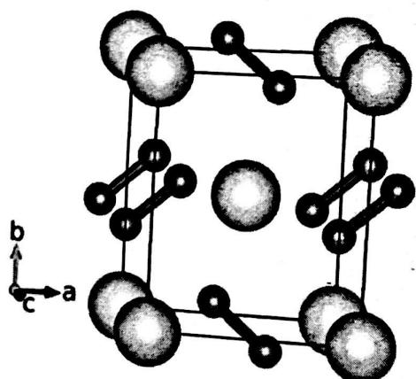

3-4 Cs 的过氧和/或超氧化合物的晶体结构如下图，在一定温度或压力作用下电荷无序（charge-disordered）的立方相（只有一种 O-O 键长）可以转变为电荷有序（charge ordered）的四方相（存在二种 O-O 键长：分别用实线与虚线表示）。图 A 的立方相中的双氧阴离子 $O_{2}^{n-}$ 有三种取向（对称性等价），分别平行于晶轴（半黑球表示铯原子，灰球表示氧原子）；图 B 四方相中的 $O_{2}^{-}$ 、 $O_{2}^{2-}$ 有序排列，除顶点以及四个面上各有一个 $O_{2}^{n-}$ 外其它所有原子都在正当晶胞内（白圈表示铯原子，其它球表示氧原子）。

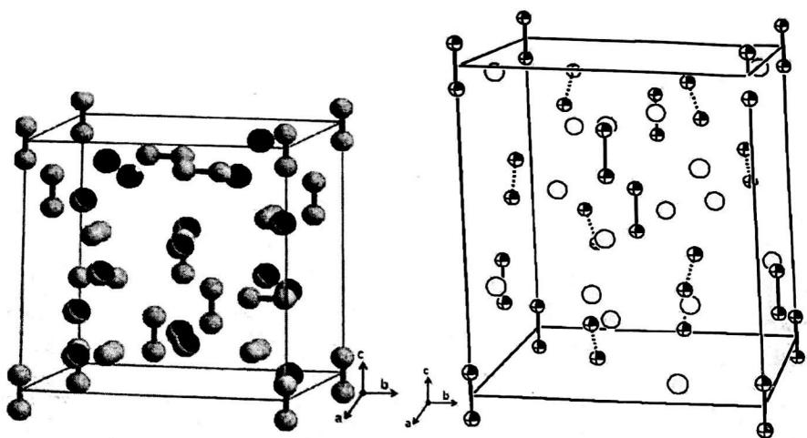  
图A  
图B

3-4-1 写出四方相能表示出超氧和过氧特点的化学式；写出立方相晶体结构中双氧负离子的氧化数。

3-4-2 指出四方相中平行于 $c$ 轴的 $\mathrm{O}_2^{n-}$ 是 $\mathrm{O}_2^-$ 还是 $\mathrm{O}_2^{2-}$ ?

第3题（13分）

<table><tr><td colspan="5">3-1(2分)</td></tr><tr><td>单线态O2电子排布</td><td>三线态O2电子排布</td><td colspan="3">O2-激发态</td></tr><tr><td>——6σ-↓↑- ——2π-↓↑- -↓↑- 1π-↓↑-5σ-↓↑-4σ-↓↑-3σ-↓↑-2σ-↓↑-1σ</td><td>——6σ-↑- -↑-2π-↓↑- -↓↑- 1π-↓↑-5σ-↓↑-4σ-↓↑-3σ-↓↑-2σ-↓↑-1σ</td><td>-↑-6σ-↓↑- ——2π-↓↑- -↓↑- 1π-↓↑-5σ-↓↑-4σ-↓↑-3σ-↓↑-2σ-↓↑-1σ</td><td>-↑-6σ-↑- -↑-2π-↓↑- -↓↑- 1π-↓↑-5σ-↓↑-4σ-↓↑-3σ-↓↑-2σ-↓↑-1σ</td><td>-↑-6σ-↑- -↓-2π-↓↑- -↓↑- 1π-↓↑-5σ-↓↑-4σ-↓↑-3σ-↓↑-2σ-↓↑-1σ</td></tr><tr><td colspan="5">画任一种都得分。</td></tr><tr><td colspan="5">单线态氧比三线态氧能量高。</td></tr><tr><td colspan="5">每问0.5分,总分2分。</td></tr><tr><td colspan="5">3-2(3分)</td></tr><tr><td>晶体结构</td><td>(A)NaO2</td><td>(B)KO2</td><td colspan="2">(C)KO2</td></tr><tr><td>结构基元</td><td>4个NaO2</td><td>2个KO2</td><td colspan="2">1个KO2</td></tr><tr><td>点阵</td><td>简单立方</td><td>简单四方</td><td colspan="2">体心四方</td></tr><tr><td colspan="5">每个0.5分,共3分</td></tr><tr><td colspan="5">3-3(4分)ρ=2×MLiO2/a×b×c×Na=2.217g·cm-3,2.217=2×38.94a×b×c×6.02×1023×10-24</td></tr><tr><td colspan="5">得 $a \times b \times c = 58.35$  Å3=  $5.835 \times 10^{7}$  pm3依据题目信息,Li与O2-的距离有二种:(1)如果沿b轴方向Li-O2-=252 pm,则b=504 pm, $a \times c = 115800$  pm2 1 $(a/2)^{2} + (c/2)^{2} = 239^{2}$  2联合1式和2式,无合理解。</td></tr><tr><td colspan="5">(2)如果沿b轴方向Li-O2-=239 pm,则b=478 pm, $a \times c = 122010$  pm2 3 $(a/2)^{2} + (c/2)^{2} = 252^{2}$  4 (1分)联合3和4式解得合理的c=402.8 pm和302.9 pm,相应的a=302.9 pm和402.8 pm,依据题目要求b&gt;a&gt;c,所以b=478 pm,a=402.8 pm,c=302.9 pm。(2分)</td></tr><tr><td colspan="5">结论:晶胞参数为a=403 pm,b=478 pm,c=303 pm。</td></tr><tr><td colspan="5">3-4(4分)</td></tr><tr><td colspan="5">3-4-1(3分) $Cs_{4}(O_{2}^{-})_{2}(O_{2}^{2-})$ (2分)双氧负离子的氧化数为-4/3(1分)</td></tr><tr><td colspan="5">3-4-2(1分)过氧O22-(1分)</td></tr></table>

## 第 4 题（8 分）

铝粉可作为制备火箭推进剂和炸药等的高能组分，不同尺度的铝粉在不同环境中的氧化、点火和燃烧等研究备受关注。在 100 kPa 下，Al、 $Al_{2}O_{3}$ 的熔点分别为 933 K 和 2327 K，熔化焓分别为 10.71 kJ·mol $^{-1}$ 和 111.4 kJ·mol $^{-1}$ ，沸点分别为 2790 K 和 3253 K，Al 的气化焓为 294.0 kJ·mol $^{-1}$ ，AlN 易升华。下表中给出有关物质在 298.15 K 的标准摩尔生成焓、标准摩尔熵，以及指定温区内的平均热容。

<table><tr><td>物质</td><td> $\Delta_{\text{f}}H_{\text{m}}^{\ominus}/(\text{kJ}\cdot\text{mol}^{-1})$ </td><td> $S_{\text{m}}^{\ominus}/(\text{J}\cdot\text{K}^{-1}\cdot\text{mol}^{-1})$ </td><td> $\overline{C}_{\text{p},\text{m}}^{\ominus}/(\text{J}\cdot\text{K}^{-1}\cdot\text{mol}^{-1})$ </td></tr><tr><td>Al(g)</td><td>329.70</td><td>164.55</td><td>20.77 (2790 ~ 6000 K)</td></tr><tr><td>Al(l)</td><td>10.56</td><td>39.55</td><td>31.75 (933 ~ 2790 K)</td></tr><tr><td>Al(s)</td><td>0</td><td>28.30</td><td>28.07 (298 ~ 933 K)</td></tr><tr><td> $Al_{2}O_{3}(l)$ </td><td>-1620.57</td><td>67.24</td><td>192.46 (2327 ~ 3253 K)</td></tr><tr><td> $Al_{2}O_{3}(s)$ </td><td>-1675.7</td><td>50.92</td><td>130.08 (298 ~ 2327 K)</td></tr><tr><td>AlN(g)</td><td>523.00</td><td>228.50</td><td>37.76 (298 ~ 6000 K)</td></tr><tr><td>AlN(s)</td><td>-317.98</td><td>20.14</td><td>43.52 (298 ~ 900 K)</td></tr><tr><td> $O_{2}(g)$ </td><td>0</td><td>205.20</td><td>36.77</td></tr><tr><td> $N_{2}(g)$ </td><td>0</td><td>191.6</td><td>34.91</td></tr></table>

4-1 计算 $3000 \mathrm{~K}$ 下 $\mathrm{Al}(\mathrm{g})$ 的标准摩尔熵。

4-2 在 298.15 K 和 100 kPa 下，将超细铝粉与空气（设空气中氧气和氮气的摩尔分数分别为 0.200 和 0.800）混合后装入特定装置中进行点火燃烧试验，火焰温度可超过 2500 K。收集燃烧试验中全部组分，冷却至室温，测得固体中各组分（忽略其他组成形式）的质量分数为：Al, 0.100; Al₂O₃, 0.700; AlN, 0.200。若燃烧试验中氧气刚好耗尽，求体系可能达到的最高温度。

4-3 关于从普通铝粉（b-Al）转变为纳米铝粉（n-Al）的过程及它们的有关性质，正确的是：
A. $\Delta H < 0;$ B. $\Delta S > 0;$ C. $\Delta G < 0;$ D. 熔点：n-Al < b-Al;
E. 燃烧焓：n-Al > b-Al

第 4 题（8 分）

$$
\begin{array}{r l} & {\mathrm{4-1(2分)}} \\ & {S _ {\mathrm{m}} ^ {\circ} (3 0 0 0 \mathrm{K}) = S _ {\mathrm{m}} ^ {\circ} (2 9 8. 1 5 \mathrm{K}) + \overline {{{C}}} _ {\mathrm{p}, \mathrm{m}} ^ {\circ} (\mathrm{s}) \ln \frac {T _ {\mathrm{f}}}{2 9 8 . 1 5} + \frac {\Delta_ {\mathrm{fus}} H _ {\mathrm{m}} ^ {\circ}}{T _ {\mathrm{f}}} + \overline {{{C}}} _ {\mathrm{p}, \mathrm{m}} ^ {\circ} (1) \ln \frac {T _ {\mathrm{b}}}{T _ {\mathrm{f}}} + \frac {\Delta_ {\mathrm{vap}} H _ {\mathrm{m}} ^ {\circ}}{T _ {\mathrm{b}}} + \overline {{{C}}} _ {\mathrm{p}, \mathrm{m}} ^ {\circ} (\mathrm{g}) \ln \frac {3 0 0 0}{T _ {\mathrm{b}}}} \\ & {\qquad = 2 8. 3 0 + 2 8. 0 7 \ln \frac {9 3 3}{2 9 8 . 1 5} + \frac {1 0 . 7 1 \times 1 0 0 0}{9 3 3} + 3 1. 7 5 \ln \frac {2 7 9 0}{9 3 3} + \frac {2 9 4 . 0 \times 1 0 0 0}{2 7 9 0} + 2 0. 7 7 \ln \frac {3 0 0 0}{2 7 9 0}} \\ & {\qquad = 2 1 3. 5 (\mathrm{J} \cdot \mathrm{K} ^ {- 1} \cdot \mathrm{mol} ^ {- 1})} \\ & {\qquad \qquad \qquad \qquad \qquad \qquad \qquad \qquad \qquad \qquad \qquad \qquad \qquad (2 \text {分}} \end{array}
$$

$$
\mathrm{Al} (\mathrm{s}) + \frac {3}{4} \mathrm{O} _ {2} (\mathrm{g}) \rightarrow \frac {1}{2} \mathrm{Al} _ {2} \mathrm{O} _ {3} (\mathrm{s})
$$

$$
\mathrm{Al} (\mathrm{s}) + \frac {1}{2} \mathrm{N} _ {2} (\mathrm{g}) \rightarrow \mathrm{AlN} (\mathrm{s})
$$

$$
\begin{array}{l} \mathrm{Al}, 0. 1 0 0; \mathrm{Al} _ {2} \mathrm{O} _ {3}, 0. 7 0 0; \mathrm{AlN}, 0. 2 0 0 \\ \mathrm{O} _ {3}, 7 0. 0 0 / 1 0 1. 9 6 = 0. 6 \% \end{array}
$$

Al粉： $0.371 + 0.686 \times 2 + 0.488 = 2.231 \mathrm{~mol}$

$$
\mathrm{N} _ {2}: 1. 0 2 9 \times 4 = 4. 1 1 6 \mathrm{mol}
$$

剩余 $\mathrm{N}_{2}$ : 4.116-0.244 = 3.872 mol

$$
\begin{array}{l l} \mathrm {O_ {2}}: & 0. 6 8 6 \times 2 \times 3 / 4 = 1. 0 2 9 \mathrm{mol} \\ \mathrm {N_ {2}}: & 0. 2 4 4 \mathrm{mol} \end{array}
$$

如果最高温度 $T > 2790 \mathrm{~K}$ , 状态为: $\mathrm{Al(g)}$ 、 $\mathrm{Al_2O_3(l)}$ 和 $\mathrm{AlN(g)}$

$$
2 3 2 7 \mathrm{K} <   T <   2 7 9 0 \mathrm{K},\tag{1分}
$$

$$
\mathrm{Al} _ {2} \mathrm{O} _ {3} (\mathrm{l})
$$

按最高温度 $T > 2790\mathrm{K}$ 计算：

$$
\mathrm{Al} (\mathrm{s}) + \frac {3}{4} \mathrm{O} _ {2} (\mathrm{g}) \rightarrow \frac {1}{2} \mathrm{Al} _ {2} \mathrm{O} _ {3} (\mathrm{s}) \quad \Delta_ {\mathrm{r}} H _ {\mathrm{m}} ^ {\oplus} (2 9 8. 1 5 \mathrm{K}) = - 1 6 7 5. 7 / 2 \mathrm{kJ} \cdot \mathrm{mol} ^ {- 1}
$$

$$
\mathrm{Al} (\mathrm{s}) + \frac {1}{2} \mathrm{N} _ {2} (\mathrm{g}) \rightarrow \mathrm{AlN(g)}
$$

$$
\Delta_ {\mathrm{r}} H _ {\mathrm{m}} ^ {\ominus} (2 9 8. 1 5 \mathrm{K}) = 5 2 3. 0 0 \mathrm{kJ} \cdot \mathrm{mol} ^ {- 1}
$$

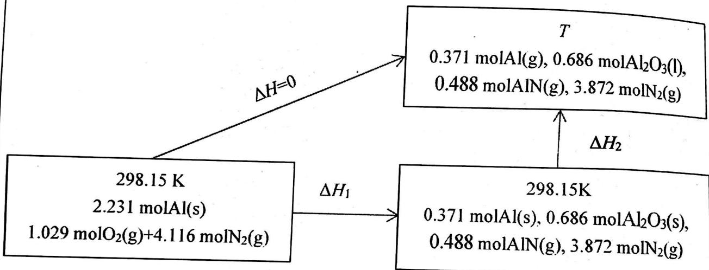

$$
\Delta H _ {1} = (- 1 6 7 5. 7) \times 0. 6 8 6 + 5 2 3 \times 0. 4 8 8 = - 8 9 4. 3 1 (\mathrm{kJ} \cdot \mathrm{mol} ^ {- 1})\tag{1分}
$$

$$
\begin{array}{r l}\Delta H _ {\mathrm{m2}} (\mathrm{Al}, 2 9 8. 1 5 \rightarrow T)&= 2 8. 0 7 \times 1 0 ^ {- 3} \times (9 3 3 - 2 9 8. 1 5) + 1 0. 7 1 + 3 1. 7 5 \times 1 0 ^ {- 3} \times (2 7 9 0 - 9 3 3) + 2 9 4 + 2 0. 7 7 \times 1 0 ^ {- 3} \times (T - 2 7 9 0)\\&= (3 2 3. 5 4 + 2 0. 7 7 \times 1 0 ^ {- 3} T) (\mathrm{kJ} \cdot \mathrm{mol} ^ {- 1})\end{array}
$$

$$
\begin{array}{r l}\Delta H _ {\mathrm{m2}} (\mathrm{Al} _ {2} \mathrm{O} _ {3}, 2 9 8. 1 5 \rightarrow T)&= 1 3 0. 0 8 \times 1 0 ^ {- 3} \times (2 3 2 7 - 2 9 8. 1 5) + 1 1 1. 4 + 1 9 2. 4 6 \times 1 0 ^ {- 3} \times (T - 2 3 2 7)\\&= (- 7 2. 5 4 + 1 9 2. 4 6 \times 1 0 ^ {- 3} T) (\mathrm{kJ} \cdot \mathrm{mol} ^ {- 1})\end{array}
$$

$$
\Delta H _ {\mathrm{m2}} (\mathrm{AlN}, 2 9 8. 1 5 \rightarrow T) = 3 7. 7 6 \times 1 0 ^ {- 3} \times (T - 2 9 8. 1 5) = (- 1 1. 2 6 + 3 7. 7 6 \times 1 0 ^ {- 3} T) (\mathrm{kJ} \cdot \mathrm{mol} ^ {- 1})
$$

$$
\Delta H _ {\mathrm{m} 2} \left(\mathrm{N} _ {2}, 2 9 8. 1 5 \rightarrow T\right) = 3 4. 9 1 \times 1 0 ^ {- 3} \times (T - 2 9 8. 1 5) = (- 1 0. 4 1 + 3 4. 9 1 \times 1 0 ^ {- 3} T) (\mathrm{kJ} \cdot \mathrm{mol} ^ {- 1})
$$

$$
\Delta H _ {2} = 0. 3 7 1 \times (3 2 3. 5 4 + 2 0. 7 7 \times 1 0 ^ {- 3} T) + 0. 6 8 6 \times (- 7 2. 5 4 + 1 9 2. 4 6 \times 1 0 ^ {- 3} T)
$$

$$
+ 0. 4 8 8 \times (- 1 1. 2 6 + 3 7. 7 6 \times 1 0 ^ {- 3} T) + 3. 8 7 2 \times (- 1 0. 4 1 + 3 4. 9 1 \times 1 0 ^ {- 3} T)
$$

$$
\Delta H = 0 = \Delta H _ {1} + \Delta H _ {2}
$$

解得 $T = 2965 \mathrm{~K}$

4-3 (2分)

(2分)

BD

(2 分, 选错倒扣)

第5题（10分）

过氧化氢酶普遍存在于能呼吸的生物体内，可催化过氧化氢分解为氧气和水，从而使细胞免遭过氧化氢的毒害。关于过氧化氢酶催化过氧化氢分解的具体机制尚未有统一的认识，目前至少提出了3种可能的反应机理：

(1) 机理 I:

$$
\mathrm{E} + \mathrm{S} \xrightarrow {k _ {1}} \mathrm{ES}
$$

$$
\mathrm{ES} + \mathrm{S} \xrightarrow {k _ {2}} \mathrm{E} + \mathrm{P}
$$

其中，E 为过氧化氢酶；S 为过氧化氢底物；ES 为酶-底物中间体；P 为产物。

(2) 机理 II:

$$
\mathrm{E} + \mathrm{S} \underset {k _ {- 1}} {\overset {k _ {1}} {\rightleftharpoons}} \mathrm{ES}
$$

$$
\mathrm{ES} + \mathrm{S} \xrightarrow {k _ {2}} \mathrm{E} + \mathrm{P}
$$

(3) 机理 III:

$$
\mathrm{E} + \mathrm{S} \xrightarrow {k _ {1}} \mathrm{ES}
$$

$$
\mathrm{ES} + \mathrm{S} \xrightarrow {k _ {3}} \mathrm{ESS} \xrightarrow {k _ {4}} \mathrm{E} + \mathrm{P}
$$

其中，ESS 为酶-底物三元复合物。

5-1 根据上述 3 种反应机理，分别推导反应速率（r）与底物过氧化氢浓度（[S]）之间的关系（表达式中可以含过氧化氢酶的初始浓度 $[E]_{0}$ ，但不能含 $[E]$ ）。

5-2 某课题组开展了 $25^{\circ}$ C 过氧化氢酶催化过氧化氢分解的动力学实验，发现 r 与 [S] 之间存在如下关系： $r \propto [S]^{1.5}$ 。试分析判断上述哪一种反应机理最有可能解释该实验结果。

5-3 已知有过氧化氢酶参与时，过氧化氢分解反应 $\mathrm{H}_{2}\mathrm{O}_{2}(\mathrm{l}) \rightarrow \mathrm{H}_{2}\mathrm{O}(\mathrm{l}) + \frac{1}{2}\mathrm{O}_{2}(\mathrm{g})$ 的活化能为 $8.36\ kJ \cdot mol^{-1}$ ，无催化剂参与时，其活化能为 $71.06\ kJ \cdot mol^{-1}$ ，过氧化氢分解反应放热 $94.60\ kJ \cdot mol^{-1}$ 。速率常数符合阿伦尼乌斯（Arrhenius）方程，指前因子与催化剂存在与否无关。

5-3-1 计算 $25^{\circ}C$ 下加催化剂时的反应速率是不加催化剂时的倍数。

5-3-2 分别计算有催化剂和无催化剂时逆反应的活化能。

5-3-3 下列关于过氧化氢酶对正、逆反应速率的影响，正确的说法是\_\_\_\_。

A. 正反应速率增加的倍数大于逆反应速率增加的倍数;

B. 逆反应速率增加的倍数大于正反应速率增加的倍数;

C. 正、逆反应速率增加的倍数相等;

D. 数据不足，无法判断。

## 第5题（10分）

5-1（3分）
(1) 机理 I:
 $E + S \xrightarrow{k_{1}} ES$ $ES + S \xrightarrow{k_{2}} E + P$ $r = k_{2}[ES][S]$

(H)

对 ES 做稳态近似， $k_{1}[E][S]=k_{2}[ES][S]$ ，得： $[E]=\frac{k_{2}}{k_{1}}[ES]$

(A)

又因为酶的初始浓度为 $[\mathrm{E}]_0$ ，有： $[\mathrm{E}]_0 = [\mathrm{E}] + [\mathrm{ES}]$

(B)

将式（A）代入式（B），得： $[\mathrm{E}]_0 = \frac{k_2}{k_1} [\mathrm{ES}] + [\mathrm{ES}]$ ，即[ES] $= \frac{k_1}{k_1 + k_2} [\mathrm{E}]_0$

所以， $r = k_{2}[\mathrm{ES}][\mathrm{S}] = \frac{k_{1}k_{2}[\mathrm{E}]_{0}}{k_{1} + k_{2}} [\mathrm{S}]$

(2) 机理 II:

$$
\mathrm{E} + \mathrm{S} \underset {k _ {- 1}} {\overset {k _ {1}} {\rightleftharpoons}} \mathrm{ES}
$$

$$
\mathrm{ES} + \mathrm{S} \xrightarrow {k _ {2}} \mathrm{E} + \mathrm{P}
$$

$$
r = k _ {2} [ \mathrm{ES} ] [ \mathrm{S} ]
$$

对 ES 做稳态近似， $k_{1}[E][S]-k_{-1}[ES]=k_{2}[ES][S]$ ，得： $[E]=\frac{k_{-1}[ES]}{k_{1}[S]}+\frac{k_{2}}{k_{1}}[ES]$

$$
[ \mathrm{E} ] _ {0} = [ \mathrm{E} ] + [ \mathrm{ES} ]\tag{C}
$$

将式（C）代入式（D），得： $[E]_0 = \frac{k_{-1}[ES]}{k_1[S]} +\frac{k_2}{k_1} [ES] + [ES]$

即 $[\mathrm{ES}] = \frac{[\mathrm{E}]_0}{\frac{k_{-1}}{k_1[S]} + \frac{k_2}{k_1} + 1} = \frac{k_1[E]_0}{k_{-1} + (k_1 + k_2)[S]} [\mathrm{S}]$

所以， $r = k_{2}[\mathrm{ES}][\mathrm{S}] = \frac{k_{1}k_{2}[\mathrm{E}]_{0}}{k_{-1} + (k_{1} + k_{2})[\mathrm{S}]}$ [S]²

(3) 机理 III:

$$
\mathrm{E} + \mathrm{S} \xrightarrow {k _ {\mathrm{l}}} \mathrm{ES}
$$

$$
\mathrm{ES} + \mathrm{S} \xrightarrow {k _ {3}} \mathrm{ESS} \xrightarrow {k _ {4}} \mathrm{E} + \mathrm{P}
$$

$$
r = k _ {4} [ \mathrm{ESS} ]
$$

分别对 ES 和 ESS 做稳态近似， $k_{1}[E][S]=k_{3}[ES][S]=k_{4}[ESS]$ ，得：

$$
[ \mathrm{E} ] = \frac {k _ {4}}{k _ {1} [ \mathrm{S} ]} [ \mathrm{ESS} ]
$$

(F)

$$
[ \mathrm{ES} ] = \frac {k _ {4}}{k _ {3} [ \mathrm{S} ]} [ \mathrm{ESS} ]\tag{G}
$$

$$
[ \mathrm{E} ] _ {0} = [ \mathrm{E} ] + [ \mathrm{ES} ] + [ \mathrm{ESS} ]
$$

将式（F）和式（G）代入式（H），得： $[\mathrm{E}]_0 = \frac{k_4}{k_1[\mathrm{S}]} [\mathrm{ESS}] + \frac{k_4}{k_3[\mathrm{S}]} [\mathrm{ESS}] + [\mathrm{ESS}]$

<table><tr><td>即 $[ESS] = \frac{[E]_{0}}{\frac{k_{4}}{k_{1}[S]} + \frac{k_{4}}{k_{3}[S]} + 1} = \frac{[E]_{0}[S]}{\left(\frac{1}{k_{1}} + \frac{1}{k_{3}}\right) k_{4} + [S]}$ 所以, $r = k_{4}[ESS] = \frac{k_{4}[E]_{0}[S]}{\left(\frac{1}{k_{1}} + \frac{1}{k_{3}}\right) k_{4} + [S]}$ 3分(每个机理各1分)</td></tr><tr><td>5-2(2分)(a)如果按机理I进行,则为1级反应,不可能。(b)如果按机理II进行, $r = \frac{k_{1}k_{2}[E]_{0}}{k_{-1} + (k_{1} + k_{2})[S]}[S]^{2}$ 。当 $k_{-1} << (k_{1} + k_{2})[S]$ 时,为1级反应;当 $k_{-1} >> (k_{1} + k_{2})[S]$ 时,为2级反应;当 $k_{-1}$ 与 $(k_{1} + k_{2})[S]$ 相差不大时,则反应级数介于1~2之间。因此该反应可能按机理II进行。(c)如果按机理III进行, $r = \frac{k_{4}[E]_{0}[S]}{\left(\frac{1}{k_{1}} + \frac{1}{k_{3}}\right) k_{4} + [S]}$ 当[S]很小时,为1级反应;当[S]很大时,为零级反应;其他情况下,反应级数介于0~1之间,故不可能。(1.5分)结论:该反应最有可能按机理II进行。(0.5分)</td></tr><tr><td>5-3-1(2分)阿伦尼乌斯方程: $k = A \exp(-\frac{E_{a}}{RT})$ 两边取对数,得 $\ln k = \ln A - \frac{E_{a}}{RT}$ 有催化剂和无催化剂参与时,分别有: $\ln k_{cat} = \ln A - \frac{E_{a,cat}}{RT}, \ln k_{no-cat} = \ln A - \frac{E_{a,no-cat}}{RT}$  $\ln \frac{k_{cat}}{k_{no-cat}} = \frac{E_{a,no-cat} - E_{a,cat}}{RT} = \frac{(71.06 - 8.36) \times 10^{3}}{8.314 \times 298.15} = 25.3$  $\therefore \frac{k_{cat}}{k_{no-cat}} = 9.7 \times 10^{10}$ (2分)</td></tr><tr><td>5-3-2(2分) $Q = E_{a} - E_{a,-1}$  $E_{a,-1,cat} = E_{a,cat} - Q = 8.36 + 94.60 = 102.96 \text{ (kJ·mol}^{-1})$  $E_{a,-1,no-cat} = E_{a,no-cat} - Q = 71.06 + 94.60 = 165.66 \text{ (kJ·mol}^{-1})$ (2分)</td></tr></table>

## 第6题（13分）

6-1 利用廉价的铁催化剂与原料（苯和 $\mathbf{N}_{2}$ ）合成苯胺具有许多优越性，缺点是此反应需要较为苛刻的条件，实用性不大；但对于固氮、C-H键活化、铁催化剂开发等三个研究领域有重要意义。

下图是利用铁催化剂以苯和 $\mathrm{N}_{2}$ 为原料合成苯胺的可能机理图（依据实验结果拟定）：配合物1在钠还原条件下与苯反应生成中间体2。2在15-冠-5（15c5）中被过量的钠还原为中间体3。零价铁中间体对苯环C-H键氧化加成，3被转化为中间体4（中间体4中Na15c5没有直接与铁配位），中间体4中的铁为二价、配位数为4。中间体4失去氢负离子后被还原生成中间体5。5进一步被还原为中间体6，中间体6与 $\mathrm{N}_{2}$ 结合生成中间体7，在强Lewis酸作用下， $\mathrm{N} \equiv \mathrm{N}$ 三键被活化，中间体7上的苯环发生迁移进而生成中间体8。在还原性条件下，中间体8中的N-N键被还原从而生成苯胺衍生物和配合物1，1继续参与催化循环。

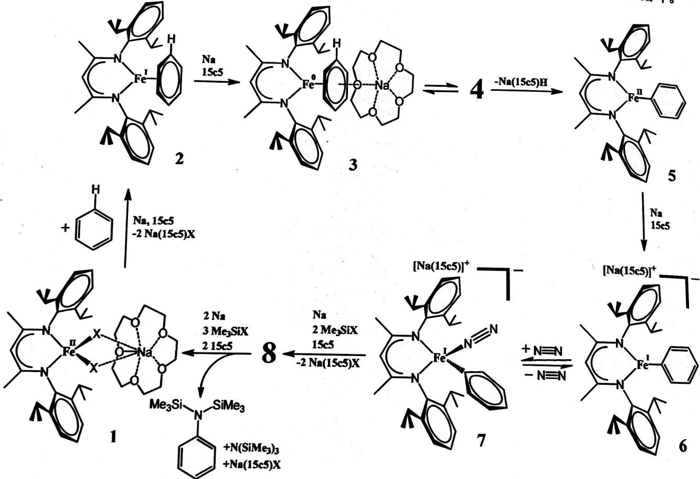

依据上述可能机理回答下述问题:

6-1-1 化合物 7 中 $\mathbf{N}_2$ 的配位方式是端位, 若 $\mathbf{N}_2$ 是侧基配位 (其它配体的配位方式不变), 写出中心 Fe 原子的配位数。

6-1-2 推断化合物 4 和 8 的结构。其中化合物 8 是一个肼类化合物。

6-1-3 若用 $^{15}\mathrm{N}_{2}$ 和 $\mathrm{C}_{6} \mathrm{~D}_{6}$ 作为底物, 依据上述可能的机理, 推断苯胺衍生物的结构。

6-2 上述活化 $\mathbf{N}_{2}$ 的方法, 所用条件较为苛刻。最近中国科学家利用锕系金属和主族元素协同裂解 $\mathbf{N}_{2}$ , 不使用外部还原剂实现了室温 $\mathbf{N}_{2}$ 的活化分裂; 以 $\mathrm{H}_{2} \mathrm{O}$ 作为质子源, 可从含氮裂解产物制备出含氮有机物和氨, 反应过程示意如下 (P'Pr2 为二异丙基膦基, TMEDA 为四甲基乙二胺):

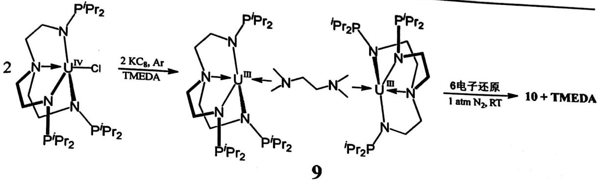

配合物 10 中每个 U 与六个 N 配位，U 氧化态+IV，变形八面体结构。配合物 10 的结构与 9 相比，多了 3 个四元环；配合物 9 中的 U(III) 和部分 P(III) 被氧化。配合物 10 与过量水水解产生 NH₃。写出配合物 10 的结构。

6-3 双金属 Rh-U 配合物 11 能有效活化 N₂，可形成配合物 A 和 B（如下图所示）。已知在 A 和 B 中 U 的氧化态都是+IV。写出 Rh 原子的价电子组态、A 和 B 中 Rh 的氧化态。

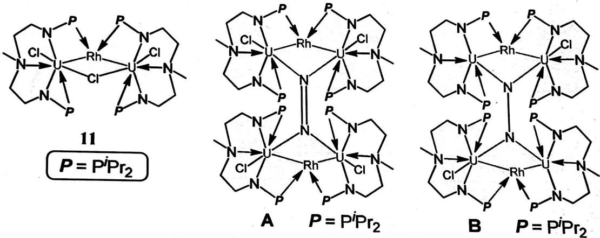

第6题（13分）

<table><tr><td colspan="3">6-1-1(1分)4</td></tr><tr><td colspan="3">6-1-2(4分)</td></tr><tr><td>化合物4的结构</td><td>化合物8的结构</td><td></td></tr><tr><td>(2分)</td><td>(2分)</td><td></td></tr><tr><td colspan="3">6-1-3(1分) </td></tr><tr><td colspan="3">6-2(4分)  注:化合价不用标。不画出立体要求也可。</td></tr><tr><td colspan="3">6-3(3分)</td></tr><tr><td>Rh原子的价电子组态</td><td>A中Rh的氧化态</td><td>B中Rh的氧化态</td></tr><tr><td> $4d^{8}5s^{1}$ (1分)</td><td>-1(或者-I)(1分)</td><td>-2(或者-II)(1分)</td></tr></table>

## 第7题 (10分)

7-1 环氧化合物(R,R)-1 与 TiCl₄ 反应得到开环产物 (R,R)-2; (R,R)-2 可被高价碘试剂 DMP 氧化为化合物 3。化合物 3 在低温下先与甲基格氏试剂反应, 然后用碱处理, 得到化合物 4。推测第一步反应经历的关键中间体结构, 并画出化合物 3 和 4 的结构简式(考虑立体化学)。

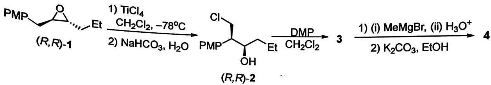

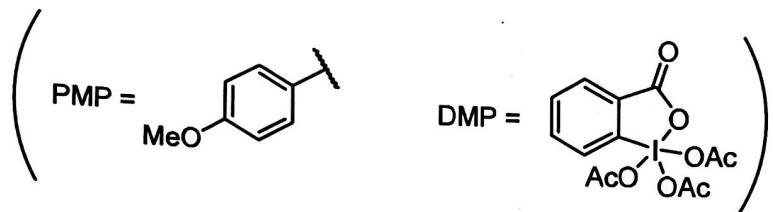

7-2 在如下化合物 9 的合成路线中构筑了连续三个手性碳, 其中第三步反应 (即从 7 到 9 的转化) 经历了一个中间产物 8。画出 6、7 和 8 的结构简式。

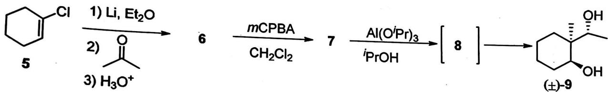

(上式中 mCPBA 为间氯过氧苯甲酸，Pr 为异丙基)

7-3 画出下面反应的关键中间体结构简式（考虑反应的立体化学）。

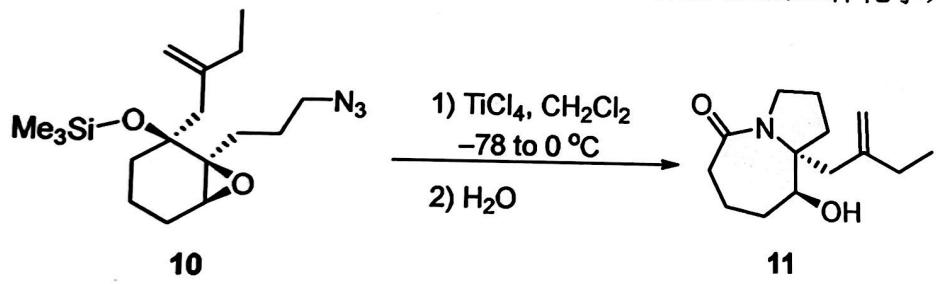

第7题 (10分)

<table><tr><td>7-1(4分)</td></tr><tr><td>关键中间体写出上述结构得2分</td></tr></table>

第8题（13分）

8-1 化合物 1 和 2 在低温下加入 2,2,6,6-四甲基哌啶锂（LiTMP），反应 20 分钟生成一中间产物 3，然后向反应液中加入 HF 水溶液，室温下继续反应 1.5 小时，得到化合物 4。画出该反应关键中间体 A 以及化合物 3 和 4 的结构简式。

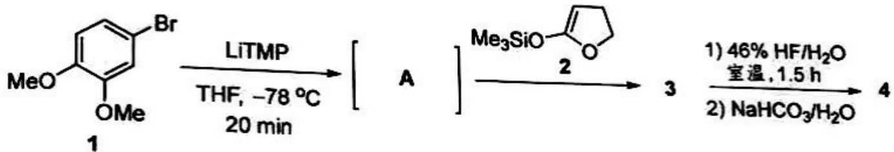

8-2 化合物 5 在加热条件下发生[4+2]环加成反应, 形成活泼中间体 B, B 被氘代硫醚 PhSCD₃ 捕获得到氘代产物 6 和 7。画出 B 以及由 B 到产物 6 转化过程所经历的关键中间体的结构简式

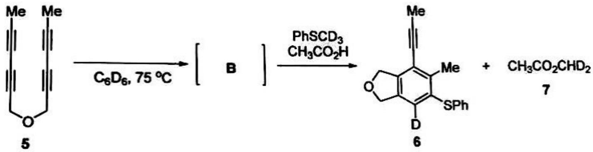

8-3 化合物 8 在加热条件下形成活泼中间体 C, C 被硫杂环丁烷捕获得到产物 9; 若反应体系中存在 2-氯丙二酸二乙酯时, 则得到三组分反应产物 10。画出中间体 C 以及产物 9 和 10 的结构简式。

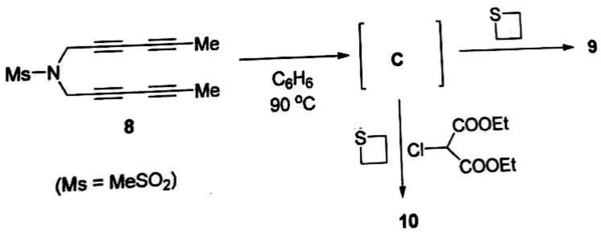

第34届中国化学奥林匹克（决赛）试题-1 评分标准 共24页

<table><tr><td colspan="2">化合物3</td><td colspan="2">化合物4</td></tr><tr><td colspan="2">1分,构型有误得0分</td><td colspan="2">1分,构型有误得0分</td></tr><tr><td colspan="4">7-2(4分)</td></tr><tr><td>化合物6</td><td colspan="2">化合物7</td><td>化合物8</td></tr><tr><td>1分</td><td colspan="2"> 1分</td><td>或2分;只写一个对映体而不加(±)得1分;相对构型错误或未表示出相对构型得0分。</td></tr><tr><td colspan="4">7-3(2分)写出上述2个结构(或与氯负离子结合的形式)各得1分;羟基氧原子未与Lewis酸结合(写成羟基或氧负离子)得0.5分。</td></tr><tr><td colspan="4">8-1(6分)</td></tr><tr><td>中间体A</td><td>化合物3</td><td colspan="2">化合物4</td></tr><tr><td></td><td></td><td colspan="2"></td></tr><tr><td colspan="4">每个结构各2分</td></tr><tr><td colspan="4">8-2(4分)</td></tr><tr><td colspan="4">中间体B或1分</td></tr><tr><td colspan="4">关键中间体3分</td></tr><tr><td colspan="4">8-3(3分)</td></tr><tr><td>中间体C</td><td>化合物9</td><td colspan="2">化合物10</td></tr><tr><td>或</td><td></td><td colspan="2"></td></tr><tr><td colspan="4">每个结构各1分</td></tr></table>

## 第9题（7分）

9-1 画出下面转化中间产物2、3、4和产物5的结构简式。

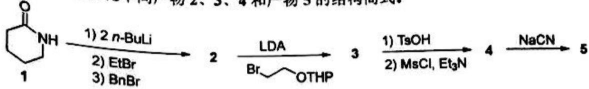

$$
\text {   上式中   } n \text {-BuLi   } = n \text {-C} _ {4} \mathrm{H} _ {9} \mathrm{Li}; \quad \mathrm{Bn} = \mathrm{PhCH} _ {2}; \quad \mathrm{LDA} = (\mathrm{Me} _ {2} \mathrm{CH}) _ {2} \mathrm{NLi}; \quad \mathrm{THP} =
$$

9-2 上述产物 5 与化合物 6 在三氟甲磺酸三甲基硅酯（TMSOTf）存在下作用生成 7。画出该反应的关键中间体结构简式。

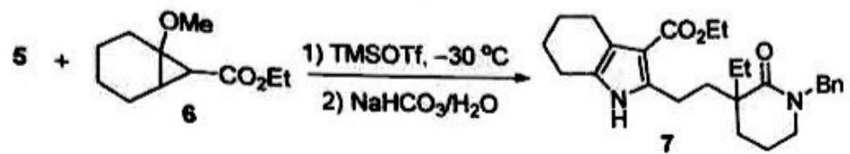

$$
\left(\text { TMSOTf } = \text { Me } _ {3} \text { SiO } - \underset {\text { O }} {\overset {\text { O }} {\text { S }}} - \text { CF } _ {3}\right)
$$

第9题（7分）

<table><tr><td colspan="4">9-1(4分)</td></tr><tr><td>化合物2</td><td>化合物3</td><td>化合物4</td><td>化合物5</td></tr><tr><td></td><td></td><td></td><td></td></tr><tr><td colspan="4">每个结构各1分</td></tr><tr><td colspan="4">9-2(3分)或或写出上述3个结构式各得1分</td></tr></table>

# 第34届中国化学奥林匹克（决赛）试题-2评分标准

(2020年11月16日，杭州)

第1题（15分）

硅是地壳中除氧外丰度最高的元素，单质硅是电子工业尤其是芯片制造的核心原料，硅化学是化学科学一个重要的研究领域。

1-1 电子工业中硅器件的腐蚀可以使用重铬酸盐溶液（反应 1）或者氢氟酸和浓硝酸的混合液（反应 2），写出反应 1 的离子反应方程式和反应 2 的化学反应方程式。
1-2 硅酸盐的结构和性质研究是无机化学内一个重要的方向。

1-2-1 硅酸盐基本结构单元 $[SiO_{4}]^{4-}$ 中的 Si-O 平均键长为 162 pm，从 Si、O 原子间的成键特征角度解释为何该平均键长小于 Si 和 O 原子的共价单键半径之和（190 pm）。

1-2-2 上述硅酸盐结构中的 Si(IV) 被 Al(III) 部分同构取代后会产生 Brönsted（布朗斯特）酸位，有如下图所示的模型 A 和 B 被提出来解释该酸性的产生。哪种模型结构中的羟基更易脱去质子？原因是什么？

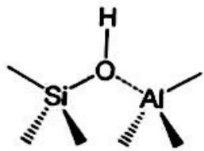  
模型A

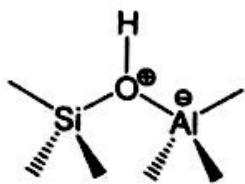  
模型B

1-3 硅烷是一类重要的有机硅化合物，以π型官能化硅烷和杂原子型官能化硅烷为配体合成得到的配位化合物在催化和光电领域有可观的应用。

1-3-1 研究表明，以硅原子为桥的二茂铁配合物 $\left[\mathrm{Fe}(\eta-\mathrm{C}_{5}\mathrm{H}_{4})_{2}\mathrm{SiR}_{2}\right]$ （R 为烷基）可发生开环聚合而生成配位聚合物。画出 R 为甲基时该配合物和相应聚合产物的结构式。

1-3-2 配合物 $\left[\mathrm{Fe}(\eta-\mathrm{C}_{5}\mathrm{H}_{4})_{2}\mathrm{SiR}_{2}\right]$ 的 R 基团为乙基时生成的配位聚合物记为 A，R 基团为正丁基时生成的配位聚合物记为 B；A 和 B 的聚合度相同。A 和 B 中哪一种具有较低的玻璃化转变温度？简述理由。

1-3-3 如下图所示的杂原子官能化硅烯在正己烷溶液中和羰基配合物 Ni(CO) $_{4}$ 发生配体取代反应释放出等物质的量的 CO，生成化合物 C；C 继续和该硅烯发生配体取代反应释放出等物质的量的 CO，生成化合物 D；上述反应前后配合物的空间构型不变，画出化合物 C 和 D 的结构式。

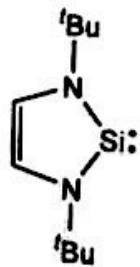

0-1 键
极性增大第2题（15分）

<table><tr><td>1-1(2分)3Si+2Cr2O72-+16H+→3SiO2+4Cr3++8H2OSi+4HNO3+6HF→H2SiF6+4NO2+4H2O(1分)方程式不配平不得分,写成其他形式不得分.</td></tr><tr><td>1-2-1(3分)(1)在[SiO4]4-中Si以sp3杂化轨道和4个O原子按四面体方向形成4个σ键。(1分)要点4个σ键1分。(2)在上述σ键之外,Si原子的d轨道和O原子的p轨道相互叠加,由O原子提供电子形成π键。(2分)要点Si原子的d轨道、O原子的p轨道、O原子提供电子、π键各0.5分.</td></tr><tr><td>1-2-2(3分)(1)B。(1分)(2)模型B中O原子和Al原子之间形成配位键(或共价键);桥连氧的配位导致桥连羟基中H原子的电子向O移动,O-H键的键长变长(或键强变弱),桥连羟基更易脱去质子。(2分)要点氧铝间形成配位键、O-H键的键长变长(或键强变弱)各1分.</td></tr><tr><td>1-3-1(3分)配合物结构式:(1分)甲基也可用—及—CH3表示,不要求两个Cp环的相对取向。产物结构式:(2分)甲基表示形式同上;不要求两个Cp环的相对取向.</td></tr><tr><td>1-3-2(2分)B。(1分)R为正丁基时所生成的配位聚合物的侧基较大,聚合物主链彼此相距较远。(1分)</td></tr><tr><td>1-3-3(2分)C的结构式(1分)Si和Ni之间不画双键不得分。D的结构式“Bu”“Bu”(1分)Si和Ni之间不画双键不得分.</td></tr></table>

二氧化碳的固定活化及化学转化具有重要的实际意义。二氧化碳可“插入”到过渡金属配合物的某个键内或者与特定化合物发生加成反应而实现固定，这是二氧化碳催化活化及转化的重要步骤。
2-1 等物质的量的二氧化碳可利用化学转化

2-1 等物质的量的二氧化碳可和钛配合物 $Cp_{2}TiMe_{2}$ （下图）在戊烷溶液中光照（350 nm）条件下发生“插入”反应。画出该反应产物的结构式。

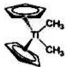

2-2 二氧化碳 “插入” 到过渡金属配合物中的 M-N 键中生成相应的配合物。一个例子是配合物 $\eta^{5}-\mathrm{CpRu}(\mathrm{NH}_{2})(\mathrm{dcpe})(\mathrm{dcpe}=\mathrm{Cy}_{2}\mathrm{PCH}_{2}\mathrm{CH}_{2}\mathrm{PCy}_{2},\mathrm{Cy}:$ 环己基)（下图，配体 dcpe 省略）和二氧化碳在 THF（四氢呋喃）中的反应。画出该反应的关键中间体和产物的结构式。

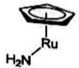

2-3 二氧化碳可“插入”到双金属配合物内的 M-M'键得以固定。有研究表明，Fe-Zr 双金属配合物 $Cp(CO)_{2}Fe-Zr(Cl)Cp_{2}$ （下图）中插入等物质的量的二氧化碳的反应过程经过一四元环过渡态进而形成产物。画出该过渡态和产物的结构式。

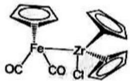

2-4 用于二氧化碳催化转化的钳型铱配合物 $(\mathrm{PN}^{\mathrm{Py}}\mathrm{P})\mathrm{IrH}_{2}\mathrm{X}$ (X = Me, OH; Me 为甲基) 的结构如下图所示。研究表明，该结构中 Ir-H $_{a}$ 键的键长较 Ir-H $_{b}$ 键为短。

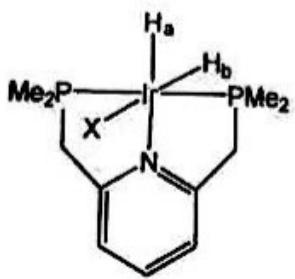

2-4-1 该配合物可以和等物质的量的二氧化碳发生“插入”反应。画出相应产物的结构式。

2-4-2 配合物 $(PN^{P}YP)IrH_{2}X$ 中配体 X 为 Me 时记为 A，X 为 OH 时记为 B。A 和 B 哪个更易发生上述二氧化碳 “插入” 反应？

2-5 二氧化碳和如下图所示的化合物（Ar=2,6- $Pr_{2}C_{6}H_{3}$ ）在甲苯中发生1:1加成反应；较之反应物，产物内的磷-磷键长变短而磷-镓键长变长。画出该产物的结构式。

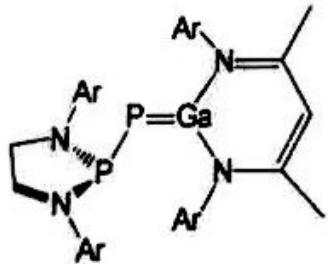

<table><tr><td>2-1(2分)  或 (2分)环戊二烯基写作Cp也可。</td></tr><tr><td>2-2(4分) 中间体结构式: (2分)不写电荷不给分。 产物结构式: (2分)</td></tr><tr><td>2-3(4分) 过渡态结构式: (2分)碳不和铁配位不给分。 产物结构式: (2分)</td></tr><tr><td>2-4-1(2分)  (2分)</td></tr><tr><td>2-4-2(1分)A (1分)</td></tr><tr><td>2-5(2分)  (2分)</td></tr></table>

## 第3题（10分）

金属-有机框架材料（MOFs）是近20年来研究十分热门的领域，在储气、分离、催化、沙漠地区富集水分等功能材料领域具有重要潜在应用意义。MOFs是三维配位聚合物，典型的MOFs材料有MOF-5和HKUST-1。MOF-5材料是利用三乙胺扩散进入 $\mathrm{Zn(NO_{3})_{2}}$ 和对苯二甲酸（ $H_{2}BDC$ ）在DMF(二甲基甲酰胺)/氯苯溶剂的混合溶液中，并加入少量 $H_{2}O_{2}$ 合成的；但多种研究表明如果使用 $\mathrm{Zn(CH_{3}COO)_{2}}$ 并不需要加入三乙胺和少量 $H_{2}O_{2}$ 。合成的金属-有机框架材料经加热完全除去溶剂后的框架结构标记为MOF-5，含有溶剂分子的配合物的化学式记为MOF-X。

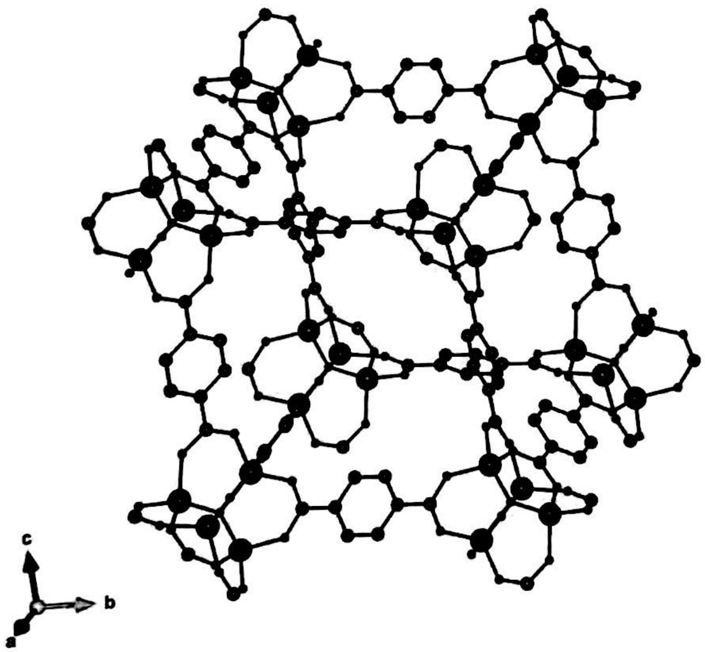

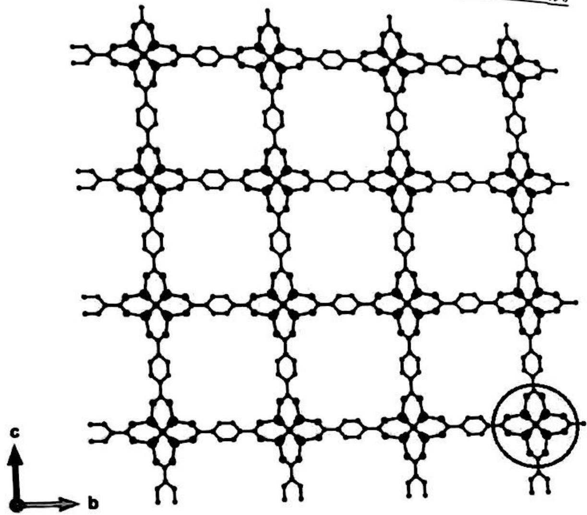

图中黑圈部分为：  
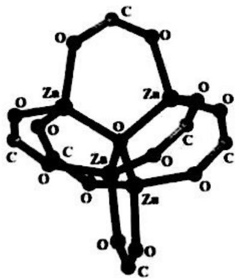

3-1 MOF-5 的晶体结构如上图所示，写出 MOF-5 的化学式。

3-1 MOF-5 的晶体结构如上图所示, 与出 $3.2 \mathrm{~nm}^{-3}$ 分子, 制备过程中溶剂分子会占据孔洞, 已知 MOF-X 的密度为 1.153 g·cm $^{-3}$ ; MOF-X 的晶胞参数如下: $a = 2566.90 \mathrm{pm}, V = 1.69132 \times 10^{10} \mathrm{pm}^{3}, Z = 8$ ; 含氯量为 $2.42 \%$ 。推断一个正当晶胞中溶剂分子的数目与种类。

推断一个正当晶胞中溶剂分子的MOF-5具有可以容纳直径为 $1510 \mathrm{pm}$ 球状分子的孔洞, 孔洞的体积约占晶体总体积的 $55 \%$ : 通过加热等手段完全除去溶剂分子的MOF-5能稳定存在。按照堆积理论这样的结构很不稳定, 但实验发现如此高孔隙率的MOF-5却能稳定存在, 说明原因。

<table><tr><td>3-1(2分)化学式: C24H12O13Zn4 或者 Zn4O(BDC)3 (2分)注:</td></tr><tr><td>3-2(6分)已知ρ=1.153 g·cm-3, ρ=Z×M/(NV), 可以求出一个含溶剂的 Zn4O(BDC)3·solvents 的式量:M=1467.4, 溶剂式量为: 1467.4-769.9=697.5, 因为 Cl 的量比较低, 可以假定一个 Cl, 溶剂分子从反应叙述看应该最多只有 DMF 和氯苯。一个氯苯, 可以算出分子量 M=1464.9,与密度计算出的分子量一致, 表明确实是一个氯苯, 剩余式量为 697.5-112.55=584.95, DMF的数量为: 584.95/73.38=8.0。所以: 每 Zn4O(BDC)3 单元溶剂分子为 8 个 DMF, 1 个氯苯, Zn4O(BDC)3·(DMF)8·(C6H5Cl)。(4分)一个正当单位有 8 个 Zn4O(BDC)3·(DMF)8·(C6H5Cl), 所以有 64 个 DMF 和 8 个氯苯。(2分)</td></tr><tr><td>3-3(2分)稳定存在是因为框架结构中 Zn-O 键是共价配键(或 Zn4O13 构造单元刚性), 不是离子化合物。(2分)</td></tr></table>

## 第4题（10分）

赖氨酸又名 2,6-二氨基己酸（简写 Lys， $C_{6}H_{14}N_{2}O_{2}$ ），是一种人体必需氨基酸，在水溶液中有 4 种分布形式（用 $H_{2}A^{2+}$ ， $HA^{+}$ ，A 和 A 表示）。若用 $1.00\ mol\cdotL^{-1}$ 的 NaOH 溶液滴定等浓度的 $H_{2}A^{2+}$ ，得到如下曲线（横坐标为滴定分数 $\alpha=\frac{(cV)_{NaOH}}{(cV)_{H_{2}A^{2+}}}$ ，纵坐标为溶液 pH）：

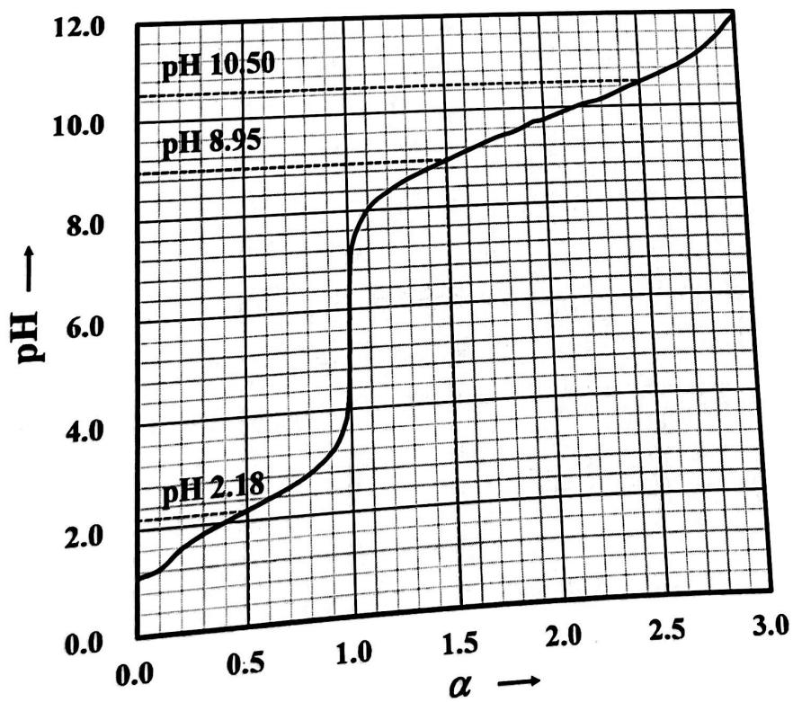

<table><tr><td>4-1(4分)由曲线图可知,赖氨酸的 $pK_{a1}=2.18$ , $pK_{a2}=8.95$ , $pK_{a3}=10.50$ ,因此等电点为: $pI=1/2(pK_{a2}+pK_{a3})=1/2(8.95+10.50)=9.72$ (0.5分)根据曲线图,pH=9.60时滴定的 $\alpha=1.90$ (允许 $1.90\pm0.05$ 范围内)。设滴定前赖氨酸溶液总体积为 $V_0$ mL,则加入的NaOH体积为 $1.90V_0$ mL,赖氨酸的总浓度为 $c=1.00/(1.00+1.90)=0.345$  $mol·L^{-1}$ (0.5分)pH=9.60时,赖氨酸4种形式的分布分数各为: $\delta(H_2A^{2+})=\frac{[H^+]^3}{[H^+]^3+K_{a1}[H^+]^2+K_{a1}K_{a2}[H^]+K_{a1}K_{a2}K_{a3}}\approx0$  $\delta(HA^+)/\frac{K_{a1}[H^+]^2}{[H^+]^3+K_{a1}[H^+]^2+K_{a1}K_{a2}[H^]+K_{a1}K_{a2}K_{a3}}=1.7\times10^{-1}$ (各0.5分,共2分) $\delta(A)=\frac{K_{a1}K_{a2}[H^]}{[H^+]^3+K_{a1}[H^]^2+K_{a1}K_{a2}[H^]+K_{a1}K_{a2}K_{a3}}=7.4\times10^{-1}$  $\delta(A^-)=\frac{K_{a1}K_{a2}K_{a3}}{[H^+]^3+K_{a1}[H^]^2+K_{a1}K_{a2}[H^]+K_{a1}K_{a2}K_{a3}}=9.3\times10^{-2}$  $[H_2A^{2+}]=\delta(H_2A^{2+})·c=0(mol·L^{-1})$ [HA^+]= $\delta(HA^)+·c=0.059(mol·L^{-1})$ [A^-]= $\delta(A^-)·c=0.032(mol·L^{-1})$ (0.5分)</td></tr></table>

4-1 根据该曲线，计算赖氨酸的等电点 $\mathrm{pI}$ 以及 $\mathrm{pH} = 9.60$ 时赖氨酸 4 种分布形式的平衡浓度。4-2 实验室现有 $0.10 \, \mathrm{mol} \cdot \mathrm{L}^{-1} \, \mathrm{NaOH}$ 溶液、 $0.10 \, \mathrm{mol} \cdot \mathrm{L}^{-1} \, \mathrm{HCl}$ 溶液、草酸基准物质 ( $\mathrm{H}_{2} \mathrm{C}_{2} \mathrm{O}_{4} \cdot 2 \mathrm{H}_{2} \mathrm{O}$ ， $126.07 \, \mathrm{g} \cdot \mathrm{mol}^{-1}$ )、邻苯二甲酸氢钾基准物质 ( $\mathrm{KHC}_{8} \mathrm{H}_{4} \mathrm{O}_{4}$ ， $204.22 \, \mathrm{g} \cdot \mathrm{mol}^{-1}$ )、三(羟甲基)氨基甲烷基准物质（简称 Tris, $(\mathrm{HOCH}_{2})_{3} \mathrm{CNH}_{2}$ ， $K_{\mathrm{b}} = 1.15 \times 10^{-6}$ ， $121.14 \, \mathrm{g} \cdot \mathrm{mol}^{-1}$ ）、碳酸钠基准物质 ( $\mathrm{Na}_{2} \mathrm{CO}_{3}$ ， $105.99 \, \mathrm{g} \cdot \mathrm{mol}^{-1}$ ），以及酚酞、甲基橙和甲基红等三种指示剂液。欲用酸碱滴定法测定某化学纯赖氨酸试样的含量。

4-2-1 指出合适的滴定剂并简要说明理由，写出滴定反应化学方程式。

4-2-2 计算滴定终点时溶液 $\mathrm{pH}$ , 根据计算结果选择最佳指示剂。

4-2-3 假设所选滴定剂的消耗量 25 mL，通过计算所需基准物质的质量及其称量的相对误差确定最佳基准物质。

4-2-4 假设实验中准确称取 $m \mathrm{~g}$ 赖氨酸试样（其摩尔质量用符号 $M$ 表示），滴定至终点时消耗 $V \mathrm{~mL}$ 浓度为 $c \mathrm{~mol} \cdot \mathrm{L}^{-1}$ 的所选滴定剂标准溶液，写出该试样中赖氨酸质量分数（ $w$ ）的计算式。

(0.5分)

可用盐酸标准溶液作滴定剂。
赖氨酸为碱性氨基酸，赖氨酸A的 $K_{b}=K_{b2}=K_{w}/K_{a2}=10^{-14}/10^{-8.95}=10^{-5.05}$ ， $cK_{b2}>10^{-8}$ （0.5分） $K_{b3}=K_{w}/K_{a1}=10^{-14}/10^{-2.18}=10^{-11.82}$ ， $cK_{b3}<10^{-8}$ ，只能形成一个滴定突跃，终点产物为 $HA^{+}$ 滴定反应方程式： $A+HCl=HA^{+}\cdot Cl^{-}$ （或 $C_{6}H_{14}N_{2}O_{2}+HCl=[C_{6}H_{15}N_{2}O_{2}]^{+}\cdot Cl^{-}$ ）
写离子反应方程式也可 $A+H^{+}=HA^{+}$ （或 $C_{6}H_{14}N_{2}O_{2}+H^{+}=C_{6}H_{15}N_{2}O_{2}^{+}$ ）（0.5分）

$$
\mathrm{pH} = 1 / 2 \left(\mathrm{p} K _ {\mathrm{a} 1} + \mathrm{p} K _ {\mathrm{a} 2}\right) = 1 / 2 (2. 1 8 + 8. 9 5) = 5. 5 6\tag{0.5 分}
$$

(0.5 分)

$$
\mathrm{Na} _ {2} \mathrm{CO} _ {3}\tag{0.5 分}
$$

$$
m (\text { Tris }) = c (\mathrm{HCl}) \cdot V (\mathrm{HCl}) \cdot M (\text { Tris }) = 0. 1 0 \times 2 5 \times 1 2 1 \times 1 0 ^ {- 3} = 0. 3 0 (\mathrm{g})
$$

$$
m \left(\mathrm{Na} _ {2} \mathrm{CO} _ {3}\right) = c (\mathrm{HCl}) \cdot V (\mathrm{HCl}) \cdot M \left(\mathrm{Na} _ {2} \mathrm{CO} _ {3}\right) = \frac {0 . 1 0 \times 2 5 \times 1 0 6 \times 1 0 ^ {- 3}}{2} = 0. 1 3 (\mathrm{g})
$$

$$
E_{r}(\mathrm{Tris}) = \frac{\pm 0.0002}{0.30}\times 100\% = \pm 0.07\%\tag{1分}
$$

$$
E_{\mathrm{r}}(\mathrm{Na}_{2}\mathrm{CO}_{3}) = \frac{\pm 0.0002}{0.13}\times 100\% = \pm 0.2\%
$$

$$
E _ {\mathrm{r}} (\text { Tris }) <   E _ {\mathrm{r}} \left(\mathrm{Na} _ {2} \mathrm{CO} _ {3}\right)
$$

(各0.5分，共1分)

$$
w = \frac {c (\mathrm{HCl}) \times V \times M \times 1 0 ^ {3}}{m}\tag{0.5分}
$$

## 第5题（16分）

(0.5分)

化学家 Fritz Haber 奠定了合成氨理论基础, Carl Bosch 实现了合成氨工业过程, Gerhard Ertl 在催化剂表面化学研究领域做出了开拓性贡献, 他们分别获得 1918 年、1931 年和 2007 年的诺贝尔化学奖。近年来, 电化学合成氨等新的氨合成方法得到快速发展。

5-1 已知 298.15 K 时, N₂(g)、H₂(g) 和 NH₃(g) 的标准摩尔熵 S $_{m}^{\oplus}$ 分别为 191.61 J·K $^{-1}$ ·mol $^{-1}$ 、130.68 J·K $^{-1}$ ·mol $^{-1}$ 和 192.45 J·K $^{-1}$ ·mol $^{-1}$ , NH₃(g) 的标准摩尔生成焓 ΔfH $_{m}^{\oplus}$ 为 -46.11 kJ·mol $^{-1}$ 。

计算 298.15 K 时合成氨反应 $\frac{1}{2}$ N₂(g)+ $\frac{3}{2}$ H₂(g)→NH₃(g) 的标准平衡常数。

5-2 假设上述合成氨反应在 298.15 K \~ 723.15 K 温度范围内的标准摩尔反应焓为 -49.31 kJ·mol $^{-1}$ 。计算 723.15 K 时的标准平衡常数。
5-3 以 H₂(g) 和 N₂(g) 的物质的量之比为 m:1 投入原料气（除催化剂外，不含其他组分），在 723.15 K 和 30.0 MPa 下反应，平衡气相中 NH₃(g) 的物质的量分数为 y。试推导出仅含 y 与 m 为变量的关系式。
5-4 绘出上述 y 随 m 变化曲线的示意图（须标注出报告点的示意图）。

5-4 绘出上述 $y$ 随 $m$ 变化曲线的示意图（须标注出极值点的坐标）。

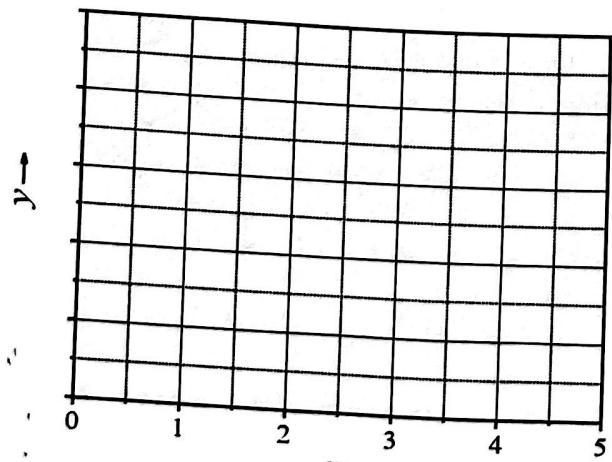

5-5 实验测得合成氨反应 $\frac{1}{2} \mathrm{~N}_{2}(\mathrm{~g}) + \frac{3}{2} \mathrm{H}_{2}(\mathrm{~g}) \rightarrow \mathrm{NH}_{3}(\mathrm{~g})$ 在 $723.15 \mathrm{~K}$ 和不同压力下的 $K_{p} = \frac{p_{\mathrm{NH}_{3}}}{p_{\mathrm{N}_{2}}^{1/2} p_{\mathrm{H}_{2}}^{3/2}}$ 如下表。试解释不同压力下的 $K_{\mathrm{p}}$ 为何不是常数。

<table><tr><td>p/MPa</td><td>1.01</td><td>3.04</td><td>5.07</td><td>10.1</td><td>30.4</td></tr><tr><td> $K_{p}/(10^{-5}kPa^{-1})$ </td><td>6.60</td><td>6.67</td><td>6.81</td><td>7.16</td><td>8.72</td></tr></table>

5-6 以水和氮气为原料,采用合适的催化剂,可实现常温常压非均相催化电化学合成氨,从而实现氨的绿色合成。若以 $\mathrm{NaHCO}_{3}$ 水溶液为电解质,试写出两个电极上的反应。

<table><tr><td colspan="4">5-1(3分) $\frac{1}{2}\mathrm{N}_{2}(\mathrm{g})+\frac{3}{2}\mathrm{H}_{2}(\mathrm{g})\rightarrow\mathrm{NH}_{3}(\mathrm{g})$ </td></tr><tr><td> $\Delta_{\mathrm{f}}H_{\mathrm{m}}^{+}/\mathrm{kJ}\cdot\mathrm{mol}^{-1}$ </td><td>0</td><td>0</td><td>-46.11</td></tr><tr><td> $S_{\mathrm{m}}^{+}/\mathrm{J}\cdot\mathrm{K}^{-1}\cdot\mathrm{mol}^{-1}$ </td><td>191.61</td><td>130.68</td><td>192.45</td></tr><tr><td colspan="4"> $\Delta_{\mathrm{r}}H_{\mathrm{m}}^{+}=-46.11\mathrm{kJ}\cdot\mathrm{mol}^{-1}$ (0.5分)</td></tr><tr><td colspan="4"> $\Delta_{\mathrm{r}}S_{\mathrm{m}}^{+}=192.45-\frac{1}{2}\times191.61-\frac{3}{2}\times130.68=-99.38(\mathrm{J}\cdot\mathrm{K}^{-1}\cdot\mathrm{mol}^{-1})$  (0.5分)</td></tr><tr><td colspan="4"> $\Delta_{\mathrm{r}}G_{\mathrm{m}}^{+}=-46.11-298.15\times(-99.38)/1000=-16.48(\mathrm{kJ}\cdot\mathrm{mol}^{-1})$  (1分)</td></tr><tr><td colspan="4"> $\Delta_{\mathrm{r}}G_{\mathrm{m}}^{+}=-RT\ln K^{\oplus}$ </td></tr><tr><td colspan="4"> $K^{\oplus}=\exp(-\Delta_{\mathrm{r}}G_{\mathrm{m}}^{+}/RT)=772$  (1分)</td></tr><tr><td colspan="4">5-2(3分)  $\ln\frac{K_{2}^{\oplus}}{K_{1}^{\oplus}}=-\frac{\Delta_{\mathrm{r}}H_{\mathrm{m}}^{\oplus}}{R}\left(\frac{1}{T_{2}}-\frac{1}{T_{1}}\right)$ (1分)  $\ln\frac{K_{2}^{\oplus}}{772}=\frac{49.31\times1000}{8.314}\left(\frac{1}{723.15}-\frac{1}{298.15}\right)$   $K_{2}^{\oplus}=6.46\times10^{-3}$ 该反应在723.15K时的标准平衡常数为 $6.46\times10^{-3}$ (2分)</td></tr><tr><td colspan="4">5-3(5分) $\frac{1}{2}\mathrm{N}_{2}(\mathrm{g})+\frac{3}{2}\mathrm{H}_{2}(\mathrm{g})\rightarrow\mathrm{NH}_{3}(\mathrm{g})$ </td></tr><tr><td>开始物质的量</td><td>1</td><td>m</td><td>0</td></tr><tr><td>平衡物质的量</td><td>1-α</td><td>m-3α</td><td>2α  $\sum n=1+m-2α$ </td></tr><tr><td>平衡摩尔分数</td><td> $\frac{1-\alpha}{1+m-2\alpha}$ </td><td> $\frac{m-3\alpha}{1+m-2\alpha}$ </td><td> $\frac{2\alpha}{1+m-2\alpha}$ </td></tr><tr><td>平衡分压</td><td> $\frac{1-\alpha}{1+m-2\alpha}p$ </td><td> $\frac{m-3\alpha}{1+m-2\alpha}p$ </td><td> $\frac{2\alpha}{1+m-2\alpha}p$ </td></tr><tr><td colspan="4"> $K^{\oplus}=\left(\frac{p_{\mathrm{NH}_{3}}}{p^{\oplus}}\right)\left(\frac{p_{\mathrm{N}_{2}}}{p^{\oplus}}\right)^{-1/2}\left(\frac{p_{\mathrm{H}_{2}}}{p^{\oplus}}\right)^{-3/2}$ </td></tr><tr><td colspan="4">=  $\left(\frac{2\alpha}{1+m-2\alpha}\frac{p}{p^{\oplus}}\right)\left(\frac{1-\alpha}{1+m-2\alpha}\frac{p}{p^{\oplus}}\right)^{-1/2}\left(\frac{m-3\alpha}{1+m-2\alpha}\frac{p}{p^{\oplus}}\right)^{-3/2}$ </td></tr><tr><td colspan="4">=  $\frac{2\alpha(1+m-2\alpha)}{(1-\alpha)^{1/2}(m-3\alpha)^{3/2}}\frac{p^{\oplus}}{p}$  (3分)</td></tr><tr><td colspan="4"> $\mathrm{NH}_{3}(\mathrm{g})$ 的平衡摩尔分数 $y=\frac{2\alpha}{1+m-2\alpha}$ 于是  $\alpha-\frac{(1+m)y}{2(1+y)}$ 代入平衡常数表达式,有:</td></tr></table>

<table><tr><td> $\frac{y(1+m)^2}{(2+y-my)^{1/2}(2m-3y-my)^{3/2}}=\frac{K^4p}{4p^{4}}=\frac{6.46\times 10^{-3}\times 300}{4}$   $\frac{y(1+m)^2}{(2+y-my)^{1/2}(2m-3y-my)^{3/2}}=0.485$ (2分)</td></tr><tr><td>5-4(2分) </td></tr><tr><td>5-5(1分) (2分) 在高压下,气体不是理想气体,不同压力下的气体因分子间作用力不同而表现出对理想气体不同程度的偏离,使 $K_p$ 不是常数。(1分)</td></tr><tr><td>5-6(2分) 阳极反应: $12OH^- \rightarrow 6H_2O + 3O_2 + 12e^-$ (1分) 阴极反应: $N_2 + 6H_2O + 6e^- \rightarrow 2NH_3 + 6OH^-$ (1分)</td></tr></table>

## 第6题（4分）

“三级膨胀法”是工业上测定液体蒸气压的一种方法。如下图所示，将一定体积的饱和了空气的液体试样注入有活塞的测试筒中，密封测试筒后，在恒定温度下，通过活塞分三级控制平衡气相体积分别为 $V_{1}$ 、 $V_{2}$ 和 $V_{3}$ ，测得相应的平衡总压分别为 $p_{1}$ 、 $p_{2}$ 和 $p_{3}$ 。设液相体积保持不变，气相视作理想气体。

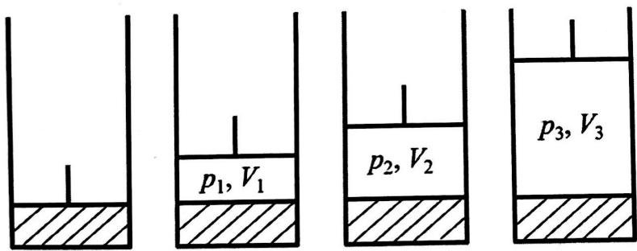

实验测得乙醇在 $37.8^{\circ}$ C 的一组数据如下表：

<table><tr><td>i</td><td>1</td><td>2</td><td>3</td></tr><tr><td> $V_i/mL$ </td><td>1.70</td><td>2.50</td><td>5.00</td></tr><tr><td> $p_i/kPa$ </td><td>35.98</td><td>25.31</td><td>19.54</td></tr></table>

乙醇在该温度下的饱和蒸气压 $p^{*}_{乙醇}=$ \_\_\_\_。

<table><tr><td>6(4分)16.10kPa</td><td>(4分)</td></tr></table>

## 第7题 选择题（14分）

7-1 下面 3 种共轭二烯与丙烯腈发生 Diels-Alder 反应速率最快的是\_\_\_\_。

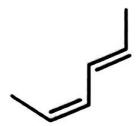

A

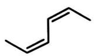

B

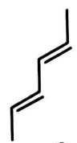

C

7-2 下面 2 种内酰胺在碱性条件下水解的反应速率较快的是\_\_\_\_。

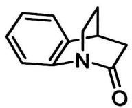

A

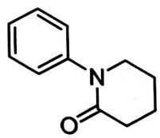

B

7-3 如下二烯烃与间氯过氧苯甲酸（mCPBA）发生环氧化反应的主要产物是\_\_\_\_。

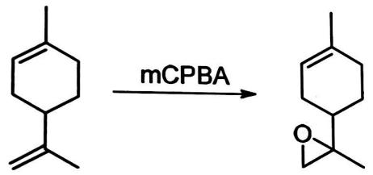

A

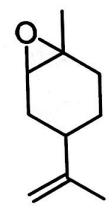

B

7-4 下面 2-苯基丙醛与乙基格氏试剂反应，生成的主要产物是\_\_\_\_。

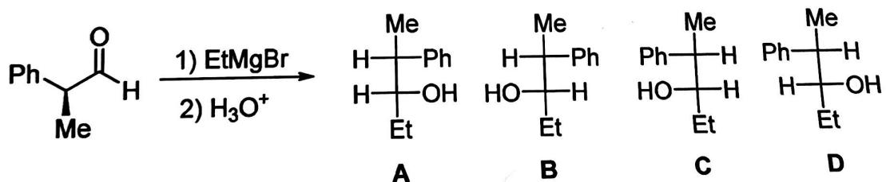

A

B

7-5 下面 2 种α-羟基酮的合成方法（A 和 B）合理的是\_\_\_\_。

方法 A:

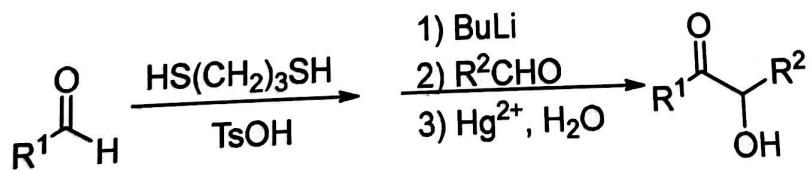

方法 B:

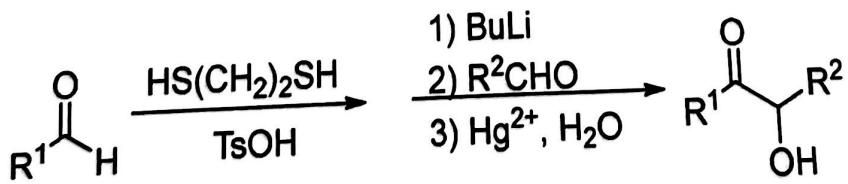

7-6 下面 Cope 重排反应的主要产物是\_\_\_\_。

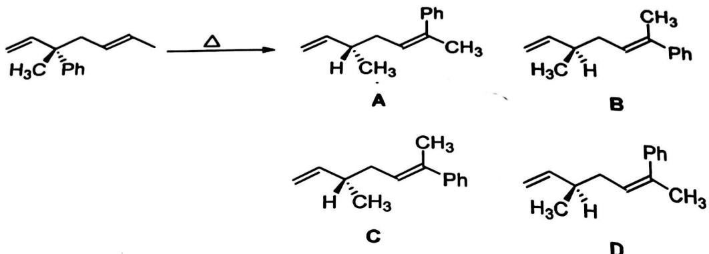

7-7 下面 2 种化合物中酸性较强的是\_\_\_\_。

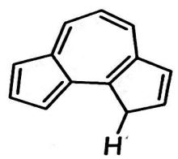

A

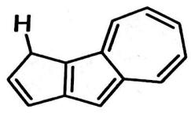

B

<table><tr><td>7-1</td><td>7-2</td><td>7-3</td><td>7-4</td><td>7-5</td><td>7-6</td><td>7-7</td></tr><tr><td>C</td><td>A</td><td>B</td><td>C</td><td>A</td><td>B</td><td>A</td></tr><tr><td>2分</td><td>2分</td><td>2分</td><td>2分</td><td>2分</td><td>2分</td><td>2分</td></tr></table>

## 第8题（16分）

8-1 如下光学纯(R)-对溴苯磺酸酯在 75% 的 1,4-二氧六环水溶液中与 $NaN_{3}$ 反应，得到构型保持产物(R)-2-叠氮辛烷。画出该反应中间体的结构简式。

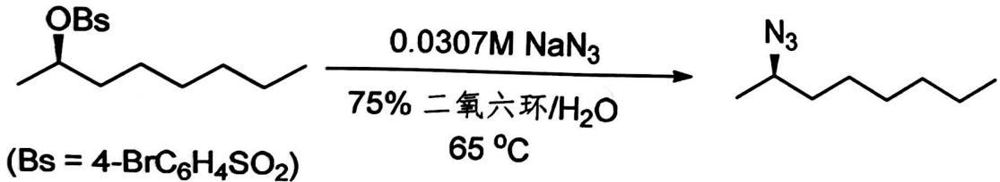

8-2 如下光学纯桥环化合物 1 在酸性条件下与乙酸酐反应，得到外消旋的酯 2。画出该反应关键中间体的结构简式。

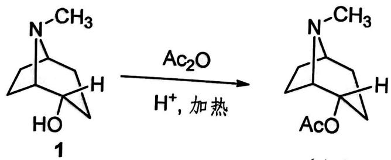  
(±)-2

8-3 化合物 3 是一种 “受阻 Lewis 酸碱对”，能够在室温下活化氢气并形成 4；当加热到 150℃ 时，4 可释放出氢气。4 与苯甲醛在二氯甲烷溶液中反应生成 5。画出 4 和 5 的结构简式。

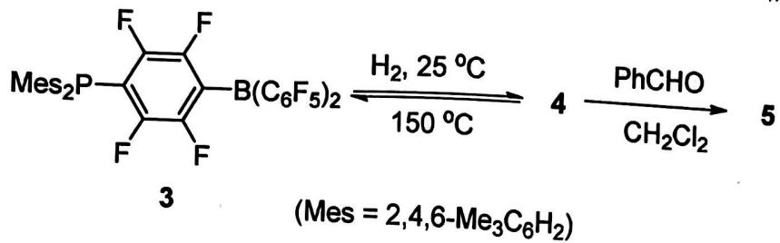

8-4 螺环化合物 6 与苯甲醛在邻二甲苯中加热回流，反应生成化合物 7 和 8。画出产物 7 以及反应中间体的结构简式。

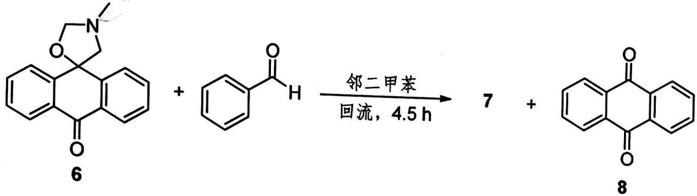

8-5 霉酚酸的全合成关键中间体 13 的合成路线如下。画出中间产物 9、10、11 和 12 的结构简式。

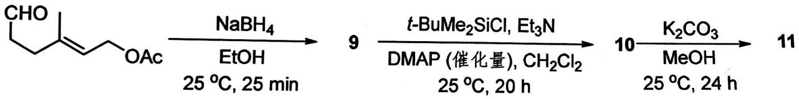

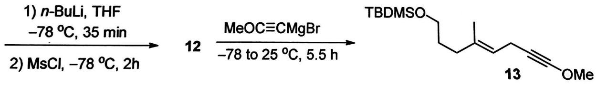

$$
(\mathrm{TBDMS} = t - \mathrm{BuMe} _ {2} \mathrm{Si}; n - \mathrm{BuLi} = n - \mathrm{C} _ {4} \mathrm{H} _ {9} \mathrm{Li}, \mathrm{DMAP} = 4 - \text {二甲氨基吡啶}; \mathrm{Ms} = \mathrm{MeSO} _ {2})
$$

8-1 (2分)

8-2 (2分)

写出该结构式（或只写阳离子部分）得2分

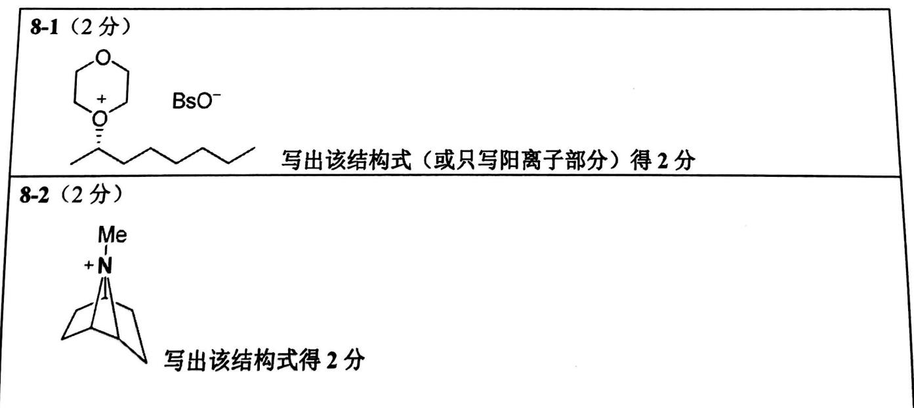

写出该结构式得 2 分

8-3 (2 分)

<table><tr><td colspan="2"> </td></tr><tr><td colspan="2">写出4和5的结构各得1分</td></tr><tr><td colspan="2">8-4(2分)</td></tr><tr><td colspan="2"> A7</td></tr><tr><td colspan="2">写出上述两个结构式各得1分</td></tr><tr><td colspan="2">8-5(8分)</td></tr><tr><td colspan="2"></td></tr></table>

写出上述 4 个结构式各得 2 分。