# 第 33 届中国化学奥林匹克(决赛)理论试题

1. 图 1-1 示出了一种结构有趣的“糖葫芦”分子。其中 A、B、C 和 D 四种元素位于同一族的相邻周期，B 的电负性大于 D.C 可分别与 A、B、D 形成二元化合物，C 和 E 可形成易挥发的化合物 $CE_{3}$ ， $CE_{3}$ 在工业上可用于漂白和杀菌。A 和 E 可形成化合物 $AE_{3}(bp, 76^{\circ}C)$ ， $AE_{3}$ 的完全水解产物之一 X 是塑料件镀金属的常用还原剂。A、C 和 E 可形成含有六元环的化合物 $A_{3}C_{3}E_{6}$ 。在氯仿中，D 和 E 可结合两个甲基形成化合物 $DE_{3}Me_{2}$

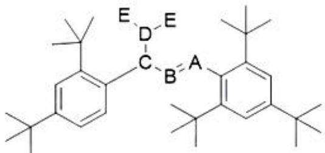  
图1-1

(1)写出 A、B、C、D 和 E 代表 $^{的}$ 元素\_\_\_\_、\_\_\_\_、\_\_\_\_、\_\_\_\_、\_\_\_\_。

(2)写出“糖葫芦”分子中 A 和 C 的杂化轨道\_\_\_\_。

(3)画出处于最高氧化态的 A 与元素 E 形成的分子结构图，写出该分子的对称元素(具体类型)\_\_\_\_。

(4)画出 $DE_{3}Me_{2}$ 的所有可能的立体异构体 \_\_\_\_。

(5)指出 X 属于\_\_\_\_元酸，写出弱酸介质中硫酸镍被其还原的反应方程\_\_\_\_。

【答案】①. P ②. As ③. N ④. Sb ⑤. Cl ⑥. A为 $\mathfrak{sp}^2$ 杂化，C为 $\mathfrak{sp}^3$ 杂化 ⑦.

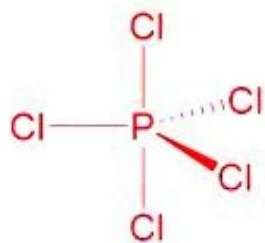

（4个镜面，1个 $\mathrm{C}_3$ 轴，3个 $\mathrm{C}_2$ 轴） ⑧.

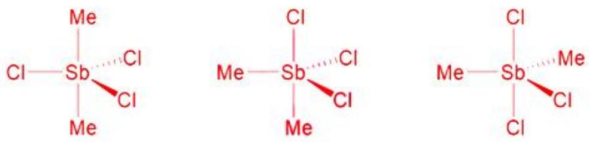

⑨. X 是 $H_{3}PO_{3}$ ，二元

酸 ⑩. $\mathrm{NiSO_4 + H_2O + H_3PO_3\rightarrow Ni + H_3PO_4 + H_2SO_4}$

【解析】

【分析】

【详解】此题推断可以从氧化态出发，A 和 C 均能与 E 形成 $XY_{3}$ 型化合物，且 $AE_{3}$ 的水解产物之一具有还原性，可以推断 A、B、C 和 D 都是第 VA 族元素。C 可分别与 A、B、D 形成二元化合物，所以 C 是 N 元素。根据且 $AE_{3}$ 和 $CE_{3}$ 的性质可以推断 A 是 P 元素，E 是 Cl 元素。由于 B 的电负性大于 D，所以 B、D 分别是 As、Sb 元素。

2. 在 Mn(II) 的催化下, 某有机染料(CR)溶液被氧化剂(OX)氧化褪色。在一定的 pH 条件下该反应具有较高的灵敏度和选择性, 据此可建立催化动力学光度法以测定水样中的痕量锰。催化反应示意如下:

CR(蓝色)+OX $\xrightarrow{Mn(II)}$ 褪色产物

CR 褪色反应的速率方程为： $r=-\frac{dc_{CR}}{dt}=kc_{CR}^{\alpha}c_{OX}^{\beta}c_{Mn(II)}^{\gamma}$

已知体系中无 Mn(II)时褪色反应不发生。反应过程中，氧化剂大大过量。

(1) 固定溶液中 Mn(II) 的浓度, 改变 CR 溶液的初始浓度, 测得溶液在 $6.0 \mathrm{~min}$ 和 $9.0 \mathrm{~min}$ 时的吸光度, 部分数据见表 2-1, 推求 $\alpha$ 的值\_\_\_\_。

表 2-1

<table><tr><td> $c_{CR}(mol·L^{-1})$ </td><td>A(t=6.0min)</td><td>A(t=9.0min)</td></tr><tr><td> $2.0×10^{-6}$ </td><td>0.274</td><td>0.111</td></tr><tr><td> $2.2×10^{-6}$ </td><td>0.333</td><td>0.135</td></tr><tr><td> $2.4×10^{-6}$ </td><td>0.482</td><td>0.195</td></tr><tr><td> $2.6×10^{-6}$ </td><td>0.669</td><td>0.271</td></tr></table>

（2）实验表明， $\gamma = 1$ 。推出固定时间间隔 $\Delta t$ 时，相邻两时刻的吸光度比值与 Mn(II) 浓度之间的定量关系式

○

（3）固定 CR 起始浓度及 Mn(II) 的浓度，分别测定了 363.15K 和 373.15K 下体系在 t=8.0min 和 10.0min 时的吸光度。实验结果见表 2-2，据此求算反应的表观活化能\_\_\_\_。

表 2-2

<table><tr><td>T(K)</td><td>A(t=8.0min)</td><td>A(t=10.0min)</td></tr><tr><td>363.15</td><td>0.686</td><td>0.490</td></tr><tr><td>373.15</td><td>0.240</td><td>0.090</td></tr></table>

【答案】(1) 1 (2) $\ln \frac{A_{t}}{A_{t + \Delta t}} = -k \cdot c_{\text{Mn(II)}} \Delta t$

(3) $121 \, kJ \cdot mol^{-1}$

【解析】

【小问 1 详解】

根据 Lambert-Beer 定律： $A=\varepsilon lc_{CR}$ ，即吸光度 4 与浓度 $c_{CR}$ 成正比。结合表 2-1 中的数据，发现有如下规律： $\frac{c_{CR,9.0\min}}{c_{CR,6.0\min}}=\frac{A_{9.0\min}}{A_{6.0\min}}=0.405$ ，CR 初始浓度不同，但在相同时间内 CR 消耗的比例相同，可判断此反应对于 CR 而言是一级反应，即 $\alpha=1$ 。

【小问 2 详解】

推导浓度方程，应从速率方程着手：

$$
r = - \frac {\mathrm{d} \mathbf {c} _ {\mathrm{CR}}}{\mathrm{dt}} = \mathrm{k} \mathbf {c} _ {\mathrm{CR}} ^ {\alpha} \mathbf {c} _ {\mathrm{OX}} ^ {\beta} \mathbf {c} _ {\mathrm{Mn(II)}} ^ {\mathrm{y}} = \mathrm{k} \mathbf {c} _ {\mathrm{CR}} \mathbf {c} _ {\mathrm{Mn(II)}}
$$

$$
- \frac {\mathrm{dc} _ {\mathrm{CR}}}{\mathrm{dt}} = \mathrm{k} ^ {\cdot} t
$$

$$
c _ {C R} = - \mathrm{k} ^ {\cdot} c _ {M n (I I)} t + B
$$

$$
c _ {C R} = \frac {A}{\varepsilon l}
$$

$$
\ln \frac {A}{\varepsilon l} = - k ^ {\cdot} c _ {M n (I I)} t + B
$$

整理，得：

$$
\ln A = - \mathrm{k} ^ {\cdot} c _ {M n (I I)} t + C
$$

$$
\ln A _ {t} = - \mathrm{k} ^ {\cdot} c _ {M n (I I)} t + C
$$

$$
\ln A _ {t + \Delta t} = - \mathrm{k} ^ {\cdot} c _ {M n (I I)} (t + \Delta t) + C
$$

得:

$$
\ln \frac {A _ {t}}{A _ {t + \Delta t}} = - k ^ {\cdot} c _ {M n (I I)} \Delta t
$$

【小问 3 详解】

当 Mn(II) 浓度也是定值时，有 $\ln\frac{A_{t}}{A_{t+\Delta t}} = -k c_{Mn(II)} \Delta t = k'' \Delta t$ ，代入表 2-2 数据，可得 $k''_{363.15} = 0.168 \, min^{-1}$ ， $k''_{373.15} = 0.490 \, min^{-1}$ ，则 $\ln\frac{k''_{373.15}}{k''_{363.15}} = \frac{E_{a}}{R} \left( \frac{1}{363.15} - \frac{1}{373.15} \right)$ ，解得 $E_{a} = 121 \, kJ \cdot mol^{-1}$ 。

3. 高血压是常见的心血管病，治疗高血压多选用钙离子拮抗剂。

(1)由苯甲醛、乙酰乙酸乙酯、醋酸铵反应生成的化合物 $\mathrm{A}(\mathrm{C}_{17}\mathrm{H}_{19}\mathrm{NO}_4)$ 是一种钙离子拮抗剂，反应式如下。画出 A 的结构简式\_\_\_\_。

$$
\mathrm{PhCHO} + 2 \mathrm{CH} _ {3} \mathrm{COCH} _ {2} \mathrm{CO} _ {2} \mathrm{CH} _ {3} + \mathrm{CH} _ {3} \mathrm{CO} _ {2} \mathrm{NH} _ {4} \xrightarrow {\mathrm{C} _ {2} \mathrm{H} _ {5} \mathrm{OH} , 8 0 ^ {\circ} \mathrm{C}} \mathrm{A}
$$

(2)上面的反应中, 如果将醋酸铵转换成羟胺盐酸盐 $\mathrm{(NH_2OH\cdot HCl)}$ , 三种物质反应先生成中间体 $\mathrm{B(C_{17}H_{19}NO_5)}$ , 进一步反应生成 $\mathrm{C(C_{17}H_{17}NO_4)}$ 。画出 B 和 C 的结构简式 \_\_\_\_、\_\_\_\_。

$$
\mathrm{PhCHO} + 2 \mathrm{CH} _ {3} \mathrm{COCH} _ {2} \mathrm{CO} _ {2} \mathrm{CH} _ {3} + \mathrm{NH} _ {2} \mathrm{OH} \cdot \mathrm{HCl} \xrightarrow {\mathrm{C} _ {2} \mathrm{H} _ {5} \mathrm{OH} , 8 0 ^ {\circ} \mathrm{C}} \mathrm{B} \rightarrow \mathrm{C}
$$

(3)乙酰乙酸乙酯在甲醇钠的存在下与环氧乙烷反应生成 D，经溴化氢处理，解热生成 E，E 在氢化钠的作用下生成甲基环丙基甲酮。画出此转化过程中中间产物 D 和 E 的结构简式\_\_\_\_、\_\_\_\_。

【答案】

④.  
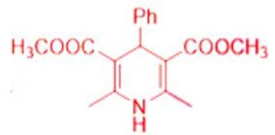

②.  
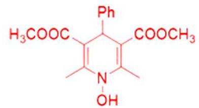

③.

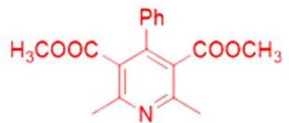

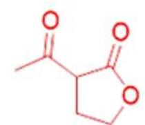

⑤.

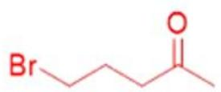

【解析】

【分析】

【详解】(1)

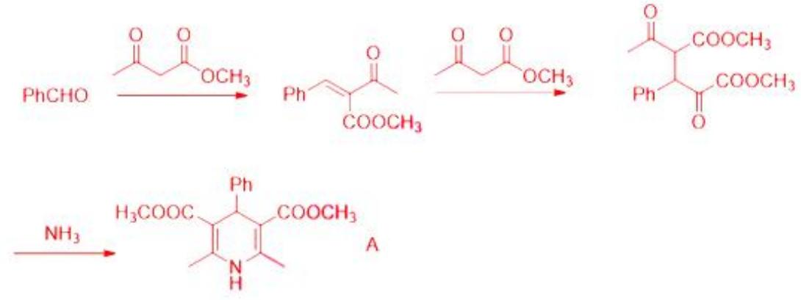

(4)

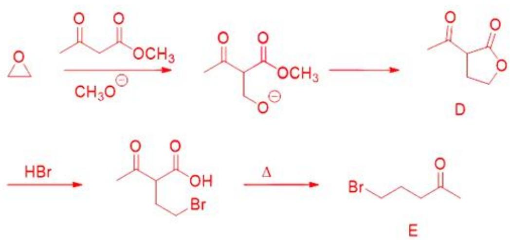

4. 制备石硫合剂(一种常用农药)的方法如下：先在反应器内加水使石灰消解，然后加足水量，在搅拌下把硫磺粉慢慢倒入。升温熬煮，使硫发生歧化反应。滤去固体渣滓得到粘稠状深棕色透明碱性液体成品。

(1) 写出生成产品的歧化反应的化学反应方程式\_\_\_\_。

(2) 说明固体渣滓的成分(假定水和生石灰皆为纯品)\_\_\_\_。

（3）写出呈现深棕色物质的化学式\_\_\_\_。

(4) 通常采用下述路线进行石硫合剂成品中有效活性物种的含量分析。写出 A、B 和 C 所代表的物种的化学式\_\_\_\_、\_\_\_\_、\_\_\_\_。

(5) 我国科技工作者首创用石硫合剂提取黄金的新工艺, 其原理类似于氰化法提金, 不同的是过程中不需要通入空气。写出石硫合剂浸金过程中氧化剂的化学式\_\_\_\_\_, 指出形成的 $\mathrm{Au(I)}$ 配离子中的配位原子\_\_\_\_\_。

【答案】（1） $3\mathrm{Ca(OH)}_{2}+(2\mathrm{m}+2)\mathrm{S}=2\mathrm{CaS}_{\mathrm{m}}+\mathrm{CaS}_{2}\mathrm{O}_{3}+3\mathrm{H}_{2}\mathrm{O}$

(2) 反应完的硫单质、空气中的 $\mathrm{CO}_{2}$ 参与反应形成的碳酸钙以及歧化反。应生成的石膏 $(\mathrm{CaSO}_{4} \cdot \mathrm{nH}_{2} \mathrm{O})$ (3) $S_{m}^{2-}$ (4) ①. $\mathrm{BaS}_{2} \mathrm{O}_{3}$ ②. $\mathrm{ZnS} + \mathrm{S}$ ③. $\mathrm{NaCH}_{3} \mathrm{SO}_{4}$ (5) ①. $S_{m}^{2-}$ ②. S

【解析】

## 【小问 1 详解】

考虑歧化产物：CaS 会继续与 S 反应生成 $CaS_{m}$ ， $CaSO_{3}$ 会继续与与 S 反应生成 $CaS_{2}O_{3}$ ， $CaSO_{4}$ 会形成石膏而沉淀，所以方程式为： $3\mathrm{Ca(OH)}_{2}+(2\mathrm{m}+2)\mathrm{S}=2\mathrm{CaS}_{\mathrm{m}}+\mathrm{CaS}_{2}\mathrm{O}_{3}+3\mathrm{H}_{2}\mathrm{O}$ ，故答案为： $3\mathrm{Ca(OH)}_{2}+(2\mathrm{m}+2)\mathrm{S}=2\mathrm{CaS}_{\mathrm{m}}+\mathrm{CaS}_{2}\mathrm{O}_{3}+3\mathrm{H}_{2}\mathrm{O}$ ;

【小问 2 详解】

反应完的硫单质、空气中的 $CO_{2}$ 参与反应形成的碳酸钙以及歧化反应生成的石膏 $\left(\mathrm{CaSO}_{4}\cdot\mathrm{nH}_{2}\mathrm{O}\right)$ ，故答案为：
反应完的硫单质、空气中的 $CO_{2}$ 参与反应形成的碳酸钙以及歧化反。应生成的石膏 $\left(\mathrm{CaSO}_{4}\cdot\mathrm{nH}_{2}\mathrm{O}\right)$ ;

$S_{m}^{2-}$ 离子的颜色为深棕色，故答案为： $S_{m}^{2-}$ ;

## 【小问 4 详解】

硫代硫酸钙可溶于水，硫代硫酸钡不溶于水：S 和亚硫酸钠反应得到硫代硫酸钠，甲醛只和过量的亚硫酸钠反应生成硫酸甲酯钠。A 为 $BaS_{2}O_{3}$ ; B 为 $ZnS+S$ ; C 为 $NaCH_{3}SO_{4}$ (硫酸甲酯钠)。故答案为： $BaS_{2}O_{3}$ ; $ZnS+S$ ; $NaCH_{3}SO_{4}$ ;

【小问 5 详解】

氧化剂： $S_{m}^{2-}$ ，配位原子为S。故答案为： $S_{m}^{2-}$ ；S;

5. 在碱性条件下，化合物 A 和 B 中有一个发生消除反应生成 C。

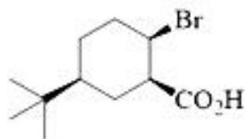  
A

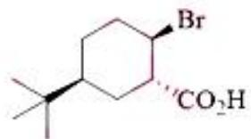  
B

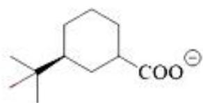  
C

(1)指出发生消除反应生成 C 的是哪一个化合物\_\_\_\_。简述理由\_\_\_\_。

(2)在同样的反应条件下, 另一个化合物发生消除反应生成 D, D 可使酸性 $\mathrm{KMmO}_{4}$ 溶液褪色, 但不与 $\mathrm{LiAlH}_{4}$ 发生反应。画出 D 的结构简式\_\_\_\_。

(3)画出化合物 B 的优势构象\_\_\_\_；用\*标记处化合物 B 中的不对称碳原子，并说明 R、S 构型\_\_\_\_。

【答案】 ①. A ②. 从构象分析:

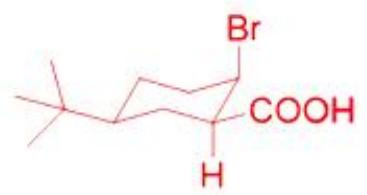

A

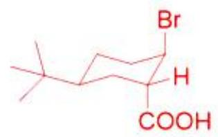

B

A 中 H 与 Br 处于反式共平面的位置，可以发生 E2 消除；B 中 H 和 Br 处于顺式，不能发生 E2 消除 ③.

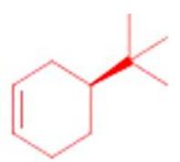

④.

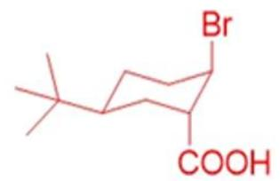

⑤.

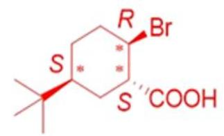

【解析】

【分析】

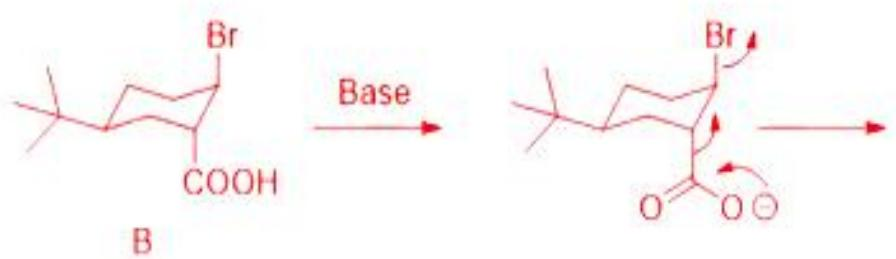

【详解】

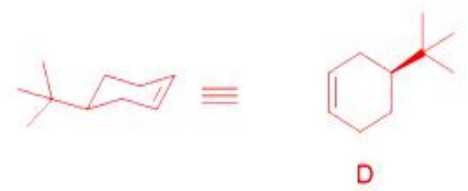

6. 金属簇合物是含有金属-金属键、具有精确组成的一类物质，常表现出优美的化学结构和独特的光物理性

能。

图 6-1-a 示出一种电中性银硫簇(简记为 $Ag_{12}S_{6}$ ) 的结构，包含 12 个银原子和 6 个硫原子(图中未区分原子大小)。6 个银原子位于同一平面(称为赤道面)，形成正六边形，彼此之间不成键。赤道面上、下方各有 3 个银原子，皆呈正三角形排布，彼此之间形成 Ag-Ag 键，并分别与赤道面。上的两个银原子形成 Ag-Ag 键。6 个硫原子的位置如图所示。

a.  
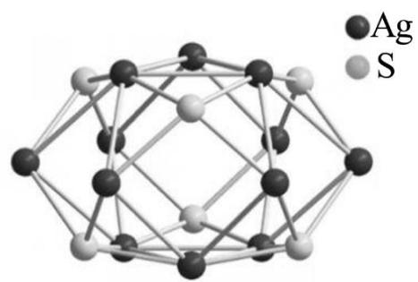

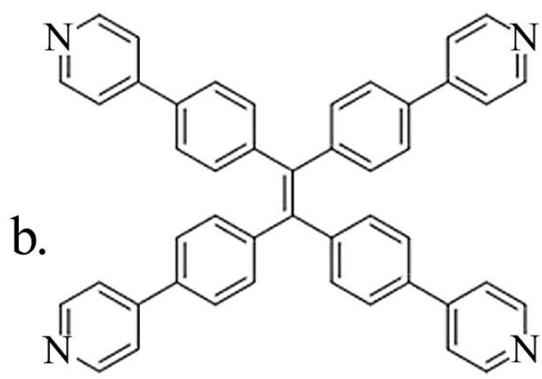

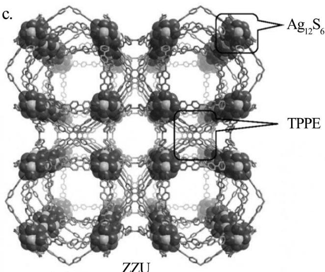  
TPPE  
图6- 1

(1)计算 $Ag_{12}S_{6}$ 中 Ag-Ag 键的个数\_\_\_\_。

(2)计算 $Ag_{12}S_{6}$ 中三角形面的个数\_\_\_\_。

(3) $Ag_{12}S_{6}$ 的硫原子来自于叔丁巯基，银为正一价。在 $Ag_{12}S_{6}$ 上还连接有若干个 $CF_{3}COO^{-}$ ，计算 $CF_{3}COO^{-}$ 的个数\_\_\_\_。

(4)聚集诱导发光(AIE)现象是一种由中国科学家首先发现的光致发光现象。具有 AIE 特性的有机分子在聚集状态下表现出远强于分散状态的光致发光性能。四苯乙烯(TPE)是一种典型的 AIE 分子。将 TPE 完全溶解于乙醇中，分别取等量的该溶液加入到等体积的水和甲苯中，判断哪一个体系的光致发光较强并简要解释原

因\_\_\_\_。

(5)利用上述 $Ag_{12}S_{6}$ 和图 6-1-b 所示的 TPPE 配体组装，得到一种晶体框架材料 ZZU(图 6-1-c)。ZZU 中，每个 $Ag_{12}S_{6}$ 连接 6 个 TPPE，每个 TPPE 连接 4 个 $Ag_{12}S_{6}.ZZU$ 属于立方晶系，正当晶胞参数 a=4.209mm，密度为 $0.618g\cdot cm^{-3}.ZZU$ 沿着晶轴方向的投影如图 6-2 所示，在图 6-2 中用粗虚线画出 ZZU 正当晶胞的投影 \_\_\_\_。计算每个正当晶胞中 $Ag_{12}S_{6}$ 和 TPPE 的数目 \_\_\_\_、\_\_\_\_。

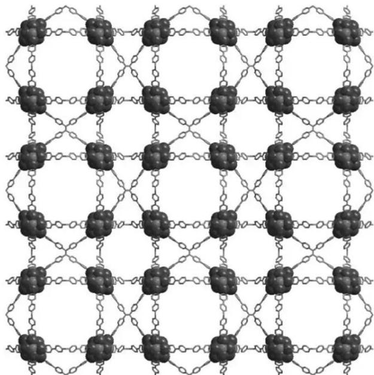  
图6-2

【答案】 ①.18 ②.32 ③.6 ④.在水中，TPE处于聚集态，具有较强的光致发光性能 ⑤.

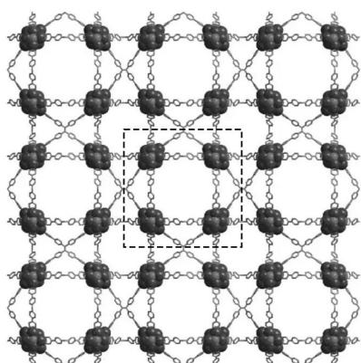

⑥. 8 ⑦. 12

【解析】
【分析】

【详解】(1)赤道平面上方银原子之间形成3个 $\mathrm{Ag - Ag}$ 键；赤道面上的银原子之间形成6个 $\mathrm{Ag - Ag}$ 键。共 $(3 + 6)\times 2 = 18$ 个 $\mathrm{Ag - Ag}$ 键。

(2)Ag-Ag-Ag三角形8个，Ag-Ag-S三角形 $4\times6=24$ 个，共32个。

(3)叔丁基巯基为-1价，银为+1价， $\mathrm{CF_3COO^-}$ 为-1价，整个簇呈电中性，因此 $\mathrm{CF_3COO^-}$ 的个数是6个。

(4)TPE 是有机物，由相似相溶原理可推测，其在有机溶剂中溶解度较好，在水中较差。因此，在甲苯中，TPE 完全溶解，光致发光弱：在水中，TPE 处于聚集态，具有较强的光致发光性能。

(5)晶胞投影如图所示。

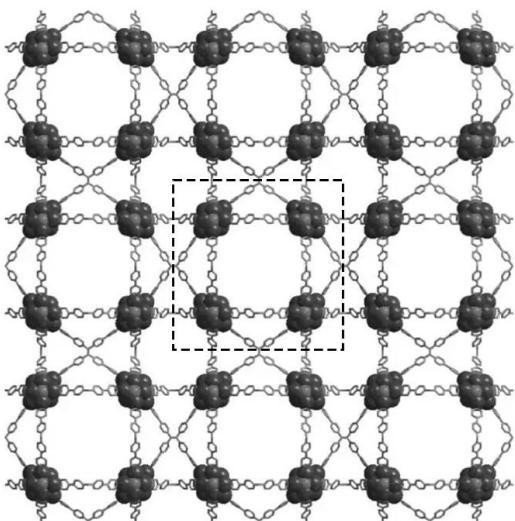

正当晶胞的体积为： $7.457 \times 10^{-20} \mathrm{~cm}^{3}$

正当晶胞的质量为： $4.61 \times 10^{-20}$ g

ZZU 的组成为 $(\mathrm{Ag}_{12}\mathrm{S}_{6})(\mathrm{TPPE})_{1}$ 。 $_{5}(\mathrm{C}_{4}\mathrm{H}_{9})_{6}(\mathrm{CF}_{3}\mathrm{COO})_{6}$ ，分子量为 3648.79。

每个正当晶胞中含有的 $Ag_{12}S_{6}$ 数量为 8 个，TPPE 的数量为 12 个。

7. 目前家用小型制氧机大多以变压吸附方式工作，其原理是以空气为原料，在加压时吸附剂将空气中大部分氮气吸附，氧气和未被吸附的少量氮气被收集起来，得到富氧空气。被吸附的氮气在减压条件下通过尾气管排至大气。某小型家用常压制氧机的标称参数为额定功率 100W，输出富氧空气中氧气浓度 91%(体积分数)，输出富氧空气流量为 $1.8L \cdot min^{-1}$ ，工作温度为 $25\%^{\circ}C$ 。以空气进气量 10mol 为对象，计算达到分离效果所需要的最小能量以及该家用制氧机的能量效率 \_\_\_\_、\_\_\_\_。空气由体积分数为 20% 的氧气和 80% 的氮气组成，排出的尾气中只有氮气。所有气体均视作理想气体。

【答案】 ①. $13 \mathrm{~kJ}$ ②. $7.1 \%$

【解析】

【详解】富氧空气中： $\frac{n_{O_{2}}}{n_{O_{2}}+n_{N_{2}}}=91\%$

得 $n_{N_{2}}=0.2mol$ ，所以排出的尾气为 7.8mol 氮气；

$$
\Delta S = n _ {\mathrm{N} _ {2}} ^ {\prime} R \ln \frac {V _ {\mathrm{N} _ {2}} ^ {\prime}}{V _ {\text {空气}}} + \left(n _ {\mathrm{N} _ {2}} ^ {\prime \prime} + n _ {\mathrm{O} _ {2}}\right) R \ln \frac {V _ {\mathrm{N} _ {2}} ^ {\prime \prime} + V _ {\mathrm{O} _ {2}}}{V _ {\text {空气}}}
$$

$$
\begin{array}{r l} & = n _ {\mathrm{N} _ {2}} ^ {\prime} R \ln \frac {\mathrm{n} _ {\mathrm{N} _ {2}} ^ {\prime}}{n _ {\text {空气}}} + (n _ {\mathrm{N} _ {2}} ^ {\prime \prime} + n _ {\mathrm{O} _ {2}}) R \ln \frac {n _ {\mathrm{N} _ {2}} ^ {\prime \prime} + n _ {\mathrm{O} _ {2}}}{n _ {\text {空气}}} \\ & = 7. 8 \mathrm{mol} ^ {\times} 8. 3 1 4 \mathrm{J} \cdot \mathrm{mol} ^ {- 1} \cdot \mathrm{K} ^ {- 1} \times \ln (\frac {7 . 8 \mathrm{mol}}{1 0 \mathrm{mol}}) + (2 \mathrm{mol} + 0. 2 \mathrm{mol}) ^ {\times} 8. 3 1 4 \mathrm{J} \cdot \mathrm{mol} ^ {- 1} \cdot \mathrm{K} ^ {- 1} \times \ln (\frac {2 \mathrm{mol} + 0 . 2 \mathrm{mol}}{1 0 \mathrm{mol}}) \\ & = - 4 3. 8 \mathrm{J} \cdot \mathrm{K} ^ {- 1} \\ & G = - T \triangle S = - (2 5 + 2 7 3. 1 5) \mathrm{K} ^ {\times} (- 4 3. 8 \mathrm{J} \cdot \mathrm{K} ^ {- 1}) = 1 3 \mathrm{kJ} \end{array}
$$

即所需要的最小能量是 13kJ;

$$
V = \frac {n R T}{p} = \frac {2 . 2 \mathrm{mol} \times 8 . 3 1 4 \mathrm{J} \cdot \mathrm{mol} ^ {- 1} \cdot \mathrm{K} ^ {- 1} \times 2 9 8 . 1 5 \mathrm{K}}{1 0 0 0 0 0 \mathrm{Pa}} = 5 5 \mathrm{L}
$$

机器需运转的时间： $t=\frac{55L}{1.8L\cdot\min^{-1}}=1833s$

供给的总能量： $Q=1833s^{\times}100J\cdot s^{-1}=183kJ$

$$
\eta = \frac {\left| W \right|}{Q} = \frac {13 \mathrm{kJ}}{183 \mathrm{kJ}} = 7.1 \%
$$

即制氧机的能量效率为 7.1%。

8. 佐米曲坦 $\left(\mathrm{C}_{16}\mathrm{HN}_{21}\mathrm{O}_{2}\right)$ 是治疗偏头疼的药物，其合成路线如下。画出 A、B、C、D 和 E 的结构简式\_\_\_\_。

$$
\begin{array}{r l} & \mathrm{H} _ {2} \mathrm{N} \\ & \mathrm{H} _ {3} \mathrm{CO} _ {2} \mathrm{C} \xrightarrow {\text { NaBH} _ {4}} \mathrm{CH} _ {3} \mathrm{OH} / \mathrm{H} _ {2} \mathrm{O}, \text {回流} \\ & \mathrm{NO} _ {2} \\ & \left[ \begin{array}{c c c c c c c c c c c c c c c c c c c c c c c c c c c c c c c c c c c c c c c c c c c c c c c c c c c c c c c c c c c c c c} \end{array} \right] \xrightarrow {\text {CICOCI}} \\ & \left[ \begin{array}{c c c c c c c c c c c c c c c c} & & & & & & & & & & & & & & & & & & & & & & & & & & & & & & & & & \\ B & & & & & & & & & & & & & & & & & & & & & & & & & & & & & & \\ & & & & & & & & & & & & & & & & & & & & & & & & & & & & \\ D & & & & & & & & & & & & & & & & & & & & & & & & & & & \end{array} \right] \xrightarrow {\text {H} _ {2} , 1 0 \% \mathrm{Pd/C}} \\ & \left[ \begin{array}{c c c c c c c c c} C _ {2} H _ {5} O H, H C l (a q.) \\ C _ {2} H _ {5} O \xrightarrow {\text {OC} _ {2} H _ {5}} N (\text {CH} _ {3}) _ {2} \\ C _ {2} H _ {5} O \xrightarrow {\text {CH} _ {3} C O O H , H _ {2} O , \text {回流}} \\ C _ {2} H _ {5} O \xrightarrow {\text {CH} _ {3} C O O H , H _ {2} O , \text {回流}} \\ C _ {2} H _ {5} O \xrightarrow {\text {CH} _ {3} C O O H , H _ {2} O , \text {回流}} \\ C _ {2} H _ {5} O \xrightarrow [ ]{\text {CH} _ {3} C O O H , H _ {2} O , \text {回流}} \\ C _ {2} H _ {5} O \xrightarrow [ ]{\text {CH} _ {3} C O O H , H _ {2} O , \text {回流}} \\ C _ {2} H _ {5} O \xrightarrow [ ]{\text {CH} _ {3} C O O O H , H _ {2} O , \text {回流}} \\ C _ {2} H _ {5} O \xrightarrow [ ]{\text {CH} _ {3} C O O O H , H _ {2} O , \text {回流}} \\ C _ {2} H _ {5} O \xrightarrow [ ]{\text {CH} _ {3} C O O O H , H _ {2} I O , \text {回流}} \\ C _ {2} H _ {5} O \xrightarrow [ ]{\text {CH} _ {3} C O O O H , H _ {2} I O , \text {回流}} \\ C _ {2} H _ {5} O \xrightarrow [ ]{\text {CH} _ {3} C O O O H , H _ {2} I O , \text {回流}}, \\ E, 佐 米 曲 坦 \end{array}
$$

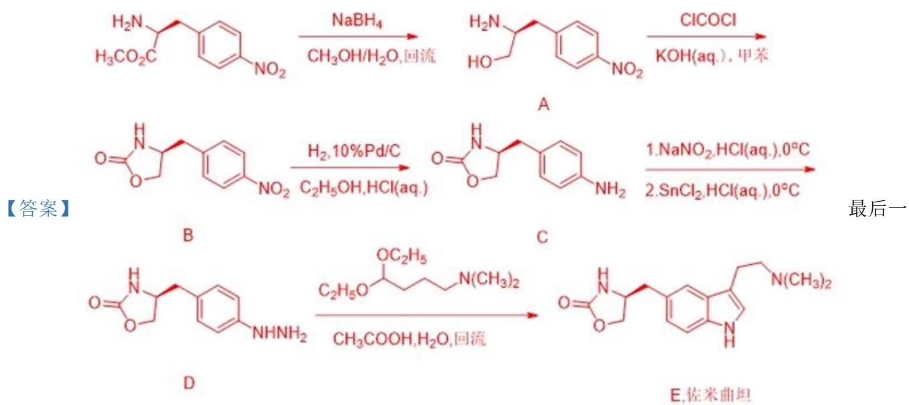

步反应为 Fischer 吲哚合