## 目录

第1章 化学反应方程式与核化学反应方程式
能力测试A卷/1 …… (参考解答/106)
能力测试B卷/6 …… (参考解答/113)
第2章 原子结构和分子结构
能力测试A卷/12 …… (参考解答/121)
能力测试B卷/17 …… (参考解答/132)
第3章 晶体结构初步知识
能力测试A卷/21 …… (参考解答/140)
能力测试B卷/26 …… (参考解答/147)
第4章 配位化合物初步知识
能力测试A卷/35 …… (参考解答/159)
能力测试B卷/40 …… (参考解答/166)
第5章 化学热力学初步知识
能力测试A卷/47 …… (参考解答/178)
能力测试B卷/52 …… (参考解答/186)
第6章 简单的化学动力学原理
能力测试A卷/61 …… (参考解答/198)
能力测试B卷/66 …… (参考解答/206)
第7章 溶液中的平衡
能力测试A卷/73 …… (参考解答/215)
能力测试B卷/77 …… (参考解答/224)

第8章 元素化学
能力测试 A 卷/82 …… (参考解答/235)
能力测试 B 卷/87 …… (参考解答/242)
第9章 有机化学
能力测试 A 卷/92 …… (参考解答/251)
能力测试 B 卷/98 …… (参考解答/258)
参考解答 …… 106

## 第1章

# 化学反应方程式与核化学反应方程式

能力测试 A 卷

## 第1题 (10分)

辉钼矿 $\left(\mathrm{MoS}_{2}\right)$ 是钼最重要的矿物。下图是辉钼矿多层焙烧炉的示意图，其中1,2,3,…是炉层编号；580,630,610,…是各炉层的温度(℃)。图中给出了各炉层的固态物料的摩尔百分组成。例如，图中示出第6号炉层上 $MoO_{3}$ ， $MoO_{2}$ 和 $MoS_{2}$ 的摩尔百分比约为20%，60%和20%（总计为100%）。

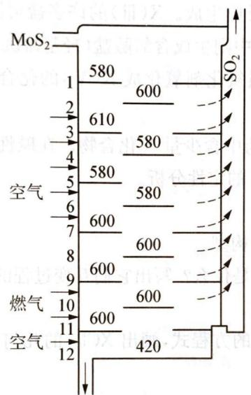

(第1题图)  
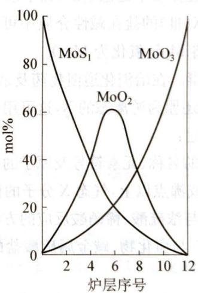

已知 $MoS_{2}$ 焙烧生成 1 mol $MoO_{3}$ 的反应热 (900 K) 为 $-1011\ kJ \cdot mol^{-1}$ ， $MoO_{2}$ 氧化生成 1 mol $MoO_{3}$ 的反应热为 $-154\ kJ \cdot mol^{-1}$ 。试通过计算或分析回答：

1-1 图中表明可能存在一种固一固反应,请写出该反应。

1-2 用存在固一固反应的假设来解释焙烧炉中层炉温的变化。

## 第2题 (10分)

四氮化四硫 $\left(\mathrm{S}_{4}\mathrm{N}_{4}\right)$ 是氮化硫类的一种。它可由二氯化二硫与氨合成，为橙色晶体，撞击或加热时易爆炸。 $S_{4}N_{4}$ 分子中的所有原子一起组成一个笼状结构，四个氮原子组成平面四边形，两个硫原子在平面上方，另外两个硫原子在平面下方。分子中有12个 $\pi$ 电子，这12个 $\pi$ 电子是完全非定域的，所有S—N键键长均约为162 pm，键级为1.65。

2-1 $\mathrm{S}_4\mathrm{N}_4$ 中S、N的氧化数各是多少？

2-2 写出由 $\mathrm{S}_2\mathrm{Cl}_2$ 与 $\mathrm{NH}_3$ 形成 $\mathrm{S}_4\mathrm{N}_4$ 的反应式。

2-3 为什么不能由 $\mathbf{N}_2$ 和S合成 $\mathrm{S}_4\mathrm{N}_4?$

2-4 请画出 $\mathbf{S}_4\mathbf{N}_4$ 的结构图。

2-5 N和S原子是如何提供12个 $\pi$ 电子的？

2-6 $\mathrm{S}_4\mathrm{N}_4$ 为什么是有色物？

2-7 所有 N—S—N 和所有 S—N—S 键角是否相等？

## 第3题 (10分)

某元素 X 在自然界中储量较低，其存在形态有游离态和化合态（主要为 $X_{2}O_{3}$ 和 $X_{2}S_{3}$ ）两种。X 是较弱的导体，其电导随温度的升高而降低，但熔融后迅速增加。X 的熔点是 545 K，熔融后体积缩小。X 的沸点为 $1883\ \text{K}(p=1.01\times10^{5}\ \text{Pa})$ 。该温度下的蒸汽密度为 $3.011\ g\cdot dm^{-3}$ ，而在 2280 K 和 2770 K 时蒸汽密度则分别为 $1.122\ g\cdot dm^{-3}$ 和 $0.919\ g\cdot dm^{-3}$ 。

X 不与无氧化性的稀酸反应,但可被浓硫酸或王水氧化转化为硫酸盐或氯化物(X 的氧化态为Ⅲ)。X(Ⅲ)的盐可与碱金属卤化物或硫酸盐作用形成配合物(如 XCl $_{4}^{-}$ 、XCl $_{5}^{2-}$ 和 X(SO $_{4}$ ) $_{2}^{-}$ 等)。X 也形成 XN 和 XH $_{3}$ 等化合物,在这些化合物中,X 的氧化态为-Ⅲ,X 还可生成 X $_{2}$ O $_{3}$ ,其中 X 的氧化态为IV。X(Ⅲ)卤化物也可由 X 和卤素直接反应生成。X(Ⅲ)的许多盐可溶解在乙醚和丙酮中。这些盐在强酸性介质中是稳定的,在中性介质中则生成含氧酸盐(羟基盐沉淀),并逐渐转化成如 XONO $_{3}$ 型体。X(Ⅲ)的盐在碱性介质中可被强氧化剂氧化成 X(V)的化合物,在酸性介质中 X(V)的化合物能将 Mn $^{2+}$ 氧化为 MnO $_{4}^{-}$ 。

X 的化合物有毒。在治消化道溃疡药及杀菌药中含少量 X 化合物。在碱性介质中，用亚锡酸盐可将 X 的化合物还原为游离态的 X，这可用于 X 的定性分析。

请回答下列问题：

3-1 写出 X 的名称、元素符号及原子的电子构型。

3-3 写出 X 与浓硫酸、稀硝酸反应的方程式。

3-4 写出 $\mathrm{X}^{3+}$ 与卤化物、碱金属硫酸盐配位的方程式，画出 $\mathrm{XCl}_6^-$ 的几何构型，说明 X 用什么轨道成键？

3-5 写出 X(Ⅲ)盐水解的反应方程式。

3-6 写出在酸性介质中五价 X 化合物与 $\mathrm{Mn}^{2+}$ 反应的离子方程式。

3-7 写出 X(Ⅲ)化合物与亚锡酸盐发生还原反应的方程式,为什么该反应必须在较低温度下进行?

3-8 确定下列原电池的正负极: Pt, H₂ | HCl | XCl₃, X。

## 第4题 (10分)

照相时若曝光不足,则已显影和定影的黑白底片图像淡薄,需要对其进行加厚处理;若曝光过度,则需对图像进行减薄。

4-1 加厚的一种方法是: 把底片放入由硝酸铅、赤血盐溶于水配成的溶液, 取出, 洗净, 再用硫化钠溶液处理。写出底片图像加厚的反应方程式。

4-2 减薄的一种方法是: 按一定比例混合硫代硫酸钠溶液和赤血盐溶液, 把要减薄的底片用水充分湿润后浸入, 适当减薄后, 取出冲洗干净。写出底片图像减薄的反应方程式。

4-3 如底片经过加厚处理后,图像仍不明显,能否再次用以上方法继续加厚?又经减薄后的底片,能否再次用以上方法减薄?说明理由。

第5题 (10分)

保险粉是 $Na_{2}S_{2}O_{4}$ 的工业俗名。它的年产量高达 30 万吨，是产量最大的人造无机盐之一，大量用于漂白纸张、纸浆和陶土以及印染。生产保险粉的方法之一是：先把甲酸(HCOOH)和溶于甲醇和水的混合溶剂的 NaOH 混合，再通入 $SO_{2}$ 气体，就得到保险粉。

5-1 写出甲酸法生产保险粉的配平的化学方程式。你认为此法中甲醇的作用是什么？为什么？

5-2 保险粉的重要工业应用之一是瓮染。瓮染的染料必须先在烧碱溶液里与保险粉反应，所得的产物才会和棉纤维结合，然后织物经漂洗后再把反应产物回复到原来的染料。下面是一种

瓮染法的蓝色染料的结构式：

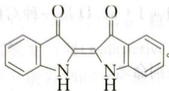

(1) 写出该蓝色染料和保险粉反应得到的产物的可能结构式。说明理由。

(2) 为什么必须令染料跟保险粉反应才能使染料和织物结合？扼要地描述结合的机理。

(3) 为什么最后还要把反应产物回复到染料原来的形态？怎样回复？

5-3 保险粉的用途之一是除去废水里的 $\mathrm{CrO}_4^{2-}$ 。据说这是迄今除去中性或碱性废水里的 $\mathrm{CrO}_4^{2-}$ 的最有效的方法。往废水里通 $\mathrm{SO}_2$ 不能达此目的。试写出配平的离子方程式。

5-4 研究人员已经使用和正在研究用其他工业原料和 $\mathrm{SO}_2$ 反应来制取保险粉，例如，使用 $\mathrm{NaBH}_4$ 已经达到工业生产的规模 $(\mathrm{pH} = 5\sim 6)$ 。你能写出该反应的离子方程式吗？

5-5 根据你所学的化学知识还能想到其他生产保险粉的更廉价的原料吗？

第6题 (10分)

印度卡拉拉省沙滩的砂子里含有大量的独居石,富含钍,被大量利用。典型的独居石样品中含约9%的 $ThO_{2}$ 和0.35%的 $U_{3}O_{8}$ 。 $^{208}Pb$ 和 $^{206}Pb$ 分别是 $^{232}Th$ 和 $^{238}U$ 衰变的稳定的最终产物,独居石中所有的铅(Pb)都是衰变产物。

用质谱仪测定出 $^{208}Pb/^{232}Th$ 原子比为0.104。 $^{232}Th$ 和 $^{238}U$ 的半衰期分别为 $1.41\times10^{10}$ 年和 $4.47\times10^{9}$ 年，假设整个独居石样品中的 $^{208}Pb,^{206}Pb,^{232}Th$ 和 $^{238}U$ 从生成独居石后保持不变。

6-1 计算独居石样品的年龄(从生成时算起)。

6-2 计算独居石样品中 $^{206}Pb/^{238}U$ 的原子比。

6-3 钍-232 是核能原料, 在热中子照射下, 它吸收中子连续发生 $\beta$ 衰变生成 $^{233}\mathrm{U}$ 。写出由 $^{232}\mathrm{Th}$ 生成 $^{233}\mathrm{U}$ 的核反应序列。

在 $^{233}$ U的裂变中，先生成一种放射性的裂变混合物。其中的裂变产物 $^{101}$ Mo发生的放射性衰变过程如下： $^{101}_{42}$ Mo $\xrightarrow[t_{1/2}=14.6\ min]{101}_{43}$ Tc $\xrightarrow[t_{1/2}=14.3\ min]{101}_{44}$ Ru

6-4 某新鲜制备的纯净 $^{101}$ Mo样品在初始时含有5000个 $^{101}$ Mo原子。经过14.6分钟后分别有多少个如下原子？

① $^{101}$ Mo; ② $^{101}$ Tc; ③ $^{101}$ Ru

(10 分)

$NO_{2}$ 是一个奇电子分子, 在 413 K 以下能二聚成无色的抗磁性气体 $N_{2}O_{4}$ , 超过 423 K 时, $NO_{2}$ 发生分解。 $N_{2}O_{4}$ 被用作第一艘登月飞船的液体推进系统中的氧化剂, 其主要燃料是肼。 $N_{2}O_{4}$ 仅在固态时是纯净物, 其熔点为 264 K, 沸点为 294 K。X-射线衍射分析结果表明: $N_{2}O_{4}$ 分子是平面状结构,且所有的 N—O 键长都相等。当 $N_{2}O_{4}$ 为液态时,能够微弱的离解生成硝酸亚硝酰盐

7-1 写出 $\mathrm{N}_2\mathrm{O}_4$ 在登月飞船的液体推进系统中所发生的主要反应方程式。

7-2 说明 $\mathrm{N}_2\mathrm{O}_4$ 分子中N原子的杂化方式和成键情况。

7-3 将铜溶于乙酸乙酯的 $\mathrm{N}_2\mathrm{O}_4$ 溶液中可制得无水硝酸铜。写出其化学反应方程式。

7-4 将 $\mathrm{N}_2\mathrm{O}_4$ 分别加热到 $420\mathrm{K}$ 和 $900\mathrm{K}$ 时，得到两种含氮物质A和B。将等物质的量的A和B的混合物溶解在冰水中，生成化合物C。用C的阴离子 $(\mathrm{C}^{\mathrm{a}-})$ 处理 $\mathrm{Co}^{2+}$ 和 $\mathrm{NH}_3$ 的混合溶液，在不同的反应条件下，能得到两种配离子D和E。元素分析结果表明：D和E具有相同的组成，物质的量之比为 $n(\mathrm{Co}^{\mathrm{b+}}):n(\mathrm{C}^{\mathrm{a}-}):n(\mathrm{NH}_3)=1:1:5$ 。D是一种对酸稳定的棕黄色配离子，而E是一种易被酸分解的红色配离子。

(1) 写出 D、E 两个配离子的化学式，并分别命名。

(2) 用磁矩和红外光谱能否区分 D 和 E? 并分别说明理由。

7-5 在 $293\mathrm{K}$ 和 $50.6\mathrm{kPa}$ 下， $\mathrm{N}_2\mathrm{O}_4$ 的离解度为 $19.5\%$ ；在 $353\mathrm{K}$ 和相同压力下， $\mathrm{N}_2\mathrm{O}_4$ 的解离度为 $85.0\%$ 。计算反应 $\mathrm{N}_2\mathrm{O}_4 \rightleftharpoons 2\mathrm{NO}_2$ 的 $\Delta_{\mathrm{r}}H_{\mathrm{m}}^{\theta}$ 。

## 第8题 (10分)

硼是第二周期元素,和其他第二周期元素一样,与同族其他周期元素相比具有特殊性。

8-1 溴甲酚绿指示剂的 $\mathrm{pH}$ 值变色范围为 $3.8\sim 5.4$ ，由黄色变为蓝色。该指示剂在饱和硼酸溶液中呈黄蓝过渡色，在二氟化氢钾溶液中呈黄色，但在加有适量硼酸的二氟化氢钾溶液中呈蓝色。请写出后者有关的离子方程式。

8-2 硼可与氮形成一种类似于苯的化合物,俗称无机苯,是一种无色液体(沸点 $55^{\circ}\mathrm{C}$ ),具有芳香气味,许多物理性质都与苯相似,但其化学性质较苯要活泼的多,如冷却时会缓慢水解,易与 $\mathrm{Br}_{2}$ 、HCl发生加成反应等。

(1) 写出其分子式, 画出其结构式并标出形式电荷。

(2) 写出无机苯与 HCl 加成反应的方程式。

(3) 无机苯的三甲基取代物遇水会发生水解反应,试写出反应方程式并以此判断取代物的可能结构。

8-3 硼与氮可生成二元固体聚合物。试指出聚合物的可能结构(类似于何种结构)，并说明是否具有导电性。

8-4 画出无限网状多硼酸盐聚合物水氯硼钙石 $\mathrm{Ca}_{2}[\mathrm{B}_{5}\mathrm{O}_{9}]\mathrm{Cl}\cdot 2\mathrm{H}_{2}\mathrm{O}$ 中聚硼阴离子单元的结构示意图，并指出阴离子单元的电荷与硼的哪种结构方式有关？

## 第9题 (10分)

现已发现许多含金的化合物可以治疗风湿症等疾病,引起科学家的广泛兴趣。在吡啶( $\ce{C6H5N}$ )的衍生物2,2-联吡啶 $\ce{C6H5N}$ (代号A)中加入冰醋酸与30% $H_2O_2$ 的混合溶液,

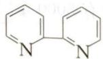

反应完成后加入数倍体积的丙酮,析出白色针状晶体 B(化学式 $C_{10}H_{8}N_{2}O_{2}$ )。B 的红外光谱显示它有一种 A 没有的化学键。B 分成两份,一份与 $HAuCl_{4}$ 在温热的甲醇中反应得到深黄色沉淀 C。另一份在热水中与 $NaAuCl_{4}$ 反应,得到亮黄色粉末 D。用银量法测得 C 不含游离氯而 D 含游离氯 7.18%。C 的紫外光谱在 211 nm 处有吸收峰,与 B 的 213 nm 特征吸收峰相近,而 D 则没有这一吸收。C 和 D 中金的配位数都是 4。

9-1 画出 B、C、D 的结构式。

9-2 写出生成 B、C 和 D 的化学反应方程式，并指出 C、D 分子中 Au 原子的杂化形态。

9-3 制备B的过程中加入丙酮起什么作用？

9-4 给出用游离氯测定值得出D的化学式的推理和计算的过程。

第10题 (10分)

铀(U, Z=92)是一种天然放射性元素，它是 $^{238}$ U(同位素丰度99.3%，半衰期 $t_{1/2}=4.47\times10^{9}y$ )和 $^{235}$ U(同位素丰度0.7%，半衰期 $t_{1/2}=7.04\times10^{8}y$ )的混合物。它们形成于元素演化(核合成)时期，均为 $\alpha-$ 射线源。它们连续地释放出 $\alpha-$ 粒子( $He^{2+}$ )和 $\beta-$ 粒子而渐次蜕变，但顺序不同，由此形成两个天然放射性元素蜕变系列(radioactive serie，译注：此外还有一个天然放射性元素蜕变系列)，蜕变系列的最终产物分别为Pb(Z=82)的两种稳定同位素 $^{206}$ Pb和 $^{207}$ Pb。每一次蜕变同时放出 $\gamma-$ 射线，但对元素的蜕变没有影响。相比之下， $^{235}$ U比 $^{238}$ U更不稳定，更容易吸收热中子而发生裂变，该事实使 $^{235}$ U成为核反应堆的合适燃料。其裂变反应可表述如下：

$^{235}$ U + n → U\* → 裂变产物 + 2 \~ 3n + 200 MeV/ $^{235}$ U 核

10-1 计算每完成一次 $^{238}$ U→ $^{206}$ Pb 和 $^{235}$ U→ $^{207}$ Pb 两个天然放射性元素蜕变系列分别总共放出多少 $\alpha$ -粒子和 $\beta$ -粒子。

10-2 解释为什么在这两个蜕变系列中某些元素的出现不止一次。

10-3 假定在核合成时期得到等量的铀同位素 $(^{235}\mathrm{U}:^{238}\mathrm{U} = 1:1)$ , 计算地球的年龄 (即自核合成至今的时间)。

10-4 计算与 $1\mathrm{g}^{235}\mathrm{U}$ 裂变释放的能量相等(所需燃烧的)碳的量 $\mathrm{/g}$ (碳因发生如下反应而释放能量): $\mathrm{C} + \mathrm{O}_2 \longrightarrow \mathrm{CO}_2 + 393.5\mathrm{kJ} \cdot \mathrm{mol}^{-1}$ (或 $4.1\mathrm{eV}/$ 分子)。

量的： $(O/V)d^{9}$ 的边界最大量大为 $d^{9}$ ，其长度范围并发形式边界的平铺出管

正如派射，波段。综合外基簇原金如派原金都长者已立，本图于金干由二叶一呈郑出薄一台外基簇原金边交。剔除外来田中毒 $b_{\alpha}m$ 主语词。 $O(O)_{2}$ 削基簇四如派射， $O(O)_{5}$ 削基簇 $\mathrm{or}(OO)_{2}\mathrm{nM}$ 麻 $s(O)_{3}O$ 削合源对双如派射又 $OO$ 已重译法。倾赋干由-81部数减干申价的中源国女心中原金的集合源中两支式大项，倾跌于由81部数成。 $^{2}(a_{4})^{2}(b_{3})[1A]$ 伏态距干申价 $nM$ 景 $sH_{2}(eH_{2}O)$ 寿交二，波段。本图一 $^{c}$ 补用方曾由 $eH_{2}$ 干离负极二支项。剔除金一原金如派射 $s=1$ ，指出 $A\sim K$ 万何物质并写出 $1\sim14$ 所有方程式。综合外典至的倾跌于由81部整个一聚合出配主 A 由氧 A 聚合出的源用户空权配主应义 $H_{2}O_{5}$ 酶缺二色不味 $(OO)W$ 合补，内圈选 A 00 08 选 00d1 激光代入 $gH\backslash aN$ 阶痕五眼用指由 A 醇合出。B 条题是 A 醇给出上，圆锥 $d_{00}$ OFO 约 40 的主带对题面、测示显间 $m_{0}$ 481 味 MFI 主 A 醇立交 Gd, HCl, CH3 能西脂正水分醇酸驻身时的醇各对源金顶盒的酶酶的源金含酚含氯化钠知键

$$
\begin{array}{r l} & {\text {到什么作用?}} \\ & {3 - 6 \quad \text {如果在反应8中所做的有}} \\ & {\text {比的} ^ {-} \mathrm{Cl}?} \\ & {3 - 7 \quad \text {由样品I生成的丁包含多少百分比的}} \\ & {\mathrm{O} \xrightarrow [ \mathrm{nobergim} ]{\mathrm{latem}}} \end{array}
$$

## 能力测试 B 卷

## 第1题 (10分)

硝酸铅 $\left[\mathrm{Pb}\left(\mathrm{NO}_{3}\right)_{2}\right]$ 和碘化钾(KI)在水溶液里反应形成黄色的碘化铅 $\left(\mathrm{PbI}_{2}\right)$ 沉淀。现进行一系列实验，保持反应物的总量5.000g不变而改变每种反应物的质量。将形成的碘化铅从溶液里过滤出来，洗涤，干燥。从这一系列实验中得到的数据如下，附空白图。

<table><tr><td>实验</td><td>硝酸铅的质量/g</td><td>碘化铅的质量/g</td></tr><tr><td>1</td><td>0.500</td><td>0.692</td></tr><tr><td>2</td><td>1.000</td><td>1.388</td></tr><tr><td>3</td><td>1.500</td><td>2.093</td></tr><tr><td>4</td><td>3.000</td><td>2.778</td></tr><tr><td>5</td><td>4.000</td><td>1.391</td></tr></table>

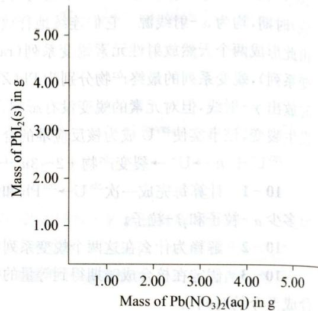

1-1 完成作图,即将数据标入图中并画出一条大致上将数据连接起来的曲线。由该图确定:何时得到沉淀的量最大?

1-2 写出配平的反应方程式并用以计算 $\mathrm{PbI}_2$ 的最大量以及相应的 $\mathrm{Pb(NO_3)_2}$ 的量。

## 第2题 (10分)

一氧化碳是一种二电子给予配体,它与许多过渡金属形成金属羰基化合物。例如,铁形成五羰基铁 $\mathrm{Fe(CO)}_{5}$ ,镍形成四羰基镍 $\mathrm{Ni(CO)}_{4}$ 。后者在 Mond 法中用来提纯镍。这些金属羰基化合物中的价电子数遵循 18-电子规则。钴和锰与 CO 反应形成双核配合物 $\mathrm{Co}_{2}(\mathrm{CO})_{8}$ 和 $\mathrm{Mn}_{2}(\mathrm{CO})_{10}$ (Mn 的电子组态为 $[\mathrm{Ar}] (3\mathrm{d})^{5}(4\mathrm{s})^{2}$ )。为遵循 18 电子规则,须认为这两种配合物的金属中心之间形成金属—金属键。环戊二烯负离子 $\mathrm{C}_{5} \mathrm{H}_{5}^{-}$ 也曾广泛用作 $\eta^{5}-$ 配体。例如,二茂铁 $(\mathrm{C}_{5} \mathrm{H}_{5})_{2} \mathrm{Fe}$ 是一个遵循 18 电子规则的经典化合物。

$\mathrm{W(CO)_6}$ 和环戊二烯钠 $\mathrm{NaC_5H_5}$ 反应生成对空气敏感的化合物 A。 $\mathrm{FeSO_4}$ 氧化 A 生成化合物 B。化合物 A 也能用强还原剂 $\mathrm{Na/Hg}$ 与 B 反应制得。在红外光谱 $1600 \sim 2300 \, \mathrm{cm^{-1}}$ 范围内，化合物 A 在 1744 和 $1894 \, \mathrm{cm^{-1}}$ 间显示吸收，而 B 的吸收带在 1904 和 $2010 \, \mathrm{cm^{-1}}$ 间。化合物 A 是强亲核试剂，是合成含金属—碳键的有机金属化合物的优良起始物。A 与溴丙炔 ( $\mathrm{HC} \equiv \mathrm{CCH_2Br}$ ) 反应得到含金属—碳 $\sigma$ -键化合物 C。 $\mathrm{NaC_5H_5}$ $\mathrm{FeSO_4}$

$$
\begin{array}{c} \mathrm {W(CO) _ {6}} \xrightarrow {\mathrm {NaC_ {5} H_ {5}}} \mathrm{A} \xrightarrow [ \mathrm{Na/Hg} ]{\mathrm {FeSO_ {4}}} \mathrm{B} \\ \mathrm {HC\equiv CCH_ {2} Br} \Bigg \downarrow \\ \mathrm{C} \xrightarrow [ \text { migration } ]{\text { metal }} \mathrm{D} \end{array}
$$

在室温下化合物 C 发生转化反应生成化合物 D。C 和 D 的化学组成相同。溴丙炔和 C 及 D 的 ${}^{1}$ HNMR 谱中的 $CH_{2}$ 和 CH 核磁共振化学位移 ( $\delta$ ) 以及耦合常数 $J_{H-H}$ 如下表所示：

<table><tr><td> $^1\text{H-NMR}$ </td><td> $\text{HC}\equiv\text{CCH}_2\text{Br}$ </td><td>C</td><td>D</td></tr><tr><td> $\delta(\text{CH}_2)$ </td><td>3.86</td><td>1.90</td><td>4.16</td></tr><tr><td> $\delta(\text{CH})$ </td><td>2.51</td><td>1.99</td><td>5.49</td></tr><tr><td> $J_{\text{H-H}}(\text{Hz})$ </td><td>2.7</td><td>2.8</td><td>6.7</td></tr></table>

2-1 解释为何 A 和 B 的 IR 谱不同。

2-2 画出 A、B、C 和 D 的结构。

2-3 C转化为D涉及金属原子向配体的炔基转移(重排)。画出用 $\mathrm{DC}\equiv \mathrm{CCH}_2\mathrm{Br}$ 合成的C和D的结构。

## 第3题 (10分)

化合物 A 是金属 H 的一种稳定的盐。除去金属以后它含有 11.97% N, 3.45% H 和 41.03% O(质量分数)。下图描述了从 A 到 H 的一系列反应(△表示加热)。箭头上方显示了必要的反应物。所有用一个字母标记的物质包含这种金属,但是所有副产物都不包含这种金属(若某物质被标为在水中溶解,那么它是离子型的,并且你只需要写出包含这种金属的离子)。

$$
\begin{array}{l} \text {①△} \\ A _ {(s)} \xrightarrow {\text {④H} _ {2} \mathrm{O}} D _ {(a q)} \xrightarrow {\text {⑤H} ^ {+} / \mathrm{H} _ {2} \mathrm{O}} C _ {(a q)} \xrightarrow {\text {③Zn/H} ^ {+}} \\ \text {⑥SO} _ {2} / \mathrm{H} ^ {+} \\ F _ {(a q)} \xrightarrow {\text {⑦E} _ {(a q)}} G _ {(a q)} \xrightarrow {\text {⑦F} _ {(a q)}} E _ {(a q)} \\ H _ {(s)} \xrightarrow {\text {⑧Cl} _ {2}} I _ {(l)} \xrightarrow {\text {⑨△}} J _ {(s)} \xrightarrow {\text {⑩H} _ {2}} K _ {(s)} \\ \text {I + K} \end{array}
$$

3-1 指出 A\~K 为何物质并写出 1\~14 所有方程式。

3-2 从反应中选出氧化还原过程。

3-3 从 A\~K 中选出不应含有未成对电子的化合物。

3-4 根据上图推出由 F 得到 G 的一个反应, 且不用到 E。

3-4 根据上图推出由 F 得到 G 的一个反应,且不用到 3-5 化合物 B 在工业上十分重要。写出一个其为必不可少的部分的反应,它在该反应中起到什么作用?

到什么作用?
3-6 如果在反应8中所使用的氯气包含99% $^{37}$ Cl和1% $^{35}$ Cl,那么产物I包含多少百分比的 $^{35}$ Cl?

3-7 由样品 I 生成的 J 包含多少百分比的 $^{35}$ Cl?

## 第4题 (10分)

铬的金属半径约为 126 pm。铬的密度是 $7.14 \, g \cdot cm^{-3}$ 。固体铬属于规则的立方晶系。

4-1 仅用以上确定铬的晶格类型。

曾有如下的用来检测 $\mathrm{Cl}^-$ 离子存在的方法: 将未知材料与重铬酸钾的干燥混合物与浓 $\mathrm{H}_{2} \mathrm{SO}_{4}$ 一起加热。生成的气体通入 $\mathrm{NaOH}$ 溶液, 若出现黄色说明有氯存在。

4-2 此反应中生成的挥发性铬化合物是什么？画出其结构。注意 $\mathrm{Cr}$ 和 $\mathrm{Cl}$ 在反应中氧化态均未改变。

4-3 铬酸钾溶液的酸化会生成橙色的重铬酸根离子,然后是较深红色的三和四铬酸根离子。用浓硫酸我们可以得到一种不含钾的红色沉淀。写出方程式并画出离子的结构。你可以推出这种沉淀的结构吗?

4-4 下图给出了一系列的含铬物种在酸性 $(\mathrm{pH} = 0)$ 和碱性 $(\mathrm{pH} = 14)$ 介质中的 Latimer 图：

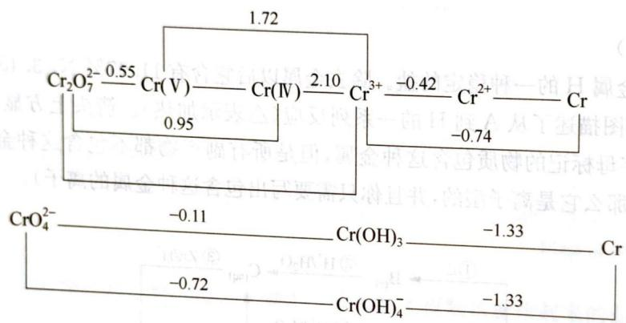

计算未标出的三个值。

4-5 $\mathrm{Cr(V)}$ 和 $\mathrm{Cr(IV)}$ 在歧化反应中稳定吗？说明基于Latimer图的一种判断标准。 $\mathrm{Cr^{2+}}$ 的歧化反应的平衡常数是多少？

4-6 计算氢氧化铬(Ⅲ)的溶度积常数和四羟基铬(Ⅲ)阴离子的总稳定常数。
4-7 下图给出了一系列的与氧相关的物种有验证。

4-7 下图给出了一系列的与氧相关的物种在酸性 $(\mathrm{pH} = 0)$ 和碱性 $(\mathrm{pH} = 14)$ 介质中的 Latimer 图：

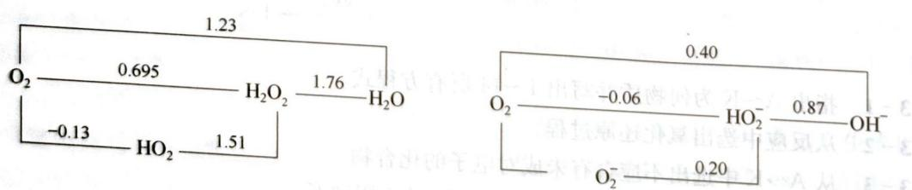

如果含有铬(Ⅵ)、Cr(Ⅲ)和过氧化氢的溶液的pH设为0,那么将会发生什么?如果我们把pH设为14会发生什么?写下这些反应和相应的标准电势。

## 第5题 (10分)

含氮化合物广泛用于工业,如肥料和炸药。无色晶状化合物 A(含 6.67% 的氢)在隔绝空气条件下爆炸,分解仅得到 B 和 C。在通常状态下 B 和 C 是气态,是用于合成含氮肥料的最重要的试剂。晶体 A 溶于浓盐酸后,该溶液中加入金属 D(通常用于实验室中从多种气体中除去痕量氧),

金属 D 易溶解在此溶液中并释放出气体 B。将制备的混合物加入过量热的无水乙醇，最终缓慢生成一种红色针状沉淀 E（含 47.33% Cl）。将其在空气中放置使之转化成蓝色晶状粉末 F（含 37.28% D 和 41.6% Cl）。

5-1 判断 A\~F 所代表的化合物，并写出所涉及的反应。

5-2 在化合物E和F中，金属D的配位数是多少？绘出这些化合物的结构。

5-3 提出一种制备 A 的方法, 要求从 $NH_{3}$ 和 $HNO_{3}$ 的浓溶液出发, 并使用最少种类的参与反应的试剂。

5-4 写出 F 的水解方程式, 计算溶于 1 L 水得到 pH=3 的溶液的 F 的量(该水解反应的平衡常数为 0.127)。

5-5 真空中缓慢加热 F，得到盐 G 和液体 H 的蒸气（它在 $CCl_{4}$ 的极稀溶液中的 IR 光谱，在 $3600 \, cm^{-1}$ 和 $1680 \, cm^{-1}$ 处有两个强吸收带）。可以认为 G—H 体系为复盐吗？除 F 外，该体系是否存在其他化合物？与 F 相比，它们的热稳定性如何？

第6题 (10分)

向盐酸酸化的碘化钾饱和溶液中通入氯气，直到开始析出黑色沉淀A。提取上层深色清液，从中分离出一黑色的含 $90.7\%$ 的碘的化合物B。加热干燥沉淀A，则A完全升华，形成美丽的紫色蒸气，然后凝聚成有金属光泽的暗黑色晶体。将氯气继续通入最初的溶液，得到一暗红色的溶液，当用冰冷却时，析出晶体C。在 $160^{\circ}\mathrm{C}$ 加热物质C时，失去起初重量的 $68.6\%$ 转变成极易溶于水的白色化合物D，发现该化合物可作为肥料而且有工业价值。化合物C热分解时，释放蒸气的质谱显示，图谱中 $M / Z$ 为162和164的峰值强度比为3：1。继续通氯气产生鲜黄色晶状沉淀，过滤出该沉淀后，小心地使其干燥，得到化合物E，它和化合物C含有相同的元素。1 mmol E和过量的碘化钾水溶液混合搅拌后，生成含有化合物B的深红色溶液。用4 mmol硫代硫酸钠滴定该溶液，可使溶液完全褪色。如果氯气通入化合物E的稀水溶液，最终变为无色，形成碘离子。

6-1 写出A和D的化学式。

6-2 质谱的 $M / Z$ 为162和164的峰能指派何种分子碎片？假定任何一种化合物，在其质谱中的碎片能显示出一对峰，其峰值与题中所述值有相同强度比值和相同的质量差。

6-3 写出B的化学式。

6-4 写出E的化学式和下面给出的反应链中所包含的反应：

$$
\begin{array}{c} \mathrm{A} \xleftarrow {\mathrm{Cl} _ {2}} \mathrm{B} \xleftarrow {\mathrm{Cl} _ {2}} \mathrm{KI} \xrightarrow {\mathrm{Cl} _ {2}} \mathrm{C} \xrightarrow {\mathrm{Cl} _ {2}} \mathrm{E} \xrightarrow [ \mathrm{H} _ {2} \mathrm{O} ]{\mathrm{Cl} _ {2}} \mathrm{IO} _ {3} ^ {-} \\ \downarrow t \\ \mathrm{D} \end{array}
$$

6-5 写出 A 转化成 B, C 转化成 B, D 转化成 C 的反应方程式。

## 第7题 (10分)

1990 年代初发现了碳纳米管, 它们是管径仅几纳米的微管, 其结构相当于石墨结构层卷曲连接而成。近年, 人们合成了化合物 E 的纳米管, 其结构与碳纳米管十分相似。

气体 A 与气体 B 相遇立即生成一种白色的晶体 C。已知在同温同压下，气体 A 的密度约为气体 B 的密度的 4 倍；气体 B 易溶于水，向其浓水溶液通入 $CO_{2}$ 可生成白色晶体 D；晶体 D 的热稳定性不高，在室温下缓慢分解，放出 $CO_{2}$ 、水蒸气和 B；晶体 C 在高温下分解生成具有润滑性的白色晶体 $E_{1}$ ； $E_{1}$ 在高温高压下可转变为一种硬度很高的晶体 $E_{2}$ 。 $E_{1}$ 和 $E_{2}$ 是化合物 E 的两种不同结晶形态，分别与碳的两种常见同素异形体的晶体结构相似，都是新型固体材料；E 可与单质氟反应，主要产物之一是 A。

7-1 写出 A、B、C、D、E 的化学式。

7-2 写出 A 与 B 反应的化学反应方程式, 按酸碱理论的观点, 这是一种什么类型的反应? A、B、C 各属于哪一类物质?

7-3 分别说明 $\mathrm{E}_1$ 和 $\mathrm{E}_2$ 的晶体结构特征、化学键特征和它们的可能用途。

7-4 化合物 A 与 $C_{6}H_{5}NH_{2}$ 在苯中回流，可生成它们的 1:1 加合物；将这种加合物加热到 $280^{\circ}C$ ，生成一种环状化合物（其中每摩尔加合物失去 2 摩尔 HF）；这种环状化合物是一种非极性物质。写出它的分子式和结构式。

## 第8题 (10分)

湖南是有色金属之乡，如锌、锑的蕴藏量都居全国之首。

8-1 用铁屑同辉锑矿(主要成分为 $\mathrm{Sb}_2\mathrm{S}_3$ )共热可制得锑,其反应式为

8-2 锑用于制造铸字合金这是由于锑具有\_\_\_\_特性。

8-3 $\mathrm{SbF}_{3}$ 具有显著的导电性, 这可能是由于 \_\_\_\_ 作用, 试写出其反应式: \_\_\_\_ ; $\mathrm{SbF}_{3}$ 能大大增强 $\mathrm{HSO}_{3} \mathrm{~F}$ 的酸度, 在这种超酸介质中链烷也能起碱的作用, 写出叔碳原子在这种介质中所进行的反应 \_\_\_\_ 。

8-4 已知 $\mathrm{SbCl}_3$ 熔点 $73.2^{\circ}\mathrm{C}$ ; $\mathrm{SbCl}_5$ 熔点 $2.8^{\circ}\mathrm{C}$ , 高于 $106^{\circ}\mathrm{C}$ 时分解, $\Delta_{\mathrm{f}}G^{\theta}(\mathrm{SbCl}_3) = -322.5 \mathrm{~kJ} \cdot \mathrm{mol}^{-1}$ , $\Delta_{\mathrm{f}}G^{\theta}(\mathrm{SbCl}_5) = -345.35 \mathrm{~kJ} \cdot \mathrm{mol}^{-1}$ , 若 $25^{\circ}\mathrm{C}$ 时, 将 $0.1 \mathrm{~mol} \mathrm{SbCl}_3$ 与 $0.1 \mathrm{~mol} \mathrm{SbCl}_5$ 装入 $1 \mathrm{~L}$ 抽空的密闭容器中, 此时容器中存在 \_\_\_\_ 个相; 若向容器中注入 $0.11 \mathrm{~mol} \mathrm{Cl}_2$ , 充分久置后, 容器中存在 \_\_\_\_ 个相, $\mathrm{Cl}_2$ 的压力为 \_\_\_\_ 大气压 (提示: 体系中性质完全相同的均匀部分称为一个相, 如冰、水、水蒸气各为一个相)。

8-5 锑能形成混合卤化物，如 $\mathrm{SbCl}_3\mathrm{F}_2$ 。写出该分子的结构式并说明其几何构型。

8-6 $\mathrm{SbCl}_3$ 沸点 $233^{\circ}\mathrm{C};\mathrm{Sb}_2\mathrm{O}_3$ 熔点 $658^{\circ}\mathrm{C}$ ，沸点 $1456^{\circ}\mathrm{C}$ 。常用 $\mathrm{Sb}_2\mathrm{O}_3$ 和有机卤化物作为阻燃剂，其阻燃作用机理可以认为是 $\mathrm{Sb}_2\mathrm{O}_3$ 掺入到含氯有机物（R·HCl）中，受热释放出 HCl，并生成 $\mathrm{SbOCl}$ 。而 $\mathrm{SbOCl}$ 的热分解反应，从热重分析图谱中发现它有四个平台，相应于 $\mathrm{SbOCl}$ 分解有四个串联反应，分解成 $\mathrm{SbCl}_3$ 和锑的氯氧化物，最后变成 $\mathrm{Sb}_2\mathrm{O}_3$ 。前三个反应在 $245\sim 565^{\circ}\mathrm{C}$ 下进行，第四个反应在 $658^{\circ}\mathrm{C}$ 下进行。若第一、二个反应的失重率分别为 $26.34\%$ 和 $8.94\%$ ，试写出 $\mathrm{SbOCl}$ 热分解过程的四个反应式（已知原子量： $\mathrm{Sb}$ 为 122，O 为 16，Cl 为 35.5）。

## 第9题 (10分)

化合物 X 溶于水, 其水溶液用惰性电极电解, 电解中无气体放出。电解完成后, 两电极的重量都增加。阴极增重是阳极增重的 1.79 倍, 而二电极增重的总量等于化合物 X 的起初的重量。阳极沉积下的化合物 Y 定量溶于稀硫酸中, 得到的溶液再电解。第二次电解中, 阳极区释放出氧, 与第一次电解所得到的相同的化合物沉积在阴极表面, 其重量只有第一次电解得到该物质重量的一半。

9-1 推测化合物 X、Y 和两次实验中沉积在阴极表面的化合物是什么？

9-2 写出所有化学反应。

## 第10题 (10分)

已知放射性气体 A 与氧化铜在 $500^{\circ}$ C 时反应。该反应的产物之一 B 在相同温度下与化合物 M（含质量百分含量为 75% Al）反应，生成气体 C 和固体 N，C 的分子量为 24，化合物 B 含有质量百分含量为 53% 的 Al。化合物 C 的原子中某原子的放射性衰变导致其分解，得到一些带电荷的粒子 D，以及氦原子 ${}_{2}^{2}He$ ，D 的分子量是 21。气体 C 与水蒸气接触得醇类分子 E 以及水合质子，E 的分子量是 38。

根据这些数据回答下列问题：

10-1 A、B、C、D、E、M、N各代表什么化合物？

10-2 气体C与苯蒸气的混合物中，慢慢生成分子量等于98的化合物F，F代表什么物质？

10-3 估算苯蒸气与化合物C的混合物反应，1周后所生成化合物F的放射性。你可能需要下列数据：①气体C具有放射性 $4.0\times 10^{8}\mathrm{Bq}$ ；②C分解生成D，其中有 $70\%$ 的D粒子进一步与苯反应生成化合物F；③放射性核素的半衰期是12.43年。

10-4 写出所有过程的化学方程式。

（2）在 $x$ 轴上，当 $y$ 为正方形，且 $\xi$ 的值为 $0.1$ .

“智能识别”是公司提供一个安全、高效、高效、高效、高效、高效、高效、高效、高效、高效、高效、高效、高效、高效、高效、高效、高效、高效、高效、高效、高效、高效、高效、高效、高效、高效、高效、高效、高效、高效、高效、高效、高效、高效、高效、高效、高效、高效、高效、高效、高效、高效、高效、高效、高效、高效、高效、高效、高效、高效、高效、

6.10 等相反式

## 第2章

# 原子结构和分子结构

# 能力测试A卷

## 第1题 (10分)

日本的白川英树于1977年首先合成出带有金属光泽的聚乙炔薄膜，发现它具有导电性。这是世界上第一个导电高分子聚合物。研究者为此获得了2000年诺贝尔化学奖。

1-1 写出聚乙炔分子的顺式和反式两种构型。

1-2 若把聚乙炔分子看成一维晶体，指出该晶体的结构基元。

1-3 假设有一种聚乙炔由9个乙炔分子聚合而成，聚乙炔分子中碳—碳平均键长为 $140\ pm$ 。若将上述线型聚乙炔分子头尾连接起来，形成一个大环轮烯分子，请画出该分子的结构。π电子在环上运动的能量可由公式 $E=n^{2}h^{2}/(2m_{e}l^{2})$ 给出，式中h为普朗克常数 $(6.626\times10^{-34}\ J\cdot s)$ ， $m_{e}$ 是电子质量 $(9.109\times10^{-31}\ kg)$ ，l是大环周边的长度，量子数 $n=0,\pm1,\pm2,\cdots$ 。计算电子从基态跃迁到第一激发态需要吸收的光的波长。

## 第2题 (10分)

在我们这个三维空间世界里的周期系是根据四个量子数建立的，即 $n = 1,2,3\dots ;\ell = 0,1,$ $2,\dots ,n - 1;m_{\ell} = 0,\pm 1,\pm 2;\dots ,\pm \ell ;m_{s} = \pm 1 / 2$ 。如果我们搬到一个想象的“平面世界”去，  
那里的周期系是根据三个量子数建立的，即 $n = 1,2,3\dots ;m = 0,\pm 1,\pm 2,\dots ,\pm (n - 1);m_{s} =$ $\pm 1 / 2$ 。这个“平面世界”里的 $m$ 所代表的意义，相当于三维世界中和 $m_{\ell}$ 二者的作用（例如：用它也能表示s、p、d…能级）不过我们在普通三维世界中的基本原理和方法对这个二维的“平面世界”是适用的。下面几个问题都与这个“平面世界”有关。

2-1 画出“平面世界”周期表前四个周期。在其中按照核电荷标明原子序数，并用原子序(Z)当作元素符号。写出每一元素的电子构型。

2-2 现在研究 $n \leqslant 3$ 的各元素。指出与“平面世界”中每种元素相对应的我们三维空间中各种元素的符号，根据这种相似性，你估计在常温常压下，哪些“二维世界”元素是固体，哪些是液体，哪些是气体？

2-3 画出 $n = 2$ 各元素的电子轨道。在“平面世界”中的有机化学是以哪一种元素为基础的（用原子序数做元素符号）？指出己烷、乙烯和环己烷分别与在“平面世界”周期表中的什么化合物对应。在“平面世界”中什么样的芳香化合物可能存在？

2-4 在这个“平面世界”中,有哪些规则和三维世界中所用的8电子和18电子规则相当?

2-5 画图说明 $n = 2$ 的几个“平面世界”元素的第一电离能的变化趋势。在“平面世界”周期表中，画出元素的电负性增长方向。

2-6 画出“平面世界”中 $n = 2$ 的各元素的电中性、同核双原子分子的分子轨道能级图。其中哪些分子是稳定的？

2-7 $n = 2$ 的各元素分别与最轻的元素 $(Z = 1)$ 形成简单的二元化合物。用原子序数作为元素符号，画出它们的Lewis结构式，并画出它们的几何构型，指出分别与它们中每一化合物相应的三维世界中的化合物。

## 第3题 (10分)

对于氢原子：

3-1 分别计算从第一激发态和第六激发态跃迁到基态所产生的光谱线的波长，说明这些谱线属于什么线系及处于什么光谱范围。

3-2 上述两谱线产生的光子能否使：

(1) 处于基态的另外的氢原子电离?

(2) 晶体中的铜原子电离 $\left(\Phi_{\mathrm{Cu}}=7.44\times10^{-19}\mathrm{~J}\right)$ ?

（3）若上述两谱线所产生的光子能使铜晶体电离，计算从铜晶体发射出的电子的德布罗意波长。

## 第4题 (10分)

直到 20 世纪末, 只有两个物种(一种分子和一种阴离子)被知晓只由氮原子组成。

## 4-1 这两个物种的经验公式是什么？

第一个与上面不同的含有一种仅含氮的物种的无机化合物于 1999 年被 Christe 及合作者合成出来。此合成的初始原料是一种不稳定的液体 A，A 是一种弱单质子酸。它是从它的钠盐（含有 35.36% 质量分数的钠）中释放出来并生成大量过量的硬脂酸。

4-2 确定A的分子式，并画出该分子的两个共振结构（画出所有的成键和未成键价电子对）。

另一种初始原料 B 是由一种含氮 42.44% 质量分数的某卤化氮的顺式异构体制备而来的。

4-3 确定此卤化物的经验分子式。画出此顺旋异构体的 Lewis 结构。指出所有成键和未成键价电子对。

这种卤化氮与 $SbF_{5}$ (一种强 Lewis 酸) 按 1:1 的比例在 $-196^{\circ}C$ 反应。发现得到的离子物质 (B) 含有三种原子。元素分析表明它含有质量分数 9.91% N 和 43.06% Sb；更进一步地，它含有一个阳离子和一个阴离子。后者的形状为八面体。

4-4 确定离子物质B的经验分子式。

4-5 确定 B 中的阳离子的经验分子式并画出它的 Lewis 结构。如果有的话请指出共振结构。指出所有成键和未成键电子对。预测每个有贡献的结构中的键角(估测)。

B 与水剧烈反应: 0.3223 g 化合物生成 $25.54 \, cm^{3}$ (101325 Pa, $0^{\circ}C$ ) 无色无味的氮氧化物, 该氮氧化物包含 63.65% 质量分数的氮。

4-6 指明在水解反应中形成的氮氧化物并画出其 Lewis 结构。如果有的话请指出共振结构。指出所有成键和未成键的电子对。

4-7 给出 B 与水反应的化学方程式。

在Christe和其合作者所描述的实验中，A在液态氟化氢中于 $-196^{\circ}\mathrm{C}$ 与B混合。混合物在一个封闭的安瓿瓶中于 $-78^{\circ}\mathrm{C}$ 振荡三天，最后再冷却到 $-196^{\circ}\mathrm{C}$ 。得到某化合物C，C包含与B相同的八面体阴离子，以及预期的V型阳离子仅含N原子。C含有 $22.90\%$ 质量分数的N。

4-8 确定C的经验分子式。

4-9 C的阳离子具有许多共振结构。指出这些结构，指明所有成键和未成键的电子对。预测每个有贡献的结构中的键角（估测）。

4-10 给出形成C的化学方程式。哪个化合物的形成令这个过程热力学上更为可能？

C 阳离子是一种非常强的氧化试剂。它氧化水；反应使得两种基本气体形成。得到的水溶液包含与 B 的水解一样的化合物。

## 4-11 给出 C 水解的化学方程式。

在2004年，有了新的进展。离子化合物E被合成出来，其含氮量是 $91.24\%$ （质量分数）！E的合成中，第一步是将一种主族元素的氯化物与过量的钠盐A（在乙腈中， $-20^{\circ}\mathrm{C}$ )，使得形成化合物D和NaCl。未观察到气体生成。第二步，D与C在液体 $\mathrm{SO}_2$ 中于 $-64^{\circ}\mathrm{C}$ 反应，产物为E。E的阳离子与阴离子的比值也是 $1:1$ ，而且它包含与C相同的阳离子。D和E含有相同的络合阴离子，其中心原子为八面体配位。

4-12 确定 E 的经验分子式, 假定它包含两种原子。

4-13 确定 D 的经验分子式, 并指明所用到的主族元素。

E 被认为是一种未来太空旅行的潜力燃料, 因为其具有极高吸热的能力(它是一种所谓的“高能量密度材料”)。进一步的研究表明 E 的分解产物是无毒的, 所以它们不会污染大气。

## 4-14 E在空气中分解的产物是什么？

## 第5题 (10分)

NSF 是一种不稳定的化合物, 它可以聚合成三聚分子 A, 也可以加合一个 $F^{-}$ , 生成 B; 还可以失去一个 $F^{-}$ , 变成 C。

5-1 试写出 NSF 和产物 A、B、C 的 Lewis 结构式。

5-2 预期 A、B、C 中哪一个 N—S 键最长？哪一个 N—S 键最短？为什么？

5-3 假设有 NSF 的同分异构体存在 [SNF], 请按照 (1)、(2) 内容回答问题。

## 第6题 (10分)

6-1 填满下表,要使 NO、NO $^{+}$ 、N $_{2}$ O、NH $_{3}^{+}$ OH 和 NO $_{3}^{-}$ 等分子与表中最后一栏所列的对应 N—O 键长相匹配:

<table><tr><td>分子或离子</td><td>N—O键级</td><td>N—O键长(埃)</td></tr><tr><td></td><td></td><td>1.062</td></tr><tr><td></td><td></td><td>1.154</td></tr><tr><td></td><td></td><td>1.188</td></tr><tr><td></td><td></td><td>1.256</td></tr><tr><td></td><td></td><td>1.42</td></tr></table>

6-2 $\mathrm{N}_2\mathrm{O}_4$ 和 $\mathrm{N}_2\mathrm{O}_3^{2-}$ (存在于晶体 $\mathrm{Na}_2\mathrm{N}_2\mathrm{O}_3 \cdot \mathrm{H}_2\mathrm{O}$ 中) 都是平面型的, 画出这两种物质的价键结构, 并根据(1)的结果计算 $\mathrm{N}-\mathrm{O}$ 键长。

6-3 定性说明 $\mathrm{N}_2\mathrm{O}_4$ 、 $\mathrm{N}_2\mathrm{O}_3^{2-}$ 和 $\mathrm{N}_2\mathrm{H}_4$ 中 $\mathrm{N}-\mathrm{N}$ 键的键长。

## 第7题 (10分)

A—B体系是一种新型的催化剂。化学家对A—B体系进行了深入的研究： $\mathrm{A} = \mathrm{Te}$ （晶体）， $\mathbf{B}$ 是 $\mathrm{TeCl}_4$ 与 $\mathrm{AlCl}_3$ 按物质的量之比 $1:4$ 化合得到的。已知B是一种共价型离子化合物，其阴离子为四面体结构，B中铝元素、氯元素的化学环境相同。A和B反应生成三种新化合物I、II、III，其中A的物质的量分数(mol%)分别为77.8、87.5和91.7。生成化合物II和III时没有其他副产物生成，但是生成化合物Ⅰ时伴随着挥发性的 $TeCl_{4}$ 生成，每生成2 mol化合物Ⅰ就生成1 mol $TeCl_{4}$ 。在熔融的 $NaAlCl_{4}$ 里的导电性研究表明，化合物Ⅰ和Ⅱ在一起时总共会解离成三种离子。

进一步对化合物Ⅰ和Ⅱ研究表明：用凝固点下降法测定Ⅰ和Ⅱ的摩尔质量分别为1126和867 g·mol $^{-1}$ 。化合物Ⅰ和Ⅱ的红外光谱测定只有一种振动，分子中不存在Te=Te，而且结构中都只有一种四面体配位的铝，但是铝原子在这两种化合物中的化学环境是不同的。

7-1 确定化合物Ⅰ、Ⅱ和Ⅲ中的 Te:Al:Cl 的最简原子比。

7-2 写出化合物Ⅰ和Ⅱ的分子式。

7-3 写出化合物Ⅰ和Ⅱ中阴离子和阳离子的化学式。

7-4 指出 Te、Al 原子的杂化形态，画出其阴离子、阳离子的结构式，说明其阳离子具有什么特点。

7-5 $\mathrm{AlCl}_3$ 具有很高的挥发性，化合物I在加热时很容易转化成化合物II。请说明这是为什么？写出该化学反应方程式。

## 第8题 (10分)

氮氧化物是大气化学的主要研究对象之一。内燃机中的高温促使空气中的氮气与氧气发生的化合反应以及工厂排放的光化学烟雾，是大气中氮氧化物的两大来源。在平流层，氮氧化物对于维持能够吸收紫外线的臭氧浓度稳定的光化学分解臭氧的反应有推动作用。下文将描述氮氧化物的一些化学性质。

氮氧化物 A 是无色顺磁性气体, 能和过量氧气反应。将反应后的混合物通入 $-120^{\circ}C$ 容器中, 气体凝华为无色固体 B。将 2.00 g B 放入 1.00 L 真空容器中, 可生成红棕色气体。反应体系在不同温度下达到平衡时的压强如下:

<table><tr><td>温度/°C</td><td>压强/atm</td></tr><tr><td>25.0</td><td>0.653</td></tr><tr><td>50.0</td><td>0.838</td></tr></table>

8-1 写出化合物A和B的化学式。

8-2 写出第二步 B 生成红棕色气体的反应方程式。计算该反应在热力学标况下的焓变和熵变。假设温度和压强对反应的焓变、熵变影响可以忽略不计。

化合物 B, 与氟气反应可生成一无色气体 C, C 与三氟化硼反应可生成无色固体 D。将 1.000 g D 溶于水, 以酚酞作为指示剂, 用 $0.5000 \, mol \cdot L^{-1}$ NaOH 滴定至终点, 耗 NaOH 溶液 30.12 mL。

8-3 写出 C 和 D 的路易斯结构式, 以及 D 与 NaOH 中和滴定得到的最终产物的化学式。

8-4 写出 A 与 $\mathrm{ClO}_2$ 反应方程式。

8-5 D与过量硝基苯反应主要生成有机产物E,写出E的结构式。

## 第9题 (10分)

卤氧氮粒子很多,试回答下列问题:

9-1 考虑 $\mathrm{ClO}_2^+$ 、 $\mathrm{ClO}_2$ 和 $\mathrm{ClO}_2^-$ 三种粒子。试将 $\mathrm{O}-\mathrm{Cl}$ 键按其 $\mathrm{O}-\mathrm{Cl}$ 键键长由大到小顺序排列，分别写出 $\mathrm{Cl}$ 上的孤对电子数，画出 $\mathrm{ClO}_2^-$ 的共振结构式。

9-2 讨论分子 $\mathrm{F}_3\mathrm{CNO}$ 和 $\mathrm{F}_3\mathrm{CN}_3$ 的立体结构和成键情况。

9-3 根据 VSEPR, $\mathrm{TeBr}_6^{2-}$ 拥有 7 个价层电子对, 应是带帽八面体或五角双锥结构, 但实际上 $\mathrm{TeBr}_6^{2-}$ 却是八面体结构。已知 Br 与 Br 之间的距离为 3.81 埃, 小于其范德华半径之和 3.91 埃。请解释上述现象。

9-4 $\mathrm{BeCl}_2$ 和 $\mathrm{BaF}_2$ 分别为直线型还是弯曲型？为什么？

## 第10题 (10分)

HF— $\mathrm{SbF}_{5}$ 体系是超酸体系，也具有强氧化性。将 $\mathrm{AuF}_{3}$ 溶于上述体系中，并于 $-78^{\circ} \mathrm{C}$ 通入氙气，生成结构复杂的 $[\mathrm{AuXe}_{4}][\mathrm{Sb}_{2} \mathrm{~F}_{11}]_{2}$ 和 $[\mathrm{Xe}_{2}]^{+}[\mathrm{Sb}_{4} \mathrm{~F}_{21}]^{-}$ 。试回答下列问题：

10-1 写出上述反应方程式。

10-2 阐述上述反应要在 $\mathrm{HF}-\mathrm{SbF}_{5}$ 体系中进行的理由。

10-3 根据相关理论推测 $\left[\mathrm{AuXe}_{4}\right]\left[\mathrm{Sb}_{2} \mathrm{~F}_{11}\right]_{2}$ 中阳离子的几何构型。

10-4 $\left[\mathrm{Xe}_2\right]^+$ 为绿色，试阐述其显色原理。由此猜测 $\left[\mathrm{Xe}_4\right]^+$ 的颜色并阐述理由。

## 能力测试 B 卷

## 第1题 (10分)

放射性同位素 $^{210}$ Bi 是由 $^{210}$ Pb 所产生，然后 $^{210}$ Bi 经由 $\beta$ 放射产生有放射性的 $^{210}$ Po，接着 $^{210}$ Po 会经由 $\alpha$ 放射产生稳定的 $^{206}$ Pb：

$$
{ } ^ { 2 1 0 } \mathrm{Pb} \xrightarrow [ T _ { 1 / 2 } = 2 2 . 3 y ] { \beta } { } ^ { 2 1 0 } \mathrm{Bi} \xrightarrow [ T _ { 1 / 2 } = 5 . 0 1 d ] { \beta } { } ^ { 2 1 0 } \mathrm{Po} \xrightarrow [ T _ { 1 / 2 } = 1 3 8 . 4 d ] { \alpha } { } ^ { 2 0 6 } \mathrm{Pb}
$$

现今有一纯样品 $^{210}$ Bi 是由 $^{210}$ Pb 所分离得来，用来生成 $^{210}$ Po，而纯的 $^{210}$ Bi 放射线强度为 $100\mu$ Ci ( $1\text{Ci}=3.7\times10^{10}$ 衰变/秒)

1-1 样品 $^{210}$ Bi的最初质量?

1-2 计算这个样品所能产生出 $^{210}$ Pb 的最大量及所需的时间？

1-3 在上述的时间中, 判断 $^{210}$ Po 的 $\alpha$ 分裂率及 $^{210}$ Bi 的 $\beta$ 分裂率。

## 第2题 (10分)

$GaCl_{3}$ 与 $Me_{3}SiH$ 反应可得到摩尔质量为 $214.38\ g\cdot mol^{-1}$ 的分子 A。若 A 继续与 $Li[GaH_{4}]$ 反应，可得到中心对称的 B 分子。若 A 与 $Li[BH_{4}]$ 反应，则得到另一分子 C。

2-1 试确定分子 A、B、C 的结构式。分别写出制备 A、B 的化学反应方程式。

2-2 将 C 加热至 350 K 时可分解, 得到两种单质, 试写出化学反应方程式。

2-3 A 在较高温度下发生分解,生成 1 种离子化合物和 2 种单质。试写出反应方程式。

2-4 B与 $\mathrm{NMe}_3$ 反应可得到三角双锥的对称分子D。加热D可得到具有 $\mathbf{C}_3$ 轴的四配位化合物E。试画出D和E的结构式。

2-5 C在 $195\mathrm{K}$ 下与 $\mathrm{NH}_3$ 反应可得到1种离子化合物，试写出化学反应方程式。

2-6 化学式为 $\mathrm{C_{40}H_{108}Ga_4Si_{12}}$ 的分子F中，Ga氧化数为 $+1$ ，C的氧化数为-4，Si的氧化数为 $+4$ 。而且分子中Si原子化学环境相同。试画出F的结构。

2-7 在沸腾的己烷中，F 和碘单质反应，得到两种产物 G 和 H。其中，G 中 Ga 的氧化数为 +2，最多存在 1 个对称面的 H 中 Ga 的氧化数为 +3。试画出 G 和 H 的结构。

## 第3题 (10分)

环硼氮烷可由氨或铵盐与氯化硼合成。经单晶 X 射线衍射分析证实其分子中存在共轭 $\pi$ 键，其结构与苯相似，因而具有相似的物理性质，但因分子中硼和氮原子的电负性不同，它显示高度的反应活性，最典型的是同氯化氢发生加成反应。环硼氮烷在化学中被称之“无机苯”，在应用基础研究中已合成了氮化硼薄膜，它在替代有机物合成薄膜等材料中具有广泛的应用价值。

## 3-1 画出环硼氮烷的结构式。

3-2 Stock 通过对乙硼烷和氨的加合物加热合成了环硼氮烷，产率 $50\%$ 。写出总反应方程式。

3-3 Geanangel在Stock合成方法的基础上进行改进，他将氯化铵与三氯化硼混合，然后加入硼氢化钠合成了环硼氮烷，产率达 $80\%$ 。写出这两步反应方程式。

后来，Geanangel 研究发现用氯化铵和硼氢化锂直接反应，也能合成环硼氮烷，且其步骤简化，产率能达到 90%。写出反应方程式。

3-4 自环硼氮烷问世后，人们又开始了对烃基环硼氮烷合成方法的研究。Altenau 经过反复实验，发现铵盐和三氯化硼混合后，加入硼氢化钠反应可得到烃基环硼氮烷，产率 $48\%$ 。写出这两步反应方程式。

若将三氯三烃基环硼氮烷与烃基锂反应可得到六烃基环硼氮烷。写出反应方程式。

3-5 判断比较硼、氮原子的电负性大小和硼、氮原子上的电子云密度大小；确定硼、氮原子的酸碱性。

3-6 环硼氮烷能和氯化氢发生反应，产率为 $95\%$ 。写出反应方程式。

3-7 溴和环硼氮烷发生加成反应生成 A，然后发生消去反应生成 B。写出 A、B 的结构简式。

3-8 除了六元的环硼氮烷之外，Laubengayer 合成了萘的类似物 C，及联苯类似物 D。写出 C、D 的结构简式。

## 第4题 (10分)

连二硫酸钠是一种常用的还原剂。硫同位素交换和顺磁性实验证实，其水溶液中存在亚磺酰自由基负离子。

4-1 写出该自由基负离子的结构简式,根据 VSEPR 理论推测其形状。

4-2 连二亚硫酸钠与 $\mathrm{CF}_{3} \mathrm{Br}$ 反应得到三氟甲烷亚磺酸钠。文献报道, 反应过程主要包括自由基的产生、转移和湮灭(生成产物)三步, 写出三氟甲烷亚磺酸根形成的反应机理。

## 第5题 (10分)

叠氮化合物具有许多特殊性质,广泛应用于军事、化工等方面。

5-1 分别画出 $N_{3}^{-}$ 和 $HN_{3}$ 的共振结构式。

5-2 将 $\mathrm{N}_{2} \mathrm{O}$ 通入 $\mathrm{NaNH}_{2}$ 的液氨溶液, 或亚硝酸正丁酯与肼和 $\mathrm{NaOH}$ 在乙醇中加热回流,均可得到 $\mathrm{NaN}_{3}$ 。写出这两个反应的化学方程式。

5-3 $\mathrm{HN}_{3}$ 是一种极不稳定的液体, 会遇水缓慢水解, 产物之一是羟氨。纯的 $\mathrm{HN}_{3}$ 本身也会分解。写出这两个反应的化学方程式。

5-4 三氯乙腈和过量 $\mathrm{NaN}_{3}$ 反应得到了一种含氮量 $93.3\%$ 的易爆炸的化合物A。试写出制备A以及A爆炸的反应方程式。

## 第6题 (10分)

近年来,人们对 NO 的认识越来越深入。

6-1 写出 NO 的共振式, 指出 NO 是否有亲电性、亲核性。

6-2 低温时 NO 有一定的二聚, 变成 $\mathrm{N}_{2} \mathrm{O}_{2}$ 。经研究发现: 在非固态时, $\mathrm{N}_{2} \mathrm{O}_{2}$ 为一线型分子, 而在固态时却是一环状分子。试画出其结构, 判断有无异构体。

6-3 NO 在稀碱(如 NaOH)溶液中发生歧化。试写出其离子方程式。

6-4 向 $0^{\circ} \mathrm{C}$ 的碱性 $\mathrm{K}_{2} \mathrm{SO}_{3}(\mathrm{aq})$ 中通入 NO, 得到白色的 N-亚硝酰-N-磺酸钾 (A) 晶体, 其化学式为 $\mathrm{K}_{2} \mathrm{SO}_{3} \mathrm{~N}_{2} \mathrm{O}_{2}$ 。一般认为, 由 $\mathrm{K}_{2} \mathrm{SO}_{3}$ 生成 A 需要经过一个中间体 B, 是由 $\mathrm{K}_{2} \mathrm{SO}_{3}$ 与等物质的量的 NO 反应得到的。请分别画出 A、B 的阴离子的结构式, 并提出该反应的反应机理。

6-5 有机物胺能与 NO 反应得到含有 $\mathrm{N}_{2} \mathrm{O}_{2}$ 基团的一类物质。如在碱性的乙醇溶液中可以产生 $[\mathrm{O}_{2} \mathrm{~N}_{2} \mathrm{CH}_{2} \mathrm{~N}_{2} \mathrm{O}_{2}]^{2-}$ 。试提出上述阴离子的结构式。

6-6 NO 也可以与某些有机物的活泼氢反应,试根据前面的信息,写出 NO 在 $\mathrm{CH}_{3} \mathrm{ONa}$ 条件

下与丙二酸二甲酯最有可能的化学反应,要求配平化学反应。

## 第7题 (10分)

酸性强于纯硫酸的酸称为超酸。超酸是很强的质子给予体，甚至能够质子化较弱的 Lewis 酸，例如 $Xe$ 、 $H_{2}$ 、 $Cl_{2}$ 、 $Br_{2}$ 和 $CO_{2}$ 。人们在超酸溶液中观察到了很难存在于其他介质中的阳离子。George Olah 利用超酸发现了反应中碳正离子的生成，获得 1994 年诺贝尔化学奖。超酸的酸性较强是由于形成了溶剂化质子。最常见的一种超酸可以通过混合 $SbF_{5}$ 和 HF 得到。当液态 $SbF_{5}$ 溶解在液态 HF 中（要求 $SbF_{5}/HF$ 的摩尔比大于 0.5）时，生成 $SbF_{6}^{-}$ 与 $Sb_{2}F_{11}^{-}$ 阴离子，释放出的质子被 HF 溶剂化。

7-1 写出 HF 与 $SbF_{5}$ 混合发生反应的化学方程式。

7-2 画出 $\mathrm{SbF}_6^-$ 与 $\mathrm{Sb_2F_{11}^-}$ 的结构（在两种阴离子中，中心离子的配位数均为6， $\mathrm{Sb_2F_{11}^-}$ 中存在一根氟桥键）。

7-3 写出 $\mathrm{H}_{2}$ 和 $\mathrm{CO}_{2}$ 在 $\mathrm{HF} / \mathrm{SbF}_5$ 超酸溶液中发生质子化的化学反应方程式。

7-4 画出 $\mathrm{HCO}_2^+$ 的Lewis结构式，要求写出共振结构并估计每个共振结构中 $\mathrm{H}-\mathrm{O}-\mathrm{C}$ 的键角。

## 第8题 (10分)

试通过计算回答下列问题：

8-1 亚硫酰氯 $\left(\mathrm{SOCl}_{2}\right)$ 与叠氮化钠 $\left(\mathrm{NaN}_{3}\right)$ 在 $-30^{\circ}C$ 下反应得到无色晶体X。X中氯元素质量分数为36.4%，且晶体结构中含有环状三聚体。写出X的结构式和该反应的化学方程式。

8-2 画出两种X的同分异构体的结构。

8-3 X 和三氟化锑 $\left(\mathrm{SbF}_{3}\right)$ 反应得到一种无色液体 Y。将 1.00 g Y 加入到过量的醋酸钡 $\left(\mathrm{BaAc}_{2}\right)$ 溶液中得到 3.96 g 沉淀。试写出 Y 的化学式，画出它的结构并写出所有相关的化学方程式。

8-4 Y 可以与典型的亲核试剂,例如甲胺 $\left(\mathrm{CH}_{3}\mathrm{NH}_{2}\right)$ 发生取代反应。Y 和过量甲胺反应会产生什么产物?画出产物的结构。

8-5 画出两个Y的等电子体结构。

8-6 一种 Y 的等电子体在有水的存在下会转化成聚合物 Z。将 $1.00 \mathrm{~g} \mathrm{Z}$ 溶于水中并将所得溶液加入过量醋酸钡溶液中，形成了 $2.91 \mathrm{~g}$ 沉淀。试写出 Z 的分子式并画出它的结构。

## 第9题 (10分)

试回答下列问题：

9-1 $\mathrm{CH}_3\mathrm{SiCl}_3$ 和金属钠在液氨中反应，得到组成为 $\mathrm{Si}_6\mathrm{C}_6\mathrm{N}_9\mathrm{H}_{27}$ 的分子，此分子有一条三重旋转轴，所有 Si 原子不可区分，画出该分子结构图（必须标明原子种类，H 原子可不标），并写出化学反应方程式。

9-2 金属钠和 $(\mathrm{C}_6\mathrm{H}_5)_3\mathrm{CNH}_2$ 在液氨中反应，生成物中有一种红色钠盐，写出化学反应方程式，解释红色产生的原因。

9-3 最新研究发现: 高压下金属 Cs 可以形成单中心 $CsF_{5}$ 分子, 试根据价层电子对互斥理论画出 $CsF_{5}$ 中心原子价电子对分布, 并说明分子形状。

第10题 (10分)

现已合成出一种碳、氮两种元素组成的共价化合物 A，A 中氮元素质量分数为 0.8235。该分子是平面型分子，碳原子处于相同环境中，有一个三次旋转轴。20.415 g A 光解，生成 B 并放出 7.340 L 气体（标准状态），继续光解 B，生成 C，C 有两种同分异构体。C 再光解，生成 D 并放出气体。D 中含氮元素质量分数为 0.6087。D 是石墨型结构 E 的单体。

10-1 试画出 A 的结构式, 标出结构式中非零 $Q_{F}$ 。

10-2 试画出B的Lewis结构式。

10-3 试画出 C 的两种异构体的共振结构式, 标出式中非零 $Q_{F}$ 。

10-4 写出生成D的反应方程式，并画出D的结构式，指出结构式中原子的杂化类型（端基原子除外）以及化学键型。

10-5 试写出一种合成E方法的化学反应方程式，并画出E的一种结构式。

图 1. 用 $\mathrm{H}$ 和 $\mathrm{O}$ 水平粉, 等于 $\mathrm{H}$ 的表面, 则用 $\mathrm{H}$ 的表面的体积大小为\_\_\_\_。

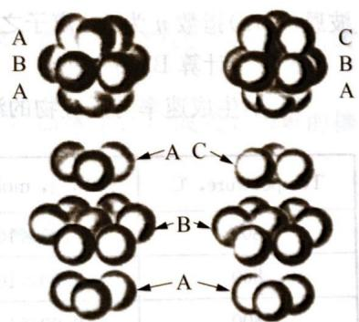

# 第3章

# 晶体结构初步知识

# 能力测试A卷

## 第1题 (10分)

现代结构分析的方法,可使用 X 射线来提供关于原子、分子或离子的三维空间的晶体结构而获得有价值的讯息。

1-1 食盐(NaCl)晶胞如右图：

(1) 在这张图, 它是属于什么型态的晶格?

(2) 在这个构造中, 钠原子的配位数是多少?

(3) 每一个晶胞中, NaCl 的数目是多少?

(4) 计算这结构 $r_{Na^{+}}/r_{Cl^{-}}$ 的极限半径比值。

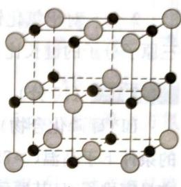

（5）为何氯离子间稍微膨胀排列，而使得 Cl—Cl 最接近的距离为 400 pm? 试与最密堆积值的 362 pm 作一比较。

（6）当这个构造的阳离子半径逐渐增加至阳离子/阴离子的半径比值接近0.732时会发生什么现象？

(7) 阳离子/阴离子的半径比值范围为多少时, 可使 NaCl 的构造较为稳定?

1-2 使用 $\mathrm{Cu - K}\alpha -\mathrm{X}$ 光(波长 $\lambda = 154~\mathrm{pm})$ 照射氯化钠结晶的(200)面的反射角度为 $15.8^{\circ}$ 假设氯离子的半径是 $181~\mathrm{pm}$ ，试计算：

(1) 相邻两个(200)面的距离。

(2) NaCl 晶胞的边长。

(3) 钠离子的半径。

1-3 面心立方最密堆积(ccp)和六方最密堆积(hcp)晶格排列(坚固的球体模型)如下:

(1) 描述 ccp 与 hcp 晶格排列的差异。

(2) 计算 ccp 晶格堆积比(空间占有率)。

(3) hcp 的配位数和堆积比是否与 ccp 相同?

1-4 利用 X 射线衍射研究 ccp 构造的镍(原子量 58.69)结晶, 鉴定出其单元体边长是 352.4 pm, 其密度为 $8.902 \, g \cdot cm^{-3}$ , 试计算:

(1) 镍原子半径。

六方最密堆积结构

面心立方最密堆积结构

(2) 晶胞体积。

(3) 阿伏伽德罗常数。

第2题 (10分)

盐类及晶体可经由一系列的过程来估计其能量,其中包括了一种简单的离子模型。模型中,离子具有一特定的半径以及价数。离子的价数等于一个整数乘上该元素的价数。此模型可应用于描述离子分子在气态时的解离作用。此类解离作用通常会直接导致中性原子的生成,但是解离能的计算可由假设的反应途径来完成,该途径包括了自由离子的解离,以及离子的中和反应,这就

是 Born-Haber 循环。

下列为一些双原子物质的键能、电子亲和能及解离能，它们均经测量过：

NaCl键能 $= -464\mathrm{kJ}\cdot \mathrm{mol}^{-1}$ Cl的电子亲和能 $= -360\mathrm{kJ}\cdot \mathrm{mol}^{-1}$ KCl键能 $= -423\mathrm{kJ}\cdot \mathrm{mol}^{-1}$ Na的电离能 $= 496\mathrm{kJ}\cdot \mathrm{mol}^{-1}$ MgCl键能 $= -406\mathrm{kJ}\cdot \mathrm{mol}^{-1}$ Ca的第一电离能 $= 592\mathrm{kJ}\cdot \mathrm{mol}^{-1}$ CaCl键能 $= -429\mathrm{kJ}\cdot \mathrm{mol}^{-1}$ Ca的第二电离能 $= 1148\mathrm{kJ}\cdot \mathrm{mol}^{-1}$

2-1 对于氯化钠解离成中性原子设计一个 Born-Haber 循环，并且计算氯化钠的解离能。假设氯化钠是完全的离子键。

2-2 对于氯化钙解离成三个中性原子设计一个 Born-Haber 循环，并且计算其解离能。假设三原子分子的键长比双原子分子短 9%。

## 第3题 (10分)

BP(硼磷化合物)是一种高价值的耐磨涂布剂,其生产方式可经由三溴化硼与三溴化磷在氢气的条件下于高温(>750℃)反应而成。这种陶瓷材料可应用于当作金属表面的保护膜。BP是以立方最密堆积,且其原子周围是以四角锥方式堆积。

3-1 写出生成BP的化学反应方程式。

3-2 画出三溴化硼与三溴化磷的路易斯结构式。

3-3 画出BP的晶体结构。

3-4 写出与BP结构相同的晶胞的所有组成。

3-5 当晶胞的边长为 $4.78\AA$ 时，计算BP的密度（以 $\mathrm{kg}\cdot \mathrm{m}^{-3}$ 为单位）。

3-6 计算BP中硼原子与磷原子之间的距离。

可用 Born-Lande 方程式计算晶格能: $U_{\text{lattice}} = -f \frac{Z_{+} Z_{-} Ae^{2}}{r_{+} + r_{-}} \left(1 - \frac{1}{n}\right)$

当离子半径 $r_{+}$ 和 $r_{-}$ 是以 Å 为单位时， $fe^{2}$ 这项等于 1390。马德龙(Madelung)常数为 1.638。波恩(Born)指数 n 为 7。离子之电荷 $Z_{+}$ 和 $Z_{-}$ 为整数。

## 3-7 计算BP晶格能。

BP 的生成速率与反应物的浓度有关,如下表所示:

<table><tr><td>Temperature, °C</td><td> $[BBr_3], mol·L^{-1}$ </td><td> $[PBr_3], mol·L^{-1}$ </td><td> $[H_2], mol·L^{-1}$ </td><td>r, mol·s-1</td></tr><tr><td>800</td><td> $2.25×10^{-6}$ </td><td> $9.00×10^{-6}$ </td><td>0.070</td><td> $4.60×10^{-8}$ </td></tr><tr><td>800</td><td> $4.50×10^{-6}$ </td><td> $9.00×10^{-6}$ </td><td>0.070</td><td> $9.20×10^{-8}$ </td></tr><tr><td>800</td><td> $9.00×10^{-6}$ </td><td> $9.00×10^{-6}$ </td><td>0.070</td><td> $18.4×10^{-8}$ </td></tr><tr><td>800</td><td> $2.25×10^{-6}$ </td><td> $2.25×10^{-6}$ </td><td>0.070</td><td> $1.15×10^{-8}$ </td></tr><tr><td>800</td><td> $2.25×10^{-6}$ </td><td> $4.50×10^{-6}$ </td><td>0.070</td><td> $2.30×10^{-8}$ </td></tr><tr><td>800</td><td> $2.25×10^{-6}$ </td><td> $9.00×10^{-6}$ </td><td>0.035</td><td> $4.60×10^{-8}$ </td></tr><tr><td>880</td><td> $2.25×10^{-6}$ </td><td> $9.00×10^{-6}$ </td><td>0.070</td><td> $19.6×10^{-8}$ </td></tr></table>

3-8 确定形成BP反应的级数，并且写出反应式。

3-9 计算在 $800^{\circ}\mathrm{C}$ 和 $880^{\circ}\mathrm{C}$ 速率常数。

3-10 计算生成BP的活化能。

## 第4题 (10分)

最简单的二元硼氮化合物可以通过下列反应合成：

$$
\mathrm{B} _ {2} \mathrm{O} _ {3} (\mathrm{l}) + 2 \mathrm{NH} _ {3} (\mathrm{g}) \xrightarrow {1 2 0 0 ^ {\circ} \mathrm{C}} 2 \mathrm{BN} (\mathrm{s}) + 3 \mathrm{H} _ {2} \mathrm{O} (\mathrm{g})
$$

反应产生的氮化硼的结构与石墨结构相似，但上下层平行，B、N原子相互交替（见图）。层内B—N核间距为145 pm，面间距为333 pm。请回答下列问题：

4-1 试画出层状六方氮化硼的晶胞。

4-2 写出晶胞中各原子的原子坐标。

4-3 试计算层状六方氮化硼晶体的密度。

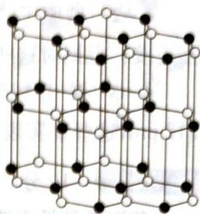

4-4 在高压(60 k bar)、高温(2000℃)下，层状六方氮化硼晶体可以转

●B ON

化成立方氮化硼。它与金刚石有类似结构。若立方氮化硼晶胞的边长为 361.5 pm，试计算立方氮化硼晶体中 B—N 键的键长。

4-5 氮化硼能与单质氟气发生反应,其中的一种产物具有平面三角形结构,另一种产物是稳定的单质。试写出化学反应方程式。

4-6 氮化硼也能与 HF 化合，生成物中阴阳离子均为正四面体结构。该反应能定量测定 BN。试写出该化学反应方程式。

## 第5题 (10分)

金属单质的结构可用等径圆球的密堆积模型,常见的密堆积形式有立方密堆积和六方密堆积。两种密堆的空间利用率都是74.06%。

5-1 立方密堆的晶胞如图示,甲图中“X”表示其中一个正四面体空隙中心的位置,请在甲图中用符号“△”标出正八面体空隙中心的位置,并分别计算晶体中的球数和四面体空隙数之比,以及球数与八面体空隙数之比。

5-2 六方密堆如乙图所示,请用“X”和“△”分别标出其中的正四面体空隙的中心和正八面体空隙的中心位置。

5-3 已知离子半径: $r_{\mathrm{Ti}^{3+}} = 77 \mathrm{pm}, r_{\mathrm{Cl}^{-}} = 181 \mathrm{pm}$ ; 在 $\beta - \mathrm{TiCl}_{3}$ 晶体中, $\mathrm{Cl}^{-}$ 取六方密堆的排列, $\mathrm{Ti}^{3+}$ 则是填隙离子, 请问:

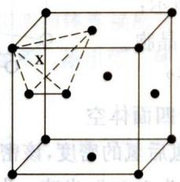  
(甲)

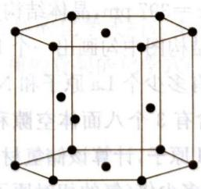  
(乙)

(1) $Ti^{3+}$ 填入由 $Cl^{-}$ 围起的哪种多面体的空隙？它占据该种空隙的百分数有多大？请写出推算过程。

(2) $\mathrm{Ti}^{3+}$ 填入空隙的方式可能有几种？请具体说明。

## 第6题 (10分)

X-射线衍射结果表明, 黄铁矿 $\left(\mathrm{FeS}_{2}\right)$ 的结构与氯化钠的结构相似。 $Na^{+}$ 被 Fe 原子取代, $Cl^{-}$ 被 $S_{2}$ 取代。用波长为 154 pm 的 X-射线进行衍射实验, 发现在 8.17° 发生一级衍射。

6-1 若 $\mathrm{FeS}_2$ 的密度为 $5.01\mathrm{g}\cdot \mathrm{cm}^{-3}$ ，试计算阿伏伽德罗常数。

6-2 铁原子的硫原子配位多面体是什么？配位数是多少？这些配位多面体按怎样的方式相互连接？根据对这些问题的解答，可推知Fe—S键的键型如何？

6-3 X-射线测定结果表明，在 $S_{2}$ 基团中 S 原子间的键距为 210 pm；而典型的 $S^{2-}$ 半径为 312 pm，这些事实表明 $S_{2}$ 基团中的键型如何？

## 第7题 (10分)

黄铜矿是最重要的铜矿,全世界约三分之二的铜是由它提炼的。回答下列问题:

7-1 右图为黄铜矿的晶胞,计算该晶胞中各种原子的数目,写出黄铜矿的化学式。

7-2 在黄铜矿晶胞中,化学和空间环境都相同的硫原子、铁原子、铜原子各有几个?在黄铜矿晶胞中含几个结构基元(周期性重复的最小单位)?每个结构基元代表什么?

7-3 在高温下,黄铜矿晶体中的金属离子可以发生迁移。若铁原子与铜原子发生完全无序的置换,可将它们视作等同的金属原子,请画出它的晶胞。每个晶胞中环境相同的硫原子有几个?

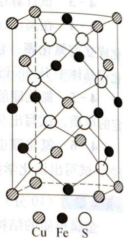

7-4 在无序的高温型结构中,硫原子作什么类型的堆积,金属原子占据什么类型的空隙,该类型空隙被金属原子占据的分数是多少?

7-5 实验表明, $\mathrm{CuGaS}_{2}$ 和 $\mathrm{Cu}_{2} \mathrm{FeSnS}_{4}$ 与黄铜矿的结构类型相同, 请据此推测黄铜矿中铜和铁的氧化态。

## 第8题 (10分)

氢是重要而洁净的能源。要利用氢气作能源，必须解决好安全有效地储存氢气问题。化学家研究出利用合金储存氢气， $\mathrm{LaNi}_{5}$ 是一种储氢材料。 $\mathrm{LaNi}_{5}$ 的晶体结构已经测定，属六方晶系，晶胞参数 $a = 511 \mathrm{pm}, c = 397 \mathrm{pm}$ ，晶体结构如图所示：

8-1 从 $\mathrm{LaNi}_{5}$ 晶体结构图中勾画出一个 $\mathrm{LaNi}_{5}$ 晶胞。

8-2 每个晶胞中含有多少个 La 原子和 Ni 原子？

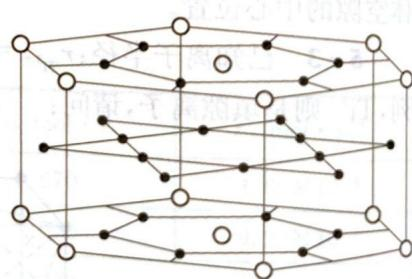

8-3 $\mathrm{LaNi}_{5}$ 晶胞中含有 3 个八面体空隙和 6 个四面体空若每个空隙填入 1.4、1.2、1.0、1.0 和 1.0 的元素。

OLa $\cdot$ Ni

除,若每个空隙填入1个H原子,计算该储氢材料吸氢后氢的密度,该密度是标准状态下氢气密度 $(8.987\times10^{-5}\mathrm{~g}\cdot\mathrm{cm}^{-3})$ 的多少倍(氢的相对原子质量为1.008;光速c为 $2.998\times10^{8}\mathrm{~m}\cdot\mathrm{s}^{-1}$ ;忽略吸氢前后晶胞的体积变化)?

## 第9题 (10分)

一个 Ca 和 C 的二元化合物具有四方晶胞: $a = b = 3.87 \, \text{\AA}$ , $c = 6.37 \, \text{\AA}$ , $(\alpha = \beta = \gamma = 90^\circ)$ , 晶胞如下图所示, 图中钙原子用较大的黑圆圈表示, 碳原子用空心圆圈表示。在位于原点的钙原子上面的碳原子的坐标为 x = 0, y = 0, z = 0.406 ( $1 \, \text{\AA} = 10^{-8} \, \text{cm}$ )。

化学竞赛能力测试一高中第三分册

9-1 导出这个化合物的化学式为 \_\_\_\_。

9-2 一个晶胞中所含的化学式单位的数目为 \_\_\_\_。

9-3 $C_{2}$ 基团中 C—C 键长为 \_\_\_\_ Å。

9-4 最短的 Ca—C 距离为 $\mathring{A}$ 。

9-5 最短的两个非键 C……C 间距离为 \_\_\_\_ Å, \_\_\_\_ Å。

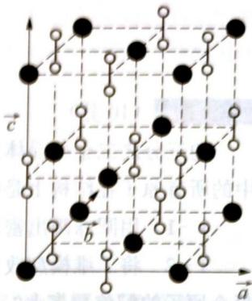

9-6 这一结构与\_\_\_\_型离子化合物的结构密切相关。

第10题 (10分)

AX $_{4}$ 四面体(A为中心原子,如硅、锗;X为配位原子,如氧、硫)在无机化合物中很常见。四面体T $_{1}$ 按下图所示方式相连可形成一系列“超四面体”(T $_{2}$ 、T $_{3}$ …):

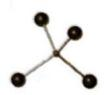

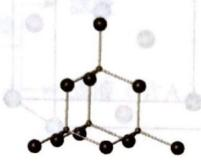

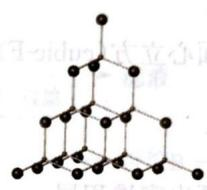

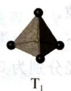

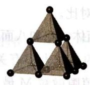  
$T_{2}$

$T_{3}$  
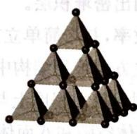

10-1 上图中 $\mathrm{T}_{1}$ 、 $\mathrm{T}_{2}$ 和 $\mathrm{T}_{3}$ 的化学式分别为 $\mathrm{AX}_{4}$ 、 $\mathrm{A}_{4} \mathrm{~X}_{10}$ 和 $\mathrm{A}_{10} \mathrm{~X}_{20}$ ，推出超四面体 $\mathrm{T}_{4}$ 的化学式。

10-2 分别指出超四面体 $\mathrm{T}_{3} 、 \mathrm{T}_{4}$ 中各有几种环境不同的 X 原子, 每种 X 原子各连接几个 A 原子? 在上述两种超四面体中每种 X 原子的数目各是多少?

10-3 若分别以 $\mathrm{T}_{1} 、 \mathrm{T}_{2} 、 \mathrm{T}_{3} 、 \mathrm{T}_{4}$ 为结构单元共顶点相连（顶点 X 原子只连接两个 A 原子），形成无限三维结构，分别写出所得三维骨架的化学式。

10-4 欲使上述 $\mathrm{T}_{3}$ 超四面体连接所得三维骨架的化学式所带电荷分别为 $+4$ 、 $0$ 和 $-4$ ，A选 $\mathrm{Zn}^{2+}$ 、 $\mathrm{In}^{3+}$ 或 $\mathrm{Ge}^{4+}$ ，X取 $\mathrm{S}^{2-}$ ，给出带三种不同电荷的骨架的化学式（各给出一种，结构单元中的离子数成简单整数比）。

$x^{7}$ $_{M}$ 出分半圆距的段斜有面四，如螺钉互的离周-干离周时干离周-干离圆沿拱玉 $\partial-i$

# 能力测试 B 卷

第1题（10分）
约三分之二金属晶体采取密堆积结构。每一个原子尽可能地被邻近的金属原子包围。结构中的所有原子在结构上是等同的。

1-1 用圆球画出密堆积的二维模型。

1-2 将二维模型改变成三维模型,将出现多少种堆积方式:是(a)三层还是(b)无限多层?每个原子的配位数多大?

设原子是不可压缩的球,密堆积原子将占据尽可能小的体积,达到尽可能大的空间利用率(用原子的体积占空间体积的百分数表示)。

右图的排列称为面心立方(cubic-F):

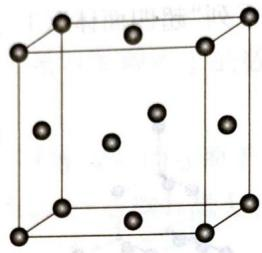

1-3 在此图上画出密堆积层。

1-4 计算堆积效率，并与简单立方堆积对比。

1-5 画出面心立方密堆积结构中的四面体空隙和八面体空隙。

晶体中离子的排列在很大程度上与离子的相对大小有关，见下表。设微粒的半径为 $X$ ，空隙的半径为 $r$ 。对于四面体空隙和八面体空隙，填隙微粒M最大半径分别为 $0.225 \cdot r$ 和 $0.414 \cdot r$ 才不会发生结构畸变。

表 刚性球排列的半径比

<table><tr><td>M的配位数</td><td>X的排列方式半径比</td><td> $r(M^{n+})/r(X^{x-})$ </td><td>相应晶体结构类型</td></tr><tr><td>2</td><td>线形</td><td>&lt;0.150</td><td></td></tr><tr><td>3</td><td>三角形</td><td>0.150~0.225</td><td></td></tr><tr><td>4</td><td>四面体形</td><td>0.225~0.414</td><td>ZnS</td></tr><tr><td>6</td><td>八面体形</td><td>0.414~0.732</td><td>NaCl</td></tr><tr><td>8</td><td>立方体形</td><td>0.732~1.00</td><td>CsCl</td></tr><tr><td>12</td><td>十四面体</td><td>1.0</td><td>密堆积</td></tr></table>

1-6 证明当阳离子-阴离子和阴离子-阴离子相互接触时，四面体排列的理想半径比 $r_{\mathrm{M}} / r_{\mathrm{X}}$ 为0.225。

如图,两个阴离子在四面体的边上相互接触,阳离子处于四面体的中心, $2\theta=109.5^{\circ}$

1-7 计算阳离子-阴离子和阴离子-阴离子相互接触时，八面体排列的理想半径比 $r_{\mathrm{M}} / r_{\mathrm{X}}$ 。下图给出了围绕一个阳离子的同一平面上的阴离子排列。阳离子-阴离子和阴离子-阴离子在八面体的一个面上相

化学竞赛能力测试一高中第三分册

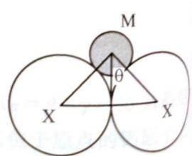

互接触。

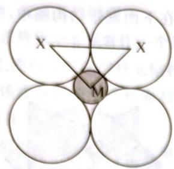

## 第2题 (10分)

钨是我国丰产元素，是熔点最高的金属，广泛用于拉制灯泡的灯丝，有“光明使者”的美誉。

钨在自然界主要以钨(VI)酸盐的形式存在。有开采价值的钨矿石是白钨矿和黑钨矿。白钨矿的主要成分是钨酸钙(CaWO₄)；黑钨矿的主要成分是铁和锰的钨酸盐，化学式常写成(Fe, Mn)WO₄。黑钨矿传统冶炼工艺的第一阶段是碱熔法：

$$
\text { 黑钨矿 } \xrightarrow [ (1) ]{\mathrm{NaOH} , \text { 空气熔融 }} \xrightarrow {\text { 水浸 }} \xrightarrow {\text { 过滤 }} \begin{array}{l} \text { 滤渣 } \\ \text { 滤液（含A） } \end{array} \xrightarrow [ (2) ]{\text { 浓盐酸 }} \xrightarrow [ (2) ]{\text { 过滤 }} \begin{array}{l} \text { 滤液 } \\ \text { 沉淀B } \end{array} \xrightarrow [ (3) ]{\text { 焙烧 }} \text { 产品C }
$$

其中 A、B、C 都是钨的化合物。

2-1 写出上述流程中 A、B、C 的化学式,以及步骤(1)、(2)、(3)中发生反应的化学方程式。

2-2 钨冶炼工艺的第二阶段则是用碳、氢等还原剂把氧化钨还原为金属钨。对钨的纯度要求不高时，可用碳作还原剂。

(1) 写出用碳还原氧化钨制取金属钨的化学方程式。

(2) 用下表所给的 $298.15 \mathrm{~K}$ 的数据计算上述反应的标准自由能变化, 推出该反应在什么温度条件下能自发进行 (假设表中数据不随温度变化)。

<table><tr><td>物质</td><td> $\Delta_{\mathrm{f}}H_{\mathrm{m}}^{\theta}(\mathrm{kJ}\cdot\mathrm{mol}^{-1})$ </td><td> $S_{\mathrm{m}}^{\theta}(\mathrm{J}\cdot\mathrm{mol}^{-1}\cdot\mathrm{K}^{-1})$ </td></tr><tr><td>W(s)</td><td>0</td><td>32.64</td></tr><tr><td>WO3(s)</td><td>-842.87</td><td>75.90</td></tr><tr><td>C(石墨)</td><td>0</td><td>5.74</td></tr><tr><td>CO(g)</td><td>-110.52</td><td>197.56</td></tr><tr><td>CO2(g)</td><td>-393.51</td><td>213.64</td></tr><tr><td>H2(g)</td><td>0</td><td>130.57</td></tr><tr><td>H2O(g)</td><td>-241.82</td><td>188.72</td></tr><tr><td>H2O(l)</td><td>-285.31</td><td>69.90</td></tr></table>

2-3 为了获得可以拉制灯丝的高纯度金属钨,不宜用碳而必须用氢气作还原剂,为什么?写出用氢气还原氧化钨的化学方程式。

2-4 在酸化钨酸盐的过程中,钨酸根 $\mathrm{WO}_{4}^{2-}$ 可能在不同程度上缩合形成多钨酸根。多钨酸根的组成常因溶液的酸度不同而不同,它们的结构都由含一个中心 W 原子和六个配位 O 原子的钨氧八面体 $\mathrm{WO}_{6}$ 通过共顶或共边的方式形成。在为数众多的多钨酸根中,性质和结构了解得比较清楚的是仲钨酸根 $\left[H_{2}W_{12}O_{42}\right]^{10-}$ 和偏钨酸根 $\left[H_{2}W_{12}O_{40}\right]^{6-}$ 。在下面三张结构图中，哪一张是仲钨酸根的结构？简述判断理由。

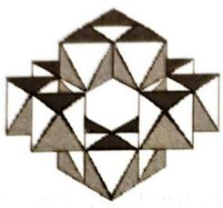  
(a)

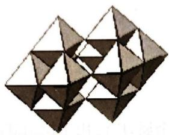  
(b)

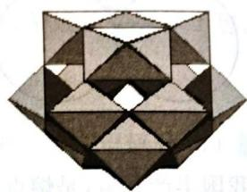  
(c)

2-5 仲钨酸的肼盐在热分解时会发生内在氧化还原反应,我国钨化学研究的奠基人顾翼东先生采用这一反应制得了蓝色的、非整比的钨氧化物 $\mathrm{WO}_{3-x}$ 。这种蓝色氧化钨具有比表面大、易还原的优点,在制钨粉时温度容易控制,目前冶炼拉制钨丝的金属钨都用蓝色氧化钨为原料。经分析,得知蓝色氧化钨中钨的质量分数为0.7985。

(1) 计算 $WO_{3-x}$ 中的 x 值。

(2) 一般认为, 蓝色氧化钨的颜色和非整比暗示了在化合物中存在五价和六价两种价态的钨。试计算蓝色氧化钨中这两种价态的钨原子数比 (相对原子质量: W:183.84 O:16.00)。

第3题 (10分)

目前商品化的锂离子电池正极几乎都是锂钴复合氧化物,其理想结构如右图所示。

3-1 用粗线框出这种理想结构的锂钴复合氧化物晶体的一个晶胞。

3-2 这种晶体的一个晶胞里有几个锂原子、几个钴原子和几个氧原子？

3-3 给出这种理想结构的锂钴复合氧化物的化学式(最简式)。

3-4 锂离子电池必须先长时间充电后才能使用。写出上述锂钴氧化物作为正极放电时的电极反应。

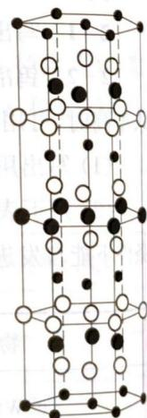

3-5 锂锰复合氧化物是另一种锂离子电池正极材料。它的理想晶体中有两种多面体: $LiO_{4}$ 四面体和 $MnO_{6}$ 八面体, 个数比 1:2, $LiO_{4}$ 四面体相互分

离, $MnO_{6}$ 八面体的所有氧原子全部取自 $LiO_{4}$ 四面体。写出这种晶体的化学式。

3-6 从右图获取信息,说明为什么锂锰氧化物正极材料在充电和放电时晶体中的锂离子可在晶体中移动,而且个数可变。并说明晶体中锂离子的增减对锰的氧化态有何影响。

第4题 (10分)

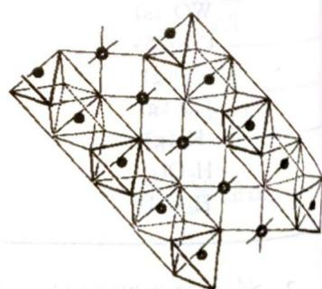

沸石分子筛是重要的石油化工催化材料。下图是一种沸石晶体结构的一部分,其中多面体的每一个顶点均代表一个T原子(T可为Si或Al),每一条边代表一个氧桥(即连接两个T原子的氧原子)。该结构可以看成是由6个正方形和8个正六边形围成的凸多面体(称为3等),通过

锂锰复合氧化物正极材料的理想晶体的结构示意图

四多面体(称为β笼),通过六方柱笼与相邻的四个β笼相连形成的三维立体结构,如右图所示:

4-1 完成下列问题：

(1) 若将每个 $\beta$ 笼看作一个原子, 六方柱笼看作原子之间的化学键, 上图可以简化成什么结构?

（2）该沸石属于十四种布拉维点阵类型中的哪一种？指出其晶胞内有几个β笼。

（3）假设该沸石骨架仅含有 Si 和 O 两种元素，写出其晶胞内每种元素的原子数。

（4）已知该沸石的晶胞参数 $\alpha = 2.34 \, nm$ ，试求该沸石的晶体密度。

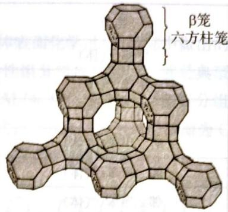

(相对原子质量: Si: 28.0 O: 16.0)

4-2 方石英和上述假设的全硅沸石都由硅氧四面体构成，右图为方石英的晶胞示意图。

(1) 求方石英的晶体密度。

(2) 比较沸石和方石英的晶体密度来说明沸石晶体的结构特征。

4-3 一般沸石由负电性骨架和骨架外阳离子构成,利用骨架外阳离子的可交换性,沸石可以作为阳离子交换剂或质子酸催化剂使用。下图为沸石的负电性骨架示意图:

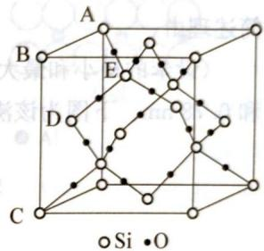

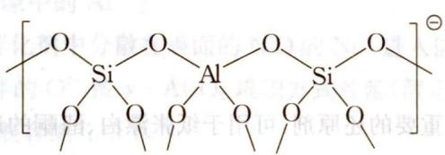  
Si—O 键长为 0.162 nm; $\angle AED = 109^{\circ}28'$

画出上图所示负电性骨架结构的电子式(用“·”表示氧原子提供的电子,用“×”表示T原子提供的电子,用“\*”表示所带负电荷提供的电子)。

4-4 以甲醇为甲基化试剂的甲苯甲基化反应是石油化工中制备对二甲苯的重要方法之一，常用沸石分子筛为固体酸催化剂。该过程包含如下反应网络：

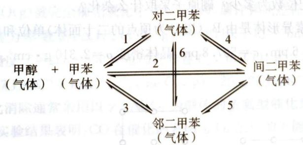

(1) 请回答其中有几个热力学上独立的化学反应。

(2) 若反应起始时体系中只有 1 mol 甲醇和 1 mol 甲苯, 平衡时体系内对、间、邻二甲苯的含量分别为 x, y, z mol, 请写出反应 1 的平衡常数 $K_{1}$ 的表达式 (以 x, y, z 表示)。

(3) 各物种在 298.15 K 时的标准生成焓和熵列于下表:

<table><tr><td>物质</td><td> $\Delta_{\mathrm{f}}H_{\mathrm{m}}^{\theta}(\mathrm{kJ}\cdot\mathrm{mol}^{-1})$ </td><td> $S_{\mathrm{m}}^{\theta}(\mathrm{J}\cdot\mathrm{mol}^{-1}\cdot\mathrm{K}^{-1})$ </td></tr><tr><td>甲醇(气体)</td><td>-201.17</td><td>237.70</td></tr><tr><td>甲苯(气体)</td><td>50.00</td><td>319.74</td></tr><tr><td>水(气体)</td><td>-241.82</td><td>188.72</td></tr><tr><td>对二甲苯(气体)</td><td>17.95</td><td>352.42</td></tr><tr><td>间二甲苯(气体)</td><td>17.24</td><td>357.69</td></tr><tr><td>邻二甲苯(气体)</td><td>19.00</td><td>352.75</td></tr></table>

根据表中的热力学数据(假设表中数据不随温度变化),计算 500 K 下反应 1 的平衡常数。

4-5 若使用有效孔径为 0.65 nm 的沸石分子筛作为上述反应的催化剂,主要产物是什么?

简述理由。

(设苯的最小和最大直径分别为 0.59 nm 和 0.68 nm,甲苯的最小和最大直径分别为 0.59 nm 和 0.78 nm。下图为该沸石分子筛的孔道结构示意图。)

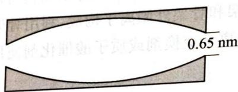

## 第5题 (10分)

硼氢化钠 $NaBH_{4}$ 是一种重要的还原剂，可用于纸张漂白、醛酮的还原及含汞污水的处理等等。近年来，科学家十分关注 $NaBH_{4}$ 用作储氢介质的研究。2005 年 G. J. Gainsfond 和 T. Kemmitt 考察了 $NaBH_{4}$ 的醇解反应，发现它与乙醇反应的产物 A 是互相平行的一维链组成的晶体。

5-1 写出 $\mathrm{NaBH}_4$ 与乙醇反应的化学反应方程式。

5-2 根据A中存在的作用力类型说明A属于何种晶体？

5-3 画出 A 的一维结构示意图, 确定 A 的结构基元, 抽出一维点阵。

5-4 A中 $\mathrm{Na}$ 的配位数为多少？硼原子采取什么杂化？

5-5 硼的一种同素异形体是由 $\mathrm{B}_{12}$ (以 B 为顶点的二十面体) 单位和单个 B 原子组成的晶体, 其晶胞参数 $a = b = 875.6 \mathrm{pm}, c = 507.8 \mathrm{pm}$ , 晶体密度 $\rho = 2.310 \mathrm{~g} \cdot \mathrm{cm}^{3}$ 。晶胞沿 $a$ 、 $b$ 、 $c$ 轴的投影图如下:

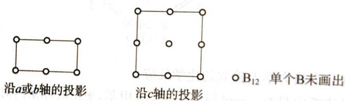

(1) 计算晶胞中的原子数。

(2) 画出晶胞示意图。

(3) 确定晶体的结构基元、点阵形式及特征对称元素。

## 第6题 (10分)

2007年诺贝尔化学奖授予德国化学家G.Ertl，以表彰他在“固体表面化学过程”研究中做出的贡献。化学工业中广泛使用的负载型催化剂（主要由载体和表面活性组分组成）的制备，就是典型的固体表面化学过程的应用。例如： $\mathrm{NiO} / \gamma -\mathrm{Al}_{2}\mathrm{O}_{3}$ 催化剂由 $\gamma -\mathrm{Al}_{2}\mathrm{O}_{3}$ 载体和NiO活性组分组成。研究表明： $\gamma -\mathrm{Al}_{2}\mathrm{O}_{3}$ 中的 $\mathrm{O}^{2-}$ 具有NaCl晶体中 $\mathrm{Cl}^{-}$ 的堆积方式， $\gamma -\mathrm{Al}_{2}\mathrm{O}_{3}$ 的主要暴露面为C层或D层（如图1所示），它们的暴露机会均等，分布在该面上的 $\mathrm{O}^{2-}$ 和 $\mathrm{Al}^{3+}$ 如图2所示：

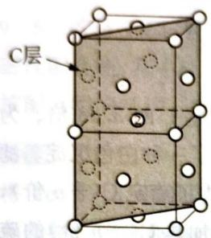

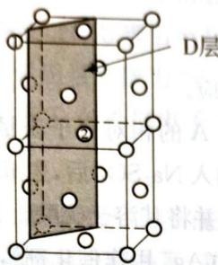  
图1

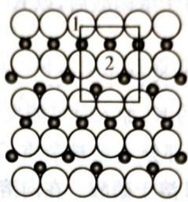  
C层

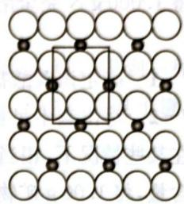  
D层  
图2

6-1 在C层和D层的单位网格(即图2中的方框)内分别有几个处于由体相暴露出来的四面体空隙中的 $\mathrm{Al}^{3+}$ 和八面体空隙中的 $\mathrm{Al}^{3+}$ ?

6-2 $\mathrm{NiO} / \gamma -\mathrm{Al}_{2}\mathrm{O}_{3}$ 催化剂中分散在表面的 NiO 的 $\mathrm{Ni}^{2+}$ 进入能形成表面四面体配位和八面体配位的位置，且与 $\mathrm{Ni}^{2+}$ 相伴的 $\mathrm{O}^{2-}$ 按 $\gamma -\mathrm{Al}_{2}\mathrm{O}_{3}$ 堆积方式外延（假定只形成“单分子层”），请问在 C 层和 D 层的单位网格中各能容纳几个 $\mathrm{Ni}^{2+}$ ？

6-3 将 NiO 换为 CuO, 文献报道 $\mathrm{Cu}^{2+}$ 只能存在于表面的八面体空隙中, 如果用氢还原不同配位环境的铜 $(\mathrm{Cu}^{2+} \rightarrow \mathrm{Cu}^{\circ})$ , 请估计还原温度较低的表面 $\mathrm{Cu}^{2+}$ 分布在 C 层还是 D 层中? 简述理由。

6-4 已知 $\mathrm{O}^{2-}$ 半径为 $0.140 \mathrm{~nm}$ , 试估算 $\mathrm{CuO} / \gamma - \mathrm{Al}_{2} \mathrm{O}_{3}$ 催化剂中 $\mathrm{CuO}$ 在 $\gamma - \mathrm{Al}_{2} \mathrm{O}_{3}$ 表面的最大单层分散值 (以每 $100 \mathrm{~m}^{2}$ 的 $\gamma - \mathrm{Al}_{2} \mathrm{O}_{3}$ 载体表面单层分散多少毫摩尔的 $\mathrm{CuO}$ 表示)。

6-5 $\mathrm{CuO} / \gamma -\mathrm{Al}_{2}\mathrm{O}_{3}$ 催化剂可以用于CO的催化氧化： $2\mathrm{CO(g)} + \mathrm{O}_2(\mathrm{g}) = 2\mathrm{CO}_2(\mathrm{g})$ 。若在 $\mathfrak{p}^{\theta}$ 、473K下，有 $2\mathrm{molCO(g)}$ 被完全催化氧化生成 $\mathrm{CO_2(g)}$ ，请计算此过程中的反应焓变。

已知 298 K 下的热力学数据: $\Delta_{\mathrm{f}}H_{\mathrm{m}}^{\theta}(\mathrm{CO},\mathrm{g})=-110.5\mathrm{kJ}\cdot\mathrm{mol}^{-1},\Delta_{\mathrm{f}}H_{\mathrm{m}}^{\theta}(\mathrm{CO}_{2},\mathrm{g})=-393.5\mathrm{kJ}\cdot\mathrm{mol}^{-1}$ ，在温度 $T=298\sim500K$ 范围内热容 $C_{p},\mathrm{m}(\mathrm{CO},\mathrm{g})=29.556\mathrm{J}\cdot\mathrm{K}^{-1}\cdot\mathrm{mol}^{-1},C_{p},\mathrm{m}(\mathrm{CO}_{2},\mathrm{g})=27.437\mathrm{J}\cdot\mathrm{K}^{-1}\cdot\mathrm{mol}^{-1},C_{p},\mathrm{m}(\mathrm{O}_{2},\mathrm{g})=29.526\mathrm{J}\cdot\mathrm{K}^{-1}\cdot\mathrm{mol}^{-1}$ 。

6-6 CO 低温催化消除通常采用以 $\gamma - \mathrm{Al}_{2} \mathrm{O}_{3}$ 为载体的负载型催化剂, 人们对其反应机理已经有了较深入的研究。实验结果表明: CO 在催化剂表面与 $\mathrm{O}_{2}$ 反应的可能历程如下:

$$
① \mathrm{CO} + \mathrm{M} \xrightarrow [ k _ {- 1} ]{k _ {1}} \mathrm{CO} _ {\mathrm{(ads)}}
$$

$$
② \mathrm{O} _ {2} + 2 \mathrm{M} \xrightarrow {k _ {2}} 2 \mathrm{O} _ {\mathrm{(ads)}}
$$

$$
③ \mathrm{CO} _ {\mathrm{(ads)}} + \mathrm{O} _ {\mathrm{(ads)}} \xrightarrow {k _ {3}} \mathrm{CO} _ {2 \mathrm{(ads)}} + \mathrm{M}
$$

④ $\mathrm{CO}_{2(\mathrm{ads})}\xrightarrow{k_{4}}\mathrm{CO}_{2}+\mathrm{M}$

式中 M 为表面活性剂，在该实验条件下 M 的数量为定值，下标 ads 表示吸附态。

请用稳态近似法推导其速率方程，速率用 $\mathrm{d}[\mathrm{CO}_2] / \mathrm{dt}$ 表示。

## 第7题 (10分)

某磷酸盐矿化学式是 $\mathrm{A}_5(\mathrm{PO}_4)_3\mathrm{B}$ (记为N)，具有熔融后重新结晶的性质。该磷酸盐矿结晶属于六方晶系，晶胞参数： $a = b = 0.999\mathrm{nm},c = 0.733\mathrm{nm},\alpha = \gamma = 90^{\circ},\beta = 120^{\circ},Z = 2$ 。其密度 $\rho =$ $7.111\mathrm{g}\cdot \mathrm{cm}^{-3}$

将 1.000 g N 完全溶解于浓硝酸后，以 KOH 中和溶液至 pH≈5，加入 1.224 g KI，生成 1.700 g 沉淀。

## 7-1 确定该磷酸盐矿 N 的化学式。

## 7-2 写出当不足量的 KI 加入时可能发生的反应。

在某些情况下,相当一部分 A 会被杂质 C 取代。A 的相对原子质量是 C 的 3.98 倍。为确定杂质含量,将 $1.00 \mathrm{~g}$ 矿物 N 溶于硝酸。在向溶液中加入 $\mathrm{Na}_{2} \mathrm{SO}_{4}$ 后,生成了一种白色沉淀。滤除沉淀后向滤液中加入氨水,之后分离出生成的 $\mathrm{C(OH)}_{n}$ 并将其溶于硫酸。为了滴定 $\mathrm{C}(+n$ 价),首先需被预氧化至 $\mathrm{C}(+m$ 价)。为此,在 $\mathrm{Ag}_{2} \mathrm{~S}_{2} \mathrm{O}_{8}$ 存在下 ( $\mathrm{Ag}^{+}$ 用作催化剂),加热 $\mathrm{C}(+n$ 价)的硫酸溶液。该溶液之后被转移入 $100 \mathrm{~mL}$ 容量瓶中,并以蒸馏水定容。移取 $10.0 \mathrm{~mL}$ 溶液至烧瓶,再加入 $10.0 \mathrm{~mL} 1.00 \mathrm{~mol} \cdot \mathrm{L}^{-1}$ 酸化的 $(\mathrm{NH}_{4})_{2} \mathrm{Fe}(\mathrm{SO}_{4})_{2}$ 溶液。得到的混合液最后以 $15.0 \mathrm{~mL} 9.44 \times 10^{-8} \mathrm{~mol} \cdot \mathrm{L}^{-1}$ 的 $\mathrm{KMnO}_{4}$ 溶液滴定至终点。

7-3 确定杂质 C。写出所有题目中提到的方程式。
7-4 计算该磷酸铁

7-4 计算该磷酸盐矿中 C 的质量分数(w%)。

$$
\mathrm{MnO} _ {4} ^ {-}
$$

$$
\mathbf {M n} ^ {2 +}
$$

溶液中加入 $Mn^{2+}$ 可指示 C(+n 价) 的预氧化是否完成。
7-6 写出表明 C(+n 价) 的预氧化

7-6 写出表明 C(+n 价)的预氧化是否完成。

第8题 (10分)

硼钙化合物是一类重要化合物,在工业上具有很好用途。8-1 将 $B_{2}O_{3}$ 与 CaO 以质量比 10

8-2 该二元化合物 P 可以看作 B $_{6}$ 进行简单立方堆积。其中 Ca 填入其中的某种空隙得到，从晶胞的对角线方向看具有 C $_{3}$ 轴。指出 Ca $^{2+}$ 所填的空隙类型。已知 B $_{6}$ 与 D $_{6}$ 为 B 原子的情况。

$$
\mathrm{B} _ {6}
$$

$$
\mathrm{B} _ {6}
$$

8-4 标出晶胞中所有的对称轴和对称面。
8-5 已知 Ca 和与其最相近的 B 原子配位，有几个 B 原子

已知Ca和与其最相近的B原子的距离为305 pm, $B_{6}$ 八面体的边长为170 pm,计算第二近的Ca—B距离以及晶体的密度。假设Ca所填的空隙与 $B_{6}$ 均没有发生畸变。

第9题 (10分)

Ti能生成具有较为特殊的亚

Ti能生成具有较为特殊的配位结构。如:在无水HF中加入咪唑和四氟化钛,反应物比例不同可以制得不同的五种晶体,晶体中阴离子均是由 $\mathrm{TiF}_{6}$ 八面体组成。A中钛元素质量分数14.08%,且含有一种其余四种物质中没有的氢键;B中钛元素质量分数18.70%;C的阴离子为四化学竞赛能力测试一高中第三分册

聚体，钛元素质量分数22.59%；D的阴离子为五聚体，钛元素质量分数27.09%；E的阴离子则是一种链状聚合物，钛元素质量分数28.51%。

9-1 试通过计算确定 A\~E 化学式, 写出相关化学反应方程式。

9-2 D中阴离子的结构可以看作C中阴离子又与一个 $\mathrm{TiF_6}$ 八面体组合而成，请画出C、D中阴离子的结构。

9-3 阐述E中阴离子不采取二聚而是以多聚形式存在的原因。

9-4 $\mathrm{TiCl_4}$ 可以和 $\mathrm{POCl}_3$ 形成 $1:1$ 的配合物，该配合物含有一个镜面和一个垂直于该镜面的二次旋转轴，试画出该配合物的两种可能结构。

9-5 若将 $\mathrm{TiCl_4}$ 被 $\mathrm{NaC_5H_5}$ 处理后再与 $\mathrm{NaNp}$ (一种单电子还原剂) 反应, 可以得到一种双核的抗磁性配合物, 其中钛元素质量分数为 $26.89\%$ , 且存在两个 Ti—H—Ti 三中心二电子键, 画出该双核配合物的结构, 并计算 Ti 的外层电子个数。

第10题 (10分)

将 $\mathrm{Te}$ 、 $\mathrm{TeCl_4}$ 和 $\mathrm{BiCl_3}$ 封管中于 $150^{\circ}\mathrm{C}$ 混合充分反应，冷却至 $90^{\circ}\mathrm{C}$ ，可制得 $\mathrm{Te}$ 、 $\mathrm{Bi}$ 和 $\mathrm{Cl}$ 组成的三元化合物。该化合物的晶体属三斜晶系，其沿 $a$ 轴的投影图如下所示：

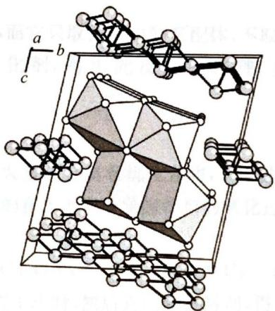

该晶体中仅含三种沿 a 轴方向的一维长链离子。其中一种长链离子由 Bi 和 Cl 构成，Bi 为单帽三棱柱配位；氯有端基、边桥基、面桥基三种配位形式（数目比为 3:4:1）；另两种长链离子仅含 Te，其结构如下图所示，这些 Te 的配位形式均符合 VSEPR 理论的预测结果。

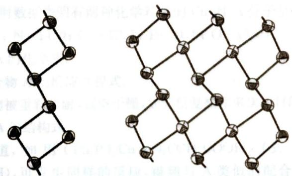

10-1 写出该晶体的最简式。

10-2 分别写出晶体中的三种长链离子的化学式。  
10-3 根据价层电子对互斥理论，在该晶体中，Te有哪几种杂化方式？指出它们的数目比。

10-4 在该晶体中存在对称中心，请写出其位置。

10-5 在该晶体中，Te有几种化学环境？

10-6 该晶体正当晶胞的晶胞体积 $V = 1.000$ 。  
10-7 人们在其他的化合物中也发现了类似的一维含 Te 长链离子。写出以下两种由 Te 所形成的一维长链离子的化学式。

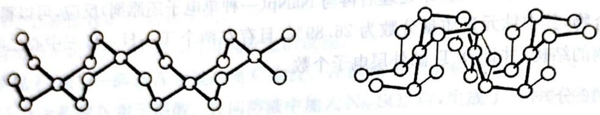

华东师范大学出版社

易致因，题内门道应出于高益才啊一中其。干高益才表一的向衣醉a音叫三合又中补晶对
言以干高益才朝两言：（上十（本出目遇）为逆口通叫二基得面，高得底，基微育展。立酒拜赫三副
果龄断周的余题J932V，合价以六进立酒叫sT费友，示词图五则内者其，s7

## 第4章

# 配位化合物初步知识

## 能力测试 A 卷

## 第1题 (10分)

将 $CoCl_{2} \cdot 6H_{2}O$ 在 $N_{2}$ 气氛下与 KCN 作用，欲得到顺磁性的产物 A，结果却得到红色抗磁性的固体 B，反应方程式为 $CoCl_{2} \cdot 6H_{2}O + KCN$ （水溶液） $\xrightarrow{N_{2} 气氛}$ 绿色溶液 $\xrightarrow{E + OH^{-}}$ 固体 B，但将 B 溶于水形成溶液 B 又转化为顺磁性的 C。已知 C 可以发生如下反应 C $\xrightarrow{Cl_{2}}$ 溶液 $\xrightarrow{E + OH^{-}}$ D，D 是一种不含结晶水的钾盐，其含钾质量分数为 34.3%。

1-1 写出 A、B、C、D 的化学式及 B 的阴离子的空间结构。

1-2 由 $\mathrm{C} \rightarrow \mathrm{D}$ 的反应历程类似于有机反应中的自由基反应，试写出 $\mathrm{C} \rightarrow \mathrm{D}$ 的反应机理。

1-3 D 也可以用另一种方法合成: $E + CN^{-}$ (过量) $\longrightarrow F \uparrow + D$ 。F 是一种常见的在工农业生产中有重要用途的气体。E 是一种含两种配体的 Co(Ⅲ) 配合物，F 是其中一种配体。

(1) 写出 E、F 的化学式。

(2) $\mathrm{CN}^{-}$ 是一种很强的配体, 而它只取代 E 中的 F 配体, 不取代另一种配体, 这是因为: 溶液中的微量的 $\mathrm{Co}^{2+}$ 是此反应的催化剂, 写出此反应的机理, 并解释机理的合理性 (提示: $[\mathrm{Co}(\mathrm{CN})_{5}]^{3-}$ 是一种强还原剂)。

## 第2题 (10分)

生物体内重要的氧化还原酶大多是金属有机化合物,其中的金属离子不止一种价态,是酶的催化活性中心。研究这些酶的目的在于阐述金属酶参与的氧化过程及其电子传递机理,进而实现这些酶的化学模型。

据最近的文献报道, $\left(\mathrm{Cy}_{3}\mathrm{P}\right)_{2}\mathrm{Cu}\left(\mathrm{O}_{2}\mathrm{CCH}_{2}\mathrm{CO}_{2}\mathrm{H}\right)$ (式中 Cy—为环己基的缩写)与正丁酸铜(Ⅱ)在某惰性溶剂中,氩气氛围下反应1小时,然后真空除去溶剂,得到淡紫色的沉淀物。该沉淀被重新溶解,真空干燥,如此反复4次,最后在 $\mathrm{CH}_{2}\mathrm{Cl}_{2}$ 中重结晶,得到配合物A的纯品,产率72%。元素分析:A含C(61.90%)、H(9.25%)、P(8.16%),不含氯。红外谱图显示,A中— $\mathrm{CO}_{2}^{-}$ 基团 $\nu_{-\mathrm{CO}_{2}^{-}}\left(\mathrm{CH}_{2}\mathrm{Cl}_{2}\right)$ 有三个吸收峰:1628、1576、1413 $\mathrm{cm}^{-1}$ ,表明羧基既有单氧参与配位,又有双氧同时参与配位;核磁共振谱还表明A含有Cy—、— $\mathrm{CH}_{2}$ —,不含— $\mathrm{CH}_{3}$ 基团,Cy的结合状态与反应前相同。单晶X-射线衍射数据表明有两种化学环境的Cu,且A分子呈中心对称(已知相对原子质量:C—12.0;H—1.01;N—14.0;Cu—63.5;P—31.0;O—16.0)。

2-1 写出配合物 A 的化学式。

2-2 写出生成配合物 A 的反应方程式。

2-3 淡紫色沉淀物被重新溶解,真空干燥,如此反复操作多次的目的是除去何种物质?

2-4 画出配合物 A 的结构式。

2-5 文献报道, 如用 $(\mathrm{Ph}_{3} \mathrm{P})_{2} \mathrm{Cu}(\mathrm{O}_{2} \mathrm{CCH}_{2} \mathrm{COOH})$ (式中 Ph—为苯基) 代替 $(\mathrm{Cy}_{3})_{2} \mathrm{Cu}(\mathrm{O}_{2} \mathrm{CCH}_{2} \mathrm{CO}_{2} \mathrm{H})$ , 可发生同样的反应, 得到与 A 类似的配合物 B。但 B 的红外谱图 $(\mathrm{CH}_{2} \mathrm{Cl}_{2}) \nu_{-\mathrm{COO}^{-}}$ 只有两个特征吸收峰: $1633$ 和 $1344 \mathrm{~cm}^{-1}$ , 表明它只有单氧参与配位。画出配合物 B 的结构式。

第3题 （10分）
铂的配合物 $\left\{\mathrm{Pt}\left(\mathrm{CH}_{3}\mathrm{NH}_{2}\right)\left(\mathrm{NH}_{3}\right)\left[\mathrm{CH}_{2}\left(\mathrm{COO}\right)_{2}\right]\right\}$ （记为E）是一种抗癌新药，药效高而毒副作用小，其合成路线如下：

用小,其合成路线如下: $K_{2}PtCl_{4}\xrightarrow{I}A(棕色溶液)\xrightarrow{II}B(黄色晶体)\xrightarrow{III}C(红棕色固体)\xrightarrow{IV}D(金黄色晶体)\xrightarrow{V}E(淡黄色晶体)$

$$
\mathrm{CH} _ {3} \mathrm{NH} _ {2}; \mathrm{A}
$$

(Ⅰ)加入过量 KI, 反应温度 $70^{\circ}C$ ; (Ⅱ)加入 $CH_{3}NH_{2}$ ; A 与 $CH_{3}NH_{2}O$ 和 $CH_{3}COOH$ 和 $CH_{3}COOH$ 和 $CH_{3}COOH$ 和 $CH_{3}COOH$ 和 $CH_{3}COOH$ 和 $CH_{3}COOH$ 和 $CH_{3}COOH$ 和 $CH_{3}COOH$ 和 $CH_{3}COOH$ 的相对分子质量为 B 的 1.88 倍; (Ⅳ)加入适量的氨水得到极性化合物 D; (V)加入 $Ag_{2}CO_{3}$ 和丙二酸, 滤液经减压蒸馏得到 E。在整个合成过程中铂的配位数不变。已知铂原子始终是四配位的。

3-1 画出 A、B、C、D、E 的结构式。

3-2 确定铂原子的杂化形态。

3-3 从目标产物 E 的化学式可知, 其中并不含碘, 请问: 将 $K_{2}PtCl_{4}$ 转化为 A 的目的何在?

3-4 合成路线的最后一步加入 $\mathrm{Ag_2CO_3}$ 起到什么作用？

## 第4题 (10分)

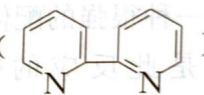

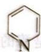

配体 L 能够与许多过渡金属生成配合物。L 是将 2,2-联吡啶( )、冰醋酸和过氧化氢的混合物在 70—80℃ 加热 3 小时合成的。它以细小的针状晶体析出，分子量为 188。已知能被氧化成。

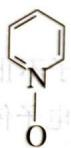

配体 L 与 Fe 和 Cr 的配合物的分子式为 $\mathrm{FeL}_{m}(\mathrm{ClO}_{4})_{n} \cdot 3\mathrm{H}_{2}\mathrm{O}(\mathrm{A})$ 和 $\mathrm{CrL}_{x}\mathrm{Cl}_{y}(\mathrm{ClO}_{4})_{z} \cdot \mathrm{H}_{2}\mathrm{O}(\mathrm{B})$ 。其元素分析结果和物理性质如下表所示。

<table><tr><td>化合物</td><td>元素分析,(wt.%)</td></tr><tr><td>A</td><td>Fe 5.740; C 37.030; H 3.090; Cl 10.940; N 8.640</td></tr><tr><td>B</td><td>Cr 8.440; C 38.930; H 2.920; Cl 17.250; N 9.080</td></tr></table>

请应用下列数据：

4-1 写出 L 的分子式。如果 L 是双齿螯合配体，请画出 L 的结构。
4-2 配体 L 有无电荷(净电荷)

4-2 配体 L 有无电荷(净电荷)? 画出一个 L 分子与一个金属离子(

4-3 根据上表的数据确定 A 的经验式。确定 $\mathrm{FeL}_{m}(\mathrm{ClO}_{4})_{n} \cdot 3\mathrm{H}_{2}\mathrm{O}$ 中的 m 和 n 的数值惯用 IUPAC 符号写出 A 的完整的分子式。

4-4 Fe在A中的氧化数为多少？配合物中的Fe离子有多少个d电子？ 4-5 化合物B是1:1型电解质。试确定B的经验式和在 $\mathrm{CrL}_x\mathrm{Cl}_y(\mathrm{ClO}_4)_z\cdot \mathrm{H}_2\mathrm{O}$ 中的 $x$ 、 y、z的数值。

## 第5题 (10分)

在有机溶剂(如四氢呋喃)中环戊二烯被钠还原为 $C_{5}H_{5}^{-}$ 阴离子, 它和阳离子, 如 $Fe^{2+}$ 、 $Co^{2+}$ 、 $Ni^{2+}$ 、 $Mn^{2+}$ 、 $V^{2+}$ ……形成有色配合物。其中铁配合物中含 30.05% Fe、64.57% C 及 5.38% H。该铁配合物具有芳香性, 氧化还原活性、稳定性和低毒性等特殊性质, 可作功能材料、超导材料等, 具有很广泛的应用。

5-1 给出铁配合物及所有上述配合物的名称。画出 $\mathrm{Fe(II)}$ 配合物的结构。

5-2 以 F 表示上述配合物, 下面的一个合成路线为合成该配合物的多种衍生物。试确定 A\~C 结构式。写出相关反应。

$$
\mathrm{F} \xrightarrow {\mathrm{DMF/POCl} _ {3}} \mathrm{A} \xrightarrow [ n - \text {BuLi} ]{\mathrm{Ph} _ {3} \mathrm{P} = \mathrm{CHCl}} \mathrm{B} \xrightarrow [ \text {而再串} ]{t - \text {BuOK}} \mathrm{C}
$$

5-3 请提出另一条制备 C 的合成路线。

5-4 合成2-甲酰-1-氯乙烯基F的过程中,反应必须在惰性气氛中进行。所用的原料是F、磷酸、醋酸酐、H—CO—N(CH₃)₂、POCl₃。试提出制备上述物质的反应机理。

## 第6题 (10分)

主族元素化学研究中继合成环铝氮烷后又一激动人心的进展是合成了半导体 M，M 在现代电子技术中有着广泛的应用，M 可由下法制得：

将 $GaCl_{3}$ 与 $LiC_{5}(CH_{3})_{5}$ 以适当比例混合后发生反应，生成 A 与 LiCl。A 结构对称，且由 $4\ \text{mol}\ \text{LiC}_{5}(CH_{3})_{5}$ 生成 1 mol A；将 $[(CH_{3})_{3}Si]_{3}As$ 与 $LiCH_{3}$ 以物质的量比 1:1 溶于四氢呋喃 (O) 中发生反应生成 B 与 $\text{Si(CH}_{3})_{4}$ 。B 中 As 以四配体存在。再将 A、B 混合，反应后有 C、LiCl 及一液态物质生成。C 中 Ga、As 各自的部分键不变，最后在 C 的戊烷溶液中加入叔丁醇分离出 M，将其在 $500^{\circ}C$ 中加热两天便可得到半导体 M。

6-1 写出A、B、C的结构式。

6-2 写出 M 的化学式, 最后一步反应中加叔丁醇的作用何在? 为何要加热才能制得半导体?

6-3 写出各步反应方程式并配平。

(10 分)

已知 $\mathrm{Fe(CO)_5}$ 可与乙酸钠发生如下反应：

$\mathrm{Fe(CO)_5 + Cd(Ac)_2 + NH_3 + H_2O \longrightarrow CdFe(CO)_4(NH_3)_2 + CO_2 + HAC}$ 。反应产物 $\mathrm{CdFe(CO)_4(NH_3)_2}$ 又可在真空中，60℃条件下生成 A。元素分析表明：A 中含四种元素且含 Cd 40%，Fe 20%。

物质 A 单体不稳定, 易形成多种聚合物。例如: 在 2,2-联吡啶中, A 以 $\mathrm{A}_{3}$ 形式存在, $\mathrm{A}_{3}$ 又与溶剂形成配合物 B, X 射线衍射表明 B 中存在平面六元环, 且存在金属—金属键及一种金属—碳键, 同时还知道, B 中 Fe 以高度变形的八面体几何构型存在, 而 Cd 则以四面体构型存在。

根据以上信息回答下列问题(原子量 Cd 112, Fe 56, C 12, O 16):

7-1 配平反应方程式并写出A的分子式。

7-2 写出配合物 B 的结构式。

7-3 A还可聚合为 $\mathrm{A}_{4}, \mathrm{~A}_{4}$ 中有平面八元环，且只有一种金属一碳键，试写出 $\mathrm{A}_{4}$ 的结构。

## 第8题 (10分)

太阳能发电和阳光分解水制氢，是清洁能源研究的主攻方向，研究工作之一集中在 $n$ -型半导体光电化学电池方面。下图是 $n$ -型半导体光电化学电池光解水制氢的基本原理示意图，图中的半导体导带（未充填电子的分子轨道构成的能级最低的能带）与价带（已充填价电子的分子轨道构成的能级最高的能带）之间的能量差 $M = E_{\mathrm{c}} - E_{\mathrm{v}}$ 称为带隙，图中 $\mathbf{e}^{-}$ 为电子， $\mathbf{h}^{+}$ 为空穴。

瑞士科学家最近发明了一种基于上图所示原理的廉价光电化学电池装置，其半导体电极由两个光系统串联而成。系统一由吸收蓝色光的 $WO_{3}$ 纳米晶薄膜构成；系统

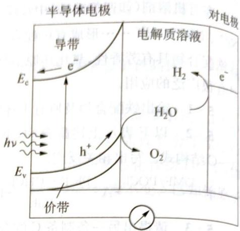

二吸收绿色和红色光，由染料敏化的 $TiO_{2}$ 纳米晶薄膜构成。在光照下，系统一的电子 $(e^{-})$ 由价带跃迁到导带后，转移到系统二的价带，再跃迁到系统二的导带，然后流向对电极。所采用的光敏染料为配合物 $\mathrm{RuL}_{2}(\mathrm{SCN})_{2}$ ，其中中性配体 L 为 4,4'-二羧基-2,2'-联吡啶。

8-1 指出配合物 $\mathrm{RuL}_2(\mathrm{SCN})_2$ 中配体 L 的配位原子和中心金属原子的配位数。

8-2 推测该配合物的分子结构,并用 $Z \sim Z$ 代表 L(其中 Z 为配位原子),画出该配合物及其几何异构体的几何结构示意图。

8-3 画出该配合物有旋光活性的键合异构体。

8-4 分别写出半导体电极表面和对电极表面发生的电极反应式,以及总反应式。

8-5 已知太阳光能量密度最大的波长在 $560 \mathrm{~nm}$ 附近, 说明半导体电极中 $\mathrm{TiO}_{2}$ 纳米晶膜(白色)必须添加光敏剂的原因。

8-6 说明 $\mathrm{TiO_2}$ 和配合物 $\mathrm{RuL_2(SCN)_2}$ 对可见光的吸收情况, 推测该配合物的颜色。  
8-7 该光电化学电池装置所得在用可观察中的

8-7 该光电化学电池装置所得产物可用于环保型汽车发动机吗？说明理由。

## 第9题 (10分)

八配位的化合物可能有好几种理想的几何结构,其中最简单和对称性最高的是立方体。实际上观测到的过渡金属八配位的配合物仅有两种多面体——四方反棱柱和十二面体(见图)。它们是由立方体简单变形得到的。

9-1 试说明怎样从立方体演变成四方反棱柱和十二面体。为什么这两种几何构型的配合物比立方体的同种配合物稳定？

$$
\mathrm{MX} _ {6} \mathrm{Y} _ {2} (\mathrm{X}
$$

9-3 一般来说,若某种分子的几何构型不存在对称面或对称中心,那么这种几何构型在旋光异构体。试判断上面的几何结构是

试判断上面的几何异构体中,哪些存在旋光异构体?

9-4 试写出 $MX_{6}Y_{2}$ 为十二面体时的所有几何异构体数目,其中多少种几何异构体有旋光性?

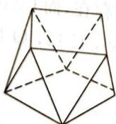  
四方反棱柱

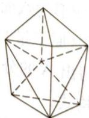  
十二面体

## 第10题 (10分)

有一化学简式为 $\mathrm{Fe(H_{2}O)_{4}(CN)_{2}}$ 的配合物，其磁矩相当于 2.67 单电子/每个铁原子。写出该物质的结构式。

1. 甲醇为：H、O、C、H、N、O₂的体积，分别为200g、300g、400g。

1. 与汉义相等的外对流方指食，再取分。

海藻的前，以伊西兰、苏科、金明资本的研究

## 1. 2. 3. 4. 5. 6. 7. 8. 9. 10. 11. 12. 13. 14. 15. 16. 17. 18. 19. 20. 21. 22. 23. 24. 25. 26. 27. 28. 29. 30. 31. 32. 33. 34. 35. 36. 37. 38. 39. 40. 41. 42. 43. 44. 45. 46. 47. 48. 49. 50. 51. 52. 53. 54. 55. 56. 57. 58. 59. 60. 61. 62. 63. 64. 65. 66. 67. 68. 69. 70. 71. 72. 73. 74. 75. 76. 77. 78. 79. 80. 81. 82. 83. 84. 85. 86. 87. 88. 89. 90. 91. 92. 93. 94. 95. 96. 97. 98. 99.

合题同金对这个30回，中函判金县门市汇金的刘家子介绍3门间保全三四在第1页文

(1) $H = H$ = H $^{+}$ - H $^{2-}$ (4.5H) 则二因(7). A 体合附混斜到裂解, 具素图人确定了 (1) 隔离中圆锥, 2) 等合出向中白实不朽余的 $H = Hq$ 可 (H $^{+}$ )。如图3所示, 例表3所示。

符合外面直线路径 $(x_{1}-x_{2})$ 和非线 $(x_{1},0)$ 的位置，对称平面或等高点

大而又是答案图书出目为 1.5

为通商的千港元中日综合出货 2-5

(2) $A_{1}$ 和 $B_{1}$ 的互换式, $A_{2}$ 和 $B_{2}$ 的互换式, $A_{3}$ 和 $B_{3}$ 的互换式, $A_{4}$ 和 $B_{4}$ 的互换式, $A_{5}$ 和 $B_{5}$ 的互换式, $A_{6}$ 和 $B_{6}$ 的互换式, $A_{7}$ 和 $B_{7}$ 的互换式, $A_{8}$ 和 $B_{8}$ 的互换式, $A_{9}$ 和 $B_{9}$ 的互换式, $A_{10}$ 和 $B_{10}$ 的互换式, $A_{11}$ 和 $B_{11}$ 的互换式, $A_{12}$ 和 $B_{12}$ 的互换式, $A_{13}$ 和 $B_{13}$ 的互换式, $A_{14}$ 和 $B_{14}$ 的互换式, $A_{15}$ 和 $B_{15}$ 的互换式, $A_{16}$ 和 $B_{16}$ 的互换式, $A_{17}$ 和 $B_{17}$ 的互换式, $A_{18}$ 和 $B_{18}$ 的互换式, $A_{19}$ 和 $B_{19}$ 的互换式, $A_{20}$ 和 $B_{20}$ 的互换式, $A_{21}$ 和 $B_{21}$ 的互换式, $A_{22}$ 和 $B_{22}$ 的互换式, $A_{23}$ 和 $B_{23}$ 的互换式, $A_{24}$ 和 $B_{24}$ 的互换式, $A_{25}$ 和 $B_{25}$ 的互换式, $A_{26}$ 和 $B_{26}$ 的互换式, $A_{27}$ 和 $B_{27}$ 的互换式, $A_{28}$ 和 $B_{28}$ 的互换式, $A_{29}$ 和 $B_{29}$ 的互换式, $A_{30}$ 和 $B_{30}$ 的互换式, $A_{31}$ 和 $B_{31}$ 的互换式, $A_{32}$ 和 $B_{32}$ 的互换式, $A_{33}$ 和 $B_{33}$ 的互换式, $A_{34}$ 和 $B_{34}$ 的互换式, $A_{35}$ 和 $B_{35}$ 的互换式, $A_{36}$ 和 $B_{36}$ 的互换式, $A_{37}$ 和 $B_{37}$ 的互换式, $A_{38}$ 和 $B_{38}$ 的互换式, $A_{39}$ 和 $B_{39}$ 的互换式,

(2) 用酒精四舍合 $A$ ，但又 $A \geqslant 1$ 显高， $A$ 醇合酶小甲基到可断，(3) 聚合酶 $O$ 十有；(4) 聚合酶小甲基到可断，(5) 聚合酶小甲基到可断，(6) 聚合酶小甲基到可断，(7) 聚合酶小甲基到可断，(8) 聚合酶小甲基到可断，(9) 聚合酶小甲基到可断，(10) 聚合酶小甲基到可断，(11) 聚合酶小甲基到可断，(12) 聚合酶小甲基到可断，(13) 聚合酶小甲基到可断，(14) 聚合酶小甲基到可断，(15) 聚合酶小甲基到可断，(16) 聚合酶小甲基到可断，(17) 聚合酶小甲基到可断，(18) 聚合酶小甲基到可断，(19) 聚合酶小甲基到可断，(20) 聚合酶小甲基到可断，(21) 聚合酶小甲基到可断，(22) 聚合酶小甲基到可断，(23) 聚合酶小甲基到可断，(24) 聚合酶小甲基到可断，(25) 聚合酶小甲基到可断，(26) 聚合酶小甲基到可断，(27) 聚合酶小甲基到可断，(28) 聚合酶小甲基到可断，(29) 聚合酶小甲基到可断，(30) 聚合酶小甲基到可断，(31) 聚合酶小甲基到可断，(32) 聚合酶小甲基到可断，(33) 聚合酶小甲基到可断，(34) 聚合酶小甲基到可断，(35) 聚合酶小甲基到可断，(36) 聚合酶小甲基到可断，(37) 聚合酶小甲基到可断，(38) 聚合酶小甲基到可断，(39) 聚合酶小甲基到可断，(40) 聚合酶小甲基到可断，(41) 聚合酶小甲基到可断，(42) 聚合酶小甲基到可断，(43) 聚合酶小甲基到可断，(44) 聚合酶小甲基到可断，(45) 聚合酶小甲基到可断，(46) 聚合酶小甲基到可断，(47) 聚合酶小甲基到可断，(48) 聚合酶小甲基到可断，(49) 聚合酶小甲基到可断，(50) 聚合酶小甲基到可断。

民间出错题图于M.12.1：阳光同代期页。如虚寒云中，云开是由于构造上，从
光致分量测中自康元度。以P.1（告动和发），成08.39（代夏年）可充合同当原日，3.01-2001

28.21 科量重于 4000 个S 纳面，且满足方向和距离多分A符合50-5-4

7-3 左面的面积大于在四舍五边角，总斜出极限面积等距离比全一舍含及中全宽符合30个年

理解它的这种性质

普鲁斯金尔库, 1961. 中 (2) 全部 (unaud.) 外蒙罗斯, 1980. 深迈富士联合的阿氏族长量黄和泰式登中大脱脂将位数高调气离闭目, 调合非金属化, 和色体在右联合出了 InO. 稳定存在的可能, 其一的与人同为。3.9-4.7 增非金属化的杂志, 1985.

稳定存在的可能，其中的非正负数是 $1 - 2$ 。

# 能力测试B卷

## 第1题 (10分)

已知 $\left[\mathrm{Co}(\mathrm{H}_2\mathrm{O})_6\right]^{3+} + \mathrm{e}^- \rightleftharpoons \left[\mathrm{Co}(\mathrm{H}_2\mathrm{O})_6\right]^{2+}$ $\varphi^{\theta} = 1.84\mathrm{V}$

$$
\left[ \mathrm{Co} (\mathrm{NH} _ {3}) _ {6} \right] ^ {3 +} + \mathrm{e} ^ {-} \rightleftharpoons \left[ \mathrm{Co} (\mathrm{NH} _ {3}) _ {6} \right] ^ {2 +} \quad \varphi^ {\theta} = 0. 1 0 \mathrm{V}
$$

$\left[\mathrm{Co}(\mathrm{NH}_{3})_{6}\right]^{3+}$ 、 $\left[\mathrm{Co}(\mathrm{NH}_{3})_{6}\right]^{2+}$ 的磁矩分别为0、3.88B.M。试分析：

1-1 +2价钴和+3价钴在配位状态的相对稳定性。

1-2 根据晶体场理论，说明上述两电对 $\varphi^{\theta}$ 值的差别。

## 第2题 (10分)

现已发现金属桥联多核结构广泛存在于生物体的金属蛋白及金属酶中,因此对多核金属配合物的研究具有十分重要的意义。

1991年有人用草酸与乙醇反应得到化合物 A, A 与丙二胺( $H_{2}N-CH_{2}-CH_{2}-CH_{2}-NH_{2}$ ) 反应得化合物 B, B 与新配制的 $\mathrm{Cu(OH)}_{2}$ 在 pH=10 的条件下反应生成化合物 C。根据电导测定,化合物 C 为非电解质,再用 C 与 $\mathrm{Zn(ClO_{4})_{2}}$ 及菲咯啉(

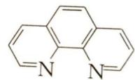

D。D为1:2型电解质,其分子式为: $C_{32}H_{36}Cl_{2}N_{8}O_{12}CuZn$ 。

2-1 试写出并配平各步反应式。

2-2 写出化合物 D 中配离子的结构简式。

$\mathrm{Na}[(\eta^{5}-\mathrm{C}_{5}\mathrm{H}_{5})\mathrm{Fe}(\mathrm{CO})_{2}]$ 与 $ClCH_{2}CH_{2}SCH_{3}$ 反应生成了化合物 A, 其红外光谱显示: 在 1980 和 $1940~cm^{-1}$ 处有两个吸收峰。A 是单核, 反磁性物质。A 受热生成 B, B 与 A 分子式相同, 也是单核, 反磁性物质, 但红外光谱显示在 1920 和 $1680~cm^{-1}$ 处有两个吸收峰。画出 A、B 的结构式。

第 4 题 (10 分)

研究表明:用于 $CO_{2}$ 还原的一种中性单中心配合物 A, 满足 EAN 规则。A 含有两种配体, 一种是常见配体 L, 另一种是 CO。A 配合物除含有金属元素 M 外, 还含有碳、氢、氧、氮元素。试根据信息回答下列问题:

4-1 配体 L 由碳、氢和氮三种元素组成。质谱分析表明: L 的 M 与 M 共有 100:10.8。已知碳同位素中 $^{12}C$ 丰度为 36.5%

$$
\mathrm{中} ^ {1 2} \mathrm{C}
$$

分析表明: L 的 M 与 M+1 的峰高比例为 $5.16\%$ . $^{13}C$ 丰度为 98.89%, $^{13}C$ 丰度占 1.11%。氢元素在 L 中质量分数为 4-2 配合物 A 在受热时可逐步脱去 CO, 当脱除 2 个 CO 时, A 相对分子质量下降 15.38%, 且一个配合物分子中只含有一个 L 配体。请根据给出信息, 确定 A 的分子式和结构简式。

第 5 题 (10 分)

铋的化合物丰富多彩

铋的化合物丰富多彩。1978年,化学家R. C. Burns在液态 $\mathrm{SO}_{2}$ 中,用 $\mathrm{AsF}_{5}$ 氧化金属铋制备了化合物A。经分析,A为离子化合物,且阴离子结构高度对称。已知A中铋元素的质量分数为 $64.84\%$ ,Bi元素的平均氧化数为+0.6。

5-1 试确定A的结构简式,阐述并画出阳离子的结构;写出生成A的化学反应方程式。

化学竞赛能力测试一高中第三分册

5-2 将金属铋与适量的 $\mathrm{BiCl}_3$ 、 $\mathrm{AlCl}_3$ 在熔融的 $\mathrm{NaAlCl}_4$ 中反应也能制备含A的阳离子的化合物B。B也为离子化合物，且阴离子也高度对称。B中铋元素质量分数为 $67.33\%$ 。在制备B的过程中，若金属铋过量，则会生成化合物C。C中Bi元素质量分数为 $83.18\%$ 。

(1) 试通过计算确定 B 的分子式, 写出制备 B 的化学反应。

(2) C 中的阳离子为全铋阳离子。试通过计算确定 C 的分子式，写出制备 C 的化学反应。

(3) 化合物 B 是顺磁性还是抗磁性？为什么？

（4）化合物 C 的阳离子可看作是封闭的多面体中削去对称的两个顶点得到的立体构型。问该阳离子是什么构型？Bi 元素平均氧化数是多少？

5-3 有一种与 C 相似的阳离子 D 与阴离子 E 为等电子体，但两者却有不同结构。试画出 D 和 E 的结构，指出其点群。

## 第6题 (10分)

配合物 $PdL(C_{7}H_{7})NAr_{2}$ 在 L 存在下受热分解, 能得到有机化合物 A 和一种四面体配合物 B。已知: L 为一种常见的金属有机化合物(记为 C)的衍生物, 是一种膦的双齿配体, 其中金属 M 和磷元素质量分数分别为 10.07% 和 11.17%。Ar 表示芳香族化合物。

试回答：

6-1 使用林德催化剂彻底还原 L 后, 可得配体 $L_{1}$ 和金属 M。 $L_{1}$ 相对分子质量是 L 的 48.06%。请推测并给出 L 的最合理结构, 画出 $L_{1}$ 结构。

6-2 请确定 A 和 B 的结构。说明: 在画出配合物结构式时, 可对配体 L 进行简化, 弹药进行相关标记。

6-3 C 可类比于乙烷碳碳键的旋转。请画出 C 的两种极限构象, 分别给出其所属点群。

6-4 C 在 $\mathrm{AlCl}_3$ 催化下可以与乙酰氯发生傅克反应。反应过程中金属 M 原子先结合亲电试剂形成中间体 D，随后发生重排得到中间体 E，E 失去质子得到产物。请画出 D 和 E 的结构，判断其是否满足 EAN 规则。

6-5 有一种配合物 F 仅有两种配体,一种配体是 C 中的配体,另一种配体是一种常见无机顺磁性小分子。F 中也含有金属 M,且质量分数为 37.00%。F 分子含有一个 $\mathrm{C}_{2}$ 轴和一个垂直于 $\mathrm{C}_{2}$ 的对称轴。试通过计算推导出 F 的结构式;并通过计算解释为何中心金属 M 原子满足 EAN 规则,在计算式中表明电子的来源,指出中心原子的价态。

## 第7题 (10分)

试就下列配合物回答问题：

7-1 在答卷纸绘出的空模板上画出 trans-二氯·二(2,3-丁二胺)合钴(Ⅲ)离子的所有立体异构体的结构式(注:2,3-丁二胺又名2,3-二氨基丁烷)。

7-2 指出其中有旋光性的异构体。

7-3 已知其中有一种异构体的氯被其他负一价阴离子取代的速率最慢。它是哪一种？如何理解它的这种性质？

## 第8题 (10分)

长期以来,人们已知的最高的氧化态都是+8价,直到2010年,有一篇研究从理论上计算了 $IrO_{4}^{+}$ 稳定存在的可能,其中的Ir为+9价。2014年, $IrO_{4}^{+}$ 的存在得到了实验的证实。

8-1 在该系列化合物中， $\left[\mathrm{IrO}_{4}^{+}\right]$ 有 $\mathrm{A}_{1}$ 、 $\mathrm{B}_{1}$ 、 $\mathrm{C}_{1}$ 三种异构体。 $\mathrm{A}_{1}$ 无对称中心， $\mathrm{Ir}-\mathrm{O}$ 键的键长均为 170.8 pm。 $B_{1}$ 中 Ir 配位数为 4，氧化态为 +7，只有两种 Ir—O 键，键长分别为 188.8 pm 和 168.0 pm。 $C_{1}$ 中只有一个镜面，也只有两种 Ir—O 键，键长分别为 209.6 pm 和 167.9 pm。画出 $A_{1}$ 、 $B_{1}$ 、 $C_{1}$ 结构。

8-2 $\mathrm{IrBr}_3$ 与 $\mathrm{N}_2\mathrm{O}_5$ 可在室温下反应，得到一紫色配合物 $\mathrm{H}_3\mathrm{O}(\mathrm{H}_2)_2$ 的液体单质，并释放出具有顺磁性的无色气体。写出该反应的离子方程式。

液体单质,并释放出具有顺磁性的无色气体。写出该反应的离子共轭的原子，其反应生成有 $\mathrm{Ir}_{3}\mathrm{O}(\mathrm{NO}_{3})_{10}$ 为一种CsCl型的盐，阳配离子结构对称，存在两种由N和O组成的配体，且比值为1:2，试画出 $\mathrm{Ir}_{3}\mathrm{O}(\mathrm{NO}_{3})_{10}$ 阳离子结构式。

8-4 有机铱化合物 $\left(\mathrm{C}_{9}\mathrm{H}_{11}\right)_{3}\mathrm{Ir}$ 在空气中氧化反应为：在两种不同的 $O_{2}$ 浓度下，用初始浓度 $\left[\left(\mathrm{C}_{9}\mathrm{H}_{11}\right)_{3}\mathrm{Ir}\right]=1.3\times10^{-4}\mathrm{M}$ 研究反应（试验 $1,\left[\mathrm{O}_{2}\right]=1.0\times10^{-2}\mathrm{M}$ ；试验 $2,\left[\mathrm{O}_{2}\right]=2.0\times10^{-3}\mathrm{M}$ ）。测得 $\left[\left(\mathrm{C}_{9}\mathrm{H}_{11}\right)_{3}\mathrm{Ir}\right]$ 浓度 $\left[\left(\mathrm{C}_{9}\mathrm{H}_{11}\right)_{3}\mathrm{Ir}\right]$ 、 $\ln\left[\left(\mathrm{C}_{9}\mathrm{H}_{11}\right)_{3}\mathrm{Ir}\right]$ 和 $1/[(\mathrm{C}_{9}\mathrm{H}_{11})_{3}\mathrm{Ir}]$ 对时间的函数关系如图：

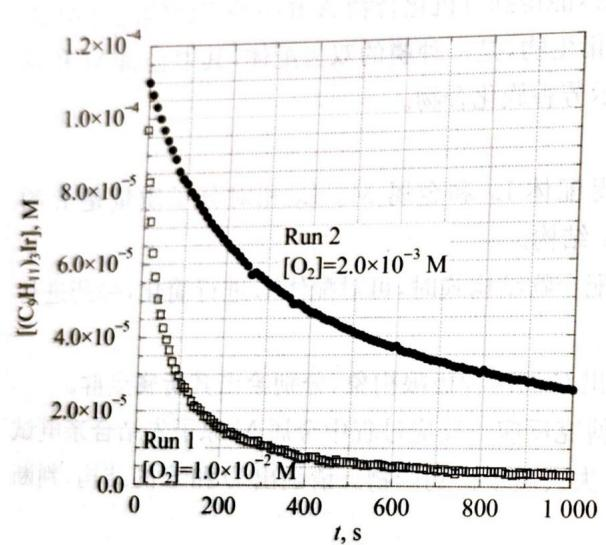

(1) 对于 $\left[\left(\mathrm{C}_{9} \mathrm{H}_{11}\right)_{3} \mathrm{Ir}\right]$ 反应级数是 0, 1 还是 2? 证明你的答案 (若数据与级数不完全一致, 也请选择最接近的整数级数)。

(2) 对于 $O_{2}$ 反应级数是 0, 1 还是 2? 证明你的答案（若数据与级数不完全一致，也请选择最接近的整数级数）。

(3) 计算反应的速率常数。

(4) 已经提出了以下反应机理。该机制是否符合观察到的速率规律？解释一下推理。

$$
(\mathrm{C} _ {9} \mathrm{H} _ {1 1}) _ {3} \mathrm{Ir} + \mathrm{O} _ {2} \underset {k _ {- 1}} {\overset {k _ {1}} {\rightleftharpoons}} (\mathrm{C} _ {9} \mathrm{H} _ {1 1}) _ {3} \mathrm{Ir} (\mathrm{O} _ {2})
$$

$$
(\mathrm{C} _ {9} \mathrm{H} _ {1 1}) _ {3} \mathrm{Ir} (\mathrm{O} _ {2}) + (\mathrm{C} _ {9} \mathrm{H} _ {1 1}) _ {3} \mathrm{Ir} \xrightarrow {k _ {2}} 2 (\mathrm{C} _ {9} \mathrm{H} _ {1 1}) _ {3} \mathrm{IrO}
$$

8-5 下面是铱配合物作催化剂，催化胺类与醇反应的示意图。它能有效降低反应活化能，加快化学反应速率。

已知 A 中铱原子周围呈四面体型配位, 共有 9 个配位原子, 在 A→B 过程中, 中心原子的配位数不变, 发生了一步分子内的亲核进攻, B 为该循环过程中唯一的电中性含铱中间体。生成 C 时铱原子构型发生反转, D 为三角型配位 (Cp\* 为五甲基茂的缩写)。

(1) 请画出配合物 A 到配合物 D 的结构。

(2) 试通过计算说明: A 和 D 是否满足 EAN 规则。

(3) 该反应实际加入的催化剂为二氯化五甲基茂基铱。在该化合物中, 铱原子满足 EAN 规则。若将五甲基茂铱看作球状, 则该分子属于 $\mathrm{C}_{2\mathrm{h}}$ 点群。请画出其结构式。

8-6 2014年，继 $\mathrm{IrO_4^+}$ 中 $+9$ 价Ir得到了实验的证实后，近期又一篇理论计算表明 $\mathrm{PtO_4^{2 + }}$ 稳定存在的可能性。

(1) 请推测 $\mathrm{PtO}_4^{2+}$ 空间构型。

(2) 从 $\mathrm{IrO}_{4}^{+}$ 到 $\mathrm{PtO}_{4}^{2+}$ , 能使它们稳定存在的原因可能是什么?

(3) 理论计算表明, $PtO_{4}^{2+}$ 可按如下方式发生分解:

$$
\mathrm{PtO} _ {4} ^ {2 +} = \mathrm{PtO} _ {2} ^ {+} + \mathrm{O} _ {2} ^ {+} \quad \Delta H = - 5 2 0. 8 \mathrm{kJ} \cdot \mathrm{mol} ^ {- 1}
$$

已知 $PtO_{2}$ 标准摩尔生成焓为 $171\ kJ \cdot mol^{-1}$ ，第一电离能为 $11.2\ eV$ ; $O_{2}$ 键能为 $498\ kJ \cdot$

mol $^{-1}$ ，第一电离能为12.1 eV；O的第一电离能为13.6 eV。请计算PtO $_{4}^{2+}$ 标准摩尔生成焓。

(4) $PtO_{4}^{2+}$ 分解反应是一个非常强的放热反应。但 $PtO_{4}^{2+}$ 仍能稳定存在，为什么？

(5) 判断 $PtO_{4}^{2+}$ 与 $PtO_{2}^{+}$ 中何者 Pt—O 键更强，请说明判断理由。

(6) 分解反应 $PrO_{4}^{2+} = PrO_{2}^{+} + O_{2}^{+}$ 的过程经历了两个重要的中间体，它们是 $PtO_{4}^{2+}$ 的异构体，试给出它们的合理结构。

## 第9题 (10分)

连锁环化合物是一类结构十分奇特的超分子，它是由几个分子相互环绕连锁而成，但相互作用不是很大。连锁环化合物的合成思路通常是以配位化合物作为模板进行拼接，然后除去配合物金属原子而成。这样的反应叫做模板反应。

三叶结就是这样一种十分奇特的连锁化合物,其奇特之处在于三叶结从头到尾只由一条链组成。以下是三叶结的拓扑结构和一种三叶结的合成路线:

华东师范大学出版社

已知:第一步反应生成了一个双核的配合物阳离子,运用了 $Cu^{+}$ 作为模板进行配位。
9-1 请画出 A 可能的两种异构体。其中只有一种

9-1 请画出 A 可能的两种异构体。其中只有一种异构体才可能完成三叶结的合成。请注意配位中心的立体化学问题，配体可以适当进行简化，但需说明

意配位中心的立体化学问题,配体可以适当进行简化,但需说明。

9-3 请画出 B 中可以作为三叶结前体的异构体。

$$
\mathrm{Cu} ^ {+}
$$

9-4 请判断三叶结是否存在对映体，并说明理由。分子器件被认为能突破出的特征。

分子器件被认为能突破光刻技术为标态的半导体、集成电路，为信息化时代注入新的元素的未来科技新星。目前人们已知合成出分子梭、分子开关、分子推进器、分子齿轮、分子刹车等具有特定功能的化合物。索烃就是其中极具代表性的一员。

9-5 已知索烃的通常合成手段为金属离子配位模板合成法来形成双环扣锁型的索烃。

(1) 画出 C、D、E、F 的空间结构，并写出 C 物质中的对称元素和 KCN 在合成中的作用。

（2）在 54.2 nm 的光线照射中，E 会激发出电子合成 G。写出其化学反应方程式。计算 1 mol C 激发出该电子所需的能量。

(3) G 会通过环滑移变为稳定的 H, 这就是索烃分子器件的工作原理。写出 H 的空间结构，并说明其工作原理。

（4）已知 E 转化成 H 的活化能 $E_{s}=2931\ kJ\cdot mol^{-1}$ ，与第②问中所给出的数据作比较，写出从对比中，你能推测出什么信息？

## 第10题 (10分)

过氧化氢是一种绿色氧化剂，主要应用于造纸工业，在环境保护方面也有广阔的应用前景。近年来过氧化氢的制备方法和生产工艺不断改进，逐渐淘汰了生产方式陈旧能量消耗高的氧阴极法和存在安全问题的异丙醇法，而蒽醌法经过不断研究改进已经成为目前 $\mathrm{H}_2\mathrm{O}_2$ 生产的主要方法。但是蒽醌法工艺流程复杂，生产成本较高，限制了 $\mathrm{H}_2\mathrm{O}_2$ 的应用，同时人们正在进行氢氧直接化合法的研究，这是一种符合原子经济的绿色的 $\mathrm{H}_2\mathrm{O}_2$ 生产方法，工业化前景乐观，但它仍需解决生产安全、 $\mathrm{H}_2\mathrm{O}_2$ 收率等问题。作为氢氧直接化合法的一种可替代方法， $\mathrm{O}_2 / \mathrm{CO}$ 与 $\mathrm{H}_2\mathrm{O}$ 反应发现在三苯膦钯配合物（氯化物）的存在下制备 $\mathrm{H}_2\mathrm{O}_2$ ，可在很大程度上降低反应的危险性， $\mathrm{O}_2$ 和 $\mathrm{CO}$ 在操作条件下（没有明火）形成比较安全的混合气体。

## 10-1 请写出总反应方程式。

10-2 反应机理如下,请分步写出反应式:

(1) Pd(Ⅱ)配合物被 CO 还原成 Pd(0)配合物同时产生 $CO_{2}$ 。

(2) Pd(0)配合物被 $O_{2}$ 氧化生成过氧化 Pd(Ⅱ)配合物。

(3) 过氧化 $\mathrm{Pd(II)}$ 配合物与酸 $\mathrm{HX(X^{-}}$ 是一种结合力较弱的配位离子如 $\mathrm{CF}_{3} \mathrm{COO}^{-}, \mathrm{AcO}^{-}$ 等称 $\mathrm{HX}$ 为酸助催化剂)反应, 产生 $\mathrm{H}_{2} \mathrm{O}_{2}$ 和原始的 $\mathrm{Pd(II)}$ 配合物。

10-3 氯代有机物(RCl)在过氧化氢的合成上有很好的促进效果,但却导致催化剂很快失活,生成的 $\mathrm{H}_{2} \mathrm{O}_{2}$ 大量减少,且发现产物中有烃类、氯化氢、二氧化碳。原因是可能存在副反应,试用化学方程式解释有上述几种副产品的原因。

10-4 本方法除了催化剂转化率低这个缺点,还有个实际生产中所要考虑的问题是什么?

10-4 本方法除了催化剂转化率低这个缺点, 这将化学反应生成的氢氧化钡和硫羰基( $S=C$ )室温裂解工作, 推动了石油工业的发展。

化碳和硫羰基(S=C)室温裂解工作,推动了石油工业的化学反应。 $CS_{2}$ 和 $HNO_{3}$ 水溶液在室温条件下几乎不发生氧化还原反应,但加入含钯催化剂后,可以快速催化 $CS_{2}$ 和 $HNO_{3}$ 间发生裂解反应,其催化循环如下图所示:

华东师范大学出版社

上图中化合物 A 中双齿配体忽略的部分只含有 C 和 H 两元素,且与 Pd 形成的是五元螯环结构,化合物 A 中氮元素质量分数为 14.50%,而配体中氮元素质量分数为 17.94%。化合物 C 中 Pd 符合 EAN 规则。化合物 B 和 C 为离子化合物,且阳离子均为 +2 价。C 中钯和硫元素质量分数分别为 32.71% 和 6.57%。

10-5 通过计算和推导求出化合物 A 的化学式, 并画出该配体的分子式。

10-7 图示中D为混合物,试写出总反应的化学方程式。

同人，以复方图 2.07

(1) 一个函数 $f(x) = x + 1$ 的值，所以 $f(x) = x - 1$ 的值。

$\therefore {a}_{1} = 3,{b}_{1} = 4,\cdots ,{b}_{n} = 5$

<table><tr><td>BaO(s)+H2O(l)→Ba(OH)2(s)</td><td>△rHmθ=-103kJ·mol-1</td></tr><tr><td>Ba(OH)2(s)+aq→Ba2+(aq)+2OH-(aq)</td><td>△rHmθ=-52kJ·mol-1</td></tr><tr><td>Ba(OH)2·8H2O(s)+aq→Ba2+(aq)+2OH-(aq)</td><td>△rHmθ=+64kJ·mol-1</td></tr></table>

## 第5章

# 化学热力学初步知识

# 能力测试 A 卷

第1题 (10分)

从能量观点出发,人类的食物向人体供应能量,是一种可折合成葡萄糖在人体里完全氧化释放出来的化学反应能。

1-1 已知：

<table><tr><td>化合物</td><td>葡萄糖(固)</td><td> $H_2O$ (液)</td><td> $CO_2$ (气)</td></tr><tr><td> $\Delta_fH_m^0/kJ·mol^{-1}$ </td><td>-1259.8</td><td>-285.8</td><td>-393.5</td></tr></table>

设葡萄糖完全氧化释放出的化学反应能全转化为热能,计算 1 kg 葡萄糖最多可向人体提供多少热量?

1-2 已知用葡萄糖为燃料设计成的燃料电池,其理论标准电动势为 1.24 V。人体肌肉做功等可归因于生物电过程所产生,因此可折合成葡萄糖氧化作用电功释放出来的化学能。计算 1 kg 葡萄糖最多可做多少功?

1-3 葡萄糖氧化反应所产生的电能与该反应提供的热能是否相等？为什么？在研究食物时，仅谈论能够放出多少“焦”的热量，是否全面？

1-4 设环境温度为 $20^{\circ}\mathrm{C}$ , 人体作为一种理想的热机, 则 $1\mathrm{kg}$ 葡萄糖所提供的热能有多少可转化为机械功[按: 热机效率为(高温温度一低温温度)/高温温度, 温度单位为 $\mathbf{K}$ ]? 已知维持人体血液循环体系至少需功 $8.6 \times 10^{2} \mathrm{~kJ}$ 。请由此推断人体能量转换机理主要是通过热机还是电化学过程?

第2题 (10分)

在燃烧煤、石油的废气中常含有 $CO_{2}$ 、 $NO_{x}$ 、 $SO_{2}$ 等气体，排放前，这些有害气体都应尽量除去。请根据下列数据尽可能多地提出从废气中除去 $NO_{x}$ 的可能途径（如有反应式，请一并写出），并指出实施时所需的条件。

<table><tr><td>有利于高脱硫率</td><td> $H_{2}$ </td><td> $N_{2}$ </td><td> $O_{2}$ </td><td> $H_{2}O(g)$ </td><td>CO</td><td> $CO_{2}$ </td><td>NO</td><td> $NO_{2}$ </td><td> $NH_{3}$ </td></tr><tr><td> $\Delta_{f}H_{m}^{\theta}/kJ·mol^{-1}$ </td><td>0</td><td>0</td><td>0</td><td>-242</td><td>-110.5</td><td>-393.5</td><td>90.4</td><td>33.9</td><td>-46.2</td></tr><tr><td> $S^{\theta}/J·mol^{-1}·K^{-1}$ </td><td>131</td><td>192</td><td>205</td><td>189</td><td>198</td><td>214</td><td>211</td><td>241</td><td>193</td></tr></table>

第3题 (10分)

已知：

请回答下列问题。若能，给出答案；若不能，简述原因。

3-1 能求得 $\mathrm{BaO(s)}$ 的溶解热吗？

3-2 能求得 $\mathrm{Ba(OH)_2(s)}$ 转变成 $\mathrm{Ba(OH)_2\cdot 8H_2O}$ 能量变化吗？

$$
\mathrm{“O} ^ {2 -}" (\mathrm{s}) + \mathrm{H} _ {2} \mathrm{O} (\mathrm{l}) \longrightarrow 2 \mathrm{OH} ^ {-} (\mathrm{s})
$$

3-4 能求得“ $O^{2-}$ ”(s)+aq→ $2OH^{-}(aq)$ 的能量变化吗？

## 第4题 (10分)

在 298 K 下, 下列反应的 $\Delta_{r}H_{m}^{\theta}$ 依次为:

$$
\begin{array}{r l r} & {\mathrm {C_ {8} H_ {18} (g) + 25 / 2O_ {2} (g)\longrightarrow 8CO_ {2} (g) + 9H_ {2} O(l)}} & {\Delta_ {1} H _ {\mathrm{m}} ^ {\theta} = - 5 5 1 2. 4 \mathrm{kJ} \bullet \mathrm{mol} ^ {- 1}} \\ & {\mathrm {C(石墨) + O_ {2} (g)\longrightarrow CO_ {2} (g)}} & {\Delta_ {2} H _ {\mathrm{m}} ^ {\theta} = - 3 9 3. 5 \mathrm{kJ} \bullet \mathrm{mol} ^ {- 1}} \\ & {\mathrm {H_ {2} (g) + 1 / 2O_ {2} (g)\longrightarrow H_ {2} O(l)}} & {\Delta_ {3} H _ {\mathrm{m}} ^ {\theta} = - 2 8 5. 8 \mathrm{kJ} \bullet \mathrm{mol} ^ {- 1}} \end{array}
$$

正辛烷、氢气和石墨的标准熵分别为： $463.7\ J \cdot K^{-1} \cdot mol^{-1}$ ， $130.6\ J \cdot K^{-1} \cdot mol^{-1}$ ， $5.694\ J \cdot K^{-1} \cdot mol^{-1}$ 。

设正辛烷和氢气为理想气体,问:

4-1 $298\mathrm{K}$ 下，由单质生成 $1\mathrm{mol}$ 正辛烷的反应的平衡常数 $K_{\mathrm{p}}^{\theta}$ ；给出计算过程。

4-2 增加压力对提高正辛烷的产率是否有利？为什么？

4-3 升高温度对提高产率是否有利？为什么？

4-4 若在 $298\mathrm{K}$ 及 $101.325\mathrm{kPa}$ 下进行，平衡混合物中正辛烷的摩尔分数能否达到0.1？

4-5 若希望正辛烷在平衡混合物中的摩尔分数达到 0.5，则在 298 K 时，需要多大的压力才行？给出计算过程。

## 第5题 (10分)

已知:原电池 $\mathrm{H}_{2}(\mathrm{~g})\mid\mathrm{NaOH(aq)}\mid\mathrm{HgO(s)}$ ， $\mathrm{Hg(l)}$ 在 298.15 K 下的标准电动势 $E^{\theta}=0.926V$ 反应 $\mathrm{H}_{2}(\mathrm{~g})+1/2\mathrm{O}_{2}(\mathrm{~g})=\mathrm{H}_{2}\mathrm{O}(\mathrm{l})\quad\Delta_{\mathrm{r}}G_{\mathrm{m}}^{\theta}(298\mathrm{K})=-237.2\mathrm{kJ}\cdot\mathrm{mol}^{-1}$

<table><tr><td>物质</td><td>Hg(l)</td><td>HgO(s)</td><td> $O_{2}(g)$ </td></tr><tr><td> $S_{m}^{\theta}(298\ K)/J·mol^{-1}·K^{-1}$ </td><td>77.1</td><td>73.2</td><td>205.0</td></tr></table>

5-1 写出上述原电池的电池反应与电极反应(半反应)。

5-2 计算反应 $\mathrm{HgO(s)} = \mathrm{Hg(l)} + 1 / 2\mathrm{O}_2(\mathrm{g})$ 在 $298.15\mathrm{K}$ 下的平衡分压 $p(\mathrm{O}_2)$ 和 $\Delta_{\mathrm{r}}H_{\mathrm{m}}^{\theta}$ (298.15K)。

5-3 设反应的焓变与熵变不随温度而变化,求 HgO 固体在空气中的分解温度。

第6题 (10分)

6-1 今有两种燃料,甲烷和氢气,设它们与氧气的反应为理想燃烧,利用下列 $298 \mathrm{~K}$ 的数据 (设它们与温度无关)分别计算按化学计量比发生的燃烧反应所能达到的最高温度。

<table><tr><td></td><td> $O_{2}(g)$ </td><td> $H_{2}(g)$ </td><td> $CH_{4}(g)$ </td><td> $CO_{2}(g)$ </td><td> $H_{2}O(l)$ </td><td> $H_{2}O(g)$ </td></tr><tr><td> $\Delta_{f}H_{m}^{\theta}/kJ·mol^{-1}$ </td><td>0</td><td>0</td><td>-74.81</td><td>-393.5</td><td>-285.8</td><td>-241.8</td></tr><tr><td> $S_{B}^{\theta}/J·K^{-1}·mol^{-1}$ </td><td>205.1</td><td>130.7</td><td>186.3</td><td>213.6</td><td>69.9</td><td>188.8</td></tr><tr><td> $C_{p}^{\theta}(B)/J·K^{-1}·mol^{-1}$ </td><td>29.4</td><td>28.8</td><td>35.5</td><td>37.1</td><td>75.3</td><td>33.6</td></tr></table>

火箭所能达到的最大速度与喷气速度及火箭结构有关,由此可得到如下计算火箭推动力 $I_{sp}$ 的公式: $I_{sp} = K\overline{C}_{p} T / M$ 。

式中 T 和 $C_{p}$ 分别为热力学温度和平均等压摩尔热容，K 为与火箭结构有关的特性常数。

6-2 请问:式中的 M 是一个什么物理量?为什么?用上述两种燃料作为火箭燃料,以氧气为火箭氧化剂,按化学计量比发生燃烧反应,推动火箭前进,分别计算 M 值。

6-3 设火箭特性常数 K 与燃料无关,通过计算说明,上述哪种燃料用作火箭燃料的性能较好?
第7题 (10分)

二氧化硫是大气的主要污染物之一,是产生酸雨的罪魁祸首。大气中的二氧化硫大部分来自煤炭燃烧产生的烟气。为了减少二氧化硫对大气的污染,世界各国均大力研究“烟气脱硫”技术,开发了多种脱硫工艺,其中一种工艺是:向烟气中加入适量的氨气、水蒸气和氧气,使烟气中的二氧化硫转变为固相的硫酸铵或亚硫酸铵,再将固相含硫化合物从烟气中分离出来。

有关物质的热力学数据如下(298.15 K):

<table><tr><td>物质</td><td> $\Delta_{\mathrm{f}}H_{\mathrm{m}}^{\theta}/\mathrm{{kJ}}\cdot {\mathrm{{mol}}}^{-1}$ </td><td> $S_{\mathrm{m}}^{\theta}/\mathrm{J}\cdot {\mathrm{K}}^{-1}\cdot {\mathrm{{mol}}}^{-1}$ </td></tr><tr><td> $SO_2(g)$ </td><td>-296.83</td><td>248.11</td></tr><tr><td> $H_2O(g)$ </td><td>-241.82</td><td>188.72</td></tr><tr><td> $NH_3(g)$ </td><td>-45.90</td><td>192.77</td></tr><tr><td> $O_2(g)$ </td><td>0</td><td>205.03</td></tr><tr><td> $(NH_4)_2SO_3(s)$ </td><td>85.33</td><td>240.64</td></tr><tr><td> $(NH_4)_2SO_4(s)$ </td><td>-1180.85</td><td>220.08</td></tr></table>

设气相反应为理想气体反应,反应的焓变和熵变在题给温度范围内不变。

7-1 写出烟气中的二氧化硫生成亚硫酸铵(式①)和硫酸铵(式②)的化学反应方程式。

7-2 设反应在 $80^{\circ} \mathrm{C}$ 进行, 求生成 $(\mathrm{NH}_{4})_{2} \mathrm{SO}_{3}(\mathrm{s})$ 和 $(\mathrm{NH}_{4})_{2} \mathrm{SO}_{4}(\mathrm{s})$ 的 $\Delta_{\mathrm{r}} G_{\mathrm{m}}^{\theta}$ 和平衡常数 $K_{\mathrm{p}}^{\theta}$ 。

7-3 设反应装置的总压力为 1 个标准压力，气相中二氧化硫的含量为 2%（体积），并按化学反应计量关系加入氨、水蒸气、氧等物质，实际脱硫反应在 80℃ 下进行：

(A) 若二氧化硫反应生成亚硫酸铵(s), 其理论脱硫率为多少?

(B) 若二氧化硫反应生成硫酸铵(s), 其理论脱硫率为多少?

7-4 由所得结果,指出二氧化硫按哪一种反应进行可以获得较高的脱硫率;分析促使反应向有利于高脱硫率方向进行的条件。

## 第8题 (10分)

车载甲醇质子交换膜燃料电池(PEMFC)将甲醇蒸气转化为氢气的工艺有两种：

① 水蒸气变换(重整)法;②空气氧化法。两种工艺都得到副产品 CO。

8-1 分别写出这两种工艺的化学方程式,通过计算,说明这两种工艺的优缺点。

有关资料(298.15 K)列于下表：

<table><tr><td>物质</td><td> $\Delta_{\mathrm{f}}H^{\theta}_{\mathrm{m}}/\mathrm{{kJ}}\cdot {\mathrm{{mol}}}^{-1}$ </td><td> $S^{\theta}_{\mathrm{m}}/\mathrm{J}\cdot {\mathrm{K}}^{-1}\cdot {\mathrm{{mol}}}^{-1}$ </td></tr><tr><td> ${\mathrm{{CH}}}_{3}\mathrm{{OH}}\left( \mathrm{g}\right)$ </td><td>-200.66</td><td>239.81</td></tr><tr><td> ${\mathrm{{CO}}}_{2}\left( \mathrm{\;g}\right)$ </td><td>-393.51</td><td>213.64</td></tr></table>

<table><tr><td>物质</td><td> $\Delta_{f}H_{m}^{\theta}/kJ·mol^{-1}$ </td><td> $S_{m}^{\theta}/J·K^{-1}·mol^{-1}$ </td></tr><tr><td>CO(g)</td><td>-110.52</td><td>197.91</td></tr><tr><td> $H_{2}O(g)$ </td><td>-241.82</td><td>188.83</td></tr><tr><td> $H_{2}(g)$ </td><td>0</td><td>130.59</td></tr></table>

8-2 上述两种工艺产生的少量 CO 会吸附在燃料电池的 Pt 或其他贵金属催化剂表面, 阻碍 $\mathrm{H}_{2}$ 的吸附和电氧化, 引起燃料电池放电性能急剧下降, 为此, 开发了除去 CO 的方法。现有一组实验结果 (500 K) 如下:

$$
\mathrm{CO(g)} + 1 / 2 \mathrm {O_ {2} (g)} \longrightarrow \mathrm {CO_ {2} (g)}
$$

<table><tr><td> $p_{CO}/p^{\theta}$ </td><td> $p_{O_2}/p^{\theta}$ </td><td> $r_{CO}/CO$ 分子数(Ru活性位·s) $^{-1}$ </td><td> $p_{CO}/p^{\theta}$ </td><td> $p_{O_2}/p^{\theta}$ </td><td> $r_{CO}/CO$ 分子数(Ru活性位·s) $^{-1}$ </td></tr><tr><td>0.005</td><td>0.01</td><td>20.5</td><td>0.01</td><td>0.010</td><td>7</td></tr><tr><td>0.010</td><td>0.01</td><td>7.0</td><td>0.01</td><td>0.070</td><td>50</td></tr><tr><td>0.017</td><td>0.01</td><td>5.0</td><td>0.01</td><td>0.090</td><td>65</td></tr><tr><td>0.048</td><td>0.01</td><td>2.0</td><td>0.01</td><td>0.12</td><td>80</td></tr><tr><td>0.080</td><td>0.01</td><td>1.1</td><td></td><td></td><td></td></tr></table>

表中 $p_{CO}$ 、 $p_{O_{2}}$ 分别为 CO 和 $O_{2}$ 的分压； $r_{CO}$ 为以每秒每个催化剂 Ru 活性位上所消耗的 CO 分子数表示的 CO 的氧化速率。

(1) 求催化剂 Ru 上 CO 氧化反应分别对 CO 和 $O_{2}$ 的反应级数(取整数), 写出速率方程。
(2) 固体 Ru 表面具有吸附气体分子的能力, 但无

(2) 固体 Ru 表面具有吸附气体分子的能力, 但是气体分子只有碰到空活性位才可能发生吸附作用。当已吸附分子的热运动的动能足以克服固体引力场的势垒时, 才能脱附, 重新回到气相。假设 CO 和 O₂ 的吸附与脱附互不影响, 并且表面是均匀的, 以 θ 表示气体分子覆盖活性位的百分数 (覆盖度), 则气体的吸附速率与气体的压力成正比, 也与固体表面的空活性位数成正比。

研究提出 CO 在 Ru 上的氧化反应的一种机理如下.

$$
\mathrm{CO} + \mathrm{M} \xrightarrow [ k _ {\mathrm{CO,des}} ]{k _ {\mathrm{CO,ads}}} \mathrm{OC} - \mathrm{MOC} - \mathrm{M}
$$

$$
\begin{array}{r l} & \mathrm {O_ {2} + 2M\xrightarrow {k_ {O_ {2} , ads}} 2O - M} \\ & \mathrm {OC - M + O - M\longrightarrow CO_ {2} + 2M} \end{array}
$$

其中 $k_{\mathrm{CO,ads}}$ 、 $k_{\mathrm{CO,des}}$ 分别为 CO 在 Ru 的活性位上的吸附速率常数和脱附速率常数， $k_{\mathrm{O_2,ads}}$ 为 $\mathrm{O}_2$ 在 Ru 的活性位上的吸附速率常数。M 表示 Ru 催化剂表面上的活性位。CO 在 Ru 表面活性位上的吸附比 $\mathrm{O}_2$ 的吸附强得多。
试根据上述反应机理推导 CO 在催化剂 Ru 表面上氧化反应的速率方程（不考虑 $\mathrm{O}_2$ 的脱附；也不考虑产物 $\mathrm{CO}_2$ 的吸附），并与实验结果比较。
8-3 有关物质的热力学函数(298.15 K)如下：

化学竞赛能力测试一高中第三分册

<table><tr><td>物质</td><td> $\Delta_{\mathrm{f}}H_{\mathrm{m}}^{\theta}/\mathrm{kJ}\cdot\mathrm{mol}^{-1}$ </td><td> $S_{\mathrm{m}}^{\theta}/\mathrm{J}\cdot\mathrm{K}^{-1}\cdot\mathrm{mol}^{-1}$ </td></tr><tr><td> $H_{2}(g)$ </td><td>0</td><td>130.59</td></tr><tr><td> $O_{2}(g)$ </td><td>0</td><td>205.03</td></tr><tr><td> $H_{2}O(g)$ </td><td>-241.82</td><td>188.83</td></tr><tr><td> $H_{2}O(l)$ </td><td>-285.84</td><td>69.94</td></tr></table>

在 373.15 K, 100 kPa 下, 水的蒸发焓 $\Delta_{vap} H_{m}^{\theta} = 40.64 \, kJ \cdot mol^{-1}$ , 在 298.15\~373.15 K 间水的等压热容为 75.6 J·K $^{-1}$ ·mol $^{-1}$ 。

（1）将上述工艺得到的富氢气体作为质子交换膜燃料电池的燃料。燃料电池的理论效率是指电池所能做的最大电功相对于燃烧反应焓变的效率。在298.15 K，100 kPa下，当1 mol $H_{2}$ 燃烧分别生成 $H_{2}O(l)$ 和 $H_{2}O(g)$ 时，计算燃料电池工作的理论效率，并分析两者存在差别的原因。

(2) 若燃料电池在 473.15 K、100 kPa 下工作, 其理论效率又为多少 (可忽略焓变和熵变随温度的变化)?

(3) 说明(1)和(2)中的同一反应有不同理论效率的原因。

## 第9题 (10分)

9-1 在一密闭容器中加入气体 A, A 按下式分解: $2\mathrm{A}(\mathrm{g}) \rightleftharpoons \mathrm{B}(\mathrm{g}) + 2\mathrm{C}(\mathrm{g})$ 。

达到平衡时，A分解的摩尔分数为 $\alpha$ ，若平衡时容器中的总压力 $p_{\text{总}}$ 很大，平衡常数 $K_{\mathrm{p}}$ 较小，求 $\alpha$ 与 $p_{\text{总}}$ 和 $K_{\mathrm{p}}$ 之间的关系式 $(1p = 1.0\times 10^{5}\mathrm{Pa})$ 。

9-2 已知电池: Pt|H₂(pθ)|H₂SO₄(aq)|Au₂O₃(s)|Au(s)(1F=96500C)

在 298 K 时, 电池的电动势为 1.362 V, $\mathrm{H}_{2}\mathrm{O}(\mathrm{g})$ 的生成自由能为 -228.6 kJ·mol $^{-1}$ , 水的饱和蒸汽压为 3167 Pa。根据以上数据计算 298 K 时, 反应 $4\mathrm{Au}(s) + 3\mathrm{O}_{2}(g) \rightleftharpoons 2\mathrm{Au}_{2}\mathrm{O}_{3}(s)$ 的热力学平衡常数 (注: 气体压力由 $p_{1}$ 到 $p_{2}$ 时, 自由能变 $\Delta G_{m} = nRT \ln p_{1}/p_{2}$ )。

## 第10题 (10分)

在 500 K 101 325 Pa 下, 使等摩尔的 CO₂ 和 H₂ 发生如下反应。根据热力学原理求反应在此温度下的最大转化率。

$$
\mathrm{CO} _ {2} (\mathbf {g}) + \mathrm{H} _ {2} (\mathbf {g}) \rightleftharpoons \mathrm{CO} (\mathbf {g}) + \mathrm{H} _ {2} \mathrm{O} (\mathbf {g})
$$

已知 298.15 K 时下列物质的热力学数据为：

<table><tr><td>物质名称</td><td> $\Delta_{\mathrm {f}}H_{\mathrm {m}}^{\theta}/\mathrm {kJ}\cdot \mathrm {mol}^{-1}$ </td><td> $S_{\mathrm {m}}^{\theta}/\mathrm {J}\cdot \mathrm {mol}^{-1}\cdot \mathrm {K}^{-1}$ </td></tr><tr><td> $CO_2(g)$ </td><td>-393.5</td><td>218.6</td></tr><tr><td> $H_2(g)$ </td><td>0</td><td>130.6</td></tr><tr><td>CO(g)</td><td>-110.5</td><td>197.9</td></tr><tr><td> $H_2O(g)$ </td><td>-241.8</td><td>188.7</td></tr></table>

## 能力测试 B 卷

## 第1题 (10分)

已知温度为 298.15 K 时, 下列物质的有关热力学数据如下:

<table><tr><td>物质名称</td><td> $\Delta_{\mathrm{f}}H_{\mathrm{m}}^{\theta}/\mathrm{kJ}\cdot\mathrm{mol}^{-1}$ </td><td> $S_{\mathrm{m}}^{\theta}/\mathrm{J}\cdot\mathrm{mol}^{-1}\cdot\mathrm{K}^{-1}$ </td><td> $\Delta_{\mathrm{f}}G_{\mathrm{m}}^{\theta}/\mathrm{kJ}\cdot\mathrm{mol}^{-1}$ </td></tr><tr><td> $\mathrm{CH}_{4}(\mathrm{g})$ </td><td>-74.85</td><td>186.27</td><td>-50.6</td></tr><tr><td> $\mathrm{Cu}(\mathrm{s})$ </td><td>0</td><td>33.15</td><td>0</td></tr><tr><td> $\mathrm{CuO}(\mathrm{s})$ </td><td>-157.3</td><td>42.63</td><td>-129.7</td></tr><tr><td> $\mathrm{CO}_{2}(\mathrm{g})$ </td><td>-393.5</td><td>213.64</td><td>-394.36</td></tr><tr><td> $\mathrm{H}_{2}\mathrm{O}(\mathrm{l})$ </td><td>-285.83</td><td>69.91</td><td>-237.18</td></tr><tr><td> $\mathrm{H}_{2}\mathrm{O}(\mathrm{g})$ </td><td>-241.82</td><td>188.72</td><td>-228.59</td></tr></table>

计算反应 $\mathrm{CH}_4(\mathrm{g}) + 4\mathrm{CuO}(\mathrm{s}) = \mathrm{CO}_2(\mathrm{g}) + 2\mathrm{H}_2\mathrm{O}(\mathrm{l}) + 4\mathrm{Cu}(\mathrm{s})$

1-1 298.15 K时的 $\Delta_{\mathrm{r}}H_{\mathrm{m}}^{\theta}$ 、 $\Delta_{\mathrm{r}}S_{\mathrm{m}}^{\theta}$ 、 $\Delta_{\mathrm{r}}G_{\mathrm{m}}^{\theta}$ 。

1-2 $\Delta_{r}G_{m}^{\theta}(500\ K)$

## 第2题 (10分)

试就燃烧热相关问题回答：

2-1 写出丙烷和丁烷在空气中完全燃烧的化学方程式。指出方程式中的物质在标准条件下是液体(l)、气体(g)还是固体(s)。

2-2 计算 $1\mathrm{mol}$ 丙烷和丁烷燃烧释放的燃烧热。假设所有反应物和生成物处于标准条件。

2-3 在上述过程中需要用去多少空气(空气的体积组成为:氧 21%, 氮 79%)？设空气遵循理想气体行为。

燃烧反应的产物通常并不在标准条件下而是在较高温度下得到的。假设下面各问的产物是在 $100^{\circ}$ C 和标准压力下获得的，而反应物则在标准条件下反应。

2-4 计算在上述条件下 $1\mathrm{mol}$ 丙烷气和丁烷气在空气中燃烧的燃烧热。

2-5 计算(4)对于(2)的效率(%)。两者的能量差如何储存?

2-6 计算燃烧过程作为产物温度在 $25^{\circ}\mathrm{C}$ 和 $300^{\circ}\mathrm{C}$ 间的温度函数的效率。假设水不冷凝。画出效率对于温度函数的曲线（反应物仍在标准条件下反应）。

2-7 设产物的温度为 $100^{\circ} \mathrm{C}$ , 对比在 1 升的瓶中的丙烷和丁烷储存的燃烧能。假设产物温度为 $100^{\circ} \mathrm{C}$ 。液态丙烷的密度为 $0.493 \mathrm{~g} \cdot \mathrm{cm}^{-3}$ , 液态丁烷的密度为 $0.573 \mathrm{~g} \cdot \mathrm{cm}^{-3}$ 。

热力学数据：

丙烷(g)

$$
\Delta_ {\mathrm{f}} H ^ {\theta} = - 1 0 3. 8 \mathrm{kJ} \cdot \mathrm{mol} ^ {- 1}
$$

$$
C _ {\mathrm{p}} = 7 3. 6 \mathrm{J} \cdot \mathrm{mol} ^ {- 1} \cdot \mathrm{K} ^ {- 1}
$$

丁烷(g)

$$
\Delta_ {\mathrm{f}} H ^ {\theta} = - 1 2 5. 7 \mathrm{kJ} \cdot \mathrm{mol} ^ {- 1}
$$

$$
C _ {\mathrm{p}} = 1 4 0. 6 \mathrm{J} \cdot \mathrm{mol} ^ {- 1} \cdot \mathrm{K} ^ {- 1}
$$

$$
\mathrm{CO} _ {2} (\mathrm{g})
$$

$$
\Delta_ {\mathrm{f}} H ^ {\theta} = - 3 9 3. 5 \mathrm{kJ} \cdot \mathrm{mol} ^ {- 1}
$$

$$
C _ {\mathrm{p}} = 3 7. 1 \mathrm{J} \cdot \mathrm{mol} ^ {- 1} \cdot \mathrm{K} ^ {- 1}
$$

$\mathrm{H}_{2} \mathrm{O}(1)$

$$
\Delta_ {\mathrm{f}} H ^ {\theta} = - 2 8 5. 8 \mathrm{kJ} \cdot \mathrm{mol} ^ {- 1}
$$

$$
C _ {\mathrm{p}} = 7 5. 3 \mathrm{J} \cdot \mathrm{mol} ^ {- 1} \cdot \mathrm{K} ^ {- 1}
$$

$$
\Delta_ {\mathrm{f}} H ^ {\theta} = - 2 4 1. 8 \mathrm{kJ} \cdot \mathrm{mol} ^ {- 1}
$$

$$
C _ {\mathrm{p}} = 3 3. 6 \mathrm{J} \cdot \mathrm{mol} ^ {- 1} \cdot \mathrm{K} ^ {- 1}
$$

$$
\mathrm{O} _ {2} (\mathrm{g})
$$

$$
\Delta_ {\mathrm{f}} H ^ {\theta} = 0 \mathrm{kJ} \cdot \mathrm{mol} ^ {- 1}
$$

$$
C _ {\mathrm{p}} = 2 9. 4 \mathrm{J} \cdot \mathrm{mol} ^ {- 1} \cdot \mathrm{K} ^ {- 1}
$$

$$
\mathrm{N} _ {2} (\mathrm{g})
$$

$$
\Delta_ {\mathrm{f}} H ^ {\theta} = 0 \mathrm{kJ} \cdot \mathrm{mol} ^ {- 1}
$$

$$
C _ {\mathrm{p}} = 2 9. 1 \mathrm{J} \cdot \mathrm{mol} ^ {- 1} \cdot \mathrm{K} ^ {- 1}
$$

## 第3题 (10分)

氨是最重要的化工产物之一，如用于生产肥料。通常用哈伯－博施法通过氢和氮反应生产。

3-1 写出该反应的化学方程式。

3-2 利用表1的数据计算该反应在标准条件下的热力学性质(反应焓、反应熵和反应自由能)。

该反应放热还是吸热？该反应放出能量还是吸收能量？

表1

<table><tr><td>化学物质</td><td> $\Delta_{\mathrm{f}}H^{\theta}[\mathrm{kJ}\cdot\mathrm{mol}^{-1}]$ </td><td> $S^{\theta}[\mathrm{J}\cdot\mathrm{mol}^{-1}\cdot\mathrm{K}^{-1}]$ </td><td> $C_{\mathrm{p}}^{\theta}[\mathrm{J}\cdot\mathrm{mol}^{-1}\cdot\mathrm{K}^{-1}]^{-1}$ </td></tr><tr><td> $N_{2}(g)$ </td><td>0.0</td><td>191.6</td><td>29.1</td></tr><tr><td> $NH_{3}(g)$ </td><td>-45.9</td><td>192.8</td><td>35.1</td></tr><tr><td> $H_{2}(g)$ </td><td>0.0</td><td>130.7</td><td>28.8</td></tr></table>

3-3 在室温下混合氮气和氢气发生什么变化？解释你的结论。

3-4 计算该反应在 $800 \mathrm{~K}$ 和 $1300 \mathrm{~K}$ 的标准压力下的热力学性质(反应焓、反应熵和反应自由能)。反应放热还是吸热？反应放出能量还是吸收能量？

热容和熵随温度的变化可表述为 $C_{\mathrm{p}}(T)=a+bT+cT^{2}$ 和 $S(T)=d+eT+fT^{2}$ 。常数 $a \sim f$ 的数值见表 2。

表2

<table><tr><td>化学物质</td><td> $a$  $[J \cdot mol^{-1} \cdot K^{-2}]^{-1}$ </td><td> $b$  $[J \cdot mol^{-1} \cdot K^{-2}]^{-1}$ </td><td> $c$  $[J \cdot mol^{-1} \cdot K^{-3}]^{-1}$ </td><td> $d$  $[J \cdot mol^{-1} \cdot K^{-1}]^{-1}$ </td><td> $e$  $[J \cdot mol^{-1} \cdot K^{-1}]^{-2}$ </td><td> $f$  $[J \cdot mol^{-1} \cdot K^{-1}]^{-3}$ </td></tr><tr><td> $N_{2}(g)$ </td><td>27.3</td><td> $5.2 \times 10^{-3}$ </td><td> $-1.7 \times 10^{-9}$ </td><td>170.5</td><td> $8.1 \times 10^{-2}$ </td><td> $-2.3 \times 10^{-5}$ </td></tr><tr><td> $NH_{3}(g)$ </td><td>24.2</td><td> $4.0 \times 10^{-2}$ </td><td> $-8.2 \times 10^{-6}$ </td><td>163.8</td><td> $1.1 \times 10^{-1}$ </td><td> $-2.4 \times 10^{-5}$ </td></tr><tr><td> $H_{2}(g)$ </td><td>28.9</td><td> $-5.8 \times 10^{-4}$ </td><td> $1.9 \times 10^{-6}$ </td><td>109.8</td><td> $8.1 \times 10^{-2}$ </td><td> $-2.4 \times 10^{-5}$ </td></tr></table>

3-5 计算在 $298.15 \mathrm{~K}, 800 \mathrm{~K}$ 和 $1300 \mathrm{~K}$ 和标准压力下生成的氨的理论摩尔分数。假设所有气体遵循理想气体行为，反应物（以方程式系数的）计量比反应。

在工业生产中,反应必须快,以获得高产率。(3)问表明反应的活化能很高。(5)问表明,产率随温度升高而降低。有两种途径解决这个矛盾。

3-6 在低温下反应,用催化剂(例如铁的氧化物)。催化剂如何影响反应的热力学性质和动力学性质?

3-7 另一可能途径是增加压力。压力的变化如何影响反应的热力学性质和动力学性质？

3-8 该反应的最佳条件是什么？

## 第4题 (10分)

肌肉细胞需要摄取自由能才能收缩。能量转移的生物途径之一是葡萄糖分解为丙酮酸(根)，称为糖解。在氧气足够时，丙酮酸(根)氧化为 $CO_{2}$ 和 $H_{2}O$ 产生更多的能量。在极端条件下，如奥林匹克百米赛跑，血液不能提供足够的氧，肌肉细胞将按下式产生乳酸(根):

$$
\Delta G ^ {\theta} = - 2 5. 1 \mathrm{kJ} \cdot \mathrm{mol} ^ {- 1} 。
$$

$$
\Delta G ^ {\theta}
$$

4-1 计算上述反应的 $\Delta G^{\prime\prime}$ 。

4-2 计算上述反应在 $25^{\circ}C$ 和 pH=7 下的平衡常数 $K^{\prime}$ [包含质子浓度，即 $K^{\prime}=K\cdot c(H^{+})$ ]。 $\Delta G^{\prime\prime}$ 表示的是标准条件下的反应自由能，所有反应物的浓度均为 $1\ mol\cdot L^{-1}$ ，仅氢离子浓度除外。

4-3 设细胞中的 pH=7，各物质的浓度为：丙酮酸（根） $L^{-1}$ ，乳酸（根） $3700\mu mol\cdot L^{-1}$ ， $NAD^{+}540\mu mol\cdot L^{-1}$ ，计算在 $25^{\circ}C$ 下肌肉细胞的 $\Delta G''$ 。

【注】Lactate dehydrogenase是乳酸脱氢酶，NADH是辅酶“烟酰胺腺嘌呤二核苷酸”（不一定需要记住）的还原型； $NAD^{+}$ 是它的氧化型；在生化反应中，NADH变成 $NAD^{+}$ 既是质子传递反应又是电子转移反应，它们与生化物质的氧化还原的“偶联”（生化中常用偶联式表示）可用普通化学原理中两个电对构成原电池反应来理解。

活细胞中的 pH 通常约为 7。因而质子的浓度是恒定的, 可将该质子浓度包括在 $\Delta G^{\theta}$ 中, 后者用 $\Delta G^{\theta'}$ 表示, 是生物化学中常用的物理量。

请注意区分 $\Delta G$ 、 $\Delta G^{\theta}$ 、 $\Delta G^{\theta'}$ 和 $\Delta G'$ 。

## 第5题 (10分)

信息被认为是人类活动最有价值的产物。该事实得到承认后，随之而来的是大量保障信息安全的努力，这并不令人吃惊。使用密码似乎是一种花费极少时间就能保障安全的简便方法。密码术与隐显墨水紧紧相连，这种墨水在特殊处理后可见，比如加热。历史上有不少这种墨水的配方，其中有利用 Co(Ⅱ)盐制备的。钴墨水呈现淡粉红色，干燥后在纸上几乎不可见。但在蜡烛火焰加热下，用该墨水写的信中隐藏的文字就以明亮的蓝色呈现出来。

我们知道 Co(Ⅱ)盐的其他应用, 不用于保密, 但依赖上述颜色变化。蓝色硅胶颗粒中掺入 Co(Ⅱ)盐, 并放入用于干燥产物的干燥器中, 最后变为粉红色。这是硅胶需要再生的信号 (只需干燥即可, 因为已吸收太多水分)。类似的, 一张由饱和 $\mathrm{CoCl}_{2}$ 溶液浸泡过的纸在干燥空气中变蓝, 因为形成了 $\mathrm{CoCl}_{2} \cdot 4\mathrm{H}_{2}\mathrm{O}$ , 而在潮湿环境下又变回粉红的 $\mathrm{CoCl}_{2} \cdot 6\mathrm{H}_{2}\mathrm{O}$ 。显而易见, 这张纸可用作湿度计。

5-1 利用下面的热力学数据,确定这样一个湿度计对于空气湿度(%)响应的临界值。

<table><tr><td>化合物</td><td> $-\Delta_{f}H_{m}^{\theta}/kJ \cdot mol^{-1}$ </td><td> $S_{m}^{\theta}/J \cdot mol^{-1} \cdot K^{-1}$ </td></tr><tr><td> $CoCl_{2} \cdot 6H_{2}O$ (晶体)</td><td>2113.0</td><td>346.0</td></tr><tr><td> $CoCl_{2} \cdot 4H_{2}O$ (晶体)</td><td>1538.6</td><td>211.4</td></tr><tr><td> $H_{2}O$ (液态)</td><td>285.8</td><td>70.1</td></tr><tr><td> $H_{2}O$ (气态)</td><td>241.8</td><td>188.7</td></tr></table>

上述“粉红(有时是紫色) $\leftrightarrow$ 蓝色”的颜色转换与 $Co^{2+}$ 离子配位场的转变有关:八面体 $\leftrightarrow$ 四面体。前面讨论的例子与 $\left[\mathrm{Co}\left(\mathrm{H}_{2}\mathrm{O}\right)_{6}\right]_{八面体}^{2+}\leftrightarrow\left[\mathrm{Co}\left(\mathrm{H}_{2}\mathrm{O}\right)_{4}\right]_{四面体}^{2+}$ 转变有关。通常,与八面体相比,四面体结构的配位化合物较少见。然而,特定情况下 $Co^{2+}$ 四面体配合物与八面体化合物数目相当。

5-2 为了解这种性质的原因,考虑下列八面体和四面体配合物:

(1) $\left[\mathrm{Cr}(\mathrm{H}_2\mathrm{O})_6\right]^{3+}$ 和 $\left[\mathrm{Cr}(\mathrm{H}_2\mathrm{O})_4\right]^{3+}$

(2) $\left[\mathrm{Co}\left(\mathrm{H}_{2}\mathrm{O}\right)_{6}\right]^{2+}$ 和 $\left[\mathrm{Co}\left(\mathrm{H}_{2}\mathrm{O}\right)_{4}\right]^{2+}$

画出八面体和四面体配位场的图示,明确表示出所有金属3d轨道的能级;指出d轨道分裂系数 $\Delta$ 。对于上述每种离子,选择合适的图示,并填充金属d亚层的电子。计算每种离子的晶体场稳定化能(CFSE)。将结果加以比较,并给出结论。

5-3 下列反应： $\left[\mathrm{Co}(\mathrm{H}_2\mathrm{O})_6\right]^{2 + } + 4\mathrm{X}^{-} = \left[\mathrm{CoX}_4\right]^{2 - } + 6\mathrm{H}_2\mathrm{O}$

①

其中 $X = Cl^{-}$ ， $Br^{-}$ ， $I^{-}$ ， $SCN^{-}$ 。该反应在某些教科书中被用于阐述平衡移动的 Le Chatelier 原理。如果加入过量含 $X^{-}$ 的盐，溶液变为蓝色，用水稀释又变回淡粉红色。

(1) 预测反应(1)焓变 $\left(\Delta_{\mathrm{r}}H_{298}^{\theta}\right)$ 和熵变 $\left(\Delta_{\mathrm{r}}S_{298}^{\theta}\right)$ 的符号。

(2) 温度对平衡(1)有何影响?

(3) 考虑反应①, KCN 和 KSCN 提供 $\mathrm{X}^{-}$ 。相同摩尔浓度的哪种盐使得平衡①向右移动更多? 利用软硬酸碱理论(HSAB)解释。

5-4 考虑一个类似的平衡： $\left[\mathrm{CoX}_2\mathrm{L}_4\right] = \left[\mathrm{CoX}_2\mathrm{L}_2\right] + 2\mathrm{L}$

②

(1) 如果 L = 吡啶(py)，哪种配体 X(Cl⁻ 或 I⁻) 使得平衡②向右移动更多？利用软硬酸碱理论(HSAB)解释。

(2) 如果 $\mathrm{L} = \mathrm{PH}_{3}$ , 哪种配体 $\mathrm{X(Cl^{-}\text{或} I^{-})}$ 使得平衡②更向右移动? 利用 HSAB 解释。

(3) 化学式为 $\left[\mathrm{CoX}_{2} \mathrm{~L}_{2}\right]$ 的配位化合物, 其中 $\mathrm{L} = \mathrm{py}, \mathrm{X} = \mathrm{Cl}$ , 以蓝色和紫色两种形式存在。前者结构显而易见, 后者则较不明显。对于紫色的形式, 画出其结构片段, 要足够大以清楚表明钴原子的配位形式。

有了上述 Co(Ⅱ)的配位化学知识,你也许能够说明下列的变化:

将 NaOH 水溶液逐滴加入用 $0^{\circ}$ C 冰浴的 Co(II) 溶液中, 形成蓝色沉淀。沉淀在室温 ( $25^{\circ}$ C) 下放置一段时间变成粉红色。如果继续往沉淀中加入过量的碱, 沉淀溶解形成蓝色溶液。

5-5 写出上述转化中相应的化学方程式。

(记为 A) 具有与 $\mathrm{HCo(CO)}_{4}$ 相似的

性质和催化性能,并且能催化 $\mathrm{HCo(CO)_{4}}$ 所不能的 1,1-加氢反应。给出中心离子 Co 的化合价和杂化方式。画出 S、N、路易斯结构式。

5-7 A的催化反应如图所示。请写出产物

并判断 B 是否符合 EAN 规则。

5-8 该 A 催化反应生成 B 经历了复杂的催化步骤, 在以下列出的催化过程中, 补全未给出的中间体或原料。

【注】题中 $Ar^{Mes2}$ 实际是 A 中的一个有机基团。

测定氢键强度：

一个测定 B 中分子内氢键强度的实验中，在不同温度下测定了胺质子的化学位移 $\delta_{obs}$ 。

<table><tr><td>T/K</td><td> $\delta_{obs} / ppm$ </td><td>T/K</td><td> $\delta_{obs} / ppm$ </td></tr><tr><td>220</td><td>6.67</td><td>280</td><td>6.27</td></tr><tr><td>240</td><td>6.50</td><td>300</td><td>6.19</td></tr><tr><td>260</td><td>6.37</td><td></td><td></td></tr></table>

表观化学位移 $\delta_{obs}$ 是 N—H 完全结合为氢键的化学位移 $\delta_{h}$ 和自由状态的化学位移 $\delta_{f}$ 的加权平均值。

6-1 写出一个表示表观 N—H 质子化学位移 $\delta_{obs}$ 的表达式。

6-2 写出一个用 $\delta_{\mathrm{obs}}$ 、 $\delta_{\mathrm{h}}$ 和 $\delta_{\mathrm{f}}$ 表示反应 $\mathrm{A} = \mathrm{B}$ 的平衡常数 $K$ 的表达式。

6-3 已知 $\delta_{\mathrm{h}} = 8.4\mathrm{ppm}$ , $\delta_{\mathrm{f}} = 5.7\mathrm{ppm}$ , 计算不同温度下环化的平衡常数。

6-4 通过画出适当的函数图像,计算 300 K 下 A→B 的标准焓变和标准熵变。

6-5 讨论第2问的重要意义。

第7题 (10分)

把 $NH_{3}$ 气体通入 $SCl_{2}$ 溶液，产生一种红色爆炸性固体 $S_{4}N_{4}$ 。它的结构可以用多种不同的方

式表示,其中一种如下:

7-1 写出由 $\mathrm{NH}_{3}$ 和 $\mathrm{SCl}_{2}$ 合成 $\mathrm{S}_{4} \mathrm{~N}_{4}$ 的配平方程式。

7-2 建立一个生成 $\mathrm{S}_4\mathrm{N}_4$ 的波恩-哈伯(Born-Harber)循环并用下列数据计算 $\mathrm{S}_4\mathrm{N}_4$ 的生成焓。

7-3 用更多的数据和第1问的回答来计算 $\mathrm{NH}_3$ 与 $\mathrm{SCl}_2$ 的反应的焓变。

$E(S - S) = 226\mathrm{kJ}\cdot \mathrm{mol}^{-1}$ $E(S - N) = 273\mathrm{kJ}\cdot \mathrm{mol}^{-1}$ $\Delta H_{\mathrm{vap}}(S_8) = 77\mathrm{kJ}\cdot \mathrm{mol}^{-1}$ $\Delta_{\mathrm{f}}H(\mathrm{NH}_{3}) = -45.9\mathrm{kJ}\cdot \mathrm{mol}^{-1}$ $\Delta_{\mathrm{f}}H(\mathrm{HCl}) = -92.3\mathrm{kJ}\cdot \mathrm{mol}^{-1}$

$$
E (\mathrm{N} \equiv \mathrm{N}) = 9 4 6 \mathrm{kJ} \cdot \mathrm{mol} ^ {- 1}
$$

$$
E (\mathrm{S} = \mathrm{N}) = 3 2 8 \mathrm{kJ} \cdot \mathrm{mol} ^ {- 1}
$$

$$
\Delta H _ {\mathrm{vap}} \left(\mathrm{S} _ {4} \mathrm{N} _ {4}\right) = 8 8 \mathrm{kJ} \cdot \mathrm{mol} ^ {- 1}
$$

$$
\Delta_ {\mathrm{f}} H \left(\mathrm{SCl} _ {2}\right) = - 5 0. 0 \mathrm{kJ} \cdot \mathrm{mol} ^ {- 1}
$$

7-4 $\mathrm{S}_4\mathrm{N}_4$ 分子有丰富的化学反应，包括氧化和还原反应，在二氧化硫中用过量的 $\mathrm{AsF}_5$ 处理 $\mathrm{S}_4\mathrm{N}_4$ 可以得到盐 $[\mathrm{S}_4\mathrm{N}_4][\mathrm{AsF}_6]_2$ ；在甲醇中用过量 $\mathrm{SnCl}_2 \cdot 2\mathrm{H}_2\mathrm{O}$ 处理得到 $\mathrm{S}_4\mathrm{N}_4\mathrm{H}_4$ 。写出这两个反应的配平方程式。

7-5 画出 $\mathbf{S}_4\mathbf{N}_4^{2+}$ 和 $\mathrm{S}_4\mathrm{N}_4\mathrm{H}_4$ 结构，并简述理由。

7-6 画出 $\mathbf{S}_4\mathbf{N}_4$ 路易斯结构式。

7-7 在搅拌下，使 $\mathrm{NaN}_3$ 与 $\mathrm{S}_4\mathrm{N}_4$ 在乙醇溶剂中反应，所生成的产物中，只有一种盐 $\mathbf{A}$ 。A钠元素的质量分数为 $10.41\%$ 。试通过计算确定A化学式，画出并阐述A中阴离子的结构，写生成A的化学反应方程式。

## 第8题 (10分)

碘是生命中必不可少的微量元素，是生物通常所需的最重的元素。在高温下， $\mathrm{I}_2(\mathrm{g})$ 和 $\mathrm{I}_{(\mathrm{g})}$ 之间达到平衡。下表总结了 $\mathrm{I}_2(\mathrm{g})$ 的初始压力和在给定温度下达到平衡时的总压力。

<table><tr><td>T(K)</td><td>1073</td><td>1173</td></tr><tr><td>p( $I_2$ )(atm)</td><td>0.0631</td><td>0.0684</td></tr><tr><td> $p_{\text{total}}$ (atm)</td><td>0.0750</td><td>0.0918</td></tr></table>

8-1 计算 $1100\mathrm{K}$ 下的 $\Delta H^{\theta}$ , $\Delta G^{\theta}$ 和 $\Delta S^{\theta}$ (假设 $\Delta H^{\theta}$ 和 $\Delta S^{\theta}$ 不随温度变化)。

8-2 当 $K_{\mathrm{p}}$ 的数值为总压力的一半时，计算平衡混合物中 $\mathrm{I(g)}$ 的摩尔分数。

8-3 假设 $\mathrm{I}_2(\mathrm{g})$ 和 $\mathrm{I}(\mathrm{g})$ 均为理想气体，计算 $298\mathrm{K}$ 下 $\mathrm{I}_2$ 的键能。

8-4 计算在 $298\mathrm{K}$ 下解离 $\mathbf{I}_2(\mathbf{g})$ 必须使用的辐射波长。

8-5 在实验中, 当用 $\lambda = 825.8 \mathrm{~nm}$ 的激光束照射 $\mathrm{I}_{2}(\mathrm{g})$ 样品时, 以 $20.0 \mathrm{~J} \cdot \mathrm{s}^{-1}$ 的照射功率照射 $10.0 \mathrm{~s}$ , 产生了 $1.0 \times 10^{-3} \mathrm{~mol} \mathrm{I}(\mathrm{g})$ 。计算解离过程的量子产率 (即体系吸收 $1 \mathrm{~mol}$ 光子后, $\mathrm{I}_{2}$ 分子解离的摩尔数)。

## 第9题 (10分)

金属的延展性已使金属成为现代建筑中必不可少的物质。298 K 和常压下，单质锡的热力学稳定形式是白锡，它具有金属所特有的机械性能，因此可以用作建筑材料。但一旦温度降低，白锡会转化成锡的另一种热力学稳定态——灰锡。因为灰锡比白锡脆强度低，锡制品若长时间保持低温会变成粉末，被称为“锡疫”。

9-1 根据以下热力学数据,计算灰锡与白锡达到平衡的温度(在 $1 \, bar = 10^{5} \, Pa$ 压力)。

<table><tr><td>物质</td><td> $\Delta_{f}H^{\theta}/kJ·mol^{-1}$ </td><td> $S^{\theta}/J·mol^{-1}·K^{-1}$ </td></tr><tr><td>Sn(s,灰锡)</td><td>-2.016</td><td>44.14</td></tr><tr><td>Sn(s,白锡)</td><td>0.000</td><td>51.18</td></tr></table>

9-2 白锡为四方晶系, $a = b = 583.2 \mathrm{pm}, c = 318.1 \mathrm{pm}$ , 每个晶胞含 4 个 Sn 原子。计算白锡的密度, 单位为 $\mathrm{g} \cdot \mathrm{cm}^{-3}$ 。

9-3 灰锡的晶体结构类似 A、B

X射线衍射实验(使用铜的 $K_{\alpha}$ 射线, $\lambda=154.18\ pm$ )中,灰锡的(111)晶面的最小反射角 $2\theta$ 为 $23.74^{\circ}$ 。据此计算灰锡的密度(以 $g\cdot cm^{-3}$ 为单位)。
9-4 太平洋马里亚纳海沟底的压强约为 1090 bar。计算此压强下,白锡和灰锡转化的平衡温度是升高了,还是降低了?假设温度和压强对反应的焓变,熵变和锡的摩尔体积的影响可以忽略不计。

化学竞赛能力测试一高中第三分册

9-5 将 $10\mathrm{g}$ 胆矾溶于 $80~\mathrm{mL}$ 水后加入 $4\mathrm{mL}$ 浓硫酸。向此溶液加入 $10\mathrm{g}$ 单质锡加热反应直到溶液变为无色且沉淀下来的铜上包裹一层灰色的锡。滤出此溶液，加入氨水得到白色沉淀。将此沉淀洗净，逐渐加入硝酸，加热并搅拌使得固体尽可能溶解。溶液趁热过滤后最终生成了 $1.05\mathrm{g}$ 结晶 $\mathbf{X}$ 。X加热迅速分解失重 $17.49\%$ ，生成的气体使 $1\mathrm{g}$ 无水 $\mathrm{CuSO_4}$ 增重 $6.4\%$ ，另得到和一种常见锡矿物成分相同的二元化合物。(1)已知X中所有金属离子的化学反应

(1) 已知 X 中所有金属离子的化学环境相同, 推断 X 的成分并画出阳离子的结构。
(2) 指出上述实验步骤中没有提到的一个重要事项。
(3) 指出 X 和酸或碱反应能得到

(3) 指出 X 和酸或碱反应能得到什么?

## 第10题 (10分)

键解离焓,称为键解离能,从定量的角度描述了化学键的强度,也可以用来估计某个反应焓变的正负性,并由此得知该反应是放热或是吸热。借助键解离焓,也可以测定一些无法直接测得的数据,如单质中的化学键强度。现希望测得硅单质中的SiO $_{2}$ 硫通式为 $Si_{n}H_{2n+2}$ 硅烷含有 Si—Si 单键，但特征

10-1 根据下列数据计算 $\mathrm{Si}_{2} \mathrm{H}_{6}$ 中 $\mathrm{Si}-\mathrm{Si}$ 单键的键解离焓。 H—H单键的键解离焓为 $48.3 \mathrm{~h}$

$\Delta_{f}H[Si(g)]=450\ kJ\cdot mol^{-1},\Delta_{f}H[Si_{2}H_{6}(g)]=80.3\ kJ\cdot mol^{-1}$

10-2 将计算得到的 Si—Si 单键的离解能与 C—C 单键比较 (C—C 单键的键解离能为 $347 \, kJ \cdot mol^{-1}$ )。试由此结果推测当 $n \geqslant 2$ 时硅烷和相应的烷烃相比哪个在热力学上更稳定。

10-3 在 $294 \, K = 97.406 \, B$ ，

10-3 在 $294\mathrm{K}$ 、 $97400\mathrm{Pa}$ 下，水解 $20\mathrm{mg}$ 部分甲基化的二硅烷 $\mathrm{Si}_2\mathrm{H}_{6 - x}(\mathrm{CH}_3)_x$ ，放出 $27.8\mathrm{mL}$ 氢气。

(1) 为什么水解时 Si—Si 键会发生反应?

(2) 为什么水解时 Si—H 键会发生反应?

(3) 计算甲基化硅烷的取代率 x。

(4) 写出完整的水解反应的方程式。

(5) 该化合物有几种异构体？给出其结构式。

10-4 近期,研究人员合成了 $\mathrm{R}_6\mathrm{Si}_6$ 双负离子,研究发现,该离子具有棱形结构,请给出其结构。

10-5 硅基格氏试剂有着良好的反应性。研究表明:若直接用镁与 $\mathrm{R}_{3} \mathrm{SiCl}$ 反应,只能得到二硅烷,而无法得到目标格氏试剂,请写出化学反应方程式。

沸石分子筛是重要的石油化工催化材料。沸石是硅酸盐的一种，下图甲是一种沸石晶体结构的一部分,其中多面体的每一个顶点均代表1个A原子(A可以是Si或Al),每一条边代表1个氧桥(连接两个A原子的氧原子)。该结构可以看成是由正八面体切顶形成6个正方形和8个正六边形围成的凸多面体(称为β笼),通过六方柱笼与相邻的4个β笼相连形成的三维立体结构,如图甲所示。若以切口的四边形对接则形成图乙。请回答:

  
甲  
乙

10-6 若将每个 $\beta$ 笼看作一个原子, 六方柱笼看作原子之间的化学键, 上图可以简化成什么结构? 请画出这种结构的图形。

10-7 若从晶体类型来看,它可以看成是以β笼为基本粒子,形成氯化钠型晶体结构。该晶胞中含有几个β笼?

10-8 如果图乙是一个纳米粒子,写出该纳米硅氧阴离子的化学组成。

10-9 如果图乙向三维空间无限顺延,写出硅氧化学式的表示式。

式重入解(含解单0-3)出解单0-3已偏置离的解单12-12的解精算长称 S-01
①更正学以数五个脚出肿敛缺的立闭味敛和加S≤w当椭结果出由后。(1)om·[2]SAE
出之.(B1)、H2裂扣二的外基甲代倍gm/0.5滴水，不s9.004 SE，又AES亦 E-01

(3) 升级的数和补基甲囊计 (8)

先造式的应交鞭水的造式出管 $^{①}$ (1)

其他数据，斜赫测谱具有丰富、典型突触，于高角度近似于工如合量入突触，测试 4-01

二极谱测具：突触工2.8足剪阳刻背各，即脉突触一种刚切的曲身音声频每万林基相 2-01

- 白侧为四方晶系，a=b=583.2，为两式刚切学出实际，断断力滑衬且压解去平面，突触斜射是正数暗一点甲图不，唯一阳差通和星子离。样本外断工外断乙的要重量能干台可将

## 第6章

# 简单的化学动力学原理

# 能力测试 A 卷

## 第1题 (10分)

1-1 Boltzmann 分布: $\ln(p_{1}/p_{2})=\mathrm{Mg}(h_{2}-h_{1})/RT$ ; 式中是等温时大气压强随高度变化的公式, 式中 $p_{1}$ 、 $p_{2}$ 表示高度为 $h_{1}$ 、 $h_{2}$ 处时气体的压强。 $M$ 为气体的平均摩尔质量。 $g$ 是重力加速度 $9.80 \mathrm{~m} / \mathrm{s}^{2}$ ; $R$ 是气体常数 $8.314 \mathrm{~J} \cdot \mathrm{mol}^{-1} \cdot \mathrm{K}^{-1}$ 。 $T$ 是热力学温度

1-2 Clapeyron-Clausius 公式: $\ln(p_{1}/p_{2})=\Delta_{\mathrm{r}}H_{\mathrm{m}}(T_{2}-T_{1})/RT_{1}T_{2}$ ; 该式是液体蒸气压随温度变化的公式。式中 $p_{1}, p_{2}$ 表示温度为 $T_{1}, T_{2}$ 时的液体蒸气压。 $\Delta_{\mathrm{r}}H_{\mathrm{m}}$ 是液体的摩尔气化热, 被近似的看作定值, 例如水的摩尔气化热 $\Delta_{\mathrm{r}}H_{\mathrm{m}}(\mathrm{H}_{2}\mathrm{O})=44010\mathrm{J}\cdot\mathrm{mol}^{-1}$ 。

1. $\ln(k_{1}/k_{2})=E_{a}(T_{2}-T_{1})/RT_{1}T_{2}$ ; 该式是反应速率常数随温度变化的公式。式中 $k_{1}$ 、 $k_{2}$ 是温度为 $T_{1}$ 、 $T_{2}$ 时的反应速率常数。 $E_{a}$ 为活化能，也被近似的看作定值。

$$
\ln \left(c _ {2} / c _ {1}\right) = - k \left(t _ {2} - t _ {1}\right)
$$

$$
c _ {1} 、 c _ {2}
$$

$$
t _ {1} 、 t _ {2}
$$

根据以上知识计算下列问题：

已知鸡蛋中蛋白热变作用是一级反应,其中反应活化能 $E_{a}=85\ kJ\cdot mol^{-1}$ 。在海平面处在沸水中煮熟一个鸡蛋要 10 分钟。现有一登山队员攀登上珠穆朗玛峰(海拔 8848 m)后,在山顶处用水煮鸡蛋。问煮熟一个鸡蛋需要多少分钟?

设(1)空气中 80.0% 为 $N_{2}$ 、20% 为 $O_{2}$ ; (2)从海平面直到山顶, 气温假定都是 $25^{\circ}C$ 。

第2题 (10分)

超氧化物歧化酶 SOD(本题用 E 为代号)是生命体中的“清道夫”,在它的催化作用下生命体代谢过程产生的超氧离子才不致过多积存而毒害细胞: $2\mathrm{O}_{2}^{-} + 2\mathrm{H}^{+}\xrightarrow{\mathrm{E}}\mathrm{O}_{2} + \mathrm{H}_{2}\mathrm{O}_{2}$ 。

今在 SOD 的浓度为 $c_{\circ}(E)=0.400\times10^{-6}\ \mathrm{mol}\cdot\mathrm{L}^{-1}$ ，pH=9.1 的缓冲溶液中进行动力学研究，在常温下测得不同超氧离子的初始浓度 $c_{\circ}(O_{2}^{-})$ 下超氧化物歧化反应的初始反应速率 $r_{o}$ 如下：

<table><tr><td> $c_{o}(O_{2}^{-})/mol·L^{-1}$ </td><td> $7.69×10^{-6}$ </td><td> $3.33×10^{-5}$ </td><td> $2.00×10^{-4}$ </td></tr><tr><td> $r_{o}/mol·L^{-1}·s^{-1}$ </td><td> $3.85×10^{-3}$ </td><td> $1.67×10^{-2}$ </td><td>0.100</td></tr></table>

2-1 依据测定数据确定歧化反应在常温下的速率方程 $r = kc(\mathrm{O}_2^-)^n$ 的反应级数。

2-2 计算歧化反应的速率常数 $k$ ，要求计算过程。

2-3 在确定了上述反应的级数的基础上,有人提出了歧化反应的机理如下:

$$
\mathrm{E} + \mathrm{O} _ {2} ^ {-} \xrightarrow {k _ {1}} \mathrm{E} ^ {-} + \mathrm{O} _ {2} \qquad \mathrm{E} + \mathrm{O} _ {2} ^ {-} \xrightarrow {k _ {2}} \mathrm{E} + \mathrm{O} _ {2} ^ {2 -}
$$

其中 $E^{-}$ 为中间物, 可视为自由基; 过氧离子的质子化是速率极快的反应, 可以不予讨论。试由上述反应机理推导出实验得到的速率方程, 请明确指出推导过程所作的假设。

2-4 设 $k_{2} = 2k_{1}$ , 计算 $k_{1}$ 和 $k_{2}$ , 要求计算过程。

环丙烷的异构化反应可视为理想气体反应,其反应方程式为:

研究表明，在一定压力范围内反应物的半衰期与其初始浓度无关。实验测得半衰期数据为： $800\mathrm{K}$ 下半衰期 $t_{1 / 2}(800\mathrm{K}) = 184\mathrm{s}$ ， $750\mathrm{K}$ 下半衰期 $t_{1 / 2}(750\mathrm{K}) = 2880\mathrm{s}$ 。

3-1 求环丙烷异构化反应的表现活化能 $E_{\mathrm{a}}$ 。

研究者提出环丙烷异构化反应的机理如下：

第一步:环丙烷分子(A)发生碰撞,碰撞分子的能量重新分配,获得能量的环丙烷分子变为活化分子 $A^{*}:A+A^{*}\xlongequal[k_{-1}]k_{1}A^{*}+A$ 。

第二步:活化分子转化为丙烯(B): $A^{*} \xrightarrow{k_{2}} B$ 。

3-2 由上述反应机理推导环丙烷异构化反应的速率方程；讨论反应的初始压力对反应级数的影响。

## 第4题 (10分)

电机在运转中的发热,导致所用漆包线表面漆膜发生热降解作用,绝缘性逐渐降低,并最终失效。实验表明:异氰酸酯树脂改性缩醛漆包线在恒温箱中热老化,温度分别为393.0 K、411.0 K和453.0 K,寿命分别为20 000小时5000小时和307.0小时,此时漆膜重量均减少39.0%;假定热降解机理不变且服从一级反应规律,试推算它在348.0 K的正常使用温度下漆包线的寿命有多长?热降解的活化能为多少?

## 第5题 (10分)

在含有缓冲介质的水溶液中，300 K 时，研究某无机物 A 的分解反应：A(l) $\longrightarrow$ B(g) + H $_{2}$ O(l)。假定气态产物 B 在水中不溶，有以下实验事实：

① 固定 A 溶液上部的体积, 在不同时间 t 下测定产物 B 气体的分压 p, 作 $p \sim t$ 曲线, 可得 $\ln\left(\frac{p_{\infty}}{p_{\infty} - p}\right) = k't$ , 式中 $p_{\infty}$ 为时间足够长时, A(l) 完全分解所产生的 B(g) 的分压, $k'$ 为常数。

② 改变缓冲介质,在不同的 pH 下进行实验,作 $\lg(t_{1/2})\sim\mathrm{pH}$ 图,可得一条斜率为 -1,截距为 $\lg(0.693/k)$ 的直线。k 为实验速率常数, $t_{1/2}$ 的单位为秒(s)。
请回答下列问题.

5-1 从上述实验结果出发,试求该反应的实验速率方程。
5-2 有人提出如下反应机理

5-2 有人提出如下反应机理：

$$
\mathrm{A} + \mathrm{OH} ^ {-} \xrightarrow [ k _ {- 1} ]{k _ {1}} \mathrm{I} + \mathrm{H} _ {2} \mathrm{O}, \mathrm{I} \xrightarrow {k _ {2}} \mathrm{B} + \mathrm{OH} ^ {-}
$$

式中 $k_{1}, k_{-1}, k_{2}$ 分别为相应基元反应的速率常数，你认为上述反应机理与实验事实是否相符，为什么？

## 第6题 (10分)

NO 是大气的污染物之一。它能催化 $O_{3}$ 分解，破坏大气臭氧层；在空气中易被氧化为 $NO_{2}$ ，氮的氧化物参与生产光化学烟雾。空气中 NO 最高允许含量不超过 $5 \, mg \cdot L^{-1}$ 。为此，人们一直努力寻找高效催化剂，将 NO 分解为 $N_{2}$ 和 $O_{2}$ 。

6-1 用热力学理论判断 NO 在常温常压下能否自发分解(已知 $N_{2}$ 、NO 和 $O_{2}$ 的解离焓分别为 941.7、631.8 和 493.7 kJ·mol $^{-1}$ 。

6-2 有研究者用载负 $\mathrm{Cu}$ 的ZSM-5分子筛作催化剂，对NO的催化分解获得了良好效果。实验发现，高温下，当氧分压很小时， $\mathrm{Cu} / \mathrm{ZSM}-5$ 催化剂对NO的催化分解为一级反应；若NO分压相同， $673\mathrm{K}$ 和 $723\mathrm{K}$ 时，NO的转化数分别为1.91和 $5.03\mathrm{s}^{-1}$ （注：转化数为单位时间每个活性中心上NO分解的分子数）。试求NO在该催化剂上分解反应的活性能。

6-3 考查催化剂(cat 表示催化剂)活性常用如图所示的固定床反应装置。反应气体(NO)由惰性载气(He)带入催化剂床层,发生催化反应。设混合气体中 NO 的体积分数为 4.0%, 混合气流速为 $4.0 \times 10 \mathrm{~cm}^{3} / \mathrm{min}$ (已换算成标准状况), 反应管中固体催化剂体积为 $2.0 \mathrm{~cm}^{3}$ , 表面活性中心 $(\mathrm{Cu}^{+})$ 含量 $1.0 \times 10^{-6} \mathrm{~mol}$ , 反应温度为 $723 \mathrm{~K}$ , 并设催化剂床层各处反应速率均等。试计算 NO 分解反应的转化率。

6-4 研究者对NO在该催化剂上的分解反应提出如下反应机理：

$$
\begin{array}{r l} & \mathrm{NO+M} \xrightarrow {k _ {1}} \mathrm{NO-M} \quad ① \\ & 2 \mathrm{NO-M} \xrightarrow {k _ {2}} \mathrm {N_ {2} + 2O - M} \\ & 2 \mathrm{O-M} \xrightarrow [ k _ {- 3} ]{k _ {3}} \mathrm {O_ {2} + 2M} \quad (\text { 快 }) \end{array}\tag{②}
$$

③

M表示催化剂活性中心,NO为弱吸附,NO—M浓度可忽略。试根据上述机理和M的物料平衡,推导反应的速率方程,并解释当 $O_{2}$ 分压很低时,总反应表现出一级反应动力学特征。

(10 分)

298.2 K 时, 反应 A + 2B = 2C + 2D 的速率方程为: $\nu = k[A]^{x}[B]^{y}$

298.2 K 时, 反应 A + 2B = 2C + 2D 的速率分别为 0.01 mol·L $^{-1}$ 、0.02 mol·L $^{-1}$ 时, 测得反应 B 在不同时刻的浓度数据如下:

<table><tr><td>T/h</td><td>0</td><td>90</td><td>217</td></tr><tr><td> $[B]/mol·L^{-1}$ </td><td>0.020</td><td>0.010</td><td>0.0050</td></tr></table>

求该反应的总反应级数。
7-2 当 A、B 的初始浓度均为 $0.020 \, mol \cdot L^{-1}$ 时，测得初始反应速率为实验(1)的 1.4 倍。
求 A 和 B 的反应级数 x 和 y。

7-3 算出反应速率常数 $k$ 。

第8题 (10分) 环戊二烯(沸点40℃)易于气相中双聚合: $2 \mathrm{C}_{5} \mathrm{H}_{6}(\mathrm{~g}) \rightarrow \mathrm{C}_{10} \mathrm{H}_{12}(\mathrm{~g})$ 。为研究这一反应的动力学,将

0.50 cm $^{3}$ 的液态环戊二烯(密度为 0.802 g·cm $^{-1}$ 放入事先已抽成真空的 1000 cm $^{3}$ 密闭容器中)。
8-1 计算当容器升温至 130℃时, 容器的瞬时起始压力 (p $_{0}$ ) 为多少(已知原子量: C 为 12.0, H 为 1.0)?

8-2 维持温度在 $130^{\circ}\mathrm{C}$ ，测得不同时刻的容器总压 $(p_{\text{总}})$ 如下：

<table><tr><td>T/min</td><td>10</td><td>20</td><td>30</td><td>40</td><td>50</td><td>60</td></tr><tr><td>p8/kPa</td><td>18.07</td><td>16.62</td><td>15.63</td><td>14.87</td><td>14.33</td><td>13.88</td></tr></table>

推导 $C_{5}H_{6}$ 分压 $(p_{1})$ 与 $p_{0}$ 和 $p_{总}$ 的函数关系，并计算各时刻的 $C_{5}H_{6}$ 分压。
8-3 推证该反应的反应级数。已知对于反应：A→生成物，各简单级数反应的速率公式如下：
零级： $c - c_{0} = -kt$ ; 一级： $\ln c = \ln c_{0} - kt$ ;
二级： $\frac{1}{c}=\frac{1}{c_{0}}+kt$ ; 三级： $\frac{1}{c^{2}}=\frac{1}{c_{0}^{2}}+2kt$ 。
其中 $c_{0}$ 为反应物初始浓度，c 为 t 时刻反应物浓度，k 为速率常数。
8-4 计算反应的速率常数。
8-5 计算转化率达80%所需的时间。

第9题 (10分) $\mathrm{N}_{2} \mathrm{O}_{5}$ 是晶体, 具有很高的蒸汽压, 在气相或在惰性溶剂中都能全部分解, 产物为 $\mathrm{O}_{2} 、 \mathrm{NO}_{2}$ 和 $\mathrm{H}_{2} \mathrm{O}_{3}$ 的混合物, 其分解反应为: $\mathrm{N}_{2} \mathrm{O}_{5} \rightleftharpoons 1 / 2 \mathrm{O}_{2} + \mathrm{NO}_{2} + 1 / 2 \mathrm{~N}_{2} \mathrm{O}_{4}$ , 此反应为一级反应。

$N_{2}O_{4}$ 的混合物, 其分解反应为: $N_{2}O_{5} \xlongequal{1/2} O_{2} + N_{2}O_{3}$ 由于分解产物 $NO_{2}$ 和 $N_{2}O_{4}$ 均溶于 $CCl_{4}$ 中, 只能有 $O_{2}$ 逸出, 故 $N_{2}O_{5}$ 在 $CCl_{4}$ 中的分解可用气量管测定分解产物逸出 $O_{2}$ 的体积来测定。下表是 0.7372 g 固体 $N_{2}O_{5}$ 在 $30^{\circ}C$ 和 $p^{\theta}$ 压力下的实验数据。

<table><tr><td>时间t/s</td><td>0</td><td>2400</td><td>9600</td><td>16800</td></tr><tr><td>体积V(O2)/mL</td><td>0</td><td>15.65</td><td>45.85</td><td>63.00</td></tr></table>

9-1 求此反应的速率常数 $k$ 及半衰期 $t_{1/2}$ 。

9-2 30℃时,分解90.0%时所需时间为多少秒?

9-3 已知该反应活化能为 $1.03 \times 10^{5} \mathrm{~J} / \mathrm{mol}$ , 若要求 $2400 \mathrm{~s}$ 内收集 $60.00 \mathrm{~mL} \mathrm{O}_{2}(30^{\circ} \mathrm{C}$ 时的体积), 需在什么条件下进行实验 (气体按理想气体处理, 气体常数 $R = 8.314 \mathrm{~J} \cdot \mathrm{K}^{-1} \cdot \mathrm{mol}^{-1}$ )? 第 10 题 (10 分)

正、逆反应均为一级反应的对峙反应：A $\xrightarrow{k_{1}}$ B。A、B 分别表示反式的或顺式的 $\left[\mathrm{Cr}(\mathrm{en})_{2}(\mathrm{OH})_{2}\right]^{+}$ ， $k_{1}$ 、 $k_{-1}$ 分别为正、逆反应的速率常数。实验测得如下数据：

<table><tr><td rowspan="2">反应温度 T/K</td><td rowspan="2">反应时间 t/min</td><td colspan="2">反应体系中A、B的浓度</td></tr><tr><td> $C_A$ /mmol·L-1</td><td> $C_B$ /mmol·L-1</td></tr><tr><td>298</td><td>0</td><td>1.2</td><td>0</td></tr><tr><td>298</td><td>2.2</td><td></td><td>0.05</td></tr><tr><td>298</td><td>足够长</td><td></td><td>0.15</td></tr><tr><td>308</td><td>0</td><td>1.2</td><td>0</td></tr><tr><td>308</td><td>0.7</td><td></td><td>0.05</td></tr><tr><td>308</td><td>足够长</td><td></td><td>0.15</td></tr></table>

该体系的速率方程为： $\mathrm{dc_B / dt = k_1C_A - k_{-1}C_B}$ 经推导公式： $\ln\frac{k_{1}C_{A}^{\theta}}{k_{1}C_{A}^{\theta}-(k_{1}+k_{-1})C_{B}}=(k_{1}+k_{-1})t$ 。

$C_{A}^{\theta}$ 为 t=0 时，体系中 A 的浓度； $c_{A}$ 、 $c_{B}$ 分别为反应时间 t 时，体系中 A、B 的浓度。试解答下列问题：

10-1 当 $t = 0$ 时, 体系中仅有 $\mathrm{A}, c_{\mathrm{A}}^{\theta} = 2.1 \mathrm{mmol} \cdot \mathrm{L}^{-1}$ , 实验在某一恒定温度下进行, 要求当体系中 $\mathrm{B}$ 的浓度达到 $0.1 \mathrm{mmol} \cdot \mathrm{L}^{-1}$ 时反应速率为 $0.13 \mathrm{mmol} \cdot \mathrm{L}^{-1} \cdot \mathrm{min}^{-1}$ 。请通过计算(要写出计算过程), 确定合适的反应温度是否可在 $298 \sim 308 \mathrm{~K}$ 范围内选择?

10-2 已知 $\left[\mathrm{Cr}(\mathrm{en})_{2}(\mathrm{OH})_{2}\right]^{+}$ 的 $S_{\mathrm{m}}^{\theta}$ (顺式, $298 \mathrm{~K}$ ) 大于 $S_{\mathrm{m}}^{\theta}$ (反式, $298 \mathrm{~K}$ ), 也请(通过计算)确定 A、B 中哪个是顺式, 哪个是反式?

(2) NO₂NH₃ + H₂OCH₃ → 2H₂OCH₃ (反应生成)

(3) H₂OCH₃ + OCH₃ → 2H₂OCH₃ (反应生成)

(4) H₂OCH₃ + OCH₃ → 2H₂OCH₃ (反应生成)

(5) H₂OCH₃ + OCH₃ → 2H₂OCH₃ (反应生成)

(6) H₂OCH₃ + OCH₃ → 2H₂OCH₃ (反应生成)

(7) H₂OCH₃ + OCH₃ → 2H₂OCH₃ (反应生成)

(8) H₂OCH₃ + OCH₃ → 2H₂OCH₃ (反应生成)

(9) H₂OCH₃ + OCH₃ → 2H₂OCH₃ (反应生成)

(10) H₂OCH₃ + OCH₃ → 2H₂OCH₃ (反应生成)

(11) H₂OCH₃ + OCH₃ → 2H₂OCH₃ (反应生成)

(12) H₂OCH₃ + OCH₃ → 2H₂OCH₃ (反应生成)

(13) H₂OCH₃ + OCH₃ → 2H₂OCH₃ (反应生成)

(14) H₂OCH₃ + OCH₃ → 2H₂OCH₃ (反应生成)

(15) H₂OCH₃ + OCH₃ → 2H₂OCH₃ (反应生成)

(16) H₂OCH₃ + OCH₃ → 2H₂OCH₃ (反应生成)

(17) H₂OCH₃ + OCH₃ → 2H₂OCH₃ (反应生成)

(18) H₂OCH₃ + OCH₃ → 2H₂OCH₃ (反应生成)

(19) H₂OCH₃ + OCH₃ → 2H₂OCH₃ (反应生成)

(20) H₂OCH₃ + OCH₃ → 2H₂OCH₃ (反应生成)

(21) H₂OCH₃ + OCH₃ → 2H₂OCH₃ (反应生成)

(22) H₂OCH₃ + OCH₃ → 2H₂OCH₃ (反应生成)

(23) H₂OCH₃ + OCH₃ → 2H₂OCH₃ (反应生成)

(24) H₂OCH₃ + OCH₃ → 2H₂OCH₃ (反应生成)

(25) H₂OCH₃ + OCH₃ → 2H₂OCH₃ (反应生成)

(26) H₂OCH₃ + OCH₃ → 2H₂OCH₃ (反应生成)

(27) H₂OCH₃ + OCH₃ → 2H₂OCH₃ (反应生成)

(28) H₂OCH₃ + OCH₃ → 2H₂OCH₃ (反应生成)

(29) H₂OCH₃ + OCH₃ → 2H₂OCH₃ (反应生成)

(30) H₂OCH₃ + OCH₃ → 2H₂OCH₃ (反应生成)

(31) H₂OCH₃ + OCH₃ → 2H₂OCH₃ (反应生成)

(32) H₂OCH₃ + OCH₃ → 2H₂OCH₃ (反应生成)

(33) H₂OCH₃ + OCH₃ → 2H₂OCH₃ (反应生成)

(34) H₂OCH₃ + OCH₃ → 2H₂OCH₃ (反应生成)

(35) H₂OCH₃ + OCH₃ → 2H₂OCH₃ (反应生成)

(36) H₂OCH₃ + OCH₃ → 2H₂OCH₃ (反应生成)

(37) H₂OCH₃ + OCH₃ → 2H₂OCH₃ (反应生成)

(38) H₂OCH₃ + OCH₃ → 2H₂OCH₃ (反应生成)

(39) H₂OCH₃ + OCH₃ → 2H₂OCH₃ (反应生成)

(40) H₂OCH₃ + OCH₃ → 2H₂OCH₃ (反应生成)

(41) H₂OCH₃ + OCH₃ → 2H₂OCH₃ (反应生成)

(42) H₂OCH₃ + OCH₃ → 2H₂OCH₃ (反应生成)

(43) H₂OCH₃ + OCH₃ → 2H₂OCH₃ (反应生成)

(44) H₂OCH₃ + OCH₃ → 2H₂OCH₃ (反应生成)

(45) H₂OCH₃ + OCH₃ → 2H₂OCH₃ (反应生成)

(46) H₂OCH₃ + OCH₃ → 2H₂OCH₃ (反应生成)

(47) H₂OCH₃ + OCH₃ → 2H₂OCH₃ (反应生成)

(48) H₂OCH₃ + OCH₃ → 2H₂OCH₃ (反应生成)

(49) H₂OCH₃ + OCH₃ → 2H₂OCH₃ (反应生成)

(50) H₂OCH₃ + OCH₃ → 2H₂OCH₃ (反应生成)

(51) H₂OCH₃ + OCH₃ → 2H₂OCH₃ (反应生成)

(52) H₂OCH₃ + OCH₃ → 2H₂OCH₃ (反应生成)

(53) H₂OCH₃ + OCH₃ → 2H₂OCH₃ (反应生成)

(54) H₂OCH₃ + OCH₃ → 2H₂OCH₃ (反应生成)

(55) H₂OCH₃ + OCH₃ → 2H₂OCH₃ (反应生成)

(56) H₂OCH₃ + OCH₃ → 2H₂OCH₃ (反应生成)

(57) H₂OCH₃ + OCH₃ → 2H₂OCH₃ (反应生成)

(58) H₂OCH₃ + OCH₃ → 2H₂OCH₃ (反应生成)

(59) H₂OCH₃ + OCH₃ → 2H₂OCH₃ (反应生成)

(60) H₂OCH₃ + OCH₃ → 2H₂OCH₃ (反应生成)

(61) H₂OCH₃ + OCH₃ → 2H₂OCH₃ (反应生成)

(62) H₂OCH₃ + OCH₃ → 2H₂OCH₃ (反应生成)

(63) H₂OCH₃ + OCH₃ → 2H₂OCH₃ (反应生成)

(64) H₂OCH₃ + OCH₃ → 2H₂OCH₃ (反应生成)

(65) H₂OCH₃ + OCH₃ → 2H₂OCH₃ (反应生成)

(66) H₂OCH₃ + OCH₃ → 2H₂OCH₃ (反应生成)

(67) H₂OCH₃ + OCH₃ → 2H₂OCH₃ (反应生成)

(68) H₂OCH₃ + OCH₃ → 2H₂OCH₃ (反应生成)

(69) H₂OCH₃ + OCH₃ → 2H₂OCH₃ (反应生成)

(70) H₂OCH₃ + OCH₃ → 2H₂OCH₃ (反应生成)

(71) H₂OCH₃ + OCH₃ → 2H₂OCH₃ (反应生成)

(72) H₂OCH₃ + OCH₃ → 2H₂OCH₃ (反应生成)

(73) H₂OCH₃ + OCH₃ → 2H₂OCH₃ (反应生成)

(74) H₂OCH₃ + OCH₃ → 2H₂OCH₃ (反应生成)

(75) H₂OCH₃ + OCH₃ → 2H₂OCH₃ (反应生成)

(76) H₂OCH₃ + OCH₃ → 2H₂OCH₃ (反应生成)

(77) H₂OCH₃ + OCH₃ → 2H₂OCH₃ (反应生成)

(78) H₂OCH₃ + OCH₃ → 2H₂OCH₃ (反应生成)

(79) H₂OCH₃ + OOH⁻

(c)(c)(c)(c)(c)(c)(c)(c)(c)(c)(c)(c)(c)(c)(c)(c)(c)(c)(c)(c)(c)(c)(c)(c)(c)(c)(c)(c)(c)(c)(c)(c)(c)(c)(c)(c)(c)(c)(c)(c)(c)(c)(c)(c)(c)(c)(c)(c)(c)(c)(c)(b)(b)(b)(b)(b)(b)(b)(b)(b)(b)(b)(b)(b)(b)(b)(b)(b)(b)(b)(b)(b)(b)(b)(b)(b)(b)(b)(b)(b)(b)(b)(b)(b)(b)(b)(b)(b)(b)(b)(b)(b)(b)(b)(b)(b)(b)(b)(b)(b)(b)(a)
(b)(a,b)(a,b)(a,b)(a,b)(a,b)(a,b)(a,b)(a,b)(a,b)(a,b)(a,b)(a,b)(a,b)(a,b)(a,b)(a,b)(a,b)(a,b)(a,b)
(c)
(b)
(c)
(c)
(c)
(c)
(c)
(c)
(c)
(c)
(c)
(c)
(c)
(c)
(c)
(c)
(c)
(c)
(c)
(c)
(c)
(c)
(c)
(c)
(c)
(c)
(c)
(c)
(c)
(c)
(c)
(c)
(c)
(c)
(c)
(c)
(c)
(c)
(c)
(c)
(c)
(c)
(c)
(c)
(c)
(c)
(c)
(c)
(c)
(c)
(c)
(c)
(b)<|content\_end|>

(代 01) 酸S泉

景更渐出陆断溶，味脂（pr）HOA 增水同时味素密盐酸中酶二丁升脲的恩利宝溶，N₂O 气体容积，(pr)HOA 中熟味脂室颜剂同间协同不全固了cS。mb hom S.0

<table><tr><td>001</td><td>08</td><td>09</td><td>01</td><td>08</td><td>09</td><td>01</td><td>(4min)</td></tr><tr><td>7/min</td><td></td><td></td><td></td><td></td><td></td><td></td><td></td></tr><tr><td>350.0</td><td>$10.0</td><td>$19.0</td><td>$20.0</td><td>$30.0</td><td>$50.0</td><td>$30.0</td><td>(6min)</td></tr><tr><td>P/Pa</td><td></td><td></td><td></td><td></td><td></td><td></td><td></td></tr></table>

半一圆调剪紧 HO min IS。露实夏重 $^{2}$ 整更水部的斜同凹一册资料来源 HOX 责食，含 min H, $\sim$ 38 连 min S, $\sim$ 29，即水 HOX 贴食与基甲-ε-幂-ε-d。

(1) 将压力 p 以时间和常数 k 的函数表示，即 k = k + 1 和 $H_{2}O$ 。关天要素的剖面开圆向复，半

料杀立文转同五目，照时应义的转同首d味-输术普通的念史基丙辰-ε-基甲二-1,S-星-6.0
(3) 请计算 $k'$ ，给出它的单位。
沿001外代到原边负不

第4题（10分）

：答回复

热解是一种重要的工业过程。它可将煤(公)量燃的血文区供化,不可脂肪反应的气体构视为一个多芳香环系统构成的三维网状(年的出能)和煤(酸氢钠(a)血文),等碳类化合物用作模型化合物。1,3-二苯基丙烷在热解过程中产生的主产物能分解而成的乙酸(氯化物为C-5和其

# 能力测试 B 卷

第1题 (10分) 麻省理工学院的Molina教授，在1995年以大气化学的工作获诺贝尔化学奖。他研究了大气中产生 $\mathrm{H}_2\mathrm{SO}_4$ 的酸雨过程。他提议了两个可能的反应：

$$
\mathrm{A:} \mathrm{H} _ {2} \mathrm{O(g)} + \mathrm{SO} _ {3} (\mathrm{g}) \longrightarrow \mathrm{H} _ {2} \mathrm{SO} _ {4} (\mathrm{g})
$$

途径 B: $2H_{2}O(g) + SO_{3}(g) \rightarrow H_{2}SO_{4}(g) + H_{2}O(g)$

1-1 应用简单碰撞理论，A与B的反应级数应为多少？

途径 B 被认为分成以下二步：

$SO_{3} + 2H_{2}O \xrightarrow[k_{-1}]{k_{1}} SO_{3} \cdot 2H_{2}O$ （快）

$SO_{3}\cdot2H_{2}O\xrightarrow{k_{2}}H_{2}SO_{4}+H_{2}O$ （慢）

$\left(\mathrm{SO}_{3}\cdot2\mathrm{H}_{2}\mathrm{O}\right.$ 是一个由氢键形成的稳定的配合体，且 $k_{2}\ll k_{1}$ 或 $k_{-1}$

1-2 应用稳态法推导途径 B 的二步反应机理的反应速率方程及其反应级数。

1-3 最近以量子化学理论计算A、B之活化能为：

对途径 A: $E_{A}=+80\ kJ\cdot mol^{-1}$

对途径 B: $E_{B} = -20 \, kJ \cdot mol^{-1}$

对 A 与 B 分别给出 Arrhenius 方程, 并分别预测速率常数随温度的变化函数。

1-4 $\mathrm{H}_2\mathrm{SO}_4$ 在高空 $(T = 175\mathrm{K})$ 的形成比在地表 $(T = 300\mathrm{K})$ 要快。根据第(3)问中的活化能与对Arrhenius方程的了解，A与B哪一种途径在高空的大气中 $(T = 175\mathrm{K})$ 是主要的反应机理？

第2题 (10分)

下面收集的是某氯化物碱性水解的数据：

a. 一定体积的氯代丁二酸中性钾盐溶液和相同体积 KOH(aq) 混和, 每一溶液起始浓度是 $0.2 \mathrm{~mol} / \mathrm{dm}^{3}$ 。 $25^{\circ} \mathrm{C}$ 时在不同时间间隔测定混和液中 KOH(aq), 得到下列数值。

<table><tr><td>t(min)</td><td>10</td><td>20</td><td>30</td><td>45</td><td>60</td><td>80</td><td>100</td></tr><tr><td> $c_{\text{KOH}}(\text{mol}/\text{dm}^{3})$ </td><td>0.085</td><td>0.074</td><td>0.065</td><td>0.056</td><td>0.049</td><td>0.042</td><td>0.036</td></tr></table>

以同样的起始浓度在 $35^{\circ}$ C 重复实验。21 min OH $^{-}$ 浓度降到一半。

b. 3-氯-3-甲基已烷加 KOH 水解, $25^{\circ} \mathrm{C}, 32 \mathrm{~min}$ 或 $35^{\circ} \mathrm{C}, 11 \mathrm{~min}$ 后, 发现 KOH 浓度降低一半, 与反应物开始的浓度无关。

c. 3-氯-2,4-二甲基-3-异丙基戊烷的碱性水解，和b有同样的反应机理，但在同样反应条件下反应速度约快100倍。

试回答：

2-1 在三种情况下 a、b 和 c 反应级数是什么？

2-2 $25^{\circ} \mathrm{C}$ , 反应 a 的速度常数是什么? 指出它的单位。  
2-3 计算反应 a 和 b 的温度和 100°C 的温度

2-3 计算反应 a 和 b 的活化能。

2-4 反应 a 中使用 L-氯代丁二酸的二钾盐(左旋)，由于水解产生羟基丁酸相应的盐，呈现出什么旋光性？

2-5 反应 b 中, 若也使用左旋异构体, 在水解中产生的 3-甲基-3-己醇表现出什么旋光性?

2-6 在同样温度和浓度的反应条件上，且具有相同类型反应，为什么反应c的速率较反应b快很多？

第3题 (10分)

硝胺 $NO_{2}NH_{2}$ 在水溶液中按照下列反应缓慢地分解： $NO_{2}NH_{2}=N_{2}O(g)+H_{2}O$ 。

实验动力学规律是： $d[N_{2}O]/dt=k\cdot[NO_{2}NH_{2}]/[H_{3}O^{+}]$ 。

3-1 试问在缓冲溶液中,此反应的表观级数(反应级数)是多少?

3-2 在第(1)问下列反应机理中,你认为哪个最能说明上述动力学规律?说明理由。机理1:

(a) $NO_{2}NH_{2}\xrightarrow{k_{1}}N_{2}O+H_{2}O$ (决速步骤)
机理 2:

(a) $NO_{2}NH_{2} + H_{3}O^{+} \xlongequal{k_{2}} NO_{2}NH_{3}^{+} + H_{2}O$ (很快达到平衡)

(b) $NO_{2}NH_{3}^{+} \xrightarrow{k_{3}} N_{2}O + H_{3}O^{+}$ (决速步骤)

机理 3:

(a) $NO_{2}NH_{2} + H_{2}O \xlongequal{k_{4}} NO_{2}NH^{-} + H_{3}O^{+}$ (很快达到平衡)

(b) $NO_{2}NH^{-}\xrightarrow{k_{5}}N_{2}O+OH^{-}$ (决速步骤)

(c) $\mathrm{H}_3\mathrm{O}^+ +\mathrm{OH}^-\xrightarrow{k_6}2\mathrm{H}_2\mathrm{O}$ （反应很快）

3-3 请说明实验观察到的速率常数和你选择反应机理速率常数的关系。

3-4 试说明 $\mathrm{OH}^{-}$ 离子催化硝胺的分解作用, 用数学表达式说明。

3-5 此分解反应在缓冲溶液中、恒容和恒温下研究的,测量 $\mathrm{N}_{2} \mathrm{O}$ 气体的分压(假定在水中不溶, $\mathrm{N}_{2} \mathrm{O}$ 气体容积 $V$ 保持不变,而且和上述 $V$ 相等)得到下列结果:

<table><tr><td>t/min</td><td>0</td><td>5</td><td>10</td><td>15</td><td>20</td><td>25</td></tr><tr><td>p/Pa</td><td>0</td><td>6800</td><td>12400</td><td>17200</td><td>20800</td><td>24000</td></tr></table>

在足够长时间后,压力稳定在 40 000 Pa。

(1) 将压力 p 以时间和常数 $k'$ 的函数表示: 如 $k' = k / [H_{3}O^{+}]$ 。

(2) 用图示法证明动力学的定律是被实验结果所证实。

(3) 请计算 $k'$ , 给出它的单位。

第4题（10分）
热解是一种重要的工业过程。它可将煤转化成为燃油以及其他化工原料。煤的立体结构可视为一个多芳香环系统构成的三维网状结构。在热解机理的建模过程中， $\alpha,\omega-$ 二苯基烷烃常被用作模型化合物。1,3-二苯基丙烷在热解过程中产生的主产物为甲苯和苯乙烯，副产物为乙苯和其他碳氢化合物。对其热解过程提出下列机理(第一步是慢反应):

$$
\begin{array}{r l} & \mathrm {PhCH_ {2} CH_ {2} CH_ {2} Ph\xrightarrow {k_ {1}} PhC H _ {2} \cdot + PhC H _ {2} CH_ {2} \cdot} \\ & \mathrm {PhCH_ {2} CH_ {2} \cdot + PhCH_ {2} CH_ {2} CH_ {2} Ph\xrightarrow {k_ {2}} PhCH_ {2} CH_ {3} + Ph\dot {CH} CH_ {2} CH_ {2} Ph} \\ & \mathrm {PhCH_ {2} \cdot + PhCH_ {2} CH_ {2} CH_ {2} Ph\xrightarrow {k_ {3}} PhC H _ {3} + Ph\dot {CH} CH_ {2} CH_ {2} Ph} \\ & \mathrm {Ph\dot {CH} CH_ {2} CH_ {2} Ph\xrightarrow {k_ {4}} PhCH = CH_ {2} + PhCH_ {2} \cdot} \end{array} \tag {1}\tag{2}
$$

(3)

4-1 稳态近似处理自由基2,导出生成乙苯的副反应的速率方程。

4-2 试求自由基1和自由基3的稳态浓度的比值。

$$
\mathrm{R} _ {1} \bullet + \mathrm{R} _ {2} \bullet \xrightarrow {k _ {R}} \mathrm{R} _ {1} \mathrm{R} _ {2}
$$

4-3 另外,两个自由基可以耦合。假定这一步的反应速率对于所有的自由基来说都是相同的。在问题(1)和(2)中,我们为何可以忽略这些(自由基消失的)反应?

4-4 反应混合物中有一种自由基的浓度比其他自由基的浓度大得多,它是:

(a) 自由基 $Ph\dot{C}HCH_{2}CH_{2}Ph$ ，因为自由基 $Ph\dot{C}HCH_{2}CH_{2}Ph$ 最稳定。

(b) 自由基 $PhCH_{2}\cdot$ ，因为反应 $4(\beta-\text{断裂})$ 的速率常数比反应 3（自由基链增长）大得多。

(c) 自由基 $PhCH_{2}CH_{2}\cdot$ ，因为自由基 $PhCH_{2}CH_{2}\cdot$ 在反应系统中累积。

4-5 导出甲苯生成的速率常数,确定反应级数,用基元反应的活化能表示有效活化能。

## 第5题 (10分)

星际气云中合成氨的一个可能的粒子-分子反应机理如下：

$$
\begin{array}{l l} \mathrm {N^ {+} + H_ {2} \longrightarrow NH^ {+} + H} & k _ {1} \\ \mathrm {NH^ {+} + H_ {2} \longrightarrow NH_ {2} ^ {+} + H} & k _ {2} \\ \mathrm {NH_ {2} ^ {+} + H_ {2} \longrightarrow NH_ {3} ^ {+} + H} & k _ {3} \\ \mathrm {NH_ {3} ^ {+} + H_ {2} \longrightarrow NH_ {4} ^ {+} + H} & k _ {4} \\ \mathrm {NH_ {4} ^ {+} + e^ {-} \longrightarrow NH_ {3} + H} & k _ {5} \\ \mathrm {NH_ {4} ^ {+} + e^ {-} \longrightarrow NH_ {2} + 2H} & k _ {6} \end{array}
$$

5-1 利用稳态近似法推导用反应物浓度 $\left[\mathrm{N}^{+}\right]$ 、 $\left[\mathrm{H}_{2} \right]$ 和 $[\mathrm{e}]$ 表示的中间体 $\mathrm{NH}^{+} 、 \mathrm{NH}_{2}^{+} 、 \mathrm{NH}_{3}^{+}$ 和 $\mathrm{NH}_{4}^{+}$ 的浓度。把电子与其他反应物一样处理。

5-2 产生 $\mathrm{NH}_3$ 的速率如下： $\frac{\mathrm{d}[\mathrm{NH}_3]}{\mathrm{d}t} = k_{2\mathrm{nd}}[\mathrm{N}^+] [\mathrm{H}_2]$ 。

式中 $k_{2\mathrm{nd}}$ 是二级反应速率常数。给出用基元反应速率常数 $k_{1}$ 到 $k_{6}$ 表示 $k_{2\mathrm{nd}}$ 的表达式。5-3 化学反应活化能的来源是什么？事实上，很多离子-分子反应表现出反应。

事实上，很多离子-分子反应表现出反应速率与温度无关。5-4 对于这些反应的活化能，上述事实

5-5 这与反应发生在星际介质中有什么联系？

第6题 (10分)

对于基本的气相反应 $H+C_{2}H_{4}\longrightarrow C_{2}H_{5}$ ，二级反应速率常数随温度的变化如下：

<table><tr><td>T/K</td><td>198</td><td>298</td><td>400</td><td>511</td><td>604</td></tr><tr><td> $k \times 10^{12}/cm^3 \cdot molecule^{-1} \cdot s^{-1}$ </td><td>0.20</td><td>1.13</td><td>2.83</td><td>4.27</td><td>7.69</td></tr></table>

6-1 用这些数据计算反应的活化能 $E_{\mathrm{a}}$ 和指前因子 $\mathbf{A}$ 。

双分子反应的简单碰撞理论可以用如下表达式来表示速率常数：

$$
k = \sigma \sqrt {\frac {8 k _ {\mathrm{B}} T}{\pi \mu}} \exp \left(- \frac {E _ {\mathrm{a}}}{R T}\right)
$$

式中 $\mu$ 是反应物的折算质量； $\sigma$ 是反应截面（reaction cross section）。

6-2 解释式中的三个部分的作用(role):σ;指数项和根号项。

6-3 用 6-1 的结果估算 400 K 下反应的 $\sigma$ 。

6-4 比较 6-3 计算所得结果与估算所得的 $4.0 \times 10^{-19} \mathrm{~m}^2$ 的碰撞截面。

第7题 (10分)

C. N. 欣谢尔伍德爵士因为他对于高温反应机理的工作分享了 1956 年诺贝尔化学奖。

乙醛的高温分解过程遵循如下的简单机理：

<table><tr><td>反应</td><td>速率常数</td><td> $E_{a}/kJ \cdot mol^{-1}$ </td></tr><tr><td> $CH_3CHO \longrightarrow CH_3 \cdot +HCO \cdot$ </td><td> $k_1$ </td><td>358</td></tr><tr><td> $CH_3 \cdot +CH_3CHO \longrightarrow CH_4+CH_3CO \cdot$ </td><td> $k_2$ </td><td>8</td></tr><tr><td> $CH_3CO \cdot \longrightarrow CH_3 \cdot +CO$ </td><td> $k_3$ </td><td>59</td></tr><tr><td> $HCO \cdot \longrightarrow H \cdot +CO$ </td><td> $k_4$ </td><td>65</td></tr><tr><td> $H \cdot +CH_3CHO \longrightarrow H_2+CH_3CO \cdot$ </td><td> $k_5$ </td><td>15</td></tr><tr><td> $2CH_3 \cdot \longrightarrow C_2H_6$ </td><td> $k_6$ </td><td>0</td></tr></table>

7-1 按链引发、链传递、链终止分别列出这些反应。

7-2 对自由基中间体用稳态近似法找出表示 $\mathrm{HCO} \cdot , \mathrm{H} \cdot , \mathrm{CH}_3 \cdot$ 和 $\mathrm{CH}_3\mathrm{CO} \cdot$ 自由基稳态浓度的表达式。

7-3 写出乙醛消耗的速率方程和甲烷、乙烷、氢气与 CO 生成的速率。

7-4 乙醛分解有两种途径。分别写出配平的化学反应方程式并分别写出乙醛的反应级数和活化能。

第8题 (10分)

酶促动力学的特点在药物发现过程中扮演了重要的角色。在评估药物潜在效果之前必须很好地理解酶在底物参与下的行为。酶通常用 $V_{max}$ 和 $K_{m}$ 两个参数来表征，这两个参数通过催化不同浓度的底物下的起始速率来得到。

许多酶促反应可以用下图来描述：

$\mathbf{E} + \mathbf{S}\longrightarrow \mathbf{ES}$ 速率常数 $k_{1}$

ES $\longrightarrow$ E + S 速率常数 $k_{-1}$

ES $\longrightarrow$ E + P 速率常数 $k_{2}$

式中 E 表示游离的酶，S 是底物，ES 是结合了底物的酶，P 是产物。

8-1 假设体系处于稳态，并且[S] $\gg$ [E]，写出如下表达式：

(1) 用[E]、[S]、[ES]和所需的速率常数表示 ES 的生成速率。

(2) 用[ES]和所需的速率常数表示 P 的生成速率。

实验中，[E]是不得而知的，然而酶的总量始终是一个常数，因而： $[E]_0 = [E] + [ES]$ 式中 $[\mathrm{E}]_{0}$ 是酶的起始浓度。

同时，酶促动力学的米歇利斯常数(Michaelis constant) $K_{m}$ 被定义为：

$$
K _ {\mathrm{m}} = (k _ {- 1} + k _ {2}) / k _ {1}
$$

8-2 写出用[S]、[E]和 $K_{\mathrm{m}}$ 表示[ES]的表达式。

8-3 由此推出用 $[\mathrm{E}]_0$ 、[S]和所需的常数表示 $P$ 的生成速率。

当所有的酶都结合底物时达最大反应速率 $V_{max}$ ，即 $[ES]=[E]_{0}$ ，因而： $V_{max}=k_{2}\times[E]_{0}$ 。

8-4 推出用 $V_{\mathrm{max}}$ 、[S]和所需的常数表示 $P$ 的生成速率。

酶 GTP 环水解酶Ⅱ(cyclohydrolase Ⅱ)催化细菌中核黄素(riboflavin)的生物合成的第一步:

由于更高等的生物体中没有 GTP 环水解酶Ⅱ，使得这种酶成为了潜在的抗微生物药物的靶标。

迅速混合蛋白质样本和不同浓度的 GTP。用 299 nm 的光照射光程为 1 cm 的 1 mL 液漕测量吸光度的变化。一个 100 μM 的纯产品的溶液在 299 nm 波长 1 cm 光程的液漕中吸光度为 0.9

<table><tr><td rowspan="2">时间/s</td><td colspan="7">GTP浓度</td></tr><tr><td>200 μM</td><td>150 μM</td><td>100 μM</td><td>80 μM</td><td>60 μM</td><td>40 μM</td><td>20 μM</td></tr><tr><td>6</td><td>0.005 14</td><td>0.004 69</td><td>0.004 45</td><td>0.003 93</td><td>0.003 77</td><td>0.002 59</td><td>0.001 97</td></tr><tr><td>7</td><td>0.005 83</td><td>0.005 47</td><td>0.004 77</td><td>0.004 54</td><td>0.003 88</td><td>0.002 53</td><td>0.002 47</td></tr><tr><td>8</td><td>0.007 08</td><td>0.006 39</td><td>0.005 68</td><td>0.005 06</td><td>0.004 52</td><td>0.003 09</td><td>0.002 53</td></tr><tr><td>9</td><td>0.006 98</td><td>0.007 03</td><td>0.006 39</td><td>0.005 91</td><td>0.005 21</td><td>0.003 25</td><td>0.002 95</td></tr><tr><td>10</td><td>0.008 18</td><td>0.008 00</td><td>0.007 09</td><td>0.006 45</td><td>0.005 74</td><td>0.003 87</td><td>0.003 02</td></tr><tr><td>11</td><td>0.009 01</td><td>0.008 84</td><td>0.007 52</td><td>0.007 02</td><td>0.006 38</td><td>0.004 45</td><td>0.003 52</td></tr><tr><td>12</td><td>0.0103</td><td>0.009 22</td><td>0.008 49</td><td>0.007 71</td><td>0.007 07</td><td>0.004 95</td><td>0.003 86</td></tr></table>

8-5 计算每个GTP浓度的起始速率。

8-6 以 $y = mx + c$ 的形式表达(5)的结果。

8-7 由此推出这种酶的 $V_{\mathrm{max}}$ 和 $K_{\mathrm{m}}$ (假设上述动力学数据是有效的)。

## 第9题 (10分)

二氯化硫酰 $\left(\mathrm{SO}_{2}\mathrm{Cl}_{2}\right)$ 是具有工业、环境等应用价值的化合物，被广泛用作氯化/磺化剂或电池中阴极体系的组分。在室温下， $SO_{2}Cl_{2}$ 是无色液体，具有刺激性气味。沸点为 $70^{\circ}C$ 。当加热到 $100^{\circ}C$ 或以上时，它会分解为 $SO_{2}$ 和 $Cl_{2}$ 。

$$
\mathrm{SO} _ {2} \mathrm{Cl} _ {2} (\mathrm{g}) \longrightarrow \mathrm{SO} _ {2} (\mathrm{g}) + \mathrm{Cl} _ {2} (\mathrm{g})
$$

一空容器中装有 $SO_{2}Cl_{2}$ 。将其分解为 $SO_{2}$ 和 $Cl_{2}$ 之后，监测 375 K 下的总压力变化。获得以下数据：

<table><tr><td>Time(s)</td><td>0</td><td>2500</td><td>5000</td><td>7500</td><td>10000</td></tr><tr><td> $P_{\text{total}}$ (atm)</td><td>1.000</td><td>1.053</td><td>1.105</td><td>1.152</td><td>1.197</td></tr></table>

9-1 通过图解法表明分解是一级反应,并计算了 $375 \mathrm{~K}$ 的速率常数。

9-2 当在 $385 \mathrm{~K}$ 下进行相同的分解反应时, 发现 1 小时后总压力为 $1.55 \mathrm{atm}$ 。计算分解反应的活化能。

9-3 长时间后, 反应容器中 $\mathrm{SO}_{2} \mathrm{Cl}_{2}(\mathrm{~g})$ 的量可以忽略不计。因此, 该容器内所含物质可视为是 $\mathrm{SO}_{2}$ 和 $\mathrm{Cl}_{2}$ 气体混合物。由于 $\mathrm{SO}_{2}$ 通过生成 $\mathrm{H}_{2} \mathrm{SO}_{4}$ 与 $\mathrm{Cl}_{2}(\mathrm{~g})$ 分离, 而 $\mathrm{Cl}_{2}(\mathrm{~g})$ 用于构建 $\mathrm{Cl}_{2}/\mathrm{Cl}^{-}$ 电极。将该电极与 $\mathrm{Cu}^{2+}/\mathrm{Cu}$ 电极组合构成原电池。阴极是哪个电极? $E^{\theta}(\mathrm{Cu}^{2+}/\mathrm{Cu}) = +0.36 \mathrm{~V}, E^{\theta}(\mathrm{Pt}/\mathrm{Cl}_{2}, \mathrm{Cl}^{-}) = +1.36 \mathrm{~V}$ 。

9-4 计算第(3)问中原电池反应的 $\Delta G^{\theta}$ 。

9-5 将 $\mathrm{SO}_2$ 和 $\mathrm{Cl}_2$ 彼此分离的一种可能方法是使混合物通过固体 $\mathrm{CaO}$ ，这会将所有 $\mathrm{SO}_2$ 转化为强电解质 $\mathrm{CaSO}_3$ 。计算 $0.020\mathrm{M}$ $\mathrm{CaSO}_3$ 溶液的 $\mathrm{pH}$ 值。已知 $\mathrm{H}_2\mathrm{SO}_3$ ， $K_{\mathrm{al}} = 1.7 \times 10^{-2}$ 和 $K_{\mathrm{a2}} = 6.4 \times 10^{-8}$ 。

第 10 题 （10 分）
气体反应物在固体催化剂表面上的反应是最常见的多相催化反应之一。气体分子在固体表面的吸附可以用 Langmuir 等温吸附模型来描述（假设理想气体在均匀固体表面发生化学吸附，表面吸附活性中心能量相同且仅形成单层吸附，并忽略吸附粒子间相互作用。）

$\theta=\frac{Kp}{1+Kp}$ 为表面覆盖分数，p 为气体压强，K 为吸附平衡常数。

10-1 若在某固体表面测得气体 A 在温度 180 K 和压强 350 kPa 时的吸附量（即单位质量固体表面吸附气体 A 的体积）与其在 240 K 和 1.02 Mpa 时的吸附量相同，试根据上述模型求气体 A 在固体表面的摩尔吸附焓变 $\Delta_{\mathrm{ad}} H_{\mathrm{m}}^{\theta}$ （设此温度范围内摩尔吸附焓变为常数）。并根据计算结果分析等温等压下吸附过程是否为自发过程，简述理由。

10-2 若固体表面吸附的气体 A 发生分解反应直接生成气体产物(忽略产物的吸附), 分解反应速率与 $\theta_{\mathrm{A}}$ 成正比 (即 $r = k_{1} \theta_{\mathrm{A}}$ )。在 $298 \mathrm{~K}$ 时测得表观速率常数: 高压下为 $500 \mathrm{kPa} \cdot \mathrm{s}^{-1}$ , 低压下为 $10 \mathrm{~s}^{-1}$ 。

试计算 A 气体分压为 50 kPa 时的表观反应速率, 并给出在气体压力在高压和低压下的反应级数。

10-3 对双分子反应 $A(g) + B(g) \longrightarrow C(g)$ , 若表面反应发生在两个吸附物种间并直接生成气相产物 C (忽略产物的吸附), 且表面反应为速率决定步, 即为 Langmuir-Hinshelwood 机理。已知气体 A 和 B 的分压 $p_A$ 和 $p_B$ 、吸附平衡常数 $K_A$ 和 $K_B$ 以及表面反应速率常数 $k_2$ , 试求表观反应速率; 若 A 的分压变化而 B 的分压保持不变, 通过计算给出反应速率达到极大值的条件, 并简述原因。

提示：

① 当固体表面有多种气体被吸附时, Langmuir 吸附等温式可表示为:

$$
\theta_ {i} = \frac {K _ {\mathrm{i}} p _ {\mathrm{i}}}{1 + \sum_ {\mathrm{i}} K _ {\mathrm{i}} p _ {\mathrm{i}}}
$$

②对双曲线型函数 $y = px + \frac{q}{x}$ , $p, q > 0$ , 当 $x > 0$ 时, 当且仅当 $px = \frac{q}{x}$ 时, $y$ 有极小值。

通常率当的 $k\sim k_{0}$ 下表所示，即对某一量额合即求去椭圆反面 $1 - \rho$ 又乘状着针。cos $\partial z$ ，f式氏亚总合和小于度差，抽向又额合如同的合或不 $k\sim k_{0}$ 语言 $S - \rho$ 。输出部分的方
求器和解得含通内翻滚道，由因一书不涵盖过国量的（g） $O_{2}$ 中都容成式，同切头 $E - \rho$ （①基南干阻（g） $O_{2}$ 面，高分（g），d）已， $O_{2}$ 且主反面， $O_{2}$ 并由，综合插本声(d)听， $O_{2}$ 是 $(g)$ ，(b))约3时由个解到图。断电则如两合正则由 $p$ 的 $^{4}D$ 已进电态脉。

$\mathrm{O}_{2}$ 的斜面断面中同(8)深直角 $\angle 1 = \angle 1 + \angle 1 - \angle 1 + \angle 1 - \angle 1 + \angle 1 - \angle 1 + \angle 1 - \angle 1 + \angle 1 - \angle 1 + \angle 1 - \angle 1 + \angle 1 - \angle 1 + \angle 1 -$

# 溶液中的平衡

# 能力测试 A 卷

## 第1题 (10分)

气态 $N_{2}O_{4}$ 在 293.16 K 时离解的焓变是 $13.690 \, kcal \cdot mol^{-1}$ 。 $N_{2}O_{4}$ 溶于 $CCl_{4}$ 形成稀溶液， $N_{2}O_{4}$ 在溶液中离解时吸收热量 $18.840 \, kcal \cdot mol^{-1}$ 。在液体 $N_{2}O_{4}$ 液面上的饱和蒸汽压为：293 K 时，760 Torr；281 K 时，389 Torr。计算 $20^{\circ}C$ 时， $NO_{2}$ 蒸发的焓变。
假定 $CCl_{4}$ 溶液是理想溶液，在 $281 \, K \sim 293 \, K$ 的温度区间内所有的热力学函数均与温度无关。通用气体常数 $R = 1.987 \, cal \cdot mol^{-1} \cdot K^{-1}$

## 第2题 (10分)

对于一个可逆电池,有气体与电解质溶液达成平衡时,测定了电动势值以及气相中各组份相应的分压,结果如下(T=303.1 K): Pt, H₂(g) | HCl(aq) | Cl₂(g), Pt

填上空缺的数据。在 760Torr, 回路中无电流时, 气体混合物的平衡组成是什么? 法拉第常数 $F = 9.6487 \times 10^{4} \mathrm{C} \cdot \mathrm{mol}^{-1}$ , 气体常数 $R = 8.3143 \mathrm{~J} \cdot \mathrm{K}^{-1} \cdot \mathrm{mol}^{-1}$ 。

<table><tr><td> $p_{\text{HCl}}$ , Torr</td><td> $p_{\text{H}_2} = p_{\text{Cl}_2}$ , Torr</td><td>E, V</td></tr><tr><td>0.24</td><td>750</td><td>1.190</td></tr><tr><td>?</td><td>?</td><td>1.000</td></tr><tr><td>337</td><td>415</td><td>0/974</td></tr></table>

## 第3题 (10分)

由铬铁矿 $\left(\mathrm{FeO}\cdot\mathrm{Cr}_{2}\mathrm{O}_{3}\right)$ 生产重铬酸钠的工艺流程如下图：

3-1 (2)步通 $\mathrm{CO}_{2}$ 、用水浸取比单纯用水浸取的优点是什么(用相应的反应方程式说明)?

3-2 (5)、(8)步过滤得的滤渣中,相同成分的物质是什么?此成分能否在工艺流程中再被

利用？

3-3 (4)、(7)步是预碳化及碳化(指进一步通入 $\mathrm{CO}_{2}$ 的过程), 是制备的关键之一。一般以碳化率 X 表示, 即 $\mathrm{X} = \left\{1 - \left[\mathrm{CrO}_{4}^{2-}\right]\right\} / c_{0}$ 。式中 $c_{0}$ 为浸取液中 Cr 的总浓度。 $\left[\mathrm{CrO}_{4}^{2-}\right]$ 为碳化后的 $\mathrm{CrO}_{4}^{2-}$ 离子的平衡浓度。试证明 $\mathrm{X} = 1 / \left[1 + K_{2}b / K_{1}kp\right]$ {其中 $p$ 为 $\mathrm{CO}_{2}$ 的分压, $k$ 为亨利常数, 即 $\left[\mathrm{HCO}_{3}\right] = kp$ 。由于 $\mathrm{CO}_{2}$ 的溶解度不大, 在 $p$ 一定时, 可视 $\left[\mathrm{HCO}_{3}^{-}\right]$ 为定值 $b$ 。 $K_{1}$ 表示 $\mathrm{H}_{2} \mathrm{CO}_{3}$ 的第一级电离常数, $\mathrm{H}_{2} \mathrm{CO}_{3}$ 的第二级电离太弱, 可忽略。 $K_{2}$ 表示 $\mathrm{HCrO}_{4}^{-}$ 的电离常数, $\mathrm{H}_{2} \mathrm{CrO}_{4}$ 为强酸。

3-4 (2)步与(7)步分别通 $\mathrm{CO}_{2}$ 的分压有何区别？

3-5 (4)步及(7)步的溶液温度应怎样控制为好?

## 第4题 (10分)

已知 $\mathrm{Zn(OH)_{2}(s)}$ 的 $pK_{sp}=15.52$ ; $Zn^{2+}$ 与 $OH^{-}$ 的相应积累稳定常数分别为: $\lg\beta_{1}=25.00$ , $\lg\beta_{2}=11.10$ , $\lg\beta_{3}=13.60$ , $\lg\beta_{4}=14.80$ 。试计算:

$\beta_{2}=11.10,\lg\beta_{3}=18.00,\lg\beta_{4}$ 4-1 $Zn^{2+}$ 浓度为 $1.00\times10^{-2}mol\cdot dm^{-3}$ 的溶液中不产生 $\mathrm{Zn(OH)_{2}}$ 沉淀的 pH 范围。

4-2 $\mathrm{Zn(OH)_{2}(s)}$ 在纯水中的溶解度(以 $mol \cdot dm^{-3}$ 为单位)。

## 第5题 (10分)

草酸钙 $CaC_{2}O_{4} \cdot H_{2}O$ 是一种难溶于水的盐，在分析化学和生理化学中有重要意义。它的溶度积为 $2.1 \times 10^{-9} (\text{mol/dm}^{3})^{2} (25^{\circ}\text{C})$ 。草酸根离子能质解，形成草酸氢根离子和草酸。 $25^{\circ}\text{C}$ pKa 值分别为 $1.23 (\text{H}_{2}\text{C}_{2}\text{O}_{4})$ 和 $4.28 (\text{HC}_{2}\text{O}_{4}^{-})$ 。 $25^{\circ}\text{C}$ 时水的离子积是 $1.0 \times 10^{-14}$ 。

5-1 写出与计算一水合草酸钙溶解度有关的各平衡条件的表达式。

5-2 写出计算草酸钙在浓度为 $c$ 的强酸中的溶解度 $S / \mathrm{mol} \cdot \mathrm{dm}^{-3}$ 所必需的浓度条件式。

5-3 计算一水合草酸钙在具有 $\mathrm{pH} = 6.5$ 的缓冲体系的植物细胞里的溶解度（单位为 $\mathrm{g} / \mathrm{dm}^3$ ）

5-4 计算一水合草酸钙在浓度为 $0.010 \mathrm{~mol} / \mathrm{dm}^{3}$ 的盐酸溶液中的溶解度 $(\mathrm{g} / \mathrm{dm}^{3})$ 。

5-5 计算在4的溶液中所有其他物种的平衡浓度。

## 第6题 (10分)

某些废物,例如照相术的废弃物里含有银,从中回收银在经济上是合算的。溴化银 $\left(\mathrm{pK}_{\mathrm{L}}=12.3\right)$ 用作感光材料。它在定影时生成配合物进入溶液。下列银离子的配离子中配位数等于2。

<table><tr><td>配体</td><td>pK(稳定常数)</td><td>配体</td><td>pK(稳定常数)</td></tr><tr><td> $NH_{3}$ </td><td>-7.14</td><td> $CN^{-}$ </td><td>-21.0</td></tr><tr><td> $S_{2}O_{3}^{2-}$ </td><td>-13.6</td><td></td><td></td></tr></table>

6-1 写出溴化银与如上配体反应的方程式。

6-2 计算 $\mathrm{AgBr}$ 在水中以及在配体的平衡浓度为 $0.1\mathrm{mol} \cdot \mathrm{L}^{-1}$ 的溶液里的溶解度 $(\mathrm{mol} \cdot \mathrm{L}^{-1})$ 。用你已知的如上配体的性质和计算结果说明为什么用硫代硫酸钠作定影剂？

6-3 已知每升定影液里含有 $240\mathrm{g}$ 硫代硫酸钠。设 $25\mathrm{L}$ 定影液中的定影剂消耗掉 $80\%$ ，回收过程损失 $3.5\%$ 。试计算回收的银量。

## 第7题 (10分)

弱酸电离的实质是质子的离去和结合过程。若用 HA 表示一元酸，用 $\alpha$ 表示质子化速率常数， $\beta$ 表示去质子化速率常数，则对于 $HA \rightleftharpoons H^{+} + A^{-}$ ， $v_{正} = \beta[HA]$ ， $v_{逆} = \alpha[H^{+}][A^{-}]$ （[HA]、 $[H^{+}]$ 、 $[A^{-}]$ 表示电离平衡时各型体的平衡浓度），当 $v_{正} = v_{逆}$ 时，即达到电离平衡。

已知某二元酸 HOOC—(CH₂)ₓ—COOH(简记为 A)，其一级解离常数为 K₁，二级解离常数为 K₂，假设 x 足够大，以至两个羧基之间分子内相互作用可忽略不计。

7-1 试计算推导 $K_{1}$ 和 $K_{2}$ 间的简单的代数关系。

7-2 找出溶液中 $\mathrm{H}^{+}$ 浓度与羧酸浓度的依赖关系。

7-3 定性阐明当 $x = 1$ 和 $x = 0$ 时， $K_{1}$ 和 $K_{2}$ 两常数之比将会发生怎样的改变？说明其理由。

7-4 当 $x = 1$ 时，将A在 $\mathrm{P}_2\mathrm{O}_5$ 存在的条件下加热得B和 $\mathrm{H}_2\mathrm{O}$ ，已知B为线型分子。

(1) 请写出 B 分子的结构简式。

(2) B 能与 $NH_{3}$ 、HCl、ROH(R 为烃基) 等发生反应, 请写出 B 与 $NH_{3}$ 反应生成 C 的化学方程式。

(3) 在光照下, B 可分解成物质 D 和 E, 其中 D 和 $CH_{2}=CH_{2}$ 反应生成物质 F 和 E, 已知上述方程式中各物质的物质的量均相等。请写出化学方程式。

## 第8题 (10分)

马来酸 $\left(\mathrm{H}_{2}\mathrm{A}\right)$ 是一种二元弱酸。设C为总浓度，则有如下关系式： $\alpha_{0}=\frac{C_{\mathrm{H}_{2}\mathrm{A}}}{C},\alpha_{1}=C_{\mathrm{HA}^{-}}/C,$ $\alpha_{2}=C_{A}^{2-}/C$ 。

当 pH=1.92 时， $\alpha_{0}=\alpha_{1}$ 。

当 pH=6.22 时， $\alpha_{1}=\alpha_{2}$ 。

8-1 求算马来酸的一级和二级电离常数 $K_{1}$ 和 $K_{2}$ 。

8-2 求算 $\mathrm{pH} = 1.92$ 以及 $\mathrm{pH} = 6.22$ 时的 $\alpha_0, \alpha_1$ 和 $\alpha_2$ 值。

8-3 求 $\alpha_{1}$ 呈极大值时的 $\mathrm{pH}$ 值，并给出 $\alpha_{1}$ 的极大值。

8-4 用 $0.1 \mathrm{~mol} \cdot \mathrm{L}^{-1}$ 氢氧化钠溶液滴定 $0.1 \mathrm{~mol} \cdot \mathrm{L}^{-1}$ 马来酸, 问马来酸为一元酸与二元酸时, 分别使用哪些指示剂?

## 第9题 (10分)

0.226%的某一元酸的水溶液的pH值为2.536，两倍稀释后溶液的pH值升至2.692。

9-1 计算该酸的离解常数。

9-2 计算该酸的初始溶液的摩尔浓度。

9-3 已知初始溶液的密度为 $1\mathrm{g}\cdot \mathrm{cm}^{-3}$ ，确定该酸的摩尔质量和化学式。

9-4 推导出任何一元酸的水溶液, n 次体积加倍稀释后, 其 pH 变化的上下限的方程式(解此题时, 可忽略水的电离)。

## 第10题 (10分)

剧烈运动时在肌肉里产生乳酸(缺氧代谢)。在血液中,乳酸和碳酸氢盐发生中和反应。可通过如下计算来说明此过程。

乳酸是一元酸,用 HL 表示。它的电离常数为: $K_{HL}=1.4\times10^{-4}$ 。

碳酸的电离常数为： $Ka_{1}=4.5\times10^{-7}$ 和 $Ka_{2}=4.7\times10^{-11}$ 。设所有的 $CO_{2}$ 在反应过程中始终保持溶解状态。

10-1 计算 $3.00 \times 10^{-3} \mathrm{~mol} \cdot \mathrm{L}^{-1}$ 的HL溶液的 $\mathrm{pH}$ 值。

10-2 计算乳酸和碳酸氢盐反应的反应平衡常数的数值。

10-3 把 $3.00 \times 10^{-3} \mathrm{~mol}$ 的乳酸加到 $1.00 \mathrm{~L} 0.024 \mathrm{~mol} \cdot \mathrm{L}^{-1} \mathrm{NaHCO}_{3}$ 溶液中（设体积不变，HL完全被中和）。请计算：

(1) 加入 HL 前 $NaHCO_{3}$ 溶液的 pH 值。

(2) 加入 HL 后该溶液的 pH 值。

10-4 在体育运动中由于乳酸的生成,人血的 $\mathrm{pH}$ 值由 7.40 变为 7.00。设在如下的计算中存在于人血的水溶液的 $\mathrm{pH} = 7.40$ 和 $[\mathrm{HCO}_3^-] = 0.022 \mathrm{~mol} \cdot \mathrm{L}^{-1}$ 。欲使 $\mathrm{pH}$ 值变为 7.00,需要在 $1 \mathrm{~L}$ 该溶液中加入多少摩尔乳酸?

10-5 经测定在碳酸钙的饱和水溶液中 $\mathrm{pH}$ 值为9.95。计算碳酸钙在水中的溶解度。并用以推出碳酸钙的溶度积的计算值为 $K_{\mathrm{sp}} = 5\times 10^{-9}$ 。

10-6 血中含有钙。试确定 $\mathrm{pH} = 7.40$ 、 $[\mathrm{HCO}_3^-] = 0.022\mathrm{mol}\cdot \mathrm{L}^{-1}$ 的血液中“游离”的钙离子的最大浓度。

1-8

前 $n$ 隔， $p$ , $q$ 的团 $\mathrm{Se}_2$ . $a = Hq$ 又切 $\mathrm{Se}_2$ . $I = Hq$ 算束 $s-8$

$\text{Hg}$ 增加直大逆呈，p 来 $\varepsilon=8$

S6 S 全米前 Hq 的路桥已转新路, 660 厂米价 Hg, 如郊路水的路式, 某的路 0SS.0

设参数的判断有 $I = Q$

这本求解的函数值的得到复数 s = e

(注：)大泽民的增不正的分变 10 厂，石英国已得为 20 厂，新给中国路元一列的分量 4-9

(6) 01: 腥6月 $01 \times 4.1 = \text{入}$ ; 成聚类蛋白的 $\alpha$ 型,

## 能力测试 B 卷

## 第1题 (10分)

1-1 0.900 g HAc 溶解在 50.0 g 水中所形成的溶液，其凝固点为 -0.558℃。2.32 g HAc 溶解在 100 g 苯中所形成的溶液，其凝固点较纯苯降低了 0.970℃。试分别计算 HAc 在水中和苯中的摩尔质量，并解释在水和苯中醋酸的摩尔质量为什么不相同。已知：水和苯的凝固点降低常数 $K_{f}$ 分别为 1.86 和 5.12 K·kg·mol $^{-1}$ 。

1-2 在 100 克水中溶入摩尔质量为 $110.1 \mathrm{~g} \cdot \mathrm{mol}^{-1}$ 的不挥发性溶质 2.220 克, 沸点升高了 $0.105^{\circ} \mathrm{C}$ , 若再加入摩尔质量未知的另一种不挥发性溶质 2.160 克, 沸点又升高了 $0.107^{\circ} \mathrm{C}$ 。试计算:

(1) 水的沸点升高常数 $K_{b}$ ，未知物的摩尔质量 $M_{2}$ 和水的摩尔蒸发热 $\Delta H$ 。

(2) 该溶液在 298 K 时蒸气压(设该溶液为理想溶液)。

## 第2题 (10分)

两种有机酯 HA 和 HB 的铜(I)盐, 微溶于水, 在已知 pH 的缓冲溶液中配成饱和溶液。如果两种盐的溶度积是 $K_{\mathrm{sp}}(\mathrm{CuA})$ 和 $K_{\mathrm{sp}}(\mathrm{CuB})$ , 酸的电离常数是 $K_{\alpha}(\mathrm{HA})$ 和 $K_{\alpha}(\mathrm{HB})$ , 那么溶液中阳离子 $Cu^{+}$ 的溶度是多少?

## 第3题 (10分)

金属金常常可以在铝硅酸盐岩石中发现,它很细的分散在其他矿物质中。通过暴露在空气中的 NaCN 溶液处理破碎后的矿石来提取,在这个过程中金慢慢的转变成可溶于水的 $\left[\mathrm{Au}(\mathrm{CN})_{2}\right]^{-}$ (反应 1)。达到平衡后,被泵出的水相用锌与金的配合物反应转化为金,而锌则转化为 $\left[\mathrm{Zn}(\mathrm{CN})_{4}\right]^{2-}$ (反应 2)。

## 3-1 写出上述反应的配平的化学方程式。

3-2 金在自然界中经常和银形成合金, 银也可以被暴露在空气中的氰化钠溶液氧化。500 L 0.0100 mol/L $\left[\mathrm{Au}(\mathrm{CN})_{2}\right]^{-}$ 和 0.0030 mol/L $\left[\mathrm{Ag}(\mathrm{CN})_{2}\right]^{-}$ 的溶液经蒸发掉 1/3 体积的液体后用锌处理 (40 g)。假设偏离标准条件是不重要的, 而且所有的氧化还原反应都进行到底, 计算反应停止后 $\left[\mathrm{Ag}(\mathrm{CN})_{2}\right]^{-}$ 和 $\left[\mathrm{Au}(\mathrm{CN})_{2}\right]^{-}$ 的浓度。已知: $E^{\theta}\left(\left[\mathrm{Zn}(\mathrm{CN})_{4}\right]^{2-}/\mathrm{Zn}\right)=-1.26\;\mathrm{V}$ , $E^{\theta}\left(\mathrm{Au}(\mathrm{CN})_{2}\right)^{-}/\mathrm{Au})=-0.60\;\mathrm{V}$ , $E^{\theta}\left(\left[\mathrm{Ag}(\mathrm{CN})_{2}\right]^{-}/\mathrm{Ag}\right)=-0.31\;\mathrm{V}$ 。

3-3 $\left[\mathrm{Au}(\mathrm{CN})_{2}\right]^{-}$ 在一定条件下是很稳定的配离子。欲使 $99\mathrm{mol}\%$ 的金在溶液中以该氰配合物形式存在，问需多大浓度的NaCN溶液？已知： $K_{\mathrm{f}}(\mathrm{Au}(\mathrm{CN})_{2})^{-}=4\times10^{28}$ 。

## 3-4 氰化法之所以被取代,其原因是什么?

A. NaCN 溶液腐蚀采矿机械；

B. NaCN 溶液流失在地下水中生成 HCN, 后者对许多动物有毒;

C. 用氰化法得到的金是不纯的。

第4题（10分）
100 g 4.35%盐 A 溶液(该溶液凝固点降低 $1.11^{\circ}C$ ) 与 $100 \, g \, 2.51\%$ 盐 B 溶液(该溶液凝固点降低 $1.09^{\circ}C$ ) 相混合, 得到 $4.436 \, g$ 沉淀 Y 和一种盐 X 溶液(该盐溶液凝固点降低 $0.73^{\circ}C$ , 溶液沸点是 $100.0^{\circ}C$ )。已知盐 A 和盐 B 在水中完全电离。水的凝固点降低常数 $K_{f} = 1.86 \, kg \cdot K \cdot mol^{-1}$ , 沸点升高常数 $0.512 \, kg \cdot K \cdot mol^{-1}$ 。试通过计算确定 A、B、X、Y，并写出有关的化学反应方程式。

## 第5题 (10分)

第5题（10分）
在浓度为 $1.0 \times 10^{-3} \, mol \cdot L^{-1} Fe^{3+}$ 、 $0.10 \, mol \cdot L^{-1} SCN^{-}$ 和 $0.20 \, mol \cdot L^{-1} F^{-}$ 的 $1.0 \, L^{-}$ 混合溶液中，缓慢的滴入盐酸，当刚出现橙红色时，停止加入盐酸，此时， $[FeSCN^{2+}]_{n=1} \times 10^{-5} \, mol \cdot L^{-1}$ 。假定滴加盐酸后，体积仍为 $1.0 \, L$ ，求此时溶液的 pH 值。

$10^{-8} \mathrm{~mol} \cdot \mathrm{L}^{-1}$ 。假定滴加盐酸后，体积仍为已知： $\mathrm{Fe}^{3+} + \mathrm{SCN}^{-} \rightleftharpoons \mathrm{FeSCN}^{2+} \quad K_{1} = 10^{3}$ ；HF的 $Ka = 10^{-3.2}$

$$
\mathrm{Fe} ^ {3 +} + \mathrm{F} ^ {-} \rightleftharpoons \mathrm{FeF} ^ {2 +} \quad K _ {2} = 1 0 ^ {5}
$$

## 第6题 (10分)

萃取(Extration)是最常用的分离方法之一。它基于物质在两种不相溶液体间的分配平衡,这两种液体的密度应有显著区别,以使它们在混合后容易分离。用有机溶剂对水溶液进行萃取是经常使用的方法。这时,无机离子和极性有机化合物主要在水相中而有机相中也分布极性有机物。无机离子可通过与恰当的试剂反应生成一种非极性化合物而进入有机相。

当溶质 S 在两种溶剂中分配时,有如下平衡:

$$
(\mathrm{S}) _ {1} \stackrel {K _ {\mathrm{D}}} {\rightleftharpoons} (\mathrm{S}) _ {2}\tag{1.1}
$$

分配系数(distribution coefficient) $K_{D}$ 为：

$$
K _ {\mathrm{D}} = \frac {(a _ {\mathrm{s}}) _ {2}}{(a _ {\mathrm{s}}) _ {1}}
$$

式中 $(a_{s})_{1}$ 和 $(a_{s})_{2}$ 分别为S在溶剂1和2中的活度。当溶剂和S的物种一定时， $K_{D}$ 实际上仅与温度有关。

Figure 1. A typical separatory funnel.

萃取分离的操作通常使用分液漏斗(separatory funnel, 图 1), 是一种普通且容易操作的玻璃仪器, 在任何化学实验室里都可找到。

方程 1.1 仅在溶质 S 以同种形体存在于两种溶剂中时才有效。否则，例如溶质发生任何解离、双聚、络合等，该式应以如下式的分配比(distribution ratio) D 代之：

$$
D = (C _ {\mathrm{S}}) _ {2} / (C _ {\mathrm{S}}) _ {1}\tag{1.2}
$$

式中的 $(C_{s})_{1}$ 和 $(C_{s})_{2}$ 是溶质 S 在相 1 和相 2 中的分析浓度(宁可不取给定物种的平衡浓度)。习惯上, 当两种溶剂之一为水时, 1.2 式的分母项为水溶液中的浓度而分子项为有机溶剂中的浓度。D 是随实验参数变化的条件常数, 实验参数如 S 的浓度、在两相中的任何包含 S 的平衡中的任何其他物种的浓度, 特别是水相的 pH(若 S 参与任何酸碱平衡)。

设 $W_{0}/g$ 的 S 在 $V_{1}/mL$ 溶剂 1 中，S 用每次 $V_{2}/mL$ 的溶剂 2 连续萃取，经若干次萃取后 S 在相 1 中的量为 $W_{n}$ ，则有：

$$
W _ {n} = \left(\frac {V _ {1}}{D V _ {2} + V _ {1}}\right) ^ {n} W _ {0}\tag{1.3}
$$

或：

$$
f _ {n} = \frac {W _ {n}}{W _ {0}} = \left(\frac {V _ {1}}{D V _ {2} + V _ {1}}\right) ^ {n}\tag{1.4}
$$

式中 $f_{n}$ 为经过 $n$ 次萃取后S残留在溶剂1中的质量分数。由方程1.3和1.4可以推知，用一定量萃取剂进行小批量的多次萃取远比用所有溶剂进行一次萃取更有效。

6-1 证明方程 1.3。

6-2 物质 S 在氯仿和水中的分配比 D=3.2。设溶剂 S 的 $50 \, cm^{3}$ 水溶液被 (a) $100 \, cm^{3}$ 氯仿一次萃取和被 (b) 每次 $25 \, cm^{3}$ 氯仿萃取 4 次，计算各次萃取 S 的百分比。

6-3 为将至少 $99\%$ 的物质 $\mathrm{X}$ 从 $100~\mathrm{cm}^3$ 含 $0.500\mathrm{gX}$ 的水溶液萃取出来，每次萃取用 $25.0~\mathrm{cm}^3$ 己烷，分配系数为9.5，至少要萃取几次？

6-4 有机弱酸 HA, 在水中的电离常数为 $K_{\mathrm{a}}$ , 分配于有机相和水相中。设只有未电离的弱酸型体 HA 才是可萃取的, 分配系数为 $K_{\mathrm{D}}$ , 而且在有机相中只存在该型体的酸。推导分配比 $D$ 作为水相的 $[\mathrm{H}^{+}]$ 的函数的关系式, 并对该表达式进行评论。

6-5 苯甲酸和苯酚都是一元弱酸，电离常数分别为 $6.6 \times 10^{-5}$ 和 $1 \times 10^{-10}$ 。只有它们的未电离形体才能从水相萃取到二乙醚相中去。(1)画出每一种化合物的 $D / K_{\mathrm{D}}$ 比受 $\mathrm{pH}$ 改变而改变得曲线。(2)由画出的曲线提出分离这两种酸的混合物的方法。

6-6 8-羟基喹啉 $\mathrm{C}_{9} \mathrm{H}_{6}(\mathrm{OH}) \mathrm{~N}$ , 简写为 $\mathrm{OxH}$ , 又称“喔星”(oxine)。它能在酸性溶液里形成 $\mathrm{C}_{9} \mathrm{H}_{6}(\mathrm{OH}) \mathrm{NH}^{+}$ (简写 $\mathrm{OxH}_{2}^{+}$ ), 在碱性溶液里形成 $\mathrm{C}_{9} \mathrm{H}_{6}(\mathrm{O}^{-}) \mathrm{N}$ (简写 $\mathrm{Ox}^{-}$ )。氯仿只能萃取它的电中性形体, 分配系数 $K_{\mathrm{D}} = 720$ 。

(1) 推导 8-羟基喹啉的分配比 D 对于水相的 $\left[H^{+}\right]$ 的关系式。

(2) 制作 D 对水相 pH 的曲线。

(3) 计算 D 为最大值时的 pH。

阳离子酸 $C_{9}H_{6}(OH)NH^{+}$ 逐级电离的电离常数分别为 $K_{1}=1\times10^{-5}$ ， $K_{2}=2\times10^{-10}$ ，电离式如下：

## 第7题 (10分)

第7题 (10分) 纳米尺寸的金属簇合物的性质与大颗粒的物质不同。为研究银纳米簇合物的电化学性质,设计了如下原电池(式中右边的半电池的电势较高):

(Ⅰ) $\mathrm{Ag(s)/AgCl(饱和溶液)//Ag^{+}(aq,c=0.01mol\cdot L^{-1})/Ag(s)}$ $U_{1}=0.170V$

(Ⅱ) $\mathrm{Pt/Ag_{n}(s, 纳米簇), Ag^{+}(aq, c=0.01\ mol\cdot L^{-1})//AgCl(饱和溶液)/Ag(s)}$

a) 对 $\mathbf{Ag}_{10}$ 纳米簇， $U_{2} = 0.430\mathrm{V}$

b) 对 $Ag_{5}$ 纳米簇， $U_{3}=1.030\ V$

7-1 计算 AgCl 的溶度积。

7-1 计算 AgCl 的溶度积。 $Ag_{5}$ 和 $Ag_{10}$ 纳米簇由银组成，其电势不同于大颗粒银。

7-2 计算 $\mathrm{Ag}_{5}$ 和 $\mathrm{Ag}_{10}$ 纳米簇的标准电极电势。

7-2 计算 Ags 和 CaO 7-3 为什么银的电极电势与银的颗粒大小有关？

7-4 将上列原电池作如下改变,将发生什么变化?

(1) 把 $Ag_{10}$ 纳米簇和 $Ag_{5}$ 纳米簇分别放入 pH=13 的溶液。

(2) 把 $Ag_{10}$ 纳米簇和 $Ag_{5}$ 纳米簇分别放入 pH=5 的溶液。
(2) 把 Ag $_{10}$ 纳米簇和 Ag $_{5}$ 纳米簇分别放入如下溶液：pH=7, c(Cu $^{2+}$ )=0.001 mol·L $^{-1}$

(3) 把 $Ag_{10}$ 纳米簇和 $Ag_{5}$ 纳米簇分别放入如下溶液: pH = 0.004, $c(\mathrm{Ag}^{+}) = 1 \cdot 10^{-10} \, \mathrm{mol} \cdot \mathrm{L}^{-1}$ 。通过计算说明, 反应不断进行, 将发生什么变化(定性说明)?

$\mathrm{Ag^{+}) = 1\cdot 10^{-4}mol\cdot E^{-}}$ 。通过计算5683.295℃已知： $E^{\ominus}(\mathrm{Ag / Ag^{+}}) = 0.800\mathrm{V},E^{\ominus}(\mathrm{Cu / Cu^{2 + }}) = 0.345\mathrm{V},T = 298.15\mathrm{K}$

第8题 (10分) 化学中,质子、中子和电子是三种重要的亚原子粒子。这些粒子占据两个区域,质子和中子占据原子核的中央位置,电子占据核外的广阔空间。普通的化学反应中不发生中子转移。质子的转移(氢离子)构成了酸-碱反应。电子的转移构成了氧化-还原反应。在生命过程中氧化-还原反应是非常重要的,光合作用与呼吸作用就是极好的两个例子。此外,如本题所示,一些重要的热力学数值也是通过氧化-还原反应进行测量的。

已知：

$$
\mathrm{Ag} ^ {+} (\mathrm{aq}) + \mathrm{e} \longrightarrow \mathrm{Ag(s)} E ^ {\theta} = + 0. 7 9 9 6 \mathrm{V}
$$

$$
\mathrm{AgBr(s)} + \mathrm{e} \longrightarrow \mathrm{Ag(s)} + \mathrm {Br^ {-}} (\mathrm{aq}) E ^ {\theta} = + 0. 0 7 1 3 \mathrm{V}
$$

$$
\Delta_ {\mathrm{f}} G ^ {\theta} \mathrm{NH} _ {3} (\mathrm{aq}) = - 2 6. 5 0 \mathrm{kJ} \cdot \mathrm{mol} ^ {- 1}
$$

$$
\Delta_ {\mathrm{f}} G ^ {\theta} \left[ \mathrm{Ag} (\mathrm{NH} _ {3}) _ {2} ^ {+} (\mathrm{aq}) \right] = - 1 7. 1 2 \mathrm{kJ} \cdot \mathrm{mol} ^ {- 1}
$$

$$
\mathrm{BrO} _ {3} ^ {-} (\mathrm{aq}) \xrightarrow {+ 1 . 4 9 1 \mathrm{V}} \mathrm{HOBr} \xrightarrow {+ 1 . 5 8 4 \mathrm{V}} \mathrm{Br} _ {2} (\mathrm{aq}) \xrightarrow {?} \mathrm{Br} ^ {-} (\mathrm{aq})
$$

8-1 计算 $\Delta_{f}G^{\theta}Ag^{+}(aq)$ 。

8-2 计算 $25^{\circ} \mathrm{C}$ 时以下反应的平衡常数: $\mathrm{Ag^{+}(aq) + 2NH_{3}(aq)\longrightarrow Ag(NH_{3})_{2}^{+}(aq)}$ 。

8-3 计算 $25^{\circ}\mathrm{C}$ 时 $\mathrm{AgBr(s)}$ 的 $K_{\mathrm{sp}}$ 。

8-4 计算 $25^{\circ} \mathrm{C}$ 时 $\mathrm{AgBr}$ 在 $0.100 \mathrm{M}$ 氨水中的溶解度。

8-5 以标准氢电极为阳极的原电池,该原电池的总反应为:

$$
\mathrm{Br} _ {2} (\mathrm{l}) + \mathrm{H} _ {2} (\mathrm{g}) + 2 \mathrm{H} _ {2} \mathrm{O} (\mathrm{l}) \longrightarrow 2 \mathrm{Br} ^ {-} (\mathrm{aq}) + 2 \mathrm{H} _ {3} \mathrm{O} ^ {+} (\mathrm{aq})
$$

加入 $Ag^{+}$ 使 AgBr 在阴极析出，直至 $[Ag^{+}]$ 达到 0.0600 M 为止。此时所测电池电动势为 1.721 V。计算该原电池的电动势 $\varepsilon$ 。

8-6 试估计 $25^{\circ}\mathrm{C}$ 时溴单质在水中形成 $\mathrm{Br}_2(\mathrm{aq})$ 时的溶解度。

## 第9题 (10分)

铁是一种非常重要的元素,它可以维持人体的正常生理机能。缺铁可导致贫血,而贫血往往用二价铁来治疗。三价铁的疗效很少有报道。

二价铁是一个较强的还原剂,很容易被氧化成三价铁。因此分别测定二价和三价铁以及总铁量是制药过程中质量检查的重要步骤。我们通过如下方法解决这个问题。

9-1 在测定总铁量之前,通常先把所有的铁转换成为二价或者三价。试利用下表的标准还

原电势判断何种氧化剂可以在标准条件下将二价铁氧化。写出相应的离子方程式。

<table><tr><td>氧化型</td><td>还原型</td><td> $E^{\theta}/V$ </td><td>氧化型</td><td>还原型</td><td> $E^{\theta}/V$ </td></tr><tr><td> $Fe^{3+}$ </td><td> $Fe^{2+}$ </td><td>+0.77</td><td> $I_{2}$ </td><td> $I^{-}$ </td><td>+0.54</td></tr><tr><td> $HNO_{3}$ </td><td>NO</td><td>+0.96</td><td> $Br_{2}$ </td><td> $Br^{-}$ </td><td>+1.09</td></tr><tr><td> $H_{2}O_{2}$ </td><td> $H_{2}O$ </td><td>+1.77</td><td></td><td></td><td></td></tr></table>

9-2 将所有的铁氧化成三价后，总铁量可以用重量法测定：将三价铁沉淀为氢氧化铁，然后焙烧沉淀，生成三氧化二铁，称重即可。

(1) 估计 $0.01 \mathrm{M}$ 的 $\mathrm{FeCl}_3$ 水溶液的 $\mathrm{pH}$ 。假定 $\mathrm{Fe(OH_2)_6^{3+}}$ 是一元酸， $K_{\mathrm{a}} = 6.3 \times 10^{-3}$ 。

(2) 计算氢氧化铁开始沉淀时的 pH。其溶度积为 $K_{sp}=6.3\times10^{-38}$ 。

(3) 当 $\mathrm{pH}$ 为何值时, $100 \mathrm{~mL} 0.010 \mathrm{M}$ 的 $\mathrm{FeCl}_{3}$ 溶液中的铁被沉淀完全? 如果溶液中的剩余铁量不足 $0.2 \mathrm{mg}$ , 则认为其沉淀完全 (注: 所有的 $\mathrm{pH}$ 计算都需要准至 0.1 个 $\mathrm{pH}$ 单位, 忽略离子强度的影响)。

9-3 在三价铁共存时,二价铁可在酸性条件下用 $\mathrm{KMnO}_{4}$ 滴定而测量。因为 $\mathrm{KMnO}_{4}$ 溶液会缓慢的分解, $\mathrm{KMnO}_{4}$ 确切浓度必须在二价铁测定之前得到。这一步通常用标定另一种标准化合物来进行。

标准溶液为 $As_{2}O_{3}$ 溶液，浓度为 0.2483 g/100 mL 水。为了滴定 10.00 mL 这种溶液，需要消耗 12.79 mL $KMnO_{4}$ 溶液。而在滴定 15.00 mL 铁溶液时用去了 11.80 mL $KMnO_{4}$ 溶液。铁溶液的总浓度为 2.505 g/L。计算二价铁的摩尔分数。

9-4 向含有二价和三价铁的溶液中加入酒石酸,然后用氨水中和,再加入过量的 KCN。将铂电极插入此溶液,发现电势为 +0.132 V(采用饱和甘汞电极为参比电极)。

(1) 假定溶液中所有的铁都以 $\mathrm{Fe(CN)}_{6}^{n-}$ 的形式存在, 计算原溶液中 $Fe^{2+}$ 的摩尔分数。已知 $\mathrm{Fe(CN)}_{6}^{3-}/\mathrm{Fe(CN)}_{6}^{4-}$ 的标准电势为 0.364 V (饱和甘汞电极电势为 +0.241 V, 温度 $25^{\circ}C$ )。

(2) 向试样溶液中加入酒石酸和氨水是为了避免什么反应？写出这些反应的离子方程式。

## 第10题 (10分)

用适当的公式,通过计算,解释下列事实(要求:必须用数据证明你的每个结论是合理的。假定:(a)所谓“溶解”一词是指在298 K时在1 L溶液中溶解0.1 mol硫化物;(b) $Cu^{2+}$ (aq)不与 $Cl^{-}$ 形成稳定的配合物):

10-1 $\mathrm{Tl}_2\mathrm{S}$ 可溶解在浓度为 $1\mathrm{mol}\cdot \mathrm{L}^{-1}$ 的任何无络合性、无氧化性的一元强酸中。

10-2 CuS 不溶于 $1 \, mol \cdot L^{-1} \, HCl$ ，但溶于 $1 \, mol \cdot L^{-1} \, HNO_{3}$ 。

所需常数：

标准电极电势 $E^{\theta}(S/S^{2-})=-0.48\ V,\ E^{\theta}(NO_{3}^{-}/NO(aq))=0.96\ V$

酸的离解常数: $pK_{a}(H_{2}S)=7$ , $pK_{a}(HS^{-})=13$

溶度积: $K_{\mathrm{sp}}(\mathrm{Tl}_{2}\mathrm{S})=10^{-20}$ ， $K_{\mathrm{sp}}(\mathrm{CuS})=10^{-35}$

溶度积: $K_{sp}(P_{12}S)=10^{-5}$ , $P_{sp}=K_{sp}$ NO(298 K, 10 $^{5}$ Pa)在水中的溶解度: 2.53×10 $^{-2}$ mol·L $^{-1}$ , R=8.314 J·K $^{-1}$ ·mol $^{-1}$ , F=96 487 C·mol $^{-1}$ 。

# 第8章

# 元素化学

# 能力测试 A 卷

第1题 (10分)

选取下表中的合适物质的字母代号(A～H)填入相应标题(①～⑧)后的括号中(单选)，并按要求填空。

<table><tr><td>A</td><td>B</td><td>C</td><td>D</td><td>E</td><td>F</td><td>G</td><td>H</td></tr><tr><td> $NO_{2}^{+}$ </td><td>NO</td><td> $N_{2}O_{3}$ </td><td> $N_{2}H_{4}$ </td><td> $NH_{3}$ </td><td> $N_{2}O_{4}$ </td><td> $H_{2}N_{2}O_{2}$ </td><td> $NH_{2}OH$ </td></tr></table>

①（）不是平面分子，其衍生物用作高能燃料。

②（）存在两种异构体，其中一种异构体的结构为：\_\_\_\_。

③（）具有线型结构，Lewis 结构式中每个键的键级为 2.0。

④（）是无色的，平面分子，它的一种等电子体是\_\_\_\_。

⑤（）既有酸性，又有碱性，可作制冷剂。

⑥（）既有酸性，又有碱性；既是氧化剂，又是还原剂，主要做\_\_\_\_剂。

⑦（ ）是顺磁性分子。

⑧（）水溶液会分解生成 $N_{2}O$ ，反应式为 \_\_\_\_。

## 第2题 (10分)

1990 年代初发现了碳纳米管,它们是管径仅几纳米的微管,其结构相当于石墨结构层卷曲连接而成。近年,人们合成了化合物 E 的纳米管,其结构与碳纳米管十分相似。

气体 A 与气体 B 相遇立即生成一种白色的晶体 C。已知在同温同压下，气体 A 的密度约为气体 B 的密度的 4 倍；气体 B 易溶于水，向其浓水溶液通入 $CO_{2}$ 可生成白色晶体 D；晶体 D 的热稳定性不高，在室温下缓慢分解，放出 $CO_{2}$ 、水蒸气和 B；晶体 C 在高温下分解生成具有润滑性的白色晶体 $E_{1}$ ； $E_{1}$ 在高温高压下可转变为一种硬度很高的晶体 $E_{2}$ 。 $E_{1}$ 和 $E_{2}$ 是化合物 E 的两种不同结晶形态，分别与碳的两种常见同素异形体的晶体结构相似，都是新型固体材料；E 可与单质氟反应，主要产物之一是 A。

2-1 写出 A、B、C、D、E 的化学式。

2-2 写出 A 与 B 反应的化学反应方程式, 按酸碱理论的观点, 这是一种什么类型的反应? A、B、C 各属于哪一类物质?

2-3 分别说明 $\mathbf{E}_1$ 和 $\mathbf{E}_2$ 的晶体结构特征、化学键特征和它们的可能用途。

2-4 化合物 A 与 $C_{6}H_{5}NH_{2}$ 在苯中回流，可生成它们的 1:1 加合物；将这种加合物加热到 $280^{\circ}C$ ，生成一种环状化合物（其中每摩尔加合物失去 2 摩尔 HF）；这种环状化合物是一种非极性物质。写出它的分子式和结构式。

绿矾(化学式 $FeSO_{4} \cdot 7H_{2}O$ ) 是硫酸法生产钛白粉的主要副产物, 每生产 1 吨钛白粉, 副产 4.5\~5.0 吨绿矾, 目前全国每年约副产 75 万吨, 除极少量被用于制备新产品外, 绝大部分作为废料弃去，对环境造成污染。因此开发综合利用绿矾的工艺，是一项很有意义的工作。某研究者提出如下图所示的绿色工艺流程。

其中 B 是氯化物，C 是不含氯的优质钾肥，D 是一种氮肥，E 是红色颜料；A、B、C、D 均是盐类，E 和 F 是常见的化合物。该工艺实现了原料中各主要成分的利用率均达 94% 以上，可望达到综合利用工业废弃物和防治环境污染的双重目的。

3-1 写出A、B、C、D、E、F的化学式。

3-2 写出反应(1)、(2)、(3)的化学方程式。

3-3 指出反应(3)需要加入 DFA(一种有机熔剂)的理由。

3-4 判断 DFA 是否溶于水。

## 第4题 (10分)

向盐酸酸化的碘化钾饱和溶液中通入氯气，直到开始析出黑色沉淀 A。提取上层深色清液，从中分离出一黑色的含 90.7% 的碘的化合物 B。加热干燥沉淀 A，则 A 完全升华，形成美丽的紫色蒸气，然后凝聚成有金属光泽的暗黑色晶体。将氯气继续通入最初的溶液，得到一暗红色的溶液，当用冰冷却时，析出晶体 C。在 160℃ 加热物质 C 时，失去起初重量的 68.6% 转变成极易溶于水的白色化合物 D，发现该化合物可作为肥料而且有工业价值。化合物 C 热分解时，释放蒸气的质谱显示，图谱中 M/Z 为 162 和 164 的峰值强度比为 3:1。继续通氯气产生鲜黄色晶状沉淀，过滤出该沉淀后，小心地使其干燥，得到化合物 E，它和化合物 C 含有相同的元素。1 mmol E 和过量的碘化钾水溶液混和搅拌后，生成含有化合物 B 的深红色溶液。用 4 mmol 硫代硫酸钠滴定该溶液，可使溶液完全褪色。如果氯气通入化合物 E 的稀水溶液，最终变为无色，形成碘离子。

## 4-1 写出 A 和 D 的化学式。

4-2 质谱的 M/Z 为 162 和 164 的峰能指派何种分子碎片？假定任何一种化合物，在其质谱中的碎片能显示出一对峰，其峰值与题中所述值有相同强度比值和相同的质量差。

4-3 写出B的化学式。

4-4 写出 $\mathbf{E}$ 的化学式和下面给出的反应链中所包含的反应：

$$
\begin{array}{c} \mathrm{A} \xleftarrow {\mathrm{Cl} _ {2}} \mathrm{B} \xleftarrow {\mathrm{Cl} _ {2}} \mathrm{KI} \xrightarrow {\mathrm{Cl} _ {2}} \mathrm{C} \xrightarrow {\mathrm{Cl} _ {2}} \mathrm{E} \xrightarrow [ \mathrm{H} _ {2} \mathrm{O} ]{\mathrm{Cl} _ {2}} \mathrm{IO} _ {3} ^ {-} \\ \Biggl \downarrow_ {\mathrm{t}} \\ \mathrm{D} \end{array}
$$

4-5 写出 A 转化成 B, C 转化成 B, D 转化成 C 的反应方程式。

## 第5题 (10分)

含氮化合物广泛用于工业,如肥料和炸药。无色晶状化合物 A(含 6.67% 的氢)在隔绝空气条件下爆炸,分解仅得到 B 和 C。在通常状态下 B 和 C 是气态,是用于合成含氮肥料的最重要的试剂。晶体 A 溶于浓盐酸后,该溶液中加入金属 D(通常用于实验室中从多种气体中除去痕量氧),金属 D 易溶解在此溶液中并释放出气体 B。将制备的混合物加入过量热的无水乙醇,最终缓慢生成一种红色针状沉淀 E(含 47.33% Cl)。将其在空气中放置使之转化成蓝色晶状粉末 F(含 37.28% D 和 41.6% Cl)。

5-1 判断 A\~F 所代表的化合物, 并写出所涉及的反应。

5-2 在化合物 E 和 F 中, 金属 D 的配位数是多少? 绘出这些化合物的结构。

5-3 提出一种制备 A 的方法, 要求从 $NH_{3}$ 和 $HNO_{3}$ 的浓溶液出发, 并使用最少种类的参与反应的试剂。

5-4 写出 F 的水解方程式, 计算溶于 1 L 水得到 pH=3 的溶液的 F 的量(该水解反应的平衡常数为 0.127)。

5-5 真空中缓慢加热 F, 得到盐 G 和液体 H 的蒸气 (它在 $\mathrm{CCl}_4$ 的极稀溶液中的 IR 光谱, 在 $3600 \mathrm{~cm}^{-1}$ 和 $1680 \mathrm{~cm}^{-1}$ 处有两个强吸收带)。可以认为 G—H 体系为复盐吗? 除 F 外, 该体系是否存在其他化合物? 与 F 相比, 它们的热稳定性如何?

## 第6题 (10分)

湖南是有色金属之乡，如锌、锑的蕴藏量都居全国之首。

6-1 用铁屑同辉锑矿(主要成分为 $Sb_{2}S_{3}$ ) 共热可制得锑, 其反应式为 \_\_\_\_。

6-2 锑用于制造铸字合金这是由于锑具有

6-3 $\mathrm{SbF}_{3}$ 具有显著的导电性，这可能是由于

\_\_\_\_;SbF $_{3}$ 能大大增强HSO $_{3}$ F的酸度,在这种超酸介质中链烷也能起碱的作用,写出叔碳原子在这种介质中所进行的反应:

6-4 已知 $\mathrm{SbCl}_3$ 熔点 $73.2^{\circ}\mathrm{C}$ ; $\mathrm{SbCl}_5$ 熔点 $2.8^{\circ}\mathrm{C}, >106^{\circ}\mathrm{C}$ 时分解, $\Delta_{\mathrm{f}}G^{\theta}(\mathrm{SbCl}_{3}) = -322.5 \mathrm{~kJ} \cdot \mathrm{mol}^{-1}$ , $\Delta_{\mathrm{f}}G^{\theta}(\mathrm{SbCl}_{5}) = -345.35 \mathrm{~kJ} \cdot \mathrm{mol}^{-1}$ , 若 $25^{\circ}\mathrm{C}$ 时, 将 $0.1 \mathrm{~mol} \mathrm{SbCl}_{3}$ 与 $0.1 \mathrm{~mol} \mathrm{SbCl}_{5}$ 装入 $1 \mathrm{~L}$ 抽空的密闭容器中, 此时容器中存在 \_\_\_\_ 个相; 若向容器中注入 $0.11 \mathrm{~mol} \mathrm{Cl}_{2}$ , 充分久置后, 容器中存在 \_\_\_\_ 个相, $\mathrm{Cl}_{2}$ 的压力为 \_\_\_\_ 大气压 (提示: 体系中性质完全相同的均匀部分, 称为一个相, 如冰、水、水蒸气各为一个相)。

6-5 锑能形成混合卤化物,如 $\mathrm{SbCl}_{3} \mathrm{~F}_{2}$ 。写出该分子的结构式并说明其几何构型。 6-6 $\mathrm{SbCl}_{3}$ 沸点 $233^{\circ} \mathrm{C}; \mathrm{Sb}_{2} \mathrm{O}_{3}$ 熔点 $658^{\circ} \mathrm{C}$ 沸点 $145.6^{\circ} \mathrm{C}$ 。

6-6 $\mathrm{SbCl}_{3}$ 沸点 $233^{\circ} \mathrm{C}; \mathrm{Sb}_{2} \mathrm{O}_{3}$ 熔点 $658^{\circ} \mathrm{C}$ , 沸点 $1456^{\circ} \mathrm{C}$ 。常用 $\mathrm{Sb}_{2} \mathrm{O}_{3}$ 和有机卤化物作为阻燃剂, 其阻燃作用机理可以认为是 $\mathrm{Sb}_{2} \mathrm{O}_{3}$ 掺入到含氯有机物 (R·HCl) 中, 受热释放出 HCl, 并生成 $\mathrm{SbOCl}$ 。而 $\mathrm{SbOCl}$ 的热分解反应, 从热重分析图谱中发现它有四个平台, 相应于 $\mathrm{SbOCl}$ 分解有四个串联反应, 分解成 $\mathrm{SbCl}_{3}$ 和锑的氯氧化物, 最后变成 $\mathrm{Sb}_{2} \mathrm{O}_{3}$ 。前三个反应在 $245 \sim 565^{\circ} \mathrm{C}$ 下进行,第四个反应在 $658^{\circ}$ C 下进行。若第一、二个反应的失重率分别为 26.34% 和 8.94%，试写出 SbOCl 热分解过程的四个反应式（已知原子量：Sb 为 122，O 为 16，Cl 为 35.5）。

## 第7题 (10分)

$H_{2}O_{2}$ 是一种重要的化合物,在化学上具有广泛的用途,请按要求回答下列问题:

7-1 $\mathrm{H}_2\mathrm{O}_2$ 的水溶液是一种常用的杀菌剂，其质量百分比一般为 $3\%$ 和 $30\%$ ，在分析上常用 $\mathrm{KMnO_4}$ 来标定 $\mathrm{H}_2\mathrm{O}_2$ 的浓度。

(1) 写出 $KMnO_{4}$ 滴定 $H_{2}O_{2}$ 的离子方程式。

(2) 某同学在滴定 $H_{2}O_{2}$ 时, 先水浴加热到 $60^{\circ}C \sim 70^{\circ}C$ , 然后滴定, 滴了几毫升后, 忽然发现没加 $H_{2}SO_{4}$ , 立即补加 $H_{2}SO_{4}$ , 然后继续滴定。指出此同学操作中的错误, 并解释之。

7-2 已知重金属离子 $\mathrm{Fe}^{2+}$ 、 $\mathrm{Mn}^{2+}$ 、 $\mathrm{Cu}^{2+}$ 和 $\mathrm{Cr}^{3+}$ 等可催化 $\mathrm{H}_2\mathrm{O}_2$ 分解。

(1) 试写出 $H_{2}O_{2}$ 被 $Fe^{2+}$ 催化分解的机理。

(2) 试从热力学上指出可催化 $\mathrm{H}_{2} \mathrm{O}_{2}$ 分解的金属离子 $\mathrm{M}^{n+}$ 须满足的条件（设 $\mathrm{H}_{2} \mathrm{O}_{2}$ 可氧化 $\mathrm{M}^{n+}, \mathrm{M}^{n+}$ 不能氧化 $\mathrm{H}_{2} \mathrm{O}_{2}$ ）。

7-3 工业上以电解 $\mathrm{NH_4HSO_4}$ 来制备 $\mathrm{H}_2\mathrm{O}_2$ 。已知某 $\mathrm{NH_4HSO_4}$ 溶液，以 $4.00\times 10^{3}\mathrm{A}$ 的电流电解2.00小时后，生成 $\mathrm{H}_2\mathrm{O}_23.00\mathrm{kg}$ ，同时阴极与阳极放出气体体积之比为6：1。设电解后测溶液中 $\mathrm{H}_2\mathrm{O}_2$ 含量时 $\mathrm{S}_2\mathrm{O}_8^{2-}$ 都已分解，且电解中 $\mathrm{H}_2\mathrm{O}_2$ 不分解。

(1) 求电解生成 $H_{2}O_{2}$ 的电流效率。

(2) 忽略电阻, 指出电流主要损失在何处? 写出有关反应式。

## 第8题 (10分)

化合物 X 溶于水, 其水溶液用惰性电极电解, 电解中无气体放出。电解完成后, 两电极的重量都增加。阴极增重是阳极增重的 1.79 倍, 而两电极增重的总量等于化合物 X 的起初的重量。阳极沉积下的化合物 Y 定量溶于稀硫酸中, 得到的溶液再电解。第二次电解中, 阳极区释放出氧, 与第一次电解所得到的相同的化合物沉积在阴极表面, 其重量只有第一次电解得到该物质重量的一半。

8-1 推测化合物 X、Y 和两次实验中沉积在阴极表面的化合物是什么？

8-2 写出所有化学反应。

## 第9题 (10分)

8.40 克固体试样与 235 mL 蒸馏水反应, 固体完全溶解, 得到两种产物: ① 溶液, 1.00 mL 该溶液恰好用 50.0 mL 0.0460 mol·L $^{-1}$ 的硫酸滴定; ② 非放射性气体, 其密度相对于氢的密度为 1.25。对于这一溶液进一步的研究表明, 它的密度是 1.107 g·cm $^{-3}$ , 且含有单一金属阳离子, 溶质的质量百分数接近 10%, 所有分析数据有可靠的重复性。

电解同样固体的熔融物,释放出非放射性气体,它的原始样品分析得出摩尔质量接近2.95。

9-1 该固体中可能含有什么物质？估测它的定量组成。写出所有化学反应。

9-2 用适当的计算解释电解结果(所有的摩尔质量数值保留一位小数)。

## 第10题 (10分)

第10题（10分）
化合物 A 是具有腐蚀性的挥发性红色液体，称取 A 465 mg，使之溶于水中，溶液具有明显的酸性。需要 6 mmol 的 $\mathrm{Ba(OH)}_{2}$ 才能中和它，同时溶液中产生沉淀 B。过滤出沉淀并洗涤后用稀

$HClO_{4}$ 处理，沉淀 B 转化为一橙红色溶液 C，与此同时又产生一白色的新沉淀 D。加入过量的 KI 后，用 $S_{2}O_{3}^{2-}$ 滴定所生成的 $I_{3}^{-}$ 离子，耗去 9.0 mmol $S_{2}O_{3}^{2-}$ ，终点时生成一绿色溶液，经中和可产生葱绿色沉淀 E。过滤 E，使之溶于过量的 NaOH 溶液中变成 F，再与 $H_{2}O_{2}$ 共沸，变成黄色溶液 G，酸化时进一步变成橙红色溶液 H。向 H 中加入少许 $H_{2}O_{2}$ ，有蓝色 I 生成，静置时又变成了 J 并放出气体 K。

10-1 试确认各符号所代表的化合物。
10-2 并写出最后一步化学反应的反应式。
10-3 在含有 $Ag^{+}$ 的溶液中，先加入少量的 C，再加入适量的 $Cl^{-}$ ，最后加入足量的 $S_{2}O_{3}^{2-}$ ，估计每一步有什么现象出现？

$\text{O}_2\text{H}$ 出水输不 $+M_2 - M_1$ 时， $\text{O}_2\text{H}$ 出水输不 $+M_1$ 时， $\text{O}_2\text{H}$ 出水输不 $+M_0$ ， $\text{O}_2\text{H}$ 出水输不 $+M_0$ 时， $\text{O}_2\text{H}$ 出水输不 $+M_0$ 时， $\text{O}_2\text{H}$ 出水输不 $+M_0$ 时， $\text{O}_2\text{H}$ 出水输不 $+M_0$ 时， $\text{O}_2\text{H} + M_1$ 出水输不 $+M_0$ 时， $\text{O}_2\text{H} + M_1$ 出水输不 $+M_0$ 时， $\text{O}_2\text{H} + M_1$ 出水输不 $+M_0$ 时， $\text{O}_2\text{H} + M_1 + M_0$ 出水输不 $+M_0$ 时， $\text{O}_2\text{H} + M_1 + M_0$ 出水输不 $+M_0$ 时， $\text{O}_2\text{H} + M_1 + M_0$ 出水输不 $+M_0$ 时， $\text{O}_2\mathrm{H} + M_1 + M_0$ 出水输不 $+M_0$ 时， $\text{O}_2\mathrm{H} + M_1 + M_0$ 出水输不 $+M_0$ 时， $\text{O}_2\mathrm{H} + M_1 + M_0$ 出水输不 $+M_0$

## 能力测试 B 卷

## 第1题 (10分)

近年来对金属 M 的研究非常迅猛。

含金属元素 M 的钾盐 A 是绿色固体，在干燥空气中能稳定存在。取 9.852 g A 的固体，溶解于水，酸化后完全发生歧化反应得到高价的另一种钾盐 B 溶液和低价的氧化物 C 沉淀；过滤，所得滤液取出 1/10，加入 $0.4000 \, \text{mol} \cdot \text{L}^{-1}$ 的 $(\mathrm{NH}_{4})_{2}\mathrm{Fe}(\mathrm{SO}_{4})_{2}$ 溶液 35.00 mL，充分反应后，再用 $0.0400 \, mol \cdot L^{-1}$ 的标准 $KMnO_{4}$ 溶液进行滴定，消耗 20.00 mL；收集过滤所得的沉淀，加入到过量的 KI 溶液中，充分反应后用 $0.8000 \, mol \cdot L^{-1}$ 的标准 $Na_{2}S_{2}O_{3}$ 溶液进行滴定，消耗 25.00 mL。经检测，在进行 $KMnO_{4}$ 溶液滴定和 $Na_{2}S_{2}O_{3}$ 溶液滴定后的剩余液中 M 元素都是以 $M^{2+}$ 的离子形式存在。

1-1 只通过滴定反应中的数据,计算和分析 A、B、C 中 M 的可能化合价。

1-2 再通过参加反应的 A 的质量, 确定 A、B、C 的化学式。

1-3 A 可由 C 与 KOH、 $\mathrm{KNO}_{3}$ 熔融制备; A 在潮湿空气中易被氧化为 B。分别写出反应方程式。

1-4 D是金属M的羰基化合物中最简单的一种,它可以由B在CO氛围中加热制取。其在某些反应中的行为竟类似于卤素单质,如可分别与 $I_{2}(1:1)$ 、Na、 $CH_{3}I$ 、 $SnCl_{2}$ 等反应。请写出上述涉及的化学反应方程式,并指明你写的D的化学式的理由。

1-5 金属 M 还可以与苯形成稳定的配合物 E, 由 EAN 规则推断 E 中金属 M 的氧化态; 如果将 $1 \mathrm{~mol} \mathrm{E}$ 用 $\mathrm{LiAlH}_{4}$ 还原可得 $1 \mathrm{~mol}$ 金属 $\mathrm{M}(0)$ 的苯的配合物 F, 光谱表明没有发生 C—C 键断裂。如果将 Na 与 E 混合迅速加热可以获得铼(0)的另一种配合物 G, 其式量约为 F 的 2 倍, 请画出 $\mathrm{E} \sim \mathrm{G}$ 的空间结构。

## 第2题 (10分)

将 4.832 g 物质 A(A 为常见的 4 种元素组成)溶于 1 L 水中, 以 PP 为指示剂, 用碱滴定上述溶液等份试样 (V=10 mL), 消耗 0.0281 mol·L $^{-1}$ NaOH 溶液 23.8 mL; 经过一段时间, 重新从溶液中取等份试样 (V=10 mL), 滴定消耗 0.0281 mol·L $^{-1}$ NaOH 溶液 47.6 mL。将第二次滴定之后所得溶液分为二等份。向一份溶液中加入足量的 MgSO $_{4}$ 溶液, 生成沉淀 B(m=5.16×10 $^{-3}$ g); 向另一份溶液中加入足量 BaCl $_{2}$ 溶液, 生成沉淀的质量为 5.35×10 $^{-2}$ g。

2-1 试用计算来确定 A 和 B。

2-2 试写出题中所有反应的化学方程式。

2-2 试写出题中所有反应的化学方程式。
2-3 以 pH-(n(A):n(NaOH))为坐标画出第一和第二等份试样的滴定曲线。

第3题 (10分) 化合物A是一种含金属M的黑蓝色的矿物,它在氧气中燃烧生成共价型半导体化合物B,B溶于氨水得到C的无色溶液,C在空气中暴露得到D的有色溶液。D的溶液可以用于制作人造丝。A和B反应生成E和M,M在加热条件下溶于浓盐酸,稀释后得到白色沉淀G,G也可以通过H和 $SnCl_{2}$ 反应得到,其中H是一种含水醋酸的M盐。

3-1 写出 M、A\~G 的化学式。

3-3 H溶于水后,可以与足量 NaCN 反应,写出反应方程式。

3-4 G 可以吸收 CO, 形成一种含水双核平面配合物, 给出其结构。

在 M(Ⅱ) 的配合物中, 配位数常为 4 和 6。

3-5 计算正八面体场和正四面体场的 M(Ⅱ) 晶体场稳定化能 (CFSE)。哪一种配合物更有利生成？

3-6 在水溶液中，测定 $\left[\mathrm{M}\left(\mathrm{H}_{2} \mathrm{O}\right)_{6}\right]^{2+}$ 最重要的方法之一是用 M(Ⅱ) 与氨反应，写出反应方程式，试说明产物的几何构型。

3-7 六水合 M(Ⅱ)离子是亮蓝色的, 氨合 M(Ⅱ)离子是深蓝色的。这两种配离子的紫外可见光谱测定的最大吸收分别在 $15000 \mathrm{~cm}^{-1}$ 和 $12000 \mathrm{~cm}^{-1}$ 。试用配体场理论解释这两种配合物颜色不同的原因并提出上面的最大吸收光谱所对应的配合物。

3-8 如果从 $\mathrm{MSO}_4$ (aq) 中制得 $\mathrm{MSO}_4 \cdot 5\mathrm{H}_2\mathrm{O}$ 蓝色晶体并在敞开容器中保存它们, 必须把它们的温度慢慢降下来, 因为在热的室内, 蓝色晶体上会长出白边。随着空气湿度的不同, 存在有不同的 $\mathrm{MSO}_4 \cdot n\mathrm{H}_2\mathrm{O}(n=1,3,5)$ 。如果要保持 $\mathrm{MSO}_4 \cdot n\mathrm{H}_2\mathrm{O}$ 蓝色晶体, 必须用清洁的薄膜始终包着蓝色晶体。试确定在 $25^{\circ} \mathrm{C}$ 时空气相对湿度为 $100 \%$ 的空气中, 水的蒸气压

3-9 用下面的热力学数据,试确定 $25^{\circ} \mathrm{C}$ 水合 $\mathrm{MSO}_{4}$ 在 $n = 5$ 和 $n = 3$ 相互变化中,空气相对湿度的最低值(%)。

<table><tr><td>物质</td><td> $\Delta_{\mathrm{f}}H_{\mathrm{m}}^{\theta}(\mathrm{kJ}\cdot\mathrm{mol}^{-1})$ </td><td> $S_{\mathrm{m}}^{\theta}(\mathrm{J}\cdot\mathrm{mol}^{-1}\cdot\mathrm{K}^{-1})$ </td></tr><tr><td> $\mathrm{MSO}_{4}\cdot5\mathrm{H}_{2}\mathrm{O}(\mathrm{s})$ </td><td>-2278.0</td><td>305.4</td></tr><tr><td> $\mathrm{MSO}_{4}\cdot3\mathrm{H}_{2}\mathrm{O}(\mathrm{s})$ </td><td>-1683.1</td><td>225.1</td></tr><tr><td> $\mathrm{H}_{2}\mathrm{O}(\mathrm{l})$ </td><td>-285.8</td><td>70.1</td></tr><tr><td> $\mathrm{H}_{2}\mathrm{O}(\mathrm{g})$ </td><td>-241.8</td><td>188.7</td></tr></table>

假设 $p = p^{\theta} = 1.013 \times 10^{5} \mathrm{~Pa}$ 。

## 第4题 (10分)

2019年是俄罗斯伟大的化学家门捷列夫发现元素周期律150周年。门捷列夫的天才不仅包括当时所有已知元素的周期律，还包括新元素及其属性的预测。1879年，瑞典化学家Lars Nilson发现了一种浅银色新金属元素X，它略带淡黄色，且在地壳中微量存在。门捷列夫描述了X与其他新元素，显示了它的预测能力，有力地证明了元素周期律的正确性。

制备 X 困难艰巨, 它需要多步提取和沉淀过程进行富集和纯化。最后, 将草酸钠加入到 X 的氯化物富集溶液中, 生成不溶物 A。A 在低于 $100^{\circ} \mathrm{C}$ 的空气中热分解, 质量损失约为 $20 \%$ , 生成 B。B 进一步加热至 $400^{\circ} \mathrm{C}$ 以上时, 生成白色不溶于水的 C。C 与氟化钠在浓盐酸中反应, 生成 D 沉淀、D 与锰盐热量的测定。

值得注意的是,工业中若用于沉淀D的氟化钠过量,会生成配合物E。E的摩尔质量比D的摩尔质量高2.235倍。

$$
\mathrm{A} \xrightarrow {T <   1 0 0 ^ {\circ} \mathrm{C}} \mathrm{B} \xrightarrow {T > 4 0 0 ^ {\circ} \mathrm{C}} \mathrm{C} \xrightarrow [ \text {HCl} ]{1 2 \mathrm{eq.NaF}} \mathrm{E} \xrightarrow [ \text {6 eq.NaF} ]{\mathrm{HCl}} \mathrm{D} \xrightarrow [ \text {Ca} ]{\mathrm{Ca}} \mathrm{X}
$$

4-1 试通过计算确定上述未知化合物,写出相关化学反应方程式。

金属 X 可以在 X 的卤化物，特别是氯化物中生成 X 的簇合物。在 F、G、H、I 中的 X 的氯化物中，X 元素质量分数增加。在真空和密封的石英安瓿瓶中将较高的 X 的金属氯化物与粉末 X 以摩尔比为 4:3 的比例熔合制得 F。F 长时间加热会分解生成 I，该过程中的质量损失为 23.95%。F 和 H 发生化合反应生成 G。反应过程中，从 F 到 G，X 的氧化态变化量为 20/3%；从 H 到 G，X 的氧化态变化量为 12%。F 和 H 的化学式中金属原子数相同。

4-2 试通过计算所有 X 的氯化物 F\~I 的组成, 写出相关化学反应方程式。

第5题 (10分)

二元化合物 $A_{1}$ 、 $A_{2}$ 和 $A_{3}$ 中元素 X 的摩尔分数均为 25%，而在化合物 $A_{2}$ 中，元素 X 的摩尔分数几乎等于质量分数。在 $0^{\circ}C$ 时，它们均为离子晶体的固体，可在适度加热下分解，而且每种化合物的分解产物中必然存在至少一种单质。具有 X 的物质 $A_{3}$ 被 X 同族中最轻的金属元素取代，可得到特殊的“孪晶” $B_{3}$ （X 的同族元素的摩尔分数等于 75%）。物质 $A_{1}$ 可以通过在 $20^{\circ}C$ 下由 X 的氢氧化物与单质 Y ( $0^{\circ}C$ 为气体) 制备。以这种方式，1.000 g X 的氢氧化物可得到 1.207 g $A_{1}$ 。

$D_{1}$ 和 $D_{2}$ 晶体含有与 $A_{1}$ 相同的阴离子，但它们的稳定性比 $A_{1}$ 更低。 $D_{1}$ 室温下完全分解需要 48 小时， $D_{2}$ 只能在低于 $-100^{\circ}C$ 下存在。 $D_{1}$ 中的碳、氢和氮元素的质量分数分别等于 39.33%、9.90% 和 11.47%； $D_{2}$ 不含碳。 $D_{2}$ 在 $-100^{\circ}C$ 以上完全分解，且其中一种分解产物是离子晶体，该晶体小心加热（温度高于 $100^{\circ}C$ ）熔化而不分解，其固体质量比初始质量小 1.65 倍。

5-1 试通过计算确定 $\mathrm{A}_{1}$ 、 $\mathrm{A}_{2}$ 、 $\mathrm{A}_{3}$ 和 $\mathrm{B}_{3}$ 。

5-2 写出与 $\mathrm{A}_{1}$ 具有相同定性组成,但定量不同的三种物质。

5-3 确定 $\mathrm{D}_1$ 和 $\mathrm{D}_2$ 。

5-4 写出所有涉及 $\mathrm{A}_{1} \sim \mathrm{A}_{3}$ 、 $\mathrm{B}_{3}$ 、 $\mathrm{D}_{2}$ 的化学反应方程式。

5-5 指定 $\mathrm{A}_{1} 、 \mathrm{~A}_{2}$ 和 $\mathrm{A}_{3}$ 晶体结构中阴离子的空间结构。

5-6 从简单物质开始如何合成二元物质 $\mathrm{A}_1 \sim \mathrm{A}_3$ ？写出各合成反应的方程式。

第6题 (10分)

2.0 g 无水金属氯化物 A 溶于 50 mL 乙酸乙酯中, 缓慢通入 $NO_{2}$ , 每次添加都会伴随有色气体 X 放出, 继续添加直到不再放出 X 为止。在真空中加热所得的溶液至 40\~50℃, 向形成的黏稠树脂状糊加入 100 mL $N_{2}O_{4}$ , 导致析出淡黄色的物质 I 的晶体。I 在真空中的热分析结果列于表中:

<table><tr><td>温度/°C</td><td>70</td><td>95</td><td>125</td></tr><tr><td>质量损失/%</td><td>29.0</td><td>58.0</td><td>66.6</td></tr><tr><td>形成的化合物</td><td>II</td><td>III</td><td>IV</td></tr></table>

继续在真空中加热,得到 0.63 g 白色粉末 B。为了测定 IV 的摩尔质量,取 1.00 g IV 溶于 100 mL 二噁烷中,测量所得溶液的凝固点,溶液的凝固点降低 $\Delta t = 0.113 \pm 0.005^{\circ}C$ (与纯溶剂比较),二噁烷的性质:密度 $1.036 \, g \cdot mL^{-1}$ ,凝固点降低常数 $4.76 \, K \cdot mol^{-1} \cdot kg^{-1}$ 。

6-1 确定物质A和B的组成。

6-2 确定化合物 I \~ IV 和气体 X 的组成。

6-3 写出所进行的反应方程式(合成和热分解反应)。

6-4 为什么合成中要用乙酸乙酯？

6-5 提出物质I、III、IV的结构式(空间结构)。

6-6 再提出制备物质Ⅲ的两种化学方法(写反应方程式)。

6-7 从金属或物质 B 出发怎样能够制得无水氯化物 A?

## 第7题 (10分)

$A_{1}\sim A_{3}$ 和 $C_{1}\sim C_{3}$ 组中的化合物具有相同的定性组成，但定量组成不同； $A_{1}\sim A_{3}$ 和 $C_{1}\sim C_{3}$ 系列的氧元素质量分数减少。浅黄色液体 $A_{1}$ 是氧化物 $B(\omega(O)=43.98\%)$ 和 $C_{1}(\omega(O)=74.06\%)$ 以摩尔比 1:3（反应 1）得到的唯一反应产物。在加热下用草酸和稀硝酸的混合物处理氧化物 B 得到 $A_{2}$ 的蓝绿色晶体（反应 2），但后一种产物可以通过在溶液中的交换反应更方便地制备（反应 3）。在 $0^{\circ}C$ 和乙腈存在下，基本物质 D 和 $C_{2}$ 反应得到化合物 $A_{3}$ （深红色晶体）和 $C_{3}$ （反应 4）。在惰性气氛下加热 $A_{3}$ ，得到 B 和 $C_{1}$ 的分解混合产物（反应 5）。 $A_{1}$ 分子具有镜面，且形成氧化物 B 和 $C_{1}$ 的元素的原子在 $A_{1}$ 的结构中不连接。

7-1 确定化合物 $\mathrm{A}_2\sim \mathrm{A}_3$ 、B、 $\mathrm{C_1}\sim \mathrm{C_3}$ 、D。写出 $1\sim 5$ 反应方程式。

7-2 画出化合物 $\mathrm{A}_{1}$ 分子的结构及其两种离子形式的结构, 已知阳离子和阴离子的中心原子的性质不同。

7-3 确定 $\mathrm{A}_{1}$ 中心原子的配位多面体及其配位数。

$\mathrm{SOCl}_{2}$ 与氧化物 B 在加热时反应, 得到浅黄色液体 E(反应 6), 用 HF 处理, 得到白色粉末 $\mathrm{F}(\omega (\mathrm{F}) = 45.98\%)$ (反应 7)。F 与 G(硅烷的衍生物, ${}^{1}\mathrm{H}-\mathrm{NMR}$ 光谱中只有一个信号, 且相对于四甲基硅烷为 $0.22 \mathrm{ppm}$ 的单线态, $\omega (\mathrm{Si}) = 24.38\%$ ) 反应生成化合物 $\mathrm{A}_{4}$ , 其定性组成为与 $\mathrm{A}_{1} \sim \mathrm{A}_{3}$ 相同 (反应 8)。 $\mathrm{A}_{4}$ 为深红色粉末, 加热至 $120^{\circ} \mathrm{C}$ 时会因爆炸而分解。

7-4 写出化学反应方程式 6\~8, 确定化合物 E\~G 和 A $_{4}$ 。

其定性组成与化合物 $A_{1} \sim A_{4}$ 相同的另一种化合物 $A_{5}$ 可假设通过以下方案获得（由于 $A_{5}$ 的极端不稳定性，该合成尚未成功）：

$$
\mathrm{B} + \mathrm{Cs} _ {2} \mathrm{CO} _ {3} (1: 3) \xrightarrow {\text {fusion}} \mathrm{J}
$$

注：fusion—融合、熔化

$$
\mathrm{F} \underset {\mathrm{N} = \mathrm{N}} {\mathrm{F}} \xrightarrow {\mathrm{SbF} _ {5}} \mathrm{H} \xrightarrow {\mathrm{HN} _ {3}} \mathrm{I} \xrightarrow {\mathrm{J}} \mathrm{A} 5
$$

化合物 H 和 I 中氟元素质量分数分别为 47.0% 和 37.3%。

7-5 试确定化合物 H\~J 和 A $_{5}$ 。

第8题 (10分)

配合物 A 为暗绿色晶体, 熔点约为 $173^{\circ} \mathrm{C}$ 。A 可用下列方法合成: 在四氢呋喃溶剂中, 由有机物 $(\mathrm{H} \% = 9.10 \%,$ )、过渡元素 $\mathrm{M}_{1}$ 的氯化物及 $\mathrm{Et}_{2} \mathrm{NH}$ 反应制得。A 中碳元素质量分数为 $63.59 \%$ 式量小于 200 。A 的核磁共振谱显示所有氢原子的化学环境相同。A 不遵守 18 电子规则 (即 EAN 规则), 但具有很高的对称性。

8-1 写出化合物 A、E 的化学式。

8-2 A有两种结构，较稳定的结构具有6个对称面。试画出它的结构。

8-3 反应中 $\mathrm{Et}_2\mathrm{NH}$ 起何作用？

8-4 A中配体上的氢原子相当活泼，可与很多物质反应。试分别写出A在磷酸介质中与醋酸酐、A在磷酸-醋酸混合溶液中与 $\mathrm{CH}_2\mathrm{O}$ 和 $\mathrm{Me}_2\mathrm{NH}$ 反应的化学方程式。

与 A 具有类似结构的 B 是棕黑色固体, 它的发现早于 A 及其同类型化合物, 但结构测定却要晚得多。B可由下列方法合成:由第一过渡系金属 $M_{2}$ 的氯化物与Al、 $AlCl_{3}$ 及其有机物F反应制得C(无副产物)。C为1∶1型离子化合物,其阴阳离子均为配离子,阴离子为正四面体构型。C的阳离子经 $S_{2}O_{4}^{2-}$ 还原即为B。B的对称性比A更高,并遵守18电子规则。B可用作乙烯聚合的催化剂。

8-5 写出 B、C、F 的化学式及其 B 的结构式。

8-6 写出制取 B 的化学反应方程式。

8-7 指出 B 对空气的稳定性。

## 第9题 (10分)

氙的氟化物是重要的稀有气体化合物。

9-1 画出 $\mathrm{XeF}_2$ 的分子轨道能级图，计算键级。

9-2 $\mathrm{XeF_2}$ 可再用 $\mathrm{F}_2$ 氧化得到 $\mathrm{XeF_6}$ 。某研究者不慎将它装于玻璃容器中，经过一段时间后检测到另外两种化合物，一种为正方锥形，另一种为 $\mathrm{SiF_4}$ 型。写出这两种化合物的结构。

9-3 $\mathrm{XeF_6}$ 与水充分反应得到A。A在碱性介质(NaOH)中与 $\mathrm{O_3}$ 反应得到盐B，加入浓硫酸后，得到化合物C。C中Xe元素质量分数为 $67.23\%$ 。写出 $\mathrm{A}\sim \mathrm{C}$ 的化学式。

9-4 $\mathrm{XeF_2}$ 不完全氟化得到 $\mathrm{XeF_4}$ ， $\mathrm{XeF_4}$ 是一种良好的氟化剂。试分别写出其与 $\mathrm{CF_3CF = CF_2}$ 、 $\mathrm{SF_4}$ 反应方程式。

9-5 $\mathrm{XeO}_3$ 能氧化 $\mathrm{HCl}$ 。计算所需的盐酸的最小浓度。

已知： $E^{\theta}(\mathrm{Cl}_{2}/\mathrm{Cl}^{-})=1.36\ \mathrm{V},\ E^{\theta}(\mathrm{XeO}_{3}/\mathrm{Xe})=1.8\ \mathrm{V}$ ，其中 $p(\mathrm{Xe})$ 、 $p(\mathrm{Cl}_{2})$ 皆为 $p^{\theta}$ 。

第10题 (10分)

化合物 A 可由过量的金属钠在乙醇中小心还原 M 的常见价态含氧酸钠盐制得。原先根据 A 中 M 的含量大致推测 A 为 $NaM \cdot nH_{2}O$ ，但是更精密的测定发现 M 的含量与推测式中 M 的含量相差 1.250 个百分点，最终确定了它的真正化学式。A 不含有机配体，其中 M 为九配位，具有一定的对称性 ( $C_{3}$ 轴)，且保持了其氧化态。

10-1 确定 $n$ 值及A的真正化学式。

10-2 M 的九个配体具有三帽三棱柱结构(如图)，若各配体都在同一球面上，且 $d_{a-c}=d_{a-d}$ ，即各配体保持尽可能的远离，那么 b-M-i 夹角应为多少？

(a)  
  
(b)  
(c)

10-3 事实上 M 的各个配体的相对位置是在不断变化的,也就是说在稍高的温度下,d、e、f 位置是可以与三棱柱顶点位置交换的,如上图是一种变换的极限形式,我们假设 a、c、d 不动,其他配体按箭头方向旋转,由(a)即得到(b),即(c)。在满足第二问的假设下,i、f、h 各需旋转多少度?

## 第9章

# 有机化学

## 能力测试A卷

第1题 (10分)

苯氟布洛芬的结构简式为 $\ce{C6H5F-CH(CH3)2-CHCOOH}$ 。它是一种消炎镇痛药，用于治疗风湿性关节炎、弯曲性脊椎炎等，计量小，作用快，疗效高。合成该药物是我国“七五”重点项目，已取得成功。下面是某研制人员从苄腈为起始原料设计出的合成路线：

下面是某研制人员从苄腈为起始原料设计出的合成路线: $\ce{CH2CN ->[HNO3-H2SO4;(1)] A ->[Fe, H2O, NH4Cl;(2)] B ->[C;(3)] D ->[E;(4)] }$

$CH_{3}CONH-\underset{\text{NO}_{2}}{\overset{\text{ }}{\ce{C6H4}}}-CH2CN \xrightarrow{\text{干 HCl, 无水乙醇; (5)}} F \xrightarrow{\text{Cl}_3\text{CCOOH, C}_5\text{H}_{11}\text{CHO, Cu, 苯, 偶联; (6)}} N_2BF_4$

$\xrightarrow{\triangle;(9)}$ H $\xrightarrow{CH_{3}Br, TEBA(相转移催化剂), NaOH, 50\%; (10)}$ I $\xrightarrow{J;(11)}$

回答下列问题：
1-1. 写出在合成路线中的 A 至 J 的所代表的试剂的化学式和产物的结构简式。

1-1 写出在合成路线中的 A 壁了的所代表的试剂的性能。
1-2 画出苯氟布洛芬的对映异构体的构型式(用透视式或平面投影式均可), 并用 R、S 标定手性碳原子的构型。

1-3 指出第(10)步反应属于什么反应类型?

第2题 (10分)

环丙沙星(G)是一种新型的广谱抗菌药物,其工艺合成路线如下:

2-1 画出 A、B、D、E、F 的结构式。

2-2 为何由 A 转化为 B 需使用强碱 NaH 而由 B 转化为 C 的反应使用 $\mathrm{NaOC}_2\mathrm{H}_5$ 即可？

2-3 由 C 转化为 D 是一步反应还是两步反应？简要说明之。

## 第3题 (10分)

癌症又称为恶性肿瘤，治疗癌症的传统方法是采用放疗和化疗，但这些方法对病情缓解率很低。近年来，利用“生物导弹”治疗癌症已取得成功。“生物导弹”（又称靶向药物，如下图）就是利用对某些组织细胞具有特殊亲和力的分子作载体，将药物定向输送到病变部位，达到既攻克病魔，又减少毒副作用的目的。

具有卟啉环的化合物对某些组织细胞具有特殊亲和力,可作为导向载体使用。某研究小组通过对卟啉环结构的修饰,设计合成了可用作导向载体的前体 A:

A的合成路线如下：

3-1 写出 B、C 和 D 的结构式。
3-2 $\beta-D-$ 葡萄糖结构中的五个羟基哪个最活泼？用 R，S 法标记该糖中 $C_{1}$ 和 $C_{3}$ 的构型。

3-3 D-半乳糖与D-葡萄糖相比,只有 $C_{4}$ 构型不同。写出 $\alpha-B$ 的脂肪酸的含量，只能作为向载体,试分析其原因。

3-3 D-半乳糖与D-葡萄糖相比，试验3-4 A在碱性条件下水解后才能作为导向载体，试分析其原因。

第4题 (10分) 立体结构上特殊拥挤的2,3,4,5,6-五苯基苯甲醛是合成新型红色荧光材料的重要中间体，该中间体的合成难度较大。文献报道了类似化合物的合成： Ph Ph

化合物 A 可由下列反应制取： $Ph-C(=O)-C(=O)-Ph+E\xrightarrow{OH^{-}}A$ 某研究者根据相关文献资料，从易得的肉桂醛(F)出发，设计合成了2,3,4,5,6-五苯基苯甲醛，反应路线如下：

F(Ph-CH=CH-CHO) + HOCH₂-CH₂OH $\xrightarrow{p-TsOH/C_{6}H_{6}}$ G $\xrightarrow{(A)/\triangle}$ H

(1) $-CO_{3}$ ; (2) $-H_{2}/DMSO$ , TCQ $\xrightarrow{(J)}$ $\begin{array}{c}Ph\\Ph\\Ph\end{array}$ $\xrightarrow{}$ CHO 。以上各式中 p-TsOH、DMSO 和

TCQ 分别表示对甲基苯磺酸、二甲亚砜和四氯苯醌。

4-1 写出A的分子式。

4-2 写出上述反应中 A、C、E、G、H、I、J 的结构式。

4-3 写出化合物A和E的名称。

4-4 指出合成C和合成A的反应类型。

4-5 由 F 合成 G 的目的是什么？p-TsOH 起什么作用？为什么不能用干燥的氯化氢代替 p-TsOH?

## (10 分)

回答下列问题：

5-1 写出下列反应式中 A\~D 的结构式：

(D的分子式为 $\mathrm{C}_{27}\mathrm{H}_{26}\mathrm{N}_2\mathrm{O}_5$ )

提示:药物合成中常见如下反应:

5-2 写出下列反应式中 E\~I 的结构式：

## 第6题 (10分)

碳负离子与 $\alpha, \beta$ 不饱和羰基化合物进行共轭加成称为 Michael 加成反应，如：

$$
\mathrm{CH} _ {3} \mathrm{COCH} _ {2} \mathrm{COOC} _ {2} \mathrm{H} _ {5} + \mathrm{CH} _ {2} = \mathrm{CHCOCH} _ {3} \xrightarrow {\mathrm{NaOC} _ {2} \mathrm{H} _ {5} / \mathrm{C} _ {2} \mathrm{H} _ {5} \mathrm{OH}} \mathrm{CH} _ {3} \mathrm{COCHCH} _ {2} \mathrm{CH} _ {2} \mathrm{COCH} _ {3}
$$

该反应是增长碳链和合成环状化合物的有效方法。

串联反应(tandem reaction)是指:在反应中,反应物一次投料,经几步连续的反应得到最终的产物:连续反应中的前一步产物为后一步反应的原料。如一种称为 Hagemann 酯的化合物就是按如下反应式经过串联反应(包括 Michael 加成反应等)得到的:

请写出该合成过程中的各步反应。

## 第7题 (10分)

两种一元羧酸酯的混合物重 6.74 g, 这种混合物完全进行碱性水解需要 7.0 g 8% 的 KOH (aq); 与 80% 硫酸一起加热, 最初这种酯的混合物有气体放出, 使之冷却, 收集并称重, 而后, 该气体缓慢通入过量的溴的水溶液, 气体的重量减少三分之一, 而气体的密度几乎保持不变 (假定所有反应过程都是定量进行)。

7-1 计算混合酯的表观分子量。

7-2 确定冷却的气体混合物的组成,计算其质量。

7-3 确定原始酯混合物的组成,计算混合物中两种酯的含量。

7-4 写出一种酯与氧化银(I)的氨溶液的化学方程式。

第8题（10分）
吲哚环广泛存在于天然产物中。在吲哚环的合成中，应用最广的合成方法是费歇尔(Fischer)合成法，它是将醛、酮、酮酸、酮酸酯或二酮的芳基取代腙在氯化锌、三聚磷酸或三氟化硼等路易斯酸的催化下加热制得。例如：

“褪黑素”(melatonin)是吲哚环衍生物,它具有一定的生物活性,可用对氨基苯甲醚为原料进行合成,反应过程如下:

请写出 A、B、C、D、E、F、G、H、I 所代表的化合物的结构式或反应条件。

## 第9题 (10分)

阶式聚合是分子自组装的方式之一;其基本过程是:把阶式构件逐级连接到核心构件上,获得具有一定结构、单一分子量的高分子。核心构件可以是单官能团或多官能团(必须完全等价)的小分子;阶式构件是具备以下特点的小分子:含有一个(只有一个)可与核心构件缩合的官能团,同时含有一个或多个完全等价的可以转化成跟核心构件相同官能团的基团。如:一元醇 ROH 可以用作制备核心构件,3-氨基丙腈 $H_{2}NCH_{2}CH_{2}CN$ 可以作为阶式构件。核心构件的制备及阶式聚合反应示意如下:

$$
① \mathrm{ROH} + \mathrm{CH} _ {2} = \mathrm{CHCN} \rightarrow \mathrm{ROCH} _ {2} \mathrm{CH} _ {2} \mathrm{CN} \rightarrow \mathrm{ROCH} _ {2} \mathrm{CH} _ {2} \mathrm{COOH} \rightarrow \mathrm{ROCH} _ {2} \mathrm{CH} _ {2} \mathrm{COCl}
$$

$$
② \mathrm{ROCH} _ {2} \mathrm{CH} _ {2} \mathrm{COCl} + \mathrm{H} _ {2} \mathrm{NCH} _ {2} \mathrm{CH} _ {2} \mathrm{CN} \rightarrow \mathrm{ROCH} _ {2} \mathrm{CH} _ {2} \mathrm{CONHCH} _ {2} \mathrm{CH} _ {2} \mathrm{CN}
$$

以下步骤同①中的第2、3步。

③ 经过 n 次重复得到 $ROCH_{2}CH_{2}CO(NHCH_{2}CH_{2}CO)_{n}NHCH_{2}CH_{2}CN$ 。

④ 最后通过水解、酯化封端，得到性质稳定的高分子阶式聚合物。

为了使阶式聚合物的分子量尽快增加,可以选用多向核心构件和多向阶式构件。

如:双向核心构件: $\left(\mathrm{CH}_{2}\mathrm{OCHCH}_{2}\mathrm{COCl}\right)_{2}$

双向阶式构件： $(HNCH_{2}CH_{2}OCH_{2}CHCN)_{2}$

9-1 写出上述双向核心构件与单向阶式构件的一次、两次和 $n$ 次缩合得到的阶式聚合物的结构式（不要忘记封端）。

9-2 选择适当原料制备双向阶式构件 $\left(\mathrm{HNCH}_{2}\mathrm{CH}_{2}\mathrm{OCH}_{2}\mathrm{CH}_{2}\mathrm{CN}\right)_{2}$ 。

9-3 写出上述双向核心构件和双向阶式构件一次和两次缩合得到的阶式聚合物的结构式（不要忘记封端）。

9-4 说明这种阶式聚合的名称中“阶式”二字的意义。

9-5 为什么多向阶式聚合需要的核心构件和阶式构件要求相关的官能团“完全等价”？甘油能否用作制备阶式聚合所需的多向核心构件？ $\beta-$ 氨基葡萄糖能否用作制备阶式聚合所需的多向阶式构件？

$\beta$ -氨基葡萄糖：

9-6 多向阶式聚合时,分子量增长速度很快。目前已经实现了四向核心构件和三向阶式构件之间的阶式聚合,并得到了分子量高达 60604 的高分子。请你写出制备这个四向核心构件所需要的起始原料和三向阶式构件的结构式，并选择简单的原料 $\left(\mathrm{C}_{1},\mathrm{C}_{2}\right.$ 和 $\left.\mathrm{C}_{3}\right.$ 的任何有机化合物）分别制备它们。

## 第10题 (10分)

在不饱和化合物的亲电加成反应中,若不饱和化合物上带有含孤对电子的取代基,这些取代基可以作为分子内的亲核试剂去进攻中间体碳正离子,从而生成环状产物。例如,不饱和羧酸溴化时,有时不生成正常的二溴产物,而是生成环状的酯(或称为内酯),见下面的反应:

$$
\mathrm{C} _ {6} \mathrm{H} _ {5} \mathrm{CH} = \mathrm{CHCH} _ {2} \mathrm{COOH} + \mathrm{Br} _ {2} \longrightarrow \begin{array}{c} \mathrm{Br} \\ \mathrm{Ph} \end{array} \xrightarrow {\text {   }} \begin{array}{c} \mathrm{O} \\ \mathrm{O} \end{array} + \mathrm{HBr}
$$

10-1 你认为任何不饱和羧酸在与溴的反应中都能得到内酯吗？

10-2 在下面的不饱和羧酸和溴的反应中,主产物的摩尔质量和起始羧酸的摩尔质量的差值是多少?

①3-苯基丙烯酸(肉桂酸);②2-乙烯基苯甲酸

另一方面，D-A 环加成反应可以产生多种几何异构体，这依赖于反应分子之间相互的取向。这样，环戊二烯与马来酸酐反应时根据条件的不同可得到内型或外型加成物。

利用上面给出的理论,试解释下述实验结果。当等摩尔的环戊二烯和马来酸酐在 $100^{\circ}C$ 加热时, 只得到一种组成为 $C_{9}H_{8}O_{3}$ 的化合物 A。化合物 A 和过量的甲醇在强酸存在时回流, 得到化合物 $\mathrm{B}(\mathrm{C}_{11}\mathrm{H}_{14}\mathrm{O}_{4})$ 。如果用呋喃代替环戊二烯进行同样的操作, 则得到分子式为 $C_{10}H_{12}O_{5}$ 的化合物 C。化合物 B 和 C 与溴水的反应如下:

$$
\begin{array}{r l} & {\mathbf {C} _ {1 1} \mathbf {H} _ {1 4} \mathrm{O} _ {4} (\mathrm{B}) + \mathrm{Br} _ {2} + \mathrm{H} _ {2} \mathrm{O} \longrightarrow \mathrm{C} _ {1 0} \mathrm{H} _ {1 1} \mathrm{BrO} _ {4} (\mathrm{D}) + \mathrm{HBr} + \mathrm{CH} _ {3} \mathrm{OH}} \\ & {\mathbf {C} _ {1 0} \mathbf {H} _ {1 2} \mathrm{O} _ {5} (\mathrm{C}) + \mathrm{Br} _ {2} \longrightarrow \mathrm{C} _ {1 0} \mathrm{H} _ {1 2} \mathrm{Br} _ {2} \mathrm{O} _ {5} (\mathrm{E})} \end{array}
$$

10-3 绘出A和B的结构以及A转变为B的反应式。

10-4 绘出C、D和E的结构。

## (14.01)

用其环境的区域描述反应反应反应反应反应反应反应反应反应反应反应反应反应反应反应反应反应反应反应反应反应反应反应反应反应反应反应反应反应反应反应反应反应反应反应反应反应反应反应反应反应反应反应反应反应反应反应反应反应反应反应反应反应反应反应反应反应反应反应反应反应反应反应反应反应反应反应反应反应反应反应反应反应反应反应反应反应反应反应反应反应反应反应反应反应反应反应反应反应反应反应反应反应反应反应反应反应反应反应反应 reaction

味中，COOH人赋中醇组主应灵芝，（变质同切题不知质量宝且蜂虫的本等养来）细弱宗应灵

# 能力测试 B 卷

## 第1题 (10分)

白色固体 A 是一种常用的有机试剂, 具有下列性质:

① 有碱存在时加热，A与 $\mathrm{Cu(OH)_2}$ 反应，生成红色沉淀。

② 可以进行银镜反应。

③ 在 HCl 存在时,与过量的甲醇反应,生成光学惰性的挥发性化合物 B(不是外消旋体)为唯一产物。

④ 60 mg A 在过量的氧中燃烧,生成 44.8 mL 气体 C(在 $0^{\circ}C$ , 760 mmHg 下测定, 分子量为 44) 和 0.036 mL 的液体 D。液体 D 与 B 反应生成气体 E, E 极易溶于水得到一溶液, 该溶液广泛用于应用化学品、医药、生物学等方面, 是廉价的且作用力很强的杀菌剂和防腐剂。另外, 0.036 g D 与 60 mg A 含有相同量的氧。

1-1 写出化合物 A、C 和 D 的实验式。

1-2 写出 A 与氢氧化铜反应生成的红色沉淀的化学式。

1-3 写出A、B和E的结构。

1-4 写出所涉及的化学反应,包括 E 转化为 A 的反应。

1-5 可以认为A和B属于同一种类的有机化合物吗？

## 第2题 (10分)

在不使用有毒的添加剂(如四乙基铅)的情况下,如何改进液体汽油燃料的性能一直是一个很重要的问题。将从石油裂化中得到的原燃料进行烷基化和重整的方法常用于提高低辛烧值燃料的辛烷值(重整是指一种过程,在此过程中利用催化环化反应和脱氢将开链烃转变为芳烃)。

一种低辛烷值的汽油组分 A 用异丁烷烷基化后得到化合物 B，含氢量增加了 1.00%。另一方面，在重整条件下 A 转变为烃 C。已知烃 C 在硝化后，只生成一种一元硝化衍生物，与溴水不反应，与高锰酸钾的酸性溶液回流时生成一种酸 D。D 与等摩尔量的 1,6-二氨基己烷聚合，可得到具有商业价值的聚合物。D 和碱熔融时可生成化合物 E，E 经彻底氢化生成 F。烃 A、F 和 C 的彻底氧化产物均具有相同的组成。烃 A 无几何异构体，臭氧氧化后得到酮，酮的卤仿反应为阳性。

2-1 写出酸 D 和烃 E、F 的结构。

2-2 写出 A、B、C、D 的彻底氢化产物的分子式。

2-3 举出一个可以使A转变为B的催化剂的例子。

2-4 哪一个饱和烃在重整条件下可得到E?

2-5 什么样的 D 的异构体可生成环状酸酐？

2-6 A的哪些异构体满足本题条件？

## 第3题 (10分)

在 $\mathrm{AlBr}_3(0.001\mathrm{mol})$ 存在下，长时间加热烷基溴 $(\mathrm{C}_m\mathrm{H}_{2m + 1}\mathrm{Br}(\mathrm{A},6.54\mathrm{g})$ 与苯(1.56g)生成以物质B为主体的烷基苯混合物。通过对反应混合物的定期取样证明该反应是逐步进行的。样品中的主要成分如下：第一次取样苯，A和主要化合物C；第二个样本中主要化合物为D；第三次取样为化合物E。

反应完成时(采样样本的定性与定量组成不随时间改变),在反应生成物中加入 $NaHCO_{3}$ 中和

生成物,从该混合物中分离出化合物 B,产率为 90%(相对于消耗的苯),副产物是没有分离的其他烷基苯。对分离出的化合物 B 在 $H_{2}SO_{4}$ 条件下加入过量的 $KMnO_{4}$ 加热得到唯一的有机产物 F, 中和 0.63 g 产物 F 需要 6.84 mL, 5.00% 的 NaOH 溶液 ( $d=1.054\ g\cdot mL^{-1}$ )。

3-1 画出化合物 F 的结构式, 考虑到分子 F 中含三种类型的碳原子。画出化合物 A 和 B 的结构式。试写出所有其他能使化合物 B 生成单一有机产物 F 的烷基溴化物。通过计算证明其他烷基溴不能满足本题条件。

3-2 若它们不是异构体，请画出化合物 C、D 和 E 的结构式。

3-3 将烷基化后得到的反应混合物倒入水中后,形成酸性溶液。请算出需要向溶液中加入多少克 $NaHCO_{3}$ 能达到 pH=7.00(忽略二氧化碳在水中的溶解度)。

在 $FeBr_{3}$ 条件下用过量的溴处理 B, 然后用 UV 光照射反应混合物, 得到以化合物 G 为主要成分的混合物, 在 NaOH 的稀溶液作用下缓慢水解 G, 得到化合物 H, G 与 H 的 ${}^{1}$ H NMR 光谱包含一个信号 (即在两个化合物中, 所有氢原子都相同), 下图中化合物 H 的一个转换在有机电子学领域有很大的用途。

PPA = 多聚磷酸。

3-4 画出 $\mathrm{G} \sim \mathrm{K}$ 的结构图。

## 第4题 (10分)

在有机化学中,羰基是功能多样的基团,例如,它可通过多种化学反应形成十分有用的C—C键。羰基反应中最重要的两个反应步骤是在羰基的α-位放出质子形成烯醇和亲核试剂进攻羰基碳:

这些反应与许多立体化学和配向化学论题相关,特别当羰基化合物不对称时。例如,下列2-甲基-环己酮的区域选择性反应(仅考虑其单烃基化反应):

$$
\mathrm{CH} _ {3} \xrightarrow [ \text {room temperature} ]{\mathrm{NaOEt/EtOH}} \mathrm{A} \xrightarrow {+ \mathrm{Et-Br}} \mathrm{B}
$$

LDA:二异丙胺锂,也写作 $Pr_{2}NLi$ , 是一种非亲核性强碱。

4-1 忽略立体化学,写出 A, A', B 和 B' 的结构,解释在如上不同反应条件下,反应的结果不同。
4-2 为什么丁基锂(BuLi)不能用于去质子反应?

在合成反应中使用烯醇化合物由于会进一步发生二烃基或三烃基反应而时常不很有效，因而，有时常改用烯胺。

4-3 写出形成烯胺 C 的反应历程,该反应将存在什么配向反应问题?
4-4 用适当的共振结构解释为什么怪脱的反应

4-4 用适当的共振结构解释为什么烯胺会与亲电试剂反应？  
4-5 写出反应产物D的结构（如：

4-5 写出反应产物 D 的结构(忽略立体化学问题)。

下式是合成香豆素衍生物的反应式(如今固体酸如 Nafion H 或 Amberlyst 被广泛用作酸催化剂)。

4-6 写出E的结构式，解释其形成。

## 第5题 (10分)

野依良治(R. Noyori)教授因发展了 C=C 和 C=O 双键的立体选择性还原反应获得 2001 诺贝尔化学奖。
我们用一个简单的反应作为模型来理解成

我们用一个简单的反应作为模型来理解成功实现一个立体选择性反应所必需的控制因素。外消旋体 $\beta$ -酮酸酯 A 在对 C=C 双键的氢化有化学选择性的金属催化剂存在下用氢还原得到外消旋的 B。而单一手性异构体 $\beta$ -酮酸酯 C 也被还原为外消旋体 B。已证实，加入 1 当量的添加剂如氯化锂是控制反应的不对称性的重要因素。

(译注: racemic—外消旋; one enantiomer——一种对映体)

5-1 画出生成外消旋体 B 的对映体的结构。

5-2 上问的化合物中有两个非对映异构体会生成外消旋体 $\mathbf{B}^*$ ，画出它们的结构。  
5-3 试发展一个反应模型，只生成上述结构。

5-3 试发展一个反应模型, 只生成上述 B 而不生成 B $^{*}$ 。

## 第6题 (10分)

2,7-二甲基萘可以通过格式试剂A和一种缩醛B来制备。

B

$$
\xrightarrow {\mathrm{N-chlorosuccinimide(2eq.)}} \mathrm{C} \xrightarrow {\mathrm{Zndust}} \mathrm{D} \xrightarrow {\mathrm{Pd,heat}} \mathrm{E}
$$

6-1 提出A与B的制备的反应条件。

6-2 解释 2,7-二甲基萘的形成机理。

6-3 2,7-二甲基萘通过所指明的反应转化为 E(E 是一种复杂化合物, 分子式为 $C_{24}H_{12}$ ), 指出 C, D 和 E。

7-1 提出下面转化(Robinson 环化反应)的机理。

7-2 合理化甾烷骨架的形成过程。

一种前手性的 $\alpha$ -氯酮在酶催化下被还原为卤醇(R为一烷基)。一种乙醇脱氢酶(赤红球菌)生成R的异构体,另一种(短乳杆菌)则给出S异构体。在碱性条件下,卤醇可以生成手性环氧

化物。
7-3 给出卤醇中间体以及其环氧化物的立体结构。给出闭环反应的机理。

## 第8题 (10分)

丙酮和溴反应生成溴丙酮。

## 8-1 假设丙酮过剩，请给出此反应的化学方程式。

在机理研究中, 于 $25^{\circ} \mathrm{C}$ 的水溶液中, 通过分光光度法测量 $\mathrm{Br}_{2}$ 的浓度, 在几个动力学实验中跟踪反应。当初始浓度为 $[\mathrm{Br}_{2}]_{0} = 0.520 \mathrm{mmol} / \mathrm{dm}^{3}, [\mathrm{C}_{3} \mathrm{H}_{6} \mathrm{O}]_{0} = 0.300 \mathrm{~mol} / \mathrm{dm}^{3}$ 和 $[\mathrm{HClO}_{4}]_{0} = 0.050 \mathrm{~mol} / \mathrm{dm}^{3}$ 时, 记录了以下动力学曲线。

<table><tr><td>t(min)</td><td>0</td><td>2</td><td>4</td><td>6</td><td>8</td><td>10</td><td>12</td><td>14</td></tr><tr><td> $[Br_2] (\mu mol/dm^3)$ </td><td>520</td><td>471</td><td>415</td><td>377</td><td>322</td><td>269</td><td>223</td><td>173</td></tr><tr><td>t(min)</td><td>16</td><td>18</td><td>20</td><td>22</td><td>24</td><td>26</td><td>28</td><td>30</td></tr><tr><td> $[Br_2] (\mu mol/dm^3)$ </td><td>124</td><td>69</td><td>20</td><td>0</td><td>0</td><td>0</td><td>0</td><td>0</td></tr></table>

## 8-2 在本实验中,哪一种试剂是限制试剂?

## 8-3 考虑限制试剂的反应级数是多少?

动力学曲线上出现典型断点的时间称为反应时间,它是在 $25^{\circ}$ C 的水溶液中测定的。下表给出了在几个不同实验中的反应时间(‘表示分钟,”表示秒):

<table><tr><td> $\frac{[Br_2]_0}{mmol/dm^3}$ </td><td> $\frac{[C_3H_6O]_0}{mmol/dm^3}$ </td><td> $\frac{[HClO_4]_0}{mmol/dm^3}$ </td><td>反应时间</td></tr><tr><td>0.151</td><td>300</td><td>50</td><td>5&#x27;56&quot;</td></tr><tr><td>0.138</td><td>300</td><td>100</td><td>2&#x27;44&quot;</td></tr><tr><td>0.395</td><td>300</td><td>100</td><td>7&#x27;32&quot;</td></tr><tr><td>0.520</td><td>100</td><td>100</td><td>30&#x27;37&quot;</td></tr><tr><td>0.520</td><td>200</td><td>100</td><td>15&#x27;13&quot;</td></tr><tr><td>0.520</td><td>500</td><td>100</td><td>6&#x27;09&quot;</td></tr><tr><td>0.520</td><td>300</td><td>200</td><td>4&#x27;55&quot;</td></tr><tr><td>0.520</td><td>300</td><td>400</td><td>2&#x27;28&quot;</td></tr></table>

8-4 考虑所有三种组分,确定反应级数。  
8-5 反应过程的速率方程式是什么？  
8-6 速率常数的值和单位是什么？

另有一种电化学方法可以用来探测浓度更加微量的 $\mathrm{Br}_2$ 。动力学曲线在下表中给出，其中各成分初

始浓度为 $\left[\mathrm{Br}_{2}\right]_{0}=1.80\mu\mathrm{mol}/\mathrm{dm}^{3},\left[\mathrm{C}_{3}\mathrm{H}_{6}\mathrm{O}\right]_{0}=1.30\mathrm{mmol}/\mathrm{dm}^{3}$ 和 $\left[\mathrm{HClO}_{4}\right]_{0}=0.100\mathrm{mol}/\mathrm{dm}^{3}$ 。

<table><tr><td>t(s)</td><td>0</td><td>10</td><td>20</td><td>30</td><td>40</td><td>50</td><td>60</td><td>70</td></tr><tr><td> $[Br_2] (\mu mol/dm^3)$ </td><td>1.80</td><td>1.57</td><td>1.39</td><td>1.27</td><td>1.06</td><td>0.97</td><td>0.82</td><td>0.73</td></tr><tr><td>t(s)</td><td>80</td><td>90</td><td>100</td><td>110</td><td>120</td><td>130</td><td>140</td><td>150</td></tr><tr><td> $[Br_2] (\mu mol/dm^3)$ </td><td>0.66</td><td>0.58</td><td>0.49</td><td>0.45</td><td>0.39</td><td>0.34</td><td>0.30</td><td>0.26</td></tr></table>

## 8-7 本实验中的限制试剂是哪个？

## 8-8 考虑限制试剂的情况下的反应级数是多少？

在一些实验中我们确定了限制试剂的半衰期，且半衰期与限制试剂的浓度无关：

<table><tr><td> $[Br_2]_0(\mu mol/dm^3)$ </td><td> $[C_3H_6O]_0(mmol/dm^3)$ </td><td> $[HClO_4]_0(mol/dm^3)$ </td><td> $t_{1/2}(s)$ </td></tr><tr><td>1.20</td><td>3.0</td><td>0.100</td><td>24</td></tr><tr><td>1.50</td><td>3.0</td><td>0.100</td><td>23</td></tr><tr><td>1.50</td><td>1.0</td><td>0.100</td><td>71</td></tr><tr><td>1.50</td><td>0.4</td><td>0.100</td><td>177</td></tr><tr><td>1.50</td><td>3.0</td><td>0.030</td><td>23</td></tr><tr><td>1.50</td><td>3.0</td><td>0.400</td><td>24</td></tr></table>

8-9 考虑所有三种组分,确定反应级数。

8-10 反应过程的速率方程式是什么？

8-11 速率常数的值和单位是什么？

8-12 提出一套详细的机理来阐释实验结果。

## 第9题 (10分)

环辛四烯 H 是一个对于有机化学理论发展非常重要的分子。它属于这样一类化合物，虽然它们环内有交错的单双键，但并不像苯这类芳香分子一样受益于此而获得更大的稳定性。环辛四烯最早由维尔斯泰特(Willstätter)从天然化合物假石榴碱(pseudopelletierine)A 开始根据下图合成。1940 年，雷比(Reppe)报道了一种由乙炔一步合成环辛四烯的方法，从而使这种昂贵的实验室药品成为商业原料。

9-1 判断中间体 B、C 和 D。

9-2 写出D到E、E到F、F到G和G到环辛四烯所需试剂。

假石榴碱 A 是一种发现于石榴树皮的天然化合物。生物化学标记研究证实, 它是由赖氨酸 W 和乙酸盐经过 $\Delta^{1}$ -哌烯啶 ( $\Delta^{1}$ -piperideine) X、石榴碱 (pelletierine) Y、N-甲基石榴碱 Z 由生物合成得到的。

从 $\Delta^{1}$ -哌烯啶和乙酸合成石榴碱的路线是 ${}^{13}C$ 标记法研究的。假设有四条可能的路线：

为了区分两种不同的生物合成路线,进行了两个实验。第一个实验中,给植物提供 $^{13}$ C标记了两个碳原子的乙酸钠( $[1,2^{-13}C_{2}]$ 乙酸钠)和未标记的乙酸钠(混合物用来提高每个石榴碱仅获得一个标记了的乙酸的可能性)。

9-3 分别画出每条生物合成路线可能使石榴碱上出现 $^{13}$ C标记的位置。假设每个石榴碱仅获得一个标记了的乙酸。

9-4 哪些生物合成路线能被区分出来？

第二个实验中，提供给植物标记了所有碳原子的3-氧代丁酸钠 $([1,2,3,4^{-13}\mathrm{C}_4]$ 丁酸钠）和未标记的3-氧代丁酸钠。

9-5 哪些生物合成路线能够被区分出来。

每个实验中的植物体都分离出了 N-甲基石榴碱，并且在一个 ${}^{13}C$ 为自然丰度的环境下生长的植物中也分离出了 N-甲基石榴碱（对照实验）。每个样品的 ${}^{13}C$ NMR 都有记录。在对照实验中分离出的 N-甲基石榴碱中，标记为 j, k 和 l 的原子显示出的 ${}^{13}C$ NMR 化学位移分别为 31.0, 207.8 和 47.1。这些峰都是单峰。

这些峰也出现在实验1和2中分离出的N-甲基石榴碱的谱中，但是它们还有如下的其他峰：

<table><tr><td colspan="3">实验1</td><td colspan="3">实验2</td></tr><tr><td> $^{13}C$ 位移(ppm)</td><td>多重性</td><td>偶合常数(Hz)</td><td> $^{13}C$ 位移(ppm)</td><td>多重性</td><td>偶合常数(Hz)</td></tr><tr><td rowspan="2">31.0</td><td rowspan="2">双重峰</td><td rowspan="2">40.4±1.8</td><td rowspan="2">31.0</td><td rowspan="2">四重峰</td><td>39.8±1.8</td></tr><tr><td>14.4±1.8</td></tr><tr><td rowspan="2">207.8</td><td rowspan="2">双重峰</td><td rowspan="2">39.5±1.8</td><td rowspan="2">47.1</td><td rowspan="2">四重峰</td><td>39.4±1.8</td></tr><tr><td>13.7±1.8</td></tr><tr><td rowspan="2"></td><td rowspan="2"></td><td rowspan="2"></td><td rowspan="2">208.7</td><td rowspan="2">四重峰</td><td>39.4±1.8</td></tr><tr><td>39.5±1.8</td></tr></table>

9-6 石榴碱的生物合成采取哪条路线？

第10题 (10分)

1984 年,由 John McMurry(美国化学家)领导的研究小组根据下述方案合成了有趣的桥联多环化合物Ⅰ和Ⅱ:

10-1 在Ⅰ的合成中，D转化为Ⅱ的反应叫做McMurry反应。如果在该反应中使用 $C_{3}H_{6}O$ （Ⅲ）（代替D），则将获得化合物 $C_{6}H_{12}$ （Ⅳ）。

Ⅲ的 IR 光谱在 $1715 \, cm^{-1}$ 显示出强烈的吸收带，在 IV 的 ${}^{1}H-NMR$ 谱中仅检测到一个单峰，试确定Ⅲ和 IV 的结构。

化合物Ⅰ和Ⅱ的特征在于不寻常的立体异构体-称为内/外异构。

10-2 画出 Ia 和 Ib 的结构式(分别为 I 的内和外立体异构)。

10-3 格林试剂 RMgCl(ω(Cl)=59.24%, ω(Mg)=10.90%)的 $^{1}$ H-NMR 谱显示包括一个单重峰：三重峰：三重峰：五重峰：多重峰(δ=7.5 ppm)的强度之比为 2:2:2:2:2:5，判断 A\~D、RMgCl、II 的结构，并推测可使 II→I 反应发生的试剂。

B 中含有一个环内双键, 列出 B 的构型 (Z/E 顺反异构)。

当用 $CF_{3}COOH$ 在 $40^{\circ}C$ 处理Ⅱ时，Ⅱ将定量地转化为对这类中间体有增加稳定性的[V]。或者，[V]可以通过在三氟甲磺酸的作用下从 I 合成，并伴随着气体 X 的放出。[V]的结构包含桥接的双电子三中心键，并且与 I 相比更加对称，正如 ${}^{1}H-NMR$ 谱所证明的（特别地，[V]的分子比 I 多具有一个对称平面）。所描述的规律性和 [V] 的稳定性增加，是由于其可以表示为两个共振结构的事实：[V]= $[Va\leftrightarrow Vb]$ 。

的事实: $[V]=[Va\leftrightarrow Vb]$ 。
10-4 写出[V], Va, Vb, X 的结构式。试想 I 的哪种内/外立体异构体 (I a 或 I b) 具有类似的反应活性。

# 参考解答

## 第 1 章 化学反应方程式与核化学反应方程式

## 能力测试A卷

## 第1题

本题表面上看属于工业化学,但实质上不属于工业化学中的传质、传热的计算,不应当误认为今后应加强对竞赛选手的工业化学计算的培训。从试题的考查知识点看,属于化学热力学方面的问题;从试题设计思想看,本题意在考查选手对图、表、数据的观察、分析、假设、论证的能力,这种命题思想无疑是非常必要的。

$\mathrm{MoS}_{2}$ 氧化后产物之一 $\mathrm{SO}_{2}$ 可由图中逸出的气体确定，也可由 $\mathrm{MoS}_{2}$ （辉钼矿焙烧）确定，由题面给出的信息知：

① $MoS_{2} + 3.5O_{2} = MoO_{3} + 2SO_{2}$ ② $MoO_{2} + 0.5O_{2} = MoO_{3}$ $\Delta H_{1}^{\theta} = -1011\ kJ \cdot mol^{-1}$ $\Delta H_{2}^{\theta} = -154\ kJ \cdot mol^{-1}$ 对照图进行分析,为什么中层炉温较低?从摩尔百分组成图领悟到,中层 $MoS_{2}$ 、 $MoO_{3}$ 含量减少, $MoO_{2}$ 含量增加,炉内应该发生了一个从未学过的,在几乎所有教科书上均未提及的反应:

③ $MoS_{2} + 6MoO_{3} = 7MoO_{2} + 2SO_{4}$ $\Delta H^{\theta}$

假设存在这一固-固反应,根据盖斯定律:①-②×7=③式,故 $\Delta H_{3}^{\theta}=\Delta H_{1}^{\theta}-\Delta H_{2}^{\theta}\times7=-1011-(-154)\times7=67(kJ\cdot mol^{-1})$ 。该反应是吸热反应,因中层发生反应③,故炉温较低。第2题

2-1 S和N的氧化数分别为+2和-2或+3和-3。

2-2 $6\mathrm{S}_2\mathrm{Cl}_2 + 16\mathrm{NH}_3 \longrightarrow \mathrm{S}_4\mathrm{N}_4 + \mathrm{S}_8 + 12\mathrm{NH}_4\mathrm{Cl}$

2-3 用 $\mathrm{N}_2$ 为原料需要加热，但 $\mathrm{S}_4\mathrm{N}_4$ 加热时易爆炸，不稳定，故不能由 $\mathrm{N}_2$ 和 $\mathrm{S}$ 合成 $\mathrm{S}_4\mathrm{N}_4$ 。

2-4 根据题述,画出 $S_{4}N_{4}$ 的结构图为:

2-5 $S_{4}N_{4}$ 分子中每个 N 原子提供 $1e^{-}$ ，每个 S 原子提供 $2e^{-}$ ，总共为 $12e^{-}$ 。

2-6 $\mathrm{S}_4\mathrm{N}_4$ 分子中含有12个非定域的电子，电子跃迁的能量较低，在可见光范围内，因而使其具有颜色。

2-7 $\mathrm{S}_4\mathrm{N}_4$ 分子中四个 $N - S - N$ 键角相等，四个 $S - N - S$ 键角相等。 $N - S - N$ 键角和 $S-$ $N - S$ 键角不相等。

第3题

3-1 X 为铋 Bi, 其电子构型为 $[Xe]4f^{14}5d^{10}6s^{2}6p^{3}$

3-2 根据理想气体状态方程 $pV = nRT = \frac{m}{M} RT$ 得: $M = \frac{\rho RT}{p}$ 。

当 $T = 1883\mathrm{K}$ 时， $M = \frac{3.011\times 8.314\times 1883}{1.014\times 10^{5}\times 10^{-3}} = 464.9(\mathrm{g}\cdot \mathrm{mol}^{-1})$

Bi 的原子量为 208.98。在沸点 1883 K 时以 $\mathrm{Bi}_{2}(\mathrm{~g})$ 型体存在。

$T = 2280\mathrm{K}$ 时， $M = \frac{1.122\times 8.314\times 2280}{1.014\times 10^{5}\times 10^{-3}} = 209.75(\mathrm{g}\cdot \mathrm{mol}^{-1})$

$T = 2770\mathrm{K}$ 时， $M = \frac{0.919\times 8.314\times 2770}{1.014\times 10^{5}\times 10^{-3}} = 208.7(\mathrm{g}\cdot \mathrm{mol}^{-1})$

故在沸点以上以 Bi(g) 状态存在。

由低温到高温时， $\mathrm{Bi}_{2}(\mathrm{g}) \xrightarrow[K_{\mathrm{p}^{\prime}}]{K_{\mathrm{p}}} 2\mathrm{Bi}(\mathrm{g})$

$$
K _ {\mathrm{p}} = \frac {p _ {\mathrm{Bi}} ^ {2}}{p _ {\mathrm{Bi} _ {2}}}, K _ {\mathrm{p} ^ {\prime}} = (K _ {\mathrm{p}}) ^ {- 1} = \frac {p _ {\mathrm{Bi} _ {2}}}{p _ {\mathrm{Bi}} ^ {2}} 。
$$

$$
3 - 3 \quad 2 \mathrm{Bi} + 6 \mathrm{H} _ {2} \mathrm{SO} _ {4} \xrightarrow {\Delta} \mathrm{Bi} _ {2} (\mathrm{SO} _ {4}) _ {3} + 3 \mathrm{SO} _ {2} \uparrow + 6 \mathrm{H} _ {2} \mathrm{O}; \mathrm{Bi} + 4 \mathrm{HNO} _ {3} \longrightarrow \mathrm{Bi} (\mathrm{NO} _ {3}) _ {3} + \mathrm{NO} \uparrow + 2 \mathrm{H} _ {2} \mathrm{O}
$$

$$
3 - 4 \quad \mathrm{BiCl} _ {3} + \mathrm{KCl} \longrightarrow \mathrm{KBiCl} _ {4}; \mathrm{BiCl} _ {3} + 2 \mathrm{KCl} \longrightarrow \mathrm{K} _ {2} \mathrm{BiCl} _ {5}
$$

$$
\mathrm{Bi} _ {2} (\mathrm{SO} _ {4}) _ {3} + \mathrm{K} _ {2} \mathrm{SO} _ {4} \longrightarrow 2 \mathrm{KBi} (\mathrm{SO} _ {4}) _ {2}
$$

$\left[ \begin{array}{c} \mathrm{Cl} \\ \mathrm{Cl} \xrightarrow{\Delta} \mathrm{Bi} \\ \mathrm{Cl} \xrightarrow{\Delta} \mathrm{Cl} \end{array} \right]^{-}$ 正八面体；Bi 以 $\mathrm{sp}^{3}\mathrm{d}^{2}$ 杂化轨道成键。

$$
3 - 5 \quad \mathrm{Bi} (\mathrm{NO} _ {3}) _ {3} + \mathrm{H} _ {2} \mathrm{O} \longrightarrow \mathrm{BiONO} _ {3} \downarrow + 2 \mathrm{HNO} _ {3}
$$

$$
\mathrm{BiCl} _ {3} + \mathrm{H} _ {2} \mathrm{O} \longrightarrow \mathrm{BiOCl} \downarrow + 2 \mathrm{HCl}
$$

$$
3 - 6 \quad 5 \mathrm{NaBiO} _ {3} + 2 \mathrm{Mn} ^ {2 +} + 1 4 \mathrm{H} ^ {+} \longrightarrow 2 \mathrm{MnO} _ {4} ^ {-} + 5 \mathrm{Bi} ^ {3 +} + 5 \mathrm{Na} ^ {+} + 7 \mathrm{H} _ {2} \mathrm{O}
$$

$$
3 - 7 \quad 2 \mathrm{Bi} ^ {3 +} + 3 \mathrm{HSnO} _ {2} ^ {-} + 6 \mathrm{OH} ^ {-} \longrightarrow 2 \mathrm{Bi} + 3 \mathrm{HSnO} _ {3} ^ {-} + 3 \mathrm{H} _ {2} \mathrm{O}
$$

温度高时, $HSnO_{2}^{-}$ 发生自氧化还原,析出黑色 Sn。

$$
3 - 8 \quad (-) \mathrm{Pt}, \mathrm{H} _ {2} \mid \mathrm{HCl} \mid \mathrm{BiCl} _ {3}, \mathrm{Bi} (+)
$$

第4题

4-1 加厚： $4\mathrm{Ag} + 4\mathrm{K}_{3}\left[\mathrm{Fe(CN)}_{6}\right] \longrightarrow \mathrm{Ag}_{4}\left[\mathrm{Fe(CN)}_{6}\right] + 3\mathrm{K}_{4}\left[\mathrm{Fe(CN)}_{6}\right]$

$$
\mathrm{K} _ {4} \left[ \mathrm{Fe(CN)} _ {6} \right] + 2 \mathrm{Pb(NO} _ {3}) _ {2} \longrightarrow \mathrm{Pb} _ {2} \left[ \mathrm{Fe(CN)} _ {6} \right] + 4 \mathrm{KNO} _ {3}
$$

用 $\mathrm{Na_2S}$ 处理： $\mathrm{Ag_4[Fe(CN)_6] + 2Na_2S\longrightarrow 2Ag_2S\downarrow + Na_4[Fe(CN)_6]}$

$$
\mathrm{Pb} _ {2} \left[ \mathrm{Fe(CN)} _ {6} \right] + 2 \mathrm{Na} _ {2} \mathrm{S} \longrightarrow 2 \mathrm{PbS} \downarrow + \mathrm{Na} _ {4} \left[ \mathrm{Fe(CN)} _ {6} \right]
$$

4-2 减薄： $4\mathrm{Ag} + 4\mathrm{K}_{3}\left[\mathrm{Fe}(\mathrm{CN})_{6}\right] \longrightarrow \mathrm{Ag}_{4}\left[\mathrm{Fe}(\mathrm{CN})_{6}\right] + 3\mathrm{K}_{4}\left[\mathrm{Fe}(\mathrm{CN})_{6}\right]$

$$
\mathrm{Ag} _ {4} \left[ \mathrm{Fe(CN)} _ {6} \right] + 8 \mathrm{Na} _ {2} \mathrm{S} _ {2} \mathrm{O} _ {3} \longrightarrow 4 \mathrm{Na} _ {3} \left[ \mathrm{Ag(S} _ {2} \mathrm{O} _ {3}) _ {2} \right] + \mathrm{Na} _ {4} \left[ \mathrm{Fe(CN)} _ {6} \right]
$$

4-3 不可能再次加厚，因 $\mathrm{K}_3[\mathrm{Fe}(\mathrm{CN})_6]$ 氧化不了 $\mathrm{Ag_2S}$ 和 $\mathrm{PbS}$ 。但能再次减薄，因为 $\mathrm{K}_3[\mathrm{Fe}(\mathrm{CN})_6]$ 能氧化 $\mathrm{Ag}$ ， $\mathrm{Na_2S_2O_3}$ 能溶解 $\mathrm{Ag_4[Fe(CN)_6]}$ 。

第5题

$$
5 - 1 + \mathrm{HCOONa} + 2 \mathrm{SO} _ {2} + \mathrm{NaOH} \longrightarrow \mathrm{Na} _ {2} \mathrm{S} _ {2} \mathrm{O} _ {4} + \mathrm{CO} _ {2} \uparrow + \mathrm{H} _ {2} \mathrm{O}
$$

甲醇的作用是:(1) 溶剂。因反应物和产物均可溶于水和甲醇的混合溶剂;(2) 降低目标产物保险粉在水中的溶解度。因水中加入甲醇会降低溶剂的极性,而保险粉是离子性很强的盐类,故可从溶剂里析出,便于从反应体系里分离。

5-2 (1) 产物的可能结构式为:

还原产物不应改变染料的基本碳架,否则难以回复原结构。还原产物应是水溶性的,因此还原反应是把原结构的羰基还原成羟基,并因反应在碱性溶液里进行而呈阴离子,故有水溶性。

(2) 染料是电中性的有机分子, 难溶于水, 而其还原产物是钠盐, 易溶于水。还原产物分子容易通过水分子的运动均匀地分布到织物纤维表面, 排开织物表面的水分子并通过氢键和范德华力与棉纤维素分子结合 (纤维里本来存在大量的氢键), 同时高极性的亲水基团 C—O—则朝向水相,而不溶的染料原形分子不能均匀地分散到织物表面。

(3) 还原产物可溶于水, 若不回复到难溶的染料原形, 织物经水洗涤就容易褪色; 更重要的是还原产物从结构看已无原染料的共轭结构, 是无色的或接近无色, 而染料原形的结构里有很大的共轭结构, 呈蓝色。回复的办法: 织物经漂洗后在 (弱) 酸性溶液里使用氧化剂即可。

$$
5 - 3 \quad 2 \mathrm{CrO} _ {4} ^ {2 -} + 3 \mathrm{S} _ {2} \mathrm{O} _ {4} ^ {2 -} + 4 \mathrm{H} _ {2} \mathrm{O} \longrightarrow 2 \mathrm{Cr(OH)} _ {3} \downarrow + 4 \mathrm{SO} _ {3} ^ {2 -} + 2 \mathrm{HSO} _ {3} ^ {-}
$$

$$
5 - 4 \quad \mathrm{BH} _ {4} ^ {-} + 8 \mathrm{HSO} _ {3} ^ {-} + 5 \mathrm{H} ^ {+} \longrightarrow 4 \mathrm{HS} _ {2} \mathrm{O} _ {4} ^ {-} + \mathrm{H} _ {3} \mathrm{BO} _ {3} + 5 \mathrm{H} _ {2} \mathrm{O}
$$

或 $\mathrm{BH}_4^- + 3\mathrm{HSO}_3^- + 5\mathrm{H}_2\mathrm{SO}_3 \longrightarrow 4\mathrm{HS}_2\mathrm{O}_4^- + \mathrm{H}_3\mathrm{BO}_3 + 5\mathrm{H}_2\mathrm{O}$

或 $\mathrm{BH}_4^-$ +8HSO $_3^-$ + H $^+$ → 4S $_2$ O $_4^{2-}$ + H $_3$ BO $_3$ + 5H $_2$ O

或 $\mathrm{BH}_4^-$ +7HSO $_3^-$ + H $_2$ SO $_3$ → 4S $_2$ O $_4^{2-}$ + H $_3$ BO $_3$ + 5H $_2$ O

5-5 用 Na(Na 汞齐)、CO、H₂ 等还原 SO₂。

## 第6题

核衰变是典型的一级反应,只要把握住一级反应的公式就不难得出答案。其次,书写核化学反应仍然要满足质量数守恒和核电荷数守恒。

反应仍然要满足质量数与位置和它的性质。
6-1 $N=N_{0}e^{-0.6931/t_{1/2}}$ , $(N_{0}-N)/N=e^{-0.6931t/t_{1/2}}-1$ , $(N_{0}-N)/N=0.104$ , $t=2.01\times10^{9}y$ 。

$$
6 - 2 \quad t = 2. 0 1 \times 1 0 ^ {9} y, t _ {1 / 2} = 4. 4 7 \times 1 0 ^ {9} y, x = 0. 3 6 6 。
$$

6-3 $^{232}Th \rightarrow ^{233}Th \rightarrow ^{233}Pa \rightarrow ^{233}U$ ，箭头上方分别有 $(n,\gamma)\beta,\beta$ 。

$$
\begin{array}{r l} 6 - 4 \quad & \text { 激发能 } = (^ {2 3 3} \mathrm{U} \text { 质量 } + \text { 中子质量 } - ^ {2 3 4} \mathrm{U} \text { 质量 }) \times 9 3 1. 5 \mathrm{MeV} \\ & = (2 3 3. 0 3 9 6 3 0 + 1. 0 0 8 6 6 5 - 2 3 4. 0 4 0 9 4 8) \times 9 3 1. 5 \mathrm{MeV} = 6. 8 4 3 \mathrm{MeV} \end{array}
$$

激活能 $>$ 活化能(4.6MeV)

所以 $^{233}$ U 吸收的中子将发生裂变。

$$
N _ {1} = 2 5 0 0, N _ {2} = \frac {\lambda_ {1} N _ {0}}{\lambda_ {2} - \lambda_ {1}} \left(\mathrm{e} ^ {- \lambda_ {1} t} - \mathrm{e} ^ {- \lambda_ {2} t}\right), N _ {0} = 5 0 0 0, \lambda_ {1} = 0. 6 9 3 / 1 4. 6 \min ^ {- 1}, \lambda_ {2} = 0. 6 9 3 /
$$

14.3 min $^{-1}$ , t=14.6 min, $N_{2}=1710$

$^{101}$ Ru(N $_{3}$ ) = N $_{0}$ - N $_{1}$ - N $_{2}$ = 790(原子)，这样的3%的偏差是允许的。

## 第7题

$N_{2}O_{4}$ 的自偶电离： $N_{2}O_{4}\rightleftharpoons NO^{+}+NO_{3}^{-}$ 。Cu 与 $N_{2}O_{4}$ 反应失电子给 $NO^{+}$ ，故生成 $NO^{+}$ 和 $\mathrm{Cu(NO_{3})_{2}}$ 。A、B 分别为 $NO_{2}$ 和 NO；C 为 $HNO_{2}$ ； $\mathrm{Co(NH_{3})_{6}^{2+}}$ 易被氧化为 $\mathrm{Co(NH_{3})_{6}^{3+}}$ ，D、E 分别是含有一 $NO_{2}^{-}$ 和一 $ONO^{-}$ 配体的 Co(Ⅲ) 配离子。

$$
7 - 1 \quad \mathrm{N} _ {2} \mathrm{O} _ {4} + 2 \mathrm{N} _ {2} \mathrm{H} _ {4} \longrightarrow 3 \mathrm{N} _ {2} + 4 \mathrm{H} _ {2} \mathrm{O}
$$

7-2 $\mathrm{N}_2\mathrm{O}_4$ 中N采用 $\mathfrak{sp}^2$ 杂化，5个 $\sigma$ 键(一个N—N键，4个N—O键)，1个 $\pi_6^8$ 。

$$
7 - 3 \quad \mathrm{Cu} + 2 \mathrm{N} _ {2} \mathrm{O} _ {4} \longrightarrow \mathrm{Cu(NO} _ {3}) _ {2} + 2 \mathrm{NO}
$$

7-4 (1) D 为 $\left[\mathrm{Co}\left(\mathrm{NO}_{2}\right)\left(\mathrm{NH}_{3}\right)_{5}\right]^{2+}$ , 一硝基·五氨合钴(Ⅲ)配离子; E 为 $\left[\mathrm{Co}(\mathrm{ONO})(\mathrm{NH}_{3})_{5}\right]^{2+}$ , 一亚硝酸根·五氨合钴(Ⅲ)配离子。

(2) 通过磁矩不能区分 D 和 E, 因为两者均为抗磁性; 用红外光谱可区分 D 和 E, 因为 Co—NO₂ 与 Co—ONO 基团的对称与反对称伸缩频率不同。

7-5 分别计算出不同温度下的平衡常数 $K$ ，再根据 $\ln \frac{K_2}{K_1} = \frac{\Delta_r H_m^\theta}{R} \left( \frac{T_2 - T_1}{T_1 T_2} \right)$ 。 $\mathrm{N}_2\mathrm{O}_4 \rightleftharpoons 2\mathrm{NO}_2$

$T = 293\mathrm{K}$ 时， $p(\mathrm{NO}_2) = \frac{2\times 0.195}{1.195}\times 50.6\mathrm{kPa}, p(\mathrm{N}_2\mathrm{O}_4) = \frac{0.805}{1.195}\times 50.6\mathrm{kPa}$

$$
K _ {\mathrm{p} _ {1}} ^ {\theta} = \frac {(p _ {\mathrm{NO} _ {2}} / p ^ {\theta}) ^ {2}}{p _ {\mathrm{N} _ {2} \mathrm{O} _ {4}} / p ^ {\theta}} = \frac {\left(\frac {0 . 3 9 0}{1 . 1 9 5} \times \frac {5 0 . 6}{1 0 1 . 3}\right) ^ {2}}{\frac {0 . 8 0 5}{1 . 1 9 5} \times \frac {5 0 . 6}{1 0 1 . 3}} = 7. 9 0 \times 1 0 ^ {- 2}
$$

$T_{2} = 353\mathrm{K}$ 时， $p^{\prime}(\mathrm{NO}_{2}) = \frac{1.70}{1.85}\times 50.6\mathrm{kPa}, p(\mathrm{N}_{2}\mathrm{O}_{4}) = \frac{0.15}{1.85}\times 50.6\mathrm{kPa}$

$$
K _ {\mathrm{p} _ {2}} ^ {\theta} = \frac {(p _ {\mathrm{NO} _ {2}} / p ^ {\theta}) ^ {2}}{p _ {\mathrm{N} _ {2} \mathrm{O} _ {4}} / p ^ {\theta}} = \frac {\left(\frac {1 . 7 0}{1 . 8 5} \times \frac {5 0 . 6}{1 0 1 . 3}\right) ^ {2}}{\frac {0 . 1 5}{1 . 8 5} \times \frac {5 0 . 6}{1 0 1 . 3}} = 5. 2 0
$$

由 $\ln \frac{K_2}{K_1} = \frac{\Delta_r H_\mathrm{m}^\theta}{R}\left(\frac{T_2 - T_1}{T_1 T_2}\right)$ 得： $\Delta_{\mathrm{r}}H_{\mathrm{m}}^{\theta} = \frac{RT_{1}T_{2}}{T_{2} - T_{1}}\ln \frac{K_{p_2}^{\theta}}{K_{p_1}^{\theta}} = \frac{8.314\times 293\times 353}{353 - 293}\ln \frac{5.20}{7.90\times 10^{-2}} =$ $60.1\mathrm{kJ}\cdot \mathrm{mol}^{-1}$ 。

即 $\Delta_{r}H_{m}^{\theta}=60.1\ kJ\cdot mol^{-1}$

第8题

无机苯 $B_{3}N_{3}H_{6}$ 与苯是等电子体，其性质也很相似，可以发生加成反应和取代反应。BN二元聚合物中BN单元与石墨和金刚石中CC单元为等电子体，具有相似的结构。用类比法求解，简便快捷。

$$
8 - 1 \quad \mathrm{H} _ {3} \mathrm{BO} _ {3} + 2 \mathrm{KHF} _ {2} \longrightarrow \mathrm{KBF} _ {4} + \mathrm{KOH} + 2 \mathrm{H} _ {2} \mathrm{O}
$$

8-2 (1) $\mathbf{B}_3\mathbf{N}_3\mathbf{H}_6$ 或 $\mathrm{H}_3\mathrm{B}_3\mathrm{N}_3\mathrm{H}_3$ ，结构式为：

(B、N:sp $^{2}$ 杂化,1个 $\pi_{6}^{6}$ )(B、N:sp $^{3}$ 杂化)

或 $\mathrm{H}_3\mathrm{B}_3\mathrm{N}_3\mathrm{H}_3 + 3\mathrm{HCl}\longrightarrow \mathrm{H}_3\mathrm{Cl}_3\mathrm{B}_3\mathrm{N}_3\mathrm{H}_6$

或 $\mathrm{H}_3\mathrm{B}_3\mathrm{N}_3(\mathrm{CH}_3)_3 + 9\mathrm{H}_2\mathrm{O}\longrightarrow 3\mathrm{CH}_3\mathrm{NH}_2 + 3\mathrm{H}_3\mathrm{BO}_3 + 3\mathrm{H}_2$

或 $(\mathrm{CH}_3)_3\mathrm{B}_3\mathrm{N}_3\mathrm{H}_3 + 6\mathrm{H}_2\mathrm{O}\longrightarrow 3\mathrm{NH}_3 + 3\mathrm{CH}_3\mathrm{B(OH)}_2$

$$
\text { 或 } \left(\mathrm{CH} _ {3}\right) _ {2} \mathrm{HB} _ {3} \mathrm{N} _ {3} \mathrm{H} _ {2} \mathrm{CH} _ {3} + 7 \mathrm{H} _ {2} \mathrm{O} \longrightarrow 2 \mathrm{NH} _ {3} + 2 \mathrm{CH} _ {3} \mathrm{B(OH)} _ {2} + \mathrm{CH} _ {3} \mathrm{NH} _ {2} + \mathrm{H} _ {2} + \mathrm{H} _ {3} \mathrm{BO} _ {3}
$$

$$
\text {   或   } (\mathrm{CH} _ {3}) \mathrm{H} _ {2} \mathrm{B} _ {3} \mathrm{N} _ {3} \mathrm{H} (\mathrm{CH} _ {3}) _ {2} + 8 \mathrm{H} _ {2} \mathrm{O} \longrightarrow \mathrm{NH} _ {3} + \mathrm{CH} _ {3} \mathrm{B} (\mathrm{OH}) _ {2} + 2 \mathrm{CH} _ {3} \mathrm{NH} _ {2} + 2 \mathrm{H} _ {2} + 2 \mathrm{H} _ {3} \mathrm{BO} _ {3}
$$

根据产物及其量的差别,可判断三甲基取代物的4类(种)可能的结构。

8-3 具有金刚石网状或石墨层状类似结构,不具有导电性。

阴离子的电荷数等于硼氧四面体的数目。

第9题

A( $\ce{C6H5N}$ )的化学式为 $C_{10}H_8N_2$ 。B的化学式为 $C_{10}H_8N_2O_2$ 。B与A相比，B比A多了

两个O原子，且只多了一种化学键，由此知B的结构只能是

，绝不会是

因为这两种结构与A相比均多了两种化学键。在B的结

构中 N—O 之间形成的是一种配位键, 电子对由 N 提供。C 的确定要联系到 D, 因为 C 和 D 分别是 B 与 HAuCl₄ 和 NaAuCl₄ 反应得到的产物, 在这两种配合物中 Au 的配位数都是 4。C 不含游离氯, 而 D 含有 7.18% 的游离氯, 表明 C 中的氯全部在配合物的内界, 外界无氯 (配离子应是 [AuCl₄]⁻; D 配合物的外界有氯。C 的紫外光谱在 211 nm 处有吸收峰, 与 B 的 213 nm 特征吸收峰相近, 说明 C 中含有 B 但不完全是 B, 因为吸收峰的位置一个在 211 nm 处, 而另一个在 213 nm 处。C 中含 B 的部分应带正电荷, 这种离子应有两种形成方式, 其一是 B 结合 HAuCl₄ 中的 H⁺, 其

二是B中离去带负电的离子,那离去的只能是 $O^{2-}$ ,这样B的结构在C中成为

华东师范大学出版社

它同B结构相去甚远,不会有相近的吸收峰。故C中含B的阳离子只能是B结合 $H^{+}$ ,它的结构是

,C 的结构就是

$$
\left[ \mathrm{AuCl} _ {4} \right] ^ {-}
$$

中作配体的不全是氯，B在D中也作配体，因为B是双齿中性配体，如果D中含有一个B则配离子

,D 只能是

Cl。如果 D 中含有两个 B，则 D 的

结构是

$\mathrm{Cl}_3$ 。在这两种结构中所含游离氯分别为 $7.22\%$ 和

5.08%,由题给的7.18%知D是

第2问加入丙酮所起的作用,要看加入丙酮的现象“反应完成后加入数倍体积的丙酮,析出针状晶体B”。B在水中溶解,加入丙酮B从水中析出,故丙酮的作用是降低B在水中的溶解度。

C 和 D 分子中 Au 原子的杂化形态为 $d^{2}sp$ 杂化。

9-3 丙酮的作用是降低 B 在水中的溶解度。

9-4 D的相对分子质量 $= 491.5$ ，设 $n$ 为D中游离氯离子数， $x$ 为D中游离氯离子含量，则： $35.5n / 491.5 = x / 100$ ，用尝试法，当 $n = 1$ ， $x = 7.22\%$ ，与实验值 $7.18\%$ 相近，表明D的外界有一个游离氯离子。

## 第10题

10-1 $\alpha$ 衰变: $X(A, Z) \to X(A - 4, Z - 2) + ^{4} \mathrm{He}^{2+}(2p + 2n)$ ( $\Delta A = -4$ , $\Delta Z = -2$ ) $\beta$ 衰变: $X(A, Z) \to X(A, Z + 1) + \beta + \nu_{\mathrm{e}}(\Delta A = 0, \Delta Z = +1)$

由于质量数 $(\Delta A)$ 的变化仅是由于 $\alpha$ 粒子的衰变所致，因此在每个系列中，我们都有：衰变的总 $\alpha$ 粒子 $= \Delta A_{\mathrm{total}} / 4$

$\alpha$ 衰变还会改变原子序数 $(Z)(\Delta Z = -2)$ ，因此由于衰变的总 $\alpha$ 粒子导致 $Z$ 的总减少将是其总数的两倍。但是放射性序列的最后一个(稳定)元素的 $Z$ 高于基于 $\alpha$ 衰变的预期 $Z$ 。 $Z$ 的差异是由于衰变的 $\beta$ 粒子的数量。因此：

$$
\begin{array}{l}^ {2 3 8} \mathrm{U} \rightarrow^ {2 0 6} \mathrm{Pb}, \alpha = \Delta A / 4 = (2 3 8 - 2 0 6) / 4 = 3 2 / 4 = 8, \beta = 2 \alpha - \Delta Z = 1 6 - (9 2 - 8 2) = 6\\^ {2 3 5} \mathrm{U} \rightarrow^ {2 0 7} \mathrm{Pb}, \alpha = \Delta A / 4 = (2 3 5 - 2 0 7) / 4 = 2 8 / 4 = 7, \beta = 2 \alpha - \Delta Z = 1 4 - (9 2 - 8 2) = 4\end{array}
$$

10-2 当 $\alpha$ 衰变 ( $\Delta Z = -2$ ) 之后是两个连续的 $\beta$ 衰变 ( $\Delta Z = +2$ ) 时，会发生这种情况。

10-3 对于铀的每个放射性同位素, 我们可以写成 $^{235}N = ^{235}N_{0}\exp(-\lambda_{235}t)$ 和 $^{238}N = ^{238}N_{0}\exp(-\lambda_{238}t)$ 。其中 $N$ 在时间 $t$ 时的核数, 在时间 $t$ 时的 $N_{0} = 0$ 且 $\lambda = \ln 2/t_{1/2} = 0.693/t_{1/2}$ 的衰变常数。

$$
\mathrm{在} t = 0 \mathrm{时} ^ {2 3 5} N _ {0} = ^ {2 3 8} N _ {0}
$$

$\frac{\exp(-\lambda_{238}t)}{\exp(-\lambda_{235}t)} = \frac{^{238}N}{^{235}N} = \frac{99.3}{0.7} = 142$

因此：

$$
\lambda_ {2 3 5} t - \lambda_ {2 3 8} t = \ln 1 4 2 = 4. 9 5
$$

$$
\lambda_ {2 3 8} = 0. 6 9 3 / t _ {1 / 2} = 0. 6 9 3 / (4. 5 \times 1 0 ^ {9}) = 1. 5 4 \times 1 0 ^ {- 1 0} y ^ {- 1}
$$

$$
\lambda_ {2 3 5} = 0. 6 9 3 / t _ {1 / 2} = 0. 6 9 3 / (7. 1 \times 1 0 ^ {8}) = 9. 7 6 \times 1 0 ^ {- 1 0} y ^ {- 1}
$$

$$
t = \frac {4 . 9 5}{(9 . 7 6 - 1 . 5 4) \times 1 0 ^ {- 1 0} y ^ {- 1}} = \frac {4 . 9 5 \times 1 0 ^ {1 0} y}{8 . 2 2} = 6. 0 \times 1 0 ^ {9} y
$$

10-4 $1\ g^{235}U$ 的完全衰变释放的能量为：

$$
E = (1 / 2 3 5) \times 6. 0 2 2 \times 1 0 ^ {2 3} \times 2 0 0 \mathrm{MeV} = 5. 1 3 \times 1 0 ^ {2 3} \mathrm{MeV}
$$

燃烧 $1\mathrm{gC}$ 释放的能量为：

$$
E = (1 / 1 2) \times 6. 0 2 2 \times 1 0 ^ {2 3} \times 4. 1 \mathrm{eV} = 2. 0 6 \times 1 0 ^ {2 3} \mathrm{eV} = 2. 0 6 \times 1 0 ^ {1 7} \mathrm{MeV}
$$

因此,将释放与 $1 \, g^{235}$ U 裂变相同的能量的碳量为:

$$
m = (5. 1 3 \times 1 0 ^ {2 3}) / (2. 0 6 \times 1 0 ^ {1 7}) = 2. 4 9 \times 1 0 ^ {3} \mathrm{kgC}
$$

## 能力测试 B 卷

## 第1题

1-1 已知发生如下反应： $2\mathrm{KI(aq)} + \mathrm{Pb(NO_{3})_{2}(aq)} \longrightarrow 2\mathrm{KNO_{3}(aq)} + \mathrm{PbI_{2}(s)}$

<table><tr><td> $m\left[\mathrm{Pb}\left(\mathrm{NO}_{3}\right)_{2}\right]/\mathrm{g}$ </td><td> $m\left(\mathrm{PbI}_{2}\right)/\mathrm{g}$ </td><td> $m\left[\mathrm{Pb}\left(\mathrm{NO}_{3}\right)_{2}\right]/\mathrm{g}$ </td><td> $m\left(\mathrm{PbI}_{2}\right)/\mathrm{g}$ </td></tr><tr><td>0.500</td><td>0.696</td><td>4.000(1.000 g KI)</td><td>1.389</td></tr><tr><td>1.000</td><td>1.392</td><td>3.000(2.000 g KI)</td><td>2.778</td></tr><tr><td>1.500</td><td>2.088</td><td></td><td></td></tr></table>

依数据画图为：

由此获得的两条直线在约 $2.50 \, \text{g} \, \text{Pb(NO}_{3})_{2}$ 处相遇。

1-2 反应物的总量限制为 $5.000\mathrm{g}$ 。如果任何一种反应物过量，过量的量将被“浪费”掉，因

为它不能用于形成产物。因此，当两种反应物都不过量时，我们可以获得最大量的产品。该反应的化学方程式为：

$$
2 \mathrm{KI(aq)} + \mathrm {Pb(NO_ {3}) _ {2} (aq)} \longrightarrow 2 \mathrm {KN O _ {3} (aq)} + \mathrm {PbI_ {2} (s)}
$$

结果表明， $1\ \text{mol} \text{Pb(NO}_3)_2(331.21\ \text{g/mol})$ 与 $2\ \text{mol} \text{KI}(166.00\ \text{g/mol})$ 反应。因保持反应物总量 $5.000\ g$ ，可设 KI 的质量等于 x g，则 $m[\text{Pb(NO}_3)_2]=(5.000-x)\ \text{g}$ 。
因此有：

$$
m (\mathrm{KI}) = x \mathrm{gKI} \times \frac {1 \mathrm{molKI}}{1 6 6 . 0 0 \mathrm{gKI}} = \frac {x}{1 6 6 . 0 0}
$$

$$
m \left[ \mathrm{Pb} (\mathrm{NO} _ {3}) _ {2} \right] = (5. 0 0 0 - x) \mathrm{g} \mathrm{Pb} (\mathrm{NO} _ {3}) _ {2} \times \frac {1 \mathrm{mol} \mathrm{Pb} (\mathrm{NO} _ {3}) _ {2}}{3 3 1 . 2 1 \mathrm{g} \mathrm{Pb} (\mathrm{NO} _ {3}) _ {2}} = \frac {5 . 0 0 0 - x}{3 3 1 . 2 1}
$$

在化学计量平衡点时， $n(\mathrm{KI}) = 2\times n[\mathrm{Pb}(\mathrm{NO}_3)_2]$

$$
\frac {x}{1 6 6 . 0 0} = 2 \times \frac {5 . 0 0 0 - x}{3 3 1 . 2 1} \quad \text {或} \quad 3 3 1. 2 1 x = 1 0. 0 0 \times 1 6 6. 0 0 - 3 3 2. 0 0 x
$$

$$
x = \frac {1 6 6 0 . 0}{3 3 1 . 2 1 + 3 3 2 . 0 0} = 2. 5 0 3 \mathrm{gKI} \times \frac {1 \mathrm{molKI}}{1 6 6 . 0 0 \mathrm{gKI}} = 0. 0 1 5 0 8 \mathrm{molKI}
$$

$$
5. 0 0 0 - x = 2. 4 9 7 \mathrm{g} \mathrm{Pb} (\mathrm{NO} _ {3}) _ {2} \times \frac {1 \mathrm{mol} \mathrm{Pb} (\mathrm{NO} _ {3}) _ {2}}{3 3 1 . 2 1 \mathrm{g} \mathrm{Pb} (\mathrm{NO} _ {3}) _ {2}} = 0. 0 0 7 5 3 9 \mathrm{mol} \mathrm{Pb} (\mathrm{NO} _ {3}) _ {2}
$$

为了精确确定比例,我们使用平衡的化学方程式:

$\mathrm{PbI}_{2}$ 最大质量 $m(\mathrm{PbI}_{2})_{\max} = 2.503\mathrm{gKI}\times \frac{1\mathrm{molKI}}{166.00\mathrm{gKI}}\times \frac{1\mathrm{molPbI}_{2}}{2\mathrm{molKI}}\times \frac{461.0\mathrm{gPbI}_{2}}{1\mathrm{molPbI}_{2}} = 3.476\mathrm{g}$

## 第2题

2-1 化合物 A 是阴离子的, 归因于 CO 拉伸的吸收带以较低的频率出现, 这是因为阴离子电荷更强地向 CO 的反键轨道提供给体, 从而削弱了 CO 键。对于中性物质 B, 吸收带以较高的频率出现。

2-2

2-3

D

第3题

3-1 化合物 A 组成：

$$
n (\mathrm{N}): n (\mathrm{H}): n (\mathrm{O}) = (1 1. 9 7 / A _ {\mathrm{r}} (\mathrm{N})): (3. 4 5 / A _ {\mathrm{r}} (\mathrm{H})): (4 1. 0 3 / A _ {\mathrm{r}} (\mathrm{O})) = 1: 4: 3
$$

从这些摩尔比可以清楚地看出,化合物 A 中含有 $NH_{4}^{+}$ 。

100 g A 中的金属 H 的量为 43.55 g。假设 1 mol A 热分解生成 1 mol H 和 $N_{2}$ ，H 的摩尔质量为 43.55 g/0.8550 mol = 50.94 g/mol。则 H 为钒（V）。由此，化合物 A\~K 为：

A: $NH_{4}VO_{3}$ ; B: $V_{2}O_{5}$ ; C: $VO_{2}^{+}$ ; D: $VO_{3}^{-}$ ; E: $V^{2+}$ ; F: $VO^{2+}$ ; G: $V^{3+}$ ; H: V; I: $VCl_{4}$ ; J: $VCl_{3}$ 。反应是：

$$
2 \mathrm{NH} _ {4} \mathrm{VO} _ {3} \longrightarrow 2 \mathrm{NH} _ {3} (\mathrm{g}) + \mathrm{V} _ {2} \mathrm{O} _ {5} (\mathrm{s}) + \mathrm{H} _ {2} \mathrm{O} (\mathrm{g})
$$

$$
\mathrm{V} _ {2} \mathrm{O} _ {5} (\mathrm{s}) + 2 \mathrm{H} _ {3} \mathrm{O} ^ {+} (\mathrm{aq}) \longrightarrow 2 \mathrm{VO} _ {2} ^ {+} (\mathrm{aq}) + 3 \mathrm{H} _ {2} \mathrm{O} (\mathrm{l})
$$

3. $2\mathrm{VO}_2^+$ (aq) + 3Zn(s) + 8H₃O⁺ (aq) → 2V²⁺ (aq) + 3Zn²⁺ (aq) + 12H₂O(l)

4. $\mathrm{NH_4VO_3}\longrightarrow \mathrm{NH_4^+ (aq)} + \mathrm{VO_3^- (aq)}$

5. $\mathrm{VO}_3^-$ (aq) $+2\mathrm{H}_3\mathrm{O}^+$ (aq) $\longrightarrow$ $\mathrm{VO}_2^+$ (aq) $+3\mathrm{H}_2\mathrm{O}(1)$

6. $2\mathrm{VO}_3^-$ (aq) + $\mathrm{SO}_2$ (g) + $4\mathrm{H}_3\mathrm{O}^+$ (aq) $\longrightarrow 2\mathrm{VO}^{2+}$ (aq) + $\mathrm{SO}_4^{2-}$ (aq) + $6\mathrm{H}_2\mathrm{O}(1)$

$$
\mathrm{VO} ^ {2 +} (\mathrm{aq}) + \mathrm{V} ^ {2 +} (\mathrm{aq}) + 2 \mathrm{H} _ {3} \mathrm{O} ^ {+} (\mathrm{aq}) \longrightarrow 2 \mathrm{V} ^ {3 +} (\mathrm{aq}) + 3 \mathrm{H} _ {2} \mathrm{O} (\mathrm{l})
$$

8. $\mathrm{V(s) + 2Cl_2(g)\longrightarrow VCl_4(l)}$

9. $2\mathrm{VCl}_4(1)\longrightarrow 2\mathrm{VCl}_3(\mathrm{s}) + \mathrm{Cl}_2(\mathrm{g})$

10. $2\mathrm{VCl}_3(\mathrm{s}) + \mathrm{H}_2(\mathrm{g})\longrightarrow 2\mathrm{VCl}_2(\mathrm{s}) + 2\mathrm{HCl}(\mathrm{g})$

$$
\mathrm{VCl} _ {4} (\mathrm{l}) + 3 \mathrm{H} _ {2} \mathrm{O} (\mathrm{l}) \longrightarrow \mathrm{VO} ^ {2 +} (\mathrm{aq}) + 4 \mathrm{Cl} ^ {-} (\mathrm{aq}) + 2 \mathrm{H} _ {3} \mathrm{O} ^ {+}
$$

12. $2\mathrm{VCl}_3(\mathrm{s}) \longrightarrow 2\mathrm{V}^{3+}(\mathrm{aq}) + 6\mathrm{Cl}^-$ (aq)

$$
\mathrm{VCl} _ {2} (\mathrm{s}) \longrightarrow \mathrm{V} ^ {2 +} (\mathrm{aq}) + 2 \mathrm{Cl} ^ {-} (\mathrm{aq})
$$

14. $2\mathrm{VCl}_3(\mathrm{s})\longrightarrow \mathrm{VCl}_2(\mathrm{s}) + \mathrm{VCl}_4(1)$

3-2 3、6、7、8、9、10、14

3-3 由于 V 具有 $4s^{2}3d^{3}$ 构型, 因此会失去 2、3 或 4 个电子会导致具有不成对 d 电子的物质。只有处于 +5 氧化态的化合物没有这些: A, B, C, D。

3-4 在酸性介质中用锌还原 $\mathrm{VO}^{2+}$ 离子可以停留在 $\mathrm{V}^{3+}$ 处：

$$
2 \mathrm{VO} ^ {2 +} (\mathrm{aq}) + \mathrm{Zn(s)} + 4 \mathrm{H} _ {3} \mathrm{O} ^ {+} (\mathrm{aq}) \longrightarrow 2 \mathrm{V} ^ {3 +} (\mathrm{aq}) + \mathrm{Zn} ^ {2 +} (\mathrm{aq}) + 6 \mathrm{H} _ {2} \mathrm{O} (\mathrm{l})
$$

3-5 生产 $\mathrm{SO}_3$ ，然后生产硫酸： $2\mathrm{SO}_2 + \mathrm{O}_2 = 2\mathrm{SO}_3$ ， $\mathrm{V}_2\mathrm{O}_5$ 是催化剂。

3-6 $\mathrm{VCl}_4$ 分子中没有 $^{35}\mathrm{Cl}$ 原子的概率为 $0.99^{4} = 96.06\%$ 。因此存在 $^{35}\mathrm{Cl}$ 的可能性，即含 $^{35}\mathrm{Cl}$ 产物的摩尔分数为 $3.94\%$ 。

3-7 相同的推理给出了 $\mathrm{VCl}_3$ 分子中存在 $^{35}\mathrm{Cl}$ 原子的概率为 $2.97\%$ 。

第4题

4-1 在立方晶系中,可以是简单立方、面心立方(fcc)和体心立方(bcc)晶格。这些晶胞分别包含1、4或2个原子。我们可以利用原子在每个晶格中相互接触的事实来确定晶格常数取决于金属半径。我们得到简单立方 $a = 2R$ ；对于 $\mathrm{fcc}: a = 2R\sqrt{2}$ ；对于 $\mathrm{bcc}: a = 4R / \sqrt{3}$ 。

到简单立方 $a = 2R$ ；对于 $\mathrm{fcc}: a = 2R\sqrt{2}$ ；对于 $\mathrm{bcc}: a = 4R$ 。如果晶格是简单立方，则在一个晶胞中有1个原子。使用密度值，得出单位晶胞的体积 $V = M(\mathrm{Cr}) / (\rho \cdot N_{\mathrm{A}}) = 1.209 \times 10^{7} \mathrm{pm}^{3}$ 。因此，晶格常数 $a = (1.209 \times 10^{7} \mathrm{pm}^{3})^{1/3} = 229.5 \mathrm{pm}$ 。但是，此值与简单立方晶格预期的 $252 \mathrm{pm}(a = 2R)$ 不符。

此值与简单立方晶格预期的 $252\mathrm{pm}(a = 2R)$ 并有。如果晶格是fcc，则在一个晶胞中有4个原子。使用密度值，得出单位晶胞的体积 $V = 4\times M(\mathrm{Cr}) / (\rho \times N_{\mathrm{A}}) = 4.838\times 10^{7}\mathrm{pm}^{3}$ 。因此，晶格常数 $a = (4.838\times 10^{7}\mathrm{pm}^{3})^{1 / 3} = 364.4\mathrm{pm}$ 。对于fcc， $\alpha$ 应为 $2R\sqrt{2} = 356~\mathrm{pm}$ 。同样，这与密度不一致。

如果晶格为 bcc，则在一个晶胞中有 2 个原子。使用密度值，可以得到晶胞体积 $V = 2 \times M(\mathrm{Cr}) / (\rho \times N_{\mathrm{A}}) = 2.419 \times 10^{7} \, \mathrm{pm}^{3}$ 。因此，晶格常数 $a = (2.418 \times 10^{7} \, \mathrm{pm}^{3})^{1/3} = 289.2 \, \mathrm{pm}$ 。对于 bcc， $a = 4R / \sqrt{3} = 291 \, pm$ ，相当接近。因此铬的晶格是体心立方。

4-2 $\mathrm{CrO_2Cl_2}$ ，铬酰氯。其结构为：

4-3 离子方程式为：

$$
2 \mathrm{CrO} _ {4} ^ {2 -} + 2 \mathrm{H} ^ {+} = \mathrm{Cr} _ {2} \mathrm{O} _ {7} ^ {2 -} + \mathrm{H} _ {2} \mathrm{O}
$$

$$
3 \mathrm{CrO} _ {4} ^ {2 -} + 4 \mathrm{H} ^ {+} = \mathrm{Cr} _ {3} \mathrm{O} _ {1 0} ^ {2 -} + 2 \mathrm{H} _ {2} \mathrm{O}
$$

$$
4 \mathrm{CrO} _ {4} ^ {2 -} + 6 \mathrm{H} ^ {+} = \mathrm{Cr} _ {4} \mathrm{O} _ {1 3} ^ {2 -} + 3 \mathrm{H} _ {2} \mathrm{O}
$$

这些离子的结构为：

$CrO_{3}$ 是衍生自多铬酸根离子的聚合物链。

4-4 使用公式 $E^{\theta} = \frac{n_{1}E_{1}^{\theta} + n_{2}E_{2}^{\theta}}{n_{1} + n_{2}}$ 计算：

由此可知， $E^{\theta}(\mathrm{Cr(V)}/\mathrm{Cr(IV)})=1.35\ \mathrm{V},\quad E^{\theta}(\mathrm{Cr_{2}O_{7}^{2-}/Cr^{3+}})=1.33\ \mathrm{V},\quad E^{\theta}(\mathrm{Cr^{2+}/Cr})=0.90\ \mathrm{V}$

4-5 歧化的标准是： $E_{ox} < E_{red}$ ，其中 $E_{ox}$ 是氧化电势，而 $E_{red}$ 是还原电势。如果 Latimer 图上右侧的数值大于左侧的数值，则该物种倾向歧化反应。由此可见，Cr(V) 和 Cr(IV) 会发生歧化反应，都是不稳定的。

对于 $3Cr^{2+}=2Cr^{3+}+Cr$ 反应，可以从标准氧化还原电势值计算平衡常数： $\Delta_{r}G^{\theta}=-2\times F\times(-0.90V-(-0.42V))=0.80$ $\Delta_{r}G^{\theta}=-2\times F\times(-0.90\ V-(-0.42\ V))=93\ kJ\cdot mol^{-1}$ 。由 $\Delta_{r}G^{\theta}$ 使用公式K=$\exp (-\Delta_{\mathrm{r}}G^{\theta} / RT)$ ，可以计算化学平衡常数 $K = \exp (-\Delta_{\mathrm{r}}G^{\theta} / RT) = 5.91\times 10^{-17}$ 。4-6 $\mathrm{Cr(OH)_3}$ 溶度积常数，可以从 $\mathrm{pH} = 14$ 的Latimer图进行计算。比较 $\mathrm{pH} = 0$ 和 $\mathrm{pH} = 14$ 时 $\mathrm{Cr(III)}\longrightarrow \mathrm{Cr(0)}$ 过程的标准电势（V）可以写为：

-1.33=-0.74+ $\frac{0.059}{3}$ lg( $K_{\text{sp}}/$ [OH $^{-}$ ] $^{3}$ ),解得 p $K_{\text{sp}}$ = 30。

同样,对于四羟合铬(Ⅲ)酸根阴离子的总稳定常数可以写为:

$$
- 1. 3 3 = - 0. 7 4 + \frac {0 . 0 5 9}{3} \lg \left(\frac {[ \mathrm{Cr(OH)} _ {4} ^ {-} ]}{K [ \mathrm{OH} ^ {-} ] ^ {4}}\right)
$$

$\left[\mathrm{Cr(OH)}_{4}^{-}\right]$ 和 $\left[OH^{-}\right]$ 浓度均为 $1.0\ mol\cdot L^{-1}$ ，可以得到：pK = -30。

4-7 在酸性条件下,属于这些物种的最高标准电池电势为 1.33 V-0.695 V=0.635 V。因此,在酸性溶液中,过氧化氢被氧化为 $O_{2}$ , Cr(VI) 被还原为 Cr(III)。反应方程式为:

$$
\mathrm{Cr} _ {2} \mathrm{O} _ {7} ^ {2 -} + 3 \mathrm{H} _ {2} \mathrm{O} _ {2} + 8 \mathrm{H} ^ {+} = 2 \mathrm{Cr} ^ {3 +} + 3 \mathrm{O} _ {2} + 7 \mathrm{H} _ {2} \mathrm{O}
$$

在碱性溶液中， $\mathrm{OH}^{-}$ 的形成和电势差 $E^{\theta}[\mathrm{Cr(VI)} / \mathrm{Cr(III)}] = 0.87\mathrm{V} - (-0.72\mathrm{V}) = 1.59\mathrm{V}$ 。反应方程式为：

$$
2 \left[ \mathrm{Cr} (\mathrm{OH}) _ {4} \right] ^ {-} + 3 \mathrm{HO} _ {2} ^ {-} = 2 \mathrm{CrO} _ {4} ^ {2 -} + 5 \mathrm{H} _ {2} \mathrm{O} + \mathrm{OH} ^ {-}
$$

## 第5题

5-1 本题的突破口是用于除去痕量的氧并生成带蓝色盐的金属 D，这一定是铜，F 的组成可由元素分析数据来确定：37.28/63.54:41.60/35.45=1:2，这意味着 F 是溶剂化的 $CuCl_{2}$ 。溶剂化合物的摩尔质量是：63.54/0.3728=170.4=M( $CuCl_{2}$ )+36，对应于 $CuCl_{2}\cdot2H_{2}O$ 。

化合物 E 含有的氯比 F 多, 可以假设它可能是水合的配位酸。下列阴离子都能符合这一设想:

①分子式单元中多一个 Cl, 其分子量: $M = 35.45 \times 3 / 0.4733 = M(\mathrm{CuCl}_{2}) + 54$ , 即 $E = \mathrm{HCuCl}_{3} \cdot 3 \mathrm{H}_{2} \mathrm{O}$ , 或者是: ②多两个氯原子。由计算得组成为 $\mathrm{H}_{2} \mathrm{CuCl}_{4} \cdot 5 \mathrm{H}_{2} \mathrm{O}$ 。由于它的水和 HCl 含量都很高, 即使它确实存在的话, 也是非常不稳定的。

通过 A 的组成计算可知 A 为某酸的盐, 它不含有氧。B 和 C 在常温下均为气体, 化合物中所包含的阳离子明显含有氮。所以, 其可能的阳离子为 $NH_{4}^{+}$ 和 $N_{2}H_{5}^{+}$ , 可能的阴离子只能是 $N_{3}^{-}$ , 对铵盐摩尔质量的计算可得: $4/0.0667 = 60.60 - 4 = 56$ , 这与 $NH_{4}N_{3}$ 相符。

A分解: $NH_{4}N_{3}\longrightarrow2N_{2}+2H_{2}$ D的溶解: $Cu+NH_{4}N_{3}+5HCl+3H_{2}O\longrightarrow HCuCl_{3}\cdot3H_{2}O+N_{2}+2NH_{4}Cl$

$$
\mathrm{N} _ {3} ^ {-} + 4 \mathrm{H} ^ {+} + 2 \mathrm{e} \longrightarrow \mathrm{NH} _ {4} ^ {+} + \mathrm{N} _ {2} \uparrow ; \mathrm{Cu} - 2 \mathrm{e} \longrightarrow \mathrm{Cu} ^ {2 +}
$$

$$
\mathrm{N} _ {3} + 4 \mathrm{H} ^ {-} + 2 \mathrm{e} ^ {-} \rightarrow \mathrm{NH} _ {4} + \mathrm{H} _ {2} + \mathrm{HCl} \uparrow + \mathrm{H} _ {2} \mathrm{O} \uparrow   \mathrm{HCuCl} _ {3} \cdot 3 \mathrm{H} _ {2} \mathrm{O} (\text {空气中}) \longrightarrow \mathrm{CuCl} _ {2} \cdot 2 \mathrm{H} _ {2} \mathrm{O} + \mathrm{HCl} \uparrow + \mathrm{H} _ {2} \mathrm{O} \uparrow
$$

$$
\mathrm{CuCl} _ {2} \cdot 2 \mathrm{H} _ {2} \mathrm{O} (\text {空气中}) \longrightarrow \mathrm{CuCl} _ {2} + 2 \mathrm{H} _ {2} \mathrm{O} \uparrow
$$

$CuCl_{2}\cdot2H_{2}O$ (空气中) $\xrightarrow{\Delta}CuCl_{2}\downarrow+2H_{2}O$ 5-2 E 和 F 的配位数都为 6，根据 $d^{9}$ 电子组态的八面体配位的姜-泰勒效应，铜原子几何形状为变形的八面体。

5-3 从 $NH_{3}$ 和 $HNO_{3}$ 制备 $NH_{4}N_{3}$ 的反应方程式为： $NH_{3} + HNO_{3} \rightarrow NH_{4}NO_{3}$ $2Na + 2NH_{3} \rightarrow 2NaNH_{2} + H_{2}$ $NaNH_{2} + N_{2}O \rightarrow NaN_{3} + H_{2}O$ $2NaN_{3} + H_{2}SO_{4} \rightarrow Na_{2}SO_{4} + 2HN_{3}$ $HN_{3} + NH_{3} \rightarrow NH_{4}N_{3}$ 5-4 F 的水解： $Cu^{2+} + H_{2}O \rightarrow Cu(OH)^{+} + H^{+}$ $K = 0.127, [H^{+}] = 10^{-3}$

$$
c (\mathrm{Cu}) = \left[ \mathrm{Cu} (\mathrm{OH}) ^ {+} \right] + \left[ \mathrm{Cu} ^ {2 +} \right] \tag {①}
$$

$$
K = \left[ \mathrm{Cu} (\mathrm{OH}) ^ {+} \right] \left[ \mathrm{H} ^ {+} \right] / \left[ \mathrm{Cu} ^ {2 +} \right] = 0. 1 2 7
$$

$$
\left[ \mathrm{Cu} (\mathrm{OH}) ^ {+} \right] + \left[ \mathrm{H} ^ {+} \right] + 2 \left[ \mathrm{Cu} ^ {2 +} \right] = \left[ \mathrm{Cl} ^ {-} \right] + \left[ \mathrm{OH} ^ {-} \right] = 0\tag{④}
$$

结合③和④可得： $\left[\mathrm{Cu(OH)}^{+}\right] + 10^{-3} + 2\left[\mathrm{Cu}^{2+}\right] = 2\left[\mathrm{Cu}^{2+}\right]$ $= 187\left[\mathrm{Cu}^{2+}\right] = 10^{-6},\left[\mathrm{Cu}^{2+}\right] = 7.87\times 10^{-6}$

$$
c (\mathrm{Cu}) = 1 0 ^ {- 3} + 7. 8 7 \times 1 0 ^ {- 6} = 1. 0 1 \times 1 0 ^ {- 3} \mathrm{mol} \cdot \mathrm{L} ^ {- 1}
$$

所以，F 的重量为： $m(\mathrm{CuCl}_{2} \cdot 2\mathrm{H}_{2}\mathrm{O}) = c(\mathrm{Cu}) \times 10^{-3}$ 5-5 只因我们忽略水解（只对很高浓度的溶液才可这样做）， $CuCl_{2}-H_{2}O$ 体系可被认为是准二组分体系。我们可假设低温下（由于水含量高，稳定性差）其他水合物可能存在，例如 $CuCl_{2} \cdot 4H_{2}O$ ，但这样的水合物不能作为独立的化合物。

## 第6题

这是一道典型的元素推理题。C 的质谱显示出含有一个 Cl 原子化合物的一对特征峰。由于 C 含有两种同位素 $^{35}$ Cl 和 $^{37}$ Cl，这组峰增大，这两种同位素在自然中含量相对值为 3:1（这也可以解释 Cl 的特有原子质量为 35.5，而几乎所有其他元素都具有与其总质子数相近的原子质量）。在质谱中任何含一个 Cl 的化合物都会显现出那样的峰族。从较小的质量值中减去 35 得到 127，所以蒸气当然就是 ICl。由加热 C 时的重量损失，得到 C 和 D 的分子式分别为 KICl $_{2}$ 和 KCl。B 中碘的含量与 KI $_{3}$ 一致。很明显 A 为 I $_{2}$ 。化合物 E 与 C 含有元素相同，但可能含有 Cl 较多，根据滴定结果得 E 是 KICl $_{4}$ ，滴定方程为：

$$
\mathrm{KI} _ {3} + 2 \mathrm{Na} _ {2} \mathrm{S} _ {2} \mathrm{O} _ {3} = \mathrm{Na} _ {2} \mathrm{S} _ {4} \mathrm{O} _ {6} + 2 \mathrm{NaI} + \mathrm{KI}\tag{: 想}
$$

6-3 $\mathrm{KI}_{3}$ , $\mathrm{KICl}_{2}$ , 任何含一个 Cl 原子的化合物 $\mathrm{C}_{2} \mathrm{H}_{5} \mathrm{Cl}$ 或 $\mathrm{HCl}$ 。

## 第7题

这是一道典型的元素化学的知识。这种类型的元素化学题最重要的是要找到突破口。本题的突破口是 B 和 D。由于 B 极易溶于水，向其浓水溶液通入 $CO_{2}$ 可生成白色晶体 D；晶体 D 的热稳定性不高，在室温下缓慢分解，放出 $CO_{2}$ 、水蒸气和 B。这样我们很快推断出 B 为 $NH_{3}$ ，D 为 $NH_{4}HCO_{3}$ 。由“在同温同压下，气体 A 的密度约为气体 B 的密度的 4 倍”，我们可以推断出 A 是

$BF_{3}$ ，再根据后面的信息，结合等电子体的相关知识，我们可以推断出E为 $(BN)_{x}$ 。现简答如下：
7-1 A: $BF_{3}$ ; B: $NH_{3}$ ; C: $F_{3}BNH_{3}$ ; D: $NH_{4}HCO_{3}$ ; E: $(BN)_{x}$ 7-2 $BF_{3} + NH_{3} = F_{3}BNH_{3}$ 酸碱加合反应， $\mathrm{BF}_{3}$ 为Lewis酸， $\mathrm{NH}_{3}$ 为Lewis碱， $\mathrm{F}_{3}\mathrm{BNH}_{3}$ 为酸碱加合物。

7-3 $\mathrm{E}_{1}$ 的结构与石墨相似, 为六方晶系, 层状结构, 层中 B 原子与 N 原子通过 $\mathrm{sp}^{2}$ 杂化轨道成键, B 和 N 之间的共价键长小于其共价半径之和; 有部分双键特征, 层与层之间通过分子间力结合。 $\mathrm{E}_{2}$ 与金刚石相似, 为立方晶系, B 原子与 N 原子以 $\mathrm{sp}^{3}$ 杂化轨道形成共价单键, 交替连接形成三维结构。 $\mathrm{E}_{1}$ 可用作耐高温材料、高温润滑材料和绝缘材料, $\mathrm{E}_{2}$ 因与金刚石的硬度相似, 可以代替金刚石作磨料、切割材料等。

7-4 生成的化合物的分子式为 $(\mathrm{C}_6\mathrm{H}_5\mathrm{NBF})_3$ ，结构式：

## 第8题

8-1 用铁做还原剂,在加热条件下,生成单质 Sb 和 FeS:

$$
\mathrm {Sb_ {2} S_ {3}} + 3 \mathrm{Fe} \stackrel {\text {高温}} {\rightleftharpoons} 2 \mathrm{Sb} + 3 \mathrm{FeS}
$$

$Sb_{2}S_{3} + 3Fe \rightleftharpoons 2Sb + 3FeS$ 8-2 锑不同于别的物质, 热缩冷胀, 即在凝固时, 体积膨胀, 利用这个特殊性来制造铸字合金。

合金。
8-3 $SbF_{3}$ 有导电性,说明能电离出离子, $SbF_{3}$ 也可电离出一个 $F^{-}$ ,与另一个 $SbF_{3}$ 结合成 $SbF_{4}^{-}$ 。因此: $2SbF_{3}\rightleftharpoons SbF_{2}^{+}+SbF_{4}^{-}$ 。

$SbF_{4}^{-}$ 。因此： $2SbF_{3}\rightleftharpoons SbF_{2}^{+}+SbF_{4}$ 。

由于 $SbF_{5}$ 中有空轨道，能接受 $HSO_{3}F$ 中氧原子的配位，从而产生 $H^{+}$ ， $H^{+}$ 与 $HSO_{3}F$ 结合成 $H_{2}SO_{3}F^{+}$ ，当与链烷作用时，链烷起到碱的作用，即产生 $H^{-}$ ，与 $H^{+}$ 结合生成 $H_{2}$ 。

$R_{3}CH + H_{2}SO_{3}F^{+} = R_{3}C^{+} + H_{2} + H_{2}SO_{3}F$ 8-4 根据题意，在 $25^{\circ}C$ 时， $SbCl_{5}$ 呈液态，且温度高于 $10.6^{\circ}C$ ， $SbCl_{5}$ 已经开始分解，故有部分 $SbCl_{5}$ 分解成 $SbCl_{3}$ 和 $Cl_{2}$ ，故体系中存在三个相： $SbCl_{3}$ 固相、 $SbCl_{5}$ 液相、 $Cl_{2}$ 气相。若再注入 $SbCl_{5}$ 分解成 $SbCl_{3}$ 和 $Cl_{2}$ ，故体系中存在三个相： $SbCl_{3}$ 固相、 $SbCl_{5}$ 液相、 $Cl_{2}$ 气相。若再注入 $SbCl_{5}$ 分解成 $SbCl_{3}$ 的和， $Cl_{2}$ ，故体系中存在三个相： $SbCl_{3}$ 过量0.01 mol，故 $SbCl_{3}$ 已全部向 $SbCl_{5}$ 转化，容器0.11 mol $Cl_{2}$ ，与 $SbCl_{3}$ 反应，生成 $SbCl_{5}$ ，因 $Cl_{2}$ 过量0.01 mol，故 $SbCl_{3}$ 已全部向 $SbCl_{5}$ 转化，容器0.11 mol $Cl_{2}$ ，与 $SbCl_{3}$ 反应，生成 $SbCl_{5}$ ，因 $Cl_{2}$ 过量0.01 mol，故 $SbCI_{3}$ 已全部向 $SbCl_{5}$ 转化，容器0.11 mol $Cl_{2}$ ，与 $SbCl_{3}$ 反应，生成 $SbCl_{5}$ ，因 $Cl_{2}$ 过量0.01 mol，故 $SbCl_{3}$ 已全部向 $SbCl_{5}^{-}/2=0.24(\text{atm})$ 。答案是：3、2、0.24。

8-5 由价层电子对互斥理论知:价法
于F的电负性大,F应在锥顶上,这样斥力小。
SbCl₃ 沸点为 233℃，因此前三个反应中失去 SbCl₃。

8-6 因前三个反应在 $245 \sim 565^{\circ} \mathrm{C}$ , 而 $\mathrm{SbCl}_{3}$ 、排热剂设每次失去一分子 $\mathrm{SbCl}_{3}$ , 第一次参与反应的 $\mathrm{SbOCl}$ 数目 $= \frac{122 + 35.5 \times 3}{0.2634} \div (122 + 16 + 35.5) =$

5。因此,分解反应为: $5 \mathrm{SbOCl} \xrightarrow{\triangle} \mathrm{SbCl}_{3} \uparrow + \mathrm{Sb}_{4} \mathrm{O}_{5} \mathrm{Cl}_{2} (\mathrm{Sb}_{2} \mathrm{O}_{3} \cdot 2 \mathrm{SbOCl})$ 。

第二次参与反应的 $\mathrm{Sb}_{4} \mathrm{O}_{5} \mathrm{Cl}_{2}$ 数目 $= \frac{122 + 35.5 \times 3}{0.0894} \div (122 \times 4 + 16 \times 5 + 35.5 \times 2) = 4$ 。所以,分解反应方程式为: $4\mathrm{Sb}_{4}\mathrm{O}_{5}\mathrm{Cl}_{2} \xrightarrow{\triangle} \mathrm{SbCl}_{3} \uparrow + 5\mathrm{Sb}_{3}\mathrm{O}_{4}\mathrm{Cr}\mathrm{Sb}_{2}\mathrm{Cl}_{3}$ , 所以第三次反应:由第四次知,第三次 $\mathrm{Sb}_{3}\mathrm{O}_{4}\mathrm{Cl}$ 已完全分解成 $\mathrm{Sb}_{2}\mathrm{O}_{3} + \mathrm{SbCl}_{3}$ , 所以第三次反应:

$$
3 \mathrm{Sb} _ {3} \mathrm{O} _ {4} \mathrm{Cl} \xrightarrow {\triangle} 4 \mathrm{Sb} _ {2} \mathrm{O} _ {3} (\mathrm{s}) + \mathrm{SbCl} _ {3} \uparrow 。
$$

第四次： $Sb_{2}O_{3}(s)\xrightarrow{\triangle}Sb_{2}O_{3}(l)$ 。

第9题

9-1 在阴极沉积的固体产物显然是某金属。在第二个实验中阴极上沉积的相同的金属告诉我们:在第一个实验的溶液中,金属离子发生阳极氧化生成某氧化物和氢氧化物。

根据已知数据,氧化物中含有的金属部分是0.895(1.792)。若在X中金属的化合价为a,Y中金属的价态为b,则对每1/a mol金属在阴极沉积,就有 $1/(a-b)$ mol金属在阳极被氧化,所以, $(b-a)/a=2,b/a=3$ 。这表明Y是3价或6价金属的氧化物。可以估算金属的当量E为:0.895/0.105=E/8,E=204.6/3。

很明显金属的最高价为3，而6价金属的原子质量应为409，肯定超出了元素周期表的范围。在X中价态为1，于是我们通过计算得出是铊，X是 $\mathrm{Tl}_{2}\mathrm{O}$ ，Y是 $\mathrm{Tl}_{2}\mathrm{O}_{3}$ 。Y是 $\mathrm{Tl(OH)}_{3}$ 的假设是错误的，因为在此情况下金属的当量为434.7/3，这与任何化合物都不符。

9-2 据题中实验发生的反应为：

$$
\begin{array}{r l} & {\mathrm {Tl_ {2} O+ H_ {2} O = 2TlOH}} \\ & {6 \mathrm{TlOH=4Tl(阴)+Tl_ {2} O_ {3} (阳) + 3H_ {2} O}} \\ & {\mathrm {Tl_ {2} O_ {3} +3H_ {2} SO_ {4} = Tl_ {2} (SO_ {4}) _ {3} +3H_ {2} O}} \\ & {2 \mathrm {Tl_ {2} (SO_ {4}) _ {3} +6H_ {2} O = 4Tl(阴) + 6H_ {2} SO_ {4} (阳) + 3O_ {2} (阳)}} \end{array}
$$

由于 $\mathrm{Tl(III)}$ 氧化物在碱液中不溶，所以在实验一中可以观察到 $\mathrm{Tl(III)}$ 氧化物的生成，实验二中可以观察到氧气的生成。此外， $\mathrm{Tl(III)}$ 的氧化性在酸性介质中比碱性介质中强得多。

## 第10题

我们知道 A 是① 气体, ② 升温时可与 CuO 反应, ③ 具有放射性, 半衰期是 12 年, ④ 衰变成 $_{2}^{3}$ He 原子。所以, A 最大可能是氚。

化合物 B 一定是超重水 $T_{2}O$ 。因为它由氧化铜与氚反应而制得，且它可与某铝的化合物 M 发生反应，M 很可能是碳化铝。因此，气体 C 一定是氚代甲烷 $CT_{4}$ 。因为 C 是摩尔质量为 24 的气体，它由 $T_{2}O$ 和 $Al_{4}C_{3}$ 反应而制得。

D 是 $CT_{3}^{+}$ ，它确实是带电粒子，由 $CT_{4}$ 中一个 T 原子的 $\beta-$ 衰变而形成，另外 D 的摩尔质量也与题意相符，上述所提的其他事实也符合此假设。

很明显 E 是氚代甲醇, 当甲基正离子和水反应时, 除了形成 E 和水合氢离子外, 还有什么生成? 另外, E 的摩尔质量也很符合。

化合物 F 一定是 $C_{6}H_{5}CT_{3}$ ，它由苯和自由的甲基阳离子的亲电甲基化反应制得。F 的摩尔质量支持这一结论。

M 和 N 分别是碳化铝和氧化铝。

在短的累积时间里,可应用下列方程计算 $C_{6}H_{5}CT_{3}$ 的活度:

$$
A ^ {\prime \prime \prime} = 1 2 \lambda^ {2} N (\mathrm{CT} _ {4}) k t
$$

$A''$ 是 $C_{6}H_{5}CT_{3}$ 的活度, $N(CT_{4})$ 是 $CT_{4}$ 的分子数, $\lambda$ 是氚的衰变常数, k 是引入甲基正离子部分的系数, t 是累积时间, 用 s 表示。

很明显 $\mathrm{CT}_4$ 的绝对活度由分子数决定 $A^{\prime} = 4\lambda N(\mathrm{CT}_4)$ ，是由T原子每秒钟的衰变而形成的 $\mathrm{CT}_3^+$ 的数目，等于 $\mathrm{CT}_4$ 的活度：