$N(\mathrm{CT}_{3}^{+})^{\prime}t=4\lambda N(\mathrm{CT}_{4})$ （因子4表示 $CT_{4}$ 分子中T的实际数）。甲基正离子随时间形成的数目，是 $4\lambda N(\mathrm{CT}_{4})t$ ，甲基正离子的活度是 $A''=12\lambda^{2}N(\mathrm{CT}_{4})t$ （这里因子3代表甲基正离子中氚原子的数目）。据题中所给数据只有70%的甲基正离子与苯反应生成甲苯，所以，甲苯的活度是一周时间内形成的甲基正离子活度的70%，因此，计算链按下列数据进行。

$$
A ^ {\prime} \longrightarrow N (\mathrm{CT} _ {3} ^ {+}) / t \longrightarrow N (\mathrm{CT} _ {3} ^ {+}) \longrightarrow A ^ {\prime \prime} \longrightarrow A ^ {\prime \prime \prime}
$$

$$
4 \cdot 1 0 ^ {8} \mathrm{Bq} 4 \cdot 1 0 ^ {8} \mathrm{s} ^ {- 1} 2 4 \cdot 1 0 ^ {1 4} 1 3 \cdot 1 0 ^ {6} \mathrm{Bq} 0. 9 \cdot 1 0 ^ {6} \mathrm{Bq}
$$

参考数据： $T_{1/2}=1243$ 年， $\lambda=1.79\times10^{-9}$ $s^{-1}$

$$
1 0 - 1 \quad \mathrm{A}: \mathrm{T} _ {2}, \mathrm{B}: \mathrm{T} _ {2} \mathrm{O}; \mathrm{C}: \mathrm{CT} _ {4}; \mathrm{D}: \mathrm{CT} _ {3} ^ {+}; \mathrm{E}: \mathrm{CT} _ {3} \mathrm{OH}; \mathrm{M}: \mathrm{Al} _ {3} \mathrm{C} _ {4}; \mathrm{N}: \mathrm{Al} _ {2} \mathrm{O} _ {3}
$$

$$
1 0 - 2 \quad \mathrm{F} - \mathrm{C} _ {6} \mathrm{H} _ {5} \mathrm{CT} _ {3}
$$

10-3 $C_{6}H_{5}CT_{3}$ 的活度是 $0.9 \times 10^{6} Bq$ 。

10-4 所有的化学反应和核反应如下：

$$
① \mathrm {T_ {2} + CuO\xrightarrow {500^ {\circ} C} T_ {2} O + Cu}
$$

$$
② 6 \mathrm{T} _ {2} \mathrm{O} + \mathrm{Al} _ {4} \mathrm{C} _ {3} \xrightarrow {5 0 0 ^ {\circ} \mathrm{C}} 3 \mathrm{CT} _ {4} + 2 \mathrm{Al} _ {2} \mathrm{O} _ {3}
$$

$$
③ \mathrm{T} \longrightarrow_ {2} ^ {3} \mathrm{He} + \beta
$$

$$
④ \mathrm{CT} _ {4} \longrightarrow \mathrm{CT} _ {3} ^ {+} + _ {2} ^ {3} \mathrm{He} + \beta
$$

$$
\mathrm{CT} _ {3} ^ {+} + 2 \mathrm{H} _ {2} \mathrm{O} \longrightarrow \mathrm{CT} _ {3} \mathrm{OH} + \mathrm{H} _ {3} \mathrm{O} ^ {+}
$$

$$
⑥ \mathrm{CT} _ {3} ^ {+} + \mathrm{C} _ {6} \mathrm{H} _ {6} \longrightarrow \mathrm{C} _ {6} \mathrm{H} _ {5} \mathrm{CT} _ {3} + \mathrm{H} ^ {+}
$$

## 第2章 原子结构和分子结构

## 能力测试 A 卷

第1题 本题考查物质的几何异构、有机化合物的结构基元， $\pi$ 电子的跃迁等知识，综合性较强。

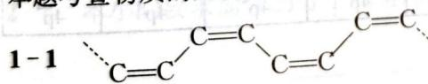

(顺式)

严格说来,上述表示的顺反异构还存在科学性问题。请思考:怎样书写才较科学呢?

1-2 结构基元—CH=CH—CH=CH—。

1-3 结构：

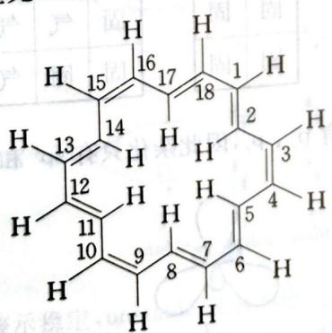

$E=n^{2}h^{2}/(2m_{e}l^{2}), n=\pm1,\pm2,\pm3\cdots$ 大环周边长度 $l=18\times140=2.52\times10^{3}\ pm=2.52\ nm$

$$
\begin{array}{r l} & {E _ {\mathrm{基}} = 4 ^ {2} h ^ {2} / (2 m _ {e} l ^ {2}), E _ {\mathrm{激}} = 5 ^ {2} h ^ {2} / (2 m _ {e} l ^ {2})} \\ & {\Delta E = (5 ^ {2} - 4 ^ {2}) h ^ {2} / (2 m _ {e} l ^ {2}) = 9 h ^ {2} / (2 m _ {e} l ^ {2})} \\ & {\lambda = \frac {h c}{\Delta E} = \frac {h c}{\frac {9 h ^ {2}}{2 m _ {e} l ^ {2}}} = \frac {2 m _ {e} c l ^ {2}}{9 h} = \frac {2 \times 9 . 1 0 9 \times 1 0 ^ {- 3 1} \times 2 . 9 9 8 \times 1 0 ^ {8} \times (2 . 5 2 \times 1 0 ^ {- 9}) ^ {2}}{9 \times 6 . 6 2 6 \times 1 0 ^ {- 3 4}}} \end{array}
$$

$= 5.82 \times 10^{-7} \mathrm{~m} = 582 \mathrm{~nm}$ 。吸收的波长为 $582 \mathrm{~nm}$ 。

## 第2题

本题的特点就是跳脱旧有的思考模式,设定一个新的环境,测验选手能否运用想象力将已经学过的知识加以创新改变,适合于设定的环境;这不单单是知识的活用,也是对于选手的一种挑战,更能将那些学以致用的优秀学生挑选出来。

本题的思考方法与例7类似,唯一不同的地方就是磁量子数和自旋量子数的不同。本题中电子云的伸展方向始终只能在 $xy$ 平面上。这样,s轨道不变,p轨道由三种伸展方向变为两种,即 $\mathbf{p}_x$ 、 $\mathbf{p}_y$ 两种;d轨道伸展方向由原来的五种变为两种,即 $\mathrm{d}_{xy}$ 、 $\mathrm{d}_{x^2 -y^2}$ 。而在每一个轨道中仍然最多填充两个电子。解决了这个问题,其他问题均可迎刃而解。

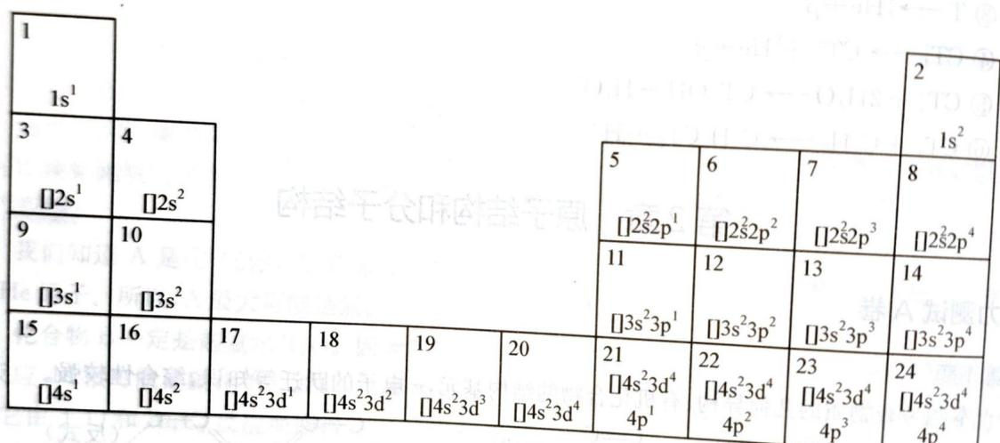

2-2 三维空间与“平面世界”相应的元素 $(n\leqslant 3)$

<table><tr><td>H</td><td colspan="4"></td><td>He</td><td>气</td><td colspan="3"></td><td>气</td></tr><tr><td>Li</td><td>Be</td><td>B/C</td><td>N/O</td><td>F</td><td>Ne</td><td>固</td><td>固</td><td></td><td></td><td></td></tr><tr><td>Na</td><td>Mg</td><td>Al/Si</td><td>P/S</td><td>Cl</td><td>Ar</td><td>固</td><td>固</td><td></td><td></td><td></td></tr></table>

2-3 $n = 2$ 元素的杂化轨道。由于 $\mathfrak{p}$ 轨道只有 $\mathrm{p}_x$ 、 $\mathrm{p}_y$ ，因此杂化只有 $\mathrm{sp}^1$ 和 $\mathrm{sp}^2$ ，没有 $\mathrm{sp}^3$ 。

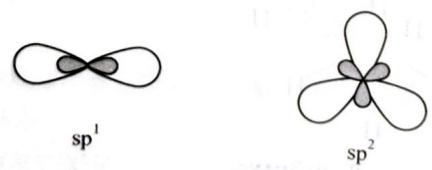

从2-2中得出，在“平面世界”，有机化学是以元素5为基础的：

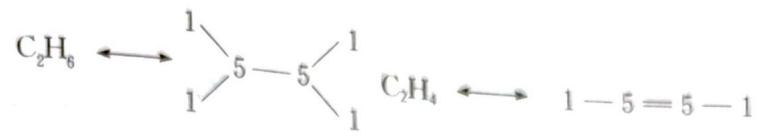

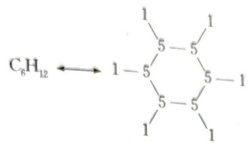

从“平面世界”中碳原子的杂化态得出，“平面世界”中不可能有芳香族化合物。

2-4 从“平面世界”中电子层及其电子排布看，“平面世界”中 $6\mathrm{e}^{-}$ 、 $10\mathrm{e}^{-}$ 电子规则分别和三维空间中的8e、18e电子规则相当。

2-5 根据元素周期性知识得出：“平面世界” $(n = 2)$ 元素（element）的第一电离能 $(E)$ 变化趋势和电负性(electronegativity)增长(increase)方向：

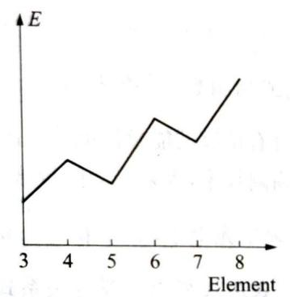

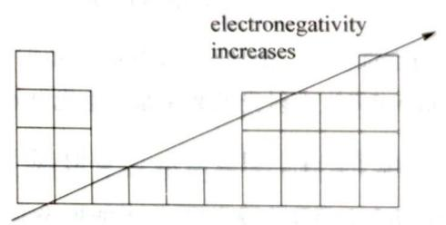

2-6 本小问要求简单的分子轨道理论。

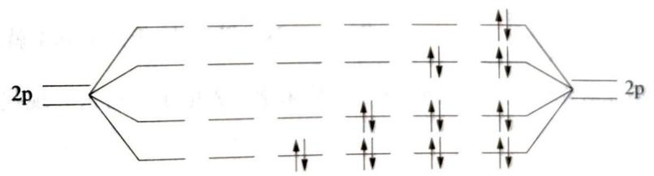

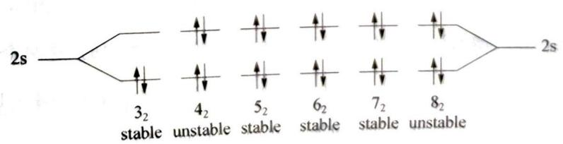

图中 stable 表示稳定, unstable 表示不稳定。

图中 stable 表示稳定, 不支持它
2-7 “平面世界”中 n=2 元素和最轻元素化合物的路易斯结构。几何构型及三维空间中相应的化合物。

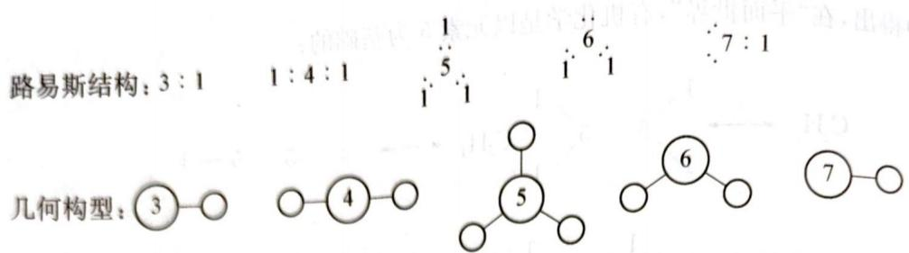

三维空间相应化合物：LiH、BeH $_2$ 、BH $_3$ （或 CH $_4$ ）、H $_2$ O（或 NH $_3$ ）、FH。

## 第3题

本题是从原子光谱入手考查参赛者对原子结构知识的理解及其应用。原子结构理论是伴随着许多科学实验(首先是原子光谱实验)而创立和发展起来的,其中的概念和原理都有充分的实验根据和历史演变。让学生按历史发展的沿革来学习这些概念和原理,不仅理解深透、记忆牢固,而且能领会人类认识自然的辩证法,了解理论的创新、相对性和局限性,有利于培养科学的思想方法。因此,学生在学习中不仅要理解和记忆基本概念和基本原理,而且要注意这些概念和原理的实验基础。

本题还涉及到光电效应,它是微观粒子具有波粒二象性这一概念的实验基础之一。光电效应的全部实验观测结果可用下式解释: $h\nu=h\nu_{0}+\frac{1}{2}mv^{2}$ 。

式中 $\nu$ 是照射到金属上的光的频率； $\nu_0$ 是电子逸出金属所需要的最低照射光频率，称为金属的临阈频率； $h\nu_0$ 是电子逸出金属所需最低能量，称为脱出功或功函数，用 $\Phi$ 表示。 $\frac{1}{2}mv^2$ 则是出射电子（称为光电子）的动能。由式可见，当 $h\nu < \Phi$ 时，光子没有足够的能量使电子逸出金属，不发生光电效应。当 $h\nu = \Phi$ 时，入射光的频率是产生光电效应的临阈频率，入射光的能量恰好被金属的功函数抵消，仍无光电子产生。只有当 $h\nu > \Phi$ 时，金属才发射出光电子，其动能为 $\frac{1}{2}mv^2$ ，即照射光的能量与金属的功函数之差。若同学们不能把光电效应的表达式和德布罗意关系式有机地联系起来，在用 $\lambda = \frac{h}{p} = \frac{h}{mv}$ 求光电子的波长时，就难以找出 $\lambda = \frac{h}{p} = \frac{h}{mv} = \frac{h}{\sqrt{2m\Delta E}}$ ， $m$ 和 $\nu$ 的关系 ( $\nu = \sqrt{\frac{2\Delta E}{m}}$ )，因而推不出 $\lambda = \frac{h}{\sqrt{2m\Delta E}} = \frac{h}{\sqrt{2m(h\nu - \Phi)}}$ 这一关系式，于是求算 $\lambda$ 就困难了。因此，应当通过具体计算，加深对光电效应的理解，这也是将来学习光电子能谱这一现代表面分析技术的需要。

3-1 氢原子的稳态能量由下式给出： $E_{n}=-2.18\times10^{-18}\times\frac{1}{n^{2}}J$ 式中 n 为主量子数。

第一条谱线是由第一激发态 $(n = 2)$ 到基态 $(n = 1)$ 间的跃迁产生的，这两个状态间的能量差为： $\Delta E_{1} = E_{2} - E_{1} = \left(-2.18\times 10^{-18}\times \frac{1}{2^{2}}\right) - \left(-2.18\times 10^{-18}\times \frac{1}{1^{2}}\right) = 1.64\times 10^{-18}(\mathrm{J})$ 所以，第一条谱线的波长为 $\lambda_1 = \frac{ch}{\Delta E_1} = \frac{2.9979\times 10^8\times 6.6256\times 10^{-34}}{1.64\times 10^{-18}} = 1.21\times 10^{-7}(\mathrm{m}) = 121\mathrm{nm}$ 第六条谱线是由第六激发态到基态间的跃迁产生的，这两个状态间的能量差为： $\Delta E_{6} = E_{7} - E_{1} = \left(-2.18\times 10^{-18}\times \frac{1}{7^{2}}\right) - \left(-2.18\times 10^{-18}\times \frac{1}{1^{2}}\right) = 2.14\times 10^{-18}(\mathrm{J})$

所以,第六条谱线的波长为:

$$
\lambda_ {6} = \frac {c h}{\Delta E _ {6}} = \frac {2 . 9 9 7 9 \times 1 0 ^ {8} \times 6 . 6 2 5 6 \times 1 0 ^ {- 3 4}}{2 . 1 4 \times 1 0 ^ {- 1 8}} = 9. 2 9 \times 1 0 ^ {- 8} (\mathrm{m}) = 9 2. 9 \mathrm{nm}
$$

这两条谱线都属于赖曼系，都处于紫外光区。

3-2 (1) 使处于基态的氢原子电离所需要的能量为：

$$
\Delta E _ {\infty - 1} = E _ {\infty} - E _ {1} = 0 - E _ {1} = 2. 1 8 \times 1 0 ^ {- 1 8} (\mathrm{J})
$$

$$
\Delta E _ {1} = 1. 6 4 \times 1 0 ^ {- 1 8} \mathrm{J} <   \Delta E _ {\infty - 1} \quad \Delta E _ {6} = 2. 1 4 \times 1 0 ^ {- 1 8} \mathrm{J} <   \Delta E _ {\infty - 1}
$$

所以，两条谱线产生的光子均不能使处于基态的氢原子电离。

$$
\Delta E _ {1} = 1. 6 4 \times 1 0 ^ {- 1 8} \mathrm{J} > \Phi_ {\mathrm{Cu}} = 7. 4 4 \times 1 0 ^ {- 1 9} \mathrm{J}; \Delta E _ {6} = 2. 1 4 \times 1 0 ^ {- 1 8} \mathrm{J} > \Phi_ {\mathrm{Cu}} = 7. 4 4 \times 1 0 ^ {- 1 9} \mathrm{J}
$$

所以,两条谱线产生的光子均能使晶体中的铜原子电离。

(3) 根据德布罗意关系式和爱因斯坦光子学说: $\lambda = \frac{h}{p} = \frac{h}{mv} = \frac{h}{m \cdot \sqrt{\frac{2\Delta E}{m}}} = \frac{h}{\sqrt{2m\Delta E}}$ , $\Delta E$ 是照射到晶体上的光子的能量和 $\Phi_{\mathrm{Cu}}$ 之差。

第一条谱线照射到铜晶体上后铜晶体所发射出的电子的波长为：

$$
\lambda = \frac {6 . 6 2 5 6 \times 1 0 ^ {- 3 4}}{\sqrt {2 \times 9 . 1 0 9 \times 1 0 ^ {- 3 1} \times (1 . 6 4 \times 1 0 ^ {- 1 8} - 7 . 4 4 \times 1 0 ^ {- 1 9})}} = 5. 1 9 \times 1 0 ^ {- 1 0} (\mathrm{m})
$$

第六条谱线照射到铜晶体上后铜晶体所发射出的电子的波长为：

$$
\lambda = \frac {6 . 6 2 5 6 \times 1 0 ^ {- 3 4}}{\sqrt {2 \times 9 . 1 0 9 \times 1 0 ^ {- 3 1} \times (2 . 1 4 \times 1 0 ^ {- 1 8} - 7 . 4 4 \times 1 0 ^ {- 1 9})}} = 4. 1 5 \times 1 0 ^ {- 1 0} (\mathrm{m})
$$

## 第4题

4-1 阴离子为 $N_{3}^{-}$ ; 分子为 $N_{2}$ 。

4-2 A 的钠盐每摩尔包含一摩尔钠, 因此其摩尔质量为 $M(\mathrm{A}) = M(\mathrm{Na}) / 0.3536 = 65.02 \mathrm{~g} \cdot \mathrm{mol}^{-1}$ 。阴离子的摩尔质量为 $42.03 \mathrm{~g} \cdot \mathrm{mol}^{-1}$ , 这意味着为 $\mathrm{N}_{3}^{-}$ 。A 是叠氮化氢 $\mathrm{HN}_{3}$ 。Lewis 结构为:

$$
\begin{array}{c} \ddot {\mathrm{N}} - \mathrm{N} ^ {+} \equiv \mathrm{N}: \\ \mathrm{H} \end{array} \longleftrightarrow \begin{array}{c} \ddot {\mathrm{N}} = \mathrm{N} ^ {+} = \dot {\mathrm{N}} ^ {-} \\ \mathrm{H} \end{array}
$$

4-3 设卤化物分子式为 $\mathrm{N}_a\mathrm{X}_b$ (X表示未知卤素), 则可以写出以下等式:

$\frac{aM(N)}{aM(N)+bM(X)}=0.4244$ 由此， $bM(X)=19a$ 。因此X是氟，并且 $b=a$ 。由于不存在NF，并且由氮形成的最大共价键数为4，因此卤化物为 $\mathrm{N}_{2}\mathrm{F}_{2}$ 。分子形状为： $\begin{array}{c} \ddot{\mathrm{N}}=\dot{\mathrm{N}} \\ \vdots \\ \mathrm{F} \end{array}$ （有顺式和反式两种几何异构）。

4-4 由于 $\mathrm{SbF_5}$ 是强路易斯酸, 所以 B 的阴离子为 $\mathrm{SbF_6^-}$ 。因为它包含一个阴离子, 所以 B 仅包含一个 Sb 原子。因此, 该化合物的摩尔质量为 $M(\mathrm{Sb}) / 0.4306 = 282.75 \mathrm{~g} \cdot \mathrm{mol}^{-1}$ 。氮含量为 $282.75 \mathrm{~g} \times 0.0991 = 28 \mathrm{~g}$ , 其余 $(133 \mathrm{~g})$ 为氟。根据这些数据, 经验公式为 $\mathrm{SbN_2F_7}$ 。 $282.75 \mathrm{~g} \times 0.0991 = 28 \mathrm{~g}$ , 其余 $(133 \mathrm{~g})$ 为氟。根据这些数据, 经验公式为 $\mathrm{SbN_2F_7}$ 。 $282.75 \mathrm{~g} \times 0.0991 = 18 \mathrm{~g}$ , 其余 $(133 \mathrm{~g})$ 为氟。根据这些数据, 经验公式为 $\mathrm{SbN_2F_7}$ 。 $282.75 \mathrm{~g} \times 0.0991 = 18 \mathrm{~g}$ , 其余 $(133 \mathrm{~g})$ 的二极化物，因此 B 分子式为 $[\mathrm{N}_2\mathrm{F}]^+ [\mathrm{SbF}_6]^-$ 。阳离子的共振结构为: 4-5 B 的阴离子为 $\mathrm{SbF_6^-}$ , 因此 B 分子式为 $[\mathrm{N}_2\mathrm{F}]^+ [\mathrm{SbF}_6]^-$ 。阳离子的共振结构为:

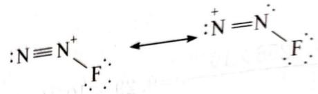

键角在第一个共振结构中将为 $180^{\circ}$ , 而在第二个共振结构中将小于 $120^{\circ}$ 。4-6 如果一氧化二氮的分子式为 $\mathrm{N}_{a} \mathrm{O}_{b}$ , 则可以写成以下等式:

$$
\frac {a M (\mathrm{N})}{a M (\mathrm{N}) + b M (\mathrm{O})} = 0. 6 3 6 5
$$

$aM(N)+bM(O)$ 此时 a=2b，因此一氧化二氮的分子式为 $N_{2}O$ 。其共振式为：

$$
\dot {\mathrm{N}} = \mathrm{N} ^ {+} = \mathrm{O}: \longleftrightarrow : \mathrm{N} \equiv \mathrm{N} ^ {+} - \ddot {\mathrm{O}}:
$$

4-7 生成的 $\mathrm{N}_2\mathrm{O}$ 量为 $1.14\mathrm{mmol}$ 。B的量为 $0.3223\mathrm{g} \div 282.75\mathrm{g} \cdot \mathrm{mol}^{-1} = 1.14\mathrm{mmol}$ 。氧原子来自水分子。剩下两个氢原子，它们可以与 $\mathbf{F}^{-}$ 形成HF：

$$
[ \mathrm{N} _ {2} \mathrm{F} ] ^ {+} [ \mathrm{SbF} _ {6} ] ^ {-} + \mathrm{H} _ {2} \mathrm{O} \longrightarrow \mathrm{N} _ {2} \mathrm{O} + 2 \mathrm{HF} + \mathrm{SbF} _ {5}
$$

$\mathrm{SbF}_{5}$ 在稀水溶液中会水解，但反应会产生各种产物：例如 $\mathrm{SbF}_{5} + \mathrm{H}_{2}\mathrm{O}\longrightarrow \mathrm{SbOF}_{3} + 2\mathrm{HF}_{\circ}$

4-8 C的阴离子为 $\mathrm{SbF_6^-}$ 。如果C每个阳离子包含 $n$ 个阴离子，并且阳离子包含 $x$ 个N原子，则氮和锑的含量为：

$$
\frac {x M (N)}{x M (N) + n M (S b F _ {6})} = 0. 2 2 9 0   \frac {n M (S b)}{x M (N) + n M (S b F _ {6})} = 0. 3 9 8 2
$$

将第一个方程除以第二个方程,我们得到 n=5x 。由此,C 的化学式为 $\left[N_{5}\right]^{+}\left[SbF_{6}\right]^{-}$

4-9 C阳离子的共振式为：

$$
\begin{array}{l l l} \therefore N \equiv N ^ {+} - \ddot {N} = N ^ {+} = N ^ {-} & \therefore N = N ^ {+} = \ddot {N} - N ^ {+} \equiv N _ {\cdot} & \therefore N \equiv N ^ {+} - \ddot {N} - N ^ {+} \equiv N _ {\cdot} \\ \therefore N = N ^ {+} = \ddot {N} - N = N ^ {+} & \therefore N = N ^ {-} - \ddot {N} = N ^ {+} = N ^ {-} & \therefore N = N ^ {-} - \ddot {N} - N = N ^ {+}. \end{array}
$$

由于中心氮原子上存在一个或两个孤对电子,因此所有结构的中心键合角均小于 $120^{\circ}$ 。由于相关氮原子上存在孤对电子,其他两个键角在第一行的共振结构中等于 $180^{\circ}$ ,但在第二行的共振结构中小于 $180^{\circ}$ 。

$$
[ \mathrm{N} _ {2} \mathrm{F} ^ {+} ] ^ {+} [ \mathrm{SbF} _ {6} ] ^ {-} + \mathrm{HN} _ {3} \longrightarrow [ \mathrm{N} _ {5} ] ^ {+} [ \mathrm{SbF} _ {6} ] ^ {-} + \mathrm{HF}
$$

由于 HF 的高稳定性,该反应在热力学上是有利的。

4-11 若C氧化水，且生成两种气体，则其中一种必定是氧气，另一个是氮气，因为C阳离子的不稳定性。因此，水解的反应方程式为：

$$
4 [ \mathrm{N} _ {5} ] ^ {+} [ \mathrm{SbF} _ {6} ] ^ {-} + 2 \mathrm{H} _ {2} \mathrm{O} \longrightarrow 1 0 \mathrm{N} _ {2} \uparrow + \mathrm{O} _ {2} \uparrow + 4 \mathrm{HF} + 4 \mathrm{SbF} _ {5}
$$

4-12 由于 D 的阴离子是八面体配位的，并且包含 $N_{3}^{-}$ 离子（它是由 A 形成的），唯一的可能性是 D 的中心原子（也就是 E 的中心原子）是被六个 $N_{3}^{-}$ 包围的离子。由于 E 的阳离子为 $N_{5}^{+}$ ， $n(\text{阳离子}):n(\text{阴离子})=1:1$ ，E 的化学式是 $[N_{5}]^{+}[X(N_{3})_{6}]^{-}$ ，因此是 $XN_{23}$ （其中 X 是未识别的

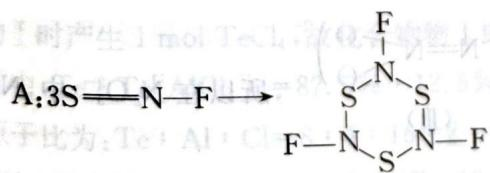

主族元素)。以相对原子质量表示的氮含量为： $\frac{23\cdot M(N)}{23\cdot M(N)+M(X)}=0.9124$

解得 $M(X)=30.9\ g\cdot mol^{-1}$ 。这是磷。因此，E 的化学式为： $\left[N_{5}\right]^{+}\left[P(N_{3})_{6}\right]^{-}$ 。4-13 $Na^{+}$ 和 $Cl^{-}$ 中原子的氧化数不变，未观察到气体净化。

4-13 $\mathrm{Na}^{+}$ 和 $\mathrm{Cl}^{-}$ 中原子的氧化数不变,未观察到气体逸出,表明 $\mathrm{N}_{3}^{-}$ 在合成过程中不会分解。因此,E的形成不是氧化还原反应。磷在氯化物中的氧化数与E中相同。氯化物为 $\mathrm{PCl}_{5}$ 。 $\mathrm{D}$ 含有 $[\mathrm{P}(\mathrm{N}_{3})_{6}]^{-}$ 阴离子。作为阳离子,它只能包含 $\mathrm{N}_{3}^{+}$ 、 $\mathrm{P}(\mathrm{N}_{3})_{6}]^{-}$ 。

$$
\mathrm{Na} ^ {+}
$$

4-14 氮气是气态产物。由于大气中存在氧气，磷会被氧化为 $\mathrm{P}_2\mathrm{O}_5$ 。E分解的化学方程式为： $4[\mathrm{N}_{5}]^{+}[\mathrm{P}(\mathrm{N}_{3})_{6}]^{-} + 5\mathrm{O}_{2}\longrightarrow 46\mathrm{N}_{2} + 2\mathrm{P}_{2}\mathrm{O}_{5}$ 。

第5题

本题可采用 Lewis 结构理论, 计算出 NSF 的化学键数。因 $\frac{n_s}{2} = \frac{3 \times 8 - (5 + 6 + 7)}{2} = 3$ , 应该是三条共价键, 即 $N = S - F$ , 但它存在形式电荷: $\overset{\ominus}{N} = \overset{\oplus}{S} - F$ , 而 $N \equiv S - F$ 中各原子的形式电荷为零, 所以只要修正 S 原子的 $n_v = 10$ 即可。 $\frac{n_s}{2} = \frac{(10 + 2 \times 8) - (5 + 6 + 7)}{2} = 4$ , $\therefore$ NSF 的 Lewis 结构式为: $N \equiv S - F$ , 其中, N、S、F 的形式电荷均为零。

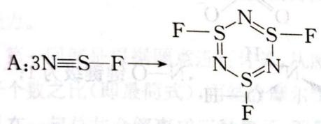

$$
\mathrm{B}: \stackrel {\ominus} {\mathrm{N}} = \stackrel {\circ} {\mathrm{S}} <   \stackrel {\circ} {\mathrm{F}}; \mathrm{C}: \mathrm{N} \equiv \mathrm{S} ^ {\oplus}.
$$

从 A、B、C 的结构看，C 的 N—S 键最短，因为 N—S 之间为共价叁键，A、B 结构式中 N—S 之间都为共价双键，但 A 中可认为有离域 $\pi$ 键存在，所以 A 中 N—S 键最长。

当 SNF 排列时, Lewis 结构式为: $\overset{\circ}{S}=\overset{\circ}{N}-\overset{\circ}{F}$ 。所以:

$$
\mathrm{B}: \mathrm{S} = \stackrel {\oplus} {\mathrm{N}} <   \stackrel {\mathrm{F} ^ {\ominus}} {\mathrm{F} ^ {\ominus}}; \mathrm{C}: \mathrm{N} \equiv \mathrm{S} ^ {\oplus}
$$

从结构上看,仍然是C中的N—S键最短,A中N—S键最长。

5-1 NSF 的结构式为: N≡S-F; A、B、C 的结构式分别为:

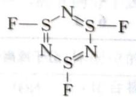

$$
\stackrel {\ominus} {: N} = \stackrel {\circ} {S} - \stackrel {\circ} {F}, N \equiv S ^ {\oplus}.
$$

5-2 C的N-S键最短,因为N-S之间为共价叁键,A、B结构式中N-S之间都为共价双键，但A中可认为有离域 $\pi$ 键存在，所以A中N—S键最长。

5-3 SNF 的结构式为： $\overset{\circ}{S}=\overset{\circ}{N}-\overset{\circ}{F}$ ，A、B、C 的结构式分别为：

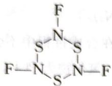

$S \equiv N < F^{\ominus}, N \equiv S^{\oplus}$ 。从结构上看，仍然是 C 中的 N-S 键最短，A 中 $N-S$

键最长。

第6题

本题的综合性很强,涉及到等电子体、路易斯结构理论、写共振式等。

$NO^{+}$ 与 $N_{2}$ 是等电子体, 所以 $NO^{+}$ 的键级为 3; NO 比 $NO^{+}$ 多一个电子, 该电子排在 $\pi^{*}$ 反键轨道上, 所以键级 $=\frac{6-1}{2}=2.5$ 。 $N_{2}O$ 有两种共振结构:

$N\equiv N^{-}O^{\oplus}\leftrightarrow N^{-}=N^{+}=O$ ，所以N-O的键级= $\frac{1+2}{2}=1.5$ 。

$$
\mathrm{NO} _ {3} ^ {-}
$$

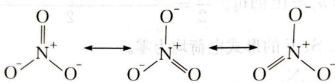

$$
\mathrm{N-O}
$$

的键级为 $\frac{2+1+1}{3}=1\frac{1}{3}$ ; $NH_{3}OH^{+}$ 的 Lewis 结构式为 $\begin{array}{c}H, \\H\end{array}\begin{array}{c}N^{+}-H\\O-H\end{array}$ , N—O 键键级为 1;

$\mathrm{O} \rightleftharpoons \mathrm{N}-\mathrm{N} \rightleftharpoons \mathrm{O}, \mathrm{N}-\mathrm{O}$ 键 $= \frac{1+2}{2}=1.5$ , 从上表比较, $\mathrm{N}-\mathrm{O}$ 键长应为 1.188 埃。由于 $\mathrm{N}_{2}\mathrm{O}_{3}^{2-}$ 的结构式为: $\mathrm{O}^{-} \mathrm{N}=\mathrm{N}^{+}<\mathrm{O}^{-}$ , 因此 $\mathrm{N}、\mathrm{N}$ 都采取 $sp^{2}$ 杂化, 存在 $\pi_{5}^{6+2} \leftrightarrow \pi_{5}^{8}$ , 所以 $\mathrm{N}-\mathrm{O}$ 键键级在 $1 \sim 1\frac{1}{3}$ 之间, 即 $\mathrm{N}-\mathrm{O}$ 键长在 $1.42 \sim 1.256$ 埃之间。

由于 $\mathrm{H} > \mathrm{N} - \mathrm{N} < \mathrm{H}$ (I) $\mathrm{O} \equiv \mathrm{N} - \mathrm{N} \leqslant \mathrm{O}$ (II) $\left(\mathrm{O} - \mathrm{N} = \mathrm{N} < \mathrm{O}\right)^{2-}$ (III)，所以在 $\mathrm{N}_2\mathrm{O}_3^{2-}$ 中， $N-N$

之间有一定的双键性质, 它的 N—N 键长最短, 而在 (I)、(II) 中, 虽然 N—N 之间都是单键, 但 $N_{2}O_{4}$ 中的形式电荷都为 $\oplus: \begin{array}{c} O \leqslant N^{+} - N^{+} \leqslant O^{-}, \\ O^{-} \end{array}$ , N—N 之间发生相互排斥, 因此 $N_{2}H_{4}$ 的键长短于 $N_{2}O_{4}$ 的键长, 即 N—N 键长的顺序为: Ⅲ < I < Ⅱ。

<table><tr><td>分子或离子</td><td>N—O键级</td><td>N—O键长(埃)</td></tr><tr><td>NO+</td><td>3</td><td>1.062</td></tr><tr><td>NO</td><td>2.5</td><td>1.154</td></tr><tr><td> $N_2O$ </td><td>1.5</td><td>1.188</td></tr><tr><td> $NO_3^-$ </td><td> $1\frac{1}{3}$ </td><td>1.256</td></tr><tr><td> $NH_3OH^+$ </td><td>1</td><td>1.42</td></tr></table>

6-2 $\ce{O-N-O}$ ，N-O键= $\frac{1+2}{2}=1.5$ ，从上表比较，N-O键长应为1.188埃。由于 $N_{2}O_{3}^{2-}$ 的结构式为： $\ce{O-N=N^+\ce{O^-}}$ ，因此N、N都采取 $sp^2$ 杂化，存在 $\pi_{5}^{6+2}\leftrightarrow\pi_{5}^{8}$ ，所以N-O键级在1\~1 $\frac{1}{3}$ 之间，即N-O键长在1.42\~1.256埃之间。
6-3 $N_{2}O_{4}$ 中 N—O、 $N_{2}O_{3}^{2-}$ 和 $N_{2}H_{4}$ 中 N—N 键键长顺序是 N—O 键键长 K 为 N, O

6-3 $\mathrm{N}_2\mathrm{O}_4$ 中 $\mathrm{N}-\mathrm{O}$ 、 $\mathrm{N}_2\mathrm{O}_3^{2-}$ 和 $\mathrm{N}_2\mathrm{H}_4$ 中 $\mathrm{N}-\mathrm{N}$ 键键长顺序是: $\mathrm{N}_2\mathrm{O}_3^{2-}$ 最短, 其次是 $\mathrm{N}_2\mathrm{H}_4$ , 最长为 $\mathrm{N}_2\mathrm{O}_4$ 。

第7题

本题初看起来知识很难,其实较为简单,主要考查竞赛选手对信息的综合加工能力和推理判断能力。

第一问就是根据题意进行计算,从而得出 Te、Al、Cl 三种原子的原子个数之比。第二问是由原子个数之比(即最简式),再结合摩尔质量求出其分子式。第三问很灵活,从题给信息“化合物 I 和 II 在一起总共会解离成三种离子,而每个化合物中只有一种四面体配位的铝,且两种化合物中 Al 原子的化学环境不同”,我们不难得出化合物 I 和 II 中阳离子均为 $\mathrm{Te}_{4}^{2+}$ , I 的阴离子为 $[\mathrm{Al}_{2} \mathrm{Cl}_{7}]^{-}$ ; II 的阴离子为 $[\mathrm{AlCl}_{4}]^{-}$ 。除此之外,没有其他的组合。第四问就是根据价层电子对互斥理论判断出原子的杂化状态,从而判断出其离子结构。第五问就是根据题意写出化学反应方程式,然后从内能高低、结构的对称性等角度阐述反应发生的原因。

7-1 A: B=77.8% : 22.2%=7 : 2, 即 $7\mathrm{Te} + 2\mathrm{Te}[\mathrm{AlCl}_{4}]_{4} = \mathrm{Te}_{9}\mathrm{Al}_{8}\mathrm{Cl}_{32}$ ; 由于生成 2 mol 化合物 I 时产生 1 mol $TeCl_{4}$ ，故化合物物 I 中： $\mathrm{Te}: \mathrm{Al}: \mathrm{Cl} = (9 - 1): 8: (32 - 4) = 2: 2: 7$ 。化合物 II 中， $\mathrm{Te}: \mathrm{Te}[\mathrm{AlCl}_{4}]_{4} = 87.5\% : 12.5\% = 7: 1$ ，即 $7\mathrm{Te} + \mathrm{Te}[\mathrm{AlCl}_{4}]_{4} = \mathrm{Te}_{8}[\mathrm{AlCl}_{4}]_{4}$ ，故 II 中最简原子比为： $\mathrm{Te}: \mathrm{Al}: \mathrm{Cl} = 8: 4: 16 = 2: 1: 4$ ; 化合物 III 中， $\mathrm{Te}: \mathrm{Te}[\mathrm{AlCl}_{4}]_{4} = 91.7\% : 8.3\% = 11: 1$ ，Ⅲ中最简原子比： $\mathrm{Te}: \mathrm{Al}: \mathrm{Cl} = 12: 4: 16 = 3: 1: 4$ 。

7-2 设 I 的分子式为 $(\mathrm{Te}_{2}\mathrm{Al}_{2}\mathrm{Cl}_{7})_{m}$ ，则 $m(127.6\times2+27\times2+35.5\times7)=1126$ ，解得 m=2，即 I 的分子式为 $Te_{4}Al_{4}Cl_{14}$ 。

设Ⅱ的分子式为 $\left(\mathrm{Te}_{2}\mathrm{AlCl}_{4}\right)_{n}$ ，则 $n(127.6\times2+27+35.5\times4)=867$ ，解得n=2，故Ⅱ的分子式为 $Te_{4}Al_{2}Cl_{8}$ 。

7-3 化合物 I 和 II 在一起总共会解离成三种离子, 而每个化合物中只有一种四面体配位的铝, 且两种化合物中 Al 原子的化学环境不同, 故 I 中阳离子为 $\mathrm{Te}_{4}^{2+}$ , 阴离子为 $[\mathrm{Al}_{2} \mathrm{Cl}_{7}]^{-}$ ; 化合物 II 中阳离子为 $\mathrm{Te}_{4}^{2+}$ , 阴离子为 $[\mathrm{AlCl}_{4}]^{-}$ 。

7-4 $\mathrm{Te}:\sigma = 2$ ，孤对电子 $= (6 - 2\times 2) / 2 = 1$ ，价电子对 $= 2 + 1 = 3$ ，因此Te的杂化形态为 $\mathfrak{sp}^2$ 。由于Te有两对孤对电子，一对用于价层，一对作为p电子在垂直于 $\mathfrak{sp}^2$ 杂化轨道的 $\mathfrak{p}_{\mathbb{Z}}$ 轨道上，因此 $\mathrm{Te}_{4}^{2+}$ 的 $\pi$ 电子为 $2\times 4 - 2 = 6$ ，满足休克尔 $4n + 2$ 规则，因此 $\mathrm{Te}_{4}^{2+}$ 具有 $\pi_4^6$ 大 $\pi$ 键，因此具有芳香性（该知识点超出了初赛大纲）。同理可得：Al的杂化为 $\mathfrak{sp}^3$ 杂化。

阴、阳离子结构式分别为：

$$
\mathrm{Te} _ {4} ^ {2 +}: \begin{array}{c} \mathrm{Te} ^ {+} = \mathrm{Te} ^ {+} \\ | \\ \mathrm{Te} - \mathrm{Te} \end{array} \text {或} \left[ \begin{array}{c} \because \mathrm{Te} - \mathrm{Te} \therefore \\ | \bigcirc | \\ \because \mathrm{Te} - \mathrm{Te} \therefore \end{array} \right] ^ {2 +}
$$

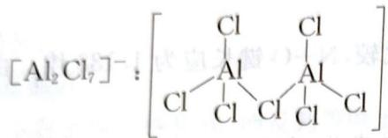

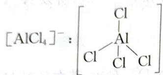

7-5 是因为 $\left[\mathrm{Al}_{2} \mathrm{Cl}_{7}\right]^{-}$ 结构没有 $\left[\mathrm{AlCl}_{4}\right]^{-}$ 结构稳定, 在加热条件下, $\left[\mathrm{Al}_{2} \mathrm{Cl}_{7}\right]^{-}$ 分解生成 $\mathrm{AlCl}_{3}$ 和 $\left[\mathrm{AlCl}_{4}\right]^{-}, \left[\mathrm{AlCl}_{4}\right]^{-}$ 结构高度对称, 较为稳定。化学反应方程式为:

$$
\mathrm{Te} _ {4} \left[ \mathrm{Al} _ {2} \mathrm{Cl} _ {7} \right] _ {2} = \mathrm{Te} _ {4} \left[ \mathrm{AlCl} _ {4} \right] _ {2} + 2 \mathrm{AlCl} _ {3}
$$

第8题
引起光化学烟雾的是 $NO_{x}$ ，氮氧化物 A 是无色顺磁性气体，因此 A 是 NO。因为 A 是双头游离基，是顺磁性物质。NO 与 $O_{2}$ 反应生成红棕色 $NO_{2}$ ， $NO_{2}$ 中 N 有成单电子，又是游离基，因此 $NO_{2}$ 能二聚成 $N_{2}O_{4}$ 。故 B 为 $N_{2}O_{4}$ 。

8-1 A:NO, B: $N_{2}O_{4}$ 8-2 $N_{2}O_{4} \rightleftharpoons 2NO_{2}, \Delta H^{\theta} = +57.7 \, kJ \cdot mol^{-1}, \Delta S^{\theta} = +177 \, J \cdot mol^{-1} \cdot K^{-1}$ 。若未算出正

8-2 $N_{2}O_{4} \xlongequal{2} ZNO_{2}, \Delta H = \frac{1}{2}$ 确答案, 写出 $K_{p}(298\mathrm{~K}) = 0.140, K_{p}(323\mathrm{~K}) = 0.848$ , 写出 $\ln(K) = -(\Delta H^{\theta}/RT) + (\Delta S^{\theta}/R)$ 。

8-3 $N_{2}O_{4}$ 受热可以生成 $NO_{2}$ ，实际为游离基· $NO_{2}$ ，而 $F_{2}$ 受热也会产生 F·游离基。因此产生的两种游离基可以耦合成 $FNO_{2}$ ，其化学反应为： $N_{2}O_{4} + F_{2} \longrightarrow 2FNO_{2}$ 。因此 C 为 $FNO_{2}$ 。由于 $FNO_{2}$ 可以是 Lewis 碱，提供 F 原子，而 $BF_{3}$ 是强 Lewis 酸，发生路易斯酸碱反应：

$FNO_{2}$ 可以是 Lewis 碱, 提供 P 原子, 而 $BF_{3}$ 是强 Lewis 散, 发生路易斯式 $BF_{3} + FNO_{2} \longrightarrow [NO_{2}][BF_{4}]$ 。因此 D 为 $[NO_{2}][BF_{4}]$ 。其路易斯结构式

为： $\left[\ddot{O}=N^{\oplus}=\ddot{O}\right]\left[\ddot{F}: \begin{array}{c} :\ddot{F}: \\ :\ddot{F}: \begin{array}{c} B^{-} \\ :F: \end{array} \begin{array}{c} :F: \\ :F: \end{array} \right]$

经计算 $\left[NO_{2}\right]\left[BF_{4}\right]$ 与NaOH反应的物质的量之比为1:2,因此化学反应为: $\left[NO_{2}\right]\left[BF_{4}\right]+2NaOH\longrightarrow NaNO_{3}+NaBF_{4}+H_{2}O$

8-4 NO有成单电子, $ClO_{2}$ 也有成单电子,能发生耦合。因此化学反应为:

$$
\mathrm{NO} + \mathrm{ClO} _ {2} \longrightarrow \mathrm{ON} - \mathrm{ClO} _ {2}
$$

8-5 $\left[\mathrm{NO}_{2}\right]\left[\mathrm{BF}_{4}\right]$ 能产生强的亲电试剂 $\mathrm{NO}_{2}^{+}$ 。 $\mathrm{NO}_{2}^{+}$ 与苯发生亲电取代：

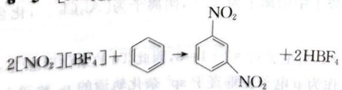

因此E为

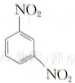

## 第9题

9-1 根据路易斯电子理论可分别计算出粒子的化学键数。由于三种粒子均为 $\mathrm{AB}_2$ 型。因此化学键数越大，即键级越大，O—Cl键长越短。

$ClO_{2}^{-}$ 化学键数 $H=\left[3\times8-(7+2\times6+1)\right]/2=2$ ;

$\mathrm{ClO_2}$ 化学键数 $\mathrm{H} = [3\times 8 - (7 + 2\times 6)] / 2 = 2.5$

$ClO_{2}^{+}$ 化学键数 $H=\left[3\times8-(7+2\times6-1)\right]/2=3$ ;

因此三种粒子 O—Cl 键键长由大到小顺序为： $ClO_{2}^{-}>ClO_{2}>ClO_{2}^{+}$ 。

$ClO_{2}^{+}$ 结构式为 V 型: O— $Cl^{+}$ —O, 也可将 Cl 原子电子数修正到 12, 因此结构式更好是 O= $Cl^{+}=O$ , 这样 O 的形式电荷都为零, 因此 Cl 原子上的孤对电子数为 1 对; $ClO_{2}$ 为 1.5 对 ( $ClO_{2}$ 存在大 $\pi$ 键, 算 0.5 对), $ClO_{2}^{-}$ 为 2 对。

$ClO_{2}^{-}$ 共振结构式,可以用 Lewis 电子式确定:

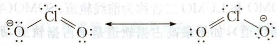

9-2 两种分子的结构用 Lewis 电子理论确定：

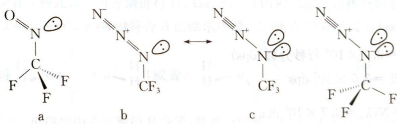

$F_{3}CNO$ 结构如 a 所示, 其中 N 原子的孤对电子尽量避开 F 原子, 故 N=O 基团与 C—F 键呈重叠构象; $F_{3}CN_{3}$ 有两个共振结构式, 如 b 和 c 所示, 两个结构中 N 原子拥有不同数量的孤对电子数。在 F 的强吸电子作用下, 碳原子是“缺电子”性的, 故共振式 c 相较于 b, 靠近碳原子的氮原子上带负电荷 (即 N 原子上的孤电子云更易分散, 更稳定), 因而能量更低, 更占优势, 此时氮原子上的两对电子为了减小与 C—F 键之间的能量差异, 会与 C—F 键之间形成交叉式构象, 同时叠氮 $N_{3}$ 基团与另外两个 C—F 键也处于交叉构象。

9-3 $\mathrm{TeBr}_6^{2-}$ 中 Br 与 Br 之间的距离小于范德华半径之和, 说明 Br 与 Br 之间存在很大的排斥力, 若是形成带帽八面体或是五角双锥结构, 那么 Br 与 Br 之间的排斥作用就会大大增加, 使得能量大大升高, 因此 Te 的那对孤对电子被压入 s 轨道, 成为 s 电子, 不参与成键。

9-4 $\mathrm{BeCl}_2$ 为分子晶体, 存在 $\mathrm{Be}-\mathrm{Cl}$ 共价键, 可用 VSEPR 判断出 $\mathrm{BeCl}_2$ 是直线型, $\mathrm{BaF}_2$ 以离子键为主, 是弯曲型。由于 $\mathrm{Be}^{2+}$ 半径较小, 电荷较高, 极化能力较强, 会使得 $\mathrm{Cl}^-$ 发生强烈极化而变形, 使得 $\mathrm{Be}-\mathrm{Cl}$ 键共价成分占优, 故为直线型。 $\mathrm{Ba}^{2+}$ 半径较大, $\mathrm{F}^-$ 半径小, 电荷集中, 极化能力强, 会使得次外层的电子与 s 电子重新形成有效价电子层, 除了两对成键电子云之外, 还包含一对或多对孤对电子的非键电子云,使得分子形成弯曲型。
第 10 题

10-1 由 $\left[\mathrm{Xe}_{2}\right]^{+}\left[\mathrm{Sb}_{4} \mathrm{~F}_{21}\right]^{-}$ 可知: Xe 在上述反应中失去电子, 是还原剂, 因此 $\mathrm{AuF}_{3}$ 的 $\mathrm{Au}^{2+}$ 氧化剂, 得电子。因此该氧化还原反应为:

$$
\mathrm{AuF} _ {3} + 6 \mathrm{Xe} + 8 \mathrm{SbF} _ {5} = [ \mathrm{AuXe} _ {4} ] [ \mathrm{Sb} _ {2} \mathrm{F} _ {1 1} ] _ {2} + [ \mathrm{Xe} _ {2} ] [ \mathrm{Sb} _ {4} \mathrm{F} _ {2 1} ]
$$

10-2 由于 $\mathrm{HF}-\mathrm{SbF}_{5}$ 体系是超酸体系, 具有强氧化性, 使得 Xe 具有一定的还原性, 能发生氧化还原反应, 产生极不稳定的 $[\mathrm{AuXe}_{4}][\mathrm{Sb}_{2}\mathrm{F}_{11}]_{2}$ 和 $[\mathrm{Xe}_{2}][\mathrm{Sb}_{4}\mathrm{F}_{21}]$ 共价型离子化合物。

10-3 $\left[\mathrm{AuXe}_{4}\right]^{2+}$ 是具有直接金-氙键的第一个金属-氙化合物。它是通过用氙还原 $\mathrm{AuF}_{3}$ 来实现的。 $\mathrm{AuXe}_{4}^{2+}$ 阳离子是平面正方形，是通过单晶结构确定的， $\mathrm{Au}-\mathrm{Xe}$ 键长约为 $274 \mathrm{pm}$ 。金和氙之间的键是 $\sigma$ 供体类型，每个氙原子的电荷约为 0.4。

可以这样理解:由于稀有气体与卤离子 $X^{-}$ 是等电子体, $\left[AuXe_{4}\right]^{2+}$ 类似于 $CuCl_{4}^{2-}$ 结构。

10-4 $\left[\mathrm{Xe}_{2}\right]^{+}$ 颜色源于 $\pi^{*}$ 中的一个电子受光激发跃迁至 SOMO $\sigma^{*}$ 。 $\left[\mathrm{Xe}_{4}\right]^{+}$ 呈蓝色(蓝绿色, 蓝紫色, 紫色也可)。这是由于电子离域范围更大, 激发所需能量减小, 吸收峰红移, 原本吸收紫光而呈绿色, 现吸收红黄光而呈蓝色。

【说明】HOMO(最高占据轨道): 分子中电子填充的能量最高轨道; LUMO(最低空轨道): 空轨道中能量最低的轨道; H: OMO 和 LUMO 二者称为前线轨道; SOMO(半占据轨道, 是指开壳层计算中能量最高的单电子占据轨道), 如果最高占据轨道是半占据轨道, 那么它就既能充当 LUMO 也能作为 HOMO, 即 SOMO 就是前线轨道。

## 能力测试 B 卷

## 第1题

1-1 $1\mu \mathrm{Ci} = 3.7\times 10^{4}$ 每秒分裂(dps)

最初的 $\beta$ 活度 $= 3.7\times 10^{6}\mathrm{dps}$

$$
\frac {- \mathrm{d} N _ {1}}{\mathrm{d} t} \Bigg | _ {t = 0} = N _ {1} ^ {0} \lambda_ {1} = 3. 7 \times 1 0 ^ {6} \mathrm{dps}
$$

$N_{1}^{0}$ 指的是 $^{210}Bi$ 在 t=0 时的个数， $\lambda_{1}$ 是衰变常数

$$
\frac {0 . 6 9 3}{5 . 0 1 \times 2 4 \times 3 6 0 0} N _ {1} ^ {0} = 3. 7 \times 1 0 ^ {6}
$$

$$
N _ {1} ^ {0} = 2. 3 1 \times 1 0 ^ {1 2}
$$

$^{210}Bi$ 最初的质量= $2.31\times10^{12}\times\frac{210}{6.023\times10^{23}}g=8.06\times10^{-10}g$

1-2 在时间等于 $t$ 时 ${}^{210}\mathrm{Bi}$ 的个数为 $N_{1} = N_{1}^{0}e^{-\lambda_{1}t}$

$^{210}$ Po 的个数 $(N_{2})$ 等于 $\frac{dN_{2}}{dt}=\lambda_{1}N_{1}-\lambda_{2}N_{2}$

其中 $\lambda_{2}$ 是 $^{210}\mathrm{Po}$ 的衰变常数

$$
\frac {\mathrm{d} N _ {2}}{\mathrm{d} t} = \lambda_ {1} N _ {1} ^ {0} e ^ {- \lambda_ {1} t} - \lambda_ {2} N _ {2}
$$

同乘积分因子 $e^{\lambda_2t}$ 得： $e^{\lambda_2t} \frac{\mathrm{d}N_2}{\mathrm{d}t} + \lambda_2 N_2 e^{\lambda_2t} = \lambda_1 N_1^0 e^{(\lambda_2 - \lambda_1)t}$

$\frac{\mathrm{d}}{\mathrm{d}t}(N_2e^{\lambda_2t}) = \lambda_1N_1^0 e^{(\lambda_2 - \lambda_1)t}$

积分 $N_{2}e^{\lambda_{2}t} = \frac{\lambda_{1}}{\lambda_{2} - \lambda_{1}} N_{1}^{0}e^{(\lambda_{2} - \lambda_{1})t} + C$

用条件 $t = 0$ ， $N_{2} = 0$ 来计算 $\mathrm{C:}\mathrm{C} = \frac{\lambda_1N_1^0}{\lambda_2 - \lambda_1}$

由此可得： $N_{2} = \frac{\lambda_{1}}{\lambda_{2} - \lambda_{1}} N_{1}^{0}(e^{-\lambda_{1}t} - e^{-\lambda_{2}t})$

设 $t = T$ 时有最大值

$\left.\frac{dN_{2}}{dt}\right|_{t=T}=0,$ 解得 $T=\frac{\ln\frac{\lambda_{1}}{\lambda_{2}}}{\lambda_{1}-\lambda_{2}}=24.9d$

$$
t = T
$$

$$
N _ {2}
$$

$$
N _ {2} = 2. 0 4 \times 1 0 ^ {1 2}
$$

在 $t = T$ 时 ${}^{210}\mathrm{Po}$ 的质量 $m = 7.11\times 10^{-10}\mathrm{g}$

1-3 $^{210}$ Po 在 t = T 时的 $\alpha$ 衰变率 = $1.18 \times 10^{5}$ dps

在 $t = T$ 时 ${}^{210}\mathrm{Bi}$ 的 $\beta$ 衰变率 $= ^{210}\mathrm{Po}$ 的 $\alpha$ 衰变率 $= 1.18\times 10^{5}\mathrm{dps}$

## 第2题

2-1 在解答元素化学试题时,最重要的方法是根据元素化学的基础知识进行假设讨论。已知在 Ga 的化合物中,一般为四配位。

C 热分解, 得到两种单质, 说明 C 中至少含有两种元素; A 热分解, 生成 1 种离子化合物和 2 种单质, 说明 A 至少有 3 种元素。可分别进行 H、Ga、Si、Cl 四种元素进行排列组合, 只有 A 分子式为 $Ga_{x}Cl_{y}H_{z}$ , 当 x=2, y=2, z=4 时符合 A 的摩尔质量。因此 A 的分子式为 $Ga_{2}Cl_{2}H_{4}$ 。根据 Ga

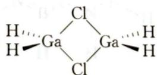

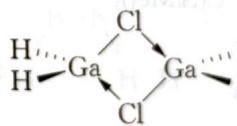

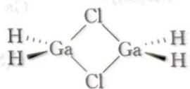

续与 $Li[GaH_{4}]$ 反应, 可得到中心对称的 B 分子, 联想金属氢化物中 $H^{-}$ 的强还原性, 因此可以联想 A 中 $Cl^{-}$ 被 $H^{-}$ 取代, 即 B 为 $Ga_{2}H_{6}$ , 这样有中心对称结构: $\ce{H\cdots H - Ga - H - Ga - H - H}$ 。A 与 $Li[BH_{4}]$

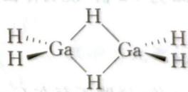

$$
\mathrm{H} _ {2}
$$

$$
\mathrm{B} _ {\circ}
$$

$$
\mathrm{Ga} ^ {3 +}
$$

$$
\mathrm{H} _ {2}
$$

$$
\mathrm{GaBH} _ {6}
$$

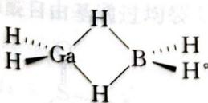

制备 A 的化学反应： $2GaCl_{3} + 4Me_{3}SiH = Ga_{2}Cl_{2}H_{4} + 4Me_{3}SiCl$

制备 B 的化学反应: $Ga_{2}Cl_{2}H_{4} + 2LiGaH_{4} = 2Ga_{2}H_{6} + 2LiCl$

2-2 $2\mathrm{GaBH}_6 = 2\mathrm{Ga} + 3\mathrm{H}_2 + \mathrm{B}_2\mathrm{H}_6$

2-3 同样, 热分解 A, 产物中 2 种单质只能是 Ga 和 $\mathrm{H}_{2}(\mathrm{Ga}^{3+}$ 的氧化性, $\mathrm{H}^{-}$ 还原性), 根据得失电子数守恒可知: $\mathrm{Ga}^{3+}$ 不可能全部被还原, 否则得失电子数不守恒。这是因为:

$1 \mathrm{~mol} \mathrm{Ga}_{2} \mathrm{Cl}_{2} \mathrm{H}_{4}$ 中, $\mathrm{H}^{-}$ 失电子总数为 $4 \mathrm{~mol}$ , 而 $2 \mathrm{~mol} \mathrm{Ga}^{3+}$ 完全变为 Ga 单质, 要得到 $6 \mathrm{~mol}$ 电子。因此还存在另一种物质, 只有 $\mathrm{GaCl}_{2}$ 。而 Ga 只有 +3 和 +1 价, 而 +2 价可看做 +3 和 +1 的平均价态, 因此 $\mathrm{GaCl}_{2}$ 可以写为 $\mathrm{Ga}[\mathrm{GaCl}_{4}]$ , 正好是离子化合物, 符合题意。

化学方程式为： $2Ga_{2}Cl_{2}H_{4}=2Ga+Ga[GaCl_{4}]+4H_{2}$ 化学方程式为： $2Ga_{2}Cl_{2}H_{4}=2Ga+Ga[GaCl_{3}]$ 2-4 $Ga_{2}H_{6}$ 与 $NMe_{3}$ 反应，得到三角双锥的对称分子 D，只可能是 $\mathrm{GaH}_{3}(\mathrm{NMe}_{3})_{2}$ ，其结构式 $NMe_{3}$

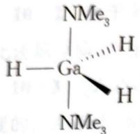

为：H—Ga $_{3}$ H $\cdots\cdots$ H。其化学反应为： $Ga_{2}H_{6} + 4NMe_{3} = 2GaH_{3}(NMe_{3})_{2}$ 。

E有 $C_{3}$ 轴,旋转120°能完全重合,因此其结构为:

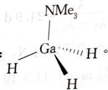

2-5 Ga 和 B 都是 4 配位, 才能形成离子化合物 $\left[\mathrm{GaH}_{2} \left(\mathrm{NH}_{3}\right)_{2}\right]^{+}\left[\mathrm{BH}_{4}\right]^{-}$ 。其化学反应为:

$$
\mathrm{GaBH} _ {6} + 2 \mathrm{NH} _ {3} = [ \mathrm{GaH} _ {2} (\mathrm{NH} _ {3}) _ {2} ] ^ {+} [ \mathrm{BH} _ {4} ] ^ {-}
$$

2-6 Ga 为 +1 价，且有 4 个 Ga 原子。因此只能是 $Ga_{4}$ 的四面体结构，有一个碳原子连在 Ga 原子上。除去 4 个碳原子后，还剩余 $C_{36}Si_{12}H_{108}$ ，根据 Si 为 +4 价，C 为 +4 价可知 F 结构 $G(SiM_{2})$ 。

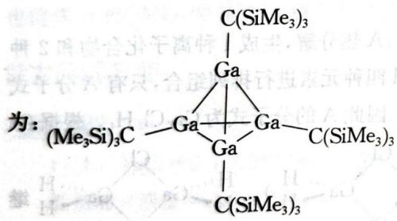

2-7 G中Ga为+2价,说明存在Ga—Ga键,其结构式为: $\mathrm{I} \xrightarrow[\mathrm{(Me_{3}Si)_{3}C}]{} \mathrm{Ga} \xrightarrow[\mathrm{I}]{\mathrm{C(SiMe_{3})_{3}}}$

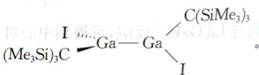

H 中 Ga 为 +3 价, 说明不存在 Ga—Ga 键, H 结构为: $\mathrm{(Me_{3}Si)_{3}C}\xrightarrow{\mathrm{I}}\mathrm{Ga}\xrightarrow{\mathrm{I}}\mathrm{Ga}\xrightarrow{\mathrm{I}}\mathrm{C(SiMe_{3})_{3}}$

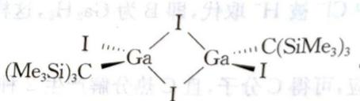

本题考查等电子体的相关知识。

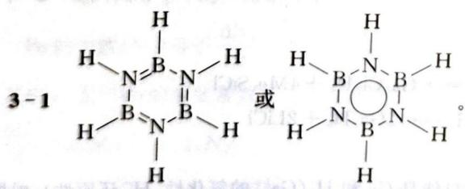

$$
3 - 2 \quad 3 \mathrm{B} _ {2} \mathrm{H} _ {6} + 6 \mathrm{NH} _ {3} \xrightarrow {\text {   加热   }} 2 \mathrm{B} _ {3} \mathrm{N} _ {3} \mathrm{H} _ {6} + 1 2 \mathrm{H} _ {2}
$$

$$
3 \mathrm{NH} _ {4} \mathrm{Cl} + 3 \mathrm{BCl} _ {3} \longrightarrow \mathrm{Cl} _ {3} \mathrm{B} _ {3} \mathrm{N} _ {3} \mathrm{H} _ {3} + 9 \mathrm{HCl}
$$

$$
2 \mathrm{Cl} _ {3} \mathrm{B} _ {3} \mathrm{N} _ {3} \mathrm{H} _ {3} + 6 \mathrm{NaBH} _ {4} \longrightarrow 2 \mathrm{B} _ {3} \mathrm{N} _ {3} \mathrm{H} _ {6} + 3 \mathrm{B} _ {2} \mathrm{H} _ {6} + 6 \mathrm{NaCl}
$$

$$
_ {3} \mathrm{NH} _ {4} \mathrm{Cl} + 3 \mathrm{LiBH} _ {4} \longrightarrow \mathrm{B} _ {3} \mathrm{N} _ {3} \mathrm{H} _ {6} + 3 \mathrm{LiCl} + 9 \mathrm{H} _ {2}
$$

$$
3 - 4 \quad 3 \mathrm{RNH} _ {3} \mathrm{Cl} + 3 \mathrm{BCl} _ {3} \longrightarrow \mathrm{Cl} _ {3} \mathrm{B} _ {3} \mathrm{N} _ {3} \mathrm{R} _ {3} + 9 \mathrm{HCl} \quad 2 \mathrm{Cl} _ {3} \mathrm{B} _ {3} \mathrm{N} _ {3} \mathrm{R} _ {3} + 6 \mathrm{NaBH} _ {4} \longrightarrow 2 \mathrm{H} _ {3} \mathrm{B} _ {3} \mathrm{N} _ {3} \mathrm{R} _ {3} +
$$

$$
_ {2} \mathrm{B} _ {6} \mathrm{H} _ {6} + 6 \mathrm{NaCl} \quad \mathrm{Cl} _ {3} \mathrm{B} _ {3} \mathrm{N} _ {3} \mathrm{R} _ {3} + 3 \mathrm{LiR} ^ {\prime} \longrightarrow \mathrm{R} _ {3} ^ {\prime} \mathrm{B} _ {3} \mathrm{N} _ {3} \mathrm{R} _ {3} + 3 \mathrm{LiCl}
$$

3-5 氮原子电负性比硼原子大,氮原子上电子云密度比硼原子大,氮原子有部分碱性,硼原子有部分酸性。

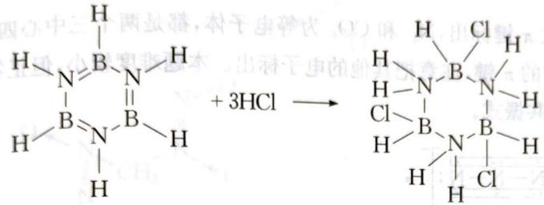

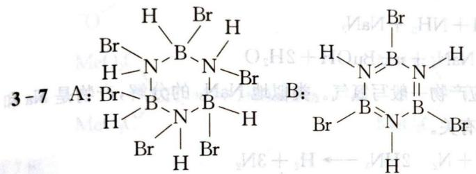

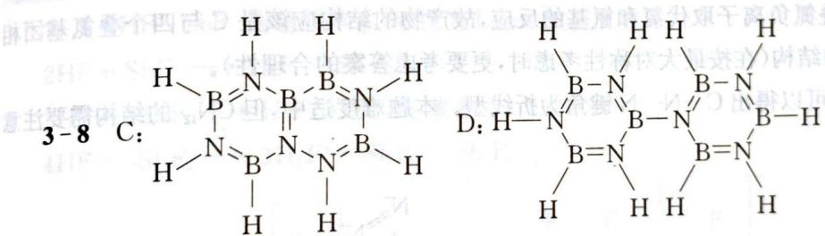

## 第4题

本题考查分子结构和反应机理。

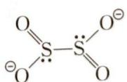

4-1 本题的关键在于先确定 $\mathrm{S}_2\mathrm{O}_4^{2-}$ 结构: $\mathrm{O} \stackrel{\mathrm{O}}{\underset{\mathrm{O}}{\mathrm{S}}} - \mathrm{S} \stackrel{\mathrm{O}^{\ominus}}{\underset{\mathrm{O}}{\mathrm{S}}} \stackrel{\mathrm{O}^{\ominus}}{\underset{\mathrm{O}}{\mathrm{S}}}$ 。其中 S 元素化合价为 +4 价, 但

氧化数为+3。由于每个S周围有一对孤对电子，排斥作用强，因此硫硫键较弱，易均裂成· $SO_{2}^{-}$ 游离基(带负电的游离基)。我们也可由磺酸阴离子为 $R-SO_{3}^{-}$ ，则亚磺酸阴离子为 $R-SO_{2}^{-}$ 。亚游离基(带负电的游离基)。我们也可由磺酸阴离子为 $R-SO_{3}^{-}$ ，则亚磺酸阴离子为 $R-SO_{2}^{-}$ 。亚游离基(带负电的游离基)。我们也可由磺酸阴离子为 $R-SO_{3}^{-}$ ，则亚磺酸阴离子为 $R-SO_{2}-SO_{3}-SO_{2}-SO_{3}-SO_{2}-SO_{3}-SO_{2}-SO_{3}-SO_{2}-SO_{3}-SO_{2}-SO_{3}-SO_{2}-SO_{3}-SO_{2}-SO_{3}-SO_{2}-SO_{3}-SO_{2}-SO_{3}-SO_{2}-SO_{3}-SO_{2}-SO_{3}-SO_{2}-SO_{3}-SO_{2}-CO_{2}^{+}$

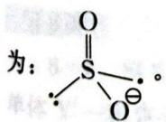

4-2 本题考查经典的自由基链式反应机理。三氟甲烷亚磺酸基可以表示为 $\mathrm{F}_3\mathrm{C}-\mathrm{SO}_2^-$ 。反应中发生了 $\cdot \mathrm{SO}_2^-$ 游离基对 Br 原子的取代：

引发： $\mathrm{O}_{2}\mathrm{S}-\mathrm{SO}_{2}^{-}\longrightarrow2\cdot\mathrm{SO}_{2}^{-}$ 转移： $CF_{3}Br+\cdot SO_{2}^{-}\longrightarrow\cdot CF_{3}+BrSO_{2}^{-}(C-Br 键键能小)$

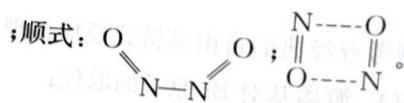

终止: $^{-} \mathrm{O}_{2} \mathrm{~S} \cdot + \cdot \mathrm{CF}_{3} \longrightarrow \mathrm{F}_{3} \mathrm{C}- \mathrm{SO}_{2}^{-}$ 【说明】在硫的含氧酸盐, 如 $S_{2} O_{8}^{2-}$ 也存在上述类似情况。 $S_{2} O_{8}^{2-}$ 在水中存在解离平衡: $S_{2} O_{8}^{2-} \rightleftharpoons 2 \cdot SO_{4}^{-}$ 。在 $Ag^{+}$ 催化下, $S_{2} O_{8}^{2-}$ 氧化 $I^{-}$ 的机理为:

引发： $\mathrm{S}_2\mathrm{O}_8^{2 - }\rightleftharpoons 2\cdot \mathrm{SO}_4^-$

转移： $\cdot SO_{4}^{-} + Ag^{+} \rightarrow SO_{4}^{2-} + Ag^{2+}$

转移： $SO_{4}^{2+} + Ag^{-}$ 终止： $Ag^{2+} + I^{-} \longrightarrow I \cdot + Ag^{+}$ $I \cdot + I \cdot \longrightarrow I_{2}$

第5题 5-1 共轭结构式中,要将大 $\pi$ 键标出, $N_{3}^{-}$ 和 $CO_{2}$ 为等电子体,都是两个三中心四电子的大 $\pi$ 键。而在 $HN_{3}$ 中具有一个正常的 $\pi$ 键,注意把其他的电子标出。本题难度较小,但正答率不高,主要是很多人把共轭结构式画成共振式。

答案为： $\begin{array}{c}N-N:N:\\H\end{array}$ $\left[:N-N-N:\right]^{-}$

$$
\begin{array}{l} \text {5 - 2} \quad \mathrm{N} _ {2} \mathrm{O} + 2 \mathrm{NaNH} _ {2} \longrightarrow \mathrm{NaOH} + \mathrm{NH} _ {3} + \mathrm{NaN} _ {3} \\ n - \mathrm{BuONO} + \mathrm{N} _ {2} \mathrm{H} _ {4} + \mathrm{NaOH} \longrightarrow \mathrm{NaN} _ {3} + n - \mathrm{BuOH} + 2 \mathrm{H} _ {2} \mathrm{O} \end{array}
$$

5-3 氮气是比较稳定的气体,反应产物一般写氮气。类似地 $NaN_{3}$ 的分解,产物是 Na 和 $N_{2}$ 而不是 $Na_{3}N$ ,原因与 $Na_{3}N$ 的不稳定性有关。

$$
\mathrm{HN} _ {3} + \mathrm{H} _ {2} \mathrm{O} \longrightarrow \mathrm{NH} _ {2} \mathrm{OH} + \mathrm{N} _ {2} 2 \mathrm{HN} _ {3} \longrightarrow \mathrm{H} _ {2} + 3 \mathrm{N} _ {2}
$$

5-4 该反应为叠氮负离子取代氯和氰基的反应,故产物的结构应该是 C 与四个叠氮基团相连而不是类似于 $\mathrm{B}_{12}$ 的结构(在按最大对称性考虑时,更要考虑答案的合理性)。

类比 $\mathrm{HN}_3$ 的结构可以得出C—N—N键角为折线型。本题难度适中，但 $\mathrm{CN}_{12}$ 的结构需要注意细节。

答案为： $Cl_{3}CCN+4NaN_{3}\longrightarrow3NaCl+NaCN+CN_{12}$

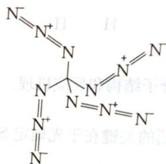

$$
\mathrm{CN} _ {1 2} \longrightarrow \mathrm{C} + 6 \mathrm{N} _ {2}
$$

## 第6题

本题考查分子结构方面试题。

$$
6 - 1 \quad \stackrel {\oplus} {N} = \stackrel {\ominus} {O} \leftrightarrow \cdot N = O \leftrightarrow \stackrel {\ominus} {N} = \stackrel {\oplus} {O} \cdot \leftrightarrow N \equiv O
$$

从共振式可以得出结论: NO 既有亲电性, 又有亲核性。

6-2 线型有几何异构: 反式: O≡N-N≡O; 顺式: O≡N-N≡O; N---O || O---N。

$$
6 - 3 \quad 4 \mathrm{NO} + 2 \mathrm{OH} ^ {-} \longrightarrow 2 \mathrm{NO} _ {2} ^ {-} + \mathrm{N} _ {2} \mathrm{O} + \mathrm{H} _ {2} \mathrm{O}
$$

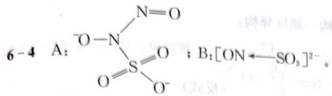

: 卵星灵犀— 卵星同, 具奇, 置众的集式凝固器 §-8

机理： $\mathrm{NO} + \mathrm{SO}_3^{2-} \longrightarrow [\mathrm{ON} \leftarrow \mathrm{SO}_3]^{2-}$

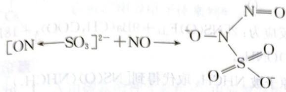

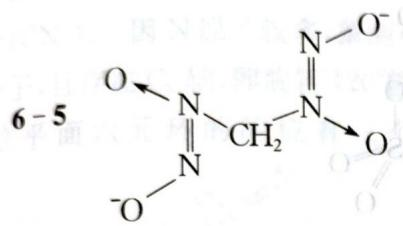

$$
\mathrm{MeO} _ {2} \mathrm{C} \xrightarrow [ \mathrm{MeO} _ {2} \mathrm{C} ]{\mathrm{CH} _ {2} + 2 \mathrm{NO} + \mathrm{MeONa}} \longrightarrow \begin{array}{c} \mathrm{MeO} _ {2} \mathrm{C} \\ \mathrm{MeO} _ {2} \mathrm{C} \end{array} \xrightarrow [ \mathrm{N} - \mathrm{ONa} ]{\mathrm{O} ^ {\ominus}}
$$

## 第7题

## 图e

7-1 HF— $\mathrm{SbF}_{5}$ 为超酸体系, 可视为 Lewis 酸碱反应:

$$
2 \mathrm{HF} + \mathrm{SbF} _ {5} \longrightarrow \mathrm{H} _ {2} \mathrm{F} ^ {+} + \mathrm{SbF} _ {6} ^ {-}
$$

$2HF + 2SbF_{5} \longrightarrow H_{2}F^{+} + Sb_{2}F_{11}^{-}$ 或者

$$
4 \mathrm{HF} + 3 \mathrm{SbF} _ {5} \longrightarrow 2 \mathrm{H} _ {2} \mathrm{F} ^ {+} + \mathrm{SbF} _ {6} ^ {-} + \mathrm{Sb} _ {2} \mathrm{F} _ {1 1} ^ {-}
$$

7-2 离子结构是：

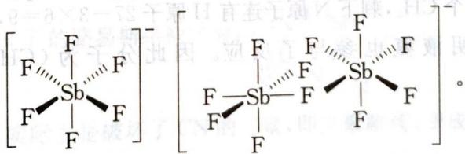

7-3 $\mathrm{H}_2\mathrm{F}^+$ 为超酸，给出质子的能力很强：

$$
\begin{array}{l} \mathrm {H_ {2} F^ {+} + H_ {2} \longrightarrow HF+ H_ {3} ^ {+}} \\ \mathrm {H_ {2} F^ {+} + CO_ {2} \longrightarrow HF + CO_ {2} H^ {+} (or HCO_ {2} ^ {+})} \\ 7 - 4 \quad \ddot {\mathrm{O}} = \mathrm{C} = \mathrm{O} ^ {\oplus} - \mathrm{H} \longleftrightarrow \stackrel {\oplus} {: \mathrm{O}} \equiv \mathrm{C} - \ddot {\mathrm{O}} - \mathrm{H} \longleftrightarrow \stackrel {\ominus} {: \ddot {\mathrm{O}}} - \mathrm{C} \equiv \stackrel {\oplus 2} {\mathrm{O}} - \mathrm{H} \\ 1 2 0 ^ {\circ} \end{array}
$$

第8题 8-1 $\mathrm{SOCl}_2$ 与 $\mathrm{NaN}_3$ 反应, 可以先假设发生取代反应。再根据提示, X 为三聚体, 说明 Y 的单体 $\mathrm{Y}'$ 一定含有不饱和键, 从成键角度看, 可能含有 S=N 键或 S=O 键。一般说来, S=O 三聚能力没有 S=N 三聚能力强。而 Y 中含有氯元素, 因此 $\mathrm{Y}'$ 同样含有氯元素, X 为 $[\mathrm{NS(O)Cl}]_3$ , 根据氯元素质量分数验证即可。因此, 化学反应为:

$$
3 \mathrm{SOCl} _ {2} + 3 \mathrm{NaN} _ {3} \longrightarrow [ \mathrm{NS(O)Cl} ] _ {3} + 3 \mathrm{NaCl} + 3 \mathrm{N} _ {2}
$$

8-2 根据氯元素的位置,存在几何异构一顺反异构:

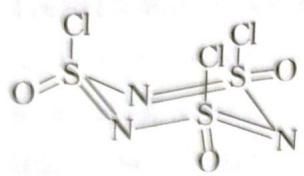

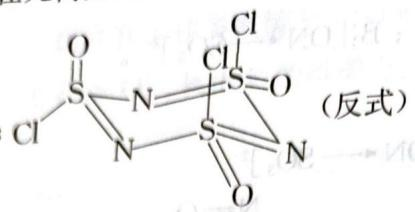

8-3 同样与 X 相似，Y 为 $[NS(O)F]_{3}$ 。其反应为： $2[NS(O)F]_{3} + 9Ba(CH_{3}COO)_{2} + 18H_{2}O \rightarrow 3BaF_{2} + 6BaSO_{4} + 12CH_{3}COOH + 6CH_{3}COONH_{4}$ 。

$3BaF_{2} + 6BaSO_{4} + 12CH_{3}COOH + 6CH_{3}COOH$ 8-4 根据有机化学反应规律可知：Y 中 F 原子被 $NHCH_{3}$ 取代得到 $[NS(O)(NHCH_{3})]_{3}$ 。

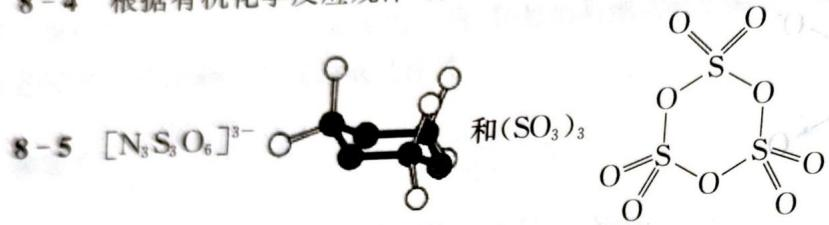

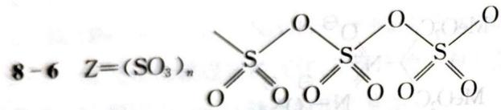

第9题
本题考查化学方程式的书写。考查非水溶剂中的化学反应，以碱金属作为知识载体，考查无机和有机的融合。

9-1 $\mathrm{Si}_{6} \mathrm{C}_{6} \mathrm{~N}_{9} \mathrm{H}_{27}$ 分子有一条三重旋转轴, 说明该分子旋转 $360^{\circ} / 3 = 120^{\circ}$ 完全重合, 且 Si 原子化学环境完全相同, 即 6 个 Si 原子上连的基团完全相同, 根据结构特点, 每个 Si 原子连有 4 根共价键, 6 个 C 原子应存在 6 个 $\mathrm{CH}_{3}$ , 剩下 N 原子连有 H 原子 $27 - 3 \times 6 = 9$ , 9 个 N 原子连有 9 个 H 原子, 即 9 个 NH。说明液氨也参与了反应。因此分子为 $(\mathrm{CH}_{3})_{6} \mathrm{Si}_{6} (\mathrm{NH})_{9}$ , 其结构

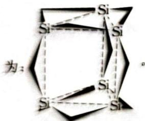

生成 $(\mathrm{CH}_3)_6\mathrm{Si}_6(\mathrm{NH})_9$ 的方程式为：

$$
6 \mathrm{CH} _ {3} \mathrm{SiCl} _ {3} + 1 8 \mathrm{Na} + 9 \mathrm{NH} _ {3} \longrightarrow (\mathrm{CH} _ {3}) _ {6} \mathrm{Si} _ {6} (\mathrm{NH}) _ {9} + 1 8 \mathrm{NaCl} + 9 \mathrm{H} _ {2}
$$

9-2 金属钠和 $(\mathrm{C}_6\mathrm{H}_5)_3\mathrm{CNH}_2$ 在液氨中反应，生成钠盐，说明该反应为氧化还原反应，钠盐中阳离子为 $\mathrm{Na}^+$ ，阴离子是什么呢？稍有有机知识的同学都会想到：阴离子为 $(\mathrm{C}_6\mathrm{H}_5)_3\mathrm{C}^-$ ，其化学反应为： $2\mathrm{Na} + (\mathrm{C}_6\mathrm{H}_5)_3\mathrm{CNH}_2 \longrightarrow [(\mathrm{C}_6\mathrm{H}_5)_3\mathrm{C}] \mathrm{Na} + \mathrm{NaNH}_2$ 。其中， $(\mathrm{C}_6\mathrm{H}_5)_3\mathrm{CNH}_2$ 中的 $(\mathrm{C}_6\mathrm{H}_5)_3\mathrm{C}^+$ 通过接受 $\mathrm{Na}$ 提供的电子变成 $(\mathrm{C}_6\mathrm{H}_5)_3\mathrm{C}^-$ ，该阴离子为平面结构，其大 $\pi$ 键为 $6 \times 3 + 1 + 1 = 20$ 。即离域大 $\pi$ 键为 $\Pi_{19}^{20}$ 。由于分子轨道能级差减小，从而吸收可见光（蓝绿光），显示出红色。

9-3 由题意可知： $\mathrm{CsF}_5$ 为单中心分子，说明在高压状况下， $\mathrm{CsF}_5$ 为分子晶体，可用价层电子对互斥理论加以判断。由于配原子数为5，说明Cs次外层电子也参与了成键，故价层电子对数

$H=(8+1+5)/2=7$ ，为五角双锥：Cs。扣除二对孤对电子，其分子形状为正五边形：

F Cs F 。也可以用等电子体来判断，Cs $^{+}$ 相当于 Xe，CsF $_{5}$ 结构相当于 XeF $_{5}^{-}$ 。
第 10 题

10-1 A 由碳氮两种元素组成, 由质量分数可以计算出 $n(\mathrm{C}): n(\mathrm{N}) = 1:4$ 。因此 A 的分子式为 $(\mathrm{CN}_4)_n$ 。因 N 原子较多, 猜测可能存在叠氮 $\mathrm{N}_3$ 基团。最简式中还存在 CN。又因为 A 为平面分子, 且存在 $\mathrm{C}_3$ 轴, 即旋转 $120^\circ$ 能完全重合。因此可以考虑 $n = 3$ 的情况下, $\mathrm{C}_3\mathrm{N}_{12}$ 为类似于苯环, 在平面六元环的间位有三个叠氮基团 $\mathrm{N}_3$ , 这样就符合题意了。因此 A 的结构式

10-2 由于存在叠氮基团 $\mathrm{N}_{3}$ , 受热时能够分解产生 $\mathrm{N}_{2}$ 。结合题中 A 光解产生 B 的相关数: N:

据,也证实了这一点。因此 B 的路易斯结构式为:

10-3 继续光解 B, 实际上是破坏了 CN 的三聚, 即三聚解离, 变成了 $CN_{2}$ 。根据路易斯电子理论可得: $N \equiv C - \dot{N} \longleftrightarrow \dot{N} - C \equiv N$ : 。根据形式电荷 $Q_{F}$ 的计算方法, 可以写为:

$$
\Theta : \mathrm{C} \equiv \stackrel {\oplus} {\mathrm{N}} - \ddot {\mathrm{N}} \longleftrightarrow^ {\ominus} \ddot {\mathrm{C}} - \stackrel {\oplus} {\mathrm{N}} \equiv \mathrm{N}: \longleftrightarrow : \mathrm{C} = \stackrel {\oplus} {\mathrm{N}} = \dot {\mathrm{N}} ^ {\ominus}
$$

10-4 C为 $\mathrm{CN}_2$ ，继续受热分解，产生的气体只能是 $\mathbf{N}_2$ ，再结合D中含氮元素质量分数为0.6087，可知D中含有碳氮两种元素，根据质量分数计算得D为 $\mathrm{C}_3\mathrm{N}_4$ 。因此生成D的化学方程式为： $3\mathrm{CN}_2 = \mathrm{C}_3\mathrm{N}_4 + \mathrm{N}_2$ 或 $3[\mathrm{NCN}] = \mathrm{C}_3\mathrm{N}_4 + \mathrm{N}_2$ 。

根据路易斯电子理论可知 D 的结构式为： $N^{2}$ （注意大致键角）。所有 C 原子为 sp 杂化，2 个端基 N 原子为 sp 杂化，中间 2 个 N 原子 $sp^{2}$ 杂化。

化学键有原子之间的6个 $\sigma$ 键，端基N原子与连接C原子之间的 $\pi$ 键和2个四中心四电子大

10-5 D是石墨型结构E的单体。合成E方法为：

→g-C₃N₄+2NH₃(g表示石墨的英文第一个字母)

$H_{2}N'$ $N-NH_{2}$ 或者： $2NC-NCO=CO_{2}+C_{3}N_{4}$

或者：2NC H₂N C=S $\xrightarrow{\triangle}$ $C_{3}N_{4} + CS_{2} + 4N_{2}H_{4} + 2H_{2}S$ 或者:4 $H_{2}N-NH$

E的结构式为：

## 第3章 晶体结构初步知识

## 能力测试A卷

第1题

本题考查晶体结构基础知识,比较简单。

1-1 (1) NaCl 晶胞是由 $\mathrm{Na}^{+}$ 与 $\mathrm{Cl}^{-}$ 所组成的交错 fcc 面心立方。

(2) 钠的配位数是 6, 它的周围紧邻着 6 个氯离子。

(3) 对于 NaCl, $Na^{+}$ 离子的数目: 在棱心共有 12 个由四个单元体共有的 $Na^{+}$ , 故每个单元体为 $12 \times 1/4 = 3$ , 又体心有一个, 因此每个晶胞合计有 $3 + 1 = 4$ 个 $Na^{+}$ 。

氯离子的数目:在面心共有6个由二个晶胞共有的 $Cl^{-}$ ，故每个单元体为 $6\times1/2=3(Cl^{-})$ ，和顶点上8个由8个晶胞共有的 $Cl^{-}$ ， $8\times1/8=1(Cl^{-})$ ，因此合计每个晶胞共有 $3+1=4$ 个 $Cl^{-}$ 。故每个NaCl晶胞中有4个 $Na^{+}+4$ 个 $Cl^{-}$ ，即4NaCl。

(4) 就 NaCl 晶胞, 其面心立方的对角线长是相当于 $\sqrt{2}$ 倍的 a 长度, 而对角线上的阴-阴离子彼此接触; 边上的阴-阳离子也彼此接触因此, $a = 2(r_{\mathrm{Na}^{+}} + r_{\mathrm{Cl}^{-}})$ 。

(5) 既然 $r_{\mathrm{Na}^{+}} / r_{\mathrm{Cl}^{-}}$ 比值0.564是远大于六配位数的正八面体的最小理想值0.414，氯离子膨胀排列使得八面体孔洞大得足够容纳钠离子。

(6) 当阳离子半径逐渐增加, 阴离子不再彼此接触, 将使该结构逐渐不稳定。没有充足的空间容纳更多的阴离子, 直到阳离子/阴离子的半径比值等于 0.732, 就像配位数八的体心立方体 CsCl, 其阳离子周围恰好可围绕 8 个阴离子。

(7) 一般而言, 配位数为六的 fcc 的结构, 其阳离子/阴离子半径比值范围从 0.414 至 0.732 是稳定的, 也就是说如果 $0.414 < r^{+} / r^{-} < 0.732$ , 则离子结构就会像 NaCl 的 fcc 型态。

(1) 根据布拉格定律 $\lambda = 2d_{\text{bH}} \sin(\theta)$ 可得。

1-2 (1) 根据布拉格定律 $\lambda=2d_{\mathrm{hkl}}\sin(\theta)$ 可得：

$154\mathrm{pm} = 2\times d_{200}\sin (15.8^{\circ})$ ，解得 $d_{200} = \frac{154\mathrm{pm}}{2\times\sin(15.8^{\circ})} = \frac{154\mathrm{pm}}{2\times 0.272} = 283\mathrm{pm}$ ，因此NaCl(200)面的距离为 $283~\mathrm{pm}$ 。

(2) 晶胞边长 $a = d_{100} = 2 \times d_{200}$ ，即 $a = 2 \times 283 \, pm = 566 \, pm$ 。

(3) 既然它是一个 fcc 晶格, 晶胞边长 $a = 2(r_{\mathrm{Na}^{+}} + r_{\mathrm{Cl}^{-}})$ , 钠离子的半径 $r_{\mathrm{Na}^{+}} = (a - 2r_{\mathrm{Cl}^{-}}) / 2 = (566 - 362) / 2 = 102 \mathrm{pm}$ 。

1-3 (1) hcp 与 ccp 的排列差异如下:

两个 A 层方向相同,造成 hcp 是以 ABAB…的形式排列,第二层后再重复排列,然而 ccp 的排列方向相反而造成 ABCABC…的堆积型态,重复形式是在第三层之后。ccp 的排列是以立方晶格为基础的,而 hcp 的排列是以六方晶格为基础的。

(2) 空间占有率=4 个原子所占体积/晶胞体积

其中，a 是晶胞边长。既然 NaCl 是 fcc 晶胞，面对角线 $=\sqrt{2}a=4r$ ……①

晶胞体积 $V=a^{3}$ ，空间占有率 $=\frac{4\times4\pi r^{3}}{3\times a^{3}}$ ……②

将①式的 a 代入②式, 我们可得到空间占有率:

空间占有率= $\frac{4\times4\times22\times(\sqrt{2})^{3}\times r^{3}}{3\times7\times(4r)^{3}}=0.74$ 。

因此，ccp 的空间占有率 = 0.74。

(3) hcp 排列的配位数 12 和空间占有率(0.74)与 ccp 相同。

1-4（1）对于fcc，面对角线长 $= \sqrt{2} a = 4r_{\mathrm{Ni}}$ 。其中 $a$ 为晶胞边长， $r_{\mathrm{Ni}}$ 为镍原子半径。因此， $r_{\mathrm{Ni}} = \sqrt{2} a / 4 = \sqrt{2} \times 352.4 \mathrm{pm} / 4 = 124.6 \mathrm{pm}$ 。

(2) 晶胞体积 $V = a^{3} = (3.524 \text{ Å})^{3} = 43.76 \text{ Å}^{3}$

$$
\rho_ {\mathrm{Ni}} = Z M / (N _ {\mathrm{A}} V)
$$

对于镍原子数，fcc 晶胞的 Z=4。因此阿伏伽德罗常数 $N_{A}$ 为：

$N_{A}=ZM/(\rho_{Ni}V)=\frac{4\times58.69\ g\cdot mol^{-1}}{8.902\ g\cdot cm^{-3}\times43.76\times10^{-24}\ cm^{3}}$ ，解得 $N_{A}=6.02\times10^{23}\ mol^{-1}$ 。

## 第2题

2-1 NaCl 解离为 $\mathrm{Na} + \mathrm{Cl}$ 的 Born-Haber 循环为：

$$
\mathrm{NaCl} \longrightarrow \mathrm{Na} ^ {+} + \mathrm{Cl} ^ {-}
$$

$$
\mathrm{Na} ^ {+} + \mathrm{Cl} ^ {-} \longrightarrow \mathrm{Na} + \mathrm{Cl}
$$

第一步吸收能量为 $464 \, kJ \cdot mol^{-1}$

第二步放出能量增益为 $-(I.E_{\mathrm{Na}}+E.A_{\mathrm{Cl}})=-136\ \mathrm{kJ}\cdot\mathrm{mol}^{-1}$

$$
E _ {\mathrm{总}} = E _ {\mathrm{解离能}} = 3 2 8 \mathrm{kJ} \cdot \mathrm{mol} ^ {- 1}.
$$

2-2 $\mathrm{CaCl}_2$ 解离成 $\mathrm{Ca} + 2\mathrm{Cl}$ 的Born-Haber循环为：

$$
\mathrm{CaCl} _ {2} \longrightarrow \mathrm{Ca} ^ {2 +} + 2 \mathrm{Cl} ^ {-}
$$

$$
\mathrm{Ca} ^ {2 +} + 2 \mathrm{Cl} ^ {-} \longrightarrow \mathrm{Ca} + 2 \mathrm{Cl}
$$

$Ca^{2+} + 2Cl^{-} \rightarrow Ca + 2Cl^{-}$ $Ca^{2+} Cl^{-}$ 的(离子)键能 $E = -429 \times 2/0.91 = -943 \, kJ \cdot mol^{-1}$ (CaCl 的测量值为 -429，但是 $C_{a}$ 的电荷现在为 +2，键长减小了 0.91)。

第一步吸收能量 $E = -\left(\mathrm{CaCl}_{2}\right.$ 键能 $) = 2 \times 942$ 减去 Cl—Cl 排斥能。

Cl—Cl 排斥能为 $(429/2) \times (1/0.91) = 236 \, \text{kJ} \cdot \text{mol}^{-1}$ ，因此第一步吸收能量 $= +1650 \, kJ$ ， $mol^{-1}$ 。

第二步放出能量为 $-(2 \times E. A_{\mathrm{Cl}} + I. E_{\mathrm{Ca}}) = -1020 \, \mathrm{kJ} \cdot \mathrm{mol}^{-1}$ 。

解离能 = 630 kJ · mol $^{-1}$ 。

## 第3题

本题属于晶体相关的基础试题。

$$
3 - 1 \quad \mathrm{BBr} _ {3} + \mathrm{PBr} _ {3} + 3 \mathrm{H} _ {2} \longrightarrow \mathrm{BP} + 6 \mathrm{HBr}
$$

3-2 可用价层电子对互斥理论确定反应物质量：

  
平面正三角形

  
三角锥形

3-3 BP 晶胞与金刚石结构相似, 其结构为:

  
Zinc blende structure

## 3-4 B原子为fcc结构，因此：

顶点: $8 \times 1/8 = 1$ ; 面心: $6 \times 1/2 = 3$ 。B 原子总数 $= 3 + 1 = 4$ 。因此, 在每个晶胞中存在 4 个磷原子, 它们被硼四面体包围。

3-5 硼和磷的相对原子质量分别为 11 和 31。因此，BP 密度 $\rho$ 为：

$$
\rho = \frac {m}{V} = \frac {(n M _ {\mathrm{bp}})}{N _ {\mathrm{A}} a ^ {3}} = \frac {4 \times 4 2}{6 . 0 2 2 \times 1 0 ^ {2 3} \times (4 . 7 8 \times 1 0 ^ {- 1 0}) ^ {3}} = 2 5 5 4 \mathrm{kg} \cdot \mathrm{m} ^ {- 3} 。
$$

3-6 B—P之间的距离 $d=\frac{\sqrt{3}}{4}a=2.069\ \text{\AA}$ 。

3-7 BP的晶格能 $U = -\frac{1390 \times 3 \times 3 \times 1.638 Z_{+} Z_{-} A e^{2}}{2.069} \times \frac{6}{7} = 8489 \mathrm{kJ} \cdot \mathrm{mol}^{-1}$ 。

3-8 根据质量作用定律可知:化学反应速率 $r = k[BBr_{3}]^{m}[PBr_{3}]^{n}$ 。将上述数据代入,即可方便的求出 m = n = 1。因此上述反应的级数为 2,其速率方程 $r = k[BBr_{3}][PBr_{3}]$ 。

3-9 $k_{800}=r_{800}/[BBr_{3}][PBr_{3}]=4.60\times10^{-8}/(2.25\times10^{-6}\times9\times10^{-6})\frac{mol\cdot s^{-1}}{mol^{2}\cdot L^{-2}}=$ 2272 $L^{2}\cdot mol^{-1}\cdot s^{-1}$

$$
k _ {8 8 0} = r _ {8 8 0} / \left[ \mathrm{BBr} _ {3} \right] \left[ \mathrm{PBr} _ {3} \right] = 1 9. 6 0 \times 1 0 ^ {- 8} / (2. 2 5 \times 1 0 ^ {- 6} \times 9 \times 1 0 ^ {- 6}) \frac {\mathrm{mol} \cdot \mathrm{s} ^ {- 1}}{\mathrm{mol} ^ {2} \cdot \mathrm{L} ^ {- 2}} = 9 6 7 9 \mathrm{L} ^ {2} \cdot \mathrm{mol} ^ {- 1} \cdot \mathrm{s} ^ {- 1}
$$

$$
\Delta H = - R \ln (k _ {2} / k _ {1}) \times (1 / T _ {2} - 1 / T _ {1}) ^ {- 1}
$$

$$
T _ {1} = 8 0 0 + 2 7 3 = 1 0 7 3 \mathrm{K}, T _ {2} = 8 8 0 + 2 7 3 = 1 1 5 3 \mathrm{K。}
$$

$$
\Delta H = - R \ln (9 6 7 9 / 2 2 7 2) \times (1 / 1 1 5 3 - 1 / 1 0 7 3) ^ {- 1} = 1 8 6 \mathrm{kJ} \cdot \mathrm{mol} ^ {- 1}
$$

## 第4题

本题的突破口是画出层状六方 BN 的晶胞。晶胞的选取方法前面已经讲述，在这里不再赘述。该晶胞的选取常见有两种取法：一种是选取成六棱柱，一种是选取成立方晶胞。由于六棱柱我们使用的不太熟悉，立方晶胞我们要熟悉的多，因此，此题晶胞的选取以立方晶胞为宜。我们来考查

六方 BN 的每一个面：图中虚线围成的图形即为一个面的最小重复单元，由此我们

不难画出六方 BN 的晶胞。

晶胞中原子的分数坐标是初赛大纲的要求,有一定解析几何知识的竞赛选手,很容易确定B和N原子的分数坐标。计算晶体密度时要紧紧抓住公式 $N_{A}=\frac{ZM}{VD}$ ， $N_{A}$ 是联系宏观和微观的桥梁。

第五问和第六问均考察化学反应方程式的书写。根据第五问的信息知，平面三角形的分子只有 $\mathrm{BF}_3$ ，最稳定的单质只有 $\mathbf{N}_2$ （因为 $\mathrm{N}\equiv \mathrm{N}$ 的键能很大，约 $946\mathrm{kJ}\cdot \mathrm{mol}^{-1}$ ）。第六问说阴阳离子均为正四面体结构，只有 $\mathrm{NH_4^+}$ 和 $\mathrm{BF}_4^-$ ，除此之外，没有其他的阴阳离子满足上述要求。

  
OB ON

4-2 B原子：(0，0，0)，(1/3，2/3，1/2)或(2/3，1/3，1/2)；

N原子：(0，0，1/2)，(1/3，2/3，0)或(2/3，1/3，0)。

$$
4 - 3 \mathrm{D} = \frac {2 \times (1 0 . 8 1 + 1 4 . 0 1) \mathrm{g} \cdot \mathrm{mol} ^ {- 1}}{6 . 0 2 2 \times 1 0 ^ {2 3} \mathrm{mol} ^ {- 1} \times (\sqrt {3} \times 1 4 5) ^ {2} \times \frac {\sqrt {3}}{2} \times 2 \times 3 3 3 \times 1 0 ^ {- 3 0} \mathrm{cm} ^ {3}} = 2. 2 6 (\text {或} 2. 2 7) \mathrm{g} \cdot \mathrm{cm} ^ {- 3}
$$

$$
\begin{array}{r l} {4 - 4} & {d _ {\mathrm{B-N}} = \frac {\sqrt {3}}{4} a = \frac {\sqrt {3}}{4} \times 3 6 1. 5 = 1 5 6. 5 \mathrm{pm}.} \\ {4 - 5} & {2 \mathrm{BN} + 3 \mathrm{F} _ {2} \longrightarrow 2 \mathrm{BF} _ {3} + \mathrm{N} _ {2}} \\ {4 - 6} & {\mathrm{BN} + 4 \mathrm{HF} \longrightarrow \mathrm{NH} _ {4} \mathrm{BF} _ {4}} \end{array}
$$

## 第5题

本题须在晶胞图中作出八面体空隙和四面体空隙的位置,再进行有关推算。

5-1 立方最密堆积中正八面体空隙中心的位置在立方体的体心和棱的中心，八面体空隙数为 $1 + 12 \times 1/4 = 4$ ，四面体空隙数为8，球数为 $8 \times 1/8 + 6 \times 1/2 = 4$ 。堆积球数：四面体空隙数 $= 1:2$ ，堆积球数：八面体空隙数 $= 1:1$ 。其图形为：

5-2 六方密堆积中正四面体空隙的中心和正八面体空隙中心位置如下图所示：

5-3 $r(\mathrm{Ti}^{3+}) / r(\mathrm{Cl}^{-}) = 77 / 181 = 0.425$ ，故 $\mathrm{Ti}^{3+}$ 填入八面体空隙。六方晶胞中， $\mathrm{Cl}^{-}$ 数为 $12 \times 1 / 6$ （顶角） $+ 2 \times 1 / 2$ （底心） $+ 3$ （体内） $= 6$ ，结合 $\beta - \mathrm{TiCl}_3$ 的组成，知每个六方晶胞中有 2 个 $\mathrm{Ti}^{3+}$ ；又八面体空隙数为 6，故八面体空隙占有率为 $1 / 3$ 。填入空隙的方式有 3 种。

## 第6题

6-1 本题在计算晶胞边长时所应用的布拉格方程,是联系晶胞参数和 X-光衍射方向的基本方程之一。它的一般形式是: $2d \sin \theta = n \lambda$ 。式中, $d$ 是晶面间距,在一些简单情况中,它等于晶胞边长; $\theta$ 是衍射角,即衍射线和晶面间的夹角; $\lambda$ 是 X-射线波长; $n$ 称为衍射级数,其含义是:只有照射到相邻两晶面的光程差是 X-射线波长的 $n$ 倍时才产生衍射。在某些简单情况中,根据实验时 X-射线的波长和衍射角度,即可求出晶胞参数,进而求出晶胞体积。再根据另一些参量,即可求出晶体密度或阿伏加德罗常数。根据晶体结构的有关知识和本题已知条件,欲求 $N_{\mathrm{A}}$ ,必先求出每个 $\mathrm{FeS}_{2}$ 晶胞中“ $\mathrm{FeS}_{2}$ 分子”的数目 $Z$ 及晶胞的体积 $V$ ,而欲求晶胞的体积 $V$ 必先求其边长 $a$ 。解题过程如下:

每个晶胞中 Fe 原子数 $=1+12\times1/4=4$ ， $S_{2}$ 基团数 $=8\times1/8+6\times1/2=4$ 。因此，每个晶胞中含有 4 个“ $FeS_{2}$ 分子”。晶胞的边长 a 等于一级衍射的面间距 d，应用布拉格（Brass）方程 $2d\sin\theta=n\lambda$ （此处 n=1）可求出 $a:a=d=\frac{\lambda}{24\sin\theta}=\frac{154\times10^{-10}}{2\times\sin8.17^{\circ}}=5.42\times10^{-8}$ （cm）。晶胞体积为：

$V=a^{3}=(5.42\times10^{-8}\mathrm{~cm})^{3}=1.59\times10^{-22}\mathrm{~cm}^{3}$ 。因而，阿伏加德罗常数为：

$$
N _ {\mathrm{A}} = \frac {Z M}{V D} = \frac {4 \times (5 5 . 8 5 + 3 2 . 0 6 \times 2)}{1 . 5 9 \times 1 0 ^ {- 2 2} \times 5 . 0 1} = 6. 0 2 \times 1 0 ^ {2 3}.
$$

6-2 确定 Fe 原子和 S 原子间的化学键, 要抓住本质。(a) 共价键饱和性的根源是成键原子的原子轨道(包括杂化轨道)的数目一定, 每个轨道的成键能力一定, 因而周围连接的原子数(配位数)一定。在化合物中, 某一原子配位数的大小, 一方面决定于中心原子和配位原子体积的相对大小, 另一方面决定于中心原子可用来成键的轨道数。配位数大小和共价键的饱和性并无确定的对应关系。配位数小者未必不饱和, 配位数大者未必过饱和。在 $\mathrm{FeS}_{2}$ 中, 以 Fe 原子为中心的配位八面体既然可共面相连, 那么就可推知 Fe 原子用 6 个 $\mathrm{d}^{2} \mathrm{sp}^{3}$ 杂化轨道形成 6 个共价键。配位数为 6 并不违背共价键的饱和性。事实上, 在许多六配位的配合物中, 中心原子和配位原子间都可形成共价配键, 例如 $\mathrm{Fe(CN)}_{6}^{4-}$ 等。(b) 黄铁矿的化学式是 $\mathrm{FeS}_{2}$ , 这只表明在晶胞中 Fe 和 $\mathrm{S}_{2}$ 的数量比是 $1:1(4:4)$ , 并不表明 Fe 是 2 价的。因为在 $\mathrm{FeS}_{2}$ 晶体中并无独立的 $\mathrm{FeS}_{2}$ 分子。(c) 形成多面体空隙并非是离子化合物所独有的特征。我们一是要仔细分析配位多面体的连接方式, 抓住并深入理解“八面体共面连接”这一结论, 二是要抓住离子极化可引起键型变异这一原理。

同 NaCl 晶体类似, $FeS_{2}$ 中 Fe 原子的 S 原子配位多面体是八面体, 配位数为 6。但它又不同于 NaCl 晶体, Fe 原子的配位多面体可共面连接(这一点请竞赛选手们以 NaCl 立方晶胞图形为基础, 仔细分析), 这一事实说明, 在 $FeS_{2}$ 晶体中 Fe—S 键包含相当大的共价键成分, 因为离子性更强的化合物很难形成共面连接的配位多面体。这一事实还说明, 在 $FeS_{6}$ 八面体中, Fe 原子采用 $d^{2}sp^{3}$ 杂化轨道和 S 原子成键。

杂化轨道和 S 原子成键。
答案为: $FeS_{2}$ 中 Fe 原子的 S 原子配位多面体是八面体, 配位数为 6; Fe 原子的配位多面体可共面连接; 在 $FeS_{2}$ 晶体中 Fe—S 键包含相当大的共价键成分。

共面连接;在 $FeS_{2}$ 晶体中 Fe—S 键包含相当大的共价键。

6-3 S—S 键距小于典型的 $S^{2-}$ 半径,说明两个 S 原子间的化学键是共价键。若是离子键,则键距非常接近于离子半径的两倍,而不是小于离子半径。

第7题
本题是有关晶体结构内容的识图题。由晶胞图计算晶胞中的原子数目,再根据题给条件和信息回答问题。需注意下列问题:

息回答问题。需注意下列问题：
①根据晶胞图中各原子的位置,可计算一个晶胞中的原子数,从而确定晶体的化学组成。计算时,顶点上的原子只能算1/8,面上的原子只能算1/2,棱上的原子则只能算1/4;②晶胞是晶体重复单元,但不一定是最基本的重复单元,晶胞中可含有一个以上最基本的重复单元,本题与前面例题的区别在于该晶胞不是素晶胞,而是复晶胞,可以设想将晶胞在长方体的棱心处一分为二,得一立方体,若顶角和面心的原子相同,则该立方晶胞为立方ZnS型。所以,黄铜矿晶胞含有两个 $Cu_{2}Fe_{2}S_{4}$ 结构基元;③ZnS型晶体可看作硫取紧密堆积结构,而Zn嵌在其四面体空隙中。面心立方堆积( $A_{1}$ 型)中,单位晶胞的四面体空隙数为8;④第2问所述的化学环境是否相同是相同的。

中。面心立方堆积 $\left(\mathrm{A}_{1}\right.$ 型)中,单位品指原子在空间的位置相同和在空间的伸展方向相同;⑤第5同可用等电子作成晶胞中有4Fe, $1+8\times1/8+4\times1/2=4$ ;S:体内8个,故晶胞中有4Fe,

$$
\text {   子在空间的位置相同和在空间的伸展方向相同,   } \text {   ②   } S: 7 - 1 \quad \mathrm{Fe:} 6 \times 1 / 2 + 4 \times 1 / 4 = 4; \mathrm{Cu:} 1 + 8 \times 1 / 8 + 4 \times 1 / 2 = 4; \mathrm{S:}
$$

4Cu, 8S; 化学式为 CuFeS₂。

7-2 晶胞中含有 2 个化学环境和空间环境都相同的硫原子, 2 个相同的铁原子, 2 个相同的铜原子。晶胞中含有 2 个结构基元, 结构基元为 Cu₂Fe₂S₄。

7-3 铁原子与铜原子发生完全无序的置换, 可将它们视作等同的金属原

子、此时晶胞为原晶胞的一半(如右图, 黑点代表 $Cu_{1/2}Fe_{1/2}$ 的统计原子, 圆点为硫原子); 每个晶胞有4个环境相同的硫原子。

7-4 硫原子作 $A_{1}$ 型立方面心堆积, 金属原子占据四面体空隙, 占据的分数为 50%(4/8)。

7-5 根据等电子原理, 可得 Cu 为 +1, Fe 为 +3。

第8题

8-1 LaNi $_{5}$ 的晶体结构可看作如下图所示的 a、b 两种原子层交替堆积排列而成: a 是由 La 和 Ni 共同组成的层, 层中 Ni—Ni 之间由实线相连; b 是完全由 La 原子组成的层, La—La 之间也由实线相连。图中由虚线勾出的六角形, 表示由这两种层平行堆积时垂直于层的相对位置。上图正是由 a 和 b 两种原子层交替堆积成 LaNi $_{5}$ 的晶体结构图。

b  

因此，我们很快画出 $\mathrm{LaNi}_5$ 的晶胞：

8-2 六棱柱的顶点(1/6)和底心(1/2)，各有12个和2个，即属于这个六棱柱的La为3个；Ni有两种情况，在底面(参考图a)上，各有6个(1/2)，在中间一层(参考图b)，内部6个，边(对题图来说是面上)上有6个(1/2)，共有15个。即晶胞中含有1个La原子和5个Ni原子。

8-3 计算过程：

六方晶胞体积： $V=a^{2}c\sin120^{\circ}=(5.11\times10^{-8})^{2}\times3.97\times10^{-8}\times3^{1/2}/2=89.7\times10^{-24}\mathrm{~cm}^{3}$

氢气密度 $d=\frac{m}{V}=\frac{\frac{9\times1.008}{6.022\times10^{23}}}{89.774\times10^{-24}}=0.1678\ g\cdot cm^{-3}$

$\frac{0.1678}{8.987 \times 10^{-5}} = 1.87 \times 10^{3}$ , 大了 $1.87 \times 10^{3}$ 倍, 是氢气密度的 $1.87 \times 10^{3}$ 倍。

## 第9题

9-1 根据顶点、面心、棱心的贡献率，可得到碳化钙的化学式为 $\mathrm{CaC}_2$ 。  
9-2 4

9-3 C—C键长 $(d_{c-c})=c-2\times0.406c=0.188c=0.188\times6.37=1.20(\text{\AA})$

9-4 最短的 Ca—C 距离= $\sqrt{\left(\frac{a}{2}\right)^{2}+\left(\frac{d_{\mathrm{C}-\mathrm{C}}}{2}\right)^{2}}=\frac{1}{2}\sqrt{(3.87)^{2}+(1.2)^{2}}=2.03(\text{\AA})$

9-5 最短的 C … C 距离 $d_{1}=\sqrt{\left(\frac{a}{2}\right)^{2}+\left(\frac{b}{2}\right)^{2}}=\frac{\sqrt{2}}{2}a=\frac{\sqrt{2}}{2}\times3.87=2.74(\text{Å})$

$$
d _ {2} = \sqrt {\left(\frac {c}{2} - d _ {\mathrm{C-C}}\right) ^ {2} + \left(\frac {a}{2}\right) ^ {2}} = \sqrt {\left(\frac {6 . 3 7}{2} - 1 . 2\right) ^ {2} + \left(\frac {3 . 8 7}{2}\right) ^ {2}} = 2. 7 7 (\mathrm{A})
$$

9-6 与 NaCl 相似。

## 第10题

本题考查四面体的组合情况。

10-1 第一层有一个正四面体单元,第二层3个,第三层6个,第四层应有10个,即 $T_{4}$ 超四面体中A原子数为 $1+3+6+10=20$ 。根据对称性, $T_{4}$ 四面体比 $T_{3}$ 四面体多出的一个底面的原子数与 $T_{4}$ 四面体的侧面原子数相同,数量为 $1+2+3+4+5=15$ 。所以 $T_{4}$ 超四面体的化学式为 $A_{20}X_{35}$ 。

10-2 结合正四面体的对称性按顶点、棱、面和体心四个方面回答即可。要注意两点:① $\mathrm{T}_{4}$ 四面体中每条棱上的3个原子中中心的原子和不在中心的原子的化学环境是不同的,这点必须指出;② $\mathrm{T}_{4}$ 四面体有一个体心原子,不要忽略。因此得出如下结论:

$T_{3}$ 超四面体中,有 3 种不同环境的 X 原子。其中 4 个 X 原子在顶点上,所连接 A 原子数为 1; 12 个 X 原子在超四面体的边上,所连接 A 原子数为 2; 4 个原子在超四面体的面上,所连接 A 原子数为 3。 $T_{4}$ 超四面体中有 5 种不同环境的 X 原子。其中 4 个 X 原子在顶点上,所连接 A 原子数为 1; 12 个 X 原子在超四面体的边上但不在边的中心,所连接 A 原子数为 2; 6 个 X 原子在超四面体的边的中心,所连接 A 原子数为 2; 12 个原子在超四面体的面上,所连接 A 原子数为 3; 1 个在超四面体的中心,所连接 A 原子数为 4。

10-3 本题乍看之下可能无从下手,但题目中最简单的 $\mathrm{T}_{1}$ 正是我们非常熟悉的 $\mathrm{SiO}_{2}$ 的结构单元。我们知道 $\mathrm{SiO}_{2}$ 的化学式的由来是因为每个 Si 原子连接 4 个 O 原子形成一个 $\mathrm{SiO}_{4}$ 单元,但每个 O 原子为两个 $\mathrm{SiO}_{4}$ 单元共有,所以 Si 与 O 的原子数比为 $1:2$ 。那么,对于后边的几种情况,如果不去管中间的内容,只考虑四个顶点,把中间所有的原子看成一个整体(设为 B),那么这些超四面体不就都变成了 $\mathrm{BX}_{4}$ 了吗? 所以,对任一个化学式为 $\mathrm{A}_{m} \mathrm{X}_{n}$ 的超四面体,只要把它看做 $(\mathrm{A}_{m} \mathrm{X}_{n-4}) \mathrm{X}_{4}$ ,令 $\mathrm{B}=\mathrm{A}_{m} \mathrm{X}_{n-4}$ ,则它们都可以转化为 $\mathrm{BX}_{4}$ ,在空间中无限延展后,化学式自然为 $\mathrm{BX}_{2}$ ,即 $\mathrm{A}_{m} \mathrm{X}_{n-2}$ 。因此,得出如下答案:

$A_{m}X_{n-2}$ 。因此，得出如下答案：

化学式分别为 $AX_{2}$ ; $A_{4}X_{8}$ ; $A_{10}X_{18}$ ; $A_{20}X_{33}$ 。答分别为 $AX_{2}$ ; $AX_{2}$ ; $A_{5}X_{9}$ ; $A_{20}X_{33}$ 也可。

化学式分别为 $AX_{2}$ ; $A_{4}X_{8}$ ; $A_{10}X_{18}$ ; $A_{20}X_{33}$ 。设一个 $A_{10}X_{18}$ 单元中 $Zn^{2+}$ 、 $In^{3+}$ 化学式分别为 $AX_{2}$ ; $A_{4}X_{8}$ ; $A_{10}X_{18}$ ; $A_{20}X_{33}$ 。若分别为 $X_{10}X_{20}$ 和 $X_{20}X_{33}$ ，设一个 $A_{10}X_{18}$ 单元中 $Zn^{2+}$ 、 $In^{3+}$ 、 $Ge^{4+}$ 的数量分别为 x, y, z (x, y, z 均为整数) 由方程 $x + y + z = 10$ 和 $2x + 3y + 4z - 2 \times 18 =$

4,0或-4便可得到相应的解,每种情况给出一组解即可。  
A $_{10}$ X $^{4+}_{18}$ 只能是 Ge $_{10}$ S $^{4+}_{18}$ ; A $_{10}$ X $_{18}$ 可以是 Zn $_{2}$ Ge $_{8}$ S $_{18}$ , In $_{2}$ ZnGe $_{7}$ S $_{18}$ , In $_{4}$ Ge $_{6}$ S $_{18}$ ; A $_{10}$ X $^{4-}_{18}$ 可以是 Zn $_{4}$ Ge $_{6}$ S $^{4-}_{18}$ , In $_{8}$ Ge $_{2}$ S $^{4-}_{18}$ , In $_{6}$ ZnGe $_{3}$ S $^{4-}_{18}$ , In $_{4}$ Zn $_{2}$ Ge $_{4}$ S $^{4-}_{18}$ , In $_{2}$ Zn $_{3}$ Ge $_{5}$ S $^{4-}_{18}$ 。

## 能力测试 B 卷

第1题
这是一道基础晶体试题。从等径圆球堆积到三维空间结构。

1-1 等径圆球堆积, 实际是一个圆球周围有六个等径圆球:

1-2 由二维平面向三维空间拓展如下图形表示：

  
(I)

  
$(a_{1})$

  
$(a_{2})$

通过堆积2D密置层(I)，可以实现向三维空间的转换。每个原子在其周围的平面中都有六个相邻的原子，其中三个原子位于该原子上方的三角形空隙中，另外三个原子位于该原子下方的三角形空隙中。
(a) 看第二层，将第三层放在右

(a) 看第二层, 将第三层放在最上面有两种可能性。要么将原子放入空隙中, 以使在第一层 $(a_{1})$ 中原子不位于其正下方, 要么将原子置于第一层中相同的位置 $(a_{2})$ 。这些可能性产生了两种不同的密排结构, ABCABC(立方密堆积) 和 ABAB(六方密堆积)。

(b) 原则上, 这两种基本堆积方式的结合可以生成无限数量的堆积率

1-4 在此图中,原子接触面的对角线。立方体边长为 $2r \cdot \sqrt{2}$ 。立方体中有 4 个完整原子 (8 个顶角,分摊 1/8 个原子,而 6 个面心,分摊 1/2 个原子)。因此立方密堆积的堆积效率为: $\frac{4 \cdot \frac{4}{3} \pi r^3}{(2r\sqrt{2})^3} = \frac{\frac{16}{3} \pi r^3}{16r^3\sqrt{2}} = \frac{\pi}{3\sqrt{2}} = 0.74$ 或 $74\%$

简单立方的堆积效率为：

$$
\frac {1 \cdot \frac {4}{3} \pi r ^ {3}}{(2 r) ^ {3}} = \frac {\frac {4}{3} \pi}{8} = 0.52 \text {或} 52 \%.
$$

面心立方最密堆积中，晶胞上每个顶点和其相邻三个面心构成一个四面体空隙，共八个。其中四面体空隙的中心在立方面心晶胞的体对角线上；把一个晶胞划分成8个小立方体，每个小立方体的体心就是正四面体空隙的中心。分数坐标：(1/4, 1/4, 1/4)、(3/4, 3/4, 1/4)、(3/4, 1/4, 3/4)、(1/4, 3/4, 3/4)、(3/4, 3/4, 3/4)、(1/4, 1/4, 3/4)、(1/4, 3/4, 1/4)、(3/4, 1/4, 1/4)。
两个相交面上，两个面心和棱上两顶点构成四分之一和八面体空隙，共12条棱，加上六个面心在晶胞内构成的一个八面体空隙，共四个八面体空隙。

八面体空隙的中心分别处在晶胞的体心和棱心上。体心：由六个面心围成(1/2, 1/2, 1/2)；
棱心： $12 \times \frac{1}{4} = 3, (1/2, 0, 0), (0, 1/2, 0), (0, 0, 1/2)$ 。

需要注意面心立方最密堆积中四面体空隙和八面体空隙是不重合的。

体心立方中,情况比较复杂,有两种八面体空隙,每个晶胞含这两种八面体各三个,共六个,四面体空隙共12个。

需注意两种八面体并非分别存在而是完全重合的,能分别完全填满空隙,四面体加在一起实际上也可以独自填满所有空隙。

【说明】也可以换一种思路：

四面体空隙:由四个球体围成的空隙,球体中心线围成四面体;八面体空隙:由六个球围成的空隙,球体中心线围成八面体形。

每个球周围都有八个四面体空隙,六个八面体空隙,对有 n 个等径球体堆积而成的系统,共有四面体空隙 2n 个,八面体空隙 n 个。

由二维密排球可知,在中心球面上有四个四面体空隙,在下半球面上有四个四面体空隙。由面心立方晶胞图可证明每个球周围有六个八面体空隙,n个球堆积可形成n个八面体空隙,2n个四面体空隙。

在立方体内有八个四面体空隙,在每条棱的棱心有3个八面体空隙,在体心有一个八面体空隙,共有4个八面体空隙,面心立方点阵有4个结点。

每个原子周围的空隙数 6

对称性 6 6

正当格子 平面六方
每个原子分得的空隙数 2

垂直于边的线将四面角分为两半。边长为 $2r_{\mathrm{X}}$ 。四面体顶点到中心的距离是 $r_{\mathrm{M}} + r_{\mathrm{X}}$ 。角度为 $109.5^{\circ} / 2$ 。

$\sin \theta = r_{x} / (r_{M} + r_{x}),\sin (109.5^{\circ} / 2)\cdot (r_{M} + r_{x}) = r_{x}$

0.816 $r_{M}=0.184r_{X},r_{M}/r_{X}=0.225$ 。

1-7

$$
(2 r _ {\mathrm{X}}) ^ {2} = (r _ {\mathrm{M}} + r _ {\mathrm{X}}) ^ {2} + (r _ {\mathrm{M}} + r _ {\mathrm{X}}) ^ {2}
$$

$$
4 r _ {\mathrm{X}} ^ {2} = 2 (r _ {\mathrm{M}} + r _ {\mathrm{X}}) ^ {2}
$$

$$
\sqrt {2} r _ {\mathrm{X}} = r _ {\mathrm{M}} + r _ {\mathrm{X}}
$$

$$
r _ {\mathrm{M}} / r _ {\mathrm{X}} = (\sqrt {2} - 1) = 0. 4 1 4
$$

$$
r _ {\mathrm{M}} / r _ {\mathrm{X}} = 0. 4 1 4
$$

## 第2题

本题考查钨及其化合物的性质和结构。

2-1 考查钨元素的性质。根据流程图,结合元素性质,不难得出:

A: $Na_{2}WO_{4}$ ; B: $H_{2}WO_{4}$ 或 $WO_{3} \cdot H_{2}O$ ; C: $WO_{3}$

化学方程式为：

(1) $4\mathrm{FeWO}_4(\mathrm{s}) + 8\mathrm{NaOH(l)} + \mathrm{O}_2(\mathrm{g}) \longrightarrow 4\mathrm{Na}_2\mathrm{WO}_4(\mathrm{l}) + 2\mathrm{Fe}_2\mathrm{O}_3(\mathrm{s}) + 4\mathrm{H}_2\mathrm{O}(\mathrm{g})$

$$
2 \mathrm{MnWO} _ {4} (\mathrm{s}) + 4 \mathrm{NaOH} + \mathrm{O} _ {2} (\mathrm{g}) \longrightarrow 2 \mathrm{Na} _ {2} \mathrm{WO} _ {4} (\mathrm{l}) + 2 \mathrm{MnO} _ {2} (\mathrm{s}) + 2 \mathrm{H} _ {2} \mathrm{O} (\mathrm{g})
$$

(产物写 $Mn_{2}O_{3}$ 或 $Mn_{3}O_{4}$ 也可)

(2) $\mathrm{Na}_{2} \mathrm{WO}_{4}(\mathrm{s}) + 2 \mathrm{HCl}(\mathrm{aq}) \longrightarrow \mathrm{H}_{2} \mathrm{WO}_{4}(\mathrm{s}) + 2 \mathrm{NaCl}(\mathrm{aq})$

(3) $\mathrm{H}_2\mathrm{WO}_4(\mathrm{s})\longrightarrow \mathrm{WO}_3(\mathrm{s}) + \mathrm{H}_2\mathrm{O}(\mathrm{g})$

2-2 (1) $2WO_{3}(s)+3C(石墨)\longrightarrow2W(s)+3CO_{2}(g)$

(2) 反应在 298.15 K 时标准焓变、标准熵变和标准自由能变分别为：

$\Delta H^{\theta}=\sum\nu\Delta_{f}H_{m}^{\theta}=\left[2\times0+3\times(-393.51)-2\times(-842.87)-3\times0\right]kJ\cdot mol^{-1}=$ 505.21 kJ·mol $^{-1}$

$\Delta S^{\theta} = \sum \nu S_{\mathrm{m}}^{\theta} = [2\times 32.64 + 3\times 213.64 - 2\times 75.90 - 3\times 5.74]\mathrm{J}\cdot \mathrm{mol}^{-1}\cdot \mathrm{K}^{-1} =$ $537.18\mathrm{J}\cdot \mathrm{mol}^{-1}\cdot \mathrm{K}^{-1}$

$$
\begin{array}{r l} & {\Delta G ^ {\theta} = \Delta H ^ {\theta} - T \cdot \Delta S ^ {\theta} = [ 5 0 5. 2 1 - 2 9 8. 1 5 \times 5 3 7. 1 8 / 1 0 0 0 ] \mathrm{kJ} \cdot \mathrm{mol} ^ {- 1} = 3 4 5. 0 5 \mathrm{kJ} \cdot \mathrm{mol} ^ {- 1}} \\ & {2 9 8. 1 5 \mathrm{K} \text {时标准自由能变是正值,说明此反应不能有})} \end{array}
$$

298.15 K 时标准自由能变是正值,说明此反应不能在该温度下自发进行。当温度 T > [505.21 × 1000/537.18] K = 940.49 K 时,反应才有可能发生。

说明: 方程式产物也可以为 CO。

2-3 因为钨的熔点很高,不容易转变为液态。如果用碳作还原剂,混杂在金属中的碳不易除去,而且碳会在高温下和金属钨形成碳化钨(WC、 $\mathrm{W}_{2}\mathrm{C}$ ),不容易获得纯的金属钨。用氢气作还原剂就不存在这些问题。方程式为: $\mathrm{WO}_{3}(\mathrm{s}) + 3\mathrm{H}_{2}(\mathrm{g}) \longrightarrow \mathrm{W}(\mathrm{s}) + 3\mathrm{H}_{2}\mathrm{O}(\mathrm{g})$ 。

2-4 (a) 仲钨酸根 $\left[\mathrm{H}_{2} \mathrm{~W}_{12} \mathrm{O}_{42}\right]^{10-}$

图(a): 展现在画面上的 12 个钨氧八面体的氧原子通过共顶共边排成图中所示的 6:15:15:6 四层结构。共有 $6+15+15+6=42$ 个，所以图(a)是仲钨酸根 $\left[H_{2}W_{12}O_{42}\right]^{10-}$ 的结构。

图(b): 结构应含有 10 个钨氧八面体，它们的氧原子通过共顶共边排成 1:4:9:4:9:4:1 的层状结构。共有氧原子 $1+4+9+4+9+4+1=32$ 个。因钨氧八面体不足 12 个，图(b)不会是仲钨酸根的结构，而是十钨酸根 $W_{10}O_{32}^{4-}$ 的结构。

图(c)中有 12 个钨氧八面体，形成了 4 个有 3 个六面的氧原子。

图(c)中有12个均氧八面体,形成了4个有3个八面体共顶又共3条边的 $W_{3}O_{13}$ 单元,每个 $W_{3}O_{13}$ 单元的外侧面有6个氧原子,内侧面有7个氧原子。4个 $W_{3}O_{13}$ 单元又通过共用内侧面周边的氧原子形成四面体结构,四面体的每条边上共用2个氧原子,6条边共用氧原子为12个。所以氧原子总数为 $4\times13-12=40$ 个,图(c)应当是偏钨酸根 $\left[H_{2}W_{12}O_{40}\right]^{6-}$ 的结构。

  
(a)

  
(b)

  
(c)

2-5 （1）已知蓝色氧化钨中钨的质量分数为 0.7985；氧的质量分数即为 1 - 0.7985 = 0.2015。

1.00 g 化合物中含钨原子和氧原子的量分别为：

$$
n (\mathrm{W}) = 0. 7 9 8 5 / 1 8 3. 8 4 = 4. 3 4 3 \times 1 0 ^ {- 3} (\mathrm{mol}); n (\mathrm{O}) = 0. 2 0 1 5 / 1 6. 0 0 = 1 2. 5 9 \times 1 0 ^ {- 3} (\mathrm{mol})
$$

化合物中钨和氧的计量比为： $n(\mathrm{W}):n(\mathrm{O})=4.343\times10^{-3}:12.59\times10^{-3}=1:2.90$

即在化学式 $WO_{3-x}$ 中：3-x=2.90，所以 x 值为：x=3-2.90=0.10。

(2) 把 +5 价钨的氧化物和 +6 价钨的氧化物的化学式分别写成 $WO_{2.5}$ 和 $WO_{3}$ 。设蓝色化合物氧化钨的组成为 $xWO_{2.5} \cdot yWO_{3} = WO_{2.90}$ 。所以有 $x + y = 1; 2.5x + 3y = 2.90$

解上述联立方程得： $x = 0.20; y = 0.80$ 。所以蓝色氧化钨中 $+5$ 价和 $+6$ 价钨的原子个数比为： $n(\mathrm{W}_{\mathrm{V}}): n(\mathrm{W}_{\mathrm{VI}}) = x / y = 0.20 / 0.80 = 1 / 4 = 0.25$ 。

## 第3题

锂电池是当今很普遍的电池。本题以锂电池为载体，考查晶体结构。

3-1 画晶胞时要注意画出平行六面体。因此框出晶胞见右图。

3-2 晶胞里有 3 个锂原子, 3 个钴原子和 6 个氧原子。

3-3 根据原子在顶点、面心、棱心的贡献率,很容易得化学式为 $LiCoO_{2}$ 。

3-4 电极反应方程式：

$$
\mathrm{Li} _ {1 - x} \mathrm{CoO} _ {2} + x \mathrm{Li} ^ {+} + x \mathrm{e} ^ {-} \xrightarrow {\text {放电}} \mathrm{LiCoO} _ {2} (\text {理想})
$$

3-5 化学式: $LiMn_{2}O_{4}$ 。

  
锂钴复合氧化物理想结构图

3-6 相邻 $\mathrm{Li^{+}}$ 之间有多个未填 $\mathrm{Li^{+}}$ 的八面体及四面体空隙, 在电场的作用下, 形成“离子通道”。充电时, 锂锰氧化物中部分 $\mathrm{Li^{+}}$ 沿着“离子通道”移出晶体, 晶体中锂离子的个数减少, $\mathrm{Mn}$ 的氧化态升高。

当放电时， $\mathrm{Li^{+}}$ 沿着“ $\mathrm{Li^{+}}$ 通道”从电解质流回锂锰氧化物晶体，晶体中锂离子的个数增加， $\mathrm{Mn}$ 的氧化态降低。

所以充电时,放出 $xLi^{+}$ , $Li^{+}$ 沿着如图的箭头方向从 $Li^{+}$ 通道流向电解质。当放电时, $Li^{+}$ 从负极石墨材料经由电解质进入锂锰氧化物晶体结构中的 $Li^{+}$ 通道。

## 第4题

本题以分子筛为载体,考查结构等方面的知识。

4-1（1）是金刚石结构。结构如图所示：

(2) 该沸石所属点阵类型为立方面心; 晶胞内含 8 个 $\beta$ 笼。

(3) 因为每个晶胞内含有 8 个 $\beta$ 笼, 每个 $\beta$ 笼有 24 个 Si 原子和 48 个 O 原子。因此晶胞中原子个数分别为 Si:192; O:384。

（4）晶体密度计算： $\rho = \frac{m}{V} = \frac{M_{\mathrm{Si}}\times 192 + M_0\times 384}{N_{\mathrm{A}}a^{3}} = \frac{28.0\times 192 + 16.0\times 384}{6.02\times 10^{23}\times 10^{3}\times(2.34\times 10^{-9})^{3}}\mathrm{kg}\cdot \mathrm{m}^{-3} =$ $1.49\times 10^{3}\mathrm{kg}\cdot \mathrm{m}^{-3}$

4-2（1）此晶胞 $\mathrm{SiO}_2$ 数为 Si: $8 \times \frac{1}{8} + 6 \times \frac{1}{2} + 4 = 8$ ; O: $8 \times 2 = 16$ ; 即此晶胞共含有 8 个 $\mathrm{SiO}_2$ 。晶胞中 $\mathrm{SiO}_2$ 的总质量: $m = (M_{\mathrm{Si}} + M_{\mathrm{O}} \times 2) \times 8 = \frac{(28.0 + 16.0 \times 2) \times 8}{6.02 \times 10^{23} \times 10^3} \mathrm{kg} = 7.97 \times 10^{-25} \mathrm{kg}$ 。

晶胞体积: $V=(\mathrm{AB})^{3}=\left(\frac{4}{\sqrt{3}}\mathrm{AE}\right)^{3}=(2.31\times1.62\times10^{-10}\times2)^{3}\mathrm{m}^{3}=4.19\times10^{-28}\mathrm{m}^{3}$

晶体密度: $\rho = \frac{m}{V} = \frac{7.97 \times 10^{-25}}{4.19 \times 10^{-28}} \mathrm{~kg} \cdot \mathrm{m}^{-3} = 1.90 \times 10^{3} \mathrm{~kg} \cdot \mathrm{m}^{-3} = 1.90 \mathrm{~kg} \cdot \mathrm{dm}^{-3}$

该晶体密度为 $1.90 \, kg \cdot dm^{-3}$ 。

(2) 沸石晶体的密度明显小于方石英晶体的密度,说明沸石晶体具有多孔的结构特征。

4-4（1）反应网络中有3个热力学上相互独立的化学反应。

(2) 反应 1 平衡常数与对、间、邻二甲苯的含量 x、y、z 的关系式为：

$$
K _ {1} = \frac {x (x + y + z)}{[ 1 - (x + y + z) ] ^ {2}}
$$

(3) 反应平衡常数的具体计算公式：

$$
\Delta_ {\mathrm{r}} H ^ {\theta} = \sum \nu \Delta_ {\mathrm{f}} H _ {\mathrm{m}} ^ {\theta} = (1 7. 9 5 - 2 4 1. 8 2) - (5 0. 0 0 - 2 0 1. 1 7) = - 7 2. 7 0 \mathrm{kJ} \cdot \mathrm{mol} ^ {- 1}
$$

$$
\Delta_ {\mathrm{r}} S ^ {\theta} = \sum \nu S _ {\mathrm{m}} ^ {\theta} = (3 5 2. 4 2 + 1 8 8. 7 2) - (2 3 7. 7 0 + 3 1 9. 7 4) = - 1 6. 3 0 \mathrm{J} \cdot \mathrm{mol} ^ {- 1} \cdot \mathrm{K} ^ {- 1}
$$

$$
\Delta_ {\mathrm{r}} G ^ {\theta} = \Delta_ {\mathrm{r}} H ^ {\theta} - T \Delta_ {\mathrm{r}} S ^ {\theta} = - 7 2. 7 0 \times 1 0 ^ {3} - 5 0 0 \times (- 1 6. 3 0) = - 6 4. 5 5 \mathrm{kJ} \cdot \mathrm{mol} ^ {- 1}
$$

$\Delta_{\mathrm{r}}G^{\theta} = -RT\ln K^{\theta}$ 得： $\ln K^{\theta} = -(-64.55\times 10^{3}) / (8.314\times 500) = 15.528,K^{\theta} = 5.54\times 10^{6}$

4-5 反应的主要产物是对二甲苯。

因为只有对二甲苯最小直径小于沸石孔径，因而可以从沸石孔中脱出。而生成的间、邻二甲苯的最小直径大于沸石孔径，扩散困难，因而将在沸石笼中继续发生异构化反应，转变为对二甲苯。随着反应不断进行，二甲苯异构化反应平衡一直向生成对二甲苯方向移动。

说明:根据苯和二甲苯的构型数据可估算出三种二甲苯的最小和最大直径分别为:

对二甲苯：0.59 nm 和 0.88 nm；邻二甲苯：0.68 nm 和 0.68 nm；间二甲苯：0.68 nm 和 0.76 nm。

## 第5题

$NaBH_{4}$ 被称为万能还原剂, 主要是 $H^{-}$ 的还原性。在很多有机反应中, $NaBH_{4}$ 中的 $H^{-}$ 被其他负电荷取代出来。因此化学反应为:

$$
5 - 1 \quad n \mathrm{NaBH} _ {4} + 4 n \mathrm{CH} _ {3} \mathrm{CH} _ {2} \mathrm{OH} \longrightarrow [ \mathrm{NaB} (\mathrm{OC} _ {2} \mathrm{H} _ {5}) _ {4} ] _ {n} + 4 n \mathrm{H} _ {2} \uparrow
$$

由于题中说明为一维长链,因此产物写为 $\left[\mathrm{NaB}\left(\mathrm{OC}_{2}\mathrm{H}_{5}\right)_{4}\right]_{n}$ ，不能写为 $\mathrm{NaB}\left(\mathrm{OC}_{2}\mathrm{H}_{5}\right)_{4}$ 。

5-2 由于 A 是互相平行的一维链组成的晶体,说明 A 中有离子键、分子间力等,因此 A 属于混合晶体。

5-3 $\left[\mathrm{NaB}(\mathrm{OC}_2\mathrm{H}_5)_4\right]_n$ 的一维结构示意图及一维点阵如下：

5-4 从图中可以看出, Na 的配位数为 4, B 也采取四配位, 故为 $sp^{3}$ 杂化。

5-5 (1) $\rho = ZM / (VN_{\mathrm{A}}) = ZM / (a^2 cN_{\mathrm{A}})$ ，推出 $Z = \rho VN_{\mathrm{A}} / M$ 。

$$
Z = 2. 3 1 0 \times 8 7 5. 6 ^ {2} \times 5 0 7. 8 \times 1 0 ^ {- 3 0} \times 6. 0 2 3 \times 1 0 ^ {2 3} / 1 0. 8 1 = 5 0 。
$$

(2)

  
晶胞示意图

\- $\mathrm{B}_{12}$ （单个B原子未画出）

(3) 点阵型式: 四方 P;

结构基元: $4B_{12}$ 和 2B(或答素晶胞)(若将结构基元回答为 50B 得一半分);

特征对称元素:4或4。

## 第6题

6-1 C层有2个四面体空隙的 $\mathrm{Al}^{3+}$ 和2个八面体空隙的 $\mathrm{Al}^{3+}$ 存在；D层有2个八面体空隙

的 $Al^{3+}$ 和 0 个四面体空隙的 $Al^{3+}$ 存在。图示为：

  
C层

八面体空隙 $2 \times \frac{1}{2} + 1 = 2$ 个 八面体空隙 $4 \times \frac{1}{2} = 2$ 个
(棱心)

6-2 C层和D层各最多容纳4个 $\mathrm{Ni}^{2+}$ 。图示为：

  
C层

八面体空隙共 $4 \times \frac{1}{2} + 2 = 4$ 个  
2个被 $\mathrm{Al}^{3+}$ 占据  
剩余2个可容纳 $\mathrm{Ni}^{2+}$

四面体空隙8个
2个被 $Al^{3+}$ 占据
剩余6个可容纳 $Ni^{2+}$

  
D层

八面体空隙 $4 \times \frac{1}{4} + 4 \times \frac{1}{2} + 1 = 4$ 个
2个被 $Al^{3+}$ 占据
剩余2个可容纳 $Ni^{2+}$

四面体空隙8个
0个被 $Al^{3+}$ 占据
剩余8个可容纳 $Ni^{2+}$

6-3 D层。因为在D层时形成了五配位结构，C层形成六配位结构，五配位不如六配位稳定，所以分布在D层中的 $\mathrm{Cu}^{2+}$ 易被还原。

6-4 若用矩形ABCD表示 $\gamma -\mathrm{Al}_2\mathrm{O}_3$ 的C层和D层中的单位网格，则 $AB = 4r = \sqrt{2} a$ （其中 $r$ 为 $\mathrm{O}^{2 - }$ 的半径， $a$ 为立方体的边长）。 $\mathrm{AD} = 4r + 2x = 2a$ （其中 $x$ 表示两排 $\mathrm{O}^{2 - }$ 的间距），解得 $x =$ $0.828r$ 。因为 $\mathrm{O}^{2 - }$ 半径为 $0.140\mathrm{nm}$ ，所以 $x = 0.117\mathrm{nm}$ ，则单位网格的面积为 $0.443\mathrm{nm}^2$ 。故最大单层分散值 $= 2\times 100\times 1000 / 0.443\times 10^{-18} / (6.023\times 10^{23}) = 0.75\mathrm{mmol / 100m^2}\gamma -\mathrm{Al}_2\mathrm{O}_3$ 。即：

C层分散值 $\alpha_{\mathrm{C}} = \frac{n_{\mathrm{Cu^{2 + }}}}{S} = \frac{\frac{2}{6.02\times 10^{23}\mathrm{mol}^{-1}}}{(0.140\mathrm{nm}\times 4)\times (0.140\mathrm{nm}\times 4\sqrt{2})} = 7.49\times 10^{-6}\mathrm{mol / m^2} =$ $0.749\mathrm{mmol / 100m^2}$

6-5 298 K 下的反应焓变为：

$$
\begin{array}{r l} \Delta_ {\mathrm{r}} H (2 9 8 \mathrm{K}) & = 2 \Delta_ {\mathrm{f}} H _ {\mathrm{m}} ^ {\theta} (\mathrm{CO} _ {2}, \mathrm{g}) - (2 \Delta_ {\mathrm{f}} H _ {\mathrm{m}} ^ {\theta} (\mathrm{CO}, \mathrm{g}) \\ & = 2 \mathrm{mol} \times (- 3 9 3. 5 + 1 1 0. 5) \mathrm{kJ} \cdot \mathrm{mol} ^ {- 1} \\ & = - 5 6 6. 0 \mathrm{kJ} \end{array}
$$

根据 kirchhoff 定律,473K 下的反应焓为:

$$
\begin{array}{r l} & {\Delta_ {\mathrm{r}} H ^ {\theta} (4 7 3 \mathrm{K}) = \Delta_ {\mathrm{r}} H ^ {\theta} (2 9 8 \mathrm{K}) + \Delta_ {\mathrm{r}} C _ {\mathrm{p}} \times \Delta T} \\ & {\Delta_ {\mathrm{r}} C _ {\mathrm{p}} = 2 C _ {\mathrm{p,m}} (\mathrm{CO} _ {2}, \mathrm{g}) - 2 C _ {\mathrm{p,m}} (\mathrm{CO}, \mathrm{g}) - C _ {\mathrm{p,m}} (\mathrm{O} _ {2}, \mathrm{g})} \\ & {\qquad = (2 \times 2 7. 4 3 7 - 2 \times 2 9. 5 5 6 - 2 9. 5 2 6) \mathrm{J} \cdot \mathrm{K} ^ {- 1}} \\ & {\qquad = - 3 3. 7 6 4 \mathrm{J} \cdot \mathrm{K} ^ {- 1}} \end{array}
$$

6-6 稳态近似法：

## 第7题

7-1 为了确定磷酸盐矿化学式,首先需要计算其摩尔质量:

$$
\rho = \frac {m}{V} = \frac {m}{a b c \times \sin \beta}, n = \frac {m}{M} = \frac {Z}{N _ {\mathrm{A}}} \text {   得:   } m = \frac {M Z}{N _ {\mathrm{A}}}
$$

因此 $M=\frac{\rho\times N_{A}\times abc\times\sin\beta}{Z}=1356\ g\cdot mol^{-1}$

阳离子 A 可以从与 KI 的反应中鉴定。使用问题数据和矿物的摩尔质量，可以计算溶液中矿物的摩尔数：在 1.000 g 固体中，有 $1/1356 = 7.375 \times 10^{-4}$ mol 的磷酸盐矿 N。

1. 224 g KI, 即 $1.224/166 = 7.37 \times 10^{-3} \, mol$ 。因此，两种试剂之间的比值为 $7.37 \times 10^{-4} \times 5/(7.375 \times 10^{-3}) = 0.500$ ，两种读数之间的反应： $A^{2+} + 2I^{-} = AI_{2}$ 。

沉淀物的摩尔质量为 $1.700 \, \text{g}/(3.688 \times 10^{-3} \, \text{mol}) = 461 \, \text{g} \cdot \text{mol}^{-1}$ ，我们最终可以计算出 A 的摩尔质量： $M(\text{A}) = 461 - (2 \times M(\text{I})) = 207 \, \text{g} \cdot \text{mol}^{-1}$ 。可以得出 A 为 Pb。

确定 B: $M(B)=1356-5\times207-3\times95=36\ g\cdot mol^{-1}$ 。因此，B 为 Cl，且磷酸盐矿 N 的化学式为 $\mathrm{Pb}_{5}\left(\mathrm{PO}_{4}\right)_{3}\mathrm{Cl}$ 。

$$
7 - 2 \quad \mathrm{PbI} _ {2} (\mathrm{s}) + 2 \mathrm{I} ^ {-} (\mathrm{aq}) = \mathrm{PbI} _ {4} ^ {2 -} (\mathrm{aq})
$$

$$
7 - 3 \quad M (\mathrm{C}) = 2 0 7 / 3. 9 8 = 5 2 \mathrm{g} \cdot \mathrm{mol} ^ {- 1} 。
$$

$$
\mathrm{Cr} _ {\circ}
$$

$$
\mathrm{Pb} ^ {2 +} (\mathrm{aq}) + \mathrm{SO} _ {4} ^ {2 -} (\mathrm{aq}) = \mathrm{PbSO} _ {4} (\mathrm{s})
$$

$$
\mathrm{Cr} ^ {3 +} (\mathrm{aq}) + 3 \mathrm{NH} _ {3} (\mathrm{aq}) + 3 \mathrm{H} _ {2} \mathrm{O} (\mathrm{l}) = \mathrm{Cr} (\mathrm{OH}) _ {3} (\mathrm{s}) + 3 \mathrm{NH} _ {4} ^ {+} (\mathrm{aq})
$$

$$
\mathrm{Cr} (\mathrm{OH}) _ {3} (\mathrm{s}) + 3 \mathrm{H} ^ {+} (\mathrm{aq}) = \mathrm{Cr} ^ {3 +} (\mathrm{aq}) + 3 \mathrm{H} _ {2} \mathrm{O} (\mathrm{l})
$$

$$
2 \mathrm{Cr} ^ {3 +} (\mathrm{aq}) + 3 \mathrm{S} _ {2} \mathrm{O} _ {8} ^ {2 -} (\mathrm{aq}) + 7 \mathrm{H} _ {2} \mathrm{O} (\mathrm{l}) = \mathrm{Cr} _ {2} \mathrm{O} _ {7} ^ {2 -} (\mathrm{aq}) + 6 \mathrm{SO} _ {4} ^ {2 -} (\mathrm{aq}) + 1 4 \mathrm{H} ^ {+} (\mathrm{aq})
$$

$$
\mathrm{Cr} _ {2} \mathrm{O} _ {7} ^ {2 -} (\mathrm{aq}) + 6 \mathrm{Fe} ^ {2 +} (\mathrm{aq}) + 1 4 \mathrm{H} ^ {+} (\mathrm{aq}) = 2 \mathrm{Cr} ^ {3 +} (\mathrm{aq}) + 6 \mathrm{Fe} ^ {3 +} (\mathrm{aq}) + 7 \mathrm{H} _ {2} \mathrm{O} (1)
$$

$$
5 \mathrm{Fe} ^ {2 +} (\mathrm{aq}) + \mathrm{MnO} _ {4} ^ {-} (\mathrm{aq}) + 8 \mathrm{H} ^ {+} (\mathrm{aq}) = \mathrm{Mn} ^ {2 +} (\mathrm{aq}) + 5 \mathrm{Fe} ^ {3 +} (\mathrm{aq}) + 4 \mathrm{H} _ {2} \mathrm{O} (\mathrm{l})
$$

7-4 这里描述的方法是反滴定法。经过以下反应：

$$
\mathrm{Cr} _ {2} \mathrm{O} _ {7} ^ {2 -} (\mathrm{aq}) + 6 \mathrm{Fe} ^ {2 +} (\mathrm{aq}) + 1 4 \mathrm{H} ^ {+} (\mathrm{aq}) = 2 \mathrm{Cr} ^ {3 +} (\mathrm{aq}) + 6 \mathrm{Fe} ^ {3 +} (\mathrm{aq}) + 7 \mathrm{H} _ {2} \mathrm{O} (\mathrm{l})
$$

用高锰酸钾溶液滴定过量的铁(Ⅱ):

$$
5 \mathrm{Fe} ^ {2 +} (\mathrm{aq}) + \mathrm{MnO} _ {4} ^ {-} (\mathrm{aq}) + 8 \mathrm{H} ^ {+} (\mathrm{aq}) = \mathrm{Mn} ^ {2 +} (\mathrm{aq}) + 5 \mathrm{Fe} ^ {3 +} (\mathrm{aq}) + 4 \mathrm{H} _ {2} \mathrm{O} (\mathrm{l})
$$

根据最后一个反应,用 $KMnO_{4}$ 滴定铁量:

$$
n _ {\mathrm{过量}} (\mathbf {F e} ^ {2 +}) = 5 \times c (\mathrm {MnO_ {4} ^ {-}}) \times V (\mathrm {MnO_ {4} ^ {-}}) = 7. 0 8 \times 1 0 ^ {- 4} \mathrm{mol}
$$

然后可以推断出，在 10.0 mL 等分试样中， $10.0 \times 10^{-3} \times 0.100 - 7.08 \times 10^{-4} = 2.92 \times 10^{-4}$ mol Fe $^{2+}$ 与 Cr $_{2}$ O $_{7}^{2-}$ 反应。

在等分试样中： $m_{\mathrm{al}}(\mathrm{Cr}) = (2.92\times 10^{-4}\times 2\times M(\mathrm{Cr})) / 6 = 5.1\mathrm{mg}$

对于 1.00 g 矿物, 我们发现: $m(\mathrm{Cr}) = m_{\mathrm{al}}(\mathrm{Cr}) \times V_{\mathrm{vol.fl}} / V_{\mathrm{al}} = 51 \, \mathrm{mg}$ 。

因此，矿物质中铬的质量分数等于0.051/1.00=5.1%。

7-5 $5\mathrm{Fe}^{2+}(\mathrm{aq}) + \mathrm{MnO}_4^-(\mathrm{aq}) + 8\mathrm{H}^+(\mathrm{aq}) = \mathrm{Mn}^{2+}(\mathrm{aq}) + 5\mathrm{Fe}^{3+}(\mathrm{aq}) + 4\mathrm{H}_2\mathrm{O}(\mathrm{l})$ $\Delta_{\mathrm{r}}G^{\theta} = -5\times FE^{\theta}(\mathrm{MnO}_{4}^{-}/\mathrm{Mn}^{2+}) - 5\times (-FE^{\theta}(\mathrm{Fe}^{3+}/\mathrm{Fe}^{2+}))$ $K^{\theta} = \exp (-\Delta_{\mathrm{r}}G^{\theta} / RT) = \exp (-5F(E^{\theta}(\mathrm{Fe}^{3+}/\mathrm{Fe}^{2+}) - E^{\theta}(\mathrm{MnO}_{4}^{-}/\mathrm{Mn}^{2+})) / RT)) = 3.8\times 10^{6}$ $7-6 2\mathrm{Mn}^{2+}(\mathrm{aq}) + 5\mathrm{S}_{2}\mathrm{O}_{8}^{2-}(\mathrm{aq}) + 8\mathrm{H}_{2}\mathrm{O}(\mathrm{l}) = 2\mathrm{MnO}_{4}^{-}(\mathrm{aq}) + 10\mathrm{SO}_{4}^{2-}(\mathrm{aq}) + 16\mathrm{H}_{4}^{+}(\mathrm{aq})$ $\mathrm{Mn}^{2+}$ 仅在 $\mathrm{Cr}^{3+}(E^{\theta}(\mathrm{MnO}_{4}^{-}/\mathrm{Mn}^{2+}) > E^{\theta}(C(+m)/C(+n)))$ 。

因此溶液将变成粉红色。

第8题 8-1 由 $\mathrm{B}_2\mathrm{O}_3$ 与 $\mathrm{CaO}$ 以质量比 $15:4$ ，计算出 $n(\mathrm{B}_2\mathrm{O}_3):n(\mathrm{CaO}) = 3:1$ 。由此得到化学反应为： $3\mathrm{B}_2\mathrm{O}_3 + \mathrm{CaO} + 10\mathrm{Mg} = 10\mathrm{MgO} + \mathrm{CaB}_6$ 。因此 $\mathrm{Ca^{2+}}$ 所填的空隙为立方体空隙。

8-2 二元化合物 $\mathrm{P}$ 是 $\mathrm{B}_{6}$ 进行简单立方堆积。因此 $\mathrm{Ca}^{+}$ 配位和4个 $\mathrm{Ca}$ 配位和4个 $\mathrm{B}$ 配位。

8-3 一个 Ca 有 24 个 B 原子配位, 一个 B 有 4 个 B 轴.
8-4 晶胞两个相对的面心的连线是 C₄ 轴, 体对角线方向有 C₃ 轴, 晶胞两个相对的棱心的连线是 C₂ 轴, 晶胞中两条相对的棱相连形成的 6 个面以及同时穿过四条棱中点的 3 个面为对称面。
8-5 由勾股定理得: $305^{2} = a^{2} / 2 + (a / 2 - 100 / \sqrt{2})^{2}$ , 解得 $a = 413.59 \mathrm{pm}$ , 继而求得 $\rho = 2.46 \mathrm{~g} \cdot \mathrm{cm}^{-3}$ 。次近的 Ca-B 距离由勾股定律得 $d = \sqrt{\left(\frac{413.59}{\sqrt{2}}\right)^{2} + \left(\frac{413.59}{2} + \frac{170}{\sqrt{2}}\right)^{2}} = 438.7 \mathrm{pm}$ 。

## 第9题

9-1 对于 A 而言：
47.87/14.08% - 47.87 - 19.00 × 4 = 216.1 ≈ 68.07 × 2 + 20.01 × 4。因此 A 为

$$
\begin{array}{r l} & (\mathrm{H} _ {2} \mathrm{F}) (\mathrm{C} _ {3} \mathrm{H} _ {5} \mathrm{N} _ {2}) _ {2} \mathrm{F} (\mathrm{TiF} _ {6}) \text {或} (\mathrm{C} _ {3} \mathrm{H} _ {5} \mathrm{N} _ {2}) _ {2} (\mathrm{TiF} _ {6}) (\mathrm{HF}) _ {2}; \\ & \text {生成A的化学反应为：TiF} _ {4} + 4 \mathrm{HF} + 2 \mathrm{C} _ {3} \mathrm{H} _ {4} \mathrm{N} _ {2} = [ (\mathrm{H} _ {2} \mathrm{F}) (\mathrm{C} _ {3} \mathrm{H} _ {5} \mathrm{N} _ {2}) _ {2} \mathrm{F} ] ^ {+} [ \mathrm{TiF} _ {6} ] ^ {-}. \end{array}
$$

对于 B 而言:
(47.87/18.70% - 47.81 - 19.00 × 4) × 2 = 264.24 ≈ 68.07 × 3 + 20.01 × 3。因此 B 的化学式为: (C₃H₅N₂)₃Ti₂F₁₁; 生成 B 的化学方程式为:

$$
2 \mathrm{TiF} _ {4} + 3 \mathrm{HF} + 3 \mathrm{C} _ {3} \mathrm{H} _ {4} \mathrm{N} _ {2} = (\mathrm{C} _ {3} \mathrm{H} _ {5} \mathrm{N} _ {2}) _ {3} \mathrm{Ti} _ {2} \mathrm{F} _ {1 1}
$$

对于 C 而言：
47.87/22.59% - 47.87 - 19.00 × 4 = 88.04 ≈ 68.07 + 20.01。因此 C 的化学式为

$$
(\mathrm{C} _ {3} \mathrm{H} _ {5} \mathrm{N} _ {2}) _ {4} \mathrm{Ti} _ {4} \mathrm{F} _ {2 0};
$$

$$
4 \mathrm{TiF} _ {4} + 4 \mathrm{HF} + 3 \mathrm{C} _ {3} \mathrm{H} _ {4} \mathrm{N} _ {2} = (\mathrm{C} _ {3} \mathrm{H} _ {5} \mathrm{N} _ {2}) _ {4} \mathrm{Ti} _ {4} \mathrm{F} _ {2 0}
$$

$$
\text{对于} D \text{而言:} \tag{47.87 / 27.09\% - 47.87 - 19.00\times 4}\times 5 = 264.19\approx 68.07\times 3 + 20.01\times 3
$$

因此 D 的化学式为 $\left(\mathrm{C}_{3}\mathrm{H}_{5}\mathrm{N}_{2}\right)_{3}\mathrm{Ti}_{5}\mathrm{F}_{23}$ 。

生成D的化学反应方程式为：

$$
5 \mathrm{TiF} _ {4} + 3 \mathrm{HF} + 3 \mathrm{C} _ {3} \mathrm{H} _ {4} \mathrm{N} _ {2} = (\mathrm{C} _ {3} \mathrm{H} _ {5} \mathrm{N} _ {2}) _ {3} \mathrm{Ti} _ {5} \mathrm{F} _ {2 3}
$$

对于 E 而言：
(47.87/28.51% - 47.87 - 19.00 × 4) × 2 = 88.07 ≈ 68.07 + 20.01。因此 E 的化学式为 $(C_{3}H_{5}N_{2})Ti_{2}F_{9}$ ;
因此生成 E 的化学反应方程式为：

$$
2 \mathrm{TiF} _ {4} + \mathrm{HF} + \mathrm{C} _ {3} \mathrm{H} _ {4} \mathrm{N} _ {2} = (\mathrm{C} _ {3} \mathrm{H} _ {5} \mathrm{N} _ {2}) \mathrm{Ti} _ {2} \mathrm{F} _ {9}
$$

9-2 C的结构式为：

。顾熟

D的结构式为：

9-3 M—M之间的距离按共顶点、共棱、共面的顺序递减,若为二聚,则八面体以共面形式连接,同号离子之间排斥力大,结构的稳定性降低。

二聚体 $\left[\begin{array}{c} \bullet \\ \bullet \\ \bullet \\ \bullet \\ \bullet \\ \bullet \\ \bullet \\ \bullet \\ \bullet \\ \bullet \\ \bullet \\ \bullet \\ \bullet \\ \end{array}\right]^{-}$ 3个桥F原子同时连接2个Ti，张力大；而多聚体

每个 F—Ti—F 键角都是 $90^{\circ}$ ，无张力。

，Ti的外层电子数为 $4 + 1 + 2 + 5 + 5 + 1 = 18$ ，满足EAN

规则。

第10题 10-1 设每个Bi原子周围有端基Cl原子 $x$ 个，边桥Cl原子 $y$ 个，面桥Cl原子 $z$ 个。列方程得：解得 $x = 3 / 2, y = 4, z = 3 / 2$ 。

程得： $x + y + z = 7; x : y/2 : z/3 = 3 : 4 : 1$ 。解得 x = 3/2, y = 4, z = 3/2。

$$
\mathrm{Cl}: \mathrm{Bi} = x + y / 2 + z / 3 = 4
$$

$\mathrm{Cl}: \mathrm{Bi} = x + y / 2 + z / 3 = 4$ 因此阴离子为 $(\mathrm{BiCl}_4)_n^{n-}$ 。阳离子 Te 呈 2 根键时不带电，3 根键时带一个正电荷，4 根键带 2 个负电荷。则：

为 $\mathrm{Te}_{10}^{2+}$ 。

$$
\mathrm{Te} _ {4} ^ {2 +}, 1
$$

$Te_{10}^{2+}, n$ 个 $BiCl_{4}^{-}$ 单元。根据电中性原理可知：

(+2) + (+2) + n(-1) = 0, n = 4。
因此总化学式为 $\left(\mathrm{Te}_{4}\right)^{2+}\left(\mathrm{Te}_{10}\right)^{2+}\left(\mathrm{Bi}_{4}\mathrm{Cl}_{16}\right)^{4-}$ 。即最简式为 $Te_{7}Bi_{2}Cl_{8}$ 。 $\left[\mathrm{Te}_{4}\right]^{2-}$ 式 $\left[\mathrm{Te}_{3}\right]^{2+}$ ， $\left[\mathrm{Te}_{10}\right]^{2+}$ 和 $\left[\mathrm{Bi}_{4}\mathrm{Cl}_{16}\right]^{4-}$ 。

因此总化学式为 $\left(\mathrm{Te}_{4}\right)^{2+}\left(\mathrm{Te}_{10}\right)^{2+}\left(\mathrm{Bi}_{4}\mathrm{Cl}_{16}\right)^{2-}$ 。即取的 10-2 $\left[Te_{2}\right]^{+}$ 、 $\left[Te_{5}\right]^{+}$ 和 $\left[BiCl_{4}\right]^{-}$ 或 $\left[Te_{4}\right]^{2+}$ 、 $\left[Te_{10}\right]^{2+}$ 和 $\left[Bi_{4}Cl_{16}\right]^{4-}$

10-2 $\left[Te_{2}\right]^{+}$ 、 $\left[Te_{5}\right]^{+}$ 和 $\left[BiCl_{4}\right]^{-}$ 或 $\left[Te_{4}\right]^{+}$ 10-3 2根键的 Te: 电子对数= $(6+2)/2=4$ ，即 $sp^{3}$ 杂化，有 4个；

10-3 2 根键的 Te, 电子对数 = [6 + 3 - (+1)]/2 = 4，即 sp³ 杂化，有 3 个；

3 根键的 Te, 电子对数 = [6 + 8] / 2 = 6，即 sp³

4 根键的 Te, 电子对数 = [6 + 4 - (-2)] / 2 = 6，即 sp³

4 根键的 Te, 电子对数 = [6 + 1]

因此 $sp^{3}$ 杂化与 $sp^{3}d^{2}$ 杂化比例为 $(4 + 8): 2 = 6: 1$ 。

因此 $sp^{3}$ 杂化与 $sp^{2}d^{-}$ 杂化比例为 10-4 位于晶胞的顶点、体心以及所有的棱心和面心。

5, 晶体中 Te 只能看出 6 种化学环境。答案为 7 种化学

环境。

$$
(1 2 7. 6 \times 1 4 + 2 0 9. 0 \times 4 + 3 5. 4 5 \times 1 6) \mathrm{g/mol}
$$

$$
1. 0 3 9 \times 1 0 ^ {9} \times 1 0 ^ {- 3 6} \mathrm{m} ^ {3}
$$

$$
5. 0 9 7 \mathrm{g} \cdot \mathrm{cm} ^ {- 3} 。
$$

，为 $\mathrm{Te}_{14}^{4+}$

或 $\mathrm{Te}_7^{2+}$ 。

## 第 4 章 配位化合物初步知识

## 能力测试 A 卷

## 第1题

Co(Ⅱ)和 Co(Ⅲ)配合物是经常考查的内容,一般为六配位。但需注意的是:在特殊情况下,Co不遵循六配位。这一点要引起注意。

$$
1 - 1 \quad A: K _ {4} [ C o (C N) _ {6} ]; B: K _ {6} [ (C N) _ {5} - C o - C o - (C N) _ {5} ]; C: K _ {3} [ C o (C N) _ {5} ]; D:
$$

$K_{3}[Co(CN)_{5}Cl]$ ; B 的阴离子结构 $\left[\begin{array}{c}NC\\NC\\NC\end{array}\right]\left[\begin{array}{c}CN\\CO\\CN\end{array}\right]\left[\begin{array}{c}CN\\NC\\CO\\CN\end{array}\right]^{6-}$

1-2 $\left[(\mathrm{CN})_{5}\mathrm{Co}\right]^{3-}+\mathrm{Cl}-\mathrm{Cl}\longrightarrow \left[\mathrm{Co}(\mathrm{CN})_{5}\mathrm{Cl}\right]^{3-}+\mathrm{Cl}$ (氯原子); $\mathrm{Cl} + \left[\mathrm{Co}(\mathrm{CN})_{5}\mathrm{Cl}\right]^{3-}\longrightarrow$ $\left[\mathrm{Co}(\mathrm{CN})_{5}\mathrm{Cl}\right]^{3-}$ 。

1-3 (1) $\mathrm{E}:\left[\mathrm{Co}\left(\mathrm{NH}_{3}\right)_{5}\mathrm{X}\right]^{2+};\mathrm{F}: \mathrm{NH}_{3}$ 。

(2) $\mathrm{Co}^{2+} + 5\mathrm{CN}^{-} \longrightarrow [\mathrm{Co}(\mathrm{CN})_{5}]^{3-}$

$$
\left[ \mathrm{Co} (\mathrm{CN}) _ {5} \right] ^ {3 -} + \left[ \mathrm{Co} (\mathrm{NH} _ {3}) _ {5} \mathrm{X} \right] ^ {2 +} \longrightarrow \begin{array}{c} \text {e} \\ [ (\mathrm{NH} _ {3}) _ {5} \mathrm{Co} \dots \dots \mathrm{X} \dots \dots \mathrm{Co} (\mathrm{NH} _ {3}) _ {5} ] \\ (\text {III}) \end{array} \longrightarrow \left[ \mathrm{Co} (\mathrm{CN}) _ {5} \mathrm{X} \right] ^ {3 -} + \mathrm{Co} ^ {2 +} +
$$

$5\mathrm{NH}_{3}\uparrow$

解释： $\left[\mathrm{Co}(\mathrm{II})(\mathrm{CN})_{5}\right]^{3-}$ 是强还原剂， $CN^{-}$ 比 $NH_{3}$ 结合的牢，电子容易从 $\mathrm{Co}(\mathrm{II})$ 转移到 $\mathrm{Co}(\mathrm{III})$ ， $\left[\mathrm{Co}(\mathrm{NH}_{3})_{5}\right]^{2+}$ 是容易取代的物种，因此得到 $\mathrm{Co}^{2+}(\mathrm{aq})$ ，然后它又重新与 $CN^{-}$ 结合，生成 $\left[\mathrm{Co}(\mathrm{CN})_{5}\right]^{3-}$ ，起到催化作用。

## 第2题

① 首先判断进入配合物 A 的成分来自两种反应物 $\left(\mathrm{Cy}_{3}\mathrm{P}\right)_{2}\mathrm{Cu}\left(\mathrm{O}_{2}\mathrm{CCH}_{2}\mathrm{CO}_{2}\mathrm{H}\right)$ 和正丁酸铜（Ⅱ），而溶剂是没有参与反应的，因为题中仅指明是惰性有机溶剂，这是命题人有意地回避，以减少对学生思维的干扰。② 其次正丁酸铜（Ⅱ）的正丁酸根也没有进入配合物 A，因为波谱信息显示没有甲基。这样进入配合物 A 的只有 $Cy_{3}P$ 、丙二酸根和 Cu，共有 C、H、P、Cu、O 5 种元素。③ 配合物 A 的元素分析只给出 C、H、P 3 种元素的含量，这就决定了要讨论求解，这是中学生在化学计算题中经常遇到的一种解题方法，并不新鲜，但用在此类题中却罕见。由 C、H、P 质量百分含量，可以求出 A 中 C:H:P=19.6:34.8:1.00。

讨论:(i)当A中含1个 $Cy_{3}P$ ，1个丙二酸根( $C_{3}H_{2}O_{4}^{2-}$ )时，C:H:P=21:35:1，与A组成不符；(ii)当A含2个 $Cy_{3}P$ ，1个丙二酸根时，C:H:P=39:68:2，与A组成相符，仅H有小的偏离，这是允许的；(iii)当A含2个 $Cy_{3}P$ ，2个丙二酸根时，C:H:P=42:70:2，与A组成不符……。由以上讨论可以确定A中含 $Cy_{3}P$ 与丙二酸根( $C_{3}H_{2}O_{4}^{2-}$ )个数之比为2:1，这个比例正是反应物之一( $Cy_{3}P$ ) $_{2}Cu(O_{2}CCH_{2}CO_{2}H)$ 中 $Cy_{3}P$ 与丙二酸根( $C_{3}H_{2}O_{4}^{2-}$ )个数之比，说明此反应物很可能作为一个整体进入配合物A。

再讨论配合物 A 中 Cu 核个数。题中已明确 A 中有两种化学环境的 Cu，则至少是 2 个 Cu 核。这时它们化学式应为 $(\mathrm{Cy}_{3}\mathrm{P})_{2}\mathrm{Cu}_{2}(\mathrm{C}_{3}\mathrm{H}_{2}\mathrm{O}_{4})$ ，计算其 C% = 59.3%，P% = 7.85%，与 A 组成不符。

若将配合物 A 中 $Cy_{3}P$ 与 $C_{3}H_{2}O_{4}^{2-}$ 数目加倍（这是为了维持其个数比为 2:1 的要求），即增加一个反应物 $(\mathrm{Cy}_{3}\mathrm{P})_{2}\mathrm{Cu}(\mathrm{O}_{2}\mathrm{CCH}_{2}\mathrm{CO}_{2}\mathrm{H})$ 分子，同时也增加了 1 个 Cu 核，其化学式变为 $(\mathrm{Cy}_{3}\mathrm{P})_{4}\mathrm{Cu}_{3}(\mathrm{C}_{3}\mathrm{H}_{2}\mathrm{O}_{4})_{2}$ ，即 $C_{78}H_{136}Cu_{3}O_{8}P_{4}$ ，其 $C\%=61.75\%$ , $H\%=9.06\%$ , $P\%=8.18\%$ , 与 $(\mathrm{Cy}_{3}\mathrm{P})_{4}\mathrm{Cu}_{3}(\mathrm{C}_{3}\mathrm{H}_{2}\mathrm{O}_{4})_{2}$ ，即 $C_{78}H_{136}Cu_{3}O_{8}P_{4}$ ，其 $C\%=61.75\%$ , $H\%=9.6\%$ , $P\%=8.18\%$ , 与 A 组成相符（在实验误差范围内）。化学式中 2 个 Cu(I)，1 个 Cu(II)，整个配合物呈电中性。若进一步讨论，都不符合 A 的组成。因此配合物 A 的化学式即可确定为 $C_{78}H_{136}Cu_{3}O_{8}P_{4}$ 。④根据两种反应物的物质的量之比为 2:1 及 A 的化学式，可以写出 A 的生成反应式。⑤由反应的另一产物是正丁酸，以及产率只有 72%，还有未反应的反应物，都必须除去才能得到 A 的纯品，于是可以解答(3)问。⑥根据 A 的红外谱信息提供的羧基配位方式及 A 具有中心对称的特征，可以画出 A 的最稳定结构，此结构中的 Cu(I) 为三配位。Cu(II) 为四配位，含有 2 个六元螯环。⑦根据生成配合物 B 与生成配合物 A 的反应同类型，可以写出 B 的化学式，进一步根据 B 的红外谱信息提供的 B 中羧基配位方式可以写出 B 的最稳定结构。结构式中的 Cu(I) 和 Cu(II) 均为四配位，含 2 个六元螯环。

$$
\begin{array}{r l} & 2 - 1 \quad \text { 化学式: } \mathrm{C} _ {7 8} \mathrm{H} _ {1 3 6} \mathrm{Cu} _ {3} \mathrm{O} _ {8} \mathrm{P} _ {4} 。 \\ & 2 - 2 \quad 2 (\mathrm{Cy} _ {3} \mathrm{P}) _ {2} \mathrm{Cu} (\mathrm{O} _ {2} \mathrm{CCH} _ {2} \mathrm{CO} _ {2} \mathrm{H}) + \mathrm{Cu} (\mathrm{CH} _ {3} \mathrm{CH} _ {2} \mathrm{CH} _ {2} \mathrm{COO}) _ {2} \longrightarrow 2 \mathrm{CH} _ {3} \mathrm{CH} _ {2} \mathrm{CH} _ {2} \mathrm{COOH} + \\ & (\mathrm{Cy} _ {3} \mathrm{P}) _ {2} \mathrm{Cu} (\mathrm{O} _ {2} \mathrm{CCH} _ {2} \mathrm{CO} _ {2}) \mathrm{Cu} (\mathrm{O} _ {2} \mathrm{CCH} _ {2} \mathrm{CO} _ {2}) \mathrm{Cu} (\mathrm{PCy} _ {3}) _ {2} (\text { 或 } \mathrm{C} _ {7 8} \mathrm{H} _ {1 3 6} \mathrm{Cu} _ {3} \mathrm{O} _ {8} \mathrm{P} _ {4}) \end{array}
$$

2-3 除去反应的另一产物正丁酸和未反应的反应物。

## 第3题

本题考查 Pt 配合物有关知识。由于 Cl⁻ 的配位能力比 I⁻ 强，需加入过量的 KI 使 I⁻ 将 PtCl₄²⁻ 中的 Cl⁻ 取代出来。由于 Pt—I 键能较小，后面的 CH₃NH₂ 取代 I⁻ 变得较为容易，否则由 PtCl₄²⁻ 直接用 CH₃NH₂ 会很困难，这是合成中的技巧。由于 A 与 CH₃NH₂ 的反应摩尔比 = 1:2，因此只有两个 I⁻ 被 CH₃NH₂ 所取代；由于 C 中有两种不同振动频率的 Pt—I 键，而且 C 分子呈中心对称，经测定，C 的相对分子质量为 B 的 1.88 倍，与 2 倍很接近，说明 C 分子近似于 B 的二聚，存在着碘桥键和典型的 Pt—I 键。因此很容易确定 C 的结构式。C 加入氨水后，得到极性化合物 D，说明 NH₃ 把一个 I⁻ 或一个 CH₃NH₂ 取代出来了，结合 E 的分子式，可以确定是 NH₃ 把一个 CH₃NH₂ 取代出来了。最后 D 加入丙二酸，使丙二酸根离子（双齿配体）取代两个 I⁻ 得到 E。加入 Ag₂CO₃ 是要产生丙二酸根，同时生成了 AgI 沉淀，使取代反应顺利进行，这是化学平衡移动的有关知识。

本题可用倒推法加以确定 A、B、C、D 的结构。

3-1

$$
\mathrm{A}: \left[ \begin{array}{c} \mathrm{I} \\ \mathrm{I} \end{array} \right] \mathrm{Pt} \left[ \begin{array}{c} \mathrm{I} \\ \mathrm{I} \end{array} \right] ^ {2 -}; \mathrm{B}: \left[ \begin{array}{c} \mathrm{I} \\ \mathrm{I} \end{array} \right] \mathrm{Pt} \left[ \begin{array}{c} \mathrm{NH} _ {2} \mathrm{CH} _ {3} \\ \mathrm{NH} _ {2} \mathrm{CH} _ {3} \end{array} \right]; \mathrm{C}: \left[ \begin{array}{c} \mathrm{CH} _ {3} \mathrm{NH} _ {2} \\ \mathrm{I} \end{array} \right] \mathrm{Pt} \left[ \begin{array}{c} \mathrm{I} \\ \mathrm{I} \end{array} \right] \mathrm{Pt} \left[ \begin{array}{c} \mathrm{I} \\ \mathrm{NH} _ {2} \mathrm{CH} _ {3} \end{array} \right];
$$

D: I > Pt < NH₃
    |   |
    NH₂CH₃
; E: H₂C < CO > Pt < NH₃
    |   |
    CO
    |
    O
    |
    O

3-2 $\mathrm{dsp}^2$ 杂化。

3-3 $\mathrm{K}_2\mathrm{PtCl}_4$ 转化为A目的是使 $\mathrm{CH}_3\mathrm{NH}_2$ 更容易取代A中的碘。

3-4 $\mathrm{Ag_2CO_3}$ 与丙二酸生成丙二酸银盐，再与D作用形成AgI沉淀，加速丙二酸根与铂配位。

## 第4题

本题涉及配合物的组成及其结构分析。L 的分子式可以根据吡啶的氧化反应类比而成。吡啶氧化后得 $C_{5}H_{5}NO$ ，故 氧化后得到的 L 的分子式为 $C_{10}H_{8}N_{2}O_{2}$ ，分子的摩尔质量为 $188\ g\cdot mol^{-1}$ 。由于 为双齿配体，因此 L 也应该为双齿配体，此时有两个 N—O 配位键，它与金属离子键合的方式就容易画出了。

4-1 $\mathrm{C_{10}H_8N_2O_2}$ ;其结构式为：

4-2 由于氮原子和氧原子之间是配位键，N 和 O 原子均为 8 电子，因此配体 L 无电荷，即净

电荷为零。它与金属离子的键合方式为：

4-3 A中 $\mathrm{Fe:C:H:Cl:N:O} = \frac{5.740}{55.8}:\frac{37.030}{12}:\frac{3.090}{1}:\frac{10.940}{35.45}:\frac{8.640}{14}:\frac{34.560}{16} = 1:$ $30:30:3:6:21$ 。故A的经验式为 $\mathrm{FeC_{30}H_{30}Cl_3N_6O_{21}}$ 。将A的经验式与 $\mathrm{FeL}_m(\mathrm{ClO}_4)_n\cdot 3\mathrm{H}_2\mathrm{O}$ 及 $\mathbf{L} = \mathbf{C}_{10}\mathbf{H}_8\mathbf{N}_2\mathbf{O}_2$ 比较，可得 $m = 3,n = 3$ 。因此A的完整的分子式为 $[\mathrm{FeL}_3](\mathrm{ClO}_4)_3\cdot 3\mathrm{H}_2\mathrm{O}$ 。当A溶于水时， $[\mathrm{FeL}_3]^{3 + }:\mathrm{ClO}_4^- = 1:3$

4-4 Fe 在 A 中的氧化数为 +3, $Fe^{3+}$ 的 d 电子数为 5, 即 $3d^{5}$ 。

4-5 B中Fe:C:H:Cl:N:O= $\frac{8.440}{52}$ : $\frac{38.930}{12}$ : $\frac{2.920}{1}$ : $\frac{17.250}{35.45}$ : $\frac{9.080}{14}$ : $\frac{23.380}{16}=1$ : 20:18:3:4:9。故B的经验式为 $CrC_{20}H_{18}N_{4}Cl_{3}O_{9}$ 。因 $L=C_{10}H_{8}N_{2}O_{2}$ ，所以，x=2。因B是1:1型的电解质，且 $Cr^{3+}$ 是六配位的，故z=1，y=2。

第5题

5-1 由元素质量分数可以得到铁配合物的化学式: $FeC_{10}H_{10}$ 。再由题意可知:该铁配合物中存在环戊二烯阴离子 $C_{5}H_{5}^{-}$ ，因此可得该铁配合物为二茂铁，或双环戊烯铁(Ⅱ)Fe。

CHCl-C≡CH

$$
\begin{array}{c} \text {Fe} \\ \text {(1) Hg(AC)} _ {2}, \\ \text {(2) LiCl, EtOH} \end{array} \xrightarrow {\text {(1) Hg(AC)} _ {2} ,} \begin{array}{c} \text {Fe} - \text {HgCl} \\ \text {(2) LiCl, EtOH} \end{array} \xrightarrow {\text {NIS, CH} _ {2} \text {Cl} _ {2}} \begin{array}{c} \text {Fe} - \text {I} \\ \text {(3) Fe} \end{array} \xrightarrow [ \text {Pd(PPh} _ {3}) _ {2} \text {Cl} _ {2} , \text {CuI} ]{\text {Me} _ {3} \text {Si} - \text {C} \equiv \text {CH}} \begin{array}{c} \text {Fe} - \text {C} \equiv \text {CH} \\ \text {(4) Fe} \end{array}
$$

5-4 反应机理为：

## 第6题

由题意可知 A 为镓的有机物, 又由于 A 结构对称, 且由 $4 \mathrm{~mol} \mathrm{LiC}_{5}(\mathrm{CH}_{3})_{5}$ 生成 $1 \mathrm{~mol} \mathrm{A}$ , 说明 A 分子中有四个 $\mathrm{C}_{5}(\mathrm{CH}_{3})_{5}$ 基团, 再根据质量守恒定律知, Ga 应为 4 配位, 且两个氯原子在桥头。因此 A 的结构就确定了, 为 $\begin{array}{c} (\mathrm{CH}_{3})_{5} \mathrm{C}_{5} \\ (\mathrm{CH}_{3})_{5} \mathrm{C}_{5} \end{array} \xrightarrow{\mathrm{Ga}} \begin{array}{c} \mathrm{Cl} \\ \mathrm{Cl} \end{array} \xrightarrow{\mathrm{Ga}} \begin{array}{c} \mathrm{C}_{5}(\mathrm{CH}_{3})_{5} \\ \mathrm{C}_{5}(\mathrm{CH}_{3})_{5} \end{array}$ 。同理, 我们很容易根据质量守恒定律得到 B 和 C 的结构。最后在 C 中加入叔丁醇可使 O 原子与 C 中的 Si 原子结合成牢固的 Si—O 键, 使得某些较大的基团离去。

$$
\begin{array}{l} \text {6 - 1 A:} \\ \mathrm {(CH_ {3}) _ {5} C_ {5}} \\ \mathrm {(CH_ {3}) _ {5} C_ {5}} \end{array} \begin{array}{c} \mathrm{Ga} \\ \mathrm{Cl} \\ \mathrm{Ga} \\ \mathrm{C} _ {5} (\mathrm{CH} _ {3}) _ {5} \\ \mathrm{C} _ {5} (\mathrm{CH} _ {3}) _ {5} \end{array} ; \mathrm{B}: \mathrm{Li} (\mathrm{C} _ {4} \mathrm{H} _ {8} \mathrm{O}) _ {2} \mathrm{As} [ \mathrm{Si} (\mathrm{CH} _ {3}) _ {3} ] _ {2}; \\ \mathrm{C:} \\ \mathrm {(CH_ {3}) _ {5} C_ {5}} \\ \mathrm{(CH_3)5C_5} \end{array}
$$

6-2 GaAs; 叔丁醇与硅生成 $(\mathrm{CH}_3)_3\mathrm{COSi}(\mathrm{CH}_3)_3$ ，形成强的 Si—O 键，使反应朝移去 $-\mathrm{Si}(\mathrm{CH}_3)_3$ 的方向进行，而与 Ga 相连的 $\mathrm{C}_5(\mathrm{CH}_3)_5$ 基团可通过与氢反应移去；溶液中析出的 GaAs 为无定形粉末，加热后才能转化为晶体结构。

$$
\begin{array}{r l} & 6 - 3 \quad 2 \mathrm{GaCl} _ {3} + 4 \mathrm{LiC} _ {5} (\mathrm{CH} _ {3}) _ {5} \longrightarrow \mathrm{A} + 4 \mathrm{LiCl} \\ & [ (\mathrm{CH} _ {3}) _ {3} \mathrm{Si} ] _ {3} \mathrm{As} + \mathrm{LiCH} _ {3} + 2 \mathrm{C} _ {4} \mathrm{H} _ {8} \mathrm{O} \longrightarrow \mathrm{Li} (\mathrm{C} _ {4} \mathrm{H} _ {8} \mathrm{O}) _ {2} \mathrm{As} [ \mathrm{Si} (\mathrm{CH} _ {3}) _ {3} ] _ {2} + (\mathrm{CH} _ {3}) _ {4} \mathrm{Si} \\ & \mathrm{A} + 2 \mathrm{B} \longrightarrow 2 \mathrm{C} + 2 \mathrm{LiCl} + 2 \mathrm{C} _ {4} \mathrm{H} _ {8} \mathrm{O} \\ & \mathrm{C} + 2 (\mathrm{CH} _ {3}) _ {3} \mathrm{COH} \longrightarrow \mathrm{GaAs} + 2 \mathrm{C} _ {5} (\mathrm{CH} _ {3}) _ {5} \mathrm{H} + 2 (\mathrm{CH} _ {3}) _ {3} \mathrm{COSi(CH} _ {3}) _ {3} \end{array}
$$

## 第7题

将 $\mathrm{CdFe(CO)_{4}(NH_{3})_{2}}$ 加热,生成化合物 A,由于 A 中含有四种元素,除了 Fe 和 Cd 外,另外两种元素可能是 N 和 H,或者是 C 和 O,原因是 CO 和 $NH_{3}$ 均为配位体,又由于金属 Fe 和 Cd 与 CO 结合远比与 $NH_{3}$ 牢固,因此,加热后, $NH_{3}$ 离去的趋势要比 CO 大得多,我们先不妨猜测一下化合物 A 的结构为 $\mathrm{CdFe(CO)_{4}}$ ,然后用 Fe 和 Cd 的质量分数去验证,即可得出 A 的结构。在 A 分子结构中,由于三聚,B 分子中应该有三个铁原子和三个镉原子,CO 应该有 12 个,由于 B 中 Fe 以高度变形的八面体几何构型存在,而 Cd 则以四面体构型存在,因此 Fe 的配位数为 6,Cd 的配位数为 4,加之每一个 Fe 结合 2 个 Cd,每个 Cd 结合 2 个 Fe,因此,12 个 CO 正好结合 3 个 Fe,Cd 的另 3 个配体正好是 $\ce{C6H5N-CH2}$ ,这样 B 的结构就确定了。当 A 四聚时, $A_{4}$ 中有平面八元环,且只有

一种金属—碳键,这是 Fe—C 键,因此 Cd 只有 Fe—Cd 键,其结构不难确定。

$$
\mathrm{Fe} (\mathrm{CO}) _ {5} + \mathrm{Cd} (\mathrm{Ac}) _ {2} + 2 \mathrm{NH} _ {3} + \mathrm{H} _ {2} \mathrm{O} \longrightarrow \mathrm{CdFe} (\mathrm{CO}) _ {4} (\mathrm{NH} _ {3}) _ {2} + \mathrm{CO}
$$

$\mathrm{CdFe(CO)_{4}(NH_{3})_{2}}\xrightarrow{60^{\circ}C/\text{真空}}\mathrm{CdFe(CO)_{4}+2NH_{3}};A$ 的分子式为 $\mathrm{CdFe(CO)_{4}}$

,其中 $\binom{N}{N}$ 代表

## 第8题

本题主要考查配合物的几何异构体和旋光异构体的判断、书写。这些方法在前面已经介绍，不再赘述。简答如下：

8-1 配体 L 的配位原子是两个吡啶环上的 N，中心金属原子的配位数是 6。

8-2 该配合物的分子结构应当为顺式结构 $\mathrm{cis} - \mathrm{RuL}_2(\mathrm{SCN})_2$ ，其几何异构体为反式结构 $\mathrm{trans} - \mathrm{RuL}_2(\mathrm{SCN})_2$ （如下图所示）。理由是：(1)根据配位原子应放在金属原子相邻位置的原则，以及题设该配合物表达式为 $\mathrm{RuL}_2(\mathrm{SCN})_2$ 可知， $\mathrm{SCN}^-$ 是硫原子配位的硫氰酸根；(2)顺式结构的电偶极性强而反式结构几乎无极性，极性强的混合配体过渡金属配合物因存在分子内的电荷跃迁而光敏性好。

$$
\mathrm{cis} - \mathrm{RuL} _ {2} (\mathrm{SCN}) _ {2}
$$

8-3 该配合物有旋光活性的键合异构体：

$$
\mathrm{trans} - \mathrm{RuL} _ {2} (\mathrm{SCN}) _ {2}
$$

$$
\mathrm{trans} - \mathrm{RuL} _ {2} (\mathrm{NCS}) _ {2}
$$

顺式结构的 $\mathrm{RuL}_2(\mathrm{SCN})_2$ 、 $\mathrm{RuL}_2(\mathrm{NCS})_2$ 和 $\mathrm{RuL}_2(\mathrm{NCS})(\mathrm{SCN})$ 都有旋光异构体。

8-4 半导体电极表面发生的电极反应式为： $4h^{+} + H_{2}O \longrightarrow O_{2} + 4H^{+}$ ; 对电极表面发生的电极反应式为： $4H^{+} + 4e^{-} \longrightarrow 2H_{2}$ ; 总反应式为： $2H_{2}O \xrightarrow{hv} O_{2} + 2H_{2}\uparrow$ 。

8-5 因纳米晶 $\mathrm{TiO_2}$ 膜几乎不吸收可见光，而太阳光能量密度最大的波长在 $560\mathrm{nm}$ 附近，故必须添加能吸收可见区该波长范围光能的光敏剂，才有可能充分利用太阳光的能量。

8-6 由于自由 $\mathrm{Ti}^{4+}$ 离子的基态电子组态为 $(3\mathrm{d}^0)$ , $\mathrm{TiO}_2$ 既无 $d-d$ 跃迁亦无荷移跃迁, 因此几乎不吸收可见光, 以至于呈白色。据此并由题设可知, 配合物 $\mathrm{RuL}_2(\mathrm{SCN})_2$ 吸收绿色和红色光, 由互补色原理推测得出: 该配合物应当显橙色。

8-7 可用于环保型汽车发动机。该光电化学电池装置所得产物氢气，属于清洁能源（原材料），可通过氢气燃烧产生的热能用于汽车发动机，亦可经由氢燃料电池产生的电能用于汽车发动机。

## 第9题

本题考查多面体,可以说是几何问题。

显然这两种由立方体畸变的几何构型中,配体之间的排斥力要小于立方体几何构型中配体之间的排斥力,所以过渡元素的八配位配合物常常显示四方反棱柱或十二面体几何构型。

9-2 对于四方反棱柱的 $\mathrm{MX}_6\mathrm{Y}_2$ 有四种几何异构体：

2个Y的位置:1—2, 1—3, 2—2', 2—3'。

9-3 其中 $2 - 2^{\prime}$ 和 $2 - 3^{\prime}$ 几何构型有旋光异构体(对映体)。

9-4 对于十二面体的 $\mathrm{MX}_6\mathrm{Y}_2$ 有七种几何异构体：

2个Y的位置： $\mathrm{A_1 - A_2}$ ， $\mathrm{B_1 - B_2}$ ， $\mathrm{A_1 - B_3}$ ， $\mathrm{A_1 - B_4}$ ， $\mathrm{A_1 - B_1}$ （有对映体）， $\mathrm{A_1 - A_3}$ （有对映体）， $\mathrm{B_1 - B_3}$ （有对映体）。

在七种几何异构体中，后三种有旋光性。

## 第10题

由于每个铁的单电子不是整数,所以考虑 $Fe^{2+}$ 的杂化不同,2.67=8/3,所以 Fe 的个数应为 3 的倍数。当 n=1 时,8 电子/3 个铁原子。由于

$Fe^{2+}$ 为 $3d^{6}$ ，有4个单电子。这样可使两个 $Fe^{2+}$ 各有四个高自旋单电子，另一个 $Fe^{2+}$ 没有单电子，因此其结构为： $[Fe(H_{2}O)_{6}]_{2}[Fe(CN)_{6}]^{2+}$ 中Fe为 $sp^{3}d^{2}$ 杂化； $[Fe(CN)_{6}]^{4-}$ 为 $d^{2}sp^{3}$ 杂化。

第1题 1-1 根据软硬酸碱理论可知其稳定性： $\left[\mathrm{Co}(\mathrm{NH}_3)_6\right]^{3+} > \left[\mathrm{Co}(\mathrm{NH}_3)_6\right]^{2+}$ 。 1-2 由于 $\left[\mathrm{Co}(\mathrm{NH}_3)_6\right]^{3+}$ 的 $\mu = 0$ ，所以无未成对电子。八面体场分裂能 $\Delta_{o}$ 大，是八面体强场，电子分布为 $\mathrm{t}_{2\mathrm{g}}^{6}\mathrm{e}_{\mathrm{g}}^{0}$ 轨道，属于低自旋。

场,电子分布为 $t_{2g}^{6}e_{g}^{0}$ 轨道,属于低自旋。
晶体稳定化能 $CFSE=6\times(-4D_{q})+0\times6D_{q}=-24D_{q}$ 由于 $\left[\mathrm{Co}\left(\mathrm{NH}_{3}\right)_{6}\right]^{2+}$ 的 $\mu=3.88\ B.M.$ ，故 n=3，八面体场分裂能 $\Delta_{o}$ 小，是八面体弱场，电子分

布是 $t_{2g}^{5}e_{g}^{2}$ 轨道，属于高自旋。
晶体稳定化能 $CFSE=5\times(-4D_{q})+2\times6D_{q}=-8D_{q}$ 由于前者的 CFSE 负值大(注意二者 $D_{q}$ 的个数和数值都不相同)，体系能量下降得多，故 $\left[\mathrm{Co}\left(\mathrm{NH}_{3}\right)_{6}\right]^{3+}$ 比 $\left[\mathrm{Co}\left(\mathrm{NH}_{3}\right)_{6}\right]^{2+}$ 稳定得多。所以 $\left[\mathrm{Co}\left(\mathrm{NH}_{3}\right)_{6}\right]^{3+}$ 不易被还原为 $\left[\mathrm{Co}\left(\mathrm{NH}_{3}\right)_{6}\right]^{2+}$ ，即 $\varphi^{\theta}$ 正值较小。

$\varphi^{\theta}$ 正值较小。 $\left[\mathrm{Co}\left(\mathrm{H}_{2}\mathrm{O}\right)_{6}\right]^{3+}$ 为八面体弱场，电子分布为 $t_{2g}^{4}e_{g}^{2}$ ，属于高自旋：

$\mathrm{CFSE} = 4\times (-4D_{\mathrm{q}}) + 2\times 6D_{\mathrm{q}} = -4D_{\mathrm{q}}$ $\left[\mathrm{Co(H_2O)_6}\right]^{2 + }$ 为八面体弱场，电子分布为 $\mathrm{t}_{2\mathrm{g}}^{5}\mathrm{e}_{\mathrm{g}}^{2}$ ，属于高自旋：

$\mathrm{CFSE}=5\times(-4D_{\mathrm{q}})+2\times6D_{\mathrm{q}}=-8D_{\mathrm{q}}$ 根据 CFSE 大小, 显然 $\left[\mathrm{Co}\left(\mathrm{H}_{2}\mathrm{O}\right)_{6}\right]^{3+}$ 不如 $\left[\mathrm{Co}\left(\mathrm{H}_{2}\mathrm{O}\right)_{6}\right]^{2+}$ 稳定, 故 $\left[\mathrm{Co}\left(\mathrm{H}_{2}\mathrm{O}\right)_{6}\right]^{3+}$ 很容易被还原为 $\left[\mathrm{Co}\left(\mathrm{H}_{2}\mathrm{O}\right)_{6}\right]^{2+}$ , 即 $\varphi^{\theta}$ 正值较大。

## 第2题

## 2-1 草酸与乙醇发生酯化反应：

2-1 草酸与乙醇发生盐化反应 (COOH) $_{2}$ + 2C $_{2}$ H $_{5}$ OH $\xlongequal[\triangle]{浓H_{2}SO_{4}}$ CH $_{3}$ CH $_{2}$ OOC-COOCH $_{2}$ CH $_{3}$ + 2H $_{2}$ O 因此 A 为: CH $_{3}$ CH $_{2}$ OOC-COOCH $_{2}$ CH $_{3}$ 。

酯进行氨解,可得:

$$
\mathrm {(COOC_ {2} H_ {5}) _ {2} + 2H_ {2} N - (CH_ {2}) _ {3} -NH_ {2}} \longrightarrow \begin{array}{c} \mathrm{O=C-NH-NH} _ {2} \\ \mathrm{O=C-NH-NH} _ {2} \end{array} + 2 \mathrm{C} _ {2} \mathrm{H} _ {5} \mathrm{OH}
$$

因此 B 为
O=C-NH NH₂
O=C-NH NH₂

由于 B 与新配制的 $\mathrm{Cu(OH)}_{2}$ 在 pH=10 的条件下反应生成化合物 C。根据电导测定，化合物 C 为非电解质，说明 C 为内配化合物。由于 $-NH_{2}$ 是给质子基团，解离出 $H^{+}$ 与 $\mathrm{Cu(OH)}_{2}$ 中的

$OH^{-}$ 中和。 $Cu^{2+}$ 一般为四配位，因此C为 $\begin{array}{c}O=C-N\\O=C-N\end{array}\begin{array}{c}NH_{2}\\NH_{2}\end{array}$ 。制备C的化学反应为：

对于D的推断,可用假设讨论法确定。由于D为1:2型电解质,可知D中有2个 $ClO_{4}^{-}$ ,结合D中碳、氧原子个数,即可推测出C只有一分子,菲咯啉( $C_{6}H_{5}N=$ )有2分子,再根据氢原子个数,可知水有2分子。因此制备D的化学反应方程式为:

2-2 由于 Cu 四配位, Zn 只能是六配位。因此 D 阳离子为:

,其中 $\widehat{N}$ N 表示菲咯林。

## 第3题

CO有三种配位方式：

① 端基配位: M←CO, 提供 2 个配电子, 红外光谱 $\nu_{CO}=2100\sim1900~cm^{-1}$ ; 而标准 CO 的 $\nu_{CO}=2400~cm^{-1}$ 。

② 边桥基配位： $\ce{M-C-M}$ ，各提供1个配电子，红外光谱 $\nu_{CO}=1800\sim1700cm^{-1}$ 。

③ 面桥基配位： $\ce{M-M-CO}$ ，各提供2/3个配电子，红外光谱 $\nu_{CO}=1600\sim1500cm^{-1}$ 。

根据红外光谱可知：A有2个端基CO配体，B有一个端基CO配体，一个边桥基CO配体。根

据18电子规则, 可知 A 的结构简式为: ; B 的结构简式

说明：A→B相当于一个插入反应。B的其他写法均不正确。如：

为B中Fe为0价，为软酸，S为软碱，必须

配位。

第4题 4-1 根据质谱信息与同位素丰度，可假设有 $n$ 个碳原子。由题中数据，列等式：

$\frac{0.9889^{n}}{n\times0.9889^{n-1}\times0.0111}=\frac{100}{10.8}$ ，解得 $n=9.62$ 。

考虑到同位素影响,应取整数,因此 n=10, 即 10 个碳原子。

设配体 L 的分子式为 $C_{10}N_{n}H_{m}$ 。由氢元素质量分数可得：

$m/(120+14n+m)\times100\%=5.16\%$ , 解此不定方程。

当 n=2, m=8 时符合题意。即配体 L 的分子式为 $C_{10}N_{2}H_{8}$ 。

根据该有机物的不饱和度计算表明：A应为联吡啶，即结构简式为：

4-2 由于 A 脱去 2 个 CO, 其相对分子质量下降 15.38%。由此确定 A 的相对分子质量为 364.24。由于 A 只含有一个 $\ce{C6H5N-CH2N}$ 配体, 故设 A 的分子式为 M(bpy)(CO) $_x$ , 其中 $x \geqslant 2$ 。

配合物 A 符合 EAN 规则, 联吡啶 4 个电子(每个 N 原子 $2e^{-}$ ), CO 若做端基配位, 提供 $2e^{-}$ 。由此进行如下讨论:

若 x=2，则 M 的价电子数为 $18-2 \times 2-4=10$ ，M 相对原子质量 =364.24 - $M(C_{40}N_{2}H_{8})-2 \times 28=152.03$ ，没有元素符合。

若 x=3，则 M 价电子数为 8，M 相对原子质量为 124.02，没有元素符合。

若 x=4，则 M 价电子数为 6，M 相对原子质量为 96.01，Mo 符合。

综上，该配合物分子式为 $\mathrm{Mo(bpy)(CO)_{4}}$ 。因此，配位 A 的结构式为：

## 第5题

5-1 Bi 正常化合价为 +3 和 +5 价，现在平均氧化数为 +0.6，说明是原子簇合离子，即 $Bi_{n}^{m+}$ 。根据氧化数列方程：0.6n=m，可能是 n=5, m=3，所以 A 的阳离子为 $Bi_{5}^{3+}$ 。结构对称才最

稳定,因此该阳离子可能是全铋三角双锥: $\left[\begin{array}{c}Bi\\Bi\\Bi\\Bi\end{array}\right]^{34}$

去一个电子后, 所有 Bi 原子周围均为 $8e^{-}$ 。阴离子结构高度对称, 根据 As 的结构特点, 猜测应为 $AsF_{6}^{-}$ , 因此 A 的分子式为 $\mathrm{Bi}_{5}(\mathrm{AsF}_{6})_{3}$ , 然后将 Bi 元素质量分数进行验证即可得证。化学反应为: $10\mathrm{Bi} + 9\mathrm{AsF}_{5} \longrightarrow 2\mathrm{Bi}_{5}(\mathrm{AsF}_{6})_{3} + 3\mathrm{AsF}_{3}$ 。

5-2 （1）B的阴离子高度对称，根据质量守恒，阴离子应为Al的配离子，应为 $\mathrm{AlCl}_4^-$ ，因此B的分子式为 $\mathrm{Bi}_5(\mathrm{AlCl}_4)_3$ 。将铋元素质量分数代入验证即可。化学方程式为：

$$
4 \mathrm{Bi} + \mathrm{BiCl} _ {3} + 3 \mathrm{AlCl} _ {3} \longrightarrow \mathrm{Bi} _ {5} (\mathrm{AlCl} _ {4}) _ {3}
$$

(2) C 的分子式不妨设为 $\mathrm{Bi}_{n}(\mathrm{AlCl}_{4})_{m}$ 。则 $209n/(209n+169m)=83.18\%$ 或者 $209n/169m=83.18/16.82, n/m=4$ 。由于化合物 C 的阳离子可看作是封闭的多面体中削去对称的两个顶点得到的立体构型，排除了 $\mathrm{Bi}_{4}^{+}$ （若是，应为八面体扣除对称的两个顶点，应为平面四边形）。因此 n/m=4 的公比应为 2，即 n=8, m=2，即 C 的阳离子为 $\mathrm{Bi}_{8}^{2+}, \mathrm{C}$ 的分子式为 $\mathrm{Bi}_{8}(\mathrm{AlCl}_{4})_{2}$ 。制备 C 的化学方程式为： $22\mathrm{Bi} + 2\mathrm{BiCl}_{3} + 6\mathrm{AlCl}_{3} \longrightarrow 3\mathrm{Bi}_{8}(\mathrm{AlCl}_{4})_{2}$ 。

(3) $\mathrm{Bi}_{5}(\mathrm{AlCl}_{4})_{3}$ 为抗磁性物质,无未成对电子。

(4) 四方反棱柱形；

$$
; \mathrm{Bi} _ {8} ^ {2 +}: 8 x = 2, x = + 0. 2 5 。
$$

5-3 与 $\mathrm{Bi}_{8}^{2+}$ 等电子体的阳离子应为簇离子 $\mathrm{Bi}_{9}^{5+}$ , 阴离子为簇离子 $\mathrm{Pb}_{9}^{4-}$ 或 $\mathrm{Sn}_{9}^{4-}$ 。其结构式为:

  
$D_{3h}$ 点群

  
$\mathrm{Pb}_{9}^{4-}$ 或 $\mathrm{Sn}_{9}^{4-}$ $C_{4V}$ 点群

## 第6题

6-1 由于膦是双齿配体,不妨假设化合物含有两个 P 原子,则 L 相对分子质量 $M(L)=2\times30.97/11.17\%=554.5$ 。则金属 M 的相对原子质量 $M(M)=554.5\times10.07\%=55.84$ 。这是铁原子的相对原子质量。因此 M 为 Fe。

由于 L 是含铁的常见金属有机化合物 C 的衍生物, 不妨假设 C 为二茂铁 Fe。已知二茂铁相对分子质量为 184.00, 则余下式量为: $554.3 - 30.97 \times 2 - 184.00 = 308.36$ 。

已知 L 加氢分解可以得到 $L_{1}$ ， $L_{1}$ 为双键全部被破坏的产物。因此 $L_{1}$ 的相对分子质量为： $554.5 \times 0.4806 = 266.5$ 。

由 $n(\mathrm{H}) = (266.5 \times 2 + 55.84 - 554.3) / 1.008 = 34$ 。由此可见，1当量L需要17当量 $\mathrm{H}_{2}$ 分子才可彻底还原。环戊二烯相差5个H，余下12个H原子，可猜测为两个苯环，则L中应含有4个苯基，相对分子质量为 $77.11 \times 4 = 308.44$ ，这与前面计算所得一致。参考三苯基膦的结构，可以

得出 L 结构为： $PPh_{2}$ ; $L_{1}$ 结构为：

6-2 A 的结构式为: $\ce{C6H5CH2NAr2}$ ; B 的结构式为: $\ce{Ph2P} \xrightarrow{\text{PPh}_2} \ce{Pd} \xrightarrow{\text{PPh}_2} \ce{PPh}_2$

6-3 C的两种极限构象为：Fe Fe。前者 $D_{5d}$ 点群，后者 $D_{5h}$ 点群。

6-4 乙酰氯在 $\mathrm{AlCl}_3$ 催化下，产生亲电试剂乙酰碳正离子，进攻二茂铁，产生中间体D:

,D 满足 EAN 规则; D 再发生重排得到中间体 E:

不满足EAN规则。

6-5 C中的配体是环戊二烯阴离子 $\mathrm{C}_5\mathrm{H}_5^-$ ，而常见的无机顺磁性小分子，最常见的是NO、 $\mathrm{O}_2$ ，但 $\mathrm{O}_2$ 作为配体不常见，可以初步排除。

设 F 分子式为 $\mathrm{Fe}_{m}(\mathrm{NO})_{n}(\mathrm{C}_{5}\mathrm{H}_{5})_{p}$ ，再根据算式讨论：

$$
5 5. 8 5 m / (5 5. 8 5 m + 3 0. 0 1 n + 6 5 p) = 0. 3 7 0 0
$$

解不定方程。当 $m = 2, n = 2, p = 2$ 时，符合题意。

因此 F 分子式为 $\mathrm{Fe}_{2}(\mathrm{NO})_{2}(\mathrm{C}_{5}\mathrm{H}_{5})_{2}$ 。

由于 F 分子含有一个 $C_{2}$ 轴和一个垂直于 $C_{2}$ 的对称轴。因此对称性很好。F 分子的结构式

  
图 3 trans-二氯·二(2,3-丁二胺)合钴(Ⅲ)离子的同分异构体

只有 Fe 为 +2 价才符合 EAN 规则。

## 第7题

本题主要考查的是配位化合物中的异构现象。其主要难点集中在几何异构和旋光异构之差别的辨析。举一个简单的例子，比如有一个有机化合物，其中有3个手性碳原子，则一般情况下，应该有8个同分异构体，而且两两配对，互为对映异构，共有4对旋光异构体。那么，这4对之间则应该为差向异构，属于几何异构。我们可以用穷举法来一一找出该配离子的几何异构体。

首先,由于2,3-丁二胺中有2个手性碳,但其中SR和RS是相同的,所以它就有3个同分异构体(见图1)。因此,在trans-二氯·二(2,3-丁二胺)合钴(Ⅲ)离子中,可人为将2个丁二胺上氮原子区分为1234(见图2)。

  
图12,3-丁二胺的立体结构  
图 2 trans-二氯·二(2,3-丁二胺)合钴(Ⅲ)离子中4个配位N原子的位置

由于和这 4 个 N 原子相连的碳原子存在手性, 理论上, 可以产生 $2^{4} = 16$ 个异构体, 具体如下: RRRR、RRRS、RRSR、RRSS、RSRR、RSRS、RSSR、RSSS、SRRR、SRRS、SRSR、SRSS、SSRR、SSRS、SSSR、SSSS。由对称性可知, 其中 $\mathrm{RRRS} = \mathrm{RRSR} = \mathrm{RSRR} = \mathrm{SRRR}$ , $\mathrm{SRSS} = \mathrm{RSSS} = \mathrm{SSRS} = \mathrm{SSSR}$ , $\mathrm{SRRS} = \mathrm{RSSR}$ , $\mathrm{RRSS} = \mathrm{SSRR}$ , $\mathrm{RSRS} = \mathrm{SRSR}$ , 所以, 独立的异构体只有 7 种 (见图 3), 其中 RRRR 和 SSSS 以及 RSRR 和 SRSS 互为旋光异构, 其几何异构体只有 5 个。

由于本题的异构体数目不多,也可以通过观察得出答案。如4个甲基都在平面之上为A,三上一下为E,二上二下则有3种情况,第一种是五个丁二胺甲基都在上,另1个丁二胺甲基都在下

(C), 而丁二胺中 1 个甲基在上, 另 1 个甲基在下的情况则对应着 B(邻位) 和 D(对位)。

考虑氯的取代反应,取代速率最慢的是编号为 D 的一对异构体。因为,对于 D,当负一价阴离子取代氯时,无论从上方,还是从下方进攻中心 $Co^{3+}$ 时,均受到甲基空间的位阻,因此,取代的速率最慢。而其他无论是 ABC 还是 E,均有一个甲基空间位阻较小的位置。

本题答案为：

7 - 1

7-2 有旋光性的异构体是编号为 D、E 的异构体。因为 D 和 E 无对称面和对称中心。

7-2 有旋光性的异构体是编号为 D，而代入 7-3 取代速率最慢的是编号为 D 的异构体。理由是：对于 D，当负一价的阴离子取代氯时，无论从上方，还是从下方进攻中心 $Co^{3+}$ 时，均受到甲基空间的位阻，因此，取代的速率最慢。

## 第8题

8-1 考查结构, Ir 要优先满足四配位。

或

或

或

8-2 考查氧化还原反应： $6IrBr_{3} + 14N_{2}O_{5} \xrightarrow{室温} 9Br_{2} + 2Ir_{3}O(NO_{3})_{10} + 8NO$

8-3

8-4 (1) 在每次试验中, $\left[\mathrm{O}_{2}\right] \gg \left[\left(\mathrm{C}_{9} \mathrm{H}_{11}\right)_{3} \mathrm{Ir}\right]$ , 因此 $\left[\mathrm{O}_{2}\right]$ 在每次试验期间实际上是恒定的。所以可以通过查看 $[\mathrm{Ir}]$ 是否随时间线性变化来确定 $\mathrm{Ir}$ 中的顺序(零级反应), $\ln[\mathrm{Ir}]$ 是否随时间线性变化(一级反应), 或者是否是 $1 / [\mathrm{Ir}]$ 随时间线性变化(二级反应)。显然, 这只有最后一个是正确的。反应对 $\left[\left(\mathrm{C}_{9} \mathrm{H}_{11}\right)_{3} \mathrm{Ir}\right]$ 来说为二级反应。

(2) 由于速率 $v = k[\mathrm{O}_2]^n [(\mathrm{C}_9\mathrm{H}_{11})_3\mathrm{Ir}]^2$ ，我们可以看到二级反应图的斜率（等于 $k[\mathrm{O}_2]^n$ ）随 $[\mathrm{O}_2]$ 变化。试验1的斜率 $([\mathrm{O}_2] = 1.0 \times 10^{-2}\mathrm{M})$ 是 $280\mathrm{M}^{-1} \cdot \mathrm{s}^{-1}$ ，而试验 $2([\mathrm{O}_2] = 2.0 \times 10^{-3}\mathrm{M})$ 的斜率为 $31\mathrm{M}^{-1} \cdot \mathrm{s}^{-1}$ 。减少了 $[\mathrm{O}_2]$ 乘以因子5导致速率降低9倍。这并不是特别接近：

$n = 1$ (应减少5倍)或 $n = 2$ (应减少25倍)，但它是接近 $n = 1$ (数值上， $n = \lg 9 / \lg 5 = 1.37$ ；按照题中说明，应为最接近的整数， $n = 1$ 。)

(3) 如果我们使用来自运行 1 的数据, 则 $k[\mathrm{O}_{2}] = k[1.0 \times 10^{-2} \mathrm{M}] = 280 \mathrm{M}^{-1} \cdot \mathrm{s}^{-1}$ 。总的来说, $k$ 是三级反应为 $2.8 \times 10^{4} \mathrm{M}^{-2} \cdot \mathrm{s}^{-1}$ 。（使用试验得到 $k = 1.6 \times 10^{4} \mathrm{M}^{-2} \cdot \mathrm{s}^{-1}$ 。）

(4) 如果步骤 1 是速率控制, 那么 $v = k[\mathrm{O}_2][(\mathrm{C}_9\mathrm{H}_{11})_3\mathrm{Ir}]$ , 对于金属铱而言是错误的级数。

如果步骤2是速率控制,那么 $v=k[(C_{9}H_{11})_{3}Ir]$ ，这与实验数据一致。所以这个机制与数据一致。因此，第二步是速率限制(即， $k_{2}[(C_{9}H_{11})_{3}Ir]\ll k_{-1}$ )。

8-5 本题主要考查EAN规则：

(1)

(2) 对于配合物 A, 铱原子周围电子数为: $6 + 2 \times 3 + 6 = 18$ , 满足 EAN 规则; 对于配合物 D, 铱原子周围电子数为: $6 + 2 \times 2 + 6 = 16$ , 不满足 EAN 规则。

(3) 根据题中信息, 可画出如下结构:

8-6 (1) 正四面体。
(2) 由于 $Ir^{+}$ 与 $Pt^{2+}$ 和 Os 价电子数相同，因此 $PtO_{4}^{2+}$ 与 $OsO_{4}$ 是等电子体，能稳定存在。

$$
(3) \mathrm{Pt} + \mathrm{O} _ {2} = \mathrm{PtO} _ {2}
$$

$$
I (\mathrm{PtO} _ {2}) = 1 1. 2 \mathrm{eV} = 1 0 8 0 \mathrm{kJ} \cdot \mathrm{mol} ^ {- 1}
$$

$$
\mathrm{PtO} _ {2} - \mathrm{e} = \mathrm{PtO} _ {2} ^ {+}
$$

$$
I (\mathrm{O} _ {2}) = 1 3. 6 \mathrm{eV} = 1 1 6 7 \mathrm{kJ} \cdot \mathrm{mol} ^ {- 1}
$$

$$
\mathrm{O} _ {2} - \mathrm{e} = \mathrm{O} _ {2} ^ {+}
$$

$$
\mathrm{PtO} _ {2} ^ {+} + \mathrm{O} _ {2} ^ {+} = \mathrm{PtO} _ {4} ^ {2 +}
$$

$$
\Delta_ {t} H = 5 2 0. 8 \mathrm{kJ} \cdot \mathrm{mol} ^ {- 1}
$$

$$
\Delta_ {1} H \left(\mathrm{PtO} _ {2} ^ {2 +}\right) = 2 9 3 9 \mathrm{kJ} \cdot \mathrm{mol} ^ {- 1}
$$

$Pt + 2O_{2} - 2e = PtO_{4}^{2+} \quad \Delta t H(PtO_{2})$ (4) 根据过渡态理论, $PtO_{4}^{2+}$ 分解可能需要经历一个能累更高的过渡态。 $PtO_{4}^{2+}$ 是介稳态。

(5) 根据热力学数据, 计算反应 $PtO_{4}^{2+} = Pt + 2O + 2O^{+}$ 可得: $PtO_{4}^{2+}$ 中键能为 $170\ kJ \cdot mol^{-1}$ (4) 根据过渡态理论, $\mathrm{PtO}_{4}^{2+}$ 分解可能需要经过 $100\mathrm{kJ}$ 。 (5) 根据热力学数据, 计算反应 $\mathrm{PtO}_{4}^{2+} = \mathrm{Pt} + 2\mathrm{O} + 2\mathrm{O}^{+}$ 可得: $\mathrm{PtO}_{4}^{2+}$ 中键能为 $170\mathrm{kJ}\cdot \mathrm{mol}^{-1}$ , $\mathrm{PtO}_{2}^{+}$ 键能为 $280\mathrm{kJ}\cdot \mathrm{mol}^{-1}$ 。因此 $\mathrm{PtO}_{2}^{+}$ 键能更强。也可从反应 $\mathrm{PtO}_{4}^{2+} = \mathrm{PtO}_{2}^{+} + \mathrm{O}_{2}^{+}$ 计算, 此反应放出的能量比 $\mathrm{O}_{2}^{+}$ 键能更多, 这说明从 $\mathrm{PtO}_{4}^{+}$ 总键能要多于 $\mathrm{PtO}_{4}^{2+}$ , 更何况后者有四根 $\mathrm{PtO}_{2}^{+}$ 键。

(6) $\left[(^{2}\eta -\mathrm{O}_{2})\mathrm{PtO}_{2}\right]^{2 + }$ 及 $\left[(^{1}\eta -\mathrm{O}_{2})\mathrm{PtO}_{2}\right]^{2 + }$ 。其结构式分别为：

示,则 A 的两种异构体为:

。其中 $\mathbf{A}_1$ 才能完成三叶结的合成。

9-2 $\mathrm{Cu^{+}}$ 配位时形成的是四面体构型，而 $\mathrm{Cu^{2 + }}$ 配位时一般形成平面四边型，三叶结的形成需要配体打结，这需要两个四面体配位中心而不是平面四边型配位中心作为模板，所以选择 $\mathrm{Cu^{+}}$ 。9-3 若将有机配体相应表示为：

72+

则B中作为三叶结前体的异构体可画成：

9-4 三叶结没有第二类对称元素,因此存在对映体。

用 $-CH_{2}-N-N-N-CH_{2}-$ 表示。所以：

一去夫，以词，宝器出边通六项（Ⅱ）oO面，实意穿出两斜本面四对

华东师范大学出版社

因为 $\mathrm{Cu(I)}$ 为 $d^{10}$ 构型，所以 C 为四面体结构，则对称元素为 3 个 $C_{2}$ 轴和 2 个 $\sigma$ ，一根 $C_{4}$ 轴，一根 $S_{4}$ 轴，为 $D_{2d}$ 点群。

加入 KCN, 由于 CuCN 的 $K_{sp}$ 很小, 从而使

的 $\mathrm{Cu(I)}$ 配合物解

离而除去 Cu(I) 形成索烃。

$$
E = h \cdot \frac {c}{\lambda} = 6. 6 3 \times 1 0 ^ {- 3 4} \times \frac {3 \times 1 0 ^ {8}}{5 4 . 2 \times 1 0 ^ {- 9}} = 3. 6 7 \times 1 0 ^ {- 1 8} J
$$

$$
E _ {\mathrm{a}} = E N _ {\mathrm{A}} = 3. 6 7 \times 1 0 ^ {- 1 8} \times 6. 0 2 \times 1 0 ^ {2 3} = 2. 2 1 \times 1 0 ^ {4} \mathrm{kJ} \cdot \mathrm{mol} ^ {- 1}
$$

由于 Cu（I）为 $d^{10}$ 构型，所以

以四面体结构比较稳定，而 $\mathrm{Cu(II)}$ 则六配位比较稳定，所以，失去一

个电子由 $\mathrm{Cu(I)}\longrightarrow\mathrm{Cu(II)}$ 后，会使其环滑动，形成较稳定六配位化合物 H。

(4) 因为 2931 > 2210，说明电子激发所需能量，只是总活化能的一部分，说明其中由 E → H

过程中，存在五配位中间体：

## 第10题

由于 Pd 的价电子排布为 $4d^{10}$ ，因此 Pd(0) 二配位；而 Pd(Ⅱ) 价电子排步为 $4d^{8}$ ，因此一般为四配位，且一般是平面四边形。这一点是解题的关键。简答如下：

$$
1 0 - 1 \quad \mathrm{O} _ {2} + \mathrm{CO} + \mathrm{H} _ {2} \mathrm{O} \longrightarrow \mathrm{H} _ {2} \mathrm{O} _ {2} + \mathrm{CO} _ {2}
$$

$$
1 0 - 2 \quad (\mathrm{PPh} _ {3}) _ {2} \mathrm{Pd(II)} \mathrm{X} _ {2} + \mathrm{CO} + \mathrm{H} _ {2} \mathrm{O} \longrightarrow (\mathrm{PPh} _ {3}) _ {2} \mathrm{Pd(0)} + \mathrm{CO} _ {2} + 2 \mathrm{HX}
$$

$$
\left(\mathrm{PPh} _ {3}\right) _ {2} \mathrm{Pd} (0) + \mathrm{O} _ {2} \longrightarrow \left(\mathrm{PPh} _ {3}\right) _ {2} \mathrm{Pd} (\text { I   I }) \mathrm{O} _ {2}
$$

$((\mathrm{PPh}_{3})_{2}\mathrm{Pd(II)O}_{2} \text{ 结构简式为: } \begin{array}{c} \mathrm{O} \\ | \\ \mathrm{Pd} \\ | \\ \mathrm{O} \end{array} \begin{array}{c} \mathrm{PPh}_{3} \\ | \\ \mathrm{PPh}_{3} \end{array} )$

$$
\left(\mathrm{PPh} _ {3}\right) _ {2} \mathrm{Pd} (\text {II}) \mathrm{O} _ {2} + 2 \mathrm{HX} \longrightarrow \mathrm{H} _ {2} \mathrm{O} _ {2} + \left(\mathrm{PPh} _ {3}\right) _ {2} \mathrm{Pd} (\text {II}) \mathrm{X} _ {2}
$$

$$
1 0 - 3 \quad \mathrm{RCl} + \mathrm{CO} + \mathrm{H} _ {2} \mathrm{O} \longrightarrow \mathrm{RH} + \mathrm{HCl} + \mathrm{CO} _ {2}
$$

10-4 实验研究中均是采用贵金属钯作为催化剂；催化剂的回收与再生都比较困难，不可避免地造成了贵金属催化剂的浪费；催化剂与配位体的回收还要涉及分离萃取等单元操作过程使工艺更加复杂，增加操作费用。

10-5 由于含氮双齿配体中含氮、氢、氧三种元素, 设为 $\mathrm{C}_{m} \mathrm{H}_{n} \mathrm{~N}_{2}$ 。根据氮元素质量分数列方程: $M(\text {配体}) = 28 / 17.94 \% = 156 \mathrm{~g} \cdot \mathrm{mol}^{-1}$ 。即 $12 m + n + 28 = 156$ 。当 $m = 10, n = 8$ 时, 符合题意。因此含氮双齿配体为联吡啶 $\left\langle \begin{array}{c|cc} & & \\ & \hline & & \\ & = N & \\ & & N \end{array} \right\rangle$ 。

同理,根据“化合物 A 中氮元素质量分数为 14.50%”,可推导出化合物 A 分子式为 $\mathrm{Pd}(\mathrm{C}_{10}\mathrm{H}_{8}\mathrm{N}_{2})(\mathrm{NO}_{3})_{2}$ 。配体的结构式为 $\ce{C6H5N-CH2=CH-N}$ 。

10-6 由于 6A 转化为 3B。因此 B 分子式为 $\mathrm{Pd}_{2}(\mathrm{C}_{10}\mathrm{H}_{8}\mathrm{N}_{2})_{2}(\mathrm{NO}_{3})_{4}$ 。因 B 中阳离子 +2 价，可以推测出 4 个 $\mathrm{NO}_{3}^{-}$ 有 2 个 $\mathrm{NO}_{3}^{-}$ 在外界，还有 2 个 $\mathrm{NO}_{3}^{-}$ 在内界（作双齿配体）。因此 B 中阳离

子结构式为

化合物 C 中 Pd 符合 EAN 规则。C 中阳离子为 +2 价，且钯和硫元素质量分数分别为 32.71% 和 6.57%。由此计算出 $n(\mathrm{Pd}):n(\mathrm{S})=(106.42/32.71\%):(32.06/6.57\%)=3:2$ 。由此计算出 $M(\mathrm{C})=106.42\times3/32.71\%=974\mathrm{g}\cdot\mathrm{mol}^{-1}$ 。又已知 $M(\mathrm{NO}_{3}^{-})=62\mathrm{g}\cdot\mathrm{mol}^{-1}$ ， $M(\mathrm{C}_{10}\mathrm{H}_{8}\mathrm{N}_{2})=156\mathrm{g}\cdot\mathrm{mol}^{-1}$ 。设 C 的化学式为 $\left[\mathrm{Pd}_{3}\mathrm{S}_{2}\left(\mathrm{C}_{10}\mathrm{H}_{8}\mathrm{N}_{2}\right)_{m}\right](\mathrm{NO}_{3})_{n}$ 。因此 $106.42\times3+32.06\times2+156m+62n=976$ 。解不定方程：m=3，n=2。因此化合物 C 的化学式为 $\left[\mathrm{Pd}_{3}\mathrm{S}_{2}\left(\mathrm{C}_{10}\mathrm{H}_{8}\mathrm{N}_{2}\right)_{3}\right](\mathrm{NO}_{3})_{2}$ 。由于 C 中阳离子为 +2 价，即 $\left[\mathrm{Pd}_{3}\mathrm{S}_{2}\left(\mathrm{C}_{10}\mathrm{H}_{8}\mathrm{N}_{2}\right)_{3}\right]^{2+}$ 。结合 C 中 Pd 满足 EAN 规则，可画

B中Pd的杂化形态为 $\mathrm{dsp}^2$ ，C中Pd的杂化形态为 $\mathrm{d}^2\mathrm{sp}^3$ 。

10-7 总反应方程式为： $\mathrm{CS}_{2} + 12\mathrm{HNO}_{3} = \mathrm{CO}_{2} + 2\mathrm{SO}_{2} + 12\mathrm{NO}_{2} + 6\mathrm{H}_{2}\mathrm{O}$ 。

## 第5章 化学热力学初步知识

能力测试A卷

## 第1题

1-1 热化学方程式： $\mathrm{C_6H_{12}O_6(s) + 6O_2(g)\longrightarrow 6CO_2(g) + 6H_2O(l)}$

$$
\Delta_ {\mathrm{r}} H ^ {\theta} = \Delta_ {\mathrm{f}} H _ {\mathrm{m}} ^ {\theta} (\mathrm{H} _ {2} \mathrm{O}) \times 6 + \Delta_ {\mathrm{f}} H _ {\mathrm{m}} ^ {\theta} (\mathrm{CO} _ {2}) \times 6 - \Delta_ {\mathrm{f}} H _ {\mathrm{m}} ^ {\theta} (\mathrm{C} _ {6} \mathrm{H} _ {1 2} \mathrm{O} _ {6})
$$

$$
= (- 2 8 5. 8 - 3 9 3. 5) \times 6 - (- 1 2 5 9. 8) = - 2 8 1 6 (\mathrm{kJ} \cdot \mathrm{mol})
$$

$$
2 8 1 6 \times 1 0 0 0 / 1 8 0 = 1 5 6 4 4 \approx 1 5. 6 \times 1 0 ^ {3} (\mathrm{kJ})
$$

$$
\mathbf {1} - \mathbf {2} \quad W = n F E ^ {\theta} = 2 4 \times 9 6 5 0 0 \times 1. 2 4 = 2 8 7 1. 8 (\mathrm{kJ})
$$

1-3 不等;其差值为熵变因素所致;仅讨论放出多少热量是不全面的。

1-4 $1\mathrm{kgC_6H_{12}O_6}$ 氧化放能： $Q_{0} = 15.6\times 10^{3}\mathrm{kJ}$

$$
\mathbf {W} = \mathbf {Q} _ {0} \times \boldsymbol {\eta} = 1 5. 6 \times 1 0 ^ {3} \times (3 1 0 - 2 9 3) / 3 1 0 = 8. 6 \times 1 0 ^ {2} (\mathrm{kJ})
$$

由上可知,人体作为热机所获取的功仅能维持血液循环,而人体进行脑力劳动和体力劳动还需要功,可见人体能量转换以电化学过程可能性较大。

## 第2题

从废气中除去 $NO_{x}$ 的可能途径有下列四种：

(1) 使 $\mathrm{NO}_x$ 分解为单质。

因 NO、 $NO_{2}$ 分解时均放热，可选用适当的催化剂，加热甚至在常温常压下把它们分解为单质，但选用的催化剂应不会被 CO、 $SO_{2}$ 毒化，否则应预先除去废气里的 CO 和 $SO_{2}$ 。

(2) 使 CO 和 NO $_{x}$ 反应生成 N $_{2}$ 和 CO $_{2}$ 。

$$
\mathrm{NO} + \mathrm{CO} \longrightarrow 1 / 2 \mathrm{N} _ {2} + \mathrm{CO} _ {2}
$$

$$
\Delta_ {\mathrm{r}} H _ {\mathrm{m}} ^ {\theta} = - 3 9 3. 5 - 9 0. 4 - (- 1 1 0. 5) = - 3 7 3. 4 (\mathrm{kJ} \cdot \mathrm{mol} ^ {- 1})
$$

$$
\Delta_ {\mathrm{r}} S _ {\mathrm{m}} ^ {\theta} = 1 / 2 \times 1 9 2 + 2 1 4 - 2 1 1 - 1 9 8 = - 9 9 (\mathrm{J} \cdot \mathrm{mol} ^ {- 1} \cdot \mathrm{K} ^ {- 1})
$$

$$
\mathrm{NO} _ {2} + 2 \mathrm{CO} \longrightarrow 1 / 2 \mathrm{N} _ {2} + \mathrm{CO} _ {2}
$$

$$
\Delta_ {\mathrm{r}} H _ {\mathrm{m}} ^ {\theta} = - 5 9 9. 9 (\mathrm{kJ} \cdot \mathrm{mol} ^ {- 1}); \Delta_ {\mathrm{r}} S _ {\mathrm{m}} ^ {\theta} = - 1 1 3 (\mathrm{J} \cdot \mathrm{mol} ^ {- 1} \cdot \mathrm{K} ^ {- 1})
$$

这两个反应都是 $\Delta H < 0, T\Delta S < 0$ ，使 $\Delta G = \Delta H - T\Delta S < 0$ ，在常温至 $2 \sim 3000^{\circ}C$ 的温度范围内反应都是自发的。选用适当的催化剂即可发生反应，但催化剂应不会被 $SO_{2}$ 毒化；适用于 NO/CO、 $NO_{2}/CO$ 的物质的量比分别接近于 1 和 0.5 的废气。

(3) 变为 $NO_{2}$ ，用碱液吸收。

$$
\mathrm{NO} + 1 / 2 \mathrm{O} _ {2} \longrightarrow \mathrm{NO} _ {2}
$$

$$
\Delta_ {\mathrm{r}} H _ {\mathrm{m}} ^ {\theta} = - 5 6. 5 (\mathrm{kJ} \cdot \mathrm{mol} ^ {- 1}); \Delta_ {\mathrm{r}} S _ {\mathrm{m}} ^ {\theta} = - 7 2. 5 (\mathrm{J} \cdot \mathrm{mol} ^ {- 1} \cdot \mathrm{K} ^ {- 1})
$$

$$
\Delta G = \Delta H - T \Delta S <   0, T <   - \frac {5 6 . 5 \times 1 0 ^ {3}}{- 7 2 . 5} = 7 8 0 (\mathrm{K})
$$

反应温度应低于 $780 \, K$ ，适当冷却、加压、有过量的 $O_{2}$ 均有利于反应。事实上该反应在常温下且无催化剂存在就可发生。产物 $NO_{2}$ 及废气里原有的 $NO_{2}$ 可用碱液吸收。

$$
\mathrm{O} _ {2} + 4 \mathrm{NO} _ {2} + 4 \mathrm{NaOH} \longrightarrow 4 \mathrm{NaNO} _ {3} + 2 \mathrm{H} _ {2} \mathrm{O}
$$

(4) 通入适量的 $NH_{3}$ ，与 $NO_{x}$ 生成无毒的 $N_{2}$ 。

$$
6 \mathrm{NO} + 4 \mathrm{NH} _ {3} \longrightarrow 5 \mathrm{N} _ {2} + 6 \mathrm{H} _ {2} \mathrm{O(g)}
$$

$$
\Delta_ {\mathrm{r}} H _ {\mathrm{m}} ^ {\theta} = - 1 8 0 9. 6 (\mathrm{kJ} \cdot \mathrm{mol} ^ {- 1}); \Delta_ {\mathrm{r}} S _ {\mathrm{m}} ^ {\theta} = 5 6 (\mathrm{J} \cdot \mathrm{mol} ^ {- 1} \cdot \mathrm{K} ^ {- 1})
$$

$$
\Delta G = \Delta H - T \Delta S <   0
$$

$$
6 \mathrm{NO} _ {2} + 8 \mathrm{NH} _ {3} \longrightarrow 7 \mathrm{N} _ {2} + 1 2 \mathrm{H} _ {2} \mathrm{O(g)}
$$

$$
\Delta_ {\mathrm{r}} H _ {\mathrm{m}} ^ {\theta} = - 2 7 3 7. 8 (\mathrm{kJ} \cdot \mathrm{mol} ^ {- 1}); \Delta_ {\mathrm{r}} S _ {\mathrm{m}} ^ {\theta} = 2 3 8 (\mathrm{J} \cdot \mathrm{mol} ^ {- 1} \cdot \mathrm{K} ^ {- 1})
$$

该反应在任何温度下 $\Delta G < 0$

选用适当的催化剂,在一定的条件下发生上述两反应,适用于 $SO_{2}$ 含量较少的废气,或催化反应有选择性,使 $NH_{3}$ 优先与 $NO_{x}$ 反应而不与 $SO_{2}$ 反应。

第3题

$$
\mathrm{BaO(s)} + \mathrm {H_ {2} O(l)} \longrightarrow \mathrm {Ba(OH) _ {2} (s)}\tag{①}
$$

$$
\mathrm{Ba(OH)} _ {2} (\mathrm{s}) + \mathrm{aq} \longrightarrow \mathrm{Ba} ^ {2 +} (\mathrm{aq}) + 2 \mathrm{OH} ^ {-} (\mathrm{aq})\tag{②}
$$

$$
\mathrm{Ba} (\mathrm{OH}) _ {2} \cdot 8 \mathrm{H} _ {2} \mathrm{O} (\mathrm{s}) + \mathrm{aq} \longrightarrow \mathrm{Ba} ^ {2 +} (\mathrm{aq}) + 2 \mathrm{OH} ^ {-} (\mathrm{aq})\tag{③}
$$

3-1 能。

$$
① + ② \text {   得:   } \mathrm{BaO(s)} + \mathrm{aq} \longrightarrow \mathrm{Ba} ^ {2 +} (\mathrm{aq}) + 2 \mathrm{OH} ^ {-} (\mathrm{aq})
$$

$$
\Delta_ {\mathrm{r}} H _ {\mathrm{m}} ^ {\theta} = - 1 0 3 + (- 5 2) = - 1 5 5 (\mathrm{kJ} \cdot \mathrm{mol} ^ {- 1})
$$

$$
- 1 5 5 \mathrm{kJ} \cdot \mathrm{mol} ^ {- 1}
$$

3-2 能。

$$
② - ③ \text {   得:   } \mathrm{Ba(OH)} _ {2} (\mathrm{s}) + 8 \mathrm{H} _ {2} \mathrm{O(l)} \longrightarrow \mathrm{Ba(OH)} _ {2} \cdot 8 \mathrm{H} _ {2} \mathrm{O(s)}
$$

$$
\Delta_ {\mathrm{r}} H _ {\mathrm{m}} ^ {\theta} = - 5 2 - 6 4 = - 1 1 6 (\mathrm{kJ} \cdot \mathrm{mol} ^ {- 1})
$$

3-3 不能。因(1)式热效应是拆散 BaO 晶格吸能、 $Ba^{2+}$ 水合释能、 $O^{2-}$ 与水反应成 $OH^{-}$ 释能以及水合释能的代数和。

3-4 不能。同第3问。缺晶格能。

4-1 将 $8 \times$ 式(2) + 9 × 式(3) - 式(1) 得: $8 \mathrm{C}$ (石墨) + $9 \mathrm{H}_{2}(\mathrm{~g}) \longrightarrow \mathrm{C}_{8} \mathrm{H}_{18}(\mathrm{~g})$

$$
\Delta_ {\mathrm{r}} H _ {\mathrm{m}} ^ {\theta} = 8 \Delta_ {2} H _ {\mathrm{m}} ^ {\theta} + 9 \Delta_ {3} H _ {\mathrm{m}} ^ {\theta} - \Delta_ {1} H _ {\mathrm{m}} ^ {\theta} = - 2 0 7. 8 \mathrm{kJ} \cdot \mathrm{mol} ^ {- 1}
$$

$$
\Delta_ {\mathrm{r}} S _ {\mathrm{m}} ^ {\theta} = \Sigma \nu_ {\mathrm{B}} S _ {\mathrm{m}} ^ {\theta} (\mathrm{B}) = - 7 5 7. 2 5 2 \mathrm{J} \cdot \mathrm{K} ^ {- 1} \cdot \mathrm{mol} ^ {- 1}
$$

$$
\Delta_ {\mathrm{r}} G _ {\mathrm{m}} ^ {\theta} = \Delta_ {\mathrm{r}} H _ {\mathrm{m}} ^ {\theta} - T \times \Delta_ {\mathrm{r}} S _ {\mathrm{m}} ^ {\theta} = 1 7. 8 6 1 \mathrm{kJ} \cdot \mathrm{mol} ^ {- 1}
$$

$$
K _ {\mathrm{p}} ^ {\theta} = \exp (- \Delta_ {\mathrm{r}} G _ {\mathrm{m}} ^ {\theta} / R T) = 7. 3 6 \times 1 0 ^ {- 4}
$$

$$
4 - 2 \quad \because K _ {x} = K _ {p} ^ {\theta} (p / p ^ {\theta}) ^ {- \Delta v}, \Delta v = - 8
$$

当压力不高时， $K_{p}^{\theta}$ 为常数， $K_{x}$ 随总压的增加而增大，故有利于正辛烷的生成。

4-3 $\Delta_{\mathrm{r}}H_{\mathrm{m}}^{\theta} < 0, K_{\mathrm{p}}^{\theta}$ 随温度升高而减小，∴升高温度不利于正平规的生成。  
4-4 若 $x(\mathrm{C}_{8}\mathrm{H}_{18}) = 0.1$ ，则 $Q_{\mathrm{p}} = [p(\mathrm{C}_{8}\mathrm{H}_{18}) / p^{\theta}] / [p(\mathrm{H}_{2}) / p^{\theta}]^{9} = 0.258 \gg K_{\mathrm{p}}^{\theta} = 7.36 \times 10^{-4}$

故 $x(\mathrm{C}_8\mathrm{H}_{18})$ 不能达到0.1。  
4-5 若使 $x(\mathrm{C}_8\mathrm{H}_{18}) = 0.5, K_{\mathrm{p}}^{\theta} = K_{\mathrm{x}}(p / p^{\theta})^{-8} = 7.36 \times 10^{-4}$ ，求得 $p = 499\mathrm{kPa}$ 。

## 第5题

5-1 电极反应： $(-)\mathrm{H}_{2}(\mathrm{g}) + 2\mathrm{OH}^{-} = 2\mathrm{H}_{2}\mathrm{O}(1) + 2\mathrm{e}$

电极反应： $(+)\mathrm{HgO(s)} + \mathrm{H}_{2}\mathrm{O} + 2\mathrm{e} = 2\mathrm{OH}^{-} + \mathrm{Hg(l)}$

电池反应： $\mathrm{H}_2(\mathrm{g}) + \mathrm{HgO}(\mathrm{s}) = \mathrm{H}_2\mathrm{O}(1) + \mathrm{Hg}(1)$

电池反应： $\mathrm{H}_2(\mathrm{g}) + \mathrm{HgO}(\mathrm{s}) = \mathrm{H}_2\mathrm{O}(\mathrm{l}) + \mathrm{Hg}(\mathrm{l})$ 5-2 $\Delta_{\mathrm{r}}G_{\mathrm{m}}^{\theta} = nFE^{\theta} = -2\times 96500\mathrm{C}\cdot \mathrm{mol}^{-1}\times 0.926\mathrm{V} = -178.7\times 10^{3}\mathrm{J}\cdot \mathrm{mol}^{-1}$

$$
\mathrm{H} _ {2} (\mathrm{g}) + 1 / 2 \mathrm{O} _ {2} (\mathrm{g}) = \mathrm{H} _ {2} \mathrm{O} (\mathrm{l}) \quad \Delta_ {\mathrm{r}} G _ {\mathrm{m}} ^ {\theta} (2) = - 2 3 7. 2 \mathrm{kJ} \cdot \mathrm{mol} ^ {- 1}
$$

$$
\begin{array}{l} \mathrm {HgO(s) = Hg(l) + 1 / 2 O _ {2} (g)} \\ \ln K _ {\mathrm{p}} ^ {\theta} = - (\Delta_ {\mathrm{r}} G ^ {\theta} / R T) = - (5 8. 4 6 \times 1 0 ^ {3} \mathrm{J} \cdot \mathrm{mol} ^ {- 1}) / [ (8. 3 1 4 \mathrm{J} \cdot \mathrm{mol} ^ {- 1} \cdot \mathrm{K} ^ {- 1}) \times (2 9 8. 1 5 \mathrm{K}) ] = \end{array}
$$

$$
K _ {\mathrm{p}} ^ {\theta} = 5. 6 3 2 \times 1 0 ^ {- 1 1}
$$

$$
\begin{array}{l} K _ {\mathrm{p}} ^ {\theta} = 5. 6 3 2 \times 1 0 ^ {- 1 2}, \\ K _ {\theta} ^ {\theta} = \left[ p \left(\mathrm{O} _ {2}\right) / p ^ {\theta} \right] ^ {1 / 2}, p \left(\mathrm{O} _ {2}\right) = \left(K _ {\mathrm{p}} ^ {\theta}\right) ^ {2} \times p ^ {\theta} = 3. 1 7 \times 1 0 ^ {- 2 1} \times 1 0 1. 3 \mathrm{kPa} \end{array}
$$

$$
\begin{array}{l} K _ {\mathrm{p}} ^ {\theta} = \left[ p \left(\mathrm{O} _ {2}\right) / p ^ {\circ} \right] ^ {- 1}, p \left(\mathrm{O} _ {2}\right) = \left(\mathrm{K} _ {\mathrm{p}}\right) \times P \\ \Delta H ^ {\theta} = \Delta G ^ {\theta} + T \Delta S ^ {\theta} = 5 8. 4 6 \times 1 0 ^ {3} \mathrm{kJ} \cdot \mathrm{mol} ^ {- 1} + 2 9 8. 1 5 \mathrm{K} \times 1 0 6. 7 \mathrm{J} \cdot \mathrm{mol} ^ {- 1} \cdot \mathrm{K} ^ {- 1} = + 9 0. \end{array}
$$

(不计算 $K_{p}^{\theta}$ 直接得出氧的分压 $p(\mathrm{O}_{2})$ 得分相同。)

5-3 HgO(s)稳定存在， $p(\mathrm{O}_{2})\leqslant0.21\times101.3\mathrm{kPa}$

$$
\ln (K _ {2} ^ {\theta} / K _ {1} ^ {\theta}) = \ln (p _ {2} ^ {1 / 2} / p _ {1} ^ {1 / 2}) = 1 / 2 \ln (p _ {2} / p _ {1}) = \Delta H ^ {\theta} / R (1 / T _ {1} - 1 / T _ {2})
$$

$$
= 1 / 2 9 8. 1 5 \mathrm{K} - [ 8. 3 1 4 \mathrm{J} \cdot \mathrm{mol} ^ {- 1} \mathrm{K} ^ {- 1} \ln (0. 2 1 / 3. 1 7 \times 1 0 ^ {- 2 1}) ] / 2 \times 9 0 2 7 8 \mathrm{J} \cdot \mathrm{mol} ^ {- 1}
$$

$$
T _ {2} = 7 9 7. 6 \mathrm{K}
$$

## 第6题

6-1 反应： $\mathrm{CH_4(g) + 2O_2(g) = CO_2(g) + 2H_2O}$

$$
\begin{array}{r l} & {\Delta_ {\mathrm{r}} H _ {\mathrm{m}} ^ {\theta} = 2 \Delta_ {\mathrm{f}} H _ {\mathrm{m}} ^ {\theta} (\mathrm{H} _ {2} \mathrm{O}, \mathrm{g}) + \Delta_ {\mathrm{f}} H _ {\mathrm{m}} ^ {\theta} (\mathrm{CO} _ {2}, \mathrm{g}) - \Delta_ {\mathrm{f}} H _ {\mathrm{m}} ^ {\theta} (\mathrm{CH} _ {4}, \mathrm{g}) - 2 \Delta_ {\mathrm{f}} H _ {\mathrm{m}} ^ {\theta} (\mathrm{O} _ {2}, \mathrm{g})} \\ & {= - 8 0 2. 3 \mathrm{kJ} \cdot \mathrm{mol} ^ {- 1}} \end{array}
$$

$$
\Sigma C _ {\mathrm{p}} = 2 C _ {\mathrm{p}} \left(\mathrm{H} _ {2} \mathrm{O}, \mathrm{g}\right) + C _ {\mathrm{p}} \left(\mathrm{CO} _ {2}, \mathrm{g}\right) = 1 0 4. 3 \mathrm{J} \cdot \mathrm{K} ^ {- 1} \cdot \mathrm{mol} ^ {- 1}
$$

(注:此处的“mol”为 $\left[2H_{2}O(g)+CO_{2}(g)\right]$ 粒子组合。)

$\Delta T = -\Delta_{r}H_{m}^{\theta}/\Sigma C_{p} = 7692\ K,$ 解得 $T = 298\ K + \Delta T = 7990\ K$

反应： $\mathrm{H}_2(\mathrm{g}) + 1 / 2\mathrm{O}_2(\mathrm{g}) = \mathrm{H}_2\mathrm{O}(\mathrm{g})$

计算得 $\Delta_{\mathrm{r}}H_{\mathrm{m}}^{\theta} = -241.8\mathrm{kJ}\cdot \mathrm{mol}^{-1},C_{\mathrm{p}} = 33.6\mathrm{J}\cdot \mathrm{K}^{-1}\cdot \mathrm{mol}^{-1},\Delta T = 7196\mathrm{K},T = 7494\mathrm{K}$

6-2 $M$ 是平均摩尔质量, 分别为 26.7 和 $18 \mathrm{~g} \cdot \mathrm{mol}^{-1}$ 。因为: 气体分子动能 $E = 1 / 2 m v^{2}$ ,

$m = nM$ ，动能一定和 $n$ 一定时， $M$ 越大，速度 $\upsilon$ 越小，故在 $I_{\mathrm{sp}}$ 的计算公式中 $M$ 在分母中。注：式中 $M$ 应为平均摩尔质量，此时，式中的热容也为平均摩尔热容（即上面算出的摩尔热容要除总摩尔数），但分子分母都除总摩尔数，相约。

$$
\mathrm{CH} _ {4} - \mathrm{O} _ {2} \quad I _ {\mathrm{sp}} = K (1 0 4. 3 \times 7 9 9 0) / (4 4. 0 + 2 \times 1 8. 0) = 1. 0 \times 1 0 ^ {4} \mathrm{K}
$$

$$
\mathrm{H} _ {2} - \mathrm{O} _ {2} \quad I _ {\mathrm{sp}} = K (3 3. 6 \times 7 4 9 4) / 1 8. 0 = 1. 4 \times 1 0 ^ {4} \mathrm{K}
$$

$H_{2}-O_{2}$ 是性能较好的火箭燃料。

注：平均摩尔质量也可是上述数据除以总摩尔数，此时，平均摩尔热容也除总摩尔数，两项相约，与上述结果相同。

## 第7题

7-1 二氧化硫生成亚硫酸铵和硫酸铵的反应如下：

$$
\mathrm{SO} _ {2} (\mathrm{g}) + 2 \mathrm{NH} _ {3} (\mathrm{g}) + \mathrm{H} _ {2} \mathrm{O} (\mathrm{g}) = (\mathrm{NH} _ {4}) _ {2} \mathrm{SO} _ {3} (\mathrm{s})\tag{①}
$$

$$
\mathrm{SO} _ {2} (\mathrm{g}) + 2 \mathrm{NH} _ {3} (\mathrm{g}) + \mathrm{H} _ {2} \mathrm{O} (\mathrm{g}) + 1 / 2 \mathrm{O} _ {2} (\mathrm{g}) = (\mathrm{NH} _ {4}) _ {2} \mathrm{SO} _ {4} (\mathrm{s})\tag{②}
$$

7-2 298.15 K下，反应的 $\Delta_{\mathrm{r}}H_{\mathrm{m}}^{\theta}$ 和 $\Delta_{\mathrm{r}}S_{\mathrm{m}}^{\theta}$ 可由题给数据求出：

反应 ①: $\Delta_{\mathrm{r}}H_{\mathrm{m}}^{\theta} = \Sigma \nu_{\mathrm{i}}[\Delta_{\mathrm{f}}H_{\mathrm{m},\mathrm{i}}^{\theta}]_{\text{产物}} - \Sigma \nu_{\mathrm{i}}[\Delta_{\mathrm{f}}H_{\mathrm{m},\mathrm{i}}^{\theta}]_{\text{反应物}} = -885.33 \mathrm{kJ} \cdot \mathrm{mol}^{-1}-$ $[-296.83 \mathrm{kJ} \cdot \mathrm{mol}^{-1}-241.82 \mathrm{kJ} \cdot \mathrm{mol}^{-1}-2 \times 45.90 \mathrm{kJ} \cdot \mathrm{mol}^{-1}] = -254.88 \mathrm{kJ} \cdot \mathrm{mol}^{-1}$

$\Delta_{r}S_{m}^{\theta}=\Sigma\nu_{i}[S_{m,i}^{\theta}]_{产物}-\Sigma\nu_{i}[S_{m,i}^{\theta}]_{反应物}=240.64J\cdot K^{-1}\cdot mol^{-1}-[248.11J\cdot K^{-1}\cdot mol^{-1}+188.72J\cdot K^{-1}\cdot mol^{-1}+2\times192.77J\cdot K^{-1}\cdot mol^{-1}]=-581.73J\cdot K^{-1}\cdot mol^{-1}$

反应 ②： $\Delta_{r}H_{m}^{\theta}=\Sigma\nu_{i}\left[\Delta_{f}H_{m,i}^{\theta}\right]_{产物}-\Sigma\nu_{i}\left[\Delta_{f}H_{m,i}^{\theta}\right]_{反应物}=-1180.85\ kJ\cdot mol^{-1}-[-296.83\ kJ\cdot mol^{-1}-241.82\ kJ\cdot mol^{-1}-2\times45.90\ kJ\cdot mol^{-1}-0\ kJ\cdot mol^{-1}]=-550.40\ kJ\cdot mol^{-1}$

$\Delta_{\mathrm{r}}S_{\mathrm{m}}^{\theta} = \Sigma \nu_{\mathrm{i}}[S_{\mathrm{m},\mathrm{i}}^{\theta}]_{\text{产物}} - \Sigma \nu_{\mathrm{i}}[S_{\mathrm{m},\mathrm{i}}^{\theta}]_{\text{反应物}} = 220.08\mathrm{J}\cdot \mathrm{K}^{-1}\cdot \mathrm{mol}^{-1} - [248.11\mathrm{J}\cdot \mathrm{K}^{-1}\cdot \mathrm{mol}^{-1} + 188.72$ $\mathrm{J}\cdot \mathrm{K}^{-1}\cdot \mathrm{mol}^{-1} + 2\times 192.77\mathrm{J}\cdot \mathrm{K}^{-1}\cdot \mathrm{mol}^{-1} + 0.5\times 205.03\mathrm{J}\cdot \mathrm{K}^{-1}\cdot \mathrm{mol}^{-1}] =$ $-704.805\mathrm{J}\cdot \mathrm{K}^{-1}\cdot \mathrm{mol}^{-1}$

反应在 $80^{\circ}$ C 下进行, 反应的绝对温度为 353.15 K, 因为反应的焓不随温度而变化, 故反应的熵也不随温度而变化, 反应的 $\Delta_{r}G_{m}^{\theta}$ 和标准平衡常数为:

反应①: $\Delta_{\mathrm{r}}G_{\mathrm{m}}^{\theta} = \Delta_{\mathrm{r}}H_{\mathrm{m}}^{\theta} - T\Delta_{\mathrm{r}}S_{\mathrm{m}}^{\theta} = -254880\mathrm{J}\cdot \mathrm{mol}^{-1} + 353.15\mathrm{K}\times 581.73\mathrm{J}\cdot \mathrm{K}^{-1}\cdot \mathrm{mol}^{-1} =$ $-49442\mathrm{J}\cdot \mathrm{mol}^{-1}$

$$
\begin{array}{r l} K _ {\mathrm{p}} ^ {\theta} & = \exp [ - \Delta_ {\mathrm{r}} G _ {\mathrm{m}} ^ {\theta} / R T ] \\ & = \exp [ 4 9 4 4 2 \mathrm{J} \cdot \mathrm{mol} ^ {- 1} / (8. 3 1 4 \mathrm{J} \cdot \mathrm{mol} ^ {- 1} \cdot \mathrm{K} ^ {- 1} \times 3 5 3. 1 5 \mathrm{K}) ] = \exp [ 1 6. 8 3 9 ] = 2. 0 5 7 \times 1 0 ^ {7} \end{array}
$$

$$
\Delta_ {\mathrm{r}} G _ {\mathrm{m}} ^ {\theta} = \Delta_ {\mathrm{r}} H _ {\mathrm{m}} ^ {\theta} - T \Delta_ {\mathrm{r}} S _ {\mathrm{m}} ^ {\theta} = - 5 5 0 4 0 0 \mathrm{J} \cdot \mathrm{mol} ^ {- 1} + 3 5 3. 1 5 \mathrm{K} \times 7 0 4. 8 0 5 \mathrm{J} \cdot \mathrm{K} ^ {- 1} \cdot \mathrm{mol} ^ {- 1} =
$$

$$
- 3 0 1 4 9 8 \mathrm{J} \cdot \mathrm{mol} ^ {- 1}
$$

$$
\begin{array}{r l} K _ {\mathrm{p}} ^ {\theta} & = \exp [ - \Delta_ {\mathrm{r}} G _ {\mathrm{m}} ^ {\theta} / R T ] \\ & = \exp [ 3 0 1 4 9 8 \mathrm{J} \cdot \mathrm{mol} ^ {- 1} / (8. 3 1 4 \mathrm{J} \cdot \mathrm{mol} ^ {- 1} \cdot \mathrm{K} ^ {- 1} \times 3 5 3. 1 5 \mathrm{K}) ] = \exp [ 1 0 2. 6 8 7 ] = \\ & 3. 9 4 8 \times 1 0 ^ {4 4} \end{array}
$$

解法2：

反应①:298.15 K 时反应的标准吉布斯自由能变为:

反应①:296.15 K的反应的体积 $\Delta_{r}G_{m}^{\theta}=\Delta_{r}H_{m}^{\theta}-T\Delta_{r}S_{m}^{\theta}=-254880\ J\cdot mol^{-1}+298.15\ K\times581.73\ J\cdot K^{-1}\cdot mol^{-1}=$ $-81437\ J\cdot mol^{-1}$

由吉布斯-赫姆霍兹公式可求 $80^{\circ}\mathrm{C}$ 下的反应 $\Delta_{\mathrm{r}}G_{\mathrm{m}}^{\theta}$ 和标准平衡常数： $\frac{\Delta_{\mathrm{r}}G_{\mathrm{m}}^{\theta}(353.15\mathrm{K})}{T_2} = \frac{\Delta_{\mathrm{r}}G_{\mathrm{m}}^{\theta}(298.15\mathrm{K})}{T_1} + \Delta_{\mathrm{r}}H_{\mathrm{m}}^{\theta}\cdot \left(\frac{1}{T_2} -\frac{1}{T_1}\right) = -81437\mathrm{J}\cdot \mathrm{mol}^{-1}/$

298. 15 K - 254 880 J · mol $^{-1}$ × (1/353.15 K - 1/298.15 K) $\Delta_{r}G_{m}^{\theta}(353.15\mathrm{K})=-49442\mathrm{J}\cdot\mathrm{mol}^{-1}$ $K_{p}^{\theta}(353.15\mathrm{K})=\exp[-\Delta_{r}G_{m}^{\theta}/RT]=\exp[49442\mathrm{J}\cdot\mathrm{mol}^{-1}/(8.314\mathrm{J}\cdot\mathrm{mol}^{-1}\cdot\mathrm{K}^{-1}\times353.15\mathrm{K})]=$

[16.839] = 2.057 × 10 $^{7}$ 反应②: ΔrGm(298.15 K) = -340 262 J·mol $^{-1}$ 由吉布斯-赫姆霍兹公式可求80℃下的反应 ΔrGm和标准平衡常数: $\frac{\Delta_{\mathrm{r}}G_{\mathrm{m}}^{\theta}(353.15\mathrm{K})}{T_{2}} = \frac{\Delta_{\mathrm{r}}G_{\mathrm{m}}^{\theta}(298.15\mathrm{K})}{T_{1}} + \Delta_{\mathrm{r}}H_{\mathrm{m}}^{\theta} \cdot \left(\frac{1}{T_{2}} - \frac{1}{T_{1}}\right) = -340 262\mathrm{J} \cdot \mathrm{mol}^{-1}/$

$$
\Delta_ {\mathrm{r}} G _ {\mathrm{m}} ^ {\theta} (3 5 3. 1 5 \mathrm{K}) = - 3 0 1 4 9 8 \mathrm{J} \cdot \mathrm{mol} ^ {- 1}
$$

$K_{p}^{\theta}(353.15\mathrm{K})=\exp[-\Delta_{r}G_{m}^{\theta}/RT]$ $=\exp[301498\mathrm{J}\cdot\mathrm{mol}^{-1}/(8.314\mathrm{J}\cdot\mathrm{mol}^{-1}\cdot\mathrm{K}^{-1}\times353.15\mathrm{K})]=\exp[102.687]=3.948\times10^{44}$

7-3 (A): 设反应体系达平衡时, 二氧化硫的分压减少 $\mathrm{SO}_{2}(g) + \mathrm{H}_{2}\mathrm{O}(g) + 2\mathrm{NH}_{3}(g) = (\mathrm{NH}_{4})_{2}\mathrm{SO}_{3}(s)$ 0.02 bar

0.04 bar

$t = 0$ 时的组分分压：0.02bar

平衡时的组分分压： $(0.02 - x)$ bar

$$
0 2 - x) \mathrm{bar}
$$

$$
0 4 - 2 x) \mathrm{bar}
$$

$$
K _ {\mathrm{p}} ^ {\theta} (8 0 ^ {\circ} \mathrm{C}) = 2. 0 5 7 \times 1 0 ^ {7} = \frac {1}{\frac {p _ {\mathrm{SO} _ {2}}}{p ^ {\theta}} \cdot \frac {p _ {\mathrm{H} _ {2} \mathrm{O}}}{p ^ {\theta}} \cdot \left(\frac {p _ {\mathrm{NH} _ {3}}}{p ^ {\theta}}\right) ^ {2}} = \frac {1}{4 \times (0 . 0 2 - x) ^ {4}}
$$

$$
(0. 0 2 - x) ^ {4} = 1 / [ 8. 2 2 8 \times 1 0 ^ {7} ]
$$

$$
0. 0 2 - x = 0. 0 1 \quad x = 0. 0 1
$$

0.02-x=0.01 x=0.01
按反应①进行的脱硫率为：0.01 bar/0.02 bar=0.5 即为 50%。

(2): 设反应体系达平衡时, 二氧化硫的分压减少值为 y bar, 有:

(B):设反应体系达平衡时,二氧化硫的分压减少值为 $5\mathrm{~bar}$ 和 $\mathrm{SO}_2(\mathrm{g}) + \mathrm{H}_2\mathrm{O}(\mathrm{g}) + 2\mathrm{NH}_3(\mathrm{g}) + 1/2\mathrm{O}_2(\mathrm{g}) = (\mathrm{NH}_4)_2\mathrm{SO}_4(\mathrm{s})$ $t = 0$ 时的组分分压:0.02 bar 0.02 bar 0.04 bar 0.01 bar

平衡时的组分分压：(0.02-y) (0.02-y) (0.04-y) (0.01-0.5y)
bar bar bar bar

$$
\begin{array}{r l} K _ {p} ^ {\theta} (3 5 3. 1 5 \mathrm{K}) & = 3. 9 4 8 \times 1 0 ^ {4 4} \\ & = \frac {1}{\frac {p _ {\mathrm{SO} _ {2}}}{p ^ {\theta}} \cdot \frac {p _ {\mathrm{H} _ {2} \mathrm{O}}}{p ^ {\theta}} \cdot \left(\frac {p _ {\mathrm{NH} _ {3}}}{p ^ {\theta}}\right) ^ {2} \cdot \left(\frac {p _ {\mathrm{O} _ {2}}}{(p ^ {\theta}) ^ {0 . 5}}\right)} \\ & = \frac {1}{4 \times 0 . 5 ^ {0 . 5} \times (0 . 0 2 - y) ^ {4 . 5}} \end{array}
$$

$$
(0. 0 2 - y) ^ {4. 5} = 1 / [ 1. 1 1 7 \times 1 0 ^ {4 5} ]
$$

$$
0. 0 2 - y = 9. 7 5 8 \times 1 0 ^ {- 1 1}
$$

按反应②进行的脱硫率为：0.02 bar/0.02 bar = 1.00，反应的脱硫率约为100% (99.999 999 5%)。

7-4 二氧化硫按生成硫酸铵的反应进行的理论脱硫率比按生成亚硫酸铵的反应进行的脱硫率高得多。为促使反应向生成硫酸铵方向进行，可以采用的方法主要为：①因为2种脱硫反应均为放热反应，适当降低脱硫反应的温度有利于提高脱硫率。②生成硫酸铵反应的脱硫率高得多，为了促使反应向生成硫酸铵的方向进行，可以适当增加反应体系中氧气的浓度，即增加氧的分压。

## 第8题

8-1 化学方程式：

甲醇水蒸气变换(重整)的化学反应方程式为：

$$
\mathrm {CH_ {3} OH(g)+ H_ {2} O(g) = CO_ {2} (g) + 3 H_ {2} (g)}\tag{a}
$$

甲醇部分氧化的化学反应方程式为：

$$
\mathrm{CH} _ {3} \mathrm{OH(g)} + 1 / 2 \mathrm{O} _ {2} (\mathrm{g}) = \mathrm{CO} _ {2} (\mathrm{g}) + 2 \mathrm{H} _ {2} (\mathrm{g})\tag{b}
$$

以上两种工艺都有如下副反应：

$$
\mathrm{CO} _ {2} (\mathrm{g}) + \mathrm{H} _ {2} (\mathrm{g}) = \mathrm{CO} (\mathrm{g}) + \mathrm{H} _ {2} \mathrm{O} (\mathrm{g})\tag{c}
$$

反应(a)、(b)的热效应分别为：

$$
\Delta_ {\mathrm{r}} H _ {\mathrm{m}} ^ {\theta} (\mathrm{a}) = (- 3 9 3. 5 1 + 2 0 0. 6 6 + 2 4 1. 8 2) \mathrm{kJ} \cdot \mathrm{mol} ^ {- 1} = 4 8. 9 7 \mathrm{kJ} \cdot \mathrm{mol} ^ {- 1}
$$

$$
\Delta_ {\mathrm{r}} H _ {\mathrm{m}} ^ {\theta} (\mathrm{b}) = (- 3 9 3. 5 1 + 2 0 0. 6 6) \mathrm{kJ} \cdot \mathrm{mol} ^ {- 1} = - 1 9 2. 8 5 \mathrm{kJ} \cdot \mathrm{mol} ^ {- 1}
$$

上述热力学计算结果表明,反应(a)吸热,需要提供一个热源,这是其缺点;反应(a)的 $H_{2}$ 收率高,这是其优点。

反应(b)放热,可以自行维持,此为优点;反应(b)的 $H_{2}$ 收率较低,且会被空气(一般是通入空气进行氧化重整)中的 $N_{2}$ 所稀释,因而产品中的 $H_{2}$ 浓度较低,此为其缺点。

8-2 (1) CO 的氧化反应速率可表示为:

$$
r _ {\mathrm{co}} = - \frac {\mathrm{d} p _ {\mathrm{co}}}{\mathrm{d} t} = k p _ {\mathrm{co}} ^ {\alpha} p _ {\mathrm {O_ {2}}} ^ {\beta}\tag{d}
$$

将式(d)两边取对数,有:

$$
\ln r _ {\mathrm{co}} = \ln k + \alpha \ln p _ {\mathrm{co}} + \beta \ln p _ {\mathrm{o} _ {2}}
$$

将题给数据分别作 $\ln r_{CO} \sim \ln p_{CO}$ 、 $\ln r_{CO} \sim \ln p_{O_{2}}$ 图，得两条直线，其斜率分别为：

$$
\alpha \approx - 1 \quad \beta \approx 1
$$

另解: $p_{\mathrm{CO}}$ 保持为定值时, 将两组实验数据 $(r_{\mathrm{CO}}, p_{\mathrm{O_2}})$ 代入式(d), 可求得一个 $\beta$ 值, 将不同组合的两组实验数据代入式(d), 即可求得几个 $\beta$ 值, 取其平均值, 得 $\beta \approx 1$ 。

同理，在保持 $p_{\mathrm{O_2}}$ 为定值时，将两组实验数据 $(r_{\mathrm{CO}}, p_{\mathrm{CO}})$ 代入式(d)，可求得一个 $\alpha$ 值，将不同组合的两组实验数据代入式(d)，即可求得几个 $\alpha$ 值，取其平均值，得 $\alpha \approx -1$ 。

因此该反应对 CO 为负一级反应, 对 $O_{2}$ 为正一级反应, 速率方程为:

$$
- \mathrm{d} p _ {\mathrm{co}} / \mathrm{d} t = k p _ {\mathrm {O_ {2}}} / p _ {\mathrm{co}}
$$

(2) 在催化剂表面, 各物质的吸附或脱附速率为:

$$
r _ {\mathrm{CO,ads}} = k _ {\mathrm{CO,ads}} p _ {\mathrm{CO}} \theta_ {\mathrm{V}}\tag{e}
$$

$$
r _ {\mathrm{O} _ {2}, \mathrm{ads}} = k _ {\mathrm{O} _ {2}, \mathrm{ads}} p _ {\mathrm{O} _ {2}} \theta_ {\mathrm{V}}\tag{f}
$$

$$
r _ {\mathrm{CO,des}} = k _ {\mathrm{CO,des}} \theta_ {\mathrm{CO}}\tag{g}
$$

式中 $\theta_{v}$ 、 $\theta_{co}$ 分别为催化剂表面的空位分数、催化剂表面被 CO 分子占有的分数。表面物种 O—M 达平衡、OC—M 达吸附平衡时，有：

$$
r _ {\mathrm{CO} _ {2}} = 2 r _ {\mathrm{O} _ {2}, \text { ads }}\tag{i}
$$

$$
\theta_ {\mathrm{V}} = k _ {\mathrm{CO,des}} \theta_ {\mathrm{CO}} / (p _ {\mathrm{CO}} k _ {\mathrm{CO,ads}})
$$

于是，有

$$
r _ {\mathrm{CO} _ {2}} = k _ {\mathrm{O} _ {2}, \text {ads}} p _ {\mathrm{O} _ {2}} \theta_ {\mathrm{V}} = 2 k _ {\mathrm{O} _ {2}, \text {ads}} p _ {\mathrm{O} _ {2}} k _ {\mathrm{CO}, \text {des}} \theta_ {\mathrm{CO}} / (p _ {\mathrm{CO}} k _ {\mathrm{CO}, \text {ads}})\tag{j}
$$

$$
\mathrm{令} k = 2 k _ {\mathrm {O_ {2} , ads}} k _ {\mathrm{CO,des}} / k _ {\mathrm{CO,ads}}
$$

令 $k = 2k_{\mathrm{O_2}}$ ,ads $k_{\mathrm{CO,des}} / k_{\mathrm{CO,ads}}$ $k$ 为CO在催化剂Ru活性位的氧化反应的表观速率常数。  
由于CO在催化剂表面吸附很强烈，即有 $\theta_{\mathrm{CO}}\approx 1$ ，在此近似下，由式(j)得到：

$$
r _ {\mathrm{CO}} = r _ {\mathrm{CO} _ {2}} = k p _ {\mathrm{O} _ {2}} / p _ {\mathrm{CO}}
$$

上述导出的速率方程与实验结果一致。
另解: CO 和 $O_{2}$ 吸附于催化剂 Ru 的活性位上, 吸附的 CO 与吸附的 $O_{2}$ 之间的表面反应为速率控制步骤, 则可推出下式:

$$
r _ {\mathrm{co}} = k p _ {\mathrm {O_ {2}}} p _ {\mathrm{co}} / (1 + k _ {\mathrm{co}} p _ {\mathrm{co}} + k _ {\mathrm {O_ {2}}} p _ {\mathrm {O_ {2}}}) ^ {2}
$$

上式中的 $k$ 、 $k_{\mathrm{CO}}$ 、 $k_{\mathrm{O_2}}$ 是包含 $k_{\mathrm{CO, ads}}$ 、 $k_{\mathrm{O_2, ads}}$ 、 $k_{\mathrm{CO, des}}$ 等参数的常数。根据题意，在 $\mathrm{Ru}$ 的表面上， $\mathrm{CO}$ 的吸附比 $\mathrm{O_2}$ 的吸附强得多，则有 $k_{\mathrm{O_2}}p_{\mathrm{O_2}} \approx 0, k_{\mathrm{CO}}p_{\mathrm{CO}} \gg 1$ ，于是上式可简化为式(k)，即：

$$
r _ {\mathrm{CO}} = k p _ {\mathrm{O} _ {2}} / p _ {\mathrm{CO}}
$$

按上述思路推导,同样给分。

$$
8 - 3 \quad (1) \mathrm{H} _ {2} (\mathrm{g}) + 1 / 2 \mathrm{O} _ {2} (\mathrm{g}) \longrightarrow \mathrm{H} _ {2} \mathrm{O} (1)\tag{a}
$$

298.15 K 时上述反应的热力学函数变化为:

$$
\Delta_ {\mathrm{r}} H _ {\mathrm{m}} ^ {\theta} (a) = - 2 8 5. 8 4 \mathrm{kJ} \cdot \mathrm{mol} ^ {- 1}
$$

$$
\begin{array}{l} \Delta_ {\mathrm{r}} H _ {\mathrm{m}} ^ {\theta} (a) = - 2 8 5. 8 4 \mathrm{kJ} \cdot \mathrm{mol} \\ \Delta_ {\mathrm{r}} S _ {\mathrm{m}} ^ {\theta} (a) = \left(6 9. 9 4 - 1 3 0. 5 9 - \frac {1}{2} \times 2 0 5. 0 3\right) \mathrm{J} \cdot \mathrm{K} ^ {- 1} \cdot \mathrm{mol} ^ {- 1} = - 1 6 3. 1 7 \mathrm{J} \cdot \mathrm{K} ^ {- 1} \cdot \mathrm{mol} ^ {- 1} \end{array}
$$

$$
\begin{array}{l} \Delta_ {\mathrm{r}} G _ {\mathrm{m}} ^ {\theta} (\mathrm{a}) = \Delta_ {\mathrm{r}} H _ {\mathrm{m}} ^ {\theta} (\mathrm{a}) - T \Delta_ {\mathrm{r}} S _ {\mathrm{m}} ^ {\theta} (\mathrm{a}) \\ = (- 2 8 5. 8 4 + 2 9 8. 1 5 \times 1 6 3. 1 7 \times 1 0 ^ {- 3}) \mathrm{kJ} \cdot \mathrm{mol} ^ {- 1} = - 2 3 7. 1 9 \mathrm{kJ} \cdot \mathrm{mol} ^ {- 1} \end{array}
$$

燃料电池反应(a)的理论效率为：

$$
\begin{aligned} \eta (a) = & \Delta_{r}G_{m}^{\theta}(a) / \Delta_{r}H_{m}^{\theta}(a) = 83.0\% \\ H_{2}(g) + & 1 / 2O_{2}(g)\longrightarrow H_{2}O(g) \end{aligned}\tag{b}
$$

反应(b)的热力学函数变化为：

$$
\Delta_ {\mathrm{r}} H _ {\mathrm{m}} ^ {\theta} (\mathrm{b}) = - 2 4 1. 8 2 \mathrm{kJ} \cdot \mathrm{mol} ^ {- 1}
$$

$$
\begin{array}{r l} & \Delta_ {\mathrm{r}} H _ {\mathrm{m}} ^ {\theta} (\mathrm{b}) = - 2 4 1. 8 2 \mathrm{kJ} \cdot \mathrm{mol} ^ {- 1} \\ & \Delta_ {\mathrm{r}} S _ {\mathrm{m}} ^ {\theta} (\mathrm{b}) = (1 8 8. 8 3 - 1 3 0. 5 9 - 2 0 5. 0 3 / 2) \mathrm{J} \cdot \mathrm{K} ^ {- 1} \cdot \mathrm{mol} ^ {- 1} = - 4 4. 2 8 \mathrm{J} \cdot \mathrm{K} ^ {- 1} \cdot \mathrm{mol} ^ {- 1} \\ & \Delta_ {\mathrm{r}} G _ {\mathrm{m}} ^ {\theta} (\mathrm{b}) = \Delta_ {\mathrm{r}} H _ {\mathrm{m}} ^ {\theta} (\mathrm{b}) - T \Delta_ {\mathrm{r}} S _ {\mathrm{m}} ^ {\theta} (\mathrm{b}) \\ & = (- 2 4 1. 8 3 + 2 9 8. 1 5 \times 4 4. 2 8 \times 1 0 ^ {- 3}) \mathrm{kJ} \cdot \mathrm{mol} ^ {- 1} = - 2 2 8. 6 3 \mathrm{kJ} \cdot \mathrm{mol} ^ {- 1} \end{array}
$$

燃料电池反应(b)的理论效率为：

$$
\eta (\mathbf {b}) = \Delta_ {\mathrm{r}} G _ {\mathrm{m}} ^ {\theta} (\mathbf {b}) / \Delta_ {\mathrm{r}} H _ {\mathrm{m}} ^ {\theta} (\mathbf {b}) = 94.5
$$

$\eta(b)=\Delta_{r}G_{m}(b)/\Delta_{r}H_{m}(b)=0.0$ 两个反应的 $\Delta_{r}G_{m}^{\theta}(a)$ 与 $\Delta_{r}G_{m}^{\theta}(b)$ 相差不大，即它们能输出的最大电能相近；然而，这两个反应的热函变化 $\Delta_{r}H_{m}^{\theta}(a)$ 与 $\Delta_{r}H_{m}^{\theta}(b)$ 相差大，有：

$$
\Delta \Delta H = \Delta_ {\mathrm{r}} H _ {\mathrm{m}} ^ {\theta} (\mathrm{b}) - \Delta_ {\mathrm{r}} H _ {\mathrm{m}} ^ {\theta} (\mathrm{a}) = 4 4. 0 1 \mathrm{kJ} \cdot \mathrm{mol} ^ {- 1}
$$

上述热函变化差 $\Delta \Delta H$ 恰好近似为下述过程的热函变化：

$$
\begin{array}{c} \mathrm {H_ {2} O(l, 298.15 K, p^ {\theta}) \xrightarrow {\DeltaH} H_ {2} O(g, 298.15 K, p^ {\theta})} \\ \Bigg \downarrow \Delta H _ {1} \qquad \qquad \qquad \qquad \qquad \qquad \qquad \qquad \Delta H _ {2} \\ \mathrm {H_ {2} O(l, 373.15 K, p^ {\theta})} \end{array}
$$

$$
\begin{array}{r l} \Delta H = & \Delta H _ {1} + \Delta H _ {2} = C _ {\mathrm{p}, \mathrm{m}} ^ {\theta} (\mathrm{H} _ {2} \mathrm{O}, 1) \Delta T + \Delta_ {\mathrm{vap}} H _ {\mathrm{m}} ^ {\theta} \\ & = [ 7 5. 6 \times (3 7 3. 1 5 - 2 9 8. 1 5) \times 1 0 ^ {- 3} + 4 0. 6 4 ] \mathrm{kJ} \cdot \mathrm{mol} ^ {- 1} = 4 6. 3 1 \mathrm{kJ} \cdot \mathrm{mol} ^ {- 1} \end{array}
$$

上述结果表明,由于两个燃烧反应的产物不同,所释放的热能(热函变化)也不同,尽管其能输出的最大电能相近,但其燃料电池的理论效率仍然相差较大。

(2) 在 473.15 K 下, 对于反应 (b), 有:

$$
\Delta_ {\mathrm{r}} H _ {\mathrm{m}} ^ {\theta} (\mathrm{b}) = - 2 4 1. 8 2 \mathrm{kJ} \cdot \mathrm{mol} ^ {- 1}
$$

$$
\Delta_ {\mathrm{r}} S _ {\mathrm{m}} ^ {\theta} (\mathrm{b}) = - 4 4. 2 8 \mathrm{J} \cdot \mathrm{K} ^ {- 1} \cdot \mathrm{mol} ^ {- 1}
$$

$$
\Delta_ {\mathrm{r}} G _ {\mathrm{m}} ^ {\theta} (\mathrm{b}) = \Delta_ {\mathrm{r}} H _ {\mathrm{m}} ^ {\theta} (\mathrm{b}) - T \Delta_ {\mathrm{r}} S _ {\mathrm{m}} ^ {\theta} (\mathrm{b}) = - 2 2 0. 8 8 \mathrm{kJ} \cdot \mathrm{mol} ^ {- 1}
$$

$$
\therefore \eta (2) = \Delta_ {\mathrm{r}} G _ {\mathrm{m}} ^ {\theta} (\mathrm{b}) / \Delta_ {\mathrm{r}} H _ {\mathrm{m}} ^ {\theta} (\mathrm{b}) = 91.3\%
$$

(3) 比较(a)和(b)的计算结果,说明燃料电池的理论效率是随其工作温度而变化的,随着温度降低,其理论效率升高。反应的 $\Delta_{r}G_{m}^{\theta}$ 随温度而变化, $\Delta_{r}G_{m}^{\theta}$ 随温度的变化主要是由 $T\Delta_{r}S_{m}^{\theta}$ 引起的。

第9题

9-1 本题考查平衡常数计算。由于涉及分解摩尔分数,不妨假设起始物为 1 mol。

$2A(g) \rightleftharpoons B(g) + 2C(g)$ 起始物质的量/mol
1 0 0 $n_{总} = 1$ 平衡物质的量/mol $1 - \alpha \quad \alpha / 2 \quad \alpha \quad n_{总} = 1 + \alpha / 2$

$K_{\mathrm{p}}^{\theta} = \frac{\left(\frac{\alpha}{1 + \alpha / 2}\right)^{2}\left(\frac{\alpha / 2}{1 + \alpha / 2}\right)}{\left(\frac{1 - \alpha}{1 + \alpha / 2}\right)^{2}}\times p_{\text{总}},$ 因此 $K_{\mathrm{p}}^{\theta} / p_{\text{总}} = \frac{\alpha^{3}}{2 - 3\alpha + \alpha^{3}}.$

$p_{总}/K_{p}^{\theta}=\frac{2-3\alpha+\alpha^{3}}{\alpha^{3}}$ ，即 $\frac{2-3\alpha}{\alpha^{3}}=p_{总}/K_{p}^{\theta}-1$

因为 $p_{\text{总}}$ 很大时， $K_{\mathrm{p}}^{\theta}$ 很小，所以 $p_{\text{总}} / K_{\mathrm{p}}^{\theta} \gg 1$ ，因此 $p_{\text{总}} / K_{\mathrm{p}}^{\theta} - 1 \approx p_{\text{总}} / K_{\mathrm{p}}^{\theta}$ 。

又因为 $\frac{2 - 3\alpha}{\alpha^3}\gg 1$ ，而分子 $2 - 3\alpha$ 最大值为2，因此 $\alpha \ll 1,2 - 3\alpha \approx 2$

因此 $3 / \alpha^3 = p_{\text{总}} / K_p^\theta$ ，推导出 $\alpha = (2K_p^\theta / p_{\text{总}})^{1/3}$ 。

9-2 电池的净反应为： $\mathrm{Au}_{2}\mathrm{O}_{3}(\mathrm{s})+3\mathrm{H}_{2}(p^{\theta})=2\mathrm{Au}(\mathrm{s})+3\mathrm{H}_{2}\mathrm{O}(\mathrm{l})$ $\mathrm{H}_{2}\mathrm{O}(\mathrm{l},3167\mathrm{Pa})=\mathrm{H}_{2}\mathrm{O}(\mathrm{g},p^{\theta})$

$$
\Delta_ {2} G _ {\mathrm{m}} ^ {\theta} = R T \ln (1 \times 1 0 ^ {5} / 3 1 6 7) = 8. 3 1 4 \times 2 9 8 \times 3. 4 5 2 4 = 8. 5 5 4 \mathrm{kJ} \cdot \mathrm{mol} ^ {- 1}
$$

方程式 ① + ② × 3 得： $Au_{2}O_{3}(s) + 3H_{2}(p^{\theta}) \rightleftharpoons 2Au(s) + 3H_{2}O(g, p^{\theta})$

$$
\Delta_ {3} G _ {\mathrm{m}} ^ {\theta} = \Delta_ {1} G _ {\mathrm{m}} ^ {\theta} + \Delta_ {2} G _ {\mathrm{m}} ^ {\theta} = - 7 8 8. 6 0 + 3 \times 8. 5 4 4 = - 7 6 2. 9 4 \mathrm{kJ} \cdot \mathrm{mol} ^ {- 1}
$$

又因为 $\Delta_{3}G_{\mathrm{m}}^{\theta} = \Sigma \Delta_{\mathrm{f}}G_{\mathrm{m}}^{\theta}$ （生成物）- $\Sigma \Delta_{\mathrm{f}}G_{\mathrm{m}}^{\theta}$ （反应物） $= 3\Delta_{\mathrm{f}}G_{\mathrm{m}}^{\theta}(\mathrm{H}_{2}\mathrm{O}(\mathrm{g},p^{\theta})$ $\Sigma \Delta_{\mathrm{f}}G_{\mathrm{m}}^{\theta}(\mathrm{Au}_{2}\mathrm{O}_{3}(\mathrm{s}))$ 。因此 $\Delta_{\mathrm{f}}G_{\mathrm{m}}^{\theta}(\mathrm{Au}_{2}\mathrm{O}_{3}(\mathrm{s})) = 3\Delta_{\mathrm{f}}G_{\mathrm{m}}^{\theta}(\mathrm{H}_{2}\mathrm{O}(\mathrm{g},p^{\theta}) - \Delta_{3}G_{\mathrm{m}}^{\theta} = 3\times (-228.6) - (-762.94)$

77. $14 \, kJ \cdot mol^{-1}$ 。
因此，正反应 $4\mathrm{Au(s)} + 3\mathrm{O_{2}(g)} \rightleftharpoons 2\mathrm{Au_{2}O_{3}(s)}$ 的 $K_{p}^{\theta}$ 可得： $-RT\ln K_{p}^{\theta}=2\Delta_{f}G_{m}^{\theta}(Au_{2}O_{3}(s))$ ，即 $K_{p}^{\theta}=e^{\frac{-154.280}{8.314\times298}}=e^{-62.2706}=-9.04\times10^{-28}$ 。
说明 Au 被 $O_{2}$ 氧化成 $Au_{2}O_{3}$ 很困难。

## 第10题

(1) 首先求反应 $K_{\mathrm{p}}^{\theta}$ : 因为 $298.15 \mathrm{~K}$ 时, $\mathrm{CO}_{2}(\mathrm{g}) + \mathrm{H}_{2}(\mathrm{g}) \rightleftharpoons \mathrm{CO}(\mathrm{g}) + \mathrm{H}_{2} \mathrm{O}(\mathrm{g})$ 的 $\Delta_{\mathrm{r}} H_{\mathrm{m}}^{\theta} = \Delta_{\mathrm{f}} H_{\mathrm{m}}^{\theta}(\mathrm{CO}, \mathrm{g}) + \Delta_{\mathrm{f}} H_{\mathrm{m}}^{\theta}(\mathrm{H}_{2} \mathrm{O}, \mathrm{g}) - \Delta_{\mathrm{f}} H_{\mathrm{m}}^{\theta}(\mathrm{CO}_{2}, \mathrm{g}) - \Delta_{\mathrm{f}} H_{\mathrm{m}}^{\theta}(\mathrm{H}_{2}, \mathrm{g}) = -110.5 -$

$$
1 3 0. 6 - 2 1 8. 6 = 3 7. 4 \mathrm{J} \cdot \mathrm{mol} ^ {- 1} \cdot \mathrm{K} ^ {- 1}
$$

30.6-218.6=37.4J/mol
所以 500 K 时该反应的 $\Delta_{r}G_{m}^{\theta}=\Delta_{r}H_{m}^{\theta}(298.15\mathrm{~K})-500\times\Delta_{r}S_{m}^{\theta}(298.15\mathrm{~K})=41.2-500\times37.4\times10^{-3}=$

22.5 kJ·mol $^{-1}$ 因为 $\Delta_{r}G_{m}^{\theta}=-2.303RT\lg K^{\theta}$ ，将有关数据代入得： $\lg K^{\theta}=-22.5\times10^{3}/(2.303\times8.314\times500)$ ，解得 $K^{\theta}=4.5\times10^{-3}$ 。

(2) 再求反应的转化率:

$$
\begin{array}{l}\text {CO} _ {2} (\mathrm{g}) + \mathrm{H} _ {2} (\mathrm{g}) \rightleftharpoons \mathrm{CO} (\mathrm{g}) + \mathrm{H} _ {2} \mathrm{O} (\mathrm{g})\\n \quad n \quad 0 \quad 0\\n - n \alpha \quad n - n \alpha \quad n \alpha \quad n \alpha\end{array}
$$

平衡物质的量/mol $n-n\alpha-n-\alpha$ 式中， $\alpha$ 表示转化率，平衡时总物质的量为 2n，则平衡时各物质的分压为：

$$
p (\mathrm{CO} _ {2}) = p (\mathrm{H} _ {2}) = (n - n \alpha) \cdot p ^ {\theta} / (2 n) = (1 - \alpha) / 2 \cdot p ^ {\theta}
$$

$$
\begin{array}{l} p (\mathrm{CO} _ {2}) = p (\mathrm{H} _ {2}) \\ p (\mathrm{CO}) = p (\mathrm{H} _ {2} \mathrm{O}) = n \alpha \cdot p ^ {\theta} / (2 n) = \alpha / 2 \cdot p ^ {\theta} \\ K ^ {\theta} = [ p (\mathrm{CO}) / p ^ {\theta} ] \times [ p (\mathrm{H} _ {2} \mathrm{O}) / p ^ {\theta} ] / \left\{\left[ p (\mathrm{CO} _ {2}) / p ^ {\theta} \right] \times \left[ p (\mathrm{H} _ {2}) / p ^ {\theta} \right] \right\} = (\alpha / 2) ^ {2} / [ (1 - \alpha) / 2 ] ^ {2} = \end{array}
$$

$4.5 \times 10^{-3}$

解之得： $\alpha=40\%$ 。即最大转化率为40%。

## 能力测试B卷

## 第1题

1-1 $\Delta_{\mathrm{r}}H_{\mathrm{m}}^{\theta} = \Sigma \Delta_{\mathrm{f}}H_{\mathrm{m}}^{\theta}$ （生成物） $-\Sigma \Delta_{\mathrm{f}}H_{\mathrm{m}}^{\theta}$ （反应物）

将有关数据代入可得,当温度为 298.15 K 时反应的热效应为:

$$
\begin{array}{r l} \Delta_ {\mathrm{r}} H _ {\mathrm{m}} ^ {\theta} & = \Delta_ {\mathrm{f}} H _ {\mathrm{m}} ^ {\theta} (\mathrm{CO} _ {2}, \mathrm{g}) + 2 \times \Delta_ {\mathrm{f}} H _ {\mathrm{m}} ^ {\theta} (\mathrm{H} _ {2} \mathrm{O}, \mathrm{g}) - \Delta_ {\mathrm{f}} H _ {\mathrm{m}} ^ {\theta} (\mathrm{CH} _ {4}, \mathrm{g}) - 4 \times \Delta_ {\mathrm{f}} H _ {\mathrm{m}} ^ {\theta} (\mathrm{CuO}, \mathrm{g}) \\ & = - 3 9 3. 5 + 2 \times (- 2 8 5. 8 3) - (- 7 4. 8 5) - 4 \times (- 1 5 7. 3) = - 2 6 1. 1 1 \mathrm{kJ} \cdot \mathrm{mol} ^ {- 1} \end{array}
$$

同理可求当温度 298.15 K 时，

$$
\Delta_ {\mathrm{r}} S _ {\mathrm{m}} ^ {\theta} = S _ {\mathrm{m}} ^ {\theta} (\mathrm{CO} _ {2}, \mathrm{g}) + 2 \times S _ {\mathrm{m}} ^ {\theta} (\mathrm{H} _ {2} \mathrm{O}, \mathrm{l}) + 4 S _ {\mathrm{m}} ^ {\theta} (\mathrm{Cu}, \mathrm{s}) - S _ {\mathrm{m}} ^ {\theta} (\mathrm{CH} _ {4}, \mathrm{g}) - 4 \times S _ {\mathrm{m}} ^ {\theta} (\mathrm{CuO}, \mathrm{g})
$$

$$
= 2 1 3. 6 4 + 2 \times 6 9. 9 1 + 4 \times 3 3. 1 5 - 1 8 6. 2 7 - 4 \times 4 2. 6 3 = 1 2 9. 2 7 \mathrm{J} \cdot \mathrm{mol} ^ {- 1} \cdot \mathrm{K} ^ {- 1}
$$

$$
\begin{array}{r l} \Delta_ {\mathrm{r}} G _ {\mathrm{m}} ^ {\theta} & = \Delta_ {\mathrm{f}} G _ {\mathrm{m}} ^ {\theta} (\mathrm{CO} _ {2}, \mathrm{g}) + 2 \times \Delta_ {\mathrm{f}} G _ {\mathrm{m}} ^ {\theta} (\mathrm{H} _ {2} \mathrm{O}, \mathrm{g}) - \Delta_ {\mathrm{f}} G _ {\mathrm{m}} ^ {\theta} (\mathrm{CH} _ {4}, \mathrm{g}) - 4 \times \Delta_ {\mathrm{f}} G _ {\mathrm{m}} ^ {\theta} (\mathrm{CuO}, \mathrm{g}) \\ & = - 3 9 4. 3 6 + 2 \times (- 2 3 7. 1 8) - (- 5 0. 6) - 4 \times (- 1 2 9. 7) = - 2 9 9. 3 2 \mathrm{kJ} \cdot \mathrm{mol} ^ {- 1} \end{array}
$$

另外通过公式 $\Delta_{\mathrm{r}}G_{\mathrm{m}}^{\theta} = \Delta_{\mathrm{r}}H_{\mathrm{m}}^{\theta} - T\times \Delta_{\mathrm{r}}S_{\mathrm{m}}^{\theta}$ ，也可求得当温度为 $298.15\mathrm{K}$ 时， $\Delta_{\mathrm{r}}G_{\mathrm{m}}^{\theta} =$ $\Delta_{\mathrm{r}}H_{\mathrm{m}}^{\theta} - T\times \Delta_{\mathrm{r}}S_{\mathrm{m}}^{\theta} = -261.11 - 298.15\times 129.27\times 10^{-3} = -299.65\mathrm{kJ}\cdot \mathrm{mol}^{-1}$ 。两种计算方法结果一致。

1-2 当温度为 $500\mathrm{K}$ 时，水将以水蒸气形式存在，此时反应为：

$$
\mathrm{CH} _ {4} (\mathrm{g}) + 4 \mathrm{CuO} (\mathrm{s}) = \mathrm{CO} _ {2} (\mathrm{g}) + 2 \mathrm{H} _ {2} \mathrm{O} (\mathrm{l}) + 4 \mathrm{Cu} (\mathrm{s})
$$

该反应当温度为 298.15 K 时：

$$
\begin{array}{r l} & \Delta_ {\mathrm{r}} H _ {\mathrm{m}} ^ {\theta} = - 3 9 3. 5 + 2 \times (- 2 4 1. 8 2) - (- 7 4. 8 5) - 4 \times (- 1 5 7. 3) = - 1 7 3. 0 9 \mathrm{kJ} \cdot \mathrm{mol} ^ {- 1} \\ & \Delta_ {\mathrm{r}} S _ {\mathrm{m}} ^ {\theta} = S _ {\mathrm{m}} ^ {\theta} (\mathrm{CO} _ {2}, \mathrm{g}) + 2 \times S _ {\mathrm{m}} ^ {\theta} (\mathrm{H} _ {2} \mathrm{O}, \mathrm{g}) + 4 S _ {\mathrm{m}} ^ {\theta} (\mathrm{Cu}, \mathrm{s}) - S _ {\mathrm{m}} ^ {\theta} (\mathrm{CH} _ {4}, \mathrm{g}) - 4 \times S _ {\mathrm{m}} ^ {\theta} (\mathrm{CuO}, \mathrm{g}) \\ & = 2 1 3. 6 4 + 2 \times 1 8 8. 7 2 + 4 \times 3 3. 1 5 - 1 8 6. 2 7 - 4 \times 4 2. 6 3 = 3 6 6. 8 9 \mathrm{J} \cdot \mathrm{mol} ^ {- 1} \cdot \mathrm{K} ^ {- 1} \end{array}
$$

温度变为 500 K 时，与温度为 298.15 K 相比，反应 $\Delta_{r}H_{m}^{\theta}$ 、 $\Delta_{r}S_{m}^{\theta}$ 基本保持不变。

$$
\begin{array}{r l} \Delta_ {\mathrm{r}} G _ {\mathrm{m}} ^ {\theta} (5 0 0 K) & = \Delta_ {\mathrm{r}} H _ {\mathrm{m}} ^ {\theta} (2 9 8. 1 5 \mathrm{K}) - T \times \Delta_ {\mathrm{r}} S _ {\mathrm{m}} ^ {\theta} (2 9 8. 1 5 \mathrm{K}) \\ & = - 1 7 3. 0 9 - 5 0 0 \times 3 6 6. 8 9 \times 1 0 ^ {- 3} = - 3 5 6. 5 4 \mathrm{kJ} \cdot \mathrm{mol} ^ {- 1}. \end{array}
$$

【说明】

在一定温度范围内，反应或过程的 $\Delta_{\mathrm{r}}H_{\mathrm{m}}^{\theta}(T) \approx \Delta_{\mathrm{r}}H_{\mathrm{m}}^{\theta}(298.15\mathrm{K})$ ， $\Delta_{\mathrm{r}}S_{\mathrm{m}}^{\theta}(T) \approx \Delta_{\mathrm{r}}S_{\mathrm{m}}^{\theta}$ (298.15K)。式中温度 $T$ 既可以是 $298.15\mathrm{K}$ ，也可以不是 $298.15\mathrm{K}$ ，这是由于在一定范围改变时，反应的 $\Delta_{\mathrm{r}}H_{\mathrm{m}}^{\theta} = \Sigma \Delta_{\mathrm{f}}H_{\mathrm{m}}^{\theta}$ （生成物）- $\Sigma \Delta_{\mathrm{f}}H_{\mathrm{m}}^{\theta}$ （反应物）， $\Delta_{\mathrm{r}}S_{\mathrm{m}}^{\theta} = \Sigma S_{\mathrm{m}}^{\theta}$ （生成物）- $\Sigma S_{\mathrm{m}}^{\theta}$ （反应物）。尽管反应物与生成物的 $\Delta_{\mathrm{f}}H_{\mathrm{m}}^{\theta}$ ， $S_{\mathrm{m}}^{\theta}$ 均做相应的改变，但它们相加减的最终结果仍基本保持不变，因此公式 $\Delta G^{\theta}(T) = \Delta H^{\theta}(298.15\mathrm{K}) - T \times \Delta S^{\theta}(298.15\mathrm{K})$

第2题

$$
\begin{array}{r l} & {\text {2-1 丙烷和丁烷燃烧的化学反应为:}} \\ & {\mathrm {C_ {3} H_ {8} (g) + 5O_ {2} (g) = 3CO_ {2} (g) + 4H_ {2} O(l)}} \\ & {2 \mathrm {C_ {4} H_{10} (g) + 13O_ {2} = 8CO_ {2} (g) + 10H_ {2} O(l)}} \\ & {\text {2-2 反应的燃烧热:}} \\ & {\Delta_ {\mathrm{c}} H ^ {\theta} = \Sigma_ {\mathrm{p}} \Delta_ {\mathrm{f}} H ^ {\theta} (\mathrm{p}) - \Sigma_ {\mathrm{r}} \Delta_ {\mathrm{f}} H ^ {\theta} (\mathrm{r})} \\ & {\Delta_ {\mathrm{c}} H ^ {\theta} (\text {丙烷}) = 3 \times (- 3 9 3. 5 \mathrm{kJ} \cdot \mathrm{mol} ^ {- 1}) + 4 \times (- 2 8 5. 8 \mathrm{kJ} \cdot \mathrm{mol} ^ {- 1}) - (- 1 0 3. 8 \mathrm{kJ} \cdot \mathrm{mol} ^ {- 1})} \\ & {\qquad = - 2 2 2 0 \mathrm{kJ} \cdot \mathrm{mol} ^ {- 1}} \\ & {\Delta_ {\mathrm{c}} H ^ {\theta} (\text {丁烷}) = 4 \times (- 3 9 3. 5 \mathrm{kJ} \cdot \mathrm{mol} ^ {- 1}) + 5 \times (- 2 8 5. 8 \mathrm{kJ} \cdot \mathrm{mol} ^ {- 1}) - (- 1 2 5. 7 \mathrm{kJ} \cdot \mathrm{mol} ^ {- 1})} \\ & {\qquad = - 2 8 7 7 \mathrm{kJ} \cdot \mathrm{mol} ^ {- 1}} \end{array}
$$

2-3 在假设氧和氮遵循理想气体规律下,体积正比于物质的量:

$$
n _ {\mathrm{N} _ {2}} = n _ {\mathrm{O} _ {2}} \frac {V _ {\mathrm{N} _ {2}}}{V _ {\mathrm{O} _ {2}}} = n _ {\mathrm{O} _ {2}} \cdot 3. 7 6
$$

燃烧 1 mol 的丙烷须要 5 mol 的 $O_{2}$ 和 18.8 mol 的 $N_{2}$ 。

燃烧 1 mol 的丁烷须要 6.5 mol 的 $O_{2}$ 和 24.4 mol 的 $N_{2}$ 。

根据 $V = nRT / p$ 可知：

丙烷： $V_{空气}=(5+18.8)\mathrm{mol}\times8.314\mathrm{J}\cdot\mathrm{mol}^{-1}\cdot\mathrm{K}^{-1}\times298.15\mathrm{K}\times(1.013\times10^{5}\mathrm{Pa})^{-1}=0.582\mathrm{m}^{3}$ 丁烷： $V_{空气}=(6.5+24.4)\mathrm{mol}\times8.314\mathrm{J}\cdot\mathrm{mol}^{-1}\cdot\mathrm{K}^{-1}\times298.15\mathrm{K}\times(1.013\times10^{5}\mathrm{Pa})^{-1}=0.756\mathrm{m}^{3}$ 2-4 在此条件下，水是气体不是液体。燃烧能的改变是依据水蒸发焓和较高温度的产物。

25℃水蒸发能： $\Delta_{v}H^{\theta}(H_{2}O)=\Delta_{f}H^{\theta}(H_{2}O(l))-\Delta_{f}H^{\theta}(H_{2}O(g))=-285.8\mathrm{kJ}\cdot\mathrm{mol}^{-1}-(-241.8\mathrm{kJ}\cdot\mathrm{mol}^{-1})=44\mathrm{kJ}\cdot\mathrm{mol}^{-1}$

将产物温度升至 $100^{\circ}$ C 所须的能量：

$$
\Delta H (T) = (T - T ^ {\theta}) \sum_ {i} n _ {i} C _ {p} (i)
$$

$$
\begin{array}{r l} & {\text {燃烧} 1 \mathrm{mol} \text {气体释放能量} E:} \\ & {E (\text {丙烷}) = (- 2 2 2 0 + 4 \times 4 4) \mathrm{kJ} + (T - T ^ {\theta}) \times (3 \times 3 7. 1 + 4 \times 3 3. 6 + 1 8. 8 \mathrm{mol} \times} \\ & {\qquad \qquad \qquad \qquad \qquad \qquad \qquad \qquad \qquad \qquad \qquad \qquad \qquad \qquad \qquad \qquad \qquad \qquad \qquad \qquad \qquad \qquad \qquad \qquad \qquad \qquad \qquad \qquad \qquad \qquad \qquad \qquad \qquad \qquad \pmod {2 9. 1} \mathrm{J} \cdot \mathrm{K} ^ {- 1}} \\ & {\qquad \qquad \qquad = - 2 0 4 4 \mathrm{kJ} + (T - T ^ {\theta}) \times 7 9 2. 8 \mathrm{J} \cdot \mathrm{K} ^ {- 1}} \end{array}
$$

$$
\begin{array}{r l} & {E (\text {丙烷}, 3 7 3. 1 5 \mathrm{K}) = - 1 9 8 4. 5 \mathrm{kJ} \cdot \mathrm{mol} ^ {- 1}} \\ & {E (\text {丁烷}, T) = (- 2 8 7 7 + 5 \times 4 4) \mathrm{kJ} + (T - T ^ {\theta}) \times (4 \times 3 7. 1 + 5 \times 3 3. 6 + 2 4. 4 \mathrm{mol} \times 2 9. 1) \mathrm{J} \cdot \mathrm{K} ^ {- 1}} \\ & {\qquad = - 2 6 5 7 \mathrm{kJ} + (T - T ^ {\theta}) \times 1 0 2 6. 4 \mathrm{J} \cdot \mathrm{K} ^ {- 1}} \end{array}
$$

$E(\text{丁烷}, 373.15 \mathrm{~K}) = -2580.0 \mathrm{~kJ} \cdot \mathrm{mol}^{-1}$

2-5 丙烷的效能： $\eta$ （丙烷）=E(丙烷,373.15 K)/ $\Delta_{c}$ H $^{\theta}$ =1984.5/2220=89.4%

$$
\mathrm{K}) / \Delta_ {\mathrm{c}} H ^ {\theta} = 2580.0 / 2877 = 89.7\%
$$

能量以产物的热能储存。

2-6 第4问计算的燃烧能,式(1),(2):

$$
E (\text {丁烷}, T) = - 2 0 4 4 \mathrm{kJ} + (T - T ^ {\theta}) \times 7 9 2. 8 \mathrm{J} \cdot \mathrm{K} ^ {- 1}
$$

$$
E (\text {丁烷}, T) = - 2 6 5 7 \mathrm{kJ} + (T - T ^ {\theta}) \times 1 0 2 6. 4 \mathrm{J} \cdot \mathrm{K} ^ {- 1}
$$

效能：

丙烷： $\eta_{\text{丙烷}}(T) = 1 - 3.879 \times 10^{-4} \times (T - T^{\theta})$

丁烷： $\eta_{\mathrm{丁烷}}(T) = 1 - 3.863\times 10^{-4}\times (T - T^{\theta})$

该图表明，丙烷(Propane)和丁烷(Butane)的燃烧效率之间确实没有区别。
2-7 $n_{j}=\rho_{j}\frac{V_{j}}{M_{j}}$ $n(\text{丙烷})=0.493\mathrm{g}\cdot\mathrm{cm}^{-3}\times1000\mathrm{cm}^{3}\times(44.1\mathrm{g}\cdot\mathrm{mol}^{-1})^{-1}=11.18\mathrm{mol}$ $n(\text{丁烷})=0.573\mathrm{g}\cdot\mathrm{cm}^{-3}\times1000\mathrm{cm}^{3}\times(58.1\mathrm{g}\cdot\mathrm{mol}^{-1})^{-1}=9.86\mathrm{mol}$ $E_{i}=n_{i}\cdot E(\text{丙烷}/\text{丁烷},373.15\mathrm{K})$ $E_{丙烷}=11.18\mathrm{mol}\times(-1984.5\mathrm{kJ}\cdot\mathrm{mol}^{-1})=-22.19\mathrm{MJ}$ $E_{丁烷}=9.86\mathrm{mol}\times(-2580.0\mathrm{kJ}\cdot\mathrm{mol}^{-1})=-25.44\mathrm{MJ}$ 虽然实际每个体积丁烷较少，储存在1L丁烷的能量比储存在1L丙烷的虽然实际每个体积丁烷较少,储存在1 L丁烷的能量比储存在1 L丙烷的能量高。

第3题

$$
3 - 1 \quad \mathrm{N} _ {2} (\mathrm{g}) + 3 \mathrm{H} _ {2} (\mathrm{g}) \rightleftharpoons 2 \mathrm{NH} _ {3} (\mathrm{g})
$$

$$
\Delta H ^ {\theta} = - 9 1. 8 \mathrm{kJ} \cdot \mathrm{mol} ^ {- 1}, \Delta S ^ {\theta} = - 1 9 8. 1 \mathrm{J} \cdot \mathrm{mol} ^ {- 1} \cdot \mathrm{K} ^ {- 1}; \Delta G ^ {\theta} =
$$

$$
\Delta H ^ {\theta} - T \Delta S ^ {\theta} = - 3 2. 7 \mathrm{kJ} \cdot \mathrm{mol} ^ {- 1}
$$

在标准状况下反应为放热反应,释放出能量。

3-3 氨瞬间形成但是反应的活化能很高,两个气体不会反应。反应速率将非常低。

3-4 生成焓可以下式描述: $\Delta_{\mathrm{f}}H(T)=\Delta_{\mathrm{f}}H^{\theta}+\int_{T^{0}}^{T}C_{P}(T)\mathrm{d}T$ 对于 $\mathrm{N}_{2}: \Delta_{\mathrm{f}}H(800\mathrm{K})=15.1\mathrm{kJ}\cdot\mathrm{mol}^{-1}, \Delta_{\mathrm{f}}H(1300\mathrm{K})=31.5\mathrm{kJ}\cdot\mathrm{mol}^{-1}$ 对于 $\mathrm{H}_{2}: \Delta_{\mathrm{f}}H(800\mathrm{K})=14.7\mathrm{kJ}\cdot\mathrm{mol}^{-1}, \Delta_{\mathrm{f}}H(1300\mathrm{K})=29.9\mathrm{kJ}\cdot\mathrm{mol}^{-1}$ 对于 $\mathrm{NH}_{3}: \Delta_{\mathrm{f}}H(800\mathrm{K})=-24.1\mathrm{kJ}\cdot\mathrm{mol}^{-1}, \Delta_{\mathrm{f}}H(1300\mathrm{K})=4.4\mathrm{kJ}\cdot\mathrm{mol}^{-1}$ 得到生成焓: $\Delta H(800\mathrm{K})=-107.4\mathrm{kJ}\cdot\mathrm{mol}^{-1}, \Delta H(1300\mathrm{K})=-112.4\mathrm{kJ}\cdot\mathrm{mol}^{-1}$ 熵可由公式计算:

对于 $\mathrm{N}_{2}: S(800\mathrm{K})=220.6\mathrm{J}\cdot\mathrm{mol}^{-1}\cdot\mathrm{K}^{-1}; S(1300\mathrm{K})=236.9\mathrm{J}\cdot\mathrm{mol}^{-1}\cdot\mathrm{K}^{-1}$ 对于 $\mathrm{H}_{2}: S(800\mathrm{K})=159.2\mathrm{J}\cdot\mathrm{mol}^{-1}\cdot\mathrm{K}^{-1}; S(1300\mathrm{K})=174.5\mathrm{J}\cdot\mathrm{mol}^{-1}\cdot\mathrm{K}^{-1}$ 对于 $\mathrm{NH}_{3}: S(800\mathrm{K})=236.4\mathrm{J}\cdot\mathrm{mol}^{-1}\cdot\mathrm{K}^{-1}; S(1300\mathrm{K})=266.2\mathrm{J}\cdot\mathrm{mol}^{-1}\cdot\mathrm{K}^{-1}$ 得到反应熵: $\Delta S(800\mathrm{K})=-225.4\mathrm{J}\cdot\mathrm{mol}^{-1}\cdot\mathrm{K}^{-1}; \Delta S(1300\mathrm{K})=-228.0\mathrm{J}\cdot\mathrm{mol}^{-1}\cdot\mathrm{K}^{-1}$ 自由能变: $\Delta G(800\mathrm{K})=72.9\mathrm{kJ}\cdot\mathrm{mol}^{-1}, \Delta G(1300\mathrm{K})=184.0\mathrm{kJ}\cdot\mathrm{mol}^{-1}$ 反应还是为放热,但现在是吸收能量。

3-5 平衡常数由自由能依据 $K_{x}(T)=\exp(-\Delta G(RT)^{-1})$ 计算:得 $K_{x}(298.15\mathrm{K})=5.36\times 10^{5}; K_{x}(800\mathrm{K})=1.74\times 10^{-5}; K_{x}(1300\mathrm{K})=4.04\times 10^{-8}$ 。

使用 $K_{x}=\frac{X_{NH_{3}}^{2}}{X_{H_{2}}^{3}\cdot X_{N_{2}}}, X_{H_{2}}=3X_{N_{2}}, 1=X_{NH_{3}}+X_{N_{2}}+X_{H_{2}}$ 解得 $K_{x}=\frac{(1-4X_{N_{2}})^{2}}{27X_{N_{2}}^{4}}$ 。整理得: $X_{N_{2}}^{2}+\frac{4}{\sqrt{27K_{x}}}X_{N_{2}}-\frac{1}{\sqrt{27K_{x}}} = 0$ 。 $K_{x}$ 和 $X_{N_{2}}$ 永远是正数。

得到下表:

<table><tr><td> $T \cdot K^{-1}$ </td><td> $X_{N_2}$ </td><td> $X_{H_2}$ </td><td> $X_{NH_3}$ </td></tr><tr><td>298.15</td><td>0.01570</td><td>0.04710</td><td>0.03720</td></tr><tr><td>800</td><td>0.24966</td><td>0.74898</td><td>0.00136</td></tr><tr><td>1300</td><td>0.24998</td><td>0.74994</td><td>0.00008</td></tr></table>

3-6 催化剂降低反应的活化能 $E_{\mathrm{a}}$ ，增加反应速率。热力平衡不变。

3-6 催化剂降低反应的活化能 $L_{\mathrm{a}}$ ，增加反应速率。

3-7 由于 $K_{\mathrm{x}} = K_{\mathrm{p}} \cdot p^{2}$ ，高压下将增加 $\mathrm{NH}_{3}$ 摩尔分数。增加压力使平衡正向移动，但不改变反应速率。

反应速率。
3-8 最好的条件:高压,尽量低温和使用催化剂。必须优化温度,使反应速率快且产率高。
第4题

$$
\begin{array}{r l} \Delta G ^ {\theta} & = - R T \ln K \\ & = - R T \ln \frac {c (\text {lactate}) \cdot c (\mathrm{NAD} ^ {+})}{c (\text {pyruvate}) \cdot c (\mathrm{NADH}) \cdot c (\mathrm{H} ^ {+})} \\ & = - R T \ln \frac {c (\text {lactate}) \cdot c (\mathrm{NAD} ^ {+})}{c (\text {pyruvate}) \cdot c (\mathrm{NADH})} - R T \ln \frac {1}{c (\mathrm{H} ^ {+})} \end{array}
$$

$$
\begin{array}{r l} \Delta G ^ {\theta^ {\prime}} & = - R T \ln \frac {c (\text {lactate}) \cdot c (\mathrm{NAD} ^ {+})}{c (\text {pyruvate}) \cdot c (\mathrm{NADH})} \\ \Delta G ^ {\theta} & = \Delta G ^ {\theta^ {\prime}} - R T \cdot \ln (c (\mathrm{H} ^ {+}) ^ {- 1}) \\ & = - 2 5 1 0 0 \mathrm{J} \cdot \mathrm{mol} ^ {- 1} - 8. 3 1 4 \mathrm{J} \cdot \mathrm{mol} ^ {- 1} \cdot \mathrm{K} ^ {- 1} \times 2 9 8. 1 5 \mathrm{K} \times \ln 1 0 ^ {7} \\ & = - 2 5. 1 \mathrm{kJ} \cdot \mathrm{mol} ^ {- 1} - 4 0. 0 \mathrm{kJ} \cdot \mathrm{mol} ^ {- 1} \\ & = - 6 5. 1 \mathrm{kJ} \cdot \mathrm{mol} ^ {- 1} \end{array}
$$

$$
4 - 2 \quad \Delta G ^ {\theta^ {\prime}} = - R T \ln K ^ {\prime}
$$

$$
K ^ {\prime} = \mathrm{e} ^ {- \Delta G ^ {\theta^ {\prime}} / (R T)}
$$

$$
K ^ {\prime} = \mathrm{e} ^ {2 5 1 0 0 / (8. 3 1 4 \times 2 9 8. 1 5)} = 2. 5 \times 1 0 ^ {4}
$$

$$
\begin{array}{r l} \Delta G ^ {\prime} & = \Delta G ^ {\theta^ {\prime}} + R T \ln \frac {c (\mathrm{prod.})}{c (\mathrm{react.})} \\ & = \Delta G ^ {\theta^ {\prime}} + R T \ln \frac {c (\mathrm{lactate}) \cdot c (\mathrm{NAD} ^ {+})}{c (\mathrm{pyruvate}) \cdot c (\mathrm{NADH})} \\ & = - 2 5 1 0 0 \mathrm{J} \cdot \mathrm{mol} ^ {- 1} + 8. 3 1 4 \mathrm{J} \cdot \mathrm{mol} ^ {- 1} \cdot \mathrm{K} ^ {- 1} \times 2 9 8. 1 5 \mathrm{K} \times \ln (3 7 0 0 \cdot 5 4 0 / (3 8 0 \cdot 5 0)) \\ & = - 2 5. 1 \mathrm{kJ} \cdot \mathrm{mol} ^ {- 1} + 1 1. 5 \mathrm{kJ} \cdot \mathrm{mol} ^ {- 1} \\ & = - 1 3. 6 \mathrm{kJ} \cdot \mathrm{mol} ^ {- 1} \end{array}
$$

第5题

$$
\begin{array}{r l} & 5 - 1 \quad \mathrm {CoCl_ {2}} \cdot 6 \mathrm {H_ {2} O(晶体)} = \mathrm {CoCl_ {2}} \cdot 4 \mathrm {H_ {2} O(晶体)} + 2 \mathrm {H_ {2} O(g)} \\ & \Delta_ {\mathrm{r}} H _ {2 9 8} ^ {\theta} = 2 \times (- 2 4 1. 8) - 1 5 3 8. 6 - (- 2 1 1 3) = 9 0. 8 \mathrm{kJ} \cdot \mathrm{mol} ^ {- 1} \\ & \Delta_ {\mathrm{r}} S _ {2 9 8} ^ {\theta} = 2 \times 1 8 8. 7 + 2 1 1. 4 - 3 4 6 = 2 4 2. 8 \mathrm{J} \cdot \mathrm{mol} ^ {- 1} \cdot \mathrm{K} ^ {- 1} \\ & \Delta_ {\mathrm{r}} G _ {2 9 8} ^ {\theta} = 9 0   8 0 0 - 2 9 8 \times 2 4 2. 8 = 1 8.   4 5   \mathrm{kJ} \cdot \mathrm{mol} ^ {- 1} \\ & - R T \ln K _ {\mathrm{p}} ^ {\theta} = \Delta_ {\mathrm{r}} G _ {\mathrm{T}} ^ {\theta} \\ & - R T \ln p (\mathrm {H_ {2} O}) ^ {2} = \Delta_ {\mathrm{r}} G _ {\mathrm{T}} ^ {\theta} \end{array}
$$

$\lg p(\mathrm{H}_2\mathrm{O}) = -\Delta_{\mathrm{r}}G_{298}^{\theta} / (2\times 2.303\times 298R) = -18450 / (2.303\times 2\times 298\times 8.314) = -1.62$ $p(\mathrm{H}_2\mathrm{O}) = 0.024\mathrm{atm}$ 在 $298\mathrm{K}$ 时，饱和水蒸气的压力可以通过平衡来估算： $\Delta_{\mathrm{r}}H_{298}^{\theta} = (-241.8) - (-285.8) = 44.0\mathrm{kJ}\cdot \mathrm{mol}^{-1}$ $\Delta_{\mathrm{r}}S_{298}^{\theta} = 188.7 - 70.1 = 118.6\mathrm{J}\cdot \mathrm{mol}^{-1}\cdot \mathrm{K}^{-1}$ $\Delta_{\mathrm{r}}G_{298}^{\theta} = 44000 - 298\times 118.6 = 8.66\mathrm{kJ}\cdot \mathrm{mol}^{-1}$ $\lg p_{\mathrm{H_2O}}^{\theta} = -\frac{\Delta_{\mathrm{r}}G_{298}^{\theta}}{2.3\cdot 298\cdot R} = -\frac{8660}{2.3\cdot 298\cdot 8.31} = -1.52$ $p_{\mathrm{H_2O}}^{\theta} = 0.030\mathrm{atm}$ 相对湿度 $\frac{p_{\mathrm{H_2O}}}{p_{\mathrm{H_2O}}^{\theta}} = 0.024 / 0.030 = 0.80$ 或 $80\%$

## 5-2 在弱的晶体场中(配体是水分子)

(1) CFSE( $\left[\mathrm{Cr}\left(\mathrm{H}_{2}\mathrm{O}\right)\right]^{3+}$ ) = -6/5 $\Delta_{0}$ = -1.2 $\Delta_{0}$

CFSE( $\left[\mathrm{Cr}\left(\mathrm{H}_{2}\mathrm{O}\right)_{4}\right]^{3+}$ )=-4/5Δt≈-16/45Δ。=-0.36Δ。(假设Δt≈4/9Δ。)

(2) $\mathrm{CFSE}([Co(H_2O)_6]^{2+}) = -4/5\Delta_o = -0.8\Delta_o$

CFSE( $\left[\mathrm{Co}(\mathrm{H}_{2}\mathrm{O})_{4}\right]^{2+}$ ) = -6/5Δt ≈ -24/45Δ₀ = -0.53Δ₀ (假设 Δt ≈ 4/9Δ₀)

|CFSE(四面体)-CFSE(八面体)|差值仅针对 $d^{7}$ （即 $Co^{2+}$ ）变为最小。晶体场理论假定配体-中心离子的离子键。就硬酸(中心离子)-硬碱(配体)而言，HSAB是正确的。在 $Co^{2+}$ 离子(接近于软酸)的情况下，中心离子与体积大可极化配体化学键为共价键是稳定四面体配合物的另一个因素。

5-3（1）预期反应①的熵变 $\Delta_{\mathrm{r}}S_{298}^{\theta} > 0$ ，因为该反应伴随着物种数量的增加。同时， $\Delta_{\mathrm{r}}G_{298}^{\theta}$ 略高于零(否则，反应①将完全从左向右进行）。因此， $\Delta_{\mathrm{r}}H_{298}^{\theta} > T\Delta_{\mathrm{r}}S_{298}^{\theta} > 0$ 。该结论与CFSE计算非常吻合。

(2) 加热使平衡①向右移动, 因为 $\Delta_{r}H_{298}^{\theta}>0$ , 且粉红色溶液将变为深蓝色。

(3) 根据 HSAB, 由于 $\mathrm{Co}^{2+}$ 不是硬酸 (而是接近于软酸的一种交界酸), 因此它与软碱形成稳定的配合物。 $\mathrm{SCN}^{-}$ 与 $\mathrm{Cl}^{-}$ 相比是软碱, 因此, 在 $\mathrm{SCN}^{-}$ 配位情况下, 反应①平衡在很大程度上向右移动。这适用于溶液中的 $\mathrm{Co}^{2+}$ 。

5-4 (1) $\mathrm{X} = \mathrm{I}^{-}$ 。根据 HSAB, $\mathrm{I}^{-}$ 比 $\mathrm{Cl}^{-}$ 是更软的碱。

(2) 在两种情况下, 即对于 $X = I^{-}$ 和对于 $X = Cl^{-}$ , 四面体配位化合物都是稳定的。原因在于与

吡啶相比, ${\mathrm{{PH}}}_{3}$ 的碱要软得多。因此,第二种配体的软度不是稳定四面体配合物的决定因素。该化合物可能具有聚合结构(通过 $\mathrm{{Cl}}$ 桥键) (3) 化合物的紫罗兰色对应于 $\mathrm{{Co}}$ 离子的八面体环境。

5-5 $\mathrm{CoCl}_2 + \mathrm{NaOH} \longrightarrow [\mathrm{Co(H_2O)_2(OH)_2}]$ 一蓝色沉淀物(实际上,过渡金属的氢氧化物或碱式盐的结构非常复杂,通常是聚合的,但是沉淀颜色给出 $\mathrm{CN} = 4$ 的 $\mathrm{Co}$ 离子配位环境的正确信息): $[\mathrm{Co(H_2O)_2(OH)_2}] + 2\mathrm{H}_2\mathrm{O} = [\mathrm{Co(H_2O)_4(OH)_2}]$ (粉红色沉淀) $[\mathrm{Co(H_2O)_4(OH)_2}] + 2\mathrm{NaOH} = \mathrm{Na}_2[\mathrm{Co(OH)_4}]$ (蓝色溶液) $+ 2\mathrm{H}_2\mathrm{O}$

5-6 Co: +1 价, $\mathrm{dsp}^3$ 杂化。  
5-7 苯环的 6 个 $\pi$ 电子全部参与配位, 其配位数应作 3 计, 因此 B 配位数为 5。Co:9e, Ph:6e, CNArMes2; 2e; HC = NarMes : 1e, 一共 18e, 满足 18e, 满足 EAN 规则。

5-8

第6题

$$
\delta_ {\mathrm{obs}} = x _ {\mathrm{h}} \delta_ {\mathrm{h}} + x _ {\mathrm{f}} \delta_ {\mathrm{f}}
$$

其中 $x_{h}$ 和 $x_{f}$ 分别是氢键粒子和自由状态粒子的摩尔分数，因此 $x_{h} + x_{f} = 1$ 。

$$
6 - 2 \quad K = \frac {x _ {\mathrm{h}}}{x _ {\mathrm{f}}}
$$

$$
\delta_ {\mathrm{obs}} = x _ {\mathrm{h}} \delta_ {\mathrm{h}} + x _ {\mathrm{f}} \delta_ {\mathrm{f}} = x _ {\mathrm{h}} \delta_ {\mathrm{h}} + (1 - x _ {\mathrm{h}}) \delta_ {\mathrm{f}} \Rightarrow x _ {\mathrm{h}} (\delta_ {\mathrm{h}} - \delta_ {\mathrm{f}}) = \delta_ {\mathrm{obs}} - \delta_ {\mathrm{f}}
$$

或者是

$$
\delta_ {\mathrm{obs}} = (1 - x _ {\mathrm{f}}) \delta_ {\mathrm{h}} + x _ {\mathrm{f}} \delta_ {\mathrm{f}} \Rightarrow x _ {\mathrm{f}} (\delta_ {\mathrm{f}} - \delta_ {\mathrm{h}}) = \delta_ {\mathrm{obs}} - \delta_ {\mathrm{h}}
$$

$$
K = \frac {x _ {\mathrm{h}}}{x _ {\mathrm{f}}} = \frac {\delta_ {\mathrm{obs}} - \delta_ {\mathrm{f}}}{\delta_ {\mathrm{h}} - \delta_ {\mathrm{f}}} \times \frac {\delta_ {\mathrm{f}} - \delta_ {\mathrm{h}}}{\delta_ {\mathrm{obs}} - \delta_ {\mathrm{h}}} = \frac {\delta_ {\mathrm{obs}} - \delta_ {\mathrm{f}}}{\delta_ {\mathrm{h}} - \delta_ {\mathrm{f}}} \times \frac {\delta_ {\mathrm{h}} - \delta_ {\mathrm{f}}}{\delta_ {\mathrm{h}} - \delta_ {\mathrm{obs}}} = \frac {\delta_ {\mathrm{obs}} - \delta_ {\mathrm{f}}}{\delta_ {\mathrm{h}} - \delta_ {\mathrm{obs}}}
$$

6-3

氏塑剂出因，宗意及时用者不覆藏-盗主汽凶回虫中于衣目简，新朝量前

<table><tr><td>T/K</td><td> $\delta_{obs}$ </td><td>K</td><td>T/K</td><td> $\delta_{obs}$ </td><td>K</td></tr><tr><td>220</td><td>6.67</td><td>0.5607</td><td>280</td><td>6.27</td><td>0.2676</td></tr><tr><td>240</td><td>6.5</td><td>0.4211</td><td>300</td><td>6.19</td><td>0.2217</td></tr><tr><td>260</td><td>6.37</td><td>0.3300</td><td></td><td></td><td></td></tr></table>

6-4 $\ln K$ 对 $1 / T$ 的曲线给出了一条斜率 $(= -\Delta_{\mathrm{r}}H^{\theta} / R) = 764.1\mathrm{K}$ 的直线[和截距 $(= \Delta_{\mathrm{r}}S^{\theta} / R) = -4.050]$ 。

$$
\Delta_ {\mathrm{r}} H ^ {\theta} = - 7 6 4. 1 \times 8. 3 1 4 5 \mathrm{J} \cdot \mathrm{mol} ^ {- 1} = - 6. 4 \mathrm{kJ} \cdot \mathrm{mol} ^ {- 1}
$$

$$
\Delta_ {\mathrm{r}} S ^ {\theta} (3 0 0) = ((\Delta_ {\mathrm{r}} H ^ {\theta} - \Delta_ {\mathrm{r}} G ^ {\theta} (3 0 0)) / 3 0 0) \mathrm{J} \cdot \mathrm{mol} ^ {- 1} \cdot \mathrm{K} ^ {- 1} = - 3 4 \mathrm{J} \cdot \mathrm{mol} ^ {- 1} \cdot \mathrm{K} ^ {- 1}
$$

6-5 因生成了新的键,因此焓变是放热的。但该值远小于形成完整共价键的值,由于链变成环时旋转自由度的损失,熵变化为负。

第7题

$$
7 - 1 \quad 4 \mathrm{NH} _ {3} + 6 \mathrm{SCl} _ {2} \longrightarrow \mathrm{S} _ {4} \mathrm{N} _ {4} + 1 2 \mathrm{HCl} + 1 / 4 \mathrm{S} _ {8}
$$

也可以写出产物 HCl 与过量 $NH_{3}$ 继续反应的产物。即：

$$
1 6 \mathrm{NH} _ {3} + 6 \mathrm{SCl} _ {2} \longrightarrow \mathrm{S} _ {4} \mathrm{N} _ {4} + 1 2 \mathrm{NH} _ {4} \mathrm{Cl} + 1 / 4 \mathrm{S} _ {8}
$$

7-2 要从单质生成 $1 \mathrm{~mol} \mathrm{S}_{4} \mathrm{~N}_{4}$ , 需要断开 4 个 S—S 键, 两个 $\mathrm{N} \equiv \mathrm{N}$ 键并形成 4 个 $\mathrm{S} = \mathrm{N}$ 键和 4 个 S—N 键:

$\Delta_{f}H^{\theta}=4\times226+2\times946-4\times328-4\times273=392\ kJ\cdot mol^{-1}$ （由于 $S_{4}N_{4}$ 结构的不准确性，计算的值有较大出入。）

7-3 对于首先写在(1)中的反应

$$
\begin{array}{r l} \Delta_ {\mathrm{r}} H ^ {\theta} & = \Delta_ {\mathrm{f}} H ^ {\theta} (\mathrm{S} _ {4} \mathrm{N} _ {4}) + 1 2 \Delta_ {\mathrm{f}} H ^ {\theta} (\mathrm{HCl}) + 1 / 4 \Delta_ {\mathrm{f}} H ^ {\theta} (\mathrm{S} _ {8}) - 4 \Delta_ {\mathrm{f}} H ^ {\theta} (\mathrm{NH} _ {3}) - 6 \Delta_ {\mathrm{f}} H ^ {\theta} (\mathrm{SCl} _ {2}) \\ & = 3 9 2 + 1 2 \times (- 9 2. 3) + 0 - 4 \times (- 4 5. 9) - 6 \times (- 5 0. 0) = - 2 3 2 \mathrm{kJ} \cdot \mathrm{mol} ^ {- 1} \\ \textbf {7 - 4} & (1) \mathrm{S} _ {4} \mathrm{N} _ {4} + 3 \mathrm{AsF} _ {5} \longrightarrow (\mathrm{S} _ {4} \mathrm{N} _ {4}) ^ {2 +} (\mathrm{AsF} _ {6}) _ {2} ^ {-} + \mathrm{AsF} _ {3} \end{array}
$$

$AsF_{3}$ 、 $AsF_{5}$ 和 $AsF_{6}^{-}$ 一起发生进一步配合,因此反应也可以写成:

$$
\mathrm{S} _ {4} \mathrm{N} _ {4} + 4 \mathrm{AsF} _ {5} \longrightarrow (\mathrm{S} _ {4} \mathrm{N} _ {4}) (\mathrm{AsF} _ {6}) (\mathrm{As} _ {3} \mathrm{F} _ {1 4})
$$

(2) 在该反应过程中, Sn(Ⅱ) 被氧化为 Sn(Ⅳ):

$$
\mathrm{S} _ {4} \mathrm{N} _ {4} + 2 \mathrm{SnCl} _ {2} + 4 \mathrm{MeOH} \longrightarrow \mathrm{S} _ {4} \mathrm{N} _ {4} \mathrm{H} _ {4} + 2 \mathrm{SnCl} _ {2} (\mathrm{MeO}) _ {2}
$$

7-5 $\left[\mathrm{S}_4\mathrm{N}_4\right]^{2+}$ : S 提供 2 个 $\pi$ 电子, N 提供 1 个 $\pi$ 电子, $\left[\mathrm{S}_4\mathrm{N}_4\right]^{2+}$ 共有 10 个 $\pi$ 电子, 符合休

尔规则,因此是八元环的平面结构: $\left(\begin{array}{c}S-N\\N\\S\end{array}\right)^{2^{+}}$

$S_{4}N_{4}H_{4}$ 可以看做 $S_{4}(NH)_{4}$ ，与 $S_{8}$ 是等电子体，因此结构与 $S_{8}$ 一样，为皇冠型。

$S_{4}N_{4}H_{4}$ 可以看做 $S_{4}(NH)_{4}$ ，与 $S_{8}$ 是导电子平面结构，但由于受到姜-泰勒效应的影响而发生构型扭曲，畸变为非平面的 $D_{2d}$ ，基态时变为单线态，

能量降低,而且分子中也可以产生硫-硫跨环作用加以稳定,因此构型为

7-7 $M_{\mathrm{A}} = 23n / 10.41\% = 221n$ ，当 $n = 1$ 时，硫氮组成的式量 $M = 221 - 23 = 198$ ，设为 $\mathrm{S}_x\mathrm{N}_y$ 即 $32x + 14y = 198$ ，因此 $x = 4, y = 5$ ，A为 $\mathrm{Na}[\mathrm{S}_4\mathrm{N}_5]$ ，阴离子 $[\mathrm{S}_4\mathrm{N}_5]^{-}$ ，该阴离子中 $\pi$ 电子数为 $2\times 4 + 1\times 5 + 1 = 14 = 4\times 3 + 2$ ，满足休克尔规则，因此 $[\mathrm{S}_4\mathrm{N}_5]^{-}$ 是呈九元环的平面结构：

。化学反应为： $6NaN_{3}+8S_{4}N_{4}\longrightarrow6Na[S_{4}N_{5}]+S_{8}+10N_{2}$

第8题

$$
8 - 1 \quad I _ {2} (g) \rightleftharpoons 2 I (g)
$$

$$
p (\mathrm{I} _ {2}) _ {0} - x \quad 2 x
$$

平衡时， $p(\mathrm{I}_2)_{\mathrm{eq}} = p(\mathrm{I}_2)_0 - x$

因此， $p_{\mathrm{total}} = p(\mathrm{I}_2)_0 - x + 2x = p(\mathrm{I}_2)_0 + x$

在 $1073\mathrm{K}, x = 0.0750 - 0.0631 = 0.0119$ bar

$$
p (1) _ {\mathrm{eq}} = 2 x = 0. 0 2 3 8 \mathrm{bar}
$$

$$
p (\mathrm{I} _ {2}) _ {\mathrm{eq}} = 0. 0 6 3 1 - 0. 0 1 1 9 = 0. 0 5 1 2 \mathrm{bar}
$$

$$
K = \frac {p _ {1} ^ {2}}{p _ {1 2 , \mathrm{eq}}} = \frac {0 . 0 2 3 8 ^ {2}}{0 . 0 5 1 2} = 0. 0 1 1 0 6 = 0. 0 1 1 1
$$

$$
\mathrm{在} 1 1 7 3 \: \mathrm{K}, x = 0. 0 9 1 8 - 0. 0 6 8 4 = 0. 0 2 3 4 \: \mathrm{bar}
$$

$$
p (\mathrm{I}) _ {\mathrm{eq}} = 2 x = 0. 0 4 6 8 \mathrm{bar}
$$

$$
p \left(\mathrm{I} _ {2}\right) _ {\mathrm{eq}} = 0. 0 6 8 4 - 0. 0 2 3 4 = 0. 0 4 5 0 \mathrm{bar}
$$

$$
K = \frac {p _ {\mathrm{I} _ {\mathrm{eq}}} ^ {2}}{p _ {\mathrm{I} _ {2 , \mathrm{eq}}}} = \frac {0 . 0 4 6 8 ^ {2}}{0 . 0 4 5 0} = 0. 0 4 8 6 7 = 0. 0 4 8 7
$$

下表中收集了结果：

<table><tr><td>T/K</td><td>1073</td><td>1173</td><td>T/K</td><td>1073</td><td>1173</td></tr><tr><td> $p(I_2)/bar$ </td><td>0.0631</td><td>0.0684</td><td> $p(I_2)_eq/bar$ </td><td>0.0512</td><td>0.045</td></tr><tr><td> $p_{\text{total}}/\text{bar}$ </td><td>0.0750</td><td>0.0918</td><td> $p(I)_eq/bar$ </td><td>0.023</td><td>0.0468</td></tr><tr><td>x</td><td>0.0119</td><td>0.0234</td><td>K</td><td>0.0111</td><td>0.0487</td></tr></table>

$$
\ln \frac {K _ {2}}{K _ {1}} = \frac {\Delta H ^ {\theta}}{R} \left(\frac {1}{T _ {1}} - \frac {1}{T _ {2}}\right), \ln \frac {0 . 0 4 8 6 7}{0 . 0 1 1 0 6} = 1. 4 8 1 7
$$

$$
\left(\frac {1}{T _ {1}} - \frac {1}{T _ {2}}\right) = \left(\frac {1}{1 0 7 3} - \frac {1}{1 1 7 3}\right) = 7. 9 4 5 \times 1 0 ^ {- 5} \mathrm{K} ^ {- 1}
$$

$$
\Delta H ^ {\theta} = \frac {1 . 4 8 1 7 \times 8 . 3 1 4}{\left(\frac {1}{1 0 7 3} - \frac {1}{1 1 7 3}\right)} = 1 5 5 \mathrm{kJ}
$$

在 $1100\mathrm{K}$ 时：

$$
\ln \frac {K _ {1 1 0 0}}{0 . 0 1 1 0 6} = \frac {1 5 5 0 5 2}{8 . 3 1 4} \times \left(\frac {1}{1 0 7 3} + \frac {1}{1 1 0 0}\right), K _ {1 1 0 0} = 0. 0 1 6 9 = 0. 0 1 7
$$

$$
\Delta G ^ {\theta} = - R T \ln K = - 8. 3 1 4 \times 8. 3 1 4 \times \ln (0. 0 1 7) = 3 7 2 4 8. 8 \mathrm{J}
$$

$$
\Delta G ^ {\theta} = \Delta H ^ {\theta} - T \Delta S ^ {\theta}
$$

$$
\Delta S ^ {\theta} = \frac {(1 5 5 0 5 2 - 3 7 2 4 8 . 8)}{1 1 0 0} = 1 0 7. 1 \mathrm{J} \cdot \mathrm{K} ^ {- 1} = 1 0 7 \mathrm{J} \cdot \mathrm{K} ^ {- 1}
$$

$$
\begin{array}{r l}\mathbf {8 - 2}&\mathrm{I} _ {2} (\mathrm{g}) \rightleftharpoons 2 \mathrm{I} (\mathrm{g})\\&p (\mathrm{I} _ {2}) _ {0} - x 4 x ^ {2}\end{array}
$$

$$
p _ {\mathrm{total}} = p (\mathrm{I} _ {2}) _ {0} - x + 2 x = p (\mathrm{I} _ {2}) _ {0} + x
$$

$$
K _ {p} = \frac {4 x ^ {2}}{p (I _ {2}) _ {0} - x} = \frac {1}{2} p _ {t} = \frac {1}{2} \times [ p (I _ {2}) _ {0} + x ]
$$

$$
8 x ^ {2} = \left[ p \left(\mathrm{I} _ {2}\right) _ {0} + x \right] \times \left[ p \left(\mathrm{I} _ {2}\right) _ {0} - x \right] = \left(p \left(\mathrm{I} _ {2}\right) _ {0}\right) ^ {2} - x ^ {2}
$$

$$
p _ {\mathrm{total}} = p (\mathrm{I} _ {2}) _ {0} + x = 4 x
$$

$$
p (\mathrm{I} _ {2}) _ {\mathrm{e}} = 3 x - x = 2 x
$$

$\mathrm{I}_2(\mathrm{g})$ 的摩尔分数 $= 2x / (4x) = 0.50$ 8-3 对于理想的单原子气体： $C_{\mathrm{p,m}} = C_{\mathrm{v,m}} + R = 3R / 2 + R = 5R / 2$ 对于理想的双原子气体： $C_{\mathrm{p,m}} = C_{\mathrm{v,m}} + R = 5R / 2 + R = 7R / 2$ $\Delta H_{298}^{\theta} = E_{1 - 1}$ 由于温度变化很大， $\Delta T = -802\mathrm{K}$ $\Delta H_{298}^{\theta} = \Delta H_{1100}^{\theta} + \Delta C_{\mathrm{p}}\times \Delta T = 155052 + (298 - 1100)\times (2\times 2.5 - 3.5)\times R$ $= 155052 - 10001 = 145051\mathrm{J} = 145.051\mathrm{kJ} = 145\mathrm{kJ}$

$$
\Delta H _ {2 9 8} ^ {0} = E = \frac {N _ {\mathrm{A}} \cdot h \cdot c}{\lambda} \quad \lambda = \frac {N _ {\mathrm{A}} \cdot h \cdot c}{E}
$$

$$
\lambda = (6. 0 2 2 \times 1 0 ^ {2 3} \times 6. 6 3 \times 1 0 ^ {- 3 4} \times 3. 0 0 \times 1 0 ^ {8}) / 1 4 5 0 5 0
$$

$$
\lambda = 8 2 5. 8 \mathrm{nm} = 8 2 6 \mathrm{nm}
$$

$$
\mathbf {8} - \mathbf {5} \quad N = P t / E,
$$

$$
E = \frac {h \cdot c}{\lambda} = \frac {(6 . 6 3 \times 1 0 ^ {- 3 4} \times 3 . 0 0 \times 1 0 ^ {8})}{8 2 5 . 8 \times 1 0 ^ {- 9}} = 2. 4 0 9 \times 1 0 ^ {- 1 9} \mathrm{J}
$$

$$
N = \frac {2 0 . 0 \times 1 0 . 0}{2 . 4 0 9 \times 1 0 ^ {- 1 9}} = 8. 3 0 \times 1 0 ^ {2 0}
$$

$$
n (\mathrm{光子}) = \frac {N}{N _ {\mathrm{A}}} = \frac {8 . 3 0 \times 1 0 ^ {2 0}}{6 . 0 2 \times 1 0 ^ {2 3}} = 1. 3 8 \times 1 0 ^ {- 3} \mathrm{mol}
$$

$$
n \left(\mathrm{I} _ {2}\right) = 1 / 2 n (\mathrm{I}) = 0. 5 \times 1. 0 \times 1 0 ^ {- 3} = 5 \times 1 0 ^ {- 4} \mathrm{mol}
$$

量子产率 $= \frac{5.0\times 10^{-4}}{1.38\times 10^{-3}} = 0.36$

## 第9题

9-1 如果 $\mathrm{Sn}$ (白锡) $\longrightarrow \mathrm{Sn}$ (灰锡) 的 $\Delta G^{\theta} = 0$ ，则两相处于平衡状态。

$$
\Delta H ^ {\theta} = (- 2. 0 1 6 \mathrm{kJ} \cdot \mathrm{mol} ^ {- 1}) - (0. 0 0 \mathrm{kJ} \cdot \mathrm{mol} ^ {- 1}) = - 2. 0 1 6 \mathrm{kJ} \cdot \mathrm{mol} ^ {- 1}
$$

$$
\Delta S ^ {\theta} = 4 4. 1 4 \mathrm{J} \cdot \mathrm{mol} ^ {- 1} \cdot \mathrm{K} ^ {- 1} - 5 1. 1 8 \mathrm{J} \cdot \mathrm{mol} ^ {- 1} \cdot \mathrm{K} ^ {- 1} = - 7. 0 4 \mathrm{J} \cdot \mathrm{mol} ^ {- 1} \cdot \mathrm{K} ^ {- 1}
$$

在平衡状态下， $\Delta G^{\theta}=0=\Delta H^{\theta}-T\Delta S^{\theta}=-2016\ J\cdot mol^{-1}-T\times(-7.04\ J\cdot mol^{-1}\cdot K^{-1})$

$$
T = (2 0 1 6 \mathrm{J} \cdot \mathrm{mol} ^ {- 1}) / (7. 0 4 \mathrm{J} \cdot \mathrm{mol} ^ {- 1} \cdot \mathrm{K} ^ {- 1}) = 2 8 6. 4 \mathrm{K} = 1 3. 2 ^ {\circ} \mathrm{C}
$$

9-2 白锡为四方晶胞, 其体积 $V = 583.2 \, pm \times 583.2 \, pm \times 318.1 \, pm = 1.082 \times 10^{8} \, pm^{3} = 1.082 \times 10^{-22} \, cm^{3}$ 。由于每个晶胞中锡原子数为 4, 因此晶胞中所含 Sn 的质量为 $m = (4 \times 118.71 \, g \cdot mol^{-1}) / (6.022 \times 10^{23} \, mol^{-1}) = 7.885 \times 10^{-22} \, g$ 。因此, 白锡的密度为 $7.885 \times 10^{-22} \, g / (1.082 \times 10^{-22} \, cm^{3}) = 7.287 \, g \cdot cm^{-3}$ 。

9-3 根据布拉格定律 $n\lambda = 2d\sin \theta$ 。对于最低角度的衍射， $n = 1$ ，因此 $d = \lambda / (2\sin \theta) = 374.8 \mathrm{pm}$ 。灰锡为面心立方晶胞，其立方晶格中的(111)平面之间的间距为 $a / \sqrt{3}$ ，其中 $a$ 为晶胞长。因此， $a = \sqrt{3} d = 649.1 \mathrm{pm}$ ， $V = a^3 = 2.735 \times 10^8 \mathrm{pm}^3 = 2.735 \times 10^{-22} \mathrm{cm}^3$ 。从图中，灰锡晶胞中有8个Sn原子，因此密度为 $5.766 \mathrm{~g} \cdot \mathrm{cm}^{-3}$ 。

9-4 定性地,增加压力将增加致密相的稳定性。由于白锡比灰锡密度大,因此白锡在高压下会更稳定,因此灰锡自发转化为白锡的温度将降低。

在数值上,熵的压力函数(假设)可忽略不计。假设能量变化对压力的影响可以忽略不计,但焓变明显取决于 $\Delta E^{\theta}$ 和 pV:

$$
\Delta H ^ {\theta} = \Delta E ^ {\theta} + \Delta (p V) = \Delta E ^ {\theta} + p \Delta V _ {\mathrm{rxn}} (\text { 对   于   恒   压   反   应 })
$$

因此,随着压力的变化,相变的 $\Delta H^{\theta}$ 也将随之变化:

$$
\Delta H _ {1 0 9 0 \mathrm{bar}} ^ {\theta} = \Delta E ^ {\theta} + 1 0 9 0 \mathrm{bar} \times \Delta V _ {\mathrm{rxn}}
$$

$$
\Delta H _ {1 0 9 0 \mathrm{bar}} ^ {\theta} = \Delta H _ {1 \mathrm{bar}} ^ {\theta} + 1 0 8 9 \mathrm{bar} \times \Delta V _ {\mathrm{rxn}}
$$

因为 $\Delta E^{\theta}$ 和 $\Delta V_{rxn}$ 都不随压力(或温度)而变化。

根据前面确定的两种同素异形体的密度,白锡和灰锡的摩尔量为 $16.17 \, cm^{3} \cdot mol^{-1}$ 和 $20.43 \, cm^{3} \cdot mol^{-1}$ 。因此,对于 Sn(白锡)→Sn(灰锡), $\Delta V_{rxn} = +4.26 \, cm^{3} \cdot mol^{-1} = 4.26 \cdot$

$$
\begin{array}{r l} & 1 0 ^ {- 6} \mathrm{m} ^ {3} \cdot \mathrm{mol} ^ {- 1} 。 \\ & \Delta H _ {1 0 9 0 \mathrm{bar}} ^ {\theta} = \Delta H _ {1 \mathrm{bar}} ^ {\theta} + 1 0 8 9 \mathrm{bar} \times \Delta V _ {\mathrm{rxn}} \\ & \Delta H _ {1 0 9 0 \mathrm{bar}} ^ {\theta} = \Delta H _ {1 \mathrm{bar}} ^ {\theta} + 1. 0 9 \times 1 0 ^ {8} \mathrm{Pa} \times 4. 2 6 \times 1 0 ^ {- 6} \mathrm{m} ^ {3} \cdot \mathrm{mol} ^ {- 1} \\ & \Delta H _ {1 0 9 0 \mathrm{bar}} ^ {\theta} = \Delta H _ {1 \mathrm{bar}} ^ {\theta} + 4 6 4 \mathrm{J} \cdot \mathrm{mol} ^ {- 1} \end{array}
$$

由于 $T_{\mathrm{eq}} = \Delta H^{\theta} / \Delta S^{\theta}$ ，因此 $T_{\mathrm{eq1090bar}} = \Delta H_{1090\mathrm{bar}}^{\theta} / \Delta S^{\theta} = (\Delta H_{1\mathrm{bar}}^{\theta} / \Delta S^{\theta}) + (464\mathrm{J}\cdot \mathrm{mol}^{-1}/$

$$
T _ {\mathrm{eq,1090bar}} = T _ {\mathrm{eq,1bar}} - 6 6. 0 \mathrm{K} = - 5 2. 8 ^ {\circ} \mathrm{C}
$$

尽管海洋底部温度相对较低,但由于高压,稳定的锡同素异形体将是白锡。

9-5（1）普通含锡矿石为 $\mathrm{SnO}_2$ ，这样 $1.05\mathrm{gX}$ 分解可以产生 $0.8664\mathrm{gSnO}_2$ ，包含 $5.738\mathrm{mmol}$ 的 $\mathrm{Sn}$ 。同时生成 $0.069\mathrm{gH_2O}$ 相当于 $3.833\mathrm{mmol}$ ，则 $\mathrm{Sn}$ 和 $\mathrm{H}_2\mathrm{O}$ 物质的量之比为3：2。则 $1.05 - 0.8664 - 0.069 = 0.1146\mathrm{g}$ ，相当于在此之外还含有更多的氮或氧，其平均式量为 $0.1146 / (0.003833 / 2) = 60\mathrm{g}\cdot \mathrm{mol}^{-1}$ ，相当于 $\mathrm{N}_2\mathrm{O}_2$ 。故X为 $(\mathrm{SnO}_2)_3(\mathrm{N}_2\mathrm{O}_2)(\mathrm{H}_2\mathrm{O})_2$ ，X分子式为 $\mathrm{Sn}_3\mathrm{O}_2(\mathrm{NO}_3)_2(\mathrm{H}_2\mathrm{O})_2$ 。 $\mathrm{Sn}_3\mathrm{O}_2(\mathrm{NO}_3)_2(\mathrm{H}_2\mathrm{O})_2$ 的阳离子为 $[\mathrm{Sn}_3\mathrm{O}_2(\mathrm{H}_2\mathrm{O})_2]^{2 + }$ ，即为

$$
\left[ \mathrm{Sn} _ {3} (\mathrm{OH}) _ {4} \right] ^ {2 +}
$$

(2) 所有操作都应该是在惰性保护气环境进行。因为 +2 价锡的氢氧化物能被空气中的 $\mathrm{O}_{2}$ 氧化。

（3）X 和酸反应能得到 $\mathrm{Sn(H_{2}O)_{6}^{2+}}$ ；X 和碱反应能得到 $\mathrm{Sn(OH)_{3}^{-}}$ 和 $\mathrm{Sn(OH)_{6}^{4-}}$ ，甚至可以得到聚合产物，如 $\left[\mathrm{Sn}_{2}\mathrm{O}(\mathrm{OH})_{4}\right]^{2-}$ 以及 $\left[\mathrm{Sn}_{4}\mathrm{O}(\mathrm{OH})_{10}\right]^{4-}$ 。

10-1 设计热力学循环：

根据热力学循环,可得 $\Delta H(\mathrm{Si}-\mathrm{Si})=304\ \mathrm{kJ}\cdot\mathrm{mol}^{-1}$ [最新文献给出了 $Si_{2}H_{6}$ 中 Si—Si 键解离能的 $305.0\ kJ\cdot mol^{-1}$ : M. Kaupp and S. Riedel, Inorg. Chim. Acta, 357, 1865\~1872 (2004)]。

请注意,该计算对 Si—H 键能的值非常敏感,并且已经报道了该键能的一系列值。

10-2 Si—Si 的键解离焓远小于 C—C。明确的含义是,如此低的 Si—Si 键强度会导致具有 Si—Si 键的化合物的热力学和动力学不稳定。

10-3（1）Si存在空的3d亚层，因此Si—Si键是配位不饱和的，倾向于亲核试剂反应，而使键断裂。

(2) 跟所有含负电性氢的化合物一样, Si—H 键会与水中的 $H^{+}$ 反应, 生成氢气。

$$
M [ (\mathrm{CH} _ {3}) _ {x} \mathrm{Si} _ {2} \mathrm{H} _ {6 - x} ] = 5 6. 1 7 2 + 1. 0 0 8 (6 - x) + 1 5. 0 3 5 x = 6 2. 2 2 + 1 4. 0 2 7 x
$$

$m(\text{样品}) = 20mg = \frac{20}{62.22 + 14.027x}\mathrm{mmol}$ 放出的氢气：

(6-x+1)× $\frac{20}{62.22+14.027x}=\frac{0.974\times27.8}{0.0831\times294}=1.999$ 。因此:取代率 x=2。
(4) 化学反应方程式为: $\mathrm{Si}_{2}\mathrm{H}_{4}(\mathrm{CH}_{3})_{2} + 6\mathrm{H}_{2}\mathrm{O} \longrightarrow 2\mathrm{Si(OH)}_{3}\mathrm{CH}_{3} + 5\mathrm{H}_{2}$

(5) 2种同分异构体: $\mathrm{CH}_{3}-\mathrm{Si}-\mathrm{Si}-\mathrm{CH}_{3}$ 和 $\mathrm{CH}_{3}-\mathrm{Si}-\mathrm{Si}-\mathrm{H}$

$$
1 0 - 5 \quad \mathrm{Mg} + 2 \mathrm{R} _ {3} \mathrm{SiCl} = \mathrm{R} _ {3} \mathrm{Si} - \mathrm{SiR} _ {3} + \mathrm{MgCl} _ {2}
$$

10-6 （复杂源于简单，简单孕育复杂。由复杂到简单，将 $\rightarrow$ 的抽象概括，这

样佛石图就转化为金刚石结构的一部分。)

10-7 8(氯化钠晶体是面心结构,用代替氯和钠元素,这样氯化钠晶体就转化为沸石晶体结构。)

10-8 $\left[\mathrm{Si}_{192} \mathrm{O}_{432}\right]^{96-}$ (一个有36条棱边: 6个分立的四边形, 新切出的, 加上原来八面体的自身12条棱边; 每个棱心一个氧, 加上24个顶: 每个顶上外伸一个氧原子, 顶心一个硅; 故有60个O, 24个Si, 通过三个切口与其他对接, 构成纳米粒子立方体的边, 这样每个有三个四边形须接过去, 硅原子数不变, 氧原子数减半, 即 $12/2 = 6$ 。因此, 图乙纳米粒子中硅原子数 $24 \times 8 = 192$ 个, 氧原子数 $(60 - 6) \times 8 = 432$ 个。)

10-9 $\mathrm{SiO}_{2}$ (乙图向三维空间无限顺延, 此时乙图只是一个晶胞, 似乎难以想象与表达。此时不妨退回到最基本点, 由硅氧四面体出发 $\mathrm{Si}$ , 氧全方位与硅共享, 可推知其化学式。)

## 第6章 简单的化学动力学原理

## 能力测试A卷

## 第1题

根据题目所给信息知道:本题要求鸡蛋煮熟的时间,就必须首先求出在不同高度的反应速率
化学竞赛能力测试一高中第三分册

常数之比,而要求不同高度的反应速率常数之比,就必须求出在不同高度的温度,而要求在不同高度的温度,就必须求出不同高度的压强。

## 1-1 求 8848 m 处的气体压强：

空气的平均摩尔质量为 $= 0.800 \times 28 \times 10^{-5} + 0.200 \times 32 \times 10^{-5} = 28.8 \times 10^{-3} \mathrm{~kg} \cdot \mathrm{mol}^{-1}$ 。 $h_{2} - h_{1} = 8848 \mathrm{~m}, g = 9.80 \mathrm{~m/s^{2}}, T = 298.2 \mathrm{~K}, R = 8.314 \mathrm{~J} \cdot \mathrm{mol}^{-1} \cdot \mathrm{K}^{-1}, p_{1} = p^{\theta}$ ，又因为 $\ln(p_{1}/p_{2}) = \mathrm{Mg}(h_{2} - h_{1}) / RT$ ，所以： $\ln(p_{2}/p_{1}) = \frac{28.8 \times 10^{-3} \times 9.80 \times 8848}{8.314 \times 298.2} = 1.007, p_{2} = 0.365p^{\theta}$ 。

## 1-2 求 $8848\mathrm{m}$ 处的沸点：

$$
p _ {2} = 0. 3 6 5 p ^ {\theta}, p _ {1} = p ^ {\theta}, T _ {1} = 3 7 3. 2 \mathrm{K}, \Delta_ {\mathrm{r}} H _ {\mathrm{m}} ^ {\theta} (\mathrm{H} _ {2} \mathrm{O}) = 4 4 0 1 0 \mathrm{J} \cdot \mathrm{mol} ^ {- 1}
$$

$$
\ln \frac {0 . 3 6 5 p ^ {\theta}}{p ^ {\theta}} = \frac {4 4 0 1 0 (T _ {2} - 3 7 3 . 2)}{8 . 3 1 4 \times 3 7 3 . 2 T _ {2}}, T _ {2} = 3 4 8. 5 \mathrm{K}
$$

1-3 求在海拔高度处的化学反应速率之比： $\ln(k_{1}/k_{2})=E(T_{2}-T_{1})/RT_{1}T_{2}$ ，其中 $E=E_{a}=85\ 000\ J/mol,\ \ln\frac{k_{2}}{k_{1}}=\frac{85\ 000(348.5-373.2)}{8.314\times373.2\times348.5},\ k_{2}/k_{1}=0.143$

1-4 求在山顶煮熟鸡蛋所需的时间。设起始时 $(t=0)$ 蛋白浓度为 $c_{0}$ ，则根据题给公式 $\ln(c_{2}/c_{1})=-k(t_{2}-t_{1})$ 得 $\ln\frac{c}{c_{0}}=-kt$ ，因煮熟鸡蛋蛋白浓度相同，即 $\ln\frac{c}{c_{0}}$ 值相同，所以： $t_{1}/t_{2}=k_{2}/k_{1}$ ， $t_{1}=10\min$ ，所以 $t_{2}=70\min$ 。

因此,登山队员攀登上珠穆朗玛峰(海拔 8848 m)后,在山顶处用水煮鸡蛋。煮熟一个鸡蛋需要 70 min。

## 第2题

本题首先要根据题给数据确定反应级数和速率常数,然后运用稳态法得出速率与反应物浓度的表达式,计算出速率常数。

首先根据题给 r 和 $c(\mathrm{O}_{2})$ 的数据确定反应级数和速率常数 k :

$r_{1}/r_{2}=\{c_{1}(O_{2}^{-})/c_{2}(O_{2}^{-})\}^{n};3.85\times10^{-3}/1.67\times10^{-2}=(7.69\times10^{-6}/3.33\times10^{-5})^{n},n=1;$ $r_{2}/r_{3}=\{c_{2}(O_{2}^{-})/c_{3}(O_{2}^{-})\}^{n};1.67\times10^{-2}/0.100=(3.33\times10^{-5}/2.000\times10^{-4})^{n},n=1,$ ∴ $r = kc(O_{2}^{-})$ ∴ $r = k[O_{2}^{-}]$ ，即 $k = r_{1}/[O_{2}^{-}]_{1} = 3.85 \times 10^{-5} / 7.69 \times 10^{-6} = 501 s^{-1}; k = r_{2}/[O_{2}^{-}]_{2} = 1.67 \times 10^{-2} / 3.33 \times 10^{-5} = 502 s^{-1}; k = r_{3}/[O_{2}^{-}]_{3} = 0.1 / 2.00 \times 10^{-4} = 500 s^{-1};$ 平均 $k = 501 s^{-1}$ 。

$E+O_{2}^{-}\xrightarrow{k_{1}}E^{-}+O_{2}$ $E^{-}+O_{2}^{-}\xrightarrow{k_{2}}E+O_{2}^{2-}$ 。假设第一个基元反应是速控步骤，总反应的速率将由第1个基元反应的速率决定，则： $v=k_{1}c(E)c(O_{2}^{-})$ ；假设SOD的负离子 $E^{-}$ 的浓度是几乎不变的（稳态近似），则 $c(E)=c_{o}(E)-c(E^{-})$ 在反应过程中是一常数，故： $k_{1}c(E)=k,v=kc(O_{2}^{-})$ 与实验结果一致。若假设第二个反应为速控步骤，最后的结果相同。

$v=k_{1}c(E)c(O_{2}^{-})=k_{1}\{c_{o}(E)-c(E^{-})\}c(O_{2}^{-})\cdots(a);c(E^{-})$ 的生成速率等于消耗速率，故有： $k_{1}c(E)c(O_{2}^{-})-k_{2}c(E^{-})c(O_{2}^{-})=k_{1}\{c_{o}(E)-c(E^{-})\}c(O_{2}^{-})-k_{2}c(E^{-})c(O_{2}^{-}))\cdots(b)$

将 $k_{2} = 2k_{1}$ 代入(b)式，则： $k_{1}c_{o}(\mathrm{E})c(\mathrm{O}_{2}^{-}) - k_{1}c(\mathrm{E}^{-})c(\mathrm{O}_{2}^{-}) - 2k_{1}c(\mathrm{E}^{-})c(\mathrm{O}^{-}),\therefore c(\mathrm{E}^{-}) =$ $1 / 3c(\mathbf{E}_0)$ 。代入(a)式得： $r = 2 / 3k_{1}[c_{o}(\mathrm{E})c(\mathrm{O}_{2}^{-})]$ ，又知 $r = kc(\mathrm{O}_2^-$ ，两式比较， $k = 2 / 3k_{1}c_{o}(\mathrm{E}),k_{1}=$ $3 / 2k / c_o(\mathrm{E}) = 3\times 501 / 2\times 0.400\times 10^{-6} = 1.88\times 10^{9}\mathrm{mol}\cdot \mathrm{L}^{-1}\cdot \mathrm{s}^{-1},k_{2} = 3.76\times 1^{-9}\mathrm{mol}\cdot \mathrm{L}^{-1}\cdot \mathrm{s}^{-1}$

## 【答案】

2-1 反应为一级反应。

$$
2 - 2 k = 5 0 1 \mathrm{s} ^ {- 1}
$$

2-3 $v = k_{1}c(\mathrm{E})c(\mathrm{O}_{2}^{-})$ ，假设第一个基元反应是速控步骤，总反应的速率由第1个基元反应的速率决定，或假设第二个反应为速控步骤，其最后的结果也相同。

$$
k _ {1} = 1. 8 8 \times 1 0 ^ {9} \mathrm{mol} \cdot \mathrm{L} ^ {- 1} \cdot \mathrm{s} ^ {- 1}, k _ {2} = 3. 7 6 \times 1 ^ {- 9} \mathrm{mol} \cdot \mathrm{L} ^ {- 1} \cdot \mathrm{s} ^ {- 1}
$$

## 第3题

本题的综合性较强,重点考查一级反应的公式计算、稳态法的相关理论以及反应级数与反应压力之间的关系。

3-1 因为反应物的半衰期与其初始浓度无关,所以该反应为一级反应: $k=\ln2/t_{1/2}$ 。

$$
\therefore \frac {k (8 0 0 \mathrm{K})}{k (7 5 0 \mathrm{K})} = \frac {\frac {\ln 2}{t _ {1 / 2} (8 0 0 \mathrm{K})}}{\frac {\ln 2}{t _ {1 / 2} (7 5 0 \mathrm{K})}} = \frac {t _ {1 / 2} (7 5 0 \mathrm{K})}{t _ {1 / 2} (8 0 0 \mathrm{K})}
$$

$$
\frac {E _ {\mathrm{a}}}{R} \times \left(\frac {1}{7 5 0 \mathrm{K}} - \frac {1}{8 0 0 \mathrm{K}}\right) = \ln \left(\frac {k (8 0 0 \mathrm{K})}{k (7 5 0 \mathrm{K})}\right) = \ln \left(\frac {2 8 0 0 \mathrm{s}}{1 8 4 \mathrm{s}}\right) = 2. 7 5 1, E _ {\mathrm{a}} = 2 7 5 \mathrm{kJ} \cdot \mathrm{mol} ^ {- 1}
$$

反应的表现活化能为 $275 \, kJ \cdot mol^{-1}$ 。

3-2 运用稳态法, 设 A\* 的浓度在反应过程中不变:

$$
\frac {\mathrm{d} [ \mathrm{A} ^ {*} ]}{\mathrm{d} t} = k _ {1} [ \mathrm{A} ] ^ {2} - k _ {- 1} [ \mathrm{A} ] [ \mathrm{A} ^ {*} ] - k _ {2} [ \mathrm{A} ^ {*} ] = 0, [ \mathrm{A} ^ {*} ] = \frac {k _ {1} [ \mathrm{A} ] ^ {2}}{k _ {- 1} [ \mathrm{A} ] + k _ {2}} 。
$$

反应的速率方程为：rate= $\frac{d[B]}{dt}=k_{2}[A^{*}]=\frac{k_{1}k_{2}[A]^{2}}{k_{-1}[A]+k_{2}}$

讨论反应级数与压力之间的关系:

环丙烷的初始压力很高时: [A] 值很大, 故有: $k_{-1}[A] \gg k_{2}$ , $\therefore k_{-1}[A] + k_{2} \approx k_{-1}[A]$ , 代入反应速率方程式: $r = \frac{k_{1}k_{2}[A]^{2}}{k_{-1}[A] + k_{2}} \approx \frac{k_{1}k_{2}[A]^{2}}{k_{-1}[A]} = \frac{k_{1}k_{2}[A]}{k_{-1}} = k[A]$ , $k = \frac{k_{1}k_{2}}{k_{-1}}$ .

应速率方程式： $k_{-1}[A] + k_{2} = k_{-1}[A]$ 环丙烷异构化反应在环丙烷初始压力很高时，表现为一级反应。环丙烷的初始压力很低时：[A]的值很小，故有： $k_{-1}[A] \ll k_{2}, \therefore k_{-1}[A] + k_{2} \approx k_{2}$ 。代入速率方程式：

$$
r = \frac {k _ {1} k _ {2} [ \mathrm{A} ] ^ {2}}{k _ {- 1} [ \mathrm{A} ] + k _ {2}} \approx \frac {k _ {1} k _ {2} [ \mathrm{A} ] ^ {2}}{k _ {2}} = k _ {1} [ \mathrm{A} ] ^ {2}
$$

$k_{-1}[A]+k_{2}$ $k_{2}$ 环丙烷异构化反应在环丙烷初始压力很低时,表现为二级反应。当环丙烷的初始压力不太高也不太低时,反应所表现出的级数较复杂,既不是一级反应,也不是二级反应。

## 第4题

方法一代数法：
对于一级反应： $\ln c_{0}/c=kt=Ae^{-E/RT}\cdot t$ ，则 $\ln(\ln c_{0}/c)=\ln A-E/RT+\ln t,\quad\ln t=\left[\ln\ln c_{0}/c-\ln A\right]+E/RT$ 。

漆包线失效时括号内为恒重，即 $\ln t = B + E / RT$ ，将题面数据处理后列表如下(1) $t(\mathrm{hr})$ $\ln t$ T $1 / T\times 10^{3}$ (2) 5000 8.517 411.0 2.433

由(1)与(2)得： $\Delta \ln t / \Delta (1 / T) = E / R = 1.238\times 10^{4}$

由(2)与(3)得： $\Delta \ln t / \Delta (1 / T) = E / R = 1.240\times 10^{4}$

由(1)与(3)得： $\Delta \ln t / \Delta (1 / T) = E / R = 1.239\times 10^{4}$

平均值 $E/R=1.239\times10^{4}$ ， $E=103.0\ kJ\cdot mol^{-1}$ ；代入(1)得：B=-21.62，代入(2)得：B=-21.63，代入(3)得：B=-21.62，平均值 B=-21.62。
当 T=348.0 K 时， $\ln t=13.98, t=1.179\times10^{6}hr$ 。

## 方法二—作图法：

以上表中数据将 $\ln t$ 对 1/T 作图，从直线斜率可求出 $E_{a}$ 的值（斜率 $=E_{a}/R$ ），从截距求出 B 的值，再计算 T=348.0 K 时的 t。或者直接从图上找出 T=348.0 K 时的 $\ln t$ ，算出 t。图略。

## 【答案】

在 348.0 K 的正常使用温度下漆包线的寿命有 $1.179 \times 10^{6}$ hr；热降解的活化能为 $103.0 \, kJ \cdot mol^{-1}$ 。

## 第5题

本题由实验事实导出实验速率方程，检验反应机理。题中A的分解反应速率与[A]及 $\left[\mathrm{H}^{+}\right]$ 有关。从实验事实①确定对A的分解反应级数（固定了 $[\mathrm{H}^{+}]$ ），可用假设法或正面推导。正面推导如下： $[\mathrm{A}]_{0} \propto p_{\infty}, [\mathrm{A}] \propto p_{\infty} - p$ ，则 $\ln \left(\frac{p_{\infty}}{p_{\infty} - p}\right) = \ln \frac{[\mathrm{A}]_{0}}{[\mathrm{A}]} = k't$ ，故该反应对A为一级反应。从实验事实②可确定对 $\mathrm{H}^{+}$ 的反应级数，从而导出实验速率方程。已知反应历程，推导复杂反应的速率方程一般可采取如下的方法，即稳态近似法、速率控制法和平衡假设。本题中若 $k_{-1} + k_{2}[\mathrm{I}] \gg k_{1}$ ，可对中间产物I作稳态近似，即 $\mathrm{d[I] / dt = 0}$ ；若 $k_{-1} \gg k_{2}[\mathrm{B}], k_{-1} \gg k_{1}$ ，可用平衡假设，即 $k_{1}[\mathrm{A}][\mathrm{OH}^{-}] = k_{-1}[\mathrm{I}][\mathrm{H}_{2}\mathrm{O}]$ 。

5-1 根据上述实验事实, 设反应的实验速率方程为 $\nu = k[\mathrm{A}]^{\alpha}[\mathrm{H}^{+}]^{\beta}$ , 由于在缓冲溶液中反应, $[\mathrm{H}^{+}]$ 为常数, 故可简化上式为: $\nu = k'[\mathrm{A}]^{\alpha}, k' = k[\mathrm{H}^{+}]^{\beta}$ , 令 $\alpha = 1$ , 可得 $\ln \frac{[\mathrm{A}]_0}{[\mathrm{A}]} = k't$ , 又 $[\mathrm{A}]_0 \propto p_{\infty}, [\mathrm{A}] \propto p_{\infty} - p$ , 且温度一定, $\nu$ 比例系数一定, 可得 $\ln \{p_{\infty} / (p_{\infty} - p)\} = k't$ , 与实验事实相符, 可见, $\alpha = 1$ 是对的; 又由准一级反应, 可得 $t_{1/2} = \frac{\ln 2}{k'} = \frac{0.693}{k[\mathrm{H}^{+}]^{\beta}}$ , 两边取对数, $\lg t_{1/2} = \lg(0.693/k) - \beta \lg[\mathrm{H}^{+}] = \lg(0.693/k) + \beta \mathrm{pH}$ 。已知 $\lg t_{1/2} \sim \mathrm{pH}$ 直线斜率 $= -1$ , 故 $\beta = -1$ , 则有, 与实验事实相符, 由此可得该反应实验速率方程为 $\nu = k[\mathrm{A}][\mathrm{H}^{+}]^{-1}$ 。

## 5-2 由上述反应机理知：

$\upsilon=k_{2}[I]$ ，应用稳态近似， $d[I]/dt=k_{1}[A][OH^{-}]-k_{-1}[H_{2}O][I]-k_{2}[I]=0,\therefore[I]=\frac{k_{1}[A][OH^{-}]}{k_{2}+k_{-1}[H_{2}O]}$ ，将该式代入 $\upsilon=k_{2}[I]$ 式得： $\upsilon=\frac{k_{2}k_{1}[A][OH^{-}]}{k_{2}+k_{-1}[H_{2}O]}$ ，当 $k_{-1}[H_{2}O]\gg k_{2}$ 时，则 $\upsilon=\frac{k_{2}k_{1}[A][OH^{-}]}{k_{-1}[H_{2}O]}$ ；又 $K=[H^{+}][OH^{-}]/[H_{2}O]$ ，将该式代入式 $\upsilon=\frac{k_{2}k_{1}[A][OH^{-}]}{k_{2}+k_{-1}[H_{2}O]}$ ，经整理得： $\upsilon=\frac{Kk_{2}k_{1}[A]}{k_{-1}[H^{+}]}=k[A][H^{+}]^{-1},k=Kk_{2}k_{1}/k_{-1}$ ，可见与实验事实相符。

## 第6题

本题涉及的知识点是历届竞赛题的传统内容,仅变换了对象。解题时只要正确的利用相应公

(c)

式即可。(1)问是从热力学角度讨论NO在常温常压下分解的自发性。此处是利用解离焓而不是标准生成焓求反应焓变;还应注意,题中隐含的NO分解反应的熵变几乎为零,需要利用吉布斯-亥姆霍兹方程求出反应的标准自由能变化来判断反应的自发方向。(2)问是从动力学角度讨论NO分解反应,求其活化能。首先求出673K和723K时单位时间每个活性中心上的NO转化数,然后利用转化数之比等于速率常数之比,代入阿仑尼乌斯公式求得反应的活化能。(3)问求一定条件NO分解反应的转化率,则根据转化率的含义先求出每分钟通过催化剂转化的NO的物质的量及每分钟总共通过的NO的物质的量,两者之比即为所求转化率。(4)问进一步深入到根据反应机理推导速率方程。由于此间解题思路新颖,为降低难度,命题人有意增加了“利用M的物料平衡”的提示。这样就可以根据机理第一步列出一个速率方程式,利用M的物料平衡列出第二个方程式,再结合机理的第三步的平衡关系,列出第三个方程式,联立上述3个方程式就可以得到仅含 $c(\mathrm{NO})$ 、 $c(\mathrm{O}_2)$ 及常数 $k_1$ 、 $k_3$ 、 $k_{-3}$ 和M的总浓度c的速率方程式。当 $c(\mathrm{O}_2)$ 很小时, $r = kc(\mathrm{NO})$ 。

6-1 NO(g)→ $\frac{1}{2}$ N $_{2}$ (g)+ $\frac{1}{2}$ O $_{2}$ $\Delta_{r}H_{m}^{\theta}\approx631.8-\frac{1}{2}(941.7+493.7)=-85.9\ \mathrm{kJ}\cdot\mathrm{mol}^{-1}$

$\Delta_{r}S_{m}^{\theta}\approx0$ （反应前后气体的总分子数没变化）

$\Delta_{r}S_{m}\approx0$ (反应前后气体的总分子数改变) $\Delta_{r}G_{m}^{\theta}=\Delta_{r}H_{m}^{\theta}-T\Delta_{r}S_{m}^{\theta}\approx\Delta_{r}H_{m}^{\theta}=-85.9\ kJ\cdot mol^{-1}<0$ , 自发进行。

$$
6 - 2 \quad r (6 7 3 \mathrm{K}) / r (7 2 3 \mathrm{K}) = k (6 7 3 \mathrm{K}) / k (7 2 3 \mathrm{K})
$$

$$
\ln \frac {k _ {7 2 3}}{k _ {6 7 3}} = \frac {E _ {\mathrm{a}}}{R} \left(\frac {7 2 3 - 6 7 3}{7 2 3 \times 6 7 3}\right), E _ {\mathrm{a}} = \frac {8 . 3 1 \mathrm{J} / (\mathrm{mol} \cdot \mathrm{K}) \times 6 7 3 \mathrm{K} \times 7 2 3 \mathrm{K}}{5 0 \mathrm{K}} \ln \frac {5 . 0 3}{1 . 9 1} = 7 4 8 \mathrm{kJ} \cdot \mathrm{mol} ^ {- 1} (
$$

## 意有效数字）

6-3 每分钟通过催化剂的 NO 的物质的量: $n_{0} = \frac{40\mathrm{cm}^{3}\times 4.0\%}{22400\mathrm{cm}^{3}/\mathrm{mol}} = 7.1\times 10^{-5}\mathrm{mol}$

每分钟分解的NO的物质的量： $n_{\mathrm{r}} = \frac{60\mathrm{s}}{20\mathrm{s}}\times 5.03\times 1.0\times 10^{-6}\mathrm{mol} = 1.5\times 10^{-5}\mathrm{mol}$

转化率: $y = \frac{1.5 \times 10^{-5} \, \text{mol/min}}{7.1 \times 10^{-5} \, \text{mol/min}} \times 100\% = 21\%$

6-4 由反应机理①: $r = \mathrm{dc}_{\mathrm{NO}} / \mathrm{dt} = k_{1} \cdot c_{\mathrm{NO}} \cdot c_{\mathrm{M}}$ (a)

由 M 的物料平衡: $c = c_{M} + c_{O-M} + c_{NO-M} \approx c_{M} + c_{O-M}$ (b)

由反应机理③： $K=\frac{k_{3}}{k_{-3}}=\frac{c_{O_{2}}c_{M}^{2}}{c_{O-M}^{2}},\quad c_{O-M}=\frac{c_{O_{2}}^{\frac{1}{2}}c_{M}}{K^{\frac{1}{2}}}$

(c)代入(b) $c_{0} = c_{\mathrm{M}} + \frac{c_{\mathrm{O}_{2}}^{\frac{1}{2}}c_{\mathrm{M}}}{K^{\frac{1}{2}}}, c_{\mathrm{M}} = \frac{c_{0}}{1 + c_{\mathrm{O}_{2}}^{\frac{1}{2}} / K^{\frac{1}{2}}}$

(d)

(d)代入(a) $r = k_{1}c_{\mathrm{NO}}\frac{c_{0}}{1 + c_{\mathrm{O_2}}^{\frac{1}{2}} / K^{\frac{1}{2}}}$ 设 $k_{1}c_{0} = k\frac{1}{K^{\frac{1}{2}}} = K^{\prime}$ 则有 $r = \frac{kc_{\mathrm{NO}}}{1 + K'c_{\mathrm{O_2}}^{\frac{1}{2}}}$

当氧的分压很小时， $1 + K^{\prime}c_{\mathrm{O}_{2}}^{\frac{1}{2}}\approx 1$ 所以 $r = k_{1}c_{\mathrm{NO}}$

## 第7题

题中给出了[B]两次消耗一半所用的时间,故可采用半衰期法求反应级数,这样只能是对B而言。我们必须知道A和B的浓度关系,才能算出总反应级数。已知A的初始浓度为B的一半,而

且 A 与 B 反应的物质的量比为 1:2，这样可以化隐为显，[A] 可用 [B] 代替或用 [A] 代替 [B]。半衰期对 A 和 B 均适用。各级反应半衰期可表示为一个通式（公式的导出见前面简述）：

$n=1+\frac{\lg t_{1/2}^{\prime}-\lg t_{1/2}}{\lg C_{0}-\lg C_{0}^{\prime}}=1+\frac{\lg\frac{t_{1/2}^{\prime}}{t_{1/2}}}{\lg\frac{C_{0}}{C_{0}^{\prime}}}$ 。当总反应级数求出后，保持B的浓度不变，改变A的初始浓度，根据速率方程求解x和y。知道了x和y值，写出速率方程并导出其积分式，得到了k、t与[B]的关系，从而算出k值。(1) $[A]=1/2[B]$ ， $v=k[A]^{x}[B]^{y}=k\left(\frac{1}{2}\right)^{x}[B]^{x+y}=k^{\prime}[B]^{n}$ 。式中， $k^{\prime}=k(1/2)^{x}$ ， $n=x+y$ ；当 $[B]_{0}=0.020\ mol\cdot L^{-1}$ 时， $t_{1/2}=90\ h$ ； $[B]_{0^{\prime}}=0.010\ mol\cdot L^{-1}$ 时， $t_{1/2}^{\prime}=217-90=127\ h$ 。 $n=1+\frac{\lg t_{1/2}^{\prime}-\lg t_{1/2}}{\lg C_{0}-\lg C_{0}^{\prime}}=1+\frac{\lg\frac{90}{127}}{\lg\frac{0.010}{0.020}}=1.5$ ，该反应的总反应级数为1.5级；(2)A、B初始浓度分别为 $0.010\ mol\cdot L^{-1}$ 、 $0.020\ mol\cdot L^{-1}$ 时的初速率： $v=k[0.010]^{x}[0.020]^{y}$ ；A、B的初始浓度均为 $0.020\ mol\cdot L^{-1}$ 时的初速率： $v^{\prime}=k[0.020]^{x}[0.020]^{y}$ ，两式相比得： $v^{\prime}/v=\frac{k(0.020)^{x}(0.020)^{y}}{k(0.010)^{x}(0.020)^{y}}=1.4,2^{x}=1.4$ ，所以x=0.5，y=1.5-x=1；(3)由(1)、(2)得： $v=-\frac{d[B]}{dt}=k\left(\frac{1}{2}\right)^{0.5}[B]^{1.5}-\int_{0.020}^{[B]}\frac{d[B]}{[B]^{1.5}}=\left(\frac{1}{2}\right)^{0.5}\int_{0}^{t}kdt-\frac{1}{1-1.5}\left\{[B]^{1-1.5}-(0.020)^{1-1.5}\right\}=$ $\left(\frac{1}{2}\right)^{0.5}kt$ ，整理得 $k=\frac{1}{t}\left[\frac{1}{0.35[B]^{0.5}}-20\right]$ ，当t=90h， $[B]=0.010\ mol\cdot L^{-1}$ 时， $k=\frac{1}{90}\left[\frac{1}{0.35(0.010)^{0.5}}-20\right]=0.095(L^{1.5}\cdot mol^{-0.5}\cdot h^{-1})$

【答案】

7-1 该反应的总反应级数为 1.5 级。

7-2 A和B的反应级数 $x$ 和 $y$ 分别为0.5和1。

7-3 反应平衡常数 $k=0.095\ L^{1.5}\cdot mol^{-0.5}\cdot h^{-1}$

## 第8题

本题涉及反应动力学内容。作答此题时，要注意：①由液体的体积、密度和摩尔质量可求得其物质的量；环戊二烯 $130^{\circ}\mathrm{C}$ 时已成为气体，由气体状态方程可求得其起始压力。②随着时间的推移，二聚反应不能进行， $\mathrm{C}_5\mathrm{H}_6$ 分压与 $p_{\text{总}}$ 的关系式可由方程导出；③知道反应物浓度或分压随时间的变化情况，确定反应级数，有两种方法：一种是作图法，用 $c$ 、 $\ln c$ 、 $1/c$ 或 $1/c^2$ 分别对时间 $t$ 作图，看哪一种图像为直线，从而确定反应级数；由直线斜率可计算速率常数 $k$ 。第二种是代数法，将各组数据逐一代入各级反应的速率方程，计算出 $k$ 值；如果 $k$ 值为常数或很接近，即为该级反应。这两种方法可以相互验证；④恒温下， $p \propto c$ ，故可用 $p$ 代替 $c$ 计算；⑤由转化率可计算 $p_1$ ，代入速率方程即可。

$$
8 - 1 \quad (0. 8 0 2 \times 0. 5 0 / 6 6. 0) \times 8. 3 1 \times 4 0 3 / 1. 0 0 = 2 0. 3 \mathrm{kPa} \approx 2 0 \mathrm{kPa}
$$

$$
2 \mathrm{C} _ {5} \mathrm{H} _ {6} (\mathrm{g}) = \mathrm{C} _ {1 0} \mathrm{H} _ {1 2} (\mathrm{g})
$$

起始压力 $p_0$ 0

反应后压力 $p_{0}-2p_{2}$ $p_{2}$

$p_{总}=p_{0}-2p_{2}+p_{2}=p_{0}-p_{2}$ ，所以 $p_{2}=p_{0}-p_{总}$ ， $p_{1}=p_{0}-2p_{2}=p_{0}-2(p_{0}-p_{总})=2p_{总}-p_{0}$ ，
以此式求得各时刻的 $C_{5}H_{6}$ 分压如下：

<table><tr><td>T/min</td><td>0</td><td>10</td><td>20</td><td>30</td><td>40</td><td>50</td><td>60</td></tr><tr><td> $p_1/kPa$ </td><td>20.35</td><td>15.79</td><td>12.89</td><td>10.91</td><td>9.39</td><td>8.31</td><td>7.42</td></tr></table>

8-3 恒温下， $p \propto C$ ，因此对于二级反应有： $1/p_{1}=1/p_{0}+kt$ ，以 $1/p_{1}$ 对 $t$ 作图得一直线，所以该反应为二级反应。或将 $t=10,20,30,40,50,60$ 时的 $p_{1}$ 值代入上式求 $k$ 。

$$
t = 1 0: k = (1 / 1 5. 7 9 - 1 / 2 0. 3 5) / 1 0 = 1. 4 1 8 \times 1 0 ^ {- 3} \mathrm{kPa} ^ {- 1} \cdot \min ^ {- 1}
$$

$$
\begin{array}{l} t = 1 0: k = (1 / 1 5. 7 9 - 1 / 2 0. 3 5) / 1 0 = 1. 4 1 8 \times 1 0 ^ {- 3} \\ t = 2 0: k = (1 / 1 2. 8 9 - 1 / 2 0. 3 5) / 2 0 = 1. 4 2 2 \times 1 0 ^ {- 3} \mathrm{kPa} ^ {- 1} \cdot \min ^ {- 1} \\ \text {   } \quad \text {   } \quad \text {   } \quad \text {   } \quad \text {   } \quad \text {   } \end{array}
$$

$$
\begin{array}{l} t = 2 0; k = (1 / 1 2. 8 9 - 1 / 2 0. 3 5) / 2 0 = 1. 4 2 \\ t = 3 0; k = (1 / 1 0. 9 1 - 1 / 2 0. 3 5) / 3 0 = 1. 4 1 7 \times 1 0 ^ {- 3} \mathrm{kPa} ^ {- 1} \cdot \min ^ {- 1} \end{array}
$$

$$
\begin{array}{r l} t & = 3 0: k = (1 / 1 0. 9 1 - 1 / 2 0. 5 5) / 6 0 \\ t & = 4 0: k = (1 / 9. 3 9 - 1 / 2 0. 3 5) / 4 0 = 1. 4 3 4 \times 1 0 ^ {- 3} \mathrm{kPa} ^ {- 1} \cdot \min ^ {- 1} \end{array}
$$

$$
\begin{array}{l} t = 4 0: k = (1 / 9. 3 9 - 1 / 2 0. 5 0) / 1 0 \\ t = 5 0: k = (1 / 8. 3 1 - 1 / 2 0. 3 5) / 5 0 = 1. 4 2 4 \times 1 0 ^ {- 3} \mathrm{kPa} ^ {- 1} \cdot \min ^ {- 1} \end{array}
$$

$$
\begin{array}{l} t = 5 0: k = (1 / 8. 3 1 - 1 / 2 0. 3 5) / 6 0 = 1. 4 3 0 \times 1 0 ^ {- 3} \mathrm{kPa} ^ {- 1} \cdot \min ^ {- 1} \\ t = 6 0: k = (1 / 7. 4 1 - 1 / 2 0. 3 5) / 6 0 = 1. 4 3 0 \times 1 0 ^ {- 3} \mathrm{kPa} ^ {- 1} \cdot \min ^ {- 1} \end{array}
$$

k 近似为定植, 故为二级反应。
8-4 由作图得斜率为 $1.43 \times 10^{-3}$ ，所以 $k = 1.43 \times 10^{-3} \, kPa^{-1} \cdot min^{-1}$ ; 或求上述诸 k 之平均值: $k = 1.424 \times 10^{-3} \, kPa^{-1} \cdot min^{-1}$ 。

值: $k = 1.424 \times 10^{-3} \mathrm{kPa}^{-1} \cdot \mathrm{min}^{-1}$ 。

8-5 当 $\mathrm{C}_{5} \mathrm{H}_{6}$ 转化率为 $80 \%$ 时, $p_{1} = p_{0}(1 - 80\%) = 4.07 \mathrm{kPa}$ , 由 $t = (1 / 4.07 - 1 / 20.35) / (1.43 \times 10^{-3}) \approx 137 \mathrm{~min}$ 。

【答案】

8-1 20 kPa.

8-2 见上表。

8-3 二级反应。
8-4 由作图得斜率 $k = 1.43 \times 10^{-3} \, kPa^{-1} \cdot min^{-1}$ ; 或用代数法得 $k = 1.424 \times 10^{-3} \, kPa^{-1} \cdot min^{-1}$ 。

8-5 转化率达 80% 所需的时间为 137 min。

第9题 $N_{2}O_{5}$ 分解产生氧气, 题中绘出了一定时间内产生 $O_{2}$ 的体积, 但不知 $N_{2}O_{5}$ 的浓度。由于逸出 $O_{2}$ 的体积与 $N_{2}O_{5}$ 的浓度间存在一定量的关系, 故可用逸出 $O_{2}$ 的体积来代表 $N_{2}O_{5}$ 的浓度, 这样可化隐为显。当 $N_{2}O_{5}$ 全部分解时所产生 $O_{2}$ 的体积 $V_{\infty}$ 可代表 $N_{2}O_{5}$ 的起始浓度, 如果 t 时刻逸出 $O_{2}$ 的体积用 V 表示, 则 $V_{\infty}-V$ 即为尚未分解的 $N_{2}O_{5}$ 的浓度。所以, 一级反应速率方程 $\ln c=\ln c_{0}-kt$ 可改写成 $\ln\frac{V_{\infty}}{V_{\infty}-V}=k_{1}t$ 。这样, 问题 9-1、9-2 可迎刃而解。问题 9-3 中需升高温度以加快反应, 应用阿累尼乌斯公式求反应温度。

9-1 由一级反应的速率方程知： $k=\frac{1}{t}\ln\frac{c_{0}}{c}$ 。若以体积表示则为： $\ln\frac{V_{\infty}}{V_{\infty}-V}=k_{1}t$ 。 $V_{\infty}$ 应为 $0.7372\ g\ N_{2}O_{5}(s)$ 完全分解所产生的 $O_{2}$ 体积。即 $V_{\infty}=\frac{1}{2}\times\frac{0.7372/108\times RT}{p}=\frac{1}{2}\times\frac{0.7372\times8.314\times303}{108\times101325}=8.48\times10^{-5}(m^{3})=84.9cm^{3}$ 。

$$
\therefore k _ {1} = \frac {1}{2 4 0 0} \ln \frac {8 4 . 9}{8 4 . 9 - 1 5 . 6 5} = 8. 4 9 \times 1 0 ^ {- 5} (\mathrm{s} ^ {- 1}); k _ {2} = \frac {1}{9 6 0 0} \ln \frac {8 4 . 9}{8 4 . 9 - 4 5 . 8 5} = 8. 0 9 \times 1 0 ^ {- 5} (\mathrm{s} ^ {- 1});
$$

$$
k _ {3} = \frac {1}{1 6 8 0 0} \ln \frac {8 4 . 9}{8 4 . 9 - 6 3 . 0 0} = 8. 0 7 \times 1 0 ^ {- 5} (\mathrm{s} ^ {- 1}); k _ {\mathrm{平均}} = \frac {k _ {1} + k _ {2} + k _ {3}}{3} = 8. 2 2 \times 1 0 ^ {- 5} (\mathrm{s} ^ {- 1})
$$

则 $t_{1/2}=\frac{\ln2}{k}=\frac{0.693}{8.22\times10^{-5}}=8.43\times10^{3}(s)$ 。

$$
9 - 2 \quad t = \frac {1}{k} \ln \frac {1}{1 - y} = \frac {1}{8 . 2 2 \times 1 0 ^ {- 5}} \ln \frac {1}{1 - 0 . 9 0 0} = 2. 8 \times 1 0 ^ {4} (\mathrm{s})
$$

9-3 2400 s 内收集 $60.00 \, cm^{3} \, O_{2}$ ，则需要调节反应温度。在调节温度下，速率常数 k 为： $k_{T_{2}}=\frac{1}{2400}\ln\frac{84.9}{84.9-60.00}=5.11\times10^{-4}(s^{-1})$

根据阿累尼乌斯公式： $\ln \frac{k_{T_2}}{k_{T_1}} = \frac{E_a(T_2 - T_1)}{RT_1T_2}$ ，代入数据得： $\ln \frac{5.11\times 10^{-4}}{8.22\times 10^{-5}} =$ $\frac{1.03\times 10^5(T_2 - 303)}{8.314\times 303\times T_2},T_2 - 303 = 0.0447T_2,$ 故 $T_{2} = \frac{303}{1 - 0.0447} = 317(\mathrm{K})$ 。

即在 317 K 温度下进行 $N_{2}O_{5}$ 的分解实验, 可在 2400 s 内收集 $60.00 \, cm^{3} \, O_{2}$ 。

【答案】(1) $k=8.22\times10^{-5}\ s^{-1}$ ; $t_{1/2}=8.43\times10^{3}\ s$ 。(3) $2.80\times10^{4}\ s$ 。(3) $T=317\ K$ 。

## 第10题

题中数据给出了2个温度下的初始浓度。“足够长”时间的浓度即为平衡浓度，且298K和308K下的平衡浓度和初始浓度都相同，说明该反应的平衡常数不随温度改变。又该反应的正、逆方向均是一级的对峙反应，故平衡常数 $K=k_{1}/k_{-1}=c_{Be}/c_{Ae}=\frac{c_{Be}}{c_{A}^{\theta}-c_{Be}}=\frac{0.15}{1.2-0.15}=1/7$ ， $k_{-1}=7k_{1}$ 。将表中所给的1组数据代入速率方程即可求出不同温度下的k和 $k_{-1}$ 。问题10-1有两种解法：一是计算出298K和308K时的反应速率，然后再看0.13 mmol·L $^{-1}$ ·min $^{-1}$ 是否在此范围内；二是由298K时的 $k_{1}$ 及308K时的 $k_{1}$ ，根据Arrhenius公式求出反应活化能 $E_{a}$ ，再由0.13 mmol·dm $^{-3}$ ·min $^{-1}$ 的 $k_{1}$ ，算出具体温度；问题10-2通过 $\Delta_{r}G_{m}^{\theta}=\Delta_{r}H_{m}^{\theta}-T\Delta_{r}S_{m}^{\theta}$ 公式求出 $\Delta_{r}S_{m}^{\theta}$ 式而解答，其中 $\Delta_{r}G_{m}^{\theta}=-RT\ln K$ 。公式： $\ln\frac{K_{2}}{K_{1}}=\frac{\Delta_{r}H_{m}^{\theta}}{R}\cdot\left(\frac{1}{T_{1}}-\frac{1}{T_{2}}\right)$ ，因 $K_{2}=K_{1}$ ，故 $\Delta_{r}H_{m}^{\theta}=0$ 。

10-1 已知 $\ln \frac{k_1c_{\mathrm{A}}^{\theta}}{k_1c_{\mathrm{A}}^{\theta} - (k_1 + k_{-1})c_{\mathrm{B}}} = (k_1 + k_{-1})t$ ；又 $\frac{k_1}{k_{-1}} = K = \frac{c_{\mathrm{Be}}}{c_{\mathrm{Ae}}}$ ，得： $k_{-1} = \frac{c_{\mathrm{Ae}}}{c_{\mathrm{Be}}} k_1$ 。由题意 $c_{\mathrm{A}}^{\theta} = c_{\mathrm{Ae}} + c_{\mathrm{Be}}$

298 K 时： $k_{1}=\frac{c_{Be}}{c_{A}^{\theta}t}\ln\frac{c_{Be}}{c_{Be}-c_{B}}=\frac{0.15}{1.2\times2.2}\ln\frac{0.15}{0.15-0.05}=0.023(\min^{-1})$

$$
\pmb {k} _ {- 1} = \frac {\pmb {k} _ {1} c _ {\mathrm{Ae}}}{c _ {\mathrm{Be}}} = \frac {\pmb {k} _ {1} (c _ {\mathrm{A}} ^ {\theta} - c _ {\mathrm{Be}})}{c _ {\mathrm{Be}}} = \frac {0 . 2 3 \times (1 . 2 - 0 . 1 5)}{0 . 1 5} = 0. 1 6 (\min ^ {- 1})
$$

308 K 时: $k_{1} = \frac{0.15}{1.2 \times 0.7} \ln \frac{0.15}{0.15 - 0.05} = 0.072 (\min^{-1})$ ; $k_{-1} = \frac{0.072 \times (1.2 - 0.15)}{0.15} (\min^{-1})$

若 $c_{\mathrm{A}}^{\theta} = 2.1\mathrm{mmol}\cdot \mathrm{dm}^{-3}$ ，要达到 $c_{\mathrm{B}} = 0.1\mathrm{mmol}\cdot \mathrm{dm}^{-3}$ 时的反应速率为：

$$
v = \frac {\mathrm{d} c _ {\mathrm{B}}}{\mathrm{d} t} = k _ {1} c _ {\mathrm{A}} - k _ {- 1} c _ {\mathrm{B}} = k _ {1} (c _ {\mathrm{A}} ^ {\theta} - c _ {\mathrm{B}}) - k _ {- 1} c _ {\mathrm{B}}
$$

$$
\begin{array}{r l} 2 9 8 \mathrm{K}, v & = \frac {\mathrm{d} c _ {\mathrm{B}}}{\mathrm{d} t} = k _ {1} c _ {\mathrm{A}} - k _ {- 1} c _ {\mathrm{B}} = k _ {1} (c _ {\mathrm{A}} ^ {\theta} - c _ {\mathrm{B}}) - k _ {- 1} c _ {\mathrm{B}} = 0. 0 2 3 \times (2. 1 - 0. 1) - 0. 1 6 \times 0. 1 \\ & = 0. 0 3 0 \mathrm{mmol} \cdot \mathrm{dm} ^ {- 3} \cdot \mathrm{min} ^ {- 1} \end{array}
$$

308 K 时， $v=\frac{dc_{B}}{dt}=k_{1}c_{A}-k_{-1}c_{B}=k_{1}(c_{A}^{\theta}-c_{B})-k_{-1}c_{B}=0.072\times(2.1-0.1)-0.5\times0.1=$ 0.094 mmol · dm $^{-3}$ · min $^{-1}$

计算结果表明:实验要求的反应速率 $0.13 \, mmol \cdot dm^{-3} \cdot min^{-1}$ 不在 $298 \sim 308 \, K$ 的反应速率范围内,因此合适的反应温度不能在 $298 \sim 308 \, K$ 范围内选择。

$$
1 0 - 2 \quad K = \frac {C _ {\mathrm{Be}}}{C _ {\mathrm{Ae}}} = \frac {C _ {\mathrm{Be}}}{C _ {\mathrm{A}} ^ {\theta} - C _ {\mathrm{Be}}}
$$

$$
K _ {2 9 8 \mathrm{K}} = \frac {0 . 1 5}{1 . 2 - 0 . 1 5} = 0. 1 4; K _ {3 0 8 \mathrm{K}} = \frac {0 . 1 5}{1 . 2 - 0 . 1 5} = 0. 1 4
$$

$\ln\frac{K_{308\mathrm{K}}}{K_{298\mathrm{K}}}=\frac{\Delta_{\mathrm{r}}H_{\mathrm{m}}^{\theta}}{R}\left(\frac{1}{298}-\frac{1}{308}\right)$ ，故 $\Delta_{r}H_{m}^{\theta}=0$

根据 $\Delta_{\mathrm{r}}G_{\mathrm{m}}^{\theta} = \Delta_{\mathrm{r}}H_{\mathrm{m}}^{\theta} - T\Delta_{\mathrm{r}}S_{\mathrm{m}}^{\theta} = -RT\ln K^{\theta}$ 得： $\Delta_{\mathrm{r}}S_{\mathrm{m}}^{\theta} = R\ln K^{\theta}$

$$
\Delta_ {r} S _ {\mathrm{m(298K)}} ^ {\theta} = 8. 3 1 4 \ln 0. 1 4 = - 1 6. 3 5 (\mathrm{J} \cdot \mathrm{mol} ^ {- 1} \cdot \mathrm{K} ^ {- 1})
$$

又 $\Delta_{\mathrm{r}}S_{\mathrm{m(298K)}}^{\theta} = S_{\mathrm{m(B,298K)}}^{\theta} - S_{\mathrm{m(A,298K)}}^{\theta}$ ，故 $S_{\mathrm{m(B,298K)}}^{\theta}$ 小于 $S_{\mathrm{m(A,298K)}}^{\theta}$ ，因此A为顺式，B为反式。

## 能力测试B卷

## 第1题

1-1 若途径 A 为基元反应, 则速率方程为: $\mathrm{d}\left[\mathrm{H}_{2} \mathrm{SO}_{4}\right]/\mathrm{d}t = k\left[\mathrm{H}_{2} \mathrm{O}\right]\left[\mathrm{SO}_{3}\right]$ 二级反应对于途径 B, 速率方程为: $\mathrm{d}\left[\mathrm{H}_{2} \mathrm{SO}_{4}\right]/\mathrm{d}t = k\left[\mathrm{H}_{2} \mathrm{O}\right]^{2}\left[\mathrm{SO}_{3}\right]$ 三级反应具体反应级数, 可由下面的推导得到证实。

1-2 利用稳态法得：

$$
\mathbf {d} [ \mathrm{SO} _ {3} \cdot 2 \mathrm{H} _ {2} \mathrm{O} ] / \mathrm{d} t = k _ {1} [ \mathrm{SO} _ {3} ] [ \mathrm{H} _ {2} \mathrm{O} ] ^ {2} - k _ {- 1} [ \mathrm{SO} _ {3} \cdot 2 \mathrm{H} _ {2} \mathrm{O} ] - k _ {2} [ \mathrm{SO} _ {3} \cdot 2 \mathrm{H} _ {2} \mathrm{O} ] = 0, \text {即}
$$

$$
[ \mathrm{SO} _ {3} \bullet 2 \mathrm{H} _ {2} \mathrm{O} ] = k _ {1} [ \mathrm{SO} _ {3} ] [ \mathrm{H} _ {2} \mathrm{O} ] ^ {2} / (k _ {2} + k _ {- 1})
$$

由于途径 B 的速率由慢反应步骤决定, 即:

$$
\mathbf {d} [ \mathrm{H} _ {2} \mathrm{SO} _ {4} ] / \mathrm{dt} = k _ {2} \times k _ {1} [ \mathrm{SO} _ {3} ] [ \mathrm{H} _ {2} \mathrm{O} ] ^ {2} / (k _ {2} + k _ {- 1})
$$

因 $k_{2} \ll k_{-1}$ , 所以 $\mathrm{d[H_2SO_4] / dt = k_1k_2[SO_3][H_2O]^2 / k_{-1} = k[SO_3][H_2O]^2}$ 三级反应式中 $k = k_{1}k_{2} / k_{-1}$ 。

1-3 根据阿累尼乌斯公式 $k = \mathrm{Ae}^{-E / RT}$ 可知：

$$
\mathrm{A}, E _ {\mathrm{A}}
$$

1-4 假设跟常见的反应一样,它们的指前因子(A)的大小是可以相比较的,由上面的速率对温度的函数关系可判断:在温度较低的高层大气中反应途径B将占优势(从碰撞几率的角度看,途径A似乎有合理之处,但较大的正活化能使之不可能合理)。

## 第2题

2-1 反应 $a$ 的反应级数按式 $k = 1 / t \cdot \ln (c_0 / c) (c_0 = 0.1 \mathrm{~mol} \cdot \mathrm{dm}^3)$ 估算：

<table><tr><td>t(min)</td><td>10</td><td>20</td><td>30</td><td>45</td><td>60</td><td>80</td><td>100</td></tr><tr><td>k·102</td><td>1.625</td><td>1.505</td><td>1.436</td><td>1.288</td><td>1.189</td><td>1.084</td><td>1.022</td></tr></table>

k不是常数，因此反应不是一级。

假设是二级反应(在 t=0 时反应物浓度相等) $k=1/t(1/c-1/c_{0})(c_{0}=0.1\ \text{mol}\cdot\text{dm}^{3})$

<table><tr><td>t(min)</td><td>10</td><td>20</td><td>30</td><td>45</td><td>60</td><td>80</td><td>100</td></tr><tr><td>k</td><td>0.176</td><td>0.176</td><td>0.179</td><td>0.175</td><td>0.173</td><td>0.173</td><td>0.178</td></tr></table>

因 k 几乎是常数, 反应 a 对于二级反应的条件是满足的。

【另解】作图法: 若 c 对 t 作图是直线, 则反应为零级; 若 $\ln c \sim t$ 图为直线, 则反应为一级; 若 $1/c \sim t$ 图是直线, 则为二级反应。

反应 b 的半衰期与起始浓度无关, 因此是一级反应。

$$
k = \frac {1}{t} \ln \frac {a}{a - x} = \frac {1}{t _ {1 / 2}} \ln \frac {a}{a - \frac {a}{2}} = \frac {1}{t _ {1 / 2}} \ln 2
$$

反应 c 和 b 有同样的反应机制, 因此也是一级反应。

2-2 反应 a 的速度常数是上述计算值的平均值: $k = 0.176 \, m^{3} \cdot mol^{-1} \cdot min^{-1}$

2-3 为了测定活化能,要计算 $35^{\circ}$ C 时的速度常数。

对于二级反应,速度常数和半衰期的关系是:

$$
\ln (k _ {2} / k _ {1}) = E _ {\mathrm{a}} / R \cdot [ (T _ {2} - T _ {1}) / T _ {1} T _ {2} ]
$$

反应 a:35℃时速率常数可由二级反应速率常数与半衰期的关系计算：

$$
\boldsymbol {k} = 1 / t \left(1 / c - 1 / c _ {0}\right) = 1 / t _ {1 / 2} \times \left[ 1 / \left(c _ {0} / 2\right) - 1 / c _ {0} \right] = 1 / t _ {1 / 2} \times 1 / c _ {0}
$$

$$
k _ {3 5} = 1 / 2 1 \times 1 / 0. 1 = 0. 4 7 6 (\mathrm{m} ^ {3} \cdot \mathrm{mol} ^ {- 1} \cdot \mathrm{min} ^ {- 1})
$$

反应 a 的活化能将是:

$$
\begin{array}{r l} & E _ {\mathrm{a}} = R \times \ln (k _ {3 5} / k _ {2 5}) \times T _ {1} T _ {2} / (T _ {2} - T _ {1}) = 8. 3 1 4 \times \ln (0. 4 7 6 / 0. 1 7 6) \times (2 9 8 \times \\ & 3 0 8) / (3 0 8 - 2 9 8) = 7 5. 9 2 (\mathrm{kJ} \cdot \mathrm{mol} ^ {- 1}) \end{array}
$$

反应 b 是一级反应, 二个温度的速度常数可以由半衰期 $k=\frac{\ln2}{t^{1/2}}$ 计算:

$$
2 5 ^ {\circ} \mathrm{C}: k _ {2 5} = \frac {\ln 2}{3 2} = 2. 1 6 6 \times 1 0 ^ {- 2} (\min ^ {- 1})
$$

$$
3 5 ^ {\circ} \mathrm{C}: k _ {3 5} = \frac {\ln 2}{1 1} = 6. 3 0 1 \times 1 0 ^ {- 2} (\min ^ {- 1})
$$

因此b活化能是：

$$
\begin{array}{r l} E _ {\mathrm{b}} & = 8. 3 1 4 \times \ln [ (6. 3 0 1 \times 1 0 ^ {- 2}) / (0. 1 7 6 \times 1 0 ^ {- 2}) ] \times (2 9 8 \times 3 0 8) / (3 0 8 - 2 9 8) = \\ & = 8 1. 4 8 (\mathrm{kJ} \cdot \mathrm{mol} ^ {- 1}) \end{array}
$$

2-4 由于反应 a 是二级反应, 即 $\mathrm{S}_{\mathrm{N}}2$ 类型, 亲核试剂 $\mathrm{OH}^{-}$ 从 $\mathrm{Cl}^{-}$ 的相反一侧向不对称碳原子进攻形成过渡态, 因此反应物是左旋体, 水解产物变为右旋体:

2-5 反应 b 是 $S_{N}1$ 反应，在速控步骤中包含有一定稳定性的碳正离子的过渡态。而且碳正离子最可能的结构是平面的,亲核性试剂 $\left(\mathrm{OH}^{-}\right)$ 从平面的二侧进攻,具有同样的几率。产物得到一个外消旋混和物,没有光学活性,由于分子间的补偿而失活。

2-6 对于反应 C 也是 $S_{\mathrm{N}}1$ 反应类型, 和反应 b 不同的是: 与不对称碳原子相连的较大的取代基之间有较明显的斥力, 形成具有平面结构碳正离子可使这种斥力降低, 因此加快了生成碳正离子的速度, 进而总反应速度就增加了。

## 第3题

3-1 在缓冲溶液中， $\left[H_{3}O^{+}\right]$ 为定值，故为一级反应： $v=k^{\prime}\left[NO_{2}NH_{2}\right]$ 。

3-2 三个机理的速率分别为：

机理 1: $v_{1}=k_{1}[NO_{2}NH_{2}]$

机理 2: $v_{2} = k_{3}[NO_{2}NH_{3}^{+}]$

$$
k _ {2} \left[ \mathrm{NO} _ {2} \mathrm{NH} _ {2} \right] \left[ \mathrm{H} _ {3} \mathrm{O} ^ {+} \right] = k _ {- 2} \left[ \mathrm{NO} _ {2} \mathrm{NH} _ {3} ^ {+} \right]
$$

$$
\left[ \mathrm{NO} _ {2} \mathrm{NH} _ {3} ^ {+} \right] = k _ {2} / k _ {- 2} \times \left[ \mathrm{NO} _ {2} \mathrm{NH} _ {2} \right] \left[ \mathrm{H} _ {3} \mathrm{O} ^ {+} \right]
$$

$$
v _ {2} = k _ {3} k _ {2} / k _ {- 2} \times \left[ \mathrm{NO} _ {2} \mathrm{NH} _ {2} \right] \left[ \mathrm{H} _ {3} \mathrm{O} ^ {+} \right]
$$

$$
\mathrm{机理} 3: v _ {3} = k _ {5} [ \mathrm{NO} _ {2} \mathrm{NH} ^ {-} ]
$$

$$
\left[ \mathrm{NO} _ {2} \mathrm{NH} ^ {-} \right] = k _ {4} / k _ {- 4} \times \left[ \mathrm{NO} _ {2} \mathrm{NH} _ {2} \right] / \left[ \mathrm{H} _ {3} \mathrm{O} ^ {+} \right]
$$

$$
v _ {3} = k _ {5} k _ {4} / k _ {- 4} \times \left[ \mathrm{NO} _ {2} \mathrm{NH} _ {2} \right] / \left[ \mathrm{H} _ {3} \mathrm{O} ^ {+} \right]
$$

式和实验动力学规律相符，故第三个机理正确，即 $k = k_{5}k_{4} / k_{-4}$

$$
\boldsymbol {v} _ {3}
$$

3-3 因 $[\mathrm{H}_3\mathrm{O}^+] = K_w / [\mathrm{OH}^-]$ ，故 $v = k / k_w \times [\mathrm{NO}_2\mathrm{NH}_2][\mathrm{OH}^-]$

3-4 $k = \frac{k_5 \cdot k_4}{k_{-4}}, [\mathrm{H}_3\mathrm{O}^+] = \frac{k_w}{[\mathrm{OH}^-]}$ , 因此 $v = \frac{k}{k_w} \times [\mathrm{NO}_2\mathrm{NH}_2][\mathrm{OH}^-]$

3-5 (1) $v = \mathrm{d}[\mathrm{N}_2\mathrm{O}] / \mathrm{dt}, p = cRT$ ，因此：

$$
v = \frac {1}{R T} \cdot \frac {\mathrm{d} p _ {\mathrm{N} _ {2} \mathrm{O}}}{\mathrm{d} t} = k \frac {[ \mathrm{NO} _ {2} \mathrm{NH} _ {2} ]}{[ \mathrm{H} _ {3} \mathrm{O} ^ {+} ]}
$$

$$
\left[ \mathrm{NO} _ {2} \mathrm{NH} _ {2} \right] = \frac {n _ {\left(\mathrm{NO} _ {2} \mathrm{NH} _ {2}\right) _ {0}} - n _ {\left(\mathrm{N} _ {2} \mathrm{O}\right)}}{V} = \frac {n _ {\left(\mathrm{N} _ {2} \mathrm{O}\right) _ {\max}} - n _ {\left(\mathrm{N} _ {2} \mathrm{O}\right)}}{V}
$$

$$
\begin{array}{r l} \frac {\mathrm{d} p _ {(\mathrm{N} _ {2} \mathrm{O})}}{\mathrm{d} t} & = \frac {k \times R T}{[ \mathrm{H} _ {3} \mathrm{O} ^ {+} ] \times V} [ n _ {(\mathrm{N} _ {2} \mathrm{O}) \max} - n _ {(\mathrm{N} _ {2} \mathrm{O})} ] \\ & = \frac {k}{[ \mathrm{H} _ {3} \mathrm{O} ^ {+} ]} [ p _ {(\mathrm{N} _ {2} \mathrm{O}) \max} - p _ {(\mathrm{N} _ {2} \mathrm{O})} ] \\ & = k ^ {\prime} [ p _ {(\mathrm{N} _ {2} \mathrm{O}) \max} - p _ {(\mathrm{N} _ {2} \mathrm{O})} ] \end{array}
$$

积分得

$$
p _ {(\mathrm{N} _ {2} \mathrm{O})} = p _ {(\mathrm{N} _ {2} \mathrm{O}) \max} (1 - \mathrm{e} ^ {- k ^ {\prime} t})
$$

(2) 由上式 $\frac{p_{(\mathrm{N}_2\mathrm{O})\max} - p_{(\mathrm{N}_2\mathrm{O})}}{p_{(\mathrm{N}_2\mathrm{O})\max}} = \mathrm{e}^{-k't}$

(d) 显案客题五 4-4

$$
\ln \left(\frac {p _ {\mathrm {(N_ {2} O)max}} - p _ {\mathrm {(N_ {2} O)}}}{p _ {\mathrm {(N_ {2} O)max}}}\right) = - k ^ {\prime} t
$$

$$
\text {   而   } \frac {[ 9 ] b}{1 6}
$$

即 $\ln \left(\frac{p_{(\mathrm{N}_2\mathrm{O})_{\max}} - p_{(\mathrm{N}_2\mathrm{O})}}{p_{(\mathrm{N}_2\mathrm{O})_{\max}}}\right)$ 对 $t$ 成直线关系。

<table><tr><td> $t$ (min)</td><td>0</td><td>5</td><td>10</td><td>15</td><td>20</td><td>25</td></tr><tr><td> $\frac{[p_{(N_2O)max} - p_{(N_2O)}]}{p_{(N_2O)max}}$ </td><td>0</td><td>0.83</td><td>0.69</td><td>0.57</td><td>0.48</td><td>0.40</td></tr><tr><td> $\ln\left(\frac{p_{(N_2O)max} - p_{(N_2O)}}{p_{(N_2O)max}}\right)$ </td><td>0</td><td>-0.186</td><td>-0.371</td><td>-0.562</td><td>-0.734</td><td>-0.916</td></tr></table>

图中直线关系表明动力学公式和实验相符。

$$
\ln \left(\frac {p _ {\mathrm {(N_ {2} O)max}} - p _ {\mathrm {(N_ {2} O)}}}{p _ {\mathrm {(N_ {2} O)max}}}\right)
$$

(3) 直线斜率 $k' = 3.7 \times 10^{-2} \min^{-1}$

第4题

4-1 根据稳态法, 可得: $d[2]/dt=0=k_{1}[S]-k_{2}[S][2]$ 即化学反应速率 $r=k_{2}[S][2]=k_{1}[S]$ 。4-2 根据稳态法，

d[3]/dt=0=k\_{2}[S][2]+k\_{3}[S][1]-k\_{4}[3]由于第一步是决速步骤,因此 $k_{1}[S]\ll k_{3}[S][1]$ ，因此可以忽略 $k_{1}[S]$ ，于是得到： $k_{3}[S][1]=k_{4}[3]$ ，因此可得 $[1]/[3]=k_{4}/(k_{3}[S])$ 。

4-3 由于自由基产生速率小，自由基浓度低，并且与自由基浓度成比例的链增长速率远高于与自由基浓度的平方成比例的重组速率。这种近似称为长链近似（许多链增长步骤发生在自由基重组之前）。

4-4 正确答案是(b)。

4-5 自由基的生成速率必须等于其重组速率。由于 $\mathrm{PhCH}_2$ 的浓度比其他自由基的浓度高得多，因此仅应考虑两个苄基的重组速率：

$$
\frac {\mathrm{d} [ R ]}{\mathrm{d} t} = 0 = 2 k _ {1} [ \mathrm{S} ] - 2 k _ {R} [ 1 ] ^ {2}
$$

$$
[ 1 ] = \sqrt {\frac {k _ {1} [ S ]}{k _ {R}}}
$$

$$
r = k _ {3} [ 1 ] [ S ] = \frac {k _ {1} ^ {1 / 2} k _ {3} [ S ] ^ {3 / 2}}{k _ {R} ^ {1 / 2}}
$$

总反应级数为 1.5 级。

表观速率常数 $k=\frac{k_{1}^{1/2}k_{3}}{k_{R}^{1/2}}$ 。

该反应活化能 $E = \frac{E_1}{2} + E_3 - \frac{E_R}{2} \approx \frac{E_1}{2} + E_3$ 。因为自由基耦合的活化能接近于零。

## 第5题

5-1 我们可以将 SSA 应用于 $\mathrm{NH}^{+}$ 、 $\mathrm{NH}_{2}^{+}$ 、 $\mathrm{NH}_{3}^{+}$ 和 $\mathrm{NH}_{4}^{+}$ 。

$$
\frac {\mathrm{d} [ \mathrm{NH} ^ {+} ]}{\mathrm{d} t} = 0 = k _ {1} [ \mathrm{N} ^ {+} ] [ \mathrm{H} _ {2} ] - k _ {2} [ \mathrm{NH} ^ {+} ] [ \mathrm{H} _ {2} ]
$$

$$
[ \mathrm{NH} ^ {+} ] = \frac {k _ {1} [ \mathrm{N} ^ {+} ]}{k _ {2}}
$$

$$
\frac {\mathbf {d} [ \mathrm{NH} _ {2} ^ {+} ]}{\mathbf {d} t} = 0 = k _ {2} [ \mathrm{NH} ^ {+} ] [ \mathrm{H} _ {2} ] - k _ {3} [ \mathrm{NH} _ {2} ^ {+} ] [ \mathrm{H} _ {2} ]
$$

$$
[ \mathbf {N H} _ {2} ^ {+} ] = \frac {k _ {2} [ \mathrm{NH} ^ {+} ]}{k _ {3}} = \frac {k _ {2}}{k _ {3}} \frac {k _ {1}}{k _ {2}} [ \mathrm{N} ^ {+} ] = \frac {k _ {1}}{k _ {3}} [ \mathrm{N} ^ {+} ]
$$

$$
\frac {\mathbf {d} [ \mathrm{NH} _ {3} ^ {+} ]}{\mathbf {d} t} = 0 = k _ {3} [ \mathrm{NH} _ {2} ^ {+} ] [ \mathrm{H} _ {2} ] - k _ {4} [ \mathrm{NH} _ {3} ^ {+} ] [ \mathrm{H} _ {2} ]
$$

$$
[ \mathbf {N H} _ {3} ^ {+} ] = \frac {k _ {3} [ \mathbf {N H} _ {2} ^ {+} ]}{k _ {4}} = \frac {k _ {1}}{k _ {4}} [ \mathbf {N} ^ {+} ]
$$

$$
\frac {\mathbf {d} [ \mathrm{NH} _ {4} ^ {+} ]}{\mathbf {d} t} = 0 = k _ {4} [ \mathrm{NH} _ {3} ^ {+} ] [ \mathrm{H} _ {2} ] - k _ {5} [ \mathrm{NH} _ {4} ^ {+} ] [ e ^ {-} ] - k _ {6} [ \mathrm{NH} _ {4} ^ {+} ] [ e ^ {-} ]
$$

$$
[ \mathrm{NH} _ {4} ^ {+} ] = \frac {k _ {4} [ \mathrm{NH} _ {3} ^ {+} ] [ \mathrm{H} _ {2} ]}{(k _ {5} + k _ {6}) [ e ^ {-} ]} = \frac {k _ {1} [ \mathrm{N} ^ {+} ] [ \mathrm{H} _ {2} ]}{(k _ {5} + k _ {6}) [ e ^ {-} ]}
$$

5-2 $\frac{d[NH_{3}]}{dt}=k_{5}[NH_{4}^{+}][e^{-}]=\frac{k_{1}k_{5}[N^{+}][H_{2}]}{k_{5}+k_{6}}=k_{2nd}[N^{+}][H_{2}]$ 这里 $k_{2nd}=k_{1}k_{5}/(k_{5}+k_{6})$ 。

这里 $k_{2\mathrm{nd}} = k_1k_5 / (k_5 + k_6)$ 。5-3 化学反应涉及键的断裂和形成。活化能与破坏初始键或提供反应物几何形状的充分重排以引发反应所需的能量有关。5-4 速率常数 $k$ 对温度的函数关系由Arrhenius方程描述： $k(T) = \text{Arps}(-E_t / BT)$

其中 A 是指前因子， $E_{a}$ 是活化能，R 是气体常数，T 是温度。因此，几乎没有温度依赖性的，表明活化能非常接近零。

5-5 星际介质中的温度极低,只有活化能非常低的反应才能发生。

第6题

6-1 假设反应与阿伦尼乌斯温度有关,则 $\ln k$ 对 1/T 的图应为线性,斜率为 $-E_{a}/R$ ,截取为 $\ln A$ 。

绘制这些数据可得出斜率为-1042.9 K且截距为-23.991的直线。因此，我们有：

$E_{a}=-(R)$ (斜率)=-8.314×(-1042.9)=8663.118 J·mol $^{-1}$ =8.66 J·mol $^{-1}$ 。

$\ln A =$ 截距 $= -23.991$ 。因此 $\mathrm{A} = \exp (-23.991) = 3.81\times 10^{-11}\mathrm{cm}^3\cdot$ 分子 ${}^{-1}\cdot \mathrm{s}^{-1}$

6-2 i) 关于速率常数的简单碰撞理论表达式的解释：

$$
k = \left(\frac {8 k T}{\pi \mu}\right) ^ {1 / 2} \sigma \exp (- E _ {0} / R T)
$$

化学反应的速率显然必须与反应物之间的碰撞数成正比。碰撞频率由下列公式确定：

$$
Z _ {\mathrm{AB}} = \sigma V _ {\mathrm{rel}} n _ {\mathrm{A}} n _ {\mathrm{B}} = \sigma \left(\frac {8 k T}{\pi \mu}\right) ^ {1 / 2} n _ {\mathrm{A}} n _ {\mathrm{B}}
$$

这里， $v_{\mathrm{rel}}=(8kT/\pi\mu)^{1/2}$ 是碰撞伙伴的平均相对速度，而 $\sigma$ 是碰撞截面（一种反应物的有效尺寸，另一种被“观察到”）。通常，将 $\sigma$ 设置为等于 $\pi(r_{\mathrm{A}}+r_{\mathrm{B}})^{2}$ ，其中 $r_{\mathrm{A}}$ 和 $r_{\mathrm{B}}$ 是反应物 A 和 B 的半径。 $n_{A}$ 和 $n_{B}$ 是两种反应物的数密度。

指数项 $\exp (-E_0 / RT)$ 反映了一个事实，即只有当碰撞能量超过激活势垒时，碰撞才会导致反应。因此，总反应速率 $r$ 为： $r = \left(\frac{8kT}{\pi\mu}\right)^{1/2} \sigma \exp (-E_0 / RT)n_{\mathrm{A}}n_{\mathrm{B}}$

我们可以确定速率常数为： $k=\left(\frac{8kT}{\pi\mu}\right)^{1/2}\sigma\exp(-E_{0}/RT)$

6-3 从(1)中, 可得 $A = 3.81 \times 10^{-11} \mathrm{~cm}^3 \cdot$ 分子 $-1 \cdot \mathrm{s}^{-1}$ 。我们可以从简单的碰撞理论表达式中将 A 表示为: $A = \left(\frac{8kT}{\pi \mu}\right)^{1/2} \sigma$ , 其中 $\sigma = \left(\frac{\pi \mu}{8kT}\right)^{1/2} A$ 。

$H+C_{2}H_{4}$ 的折合质量为：

$$
\mu = \frac {m (\mathrm{H}) m (\mathrm{C} _ {2} \mathrm{H} _ {4})}{m (\mathrm{H}) + m (\mathrm{C} _ {2} \mathrm{H} _ {4})} = \frac {1 \times 2 8}{1 + 2 8} = 0. 9 6 5 5 \mathrm{g} \cdot \mathrm{mol} ^ {- 1} = 1. 6 0 3 \times 1 0 ^ {- 2 7} \mathrm{kg}
$$

因此： $\sigma=3.775\times10^{-17}\left(\frac{1.603\times10^{-27}\pi}{8k(400)}\right)^{1/2}=1.275\times10^{-20}m^{2}$

6-4 计算出的横截面比碰撞截面小约30倍。这反映出并非所有碰撞都会导致反应的事实。通常，碰撞伙伴的碰撞方位和(或)内部能量状态对于确定两个分子碰撞时是否会发生反应非常重要。

## 第7题

7-1 反应 1 为链引发反应, 反应 6 为链终止反应, 2\~5 为链传递反应。

$$
7 - 2 \quad ① [ \mathrm{HCO} ] ^ {\prime} = k _ {1} [ \mathrm{AcH} ] - k _ {4} [ \mathrm{HCO} ] = 0 \Rightarrow [ \mathrm{HCO} ] = \frac {k _ {1}}{k _ {4}} [ \mathrm{AcH} ]
$$

$$
② [ \mathrm{H} ] ^ {\prime} = k _ {4} [ \mathrm{HCO} ] - k _ {5} [ \mathrm{H} ] [ \mathrm{AcH} ] = 0 \Rightarrow [ \mathrm{H} ] = \frac {k _ {4} [ \mathrm{HCO} ]}{k _ {5} [ \mathrm{AcH} ]} = \frac {k _ {1}}{k _ {5}}
$$

$$
③ [ \mathrm{Me} ] ^ {\prime} = k _ {1} [ \mathrm{AcH} ] - k _ {2} [ \mathrm{Me} ] [ \mathrm{AcH} ] + k _ {3} [ \mathrm{Ac} ] - 2 k _ {6} [ \mathrm{Me} ] ^ {2} = 0
$$

③ $[Me]=k_{1}[AcH]-k_{2}[AcH]$ ④ $[Ac]'=k_{2}[Me][AcH]-k_{3}[Ac]+k_{5}[H][AcH]=0$

③+④，从②代替，然后从①代替，得：

$$
0 = 2 k _ {1} [ \mathrm{AcH} ] - 2 k _ {6} [ \mathrm{Me} ] ^ {2} \Rightarrow [ \mathrm{Me} ] = \sqrt {\frac {k _ {1}}{k _ {6}}} [ \mathrm{AcH} ] ^ {1 / 2}
$$

最后从④得： $[\mathrm{Ac}] = \frac{k_2[\mathrm{Me}] + k_5[\mathrm{H}]}{k_3} [\mathrm{AcH}] = \frac{k_2}{k_3}\sqrt{\frac{k_1}{k_6}} [\mathrm{AcH}]^{3 / 2} + \frac{k_1}{k_3} [\mathrm{AcH}]$

$$
- [ \mathrm{Ac} ] ^ {\prime} = k _ {1} [ \mathrm{AcH} ] + k _ {2} [ \mathrm{Me} ] [ \mathrm{AcH} ] + k _ {5} [ \mathrm{H} ] [ \mathrm{AcH} ] = 2 k _ {1} [ \mathrm{AcH} ] + k _ {2} \sqrt {\frac {k _ {1}}{k _ {6}}} [ \mathrm{AcH} ] ^ {3 / 2}
$$

$$
[ \mathrm{CH} _ {4} ] ^ {\prime} = k _ {2} [ \mathrm{Me} ] [ \mathrm{AcH} ] = k _ {2} \sqrt {\frac {k _ {1}}{k _ {6}}} [ \mathrm{AcH} ] ^ {3 / 2}
$$

$$
[ \mathrm{C} _ {2} \mathrm{H} _ {6} ] ^ {\prime} = k _ {6} [ \mathrm{Me} ] ^ {2} = k _ {1} [ \mathrm{AcH} ]
$$

$$
[ \mathrm{H} _ {2} ] ^ {\prime} = k _ {5} [ \mathrm{H} ] [ \mathrm{AcH} ] = k _ {1} [ \mathrm{AcH} ]
$$

$$
[ \mathrm{CO} ] ^ {\prime} = k _ {3} [ \mathrm{Ac} ] + k _ {4} [ \mathrm{HCO} ] = 2 k _ {1} [ \mathrm{AcH} ] + k _ {2} \sqrt {\frac {k _ {1}}{k _ {6}}} [ \mathrm{AcH} ] ^ {3 / 2}
$$

7-4 通过分析不同产物的形成速率可以发现这一点：

乙醛分解,生成乙烷和氢气是一级反应,生成甲烷是3/2级反应。两种路线均形成CO。前者以乙烷和氢气的两倍速率生成CO,后者是与甲烷相同的速率生成CO。

要获得活化能,请使用 Arrhenius 方程。因为活化能是指数,所以当有效速率常数是基本速率常数的乘积时,必须添加它们的活化能(以及有关除法和幂的相关规则)。

$$
\mathrm{CH} _ {3} \mathrm{CHO} \longrightarrow \mathrm{CH} _ {4} + \mathrm{CO} 2 / 3 \text {级反应} E _ {\mathrm{a}} = 1 8 7 0 \mathrm{kJ} \cdot \mathrm{mol} ^ {- 1}
$$

$$
2 \mathrm{CH} _ {3} \mathrm{CHO} \longrightarrow \mathrm{CH} _ {3} \mathrm{CH} _ {3} + \mathrm{H} _ {2} + 2 \mathrm{CO} \quad 1 \text {级反应} \quad E _ {\mathrm{a}} = 3 5 8 \mathrm{kJ} \cdot \mathrm{mol} ^ {- 1}
$$

第8题

8-1 (1) 根据稳态法, 可得: $\frac{\mathrm{d}[\mathrm{ES}]}{\mathrm{d}t} = k_{1}[\mathrm{E}][\mathrm{S}] - (k_{-1} + k_{2})[\mathrm{ES}]$

$$
\frac {\mathrm{d} [ \mathbf {P} ]}{\mathrm{d} t} = k _ {2} [ \mathrm{ES} ] \tag {2}
$$

$$
[ \mathrm{ES} ] = \frac {[ \mathrm{S} ] [ \mathrm{E} ] _ {0}}{K _ {\mathrm{M}} + [ \mathrm{S} ]}
$$

$$
\frac {\mathrm{d} [ \mathrm{P} ]}{\mathrm{d} t} = \frac {k _ {2} [ \mathrm{E} ] _ {0} [ \mathrm{S} ]}{K _ {\mathrm{M}} + [ \mathrm{S} ]}
$$

$$
8 - 4 \quad \frac {\mathrm{d} [ \mathrm{P} ]}{\mathrm{d} t} = \frac {V _ {\max} [ \mathrm{S} ]}{K _ {\mathrm{M}} + [ \mathrm{S} ]}
$$

8-5 计算出该产物在 $299\mathrm{nm}$ 处的摩尔吸光系数为 $9000\mathrm{mol}\cdot \mathrm{dm}^3\cdot \mathrm{cm}^{-1}$ 。下表列出了每化学竞赛能力测试一高中第三分册

个时间点的产品浓度和每种 GTP 浓度下的初始速率：

<table><tr><td>GTP concentration</td><td>200 μM</td><td>150 μM</td><td>100 μM</td><td>80 μM</td><td>60 μM</td><td>40 μM</td><td>20 μM</td></tr><tr><td>Time(s)</td><td colspan="7">Product concentration(μM)</td></tr><tr><td>6</td><td>0.571</td><td>0.521</td><td>0.494</td><td>0.437</td><td>0.419</td><td>0.288</td><td>0.219</td></tr><tr><td>7</td><td>0.648</td><td>0.608</td><td>0.530</td><td>0.504</td><td>0.431</td><td>0.281</td><td>0.274</td></tr><tr><td>8</td><td>0.787</td><td>0.710</td><td>0.631</td><td>0.562</td><td>0.502</td><td>0.343</td><td>0.281</td></tr><tr><td>9</td><td>0.776</td><td>0.781</td><td>0.710</td><td>0.657</td><td>0.579</td><td>0.361</td><td>0.328</td></tr><tr><td>10</td><td>0.909</td><td>0.889</td><td>0.788</td><td>0.717</td><td>0.638</td><td>0.430</td><td>0.336</td></tr><tr><td>11</td><td>1.00</td><td>0.982</td><td>0.836</td><td>0.780</td><td>0.709</td><td>0.494</td><td>0.391</td></tr><tr><td>12</td><td>1.14</td><td>1.02</td><td>0.943</td><td>0.857</td><td>0.786</td><td>0.550</td><td>0.429</td></tr><tr><td></td><td colspan="7">Initial rate (μmol·dm-3·s-1)</td></tr><tr><td></td><td>0.0910</td><td>0.0871</td><td>0.0755</td><td>0.0702</td><td>0.0640</td><td>0.0464</td><td>0.0328</td></tr></table>

8-6 在第(4)部分中获得的方程有许多不同的线性形式。将 $\mathrm{d}[\mathrm{P}] / \mathrm{dt}\sim V$ 最简单的形式是： $\frac{1}{V} = \frac{K_{\mathrm{M}}}{V_{\max}[\mathrm{S}]} +\frac{1}{V_{\max}}$ 。8-7

<table><tr><td>[GTP](μmol·dm-3)</td><td> $V_0$ (μmol·dm-3·s-1)</td><td>1/[GTP](μmol-1·dm3)</td><td>1/V0(μmol-1·dm3·s)</td></tr><tr><td>20</td><td>0.0328</td><td>0.0500</td><td>30.5</td></tr><tr><td>40</td><td>0.0464</td><td>0.0250</td><td>21.5</td></tr><tr><td>60</td><td>0.0640</td><td>0.0167</td><td>15.6</td></tr><tr><td>80</td><td>0.0702</td><td>0.0125</td><td>14.2</td></tr><tr><td>100</td><td>0.0755</td><td>0.0100</td><td>13.2</td></tr><tr><td>150</td><td>0.0871</td><td>0.00667</td><td>11.5</td></tr><tr><td>200</td><td>0.0910</td><td>0.00500</td><td>11.0</td></tr></table>

将 $1/V_{0}$ 相对于 1/[GTP] 绘图为：

$$
= \frac {(T) _ {A} R}{(T) _ {A} R}
$$

因此， $V_{max}$ 的值为 $0.114 \mu mol \cdot dm^{-3} \cdot s^{-1}$ ，而 $K_{M}$ 值为 $50.5 \mu mol \cdot dm^{-3}$ 。

## 第9题

$$
\mathrm{SO} _ {2} \mathrm{Cl} _ {2} (\mathrm{g}) \longrightarrow \mathrm{SO} _ {2} (\mathrm{g}) + \mathrm{Cl} _ {2} (\mathrm{g})
$$

$$
p _ {\text {总}} = 1. 0 - x + x + x = 1. 0 + x, p (\mathrm{SO} _ {2} \mathrm{Cl} _ {2}) = 1 - x 。
$$

$$
x = 0. 0 5 3, p (\mathrm{SO} _ {2} \mathrm{Cl} _ {2}) = 0. 9 4 7 \mathrm{atm}.
$$

$$
1 0 0 0 0 \mathrm{s} \text {   后:   } x = 0. 1 9 7, p (\mathrm{SO} _ {2} \mathrm{Cl} _ {2}) = 0. 8 0 3 \mathrm{atm}.
$$

$$
p \left(\mathrm{SO} _ {2} \mathrm{Cl} _ {2}\right)
$$

由于 $\ln p$ 与时间的关系是线性的, 因此分解反应是一级反应。从斜率可知速率常数为 $2.2 \times 10^{-5} s^{-1}$ 。

9-2 在 385 K 时， $p_{总}=1.55$ atm，1.55=1.0+x 推出 x=0.55。 $p(SO_{2}Cl_{2})=0.45$ atm $\ln(1.00/0.45)=k\cdot3600,k=2.2\times10^{-4}s^{-1}$ 用阿累尼乌斯公式可知 $\ln\left(\frac{2.2\times10^{-4}}{2.2\times10^{-5}}\right)=\frac{E_{a}}{8.314}\times\left(\frac{10}{375\times385}\right)$ ，计算得 $E_{a}=276kJ\cdot mol^{-1}$ 。
9-3 $Cu^{2+}/Cu$ 电极⇒正极；Pt/ $Cl_{2}$ ， $Cl^{-}$ 电极⇒负极
原电池 $E^{\theta}=1.36-0.36=1.00V$ 。
9-4 $\Delta G^{\theta}=-2\times96485\times1.00=-1.93\times10^{2}kJ\cdot mol^{-1}$ 。
9-5 $SO_{3}^{2-}+H_{2}O\rightleftharpoons HSO_{3}^{-}+OH^{-}$ $K_{b}=\frac{1.0\times10^{-14}}{6.4\times10^{-8}}=\frac{x^{2}}{0.02-x}$ $x=[HSO_{3}^{-}]=[OH^{-}]=5.6\times10^{-5}M,pOH=4.25,pH=9.75$ 。

10-1 相同吸附量时 $\theta_{\mathrm{A}}$ 为定值，由 $\theta_{\mathrm{A}} = \frac{K_{\mathrm{A}}p_{\mathrm{A}}}{1 + K_{\mathrm{A}}p_{\mathrm{A}}}$ 可得 $K_{\mathrm{A}}p_{\mathrm{A}} = \frac{\theta_{\mathrm{A}}}{1 - \theta_{\mathrm{A}}}$ 也为定值。对不同温度 $T_{1} = 180\mathrm{K}, T_{2} = 240\mathrm{K}$ ，有 $K_{\mathrm{A}}(T_{1}) \cdot p_{\mathrm{A}}(T_{1}) = K_{\mathrm{A}}(T_{2}) \cdot p_{\mathrm{A}}(T_{2})$ 即 $\frac{K_{\mathrm{A}}(T_2)}{K_{\mathrm{A}}(T_1)} = \frac{p_{\mathrm{A}}(T_1)}{p_{\mathrm{A}}(T_2)}$ 。由平衡常数与温度关系 $\ln \frac{K_{\mathrm{A}}(T_2)}{K_{\mathrm{A}}(T_1)} = \frac{\Delta_{\mathrm{ad}}H_{\mathrm{m}}^{\theta}}{R}\left(\frac{1}{T_1} - \frac{1}{T_2}\right)$ ， $\Delta_{\mathrm{ad}}H_{\mathrm{m}}^{\theta} = R\left(\frac{1}{T_1} - \frac{1}{T_2}\right)^{-1}\ln \frac{p_{\mathrm{A}}(T_1)}{p_{\mathrm{A}}(T_2)} = 8.314\times \left(\frac{1}{180} - \frac{1}{240}\right)^{-1}\times \ln \frac{350}{1.02\times 10^{3}} =$ 化学竞赛能力测试一高中第三分册

由计算结果, 吸附过程的 $\Delta H < 0$ , 即放热过程。又气体在固体表面吸附后, 由三维空间热运动变为二维表面运动, 自由度下降为更有序结构, 导致熵减少, 即 $\Delta S < 0$ 。根据 $\Delta G = \Delta H - T \Delta S$ 可得, 在 T 不太高时, $\Delta G < 0$ ; 吸附一般在低温条件下进行, 故等温等压下吸附是自发过程。

在10-2 由 $\theta_{\mathrm{A}} = \frac{K_{\mathrm{A}}p_{\mathrm{A}}}{1 + K_{\mathrm{A}}p_{\mathrm{A}}}$ 可得，表面反应为速决步时 $r = k_{1}\theta_{\mathrm{A}} = k_{1}\frac{K_{\mathrm{A}}p_{\mathrm{A}}}{1 + K_{\mathrm{A}}p_{\mathrm{A}}}$

高压下 $K_{A} \cdot p_{A} \gg 1$ , $r = k_{1}$ ，表观为零级反应， $k_{1} = 500 \, kPa \cdot s^{-1}$ 。

低压下 $K_{\mathrm{A}} \cdot p_{\mathrm{A}} \ll 1, r = k_{1} \cdot K_{\mathrm{A}} \cdot p_{\mathrm{A}}$ ，表观为一级反应， $k_{1} \cdot K_{\mathrm{A}} = 10 \mathrm{~s}^{-1}$ 。

所以 $K_{A}=10\ s^{-1}/500\ kPa\cdot s^{-1}=0.02\ kPa^{-1}$

A气体分压为 $50\mathrm{kPa}$ 时， $r = k_{1}\frac{K_{\mathrm{A}}p_{\mathrm{A}}}{1 + K_{\mathrm{A}}p_{\mathrm{A}}} = 500\times \frac{0.02\times 50}{1 + 0.02\times 50} = 250\mathrm{kPa}\cdot \mathrm{s}^{-1}$

10-3 当表面反应发生在两个吸附物种间且是速率决定步， $r=k_{2}\theta_{A}\theta_{B}$ 。

$$
\theta_ {\mathrm{A}} = \frac {K _ {\mathrm{A}} p _ {\mathrm{A}}}{1 + K _ {\mathrm{A}} p _ {\mathrm{A}} + K _ {\mathrm{B}} p _ {\mathrm{B}}}, \theta_ {\mathrm{B}} = \frac {K _ {\mathrm{B}} p _ {\mathrm{B}}}{1 + K _ {\mathrm{A}} p _ {\mathrm{A}} + K _ {\mathrm{B}} p _ {\mathrm{B}}}
$$

所以 $r=k_{2}\theta_{A}\theta_{B}=\frac{k_{2}K_{A}p_{A}K_{B}p_{B}}{(1+K_{A}p_{A}+K_{B}p_{B})^{2}}$

A的分压变化而B的分压保持不变，设 $K_{\mathrm{B}}\cdot p_{\mathrm{B}} = C$ （常数）， $K_{\mathrm{A}}\cdot p_{\mathrm{A}} = x$

$$
r = k _ {2} \theta_ {\mathrm{A}} \theta_ {\mathrm{B}} = \frac {k _ {2} K _ {\mathrm{A}} p _ {\mathrm{A}} K _ {\mathrm{B}} p _ {\mathrm{B}}}{(1 + K _ {\mathrm{A}} p _ {\mathrm{A}} + K _ {\mathrm{B}} p _ {\mathrm{B}}) ^ {2}} = \frac {k _ {2} C x}{(x + C + 1) ^ {2}} = \frac {k _ {2} C}{x + \frac {1}{x} (C + 1) ^ {2} + 2 (C + 1)}
$$

当 $y = x + \frac{1}{x} (C + 1)^2 + 2(C + 1)$ 有极小值时， $r$ 达到极大值，

对双曲线型函数 $y = px + \frac{q}{x}$ ，p, q > 0，当 x > 0 时，当且仅当 $px = \frac{q}{x}$ ， $x = \sqrt{\frac{q}{p}}$ 时 y 有极小值。

所以对 $y=x+\frac{1}{x}(C+1)^{2}+2(C+1)$ ，当 $x=C+1$ 时有极小值，r 达到极大值。

此时 $K_{\mathrm{A}} \cdot p_{\mathrm{A}} = K_{\mathrm{B}} \cdot p_{\mathrm{B}} + 1$ ，即 $\theta_{\mathrm{A}} = \frac{K_{\mathrm{A}} p_{\mathrm{A}}}{1 + K_{\mathrm{A}} p_{\mathrm{A}} + K_{\mathrm{B}} p_{\mathrm{B}}} = \frac{1}{2}$ 若B的分压保持不变,当A的分压变化渐渐增大时,在 $\theta_{A}$ 变大的同时 $\theta_{B}$ 变小。因为双分子反应机理要求表面上有相邻的A\*和B\*吸附物种,当表面上有最大比例的相邻吸附时对应着极大反应速率。若继续增大A的分压,当其浓度很高时,一个物种的表面覆盖分数过高会导致另一个物种的表面覆盖分数过低,进而导致其反应速率减小。

## 第 7 章 溶液中的平衡

## 能力测试 A 卷

第1题
理想溶液形成过程中热量为零,否则就不服从拉乌尔定律,这意味着一种组分从其理想溶液蒸发的热量应与其纯态的蒸发热相同。

$$
\mathrm{N} _ {2} \mathrm{O} _ {4} (\mathrm{g}) \longrightarrow \mathrm{NO} _ {2} (\mathrm{g}) + \mathrm{NO} _ {2} (\mathrm{g}) + \Delta H _ {1}
$$

$$
\rightarrow \mathrm{NO} _ {2} (\mathrm{g}) + \Delta H _ {2}
$$

$NO_{2}$ (溶液) $\longrightarrow$ $NO_{2}(g)$ $N_{2}O_{4}$ (溶液) $\longrightarrow$ $N_{2}O_{4}(g)+\Delta H_{3}$ $N_{2}O_{4}$ (溶液) $\longrightarrow$ $NO_{2}$ (溶液) $+NO_{2}$ (溶液) $+\Delta H_{4}$

④

⑤

$$
\Delta H _ {1} = \Delta H _ {4} + 2 \Delta H _ {2} - \Delta H _ {3}\tag{⑥}
$$

所以， $\frac{\Delta H_{1}-\Delta H_{4}}{2}+\frac{\Delta H_{3}}{2}$ 分别代入 $N_{2}O_{4}$ 在气相和液相中离解的焓变 $\Delta H_{1}$ 和 $\Delta H_{4}$ ，得到：

⑦

$\Delta H_{2}=\frac{\Delta H_{3}}{2}-2.57\ kcal$ 凝聚相的蒸汽压等于蒸发过程的平衡常数 K，它具有由测量单位确定的常数因子的精度，另

一方面， $K=\exp(-\Delta G_{V}/RT)$ 其中， $\Delta G_{V}$ 为蒸发过程吉布斯自由能的变化，所以 $\ln K = \Delta S_{蒸} / R - \Delta H_{蒸} / RT$

⑨

⑩

或 $\ln p = c - \Delta H_{蒸} / RT$ 其中 c 取决于所测压力的单位，由题给条件可知，热力学参数在所考虑的温度范围内是常数。

在压力已知的两个不同温度过程应用方程⑩得出：

$$
R \ln {\frac {p _ {1}}{p _ {2}}} = - \Delta H _ {\mathrm{蒸}} \left({\frac {1}{T _ {1}}} - {\frac {1}{T _ {2}}}\right)
$$

$$
\Delta H _ {3} = \Delta H _ {\text { 蒸 }} = - R \ln \frac {p _ {1}}{p _ {2}} \times \left(\frac {1}{T _ {1}} - \frac {1}{T _ {2}}\right)\tag{⑫}
$$

或 $\Delta H_{3}=\Delta H_{蒸}=Km\cdot p_{2}\times(T_{1}-T_{2})$ 将压力、温度和 R 值代入(12)可得： $\Delta H_{3}\approx9.130\ kcal\cdot mol^{-1}$ 。将此结果代入方程⑦，最终得到： $\Delta H_{2}\approx1.990\ kcal\cdot mol^{-1}$ 。此题的结果是： $NO_{2}$ 在 $20^{\circ}C$ 的蒸发焓变是 $1.990\ kcal\cdot mol^{-1}$ 。

## 第2题

电流通过电池的过程伴随着下面的电极反应：

$$
\mathrm{H} _ {2} (\mathrm{g}) \longrightarrow 2 \mathrm{H} ^ {+} (\mathrm{aq}) + 2 \mathrm{e}
$$

$$
\mathrm{Cl} _ {2} (\mathbf {g}) \longrightarrow 2 \mathrm{Cl} ^ {-} (\mathbf {a q}) - 2 \mathrm{e}
$$

$$
\mathrm{H} _ {2} (\mathbf {g}) + \mathrm{Cl} _ {2} (\mathbf {g}) \longrightarrow 2 \mathrm{HCl(aq)}
$$

所以 $\mathrm{H}_{2}(\mathrm{~g})+\mathrm{Cl}_{2}(\mathrm{~g})\longrightarrow2\mathrm{HCl(aq)}$ 在电池操作条件下，溶液中的氯化氢与气相中的氯化氢保持平衡，那么在生成氯化氢气相反应中吉布斯自由能的变化将与电化学反应的相同。

气相中发生的任一过程自由能的变化可以写成：

$$
\Delta G = R T \ln K _ {p} ^ {*} = R T \ln \frac {\sum_ {i} p _ {i}}{\sum_ {j} p _ {j}}\tag{①}
$$

其中 $p_i$ 是第 $i$ 种反应产物的分压， $p_j$ 是第 $j$ 种初始化合物分压， $K_p^*$ 为所给反应条件下与分压无关的平衡常数，因此，在考虑的系统中如果气相与电解质溶液达到平衡，有：

$$
\Delta G = R T \ln \frac {p _ {\mathrm{HCl}} ^ {2}}{p _ {\mathrm{H} _ {2}} \cdot p _ {\mathrm{Cl} _ {2}}}\tag{②}
$$

另一方面，对于与环境有能量交换的系统显然有下列等式： $\Delta G=\Delta G^{\theta}-A$ ③
这里的 $\Delta G^{0}$ 为由化学反应引起的自由能变化，A 为系统所做的功，此式遵从能量守恒定律。

$$
\Delta G ^ {\theta} = - R T \ln K _ {p}
$$

据方程①： $\Delta G = K_{p} m K_{p}$ 其中 $K_{p}$ 是指定温度下气相反应的平衡常数。

$$
A = z F E\tag{④}
$$

电池所给出的
其中，z 为参加基本反应的电子数，F 为法拉第常数，E 为电池电动势。

⑤

结合方程式②、③、④和⑤可得： $RT\ln K_{p} = RT\ln \frac{p_{\mathrm{HCl}}^{2}}{p_{\mathrm{H_2}}*p_{\mathrm{Cl_2}}} + zFE$

代入数据得： $\ln K_{\mathrm{p}}^{\theta} = \ln \frac{p_{\mathrm{HCl}}^{2}}{p_{\mathrm{H_2}}\cdot p_{\mathrm{Cl_2}}} +76.575E$

用所给的数据 E=1.190 和 0.973 V，分别可得： $\ln K_{p}=75.03$ 和 74.17。需指出：与这两种电池电动势相应的氯气的分压相差超过 1000 倍，而相应的 $\ln K_{p}$ 值实际上是相同的（如所得 $\ln K_{p}$ 值不同，可能是由于测量 E 的最后一位有效数字而引起的误差）。用平均值 $\ln K_{p}=74.6$ 计算在 E=1.0 V 时氯化氢对氢气（或氯气）的压力比。

$\frac{p_{\mathrm{HCl}}}{p_{\mathrm{H_2}}} = \sqrt{\exp(74.6 - 76.575)} = 0.373$ 。或者，在此题特定的实验条件下， $p_{\text{总}} \approx 750 \mathrm{Torr}$ ， $p(\mathrm{HCl}) \approx 204 \mathrm{Torr}$ 和 $p(\mathrm{H_2}) = p(\mathrm{Cl_2}) \approx 546 \mathrm{Torr}$ ，在 $T = 303.1 \mathrm{~K}$ 和 $E = 0$ 时，平衡气相混和物： $\frac{p_{\mathrm{HCl}}}{p_{\mathrm{H_2}}} \approx 1.58 \times 10^{16}$ 。即游离氯和氢实际上是不存在的，这就是由直接测定气相混和物中氯气和氢气的组成，来确定该反应的平衡常数是不可能的原因。因此，电化学方法已可以说是唯一解决这一问题的方法。所以当 $E = 1.0 \mathrm{~V}$ ， $p(\mathrm{HCl}) \approx 204 \mathrm{Torr}$ ， $p(\mathrm{H_2}) = p(\mathrm{Cl_2}) \approx 546 \mathrm{Torr}$ 。在 $303 \mathrm{~K}$ ， $E = 0$ 的平衡气相混和物中， $p_{\text{总}} \approx 760 \mathrm{Torr}$ ， $p(\mathrm{HCl}) \approx 760 \mathrm{Torr}$ ， $p(\mathrm{H_2}) = p(\mathrm{Cl_2}) \approx 5 \times 10^{-14} \mathrm{Torr}$ 。

## 第3题

本题属于化工问题,涉及的知识面较广,有化学方程式的书写,沉淀的转化,但更重要的是化学平衡常数的计算。

3-1 若单纯用水浸取,则发生下列反应: $4CaO \cdot Al_{2}O_{3} \cdot Fe_{2}O_{3} + Na_{2}CrO_{4} + 4H_{2}O = 3CaO \cdot Al_{2}O_{3} \cdot CaCrO_{4} + 2Fe(OH)_{3} + 2NaOH$ (或者 $CaO + Na_{2}CrO_{4} + H_{2}O = CaCrO_{4} \downarrow + 2NaOH$ )

由于 $CaCrO_{4}$ 难溶于水, $Na_{2}CrO_{4}$ 又转化成 $CaCrO_{4}$ ,则随渣带走的铬量大大增加。

若通入 $CO_{2}$ ,则 $CO_{2} + 2OH^{-} = CO_{3}^{2-} + H_{2}O$ $CaCrO_{4} + CO_{3}^{2-} = CrO_{4}^{2-} + CaCO_{3} \downarrow$ 正是由于 $CaCrO_{4}$ 难溶盐转化成更难溶的 $CaCO_{3}$ 而使 $CrO_{4}^{2-}$ 不流失。

[或者写成: $Na_{2}O \cdot Al_{2}O_{3} + CO_{2} + 3H_{2}O = Na_{2}CO_{3} + 2Al(OH)_{3} \downarrow$ $3CaO \cdot Al_{2}O_{3} \cdot CaCrO_{4} + Na_{2}CO_{3} + 3CO_{2} + 3H_{2}O = Na_{2}CrO_{4} + 2Al(OH)_{3} + 4CaCO_{3} \downarrow ]$ 3-2 滤渣的成分是 $NaHCO_{3}$ 。

此成分在工艺流程中可以再被利用,因为 $2NaHCO_{3} = Na_{2}CO_{3} + CO_{2} + H_{2}O$ 。 $CO_{2}$ 通入(2)或(7), $Na_{2}CO_{3}$ 可作为焙烧中所需的原料。

3-3 $\frac{[HCO_{3}^{-}]}{[H_{2}CO_{3}]K_{1}} = \frac{1}{[H^{+}]} = \frac{[CrO_{4}^{2-}]}{[HCrO_{4}^{-}]K_{2}} = \frac{[CrO_{4}^{2-}]}{K_{2}(c_{0}-[CrO_{4}^{2-}])} = \frac{1}{K_{2}} \frac{[CrO_{4}^{2-}] / c_{0}}{(1 - [CrO_{4}^{2-}] / c_{0}) }$ 由 $X = 1 - \frac{[CrO_{4}^{2-}]}{c_{0}}$ 代入上式,得: $\frac{[HCO_{3}^{-}]}{[H_{2}CO_{3}] \cdot K_{1}} = \frac{1}{K_{2}} \frac{1 - X}{X }$

$$
\because \left[ \mathrm{HCO} _ {3} ^ {-} \right] = b, \left[ \mathrm{H} _ {2} \mathrm{CO} _ {3} \right] = k p, \therefore \frac {b}{K _ {1} \cdot k p} = \frac {1}{K _ {2}} \cdot \frac {1 - X}{X}, X = \frac {K _ {1} k p}{K _ {1} k p + K _ {2} b},
$$

故 $X = \frac{1}{1 + \frac{K_2b}{K_1kp}}$ 。

3-4 第(2)步需低压 $\mathrm{CO}_{2}$ ，第(7)步需压力较高的 $\mathrm{CO}_{2}$ 。

3-5 第(4)、(7)步的溶液温度在室温附近较好。温度较低， $\mathrm{H}_{2} \mathrm{CO}_{3}$ 电离更小，b值相应也小，所以 $X$ 就大。另外温度低，也有利于通 $\mathrm{CO}_{2}$ ，使 $\mathrm{CO}_{2}$ 更好地被溶液吸收。

## 第4题

本题属于羟合配位计算题。当 $OH^{-}$ 较少时， $\mathrm{Zn(OH)_2}$ 不会沉淀；当 $OH^{-}$ 较多时， $\mathrm{Zn(OH)_2}$ 也不会沉淀，而形成羟合配合物；只有在 $OH^{-}$ 一定时才会形成 $\mathrm{Zn(OH)_2}$ 沉淀。这就需求极大、极小量，故可采用极端思维方式，依据羟合配位计算式及溶度积原理列出 $[OH^{-}]$ 的计算式，按量的极端分别讨论，求解就轻而易举了。本题有两种解题方法：

## 4-1 方法一：

根据物料平衡： $\left[Zn^{2+}\right]+\left[Zn(OH)^{+}\right]+\left[Zn(OH)_{2}\right]+\left[Zn(OH)_{3}^{-}\right]+\left[Zn(OH)_{4}^{2-}\right]=0.010,\quad\left[Zn^{2+}\right]+\beta_{1}\left[Zn^{+}\right]\left[OH^{-}\right]+\beta_{2}\left[Zn^{2+}\right]\left[OH^{-}\right]^{2}+\beta_{3}\left[Zn^{2+}\right]\left[OH^{-}\right]^{3}+\beta_{4}\left[Zn^{2+}\right]\left[OH^{-}\right]^{4}=0.010$ 。整理得：

$\left[Zn^{2+}\right](1+\beta_{1}\left[OH^{-}\right]+\beta_{2}\left[OH^{-}\right]^{2}+\beta_{3}\left[OH^{-}\right]^{3}+\beta_{4}\left[OH^{-}\right]^{4})=0.010$ 。当刚刚能生成 $\mathrm{Zn(OH)}_{2}$ 沉淀时，或 $\mathrm{Zn(OH)}_{2}$ 沉淀刚被溶解完时， $\left[Zn^{2+}\right]=K_{\mathrm{sp}}/\left[OH^{-}\right]^{2}$ ，代入上式，有：

$K_{\mathrm{sp}}(1+\beta_{1}[\mathrm{OH}^{-}]+\beta_{2}[\mathrm{OH}^{-}]^{2}+\beta_{3}[\mathrm{OH}^{-}]^{3}+\beta_{4}[\mathrm{OH}^{-}]^{4})=10^{-2.00}[\mathrm{OH}^{-}]^{2}$ 。将诸数据代入并整理后，得：

$$
1 0 ^ {- 1 5. 5 2} + 1 0 ^ {- 1 0. 5 2} \left[ \mathrm{OH} ^ {-} \right] - 1 0 ^ {- 2. 0 0} \left[ \mathrm{OH} ^ {-} \right] ^ {2} + 1 0 ^ {- 1. 9 2} \left[ \mathrm{OH} ^ {-} \right] ^ {3} + 1 0 ^ {- 0. 7 2} \left[ \mathrm{OH} ^ {-} \right] ^ {4} = 0 。
$$

(a) 当 $\left[\mathrm{OH}^{-}\right]$ 较大时, 后三项是主要的, 前两项可以忽略不计, 有:

$-10^{-2.00}[OH^{-}]^{2}+10^{-1.92}[OH^{-}]^{3}+10^{-0.72}[OH^{-}]^{4}=0,-10^{-2.00}+10^{-1.92}[OH^{-}]+10^{-0.72}[OH^{-}]^{2}=0,[OH^{-}]=0.20\ mol\cdot L^{-1},pH=13.30;$ 经验算上述假设合理。

(b) 当 $\left[\mathrm{OH}^{-}\right]$ 较小时, 前三项是主要的, 后两项可以忽略不计, 有:

$10^{-15.52} + 10^{-10.52}[OH^{-}] - 10^{-2.00}[OH^{-}]^{2} = 0, [OH^{-}] = 1.75 \times 10^{-7} \text{ mol} \cdot \text{L}^{-1}, \text{ pH} = 7.24$ 。经验算上述假设合理。

结论: 当溶液 pH<7.24 和 pH>13.30 时溶液中不可能有 $\mathrm{Zn(OH)}_{2}$ 沉淀。
方法二：

$$
\mathrm {Zn(OH) _ {2} (s)} \rightleftharpoons \mathrm {Z n ^ {2 + } + 2O H ^ {-}}   0. 0 1 0 x
$$

$[OH^{-}]^{2}[Zn^{2+}]=K_{sp},[OH^{-}]^{2}=3.02\times10^{-16}/0.010=3.02\times10^{-14}$ 。 $[OH^{-}]=1.74\times10^{-7}\ mol\cdot L^{-1}$ 。pH=7.24。即：pH<7.24不生成 $\mathrm{Zn(OH)_2}$ 沉淀。这一解法正确是由于此pH条件下， $[Zn^{2+}]:[Zn(OH)^{+}]=1:0.017$ ，即 $\mathrm{Zn(OH^{+})}$ 仅约占 $Zn^{2+}$ 的1.7%， $Zn^{2+}$ 是主要的物种，不考虑 $Zn^{2+}$ 与 $OH^{-}$ 羟合误差很小所致。

4-2 设 $\mathrm{Zn(OH)}_2(\mathrm{s})$ 在纯水中的溶解度为 $s$ ，根据物料平衡，有 $s = \frac{K_{\mathrm{sp}}}{[\mathrm{OH}^{-}]^2} (1 + \beta_1[\mathrm{OH}^-] + \beta_2[\mathrm{OH}^-]^2 + \beta_3[\mathrm{OH}^-]^3 + \beta_4[\mathrm{OH}^-]^4)$ 。式中 $[\mathrm{OH}^-]$ 可由电荷平衡式求出：

$$
2 \left[ Z n ^ {2 +} \right] + \left[ \right. Z n \left(O H ^ {-}\right) + \left[ H ^ {+} \right] = \left[ Z n (O H) _ {3} ^ {-} \right] + 2 \left[ Z n (O H) _ {4} ^ {2 -} \right] + \left[ O H ^ {-} \right],
$$

$$
\frac {2 K _ {\mathrm{sp}}}{[ \mathrm{OH} ^ {-} ] ^ {2}} + \beta_ {1} [ \mathrm{OH} ^ {-} ] \times \frac {K _ {\mathrm{sp}}}{[ \mathrm{OH} ^ {-} ] ^ {2}} + \frac {K _ {\mathrm{w}}}{[ \mathrm{OH} ^ {-} ]} = \beta_ {3} [ \mathrm{OH} ^ {-} ] ^ {3} \times \frac {K _ {\mathrm{sp}}}{[ \mathrm{OH} ^ {-} ] ^ {2}} + 2 \beta_ {4} \times [ \mathrm{OH} ^ {-} ] ^ {4} \times
$$

$\frac{K_{sp}}{[OH^{-}]^{2}}+[OH^{-}]$ ，将诸常数代入，化简后得： $0.38[OH^{-}]^{4}+1.01[OH^{-}]^{3}-3.02\times10^{-11}[OH^{-}]-6.04\times10^{-16}=0,[OH^{-}]=9.7\times10^{-6}\ mol\cdot L^{-1}$ 。 $s=10^{-15.52}\times10^{10.02}(1+10^{5.00}\times10^{-5.01}+10^{11.10}\times10^{-10.02}+10^{13.60}\times10^{-15.03}+10^{14.80}\times10^{-20.04})=4.4\times10^{-5}\ mol\cdot L^{-1}$ 。

第5题

本题考查电解质溶液的基础知识: 溶度积常数及其计算、酸、碱电离常数、电解质溶液中的三大平衡等。

5-1 $K_{sp} = [Ca^{2+}] [C_{2}O_{4}^{2-}]$

$$
K _ {w} = [ \mathrm{H} ^ {+} ] [ \mathrm{OH} ]\tag{①}
$$

$$
K _ {a _ {1}} = \frac {[ \mathrm{H} ^ {+} ] [ \mathrm{HC} _ {2} \mathrm{O} _ {4} ^ {-} ]}{[ \mathrm{H} _ {2} \mathrm{C} _ {2} \mathrm{O} _ {4} ]}\tag{②}
$$

③

$$
K _ {a _ {2}} = \frac {[ \mathrm{H} ^ {+} ] [ \mathrm{C} _ {2} \mathrm{O} _ {4} ^ {2 -} ]}{[ \mathrm{HC} _ {2} \mathrm{O} _ {4} ^ {-} ]}\tag{④}
$$

$$
5 - 2 \quad S = [ \mathrm{Ca} ^ {2 +} ] = [ \mathrm{C} _ {2} \mathrm{O} _ {4} ^ {2 -} ] + [ \mathrm{HC} _ {2} \mathrm{O} _ {4} ^ {-} ] + [ \mathrm{H} _ {2} \mathrm{C} _ {2} \mathrm{O} _ {4} ]\tag{⑤}
$$

$$
c = \left[ \mathrm{H} ^ {+} \right] + \left[ \mathrm{HC} _ {2} \mathrm{O} _ {4} ^ {-} \right] + 2 \left[ \mathrm{H} _ {2} \mathrm{C} _ {2} \mathrm{O} _ {4} \right] - \left[ \mathrm{OH} ^ {-} \right]\tag{⑥}
$$

⑤或⑥可代以下式：

$$
[ \mathrm{H} ^ {+} ] + 2 [ \mathrm{Ca} ^ {2 +} ] = [ \mathrm{HC} _ {2} \mathrm{O} _ {4} ^ {-} ] + 2 [ \mathrm{C} _ {2} \mathrm{O} _ {4} ^ {2 -} ] + [ \mathrm{OH} ^ {-} ] + c\tag{⑦}
$$

$$
5 - 3 \quad 6. 7 \times 1 0 ^ {- 3} \mathrm{g} \cdot \mathrm{dm} ^ {- 3} (\text {由下面的} ⑧ \text {式求得}) 。
$$

5-4 由上列几个式子,忽略⑥或⑦中的 $[OH^{-}]$ ,则得到:

$$
S ^ {2} = K _ {\mathrm{sp}} + \frac {[ \mathrm{H} ^ {+} ] \cdot K _ {\mathrm{sp}}}{K _ {a _ {2}}} + \frac {[ \mathrm{H} ^ {+} ] ^ {2} \cdot K _ {\mathrm{sp}}}{K _ {a _ {1}} \cdot K _ {a _ {2}}}\tag{⑧}
$$

$$
c = [ \mathrm{H} ^ {+} ] + \frac {[ \mathrm{H} ^ {+} ] \cdot K _ {\mathrm{sp}}}{S K _ {a _ {2}}} + \frac {2 [ \mathrm{H} ^ {+} ] ^ {2} \cdot K _ {\mathrm{sp}}}{S K _ {a _ {1}} K _ {a _ {2}}}\tag{⑨}
$$

若将⑧式代入⑨式, 消去 S, 将得到四次方程, 过于复杂。为此, 需用迭代法, 即先令 $\left[H^{+}\right]=c$ , 由⑧式解出 S; 代入⑨; 求出 $\left[H^{+}\right]$ ; 再代入⑧式求得 S, 直至满意为止。此题经两次重复, 得:

$$
S = 6. 6 \times 1 0 ^ {- 4} \mathrm{mol} \cdot \mathrm{dm} ^ {- 3} \approx 9. 6 \times 1 0 ^ {- 2} \mathrm{g} \cdot \mathrm{dm} ^ {- 3}
$$

$$
[ \mathrm{H} ^ {+} ] = 9. 3 \times 1 0 ^ {- 3} \mathrm{mol} \cdot \mathrm{dm} ^ {- 3} 。
$$

$$
[ \mathrm{Ca} ^ {2 +} ] = 6. 6 \times 1 0 ^ {- 4} \mathrm{mol} \cdot \mathrm{dm} ^ {- 3} [ \mathrm{C} _ {2} \mathrm{O} _ {4} ^ {2 -} ] = 3. 2 \times 1 0 ^ {- 6} \mathrm{mol} \cdot \mathrm{dm} ^ {- 3}
$$

$$
\left[ \mathrm{Cl} ^ {-} \right] = 0. 0 1 0 \mathrm{mol} \cdot \mathrm{dm} ^ {- 3} \quad \left[ \mathrm{HC} _ {2} \mathrm{O} _ {4} ^ {-} \right] = 5. 7 \times 1 0 ^ {- 4} \mathrm{mol} \cdot \mathrm{dm} ^ {- 3}
$$

$$
\left[ \mathrm{OH} ^ {-} \right] = 1. 1 \times 1 0 ^ {- 1 2} \mathrm{mol} \cdot \mathrm{dm} ^ {- 3} \quad \left[ \mathrm{H} _ {2} \mathrm{C} _ {2} \mathrm{O} _ {4} \right] = 9. 0 \times 1 0 ^ {- 5} \mathrm{mol} \cdot \mathrm{dm} ^ {- 3}
$$

## 第6题

本题是配位平衡中有关计算的典型试题,要求根据稳定常数求解化学平衡常数。

$$
6 - 1 \mathrm{AgBr} + 2 \mathrm{NH} _ {3} \stackrel {K _ {1}} {\rightleftharpoons} [ \mathrm{Ag(NH} _ {3}) _ {2} ] ^ {+} + \mathrm{Br} ^ {-}\tag{①}
$$

$$
\mathrm{AgBr} + 2 \mathrm{S} _ {2} \mathrm{O} _ {3} ^ {2 -} \stackrel {\kappa_ {2}} {\rightleftharpoons} [ \mathrm{Ag(S} _ {2} \mathrm{O} _ {3}) _ {2} ] ^ {3 +} + \mathrm{Br} ^ {-}\tag{②}
$$

$$
\mathrm{AgBr} + 2 \mathrm{CN} ^ {-} \stackrel {K _ {3}} {\rightleftharpoons} [ \mathrm{Ag(CN)} _ {2} ] ^ {-} + \mathrm{Br} ^ {-}\tag{③}
$$

6-2 设溶解度为 $S(\mathrm{mol} \cdot \mathrm{L}^{-1})$ 。在水溶液中，由 $\mathrm{AgBr(s)} \stackrel{K_{sp}}{\rightleftharpoons} \mathrm{Ag}^{+} + \mathrm{Br}^{-}$ 得： $K_{sp} = [\mathrm{Ag}^{+}][\mathrm{Br}^{-}] = S^{2}$ ，所以 $S(\mathrm{AgBr}) \approx 7.08 \times$ (mol·L⁻¹)。 $\mathrm{AgBr(s)} \stackrel{K_{sp}}{\rightleftharpoons} \mathrm{Ag}^{+} + \mathrm{Br}^{-}$ 得： $K_{sp} = [\mathrm{Ag}^{+}][\mathrm{Br}^{-}] = S^{2}$ ，所以 $S(\mathrm{AgBr}) \approx 7.08 \times$ (mol·L⁻¹)。 $\mathrm{(Na(O_2^2 - CN^-)}$ 的平衡浓度为 $0.1 \mathrm{~mol} \cdot \mathrm{L}^{-1}$ 中有通式：

$$
\begin{array}{r l} & \stackrel {\mathrm{K}} {\Longrightarrow} [ \mathrm{AgL} _ {2} ] + \mathrm{Br} ^ {+} (\text {略去电荷}) \\ & \mathrm{Br} ^ {-} ] / [ \mathrm{L} ] ^ {2} \approx S ^ {2} / 0. 1 ^ {2} = K _ {\text {稳}} \cdot K _ {\mathrm{sp}}, S (\mathrm{AgBr}) = \sqrt {K _ {\text {稳}}} \\ & \sqrt {K [ \mathrm{Ag(NH} _ {3}) _ {2} ] \cdot K _ {\mathrm{sp}} (\mathrm{AgBr}) \times 0 . 1 ^ {2}}. \end{array}
$$

$$
K = [ \mathrm{AgL} _ {2}
$$

$$
S (\mathrm{AgBr}) = \sqrt {1 0 ^ {1 3 . 6} \times 1 0 ^ {- 1 2 . 5} \times 0 . 1} \approx 2. 2 4 \times 1 0 ^ {3} (\mathrm{mol} \cdot \mathrm{L} ^ {- 1})
$$

$$
\mathrm{L} = \mathrm{S} _ {2} \mathrm{O} _ {3} ^ {2 -}
$$

同理: $L = S_{2}O_{3}$ 时, $S(AgBr) = \sqrt{10^{21.0} \times 10^{-12.0} \times 0.1}$ 说明: $S(AgBr)$ 在配体 $NH_{3}$ 、 $S_{2}O_{3}^{2-}$ 、 $CN^{-}$ 中依次增大。定影原理按方程式②反应, 将未曝光的 AgBr 用定影液溶解, 由于 $CN^{-}$ 剧毒而不可取。方程式

①反应不完全,所以选硫代硫酸钠
6-3 $AgBr + 2Na_{2}S_{2}O_{3} \xrightarrow{K_{2}} Na_{3}[Ag(S_{2}O_{3})_{2}] + NaBr$ $n=2x$

$x^{2} / (n - 2x)^{2} = K_{2}, x = \frac{\sqrt{K_{2}} n}{1 + 2\sqrt{K_{2}}}, n = \frac{240}{158} \times 25 \times 80\%$ ，解得： $x \approx 13.66(\mathrm{mol})$ ， $m(\mathrm{Ag}) = n[\mathrm{Ag}(\mathrm{S}_{2}\mathrm{O}_{3})_{2}^{3-}] \times A_{\mathrm{r}}(\mathrm{Ag}) \times (1 - 3.5\%) = 13.66 \times 108 \times 1423(\mathrm{g}) = 1.4\mathrm{kg}$ 。

(1-3.5%)=1423(g)≈1.4kg。
第7题
7-1 一级电离： $H_{2}A \rightleftharpoons H^{+} + HA^{-}$ ，当达到电离平衡时， $v_{正} = v_{逆}$ ，因此， $2\beta[H_{2}A] = \alpha[HA^{-}][H^{+}]$ ；又因为 $K_{1}=\frac{[H^{+}][HA^{-}]}{[H_{2}A]}=\frac{2\beta}{\alpha}$ （要注意场效应！也可从数学统计学的角度解释！）。二级电离： $HA^{-} \rightleftharpoons H^{+} + A^{2-}$ ， $v_{正}=v_{逆}$ ，因此， $\beta[HA^{-}]=2\alpha[A^{2-}][H^{+}]$ ，所以， $K_{2}=$

$\frac{[A^{2-}][H^{+}]}{[HA^{-}]} = \frac{\beta}{2\alpha}$ 。因此， $K_{1} = 4K_{2}$ 。

7-2 设羧酸浓度为 $c$ ， $[HA^{-}] = x$ ， $[A^{2-}] = y$ ，则 $[H_{2}A] + [HA^{-}] + [A^{2-}] = c$ ，又因为： $K_{1} = \frac{[H^{+}]\cdot x}{c - x - y}$ ， $K_{2} = \frac{[H^{+}]\cdot y}{x} = \frac{1}{4} K_{1}$ ，解方程得： $y = \frac{K_{1}^{2}c}{(2[H^{+}] + K_{1})^{2}}$ ， $x = \frac{4[H^{+}]K_{1}c}{(2[H^{+}] + K_{1})^{2}}$ 。由电荷平衡知： $[HA^{-}] + 2[A^{2-}] = [H^{+}]$ ，代入并解得： $[H^{+}] = -\frac{K_{1}}{4} + \sqrt{\left(\frac{K_{1}}{4}\right)^{2} + K_{1}c}$ 。

$\sqrt{\left(\frac{2\pi}{4}\right)}+K_{1}c$ 。

7-3 当 x=0, x=1 时，分别为草酸和丙二酸，相距近的羧酸之间的相互作用不能忽略。由于双阴离子中的电荷的排斥作用，致使第二步去质子化变得困难，故 $K_{1}/K_{2} \gg 4$ ，或第一步电离后，形成的阴离子能形成双键，增加了稳定性。

$$
7 - 4 \quad (1) \mathrm{O} = \mathrm{C} = \mathrm{C} = \mathrm{C} = \mathrm{O}
$$

$$
\mathrm{O} = \mathrm{C} = \mathrm{C} = \mathrm{C} = \mathrm{O} + 2 \mathrm{NH} _ {3} \longrightarrow \mathrm{H} _ {2} \mathrm{N} - \stackrel {\mathrm{O}} {\mathrm{C}} - \mathrm{CH} _ {2} - \stackrel {\mathrm{O}} {\mathrm{C}} - \mathrm{NH} _ {2}
$$

$$
\mathrm{C} _ {3} \mathrm{O} _ {2} \xrightarrow {h v} \mathrm{C} _ {2} \mathrm{O} + \mathrm{CO}; \mathrm{C} _ {2} \mathrm{O} + \mathrm{CH} _ {2} = \mathrm{CH} _ {2} \longrightarrow \mathrm{CH} _ {2} = \mathrm{C} = \mathrm{CH} _ {2} + \mathrm{CO}
$$

$$
\alpha_ {0} = \alpha_ {1}: K _ {1} = c (\mathrm{H} ^ {+}) = 1 0 ^ {- \mathrm{pH}} = 1 0 ^ {- 1. 9 2} = 1. 2 0 \times 1 0 ^ {- 2} \mathrm{mol} \cdot \mathrm{L} ^ {- 1}
$$

$$
\alpha_ {1} = \alpha_ {2}: K _ {2} = c (H ^ {+}) = 1 0 ^ {- p H} = 1 0 ^ {- 6. 2 2} = 6. 0 2 \times 1 0 ^ {- 7} \mathrm{mol} \cdot L ^ {- 1}
$$

$$
F = c ^ {2} \left(\mathrm{H} ^ {+}\right) + K _ {1} c \left(\mathrm{H} ^ {+}\right) + K _ {1} K _ {2}, \mathrm{pH} = 1. 9 2, c \left(\mathrm{H} ^ {+}\right) = 1 0 ^ {- 1. 9 2} = 1. 2 0 \times 1 0 ^ {- 2} \mathrm{mol} \cdot \mathrm{L} ^ {- 1},
$$

$F = 2.88\times 10^{-4}$

$$
\alpha_ {0} = \alpha_ {1} = c ^ {2} (\mathrm{H} ^ {+}) / F = \frac {(1 . 2 0 \times 1 0 ^ {- 2}) ^ {2}}{2 . 8 8 \times 1 0 ^ {- 4}} = 0. 5 0
$$

$$
\alpha_ {2} = K _ {1} K _ {2} / F = \frac {1 . 2 0 \times 1 0 ^ {- 2} \times 6 . 0 2 \times 1 0 ^ {- 7}}{2 . 8 8 \times 1 0 ^ {- 4}} = 2. 5 1 \times 1 0 ^ {- 5}
$$

$$
\mathrm{pH} = 6. 2 2, c (\mathrm{H} ^ {+}) = 6. 0 2 \times 1 0 ^ {- 7} \mathrm{mol/L}, F = 1. 4 4 5 \times 1 0 ^ {- 8}
$$

$$
\alpha_ {0} = c ^ {2} \left(\mathrm{H} ^ {+}\right) / F = \frac {(6 . 0 2 \times 1 0 ^ {- 7}) ^ {2}}{1 . 4 5 5 \times 1 0 ^ {- 8}} = 2. 5 1 \times 1 0 ^ {- 5}
$$

$$
\alpha_ {1} = \alpha_ {2} = K _ {1} K _ {2} / F = \frac {1 . 2 0 \times 1 0 ^ {- 2} \times 6 . 0 2 \times 1 0 ^ {- 7}}{1 . 4 4 5 \times 1 0 ^ {- 8}} = 0. 5 0 0
$$

$$
\alpha_ {1} / c \left(\mathrm{H} ^ {+}\right) = \left[ K _ {1} \cdot F - K _ {1} \cdot c \left(\mathrm{H} ^ {+}\right) \left(2 c \left(\mathrm{H} ^ {+}\right) + K _ {1}\right) / F ^ {2} = 0 \right.
$$

$$
c ^ {2} (\mathrm{H} ^ {+}) = K _ {1} \cdot K _ {2}
$$

$$
c \left(\mathrm{H} ^ {+}\right) = 8. 5 \times 1 0 ^ {- 5} \mathrm{mol} \cdot \mathrm{L} ^ {- 1}; \mathrm{pH} = 4. 0 7, F = 1. 0 3 4 \times 1 0 ^ {- 6}
$$

$$
\alpha_ {1} = K _ {1} \cdot c (\mathrm{H} ^ {+}) / F = \frac {1 . 2 0 \times 1 0 ^ {- 2} \times 8 . 5 \times 1 0 ^ {- 5}}{1 . 0 3 4 \times 1 0 ^ {- 6}} = 0. 9 8 6
$$

$\alpha_{1}=K_{1}\cdot c(H^{+})/1=1.034\times10^{-3}$ pH 和 $\alpha_{1}$ 的极大值，可在 $c(H^{+})$ 为 $10^{-3}\sim10^{-5}mol\cdot L^{-1}$ 的区间内，计算一套 $c(H^{+})$ 值而得出；或者从以下关系得出：只有当 $\alpha_{0}=\alpha_{2}$ 时， $\alpha_{1}$ 才达到极大。

因此，H=4.07。此时 $c(HA^{-})=c(NaHA)=0.1/2=$

$$
\mathrm{pH} = 4. 0 7
$$

8-4 第一等当点处于 $\alpha_{1}$ 为极大，即 pH=4.07，此时 $c(\mathrm{H})=0.05\mathrm{~mol}\cdot\mathrm{L}^{-1}$ ，第二等当点处于碱性区域，此时 $c(\mathrm{OH}^{-})=c(\mathrm{HA}^{-})$ ， $c(\mathrm{A}^{2-})=0.1/3=0.0333$

$$
\begin{array}{r l} & \mathrm{mol} \cdot \mathrm{L} ^ {- 1} 。 \\ & c ^ {2} (\mathrm{H} ^ {+}) = K _ {2} \cdot c (\mathrm{HA} ^ {-}) / c (\mathrm{A} ^ {2 -}) = K _ {2} \cdot c (\mathrm{OH} ^ {-}) / c (\mathrm{A} ^ {2 -}) = K _ {2} \cdot K _ {w} / [ c (\mathrm{H} ^ {+}) + c (\mathrm{A} ^ {2 -}) ] \\ & \text {   水 } \end{array}
$$

$$
\begin{array}{r l} & c ^ {2} (\mathrm{H} ^ {+}) = K _ {2} \bullet c (\mathrm{HA} ^ {-}) / c (\mathrm{A} ^ {2 -}) = K _ {2} \bullet c (\mathrm{C} ^ {-}) \\ & c (\mathrm{H} ^ {+}) = (K _ {2} \bullet K _ {\mathrm{W}} / c (\mathrm{A} ^ {2 -}) ^ {1 / 2} = \left(\frac {6 . 0 2 \times 1 0 ^ {- 7} \times 1 0 ^ {- 4}}{0 . 0 3 3 3}\right) ^ {1 / 2} = 4. 2 5 \times 1 0 ^ {- 1 0} \mathrm{mol} \cdot \mathrm{L} ^ {- 1}, \mathrm{pH} = 9. 3 7 。 \end{array}
$$

所选用的指示剂:溴酚蓝,刚果红;百里酚蓝,酚酞。

## 第9题

9-1 由单质子酸离解常数的定义得： $c=a^{2}/K+a$

①

c—酸的摩尔浓度， $a=\left[H^{+}\right]=10^{-2.536}$

②

稀释 n 次以后, 有: $c/n=(b^{2}/K)+b$

此处 $b$ 是新的 $[\mathbf{H}^{+}]$ 值， $n = 2, b = 10^{-2.692}$

此处 b 是新的 $[H^{+}]$ 值，n=2，b
从方程①和②得到下列离解常数的表达式： $K=\frac{a^{2}-b^{2}n}{bn-a}$

③

n=2 时，把 a、b 的值代入③得 $K=1.83 \times 10^{-4}$ 。

9-2 原始溶液中，酸的浓度可从公式中算出： $c=0.0492\ mol\cdot L^{-1}$

9-2 原始溶液中，酸的浓度可从公式中算出： $c=0.0492\ mol\cdot B^{-1}$ 9-3 取 1 L 原始溶液，其质量为 1 kg，酸的质量是 m=2.26 g，酸的摩尔质量 $M=m/n=$ 2.26/0.0492=46g·mol $^{-1}$ ，具有此摩尔质量的唯一的酸是甲酸 HCOOH。

$$
a ^ {2} - b ^ {2} n <   0, b n - a <   0.
$$

9-4 方程③中 $K$ 值永远为正，由此写出不等式： $a = b + n$ 。解这两个不等式得： $n^{1/2} < a / b < n$ ，所以 $1/2 \lg n < \Delta \mathrm{pH} = \lg (a / b) < \lg n$ ， $\mathrm{pH}$ 下限 $1/2 \lg n$ 上限 $\lg n$ 。

第 10 题

本题是电解质溶液中酸碱平衡和沉淀溶解平衡的有关计算,具体涉及酸碱溶液中各种平衡浓度的计算、缓冲溶液计算、沉淀溶解平衡的计算等。解题时要注意: $\text{①} \times 88.2 = 4$ $\text{②}$ 来计算,但此式是一个近似计算式

① 对于一元弱酸溶液, 其 $\left[\mathrm{H}^{+}\right]$ 虽然可按 $\left[\mathrm{H}^{+}\right] = \sqrt{\mathrm{K}_{\mathrm{a}} \times c}$ 来计算, 但此式是一个近似计算式; 它只适用于电离度 $\alpha \leqslant 5\%$ 的一元弱酸的计算。它的推导过程请读者参考相关的物理化学或分析化学书籍。 $\left[\mathrm{H}^{+}\right] = \sqrt{\mathrm{K}_{\mathrm{a}} \times c}$ 公式只有在 $\alpha \leqslant 5\%$ 或 $c / K_{\mathrm{a}} \geqslant 400$ 时才能成立。因此, 选手在应用近似公式时一定要注意它的应用范围, 否则会应用错误。对于电解质溶液的有关 $\mathrm{pH}$ 值计算, 读者一定要学会运用电解质溶液中的“三大平衡”: 电荷平衡、物料平衡和质子平衡。通俗的讲, 电荷平衡就是指溶液中的电荷为零, 即溶液为电中性; 物料平衡是指溶液中某元素的物质的量守恒; 质子平衡是根据溶液中若电解质在水解时, 影响了溶液中的酸度的变化, 即破坏了水的电离平衡, 而水的电离平衡的移动实际上就是溶液中的质子发生传递, 质子的传递既牵涉水电离或接受质子, 又有溶液中电解质的微粒电离或接受质子。由三大平衡推出计算溶液 $\mathrm{pH}$ 值的精确公式, 然后根据题目要求, 在误差范围内, 将精确公式近似处理, 以简化计算。

目要求,在误差范围内,将精确公式近似处理,以简化计算。
② 比较乳酸和碳酸的电离常数,可以看出乳酸的酸性比碳酸的酸性强,因乳酸和碳酸氢盐之间的反应为: $HL + HCO_{3}^{-} \rightleftharpoons H_{2}CO_{3} + L^{-}$ 。题目实际上就是要求计算此反应的平衡常数。

间的反应为: $\mathrm{HL} + \mathrm{HCO}_{3} \rightleftharpoons \mathrm{H}_{2} \mathrm{CO}_{3} + \mathrm{B}^{+} \rightarrow \mathrm{HCO}_{3}^{-}$ ③ $\mathrm{NaHCO}_{3}$ 是一种酸式盐, 它在溶液中首先电离出 $\mathrm{Na}^{+}$ 和 $\mathrm{HCO}_{3}^{-}$ 。 $\mathrm{HCO}_{3}^{-}$ 既可以发生电离, 又可以发生水解, 它是两性物质。因此 $\mathrm{NaHCO}_{3}$ 溶液的酸碱性, 取决于 $\mathrm{HCO}_{3}^{-}$ 的电离和 $\mathrm{HCO}_{3}^{-}$ 的水解程度的相对大小。

由于 $HCO_{3}^{-}$ 的水解度 $K_{h}=\frac{[H_{2}CO_{3}][OH^{-}]}{[HCO_{3}^{-}]}=\frac{[H_{2}CO_{3}][OH^{-}]}{[HCO_{3}^{-}]}\times\frac{[H^{+}]}{[H^{+}]}=\frac{K_{w}}{K_{a_{1}}}=\frac{10^{-14}}{4.5\times10^{-7}}=$ $2.2\times10^{-8}>K_{a_{2}}(HCO_{3}^{-}$ 的电离程度），说明 $HCO_{3}^{-}$ 的水解程度大于电离程度，即水解程度占主要地位，溶液显碱性。另外，在计算溶液的 pH 值时，经常要应用下面的公式： $K_{a}\times K_{b}=K_{w}$ 。该公式是根据酸碱质子理论得出的。

④ 血液中的 $\mathrm{pH}$ 值实际上是由缓冲溶液 $\mathrm{H}_2\mathrm{CO}_3 - \mathrm{HCO}_3^-$ 所控制。对于缓冲溶液 $\mathrm{pH}$ 值的计算，由弱酸及其共轭碱组成的缓冲溶液，根据弱酸的电离常数，可以得到： $\mathrm{pH} = \mathrm{pK}_{\mathrm{a}} - \lg \frac{c_{\text{酸}}}{c_{\text{碱}}}$ ，但往往应用分析浓度计算比应用平衡浓度计算更方便。在弱酸、弱碱的电离可以忽略的情况下，可将上式直接改写为 $\mathrm{pH} = \mathrm{pK}_{\mathrm{a}} - \lg \frac{c_{\text{酸}}}{c_{\text{碱}}}$ ，否则需用 $[\mathrm{H}^{+}] = K_{\mathrm{a}} \times \frac{c_{\text{酸}} - [\mathrm{H}^{+}]}{c_{\text{碱}} + [\mathrm{H}^{+} ]}$ （在酸性溶液中适用）或 $[\mathrm{H}^{+}] = K_{\mathrm{a}} \times \frac{c_{\text{酸}} + [\mathrm{OH}^{-}]}{c_{\text{碱}} - [\mathrm{OH}^{-} ]}$ （在碱性溶液中适用）计算 $\mathrm{H}^{+}$ 浓度（注：上述两个公式可用质子平衡方程式得出）。

⑤ 对于酸碱平衡浓度的计算,在酸碱溶液中,任何组分的平衡浓度只有一个,因此可选择任一与其相关的电离常数关系式计算出某种酸或碱的平衡浓度。在已知分析浓度(总浓度)和溶液 $H^{+}$

情况下,利用分布系数计算平衡浓度则更方便。

⑥ 对于难溶强电解质,溶解度计算的依据是溶度积常数,但由于溶解电离出的阴阳离子往往在溶液中发生副反应,如弱酸盐溶解后阴离子的水解,使得溶解度大于弱酸根的平衡浓度,因此,密度积常数 $K_{sp}$ 计算溶解度有时还不够,还需与其他平衡相联系。

仅由溶度取 $10^{-1}$ $\because c/K_{n}=3.00\times10^{-3}/(1.4\times10^{-4})=21.4<400,\therefore[H^{+}]=\sqrt{K_{d}(c-[H^{+}])}$ ，将数值代入，得： $[H^{+}]=5.8\times10^{-4}(mol\cdot L^{-1}),\mathrm{pH}=-\lg[H^{+}]=3.24$ 。 $10^{-2}$ $HL + HCO_{3}^{-} = H_{2}CO_{3} + L^{-}$

$$
\mathrm{K} = \frac {\left[ \mathrm{H} _ {2} \mathrm{CO} _ {3} \right] \left[ \mathrm{L} ^ {-} \right]}{\left[ \mathrm{HL} \right] \left[ \mathrm{HCO} _ {3} ^ {-} \right]} = \frac {\left[ \mathrm{H} _ {2} \mathrm{CO} _ {3} \right] \left[ \mathrm{L} ^ {-} \right]}{\left[ \mathrm{HL} \right] \left[ \mathrm{HCO} _ {3} ^ {-} \right]} \times \frac {\left[ \mathrm{H} ^ {+} \right]}{\left[ \mathrm{H} ^ {+} \right]} = \frac {K _ {\mathrm{HL}}}{K _ {\mathrm{a} _ {1}} (\mathrm{H} _ {2} \mathrm{CO} _ {3})} = \frac {1 . 4 \times 1 0 ^ {- 4}}{4 . 5 \times 1 0 ^ {- 7}} = 3 1 1 。
$$

10-3 (1) 根据两性物质的特点, 据质子平衡得: $\left[\mathrm{H}^{+}\right] = \sqrt{\frac{K_{a_{1}}\left(K_{W} + K_{a_{2}c}\right)}{K_{a_{1}} + c}}$ 。由于 $K_{a_{2}c} \gg K_{w}$ , 且 $c \gg K_{a_1}$ , 则有: $\left[\mathrm{H}^{+}\right] = \sqrt{K_{a_1} \times K_{a_2}}$ 。计算出 $\mathrm{pH} = 8.34$ 。

(2) HL + HCO₃⁻ = H₂CO₃ + L⁻
起始浓度/mol·L⁻¹ 3.00×10⁻³ 0.024 0
反应后浓度/mol·L⁻¹ 0.024-0.003 3.00×10⁻³

当HL与 $\mathrm{HCO_3^-}$ 反应后，溶液变为 $\mathrm{H}_2\mathrm{CO}_3$ 、 $\mathrm{HCO_3^-}$ 、 $\mathbf{L}^{-}$ 的混合液，因 $\mathbf{L}^{-}$ 的碱性很弱 $\left(K_{\mathrm{b}} = \frac{1.0\times 10^{-14}}{1.4\times 10^{-4}}\right)$ ，对溶液 $\mathrm{pH}$ 值影响不大，故可将此溶液看作是 $\mathrm{H}_2\mathrm{CO}_3$ 及其共轭碱 $\mathrm{HCO_3^-}$ 的缓冲溶液。 $\mathrm{pH} = \mathrm{pK}_{\mathrm{a}} - \lg \frac{c_{\text{酸}}}{c_{\text{碱}}} = -\lg (4.5\times 10^{-7}) - \lg \frac{3.00\times 10^{-3}}{0.021} = 7.20$ 。

$$
\mathbf {1 0} - \mathbf {4} \quad \mathrm{pH} = 7. 4 0
$$

$$
\mathrm{pH} = \mathrm{pK} _ {\mathrm{a}} - \lg \frac {c (\mathrm{H} _ {2} \mathrm{CO} _ {3})}{c (\mathrm{HCO} _ {3} ^ {-})}
$$

$$
\left[ \mathrm{H} _ {2} \mathrm{CO} _ {3} \right] = 0. 0 0 1 9 (\mathrm{mol} \cdot \mathrm{L} ^ {- 1})
$$

∴根据物料平衡得： $c(\mathrm{H}_{2}\mathrm{CO}_{3})=[\mathrm{H}_{2}\mathrm{CO}_{3}]+[\mathrm{HCO}_{3}^{-}]+[\mathrm{CO}_{3}^{2-}]\approx[\mathrm{HCO}_{3}^{-}]+[\mathrm{CO}_{3}^{2-}]=0.0019+0.022=0.0239(\mathrm{mol}\cdot\mathrm{L}^{-1})$ 。pH=7.00，根据 $pH=pK_{a_{1}}-\lg\frac{\left[H_{2}CO_{3}\right]}{c\left(H_{2}CO_{3}\right)-\left[H_{2}CO_{3}\right]}$ 可求得： $\left[H_{2}CO_{3}\right]=0.0043(\mathrm{mol}\cdot\mathrm{L}^{-1})$ 。或用分布系数，并将 $H_{2}CO_{3}$ 看作是一元弱酸，对分布系数进行简化得，得 $\delta(\mathrm{H}_{2}\mathrm{CO}_{3})=\frac{\left[H^{+}\right]}{\left[H^{+}\right]+K_{a_{1}}}$ 。再用 $\left[H_{2}CO_{3}\right]=\delta(\mathrm{H}_{2}\mathrm{CO}_{3})\times c$ 求得 $\left[H_{2}CO_{3}\right]$ 。

$$
n _ {\mathrm{HL}} = \Delta n \left(\mathrm{H} _ {2} \mathrm{CO} _ {3}\right) = \Delta \left[ \mathrm{H} _ {2} \mathrm{CO} _ {3} \right] \times V = (0. 0 0 4 3 - 0. 0 0 1 9) \times 1. 0 0 = 0. 0 0 2 4 (\mathrm{mol})
$$

10-5 $\mathrm{CaCO}_{3}$ 饱和溶液显碱性是由于 $\mathrm{CO}_{3}^{2-}$ 的水解引起的（水的电离与 $\mathrm{CO}_{3}^{2-}$ 相比可以忽略）。 $\because \mathrm{CO}_{3}^{2-} + \mathrm{H}_{2} \mathrm{O} = \mathrm{HCO}_{3}^{-} + \mathrm{OH}^{-}, \therefore [\mathrm{HCO}_{3}^{-}] = [\mathrm{OH}^{-}] = \frac{1.0 \times 10^{-14}}{10^{-9.95}} = 8.91 \times 10^{-5} (\mathrm{~mol} \cdot \mathrm{L}^{-1})$ ，此时可根据 $\mathrm{HCO}_{3}^{-}$ 的电离或 $\mathrm{CO}_{3}^{2-}$ 的水解平衡计算出溶液中 $[\mathrm{CO}_{3}^{2-}] = 3.8 \times 10^{-5} (\mathrm{~mol} \cdot \mathrm{L}^{-1})$ 。

$$
\therefore s = \left[ \mathrm{Ca} ^ {2 +} \right] = \left[ \mathrm{HCO} _ {3} ^ {-} \right] + \left[ \mathrm{CO} _ {3} ^ {2 -} \right] = 8. 9 1 \times 1 0 ^ {- 5} + 3. 8 \times 1 0 ^ {- 5} = 1. 3 \times 1 0 ^ {- 4} (\mathrm{mol} \cdot \mathrm{L} ^ {- 1});
$$

$$
K _ {\mathrm{sp}} = \left[ \mathrm{Ca} ^ {2 +} \right] \left[ \mathrm{CO} _ {3} ^ {2 -} \right] = 1. 3 \times 1 0 ^ {- 4} \times 3. 8 \times 1 0 ^ {- 5} = 4. 9 \times 1 0 ^ {- 9} \approx 5 \times 1 0 ^ {- 9} 。
$$

10-6 根据 $K_{a_2} = \frac{[\mathrm{CO}_3^{2-}][\mathrm{H}^+]}{[\mathrm{HCO}_3^-]}$ , 求得 $[\mathrm{CO}_3^{2-}] = 4.7 \times 10^{-11} \times \frac{0.022}{1.0 \times 10^{-7.4}} = 2.6 \times 10^{-5} (\mathrm{mol} \cdot \mathrm{L}^{-1})$ 。 $[\mathrm{Ca}^{2+}] = K_{\mathrm{sp}} / [\mathrm{CO}_3^{2-}] = \frac{4.9 \times 10^{-9}}{2.6 \times 10^{-5}} = 1.9 \times 10^{-4} (\mathrm{mol} \cdot \mathrm{L}^{-1})$ 。

## 能力测试B卷

## 第1题

本题主要考查稀溶液的依数性。
1-1 根据凝固点降低公式 $\Delta T_{f}=K_{f}b_{2}=K_{f}\times\frac{m_{2}}{M_{2}\cdot m_{1}}$ 。式中 $b_{2}$ 为溶液的质量摩尔浓度； $m_{1}, m_{2}$ 分别为溶液中溶剂和溶质的质量； $M_{2}$ 为溶质的摩尔质量。所以，HAc 溶于水时，HAc 的摩尔质量为： $M(\mathrm{HAc} \text{在水中})=\frac{K_{f}(\mathrm{H}_{2}\mathrm{O})\cdot m(\mathrm{HAc})}{\Delta T_{f}\cdot m(\mathrm{H}_{2}\mathrm{O})}=\frac{(1.86\mathrm{~K}\cdot\mathrm{kg}\cdot\mathrm{mol}^{-1})\times(0.900\mathrm{~g})}{(0.558\mathrm{~K})\times(50.0\mathrm{~g})}=60\mathrm{~g}\cdot\mathrm{mol}^{-1};$ 同理可计算 HAc 溶于苯中时，HAc 的摩尔质量，即： $M(\mathrm{HAc} \text{在苯中})=\frac{K_{f}(\mathrm{C}_{6}\mathrm{H}_{6})\cdot m(\mathrm{HAc})}{\Delta T_{f}\cdot m(\mathrm{C}_{6}\mathrm{H}_{6})}=$ (5.12 K·kg·mol $^{-1}$ ) × (2.32 g) = 122 g·mol $^{-1}$ 。计算结果表明，HAc 在苯中发生了分子缔合。
(0.970 K)×(100 g) $T_{a}=K_{b}h_{a}=K_{b}\times\frac{m_{2}}{M_{2}\cdot m_{1}}, K_{b}=\Delta T_{b}\times\frac{m_{1}\cdot M_{2}}{m_{2}}=$

$$
\frac {(0 . 1 0 5 \mathrm{K}) \times (1 0 0 \mathrm{g}) \times (1 1 0 . 1 \mathrm{g} \cdot \mathrm{mol} ^ {- 1})}{(2 . 2 2 0 \mathrm{g})} = 0. 5 2 1 \mathrm{K} \cdot \mathrm{kg} \cdot \mathrm{mol} ^ {- 1}
$$

$$
\begin{array}{r l} & M _ {2} = \frac {K _ {b} \cdot m _ {2}}{\Delta T _ {b} \cdot m _ {1}} = \frac {(0 . 5 2 1 \mathrm{K} \cdot \mathrm{kg} \cdot \mathrm{mol} ^ {- 1}) \times (2 . 1 6 0 \mathrm{g})}{(0 . 1 0 7 \mathrm{K}) \times (1 0 0 \mathrm{g})} = 1 0 5 \mathrm{g} \cdot \mathrm{mol} ^ {- 1}. \\ & \text {又因为:} K _ {b} = \frac {R (T _ {b} ^ {*}) ^ {2} \cdot M _ {1}}{\Delta_ {\mathrm{Vap}} H} = \frac {(8 . 3 1 4 \mathrm{J} \cdot \mathrm{K} ^ {- 1} \cdot \mathrm{mol} ^ {- 1}) \times (3 7 3 \mathrm{K}) ^ {2} \times (1 8 \times 1 0 ^ {- 3} \mathrm{kg} \cdot \mathrm{mol} ^ {- 1})}{(0 . 5 2 1 \mathrm{K} \cdot \mathrm{kg} \cdot \mathrm{mol} ^ {- 1})} = \end{array}
$$

40.0 kJ·mol $^{-1}$ 。

因为373K时纯水的蒸汽压 $p_{1}^{\theta}(373\mathrm{K})=p^{\theta}$ ，根据克拉珀龙-克劳修斯方程式：

(2) 因为 373 K 时纯水的蒸汽压 P

\( p\_{1}^{\*}(298\ \text{K}) = p\_{1}^{\*}(373\ \text{K}) \cdot \exp[\Delta\_{\text{Vap}} H(T\_{2} - T\_{1})/(RT\_{1}\ T\_{2})] = \)

(101. 325 kPa) · exp[(40. 0 × 10³ J · mol⁻¹) × (298 K - 373 K) / (8. 314 J · K⁻¹ · mol⁻¹) × (373 K) × (298 K)) = 3.94\ \text{kPa} \)。该溶液中，溶质的物 (8.314 J·K $^{-1}$ ·mol $^{-1}$ )×(375 K)×(200 K)×(200 K)×(200 K)×(200 K)×(200 K)×(200 K)×(200 K)×(200 K)×(200 K)×(200 K)×(200 K)×(200 K)×(200 K)×(200 K)×(200 K)
质的量分数(即摩尔分数)为: $x_{2}=n/(n_{1}+n_{2})=\frac{\frac{2.220\ g}{110.1\ g\cdot mol^{-1}}+\frac{2.160\ g}{105\ g\cdot mol^{-1}}}{\frac{100\ g}{18\ g\cdot mol^{-1}}+\frac{2.220\ g}{110.1\ g\cdot mol^{-1}}+\frac{2.160\ g}{105\ g\cdot mol^{-1}}}$

7. $279 \times 10^{-3}$ , 故该溶液在 $298 \mathrm{~K}$ 时的蒸汽压, 根据拉乌尔定律可求得。即: $p_{1}(298 \mathrm{~K}) = p_{1}^{*}(298 \mathrm{~K}) \cdot x_{1} = p_{1}^{*}(298 \mathrm{~K}) \cdot (1 - x_{2}) = (3.94 \mathrm{kPa}) \times (1 - 7.279 \times 10^{-3}) = 3.91 \mathrm{kPa}$ 。

$$
a = n _ {\mathrm{A} ^ {-}} + n _ {\mathrm{HA}} + n _ {\mathrm{CuA}}
$$

$$
b = n _ {\mathrm{B} ^ {-}} + n _ {\mathrm{HB}} + n _ {\mathrm{CuB}}
$$

$$
m = n _ {\mathrm{Cu} ^ {+}} + n _ {\mathrm{CuA}} + n _ {\mathrm{CuB}}
$$

从方程式中消去沉淀的量：

$$
a + b - m = n _ {\mathrm{A} ^ {-}} + n _ {\mathrm{HA}} + n _ {\mathrm{B} ^ {-}} + n _ {\mathrm{HB}} - n _ {\mathrm{Cu} ^ {+}} = 0
$$

因为在生成两个固体盐体积系时,粒子 A 和 B 的总数 $(a+b)$ 必须与 Cu 的总数(即 m 值)相等。当物质的量被溶液的体积除时,可以得到浓度,因此:

$$
[ \mathbf {A} ^ {+} ] + [ \mathbf {H A} ] + [ \mathbf {B} ^ {-} ] + [ \mathbf {H B} ] = [ \mathbf {C u} ^ {+} ]\tag{①}
$$

$$
K _ {\mathrm{sp}} (\mathrm{CuA}) = [ \mathrm{Cu} ^ {+} ] [ \mathrm{A} ^ {-} ] \Rightarrow [ \mathrm{A} ^ {+} ] = \frac {K _ {\mathrm{sp}} (\mathrm{CuA})}{[ \mathrm{Cu} ^ {+} ]}
$$

$$
K _ {\mathrm{sp}} (\mathrm{CuB}) = [ \mathrm{Cu} ^ {+} ] [ \mathrm{B} ^ {-} ] \Rightarrow [ \mathrm{B} ^ {-} ] = \frac {K _ {\mathrm{sp}} (\mathrm{CuB})}{[ \mathrm{Cu} ^ {+} ]}
$$

$$
K _ {\alpha} (\mathrm{HA}) = \frac {[ \mathrm{H} ^ {+} ] [ \mathrm{A} ^ {+} ]}{[ \mathrm{HA} ]} \Rightarrow [ \mathrm{HA} ] = \frac {[ \mathrm{H} ^ {+} ] [ \mathrm{A} ^ {-} ]}{K _ {\alpha} (\mathrm{HA})}
$$

$$
K _ {\alpha} (\mathrm{HB}) = \frac {[ \mathrm{H} ^ {+} ] [ \mathrm{B} ^ {-} ]}{[ \mathrm{HB} ]} \Rightarrow [ \mathrm{HB} ] = \frac {[ \mathrm{H} ^ {+} ] [ \mathrm{B} ^ {-} ]}{K _ {\alpha} (\mathrm{HB})}
$$

把④、⑤代入①，得：

$$
[ \mathrm{Cu} ^ {+} ] = [ \mathrm{A} ^ {-} ] \times \left(1 + \frac {[ \mathrm{H} ^ {+} ]}{K _ {\alpha} (\mathrm{HA})}\right) + [ \mathrm{B} ^ {-} ] \times \left(1 + \frac {[ \mathrm{H} ^ {+} ]}{K _ {\alpha} (\mathrm{HB})}\right)
$$

再将②、③代入⑥，得：

$$
[ \mathrm{Cu} ^ {+} ] = \frac {K _ {\mathrm{sp}} (\mathrm{CuA})}{[ \mathrm{Cu} ^ {+} ]} \times \left(1 + \frac {[ \mathrm{H} ^ {+} ]}{K _ {\alpha} (\mathrm{HA})}\right) + \frac {K _ {\mathrm{sp}} (\mathrm{CuB})}{[ \mathrm{Cu} ^ {+} ]} \times \left(1 + \frac {[ \mathrm{H} ^ {+} ]}{K _ {\alpha} (\mathrm{HB})}\right)
$$

整理得： $\left[\mathrm{Cu}^{+}\right] = \sqrt{K_{\mathrm{sp}}(\mathrm{CuA})\times\left(1 + \frac{\left[\mathrm{H}^{+}\right]}{K_{\alpha}(\mathrm{NA})}\right) + K_{\mathrm{sp}}(\mathrm{CuB})\times\left(1 + \frac{\left[\mathrm{H}^{+}\right]}{K_{\alpha}(\mathrm{HB})}\right)}$

## 第3题

本题是电化学和电解质溶液的离子平衡结合的综合性试题。

本题是电化学和电解质溶液的离子下物质的反应方程式： $4Au + 8CN^{-} + O_{2} + 2H_{2}O \longrightarrow 4[Au(CN)_{2}]^{-} + 4OH^{-}$ ; $Zn + 2[Au(CN)_{2}]^{-} \longrightarrow [Zn(CN)_{4}]^{2-} + 2Au$ 。

3-2 根据氧化还原反应的氧化电对和还原电对计算出氧化还原反应的电动势(将氧化还原反应设计成原电池): $E_{\mathrm{Ag/Zn}}^{\theta} = -0.31 - (-1.26) = 0.95 \mathrm{~V}$ ; $E_{\mathrm{Au/Zn}}^{\theta} = -0.60 - (-1.26) = 0.66 \mathrm{~V}$ ; $E_{\mathrm{Ag/Zn}}^{\theta} > E_{\mathrm{Au/Zn}}^{\theta}$ , 所以 $\mathrm{Ag(I)}$ 配合物将首先被还原。 $\mathrm{Ag(I)}$ 在 $500 \mathrm{~L}$ 溶液中的摩尔数 $n = 500 \times 0.0030 = 1.5 \mathrm{~mol}$ ; $\mathrm{Au(I)}$ 在 $500 \mathrm{~L}$ 溶液中的摩尔数 $n = 500 \times 0.010 = 5.0 \mathrm{~mol}$ 。 $40 \mathrm{~g} \mathrm{Zn}$ 的摩尔数 $n = 40 / 65.38 = 0.61 \mathrm{~mol}$ ; $1 \mathrm{~mol} \mathrm{Zn}$ 和 $2 \mathrm{~mol} \mathrm{Ag(I)}$ 或 $\mathrm{Au(I)}$ 作用, 则 $0.61 \mathrm{~mol} \mathrm{Zn}$ 将消耗掉 $1.2 \mathrm{~mol}[\mathrm{Ag(CN)}_2]^-$ ，剩下的 $[\mathrm{Ag(CN)}_2]^-$ 的摩尔数 $n = 1.5 - 1.2 = 0.3 \mathrm{~mol}$ , $[\mathrm{Au(CN)}_2]^-$ 将会被部分还原, 当反应停止时, 因为溶液蒸发掉 $1/3$ , 所以 $[\mathrm{Au(CN)}_2]^-$ 的浓度为 $c = 0.010 \times 3/2 = 0.015 \mathrm{~mol/L}$ ; 当反应停止, $[\mathrm{Ag(CN)}_2]^-$ 的浓度 $c = 0.3 \times 3/(2 \times 500) = 9 \times 10^{-4} \mathrm{~mol} \cdot \mathrm{L}^{-1}$ 。

3-3 $\mathrm{Au}^{+} + 2\mathrm{CN}^{-} \rightleftharpoons [\mathrm{Au(CN)}_{2}]^{-}$ $K_{f} = 4 \times 10^{28}$ ; $99 \mathrm{~mol} \% K_{f} = [\mathrm{Au(CN)}_{2}] / \{[\mathrm{Au}^{+}][\mathrm{CN}^{-}]^{2}\}; [\mathrm{Au(CN)}_{2}^{-}] / \{[\mathrm{Au}^{+}] + [\mathrm{Au(CN)}_{2}^{-}] \} = 99 / 100$ , 因此 $100[\mathrm{Au(CN)}_{2}^{-}] = 99[\mathrm{Au}^{+}] + 99[\mathrm{Au(CN)}_{2}^{-}]$ , 得到 $[\mathrm{Au}^{+}] = [\mathrm{Au(CN)}_{2}^{-}] / 99$ 。代入 $K_{f} = 4 \times 10^{28} = 99 / [\mathrm{CN}^{-}]^{2}$ 。 $\therefore [\mathrm{CN}^{-}] = 5 \times 10^{-14} \mathrm{~mol} \cdot \mathrm{L}^{-1}$ 。

## 3-4 属于环保试题。选 B。

第4题
因为 $\Delta T = i \cdot k \cdot \frac{n}{m(H_{2}O)}$ ，其中 i 为电解质在水中电离的阴阳离子的物质的量，故 $n = \Delta T \cdot m(H_{2}O) \cdot \frac{1}{ik}$ 。 $m(\mathrm{H}_{2}\mathrm{O})\cdot\frac{1}{ik}$ $m(\mathrm{H}_{2}\mathrm{O})_{\mathrm{A}}=100-4.35=95.5\mathrm{g},n(\mathrm{A})\cdot i_{\mathrm{A}}=0.057\mathrm{mol}$ $m(\mathrm{H}_{2}\mathrm{O})_{\mathrm{B}}=100-2.51=97.5\mathrm{g},n(\mathrm{B})\cdot i_{\mathrm{B}}=0.057\mathrm{mol}$ 假设在反应过程中不产生水,则反应后水的总质量 $m(\mathrm{H}_{2}\mathrm{O})=95.5\mathrm{g}+97.5\mathrm{g}=193.0\mathrm{g}$ $n(\mathrm{X})\cdot i_{\mathrm{X}}=0.076\mathrm{mol}$

$n(X) \cdot i_{X} = 0.076 \, \text{mol}$ 得到的溶液(仅含物质 X)其沸点为 $100.0^{\circ}\text{C}$ 。即 $100^{\circ}\text{C}$ 下 X 已经完全从溶液中逸出来，并得到纯净水。这说明: 只有当物质 A 和 B 相互反应的产物 X 热不稳定(或物质 A 和 B 是不稳定的)。

盐 X 可能含 $H^{+}$ 或 $NH_{4}^{+}$ 。

$$
i _ {\mathrm{A}} = 2 \qquad i _ {\mathrm{B}} = 2 \qquad i _ {\mathrm{X}} = 2
$$

$$
\mathrm{NaCl(A)} + \mathrm {AgNO_ {3} (B)} \longrightarrow \underline {{\mathrm{AgCl}}} + \mathrm {NaN O _ {3} (X)}
$$

$$
\Rightarrow n (X) = 0. 0 5 7
$$

$$
\mathrm{MgI} _ {2} (\mathrm{A}) + \mathrm{Pb} (\mathrm{NO} _ {3}) _ {2} (\mathrm{B}) \longrightarrow \underline {{\mathrm{PbI} _ {2}}} + \mathrm{Mg} (\mathrm{NO} _ {3}) _ {2} (\mathrm{X})
$$

$$
\Rightarrow n (\mathrm{X}) = 0, 0 5 7
$$

$$
\begin{array}{l} i _ {\mathrm{A}} = 3 \quad i _ {\mathrm{B}} = 3 \quad i _ {\mathrm{X}} = 2 \\ \mathrm{SrBr} _ {2} (\mathrm{A}) + (\mathrm{NH} _ {4}) _ {2} \mathrm{SO} _ {4} (\mathrm{B}) \longrightarrow \underline {{\mathrm{SrSO} _ {4}}} + 2 \mathrm{NH} _ {4} \mathrm{Br} (\mathrm{X}) \\ 0. 0 1 9 0 \end{array}
$$

$$
\Rightarrow n (X) = 0, 0 7 6
$$

由此可以看出: A 和 B 中 i 均为 3, 且生成 X 的阳离子为 +1 价阴离子, 再看第三种可能情况: A 是 +2 价阳离子和 -1 价阴离子, 因此: $m(A)=4.35\ \text{g}, m(B)=2.51\ \text{g}$ $n(A)=0.0190\ \text{g}, n(B)=0.0190\ \text{g}$ $M_{r}(A)=229\ \text{g}\cdot\text{mol}^{-1}, M_{r}(B)=132\ \text{g}\cdot\text{mol}^{-1}$ 因此沉淀 X 摩尔质量 $M_{r}(Y)=4.436/0.0190=233\ \text{g}\cdot\text{mol}^{-1}$

盐 A: $A_{r}(A^{+}) + 2A_{r}(A^{-}) = 229$

盐 B: $2A_{r}(B^{+}) + A_{r}(B^{-}) = 132$

$$
\mathrm{Y}: A _ {\mathrm{r}} (\mathrm{A} ^ {+}) + A _ {\mathrm{r}} (\mathrm{B} ^ {-}) = 2 3 3
$$

$$
A _ {r} (B ^ {+}) = 1 g \cdot \mathrm{mol} ^ {- 1} (H ^ {+})
$$

$$
\mathrm{g} \cdot \mathrm{mol} ^ {- 1} \left(\mathrm{NH} _ {4} ^ {+}\right)
$$

$$
A _ {r} (B ^ {+}) = 1 g \cdot m o l ^ {- 1}
$$

$$
A _ {\mathrm{r}} (\mathrm{B} ^ {+}) = 1 8 \mathrm{g} \cdot \mathrm{mol} ^ {- 1}
$$

$$
A _ {r} (A ^ {+}) + 2 \cdot A _ {r} (A ^ {-}) = 2 2 9
$$

$$
A _ {r} (A ^ {+}) + 2 \cdot A _ {r} (A ^ {-}) = 2 2 9
$$

$$
2 \cdot 1 + A _ {\mathrm{r}} (B ^ {-}) = 1 3 2
$$

$$
2 \cdot 1 8 + A _ {\mathrm{r}} (\mathrm{B} ^ {-}) = 1 3 2
$$

$$
A _ {r} (A ^ {+}) + A _ {r} (B ^ {-}) = 2 3 3
$$

$$
A _ {\mathrm{r}} (\mathrm{A} ^ {+}) + A _ {\mathrm{r}} (\mathrm{B} ^ {-}) = 2 3 3
$$

$$
A _ {r} (\mathrm{B} ^ {-}) = 1 3 0 \mathrm{g} \cdot \mathrm{mol} ^ {- 1}
$$

$$
A _ {r} (B ^ {-}) = 9 6 \mathrm{g} \cdot \mathrm{mol} ^ {- 1}
$$

$$
A _ {r} (A ^ {+}) = 1 0 3 \mathrm{g} \cdot \mathrm{mol} ^ {- 1}
$$

$$
A _ {\mathrm{r}} (\mathrm{A} ^ {+}) = 1 3 7 \mathrm{g} \cdot \mathrm{mol} ^ {- 1}
$$

$$
A _ {r} (A ^ {-}) = 6 3 \mathrm{g} \cdot \mathrm{mol} ^ {- 1}
$$

$$
A _ {\mathrm{r}} (\mathrm{A} ^ {-}) = 4 6 \mathrm{g} \cdot \mathrm{mol} ^ {- 1}
$$

$$
\mathrm{故} \mathrm{A} ^ {+}: \mathrm{Ba} ^ {2 +}; \mathrm{B} ^ {-}: \mathrm{SO} _ {4} ^ {2 -}; \mathrm{A} ^ {-}: \mathrm{NO} _ {2} ^ {-}
$$

$$
\mathrm{A}: \mathrm{Ba} (\mathrm{NO} _ {2}) _ {2}; \mathrm{B}: (\mathrm{NH} _ {4}) _ {2} \mathrm{SO} _ {4}; \mathrm{Y}: \mathrm{BaSO} _ {4}; \mathrm{X}: \mathrm{NH} _ {4} \mathrm{NO} _ {2}
$$

$$
\mathrm {Ba(NO_ {2}) _ {2} +(NH_ {4}) _ {2} SO_ {4} \longrightarrow BaSO_ {4} \downarrow + 2NH_ {4} NO_ {2}}
$$

$$
\mathrm{NH} _ {4} \mathrm{NO} _ {2} \xrightarrow {\triangle} \mathrm{N} _ {2} + 2 \mathrm{H} _ {2} \mathrm{O}
$$

## 第5题

本题属于配位平衡、酸碱平衡内容,涉及到两个配位平衡式、一个弱酸离解平衡式(HSCN为强酸), 即多重平衡体系, 题给数据很多。我们要采用抽象思维形式, 从题给的诸多信息中, 抽提和综合关键信息, 得到一个易于解决问题的共同规律。题目求的是刚出现橙红色时溶液的 $\mathrm{pH}$ 值, 而与 $\mathrm{pH}$ 值有关的是溶液的 $[\mathrm{H}^{+}]$ , 所以解本题应从 $[\mathrm{H}^{+}]$ 这一点出发。显然与 $\mathrm{SCN}^{-}$ 无关 (强酸根), 而应与 $\mathrm{F}^{-}$ 有关。因为 $\mathrm{HF}$ 为一元弱酸, 根据酸效应分布系数则有 $[\mathrm{F}^{-}] = \frac{\mathrm{K}_{\mathrm{n}}}{[\mathrm{H}^{+}] + \mathrm{K}_{\mathrm{n}}} \times c_{\mathrm{F}^{-}}$ , 这样就将 $[\mathrm{H}^{+}]$ 与 $[\mathrm{F}^{-}]$ 联系起来; 而 $[\mathrm{F}^{-}]$ 又服从于 $\mathrm{Fe}^{3+} + \mathrm{F}^{-} \rightleftharpoons \mathrm{FeF}^{2+}$ 配位平衡。 $[\mathrm{Fe}^{3+}]$ 涉及两个配位平衡 ( $\mathrm{Fe}^{3+} + \mathrm{SCN}^{-} \rightleftharpoons \mathrm{FeSCN}^{2+}, \mathrm{Fe}^{3+} + \mathrm{F}^{-} \rightleftharpoons \mathrm{FeF}^{2+}$ ), 至此, 就能正确求解。由题意知: $c_{\mathrm{F}^{-}} = [\mathrm{HF}] + [\mathrm{F}^{-}] + [\mathrm{FeF}^{2+}]$ 。因为: $\mathrm{Fe}^{3+} + \mathrm{F}^{-} \rightleftharpoons \mathrm{FeF}^{2+}$ $\| \mathrm{H}^{+}$ $\text { H }^+$

受酸效应影响， $\left[FeF^{2+}\right]$ 应很小，可忽略。所以， $c_{F^{-}}\approx\left[HF\right]+\left[F^{-}\right]$ ，则 $\left[F^{-}\right]=\frac{K_{a}}{\left[H^{+}\right]+K_{a}}\times c_{F^{-}}$ 。从题意还知， $Fe^{3+}$ 服从两个配位平衡，即：

$K_{1}=\frac{[FeSCN^{2+}]}{[Fe^{3+}][SCN^{-}]},K_{2}=\frac{[FeF^{2+}]}{[Fe^{3+}][F^{-}]},\text {则有}\frac{[FeSCN^{2+}]}{K_{1}[SCN^{-}]}=\frac{[FeF^{2+}]}{K_{2}[F^{-}}}$ 。将该式与上面 $[F^{-}]$ 表达式联立，可得： $\frac{[FeSCN^{2+}]}{K_{1}[SCN^{-}]}=\frac{[FeF^{2+}][H^{+}]+K_{a}}{K_{2}\cdot K_{a}\cdot c_{F^{-}}}$ 。整理得： $[H^{+}]=\frac{[FeSCN^{2+}]}{[Fe^{3+}][SCN^{-}]}$ $\cdot$ $\frac{K_{2}\cdot K_{a}\cdot c_{F^{-}}}{K_{1}}-K_{a}$ 。因为 $[FeSCN^{2+}]=1.0\times10^{-5}$ ，很小，HSCN又为强酸，所以 $[SCN^{-}]\approx0.10$ ，又因为 $[FeF^{2+}]=c_{Fe^{3+}}-[FeSCN^{2+}]-[Fe^{3+}]$ ，而 $[Fe^{3+}]=\frac{[FeSCN^{2+}]}{K_{1}[SCN^{-}]}=10^{-7}$ ，很小，可忽略。所以， $[FeF^{2+}]\approx c_{Fe^{3+}}-[FeSCN^{2+}]\approx c_{Fe^{3+}}=1.0\times10^{-3}$ 。且知 $c_{F^{-}}=0.20$ ，将 $K_{1}$ 、 $K_{2}$ 、 $K_{a}$ 值分别代入 $[H^{+}]=\frac{[FeSCN^{2+}]}{[Fe^{3+}][SCN^{-}]}$ $\cdot$ $\frac{K_{2}\cdot K_{a}\cdot c_{F^{-}}}{K_{1}}-K_{a}$ ，即有 $[H^{+}]=\frac{1.0\times10^{-5}}{1.0\times10^{-3}\times0.10}\times\frac{10^{5}\times10^{-3.2}\times0.20}{10^{3}}-10^{-3.2}=10^{-3.2},pH=3.2$ 。

## 第6题

6-1 1从相1中的S的 $W_{0}$ 量开始，提取后，该量按如下方式在两个阶段之间分配：

$$
\mathbf {W} _ {0} = (C s) _ {1} V _ {1} + (C s) _ {2} V _ {2}
$$

因 $D = (Cs)_2 / (Cs)_1$ ，故 $W_{0} = (Cs)_{1}V_{1} + D(Cs)_{1}V_{2} = (DV_{2} + V_{1})(Cs)_{1}$

因此，在删除相2之后，相1中的S剩余量为：

$$
\mathbf {W} _ {1} = (C s) _ {1} V _ {1} = \mathbf {W} _ {0} \frac {V _ {1}}{D V _ {2} + V _ {1}}
$$

通过用相2的体积 $V_{2}$ 的新鲜部分重复提取，S的 $W_{1}$ 类似地分布。删除相2之后，相1中的S剩余量为： $w_{2}=(Cs)_{1}V_{1}=W_{1}\frac{V_{1}}{DV_{2}+V_{1}}=W_{0}\left(\frac{V_{1}}{DV_{2}+V_{1}}\right)^{2}$ 。

因此,在用相2的体积 $V_{2}$ 的新鲜部分进行n次萃取之后,相1中S的剩余量为:

$$
W _ {n} = W _ {0} \left(\frac {V _ {1}}{D V _ {2} + V _ {1}}\right) ^ {n}
$$

6-2 (a) 用等式 1.4 计算出用 $100 \mathrm{~mL}$ 氯仿萃取 1 次后 S 的剩余分数:

$$
f _ {1} = \frac {W _ {1}}{W _ {0}} = \left(\frac {5 0}{3 . 2 \times 1 0 0 + 5 0}\right) ^ {1} = 0. 1 3 5
$$

因此提取的S的百分比为 $100 - 13.5 = 86.5\%$ (b)每次用 $25~\mathrm{mL}$ 氯仿萃取4次后，S的剩余分数类似地计算：

$$
f _ {4} = \frac {W _ {4}}{W _ {0}} = \left(\frac {5 0}{3 . 2 \times 2 5 + 5 0}\right) ^ {4} = 0. 0 2 2
$$

$f_{4}=\frac{1}{W_{0}}-(3.2\times25+50)$ 因此，提取出的 S 的百分比为 $100-2.2=97.8\%$ 。该结果表明以下事实：使用较小体积的萃取剂进行连续萃取比使用所有体积的萃取剂进行单萃取更有效。

6-3 使用公式1-4，我们有：

6-3 使用公式 1-4, 我们将 $0.01 = \left(\frac{100.0}{9.5 \times 25.0 + 100.0}\right)^n$ ，或者 $0.01 = 0.2963^n$ ，解得 $n = \lg 0.01 / \lg 0.2963 = 3.78$ 。

因此，至少需要萃取4次。

6-4 涉及的电离平衡示意图表示如下：

我们有(下标 w 和 o 分别表示水相和有机相的浓度):

$$
D = \frac {(C _ {\mathrm{HA}}) _ {\mathrm{o}}}{(C _ {\mathrm{HA}}) _ {\mathrm{w}}} = \frac {[ \mathrm{HA} ] _ {\mathrm{o}}}{[ \mathrm{HA} ] _ {\mathrm{w}} + [ \mathrm{A} ^ {-} ] _ {\mathrm{w}}}
$$

$$
K _ {\mathrm{D}} = [ \mathrm{HA} ] _ {\mathrm{o}} / [ \mathrm{HA} ] _ {\mathrm{w}}, K _ {\mathrm{a}} = [ \mathrm{H} ^ {+} ] _ {\mathrm{w}} [ \mathrm{A} ] _ {\mathrm{w}} / [ \mathrm{HA} ] _ {\mathrm{w}}
$$

结合所有三个方程式,我们可得: $D=\frac{K_{D}[H^{+}]_{w}}{[H^{+}]_{w}+K_{a}}$

(1.5)

最后一个方程式预测, 如果 $\left[H^{+}\right]_{w} \gg K_{a}$ (强酸性水相), 则 $D \approx K_{D}$ (即 D 获得最大可能值), 并且酸被萃取 (或倾向于留在有机相中)。另一方面, 如果 $\left[H^{+}\right]_{w} \ll K_{a}$ (强碱性水相), 则我们有 $D \approx K_{D}\left[H^{+}\right]_{w}/K_{a}$ , 并且由于 D 值很小, 所以酸被提取 (或倾向于保留) 在水相中。以这种方式, 通过调节水相的 pH, 萃取过程向期望的方向移动。

调节水相的 pH, 采取过程同期里的方向。6-5 (1) 通过使用先前推导的方程式 1.5, 我们获得 $D / K_{\mathrm{D}}$ 比与 $\mathrm{pH}$ 值的以下曲线图:

(2) 从这些曲线图中可以明显看出, 在 $\mathrm{pH}$ 值 $7 \sim 8$ 时, 苯甲酸的分布比实际上为 0 , 而苯酚的分布比将获得最大可能的值。因此, 只要 $\mathrm{pH}$ 为 2 , 可通过用乙醚萃取从两种化合物的水溶液中有效分离苯酚。该溶液已调整为 7 至 8 (例如, 由于存在过量的 $\mathrm{NaHCO}_{3}$ )。6-6 (1) 所涉及的电离平衡示意图:

organic phase aqueous phase

我们有：

$$
D = \frac {(C _ {\mathrm{OxH}}) _ {\mathrm{o}}}{(C _ {\mathrm{OxH}}) _ {\mathrm{w}}} = \frac {[ \mathrm{OxH} ] _ {\mathrm{o}}}{[ \mathrm{OxH} _ {2} ^ {+} ] _ {\mathrm{w}} + [ \mathrm{OxH} ] _ {\mathrm{w}} + [ \mathrm{Ox} ^ {-} ] _ {\mathrm{w}}}
$$

$$
K _ {\mathrm{D}} = [ \mathrm{OxH} ] _ {\mathrm{o}} / [ \mathrm{OxH} ] _ {\mathrm{w}} = 7 2 0
$$

$$
K _ {1} = \frac {[ \mathrm{OxH} ] _ {\mathrm{w}} [ \mathrm{H} ^ {+} ] _ {\mathrm{w}}}{[ \mathrm{OxH} _ {2} ^ {+} ] _ {\mathrm{w}}} = 1 \times 1 0 ^ {- 5}
$$

$$
K _ {2} = \frac {[ \mathrm{Ox} ^ {-} ] _ {\mathrm{w}} [ \mathrm{H} ^ {+} ] _ {\mathrm{w}}}{[ \mathrm{OxH} ] _ {\mathrm{w}}} = 2 \times 1 0 ^ {- 1 0}
$$

结合所有四个方程式,我们得到了想要的表达式:

$$
\begin{array}{r l} & D = \frac {[ \mathrm{OxH} ] _ {\mathrm{o}}}{\frac {[ \mathrm{OxH} ^ {+} ] _ {\mathrm{w}} [ \mathrm{H} ^ {+} ] _ {\mathrm{w}}}{K _ {1}} + [ \mathrm{OxH} ] _ {\mathrm{w}} + \frac {K _ {2} [ \mathrm{OxH} ] _ {\mathrm{w}}}{[ \mathrm{H} ^ {+} ] _ {\mathrm{w}}}} \\ & = \frac {[ \mathrm{OxH} ] _ {\mathrm{o}}}{[ \mathrm{OxH} ] _ {\mathrm{w}}} \cdot \frac {1}{\frac {[ \mathrm{H} ^ {+} ] _ {\mathrm{w}}}{K _ {1}} + 1 + \frac {K _ {2}}{[ \mathrm{H} ^ {+} ] _ {\mathrm{w}}}} = \frac {K _ {\mathrm{D}}}{\frac {[ \mathrm{H} ^ {+} ] _ {\mathrm{w}}}{K _ {1}} + 1 + \frac {K _ {2}}{[ \mathrm{H} ^ {+} ] _ {\mathrm{w}}}} \end{array}
$$

(2) 使用最后一个方程式, 我们得到以下 D-pH 图:

(3) 我们计算分母的一阶和二阶导数, 即:

$$
F ([ \mathrm{H} ^ {+} ] _ {\mathrm{w}}) = \frac {[ \mathrm{H} ^ {+} ] _ {\mathrm{w}}}{K _ {1}} + 1 + \frac {K _ {2}}{[ \mathrm{H} ^ {+} ] _ {\mathrm{w}}}
$$

于是我们有了一阶导数： $F^{\prime}([H^{+}]_{\mathrm{w}}) = \frac{1}{K_1} -\frac{K_2}{[H^+]_\mathrm{w}^2}$

对于二阶导数 $F''([H^{+}]_{\mathrm{w}}) = \frac{2K_{2}}{[H^{+}]_{\mathrm{w}}^{3}}$ 由于总是 $F''([H^{+}]_{\mathrm{w}}) > 0$ ，因此当 $F'([H^{+}]_{\mathrm{w}}) = 0$ 时，在这些条件下 $F([H^{+}]_{\mathrm{w}})$ 最小。因此，当 $\frac{1}{K_1} -\frac{K_2}{[H^+]^2} = 0$ or $[\mathrm{H}^{+}]_{\mathrm{w}} = \sqrt{K_{1}K_{2}} = \sqrt{(1\times 10^{-5})(2\times 10^{-10})} = 4.5\times 10^{-8}\mathrm{M}$

因此 pH=7.35。

第7题 7-1 半电池的电位以Nernst方程式描述： $E = E^{\theta} + \frac{RT}{nF}\cdot \ln \frac{c(\mathrm{ox})}{c(\mathrm{red})}$

总电位为: $U = E(\text{cathode}) - E(\text{anode})$

$$
E = E ^ {0} + R T F \cdot \ln c (\mathrm{Ag} ^ {+})   U _ {1} = E _ {2} - E _ {1} \text { and } U _ {1} = \frac {R T}{F} \cdot \ln \frac {c _ {2} (\mathrm{Ag} ^ {+})}{c _ {1} (\mathrm{Ag} ^ {+})}
$$

$$
0. 1 7 0 \mathrm{V} = \frac {8 . 3 1 4 \times 2 9 8 . 1 5}{9 6 4 8 5} \mathrm{V} \cdot \ln \frac {c _ {2} (\mathrm{Ag} ^ {+})}{c _ {1} (\mathrm{Ag} ^ {+})}
$$

$$
c _ {1} \left(\mathrm{Ag} ^ {+}\right) = 1. 3 3 7 \times 1 0 ^ {- 5} \mathrm{mol} \cdot \mathrm{L} ^ {- 1}
$$

$$
\begin{array}{l} 3 3 7 \times 1 0 ^ {- 5} \mathrm{mol} \cdot \mathrm{L} ^ {- 1} \\ c (\mathrm{Ag} ^ {+}) = c (\mathrm{Cl} ^ {-}) = 1. 3 3 7 \times 1 0 ^ {- 5} \mathrm{mol} \cdot \mathrm{L} ^ {- 1} \end{array}
$$

$$
K _ {\mathrm{sp}} = (1. 3 3 7 \times 1 0 ^ {- 5} \mathrm{mol} \cdot \mathrm{L} ^ {- 1}) ^ {2}
$$

在饱和溶液, $c(\mathrm{Ag}^{-})=\mathrm{t}(\mathrm{Cl}^{-})$ 因此 $K_{sp}=1.788\times10^{-10}$ 7-2 在(Ⅱ)的右边半电池: $E(\mathrm{AgCl})=0.8\mathrm{V}+RTF^{-1}\ln(1.337\times10^{-5})$ , $E(\mathrm{AgCl})=$

7-2 在(Ⅱ)的点

0.512 V

因此 $U = E(\mathrm{AgCl}) - E(\mathrm{Ag}_{n}, \mathrm{Ag}^{+})$ 和 $E(\mathrm{Ag}_{n}/\mathrm{Ag}^{+}) = E^{\theta}(\mathrm{Ag}_{n}/\mathrm{Ag}^{+}) + RTF^{-1}\ln(0.01)$

$$
\begin{array}{r l} & \mathrm {Ag_ {10}:E(Ag_ {10} /A g ^ {+}) = 0.512V - 0.430V = 0.082V} \\ & E ^ {\theta} (\mathrm {Ag_ {10} /A g ^ {+}}) = 0. 0 8 2 \mathrm{V} - R T F ^ {- 1} \ln (0. 0 1), E ^ {\theta} (\mathrm {Ag_ {10} /A g ^ {+}}) = 0. 2 0 0 \mathrm{V} \end{array}
$$

$$
\mathrm{Ag} _ {5}: E \left(\mathrm{Ag} _ {5} / \mathrm{Ag} ^ {+}\right) = 0. 5 1 2 \mathrm{V} - 1. 0 3 0 \mathrm{V} = - 0. 6 1 8 \mathrm{V}
$$

$E^{\theta}(Ag_{5}/Ag^{+})=-0.518V-RTF^{-1}\ln(0.01)$ , $E^{+}(Ag_{5}/Ag^{-})=0.518V-RTF^{-1}\ln(0.01)$ 7-3 增加粒子的大小, 标准电位增加, 直到粒子大小增至某值时, 标准电位达到一个巨值。因为较小的粒子有较大的表面积和表面原子在结晶过程中能量上较不倾向, 较小的粒子有较低的电位。因此, 小粒子金属银的形成的自由能较大 (低负值), 也就是说标准电位较低。由于降低相对表面原子, 增加粒子大小, 由于降低相对表面原子, 此效率降低。

表面原子,增加粒子大小,由于降低相对表面原子,此效率降低。
但是,持续增加粒子大小,电位并不会持续增加。一些小聚合物的电化学电位在某个大小时是较大的。这是由于这些聚合物形成完全的壳形(聚合物含“魔术数目”的原子)使其更稳定(除了结晶能,也可以讨论银原子的升华能)。

7-4 (1) 对一个 $\mathrm{pH} = 13$ 的溶液：

$$
E (\mathrm{H} _ {2} / 2 \mathrm{H} ^ {+}) = R T F ^ {- 1} \ln (1 0 ^ {- 7}), E (\mathrm{H} _ {2} / 2 \mathrm{H} ^ {+}) = - 0. 7 6 9 \mathrm{V。}
$$

估算值,这个电位和第2问计算得到的银聚合物标准电位比较。两者皆高于氢的标准电位。

因此，银聚合物为稳定金属，在此溶液不会被氧化。不会反应。

因此，银氧化成 $\mathrm{Ag^{+}}$ 直到达到平衡，且 $E(\mathrm{Ag_n / Ag^+}) = E(\mathrm{H_2 / 2H^+})$ 定量上，少量的银氧化成 $\mathrm{Ag^{+}}$ 直到达到平衡，且 $E(\mathrm{Ag_n / Ag^+}) = E(\mathrm{H_2 / 2H^+})$

$$
E ^ {0} (\mathrm{Ag} _ {n} / \mathrm{Ag} ^ {+}) + R T F ^ {- 1} \ln (c (\mathrm{Ag} ^ {+}) = - 0. 7 6 8 \mathrm{V}
$$

$$
\mathrm{Ag} _ {1 0}: c (\mathrm{Ag} ^ {+}) = 4. 1 7 \times 1 0 ^ {- 1 7} \mathrm{mol} \cdot \mathrm{L} ^ {- 1}
$$

$$
\mathrm{Ag} _ {5}: c (\mathrm{Ag} ^ {+}) = 5. 7 8 \times 1 0 ^ {- 7} \mathrm{mol} \cdot \mathrm{L} ^ {- 1}
$$

(2) 对一个 pH=5 的溶液：

$$
E (\mathrm{H} _ {2} / 2 \mathrm{H} ^ {+}) = R T F ^ {- 1} \ln (1 0 ^ {- 2}), E (\mathrm{H} _ {2} / 2 \mathrm{H} ^ {+}) = - 0. 2 6 9 \mathrm{V}
$$

估算值， $\mathrm{Ag}_{10}$ 聚合物的标准电位高于氢的标准电位。不会反应。 $\mathrm{Ag}_{5}$ 聚合物的标准电位低于氢的标准电位。当 $\mathrm{Ag}_{5}$ 聚合物（金属银）氧化成银离子，氢离子还原成氢分子： $\mathrm{Ag}$ 聚合物溶解。定量上， $\mathrm{Ag}_{10}$ 达到平衡在： $c(\mathrm{Ag}^{+}) = 4.16 \times 10^{-9} \, \mathrm{mol} \cdot \mathrm{L}^{-1}$

$\mathrm{Ag}_{5}$ 达到平衡在： $c(\mathrm{Ag}^{+}) = 57.29\mathrm{mol}\cdot \mathrm{L}^{-1}$ （在稀溶液中可能无法达到，所有纳米聚合物完全溶解。）（经过一段时间，在溶液中的 $\mathrm{Ag^{+}}$ 能还原成巨大的银。在这个状况下，还原倾向发生，因为电化学电位比 $\mathrm{H^{+}}$ 还原高。）

(3) 所有可能反应的电位：

$$
E (\mathrm{Ag} / \mathrm{Ag} ^ {+}) = 0. 8 0 0 \mathrm{V} + R T F ^ {- 1} \ln (1 0 ^ {- 1 0}) = 0. 2 0 8 \mathrm{V}
$$

$$
E \left(\mathrm{Ag} _ {1 0} / \mathrm{Ag} ^ {+}\right) = 0. 2 0 0 \mathrm{V} + R T F ^ {- 1} \ln \left(1 0 ^ {- 1 0}\right) = - 0. 3 9 2 \mathrm{V}
$$

$$
E \left(\mathrm{Ag} _ {5} / \mathrm{Ag} ^ {+}\right) = - 0. 4 0 0 \mathrm{V} + R T F ^ {- 1} \ln \left(1 0 ^ {- 1 0}\right) = - 0. 9 9 2 \mathrm{V}
$$

最高电位的还原和最低电位的氧化容易产生反应: 当 $Ag_{5}$ 聚合物溶解成银(I)离子, 铜(II)离子还原成金属铜。经过一段时间, 在溶液中的银浓度增加, $Ag_{5}$ 聚合物用完, 铜离子浓度降低。因为后者相对较大, 可能有些次要的影响。接着可能的反应步骤如下:

（Ⅰ） $\mathrm{Ag}_{5}$ 聚合物用完之后， $\mathrm{Ag}_{10}$ 聚合物开始氧化（注意假如使用氢电极， $\mathrm{H}_{2}$ 会氧化，然而在此系统是质子而非 $\mathrm{H}_{2}$ ）。

（Ⅱ）增加 $Ag^{+}$ 浓度之后， $Ag^{+}$ 还原（成为巨大的金属银）电位增加，可能超过铜的还原电位。之后， $Ag^{+}$ 会还原成金属银（进一步溶解银的纳米聚合物之后）。

第8题

$$
\begin{array}{r l} & 8 - 1 \quad \mathrm {Ag^ {+} (aq)+ e \longrightarrow Ag(s)} \quad E ^ {\theta} = 0. 7 9 9 6 \mathrm{V} \\ & \Delta G ^ {\theta} = \Delta G _ {\mathrm{f}} ^ {\theta} (\mathrm{Ag(s)}) + \Delta G _ {\mathrm{f}} ^ {\theta} (e) - \Delta G _ {\mathrm{f}} ^ {\theta} (\mathrm {Ag^ {+} (aq)}) = - \Delta G _ {\mathrm{f}} ^ {\theta} (\mathrm {Ag^ {+} (aq)}) = - F \Delta E ^ {\theta} \\ & \text {因此} \Delta G _ {\mathrm{f}} ^ {\theta} (\mathrm {Ag^ {+} (aq)}) = F \Delta E ^ {\theta} = 7 7. 1 5 \mathrm{kJ} \cdot \mathrm{mol} ^ {- 1}. \\ & 8 - 2 \quad \mathrm {Ag^ {+} (aq) + 2NH_ {3} (aq) \longrightarrow Ag(NH_ {3}) _ {2} ^ {+} (aq)} \\ & \Delta G ^ {\theta} = \Delta G _ {\mathrm{f}} ^ {\theta} (\mathrm {Ag(NH_ {3}) _ {2} ^ {+} (aq)}) - \Delta G _ {\mathrm{f}} ^ {\theta} (\mathrm {Ag^ {+} (aq)}) - 2 \Delta G _ {\mathrm{f}} ^ {\theta} (\mathrm {NH_ {3} (aq)}) \\ & = - 1 7. 1 2 \mathrm{kJ} - 7 7. 1 5 \mathrm{kJ} - 2 \times (- 2 6. 5 0) \mathrm{kJ} = - 4 1. 2 7 \mathrm{kJ} \\ & \ln K _ {\mathrm{f}} = \frac {- \Delta G ^ {\theta}}{R T} = 1 6. 6 5, K _ {\mathrm{f}} = \frac {[ \mathrm {Ag(NH_ {3}) _ {2} ^ {+}} ]}{[ \mathrm {Ag^ {+}} ] [ \mathrm {NH_ {3}} ] ^ {2}} = \mathrm{e} ^ {1 6. 6 5} = 1. 7 \times 1 0 ^ {7} \\ & 8 - 3 \quad \mathrm{AgBr(s)} \longrightarrow \mathrm {Ag^ {+} (aq) + Br^ {-} (aq)} \quad \Delta E ^ {\theta} = (0. 0 7 1 3 - 0. 7 9 9 6) \mathrm{V} = - 0. 7 2 8 3 \mathrm{V} \\ & \ln K _ {\mathrm{sp}} = \frac {- \Delta G ^ {\theta}}{R T} = \frac {n F \Delta E ^ {\theta}}{R T} = - 2 8. 1 7, K _ {\mathrm{sp}} = [ \mathrm {Ag^ {+}} ] [ \mathrm {Br^ {-}} ] = \mathrm{e} ^ {- 2 8. 3 4 7} = 4. 8 9 \times 1 0 ^ {- 1 3} \\ & 8 - 4 \quad 假设 [ \mathrm {Ag^ {+}} ] \ll [ \mathrm {Ag(NH_ {3}) _ {2} ^ {+}} ]. \end{array}
$$

$$
\mathrm{AgBr(s)} \longrightarrow \mathrm {A g ^ {+} (aq) + Br^ {-} (aq)} K _ {\mathrm{sp}} = 4. 8 9 \times 1 0 ^ {- 1 3}
$$

$$
\mathrm{Ag} ^ {+} (\mathrm{aq}) + 2 \mathrm{NH} _ {3} (\mathrm{aq}) \longrightarrow \mathrm{Ag} (\mathrm{NH} _ {3}) _ {2} ^ {+} (\mathrm{aq}) K _ {\mathrm{f}} = 1. 7 \times 1 0 ^ {7}
$$

因此反应 $\mathrm{AgBr(s) + 2NH_3(aq)\longrightarrow Ag(NH_3)_2^+ (aq) + Br^- (aq)}$ 的 $K$ 值： $K = K_{sp}\times K_f = 8.31\times$ 起始浓度 0.100 0 0转化浓度 -2S +S +S平衡浓度 0.100-2S S S

$K=\frac{S^{2}}{(0.1-2S)^{2}}=8.31\times10^{-6}$ 推出 $\frac{S}{(0.1-2S)}=2.88\times10^{-3}$

$$
S = [ \mathrm{Ag} (\mathrm{NH} _ {3}) _ {2} ^ {+} ] = [ \mathrm{Br} ^ {-} ] = 2. 9 \times 1 0 ^ {- 4} \mathrm{M}
$$

$$
\left[ \mathrm{Ag} ^ {+} \right] = K _ {\mathrm{sp}} / \left[ \mathrm{Br} ^ {-} \right] = 1. 7 \times 1 0 ^ {- 1 0} \mathrm{M} \ll \left[ \mathrm{Ag} (\mathrm{NH} _ {3}) _ {2} ^ {+} \right]
$$

因此 AgBr 溶解度为 $2.9 \times 10^{-4}$ M。

$$
8 - 5 \quad [ \mathrm{Br} ^ {-} ] = K _ {\mathrm{sp}} / [ \mathrm{Ag} ^ {+} ] = 4. 8 9 \times 1 0 ^ {- 1 3} / 0. 0 6 0 0 = 8. 1 5 \times 1 0 ^ {- 1 2}
$$

$$
\Delta E ^ {\theta} = \Delta E + \frac {R T}{n F} \ln \frac {[ \mathrm{Br} ^ {-} ] ^ {2} [ \mathrm{H} _ {3} \mathrm{O} ^ {+} ] ^ {2}}{p _ {\mathrm{H} _ {2}}} = 1. 7 2 1 + \frac {0 . 0 5 9 2}{2} \lg \frac {(8 . 1 5 \times 1 0 ^ {- 1 2}) ^ {2} 1 ^ {2}}{1} = 1. 0 6 5 \mathrm{V}
$$

8-6 为了估计 $\mathrm{Br}_2(\mathrm{aq})$ 的溶解度, 我们需要计算反应的吉布斯自由能:

$$
\mathrm{Br} _ {2} (\mathrm{l}) \longrightarrow \mathrm{Br} _ {2} (\mathrm{aq}) \quad \Delta G ^ {\theta}?
$$

$$
\mathrm{Br} _ {2} (1) + 2 \mathrm{e} \longrightarrow 2 \mathrm{Br} ^ {-} (\mathrm{aq})
$$

$$
E _ {1} ^ {\theta} = 1. 0 6 5 \mathrm{V}, \Delta G _ {1} ^ {\theta} = - 2 F E _ {1} ^ {\theta} = - 2. 1 3 0 F \mathrm{V}
$$

让我们首先计算半电池反应的 $E_2^\theta$

$$
\mathrm{Br} _ {2} (\mathrm{aq}) + 2 \mathrm{e} \longrightarrow 2 \mathrm{Br} ^ {-} (\mathrm{aq}) E _ {2} ^ {\theta}, \Delta G _ {2} ^ {\theta} = - 2 F E _ {2} ^ {\theta}
$$

从 Latimer 图，

$$
\mathrm{BrO} _ {3} ^ {-} (\mathrm{aq}) + 6 \mathrm{H} _ {3} \mathrm{O} ^ {+} (\mathrm{aq}) + 6 \mathrm{e} \longrightarrow \mathrm{Br} ^ {-} (\mathrm{aq}) + 9 \mathrm{H} _ {2} \mathrm{O} (1) \quad E _ {3} ^ {\theta} = 1. 4 4 1 \mathrm{V}
$$

$$
\mathrm{BrO} _ {3} ^ {-} (\mathrm{aq}) + 5 \mathrm{H} _ {3} \mathrm{O} ^ {+} (\mathrm{aq}) + 4 \mathrm{e} \longrightarrow \mathrm{HOBr} + 7 \mathrm{H} _ {2} \mathrm{O} (\mathrm{l}) \quad E _ {4} ^ {\theta} = 1. 4 9 1 \mathrm{V}
$$

$$
2 \mathrm{HOBr} + 2 \mathrm{H} _ {3} \mathrm{O} ^ {+} (\mathrm{aq}) + 2 \mathrm{e} \longrightarrow \mathrm{Br} _ {2} (\mathrm{aq}) + 4 \mathrm{H} _ {2} \mathrm{O} (\mathrm{l}) \quad E _ {5} ^ {\theta} = 1. 5 8 4 \mathrm{V}
$$

$$
\text {   因此   } 2 \mathrm{BrO} _ {3} ^ {-} (\mathrm{aq}) + 1 2 \mathrm{H} _ {3} \mathrm{O} ^ {+} (\mathrm{aq}) + 1 0 \mathrm{e} \longrightarrow \mathrm{Br} _ {2} (\mathrm{aq}) + 1 8 \mathrm{H} _ {2} \mathrm{O} (\mathrm{l})
$$

$$
E _ {6} ^ {\theta} = (2 \times 4 E _ {4} ^ {\theta} + 2 E _ {5} ^ {\theta}) / 1 0 = 1. 5 0 9 6 \mathrm{V。}
$$

相似地， $\mathrm{Br}_2(\mathrm{aq}) + 2\mathrm{e}\longrightarrow 2\mathrm{Br}^{-}(\mathrm{aq})$

$$
E _ {2} ^ {\theta} = (2 \times 6 E _ {3} ^ {\theta} - 1 0 E _ {6} ^ {\theta}) / 2 = 1. 0 9 8 \mathrm{V}
$$

(注意 $6E_{3}^{\theta}=4E_{4}^{\theta}+E_{5}^{\theta}+E_{2}^{\theta}$ )

因此 $\Delta G_2^\theta = -2\Delta E_2^\theta = -2.196F\mathrm{V}$

最后 $\Delta G^{\theta} = \Delta G_{1}^{\theta} - \Delta G_{2}^{\theta} = 0.066F\mathrm{V} = 6368\mathrm{J}\cdot \mathrm{mol}^{-1}$

因此 $\left[\mathrm{Br}_2(\mathrm{aq})\right] = K = \mathrm{e}^{\frac{-\Delta G^\theta}{RT}} = \mathrm{e}^{-2.569} = 0.077(\mathrm{M})$ 。

## 第9题

9-1 仅当相应的氧化还原电势高于 $\mathrm{Fe(III) / Fe(II)}$ 电对的氧化剂时，氧化剂才能将 $\mathrm{Fe(II)}$ 转化为 $\mathrm{Fe(III)}$ 。因此，可以使用表中所列的所有氧化剂，但 $\mathbf{I}_2$ 除外：

$$
3 \mathrm{Fe} ^ {2 +} + \mathrm{NO} _ {3} ^ {-} + 4 \mathrm{H} ^ {+} \longrightarrow 3 \mathrm{Fe} ^ {3 +} + \mathrm{NO} + 2 \mathrm{H} _ {2} \mathrm{O}
$$

$$
2 \mathrm{Fe} ^ {2 +} + \mathrm{H} _ {2} \mathrm{O} _ {2} + 2 \mathrm{H} ^ {+} \longrightarrow 2 \mathrm{Fe} ^ {3 +} + 2 \mathrm{H} _ {2} \mathrm{O}
$$

$2Fe^{2+} + Br_{2} \rightarrow 2Fe^{3+} + 2Br^{-}$ 9 - 2 (1) $Fe(H_{2}O)_{6}^{3+} \rightleftharpoons Fe(H_{2}O)_{5}(OH)^{2+} + H^{+}$ $K_{a} = \frac{[Fe(OH_{2})_{5}(OH)^{2+}][H^{+}]}{[Fe(OH_{2})_{6}^{3+}]} = 6.3 \times$

$10^{-3}$ $\left[\mathrm{Fe}(\mathrm{H}_2\mathrm{O})_6^{3+}\right]$ （即 $\left[\mathrm{Fe}^{3+}\right] + \left[\mathrm{Fe}(\mathrm{H}_2\mathrm{O})_5(\mathrm{OH})^{2+}\right]$ （即 $\left[\mathrm{Fe}(\mathrm{OH})^{2+}\right]) = c(\mathrm{Fe}) = 0.010\mathrm{M},$ $\left[\mathrm{Fe}(\mathrm{OH})^{2+}\right] = \left[\mathrm{H}^{+}\right] = x$ $x\times 10^{-3} = \frac{x^2}{x - 0.1}\Rightarrow x = 5.4\times 10^{-3}\mathrm{M} = [\mathrm{H}^{+}]\Rightarrow \mathrm{pH} = 2.3$

$$
\left[ \mathrm{Fe} (\mathrm{OH}) ^ {2 +} \right] = \left[ \mathrm{H} ^ {+} \right] \text {   因此   } 6. 3 \times 1 0 ^ {- 3} = \frac {x ^ {2}}{0 . 0 1 - x} \Rightarrow x = 5. 4 \times 1 0 ^ {- 3} \mathrm{M} = \left[ \mathrm{H} ^ {+} \right] \Rightarrow \mathrm{pH} = 2. 3
$$

注意:在这种情况下,一种简化的方法可以将 $\left[H^{+}\right]$ 计算为 $\sqrt{K_{a}c}$ 。由于 $\left[\mathrm{Fe}\left(\mathrm{H}_{2}\mathrm{O}\right)_{6}^{3+}\right]$ 的解离常数很大,并且与c相比,上述表达式的分母中的x不能忽略,导致pH值为2.1的情况是不可接

$$
K _ {\mathrm{sp}} = \left[ \mathrm{Fe} ^ {3 +} \right] \left[ \mathrm{OH} ^ {-} \right] ^ {3} = 6. 3 \times 1 0 ^ {- 3 8}
$$

$$
[ \mathrm{Fe} ^ {3 +} ] + [ \mathrm{Fe(OH)} ^ {2 +} ] = c (\mathrm{Fe}) = 0. 0 1 0
$$

$$
\mathrm{K} _ {\mathrm{a}} = \frac {[ \mathrm{Fe} (\mathrm{OH}) ^ {2 +} ] [ \mathrm{H} ^ {+} ]}{[ \mathrm{Fe} ^ {3 +} ]} \Rightarrow [ \mathrm{Fe} (\mathrm{OH}) ^ {2 +} ] = [ \mathrm{Fe} ^ {3 +} ] \frac {K _ {\mathrm{a}}}{[ \mathrm{H} ^ {+} ]} = [ \mathrm{Fe} ^ {3 +} ] [ \mathrm{OH} ^ {-} ] \beta
$$

$$
\beta = \frac {K _ {\mathrm{a}}}{K _ {w}} = 6. 3 \times
$$

$10^{11}$ ，且 $K_{w}=[H^{+}][OH^{-}]=1.0\times10^{-14}$ 相对于 $[OH^{-}]$ 方程可以从上面的方程中获得，可以如下迭代求解：

设 $[\mathrm{Fe}^{3+}] = x, [\mathrm{OH}^-] = y$ ，因此 $x(1 + \beta y) = c \Rightarrow x = \frac{c}{1 + \beta y}$

$$
K _ {\mathrm{sp}} = x y ^ {3} \Rightarrow y = \sqrt [ 3 ]{\frac {K _ {\mathrm{sp}}}{x}} \Rightarrow \mathrm{pH} = - \log K _ {w} + \lg y
$$

$K_{sp}=xy^{s}\Rightarrow y=\sqrt{x}$ pH=2.27

若 y=0，则 $x=c/(1+\beta y)=0.010\ M$ ，解得 $y=(K_{\mathrm{sp}}/x)^{1/3}=1.85\times10^{-12}\ \mathrm{M}$ ，因此 pH=2.27。

第一次迭代： $y=1.85\times10^{-12}\ M$ ，因此 $x=c/(1+\beta y)=0.00462\ M$ ，解得 $y=(K_{\mathrm{sp}}/x)^{1/3}=$

2. $39 \times 10^{-12} \mathrm{M}, \mathrm{pH} = 2.38$ 。第二次迭代： $y = 2.39 \times 10^{-12} \mathrm{M}$ ，推出 $x = c / (1 + \beta y) = 0.00399 \mathrm{M}$ ，解得 $y = (K_{\mathrm{sp}} / x)^{1/3} = 2.51 \times 10^{-12} \mathrm{M}, \mathrm{pH} = 2.40 \approx 2.4$ 。获得所需的精度。

$2.51 \times 10^{-12} \text{ M, pH} = 2.40 \approx 2.4$ 。获得所需的精度。

(3) 用 $c(\text{Fe}) = 1 \times 10^{-6} \text{ M}$ 。pH = 4.3 (经过 4 次迭代) 以类似方式求解。

9-3 测定 $\mathrm{KMnO_4}$ 浓度： $5\mathrm{As}_2\mathrm{O}_3 + 4\mathrm{MnO}_4^- +12\mathrm{H}^+ +9\mathrm{H}_2\mathrm{O}\longrightarrow 10\mathrm{H}_3\mathrm{AsO}_4 + 4\mathrm{Mn}^{2+}$ $\mathbf{M}(\mathbf{As}_2\mathbf{O}_3) = 197.8$ $c(\mathrm{As}_2\mathrm{O}_3) = 0.2483 / 0.1000 / 197.8 = 0.01255\mathrm{M}$ $c(\mathrm{KMnO}_4) = 0.01255 / (5\times 10.00) / (12.79\times 4) = 7.850\times 10^{-3}\mathrm{M}$ Fe(Ⅱ)的测定： $5\mathrm{Fe}^{2 + } + \mathrm{MnO}_4^- +8\mathrm{H}^+ \longrightarrow 5\mathrm{Fe}^{3 + } + \mathrm{Mn}^{2 + } + 4\mathrm{H}_2\mathrm{O}$ $M(\mathrm{Fe}) = 55.85$ $c(\mathrm{Fe(II)}) = 7.850\times 10^{-3}\times 11.80 / (15.00\times 5\times 55.85) = 1.724\mathrm{mg}\cdot \mathrm{mL}^{-1} = 1.724\mathrm{g}\cdot \mathrm{L}^{-1}$ $w(\mathrm{Fe(II)}) = (1.724 / 2.505)\times 100\% = 68.8\%$ 9-4（1）根据能斯特方程式（在 $25^{\circ}C$ 时） $E = E^{\theta} + \frac{0.059}{1}\lg \frac{[\mathrm{Fe(CN)}_{6}^{3 - }]}{[\mathrm{Fe(CN)}_{6}^{4 - }]}$ 参考解答

$E = 0.132 + 0.241 = 0.373 \, \text{V}; E^{\theta} = 0.364 \, \text{V}$ , 推出 $\lg \frac{[Fe(CN)_{6}^{3-}]}{[Fe(CN)_{6}^{4-}]} = \frac{E - E^{\theta}}{0.059} = 0.153 \Rightarrow$

$$
\frac{\left[\mathrm{Fe(CN)}_{6}^{3 - }\right]}{\left[\mathrm{Fe(CN)}_{6}^{4 - }\right]} = 1.42;\omega (\mathrm{Fe(II)}) = 1 / (1 + 1.42)\cdot 100\% = 41.3\%
$$

(2) 加入氨防止在酸性介质中形成 HCN: $CN^{-} + H^{+} \rightarrow HCN$

(2) 加入氨防止在酸性介质中形成 HCN: $\ce{CH_{3}O}$ 加入酒石酸可形成稳定的酒石酸 Fe(Ⅲ) 和 Fe(Ⅱ) 配合物，并防止：

(i) 用 $NH_{3}$ 沉淀 $\mathrm{Fe(OH)}_{3}$ 及可能的 $\mathrm{Fe(OH)}_{2}$ :

$$
\mathrm{Fe} ^ {3 +} + 3 \mathrm{H} _ {2} \mathrm{O} + 3 \mathrm{NH} _ {3} \longrightarrow \mathrm{Fe(OH)} _ {3} + 3 \mathrm{NH} _ {4} ^ {+}
$$

$Fe^{2+} + 2H_{2}O + 2NH_{3} \longrightarrow Fe(OH)_{2} + 2NH_{4}^{+}$ (ii) 形成不溶性混合的 $\mathrm{Fe(II)-Fe(III)}$ 氰化物（柏林蓝，普鲁士蓝，滕氏蓝）：

$Fe^{3+} + Fe^{2+} + K^{+} + 6CN^{-} \longrightarrow KFe^{II} Fe^{III}(CN)_{6}$

## 第10题

(1) 金属硫化物溶于酸时可能有: (a) $S^{2-}$ 质子化变成 $\mathrm{HS}^{-}$ 和 $\mathrm{H}_{2} \mathrm{~S}$ ; (b) 金属离子与酸根离子结合为络离子; (c) $S^{2-}$ 被氧化为游离态的硫。

离态的硫。
10-1 $Tl_{2}S$ 溶解在无氧化性、非络合性的酸中时；

$$
\mathrm{Tl} _ {2} \mathrm{S} \rightleftharpoons 2 \mathrm{Tl} ^ {+} + \mathrm{S} ^ {2 -}
$$

$$
\mathrm{H} _ {2} \mathrm{S} \rightleftharpoons \mathrm{H} ^ {+} + \mathrm{HS} ^ {-}
$$

$$
K _ {1} = [ \mathrm{H} ^ {+} ] [ \mathrm{HS} ^ {-} ] / [ \mathrm{H} _ {2} \mathrm{S} ]
$$

$$
\mathrm{HS} ^ {-} \rightleftharpoons \mathrm{H} ^ {+} + \mathrm{S} ^ {2 -}
$$

$$
K _ {2} = [ \mathrm{H} ^ {+} ] [ \mathrm{S} ^ {2 -} ] / [ \mathrm{HS} ^ {-} ]
$$

$$
c (\mathrm{Tl} ^ {+}) = 0. 2 \mathrm{mol} \cdot \mathrm{L} ^ {- 1}
$$

$$
c (S ^ {2 -}) = [ S ^ {2 -} ] + [ H S ^ {-} ] + [ H _ {2} S ] = [ S ^ {2 -} ] \left(1 + \frac {[ H ^ {+} ]}{K _ {2}} + \frac {[ H ^ {+} ] ^ {2}}{K _ {1} K _ {2}}\right) = 0. 1 \mathrm{mol} \cdot L ^ {- 1}
$$

$$
\text { 故 } [ \mathrm{S} ^ {2 -} ] = c (\mathrm{S} ^ {2 -}) / (1 + [ \mathrm{H} ^ {+} ] / K _ {2} + [ \mathrm{H} ^ {+} ] ^ {2} / (K _ {1} K _ {2}))
$$

在一元强酸中， $\left[H^{+}\right]=1.0\ mol\cdot L^{-1}$

$$
[ \mathbf {S} ^ {2 -} ] = \frac {0 . 1}{1 + \frac {1 . 0}{1 0 ^ {- 1 3}} + \frac {1 . 0}{1 0 ^ {- 1 3} \times 1 0 ^ {- 7}}} \approx 1 0 ^ {- 2 1} \mathrm{mol} \cdot \mathrm{L} ^ {- 1}
$$

$$
[ \mathrm{Tl} ^ {+} ] = c (\mathrm{Tl} ^ {+}) = 0. 2 \mathrm{mol} \cdot \mathrm{L} ^ {- 1}
$$

$$
[ \mathrm{TI} ^ {+} ] ^ {2} [ \mathrm{S} ^ {2 -} ] = 0. 2 ^ {2} \times 1 0 ^ {- 2 1} = 4 \times 1 0 ^ {- 2 3} <   K _ {\mathrm{sp}} (\mathrm{Tl} _ {2} \mathrm{S}) = 1 0 ^ {- 2 0}
$$

因此， $Tl_{2}S$ 溶于 $1\ mol \cdot L^{-1}$ 的无配合性、无氧化性的一元强酸。

10-2 CuS的溶解问题：

(a) 在无氧化性、非络合性酸中：

$$
c (\mathrm{Cu} ^ {2 +}) = c (\mathrm{S} ^ {2 -}) = 0. 1 \mathrm{mol} \cdot \mathrm{L} ^ {- 1}
$$

由于 $\mathrm{Cu}^{2+}$ 不与 $\mathrm{Cl}^{-}$ 形成稳定的络合物

因而 $[\mathrm{Cu}^{2+}] = c(\mathrm{Cu}^{2+}) = 0.1\mathrm{mol}\cdot \mathrm{L}^{-1}$

而同上题 $[\mathbf{S}^{2-}] = \frac{c(\mathbf{S}^{2-})}{1 + \frac{[\mathbf{H}^{+}]}{K_{2}} + \frac{[\mathbf{H}^{+}]^{2}}{K_{1}K_{2}}}\approx 10^{-21}\mathrm{mol}\cdot\mathrm{L}^{-1}$

$\left[Cu^{2+}\right]\left[S^{2-}\right]=0.1\times10^{-21}=10^{-22}>K_{sp}(CuS)$ 。所以，CuS不溶于 $1\ mol\cdot L^{-1}\ HCl$ 。

(b) 在 $1 \mathrm{~mol} \cdot \mathrm{L}^{-1} \mathrm{HNO}_{3}$ 中, $\mathrm{S}^{2-}$ 被氧化为 $\mathrm{S}$ :

$$
2 \mathrm{NO} _ {3} ^ {-} + 8 \mathrm{H} ^ {+} + 3 \mathrm{S} ^ {2 -} \longrightarrow 3 \mathrm{S} + 2 \mathrm{NO} + 4 \mathrm{H} _ {2} \mathrm{O}
$$

$$
K = \frac {[ \mathrm{S} ] ^ {3} [ \mathrm{NO} ] ^ {2}}{[ \mathrm{NO} _ {3} ^ {-} ] ^ {2} [ \mathrm{H} ^ {+} ] ^ {8} [ \mathrm{S} ^ {2 -} ] ^ {3}}
$$

$$
[ \mathrm{S} ] = \left(\frac {K [ \mathrm{NO} _ {3} ^ {-} ] ^ {2} [ \mathrm{H} ^ {+} ] ^ {3}}{[ \mathrm{NO} ] ^ {2}}\right) ^ {\frac {1}{3}} \times [ \mathrm{S} ^ {2 -} ]
$$

根据 $\lg K = \frac{n_1n_2(E_1^\theta -E_2^\theta)}{0.0591} = \frac{6\times(E_{\mathrm{NO}_3^- / \mathrm{NO(aq)}}^\theta -E_{\mathrm{S / S^{2 - }}}^\theta)}{0.0591}$ $= \frac{6\times(0.96 - (-0.48))}{0.0591}\approx 146$

得

$$
K = 1 0 ^ {1 4 6}
$$

298 K 时 NO 在水中溶解度为 $2.53 \times 10^{-2} \, mol \cdot dm^{-3}$ 。

又

$$
\left[ \mathrm{NO} _ {3} ^ {-} \right] = \left[ \mathrm{H} ^ {+} \right] = 1 \mathrm{mol} \cdot \mathrm{dm} ^ {- 3}
$$

$$
\begin{array}{r l} & {\text {故} \quad [ S ] = \left(\frac {1 0 ^ {1 4 6} \times 1 ^ {2} \times 1 ^ {8}}{(2 . 5 3 \times 1 0 ^ {- 2}) ^ {2}}\right) ^ {\frac {1}{3}} \times [ S ^ {2 -} ] = 5. 3 9 \times 1 0 ^ {4 9} [ S ^ {2 -} ]} \\ & {c _ {S ^ {2 -}} = [ S ] + [ H _ {2} S ] + [ H S ^ {-} ] + [ S ^ {2 -} ]} \\ & {\quad = 5. 3 9 \times 1 0 ^ {4 9} [ S ^ {2 -} ] + \frac {[ H ^ {+} ] ^ {2} [ S ^ {2 -} ]}{K _ {1} K _ {2}} + \frac {[ H ^ {+} ] [ S ^ {2 -} ]}{K _ {2}} + [ S ^ {2 -} ]} \\ & {\quad = \left(5. 3 9 \times 1 0 ^ {4 9} + \frac {[ H ^ {+} ] ^ {2}}{K _ {1} K _ {2}} + \frac {[ H ^ {+} ]}{K _ {2}} + 1\right) [ S ^ {2 -} ]} \\ & {\quad \approx 5. 3 9 \times 1 0 ^ {4 9} [ S ^ {2 -} ] (5. 3 9 \times 1 0 ^ {4 9} \text {远远大于其他项之和})} \end{array}
$$

所以 $[\mathbf{S}^{2-}] \approx \frac{c_{\mathrm{S}^{2-}}}{5.39 \times 10^{49}} = \frac{0.1}{5.39 \times 10^{49}} = 1.86 \times 10^{-51} (\mathrm{mol} \cdot \mathrm{dm}^{-3})$

$$
[ \mathrm{Cu} ^ {2 +} ] [ \mathrm{S} ^ {2 -} ] = 0. 1 \times 1. 8 6 \times 1 0 ^ {- 5 1} = 1. 8 6 \times 1 0 ^ {- 5 2} \ll K _ {\mathrm{sp}} (\mathrm{CuS})
$$

所以 CuS 可溶于 $1 \, mol \cdot dm^{-3} HNO_{3}$ 。

## 第8章 元素化学

## 能力测试 A 卷

## 第1题

这是元素化学和有关理论结合起来的试题。如考查物质的结构:杂化、键级、等电子体、Lewis 电子理论等等,这些知识在理论中已讲述,不再赘述。简答如下:

① D。

② C; O-N-O-N-O 或 O-N-N

③ A。

$$
\mathbf {F};
$$

⑤ E。

$$
\mathrm{C} _ {2} \mathrm{O} _ {4} ^ {2 -}
$$

⑥ H; 还原剂。

⑦ B。

$$
⑧ \mathrm{G}; \mathrm{H} _ {2} \mathrm{N} _ {2} \mathrm{O} _ {2} = \mathrm{N} _ {2} \mathrm{O} + \mathrm{H} _ {2} \mathrm{O} 。
$$

## 第2题

这是一道典型的元素化学的知识。这种类型的元素化学题最重要的是要找到突破口。本题的突破口是 B 和 D。由于 B 极易溶于水，向其浓水溶液通入 $CO_{2}$ 可生成白色晶体 D；晶体 D 的热稳定性不高，在室温下缓慢分解，放出 $CO_{2}$ 、水蒸气和 B。这样我们很快推断出 B 为 $NH_{3}$ ，D 为 $NH_{4}HCO_{3}$ 。由“在同温同压下，气体 A 的密度约为气体 B 的密度的 4 倍”，我们可以推断出 A 是 $BF_{3}$ ，再根据后面的信息，结合等电子体的相关知识，我们可以推断出 E 为 $(\mathrm{BN})_{x}$ 。现简答如下：

$$
2 - 1 \quad \mathrm{A}: \mathrm{BF} _ {3}; \mathrm{B}: \mathrm{NH} _ {3}; \mathrm{C}: \mathrm{F} _ {3} \mathrm{BNH} _ {3}; \mathrm{D}: \mathrm{NH} _ {4} \mathrm{HCO} _ {3}; \mathrm{E}: (\mathrm{BN}) _ {x}
$$

$$
2 - 2 \quad \mathrm{BF} _ {3} + \mathrm{NH} _ {3} = \mathrm{F} _ {3} \mathrm{BNH} _ {3}
$$

酸碱加合反应， $BF_{3}$ 为 Lewis 酸， $NH_{3}$ 为 Lewis 碱， $F_{3}BNH_{3}$ 为酸碱加合物。

2-3 $\mathrm{E}_{1}$ 的结构与石墨相似, 为六方晶系, 层状结构, 层中 B 原子与 N 原子通过 $\mathrm{sp}^{2}$ 杂化轨道成键, B 和 N 之间的共价键长小于其共价半径之和; 有部分双键特征, 层与层之间通过分子间力结合。 $\mathrm{E}_{2}$ 与金刚石相似, 为立方晶系, B 原子与 N 原子以 $\mathrm{sp}^{3}$ 杂化轨道形成共价单键, 交替连接形成三维结构。 $\mathrm{E}_{1}$ 可用作耐高温材料、高温润滑材料和绝缘材料, $\mathrm{E}_{2}$ 因与金刚石的硬度相似, 可以代替金刚石作磨料、切割材料等。

$$
\left(\mathrm{C} _ {6} \mathrm{H} _ {5} \mathrm{NBF}\right) _ {3}
$$

## 第3题

这是一道元素化学与化工结合的试题,是中学生最熟悉的框图题,而且告诉一种反应物是 $FeSO_{4}$ ,则可根据这一信息“顺藤摸瓜”推理出A、B、C、D、E和F各种物质的化学式。

盐( $FeSO_{4}$ )与盐A在水中发生反应(1)，生成一种沉淀和溶液，并释出一种气体，被回收得F。A盐首选最常见的碳酸盐。它与 $FeSO_{4}$ 反应得碱式碳酸亚铁沉淀和硫酸盐溶液，并放出 $CO_{2}$ 气体，而碱式碳酸亚铁在空气和水参与下发生反应(2)，得到 $\mathrm{Fe(OH)}_{2}$ 沉淀和 $CO_{2}$ 气体，这与题中反应(2)信息全相符，接着 $\mathrm{Fe(OH)}_{2}$ 煅烧得红色颜料 $Fe_{2}O_{3}$ 。因此E是 $Fe_{2}O_{3}$ ，F是 $CO_{2}$ 。

A 盐的阳离子是什么？需根据反应(3)后的框图分析。 $FeSO_{4}$ 中 $SO_{4}^{2-}$ 与 A 盐的阳离子组成新盐，它溶于水，因此进入反应后的滤液中，与氯化物 B 发生反应(3)，这也是一种盐与盐反应。生成一种沉淀和溶液。沉淀经干燥得产品 C；滤液经蒸发得产品 D。由于 C 是不含氯的钾盐，说明 B 中氯元素没有进入 C 的组成，而进入了 D 的组成。因而 D 是氯化物。题中又提供 D 是氮肥的信息，结合 D 是氯化物，自然想到 D 是氯化铵，不会是硝酸盐或尿素。D 中的 $NH_{4}^{+}$ ，可能来自 A 盐的阳离子，亦可能来自 B 盐中的阳离子。若为后者，则 B 也是 $NH_{4}Cl$ ，使反应(3)变为： $NH_{4}Cl + K_{2}SO_{4} \xrightarrow{DFA} K_{2}SO_{4} + NH_{4}Cl$ 。这不是通常意义的化学反应，同时 B 和 D 都是氯化铵也不合情理。因此 D 中 $NH_{4}^{+}$ 来自 A 盐，而 C 中的 $K^{+}$ 来自 B 盐。于是 B 是 KCl，C 是 $K_{2}SO_{4}$ 。A 是碳酸的铵盐，即 $NH_{4}HCO_{3}$ ，它是我国小氮肥厂的主要产品。学生可能答 $(NH_{4})_{2}CO_{3}$ ，也视为正确。实际上， $(NH_{4})_{2}CO_{3}$ 试剂并不存在，它是 $NH_{4}HCO_{3}$ 和 $NH_{2}COONH_{4}$ 的混合物。

从框图得知,在反应(3)中加入 DFA(一种有机溶剂)的理由是为了使复分解反应进行得比较

完全,它应该降低优先析出的产物 C 的溶解度。DFA 是否溶于水? 则根据滤液蒸发一部分水之后得到 D, 判断 DFA 与水是互溶的均相体系; 否则只需沉降, 即可分层达到分离目的。

$$
: \mathrm{NH} _ {4} \mathrm{HCO} _ {3} [ \text {或(NH} _ {4}) _ {2} \mathrm{CO} _ {3} ]; \mathrm{B}: \mathrm{KCl}; \mathrm{C}: \mathrm{K} _ {2} \mathrm{SO} _ {4}; \mathrm{D}: \mathrm{NH} _ {4} \mathrm{Cl}; \mathrm{E}: \mathrm{Fe} _ {2} \mathrm{O} _ {3}; \mathrm{F}: \mathrm{CO} _ {2}
$$

$$
(1): (m + n) \mathrm{FeSO} _ {4} + 2 (m + n) \mathrm{NH} _ {4} \mathrm{HCO} _ {3} = \mathrm{Fe} _ {m + n} (\mathrm{OH}) _ {2 n} (\mathrm{CO} _ {3}) _ {m} \downarrow + (m + n) \mathrm{FeSO} _ {4}
$$

$$
\mathrm {(NH_ {4}) _ {2} SO_ {4}} + (2 n + m) \mathrm{CO} _ {2} \uparrow + m \mathrm{H} _ {2} \mathrm{O}
$$

$$
\mathrm{NH} _ {4} \mathrm{HCO} _ {3}
$$

$$
\left(\mathrm{NH} _ {4}\right) _ {2} \mathrm{CO} _ {3}, \mathrm{Fe} _ {m + n} (\mathrm{OH}) _ {2 n} \left(\mathrm{CO} _ {3}\right) _ {n}
$$

$$
② \mathrm{Fe} _ {2} (\mathrm{OH}) _ {2} \mathrm{CO} _ {3}; ③ \mathrm{Fe} _ {2} (\mathrm{OH})
$$

$$
\mathrm{FeCO} _ {3}
$$

$$
\mathrm{Fe} _ {2} (\mathrm{OH}) _ {4 - 2 m} \left(\mathrm{CO} _ {3}\right) _ {m}
$$

$$
(2): 2 \mathrm{Fe} _ {m + n} (\mathrm{OH}) _ {2 n} (\mathrm{CO} _ {3}) _ {m} + \frac {m + n}{2} \mathrm{O} _ {2} + 3 (m + n) \mathrm{H} _ {2} \mathrm{O} = 2 (m + n) \mathrm{Fe(OH)} _ {3} \downarrow +
$$

$$
2 m \mathrm{CO} _ {2} \uparrow
$$

对于 $\mathrm{Fe}_{m+n}(\mathrm{OH})_{2n}(\mathrm{CO}_{3})_{m}$ 的其他表达式，也正确。

反应(3): $(\mathrm{NH}_4)_2\mathrm{SO}_4 + 2\mathrm{KCl} \xrightarrow{\mathrm{DFA}} \mathrm{K}_2\mathrm{SO}_4 \downarrow + 2\mathrm{NH}_4\mathrm{Cl}$

3-3 降低 $\mathrm{K}_{2} \mathrm{SO}_{4}$ 的溶解度, 使之结晶析出, 促使平衡向右移动。

3-4 能溶于水。

## 第4题

这是一道典型的元素推理题。C 的质谱显示出含有一个 Cl 原子化合物的一对特征峰。由于 C 含有两种同位素 ${}^{35}Cl$ 和 ${}^{37}Cl$ 这组峰增大，这两种同位素在自然中含量相对值为 3:1（这也可以解释 Cl 的特有原子质量为 35.5，而几乎所有其他元素都具有与其总质子数相近的原子质量）在质谱中任何含一个 Cl 的化合物都会显现出那样的峰族。从较小的质量值中减去 35 得到 127，所以蒸气当然就是 ICl。由加热 C 时的重量损失，得到 C 和 D 的分子式分别为 $KICl_{2}$ 和 KCl。B 中碘的含量与 $KI_{3}$ 一致。很明显 A 为 $I_{2}$ 。化合物 E 与 C 含有元素相同，但可能含有 Cl 较多，根据滴定结果得 E 是 $KICl_{4}$ ，滴定方程为：

$$
\mathrm{C} _ {2} \mathrm{H} _ {5} \mathrm{Cl}
$$

## 第5题

5-1 本题的突破口是用于除去痕量的氧并生成带蓝色盐的金属 D，这一定是铜，F 的组成可由元素分析数据来确定：37.28/63.54:41.60/35.45=1:2，这意味着 F 是溶剂化的 $CuCl_{2}$ 。溶剂化合物的摩尔质量是：63.54/0.3728=170.4=M( $CuCl_{2}$ )+36，对应于 $CuCl_{2}\cdot2H_{2}O$

化合物 E 含有的氯比 F 多, 可以假设它可能是水合的配位酸。下列阴离子都能符合这一设想:

① 分子式单元中多一个 Cl，其分子量： $M = 35.45 \times 3/0.4733 = M(\mathrm{CuCl}_{2}) + 54$ ，即 $E = H CuCl_{3} \cdot 3H_{2}O$ 。或者是：

② 多两个氯原子。由计算得组成为 $H_{2}CuCl_{4} \cdot 5H_{2}O$ 。由于它的水和 HCl 含量都很高，即使它确实存在的话，也是非常不稳定的。

通过 A 的组成计算可知 A 为某酸的盐, 它不含有氧。B 和 C 在常温下均为气体, 化合物中所包含的阳离子明显含有氮。所以, 其可能的阳离子为 $NH_{4}^{+}$ 和 $N_{2}H_{5}^{+}$ , 可能的阴离子只能是 $N_{3}^{-}$ , 对铵盐摩尔质量的计算可得: $4/0.0667 = 60.60 - 4 = 56$ , 这与 $NH_{4}N_{3}$ 相符。

A分解： $\mathrm{NH_4N_3}\longrightarrow 2\mathrm{N}_2 + 2\mathrm{H}_2$

D 的溶解: $\mathrm{Cu} + \mathrm{NH}_{4} \mathrm{~N}_{3} + 5 \mathrm{HCl} + 3 \mathrm{H}_{2} \mathrm{O} \longrightarrow \mathrm{HCuCl}_{3} \cdot 3 \mathrm{H}_{2} \mathrm{O} + \mathrm{N}_{2} + 2 \mathrm{NH}_{4} \mathrm{Cl}$

$$
\mathrm{N} _ {3} ^ {-} + 4 \mathrm{H} ^ {+} + 2 \mathrm{e} \longrightarrow \mathrm{NH} _ {4} ^ {+} + \mathrm{N} _ {2} \uparrow ; \mathrm{Cu} - 2 \mathrm{e} \longrightarrow \mathrm{Cu} ^ {2 +}
$$

$$
\mathrm{HCuCl} _ {3} \cdot 3 \mathrm{H} _ {2} \mathrm{O} (\text {空气中}) \longrightarrow \mathrm{CuCl} _ {2} \cdot 2 \mathrm{H} _ {2} \mathrm{O} + \mathrm{HCl} \uparrow + \mathrm{H} _ {2} \mathrm{O} \uparrow
$$

$$
\mathrm{CuCl} _ {2} \cdot 2 \mathrm{H} _ {2} \mathrm{O} (\text {空气中}) \longrightarrow \mathrm{CuCl} _ {2} + 2 \mathrm{H} _ {2} \mathrm{O} \uparrow
$$

5-2 E 和 F 的配位数都为 6，根据 $\mathrm{d}^9$ 电子组态的八面体配位的姜一泰勒效应，铜原子几何形状为变形的八面体。

5-3 从 $\mathrm{NH}_3$ 和 $\mathrm{HNO}_3$ 制备 $\mathrm{NH}_4\mathrm{N}_3$ 的反应方程式为：

$$
\mathrm{NH} _ {3} + \mathrm{HNO} _ {3} \longrightarrow \mathrm{NH} _ {4} \mathrm{NO} _ {3} \quad 2 \mathrm{Na} + 2 \mathrm{NH} _ {3} \longrightarrow 2 \mathrm{NaNH} _ {2} + \mathrm{H} _ {2} \quad \mathrm{NaNH} _ {2} + \mathrm{N} _ {2} \mathrm{O} \longrightarrow
$$

$$
\mathrm{NaN} _ {3} + \mathrm{H} _ {2} \mathrm{O}
$$

$$
2 \mathrm{NaN} _ {3} + \mathrm{H} _ {2} \mathrm{SO} _ {4} \longrightarrow \mathrm{Na} _ {2} \mathrm{SO} _ {4} + 2 \mathrm{HN} _ {3} \quad \mathrm{HN} _ {3} + \mathrm{NH} _ {3} \longrightarrow \mathrm{NH} _ {4} \mathrm{N} _ {3}
$$

$$
5 - 4 \quad F \text {   的水解:   } C u ^ {2 +} + H _ {2} O \longrightarrow C u O H ^ {+} + H ^ {+} \quad K = 0. 1 2 7, [ H ^ {+} ] = 1 0 ^ {- 3}\tag{①}
$$

$$
c (\mathrm{Cu}) = \left[ \mathrm{Cu} (\mathrm{OH}) ^ {+} \right] + \left[ \mathrm{Cu} ^ {2 +} \right]\tag{②}
$$

$$
\mathbf {K} = [ \mathrm{Cu(OH)} ^ {+} ] [ \mathrm{H} ^ {+} ] / [ \mathrm{Cu} ^ {2 +} ] = 0. 1 2 7
$$

$$
\left[ \mathrm{Cu} (\mathrm{OH}) ^ {+} \right] + \left[ \mathrm{H} ^ {+} \right] + 2 \left[ \mathrm{Cu} ^ {2 +} \right] = \left[ \mathrm{Cl} ^ {-} \right] + \left[ \mathrm{OH} ^ {-} \right]\tag{③}
$$

$$
[ \mathrm{Cl} ^ {-} ] = 2 ([ \mathrm{Cu} ^ {2 +} ] + [ \mathrm{Cu(OH)} ^ {+} ]); [ \mathrm{OH} ^ {-} ] = 1 0 ^ {- 1 4} / [ \mathrm{H} ^ {+} ] = 1 0 ^ {- 1 4}\tag{④}
$$

结合③和④可得： $\left[\mathrm{Cu(OH)}^{+}\right] + 10^{-3} + 2\left[\mathrm{Cu}^{2 + }\right] = 2\left[\mathrm{Cu}^{2 + }\right] + 2\left[\mathrm{Cu(OH)}^{+}\right]$ $\left[\mathrm{Cu(OH)}^{+}\right] = 10^{-3} - 10^{-11}\approx 10^{-3};0.127\left[\mathrm{Cu}^{2 + }\right] = 10^{-6},\left[\mathrm{Cu}^{2 + }\right] = 7.87\times 10^{-6}$

$$
c (\mathrm{Cu}) = 1 0 ^ {- 3} + 1 0 ^ {- 3} / (7. 8 7 \times 1 0 ^ {- 6}) = 1. 0 1 \times 1 0 ^ {- 3} \mathrm{mol/L}
$$

所以，F 的重量为： $m(\mathrm{CuCl}_{2} \cdot 2\mathrm{H}_{2}\mathrm{O}) = c(\mathrm{Cu}) \times M(\mathrm{CuCl}_{2} \cdot 2\mathrm{H}_{2}\mathrm{O}) = 0.172\mathrm{g}$ 。

所以，F 的重量为： $m(\mathrm{CuCl}_{2} \cdot 2\mathrm{H}_{2}\mathrm{O}) = c(\mathrm{Cu}) \times M(\mathrm{CuCl}_{2})$ 5-5 只因我们忽略水解（只对很高浓度的溶液才可这样做）， $CuCl_{2}-H_{2}O$ 体系可被认为定准二组分体系。我们可假设低温下（由于水含量高，稳定性差）其他水合物可能存在，例如 $CuCl_{2} \cdot 4H_{2}O$ ，但这样的水合物不能作为独立的化合物。

第6题

6-1 用铁做还原剂，在加热条件下，生成单质 Sb 和 FeS:

\( \mathrm{Sb}\_{2}\mathrm{S}\_{3}+3\mathrm{Fe}\xlongequal{\text {高温}}2\mathrm{Sb}+3\mathrm{FeS} \)

6-2 锑不同于别的物质, 热缩冷胀, 即在凝固时, 体积膨胀, 利用这个特殊性来制造铸字合金。

6-3 \( \mathrm{SbF}\_{3} \) 有导电性, 说明能电离出离子, \( \mathrm{SbF}\_{3} \) 也可电离出一个 \( \mathrm{F}^{-} \), 与另一个 \( \mathrm{SbF}\_{3} \) 结合成 \( \mathrm{SbF}\_{4}^{-} \)。因此: \( 2\mathrm{SbF}\_{3}\rightleftharpoons\mathrm{SbF}\_{2}^{+}+\mathrm{SbF}\_{4}^{-} \)。

由于 \( \mathrm{SbF}\_{5} \) 中有空轨道, 能接受 \( \mathrm{HSO}\_{3}\mathrm{F} \) 中氧原子的配位, 从而产生 \( \mathrm{H}^{+}, \mathrm{H}^{+} \)与 \( \mathrm{HSO}\_{3}\mathrm{F} \) 结合成 \( \mathrm{H}\_{2}\mathrm{SO}\_{3}\mathrm{F}^{+} \), 当与链烷作用时, 链烷起到碱的作用, 即产生 \( \mathrm{H}^{-} \), 与 \( \mathrm{H}^{+} \)结合生成 \( \mathrm{H}\_{2} \):

\( \mathrm{R}\_{3}\mathrm{CH}+\mathrm{H}\_{2}\mathrm{SO}\_{3}\mathrm{F}^{+}\xlongequal{\Delta}\mathrm{R}\_{3}\mathrm{C}^{+}+\mathrm{H}\_{2}+\mathrm{HSO}\_{3}\mathrm{F} \)

6-4 根据题意, 在 \( 25^{\circ}\mathrm{C} \) 时, \( \mathrm{SbCl}\_{5} \) 呈液态, 且温度高于 \( 10.6^{\circ}\mathrm{C}, \mathrm{SbCl}\_{5} \) 已经开始分解, 故有部分 \( \mathrm{SbCl}\_{5} \) 分解成 \( \mathrm{SbCl}\_{3} \) 和 \( \mathrm{Cl}\_{2} \), 故体系中存在三个相: \( \mathrm{SbCl}\_{3} \) 固相、\( \mathrm{SbCl}\_{5} \) 液相、\( \mathrm{Cl}\_{2} \) 气相。若再注入 \( 0.11\,\mathrm{mol}\,\mathrm{Cl}\_{2} \), 与 \( \mathrm{SbCl}\_{3} \) 反应, 生成 \( \mathrm{SbCl}\_{5} \), 因 \( \mathrm{Cl}\_{2} \) 过量 \( 0.01\,\mathrm{mol} \), 故 \( \mathrm{SbCl}\_{3} \) 已全部向 \( \mathrm{SbCl}\_{5} \) 转化, 容器中只存在两个相了。由气态方程可计算出压力: \( p=nRT/V=(0.01\times8.314\times298)/1=0.24(\mathrm{atm}) \)。答案是: 3、2、0.24。

6-5 由价层电子对互斥理论知: 价层电子对数 = (5 + 5)/2 = 5, 所以它有三角双锥结构。由于 F 的电负性大, F 应在锥顶上, 这样斥力小。

6-6 因前三个反应在 \( 245\sim565^{\circ}\mathrm{C} \), 而 \( \mathrm{SbCl}\_{3} \) 沸点为 \( 233^{\circ}\mathrm{C} \), 因此前三个反应中失去 \( \mathrm{SbCl}\_{3} \)。设每次失去一分子 \( \mathrm{SbCl}\_{3} \), 第一次参与反应的 Sb OCl 数目 = \( \frac{122+35.5\times3}{0.2634}\div(122+16+35.5)=5 \)。因此, 分解反应为: \( 5\mathrm{SbOCl}\xrightarrow{\Delta}\mathrm{SbCl}\_{3}\uparrow+\mathrm{Sb}\_{4}\mathrm{O}\_{5}\mathrm{Cl}\_{2}\left(\mathrm{Sb}\_{2}\mathrm{O}\_{3}\cdot2\mathrm{SbOCl}\right) \)。

第二次参与反应的 \( \mathrm{Sb}\_{4}\mathrm{O}\_{5}\mathrm{Cl}\_{2} \) 数目 = \( \frac{122+35.5\times3}{0.0894}\div(122\times4+16\times5+35.5\times2)=4 \)。所以, 分解反应方程式为: \( 4\mathrm{Sb}\_{4}\mathrm{O}\_{5}\mathrm{Cl}\_{2}\xrightarrow{\Delta}\mathrm{SbCl}\_{3}\uparrow+5\mathrm{Sb}\_{3}\mathrm{O}\_{4}\mathrm{Cl}\left(\mathrm{Sb}\_{2}\mathrm{O}\_{3}\cdot\mathrm{SbOCl}\right) \)。

由第四次知, 第三次 \( \mathrm{Sb}\_{3}\mathrm{O}\_{4}\mathrm{Cl} \) 已完全分解成 \( \mathrm{Sb}\_{2}\mathrm{O}\_{3}+\mathrm{SbCl}\_{3} \), 所以第三次反应:

\( 3\mathrm{Sb}\_{3}\mathrm{O}\_{4}\mathrm{Cl}\xrightarrow{\Delta}\quad4\mathrm{Sb}\_{2}\mathrm{O}\_{3}(s)+\mathrm{SbCl}\_{3}\uparrow \)

第四次: \( \mathrm{Sb}\_{2}\mathrm{O}\_{3}(s)\xrightarrow{\Delta}\quad\mathrm{Sb}\_{2}\mathrm{O}\_{3}(l) \)。

第7题

本题主要考查 \( H\_{2}O\_{2} \) 的一些基本性质。

7-1 考查 \( H\_{2}O\_{2} \) 的氧化还原性。由于 \( H\_{2}O\_{2} \) 中氧元素处于中间价态, 遇到强氧化剂时, \( H\_{2}O\_{2} \) 作还原剂, 遇到强还原剂时, \( H\_{2}O\_{2} \) 作氧化剂。

(1) \( 2MnO\_{4}^{-}+5H\_{2}O\_{2}+6H^{+}=2Mn^{2+}+8H\_{2}O+5O\_{2}\uparrow \)

(2) \( H\_{2}O\_{2} \) 对热不稳定, 加热时会分解, 放出 \( O\_{2} \); 同时, 在滴定过程中产生的 \( MnO\_{2} \) 又会对 \( H\_{2}O\_{2} \) 的分解起催化作用。

7-2 主要对 \( H\_{2}O\_{2} \) 分解氧气机理的研究。由于 \( O\_{2}\xrightarrow[0.68V]{0.77V}{H\_{2}O\_{2}}; Fe^{2+}\xleftarrow[0.77V]{0.77V}{Fe^{3+}}; MnO\_{2}\xrightarrow[1.24V]{Mn^{2+}}; H\_{2}O\_{2}\xrightarrow[1.78V]{H\_{2}O}, 因此, 电势值在 0.77V\~1.24V 之间时, 其微粒无论是氧化型还是还原型, 都是 \( H\_{2}O\_{2} \) 分解的催化剂。\( Fe^{2+} \) 催化 \( H\_{2}O\_{2} \) 分解的机理是: \( Fe^{2+}-H\_{2}O\_{2}-Fe^{3+}-H\_{2}O+\frac{1}{2}O\_{2}, Fe^{3+}-H\_{2}O\_{2}-Fe^{2+}-H\_{2}O+O\_{2}\uparrow, 总的化学反应式为: H\_{2}O\_{2}\xrightarrow[0.77V]{Fe^{2+}}H\_{2}O+Fe^{3+}-H\_{2}O+\frac{1}{2}O\_{2}, Fe^{3+}-H\_{2}O\_{2}-Fe^{2+}-H\_{2}O+O\_{2}\uparrow \)，总的化学反应式为: \( H\_{2}O\_{2}\xrightarrow[0.77V]{Fe^{2+}}H\_{2}O+Fe^{3+}-H\_{2}O+\frac{1}{2}O\_{2}, Fe^{3+}-H\_{2}O\_{2}-Fe^{2+}-H\_{2}O+O\_{2}\uparrow \)

$\frac{1}{2}O_{2}\uparrow$ 。由前面知，要使 $M^{n+}$ 能催化 $H_{2}O_{2}$ 的分解，M必须有一个比+n还要高的氧化值 $+m$ ，且满足 $E_{H_{2}O_{2}/H_{2}O}^{\theta}>E_{M^{m+}/M^{n+}}^{\theta}>E_{O_{2}/H_{2}O}^{\theta}$ 。

7-3 考查 $\mathrm{H}_2\mathrm{O}_2$ 的工业制法。

（1）由题算出 $\mathrm{H}_2\mathrm{O}_2$ 的物质的量 $n_1 = 3.00\times 10^3 /34.0 = 88.2(\mathrm{mol})$ 。电解过程中电子的转移量为 $n_{\mathrm{e}} = 4.00\times 10^{3}\times 2.00\times 3600 / 96500 = 298(\mathrm{mol})$ ，因此电流效率为： $\eta = 2n_{1} / n_{\mathrm{e}}\times 100\% = 2\times$ $88.2 / 298\times 100\% = 59.2\%$ （2）由于在电解过程中，在阳极生成了 $\mathrm{S}_2\mathrm{O}_8^{2 - }$ 来分解生成 $\mathrm{H}_2\mathrm{O}_2$ 之前，又在阴极还原生成 $\mathrm{SO}_4^{2 - }$ ，即 $\mathrm{S}_2\mathrm{O}_8^{2 - }\longrightarrow 2\mathrm{SO}_4^{2 - }$ 。在此过程中消耗了大量的电能。

## 第8题

8-1 在阴极沉积的固体产物显然是某金属。在第二个实验中阴极上沉积的相同的金属告诉我们:在第一个实验的溶液中,金属离子发生阳极氧化生成某氧化物和氢氧化物。

根据已知数据,氧化物中含有的金属部分是0.895(1.792)。若在X中金属的化合价为a,Y中金属的价态为b,则对每1/a mol金属在阴极沉积,就有 $1/(a-b)$ mol金属在阳极被氧化,所以, $(b-a)/a=2,b/a=3$ 。这表明Y是3价或6价金属的氧化物。可以估算金属的当量E为:0.895/0.105=E/8,E=204.6/3。

很明显金属的最高价为3，而6价金属的原子质量应为409，肯定超出了元素周期表的范围。在X中价态为1，于是我们通过计算得出是铊，X是 $\mathrm{Tl}_2\mathrm{O}$ ，Y是 $\mathrm{Tl}_2\mathrm{O}_3$ 。Y是 $\mathrm{Tl(OH)}_3$ 的假设是错误的，因为在此情况下金属的当量为434.7/3，这与任何化合物都不符。

8-2 据题中实验发生的反应为：

$$
\mathrm{Ti} _ {2} \mathrm{O} + \mathrm{H} _ {2} \mathrm{O} = 2 \mathrm{TlOH}
$$

$$
6 \mathrm{TlOH} = 4 \mathrm{Tl(阴)} + \mathrm {Tl_ {2} O_ {3}} (\text { 阳 }) + 3 \mathrm {H_ {2} O}
$$

$$
\mathrm{Tl} _ {2} \mathrm{O} _ {3} + 3 \mathrm{H} _ {2} \mathrm{SO} _ {4} = \mathrm{Tl} _ {2} (\mathrm{SO} _ {4}) _ {3} + 3 \mathrm{H} _ {2} \mathrm{O}
$$

$$
2 \mathrm{TI} _ {2} (\mathrm{SO} _ {4}) _ {3} + 6 \mathrm{H} _ {2} \mathrm{O} = 4 \mathrm{TI} (\text {阴}) + 6 \mathrm{H} _ {2} \mathrm{SO} _ {4} (\text {阳}) + 3 \mathrm{O} _ {2} (\text {阳})
$$

由于 $\mathrm{Tl(III)}$ 氧化物在碱液中不溶, 所以在实验一中可以观察到 $\mathrm{Tl(III)}$ 氧化物的生成, 实验二中可以观察到氧气的生成。此外, $\mathrm{Tl(III)}$ 的氧化性在酸性介质中比碱性介质中强得多。

## 第9题

三个特殊的结果肯定会给我们提供解题的线索:①析出的气体密度很低;②分密度值不适用于单纯一种化合物;③两实验中的密度是不同的。若假设析出的气体是某气体与氢的混合物,前两个结果即可被解释,这可能意味着固体也是混合物。电解时氢析出可揭示出固体中含有氢化物,只有ⅠA和ⅡA族的氢化物可熔融而不分解。其他的气体可能是氮(电解氮化物时产生):少量的氮与氢混合确实可得到摩尔质量近于2.5的气体。在被氮化物污染的氢化物电解时氮化物将会产生溶于水的氨。电解中析出的气体应具有的摩尔质量近似为2,而从热的碱溶液中(由放热的电解反应而引起)析出的部分氨将会使气体浓度大

另一个可靠的假设为它是重氢和轻氢的混合物, 因此, 固体也许是 I A 族金属重氢化物和轻氢化物的混合物, 或是 II A 族金属的重氢和轻氢化物的混合物 (如像 CaHD 一样的化合物)。由于 II A 族氢氧化物的低溶解度使得第二种假设被否定, 因问题中给出水解产生非常强的碱溶液。氚由于它的放射性而被排除。
所以, 假设固体为 MH 和 NH

所以,假设固体为 MH 和 MD 的混合物,此处 M 为 I A 族。此混合物的水解反应如下: $MH + HP \longrightarrow MOH + H_{2}$ $MD + H_{2}O \longrightarrow MOH + HD$

化学竞赛能力测试一高中第三分册

由滴定结果可得到碱的浓度： $M_{al} \cdot V_{al} = 2M_{ac} \cdot V_{ac}$ 。此处， $V_{al}$ 、 $V_{ac}$ 分别为滴定中碱和酸的体积， $M_{al}$ 、 $M_{ac}$ 为摩尔浓度， $M_{al} = 2 \times 0.0460 \times 50/1 = 4.60$ ，溶液中碱的摩尔数为： $n=CV$ ①

V—溶液的体积,令 x 为金属 M 的相对摩尔质量,所生成氢氧化物的重量为 $(x+17)$ ng, 溶液重量为 1.107V kg = 1107V g, 溶质的相对含量: $n(x+17)/107V \geqslant 1$

解①、②联立方程得 $x \approx 7$ ，这说明金属是 Li，而起始化合物是氢化钾和重氧化锂的混合物。用更精确的值 $x = 6.9$ 可重新估算出 $n$ 。溶液中碱的重量为 $29.9n\mathrm{g}$ ，水重： $(235 - 18n)\mathrm{g}$ ，溶液总重： $(5.9n + 235)\mathrm{g}$ ，溶液体积 $(5.9n + 235)/1107\mathrm{L}$ ，代入方程①得 $n = 4.60(5.9n + 235)/107, n = 1.00\mathrm{mol}$

所以，总量为 1 mol 的气体析出，很明显 1 mol LiH 和 LiD 混合物与 1 mol 水反应。起始混合物的组成可从混合气体近似摩尔质量得到。若起始混合物中含有 y mol LiH 和 $(1-y)$ mol LiD 析出的气体含有等比例的 $H_{2}$ 和 HD。气体混合物表观摩尔质量为 $2y + (1 - y) \times 3 = 2.5$ (2 和 3 为 $H_{2}$ 和 HD 的摩尔质量)，所以 y = 0.5 而混合物中含有 0.5 mol LiH 和 0.5 mol LiD。

由于化合物的水解是由大量水存在产生,且直至反应到底,水解产生的气体的组成根据同位素效应与 LiH 和 LiD 水解速度的差异无关(虽然某种程度上可推测 LiH 的水解比 LiD 快),而熔融同位素的电解这一现象不可忽略。阳极放电时(含等量混合物) $H^{-}$ 和 $D^{-}$ 变成 H 和 D,它们进一步结合形成 $H_{2}$ 、HD 和 $D_{2}$ 分子,阴离子 $H^{-}$ 和 $D^{-}$ 的放电速率是不等的,众所周知, $H^{-}$ 的阴极氧化比 $D^{-}$ 速度快(重水的富集就是利用类似的效应在电解水时实现的)。

假设 $\mathrm{H}^{-}$ 阳极氧化速率是 $\mathrm{D}^{-}$ 的 $k$ 倍, 那么, 电解初期若有 $m$ 个 D 原子生成就会产生 $km$ 个 H 原子, 这个比例可用来确定电解中产生的三种氢分子的相对数量。实际上, 两个 D 原子结合的概率与 $m \times m = m^2$ 成正比, 两个 H 原子结合的概率与 $km \times km = (km)^2$ 成正比, H 和 D 结合的概率与 $mkm + km \cdot m = 2km^2$ 成正比 (系数 2 为考虑到 H + D 和 D + H 两种独上相遇的概率)。它们之间的比例为 $\mathrm{H}_2: \mathrm{HD}: \mathrm{D}^2 = (km)^2: 2km^2: m^2 = k^2: 2k: 1$ 。应用通常的组合关系可得到相同的结果, 这些概率实际上仅是二项式平方展开式的系数 $(km + m)^2 = (km)^2 + 2km + m^2$ , 而二项式的系数具有明显的组合意义, 每一项系数都是所给集合的子集数, 或者也可以应用其他规则 (定律)。实际上在 $m$ 个 D 原子集合中可形成 $m(m - 1)/2$ 个 $\mathrm{D}_2$ , $km$ 个 H 原子中可形成 $km(km - 1)/2$ 个 $\mathrm{H}_2$ , 二者结合又可得到 $m \cdot km$ 个 HD。由于 $m$ 是一个非常大的数, 上两式中 1 可忽略, 我们得到 $\mathrm{H}_2: \mathrm{HD}: \mathrm{D}_2 = (km)^2: 2km^2: m^2 = k^2: 2k: 1$ 。在混合物中 $\mathrm{H}_2$ 的相对含量为 $\alpha = k^2 / (k^2 + 2k + 1)$ , HD 为 $\beta = 2k / (k^2 + 2k + 1)$ , $D_2$ 是 $r = 1 / (k^2 + 2k + 1)$ 。三种氢气混合气的表观摩尔质量为 $2\alpha + 3\beta + 4r = 2.95$ , 将 $\alpha, \beta, r$ 用 $k$ 表示式代入方程中解一元二次方程得 $k = 1.7$ ( $k$ 不能是负值), 因此, 我们得到结论: 在阳极上 $\mathrm{H}^{-}$ 放电要比 $\mathrm{D}^{-}$ 快 1.7 倍。

$$
1 0 - 1 \quad \mathrm{A}: \mathrm{CrO} _ {2} \mathrm{Cl} _ {2} \quad \mathrm{B}: \mathrm{BaCrO} _ {4} \quad \mathrm{C}: \mathrm{Cr} _ {2} \mathrm{O} _ {7} ^ {2 -} \quad \mathrm{D}: \mathrm{Ba} (\mathrm{ClO} _ {4}) _ {2} \quad \mathrm{E}: \mathrm{Cr} (\mathrm{OH}) _ {3} \quad \mathrm{F}: \mathrm{NaCrO} _ {2} \quad \mathrm{G}:
$$

$$
\mathrm{CrO} _ {4} ^ {2 -} \quad \mathrm{H}: \mathrm{Cr} _ {2} \mathrm{O} _ {7} ^ {2 -} \quad \mathrm{I}: \mathrm{CrO} _ {5} \quad \mathrm{J}: \mathrm{Cr} ^ {3 +} \quad \mathrm{K}: \mathrm{O} _ {2}
$$

$$
1 0 - 2 \quad 4 \mathrm{CrO} _ {5} + 1 2 \mathrm{H} ^ {+} = 4 \mathrm{Cr} ^ {3 +} + 7 \mathrm{O} _ {2} \uparrow + 6 \mathrm{H} _ {2} \mathrm{O}
$$

10-3 加入少量 $c(\mathrm{Cr}_2\mathrm{O}_7^{2-})$ 有砖红色沉淀生成；加入适量 $\mathrm{Cl^-}$ 变成白色沉淀；加入适量 $\mathbf{S}_2\mathbf{O}_3^{2-}$ ，沉淀溶解。

## 能力测试 B 卷

## 第1题

1-1 设化合物 A、B、C 中 M 的化合价分别为 +a、+b、+c，则有 b > a > c > 2。A 的歧化反应： $(b-c)A \longrightarrow (a-c)B + (b-a)C$

歧化得到的 B 转化为 $M^{2+}$ 需要得到电子数：

$$
1 0 \times (0. 4 0 0 0 \times 3 5. 0 0 - 5 \times 0. 0 4 0 0 \times 2 0. 0 0) = 1 0 0 \mathrm{mmol}
$$

歧化得到的 C 转化为 $M^{2+}$ 需要得到的电子数： $0.8000 \times 25.00 = 20 \, mmol$

a、b、c间满足 $(a-c)(b-2):(b-a)(c-2)=100:20=5:1$

因为常见最高化合价为+8，则上述比例式中b=7，带入上式整理得：

(8-a)(c-1)=6,则a=5、c=3或a=6、c=4。

1-2 如果 $a = 5, b = 7, c = 3$ ，则 A 的物质的量为 $0.04 \mathrm{~mol}$ ，A 的摩尔质量是 $246.3 \mathrm{~g} \cdot \mathrm{mol}^{-1}$ ，设 A 的化学式为 $\mathrm{KMO}_3$ 或 $\mathrm{K}_3\mathrm{MO}_4$ ，则都不存在合理的 M。

如果 a=6、b=7、c=4，则 A 的物质的量为 0.03 mol，A 的摩尔质量是 $328.4 \, g \cdot mol^{-1}$ ，设 A 的化学式为 $K_{2}MO_{4}$ ，则 M 的摩尔质量是 $186.2 \, g \cdot mol^{-1}$ ，M 元素是 Re。

$$
\mathrm{A}: \mathrm{K} _ {2} \mathrm{ReO} _ {4}; \mathrm{B}: \mathrm{KReO} _ {4}; \mathrm{C}: \mathrm{ReO} _ {2}
$$

$$
1 - 3 \quad \mathrm{ReO} _ {2} + \mathrm{KNO} _ {3} + 2 \mathrm{KOH} \longrightarrow \mathrm{K} _ {2} \mathrm{ReO} _ {4} + \mathrm{KNO} _ {2} + \mathrm{H} _ {2} \mathrm{O}
$$

$$
(\text {或} 3 \mathrm{ReO} _ {2} + 2 \mathrm{KNO} _ {3} + 4 \mathrm{KOH} \longrightarrow 3 \mathrm{K} _ {2} \mathrm{ReO} _ {4} + 2 \mathrm{NO} \uparrow + 2 \mathrm{H} _ {2} \mathrm{O})
$$

$$
4 \mathrm{K} _ {2} \mathrm{ReO} _ {4} + \mathrm{O} _ {2} + 2 \mathrm{H} _ {2} \mathrm{O} \longrightarrow 4 \mathrm{KReO} _ {4} + 4 \mathrm{KOH}
$$

1-4 D:Re $_{2}$ (CO) $_{10}$ 。由于 0 价铼有单电子 e，因此其羰基化合物应为双聚体。

$$
2 \mathrm{KReO} _ {4} + 1 7 \mathrm{CO} = \mathrm{Re} _ {2} (\mathrm{CO}) _ {1 0} + \mathrm{K} _ {2} \mathrm{CO} _ {3} + 6 \mathrm{CO} _ {2}
$$

$$
\mathrm{Re} _ {2} (\mathrm{CO}) _ {1 0} + \mathrm{I} _ {2} = 2 \mathrm{Re} (\mathrm{CO}) _ {5} \mathrm{I}
$$

$$
\mathrm{CH} _ {3} \mathrm{I} + \mathrm{NaRe} (\mathrm{CO}) _ {5} = \mathrm{Re} (\mathrm{CH} _ {3}) (\mathrm{CO}) _ {5} + \mathrm{NaI}
$$

$$
\mathrm{Re} _ {2} (\mathrm{CO}) _ {1 0} + \mathrm{SnCl} _ {2} = \mathrm{Sn} [ \mathrm{Re} (\mathrm{CO}) _ {5} ] _ {2} \mathrm{Cl} _ {2}
$$

## 第2题

2-1 加入 $Mg^{2+}$ 沉淀, 沉淀应为 $MgF_{2}$ (常见元素)。

$n(\mathrm{MgF}_{2})=8.32\times10^{-5}\ \mathrm{mol}$ ,
加入 $BaCl_{2}$ 后沉淀肯定有 $BaF_{2}$ ， $m(BaF_{2})=175\times8.32\times10^{-5}\ g=1.46\times10^{-2}\ g$ 。
另外还有 $3.89 \times 10^{-2}$ g 可能是 $BaSO_{4}$ 。

$$
n _ {\mathrm{BaSO} _ {4}} = \frac {3 . 8 9 \times 1 0 ^ {- 2}}{2 3 3} = 1. 6 7 \times 1 0 ^ {- 4} \mathrm{mol}
$$

故 $n(\mathrm{HF}):n(\mathrm{H}_2\mathrm{SO}_4) = 1:1$ ，综合考虑可知阴离子为 $\mathrm{SO}_3\mathrm{F}^-$

$$
\begin{array}{l} n _ {\mathrm{A}} = 8. 3 2 \times 1 0 ^ {- 5} \times 2 \times 2 \times 1 0 0 = 3. 3 3 \times 1 0 ^ {- 2} \mathrm{mol} \\ M _ {\mathrm{A}} = 1 4 5 \mathrm{g} \cdot \mathrm{mol} ^ {- 1} \end{array}
$$

阳离子相对分子质量为 46，且能水解产生酸为 $NO_{2}^{+}$ ，故 A 为 $NO_{2}SO_{3}F$ ，B 为 $MgF_{2}$ 。2-2 其相关反应为：

$$
\begin{array}{r l} & \mathrm {NO_ {2} SO_ {3} F+ H_ {2} O\xlongequal {\quad} HNO_ {3} +HSO_ {3} F} \\ & \mathrm {HN O _ {3} +NaOH\xlongequal {\quad} NaNO_ {3} + H_ {2} O} \\ & \mathrm {HSO_ {3} F + NaOH\xlongequal {\quad} NaSO_ {3} F+ H_ {2} O} \\ & \mathrm {HSO_ {3} F+ H_ {2} O\xlongequal {\quad} H_ {2} SO_ {4} + HF} \\ & \mathrm {H_ {2} SO_ {4} + 2NaOH\xlongequal {\quad} Na_ {2} SO_ {4} + 2H_ {2} O} \\ & \mathrm {HF + NaOH\xlongequal {\quad} NaF+ H_ {2} O} \\ & 2 \mathrm{NaF+MgSO} _ {4} \xlongequal {\quad} \mathrm{MgF} _ {2} \downarrow + \mathrm{Na} _ {2} \mathrm{SO} _ {4} \\ & 2 \mathrm{NaF+BaCl} _ {2} \xlongequal {\quad} \mathrm{BaF} _ {2} \downarrow + 2 \mathrm{NaCl} \\ & \mathrm{Na} _ {2} \mathrm{SO} _ {4} + \mathrm{BaCl} _ {2} \xlongequal {\quad} \mathrm{BaSO} _ {4} + 2 \mathrm{NaCl} \end{array}
$$

## 第3题

3-1 根据题意, 可知: 金属 M 应为铜。从题意看: A 可以是 CuS 或 $Cu_{2}S$ , 其煅烧后分别是 CuO 或 $\mathrm{Cu}_{2}\mathrm{O}(\mathrm{B})$ , 它们都是 p-型半导体(尽管化学工艺还不成熟)。因 B 溶于氨水得到无色 C 溶液, 这样可以肯定 C 应为 $\mathrm{Cu(I)}$ , C 在空气中氧化得 $\mathrm{Cu(II)}$ , 其 $\mathrm{Cu(NH_{3})_{4}^{2+}}$ 为蓝色。 $Cu_{2}S$ 和 $Cu_{2}O$ 煅烧得到 Cu 和 $SO_{2}$ , 这是工业上制备冰铜的原理。因此, M 和 A\~H 的化学式为:

$$
\mathrm{M}: \mathrm{Cu}; \mathrm{A}: \mathrm{Cu} _ {2} \mathrm{S}; \mathrm{B}: \mathrm{Cu} _ {2} \mathrm{O}; \mathrm{C}: \left[ \mathrm{Cu} \left(\mathrm{NH} _ {3}\right) _ {2} \right] \mathrm{OH}; \mathrm{D}: \left[ \mathrm{Cu} \left(\mathrm{NH} _ {3}\right) _ {4} \right] (\mathrm{OH}) _ {2}; \mathrm{E}: \mathrm{SO} _ {2}; \mathrm{G}: \mathrm{CuCl} 。
$$

3-2 因 H 中心原子周围有 20 个电子, 因为 $\mathrm{H}_{2} \mathrm{O}$ 的 O 原子、 $\mathrm{Ac}^{-}$ 中的两个 O 原子均作为配体, 其中 $\mathrm{Ac}^{-}$ 为双齿配体。根据电中性原理, H 最简式为 $\mathrm{CuAc}_{2} \cdot \mathrm{H}_{2} \mathrm{O}$ , Cu 周围有 $10 \mathrm{e}$ , 要有 20 个电子, 必须二聚, 即 H 为 $\mathrm{Cu}_{2} \mathrm{Ac}_{4} \cdot 2 \mathrm{H}_{2} \mathrm{O}$ 。因此 H 结构式为:

3-3 $\mathrm{Cu}^{2+}$ 具有氧化性, $\mathrm{CN}^{-}$ 具有一定还原性, 因此发生氧化还原反应:

$$
2 \mathrm{Cu} ^ {2 +} + 1 0 \mathrm{CN} ^ {-} = 2 \mathrm{Cu(CN)} _ {4} ^ {3 -} + (\mathrm{CN}) _ {2} \uparrow
$$

3-4 CuCl 中 $Cu^{+}$ 有空的价轨道，可以和 CO 形成配位键，生成一种含水双核平面配合物，说明 $Cu^{+}$ 应为 $dsp^{2}$ 杂化，四配位。因此，该结构为：

$$
3 - 5 \quad (\mathrm{CFSE}) _ {\mathrm{t}} = - \frac {3}{5} \Delta_ {\mathrm{t}} \times 4 + \frac {2}{5} \Delta_ {\mathrm{t}} \times 5 = - 0. 4 \Delta_ {\mathrm{t}} = - 0. 1 7 8 \Delta_ {0}
$$

$$
(\mathrm{CFSE}) _ {0} = - \frac {2}{5} \Delta_ {0} \times 6 + \frac {3}{5} \Delta_ {0} \times 3 = - 0. 6 \Delta_ {0} = - 6 D _ {\mathrm{q}}
$$

在 Oh 场中放出能量多,有利于六配位的八面体配合物的生成。

$$
3 - 6 \quad \mathrm{Cu(OH)} _ {6} ^ {2 +} + 4 \mathrm{NH} _ {3} \rightleftharpoons \left[ \mathrm{Cu(NH} _ {3}) _ {4} (\mathrm{H} _ {2} \mathrm{O}) _ {2} \right] ^ {2 +} + 4 \mathrm{H} _ {2} \mathrm{O}
$$

$3d^{9}$ 电子在八面体场中的排布为 $\left(\mathrm{t}_{2\mathrm{g}}\right)^{6}\left(\mathrm{e}_{\mathrm{g}}\right)^{3}$ ，令发生强姜—泰勒效应，形成畸变八面体，所以4个 $NH_{3}$ 取代4个 $H_{2}O$ 分子，形成畸变八面体的平面四方是最稳定的配合物。 $\left[\mathrm{Cu}\left(\mathrm{NH}_{3}\right)_{4}\left(\mathrm{H}_{2}\mathrm{O}\right)_{2}\right]^{2+}$ 为拉长八面体。

3-7 根据光化学序列, $\mathrm{NH}_{3}$ 排在 $\mathrm{H}_{2} \mathrm{O}$ 的后面, 所以 $[\mathrm{Cu(NH}_{3})_{4}(H_{2}O)_{2}]^{2+}$ 的分裂能大于 $[\mathrm{Cu(H_{2}O)_{6}}]^{2+}$ 的分裂能。因此 $[\mathrm{Cu(H_{2}O)_{6}}]^{2+}$ 在 $12000 \mathrm{~cm}^{-1}$ 处有最大吸收, $[\mathrm{Cu(NH}_{3})_{4}(H_{2}O)_{2}]^{2+}$ 在 $15000 \mathrm{~cm}^{-1}$ 处有最大吸收。 $12000 \mathrm{~cm}^{-1}$ 在红外范围, 因此其颜色很浅, 随着氨配体逐步取代 $\mathrm{H}_{2} \mathrm{O}$ 先过渡到蓝色, 达到四配位时, 四氨配合物在橙红色区域有吸引, 导致显示深蓝色

$$
3 - 8 \quad \mathrm{H} _ {2} \mathrm{O(l)} \rightleftharpoons \mathrm{H} _ {2} \mathrm{O(g)}
$$

$$
\Delta_ {\mathrm{r}} H _ {\mathrm{m}} ^ {\theta} = \Delta_ {\mathrm{f}} H _ {\mathrm{m}, \mathrm{H} _ {2} \mathrm{O(g)}} ^ {\theta} - \Delta_ {\mathrm{f}} H _ {\mathrm{m}, \mathrm{H} _ {2} \mathrm{O(l)}} ^ {\theta} = - 2 4 1. 8 + 2 8 5. 8 = + 4 4 \mathrm{kJ} \cdot \mathrm{mol} ^ {- 1}
$$

$$
\Delta_ {\mathrm{r}} S _ {\mathrm{m}} ^ {\theta} = 1 8 8. 7 - 7 0. 1 = 1 1 8. 6 \mathrm{J} \cdot \mathrm{mol} ^ {- 1} \cdot \mathrm{K} ^ {- 1}
$$

$$
\therefore \Delta_ {\mathrm{r}} G _ {\mathrm{m}} ^ {\theta} = 4 4 \times 1 0 ^ {3} - 2 9 8. 1 5 \times 1 1 8. 6 = 8 6 3 9 \mathrm{J} \cdot \mathrm{mol} ^ {- 1} = 8. 6 3 9 \mathrm{J} \cdot \mathrm{mol} ^ {- 1} \cdot \mathrm{K} ^ {- 1}
$$

$$
\Delta_ {\mathrm{r}} G _ {\mathrm{m}} ^ {\theta} = - R T \ln K _ {\mathrm{p}} ^ {\theta}, \therefore K _ {\mathrm{p}} ^ {\theta} = e ^ {\frac {- 8 6 3 9}{8 . 3 1 4 \times 2 9 8 . 1 5}} = 3. 0 6 \times 1 0 ^ {- 2}
$$

$$
p _ {\mathrm{H} _ {2} \mathrm{O}} / p ^ {\theta} = K _ {p} ^ {\theta}, \therefore p _ {\mathrm{H} _ {2} \mathrm{O}} = K _ {p} ^ {\theta} \cdot p ^ {\theta} = 3. 0 6 5 \times 1 0 ^ {- 2} \times 1. 0 1 3 \times 1 0 ^ {5} = 3 1 0 5 \mathrm{Pa}
$$

这就是 $25^{\circ}C$ 时 $pH_{2}O(l)=3105\ Pa$ 。

$$
3 - 9 \quad \mathrm{CuSO} _ {4} \cdot 5 \mathrm{H} _ {2} \mathrm{O(s)} \rightleftharpoons \mathrm{CuSO} _ {4} \cdot 3 \mathrm{H} _ {2} \mathrm{O(s)} + 2 \mathrm{H} _ {2} \mathrm{O(g)}
$$

$$
\Delta_ {r} H _ {\mathrm{m}} ^ {\theta} = - 1 6 8 3. 1 + 2 \times (- 2 4 1. 8) - (- 2 2 7 8. 0) = 1 1 1. 3 \mathrm{kJ} \cdot \mathrm{mol} ^ {- 1}
$$

$$
\Delta_ {\mathrm{r}} S _ {\mathrm{m}} ^ {\theta} = 2 2 5. 1 + 2 \times 1 8 8. 7 - 3 0 5. 4 = 2 9 7. 1 \mathrm{J} \cdot \mathrm{mol} ^ {- 1} \cdot \mathrm{K} ^ {- 1}
$$

∴ $\Delta_{r}G_{m}^{\theta}=111.3-298.15\times0.2971=22.72\ kJ\cdot mol^{-1}$

$$
\therefore K _ {p} ^ {\theta} = e ^ {\frac {- 2 2 7 2 0}{8 . 3 1 4 \times 2 9 8 . 1 5}} = 1. 0 4 5 \times 1 0 ^ {- 4}, K _ {p} ^ {\theta} = (p _ {\mathrm{H} _ {2} \mathrm{O}} / p ^ {\theta}) ^ {2}, p _ {\mathrm{H} _ {2} \mathrm{O}} = \sqrt {K _ {p} ^ {\theta}} \times p ^ {\theta} = 1 0 3 6 \mathrm{Pa}
$$

∴ 相对湿度= $\frac{1036}{3100}\times100\%=33.42\%$ .

第4题

4-1 可以通过不同方式解决问题,了解未知金属的化学性质,或者通过给定数据计算物质C在盐酸中与氟化钠的相互作用。很容易假设前两个反应是X草酸盐结晶水合物的热分解,第一个反应通过水分子离去(高达 $100^{\circ}$ C),最后一个反应是生成X氧化物(物质C)。

通过未知金属的氧化态,我们发现氧化态为+3,可以用6和12当量的NaF写下以下反应:

$$
\mathrm{X} _ {2} \mathrm{O} _ {3} + 6 \mathrm{NaF} + 6 \mathrm{HCl} \longrightarrow 2 \mathrm{XF} _ {3} + 6 \mathrm{NaCl} + 3 \mathrm{H} _ {2} \mathrm{O}
$$

$$
\mathrm{X} _ {2} \mathrm{O} _ {3} + 1 2 \mathrm{NaF} + 6 \mathrm{HCl} \longrightarrow 2 \mathrm{Na} _ {3} \mathrm{XF} _ {6} + 6 \mathrm{NaCl} + 3 \mathrm{H} _ {2} \mathrm{O}
$$

求解 X 的复杂和简单氟化物的重量比方程, 我们发现未知金属的质量: $\frac{3 \cdot 23 + x + 6 \cdot 19}{x + 3 \cdot 19} = 2.235$ 。x = 44.98, 因此, 未知金属为 Sc。钪的性质也证实了这一点, 因为它的氟化物和草酸盐不溶于水。

因此 $\mathrm{C:Sc_2O_3}$ ， $\mathrm{D:ScF_3}$ ， $\mathrm{E:Na_3ScF_6}$ 。草酸钪结晶水合物的逐步分解：

$$
\mathrm{Sc} _ {2} \left(\mathrm{C} _ {2} \mathrm{O} _ {4}\right) _ {3} \cdot n \mathrm{H} _ {2} \mathrm{O} \xrightarrow {\triangle} \mathrm{Sc} _ {2} \left(\mathrm{C} _ {2} \mathrm{O} _ {4}\right) _ {3} + n \mathrm{H} _ {2} \mathrm{O}\tag{E = 1}
$$

在计算质量损失 $20\%$ 的基础上，得到 $n = 5$ ，然后得到 $\mathrm{A:Sc_2(C_2O_4)_3\cdot 5H_2O}$ ， $\mathrm{B:Sc_2(C_2O_4)_3}$ 。草酸钪在空气中的分解：

$$
_ {2} \mathrm{Sc} _ {2} (\mathrm{C} _ {2} \mathrm{O} _ {4}) _ {3} + 3 \mathrm{O} _ {2} \xrightarrow {\triangle} 2 \mathrm{Sc} _ {2} \mathrm{O} _ {3} + 1 2 \mathrm{CO} _ {2}
$$

与钙共热从氟化物合成钪： $2ScF_{3} + 3Ca \xrightarrow{\triangle} 3CaF_{2} + 2Sc$

## 4-2 确定低氯化物F组成的最简单方法：

$$
_ 4 \mathrm{ScCl} _ {3} + 3 \mathrm{Sc} \xrightarrow {\triangle} \mathrm{Sc} _ {7} \mathrm{Cl} _ {1 2}, \mathrm{F}: \mathrm{Sc} _ {7} \mathrm{Cl} _ {1 2} \text {或} \mathrm{ScCl} _ {1. 7 1 4}
$$

值得注意的是， $\mathrm{Sc}_7\mathrm{Cl}_{12}$ 的晶体结构含有 $\mathrm{Sc}_6\mathrm{Cl}_{18}$ 的簇片段。钪原子形成八面体，氯原子占据桥

接或末端位置：

从 $Sc_{7}Cl_{12}$ 分解过程中的质量损失来看, 不难显示化合物 I 的组成: $Sc_{7}Cl_{12} \xrightarrow{\triangle} 7ScCl_{x} + yCl_{2}$ 。因此, 分解 1 mol $Sc_{7}Cl_{12}$ 生成 2.5 mol 的 $Cl_{2}$ , 紧接着 I (ScCl) 生成。

鉴于在钪氯化物 F～I 中钪元素质量分数增加，因此，钪的氧化态应该减少。钪在 F 中的氧化态为 12/7，在 G 中它将是： $12/7 \times (1 - 2/30) = 1.6$ ，因此 G 为 $ScCl_{1.6}$ 或 $Sc_{5}Cl_{8}$ 。同样，根据钪在 H 中的氧化态比 G 高 12%，则为： $1.6/(1 + 0.12) = 160/112 = 10/7$ ，因此 H 为 $Sc_{7}Cl_{10}$ 。

F 和 H 的化合反应: $3 \mathrm{Sc}_{7} \mathrm{Cl}_{12} + 2 \mathrm{Sc}_{7} \mathrm{Cl}_{10} \xrightarrow{\triangle} 7 \mathrm{Sc}_{5} \mathrm{Cl}_{8}$ 。

## 第5题

5-1 当 X 的摩尔分数等于 25% 时, 物质 $A_{1} \sim A_{3}$ 应具有式 $(XZ_{3})_{n}$ , 其中 Z 为阴离子, n = 1, 2, 3 …… (形式上 n 可以认为是 X 的化合价)。由于 $A_{1} \sim A_{3}$ 具有离子结构, 因此 X 很可能是活性金属 (碱金属或碱土金属)。具有离子结构的二元物质仅由非金属或含有较少活性金属组成, 是非常罕见的。

让我们分析 X-碱金属(因此 n=1, $A_{1}$ 具有化学式 $XZ_{3}$ )。

根据这个问题, $A_{1}$ 可以通过氢氧化物 XOH 和气态单质在室温下反应制得。以下单质在室温下呈气态(除惰性气体外)的有 $H_{2}$ 、 $N_{2}$ 、 $O_{2}$ 、 $O_{3}$ 、 $F_{2}$ 和 $Cl_{2}$ 。从该列表中仅 $O_{3}$ 与具有化学式 $XZ_{3}$ 的碱金属形成物质。因此,这种气体是臭氧 $O_{3}$ 和 $A_{1}$ 合成的反应(考虑到应保留 X 原子的数量)应该是: $XOH + O_{3} \longrightarrow XO_{3}$ 。

将 X 摩尔质量表示为 $M(X)$ ， $M(XOH)=M(X)+17$ ，且 $M(XO_{3})=M(X)+48$ 。

根据 $1.000/[M(X)+17]$ mol 的 XOH 变成 $1.207/[M(X)+48]$ mol 的 $XO_{3}$ 。

从上述方案可以看出,从 1 mol XOH 中生成相同量(即 1 mol)的 $XO_{3}$ 。因此, $1.000/[M(X)+17]=1.207/[M(X)+48]$ 。求解这个等式,得到 $M(X)=132.8$ ，因此元素 X 是铯 Cs 。物质 $A_{1}$ 是臭氧化铯 $CsO_{3}$ 。

由于 $\mathrm{A}_2$ 中铯的质量分数大约等于摩尔分数，即 $25\%$ 。这意味着摩尔质量 $M(Z)$ 应该接近铯Cs的摩尔质量，即132.8。此外，该元素应与具有式 $\mathrm{CsZ}_3$ 的铯形成二元化合物。元素周期表中元素摩尔质量的分析表明，最合理的元素是碘 $-M(Z) = 126.9$ ，与铯形成 $\mathrm{CsI}_3$ 化合物。因此， $\mathrm{A}_2$ 是三碘化铯 $\mathrm{CsI}_3$ 。

与Cs同族最轻的金属是Li。A $_{3}$ 的“孪晶”与X的类似物的摩尔分数等于75%，意味着LiZ $_{3}$ 存在“孪晶”Li $_{3}$ Z。化学计量表明Z是氮。然后B $_{3}$ 是氮化物和“孪晶”，是A $_{3}$ —叠氮化铯CsN $_{3}$ 。

$$
\mathrm{CsO} _ {2}
$$

$$
\mathrm{CsO} _ {3}
$$

5-2 氧化物 $Cs_{2}O$ ，过氧化物 $Cs_{2}O_{2}$ 和超氧化物 $CsO_{2}$ 具有与 $CsO_{3}$ 相向，满足出量。

5-3 $\mathrm{D}_{1}$ 中C、H和N的质量分数之和等于 $59.60\%$ 鉴于在 $\mathrm{D}_{1}$ 中阴离子与 $\mathrm{A}_{1}$ 中的相同(即 $\mathrm{D}_{1}$ 为臭氧化物)，让我们假设其余的是氧元素，其质量分数为 $100 - 60.70 = 39.30\%$ 。将 $\mathrm{D}_{1}$ 化学式表示为 $\mathrm{C}_a\mathrm{H}_b\mathrm{N}_c\mathrm{O}_d$ 。

$$
a: b: c: d = \frac {3 9 . 3 3}{A _ {r} (\mathrm{C})}: \frac {9 . 9 0}{A _ {r} (\mathrm{H})}: \frac {1 1 . 4 7}{A _ {r} (\mathrm{N})}: \frac {3 9 . 3 0}{A _ {r} (\mathrm{O})} = 3. 2 7 5: 9. 8 2 1: 0. 8 1 8 7: 2. 4 5 6 = 4: 1 2:
$$

1:3

$$
\left(\mathrm{CH} _ {3}\right) _ {4} \mathrm{NO} _ {3}
$$

式 $D_{1}$ 为 $C_{4}H_{12}NO_{3}$ 或 $(CH_{3})_{4}NO_{3}$ —臭氧化四个基以。
由于 $D_{2}$ 不含碳，但它也是臭氧化物，因此它是臭氧化铵， $D_{2}$ 为 $NH_{4}O_{3}$ 。唯一可以在不分解的情况下熔化的物质（高于100℃）受热可以生成 $NH_{4}N_{3}$ 、 $NH_{4}NO_{3}$ 等等。因此，根据计算是 $NH_{4}NO_{3}$ 。因此，它是 $D_{2}$ 分解的产物。很容易检查题中提到的质量不足。

## 5-4 反应方程式：

$2CsO_{3}\xrightarrow{\triangle}2CsO_{2}+O_{2}$ （实际为 $CsO_{2}$ 和 $Cs_{2}O_{2}$ 混合物） $CsI_{3}\xrightarrow{\triangle}CsI+I_{2}$ $2CsN_{3}\xrightarrow{\triangle}2Cs+3N_{2}$ $2CsOH+5O_{3}\longrightarrow2CsO_{3}+H_{2}O+5O_{2}$ $4NH_{4}O_{3}\xrightarrow{\triangle}2NH_{4}NO_{3}+4H_{2}O+O_{2}$

$$
\mathrm{A} _ {1} \left(\mathrm{CsO} _ {3}\right)
$$

$$
1 1 7 ^ {\circ})
$$

在 $A_{2}(CsI_{3})$ 中，阴离子具有近似线性的结构（角度 I—I—I 约等于 $178^{\circ}$ ）。在 $A_{3}(CsN_{3})$ 中，阴离子具有线性结构（N—N—N 键角约等于 $180^{\circ}$ ）。

5-6 所有三种物质 $\mathrm{A}_{1} \sim \mathrm{A}_{3}$ 均可由单质合成: $\mathrm{Cs} + \mathrm{O}_{3} \longrightarrow \mathrm{CsO}_{3}, 2\mathrm{Cs} + 3\mathrm{I}_{2} \longrightarrow 2\mathrm{CsI}_{3}$ 。

## 第6题

首先，2 g 氯化物经一番加热处理得到 0.63 g B，不妨设它是氧化物。设 MCl 与 $MO_{0.5}$ ，则有 $(x + 35.5)/(x + 8) = 2/0.63$ 。推出 x = 4.5，即 M = 9，是 Be 元素。 $BeCl_{2}$ 通入 $NO_{2}$ ，生成有色气体， $NO_{2}$ 可能歧化为 NOCl 与 $NO_{3}^{-}$ ，则糊状固体可能为 $\mathrm{Be(NO_{3})_{2}}$ 。加入 $N_{2}O_{4}$ ，推测生成的加合物为 $\mathrm{Be(NO_{3})_{2}} \cdot x\mathrm{N}_{2}\mathrm{O}_{4}$ （实际为一种盐），加热此盐，损失 29% 的 $N_{2}O_{4}$ ，可推出 I 为 $\mathrm{Be(NO_{3})_{2}} \cdot 2\mathrm{N}_{2}\mathrm{O}_{4}$ 。顺利推出 II 为 $\mathrm{Be(NO_{3})_{2}} \cdot \mathrm{N}_{2}\mathrm{O}_{4}$ ；III 为 $\mathrm{Be(NO_{3})_{2}}$ ；IV 为 $\mathrm{Be_{4}O(NO_{3})_{6}} (M = 424\mathrm{~g} \cdot \mathrm{mol}^{-1})$ 进行验证：

$$
7 6 \times [ (1 / 4 2 4) / 0. 1 0 3 6 ] = 0. 1 0 8 3 ^ {\circ} \mathrm{C}
$$

因此答案为：

$$
6 - 1 \quad \mathrm{A}: \mathrm{BeCl} _ {2}; \mathrm{B}: \mathrm{BeO} 。
$$

6-2 I: $\mathrm{Be(NO_3)_2\cdot 2N_2O_4}$ ; II: $\mathrm{Be(NO_3)_2\cdot N_2O_4}$ ; III: $\mathrm{Be(NO_3)_2}$ ; IV: $\mathrm{Be_4O(NO_3)_6}$ X: NOCl。

$$
6 - 3 \quad \mathrm{BeCl} _ {2} + 4 \mathrm{NO} _ {2} \longrightarrow 2 \mathrm{NOCl} + \mathrm{Be(NO} _ {3}) _ {2}
$$

$$
\mathrm {Be(NO_ {3}) _ {2} + 2N_ {2} O_ {4} \longrightarrow[NO] _ {2} [Be(NO_ {3}) _ {4} ]或Be(NO_ {3}) _ {2} \cdot2N_ {2} O_ {4}}
$$

$$
\mathrm{Be} (\mathrm{NO} _ {3}) _ {2} \cdot 2 \mathrm{N} _ {2} \mathrm{O} _ {4} \xrightarrow {\triangle} [ \mathrm{NO} ] [ \mathrm{Be} (\mathrm{NO} _ {3}) _ {3} ] \text {或} \mathrm{Be} (\mathrm{NO} _ {3}) _ {2} \cdot \mathrm{N} _ {2} \mathrm{O} _ {4} + 2 \mathrm{NO}
$$

$$
\mathrm{Be} (\mathrm{NO} _ {3}) _ {2} \cdot \mathrm{N} _ {2} \mathrm{O} _ {4} \xrightarrow {\triangle} \mathrm{Be} (\mathrm{NO} _ {3}) _ {2} + 2 \mathrm{NO}
$$

$$
8 \mathrm{Be} (\mathrm{NO} _ {3}) _ {2} \xrightarrow {\triangle} 2 \mathrm{Be} _ {4} \mathrm{O} (\mathrm{NO} _ {3}) _ {6} + 4 \mathrm{NO} _ {2} \uparrow + \mathrm{O} _ {2} \uparrow
$$

6-4 若用配位能力的溶剂, 不会产生 $\mathrm{Be(NO_{3})_{2}}$ , 且 $BeCl_{2}$ 分子在乙酸乙酯中也有较大溶解度。

6-5 I:阴离子: $\left[\begin{array}{c}\mathrm{ONO}_{2}\\ \mid \\ \mathrm{O}_{2} \mathrm{NO}-\mathrm{Be}-\mathrm{ONO}_{2}\\ \mathrm{ONO}_{2}\end{array}\right]^{2-}$ ;阳离子: $[\mathrm{N}\equiv\mathrm{O}]^{+}$ ;

III:  

$$
6 - 6 \quad \mathrm{Be} + 2 \mathrm{N} _ {2} \mathrm{O} _ {4} \xrightarrow {\triangle} \mathrm{Be} (\mathrm{NO} _ {3}) _ {2} + 2 \mathrm{NO} \uparrow
$$

$$
\mathrm{BeO} + \mathrm{N} _ {2} \mathrm{O} _ {5} \xrightarrow {\triangle} \mathrm{Be(NO} _ {3}) _ {2}
$$

$$
6 - 7 \quad \mathrm{Be} + \mathrm{Cl} _ {2} \xrightarrow {\triangle} \mathrm{BeCl} _ {2} \quad \mathrm{BeO} + \mathrm{Cl} _ {2} + \mathrm{C} \xrightarrow {\triangle} \mathrm{CO} + \mathrm{BeCl} _ {2}
$$

## 第7题

7-1 氧化物 B 中未知元素的摩尔质量等于: $E=(100-43.98)/43.98 \times 8 = 10.2 \, \text{g} \cdot \text{mol}^{-1}$ 。具有给定氧分数的唯一可能的氧化物是 $V_{2}O_{5}$ 。类似地，对于氧化物 $C_{1}: E = (100 - 74.06)/74.06 \times 8 = 2.80 \, \text{g} \cdot \text{mol}^{-1}$ ，并且氧化物的分子式为 $N_{2}O_{5}$ 。因此，化合物 $C_{1} \sim C_{3}$ 是氮氧化物，而化合物 $A_{1} \sim A_{3}$ 含有钒、氮和氧。在不存在任何还原剂的情况下由最高氧化物制备的化合物 $A_{1}$ 是硝酸钒（V）。但是， $V(NO_{3})_{5}$ 不存在；此外，假设反应方程式 $V_{2}O_{5} + 5N_{2}O_{5} \longrightarrow 2V(NO_{3})_{5}$ 的化学计量与该任务中的数据不对应。如果 V:N 化学计量比为 1:3，V(V) 应假设为钒氧基 $VO^{3+}$ ， $A_{1}$ 为硝基氧钒（V）（另一种阳离子形式 $VO_{2}^{+}$ 也不适合给定的化学计量比）。

$$
① 3 \mathrm{N} _ {2} \mathrm{O} _ {5} + \mathrm{V} _ {2} \mathrm{O} _ {5} \longrightarrow 2 \mathrm{VO} (\mathrm{NO} _ {3}) _ {3}
$$

在还原条件下获得化合物 $A_{2}$ ，且鉴于颜色，应该是氧钒（Ⅳ）（或钒氧基）硝酸盐：

$$
② \mathrm{V} _ {2} \mathrm{O} _ {5} + 4 \mathrm{HNO} _ {3} + \mathrm{H} _ {2} \mathrm{C} _ {2} \mathrm{O} _ {4} \longrightarrow 2 \mathrm{VO} (\mathrm{NO} _ {3}) _ {2} + 3 \mathrm{H} _ {2} \mathrm{O} + 2 \mathrm{CO} _ {2}
$$

以下交换反应是硝酸氧钒的可能途径：

$$
③ \mathrm{VOSO} _ {4} + \mathrm{Ba(NO} _ {3}) _ {2} \longrightarrow \mathrm{VO(NO} _ {3}) _ {2} + \mathrm{BaSO} _ {4} \downarrow
$$

可以从另一种可能形式的硝酸钒(V)中获得最高钒和氮氧化物的混合物(在没有其他试剂的情况下): $A_{3}$ ，硝酸钒(V)酰：

$$
④ 2 \mathrm{VO} _ {2} \mathrm{NO} _ {3} \longrightarrow \mathrm{V} _ {2} \mathrm{O} _ {5} + \mathrm{N} _ {2} \mathrm{O} _ {5} 。
$$

由于 $N_{2}O_{5}$ 热不稳定，因此分解生成固体残余物 $V_{2}O_{5}$ 和 $N_{2}O_{5}$ ， $NO_{2}$ 和 $O_{2}$ 的混合物（分解为 $N_{2}O_{5}$ 或 $NO_{2} + O_{2}$ 被认为是正确的）。

基本物 D 是钒(因为氧化钒与氮的反应几乎不可能)。钒与中间氧化态氮氧化物 $\left(\mathrm{C}_{2}\right)$ 产生氮(V)和钒 $\left(\mathrm{V}\right)\left(\mathrm{A}_{3}\right)$ 的化合物,同时伴随着生成比 $\mathrm{C}_{2}$ 氮化合价低的氮氧化物 $\left(\mathrm{C}_{3}\right)$ :

$$
⑤ \mathrm{V} + 2 \mathrm{N} _ {2} \mathrm{O} _ {4} \longrightarrow \mathrm{VO} _ {2} \mathrm{NO} _ {3} + 3 \mathrm{NO} \uparrow
$$

7-2 $\mathrm{A}_{1}$ 的分子结构如下

取决于共价片段 V-O-N(在 V-O 或 O-N 键处)的异源裂解的路径,该结构可以表示为根据任务在性质上不同的以下形式。阳离子(和阴离子)中的中心原子: $\left(\mathrm{VO}^{3+}\right)\left(\mathrm{NO}_{3}^{-}\right)_{3}$ (硝酸氧钒(V))和 $\left(\mathrm{NO}_{2}^{+}\right)_{3}\left(\mathrm{VO}_{4}^{3-}\right)$ (原钒酸硝酰)。

7-3 由于钒仅与 $\mathrm{VO}(\mathrm{NO}_3)_3$ 结构中的氧结合而硝酸根是双齿配体, 因此 $\mathrm{A}_{1}$ 中钒的配位数为 7 。在这种结构中存在镜面的唯一可能性是氧原子在一个硝酸根的平面中的位置和另外两个硝酸根相对于该平面的对称位置:

最接近该结构的多面体是五角双锥。

7-4 化合物 F 含有氟和钒(因为钒在 F+G 相互反应的产物中含有,并且它几乎不包含在硅烷衍生物 G 中)。如果 F 分子含有氟原子。其摩尔质量为 $19.00/0.4598=41.3\ g\cdot mol^{-1}$ , 不含钒。如果 F 分子含有两个氟原子, 则其摩尔质量为 $38.00/0.4598=82.6\ g\cdot mol^{-1}$ , 没有合理的解决方案。最后, 每个 F 分子具有三个氟原子, 其摩尔质量为 $57.00/0.4598=124.0\ g\cdot mol^{-1}$ , 对应于 $VOF_{3}$ 。显然 E 为 $VOCl_{3}$ 和反应 6\~7 如下:

$$
⑥ \mathrm{V} _ {2} \mathrm{O} _ {5} + 3 \mathrm{SOCl} _ {2} \longrightarrow 2 \mathrm{VOCl} _ {3} + 3 \mathrm{SO} _ {2}
$$

$$
⑦ \mathrm{VOCl} _ {3} + 3 \mathrm{HF} \longrightarrow \mathrm{VOF} _ {3} + 3 \mathrm{HCl}
$$

由于 G 是硅烷的衍生物, 因此很可能含有一个硅原子。然后其摩尔质量为 28.09/0.2438 = 115.2 g·mol $^{-1}$ , 取代基可得到 87.1 g·mol $^{-1}$ 。在 ${}^{1}$ H-NMR 光谱中给出单重态信号的取代基是与硅键合的甲基(考虑到光谱信号与 Si(CH $_{3}$ ) $_{4}$ 参比的程度接近)。G 结构中除 CH $_{3}$ 之外的取代基应该是无氢的，并且它们中的至少一个应该含有氮。

应该是无量的
从1到3的甲基数量,可以找到一个可能的解决方案:

$Si(CH_{3})_{3}N_{3}(M=115.2\ g\cdot mol^{-1})$ 。生成氧化钒(V)叠氮化物(实际上是热不稳定化合物)的反应8变得明显。

$$
⑧ \mathrm{VOF} _ {3} + 3 \mathrm{Si} (\mathrm{CH} _ {3}) _ {3} \mathrm{N} _ {3} \longrightarrow \mathrm{VO} (\mathrm{N} _ {3}) _ {3} + 3 \mathrm{Si} (\mathrm{CH} _ {3}) _ {3} \mathrm{F}
$$

7-5 考虑到 J 是 $V_{2}O_{5}$ 和 $Cs_{2}CO_{3}$ 按 1:3 比例反应得到：

$V_{2}O_{5} + 3Cs_{2}CO_{3} \longrightarrow 2Cs_{3}VO_{4} + 3CO_{2}$ ，化合物J是最容易确定的。 $N_{2}F_{2}$ 与 $SbF_{5}$ 的相互作用可以得到六氟合锑(V)酸盐，其中 $N_{2}F^{+}$ 或 $N_{2}^{2+}$ 作为阳离子。 $(N_{2}F)SbF_{6}(H)$ 中氟的质量分数的计算支持前者的可能性： $N_{2}F_{2} + SbF_{5} \longrightarrow (N_{2}F)SbF_{6}$ 。

I中的氟的质量分数显著比 H 低, 因此, I→H 转化应该是加成反应(但假设产物 $N_{5}HSbF_{7}$ 中氟元素质量分数不等于任务中给出的)或用较重的一个取代较轻的片段。考虑到 I 应该含有氮(因为它包含在 $A_{5}$ 中, $I+Cs_{3}VO_{4}$ 相互作用的产物)的合理可能性是:

$$
(\mathrm{N} _ {2} \mathrm{F}) \mathrm{SbF} _ {6} + \mathrm{HN} _ {3} \longrightarrow (\mathrm{N} _ {5}) \mathrm{SbF} _ {6} (\mathrm{I}) + \mathrm{HF}
$$

通过计算 I 中的氟的质量分数以及用 $N_{2}F_{2}$ 的顺式异构体开始转化的事实证实了该建议的正确性(取代基的取向促进了环状阳离子 $N_{5}^{+}$ 的形成)。

现在很明显,通过以下交换反应尝试制备 $A_{5}$ :

$$
\mathrm{Cs} _ {3} \mathrm{VO} _ {4} + 3 (\mathrm{N} _ {5}) \mathrm{SbF} _ {6} \longrightarrow (\mathrm{N} _ {5}) _ {3} \mathrm{VO} _ {4} + 3 \mathrm{CsSbF} _ {6}
$$

(考虑到 $A_{5}$ 的定性组成, 替代应该是正确的)

第8题

8-1 A中碳原子至多为 $\frac{200 \times 63.5\%}{12} = 10$ 个。此时A式量为188.87。考虑到摩尔质量最小的过渡金属(Sc)式量为44.96，所以A中几乎不可能有O、N(对称原因)，也没有Cl，所以有机物E很可能是烃类(另一原因是A中碳含量很高)计算得E为 $\mathrm{C}_{5} \mathrm{H}_{6}(\mathrm{CpH})$ ，所以A为 $\mathrm{Ni(Cp)}_{2}$ 。

8-2 A中除了5个竖直对称面(Cv)外还有一个水平对称面。因此结构为：Ni (D $_{5h}$ )。

8-3 $\mathrm{Et}_2\mathrm{NH}$ 用来吸收 $\mathrm{NiCl}_2$ 与 $\mathrm{CpH}$ 反应生成的 $\mathrm{HCl}$ 。

$$
\mathrm{Ni(Cp)} _ {2} + (\mathrm{CH} _ {3} \mathrm{CO}) _ {2} \mathrm{O} \xrightarrow {\mathrm{H} _ {3} \mathrm{PO} _ {4}} \mathrm{Ni(Cp)(C} _ {5} \mathrm{H} _ {4} \mathrm{COCH} _ {3})
$$

$$
② \mathrm{Ni} (\mathrm{Cp}) _ {2} + \mathrm{HCHO} + \mathrm{Me} _ {2} \mathrm{NH} \xrightarrow [ \mathrm{CH} _ {3} \mathrm{COOH} ]{\mathrm{H} _ {3} \mathrm{PO} _ {4}} \mathrm{Ni} (\mathrm{Cp}) \left[ \mathrm{C} _ {5} \mathrm{H} _ {4} \mathrm{CH} _ {2} \mathrm{N} (\mathrm{Me}) _ {2} \right]
$$

8-5 B的发现比茂夹心类化合物更早,对称性比茂夹心化合物高。所以B应为苯夹心化合物。苯作配体时提供了6个电子,所以B中 $M_{2}$ 应为VIB族,所以 $M_{2}$ 为Cr。

B:Cr(PhH) $_{2}$ ; C:[Cr(PhH) $_{2}$ ][AlCl $_{4}$ ]; F:C $_{6}$ H $_{6}$ ; B的结构为：Cr

$$
8 - 6 \quad 3 \mathrm{CrCl} _ {3} + 2 \mathrm{Al} + \mathrm{AlCl} _ {3} + 6 \mathrm{C} _ {6} \mathrm{H} _ {6} \longrightarrow 3 [ \mathrm{Cr} (\eta^ {6} - \mathrm{C} _ {6} \mathrm{H} _ {6}) _ {2} ] [ \mathrm{AlCl} _ {4} ]
$$

$$
2 \left[ \mathrm{Cr} (\eta^ {6} - \mathrm{C} _ {6} \mathrm{H} _ {6}) _ {2} \right] ^ {+} + \mathrm{S} _ {2} \mathrm{O} _ {4} ^ {2 -} + 4 \mathrm{OH} ^ {-} \longrightarrow 2 \mathrm{Cr} (\eta^ {6} - \mathrm{C} _ {6} \mathrm{H} _ {6}) _ {2} + 2 \mathrm{SO} _ {3} ^ {2 -} + 2 \mathrm{H} _ {2} \mathrm{O}
$$

8-7 与茂夹心不同,苯夹心化合物中金属价态更低,一般易被氧化,B能在空气中自燃。

第9题

9-1 Xe $\xrightarrow{\pi}$ 非键 $\xrightarrow{\sigma}$ $\xrightarrow{2F}$ ; B. M(XeF $_{2}$ ) = $\frac{4 - 0}{2}$ = 2，每根 Xe—F 为一级。

$$
9 - 2 \underset {F} {\overset {F} {\rightleftarrows}} \underset {X e} {\overset {O} {\rightleftarrows}} \underset {F} {\overset {F} {\rightleftarrows}}; \underset {F} {\overset {F} {\rightleftarrows}} \underset {F} {\overset {F} {\rightleftarrows}} \dots \underset {F} {\overset {F} {\rightleftarrows}}.
$$

$$
9 - 3 \quad A: X e O _ {3}; B: N a _ {4} X e O _ {6}; C: X e O _ {4}
$$

$$
9 - 4 \quad \mathrm{XeF} _ {4} + 2 \mathrm{CF} _ {3} \mathrm{CF} = \mathrm{CF} _ {2} \longrightarrow 2 \mathrm{CF} _ {3} \mathrm{CF} _ {2} \mathrm{CF} _ {3} + \mathrm{Xe}
$$

$$
\mathrm{XeF} _ {4} + 2 \mathrm{SF} _ {4} \longrightarrow \mathrm{Xe} + 2 \mathrm{SF} _ {6}
$$

$$
9 - 5 \quad \mathrm{XeO} _ {3} + 6 \mathrm{HCl} \longrightarrow 3 \mathrm{H} _ {2} \mathrm{O} + \mathrm{Xe} + 3 \mathrm{Cl} _ {2}
$$

$$
\mathrm{XeO} _ {3} + 6 \mathrm{H} ^ {+} + 6 \mathrm{e} \longrightarrow \mathrm{Xe} + 3 \mathrm{H} _ {2} \mathrm{O}
$$

$XeO_{3}+6H+6e^{-1}+Xe+6H_{2}O$ $E(XeO_{3}/Xe)=1.8+\frac{0.0591}{6}\lg[H^{+}]^{6}=E(Cl_{2}/Cl^{-})=1.36+\frac{0.0591}{6}\lg\frac{1}{[Cl^{-}]^{6}}$ ，因 $[Cl^{-}]=$

$[\mathbf{H}^{+}]$ , 所以: $[\mathrm{Cl}^{-}] = [\mathrm{H}^{+}] = c(\mathrm{HCl}) = 1.895 \times 10^{-4} \mathrm{~mol} \cdot \mathrm{dm}^{-3}$ 。

第10题

第10题 10-1 由于A中无有机配体,所以A中能被Na还原的只有H了,且H应被还原至-1价,所以A中M的配体不可能有 $OH^{-}$ ,因为 $OH^{-}+H^{-}\longrightarrow O^{2-}+H_{2}$ 。事实上也不可能有 $O^{2-}$ (M的九配体已用掉了M的九个价层轨道,没有合适的轨道与 $O^{2-}$ 发生 $\pi$ 作用—除非M是f区元素,但这种情况下没有理由猜测A为NaM的水合物)。由此可得M的九个配体均为 $H^{-}$ ,A为 $Na_{x}MH_{9}$ 。讨论x和n的值,使 $Na_{x}MH_{9}$ 与 $NaM\cdot nH_{2}O$ 式量接近,当n=2,x=2时,可得M为Re,所以A为 $Na_{2}ReH_{9}$ 。

10-2 观测三棱锥，M-abc，设 M-配体键长为 1， $d_{a-b}=a$ ，平面 acM 与 bM

夹角为 $\alpha$ ，则 $\cos\alpha=\frac{-\frac{3}{4}a^{2}+1-\frac{a^{2}}{4}+1}{2\times1\times\sqrt{1-\frac{a^{2}}{4}}}=\frac{2-a^{2}}{\sqrt{4-a^{2}}}$ ，观察 bdi 平面， $\cos(\pi-2\alpha)=$

$1 - 2\cos^{2}\alpha = \frac{7a^{2} - 2a^{4} - 4}{4 - a^{2}}$ 所以 $\sqrt{1 - \frac{a^2}{4}}\times \cos \alpha +1\times \cos (\pi -2\alpha) = \frac{\sqrt{3}}{2} a$ ，化简得：

$3a^{4}-\sqrt{3}a^{3}-8a^{2}+4\sqrt{3}a=0$ ，此式可因式分解，得： $a(a+\sqrt{3})(\sqrt{3}a-2)^{2}=0$ ，所以： $a=\frac{2\sqrt{3}}{3}$ ，所以 $\cos(\pi-2\alpha)=\frac{2}{3}$ ，所以 $\angle b-M-i=2(\pi-2\alpha)=96.4^{\circ}$ 。实际上该夹角为 $93.6^{\circ} \pm 0.6^{\circ}$ ，这是由于 d、e、f 位的 H 受其他配体的排斥使 Re—H 键略有加长所致。

10-3 d $\bigcirc$ 2α M → d $\bigcirc$ 2α M i, i 转过 $2\alpha - (\pi - 2\alpha) = 35.4^{\circ}$ (b、d 不动)

设二面角 $\mathrm{d - Mc - h}$ 夹角为 $\beta$ ，则：

$$
\cos \beta = \frac {\cos \angle h M f - \cos \angle h M c \cdot \cos (2 \pi - 4 \alpha)}{\sin \angle h M c \cdot \sin (2 \pi - 4 \alpha)} = \frac {\frac {1}{3} - \frac {1}{3} \times \left(- \frac {1}{9}\right)}{\frac {2 \sqrt {2}}{3} \times \frac {4 \sqrt {5}}{9}} = \frac {\sqrt {1 0}}{8}
$$

变换后该角为 $\beta'$ ，则 $\cos \beta' = \frac{\frac{1}{3} - \frac{1}{3} \times \frac{1}{3}}{\frac{2\sqrt{2}}{3} \times \frac{2\sqrt{2}}{3}} = \frac{1}{4}$ ，转过夹角 $\delta$ ，所以：

$$
\cos \delta = \cos \beta \cos \beta^ {\prime} + \sin \beta \sin \beta^ {\prime} = \frac {5 \sqrt {1 0}}{1 6}
$$

若转过夹角为 $\gamma$ ，则 $\cos \delta = \frac{\cos \gamma - \left(-\frac{1}{9}\right) \times \frac{1}{3}}{\frac{4\sqrt{5}}{9} \times \frac{2\sqrt{2}}{3}} = \frac{5\sqrt{10}}{16}$ ，所以 $\cos \gamma = \frac{8}{9}$ ，所以 $\gamma = 27.3^{\circ}$ 。

观察可知 e 的运动相当于 h 的逆变换过程, 所以 e 转过 $27.3^{\circ}$ , 由于实际中各配体协同作用, 所转的角度会更小。

## 第 9 章 有机化学

## 能力测试 A 卷

## 第1题

本题是基础有机,只要有基础有机知识,一步一步推导即可。

$$
\mathrm{CH} _ {2} \mathrm{CN}
$$

$$
\mathrm{H} _ {2} \mathrm{N} ^ {-}
$$

D: $\mathrm{CH}_3\mathrm{CO}_2\mathrm{NH}-\text{C}_6\text{H}_4-\mathrm{CH}_2\mathrm{CN}$ E: $\mathrm{HNO}_3-\mathrm{H}_2\mathrm{SO}_4$ F: $\mathrm{H}_2\mathrm{N}-\text{C}_6\text{H}_4-\mathrm{CH}_2\mathrm{CN}$

1-3 亲核取代反应。

## 第2题

本题是有机合成反应中部分中间产物的推导。虽然涉及的物质较复杂，但由于各物质的化学式是已知的，我们尽可能用初赛的知识进行解答。反应物的化学式是 $\mathrm{C_6H_3Cl_2F}$ ，生成A的反应是一个典型的付氏反应，根据产物C的结构式可确定苯环哪个氢原子被 $\mathrm{CH}_3\mathrm{CO}$ —取代；化学式B比A多了 $\mathrm{C_3H_4O_2}$ ，结合反应物可知是 $\mathrm{C_2H_5OCO}$ —取代了羰基的 $\alpha-$ 氢原子；B→C的反应不必完全知道，从C来看剩余的两个 $\alpha$ 氢原子也被取代了；C的化学式是 $\mathrm{C_{14}H_{13}Cl_2FO_4}$ ，与 $\mathrm{C_3H_7N}$ 反应生成D，还应离去一个小分子 $\mathrm{C_2H_6O}$ ，即 $\triangleq -\mathrm{NH}-$ 取代了 $\mathrm{C_2H_5O}-$ ，由产物G可确定取代发生的位置；D→E脱去HCl，由产物G可知是个闭环反应；E→F是在酸性条件下的酯的水解反应；F→G也是取代反应。利用化学式和三个已知物质，完全能用初赛知识推出五个未知物质。

简答如下：

B:  

D:  

2-2 A分子中受1个羰基影响的 $\alpha$ -氢酸性较小, 故需用强碱 NaH 才能使 $\alpha$ -氢离去。B 分子中受2个羰基影响的活性亚甲基的氢酸性较强, 利用乙醇钠即可使其离去。

2-3 由 C 转变成 D, 是按加成、消除 2 步机理进行的。

## 第3题

根据题中信息，D的部分结构R(结构已给定)组成应来自β-D-葡萄糖、乙酸酐和水杨醛。R中的糖苷氧应由水杨醛的酚羟基提供，因芳环与氧相连，由于 $p-\pi$ 共轭效应难发生C—O键的断裂，可以推测C中无半缩醛羟基；为避免B中出现半缩醛羟基(苷羟基)，(2)问特提出了糖分子中

哪个羟基最活泼的问题。因此从 $\beta-D-$ 葡萄糖出发，经乙酸酐的醇解和两次 $S_{N}2$ 反应可以写出 B、C 和 D 的正确结构式。只要熟悉 R、S 法对手性碳的标记，就能顺利解答(2)问。(3)问关键是理解糖的 $\alpha-$ 和 $\beta-$ 型的规定，实际上是未知糖结构对已知糖结构的空间模拟，只需在 $\beta-D-$ 葡萄糖（哈武斯结构）基础上将 $C_{1}$ 和 $C_{4}$ 羟基分别与氢原子调换位置即可。(4)问中，首先需要理解：A 中哪些官能团在碱性条件下水解？水解后出现什么官能团？这些官能团有何性质？显然 A 中缩醛部分和含 N 部分在碱性条件下难水解，而酯基部分可彻底水解，水解后使 A 中糖分子上又出现了 4 个羟基，羟基是极性官能团，易与水形成氢键，使水溶性大大增加。

3-2 半缩醛羟基(苷羟基, $C_{1}$ 上的羟基)。 $C_{1}:R$ 型; $C_{3}:S$ 型。

3-4 碱性条件水解后,糖分子中出现了 4 个羟基,与 $\mathrm{H}_{2} \mathrm{O}$ 易形成氢键,因而水解后的产物的水溶性大大增加。

## 第4题

此题的核心是求 A 的分子式，并确定其结构，A 的分子式应该容易确定。从提供的反应信息，采用逆推法即可推出。五苯基苯甲酸的分子式为 $C_{37}H_{26}O_{2}$ ，加 1 个 $H_{2}$ ，1 个 CO 组成即得 C 的分子式 $C_{38}H_{28}O_{3}$ ，再减去肉桂酸的分子式 $\left(\mathrm{C}_{9}\mathrm{H}_{8}\mathrm{O}_{2}\right)$ 组成即得 A 的分子式 $C_{29}H_{20}O$ 。确定 A 的结构式时，始终抓住 A 的分子与五苯基苯甲酸结构的对照，以确定 A 的初步碳骨架。通过分析可知，在

五苯基苯甲酸的结构中切去一个肉桂酸的碳骨架可得：C—C—C—C 型碳骨架，该骨架一定来

$$
\mathrm{C} _ {2 8}. \mathrm{H} _ {2 0}
$$

式中所有原子也用完。为满足碳的四价，采用凯库勒推测苯结构的方法，加入双键，得到 A 的结构

Ph Ph O。该结构尽管在有机化学书籍中少见，但学生能够肯定它是一种较稳定的化合物

(推测此结构具有一定的难度,命题人特意提供暗示信息,装在密封的信封中,供学生选用)。A 的结构确定后，通过D—A反应可得C的结构式。通过逆合成法将A中 $\alpha$ 、 $\beta$ 及。 $\alpha^{\prime}$ 、 $\beta^{\prime}$ 不饱和链切断，切出1个D碳骨架，可推测E的结构式。G的生成是典型的缩醛反应，H和I是对已提供信息的模拟。应用有机化学基本知识和概念可以顺利解答(3)、(4)、(5)问。简答如下：

4-1 $C_{29}H_{20}O$

E:

I:

4-3 A: 四苯基环戊二烯酮(或 2,3,4,5-四苯基环戊二烯酮)

E:二苄基酮(或 $\alpha,\alpha^{\prime}-$ 二苯基丙酮；1,3-二苯基-2-丙酮)

4-4 合成 C:D—A 反应(环加成反应,周环反应,协同反应);

合成 A: 缩合反应。

4-5 保护醛基；催化作用；因为氯化氢会与不饱和醛、酮发生反应。

## 第5题

本题主要考查基本的有机反应,难度不大。本题解答的关键是吃透“提示”。

5-1

A:

B:

C:

5-2

D:

E:

F:

G:

H:

I: (1)

## 第6题

Michael 加成反应是化学竞赛中的常考内容, 常用于碳链增长反应。本题也给出了 Michael 加成反应的提示, 要吃透本质。

该反应经历了4步主要反应,它们是:

① 在碱的作用下,甲醛和乙酰乙酸乙酯进行羟醛缩合反应,生成 $\alpha$ 、 $\beta$ 不饱和羰基化合物:

化学竞赛能力测试一高中第三分册

②生成的 $\alpha, \beta$ 不饱和羰基化合物与乙酰乙酸乙酯负离子进行 Michael 加成反应：

③ 分子内的羟醛缩合(aldol)成环反应,生成取代环己酮:

④ 加酸,在酸性条件下,加热进行 $\beta$ 酮酸的脱羧反应,得到 Hagemann 酯:

## 第7题

从酯的水解方程式：RCOOR' + KOH → RCOOK + R'OH

可以得出酯的总量等于氢氧化钾的数量：

$n(\text{酯}) = n(\mathrm{KOH}) = 7.0 \times 0.08 / 56 = 0.01 \mathrm{~mol}$ , 因此, 酯混合物的平均摩尔质量是:

$$
M _ {\mathrm{av}} = 0. 7 4 / 0. 0 1 = 7 4 \mathrm{g} \cdot \mathrm{mol} ^ {- 1}
$$

这样,组成酯的选择可能是两者之一:

① 两种酯具有 $74 \, g \cdot mol^{-1}$ 的相同摩尔质量。确切的说，已知仅有的这二种酯是：甲酸乙酯 $HCOOC_{2}H_{5}$ 和乙酸甲酯 $CH_{3}COOCH_{3}$ 。

② 两种酯中有一种具有的摩尔质量低于 $74 \mathrm{~g} \cdot \mathrm{mol}^{-1}$ (它可能是甲酸甲酯), 而另一种酯的摩尔质量大于 $74 \mathrm{~g} \cdot \mathrm{mol}^{-1}$ (这样选择面就更宽一些, 可将其表示为 $\mathrm{RCOOR}'$ 。

在上述两种情况中,这些酯中的一种是甲酸的衍生物。众所周知,在硫酸存在条件下,甲酸受热分解成 $\mathrm{CO}(M = 28\mathrm{g}\cdot \mathrm{mol}^{-1})$ 。除CO以外,气体混合物中应含有一些烯烃,它是由酯中醇的部分发生消去反应产生的。在经过溴处理后,烯烃定量地转换成二溴化物,因此,可将烯烃从气体混合物中除去。因为在通过溴溶液之后,气体混合物的密度没有改变,所以第二种气体必须具有与

CO 相同的摩尔质量, 即 $28 \, g \cdot mol^{-1}$ 。显然该气体为乙烯, 因此, 其中一种酯为乙醇的衍生物。是哪一种呢?

首先假设在最初的混合物中含有甲酸乙酯 $HCOOC_{2}H_{5}$ ，然后，在浓硫酸存在的条件下加热混合物，将会产生 CO 和 $C_{2}H_{4}$ 等摩尔的混合物：

$$
\mathrm{HCOOC} _ {2} \mathrm{H} _ {5} \longrightarrow \mathrm{CO} + \mathrm{C} _ {2} \mathrm{H} _ {4} + \mathrm{H} _ {2} \mathrm{O}
$$

在与溴发生反应之后，气体混合物的重量将减少二分之一，但是我们知道重量减少却是三分之一。由于甲酰基和乙氧基是处在不同的酯中，因此，我们可以断定混合物中含有甲酸甲酯 $(x\mathrm{mol})$ 与乙醇的一种未知酯 $\mathrm{RCOOC_2H_5(ymol)}$ ： $\mathrm{HCOOCH_3}\longrightarrow \mathrm{CO} + \mathrm{CH}_3\mathrm{OH}$

$$
\mathrm{RCOOC} _ {2} \mathrm{H} _ {5} \longrightarrow \mathrm{RCOOH} + \mathrm{C} _ {2} \mathrm{H} _ {4}
$$

气体混合物中含有 x mol 的 CO 和 y mol 的 $C_{2}H_{4}$ ，CO 的重量为 $C_{2}H_{4}$ 重量的二倍，因此，x = 2y。酯的总量为 0.01 mol: x + y = 0.01, x = 0.02/3, y = 0.01/3。气体混合物的质量是：

$28x + 28y = 28 \times 0.01 = 0.28\mathrm{g}$

$20.1 + 20.3 = 26 \times 0.01 = 0.28 \, g$ 酯的总量为 $0.02/3 \times 60 + 0.01/3 \times (R + 73) = 0.74$ ，因此 $R = 29$ ，它与丙酸乙酯 $C_2H_5COOC_2H_5$ 相符合。这样的话，在起始混合物中各个酯的含量为：

$$
W (\mathrm {HCOOCH_ {3}}) = 4 / 7. 4 = 0. 5 4 1
$$

$$
W (\mathrm{C} _ {2} \mathrm{H} _ {5} \mathrm{COOC} _ {2} \mathrm{H} _ {5}) = 3. 4 / 7. 4 = 0. 4 5 9
$$

$$
7 - 1 \quad 7 4 \mathrm{g} \cdot \mathrm{mol} ^ {- 1} 。
$$

7-2 CO 和 $C_{2}H_{4}$ 为 0.28 g。

7-3 54.1 HCOOCH₃, 45.9% C₂H₅COOC₂H₅。

$$
7 - 4 \quad \mathrm{HCOOCH} _ {3} + 2 [ \mathrm{Ag(NH} _ {3}) _ {2} ] \mathrm{OH} \longrightarrow 2 \mathrm{Ag} + \mathrm{CH} _ {3} \mathrm{OH} + (\mathrm{NH} _ {4}) _ {2} \mathrm{CO} _ {3} + 2 \mathrm{NH} _ {3}
$$

## 第8题

从 A 到 I 的答案如下,有些条件可以推测其答案,只要是对的,也一样给分,如 C 可以有其他还原剂;F 可以用其他路易斯酸。

A: HCl, $NaNO_{2}$ ; B: $CH_{3}O$ $\ce{C6H5 ->[+ -]N2Cl}$ ; C: ① $SnCl_{2}$ , HCl; ② $NaHSO_{3}$ 饱和溶液;

D: $CH_{3}O$ $NHNH_{2}$ ; E: $CH_{3}COCOOH$ , $-H_{2}O$ ; F: $ZnCl_{2}/PCl_{5}$ , 加热;

G: $CH_{3}O$ $\ce{C6H5N-COOH}$ ; H: 加热, 脱羧( $-CO_{2}$ ); I: $(\mathrm{CH}_{3}\mathrm{CH}_{2})_{2}\mathrm{O}$ .

第9题

$$
9 - 1 \quad (\mathrm{CH} _ {2} \mathrm{OCH} _ {2} \mathrm{CH} _ {2} \mathrm{CONHCH} _ {2} \mathrm{CH} _ {2} \mathrm{COOR}) _ {2}
$$

$$
\begin{array}{l} \left(\mathrm{CH} _ {2} \mathrm{OCH} _ {2} \mathrm{CH} _ {2} \mathrm{CONHCH} _ {2} \mathrm{CH} _ {2} \mathrm{CONHCH} _ {2} \mathrm{CH} _ {2} \mathrm{COOR}\right) _ {2} \\ \left[ \mathrm{CH} _ {2} \mathrm{OCH} _ {2} \mathrm{CH} _ {2} \mathrm{CONHCH} _ {2} \right] \end{array}
$$

$$
\left[ \mathrm{CH} _ {2} \mathrm{OCH} _ {2} \mathrm{CH} _ {2} \mathrm{CO} \left(\mathrm{NHCH} _ {2} \mathrm{CH} _ {2} \mathrm{CO}\right) _ {n} \mathrm{OR} \right] _ {2}
$$

$$
9 - 2 \mathrm{NH} _ {3} + 2 \stackrel {\text { O }} {\longrightarrow} \mathrm{HN} (\mathrm{CH} _ {2} \mathrm{CH} _ {2} \mathrm{OH}) _ {2}
$$

$$
\mathrm{HN} \left(\mathrm{CH} _ {2} \mathrm{CH} _ {2} \mathrm{OH}\right) _ {2} + 2 \mathrm{CH} _ {2} = \mathrm{CHCN} \xrightarrow {\mathrm{NaOH}} \mathrm{NH} \left(\mathrm{CH} _ {2} \mathrm{CH} _ {2} \mathrm{OCH} _ {2} \mathrm{CH} _ {2} \mathrm{CN}\right) _ {2}
$$

一次缩合得到的阶式聚合物：

两次缩合得到的阶式聚合物：

9-4 阶式二字的意义是:在阶式聚合反应中,阶式聚合物的分子量(或分子大小)以几何级数增长。
9-5 如果相关的官能团不等价,反应活性将出现差别,不能保证缩合会在各个活性中心同时进行,分子的增长或分子量的增加将无法控制。

甘油不能作为多向阶式聚合的核心构件,因为其3个羟基不等价。

β-氨基葡萄糖不能作为多向阶式聚合的阶式构件,因为其4个羟基不等价。

9-6 四向核心构件的原料: $\mathrm{C}(\mathrm{CH}_{2}\mathrm{OH})_{4}$

$$
\mathrm{CH} _ {3} \mathrm{CHO} + 3 \mathrm{HCHO} \xrightarrow {10 \% \mathrm{NaOH}} (\mathrm{HOCH} _ {2}) _ {3} \mathrm{CCHO} \xrightarrow [ \mathrm{HCHO} ]{33 \% \mathrm{NaOH}} \mathrm{C} (\mathrm{CH} _ {2} \mathrm{OH}) _ {4}
$$

三向阶式构件： $H_{2}NCH_{2}C(CH_{2}OCH_{2}CH_{2}CN)_{3}$

$$
\mathrm {(HOC H _ {2}) _ {3} CCHO} \quad \xrightarrow [ (2) \mathrm{H} _ {2} / \mathrm{Ni} ]{(1) \mathrm{NH} _ {3}} \quad \mathrm{H} _ {2} \mathrm{NCH} _ {2} \mathrm{C} (\mathrm{CH} _ {2} \mathrm{OH}) _ {3} \quad \xrightarrow [ 3 \mathrm{CH} _ {2} \mathrm{C} = \mathrm{CHCN} ]{\mathrm{NaOH}} \mathrm{H} _ {2} \mathrm{NCH} _ {2} \mathrm{C}
$$

$$
\left(\mathrm{CH} _ {2} \mathrm{OCH} _ {2} \mathrm{CH} _ {2} \mathrm{CN}\right) _ {3}
$$

## 第10题

众所周知,如果形成五元环或六元环,则各种环化作用就容易发生。但是,可以认为受羧基中亲核氧原子进攻,其中碳正离子的分子内断裂可能只有一种方式,即:当考虑在一个给定的溴化反应中,产物是规则的二溴化物还是溴化内酯时,我们必须首先观察羧基和亲电溴原子进攻的双键的相对位置。只有桥环加合物和相应的酸,才能满足此条件。通过A、B和C的brutto分子式的比较,我们可以推断出B和C是从环形加成产物衍生出来的甲酯。

10-1 否。只有那些可以生成五元或六元内酯的不饱和酸被认为可以产生这些不寻常的产物来代替普通的二溴衍生物。

10-2 ① 差值为 160, 生成二溴化物, 否则就可能生成高度变形的四元 $\beta$ -内酯。

②差值为79，此处很可能得到五元 $\gamma$ -内酯。

10-3

  
A  
B

  
(仅表示 D 的二种可能对映异构中的一种)

## 能力测试 B 卷

第1题
从气体C的密度,可以推断出C是 $CO_{2}$ ,正如题中所示:A是一种有机化合物。D一定是水。
所以,可以算出在A中C和H的含量: $n(\mathrm{C})=n(\mathrm{CO}_{2})=0.002\mathrm{mol},n(\mathrm{H})=2n(\mathrm{H}_{2}\mathrm{O})=0.004\mathrm{mol}$ 由此给出A的实验式为 $CH_{2}O$ 。事实上,具有这样实验式的物质是普遍存在的:例如,所有的碳水化合物都有这样的分子式,如同它们的名称那样显而易见。虽然,碳水化合物通常是旋光化合物,并且它们的大部分衍生物也是旋光化合物。但由于B是不旋光的和易挥发的,所以A很可能不是一个碳水化合物。由此,对于A比较合适的选择是甲醛的线性聚合物。聚甲醛 $(\mathrm{CH}_{2}\mathrm{O})_{n}$ 。既然如此,B就是甲醛的二甲基乙缩醛, $H_{2}C(OCH_{3})_{2}$ 可以水解生成甲醛E。市售和广泛使用的甲醛水溶液通常含有37%\~40%的 $CH_{2}O$ 。

所以：

$$
\begin{array}{r l} & {\mathrm{1-1} \quad \mathrm {Cu_ {2} O, CH_ {2} O, CO_ {2} , H_ {2} O.}} \\ & {\mathrm{1-2} \quad \mathrm {Cu_ {2} O.}} \\ & {\mathrm{1-3} \quad (\mathrm {CH_ {2} O}) _ {n}, \mathrm {CH_ {2} (OCH_ {3}) _ {2}}, \mathrm {CH_ {2} O.}} \\ & {\mathrm{1-4} \quad (\mathrm {CH_ {2} O}) _ {n} + 4 n \mathrm {Cu(OH) _ {2}} + 2 n \mathrm{NaOH} \longrightarrow 2 n \mathrm {Cu_ {2} O} + n \mathrm {Na_ {2} CO_ {3}} + 6 n \mathrm {H_ {2} O}} \\ & {\mathrm {(CH_ {2} O) _ {n}} + 4 n [ \mathrm {Ag(NH_ {3}) _ {2}} ] \mathrm{OH} \longrightarrow 4 n \mathrm{Ag} + n (\mathrm {NH_ {4}}) _ {2} \mathrm {CO_ {3}} + 2 n \mathrm {H_ {2} O} + 6 n \mathrm {NH_ {3}}} \\ & {\mathrm {(CH_ {2} O) _ {n}} + 2 n \mathrm {CH_ {3} OH} \longrightarrow n \mathrm {H_ {2} C(OCH_ {3}) _ {2}} + n \mathrm {H_ {2} O}} \\ & {\mathrm {(CH_ {2} O) _ {n}} + n \mathrm {O_ {2}} \longrightarrow n \mathrm {CO_ {2}} + n \mathrm {H_ {2} O}} \\ & {\mathrm {H_ {2} O+ H_ {2} C(OCH_ {3}) _ {2}} \longrightarrow \mathrm {CH_ {2} O} + 2 \mathrm {CH_ {3} OH}} \\ & {\mathrm {nCH_ {2} O\longrightarrow(CH_ {2} O) _ {n}}} \end{array}
$$

1-5 是,形式上说二者都是乙缩醛,或者更确切地说是醚类。

## 第2题

碳氢化合物 C 的性质表明它是一个苯的同系物。因为由 C 氧化而形成的酸 D 与二氨基己烷可以形成一种聚酰树脂，所以，它一定是一个二元羧酸，因此，C 是二烷基苯。只有对位-二烷基苯才能生成一种单一的硝化产物，因此，D 是对苯二甲酸。D 发生脱羧反应生成苯。苯又可以进行加氢反应生成环己烷。应注意到：当通式提出一个公因子 n 时，所有环烷烃和所有烯烃具有相同组成(C 85.71%, H 14.29%): $C_{n}H_{2n}$ 与(CH) $_{n}$ 相同。用异丁烷对 A 进行烷基化作用可以使烷烃 B 具有通式 $C_{n+4}H_{2n+10}$ (n 是 A 中的碳原子数)。碳氢化合物 B 中含有的氢为 $100(2n+10)/(4n+58)\%$ 。根据本题, 它应等于 $(14.29+1.00=15.29)\%$ 。由此, 可得 n=8, C 是对位二甲苯, 它可以由下面给出的两种烷烃中的一种进行芳构化来生成(用星号表示关闭环的碳原子)。

碳氢化合物 A 没有几何异构体,且可通过臭氧分解作用生成某种甲基酮,就象实际卤仿试验所证明的那样。如果在双键上的同一个碳原子上含有两个相同的基团,至少有一个是甲基,这样特性是可能的。只有骨架①符合这些结论。双键可能有二种交替位置,且应用本题中所给出的数据不能将二者区分。

所以：

所以：
2-1 D: HOOC-COOH ; E: ; F:

2-2 A: $C_{8}H_{16}$ ; B: $C_{12}H_{26}$ ; C: $C_{8}H_{16}$ , 即 $p-CH_{3}C_{6}H_{4}CH_{3}$ 。

2-3 催化剂必须是一种具有强反应活性的路易斯酸,例如: $AlCl_{3}$ 。

2-4 $\mathrm{CH}_3(\mathrm{CH}_2)_4\mathrm{CH}_3$

2-5 苯二酸(酞酸) $o-HOOCC_{6}H_{4}COOH$ 。

$$
\mathrm {(CH_ {3}) _ {2} CHCH_ {2} CH_ {2} C(CH_ {3}) = CH_ {2}}; \mathrm {(CH_ {3}) _ {2} CHCH_ {2} CH = C(CH_ {3}) _ {2}} 。
$$

## 第3题

第3题 本题考查烷基类有机物的反应。对于这类有机反应通常有傅克烷基化反应、傅克酰基化反应、苯的同系物中 $\alpha -\mathrm{H}$ 的取代反应、氧化反应等。

3-1 根据题意可知:化合物 B 属于为烷基苯类有机物 $\mathrm{C}_{6}\mathrm{H}_{n}\left(\mathrm{C}_{m}\mathrm{H}_{2m+1}\right)_{6-n}$ 。在酸存在下用 $KMnO_{4}$ 加热烷基苯导致侧链—烷基链氧化成相应的羧酸。所以,产物的氧化 F 可以表示为 $\mathrm{C}_{6}\mathrm{H}_{n}\left(\mathrm{COOH}\right)_{6-n}$ 。中和 0.63 g F 需要 $6.84 \times 1.054 = 7.2 \, g \, 5\% NaOH$ 溶液。这相当于 9 mmol NaOH。如果 F 是一元羧酸 (n=5), 则其分子摩尔质量应等于 $0.63/0.009 = 70 \, g \cdot mol^{-1}$ , 这是不可能的。只有三羧酸 (n=3; $M_{F} = 210 \, g \cdot mol^{-1}$ ) 满足问题条件。由于化合物 F 具有三种类型的碳原子, 这只能是 1,3,5-苯三甲酸。因此, B 是 1,3,5-三烷基苯。形成 F 对应的 B 可能为 1,3,5-三甲基苯, 1,3,5-三乙基苯, 1,3,5-三异丙基苯。因此, 可能的烷基溴是乙基溴 (A), 甲基溴 (A') 和异丙基溴 (A'')。

1.56/78=0.02 mol 的苯引入到反应中。烷基溴的重量(6.54 g)对应于 0.0688 mol CH₃Br, 0.06 mol C₂H₅Br 和 0.053 mol 异丙基溴。如果 CH₃Br 是一种起始烷基化剂, 那么 0.06 mol 的 CH₃Br 被消耗掉形成 0.02 mol 三烷基苯; 之后, 0.0088 mol 的 CH₃Br 应该进一步反应产生 0.0112 mol 三甲基苯和 0.0088 mol 的三烷基苯的混合物四甲基苯(在反应混合物中一定量的二和五甲基苯可能也存在, 但这并不影响一般结论)。显然, 这不可能是孤立的 1,3,5-三甲基苯, 收率为 90%。在异丙基溴的情况下, 0.04 mol 烷基卤被消耗以形成二烷基苯; 之后, 0.013 mol 异丙基溴应与产生三烷基苯的二烷基苯反应。换句话说, 反应结束后, 应含有约 65%(0.013%×100%/0.02)的三烷基苯和 35%的三烷基苯。再次, 这不可能将 90%的 1,3,5-三异丙基苯该混合物分离出来。相反, 从这个角度来看, 乙基溴是理想的底物, 在这种情况下, 三乙基苯的理论产率为

100%。显然,这种情况是可能的。以90%的产率分离1,3,5-三乙基苯。因此,B是1,3,5-三乙基苯,A是乙基溴。

其他能得到唯一有机产物 F 的烷基溴化物为: $\mathrm{CH_{3}Br}$ 和 $(\mathrm{CH_{3}})_{2}\mathrm{CHBr}$ 。

3-2 化合物 C、D 和 E 不是异构体。它们是苯与乙基溴的烷基化按顺序的产物。因此，C 是乙苯，D 是二乙苯。乙基是给电子基，取代在邻位和对位，但位阻不支持邻位取代。因此，化合物 D 主要产物为 1,4-二乙基苯(D)，次要产物是 1,2-二乙基苯(D')。

化合物 E 是 D 烷基化的产物。这是 1,2,4-三乙基苯(相同的化合物由 D'形成)。在路易斯酸和 HBr 长时间存在的烷基化过程中，E 经历异构化成更稳定的异构体 (1,3,5-三乙基苯)。

3-3 根据题给条件,最终混合物仅含有烷基苯有机化合物。因此,1.56/78=0.02 mol 苯与 0.06 mol 乙基溴反应,产生 0.02 mol B 和 0.06 mol HBr。此外,反应中存在 0.001 mol AlBr₃ 混合物。

$$
\mathrm{HBr} + \mathrm{NaHCO} _ {3} = \mathrm{NaBr} + \mathrm{CO} _ {2} + \mathrm{H} _ {2} \mathrm{O}
$$

$$
\mathrm{AlBr} _ {3} + 3 \mathrm{NaHCO} _ {3} = 3 \mathrm{NaBr} + 3 \mathrm{CO} _ {2} \uparrow + \mathrm{Al(OH)} _ {3}
$$

为了使溶液 pH = 7.00，需要加入 $NaHCO_{3}$ : $n_{NaHCO_{3}} = 0.06 + 3 \times 0.001 = 0.063 \, mol$ 。即 $m_{NaHCO_{3}} = 5.29 \, g$ 。

3-4 化合物 B 具有三种类型的氢原子(芳族 CH, 亚甲基氢和甲基氢), 而在化合物 G 中, 所有氢原子化学环境相同。这表明在此期间仅溴化甲基的氢原子保持不变。相反, 其他氢原子被溴原子取代(通过 $\mathrm{FeBr}_{3}$ 催化的芳族亲电取代的苯环上的氢; 通过自由基溴化的亚甲基氢, 其表现出对苄基化的高选择性 C—H 键)。因此, G 为 1,3,5-三溴-2,4,6-(1,1-二溴乙基)苯。稀碱液水解, 是选择 Ar—C—Br, 而不是 Ar—Br 键。结果, 每个 $\mathrm{CBr}_{2}$ 部分转化成 C=O。H 与苯肼的反应是形成腙。三个羰基在腙中转化, 这由 I 中的氮含量确证。在多聚磷酸中, 加热苯腙, 可转化成吲哚(费歇尔反应), 得到了 J, 可由 J 溴含量确证(这是更重要和最终结论), 其最终产品有三个吲哚碎片。J 与最终产品比较表明: J 在中心苯环中具有溴原子, 在 C(3)位具有吲哚部分。在目标产物中, 这些溴原子被 CH=CH 片段取代。尽管学生不知道用于这些变化的反应(Sonogashira 耦合和 Au 催化的炔环), 可以理解两个碳原子的来源是在 J 到 K 步骤中使用的炔烃。因此, 在此步骤中, 需要用 $\mathrm{Me}_{3} \mathrm{SiCC}$ 取代溴化物片段(Si 含量支持这一结论), 最后两个步骤是 Au 诱导的环化水解除去甲硅烷基。答案如下图所示:

可逆去质子化,热力控制,较多取代烯醇形成。

不可逆去质子化,动力控制,较多酸质子被移除,较少取代烯醇形成。

4-2 BuLi也可视为亲核基,能攻击羰基的碳原子。因此必须使用一个非亲核基的碱,例如LDA。

4-3\~4-5 烯胺的形成：

烯胺是亲核的,因为氮孤对将电子密度转移至 $\beta-$ 碳。

立体空间位阻 $=$ 无平面排列的可能。

5-1 B的对映体：

5-2 $\mathbf{B}^{*}$ 的对映体：

5-3 立体选择性氢化：

显然,由于 C 在此过程中外消旋,因此必须通过一个常见的非手性中间体将 A 和 C 还原。C 的消旋作用可以通过形成烯醇化物 D1 来理解,烯醇化物 D1 的形成优先于 D2,因为在反应混合物中作为添加剂存在的 Li⁺ 具有很强的螯合作用。金属从 D1 的顶部或底部以通常的方式(顺式加成)提供氢,导致外消旋的 E1/E2 为单个非对映异构体。水解导致外消旋 B。

第6题
6-1 i) 自由基溴化: $Br_{2}/UV$ 或 N-溴琥珀酰亚胺, 然后加入 Mg/无水乙醚(碘作催化剂)
ii) 乙二醇, 酸催化

S31  

7-2

闭环机理为：

反应不会改变手性中心周围的构型。因此，产物为：

第8题
8-1 $\ce{C(=O) + Br_{2} -> BrCH_{2}C(=O) + Br^{-} + H^{+}}$

8-2 $\mathrm{Br}_2$ 是限制性试剂。  
8-3 动力学曲线图：

动力学曲线是一条直线;因此,相对于 $Br_{2}$ ,该过程为零级。

8-4 由于该过程相对于 $Br_{2}$ 为零级,并且所有其他试剂都大量过量,因此在每个实验中速率均恒定。可以简单地计算为 $v=\left[Br_{2}\right]_{0}/t_{break}$ ,其中 $t_{break}$ 是反应时间。速率对试剂浓度的依赖性可以使用该公式直接研究。在恒定酸度(0.100 mol/dm $^{3}$ )下绘制速率与丙酮浓度的关系曲线,得出:

这是一条直线;因此,该反应相对于丙酮是一级的。以恒定的丙酮浓度(0.300 mol/dm $^{3}$ )绘制速率与酸浓度的函数关系,得出:

这是一条直线,因此反应相对于 $H^{+}$ 为一级反应。

$$
8 - 5 v = k _ {n} \left[ \mathrm{C} _ {3} \mathrm{H} _ {6} \mathrm{O} \right] \left[ \mathrm{H} ^ {+} \right] 。
$$

8-6 速率常数可以通过将每个实验中计算的速率除以丙酮和酸浓度来确定。根据表中显示的8次测量的平均值得： $k_{a}=2.86\cdot10^{-5}dm^{3}\cdot mol^{-1}\cdot s^{-1}$ （这是二级反应速率常数单位）。8-7 Br₂ 是限制性试剂。
8-8 动力学曲线图：

这不是一条直线。该过程不是零级的。通过自然对数图，可以测试一级行为。该图如下所示：

8-9 这些点符合合理的直线。因此，该过程相对于 $\mathrm{Br}_2$ 是一级的。一种替代解决方案：从数据集中的各种浓度对估算半衰期可得到一个恒定值。因此， $\mathrm{Br}_2$ 衰减遵循一级动力学。关于限制试剂 $\mathrm{Br}_2$ ，该过程是一级的。从一级曲线的半衰期，可以计算出一级表观速率常数 $(k_{\mathrm{obs}})$ ，如下所示： $k_{\mathrm{obs}} = \ln 2 / t\frac{1}{2}$ 。 $k_{\mathrm{obs}}$ 对试剂浓度的函数关系揭示了相对于其余两种试剂的动力学级数。恒定酸度 $(0.100\mathrm{mol} / \mathrm{dm}^3)$ 下丙酮的浓度函数关系：

这是一条直线。因此，该反应相对于丙酮是一级的。对于恒定丙酮浓度(3.0 mmol/dm $^{3}$ )下的[H⁺]依赖性，我们得到：

表观一级反应速率常数 $k_{obs}$ 实际上与酸度无关，因此该反应相对于 $H^{+}$ 为零级。
8-10 $v=k_{b}[C_{3}H_{6}O][Br_{2}]$ 。

8-11 速率常数可以通过将每个实验中计算出的表观一级速率常数除以丙酮浓度来确定。根据表中显示的6次测量的平均值：

$k_{b}=9.82\ dm^{3}\cdot mol^{-1}\cdot s^{-1}$ （具有二级反应速率常数的单位）。

8-12 步骤 1: $\mathrm{CH}_3\stackrel{\mathrm{O}}{\longrightarrow}\frac{k_1[\mathrm{H}^+]}{k_{-1}[\mathrm{H}^+]}\stackrel{\mathrm{OH}}{\longrightarrow}$

步骤2: $\ce{OH} + Br_2 \xrightarrow{k_2} Br\text{CH}_3\text{CO} + Br^-$ + H+

在高的初始溴浓度下， $k_{1}$ 是决速因素，因此， $k_{a}=k_{1}$ 。

在低的初始溴浓度下,步骤1是快速的预平衡,因此 $k_{b}=\frac{k_{2}k_{1}}{k_{-1}}$ 。

【译注】base (elimination) $\mathrm{Ag_2O}$ was actually used—实际使用了碱(消除) $\mathrm{Ag_2O}$ 。9-3 如果遵循每种生物合成路线，则 $^{13}\mathrm{C}$ 出现的位置带有星号：路线I：

9-4 在此实验中,可以将路线Ⅰ和Ⅲ与路线Ⅱ和Ⅳ区别开来。

9-5 在此实验中,可以将路线Ⅰ和Ⅱ与Ⅲ和Ⅳ区分开。

9-6 实验1和2的NMR光谱中的其他峰来自 $^{13}$ C核之间的偶联。实验1表明，碳k和j被 $^{13}$ C标记，因此必须通过路线I或路线Ⅲ合成石榴碱。
在实验2中，在碳j，k和l处看到 $^{13}$ C标记，表明生物合成是通过路线I进行的。

## 第10题

10-1 在 $\nu = 1715\mathrm{cm}^{-1}$ 处的Ⅲ光谱中的谱带表明存在羰基 $\mathrm{C} = \mathrm{O}(\mathrm{CH}_3\mathrm{CH}_2\mathrm{CHO}$ 或 $\mathrm{CH}_3\mathrm{COCH}_3$ )。在Ⅲ和IV的公式的基础上，McMurry反应在于使羰基化合物分子加倍，可能在 $\mathrm{C} = 0$ 碳原子的参与下，形成烯烃。然后 ${}^{1}\mathrm{H}-\mathrm{NMR}$ 谱中的单重峰对应于2,3-二甲基-2丁烯，这意味着物质Ⅲ是丙酮：

10-2 内/外立体异构以具有足够长桥接碳链的双环系统为特征, 其允许桥头中的键(未共用电子对)占据结构内部(内部)或外部的位置。这可以通过分析问题中 I 的结构和立体异构的类型来猜测。在转化链中, 表示了双环[4.4.4]十四烷的内、外部异构体。I a 和 I b 的结构如下:

10-3 初始羟基酮与苄醇的反应伴随着水的消除—OH 基团的苄基保护。 $M(\mathrm{RMgCl}) = 24.30 / 0.1079 = 223.0; n(\mathrm{C}) = 223.0 \times 0.5924 / 12.01 = 11$ ；根据 $^{1}\mathrm{H}-\mathrm{NMR}$ ， $\mathrm{RMgCl}$ 含有 H 原子数，它是 $2 + 2 + 2 + 2 + 2 + 5 = 15$ 的倍数；如果 $n(\mathrm{H}) = 15$ ， $\Delta M = 223.0 - 24.30 - 11 \times 12.01 - 35.45 - 15 \times 1.008 = 16$ ，则相当于 $\mathrm{RMgCl}$ 中存在一个氧原子；如果 $n(\mathrm{H}) = 30$ ， $\Delta M = 223.0 - 24.30 - 11 \times 12.01 - 35.45 - 30 \times 1.008 \approx 1$ ，这在 $^{1}\mathrm{H}-\mathrm{NMR}$ 的基础上是不可能的。因此， $\mathrm{RMgCl}$ 的分子式是 $\mathrm{C}_{11} \mathrm{H}_{15} \mathrm{OMgCl}$ 。根据光谱，其结构对应于 $\mathrm{C}_{6} \mathrm{H}_{5} - \mathrm{CH}_{2} - \mathrm{O}-\mathrm{CH}_{2} \mathrm{CH}_{2} \mathrm{CH}_{2} \mathrm{CH}_{2}-\mathrm{MgCl}$ 。将 Grignard 试剂加入 A 的 C=O 基团，然后进行酸处理后，不仅发生了醇镁的分解，而且还发生了醇的进一步脱水，这可以从 b 的分子式以及 Z/E 立体异构的可能性中检测到 (B 是一个异构体，否则 Z 非对映异构体将有一个显著的空间位阻)。B 阶段→C 阶段伴中检测到 (B 是一个异构体，否则 Z 非对映异构体将有一个显著的空间位阻)。B 阶段→C 阶段伴中检测到 (B 是一个异构体，否则 Z 非对映异构体将有一个显著的空间位阻)。B 阶段→C 阶段伴中检测到 (B 是一个异构体，否则 Z 非对明除苄基保护。对 C 的分子式的分析还表明，除了随着 14 个 C 原子的损失，这可能只是由于双重去除苄基保护。对 C 的分子式的分析还表明，除了除去Bn之外，还发生了C—C键的氢化还原。反应C→D是OH基氧化成羰基。此外，McMurry反应进行。由于C原子数在转换C→D→Ⅱ→Ⅰ下没有变化，因此McMurry反应是分子内的。然后D一定含有两个羰基(C中两个OH的氧化)。因此，步骤Ⅱ→Ⅰ是双环烯烃Ⅱ(H₂，Pd/C)的氢化。由于在Ⅱ的催化氢化时，在该反应过程中不可能形成桥头中的内部氢原子(由于空间位阻)，该H原子必须在Ⅱ(内-异构体)的合成阶段形成。

10-4 用 $\mathrm{CF}_3\mathrm{COOH}$ 处理Ⅱ导致双键=CH原子的质子化。结果，桥头中的叔C原子将成为碳阳离子中心，通过H原子的部分转移将进一步稳定；通过用强酸质子化可以从双环烷烃I产生类似的碳阳离子。

由于 H 原子的存在给出了经历上述转化的能力, 其参与桥接的双电子三中心键的形成。因此, 对于 I a 可以预期类似的反应活性, 但对于 I b 不行。