# 北斗学友科学菁英成长课程研究院

# 2025 春季·化学竞赛【BAT2-联考二】模拟题

竞赛时间 3 小时。迟到超过半小时者不能进考场。开始考试后 1 小时内不得离场。时间到，把试卷（背面朝上）放在桌面上，立即起立撤离考场。

\- 试卷装订成册，不得拆散。所有解答必须写在指定的方框内，不得用铅笔填写。草稿纸在最后一页。不得持有任何其他纸张。

\- 姓名、报名号和所属学校必须写在指定位置，写在其他地方者按废卷论处。

\- 允许使用非编程计算器以及直尺等文具。

<table><tr><td>H1.008</td><td colspan="16">相对原子质量</td><td>He4.003</td></tr><tr><td>Li6.941</td><td>Be9.012</td><td rowspan="2" colspan="10"></td><td>B10.81</td><td>C12.01</td><td>N14.01</td><td>O16.00</td><td>F19.00</td><td>Ne20.18</td></tr><tr><td>Na22.99</td><td>Mg24.31</td><td>Al26.98</td><td>Si28.09</td><td>P30.97</td><td>S32.07</td><td>Cl35.45</td><td>Ar39.95</td></tr><tr><td>K39.10</td><td>Ca40.08</td><td>Sc44.96</td><td>Ti47.88</td><td>V50.94</td><td>Cr52.00</td><td>Mn54.94</td><td>Fe55.85</td><td>Co58.93</td><td>Ni58.69</td><td>Cu63.55</td><td>Zn65.41</td><td>Ga69.72</td><td>Ge72.61</td><td>As74.92</td><td>Se78.96</td><td>Br79.90</td><td>Kr83.80</td></tr><tr><td>Rb85.47</td><td>Sr87.62</td><td>Y88.91</td><td>Zr91.22</td><td>Nb92.91</td><td>Mo95.94</td><td>Tc[98]</td><td>Ru101.1</td><td>Rh102.9</td><td>Pd106.4</td><td>Ag107.9</td><td>Cd112.4</td><td>In114.8</td><td>Sn118.7</td><td>Sb121.8</td><td>Te127.6</td><td>I126.9</td><td>Xe131.3</td></tr><tr><td>Cs132.9</td><td>Ba137.3</td><td>La—Lu</td><td>Hf178.5</td><td>Ta180.9</td><td>W183.8</td><td>Re186.2</td><td>Os190.2</td><td>Ir192.2</td><td>Pt195.1</td><td>Au197.0</td><td>Hg200.6</td><td>Tl204.4</td><td>Pb207.2</td><td>Bi209.0</td><td>Po[210]</td><td>At[210]</td><td>Rn[222]</td></tr><tr><td>Fr[223]</td><td>Ra[226]</td><td>Ac—La</td><td>Rf</td><td>Db</td><td>Sg</td><td>Bh</td><td>Hs</td><td>Mt</td><td>Ds</td><td>Rg</td><td>Cn</td><td>Uut</td><td>Uuq</td><td>Uup</td><td>Uuh</td><td>Uus</td><td>Uuo</td></tr><tr><td colspan="18"></td></tr><tr><td colspan="2">La</td><td>Ce</td><td>Pr</td><td>Nd</td><td>Pm</td><td>Sm</td><td>Eu</td><td>Gd</td><td>Tb</td><td>Dy</td><td>Ho</td><td>Er</td><td>Tm</td><td>Yb</td><td colspan="3">Lu</td></tr><tr><td colspan="18"></td></tr><tr><td colspan="2">Ac</td><td>Th</td><td>Pa</td><td>U</td><td>Np</td><td>Pu</td><td>Am</td><td>Cm</td><td>Bk</td><td>Cf</td><td>Es</td><td>Fm</td><td>Md</td><td>No</td><td colspan="3">Lr</td></tr></table>

## 第 1 题（25 分，占 10%）“石胆”的转化

东汉神农本草经中记载了一种矿物，味道苦涩，故名“石胆”，可以“化铁为铜”；现代研究表明每得到1.00 g铜理论上需要消耗3.93 g石胆。炼金术士Jabir也记载了“Blue Vitriol”，现代研究表明它和“石胆”与是同一个化合物。Jabir记载“Blue Vitriol”加热后会“释放灵魂”，得到“Dead Vitriol”；如果加热温度更高，“Dead Vitriol”将会“腐化”，得到一种“Black Residue”（直译为黑色残渣）。

1-1 写出“石胆”、“Dead Vitriol”和“Black Residue”的化学式。

1-2 Jabir 同时记载，如果将“Blue Vitriol”直接投入炭火中加热，则“Dead Vitriol”可能“飞升”，颜色变为红色；Jabir 称之为“Blood of Venus”。请写出“飞升”过程对应的化学反应方程式。

1-3 针对石胆中金属元素（记为金属 M）的反应，其它炼金术士们也记载了大量转化过程：

（i）将金属 M 的碎屑浸泡在浓缩海水中，长时间后可以观察到一种白色固体生成，炼金术士们称之为“Frost of the Moon”；而如果在块状金属 M 表面滴上几滴浓缩海水，则可以观察到绿色的“Verdigris”在铜的表面生成。

（ii）金属 M 可以直接溶解在“Water of Dissolution”（直译为溶解之水）中；对溶解后的溶液浓缩可以得到固体“Tears of Fire”（直译为火之泪）。

已知“Frost of the Moon”、“Verdigris”和“Tears of Fire”所代表的化合物中金属元素的质量分数理论值分别为：64.2%、59.5% 和 26.3%。请写出“Frost of the Moon”、“Verdigris”和“Tears of Fire”所代表的化合物的化学式。

1-4 在近代化工中，“Blue Vitriol”也有着重要的应用。Schweizer 发现，“Blue Vitriol”可以溶解在氨水中，并且得到的溶液可以溶解纤维素，在早期人造丝工艺中有重要的应用；因此，“Blue Vitriol”溶解在氨水中得到的溶液也称为 Schweizer's reagent。

1-4-1 为什么 Schweizer's reagent 可以溶解纤维素？

1-4-2 如果将 Schweizer's reagent 溶解纤维素后得到的溶液加入过量 $1 \, M H_{2}SO_{4}$ ，预测发生的现象。

1-4-3 你认为 Schweizer's reagent 可以溶解硝化纤维吗？为什么？

## 第 2 题（18 分，占 9%） Karl Fischer 滴定

卡尔·费歇尔滴定法（Karl Fisher titration）是用于测定样品中微量水分的一种化学分析方法。在滴定过程中，将试样溶于无水甲醇中，使用 Karl Fisher 试剂直接进行滴定即可。

2-1 一种 Karl Fisher 试剂的制备方法如下：在干燥容器中溶解碘于无水甲醇中；通入干燥的二氧化硫气体，并加入吡啶，搅拌至完全溶解。

2-1-1 写出向碘水中通入二氧化硫时发生的反应方程式。

2-1-2 在 Karl Fisher 试剂与水的反应过程中，观察到了吡啶-三氧化硫络合物作为中间体生成。请写出 Karl Fisher 试剂滴定水的过程中发生的总反应方程式。

2-1-3 使用 Karl Fisher 试剂进行直接滴定时，终点颜色一般如何变化？

2-1-4 若试样中含有少量 $H_{2}O_{2}$ ，是否会对水的含量测定造成干扰？为什么？

2-2 使用 Karl Fisher 法对样品中 $K_{2}CO_{3}$ 的含量进行测定，假设样品中的其他组分不干扰滴定。在碘量瓶内称取 0.5386 g 样品，在甲醇中混匀；加入 25.00 mL 已知 $I_{2}$ 浓度为 0.1002 mol/L 的 Karl Fisher 试剂，放置 5 min。随后使用标准溶液进行滴定（每 1.000 mL 标准溶液含有 $H_{2}O$ 2.000 mg，溶剂为甲醇），消耗标准溶液 10.35 mL。

2-2-1 写出样品中 $K_{2}CO_{3}$ 与 Karl Fisher 试剂反应的方程式。

2-2-2 计算样品中 $K_{2}CO_{3}$ 的质量分数。

## 第 3 题（25 分，占比 11%）化学键与机械力

化学键的本质是一种相互作用力，它是原子或分子之间相互作用的结果。施加外力可以导致特定化学键的断裂，导致某些化学反应的发生。在分子尺度上研究机械力与化学反应间的关系是化学领域研究的前沿课题之一。如何测定机械力的强度，和力的强度导致特定化学键的断裂方式是重点关注的研究内容。

3-1 一种经典的力致变色结构为罗丹明（Rhodamine）。在力、光照等外加作用下，它可以在关环结构和开环结构之间可逆转换。鉴定这种转换的手段是测定这两种化合物的吸收光谱，或者直接观测体系的颜色变化也可以确定化学键是否断裂。与关环结构相比，开环后的化合物中紫外可见吸收光谱的主吸收峰是红移还是蓝移？并给出你的理由。

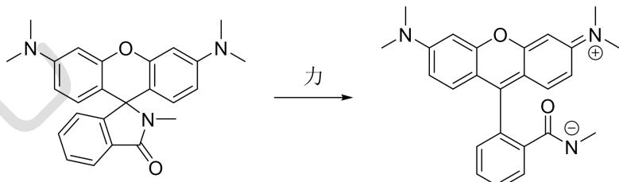

3-2 对分子施加机械力的方法还有很多种，超声波是其中一种常用的手段。研究表明，在用超声波处理以下聚合物的溶液时，溶液的颜色不会发生明显的变化；但是其它谱学手段表明，这些四元并环转化为了一类稳定的并环体系。画出最终产物以及所经历的中间体（至少三个）的结构式。本题不要求双键顺反。

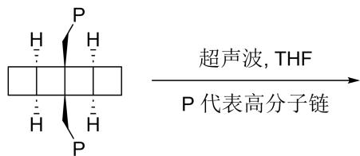

3-3 通常认为，机械力对于聚合物材料是破坏性的。但是，通过对于聚合物体系进行巧妙的结构设计，可以实现聚合物的“力致增强”。以下便是一例：将聚合物 P1 在癸二酸四丁基铵盐的 THF 溶液中超声，可以观察到溶液凝胶化。

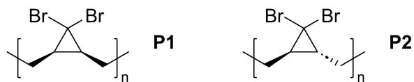

3-3-1 已知偕二溴代环丙烷在加热或力的作用下将发生对旋开环，同时伴随着卤素迁移。请画出 P1 在力作用下开环的产物。

3-3-2 你认为 P1 和 P2 哪一个在力的作用下更容易开环，为什么？

3-3-3 请解释凝胶化的原因。

3-4 某类型聚合物链本处于随机卷曲状态，在外界拉力 F 作用下，发生链段的构象重排，导致材料长度增加 $\Delta l$ 。在等温条件下，平衡常数 K 随外加拉力变化的实验数据如下表所示：

<table><tr><td>F (pN)</td><td>7.2</td><td>7.6</td><td>7.8</td><td>8.4</td></tr><tr><td>K</td><td>0.0053</td><td>0.021</td><td>0.083</td><td>0.319</td></tr></table>

3-4-1 计算无外力时链段拉伸的标准摩尔吉布斯自由能变。

3-4-2 你认为升温后，该聚合物链被拉直是更容易还是更困难，为什么？

第4题（15分，占 $8\%$ ）

某个短肽的氨基酸序列如下（左边为氮端，右边为碳端）：

$$
\mathrm{Ac-Gly-Ala-Gly-Asp-Phe-Gly-Gly-Lys-Phe-Gly-Phe-Tyr-Gly-Gly-Gly-OMe}
$$

4-1 已知相关氨基酸的结构式:

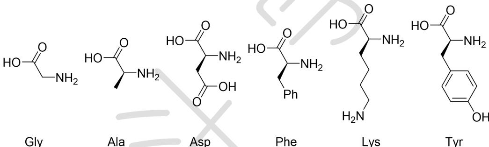

请计算该短肽的分子量（以所有基团均为未电离或水解的情况计）。

4-2 已知相应侧基的 pKa（氨基以质子化的形式计）：Asp 3.71; Lys 10.67; Tyr 10.10。假设肽段形成前后侧基 pKa 不变，使用分布系数计算该短肽的等电点。
4-3 下列关于等电点性质的描述，正确的是：（）
A. 在等电点时，该短肽的溶解度最低
B. 在等电点时，该短肽在电场中不发生迁移
C. 等电点时该短肽所带净电荷为零
D. 在进行蛋白质的阳离子交换色谱分离时，通常需要选择合适的缓冲液 pH 值。相比选择 pH = 5.0

D. 在进行蛋白质的阳离子交换色谱分离时，通常需要选择合适的缓冲液 pH 值。相比选择 pH = 5.0 的缓冲溶液，pH = 8.0 的缓冲液更有利于该短肽的吸附。

4-4 该短肽的氮端和碳端分别进行了乙酰化（Ac）和甲酯化（OMe）修饰。以下关于修饰作用的描述，正确的是：（）
A. 端基修饰后，该短肽在水中的溶解度降低
B. 端基修饰能够降低蛋白酶对肽段端部的识别，从而提高短肽在体内和体外的稳定性
C. 端基的修饰会影响肽段的等电点
D. 甲酯化增加碳端的疏水性

## 第 5 题（22 分，占 11%）晶体结构与性能

5-1 合金材料在现代生活中占有重要地位，呈现丰富的晶体结构。不锈钢材料通常采用 Fe-Cr-Ni 合金；例如，304 不锈钢是一类典型的奥氏体不锈钢，可视为 Fe 做立方最密堆积（如下图 a），其它金属元素对其中的原子进行取代。

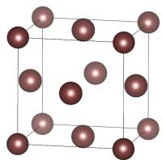  
a

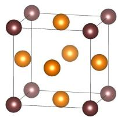  
b

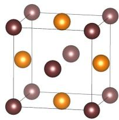  
c

5-1-1 若将面心位置所有的 Fe 置换为 Ni，如图 b，确定晶胞的化学组成和晶体的点阵类型。

5-1-2 若仅仅将某两面的面心位置替换为 Ni，如图 c，确定晶胞的化学组成和晶体的点阵类型。

5-2 $\mathrm{SrSb_2Cu_2}$ 是一种合金材料，具有简单四方结构，晶胞化学组成为 $\mathrm{Sr_2Sb_4Cu_4}$ 。晶胞内 $\mathrm{Cu}$ 占据顶点和底心， $\mathrm{Sb}$ 占据c轴上的棱心和体心。其中一个 $\mathrm{Cu}$ 的坐标为(0,0.500,0.638)，一个 $\mathrm{Sb}$ 坐标为(0,0.500,0.869)，一个 $\mathrm{Sr}$ 坐标为(0,0.500,0.237)。

5-2-1 写出晶体中所有原子的原子坐标（包括题干中已经给出的）。

5-2-2 已知晶胞参数： $a = 451\mathrm{pm}, c = 1091\mathrm{pm}$ 。计算晶体中最近的 $\mathrm{Sr - Sb}$ 距离。

5-2-3 计算该晶体的密度。

5-3 在一中 Ge 和 K 组成的化合物中，其结构可以视为 Ge 通过 $Ge_{5}$ 四面体共顶点形成笼状骨架，其中骨架的形成示意图如下。K 填充于其中的笼状空隙中，有两种化学环境。确定该晶胞的化学组成。

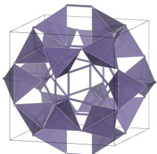

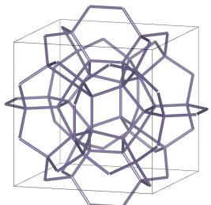

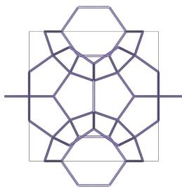  
附加思考题（本题不计入总分）

晶体中两种化学环境的 K 原子的配位多面体的点群分别是什么？写出晶体中所有 K 原子的坐标。

## 第6题（18分，占 $10\%$ ）铁的配合物

6-1 下面描述了一种铁氧化物纳米粒子的制备方案。将 4.0 g 溴化十六烷基三甲铵 (CTAB)、30 mL 2-辛醇和 4 mL 水混合搅拌 1 小时。将乳液均分成两份 (称为微乳液一和微乳液二)。微乳液一中加入 8 mL 甘油，微乳液二中加入了 0.3922 g 硝酸铁九水合物 $\left(\mathrm{Fe}(\mathrm{NO}_{3})_{3}\cdot9\mathrm{H}_{2}\mathrm{O}\right)$ 。这两个微乳液分别单独搅拌 1 小时。随后，将微乳液二缓慢加入到微乳液一中，继续搅拌。整个反应混合物在合并后继续搅拌 1 小时。搅拌完成后，将整个混合物转移至聚四氟乙烯衬里的高压釜中，在 200 ℃ 下加热 18 小时。加热完成后，将生成的黑色沉淀物在 4000 rpm 下离心 30 分钟。所得黑色粉末用乙醇和水多次洗涤，得到目标 $\alpha-Fe_{3}O_{4}$ 纳米粒子。

6-1-1 $\mathrm{[Fe(H_2O)_6]^{3 + }}$ 的颜色为极浅的紫色，这一点可以从 $\mathrm{Fe(NO_3)_3\cdot 9H_2O}$ 的颜色（下图）反映出来。

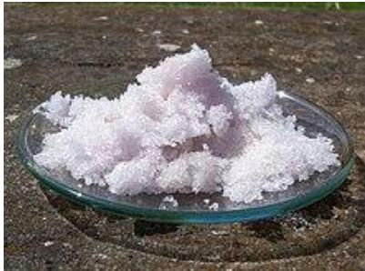

6-1-1-1 为什么 $\left[\mathrm{Fe}\left(\mathrm{H}_{2}\mathrm{O}\right)_{6}\right]^{3+}$ 的颜色很浅？

6-1-1-2 我们都知道，常见的溶液中的三价铁为较深的黄色，通常是水解后的铁离子或氯离子配位后的铁离子的颜色。为什么水解后或者氯离子配位后的铁离子颜色较深（吸光系数较大）？

6-1-2 在这个制备过程中，CTAB 以及甘油的作用是什么？

6-1-3 乙醇和水洗涤的目的是什么？

6-2 某含铁化合物 A 通常用于化学气相沉积法制备 Fe 纳米粒子。已知化合物 A 理论质量分数：Fe, 28.53%; C, 30.65%。

6-2-1 写出化合物 A 的分子式。

6-2-2 化合物 A 也可以光解为另一种更活泼的前体 B。已知 B 中 Fe 的质量分数为 30.71%，请写出化合物 B 的分子式。

6-2-3 使用 18 电子规则计算化合物 B 中的金属-金属键级。

6-2-4 如果认为化合物 B 中含有 3c-2e 键，则可以认为化合物 B 中的两个金属原子之间不存在传统意义上的 Fe-Fe 键。请画出化合物 B 的结构，表示出其中可能的 3c-2e 键。

## 第 7 题（21 分，占 11%） $CO_{2}$ 的空气捕获与富集

7-1 在溶液中，可以通过金属中心和 CO 的配位来实现 CO 的捕获。例如：将氯化亚铜溶于适量氨水，该溶液即可用于指示 CO 的存在。本题中所有平衡常数均为标准平衡常数。

7-1-1 假设希望将 a 克氯化亚铜溶于 b mL 1.0 M 氨溶液中，假设溶液中亚铜-氨配离子仅有 $\left[\mathrm{Cu}\left(\mathrm{NH}_{3}\right)_{2}\right]^{+}$ 且该离子形成的稳定常数为 $K_{1}$ ，CuCl 的溶度积常数为 $K_{2}$ 。当 a 和 b 满足什么样的关系，CuCl 才能完全溶解？（提示，可以假设几乎所有 $Cu^{+}$ 都转化为 $\left[\mathrm{Cu}\left(\mathrm{NH}_{3}\right)_{2}\right]^{+}$ ）

7-1-2 假设溶液中与 CO 相关的反应只有:

$$
\left[ \mathrm{Cu} \left(\mathrm{NH} _ {3}\right) _ {2} \right] ^ {+} + \mathrm{CO} \rightarrow \left[ \mathrm{Cu} \left(\mathrm{NH} _ {3}\right) _ {2} (\mathrm{CO}) \right] ^ {+}
$$

该反应在温度 $T_{3}$ 下的平衡常数为 $K_{3}$ ， $T_{4}$ 下的平衡常数为 $K_{4}$ 。假设只有当 $[\mathrm{Cu}(\mathrm{NH}_{3})_{2}(\mathrm{CO})]^{+}$ 的浓度是 $[\mathrm{Cu}(\mathrm{NH}_{3})_{2}]^{+}$ 浓度的两倍以上时，才能检测出 CO。计算在任意温度 $T_{5}$ 下 CO 检出的临界压力。

7-2 一部分 Fe(II) 配合物也可以用于 CO 的捕获，并且许多情况下可以观察到磁矩变化。你认为 CO 捕获后磁矩通常增大还是减小？为什么？

7-3 科学家使用金属铜作为电极表面，成功实现了一氧化碳的双分子还原制备乙醇。

7-3-1 假设电流转化效率为 100%，忽略其他副反应，使用 20 mA 的电流电解 12 h，可以使多少体积（标况下）的一氧化碳转化为乙醇？

7-3-2 科学家利用谱学手段对 CO 在 Cu 表面的吸附过程进行了测定。你认为 CO 吸附过程的过程焓变和熵变是大于零还是小于零？

7-3-3 电解液的环境，如阳离子类型，也会对 CO 在 Cu 表面的吸附焓变造成影响。实验测得，CO 吸附过程的焓变以及熵变顺序随阳离子的变化趋势均为： $Li^{+}<Na^{+}<K^{+}<Cs^{+}$ 。在其他条件都相同的情况下，CO 在 Cu 表面的吸附率如何变化？

7-3-4 你认为，电解液中的电解质分别为 LiOH 和 CsOH 时，何者 CO 电化学还原的速率更快？

附加题（本题不计入总分）

为何 CO 吸附过程的焓变以及熵变顺序随阳离子的变化趋势均为： $Li^{+}<Na^{+}<K^{+}<Cs^{+}$ ?

有机化学部分可能用到的缩写：

Ts，对甲苯磺酰基； py，吡啶；

quinoline，喹啉； Boc，叔丁氧羰基；

DEAD，偶氮二甲酸二乙酯；

TMS，三甲基硅基；

Tf，三氟甲磺酰基；

KHMDS，六甲基二硅基氨基锂；

DMSO，二甲亚砜；

TBAF，四丁基氟化铵

## 第8题（30分，占比 $10\%$ ）有机基本反应和性质

8-1 完成下面的有机反应

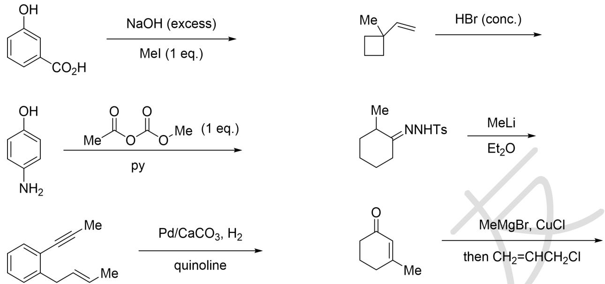

8-2 比较 1,3-环己二烯、1,3-环庚二烯、1,3-环辛二烯作为双烯体发生 Diels-Alder 活性，按照反应性顺序从高到低排序。

8-3 补全下面转化方框中的化合物。

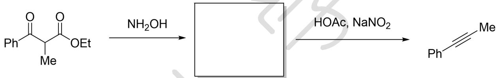

8-4 下面反应中，一种底物比另一种底物脱羧的速率快约 600 倍。指出是哪一个底物更快，并解释原因。

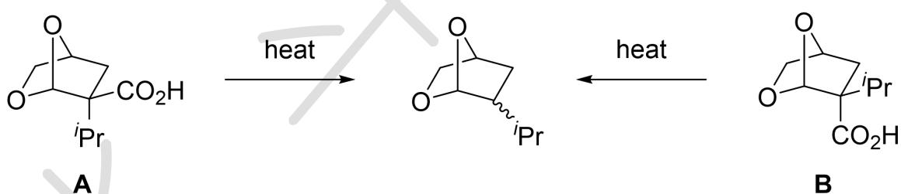

8-5 补全下面的合成路线。

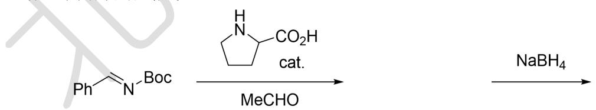

DEAD, PPh $_{3}$

PhOH

## 第9题（27分，占比 $10\%$ ）碳正离子中间体

9-1 Olah 在他的研究中发现，使用苯甲酰氯和 $AlCl_{3}$ 混合加热，可以观察到红外光谱中 $2200 \, \mathrm{cm}^{-1}$ 出现了新的吸收峰。类似地，使用苯甲酰氟和 $SbF_{5}$ 或苯甲酰氯和 $AgSbF_{6}$ 混合，都可以观察到该吸收峰。已知 $2200 \, \mathrm{cm}^{-1}$ 处的吸收为某物种（记为 A）的碳氧伸缩振动峰。

9-1-1 已知苯甲酰氯中的 C=O 伸缩振动峰在 $1700 \, \mathrm{cm}^{-1}$ 处。A 和苯甲酰氯中何者的碳氧键更强？

9-1-2 画出阳离子 A 的结构。

9-2 大部分情况下，烯烃的 Friedel-Crafts 型反应可以得到 1,2-双官能团化产物。请画出下面反应的产物。

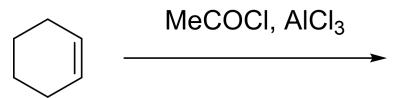

9-3 在一些情况下，也可以得到 1,3-双官能团化的产物，例如下面的例子：

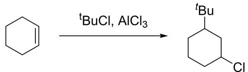

画出该反应的关键阳离子中间体（至少2个）。

9-4 在下面的反应中，研究人员发现，如果使用非亲核性阴离子，碳正离子的寿命大大增长，重排得到最稳定的阳离子后，可以专一地得到 1,3-官能团化的顺式产物。

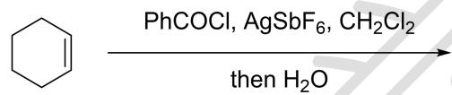

9-4-1 请解释：为什么产物的立体化学为专一的顺式？

9-4-2 画出下面一系列反应的产物，要求立体化学。

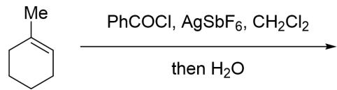

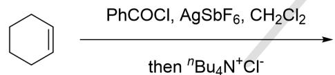

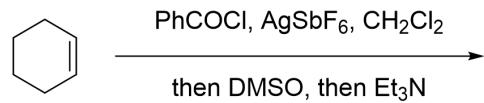

9-4-3 如果将底物酰氯替换为氨甲酰氯类化合物，将无法得到 1,3-双官能团化产物，而是专一地得到了消除产物烯烃，请提出一种合理的解释。

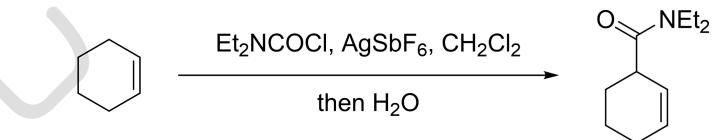

9-4-4 画出下面反应经历的关键中间体（至少 5 个）。

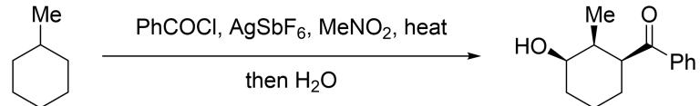

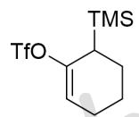

## 第 10 题 （23 分，占比 10%）张力中间体

10- 1 下面这些张力中间体，哪些有手性？

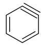

A

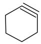

B

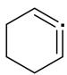

C

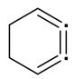

D

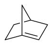

E

10-2 写出下列反应的产物。

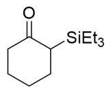

(2) TBAF, 咪唑, heat

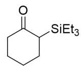

(1) LDA, then $Ts_{2}O$

(2) CsF, PhCH=CH $_2$ , heat

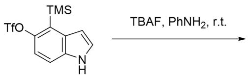

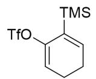

CsF, 呋喃, heat

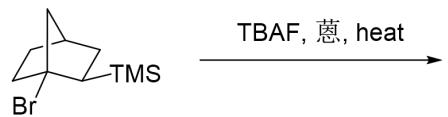

10-3 观察下面反应。

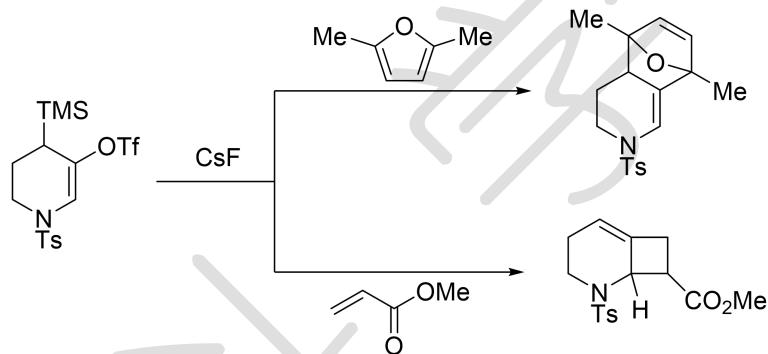

10-3-1 已知两个反应中，一个立体专一，一个立体不专一。你认为哪一个反应是立体专一的？请画出立体专一反应得到的产物结构。

10-3-2 为什么两个反应的区域选择性不同？

10-4 画出下面反应中前两步得到的两个产物的结构。

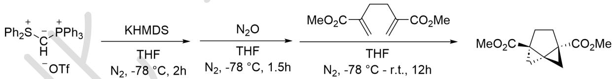