```txt
1-1-1 2PbS + 3SnO₂ = 3Sn + 2PbO + 2SO₂↑ （1分）
1-1-2 PbCO₃ + CuO + C = Cu + Pb + 2CO₂↑ （1分）
1-2 PbS + K₂CO₃ + 2O₂ = PbCO₃ + K₂SO₄ （1分）
1-3-1 PbZnO₂(s) = PbO(s) + ZnO(s) （2分）（未标注物质状态扣一分）
1-3-2
1. 计算 ΔrHm° : 根据 ΔrHm° = ΣΔfHm° (产物) - ΣΔfHm° (反应物)
ΔfHm° (PbO) = -217.3 kJ·mol⁻¹, ΔfHm° (ZnO) = -348.3 kJ·mol⁻¹, ΔfHm° (PbZnO₂) = -527.1 kJ·mol⁻¹
ΔrHm° = (-217.3) + (-348.3) - (-527.1) = (-565.6) + 527.1 = -38.5 kJ·mol⁻¹
2. 计算 ΔrSm° : 根据 ΔrSm° = ΣSm° (产物) - ΣSm° (反应物)
Sm° (PbO) = 68.7 J·mol⁻¹·K⁻¹, Sm° (ZnO) = 43.6 J·mol⁻¹·K⁻¹, Sm° (PbZnO₂) = 152 J·mol⁻¹·K⁻¹
ΔrSm° = (68.7 + 43.6) - 152 = 112.3 - 152 = -39.7 J·mol⁻¹·K⁻¹
3. 计算自发温度：反应自发时 ΔrGm° = ΔrHm° - TΔrSm° ≤ 0
T ≤ ΔrHm° / ΔrSm° = 38500 J·mol⁻¹ / 39.7 J·mol⁻¹·K⁻¹ ≈ 969.8 K
结合题意“低温时反应难活化，需温度≥300 K”，实际分解自发温度范围为 300K < T < 970 K （三个数字一个1分，结果2分，共5分）
1-4-1
HgS(s) + 2NH₄Cl(s) + Zn(s) = Hg(l) + ZnCl₂(s) + 2NH₃(g) + H₂S(g)
1. 计算 ΔrHm° :
ΣΔfHm° (产物) = ΔfHm° (Hg) + ΔfHm° (ZnCl₂) + 2ΔfHm° (NH₃) + ΔfHm° (H₂S)
= 0 + (-415.1) + 2×(-46.1) + (-20.6) = -415.1 - 92.2 - 20.6 = -527.9 kJ·mol⁻¹
ΣΔfHm° (反应物) = ΔfHm° (HgS) + 2ΔfHm° (NH₄Cl) + ΔfHm° (Zn)
= (-25.3) + 2×(-314.4) + 0 = -25.3 - 628.8 = -654.1 kJ·mol⁻¹
ΔrHm° = -527.9 - (-654.1) = 126.2 kJ·mol⁻¹
2. 计算 ΔrSm° :
ΣSm° (产物) = 76.1 + 111.5 + 2×192.8 + 205.8 = 76.1 + 111.5 + 385.6 + 205.8 = 779 J·mol⁻¹·K⁻¹
ΣSm° (反应物) = 140.2 + 2×94.6 + 41.6 = 140.2 + 189.2 + 41.6 = 371 J·mol⁻¹·K⁻¹
ΔrSm° = 779 - 371 = 408 J·mol⁻¹·K⁻¹
3. 判断自发性（以1.3温度上限970 K计算）：
ΔrGm° = 126200 J·mol⁻¹ - 970 K×408 J·mol⁻¹·K⁻¹ = 126200 - 395760 = -269560 J·mol⁻¹ = -269.6 kJ·mol⁻¹ ≤ 0
若选用1000K计算：ΔrGm° = 126200 - 1000×408 = -281800 J·mol⁻¹ ≤ 0
结论：在规定温度上限内反应可自发进行
（方程式2分（其中物质状态1分，汞为气态或液态都可以，注意氯化锌为液态），焓变1分，熵变1分，吉布斯自由能变2分，（若1000K计算则1分），判断1分，共7分）
1-4-2
氯化铵（NH₄Cl）在此反应中作为助熔剂和氯化剂：
提供 Cl⁻，与 Zn 反应生成 ZnCl₂，ZnCl₂熔点较低，可降低反应体系熔点，促进反应物熔融接触，加快反应速率。
反应生成的 NH₃ 和 H₂S 为气体，气体逸出可推动反应正向进行（勒夏特列原理），提高“银彩”（汞锌合金）的产率。
（两个点分开计算字数，一个点20字）（每个作用1分解释1分，共4分）
```

# 北斗学友科学菁英成长课程研究院

## 2026 春季·化学竞赛【大联考二】试题参考答案

## 第1题 古代“仿银”及相关贵金属制备反应的化学综合题（21分，占比 $7\%$ ）

## 第 2 题 热身的经典计算：（32 分，占比 11%）

| 2-1 第一组实验和第二组实验对比,可得c(SO2)初始浓度与初始速率v之间是一次的关系第一组实验和第三组实验对比,可得c(O2)初始浓度与初始速率v之间是二次的关系所以m=1 n=2 (2分,一个1分) |  |  |  |  |  |
| --- | --- | --- | --- | --- | --- |
| 2-2除第四组外,任意选择一组数值,带入v=k·c(SO2)·c(O2)2方程求解,即可得到k的数值为1.2。再根据量纲分析法:(mol·L-1·s-1)=(所求单位)×(mol/L)2×(mol/L)解得k的单位=s-1·mol-2·L2(k数值1分,单位2分,共3分) |  |  |  |  |  |
| 2-3: v = k·c(SO2)·c(O2)2 直接带入计算即可,解得v4=14.4×10-3(mol·L-1·s-1)(2分,计算错误不给分) |  |  |  |  |  |
| 2-4-1应该以1/T,lnK为坐标进行回归计算(1分,有错误不给分) |  |  |  |  |  |
| 2-4-2:首先对数据进行处理 |  |  |  |  |  |
| -1/T | -3.33×10-3 | -3.13×10-3 | -2.94×10-3 | -2.78×10-3 | -2.63×10-3 |
| lnk | -0.654 | 0.247 | 0.300 | 1.872 | 2.625 |
| 这里应该注意,第三个数据与其他数据的回归直线差距较大,考虑为误差,线性回归时应予以去除以lnK为Y,-1/T为X进行回归计算,得到的直线斜率即为Ea/R=4662.即活化能=38762J/mol此直线截距为lnA,计算得A=2.786×106(L2·mol-2·s-1)如果不舍弃第三个数据,那么回归计算Ea/R=4611活化能为38336J/molA=2.043×106(L2·mol-2·s-1)(对数据进行处理10个数字1个0.5分,活化能计算2分,指前因子2分,共9分,如果没有剔除误差较大的数据者本问最多5分。) |  |  |  |  |  |
| 2-5-1: ΔG=ΔH-TΔS |  |  |  |  |  |
| ΔrHm° |  | ΔrSm° |  | ΔrGm° |  |
| -114.14kJ/mol |  | -146.54J/mol/K |  | -70450J/mol |  |
| (7分,公式1分,数值2分) |  |  |  |  |  |
| 2-5-2: ΔG=-RTlnK 计算得K=2.23×1012 K很大,效果较好(4分,公式1分,K 2分) |  |  |  |  |  |
| 2-5-3使用范霍夫方程: ln(K2/K1)=ΔH/R(1/T1-T2)带入解得1000K下K1000=0.02(方程2分,结果2分,共4分) |  |  |  |  |  |

## 第3题 实际气体（15分，占比 $8\%$ ）

<div class="mineru-algorithm" style="white-space: pre-wrap; font-family:monospace;">
3-1：由理想气体状态方程 PV=nRT 可以知道
p-a（n/V） $^{2}$  这一项的单位一定是 Pa。同理 V-nb 这一项也一定是  $m^{3}$ 
同时，我们可以得知：两个带有量纲的数如果相减，其量纲一定要相同。
因此可以推断得到：a:  $\mathrm{Pa} \cdot m^{6}/\mathrm{mol}^{2}$  b:  $m^{3}/\mathrm{mol}$  （一个 1 分，共 2 分）
3-2 已知条件：
• n = 1.00 mol
• T = 323 K
• p = 1.013×10 $^{7}$  Pa
• R = 8.314 Pa·m $^{3}$ /(mol·K)
根据理想气体状态方程：
V = nRT/p = 1.00 mol × 8.314 Pa·m $^{3}$ /(mol·K) × 323 K / 1.013×10 $^{7}$  Pa = 2.65×10 $^{-4}$  m $^{3}$ 
范德华方程为：(p + a (n/V) $^{2}$ )(V - nb) = nRT
将已知数据代入：
(1.013×10 $^{7}$  + 0.3658×(1.00/V) $^{2}$ )(V - 1.00×4.278×10 $^{-5}$ ) = 1.00×8.314×323
直接使用解方程功能求解即可：解得 V=1.03×10 $^{-4}$  m $^{3}$  （过程 2 分，结果 2 分，共 4 分）
</div>

3-3-1 已知：

\- $\mathrm{CaCO_3}$ 质量: $1.00\mathrm{kg} = 1000\mathrm{g}$

\- $\mathrm{CaCO_3}$ 摩尔质量: $100.09 \mathrm{~g} / \mathrm{mol}$

\- 反应： $\mathrm{CaCO_3(s)} \rightarrow \mathrm{CaO(s)} + \mathrm{CO_2(g)}$

$\mathrm{CaCO_3}$ 的物质的量: $\mathrm{n} = 1000 \mathrm{~g} / 100.09 \mathrm{~g} / \mathrm{mol} = 9.99 \mathrm{~mol}$

根据反应式， $1 \mathrm{~mol} \mathrm{CaCO}_{3}$ 产生 $1 \mathrm{~mol} \mathrm{CO}_{2}$ ，因此理论上产生 $9.99 \mathrm{~mol} \mathrm{CO}_{2}$ 。

标准状况（STP）： $\mathrm{T} = 273.15\mathrm{K}$ ， $\mathrm{p} = 1.013\times 10^{5}\mathrm{Pa}$

用理想气体方程计算体积:

$$
\mathrm{V} = \mathrm{nRT} / \mathrm{p} = 9. 9 9 \mathrm{mol} \times 8. 3 1 4 \mathrm{Pa} \cdot \mathrm{m} ^ {3} / (\mathrm{mol} \cdot \mathrm{K}) \times 2 7 3. 1 5 \mathrm{K} / 1. 0 1 3 \times 1 0 ^ {5} \mathrm{Pa} = 0. 2 2 4 \mathrm{m} ^ {3}
$$

(过程 2 分, 结果 2 分, 共 4 分)

3-3-2

实际收集到的 $CO_{2}$ 体积： $225 \times 10^{-3} \, m^{3}$ （标准状况）

理论产量： $224 \times 10^{-3} \mathrm{~m}^{3}$

产率 = (实际产量 / 理论产量) × 100% = (225 × 10 $^{-3}$ /(224 × 10 $^{-3}$ )) × 100% = 100.4%

(过程 1 分, 结果 1 分, 共 2 分)

## 3-3-3 产率居然超百了!

我们使用实际气体状态方程求解一下这些体积的二氧化碳的摩尔数是多少:

带入数据解得数据为 8.43mol

从而得到实际反应产率为：84.4%

(过程 1 分, 结果 2 分, 共 3 分)

## 第 4 题 铜蓝蛋白相关化学问题（14 分，占比 7%）

4-1-1 键级 = 1/2×（成键电子数 - 反键电子数）。

NO: 成键电子数为 10，反键电子数为 5，键级 = $1/2 \times (10 - 5) = 2.5$ 。

NO $^{+}$ ：失去 1 个反键电子，成键电子数 10，反键电子数 4，键级 = 1/2×(10 - 4) = 3。

NO $^{-}$ ：得到 1 个反键电子，成键电子数 10，反键电子数 6，键级 = 1/2×(10 - 6) = 2。

（公式 1 分，三个键级一个 1 分，共 4 分）

## 4-1-2 振动波数大小顺序： $NO^{+}>NO>NO^{-}$ 。

原因：键级越大，键能越大，键长越短，键的伸缩振动频率越高，对应的振动波数越大。NO+键级为3，

NO 键级为 2.5，NO $^{-}$ 键级为 2，所以振动波数按此顺序递减。

(答案三个位置一个 0.5 分, 原因 1 分, 共 2.5 分)

## 4-1-3 振动波数大小顺序： $^{14}N^{16}O > ^{15}N^{16}O > ^{14}N^{18}O$

原因：对于双原子分子的伸缩振动，振动波数 v 与约化质量 $\mu$ 有关，公式为 $v = 1/(2\pi c) * \sqrt{(k/\mu)}$ （其中 k 为键力常数，近似相同；c 为光速）。约化质量 $\mu = (m1 * m2)/(m1 + m2)$ ，原子质量越大，约化质量越大，振动波数越小。 $^{14}N^{16}O$ 约化质量最小， $^{14}N^{18}O$ 约化质量最大，所以振动波数按此顺序递减。

(三个位置一个 0.5 分，共 1.5 分)

4-2 根据公式 $E = h\nu = h c / \lambda$ （h 为普朗克常数， $h = 6.626 \times 10^{-34} J \cdot s$ ; c 为光速， $c = 3.0 \times 10^{17} \mathrm{nm} \cdot \mathrm{s}^{-1}$ ;

E 为能量)，因为 $1\mathrm{eV} = 1.602\times 10^{-19}\mathrm{J}$ ，所以 $\mathrm{E} = 3.250\times 1.602\times 10^{-19}\mathrm{J}$ 。

由 $\lambda = hc/E$ ，代入数据计算：

$$
\lambda = (6. 6 2 6 \times 1 0 ^ {\wedge} - 3 4 \mathrm{J} \cdot \mathrm{s} \times 3. 0 \times 1 0 ^ {\wedge} 1 7 \mathrm{nm} \cdot \mathrm{s} ^ {\wedge} - 1) / (3. 2 5 0 \times 1. 6 0 2 \times 1 0 ^ {\wedge} - 1 9 \mathrm{J}) \approx 3 8 1. 5 \mathrm{nm}
$$

(结果 2 分, 过程 1 分, 公式 1 分, 共 4 分)

## 4-3

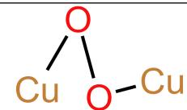

（必须为过氧键，并且单配位，其他答案不得分，本问2分，因为姜泰勒效应铜只有四个能量低的配位点。）

## 第 5 题 钛酸锶（33 分 占比 12%）

<table><tr><td>5-1-1-1 正交晶系晶胞体积公式: V=abc (β=90°,无需β角修正)先计算晶胞内总质量(以1mol晶胞计)晶胞含2个SrTiO3单元,摩尔质量M(SrTiO3)=87.62+47.87+3×16.00=183.49g/mol,故1mol晶胞总质量m=2×183.49=366.98g再计算晶胞密度a=0.395nm,b=0.380nm,c=0.750nm密度公式ρ=m/(NA×V),代入数据:ρ=366.98/(6.022×1023×abc)≈5.413g/cm3(密度计算,过程一分,公式一分,结果1分,共三分)</td></tr><tr><td>5-1-2-1正交相:顶点标注Sr2+(2个/晶胞),体心标注Ti4+(2个/晶胞),面心/棱心标注O2-(6个/晶胞),体现出“沿c轴压缩的TiO6八面体”(体现不明显扣一分)立方相:顶点标注Sr2+(8×1/8=1个),体心标注Ti4+(1个),面心标注O2-(6×1/2=3个),用实线勾勒“规则TiO6八面体”,(很简单的晶体图,立方相不要求旁注,正交相可以不旁注但要求可以明显看出八面体被压缩。)(两个图一个2分,共4分)</td></tr><tr><td>5-1-2-2 立方相理论密度计算:晶胞体积V=a3=(0.390×10-7cm)3≈5.93×10-23cm31mol晶胞总质量m=183.49g(1个SrTiO3单元)ρ=183.49/(6.022×1023×5.93×10-23)≈5.14g/cm3堆积效率对比:正交相原子总体积=2×[(4/3)πrSr3+(4/3)πrTi3+3×(4/3)πro3]堆积效率≈8.77×10-38/1.126×10-37≈77.9%;立方相原子总体积V_原子=(4/3)πrSr3+(4/3)πrTi3+3×(4/3)πro3堆积效率≈4.385×10-38/5.93×10-38≈81.5%;结论:立方相原子堆积效率更高,因TiO6八面体无畸变,原子排列更规整。(立方密度计算3分(同第一问),两个堆积效率一个2分共4分,解释1分本问13分)</td></tr><tr><td>5-2-1-11晶格缺陷:如O空位、Sr间隙原子2杂质掺杂:制备过程引入的Al3+(替代Ti4+)、Si4+(替代Sr2+)等杂质,因原子量与原离子差异(如Al3+原子量27&lt;47.87),导致实际质量偏离理论值;3结构不均匀:相变后可能残留亚稳相(如正交相中含少量立方相晶粒),不同相密度差异导致整体实验密度偏离单一相的理论值;(三个点一个1分)</td></tr><tr><td>5-2-2-11结构层面:TiO6八面体沿c轴压缩,O2-电荷分布不对称,偶极子呈无序排列,外电场下难以定向极化,介电常数低;2电子层面:Ti4+的3d轨道因八面体畸变发生分裂(eg轨道分裂为dx2-y2和d_z2,t2g轨道分裂为dxy、dxz、d_yz),带隙宽度增大(~3.2eV),电子难以跃迁,表现为绝缘性;(两个点1个1分)</td></tr><tr><td>5-2-2-21结构层面:TiO6八面体规则对称,O2-电荷分布均匀,偶极子可快速响应外电场极化,且离子极化(Ti4+与O2-的相对位移)增强,介电常数升高;2电子层面:八面体畸变消失,3d轨道分裂能降低,同时高温下晶格振动加剧,部分O2-可能脱离晶格形成空位,提供少量自由电子,表现为弱导电性;(两个点1个1分)</td></tr></table>

<div class="mineru-algorithm" style="white-space: pre-wrap; font-family:monospace;">
全部葡萄糖生成乙醇： $400\mathrm{mol}\times 69\mathrm{kJ / mol} = 27600\mathrm{kJ}$
</div>

<div class="mineru-algorithm" style="white-space: pre-wrap; font-family:monospace;">
α-酸饱和浓度（物质的量浓度）： $0.042\mathrm{g/L}\div332\mathrm{g/mol}\approx1.26\times10^{-4}\mathrm{mol/L}$
</div>

<div class="mineru-algorithm" style="white-space: pre-wrap; font-family:monospace;">
70% 葡萄糖用于乙醇生成: $280 \mathrm{~mol} \times 69 \mathrm{~kJ} / \mathrm{mol} = 19320 \mathrm{~kJ}$
</div>

## 5-2-2-3

① 畸变关联：低温下 $TiO_{6}$ 八面体畸变更剧烈（沿体对角线压缩）， $Ti^{4+}$ 与 $O^{2-}$ 的静电作用增强，极化率显著提升；

② 轨道关联：3d轨道分裂能进一步增大，电子被局域在低能级轨道，形成“量子受限态”，外电场下量子隧穿效应增强，导致介电常数异常升高（量子介电效应）。

```txt
理论质量 m_单颗（理论）=5.18g/cm³×8×10⁻⁵cm³≈4.144×10⁻⁴g
```

步骤 2：考虑 5% 损耗的单颗实际用量

<div class="mineru-algorithm" style="white-space: pre-wrap; font-family:monospace;">
m_单颗（实际）=4.144×10$^{-4}$g÷(1-5%)≈4.362×10$^{-4}$g
</div>

## 步骤 3: 1000 颗总用量

## 答案: 0.436g

(过程 2 分, 结果 2 分, 本问共 4 分)

## 第 6 题 啤酒酿造中的化学综合题（30 分，占比 11%）

## 6-1-1:

## 拉格啤酒（葡萄糖完全转化为乙醇）

<div class="mineru-algorithm" style="white-space: pre-wrap; font-family:monospace;">
乙醇质量 $= 800\mathrm{mol}\times 46\mathrm{g / mol} = 36800\mathrm{g} = 36.8\mathrm{kg}$
</div>

## 艾尔啤酒（70% 葡萄糖转化为乙醇）

```txt
5 天内 100L 麦汁消耗葡萄糖的物质的量：与拉格啤酒相同，为 400mol（消耗速率相同）
```

<div class="mineru-algorithm" style="white-space: pre-wrap; font-family:monospace;">
用于生成乙醇的葡萄糖：$400 \mathrm{~mol} \times 70 \% = 280 \mathrm{~mol}$
</div>

```txt
生成乙醇物质的量 = 280mol×2=560mol
```

<div class="mineru-algorithm" style="white-space: pre-wrap; font-family:monospace;">
乙醇质量 $= 560\mathrm{mol}\times 46\mathrm{g / mol} = 25760\mathrm{g} = 25.76\mathrm{kg}$
</div>

## (2 分，两个结果各 1 分)

## 1. 艾尔发酵法

30% 葡萄糖用于乳酸生成：400mol×30%=120mol，释放能量：

```txt
总能量：4224+19320=23544kJ
```

## 2. 拉格发酵法

(2 分，两个答案各 1 分)

## 6-2-1

## $25^{\circ}\mathrm{C}$ 时 $\alpha-$ 酸的溶解平衡常数 $\mathbf{K}_{\mathrm{sp}}$ 计算

<div class="mineru-algorithm" style="white-space: pre-wrap; font-family:monospace;">
溶解平衡 $\mathbf{K}_{\mathrm{sp}} = 1.26\times 10^{-4}\mathrm{mol / L}\times 1\mathrm{L / mol}$ (消去单位) $= 1.26\times 10^{-4}$
</div>

<div class="mineru-algorithm" style="white-space: pre-wrap; font-family:monospace;">
$\triangle \mathrm{G} = -\mathrm{RTln}$ （K）解得溶解 $\triangle \mathrm{G} = 22.26\mathrm{kJ / mol}$
</div>

<div class="mineru-algorithm" style="white-space: pre-wrap; font-family:monospace;">
(3 分,  $K_{sp}$  1 分, 结果 1 分, 公式 1 分)
</div>

<div class="mineru-algorithm" style="white-space: pre-wrap; font-family:monospace;">
$100^{\circ} \mathrm{C}$ 时浓度： $0.15 \mathrm{~g} / \mathrm{L} \div 332 \mathrm{~g} / \mathrm{mol} \approx 4.52 \times 10^{-4} \mathrm{~mol} / \mathrm{L}$
</div>

| 范特霍夫方程:ln(K1/K2)=ΔH/R(1/T2-1/T1)解得:△H=15.7kJ/mol△G=△H-T△S 解得熵变为+22J/mol/K(5分,方程1分,焓2分,熵2分,) |  |  |  |
| --- | --- | --- | --- |
| 6-3:阿伦尼乌斯公式定积分版本:ln(k1/k2)=Ea/R(1/T2-1/T1)带入计算即可。解得活化能=91.2kJ/mol(3分,公式1分,结果2分) |  |  |  |
| 6-4:原题目中给出公式为:q=qmbc/1+bc对其进行线性回归处理:1/q=1/qm+1/qmb×1c对艾尔酵母进行处理: |  |  |  |
| C(mmol/L) | q(mg/g) | 1/c (L/mmol) | 1/q (g/mg) |
| 0.4 | 5.1 | 2.5 | 0.196 |
| 1.0 | 9.8 | 1.0 | 0.102 |
| 2.5 | 16.5 | 0.4 | 0.061 |
| 5.0 | 22.0 | 0.2 | 0.045 |
| 10.0 | 27.5 | 0.1 | 0.036 |
| 以1/q为纵坐标、1/c为横坐标拟合,得直线方程:1/q=0.066×1/c+0.0327对拉格酵母进行处理: |  |  |  |
| C(mmol/L) | q(mg/g) | 1/c (L/mmol) | 1/q (g/mg) |
| 0.6 | 4.8 | 1.67 | 0.208 |
| 1.5 | 8.9 | 0.67 | 0.112 |
| 3.0 | 14.2 | 0.33 | 0.070 |
| 7.0 | 20.5 | 0.14 | 0.049 |
| 15.0 | 25.8 | 0.07 | 0.039 |
| 同理拟合得直线方程:1/q=0.106×1/c+0.035根据拟合方程:1/q=1/qm+1/qmb×1c,可以得到直线截距=1/qm直线斜率=1/qmb最终答案: |  |  |  |
|  | 艾尔酵母 | 拉格酵母 |  |
| qm(g/mg) | 30.58 | 28.57 |  |
| b | 0.50 | 0.33 |  |
| (线性回归处理公式1分,两个表格各1分,两个直线方程各2分,最终答案表格四个数字各2分,共15分) |  |  |  |
| 6-5-1:单批次可发酵葡萄糖总物质的量:18kg=18000g,物质的量=18000g÷180g/mol=100mol按反应计量比,1mol葡萄糖生成2mol乙醇艾尔法乙醇生成量:转化的葡萄糖物质的量=100mol×90%=90mol乙醇物质的量=90mol×2=180mol乙醇质量=180mol×46g/mol=8280g拉格法乙醇生成量:转化的葡萄糖物质的量=100mol×96%=96mol |  |  |  |

```txt
乙醇物质的量 = 96mol × 2 = 192mol
乙醇质量 = 192mol × 46g/mol = 11040g
质量差值 = 11040g - 8280g = 2760g
（此问只有答案的2分，共2分）
6-5-2 按反应计量比，1mol 葡萄糖生成 2mol CO₂
拉格法转化的葡萄糖物质的量 = 100mol × 96% = 96mol
CO₂物质的量 = 96mol × 2 = 192mol
标准状况下体积 = 192mol × 22.4L/mol = 4300.8L
（答案2分,共2分）
```

## 第 7 题 需要数据处理的滴定问题（14 分，占比 5%）

```txt
7-1：反应 1（Cl⁻与 AgNO₃ 的沉淀滴定反应）：AgNO₃ + Cl⁻ = AgCl↓ + NO₃⁻
    反应 2（Zn²⁺与 EDTA 的配位滴定反应）：Zn²⁺ + H₂Y²⁻ = ZnY²⁻ + 2H⁺
(一个 1 分，共 2 分)

7-2：
步骤 1：计算 250 mL 溶液中 Zn²⁺的总物质的量
EDTA 与 Zn²⁺按 1:1 配位反应，故：
25.00 mL 溶液中 n (Zn²⁺) = c (EDTA) × V (EDTA) = 0.02000 mol·L⁻¹ × 25.10 × 10⁻³ L = 5.020 × 10⁻⁴ mol
250 mL 溶液中 Zn²⁺总物质的量（定容稀释 10 倍）：
n 总 (Zn²⁺) = 5.020 × 10⁻⁴ mol × (250/25.00) = 5.020 × 10⁻³ mol
由复盐组成可知，n (ZnCl₂) = n 总 (Zn²⁺) = 5.020 × 10⁻³ mol。
步骤 2：计算 250 mL 溶液中 Cl⁻的总物质的量
AgNO₃与 Cl⁻按 1:1 反应，故：
25.00 mL 溶液中 n (Cl⁻) = c (AgNO₃) × V (AgNO₃) = 0.1050 mol·L⁻¹ × 22.40 × 10⁻³ L = 2.352 × 10⁻³ mol
250 mL 溶液中 Cl⁻总物质的量：
n 总 (Cl⁻) = 2.352 × 10⁻³ mol × (250/25.00) = 2.352 × 10⁻² mol
步骤 3：计算 x 的理论值并尝试整数取值
复盐中 Cl⁻守恒：n 总 (Cl⁻) = x·n (NH₄Cl₂) + 2·n (ZnCl₂)
代入数据得：x = [n 总 (Cl⁻)/n (ZnCl₂)] - 2 = (2.352 × 10⁻² / 5.020 × 10⁻³) - 2 ≈ 4.68 - 2 = 2.68
x 为正整数，优先尝试接近 2.68 的 x=3 和 x=2。
排除 x=3 的过程
假设 x=3，结合总质量守恒计算 y：
复盐总质量 = m (NH₄Cl) + m (ZnCl₂) + m (H₂O)
m (NH₄Cl) = x·n (ZnCl₂)·M (NH₄Cl) = 3 × 5.020 × 10⁻³ × 53.49 ≈ 0.805 g
m (ZnCl₂) = n (ZnCl₂)·M (ZnCl₂) = 5.020 × 10⁻³ × 136.29 ≈ 0.684 g
则 m (H₂O) = 1.4825 g - 0.805 g - 0.684 g ≈ -0.0065 g
水的质量为负值，不符合化学实际，故排除 x=3。
步骤 4：计算 x=2 时的 y 值
取 x=2，计算各组分质量：
m (NH₄Cl) = 2 × 5.020 × 10⁻³ × 53.49 ≈ 0.537 g
m (H₂O) = 1.4825 g - 0.537 g - 0.684 g ≈ 0.2615 g
n (H₂O) = m (H₂O)/M (H₂O) = 0.2615 g/18.02 g·mol⁻¹ ≈ 0.01451 mol
由复盐组成 n (H₂O) = y·n (ZnCl₂)，得：
y = 0.01451 mol/5.020 × 10⁻³ mol ≈ 2.89，取整数 y=3（实验数据允许微小误差，整数取值合理）
（步骤 1，过程 1 分，锌离子浓度结果 1 分，步骤 2 氯离子过程 1 分结果 1 分，步骤 3 过程 1 分，第一个公式 1 分，计算出 x 的真实值 1 分，推导出可能为 2 或 3，1 分，排除 x=3 过程 1 分结果 1 分，步骤四过程 1 分，y=3，1 分）
```

<table><tr><td colspan="4">第8题关于自由基的基础有机化学(38分,11%)</td></tr><tr><td colspan="4"></td></tr><tr><td>8-1-1</td><td colspan="3">(结构0.5分+构象0.5分);</td></tr><tr><td></td><td colspan="3"></td></tr><tr><td colspan="4">, (每个结构1分+构象0.5分,注意到苯环不共平面即得分)</td></tr><tr><td colspan="4"></td></tr><tr><td>8-1-2</td><td colspan="3">(1分)</td></tr><tr><td colspan="4">碳碳单键较短,六个苯基造成巨大的位阻,抑制该二聚反应</td></tr><tr><td></td><td colspan="3"></td></tr><tr><td>8-1-3</td><td colspan="3">(0.5分); (0.5分)</td></tr><tr><td></td><td colspan="3"> </td></tr><tr><td>8-2-1</td><td colspan="3">, C: ; ,</td></tr><tr><td></td><td colspan="3"> </td></tr><tr><td colspan="4">, (每个1分)</td></tr><tr><td colspan="4"> 8-2-2 (0.5分), (1分); COS, phOSnBu3(每个0.5分)</td></tr><tr><td colspan="4">8-3-1 ABCD(少选一个扣一分,错选不得分)</td></tr><tr><td colspan="4">8-3-2 BD(少选一个扣一分,错选不得分)</td></tr><tr><td colspan="4">  8-3-3 F: ; (每个1分)</td></tr><tr><td colspan="4">8-3-4 G: (结构1分+两个新形成的手性中心每个0.5分); , (每个1分); 1, 5-H迁移, DA反应(每个1分)</td></tr><tr><td colspan="4">8-4-1 阳极(1分);氢气(1分)</td></tr><tr><td colspan="4">8-4-2 电解质(1分);醋酸根作碱,参与N-H-O氢键的形成,促使N-H均裂产生N自由基(2分)</td></tr><tr><td colspan="4">8-4-3 苄基自由基稳定,有利于1,5-H迁移(苄基阳离子稳定亦可)(1分)</td></tr><tr><td colspan="4"> Ph ,  ,  Ph8-4-4 (每个1分)</td></tr><tr><td colspan="4">第9题 可见光诱导的喹喔啉-2(1H)-酮的甲基化反应(35分)占比11%)</td></tr><tr><td colspan="4">B    E G(A,B,X,Y各一分;C,D,E,G各两分)</td></tr><tr><td colspan="4">  9-2 T1 T2 T3(T1,T2各两分,T3一分)</td></tr><tr><td colspan="4">9-3-1(TG2H)   (最后一个中间体一分,其余各两分)</td></tr><tr><td colspan="4">9-3-2 OH (1分), (2分)  (3分), (2分), HO2·(1分)</td></tr><tr><td colspan="4">9-4 AB(少选得一分,多选不得分)(由于机理实验中二苯乙烯仅捕捉到了末端自由基,故甲基由末端氨基提供)</td></tr></table>

## 第10题 磁有机化学（25分 占 $11\%$ ）

$$
s = 2 \pi R
$$

一秒钟旋转 50 圈，即一秒钟运动的距离为 4.711m 所以运动的速度为 4.711m/s 带入公式 E = BLv 即可得到一根钢棒产生的电动势 E = 0.032V

## (三个数字一个 1 分，共 3 分)

## 10-2-2：反应产率会下降。

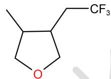

而整个体系内最亲电的为硫鎓盐，因此优先生成三氟甲基自由基，然后被烯丙基醚捕获（结论2分，结构2分，共4分）

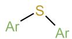

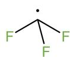

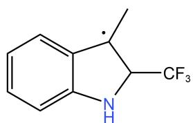

## 10-3-1:

(三个结构 1 个 1 分)  
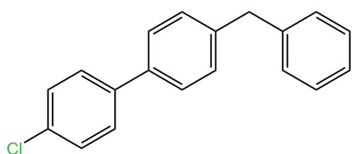  
4

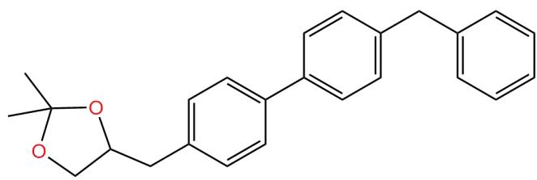  
5

10-3-2:

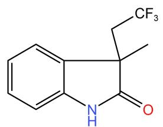  
(3 分)

## 10-4:

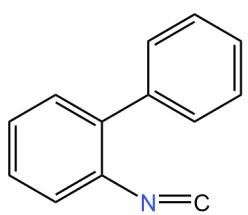

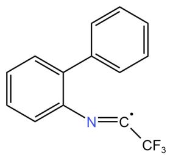

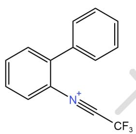  
关键中间体

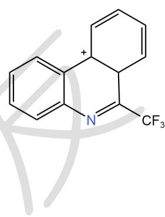

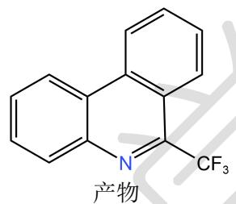  
(关键中间体 1 个 1 分, 产物 2 分, 共 6 分)

