# 北斗学友科学菁英成长课程研究院

# 2026 春季·化学竞赛【大联考二】模拟题

竞赛时间 3 小时。迟到超过半小时者不能进考场。开始考试后 1 小时内不得离场。时间到，把试卷（背面朝上）放在桌面上，立即起立撤离考场。

\- 试卷装订成册，不得拆散。所有解答必须写在指定的方框内，不得用铅笔填写。草稿纸在最后一页。不得持有任何其他纸张。

\- 姓名、报名号和所属学校必须写在指定位置，写在其他地方者按废卷论处。

\- 允许使用非编程计算器以及直尺等文具。

<table><tr><td>H1.008</td><td colspan="16">相对原子质量</td><td>He4.003</td><td></td></tr><tr><td>Li6.941</td><td>Be9.012</td><td rowspan="2" colspan="11"></td><td>B10.81</td><td>C12.01</td><td>N14.01</td><td>O16.00</td><td>F19.00</td><td>Ne20.18</td></tr><tr><td>Na22.99</td><td>Mg24.31</td><td>Al26.98</td><td>Si28.09</td><td>P30.97</td><td>S32.07</td><td>Cl35.45</td><td>Ar39.95</td></tr><tr><td>K39.10</td><td>Ca40.08</td><td>Sc44.96</td><td>Ti47.88</td><td>V50.94</td><td>Cr52.00</td><td>Mn54.94</td><td>Fe55.85</td><td>Co58.93</td><td>Ni58.69</td><td>Cu63.55</td><td>Zn65.41</td><td>Ga69.72</td><td>Ge72.61</td><td>As74.92</td><td>Se78.96</td><td>Br79.90</td><td>Kr83.80</td><td></td></tr><tr><td>Rb85.47</td><td>Sr87.62</td><td>Y88.91</td><td>Zr91.22</td><td>Nb92.91</td><td>Mo95.94</td><td>Tc[98]</td><td>Ru101.1</td><td>Rh102.9</td><td>Pd106.4</td><td>Ag107.9</td><td>Cd112.4</td><td>In114.8</td><td>Sn118.7</td><td>Sb121.8</td><td>Te127.6</td><td>I126.9</td><td>Xe131.3</td><td></td></tr><tr><td>Cs132.9</td><td>Ba137.3</td><td>La—Lu</td><td>Hf178.5</td><td>Ta180.9</td><td>W183.8</td><td>Re186.2</td><td>Os190.2</td><td>Ir192.2</td><td>Pt195.1</td><td>Au197.0</td><td>Hg200.6</td><td>Tl204.4</td><td>Pb207.2</td><td>Bi209.0</td><td>Po[210]</td><td>At[210]</td><td>Rn[222]</td><td></td></tr><tr><td>Fr[223]</td><td>Ra[226]</td><td>Ac—La</td><td>Rf</td><td>Db</td><td>Sg</td><td>Bh</td><td>Hs</td><td>Mt</td><td>Ds</td><td>Rg</td><td>Cn</td><td>Uut</td><td>Uuq</td><td>Uup</td><td>Uuh</td><td>Uus</td><td>Uuo</td><td></td></tr><tr><td colspan="18"></td><td></td></tr><tr><td colspan="2">La</td><td>Ce</td><td>Pr</td><td>Nd</td><td>Pm</td><td>Sm</td><td>Eu</td><td>Gd</td><td>Tb</td><td>Dy</td><td>Ho</td><td>Er</td><td>Tm</td><td>Yb</td><td>Lu</td><td></td><td></td><td></td></tr><tr><td colspan="18"></td><td></td></tr><tr><td colspan="2">Ac</td><td>Th</td><td>Pa</td><td>U</td><td>Np</td><td>Pu</td><td>Am</td><td>Cm</td><td>Bk</td><td>Cf</td><td>Es</td><td>Fm</td><td>Md</td><td>No</td><td>Lr</td><td></td><td></td><td></td></tr></table>

提示:  
1. 试卷共9页。请仔细核对。  
2. 凡题目中要求书写反应方程式，须配平且系数为最简整数比。

3. 计算过程，列出公式后，先代入数值，然后给出答案；代入数值时，可以不写单位，最后在答案后给出单位，常数，如 R 等可以用符号代替。

4. 解释题每个点（多个点分别计数）的文字不能超过 30 个。

## 第1题古代“仿银”及相关贵金属制备反应的化学综合题（21分，占比 $7\%$ ）

## 注意：本题所有涉及计算的方程式都要标注出物质的状态

古代人们对贵金属的制备充满好奇，除了黄金，白银也备受关注。古人尝试以特定矿石与金属反应制备“仿银”（多为银白色合金）。《alchemy records》记载了几种含铅矿石与贱金属的反应：“方铅矿能与锡的氧化物反应，白铅矿能与铜的氧化物反应，铅丹能与锌反应。此‘三铅’产物多呈银白色，乃仿银之关键。”实际上，方铅矿为 PbS，白铅矿为 $PbCO_{3}$ ，铅丹为 $Pb_{3}O_{4}$ 。

1-1 完成以下 “仿银” 相关反应方程式（反应物已明确）。

1-1-1 方铅矿（PbS）与二氧化锡（ $\mathrm{SnO}_2$ ）在高温下反应，生成锡、氧化铅（PbO）和二氧化硫，写出该反应方程式。

1-1-2 白铅矿（ $\mathrm{PbCO_3}$ ）与氧化铜（ $\mathrm{CuO}$ ）在焦炭（C）存在下高温反应，生成铜、铅、二氧化碳，写出该反应方程式。

## 1-2 书写反应方程式

唐代时期某术士将方铅矿（PbS）与草木灰（主要成分为 $K_{2}CO_{3}$ ）在空气中一同煅烧，得到熔融的碳酸铅（ $PbCO_{3}$ ）和硫化钾（ $K_{2}SO_{4}$ ），写出此反应方程式。

## 1-3 铅丹与锌反应的温度控制分析

某古籍中描述：“铅丹五两，末之；锌二两。……入坩埚中，火之。……令埚同火色，寒之。开，银白色似银。”现代研究确认：

\- 铅丹（ $\mathrm{Pb}_{3}\mathrm{O}_{4}$ ）与锌反应生成的“仿银”物质为铅锌复合氧化物 $\mathrm{PbZnO}_{2}$ 。

\- 当温度过高时， $\mathrm{PbZnO_2}$ 会分解为氧化铅（ $\mathrm{PbO}$ ，）和氧化锌（ $\mathrm{ZnO}$ ，）。

1-3-1 写出铅锌复合氧化物分解的反应方程式。

1-3-2 根据下表数据（假设 $\Delta \mathrm{rHm}^{\ominus}$ 和 $\mathrm{Sm}^{\ominus}$ 不随温度变化），通过计算确定 $\mathrm{PbZnO_2}$ 分解反应的温度范围（反应自发进行时 $\Delta \mathrm{rGm}^{\ominus} \leq 0$ ，低温时反应难活化，需温度 $\geq 300\mathrm{K}$ ）。

<table><tr><td>物质</td><td>PbZnO2(s) (X)</td><td>PbO(s) (Y)</td><td>ZnO(s) (Z)</td></tr><tr><td>ΔrHm⊖ /(kJ·mol-1)</td><td>-527.1</td><td>-217.3</td><td>-348.3</td></tr><tr><td>Sm⊖ /(J·mol-1·K-1)</td><td>152</td><td>68.7</td><td>43.6</td></tr></table>

## 1-4 古印度“银彩”制备的反应分析

古印度人使用辰砂（HgS）、氯化铵（NH4Cl）与金属锌共同加热，得到“银彩”（银白色汞锌合金），反应同时生成氨气（NH3）、硫化氢（H2S）和氯化锌（ZnCl2）。

1-4-1 根据题 1-3 的温度上限，结合下表数据（假设 $\Delta rHm^{\ominus}$ 和 $Sm^{\ominus}$ 不随温度变化），通过计算判断制备 “银彩”（假设是 Hg）的反应在题 1-3 规定的温度上限内能否自发进行（提示：若未得到 1-3 温度上限，可选用 1000 K 计算）。

<table><tr><td>物质</td><td>HgS(s)</td><td>Hg(l)</td><td>Zn(s)</td><td>NH4Cl(s)</td><td>NH3(g)</td><td>ZnCl2(s)</td><td>H2S(g)</td></tr><tr><td>ΔrHm⊖ /(kJ·mol-1)</td><td>-25.3</td><td>0</td><td>0</td><td>-314.4</td><td>-46.1</td><td>-415.1</td><td>-20.6</td></tr><tr><td>Sm⊖ /(J·mol-1·K-1)</td><td>140.2</td><td>76.1</td><td>41.6</td><td>94.6</td><td>192.8</td><td>111.5</td><td>205.8</td></tr></table>

1-4-2 解释氯化铵在此反应过程中的作用。（一个点 20 个字）

## 第 2 题经典的热力学（32 分，占比 11%）

某化工厂正在进行一系列化工生产反应，为优化生产工艺、提高生产效率，需要对相关反应进行详细的化学计算。以下是生产过程中涉及的几个关键反应及相关计算问题：

## 一、合成反应的动力学研究

工厂在合成三氧化硫的反应中，采用反应 $2\mathrm{SO}_{2}(\mathrm{g}) + \mathrm{O}_{2}(\mathrm{g}) \rightleftharpoons 2\mathrm{SO}_{3}(\mathrm{g})$ ，为确定最佳反应条件，研究人员测定了不同初始浓度下的反应速率，数据如下：

<table><tr><td>实验编号</td><td>c (SO2) 初始浓度(mol/L)</td><td>c (O2) 初始浓度(mol/L)</td><td>初始速率 v (mol·L-1·s-1)</td></tr><tr><td>1</td><td>0.10</td><td>0.10</td><td> $1.2 \times 10^{-3}$ </td></tr><tr><td>2</td><td>0.20</td><td>0.10</td><td> $2.4 \times 10^{-3}$ </td></tr><tr><td>3</td><td>0.10</td><td>0.20</td><td> $4.8 \times 10^{-3}$ </td></tr><tr><td>4</td><td>0.30</td><td>0.20</td><td>?</td></tr><tr><td>5</td><td>0.40</td><td>0.15</td><td> $6.9 \times 10^{-3}$ </td></tr></table>

已知该反应的速率方程为 $v = k \cdot c (SO_{2})^{m} \cdot c (O_{2})^{n}$ 。

2-1 计算反应级数 m 和 n。

2-2 求速率常数 k 的数值及单位。

2-3 计算实验 4 的初始速率。

2-4 保持 c(SO₂)=0.20mol/L、c(O₂)=0.20mol/L 不变，测定不同温度下的速率常数 k，数据如下：

<table><tr><td>温度 T(K)</td><td>300</td><td>320</td><td>340</td><td>360</td><td>380</td></tr><tr><td>k</td><td>0.52</td><td>1.28</td><td>1.35</td><td>6.50</td><td>13.8</td></tr></table>

2-4-1 应该以什么为坐标进行回归计算？

2-4-2 计算反应的活化能 $E_{a}$ 和指前因子 A。

## 尾气处理反应的热力学分析

工厂生产过程中产生的尾气含有 NO 和 $O_{2}$ ，需要通过反应 $2\mathrm{NO}(g)+\mathrm{O}_{2}(g)\rightleftharpoons2\mathrm{NO}_{2}(g)$ 进行处理后再排放。已知 298K 时各物质的热力学数据如下：

<table><tr><td>物质</td><td> $\Delta fHm^{\circ} (\mathrm{kJ}\cdot\mathrm{mol}^{-1})$ </td><td> $Sm^{\circ} (\mathrm{J}\cdot\mathrm{mol}^{-1}·\mathrm{K}^{-1})$ </td></tr><tr><td>NO(g)</td><td>90.25</td><td>210.76</td></tr><tr><td> $O_{2}(g)$ </td><td>0</td><td>205.14</td></tr><tr><td> $NO_{2}(g)$ </td><td>33.18</td><td>240.06</td></tr></table>

2-5-1 计算 298K 时该反应的 $\Delta rHm^{\circ}$ 、 $\Delta rSm^{\circ}$ 和 $\Delta rGm^{\circ}$ ，判断反应在该温度下的自发性。（12 分）

2-5-2 计算 298K 时反应的平衡常数 K°，评估该温度下尾气处理的效果。（8 分）

2-5-3 计算该反应在 1000K 的 K°

## 第3题 实际气体（15分，占比 $8\%$ ）

在现代工业生产中，二氧化碳的捕获、压缩和储存（CCS）技术已成为减少温室气体排放的重要手段。在石灰生产过程中，碳酸钙（ $\mathrm{CaCO_3}$ ）在高温下分解产生的二氧化碳需要进行压缩储存。然而，在实际工业条件下，二氧化碳的行为与理想气体存在显著差异，这种差异在高压和相对较低温度条件下尤为明显。

在某工业石灰窑中，碳酸钙（ $\mathrm{CaCO_3}$ ）在 $898^{\circ}\mathrm{C}$ （1171K）下分解，反应方程式为：

$$
\mathrm{CaCO} _ {3} (\mathrm{s}) \rightarrow \mathrm{CaO} (\mathrm{s}) + \mathrm{CO} _ {2} (\mathrm{g})
$$

反应产生的二氧化碳气体需要在 $50^{\circ}$ C 和 $1.013 \times 10^{7}$ Pa 的条件下进行压缩储存。

已知：范德华实际气体方程：

$$
\left(p + a \left(\frac {n}{V}\right) ^ {2}\right) (V - n b) = n R T
$$

对于二氧化碳而言： $|a|=0.3658\ |b|=4.278\times10^{-5}$ （绝对值，无单位）

3-1 使用量纲分析法：推断出 a 与 b 的单位。

3-2 计算在 323K、 $1.013 \times 10^{7}$ Pa 条件下，用理想气体状态方程和范德华方程分别计算 1.00 mol CO $_{2}$ 的体积，并比较两者的差异。

3-3 假设反应在 323K、 $1.013 \times 10^{5}$ Pa 下进行，计算 1.00 kg CaCO $_{3}$ 完全分解时：

3-3-1 产生的 $CO_{2}$ 在标准状况下的体积（用理想气体方程计算）。

3-3-2 若实际收集到的 $CO_{2}$ 体积为 $225 \times 10^{-3} \, m^{3}$ ，计算产率（使用理想气体状态方程计算）。

3-3-3 计算得到的产率有什么抽象的问题？使用范德华气体方程再一次计算得到的产率又是多少？

## 第 4 题 铜蓝蛋白相关化学问题（14 分，占比 7%）

在一些生物体内，铜蓝蛋白（Cp）参与电子传递等过程，其活性中心涉及铜离子与配体的相互作用。每个活性中心有 2 个接近的 Cu，可与特定配体结合。红外光谱可用于研究化学键的振动模式，某铜蓝蛋白活性中心结合配体后的红外光谱在 $567 \, \mathrm{cm}^{-1}$ 处有吸收峰，其光激发能垒是 $3.250 \, eV$ 。

4-1 对于 NO、NO $^{+}$ 和 NO $^{-}$ 混合体系，存在 3 个红外吸收峰，波数为 1876、1295、915 cm $^{-1}$ 。

4-1-1 NO、 $\mathrm{NO}^{+}$ 和 $\mathrm{NO}^{-}$ 的键级是怎样的？列出计算公式并给出三种物质相应的键级。

4-1-2 指出 NO、NO $^{+}$ 和 NO $^{-}$ 的 N-O 伸缩振动模式的振动波数大小顺序，解释原因。

4-1-3 指出 ${}^{14}N{}^{16}O$ 、 ${}^{14}N{}^{18}O$ 和 ${}^{15}N{}^{16}O$ 三种分子中，N-O 伸缩振动模式的振动波数大小顺序，无需解释。

4-2 计算判断什么波长（nm）的光可激发该铜蓝蛋白活性中心。

4-3 画出两个 Cu 距离最短的 $Cu_{2}O_{2}$ 的结构示意图，注明配体中关键原子的成键情况。（注意，蛋白质配体占据了铜离子三个配位的空位）

## 第 5 题 钛酸锶（33 分，占比 12%）

钛酸锶（ $\mathrm{SrTiO_3}$ ）是钙钛矿结构（ $\mathrm{ABO_3}$ 型）的典型代表，兼具介电、铁电、光催化及高温超导基底特性，其相变行为复杂且与性能强关联——低温下存在正交相（<160K）、菱面体相（<10K）多级相变，高温（>160K）稳定为立方相，相变过程伴随晶格对称性、原子配位环境及电子结构的显著变化，是研究结构-性能关系的理想模型材料。

## 5-1 结构基础分析

5-1-1 低温正交相 $\mathrm{SrTiO_3}$ 的晶胞参数为 $a = 0.395\mathrm{nm}$ ， $b = 0.380\mathrm{nm}$ ， $c = 0.750\mathrm{nm}$ ， $\beta = 90^{\circ}$ ，属正交晶系，每个晶胞含2个 $\mathrm{Sr}^{2+}$ 、2个 $\mathrm{Ti}^{4+}$ 和6个 $\mathrm{O}^{2-}$ 。其中 $\mathrm{Ti}^{4+}$ 处于 $\mathrm{O}^{2-}$ 构成的八面体间隙（ $\mathrm{TiO_6}$ 八面体），但因晶格畸变，八面体沿c轴方向轻微压缩， $\mathrm{Sr}^{2+}$ 则位于8个相邻 $\mathrm{TiO_6}$ 八面体围成的立方体间隙中，配位环境呈轻微不对称性。

5-1-1-1 请根据上述参数计算该正交相晶胞的理论密度。(结果保留三位有效数字)

5-1-2 高温立方相 $SrTiO_{3}$ ，晶胞参数 a=b=c=0.390nm，每个晶胞含 1 个 $Sr^{2+}$ 、1 个 $Ti^{4+}$ 和 3 个 $O^{2-}$ ： $Ti^{4+}$ 位于晶胞体心， $O^{2-}$ 位于面心， $Sr^{2+}$ 位于顶点， $TiO_{6}$ 八面体完全规则且无畸变， $Sr^{2+}$ 配位环境呈完美立方体对称。

5-1-2-1 绘制正交相（低温）与立方相（高温）的晶胞示意图，标注原子位置及 $TiO_{6}$ 八面体排列特征；

5-1-2-2 计算立方相晶胞的理论密度，并对比正交相与立方相的原子堆积效率差异（提示：堆积效率可通过“晶胞内原子总体积 / 晶胞体积”粗略判断，原子半径： $Sr^{2+}=0.126\mathrm{nm}$ ， $Ti^{4+}=0.0615\mathrm{nm}$ ， $O^{2-}=0.140\mathrm{nm}$ ）。

## 5-2 相变与性质关联

5-2-1 实验测得正交相 $SrTiO_{3}$ 的实际密度为 $5.10g/\mathrm{cm}^{3}$ ，立方相为 $5.21g/\mathrm{cm}^{3}$ 。结合 5-1 计算的理论密度，完成以下分析：

5-2-1-1 列举导致理论密度与实验密度偏差的 3 类具体原因（需说明每种原因如何影响密度，如 “空位缺陷会降低实际密度”）；

5-2-2 $\mathrm{SrTiO_3}$ 的相变过程伴随介电性能与导电性能的突变，且低温下（<10K）可能出现量子介电效应（介电常数随温度降低而异常升高）。从晶体结构、电子轨道及极化机制角度，分阶段解释以下现象：

5-2-2-1 正交相（10K\~160K）为何表现为“低介电常数 + 绝缘性”？

5-2-2-2 立方相（>160K）为何表现为“高介电常数 + 弱导电性”？

5-2-2-3 菱面体相（<10K）的量子介电效应（介电常数反常升高）与 $TiO_{6}$ 八面体的畸变程度及 $Ti^{4+}$ 的 3d 轨道分裂有何关联？

## 5-3 实际应用拓展

5-3-1 多层陶瓷电容器（MLCC）中， $\mathrm{SrTiO_3}$ 薄膜需满足“超薄（厚度 $< 500\mathrm{nm}$ ）+ 高密度（接近理论密度）”要求。现有一批 MLCC 产品，单颗电容器含 100 层 $\mathrm{SrTiO_3}$ 薄膜，每层薄膜有效面积为 $2.0\mathrm{mm} \times 2.0\mathrm{mm}$ ，厚度为 $200\mathrm{nm}$ 。若制备过程中原料损耗率为 $5\%$ ，且以立方相 $\mathrm{SrTiO_3}$ 的理论密度计算，生产 1000 颗该电容器需消耗多少克 $\mathrm{SrTiO_3}$ 原料？

## 第 6 题 啤酒酿造中的化学综合题（30 分，占比 11%）

## 一、发酵阶段的酵母代谢差异

艾尔与拉格啤酒的发酵反应如下：

乙醇生成（共同反应）： $C_{6}H_{12}O_{6}=2C_{2}H_{5}OH+2CO_{2}\quad\Delta_{f}H_{m}=-69\mathrm{kJ}/\mathrm{mol}$

乳酸生成（艾尔特征）： $\mathrm{C_6H_{12}O_6 = 2C_3H_6O_3}$ $\Delta_f H_m = -35.2\mathrm{kJ / mol}$

100L 麦汁中，艾尔啤酒发酵时 30% 葡萄糖用于生成乳酸，70% 用于生成乙醇。拉格啤酒发酵时，葡萄糖完全转化为乙醇和 $CO_{2}$ 。若 100L 麦汁中葡萄糖消耗速率为 $0.8\mathrm{mol}/(\mathrm{L}\cdot\mathrm{d})$ ，分别计算：

6-1-1 5 天内两种发酵过程分别生成乙醇的质量。

6-1-2 若所有的葡萄糖全部被转化，分别计算艾尔发酵法和拉格发酵法产生能量。

## 二、酒花苦味物质的溶解平衡

酒花中的α-酸(如葎草酮, $C_{20}H_{28}O_{4}$ )是苦味的主要来源,在水中存在溶解平衡 $C_{20}H_{28}O_{4}(s)=C_{20}H_{28}O_{4}(aq)$ : 25℃时,其饱和浓度为0.042g/L(摩尔质量332g/mol)。

6-2-1 计算 $25^{\circ}$ C 时 $\alpha-$ 酸的溶解 $\triangle G$ 。

6-2-2 煮沸麦汁时（100℃），α-酸溶解度增至 0.15g/L。计算溶解过程的△H与△S。

## 三、发酵阶段的风味物质差异

艾尔啤酒因发酵温度较高（18-22℃），酵母生成更多乙酸异戊酯，其合成反应为： $CH_{3}COOH+HOCH_{2}CH_{2}CH(CH_{3})_{2}=CH_{3}COOCH_{2}CH_{2}CH(CH_{3})_{2}+H_{2}O$

6-3 拉格啤酒发酵温度较低（8-12℃），上述反应的速率常数 $k=0.012h^{-1}$ （10℃），而艾尔啤酒在 20℃ 时 $k=0.045h^{-1}$ 。计算该反应的活化能 $E_{a}$ 。

## 四、酵母对金属离子的吸附差异

啤酒发酵中，酵母会吸附发酵液中的 $Zn^{2+}$ 与 $Mn^{2+}$ （微量元素，影响酵母活性），吸附符合朗缪尔模型：

$$
q = \frac {q _ {m} b c}{1 + b c}
$$

其中 $q_{m}$ 是最大吸附量，b 是吸附平衡常数，c 是锌离子浓度（常数），两种酵母实验数据如下：

<table><tr><td> $Zn^{2+}/\mathrm{mmol}/\mathrm{L}$ </td><td>0.4</td><td>1,0</td><td>2.5</td><td>5.0</td><td>10,0</td></tr><tr><td>q/mg/g</td><td>5,1</td><td>9.8</td><td>16.5</td><td>22.0</td><td>27.5</td></tr><tr><td colspan="6">拉格酵母:</td></tr><tr><td> $Zn^{2+}/\mathrm{mmol}/\mathrm{L}$ </td><td>0.6</td><td>1.5</td><td>3.0</td><td>7.0</td><td>15.0</td></tr><tr><td>q/mg/g</td><td>4.8</td><td>8.9</td><td>14.2</td><td>20.5</td><td>25.8</td></tr></table>

6-4 艾尔酵母和拉格酵母对锌离子的单分子层饱和吸附量 $q_{m}$ （ $mg \cdot g^{-1}$ ）与吸附平衡常数 b。

6-5 实际生产问题:

某啤酒厂采用艾尔酿造法和拉格酿造法生产啤酒，发酵核心反应为酵母无氧呼吸： $C_{6}H_{12}O_{6}$ （葡萄糖） $\rightarrow2C_{2}H_{5}OH$ （乙醇） $+2CO_{2}\uparrow$ 。已知关键参数如下：

\- 艾尔酿造法：发酵温度 $22^{\circ} \mathrm{C}$ ，葡萄糖转化率 $90 \%$ ，单批次投料含可发酵葡萄糖 $18 \mathrm{~kg}$

\- 拉格酿造法：发酵温度 $8^{\circ} \mathrm{C}$ ，葡萄糖转化率 $96 \%$ ，单批次投料含可发酵葡萄糖 $18 \mathrm{~kg}$

\- 基础数据：葡萄糖摩尔质量 $180 \mathrm{~g} / \mathrm{mol}$ ，乙醇摩尔质量 $46 \mathrm{~g} / \mathrm{mol}$ ， $\mathrm{CO}_{2}$ 摩尔质量 $44 \mathrm{~g} / \mathrm{mol}$ ；标准状况下（ $0^{\circ} \mathrm{C}$ 、 $101 \mathrm{kPa}$ ） $1 \mathrm{~mol}$ 气体体积为 $22.4 \mathrm{~L}$

6-5-1 两种酿造法单批次发酵产生的乙醇质量相差多少克？

6-5-2 拉格酿造法单批次发酵释放的 $CO_{2}$ 在标准状况下的体积约为多少升？

## 第 7 题 需要数据处理的滴定问题（14 分，占比 5%）

在 $NH_{4}Cl-ZnCl_{2}-H_{2}O$ 体系中，结晶出一种白色物质 C，其组成可表示为 $xNH_{4}Cl\cdot ZnCl_{2}\cdot yH_{2}O$ 。称取 1.4825 g 晶体 C，溶于水并在 250 mL 容量瓶中定容。

Cl $^{-}$ 分析：移取 25.00 mL 溶液，加入 2 滴 0.5% 荧光黄的乙醇溶液和 1 滴稀 NaOH 溶液，再加 2 mL 0.5% 淀粉溶液，用 0.1050 mol·L $^{-1}$ AgNO $_{3}$ 溶液滴定（反应 1），至出现粉红色，消耗 22.40 mL；

$Zn^{2+}$ 分析：移取 25.00 mL 溶液，加入 10 mL pH=5.5 的醋酸 - 醋酸钠缓冲溶液，再加入适量二甲酚橙指示剂，用 $0.02000\ \mathrm{mol}\cdot \mathrm{L}^{-1}$ EDTA 溶液滴定（反应 2），至溶液由紫红色变为亮黄色，消耗 25.10 mL。

7-1 写出反应 1 - 2 的方程式。

7-2 通过计算确定 C 中 x 和 y 的值。(NH₄Cl 式量 53.49, ZnCl₂ 式量 136.29)

## 第 8 题 关于自由基的基础有机化学（38 分,11%）

凡具有未配对电子的化学物种都被称为自由基，其重要性在有机反应中不言而喻。

8-1 1900 年，Gomberg 在 Wurtz 偶联反应中意外制得稳定的 A，确立了自由基的概念。

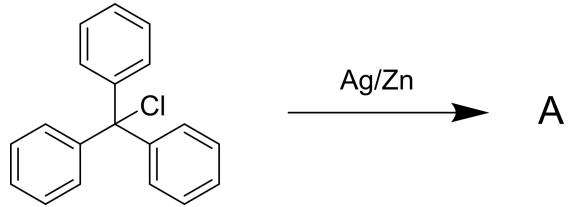

8-1-1 推测 A 的结构简式，并写出其两种最可能的二聚体结构（体现出稳定构象）。

8-1-2 实际上，A 的二聚体仅存在一种，推测该二聚体的结构简式并解释另外一种无法稳定存在的原因。

8-1-3 A 可以与 $I_{2}$ 和 $O_{2}$ 分别反应，写出这两种产物。

8-2 在光激发下，原子间的键可能发生均裂从而得到自由基，该策略被应用于以下的有机合成中。

8-2-1 写出 B 与半缩醛 C 的结构简式，并写出从底物到 B 的关键中间体（至少四个）。

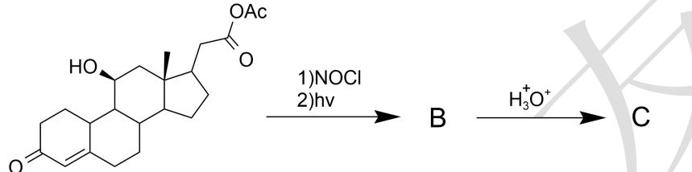

8-2-2 写出 D 与 E 的结构简式，并写出与 E 同时生成的两种小分子副产物。(3 分)

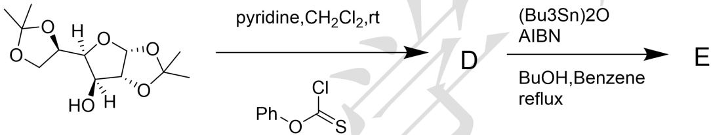

8-3 受光激发的羰基也是活性自由基的来源之一, Norrish-type 即是在光激发下酮类化合物的经典反应类型。

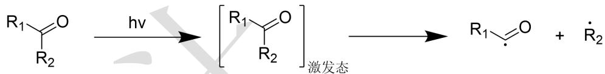

8-3-1 选出酮类化合物存在的电子跃迁类型（以丙酮为例）

A. $\sigma \rightarrow \sigma^{*}$ 跃迁

B. $\pi \to \pi^{*}$ 跃迁

C. $n \rightarrow \sigma^{*}$ 跃迁

D. $n \rightarrow \pi^{*}$ 跃迁

E. $\sigma \rightarrow \pi^{*}$ 跃迁

8-3-2 选出酮类化合物在紫外光谱中可被观测到的电子跃迁类型（以丙酮为例）

A. $\sigma \rightarrow \sigma^{*}$ 跃迁

B. $\pi \rightarrow \pi^{*}$ 跃迁

C. $n \rightarrow \sigma^{*}$ 跃迁

D. $n \rightarrow \pi^{*}$ 跃迁

E. $\sigma \rightarrow \pi^{*}$ 跃迁

8-3-3 写出醛 F 的结构简式，并写出关键中间体。

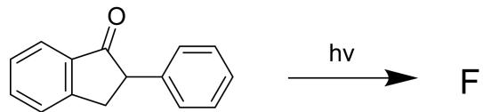

8-3-4 写出四环化合物 G 的结构简式（要求立体化学）与关键中间体，并指出转化经过的两步周环反应类型。（6 分）

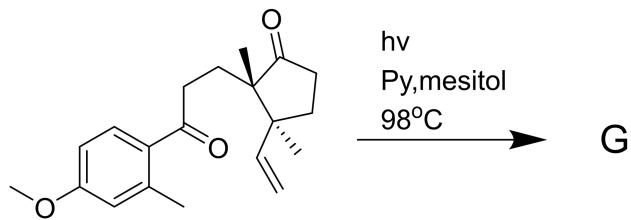

8-4 随着对自由基化学研究的不断深入，通过电化学手段快速便捷地得到不易生成的自由基成为了研究的热点。2018年，Lei课题组使用电催化成功地将链状二级胺转化成了环状三级胺，多种产物产率高达90%以上。

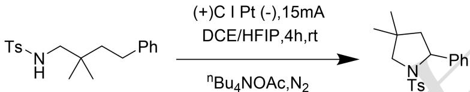

8-4-1 指出产物在阳极还是阴极生成，并写出与产物伴随产生的小分子。

8-4-2 解释 ${}^{n}Bu_{4}OAc$ 在该反应中的作用。

8-4-3 解释反应中苯基存在的必要性。

8-4-4 写出该反应经历的关键中间体。

## 第 9 题 可见光诱导的喹喔啉-2(1H)-酮的甲基化反应（35 分,10%）

甲基化是药物化学中优化生物活性分子药效特性的一种基本策略。喹喔啉-2(1H)-酮骨架作为一类含氮杂环化合物，由于其独特的平面共轭结构和广谱生物活性，在药物发现中受到了广泛关注。在各种修饰中，喹喔啉-2(1H)-酮的 C3 位甲基化尤为重要。近期，Zhou 课题组在室温空气条件下，使用 PMDETA 作为甲基源，成功地直接对喹诺喹啉-2(1H)-酮进行 C3 甲基化，建立了一条制备 3-甲基喹喔啉-2(1H)-酮的实用途径。

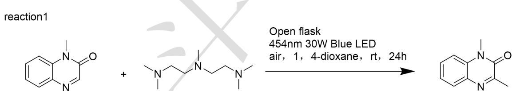

9-1 研究人员发现产物的生成经过关键中间体 F 与 G，根据提示推测 A,B,C,D,E,G,X,Y 的结构简式。（12 分）

机理：

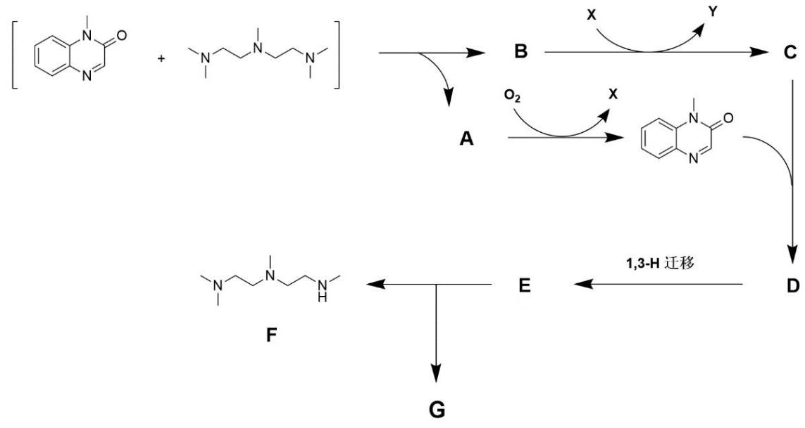

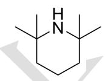

提示:

1）两种底物在光激发下进行单电子转移得到 A 与 B

2）E 是一种内盐

3）G中含有氮自由基结构

9-2 机理实验确认了上述中间体的存在，推测 T1,T2,T3 的结构。

reaction2

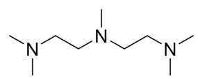

454nm 30W Blue LED

air, 1, 4-dioxane, rt, 24h

TEMPO (2.0equiv)

T1

reaction3

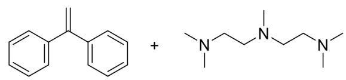

Open flask

454nm 30W Blue LED

air, 1, 4-dioxane, rt, 24h

T2

reaction4

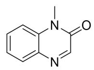

+

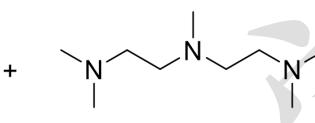

Open flask

454nm 30W Blue LED

N

air, 1, 4-dioxane, rt, 24h

TEMP (2.0equiv)

T3

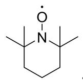

TEMP0:

9-3 HRMS 显示，在完成甲基化后，PMDETA 最终转化成了 L 和 Q，这说明从 G 存在两条到产物的路径。

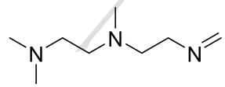

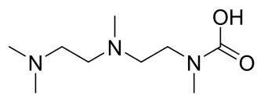

Q

9-3-1 在 PathA 中，F 与 G 发生了一次单电子转移，写出该路径的关键中间体（至少四个）。

9-3-2 而在 PathB 中，C 先与体系中存在的另外一种小分子自由基结合，再经历一系列转化得到分子量为 186 的自由基，其与 G 发生单电子转移最终生成产物，写出该路径的关键中间体并指明小分子自由基（至少四个，与 9-3-1 一致中间体可不写）。

A.

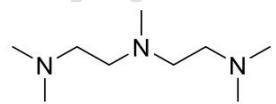

B.

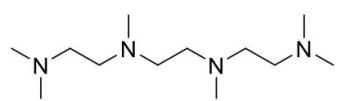

C.

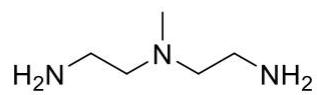

9-4 结合以上的信息，选出同样可以进行该甲基化反应的胺类化合物。

## 第 10 题 磁有机化学（25 分 占 11%）

电化学见得多了，磁有机化学呢？以磁场（如静态磁场、旋转磁场）为核心调控手段，介入有机分子的电子转移与反应路径即为磁有机化学。近日，科学家们发表了名为《利用旋转磁场与金属棒实现有机分子的氧化还原反应》和《利用旋转磁场和金属棒实现芳基氯化物与烷基氯化物的交叉亲电偶联反应》在多种混合场的作用下实现有机小分子的各种基础反应。相关成果发表在《Journal of the American Chemical Society》上。

10-1 磁驱动简化示意图如下:

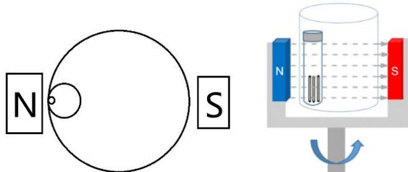

其中大圆圈为磁驱动仪器所在的位置，磁铁可简化为围绕最大的圆圈进行圆周运动，中间的圆圈为简化的反应容器，最小的圆圈为钢针（本小问认为钢针不运动），本小问中，将磁铁的圆周运动微元简化为匀速直线运动，即认为导体棒在匀强磁场内做切割磁导线的运动，磁铁与导体棒之间的运动速度为磁铁圆周运动的线速度。

现在设定机器磁场强度为 0.17T，大圆圈半径为 15cm，频率为 50Hz，试求单根导体棒（40mm）产生的电动势约为多少？

已知：

$$
E = B L v
$$

10-2 反应化学机理的探究:

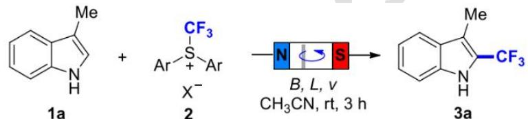

此反应为最初设想能够进行的反应，反应结果也相当的好

10-2-1 如果体系内有四倍量的 TEMPO，反应产率如何？为什么？

10-2-2 如果反应体系内有两倍量的烯丙基醚，反应产率如何？画出副反应产物结构。

10-2-3 画出以上反应的几个关键中间体

10-3 完成以下几个反应。

10-3-1

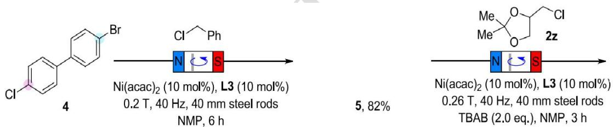

6, $73\%$

10-3-2 $\mathrm{R}_1, \mathrm{R}_2$ 都是氢

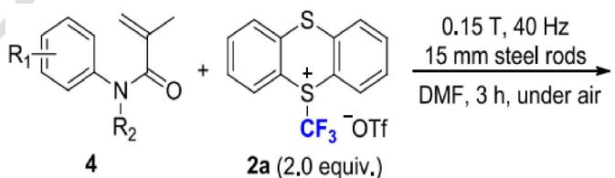

10-4 画出以下反应的产物和关键中间体

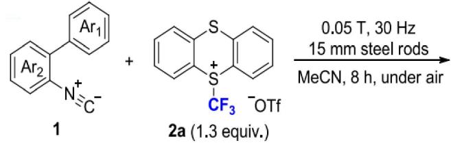