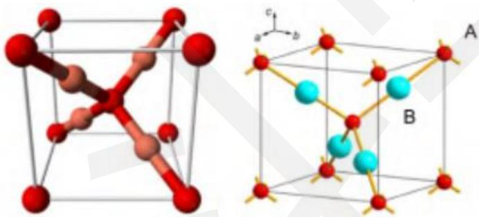
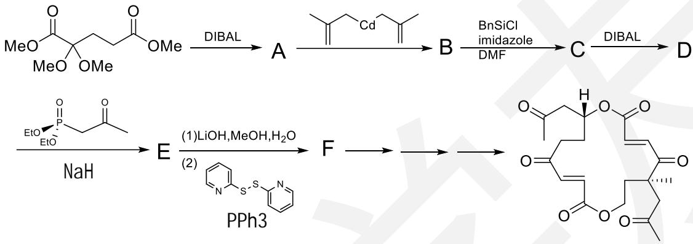
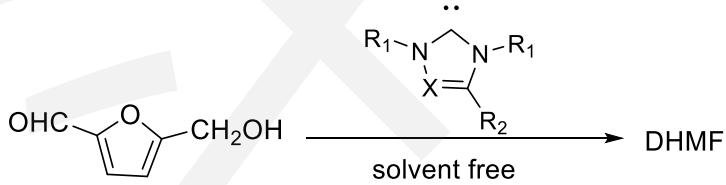
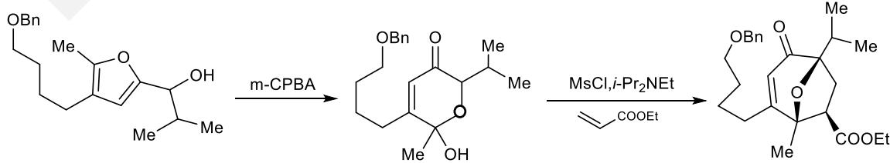

# 化学奥林匹克竞赛模拟试卷（一）

\- 竞赛时间 3 小时。

\- 试卷装订成册，不得拆散。所有解答必须写在 A4 纸上，不得用铅笔填写。

\- 姓名、报名号和所属学校必须写在首页左侧指定位置，写在其他地方者按废卷论处。

\- 允许使用非编程计算器以及直尺等文具。

<table><tr><td>H1.008</td><td colspan="15">相对原子质量</td><td>He4.003</td><td></td></tr><tr><td>Li6.941</td><td>Be9.012</td><td rowspan="2" colspan="10"></td><td>B10.81</td><td>C12.01</td><td>N14.01</td><td>O16.00</td><td>F19.00</td><td>Ne20.18</td></tr><tr><td>Na22.99</td><td>Mg24.31</td><td>Al26.98</td><td>Si28.09</td><td>P30.97</td><td>S32.07</td><td>Cl35.45</td><td>Ar39.95</td></tr><tr><td>K39.10</td><td>Ca40.08</td><td>Sc44.96</td><td>Ti47.88</td><td>V50.94</td><td>Cr52.00</td><td>Mn54.94</td><td>Fe55.85</td><td>Co58.93</td><td>Ni58.69</td><td>Cu63.55</td><td>Zn65.41</td><td>Ga69.72</td><td>Ge72.61</td><td>As74.92</td><td>Se78.96</td><td>Br79.90</td><td>Kr83.80</td></tr><tr><td>Rb85.47</td><td>Sr87.62</td><td>Y88.91</td><td>Zr91.22</td><td>Nb92.91</td><td>Mo95.94</td><td>Tc[98]</td><td>Ru101.1</td><td>Rh102.9</td><td>Pd106.4</td><td>Ag107.9</td><td>Cd112.4</td><td>In114.8</td><td>Sn118.7</td><td>Sb121.8</td><td>Te127.6</td><td>I126.9</td><td>Xe131.3</td></tr><tr><td>Cs132.9</td><td>Ba137.3</td><td>La—Lu</td><td>Hf178.5</td><td>Ta180.9</td><td>W183.8</td><td>Re186.2</td><td>Os190.2</td><td>Ir192.2</td><td>Pt195.1</td><td>Au197.0</td><td>Hg200.6</td><td>Tl204.4</td><td>Pb207.2</td><td>Bi209.0</td><td>Po[210]</td><td>At[210]</td><td>Rn[222]</td></tr><tr><td>Fr[223]</td><td>Ra[226]</td><td>Ac—La</td><td>Rf</td><td>Db</td><td>Sg</td><td>Bh</td><td>Hs</td><td>Mt</td><td>Ds</td><td>Rg</td><td>Cn</td><td>Uut</td><td>Uuq</td><td>Uup</td><td>Uuh</td><td>Uus</td><td>Uuo</td></tr></table>

<table><tr><td>La</td><td>Ce</td><td>Pr</td><td>Nd</td><td>Pm</td><td>Sm</td><td>Eu</td><td>Gd</td><td>Tb</td><td>Dy</td><td>Ho</td><td>Er</td><td>Tm</td><td>Yb</td><td>Lu</td></tr><tr><td>Ac</td><td>Th</td><td>Pa</td><td>U</td><td>Np</td><td>Pu</td><td>Am</td><td>Cm</td><td>Bk</td><td>Cf</td><td>Es</td><td>Fm</td><td>Md</td><td>No</td><td>Lr</td></tr></table>

可能用到的常数：法拉第常数 $F = 96485 \, C \, mol^{-1}$ ; 气体常数 $R = 8.3145 \, J \, K^{-1} \, mol^{-1}$ ; 阿伏伽德罗常数 $N_{A} = 6.0221 \times 10^{23} \, mol^{-1}$ ; 玻尔兹曼常数 $k_{B} = R / N_{A}$

## 第一题：完成反应方程式（10分，8%）

1-1 氧气存在下氰化钠溶解黄金.

1-2 次磷酸钠在 500K 下分解，生成一种有毒气体和一种对热稳定的盐

1-3 用三氟化溴在 800K 下处理 $Mn(IO_{3})_{2}$ 以制备一种氟化物，生成物里还有另一种氟化物。

1-4 $\mathrm{BeMe}_2$ 与丙酮反应，制得一种高对称性的化合物

1-5 氢化锂铝是有机反应常用的还原剂，过量的氢化锂铝常使用叔丁醇淬灭，写出淬灭过程的反应方程式。

## 第二题：无机分子的构型（13分，8%）

近日，科学家发现，将高浓度的 NO 和 $H_{2}S$ 气体在金属表面混合，可以生成 HSNO。后者是生物信号传递过程中可能的重要中间体。

2-1 写出 HSNO 的结构式，说明其成键方式。

2-2 比较键角 $\angle H-S-N$ 和 $\angle S-N-O$ 的大小，说明理由。

2-3 研究表明，反应过程为 NO 歧化生成的 $N_{2}O_{3}$ 与 $H_{2}S$ 反应，生成了 HSNO。写出两步反应的方程式。

2-4 你认为金属表面的作用是什么？

2-5 HSNO 有顺反异构体，已知室温下，顺式和反式异构体的数量约为 1:5，计算异构反应的自由能变 $\Delta G$ 。

2-6 研究发现，HSNO 中的 S-N 键长要长于 RSNO（R=烷基）中的 S-N 键长。试说明理由。

## 第三题：金纳米线和高价铁化合物（20分，12%）

3-1 近年来，纳米材料取得了快速的发展，各类纳米材料已被广泛报道。其中金纳米线是

一种较为新颖的纳米材料。

3-1-1 在已报道的合成路线中，有一种方式以 $HAuCl_{4}\cdot3H_{2}O$ 为金源，一氧化碳为还原剂，试写出合成的反应。

3-1-2 在实验操作过程中，需要先将金源溶解在油胺中并通入一氧化碳，之后再加入戊酸进行反应。该反应的优势在于无需外界热源提供能量，试分析改反应体系如何提供热量供反应进行。并分析使用一氧化碳作为还原剂的利弊。

3-2 近期，一种可以在纯水中生成的五价铁化合物被报道，这是科学家第一次得到能在纯水中生成的该类化合物。该化合物需要用 $\left[\mathrm{Fe}^{\mathrm{III}}\left\{\left(\mathrm{Me}_{2}\mathrm{CNCOCMe}_{2}\mathrm{NCO}\right)_{2}\mathrm{CMe}_{2}\right\} \mathrm{OH}_{2}\right]^{-}$ 作为引发剂，用次氯酸钠进行氧化得到。

3-2-1 试写出引发剂的结构（有机配体为大环化合物）

3-2-2 在试验过程中，研究人员分别尝试过使用间氯过氧苯甲酸(mCPBA)与次氯酸钠作为氧化剂最终选择了后者，试分析原因。

3-2-3 研究发现，当 pH 达到 13 后，次氯酸只可以将引发剂氧化到四价，试猜测原因。3-2-4 分析证实，转化过程为定量反应，无中间体生成，产物铁为五配位，试给出产物的化学式。

## 第四题：氧化亚铜的晶体结构（20分，12%）

红色氧化亚铜是固态电子学中最早应用的材料之一，如今它以其无毒、廉价可作为太阳能电池的一个活性材料而引起新的关注。

上面两个晶胞示出了 $Cu_{2}O$ 晶体，其晶胞参数为 427.0pm。

4-1 图中 A、B 原子哪个是铜原子？它们分别形成哪种基本晶胞结构？配位数分别为多少？
4-2 计算该晶体中 O-O、Cu-Cu、O-Cu 的最短距离。

4-3 计算纯氧化亚铜晶体的密度。

在这种晶体中，常见的缺陷是铜原子缺陷，这种情况下氧的格位不发生变化。对于某含此缺陷的晶体样品研究发现，其中有0.2%的铜原子的氧化态是+2。

4-4 计算此晶体中铜原子空位的百分数。

## 第五题：沉淀溶解平衡计算（18分，11%）

5-1、试分别计算 AgCl、AgBr 和 AgI 在 $12.0 \, mol \, L^{-1}$ 浓氨水中的溶解度（以 $mol \, L^{-1}$ 表示）。已知 AgCl、AgBr 和 AgI 的 pKsp 分别为 9.50, 12.06, 15.83, $[\mathrm{Ag}(\mathrm{NH}_{3})_{2}]^{+} \log K_{\text {稳}} = 7.40$ 。5-2、常用沉淀滴定的摩尔法测定 $Cl^{-}$ 的浓度：在合适的 pH 用 $AgNO_{3}$ 标准溶液直接滴定 $Cl^{-}$ ，指示剂为 $K_{2}CrO_{4}$ 。

5-2-1、试说明选择合适的 pH 所需要考虑的因素，并列举出 3 种会对该反应产生干扰的简单离子。

5-2-2、已知 $Ag_{2}CrO_{4}$ 的 pKsp 为 11.3，试计算理论上滴定终点时溶液中 $CrO_{4}^{2-}$ 的最适宜浓度。

## 第六题：振荡反应（10分，6%）

B-Z 振荡反应是一种著名的振荡反应，目前普遍接受的机理是在硫酸介质中以金属铈离子做催化剂的条件下，丙二酸被溴酸氧化的机理，简称 FKN 机理。反应可以分为诱导期与振荡期两个阶段，

6-1 已知反应过程中，有三分之一的丙二酸被氧化为二氧化碳，其余则生成溴代丙二酸，试写出 B-Z 振荡反应的总反应。

6-2 为了求得诱导期与振荡期的活化能，某次实验得到了如下的数据：

<table><tr><td>温度/K</td><td>297.15</td><td>308.15</td></tr><tr><td>诱导时间 t 诱/s</td><td>511.987</td><td>244.672</td></tr><tr><td>振荡周期 t 振/s</td><td>86.463</td><td>36.184</td></tr></table>

试分别求解反应诱导期与振荡期的活化能。

## 第七题：铜的分析（13分，8%）

铜矿中铜含量的测定过程如下:

1. 准确称取 $0.4822 \mathrm{~g} \mathrm{KIO}_{3}$ , 置于 $100 \mathrm{~mL}$ 烧杯中, 用水溶解后定量转移至 $250 \mathrm{~mL}$ 容量瓶中,定容, 摇匀。

2. 移取 $25.00 \mathrm{~mL} \mathrm{KIO}_{3}$ 标准溶液于锥形瓶中, 加入 $2 \mathrm{~g} \mathrm{KI}$ , 溶解后加入 $5 \mathrm{~mL} \mathrm{H}_{2} \mathrm{SO}_{4}$ 溶液及 $100 \mathrm{~mL}$ 水, 立即用 $\mathrm{Na}_{2} \mathrm{~S}_{2} \mathrm{O}_{3}$ 溶液滴定至由红棕色变为浅黄色, 加入 $5 \mathrm{~mL}$ 淀粉指示剂, 继续滴定至溶液的蓝色消失变为无色即为终点。平行滴定三次, 得平均消耗 $\mathrm{Na}_{2} \mathrm{~S}_{2} \mathrm{O}_{3}$ 溶液 $22.17 \mathrm{~mL}$ 。3. 准确称取 $0.4011 \mathrm{~g}$ 矿样于 $250 \mathrm{~mL}$ 锥形瓶中, 用少量水润湿后加入 $10 \mathrm{~mL}$ 浓 HCl, 低温加热 $5 \mathrm{~min}$ , 稍冷, 加入 $10 \mathrm{~mL}$ 浓 $\mathrm{HNO}_{3}$ , 加热至不再产生红棕色气体、试样残渣中没有黑色小颗粒, 稍冷后, 加入 $2 \mathrm{~mL} \mathrm{H}_{2} \mathrm{SO}_{4}(1:1)$ 溶液, 继续加热蒸发至出现 $\mathrm{SO}_{3}$ 白烟, 溶液蒸至近干 (注意防止溶液溅出)。冷却, 用去离子水冲洗瓶壁并加入 $30 \mathrm{~mL}$ 水, 加热至沸。

4. 将试样溶液冷却至室温，在摇动下滴加氨水至刚刚有稳定的沉淀出现（ $\mathrm{Fe(OH)}_3$ 沉淀），加入 $10\mathrm{mL}$ 乙酸溶液、 $1.5\mathrm{gNH}_4\mathrm{HF}_2$ 和 $1.5\mathrm{gKI}$ ，立即用 $\mathrm{Na}_2\mathrm{S}_2\mathrm{O}_3$ 标准溶液滴定至浅黄色，加入 $5\mathrm{mL}$ 淀粉指示剂，继续滴定至浅蓝紫色，加入 $5\mathrm{mL}$ KSCN 溶液，摇动数秒钟后继续滴定至蓝色消失，此时有白色沉淀存在，终点颜色呈灰白色（或浅肉色）。使用 $\mathrm{Na}_2\mathrm{S}_2\mathrm{O}_3$ 标准溶液 $21.93\mathrm{ml}$ 。

1 试分析加入 $NH_{4}HF_{2}$ 的用处。

2 试分析为何要在最后加入 KSCN。

3 实验结束后，之前加入过 $NH_{4}HF_{2}$ 的瓶子需尽快清洗，试分析原因。

4 计算样品中铜含量。

## 第八题：碳酸二甲酯的制备（13分，8%）

DMC[CO(OCH $_3$ ) $_2$ ]是一种重要的化工原料，广泛用于有机合成中，研究者研究了以 $\mathrm{CO}_{2}$ 和 $\mathrm{CH}_3\mathrm{OH}$ 为原料的直接合成法。由于该反应在热力学上难以进行，研究者在反应体系中加入A（298K时，1atm时，其蒸气密度为 $1.88\mathrm{g/L}$ ）后有效的提高了反应的产率。试回答下列问题：

8-1 给出 DMC 的系统命名

8-2 写出直接合成法合成 DMC 的方程式

8-3 写出 A 的结构简式

8-4 从化学平衡的角度分析 A 为什么可以提高 DMC 的产量

8-5 最早生产 DMC 的方法为光气甲醇法，但现在已经是淘汰工艺。已知光气甲醇法分两步进行，试写出两步反应方程式。

## 第九题：Vermiculine 的合成（16 分，9%）

Corey 是著名的有机合成大师，他完成了许多复杂化合物的全合成工作。Vermiculine 是一种具有对称性的大环化合物，1975 年，Corey 报道了这一化合物的全合成工作。

  
D-E 右侧为乙酯基 B-C 为 Bn3SiCl

9-1 写出 A-F 的结构简式。

9-2 命名起始的反应物。

9-3 试分析为何需要生成化合物 F。

## 第十题：有机反应催化剂（16分，9%）

从植物基原料合成液体燃料和化学品一直以来是化学家努力的目标。2014年，科罗拉多州立大学的陈友仁教授报道了一种全新的催化路径，使得从果糖生成重要化工原料5,5'-二羟甲基联糠醛(DHMF)，并进而生成液态燃料成为了可能。其中，在氮杂环卡宾化合物的催化下，从5-羟甲基糠醛(HMF)二聚生成DHMF的反应是整个催化过程的关键。

10-1 请根据提示，写出催化过程的机理，并给出终产物的结构简式。

10-2 从反应式来看，该反应中的催化剂还有别的选择，试举出一例，并说明这些催化剂在合成过程中起到的作用。

## 第十一题：有机反应机理（12分，9%）

Englerin A 是在坦桑尼亚的一种叶下珠植物的树皮中发现愈创木烷型的半萜化合物，它对肾癌细胞具有强大的生长抑制作用，并且有着很强的选择性。有机合成界的大牛 Nicolaou 曾在 2010 年报导了对该化合物对全合成，其合成路线中存在以下两步反应：

  
试分别写出这两步反应的反应机理。