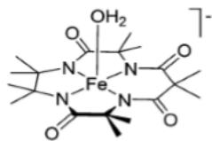
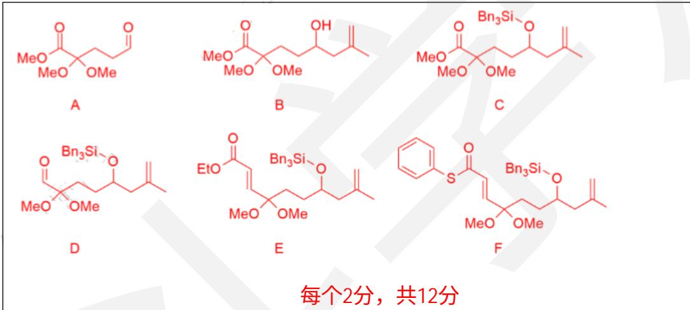
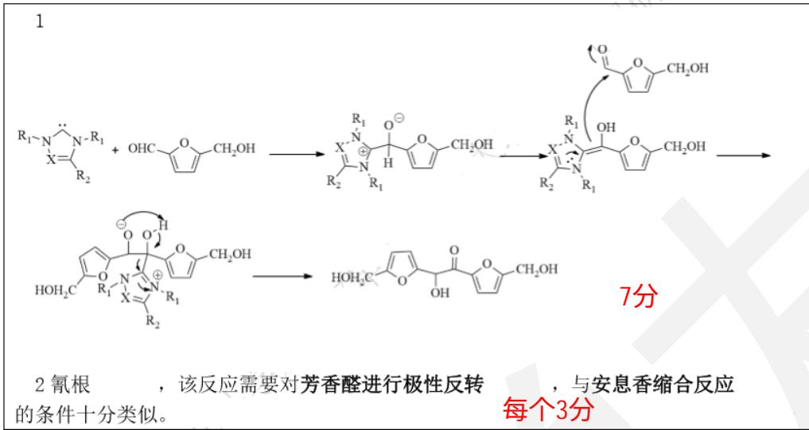
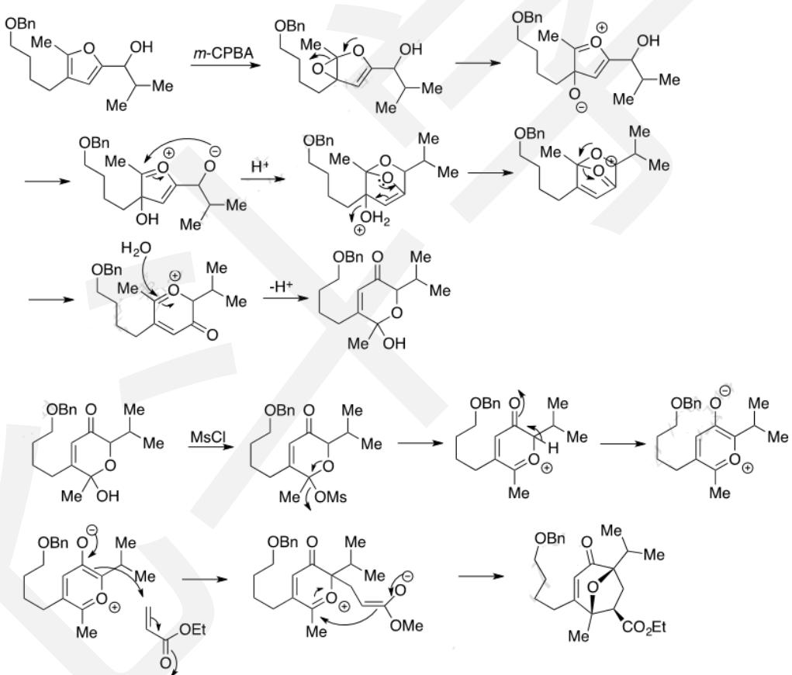

# 化学奥林匹克竞赛模拟试卷（一）参考答案

1 (10 分)

$$
\begin{array}{r l} & 8 \mathrm{NaCN} + \mathrm{O} 2 + 2 \mathrm{H} 2 0 + 4 \mathrm{Au} = 4 \mathrm{Na} [ \mathrm{Au(CN)} 2 ] + 4 \mathrm{NaOH} \\ & . 6 \mathrm{Mn} (\mathrm{IO} _ {3}) _ {2} + 2 6 \mathrm{BrF} _ {3} = 6 \mathrm{MnF} _ {3} + 1 2 \mathrm{IF} _ {5} + 1 3 \mathrm{Br} _ {2} + 1 8 \mathrm{O} _ {2} \\ & 4 \mathrm{BeMe} _ {2} + 4 \mathrm{Me} _ {2} \mathrm{CO} = (\mathrm{MeBeOt-Bu}) _ {4} \\ & 4 (\mathrm{CH} _ {3}) _ {3} \mathrm{COH} + \mathrm{LiAlH} _ {4} = 4 \mathrm{H} _ {2} + \mathrm{LiOC} (\mathrm{CH} _ {3}) _ {3} + \mathrm{Al} (\mathrm{OC} (\mathrm{CH} _ {3}) _ {3}) _ {3} \\ & 1 - 5 4 \mathrm{NaH} _ {2} \mathrm{PO} _ {2} = \mathrm{Na} _ {4} \mathrm{P} _ {2} \mathrm{O} _ {7} + 2 \mathrm{PH} _ {3} + \mathrm{H} _ {2} \mathrm{O} (\end{array}
$$

2（13分）

$$
\begin{array}{r l} & \mathrm {H_ {-S^ {-} N_ {= O}} \longleftrightarrow H_ {-S^ {+} N_ {= O} ^ {-}} , \text {或表示出相应大} \pi \text {键的结构}} \\ & \text {成键方式：S、N分别以} s p ^ {2} \text {杂化轨道与周围原子成键，S - N - O之间另外成一} \pi_ {3} ^ {4} \text {大} \pi \text {键。} \\ & (\text {共} 2 \text {分}) \end{array}
$$

2 比较键角 $\angle H-S-N$ 和 $\angle S-N-O$ 的大小，说明理由。

$\angle \mathrm{H - S - N} <   \angle \mathrm{S - N - O}$

S 的电负性小于 N，因此周围电子距离更远，斥力更小。

S 是第三周期元素，周围电子云更加弥散，斥力更小。

(2 分)

3 研究表明，反应过程为 NO 歧化生成的 $N_{2}O_{3}$ 与 $H_{2}S$ 反应，生成了 HSNO。写出两步反应的方程式。

$$
\begin{array}{l} 4 \mathrm{NO} = = = \mathrm{N} _ {2} \mathrm{O} + \mathrm{N} _ {2} \mathrm{O} _ {3} \\ \mathrm{N} _ {2} \mathrm{O} _ {3} + \mathrm{H} _ {2} \mathrm{S} = = = \mathrm{HSNO} + \mathrm{HNO} _ {2} \end{array}
$$

(2 分)

4 你认为金属表面的作用是什么？

催化作用。（准确地说，是催化 NO 的歧化）

(2分)

5 HSNO 有顺反异构体，已知室温下，顺式和反式异构体的数量约为 1:5，计算异构反应的 $\Delta G$

$$
\begin{array}{l} \text {trans - HSNO = cis - HSNO} \\ 5 \quad 1 \quad \mathrm{K=1/5} \\ \Delta \mathrm{G=-RTlnK=-8.314×298.15×ln1/5J/mol=4.0kJ/mol} \\ 6 \end{array}
$$

(2 分)

H 的反极化作用削弱了相邻的 S-N 键。(H 的强极化能力使得临近的 S 原子靠近 H 的一侧呈 $\delta^{-}$ ，靠近 N 的一侧显 $\delta^{+}$ ，这削弱了 S 与同为 $\delta^{+}$ 的 N 原子之间的作用力，这种效应被称为反极化作用) (3分)

3（20分）

$$
1 - 1 \quad 2 \mathrm{HAuCl} _ {4} \cdot 3 \mathrm{H} _ {2} \mathrm{O} + 3 \mathrm{CO} = 2 \mathrm{Au} + 3 \mathrm{CO} _ {2} + 8 \mathrm{HCl}\tag{3分}
$$

1-2 加入戊酸后，戊酸可以与油胺中和放出热量，供纳米金的生成。（2分）
一氧化碳做还原剂后产物为气体，容易分离，不涉及溶解的问题，但是一氧化碳有毒易燃，需要对其浓度进行实时监测。（3分）

(3分)

$$
2 - 2 \text {   在水溶液中，次氯酸钠的溶解度显著高于   } \mathrm{mCPBA} 。\tag{3分}
$$

$$
2 - 3 \text { 碱性增加，次氯酸氧化性下降。 }\tag{3分}
$$

$$
2 - 4 \left[ \mathrm{Fe} ^ {\mathrm{V}} \left\{\left(\mathrm{Me} _ {2} \mathrm{CNCOCMe} _ {2} \mathrm{NCO}\right) _ {2} \mathrm{CMe} _ {2} \right\} \mathrm{O} \right] ^ {-}\tag{3分}
$$

## 5（18分）

$$
\left[ \mathrm{Ag} \left(\mathrm{NH} _ {3}\right) _ {2} ^ {+} \right] = x \mathrm{mol} \mathrm{L} ^ {- 1}
$$

$$
K _ {\mathrm{sp}}
$$

$$
1. 5 5 \mathrm{mol} \mathrm{L} ^ {- 1}, 4. 2 9 \times 1 0 ^ {- 3} \mathrm{mol} \mathrm{L} ^ {- 1}, 7. 8 2 \times 1 0 ^ {- 7} \mathrm{mol} \mathrm{L} ^ {- 1}
$$

2、常用沉淀滴定的摩尔法测定 $\mathrm{Cl^-}$ 的浓度：在合适的 $\mathsf{pH}$ 用 $\mathrm{AgNO_3}$ 标准溶液直接滴定 $\mathrm{Cl^-}$ ，指示剂为 $\mathrm{K}_2\mathrm{CrO}_4$ 。

-2-1、试说明选择合适的 $\mathrm{pH}$ 所需要考虑的因素，并列举出3种会对该反应产生干扰的简单离子。

过酸生成重铬酸根，过碱银沉淀与 $\mathrm{CrO_4^{2 + }}$ ， $\mathrm{Ag^{+}}$ 产生干扰的： $\mathrm{Br^{-}}$ 、 $\mathrm{I^{-}}$ 、 $\mathrm{Ba^{2 + }}$ 、 $\mathrm{Pb^{2 + }}$ 等有色： $\mathrm{Cr}^{3 + }$ 、 $\mathrm{Fe}^{3 + }$ 等

(6分)

2-2、已知 $\mathrm{Ag_2CrO_4}$ 的 $\mathfrak{p}K_{\mathrm{so}}$ 为11.3，试计算理论上滴定终点时溶液中 $\mathrm{CrO_4^{2 - }}$ 的最适宜浓度。

$$
\left[ \mathrm{Ag} ^ {+} \right] = K _ {\mathrm{sp}} (\mathrm{AgCl}) ^ {0. 5} = 1. 7 8 \times 1 0 ^ {- 5} \mathrm{mol} \mathrm{L} ^ {- 1}
$$

$$
\left[ \mathrm{CrO} _ {4} ^ {2 -} \right] = 0. 0 1 5 8 \mathrm{mol} \mathrm{L} ^ {- 1}\tag{3分}
$$

6（10分）

B-Z 振荡反应是一种著名的振荡反应，目前普遍接受的机理是在硫酸介质中以金属铈离子做催化剂的条件下，丙二酸被溴酸氧化的机理，简称 FKN 机理。反应可以分为诱导期与振荡期两个阶段，

1 已知反应过程中，有三分之一的丙二酸被氧化为二氧化碳，其余则生成溴代丙二酸，试写出 B-Z 振荡反应的总反应。

2 为了求得诱导期与振荡期的活化能，某次实验得到了如下的数据：

| 温度/K | 297.15 | 308.15 |
| --- | --- | --- |
| 诱导时间 t 诱/s | 511.987 | 244.672 |
| 振荡周期 t 振/s | 86.463 | 36.184 |

试分别求解反应诱导期与振荡期的活化能。

由 Arrhenius 公式 k = Aexp(-E/RT) 可知， $\ln k = -E/RT + C$ ，因为在此实验中，除了反应温度外，其余条件均一致，因此，k 与反应时间 t 成反比，故  $\ln(1/t) = -E/RT + C$ 。首先求解诱导期活化能，由题中所给条件，可以得出：
6146 K
则  $E_{诱}=6146\ K\times8.314\ J\cdot mol^{-1}\cdot K^{-1}=51.10\ kJ\cdot mol^{-1}$ 
同理，可求得  $E_{振}=60.29\ kJ\cdot mol^{-1}$

7（13分）

1 屏蔽铁离子。

2 将碘化亚铜转化为硫氰酸亚铜，减小对碘单质的吸附。

3 氟离子会腐蚀玻璃。

$$
\mathrm{IO} _ {3} ^ {-} \sim 3 \mathrm{I} _ {2} \sim 6 2 \mathrm{S} _ {2} \mathrm{O} _ {3} ^ {2 -}
$$

$$
c \left(\mathrm{IO} _ {3} ^ {-}\right) = \frac {m \left(\mathrm{IO} _ {3} ^ {-}\right)}{M \left(\mathrm{IO} _ {3} ^ {-}\right) \times V \left(\mathrm{IO} _ {3} ^ {-}\right)} = \frac {0 . 4 8 2 2}{2 1 4 . 0 \times 0 . 2 5} = 9. 0 1 3 \times 1 0 ^ {- 3} \mathrm{mol/L}
$$

标定碘酸钾的过程中，每组滴定消耗的碘酸钾的量为：

$$
n \left(\mathrm{IO} _ {3} ^ {-}\right) = 9. 0 1 3 \times 1 0 ^ {- 3} \times 2 5. 0 0 \times 1 0 ^ {- 3} = 2. 2 5 3 \times 1 0 ^ {- 3} \mathrm{mol}
$$

则硫代硫酸钠的浓度为:

$$
c \left(S _ {2} O _ {3} ^ {2 -}\right) = \frac {6 \times 2 . 2 5 3 \times 1 0 ^ {- 3}}{2 2 . 1 7 \times 1 0 ^ {- 3}} = 6. 0 9 8 \times 1 0 ^ {- 2} \mathrm{mol/L}\tag{4分}
$$

$$
\mathrm{Cu} ^ {2 +} \sim 1 / 2 \mathrm{I} _ {2} \sim \mathrm{S} _ {2} \mathrm{O} _ {3} ^ {2 -}
$$

$$
\mathrm{m} (C u) = 6. 0 9 8 \times 1 0 ^ {- 2} \times 2 1. 9 3 \times 1 0 ^ {- 3} \times 6 3. 5 5 = 8. 4 9 8 \times 1 0 ^ {- 2} \mathrm{g}
$$

$$
\varpi (Cu) = \frac {8.498 \times 10 ^ {- 2} g}{0.4011g} \times 100\% = 21.19\%
$$

8（13分）

(1) 碳酸二甲酯 2分

(2) $2CH_{3}OH + CQ = === CO(OCH)_{2} + H_{2}O$ 2分

(3) $\mathrm{CHOCH}_3$ 2分

(4) $\mathrm{CH}_{3} \mathrm{OCH}_{3} + \mathrm{H}_{2} \mathrm{O} = 2 \mathrm{CHOH}$ , 增加了甲醇的量, 减少了水的量, 有利于平衡向正反应方向移动 2分

$$
\mathrm{COCl} _ {2} + \mathrm{CH} _ {3} \mathrm{OH} \rightarrow \mathrm{ClCOOCH} _ {3} + \mathrm{HCl} \tag {5}
$$

$$
\mathrm{ClCOOCH} _ {3} + \mathrm{CH} _ {3} \mathrm{OH} \rightarrow (\mathrm{CH} _ {3} \mathrm{O}) _ {2} \mathrm{CO} + \mathrm{HCl}
$$

每个2分，共4分

总反应： $\mathrm{COCl}_2 + 2\mathrm{CH}_3\mathrm{OH} \rightarrow (\mathrm{CH}_3\mathrm{O})_2\mathrm{CO} + 2\mathrm{HCl}$

9.（16分）

1 写出 A-F 的结构简式。

  
2 命名起始的反应物。

<table><tr><td>2, 2-二甲氧基戊二酸二甲酯</td><td>2分</td></tr></table>

3 试分析为何需要生成化合物 F。

<table><tr><td>生成硫酯,增加羰基活性,方便下一步的双分子交联成酯的反应。</td><td>2分</td></tr></table>

11（12分）

