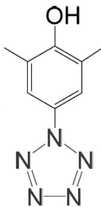
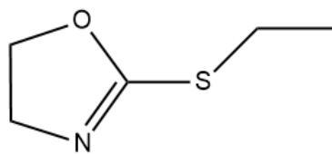
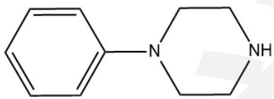
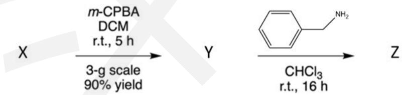
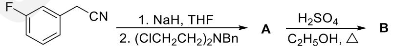
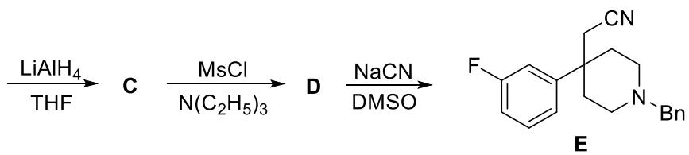
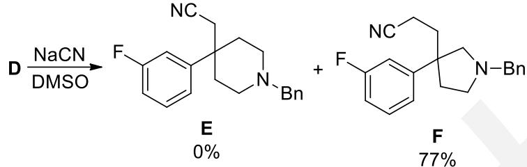
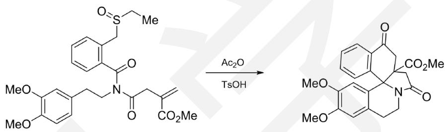
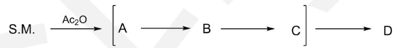
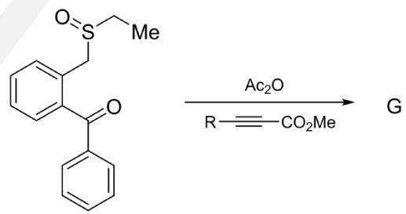

## 化学奥林匹克竞赛模拟试卷（三）

\- 竞赛时间 3 小时。

\- 试卷装订成册，不得拆散。所有解答必须写在 A4 纸上，不得用铅笔填写。

\- 姓名、报名号和所属学校必须写在首页左侧指定位置，写在其他地方者按废卷论处。

\- 允许使用非编程计算器以及直尺等文具。

<table><tr><td>H1.008</td><td colspan="16">相对原子质量</td><td>He4.003</td></tr><tr><td>Li6.941</td><td>Be9.012</td><td rowspan="2" colspan="10"></td><td>B10.81</td><td>C12.01</td><td>N14.01</td><td>O16.00</td><td>F19.00</td><td>Ne20.18</td></tr><tr><td>Na22.99</td><td>Mg24.31</td><td>Al26.98</td><td>Si28.09</td><td>P30.97</td><td>S32.07</td><td>Cl35.45</td><td>Ar39.95</td></tr><tr><td>K39.10</td><td>Ca40.08</td><td>Sc44.96</td><td>Ti47.88</td><td>V50.94</td><td>Cr52.00</td><td>Mn54.94</td><td>Fe55.85</td><td>Co58.93</td><td>Ni58.69</td><td>Cu63.55</td><td>Zn65.41</td><td>Ga69.72</td><td>Ge72.61</td><td>As74.92</td><td>Se78.96</td><td>Br79.90</td><td>Kr83.80</td></tr><tr><td>Rb85.47</td><td>Sr87.62</td><td>Y88.91</td><td>Zr91.22</td><td>Nb92.91</td><td>Mo95.94</td><td>Tc[98]</td><td>Ru101.1</td><td>Rh102.9</td><td>Pd106.4</td><td>Ag107.9</td><td>Cd112.4</td><td>In114.8</td><td>Sn118.7</td><td>Sb121.8</td><td>Te127.6</td><td>I126.9</td><td>Xe131.3</td></tr><tr><td>Cs132.9</td><td>Ba137.3</td><td>La—Lu</td><td>Hf178.5</td><td>Ta180.9</td><td>W183.8</td><td>Re186.2</td><td>Os190.2</td><td>Ir192.2</td><td>Pt195.1</td><td>Au197.0</td><td>Hg200.6</td><td>Tl204.4</td><td>Pb207.2</td><td>Bi209.0</td><td>Po[210]</td><td>At[210]</td><td>Rn[222]</td></tr><tr><td>Fr[223]</td><td>Ra[226]</td><td>Ac—La</td><td>Rf</td><td>Db</td><td>Sg</td><td>Bh</td><td>Hs</td><td>Mt</td><td>Ds</td><td>Rg</td><td>Cn</td><td>Uut</td><td>Uuq</td><td>Uup</td><td>Uuh</td><td>Uus</td><td>Uuo</td></tr><tr><td colspan="18"></td></tr><tr><td colspan="2">La</td><td>Ce</td><td>Pr</td><td>Nd</td><td>Pm</td><td>Sm</td><td>Eu</td><td>Gd</td><td>Tb</td><td>Dy</td><td>Ho</td><td>Er</td><td>Tm</td><td>Yb</td><td colspan="3">Lu</td></tr><tr><td colspan="18"></td></tr><tr><td colspan="2">Ac</td><td>Th</td><td>Pa</td><td>U</td><td>Np</td><td>Pu</td><td>Am</td><td>Cm</td><td>Bk</td><td>Cf</td><td>Es</td><td>Fm</td><td>Md</td><td>No</td><td colspan="3">Lr</td></tr></table>

可能用到的常数：法拉第常数 $F = 96485 \, C \, mol^{-1}$ ; 气体常数 $R = 8.3145 \, J \, K^{-1} \, mol^{-1}$ ; 阿伏伽德罗常数 $N_{A} = 6.0221 \times 10^{23} \, mol^{-1}$ ; 玻尔兹曼常数 $k_{B} = R / N_{A}$

## 第1题 完成反应方程式（15分，8%）

写出下列反应的化学方程式:

1-1 SnO 与 FeS 共热至 600-750°C 可以得到 Sn 单质。

1-2 癸硼烷 $B_{10}H_{14}$ 可以在甲醇中与 $I_{2}$ 发生定量反应，反应中 $I_{2}$ 与甲醇的比例为 2:3。

1-3 将 $N_{2}F_{4}$ 与三氯化铝作用可以获得纯的反式 $-N_{2}F_{2}$ ，同时生成等量的 $N_{2}$ 。

1-4 硒氰化钠与碘在碱性水溶液中作可以定量发生反应, 产物中I以两种形式存在, 其中一种为共价化合物。

1-5 锡石与纯碱、硫磺共热可得到两种盐，其中一种含S 36.88%。

## 第2题 全氮离子的结构和性质（18分， $10\%$ ）

全氮类物质能够分解产生极稳定的 $N_{2}$ ，具有能量密度高、爆轰产物清洁无污染等优点，作为新一代超高含能材料有希望应用于炸药、推进剂等领域。随着研究的不断深入，人们对全氮结构的了解程度不断提高。

2-1 首例全氮阳离子 $N_{5}^{+}$ 的无机盐由 $N_{2}F^{+}AsF_{6}^{-}$ 与 $HN_{3}$ 在 $-78^{\circ}C$ 于液态 HF 中制得，请写出合成过程的化学反应方程式。

2-2 已知 $N_{5}^{+}$ 具有 $C_{2v}$ 对称性，请画出能表达其结构与价键的共振结构式。

2-3 中国科学家首次合成了环状全氮阴离子盐 $(\mathrm{H}_3\mathrm{O})_3(\mathrm{NH}_4)_4(\mathrm{N}_5)_6\mathrm{Cl}$ ，其中分子 HPP（下图）是合成 $(\mathrm{H}_3\mathrm{O})_3(\mathrm{NH}_4)_4(\mathrm{N}_5)_6\mathrm{Cl}$ 的关键中间体。将 1 当量的 HPP 溶于乙氰和甲醇的混合溶剂中，加入 2.5 当量的甘氨酸亚铁 $[\mathrm{Fe}(\mathrm{Gly})_2]$ 时没有化学反应发生，再继续加入 4 当量的间氯过氧苯甲酸 $(m-\mathrm{CPBA})$ ，则能检测到 $\mathrm{N}_5^-$ 阴离子的生成。该反应中甘氨酸亚铁 $[\mathrm{Fe}(\mathrm{Gly})_2]$ 的作用是什么？

HPP

## 第 3 题 无机反应机理（20分，10%）

3-1 鲁米诺反应是一种有趣的化学发光反应, 其可以用于鉴定时间很久或者经过擦洗的血迹。其原料制备方法如下: 将3-硝基邻苯二甲酸加入 $8 \%$ 的肼的水溶液, 加热搅拌, 冷却后加入 $10 \%$ 的NaOH溶液与保险粉, 加热至沸, 冷却后加入乙酸, 析出亮黄色产物, 过滤即得鲁米诺的固体。

3-1-1 写出制备鲁米诺过程中发生的两步反应方程式。

3-1-2 鲁米诺反应的原理是鲁米诺与过氧化氢的碱性水溶液混合后，如果有微量血液存在，鲁米诺便会发生反应放出气体并变为激发态，跃迁会基态时释放的能量以光子形式存在，且波长位于可见光的蓝色光部分，因而会发出蓝光。写出鉴定过程的方程式，并写出为何有血液存在时才会发出蓝光？

3-2 配合物间的电子转移反应通常可通过两种机理进行：外层机理和内层机理。两者最主要的区别就是前者转移过程中反应物的配位层保持不变，而后者发生改变，后者的反应速率也比前者要快很多。下面是两个典型的例子：

$$
\mathrm{Fe} (\mathrm{H} _ {2} \mathrm{O}) _ {6} ^ {2 +} + \mathrm{Fe} ^ {*} (\mathrm{H} _ {2} \mathrm{O}) _ {6} ^ {3 +} \rightarrow \mathrm{Fe} ^ {*} (\mathrm{H} _ {2} \mathrm{O}) _ {6} ^ {2 +} + \mathrm{Fe} (\mathrm{H} _ {2} \mathrm{O}) _ {6} ^ {3 +}
$$

$$
\mathrm{Co} \left(\mathrm{NH} _ {3}\right) _ {5} \mathrm{Cl} ^ {2 +} + \mathrm{Cr} \left(\mathrm{H} _ {2} \mathrm{O}\right) _ {6} ^ {2 +} + 5 \mathrm{H} ^ {+} + 5 \mathrm{H} _ {2} \mathrm{O} \rightarrow \mathrm{Co} \left(\mathrm{H} _ {2} \mathrm{O}\right) _ {6} ^ {2 +} + \mathrm{Cr} \left(\mathrm{H} _ {2} \mathrm{O}\right) _ {5} \mathrm{Cl} ^ {2 +} + 5 \mathrm{NH} _ {4} ^ {+}
$$

3-2-1 判断上述两个反应所属的机理类型。

3-2-2 类似的， $\mathrm{Cr(NH_{3})_{5}Cl^{2+}}$ 在酸性条件下水合过程很慢，但加入微量 $\mathrm{Cr(H_{2}O)_{6}^{2+}}$ 后水合过程便明显加快。试用方程式解释原因。

3-2-3 如果将题目例子中第二个反应中的Cl换为乙酸根或富马酸根（反丁烯二酸根），试比较三者与 $\mathrm{Cr}(\mathrm{H}_{2}\mathrm{O})_{6}^{2+}$ 发生电子转移反应的速率大小并画出三者反应过程中的重要中间体。

## 第 4 题 离子晶体的堆积和填隙（14分，7%）

一种离子化合物的晶体结构可描述如下：Cs原子和Br原子共同组成密堆积层，其原子个数比为1:3，密堆积层之间的堆积方式与六方ZnS中相同，Cr原子填在Br原子组成的八面体空隙中。4-1 写出该晶体的化学式及Cr和Cs二者各自的配位数，并画出Cs原子的配位多面体。

4-2 画出以Cr原子为顶点的晶胞。

4-3 已知该晶体的晶胞参数a=758.8pm，计算该晶体的密度（假设Cr原子的配位多面体为正八面体）。

## 第 5 题 铁的燃烧反应热力学（18 分，10%）

根据中学所学的知识，铁制品在空气（ $p(\mathrm{O}_2) = 20 \mathrm{kPa}$ ）中放置得到铁锈，而铁丝在装满氧气（ $p(\mathrm{O}_2) = 100 \mathrm{kPa}$ ）的广口瓶中燃烧，火星四溅并得到黑色固体。已知铁、四氧化三铁和三氧化二铁的熔点分别为 $1538^{\circ} \mathrm{C}$ 、 $1597^{\circ} \mathrm{C}$ 和 $1565^{\circ} \mathrm{C}$ 。假设上述物质的焓和熵不随温度变化，此题仅从热力学角度考虑。

5-1 请通过计算确定铁锈的主要成分。

5-2-1 铁丝在纯氧中燃烧时的反应温度至少为 \_\_\_\_ ℃。

5-2-2 在该温度下通过计算确定黑色固体的主要成分。

5-3 计算测定三氧化二铁的熔点时需要的氧气分压（kPa）。

有关物质的热力学数据：

<table><tr><td>(298 K)</td><td> $\Delta H^{\ominus} (kJ·mol^{-1})$ </td><td> $S^{\ominus} (J·mol^{-1}·K^{-1})$ </td></tr><tr><td>Fe(s)</td><td>0</td><td>27.3</td></tr><tr><td>Fe(l)</td><td>13.8</td><td>35.8</td></tr><tr><td>O2(g)</td><td>0</td><td>205.2</td></tr><tr><td>Fe2O3(s)</td><td>-824.2</td><td>87.4</td></tr><tr><td>Fe3O4(s)</td><td>-1118.4</td><td>146.4</td></tr></table>

## 第6题 金属元素推断（15分，8%）

M是一种较为稀有的元素，但却在很多方面具有重要的用途。M的单质化学性质比较稳定，不与一般的无机酸反应，但与过氧化钠共熔可以得到A，A溶于水后通入氯气得到B，蒸发B的盐酸溶液可以得到红色晶体C，其中含Cl 40.67%。若在B的盐酸溶液中加入乙醇-KCl还原，则可以得到D，D中含M 26.99%，在200°C下加热D则可得到E。

6-1 写出M及A-E的化学式及得到C和D的化学方程式。

6-2 E的磁性呈现一种有趣的规律：将E从80K升高到300K时，磁化率（磁矩）也不断升高，猜想出现这种现象可能的原因。

## 第7题 硒的容量分析方法（20分，7%）

硒是一种相对比较少见的元素，但在某些领域具有重要的用途。由于硒是一种易挥发元素，其测定大多采用荧光法、分光光度法、极谱法、石墨炉原子吸收法等，但这些方法都不适用于测定高含量的硒。下面是一种通过碘量法测定高含量硒样品中硒含量的方法，具有操作简便、准确度高的优点。

## 一：硫代硫酸钠标准溶液的标定

1. 准确称取 $1.3472 \mathrm{~g}$ 基准 $\mathrm{K}_{2} \mathrm{Cr}_{2} \mathrm{O}_{7}$ 固体于小烧杯中, 加少量水溶解并转入 $250 \mathrm{~mL}$ 容量瓶中, 用水稀释至刻度, 摇匀。

2. 准确移取 $25.00 \mathrm{~mL} \mathrm{K}_{2} \mathrm{Cr}_{2} \mathrm{O}_{7}$ 标准溶液于碘量瓶中, 加 $5 \mathrm{~mL} 6 \mathrm{~mol} / \mathrm{L} \mathrm{HCl}$ 溶液和 $10 \mathrm{~mL} 100 \mathrm{~g} / \mathrm{L}$ 的 KI 溶液, 立即密塞摇匀, 置暗处 $5 \mathrm{~min}$ , 然后冲洗瓶盖并用蒸馏水稀释至 $100 \mathrm{~mL}$ 左右, 用待标定 $\mathrm{Na}_{2} \mathrm{S}_{2} \mathrm{O}_{3}$ 溶液滴定至 $\mathrm{K}_{2} \mathrm{Cr}_{2} \mathrm{O}_{7}$ 标准溶液呈浅黄绿色时, 加 $2 \mathrm{~mL} 5 \mathrm{~g} / \mathrm{L}$ 淀粉, 继续滴定至蓝色刚好褪去, 记录所需体积, 平行测定 3 次, 平均消耗 $23.24 \mathrm{~mL}$ .

## 二：样品含硒量的测定

称取试样1.2239g于400mL烧杯中加适量氯酸钾及10mL（1+1）的硝酸低温加热溶解数分钟后，加入（1+1）的硫酸10mL低温蒸发至冒白烟取下，冷却，加入（1+1）的盐酸100mL、1g酒石酸低温加热溶解至微沸，取下，加入3g盐酸羟胺并加入0.5g硅藻土搅拌煮沸1min，取下冷却，放置2h。用中速滤纸过滤，用盐酸（1:9）洗沉淀5～7次。将滤纸连同沉淀放入原烧杯中，加3～4滴硝酸、10mL盐酸于低温溶解后取下，加3g尿素，用水吹洗烧杯壁，使体积约为20～30mL。低温加热煮沸，取下，吹洗烧杯壁，冷却至室温，加水至约150mL，加入20mLKI溶液，放置2-3min，用硫代硫酸钠标准溶液滴定至溶液呈浅黄色，加入2mL淀粉溶液，继续用硫代硫酸钠标准溶液滴定至溶液恰好无色为终点。平行测定三次，平均消耗硫代硫酸钠标准溶液22.44mL。

7-1 写出标定与测定过程中发生的反应方程式（样品中的Se可以Se(0)表示）。

7-2 为什么采取盐酸羟胺做还原剂？加入硅藻土有什么作用？

7-3 计算该试样中Se的含量。

## 第8题 氧化银的分解反应热力学（14分，6%）

已知在298K时， $\varphi^{\theta}(\mathrm{OH}^{-}, \mathrm{Ag}_{2}\mathrm{O}, \mathrm{Ag}) = 0.344\mathrm{V}$ ， $\mathrm{Ag}_{2}\mathrm{O}(\mathrm{s})$ 的标准生成焓为-30.56kJ·mol-1， $\mathrm{H}_{2}\mathrm{O}(\mathrm{l})$ 的标准生成吉布斯自由能为-237.1kJ·mol-1，试计算 $\mathrm{Ag}_{2}\mathrm{O}(\mathrm{s})$ 在空气中分解达到平衡时的温度。

## 第9题 聚噁唑啉的制备和性质（12分，10%）

聚噁唑啉及其衍生物是一类具有良好生物相容性的亲水性长链聚合物，细胞毒性低，分子链柔性好，将其修饰于药物或载体材料表面，可以增加在体内的循环时间，且能实现 pH 敏感递药。以MeOTs(对甲基苯磺酸甲酯)为引发剂，2-乙硫基-2-噁唑啉可以进行活性阳离子聚合，得到聚硫代氨基甲酸酯。

结构式如下图

2-乙硫基-2-噁唑啉：

N-苯基哌嗪：

9-1 以2-乙硫基-2-噁唑啉为单体，MeOTs为引发剂，90℃加热下，用N-苯基哌嗪进行封端，得到聚合物X，画出X的结构式。

## 9-2

X经过如下反应可以对聚合物进行化学修饰和衍生化，从而有效地引入和聚合反应不兼容的基团

  
画出Y，Z的结构式。（若X的封端结构不正确，不影响本小问得分）

## 第10题 推断合成路线（15分，12%）

化合物E是一类新型阿片受体激动剂的合成前体，以下是研究人员设计的一种合成路线：

其中，Ms代表甲磺基，Bn代表苯基甲基。

10-1 画出A、B、C和D的结构简式。

10-2 在由D合成E的反应中，并没有观察到E的生成，反而高产率地生成了E的异构体F:

画出由D生成F的反应过程。

## 第11题 分析反应机理（14分，12%）

1996年科学家报道了如下高效的成环反应，反应条件如下：甲苯为溶剂，过量的醋酸酐和催化量的对甲基苯磺酸，加热回流：

已知该反应经历了如下反应过程:

$$
\longrightarrow \mathrm{E} \xrightarrow {- \mathrm{SEt} ^ {-}} \mathrm{F} \longrightarrow \mathrm{T.M.}
$$

11-1 已知反应中间体只有D、E为电中性，试写出该反应经历的重要中间体A-F的结构。

11-2 类比该反应的机理，写出如下反应的产物G。

