## 化学奥林匹克竞赛模拟试卷（三）答案

第一题（15分）

1-1 SnO与FeS共热至600-750℃可以得到Sn单质。

<table><tr><td>4SnO+3FeS→3SnS+Fe3O4+Sn</td><td>(3分)</td></tr></table>

1-2癸硼烷 $\mathrm{B_{10}H_{14}}$ 可以在甲醇中与 $\mathrm{I}_2$ 发生定量反应，反应中 $\mathrm{I}_2$ 与甲醇的比例为2:3。

$$
\mathrm{B} _ {1 0} \mathrm{H} _ {1 4} + 2 0 \mathrm{I} _ {2} + 3 0 \mathrm{MeOH} \rightarrow 1 0 \mathrm{B(OMe)} _ {3} + 4 0 \mathrm{HI} + 2 \mathrm{H} _ {2}
$$

1-3 将 $\mathrm{N}_2\mathrm{F}_4$ 与三氯化铝作用可以获得纯的反式 $-\mathrm{N}_2\mathrm{F}_2$ ，同时生成等量的 $\mathrm{N}_2$ 。

<table><tr><td> $2{\mathrm{N}}_{2}{\mathrm{\;F}}_{4} + 2{\mathrm{{AlCl}}}_{3} \rightarrow {\mathrm{N}}_{2}{\mathrm{\;F}}_{2} + 3{\mathrm{{Cl}}}_{2} + 2{\mathrm{{AlF}}}_{3} + {\mathrm{N}}_{2}$ </td><td>(3分)</td></tr></table>

1-4 硒氰化钠与碘在碱性水溶液中作可以定量发生反应，产物中I以两种形式存在，其中一种为共价化合物。

<table><tr><td>SeCN-+3I2+6OH-→ICN+5I-+SeO32-+3H2O</td><td>(3分)</td></tr></table>

1-5 锡石与纯碱、硫磺共热可得到两种盐，其中一种含S 36.88%。

$SnO_{2}+2Na_{2}CO_{3}+4S\rightarrow Na_{2}SnS_{3}+Na_{2}SO_{4}+2CO_{2}$ （硫酸钠写成亚硫酸钠也可）(3分)

第二题（18分）

2-1

$$
\mathrm{N} _ {2} \mathrm{F} ^ {+} \mathrm{AsF} _ {6} ^ {-} + \mathrm{HN} _ {3} = \mathrm{N} _ {5} ^ {+} \mathrm{AsF} _ {6} ^ {-} + \mathrm{HF} \quad 6 \text {分}
$$

2-2  
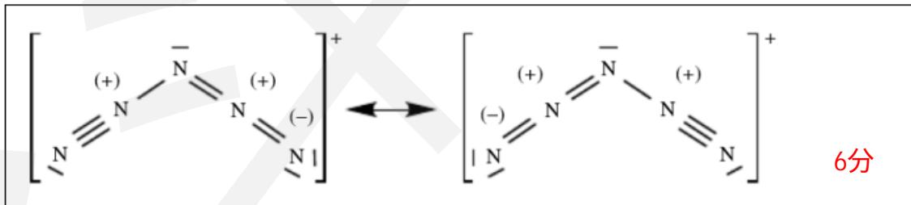  
2-3

两个作用：稳定 $\mathrm{N}_5$ -环状阴离子；作为间氯过氧苯甲酸(m-CPBA)氧化HPP的催化剂6分

第三题（20分）

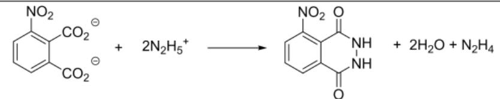

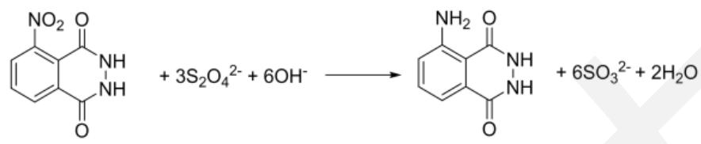

(每个1分，共2分)

3-1-2  
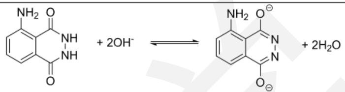

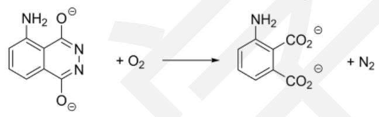

第二步生成的3-氨基邻苯二甲酸根为激发态（ $\mathrm{T}_{1}$ ），经过系间窜越变为另一种激发态（ $\mathrm{S}_{1}$ ），再跃迁回基态（ $\mathrm{S}_{0}$ ）放出光子。

(每个方程式1分，共2分)

因为血液中的血红蛋白含有铁，可催化过氧化氢分解放出氧气，无血液存在时过氧化氢分解量很少（2分）。

3-2-1

前者为外层机理，后者为内层机理。
(2分)

3-2-2

$$
\begin{array}{r l}&\mathrm {Cr(NH_ {3}) _ {5} Cl^ {2 + } + Cr(H_ {2} O) _ {6} ^ {2 + } \rightarrow [ Cr(NH_ {3}) _ {5} -Cl- Cr(H_ {2} O) _ {5} ] ^ {4 + } + H_ {2} O}\\&\quad [ \mathrm {Cr(NH_ {3}) _ {5} -Cl- Cr(H_ {2} O) _ {5}} ] ^ {4 +} \rightarrow \mathrm {Cr(NH_ {3}) _ {5} ^ {2 + } + Cr(H_ {2} O) _ {5} Cl^ {2 + }}\\&\quad \mathrm {Cr(NH_ {3}) _ {5} ^ {2 + } + 5 H ^ {+} + 6 H _ {2} O\rightarrow Cr(H_ {2} O) _ {6} ^ {2 + } + 5 NH_ {4} ^ {+}} (\text {很快})\\&\quad (\text {每个2分，共6分})\end{array}
$$

反应速率 富马酸根>乙酸根>Cl（2分）  
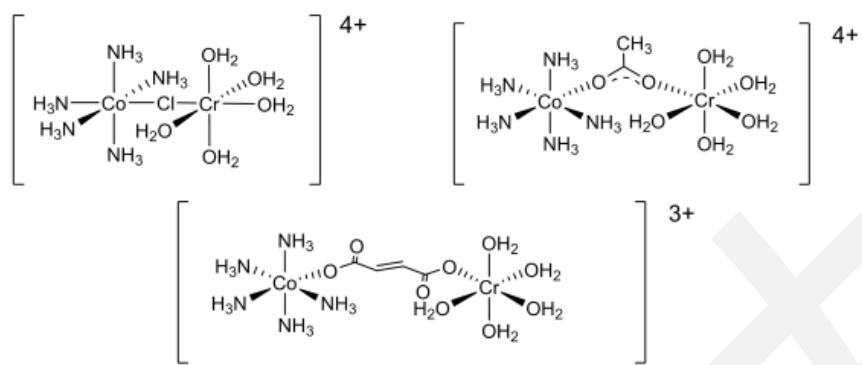

（第一个中间体Co-Cl-Cr也可以为折线，前两个每个1分，最后一个2分，不标电荷只得一半分，共4分）

第四题（14分）

4-1  
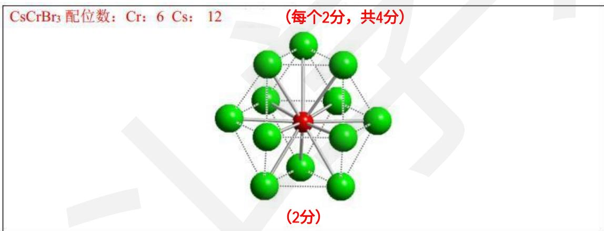

4-2  
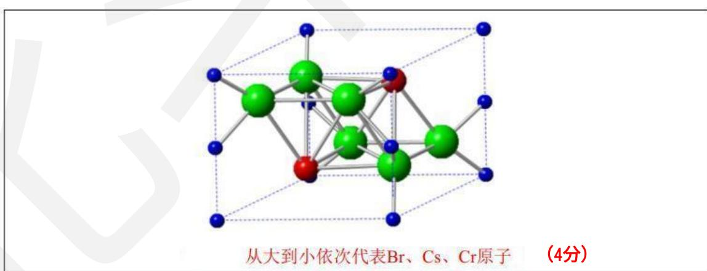

由晶胞参数a=758.8pm且Cr原子的配位多面体为正八面体，通过计算可得出

$$
c = \frac {\sqrt {6}}{3} a = 6 1 9. 6 p m
$$

$$
, \text {因此} \rho = \frac {Z M}{V N _ {\mathrm{A}}} = \frac {2 M}{a ^ {2} c \sin 1 2 0 ^ {\circ} N _ {\mathrm{A}}} = 4. 5 6 4 \mathrm{g} \cdot \mathrm{cm} ^ {- 3}
$$

(每个2分，共4分)

第五题（18分）

5-1

证明 Fe 能与空气中的氧气反应， $\Delta rG(298K)=-1015.3\ kJ\ mol^{-1}$ ，K=10178，Q=25.0<K，平衡正向进行，可以反应

证明 $\mathrm{Fe}_{3} \mathrm{O}_{4}$ 能与空气中的 $\mathrm{O}_{2}$ 反应, $\Delta \mathrm{rG}(298 \mathrm{~K}) = -392.2 \mathrm{~kJ} \mathrm{~mol}^{-1}, \mathrm{~K} = 1068, \mathrm{~Q} = 5.0 < \mathrm{K}$ , 平衡正向进行, 可以反应

综上，铁锈的主要成分是 $Fe_{2}O_{3}$ （8分）

（只证明铁能与氧气反应得到三氧化二铁的不得分，用合理方法推得结论也得满分

5-2-2 在 1811K 下，重复上述计算，证明铁能与氧气反应， $Fe_{3}O_{4}$ 不能再被氧化，黑色固体的主要成分是四氧化三铁（4 分）

5-3 需要使 $Fe_{2}O_{3}$ 达到熔点（1838K）时不发生分解， $4Fe_{3}O_{4}(s)+O_{2}(g)=6Fe_{2}O_{3}(s)$ ， $\Delta rG(1838K)=18.0\ kJ\ mol^{-1}\ K=0.307$ （3分）
此时氧气的分压为 326 kPa

第六题（15分）

6-1

(每个1分，共6分)

$$
2 \mathrm{RuO} _ {4} + 1 6 \mathrm{HCl} \rightarrow 2 \mathrm{RuCl} _ {3} \cdot 3 \mathrm{H} _ {2} \mathrm{O} + 5 \mathrm{Cl} _ {2} + 2 \mathrm{H} _ {2} \mathrm{O}
$$

$$
1 2 \mathrm{RuO} _ {4} + 5 \mathrm{C} _ {2} \mathrm{H} _ {5} \mathrm{OH} + 2 4 \mathrm{KCl} + 3 6 \mathrm{HCl} \rightarrow 1 2 \mathrm{K} _ {2} [ \mathrm{RuCl} _ {5} (\mathrm{H} _ {2} \mathrm{O}) ] + 1 0 \mathrm{CO} _ {2} + 2 1 \mathrm{H} _ {2} \mathrm{O}
$$

(每个2分，共4分)

6-2

说明E的晶体结构中存在双核阴离子 $Ru_{2}Cl_{10}^{4-}$ 使磁矩下降，升温时该离子解聚为单核离子 $RuCl_{5}^{2-}$ ，使磁矩升高。（5分）

第七题（20分）

7-1

$$
\mathrm{Cr} _ {2} \mathrm{O} _ {7} ^ {2 -} + 6 \mathrm{I} ^ {-} + 1 4 \mathrm{H} ^ {+} \rightarrow 2 \mathrm{Cr} ^ {3 +} + 3 \mathrm{I} _ {2} + 7 \mathrm{H} _ {2} \mathrm{O} \quad \mathrm{I} _ {3} ^ {-} + 2 \mathrm{S} _ {2} \mathrm{O} _ {3} ^ {2 -} \rightarrow 3 \mathrm{I} ^ {-} + \mathrm{S} _ {4} \mathrm{O} _ {6} ^ {2 -}
$$

$$
\mathrm{ClO} _ {3} ^ {-} + \mathrm{Se} + \mathrm{H} _ {2} \mathrm{O} \rightarrow \mathrm{SeO} _ {4} ^ {2 -} + \mathrm{Cl} ^ {-} + 2 \mathrm{H} ^ {+} \quad (\mathrm{ClO} _ {3} ^ {-} \text {的还原产物写Cl} _ {2} \text {也可})
$$

$$
2 \mathrm{SeO} _ {4} ^ {2 -} + 6 \mathrm{NH} _ {3} \mathrm{OH} ^ {+} \rightarrow 2 \mathrm{Se} + 3 \mathrm{N} _ {2} \mathrm{O} + 1 1 \mathrm{H} _ {2} \mathrm{O} + 2 \mathrm{H} ^ {+} (\text {羟胺还原产物写N} _ {2} \text {也可})
$$

$$
3 \mathrm{Se} + 4 \mathrm{NO} _ {3} ^ {-} + 4 \mathrm{H} ^ {+} + \mathrm{H} _ {2} \mathrm{O} \rightarrow 3 \mathrm{H} _ {2} \mathrm{SeO} _ {3} + 4 \mathrm{NO}
$$

$$
\mathrm{HSeO} _ {3} ^ {-}
$$

$$
\mathrm{SeO} _ {3} ^ {2 -}
$$

$$
\mathrm{H} _ {2} \mathrm{SeO} _ {3} + 6 \mathrm{I} ^ {-} + 4 \mathrm{H} ^ {+} \rightarrow \mathrm{Se} + 2 \mathrm{I} _ {3} ^ {-} + 3 \mathrm{H} _ {2} \mathrm{O}
$$

$$
(\mathrm{每个} 1 \mathrm{分}, \mathrm{共} 6 \mathrm{分})
$$

7-2

盐酸羟胺易于溶解、还原完全，且氧化产物均为气体，沉淀出的Se易洗涤干净（2分）。不加硅藻土过滤洗涤沉淀时，硒易于流失，容易使结果偏低；加入硅藻土后，虽然洗涤次数增多，但硒不易流失，结果稳定（2分）

7-3

硫代硫酸钠标准溶液的浓度：

$$
\mathrm{c} \left(\mathrm{Na} _ {2} \mathrm{S} _ {2} \mathrm{O} _ {3}\right) = \frac {\mathrm{m} \left(\mathrm{K} _ {2} \mathrm{Cr} _ {2} \mathrm{O} _ {7}\right) \times \frac {2 5 . 0 0 \mathrm{mL}}{2 5 0 \mathrm{mL}} \times 6}{\mathrm{M} \left(\mathrm{K} _ {2} \mathrm{Cr} _ {2} \mathrm{O} _ {7}\right) \times \mathrm{V} \left(\mathrm{Na} _ {2} \mathrm{S} _ {2} \mathrm{O} _ {3}\right)} = \frac {1 . 3 4 7 2 \mathrm{g} \times \frac {2 5 . 0 0 \mathrm{mL}}{2 5 0 \mathrm{mL}} \times 6}{2 9 4 . 2 \mathrm{g/mol} \times 2 3 . 2 4 \times 1 0 ^ {- 3} \mathrm{L}} = 0. 1 1 8 2 \mathrm{mol} \cdot \mathrm{L} ^ {- 1}
$$

由于 $4NaS_{2}O_{3}\sim1Se$

(4分)

因此样品中Se含量:

$$
\omega (\mathrm{Se}) = \frac{\frac{1}{4}\times c(\mathrm{Na}_{2}\mathrm{S}_{2}\mathrm{O}_{3})\times V(\mathrm{Na}_{2}\mathrm{S}_{2}\mathrm{O}_{3})\times M(\mathrm{Se})}{m}\times 100\%
$$

$$
= \frac {\frac {1}{4} \times 0 . 1 1 8 2 \mathrm{mol/L} \times 2 2 . 4 4 \times 1 0 ^ {- 3} \mathrm{L} \times 7 8 . 9 6 \mathrm{g/mol}}{1 . 2 2 3 9 \mathrm{g}} \times 1 0 0 \% = 4. 2 7 8 \%
$$

(公式4分，结果2分，共6分)

第八题（14分）

由 $H_{2}O(l)$ 的标准生成吉布斯自由能为-237.1kJ·mol $^{-1}$ ，可设计电池：

$$
\mathrm{Pt} (\mathrm{s}) \mid \mathrm{H} _ {2} (\mathrm{g}), \mathrm{p} \ominus \mid \mathrm{H} ^ {+} (1. 0 0 \mathrm{mol} \cdot \mathrm{L} ^ {- 1}) \mid \mathrm{O} _ {2} (\mathrm{g}), \mathrm{p} \ominus \mid \mathrm{Pt} (\mathrm{s})
$$

该电池总反应为

$$
\mathrm{H} _ {2} (\mathrm{g}, \mathrm{p} \ominus) + \mathrm{O} _ {2} (\mathrm{g}, \mathrm{p} \ominus) \rightarrow \mathrm{H} _ {2} \mathrm{O} (\mathrm{l})
$$

$$
\text {由} \Delta_ {\mathrm{r}} \mathrm{G} _ {\mathrm{m}} \ominus = - \mathrm{nFE} \ominus = \varphi \ominus_ {\text {正}} - \varphi \ominus_ {\text {负}} = \varphi \ominus (\mathrm{O} _ {2} / \mathrm{H} ^ {+}) = - 2 3 7. 1 \mathrm{kJ} \cdot \mathrm{mol} ^ {- 1}
$$

解得 $\varphi \ominus (\mathrm{O}_2 / \mathrm{H}^+) = 1.229\mathrm{V}$

由于题目中给出的 $\varphi \ominus (\mathrm{OH - },\mathrm{Ag_2O},\mathrm{Ag})$ 为碱性条件，因此应将 $\varphi \ominus (\mathrm{O}_2 / \mathrm{H}^+)$ 换算为碱性条件：

$$
\varphi \ominus (\mathrm{O} _ {2} / \mathrm{OH} ^ {-}) = \varphi \ominus (\mathrm{O} _ {2} / \mathrm{H} ^ {+}) - 0. 0 5 9 2 \mathrm{pH} = 0. 4 0 0 \mathrm{V}
$$

由此可设计电池：

$$
\mathrm{Pt} (\mathrm{s}) \mid \mathrm{O} _ {2} (\mathrm{g}), 0. 2 1 \mathrm{p} \ominus \mid \mathrm{OH} ^ {-} (1. \mathrm{mol} \cdot \mathrm{L} ^ {- 1}) \mid \mathrm{Ag} _ {2} \mathrm{O} (\mathrm{s}) \mid \mathrm{Ag} (\mathrm{s})\tag{2分}
$$

$$
\mathrm{Ag} _ {2} \mathrm{O} (\mathrm{s}) \rightarrow 2 \mathrm{Ag} (\mathrm{s}) + 1 / 2 \mathrm{O} _ {2} (\mathrm{g}, 0. 2 1 \mathrm{p} \ominus)\tag{2分}
$$

$$
\mathrm{E} = \varphi \text {O} _ {\text {正}} - \varphi_ {\text {负}} = \varphi \text {O} (\mathrm{OH} -, \mathrm{Ag} _ {2} \mathrm{O}, \mathrm{Ag}) - (\varphi \text {O} (\mathrm{O} _ {2} / \mathrm{OH} ^ {-}) + \frac {0 . 0 5 9 2}{4} \lg (0. 2 1)) = - 0. 0 4 6 \mathrm{V}\tag{2分}
$$

当 $\mathrm{Ag_2O(s)}$ 在空气中分解达到平衡时，该电池电动势为 $\mathrm{E}' = 0$

$$
\mathrm{nF} \left(\frac {\mathrm{E} ^ {\prime}}{\mathrm{T} _ {2}} - \frac {\mathrm{E}}{\mathrm{T} _ {1}}\right) = \Delta_ {\mathrm{r}} H _ {\mathrm{m}} ^ {\theta} \left(\frac {1}{\mathrm{T} _ {1}} - \frac {1}{\mathrm{T} _ {2}}\right)\tag{2分}
$$

代入相关数值，解得 $T_{2}=420K$

(2分)

中间体结构正确即可得满分。

## 第九题（12分）

9-1

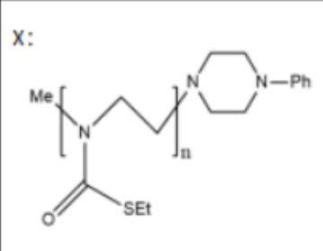  
(4分)

9-2  
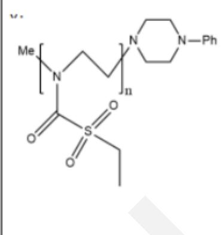  
(4分)

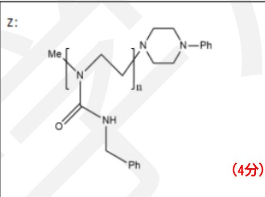

第十题（15分）

<table><tr><td>A←(3分)</td><td>B←(3分)</td></tr><tr><td>C←(3分)</td><td>D←(3分)</td></tr></table>

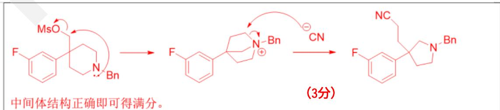

第十一题（14分）

11-1

A:  
C:  
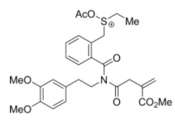

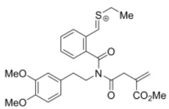

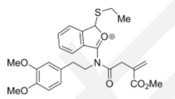

D:  
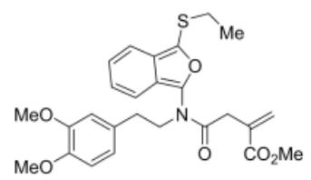  
E:

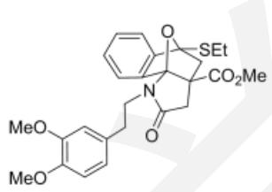

F:  
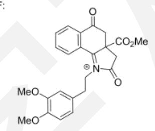

## (每个2分，共12分)

11-2  
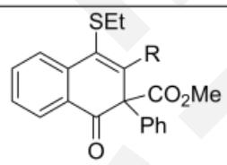  
(2分)