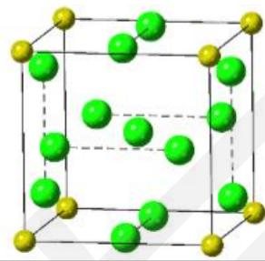
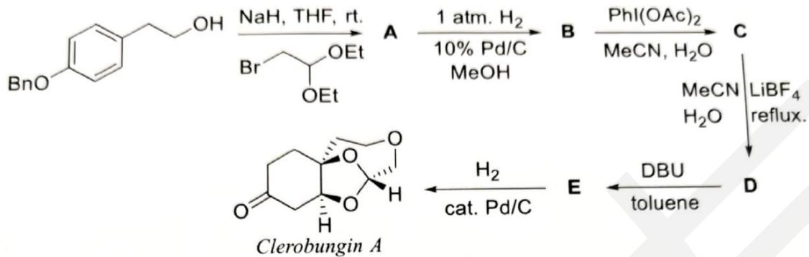
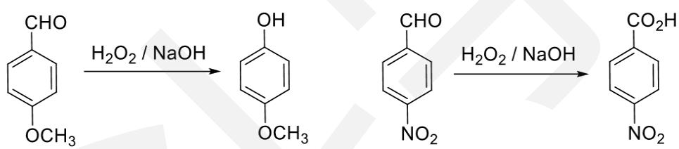
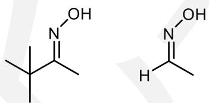
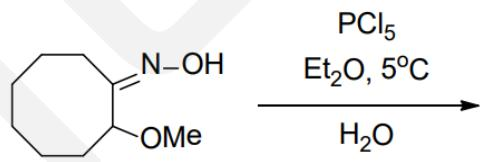
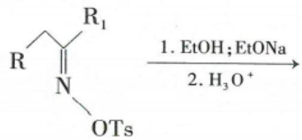
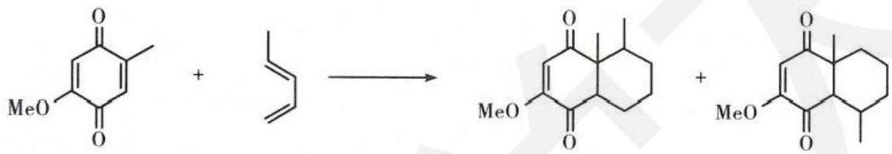

# 化学奥林匹克竞赛模拟试卷（二）

\- 竞赛时间 3 小时。

\- 试卷装订成册，不得拆散。所有解答必须写在 A4 纸上，不得用铅笔填写。

\- 姓名、报名号和所属学校必须写在首页左侧指定位置，写在其他地方者按废卷论处。

\- 允许使用非编程计算器以及直尺等文具。

<table><tr><td>H1.008</td><td colspan="16">相对原子质量</td><td>He4.003</td></tr><tr><td>Li6.941</td><td>Be9.012</td><td rowspan="2" colspan="10"></td><td>B10.81</td><td>C12.01</td><td>N14.01</td><td>O16.00</td><td>F19.00</td><td>Ne20.18</td></tr><tr><td>Na22.99</td><td>Mg24.31</td><td>Al26.98</td><td>Si28.09</td><td>P30.97</td><td>S32.07</td><td>Cl35.45</td><td>Ar39.95</td></tr><tr><td>K39.10</td><td>Ca40.08</td><td>Sc44.96</td><td>Ti47.88</td><td>V50.94</td><td>Cr52.00</td><td>Mn54.94</td><td>Fe55.85</td><td>Co58.93</td><td>Ni58.69</td><td>Cu63.55</td><td>Zn65.41</td><td>Ga69.72</td><td>Ge72.61</td><td>As74.92</td><td>Se78.96</td><td>Br79.90</td><td>Kr83.80</td></tr><tr><td>Rb85.47</td><td>Sr87.62</td><td>Y88.91</td><td>Zr91.22</td><td>Nb92.91</td><td>Mo95.94</td><td>Tc[98]</td><td>Ru101.1</td><td>Rh102.9</td><td>Pd106.4</td><td>Ag107.9</td><td>Cd112.4</td><td>In114.8</td><td>Sn118.7</td><td>Sb121.8</td><td>Te127.6</td><td>I126.9</td><td>Xe131.3</td></tr><tr><td>Cs132.9</td><td>Ba137.3</td><td>La—Lu</td><td>Hf178.5</td><td>Ta180.9</td><td>W183.8</td><td>Re186.2</td><td>Os190.2</td><td>Ir192.2</td><td>Pt195.1</td><td>Au197.0</td><td>Hg200.6</td><td>Tl204.4</td><td>Pb207.2</td><td>Bi209.0</td><td>Po[210]</td><td>At[210]</td><td>Rn[222]</td></tr><tr><td>Fr[223]</td><td>Ra[226]</td><td>Ac—La</td><td>Rf</td><td>Db</td><td>Sg</td><td>Bh</td><td>Hs</td><td>Mt</td><td>Ds</td><td>Rg</td><td>Cn</td><td>Uut</td><td>Uuq</td><td>Uup</td><td>Uuh</td><td>Uus</td><td>Uuo</td></tr></table>

<table><tr><td>La</td><td>Ce</td><td>Pr</td><td>Nd</td><td>Pm</td><td>Sm</td><td>Eu</td><td>Gd</td><td>Tb</td><td>Dy</td><td>Ho</td><td>Er</td><td>Tm</td><td>Yb</td><td>Lu</td></tr><tr><td>Ac</td><td>Th</td><td>Pa</td><td>U</td><td>Np</td><td>Pu</td><td>Am</td><td>Cm</td><td>Bk</td><td>Cf</td><td>Es</td><td>Fm</td><td>Md</td><td>No</td><td>Lr</td></tr></table>

可能用到的常数：法拉第常数 $F = 96485 \, \mathrm{C} \mathrm{mol}^{-1}$ ; 气体常数 $R = 8.3145 \, \mathrm{J} \mathrm{K}^{-1} \mathrm{mol}^{-1}$ ; 阿伏伽德罗常数 $N_{A} = 6.0221 \times 10^{23} \, \mathrm{mol}^{-1}$ ; 玻尔兹曼常数 $k_{B} = R / N_{A}$

## 第1题（12分， $10\%$ ）完成反应方程式

1-1 在碱性条件下，用 $Na_{2}S_{2}O_{4}$ 还原 $\mathrm{Cu(NH_{3})_{4}^{2+}}$ ，得到一种无色配合物。

1-2 向含有铜离子的溶液中加入过量氰化钠，溶液的蓝色消失，同时逸出一种剧毒气体。

1-3 氯化亚铜在浓 NaOH 溶液中煮沸，其中的铜元素完全转化为一种红色固体。

1-4 $IF_{3}$ 水解歧化，产物为三种常见无机物。

1-5 Pb 单质溶于氢氧化钠中，写出反应的离子方程式。

1-6 用三氟化溴在 800K 下处理 $\mathrm{Mn(IO_{3})_{2}}$ 以制备一种氟化物，生成物里还有另一种氟化物。

## 第 2 题（24分，11%）硫化合物的特殊结构

硫在远古时代就被人们知晓，许多含硫的化合物也具有有趣的结构。

2-1 将 $S_{4}N_{4}$ 和 NOCl 在极性溶剂中反应中得到离子化合物 A、 $S_{2}N_{2}$ 和一种有甜味的气体。A 的阳离子有五元环，含六个原子，它们的化学环境均不同。写出生出 A 的反应式，并画出该阳离子的示意图。

2-2 在 $CCl_{4}$ 溶液中用氯气对 $S_{4}N_{4}$ 进行反应得到一个黄色结晶物 B, B 只有一个跨环 S…S 键，硫有两种环境，氮和氯只有一种环境。画出 B 的结构。

2-3 在温热的乙腈溶液中 NaF 和 $SCl_{2}$ 反应得到含五个原子的二元化合物 X，它在 $NO_{2}$ 催化剂存在下与 $O_{2}$ 反应生成 Y。写出生成 X 的化学反应方程式，画出 X 和 Y 的结构。

2-4 化合物 C 和 D 结构均类似于 $Pd_{6}Cl_{12}$ ，化学式均可表示为 $[PdL]_{6}$ ，其中 L 为对称的双齿硫配体（可简化为 S～S）。C 只有一根二重旋转轴，穿过两个钯原子，而 D 有一根六重映轴。画出 C 和 D 的结构。

## 第 3 题（18 分，10%）金属元素推断

元素 M 的名称来源于希腊神话。M 单质常从某天然矿物制备，该矿物主要成分为 G，含 M 31.56%。M 单质可直接与氮气化合生成稳定的金黄色固体 A，A 与 NaCl 类质同晶。A 溶于王水生成 B。向 B 的浓 HCl 溶液中加入 Zn 粉，溶液变成紫色，其中溶质为 C。B 暴露在空气中易转化为 D，D 同样十分稳定，不溶于硫酸或硝酸，但可以溶于氢氟酸生成 E，E 也可以用于 M 的制备。将 B 溶于无水乙醇并通入氨气可制备 F，F 中 M 质量分数为 20.99%。3-1 写出 A\~G 的化学式。

3-2 制备 M 单质的第一步为 G 与碳单质一起用过量氯气高温处理，写出该反应方程式。
3-3 F 实际存在形态中 M 有两种化学环境，分子量不超过 1000。写出其制备反应方程式，并画出 F 的真实结构示意图。

## 第 4 题（18 分，9%）络合滴定

在用络合滴定法测定水中的钙、镁离子含量时，如何掩蔽其中 $Fe^{3+}$ 的干扰时一个有探究价值的问题。在实验中常用掩蔽 $Fe^{3+}$ 的试剂有三乙醇胺和抗坏血酸两种，其中之一用于在溶液中滴定 $Ca^{2+}$ 、 $Mg^{2+}$ 中使用，另一种则在滴定溶液中的 $Bi^{3+}$ 时有很好的效果。

4-1 试根据此在三乙醇胺和抗坏血酸中选择在测定自来水中钙、镁离子含量时为掩蔽 $Fe^{3+}$ 应当使用的掩蔽剂，并解释原因。

对某地区自来水样的分析过程如下：取 100.0 ml 自来水样，用适当的方法掩蔽 $Fe^{3+}$ 后用缓冲溶液调节 pH=10，以铬黑 T 为指示剂，用 0.01060 mol/L 的 EDTA 标准溶液滴定，消耗 EDTA 溶液 31.30 ml。另取 100.0 ml 自来水样，加过量的 NaOH 使溶液呈强碱性，加入钙指示剂，用上述 EDTA 溶液滴定至终点，消耗 EDTA 溶液 19.20 ml。

4-2 用离子方程式说明在滴定过程中加入过量的 NaOH 的作用。

4-3 分别计算水中钙、镁离子的含量（以 $CaCO_{3}$ mg/L 和 $MgCO_{3}$ mg/L 表示）

## 第 5 题（13 分，7%）蒸汽过程热力学

5-1 一次实验中，实验人员将盛有一定量 Au 的陶瓷舟置于 $1400^{\circ}$ C 的管式炉中，在 1 atm 下通过 $12.0 \, dm^{3} \, N_{2}$ （1 atm，293.15K 下测定），随后冷却取出陶瓷舟，测得 Au 损失了 1.05 mg。试求 $1400^{\circ}$ C 下 Au 的蒸汽压。（已知 Au 气态只以单原子形式存在， $N_{2}$ 未参与反应）

5-2 另一次实验中，将上问中的 $N_{2}$ 改为 $H_{2}$ ，其他条件完全一致，测得 Au 损失了 11.20 mg。已知该条件下 Au 和 $H_{2}$ 可形成 AuH，试求 1400 °C 下反应 $2\mathrm{AuH(g)} = 2\mathrm{Au(g)} + \mathrm{H}_{2}(\mathrm{g})$ 的 $K_{p}$ 。

## 第6题（18分， $9\%$ ）NaCl的超结构

氯化钠的结构是最经典的晶体结构之一。在极高的压强下，氯化钠可以和数分子氯气化合生成 $NaCl_{x}$ 。右图是 $NaCl_{7}$ 正当立方晶系晶胞示意图，其中两个 Cl 原子的坐标为（0.5，0，0.1671）、（0.5，0，0.8329）。

6-1 指出体心 Cl 原子和顶点 Na 原子的配位数。

6-2 已知 $Cl_{2}$ 在晶体中的键长为 2.053 Å，试据此计算晶体密度。

6-3 另一种与上述晶体结构相似的 $NaCl_{n}$ ，其中 Na 的配位数与 $NaCl_{7}$ 中的 Na 相同，且 Cl 的配位数只有一种。

6-3-1 写出符合条件的 n 的最小值。

6-3-2 猜测其密度与 $NaCl_{7}$ 相比如何，并试解释之。

6-3-3 能否将此晶体类比 $NaCl_{7}$ 看作 $NaCl\cdot nCl_{2}$ ？指明原因。

## 第 7 题（15 分，8%）铁配合物的结构和磁性

铁硫蛋白是一类具有传递电子功能的金属蛋白，参与所有生命形式的氧化还原过程，包含于植物的光合作用、细菌固氮和线粒体的呼吸活动中，引起了研究者的广泛关注，合成了许多以 Fe-S 构成骨架的配合物。

铁硫蛋白中最简单的是红氧还蛋白，是一种红色蛋白质，其骨架有 Fe 与 $[HOOCCH(NH_{2})CH_{2}SH](Cys)$ ，1981 年美国科学家合成了与红氧还蛋白具有相似结构的 $(Et_{4}N)_{2}[Fe(SPh)_{4}]$ ，其中 $Et=-C_{2}H_{5}$ ， $Ph=-C_{6}H_{5}$ 。

7-1 画出 $\left[\mathrm{Fe}(\mathrm{SPh})_{4}\right]^{2-}$ 的结构，并计算其磁矩。

另一系列简单铁-硫蛋白中含有 2Fe-2S，4Fe-4S 和 3Fe-4S 骨架，其结构中均有两种 Fe-S 键且不含有 Fe-Fe 键。

7-2 2Fe-2S 结构是菠菜氧还蛋白的活性部位，2Fe-2S 结构 $\left[\mathrm{Fe}_{2} \mathrm{~S}_{2}(\mathrm{SPh})_{4}\right]^{2-}$ 可以通过 $\left[\mathrm{Fe}(\mathrm{SPh})_{4}\right]^{2-}$ 与单质硫反应得到，该反应的反应物只有 $\left[\mathrm{Fe}(\mathrm{SPh})_{4}\right]^{2-}$ 与硫，并生成了三种均含硫的产物。写出该反应的化学反应方程式，并画出 $\left[\mathrm{Fe}_{2} \mathrm{~S}_{2}(\mathrm{SPh})_{4}\right]^{2-}$ 的结构。

Mossbauer 谱是以观测铁原子对无反冲的低能 $\gamma$ 射线的共振吸收为基础，测得同质异能位移 $\sigma_{s}$ 提供铁原子的氧化态和键合状态的信息，四级分裂 $\Delta E_{q}$ 作为铁原子核周围电荷分布对称性的测度。对于菠菜铁氧还蛋白，其氧化型的 Mossbauer 谱中只有一组双峰， $\sigma_{s}=0.24\ mm/s$ ， $\Delta E_{q}=0.65\ mm/s$ ；还原型的 Mossbauer 谱中出现了两组双峰， $\sigma_{s}=0.56\ mm/s$ ， $\Delta E_{q}=3.00\ mm/s$ ，以及 $\sigma_{s}=0.22\ mm/s$ ， $\Delta E_{q}=0.64\ mm/s$ 。

4Fe-4S 结构 $\left[\mathrm{Fe}_{4}\mathrm{S}_{4}(\mathrm{SPh})_{4}\right]^{2-}$ 中，每个铁离子均为 4 配位，一定条件下，2Fe-2S 结构会自发地形成 4Fe-4S 结构。

7-3画出 $\left[Fe_{4}S_{4}(SPh)_{4}\right]^{2-}$ 结构式。

7-4从 $\left[Fe_{4}S_{4}(SPh)_{4}\right]^{2-}$ 结构可以衍生出3Fe-3S结构 $\left[Fe_{3}S_{4}(SPh)_{3}\right]^{2-}$ ，该结构仍具有三重对称性，每个铁离子的配位环境相同，配位数为4。当pH>9时，有过量PhSH存在下， $\left[Fe_{3}S_{4}(SPh)_{3}\right]^{2-}$

$\mathrm{[Fe_3S_4(SPh)_3]^{2 - }}$ 及 $[\mathrm{Fe}_3\mathrm{S}_4(\mathrm{SPh})_4]^{2 - }$ 的结构式。

## 第8题（18分， $7\%$ ）有机反应影响因素

8-1 请将以下化合物按酸性由强至弱排序:

<table><tr><td></td><td></td><td></td><td></td><td rowspan="2"></td></tr><tr><td>A</td><td>B</td><td>C</td><td>D</td></tr></table>

8-2 请将如下化合物按发生 $S_{N1}$ 反应速率由慢至快排序:

<table><tr><td colspan="3"></td></tr><tr><td>G</td><td>H</td><td>I</td></tr></table>

8-3 一、二、三级胺常用 Hinsberg 反应区分，即使未知胺与对甲苯磺酰氯混合，再分别用纯水与碱液处理产物。请写出一、二、三级胺分别对应的反应现象。

## 第9题（14分， $8\%$ ）质子转移反应的机理

Baylis-Hillman 反应因其温和的反应条件与 100% 的原子转化率，被广泛应用于有机合成中。9-1 请补全以下 B-H 反应机理图示中关键中间体 A\~C 及产物 X 的结构。

$$
\mathrm{OMe} \xrightarrow {\mathrm{R} _ {3} \mathrm{N}} [ \mathrm{A} ] \xrightarrow {\text { PhCHO }} [ \mathrm{B} ] \xrightarrow {\sim \mathrm{H} ^ {+}} [ \mathrm{C} ] \xrightarrow {- \mathrm{R} _ {3} \mathrm{N}} \mathrm{X}
$$

9-2 上述反应历程中 $[\mathbf{B}] \rightarrow [\mathbf{C}]$ 的一步质子转移，研究人员结合计算等方法，提出了一种可能的机理，涉及一份子溶剂甲醇，请分别画出该机理的电子流动。

9-3 除此之外，研究人员还提出了一种涉及第二分子苯甲醛的质子转移机理，请画出质子转移一步的电子流动，并给出该机理对应的一个三环副产物。

## 第 10 题（18 分，10%）分析合成路线

Clerobungin A 是一种中草药有效成分的提取物，2014 年，几位中国化学家完成了该提取物立体异构的分离和测定，两年之后，J. Mease 和 K. P. Reber 通过巧妙的反应条件一步构建了主环系，并完成了如下对 Clerobungin A 的全合成。

转变为线性的 $\left[\mathrm{Fe}_{3} \mathrm{~S}_{4}(\mathrm{SPh})_{4}\right]^{2-}$ ，该结构中铁离子有两种配位环境，苯硫酚只作端基配位。画出路线中出现的一些缩写和简写的全称如下：Bn-代表苄基，THF 代表四氢呋喃，reflux 表示回流，DBU 代表 1，8-二氮杂二环十一碳-7-烯，toluene 表示甲苯。

10-1 根据条件画出 A\~E 的结构。(不要求立体化学)

10-2 画出 D 到 E 一步经历的一个关键负离子中间体。（不要求立体化学）

## 第 11 题（23 分，11%）有机反应机理的影响因素

对有机反应的底物和条件进行微笑的调整，就可能发生不同的反应，对于教材上耳熟能详的反应也如此。

11-1 请观察以下两个氧化反应的差别，分析产物不同的原因。

11-2 Beckmann 重排反应是一类常用的合成酰胺的反应，但若改变其反应条件，将以较高的产率得到其他产物。

11-2-1 对于如下两个底物，在酸中反应会得到腈，请画出产物结构并写出反应机理，分析得到不同产物的原因。

11-2-2 写出如下反应的产物。

11-2-3 对于如下底物，在碱中反应会得到 $\alpha$ -氨基酮，请画出产物结构并写出反应机理。

11-3 在研究 Lewis 酸对 D-A 反应位点原则性的影响时，研究人员得到了如下结果：在催化剂为 $BF_{3}$ 时，两个产物的比例为 4:1，在催化剂为 $SnCl_{4}$ 时，两个产物的比例为 1:20，请结合反应中间体分析存在差异的原因。

