## 化学奥林匹克竞赛模拟试卷（二）参考答案

第1题（12分）

<table><tr><td>1-1 在碱性条件下,用 $Na_{2}S_{2}O_{4}$ 还原 $Cu(NH_{3})_{4}^{2+}$ ,得到一种无色配合物。</td></tr><tr><td>1-1  $S_{2}O_{4}^{2-} + 2Cu(NH_{3})_{4}^{2+} + 4OH^{-} = 2SO_{3}^{2-} + 2Cu(NH_{3})_{2}^{+} + 2H_{2}O + 4NH_{3}$  2分产物写 $Cu(NH_{3})_{4}^{+}$ 也得分。</td></tr><tr><td>1-2 向含有铜离子的溶液中加入过量氰化钠,溶液的蓝色消失,同时逸出一种剧毒气体。</td></tr><tr><td>1-2  $2Cu^{2+} + 6CN^{-} = 2Cu(CN)_{4}^{3-} + (CN)_{2}$  2分产物写作 $Cu(CN)_{2}^{-}$ 扣1分。</td></tr><tr><td>1-3 氯化亚铜在浓NaOH溶液中煮沸,其中的铜元素完全转化为一种红色固体。</td></tr><tr><td>1-3  $2CuCl + 2NaOH = Cu_{2}O + H_{2}O + 2NaCl$  2分</td></tr><tr><td>1-4  $IF_{3}$ 水解歧化,产物为三种常见无机物。</td></tr><tr><td>1-4  $5IF_{3} + 9H_{2}O = I_{2} + 3HIO_{3} + 15HF$  2分</td></tr><tr><td>1-5 Pb单质溶于氢氧化钠中,写出反应的离子方程式。</td></tr><tr><td>1-5  $Pb + OH^{-} + 2H_{2}O = Pb(OH)_{3}^{-} + H_{2}$  2分</td></tr><tr><td>1-6 用三氟化溴在800K下处理 $Mn(IO_{3})_{2}$ 以制备一种氟化物,生成物里还有另一种氟化物。</td></tr><tr><td>1-6  $6Mn(IO_{3})_{2} + 26BrF_{3} = 6MnF_{3} + 13Br_{2} + 12IF_{5} + 18O_{2}$  2分</td></tr></table>

第2题（24分）

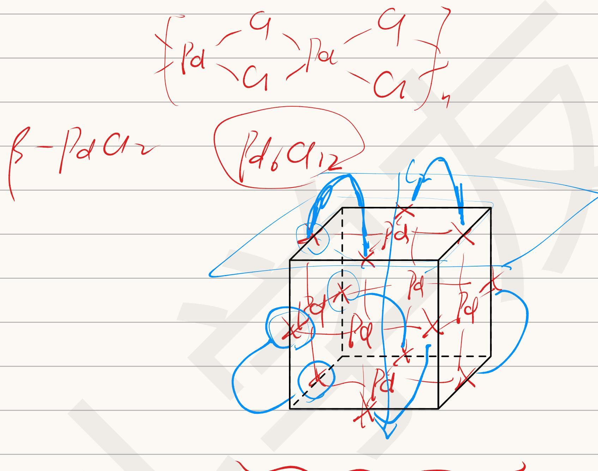

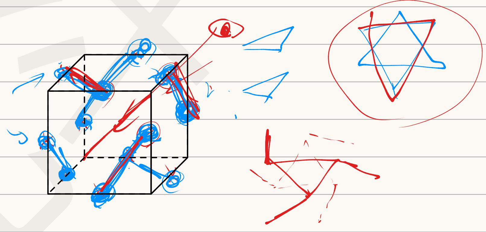


$$
\left\{ \begin{array}{l} \frac {x + y + z = 1 6}{x + 2 y + 3 z = 4 x 6} \\ \hline \end{array} \right.
$$


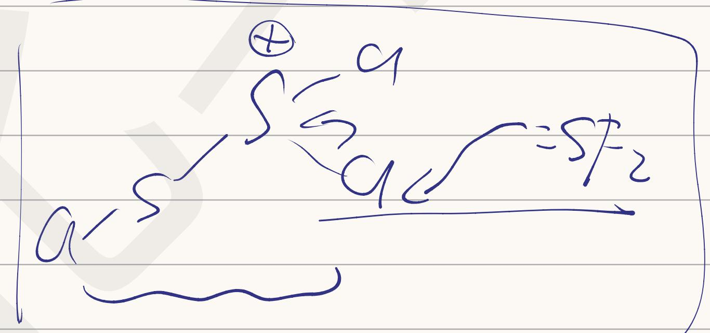

$^{\oplus}$ SFe9

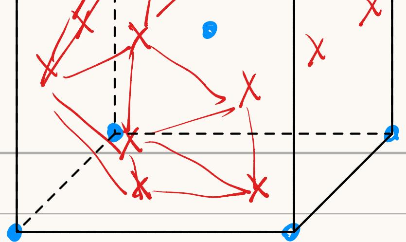

$2Fe(SPh)_{4}^{2-} + 2S$ $\rightarrow Fe_{2}S_{2}(SPh)_{4}^{2-} + 2PhS^{-}$ $+ PhSSPh$ $RnH_{2} \quad \begin{array}{c}\text{Base} \\|\\\text{RMH}\end{array} \quad \xrightarrow{\text{H}_{2}\text{O}} X$ $R_{2}NH \quad \begin{array}{c}\text{Base} \\|\\\text{R}_{2}\text{N}-\text{Ts}\end{array} \quad \xrightarrow{\text{H}_{2}\text{O}} X$ $\textcircled{R3N} \quad \begin{array}{c}\text{Base} \\|\\\text{R}_{3}\text{N}-\text{Ts}\end{array} \quad \xrightarrow{\text{H}_{2}\text{O}} X$

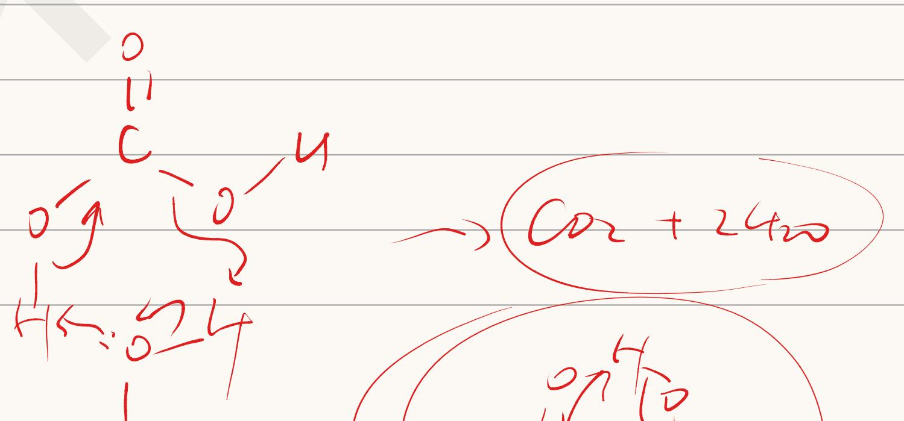

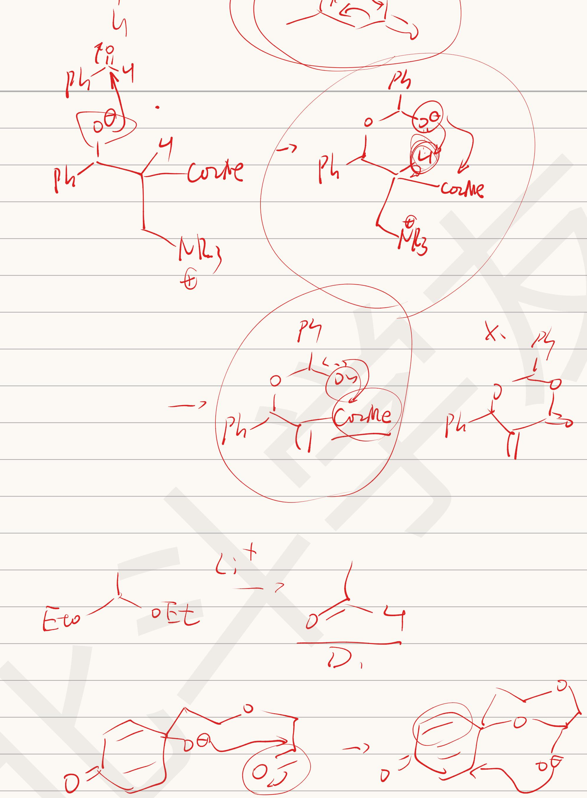

<table><tr><td>3-3  $TiCl_{4} + 4NH_{3} + 4C_{2}H_{5}OH = Ti(OC_{2}H_{5})_{4} + 4NH_{4}Cl$ </td><td>1分</td></tr><tr><td colspan="2">注:O=OEt2分,不写图例扣1分</td></tr></table>

## 第3题（18分）

元素 M 的名称来源于希腊神话。M 单质常从某天然矿物制备，该矿物主要成分为 G，含 M 31.56%。M 单质可直接与氮气化合生成稳定的金黄色固体 A，A 与 NaCl 类质同晶。A 溶于王水生成 B。向 B 的浓 HCl 溶液中加入 Zn 粉，溶液变为紫色，其中溶质为 C。B 暴露在空气中易转化为 D，D 同样十分稳定，不溶于硫酸或硝酸，但可以溶于氢氟酸生成 E，E 也可用于 M 的制备。将 B 溶于无水乙醇并通入氨气可制备 F，F 中 M 质量分数为 20.99%。3-1 写出 A\~H 的化学式。

<table><tr><td colspan="4">3-1 每个2分,共14分</td></tr><tr><td>A TiN</td><td>B  $TiCl_{4}$ </td><td>C  $TiCl_{3}$ </td><td>D  $TiO_{2}$ </td></tr><tr><td>E  $TiF_{4}/H_{2}TiF_{6}$ </td><td>F  $Ti(OC_{2}H_{5})_{4}$ </td><td>G  $FeTiO_{3}$ </td><td></td></tr></table>

3-2 制备 M 单质的第一步 G 为与碳单质一起用过量氯气高温处理，写出该反应方程式。

$$
2 \mathrm{FeTiO} _ {3} + 6 \mathrm{C} + 7 \mathrm{Cl} _ {2} = 2 \mathrm{FeCl} _ {3} + 2 \mathrm{TiCl} _ {4} + 6 \mathrm{CO}
$$

3-3 F 实际存在形态中 M 有两种化学环境，分子量不超过 1000。写出其制备反应方程式，并画出 F 的真实结构示意图。

## 第4题（18分）

在用络合滴定法测定自来水中的钙、镁离子含量时，如何掩蔽其中 $Fe^{3+}$ 的干扰是一个有探究价值的问题。在实验室中常用于掩蔽 $Fe^{3+}$ 的试剂有三乙醇胺和抗坏血酸两种，其中之一用于在溶液中滴定 $Ca^{2+}$ 、 $Mg^{2+}$ 中使用，另一种则在滴定溶液中的 $Bi^{3+}$ 时有很好的效果。

4-1 试根据此在三乙醇胺和抗坏血酸中选择在测定自来水中钙、镁离子含量时为掩蔽 $Fe^{3+}$ 应当使用的掩蔽剂，并解释原因。

<div class="mineru-algorithm" style="white-space: pre-wrap; font-family:monospace;">
三乙醇胺为络合掩蔽，而抗坏血酸为氧化还原掩蔽。在强碱性条件下 $\mathrm{Fe}^{3+}$ 被还原后沉淀很容易再被氧化，没有意义。2分
</div>

对某地区自来水样的分析过程如下：取 100.0 ml 自来水样，用适当的方法掩蔽 $Fe^{3+}$ 后用缓冲溶液调节 pH=10，以铬黑 T 为指示剂，用 0.01060 mol/L 的 EDTA 标准溶液滴定，消耗 EDTA 溶液 31.30 ml。另取 100.0 ml 自来水样，加过量的 NaOH 使溶液呈强碱性，加入钙指示剂，用上述 EDTA 溶液滴定至终点，消耗 EDTA 溶液 19.20 ml。

4-2 用离子方程式说明在滴定过程中加入过量的 NaOH 的作用。

$$
\mathrm{H} _ {2} \mathrm{Y} ^ {2 -} + \mathrm{Ca} ^ {2 +} + 2 \mathrm{OH} ^ {-} = \mathrm{CaY} ^ {2 -} + 2 \mathrm{H} _ {2} \mathrm{O}
$$

4-3 分别计算水中钙离子、镁离子的含量（以 $CaCO_{3}$ mg/L 和 $MgCO_{3}$ mg/L 表示）

<div class="mineru-algorithm" style="white-space: pre-wrap; font-family:monospace;">
4-3 自来水中钙镁离子的浓度和  $=\frac{0.01060\ \text{mol}\cdot\text{L}^{-1}\times31.30\ \text{ml}}{100.0\ \text{ml}}=3.318\ \text{mmol}\cdot\text{L}^{-1}$  2 分
自来水中钙离子的浓度  $=\frac{0.01060\ \text{mol}\cdot\text{L}^{-1}\times19.20\ \text{ml}}{100.0\ \text{ml}}=2.035\ \text{mmol}\cdot\text{L}^{-1}$  2 分
镁离子的浓度  $=3.318\ mmol\cdot L^{-1}-2.035\ mmol\cdot L^{-1}=1.283\ mmol\cdot L^{-1}$  2 分
钙离子含量  $=2.305\ mmol\cdot L^{-1}\times100.09\ g\cdot mol^{-1}=203.7\ mg\cdot L^{-1}$  2 分
镁离子含量  $=1.283\ mmol\cdot L^{-1}\times84.32\ g\cdot mol^{-1}=108.2\ mg\cdot L^{-1}$  2 分
有效数字错误本问扣 1 分。
其他合理的计算过程得到了误差允许范围内的结果也得满分。
</div>

## 第5题（13分）

5-1 一次实验中，实验人员将盛有一定量 Au 的陶瓷舟至于 $1400^{\circ}$ C 的管式炉中，在 1 atm 下通过 $12.0 \, dm^{3} N_{2}$ （1 atm，293.15 K 下测定），随后冷却取出陶瓷舟，测得 Au 损失了 1.05 mg。试求 $1400^{\circ}$ C 下 Au 的蒸汽压。（已知 Au 气态只以单原子形式存在， $N_{2}$ 未参与反应）

$$
\mathrm{Au}: 1. 0 5 \times 1 0 ^ {- 3} / 1 9 7. 0 = 5. 3 3 \times 1 0 ^ {- 6} (\mathrm{mol}) \quad 2 \text {分}
$$

$$
\mathrm{N} _ {2}: 1 0 1. 3 2 5 \times 1 2. 0 / (8. 3 1 4 \times 2 9 3. 1 5) = 0. 4 9 1 (\mathrm{mol}) \quad 2 \text {分}
$$

$$
P _ {\mathrm{Au}} = 5. 3 3 \times 1 0 ^ {- 6} / 0. 4 9 1 \times 1 0 1. 3 2 5 = 1. 1 0 \times 1 0 ^ {- 3} (\mathrm{kPa})
$$

5-2 另一次实验中，将上问中的 $N_{2}$ 改为 $H_{2}$ ，其他条件完全一致，测得 Au 损失了 11.20 mg。已知该条件下 Au 与 $H_{2}$ 可形成 AuH，试求 1400 °C 下反应 $2\mathrm{AuH(g)} = 2\mathrm{Au(g)} + \mathrm{H}_{2}(\mathrm{g})$ 的 $K_{p}$ 。

$$
\mathrm{AuH}: (1 1. 2 0 - 1. 0 5) \times 1 0 ^ {- 3} / 1 9 7. 0 = 5. 1 5 2 \times 1 0 ^ {- 5} (\mathrm{mol}) \quad 2 \text {分}
$$

$$
P _ {\mathrm{AuH}} = 5. 1 5 2 \times 1 0 ^ {- 5} / 0. 4 9 1 \times 1 0 1. 3 2 5 = 1. 0 6 \times 1 0 ^ {- 2} (\mathrm{kPa}) \quad 2 \text {分}
$$

$$
K _ {p} = 1 0 1. 3 2 5 \times (1. 1 0 \times 1 0 ^ {- 3}) ^ {2} \times (1. 0 6 \times 1 0 ^ {- 2}) ^ {- 2} = 1. 0 9 (\mathrm{kPa}) \quad 3 \text {分}
$$

有效数字保留两位或三位均不扣分，四位本题每问扣1分。

计算结果在误差范围内均可得分。

## 第6题（18分）

氯化钠的结构是最经典的晶体结构之一。在极高的压强下，氯化钠可以和数分子氯气化合生成 $NaCl_{x}$ 。右图是 $NaCl_{7}$ 正当立方晶系晶胞示意图，其中两个 Cl 原子的坐标为 $(0, 0.5, 0.1671)$ 、 $(0, 0.5, 0.8329)$ 。6-1 指出体心 Cl 原子和顶点 Na 原子的配位数。

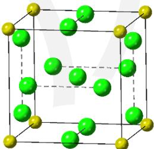

```txt
6-1 Na 和 Cl 均为 12 配位。各 2 分，共 4 分

6-2 已知 Cl₂ 在晶体中的键长为 2.053 Å，试据此计算晶体密度。

6-2 通过简单的观察和计算可知，Cl₂ 为经过晶胞棱心的两个 Cl 原子构成。

于是有：0.1671a = 2.053 Å/2 2 分

解得 a = 614.3 pm 2 分

D = ZMr/NₐV = 271.1 g·mol⁻¹/(614.3 pm)³×6.022×10²³ mol⁻¹ = 1.942 g·cm⁻³ 2 分

6-3 另一种与上述晶体结构相似的 NaClₙ，且配位数与 NaCl₇ 中的 Na 相同，Cl 的配位数只有一种。

6-3-1 写出符合条件的 n 的最小值。

6-3-1 n = 3 2 分

6-3-2 猜测其密度与 NaCl₇ 相比如何，并试解释之。

6-3-2 其密度比 NaCl₇ 大。2 分

相当于把体心的 Cl⁻离子换成了半径更小的 Na⁺离子，晶胞体积变小。2 分

原因答成体心离子和配位原子的排斥减小，也得分。

6-3-3 能否将此晶体类比 NaCl₇ 看作 NaCl·nCl₂？指明原因。

6-3-3 不能。因为仅存在一种 Cl-Cl 键长，所有 Cl 的化学环境均相同。2 分
```

3分

## 第七题（15分）

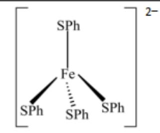

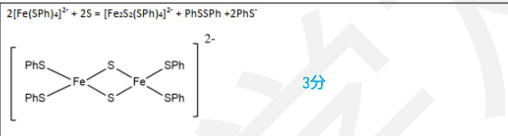

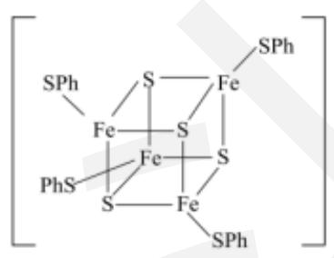

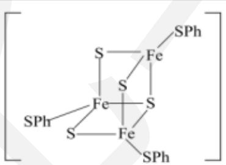

3分  
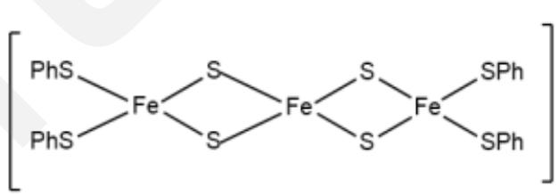  
3分

## 第8题（18分）

8-1 请将以下化合物按酸性由强至弱排序:

<table><tr><td></td><td></td><td></td><td></td><td></td></tr><tr><td>A</td><td>B</td><td>C</td><td>D</td><td>E</td></tr></table>

## 8-1 E > D > C > B > A 6 分，相邻两项交换一次得 3 分，其他答案不得分。

8-2 请将如下化合物按发生 $S_{N1}$ 反应速率由慢至快排序:

<table><tr><td></td><td></td><td></td></tr><tr><td>G</td><td>H</td><td>I</td></tr></table>

8-2 I < G < H 6 分，IG 交换得 3 分，其他答案不得分。

8-3 一、二、三级胺常用 Hinsberg 反应区分，即使未知胺与对甲苯磺酰氯混合，再分别用纯水与碱液处理产物。请写出一、二、三级胺分别对应的反应现象。

8-3 一级胺反应产物为有 N-H 键的磺酰胺，不溶于水，可溶于碱液；2 分
二级胺反应产物为无 N-H 键的磺酰胺，既不溶于水，也不溶于碱液；2 分
三级胺反应产物为磺酰基铵盐，既可溶于水，也可溶于碱液。2 分

第9题（14分）

Baylis-Hillman 反应因其温和的反应条件与 100% 的原子转化率, 被广泛应用于有机合成中。9-1 请补全以下 B-H 反应机理图示中关键中间体 A\~C 及产物 X 的结构。

<table><tr><td colspan="2"></td></tr><tr><td>9-1A2分</td><td>B2分</td></tr><tr><td>C2分</td><td>X2分</td></tr><tr><td colspan="2">9-2 上述反应历程中[B]→[C]的一步质子转移,研究人员结合计算等方法,提出了一种可能的机理,涉及一分子溶剂甲醇,请分别画出这该机理的电子流动。</td></tr><tr><td colspan="2">9-22分</td></tr><tr><td colspan="2">如下机理也得分:</td></tr><tr><td colspan="2">9-3 除此之外,研究人员还提出了一种涉及第二分子苯甲醛的质子转移机理,请画出质子转移一步的电子流动,并给出该机理对应的一个三环副产物。</td></tr><tr><td>9-32分</td><td>2分</td></tr></table>

第10题（18分）

Clerobungin A 是一种中草药有效成分的提取物，2014 年，几位中国化学家完成了该提取物立体异构的分离与测定，两年之后，J. Mease 和 K. P. Reber 通过巧妙的反应条件一步构建了主环系，并完成了如下对 Clerobungin A 的全合成。

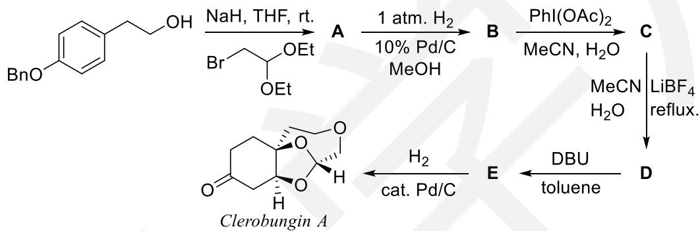

路线中出现的一些缩写和简写的全称如下：Bn-代表苄基，THF 代表四氢呋喃，reflux. 表示回流，DBU 代表 1,8-二氮杂二环十一碳-7-烯，toluene 表示甲苯。

## 10-1 根据条件画出 A\~E 的结构。（不要求立体化学）

<table><tr><td>A</td><td>B</td><td>C</td></tr><tr><td></td><td>E</td><td>每个3分立体化学可以不写,但写错不得分。</td></tr><tr><td colspan="3">10-2 画出D到E一步经历的一个关键负离子中间体。(不要求立体化学)</td></tr><tr><td colspan="3">10-2 3分立体化学可以不写,但写错不得分。</td></tr></table>

## 11-1 给电子能力强的基团优先迁移

11-2-1 能解离出稳定的正离子

11-2-2 中间的键断裂得到氰基和醛基，甲氧基能起到稳定碳正离子的作用，与上一问类似
11-2-3 拔氢进攻氮生成三元环，再水解

11-3 SnCl4 螯合，倾向于配位下面的羰基，BF3 单配位，倾向于配位上面位阻小的羰基，会导致δ+的位置不同，发生 D-A 反应的结果不同。