# 化学奥林匹克竞赛模拟试卷（四）

\- 竞赛时间 3 小时。

\- 试卷装订成册，不得拆散。所有解答必须写在 A4 纸上，不得用铅笔填写。

\- 姓名、报名号和所属学校必须写在首页左侧指定位置，写在其他地方者按废卷论处。

\- 允许使用非编程计算器以及直尺等文具。

<table><tr><td>H1.008</td><td colspan="16">相对原子质量</td><td>He4.003</td></tr><tr><td>Li6.941</td><td>Be9.012</td><td rowspan="2" colspan="10"></td><td>B10.81</td><td>C12.01</td><td>N14.01</td><td>O16.00</td><td>F19.00</td><td>Ne20.18</td></tr><tr><td>Na22.99</td><td>Mg24.31</td><td>Al26.98</td><td>Si28.09</td><td>P30.97</td><td>S32.07</td><td>Cl35.45</td><td>Ar39.95</td></tr><tr><td>K39.10</td><td>Ca40.08</td><td>Sc44.96</td><td>Ti47.88</td><td>V50.94</td><td>Cr52.00</td><td>Mn54.94</td><td>Fe55.85</td><td>Co58.93</td><td>Ni58.69</td><td>Cu63.55</td><td>Zn65.41</td><td>Ga69.72</td><td>Ge72.61</td><td>As74.92</td><td>Se78.96</td><td>Br79.90</td><td>Kr83.80</td></tr><tr><td>Rb85.47</td><td>Sr87.62</td><td>Y88.91</td><td>Zr91.22</td><td>Nb92.91</td><td>Mo95.94</td><td>Tc[98]</td><td>Ru101.1</td><td>Rh102.9</td><td>Pd106.4</td><td>Ag107.9</td><td>Cd112.4</td><td>In114.8</td><td>Sn118.7</td><td>Sb121.8</td><td>Te127.6</td><td>I126.9</td><td>Xe131.3</td></tr><tr><td>Cs132.9</td><td>Ba137.3</td><td>La—Lu</td><td>Hf178.5</td><td>Ta180.9</td><td>W183.8</td><td>Re186.2</td><td>Os190.2</td><td>Ir192.2</td><td>Pt195.1</td><td>Au197.0</td><td>Hg200.6</td><td>Tl204.4</td><td>Pb207.2</td><td>Bi209.0</td><td>Po[210]</td><td>At[210]</td><td>Rn[222]</td></tr><tr><td>Fr[223]</td><td>Ra[226]</td><td>Ac—La</td><td>Rf</td><td>Db</td><td>Sg</td><td>Bh</td><td>Hs</td><td>Mt</td><td>Ds</td><td>Rg</td><td>Cn</td><td>Uut</td><td>Uuq</td><td>Uup</td><td>Uuh</td><td>Uus</td><td>Uuo</td></tr></table>

<table><tr><td>La</td><td>Ce</td><td>Pr</td><td>Nd</td><td>Pm</td><td>Sm</td><td>Eu</td><td>Gd</td><td>Tb</td><td>Dy</td><td>Ho</td><td>Er</td><td>Tm</td><td>Yb</td><td>Lu</td></tr><tr><td>Ac</td><td>Th</td><td>Pa</td><td>U</td><td>Np</td><td>Pu</td><td>Am</td><td>Cm</td><td>Bk</td><td>Cf</td><td>Es</td><td>Fm</td><td>Md</td><td>No</td><td>Lr</td></tr></table>

可能用到的常数：法拉第常数 $F = 96485 \, C mol^{-1}$ ; 气体常数 $R = 8.3145 \, J K^{-1} mol^{-1}$ ; 阿伏伽德罗常数 $N_{A} = 6.0221 \times 10^{23} \, mol^{-1}$ ; 玻尔兹曼常数 $k_{B} = R / N_{A}$

## 第一题：同族元素的性质对比（23分， $10\%$ ）

1-1 A, B, C 是相邻周期原子序数从小到大的同一族元素。B 的命名来源于希腊语的 τεχνητός，其含义为“人造的”。给出 A，B，C 的元素符号。

1-2 A的最高价氧化物D可由A的最高价含氧酸盐与浓硫酸作用得到，请画出D的结构。

1-3 D在静置的过程总会缓慢失去氧而生成E。E是一种常见的化合物，但是其本身并不是A元素最稳定的氧化物。530°C时，E会分解生成氧元素质量分数为30.4%的氧化物F。请写出上述涉及的两个化学反应方程式。

1-4 提高温度( $>530^{\circ}C$ )，E会转变为另一氧化物G。已知G为尖晶石结构，请写出G的化学式。并尝试通过计算判断不同价态阳离子所占据空隙类型，并分析空隙是否会发生畸变。

1-5 A, B, C对应的最高价含氧酸阴离子都可以表示为 $\left[\mathrm{MO}_{\mathrm{x}}\right]^{y-}$ ，三种离子的吸收光谱非常相似。 $\left[\mathrm{AO}_{\mathrm{x}}\right]^{y-}$ 的颜色比较明显，吸收发生在可见光区。 $\left[\mathrm{CO}_{\mathrm{x}}\right]^{y-}$ 吸收移动到能量更高的紫外区，因此是无色的。 $\left[\mathrm{BO}_{\mathrm{x}}\right]^{y-}$ 在正常情况下也是无色的，其吸收正好位于可见区的边缘。请说明结晶状的 $\mathrm{H}_{\mathrm{y}}\mathrm{BO}_{\mathrm{x}}$ 显红色的原因。

1-6 在三个元素中，C的配位化学最为丰富。在讨论C(IV)的化学时常常会提到一种有趣的绿色结晶状 $\left[\mathrm{M}\left(\mathrm{S}_{2} \mathrm{C}_{2} \mathrm{Ph}_{2}\right)_{3}\right](\mathrm{M}$ 为C)，其结构为三棱柱。该配合物中金属的氧化态可以认为是出于两种极端方式：M(0)和M(VI)。请画出这两种极端方式下的配体和中心原子的成键示意图。

1-7 C 还可形成结构一致的一系列配合物:

$$
\left[ \mathrm{M} _ {2} \mathrm{Cl} _ {4} (\mathrm{PMe} _ {2} \mathrm{Ph}) _ {4} \right] \quad \left[ \mathrm{M} _ {2} \mathrm{Cl} _ {4} (\mathrm{PMe} _ {2} \mathrm{Ph}) _ {4} \right] ^ {+} \quad \left[ \mathrm{M} _ {2} \mathrm{Cl} _ {4} (\mathrm{PMe} _ {2} \mathrm{Ph}) _ {4} \right] ^ {2 +}
$$

给出该系列配合物的结构、中心金属的氧化态、通过分子轨道理论判断各个配合物的键级。

## 第二题：书写方程式（10分，6%）

2-1 UCl $_{3}$ 在中性条件下水解生成 UO $_{2}$

2-2 氢氧化钴(III)溶于浓盐酸

2-3 单 ${}^{18}$ F-代葡萄糖（ ${}^{18}$ FC $_{6}$ H $_{12}$ O $_{5}$ ）在人体内衰变

2-4 用五氟化锑与氟磺酸反应得到超酸 A，写出 A 的化学式和 A 在氟磺酸中电离的方程式

## 第三题：铜的多核配合物（15分，8%）

铜的二聚配合物 A 可以由如下方法制备

298K 下，由 2-(2-羟乙基)吡啶、三氟乙酸和醋酸铜在体积比 95:5 的 MeOH- $H_{2}O$ 中制备得到蓝色铜的二聚配合物 A，该配合物在纯净的甲醇中并不能得到。

3-1 已知铜的二聚物 A 呈现中心对称，每个铜都是五配位四方锥结构且不含有醋酸根，请画出该配合物的结构。

3-2 在 A 的结构中，有一根 Cu-X 相比其他的要长，请指出是哪个配体所对应的键，并解释原因。

3-3 A 可以通过氢键形成四聚体 B，每个 B 中有四个氢键，画出氢键的环状结构即可（四个氢键会形成 2 个环状结构）。

3-4 将 A 暴露于醇的蒸气中，会由蓝色的二聚物转化为绿色的四聚物 C，而 B 可以看作是转为为 C 的前体，C 的分子量略小于 A 的两倍，A 中 Cu 的百分含量比 C 低 1.2%，C 仍然是五配位，请画出 C 的结构。

## 第四题：层状晶体结构（24分，8%）

某种金属氮化物 $\varepsilon-A_{x}N$ ，金属原子堆积方式如右图所示，图中六棱柱边长为 272 pm，高为 441 pm，N 原子填入 1/3 的八面体空隙中，已知同层中与 N 原子相邻的六个八面体空隙都未填充，邻层 N 原子沿 C 轴方向投影不重合，N 原子堆积序列可看成 ABAB……

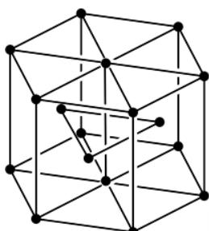

4-1 已知 N 质量分数为 7.72%，给出此物质化学式，请以 N 为顶点画出一个正当晶胞，给出原子坐标。

\- 金属原子

4-2 计算晶胞参数和密度，N 原子间最短距离是多少？

4-3 该金属的另一种氮化物填入 B 层的 N 原子是 $\varepsilon-A_{x}N$ 的 2 倍，但邻层 N 原子沿 C 轴方向投影仍不重合

4-3-1 写出该的化学式，并画出 N 原子沿 c 轴投影图。

4-3-2 在一定条件下，4-3-1 中的 $\varepsilon$ 型晶体会向 $\zeta$ 型晶体转变，可以看成 N 原子发生迁移，但金属原子堆积方式未发生改变，晶体对称性降低，右图给出了该晶体中金属的结构示意图，写出其中金属原子与八面体空隙的坐标。

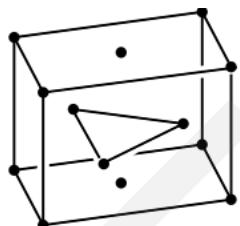  
- 金属原子

4-3-3 $\zeta$ 型晶体中 N 原子沿 c 轴投影如下图所示，给出两层 N 原子迁移数之比。

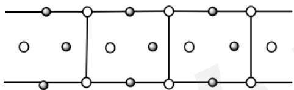  
- A层N原子  
○ B层N原子

## 第五题：Cr(III)的分析（13分，6%）

皮革的鞣制常常使用 Cr 盐溶液作为鞣剂，分析鞣液（含杂质离子 $Ca^{2+}$ ， $Mg^{2+}$ ， $Al^{3+}$ ）中的三价铬含量，步骤如下：将 5.00mL 鞣液溶于 45.00mL 蒸馏水中稀释；用移液管量取 10.00mL 稀释后的样品于锥形瓶中，加入 50.00mL 0.0214mol/L 的 EDTA 标准溶液，再加入约 5mL 5% NaF 溶液、0.3-0.6g 抗坏血酸和 30mL 蒸馏水，加热煮沸 10 分钟后加入 1:1 氨水使溶液变为蓝色，加入 15mL pH=10 的缓冲溶液与 4 滴 PAN 指示剂，以 0.02030mol/L Zn(NO $_{3}$ ) $_{2}$ 标准溶液滴定，消耗 23.14mL。

5-1 为何不能使用 EDTA 标准溶液直接滴定溶液中的 $Cr^{3+}$ ?

5-2 用方程式说明 NaF 在实验中所起的作用。

5-3 列式计算原溶液中 $Cr^{3+}$ 的浓度。

## 第六题：高压晶体结构（11分，6%）

下图为超高压状态下某二元化合物的晶体结构，其中大球为 A 原子，小球为 B 原子，晶胞参数设为 a。

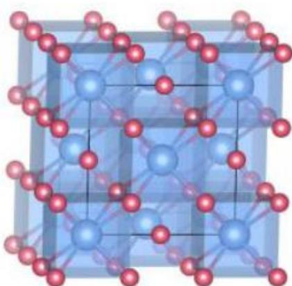  
6-1 写出该晶胞的空间点阵形式，并回答每个晶胞中有多少个 B 原子？

6-2 若其中 A 为 Hg，B 为 F，写出该化合物的化学式和 B 原子的坐标（一个等同点系写一个原子即可）。

6-3 降低压强时该化合物的对称性将降低（单斜），试简要解释这一现象。

## 第七题：铂催化氧化还原反应（15分，8%）

惰性气体保护下，用 $N_{2}H_{4}$ 处理含有过量 $PEt_{3}$ 的 $PtCl_{2}(PEt_{3})_{2}$ 的溶液，可以得到 E，E 中 P 的质量分数为 16.92%。据研究，E 催化的在远紫外条件下的硫酸自氧还反应可能有助于解决能源问题，其催化循环示意如下：

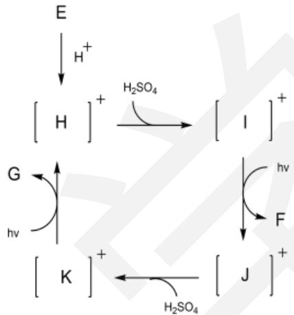

7-1 已知 F 是一种清洁能源，请写出 E，F，G 的化学式和 E 催化下的总反应方程式。

7-2 请画出 H-K 的结构，并标出每个中间体中心原子周围的电子数。

## 第八题：紫杉醇的合成（23分，11%）

紫杉醇是一种优秀的天然抗癌药物，其全合成也曾经作为有机合成中的一大热门题目。紫杉醇的合成路径众多，其中涉及的反应也很广泛，这里讨论一下其中涉及的部分反应。

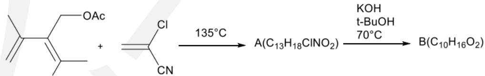

8-1 请给出 A 和 B 的结构式，并讨论生成 A 的区域选择性。

8-2 在生成 B 的过程中，第一步是 OH 参与的加成反应。反应会沿着两种途径进行，通过两种不同的三元环中间体，得到相同的产物 B。请画出合理的反应机理。

8-3 第一步是 $\mathrm{PhB(OH)_{2}}$ 参与反应生成中间体二酯，然后生成 C。C 随后转变为 D。画出中间体二酯和 C 的立体结构。

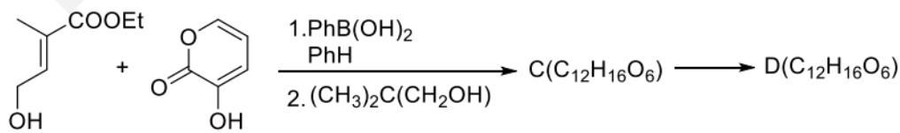

8-4 给出 D 的立体结构，并画出从 C 到 D 的电子流向。

## 第九题：有机化学机理（30分，12%）

9-1 对下列碳正离子的稳定性进行排序:

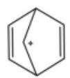

A

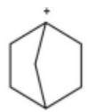

B

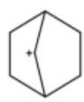

C

9-2 外消旋的 D 与溴代必定反应，得到产物 E 和无机物 F。反应中溴代吡啶先生成一种具有芳香性的中间化合物 L 和一种卤代烃，进而与 D 生成电中性的中间体 M。

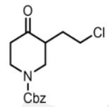

D

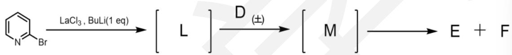

9-2-1 画出中间体 L、M。

9-2-2 写出无机物 F 的分子式，解释 $LaCl_{3}$ 的作用。

9-2-3 E 有几个手性碳？画出 E 的结构式。

9-3 观察以下路线:

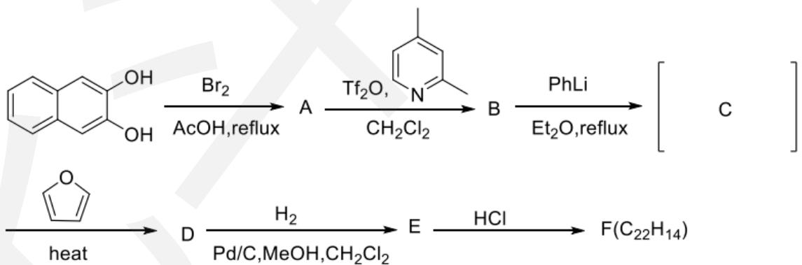

9-3-1 画出 A-F 的结构，已知 C 为一常见中间体。

9-3-2 画出 D 的所有可能构型，后续反应是否需要分离？

## 第十题：全合成路线设计（23分，9%）

有机合成的道路往往充满了曲折，化学家想要利用化合物 B 和 C，立体选择性地合成目标产物 A:

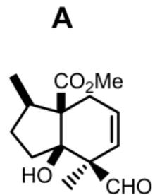

10-1 画出 B 和 C 的结构式。已知 B 中碳原子个数多于 C，B 的核磁共振氢谱为： $\delta\ 1.18(3H)$ ， $1.48(1H)$ ， $2.20(1H)$ ， $2.26(1H)$ ， $2.39(1H)$ ， $2.53(1H)$ ， $2.77(1H)$ ， $3.76(3H)$ ppm
10-2 然而实验并没有达到预期的效果，因此只能改变反应条件进行尝试，尝试通过下面的方案来进行反应，预期的机理如下：

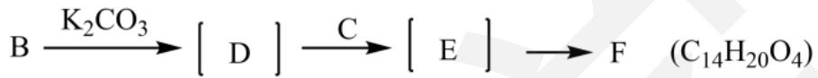

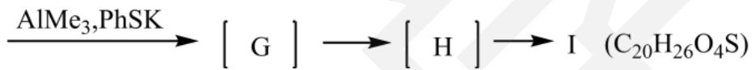

10-2-1 写出中间体 D，E，G，H 和产物 F、I，其中 I 和 A 一样有着六并五元环。

10-2-2 试着给出由 I 生成 A 的反应条件。

10-3 很不幸的是，F 在对应条件下并没有如预期生成 I，而是生成了另一种化合物 K，反应过程如下：

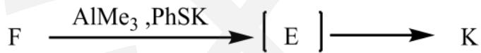

10-3-1 K 的分子式与 A 相同，画出 K 的结构式。

10-3-2 试解释为什么 F 选择性生成中间体 J 而不是 G。

## 第 11 题：氧化还原反应的产物（21分，16%）

氧化反应是一类重要的反应，一些高效的氧化剂可以将有机物定量的氧化，而投料比将决定产物的氧化程度。下图是一个氧化反应的简略过程，在第一步反应中，底物分子首先生成重要的带正电荷的反应中间体 A，随后再转化为 B，最后得到产物。

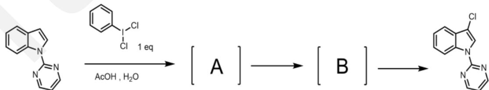

11-1 画出中间体 A 和 B。

使用相同条件进一步氧化，接下来的两步反应如图所示，产物中氯原子的化学环境不同，G

中氯原子的化学环境相同。

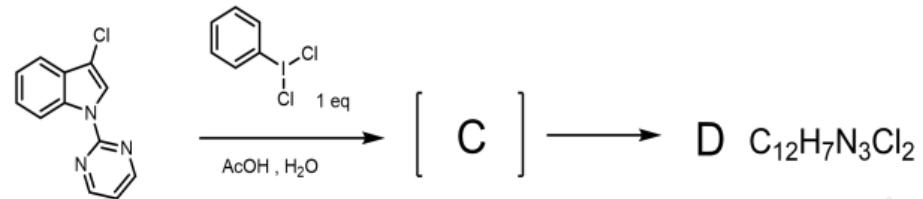

D

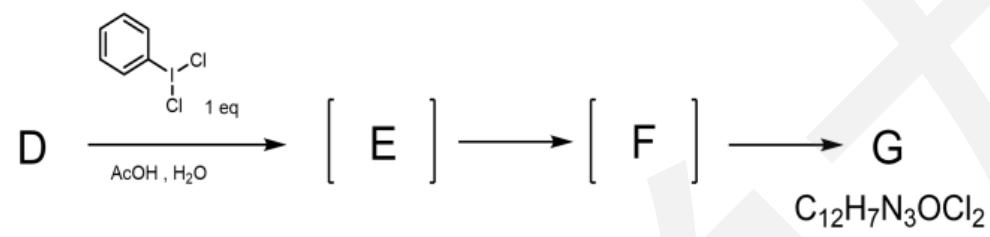

11-2 画出中间体 C、E、F 和产物 D、G。