# 化学奥林匹克竞赛模拟试卷（四）参考答案

## 第一题（23分）

1-1 Mn Tc Re （2分）

1-2

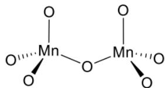

1-3 $2Mn_{2}O_{7}=4MnO_{2}+3O_{2}$ $4MnO_{2}=2Mn_{2}O_{3}+O_{2}$ 每个1分，共2分
1-4 $Mn_{3}O_{4}(Mn^{II}Mn^{III}_{2}O_{4})$ 2分

$Mn^{II}$ 为 $d^{5}$ 电子构型， $Mn^{III}$ 为 $d^{4}$ 电子构型。

假设晶体场环境为强场，当 $Mn^{II}$ 填在八面体空隙， $CFSE=2\Delta_{0}-2P$ ； $Mn^{III}$ 填在四面体空隙， $CFSE=2.4\Delta_{T}-2P=1.07\Delta_{0}-2P$ 。当 $Mn^{II}$ 填在四面体空隙， $CFSE=2\Delta_{T}-2P=0.89\Delta_{0}-2P$ ； $Mn^{III}$ 填在八面体空隙， $CFSE=1.6\Delta_{0}-P$ 。当 $0.05\Delta_{0}>2P$ 时，前一种填隙方式合理，反之，后一种合理。故在不提供数据的情况下无法判断。2分

假设晶体场环境为弱场，当 $Mn^{II}$ 填在八面体空隙， $CFSE=0$ ； $Mn^{III}$ 填在四面体空隙， $CFSE=0.4\Delta_{T}=0.18\Delta_{0}$ 。当 $Mn^{II}$ 填在四面体空隙， $CFSE=0$ ； $Mn^{III}$ 填在八面体空隙， $CFSE=0.6\Delta_{0}$ 。显然，要让 $Mn^{III}$ 尽量多地填在八面体空隙，所以 $Mn^{II}$ 填在四面体空隙、 $Mn^{III}$ 填在八面体空隙是更合理的。2分

事实上， $Mn_{3}O_{4}$ 是常尖晶石结构。

无论是强场还是弱场下，总是存在简并轨道的不对称占据，从而产生Jahn-Teller效应，始终存在畸变现象。2分

1-5

结晶状的HTcO $_{4}$ 中由于H的反极化作用，导致其结构偏离正四面体的对称性，分裂能降低，使吸收有足够的移动而“曳尾”进入可见区的蓝色一端，从而使它带上红色。2分

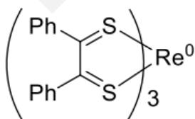

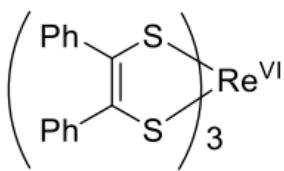  
2分

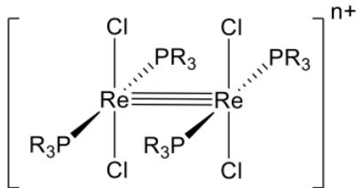

图中 Re 与 Re 的键级不要求。2分

|  | $\text{Re}_2\text{Cl}_4(\text{PMe}_2\text{Ph})_4$ | $[\text{Re}_2\text{Cl}_4(\text{PMe}_2\text{Ph})_4]^{+}$ | $[\text{Re}_2\text{Cl}_4(\text{PMe}_2\text{Ph})_4]^{2+}$ |
| --- | --- | --- | --- |
| 氧化数 | +2 | +2.5 | +3 |
| 键级 | 3 | 3.5 | 4 |

每个配合物氧化数与键级都正确得 1 分，共 3 分

第2题（10分）

2-1 $2UCl_{3} + 4H_{2}O = 6HCl + H_{2} + 2UO_{2}$ 2分

2-2 $2\mathrm{Co(OH)}_{3} + 6\mathrm{HCl} = 2\mathrm{CoCl}_{2} + \mathrm{Cl}_{2} + 3\mathrm{H}_{2}\mathrm{O}$ 2分

$$
2 - 3 ^ {1 8} \mathrm{FC} _ {6} \mathrm{H} _ {1 2} \mathrm{O} _ {5} = ^ {1 8} O \mathrm{C} _ {6} \mathrm{H} _ {1 2} ^ {1 6} \mathrm{O} _ {5} + \mathrm{e} ^ {+}
$$

2-4 $\mathrm{SbF}_{5} + \mathrm{HSO}_{3}\mathrm{F} = \mathrm{H}[\mathrm{SbF}_{5}\mathrm{SO}_{3}\mathrm{F}]$ 2分

$$
\mathrm{H} \left[ \mathrm{SbF} _ {5} \mathrm{SO} _ {3} \mathrm{F} \right] + \mathrm{HSO} _ {3} \mathrm{F} = \mathrm{H} _ {2} \mathrm{SO} _ {3} \mathrm{F} ^ {+} + \left[ \mathrm{SbF} _ {5} \mathrm{SO} _ {3} \mathrm{F} \right] ^ {-}
$$

第3题（15分）

3-1

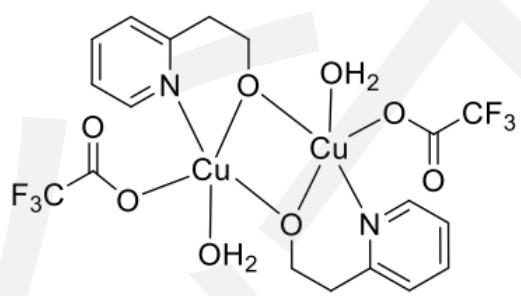  
(3分)

3-2

$H_{2}O$ 所对应的配位键 (2 分)

配体拉长可以获得更多的晶体场稳定化能（姜泰勒效应导致畸变，配位键拉长）。（2分）
3-3

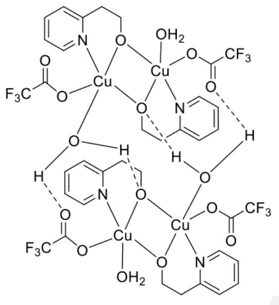  
(4分)

3-4  
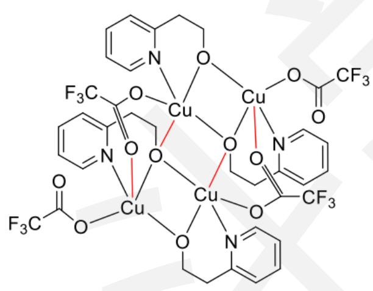  
(4分)

## 第四题（24分）

4-1

$Fe_{3}N$ (2 分)

N: (0,0,0) (2/3,1/3,1/2)

(2 分)

Fe: (2/3,0,1/4) (0,2/3,1/4) (1/3,1/3,1/4)

(1/3,0,3/4) (0,1/3,3/4) (2/3,2/3,3/4)

(2 分)

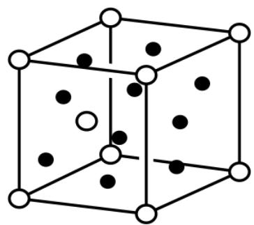

$\bullet$ 金属原子

○ N原子

(2 分)

4-2

$a'=\sqrt{3}a=471\ pm\ c'=c=441\ pm$ a为六棱柱边长，c为六棱柱的高 $\rho=\frac{ZM}{N_{A}V}=7.12\ g\cdot cm^{-3}$ (2分)

(2 分)

$d_{N-N}=\sqrt{\frac{1}{3}a^{\prime2}+\frac{1}{4}c^{\prime2}}=350\ pm$ (2分)

4-3-1

$Fe_{2}N$

(2 分)

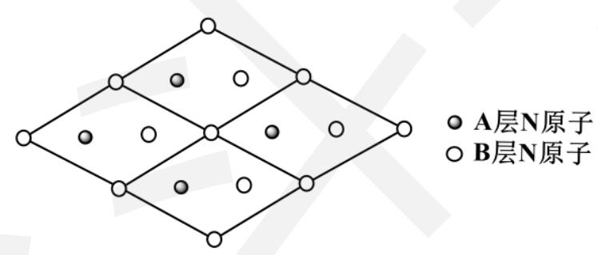

\- A层N原子
- B层N原子

(2 分)

4-3-2

Fe 原子坐标 (2 分)

(0,0,0)、(1/2,1/2,0)、(1/2,5/6,1/2)、(0,1/3,1/2)

八面体空隙 (2 分)

(0,2/3,1/4)、(1/2,1/6,1/4)、(0,2/3,3/4)、(1/2,1/6,3/4)

全写对才得分

4-3-3

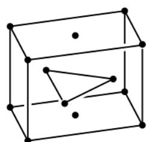  
- 金属原子

1/2 的 A 层 N 原子迁移至 B 层，1/2 的 B 层 N 原子迁移至 A 层迁移后两层原子数相等，迁移数 1:2。（2 分）

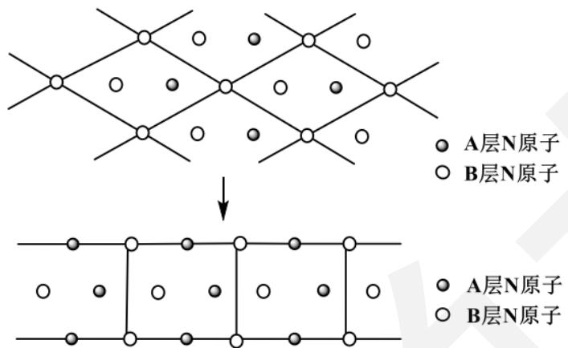

第5题（13分）

5-1 铬、铝等元素与 EDTA 虽然可以 1:1 反应，但是反应速率慢，不容易观察直接滴定的终点。

2分

5-2

$$
\mathrm{Al} ^ {3 +} + 6 \mathrm{F} ^ {-} = \mathrm{AlF} _ {6} ^ {3 -}
$$

$$
\mathbf {C a} ^ {2 +} + 2 \mathbf {F} ^ {-} = \mathbf {C a F} _ {2}
$$

$$
\mathbf {M} \mathbf {g} ^ {2 +} + 2 \mathbf {F} ^ {-} = \mathbf {M} \mathbf {g} \mathbf {F} _ {2}
$$

每个2分

5-3

$$
\begin{array}{r} \mathrm {n_ {Cr}} = 5 (\mathrm {n_ {EDTA}} - \mathrm {n_ {Zn}}) = 5 \times (5 0. 0 0 \times 0. 0 2 1 1 4 - 2 3. 1 4 \times 0. 0 2 0 3 0) \times 1 0 ^ {- 3} \\ = 2. 9 3 6 \times 1 0 ^ {- 3} \mathrm{mol} \end{array}
$$

$$
c _ {C r} = 2. 9 3 6 \div 5. 0 0 = 0. 5 8 7 m o l \cdot L ^ {- 1}
$$

## 答案 2 分，过程 3 分

第6题（11分）

6-1

简单立方，每个晶胞有 12 个 B 原子

4分

6-2

HgF3，坐标（0.5, 0.5, 0.5）（0.25, 0.25, 0.25）（0.25, 0.25, 0.75）（全部棱心、体心、四面体空隙都被 B 占据，但要注意区分等同点系）

4分

6-3

高压下倾向成为密度最大的立方结构，压强降低，原子间排斥明显，立方相不稳定。

## 3 分

第七题（15分）

E Pt(PEt $_3$ ) $_3$ F H $_2$ G H $_2$ S $_2$ O $_8$

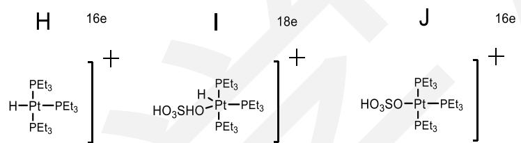

K 18e

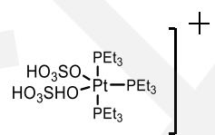

(每个2分)

方程： $2H_{2}SO_{4}\xrightarrow[\begin{array}{c}h\nu\end{array}]{\mathrm{Pt(PEt_{3})_{3}}}\quad H_{2} + H_{2}S_{2}O_{8}$

(1分)

第八题（23分）

8-1

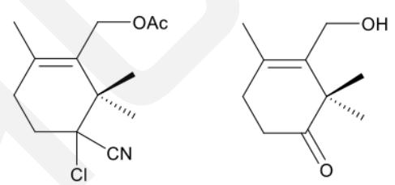

甲基推电子与 CN 吸电子 （每个结构2分，解析2分，共6分）
8-2

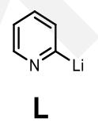

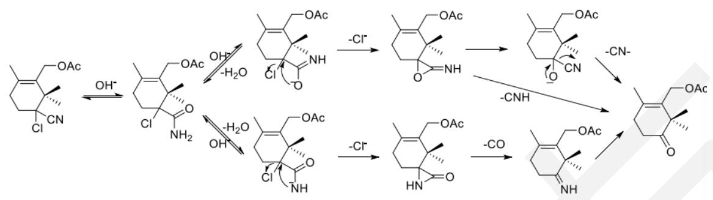

(每条路径3 分)

8-3

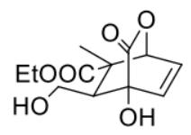

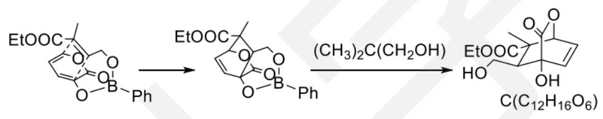

(每个3分)

8-4

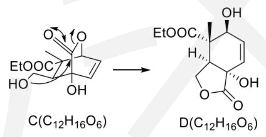

(结构3分，电子流向2分)

## 第九题（30分）

9- 1 (2 分)

$$
\mathbf {A} > \mathbf {C} > \mathbf {B}
$$

9-2 (4分)

L

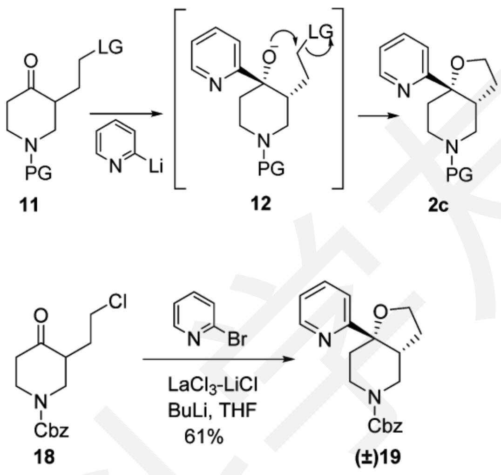

F: LiCl (2分)

作用: Lewis 酸催化剂 (2分)

E 有 2 个手性碳（2 分，结构 2 分，没有标出消旋体不得分）

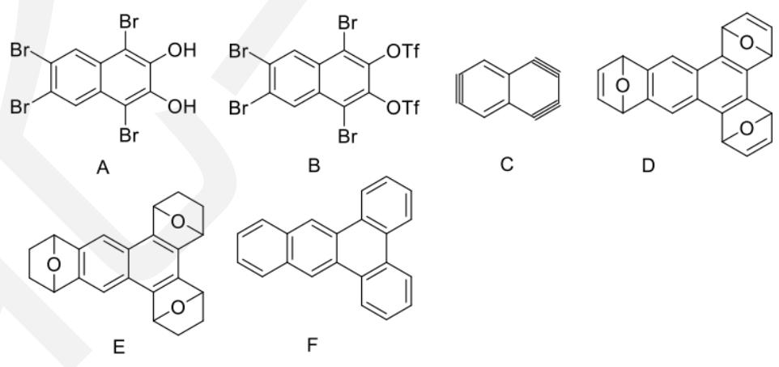  
9-3-2  
(每个 2 分)

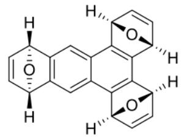

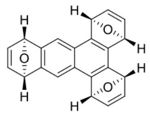

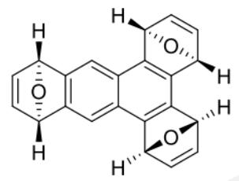

(2 分)

不需要分离（2 分）

第十题（23分）

B

C

D

E

F

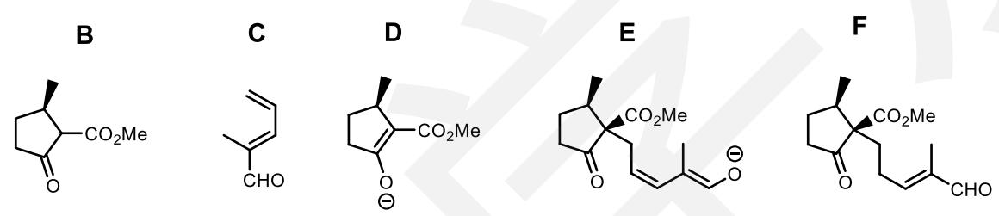

G

H

|

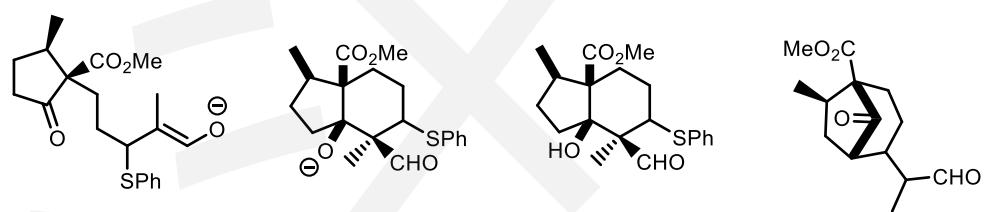

K

K 3 分，其余 2 分，画成配位形式也给分

10-2-2 氧化加热（过氧化氢，随后热解）（2分）

10-3-2 整合效应（或画出 J 的配位形式均可）（2分）

第 11 题（21 分）

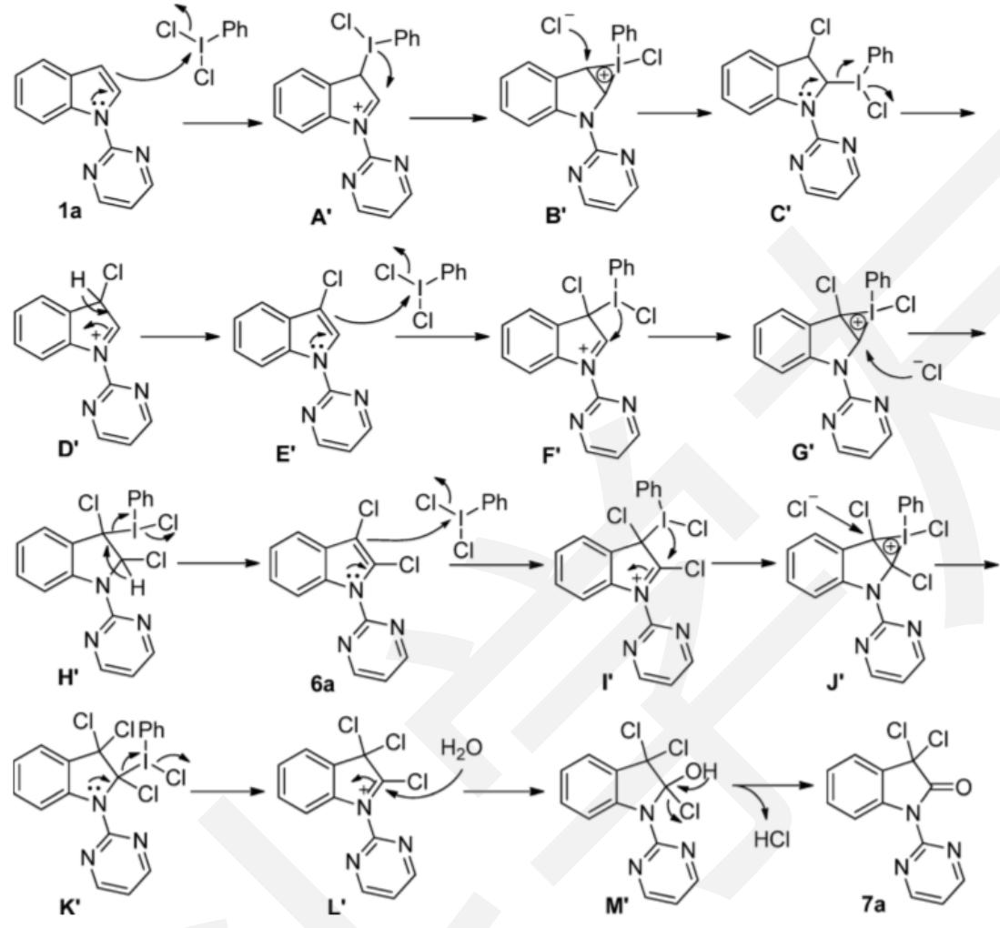  
7 个结构每个 3 分