# 北斗学友菁英课程院

## 2024 冬季·化学竞赛【大联考一】模拟题

提示：1）凡题目中要求书写反应方程式，须配平系数为最简整数比

2）本卷不要强求修约有效数字

3）解释题作答须尽量简洁

缩写：

Bn: 苄基;    Boc: 叔丁氧羰基;    TFA: 三氟乙酸;    Tf: 三氟甲磺酰基;

DCM：二氯甲烷； THF：四氢呋喃； TBAF：四丁基氟化铵。

## 第 1 题（22 分，占 10%）炼金术与化学

17 世纪炼金术士 Philalethes 详细记录了“白狮”的相关反应。“白狮”是一种能够转化其他金属的神秘物质。通过加热，“白狮”能够“吞噬”金属“木星”，生成银白色“土星”和残留在表面的“白盐”。现代化学研究发现“白狮”和“白盐”分别是两种含氧化合物；上述反应过程中只有金属的价态发生了改变，每 1.000 克“白狮”和 0.266 克“木星”按照计量比 2:1 反应。

1-1 写出“白狮”、“木星”、“土星”和“白盐”的化学式。

1-2 Philalethes 还记录了一系列炼金实验过程:

(i) 在加热条件下，“白狮”可以除去“月亮”中的“金星”杂质，从而得到纯的“月亮”。

(ii) “凤凰”是一种含三种元素的物质，加热可以得到生成一种被称为“烈火精”的气体，剩余固体为“烈火盐”。

(iii) 将过量的“月亮”溶于“硝石精”，向溶液中加入“烈火盐”，可以得到“黄月”。

确定“月亮”、“金星”、“凤凰”、“烈火精”、“烈火盐”和“黄月”的化学式。

提示：炼金术士们往往以星球的名字来命名金属。

1-3 现代测定，“凤凰”分解为“烈火精”和“烈火盐”的标准摩尔焓变为 $114.0 \, \mathrm{kJ} \mathrm{mol}^{-1}$ ，标准摩尔熵变为 $177.4 \, J \mathrm{mol}^{-1} \, K^{-1}$ 。计算该反应在 $400 \, K$ 下的标准平衡常数。

## 第2题（14分，占 $9\%$ ）高锰酸钾和碘的氧化还原分析

取高锰酸钾和锰酸钾的混合溶液 5 mL 于 100 mL 烧杯中，加入过量饱和氢氧化钡溶液，搅拌均匀，此时锰酸盐生成难溶解的灰绿色沉淀。把烧杯中的液体及沉淀于离心机上以 1500 r/min 离心分离 10 min。取出上清液，加水洗涤沉淀，重复离心 3 次。将上清液全部转移至 100 mL 容量瓶中，定容摇匀。取紫红色上清液（体积为 V mL）于碘量瓶中，加入 10% 碘化钾溶液 20 mL 及浓硫酸 5 mL，此时溶液颜色由紫红色变为棕黄色，盖上盖子后移至黑暗处放置 5 min。用浓度 $c_{1}$ mol/L 的硫代硫酸钠标准溶液滴定，待溶液颜色变为淡黄色时，加入 1% 淀粉指示剂溶液 5 mL，继续滴定至溶液颜色由灰蓝色变为无色即为终点，记录消耗的硫代硫酸钠标准液的毫升数，记为 $V_{1}$ mL。另取一份混合溶液样品 5 mL 于 100 mL 容量瓶中，定容摇匀，得到稀释样品。取体积为 V mL 稀释样品于碘量瓶中，同样采用上述碘量法进行滴定，记录消耗的硫代硫酸钠标准液的体积，记为 $V_{2}$ mL。

## 2-1 得到的灰绿色沉淀是什么？

2-2 写出题干过程涉及的离子方程式。

2-3 给出原试样中 $KMnO_{4}$ 和 $K_{2}MnO_{4}$ 含量的表达式（用 g/L 表示）。

## 第 3 题（22 分，占比 11%）机械力对分子的影响

3-1 偶氮苯可以作为力敏团引入到高分子主链结构中，在高分子主链被拉伸的时候改变其构型。

3-1-1 已知，偶氮苯的 4,4'-位置嵌入聚合物主链中。请问，在主链受到拉伸张力时，cis-还是 trans-构型的偶氮苯更稳定？

3-1-2 如果对一根嵌入有 trans-偶氮苯的聚合物链（4,4'-位置嵌入）持续拉伸，请你预测应力关于位移的曲线。

3-2 塑料袋相信大家都不陌生，聚乙烯就是塑料袋的主要材料之一。聚乙烯塑料袋在被拉伸时，通常可以发现塑料变“白”了，也就是变得不透明了，请解释。

3-3 对分子施加机械力的方法还有很多种，超声波就是其中一种常用的手段。研究表明，在用超声波处理以下聚合物的四氢呋喃溶液时，溶液颜色变深，并且析出深色聚合物沉淀。给出产物的结构。

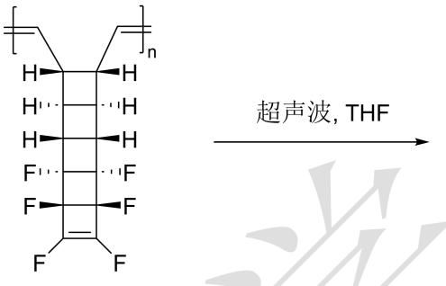

3-4 通常认为，机械力对于聚合物材料是破坏性的。但是，通过对于聚合物体系进行巧妙的结构设计，可以实现聚合物的“力致增强”。以下便是一例：二-(1-羟基十一烷基)二硒醚（127 mg）、4,4'-二环己基甲烷二异氰酸酯（HMDI，976 mg）和二月桂酸二丁基锡（DBTDL，5 μL，其中月桂酸为十二烷酸）溶于无水 DMF（10 mL）中，搅拌并加热至 35 °C 反应 1 小时。接着，向该混合物中加入无水聚四亚甲基醚二醇（PTMEG: $M_{n} = 1000 \text{ g/mol}$ ，510 mg）和 5,6-二羟基丙烯酸己酯（DHMA，209 mg）溶于无水 DMF（10 mL）中，在室温下继续搅拌 16 小时。然后，在氮气保护下加入 1,4-丁二醇（BDO，175 mg，1.940 mmol），并在室温下搅拌 24 小时。粗产品通过在甲醇中沉淀三次、用己烷洗涤并真空干燥进行纯化，可以得到聚合物 A。

## 3-4-1 请画出聚合物 A 的结构。

## 3-4-2 DBTDL 的作用是什么？

3-4-3 已知聚合物 A 在持续机械力的作用下，材料的强度不降反升。请你为这个现象提出合理的解释。

## 第4题（11分，占 $5\%$ ）棒状胶束

作为一种典型的一维纳米组装体，柱状胶束由于可调的长径比与几何构型受到广泛关注。在水溶液中，特定的 pH 条件下，油酸钠（NaOA）可以形成棒状胶束。下面给出了油酸的结构式以及棒状胶束的示意图。假设 HOA 的 $pK_{a}=6.0$ 。

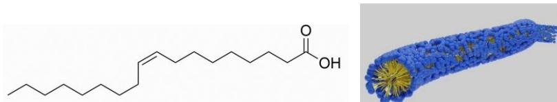

4-1 向 1L 纯水中，加入 0.040 mol HOA 以及 0.40 mol $Na_{2}CO_{3}$ ，可以得到棒状胶束。假设平均每个棒状胶束含有 2000 个油酸单元，计算胶束所带有的平均电荷数。（已知 $H_{2}CO_{3}$ $pK_{a1}=6.35$ ， $pK_{a2}=10.33$ ）

4-2 请估算该棒状胶束的直径。除氢外所有原子共价半径取 70 pm。

## 第 5 题（22 分，占 15%）晶体结构

5-1 下图中给出了一种三元化合物的晶胞示意图以及晶胞参数。将顶点处元素记为 M，剩下两种中大球为 N，小球为 X。

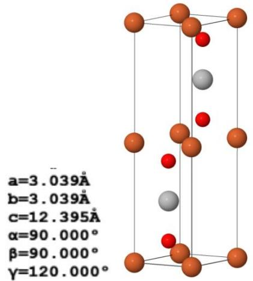

a=3.039Å
b=3.039Å
c=12.395Å
α=90.000°
β=90.000°
γ=120.000°

5-1-1 画出该晶胞沿 c 轴的投影图。

5-1-2 写出晶胞中各个原子的配位数。

5-1-3 已知该晶体的理论密度为 $6.56 \, g/\mathrm{cm}^{3}$ ，请写出该晶体代表的化学式。

5-1-4 已知晶体中最近的 N-X 距离为 206.6 pm。请写出晶体中所有 X 原子的坐标。

5-1-5 该晶体中，元素 N 的堆积层可以用如下方式来表示：...ABAB...。在另一种化学组成一致的晶体（记为晶体 P）中，元素 N 的堆积层可以用如下方式来表示：...ABCABC...。以 N 原子为顶点，画出一个晶体 P 的晶胞关于 c 轴的投影图，并给出晶体 P 的晶胞参数。

5-2 下面给出了晶体 $SrRu_{4}Sb_{12}$ 的示意图以及沿某一坐标轴的投影图，该晶体有潜在的超导性能。在该晶胞中，Sr 原子位于顶点和体心。

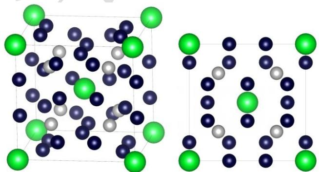

5-2-1 已知该晶胞为体心立方晶胞，写出晶体中所有 Ru 原子的坐标。

5-2-2 已知 Sr 的配位多面体为二十面体，请写出 Ru 的配位多面体。

5-2-3 Sr 的配位多面体之间的连接方式为:

(a) 无连接

(b) 共顶点

(c) 共棱

(d) 共面

## 第6题（18分，占 $10\%$ ）铁的配合物

三草酸合铁酸钾是一种漂亮的翠绿色晶体。下面给出了它的制备方式：用电子天平称得 28.9005g $H_{2}C_{2}O_{4}$ 于烧杯中，加入 150 mL 蒸馏水，并搅拌溶解，然后称得 26.8802 g KOH 固体加入溶液中，搅拌均匀。随后称得 23.2012 g $\mathrm{Fe}_{2}(\mathrm{CO}_{3})_{3}\cdot5\mathrm{H}_{2}\mathrm{O}$ 固体，加入上述溶液中，并搅拌均匀。将上述所得溶液放入恒温水浴锅 (40 ℃) 中，加入 40 mL 3 M 硫酸，随后加入 125 mL EtOH，暗处放置 48 h 后得到长条片状晶体。过滤烘干后，得固体质量为 38.2880 g。经计算，产率为 64% 左右。

## 6-1 给出产物的化学式。

6-2 该化合物的热分解分为两步，第一步失去结晶水，第二步发生分子内的氧化还原反应。请给出两步反应的方程式。

6-3 除了形成单核配合物，草酸根也经常作为桥联配体形成多核配合物。某含铜的多核配合物合成方式如下：将苯甲酸 (0.122 g, 1.00 mmol) 和二乙胺 (105 μL, 1.00 mmol) 溶解于 10 mL 甲醇中，然后加入到 40 mL 甲醇中悬浮的醋酸铜单水合物 (0.199 g, 1.00 mmol) 中，反应混合物在 70 °C 搅拌 10 分钟，得到蓝绿色溶液。随后加入草酸二水合物 (0.063 g, 0.50 mmol) 和二乙胺 (105 μL, 1.00 mmol) 溶于 10 mL 甲醇中形成的溶液，反应混合体系变为浅蓝色，并继续搅拌 10 分钟。最后，加入 2,2'-联吡啶 (0.156 g, 1.00 mmol) 的甲醇溶液，并搅拌 30 分钟，溶液颜色变为深蓝色。通过室温下静置溶剂蒸发 36 小时，得到蓝绿色棱柱晶体 A (0.3640 g)。该晶体的元素分析理论值 (%): C 53.66, H 3.75, N 6.95, Cu 15.77。

6-3-1 给出该晶体的化学式。

6-3-2 写出中心原子的电子组态。

6-3-3 已知 Cu 中心为六配位，分子中联吡啶与草酸根不处于同一平面。请画出该双核配合物的结构。

6-3-4 在你画出的结构中, 任选一个 $\mathrm{Cu}$ 中心, 指出最长的 $\mathrm{Cu}-\mathrm{O}$ 键是哪一根, 次长的 $\mathrm{Cu}-\mathrm{O}$ 是哪一根?

## 第 7 题（12 分，占 10%） $CO_{2}$ 的空气捕获与富集

7-1 对于下面的反应:

$$
\mathrm{NH} _ {4} \mathrm{HCO} _ {3} (\mathrm{s}) \rightarrow \mathrm{NH} _ {3} (\mathrm{g}) + \mathrm{CO} _ {2} (\mathrm{g}) + \mathrm{H} _ {2} \mathrm{O} (\mathrm{g})
$$

已知热力学数据:

| 物质 | $\Delta {\mathrm{H}}_{\mathrm{f}}{}^{ \circ }\left( {\mathrm{kJ}/\mathrm{mol}}\right)$ | ${\mathrm{S}}^{ \circ }\left( {\mathrm{J}/\left( {\mathrm{mol} \cdot \mathrm{K}}\right) }\right)$ |
| --- | --- | --- |
| ${\mathrm{NH}}_{4}{\mathrm{HCO}}_{3}\left( \mathrm{\;s}\right)$ | -851.6 | 160.4 |
| ${\mathrm{NH}}_{3}\left( \mathrm{\;g}\right)$ | -45.9 | 192.8 |
| ${\mathrm{CO}}_{2}\left( \mathrm{\;g}\right)$ | -393.5 | 213.7 |
| ${\mathrm{H}}_{2}\mathrm{O}\left( \mathrm{g}\right)$ | -241.8 | 188.8 |

取 $H_{2}O$ 分压 100 kPa， $CO_{2}$ 分压 0.04 kPa， $NH_{3}$ 分压 100 kPa，计算碳酸氢铵的分解温度。

7-2 近日，某研究团队实现了低再生温度的 $CO_{2}$ 吸收材料的制备，研究人员将其命名为 COF-999。

7-2-1 目前的低再生温度的 $CO_{2}$ 吸收材料大多为多氨基材料。这类材料有一个缺点，那就是在长时间的使用过程中，在空气存在下可能经历自由基氧化过程而失活。请解释为何该类材料易被自由基氧化。

7-2-2 COF-999 的合成过程如下：1,3,5-三(4-氰甲基苯基)苯与 3,3'-双(6-叠氮基己氧基)-4,4'-联苯二甲醛在碳酸铯的作用下进行缩合（相关原料结构如下），得到 COF-999-N₃，随后在 PPh₃ 的作用下进行还原，再使用过量的氮丙啶处理即可得到产物 COF-999。请给出 COF-999-N₃ 的结构示意。（允许结构进行适当简化表达）

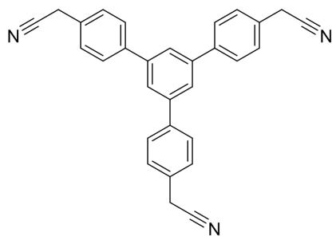

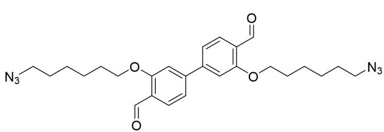

## 第 8 题（19 分，占比 8%）有机化合物的基本性质

8-1 下面有机化合物中酸性最强的是（）

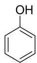

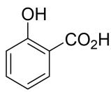

A

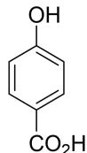

B

C

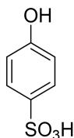

D

8-2 用化学方法区分丁酮和丁醛，可以选用的试剂有（）
A. $I_{2}/NaOH$ B. 吐伦试剂
C. 亚硫酸氢钠溶液

8-3 有人想用异丙基溴化镁和 2,4-二甲基-3-己酮发生加成反应，得到了意料之外的产物。你认为产物可能包括（）
A. 丙烷
B. 丙烯
C. 2,4-二甲基-3-己醇

8-4 在进行金属试剂与 $CO_{2}$ 的反应制备羧酸时，通常选用格氏试剂而不是烷基锂，请给出合理的解释。

8-5 补全下面的合成路线，要求立体化学。

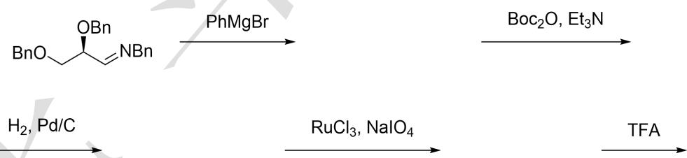

## 第 9 题（29 分，占比 14%）芳香亲电取代反应

9-1 在芳香亲电取代反应中，芳环上的取代基可分为致活基和致钝基；或依据产物结构，将取代基分为邻、对位定位基和间位定位基。确定以下哪些基团既是致活基，又是邻、对位定位基。（）A. OHB. $\mathrm{NO}_2$ C. OMeD. CHO E. COOH F. Cl G. 以上都不是

9-2 使用萘和叔丁基氯（4 当量）在 $2\% AlCl_{3}$ 的催化下进行付-克烷基化反应时，可以得到两种二取代产物。请给出这两种产物的结构。

9-3 给出下面反应的产物。

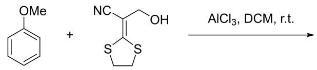

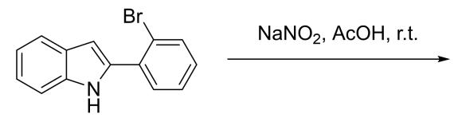

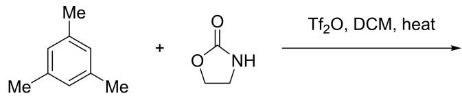

9-4 为下列转化提供关键中间体（至少 3 个）。

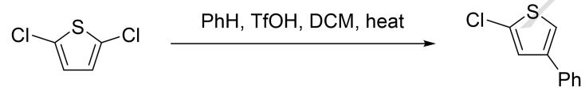

9-5 将碘苯与 TMPLi（TMP 为 2,2,6,6-四甲基哌啶）在 THF 中低温反应，可以得到两种产物；其中产物 A 含有碘，产物 B 不含碘。两种产物均含有芳环，并且均含有四甲基哌啶基团。请画出 A 和 B 的结构，并给出生成 A 的关键中间体（至少 2 个）。

第 10 题 （16 分，占比 8%）烯烃的反应

10-1 画出下面反应的产物，并标注产物中所有手性中心的绝对构型。

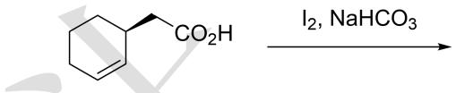

10-2 观察下面的反应:

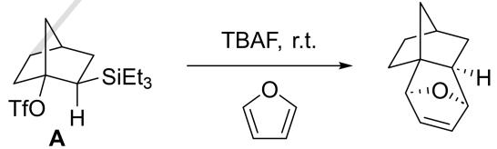

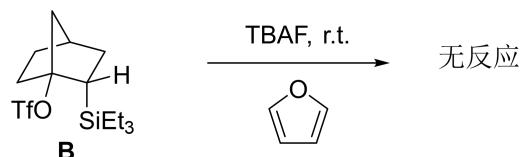

10-2-1 已知该反应经历了一种高张力中间体，请给出该中间体的结构。

10-2-2 为什么 B 不能进行类似的反应?

10-2-3 模仿题干中的反应，给出下面反应的产物。

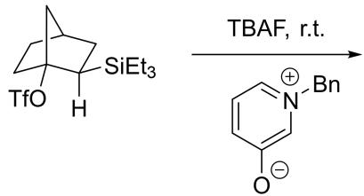