# 北斗学友菁英课程院

## 2024 冬季·化学竞赛【大联考一】模拟题-参考答案

## 第1题（22分，占 $10\%$ ）炼金术与化学

1-1 写出“白狮”、“木星”、“土星”和“白盐”的化学式。

白狮：PbO 木星：Sn 土星：Pb 白盐： $SnO_{2}$ （6分）

1-2 Philalethes 还记录了一系列炼金实验过程:

$$
\mathrm{Ag}
$$

凤凰： $KNO_{3}$ （或 $NaNO_{3}$ ）

烈火精： $\mathrm{O}_{2}$

$$
\mathrm{KNO} _ {2}
$$

$$
\mathrm{NaNO} _ {2})
$$

黄月： $\mathrm{AgNO}_{2}$ （12分）

1-3 现代测定，“凤凰”分解为“烈火精”和“烈火盐”的标准摩尔焓变为 $114.0 \, kJ mol^{-1}$ ，标准摩尔熵变为 $177.4 \, J mol^{-1} \, K^{-1}$ 。计算该反应在 $400 \, K$ 下的标准平衡常数。

$$
\Delta G ^ {0} = \Delta H ^ {0} - T \Delta S ^ {0}
$$

$$
\Delta G ^ {0} = 1 1 4 - (4 0 0 \times 0. 1 7 7 4) = 1 1 4 - 7 0. 9 6 = 4 3. 0 4 \mathrm{kJ/mol}
$$

$$
\ln K = - \frac {4 3 . 0 4}{(8 . 3 1 4 \times 1 0 ^ {- 3}) \times 4 0 0} = - 1 2. 9 5
$$

$$
K = e ^ {- 1 2. 9 5} \approx 2. 3 7 \times 1 0 ^ {- 6}
$$

(4 分)

## 第 2 题（14 分，占 9%）高锰酸钾和碘的氧化还原分析

## 2-1 得到的灰绿色沉淀是什么？

## BaMnO $_{4}$ （2分）

2-2 写出题干过程涉及的离子方程式。

$$
\mathrm{Ba} ^ {2 +} + \mathrm{MnO} _ {4} ^ {2 -} \rightarrow \mathrm{BaMnO} _ {4}
$$

$$
1 0 \mathrm{I} ^ {-} + 2 \mathrm{MnO} _ {4} ^ {-} + 1 6 \mathrm{H} ^ {+} \rightarrow 5 \mathrm{I} _ {2} + 2 \mathrm{Mn} ^ {2 +} + 8 \mathrm{H} _ {2} \mathrm{O}
$$

$$
4 \mathrm{I} ^ {-} + \mathrm{MnO} _ {4} ^ {2 -} + 8 \mathrm{H} ^ {+} \rightarrow 2 \mathrm{I} _ {2} + \mathrm{Mn} ^ {2 +} + 4 \mathrm{H} _ {2} \mathrm{O}
$$

$$
2 \mathrm{S} _ {2} \mathrm{O} _ {3} ^ {2 -} + \mathrm{I} _ {2} \rightarrow \mathrm{S} _ {4} \mathrm{O} _ {6} ^ {2 -} + 2 \mathrm{I} ^ {-}
$$

(一个 2 分, 共 8 分; $\mathrm{I}_{2}$ 写成 $\mathrm{I}_{3}$ -也得满分)

2-3 给出原试样中 $\mathrm{KMnO_4}$ 和 $\mathrm{K}_2\mathrm{MnO}_4$ 含量的表达式（用 $\mathrm{g / L}$ 表示）。

$$
\rho_ {\mathrm{KMnO} _ {4}} = \frac {c _ {1} V _ {1} M _ {\mathrm{KMnO} _ {4}}}{5 V} \times \frac {1 0 0}{5} (2 \text {分})
$$

$$
\rho_ {\mathrm {K_ {2} MnO_ {4}}} = \frac {c _ {1} (V _ {2} - V _ {1}) M _ {\mathrm {K_ {2} MnO_ {4}}}}{4 V} \times \frac {1 0 0}{5}
$$

分）化简与否都得满分

## 第3题（22分，占比 $11\%$ ）机械力对分子的影响

3-1-1 已知，偶氮苯的 4,4'-位置嵌入聚合物主链中。请问，在主链受到拉伸张力时，cis-还是 trans-构型的偶氮苯更稳定？

trans-偶氮苯（2分）

3-1-2 如果对一根嵌入有 trans-偶氮苯的聚合物链（4,4'-位置嵌入）持续拉伸，请你预测应力关于位移的曲线。

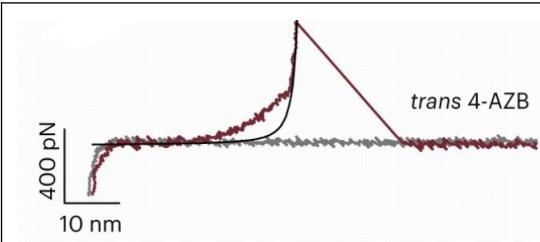

得分要点:

1，有上升阶段（对应高分子链被拉长，1 分）

2，有下降阶段（对应链断裂，可以画成瞬态过程，2分）

## 3-2 塑料袋相信大家都不陌生，聚乙烯就是塑料袋的主要材料之一。聚乙烯塑料袋在被拉伸时，通常可以发现塑料变“白”了，也就是变得不透明了，请解释。

意思相近即可，答出“拉伸诱导结晶”即可得到满分。

## 3-3 对分子施加机械力的方法还有很多种，超声波就是其中一种常用的手段。研究表明，在用超声波处理以下聚合物的四氢呋喃溶液时，溶液颜色变深，并且析出深色聚合物沉淀。给出产物的结构。

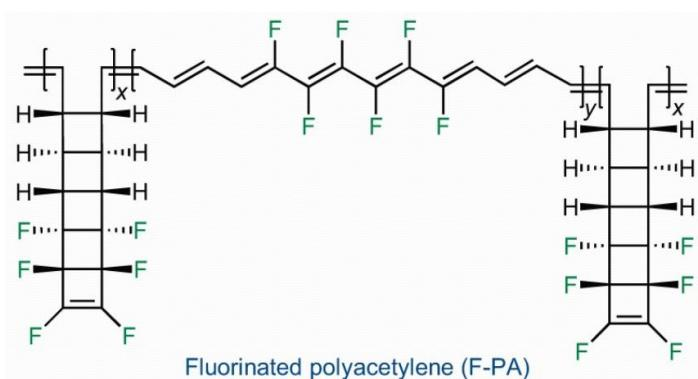

## (3 分, 画成全部开环的结构同样得到满分)

（实际体系中，由于聚合物溶解度的降低，聚合物析出，导致超声效率变差，只有部分结构开环；附原文网址 https://www.nature.com/articles/s41557-020-00608-8）

3-4-1 请画出聚合物 A 的结构。  
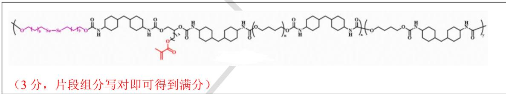

## (3 分, 片段组分写对即可得到满分)

## 3-4-2 DBTDL 的作用是什么？

作为 Lewis 酸，催化加成聚合反应；避免二异氰酸酯和聚四亚甲基醚二醇分相，提高反应效率（2 分，任意答一点即可得到满分）

## 3-4-3 已知聚合物 A 在持续机械力的作用下，材料的强度不降反升。请你为这个现象提出合理的解释。

在机械力的作用下，二硒键可以发生断裂生成自由基；（2分）自由基引发高分子链中的甲基丙烯酸酯单元聚合；（1分）提升了聚合物的交联密度，从而提升聚合物强度。（2分）（附文章中的示意图：10.31635/ccschem.022.202201874

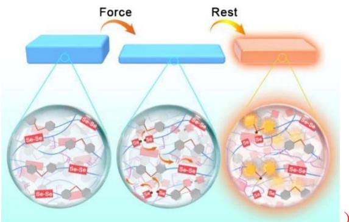

本题答案在 3.0 nm - 6.0 nm 都得满分
粗略估计： $2*18*70*2*\cos((180-119)/2)$ pm = 4.2 nm （3 分）

## 第4题（11分，占 $5\%$ ）棒状胶束

4-1 向 1L 纯水中，加入 0.040 mol HOA 以及 0.40 mol $Na_{2}CO_{3}$ ，可以得到棒状胶束。假设平均每个棒状胶束含有 2000 个油酸单元，计算胶束所带有的平均电荷数。（已知 $H_{2}CO_{3}$ $pK_{a1}=6.35$ ， $pK_{a2}=10.33$ ）

得分点 1：近似得到溶液中 $\left[CO_{3}^{2-}\right]=0.36\ mol/L,\left[HCO_{3}^{-}\right]=0.040\ mol/L$ （3 分）

得分点 2：计算体系 pH = 11.3 （3 分）

得分点 3：胶束带电荷为 -2000（2 分，未体现出带负电扣 1 分）

4-2 请估算该棒状胶束的直径。除氢外所有原子共价半径取 70 pm。

## 第 5 题（22 分，占 15%）晶体结构

5-1-1 画出该晶胞沿 c 轴的投影图。

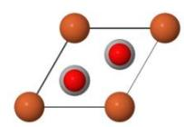

(3 分)

5-1-2 写出晶胞中各个原子的配位数。

M 配位数为 6（6 个 X），N 配位数为 2（2 个 X），X 的配位数为 4（3 个 M 和 1 个 N）（3 分）

5-1-3 已知该晶体的理论密度为 $6.56 \, g/cm^{3}$ ，请写出该晶体代表的化学式。

$AgFeO_{2}$ (3 分)

5-1-4 已知晶体中最近的 N-X 距离为 206.6 pm。请写出晶体中所有 X 原子的坐标。

(0.333, 0.667, 0.083), (0.333, 0.667, 0.417), (0.667, 0.333, 0.583), (0.667, 0.333, 0.917)

(2 分, 0.083 写成近似值 1/12 也得满分)

5-1-5 以 N 原子为顶点，画出一个晶体 P 的晶胞关于 c 轴的投影图，并给出晶体 P 的晶胞参数。

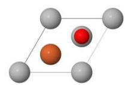

(3 分)

晶胞参数: $a = b = 303.9 \mathrm{pm}, c = 1859.0 \mathrm{pm}, \alpha = \beta = 90^{\circ}, \gamma = 120^{\circ}$ (2 分)

5-2-1 已知该晶胞为体心立方晶胞，写出晶体中所有 Ru 原子的坐标。

(0.25, 0.25, 0.25), (0.75, 0.25, 0.25), (0.25, 0.75, 0.25), (0.25, 0.25, 0.75)  
(0.75, 0.75, 0.25), (0.75, 0.25, 0.75), (0.25, 0.75, 0.75), (0.75, 0.75, 0.75)

(2 分)

5-2-2 已知 Sr 的配位多面体为二十面体，请写出 Ru 的配位多面体。

八面体（2 分）

5-2-3 Sr 的配位多面体之间的连接方式为:

(a)

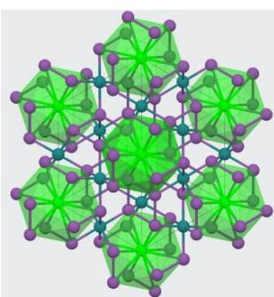

附图：

(2 分)

## 第6题（18分，占 $10\%$ ）铁的配合物

6-1 给出产物的化学式。

$K_{3}[Fe(C_{2}O_{4})_{3}]\cdot3H_{2}O$ （4分，没有结晶水扣2分）

6-2 该化合物的热分解分为两步，第一步失去结晶水，第二步发生分子内的氧化还原反应。请给出两步反应的方程式。

$$
\mathrm{K} _ {3} \left[ \mathrm{Fe} \left(\mathrm{C} _ {2} \mathrm{O} _ {4}\right) _ {3} \right] \cdot 3 \mathrm{H} _ {2} \mathrm{O} \rightarrow \mathrm{K} _ {3} \left[ \mathrm{Fe} \left(\mathrm{C} _ {2} \mathrm{O} _ {4}\right) _ {3} \right] + 3 \mathrm{H} _ {2} \mathrm{O} (1 \text {分})
$$

$$
2 \mathrm{K} _ {3} [ \mathrm{Fe} (\mathrm{C} _ {2} \mathrm{O} _ {4}) _ {3} ] \rightarrow 2 \mathrm{K} _ {2} [ \mathrm{Fe} (\mathrm{C} _ {2} \mathrm{O} _ {4}) _ {2} ] + \mathrm{K} _ {2} \mathrm{C} _ {2} \mathrm{O} _ {4} + 2 \mathrm{CO} _ {2}
$$

6-3-1 给出该晶体的化学式。

(Cu(bipy)(PhCOO)(OH2))2(C2O4) (4分)

6-3-2 写出中心原子的电子组态。

[Ar] $3d^{9}$ （1分）

6-3-3 已知 Cu 中心为六配位，分子中联吡啶与草酸根不处于同一平面。请画出该双核配合物的结构。

6-3-4 在你画出的结构中，任选一个 Cu 中心，指出最长的 Cu-O 键是哪一根，次长的 Cu-O 是哪一根？

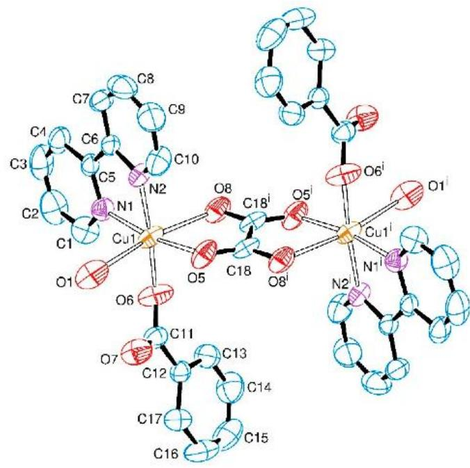

最长的为 Cu1-O1，次长的为 Cu1-O8（各 1 分，共 2 分）

第7题（12分，占 $10\%$ ） $\mathrm{CO}_{2}$ 的空气捕获与富集

7-1 取 $H_{2}O$ 分压 100 kPa， $CO_{2}$ 分压 0.04 kPa， $NH_{3}$ 分压 100 kPa，计算碳酸氢铵的分解温度。

$$
\Delta H ^ {\circ} = \left[ \Delta H _ {f} ^ {\circ} (\mathrm{NH} _ {3}) + \Delta H _ {f} ^ {\circ} (\mathrm{CO} _ {2}) + \Delta H _ {f} ^ {\circ} (\mathrm{H} _ {2} \mathrm{O}) \right] - \Delta H _ {f} ^ {\circ} (\mathrm{NH} _ {4} \mathrm{HCO} _ {3})
$$

$$
\Delta H ^ {\circ} = [ (- 4 5. 9) + (- 3 9 3. 5) + (- 2 4 1. 8) ] - (- 8 5 1. 6) = 1 7 0. 4 \mathrm{kJ/mol}
$$

$$
\Delta S ^ {\circ} = \left[ S ^ {\circ} (\mathrm{NH} _ {3}) + S ^ {\circ} (\mathrm{CO} _ {2}) + S ^ {\circ} (\mathrm{H} _ {2} \mathrm{O}) \right] - S ^ {\circ} (\mathrm{NH} _ {4} \mathrm{HCO} _ {3})
$$

$$
\Delta S ^ {\circ} = [ 1 9 2. 8 + 2 1 3. 7 + 1 8 8. 8 ] - 1 6 0. 4 = 4 3 4. 9 \mathrm{J/(mol} \cdot \mathrm{K)}
$$

$$
\Delta G ^ {\circ} = - R T \ln Q \quad (1 \text {分})
$$

$$
Q = \frac {(1 0 0 \mathrm{kPa}) \times (0 . 0 4 \mathrm{kPa}) \times (1 0 0 \mathrm{kPa})}{(1 0 0 \mathrm{kPa}) ^ {3}} = \frac {1 0 0 \times 0 . 0 4 \times 1 0 0}{1 0 0 ^ {3}} = 0. 0 0 0 4
$$

7-2-1 目前的低再生温度的 $CO_{2}$ 吸收材料大多为多氨基材料。这类材料有一个缺点，那就是在长时间的使用过程中，在空气存在下可能经历自由基氧化过程而失活。请解释为何该类材料易被自由基氧化。

氮 $\alpha$ 位形成自由基由于氮的共轭而较稳定（2分）

## 7-2-2 请给出 COF-999-N₃ 的结构示意。（允许结构进行适当简化表达）

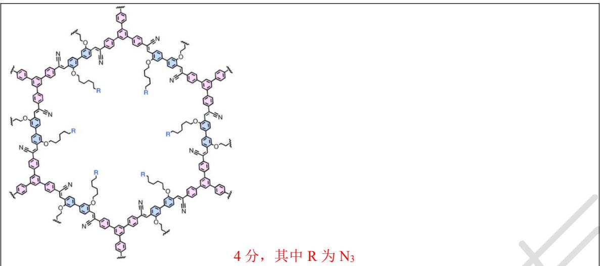

## 第8题（19分，占比 $8\%$ ）有机化合物的基本性质

8-1 下面有机化合物中酸性最强的是（D）(2分)

8-2 用化学方法区分丁酮和丁醛，可以选用的试剂有（ABC 或 AB）（2 分）

8-3 有人想用异丙基溴化镁和 2,4-二甲基-3-己酮发生加成反应，得到了意料之外的产物。你认为产物可能包括（BC 或 ABC）（2 分）

8-4 在进行金属试剂与 $CO_{2}$ 的反应制备羧酸时，通常选用格氏试剂而不是烷基锂，请给出合理的解释。

烷基锂可以与羧酸锂盐继续发生加成反应，从而使得反应不易控制（3 分）

8-5 补全下面的合成路线，要求立体化学。

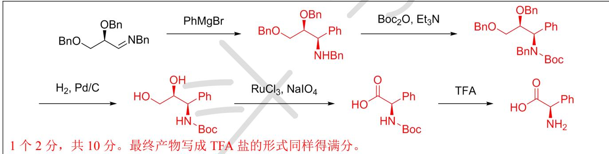

## 第9题（29分，占比 $14\%$ ）芳香亲电取代反应

9-1 在芳香亲电取代反应中，芳环上的取代基可分为致活基和致钝基；或依据产物结构，将取代基分为邻、对位定位基和间位定位基。确定以下哪些基团既是致活基，又是邻、对位定位基。（AC）（2分）
9-2 使用萘和叔丁基氯（4 当量）在 $2\% AlCl_{3}$ 的催化下进行付-克烷基化反应时，可以得到两种二取代产物。请给出这两种产物的结构。

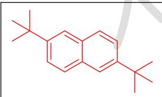

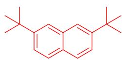

## 1 个 2 分，共 4 分

9-3 给出下面反应的产物。

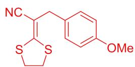

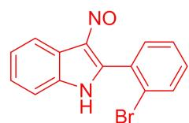

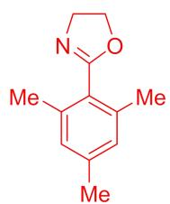

1个3分，共9分

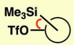

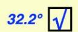

9-4 为下列转化提供关键中间体（至少 3 个）。

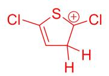

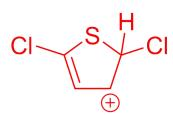

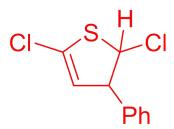

Ph 1个2分，共6分

9-5 将碘苯与 TMPLi（TMP 为 2,2,6,6-四甲基哌啶）在 THF 中低温反应，可以得到两种产物；其中产物 A 含有碘，产物 B 不含碘。两种产物均含有芳环，并且均含有四甲基哌啶基团。请画出 A 和 B 的结构，并给出生成 A 的关键中间体（至少 2 个）。

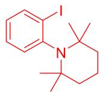

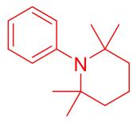

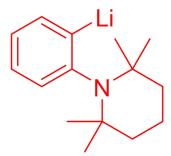

1个2分，共4分

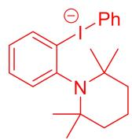

任意 2 个均可，1 个 2 分，共 4 分

## 第10题（16分，占比 $8\%$ ）烯烃的反应

10-1 画出下面反应的产物，并标注产物中所有手性中心的绝对构型。

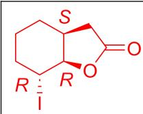

结构 2 分，构型每个 1 分，共 5 分

10-2-1 已知该反应经历了一种高张力中间体，请给出该中间体的结构。

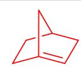

## 3 分

## 10-2-2 为什么 B 不能进行类似的反应？

A 中 Si-C-C-O 二面角相对较小，B 中 Si-C-C-O 二面角相对较大（4 分）反应进行过程中，需要将 Si-C 成键电子填充到 C-O 反键轨道中附原文示意图：https://www.science.org/doi/10.1126/science.adq3519

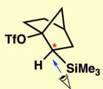  
29b  
Reactive (28, 29a)

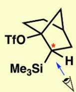  
epi-29b

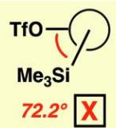

Unreactive (epi-29a)

10-2-3 模仿题干中的反应，给出下面反应的产物。

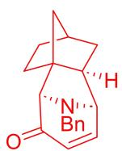

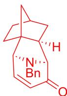

4 分，任意一个即可得满分