# 高中化学 竞赛教程

·
# 高中化学竞赛教程

第一分册

(第三版)

袁铭泽

华东师范大学出版社

# Digitized by the Internet Archive in 2023 with funding from Kahle/Austin Foundation

# 序

中学教育,应该是双重目标的,既为了全面提高全民素养,又为了培养未来的精英。科技精英的造就单靠课堂教学是远远不够的,还需要针对教学个体开展的课外活动,包括学生主动的自我塑造。爱因斯坦在暮年写了一个自述,他告诉我们,他在少年时就在课外研究宗教、哲学、高等数学和物理学了。为中学生创造一个宽松的自我塑造的环境对现今的中国教育尤显珍贵。包括化学竞赛在内的学科竞赛这种探究式的课外活动可以创造这种学习环境。从这个意义上讲,不管今后如何发展,包括化学竞赛在内的各种课外活动是不会消亡的。

我国的高中学生化学竞赛活动的宗旨是:(1)普及化学基础知识,激励中学生接触化学发展的前沿,了解化学对科学技术、国民经济和人民生活以及社会发展的意义,学习化学家的思想方法和工作方法,以培养他们学习化学的兴趣和创造精神;(2)探索早期发现和培养优秀学生的思路、途径和方法;(3)促进化学教学新思想与新方法的交流,推动大学与中学的化学教学改革,提高我国化学教学水平;(4)选拔参加一年一度的国际化学竞赛的选手。在四分之一个世纪的发展中,化学竞赛的主流始终坚守着这些宗旨,成为中学化学教学的一种重要补充形式,培养了一大批热爱化学的中学生,同时也培养了一大批化学教师。

在化学竞赛发展史中有一个事实很值得关注,无论中外,都不断呈现获奖选手集中在个别学校的现象。现象背后的本质是什么呢?除个别例外,是这些个别学校有能够肩负竞赛辅导的优秀中学教师。

本书的编者正是长年参与化学竞赛活动而脱颖而出的中学教师。他们为化学竞赛付出的艰辛努力和自身能力的提升在字里行间体现得淋漓尽致。本书的出版对今后参与化学竞赛的高中生和化学教师都很有意义。

“知之者不如好之者，好之者不如乐之者。”能不能提高中学生学习知识的兴趣是教师教学能力的重要标志。学生若对学习的知识毫无兴趣，是不可能学得知识的精髓的。有足够的知识，才可能有丰富的联想和想象力，进而迸发出创新思想。对于学生，其创新，大多是做自己没有想过做过的事情，本质上属于“拟创新”。本书收集了不少在历年化学竞赛试题里出现的以及编著者编制的好题，这些试题较好地体现了知识和创新的关系，对参加化学竞赛的师生都会有启发。

在众多竞赛试题中,最值得推崇的是其答案是学生未知的知识,而答案的得出却是基于基本化学知识的严密逻辑推理。这样的试题既检查了学生的知识基础,又检查了学生的逻辑推理能力,更检查了学生的创新能力,其中包含的不仅是智商,也包含着情商。解这样的试题,本身就是一个兴趣盎然的过程。一道这样的试题,其功能胜过只需靠记忆和“眼熟”即可解题的百题。本书就收录了一定量的具有上述特征的试题。

作为竞赛辅导书,本书与所有已出版的竞赛辅导书一样,以解题为核心。限于篇幅,对解题所需的知识,只能给出要点。须知,解题只是学习知识的一个环节而已,学习知识更重要的环节是掌握完整的知识系统。这需要循序渐进地、深入细致地、反复地阅读深度恰当的教科书,做阅读笔记,再针对某些核心概念,阅读更深的书籍或文献,写研究报告。对于自然科学,还离不开实验。有的知识,见过一次远远胜过阅读十次文字描述。眼下的中国鲜有大本头的标准教科书出现,学习者做实验的机会更少,这与国际科技教育态势很不合拍。竞赛辅导书的功能是有限的,不可能代替标准教材,也不可能代替实验。相信在这篇小文的最后,指出这一点是必要的。

吴国庆 识

2011年6月22日于北京

## 目录

第1讲 物质的量 / 1  
第2讲 氧化还原反应 / 18  
第3讲 离子反应 / 37  
第4讲 化学反应中的能量变化 / 54  
第5讲 原子结构 / 71  
第6讲 元素周期律和元素  
周期表 / 89  
第7讲 离子键和离子晶体 / 101  
第8讲 共价键理论 / 117  
第9讲 分子结构及性质 / 139  
第10讲 金属键和金属晶体 / 151  
第11讲 氢、稀有气体和卤族元素 / 162  
第12讲 氧族元素 / 178  
第13讲 氮族元素 / 192  
第14讲 碳族元素和硼族元素 / 210  
第15讲 碱金属、碱土金属 / 227  
测试题一 / 238  
测试题二 / 245  
测试题三 / 252  
测试题四 / 262  
参考答案 / 271

8CS 一國古籍
BAS 二重古籍
SBS 三國古籍
SBS 四國古籍
TSS 業普古籍

# 第1讲 物质的量

# 【知识要点】

## 一、物质的量、摩尔质量、气体摩尔体积

## 1. 物质的量(n)

物质的量是七个基本物理量之一, 是表示物质所含微粒数(N)与阿伏伽德罗常数 $(N_{\mathrm{A}})$ 之比, 即 $n = N/N_{\mathrm{A}}$ 。它是把微观粒子与宏观可称量物质联系起来的一种物理量。

科学上应用 $0.012 \, kg^{12}C$ (即原子核由 6 个质子和 6 个中子组成的碳原子) 所包含的原子数作为衡量微粒的集合体。 $0.012 \, kg^{12}C$ 含有阿伏伽德罗常数个碳原子。阿伏伽德罗常数（记为 $N_{A}$ ）数值很大，约为 $6.02 \times 10^{23}$ （目前公认的较精确的实验值为 $6.0221367 \times 10^{23}$ 个 $\cdot mol^{-1}$ ）。我们把含有阿伏伽德罗常数个微粒（“微粒”是指构成物质的“基本单元”，如分子、原子、离子、中子、电子等）的结合体作为物质的量的单位——摩尔（mol），简称摩。摩尔作为物质的量的单位应用极广，它是联系个体与集体，微粒与可称量的物质的桥梁。

## 2. 摩尔质量(M)

1 mol 物质所具有的质量,称为摩尔质量,用符号 M 表示。当物质的质量以克为单位时,摩尔质量的单位为 $g \cdot mol^{-1}$ , 在数值上等于该物质的相对原子质量或相对分子质量。对于某一纯净物来说,它的摩尔质量是固定不变的,而物质的质量则随着物质的物质的量不同而发生变化。

## 3. 气体摩尔体积( $V_{m}$ )

在标准状况 $(0^{\circ}\mathrm{C}, 1.01 \times 10^{5} \mathrm{~Pa})$ 下，1 mol 任何气体所占有的体积都约是 22.4 L。这个体积叫气体摩尔体积 $(V_{\mathrm{m}})$ 。

决定物质体积大小的因素有三个：

①物质粒子数的多少；②物质粒子本身的大小；③物质粒子之间距离的大小。

对于固态或液态的物质来说,1 mol 各种物质的体积是不相同的,这是因为对固态或液态的物质来说,构成它们的微粒间的距离是很小的,1 mol 物质的体积主要决定于原子、分子或离子的大小。

对于气体而言,通常情况下,一般气体分子直径约是 $4\times10^{-10}$ m,分子间的平均距离约是 $4\times10^{-9}$ m,即平均距离是分子直径的10倍左右。说明气体体积主要决定于分子间的平均距离。在标准状况下,不同气体分子间的平均距离几乎是相等的,所以任何物质的气体摩尔体积都约是 $22.4 \, L \cdot mol^{-1}$ 。

影响气体分子间平均距离大小的因素有温度和压强。温度越高，体积越大；压强越大，体积越小。当温度和压强一定时，气体分子间的平均距离大小几乎是一个定值，故粒子数一定时，其体积是一定值。因此，在涉及气体问题时要指明气体的温度和压强。

思考1: 如何用公式进行定量计算气体摩尔体积 $V_{\mathrm{m}}$ ？

思考2：物质的量、摩尔质量、气体摩尔体积的相互关系如何？

【例 1】 若规定 $^{12}$ C 的相对原子质量为 100，并将用 $^{12}$ C 规定的其他物理量的值作相应的调整，则下列各项发生变化且为原来数值 12/100 的是（）。A. 氧的相对原子质量 B. 水的摩尔质量 C. 阿伏伽德罗常数 D. 98 g 硫酸的物质的量

过程探究 “将用 $^{12}$ C 规定的其他物理量的值作相应的调整”，这句话的意思是 $100 \, g^{12}C$ 所含的碳原子数为阿伏伽德罗常数，即阿伏伽德罗常数为原来的 100/12 倍。所以 A、B、C 中各项数值均为原来的 100/12。只有 D 选项中 98 g 硫酸的物质的量为 12/100 mol，选 D。

参考解答 D

## 二、阿伏伽德罗定律及其推论

## 1. 阿伏伽德罗定律

在相同的温度和压强下,相同体积的任何气体都含有相同数目的分子,这就是阿伏伽德罗定律。

## 2. 阿伏伽德罗定律的推论

推论 1: 同温同压下, $V_{1}/V_{2} = n_{1}/n_{2}$

推论 2: 等温等体积时, $p_{1}/p_{2} = n_{1}/n_{2}$

推论 3: 同温同压下, $\rho_{1}/\rho_{2}=M_{1}/M_{2}=D$ (D 称相对密度)

推论 4: 同温同压下, 等质量的气体, $n_{1}/n_{2} = V_{1}/V_{2} = M_{2}/M_{1}$ ( $M_{1}$ 、 $M_{2}$ 分别为两种气体的摩尔质量)

推论 5: 等温等体积时, 等质量的气体, $p_{1}/p_{2}=M_{2}/M_{1}$

推论 6: 同温同压下, 等体积的气体, $m_{1}/m_{2} = M_{1}/M_{2}$ ( $m_{1}$ 、 $m_{2}$ 分别为两种气体的质量)

3. 混合气体的平均摩尔质量(M)

$$
\begin{aligned} \overline{M} & = m(\text{总}) / n(\text{总}) = M_{1}\bullet n_{1}\% +M_{2}\bullet n_{2}\% +\dots +M_{i}\bullet n_{i}\% \\ & = M_{1}\bullet V_{1}\% +M_{2}\bullet V_{2}\% +\dots +M_{i}\bullet V_{i}\% \end{aligned}
$$

其中， $M_{i}$ 表示第 $i$ 种气体的摩尔质量， $n_{i}\%$ 表示第 $i$ 种气体的物质的量分数，计算方法是： $n_{i}\% = n_{i} / n(\text{总}) \times 100\%$ ； $V_{i}\%$ 表示第 $i$ 种气体的体积分数，其计算方法是： $V_{i}\% = V_{i} / V(\text{总}) \times 100\%$ 。

思考3：阿伏伽德罗常数如何测定呢？你能想出几种方法？

提示：测定方法较多，请查阅资料，理解电解法、单分子膜法、衍射法等方法的本质。

【例 2】 在其他条件不变时,某气体的体积与温度(K)成正比。在不同温度时有的气体还会形成不同分子数的缔合物。以下是该气态物质在不同温度时测得的密度。

<table><tr><td>温度/K</td><td>200</td><td>400</td><td>800</td><td>1600</td></tr><tr><td>密度/g·cm-3</td><td>3.21</td><td>0.81</td><td>0.20</td><td>0.11</td></tr></table>

今测得 1600 K 时该物质的分子组成为 $AB_{2}$ ，则在其余温度时它的化学式应分别为 (800 K) 时：\_\_\_\_，(400 K) 时：\_\_\_\_，(200 K) 时：\_\_\_\_。

过程探究 化学是一门以实验为基础的科学,对实验数据进行正确分析、判断和筛选,并通过归纳、比较,最终得出正确的结论是竞赛选手应具备的素质。

在对实验数据的处理过程中,应注意数据变化的一般性与特殊性,并通过数据变化与物质本性的内在联系,推断出正确的结论。

本题的推断过程应考虑以下原则：

① 当气体的物质的量一定时,气体的体积与温度成正比。

② 同温、同压下，气体的密度与气体的摩尔质量成正比。

（1）根据 $T = 1600\mathrm{K}$ 时气体的化学式为 $\mathrm{AB}_2$ ，当温度从 $1600\mathrm{K}$ 降低到 $800\mathrm{K}$ 时，气体体积应缩小到原来的 $1 / 2$ ，而气体的密度约增大到原来的2倍（从 $0.11\mathrm{g}\cdot \mathrm{mL}^{-1}\rightarrow$ $0.20\mathrm{g}\cdot \mathrm{mL}^{-1})$ 。这说明在此温度变化时，密度的增大完全由气体体积缩小所引起的，此时只发生物理过程，气体的化学式仍为 $\mathrm{AB}_2$ 。

(2) 当温度从 $800 \mathrm{~K}$ 降低到 $400 \mathrm{~K}$ 时, 气体体积必然又缩小一半, 同样气体密度应增大到原来的两倍。但实验测得的密度从 $0.20 \mathrm{~g} \cdot \mathrm{mL}^{-1} \rightarrow 0.81 \mathrm{~g} \cdot \mathrm{mL}^{-1}$ , 增大到原来的四倍, 说明在这一变化过程中, 不仅发生了由降温引起的体积缩小, 还发生了双分子缔合, 所以 $400 \mathrm{~K}$ 时气体的化学式为 $\mathrm{A}_{2} \mathrm{~B}_{4}$ 。

同样, 当温度从 400 K 降低到 200 K 时(又降低了 1/2), 而气体密度从 0.81 g·mL $^{-1}$ →3.21 g·mL $^{-1}$ (又增大到原来的四倍), 说明气体分子又发生了缔合(四分子缔合), 所以 200 K 时气体的化学式为 A $_{4}$ B $_{8}$ 。

由此得到启示:在讨论物质的化学运动时,常常伴随有物理运动,我们应该全面地分析。

参考解答 800 K 时的分子式为 $AB_{2}$ ; 400 K 时的分子式为 $A_{2}B_{4}$ ; 200 K 时的分子式为 $A_{4}B_{8}$ 。

## 三、理想气体状态方程

理想气体又称“完全气体”，是理论上假想的一种把实际气体性质加以简化的气体。人们把假想在任何情况下都严格遵守气体三定律的气体称为理想气体。

理想气体具有如下特点：

① 分子体积与气体体积相比可以忽略不计

② 分子之间没有相互吸引力

③ 分子之间及分子与器壁之间发生的碰撞不造成动能损失

然而,真实气体并不严格遵循这些特点,只有在温度不太低、压强不太高时可将真实气体视为理想气体。换言之,理想气体是一种理想化的模型,实际并不存在。实际气体中,凡是本身不易被液化的气体,它们的性质很近似理想气体,其中最接近理想气体的是氢气和氦气。

在各种温度、压强的条件下,其状态皆服从方程 $pV = nRT$ 的气体,称为理想气体状态方程,或称理想气体定律。式中 $p$ 是气体分压, $V$ 是气体体积, $n$ 是气体物质的量, $T$ 是气体的绝对温度, $R$ 是气体通用常数,它随其他物理量的单位不同而不同。

<table><tr><td>物理量</td><td>p</td><td>V</td><td>n</td><td>T</td><td>R</td></tr><tr><td rowspan="2">国际单位制单位</td><td>Pa</td><td> $m^3$ </td><td>mol</td><td>K</td><td>8.314 Pa· $m^3$ · $mol^{-1}$ · $K^{-1}$ </td></tr><tr><td>kPa</td><td>L</td><td>mol</td><td>K</td><td>8.314 kPa·L· $mol^{-1}$ · $K^{-1}$ </td></tr><tr><td>常用单位</td><td>atm</td><td>L</td><td>mol</td><td>K</td><td>0.082 atm·L· $mol^{-1}$ · $K^{-1}$ </td></tr></table>

知道了理想气体状态方程,我们很快计算出 $V_{m}$ :

$$
V _ {\mathrm{m}} = \frac {n R T}{p} = \frac {1 \mathrm{mol} \times 0 . 0 8 2 \mathrm{atm} \cdot \mathrm{L} \cdot \mathrm{mol} ^ {- 1} \cdot \mathrm{K} ^ {- 1} \times 2 9 8 . 1 5 \mathrm{K}}{1 \mathrm{atm}} = 2 2. 4 \mathrm{L}
$$

某一气体在气体混合物中产生的分压等于它单独占有整个容器时所产生的压力；而气体混合物的总压强等于其中各气体分压之和，这就是道尔顿分压定律。其实，道尔顿分压定律只对理想气体才成立，对于实际气体，由于分子间作用力的存在，道尔顿定律将出现偏差。因此，能满足道尔顿分压定律的气体混合物称为理想气体的理想混合物。

若规定混合气体中的气体 B 的分压 $p_{B}$ 的定义为 $p_{B} = x_{B} \cdot p$ 。式中 $x_{B}$ 为气体 B 的物质的量分数，p 为混合气体在同温度下的总压。于是我们又可以得到：

$$
p = p _ {1} + p _ {2} + p _ {3} + p _ {4} + \dots + p _ {j} + p _ {\mathrm{B}}
$$

上式表明, 混合气体的总压等于同温度下其组分气体的分压之和, 此式可用于任何混合气体。对于理想气体, 有 $p_{\mathrm{B}} V = n_{\mathrm{B}} R T$ 。可见分压 $p_{\mathrm{B}}$ 是理想气体 B 单独占有混合气体的体积 $V$ 时显示的压力。

气体要扩散，在同温同压下，气体的扩散速率 u 与其密度 $\rho$ 的平方根成反比，即 $u_{A}/u_{B} = \sqrt{\rho_{B}/\rho_{A}}$ 。因为同温同压下，气体的密度 $\rho$ 与其摩尔质量 $M_{r}$ 成正比，所以上式可以写成： $u_{A}/u_{B} = \sqrt{M_{rB}/M_{rA}}$ ，即同温同压下气体的扩散速率与其摩尔质量的平方根成反比。

思考4: 将真实气体进行怎样的数学处理,使之可以用理想气体状态方程计算?

【例 3】（2009 年清华大学自主招生试题）下图是 273 K 时 $CH_{3}F$ 蒸气的 $\frac{\rho}{p} \sim p$ 图。试根据图求出 $CH_{3}F$ 摩尔质量。

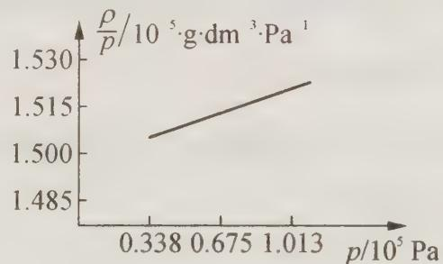

过程探究 本题考查真实气体与理想气体的相互转化。在图中将直线外延推至 p = 0:

从图中知 $\left(\frac{\rho}{p}\right)_{p\to 0} = 1.4980\times 10^{-5}\mathrm{g}\cdot \mathrm{dm}^{-3}\cdot$ $\mathrm{Pa^{-1}}$ 。

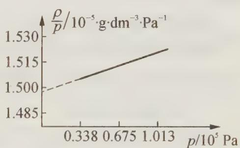

而 $p \rightarrow 0$ 时， $CH_{3}F$ 这一实际气体十分接近理想气体。此时就可以用理想气体状态方程进行计算了。

由 $pV = nRT$ 推得：

$M=\left(\frac{\rho}{p}\right)_{p\rightarrow0}\cdot RT=1.4980\times10^{-5}\ \mathrm{g}\cdot\mathrm{dm}^{-3}\cdot\mathrm{Pa}^{-1}\times8.314\times10^{3}\ \mathrm{Pa}\cdot\mathrm{dm}^{3}\cdot\mathrm{mol}^{-1}\cdot\mathrm{K}^{-1}\times273\ \mathrm{K}=34.00\ \mathrm{g}\cdot\mathrm{mol}^{-1}$ ，与理论值 $34.033\ g\cdot mol^{-1}$ 十分接近。

说明:用作图法外推,借助外延到一个极限状态来处理问题是一种通用的科学方法。

## 四、几种浓度的表示方法

## 1. 质量分数

溶液中溶质的质量分数是溶质质量与溶液质量之比。

使用质量分数时需注意：

① 溶质的质量分数只表示溶质质量与溶液质量之比,并不代表具体的溶液质量和溶质质量。

② 溶质的质量分数一般用百分数表示。

③ 溶质的质量分数计算式中溶质质量与溶液质量的单位必须统一。

④ 计算式中溶质质量是指被溶解的那部分溶质的质量,没有被溶解的那部分溶质质量不能计算在内。

由此,我们要弄清饱和溶液、不饱和溶液与溶质的质量分数的关系:浓溶液中溶质的质量分数大,但不一定是饱和溶液,稀溶液中溶质的质量分数小,但不一定是不饱和溶液。溶质的质量分数与溶解度的关系是: $\omega=s/(100+s)\times100\%$ .

溶解度是用来表示一定温度下,某物质在某溶剂中溶解性的大小。溶质的质量分数用来表示溶液组成。

## 2. 物质的量浓度

所谓物质的量浓度就是 1 L 溶液里所含溶质的物质的量, 即物质的量浓度 (mol·L $^{-1}$ ) = $\frac{\text{溶质的物质的量(mol)}}{\text{溶液的体积(dm}^{3})}$ , 即 $c_{B} = \frac{n_{B}}{V}$ 。

物质的量浓度配好以后还可以进行稀释。稀释的原则是:稀释前后溶质的质量或溶质的物质的量不变,其表达式如下:

由溶质的质量稀释前后不变有： $m_{B}=m_{浓}\times\omega_{浓}=m_{稀}\times\omega_{稀}$ 。式中 $\omega$ 表示质量分数。

由溶质稀释前后物质的量不变有： $n_{B}=c_{浓}\times V_{浓}=c_{稀}\times V_{稀}$ 。

溶液在稀释或混合时,溶液的总体积不一定是二者混合的体积之和。如给出溶液混合后的密度,应根据质量和密度求体积。

## 3. 质量摩尔浓度

溶液中某溶质 B 的物质的量(mol)除以溶剂的质量(kg)，称为该溶质的质量摩尔浓度。单位为 mol/kg，符号为 $m_{B}$ 。 $m_{B} = n_{B}/W$ 。式中 W 为该溶剂的质量，以千克(kg)作单位； $n_{B}$ 是溶质 B 的物质的量，以摩尔作单位。

质量摩尔浓度与物质的量浓度相比,前者不随温度变化而变化,在要求精确浓度时,必须用质量摩尔浓度表示。

对于一般稀溶液来说,其密度近似等于水的密度,可以近似认为 $c(\mathrm{mol}/\mathrm{L}) = m(\mathrm{mol}/\mathrm{kg})$ , 这种近似常用于计算中。

思考5: 在稀溶液的依数性中,对于沸点升高、凝固点降低的计算要牵涉质量摩尔浓度。请问它们的计算公式如何?如何理解沸点升高和凝固点降低?

【例 4】将两种不同浓度的硫酸溶液等质量混合,所得溶液质量分数为 $a\%$ ;等体积混合后,所得溶液质量分数为 $b\%$ ;将两种不同浓度的乙醇溶液等质量混合,所得溶液质量分数为 $a\%$ ;等体积混合后,所得溶液质量分数为 $c\%$ 。试确定 $a$ 、 $b$ 、 $c$ 的大小关系。从以上关系中可得出怎样的规律(已知硫酸溶液密度大于 $1 \mathrm{~g} \cdot \mathrm{mL}^{-1}$ , 乙醇溶液密度小于 $1 \mathrm{~g} \cdot \mathrm{mL}^{-1}$ )。

过程探究 设两不同浓度的某溶液的质量分数分别为 $\omega_{1}$ 和 $\omega_{2}$ ，密度分别为 $\rho_{1}$ 和 $\rho_{2}$ ：

等质量混合时： $a\% = \frac{\omega_1\cdot m + \omega_2\cdot m}{2m} = \frac{\omega_1 + \omega_2}{2}$

等体积混合时： $b\% = \frac{\omega_{1}\rho_{1}V + \omega_{2}\rho_{2}V}{\rho_{1}V + \rho_{2}V} = \frac{\omega_{1}\rho_{1} + \omega_{2}\rho_{2}}{\rho_{1} + \rho_{2}}$

$$
b \% - a \% = \frac {\omega_ {1} \rho_ {1} + \omega_ {2} \rho_ {2}}{\rho_ {1} + \rho_ {2}} - \frac {\omega_ {1} + \omega_ {2}}{2} = \frac {(\rho_ {1} - \rho_ {2}) (\omega_ {1} - \omega_ {2})}{2 (\rho_ {1} + \rho_ {2})}
$$

对于硫酸溶液密度随溶液质量分数的增加而增大。

若 $\rho_{1} - \rho_{2} > 0$ ，则 $\omega_{1} - \omega_{2} > 0$ ，即 $\rho_{1} - \rho_{2}$ 与 $\omega_{1} - \omega_{2}$ 同号。所以 $b\% - a\% > 0$ ，即

$b > a$ 。

对于乙醇溶液密度随溶质质量分数增加而减小,则:

$$
c \% - a \% = \frac {(\rho_ {1} - \rho_ {2}) (\omega_ {1} - \omega_ {2})}{2 (\rho_ {1} + \rho_ {2})}
$$

若 $\rho_{1} - \rho_{2} > 0$ ，则 $\omega_{1} - \omega_{2} < 0$ ，即 $\rho_{1} - \rho_{2}$ 与 $\omega_{1} - \omega_{2}$ 异号。所以 $c\% - a\% < 0$ ，即 $c < a$ 。

参考解答 (1) $a, b, c$ 的关系为: $b > a > c$ 。

(2) 得出的规律为: $a\%$ 的 $\mathrm{x}$ 溶液与 $b\%$ 的 $\mathrm{x}$ 溶液等质量混合后的质量分数为 $\frac{a + b}{2}\%$ ; 等体积混合后的质量分数: ① 若溶液密度大于 $1\mathrm{g} \cdot \mathrm{mL}^{-1}$ , 则混合后溶液的质量分数大于 $\frac{a + b}{2}\%$ ; ② 若溶液密度小于 $1\mathrm{g} \cdot \mathrm{mL}^{-1}$ , 则混合后溶液的质量分数小于 $\frac{a + b}{2}\%$ .

## 【竞赛对接】

【例 1】（2015 年乌克兰化学竞赛试题）为研究含有 $Ca^{2+}$ 、 $Mg^{2+}$ 和 $HCO_{3}^{-}$ 成分的水所形成水垢的化学组成，取干燥的水垢 6.32 g，加热使其失去结晶水，得到 5.78 g 剩余固体 A；高温灼烧 A 至恒重，残余固体为 CaO 和 MgO，放出的气体用过量的 $\mathrm{Ba(OH)}_{2}$ 溶液吸收，得到 11.82 g 沉淀。

(1) $\mathrm{Ba(OH)}_{2}$ 溶液吸收的气体中 $CO_{2}$ 的物质的量为 \_\_\_\_。

(2) 通过计算确定 A 中是否含有碳酸镁。

(3) 若 $5.78 \mathrm{~g}$ 剩余固体 A 灼烧至恒重时产生的气体完全被碱石灰吸收, 碱石灰增重 $2.82 \mathrm{~g}$ , 通过计算确定 A 中各成分的物质的量。

(4) $\mathrm{MgCl}_2$ 溶液中加入一定量 $\mathrm{Na}_2\mathrm{CO}_3$ 溶液后得到白色晶体 B(已知 B 不含结晶水)。称取 $2.50 \mathrm{~g} \mathrm{B}$ 晶体加热到恒重后, 剩余固体质量为 $1.41 \mathrm{~g}$ , 推测该 B 的化学式。写出推理的过程。

## 过程探究

(1) 根据碳元素守恒可知: $n(\mathrm{CO}_{2}) = 11.82 \mathrm{~g} / 197 \mathrm{~g} / \mathrm{mol} = 0.06 \mathrm{~mol}$ 。

(2) 假设 $CO_{2}$ 全部来自 $CaCO_{3}$ 的分解, 则 $m(\mathrm{CaCO}_{3}) = 6.00 \, \mathrm{g}$ ,

∵ 6.00>5.78, ∴ A 中一定有 $MgCO_{3}$ 。

(3) $n[\mathrm{Mg(OH)}_2] = 0.01\mathrm{mol}; n(\mathrm{CaCO}_3) = 0.01\mathrm{mol}; n(\mathrm{MgCO}_3) = 0.05\mathrm{mol}$ .

(4) 假设该晶体为 $\mathrm{Mg(OH)}_{2}$ ，分解产物为 MgO，失重为 31.0%，与已知不符合；假设晶体为 $MgCO_{3}$ ，分解产物为 MgO，失重为 52.4%，与已知不符合。故 B 应为 Mg 的碱式碳酸盐。

设 2.50 g 样品中含有 $a \, \text{mol} \, \text{Mg(OH)}_{2}$ ， $b \, \text{mol} \, \text{MgCO}_{3}$ ， $[a\text{Mg(OH)}_{2} \cdot b\text{MgCO}_{3}]$ ，则有：

$$
\begin{array}{l} 5 8 a + 8 4 b = 2. 5, \\ (a + b) \times 4 0 = 1. 4 1 _ {\circ} \end{array}
$$

解得: a=0.0178, b=0.0175, a:b=1:1, 故其化学式为 $\mathrm{Mg(OH)_2 \cdot MgCO_3}$ 或 $\mathrm{Mg_2(OH)_2CO_3}$ 。

## 参考解答 见上述分析

【例 2】（2015 年捷克化学竞赛试题）硫、氮、碳、铁、铜等常见元素在化合物中常表现出多种价态，如硫有 -2、-1、+2、+4、+6 等价态。这些元素在化工生产中有着重要应用。

(1) 31.2 g 镁与碳粉的混合物在一定条件下恰好完全反应, 再加入足量水, 得到 40.6 g 白色沉淀, 同时产生密度为 1.4107 g/L (标准状况) 的丙二烯 $\left(\mathrm{C}_{3} \mathrm{H}_{4}\right)$ 和不饱和烃 X 的混合气体。

① 镁与碳粉的反应产物的化学式为\_\_\_\_。

② 原混合物中碳粉的物质的量分数为 \_\_\_\_（用小数表示，保留 2 位小数）。

(2) 某复杂盐由三种元素组成, 含两种阳离子和两种阴离子。取 $21.76 \mathrm{~g}$ 该复杂盐, 平均分为两份。将第一份溶于足量盐酸酸化的 $\mathrm{BaCl}_{2}$ 溶液, 所得沉淀中含 $9.32 \mathrm{~g} \mathrm{BaSO}_{4}$ 。将第二份溶于足量热浓硝酸, 再滴加足量 $\mathrm{Ba(NO_{3})_{2}}$ 溶液, 得 $13.98 \mathrm{~g}$ 白色沉淀, 过滤后向蓝色滤液中加足量烧碱溶液, 过滤、洗涤、灼烧, 得 $8.00 \mathrm{~g}$ 黑色固体。

① 该复杂盐的化学式为\_\_\_\_。

②该复杂盐中两种阳离子的质量比为\_\_\_\_。

## 过程探究

(1) 因为 $m[\mathrm{Mg(OH)}_{2}]=40.6\ \mathrm{g}$ ，所以 $n[\mathrm{Mg(OH)}_{2}]=\frac{40.6}{58\ \mathrm{g/mol}}=0.7\ \mathrm{mol}$ ， $m(\mathrm{Mg})=0.7\ \mathrm{mol}\times24\ \mathrm{g/mol}=16.8\ \mathrm{g}$ ，所以 $m(\mathrm{C})=31.2\ \mathrm{g}-16.8\ \mathrm{g}=14.4\ \mathrm{g}$ ，即 $n(\mathrm{C})=\frac{14.4\ \mathrm{g}}{12\ \mathrm{g/mol}}=1.2\ \mathrm{mol}$ ，得到不饱和烃的平均摩尔质量 $M=1.4107\ g/L\times22.4\ L/mol=31.6\ g/mol$ ，而 $M(\mathrm{C}_{3}\mathrm{H}_{4})=40\ g/mol$ ，所以另一种不饱和烃 X 的摩尔质量小于 31.6 g/mol，X 可能是乙烯或乙炔。

如果是 $C_{2}H_{2}$ 和 $C_{3}H_{4}$ 的混合物，设 $C_{2}H_{2}$ 和 $C_{3}H_{4}$ 的物质的量分别是 x mol 和 y mol，则

$$
\frac {2 6 x + 4 0 y}{x + y} = 3 1. 6, \text { 解得 } \frac {x}{y} = \frac {3}{2} 。
$$

若是两者混合物,则对应的碳化镁分别为: $x \mathrm{~mol} \mathrm{MgC}_{2}$ 和 $y \mathrm{~mol} \mathrm{Mg}_{2} \mathrm{C}_{3}$ ,由镁元素守恒得 $x + 2 y = 0.7 \mathrm{~mol}$ ,所以 $x = 0.3 \mathrm{~mol}, y = 0.2 \mathrm{~mol}$ ,经检验碳元素守恒,所以对应的碳化物为: $\mathrm{MgC}_{2}$ 和 $\mathrm{Mg}_{2} \mathrm{C}_{3}$ 。

如果是 $C_{2}H_{4}$ 和 $C_{3}H_{4}$ 的混合物，设 $C_{2}H_{4}$ 和 $C_{3}H_{4}$ 的物质的量分别为 a mol 和 b mol，则

$\frac{28a + 40b}{a + b} = 31.6$ ，解得 $\frac{a}{b} = \frac{7}{3}$ ，根据镁元素守恒得 $a = \frac{49}{200\mathrm{mol}}$ ， $b = \frac{21}{200\mathrm{mol}}$ ，代入碳元素守恒验证不相等，所以混合烃为 $\mathrm{C}_2\mathrm{H}_2$ 和 $\mathrm{C}_3\mathrm{H}_4$ 的混合物。

① 镁与碳粉的反应产物的化学式为 $MgC_{2}$ 和 $Mg_{2}C_{3}$ ，故答案为： $MgC_{2}$ 和 $Mg_{2}C_{3}$ ;

② 原混合物中碳粉的物质的量分数为 $\frac{1.2\ mol}{1.2\ mol + 0.7\ mol} \times 100\% = 63.16\%$ .

(2) 根据第一份 $\mathrm{BaSO}_4$ 质量可得出复杂盐中 $\mathrm{SO}_4^{2-}$ 质量; 根据第二份 $\mathrm{BaSO}_4$ 质量得出复杂盐中另一种含 $\mathrm{S}^2$ 质量; 根据蓝色滤液, 以及黑色固体的质量得出复杂盐中铜的质量; 依此得出复杂盐的化学式。

① 每一份样品的质量 $m = \frac{21.76}{2} \, g = 10.88 \, g$ , $n_{1}(\mathrm{BaSO}_{4}) = \frac{9.32 \, \mathrm{g}}{233 \, \mathrm{g/mol}} = 0.04 \, \mathrm{mol}$ , $n_{1}(\mathrm{SO}_{4}^{2-}) = 0.04 \, \mathrm{mol}$ ，故 $10.88 \, g$ 复杂盐中含有 $n_{1}(\mathrm{SO}_{4}^{2-}) = 0.04 \, \mathrm{mol}$ , $m_{1}(\mathrm{SO}_{4}^{2-}) = 0.04 \times 96 = 3.84 \, \mathrm{g}$ ; $n_{2}(\mathrm{BaSO}_{4}) = 0.06 \, \mathrm{mol}$ , $n_{2}(\mathrm{SO}_{4}^{2-}) = 0.06 \, \mathrm{mol}$ ，故 $10.88 \, g$ 复杂盐中 $n(\mathrm{S}\text{元素}) = 0.02 \, \mathrm{mol}$ ，过滤后向蓝色滤液中加足量烧碱溶液，过滤、洗涤、灼烧，得 $8.00 \, g$ 黑色固体，黑色固体为 CuO, $n(\mathrm{CuO}) = \frac{8 \, \mathrm{g}}{80 \, \mathrm{g/mol}} = 0.1 \, \mathrm{mol}$ ，故 $10.88 \, g$ 复杂盐中 $m(\mathrm{Cu}\text{元素}) = 0.1 \times 64 = 6.4 \, g$ ;

则另一份 0.02 mol 含硫离子 m = 10.88 - 3.84 - 6.4 = 0.64 g, 0.02 mol S 的质量为 0.64 g, 故另一种含硫离子为 $S^{2-}$ , 故 $n(\mathrm{Cu}): n(\mathrm{SO}_{4}^{2-}): n(\mathrm{S}^{2-}) = 0.1: 0.02: 0.04 = 5: 1: 2$ , 故复杂盐的化学式为: $\mathrm{Cu}_{5}\mathrm{S}(\mathrm{SO}_{4})_{2}$ 。

② 含两种阳离子, 故含有的阳离子为 $Cu^{+}$ 和 $Cu^{2+}$ , 设 $\mathrm{Cu}_{5}\mathrm{S}(\mathrm{SO}_{4})_{2}$ 中 $Cu^{+}$ 为 x, $Cu^{2+}$ 为 y。由铜元素守恒和元素化合价代数和等于零可知: $x + y = 5$ , $x + 2y = 2 + 2 \times 2$ , 解得 x = 4, y = 1, 故复杂盐中 $Cu^{+}$ 和 $Cu^{2+}$ 的质量比为 4:1。

参考解答 见上述分析

【例 3】（1986 年湖南初赛试题）温度为 $0^{\circ}$ C 时，三甲胺的密度与压力的函数，有人测得了如下数据：

<table><tr><td>p/atm</td><td>0.2</td><td>0.4</td><td>0.6</td><td>0.8</td></tr><tr><td> $d/g \cdot L^{-1}$ </td><td>0.5336</td><td>1.079</td><td>1.6363</td><td>2.2054</td></tr></table>

试根据以上数据,计算三甲胺的分子量。

过程探究 本题考查理想气体与真实气体。由于上述数据是实验测定的真实气体,绝对不能用理想气体状态方程算出三甲胺的分子量,然后取平均值。但我们可以用作图法通过外推得到三甲胺的分子量,其过程如下:

根据理想气体状态方程,有 pV = nRT, 推出 $M = \frac{W/V}{p}RT$ , 对于实际气体, 只有压力很低时 $(p \to 0)$ 才接近理想气体, 故有: $M = \lim_{p \to 0} \left( \frac{W/V}{p} \right) RT = \lim_{p \to 0} \left( \frac{d}{p} \right) RT$ 。为取得 p → 0 时的 $(d/p)$ 值, 常用作图外推法, 所以将数据变为:

<table><tr><td>p/atm</td><td>0.2</td><td>0.4</td><td>0.6</td><td>0.8</td></tr><tr><td> $(d/p)/g \cdot L^{-1} \cdot atm^{-1}$ </td><td>2.6680</td><td>2.6975</td><td>2.7272</td><td>2.7565</td></tr></table>

以 $d / p$ 对 $p$ 作图，外推至 $p = 0$ 时，得到 $d / p = 2.638$ 。所以， $M = 2.638 \times 0.08206 \times 273.2 = 59.14\mathrm{g} \cdot \mathrm{mol}^{-1}$ 。即三甲胺分子量为59.14。

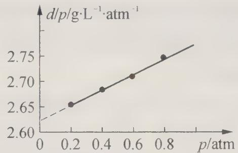

参考解答 三甲胺的分子量为59.14。

【例 4】（根据国际第 15 届化学竞赛试题改编）19 世纪中期，一位化学家测定一种新元素 X 的摩尔质量，因无其他方法，选择了下面的途径：他成功地制备了含有元素 X 的四种化合物 A、B、C 和 D，并且测定了每一种化合物中 X 的含量（质量分数）。在 523 K，四种化合物都是气态，将它们分别转移到预先抽成真空的四个烧瓶中，直到每个烧瓶内压强达 $1.013 \times 10^{5}$ Pa，然后称量烧瓶质量，减去空烧瓶的质量后，得各气体质量，用 $N_{2}$ 重复这个过程，得到下表数据：

<table><tr><td>气体</td><td>气体总质量</td><td>气体中元素X的含量(质量分数)</td></tr><tr><td> $N_2$ </td><td>0.652 g</td><td></td></tr><tr><td>A</td><td>0.849 g</td><td>97.3%</td></tr><tr><td>B</td><td>2.398 g</td><td>68.9%</td></tr><tr><td>C</td><td>4.851 g</td><td>85.1%</td></tr><tr><td>D</td><td>3.583 g</td><td>92.2%</td></tr></table>

1. 试求元素 X 可能的摩尔质量。

2. 写出 A\~D 可能的分子式。

过程探究 本题是阿伏伽德罗定律具体应用。 $n(\mathrm{N}_{2})=\frac{0.652\ \mathrm{g}}{28\ \mathrm{g/mol}}=0.0233\ \mathrm{mol}$

设在 523 K 时, 物质 A、B、C、D 都是理想气体, 根据阿伏伽德罗定律. 有: $n(\mathrm{N}_{2}) = n_{\mathrm{A}} = n_{\mathrm{B}} = n_{\mathrm{C}} = n_{\mathrm{D}} = 0.0233 \, \mathrm{mol}$ 。在 1 mol A、B、C 和 D 中, 元素 X 的质量分别为:

A: $\frac{0.849\mathrm{g}}{0.0233\mathrm{mol}}\times 0.973 = 35.45\mathrm{g}\cdot \mathrm{mol}^{-1};$

$$
\frac {2 . 3 9 8 \mathrm{g}}{0 . 0 2 3 3 \mathrm{mol}} \times 0. 6 8 9 = 7 0. 9 1 \mathrm{g} \cdot \mathrm{mol} ^ {- 1};
$$

$$
\frac {4 . 8 5 1 \mathrm{g}}{0 . 0 2 3 3 \mathrm{mol}} \times 0. 8 5 1 = 1 7 7. 2 \mathrm{g} \cdot \mathrm{mol} ^ {- 1};
$$

$$
\mathrm{D:} \frac {3 . 5 8 3 \mathrm{g}}{0 . 0 2 3 3 \mathrm{mol}} \times 0. 9 2 2 = 1 4 1. 8 \mathrm{g} \cdot \mathrm{mol} ^ {- 1} 。
$$

在化合物的一个分子中,必定至少有一个 X 原子,所以我们可以把上述结果的最大公约数(35.45 g·mol $^{-1}$ )当作元素 X 的可能摩尔质量。当然,它仅仅是摩尔质量的可能的值。

参考解答 1. X 元素可能的摩尔质量为 $35.45 \, g \cdot mol^{-1}$ 。

2. $M_{A}=0.849\ g/0.0233\ mol=36.44\ g\cdot mol^{-1}$ ，因此 A 可能是 HCl。

$M_{B}=2.398\ g/0.0233\ mol=102.92\ g\cdot mol^{-1}$ ，若为二元化合物，则另一种元素的摩尔质量为 $M=102.92-70.91=32.01\ g\cdot mol^{-1}$ ，可能是硫元素，B的分子式为 $SCl_{2}$ 。

$M_{c}=4.851\ g/0.0233\ mol=208.20\ g\cdot mol^{-1}$ ，若为二元化合物，则另一种元素的摩尔质量为 $M=208.20-177.2=31\ g\cdot mol^{-1}$ ，可能是P元素，C的分子式为 $PCl_{5}$ 。

$M_{1}=3.583\ g/0.0233\ mol=153.78\ g\cdot mol^{-1}$ ，若为二元化合物，则另一种元素的摩尔质量为M=153.78-141.8=11.98g $\cdot$ mol $^{-1}$ ，可能是碳元素，D的分子式为CCl $_{4}$ 。

【例 5】（第 36 届国际竞赛试题）Argyrodite(一种矿石)是一种整比化合物,它含有银(氧化态为+1)、硫(氧化态为-2)和未知元素 Y(氧化态为+4)。在 Argyrodite 中银与 Y 的质量比是 $m(\mathrm{Ag}):m(\mathrm{Y})=11.88:1$ 。Y 生成一种红棕色的低价硫化物(Y 的氧化态是+2)和一种白色的高价硫化物(Y 的氧化态是+4)。红棕色的低价硫化物是通过在氢气流中加热 Argyrodite 所得到的升华物,而残留物是 $Ag_{2}S$ 和 $H_{2}S$ 。如果在 400 K 和 100 kPa 下完全转化 10.0 g 的 Argyrodite 需要 0.295 L 氢气(理想气体常数 $R=8.314 J \cdot mol^{-1} \cdot K^{-1}$ )。根据上面的描述:

1. 计算 Y 的摩尔质量；

2. 写出 Y 的化学符号和 Argyrodite 的化学式；

3. 写出氢气和 Argyrodite 反应的化学方程式。

过程探究 本题虽为国际化学竞赛试题,但知识较为简单。其解题思路是:先根据化合价写出矿石 Argyrodite 的分子式,然后根据信息,写出相关化学反应方程式。最后根据理想气体状态方程计算出 $H_{2}$ 的质量,并由此计算出矿石中原子个数比,最终确定 Y 原子的摩尔质量。

由于 Ag 元素化合物为 +1 价，S 元素化合价为 -2 价，设 Y 元素化合价为 +y 价。根据分子中元素化合价代数和为零，可以确定 Argyrodite 的化学式为 $Ag_{2}$ ， $Y_{y}S_{x-2y}$ 。该矿物与 $H_{2}$ 反应的化学方程式为： $Ag_{2}$ ， $Y_{y}S_{x-2y} + yH_{2} \longrightarrow xAg_{2}S + yYS + yH_{2}S$ 。

参加反应的 $H_{2}$ 的物质的量是 $n(\mathrm{H}_{2})=100\times0.295/400\times8.314=0.00887\ \mathrm{mol}$ 。

由于参加反应的物质的量之比等于其化学方程式前的计量系数比,因此可得如下等式:

$$
1 0: 0. 0 0 8 8 7 = (1 0 7. 9 \times 2 x \times 1 2. 8 8 / 1 1. 8 8 + 3 2. 1 x + 6 4. 2 y): y
$$

简化后得 $x / y = 4.00$ 。当公比为1时， $x = 4$ ， $y = 1$ ，即Argyrodite的分子式

为 $\mathrm{Ag_8YS_6}$ 。

由于在 Argyrodite 中银与 Y 的质量比是 $m(\mathrm{Ag}):m(\mathrm{Y})=11.88:1$ ，即 $(8\times108):M_{\mathrm{Y}}=11.88:1$ ，求得 Y 的摩尔质量 $M_{Y}=72.66\ g\cdot mol^{-1}$ ，查原子量表，可得到 Y 为 Ge 元素。

参考解答 1. Y 的摩尔质量为 $72.66 \, g \cdot mol^{-1}$ 。

$$
2. \mathrm{Y:Ge;Argyrodite:Ag} _ {8} \mathrm{GeS} _ {6}
$$

$$
3. \mathrm{Ag} _ {8} \mathrm{GeS} _ {6} + \mathrm{H} _ {2} \longrightarrow 4 \mathrm{Ag} _ {2} \mathrm{S} + \mathrm{GeS} + \mathrm{H} _ {2} \mathrm{S}
$$

【例 6】（第 23 届国际竞赛预备题）元素 X 能分别和 B、N 及 O 形成二元化合物。在二元化合物中 B 占 16.2%，N 占 19.7%，O 占 29.7%。其摩尔质量分别为 54、68、71 g·mol $^{-1}$ （未按顺序）。在各未知物具体摩尔质量下能否知道 X 为何种元素？若能，请确定 X 并给出各物的分子式。

过程探究 本题似乎难以找到巧妙的办法.但没有办法本身就是办法,没有巧办法总有笨办法。有些题是需要硬着头皮去啃的。对于本题,无妨用试算的方法,好在需要试算的数据并不很多。

先设 X 与 B 的化合物的摩尔质量分别为 54、68、71 g·mol $^{-1}$ ，分别计算 B 原子的数目：

$$
5 4 \times 0. 1 6 2 \div 1 1 = 0. 7 9 (\text {   不是整数,不符合   })
$$

$$
6 8 \times 0. 1 6 2 \div 1 1 = 1. 0 0 1 (\text {   很接近整数,符合   })
$$

$71 \times 0.162 \div 11 = 1.05$ （接近整数，有可能符合，但前面已有更接近整数的，此种情况即可排除）

设 X 与 N 的化合物的摩尔质量分别为 54、68、71 g·mol $^{-1}$ ，分别计算 N 原子的数目：

$$
5 4 \times 0. 1 9 7 \div 1 4 = 0. 7 6 (\text { 不符合 })
$$

$$
6 8 \times 0. 1 9 7 \div 1 4 = 0. 9 6 (\text { 不符合 })
$$

$$
7 1 \times 0. 1 9 7 \div 1 4 = 1. 0 0 (\text {符合})
$$

设 X 与 O 的化合物的摩尔质量分别为 54、68、71 g·mol $^{-1}$ ，分别计算 O 原子的数目：

$$
5 4 \times 0. 2 9 7 \div 1 6 = 1. 0 0 2 (\text { 符   合 })
$$

$$
6 8 \times 0. 2 9 7 \div 1 6 = 1. 2 6 (\text { 不符合 })
$$

$$
7 1 \times 0. 2 9 7 \div 1 6 = 1. 3 2 (\text { 不符合 })
$$

综合以上试算结果, 可知 B、N、O 与 X 的化合物的摩尔质量应分别为 68、71、54 g·mol $^{-1}$ 。1 mol 化合物中 X 的质量则分别应为 68-11=57、71-14=57、54-16=38 g。

57、57、38 这些数字应为 X 元素的摩尔质量的整数倍,很容易得出 X 元素的摩尔质量为 $19 \, g \cdot mol^{-1}$ 。所以,X 元素为 F,二元化合物的分子式为 $BF_{3}$ 、 $NF_{3}$ 、 $OF_{2}$ 。

参考解答 X 元素为 F, 二元化合物的分子式为 $BF_{3}$ 、 $NF_{3}$ 、 $OF_{2}$ 。

## 【实战演练】

1. 1774 年, 英国科学家 Franklin 在皇家学会上宣读论文时提到: “把 $4.9 \, cm^{3}$ 油脂放到水面上, 立即使水面平静下来, 并令人吃惊地蔓延开去, 使 $2.0 \times 10^{3} \, m^{2}$ 水面看起来像玻璃那样光滑”。

（1）已知油脂在水面上为单分子层，假设油脂的摩尔质量为 $M g \cdot mol^{-1}$ ，每个油脂分子的横截面积为 $A cm^{2}$ ，取该油脂 m g，配成体积为 $V_{m} mL$ 的苯溶液，将该溶液滴加到表面积为 $S cm^{2}$ 的水中。若每滴溶液的体积为 $V_{d} mL$ ，当滴入第 d 滴油脂的苯溶液时，油脂的苯溶液恰好在水面上不再扩散，则阿伏伽德罗常数 ( $N_{A}$ ) 的表达式为 $N_{A} =$ \_\_\_\_ 。

(2) 水面上铺一层油(常用十六醇、十八醇, 只有单分子厚), 在缺水地区的实际意义是 \_\_\_\_。

2. 随着科学技术的发展,测定阿伏伽德罗常数的手段越来越多,测定精确度也越来越高。现有一简单可行的测定方法,具体步骤如下:①将固体食盐研细,干燥后,准确称取 mg NaCl 固体并转移到定容仪器 A 中。②用滴定管向仪器 A 中加苯,并不断振荡,继续加苯至 A 仪器的刻度线,计算出 NaCl 固体的体积为 V mL。回答下列问题:

(1) 步骤①中 A 仪器最好用 \_\_\_\_ (填仪器名称);

(2) 能否用胶头滴管代替步骤②中的滴定管？其原因是\_\_\_\_；

(3) 能否用水代替苯 \_\_\_\_ , 理由是 \_\_\_\_ ;

(4) 已知 NaCl 晶胞的结构如图所示, 经 X 射线衍射测得晶胞中最邻近的 $Na^{+}$ 和 $Cl^{-}$ 平均距离为 a cm, 则利用上述方法测得的阿伏伽德罗常数的表达式为 $N_{A}=$ \_\_\_\_;

(5) 纳米材料的表面原子占总原子数的比例极大, 这是它具有许多特殊性质的原因, 假设某氯化钠纳米颗粒的大小和形状恰好等于氯化钠晶胞的大小和形状, 则这种纳米颗粒的表面原子占总原子数的百分比为 \_\_\_\_。

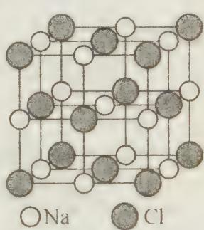

3. 实验室用二氧化锰与氯酸钾混合加热制取氧气时,有时可闻到有刺激性气味,这是因为过程中有少量的氯酸钾与二氧化锰反应生成了高锰酸钾、氯气和氧气。

(1) 写出上述反应的化学方程式 \_\_\_\_；

(2) 若在上述反应中有 3 mol 电子转移, 则生成了 \_\_\_\_ mol 氯气;

（3）若所得气体在同温同压下对氢气的相对密度是16.0875，则在混合物中，按上式反应的氯酸钾的质量占反应掉的氯酸钾的总质量的\_\_\_\_。

4. 有 $\mathrm{Ba(OH)}_2$ 、 $\mathrm{NaHSO}_4$ 、 $\mathrm{NaHCO}_3$ 三种溶液，已知其中两种溶液的物质的量浓度相同，且分别为另一种溶液的物质的量浓度的 2 倍；若先将 $\mathrm{NaHSO}_4$ 和 $\mathrm{NaHCO}_3$ 溶液各 $100 \mathrm{~mL}$ 混合反应后，再加入 $\mathrm{Ba(OH)}$ 。溶液 $100 \mathrm{~mL}$ ，充分反应后，将生成的白色沉淀滤出,测得滤液中只含一种 NaOH 溶质,其物质的量的浓度为 $0.9 \, mol \cdot L^{-1}$ (不考虑溶液混合时引起溶液体积的变化),试回答:

(1) 通过分析, 判断原 $\mathrm{Ba(OH)}_{2} 、 \mathrm{NaHSO}_{4} 、 \mathrm{NaHCO}_{3}$ 三种溶液中哪两种溶液的物质的量的浓度不可能相同? 为什么?

(2) $\mathrm{Ba(OH)_2}$ 、 $\mathrm{NaHSO_4}$ 、 $\mathrm{NaHCO_3}$ 三种溶液可能的物质的量的浓度分别为多少?

5. 向盐 $A_{2}B$ 溶液中加入盐 $CD_{2}$ 溶液有沉淀生成,为了研究这一化学反应,将两种盐分别配成 $0.1\ mol\cdot L^{-1}$ 溶液进行实验,其有关数据如下表。(化学式中 A、B、C、D 表示原子或原子团,式量为 A=23、B=96、C=137、D=35.5)

<table><tr><td>编号</td><td>A2B溶液体积(mL)</td><td>CD2溶液体积(mL)</td><td>沉淀质量(g)</td></tr><tr><td>1</td><td>60</td><td>0</td><td>0</td></tr><tr><td>2</td><td>60</td><td>20</td><td>0.464</td></tr><tr><td>3</td><td>60</td><td>40</td><td></td></tr><tr><td>4</td><td>60</td><td>60</td><td>1.395</td></tr><tr><td>5</td><td>60</td><td>70</td><td>1.404</td></tr><tr><td>6</td><td>60</td><td>80</td><td>1.397</td></tr><tr><td>7</td><td>60</td><td>120</td><td></td></tr></table>

试回答：

(1) 用化学方程式表示其反应: \_\_\_\_, 理由是 \_\_\_\_;

(2) 沉淀的化学式为\_\_\_\_，理由是\_\_\_\_；

(3) 3号实验中沉淀的质量为\_\_\_\_,7号实验中的沉淀质量为\_\_\_\_。

6. 过氧乙酸可用过氧化氢水溶液、醋酸与微量硫酸混合制得。使用前, 通常将 $150 \mathrm{~mL}$ 体积分数为 $30 \%$ 的过氧化氢盛在 A 瓶中, 将 $300 \mathrm{~mL}$ 冰醋酸和 $158 \mathrm{~mL}$ 浓硫酸盛在 B 瓶中。请回答:

(1) B 瓶中溶液配制时, 应将 \_\_\_\_ 缓慢地倒入 \_\_\_\_ 中并不断搅拌, 这是因为 \_\_\_\_ ;

(2) 若将 A、B 两瓶溶液等体积混合, 放置一定时间后, 应取出 \_\_\_\_ mL 密度为 $1.15 \mathrm{~g} \cdot \mathrm{cm}^{3}$ 质量分数为 $76 \%$ 的过氧乙酸溶液, 用 \_\_\_\_ (1000 mL 烧瓶、 $1000 \mathrm{~mL}$ 容量瓶、 $500 \mathrm{~mL}$ 容量瓶中任选其一) 加水后即可配成 $0.23 \mathrm{~mol} \cdot \mathrm{L}^{- 1}$ 的过氧乙酸消毒液 $1000 \mathrm{~mL}$ 。

7. $4 \, mL O_{2}$ 和 $3 \, mL N_{x} H_{y} (y > x)$ 混合气体在 $120^{\circ}C$ ， $1.01 \times 10^{5} \, Pa$ 下点燃完全反应后，恢复到原温度和压强时，测得反应后 $N_{2}$ 、 $O_{2}$ 、 $H_{2}O$ （气）混合气体密度减小

3/10。

(1) 反应的化学方程式为 \_\_\_\_；

(2) 推算 $N_{x}H_{y}$ 的分子式:

计算的根据是(用文字叙述)\_\_\_\_，即(用含 x、y 的代数式表示)\_\_\_\_，解此方程得\_\_\_\_时符合题意，所以 $N_{x}H_{y}$ 的分子式为 \_\_\_\_。

8. 用气体温度计测量一较大房间内的温度。为此，在 $293.15 \mathrm{~K}$ 、 $101.325 \mathrm{kPa}$ 条件下把 $\mathrm{N}_{2}$ 充入 $80 \mathrm{~cm}^{3}$ 的玻璃管内，在整个房间内缓慢、平稳地移动温度计，以测量其温度。在较高温度下，气体膨胀，逸出玻璃管，逸出气体被上部液体（其蒸气压可忽略不计）所捕获，逸出气体的总体积为 $35 \mathrm{~cm}^{3}$ （ $293.15 \mathrm{~K}$ ， $101.325 \mathrm{kPa}$ ）。

(1) 填充玻璃管与逸出玻璃管的氮气各多少摩尔?

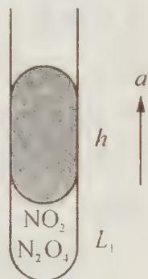

(2) 玻璃管膨胀不计, 计算房间里温度。

(3) 若用 50%(体积) $N_{2}$ 与 50%(体积) $H_{2}$ 代替纯 $N_{2}$ 实验, 将有何变化?

9. 无水氯化铝可用干燥的氯化氢气体与铝加热制得,今以 $2.7 \mathrm{~g}$ 铝与标准状况下 $7.84 \mathrm{~L} \mathrm{HCl}$ 作用。然后在 $1.013 \times 10^{5} \mathrm{~Pa} 、 546 \mathrm{~K}$ 下(此时氯化铝也为气体)测得气体总体积为 $11.2 \mathrm{~L}$ 。试通过计算写出气态氯化铝的分子式。

10. 在科学院出版物《化学指南》里有下列一些物质的饱和蒸气压的数据：

<table><tr><td>物质</td><td>温度(°C)</td><td>蒸气压(mmHg)</td><td>密度(g/L)</td></tr><tr><td>苯 C6H6</td><td>80.1</td><td>760</td><td>2.710</td></tr><tr><td>甲醇 CH3OH</td><td>49.9</td><td>400</td><td>0.673</td></tr><tr><td>醋酸 CH3COOH 1</td><td>29.9</td><td>20</td><td>0.126</td></tr><tr><td>醋酸 CH3COOH 2</td><td>118.1</td><td>760</td><td>3.110</td></tr></table>

(1) 根据所列数字计算蒸气的摩尔质量(假设蒸气中的分子类似理想气体分子)。

（2）如何解释相对质量的理论值与所得计算值之间的偏差？对此给出定性的或尽可能定量的解释。

11. 某温、某压下取三份等体积无色气体 A，于 $25^{\circ}C$ 、 $80^{\circ}C$ 及 $90^{\circ}C$ 测得其摩尔质量分别为 $58.0 \, g \cdot mol^{-1}$ 、 $20.6 \, g \cdot mol^{-1}$ 、 $20.0 \, g \cdot mol^{-1}$ 。于 $25^{\circ}C$ 、 $80^{\circ}C$ 、 $90^{\circ}C$ 下各取 $11 \, dm^{3}$ （气体压力相同）上述无色气体分别溶于 $10 \, dm^{3}$ 水中，形成的溶液均显酸性。

(1) 无色气体为 \_\_\_\_；

(2) 各温度下摩尔质量不同的可能原因是 \_\_\_\_；

(3) 若三份溶液的体积相同(设:溶解后溶液温度也相同), 其摩尔浓度的比值是多少?

12. 测定相对分子质量的一个实验步骤为(其装置如右图所示):取一干燥的250 mL圆底烧瓶、封口用铝箔和棉线一起称量(称准到0.1 g),得 $m_{1}$ 。往烧瓶内加入大约2 mL四氯化碳(沸点为76.7℃),用铝箔和棉线封口并在铝箔上穿一小孔。把烧瓶迅速浸入盛于大烧杯内的沸水中,继续保持(水的)沸腾。待四氯化碳全部汽化后,从水中取出烧瓶冷却。擦干烧瓶外的水后称量(准确到0.1 g),得 $m_{2}$ 。倒出瓶内的液态四氯化碳,充满水,量体积(室温时水的密度大约 $1\ g\cdot cm^{-3}$ )。按理想气体公

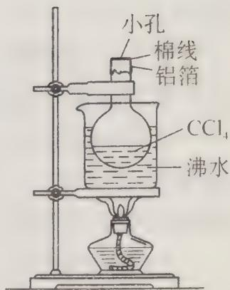

式 $pV = mRT / M$ 求四氯化碳的相对分子质量 $(M)$ 。式中 $p$ 为压强（Pa）， $V$ 为体积(L)， $m$ 为四氯化碳的质量(g)， $R$ 为气体常数 $8.314\mathrm{J}\cdot \mathrm{K}^{-1}\cdot \mathrm{mol}^{-1}$ ， $T$ 为绝对温度。

请考虑并回答以下几个问题：

(1) 把烧瓶放入沸水中,为什么要保持沸腾?

(2) 如果在铝箔上开的孔较大, 又在瓶内液态四氯化碳挥发完后过了一段时间才从热水中取出烧瓶, 其他操作均正常。按以上不正确操作所得的实验数据求四氯化碳的相对分子质量将偏大还是偏小?

（3）用水充满烧瓶再量其体积，实验前忘了倒出原先在瓶内的液态四氯化碳，是否会对实验结果造成影响？

（4）把烧瓶放入沸水，要尽可能没入。事实上用这个装置求相对分子质量时很难做到将烧瓶完全没入水中，而总有部分露在水面上（见图），这是否会对实验结果造成影响？

13. 不同的卤素原子之间可化合形成一系列化合物, 这类化合物叫做卤素互化物。现将 $4.66 \mathrm{~g} \mathrm{BrCl}_{4}$ 溶于水后, 通入足量的 $\mathrm{SO}_{2}$ 气体与其反应生成氢溴酸、盐酸和硫酸, 再用碱将溶液调至中性后加入过量 $\mathrm{Ba(NO_{3})_{2}}$ , 充分反应后滤去沉淀物, 再向滤液中加入过量的 $\mathrm{AgNO}_{3}$ 溶液, 最后得到卤化银沉淀 $15.46 \mathrm{~g}$ 。

(1) 计算参加反应的 $AgNO_{3}$ 的物质的量；

(2) 计算确定 $BrCl_{x}$ 中的 x 值。

14. 常温下, X 和 Y 两种气体组成混合气体 (X 的分子量小于 Y), 经分析混合气体中只含有氢、氯两种元素, 而且不论 X 和 Y 以何种比例混合, 氢与氯的质量比总小于 2:71, 请确定 X 与 Y 各是何种物质, 并请说明理由。

15. 对于“喷泉实验”需要搞清楚这样几个问题: ①是否只有水溶性很大的气体才能做喷泉实验? ②多大溶解度的气体才能做好喷泉实验? ③喷泉实验成败的关键是什么? 为了回答以上的问题, 请你用以下给出的具体数据对有关问题做出定量计算。

在做氯化氢的喷泉实验时,假设实验时所用的烧瓶容积为 250 mL,玻璃管长为 35 cm,胶头滴管内能挤出约为 0.5 mL 的水,则在 0.5 mL 水中要溶解多少体积的气体,水才能从尖嘴导管中喷出呢? (假设大气压强为一个标准大气压)

16. 二元化合物 A 是红棕色晶体, 具有强吸湿性, 不稳定。取 A 3.322 g, 在等压容器中加热到 $177^{\circ}$ C (维持一段时间), 完全反应后得到另一种深绿色晶体 B 2.279 g和气体 147.7 mL(忽略反应前容器体积,并始终维持一个标准大气压);如果降温到室温(27℃),则气体体积缩小到 49.2 mL,经检测为单质气体 C,而底部晶体颜色变暗,并增加到 3.181 g。(假设气体按理想气体处理)

(1) 请通过计算确定各物质的化学式；

(2) 写出 A 的分解总反应方程式;

（3）如果没有数据限定，A分解反应的配平将有无数组答案，为什么？并用字母配平来表现所有情况。

# 第 2 讲 氧化还原反应

## 【知识要点】

## 一、氧化还原反应的结构及其表示方法

氧化还原反应是指在化学反应中,元素的化合价发生升降的反应。一种或几种元素的化合价升高,而另一种或几种元素的化合价降低。氧化剂是元素化合价降低的反应物,化合价降低后的生成物为还原产物;还原剂是元素化合价升高的反应物,化合价升高后的生成物为氧化产物。因此氧化还原反应可表示为:

$$
\text {氧化剂(I) + 还原剂(II)} \xrightarrow {\text {得电子,被还原}} \text {还原产物(I) + 氧化产物(II)}   \text {失电子,被氧化}
$$

氧化还原反应的本质是反应过程中得失电子数相等。在预测反应物或反应产物的化合价及其存在形态时经常使用这一原则进行解题。

对于一个自发进行的氧化还原反应而言,具有如下特点:

① 氧化性: 氧化剂 > 氧化产物; 还原性: 还原剂 > 还原产物。

② 中间化合价的元素既具有氧化性,又具有还原性。

如 $H_{2}O_{2}$ 中的氧为 -1 价，当它遇到强氧化剂时， $H_{2}O_{2}$ 中的氧化合价升高，变为 $O_{2}$ ，作还原剂。如 $H_{2}O_{2}$ 与 $KMnO_{4}$ 反应：

$$
2 \mathrm{KMnO} _ {4} + 5 \mathrm{H} _ {2} \mathrm{O} _ {2} + 3 \mathrm{H} _ {2} \mathrm{SO} _ {4} \longrightarrow \mathrm{K} _ {2} \mathrm{SO} _ {4} + 2 \mathrm{MnSO} _ {4} + 5 \mathrm{O} _ {2} \uparrow + 8 \mathrm{H} _ {2} \mathrm{O}
$$

若 $H_{2}O_{2}$ 遇到强还原剂时， $H_{2}O_{2}$ 中的氧化合价降低，变为 $H_{2}O$ ，作氧化剂。如 $H_{2}O_{2}$ 与 $SO_{2}$ 反应： $H_{2}O_{2} + SO_{2} \longrightarrow H_{2}SO_{4}$ ，该反应用来测定空气中 $SO_{2}$ 含量。

③ 含同一种元素的物质发生氧化还原反应时,相邻价态的不发生反应;反之,则发生反应。如:浓 $H_{2}SO_{4}$ 可用来干燥 $SO_{2}$ 气体,但不能干燥 $H_{2}S$ 气体。

④ 同一种元素化合价发生升降变化时,化合价不能交叉。即化合价高的降低后仍然较高,至少相等。例如:FeS与浓 $H_{2}SO_{4}$ 反应: $FeS+H_{2}SO_{4}$ (浓) $\longrightarrow Fe_{2}(SO_{4})_{3}+S\downarrow+SO_{2}\uparrow+H_{2}O$ (未配平),该反应中S沉淀应为FeS被浓硫酸氧化得到,而 $SO_{2}$ 是浓硫酸被FeS还原得到的,否则,化合价发生交叉。知道了这个方法后,很容易配平该反应:

$2FeS + 6H_{2}SO_{4}(浓) \longrightarrow Fe_{2}(SO_{4})_{3} + 2S \downarrow + 3SO_{2} \uparrow + 6H_{2}O,$ 电子转移数为 6。

当然，要判断氧化还原反应是否发生，最基本的方法是用电极电势知识加以判断。

氧化还原反应配平后,可用单线桥或双线桥表示电子的得失,若题中明确要求标明电子的转移方向,则只能用单线桥表示。双桥线的表示方法是用箭头把包含同一元素化合价升高或降低的反应物和生成物连接起来,其箭头不表示电子的转移方向;而单桥线是用箭头把反应物与反应物(氧化剂和还原剂)连接起来,箭头表明电子的转移方向,电子由还原剂给出,其化合价升高,氧化剂得到,化合价降低。在表示时,箭头要对准化合价发生升降变化的元素。

⑤ 氧化还原反应有先后过程。即:对于同一种氧化剂而言,还原能力强的物质先反应,还原能力弱的物质后反应,反之亦然。例如: $Fe^{3+}$ 在与含 $Br^{-}$ 和 $I^{-}$ 的混合溶液中, $Fe^{3+}$ 先把 $I^{-}$ 氧化成 $I_{2}$ ,最后才把 $Br^{-}$ 氧化成 $Br_{2}$ ,当然上面的反应比较复杂,远没有所写的这么简单。

需要指出的是,数学上有 A>B, B>C, 则可得出 A>B>C 的结论,但在化学中则要慎重。上述条件成立的条件是: 几个氧化还原反应都必须是自发进行的,且反应标准是一样的,如几个氧化还原反应都是在水溶液中进行的等。如 1987 年全国高考化学试题就出现了明显错误。试题如下:

① 写出实验室里用二氧化锰跟浓盐酸反应制得氯气的化学方程式，并注明反应条件。

② 高锰酸钾 $\left(\mathrm{KMnO}_{4}\right)$ 是常用的氧化剂，在酸性条件下， $MnO_{4}$ 被还原成 $Mn^{2+}$ 。试写出用高锰酸钾跟浓盐酸在室温下制氯气的反应的化学方程式。

③ 历史上曾用“地康法”制氯气。这一方法是用 $CuCl_{2}$ 作催化剂，在 $450^{\circ}C$ 利用空气中的氧气跟氯化氢反应制氯气。写出该反应的化学方程式。

④ 从氯元素化合价的变化看,以上三种方法有什么共同点?

⑤ 比较以上三个反应,写出氧化剂的氧化能力从强到弱的顺序。

第⑤问明显错误,由于“地康法”是一个气相反应,且反应是一个非自发反应,与前面两个反应明显标准不同,因此无法进行氧化剂氧化能力的比较。

## 二、影响氧化还原反应的因素

具有氧化性和还原性的物质不一定发生氧化还原反应。它由许多因素决定：

## 1. 反应物本性

在学习金属活动顺序表时,不知大家思考过没有:为什么排在氢后面的金属不能和酸反应产生氢气,而排在氢前面的金属却能将酸中的氢置换出来呢?这表明:并不是任何一种氧化剂跟任何一种还原剂都能发生氧化还原反应的,判断物质之间能否发生氧化还原反应要根据物质氧化还原的电极电势。所谓电极电势通俗地讲与物理学中的电势(电势差即为电压)差不多,它反映了元素不同形态之间的电势差,也即反映了元素不同形态相互转化的原动力。

氧化剂与还原产物组成氧化电对(表示为 $E_{Ox}$ ), 还原剂与氧化产物组成还原电对(表示为 $E_{Red}$ )。若 $E_{Ox} > E_{Red}$ , 此时电动势 $\varepsilon^{(j)} = E_{Ox} - E_{Red} > 0$ , 说明上述氧化还原反应

能够发生，否则不能发生。

$$
\mathrm{Cu} + 8 \mathrm{HNO} _ {3} (\text {   稀   }) \longrightarrow 3 \mathrm{Cu(NO} _ {3}) _ {2} + 2 \mathrm{NO} \uparrow + 4 \mathrm{H} _ {2} \mathrm{O}
$$

该反应之所以能够发生, 是由于 $E^{\ominus}(\mathrm{HNO}_{3}/\mathrm{NO}) > E^{\ominus}(\mathrm{Cu}^{2+}/\mathrm{Cu})$ , $\varepsilon^{\ominus} > 0$ 。

而 Cu 与稀 HCl 不能发生, 就是由于 $E^{\ominus}(H^{+}/H_{2})<E^{\ominus}(Cu^{2+}/Cu)$ 。

如何让 $\mathrm{Cu}$ 与 $\mathrm{HCl}$ 发生反应呢？常采取两种方法：

① 在上述反应体系中通入 $O_{2}: 2Cu + 4HCl + O_{2} \longrightarrow 2CuCl_{2} + 2H_{2}O$ 。

② 将稀盐酸改为浓盐酸： $2\mathrm{Cu} + 8\mathrm{HCl}$ （浓） $\xrightarrow{\triangle} 2\mathrm{H}_{2}\left[\mathrm{CuCl}_{4}\right] + 2\mathrm{H}_{2}\uparrow$ 。

方法①通入 $O_{2}$ 后，使得 Cu 先与 $O_{2}$ 反应得到 CuO，然后 CuO 与稀 HCl 发生复分解反应；而方法②则利用了浓盐酸中 $Cl^{-}$ 浓度较大，其配位能力增强（同时还有熵增等原因），从而降低了 $E^{\ominus}(CuCl_{4}^{2-}/Cu)$ 的电极电势，即增强了 Cu 的还原性。

以上事例说明:物质的氧化性、还原性通常由其本性决定,但在某些条件下,可通过一些外部条件的影响,可以改变物质的氧化性或还原性强弱。那么,哪些外部因素能影响物质的氧化性或还原性呢?通常的外部因素是物质的浓度、反应的温度、反应的介质和反应的溶剂,这些外部因素均能影响反应的进行。

## 2. 反应物浓度

在高中阶段,反应物浓度对氧化还原反应的影响非常多,如浓硫酸的氧化性强于稀硫酸、浓硝酸的氧化性强于稀硝酸。由于浓度不同,硫酸和硝酸的氧化性不同,这样就直接影响了反应产物的不同。

$$
\begin{array}{r l} & {\mathrm {Cu+ H_ {2} SO_ {4} (\text {稀}) \longrightarrow \text {不反应}}} \\ & {\mathrm {Cu + 2H_ {2} SO_ {4} (\text {浓}) \xrightarrow{\triangle} CuSO_ {4} + SO_ {2} \uparrow + 2H_ {2} O}} \\ & {3 \mathrm {Cu + 8HN O_ {3} (\text {稀}) \longrightarrow 3Cu(NO_ {3}) _ {2} + 2NO\uparrow + 4H_ {2} O}} \\ & {\mathrm {Cu + 4HN O_ {3} (\text {浓}) \longrightarrow Cu(NO_ {3}) _ {2} + 2NO_ {2} \uparrow + 2H_ {2} O}} \end{array}
$$

## 3. 反应温度

大量事实说明: 温度的高低对氧化还原反应有着较大影响, 甚至影响氧化还原反应的方向。例如: 浓硫酸在加热的条件下能与 Cu 反应: $\mathrm{Cu} + 2\mathrm{H}_{2}\mathrm{SO}_{4}$ (浓) $\xrightarrow{\triangle} \mathrm{CuSO}_{4} + SO_{2} \uparrow + 2H_{2}O$ , 而浓硫酸在不加热时却不能与 Cu 发生反应。

又比如: $NH_{4}NO_{3}$ 在常温时不发生分解, 而在 $170 \sim 260^{\circ}C$ 时分解生成 $N_{2}O$ 和水, 在 $300^{\circ}C$ 以上时生成 $N_{2}$ 、 $O_{2}$ 和 $H_{2}O$ 。

## 4. 反应介质

化学反应介质对氧化还原反应的影响较大,一般说来酸性介质能增强氧化剂的氧化能力,而在碱性介质中,氧化剂的氧化能力减弱。这一点可用大学里的能斯特方程加以定量说明,有兴趣的同学可以去查阅。例如:

$$
\begin{array}{r l} & 2 \mathrm{KMnO} _ {4} + 5 \mathrm{Na} _ {2} \mathrm{SO} _ {3} + 3 \mathrm{H} _ {2} \mathrm{SO} _ {4} \longrightarrow \mathrm{K} _ {2} \mathrm{SO} _ {4} + 5 \mathrm{Na} _ {2} \mathrm{SO} _ {4} + 2 \mathrm{MnSO} _ {4} + 3 \mathrm{H} _ {2} \mathrm{O} \\ & 2 \mathrm{KMnO} _ {4} + \mathrm{Na} _ {2} \mathrm{SO} _ {3} + 2 \mathrm{NaOH} \longrightarrow 2 \mathrm{Na} _ {2} \mathrm{MnO} _ {4} + \mathrm{K} _ {2} \mathrm{SO} _ {4} + \mathrm{H} _ {2} \mathrm{O} \\ & 2 \mathrm{KMnO} _ {4} + 3 \mathrm{Na} _ {2} \mathrm{SO} _ {3} + \mathrm{H} _ {2} \mathrm{O} \longrightarrow 2 \mathrm{MnO} _ {2} \downarrow + 3 \mathrm{Na} _ {2} \mathrm{SO} _ {4} + 2 \mathrm{KOH} \end{array}
$$

从上面的三个反应可以看出:在酸性介质中, $\mathrm{MnO_{4}^{-}}$ (紫色)被还原为 $\mathrm{Mn^{2+}}$ (微红或近于无色);在碱性介质中, $\mathrm{MnO_{4}^{-}}$ 被还原为 $\mathrm{MnO_{4}^{2-}}$ (绿色);在中性介质中, $\mathrm{MnO_{4}^{-}}$ 被还原为 $\mathrm{MnO_{2}}$ 沉淀(棕黑色)。由此可见, $\mathrm{KMnO_{4}}$ 在酸性条件下氧化性最强,在中性或弱碱性条件下次之,在强碱性条件下最弱。

## 5. 溶剂的影响

氧化还原反应除了与反应物、生成物的本性有关外，在很大程度上还与某化学反应所在的溶剂有很大的关系。例如，在水溶液中， $\mathrm{SO}_3$ 具有很强的氧化性，而 $\mathrm{H}_2\mathrm{S}$ 具有很强的还原性；而在乙醚中， $\mathrm{SO}_3$ 的氧化性较弱， $\mathrm{H}_2\mathrm{S}$ 的还原性也较弱， $\mathrm{SO}_3$ 和 $\mathrm{H}_2\mathrm{S}$ 可以共存，发生如下反应： $\mathrm{SO}_3 + \mathrm{H}_2\mathrm{S} + 2(\mathrm{C}_2\mathrm{H}_5)_2\mathrm{O} \longrightarrow \mathrm{H}_2\mathrm{S}_2\mathrm{O}_3 \cdot 2(\mathrm{C}_2\mathrm{H}_5)_2\mathrm{O}$ ，然后小心加热，可以制备较为纯净的 $\mathrm{H}_2\mathrm{S}_2\mathrm{O}_3$ ，而在水溶液中是很难制备出 $\mathrm{H}_2\mathrm{S}_2\mathrm{O}_3$ 的。又比如：在酸性溶液中， $\mathrm{Mg}$ 比 Al 化学性质活泼（金属活动顺序表可以证明），但在碱性介质中，却是 Al 比 $\mathrm{Mg}$ 活泼。因此，研究一个化学反应，有时研究反应所处的溶剂环境是非常重要的。

## 三、氧化还原反应方程式配平方法

氧化还原反应方程式的配平历来是中学高考和化学竞赛考试的热点和难点,其常用配平方法有:观察法、最小公倍数法等。但是,对于复杂氧化还原反应方程式的配平,上述几种方法还远远不够,还需要其他的方法。笔者所指的复杂氧化还原反应有下列四种类型:①同一反应物或生成物的元素化合价同升或同降;②同一种元素之间发生的较复杂的氧化还原反应;③具有多套系数的氧化还原反应。这些复杂的氧化还原方程式若用上述方法配平比较困难,甚至不可能配平。④氧化还原反应方程式中,元素的氧化数很难确定,用氧化数法配平存在困难。下面,笔者以多年辅导化学竞赛的体会,就上述氧化还原方程式的配平方法做一下探讨。

## 1. 最小公倍数法

较复杂的氧化还原反应中,反应物或生成物的元素化合价同时升高或同时降低,在配平时,要把反应物或生成物中同升或同降的元素看作一个整体,然后再加以配平。

【例 1】配平化学反应方程式： $Cu_{2}S+HNO_{3}\longrightarrow Cu(NO_{3})_{2}+S+NO\uparrow+H_{2}O$

过程探究 ① 首先标明变价元素化合价

$$
\mathrm{Cu} _ {2} \stackrel {+ 1} {\mathrm{S}} + \mathrm{HNO} _ {3} \longrightarrow \stackrel {+ 2} {\mathrm{Cu} (\mathrm{NO} _ {3}) _ {2}} + \stackrel {0} {\mathrm{S}} + \stackrel {+ 2} {\mathrm{NO}} \uparrow + \mathrm{H} _ {2} \mathrm{O}
$$

② 计算得失电子数

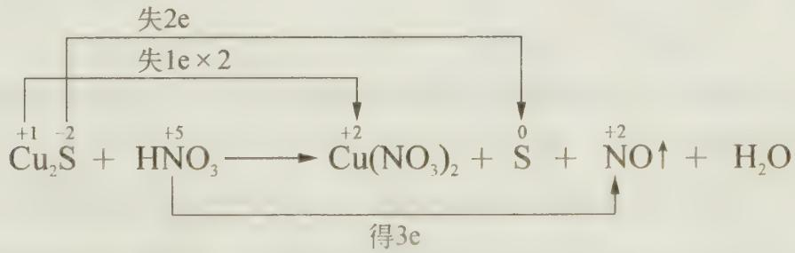

## ③ 计算其最小公倍数

反应中的 $Cu_{2}S$ 是还原剂, 组成中的两元素均提供电子, 而且 $Cu_{2}S$ 中每有一个 S 失去电子必然伴随着 2 个 Cu 也失去电子。这时要用 $Cu_{2}S$ 为基准, 即每个 $Cu_{2}S$ 在变化时共失去 4e。即:

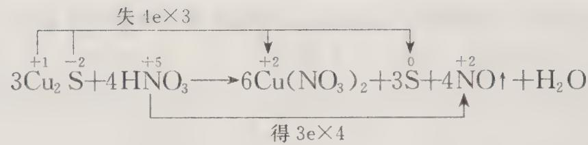

④ 配平

$$
3 \mathrm{Cu} _ {2} \mathrm{S} + 1 6 \mathrm{HNO} _ {3} \longrightarrow 6 \mathrm{Cu} (\mathrm{NO} _ {3}) _ {2} + 3 \mathrm{S} + 4 \mathrm{NO} \uparrow + 8 \mathrm{H} _ {2} \mathrm{O}
$$

$$
\text { 参考解答 } \quad 3 \mathrm{Cu} _ {2} \mathrm{S} + 1 6 \mathrm{HNO} _ {3} \longrightarrow 6 \mathrm{Cu} (\mathrm{NO} _ {3}) _ {2} + 3 \mathrm{S} + 4 \mathrm{NO} \uparrow + 8 \mathrm{H} _ {2} \mathrm{O}
$$

但如果有些反应不符合上述原则, 如: $\mathrm{P}_{2} \mathrm{I}_{4} + \mathrm{P}_{1} + \mathrm{H}_{2} \mathrm{O} \longrightarrow \mathrm{PH}_{4} \mathrm{I} + \mathrm{H}_{3} \mathrm{PO}_{4}$ , 怎样进行配平呢? 这类氧化还原反应用待定系数法配平比较简单。

## 2. 待定系数法

## (1) 原理

待定系数法是一种数学方法,用它配平化学反应方程式的优点是:可以不必知道氧化还原反应过程中组成各物质元素的化合价,只需要使用质量守恒定律,根据方程式等号两端同种类原子数相等的关系列方程求解,从而得到正确的配平系数。

## (2) 方法

如果完全按照数学中的待定系数法,通过设未知数求解比较麻烦,我们可以设某物质(可以是反应物,也可以是生成物)的系数为1,该物质要能控制两种或两种以上的元素,其他与之无联系的物质可设未知数解方程。解得的数值可能是整数,也可能是分数。若是分数,要将所得系数化简为整数。这样做可以简化解方程的步骤。

【例 2】配平下列氧化还原反应方程式： $P_{2}I_{4} + P_{4} + H_{2}O \longrightarrow PH_{4}I + H_{3}PO_{4}$

过程探究 从试题来看,氧元素是比较特殊的,因为反应物中只有 $H_{2}O$ 中有氧,生成物中只有 $H_{3}PO_{4}$ 中有氧,因此选取 $H_{2}O$ 或 $H_{3}PO_{4}$ 的系数为 1 均可。但两者还是有优劣的,为避免分数分母过大,我们一般选取原子个数较大物质(此时应选取 $H_{3}PO_{4}$ , 因为 O 原子数为 4)。其他元素的原子可用“跟踪追击”的方法获得:

假定 $H_{3}PO_{4}$ 的系数为 1, 由此可确定 $H_{2}O$ 中的氧元素, 继而确定 $PH_{4}I$ 中的氢元素, 再确定碘元素, 最后确定磷元素。这样做可以避免求解多元一次方程。解答步骤表示如下:

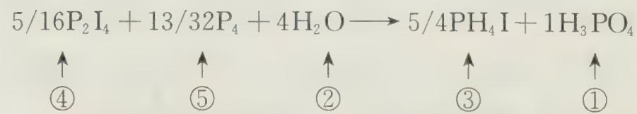

式中①②③④⑤表示配平该氧化还原反应的顺序。化简上面的系数得：

$$
1 0 \mathrm{P} _ {2} \mathrm{I} _ {4} + 1 3 \mathrm{P} _ {4} + 1 2 8 \mathrm{H} _ {2} \mathrm{O} \longrightarrow 4 0 \mathrm{PH} _ {4} \mathrm{I} + 3 2 \mathrm{H} _ {3} \mathrm{PO} _ {4}
$$

## 3. 拆合法

对于有多套系数的氧化还原反应,前面的两种方法配平比较困难。多套系数中只有一组系数是正确的,即电子转移数最小的一组是正确的。产生多套系数的原因在于方程式中有两个或多个相对独立的小氧化还原反应方程式,这些小氧化还原反应方程式之间没有必然的联系,将它们乘以不同的因子并加和在一起,即出现多套系数的情况。

我们把一个总氧化还原反应拆成多个相对独立的小氧化还原反应时,要根据氧化数的升降情况作出合理的判断。拆分后,每个小氧化还原反应都必须具备氧化还原反应的基本特点,即:变价元素的氧化数要有升有降,电子得失数要相等;同时还需注意:拆分时只在反应物和生成物之间做文章,不要牵涉反应的中间产物,否则就会搞错。

$$
\mathrm{BrF} _ {3} + \mathrm{H} _ {2} \mathrm{O} \longrightarrow \mathrm{HBrO} _ {3} + \mathrm{O} _ {2} \uparrow + \mathrm{Br} _ {2} + \mathrm{HF}
$$

过程探究 这道试题是高考化学中的常见模拟试题,前面两种方法都比较困难。我们可以实施拆合法。首先我们观察一下 $BrF_{3}$ 在水中的化学行为:

① $BrF_{3}$ 在水中发生歧化反应： $5BrF_{3} + 9H_{2}O \longrightarrow 3HBrO_{3} + Br_{2} + 15HF$

② $BrF_{3}$ 作强氧化剂，将水中的氧元素氧化为 $O_{2}:4BrF_{3}+6H_{2}O\longrightarrow3O_{2}\uparrow+2Br_{2}+12HF$

两个反应加合起来: $9\mathrm{BrF}_{3} + 15\mathrm{H}_{2}\mathrm{O}\longrightarrow 3\mathrm{HBrO}_{3} + 3\mathrm{O}_{2}\uparrow +3\mathrm{Br}_{2} + 27\mathrm{HF}$ , 由于有最大公约数 3, 约分得: $3\mathrm{BrF}_{3} + 5\mathrm{H}_{2}\mathrm{O}\longrightarrow \mathrm{HBrO}_{3} + \mathrm{O}_{2}\uparrow +\mathrm{Br}_{2} + 9\mathrm{HF}$

$$
3 \mathrm{BrF} _ {3} + 5 \mathrm{H} _ {2} \mathrm{O} \longrightarrow \mathrm{HBrO} _ {3} + \mathrm{O} _ {2} \uparrow + \mathrm{Br} _ {2} + 9 \mathrm{HF}
$$

【例 4】以最小整数比配平下列反应方程式： $RuS_{2} + KClO_{3} + HCl \longrightarrow RuO_{4} + RuCl_{3} + H_{2}S + S + KCl$

过程探究 在此反应中，HCl 起一个酸性介质的作用，Ru 由化合价 +4(RuS₂) 变成化合价为 +8(RuO₄) 和 +3(RuCl₃)；一部分硫 S 化合价由 -2 升高为 0(S 单质)；氯的化合价由 +5(KClO₃) 变成 -1(RuCl₃)。根据上面的拆分原则，可把上面的反应拆分为下面两个小氧化还原反应：

$$
2 \mathrm{RuS} _ {2} + 6 \mathrm{HCl} \longrightarrow 2 \mathrm{RuCl} _ {3} + 3 \mathrm{H} _ {2} \mathrm{S} + \mathrm{S} \dots\dots①
$$

$$
3 \mathrm{RuS} _ {2} + 4 \mathrm{KClO} _ {3} \longrightarrow 3 \mathrm{RuO} _ {4} + 4 \mathrm{KCl} + 6 \mathrm{S} \dots\dots②
$$

方程式①和②是唯一的拆分方法,其他拆分方法均不符合上述原则和方法。把方程式①和②加和起来,即可配平。

$$
\text { 参考解答 } \cdot 5 \mathrm{RuS} _ {2} + 4 \mathrm{KClO} _ {3} + 6 \mathrm{HCl} \longrightarrow 3 \mathrm{RuO} _ {4} + 2 \mathrm{RuCl} _ {3} + 3 \mathrm{H} _ {2} \mathrm{S} + 7 \mathrm{S} + 4 \mathrm{KCl}
$$

需要指出的是,有的同学会把 $RuS_{2}$ 与 $FeS_{2}$ 类比得出 S 为 -1 价,Ru 为 +2 价,同样也可拆合成两个互不相干的反应,得到同样的结果。有兴趣的同学可自己试一试。

需要说明的是,根据等电子体和晶体结构等相关知识得出 $RuS_{2}$ 中 S 为 -2 价,Ru 为 +4 价。

## 4. 离子—电子法

氧化还原反应的最大特点就是能将反应拆成两个半反应。如同学们学习 Al 与 NaOH 溶液反应： $\mathrm{Al} + \mathrm{NaOH} \longrightarrow \mathrm{NaAlO}_{2} + \mathrm{H}_{2}$ （未配平），可将此反应拆成两个半反应。可能有的同学会用下列单桥线表示： $2\mathrm{Al} + 2\mathrm{NaOH} + 2\mathrm{H}_{2}\mathrm{O} \longrightarrow 2\mathrm{NaAlO}_{2} + 3\mathrm{H}_{2} \uparrow$ （注意不要写成该形式），但应该是这样的： $2\mathrm{Al} + 2\mathrm{NaOH} + 6\mathrm{H}_{2}\mathrm{O} \longrightarrow 2\mathrm{NaAlO}_{2} + 3\mathrm{H}_{2} \uparrow + 4\mathrm{H}_{2}\mathrm{O}$

将上面的电池反应拆成两个电极反应：

正极： $6H_{2}O+6e\longrightarrow6OH^{-}+3H_{2}$

负极： $2Al + 8OH^{-} - 6e^{-} \rightarrow 2AlO_{2}^{-} + 4H_{2}O$

在有些化合物中,元素的化合价比较难于确定,它们参加的氧化还原反应,用最小公倍数法配平存在一定的困难,对于这类反应,一般用离子一电子法来配平比较方便,其步骤和要点如下:

先将氧化还原反应方程式改写为半反应式并配平,然后将这些半反应式加和起来,消去半反应式中的电子即可。需要指出的是:如果半反应式中反应物和产物中氧原子数不同,可以依照反应是在酸性或碱性介质中进行的情况,在半反应式中加 $H^{+}$ 离子和 OH 离子,并利用水的电离平衡使两侧的氧原子数和电荷数均相等。即配平时要注意反应介质和方程式两端氢、氧原子数目,其方法可总结如下:

<table><tr><td>介质</td><td>多一个氧原子</td><td>少一个氧原子</td></tr><tr><td>酸性</td><td>+2H+结合氧原子→H2O</td><td>+H2O提供氧原子→2H+</td></tr><tr><td>中性</td><td>+H2O结合氧原子→2OH-</td><td>+H2O提供氧原子→2H+</td></tr><tr><td>碱性</td><td>+H2O结合氧原子→2OH-</td><td>+2OH-提供氧原子→H2O</td></tr></table>

上述表中的数据说明:在酸性介质中,生成物不可能是碱;在碱性介质中,生成物不可能是酸;在中性介质中,生成物既有可能是酸,又有可能是碱,还有可能是水等。

【例 5】（1998 年匈牙利化学竞赛试题）把锌粉投入用 NaOH 碱化的 $NaNO_{3}$ 溶液，有氨气产生。试写出配平的化学方程式。

过程探究 根据化合价的升降可判断该反应为水溶液中的氧化还原反应,用氧化数法、待定系数法等方法难以配平,但可用离子—电子法配平。笔者以本题为例,谈一谈离子—电子法的具体步骤:

(1) 先找出发生氧化和还原反应的元素, 并进行电子配平:

$$
\begin{array}{r l r} {Z n - 2 e \longrightarrow Z n ^ {2 +} \times 4} & & {\text {(氧化反应)}} \\ {+ N ^ {5 +} + 8 e \longrightarrow N ^ {3 -} \times 1} & & {\text {(还原反应)}} \\ {4 Z n + N ^ {5 +} \longrightarrow 4 Z n ^ {2 +} + N ^ {3 -}} & & \end{array}\tag{①}
$$

(2) 将已电子配平的①式中的各元素写出它们在反应条件下实际存在的物种的型体: $4 \mathrm{Zn} + \mathrm{NO}_{3}^{-} \longrightarrow 4[\mathrm{Zn(OH)}_{4}]^{2-} + \mathrm{NH}_{3} \uparrow$ ②

然后对②式进行原子配平： $4Zn + NO_{3} + 19H^{+} + 13O^{2} \longrightarrow 4[Zn(OH)_{4}]^{2-} + NH_{3}\uparrow$

(3) 根据反应溶液的酸碱性, 确定氢、氧原子的具体形态, 即为 $H^{+}$ 和 $O^{2-}$ :

$$
4 \mathrm{Zn} + \mathrm{NO} _ {3} ^ {-} + 7 \mathrm{OH} ^ {-} + 6 \mathrm{H} _ {2} \mathrm{O} \longrightarrow 4 [ \mathrm{Zn(OH)} _ {4} ] ^ {2 -} + \mathrm{NH} _ {3} \uparrow\tag{③}
$$

(4) 将离子方程式改写为化学方程式:

$$
4 \mathrm{Zn} + \mathrm{NaNO} _ {3} + 7 \mathrm{NaOH} + 6 \mathrm{H} _ {2} \mathrm{O} \longrightarrow 4 \mathrm{Na} _ {2} \left[ \mathrm{Zn(OH)} _ {4} \right] + \mathrm{NH} _ {3} \uparrow
$$

上述四种方法我们要灵活运用。

$$
\text { 参考解答 } \quad 4 \mathrm{Zn} + \mathrm{NaNO} _ {3} + 7 \mathrm{NaOH} + 6 \mathrm{H} _ {2} \mathrm{O} \longrightarrow 4 \mathrm{Na} _ {2} [ \mathrm{Zn(OH)} _ {4} ] + \mathrm{NH} _ {3} \uparrow
$$

## 四、氧化还原反应中产物的预测方法

化学竞赛中的氧化还原反应方程式的书写绝对不可能一蹴而就，在很大程度上考查了考生的信息加工能力。它要求考生在问题空间进行搜索，以求通过搜索最后达到目标。问题当中有初始状态和目标状态。因为问题不是一次就能解决的，其中就有许多中间状态。从初始状态经过一系列中间状态达到目标，使问题得到解决。为了能够找到这些中间状态就必须进行搜索。通过不断搜索找到一个中间状态，再搜索又找到一个，就这样前进一步再前进一步直到解决问题。

基于这种认识,我们不难得出总的结论:一般采用假设+讨论的方法进行产物的预测。

## 1. 定性问题定量化

【例 6】（2009 年清华大学自主招生试题）试写出 $\left(\mathrm{NH}_{4}\right)_{2}\mathrm{SO}_{4}$ 受热分解的反应方程式。

过程探究 ① 首先写出铵盐正常分解的化学反应方程式

$$
\left(\mathrm{NH} _ {4}\right) _ {2} \mathrm{SO} _ {4} \xrightarrow {\triangle} 2 \mathrm{NH} _ {3} \uparrow + \mathrm{H} _ {2} \mathrm{SO} _ {4}
$$

② 判断分解产物能否相互间发生化学反应

由于 $NH_{3}$ 中 N 呈 -3 价(最低价)，因此 $NH_{3}$ 具有一定的还原性，而无水 $H_{2}SO_{4}$ 具有强氧化性，因此 $NH_{3}$ 和无水硫酸在加热时会发生氧化还原反应：

$$
2 \mathrm{NH} _ {3} + 3 \mathrm{H} _ {2} \mathrm{SO} _ {4} \longrightarrow \mathrm{N} _ {2} + 3 \mathrm{SO} _ {2} + 6 \mathrm{H} _ {2} \mathrm{O}
$$

③ 定性问题定量化

由于 $\left(\mathrm{NH}_{4}\right)_{2}\mathrm{SO}_{4}\xrightarrow{\triangle}2\mathrm{NH}_{3}\uparrow+\mathrm{H}_{2}\mathrm{SO}_{4}$ ，产物 $NH_{3}$ 和无水硫酸的物质的量之比为2:1，而 $NH_{3}$ 与无水硫酸发生反应的物质的量之比为2:3，说明 $NH_{3}$ 过量， $NH_{3}$ 与无水硫酸反应完后还有剩余，因此 $\left(\mathrm{NH}_{4}\right)_{2}\mathrm{SO}_{4}$ 受热分解的产物是 $NH_{3}+N_{2}+SO_{2}+$

$H_{2}()$ 。

④ 配平

$$
3 \left(\mathrm{NH} _ {4}\right) _ {2} \mathrm{SO} _ {4} \xrightarrow {\triangle} 4 \mathrm{NH} _ {3} \uparrow + \mathrm{N} _ {2} \uparrow + 3 \mathrm{SO} _ {2} \uparrow + 6 \mathrm{H} _ {2} \mathrm{O}
$$

参考解答 $3(\mathrm{NH}_4)_2\mathrm{SO}_4\xrightarrow{\triangle} 4\mathrm{NH}_3\uparrow +\mathrm{N}_2\uparrow +3\mathrm{SO}_2\uparrow +6\mathrm{H}_2\mathrm{O}$

【例 7】试写出 $FeSO_{4}$ 受热分解反应方程式。

过程探究 ① 写出 $\mathrm{FeSO_4}$ 正常分解反应方程式

$$
\mathrm{FeSO} _ {4} \xrightarrow {\triangle} \mathrm{FeO} + \mathrm{SO} _ {3}
$$

② 判断分解产物能否相互间发生化学反应

FeO 中 Fe 为 +2 价, 既有氧化性, 又有还原性; 而 $SO_{3}$ 具有强氧化性, 因此 FeO 会与 $SO_{3}$ 发生氧化还原反应: $2FeO + SO_{3} \xrightarrow{\triangle} Fe_{2}O_{3} + SO_{2}$

## ③ 定性问题定量化

由于 $FeSO_{4}$ 初始分解产物 $n(\mathrm{FeO}):n(\mathrm{SO}_{3})=1:1$ ，而 FeO 与 $SO_{3}$ 发生氧化还原反应的物质的量之比为 $n(\mathrm{FeO}):n(\mathrm{SO}_{3})=2:1$ ，说明 $SO_{3}$ 过量。因此， $FeSO_{4}$ 受热分解反应为：

$$
\mathrm{FeSO} _ {4} \xrightarrow {\triangle} \mathrm{Fe} _ {2} \mathrm{O} _ {3} + \mathrm{SO} _ {3} \uparrow + \mathrm{SO} _ {2} \uparrow
$$

④ 配平

$$
2 \mathrm{FeSO} _ {4} \xrightarrow {\triangle} \mathrm{Fe} _ {2} \mathrm{O} _ {3} + \mathrm{SO} _ {3} \uparrow + \mathrm{SO} _ {2} \uparrow
$$

参考解答 $2\mathrm{FeSO}_4\xrightarrow{\triangle}\mathrm{Fe}_2\mathrm{O}_3 + \mathrm{SO}_3\uparrow +\mathrm{SO}_2\uparrow$

## 2. 守恒方法具体化

这种方法主要针对复杂的氧化还原反应,先告诉我们很多物质,然后根据化合价变化判断出氧化剂和还原剂。若某元素在所有含该元素的物质中呈最高价,则含该元素最高价的物质作氧化剂;若某元素在所有含该元素的物质中呈最低价,则含该元素最低价的物质作还原剂。其他的氧化产物和还原产物就迎刃而解了。

【例 8】 某一反应体系中共有 $Pb_{3}O_{4}$ 、NO、 $MnO_{2}$ 、 $Cr_{2}O_{3}$ 、 $\mathrm{Cr(MnO_{4})_{2}}$ 和 $\mathrm{Pb(N_{3})_{2}}$ 六种物质。根据你学过的有关化学定律和知识，试写出并配平这个反应的化学方程式。

## 过程探究 ① 首先将含同种元素的物质进行排列分类

含 Pb 元素: $\mathrm{Pb(N_{3})_{2}}$ 和 $\mathrm{Pb_{3}O_{4}}$ ; Pb 元素化合价不同, 可以初步判断该反应体系为氧化还原反应。

含 Mn 元素: $MnO_{2}$ 和 $\mathrm{Cr(MnO_{4})_{2}}$ ; Mn 元素化合价不同, 可以进一步判断该反应体系为氧化还原反应。

含 Cr 元素: $\mathrm{Cr}(\mathrm{MnO}_{4})_{2}$ 和 $\mathrm{Cr}_{2}\mathrm{O}_{3}$ ; Cr 元素化合价不同, 可以进一步判断该反应体

系为氧化还原反应。

含 N 元素: $\mathrm{Pb(N_{3})_{2}}$ 和 NO; N 元素化合价不同, 可以最终判断该反应体系为氧化还原反应。

## ② 分析元素间的关系

Pb 与 Mn、Pb 与 Cr 无连带关系，但 Mn 与 Cr 有连带关系，其联系桥梁为 $\mathrm{Cr}(\mathrm{MnO}_{4})_{2}$ 。同时 Pb 与 N 元素有连带关系，其联系桥梁为 $\mathrm{Pb}(\mathrm{N}_{3})_{2}$ 。

## ③ 判断氧化剂和还原剂

此时要有较好的元素化学方面的知识。我们知道高锰酸盐具有很强的氧化性，一般作氧化剂；同时 Cr 元素有助于我们进一步判断：

若 $\mathrm{Cr}(\mathrm{MnO}_{4})_{2}$ 是氧化剂，作反应物，则 $Cr_{2}O_{3}$ 应为生成物，而 $Cr_{2}O_{3}$ 晶格能特别大，很稳定，生成 $Cr_{2}O_{3}$ 会放出大量的热，因此反应比较容易进行。我们知道：在一个化学反应中，生成物越稳定，放出的热量越大，化学反应就越容易进行。

当然我们也可以从 Pb 与 N 元素的联系中加以分析。同学们: 如何加以分析呢?

确定了 $\mathrm{Cr}(\mathrm{MnO}_{4})_{2}$ 是氧化剂，就不难确定 $\mathrm{Pb}(\mathrm{N}_{3})_{2}$ 是还原剂，因为在 $\mathrm{Pb}(\mathrm{N}_{3})_{2}$ 和 $Pb_{3}O_{4}$ 中， $\mathrm{Pb}(\mathrm{N}_{3})_{2}$ 中的 Pb 呈最低价 (+2 价)。运用氧化数法或观察与待定系数法均能配平该方程式： $15\mathrm{Pb}(\mathrm{N}_{3})_{2} + 44\mathrm{Cr}(\mathrm{MnO}_{4})_{2} \xrightarrow{\triangle} 22\mathrm{Cr}_{2}\mathrm{O}_{3} + 88\mathrm{MnO}_{2} + 5\mathrm{Pb}_{3}\mathrm{O}_{4} + 90\mathrm{NO}\uparrow$

参考解答 $15\mathrm{Pb(N_3)_2 + 44Cr(MnO_4)_2\xrightarrow{\triangle} 22Cr_2O_3 + 88MnO_2 + 5Pb_3O_4 + }$ $9\mathrm{ONO}\uparrow$

## 3. 类比方法灵活化

类比法是一个人基本的思维能力,在此过程中要善于抓住知识的本质,排除干扰信息,对信息进行正向迁移。如:

$$
\begin{array}{r l}&2 \mathrm{H} _ {2} \mathrm{O} \rightleftharpoons \mathrm{H} _ {3} \mathrm{O} ^ {+} + \mathrm{OH} ^ {-}\\&2 \mathrm{NH} _ {3} \rightleftharpoons \mathrm{NH} _ {4} ^ {+} + \mathrm{NH} _ {2} ^ {-}\\&2 \mathrm{SO} _ {2} (1) \rightleftharpoons \mathrm{SO} ^ {2 +} + \mathrm{SO} _ {3} ^ {2 -}\end{array}
$$

因此，在某种条件下， $\mathrm{H}_{3} \mathrm{O}^{+}$ 与 $\mathrm{NH}_{4}^{+}, \mathrm{SO}_{4}^{2+}$ 相当，都可以作为酸； $\mathrm{OH}^{-}$ 与 $\mathrm{NH}_{2}^{-}$ 、 $\mathrm{SO}_{3}^{2-}$ 相当，都可以作为碱。通过这样的类比，抓住知识的本质后，我们很快就能写出新情境下的相关反应。

【例 9】从某些方面看,氨和水相当, $NH_{4}^{+}$ 和 $H_{3}O^{+}$ (常简写为 $H^{+}$ )相当, $NH_{2}$ 和 $OH^{-}$ 相当, $NH_{2}^{2-}$ (有时还包括 $N^{3-}$ )和 $O^{2-}$ 相当。

① 写出在液氨中发生的下列两个反应方程式：

$$
\begin{array}{r l} & \mathrm {NH_ {4} Cl + KNH_ {2}} \longrightarrow \\ & \mathrm {NH_ {4} I + PbNH} \longrightarrow \end{array}
$$

② 完成并配平 Mg 在氨中燃烧的化学反应方程式。

③ 写出 $\mathrm{Mg(NH_{2})_{2}}$ 热分解反应方程式。

过程探究 ① 解题的关键在于对四个“相当”的理解,其外延很广。这就给人创设了一个必然去猜想的机会,因而需认真地去推敲“相当”的内涵所在。根据信息我们得到:

$$
\begin{array}{l}2 \mathrm{H} _ {2} \mathrm{O} \rightleftharpoons \mathrm{H} _ {3} \mathrm{O} ^ {+} + \mathrm{OH} ^ {-}\\2 \mathrm{NH} _ {3} \rightleftharpoons \mathrm{NH} _ {4} ^ {+} + \mathrm{NH} _ {2} ^ {-}\end{array}
$$

此时 $\mathrm{H}_{3}\mathrm{O}^{+}$ （即 $\mathrm{H}^{+}$ ）与 $NH_{4}^{+}$ 相当，分别在水、液氨中作酸；而 OH 和 $NH_{2}^{-}$ 分别在水、液氨中作碱。因此： $NH_{4}Cl$ 与 $KNH_{2}$ 在液氨中的反应相当于 HCl 与 KOH 在水中的反应。通过类比，我们不难得出结论：

在水中： $\mathrm{HCl} + \mathrm{KOH} \longrightarrow \mathrm{KCl} + \mathrm{H}_{2}\mathrm{O}$ ; 在液氨中： $NH_{4}Cl + KNH_{2} \longrightarrow KCl + 2NH_{3}$ 在水中： $2HI + PbO \longrightarrow PbI_{2} + H_{2}O$ ; 而在液氨中： $2NH_{4}I + PbNH \longrightarrow PbI_{2} + 3NH_{3}$

② 在液氨中,由于发生电离: $\mathrm{NH}_{3} \rightleftharpoons \mathrm{H}^{+} + \mathrm{NH}_{2}^{-} \quad \mathrm{NH}_{3} + \mathrm{H}^{+} \longrightarrow \mathrm{NH}_{4}^{+}$

因此， $\mathrm{Mg}$ 相当于与酸反应： $\mathrm{Mg} + 2\mathrm{NH}_{3} \xrightarrow{\text{点燃}} \mathrm{Mg}(\mathrm{NH}_{2})_{2} + \mathrm{H}_{2} \uparrow$ ；若 $\mathrm{Mg}$ 过量，生成的 $\mathrm{Mg}(\mathrm{NH}_{2})_{2}$ （此时 $\mathrm{Mg}(\mathrm{NH}_{2})_{2}$ 仍然可看作是酸）还会继续与 $\mathrm{Mg}$ 反应： $\mathrm{Mg} + \mathrm{NH}_{3} \xrightarrow{\text{点燃}} \mathrm{MgNH} + \mathrm{H}_{2} \uparrow$ ，但 $\mathrm{MgNH}$ 很难继续与 $\mathrm{Mg}$ 反应，因为 $\mathrm{NH}^{2-}$ 很难再电离成 $\mathrm{N}^{3-}$ 和 $\mathrm{H}^{+}$ 。

③ $\mathrm{Mg(NH_{2})_{2}}$ 热分解可类比 $\mathrm{Mg(OH)_{2}}$ 的热分解。 $\mathrm{Mg(OH)_{2}} \xrightarrow{\triangle} \mathrm{MgO} + \mathrm{H_{2}O}$ ，则 $\mathrm{Mg(NH_{2})_{2}}$ 热分解放出 $NH_{3}: M(NH_{2})_{2} \xrightarrow{\triangle} MgNH + NH_{3} \uparrow$

## 参考解答 见上述分析

类比思维是十分重要的,近年来的高考试题和化学竞赛试题经常需要采用这种思维方法。

## 4. 假设方法讨论化

对于复杂的氧化还原反应,可以先进行假设,然后根据具体情况进行讨论。假设就是对试题中出现的情况进行分类,考查思维的缜密性,而讨论就是对分类进行排除,去伪存真,从而得到真实的答案。

【例 10】（2011 年“华约”自主招生试题）一般共价化合物，如卤化物易水解。试写出 $NF_{3}$ 的水解反应方程式。

过程探究 这种类型的试题在竞赛和自主招生中经常碰到。这类试题的方法是：

## ① 首先判断该物质的结构

$NF_{3}$ 与 $NH_{3}$ 结构相似，是三角锥形： $F\overset{N}{\underset{F}{\longrightarrow}}F$ 。由于 $NF_{3}$ 分子中全部是 N—F 单键，因此， $NF_{3}$ 在与水反应时，首先应该发生取代反应： $NF_{3} + 3H-OH \longrightarrow N(OH)_{3} + 3HF$

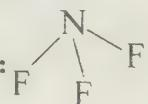

## ② 决定产物的具体形态

$\mathrm{N(OH)_3}$ 即为 $\mathrm{HNO_2 + H_2O}$ , 因此: $\mathrm{NF_3 + 2H - OH \longrightarrow HNO_2 + 3HF}$

③ 判断产物之间或产物自身或产物与反应物质间能否发生反应

$HNO_{2}$ 不与 HF, 也不与反应物发生反应, 但自身能发生分解反应, 因为上述反应是放热反应, 能加速 $HNO_{2}$ 的分解: $2HNO_{2} \longrightarrow NO \uparrow + NO_{2} \uparrow + H_{2}O$

④ 对前面的化学反应进行综合整理

将②和③中的化学反应进行加和,得: $2 \mathrm{~NF}_{3} + 3 \mathrm{H}_{2} \mathrm{O} \longrightarrow \mathrm{NO}_{2} \uparrow + \mathrm{NO} \uparrow + 6 \mathrm{HF}$

## 参考解答 见上述分析

假设法的思路特别重要,在化学方程式的书写和其他类型的竞赛试题中经常用到。请竞赛选手务必要理解和运用。

## 【竞赛对接】

【例 1】（2014 年乌克兰化学竞赛试题）向 $CuSO_{4}$ 的浓溶液中通入 $SO_{2}$ 气体，可以析出一种由四种元素组成的红色晶体，其中铜元素的质量分数为 0.495。将 5.82 g 该晶体用足量浓硝酸溶解，有 0.090 mol $HNO_{3}$ 转化为 $NO_{2}$ ，往反应后溶液中加入足量的 $BaCl_{2}$ 溶液，得到 6.99 g 白色沉淀。若改用足量浓硫酸溶解相同质量晶体，则有 0.015 mol $H_{2}SO_{4}$ 转化为 $SO_{2}$ 。通过计算写出该红色晶体的化学式。

## 过程探究

由题意可知，5.82 g 晶体中含 Cu 0.045 mol，含 S 0.03 mol，其余元素必为 O 和 H。

由 0.09 mol HNO₃ 被还原可知，5.82 g 晶体共失去电子 0.09 mol。若 Cu 全为 +1 价，则失去电子最多只能为 0.045 mol，故必有 +4 价的 S。若 S 全为 +4 价，则失去电子最多只能为 0.06 mol，故必有 +1 价的 Cu。

由 $0.015 \, mol \, H_{2}SO_{4}$ 被还原可知， $5.82 \, g$ 晶体中含 +1 价 Cu 为 $0.03 \, mol$ （浓硫酸不能氧化 +4 价 S）。故 +4 价 S 为 $\frac{0.09 - 0.03}{2} = 0.03 \, mol$ 。

综上可知，5.82 g 晶体中含 0.015 mol $Cu^{2+}$ (0.96 g)、0.03 mol $Cu^{+}$ (1.92 g) 和 0.03 mol $SO_{3}^{2-}$ (2.40 g)。由于电荷已平衡，故剩余质量 0.54 g 为 0.03 mol $H_{2}O$ 。

参考解答 晶体化学式为 $\mathrm{Cu_{3}(SO_{3})_{2}\cdot2H_{2}O}$ (或 $\mathrm{Cu_{2}SO_{3}\cdot CuSO_{3}\cdot2H_{2}O}$ )

【例 2】（2015 年全国名校高中化学竞赛联合考试试题）二元化合物 A 是红棕色晶体，具有强吸湿性，不稳定。取 A 3.322 g，在等压容器中加热到 $177^{\circ}$ C（维持一段时间），完全反应后得到另一种深绿色晶体 B 2.279 g 和气体 147.7 mL（忽略反应前容器体积，并始终维持一个标准大气压）；如果降温到室温（ $27^{\circ}$ C），则气体体积缩小到 49.2 mL，经检测为单质气体 C，而底部晶体颜色变暗，并增加到 3.181 g。（已知理想气体状态方程为 pV = nRT, $R = 8.314 J \cdot mol^{-1} \cdot K^{-1}$ ）

(1) 请通过计算确定各物质的化学式。

(2) 写出 A 的分解总反应方程式。

(3) 如果没有数据限定, A 分解反应的配平将有无数组答案, 为什么? 并用字母配平来表现所有情况。

## 过程探究

对于氧化还原反应中的物质的推断,假设讨论法是常见的解题方法。

(1) $m(\mathrm{C}) = 3.322 - 3.181 = 0.141\mathrm{g}$ , 利用 $pV = \frac{m}{M} RT, M = \frac{0.141 \times 8.314 \times 300}{101325 \times 0.0000492} = 70.54\mathrm{g / mol}$ , 该气体为 $\mathrm{Cl}_2$ 。

降温前气体物质的量为 n=0.0040 mol，其中 $Cl_{2}$ 为 0.0020 mol，假设由气体转化为固体的物质为 D，则 D 的摩尔质量为 $M=\frac{m}{n}=\frac{3.181-2.279}{0.0020}=451\ g/mol$ ，D 不可能为单质，则必为氯化物，假设化学式为 $RCl_{n}$ ，对 n=1、2……8 进行讨论得，只有 n=6 时存在合理 R 为 U，即 D 为 $UCl_{6}$ 。

设 A、B 也为 U 的氯化物，设反应为 $x\mathrm{UCl}_{a}\longrightarrow(x-1)\mathrm{UCl}_{b}+\mathrm{UCl}_{6}+\mathrm{Cl}_{2}$ ，U 最高为 +6，则 $0 \leqslant b < a < 6$ ，利用 Cl 元素守恒有 $ax = bx - b + 8, x = \frac{8 - b}{a - b}, M(\mathrm{UCl}_{a}) = 238 + 35.45a = \frac{3.322}{0.002}x, 1/x = 0.1433 + 0.0213a = \frac{a - b}{8 - b}; \frac{b + 0.1433(8 - b)}{1 - 0.0213(8 - b)}$ 。将 b = 0, 1, 2, 3, 4 代入，解得 a = 1.38, 2.35, 3.29, 4.15, 5.00; x = 4。因此：A: UCl₅; B: UCl₄

(2) $4\mathrm{UCl}_5\xrightarrow{\triangle}3\mathrm{UCl}_4 + \mathrm{UCl}_6 + \mathrm{Cl}_2$

(3) 该反应由 2 个独立反应加和而成: $2 \mathrm{UCl}_{5} \xrightarrow{\triangle} \mathrm{UCl}_{4} + \mathrm{UCl}_{6}$ ; $2 \mathrm{UCl}_{5} \xrightarrow{\triangle} 2 \mathrm{UCl}_{4} + \mathrm{Cl}_{2}$ $2(n + m) \mathrm{UCl}_{5} \xrightarrow{\triangle} (n + 2m) \mathrm{UCl}_{4} + n \mathrm{UCl}_{6} + m \mathrm{Cl}_{2}$

## 参考解答 见上述分析

【例 3】（2006 年乌克兰 10 年第二阶段试题）由元素 X 组成的单质 P 是化学家都希望在通常条件下合成的。1886 年首先由亨利·莫瓦桑合成，他是用铂作电极电解含 X 元素的酸式钾盐 Z（钾元素质量分数 50%）。

很长时间以来,化学家都无法用化学试剂合成气体 P。直到 1987 年化学家 Carl Christer 用 1.235 g 盐 A(含三种元素,其中 X 质量分数为 46.15%)和 2.170 g 二元化合物 B 恰好反应,得到 P,同时生成 2.750 g 盐 C 和 0.560 g 二元化合物 D(X 元素质量分数为 50.89%)。

(1) 试通过计算确定上述未知物。

(2) 写出相关化学反应方程式。

(3) 为何用化合物 B 合成 P?

(4) 画出 Z 阴离子的空间构型。

## 过程探究 本题考查氧化还原反应相关知识。

（1）由于亨利·莫瓦桑合成的物质是 $\mathrm{F}_2$ ，因此根据化学史很容易判断出 $\mathbf{P}$ 为 $\mathrm{F}_2$ ，X元素为F元素。

(2) 先确定 D。

设 D 为 $EF_{n}$ : $M(E)=49.11\times19n/50.89=18.34n(g\cdot mol^{-1})$ ;

当 n=3 时， $M(E)=55.02\ g\cdot mol^{-1}$ ，因此 E 为 Mn 元素，D 为 $MnF_{3}$ 。

$$
\begin{array}{r l} n (\mathrm{MnF} _ {3}): n (\mathrm{F} _ {2}) & = (0. 5 6 / 1 1 2): (1. 2 3 5 + 2. 1 7 0 - 2. 7 5 0 - 0. 5 6 0) / 3 8 \\ & = 0. 0 0 5: 0. 0 0 2 5 = 2: 1 _ {\circ} \end{array}
$$

设盐 A 为 $M_{x}Mn_{y}F_{z}$ ，则 $y: z = (0.560 \times 0.4911)/55 : (1.235 \times 0.4615)/19 = 1:6$ 。

$M(M)=[19\times6/0.4615-(19\times6+55)]/x$ ，当 x=2， $M(M)=39\ g\cdot mol^{-1}$ ，故 M 为 K 元素，A 为 $K_{2}MnF_{6}$

$$
4 / a \mathrm{EF} _ {n} + 2 \mathrm{K} _ {2} \mathrm{MnF} _ {6} \longrightarrow 4 / a \mathrm{K} _ {a} \mathrm{EF} _ {n + a} + 2 \mathrm{MnF} _ {3} + \mathrm{F} _ {2}
$$

当 $a = 1$ ， $M(\mathrm{E}) = 2.170 / (0.0025\times 4) - 19n$ ，当 $n = 5$ 时，B为 $\mathrm{SbF_5}$ ，C为 $\mathrm{KSbF_6}$ Z为 $\mathrm{KHF}_2$ 。

因此,相关化学反应方程式为:

$$
\begin{array}{r l} & 2 \mathrm{KHF} _ {2} \xrightarrow {\text {电解}} 2 \mathrm{KF} + \mathrm{H} _ {2} \uparrow + \mathrm{F} _ {2} \uparrow \\ & 4 \mathrm{SbF} _ {5} + 2 \mathrm{K} _ {2} \mathrm{MnF} _ {6} \longrightarrow 4 \mathrm{KSbF} _ {6} + 2 \mathrm{MnF} _ {3} + \mathrm{F} _ {2} \uparrow \end{array}
$$

(3) $SbF_{5}$ 是很强的 Lewis 酸, 可以制取相对较弱的酸 $MnF_{4}$ 。

(4) $HF_{2}^{-}$ 的结构为直线型: $[F—H—F]^{-}$ 。

需要说明的是: Carl Christer 用化学方法制备 $F_{2}$ 经历了三个过程:

① $2KMnO_{4} + 2KF + 10HF + 3H_{2}O_{2} \longrightarrow 2K_{2}MnF_{6} + 3O_{2}\uparrow + 8H_{2}O$ (制备 $K_{2}MnF_{6}$ )

$$
② \mathrm{SbCl} _ {5} + 5 \mathrm{HF} \longrightarrow \mathrm{SbF} _ {5} + 5 \mathrm{HCl} (\text {制备} \mathrm{SbF} _ {5} \text {强路易斯酸})
$$

③ $2\mathrm{K}_{2}\mathrm{MnF}_{6} + 4\mathrm{SbF}_{5}\longrightarrow 4\mathrm{KSbF}_{6} + 2\mathrm{MnF}_{3} + \mathrm{F}_{2}\uparrow$ （利用过渡金属高价氟化物不稳定易分解的原理让 $\mathrm{MnF_4}$ 分解： $2\mathrm{MnF_4}\longrightarrow 2\mathrm{MnF_3} + \mathrm{F_2}\uparrow$ ）

## 参考解答 见上述分析

【例 4】（2003 年全国初赛试题）1 mol 高锰酸钾在 240～300℃ 加热释放出 19.2 g 氧气，写出反应方程式。（已知 $K_{2}MnO_{4}$ 640℃ 分解， $K_{3}MnO_{4}$ 800℃ 分解。）

过程探究 本题是以化学方程式为载体考查 Mn 元素的化学性质。Mn 是竞赛的热点内容, 不仅仅是较为典型的过渡金属, 而且组成物质丰富、结构复杂, 它形成化合物的价态可从 0\~+7, 形成的物质有的有较强的还原性, 有的有较强的氧化性, 有的既具有氧化性, 又具有还原性。

解答本题的思路可从元素守恒角度出发: $n(\mathrm{O}_{2}) = 19.2 / 32 = 0.6 \, \mathrm{mol} = 3 / 5 \, \mathrm{mol}$ , 即 $5 \, \mathrm{mol} \, \mathrm{KMnO}_{4}$ 受热分解生成 $3 \, \mathrm{mol} \, \mathrm{O}_{2}$ , 即 $5 \, \mathrm{KMnO}_{4} \xrightarrow{\triangle} \mathrm{A} + 3 \, \mathrm{O}_{2} \uparrow$ , A 的化学式为 $\mathrm{K}_{5} \, \mathrm{Mn}_{5} \, \mathrm{O}_{14}$ 。最后将思考的重点落实到 $\mathrm{K}_{5} \, \mathrm{Mn}_{5} \, \mathrm{O}_{14}$ 是什么物质。此时要结合已知条件, 已知条件实际上是“此地无银三百两”。说明 $\mathrm{K}_{5} \, \mathrm{Mn}_{5} \, \mathrm{O}_{14}$ 中应有 $\mathrm{K}_{2} \, \mathrm{MnO}_{4}$ 或 $f$ 和 $\mathrm{K}_{3} \, \mathrm{MnO}_{4}$ 。结合钾原子的个数, 我们不难得出肯定有 $\mathrm{K}_{2} \, \mathrm{MnO}_{4}$ 和 $\mathrm{K}_{3} \, \mathrm{MnO}_{4}$ , 因为若只有 $\mathrm{K}_{2} \, \mathrm{MnO}_{4}$ , 钾原子只能是偶数; 若只有 $\mathrm{K}_{3} \, \mathrm{MnO}_{4}$ , 钾原子只能是 $3, 6, 9$ 等, 不符合钾原子数为 $5$ , 而 $5 = 2 + 3$ , 因此 A 中肯定有 $\mathrm{K}_{2} \, \mathrm{MnO}_{4}$ 和 $\mathrm{K}_{3} \, \mathrm{MnO}_{4}$ , 且物质的量之比为 $1:1$ （即两者化学式为 $K_{5}Mn_{2}O_{8}$ ），再将 $K_{5}Mn_{5}O_{14}-K_{5}Mn_{2}O_{8}=Mn_{3}O_{6}=3MnO_{2}$ ，因此上述化学反应为：

$$
5 \mathrm{KMnO} _ {4} \xrightarrow {\triangle} \mathrm{K} _ {2} \mathrm{MnO} _ {4} + \mathrm{K} _ {3} \mathrm{MnO} _ {4} + 3 \mathrm{MnO} _ {2} + 3 \mathrm{O} _ {2} \uparrow
$$

## 参考解答 见上述分析

【例 5】（2008 年乌克兰化学竞赛 9 年级试题）在密闭容器中于 $1000^{\circ}$ C 加热 $\mathrm{Fe(OH)}_{2}$ 固体，发现有 $H_{2}$ 生成。试写出其化学反应方程式。

过程探究 由于有 $\mathrm{H}_{2}$ 生成, 氢元素化合价由 +1 变为 0 价, 因此 $\mathrm{Fe(OH)}_{2}$ 的热分解是氧化还原反应。由此说明至少有一种元素的化合价升高, 可能是 +2 价 Fe 和 / 或 -2 价 O 元素。然后分别进行讨论。在讨论时, 先讨论简单情况, 再讨论复杂情况, 若简单的情况符合题意, 就不要再讨论复杂的情况了。

① 若只有氧元素化合价发生变化, 即氧元素由 -2 价变为 0 价 $\left(\mathrm{O}_{2}\right)$ , 在高温下, $\mathrm{O}_{2}$ 会与 $\mathrm{H}_{2}$ 发生化合反应, 生成 $\mathrm{H}_{2} \mathrm{O}$ , 因此不符合题意。

② 若只有 Fe 元素化合价发生变化, 即由 +2 价变为 +3 价, 这就牵涉到铁的具体成分, 可能是 $Fe_{2}O_{3}$ , 也有可能是 $Fe_{3}O_{4}$ 。这个问题牵涉到 $Fe_{2}O_{3}$ 和 $Fe_{3}O_{4}$ 的稳定性问题。其实中学化学已经讲过这样的问题。如 Fe 在氧气中燃烧得到 $Fe_{3}O_{4}$ ; Fe 与水蒸气反应得到 $Fe_{3}O_{4}$ 。这说明 $Fe_{3}O_{4}$ 比 $Fe_{2}O_{3}$ 稳定。因此铁的具体形态为 $Fe_{3}O_{4}$ , 即:

$$
\mathrm{Fe(OH)} _ {2} \xrightarrow {\triangle} \mathrm{Fe} _ {3} \mathrm{O} _ {4} + \mathrm{H} _ {2} \uparrow + \dots
$$

此时,要先把变价元素配平,其中元素根据质量守恒得到,然后再根据最小公倍数法配平:

$$
3 \mathrm{Fe(OH)} _ {2} \xrightarrow {\triangle} 1 \mathrm{Fe} _ {3} \mathrm{O} _ {4} + 1 \mathrm{H} _ {2} \uparrow + \dots
$$

根据质量守恒定律知:生成物中相差4个H原子,2个O原子,即2 mol $H_{2}O$

因此 $\mathrm{Fe(OH)}_2$ 热分解反应为 $3\mathrm{Fe(OH)}_2\xrightarrow{\triangle}\mathrm{Fe}_3\mathrm{O}_4 + \mathrm{H}_2\uparrow +2\mathrm{H}_2\mathrm{O}$

简单的问题解决了,复杂的问题(铁元素和氧元素化合价同时升高)就不要再讨论了。

## 参考解答 见上述分析

【例 6】（1992 年全国初赛试题）取 2.5 g KClO₃ 粉末置于冰水冷却的锥形瓶中，加入 5.0 g 研细的 I₂，再注入 3 mL 水，在 45 min 内不断振荡，分批加入 9～10 mL 浓盐酸，直到 I₂ 完全消失为止（整个反应过程保持在 40℃以下）。将锥形瓶置于冰水中冷却，得到橙黄色的晶体 A。

将少量 A 置于室温下的干燥的试管中, 发现 A 有升华现象, 用湿润的 KI—淀粉试纸在管口检测, 试纸变蓝。接着把试管置于热水浴中, 有黄绿色的气体生成, 管内的固体逐渐变成棕色液体。

将少量 A 分别和 KI、 $Na_{2}S_{2}O_{3}$ 、 $H_{2}S$ 等溶液反应，均首先生成 $I_{2}$ 。

酸性的 $KMnO_{4}$ 可将 A 氧化, 得到的反应产物是无色的溶液。

(1) 写出 A 的化学式; 写出上述制备 A 的配平的化学方程式。

(2) 写出 A 受热分解的化学方程式。

(3) 写出 A 和 KI 反应的化学方程式。

过程探究 本题对于未自学过大学无机化学的同学来说,无疑是很难的,但也不是绝对无法解答。只要认真读题,领会题意,认真分析,充分调动已有知识,加之以大胆的假设、推理和猜想,该题是完全能够做答的。

反应器锥形瓶中加入的物质有 $KClO_{3}$ 、 $I_{2}$ 和盐酸，还有水。 $KClO_{3}$ 是强氧化剂，而 $I_{2}$ 和 HCl 则都可能被氧化。假如是 $I_{2}$ 被 $KClO_{3}$ 所氧化，那么盐酸起了酸性介质的作用，则 A 可能是 $KIO_{3}$ 、 $KIO_{2}$ 或 KIO。但这种假定与题目下边的叙述不相符合：把 A 加热时有黄绿色气体生成。这里，黄绿色气体只可能是 $Cl_{2}$ 。以上假设中，A 不包含 Cl 元素。看来，得换成另一种假设。

还剩下的唯一假设是 $\mathrm{KClO}_3$ 将 $\mathrm{HCl}$ 氧化, 这是中学化学实验室中常用的制取氯气的方法之一。那么, 就应该是氯气将碘氧化了。在反应中 $\mathrm{Cl}_2$ 被还原为 $\mathrm{Cl}(-1)$ , $\mathrm{I}_2$ 则被氧化为正氧化态, A 是 $\mathrm{Cl}_2$ 与 $\mathrm{I}_2$ 的化合物。这样, 它在受热时分解产生 $\mathrm{Cl}_2$ 就能得以解释了。这种假设还能解释 A 能分别和 KI、 $\mathrm{Na}_2\mathrm{S}_2\mathrm{O}_3$ 、 $\mathrm{H}_2\mathrm{S}$ 反应的事实。这些物质都具有还原性。显然, A 中显正氧化态的碘有氧化性, 它应被还原为 $\mathrm{I}_2$ 。酸性 $\mathrm{KMnO}_4$ 具有很强的氧化性, 与 A 反应是不奇怪的; A 中负价态的 Cl(甚至正价态的 I) 有可能被氧化。

因此,关于 A 是 $Cl_{2}$ 和 $I_{2}$ 反应的化合物的假设,完全可以解释题目中所提供的各种化学事实,就应该得以肯定了。

至于这种 Cl、I 化合物的组成, 可以通过计算确定:

2.5 g KClO $_{3}$ 为 2.5/122.55=0.02 mol；5.0 g I $_{2}$ 为 5.0/(2×126.9)=0.02 mol；1 mol KClO $_{3}$ 与足量浓盐酸反应可生成 3 mol Cl $_{2}$ ，所以 0.02 mol KClO $_{3}$ 应产生 0.06 mol Cl $_{2}$ 。A 应是 0.06 mol Cl $_{2}$ 与 0.02 mol I $_{2}$ 反应的产物，所以其组成应为 ICl $_{3}$ 。A 受热分解放出 Cl $_{2}$ ，则另外的产物应为 ICl，它即为红棕色的液体的成分。

参考解答 (1) A 的化学式为 $\mathrm{ICl}_3$ 。

$$
\mathrm{KClO} _ {3} + 6 \mathrm{HCl} \longrightarrow \mathrm{KCl} + 3 \mathrm{Cl} _ {2} \uparrow + 3 \mathrm{H} _ {2} \mathrm{O}
$$

\+ $I_{2} + 3Cl_{2} \longrightarrow 2ICl_{3}$

$$
\mathrm{KClO} _ {3} + 6 \mathrm{HCl} + \mathrm{I} _ {2} \longrightarrow 2 \mathrm{ICl} _ {3} + \mathrm{KCl} + 3 \mathrm{H} _ {2} \mathrm{O}
$$

(2) $\mathrm{ICl}_3\longrightarrow \mathrm{Cl}_2 + \mathrm{ICl}$

(3) $\mathrm{ICl}_3 + 3\mathrm{KI}\longrightarrow 2\mathrm{I}_2 + 3\mathrm{KCl}$

说明 本题对于学过高等学校无机化学、了解卤素互化物有关知识的学生来说不算是难题,但对于不知卤素互化物为何物的学生来说无疑是比较难的。

但是,难并非不可解。本题的分析就是从中学生的知识出发求得最后解答的。从这里可以获得两点启示:一是解难题要有勇气,知难而上,许多难题就会迎刃而解;二是面对生疏的问题要大胆提出假设,然后根据假设去解释已知的事实,如果不能解释,那么假设就得放弃;如果假设能解释已知的事实,那么假设就可以被肯定。这既是解难题的一种思维方法,也是科学发展经常遵循的一种过程。在科学研究时,为了求得问题的解答,科学家总是先要提出各种的“假说”;这种“假说”如果能完满地解释已知的事实,就会获得人们广泛的承认;如果不能完满解释已知的事实,或者虽然能解释已知的事实,但却不能解释新发现的事实,那么假说就会被放弃;获得承认的假说在长时间里经受了考验,能够解释一系列新的实验事实,就逐渐被公认为“理论”。当然,理论的形成并不意味着人们认识的终结。一种理论的形成只表明人们的认识达到了一个阶段。随着科学的发展,往往会发现一些新的事实不能为旧有的理论所解释,那么就会有新的假说出现,新的假说则是通往新的理论建立的桥梁。

## 【实战演练】

1. 已知 $NH_{4}A$ (A 为酸根) 受热分解是质子转移, 若 A 为氧化性酸根, 分解时会发生氧化还原反应。试写出 $(\mathrm{NH}_{4})_{2}\mathrm{MnO}_{4}$ 、 $\mathrm{NH}_{4}\mathrm{NO}_{2}$ 、 $(\mathrm{NH}_{4})_{2}\mathrm{Cr}_{2}\mathrm{O}_{7}$ 热分解方程式。

2. 以油类为溶剂的防锈漆称为油基防锈漆,由于环保方面的原因,目前要推广使用水基防锈漆,但水基漆较易溶解 $\mathrm{O}_2$ ,在干燥之前易导致金属表面产生锈斑,为此要在水基漆中加入缓蚀剂,缓蚀剂添加的常见物质是 $\mathrm{NaNO}_2$ 和 $\mathrm{N}_2\mathrm{H}_4$ 。试分别写出其相关化学反应。

3. 舞台上产生烟幕的方法很多,其中一种方法是在硝酸铵上覆盖一些锌粉,温热之,再加几滴水,即产生大量的烟。已知参加反应的硝酸铵和锌粉的物质的量之比为1:1。

(1) 烟主要由什么组成?

(2) 写出该反应方程式。

(3) 若不滴加水, 是否有其他方法使反应进行? 若有, 请写出。

(4) 有趣的是, 若硝酸铵和锌粉潮湿, 或滴加的水过多, 实验又会失败, 请分析原因。

4. 某科研小组研究 $SO_{3}$ 和 NaCl 作用生成 $Cl_{2}$ 的反应机理。经研究发现:该反应由以下几个过程构成。

① $40^{\circ}C \sim 100^{\circ}C$ ， $SO_{3}$ 和 NaCl 发生化合反应，生成 A。

② A 在 $230^{\circ}$ C 发生氧化还原反应, 发生分解, 其中一种产物是 $Na_{2}S_{2}O_{7}$ 。

③ $400^{\circ}C$ $Na_{2}S_{2}O_{7}$ 和 NaCl 氧化还原反应, 其中一种产物是 $Na_{2}SO_{4}$ 。

(1) 试写出上述三个步骤的化学反应方程式。

(2) 写出 $SO_{3}$ 和 NaCl 反应的总反应式。

5. 完成并配平下列反应方程式：

(1) 固体 $KMnO_{4}$ 在 $200^{\circ}C$ 加热, 失重 10.8%;

(2) 固体 $KMnO_{4}$ 在 $240^{\circ}C$ 加热, 失重 15.3%。

已知相对原子质量 O 为 16.0, K 为 39.0, Mn 为 54.9

6. 从矿物学资料查得: 当胆矾溶液渗入地下, 遇黄铁矿( $FeS_{2}$ )时, 可生成辉铜矿( $Cu_{2}S$ ), 同时还生成 $FeSO_{4}$ 和 $H_{2}SO_{4}$ 。请配平反应方程式, 并指明黄铁矿是氧化剂还

是还原剂？

7. 已知某物质的 $\mathrm{XO(OH)}_2^+$ 与 $\mathrm{Na}_2\mathrm{SO}_3$ 反应时, $\mathrm{XO(OH)}_2^+$ 作氧化剂, $\mathrm{Na}_2\mathrm{SO}_3$ 被氧化为 $\mathrm{Na}_2\mathrm{SO}_4$ 。现有 $0.1\mathrm{mol}$ $\mathrm{XO(OH)}_2^+$ 需要 $100\mathrm{mL}2.5\mathrm{mol}\cdot \mathrm{L}^{-1}\mathrm{Na}_2\mathrm{SO}_3$ 溶液才能把该物质还原。试问 $\mathrm{XO(OH)}_2^+$ 还原后 X 的最终价态是多少?

8. 次磷酸 $H_{3}PO_{2}$ 是一种强还原剂，将它按某一比例加入到 $CuSO_{4}$ 水溶液，加热到 $40 \sim 50^{\circ}C$ ，析出固体物质。经鉴定：反应后的溶液是磷酸和硫酸的混合物；将上述固体物质分离后，发现有三种固态物质：一种红棕色的难溶物 A，一种具有紫红色的固体物质 B，一种为黑色固体物质 C（其中 B 和 C 的量较少）。X 射线衍射证实 A 是一种六方晶体，结构类似于纤维锌矿（ZnS），组成稳定；A 的主要化学性质如下：(a) 温度超过 $60^{\circ}C$ ，分解成 B 和一种气体；(b) 在氯气中着火；(c) 与盐酸反应放出气体。C 加入 $HNO_{3}$ 后，无气体放出，且 C 在氢气流中能生成 B。试回答如下问题：

(1) 写出 A、B、C 的化学式。

(2) 写出生成 A 的反应方程式。该反应有什么特点？若忽略 B 和 C，试写出其化学反应方程式。

(3) 分别写出 A 与氯气、盐酸反应的化学方程式。

9. 某金属 M 能形成几种氧化物, 它在其中一种氧化物中的氧化数为“n”, 在另一种氧化物中为“ $n+5$ ”。后者转化为前者时失 36.06%(质量)的氧。

(1) 确定金属 M 及其氧化物。

(2) 某化合物 A 含有 M 元素, 该化合物的阴离子为紫色, 透过蓝色的钴玻璃进行焰色反应, 火焰为紫色。A 可按下述方法和步骤制取: ① 将 KOH, $\mathrm{KClO}_{3}$ 在 $600^{\circ} \mathrm{C}$ 熔融, 再加入黑色含 M 的氧化物 (M 的氧化数为 $n + 2$ ) 共熔; ② 将步骤 ① 熔体冷却粉碎溶解, 并向溶液中通入 $\mathrm{CO}_{2}$ 过滤, 滤液为 A 的溶液, 蒸发得 A, 已知 ① ② 两步都发生了氧化还原反应。试写出上述化学反应方程式。

(3) A 在浓碱液中变为 B, 其中 B 中 M 的氧化数较 A 中的 M 氧化数小 1。试写出在较浓碱液中, A 变为 B 的离子方程式及 A 的阴离子氧化 $\mathrm{SO}_{3}^{2-}$ 的离子方程式;

（4）为试验在较浓碱液中 A 的阴离子与 $SO_{3}^{2-}$ 间的氧化还原，请说明加试剂顺序及实验中应注意的事项。

10. 最近,我国某高校一研究小组将 $0.383 \mathrm{~g} \mathrm{AgCl}, 0.160 \mathrm{~g} \mathrm{Se}$ 和 $0.21 \mathrm{~g} \mathrm{NaOH}$ 装入充满蒸馏水的反应釜中加热到 $115^{\circ} \mathrm{C}; 10$ 小时后冷至室温;用水洗净可溶物后,得到难溶于水的金属色晶体 A。在显微镜下观察,发现 A 的单晶竟是六角微型管,有望开发为特殊材料。现代物理方法证实 A 由银和硒两种元素组成,Se 的质量几近原料的 $2 / 3$ ;A 的理论产量约 $0.39 \mathrm{~g}$ 。

(1) 写出合成 A 的化学方程式,标明 A 是什么?

(2) 溶于水的物质有: \_\_\_\_。

(3) A 能溶于浓硫酸中,生成一种微溶于水的白色固体和三种氧化物。其中两种氧化物是等电子体。试写出该化学反应方程式。

(4) A 也能在有足够空气存在的情况下与纯碱反应生成 Ag 单质, 同时也有一种钠盐生成, 该钠盐能在空气中继续反应生成另一种钠盐。试写出上述化学反应方

程式。

11. 将摩尔比为 $4: 1$ 的氧化钠和三氧化二铁混合物放在氧气流中加热至 $450^{\circ} \mathrm{C}$ 可制得 $\mathrm{Fe(IV)}$ 的含氧酸钠盐。

(1) 写出该化学反应方程式。

(2) 该钠盐在稀碱溶液中立即歧化,生成高铁(VI)盐与棕色沉淀物,写出此歧化反应方程式。

（3）高铁酸钠在酸性溶液中立即快速分解，放出氧气，写出此反应的离子反应方程式。

12. 以 $\mathrm{FeSO_4}$ 和 $\mathrm{NaOH}$ 制备 $\mathrm{Fe(OH)_2}$ 的过程中出现一种绿色物质 X, 称取此物质 $1.0293\mathrm{g}$ , 用稀盐酸溶解完全后, 定量转移到 $250\mathrm{mL}$ 容量瓶中, 以水稀释至刻度, 摇匀 (称样品液)。

① 移取样品液 25.00 mL, 加入 0.50 mol·L $^{-1}$ H $_{2}$ SO $_{4}$ 25 mL, 用 0.005000 mol·L $^{-1}$ KMnO $_{4}$ 溶液滴定至终点, 消耗 KMnO $_{4}$ 溶液 25.60 mL。(假设稀盐酸不与 KMnO $_{4}$ 反应)

② 移取样品液 25.00 mL, 加适量水及 0.8 g KI 后, 在暗处放置 3 分钟, 加水 80 mL, 立即以 0.02500 mol·L $^{-1}$ Na $_{2}$ S $_{2}$ O $_{3}$ 溶液滴定至浅黄色, 再加入淀粉溶液滴定至蓝色消失, 消耗 Na $_{2}$ S $_{2}$ O $_{3}$ 溶液 12.80 mL。

③ 移取样品液 100.00 mL, 滴入 HCl 至 pH=1 左右, 加入 10.00 mL BaCl₂ 溶液, 静置一定时间, 过滤、烘干、灰化后, 在 450℃左右灼烧 5 分钟, 于干燥器中冷至室温, 称得固体物净重 0.2988 g。

用实验结果和相关方法测定后, 发现 X 的化学式为: $n \times$ 氧化物 $\cdot m \times$ 盐 $\cdot y \times$ 氢氧化物, 且 $n : m : y$ 是最小正整数比。

(1) 以计算结果(要过程)写出 X 以氧化物·盐·氢氧化物表示的化学式;

(2) 写出 $FeSO_{4}$ 和 NaOH 生成 X 的化学反应方程式。

13. 含金属元素 X 的钾盐 A 是绿色固体, 在干燥空气中能稳定存在。取 9.852 g A 的固体, 溶解于水, 酸化后完全发生歧化反应得到高价的另一种钾盐 B 溶液和低价的氧化物 C 沉淀; 过滤, 所得滤液取出 1/10, 加入 0.4000 mol·L $^{-1}$ 的 (NH $_{4}$ ) $_{2}$ Fe(SO $_{4}$ ) $_{2}$ 溶液 35.00 mL, 充分反应后, 再用 0.0400 mol·L $^{-1}$ 的标准 KMnO $_{4}$ 溶液进行滴定, 消耗 20.00 mL; 收集过滤所得的沉淀, 加入到过量的 KI 溶液中, 充分反应后用 0.8000 mol·L $^{-1}$ 的标准 Na $_{2}$ S $_{2}$ O $_{3}$ 溶液进行滴定, 消耗 25.00 mL。经检测, 在进行 KMnO $_{4}$ 溶液滴定和 Na $_{2}$ S $_{2}$ O $_{3}$ 溶液滴定后的剩余液中 M 元素都是以 M $^{2+}$ 的离子形式存在。

(1) 只通过滴定反应中的数据, 计算和分析 A、B、C 中 M 的可能化合价;

(2) 再通过参加反应的 A 的质量, 确定 A、B、C 的化学式;

(3) A 可由 C 与 KOH、 $\mathrm{KNO}_{3}$ 熔融制备; A 在潮湿空气中易被氧化为 B。分别写出反应方程式。

# 第 3 讲 离子反应

# 【知识要点】

## 一、离子反应发生的条件

在反应中有离子参加或有离子生成的反应称为离子反应。离子反应一般指在溶液(若没有具体指明,溶液默认为水溶液)中进行的反应,因此可以说离子反应是指在水溶液中有电解质参加的一类反应。因为电解质在水溶液里发生的反应,其实质是该电解质电离出的离子在水溶液中的反应。如 Fe 与稀硫酸反应有离子反应,而 Fe 与浓硫酸反应则没有离子反应。

离子反应具有如下特点:离子反应的反应速率快,相应离子间的反应不易受其他离子的干扰。

以 $\mathrm{Na_2SO_4 + BaCl_2\longrightarrow 2NaCl + BaSO_4\downarrow}$ 反应为例说明复分解反应的本质。

$Na_{2}SO_{4}$ 、 $BaCl_{2}$ 、NaCl、 $BaSO_{4}$ 均为强电解质，前三种物质在水中能完全电离，而 $BaSO_{4}$ 难溶于水，但溶于水的那部分能完全电离。电离方程式如下：

$$
\begin{array}{r l}&\mathrm {Na_ {2} SO_ {4}} \longrightarrow 2 \mathrm {Na^ {+}} + \mathrm {SO_ {4} ^ {2 - }}\\&\mathrm {BaCl_ {2}} \longrightarrow \mathrm {Ba^ {2 + }} + 2 \mathrm {Cl^ {-}}\\&\mathrm{NaCl} \longrightarrow \mathrm {Na^ {+}} + \mathrm {Cl^ {-}}\\&\mathrm {BaSO_ {4} (s)} \rightleftharpoons \mathrm {BaSO_ {4} (aq)}\\&\mathrm {BaSO_ {4} (aq)} \longrightarrow \mathrm {Ba^ {2 + } (aq)} + \mathrm {SO_ {4} ^ {2 - } (aq)}\end{array}
$$

电离方程式中的→表示完全电离，←表示不完全电离。

这样，上述反应的离子反应为：

$$
2 \mathrm{Na} ^ {+} + \mathrm{SO} _ {4} ^ {2 -} + \mathrm{Ba} ^ {2 +} + 2 \mathrm{Cl} ^ {-} \longrightarrow 2 \mathrm{Na} ^ {+} + 2 \mathrm{Cl} ^ {-} + \mathrm{BaSO} _ {4} \downarrow
$$

从离子反应式看出: 反应前后 $Na^{+}$ 和 $Cl^{-}$ 离子浓度都没有发生变化, 只有 $SO_{4}^{2-}$ 和 $Ba^{2-}$ 浓度反应后急剧减少, 因此上述反应的本质应该为: $Ba^{2+} + SO_{4}^{2-} \longrightarrow BaSO_{4} \downarrow$

离子反应与一般化学反应方程式相比更能解释反应的本质。离子反应可以表示一类化学反应。

由此,我们得出如下结论:

① 生成难溶的物质。如生成 $BaSO_{4}$ 、 AgCl 、 $CaCO_{3}$ 等。

② 生成难电离的物质。如生成 $CH_{3}COOH$ 、 $H_{2}O$ 、 $NH_{3}\cdot H_{2}O$ 、HClO 等。

③ 生成挥发性物质。如生成 $CO_{2}$ 、 $SO_{2}$ 、 $H_{2}S$ 等。

只要具备上述三个条件中的一个,离子互换反应即可发生。这是由于溶液中离子间相互作用生成难溶物质、难电离物质、易挥发物质时,都可使溶液中某几种自由移动离子浓度减小的缘故。若不能使某几种自由移动离子浓度减小,则该离子反应不能发生。如 $KNO_{3}$ 溶液与 NaCl 溶液混合后,因无难溶物质、难电离物质、易挥发物质生成, $Na^{+}$ 、 $Cl^{-}$ 、 $K^{+}$ 、 $NO_{3}$ 浓度都不减少,四种离子共存于溶液中,故不能发生离子反应。

另外,离子反应是一个动态平衡。当反应达到平衡后,反应物变成生成物的速率与生成物变成反应物的速率相等,即到动态平衡。如果在这种动态平衡中改变条件,使生成物浓度减少,即可使反应向生成物方向移动,即反应正向进行;反之,逆向进行。比如可用 KCl 和 $NaNO_{3}$ 反应制备 $KNO_{3}$ 。其反应为: $KCl + NaNO_{3} \rightleftharpoons KNO_{3} + NaCl$ 。该原理初看起来不符合复分解反应条件,但由于 $KNO_{3}$ 的溶解度远远大于 NaCl,即 $KNO_{3}$ 受温度的影响程度远远大于 NaCl,因此在降温条件下, $KNO_{3}$ 晶体大量析出,从而导致上述反应能够发生。

需要指出的是,上述反应除了析出大量的 $KNO_{3}$ 晶体外,还析出少量的 KCl 晶体,这一点我们现有知识无法回答,需要应用物理化学知识的相律加以解答。

## 【例1】 简述侯氏制碱法的原理。

过程探究 侯氏制碱法的化学反应为：

$$
\begin{array}{r l} & \mathrm {CO_ {2} + NH_ {3} + H_ {2} O\longrightarrow NH_ {4} HC O _ {3}} \\ & \mathrm {NH_ {4} HC O _ {3} + NaCl\longrightarrow NaHC O _ {3} \downarrow + NH_ {4} Cl} \\ & 2 \mathrm {NaHC O _ {3} \xrightarrow {\triangle} Na_ {2} CO_ {3} + CO_ {2} + H_ {2} O} \end{array}
$$

由于 $NaHCO_{3}$ 的溶解度比较小, $NH_{4}Cl$ 溶解度比较大, 因此反应过程中只要稍稍降温, 即可结晶析出 $NaHCO_{3}$ 晶体, 使得溶液中 $Na^{+}$ 和 $HCO_{3}^{-}$ 浓度减少, 离子反应不断进行。

需要指出的是:侯氏制碱法正是依据离子反应发生的原理进行的,离子反应会向着离子浓度减小的方向进行。也就是中学教材所说的复分解反应应有沉淀、气体和难电离的物质生成。侯德榜先生根据物质的溶解性想到:要制纯碱( $Na_{2}CO_{3}$ ),就利用 $NaHCO_{3}$ 在溶液中溶解度较小的特点先制得 $NaHCO_{3}$ ,再利用 $NaHCO_{3}$ 不稳定性分解得到纯碱 $Na_{2}CO_{3}$ 。要制得 $NaHCO_{3}$ 就要有大量 $Na^{+}$ 和 $HCO_{3}^{-}$ ,所以就在饱和食盐水中通入氨气,形成饱和氨盐水,再向其中通入二氧化碳,在溶液中就有了大量的 $Na^{+}$ 、 $NH_{4}^{+}$ 、Cl $^{-}$ 和 $HCO_{3}^{-}$ ,其中 $NaHCO_{3}$ 溶解度最小,所以析出,其余产品处理后可作肥料或循环使用。

## 参考解答 见上述分析

## 二、重要的离子反应类型

离子反应按照电子是否得失,可分为非氧化还原型离子反应和氧化还原型离子反应两类。

## (一) 非氧化还原型离子反应

## 1. 酸碱盐之间的离子反应

这一类离子反应中，酸碱中和反应比较重要。

酸碱中和反应的本质是 $H^{+} + OH^{-} \longrightarrow H_{2}O$

强酸溶液和弱碱或难溶性碱一般能发生反应；强碱溶液和弱酸或不溶性弱酸（如 $\mathrm{H}_2\mathrm{SiO}_3$ ）一般能发生反应；强碱溶液和多元弱酸反应因反应物的物质的量不同而生成不同形式的盐，如正盐、酸式盐，其本质就是质子 $\mathrm{H}^+$ 的传递；弱酸和弱碱之间的反应比较复杂，有的可以反应，有的则较难发生反应。如氨水能与醋酸反应生成醋酸铵和水，而碳酸较难与 $\mathrm{Cu(OH)}_2$ 等难溶性碱发生反应。

其他酸与盐、碱与盐、盐与盐之间的离子反应比较简单，就不再赘述了。

## 2. 盐类水解

在溶液中,强碱弱酸盐,强酸弱酸盐或弱酸弱碱盐电离出来的离子与水电离出来的 $H^{+}$ 与 $OH^{-}$ 生成弱电解质的过程叫做盐类水解。

阴阳离子的水解能力大小可用公式 $\Phi = q/r$ 类比, 其中 q 表示离子电荷大小, r 表示离子半径大小, $\Phi$ 值越大, 则离子的水解能力越强; 反之, $\Phi$ 值越小, 则离子水解能力越弱。常见离子水解能力较强的是:

阳离子: $\text{Al}^{3+}$ 、 $\text{Fe}^{2+}$ 、 $\text{Fe}^{3+}$ 、过渡金属的高价阳离子……

阴离子: $CO_{3}^{2-}$ 、 $HCO_{3}^{-}$ 、 $AlO_{2}^{-}$ 、 $S^{2-}\cdots$

水解反应程度较大的情况是双水解反应。所谓双水解反应是指一种盐的阳离子水解显酸性,另一种盐的阴离子水解显碱性,当两种盐溶液混合时,由于 $H^{+}$ 和 $OH^{-}$ 结合生成水而相互促进水解,使水解程度变大甚至完全进行的反应。

## ① 完全双水解反应

离子方程式用 $\rightarrow$ 表示，标明气体 $\uparrow$ 和沉淀 $\downarrow$ 符号，离子间不能大量共存。如 $\mathrm{Al}^{3+}$ 与 $\mathrm{CO}_{3}^{2-}$ 、 $\mathrm{HCO}_{3}^{-}$ 、 $\mathrm{HS}^{-}$ 、 $\mathrm{HSO}_{3}^{-}$ 、 $\mathrm{AlO}_{2}^{-}$ 等； $\mathrm{Fe}^{3+}$ 或 $\mathrm{Fe}^{2+}$ 与 $\mathrm{CO}_{3}^{2-}$ 、 $\mathrm{HCO}_{3}^{-}$ 等； $\mathrm{Al}^{3+}$ 与 $\mathrm{S}^{2-}$ 等， $2\mathrm{Al}^{3+} + 3\mathrm{S}^{2-} + 6\mathrm{H}_{2}\mathrm{O}\longrightarrow 2\mathrm{Al(OH)}_{3}\downarrow +3\mathrm{H}_{2}\mathrm{S}\uparrow$ 。

## ② 不完全双水解反应

离子方程式用可逆符号,不标明气体↑或沉淀↓,离子间可以大量共存。如 $NH_{4}^{+}$ 与 $CO_{3}^{2-}$ 、 $HCO_{3}^{-}$ 、 $S^{2-}$ 、 $HS^{-}$ 、 $CH_{3}COO^{-}$ 等弱酸根阴离子。

需要指出的是:并非水解能够相互促进的盐都能发生双水解反应,有的是发生复分解反应,如 $Na_{2}S + CuSO_{4} \longrightarrow Na_{2}SO_{4} + CuS \downarrow$

有的则发生了氧化还原反应,如:

$$
\begin{array}{r l} & 2 \mathrm{FeCl} _ {3} + \mathrm{Na} _ {2} \mathrm{S} \longrightarrow 2 \mathrm{FeCl} _ {2} + \mathrm{S} \downarrow + 2 \mathrm{NaCl} \text {或} \\ & 2 \mathrm{FeCl} _ {3} + 3 \mathrm{Na} _ {2} \mathrm{S} \longrightarrow 2 \mathrm{FeS} \downarrow + \mathrm{S} \downarrow + 6 \mathrm{NaCl} \end{array}
$$

运用水解反应需注意下列几个问题：

① 水解盐溶液蒸干后得到物质的判断：

I．水解生成挥发性酸的盐溶液，蒸干后得到盐相应的氢氧化物，如 $FeCl_{3}$ 溶液蒸干后得到 $\mathrm{Fe(OH)}_{3}$ ，甚至得到 $Fe_{2}O_{3}$ 。

水解生成难挥发性酸或强碱的盐溶液, 蒸干后得到原溶质, 如 $\mathrm{Al}_{2}(\mathrm{SO}_{4})_{3}$ 溶液。

Ⅱ．阴阳离子均易水解的盐，蒸干后得不到任何物质，如 $\left(\mathrm{NH}_{4}\right)_{2}\mathrm{S}$ 溶液。

Ⅲ．易被氧化的物质，蒸干后得到其氧化产物，如 $Na_{2}SO_{3}$ 溶液蒸干后得到 $Na_{2}SO_{4}$ 。

Ⅳ. 受热易分解的物质, 蒸干后得到其分解产物, 如 $\mathrm{Mg(HCO_{3})_{2}}$ 蒸干后得到 MgO。

② 易水解物质溶液的配制：

如配制 $FeCl_{3}$ 、 $SbCl_{3}$ 等溶液时，需要用适量盐酸来抑制 $Fe^{3+}$ 、 $Sb^{3+}$ 的水解。

## 3. 生成配离子的反应

这类离子反应较多, 如 $\mathrm{Fe}^{3+}$ 和 $\mathrm{SCN}^{-}$ 离子间的反应: $\mathrm{Fe}^{3+} + 6\mathrm{SCN}^{-} \rightleftharpoons \mathrm{Fe(SCN)}_{6}^{3-}$ (血红色溶液), 该反应能检验溶液中 $\mathrm{Fe}^{3+}$ 存在。

## （二）氧化还原型离子反应

这类离子反应类型较多,一般有如下几种情况:

## 1. 电解质溶液间的离子反应:

如 $\mathrm{KMnO_4}$ 溶液与浓盐酸的离子反应： $2\mathrm{MnO}_4^- +16\mathrm{H}^+ +10\mathrm{Cl}^- \longrightarrow 2\mathrm{Mn}^{2 + }+$ $5\mathrm{Cl}_2\uparrow +8\mathrm{H}_2\mathrm{O}$

## 2. 单质与电解质之间的置换反应

这种类型一般有两种情况：

① 金属单质与电解质的置换反应

如 $\mathrm{Fe}$ 与 $\mathrm{CuSO_4}$ 溶液反应的离子反应为： $\mathrm{Fe} + \mathrm{Cu}^{2+} \longrightarrow \mathrm{Fe}^{2+} + \mathrm{Cu}$

② 非金属单质与电解质的置换反应

如 $Cl_{2}$ 通入到 NaBr 溶液中的离子反应为： $Cl_{2} + 2Br^{-} \longrightarrow 2Cl^{-} + Br_{2}$

## 3. 非置换的离子反应

如印刷电路板中 $\mathrm{Cu}$ 与 $\mathrm{FeCl}_3$ 溶液的离子反应为： $\mathrm{Cu} + 2\mathrm{Fe}^{3+} \longrightarrow \mathrm{Cu}^{2+} + 2\mathrm{Fe}^{2+}$

【例 2】泡沫灭火器内有两个容器,分别盛放 $\mathrm{Al}_{2}(\mathrm{SO}_{4})_{3}$ 和 $NaHCO_{3}$ 两种液体,其中一种物质装在铁制容器中,另一种装在玻璃容器中,两种溶液互不接触,不发生任何化学反应。(平时千万不能碰倒泡沫灭火器)当需要泡沫灭火器时,把灭火器倒立,两种溶液混合在一起,就会产生大量的二氧化碳气体。

(1) $\mathrm{Al}_{2}(\mathrm{SO}_{4})_{3}$ 和 $\mathrm{NaHCO}_{3}$ 分别装在什么容器中?

(2) 写出泡沫灭火器发生反应的离子反应方程式。

(3) 有人认为可用 $Na_{2}CO_{3}$ 来代替 $NaHCO_{3}$ ，你认为如何？

过程探究 本题考查双水解反应。由于 $\mathrm{Al}_{2}(\mathrm{SO}_{4})_{3}$ 和 $\mathrm{NaHCO}_{3}$ 中分别有 $\mathrm{Al}^{3+}$ 和 $\mathrm{HCO}_{3}^{-}$ 发生水解：

$$
\mathrm{Al} ^ {3 +} + 3 \mathrm{H} _ {2} \mathrm{O} \rightleftharpoons \mathrm{Al(OH)} _ {3} + 3 \mathrm{H} ^ {+} \quad \text { 铝盐呈酸性 }
$$

$$
\mathrm{HCO} _ {3} ^ {-} + \mathrm{H} _ {2} \mathrm{O} \rightleftharpoons \mathrm{H} _ {2} \mathrm{CO} _ {3} + \mathrm{OH} ^ {-} \quad \text {酸式碳酸盐两性偏碱}
$$

两种离子混合后发生双水解,因此,不难回答下列问题:

(1) $\mathrm{Al}_{2}(\mathrm{SO}_{4})_{3}$ 溶液呈较强的酸性, 应装在玻璃容器中; 而 $\mathrm{NaHCO}_{3}$ 溶液呈碱性, 应装在铁制容器中。

(2) 由于 $\mathrm{Al}^{3+}$ 和 $\mathrm{HCO}_{3}^{-}$ 离子混合后发生双水解, 因此离子反应为:

$$
\mathrm{Al} ^ {3 +} + 3 \mathrm{HCO} _ {3} ^ {-} \longrightarrow \mathrm{Al(OH)} _ {3} \downarrow + 3 \mathrm{CO} _ {2} \uparrow
$$

(3) 从化学反应原理看, 用 $\mathrm{Na}_{2} \mathrm{CO}_{3}$ 来代替 $\mathrm{NaHCO}_{3}$ 效果相近, 甚至反应还要剧烈, 因为 $\mathrm{CO}_{3}^{2-}$ 水解能力较 $\mathrm{HCO}_{3}$ 强。但从性价比来看, 还是采用 $\mathrm{NaHCO}_{3}$ 好。因为根据化学方程计算看, 相同质量的 $\mathrm{Na}_{2} \mathrm{CO}_{3}$ 和 $\mathrm{NaHCO}_{3}$ 与相同质量 $\mathrm{Al}_{2}(\mathrm{SO}_{4})_{3}$ 溶液反应, $\mathrm{NaHCO}_{3}$ 产生的 $\mathrm{CO}_{2}$ 多, 即泡沫效果好。因此泡沫灭火器使用 $\mathrm{Al}_{2}(\mathrm{SO}_{4})_{3}$ 和 $\mathrm{NaHCO}_{3}$ 反应。

## 参考解答 见上述分析

## 三、离子方程式的书写

离子方程式的书写是化学基本功。具有如下特点：

1. 通常情况下, 只有在水中或熔融状态下发生的反应才有可能有离子反应。如 $\mathrm{Cu}$ 与浓硫酸加热反应, 生成 $\mathrm{CuSO}_{4} 、 \mathrm{SO}_{2}$ 和 $\mathrm{H}_{2} \mathrm{O}$ (此时生成的 $\mathrm{H}_{2} \mathrm{O}$ 与 $\mathrm{CuSO}_{4}$ 结合成 $\mathrm{CuSO}_{4} \cdot 5 \mathrm{H}_{2} \mathrm{O}$ ), 由于浓硫酸里水量较少, 硫酸主要以分子形式存在, 因此没有离子反应。

需要指出的是:物质的电离与溶剂有关系。如 $SOCl_{2}$ 在水作溶剂时, $SOCl_{2}$ 不发生电离, 是非电解质; 而在液态 $SO_{2}$ 作溶剂时是强电解质(可认为一种强酸), 因此在液态 $SO_{2}$ 中, $SOCl_{2}$ 能完全电离。

2. 单质、氧化物、气体、沉淀、弱电解质应写成分子形式。

3. 微溶物要视其具体情况而定,一般作反应物时写成离子形式,做生成物时写成分子形式。但如果微溶物作为反应物时是悬浊液,则要将该微溶物写成分子形式。如将 $CO_{2}$ 通入澄清的石灰水中,则 $\mathrm{Ca(OH)}_{2}$ 要写成离子形式,其离子反应式为:

$$
\mathrm{Ca} ^ {2 +} + 2 \mathrm{OH} ^ {-} + \mathrm{CO} _ {2} \longrightarrow \mathrm{CaCO} _ {3} \downarrow + \mathrm{H} _ {2} \mathrm{O}
$$

若将 $CO_{2}$ 通入到石灰乳中, 此时 $\mathrm{Ca(OH)}_{2}$ 为分子形式, 其离子反应式为:

$$
\mathrm{CO} _ {2} + \mathrm{Ca(OH)} _ {2} \longrightarrow \mathrm{CaCO} _ {3} \downarrow + \mathrm{H} _ {2} \mathrm{O}
$$

此时离子反应也就是化学反应。

4. 离子方程式书写完成后,要检查是否配平。其依据一是要质量守恒,即各元素原子数目两边相等;二是要电荷守恒,即两边的电荷总数守恒。

需要指出的是:在书写离子反应时要注意以下三点:

① 注意反应物所加顺序

如 NaOH 溶液与 $AlCl_{3}$ 溶液的反应。若将 NaOH 滴加到 $AlCl_{3}$ 溶液中，与 $AlCl_{3}$ 滴加到 NaOH 溶液中，其实验现象和离子反应是不相同的。

## ② 要注意反应物的量的关系

如少量 NaOH 溶液与足量 $\mathrm{Ca(HCO_{3})_{2}}$ 溶液的离子反应，与少量 $\mathrm{Ca(HCO_{3})_{2}}$ 溶液与足量 NaOH 溶液反应的离子反应是不相同的。

## ③ 有时还要注意反应物的浓度

如在检验 $CO_{3}^{2-}$ 离子时,有些参考书认为可用 $Ca^{2+}$ 或 $Ba^{2+}$ 来检验 $CO_{3}^{2-}$ 和 $HCO_{3}^{-}$ 离子,能产生沉淀的是 $CO_{3}^{2-}$ 离子,不能产生沉淀的是 $HCO_{3}^{2-}$ ,这种观点是极其错误的。因为 $Ca^{2+}$ 或 $Ba^{2+}$ 均能与 $CO_{3}^{2-}$ 和 $HCO_{3}^{-}$ 反应:

$$
\begin{array}{r l} & \mathrm {Ba^ {2 + } + CO_ {3} ^ {2 - } \longrightarrow BaCO_ {3} \downarrow} \\ & \mathrm {Ba^ {2 + } + 2HC O _ {3} ^ {-} \longrightarrow BaCO_ {3} \downarrow + CO_ {2} + H_ {2} O} \end{array}
$$

若不加热， $\mathrm{CO}_{2}$ 不会逸出来，因此现象完全一样，故无法用 $\mathrm{Ca}^{2+}$ 或 $\mathrm{Ba}^{2+}$ 来检验 $\mathrm{CO}_{3}^{2-}$ 和 $\mathrm{HCO}_{3}^{-}$ 。我们只能用 $\mathrm{Mg}^{2+}$ 来鉴别 $\mathrm{CO}_{3}^{2-}$ 和 $\mathrm{HCO}_{3}$ ，此时还要求上述两种离子的浓度还要较稀。

## 【例 3】 分别写出下列离子反应：

(1) 将少量 $\mathrm{NaOH}$ 溶液滴加到 $\mathrm{Ca(HCO_3)_2}$ 溶液中。

(2) 将少量 $\mathrm{Ca(HCO_{3})_{2}}$ 溶液滴加到 NaOH 溶液中。

过程探究 这类试题首先要写出其临界反应,即酸式盐与碱反应生成正盐和水: $2 \mathrm{NaOH} + \mathrm{Ca(HCO}_{3})_{2} \longrightarrow \mathrm{CaCO}_{3} \downarrow + \mathrm{Na}_{2} \mathrm{CO}_{3} + 2 \mathrm{H}_{2} \mathrm{O}$

当 NaOH 较少时, $\mathrm{Ca(HCO_{3})_{2}}$ 较多, 临界反应的生成物 $Na_{2}CO_{3}$ 继续与 $\mathrm{Ca(HCO_{3})_{2}}$ 反应: $\mathrm{Na_{2}CO_{3} + Ca(HCO_{3})_{2} \longrightarrow CaCO_{3} \downarrow + 2NaHCO_{3}}$

将上述两个反应加合起来即得: $\mathrm{NaOH} + \mathrm{Ca(HCO}_{3})_{2} \longrightarrow \mathrm{CaCO}_{3} \downarrow + \mathrm{NaHCO}_{3} + \mathrm{H}_{2} \mathrm{O}$ , 因此上述离子反应为: $\mathrm{Ca}^{2+} + \mathrm{OH}^{-} + \mathrm{HCO}_{3}^{-} \longrightarrow \mathrm{CaCO}_{3} \downarrow + \mathrm{H}_{2} \mathrm{O}$

而将少量 $\mathrm{Ca(HCO_{3})_{2}}$ 溶液滴加到 NaOH 溶液中, NaOH 不再与临界反应中生成物反应, 因此还是临界反应: $2\mathrm{NaOH} + \mathrm{Ca(HCO_{3})_{2}} \longrightarrow \mathrm{CaCO_{3}} \downarrow + \mathrm{Na_{2}CO_{3}} + 2\mathrm{H_{2}O}$

其离子反应为： $Ca^{2+} + 2OH^{-} + 2HCO_{3}^{-} \rightarrow CaCO_{3}\downarrow + CO_{3}^{2-} + 2H_{2}O$

参考解答 (1) $\mathrm{Ca^{2+} + OH^{-} + HCO_{3}^{-}\longrightarrow CaCO_{3}\downarrow + H_{2}O}$

$$
\mathrm{Ca} ^ {2 +} + 2 \mathrm{OH} ^ {-} + 2 \mathrm{HCO} _ {3} ^ {-} \longrightarrow \mathrm{CaCO} _ {3} \downarrow + \mathrm{CO} _ {3} ^ {2 -} + 2 \mathrm{H} _ {2} \mathrm{O}
$$

## 四、有关溶液中离子共存问题

判断溶液中离子是否共存,实际上就是判断溶液中各离子之间是否发生反应。凡是离子间能够相互反应的就不能共存;反之,能够共存。判断离子之间能否共存需从以下几个方面进行考虑:

## 1. 看是否直接生成沉淀

如 $\mathrm{Ca}^{2+}$ 、 $\mathrm{Ba}^{2+}$ 与 $\mathrm{CO}_3^{2-}$ 、 $\mathrm{SO}_4^2$ 、 $\mathrm{SO}_3^{2-}$ 、 $\mathrm{PO}_4^{3-}$ 等均能生成难溶物，这些离子间不能共存。

## 2. 看是否直接反应生成了气体

如 $\mathrm{H}^{+}$ 与 $\mathrm{SO}_3^{2-}$ 、 $\mathrm{CO}_3^{2-}$ 、 $\mathrm{S}_2\mathrm{O}_3^{2-}$ 、 $\mathrm{S}^{2-}$ 等反应生成了气体，这样，它们之间不能共存。

## 3. 看是否直接反应生成了水等弱电解质

如 $NH_{4}^{+}$ 与 $OH^{-}$ 、 $H^{+}$ 与 $OH^{-}$ 、 $H^{+}$ 与 $CH_{3}COO^{-}$ 、 $H^{+}$ 与 $PO_{4}^{3-}$ 、 $HPO_{4}^{2-}$ 、 $H_{2}PO_{4}^{-}$ 等，这些离子不能共存。

## 4. 看是否发生了氧化还原反应

强氧化剂与强还原剂之间能发生氧化还原反应,因而不能共存。如 $Fe^{2+}$ 与 $MnO_{4}$ 、 $NO_{3}^{-}$ （需在酸性介质中，否则可以共存）、 $S^{2-}$ 等； $Cu^{2+}$ 与 $I^{-}$ 等均不能共存。

需要指出的是:由于物质的氧化性和还原性受许多因素的影响(参见第二讲),因而离子之间是否共存需要做具体分析。如在中性溶液中, $Fe^{2+}$ 可与 $NO_{3}^{-}$ 共存;在中性或碱性溶液中, $SO_{3}^{2-}$ 可与 $S^{2-}$ 共存,但在酸性条件下则不能共存。

## 5. 看是否发生水解反应

参见本讲第二点内容。

## 6. 看是否发生了配位反应

一般说来;大多数配离子比较稳定,难电离,当离子之间反应生成配离子后,使该简单离子浓度急剧减少,因而不能共存。比如 $Cu^{2+}$ 与 $NH_{3}\cdot H_{2}O$ 反应生成 $\left[\mathrm{Cu}\left(\mathrm{NH}_{3}\right)_{4}\right]^{2+}$ , 因此 $Cu^{2+}$ 不能和氨水共存。

【例 4】下列各组离子中,能在水溶液中大量共存的是( )。
A. $Fe^{3+}$ $Cu^{2+}$ $NO_{3}^{-}$ $SO_{4}^{2-}$ B. $Fe^{3+}$ $Fe^{2+}$ $NO_{3}^{-}$ $SO_{4}^{2-}$ C. $S^{2-}$ $CO_{3}^{2-}$ $OH^{-}$ $SO_{4}^{2-}$ D. $PO_{4}^{3-}$ $H_{2}PO_{4}^{-}$ $NH_{4}^{+}$ $NO_{3}^{-}$

## 参考解答 AC

## 五、电解质溶液中的离子平衡问题

溶液中的离子存在三大平衡,即:电荷平衡、物料平衡和质子平衡。下面我们分别简述之。

## (1) 电荷平衡

由于电解质溶液是呈电中性的,因此电解质溶液中所有阳离子带的正电荷总数与所有阴离子带的负电荷总数相等。这里所说的“所有”是指包括水电离出的 $H^{-}$ 和 $OH^{-}$ 在内的全部阴阳离子。

例如 $Na_{2}CO_{3}$ 溶液中存在下列平衡： $Na_{2}CO_{3}\longrightarrow2Na^{+}+CO_{3}^{2-}$ ， $H_{2}O\rightleftharpoons H^{+}+OH^{-}$ ； $CO_{3}^{2-}$ 在水中分步水解： $CO_{3}^{2-}+H_{2}O\rightleftharpoons HCO_{3}^{-}+OH^{-}$ ， $HCO_{3}^{-}+H_{2}O\rightleftharpoons H_{2}CO_{3}+OH^{-}$ ，因此溶液存在五种离子： $Na^{+}$ 、 $CO_{3}^{2-}$ 、 $HCO_{3}^{-}$ 、 $H^{+}$ 和 $OH^{-}$ 。根据电荷平衡可得： $[Na^{+}]+[H^{+}]=[HCO_{3}^{-}]+2[CO_{3}^{2-}]+[OH^{-}]$ 。式中系数 2 表示 $CO_{3}^{2-}$ 带两个单位的负电荷，而[]表示离子平衡浓度。

## (2) 物料平衡

还是以 $Na_{2}CO_{3}$ 为例: 假设 $CO_{3}^{2-}$ 不发生水解, 则 $[Na^{+}] = 2[CO_{3}^{2-}]$ , 而 $CO_{3}^{2-}$ 在水中发生了两步水解, 当水解反应达到平衡时, 则 $[Na^{+}] = 2[CO_{3}^{2-}] = 2([CO_{3}^{2-}] + [HCO_{3}^{-}] + [H_{2}CO_{3}])$ 。我们可以这样理解: $CO_{3}^{2-}$ 在达到水解平衡前后, 碳元素的物质的量是相等的。我们把这样的平衡叫做物料平衡。

## (3) 质子平衡

前面我们已经提到,离子的水解其本质是水中质子发生转移和传递,从而破坏了水的电离平衡,使溶液中的 pH 值发生变化。因此,我们把前面的电荷平衡、物料平衡的两个等式变换后,消去 $\left[Na^{+}\right]$ ,即可得到等式:

$$
\left[ \mathrm{HCO} _ {3} ^ {-} \right] + 2 \left[ \mathrm{CO} _ {3} ^ {2 -} \right] + \left[ \mathrm{OH} ^ {-} \right] - \left[ \mathrm{H} ^ {+} \right] = 2 \left[ \mathrm{CO} _ {3} ^ {2 -} \right] + 2 \left[ \mathrm{HCO} _ {3} ^ {-} \right] + 2 \left[ \mathrm{H} _ {2} \mathrm{CO} _ {3} \right]
$$

化简得： $\left[OH^{-}\right]=\left[H^{+}\right]+\left[HCO_{3}^{-}\right]+2\left[H_{2}CO_{3}\right]$ 。该式为质子平衡方程式。

我们也可以用简便方法直接得到质子平衡方程式。写出步骤如下：

(a) 写出电解质溶液中参与质子传递的离子平衡:

$$
\mathrm{CO} _ {3} ^ {2 -} + \mathrm{H} _ {2} \mathrm{O} \rightleftharpoons \mathrm{HCO} _ {3} ^ {-} + \mathrm{OH} ^ {-}, \mathrm{HCO} _ {3} ^ {-} + \mathrm{H} _ {2} \mathrm{O} \rightleftharpoons \mathrm{H} _ {2} \mathrm{CO} _ {3} + \mathrm{OH} ^ {-};
$$

$H_{2}O$ 是一种两性物质,既能得质子,变为 $H_{3}O^{+}(H_{3}O^{+}$ 在要求不太高时,可写为简单 $H^{+}$ ),又能失去质子变为 $OH^{-}$ ,其过程用方程式表示为:

$$
\mathrm{H} _ {2} \mathrm{O} + \mathrm{H} ^ {+} \rightleftharpoons \mathrm{H} _ {3} \mathrm{O} ^ {+}, \mathrm{H} _ {2} \mathrm{O} - \mathrm{H} ^ {+} \rightleftharpoons \mathrm{OH} ^ {-};
$$

(b) 根据得质子总数与失质子总数相等列等式。

得质子总数 $= [\mathrm{HCO}_3^- ] + 2[\mathrm{H}_2\mathrm{CO}_3] + [\mathrm{H}_3\mathrm{O}^+ ]$ ；失质子总数 $= [\mathrm{OH}^- ]$

即 $\left[\mathrm{OH}^{-}\right] = \left[\mathrm{H}_{3} \mathrm{O}^{+}\right] + \left[\mathrm{HCO}_{3}^{-}\right] + 2\left[\mathrm{H}_{2} \mathrm{CO}_{3}\right]$ ，将 $\mathrm{H}_{3} \mathrm{O}^{+}$ 写作 $\mathrm{H}^{+}$ 得：

$\left[\mathrm{OH}^{-}\right] = \left[\mathrm{H}^{+}\right] + \left[\mathrm{HCO}_{3}^{-}\right] + 2\left[\mathrm{H}_{2} \mathrm{CO}_{3}\right]$ 。上述过程用图表表示为：

$$
\begin{array}{r l} & \mathrm{CO} _ {3} ^ {2 -} \xrightarrow [ \text {得二个质子} ]{\text {得一个质子}} \mathrm{HCO} _ {3} ^ {-} \\ & \mathrm{OH} ^ {-} \xleftarrow {\text {失一个质子}} \mathrm{H} _ {2} \mathrm{O} \xrightarrow {\text {得一个质子}} \mathrm{H} _ {3} \mathrm{O} ^ {+} \end{array}
$$

上面的图示一目了然,很快根据图示列出等式。即:

$$
\left[ \mathrm{OH} ^ {-} \right] = \left[ \mathrm{H} ^ {+} \right] + \left[ \mathrm{HCO} _ {3} ^ {-} \right] + 2 \left[ \mathrm{H} _ {2} \mathrm{CO} _ {3} \right]
$$

【例 5】常温下将稀 NaOH 溶液与稀 $CH_{3}COOH$ 溶液混合, 不可能出现的结果是( )。
A. pH>7, 且 $c(\mathrm{OH}^{-})>c(\mathrm{Na}^{+})>c(\mathrm{H}^{+})>c(\mathrm{CH}_{3}\mathrm{COO}^{-})$ B. pH>7, 且 $c(\mathrm{Na}^{+})+c(\mathrm{H}^{+})=c(\mathrm{OH}^{-})+c(\mathrm{CH}_{3}\mathrm{COO}^{-})$ C. pH<7, 且 $c(\mathrm{CH}_{3}\mathrm{COO}^{-})>c(\mathrm{H}^{+})>c(\mathrm{Na}^{+})>c(\mathrm{OH}^{-})$ D. pH=7, 且 $c(\mathrm{CH}_{3}\mathrm{COO}^{-})>c(\mathrm{Na}^{+})>c(\mathrm{H}^{+})=c(\mathrm{OH}^{-})$

过程探究 NaOH 与 $CH_{3}COOH$ 溶液混合,由于溶液的量不确定,各离子浓度大小关系也不确定。为了弄清各离子浓度大小关系,可把本题具体化成:将浓度为 $1\ mol\cdot L^{-1}$ $CH_{3}COOH$ 溶液缓缓滴入 $1\ L\ 1\ mol\cdot L^{-1}$ 的 NaOH 溶液中直至过量,随着 $CH_{3}COOH$ 滴加量的增加,溶液中粒子的浓度发生一系列有规律的变化,为便于说明问题,现列表

如下：

<table><tr><td> $CH_3COOH$ 滴加量V</td><td>反应情况</td><td>溶液pH</td><td>溶质成分</td><td>离子浓度</td></tr><tr><td>0 &lt; V &lt; 0.5 L时</td><td>NaOH过量</td><td>&gt;7</td><td> $CH_3COONa$ 、NaOH</td><td> $c(Na^+) > c(OH^-) > c(CH_3COO^-) > c(H^+)$ </td></tr><tr><td>V=0.5 L时</td><td>NaOH过量</td><td>&gt;7</td><td> $CH_3COONa$ 、NaOH</td><td> $c(Na^+) > c(CH_3COO^-) = c(OH^-) > c(H^+)$ </td></tr><tr><td>0.5 L &lt; V &lt; 1 L时</td><td>NaOH过量</td><td>&gt;7</td><td> $CH_3COONa$ 、NaOH</td><td> $c(Na^+) > c(CH_3COO^-) > c(OH^-) > c(H^+)$ </td></tr><tr><td>V=1 L时</td><td>刚好反应</td><td>&gt;7</td><td> $CH_3COONa$ </td><td> $c(Na^+) > c(CH_3COO^-) > c(OH^-) > c(H^+)$ </td></tr><tr><td>V&gt;1 L(至某体积时)</td><td>过量  $CH_3COOH$  刚好抑制  $CH_3COONa$  水解</td><td>=7</td><td> $CH_3COONa$ 、 $CH_3COOH$ </td><td> $c(Na^+) = c(CH_3COO^-) > c(H^+) = c(OH^-)$ </td></tr><tr><td>V&gt;1 L(至又一体积时)</td><td>过量  $CH_3COOH$  电离出少量  $H^+$ </td><td>&lt;7</td><td> $CH_3COONa$ 、 $CH_3COOH$ </td><td> $c(CH_3COO^-) > c(Na^+) > c(H^+) > c(OH^-)$ </td></tr><tr><td>V&gt;2 L(至某体积时)</td><td>过量  $CH_3COOH$  电离出的  $H^+$  的浓度与  $Na^+$ 相同</td><td>&lt;7</td><td> $CH_3COONa$ 、 $CH_3COOH$ </td><td> $c(CH_3COO^-) > c(Na^+) = c(H^+) > c(OH^-)$ </td></tr><tr><td>V&gt;2 L(至较大体积时)</td><td>过量  $CH_3COOH$  电离出的  $H^+$  的浓度比  $Na^+$ 大</td><td>&lt;7</td><td> $CH_3COONa$ 、 $CH_3COOH$ </td><td> $c(CH_3COO^-) > c(H^+) > c(Na^+) > c(OH^-)$ </td></tr></table>

结合上表分析可知,题目所给选项中,A项表明 NaOH 过量, $c(\mathrm{Na}^{+})$ 一定大于 $c(\mathrm{OH}^{-})$ ,该结果不可能出现;B项符合电荷守恒原理;C项即 $\mathrm{CH}_{3}\mathrm{COOH}$ 过量较多,且电离出的 $\mathrm{H}^{+}$ 的浓度比 $\mathrm{Na}^{+}$ 大;D项 pH=7,即 $c(\mathrm{H}^{+})=c(\mathrm{OH}^{-})$ ,由电荷守恒原理有 $c(\mathrm{Na}^{+})=c(\mathrm{CH}_{3}\mathrm{COO}^{-})$ 。故符合题意的是 A、D项。

## 参考解答 AD

请同学们思考一下:还有什么好的解题思路呢?

## 【竞赛对接】

【例 1】（2015 年捷克高中化学竞赛试题）将两种硫酸盐按一定比例混合后共熔，可制得化合物 X，X 溶于水能电离出 $K^{+}$ 、 $Cr^{3+}$ 、 $SO_{4}^{2-}$ ，若将 2.83 g X 中的 $Cr^{3+}$ 全部氧化为 $Cr_{2}O_{7}^{2-}$ 后，溶液中的 $Cr_{2}O_{7}^{2-}$ 可和过量 KI 溶液反应，得到 3.81 g $I_{2}$ 。若向溶有 2.83 g X 的溶液中, 加入过量的 $BaCl_{2}$ 溶液, 可得到 4.66 g 白色沉淀。试推断出 X 的化学式。

## 过程探究 捷克化学竞赛题较为简单。

令 2.83 g X 中的 $Cr^{3+}$ 的物质的量为 x mol，则据反应： $Cr_{2}O_{7}^{2-} + 6I^{-} + 14H^{+} \longrightarrow 2Cr^{3+} + 3I_{2} + 7H_{2}O$ 可得：

$$
\begin{array}{r l} {2 \mathrm{Cr} ^ {3 +}} & {\sim 3 \mathrm{I} _ {2}} \\ {2 \mathrm{mol}} & {3 \times 2 \times 1 2 7 \mathrm{g}} \\ {x \mathrm{mol}} & {3. 8 1 \mathrm{g}} \end{array}
$$

所以: $2 \, \text{mol} : x \, \text{mol} = (3 \times 2 \times 127) : 3.81$ , 解得 x = 0.01。

4.66 g 硫酸钡 $n(\mathrm{BaSO}_{4})=\frac{4.66\ \mathrm{g}}{233\ \mathrm{g/mol}}=0.02\ \mathrm{mol}$ ，所以 2.83 g X 的溶液中含有 $SO_{4}^{2-}$ 的物质的量为 0.02 mol。根据电荷守恒可知 2.83 g X 的溶液中含有 $K^{+}$ 的物质的量：

$n(\mathrm{K}^{+})=\frac{0.02\ \mathrm{mol}\times2-0.01\ \mathrm{mol}\times3}{1}=0.01\ \mathrm{mol}$ ，所以 $K_{2}SO_{4}$ 为 $0.01\ mol\times\frac{1}{2}=0.005\ mol$ ， $n[\mathrm{Cr}_{2}(\mathrm{SO}_{4})_{3}]=0.01\ \mathrm{mol}\times\frac{1}{2}=0.005\ \mathrm{mol}$ ，二者之比为 1:1，故 X 的化学式为 $K_{2}SO_{4}\cdot Cr_{2}(SO_{4})_{3}$ 。

参考解答 $\mathrm{K}_2\mathrm{SO}_4\cdot \mathrm{Cr}_2(\mathrm{SO}_4)_3$

【例 2】（北京市高中化学竞赛试题）在真空中将 CuO 和硫粉混合加热可生成 $S_{2}O$ 和固体 A, 1 mol CuO 反应电子转移数为 1 mol。

(1) 写出上述反应的化学方程式。

（2）若将 $S_{2}Cl_{2}$ 与 CuO 加热，在 100～400℃时，也能生成 $S_{2}O$ ，试写出该反应的化学方程式。

（3） $\mathrm{S}_2\mathrm{O}$ 在 $\mathrm{NaOH}$ 溶液中发生两种歧化反应，生成 $\mathrm{S}^{2-}$ 、 $\mathrm{S}_2\mathrm{O}_4^{2-}$ 、 $\mathrm{SO}_3^{2-}$ ，请写出这两种歧化反应的离子反应方程式。

(4) $\mathrm{S}_2\mathrm{O}$ 也能在水中发生歧化反应,生成两种酸(两种酸酸性都不强),试写出上述反应的离子方程式。

过程探究 正确书写化学方程式常用类比思维,要将接触的新物质、新问题进行归类比较,根据同类物质的性质及递变规律来认识新物质,找出物质变化遵循的共同规律,利用“已有规律”模仿同类问题的处理方法解决“未知信息”。

(1) 问反应的化学方程式可以类比氧化还原反应规律来解决, CuO 是氧化剂, 还原剂 S 被氧化生成 $S_{2}O$ , 1 mol CuO 反应电子转移数为 1 mol, 说明 Cu 元素从 +2 价变为 +1 价, 还原产物固体 A 必是 $Cu_{2}O$ 。其化学反应为: $2CuO + 2S \xrightarrow{\triangle} S_{2}O + Cu_{2}O$ 。

(2) 问反应的化学方程式可以类比复分解反应规律来解决, $\mathrm{S}_{2} \mathrm{Cl}_{2}$ 生成 $\mathrm{S}_{2} \mathrm{O}$ 没有发生元素化合价变化, 显然 $\mathrm{CuO}$ 只能通过交换成分生成 $\mathrm{CuCl}_{2}$ 。因此化学反应为:

$$
\mathrm{S} _ {2} \mathrm{Cl} _ {2} + \mathrm{CuO} \xrightarrow {1 0 0 ^ {\circ} \mathrm{C} \sim 4 0 0 ^ {\circ} \mathrm{C}} \mathrm{S} _ {2} \mathrm{O} + \mathrm{CuCl} _ {2}
$$

(3) 问或(4)问反应是 $\mathrm{S}_{2} \mathrm{O}$ 分别在 $\mathrm{NaOH}$ 溶液中、水中发生歧化反应, 故有关反应

可以类比歧化反应规律来解决。

第(3)问中两种歧化反应分别为 $S_{2}O$ 与 NaOH 生成硫元素价态一高一低的产物 $S^{2-}$ 与 $S_{2}O_{4}^{2-}$ 以及 $S^{2-}$ 与 $SO_{3}^{2-}$ ，类比 $Cl_{2}$ 与 NaOH 反应可写出配平的离子方程式。即：

$$
\begin{array}{r l} & 5 \mathrm{S} _ {2} \mathrm{O} + 1 4 \mathrm{OH} ^ {-} \longrightarrow 4 \mathrm{S} ^ {2 -} + 3 \mathrm{S} _ {2} \mathrm{O} _ {4} ^ {2 -} + 7 \mathrm{H} _ {2} \mathrm{O} \\ & 2 \mathrm{S} _ {2} \mathrm{O} + 8 \mathrm{OH} ^ {-} \longrightarrow 2 \mathrm{S} ^ {2 -} + 2 \mathrm{SO} _ {3} ^ {2 -} + 4 \mathrm{H} _ {2} \mathrm{O} \end{array}
$$

(4) 问中 $\mathrm{S}_2\mathrm{O}$ 与水的歧化反应, 生成两种酸性都不强的酸, 就不可能是强酸 $\mathrm{H}_2\mathrm{SO}_4$ 与中强酸 $\mathrm{H}_2\mathrm{SO}_3$ , 依信息只能是 $\mathrm{H}_2\mathrm{S}$ 与 $\mathrm{H}_2\mathrm{S}_2\mathrm{O}_4$ 两种酸, 类比 $\mathrm{Cl}_2$ 与 $\mathrm{H}_2\mathrm{O}$ 反应可写出配平的化学方程式:

$$
5 \mathrm{S} _ {2} \mathrm{O} + 7 \mathrm{H} _ {2} \mathrm{O} \longrightarrow 4 \mathrm{H} _ {2} \mathrm{S} + 3 \mathrm{H} _ {2} \mathrm{S} _ {2} \mathrm{O} _ {4}
$$

因 $H_{2}S$ 和 $H_{2}S_{2}O_{4}$ 均为弱酸，故上述离子方程式即为化学反应方程式。

## 参考解答 见上述分析

【例 3】已知硫酸铅难溶于水,也难溶于硝酸,但可溶于醋酸铵 $\left(\mathrm{NH}_{4}\mathrm{Ac}\right)$ 溶液形成无色溶液,其化学方程式为: $\mathrm{PbSO_{4} + 2NH_{4}Ac \longrightarrow Pb(Ac)_{2} + (NH_{4})_{2}SO_{4}}$ 。当在 $\mathrm{Pb(Ac)_{2}}$ 溶液中通入 $H_{2}S$ 时,有黑色 PbS 生成。表示这个反应的有关反应离子方程式正确的是( )。
A. $\mathrm{Pb(Ac)_{2} + H_{2}S \longrightarrow PbS\downarrow + 2HAc}$ B. $\mathrm{Pb^{2+} + H_{2}S \longrightarrow PbS\downarrow + 2H^{+}}$ C. $\mathrm{Pb^{2+} + 2Ac^{-} + H_{2}S \longrightarrow PbS\downarrow + 2HAc}$ D. $\mathrm{Pb^{2+} + 2Ac^{-} + 2H^{+} + S^{2-} \longrightarrow PbS\downarrow + 2HAc}$

过程探究 $\mathrm{Pb(Ac)_{2}}$ 溶液中通入 $H_{2}S$ 生成黑色沉淀只能是 PbS，则化学方程式为： $\mathrm{Pb(Ac)_{2}+H_{2}S\longrightarrow PbS\downarrow+2HAc}$ 。其中 $H_{2}S$ 、PbS、HAc 三种物质在书写离子方程式时均应写化学式。而 $\mathrm{Pb(Ac)_{2}}$ 呢？由题给信息 $\mathrm{PbSO_{4}+2NH_{4}Ac\longrightarrow Pb(Ac)_{2}+(NH_{4})_{2}SO_{4}}$ 知，此反应是复分解型的离子方程式，而生成物没有沉淀、气体和水，则必有其他难电离物质，这只能是 $\mathrm{Pb(Ac)_{2}}$ 。因此正确答案是 A。事实上， $\mathrm{Pb(Ac)_{2}}$ 是一种配合物，在水中难电离，是一种弱电解质。

## 参考解答 A

【例 4】（1999 年浙江初赛试题）使用中学常用实验器材，试设计一个实验证明 $\mathrm{Ba(OH)}_{2}$ 与 $H_{2}SO_{4}$ 在溶液中的反应是离子反应。要求作出有关实验原理、过程、现象的说明。

(1) 实验原理: \_\_\_\_；

(2) 实验方法: \_\_\_\_；

(3) 实验现象: \_\_\_\_。

过程探究 如果溶液中的上述反应是离子反应,则溶液中一定存在自由移动的阴阳离子,如果做灯泡的导电性实验,根据反应特点,依照灯泡的明暗程度即可说明问题。

参考解答 (1) 根据溶液的导电能力与单位体积内离子总数成正比和溶液在不同反应阶段表现出不同导电性能,来证明溶液中自由移动的离子浓度的变化,从而证明反应是离子反应。

(2) 利用测定导电能力的装置, 在烧杯中先加入 $\mathrm{Ba(OH)}_{2}$ 溶液, 再一边不断滴入 $\mathrm{H}_{2} \mathrm{SO}_{4}$ , 一边适时地轻轻摇荡。

(3) 灯泡的亮度随 $\mathrm{H}_{2} \mathrm{SO}_{4}$ 的不断加入, 呈现由明到暗, 几至熄灭, 再逐渐变明亮。

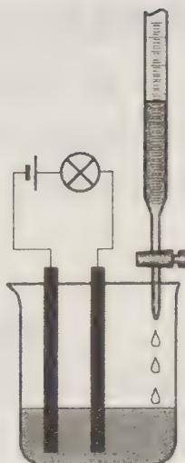

【例 5】（1999 年拉脱维亚化学竞赛试题）5 mL Ag $^{+}$ 浓度为 0.1 mol·L $^{-1}$ 的溶液与等物质的量的碱金属盐反应，待卤化物沉淀后过滤，干燥，得沉淀 X 为 0.01297 g。请确定 X 及写出有关离子方程式。

过程探究 本题容易陷入误区的是认为卤化物沉淀是卤化银 AgX, 这是思维定势的缘故。我们可以根据计算确定加以排除。

$Ag^{+}$ 和碱金属都是呈一价, 所以生成的沉淀的物质的量 = 0.005 × 0.1 = 0.0005 mol; 如果沉淀是银的化合物, 则其质量至少有 143.5 × 0.0005 = 0.07175 g (AgF 不是沉淀, 质量最小的沉淀是 AgCl), 而题中给出的沉淀的质量只有 0.01297 g, 显然 X 不是卤化银。

X 的物质的量也为 0.0005 mol，其摩尔质量为 0.01297/0.0005 = 25.94 g·mol $^{-1}$ ，不可能是氯、溴、碘的化合物，因为它们的相对原子质量已经超过该值，所以只能是氟化物，氟的相对原子质量为 19，故另一种元素的相对原子质量为 25.94 - 19 = 6.94，它是锂元素，因此 X 为 LiF。其离子反应为： $Li^{+} + F^{-} \longrightarrow LiF \downarrow$

参考解答 X 为 LiF, 离子反应: $Li^{+} + F^{-} \longrightarrow LiF \downarrow$

【例 6】（1996 年俄罗斯化学竞赛试题）1.0 g 某金属 X 的硝酸盐的水溶液与 6.0 g 某卤素 Y 的钠盐溶液相互作用，生成溶液 A 和一种质量为 1.0 g 能溶于氨水的白色结晶状沉淀。

(1) 金属 X 和溶液 A 是什么？用计算证明之。

(2) 溶液 A 是否能和硫酸钠、亚硫酸钠和硫化钠等溶液反应?

(3) 写出本题所涉及的全部离子反应。

过程探究 此题考查学生运用计算方法推断物质组成的能力。本题的关键是通过计算确定金属 X 的硝酸盐的水溶液与卤素 Y 的钠盐溶液发生反应的类型。反应类型确定后，两种盐及其生成物便可推出，有关反应也就易于完成了。因为 AgCl 也溶于氨水，所以易将金属阳离子与卤素阴离子的反应误认为 $Ag^{-}$ 与 $Cl^{-}$ 的反应。金属阳离子与卤素阴离子发生氧化还原反应的情况可从 $Fe^{3+}$ 与 $I^{-}$ 的反应中得到启示，并通过严格计算，得出正确结论。

本题在确定反应物的量、反应类型及 $X^{n+}$ 和Y时要分别运用极值法、排除法和讨论法，这些都是值得同学们学习和借鉴的。特别是这种解题思维方法更值得体会和掌握运用。另外，此题判断出X为Cu似乎有些突然，但只要熟悉CuI的性质还是比较容易得出的。

(1) 如果金属 X 的硝酸盐与卤素 Y 的钠盐发生的是复分解反应。与 1 mol 摩尔质量最大的卤素钠盐 $\mathrm{NaI}(150\ \mathrm{g}\cdot\mathrm{mol}^{-1})$ 发生反应所需质量最小的硝酸盐是 $\mathrm{LiNO}_{3}(69\ \mathrm{g}\cdot\mathrm{mol}^{-1})$ 。与 $1.0/69\ mol\ LiNO_{3}$ 反应需 NaI 2.0/69 mol。因为 $2.0/69<6.0/150$ ，故 NaY 过量，生成物的量应由 $\mathrm{X(NO_{3})_{n}}$ 的量确定。

$$
\begin{array}{l l} \mathrm {X(NO_ {3}) _ {n}} + n \mathrm{NaY} \longrightarrow n \mathrm {NaN O _ {3}} + \mathrm {XY_ {n}} \\ 1. 0 \mathrm{g} & 1. 0 \mathrm{g} \end{array}
$$

即 $M(\mathrm{NO}_3^-) = M_{\mathrm{Y}} = 62\mathrm{g}\cdot \mathrm{mol}^{-1}$ ；无符合 $M_{\mathrm{Y}} = 62\mathrm{g}\cdot \mathrm{mol}^{-1}$ 的卤素，故发生的不是复分解反应。

如果发生氧化还原反应,则反应情况为:

$$
\begin{array}{r l} & \mathrm {X(NO_ {3}) _ {n} + nNaY\longrightarrow nNaN O _ {3} + XY_ {k} +(n - k) / 2Y_ {2}} \\ & 1. 0 \quad 1. 0 \\ & X + 6 2 n \quad X + k Y \end{array}
$$

$X + 62n = X + kY; Y / 62 = n / k,$ 当 $Y$ 是碘时， $n / k = 2$ 。当 $k = 1$ 时，符号 $X$ 为 $\mathrm{Cu}$ 。则反应为： $2\mathrm{Cu(NO_3)_2 + 4NaI \longrightarrow 4NaNO_3 + 2CuI \downarrow + I_2}$ $2\times 188\mathrm{g}$ $4\times 150\mathrm{g}$ $1\mathrm{mol}$ $1.0\mathrm{g}$ $m$ $z$ $m = 1.6\mathrm{g}$ $z = 0.003\mathrm{mol}$

因为 $(6.0-1.6)/150>0.003$ ，故 $I_{2}$ 与 $I^{-}$ 充分配合为 $I_{3}^{-}$ ，故溶液A为 $NaNO_{3}$ 、 $NaI_{3}$ 、NaI的混合液。

(2) 因 $\mathrm{NaI}_{3}$ 有氧化性, $\mathrm{SO}_{3}^{2-}$ 、 $\mathrm{S}^{2-}$ 具有还原性, $\mathrm{Na}_{2} \mathrm{SO}_{4}$ 不具有还原性, 故溶液 A 可与亚硫酸钠和硫化钠溶液反应, 而不能和硫酸钠反应。

(3) 有关离子反应为:

$$
2 \mathrm{Cu} ^ {2 +} + 4 \mathrm{I} ^ {-} \longrightarrow 2 \mathrm{CuI} \downarrow + \mathrm{I} _ {2}
$$

$$
\mathrm{I} + \mathrm{I} _ {2} \longrightarrow \mathrm{I} _ {3} ^ {-}
$$

$$
\mathrm{I} _ {3} ^ {-} + \mathrm{S} ^ {2 -} \longrightarrow 3 \mathrm{I} ^ {-} + \mathrm{S} \downarrow
$$

$$
\mathrm{I} _ {3} ^ {-} + 2 \mathrm{SO} _ {3} ^ {2 -} \longrightarrow 3 \mathrm{I} ^ {-} + \mathrm{SO} _ {4} ^ {2 -} + \mathrm{SO} _ {2} \uparrow
$$

$$
\mathrm{CuI} + 2 \mathrm{NH} _ {3} \longrightarrow [ \mathrm{Cu(NH} _ {3}) _ {2} ] ^ {+} + \mathrm{I} ^ {-}
$$

## 参考解答 见上述分析

## 【实战演练】

1. 如图所示, 在一只盛有 $\mathrm{Ba(OH)_2}$ 溶液的烧杯中, 漂浮着一个小木块, 若小心地向烧杯中滴加与 $\mathrm{Ba(OH)_2}$ 溶液密度相同的稀硫酸, 静止片刻后, 小木块浸入液体中的体积与原先相比 ( )。
A. 增大
B. 不变
C. 减小
D. 无法判断

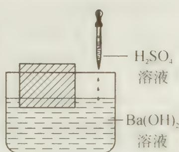

2. 如右图所示, 向烧杯内的溶液 b 中逐滴加入溶液 a 时, 灵敏弹簧秤的读数先逐渐变小, 然后又逐渐变大, 则溶液 a、b 分别是( )。
A. NaOH、 $H_{2}SO_{4}$ B. $BaCl_{2}$ 、 $Na_{2}SO_{4}$ C. $\mathrm{Ba(OH)}_{2}$ 、 $CuSO_{4}$ D. $NH_{3}\cdot H_{2}O$ 、 $CH_{3}COOH$

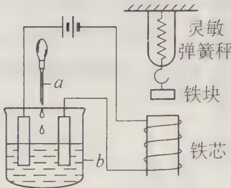

3. 下列实验过程中产生的现象与对应的图形相符的是( )。

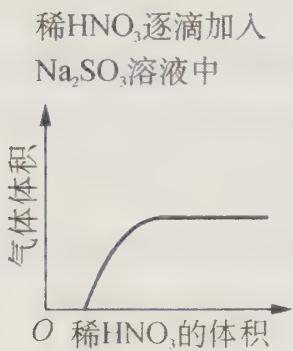  
A

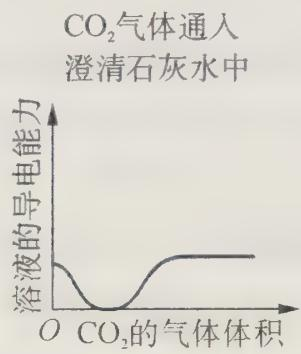  
B

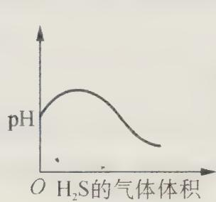  
C

$$
\mathrm{NaOH}
$$

$$
\mathrm{Ba} \left(\mathrm{HCO} _ {3}\right) _ {2}
$$

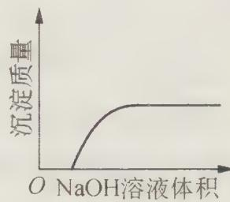  
D

4. 用下列方法测定空气中污染物的含量: 将一定体积的空气通入吸收剂, 并测定其电导的变化(导体的电阻愈大, 它的电导愈小)。如测定 $\mathrm{H}_{2} \mathrm{~S}$ 的含量, 若用 $\mathrm{CuSO}_{4}$ 溶液吸收, 可测定很大浓度范围内的 $\mathrm{H}_{2} \mathrm{~S}$ 的含量, 但电导变化不大; 若用浓溴水吸收, 仅限于测定低浓度范围内 $\mathrm{H}_{2} \mathrm{~S}$ 的含量, 但有很高的灵敏度。现要兼顾吸收容量与灵敏度的情况下测定空气中 $\mathrm{Cl}_{2}$ 的含量, 则应选用下列吸收剂中的 ( )。
A. $\mathrm{Na}_{2} \mathrm{SO}_{3}$ 溶液
B. HI 溶液
C. NaOH 溶液
D. $\mathrm{H}_{2} \mathrm{O}$

5. 在一烧坏中盛有 $100 \, mL \, 2 \, mol/L$ 的硫酸溶液，同时有一表面光滑的塑料小球

悬浮于溶液中央(如图所示)。现向该溶液中缓慢注入0.4 mol/L的 Ba(OH) $_{2}$ 溶液至恰好反应完全,在此实验过程中:
(1) 烧杯里观察到什么现象?
(2) 产生此现象的原因是什么?
(3) 欲使如图状态下的小球浮上液面,简单而又一定奏效的办法是什么?

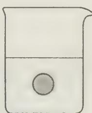

6. 据 2002 年 3 月 5 日的《环球时报》报道: 意大利警方一举摧毁了四名摩洛哥人针对美国驻意大利大使馆的恐怖事件。警方从摩洛哥人的住宅中搜出了 5 kg 爆竹, 2.5 kg 蜡烛和 2 kg K $_{4}$ [Fe(CN) $_{6}$ ]。据审讯, 四名恐怖分子准备将爆竹作炸药, 蜡烛作引爆剂, K $_{4}$ [Fe(CN) $_{6}$ ]在爆炸中可分解成一种剧毒盐 KCN。试根据要求回答下列问题:

(1) 已知爆竹爆炸后, $\mathrm{K}_{4}[\mathrm{Fe}(\mathrm{CN})_{6}]$ 会发生分解, 除生成剧毒盐 KCN 外, 还生成三种稳定的单质。试写出化学反应方程式:

(2) 恐怖分子打算将产生的剧毒盐 KCN 用来污染水源, 含 CN 的污水危害很大。处理该污水时, 可在催化剂 $\mathrm{TiO}_{2}$ 作用下用 NaClO 将 $\mathrm{CN}^{-}$ 氧化成 $\mathrm{CNO}^{-}$ 。CNO 在酸性条件下继续被 NaClO 氧化生成 $\mathrm{N}_{2}$ 与 $\mathrm{CO}_{2}$ 。某环保部门用下图装置进行实验, 以证明该处理方法的有效性并测定 $\mathrm{CN}^{-}$ 被处理的百分率。

将浓缩后含 $CN^{-}$ 的废水与过量 NaClO 溶液的混合液（其中 CN 浓度为 $0.05 \, mol \cdot L^{-1}$ ) 200 mL 倒入甲中，塞上橡皮塞，一段时间后，打开活塞，使溶液全部放入乙中，关闭活塞。

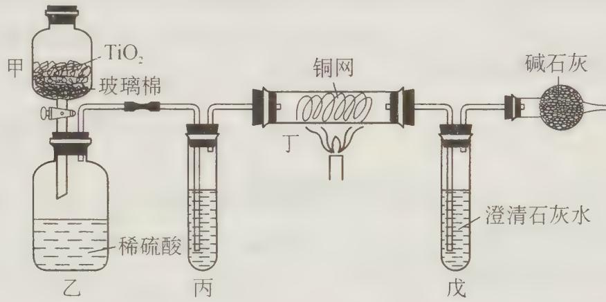

① 甲中反应的离子方程式为\_\_\_\_；乙中反应的离子方程式为\_\_\_\_。

② 乙中生成的气体除 $\mathrm{CO}_{2}$ 、 $\mathrm{N}_{2}$ 外还有 HCl 及副反应生成的 $\mathrm{Cl}_{2}$ 等，上述实验是通过测定 $\mathrm{CO}_{2}$ 的量来确定 $\mathrm{CN}^{-}$ 的处理效果。

丙中加入的除杂试剂是\_\_\_\_（填标号）。
A. 饱和食盐    B. 饱和 $NaHCO_{3}$ 溶液
C. 浓 NaOH 溶液    D. 浓硫酸

丁在实验中的作用是\_\_\_\_。

戊中盛有足量的石灰水,若实验后戊中共生成 0.8 g 沉淀,则该实验中 CN⁻ 被处理的百分率 \_\_\_\_ 80%(填“>”、“=”或“<”)。

7. G、Q、X、Y、Z均为氯的含氧化合物,我们不了解它们的化学式,但知道它们在一定条件下具有如下的转换关系(未配平)。假设氯的含氧化合物若发生氧化还原反应,只有氯元素的化合价发生变化。

① G $\longrightarrow$ Q + NaCl

② $\mathrm{Q} + \mathrm{H}_{2}() \xrightarrow{\text{电解}} \mathrm{X} + \mathrm{H}_{2}$

③ $Y + NaOH \longrightarrow G + Q + H_{2}O$

④ $Z + NaOH \longrightarrow Q + X + H_{2}O$

(1) 试根据所学知识确定 G、Q、X、Y 和 Z 的化学式。

(2) 写出发生上述变化的四个反应方程式(若有离子反应只写离子反应方程式)。

(3) 上述四种含氯化合物中有无酸酐,为什么?

8. 已知 B、D、E 是单质。根据下列关系, 试回答:

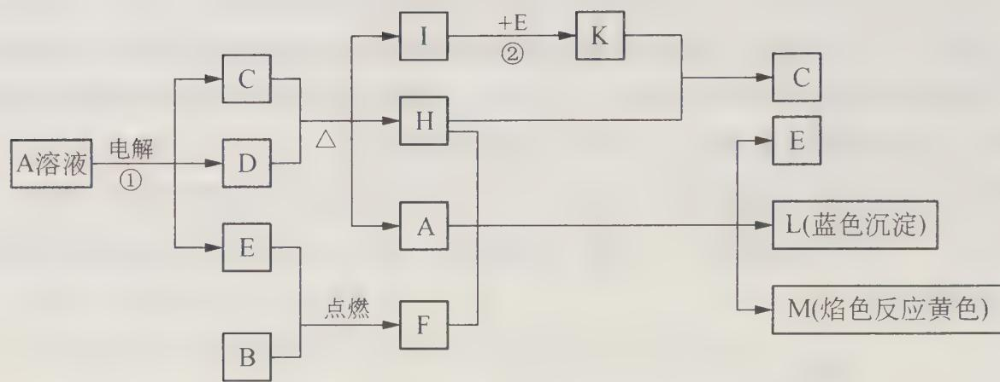

(1) 写出下列物质的化学式

A: \_\_\_\_ , L: \_\_\_\_ , M: \_\_\_\_ ;

(2) F 的电子式: \_\_\_\_ ; K 的空间构型是 \_\_\_\_ ;

(3) 反应①的离子方程式: \_\_\_\_，\_\_\_\_；

(4) 反应②工业上采取的反应条件: \_\_\_\_ ; 原料是否需要进行循环生产: \_\_\_\_ 。

9. 某市有大型的电解铜工厂, 在电解铜的阳极泥中含有 $3\% \sim 14\%$ X 元素, 其余为稀有金属及贵金属。X 和硫同主族, 人体缺少 X, 就会得“克山病”, X 也是制光电池的一种原料。从阳极泥中提取 X 的流程如下:

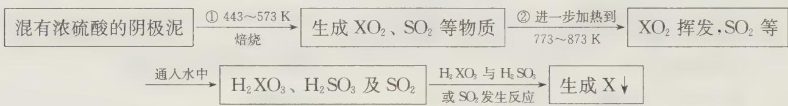

(1) X 的元素符号是\_\_\_\_，它的基态原子核外电子排布式为\_\_\_\_。

(2) 阳极泥中 X 以 X 单质、 $\mathrm{Ag}_{2} \mathrm{~X}$ 、 $\mathrm{Cu}_{2} \mathrm{~X}$ 等型体存在, 则①中 X 与浓硫酸的反应方程式为 \_\_\_\_, $\mathrm{Cu}_{2} \mathrm{~X}$ 与浓硫酸的反应方程式为 \_\_\_\_。

(3) $\mathrm{H}_{2} \mathrm{XO}_{3}$ 与 $\mathrm{SO}_{2}$ 的反应方程式为 \_\_\_\_。

(4) 上述反应有无离子反应？为什么？

10. 在 $SeOF_{6}$ 化合物中, Se 和 O 的实际氧化数分别为 \_\_\_\_、\_\_\_\_; Se 原子采用 \_\_\_\_ 杂化方式, 其几何构型名称是 \_\_\_\_ 。该化合物与苛性碱反应, 其离子方程式为 \_\_\_\_ , 它 \_\_\_\_ (填是或不是) 氧化还原反应。

11. 高铁酸盐是重要化合物。试根据要求作答下列问题：

（1）正六价的高铁酸盐是一种强氧化剂。在酸性溶液中其氧化还原电极电位高达 $1.9\mathrm{V}$ ；在碱性溶液中其氧化还原电极电位也有 $0.9\mathrm{V}$ 。因此被广泛地用于代替高氯酸盐净化水和氧化生成有机化合物的反应。由高铁酸钡与锌组成的碱性干电池，其理论电压超过 $2.0\mathrm{V}$ 。分别写出上述3个反应(或半反应)的离子方程式。

(2) 高铁酸钡可以用电解法进行制备: 以铂为阴极, 铁为阳极, 以饱和 $\mathrm{NaOH} / \mathrm{Ba(OH)}_{2}$ 溶液为电解液, 以某阳离子交换膜为隔膜, 此反应在惰性气体保护下进行。写出电极反应和总反应方程式。

(3) $\mathrm{MnO_2}$ 的掺入可降低高铁酸盐电池的放电电压, 其机理是由于正极掺杂的 $\mathrm{MnO_2}$ 也能发生放电反应, 其放电产物 $\mathrm{Mn_2O_3}$ 可以与 $\mathrm{FeO_4^{2-}}$ 发生化学反应, 原来紫黑色粉末中开始出现铁锈色, 生成的 $\mathrm{MnO_2}$ 可以催化 $\mathrm{FeO_4^{2-}}$ 发生还原反应, 使得其还原电位向 $\mathrm{MnO_2}$ 的还原电位靠拢, 放电电压降低。请写出上面的所有反应式。

(4) 高铁酸盐的浓度是通过铬酸盐氧化法进行确定的。在浓碱溶液中, 过量的三价铬盐定量还原高铁酸盐而自身被氧化为铬酸盐 $\left(\mathrm{CrO}_{4}^{2-}\right)$ , 所生成的铬酸盐经酸化变为重铬酸盐 $\left(\mathrm{Cr}_{2} \mathrm{O}_{7}^{2-}\right)$ , 再用标准的 $\mathrm{Fe}^{2+}$ 溶液滴定。

① 写出上述反应方程式；

② 指出 $FeO_{4}^{2-}$ 与 $Fe^{2+}$ 的计量关系。

12. 为了测定溶液中 $Ba^{2+}$ 的浓度, 做了以下实验: ①称取 $0.1323 \, g \, K_{2}Cr_{2}O_{7}$ 溶于适量的稀硫酸中, 再向其中加入过量的 KI 溶液与之反应, 反应后的溶液加入 $27.00 \, mL \, Na_{2}S_{2}O_{3}$ 溶液时恰好反应完全。②另取 $50.00 \, mL \, Ba^{2+}$ 溶液, 控制适当的酸度, 加入足量 $K_{2}CrO_{4}$ 的溶液, 得黄色沉淀, 沉淀经过滤、洗涤后, 用适量稀盐酸溶解, 再加入过量 KI 与之反应, 反应后再同上述 $Na_{2}S_{2}O_{3}$ 溶液反应, 反应完全时, 消耗 $Na_{2}S_{2}O_{3}$ 溶液 $24.00 \, mL(I_{2} + 2Na_{2}S_{2}O_{3} \longrightarrow Na_{2}S_{4}O_{6} + 2NaI)$ 。

(1) 配平离子方程式: $\mathrm{Cr}_{2} \mathrm{O}_{7}^{2-} + \mathrm{I}^{-} + \mathrm{H}^{+} \longrightarrow \mathrm{Cr}^{3+} + \mathrm{I}_{2} + \mathrm{H}_{2} \mathrm{O}$ 。

(2) 黄色沉淀是\_\_\_\_，写出盐酸溶解该沉淀的离子反应方程式\_\_\_\_。

（3）预测 $\mathrm{KMnO_4}$ 和 $\mathrm{K}_2\mathrm{Cr}_2\mathrm{O}_7$ 酸性条件下的氧化性强弱，并用本题有关的理由说明。

(4) 上述两步可用\_\_\_\_作指示剂, 其现象\_\_\_\_。

(5) 试计算溶液中 $\mathrm{Ba}^{2+}$ 的物质的量浓度。

# 第 4 讲 化学反应中的能量变化

## 【知识要点】

## 一、化学反应中的能量变化及其表示方法

化学反应的过程总伴随着能量的变化,能量变化是化学反应的推动力。换言之,化学反应总是从能量高的状态转化成能量低的状态,因此,一般说来,自发进行的反应为放热反应。如何定性判断一种物质的能量高低呢?我们可以通过该物质的结构是否对称来判断。若物质的结构对称,则该物质的内能较低,在通常情况下化学性质不活泼;若物质的结构不对称,则该物质一般可以通过氧化还原反应将不对称结构变为对称结构。

## 1. 热化学方程式

热化学方程式是表示化学反应与反应热关系的方程式。化学反应中伴随的放出或吸收的热量，通常用 $\Delta H$ 表示，其单位为 $\mathrm{kJ} \cdot \mathrm{mol}^{-1}$ 。例如热化学方程式：

$$
\mathrm{H} _ {2} (\mathrm{g}) + \mathrm{I} _ {2} (\mathrm{g}) \longrightarrow 2 \mathrm{HI} (\mathrm{g}); \quad \Delta H = - 2 5. 9 \mathrm{kJ} \cdot \mathrm{mol} ^ {- 1}
$$

该式表示在标准状态下， $1\ \text{mol}\ \text{H}_{2}(g)$ 和 $1\ \text{mol}\ \text{I}_{2}(g)$ 完全反应生成 $2\ \text{mol}\ \text{HI}(g)$ ，反应放热 $25.9\ \text{kJ}$ 。

我们把环境对体系做功记为“+”值(吸收能量), 体系对环境做功记为“-”值(放出能量)。

书写和应用热化学方程式时必须注意以下几点：

① 明确写出反应的计量方程式,各物质化学式前的化学计量系数可以是整数,也可以是分数。

② 各物质化学式右侧用圆括弧()表明物质的聚集状态。可以用 g、l、s 分别代表气态、液态、固态。固体有不同晶态时, 还需将晶态注明, 例如 S(斜方), S(单斜), C(石墨), C(金刚石)等。

③ 反应热与反应方程式相互对应。若反应式的书写形式不同，则相应的化学计量系数不同，故反应热亦不同。如：

$$
\mathrm{H} _ {2} (\mathrm{g}) + \frac {1}{2} \mathrm{O} _ {2} (\mathrm{g}) \longrightarrow \mathrm{H} _ {2} \mathrm{O} (\mathrm{g}); \Delta H = - 2 4 1. 8 \mathrm{kJ} \cdot \mathrm{mol} ^ {- 1}
$$

$$
\mathrm{H} _ {2} (\mathrm{g}) + \frac {1}{2} \mathrm{O} _ {2} (\mathrm{g}) \longrightarrow \mathrm{H} _ {2} \mathrm{O} (\mathrm{l}); \Delta H = - 2 8 5. 8 \mathrm{kJ} \cdot \mathrm{mol} ^ {- 1}
$$

$$
\mathrm{或} 2 \mathrm{H} _ {2} (\mathrm{g}) + \mathrm{O} _ {2} (\mathrm{g}) \longrightarrow 2 \mathrm{H} _ {2} \mathrm{O} (\mathrm{g}); \Delta H = - 4 8 3. 6 \mathrm{kJ} \cdot \mathrm{mol} ^ {- 1}
$$

$$
2 \mathrm{H} _ {2} (\mathrm{g}) + \mathrm{O} _ {2} (\mathrm{g}) \longrightarrow 2 \mathrm{H} _ {2} \mathrm{O} (\mathrm{l}); \Delta H = - 5 7 1. 6 \mathrm{kJ} \cdot \mathrm{mol} ^ {- 1}
$$

根据能量守恒定律,生成水时放出的热量必然等于分解相同数量的水时所吸收的热量。即: $\mathrm{H}_{2}\mathrm{O}(1)\longrightarrow\mathrm{H}_{2}(\mathrm{g})+\frac{1}{2}\mathrm{O}_{2}(\mathrm{g})$ ; $\Delta H=+285.8\ kJ\cdot mol^{-1}$

因此电解水时用来分解 $1 \, \text{mol(l)} \, H_{2}\text{O}$ 使之变成 $1 \, \text{mol} \, H_{2}(g)$ 和 $0.5 \, \text{mol} \, O_{2}(g)$ 所消耗的电能约为 $285.8 \, kJ$ 。

## 2. 燃烧热

在 $25^{\circ}$ C、101 kPa 时，1 mol 可燃物完全燃烧生成稳定的化合物时所放出的热量，叫做该物质的燃烧热。其定义要点是：

①规定在 101 kPa 压强下测出热量, 因为压强不定, 反应热数值不相同。②规定可燃物物质的量为 1 mol。③规定可燃物完全燃烧生成稳定化合物所放出的热量为标准。④若未指明状态, 则默认为 25℃, 1 atm。

需要注意的是:燃烧热是以 1 mol 可燃物作为标准来进行测定的,因此在计算燃烧热时,热化学方程式里其他物质的化学计量数常出现分数:

$$
\mathrm{如} \mathrm{H} _ {2} (\mathrm{g}) + \frac {1}{2} \mathrm{O} _ {2} (\mathrm{g}) \longrightarrow \mathrm{H} _ {2} \mathrm{O(l)}; \Delta H = - 2 8 5. 8 \mathrm{kJ} \cdot \mathrm{mol} ^ {- 1}
$$

1 mol 固态碳(一般指石墨,因为石墨是最稳定的碳单质)在氧气中完全燃烧生成 $1 \, mol CO_{2}$ 气体,放出热量是 $393.3 \, kJ$ ,其热化学方程式为:

$$
\mathrm{C} (\text {石墨}) + 1 / 2 \mathrm{O} _ {2} (\mathrm{g}) \longrightarrow \mathrm{CO} _ {2} (\mathrm{g}); \Delta H = - 3 9 3. 3 \mathrm{kJ} \cdot \mathrm{mol} ^ {- 1}
$$

## 3. 生成热

化合物的生成热是指由稳定单质化合生成 1 mol 化合物的恒压反应热, 称为该化合物的生成热。为了进行统一的计算和比较, 往往用标准生成热, 即在指定温度时, 101 kPa 下, 由稳定单质生成 1 mol 化合物时的反应热, 就是该温度时化合物的标准生成热, 以符号 $\Delta_{\mathrm{f}} H$ 表示。使用时注意: 习惯上用 $25^{\circ} \mathrm{C}$ 时的数值, 用符号 $\Delta_{\mathrm{f}} H^{\ominus}$ 表示。 $\Delta_{\mathrm{f}} H^{\ominus}$ 代数值越负 (小), 表示该化合物越稳定。稳定单质的标准生成热等于零。

例如： $1/2\mathrm{H}_{2}(\mathrm{g})+1/2\mathrm{Cl}_{2}(\mathrm{g})\longrightarrow\mathrm{HCl}(\mathrm{g})$ ； $\Delta H=-94.7\ kJ\cdot mol^{-1}$ ，则HCl的标准生成热为 $-94.7\ kJ\cdot mol^{-1}$ 。

## 4. 中和热

在稀溶液中,酸与碱发生中和反应生成 $1 \, mol \, H_{2}O$ , 这时的反应热就是中和热。中和反应的实质是: $\mathrm{H}^{+} + \mathrm{OH}^{-} \longrightarrow \mathrm{H}_{2}\mathrm{O}$ 。当强酸与强碱在稀溶液中发生中和反应时, 都有: $\mathrm{H}^{+}(\mathrm{aq}) + \mathrm{OH}^{-}(\mathrm{aq}) \longrightarrow \mathrm{H}_{2}\mathrm{O}(\mathrm{l})$ ; $\Delta H = -57.3 \, kJ \cdot mol^{-1}$ 。aq 表示水溶液。

其定义要点是：

① 必须是酸和碱的稀溶液，因为浓酸溶液和浓碱溶液在相互稀释时会放热。

② 强酸和强碱的稀溶液反应才能保证 $\mathrm{H}^{+}(\mathrm{aq})+(\mathrm{OH})(\mathrm{aq})\longrightarrow\mathrm{H}_{2}\mathrm{O}(\mathrm{l})$ 中和热均为 $57.3\ kJ\cdot mol^{-1}$ ，而弱酸或弱碱在中和反应中由于电离吸收热量，其中和热小于 $57.3\ kJ\cdot mol^{-1}$ 。

③ 以生成 1 mol 水为基准。

需要注意的是：

① 中和热是以生成 $1 \, mol \, H_{2}O$ 所放出的热量来测定的，因此书写它们的热化学方程式时，应以生成 $1 \, mol$ 水为标准来配平其余物质的化学计量数，例如：

$$
\begin{array}{r l} & \mathrm {KOH(aq) + \frac {1}{2} H_ {2} SO_ {4} (aq)\longrightarrow \frac {1}{2} K_ {2} SO_ {4} (aq)+ H_ {2} O(l)} \\ & \Delta H = - 5 7. 3 \mathrm{kJ} \cdot \mathrm{mol} ^ {- 1} \end{array}
$$

② 中和反应时,由于所用的酸和碱有强弱不同,又有一元、二元或多元之分,因而中和热各不相同。

a. 一元强酸与一元强碱的中和热为 $-57.3 \mathrm{~kJ} \cdot \mathrm{mol}^{-1}$ 。即离子方程式要满足 $\mathrm{H}^{+} + \mathrm{OH}^{-} \longrightarrow \mathrm{H}_{2} \mathrm{O}$ 。

## b. 一元强酸与一元弱碱或一元弱酸与一元强碱的中和热

若有一元弱酸或弱碱参加中和反应,其中和热所放出热量一般都低于 $57.3\ kJ\cdot mol^{-1}$ ,也有个别高于 $57.3\ kJ\cdot mol^{-1}$ 的。这主要取决于弱酸或弱碱电离时吸热还是放热。

一般地说,弱酸或弱碱的电离是吸热的,因此,中和反应所放出的热量还要扣除电离时吸收的那部分热量,中和热也就低于 $57.3 \, kJ \cdot mol^{-1}$ 。例如,1 mol $CH_{3}COOH$ 跟 1 mol NaOH 溶液反应时,中和热是 $56.0 \, kJ \cdot mol^{-1}$ 。有的弱电解质电离时是放热的。例如,1 mol 氢氟酸电离时放出 $10.4 \, kJ \cdot mol^{-1}$ 热量。当它跟 1 mol NaOH 溶液反应时,中和热是 $67.7 \, kJ \cdot mol^{-1}$ 。

## c. 二元酸与一元强碱的中和热

二元酸的电离是分两步进行的,两个 $H^{+}$ 的中和热各不相同。中和第一个 $H^{+}$ 的中和热,等于 $57.3\ kJ \cdot mol^{-1}$ 减去二元酸电离出第一个 $H^{+}$ 所吸收的热量 $\Delta H_{1}$ ; 中和第二个 $H^{+}$ 的中和热,等于 $57.3\ kJ \cdot mol^{-1}$ 减去二元酸电离出第二个 $H^{+}$ 所吸收的热量 $\Delta H_{2}$ 。因此,二元酸跟一元强碱的中和热 $\Delta H$ 可用下式表示: $\Delta H = -[2 \times 57.3\ kJ \cdot mol^{-1} - (\Delta H_{1} + \Delta H_{2})]$

## d. 多元酸与一元强碱的中和热

三元酸与一元强碱的中和热为 $\Delta H$ ，三元酸里的三个 $\mathrm{H}^{+}$ 电离时所吸收的热量依次是 $\Delta H_{1}$ 、 $\Delta H_{2}$ 、 $\Delta H_{3}$ ，则得： $\Delta H = -[3 \times 57.3 \mathrm{~kJ} \cdot \mathrm{mol}^{-1} - (\Delta H_{1} + \Delta H_{2} + \Delta H_{3})]$

## 5. 盖斯定律

瑞士化学家盖斯(Hess, G. H.)总结了大量热化学实验数据，于1840年得出一个结论：“定压或定容条件下的任意化学反应，在不做其他功时，不论是一步完成的还是几步完成的，其反应热的总值相等。”换言之，化学反应的反应热( $\Delta H$ )只与反应体系的始态和终态有关，而与反应途径无关。

若反应 1=3(反应 2)+2(反应 3)，则 $\Delta H_{1}=3\Delta H_{2}+2\Delta H_{3}$

使用该定律要注意：

① 盖斯定律只适用于等温等压或等温等容过程,各步反应的

盖斯，G.H.

温度应相同；

② 热效应与参与反应的各物质的本性、聚集状态、完成反应的物质数量, 反应进行的方式、温度、压力等因素均有关, 这就要求涉及的各个反应式必须是严格完整的热化学方程式。

③ 各步反应均不做非体积功。

④ 各步涉及的同一物质应具有相同的聚集状态。

利用盖斯定律可以确定难以测定的热效应。例如：C 与 $O_{2}$ 反应生成 CO 的热效应，由于反应很难控制，因此很难用实验的方法确定，但我们可用 C 与 $O_{2}$ （过量）反应生成 $CO_{2}$ 的热效应 $Q_{1}$ ，以及 CO 与 $O_{2}$ 反应的热效应 $Q_{2}$ ，( $Q_{1}$ 和 $Q_{2}$ 用实验很容易判断)，很容易确定 C 与 $O_{2}$ 反应生成 CO 的热效应。图示如下：

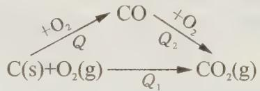

$Q+Q_{2}=Q_{1}$ ，即 $Q=Q_{1}-Q_{2}$ 。

【例 1】已知 $25^{\circ}$ C、101 kPa 下，石墨、金刚石燃烧的热化学方程式分别为

$\mathrm{C(石墨)} + \mathrm{O}_2(\mathrm{g}) \longrightarrow \mathrm{CO}_2(\mathrm{g})$ $\Delta H = -393.51 \mathrm{~kJ} \cdot \mathrm{mol}^{-1}$

①

$$
) + \mathrm{O} _ {2} (\mathrm{g}) \longrightarrow \mathrm{CO} _ {2} (\mathrm{g}) \quad \Delta H = - 3 9 5. 4 1 \mathrm{kJ} \cdot \mathrm{mol} ^ {- 1}\tag{②}
$$

试回答下列问题：

(1) 据此判断,下列说法中正确的是( )。
A. 由石墨制备金刚石是吸热反应;等质量时,石墨的能量比金刚石的低
B. 由石墨制备金刚石是吸热反应;等质量时,石墨的能量比金刚石的高
C. 由石墨制备金刚石是放热反应;等质量时,石墨的能量比金刚石的低
D. 由石墨制备金刚石是放热反应;等质量时,石墨的能量比金刚石的高

(2) $1 \mathrm{~mol}$ 石墨转化为 $1 \mathrm{~mol}$ 金刚石的热效应是多少？该值说明什么问题？

(3) 已知碳的同素异形体除了金刚石和石墨外, 还有 $C_{60}$ , 它们的密度分别是 3.514、2.266、1.678 g·cm $^{-3}$ ; 标准生成热依次是 +1.987、0、+2280 kJ·mol $^{-1}$ 。试回答:

① 标准状况下最稳定的碳单质是\_\_\_\_，理由是\_\_\_\_；

② 由石墨转化成金刚石的条件是\_\_\_\_温\_\_\_\_压(填“高或低”),理由是\_\_\_\_;

③ 由石墨转化成 $C_{60}$ 的条件是 \_\_\_\_ 温 \_\_\_\_ 压（填“高或低”），理由是 \_\_\_\_；

④ 能够溶于有机溶剂的碳单质是\_\_\_\_，理由是\_\_\_\_；

⑤ 在死火山口常能发现的碳单质是\_\_\_\_，理由是\_\_\_\_；在星际空间有望发现的碳单质是\_\_\_\_，理由是\_\_\_\_。

过程探究 （1）上述热化学反应方程式表明：1 mol 石墨完全燃烧放出 393.51 kJ 的热量，而 1 mol 金刚石完全燃烧放出 395.41 kJ 的热量，这说明金刚石的内能高，放出的热量才多！而内能高则不稳定，因此，石墨比金刚石稳定。将方程式①减去方程式②得：

$$
\mathrm{C} (\text {石墨}) \longrightarrow \mathrm{C} (\text {金刚石}) \quad \Delta H = (- 3 9 3. 5 1) - (- 3 9 5. 4 1) = 1. 9 \mathrm{kJ} \cdot \mathrm{mol} ^ {- 1} > 0
$$

这说明:石墨转化为金刚石需要吸收能量,因此选项为 A。

(2) 由前面分析知: $1 \mathrm{~mol}$ 石墨转化为 $1 \mathrm{~mol}$ 金刚石需要吸收 $1.9 \mathrm{~kJ}$ 的能量, 该值为石墨转化为金刚石的异构化能。

(3) ① 我们可以从标准生成热来确定稳定性强弱。若生成热的代数值越负, 则物质越稳定, 反之则越不稳定。因此石墨最稳定。

② 从石墨转化为金刚石的热效应以及石墨和金刚石的密度,我们不难得出正确答案。

③ 从石墨和金刚石的生成热和密度也不难得出答案。

④ 物质的溶解性与分子的极性及其晶体结构有关。一般满足相似相溶原理:若溶质分子的结构与溶剂分子的结构相似,则易溶,极性分子的溶质易溶于极性分子的溶剂中;非极性分子的溶质易溶于非极性分子的溶剂中。除此之外,溶质分子的晶体结构也会影响其溶解性。若物质结构对称,晶格能(概念自学)大,则溶剂分子进行溶剂化较为困难,溶解度小。

⑤ 该问题是前面四问的应用。

## 参考解答 (1) A

(2) $1 \mathrm{~mol}$ 石墨转化为 $1 \mathrm{~mol}$ 金刚石的热效应是 $1.9 \mathrm{~kJ}$ , 该值为石墨转化为金刚石的异构化能。

（3）①最稳定单质为石墨。因为石墨的标准生成热为零，根据标准生成热的定义可得。

② 石墨转化成金刚石要高温高压。因金刚石的密度大于石墨的密度，高压有利于转化；又因金刚石的标准生成热为正，石墨转化成金刚石要吸热，高温有利。

③ 石墨转化成 $C_{50}$ 要高温低压。因石墨转化成 $C_{60}$ 要吸热，高温有利；又因 $C_{60}$ 密度小于石墨的密度，低压有利。

④ 能溶于有机试剂的是 $C_{60}$ ，原因是 $C_{60}$ 是分子晶体。

⑤ 在死火山口常能发现金刚石, 因为火山口温度高, 岩浆喷射时压强大, 地壳中的石墨随岩浆喷出时易转化成金刚石; 某些星际空间温度高, 同时大气层稀薄, 即压强低, 有利于 $\mathrm{C}_{60}$ 的生成。

【例 2】称取等质量 $(a\ g)$ 胆矾两份。把一份溶于b g水中，测知溶解时吸收了 $q_{1}$ J热量；把另一份胆矾加热脱去结晶水，冷却后溶于b g水中，溶解时释放 $q_{2}$ J热量。 $(q_{1}, q_{2}$ 为正）

(1) 胆矾的溶解热为 \_\_\_\_ J·mol $^{-1}$ ，是 \_\_\_\_ 热过程；

(2) 无水硫酸铜溶解热为 \_\_\_\_ J·mol $^{-1}$ ，是 \_\_\_\_ 热过程；

(3) 从以上数据可知 $\mathrm{CuSO}_4$ 与 $\mathrm{H}_2\mathrm{O}$ 结合成 $\mathrm{CuSO}_4 \cdot 5\mathrm{H}_2\mathrm{O}$ 热效应为 \_\_\_\_ J·mol $^1$ ，是 \_\_\_\_ 热过程；

过程探究 溶解热是指 1 mol 物质溶于水吸收或放出的热量。本小题(1)、(2)只将胆矾的质量化为物质的量即可求得。两小题的热效应之差即为胆矾与无水硫酸铜之间的热效应。

参考解答（1） $250q_{1} / a$ ，吸；（2） $-250q_{2} / a$ ，放；（3） $\mathrm{CuSO_4}$ 与 $\mathrm{H}_2\mathrm{O}$ 结合成 $\mathrm{CuSO_4\cdot 5H_2O}$ 热效应为 $-250(q_{1} + q_{2}) / a$ ，放热

## 二、化学热力学的基本概念

## 1. 状态函数

描述体系状态的物理量叫做状态函数,例如 p、V、T、n、H、G、S 等。状态函数的特征是:体系状态一定,状态函数有一定的值;状态改变,函数的值随之改变。状态函数的改变值,等于终态下的函数值减去始态下的函数值,也就是说,状态函数的改变值只与始态和终态有关,而与变化途径无关。

## 2. 热力学第一定律

热力学第一定律就是能量守恒定律。能量虽然守恒，但可以转换形式。如果一个体系处于一特定状态(始态)的内能为 $U_{1}$ ，向此体系增加一定量的热能Q，体系对环境作一定的功W后，体系达到另一状态(终态)，其内能为 $U_{2}$ 。根据能量守恒定律有： $U_{2}=U_{1}+Q-W$ ，即 $\Delta U=U_{2}-U_{1}=Q-W$ 。这便是热力学第一定律的数学表达式。内能U是体系内部含有的能量总和。内能也是一种状态函数。

## 3. 焓、焓变、反应热

热力学将 $(U+pV)$ 定义为一个状态函数，叫做焓H，即 $H=U+pV$ 。焓可以认为是物质的热含量。化学反应中的吸热或放热现象，就意味着反应物和生成物各自有不同的热含量。恒压下体系发生化学反应时的热效应叫做反应焓变 $\Delta H$ ，可用下式表示： $\Delta H=H_{生成物}-H_{反应物}+p\Delta V$ 。当体积变化可以忽略时，则 $p\Delta V=0,\quad\Delta H\approx\Delta U$ 。

若 $\Delta H<0$ 为放热反应,体系向环境放热;

若 $\Delta H > 0$ 为吸热反应,体系从环境吸热。

反应热也叫化学反应热效应,它是指反应物和生成物具有相同温度,并且反应过程中体系只对抗外压做膨胀功时,化学反应所放出或吸收的热量。

标准反应焓变 $\Delta H^{\circ}$ 是指各物质处于标准状态时，化学反应的焓变。人们规定物质的标准状态为：在 1 atm 下的纯气体、纯液体或纯固体物质。反应温度可以任意选定，一般选用 $25^{\circ}C$ 为标准温度，如果温度不是 $25^{\circ}C$ ，则必须注明，例如 $\Delta H_{T}$ 。

标准生成焓(或标准生成热) $\Delta H_{f}$ ：由单质生成某一物质的反应叫做生成反应。在给定温度和标准状态下，由最稳定单质生成一摩尔某物质时的焓变，叫做该物质的标准生成焓，也叫做标准生成热。规定在标准状态下，稳定单质的生成热为零。一些物质的 $\Delta H_{f}^{\ominus}$ 在手册中可以查到。有了 $\Delta H_{f}^{\ominus}$ 可用于计算 $\Delta H^{\ominus}$ 。

标准燃烧焓 $\Delta H_{c}^{\ominus}$ : 在给定温度和标准状态下, 1 mol 某物质与氧完全反应时所放出的热量 [碳、氢、硫等最终产物是 $\mathrm{CO}_{2}(\mathrm{~g})$ 、 $\mathrm{H}_{2}\mathrm{O}(\mathrm{l})$ 、 $\mathrm{SO}_{2}(\mathrm{~g})$ 等], 叫做该物质的标准燃烧焓或标准燃烧热。一般从手册上可以查到。有了 $\Delta H_{c}^{\ominus}$ 可用于计算 $\Delta H^{\ominus}$ 或 $\Delta H_{f}^{\ominus}$ 。

## 4. 熵 S

体系倾向于取得最大的混乱度,这是一条重要的自然定律。熵是体系内部质点运动混乱度的量度。物质的混乱度越大,它的熵值越大。熵是一个状态函数。体系的状态一定,其熵值也一定。体系从始态 $(S_{1})$ 变到终态 $(S_{2})$ 时,则熵变 $\Delta S=S_{2}-S_{1}$ 。在绝对零度下,任何纯物质完整晶体的熵值等于零。在标准状态下1 mol物质的熵叫做标准熵 $S^{\ominus}$ 。同一物质 $S_{气}^{\ominus}>S_{液}^{\ominus}>S_{固}^{\ominus}$ 。体系中从反应物变到生成物时,化学反应的标准熵变 $\Delta S^{\ominus}$ 可表示为: $\Delta S^{\ominus}=\sum S_{生成物}-\sum S_{反应物}$ 。对于状态相同的物质,一般分子量大, $S^{\ominus}$ 大。

## 5. 自由焓 G、化学反应方向和程度

(1) 自由焓和自由焓变。自由焓定义为: $G = H - TS$ , 它是一个状态函数。状态变化时自由焓变化用 $\Delta G$ 表示。恒温恒压下进行化学反应时, 自由焓变为 $\Delta G = \Delta H - T \Delta S$ 。当反应物和生成物都处于标准状态下, 反应的自由焓变叫做标准自由焓变, 用 $\Delta G^{\ominus}$ 表示。当温度不为 $25^{\circ} \mathrm{C}$ 时, 用 $\Delta G_{\mathrm{f}}^{\ominus}$ 表示。恒温恒压下, 体系的自由焓降低就是能做出的最大有用功。

## (2) 判断反应方向的依据—自由焓变。

在恒温恒压下,反应自发进行的方向,就是体系自由焓减小的方向。即:

当 $\Delta G<0$ ，正反应自发进行，逆反应不能自发进行； $\Delta G>0$ ，正反应不能自发进行，逆反应自发进行； $\Delta G=0$ ，体系处于平衡状态。所谓自发进行的反应，是指无需外力帮助就可自动发生的反应。如果需借助外力才能使反应进行，则此反应是非自发的。

从 $\Delta G = \Delta H - T\Delta S$ （吉布斯一霍姆赫兹方程）可见， $\Delta G$ 由焓变项和熵变项决定。化学反应方向受 $\Delta H, \Delta S$ 和温度 $T$ 的影响。列表如下：

<table><tr><td>ΔH</td><td>ΔS</td><td>ΔG及反应方向</td><td>举例</td></tr><tr><td>(-)焓减</td><td>(+)熵增</td><td>ΔG&lt;0任何温度均自发</td><td> $2H_{2}O_{2}(g) \longrightarrow 2H_{2}O(g) + O_{2}(g)$ </td></tr><tr><td>(+)焓增</td><td>(-)熵减</td><td>ΔG&gt;0任何温度均不自发</td><td> $CO(g) \longrightarrow C(s) + \frac{1}{2}O_{2}(g)$ </td></tr><tr><td>(+)焓增</td><td>(+)熵增</td><td>常温 ΔG&gt;0只在高温下自发高温 ΔG&lt;0</td><td> $CaCO_{3}(s) \longrightarrow CaO(s) + CO_{2}(g)$ </td></tr><tr><td>(-)焓减</td><td>(-)熵减</td><td>常温 ΔG&lt;0只在常温下自发高温 ΔG&gt;0</td><td> $HCl(g) + NH_{3}(g) \longrightarrow NH_{4}Cl(s)$ </td></tr></table>

当 $\Delta S \rightarrow 0$ ，则 $\Delta G \approx \Delta H$ ，可用 $\Delta H$ 来判断反应方向，即放热反应是自发的。

当 $\Delta H=0$ (绝热条件下)，可从熵效应判别反应方向，即熵增的反应是自发的。

应当指出:反应方向的近似判断可用 $\Delta G^{\ominus}$ ，尤其是 $\Delta G^{\ominus}$ 的绝对值较大的反应；熵因素起主要作用的吸热反应是自发的。

## (3) 标准生成自由焓 $\Delta G_{f}^{\ominus}$

在给定的温度和标准状态下,由稳定单质生成 1 mol 纯物质时反应的自由焓变,叫做标准生成自由焓。 $\Delta G_{f}^{\ominus}$ 的负值越大,该化合物就越稳定。物质的 $\Delta G_{f}^{\ominus}$ 数据可查手册而得。利用 $\Delta G_{f}^{\ominus}$ 数据,可计算反应的自由焓变化: $\Delta G^{\ominus} = \sum \Delta G_{f}^{\ominus}$ 生成物 $-\sum \Delta G_{f}^{\ominus}$ 反应物。

(4) $\Delta G$ 与反应进行程度。 $\Delta G$ 负值越大, 表明反应的推动力越大, 反应进行越完全。它与化学平衡常数的联系如下: $\Delta G^{\ominus} = -RT\ln K = -2.303RT\lg K$ 。式中, $K$ 表示该反应的化学平衡常数。从反应的 $\Delta G^{\ominus}$ 可计算 $K$ , 从而衡量反应完成的程度。 $K$ 越大, $\Delta G^{\ominus}$ 的负值也越大。

对氧化还原平衡,则有 $\Delta G^{\ominus} = -nF\varepsilon^{\ominus}$ 。 $\varepsilon^{\ominus}$ 是标准电动势。当 $\Delta G^{\ominus} < 0$ , 则 $\varepsilon^{\ominus} > 0$ , 氧化还原反应可按指定电池反应方向自发进行。

应当指出,对大多数化学反应, $\Delta H^{\ominus}$ 和 $\Delta S^{\ominus}$ 随温度变化的幅度很小,所以在一般近似计算中,尽管T在改变,仍可采用 $\Delta H_{298}^{\ominus}$ 和 $\Delta S_{298}^{\ominus}$ 的数值。

【例 3】辉钼矿 $\left(\mathrm{MoS}_{2}\right)$ 是钼最重要的矿物。下图是辉钼矿多层焙烧炉的示意图，其中1,2,3,…是炉层编号；580,600,610,…是各炉层的温度(℃)。图中给出了各炉层的固态物料的摩尔百分组成。例如，图中示出第6号炉层上 $MoO_{3}$ ， $MoO_{2}$ 和 $MoS_{2}$ 的摩尔百分比约为20%，60%和20%(总计为100%)。

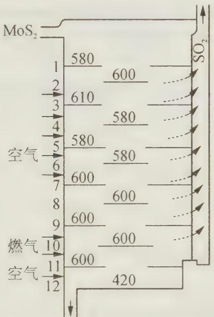

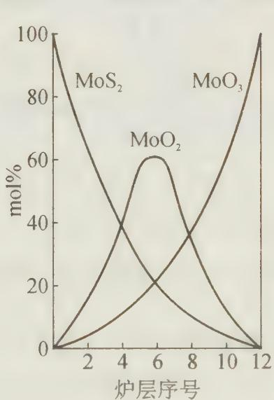

已知 $MoS_{2}$ 焙烧生成 1 mol $MoO_{3}$ 的反应热 (900 K) 为 $-1011\ kJ \cdot mol^{-1}$ ， $MoO_{2}$ 氧化生成 1 mol $MoO_{3}$ 的反应热为 $-154\ kJ \cdot mol^{-1}$ 。试通过计算或分析回答：

(1) 图中表明可能存在一种固一固反应,请写出该反应。

(2) 用存在固一固反应的假设来解释焙烧炉中层炉温的变化。

过程探究 本题表面上看属于工业化学,但实质上不属于工业化学中的传质、传热的计算。从试题的考查知识点看,属于化学热力学方面的问题;从试题设计思想看,本题意在考查选手对图、表、数据的观察、分析、假设、论证的能力,这种命题思想无疑是非常必要的。

$\mathrm{MoS}_2$ 氧化后产物之一 $\mathrm{SO}_2$ 可由图中逸出的气体确定，也可由 $\mathrm{MoS}_2$ （辉钼矿焙烧）确定，由题目给出的信息知：

$$
① \mathrm{MoS} _ {2} + 3. 5 \mathrm{O} _ {2} \longrightarrow \mathrm{MoO} _ {3} + 2 \mathrm{SO} _ {2} \quad \Delta H _ {1} ^ {\ominus} = - 1 0 1 1 \mathrm{kJ} \cdot \mathrm{mol} ^ {- 1}
$$

$$
② \mathrm{MoO} _ {2} + 0. 5 \mathrm{O} _ {2} \longrightarrow \mathrm{MoO} _ {3} \quad \Delta H _ {2} ^ {\ominus} = - 1 5 4 \mathrm{kJ} \cdot \mathrm{mol} ^ {- 1}
$$

对照图进行分析,为什么中层炉温较低?从摩尔百分组成图领悟到,中层 $MoS_{2}$ 、 $MoO_{3}$ 含量减少, $MoO_{2}$ 含量增加, 炉内应该发生了一个从未学过的, 在几乎所有教科书上均未提及的反应:

$$
③ \mathrm{MoS} _ {2} + 6 \mathrm{MoO} _ {3} \longrightarrow 7 \mathrm{MoO} _ {2} + 2 \mathrm{SO} _ {2} \quad \Delta H _ {3} ^ {\ominus}
$$

假设存在这一固-固反应,根据盖斯定律:①-②×7=③式得:

$\Delta H_{3}^{\ominus} = \Delta H_{1}^{\ominus} - \Delta H_{2}^{\ominus} \times 7 = -1101 - (-154) \times 7 = 67 \mathrm{~kJ} \cdot \mathrm{mol}^{-1}$ 。该反应是吸热反应，因中层发生反应③，故炉温较低。

参考解答 (1) $\mathrm{MoS}_2 + 6\mathrm{MoO}_3 \longrightarrow 7\mathrm{MoO}_2 + 2\mathrm{SO}_2$

(2) 上述反应是吸热反应, 故炉温较低。

## 【竞赛对接】

【例1】（2007年全国初赛试题） $\mathrm{KClO_3}$ 热分解是实验室制取氧气的一种方法。 $\mathrm{KClO_3}$ 在不同的条件下热分解结果如下：

<table><tr><td>实验</td><td>反应体系</td><td>第一放热温度/°C</td><td>第二放热温度/°C</td></tr><tr><td>A</td><td>KClO3</td><td>400</td><td>480</td></tr><tr><td>B</td><td>KClO3+Fe2O3</td><td>360</td><td>390</td></tr><tr><td>C</td><td>KClO3+MnO2</td><td>350</td><td></td></tr></table>

已知：(1) $\mathrm{K(s)} + \frac{1}{2}\mathrm{Cl}_2(\mathrm{g})\longrightarrow \mathrm{KCl(s)}$ $\Delta H^0 (1) = -437\mathrm{kJ}\cdot \mathrm{mol}^{-1}$

$$
(2) \mathrm{K(s)} + \frac {1}{2} \mathrm{Cl} _ {2} (\mathrm{g}) + \frac {3}{2} \mathrm{O} _ {2} (\mathrm{g}) \longrightarrow \mathrm{KClO} _ {3} (\mathrm{s}) \quad \Delta H ^ {0} (2) = - 3 9 8 \mathrm{kJ} \cdot \mathrm{mol} ^ {- 1}
$$

$$
\mathrm{K(s)} + \frac {1}{2} \mathrm{Cl} _ {2} (\mathrm{g}) + 2 \mathrm{O} _ {2} (\mathrm{g}) \longrightarrow \mathrm{KClO} _ {4} (\mathrm{s}) \quad \Delta H ^ {0} (3) = - 4 3 3 \mathrm{kJ} \cdot \mathrm{mol} ^ {- 1}
$$

（1）根据以上数据，写出上述三个体系对应的分解过程的热化学方程式。

(2) 用 $\mathrm{MnO}_2$ 催化 $\mathrm{KClO}_3$ 分解制得的氧气有轻微的刺激性气味, 推测这种气体是什么, 并提出确认这种气体的实验方法。

过程探究 本题考查热力学,较为简单。

(1) A: 第一次放热: $4 \mathrm{KClO}_{3}(\mathrm{s}) \longrightarrow 3 \mathrm{KClO}_{4}(\mathrm{s}) + \mathrm{KCl}(\mathrm{s}) \quad \Delta H^{\ominus} = -144 \mathrm{~kJ} / \mathrm{mol}$

第二次放热： $KClO_{4}(s)\longrightarrow KCl(s)+2O_{2}(g)\quad\Delta H^{\ominus}=-4kJ/mol$

B: 第一次放热、第二次放热反应的热化学方程式均与 A 相同。

C: $2\mathrm{KClO}_3(\mathrm{s}) \longrightarrow 2\mathrm{KCl}(\mathrm{s}) + 3\mathrm{O}_2(\mathrm{g})$ $\Delta H^{\ominus} = -78\mathrm{kJ / mol}$

(2) 具有轻微刺激性气味的气体可能是 $Cl_{2}$ 。

实验方案:① 将气体通入 $HNO_{3}$ 酸化的 $AgNO_{3}$ 溶液,有白色沉淀生成;

② 使气体接触湿润的 KI-淀粉试纸,试纸变蓝色。

## 参考解答 见上述分析

【例 2】（2008 年全国初赛试题） $(\mathrm{CN})_{2}$ 被称为拟卤素，它的阴离子 $CN^{-}$ 作为配体形成的配合物有重要用途。

(1) $HgCl_{2}$ 和 $\mathrm{Hg(CN)_{2}}$ 反应可制得 $(\mathrm{CN})_{2}$ ，写出反应方程式。

(2) 画出 $\mathrm{CN}^{-}$ 、 $(\mathrm{CN})_{2}$ 的路易斯结构式。

(3) 写出 $(\mathrm{CN})_{2}(\mathrm{~g})$ 在 $\mathrm{O}_{2}(\mathrm{~g})$ 中燃烧的反应方程式。

(4) 298 K 下, $(\mathrm{CN})_{2}(\mathrm{g})$ 的标准摩尔燃烧热为 $-1095\ \mathrm{kJ}\cdot\mathrm{mol}^{-1}$ , $\mathrm{C}_{2}\mathrm{H}_{2}(\mathrm{g})$ 的标准摩尔燃烧热为 $-1300\ \mathrm{kJ}\cdot\mathrm{mol}^{-1}$ , $\mathrm{C}_{2}\mathrm{H}_{2}(\mathrm{g})$ 的标准摩尔生成焓为 $227\ \mathrm{kJ}\cdot\mathrm{mol}^{-1}$ , $H_{2}O$ (l) 的标准摩尔生成焓为 $-286\ \mathrm{kJ}\cdot\mathrm{mol}^{-1}$ , 计算 $(\mathrm{CN})_{2}(\mathrm{g})$ 的标准摩尔生成焓。

(5) $(\mathrm{CN})_{2}$ 在 $300\sim500^{\circ}\mathrm{C}$ 形成具有一维双链结构的聚合物,画出该聚合物的结构。

(6) 电镀厂向含氰化物的电镀废液中加入漂白粉以消除有毒的 $\mathrm{CN}^-$ , 写出化学方程式(漂白粉用 $\mathrm{ClO}^-$ 表示)。

过程探究（1） $\mathrm{Hg}^{2+}$ 和 $\mathrm{CN}^{-}$ 发生氧化还原反应， $\mathrm{CN}^{-}$ 被氧化成 $(\mathrm{CN})_{2}$ （类似 $\mathrm{X}^{-}$ 被氧化成 $\mathrm{X}_{2}$ ），则 $\mathrm{Hg}^{2+}$ 应该被还原为 $\mathrm{Hg}_{2}^{2+}$ ，反应的还原产物为 $\mathrm{Hg}_{2} \mathrm{Cl}_{2}$ 。因此反应为：

$$
\mathrm{HgCl} _ {2} + \mathrm{Hg(CN)} _ {2} \longrightarrow \mathrm{Hg} _ {2} \mathrm{Cl} _ {2} + (\mathrm{CN}) _ {2}
$$

(2) 画出 C 与 N 间的叁键即可。注意路易斯结构式必须标出孤对电子。答案为:

$$
[: \mathrm{C} \equiv \mathrm{N}: ] ^ {-}: \mathrm{N} \equiv \mathrm{C} - \mathrm{C} \equiv \mathrm{N}:
$$

(3) $(\mathrm{CN})_{2}$ 在 $\mathrm{O}_{2}$ 中燃烧应该生成最稳定的 $\mathrm{CO}_{2}$ 和 $\mathrm{N}_{2}$ 。因此反应为：

$$
(\mathrm{CN}) _ {2} (\mathrm{g}) + 2 \mathrm{O} _ {2} (\mathrm{g}) \longrightarrow 2 \mathrm{CO} _ {2} (\mathrm{g}) + \mathrm{N} _ {2} (\mathrm{g})
$$

（4）解答时首先要理解“标准摩尔生成焓”的含义。“标准摩尔生成焓”是指标准状况下(100 kPa, 298.15 K)下，由组成该化合物的元素的最稳定的单质生成标准状况下 1 mol 该化合物的焓变。如 $\mathrm{C}_{2}\mathrm{H}_{2}(\mathrm{~g})$ 的标准摩尔生成焓为 $227\ kJ\cdot mol^{-1}$ ，便表示标况下的热化学方程式 $\mathrm{C(s)}+\mathrm{H}_{2}(\mathrm{~g})\longrightarrow\mathrm{C}_{2}\mathrm{H}_{2}(\mathrm{~g})$ ; $\Delta H=227\ kJ\cdot mol^{-1}$ (C 表示石墨)。理解了这个关键的概念，根据盖斯定律便不难得出结果。解答为：

$$
(\mathrm{CN}) _ {2} (\mathrm{g}) + 2 \mathrm{O} _ {2} (\mathrm{g}) \longrightarrow 2 \mathrm{CO} _ {2} (\mathrm{g}) + \mathrm{N} _ {2} (\mathrm{g})
$$

$$
2 \Delta_ {\mathrm{f}} H _ {\mathrm{m}} ^ {0} (\mathrm{CO} _ {2}) - \Delta_ {\mathrm{f}} H _ {\mathrm{m}} ^ {0} [ (\mathrm{CN}) _ {2} ] = - 1 0 9 5 \mathrm{kJ} \cdot \mathrm{mol} ^ {- 1}
$$

$$
2 \Delta_ {\mathrm{f}} H _ {\mathrm{m}} ^ {0} (\mathrm{CO} _ {2}) = - 1 0 9 5 \mathrm{kJ} \mathrm{mol} ^ {- 1} + \Delta_ {\mathrm{f}} H _ {\mathrm{m}} ^ {0} [ (\mathrm{CN}) _ {2} ]
$$

$$
\begin{array}{r l} & \mathrm {C_ {2} H_ {2} (g) + 2.5O_ {2} (g)\longrightarrow 2CO_ {2} (g)+ H_ {2} O(l)} \\ & 2 \Delta_ {\mathrm{f}} H _ {\mathrm{m}} ^ {0} (\mathrm {CO_ {2}}) + \Delta_ {\mathrm{f}} H _ {\mathrm{m}} ^ {0} (\mathrm {H_ {2} O}) - \Delta_ {\mathrm{f}} H _ {\mathrm{m}} ^ {0} (\mathrm {C_ {2} H_ {2}}) = - 1 3 0 0 \mathrm{kJ} \cdot \mathrm{mol} ^ {- 1} \\ & 2 \Delta_ {\mathrm{f}} H _ {\mathrm{m}} ^ {0} (\mathrm {CO_ {2}}) = - 1 3 0 0 \mathrm{kJ} \cdot \mathrm{mol} ^ {- 1} + 2 8 6 \mathrm{kJ} \cdot \mathrm{mol} ^ {- 1} + 2 2 7 \mathrm{kJ} \cdot \mathrm{mol} ^ {- 1} \\ & \Delta_ {\mathrm{f}} H _ {\mathrm{m}} ^ {0} [ (\mathrm{CN}) _ {2} ] = 1 0 9 5 \mathrm{kJ} \cdot \mathrm{mol} ^ {- 1} - 1 3 0 0 \mathrm{kJ} \cdot \mathrm{mol} ^ {- 1} + 2 8 6 \mathrm{kJ} \cdot \mathrm{mol} ^ {- 1} + 2 2 7 \mathrm{kJ} \cdot \mathrm{mol} ^ {- 1} \\ & = 3 0 8 \mathrm{kJ} \cdot \mathrm{mol} ^ {- 1} \end{array}
$$

(5) 本题较难,关键是理解题目中的“一维双链结构”。所谓“一维”,指的是线型的聚合物,是相对于“面型聚合物”、“体型聚合物”来说的,如我们常见的聚乙烯等;而“双链”指聚合物的一条“线”由两条“链”组成,而不像聚乙烯那样只有一条碳链。因而整个聚合物应该是由无数个平面单元在空间的一个方向上重复形成的,于是可以联想到稠环芳烃的结构:由平面六边形的基本单元延伸而形成聚合物,而六边形的交界处只能是C原子,由此可画出结构。

本题的“一维双链结构”很容易给人一种矛盾的误导,但在聚合物的基本概念里,每一个基本单元就是一个质点,无论它的形状如何,在聚合物的研究中,它都只是一个点而已。我们熟悉的 DNA 分子也正属于这种“一维双链结构”。因此答案为:

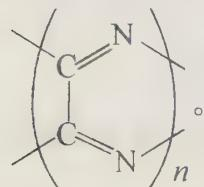

(6) 环境保护问题中对 N 元素的最安全的处理方法一般都是将其转化为 $N_{2}$ ，而且强氧化剂 $ClO^{-}$ 不会仅将 $CN^{-}$ 氧化为 $(\mathrm{CN})_{2}$ ，所以不要受上面的影响将生成物写成 $(\mathrm{CN})_{2}$ 。还要注意 $CO_{2}$ 是会与 $ClO^{-}$ 反应的，因而生成物不能写 $CO_{2}$ 。离子方程式为：

$$
2 \mathrm{CN} ^ {-} + 5 \mathrm{ClO} ^ {-} + \mathrm{H} _ {2} \mathrm{O} \longrightarrow 2 \mathrm{HCO} _ {3} ^ {-} + \mathrm{N} _ {2} + 5 \mathrm{Cl} ^ {-}
$$

参考解答 见上述分析

【例 3】（根据 1998 年全国初赛试题改编）含氮化合物广泛用于工业，如肥料和炸药。现有两种无色晶体状离子化合物 X、Y，分别在隔绝空气条件下引爆，都得到气体单质 A 和 B，且气体 B 的百分含量分别是 6.71% 和 26.46%。

(1) 写出 A、B、X、Y 的化学式；

(2) 确定化合物 X、Y 中氮原子的杂化类型。

(3) $\mathrm{NH_4NO_3}$ 也能做氮肥和做炸药, $\mathrm{NH_4NO_3}$ 热分解及和燃料油[以 $(\mathrm{CH}_2)_n$ 表示]反应的方程式及反应热分别为:

$$
\mathrm{NH} _ {4} \mathrm{NO} _ {3} \longrightarrow \mathrm{N} _ {2} \mathrm{O} + 2 \mathrm{H} _ {2} \mathrm{O} + 0. 5 3 \mathrm{kJ/g} (\mathrm{NH} _ {4} \mathrm{NO} _ {3}) \dots\dots①
$$

$$
\mathrm{NH} _ {4} \mathrm{NO} _ {3} \longrightarrow \mathrm{N} _ {2} + 1 / 2 \mathrm{O} _ {2} + 2 \mathrm{H} _ {2} \mathrm{O} + 1. 4 7 \mathrm{kJ} / \mathrm{g} (\mathrm{NH} _ {4} \mathrm{NO} _ {3}) \dots\dots②
$$

$$
3 n \mathrm{NH} _ {4} \mathrm{NO} _ {3} + (\mathrm{CH} _ {2}) _ {n} \longrightarrow 3 n \mathrm{N} _ {2} + 7 n \mathrm{H} _ {2} \mathrm{O} + n \mathrm{CO} _ {2} + 4. 2 9 n \mathrm{kJ/g(NH} _ {4} \mathrm{NO} _ {3}) \dots\dots③
$$

试问:由以上三个热化学方程式可得出哪些新的热化学方程式?

过程探究 由题意知: X 和 Y 都是不稳定的化合物, 在隔绝空气的情况下能生成两种气体, 从元素守恒的角度看, X 和 Y 不可能有金属元素, 因此从常见的做氮肥和炸药的物质看, X 和 Y 可能是只含有氮、氢两种元素的化合物, 则气体只可能为 $N_{2}$ 和

$H_{2}$ 。然后将题给数据代入验算,即可得出答案。第三问需要反复思考题目给出的三个反应的可能组合才会找到答案。这个试题是热化学定律的灵活运用。思考容量大,但最后得到的结果是唯一的。

参考解答 (1) A: $\mathrm{N}_{2}$ ; B: $\mathrm{H}_{2}$ ; X: $\mathrm{NH}_{4} \mathrm{~N}_{3}$ ; Y: $\mathrm{NH}_{4} \mathrm{H}$

(2) $NH_{4}^{+}$ 离子中氮原子是 $sp^{3}$ 杂化; $N_{3}^{-}$ 中氮原子是 sp 杂化。

(3) ②—①式, 得 $N_{2}O$ 分解反应的热化学方程式:

$$
\mathrm{N} _ {2} \mathrm{O} \longrightarrow \mathrm{N} _ {2} + 1 / 2 \mathrm{O} _ {2} + 0. 9 4 \mathrm{kJ/g} (\mathrm{NH} _ {4} \mathrm{NO} _ {3})\tag{④}
$$

此反应热是以每克 $NH_{4}NO_{3}$ 计放出的热量, 若以每摩尔 $NH_{4}NO_{3}$ 计则放热为 $0.94\ kJ \cdot g^{-1} \times 80\ g \cdot mol^{-1} = 75.2\ kJ \cdot mol^{-1}$ 。由上述反应式的关系可以看出, 这也是每摩尔 $N_{2}O$ 分解放出的热, 所以 $N_{2}O$ 分解反应的热化学反应式为:

$$
\mathrm{N} _ {2} \mathrm{O} \longrightarrow \mathrm{N} _ {2} + 1 / 2 \mathrm{O} _ {2} + 7 5. 2 \mathrm{kJ} \cdot \mathrm{mol} ^ {- 1}\tag{⑤}
$$

【例 4】（1993 年全国冬令营试题）在机械制造业中，为了消除金属制品中的残余应力和调整其内部组织，常采用有针对性的热处理工艺，以使制品机械性能达到设计要求。

CO 和 $CO_{2}$ 的混合气氛用于热处理时，调节 $CO/CO_{2}$ 既可成为氧化性气氛（脱除钢制品中的过量碳），也可成为还原性气氛（保护制品在处理过程中不被氧化或还原制品表面的氧化膜）。反应式为： $\mathrm{Fe(s)+CO_{2}(g)\longrightarrow FeO(s)+CO(g)}$ 。

已知在 $1673\mathrm{K}$ 时：

$$
① 2 \mathrm{CO(g)} + \mathrm {O_ {2} (g)} \longrightarrow 2 \mathrm {CO_ {2} (g)} \quad \Delta G ^ {\ominus} = - 2 7 8. 4 \mathrm{kJ} \cdot \mathrm{mol} ^ {- 1}
$$

$$
② 2 \mathrm{Fe(s)} + \mathrm {O_ {2} (g)} \longrightarrow 2 \mathrm{FeO(s)} \quad \Delta G ^ {\ominus} = - 3 1 1. 4 \mathrm{kJ} \cdot \mathrm{mol} ^ {- 1}
$$

混合气氛中含有 CO、CO₂ 及 N₂(N₂ 占 1.0%，不参与反应)。

(1) $\mathrm{CO} / \mathrm{CO}_{2}$ 比值为多大时, 混合气氛恰好可以防止铁的氧化?

(2) 此混合气氛中 $\mathrm{CO}$ 和 $\mathrm{CO}_{2}$ 各占百分之几?

(3) 混合气氛中 $\mathrm{CO}$ 和 $\mathrm{CO}_{2}$ 的分压比、体积比、物质的量比和质量比是否相同？若相同，写出依据；若不同，请说明互相换算关系。

(4) 若往由上述气氛保护下的热处理炉中投入一定量石灰石碎块, 如气氛的总压不变 (设为 $101.3 \mathrm{kPa}$ ), 且已知 $\mathrm{CaCO}_{3}$ 的分解温度为 $1173 \mathrm{~K}$ , 石灰石加入对气氛的氧化性还原性有何影响?

过程探究 本题是对化学热力学部分知识的理解和运用, 只针对学有余力的学生。要防止铁氧化, 必须使下述反应的 $\Delta G^{\ominus} \geqslant 0$ :

$$
\mathrm{Fe(s)} + \mathrm {CO_ {2} (g)} \longrightarrow \mathrm{FeO(s)} + \mathrm{CO(g)}
$$

当 $\Delta G = 0$ 时，由 $\Delta G = \Delta G^{\ominus} + RT\ln J_{\mathrm{p}}^{\ominus}$ 得：

$\Delta G^{\ominus} = -RT\ln J_{\mathrm{p}}^{\ominus} = -RT\ln \frac{p_{\mathrm{CO}}}{p_{\mathrm{CO_2}}} 。 \Delta G^{\ominus}$ 可由已知条件求得：

$$
\begin{array}{r l r} & (2 \mathrm{Fe} + \mathrm{O} _ {2} \longrightarrow 2 \mathrm{FeO}) \times 1 / 2 & \Delta G _ {(2)} ^ {\ominus} \\ -) & (2 \mathrm{CO} + \mathrm{O} _ {2} \longrightarrow 2 \mathrm{CO} _ {2}) \times 1 / 2 & \Delta G _ {(1)} ^ {\ominus} \\ & \mathrm{Fe} + \mathrm{CO} _ {2} \longrightarrow \mathrm{FeO} + \mathrm{CO} & \Delta G ^ {\ominus} = 1 / 2 \Delta G _ {(2)} ^ {\ominus} - 1 / 2 \Delta G _ {(1)} ^ {\ominus} \end{array}
$$

有了以上分析,本题就容易解答了。
(1) $2\mathrm{CO(g)} + \mathrm{O}_{2}(\mathrm{g}) \longrightarrow 2\mathrm{CO}_{2}(\mathrm{g})$ ① $\Delta G_{(1)}^{\ominus} = -278.4\ \mathrm{kJ} \cdot \mathrm{mol}^{-1}$ $2\mathrm{Fe(s)}+\mathrm{O}_{2}(g)\longrightarrow2\mathrm{FeO(s)}$ ② $\Delta G_{(2)}^{\ominus}=-311.4\ kJ\cdot mol^{-1}$

(②-①)×1/2 得: $Fe + CO_{2} \longrightarrow FeO + CO$ $\Delta G^{\ominus} = (-311.4 + 278.4) \times 1/2 = -16.5 \, kJ \cdot mol^{-1}$

$\Delta G^{\theta}=-RT\ln\frac{p_{CO}/p^{\ominus}}{p_{CO_{2}}/p^{\ominus}}$ ，代入数据得： $\frac{p_{CO}}{p_{CO_{2}}}=3.27$ 。

当CO和 $\mathrm{CO}_{2}$ 的分压比 $\frac{p_{\mathrm{CO}}}{p_{\mathrm{CO_2}}}\geqslant 3.27$ 时，可防止铁氧化。

（2）由题意可知，混合气氛中 $\mathrm{N}_2$ 占 $1\%$ 。设其中CO为 $x$ ， $\mathrm{CO_2}$ 为 $y$ ，则： $\left\{ \begin{array}{l}x + y = 99\% \\ x / y = 3.27 \end{array} \right.$

解得: $x = 75.8\%$ (CO), $y = 23.2\%$ $(\mathrm{CO}_2)$

（3）根据道尔顿分压定律。同温同压下气体分压比等于物质的量比；根据阿伏伽德罗定律，同温同压下气体体积比等于物质的量比。所以，CO 和 $CO_{2}$ 的分压比、体积比、物质的量比均相同。

设 $W_{CO}$ 和 $W_{CO_{2}}$ 分别表示混合气体中 CO 和 $CO_{2}$ 的质量。则： $\frac{W_{CO}}{28}:\frac{W_{CO_{2}}}{44}=\frac{n_{CO}}{n_{CO_{2}}}$

$$
\therefore \frac {W _ {\mathrm{CO}}}{W _ {\mathrm{CO} _ {2}}} = \frac {2 8}{4 4} \times \frac {n _ {\mathrm{CO}}}{n _ {\mathrm{CO} _ {2}}} = \frac {7}{1 1} \times \frac {n _ {\mathrm{CO}}}{n _ {\mathrm{CO} _ {2}}}
$$

(4) 在 1673 K 时, $CaCO_{3}$ 分解, 以下反应 $K^{\ominus} > 1$ :

$\mathrm{CaCO_3(s)} \longrightarrow \mathrm{CaO(s)} + \mathrm{CO_2(g)}$ $K^{\ominus} = (p_{\mathrm{CO_2}} / p^{\ominus}) > 1$ ，所以 $p_{\mathrm{CO_2}} > 101.3\mathrm{kPa}$ 。

所以 $CaCO_{3}$ 分解使混合气氛中 $CO_{2}$ 分压增大, 氧化性增强。

参考解答（1）当CO和 $\mathrm{CO}_{2}$ 的分压比 $\frac{p_{\mathrm{CO}}}{p_{\mathrm{CO_2}}}\geqslant 3.27$ 时，可防止铁氧化；

(2) 混合气氛中, CO 占 75.8%, $CO_{2}$ 占 23.2%;

（3）根据道尔顿分压定律。同温同压下气体分压比等于物质的量比；根据阿伏伽德罗定律，同温同压下气体体积比等于物质的量比。所以，CO 和 $CO_{2}$ 的分压比、体积比、物质的量比均相同，而 $W_{CO}:W_{CO_{2}}=7n_{CO}:11n_{CO_{2}}$ ；（4） $CaCO_{3}$ 分解使混合气氛中 $CO_{2}$ 分压增大，氧化性增强。

## 【实战演练】

1. 将白磷隔绝空气加热到 $260^{\circ} \mathrm{C}$ 可转变为红磷。以下说法正确的是（ ）。

A. 白磷转变为红磷是一个吸热过程  
B. 红磷比白磷稳定  
C. 白磷转变为红磷需外界提供引发反应的能量  
D. 白磷比红磷稳定

2. 已知胆矾溶于水时, 溶液温度降低。在室温下将 $1 \mathrm{~mol}$ 无水硫酸铜制成溶液时, 放出热量为 $Q_{1} \mathrm{~kJ}$ , 而胆矾分解的热化学方程式: $\mathrm{CuSO}_{4} \cdot 5 \mathrm{H}_{2} \mathrm{O} (\mathrm{s}) \longrightarrow \mathrm{CuSO}_{4} (\mathrm{s}) + 5 \mathrm{H}_{2} \mathrm{O} (\mathrm{l}) \quad \Delta H = + Q_{2} \mathrm{~kJ} \cdot \mathrm{mol}^{-1}$

则 $Q_{1}$ 与 $Q_{2}$ 的关系是（ ）。A. $Q_{1} > Q_{2}$ B. $Q_{1} < Q_{2}$ C. $Q_{1} = Q_{2}$ D. 无法确定

3. 炽热的炉膛内有反应: $\mathrm{C(s)+O_{2}(g)\longrightarrow CO_{2}(g)}$ $\Delta H=-392\ kJ\cdot mol^{-1}$ 往炉膛内通入水蒸气时,有如下反应: $C(s)+H_{2}O(g)\longrightarrow CO(g)+H_{2}(g)$ $\Delta H=+131\ kJ\cdot mol^{-1}$ $CO(g)+1/2O_{2}(g)\longrightarrow CO_{2}(g)$ $\Delta H=-282\ kJ\cdot mol^{-1}$ $H_{2}(g)+1/2O_{2}(g)\longrightarrow H_{2}O(g)$ $\Delta H=-241\ kJ\cdot mol^{-1}$

由以上反应推断往炽热的炉膛内通入水蒸气时( )。
A. 不能节省燃料,但能使炉火瞬间更旺
B. 虽不能使炉火更旺,但可以节省燃料
C. 既能使炉火更旺,又能节省燃料
D. 既不能使炉火更旺,又不能节省燃料

4. 在烃分子中去掉 2 个氢原子形成一个双键是吸热反应, 大约需要 $117 \sim 125 \mathrm{~kJ} \cdot \mathrm{mol}^{-1}$ 的热量, 但 1,3-环己二烯失去 2 个氢原子形成苯是放热反应, 反应热是 $23.4 \mathrm{~kJ} \cdot \mathrm{mol}^{-1}$ , 这表明 ( )。

A. 苯比 1,3-环己二烯稳定

B. 苯加氢生成环己烷是吸热反应

C. 1,3-环己二烯比苯稳定

D. 1,3-环己二烯加氢是吸热反应

5. 在绿色植物光合作用中, 每放出 1 个氧分子要吸收 $2.29 \times 10^{-21} \mathrm{~kJ}$ 的能量, 每放出 $1 \mathrm{~mol} \mathrm{O}_{2}$ , 植物能储存 $469 \mathrm{~kJ}$ 的能量, 绿色植物的能量转换效率是 ( )。
A. $37 \%$ B. $34 \%$ C. $29 \%$ D. $40 \%$

6. 硝化甘油是著名化学家诺贝尔发明的。它在工农业中具有广泛的用途。试回答下列问题：

(1) 请写出制备硝化甘油 $\left(\mathrm{C}_{3}\mathrm{H}_{5}\mathrm{N}_{3}\mathrm{O}_{9}\right)$ 的化学方程式 \_\_\_\_；

(2) 硝化甘油是一种浅黄色、油状液体, 很不稳定, 稍受震动即分解爆炸生成稳定的单质和氧化物。已知 $1 \mathrm{~g}$ 液态硝化甘油分解时放出 $8 \times 10^{3} \mathrm{~J}$ 的热量 (25°C, 101.3 kPa), 请写出硝化甘油发生爆炸的热化学反应方程式 \_\_\_\_;

(3) 由于硝化甘油很不稳定,很难成为可控炸药,为此诺贝尔发现用\_\_\_\_和\_\_\_\_等固体吸收,就能制成安全炸药;

（4）某采石场准备用硝化甘油开采石头。假设 $1\mathrm{kg}$ 硝化甘油爆炸能在周围的岩石上产生 $5.0\times 10^{5}\mathrm{N}\cdot \mathrm{s}\cdot \mathrm{m}^{-2}$ 的冲击力，则对厚度为 $10~\mathrm{cm}$ 岩石爆破时，采石工人应站在离爆破点多远处才安全？（岩石密度为 $2.7\times 10^{3}\mathrm{kg}\cdot \mathrm{m}^{-3}$ ，忽略空气阻力）

7. 质量 $m = 1.20 \mathrm{~g}$ 的某气体, 其分子由碳和氢两种元素的原子组成, 含有 $N = 4.50 \times 10^{22}$ 个分子。又测得 $1 \mathrm{~mol}$ 该气体完全燃烧 (生成液态的水) 能放出 $890 \mathrm{~kJ}$ 的能量。

(1) 写出该气体的化学式, 并写出其完全燃烧的热化学方程式。

(2) $1.20 \mathrm{~g}$ 该气体完全燃烧放出的热量的一半能使 $500 \mathrm{~g} 、 20^{\circ} \mathrm{C}$ 的水的温度升高多少摄氏度？[已知水的比热容 $c(\mathrm{H}_{2} \mathrm{O}) = 4.20 \times 10^{3} \mathrm{~J} \cdot \mathrm{kg}^{-1} \cdot {}^{\circ} \mathrm{C}^{-1}$ ]

8. 在燃烧 2.24 L(标准状况)CO 与 $O_{2}$ 的混合气体时, 放出 11.32 kJ 的热量。所得产物的密度为原来气体密度的 1.2525 倍。燃烧同样体积(标准状况)的 $N_{2}O$ 和 CO 的混合物时, 放出 13.225 kJ 热量, 而原来的混合物的密度是产物密度的 1.25 倍, 试确定:

(1) 在 $\mathrm{O}_{2}$ 中燃烧的 CO 的热效应 (每摩尔 CO 完全燃烧时放出的热量);

(2) $\mathrm{N}_{2} \mathrm{O}$ 与 $\mathrm{CO}$ 所组成的混合物中各气体的体积百分组成;

(3) 由单质生成 $\mathrm{N}_{2} \mathrm{O}$ 时的热效应。(已知 $\mathrm{N}_{2} \mathrm{O}$ 与 CO 反应的产物为 $\mathrm{CO}_{2} 、 \mathrm{~N}_{2} 、 \mathrm{O}_{2}$ )

9. 下图是不饱和烃加氢时能量变化示意图, 具体数据如下:

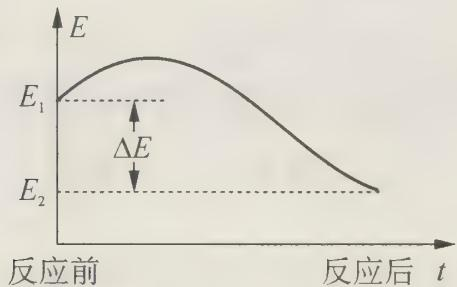

<table><tr><td>反应</td><td> $\Delta E$ </td></tr><tr><td> $CH_3C\equiv CCH_3+2H_2\longrightarrow CH_3(CH_2)_2CH_3$ </td><td>278 kJ·mol-1</td></tr><tr><td> $CH_2=CH-CH=CH_2+2H_2\longrightarrow CH_3(CH_2)_2CH_3$ </td><td>239 kJ·mol-1</td></tr></table>

(化学反应总是向能量降低的方向进行)

(1) 如果 $CH_{3}CH_{2}C \equiv CCH_{2}CH_{2}CH = CH - CH = CH_{2}$ 1 mol 与 $H_{2}$ 2 mol 作用，其主要产物是 \_\_\_\_。

(2) 如果 $\mathrm{CH}_{3} \mathrm{CHBrCHBrCH}_{3}$ 与 $\mathrm{NaOH}$ 的醇溶液共热后, 主要产物是 A, 则 A 的结构简式为 , 另一副产物是 B。

(3) 若反应(2)是吸热反应,试画出 A 与 B 的能量变化差异的示意图。

10. 如果将 $10 \, g$ 金属锂置于 $100 \, g \, 0^{\circ}C$ 的冰块上，试确定： $100^{\circ}C$ 时，由溶液中沉淀的氢氧化锂的一水合物的质量。反应按下列热化学方程式进行：

$$
2 \mathrm{Li} (\mathrm{s}) + 2 \mathrm{H} _ {2} \mathrm{O} (\mathrm{l}) \longrightarrow 2 \mathrm{LiOH} (\mathrm{s}) + \mathrm{H} _ {2} (\mathrm{g}) \quad \Delta H = 3 9 8. 2 \mathrm{kJ} \cdot \mathrm{mol} ^ {- 1}
$$

由于跟周围的介质交换,溶解时热效应为0,水的熔化热为 $330\ kJ\cdot kg^{-1}$ ,水的比热为 $4.200kJ\cdot kg^{-1}\cdot K^{-1}$ ,水的汽化热为 $2300\ kJ\cdot kg^{-1}$ ,LiOH的比热为 $49.58\ J\cdot mol^{-1}\cdot K^{-1}$ , $100^{\circ}C$ 时,一水合氢氧化锂的溶解度为19.1g。

11. 通常中和热、溶解热等测定是在一种恒压绝热的量热计(又叫杜瓦瓶)中进行。已知 $\Delta H_{\mathrm{f}}^{\ominus}(\mathrm{H}_{2}\mathrm{O}(1)) = -286\mathrm{kJ}\cdot \mathrm{mol}^{-1}$ , $\Delta H_{\mathrm{f}}^{\ominus}(\mathrm{OH}^{-}(\mathrm{aq})) = -230\mathrm{kJ}\cdot \mathrm{mol}^{-1}$ 。欲测弱酸与强碱反应的中和热, 进行下列实验:

第一步:量热计热容量的测定。先在杜瓦瓶中装入 $350 \, mL \, 0.2 \, mol \cdot L^{-1}$ HCl 溶液，在另一带活塞的小储液管中装入 $350 \, mL \, 0.2 \, mol \cdot L^{-1}$ NaOH 溶液，并将储液管放入杜瓦瓶酸液中，测定反应前温度 $23.20^{\circ}C$ ，然后快速吹去活塞，使碱液与酸混合并搅拌，测得反应后最高温度为 $28.33^{\circ}C$ 。

第二步:以 $350 \, mL \, 0.2 \, mol \cdot L^{-1} \, HAc$ 标准溶液代替盐酸,重复上述操作,测得反应前后温度分别为 $23.33^{\circ}C$ 和 $27.64^{\circ}C$ 。

(1) 求 HAc 与 NaOH 的中和热 $(\mathrm{kJ} \cdot \mathrm{mol}^{-1})$ ;

(2) 求 HAc 的电离热 $(\mathrm{kJ} \cdot \mathrm{mol}^{-1})$ 。

12. 1.00 L(S.T.P)CH₄ 和 O₂ 的混合气体, 借助放电作用将其点燃, 反应结果放出热量 8.22 kJ。将反应产物通过碱溶液, 此时有 0.4 L 气体未被吸收 (气体体积在标准状况下测定)。如果已知 CH₄、气态水、CO₂ 及 CO 的生成热大小分别等于 75、242、394 及 110 kJ·mol⁻¹。试计算混合气体中的体积分数。为使题严密, 应补充什么限制条件?

13. 20世纪80年代日本科学家应用电子计算机模拟出结构类似于 $C_{60}$ （分子结构如右图所示）的物质 $N_{60}$ ，计算机模拟结果显示， $N_{60}$ 与 $C_{60}$ 有相似的结构但稳定性较差。科学家预测，将 $N_{2}$ 进行冷冻或加压，然后运用高强度激光照射能转变为 $N_{60}$ 分子团，该分子团具有极强的挥发性，在受热情况下瞬间分解为 $N_{2}$ 并释放出大量的能量。已知 $E(N-N)=167\ kJ\cdot mol^{-1}$ ， $E(N=N)=418\ kJ\cdot mol^{-1}$ ， $E(N≡N)=942\ kJ\cdot mol^{-1}$ 。

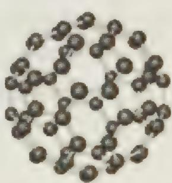

(1) $N_{60}$ 分子中每个N原子最外层的电子数\_\_\_\_；

(2) $N_{60}$ 形成的晶体结构 \_\_\_\_ ;

(3) 解释 $N_{60}$ 稳定性较差的原因 \_\_\_\_；

(4) 计算 $1 \, mol \, N_{60}$ 受热分解为 $N_{2}$ 时放出的热量为 \_\_\_\_；

(5) $N_{60}$ 潜在的商业用途 \_\_\_\_。

14. 发射“神舟七号”飞船的长征火箭用了肼 $\left(\mathrm{N}_{2}\mathrm{H}_{4}\right)$ 作燃料, $\mathrm{N}_{2}\mathrm{H}_{4}$ 与 $\mathrm{NH}_{3}$ 有相似的化学性质。

(1) 写出肼的电子式 \_\_\_\_。

(2) 写出肼与盐酸反应的离子方程式 \_\_\_\_。

(3) 用拉席希法制备肼, 是将 NaClO 和 NH₃ 反应生成肼, 试写出该反应的化学方程式 \_\_\_\_。

(4) 在火箭推进器中装有强还原剂肼和强氧化剂双氧水, 当它们混合时, 即产生大量气体,并放出大量热。已知 12.8 g 液态肼与足量液态双氧水反应生成氮气和水蒸气,放出 256.65 kJ 的热量;1 mol 液态水变成 1 mol 水蒸气需要吸收 44 kJ 的热量。写出热化学方程式\_\_\_\_。

(5) 通常人们把拆开 $1 \mathrm{~mol}$ 某化学键所吸收的能量看成该化学键的键能。

<table><tr><td>化学键</td><td>N—H</td><td>N—N</td><td>O=O</td><td>N≡N</td><td>O—H</td></tr><tr><td>键能(kJ/mol)</td><td>386</td><td>167</td><td>498</td><td>946</td><td>460</td></tr></table>

发射火箭时肼 $\left(\mathrm{N}_{2}\mathrm{H}_{1}\right)$ 为燃料,若在 $\mathrm{O}_{2}$ (气态)中燃烧,生成 $\mathrm{N}_{2}$ (气态)和 $\mathrm{H}_{2}\mathrm{O}$ (液态)。写出热化学方程式\_\_\_\_。

(6) 发射火箭时肼 $\left(\mathrm{N}_{2}\mathrm{H}_{4}\right)$ 为燃料, 也可以二氧化氮或氟气作氧化剂, 分别写出化学方程式: \_\_\_\_、\_\_\_\_。

(7) 对比 $\mathrm{O}_{2} 、 \mathrm{F}_{2} 、 \mathrm{H}_{2} \mathrm{O}_{2} 、 \mathrm{NO}_{2}$ 四种助燃剂, 放出热量最多时应选用\_\_\_\_; 实际我们选用的助燃剂是 $\mathrm{NO}_{2}$ , 主要考虑的因素是\_\_\_\_。

(8)“神舟七号”飞船外壳使用了一种新型陶瓷结构材料,主要成分是氮化硅,是一种超硬物质,耐磨损、耐高温。请推测氮化硅的化学式为:\_\_\_\_,氮化硅晶体类型是\_\_\_\_;晶体中存在的化学键是\_\_\_\_。

15. 已知: ① $\mathrm{CH}_{4}$ 燃烧热为 $-802 \mathrm{~kJ} \cdot \mathrm{mol}^{-1}$ ; ② $1 \mathrm{~mol} \mathrm{CH}_{4}$ 气体不完全燃烧生成 CO 气体和液态 $\mathrm{H}_{2} \mathrm{O}$ 时, 放出的热量为 $519 \mathrm{~kJ}$ ; ③ $1 \mathrm{~mol} \mathrm{CH}_{4}$ 与一定量的 $\mathrm{O}_{2}$ 反应生成 CO、 $\mathrm{CO}_{2}$ 气体和液态 $\mathrm{H}_{2} \mathrm{O}$ , 放出 $731.25 \mathrm{~kJ}$ 热量。请回答下列问题:

(1) 试写出上述②的热化学方程式。

(2) 试写出③的总化学方程式。

# 第5讲 原子结构

# 【知识要点】

## 一、几个重要的概念

## 1. 核素、同位素、同量素

原子由原子核和核外电子构成,且原子为电中性。原子核由质子和中子构成,它带正电,而且原子的全部质量几乎都集中在原子核中。原子中的核外电子数应与其原子核内的质子数相等。若令核电荷数的符号为 Z,则有:核电荷数 $(Z)=$ 核内质子数 = 核外电子数。

质子的质量为 $1.6726 \times 10^{27} \mathrm{~kg}$ ，中子的质量为 $1.6748 \times 10^{-27} \mathrm{~kg}$ ，二者质量近似相等。经过换算，质子和中子的相对质量分别是1.007和1.008，通常取近似的整数为1。如果忽略电子的质量，将原子核内所有的质子和中子的相对质量数相加，其和即等于这个原子核(或原子)的质量数。若此质量数用符号 $A$ 表示，中子数用 $N$ 表示，则：

$$
\text { 质量数 } (A) = \text { 质子数 } (Z) \times 1 + \text { 中子数 } (N) \times 1 。
$$

如果只考虑它们的数值,则可简化为 $A = Z + N$ 。

这个关系式表明了与原子本性关系极为密切的三个基本量:质子数、中子数与原子的相对质量。

具有相同核电荷数（ $Z =$ 质子数）的同一类原子称为元素。但是同种元素的原子核中可以有不同的中子数。例如氢元素的原子核中只含有一个质子，但中子数却可以有0、1和2三种，分别为 ${}_{1}^{1}\mathrm{H}$ 、 ${}_{1}^{2}\mathrm{H}$ 、 ${}_{1}^{3}\mathrm{H}$ 。 ${}_{1}^{1}\mathrm{H}$ 的中文名为气（不常用）； ${}_{1}^{2}\mathrm{H}$ 记为D，中文名为氘或称为重氢； ${}_{1}^{3}\mathrm{H}$ 记作T，中文为名氚或称为超重氢。

我们把具有一定数目质子和一定数目中子的一种原子叫做核素。例如，原子核里有6个质子和6个中子的碳原子，质量数为12，称为碳—12核素，或写成 $^{12}$ C核素。原子核里有6个质子和7个中子的碳原子，质量数为13，称 $^{13}$ C核素。氧元素有 $^{16}$ O、 $^{17}$ O、 $^{18}$ O三种核素。具有多种核素的元素称为多核素元素。自然界仅有一种核素存在的元素称为单核素元素，如氦、氟、铝、钠等20种元素。质子数为偶数的元素，可有较多的稳定核素，一般不少于3个，而质子数为奇数的元素，通常只有一个稳定核素，从不会多于两个，这是由核子的结合能所决定的。

由于元素在元素周期表中的位置是由其质子数(在周期表中称为原子序数)决定的,所以具有相同数目的质子但中子数却不相同的原子在周期表中的位置是相同的,

因而称之为同位素。

多核素元素中各核素互称为同位素,因为它们处于周期表中同一位置上,化学性质基本相同,但核性质不同;单核素元素没有同位素。核素的质量即原子质量,总小于孤立质子、中子和电子的质量总和,在概念上也不等于质量数。核素的质量是用质谱仪测定的,这种测定法很先进,可测得7位或更多位有效数字。

同量素是指质量数相同的不同种元素的原子的互称。同量素之间仅仅是质量数相同，质子数不相同。

## 2. 同位素相对原子质量、平均相对原子质量、近似相对原子质量、相对原子质量的近似值

所谓相对原子质量是以某原子的绝对质量与 $^{12}$ C原子绝对质量的1/12作比较,所得出的一个比值。而同位素相对原子质量就是同位素原子的绝对质量与 $^{12}$ C原子绝对质量的1/12所得到的比值。

由于元素一般存在着同位素,它们均在自然界中存在一定的丰度,将同位素的相对原子质量乘以各自的丰度(即某种同位素所占的原子分率),然后加和起来,即得到平均相对原子质量。国际相对原子质量表中查得的数据就是平均相对原子质量。平均相对原子质量便可由下式算出: $M=\sum_{i=1}^{n}b_{i}\cdot M_{i}$ 。式中M代表元素X的平均相对原子质量; $M_{i}$ 代表X元素的某种同位素的相对原子质量; $b_{i}$ 代表该同位素的丰度;n代表X元素中所包含的同位素种类数;符号 $\sum_{i=1}^{n}$ 表示对从i=1到i=n的n项乘积求和。

例如氯由 $75.77\%$ 的 ${}^{35}\mathrm{Cl}$ 和 $24.23\%$ 的 ${}^{37}\mathrm{Cl}$ 所组成；氧则由 $99.759\%$ 的 ${}^{16}\mathrm{O}$ 、 $0.037\%$ 的 ${}^{17}\mathrm{O}$ 和 $0.204\%$ 的 ${}^{18}\mathrm{O}$ 所组成。通常同学们所查的原子量表就是平均相对原子质量。正是由于元素有各种同位素，因此同学们从国际相对原子质量表中所查到的相对原子质量一般为非整数。

近似相对原子质量就是将同位素质量数代替同位素相对原子质量,所求得的加权平均值。而相对原子质量近似值就是将所得的平均相对原子质量根据要求取其近似值。

## 3. 核外电子的运动特点

现代科学研究表明:经典的牛顿力学只适用于宏观低速运动的物质,而且最主要的原因就是微观粒子的运动状态呈现量子化,即运动是跃变的、非连续性的,其运动状态具有测不准关系。所谓测不准原理,就是指一个微观粒子的某些物理量(如位置、动量、时间和能量等)不可能同时具有确定的数值。若其中一个量越确定,另一个量的不确定程度就越大。这是海森堡在1927年首先提出的,它反映了微观粒子运动的基本规律,是物理学中一条重要原理。

因此，核外电子并不是循着一个固定轨道绕原子核做圆周运动的，而是以高速在原子核外空间一定范围运转，而成为云状分布（称为电子云），无法准确测出其精确的路径，但若将某一特定电子在运转当中出现最大几率之处描绘出来，则为其原

子轨道。

1913 年,丹麦科学家玻尔(N. Bohr, 1885-1962)探究氢原子光谱,提出有关电子结构的理论。玻尔认为:

① 氢原子的电子, 只能在离开原子核一定距离的轨道上做圆周运动。电子在轨道上运动时具有一定的能量。这些能量的高低以能级表示, 从原子核向外分别以 $n$ 为 1, 2, 3, 4, 5 等量子数表示。

② 在各轨道上运动的电子,都具有其能级所特有的能量。n=1 最接近于原子核,因此其半径最小,n=1 层上的电子所具有的能量亦最低。离开原子核愈远的轨道上的电子,圆周运动的半径愈大,电子所具有的能量愈高。

③ 氢原子在正常状态时,其原子核外的电子在最低的能级上。电子的能量在最低能量的状态,叫做基态。当此原子吸收外来的能量时,电子能够跃迁至较高的能级,这时的原子即在激发态。

④ 激发态原子的电子,从较高能级回到较低能级时,放出一定量的能量。放出的能量以光的形式放出时,产生光谱。

玻尔导出电子在各轨道所具有的能量为： $E_{n}=-\frac{2.179\times10^{-18}\mathrm{J}}{n^{2}}=-\frac{13.6\mathrm{eV}}{n^{2}}, n=1,2,3,\cdots$ 而当电子由高能级回到低能级时，所放出的谱线频率，与氢原子光谱实验数据一致。

玻尔假说虽能很好地解释氢原子光谱，但对于多核的原子光谱却无能为力。直至用以处理微观世界物体运动的量子力学形成之后，才算较好地解决了这个问题。

## 4. 核外电子排布规律

根据玻尔原子模型。可将核外电子进行人为的分层排布，即由内向外可分为几个壳层，以 n 的大小表示壳层能量高低的顺序，此顺序称为能级；n 越大表示该壳层的能级越高。当 n=1 时为最靠近原子核，能级最低的第一层，称为 K 层， $n=2,3,4,\cdots$ 则分别称为 L，M，N，…。电子在原子核外各能级中的“填充”情况通常称为电子排布。核外电子在分层排布时将遵循如下的规律：

（1）能量最低原理：核外电子的排布应优先排布在能量最低的电子层里，然后由里往外，依次排布在能量逐渐升高的电子层里；

(2) 各电子层所填充的电子总数 $\leqslant 2n^{2}$ (n 为电子层数);

(3) 最外层所填充的电子数不超过 8 个, K 层为最外层时不超过 2 个;

(4) 次外层所填充的电子数不超过 18 个, 倒数第三层不超过 32 个电子。

## 5. 原子结构与元素性质的关系

元素的性质,特别是化学性质主要由原子的价电子数决定。所谓价电子数就是外围电子数。主族元素的价电子就是最外层电子,副族元素的价电子数由最外层电子、次外层电子,甚至倒数第三层电子决定。另外,还与电子层数有关。若最外层电子数为 m, 电子层数为 n, 则:

(1) m/n > 1，通常为非金属元素，且 m/n 值越大，非金属性越强；

(2) $m / n = 1$ ，通常为两性元素，如铝、锗等；

(3) $m / n < 1$ ，通常为金属元素，且 $m / n$ 值越小，金属性越强。

## 6. 原子与离子的性质

一般说来,原子在通常条件下能够自发得到或失去价电子而变成离子,而从能量的角度看,该原子的能量要高一些,离子的能量要低一些,即该种情况下离子比原子要稳定。如 $Na^{+}$ 要比 Na 稳定。如果从结构上加以解释,Na 原子的价电子数为 1,很活泼,很不稳定,通过失去一个价电子,变次外层为最外层,且满足稀有气体元素的原子结构,比较稳定,这一失电子过程是放热的。元素的活泼性通常用金属性或非金属性来表示,离子的活泼性通常用还原性或氧化性来表示,若再深刻些,元素的活泼性通常用电离能或电子亲合能来衡量,离子的还原性或氧化性通常用电极电势来衡量,两者不能混为一谈。

元素金属性、非金属性强弱可用电负性来量度。所谓元素的电负性是指周期表中各元素的原子在分子中对成键电子的吸引能力的一种相对标度。元素的电负性愈大，表明原子在形成化学键时对成键电子的吸引力越强，非金属性也愈强。第二周期元素的电负性很有规律性，即 F 元素电负性值为 4.0，由 F 元素向前推一种元素，则减少 0.5，即 O 元素电负性 3.5，N 元素电负性 3.0…。

由于同一周期从左至右，有效核电荷递增，原子半径递减，对电子的吸引能力渐强，因而电负性值递增；同族元素从上到下，随着原子半径的增大，元素电负性值递减。过渡元素的电负性值无明显规律。就总体而言，周期表右上方的典型非金属元素都有较大电负性数值，氟的电负性值数大(4.0)；周期表左下方的金属元素电负性值都较小，铯和钫(放射性)是电负性最小的元素(0.7)。一般说来，非金属元素的电负性大于2.0，金属元素电负性小于2.0。

## (1) 电离能

金属性强弱可由电离能来衡量。所谓电离能(I)是指基态的气态原子失去电子形成气态阳离子时所吸收的能量。由于原子失去电子必须消耗能量克服核对外层电子的引力,所以电离能总为正值,单位常用 kJ·mol $^{-1}$ 。

电离能可以定量比较气态原子失去电子的难易,电离能越大,原子越难失去电子,其金属性越弱;反之金属性越强。影响电离能大小的因素是:有效核电荷、原子半径和原子的电子构型。

（a）同周期主族元素从左到右作用到最外层电子上的有效核电荷逐渐增大，电离能也逐渐增大，到稀有气体由于具有稳定的电子层结构，其电离能最大。故同周期元素从强金属性逐渐变到非金属性，直至强非金属性。

（b）同周期副族元素从左至右，由于有效核电荷增加不多，原子半径减小缓慢，电离能增加不如主族元素明显。由于最外层最多只有两个电子，过渡元素均表现金属性。

(c) 同一主族元素从上到下, 原子半径增加, 有效核电荷增加不多, 则原子半径增大的影响起主要作用, 电离能由大变小, 元素的金属性逐渐增强。

(d) 同一副族电离能变化不规则。

## (2) 电子亲合能

与电离能相对应,元素的气态基态原子获得电子成为气态阴离子所释放的能量称为该元素的电子亲合能,简称电子亲合能(E)。电子亲合能的大小反映了原子获得电子的难易:亲合能数值越大,则气态原子结合电子释放的能量越多,与电子的结合越稳定,表明该元素的原子越易获得电子,故非金属性越强;反之亦然。

电子亲合能的大小取决于原子的有效核电荷、原子半径和原子的电子构型。周期表中，同一周期从左到右，电子亲合能逐渐增大。因为原子有效核电荷增大，原子半径逐渐减小，随着最外层电子数目的增多，原子更易获得电子形成稳定结构。同族元素从上到下亲合能呈递减变化。需要指出的是：有些元素电离能较高，电子难以电离，并不意味着易于结合电子。例如稀有气体外层为8电子稳定构型，失电子和得电子都不容易。

总之，元素的金属性和非金属性可总结为：

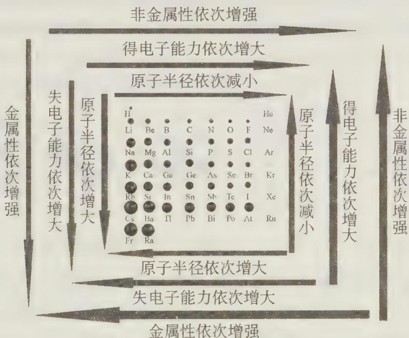  
金属性依次增强

## 二、核外电子填充电子的原子轨道规律

## 1. 决定电子的原子轨道的因素

一个电子的原子轨道由四个因素决定,即主量子数(n)、角量子数(l)、磁量子数 $(m_{l})$ 和自旋量子数 $(m_{s})$ 。上述四个量子数是由薛定谔方程解出的四个参数。

## (1) 主量子数(n)

主量子数相当于通常所说的电子层数。电子层数有时用光谱学上的符号 K, L, M, N, … 表示，对应的 n 值分别为 1, 2, 3, … 。n 值越大，电子离核越远，能量越高。主量子数决定着核外电子的能量。

## (2) 角量子数(l)

在同一电子层上电子的能量还有些微的差别,正如从一楼到二楼存在着台阶一样。不同的台阶在核外电子排布中叫做亚层,用角量子数(l)来表示。

处于不同亚层上的电子,除能量稍有差别外,还表现在电子云形状的不同。不同形状的电子云常用 s、p、d、f 等表示。s 表示电子云呈球形,p 表示电子云呈哑铃形,d 表示电子云呈花瓣形等等,这就是说,在同一电子层中,可能有一种或几种电子云形状不同的原子轨道。因此角量子数主要决定了电子云的形状。若原子为多电子原子,角量子数还决定着核外电子的部分能量。

角量子数的取值为 $l=0,1,\cdots,n-1$ 。如：主量子数 n 为 1，则角量子数为 0，电子云形状只有一种呈球形 1s；主量子数 n=2，则角量子数只能是 0、1，电子云形状有两种，一种呈球形 2s，另一种呈哑铃形 2p；主量子数为 3，则角量子数 l 只能是 0、1、2，电子云形状有三种，一种呈球形 3s，一种呈哑铃形 3p，另一种是花瓣形 3d；其余类推。

## (3) 磁量子数 $(m_{l})$

磁量子数决定着电子云的空间伸展方向。磁量子数(m)的数值,可以为0,±1,±2,±3,⋯,±l,即 $m_{l}$ 取值是 $-l\sim+l$ 之间,其伸展方向为 $2l+1$ 个。

如：s 亚层 l=0，因此 $m_{l}=1$ ，s 电子云呈球形，见图 1，是对称的，没有方向的，所以只有一个原子轨道；p 亚层 l=1，则 $m_{l}=2l+1=3$ ，因此 p 电子云呈哑铃形，见图 2：

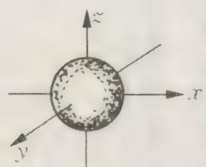  
图 1 s 电子云

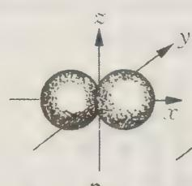

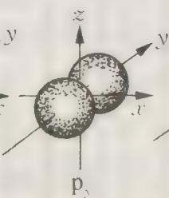

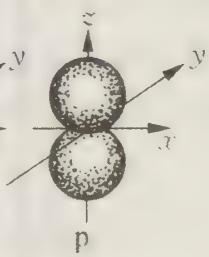  
图2 三个伸展方向不同的 $\mathfrak{p}$ 电子云

p 亚层电子云在空间具有三个相互垂直的方向, 所以有三个相同类型的原子轨道; 同理, d 亚层 l = 2, $m_{l} = 5$ , 即 d 电子云呈花瓣形, 见图 3, 它在空间具有五个不同的伸展方向, 有五个相同类型的原子轨道; f 态电子云在空间有七个不同的伸展方向, 有七个相同类型的原子轨道。

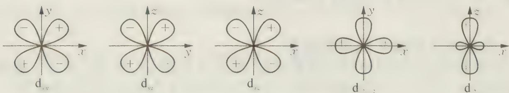  
图3 五个伸展方向不同的d电子云

对于 $2\mathrm{p}_x$ 、 $2\mathrm{p}_y$ 、 $2\mathrm{p}_z$ 三个原子轨道， $3\mathrm{d}_{z^2}$ 、 $3\mathrm{d}_{x^2 -y^2}$ 、 $3\mathrm{d}_{xz}$ 、 $3\mathrm{d}_{yz}$ 、 $3\mathrm{d}_{xy}$ 五个原子轨道，尽管它们电子云伸展方向不同，但它们能量是相同的，因此称之为等价轨道或简并轨道。

## (4) 自旋量子数 $(m_{s})$

原子中电子除了以高速在核外空间运动之外,还绕着自己的轴做两种不同方向的自旋,即顺时针和逆时针两种方向自旋。自旋量子数 $m_{s}$ 是表示电子本身的旋转方向,通常用 +1/2 和 -1/2 两个数值或用圆圈“○”加上向上或向下的箭头表示电子的自旋

方向 $\uparrow$ 和 $\downarrow$ 。

综上所述，主量子数、角量子数和磁量子数决定着电子的一个原子轨道，而四个量子数决定着电子的运动状态。

## 2. 核外电子填充原子轨道规律

核外电子填充原子轨道有三条基本规则：

## ① 能量最低原理

自然界一条普遍的规律是“能量越低越稳定”，原子中的电子也不例外。电子在原子中所处的状态总是尽可能使整个体系的能量为最低，这样的体系最稳定。因此电子总是优先占据可供占据的能量最低轨道，而后依次进入能量较高的轨道。这就称为能量最低原理。

## ② 不相容原理

1925年瑞士物理学家(Pauli)研究得出一条原理,其内容是:在同一原子中不能存在运动状态完全相同的电子。即每种运动状态最多只能容纳一个电子;同一条轨道最多只能容纳两个自旋相反的电子。因为s、p、d、f各分层中的原子轨道分别为1、3、5、7条,所以各分层最多只能容纳2、6、10、14个电子。又因为每个电子层中原子轨道总数为 $n^{2}$ ,所以各电子层中电子的最大容量为 $2n^{2}$ 个。

<table><tr><td>电子层</td><td>符号</td><td>电子亚层数</td><td>符号</td><td>最多可填充电子数</td><td>电子层中最多可填充电子数</td><td> $2n^{2}$ </td></tr><tr><td>1</td><td>K</td><td>1</td><td>1s</td><td> $2 \times 1$ </td><td>2</td><td> $2 \times 1^{2}$ </td></tr><tr><td>2</td><td>L</td><td>2</td><td>2s、2p</td><td> $2 \times 1$ 、 $2 \times 3$ </td><td>8</td><td> $2 \times 2^{2}$ </td></tr><tr><td>3</td><td>M</td><td>3</td><td>2s、3p、3d</td><td> $2 \times 1$ 、 $2 \times 3$ 、 $2 \times 5$ </td><td>18</td><td> $2 \times 3^{2}$ </td></tr><tr><td>4</td><td>N</td><td>4</td><td>4s、4p、4d、4f</td><td> $2 \times 1$ 、 $2 \times 3$ 、 $2 \times 5$ 、 $2 \times 7$ </td><td>32</td><td> $2 \times 4^{2}$ </td></tr></table>

## ③ 洪特规则

1925 年洪特(Hund)从大量光谱实验数据中总结出一条规律:“电子分布到能量相同的等价轨道(能量相同的轨道)时,总是尽先以自旋相同的方向,单独占据能量相同的轨道。”这样可使体系能量最低,最稳定。洪特规则虽然是一条经验规则,但是后来得到量子力学计算的证明,根据洪特规律推断,当等价原子轨道处于全充满( $p^{6}$ 、 $d^{10}$ 、 $f^{14}$ ),半充满( $p^{3}$ 、 $d^{5}$ 、 $f^{7}$ )和全空( $p^{0}$ 、 $d^{0}$ 、 $f^{0}$ )时为稳定状态。

知道了核外电子排布三原则后,我们可以进行核外电子排布。

例如，Na 的核外电子排布情况用电子层来表示时为 2, 8, 1；用电子层、电子亚层表示时，则为 $1s^{2}2s^{2}2p^{6}3s^{1}$ （后者称为电子排布式）。写电子排布式时，按约定将电子数写在亚层符号的右上角；亚层按照能量由低到高自左向右依次排列。

从第 19 号元素开始,核外电子的排布出现所谓的能级交错现象。具体表现为:

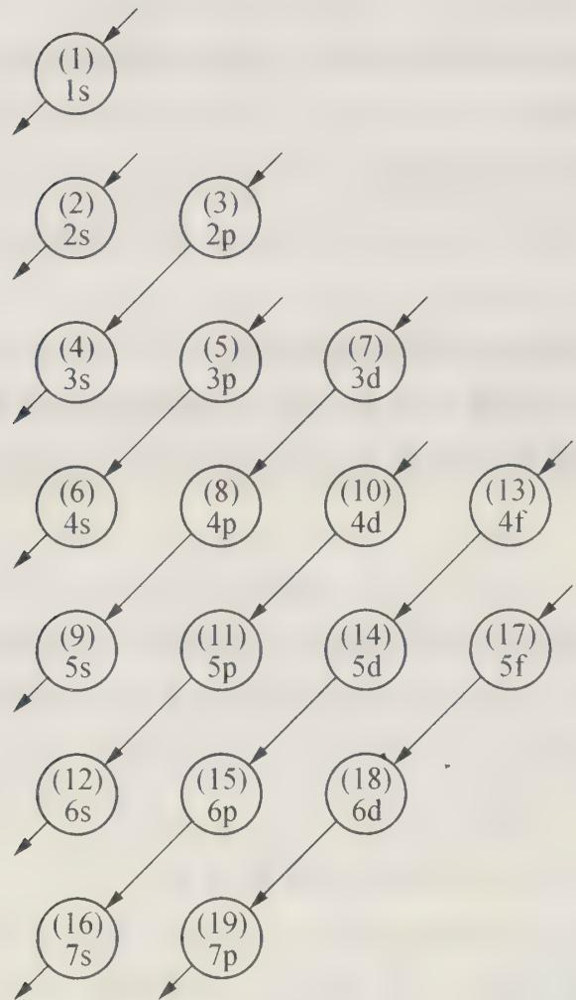

依箭头顺序,能级由低到高。我们可用下列方法记忆能级交错问题:把 s、p、d、f、g 等分别记为 0、1、2、3、4 等,轨道能量的高低为主量子数加上 s、p、d、f、g 等代表的数值,若所得数值大,则轨道能量高,反之亦然;若数值相等,主量子数大的轨道其轨道能量高。如 3d 与 4s 能量,3d 为 $3+2=5$ , 4s 为 $4+0=4$ , 因 5>4, 故 3d 轨道能量大于 4s 轨道能量;又如 3d 与 4p, 4p 为 $4+1=5$ , 因主量子数 4>3, 故 4p 轨道能量大于 3p。这个规律很容易记忆。

我们也可以用 $n + 0.7l$ 来判断亚层能量高低。

需要注意的是:核外电子排布式严格按照主量子数和角量子数大小进行排布;核外电子的填充式要按照能级交错原理进行排布。例如:Fe原子的核外电子排布式为: $1s^{2}2s^{2}2p^{6}3s^{2}3p^{6}3d^{6}4s^{2}$ ;而Fe原子的核外电子填充式为 $1s^{2}2s^{2}2p^{6}3s^{2}3p^{6}4s^{2}3d^{6}$ 。Fe原子失去电子变为 $Fe^{2+}$ 为: $1s^{2}2s^{2}2p^{6}3s^{2}3p^{6}3d^{6}$ ; $Fe^{3+}$ 为: $1s^{2}2s^{2}2p^{6}3s^{2}3p^{6}3d^{5}$ 。

## 【竞赛对接】

【例 1】（安徽省化学竞赛试题）A、B、C 三种元素，其中有一种金属元素。A、B 原子的电子层数相同。B、C 原子的最外层电子数相同。又知这三种元素原子的最外层电子数之和为 17。原子核中的质子数之和为 31。试通过计算确定这三种元素的名称。

过程探究 设元素 A、B 原子最外层的电子数分别为 y 和 x。则 $\left\{\begin{aligned}y+2x&=17\\ y&\leqslant8, x\leqslant8\end{aligned}\right.$ (1)

只有 $y$ 为奇数时(1)式才能成立，所以有① $\left\{ \begin{array}{l} y = 7 \\ x = 5 \end{array} \right.$ ② $\left\{ \begin{array}{l} y = 5 \\ x = 6 \end{array} \right.$ ③ $\left\{ \begin{array}{l} y = 3 \\ x = 7 \end{array} \right.$ ④ $\left\{ \begin{array}{l} y = 1 \\ x = 8 \end{array} \right.$

由于三种原子的质子数之和为 31, 最外层电子数之和为 17, 所以三种原子的内层电子数之和为 14。又 A、B 具有相同的电子层数, 若为三层, 则 A、B 内层电子数之和为 20, 已超过 14, 不可能。只有 A、B 具有两个电子层才可能。这样可能的组合有:

① 当 $\left\{ \begin{array}{l} y = 7 \\ x = 5 \end{array} \right.$ 时，则 $\left\{ \begin{array}{l} A \text{为} F \\ B \text{为} N \\ C \text{为} P \end{array} \right.$ ② 当 $\left\{ \begin{array}{l} y = 5 \\ x = 6 \end{array} \right.$ 时，则 $\left\{ \begin{array}{l} A \text{为} N \\ B \text{为} O \\ C \text{为} S \end{array} \right.$

③ 当 $\left\{\begin{aligned} y &= 3 \\ x &= 7 \end{aligned}\right.$ 时，则 $\left\{\begin{aligned} A &为 B \\ B &为 F \\ C &为 Cl \end{aligned}\right.$ ④ 当 $\left\{\begin{aligned} y &= 1 \\ x &= 8 \end{aligned}\right.$ 时，则 $\left\{\begin{aligned} A &为 Li \\ B &为 Ne \\ C &为 Ar \end{aligned}\right.$

因为组合中应有一种元素是金属元素,所以三种元素的名称是 A 为锂,B 为氖,C 为氩。

参考解答 三种元素的名称是 A 为锂, B 为氖, C 为氩。

【例 2】（湖南省化学竞赛试题）现代原子结构理论认为，在同一电子层上，可有 s、p、d、f、g、h 等亚层，各亚层分别有 1、3、5…个轨道。试根据电子填入轨道的顺序预测：

(1) 第 8 周期共有 \_\_\_\_ 种元素。

(2) 原子核外出现第一个 6f 电子的元素的原子序数是 \_\_\_\_。

(3) 根据“稳定岛”假说, 第 114 号元素是一种稳定同位素, 半衰期很长, 可能在自然界都可以找到。试推测第 114 号元素属于\_\_\_\_周期, \_\_\_\_族元素, 原子的外围电子构型是\_\_\_\_。

过程探究 本题考查四个量子数和电子排布等知识。

（1）根据电子的填充特点： $(n-3)g(n-2)f(n-1)dnsnp$ ，可知在第8周期中，含有s、p、d、f、g，其填充的元素种数为： $1\times2+3\times2+5\times2+7\times2+9\times2=50$ （种）；解答此问时还可以根据元素原子核外电子排步规律，分析每一周期中元素的种数，探索周期数和所能容纳的元素种数的规律，用数学归纳法得出其通式，得出答案。请看下列归纳：

<table><tr><td>周期数</td><td>能级组</td><td>电子亚层数</td><td>电子数</td><td>周期所能容纳的元素种数</td></tr><tr><td>1</td><td> $1s^{2}$ </td><td>1</td><td> $2=2\times1^{2}$ </td><td>2</td></tr><tr><td>2</td><td> $2s^{2}2p^{6}$ </td><td>2</td><td> $8=2\times2^{2}$ </td><td>8</td></tr><tr><td>3</td><td> $3s^{2}3p^{6}$ </td><td>2</td><td> $8=2\times2^{2}$ </td><td>8</td></tr><tr><td>4</td><td> $3d^{10}4s^{2}4p^{6}$ </td><td>3</td><td> $18=2\times3^{2}$ </td><td>18</td></tr><tr><td>5</td><td> $4d^{10}5s^{2}5p^{6}$ </td><td>3</td><td> $18=2\times3^{2}$ </td><td>18</td></tr><tr><td>6</td><td> $4f^{14}5d^{10}6s^{2}6p^{6}$ </td><td>4</td><td> $32=2\times4^{2}$ </td><td>32</td></tr><tr><td>n</td><td> $ns^{2}\cdots np^{6}$ </td><td></td><td></td><td></td></tr></table>

综上归纳, 当 $n$ 为偶数时, 每一能级组最多可容纳 $2\left(\frac{n}{2} + 1\right)^2$ 个电子, 化简即得 $n$ 周期含 $\frac{(n + 2)^2}{2}$ 种元素; 当 $n$ 为奇数时, 每一能级组最多可容纳 $2\left(\frac{n - 1}{2} + 1\right)^2$ 个电子, 化简即得 $n$ 周期含 $\frac{(n + 1)^2}{2}$ 种元素。这样不难推出第8周期所能容纳的电子数为50种元素。

(2) 根据(1)的分析, 第一个出现 6f 的元素应该是第 8 周期ⅢB族, 应该为类锕系元素, 其电子构型为 $6\mathrm{f}^{1}7\mathrm{d}^{1}8\mathrm{s}^{2}$ 。因此它的原子序数为 139。

（3）114号元素可以氦为基准，根据每一周期的元素种数，得知该元素应该在第七周期，而位于第七周期的稀有元素的原子序数应该为118号。然后逐步往元素周期表的前面推，正好推到ⅣA族，因此它的价电子构型为 $7s^{2}7p^{2}$ 。
参考解答 （1）50；（2）139；（3）七、ⅣA、 $7s^{2}7p^{2}$ 。

【例 3】（陕西省化学竞赛试题）某元素构成的双原子单质分子有三种，其式量分别是 158、160 和 162。在天然单质中，此三种单质的物质的量之比为 1:1:1。由此推断以下结论正确的是( )。
A. 此元素有三种同位素
B. 其中一种同位素质量数为 80
C. 其中质量数为 79 的同位素原子占总数的 $\frac{1}{2}$ D. 此元素的单质的平均式量为 160

过程探究 由于双原子单质分子有三种,根据排列组合的有关知识,可知:该元素原子的同位素有两种,设为 $^{a}X$ , $^{b}X$ 。若a<b,则2a=158,2b=162,a=59,b=61。由于三种单质的物质的量之比为1:1:1,求得 $^{a}X$ 、 $^{b}X$ 原子的物质的量之比为1:1,平均式量 $=158\times\frac{1}{3}+160\times\frac{1}{3}+162\times\frac{1}{3}=160$ 。

参考解答 CD。

说明 需要指出的是,若考虑几率的等同性,三种单质的物质的量之比应为 1:2:1。其计算式是: $^{a}X : ^{b}X = (1 \times 2 + 2) : (2 + 1 \times 2) = 1 : 1$ ; 若按照题中所得为: $^{a}X : ^{b}X = (1 \times 2 + 1) : (1 + 1 \times 2) = 1 : 1$ , 但与数学中的概率公式不符合, 因为若设 $^{a}X : ^{b}X = a : b$ , 则:

$^{a}X^{a}X: ^{a}X^{b}X: ^{b}X^{b}X=\left[a/(a+b)\right]^{2}:2\left[a/(a+b)\right]\left[b/(a+b)\right]:\left[b/(a+b)\right]^{2}$ ; 其中的 2 表示 $^{a}X^{b}X$ 与 $^{b}X^{a}X$ 是一样的, 因此式中要乘以 2。

由此看来，该竞赛试题值得商榷。这说明，同学们在解答竞赛试题时要大胆质疑，不要轻易迷信权威。只有这样才有自己的思考空间，能力才能提高。

【例 4】（1998 年全国初赛试题）迄今已合成的最重元素是 112 号，它是用 $^{70}_{30}$ Zn 高能原子轰击 $^{208}_{82}$ Pb 的靶子，使锌核与铅核熔合而得。科学家通过该放射性元素的一系列衰变的产物确定了它的存在，总共只检出一个原子。该原子每次衰变都放出一个高能 $\alpha$ 粒子，最后得到比较稳定的第 100 号元素镀的含 153 个中子的同位素。

(1) 112号是第几周期第几族元素?

(2) 它是金属还是非金属？

(3) 你认为它的最高氧化态至少可以达到多少?

（4）写出合成112元素的反应式(注反应式中的核素要用诸如 $\mathrm{^{3}H}$ 、 ${}_{82}^{208}\mathrm{Pb}$ 等带上下标的符号来表示，112号元素符号未定，可用M表示)。

过程探究 本题考查核化学反应方程式。对于核反应,必须处理好下列问题:

（1）基本粒子的表达式：如题中涉及的 $\alpha$ 粒子，即为质子数为 2，质量数为 4 的 He 核。

（2）核反应式两边有两个守恒：质子数守恒和质量数守恒两个等式。从112到100释放12个质子，故共计发生6次衰变，放出6个 $\alpha$ 粒子，即放出12个中子，而题目信息说镄有153个中子，故M的中子数应为 $153 + 12 = 165$ ，质量数为 $165 + 112 = 277$ 。

$$
{ } _ { 3 0 } ^ { 7 0 } \mathrm{Zn} + { } _ { 8 2 } ^ { 2 0 8 } \mathrm{Pb} \longrightarrow { } _ { 1 1 2 } ^ { 2 7 7 } \mathrm{M} + { } _ { 0 } ^ { 1 } \mathrm{n}
$$

(3) 根据核电荷数判断元素在周期表中的位置:

首先要弄清楚每一周期有多少种元素。然后弄清楚元素周期表的分布。第一周期2种元素，第二、第三周期各有8种元素，第四、第五周期各有18种元素，第六、第七周期各有32种元素，第八、第九周期各有50种元素。若以He原子为标准，即 $2+8+8+18+18+32+32=118$ ，即类氮（氨下一周期同族元素），然后再往前推到112号元素即可。即类汞元素，位于第七周期ⅡB族，属于金属元素。根据族序数等于最高化合价原则，该元素最高化合价为+2价。

参考解答（1）根据每周期元素的种数，可推测出稀有元素氡下一周期（第七周期）的原子序数为： $2 + 8 + 8 + 18 + 18 + 32 + 32 = 118$ 。因此，112号元素位于第七周期ⅡB族。

(2) 该元素位于 $\mathrm{Hg}$ 元素的下一周期, 因此是金属元素。

(3) 由于 112 号元素的电子排布为 $6 \mathrm{~d}^{10} 7 \mathrm{~s}^{2}$ 。因此，在一般情况下，其最高氧化态至少可以达到 +2 。由于 $\mathrm{Hg}$ 受惰性电子对效应影响很大，有理由相信 112 号元素受惰性电子对影响更大。

(4) 合成 112 号元素的反应式为: $\mathrm{Zn} + \mathrm{Pb} \longrightarrow \mathrm{M} + \mathrm{n}$

【例 5】（2000 年浙江省化学竞赛试题）假定元素周期表是有限的，根据已知的元素周期表的某些事实和理论可归纳出一些假说：

(1) 根据每个周期最后一种金属元素出现的族序数, 预测周期中原子序数最大的金属元素将在第\_\_\_\_周期\_\_\_\_族(注:把零族看作ⅧA族)。周期表元素将在填满第\_\_\_\_周期后结束;根据元素周期表规律,该周期将有\_\_\_\_种元素。

(2) 根据周期表中每个周期非金属元素的种数(把稀有气体元素看作非金属元素), 预测周期表中应该有\_\_\_\_种非金属元素, 还有\_\_\_\_种未发现。未发现的非金属处在第\_\_\_\_周期\_\_\_\_族。

过程探究 本题考查四个量子数和电子排布等知识:

根据电子的填充特点： $(n-3)\mathrm{g}(n-2)\mathrm{f}(n-1)\mathrm{d}\mathrm{ns}\mathrm{np}$ ，可知在第8周期中，含有s、p、d、f、g，其填充的元素种数为： $1\times2+3\times2+5\times2+7\times2+9\times2=50$ （种）；

对于这类问题的解答,我们还可以根据元素原子核外电子排步规律,分析每一周期中元素的种数,探索周期数和所能容纳的元素种数的规律,用数学归纳法得出其通式,得出答案。请看下列归纳:

<table><tr><td>周期数</td><td>能级组</td><td>电子亚层数</td><td>电子数</td><td>周期所能容纳的元素种数</td></tr><tr><td>1</td><td> $1s^{2}$ </td><td>1</td><td> $2 = 2 \times 1^{2}$ </td><td>2</td></tr><tr><td>2</td><td> $2s^{2}2p^{6}$ </td><td>2</td><td> $8 = 2 \times 2^{2}$ </td><td>8</td></tr><tr><td>3</td><td> $3s^{2}3p^{6}$ </td><td>2</td><td> $8 = 2 \times 2^{2}$ </td><td>8</td></tr><tr><td>4</td><td> $3d^{10}4s^{2}4p^{6}$ </td><td>3</td><td> $18 = 2 \times 3^{2}$ </td><td>18</td></tr><tr><td>5</td><td> $4d^{10}5s^{2}5p^{6}$ </td><td>3</td><td> $18 = 2 \times 3^{2}$ </td><td>18</td></tr><tr><td>6</td><td> $4f^{14}5d^{10}6s^{2}6p^{6}$ </td><td>4</td><td> $32 = 2 \times 4^{2}$ </td><td>32</td></tr><tr><td>n</td><td> $\cdots ns^{2}np^{6}$ </td><td></td><td></td><td></td></tr></table>

综上归纳, 当 n 为偶数时, 每一能级组最多可容纳 $2(n/2+1)^{2}$ 个电子, 化简即得 n 周期含 $(n+2)^{2}/2$ 种元素; 当 n 为奇数时, 每一能级组最多可容纳 $2[(n-1)/2+1]^{2}$ 个电子, 化简即得 n 周期含 $(n+1)^{2}/2$ 种元素。这样不难推出第 8 周期所能容纳的电子数为 50 种元素。

根据元素周期表的递变规律,我们不难得出原子序数最大的金属在第八周期。由此不难做后续的试题。

参考解答 (1) 八;VIII A;八;50;

(2) 23;1;七;VIII A。

【例 6】（1992 年全国冬令营试题）假定某个星球上的元素服从下面的量子数限制： $n=1,2,3,\cdots;l=0,1,2,\cdots,n-1;m_{l}=\pm l;m_{s}=+1/2$ 。则在此星球上，前 4 个惰性元素的原子序数各是多少？

过程探究 根据量子数的限制,每一周期只能有(2n-1)个元素(以 n=2 为例自己排一下,特别注意 $m_{l}=\pm l$ , $m_{s}=+1/2$ 这两条限制,看是否只排出3种元素),最后一种元素的序数为 $n^{2}$ 。这样,可得如下周期表形式:

满壳层者为惰性元素，即1，4，9，16号元素。

参考解答 满壳层者为惰性元素, 即 1, 4, 9, 16 号元素。

【例 7】（2012 年化学自主招生模拟试题）下表是元素周期表的一部分。表中所列的字母分别代表一种化学元素。

<table><tr><td></td><td colspan="14"></td><td></td></tr><tr><td></td><td colspan="9"></td><td></td><td>A</td><td>B</td><td>C</td><td></td><td></td></tr><tr><td></td><td colspan="9"></td><td></td><td>D</td><td>E</td><td></td><td></td><td></td></tr><tr><td></td><td>N</td><td></td><td>M</td><td></td><td>Q</td><td></td><td></td><td></td><td></td><td></td><td></td><td></td><td></td><td></td><td></td></tr></table>

(1) A、B、C原子的第一电离能由小到大的顺序是 $N\geq0$ （用元素符号表示）；
Q元素基态原子电子排布式为 $Cr=1s^{2}2s^{2}2p^{6}3s^{2}3p^{6}3d^{5}4s^{1}C<0<N$

(2) 写出 $BC_{2}^{+}$ 的电子式 \_\_\_\_，1 mol $BC_{2}^{+}$ 中含有的 $\pi$ 键数目为 $Z_{m}O_{2}N_{A}$ $[O:N:O]^{+}$

(3) 化合物甲由 B、D 两元素组成, 已知甲是一种重要的结构材料, 硬度大, 耐磨损, 晶胞如图 1 所示甲的晶体中 B、D 两种元素原子的杂化方式均为 $SP^{3}$ 。

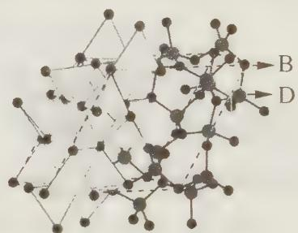  
图1

(4) 法国科学家阿尔贝·费尔和德国科学家彼得·格林贝格尔因在巨磁电阻效应(CMR效应)研究方面的成就而获得诺贝尔物理学奖。如图2的化合物具有CMR效应,则该化合物的化学式为 $C_{6}M_{8}N + CaTiO_{3}$

过程探究 本题考查电离能、核外电子排布、原子杂化、晶体结构的初步知识：

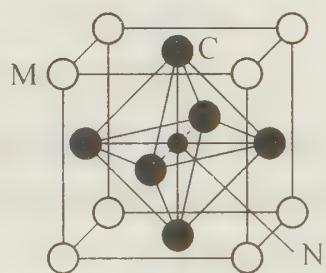

(1) 根据元素周期表相关知识可知: A、B、C 分别为碳、氮、氧元素。它们的核外电子排布为:

图2

$$
\mathrm{C}: 1 \mathrm{s} ^ {2} 2 \mathrm{s} ^ {2} 2 \mathrm{p} ^ {2}; \mathrm{N}: 1 \mathrm{s} ^ {2} 2 \mathrm{s} ^ {2} 2 \mathrm{p} ^ {3}; \mathrm{O}: 1 \mathrm{s} ^ {2} 2 \mathrm{s} ^ {2} 2 \mathrm{p} ^ {4}
$$

一般来说，电负性越大，失去价电子能力越弱，电离能越大。但同时，我们要考虑洪特规则特例。若价轨道中电子排布呈全空、半满和全满时比较稳定。由于N原子的价电子排布中2p亚层为半满结构，因此，尽管N元素电负性小于O元素电负性，但是其电离能N还是要大于O。因此电离能大小为C<O<N。Q为Cr元素(24号元素)，按正常核外电子排布为： $1s^{2}2s^{2}2p^{6}3s^{2}3p^{6}3d^{4}4s^{2}$ 。但由于洪特规则特例， $3d^{5}4s^{1}$ 为全部半满结构，比 $3d^{4}4s^{2}$ 稳定。因此Cr的核外电子排布为： $1s^{2}2s^{2}2p^{6}3s^{2}3p^{6}3d^{5}4s^{1}$ 。

(2) $\mathrm{BC}_{2}^{+}$ 为 $\mathrm{NO}_{2}^{+}$ 。由于 $\mathrm{NO}_{2}^{+}$ 与 $\mathrm{CO}_{2}$ 是等电子体，因此结构相似。由于 $\mathrm{CO}_{2}$ 的结构为 $\mathrm{O} = \mathrm{C} = \mathrm{O}$ ，因此 $\mathrm{NO}_2^+$ 的电子式为 $[\ddot{\mathrm{O}}:\dot{\mathrm{N}}:\ddot{\mathrm{O}}:]^+$ 。由于1个 $\mathrm{NO}_2^+$ 中有两个 $\sigma$ 键和两个 $\pi$ 键，因此 $1\mathrm{molNO}_2^+$ 中存在 $2N_{\mathrm{A}}$ 个 $\pi$ 键。

(3) B 为 N 元素, D 是 Si 元素。从结构图看, 一个 N 原子周围连接 3 个 Si 原子, 一个 Si 原子周围连接 4 个 N 原子, 组成空间网状结构, 即化学式为 $\mathrm{Si}_{3} \mathrm{~N}_{4}$ 。因此, Si 的四个价电子全部参与成键, 为 (等性) $\mathrm{sp}^{3}$ 杂化; N 原子 5 个价电子中有 3 个参与成键, 但需注意的是: $2 \mathrm{~s}^{2}$ 上的孤对电子也在杂化轨道中, 从而形成不等性 $\mathrm{sp}^{3}$ 杂化。

(4) C 为 O 元素, N 为 Ca 元素, M 为 Ti 元素。在图 2 的晶胞中: O 元素原子个数为: $6 \times 1/2 = 3$ , Ca 原子为晶胞所独有; Ti 原子个数为: $8 \times 1/8 = 1$ 。因此该化合物为 $CaTiO_{3}$ 。

参考解答 (1) $\mathrm{C} < \mathrm{O} < \mathrm{N}$ ; $1\mathrm{s}^{2} 2\mathrm{s}^{2} 2\mathrm{p}^{6} 3\mathrm{s}^{2} 3\mathrm{p}^{6} 3\mathrm{d}^{5} 4\mathrm{s}^{1}$ ;

(2) $[ :\ddot{\mathrm{O}}: :\mathrm{N}: :\ddot{\mathrm{O}}: ]^{+}; 2N_{\mathrm{A}};$

(3) $\mathfrak{sp}^3$ ;

(4) $\mathrm{CaTiO_3}$ 。

## 【实战演练】

1. (1996年陕西省化学竞赛试题)某元素构成的双原子单质分子有三种,其式量分别是158、160和162。在天然单质中,此三种单质的物质的量之比为 $1:2:1$ 。由此推断以下结论正确的是(CD)
A. 此元素有三种同位素
B. 其中一种同位素质量数为80
C. 其中质量数为79的同位素原子占总数的1/2
D. 此元素的单质的平均式量为160

2. 已知自然界氧的同位素有 $^{16}$ O、 $^{17}$ O、 $^{18}$ O，氢的同位素有 H、D，从水分子的原子组成来看，自然界的水一共有（C）。A. 3 种 B. 6 种 C. 9 种 D. 12 种

3. 已知硼化物 $B_{x}H_{y}^{2-}$ 与 $B_{10}C_{2}H_{12}$ 的电子总数相同，则 $B_{x}H_{y}^{2-}$ 的正确表达式为 (D)。
5x+y+z=74 50+12+13=74
A. $B_{9}H_{15}^{2-}$ B. $B_{10}H_{14}^{2-}$ C. $B_{11}H_{13}^{2-}$ D. $B_{12}H_{12}^{2-}$

4. (2000年全国初赛试题)1999年是人造元素丰收年, 一年间得到第114、116和118号三种新元素。按已知的原子结构规律, 118号元素应是第\_\_\_\_\_\_周期第\_\_\_\_\_\_族元素, 它的单质在常温常压下最可能呈现的状态是\_\_\_\_\_\_(气、液、固选一填入)态。近日传闻俄国合成了第166号元素, 若已知原子结构规律不变, 该元素应是第\_\_\_\_\_\_周期第\_\_\_\_\_\_族元素。

5. (1986年湖南省化学竞赛试题)现代原子结构理论认为,在同一电子层上,可有s、p、d、f、g、h等亚层,各亚层分别有1、3、5、…个轨道。试根据电子填入轨道的顺序预测:

(1) 第8周期共有 50 种元素；

(2) 原子核外出现第一个 6f 电子的元素的原子序数是 131；

(3) 根据“稳定岛”假说, 第 114 号元素是一种稳定同位素, 半衰期很长, 可能在自然界都可以找到。试推测第 114 号元素属于第七周期, ⅦA族元素, 原子的外围电子构型是 $7s^{2} \div f7s^{2}7p^{2}$

6. 目前,科学家正在设法探寻“反物质”。所谓“反物质”是由“反粒子”构成的,“反粒子”与其对应的正粒子具有相同的质量和相同的电量,但电荷的符号相反。2002年9月20日,欧洲核子研究中心成功制造出约5万个低能量状态的反氢原子,这是人类首次在受控条件下大批量制造反物质。试回答:

(1) 科学家制造出的反氢原子的质量数为\_\_\_\_，电荷数为\_\_\_\_。

(2)一对正、负电子相遇发生湮灭,转化为一对频率相同的光子,已知电子质量为 $0.9\times10^{-30}$ kg,那么这对电子湮灭时释放的能量是\_\_\_\_J,这两个光子的频率约为\_\_\_\_Hz。(保留2位有效数字,普朗克常数 $h=6.63\times10^{-34}$ J·s)

(3) 反物质酸碱中和反应的实质可表为: $H^{-} + OH^{+} = H_{2}O$

7. (2000年四川省化学竞赛试题)无机化合物甲、乙分别由三种元素组成。组成甲、乙化合物的元素的特征电子排布都可表示如下: $as^{a}$ 、 $bs^{b}bp^{c}$ 、 $cs^{c}cp^{2c}$ 。甲是一种溶解度较小的化合物, 却可溶于乙的水溶液。由此可知甲、乙的化学式分别是

甲溶于乙的水溶液化学方程式为\_\_\_\_。

8. (1990年安徽省化学竞赛试题)我国曾报道合成的一种含铊的超导材料,铊(Tl)原子的价电子构型为 $3nS^{n}3np^{n-1}$ ,试判断铊的某些性质: 惰性电子对效应

(1) Tl 的最高正化合价为 +3，较常见的化合价是 +1 价，这是 6p. 造成的。
能层有1个单电子(2) T1 能 (能或不能)与盐酸反应,生成氢气。

(3) Tl 的低价氧化物是两性（碱性、酸性、两性或惰性）氧化物。

(4) Tl 的熔点比地壳中含量最多的金属元素的单质的熔点低 (高或低)。

9. (2001年浙江省化学竞赛试题)有A、B、C、D四种短周期元素。已知一个B原子的原子核受到α粒子的轰击得到一个A原子的原子核和一个C原子的原子核，又知C、D元素同主族，且能发生下面两个反应。 $A_{2}B+^{4}_{2}He\rightarrow\frac{A+3}{Z+2}C+\frac{1}{6}n$

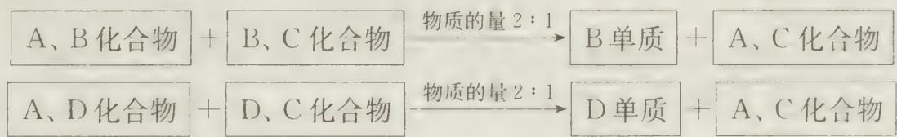

请回答：

(1) 比较 B、C 原子半径大小 \_\_\_\_；画出 D 离子的结构示意图 \_\_\_\_。

(2) 分别写出上述两个反应方程式 \_\_\_\_ ， \_\_\_\_ 。

(3) 由这四种元素组成的化合物中(四种元素都有), 既能与酸反应, 也能与碱反应的物质是\_\_\_\_, \_\_\_\_。

10. 1999 年 4 月, 人类合成超重元素的努力竖立起了一个新的里程碑, 美国劳仑斯--柏克莱国家实验室的领导人,核化学家 Kenneth E. Gregorich 宣布,在该实验室的 88 英寸回旋加速器上,研究者用高能 $^{86}_{36}$ Kr 离子轰击 $^{208}_{82}$ Pb 靶,氮核与铅核融合,放出 1 个中子,形成了一种新元素 A;120 微秒后,该 A 元素的原子核分裂出 1 个 α 粒子,衰变成另一种新元素 B;600 微秒又释放出一个 α 粒子,形成另一种新元素 C 的一种同位素。新元素 C 是在 1998 年末,俄美科学家小组用 $^{48}_{20}$ Ca 核轰击 $^{244}_{94}$ Pu 靶时得到的。

(1) 试确定 A、B 和 C 发现的先后顺序。

(2) 写出合成新元素 A、B 和 C 的反应方程式。

(3) 试确定 A、B 和 C 在元素周期表中的位置, 并预测其化学性质。

(4) 2000 年 7 月 19 日俄罗斯莫斯科郊区的杜布纳核联合研究所的科学家制成了第 166 号新元素,该新元素在门捷列夫元素周期表上的位置为 \_\_\_\_。

11. 短周期主族元素 A、B、C、D、E 的原子序数依次增大, 它们的原子核外电子层数之和为 10; B 的化合物种类繁多, 数目庞大。C、D 是空气中含量最多的两种元素; D、E 两单质可以生成两种不同的离子化合物。

(1) 写出 E 的单质与 A、D 两元素形成其常见化合物反应的离子方程式 \_\_\_\_。

(2) 由 A、C、D 三元素所形成的常见盐溶液呈\_\_\_\_性(填“酸”、“中”、“碱”), 其原因用离子方程式表示为: \_\_\_\_。

(3) B 的相对分子质量最小的氢化物的燃烧热为 890.3 kJ/mol, 写出其燃烧的热化学方程式 \_\_\_\_。

(4) X、Y 是均由 C、D 两元素组成的化合物, 且 C、D 在 X、Y 中的价态相同, 某温度下相互转化时的量变关系如右图:

(I) X 的化学式是 \_\_\_\_。

（Ⅱ）图中 a、b、c、d 四点中，表示反应处于平衡状态的是 \_\_\_\_。

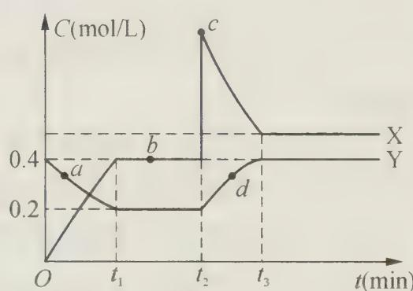

（Ⅲ）该温度下，反应 Y 转化为 X 的平衡常数为 \_\_\_\_。

（Ⅳ）反应进行到 $t_{2}$ 时刻，改变的条件可能是 \_\_\_\_。

12. 短周期元素 D、E、X、Y、Z 原子序数逐渐增大。它们的最简氢化物分子的空间构型依次是正四面体、三角锥型、正四面体、角型(V型)、直线型。回答下列问题：

(1) Y 的最高价氧化物的化学式为 \_\_\_\_；Z 的核外电子排布式是 \_\_\_\_。

(2) D 的最高价氧化物与 E 的一种氧化物为等电子体, 写出 E 的氧化物的化学式 \_\_\_\_。

(3) D 和 Y 形成的化合物, 其分子的空间构型为 \_\_\_\_, X 与 Z 构成物质的晶体类型为 \_\_\_\_ 晶体。

(4) 写出一个验证 Y 与 Z 的非金属性强弱的离子反应方程式 \_\_\_\_。

(5) 金属镁和 E 的单质在高温下反应得到的产物与水反应生成两种碱性物质,该

反应的化学方程式是\_\_\_\_。

13. 下图是 Na、Cu、Si、H、C、N 等元素单质的熔点高低的顺序, 其中 c、d 均是热和电的良导体。

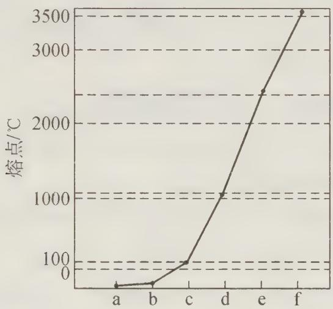

(1) 请写出上图中 d 单质对应元素原子的电子排布式 \_\_\_\_。

(2) 单质 a、f 对应的元素以原子个数比 1:1 形成的分子 (相同条件下对 $\mathrm{H}_{2}$ 的相对密度为 13) 中含 \_\_\_\_ 个 $\sigma$ 键和 \_\_\_\_ 个 $\pi$ 键。

(3) a 与 b 的元素形成的 10 电子中性分子 X 的空间构型为 \_\_\_\_；将 X 溶于水后的溶液滴入到 $AgNO_{3}$ 溶液中至过量，得到络离子的化学式为 \_\_\_\_，其中 X 与 $Ag^{+}$ 之间以 \_\_\_\_ 键结合。

(4) 右图是上述六种元素中的一种元素形成的含氧酸的结构: 请简要说明该物质易溶于水的两个数原因 \_\_\_\_。

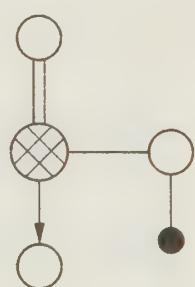

14. 有①、②、③、④、⑤、⑥、⑦、⑧、⑨、⑩十种元素，原子序数依次增大，⑨、⑩处于第四周期，其余均为短周期元素。

(1) 若②、⑦、⑧三种元素在周期表中相对位置如下:

<table><tr><td>2</td><td></td><td></td><td></td></tr><tr><td></td><td></td><td>7</td><td>8</td></tr></table>

②与⑦、②与⑧形成的液体化合物是常见的重要溶剂,则②、⑦、⑧三种元素最高价氧化物对应的水化物酸性由强到弱的顺序是: (用化学式表示)。

(2) 若甲、乙、丙、丁、戊均为上述八种短周期元素中的某些元素组成的单质或由其中两种元素组成的化合物, 且甲、戊为无色气体, 反应 a 为置换反应, 反应 b 为化合反应。见下图示转化关系推测:

$$
\begin{array}{c} \text {甲} \\ \text {乙} \end{array} \xrightarrow {\text {反应a}} \begin{array}{c} \text {丙} \\ \text {丁} \end{array} \xrightarrow [ \text {反应b} ]{\text {+甲}} \text {戊}
$$

戊可能为：\_\_\_\_、\_\_\_\_（列举合适的两例）。

若甲是 $\mathrm{O}_2$ 、乙是 $\mathrm{N}_2\mathrm{H}_1$ ，反应a是在强碱性溶液中进行的的原电池反应，则负极发

生的电极反应式为：\_\_\_\_。

(3) 若下图中 A、B、C、D、E 分别是上述 10 种元素中的某些元素组成的单质或其中两种元素组成的化合物。

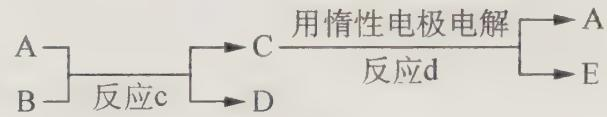

已知: A 是常见的金属单质, 反应 c 为置换反应类型。

若反应 c 是用 A 作电极, 在 B 的水溶液中进行电解反应, 它们有如上图示转化关系。则反应 d 中阴极的电极反应式为: \_\_\_\_ ;

若反应 c 是在高温下进行的,且为工业上有重要应用价值的放热反应,当物质 C 是一种两性化合物,则反应 c 的化学方程式为:\_\_\_\_。

# 第 6 讲 元素周期律和元素周期表

# 【知识要点】

## 一、元素周期表的结构

## 1. 周期和族

元素周期表由周期和族组成。周期数等于电子层数,族数等于价电子数。到目前为止,元素周期表的结构是七行、十八列。其中,七行即七个周期,分为“三短、三长、一不全”。具体的含义是:三个短周期(前三周期)、三个长周期(第四、五、六周期)和一个不完全周期(第七周期);十八列指七个主族(用A表示)、七个副族(用B表示)、一个零族(稀有气体元素)、一个Ⅷ族(Ⅷ族有三列)。

## 2. 元素性质在周期表中的递变规律

① 同周期:从左到右,随原子序数的递增,原子半径逐渐减小,失电子能力减弱,得电子能力增强,因而金属性逐渐减弱,非金属性逐渐增强。

② 同主族:从上到下,随原子序数的增加,电子层数增多,原子半径增大,失电子渐易,得电子渐难,因而金属性逐渐增强,非金属性逐渐减弱。

③ 元素金属性、非金属性强弱的标志：

元素金属性强的具体体现：

单质的还原性强(与水、酸反应易);最高价氧化物对应的水化物碱性强;对应阳离子的氧化性弱。

非金属性强的具体体现：

单质的氧化性强(与金属、氢气反应易);气态氢化物稳定性强;最高价氧化物对应的水化物酸性强;元素阴离子的还原性弱。

## 3. 微粒半径的比较

若微粒的电子层数相同,随着核电荷数的增加,核吸引价电子的能力增强,因而微粒半径小;若微粒的电子层数不同,随着电子层数增加,核吸引价电子的能力减弱,因而微粒半径增大。总之,电子层数多,微粒半径大;电子层数相同,核电荷数大,微粒半径小。

## 4. 推断某元素在周期表中的位置

首先要弄清每个周期中元素种数:第一周期2种元素;第二周期8种元素;第三周期8种元素;第四周期18种元素;第五周期18种元素;第六周期32种元素;第七周期32种元素;然后再以稀有气体元素(0族)为参考依据,往前推。

## 5. 对角线法则

微粒的半径与其化学性质有非常密切的关系。

在元素周期表中,对角线左上角元素与右下角元素的化学性质相似。如 Li 元素与 Mg 元素处于对位,Li 元素的化学性质更趋向于 Mg,而与 Na、K 等元素有所区别。这是由于 $Li^{+}$ 与 $Mg^{2+}$ 半径近似相等。因而得电子能力相近,因而化学性质相似。

## 二、元素周期表的分区构造

元素周期表中不同区域的元素在性质上有递变性,在某一个特定区域又有独特的性质和相似性。按照价电子排布和其决定的元素性质特点可以将元素周期表分为若干个分区。

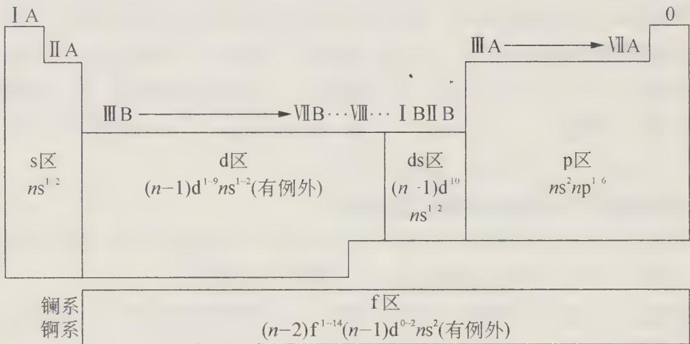

s区:包括第ⅠA、ⅡA主族元素,价电子构型为 $ns^{1}$ 和 $ns^{2}$

p 区: 包括第 Ⅲ A→Ⅶ A 族和零族元素, 价电子构型为 $ns^{2}np^{1\sim6}$

d区:包括第ⅢB→ⅦB族和第Ⅷ族的元素,价电子构型一般为 $(n-1)\mathrm{d}^{1\sim9}\mathrm{ns}^{2}$

ds 区: 包括第 I B、Ⅱ B 族元素, 价电子构型为 $(n-1)d^{10}ns^{1\sim2}$

f区:包括镧系元素和锕系元素,价电子构型一般为 $(n-2)\mathrm{f}^{1\sim11}(n-1)\mathrm{d}^{0\sim2}ns^{2}$

将上述分类具体应用到元素周期表前三周期,我们可以得到如下价电子排布:

<table><tr><td>H 1s $^{1}$ </td><td colspan="6"></td><td>He 1s $^{2}$ </td></tr><tr><td>Li 2s $^{1}$ </td><td>Be 2s $^{2}$ </td><td>B 2s $^{2}$ 2p $^{1}$ </td><td>C 2s $^{2}$ 2p $^{2}$ </td><td>N 2s $^{2}$ 2p $^{3}$ </td><td>O 2s $^{2}$ 2p $^{4}$ </td><td>F 2s $^{2}$ 2p $^{5}$ </td><td>Ne 2s $^{2}$ 2p $^{6}$ </td></tr><tr><td>Na 3s $^{1}$ </td><td>Mg 3s $^{2}$ </td><td>Al 3s $^{2}$ 3p $^{1}$ </td><td>Si 3s $^{2}$ 3p $^{2}$ </td><td>P 3s $^{2}$ 3p $^{3}$ </td><td>S 3s $^{2}$ 3p $^{4}$ </td><td>Cl 3s $^{2}$ 3p $^{5}$ </td><td>Ar 3s $^{2}$ 3p $^{6}$ </td></tr></table>

从价电子排布我们可以分析得出如下结论：

从每一个周期的第一个元素开始到最后一个稀有气体元素, 原子最外层电子由 1 增加到 8 (第一周期为 2), 价层电子构型由 $ns^1$ 到 $ns^2 np^6$ (或 $ns^2$ ), 随着原子序数的递增由于元素原子的核外电子排布呈周期性变化, 因此与电子层结构有关的元素性质也呈周期性变化, 如原子半径、化合价、金属性、非金属性、电子亲合能、电负性等都呈周期性的变化, 这就是元素周期律。

## 【竞赛对接】

【例 1】设想你去某外星球做了一次科学考察,采集了该星球上十种元素单质的样品,为了确定这些元素的相对位置以便系统地进行研究,你设计了一些实验并得到下列结果:

<table><tr><td>单质</td><td>A</td><td>B</td><td>C</td><td>D</td><td>E</td><td>F</td><td>G</td><td>H</td><td>I</td><td>J</td></tr><tr><td>熔点(°C)</td><td>-150</td><td>550</td><td>160</td><td>210</td><td>-50</td><td>370</td><td>450</td><td>300</td><td>260</td><td>250</td></tr><tr><td>与水反应</td><td></td><td>√</td><td></td><td></td><td></td><td>√</td><td>√</td><td>√</td><td></td><td></td></tr><tr><td>与酸反应</td><td></td><td>√</td><td></td><td>√</td><td></td><td>√</td><td>√</td><td>√</td><td></td><td>√</td></tr><tr><td>与氧气反应</td><td></td><td>√</td><td>√</td><td>√</td><td></td><td>√</td><td>√</td><td>√</td><td>√</td><td>√</td></tr><tr><td>不发生化学反应</td><td>√</td><td></td><td></td><td></td><td>√</td><td></td><td></td><td></td><td></td><td></td></tr><tr><td>相对于A元素的原子量</td><td>1.0</td><td>8.0</td><td>15.6</td><td>17.1</td><td>23.8</td><td>31.8</td><td>20.0</td><td>29.6</td><td>3.9</td><td>18.0</td></tr></table>

按照元素性质的周期递变规律,试确定以上十种元素的相对位置,并填入表中(见右表)。

过程探究 本题是在全新环境下,考查学生对元素周期律知识的灵活运用。综观题给全部信息:有单质的熔点,有相对于A元素的相对原子质量共20个数据,另有关于10种单质化学性质的20个“√”判断。再分项整理信息(即分类、分析与归纳)。

<table><tr><td></td><td></td><td></td><td></td><td></td><td></td><td></td><td></td><td></td><td></td><td></td></tr><tr><td></td><td></td><td></td><td></td><td></td><td></td><td></td><td>A</td><td></td><td></td><td></td></tr><tr><td></td><td></td><td></td><td></td><td></td><td>B</td><td></td><td></td><td></td><td></td><td></td></tr><tr><td></td><td></td><td></td><td></td><td></td><td></td><td></td><td></td><td></td><td></td><td></td></tr><tr><td></td><td></td><td></td><td></td><td>H</td><td></td><td></td><td></td><td></td><td></td><td></td></tr><tr><td></td><td></td><td></td><td></td><td></td><td></td><td></td><td></td><td></td><td></td><td></td></tr><tr><td></td><td></td><td></td><td></td><td></td><td></td><td></td><td></td><td></td><td></td><td></td></tr></table>

(1) 化学性质相似组: B、F、G、H; D、J; C、I; A、E。

(2) 化学性质相似组中相对于 A 的原子相对质量数据成等差递变的组合为: 公差为 12 的递增系列: B(8)、G(20)、F(31.8); I(3.9), C(15.6); 公差约为 1 的递增系列: D(17.1), J(18.0); 公差约为 24 的递增系列: A(1)、E(24.8)。

(3) 在(2)组合中熔点递变组合为:随相对原子质量递增而递减组合:B(550℃)、G(450℃)、F(370℃);I(260℃)、C(160℃)。随相对原子质量递增而递增组合:A(-150℃)、E(-50℃);D(210℃)、J(250℃)。最后寻找信息深加工的方法与方

向:联系(1)、(2)、(3)分项信息分析的特点,迁移联想,类比周期表中的同周期、同主族递变规律,作出10种元素相对位置判断:公差为1的元素应是同周期相邻元素,公差为12的元素应是同主族相邻元素等。得出综合结论(见右表)

<table><tr><td></td><td></td><td></td><td></td><td></td><td></td><td></td><td></td><td></td><td></td><td></td></tr><tr><td></td><td></td><td></td><td></td><td></td><td></td><td></td><td>A</td><td></td><td></td><td></td></tr><tr><td></td><td>I</td><td></td><td></td><td></td><td>B</td><td></td><td></td><td></td><td></td><td></td></tr><tr><td></td><td>C</td><td>D</td><td>J</td><td></td><td>G</td><td></td><td>E</td><td></td><td></td><td></td></tr><tr><td></td><td></td><td></td><td></td><td>H</td><td>F</td><td></td><td></td><td></td><td></td><td></td></tr><tr><td></td><td></td><td></td><td></td><td></td><td></td><td></td><td></td><td></td><td></td><td></td></tr><tr><td></td><td></td><td></td><td></td><td></td><td></td><td></td><td></td><td></td><td></td><td></td></tr></table>

## 参考解答 见上述分析

【例 2】（湖南省化学竞赛试题）右图表示元素 X 的头五级电离能的对数值，试推测 X 可能是哪些元素？

过程探究 本题考查对图形的分析,要注意图中纵坐标的标度是对数值,因此 X 元素的第二和第三电离能之间有突变,说明它有两个电子容易电离,电离第三个电子需要破坏 8 电子构型,所以它是ⅡA族元素。图中示出 5 个电子的电离能

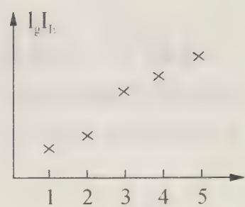

值,因此它不可能是 Be, 因为 Be 原子总共只有 4 个电子。综上分析, X 可能是 Mg、Ca、Sr 或 Ba。

## 参考解答 X 可能是 Mg、Ca、Sr 或 Ba。

【例 3】（美国化学竞赛试题）元素的性质能用元素周期表预言。请根据元素周期律的有关知识回答合成的 114、116 和 118 号元素的有关问题：

(1) 给出位于元素周期表中 114、116 和 118 号元素上方的元素名称和元素符号。

(2) 预言 114、116 和 118 号元素的电离能之间的大小关系。预测它们的电离能与同族上方元素的电离能的大小, 阐述你的理由。

（3）预测 114 号元素的氧化态，哪种氧化态较稳定。请说明理由。

（4）试说明为什么114、116、118号元素能人工合成出来，而113、115和117号元素却没有人工合成出来？

过程探究 本题是具体考查元素周期表的结构,元素在周期表中的位置推断,元素性质的递变规律等。(1)根据每周期中元素种数推测出114、116、118号元素,可以稀有气体元素这一族为基准推出118号元素的位置: $2 + 8 + 8 + 18 + 18 + 32 + 32 =$ 118。说明118号元素正好在零族,其上方元素应为Rn;同理可推得114号元素位于ⅣA族,其上方元素为Pb;116号元素位于ⅥA族,其上方元素为Po。(2)根据同周期元素的递变性回答。从左到右,元素的金属性减弱,非金属性增强,因此得电子趋势增强,电离能增大;而同族中,从上到下,元素的金属性增强,失去价电子趋势增强,电离能减小,即它们的电离能与同族上方元素的电离能相较是较小的;(3)由于114号元素位于ⅣA族,常见有两种价态:+2价和+4价。根据惰性电子对效应,在周期表同族下方,低价稳定,高价不稳定,因此114号元素+2价比+4价稳定;(4)考查元素的稳定性问题。一般说来,若元素的质子为偶数,则元素较稳定,质子数为奇数的则不太稳定。因此,114、116、118号元素已经人工合成,而113、115、117号元素还没有人工合成出来。

## 参考解答 见上述分析

【例 4】（安徽省化学竞赛试题）关于核的稳定性有以下两条经验规则：

① 对于原子序数为 20 以前的元素而言, 最稳定的核是核中的质子数 (P) 等于中子数 (N) 的核, 即比值 $N / P = 1$ ; 对于原子序数为 $20 \sim 83$ 的元素而言, 随着质子数增多, 其核内的斥力增大, 需要较多的中子以增大核内粒子间的引力, 所以稳定核的 $N / P$ 值随着原子序数的增加而增大, 直到约为 1.6, 超过此值时, 核就变得太大, 而发生裂变。这种变化趋势可用稳定核的 $N / P$ 比值与 $P$ 的关系图表示。该图的意义是：对某一元素 $X$ ，其稳定核的 $N / P$ 将落在曲线上或曲线上下附近，若 $N / P$ 过高或过低，核将不稳定。

② 马涛契规则(Mattauch's rule)指出,两原子序数相衔接的元素,如有相同质量的同位素,那么这两个同位素都不会是稳定的。

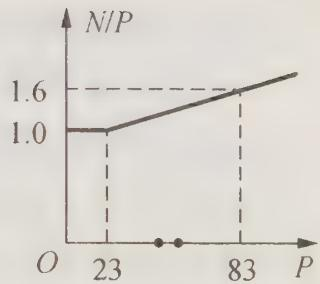

现已知 $_{42}$ Mo 的稳定同位素的质量数有:92、94、95、96、97、98、100,

$_{44}$ Ru 的稳定同位素的质量数有:96、98、99、100、101、102、104。

回答下列问题：

(1) 如果 $_{43}$ Tc 只可能存在两种同位素,那么分别是什么?

(2) 分别求出 $_{42}$ Mo、 $_{43}$ Tc、 $_{44}$ Ru 三种元素的最轻和最重核的 N/P 之值。

(3) 可能存在 $_{43}$ Tc 的两种核是最稳定的吗？为什么？

(4) 通过(1)、(2)、(3)的解答, 关于 $_{43}$ Tc, 你能得出什么结论?

过程探究 本题是一道信息题。只要把上面的两个规则领会了,不难解决问题。

（1）题目给出了 $_{42}$ Mo、 $_{44}$ Ru 的稳定同位素的质量数，根据马涛契规则（Mattauch's rule）， $_{43}$ Tc 与 $_{42}$ Mo、 $_{44}$ Ru 分别处于相衔接的元素。分析 $_{42}$ Mo、 $_{44}$ Ru 的稳定同位素的质量数，可得出 $_{43}$ Tc 的稳定同位素为： $^{93}$ Tc、 $^{103}$ Tc。

（2）按照规则①，可计算出最轻核的 $N / P$ 的比值依次为：1.19、1.16、1.18；最重核的 $N / P$ 的比值依次为：1.38、1.40、1.36。

(3) 可能存在的 $_{43}$ Tc 的两种核都不稳定。因为按照图查得, 稳定的 $_{43}$ Tc 的 N/P 约为 1.20, 又从上题中 N/P 值可知, $^{93}$ Tc 的中子数过少, $^{103}$ Tc 的中子数又过多, 因此两种 $_{43}$ Tc 可能都不稳定。

(4) 由前面的分析可知,自然界中不存在 $_{43}$ Tc。

## 参考解答 见上述分析

【例 5】（2012 年高一化学竞赛模拟试题）小明在图书馆查阅金属 Na 资料时，得到了三点信息：

## ① 离子半径数据

<table><tr><td colspan="2">离子半径/pm</td><td colspan="2">离子半径/pm</td></tr><tr><td> $Li^{2-}$ </td><td>60</td><td> $Be^{2+}$ </td><td>31</td></tr><tr><td> $Na^{+}$ </td><td></td><td> $Mg^{2+}$ </td><td>65</td></tr><tr><td> $K^{+}$ </td><td>133</td><td> $Ca^{2+}$ </td><td>99</td></tr></table>

可不巧的是正好有一片墨汁将 $Na^{+}$ 半径数据玷污掉(用表示)，只留下了数据表的一部分。

② 在 $\gamma$ -半人马座某星球的大气层中存在着大量的钠蒸汽。

③ 在冠醚或穴醚，如 $\left[\mathrm{Na}(2,2,2-\mathrm{crypt})\right]^{+}\mathrm{Na}^{-}$ 中 $\mathrm{Na}$ 为 $\mathrm{Na}^{-}$ 离子。

请帮助小明回答下列问题：

(1) 你能否根据元素周期律的相关知识判断一下 $\mathrm{Na}^{+}$ 的半径大小吗?

(2) 预测一下大气层含 Na 蒸汽的星球的气候环境, 是否适合于人类居住?

(3) 写出 $\mathrm{Na}^{-}$ 的核外电子排布式。解释 $\mathrm{Na}^{-}$ 能存在的原因。比较 $\mathrm{Na}^{+}$ 和 $\mathrm{Na}^{-}$ 的稳定性强弱, 解释原因。

(4) 预测一下 $\mathrm{Na}^{-}$ 化学性质如何?

## 过程探究 本题考查元素相关知识：

(1) 离子半径的判断通常有两种方法:

① 通过同族元素离子半径来确定: 其离子半径等于相邻同族离子半径之和的一半, 因此 $\mathrm{Na}^{+}$ 半径 $r = (60 + 133)/2 \approx 97 \, \mathrm{pm}$ 。当年, 门捷列夫根据其类似规律成功预测了当时未发现的元素。

② 根据对角线法则,左上角元素与右下角元素因离子半径大小相近,其化学性质也比较相近。即 Li 与 Mg 相近(半径接近)、Be 与 Al 相近、Na 与 Ca 相近等。由于 $Ca^{2+}$ 半径为 99 pm,因此 $Na^{+}$ 半径也在 99 pm 左右。

(2) 金属钠虽然为活泼金属,但熔沸点比一般共价化合物还是较高的。如金属钠熔点为 $97.8^{\circ} \mathrm{C}$ , 沸点为 $882.9^{\circ} \mathrm{C}$ 。从数据可知: ①该星球的温度很高, 至少 $882.9^{\circ} \mathrm{C}$ 。②该星球无 $\mathrm{O}_{2}$ 、水等物质, 否则会发生化学反应。因此: 就从这两点, 我们就可以判断该星球不适合于人类居住。

(3) $\mathrm{Na}^{-}$ 核外电子排布: $1\mathrm{s}^{2} 2\mathrm{s}^{2} 2\mathrm{p}^{6} 3\mathrm{s}^{2}$ ; 由于 M 层 3s 轨道上全充满, 因此根据洪特规则知, 该 $\mathrm{Na}^{-}$ 阴离子还是能够存在的。尽管如此, 由于 $\mathrm{Na}^{-} 3\mathrm{s}$ 轨道上充满了电子, 使其轨道能量升高; 而 $\mathrm{Na}^{+} 3\mathrm{s}$ 轨道全空, 内层为 8e 稳定结构, 整个内能降低, 因此 $\mathrm{Na}^{+}$ 稳定性强。

（4）由于 Na 内能高， $Na^{+}$ 内能很低，因此在化学反应中， $Na^{-}$ 应该很容易失去电子转化为 $Na^{+}$ 。因此， $Na^{-}$ 具有很强的还原性，将 $3s^{2}$ 交给其他原子，使得化学键断裂。

## 参考解答 见上述分析

【例6】（1992年全国理科班化学竞赛试题）根据以下数据估算第43号人造元素锝(Tc)的金属半径(单位为pm)，并说明做出估计的依据：

<table><tr><td>第四周期元素原子半径/pm</td><td>Ti147</td><td>V134</td><td>Cr127</td><td>Mn126</td><td>Fe126</td><td>Co125</td><td>Ni124</td></tr><tr><td>第五周期元素原子半径/pm</td><td>Zr160</td><td>Nb146</td><td>Mo139</td><td>Tc□</td><td>Ru134</td><td>Rh134</td><td>Pd137</td></tr><tr><td>第六周期元素原子半径/pm</td><td>Hf159</td><td>Ta146</td><td>W140</td><td>Re137</td><td>Os135</td><td>Ir136</td><td>Pt139</td></tr></table>

过程探究 这是一道按照周期规律推断原子性质(半径)的题,需注意判断的依据及其合理性。

从周期(横)的规律看,第四周期从 Ti 到 Ni,原子半径由大变小,开始下降得明显,以后下降得慢;第六周期从 Hf 到 Pt,原子半径由大到小(Os 的半径最小),以后又增大;第五周期从 Zr 到 Pd,原子半径变化规律大体上和第六周期相当,因此可以断定 Tc 原子半径小于 Mo 的原子半径,然而无法说清楚 Tc 的原子半径处于第五周期过渡元素最小的位置,还是处于“正在减小”的过程中。若是前者,无法确定最小值是多大;若是后者,并且 Ru(钌)的原子半径处于该过渡系的最低值,则 Tc 的原子半径可能在 $(139+134)/2=136\ \text{pm}$ ,总之,仅从横的周期规律看,无法断定前述二种“如若是”中何者正确,所以无法判定 Tc 的原子半径值。

从族的规律看,用镧系(57\~71号元素)收缩的影响使71号元素镥(Lu)后的Hf, Ta等原子半径和第五周期同族元素Zr, Nb等原子半径相近,其中Hf的原子半径比Zr还要小1 pm, Ta的原子半径和Nb相等,W的原子半径比Mo大1 pm, Os的原子半径也比Ru大1 pm,以后的Ir, Pt分别比Rh, Pd大2 pm。从族的规律看:Tc前(Mo)、后(Ru)元素的原子半径均比第六周期同族元素小1 pm,因此可以断定:Tc的原子半径比第六周期同族元素Re小1 pm,即136 pm(此结论并不违背按周期规律的推论,并且肯定了Tc原子半径处于第五周期过渡元素原子半径在减小的过程之中的结论)。

参考解答 从族和周期的规律估计: Tc 的原子半径为 136 pm。

【例 7】不同元素的气态原子失去最外层一个电子所需要的能量(设其为 E)如下图所示。试根据元素在周期表中的位置,分析图中曲线的变化特点,并回答下列问题。

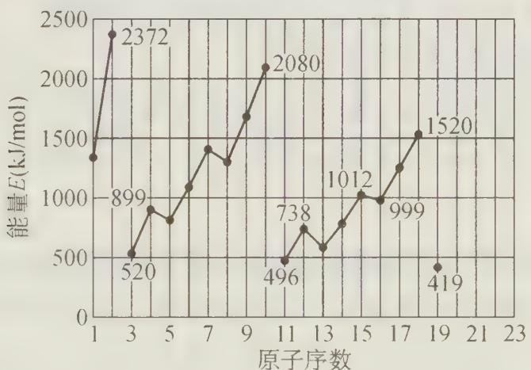  
1～19号元素气态原子失去最外层一个电子所需能量

(1) 同主族内不同元素原子的 E 值变化的特点是 \_\_\_\_。

各主族中 E 值的这种变化特点体现了元素性质 \_\_\_\_ 的变化规律。

(2) 同周期内, 随原子序数增大, $E$ 值增大。但个别元素的 $E$ 值出现反常现象。试预测下列关系式中正确的是 \_\_\_\_ (填写编号)。

① E(砷)＞E(硒) ② E(砷)<E(硒) ③ E(溴)＞E(硒) ④ E(溴)<E(硒)

(3) 估计 $1 \mathrm{~mol}$ 气态 $\mathrm{Ca}$ 原子失去最外层一个电子所需能量 $E$ 值的范围: $< E <$ 。

(4) 10号元素原子的 E 值较大的原因是 \_\_\_\_。

过程探究 该题所提供的信息,是图表上所示原子序数为1\~19号元素气态原子失去最外电子层上第一个电子所需能量的数值。它是实验中测得的宏观现象。但E值的大小必然反映微观世界中原子核对最外电子层上这一电子的引力大小,也反映了原子最外层电子离核距离的大小,即E值越大,引力越大,该电子离原子核的距离越近,原子半径越小的因果关系。结合元素周期律、元素周期表的基础知识点就能得出正确的答案。

然而本题的立意主要并不在这些知识点上，而是立意在“从一群事物的不同表现和相互联系，发现它们之间的内在联系和变化趋势，找出其变化规律，再用这种规律去预测另一些事物的表现”。

参考解答 （1）随着原子序数的增大，E 值变小。周期性。

(2) ①、③。

(3) $419 < E_{\mathrm{Ca}} < 738$ 或 $E_{\mathrm{K}} < E_{\mathrm{Ca}} < E_{\mathrm{Mg}}$ 。

(4) 10号元素是氖,该元素原子的最外层电子排布已达到8个电子稳定结构。

评述 本题在第(2)小题中出现了个别元素的 E 值与同周期其他元素的 E 值递变规律不一致的现象,我们可以断定,这是和原子内部的微观结构有关。例如图中原子序数为 5 的硼和原子序数为 8 的氧,它们原子的最外层上失去一个电子后,使整个离子的电子排布呈现了全充满或半充满的稳定结构,导致失去最外电子层上的一个电子所需能量 E 值变小。此规律可以迁移到其他周期进行预测。

【例 8】（根据 1998 年湖南省化学竞赛试题改编）电离能 (I) 是指基态的气态原子失去电子形成气态阳离子时所吸收的能量。右图表示某主族元素 X 的头五级电离能的对数值。

(1) 试推测 X 可能是哪些元素?

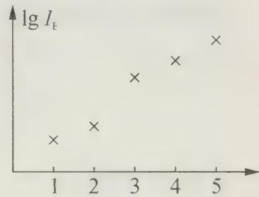

(2) 已知 X 的原子序数 < 20，则 X 元素核外电子排布式

是\_\_\_\_；元素 X 与电负性最强的元素形成化合物的电子式是

过程探究 本题考查对图形的分析,要注意图中纵坐标的标度是对数值,因此 X 元素的第二和第三电离能之间有突变,说明它有两个电子容易电离,电离第三个电子需要破坏 8 电子构型,所以它是 II A 族元素。图中示出 5 个电子的电离能值,因此它不可能是 Be,因为 Be 原子总共只有 4 个电子。综上分析,可知:

(1) X 可能是 Mg、Ca、Sr 或 Ba。

（2）若 X 的原子序数 < 20，可知 X 为 Mg。其核外电子排布为 $1s^{2}2s^{2}2p^{6}3s^{2}$ ；电负性最强的元素为 F，则 X 与 F 元素形成的化合物为 $MgF_{2}$ ，典型的离子化合物，其电子式为 $\left[:\ddot{F}: \right]^{-}Mg^{2+}\left[:\ddot{F}: \right]^{-}$ 。

参考解答 (1) X 可能是 $\mathrm{Mg}$ 、Ca、Sr 或 Ba。

(2) $1\mathrm{s}^2 2\mathrm{s}^2 2\mathrm{p}^6 3\mathrm{s}^2$ $[\ddot{\mathrm{F}}:\mathbb{I}]^{-}\mathrm{Mg}^{2+}[\ddot{\mathrm{F}}:\mathbb{I}]^{-}$

## 【实战演练】

1. 若短周期中的两种元素可以形成原子个数比为 2:3 的化合物, 则这两种元素的原子序数之差不可能是( )。
A. 1 B. 3 C. 5 D. 6

2. 下表是部分短周期元素的原子半径及主要化合价。试根据下表信息, 判断以下叙述正确的是( )。

<table><tr><td>元素代号</td><td>L</td><td>M</td><td>Q</td><td>R</td><td>T</td></tr><tr><td>原子半径/nm</td><td>0.160</td><td>0.143</td><td>0.112</td><td>0.104</td><td>0.066</td></tr><tr><td>主要化合价</td><td>+2</td><td>+3</td><td>+2</td><td>+6、-2</td><td>-2</td></tr></table>

A. 氢化物的沸点为 $\mathrm{H}_{2} \mathrm{T} < \mathrm{H}_{2} \mathrm{R}$ B. 单质与稀盐酸反应的速率为 $\mathrm{L} < \mathrm{Q}$ C. M 与 T 形成的化合物具有两性 D. $\mathrm{L}^{2+}$ 与 $\mathrm{R}^{2-}$ 的核外电子数相等

3. 类比思维是一种常用的学习方法,下列类推结论中正确的是()。

A.ⅣA族元素氢化物沸点顺序是： $\mathrm{GeH_4 > SiH_4 > CH_4}$ ；则VA族元素氢化物沸点顺序也是： $\mathrm{AsH_3 > PH_3 > NH_3}$

B. 第二周期元素氢化物的稳定性顺序是: $\mathrm{HF} > \mathrm{H}_{2} \mathrm{O} > \mathrm{NH}_{3}$ ; 则第三周期元素氢化物的稳定性顺序也是: $\mathrm{HCl} > \mathrm{H}_{2} \mathrm{S} > \mathrm{PH}_{3}$

C. 晶体中有阴离子, 必有阳离子; 则晶体中有阳离子, 必有阴离子

D. 干冰 $(\mathrm{CO}_{2})$ 是分子晶体, 则 $\mathrm{SiO}_{2}$ 也是分子晶体

4. 在二维空间里, Na 原子的核外电子排布式应表示为 \_\_\_\_。

5. 具有单电子的微粒(原子、离子或原子团)都具有顺磁性, 可用磁矩 $\mu$ 来量度。若单电子数目越多, 其磁矩就越大。下列原子 N、O、Cl 和 Mn 原子中 \_\_\_\_ 磁矩最大。

6. 假想的元素周期表:

注意:该周期表不分主族、副族、零族等族,自左向右18个纵行依次标记为1\~18族。

设想科学家已经通过无线电波与某遥远行星上的生命取得了联系，该行星是由许多与地球上完全相同的元素组成的，但该行星上的居民，给这些元素取了不同的符号和名称。通过电波，知道了该行星上30种元素的化学和物理性质，这些元素属于周期表中的第1、2、13、14、15、16、17、18族。现在请根据这些元素的性质将其（用括号内的字母表示）分别填入空白周期表中的合适位置上。

\*有分别为 bombal(Bo)、wobble(Wo)、jeptum(J)以及 logon(L)4 种惰性气体元素,其中 wobble(Wo)的相对原子质量最大,bombal(Bo)的相对原子质量最小,而 logon(L)的相对原子质量小于 jeptum(J)。

\*最活泼的一组金属是 xtalt(X)、byyou(By)、chow(Ch)和 quackzil(Q)，这些金

属中，chow(Ch)的相对原子质量最小，且quackzil(Q)和wobble(Wo)在同一周期。

\* apstrom(A), vulcania(V) 和 kratt(Kt) 是非金属元素, 这些元素的原子一般能获得或共享一个电子。vulcania(V) 和 quackzil(Q) 和 wobble(Wo) 处于同一周期。

\* ernst(E)、hinghho(Hi)、tetriblum(T)以及 sississ(Ss)都是准金属元素,其中 sississ(Ss)是这几种元素中相对原子质量最大的一种。而 ernst(E)的相对原子质量最小。hinghho(Hi)和 tetriblum(T)在第 14 族,terriblum(T)原子的质子数大于 hinghho(Hi)。yazzer(Yz)临近锯齿形曲线,它属于金属元素而非准金属元素。

\*所有元素中，pfsst(Pf)元素的相对原子质量最小，最重的元素是eldorado(El)，最活泼的非金属是apstrom(A)。kratt(Kt)与byyou(By)反应能形成食盐。

\* 元素 doggone(D)的原子只有 4 个质子。

\* floxxit(Fx)是生命化学中重要的元素,它能形成具有很长该原子链的化合物。Rhaatrap(R)和doadeer(Do)是第4周期的金属元素,而doadeer(Do)的化学反应活性要大于Rhaatrap(R)。

\* magnificom(M)、goldy(G)以及 sississ(Ss)都是第 15 族的元素,其中,goldy(G)原子中电子数小于 magnificom(M)。

\* urrp(Up)、oz(Oz)以及nuutye(Nu)在化学反应中能获得2个电子，nuutye(Nu)能形成双原子分子且与地球大气中的某种气体的性质完全相同，而oz(Oz)的原子序数小于urrp(Up)。

\*元素 anatom(An)的原子具有 49 个电子。zapper(Z)和 pie(Pi)在发生化学反应时能失去 2 个电子,其中 zapper(Z)常用于制造闪光灯。

请在下面的假想元素周期表中将上述元素填入：

假想的元素周期表  
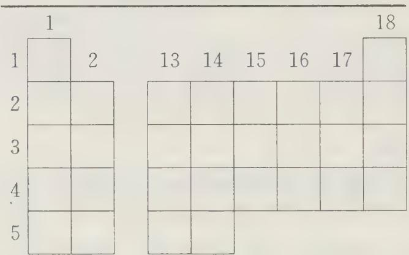

7. 1932 年, 美国化学大师 Linus Pauling 提出电负性(用希腊字母 $\chi$ 表示)的概念, 用来确定化合物中原子某种能力的相对大小。Linus Pauling 假定 F 的电负性为 4, 并通过热化学方法建立了其他元素的电负性。Linus Pauling 建立的主族元素的电负性如下:

<table><tr><td>H:2.1</td><td></td><td></td><td></td><td></td><td></td><td></td></tr><tr><td>Li:1.0</td><td>Be:1.5</td><td>B:2.0</td><td>C:2.5</td><td>N:3.0</td><td>O:3.5</td><td>F:4.0</td></tr><tr><td>Na:0.9</td><td>Mg:1.2</td><td>Al:1.5</td><td>Si:1.8</td><td>P:2.1</td><td>S:2.5</td><td>Cl:3.0</td></tr><tr><td>K:0.8</td><td>Ca:1.0</td><td>Ga:1.6</td><td>Ge:1.8</td><td>As:2.0</td><td>Se:2.4</td><td>Br:2.8</td></tr><tr><td>Rb:0.8</td><td>Sr:1.0</td><td>In:1.7</td><td>Sn:1.8</td><td>Sb:1.9</td><td>Te:χ</td><td>I:2.5</td></tr><tr><td>Cs:0.7</td><td>Ba:0.9</td><td>Tl:1.8</td><td>Pb:1.9</td><td>Bi:1.9</td><td>Po:2.0</td><td>At:2.2</td></tr><tr><td>Fr:0.7</td><td>Ra:0.9</td><td></td><td></td><td></td><td></td><td></td></tr></table>

回答下列问题：

（1）写出上述元素电负性在同周期或同主族中的递变规律（任意一种）：\_\_\_\_。

(2) 预测 Te 元素 $\chi$ 的值 \_\_\_\_，它的非金属性比 I 元素 \_\_\_\_（填“强”或“弱”）。

(3) 你认为 Linus Pauling 提出电负性的概念是确定化合物中原子\_\_\_\_（填“失电子”、“得电子”）能力的相对大小。

(1) 大量事实表明, 当两种元素的 $\chi$ 值相差大于或等于 1.7 时, 形成的化合物一般是离子化合物, 根据此经验规律, $\mathrm{AlCl}_{3}$ 中的化学键类型应该是 \_\_\_\_。

8. 已知某元素的原子序数是 50, 试推测该元素

(1) 原子的核外电子排布式;

(2) 处在哪一周期哪一族?

(3) 是金属还是非金属？

(4) 最高价氧化态及其氧化物的酸碱性。

9. 以前三周期元素为例,说明其常见非金属单质的存在形态与原子核外电子结构的关系。

10. 五种元素的原子核外电子排布式如下：
A: $1s^{2}2s^{2}2p^{6}3s^{2}3p^{6}3d^{5}4s^{2}$ B: $1s^{2}2s^{2}2p^{6}3s^{2}$ C: $1s^{2}2s^{2}2p^{6}$ D: $1s^{2}2s^{2}2p^{6}3s^{2}3p^{2}$ E: $1s^{2}2s^{1}$

试问：

(1) 哪种元素是稀有气体?

(2) 哪种元素最可能生成具有催化性质的氧化物?

(3) 哪种元素的原子的第一电离能最大?

11. 比较下列各对物质的性质，并扼要说明理由。

(1) 离子半径: Li $^{+}$ 与 Be $^{2+}$

(2) 稳定性: $Fe^{2+}$ 与 $Fe^{3+}$

(3) 第一电离能: N 与 O

12. 回答下列问题：

(1) 闪锌矿中为什么常含有锗, 辉钼矿中为什么常含有铼?

(2) 在自然界的化合物中, 氧为什么总是以 -2 价的形式出现?

（3）为什么锗、锡呈现的化合价，+4 价比 +2 价稳定，而铅呈现的化合价相反，+2 价比 +4 价稳定？

# 第 7 讲 离子键和离子晶体

# 【知识要点】

## 一、离子键

## 1. 离子键本质

通过电子的得失(或转移)形成阴阳离子而形成的化学键,称为离子键。

对于价电子数不止一个的金属元素如 Ca 等, 在化合时, 接受其价电子的非金属元素原子数可以不止一个, 后者的数目由非金属元素的原子结构所决定。例如:

$$
\mathrm{Ca} _ {\times} ^ {*} + \ddot {\mathrm{O}}: \longrightarrow \mathrm{Ca} ^ {2 +} \left[ \begin{array}{c} \times \ddot {\mathrm{O}}: \\ \times \cdot \end{array} \right] ^ {2 -}
$$

## 2. 离子键的形成

1916 年德国科学家科塞尔(Kossel)提出离子键理论。

离子键的形成分成几个步骤(以 NaCl 为例):

第一步:电子转移形成离子

$$
\mathrm{Na} - \mathrm{e} \longrightarrow \mathrm{Na} ^ {+}; \mathrm{Cl} + \mathrm{e} \longrightarrow \mathrm{Cl} ^ {-}
$$

相应的电子构型变化：

$$
2 \mathrm{s} ^ {2} 2 \mathrm{p} ^ {6} 3 \mathrm{s} ^ {1} \longrightarrow 2 \mathrm{s} ^ {2} 2 \mathrm{p} ^ {6}; 3 \mathrm{s} ^ {2} 3 \mathrm{p} ^ {5} \longrightarrow 3 \mathrm{s} ^ {2} 3 \mathrm{p} ^ {6}
$$

分别形成 Ne 和 Ar 的稀有气体原子的结构, 形成稳定离子。

第二步:靠静电作用,形成化学键

体系的势能与核间距之间的关系如图所示：

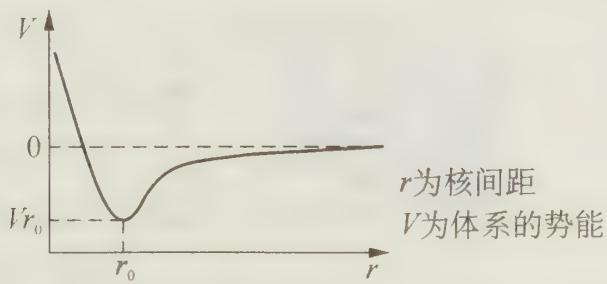

纵坐标的零点就是当 $r$ 无穷大时，即两核之间无限远时的势能。

下面来考察 $Na^{+}$ 和 $Cl^{-}$ 彼此接近的过程中, 势能 V 的变化。

图中可见: 当 $r > r_{0}$ 时, r 减小时, 正负离子靠静电相互吸引, 势能 V 减小, 体系趋于稳定。

当 $r = r_{0}$ 时，V 有极小值，此时体系最稳定，表明形成离子键。

当 $r < r_{0}$ 时，r 减小时，V 会急剧上升。因为 $Na^{+}$ 和 Cl 彼此再接近时，电子云之间的斥力急剧增加，导致势能骤然上升。

因此，离子相互吸引，保持一定距离时，体系最稳定。这就意味着形成了离子键。 $r_{0}$ 和键长有关，而 V 和键能有关。

## 离子键形成条件：

## (1) 元素的电负性差比较大

$\Delta\chi>1.7$ ，发生电子转移，产生阴、阳离子，形成离子键（实际上 $\Delta\chi>1.7$ 是指离子键的成分大于50%）；

$\Delta\chi<1.7$ ，不发生电子转移，形成共价键。

(2) 易形成稳定离子

$Na^{+}:2s^{2}2p^{6},Cl^{-}:3s^{2}3p^{6}$ ，只转移少数的电子就达到稀有气体式稳定结构。

(3) 形成离子键时释放能量多

$$
\mathrm{Na(s)} + 1 / 2 \mathrm{Cl} _ {2} (\mathrm{g}) \longrightarrow \mathrm{NaCl(s)} \quad \Delta H = - 4 1 0. 9 \mathrm{kJ} \cdot \mathrm{mol} ^ {- 1}
$$

在形成离子键时,以放热的形式,释放较多的能量。

## 3. 离子键的特点

## (1) 作用力的实质为静电作用力

可用物理中点电荷计算公式 $F \propto \frac{q_1 \cdot q_2}{r^2}$ 定性说明（其中 $q_1, q_2$ 分别为阴阳离子所带电量， $r$ 为阴阳离子的核间距离， $F$ 为静电引力）。 $F$ 越大，其离子键越强。

## (2) 没有方向性

没有方向性是指由于离子电荷的分布是球状对称的，它在任何方向都可以和相反电荷的离子相互吸引。

## (3) 无饱和性

无饱和性是指离子之间的静电作用使得每个离子可以同时与几个相反电荷的离子作用，并在空间的三个方向，继续延伸下去，最后形成一个巨大的离子型晶体。如NaCl晶体：

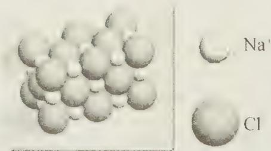

当原子丢失电子变为阳离子时,离子的半径将小于原子的半径(有的可缩小一半左右);反之,当原子得到电子变为阴离子时,离子的半径将大于原子的半径(有的可涨大近1倍左右)。这是因为形成阳离子时少了一个电子层,形成阴离子时同层电子数增多了,互斥作用增强了等等。

以离子键结合而成的化合物称为离子化合物(某些复杂分子中只有部分原子间以离子键结合,但仍属于离子化合物的范畴)。离子化合物和现代社会及生活有着密切的关系。除去常见的食盐、纯碱、化肥都以离子化合物( $\mathrm{NaCl}$ 、 $\mathrm{Na_{2}CO_{3}}$ 、 $\mathrm{NH_{4}NO_{3}}$ 等)为主要成分外,在医药、洗涤剂、电镀液等成分中都有离子化合物。

需要说明的是:离子键与元素的电负性有关。当 $\Delta\chi$ (即电负性之差) >1.7, 发生电子转移, 形成离子键; $\Delta\chi < 1.7$ , 不发生电子转移, 形成共价键(将在下一节讲述)。离子键和共价键之间, 并非可以截然区分的。可将离子键视为极性共价键的一个极端, 而另一极端则为非极性共价键。但在高中阶段, 我们为简化起见, 将离子键和共价键截然分开, 即物质成键不是离子键就是共价键。

## 4. 离子键强弱的判断方法

在离子型晶体中, 阴、阳离子之间结合力的大小, 可以用晶格能 $(U)$ 来表示。所谓晶格能 $(U)$ 是指一摩尔的气态阳离子和阴离子结合形成一摩尔固态离子化合物时所放出的能量。晶格能越大, 表示离子间的结合力 (离子键) 越强, 化合物越稳定。它的大小用 $\mathrm{kJ/mol}$ 表示。对于相同类型的离子型晶体, 阴、阳离子的核间距离越大, 离子电荷越小, 则晶格能就越小。它所表现的熔点和硬度就越低, 反之则晶格能大, 熔点、沸点、硬度高。

## 二、离子晶体

## 1. 离子晶体判断方法

离子晶体的形成一般有两种：

（1）由金属性强的金属元素和非金属性强的非金属元素形成离子晶体；中等活泼的金属元素必须与活泼非金属元素形成离子晶体；中等活泼的非金属元素必须与活泼金属元素形成离子晶体。

如: CsF 是最为典型的离子晶体; Al 为准金属, $AlF_{3}$ 为离子晶体, 而 $AlCl_{3}$ 为分子晶体; Be 为准金属, $BeF_{2}$ 为离子晶体, 而 $BeCl_{2}$ 晶体复杂, 一般为分子晶体。

## (2) 共价型离子晶体

这类晶体的特点是:部分是由共价键结合,但阴阳离子是靠离子键结合的。如铵盐 $NH_{4}X$ 等。这种类型在复杂的化合物中比较常见。

## 2. 晶体熔点和沸点高低比较

(1) 不同类型晶体熔点、沸点比较

一般而言:原子晶体＞离子晶体＞金属晶体＞分子晶体。

(2) 同种类型晶体熔点、沸点比较

① 都为原子晶体, 当原子间都以共价单键结合成晶体时, 键能越大, 熔沸点越高。可根据原子半径大小, 进而推知键长和键能大小, 从而判断熔点、沸点高低。如: 金刚石 > 晶体硅。

② 都为离子晶体,通常可根据离子半径和离子电荷数推断离子键的强弱,离子键越强，熔点、沸点越高。离子半径小、离子电荷数高，离子键强，熔点、沸点高。如： $\mathrm{NaF} > \mathrm{NaCl}$ 。

③ 都为分子晶体,看分子间作用力强弱。对组成结构相似的分子晶体,相对分子质量越大,范德华力越大,熔点、沸点越高;当分子相对质量相同时,分子极性强的物质,熔点、沸点高,如 $CO > N_{2}$ 。

## 三、晶胞

晶胞是描述晶体微观结构的基本单位。整块晶体可视作成千上万个晶胞“无隙并置”地堆积而成。常用晶胞都是平行六面体，按其几何特征（边长和夹角）可以分为立方、四方、正交、单斜、三斜、六方和菱方7个系（通称布拉维系），它们的边长与夹角被称为晶胞参数。

考察一个晶胞,绝对不能把它当作游离孤立的几何体,而需“想见”它的上下左右前后都有完全等同的晶胞与之相邻。从一个晶胞平移(进行矢量平移)到另一个晶胞,不会察觉是否移动。晶胞的8个顶角、平行的面以及平行的棱一定完全等同的。如图1中的实线小立方体不是“氯化钠晶胞”和“金刚石晶胞”,因为它们的顶角不等同,图中的虚线大立方体才分别是氯化钠晶胞和金刚石晶胞,其上下左右前后都有等同的相邻晶胞,图中虚线画出了。

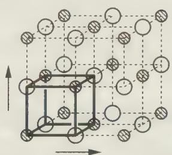  
NaCl

  
图1  
金刚石

  
图2 金属镁

如图 2, 初看起来, 六方柱体由三个晶胞构成, 其底面中心的原子为 6 个晶胞共用。这种错误其实是忘记了图中构成六方柱的三个平行六面体并非“并置”, 从一个平行六面体到另一个平行六面体需要旋转。即: 只能取其一而不能同时取其三为晶胞。若取其中位于前右的平行六面体为晶胞, 其相邻晶胞为如虚线所画的平行六面体, 其他晶胞也全都如此取向。总之, 晶胞顶角永远为 8 个晶胞共用; 同时也应注意: 六方柱不是六方晶胞。

考察某晶胞是否为体心晶胞最简单的方法是:将晶胞的框架(围拢晶胞的平行六面体)的顶角移到原晶胞的体心位置(晶胞内外原子的位置保持在原位不动!),若移位后的框架围拢的“新晶胞”里所有原子的位置与原晶胞里所有原子的位置一一对应相等,就表明是体心晶胞,否则就不是体心晶胞。例如,图3中的金属钠是体心晶胞,而氯化铯则不是体心晶胞而是素晶胞。用同样方式将原晶胞框架的顶角平移原晶胞的任一面心位置得到的新晶胞与原晶胞无差别,则这种晶胞叫做面心晶胞,图4中的金刚石是面心晶胞而干冰是素晶胞，因为干冰晶胞中处于面心位置的二氧化碳分子与处于顶角位置的二氧化碳分子的取向互不相同，框架移动后得到的新晶胞中原子的位置不同于原晶胞中原子的位置了。所谓素晶胞是最小的晶胞，是不可能再小的晶胞，与之相对的是复晶胞，复晶胞是素晶胞的多倍体。

  
图3

  
图 4 金刚石(左)是面心晶胞  
干冰(右)不是面心晶胞而是素晶胞

## 四、几种常见的离子晶体

  
(CsCl 晶体)

  
(NaCl 晶体)

  
立方 ZnS 型( $\bullet$ Zn $^{2+}$ $\circ$ S $^{2-}$ )

## 1. CsCl 型晶体

CsCl型晶体的晶胞是立方体, 晶胞的大小由边长确定。 $\mathrm{Cl}^{-}$ 位于立方体的顶点, $\mathrm{Cs}^{-}$ 处于立方体的中心。整个晶格是由 $\mathrm{Cl}^{-}$ 的简单立方点阵型式和 $\mathrm{Cs}^{+}$ 的简单立方点阵形式相套而成, 正、负离子的配位数都是 8 , 即配位比为 $8:8$ , 其中正离子处于负离子构成的立方体的空隙中, 每个 CsCl 晶胞中都含有一个 $\mathrm{Cl}^{-}$ 和一个 $\mathrm{Cs}^{+}$ 。TlCl、CsI、CsBr等都属于 CsCl 型晶体。

## 2. NaCl 型晶体

NaCl型晶体的晶胞形状也是正立方体,但属于面心立方晶胞。NaCl点阵型式是由 $\mathrm{Na}^{+}$ 的面心立方点阵型式和 $\mathrm{Cl}^{-}$ 的面心立方点阵型式沿边长1/2处相套而成的,正、负离子的配位数都是6,即配位比为 $6:6$ ,其中每个 $\mathrm{Na}^{+}(\mathrm{Cl}^{-})$ 周围的六个 $\mathrm{Cl}$ ( $\mathrm{Na}^{+}$ ) 构成一个正八面体, $\mathrm{Na}^{+}$ 处于正八面体的空隙中,每个 $\mathrm{NaCl}$ 晶胞中都含有四个 $\mathrm{Na}^{+}$ 和四个 $\mathrm{Cl}^{-}$ 。KI、LiF、NaBr、MgO、CaO等和 $\mathrm{NaCl}$ 一样都属于面心立方晶体。

## 3. ZnS 型晶体

ZnS 虽不属于离子晶体范围,但结构典型,其晶型是一些 AB 型离子晶体的代表,因而习惯上常把此类离子晶体称为 ZnS 型。故一并列入。

ZnS型晶体有两种，一种是立方ZnS型（又称闪锌矿型），另一种是六方ZnS型。立方ZnS型的形状为立方体，属于面心立方晶胞，其晶格是由 $\mathrm{Zn}^{2+}$ 的面心立方点阵型式和 $S^{2-}$ 的面心立方点阵型式相套而成，正、负离子的配位数均为 4，即配位比为 4:4，每个 $\mathrm{Zn^{2+}(S^{2-})}$ 周围的四个 $S^{2-}(Zn^{2+})$ 构成一个正四面体， $Zn^{2+}$ 处于正四面体的空隙中，每个晶胞中含有四个 $Zn^{2+}$ 和四个 $S^{2-}$ 。BeS、BeSe 等与 ZnS 型一样是立方面心晶体。

## 【竞赛对接】

【例 1】按下表中各物质的熔点数值,简答下列问题。

<table><tr><td>物质</td><td>NaF</td><td>NaCl</td><td>NaBr</td><td>NaI</td><td>NaCl</td><td>KCl</td><td>RbCl</td><td>CsCl</td></tr><tr><td>熔点/°C</td><td>996</td><td>801</td><td>747</td><td>660</td><td>801</td><td>776</td><td>715</td><td>648</td></tr><tr><td>物质</td><td> $SiF_1$ </td><td> $SiCl_1$ </td><td> $SiBr_1$ </td><td> $SiI_1$ </td><td> $SiCl_1$ </td><td> $GeCl_1$ </td><td> $SnCl_1$ </td><td> $PbCl_1$ </td></tr><tr><td>熔点/°C</td><td>-90.2</td><td>-70.4</td><td>5.2</td><td>120</td><td>-70.4</td><td>-49.5</td><td>-34</td><td>-15</td></tr></table>

(1) 钠的卤化物和碱金属氯化物的熔点与卤素及碱金属的\_\_\_\_有关, 其变化规律是\_\_\_\_, 原因是\_\_\_\_。

(2) 硅的卤化物及硅、锗、锡、铅的氯化物熔点与\_\_\_\_有关, 变化规律是\_\_\_\_, 原因是\_\_\_\_。

(3) 钠的卤化物的熔点比相应的硅的卤化物的熔点要高得多,原因是\_\_\_\_。

过程探究 本题通过分析数据,认识并处理离子晶体和分子晶体的熔点变化规律和原因,并通过这些分析,作出影响晶体熔点大小的科学判断和结论。物质的熔点应取决于物质的晶体类型及构成晶体的微粒间的作用力。一般讲离子键键能大于共价键键能,更远大于分子间范德华力;离子键的静电作用力可按 $F = k \cdot \frac{q_1 \cdot q_2}{r^2}$ 来估计 ( $q_1$ 、 $q_2$ 为阴阳离子所带电量, $r$ 为离子间距离);又从原子结构、元素周期律知识知道: F、Cl、Br、I; Na、K、Rb、Cs; Si、Ge、Sn、Pb 各组元素的原子,它们的最外层电子数分别相等,电子层数依次增多。根据微观世界里存在的这些差异,反映出各物质熔点的差异和变化规律。

参考解答 （1）离子半径大小；离子半径增大熔点降低；因半径增大，核间距离变大，离子间的引力 $(F)$ 减小。

（2）相对分子质量大小；随着相对分子质量的增大，熔点升高；因为分子晶体中相对分子质量增大，分子间范德华力也增大。

(3) 因离子晶体中阴、阳离子间的引力比分子间的范德华力大得多。

说明 碰到讨论碱金属、碱土金属形成化合物的性质时,不能笼统地从金属活动性、何种原子的最外层电子容易失去等角度去分析问题,这样既没有抓住问题的核心,又容易形成思维定势。一定要根据性质(如熔点)的特点,择其影响该性质的关键因素（如离子半径、离子间距离等），层层分析，才能击中目标，准确作答。我们有些同学，在讨论熔点之类由大量分子聚集状态的集体行为所形成的宏观性质时，不去讨论分子间或分子内的相互作用问题（离子晶体不存在单个分子、离子键没有饱和性），而是去讨论个别分子（如 $\mathrm{SiF}_1$ 、 $\mathrm{SiCl}_4$ 等）所形成共价键的强弱，往往问题就说不清楚了。

【例 2】 NaCl 晶体的最小单位是由 $Na^{+}$ 和 $Cl^{-}$ 组成的立方体（立方体的一个侧面如右图所示）。立方体的角顶位置及平面的中心位置上是 $Cl^{-}$ ，棱边的中点及立方体体心位置上是 $Na^{+}$ 。晶体中相邻的立方体共面，因而平面中心位置上 $Cl^{-}$ 为相邻的两个立方体所共有。由上完成下列填空。

  
(NaCl 晶体)

(1) 顶角位置上 $\mathrm{Cl}^{-}$ 属于 \_\_\_\_ 个相邻的立方体共有, 棱边中点位置上 $\mathrm{Na}^{+}$ 属于 \_\_\_\_ 个相邻立方体共有。

(2) 每一个立方体平均拥有 \_\_\_\_ 个离子。

(3) 1 mol NaCl 质量为 58.45 g, NaCl 的密度为 $2.165 \, g \cdot cm^{-3}$ ，上述立方体的边长为 $5.639 \times 10^{-8} \, cm$ 。由此可计算得阿伏加德罗常数 $N_{A}$ 的列式: $N_{A} =$ \_\_\_\_ 。

过程探究 本题要求用数学中的几何概念和化学中的摩尔概念解答。由于相邻立方体共面，所以每个立方体的顶角位置都是相邻8个立方体的公共点，处于顶角位置上的 $\mathrm{Cl}^{-}$ 为8个相邻立方体共有。同理，每个立方体的任一棱边都是相邻4个立方体的公共边，处于棱边中点的 $\mathrm{Na}^{+}$ 为4个相邻立方体共有。顶角 $\mathrm{Cl}^{-}$ 为8个立方体共有，每个立方体平均拥有一个 $\mathrm{Cl}^{-}$ 的 $1/8$ ，由于一个立方体有8个顶角，故每个立方体拥有顶角 $\mathrm{Cl}^{-}$ 数为 $1/8 \times 8 = 1$ （个）。平面中心的 $\mathrm{Cl}^{-}$ 为相邻两个立方体共有，每个立方体有6个平面，故每个立方体平均拥有 $1/2 \times 6 = 3$ （个）平面中心 $\mathrm{Cl}^{-}$ 。每个立方体有12条棱边，立方体拥有棱边中点 $\mathrm{Na}^{+}$ 数为 $1/4 \times 12 = 3$ （个），加上体心位置上1个 $\mathrm{Na}^{+}$ （每个立方体独自拥有）共有4个 $\mathrm{Na}^{+}$ 。Cl数也是4个。所以，每个立方体平均拥有8个离子。阿伏加德罗常数可以用 $1\mathrm{molNaCl}$ 晶体中含有的“ $\mathrm{Na}^{+}\mathrm{Cl}^{-}$ ”离子对数表示。每个立方体中含有 $8/2$ 个“ $\mathrm{Na}^{+}\mathrm{Cl}^{-}$ ”离子对， $58.45\mathrm{gNaCl}$ 晶体的体积为 $\frac{58.45}{2.165}\mathrm{cm}^3$ ，其中含有的立方体数可表示为 $\frac{58.45}{2.165(5.639\times 10^{-8})^3}$ 。所以，答案为 $\frac{(8/2)\times 58.45}{2.165(5.639\times 10^{-8})^3}$ 。

参考解答 (1) 8 4 (2) 8 (3) $\frac{(8 / 2) \times 58.45}{2.165(5.639 \times 10^{-8})^3}$

【例 3】（1990 年安徽省化学竞赛试题）决定晶体中阳离子配位数的因素很多，在许多场合下，半径比 $r_{+}/r$ 往往起着重要作用。试以氯化铯[图(1)]、氯化钠[图(3)]、硫化锌[图(5)]三种晶体为例，计算 $r_{+}/r_{-}$ ，并总结晶体中离子半径比与配位数关系的规律。

(1) 氯化铯从图(1)沿 AB 到 CD 作一切面, 得图(2), 设 AB = CD = a = 2r。

(2) 氯化钠从图(3)取一个平面, 得图(4), 设 $AB = BC = 2(r_{+} + r_{-})$ , $AC = 4r^{-}$ 。

(3) 硫化锌(闪锌矿)将硫化锌正方体分成八块小正方体, 取左下角一块[见图(6)], 内含一个四面体[见图(7)], 将图(6)沿 $QL$ 至 $OP$ 作一切面, 得图(8), 设 $OQ = LP = 2r_{-}$ 。

  
(1)

  
(2)

  
(3)

  
(5)

(4)  
  
(6)

  
(7)

  
(8)

(4) 指出晶体中离子半径比 $r_{+}/r_{-}$ 与配位数的关系，并加以说明。

过程探究 半径比规则是晶体结构中的重要内容。我们经常根据阳离子与阴离子的半径比求出阴阳离子的配位数，确定晶体的晶型等。而半径比规则实际上是通过立体几何的知识计算出来的。本题涉及的就是这种计算，其解题的关键是对于面心立方，有 $2(r_{+} + r_{-}) = \sqrt{2} a$ ；对于体心立方， $2(r_{+} + r_{-}) = \sqrt{3} a$ （ $a$ 为立方体边长， $r_{+}$ 为阳离子半径， $r_{-}$ 为阴离子半径。）

参考解答 (1) $AD^{2} = BC^{2} = a^{2} + a^{2} = 2a^{2}$ , $AC = \sqrt{AB^{2} + BC^{2}} = \sqrt{a^{2} + 2a^{2}} = \sqrt{3} a = 2(r_{+} + r_{-})$ 。因 $a = 2r_{-}$ , 所以 $r_{+} / r_{-} = \sqrt{3} - 1 = 0.732$ ;

(2) $AC^{2}=AB^{2}+BC^{2},(4r_{-})^{2}=8(r_{+}+r_{-})^{2}$ ，所以 $r_{+}/r_{-}=\sqrt{2}-1=0.414$ ;

(3) $OP = QL = 2r_{-} \cdot \sin 45^{\circ} = \sqrt{2} r_{-}, OL = \sqrt{OP^{2} + LP^{2}} = \sqrt{(\sqrt{2} r_{-})^{2} + (2r_{-})^{2}} = \sqrt{6} r_{-}$ . 因为 $r_{+} = \frac{1}{2} OL - \frac{1}{2} LP = \frac{\sqrt{6}}{2} r_{-} - r_{-} = \left(\frac{\sqrt{6}}{2} - 1\right)r_{-}$ , 所以 $r_{+}/r_{-} = \frac{\sqrt{6}}{2} - 1 = 0.225$ .

（4）上述计算结果是在假设同性电荷离子紧靠情况下得出的，因此这个比值都是下限。要使晶体稳定，必然要考虑同性电荷离子的斥力平衡。如 CsCl 所设 a 必然是大于 $2r_{-}$ ，所以离子半径比与配位数的规律如下：

$r_{+}/r_{-}=0.225\sim0.414$ 间，配位数为4；在0.414～0.732间，配位数为6；在0.732以上，配位数为8；大于某数以上，配位数还可增大。

【例 4】在离子晶体中,正、负离子间力求尽可能多的接触,以降低体系的能量,使晶体稳定存在。因为一般负离子都比正离子的半径大,所以构成离子晶体时,正离子必按此要求嵌在负离子所堆积的空隙中。在离子晶体中每个正(或负)离子所接触的负(或正)离子总数,称为正(或负)离子的配位数。当正、负离子的电荷数相等时,这种配位数的多少,显然只与正、负离子的半径比 $r_{-}/r_{-}$ 的大小直接相关。为了研究这种关系,可用小黑点和小圆圈代表正离子和负离子(相当于把离子抽象为几何学中的点),在想像的空间格子中标出它们的所在位置,从而画出某种型式的晶体结构中最基本的重复单位(称为“晶胞”),如图1(CsCl型晶胞)和图3(NaCl型晶胞)所示;再从晶胞中切割出一些平面(切面),形象地画出正、负离子的接触切面图,如图2(与图1对应)和图4(与图3对应)所示。

  
图1

  
图2

  
图3

  
图4

研究时需注意：

由于正离子嵌入负离子所堆积的空隙中时, 有可能将负离子间的接触撑开, 所以图 1 或图 2 中相等的 AB 和 CD 的最小极限值为 $2r_{-}$ , 即 $AB = CD \geqslant 2r$ ; 图 4 中 AC 的最小极限值为 $4r_{-}$ , 即 $AC \geqslant 4r_{-}$ 。

（1）试分别计算 NaCl 型和 CsCl 型离子晶体中的离子半径比 $r_{+}/r_{-}$ 的最小极限值。

(2) 观察判断 CsCl 型和 NaCl 型离子晶体中异号离子间的配位数。简要说明 CsCl 晶体和 NaCl 晶体两者配位数差异的根本原因。

(3) 已知 $r_{\mathrm{K}^{+}} = 1.33 \times 10^{-10} \mathrm{~m}, r_{\mathrm{Br}^{-}} = 1.95 \times 10^{-10} \mathrm{~m}$ 。通过计算分析，判断 KBr 晶体的结构型式，以及该晶体中每个 $\mathrm{K}^{+}$ 被等于配位数的 $\mathrm{Br}^{-}$ 接触包围所形成的构型属于何种几何体。

（4）若 ACl 和 BCl(A、B 均表示 +1 价金属离子)的晶体结构与 NaCl 相同，且 $r_{A} > r_{Na^{+}}$ 、 $r_{B}^{+} < r_{Na^{-}}$ ，试比较 ACl 和 BCl 两种离子晶体稳定性强弱，并说明原因。

(5) 已知 NaCl 的摩尔质量为 58.5 g/mol, 密度为 2.2 g/cm³, 阿伏加德罗常数为 $6.02 \times 10^{23} \, mol^{-1}$ , 则可算出 NaCl 晶体中两个距离最近的 Na⁺ 离子的核间距约为多少厘米?

过程探究 本题的基本出发点是通过物质的结构加深理解重要的半径比规则。(1) 由图4知: $AC^2 = AB^2 + BC^2 = 8(r_+ + r_-)^2$ , 代入 $AC \geqslant 4r_-$ , 得 $(4r_-)^2 \leqslant 8(r_+ + r_-)^2$ , 即 $4r_-\leqslant 2\sqrt{2}(r_+ + r_-)$ 。可解得 NaCl 型离子晶体的 $r_+ / r_- \geqslant \sqrt{2} - 1 = 0.414$ , 即 NaCl 型离子晶体的 $r_+ / r_-$ 的最小极限值为 0.414。

由图2知： $AC=\sqrt{AD^{2}+DC^{2}}$ ，即 $2(r_{+}+r_{-})=\sqrt{AD^{2}+DC^{2}}$ 。由图1（立方体构型晶胞）又知 $AD^{2}=2DC^{2}$ ，故有 $2(r_{+}+r_{-})=\sqrt{3}DC$ 代入 $DC\geqslant2r_{-}$ 得： $2\sqrt{3}\leqslant2(r_{+}+r)$ ，可解得CsCl型离子晶体的 $r_{+}/r\geqslant\sqrt{3}-1=0.732$ ，即CsCl型离子晶体的 $r_{-}$ 的最小极限值为0.732。

(2) 正负离子电荷相等的离子晶体, 其中异号离子有相等的配位数, 如图 1 和图 3分别显示 CsCl 型和 NaCl 型离子晶体的配位数为 8 和 6。原因是 $Cs^{+}$ 的半径大于 $Na^{+}$ 。

(3) 先计算 $r_{\mathrm{K}^{+}} / r_{\mathrm{Br}^{-}} = \frac{1.33 \times 10^{-10} \mathrm{~m}}{1.95 \times 10^{-10} \mathrm{~m}} = 0.682$ ，再根据 $0.732 > 0.682 > 0.414$ ，即可判定 KBr 离子晶体的配位数为 6 的 NaCl 型。最后用图 3(NaCl 型离子晶体的晶胞)变通的把晶胞图中央的负离子看作正离子，即易发现晶体中每个 $\mathrm{K}^{+}$ 与 6 个 $\mathrm{Br}^{-}$ 相接触形成八面体的构型。

（4）因为 $r_{A} > r_{Na} > r_{B}$ ，故 $A^{+}$ 能将 $Cl^{-}$ “撑开”，但 $A^{-}$ 和 $Cl^{-}$ 仍保持密切接触，对离子键影响不大。而 $B^{+}$ 因半径小，使阴阳离子接触不良，离子键相应减弱，故稳定性 $ACl > BCl$ 。

（5）从 NaCl 晶体可切出一个最小的单元。设其边长为 a，此最小单元中含 $Na^{+}$ 和 Cl 各为 $4 \times 1/8 = 1/2$ 。依密度可得出： $2.2a^{3} = 58.5/6.02 \times 10^{23} \times 1/2, a = 2.8 \times 10^{-8} \, (\text{cm})$ 。两个最近的 $Na^{+}$ 核间距为 $\sqrt{2}a = 4.0 \times 10^{-8} \, (\text{cm})$ 。

参考解答（1）NaCl型离子晶体的 $r_{+} / r_{-}$ 的最小极限值为0.414；CsCl型离子晶体的 $r_{+} / r_{-}$ 的最小极限值为0.732；

(2) CsCl 型和 NaCl 型离子晶体的配位数为 8 和 6, 异号离子配位数都相同; CsCl 晶体和 NaCl 晶体两者配位数差异的根本原因是 $\mathrm{Na}^{+}$ 和 $\mathrm{Cs}^{+}$ 离子大小不同;

（3）KBr离子晶型是NaCl型的；KBr晶体中每个 $\mathrm{K}^{-}$ 与6个 $\mathrm{Br}^{-}$ 相接触形成八面体的构型；

(4) ACl 和 BCl 两种离子晶体, 其稳定性 ACl > BCl;

(5) NaCl 晶体中两个距离最近的 $Na^{+}$ 离子的核间距约为 $4.0 \times 10^{-8}$ cm。

说明 不难看出由不同的正、负离子可组成不同类型的晶体结构，正、负离子的大小、离子电荷及离子电子层结构是影响离子晶体结构类型的主要因素，其中正、负离子的相对大小起着主导作用。这是因为只有当正、负离子处于紧密接触时，体系能量较低，所形成的晶体比较稳定，而离子半径比是决定正、负离子能否紧密接触的重要因素。AB型离子晶体的类型主要取决于离子半径比。

用离子堆积描述离子晶体是指较大的离子紧密堆积,则较小的离子根据它们的大小分别占据八面体空隙、四面体空隙或立方体空隙。在正常情况下,可以从阴阳离子半径比规律推知其配位情况,如下表:

<table><tr><td>组成形式</td><td> $r^{+}/r^{-}$ </td><td>阴离子配位数</td><td>阳离子配位数</td><td>晶型</td></tr><tr><td rowspan="3">AB</td><td>&gt;0.732</td><td>8</td><td>8</td><td>CsCl</td></tr><tr><td>0.732~0.414</td><td>6</td><td>6</td><td>NaCl</td></tr><tr><td>0.414~0.225</td><td>4</td><td>4</td><td>ZnS(立方)</td></tr><tr><td rowspan="2"> $AB_2$ </td><td>&gt;0.732</td><td>4</td><td>8</td><td> $CaF_2$ (萤石)</td></tr><tr><td>0.732~0.414</td><td>3</td><td>6</td><td> $TiO_2$ (金红石)</td></tr></table>

离子晶体中，负离子半径一般比正离子大，因此负离子在占据空间方面起着主导作用。在简单的二元离子晶体中，负离子只有一种，可以认为负离子按一定方式堆积，而正离子填充在其间的空隙中。常见的负离子堆积方式有三种：立方密堆积或称面心立方密堆积、六方密堆积和简单立方堆积。最后一种不是密堆积，它的晶胞是立方体，八个角顶上各有一个负离子。在立方密堆积和六方密堆积中有两种空隙：一种是由四个相邻的负离子所包围的空隙，称为四面体空隙；一种是由六个相邻的负离子所包围的空隙，称为八面体空隙。这两种密堆积结构中，负离子数：八面体空隙数：四面体空隙数=1:1:2。在简单立方堆积中，只有一种空隙，即由八个相邻负离子所包围的立方体空隙，而且负离子数：立方体空隙数=1:1。

在描述简单离子晶体结构型式时,一般只要着重指出负离子的堆积方式以及正离子所占空隙的种类与分数,基本上就抓住了离子晶体的主要特征。

<table><tr><td>结构型式</td><td>组成比</td><td>负离子堆积方式</td><td> $CN_{+}/CN_{-}$ </td><td>正离子占据空隙种类</td><td>正离子所占空隙分数</td></tr><tr><td>NaCl型</td><td>1:1</td><td>立方密堆积</td><td>6:6</td><td>八面体空隙</td><td>1</td></tr><tr><td>CsCl型</td><td>1:1</td><td>简单立方堆积</td><td>8:8</td><td>立方体空隙</td><td>1</td></tr><tr><td>立方ZnS</td><td>1:1</td><td>立方密堆积</td><td>4:4</td><td>四面体空隙</td><td>1/2</td></tr><tr><td>六方ZnS</td><td>1:1</td><td>六方密堆积</td><td>4:4</td><td>四面体空隙</td><td>1/2</td></tr><tr><td> $CaF_2$ 型</td><td>1:2</td><td>简单立方堆积</td><td>8:4</td><td>立方体空隙</td><td>1/2</td></tr><tr><td>金红石型</td><td>1:2</td><td>(假)六方密堆积</td><td>6:3</td><td>八面体空隙</td><td>1/2</td></tr></table>

## 【实战演练】

1. 金属镍及其化合物在合金材料以及催化剂等方面应用广泛。请回答下列问题：

(1) Ni 原子的核外电子排布式为 \_\_\_\_。

(2) NiO、FeO 的晶体结构类型均与氯化钠的相同, $Ni^{2+}$ 和 $Fe^{2-}$ 的离子半径分别为 69 pm 和 78 pm, 则熔点 NiO \_\_\_\_ FeO(填“<”或“>”)。

(3) NiO 晶胞中 Ni 和 O 的配位数分别为 \_\_\_\_、\_\_\_\_。

(4) 金属镍与镧(La)形成的合金是一种良好的储氢材料, 其晶胞结构示意图如右图所示。该合金的化学式为 \_\_\_\_。

(5) 丁二酮肟常用于检验 $Ni^{2+}$ : 在稀氨水介质中, 丁二酮肟与 $Ni^{2+}$ 反应可生成鲜

红色沉淀，其结构如右图所示。

① 该结构中,碳碳之间的共价键类型是 $\sigma$ 键,碳氮之间的共价键类型是\_\_\_\_,氮镍之间形成的化学键是\_\_\_\_;

② 该结构中,氧氢之间除共价键外还可存在\_\_\_\_;

③ 该结构中,碳原子的杂化轨道类型有\_\_\_\_。

2. 原子序数小于 36 的 X、Y、Z、W 四种元素, 原子序数依次增大。其中 X 元素的一种核素的质量数为 12, 中子数为 6; Y 是空气中含量最多的元素; Z 的基态原子核外 5 个轨道上填充了电子, 且有 2 个未成对电子; W 的原子序数为 22。

请回答下列问题(答题时用对应元素符号表示):

(1) $XZ_{2}$ 分子中 X 原子轨道的杂化类型为 \_\_\_\_， $1\ \text{mol}\ XZ_{2}$ 中含有 $\sigma$ 键与 $\pi$ 键的数目之比为 \_\_\_\_。

(2) X、Y、Z 三种元素的第一电离能由大到小的顺序为 \_\_\_\_。

(3) $\mathrm{XH}_{4}$ 与元素 Y 的一种含氢粒子互为等电子体, 元素 Y 的这种含氢粒子的化学式是 \_\_\_\_。

(4) W 的一种氧化物的晶胞结构如图所示,该氧化物的化学式为 \_\_\_\_。

(5) 在浓的 $WCl_{3}$ 的盐酸溶液中加入乙醚，并通入 HCl 至饱和，可得到配位数为 6，组成为 $WCl_{3} \cdot 6H_{2}O$ 的绿色晶体，该晶体中两种配位体的物质的量之比为 1:5，则该配合物的化学式为 \_\_\_\_。

3. 研究离子晶体, 常考查以一个离子为中心时, 其周围不同距离的离子对它的吸引或排斥的静电作用力。

(1) 设氯化钠晶体中钠离子跟离它最近的氯离子之间的距离为 $r$ , 写出距该 $\mathrm{Na}^{+}$ 最近的 Cl 的距离与个数。次近的 $\mathrm{Na}^{+}$ 的距离与个数。下一层较近的 Cl 的距离与个数, 再下一层 $\mathrm{Na}^{+}$ 的距离与个数。

(2) 在上述情况下的全部 $\mathrm{Na}^{+}$ 和全部 $\mathrm{Cl}^{-}$ 对该 $\mathrm{Na}^{+}$ 的库伦作用能总和, 是一对距离为 $r$ 的 $\mathrm{Na}^{-}$ 和 $\mathrm{Cl}^{-}$ 库伦作用能的倍数, 称为马德隆常数。写出马德隆常数的前四项。

(3) 已知在晶体中 $\mathrm{Na}^{+}$ 离子的半径为 $116 \mathrm{pm}, \mathrm{Cl}^{-}$ 离子的半径为 $167 \mathrm{pm}$ , 它们在晶体中是紧密接触的。求离子占据整个晶体空间的百分数。

（4）纳米材料的表面原子占总原子数的比例极大，这是它具有许多特殊性质的原因，假设某氯化钠纳米颗粒的大小和形状恰好等于氯化钠晶胞的大小和形状，求这种纳米颗粒的表面原子占总原子数的百分比。

（5）假设某氯化钠颗粒形状为立方体，边长为氯化钠晶胞边长的10倍，试估算表面原子占总原子数的百分比。

(6) 最近发现一种由钛原子和碳原子构成的气态团簇分子, 如图所示。顶角和面心的原子是钛原子, 棱的中心和体心的原子是碳原子, 它的化学式是 \_\_\_\_ 。

4. 在化工试剂生产中,要除去某种杂质离子,往往采用一定条件下使之生成 $\mathrm{M}_{x}\mathrm{A}_{y}(\mathrm{DE}_{4})_{z}(\mathrm{OH})_{12}$ 浅黄色复盐晶体析出。化学式中

OH 为氢氧根, 而 M、A、D、E 代表四种未知元素。已知: (1) $x + y + z = 12(x, y, z$ 为正整数)。(2) 取 $9.7 \mathrm{~g}$ 该化合物溶于含有稀硝酸的水中, 滴加硝酸钡溶液, 使 D、E 元素完全转变为白色沉淀, 过滤干燥后称量为 $9.32 \mathrm{~g}$ 。(3) 滤液中 A、M 以阳离子形式存在, 用胶头滴管滴滤液 $2 \sim 3$ 滴在白色点滴板 (或玻璃片) 上, 再滴加 $1 \sim 2$ 滴硫氰化钾溶液, 溶液呈血红色。(4) 往滤液中通入足量的硫化氢气体, 使 A 离子全部被还原后, 产生黄色沉淀物, 过滤干燥后, 称量为 $0.96 \mathrm{~g}$ 。(5) 化合物中 A 元素的百分含量为 $34.64 \%$ 。

试通过计算推理判断：

(1) 确定 D 和 E:

D 是 \_\_\_\_ , E 是 \_\_\_\_ (写元素符号)。

(2) 确定 x、y、z 和 A:

x=\_\_\_\_; y=\_\_\_\_; z=\_\_\_\_。A是\_\_\_\_。

(3) M 代表的元素是\_\_\_\_；化合物的化学式为\_\_\_\_。

5. 已知电离能是指气态的基态原子失去最外层电子吸收的能量。若失去第一个价电子所吸收的能量小, 则第一电离能小, 元素的金属性就强。

(1) 前三周期元素中第一电离能最小的是\_\_\_\_（填元素符号），其基态原子的电子排布式为\_\_\_\_。第二周期非金属元素形成的氢化物中化学键极性最大的是\_\_\_\_（填分子式），该物质在 $\mathrm{CCl}_{4}$ 中的溶解度比在水中的溶解度\_\_\_\_（填“大”或“小”）。

(2) 物质形成分子间氢键和分子内氢键对物质性质的影响有显著差异。根据下表数据, 形成分子间氢键的物质是\_\_\_\_（填物质字母代号）。

<table><tr><td>代号</td><td>物质</td><td>结构式</td><td>水中溶解度/g(25°C)</td><td>熔点/°C</td><td>沸点/°C</td></tr><tr><td>A</td><td>邻-硝基苯酚</td><td></td><td>0.2</td><td>45</td><td>100</td></tr><tr><td>B</td><td>对--硝基苯酚</td><td></td><td>1.7</td><td>114</td><td>295</td></tr></table>

(3) 熔点大小: MgO NaCl, 键能大小: HBr HI。(填“＞”、“＝”

或“<”)

(4) 下列物质的熔点高低顺序, 正确的是 \_\_\_\_。
A. 金刚石＞晶体硅＞二氧化硅＞碳化硅
B. $Cl_{4} > CBr_{4} > CCl_{4} > CH_{4}$ C. $SiF_{4} > NaF > NaCl > NaBr$

6. (1) 若 AgCl 在水中、0.01 mol/L CaCl₂ 溶液中、0.01 mol/L NaCl 溶液中及 0.05 mol/L AgNO₃ 溶液中的溶解度分别为 S₁、S₂、S₃、S₁，则 S₁、S₂、S₃、S₄ 由大到小的顺序为 \_\_\_\_。

(2) 下列曲线分别表示元素的某种性质与核电荷的关系 (Z 为核电荷数, Y 为元素的有关性质)。把与下面元素有关的性质相符的曲线标号填入相应的空格中:

  
a

b

c

d

①ⅡA族元素的价电子数\_\_\_\_；②第3周期元素的最高化合价\_\_\_\_。

（3）元素 X、Y、Z、M、N 均为短周期主族元素，且原子序数依次增大。已知 Y 原子最外层电子数与核外电子总数之比为 3:4；M 元素原子的最外层电子数与电子层数之比为 4:3；N、Z、X 离子的半径逐渐减小；化合物 XN 常温下为气体。据此回答：

① N 的最高价氧化物的水化物的化学式为 \_\_\_\_。

② 化合物 A、B 均为由上述五种元素中的任意三种元素组成的强电解质，且两种物质水溶液的酸碱性相同，组成元素的原子数目之比均为 1:1:1，A 溶液中水的电离程度比 B 溶液中水的电离程度小。则化合物 A 中的化学键类型为 \_\_\_\_，B 的化学式为 \_\_\_\_。

③ 工业上制取单质 M 的化学方程式为 \_\_\_\_。

7. 等物质的量的氧化物 MO 与 SiC 的电子总数相等, 则 $\mathrm{M}^{2+}$ 离子的核外电子排布式为 \_\_\_\_ 。MO 是优良的耐高温材料, 其晶体结构与 NaCl 晶体相似, 晶体中与每个 $\mathrm{M}^{2+}$ 等距离且最近的几个 $\mathrm{O}^{2-}$ 所围成的空间几何构型为 \_\_\_\_ 。MO 的熔点比 CaO 的高, 原因是 \_\_\_\_ 。

8. 现有 A、B、C、D、E、F 六种短周期元素, 它们的原子序数依次增大。A、D 同主族, C、E 同主族, D、E、F 同周期。A、B 的原子最外层电子数之和与 C 原子的最外层电子数相等。A 能分别与 B、C 形成电子总数相等的分子, 且 A 与 C 形成的化合物常温下为液态, A 能分别与 E、F 形成电子总数相等的气体分子。

请回答下列问题(题中的字母只代表元素代号,与实际元素符号无关):

(1) A\~F 六种元素原子, 原子半径最大的是 \_\_\_\_ (填对应的元素符号, 下

同）。

(2) A 与 B 两种元素组成一种阳离子,该离子的结构式为 \_\_\_\_。

(3) C、D两种元素组成的化合物中,既含有离子键,又含有非极性共价键,该化合物的电子式为\_\_\_\_。

(1) E、F 两种元素中非金属性强的是\_\_\_\_；能够证明这一结论的化学事实是\_\_\_\_。

9. 几种短周期元素的原子半径及其某些化合价见下表：

<table><tr><td>元素代号</td><td>A</td><td>B</td><td>D</td><td>E</td><td>G</td><td>H</td><td>I</td><td>J</td></tr><tr><td>常见化合价</td><td>-1</td><td>-2</td><td>+4、-4</td><td>+6、+4、-2</td><td>+5、-3</td><td>+3</td><td>+2</td><td>+1</td></tr><tr><td>原子半径/pm</td><td>64</td><td>66</td><td>77</td><td>104</td><td>110</td><td>143</td><td>160</td><td>186</td></tr></table>

分析上表中有关数据,并结合已学过的知识,回答以下问题.涉及上述元素的答案,请用元素符号表示。

(1) E 元素在周期表中位于 \_\_\_\_ 周期 \_\_\_\_ 族。

(2) A、H、J 对应离子的半径由大到小的顺序是(填离子符号) \_\_\_\_。

(3) A 与 J 所形成的化合物的晶体类型是 \_\_\_\_。

(4) DB₂ 的结构式 \_\_\_\_。

(5) 过量的 D 的最高价氧化物与一定量的 J 的最高价氧化物对应水化物 X 的溶液发生反应的离子方程式: \_\_\_\_。

10.（1）右图中 A、B、C、D 四条曲线是表示ⅣA、ⅤA、ⅥA族元素的气态氢化物的沸点变化曲线，其中 A、D 分别表示 \_\_\_\_、\_\_\_\_ 族元素气态氢化物的沸点变化；同一族中第 3、4、5 周期元素的气态氢化物沸点依次升高，其原因是 \_\_\_\_；图中第 2 周期有三种元素的气态氢化物沸点显著高于相应的同族第 3 周期元素气态氢化物的沸点，其原因是 \_\_\_\_。

(2) 若以 X、Y 和 Z 代表三种短周期元素, 且知 X 与 Y 形成原子数之比为 $1:1$ 的化合物甲, Y 与 Z 也可得原子数之比为 $1:1$ 的化合物乙。又知甲分子含 18 个电子, 乙分子含 38 个电子, 请填空:

  
周期

① 化合物甲的分子式是\_\_\_\_，化合物乙的分子式是\_\_\_\_。

② 化合物甲的沸点比曲线 A 中沸点最高的物质的沸点还要高,但受热容易分解,某试剂厂先制得 7%\~8% 的甲溶液,再浓缩成 30% 溶液时,可采用的适宜方法是 \_\_\_\_。

A. 常压蒸馏 B. 减压蒸馏 C. 加生石灰常压蒸馏 D. 加压蒸馏

③ 将氯气用导管通入较浓的化合物丙(乙的水溶液浓缩后得到)和甲的混合液中,在导管中与混合液的接触处有闪烁的红光出现。这是因为通气后混合液中产生的 $\mathrm{ClO}^{-}$ 被甲还原,发生激烈的反应,产生能量较高的 $\mathrm{Y}_{2}$ 分子,它立即转变为普通 $\mathrm{Y}_{2}$ 分子,将多余的能量以红光放出。则实验时 $\mathrm{ClO}^{-}$ 和甲反应的离子方程式为\_\_\_\_。

④ 在甲中加入乙醚后, 再加入数滴 $\mathrm{K}_{2} \mathrm{Cr}_{2} \mathrm{O}_{7}$ 的硫酸溶液, 轻轻振荡后静置, 乙醚层呈现蓝色, 这是由于生成的 $\mathrm{CrY}_{5}$ 溶于乙醚的缘故。

已知 $CrY_{5}$ 结构式为 $\left|\begin{array}{c|c}Y & Y \\ \hline & \parallel \\ Y & Cr\end{array}\right|$ 。Cr 为 VIB 元素，化合价最高价为 +6 价。

在 $CrY_{5}$ 中 Y 元素的化合价为 \_\_\_\_；上述反应的离子方程式为 \_\_\_\_。该反应 \_\_\_\_（填“是”或“否”）氧化还原反应，其理由是 \_\_\_\_。

# 第8讲 共价键理论

## 【知识要点】

本章主要介绍路易斯(Lewis)结构式。价层电子对互斥模型(VSEPR)对简单分子以及离子几何构型的预测。杂化轨道理论对简单分子(包括离子)几何构型的解释。共价键的键长、键角、键能等参数和 $\sigma$ 键、 $\pi$ 键、离域 $\pi$ 键等的一般概念。

## 一、经典共价键理论

## 1. 路易斯理论

美国化学家 G. N. Lewis 在 1916 年提出如下理论: 假定形成的化学键所包含的每一对电子处于两个成键原子之间为其共享, 用 A—B 表示。双键和叁键则相应于原子之间有两对或三对共享电子。在形成的分子中, 每个原子都应该达到稀有气体原子最外层电子的稳定结构, 即 8 电子稳定结构 (对于 He 原子为 2 电子)。我们将此称为“八隅律”(octet rule)。其本质是稀有气体的 ns 和 np 原子轨道都充满了电子, 正好为八电子构型, 而该电子构型是稳定的。所以在共价分子中, 每个原子都尽可能成为八电子构型 (H 原子则为 2 电子构型)。

例如：H·+·H→H:H

两个 H 原子通过共用一对电子, 每个 H 原子均成了为 He 的 2 电子构型, 都达到了稳定结构, 从而形成了共价键。

## 2. 路易斯结构式

共价分子都可以写出一种稳定的符合“八隅律”的结构式,称为路易斯结构式。路易斯结构式可以看成是添加了孤对电子的结构式。在路易斯结构式中,用小黑点表示电子,如:

$$
\mathrm{H} - \mathrm{H}: \mathrm{N} \equiv \mathrm{N}: \quad : \mathrm{O} \equiv \mathrm{C}: \quad \mathrm{C} _ {2} \mathrm{H} _ {2} (\mathrm{H} - \mathrm{C} \equiv \mathrm{C} - \mathrm{H})
$$

对于简单的分子,我们很容易写出它的路易斯结构式,但是对于复杂的多原子分子,其路易斯结构式就不那么显而易见了。为此我们需要一些操作性强的计算方法。

方法和步骤如下：

① 计算出共价分子或者离子所成的化学键个数：

成键电子数=原子数目×8-各成键原子价电子总数,那么可以推出,成键个数=成键电子数÷2。在这里要注意一个问题:对于H原子来说是满足2电子;各成键原子价电子总数,如果是阴阳离子还要加上离子所带的负电荷或者减去离子所带的正电荷。

例如对于 $\mathrm{H}_2\mathrm{CO}_3$ 分子来说，成键个数 $= [(4\times 8 + 2\times 2) - (1\times 2 + 4 + 6\times 3)]\div$ $2 = 6$ ，这样我们就知道在 $\mathrm{H}_2\mathrm{CO}_3$ 分子的Lewis结构式中，中有6根“小短线”。

② 计算离子或者分子的非键电子数(即孤对电子数目):

非键电子数 = 各成键原子价电子总数 - 成键电子数。例如 $H_{2}CO_{3}$ 分子的非键电子数 = $(1 \times 2 + 4 + 6 \times 3) - 12 = 12$ ，因此 $H_{2}CO_{3}$ 分子的 Lewis 结构式中，含有 12 个非键电子也就是有 6 个孤电子对。

③ 依照一些规则确定离子或分子的连接方式：

电负性小的原子处在中间, 氢原子和电负性比较大的原子, 例如氧原子、氟原子和氯原子则放在端位。

④ 根据“八隅律”确定各原子周围的“小短线”和孤对电子数：

单键就是2个电子,双键为4个电子,三键为6个电子。

例如 $H_{2}CO_{3}$ 根据上述方法可以知道它的 Lewis 结构式如下：

然而有些分子可以写出几个 Lewis 结构式(都满足 8 电子结构), 如 $CH_{2}N_{2}$ (重氮甲烷) 可以写出两种可能的 Lewis 结构式:

HOCN 分子甚至可以写出如下三个式子：

$$
\begin{array}{c c c} \mathrm {H - \overset {\cdot\cdot} {O} -C\equiv N:} & \mathrm {H - \overset {\cdot\cdot} {O} = C = \overset {\cdot\cdot} {N}:} & \mathrm {H - O\equiv C- \overset {\cdot\cdot} {N}:} \\ \text {I} & \text {II} & \text {III} \end{array}
$$

是全部都合理,还是其中某个或者某些更合理?为了很好地解决这个疑惑,人们提出了“形式电荷”这个概念用以作为判据。

Lewis 结构式稳定性的判据——形式电荷 $Q_{F}$

① 形式电荷的来由——以“纯共价”概念为基础而得到的一个参数

我们用 CO 分子来说明这个问题, CO 的 Lewis 结构式为: C≡O:, 为了形成三对平等的共价键, 可以看作 O 原子上的一个价电子转移到了 C 原子上, 如下图所示:

从图中我们可以看出氧原子的 $Q_{F}$ 为 +1，碳原子的 $Q_{F}$ 为 -1。由这个实例可以知道：形式电荷与元素的电负性没有直接联系，它是共价键形成的平等与否的标志。

② $Q_{F}$ 的计算方法

从 $Q_{F}$ 的含义我们可以推出: $Q_{F}=$ 原子的价电子数—键数—孤电子数所以在 CO 分子中, $Q_{F(C)}=4-3-2=-1$ $Q_{F(O)}=6-3-2=+1$

③ Lewis 结构式稳定性的判断

a. 在 Lewis 结构式中, $Q_{F}$ 应尽可能小, 若共价分子中所有原子的形式电荷均为零, 则是最稳定的 Lewis 结构式;

b. 两相邻原子之间的形式电荷应避免同号。

例如叠氮酸分子 $\mathrm{HN}_3$ 可以画出如下3个可能的Lewis结构式：

(Ⅰ)

(Ⅱ)

(Ⅲ)

3 个 Lewis 结构式中, 以式(Ⅰ)和(Ⅲ)中形式电荷小, 相对稳定, 而形式(Ⅱ)中形式电荷高, 并且在相邻两原子之间的形式电荷同为正号, 这样的结构相对不稳定, 所以应该舍去。

如果一个共价分子有几种可能的 Lewis 结构式,那么通过 $Q_{F}$ 的判断,应保留最稳定和次稳定的几种 Lewis 结构式,它们互称为共振结构。例如:

$\mathrm{H}-\mathrm{N}=\mathrm{N}=\mathrm{N}\longleftrightarrow\mathrm{H}-\mathrm{N}-\mathrm{N}\equiv\mathrm{N}$ , 它们互称为 $\mathrm{HN}_{3}$ 的共振结构式。真实的分子将处在各个共振体之间。

现在我们回过头来看 HOCN 分子的三个 Lewis 结构式, 由形式电荷的判断方法可知

稳定性Ⅰ＞Ⅱ＞Ⅲ。

在书写部分分子的 Lewis 结构式时,会遇到一些特殊的情形:

① 含有奇数个价电子的分子或者离子

这在自由基以及 N 元素化合物中很多见,例如常见的氮氧化物 $NO_{2}$ ,这里只好用

共振的方法表示： $\mathrm{O}^{\bullet}\mathrm{N}\equiv \mathrm{O}\longleftrightarrow \mathrm{O}^{\bullet}\mathrm{N}\equiv \mathrm{O}$ 。

② Ⅲ A族元素等形成的缺电子化合物

例如 $\mathrm{BF}_3$ ，若按照B为周围有8个计算可以得到下面三个Lewis结构式：

它们均带有形式电荷。若将 B 修正为周围有 6 个电子, 这样就画出了 $BF_{3}$ 的最稳定的 Lewis 结构式

它完全不带有形式电荷。因此 $\mathrm{BF}_3$ 应该有4种合理的Lewis共振结构。

③ 对于第三周期 P、S 等形成的富电子化合物

实际上第三周期及其以后的元素都可以用d轨道参与成键，因此周围并不局限于8个电子，可以多达10电子甚至12电子，例如 $\mathrm{SF}_6$ 、 $\mathrm{OPCl}_3$ 等。 $\mathrm{SF}_6$ ：若把S当作8电子构型，则成键个数 $= [7\times 8 - (6 + 7\times 6)]\div 2 = 4$ ，很显然四根键是不可能连接6个F原子的，若将S当做12电子构型则成键个数 $= [(6\times 8 + 12) - (6 + 7\times 6)]\div 2 = 6$ 所以 $\mathrm{SF}_6$ 为正八面体的几何构型。

同理, 若 P 原子周围有 8 个电子, 则 Lewis 结构式为 $\mathrm{P}^{\oplus}\mathrm{O}^{\ominus}$ , 它带有形式电荷。但若 P 计算原子周围可以有 10 个电子, Lewis 结构式为 $\mathrm{P}=\mathrm{O}$ 不带任何形式电荷, 更加稳定。

在这里有两个问题需要注意：

① 如何确定中心原子的价电子“富”到什么程度

中心原子周围的总的价电子数 $=$ 中心原子本身的价电子与所有配位原子缺少的电子数之和。

例如： $\mathrm{XeF}_{2}$ 、 $\mathrm{XeF}_{4}$ 、 $\mathrm{XeOF}_{2}$ 、 $\mathrm{XeO}_{4}$ 等化合物都是富电子化合物

$$
\begin{array}{l l} \mathrm {XeF_ {2}}: 8 + 1 \times 2 = 1 0 & \mathrm {XeF_ {4}}: 8 + 1 \times 4 = 1 2 \\ \mathrm {XeOF_ {2}}: 8 + 2 + 1 \times 2 = 1 2 & \mathrm {XeO_ {4}}: 8 + 2 \times 4 = 1 6 \end{array}
$$

所以中心原子价电子超过 8 的情况,要根据具体的配位原子种类与多少来确定。

② 有些富电子化合物为什么可以不修正

当配位原子数小于或等于键数时,可以不修正,因为连接配位原子的单键已经够了。但中心原子周围的配位原子数目超过4,必须要修正。

Lewis 结构式在化学竞赛中有很多重要的应用,先例举如下:

① 可以判断各异构体的稳定性

例如由形式电荷的部分可以得出,氰酸根离子 $OCN^{-}$ 比异氰酸根离子 ONC 稳定。

② 可以计算多原子共价分子的键级

如上面的 $\mathrm{H} - \mathrm{N}_{(\mathrm{a})} - \mathrm{N}_{(\mathrm{b})} - \mathrm{N}_{(\mathrm{c})}$ 中，由（I）、（Ⅲ）两个 $\mathrm{HN}_3$ 共振结构式可知：

(Ⅱ)

$N_{(a)}-N_{(b)}$ 之间的键级= $(1+2)/2=3/2$ , $N_{(b)}-N_{(c)}$ 之间的键级= $(2+3)/2=5/2$ 。

$C_{6}H_{6}(苯)$ 的共振结构式为 $\ce{C6H5\leftrightarrow C6H5}$ ，其C—C键级 $= (1+2)/2=3/2$ 。

再如: $BF_{3}$ 有4个Lewis结构式

$$
(1 + 1 + 2) / 3 = 4 / 3
$$

F
| B—F 的键级为 1，所以 BF₃ 中 B—F 键级为 1～4/3。

③ 可以判断原子之间键长的长短

键级越大, 键能越大, 键长越短。在 $HN_{3}$ 中, $N_{(a)} - N_{(b)}$ 的键长 $>N_{(b)} - N_{(c)}$ 的键长, 在 $C_{6}H_{6}$ 中, C-C 键的键长都是一样的, 都可以通过键级来判断。

Lewis 的贡献在于提出了一种不同于离子键的新的键型,较好地解释了电负性相差比较小的元素之间原子的成键事实。但 Lewis 没有说明这种键的实质,适应性不强。某些分子即使可以表示出 8 电子结构,但分子表现出来的性质也与该 Lewis 电子式不相符,例如 $O_{2}$ 分子的顺磁性等。

尽管 Lewis 价键理论尚有许多不尽如人意之处,但它的电子成对概念却为现代共价键理论奠定了基础。

## 二、价键理论

随着研究的深入,人们发现经典价键理论会遇到许多问题和困难:

① 电子都是带负电荷的,那么两个电子成键配对后,为何不因为静电作用相互排斥?

② 在一些三周期后的元素形成的共价化合物中, 如 $\mathrm{PCl}_{3} 、 \mathrm{SF}_{6}$ 等, 它们的中心原

子周围的排布的价电子总数超过了8个,为什么仍然能够稳定存在?

③ 根据静电理论的推算,原子核对成键电子对的吸引作用仅仅占了共价键键能的5%左右,那么其他大部分共价键的键能由何而来呢?

④ 经典共价键理论无法阐明共价键很重要的两个特点: 成键的方向性与饱和性!

1927 年,德国的海特勒(W·Heitler)与伦敦(F·London)两位科学家,采用量子力学处理氢气分子 $H_{2}$ 获得了成功,很好地阐述了两个氢原子之间形成化学键的本质。之后鲍林等人将其发展,对 $H_{2}$ 分子的计算处理结果推广到了其他分子中,建立了以量子力学为基础的现代价键理论(valence bond theory, V. B. 法)。

## 1. 共价键的形成和本质

假定 A、B 两原子各自有一个成单电子，并且两个原子中的电子自旋方向相反。当 A、B 两个原子相互接近时，A 原子的电子不仅受到自身原子核的吸引，同时也会受到来自 B 原子核的吸引作用。同理可知，B 原子的电子云也会受到来自 A 原子与 B 原子两个原子核的吸引作用。由于引力做功释放出能量，整个体系的能量将比 A、B 两个原子单独存在时有所下降。当 A 与 B 的原子核间距近到某个数值的时候，该体系的能量将达到最低点。

随着两个原子核的继续靠近,原子核正电荷之间的相互斥力会慢慢变得大起来,此时体系的能量反而会升高。下图中b线即描述了这个过程。两个原子相互靠近,它们两个自旋相反的电子结成电子对,即两个电子所处在的原子轨道发生作用相互重叠,使体系能量降低,从而形成化学键,即一对电子形成一个共价键。

如果两个原子提供两个自旋平行的电子,当它们相互接近时,量子力学计算表明,它们之间永远是排斥力。并且距离越近,排斥的作用力越大,如上图的 a 线所示,因此在这种情况下它们无法结合形成分子。

根据上面的理论我们可以知道,原子之间如果形成的共价键越多,则释放出来的能量越多,那么得到的体系的能量自然越低,显然形成的分子也就越为稳定。由此可知,成键的各原子中的未成对电子都会尽量多地形成共价键。

下面列举一些分子实例:在最简单的双原子分子—— $H_{2}$ 分子中,两个H原子的1s\~1s轨道成键相互作用成键。下图形反映了两个电中性的H原子间,通过共用电子对相连形成分子,在两原子之间,形成了一个密度相对大的电子云。

在HF中则是H的1s原子轨道与F的2p原子轨道成键。

从共价键的形成过程来看,共价键的本质是电性作用。不过需要强调的是,共价键的结合力并非来自阴阳离子之间的库伦力作用,而是两个原子核所共用的电子对形成负电性区域,对两个原子的吸引力。通俗地说,我们可以把成键的电子对看做一个带有负电的纽带,通过它联系两个带有正电荷的原子核。

那么对于空气中最主要的成分—— $\mathrm{N}_{2}$ 分子又是怎么成键的呢？

N 原子的核外电子排布为: $2s^{2}2p^{3}$ ，如下图所示，一对成对的 2s 电子，3 个 2p 电子分别自旋平行地占据 $2p_{x}$ ， $2p_{y}$ 和 $2p_{z}$ 这三个轨道。

因此一个 N 原子可以与另一个 N 原子的 3 个自旋方向相反的成单电子配对, 从而形成共价三键结合成: N≡N: 分子。实际上, 两个原子若各自有 2 个或者 3 个未成对电子, 则可以形成共价双键或者共价叁键。

这里再来看 $\mathrm{N}_2$ 的等电子体分子——CO 分子是如何成键的。考察 CO 分子: C $2\mathrm{s}^2 2\mathrm{p}^2$ $\bigcirc$ $\bigcirc$ O $2\mathrm{s}^2 2\mathrm{p}^4$ $\bigcirc$ $\bigcirc$

C 原子的两个未成对 2p 电子与 O 原子的两个未成对的 2p 电子相互配对，形成两个共价键。而此时 O 原子还有 2 个已成对的 2p 电子，正好 C 原子还有一个空的 2p 轨道。于是这对电子被两个 2p 轨道所共用，形成了第三个共价键——即 C 原子与 O 原子各拿出一个 2p 轨道互相重叠，而其中的电子是由 O 原子单方面提供。这样形成的共价键又被称为配位键，配位键通常用“→”表示，因此 CO 可表示成： $C \equiv O$ :

配位键形成的条件有两点：

① 其中一个原子的价层有孤对电子(未成键电子);

② 另一原子中有可以接受孤对电子的空轨道。在配位化合物中，经常见到配位键，常见的铵根离子中也含有配位键。

需要强调的是,普通共价键与配位键的不同,仅仅体现在化学键的形成过程中——两者共用电子对的来源不一样,而在共价键形成之后,两者并无任何差别。例如在铵根离子中,四个 N—H 键是完全等价的,虽然其中一个 N—H 键是配位键。

2. 共价键的两大特征——饱和性与方向性

共价键的饱和性：

指成键原子形成的共价键总数是一定的,一个原子含有几个未成对电子,就可以和几个自旋相反的电子配对,形成几个共价键。例如:F原子价层含有1个未成对的2p电子,它在与另外一个F原子的2p轨道上的1个单电子配对形成 $F_{2}$ 分子之后,两个F原子都不再含有未成对电子,无法再与第三个F原子形成 $F_{3}$ 。

再比如说，N原子价层含有3个未成对电子，那么两个N原子可以通过共用三对电子形成共价叁键，结合成 $\mathbf{N}_2$ 分子：一个N原子也可以与三个H原子分别共用一对电子结合成 $NH_{3}$ 分子, 形成三个共价单键。但上述两种结合方式都是形成三个共价键。

共价键的方向性：

形成共价键时,为了使得所成的共价键最为稳定,成键轨道遵循原子轨道最大重叠原理。然而原子轨道在空间的分布是存在一定的形状与取向的。原子轨道之间只有沿着一定的方向才可以满足轨道的最大重叠。因此原子间成共价键时,必须要具有方向性。像 s--p、p--p、p--d 原子轨道的重叠都有方向性(需要注意的是,由于 s 轨道是球形对称的,所以 s--s 形成的共价键并没有方向性)。

如在形成 HF 分子时, F 原子的 2p 轨道和 H 原子的 1s 轨道发生重叠, 并且要沿着 z 轴方向重叠, 从而保证轨道的最大重叠。

再比方说 $F_{2}$ 分子, 两个 F 原子的 2p 轨道沿着 z 轴方向相互重叠, 才能满足共价键轨道的最大重叠。

## 3. 共价键的类型

我们把形成共价键的两个原子之间的连线称为键轴。按成键的形状与键轴之间的关系,共价键的类型主要分为两种:

(1) $\sigma$ 键: 沿着键轴的方向, 发生“头碰头”原子轨道的重叠而形成的共价键, 称为 $\sigma$ 键。 $\sigma$ 键可能的组成方式:

$\sigma$ 键的特点: 将成键轨道沿着键轴旋转任意角度, 轨道的形状保持不变。即 $\sigma$ 键轨道对键轴而言是轴对称的。

如 HCl 分子中的 3p 和 1s: $Cl_{2}$ 中的 3p 和 3p 的成键:

  
一种形象化描述: $\sigma$ 键是“头碰头”重叠

(2) $\pi$ 键: 原子轨道以“肩并肩”的方式发生重叠而形成的共价键。

  
两个 $\mathfrak{p}$ 轨道形成一个 $\pi$ 键

$\pi$ 键特点: 成键轨道围绕键轴旋转 $180^{\circ}$ 时, 图形重合, 但符号相反。如: 两个 $2p_{z}$ 沿 $z$ 轴方向重叠:

YOZ 平面是成键轨道的节面,通过键轴。则 $\pi$ 键的对称性为:通过键轴的节面呈现反对称(图形相同,符号相反)。

以 $N_{2}$ 分子为例: 两个 N 原子沿 z 轴成键时, $p_{z}$ 与 $p_{z}$ “头碰头” 形成 $\sigma$ 键, 剩下的 $p_{x}$ 和 $p_{x}$ , $p_{y}$ 和 $p_{y}$ 则以 “肩并肩” 重叠, 形成 $\pi$ 键。因此我们常说的 “氮氮叁键”, 实际上是由 1 个 $\sigma$ 键和 2 个 $\pi$ 键构成的。

  
氮分子中 $\sigma$ 键和 $\pi$ 键形成示意图

## 4. 共价键的键参数

（1）键能： $E$ ——用来表征共价键的强弱，一般而言键能越大，则键越牢固，由这样的键构成的分子稳定性越好。

定义: 在 298.15 K 和 100 kPa 下, 1 mol 理想气体分子拆开变成气态原子所吸收的能量称为键的离解能, 用符号 D 表示。

例如： $\mathrm{Cl}_{2}(\mathrm{~g})\longrightarrow2\mathrm{Cl}(\mathrm{g})$ $D(\mathrm{Cl}-\mathrm{Cl})=239.7\mathrm{kJ}\cdot\mathrm{mol}^{-1}$ 。对双原子分子：离解能＝键能，例如 $\mathrm{E}(\mathrm{Cl}-\mathrm{Cl})=\mathrm{D}(\mathrm{Cl}-\mathrm{Cl})$ ；对多原子分子：则取离解能的平均值作为键能。例如， $NH_{3}$ 分子有三个等价的N-H键，但每个N-H键具有不同的离解能。

$$
\mathrm{NH} _ {3} (\mathrm{g}) \longrightarrow \mathrm{NH} _ {2} (\mathrm{g}) \quad D _ {1} = 4 2 7 \mathrm{kJ} \cdot \mathrm{mol} ^ {- 1}
$$

$$
\mathrm{NH} _ {2} (\mathrm{g}) \longrightarrow \mathrm{NH(g)} + \mathrm{H(g)} D _ {2} = 3 7 5 \mathrm{kJ} \cdot \mathrm{mol} ^ {- 1}
$$

$$
\mathrm{NH(g)} \longrightarrow \mathrm{N(g)} + \mathrm{H(g)} \quad D _ {3} = 3 5 6 \mathrm{kJ} \cdot \mathrm{mol} ^ {- 1}
$$

∴在 $\mathrm{NH_{3}E(N-H)}=\frac{D_{1}+D_{2}+D_{3}}{3}=\frac{427+375+356}{3}=386(\mathrm{kJ}\cdot\mathrm{mol}^{-1})$ 分子中 N—H 键的键能就是三个等价键的平均离解能。

## (2) 键长

定义: 分子中相邻两个原子核之间的平均距离, 一般而言, 键长越短, 键的强度越大。例如:

几种碳碳键的键长和键能

<table><tr><td></td><td>键长/pm</td><td>键能/kJ·mol-1</td></tr><tr><td>C=C</td><td>154</td><td>345.6</td></tr><tr><td>C=C</td><td>133</td><td>602.0</td></tr><tr><td>C≡C</td><td>120</td><td>835.1</td></tr></table>

要注意的是,一样的化学键在不同化合物中,键长和键能不一样。例如: $\mathrm{CH_{3}OH}$ 中和 $\mathrm{C_{2}H_{6}}$ 中均有C—H键,而它们的键长和键能不同。

## (3) 键角

定义: 是分子中键与键之间的夹角(多原子分子才会涉及键角)。如 $CH_{4}$ 分子，H—C—H 的键角为 $109^{\circ}28'$ ; $CO_{2}$ 中，O=C=O 的键角为 $180^{\circ}$ 。

当分子的键长和键角唯一确定后, 分子的几何构型也就确定了。

## (4) 键的极性

当两个成键原子电负性存在差异时，键会出现极性，可以用偶极矩表示。偶极矩 $\mu=q(\text{电量},\mathrm{C})\times d(\text{距离},\mathrm{m})$ ，单位为德拜(D)。

例如： $\mathrm{H}\longrightarrow \mathrm{Cl}$

$$
\mu = 3. 4 3 \times 1 0 ^ {- 3 0} \mathrm{C} \cdot \mathrm{m}
$$

注意:键的极性是有方向的,它从正电荷指向负电荷,如 $N \leftarrow H$ 或 $N \rightarrow F$ 。

## 三、杂化轨道理论

价键理论在解释下面两个事实上遇到了困难：

① 在 $\mathrm{H}_2\mathrm{O}$ 分子中的 $\angle \mathrm{HOH} = 104.5^{\circ}$ ，与价键理论描述的2个H原子的1s原子轨道和O原子的 $2\mathrm{p}_x$ 、 $2\mathrm{p}_y$ 原子轨道重叠成键，形成 $90^{\circ}$ 角不符。

② C 原子的价层只有 2 个单电子, 它为什么可以与 4 个 H 原子形成 $CH_{4}$ 分子?

为了从理论上解决上述事实,鲍林在 1931 年提出了杂化轨道理论。所谓“杂化”就是指:若干个能量相近的原子轨道相互混合、重新调整电子云空间伸展方向、分配能量形成新的原子轨道——杂化轨道的过程。

## 1. 理论的基本要点

① 能级相近的价电子轨道才能有效混杂,形成杂化轨道;

② 杂化前后轨道的数目保持不变；

③ 杂化后轨道伸展方向、形状以及能量发生改变,但是总能量保持不变。

下面以甲烷分子 $\mathrm{CH}_4$ 的形成过程来说明：

① 激发: C 原子为了能与 4 个 H 原子结合, 必须要有 4 个成单电子, 为此 2s 轨道的 1 个电子被激发到空的 2p 轨道上, 这样就出现了 4 个成单电子。电子激发所需的能量可以通过形成共价键放出的能量来补偿。

② 杂化:处于激发态的一个 2s 轨道和三个 2p 轨道线性组合成新的轨道——即杂化轨道,在这里为 $sp^{3}$ 杂化轨道。要注意的是,孤立原子的轨道不会杂化,在形成分子的过程中才会发生杂化,并且只有能量接近的原子轨道才能发生有效的杂化。

③ 成键: 在甲烷分子中, 4 个 H 原子的 1s 轨道在正四面体的 4 个顶点时, 与 C 原子的 4 个杂化轨道重叠最大, 所以甲烷为正四面体分子。

## 2. 杂化轨道的类型

(1) 根据组成杂化轨道的原子轨道种类与数目分类

s-p 型: 仅含有 s 轨道与 p 轨道的杂化, 主要有 sp 杂化、 $sp^{2}$ 杂化和 $sp^{3}$ 杂化三种。s-p-d 型: 由 ns、np 与 nd 轨道一同参与的杂化, 主要有 $sp^{3}d$ 杂化、 $sp^{3}d^{2}$ 杂化等。

(2) 按杂化轨道能量是否相同分类

等性杂化,如 C 原子的 $sp^{3}$ 杂化:

4 个 $sp^{3}$ 杂化轨道能量一致。

不相等.

又如 C 的 $sp^{2}$ 杂化：

形成3个能量相等的 $\mathrm{sp}^2$ 杂化轨道，属于等性杂化。

判断是否是等性杂化,要看各条杂化轨道的能量是否相等,不看未参加杂化的轨道的能量。

## 3. 各种杂化轨道在空间的几何分布

<table><tr><td>杂化方式</td><td colspan="2">杂化轨道几何构型</td><td>杂化轨道间夹角</td></tr><tr><td>sp</td><td>直线形</td><td></td><td>180°</td></tr><tr><td> $sp^2$ </td><td>平面三角形</td><td></td><td>120°</td></tr><tr><td> $sp^3$ </td><td>正四面体</td><td></td><td>109°28&#x27;</td></tr><tr><td> $sp^3 d$ </td><td>三角双锥</td><td></td><td>90°(轴与平面)120°(平面内)180°(轴向)</td></tr><tr><td> $sp^3 d^2$ </td><td>正八面体</td><td></td><td>90°(轴与平面、平面内)180°(轴向)</td></tr></table>

## 四、价层电子对互斥理论 (Valance Shell Electron Pair Repulsion Theory) 简称 VSEPR

价键理论很好地解释了分子成键的本质,但无法快速给出一个分子的几何构型。1940年,西奇威克(N·V·Sidgwick)和鲍威尔(H·M·Powell)在总结了大量实验室的基础上,提出了一种简单而又可以比较准确判定分子几何构型的理论——VSEPR理论。该理论在概念上很好理解,对分子构型的判断快速而且准确。

## 1. 理论要点

在 $AB_{n}$ 分子或离子中，A 原子周围的电子对所占的空间（包括成键电子对和孤电子对）尽可能采取相互排斥力最小的理想几何构型，即尽可能使 A 原子周围的各电子对相互远离的几何构型。

① 分子中的重键(双键、叁键)均视为一个电子对；

② 孤电子对的斥力顺序：

孤对电子对—孤对电子对＞孤对电子对—键对电子对＞键对电子对—键对电子对；

③ 键电子对间斥力顺序：

叁键—叁键＞叁键—双键＞双键—双键＞双键—单键＞单键—单键。

## 2. 判断分子几何构型的步骤

(1) 计算中心原子的价层电子对数

$VP = \frac{1}{2}$ （中心原子价电子数 $+$ 配对原子提供电子总数）

注意:① 氧族元素做中心原子时,提供的价电子数为 6,如 $H_{2}O$ 和 $SF_{6}$ ;若做配体时,提供电子数为 0,如在 $CO_{2}$ 中。

② 处理离子时, 要加上或减去离子所带的电荷。如 $PCl_{4}^{+}$ 为 $5 + (7 \times 4) - 1 = 32$ ; $BF_{4}^{-}$ 为 $3 + (7 \times 4) + 1 = 32$ 。

中心原子上不含孤对电子的共价分子的几何形状

<table><tr><td>通式</td><td>共用电子对</td><td>原子A在原子B周围的排列方式(理想的BAB键角)</td><td>结构</td></tr><tr><td> $AB_{2}$ </td><td>2</td><td>直线形(180°)</td><td></td></tr><tr><td> $AB_{3}$ </td><td>3</td><td>平面三角形(120°)</td><td></td></tr><tr><td> $AB_{4}$ </td><td>4</td><td>正四面体(109°28&#x27;)</td><td></td></tr><tr><td> $AB_{5}$ </td><td>5</td><td>三角双锥( $B^{a}AB^{a}$ ,180°) $(B^{e}AB^{e},120^{\circ})(B^{e}AB^{a},90^{\circ})$  $B^{a}$ 为轴向B原子, $B^{e}$ 为平伏B原子</td><td></td></tr><tr><td> $AB_{6}$ </td><td>6</td><td>正八面体(90°,180°)</td><td></td></tr></table>

③ 单电子也当作一对孤对电子对来处理。  
(2) 计算中心原子的孤对电子对数  
$LP = \frac{1}{2}$ （中心原子价电子数－几个配位原子的未成对电子数）

价层电子对数与分子空间构型(E为孤对电子)

<table><tr><td>杂化类型</td><td>sp</td><td colspan="2"> $sp^2$ </td><td colspan="3"> $sp^3$ </td></tr><tr><td>分子类型</td><td> $AB_2$ </td><td> $AB_3$ </td><td> $AB_2E$ </td><td> $AB_4$ </td><td> $AB_3E$ </td><td> $AB_2E_2$ </td></tr><tr><td>分子几何构型</td><td>直线形</td><td>平面三角形</td><td>V形</td><td>正四面体</td><td>三角锥</td><td>V形</td></tr><tr><td>实例</td><td> $CO_2$  $CS_2$ </td><td> $BF_3$  $NPCl_2$ </td><td> $SO_2$ ONCl</td><td> $XeO_4$  $CCl_4$ </td><td> $NCl_3$  $AsH_3$ </td><td> $H_2O$  $OF_2$ </td></tr></table>

<table><tr><td>杂化类型</td><td colspan="4"> $sp^3 d$ </td><td colspan="3"> $sp^3 d^2$ </td></tr><tr><td>分子类型</td><td> $AB_5$ </td><td> $AB_4E$ </td><td> $AB_3E_2$ </td><td> $AB_2E_3$ </td><td> $AB_6$ </td><td> $AB_5E$ </td><td> $AB_4E_2$ </td></tr><tr><td>分子几何构型</td><td>三角双锥</td><td>变形四面体</td><td>T形</td><td>直线</td><td>正八面体</td><td>四方锥</td><td>平面四方</td></tr><tr><td>实例</td><td> $PCl_5$  $AsCl_5$ </td><td> $TeCl_4$  $SCl_4$ </td><td> $ClF_3$  $XeOF_2$ </td><td> $I_3^-$  $XeF_2$ </td><td> $SF_6$  $PCl_6^-$ </td><td> $XeOF_4$  $IF_5$ </td><td> $XeF_4$  $IF_4^-$ </td></tr></table>

这里关于键角的问题需要注意以下几点：

① 相同的杂化类型时,若孤对电子对越多,则成键电子对受到的斥力越大,它们之间的键角越小。

例如： $CH_{4}$ 、 $NH_{3}$ 、 $H_{2}O$ ，键角越来越小。

② 在相同的杂化类型和一样的孤对电子对数目时, 中心原子的电负性越大, 成键电子对被吸引离中心原子越近, 导致成键电子对之间距离变小, 所以排斥力增大, 键角变大。例如: $NH_{3}$ 、 $PH_{3}$ 、 $AsH_{3}$ , 中心原子电负性减小, 键角越来越小。配位原子的电负性越大, 成键电子对距离中心原子越远, 斥力减小, 所以键角越小。例如 $NH_{3}$ 中的 $\angle HNH$ 大于 $NF_{3}$ 中的 $\angle FNF$ 。

## 五、离域 $\pi$ 键(大 $\pi$ 键)

1. 定义: 分子中多个原子上相互平行的 p 轨道连贯重叠在一起构成一个整体, p 电子在这个整体内运动所形成的键。以 $\Pi_{n}^{m}$ 表示。n 为参与大 $\pi$ 键的原子数, m 为大 $\pi$ 键的电子数。

## 2. 形成大 $\pi$ 键的条件

① 所有参与形成离域 $\pi$ 键的原子都必须处在同一平面上，显然可以推出，连接这些原子的中心原子必须采取 sp 或 $\mathrm{sp}^2$ 杂化；

② 所有参与形成离域 $\pi$ 键的原子都必须提供相互平行的 p 轨道；

③ 离域 $\pi$ 键 p 轨道上的电子数必须小于 2 倍的 p 轨道数。

## 3. 一些离域 $\pi$ 键实例

(1) 1,3-丁二烯 $H_{2}C=CH-CH=CH_{2}$

在 1,3-丁二烯分子中，每个 C 原子均采用 $sp^{2}$ 杂化，生成的 3 个 $sp^{2}$ 杂化轨道，与相邻的 C 原子形成 $sp^{2}-sp^{2}C-C\sigma$ 键，或与 H 原子的 s 轨道生成 $sp^{2}-sC-H\sigma$ 键。每个 C 原子上未杂化的 p 轨道相互平行并相互重叠，形成一个大 $\pi$ 键，记作 $\Pi_{4}^{4}$ 。

(2) $\mathrm{CO}_{3}^{2-}$ 离子

在 $CO_{3}^{2-}$ 离子中，C 原子用 $sp^{2}$ 杂化轨道与 3 个 O 原子结合，C 的另一个 p 轨道与分子平面垂直，三个 O 原子各提供一个与分子平面垂直的 p 轨道，这四个互相平行的 p 轨道上共有 4 个 p 电子，再加上 $CO_{3}^{2-}$ 离子中的两个负电荷共有 6 个电子，生成的大 $\pi$ 键记为 $\Pi_{4}^{6}$ 。

(3) $\mathrm{SO}_3$ 分子

在 $SO_{3}$ 分子中，S 原子采取 $sp^{2}$ 杂化，并未杂化的 3p 轨道上有一对电子，由于在 $sp^{2}$ 杂化轨道上有一对电子： $1\quad1\quad1$ ( $sp^{2}$ 杂化)，因此 $SO_{3}$ 中的一个氧原子的 2p 轨道发生重排，形成一个空的 2p 轨道来容纳 S 原子的 $sp^{2}$ 杂化轨道上的电子对，所以该氧原子提供的 2p 轨道上也是一对电子，所以 $SO_{3}$ 中 S 原子的一个 3p 轨道和 3 个 O 原子的 2p 轨道（共四个相互平行的 p 轨道）提供的 p 电子数为： $2+2+1+1=6$ 。

其实 $CO_{3}^{2-}$ 与 $SO_{3}$ 是等电子体，所以它们有相同的离域 $\pi$ 键 ( $\Pi_{4}^{6}$ )。

在许多其他化合物分子中，也都存在着大 $\pi$ 键，比如 $\mathrm{O}_3$ 分子中含 $\Pi_3^4$ ， $\mathrm{NO}_3^-$ 、 $\mathrm{SO}_3$ 、 $\mathrm{BF}_3$ 中都含 $\Pi_4^6$ 。还有一些化合物分子中存在着多个大 $\pi$ 键，如 $\mathrm{CO}_2$ 和 $\mathrm{NO}_2^+$ 中都含二个 $\Pi_3^4$ 。最新研究表明，在 $\mathrm{C}_{60}$ 中存在大 $\pi$ 键 $\Pi_{60}^{60}$ 。

## 【竞赛对接】

【例 1】（河北省化学竞赛试题）如图所示，晶体硼的结构单元都是由硼原子组成的正二十面体的原子晶体，其中含有20个等边三角形和一定数目的顶角，每个顶角上各有一个原子，试观察图形回答：

(1) 这个结构单元由 12. 个硼原子组成。

(2) 这个结构单元中共有 30 个 B—B 键。

过程探究 本题主要考查学生的微观结构空间抽象思维能力。解这类题的原则是:找出局部(即一个基本单元)中的一个点或一条棱

为多少个基本单元所共用,若一个点或一条棱为 n 个基本单元所共用,那么对于一个基本单元来说,这一点或这一条棱的贡献为 $\frac{1}{n}$ ,然后再分析整体结构情况,从而得出正确结论。由于每个硼原子为五个正三角形所有,在一个正三角形中,每个硼原子只占 $\frac{1}{5}$ ,因此一个三角形中属于此三角形的硼原子为 $\frac{3}{5}$ 个,结构单元中共有20个正三角形,所以这个结构单元中共有的硼原子数目为 $20\times\frac{3}{5}=12$ 个。又每个B—B键为两个三角形所共有,每个B—B键属于每个三角形只有 $\frac{1}{2}$ ,所以这个结构单元中B—B键总数为 $20\times3\times\frac{1}{2}=30$ 个。

参考解答 (1) 12; (2) 30。

【例 2】（湖南省化学竞赛试题）(1) 标准生成热是指某温度下, 由处于标准状态的各种元素的最稳定状态的单质生成标准状态下单位物质的量 (1 mol) 某纯物质的热效应。放热用“-”表示, 吸热用“+”表示。已知碳的三种同素异形体为金刚石、石墨和 $C_{60}$ , 它们的密度分别是 $3.514 \, g/cm^{3}$ 、 $2.266 \, g/cm^{3}$ 、 $1.678 \, g/cm^{3}$ ; 标准生成热依次是 +1.987 kJ/mol、0 kJ/mol、+2280 kJ/mol。试回答:

(a) 标准状况下最稳定的碳单质是石墨，理由是标准生成热最小，能量最低

(b) 由石墨转化成金刚石的条件是\_\_\_\_高温\_\_\_\_高压(填“高或低”), 理由是需吸收能量且 $P_{\text{金}}$ 。 $P_{\text{石墨}}$ 和 $P_{\text{石墨高压}}$ 帮助转化

(c) 由石墨转化成 $C_{60}$ 的条件是 高 温 低 压 (填“高或低”), 理由是(d) 能够溶于有机溶剂的碳单质是 $C_{60}$ , 理由是 $C_{60}$ 是分子晶体 \_\_\_\_。

(e) 在死火山口常能发现的碳单质是金刚石，理由是高温高压；在星际空间可望发现的碳单质是 $C_{60}$ ，理由是低压。

(2) 1996 年诺贝尔化学奖授予对发现 $C_{60}$ 有重大贡献的三位科学家。 $C_{60}$ 分子是形如球状的多面体（如图所示），该结构的建立基于以下考虑：

① $C_{60}$ 分子中每个碳原子只跟相邻的 3 个碳原子形成化学键；

② $C_{60}$ 分子只含有五边形和六边形；

③ 多面体的顶点数、面数和棱边数的关系,遵循欧拉定理:顶点数+面数=棱边数+2。

据上所述,可推知 $C_{60}$ 分子有 12 个五边形和 20 个六边形, $C_{60}$ 分子所含的双键数为 30。请回答下列问题:

(a) 固体 $C_{60}$ 与金刚石相比较, 熔点较高者应是 \_\_\_\_ , 理由是 \_\_\_\_ 。

(b) 试估计 $\mathrm{C}_{60}$ 跟 $\mathrm{F}_2$ 在一定条件下, 能否发生反应生成 $\mathrm{C}_{60} \mathrm{~F}_{60}$ ? 并简述其理由: \_\_\_\_。

(c) 通过计算, 确定 $C_{60}$ 分子所含单键数。 $C_{60}$ 分子所含单键数为 \_\_\_\_。

(d) 在 $C_{60}$ 中, 每个碳原子与几个六元环相连? 与几个五元环相连? 每个碳原子周围的 ( $\sigma$ 键) 键角之和为多少度? 平均 $\angle CCC$ 键角为多少度? 计算 $C_{60}$ 中碳原子的杂化态?

(e) $C_{70}$ 分子也已制得, 它的分子结构模型可以与 $C_{60}$ 同样考虑而推知。通过计算确定 $C_{70}$ 分子中五边形和六边形的数目。 $C_{70}$ 分子中所含五边形数为 \_\_\_\_ , 六边形数为 \_\_\_\_ 。C—C 键数为 \_\_\_\_ ; C=C 键数为 \_\_\_\_ 。

(f) 近年来, 科学家们发现由 100 个碳原子构成一个具有完美对称性的 $C_{100}$ 原子团, 其中每个碳原子仍可形成四个化学键。最内部是由 20 个 C 原子构成的正十二面体, 外层的 60 个 C 原子形成 12 个分立的正五边形, 处于中间层次的将内外层碳原子连接在一起, 当它与氢气和氟气形成分子时, 其分子式分别是什么? (根据 1997 年高考化学试题改编)

过程探究 本题考查碳的三种同素异形体。

(1) 由标准生成热可判断物质体系内能的高低, 由物质密度的大小可判断物质的存在条件。

(2) $C_{60}$ 中每个碳原子只跟相邻三个碳原子形成化学键, 因 $C_{60}$ 分子含 30 个双键, 与极活泼的 $F_{2}$ 发生加成反应即生成 $C_{60} F_{60}$ 。

(3) $C_{60}$ 分子形成的化学键数为 $\frac{3}{2}\times60=90$ 或由欧拉定理得出, $C_{60}$ 分子中单键为90-30=60。

（4）因每个碳原子连2个6元环和1个5元环。键角之和为： $2 \times (6 - 2) \times 180^{\circ}/6 + (5 - 2) \times 180^{\circ}/5 = 348^{\circ}$ ; 平均 $\angle CCC$ 键角 $=348^{\circ}/3=116^{\circ}$ 。根据杂化轨道的公式： $\cos\theta = -\frac{\alpha}{1-\alpha}$ ，其中 $\theta$ 为键角， $\alpha$ 为轨道的s成分， $(1-\alpha)$ 为p轨道的成分，计算出C原子的杂化形态为 $sp^{2.28}$ ，介于C—C单键与C=C双键之间， $C_{60}$ 因此得名为足球烯。

(5) 设 $C_{70}$ 分子中五边形数为 x，六边形数为 y。依题意可得方程组：

$\left\{ \begin{array}{l} \frac{1}{2}(5x + 6y) = \frac{1}{2}(3 \times 70), \\ 70 + (x + y) - \frac{1}{2}(3 \times 70) = 2, \end{array} \right.$ （欧拉定理）

解得 x = 12, y = 25; 从解题看, 上述凸多面体中五边形的个数总是 12 个。设 C—C 键数为 m, C=C 键数为 n, 由键数等于棱边数得: $m + n = \frac{3}{2} \times 70 \cdots$ ①, 由电子数守恒可得: $2m + 4n = 280 \cdots$ ②, 解得: m = 70, n = 35。

(6) 内部 20 个 C 原子构成正十二面体, 据欧拉公式得: 棱数 = $20 \times \frac{3}{2} = 30$ ; 外部

60个C原子组成12个分立正五边形,棱数= $12\times5=60$ ;中部20个C原子要满足每个C原子4个共价键,棱数= $20\times4=80$ ,总棱数= $30+60+80=170$ ;又因C原子的4个价电子全部成键,100个C原子有400个价电子,1个C=C要4个价电子,1个C—C要2个价电子。设C=C数为x个,C—C数为y,据价电子数守恒可知: $4x+2y=400\cdots③$ , $x+y=170\cdots④$ ,解方程得x=30,即C=C数为30, $C_{100}$ 与 $H_{2}$ 或 $F_{2}$ 加成后的产物分别为 $C_{100}H_{60}$ 、 $C_{100}F_{60}$ 。

参考解答 (1) (a)最稳定单质为石墨。因为石墨的标准生成热为零,根据标准生成热的定义可得。(b)石墨转化成金刚石要高温高压。因金刚石的密度大于石墨的密度,高压有利于转化;又因金刚石的标准生成热为正,石墨转化成金刚石要吸热,高温有利。(c)石墨转化成 $C_{60}$ 要高温低压。因石墨转化成 $C_{60}$ 要吸热,高温有利;又因 $C_{60}$ 密度小于石墨的密度,低压有利。(d)能溶于有机试剂的是 $C_{60}$ ,原因是 $C_{60}$ 是分子晶体。(e)在死火山口常能发现金刚石,因为火山口温度高,岩浆喷射时压强大,地壳中的石墨随岩浆喷出时易转化成金刚石;某些星际空间温度高,同时大气层稀薄,即压强低,有利于 $C_{60}$ 的生成。

(2) (a) 金刚石; 金刚石属于原子晶体, 而固体 $\mathrm{C}_{60}$ 中每个碳原子只跟相邻三个碳原子形成化学键, 故金刚石的熔点较高。(b) 可能; 因 $\mathrm{C}_{60}$ 分子含 30 个双键, 与极活泼的 $\mathrm{F}_{2}$ 发生加成反应即生成 $\mathrm{C}_{60} \mathrm{~F}_{60}$ 。(c) $\mathrm{C}_{60}$ 分子中单键为 $90 - 30 = 60$ 。(d) 因每个碳原子连 2 个 6 元环和 1 个 5 元环。键角之和为: $2 \times (6 - 2) \times 180^{\circ} / 6 + (5 - 2) \times 180^{\circ} / 5 = 348^{\circ}$ ; 平均 $\angle \mathrm{CCC}$ 键角 $= 348^{\circ} / 3 = 116^{\circ}$ 。 $\mathrm{C}_{60}$ 中 C 原子的杂化形态为 $\mathrm{sp}^{2.28}$ , 介于 C—C 单键与 C=C 双键之间, $\mathrm{C}_{60}$ 因此得名为足球烯。(e) $\mathrm{C}_{70}$ 分子中五边形数为 12, 六边形数为 25。C—C 键数为 70, C=C 键数为 35。(f) C=C 数为 30, $\mathrm{C}_{100}$ 或 $\mathrm{H}_{2}$ 或 $\mathrm{F}_{2}$ 加成后的产物分别为 $\mathrm{C}_{100} \mathrm{H}_{60}, \mathrm{C}_{100} \mathrm{F}_{60}$ 。

【例 3】写出氯酸根离子 $ClO_{3}^{-}$ 的路易斯结构式。

过程探究 成键个数 = $[4 \times 8 - (1 + 7 + 6 \times 3)] \div 2 = 3$ ，由于 Cl 原子的电负性小于 O 原子，因此 Cl 应该在中间，并且不存在 O-O 之间的键合。因此合理的排布应该如下所示：

该离子中价电子总数为 26, 减去 3 个单 Cl—O 键用去 6 个电子, 剩下的 20 个电子以孤对方式分配给四个原子, 使它们均能够满足八隅律的要求。

参考解答

【例 4】写出亚硝酰正离子 $NO^{+}$ 的路易斯结构式。

$$
[: N \equiv \bigcirc : ] ^ {+}
$$

过程探究 $NO^{+}$ 离子只可能有一种排布方式, 即 N-O。成键个数 = $[2 \times 8 - (5 + 8 + 8) = 16$

$6-1)\div2=3$ ，两个原子之间形成三根键，即一根叁键，剩下的4个电子O和N各拿去一对，以满足八隅律的要求。

其实还可以从等电子体的角度思考,亚硝酰正离子 $NO^{+}$ 与 CO 互为等电子体,所以它们的路易斯结构式应该是一样的。

3+7×3=24
6+8×3=30
参考解答 $\left[:N\equiv O:\right]^{+}$

【例 5】 $AlCl_{3}$ 是一个分子晶体,但是独立的 $AlCl_{3}$ 分子中的 Al 原子却无法满足八隅律。似乎 $AlCl_{3}$ 应该是一种很难稳定存在的物质,但实际上它是很稳定的。通过实验测得其结构表明, $AlCl_{3}$ 中每个原子都满足八隅律。写出稳定的 $AlCl_{3}$ 分子的路易斯结构式。

过程探究 单独的 $AlCl_{3}$ 分子的 Lewis 结构式：Al，从中可以发现 Al

还缺少 2 个电子。可以考虑另外一分子 $AlCl_{3}$ 提供一对电子，通过 $Cl \rightarrow Al$ 配位键双聚形成 $Al_{2}Cl_{6}$ 分子。这样就可以使得每个原子都满足 8 电子的需求。

参考解答 需要指出的是, $Al_{2}Cl_{6}$ 分子可以看做两个四面体共棱相互连接。

【例6】试用VSEPR理论给出下列三种微粒键角 $\angle$ ONO的变化趋势： $\mathrm{NO}_2^+$ 、 $\mathrm{NO}_2$ 、 $\mathrm{NO}_2^-$ 。

过程探究 因为 N 的电负性小于 O, 所以此处 N 为中心原子。计算出各微粒的 VP 和 LP 如下表所示:

<table><tr><td>化学式</td><td>VP</td><td>LP</td><td>电子对构型</td><td>分子构型</td></tr><tr><td> $NO_{2}^{-}$ </td><td>2</td><td>0</td><td>直线形</td><td>直线形</td></tr><tr><td> $NO_{2}$ </td><td>3</td><td>1(0.5当做1)</td><td>平面三角形</td><td>V形</td></tr><tr><td> $NO_{2}^{-}$ </td><td>3</td><td>1</td><td>平面三角形</td><td>V形</td></tr></table>

因为 $NO_{2}$ 中 N 原子的“孤对”事实上是单个电子，而 $NO_{2}$ 中 N 原子才真正地“孤对”，显然孤对电子对成键的排斥作用比单电子来的大，所以 $\angle ONO$ 变化趋势为： $NO_{2} > NO_{2} > NO_{2}^{-}$ 。

参考解答 $\angle ONO$ 变化趋势为: $NO_{2}^{+} > NO_{2} > NO_{2}^{-}$ 。

【例 7】试分析 $SO_{3}$ 分子中是否存在 p-p 大 $\pi$ 键？

过程探究 首先根据 VSEPR 模型确定 $SO_{3}$ 分子中的 S 原子的杂化轨道类型。然后写出 $SO_{3}$ 分子中 S 原子的杂化轨道，看看是否有能够与 O 原子平行的 p 轨道。

最后就算 $SO_{3}$ 分子里的价电子总数,用价电子总数减去所有 $\sigma$ 键电子数和孤对电子的电子数,余下的就是在平行 p 轨道中的电子数目。

参考解答 $\mathrm{SO}_3$ 分子的S原子采用 $\mathfrak{sp}^2$ 杂化，3个杂化轨道正好与3个O原子形成3个 $\sigma$ 键(S的其中一个杂化轨道上填充的一对电子，与O原子形成配位键)，分子的所有原子处在同一个平面上，S原子有一个未参与杂化的3p轨道，该轨道是与分子平面垂直的。O原子有6个价电子，分别处于2s轨道和2p轨道，其中的一个p轨道和S原子的 $\mathfrak{sp}^2$ 杂化轨道形成 $\sigma$ 键，在剩余的2个2p轨道中，仅可能有一个轨道与分子平面的方向相互垂直。

$\mathrm{SO}_3$ 分子里的价电子总数为 $6 + 6 \times 3 = 24$ 。 $24 - 3 \times 2$ (3个 $\sigma$ 键) $-4 \times 3$ (每个O原子有2对孤对电子) $= 6$ 。因此 $\mathrm{SO}_3$ 分子里有 $\Pi_4^6$ 型大 $\pi$ 键。

【例 8】试用 VSEPR 理论判断 $ClF_{3}$ 的分子构型。

过程探究 中心 Cl 原子有 7 个价电子, 3 个 F 原子总计提供 3 个电子, 所以 Cl 原子的价电子总数为 10, 因此 Cl 周围有 5 对电子。这 5 对电子将分别占据一个三角双锥的 5 个顶角, 其中有 2 个顶角被孤电子对占据; 另外 3 个顶角被成键电子对占据, 共有 3 种可能的结构, 如图所示:

  
(I)

(Ⅱ)

  
(Ⅲ)

处理三角双锥构型时,抓住 $90^{\circ}$ 键角之间的排斥力,因为最小角之间的排斥力最大:

<table><tr><td>90°</td><td>(I)</td><td>(II)</td><td>(III)</td></tr><tr><td>孤对电子对——孤对电子对</td><td>0</td><td>1</td><td>0</td></tr><tr><td>孤对电子对——成键电子对</td><td>6</td><td>3</td><td>4</td></tr><tr><td>成键电子对——成键电子对</td><td>0</td><td>2</td><td>2</td></tr></table>

可以知道构型(Ⅲ)是最稳定的,即孤对电子对放在赤道平面内,所以 $ClF_{3}$ 的几何构型为 T 型。

参考解答 $\mathrm{ClF}_3$ 的分子构型为T形结构。

## 【实战演练】

1. $\mathrm{PHF}_3^+$ 离子存在多个合理的Lewis结构式：

(1) 写出 $PHF_{3}^{+}$ 离子所有可能的 Lewis 结构式并标出形式电荷。

(2) 根据所写的 Lewis 结构式估算 $PHF_{3}^{+}$ 中 P—F 键的键级。

2. 请根据价层电子对互斥理论判断下列各微粒的中心原子采取的杂化类型，并分析可能的几何构型。

(1) $\mathrm{IF}_3$ (2) $\mathrm{ClO}_3^-$ (3) $\mathrm{AsCl}_3(\mathrm{CF}_3)_2$ (4) $\mathrm{SnCl}_2$ (5) $\mathrm{TeCl}_4$ (6) $\mathrm{GaF}_6^{3-}$

3. 硼、氮、氢三种元素在一定条件下可以形成类似苯的化合物,俗称无机苯。它是无色液体,也有类似于苯环的芳香性。

(1) 写出无机苯的分子式, 画出它的结构式并标出形式电荷。

(2) 写出无机苯与 HCl 发生加成反应的化学方程式。

（3）硼和氮的化合物可形成二元固体聚合物，分析该种聚合物的可能结构，并说明它是否会具有导电性。

4. 关于一氧化碳、二氧化碳、甲醛等分子请回答下面的问题：

(1) 画出各分子的分子构型, 并指出各原子间成键情况 ( $\sigma$ 、 $\pi$ 、 $\Pi_{n}^{m}$ )。

(2) 分析分子中碳—氧键的键长变化规律。

5. 请根据价层电子对互斥理论分析解释下面的问题：

(1) VA族元素氢化物的键角为什么从上到下变小?

(2) 一般来说, 配位原子的电负性越大键角则越小, 例如 $\mathrm{NH}_{3}$ 的键角是 $107^{\circ}$ 而 $\mathrm{NF}_{3}$ 的键角是 $102.5^{\circ}$ 。但是 $\mathrm{PH}_{3}$ 的键角是 $93.6^{\circ}$ , $\mathrm{PF}_{3}$ 的键角却是 $96.3^{\circ}$ , 请分析解释这一个反常的现象。

6. 最近,我国一留美化学家参与合成了一种新型炸药,它跟三硝基甘油一样抗打击、抗震,但一经引爆就发生激烈爆炸,据说是迄今最烈性的非核爆炸品。该炸药的化学式为 $C_{8}N_{8}O_{16}$ , 同种元素的原子在分子中是毫无区别的。

(1) 试画出它的结构式。

(2) 试写出它的爆炸反应方程式。

7. 在地球的电离层中, 可能存在下列离子: $\mathrm{ArCl}^{+}$ 、 $\mathrm{OF}^{-}$ 、 $\mathrm{NO}^{+}$ 、 $\mathrm{PS}^{-}$ 、 $\mathrm{SCl}^{+}$ 。请你预测哪种离子最稳定, 哪种离子最不稳定。说明理由。

## 8. 填表：

<table><tr><td>分子或离子</td><td> $NO_{2}$ </td><td> $SO_{3}$ </td><td> $NH_{4}^{+}$ </td><td> $TeCl_{4}$ </td><td>IF</td></tr><tr><td>中心原子杂化类型</td><td></td><td></td><td></td><td></td><td></td></tr><tr><td>中心原子孤电子对数</td><td></td><td></td><td></td><td></td><td></td></tr><tr><td>分子中 $\sigma$ 键数</td><td></td><td></td><td></td><td></td><td></td></tr><tr><td>分子中 $\pi$ 键数</td><td></td><td></td><td></td><td></td><td></td></tr><tr><td>分子形状</td><td></td><td></td><td></td><td></td><td></td></tr></table>

9. 请就 $\mathrm{BF}_3$ 的有关知识回答下列问题:

(1) 几何构型及其成键情况；

(2) 如果把 $BF_{3}$ 与乙醚放在一起， $BF_{3}$ 键长从 130 pm 增加到 141 pm，试问所成新

化合物的成键情况如何？

10. $PCl_{5}$ 是一种白色固体, 加热到 $160^{\circ}C$ , 不经过液态阶段就变成蒸气, 测得 $180^{\circ}C$ 下的蒸气密度 (折合成标准状况) 为 $9.3 \, g \cdot dm^{-3}$ , 极性为零, P—Cl 键长为 204 pm 和 211 pm 两种。继续加热到 $250^{\circ}C$ 时, 测得压力为计算值两倍。

加压下 $PCl_{5}$ 于 $148^{\circ}C$ 液化，形成一种能导电的熔体，测得 P—Cl 键长为 198 pm 和 206 pm 两种 (P、Cl 相对原子质量为 31.0、35.5)。回答如下问题：

(1) $180^{\circ} \mathrm{C}$ 下, $\mathrm{PCl}_{5}$ 蒸气中, 存在什么分子? 为什么? 写出分子式, 画出立体结构。

(2) $250^{\circ} \mathrm{C}$ 下, $\mathrm{PCl}_{5}$ 蒸气中, 存在什么分子? 为什么? 写出分子式, 画出立体结构。

(3) $PCl_{5}$ 熔体为什么能导电？用最简洁的方式作出解释。

(4) $\mathrm{PBr}_{5}$ 气态分子结构与 $\mathrm{PCl}_{5}$ 相似, 它的熔体也能导电, 但经测定, 其中只存在一种 $\mathrm{P}-\mathrm{Br}$ 键长。 $\mathrm{PBr}_{5}$ 熔体为什么导电? 用最简洁的方式作出解释。

# 第9讲 分子结构及性质

【知识要点】

## 一、分子间作用力

化学键指的是原子或者离子之间的强作用力,例如前面提到的离子键、共价键等。它们的键能可以达到一百到几百千焦每摩尔。除了分子和晶体内部的强作用力之外,分子之间还存在着弱的相互作用,我们称之为分子间作用力或范德华力(vander Waals force),其结合能量在几到几十千焦每摩尔,与化学键相比较小了一两个数量级。随着现代化学研究的深入,大量介于化学键和范德华力之间的弱相互作用被人们所了解,它们被统称为次级键或者二级化学键。

## (一) 分子的极性

## 1. 极性分子和非极性分子

在分子中,我们引入电负性这一概念表示原子对电子吸引的能力:电负性大的原子吸引电子的能力大。在共价键里,若成键的两个原子的电负性相同,即两个原子为一种元素,那么形成的共价键称为非极性共价键;如果成键的两个原子的电负性不相同,即两个原子为不同的元素,那么所形成的共价键称为极性共价键。例如常见的双原子分子非金属单质 $O_{2}$ , $N_{2}$ 等,两个原子电负性一样,意味着它们对成键电子对的吸引力也一样。分子中的电子云均匀地分布着,使得整个分子的正电荷中心跟负电荷中心的位置相重合,分子对外不显现出极性。我们把这种分子称为非极性分子。再看HF 分子,因为 F 原子的电负性比 H 原子大,所以分子中的共用电子对偏向于 F,结果使得 F 一端显现出负电性,而 H 一端显现出正电性,导致分子的正负电荷中心不重合。整个分子形成正负两极。这类分子称为极性分子。

共价键的极性与成键原子的电负性差有关:电负性差越大则键的极性越大。需要注意的是,分子的极性不仅与键的极性有关,还可能与分子的空间结构密切相关。对于双原子分子而言,若形成的化学键是极性的,显然该分子也是极性的,但是对于多原子分子而言,还必须考虑分子的空间结构。下面用两个分子来说明这个问题。

例如 $BF_{3}$ 和 $NH_{3}$ 两个分子中，B—F 键与 N—H 键都是极性共价键，但是如下图所示：

$BF_{3}$ 分子具有对称性较高的平面三角型结构, 正负电荷中心重合, 是非极性分子; $NH_{3}$ 分子为三角锥型结构, 分子正负电荷中心不重合, 是极性分子。

分子的极性大小用偶极矩 $\mu$ 来量度,需要注意的是 $\mu$ 是一个矢量,既有大小,又有方向。大小 $\mu = q$ (电荷量) $\cdot d$ (偶极长),单位为德拜(Debye),方向从正指向负。下面是一些常见分子的偶极矩。

分子的偶极矩是衡量分子极性大小的物理量, 分子偶极矩的数据可由实验测定。

## 2. 永久偶极、诱导偶极和瞬时偶极

## (1) 永久偶极

极性分子的正负电荷中心不重合,始终存在着一个正极和一个负极,极性分子本身固有偶极称永久偶极。

## (2) 诱导偶极

分子的极性并非一成不变的，在外加电场的影响下，非极性分子和极性分子的正负电荷中心会发生变化。非极性分子在外电场的作用下，正负电荷中心发生分离，变成具有一定偶极的极性分子；而极性分子在外电场作用下，其偶极也可以增大。在电场的影响下产生的偶极称为诱导偶极。

诱导偶极用 $\Delta\mu$ 表示, 其强度大小和电场强度成正比, 也和分子的变形性成正比。所谓分子的变形性, 即为分子的正负电重心的可分程度, 分子体积越大, 电子越多, 变形性越大。

## (3) 瞬时偶极

非极性分子无外电场时，由于运动、碰撞，原子核和电子的相对位置变化，其正负电重心可有瞬间的不重合；极性分子也会由于上述原因改变正负电重心。这种由于分子在一瞬间正负电重心不重合而造成的偶极叫瞬间偶极。瞬间偶极和分子的变形性

大小有关。

## 3. 分子间作用力(范德华力)

化学键指的是原子或者离子之间的强作用力,例如前面提到的离子键、共价键等。它们的键能可以达到一百到几百千焦每摩尔。除了分子和晶体内部的强作用力之外,分子之间还存在着弱的相互作用,我们称之为分子间作用力或范德华力(vander Waals force),其结合能量在几到几十千焦每摩尔,与化学键相比较小了一两个数量级。

范德华力由三个部分组成：

(1) 取向力: 当两个极性分子相互靠近时, 根据异性电荷相吸引, 一个分子的负电端会与另一个分子的正电端相互靠近, 这样就使得众多极性分子发生按一定方向排列的趋势, 因此产生分子间引力, 称为取向力。这种力仅存在于极性分子之间, 即取向力存在于永久偶极之间或离子与永久偶极之间。

  
永久偶极

(2) 诱导力: 极性分子与非极性分子之间和极性分子与极性分子之间都存在着诱导力。诱导力是诱导偶极与永久偶极作用。极性分子与非极性分子相互接近时, 极性分子的固有偶极使得非极性分子产生诱导偶极, 两个偶极之间发生引力作用。同理, 两个极性分子相互靠近时, 在对方偶极的作用下, 每个分子也会发生形变而产生诱导偶极, 两者之间也会存在诱导力作用。

  
瞬间偶极

  
诱导偶极

(3) 色散力: 瞬间偶极与瞬间偶极之间的相互作用称为色散力。因为任何分子均有瞬间偶极, 所以色散力存在于极性分子与极性分子、极性分子与非极性分子及非极性分子与非极性分子之间。而且在通常情况下, 色散力是分子间作用力的主要组成, 只有极性很大的分子取向力才显得重要, 例如水分子。

<table><tr><td>分子</td><td>取向力/%</td><td>诱导力/%</td><td>色散力/%</td></tr><tr><td>HCl</td><td>15.66</td><td>4.73</td><td>79.61</td></tr><tr><td>NH3</td><td>44.65</td><td>5.20</td><td>50.15</td></tr><tr><td>H2O</td><td>76.90</td><td>4.08</td><td>19.02</td></tr></table>

综上所述,分子间作用力有以下几个特点:

① 它是永远存在于分子之间的一种作用力。

② 它是弱的作用力(几个——几十个 kJ·mol $^{-1}$ )。

③ 它没有方向性和饱和性。

④ 范德华力的作用范围约只有几个 pm。

⑤ 分子间的三种作用力。其中对大多数分子来说色散力是主要的,水分子除外。

## (二) 氢键

## 1. 氢键的形成

人们对氢键的认识是从ⅦA族和ⅥA族元素氢化物的沸点开始的。从下表可以看出 $\mathrm{H}_2\mathrm{O}$ 和HF的沸点比相应的同族元素的氢化物反常的高。

<table><tr><td>VIA族氢化物</td><td>沸点/°C</td><td>VIIA族氢化物</td><td>沸点/°C</td></tr><tr><td> $H_2O$ </td><td>100</td><td>HF</td><td>20</td></tr><tr><td> $H_2S$ </td><td>-60</td><td>·HCl</td><td>-85</td></tr><tr><td> $H_2Se$ </td><td>-41</td><td>HBr</td><td>-66</td></tr><tr><td> $H_2Te$ </td><td>-2</td><td>HI</td><td>-36</td></tr></table>

显然 $H_{2}O$ 和 HF 分子之间有一种更强的分子间作用力, 我们将其称之为氢键。下面就以 HF 分子为例说明氢键的形成。由于 F 原子的电负性比 H 原子大很多, 在 F—H 键中共用电子对强烈地偏向于 F 原子一端, 结果使得 F 原子带有负电, H 原子几乎成为赤裸的质子而带有正电。当两个 HF 分子之间互相靠近时, 带正电荷的 H 和带负电荷的 F 原子相互吸引就产生了氢键作用。

氢键一般用 X—H…Y 表示，X 和 Y 可以是相同元素的原子，也可以是不同元素的原子。根据形成氢键的条件可以看出，X 和 Y 要有较高的电负性，一般而言 X 和 Y 是 F、O、N 等电负性大、半径小的原子。

氢键的形成既可以是一个分子在其分子内形成,也可以是两个或多个分子在其分子间形成。例如:水杨醛因为同时拥有质子的给予体和受体,因此在其分子内形成了氢键,而氟化氢和甲醇则是在其分子之间形成氢键。

  
水杨醛

  
固体氟化氢 $(\mathrm{HF})_{\mathrm{N}}$

  
甲醇四聚体

分子内氢键和分子间氢键生成本质相同。一般说来若分子内能形成氢键，则优先形成分子内氢键，因为分子内的原子相互接触比分子间来得更为容易。

氢键并不限于在同类分子之间形成。不同类分子之间亦可形成氢键，如醇、醚、酮、胺等相混时，都能生成类似 O—H…O 状的氢键。例如，醇与胺相混合即形成下列形式的氢键：

$$
\begin{array}{c} \mathrm{R} \\ \mathrm{R} - \mathrm{O} - \mathrm{H} \dots \mathrm{N} - \mathrm{R} \\ \mathrm{R} \end{array}
$$

## 2. 氢键的特点

氢键具有饱和性和方向性。氢键的方向性与形成氢键的孤电子对在空间的伸展方向有关,如下图所示:

另外因为氢原子相比 X 和 Y 原子特别小, 所以在形成 X—H…Y 之后, 其他的一个 Y 原子很难靠近, 因此氢键又具有饱和性。

## 3. 影响氢键强弱的因素

氢键的强弱与原子 X 与 Y 的电负性大小有关。X、Y 的电负性越大，则氢键越强；另外也与原子 Y 的半径大小有关，即原子 Y 的半径越小就越容易接近 H—X 中的氢原子，因此氢键越强，例如：氟原子的电负性最大而半径很小，所以氢键中的 F—H …F 是最强的氢键。在 F—H、O—H、N—H、C—H 系列中，形成氢键的能力随着与氢原子相结合的原子的电负性的降低而递降。碳原子的电负性很小，C—H 一般不能形成氢键。

但需要注意的是在 $\mathrm{H}-\mathrm{C} \equiv \mathrm{N}$ 或 $\mathrm{HCCl}_3$ 等中, 由于氮原子和氯原子的影响, 使碳原子的电负性增大, 这时也可以形成氢键。例如 HCN 的分子之间可以生成氢键, 三氯甲烷和丙酮之间也能生成氢键:

$$
\mathrm{H} - \mathrm{C} \equiv \mathrm{N} \dots \mathrm{H} - \mathrm{C} \equiv \mathrm{N} \dots \mathrm{H} - \mathrm{C} \equiv \mathrm{N} \quad \begin{array}{c} \mathrm{CH} _ {3} \\ \mathrm{C} = \mathrm{O} \dots \mathrm{C} - \mathrm{Cl} \\ \mathrm{CH} _ {3} \end{array}
$$

## 4. 一些非常规氢键

除了前面所述的 F、O、N 的氢化物能形成氢键之外,还存在着大量非常规氢键体

系。

(1) X—H…π 氢键: 在一个 X—H…π 氢键中, π 键或离域 π 键体系作为质子 (H $^{+}$ ) 的接受体。由苯基等芳香环的离域 π 键形成的 X—H…π 氢键, 又称为芳香氢键。

(2) X—H…M 氢键: 在 $\left\{\left(\mathrm{PtCl}_{4}\right)\cdot\mathrm{cis}-\left[\mathrm{PtCl}_{2}\left(\mathrm{NH}_{2}\mathrm{Me}\right)_{2}\right]_{2}^{2-}\right\}$ 的结构中, 由两个平面四方的 Pt 的 4 配位配离子通过 N—H…Pt 和 N—H…Cl 两个氢键结合在一起。

(3) X—H…H—Y 二氢键: 比较下面等电子系列的熔点:

$$
\begin{array}{l l l} \mathrm {H_ {3} C - CH_ {3}} & \mathrm {H_ {3} C - F} & \mathrm {H_ {3} N - BH_ {3}} \\ - 1 8 1 ^ {\circ} \mathrm{C} & - 1 4 1 ^ {\circ} \mathrm{C} & - 1 0 4 ^ {\circ} \mathrm{C} \end{array}
$$

从中可以看出，在 $H_{3}N-BH_{3}$ 晶体中，分子间存在不寻常的强烈相互作用。这使人们提出 X—H…H—Y 二氢键观点。右图示出 $H_{3}N-BH_{3}$ 的结构式。

可以这么理解这个氢键,在上述化合物中 $NH_{3}$ 中的 H 显现正价, $BH_{3}$ 中的 H 显现负价,所以两者的氢原子之间有强力的静电吸引作用。

## 5. 氢键对物质性质的影响

氢键的存在对物质的性质有着很大的影响,最常见的就是水不同寻常的物理性质——冰的密度比水小。这是因为水在结冰以后,形成大量排列规整的氢键结构,使得分子的排列变得有序而空旷如右图所示,因此密度减小了。

从前面所述的例子可以看出,当分子间形成氢键时,化合物的熔点和沸点将显著上升。若在晶体内分子之间形成

氢键,则晶体变硬,同时熔点有升高的倾向,分子间以氢键相连的化合物,其晶体的硬度和熔点介于离子晶体和由色散力形成的晶体之间。对于液体,分子间氢键也能将构成液体的分子连接起来,使液体的黏度和表面张力增加。

值得注意的是,当分子能与水(溶剂)形成分子间氢键时,则该分子易溶于水(溶

剂)。若分子能形成分子内氢键时,则与水(溶剂)难于形成分子间氢键,因而这种分子难溶于水(溶剂)。同样由于分子形成分子内氢键,分子之间不再缔合而凝聚力较小,因此这种化合物容易气化,沸点偏低。例如硫酸和磷酸,因为分子间氢键的存在,它们都是高沸点无机酸,而硝酸则因为分子内氢键(如右图所示),是挥发性无机酸。

再例如，硝基苯酚的三个异构体，其中邻硝基苯酚生成分子内氢键，不能再与其他邻硝基苯酚分子和水分子生成分子间氢键，因此邻硝基苯酚容易挥发且不溶于水，间和对硝基苯酚不仅分子之间能生成氢键，且与水分子之间也能生成氢键。

## 二、等电子原理

1919 年化学家 Langmuir 大量研究事实提出了等电子体原理: 具有相同总原子数 (即 H, Li 以外的原子), 价电子总数又相等的分子或者离子往往可能具有相同的结构, 但是其物理性质却不一定类似。下面列举一些实例。

（1）二原子 10 电子微粒，以 $N_{2}$ 为代表，它们都含有一个叁键。例如：CO、 $C_{2}^{2-}$ 、 $NO^{+}$ 、 $CN^{-}$ 、 $C_{2}H_{2}$ 等。

(2) 三原子 16 电子微粒, 以 $\mathrm{CO}_{2}$ 为代表, 它们都是直线形分子, 中间的原子采用 sp 杂化轨道和两边的原子成键, 同时还有两个 $\Pi_{3}^{+}$ 。例如: $\mathrm{N}_{2} \mathrm{O}, \mathrm{~N}_{3}^{-}, \mathrm{NO}_{2}^{+}, \mathrm{SCN}^{-}$ 等。

（3）三原子18电子，以 $\mathrm{O}_3$ 为代表，它们都是V形分子，处于中间的原子以 $\mathrm{sp}^2$ 杂化轨道与另外两个原子成键，同时还有一个 $\Pi_3^4$ 。例如： $\mathrm{NO}_2^-$ 、 $\mathrm{SO}_2$ 等。

（4）四原子24电子微粒，以 $\mathrm{BF}_3$ 为代表，它们都是平面三角形分子，中心原子采取 $\mathfrak{sp}^2$ 杂化，同时分子中有一个 $\Pi_4^6$ 。例如： $\mathrm{NO}_3^-$ 、 $\mathrm{CO}_3^{2-}$ 、 $\mathrm{BCl}_3$ 等。

（5）四原子26电子微粒，以 $\mathrm{SO}_3^2$ 为代表，它们都是三角锥分子，中心原子采取 $\mathfrak{sp}^3$ 杂化，分子中存在 $\mathrm{d - p}\pi$ 大 $\pi$ 键。例如： $\mathrm{ClO_3^-}$ 、 $\mathrm{IO}_3^-$ 、 $\mathrm{XeO_3}$ 等。

（6）五原子8电子微粒，以 $\mathrm{CH}_4$ 为代表，它们都是四面体分子，中心原子以 $\mathrm{sp}^3$ 杂化轨道与其他4个原子成键。例如： $\mathrm{NH}_4^+$ 、 $\mathrm{BH}_4^-$ 、 $\mathrm{PH}_4^+$ 等。

（7）五原子 32 电子微粒，以 $SO_{4}^{2-}$ 为代表，它们都是四面体分子，中心原子以 $sp^{3-}$ 杂化轨道和 4 个配位原子成键，分子中存在 $d-p\pi$ 大 $\pi$ 键。例如： $ClO_{4}^{-}$ 、 $PO_{4}^{3-}$ 、 $SiO_{4}^{4-}$ 、 $SiF_{4}$ 等。

（8）七原子48电子微粒，以 $\mathrm{SF}_6$ 为代表，它们都是八面体分子，中心原子以 $\mathrm{sp}^3\mathrm{d}^2$ 杂化轨道成键。例如： $\mathrm{AlF}_6^{3-}$ 、 $\mathrm{SiF}_6^{2-}$ 、 $\mathrm{PF}_6^-$ 等分子。

灵活运用等电子体原理可以由已知的简单分子的构型推导出很多复杂分子的构型。举例来说，根据等电子体原理的观点：O 和 F、Cl、 $NH_{2}$ 相当，O 和 NH、 $CH_{2}$ 相当。因此可以将 NOCl 看成是 $NO_{2}$ 中 1 个 O 被换成 Cl，构型不变。同理可知： $NO_{2}Cl$ 可以看成 $NO_{3}$ 中一个 O 换成 Cl； $COCl_{2}$ 可以看成 $CO_{3}^{2-}$ 中两个 O 换成 Cl。

再比如说， $\mathrm{C}_{2}$ 与 $\mathrm{BN}$ 互为等电子体，因此 $\mathrm{B}_{3} \mathrm{~N}_{3} \mathrm{H}_{3}$ 与 $\mathrm{C}_{6} \mathrm{H}_{6}$ 具有类似的结构，实际上 $\mathrm{B}_{3} \mathrm{~N}_{3} \mathrm{H}_{3}$ 又被称为“无机苯”。

## 【竞赛对接】

【例 1】（2003 年全国初赛试题）在 $30^{\circ}$ C 以下，将过氧化氢加到硼酸和氢氧化钠的混合溶液中，析出一种无色晶体 X。组成分析证实，该晶体的质量组成为 Na 14.90%，B 7.03%，H 5.24%。加热 X，得无色晶体 Y。Y 含 Na 23.0%，是一种温和的氧化剂，常温下在干燥空气里稳定，但在潮湿热空气中分解放氧，广泛用作洗涤剂、牙膏、织物漂白剂和美发产品，也用于有机合成。结构分析证实 X 和 Y 的晶体中有同一种阴离子 $Z^{2-}$ ，该离子中硼原子的化学环境相同，而氧原子却有两种成键方式。

(1) 写出 X、Y 的最简式, 给出推理过程。

(2) 用最恰当的视角画出 $Z^{2-}$ 离子的立体结构 (原子用元素符号表示, 共价键用短线表示)。

过程探究 （1）由题意看出：X 应由 Na、B、H、O 四种元素组成，其原子个数比为：

$$
\begin{array}{r l} & {\mathrm {Na:B:H:O = \left(\frac {14.90\%}{23.0}\right):\left(\frac {7.03\%}{10.8}\right):\left(\frac {5.24\%}{1.008}\right):\left(\frac {72.83\%}{16}\right) = 1:1:8:7}} \\ & {\text {即X的化学式为} \mathrm {NaBH_ {8} O_ {7}} _ {\circ}} \end{array}
$$

X 加热后得 Y, 且 X 和 Y 的阴离子相同, 因此, 确定了 Y, 我们就确定了 X。

假设 Y 中 $Na^{+}$ 只有一个，则 Y 的摩尔质量 $M_{Y}=\frac{23}{23.0\%}=100\ g/mol$ ，而 X 的摩尔质量 $M_{X}=154\ g/mol$ ，则 $M_{X}-M_{Y}=154-100=54\ g/mol$ ，即 3 摩尔水分子的摩尔质量，亦是说，X 和 Y 的关系为： $X=Y\cdot3H_{2}O$ ，则 Y 为 $NaBH_{2}O_{4}$ 。X 为 $NaBH_{2}O_{4}\cdot3H_{2}O$ 。X $\longrightarrow$ Y 的过程实际上是脱水过程。

(2) 由于 X 和 Y 的晶体中有同一种阴离子 $Z^{2-}$ , 带两个单位的负电荷, 因此, $Z^{2-}$ 一定是 X 或 Y 的二聚产物得到, 因此 X 或 Y 不进行二聚, 则阴离子只带一个单位的负电荷。因此 $Z^{2-}$ 应为 $\mathrm{B}_{2} \mathrm{H}_{4} \mathrm{O}_{8}^{2-}$ 。由于硼酸盐中硼只有两种键合方式, 一种是三配位, 另一种是四配位, 三配位的硼显 0 价 (因为硼为 III A 族), 四配位的硼显 -1 价, 因此可以肯定 $Z^{2-}$ 的硼均为四配位。由于 $\mathrm{B}_{2} \mathrm{H}_{4} \mathrm{O}_{8}^{2-}$ 中最多有四个—OH, 还剩四个 O 原子, 由于 O 原子有两种配位方式, 因此剩下的这四个 O 原子应为两个过氧键, 即 —O—O—。

综上所述,我们可以画出 $Z^{2-}$ 的结构简式:

## 参考解答 见上述分析

【例 2】（2002 年全国初赛试题）2000 年报道，在 $-55^{\circ}C$ 令 $XeF_{4}(A)$ 和 $C_{6}F_{5}BF_{2}$ (B) 化合，得一离子化合物 (C)，测得 Xe 的质量分数为 31%，阴离子为四氟硼酸根离子,阳离子结构中有 B 的苯环。C 是首例有机氙(IV)化合物, $-20^{\circ}$ C 以下稳定。C 为强氟化剂和强氧化剂,如与碘反应得到五氟化碘,放出氙,同时得到 B。

(1) 写出 C 的化学式, 正负离子应分开写。答: \_\_\_\_ ;

(2) 根据什么结构特征把 C 归为有机氙化合物？答：\_\_\_\_；

(3) 写出 C 的合成反应方程式。答: \_\_\_\_；

(4) 写出 C 和碘的反应。答: \_\_\_\_；

(5) 画出五氟化碘分子的立体结构。

过程探究 本题是一道以最新科技成果命题的试题,主要考查分子结构。做此题时,应该注意思维方法。

问 1 要从原子半径、电负性、晶格能等角度加以阐述。问 2 要将分开叙述的信息整合在一起，“阴离子为四氟硼酸根离子”说明 $XeF_{4}$ 中有两个 F 转移给 $C_{6}F_{5}BF_{2}$ 中的

“ $\mathrm{BF}_2$ ”; “阳离子结构中有 B 的苯环”说明 C 物质中含有 $\mathrm{C}_6\mathrm{F}_5$ 原子团; “C 是首例有机氙(IV)化合物”说明 C 中含有 Xe。综上所述, 参赛者应该根据质量守恒, 猜测出 C 的分子式可能是 $\mathrm{C}_6\mathrm{F}_5\mathrm{XeF}_2^+\mathrm{BF}_4^-$ 。最后参赛者根据 Xe 的质量分数为 $31\%$ 加以验证, 确证其组成。同时根据分子组成, 验证 Xe 正好“失去”4 个电子, 表现为 +4 价, 如右图。

C 分子式的确定可能需要勇气,所有非金属元素也能组成离子晶体,不一定要有金属元素参与。如我们经常学习的 $NH_{4}Cl$ 即是此例。在现代高科技合成中,经常合成这种类似化合物。如 1999 年化学大师 Christe 合成的盐粒炸弹 $N_{5}[AsF_{6}]$ 即是类似物。

问(2)是根据有机物的定义做答,分子中有 C—Xe 键,因此 C 是有机氙(IV)化合物。问(3)相当简单,不再赘述;问(4)是一道信息题,相信对于受到培训的参赛者不是一个问题。问(5)是用价层电子对互斥理论很容易作答: $IF_{5}$ 的价层电子对= $\frac{7+1\times5}{2}=6$ ,其价电子构型应为八面体,但分子中有一对孤对电子,因此 $IF_{5}$ 应该为四方锥型。

参考解答 (1) $\mathrm{C_6F_5XeF_2^+BF_4^-}$

(2) 分子中有 C—Xe 键(或答“分子中存在氙和有机基团”也算正确)

(3) $\mathrm{XeF_4 + C_6F_5BF_2\longrightarrow C_6F_5XeF_2^+ BF_4^-}$

(4) $5\mathrm{C}_6\mathrm{F}_5\cdot \mathrm{XeF}_2^+\mathrm{BF}_4^- +2\mathrm{I}_2\longrightarrow 4\mathrm{IF}_5 + 5\mathrm{Xe} + 5\mathrm{C}_6\mathrm{F}_5\mathrm{BF}_2$

(5)

【例 3】试判断 $I_{3}^{+}$ 、 $I_{3}^{-}$ 、 $O_{3}$ 等微粒是否具有极性。

过程探究 先运用价层电子对互斥理论分析分子的空间结构,再根据化学键的极性进行矢量合成判断分子的极性。 $I_{3}^{+}$ 为V形分子，含有两个非极性的I—I键，还有两对孤对电子决定了其电荷的矢量方向，如下图所示，所以 $I_{3}^{+}$ 微粒有极性。

  
(a)

同理可以判断出 $I_{3}^{-}$ 无极性, $O_{3}$ 有极性。

参考解答 $\mathrm{I}_3^+$ 和 $\mathrm{O}_3$ 有极性； $\mathrm{I}_3^-$ 无极性。

【例 4】比较下列各组化合物沸点的高低并说明理由。

① $CH_{3}CH_{2}OH$ 与 $CH_{3}OCH_{3}$ ; ② $O_{3}$ 与 $SO_{2}$ ;

过程探究 ① $\mathrm{CH}_{3} \mathrm{CH}_{2} \mathrm{OH}$ 与 $\mathrm{CH}_{3} \mathrm{OCH}_{3}$ 互为同分异构体, 两者分子量一样。但是 $\mathrm{CH}_{3} \mathrm{CH}_{2} \mathrm{OH}$ 之间可以形成氢键, $\mathrm{CH}_{3} \mathrm{OCH}_{3}$ 不能形成氢键, 所以 $\mathrm{CH}_{3} \mathrm{CH}_{2} \mathrm{OH}$ 沸点较高。

② $\mathrm{O}_3$ 和 $\mathrm{SO}_2$ 互为等电子体，两者都是V形分子。 $\mathrm{O}_3$ 中 $\mathrm{O} - \mathrm{O}$ 键极性比 $\mathrm{SO}_2$ 中S-O键小，所以 $\mathrm{O}_3$ 分子极性比 $\mathrm{SO}_2$ 小，故 $\mathrm{SO}_2$ 分子间的取向力较大； $\mathrm{SO}_2$ 的分子量比 $\mathrm{O}_3$ 大，故 $\mathrm{SO}_2$ 的色散力较大。综上可以得出， $\mathrm{SO}_2$ 沸点较高。

参考解答 见上述分析

【例 5】（2005 年全国冬令营试题）氯仿在苯中的溶解度明显比 1, 1, 1-三氯乙烷的大，请解释其中的原因（含图示）。

过程探究 一般情况下,由于 C 原子的电负性较小,C—H 不会形成氢键.但由于 CHCl₃ 分子中三个氯原子有强烈的吸电子作用,使得相邻 C 原子的吸电子能力大

正电性提高。因此 H 与苯环上的 $\pi$ 电子形成氢键。

参考解答 如右图所示,因为氯仿会跟苯环形成氢键。

【例6】 解释下面关于浓硫酸的两个问题：

(1) 纯 $H_{2}SO_{4}$ 是共价化合物, 但其沸点却达到 657 K, 为什么?

（2）稀释浓硫酸的时候，一定要把浓硫酸缓慢加入到水中，不能反过来，而稀释浓硝酸与浓盐酸却没有这样的要求，为什么？

过程探究 （1）浓硫酸中存在大量硫酸分子,它们之间有很强的氢键作用,因此沸点很高。

(2) 因为硫酸比水的密度大, 若将水加入到硫酸中, 水会浮在硫酸上层, 溶解过程放出的大量热将导致水沸腾溅出, 造成危险。

## 参考解答 见上述分析

【例 7】 Lewsi 酸碱理论认为凡是能够接受电子对的物质为酸,凡是能够给出电子对的物质为碱性。三氟化氮(沸点-129℃)与氨气(沸点-33.35℃)有着类似的分子结构,但前者的 Lewis 碱性却比后者差很多。

(1) 氨气的分子量比三氟化氮小不少, 但是氨气的沸点却高很多, 这是为什么?

(2) 说明两者碱性差异的原因。

过程探究 （1）氨分子间可以形成氢键，而三氟化氮分子之间无法形成氢键，因此前者沸点较高。

(2) 由于 F 原子的电负性很大, 降低了 N 原子上的电子云密度, 大大削弱了 N 上孤对电子的给电子能力。所以 $\mathrm{NF}_{3}$ 的 Lewis 碱性较弱。

## 参考解答 见上述分析

## 【实战演练】

1. 水是我们熟悉的物质。每个水分子能够通过氢键与其他 4 个水分子包围形成类似甲烷的四面体单元，由无数个这样的四面体相互连接就形成冰。

(1) 氢键的形成使得冰的密度比水\_\_\_\_, 氢键有饱和性与方向性, 因此每个水分子最多形成\_\_\_\_个氢键。

(2) 实验测定冰中氢键的键能为 $18.8 \mathrm{~kJ} \cdot \mathrm{mol}^{-1}$ , 而冰的熔化热为 $5.0 \mathrm{~kJ} \cdot \mathrm{mol}^{-1}$ , 这一实验数据可以说明 \_\_\_\_。

2. 在极性分子中, 正电荷重心同负电荷重心间的距离称偶极长, 通常用 $d$ 表示。极性分子的极性强弱同偶极长和正(或负)电荷重心的电量 $(q)$ 有关, 一般用偶极矩 $(\mu)$ 来衡量。分子的偶极矩定义为偶极长和偶极上一端电荷电量的乘积, 即 $\mu = d \cdot q$ 。试回答以下问题:

(1) HCl、 $CS_{2}$ 、 $H_{2}S$ 、 $SO_{2}$ 4种分子中 $\mu=0$ 的是 \_\_\_\_；

(2) 对硝基氯苯、邻硝基氯苯、间硝基氯苯, 3 种分子的偶极矩由大到小的排列顺序是 \_\_\_\_;

(3) 实验测得: $\mu_{\mathrm{PF}} = 1.03$ 德拜、 $\mu_{\mathrm{BCl}_{3}} = 0$ 德拜。由此可知, $\mathrm{PF}_{3}$ 分子是 \_\_\_\_ 构型, $\mathrm{BCl}_{3}$ 分子是 \_\_\_\_ 构型。

(4) 治癌药 $\mathrm{Pt(NH_{3})_{2}Cl_{2}}$ 具有平面四边形结构, Pt 处在四边形中心, $NH_{3}$ 和 Cl 分别处在四边形的 4 个角上。已知该化合物有两种异构体, 棕黄色者 $\mu > 0$ , 淡黄色者 $\mu = 0$ 。试画出两种异构体的构型图, 并比较在水中的溶解度。

构型图：

淡黄色\_\_\_\_，棕黄色\_\_\_\_；

在水中溶解度较大的是\_\_\_\_。

3. 已知 $NO_{3}^{-}$ 、 $CO_{3}^{2-}$ 互为等电子体，为什么不包括 $SiO_{3}^{2-}$ 、 $PO_{3}^{3-}$ ?

4. 假设有一个分子只含有 H、N、B, 其中 H : N : B = 2 : 1 : 1, 它的分子量为 80.4, 且发现它是非极性分子, 抗磁性分子。

（1）此分子有两种可能的构型 A 和 B，其中 A 比 B 要稳定。请画出它们的结构式，并说明为什么 A 比 B 要稳定？

(2) 说明 A 和 B 分子中化学键的类型;

(3) 说明 A 和 B 分子为什么是非极性抗磁性分子；

(4) 标明 A 分子中成键骨架原子的形式电荷, 并简述理由。

# 第 10 讲 金属键和金属晶体

# 【知识要点】

## 一、金属键

金属晶体是由金属阳离子与自由电子通过金属键构成的。金属具有较低的电离能，其价电子容易电离，且价轨道数目大于价电子数，故具有空轨道。金属的价电子可在晶体中自由移动，不专属于某个金属离子而为整个金属晶体所共有。价电子运动于所有原子核之间，形成电子海(electron-sea)，而电子海中的电子与金属原子核间的吸引力即为金属键。由于价电子不会固定在特定的原子核，所以当金属两端外接直流电时，金属内自由电子就会以固定的方向移动而造成导电现象。或是在金属局部受热时，自由电子便可经由碰撞，而将热能传递至金属的每一部位。因此，金属通常是电和热的良导体。

  
- 自由电子

  
金属离子  
○ 金属原子

金属键无方向性,无固定的键能,金属键的强弱和自由电子的多少有关,也和离子半径、电子层结构等其他许多因素有关,很复杂。由于金属只有少数价电子能用于成键,金属在形成晶体时,倾向于构成极为紧密的结构,使每个原子都有尽可能多的相邻原子(金属晶体一般都具有高配位数和紧密堆积结构。关于此点知识,同学们将在大学化学中学习),这样,电子能级可以得到尽可能多的重叠,从而形成金属键。

## 二、金属的通性

在人类已发现的100多种元素中,大部分是金属,约占4/5。而且每一周期都是以金属元素开始,以非金属元素结束,即金属位于元素周期表的左下部。

金属有不同的分类方法：

(1) 按冶金工业的分类, 可以分为黑色金属 (包括铁、铬、锰) 和有色金属 (铁、铬、锰以外的金属)。

(2) 按密度分类, 可以分为重金属和轻金属。密度大于 $4.5 \, g \cdot cm^{-3}$ 的叫做重金属

属(如铜、铅等), 密度小于 $4.5 \mathrm{~g} \cdot \mathrm{cm}^{3}$ 的叫做轻金属(如钾、钠等)。

(3) 按是否常见, 可以分为常见金属(如铁、铝等)和稀有金属(如锆、铪等)。

金属具有导电、导热和延展性。金属虽有一些共性，但不同的金属之间，在某些性质，如密度、硬度、熔点等方面又表现出很大的差异。目前的研究发现，地壳中含量最多的金属元素是铝(Al)；导电性最强的金属是银(Ag)；熔点最低的金属是汞(Hg)；硬度最大的金属是铬(Cr)；熔点最高的金属是钨(W)；密度最大的金属是锇(Os)。

为改善其金属的性能,通常制成合金。所谓合金就是两种或两种以上的金属(或金属跟非金属)融合而成的具有金属特性的物质。合金比它的成分金属具有许多优良的物理、化学或机械的性能;多数合金的熔点比它的各组分金属的熔点都低。

## 三、金属晶体

## 1. 金属原子的堆积方式

金属原子堆积在一起,形成金属晶体。金属原子最外层价电子脱离核的束缚,在晶体中自由运动,形成“自由电子”,留下的金属阳离子都是满壳层电子结构,电子云呈球状分布,所以在金属结构模型中,人们把金属正离子近似为等径圆球。

等径圆球堆积有最密堆积和密堆积几种形式。金属晶体中离子是以紧密堆积的形式存在的。

金属的堆积方式 $\left\{\begin{aligned}& 六方紧密堆积 & -—IIIB,IVB\\& 面心立方紧密堆积 & -—IB,Ni,Pd,Pt\\& 立方体心堆积 & -—IA,VB,VIB\end{aligned}\right.$

  
(a)体心立方晶格

  
(b)六方紧堆晶格

  
(c) 面心立方紧堆晶格

如果将等径圆球在一平面上排列,有两种排布方式,如右图按(a)图方式排列,圆球周围剩余空隙最小,称为密置层;按(b)图方式排列,剩余的空隙较大,称为非密置层。由密置层按一定方式堆积起来的结构称为密堆积结构。

  
(a) 密置层

  
(b) 非密置层

在第一密置层, 当一圆球周围排列 6 个球时, 周围留下了 6 个空隙, 若第二密置层的球心 (B) 相间对准第一密置层的一半空隙, 第三密置层球心 (C) 又相间对准另一半空隙, 第四密置层的球心 (A) 又对准第一密置层的球心 A。然后依次重复, 则形成

ABC、ABC、ABC、…的堆积方式,简称 ABC 堆积。在这种堆积中,每个球周围等距离地排列了十二个球,故配位数为 12,从堆积中划出立方晶体,是面心立方晶胞,故称面心立方密堆积。

  
面心立方密堆积(ABCABC堆积)

  
面心立方晶胞

若第二密置层的球心(B)相间对准第一密置层六个空隙的一半,第三密置层的球心又对准第一密置层的球心(A),重复下去,则成 AB、AB、AB、…的堆积方式,称 AB 堆积。这种堆积的配位数和空间利用率同于面心立方密堆积,从这种堆积中可以划分出六方晶胞,故称六方密堆积。

另一种堆积方式是体心立方堆积,它是由非密置层相互错开重复堆积起来的,从这种堆积中可划分出立方晶胞,圆球呈体心立方晶格分布。故称体心立方堆积,这种堆积的配位数为8,空间利用率低于以上两种堆积方式,不是密堆积结构。

## 2. 金属原子堆积方式分类举例

## (1) 简单立方堆积

在金属中,目前只有金属 Po 采用这种堆积方式。其示意图表示为:

从图中可以看出,金属原子的配位数为6。

## (2) 体心立方堆积

体心立方堆积图示为

，画成晶胞为

采用这种堆积方式的有 Na、K、Fe 等 IA、VB、VIB 等族元素, 每个晶胞中含有 2 个原子, 配位数为 8。

## (3) 金属晶体的最密堆积

金属晶体最密堆积有两种,一种是面心立方,一种是六方密堆积。面心立方的代表金属为 Cu,六方密堆积的代表金属为 Mg。有时,我们把面心立方晶胞叫做铜型,六方晶胞叫做镁型。

对于铜型晶体而言,金属原子的堆积方式为:

A

C

B

A

C

B

A

对于镁型晶体而言,金属原子的堆积方式为:

A

B

A

B

A

从图中可以看出: 同层原子周围有 6 个, 上下层各有 3 个, 总共配位数为 12。分开

综上所述,每个小球周围距离最近的小球数:

简单立方堆积:6个;体心立方堆积:8个;六方紧密堆积:12个;面心立方堆积:12个。

## 四、金属晶体原子空间利用率计算

## 1. 概念

所谓原子空间利用率是指金属原子在整个晶体空间中所占有的体积百分比。可用数学表达式表述为:空间利用率=球体积/晶胞体积×100%。

## 2. 空间利用率的计算

(1) 计算晶胞中的微粒数

这一点与前面离子晶体中微粒数的计算是一致的。如:对于立方晶胞而言,顶角为1/8,面心为1/2,棱心为1/4等。

(2) 计算晶胞的体积

任意晶胞的体积计算为：

$$
V = a b c \sqrt {1 - \cos^ {2} \alpha - \cos^ {2} \beta - \cos^ {2} \gamma + 2 \cos \alpha \cdot \cos \beta \cdot \cos \gamma}
$$

(3) 计算原子空间利用率

① 简单立方晶胞

简单立晶胞示意图为

，剖面图为

原子位于立方体顶点,其微粒数=8×1/8=1,原子空间利用率=(4πr³/3)/V=(4πr³/3)/(2r)³=52.36%。

② 体心立方晶胞

体心立方晶胞为：

或

体心立方晶胞中各数量关系为：

和

从晶胞图可以看出:晶胞顶点处有8个原子,体心有一个原子,即一个晶胞中所含的原子数= $8\times1/8+1=2$ 。设晶胞的边长为a,金属原子半径为r,则晶胞对角线长为c=4r, $4r=\sqrt{3}a$ , $a=4r/\sqrt{3}$ 。体心立方晶胞原子空间利用率为 $2\times(4\pi r^{3}/3)/a^{3}=68.02\%$ .

③ 面心立方晶胞

面心立方晶胞图为 。从图中可以看出:金属原子占据了8个顶点

和6个面心。其原子个数 $= 8 \times 1 / 8 + 6 \times 1 / 2 = 4$ 。

将晶胞画成平面形式为：

其数量关系为

根据立体几何可知： $4r=\sqrt{2}a,\ a=2\times\sqrt{2}r$ 。立方晶胞的体积 $V=a^{3}=(2\times\sqrt{2}r)^{3}$ 。

由于每个面心立方晶胞中实际存在4个金属原子，则金属原子体积 $= 4 \times 4\pi r^{3} / 3$ ，因此原子空间利用率 $= (4 \times 4\pi r^{3} / 3) / (2 \times \sqrt{2}r)^{3} \times 100\% = 74.05\%$ 。

④ 六方晶胞

六方密堆积晶胞可表示为：

。其中

图中的四点构成正四面体，且四点间的夹角均为 $60^{\circ}$ 。

在六方密堆积中取出六方晶胞,其平行六面体的底是平行四边形,各边长 a = 2r,则平行四边形面积 $S = a \times a \sin 60^{\circ} = \sqrt{3} a^{2}/2$ 。

平行六面体的高 $h = 2 \times$ 边长为 a 的四面体高 $= 2 \times \sqrt{6} a / 3$ 。

因此，晶胞体积 $V_{晶胞} = S \times h = \sqrt{3} a^{2} / 2 \times 2 \times \sqrt{6} a / 3 = \sqrt{2} a^{3} = 8\sqrt{2} r^{3}$ 。

而六方密堆积中有2个金属原子，即 $V_{\text{球}} = 2 \times 4\pi r^{3}/3$ ，因此六方密堆积的空间利用率为 $V_{\text{球}} / V_{\text{晶胞}} \times 100\% = (2 \times 4\pi r^{3}/3)/(8\sqrt{2}r^{3}) \times 100\% = 74.05\%$ 。

## 【竞赛对接】

【例 1】（第 25 届国际化学竞赛预备题）金属铁的熔点为 1811 K。在室温和熔点间，铁存在不同的晶型。从室温到 1185 K，金属铁以体心立方 (bcc) 的 $\alpha-$ 铁的晶型存在。从 1185 K 到 1667 K，铁的晶体结构为面心立方 (fcc) 的 $\gamma-$ 铁。超过 1667 K 直到熔点，铁转化为一种与 $\alpha-$ 铁的结构相似的体心立方 (bcc) 结构，称为 $\delta-$ 铁。

(1) 已知纯铁的密度为 $7.874 \, g \cdot cm^{-3}$ (293 K):

① 计算铁的原子半径(以 pm 表示);

② 计算在 1250 K 下铁的密度(以 g·cm $^{-3}$ 表示)。

钢是铁和碳的合金，在晶体结构中某些空隙被小的碳原子填充。钢中碳含量一般在 $0.1\%$ 到 $4.0\%$ 的范围内。当钢中碳的含量为 $4.3\%$ （质量）时，有利于在鼓风炉中熔化。迅速冷却时，碳将分散在 $\alpha-$ 铁的晶体结构内。这种新的晶体称为马氏体，它硬而脆。尽管它的结构稍有畸变，其晶胞的大小与 $\alpha-$ 铁晶胞的大小仍然相同。

(2) 已假定碳原子均匀地分布在铁的晶体结构中:

① 计算含碳量(质量)为 4.3% 的马氏体中 $\alpha$ -铁的每个晶胞中碳原子的平均数；

② 计算马氏体的密度(以 $g \cdot cm^{-3}$ 表示)。

摩尔质量和常数： $M_{Fe}=55.85\ g\cdot mol^{-1}$ ， $M_{C}=12\ g\cdot mol^{-1}$ ， $N_{A}=6.02214\times10^{23}\ mol^{-1}$ 。

过程探究 (1) ① $293 \mathrm{~K}$ 时铁为体心立方(bcc)晶型, 晶胞中铁原子数 $= 8 \times 1.8 +$

1=2。设晶胞边长为a，Fe原子半径为r，则立方体的体对角线长为 $4r=\sqrt{3}a$ 。根据晶体密度公式 $\rho_{bcc}=\frac{nM/N_{A}}{V_{胞}}$ ，将 $\rho=7.874\ g\cdot cm^{-3}$ ，n=2， $M=55.85\ g\cdot mol^{-1}$ ， $V=a^{3}=\left(\frac{4r}{\sqrt{3}}\right)^{3}$ 代入，即可得到r=124.1pm。

② 根据题意, 铁在 1250 K 下变成了面心立方晶体 (fcc) γ-铁, 即每个晶胞中 Fe 原子数 = 8 × 1/8 + 6 × 1/2 = 4 。根据立体几何可知: $4r = \sqrt{2}a$ , $a = 2 \times \sqrt{2}r$ 。立方晶胞的体积 $V = a^3 = (2 \times \sqrt{2}r)^3$ 。将数据 $n = 4$ , 代入晶体密度公式 $\rho_{\mathrm{bcc}} = \frac{nM / N_{\mathrm{A}}}{V_{\text {胞}}} \text {得: } \rho_{\mathrm{fcc}} = 8.578 \mathrm{~g} \cdot \mathrm{cm}^{-3}$ 。

(2) ① 含 C 4.3%(质量)的马氏体 $\alpha$ -铁中: $n(\mathrm{C}): n(\mathrm{Fe}) = 4.3 / 12:95.7 / 55.85 = 1:4.78$ 。由于马氏体 $\alpha$ -铁是体心立方晶体, 碳填充在晶体中。而 $\alpha$ -铁晶体中有 2 个铁原子。设马氏体中 $\alpha$ -铁的每个晶胞中碳原子的平均数为 $x$ , 则 $x:2=1:4.78$ , 解得 $x=0.418$ 。即每个晶胞中平均含碳原子数为 0.418。

② 根据 $\rho_{\mathrm{bcc}} = \frac{nM / N_{\mathrm{A}}}{V_{\text{胞}}} = (55.85 \times 2 + 0.418 \times 12) / (N_{\mathrm{A}} V_{\text{胞}})$ ，而 $V_{\text{胞}} = a^{3} = \left(\frac{4r}{\sqrt{3}}\right)^{3} = (4 \times 124.1 \times 10^{-8} / \sqrt{3})^{3} \mathrm{~cm}^{3}$ ，代入得： $\rho_{(\text{马氏体})} = 8.234 \mathrm{~g} \cdot \mathrm{cm}^{-3}$ 。

参考解答 (1) ① $293 \mathrm{~K}$ 时铁为体心立方(bcc)晶型, 晶胞中铁原子数为 $2; r = 124.1 \mathrm{pm}$

② 1250 K 下、fcc，每个晶胞中 Fe 原子数为 4； $\rho_{fcc} = 8.578 g \cdot cm^{-3}$

(2) ① 含 C 4.3%(质量)的马氏体 $\alpha$ -铁中, 原子数 C:Fe=1:4.786, 每个晶胞中平均含碳原子数为 0.418。

② $\rho_{(马氏体)} = 8.234 g \cdot cm^{-3}$

【例 2】（2008 年四川省化学竞赛试题）X 衍射实验测得，金属银属于立方晶系，它的晶胞参数 a = 408 pm；又用比重瓶测出金属银的密度 $\rho = 10.6 \, g \cdot cm^{-3}$ 。问金属银的点阵类型。

过程探究 要获知它的点阵类型,就必须知道晶胞中 Ag 原子个数 z。因为一般说来,z=1,简单立方;z=2,六方密堆积的六方晶胞或体心立方(金属晶体很少有底心类型,一般可排除);z=4,面心立方。

参考解答 首先计算晶胞体积: $V = (408 \, \text{pm})^{3} = (4.08 \times 10^{-8} \, \text{cm})^{3}$ ;

然后计算一个晶胞的质量 $m = 10.6 \, g \cdot cm^{-3} \times (4.08 \times 10^{-8} \, \text{cm})^{3}$

设晶胞含有 x 个银原子, 质量为 $107.9x/(6.022 \times 10^{23})$ 。

$$
1 0 7. 9 6 x / (6. 0 2 2 \times 1 0 ^ {2 3}) = 1 0. 6 \mathrm{g} \cdot \mathrm{cm} ^ {- 3} \times (4. 0 8 \times 1 0 ^ {- 8} \mathrm{cm}) ^ {3}
$$

$$
\therefore x = 4. 0 2 \approx 4 。
$$

由于一个晶胞含 4 个银原子, 因此, 银的点阵类型属于面心立方点阵。

【例 3】（35 届国际化学竞赛预备题）已知金属铜为面心立方晶体，如图所示：

试求：

(1) 单位晶胞的边长；

(2) 铜的金属半径。

过程探究 金属铜是典型的面心立方晶体。可由题中提供的数据,先求出晶胞体积,最后求出晶胞边长和金属半径。

(1) $1\mathrm{mol}$ 铜原子所占的体积 $V_{\mathrm{m}} = 1\mathrm{mol}\times 63.54\mathrm{g}\cdot \mathrm{mol}^{-1} / 8.936\mathrm{g}\cdot \mathrm{cm}^{-3} =$ $7.11~\mathrm{cm}^3$ 。由于铜为面心立方晶胞，1个晶胞中有4个铜原子，故铜晶胞的体积 $V =$ $(7.11\times 4 / N_{\mathrm{A}}) = 4.722\times 10^{-23}\mathrm{cm}^3$ 。设晶胞边长 $a$ ，则 $a = (4.722\times 10^{-23}\mathrm{cm}^3)^{1 / 3} =$ $3.615\times 10^{-8}\mathrm{cm}$ 。

(2) 在一个面心立方晶胞中, 设晶胞边长为 $a$ , 铜原子的金属半径为 $r$ , 根据立体几何的勾股定律可知: $(4r)^{2} = a^{2} + a^{2}$ , 即 $r = \sqrt{2} a / 4 = 1.414 \times 3.615 \times 10^{-8} / 4 \mathrm{~cm} = 1.28 \times 10^{-8} \mathrm{~cm}$ 。

参考解答 （1）铜晶胞的边长为 $3.615 \times 10^{-8}$ cm。

(2) 铜原子的金属半径为 $1.28 \times 10^{-8}$ cm。

【例4】试比较并解释下列金属熔点的高低：

(1) Na、Mg、Al

(2) Li、Na、K、Rb、Cs

过程探究 本题可用金属键相关知识分析、判断。

（1）由于离子半径 $Na^{-} > Mg^{2+} > Al^{3+}$ ，而离子电荷 $Na^{+} < Mg^{2+} < Al^{3+}$ 。类比于物理中点电荷计算公式：在金属晶体中，离子半径越小，电荷数越大，金属键越强，金属晶体的熔点越高。因此，熔点：Na < Mg < Al。

(2) 由于 $\mathrm{Li}^{+}$ 、 $\mathrm{Na}^{+}$ 、 $\mathrm{K}^{+}$ 、 $\mathrm{Rb}^{+}$ 、 $\mathrm{Cs}^{+}$ 的离子电荷数相同, 离子半径 $\mathrm{Li}^{+}<\mathrm{Na}^{+}<\mathrm{K}^{+}<\mathrm{Rb}^{+}<\mathrm{Cs}^{+}$ , 金属键随着 $\mathrm{Li}>\mathrm{Na}>\mathrm{K}>\mathrm{Rb}>\mathrm{Cs}$ 减弱, 因此熔点高低顺序为 $\mathrm{Li}>\mathrm{Na}>\mathrm{K}>\mathrm{Rb}>\mathrm{Cs}$ 。

参考解答 (1) 熔点: $\mathrm{Na} < \mathrm{Mg} < \mathrm{Al}$

(2) 熔点: Li > Na > K > Rb > Cs。

## 【实战演练】

1. 钒是我国丰产元素，储量占全球 $11\%$ ，居第四位。在光纤通讯系统中，光纤将信息导入离光源 $1\mathrm{km}$ 外的用户就需用5片钒酸钇晶体（钇是第39号元素）。我国福州是全球钒酸钇晶体主要供应地，每年出口几十万片钒酸钇晶体，年创汇近千万美元(1999年)。钒酸钇是四方晶体, 晶胞参数 $a = 712 \mathrm{pm}, c = 629 \mathrm{pm}$ , 密度 $d = 4.22 \mathrm{~g} / \mathrm{cm}^{3}$ , 含钒 $25\%$ , 求钒酸钇的化学式以及在一个晶胞中有几个原子, 给出计算过程。

2. 为纪念 1905 年爱因斯坦连续发表 6 篇论文导致物理学大变革 100 周年, 2005 年被定为国际物理年。“热电效应”机理也是爱因斯坦首先阐释的, 即他提出的被后人称为“爱因斯坦振荡器”的独立振荡原子与温度关系的模型。

右图是化学家合成的能实现热电效应的一种晶体的晶胞模型。图中的大原子是稀土原子，如镧；小原子是周期系第五主族元素，如锑；中等大小的原子是周期系Ⅷ族元素，如铁。按如上结构图写出这种热电晶体的化学式，给出计算过程。提示：晶胞的6个面的原子数相同，设晶体中锑的氧化态为-1，镧的氧化态为+3，问：铁的平均氧化态多大？

3. $\mathrm{CaCu}_{x}$ 合金可看作如下图所示的 a、b 两种原子层交替堆积排列而成，a 是由 Cu 和 Ca 共同组成的层，层中 Cu—Cu 之间由实线相连；b 是完全由 Cu 原子组成的层，Cu—Cu 之间也由实线相连。图中由虚线勾出的六角形，表示由这两种层平行堆积时垂直于层的相对位置。c 是由 a 和 b 两种原子层交替堆积成 $\mathrm{CaCu}_{x}$ 的晶体结构图。在这结构中，同一层的 Ca—Cu 为 $294 \mathrm{pm}$ ，相邻两层的 Ca—Cu 为 $327 \mathrm{pm}$ 。

  
a

  
C  
○Ca ●Cu

(1) 确定该合金的化学式;

(2) Ca 有 \_\_\_\_ 个 Cu 原子配位 (Ca 周围的 Cu 原子数, 不一定要等距最近), Ca 的配位情况如何, 列式计算 Cu 的平均配位数 \_\_\_\_;

(3) 计算该合金的密度(Ca:40.1; Cu:63.5);

(4) 计算 Ca、Cu 的原子半径。

4. 金属单质的结构可用等径圆球的密堆积模型, 常见的密堆积形式有立方密堆积和六方密堆积。两种密堆的空间利用率都是 $74.06\%$ 。

(1) 立方密堆的晶胞如图示, 甲图中“X”表示其中一个正四面体空隙中心的位置, 请在甲图中用符号“△”标出正八面体空隙中心的位置, 并分别计算晶体中的球数和四面休空隙数之比, 以及球数与八面体空隙数之比。

  
(甲)

  
(乙)

(2) 六方密堆如乙图所示,请用“X”和“△”分别标出其中的正四面体空隙的中心和正八面体空隙的中心位置。

（3）已知离子半径： $r_{Ti3} = 77 \, pm$ ， $r_{Cl^-} = 181 \, pm$ ；在 $\beta - TiCl_3$ 晶体中， $Cl^-$ 取六方密堆的排列， $Ti^{3+}$ 则是填隙离子，请问：

① $\mathrm{Ti}^{3+}$ 填入由 $\mathrm{Cl}^{-}$ 围起的哪种多面体的空隙？它占据该种空隙的百分数有多大？请写出推算过程。

② $Ti^{3+}$ 填入空隙的方式可能有几种？请具体说明。

# 第 11 讲 氢、稀有气体和卤族元素

## 【知识要点】

## 一、氢及其化合物

## 1. 氢元素概述

氢是宇宙中含量最丰富的元素,也是地球上的常见元素。16世纪末期,瑞士化学家巴拉采尔斯把铁放在硫酸中,铁片顿时和硫酸发生激烈的化学反应,放出许多气泡。直到1766年,英国物理学家兼化学家卡文迪什分离并鉴定了这种气体,确定它为一种元素,当时称为“可燃空气”。1787年法国化学家拉瓦锡证明氢是一种单质并给它命名。

氢的离子化形式主要有质子 $H^{+}$ 和 $H^{-}$ 。质子氢是一个裸露的原子核，其大小是费米级 $(10^{-15}\mathrm{~m})$ 的，远小于一般的离子（半径大小数量级为 $10^{-10}\mathrm{~m}$ ），不但是最简单的离子也是最轻、最小的离子，与周围的环境能发生强烈的相互作用，在溶液中则表现为极易溶剂化。 $H^{+}$ 在水溶液中都以水合离子形式存在，如 $H_{3}O^{+}$ ，除此以外还有形成 $H_{5}O_{2}^{+}$ 、 $H_{7}O_{3}^{+}$ 、 $H_{9}O_{4}^{+}$ 等甚至更大的团簇（cluster），即 $\left[\mathrm{H}_{3}\mathrm{O}^{+}\left(\mathrm{H}_{2}\mathrm{O}\right)_{n}\right]$ ，n=1、2、3…；在液态的 HF 溶液中， $H^{+}$ 以 $H_{2}F^{+}$ 形式存在；在冰醋酸中以 $CH_{3}COOH_{2}^{+}$ 形式存在。

$H^{+}$ 的强极化作用还表现在弱酸,及其酸式盐和正盐的稳定性差异上。如稳定性: $H_{2}CO_{3}<NaHCO_{3}<Na_{2}CO_{3}$ 。

氢负离子 $\mathrm{H}^{-}$ 是氢原子得到一个电子后形成的离子, 具有氦的电子构型, 但其稳定性很差, 单个的正电荷是难以控制两个电子的, 因此很容易变形, 发生化学反应, 表现出强还原性。

$$
\begin{array}{r l} & \mathrm {NaH+ H_ {2} O\longrightarrow NaOH+ H_ {2} \uparrow} \\ & 4 \mathrm {NaH + TiCl_ {4} \xrightarrow {\triangle} Ti + 4NaCl + 2 H_ {2} \uparrow} \end{array}
$$

## 2. 氢单质

氢气是一种无色,无味的气体,具有很低的熔、沸点。难溶于水和有机溶剂,可以储存在金属(Pt、Pd)和合金(LaNi $_{5}$ )中。室温下的氢气是非常稳定的,H—H的键能在单键中是非常大的。氢气参与的反应一般都需要加热,但氢气和氟气在冷暗处也能发生爆炸反应。

氢气是一种理想的清洁能源，随着化石能源的日益枯竭，环境保护的挑战，氢能源

越来越受到世界各国的重视。

## 3. 氢化物

氢与许多元素能形成二元氢化物 $MH_{x}$ (或 $H_{x}M$ ), 可以分为: 离子型(类盐型)、共价型、金属型。

活泼性强的碱金属和碱土金属与氢形成的一般是离子型氢化物，氢以负离子形式存在。这类氢化物具有较高的熔沸点，不溶于有机溶剂，熔融时能导电，通电电解熔融盐时，阳极生成氢气，阴极生成金属。与水反应生成碱和氢气。

周期表中的 p 区元素与氢化合, 形成共价型氢化物, 形成的晶体为分子晶体。这类氢化物熔沸点较低, 同一主族的氢化物, 除可形成分子间氢键的 $NH_{3}$ 、 $H_{2}O$ 、HF 外, 熔沸点随分子量的增大而升高。共价型氢化物中心原子的非金属性越强, 热稳定性越高。共价型氢化物的还原性是显负价的非金属原子表现的。一般来说, 热稳定性越差的非金属氢化物还原性越强, 如 $SiH_{4}$ 、 $PH_{3}$ 、 $AsH_{3}$ 在空气中能被空气中的氧气氧化而自燃, 而 HF、 $H_{2}O$ 的还原性是很弱的。

周期表中副族元素,与氢形成的氢化物属于金属型氢化物或过渡型氢化物。这类型的氢化物中金属和氢的比例并不一定是简单的整数比,且有很大的变化。例如,室温下用 Pd 吸收氢气制得的氢化钯中,氢达到最大含量时的化学式为 $PdH_{0.8}$ 。结构上的研究表明,这些化合物中 H 钻入了金属原子的晶格之间的空隙中,金属晶格保持不变。这类氢化物中,过渡金属及其合金的氢化物是前景广阔的储氢材料。

不同类型的氢化物之间性质和键型上并没有明显的界限,甚至有的氢化物,如 $\mathrm{MgH_{2}}$ 到底属于哪一类氢化物还是存在争论的。对于铍、硼、铝等元素的原子在形成化合物时通常表现缺电子的特征,它们的氢化物可以通过氢桥键形成聚合分子,如 $(\mathrm{BeH_{2}})_{n}$ (结构如下图所示)、 $(\mathrm{AlH_{3}})n$ 等。

【例 1】 过渡元素里某些金属元素如铑、铂、钯等可与氢形成“非整比化合物”如： $PdH_{0.8}$ 。价格比较低廉的铁钛合金(TiFe)完全吸氢后可生成 $TiFeH_{1.98}$ 的化合物，同时释放出热量，反之，只要加热吸氢后的合金可将氢气重新释放出来，而且可以反复多次，合金的吸氢能力并不下降。这种贮氢方法相比用钢瓶加压贮氢既方便又安全节约。

现有 $1.00 \, dm^{3}$ 的铁钛合金(密度约为 $6.20 \, g \cdot cm^{-3}$ )

(1) 标准状况吸氢 $m^{3}(V_{m}=22.40\ L\cdot mol^{-1})$ 。

(2) $27^{\circ}C$ , $1.01 \times 10^{5}$ 帕可以吸氢 \_\_\_\_ m³。

过程探究 氢能源是一种高效,清洁的绿色能源,相比煤和石油等化石燃料,氢能源在当今社会并没有得到广泛的应用。主要存在的障碍有:①廉价制氢气技术不完善,②氢气储藏和运输困难。为了解决这两个问题,科学家们进行了不懈的努力,也在不断取得新的进展。在贮氢方法上,氢气液化,高压贮氢,金属氢化物方式贮氢等。过渡金属及其合金是常用的贮氢材料,通过形成金属氢化物的形式储存和释放氢气。本题就是关于这类储氢材料的计算。问题(1)可先根据合金的密度和体积计算 TiFe 合金的质量和摩尔数,然后计算出氢气的摩尔数和体积。问题(2)根据理想气体状态方程计算出氢气在 $27^{\circ}C$ , $1.01 \times 10^{5}$ 帕下的体积即可。

参考解答 (1) 1.30 (2) 1.43

## 二、稀有气体及其化合物

## 1. 稀有气体简介

稀有气体包括氦(He)、氖(Ne)、氩(Ar)、氪(Kr)、氙(Xe)、氡(Rn)六种元素,由于其最外层电子都达到了饱和的结构,其化学性质表现为惰性,因此又称为惰性气体。稀有气体都是单原子分子,熔沸点都很低,溶解度也很小,氦的沸点(4.2 K)比氢(20.4 K)还低,是所有气体中最难液化的。

## 2. 稀有气体的化合物

在稀有气体发现后很长一段时间以来, 稀有气体被认为是化学惰性的, 直到 1962 年, 青年化学家巴莱特用 $\mathrm{PtF}_{6}$ 蒸气和氙, 在室温下制得了 $\mathrm{XePtF}_{6}$ 晶体, 才颠覆了关于稀有气体不能形成化合物的观点。

稀有气体的化合物大多为氟化物和氧化物。氙的氟化物有 $\mathrm{XeF}_2$ 、 $\mathrm{XeF}_4$ 、 $\mathrm{XeF}_6$ ，是强氧化剂和良好的氟化剂。它们都能与水发生反应，或将水氧化，或者自身发生歧化反应。

$$
2 \mathrm{XeF} _ {2} + 2 \mathrm{H} _ {2} \mathrm{O} \longrightarrow 2 \mathrm{Xe} + 4 \mathrm{HF} + \mathrm{O} _ {2} (\text {将水氧化})
$$

$$
6 \mathrm{XeF} _ {4} + 1 2 \mathrm{H} _ {2} \mathrm{O} \longrightarrow 2 \mathrm{XeO} _ {3} + 4 \mathrm{Xe} + 3 \mathrm{O} _ {2} + 2 4 \mathrm{HF} (\mathrm{XeF} _ {4}
$$

将水氧化）

$$
\mathrm{XeF} _ {4} + 2 \mathrm{SF} _ {4} \longrightarrow 2 \mathrm{SF} _ {6} + \mathrm{Xe} (\text {作为氧化剂、氟化剂})
$$

氙的氟化物还可以作为路易斯碱与路易斯酸反应，给出氟离子，如：

$$
\begin{array}{l} \mathrm {XeF_ {2} (s) + SbF_ {5} (l)\longrightarrow[XeF^ {+} ][SbF_ {6} ^ {-} ](s)} \\ 2 \mathrm {XeF_ {2} (s) + SbF_ {5} (l)\longrightarrow[Xe_ {2} F_ {3} ^ {+} ][SbF_ {6} ^ {-} ](s)} \\ \mathrm {XeF_ {2} (s) + 2SbF_ {5} (l)\longrightarrow[XeF^ {+} ][Sb_ {2} F_ {11} ^ {-} ](s)} \end{array}
$$

思考 1: 用 VSEPR 画出上述反应中涉及的物质的立体结构。

氙的氧化物有 $XeO_{3}$ 和 $XeO_{4}$ ，这两种氧化物均不稳定，固态下容易发生爆炸。经 X 射线和红外分析表明 $XeO_{3}$ 为三角锥型的分子， $XeO_{4}$ 为正四面体型的分子。

【例 2】（2008 年江苏预赛）氙的氧化物有 $XeO_{3}$ 和 $XeO_{4}$ ，在热力学上，都不稳定， $XeO_{4}$ 在室温下是爆炸性的固体。上世纪 60 年代，第一个稀有气体化合物 $Xe\left[PtF_{6}\right]$ 被合成出来后，打破了“绝对惰性”的观念。在随后的几年内，科学家又相继合成了氙的氟化物、氧化物、氟氧化物以及含氧酸盐等。氮和氦的个别化合物也已制得，但前者很不稳定，后者难于表征。

(1) 只有较重的稀有气体氙能合成出多种化合物, 其原因是\_\_\_\_。

A. 氙含量比较丰富  
B. 氙原子半径大, 电离能小  
C. 氙原子半径小, 电离能大

(2) 氙的化合物中,多数是含有氟和氧的,其原因是\_\_\_\_。
A. 氟、氧的电负性大
B. 氟、氧的原子半径小
C. 氟、氧的氧化性强

(3) 氦的化合物难于表征,原因是\_\_\_\_。
A. 氦的原子半径大
B. 氦的电离能大
C. 氦是强放射性元素,无稳定的同位素

(4) 已知 $\mathrm{XeO}_{3}$ 是三角锥形结构, 则其中氙原子轨道杂化类型为 , 氙原子的孤对电子数为 。

(5) 二氟化氙是强氧化剂。1968年E. H. Appleman用二氟化氙和溴酸盐的水溶液反应制得高溴酸盐,解决了无机化学上长期努力未获成功的一个难题。试写出该反应的离子方程式\_\_\_\_。

过程探究 稀有气体元素的化学惰性源于其最外层已经达到了八电子的稳定结构(氦为两个电子),如果需要与其他元素形成共价键,需要激发最外层的电子到空的d轨道上,原子半径越大,外层电子离核越远,越容易被激发,由于氡是放射性元素,研究较少,氙是最可能形成化合物的稀有气体元素。而最可能与氙形成相对稳定化学键的元素就是电负性大,半径小的氟和氧,或者说有强氧化性,将氙氧化成正氧化态。氙的氟化物都是强氧化剂,正氧化态的氙容易得电子生成稳定的氙单质,可以将溴酸盐氧化成高溴酸盐。

参考解答 (1) B (2) ABC (3) C (4) $\mathrm{sp}^3$ 1 (5) $\mathrm{XeF_2 + BrO_3^- + }$ $\mathrm{H}_2\mathrm{O}\longrightarrow \mathrm{Xe} + \mathrm{BrO}_4^- +2\mathrm{HF}$

## 三、卤族元素及其化合物

## 1. 卤族元素简介

本族元素包括氟(F),氯(Cl),溴(Br),碘(I),砹(At),价层电子构型为 $ns^{2}np^{5}$ ,倾向于得一个电子达到稳定结构。随着原子序数的增大,从氟到砹,金属性增强,非金属性减弱。

氟是所有元素中非金属最强的元素,在形成化合物时只能显负一价。氟原子半径很小,在主族元素中仅大于氢, $F_{2}$ 中孤对电子之间有较大的排斥力,虽然氟的半径小于氯,但F—F键能( $155\ \text{kJ} \cdot \text{mol}^{-1}$ )却比Cl—Cl( $243\ \text{kJ} \cdot \text{mol}^{-1}$ )小,而从氯到碘,X—X键能是逐渐减小的。氟与其他元素形成的化学键都很强,而且F—F键能较小,容易断裂,所以氟气参加的反应都是比较剧烈的,氟是最容易与稀有气体元素反应形成化合物的元素。卤族元素中除氟只有负一价和零氧化态外，其他元素均能形成氧化态从-1到+7的物质，能形成丰富多彩的化合物。

卤素单质键能(kJ·mol $^{-1}$ )

<table><tr><td>F—F</td><td>Cl—Cl</td><td>Br—Br</td><td>I I</td></tr><tr><td>155</td><td>243</td><td>193</td><td>151</td></tr></table>

## 2. 卤族单质

卤族元素的单质均为双原子分子 $X_{2}$ ，随着原子序数的增加，熔沸点逐渐升高，颜色加深，氟气为淡黄绿色的气体，氯单质为黄绿色的气体，溴单质为红棕色的液体，碘为紫黑色的固体。

$F_{2}$ 与水剧烈反应,放出氧气, $Cl_{2}$ 、 $Br_{2}$ 、 $I_{2}$ 都难溶于水,部分分子与水反应发生歧化,如 $Cl_{2} + H_{2}O \rightleftharpoons HCl + HClO$ ,由于 HClO 的存在,氯水有很强的氧化性。 $X_{2}$ 单质都是非极性分子,在非极性溶剂中有更大的溶解度。 $I_{2}$ 单质在 KI 等碘化物的溶液中溶解度变大,因为存在平衡 $I^{-} + I_{2} \rightleftharpoons I_{3}^{-}$ ,分析化学中可以将定量的碘溶解在碘化钾溶液中,配制准确浓度的标准碘溶液。

卤素化学性质活泼,卤族原子容易获得一个电子达到8电子的稳定结构。氟气是最强的氧化剂,氟气和氯气可以氧化所有的金属,溴和碘也能氧化除贵金属以外的其他金属。卤素的氧化性随原子序数的增加而减弱。

卤素在自然界中都以化合态形式存在,从卤素化合物中制取卤族单质,一般是由卤素阴离子 $X^{-}$ 氧化得到。 $X^{-}$ 的还原性和 $X_{2}$ 的活泼性大小决定了不同卤族单质制备的方法。 $F^{-}$ 的还原性非常弱, $F_{2}$ 的活泼性非常强, $F^{-}$ 很难被氧化剂氧化。工业上和实验室中都采用电解熔融的氟氢化钾和氟化氢的混合物的方法制备 $F_{2}$ 。

阳极：

阴极：

$$
\begin{array}{r l} & 2 \mathrm{F} ^ {-} - 2 \mathrm{e} \longrightarrow \mathrm{F} _ {2} \\ & 2 \mathrm{HF} _ {2} ^ {-} + 2 \mathrm{e} \longrightarrow \mathrm{H} _ {2} + 4 \mathrm{F} ^ {-} \\ & 2 \mathrm{HF} _ {2} ^ {-} \longrightarrow \mathrm{H} _ {2} + \mathrm{F} _ {2} + 2 \mathrm{F} ^ {-} \end{array}
$$

电解总反应：

直到 1986 年, 化学家才首次用化学方法制得 $F_{2}$ 。

$$
\begin{array}{r l} & 4 \mathrm {KMnO_ {4}} + 4 \mathrm{KF} + 2 0 \mathrm{HF} \longrightarrow 4 \mathrm {K_ {2} MnF_ {6}} + 1 0 \mathrm {H_ {2} O} + 3 \mathrm {O_ {2}} \\ & \mathrm {SbCl_ {5}} + 5 \mathrm{HF} \longrightarrow \mathrm {SbF_ {5}} + 5 \mathrm{HCl} \\ & 2 \mathrm {K_ {2} MnF_ {6}} + 4 \mathrm {SbF_ {5}} \xrightarrow {4 2 3 \mathrm{K}} 4 \mathrm {KSbF_ {6}} + 2 \mathrm {MnF_ {3}} + \mathrm {F_ {2}} \end{array}
$$

工业上氯气常用电解饱和食盐水的方法。实验室可以用二氧化锰、高锰酸钾、氯酸钾等氧化剂氧化盐酸制备。溴单质和碘单质可以用氯气(或氯水)氧化溴离子和碘离子制得。氯气氧化碘离子时应避免通入过量的氯气以防止将碘单质继续氧化为碘酸。亚硫酸氢钠溶液还原碘酸钠溶液可以得到碘单质。

$$
\mathrm{I} _ {2} + 5 \mathrm{Cl} _ {2} + 6 \mathrm{H} _ {2} \mathrm{O} \longrightarrow 2 \mathrm{HIO} _ {3} + 1 0 \mathrm{HCl}
$$

$$
2 \mathrm{NaIO} _ {3} + 5 \mathrm{NaHSO} _ {3} \longrightarrow 3 \mathrm{NaHSO} _ {4} + \mathrm{I} _ {2} + \mathrm{H} _ {2} \mathrm{O} + 2 \mathrm{Na} _ {2} \mathrm{SO} _ {4}
$$

【例 3】碘在不同溶剂中呈现紫色、棕色……一般认为溶液呈紫色的表明溶解了的“碘分子”并未和溶剂发生很强的结合。

已知不同温度下,碘在石蜡油中的溶液呈紫色或棕色。请回答温度低时溶液呈\_\_\_\_色,温度高时溶液呈\_\_\_\_色,因为\_\_\_\_。

过程探究 物质在溶解后都发生了不同程度的溶剂合过程,如电解质在溶于水后形成了水合离子,水分子与水合离子之间产生了一种离子偶极作用,这种作用的本质也是静电作用,溶剂合过程的热效应在很大程度上影响了物质的溶解性。如极性的HCl, $NH_{3}$ 溶解于水形成了水合氢离子,水合氯离子,水合氨分子,放出了较多的热量,足以弥补溶质和溶剂水分子混合时破坏的水分子之间作用力所需要的能量,所以有较大的溶解度;而碘单质,溴单质等非极性分子在水合时放热并不多,不足以提供能量破坏水分子之间的范德华力和氢键,所以在水中溶解度很小。而在非极性的溶质和非极性的溶剂,特别是它们的熔沸点接近时,由于溶质分子间,溶剂分子间,溶质和溶剂分子间的作用力接近,热效应并不显著,但是混乱程度增大,有利于溶解过程的进行,从而非极性溶质在熔沸点接近的非极性溶剂中有较大的溶解度。这就是“相似相溶”原理。本题中“碘分子”在石蜡油中的颜色与溶剂合程度大小是有关的。

参考解答 （1）棕色，紫色。（2）温度高时，分子间作用力弱。

## 3. 卤化氢

卤化氢均为刺激性气味的无色气体，在空气中易与水蒸气结合生成白雾。卤化氢都极易溶于水，其水溶液称为氢卤酸。液态的卤化氢中没有自由移动的离子，不导电。在氢卤酸中，除氢氟酸外都是强酸，且酸性随原子序数的增加而递增。

在浓氢氟酸溶液中,一部分氟离子通过氢键与未电离的 HF 分子形成缔合离子, $\mathrm{HF}_{2}^{-}$ 、 $\mathrm{H}_{3}\mathrm{F}_{4}^{-}$ 等,其中 $\mathrm{HF}_{2}^{-}$ 中存在对称氢键 $[\mathrm{F}\cdots\mathrm{H}\cdots\mathrm{F}]$ 尤为稳定。由于 $\mathrm{HF}_{2}^{-}$ 的形成促进了氢氟酸的电离,使浓的氢氟酸酸性大大增强。氢氟酸不同其他氢卤酸的地方还在于它能和二氧化硅或硅酸盐反应,都生成 $\mathrm{SiF}_{4}$ 气体。

$$
\begin{array}{r l} & \mathrm {SiO_ {2}} + 4 \mathrm{HF} \longrightarrow \mathrm {SiF_ {4}} \uparrow + 2 \mathrm {H_ {2} O} \\ & \mathrm {CaSiO_ {3}} + 6 \mathrm{HF} \longrightarrow \mathrm {CaF_ {2}} + \mathrm {SiF_ {4}} \uparrow + 3 \mathrm {H_ {2} O} \end{array}
$$

HX 的还原性随原子序数的增大而增强。在实验室制备 HX 时, 常用高沸点酸与卤化物来制备, HF 和 HCl 用浓硫酸来制备, 而 HBr, HI 还原性较强, 容易被浓硫酸氧化, 可用浓磷酸制备。

思考2：浓磷酸酸性比氢溴酸、氢碘酸都弱，为什么还能用于制备HBr和HI?

## 4. 卤化物

卤化物是指卤素与电负性比它小的元素所形成的二元化合物。卤化物一般可分为离子型卤化物和共价型卤化物两大类。卤化物的键型与成键元素的电负性，离子的半径，金属离子的电荷有关。一般说来，成键元素的电负性相差越大，阴离子半径越小，金属阳离子半径越大，电荷越低越容易形成离子型的卤化物。反之，越易形成共价

型的卤化物。

非金属元素形成的卤化物都是共价型的, 具有挥发性, 有较低的熔点和沸点, 液态时不能导电。有的不溶于水, 如 $CCl_{4}$ , $SF_{6}$ , 有的与水发生强烈水解, 如 $SiCl_{4}$ , $NCl_{3}$ 。

金属元素形成的卤化物既有离子型也有共价型,碱金属元素(Li 除外),碱土金属(Be 除外)等活泼金属一般形成离子型卤化物;活泼性稍差的金属,与非金属性强的卤素可形成离子型化合物,与非金属性弱的卤素常形成共价型卤化物,如铝与氟形成的 $AlF_{3}$ 为离子化合物,而 $AlCl_{3}$ 、 $AlBr_{3}$ 、 $AlI_{3}$ 均为共价型化合物。对于可变价态的金属,高价态的卤化物共价成分更高,低价态的卤化物离子性成分更高。

当卤化物为典型的离子型卤化物时,熔沸点随离子电荷增多及半径减小而升高,如 $MgF_{2}$ 的熔沸点比 NaF 高,前者有更高的晶格能。当卤化物为典型的共价化合物时,其熔沸点随相对分子量的增大而升高,如 $SiF_{4}$ 、 $PF_{5}$ 、 $SF_{6}$ 的熔沸点依次升高,这是因为它们分子间色散力随分子量的增大而增大。离子型的卤化物熔沸点一般高于共价型的卤化物,如 $FeCl_{2}$ 的熔沸点均高于 $FeCl_{3}$ ,因为前者为离子性成分更高,后者为典型的共价化合物。

卤化物共价成分高低实际上与形成卤化物的阴阳离子的极化能力和变形性大小有关。阳离子极化能力越强，阴离子变形性越大，所形成的卤化物共价成分越高。如 AgF、AgCl、AgBr、AgI，阴离子变形性逐渐增大，越容易被 $Ag^{+}$ 所极化，从而共价成分越高，颜色也逐渐加深。离子在极化之后，电子能级随之改变，其基态和激发态之间的能量差变小，吸收可见光变为有色物质。

思考3: 为什么在卤化钙中 $\mathrm{CaF}_{2}$ 难溶于水, 而 $\mathrm{CaCl}_{2} 、 \mathrm{CaBr}_{2} 、 \mathrm{CaI}_{2}$ 易溶于水? 在卤化银中 AgF 易溶于水, 而 AgCl、AgBr、AgI 难溶于水?

## 5. 拟卤素

拟卤素又称为类卤素,某些由两个或多个非金属原子所形成的负一价阴离子,如 $\mathrm{CN}^{-}$ (氰离子), $\mathrm{SCN}^{-}$ (硫氰根离子), $\mathrm{OCN}^{-}$ (氰酸根离子)等与卤族离子具有相似的性质,它们被称为拟卤离子,其相应的单质 $(\mathrm{CN})_{2}$ (氰),( $\mathrm{SCN})_{2}$ (硫氰),( $\mathrm{OCN})_{2}$ (氧氰)有类似于卤素的性质,称为拟卤素。

$$
\begin{array}{r l} & (\mathrm{CN}) _ {2} + \mathrm{H} _ {2} \mathrm{O} \longrightarrow \mathrm{HCN} + \mathrm{HOCN} \\ & (\mathrm{CN}) _ {2} + 2 \mathrm{OH} ^ {-} \longrightarrow \mathrm{CN} ^ {-} + \mathrm{OCN} ^ {-} + \mathrm{H} _ {2} \mathrm{O} \end{array}
$$

拟卤素单质与卤族单质具有不同程度的氧化性,常见拟卤素的氧化性顺序如下:

$$
\mathrm{F} _ {2} > (\mathrm{OCN}) _ {2} > \mathrm{Cl} _ {2} > \mathrm{Br} _ {2} > (\mathrm{CN}) _ {2} > (\mathrm{SCN}) _ {2} > \mathrm{I} _ {2}
$$

13个铝原子结合形成的纳米团簇（Nanocluster）的铝（也被称为超原子superatom)有时也被视为拟卤素，因为其化学性质和卤素离子类似，而且会形成 $\mathrm{Al}_{13}\mathrm{I}_2^-$ （类似 $\mathrm{I}_3^-$ ）及其他的化合物。

【例4】（据2005年江苏省选拔赛试题改编）2005年1月美国科学家在《Science》上发表论文，宣布发现了铝的“超级原子”结构—— $\mathrm{Al}_{13}$ 和 $\mathrm{Al}_{14}$ 。已知这类“超级原子”最外层电子数之和为40个时处于相对稳定状态。下列说法中，正确的是（ ）。

A. $\mathrm{Al}_{13}$ 、 $\mathrm{Al}_{14}$ 互为同位素  
B. $\mathrm{Al}_{13}$ 超原子中 Al 原子间通过离子键结合  
C. $\mathrm{Al}_{14}$ 最外层电子数之和为 42，与第ⅡA族元素原子的性质相似  
D. $\mathrm{Al}_{13}$ 和 $\mathrm{Al}_{11}$ 都具有较强的还原性，容易失去电子生成阳离子

过程探究 所谓超级原子,其实是不同的原子凝聚在一起的原子簇,并不是新的原子,某些报刊上声称的超级原子的发现“扩大了门捷列夫的元素周期表”并不是十分确切的说法。根据题意,最外层价电子之和为40时为相对稳定状态,我们可以联想到惰性气体的稳定结构。原子簇 $Al_{13}$ 和 $Al_{14}$ 的最外层电子数分别为39和42,因此分别具有ⅦA族和ⅡA族元素的性质。它们是铝元素形成的单质的不同形态,应该是同素异形体,并非同位素,铝原子之间应通过金属键结合在一起。

## 参考解答 C

## 6. 卤素互化物

不同的卤素原子之间形成的化合物, 其通式可表示为 $\mathrm{XY}_n$ , 其中 $n = 1, 3, 5, 7$ , Y 的电负性大于 X。除 BrCl, ICl, $\mathrm{ICl}_3$ , IBr, $\mathrm{IBr}_3$ 外其余都是氟的卤化物。Y 原子的个数总是奇数, 因为卤原子价层电子构型为 $ns^2 np^5$ , 在电子没有激发时, 只能形成一个共价键, 当外层的 s 轨道和 p 轨道内的电子激发到空 d 轨道时, 每激发一对电子便增加了两个单电子, 使成单电子总数为奇数, 从而和奇数个卤素形成共价键。 $n = 7$ 时, 仅有 $\mathrm{IF}_7$ 一种只有半径足够大的碘和半径足够小的氟才能形成七配位的卤素互化物, 为 $\mathrm{sp}^3\mathrm{d}^3$ 杂化, 其立体结构为不常见的五角双锥。

大多数卤素互化物是不稳定的,它们的化学性质和卤素单质相似,具有强氧化性,与大多数金属或非金属反应生成相应的卤化物,因此可以做为卤化试剂。还能和卤素一样和有机物中的某些双键和叁键加成。

$$
\mathrm{Se} + 4 \mathrm{ClF} \longrightarrow \mathrm{SeF} _ {4} + 2 \mathrm{Cl} _ {2}
$$

卤素互化物都容易发生水解作用,一般生成相应的卤离子和含氧酸。当 X 为 +3 氧化态时,生成的亚卤酸不稳定,可以歧化,也可以氧化水生成氧气,生成物较为复杂。

$$
\begin{array}{r l} & \mathrm {ICl+ H_ {2} O\longrightarrow HCl+ HIO} \\ & \mathrm {IF_ {5} + 3H_ {2} O\longrightarrow 5HF+ HI O _ {3}} \\ & 3 \mathrm {BrF_ {3} + 5H_ {2} O\longrightarrow HBrO_ {3} + Br_ {2} + 9HF+ O_ {2}} \end{array}
$$

某些液态的卤素互化物如 $BrF_{3}$ 、 $IF_{5}$ 发生类似于水的自偶电离，具有较高的电导率。

$$
\begin{array}{r l}&2 \mathrm{BrF} _ {3} (1) \rightleftharpoons \mathrm{BrF} _ {2} ^ {+} + \mathrm{BrF} _ {4} ^ {-}\\&2 \mathrm{IF} _ {5} (1) \rightleftharpoons \mathrm{IF} _ {4} ^ {+} + \mathrm{IF} _ {6} ^ {-}\end{array}
$$

## 7. 卤素氧化物与卤素含氧酸

氟与氧可以形成 $\mathrm{OF}_2$ 和 $\mathrm{O}_2\mathrm{F}_2$ 等化合物，氟的电负性大于氧，故氧的氧化数为正值，分别为 $+2$ 和 $+1$ 。 $\mathrm{OF}_2$ 具有V型的结构；而 $\mathrm{O}_2\mathrm{F}_2$ 的结构与双氧水的立体结构类似,它的性质非常活泼,具有强氧化性,甚至能将 F 氧化为 $F_{2}$ 。

$$
\begin{array}{r l} & 2 \mathrm{O} _ {2} \mathrm{F} _ {2} + 2 \mathrm{PF} _ {5} \longrightarrow 2 [ \mathrm{O} _ {2} ^ {+} ] \mathrm{PF} _ {6} ^ {-} + \mathrm{F} _ {2} \\ & 2 \mathrm{O} _ {2} \mathrm{F} _ {2} + 2 \mathrm{BF} _ {3} \longrightarrow 2 [ \mathrm{O} _ {2} ^ {+} ] \mathrm{BF} _ {4} ^ {-} + \mathrm{F} _ {2} \end{array}
$$

氯与氧可以形成 $Cl_{2}O$ 、 $ClO_{2}$ 、 $Cl_{2}O_{7}$ 等。 $Cl_{2}O$ 为次氯酸的酸酐，可以由 $Cl_{2}$ 通入新沉淀出来的 HgO 得到： $2Cl_{2} + 2HgO \longrightarrow HgO \cdot HgCl_{2}$ （碱式氯化汞） $+ Cl_{2}O$ ;

$\mathrm{ClO}_2$ 是一种黄绿色的气体, 含有奇电子, V 型的分子, 具有 $\pi_3^5$ 的离域键, 奇电子在离域键中, 二聚的倾向很小, 具有顺磁性和很高的化学活性, 可以用于漂白, 饮用水的净化。

在碱溶液中发生歧化：

$2ClO_{2} + 2OH^{-} \longrightarrow ClO_{2}^{-} + ClO_{3}^{-} + H_{2}O$ ，因此 $ClO_{2}$ 可以看成亚氯酸和氯酸的混合酸酐。

$Cl_{2}O_{7}$ 可以用 $P_{2}O_{5}$ 使高氯酸脱水得到：

$$
6 \mathrm{HClO} _ {4} + \mathrm{P} _ {2} \mathrm{O} _ {5} \longrightarrow 3 \mathrm{Cl} _ {2} \mathrm{O} _ {7} + 2 \mathrm{H} _ {3} \mathrm{PO} _ {4}
$$

它的立体结构为

溴的氧化物有 $\mathrm{Br}_2\mathrm{O}$ 、 $\mathrm{BrO_2}$ 、 $\mathrm{BrO_3}$ 等，它们对热都不稳定。

碘的氧化物只有 $\mathrm{I}_2\mathrm{O}_4$ 或 $\mathrm{IO}^+ \mathrm{IO}_3^-$ 、 $\mathrm{I}_4\mathrm{O}_9$ 或 $\mathrm{I}(\mathrm{IO}_3)_3$ ，它们可以视为碘酸盐，碘的真正的氧化物是 $\mathrm{I}_2\mathrm{O}_5$ ，它可以作为氧化剂，如：

$I_{2}O_{5}+5CO\longrightarrow I_{2}+5CO_{2}$ （定量测定大气中的 CO）

卤素的含氧酸 $HXO_{n}$ 都是一元酸，如氯的含氧酸有 $HClO_{4}$ 、 $HClO_{3}$ 、 $HClO_{2}$ 、HClO。

次卤酸的水溶液除 HOF 外,都可以用新沉淀出来的 HgO 或碳酸盐在水中和卤素单质作用得到,如:

$$
2 \mathrm{Cl} _ {2} + \mathrm{H} _ {2} \mathrm{O} + 2 \mathrm{HgO} \longrightarrow 2 \mathrm{HClO} + \mathrm{Hg} _ {2} \mathrm{OCl} _ {2}
$$

可以视为分两步进行：

$$
\begin{array}{l} 2 \mathrm{Cl} _ {2} + 2 \mathrm{HgO} \longrightarrow \mathrm{Cl} _ {2} \mathrm{O} + \mathrm{HgO} \cdot \mathrm{HgCl} _ {2} \\ \mathrm{Cl} _ {2} \mathrm{O} + \mathrm{H} _ {2} \mathrm{O} \longrightarrow 2 \mathrm{HClO} \end{array}
$$

加入 $\mathrm{HgO}$ 或碳酸盐的目的是除去 $\mathrm{Cl}_2$ 和水反应生成的 $\mathrm{HCl}$

卤素含氧酸的酸性、稳定性、氧化性有什么规律呢？

我们将含氧酸写为 $\mathrm{RO}_{x}(\mathrm{OH})_{y}$ 的形式，x 为非羟基氧的个数，y 为羟基的个数。含氧酸酸性的强弱主要取决于中心原子 R 吸引羟基氧原子上的电子能力，由于氧原子的电负性大于 R, 非羟基氧原子与 R 形成的 R—O 键电子对将偏向于氧, 含氧酸的非羟基氧数目越多, R 氧化数越高, 吸引羟基氧原子电子的能力越强, 降低了 O—H 键之间的电子云密度, 有利于羟基的电离, 对应的酸性越强。根据鲍林总结的经验规则: 含氧酸 $\mathrm{RO}_{x}(\mathrm{OH})_{y}$ 第一级电离常数 Ka 与 x 存在如下近似关系: pKa = 7 - 5x, x 值越大, Ka 值也越大, 酸性越强。

卤素含氧酸表示为 $\mathrm{RO}_{x}(\mathrm{OH})$ ， $HClO_{4}$ 、 $HClO_{3}$ 、 $HClO_{2}$ 、HClO对应的非羟基氧的个数 x 分别为 3、2、1、0，其酸性是减弱的。其中 $HClO_{4}$ 为最强的无机含氧酸， $HClO_{3}$ 为强酸， $HClO_{2}$ 为中强酸，HClO为弱酸。

含氧酸的氧化性与稳定性相关。如果含氧酸分子不稳定，中心原子变价较多，则该含氧酸氧化性就较强。对于卤素的含氧酸 $HXO_{n}$ 而言，n 越大，能形成较多的化学键获得较大的总键能，断裂 X—O 键就越困难，从而稳定性越高，氧化性越弱。所以 $HClO_{4}$ 、 $HClO_{3}$ 、 $HClO_{2}$ 、HClO 的氧化性是依次增强的。其含氧酸盐的氧化性也有类似规律，按照中心原子的氧化数从高到低的顺序依次降低。当然也存在例外，如高碘酸的氧化性比碘酸更强，在酸性介质中能定量地将 $Mn^{2+}$ 氧化成 $MnO_{4}^{-}$ 。

对于其他族化合物的含氧酸酸性和氧化能力的大小也有类似的规律。请同学们在后续的学习中继续归纳和总结。

## 【竞赛对接】

【例 1】（2004 年全国初赛试题）用 2 份等质量的 $XeF_{2}$ 和 $XeF_{4}$ 混合物进行如下实验：

(1) 一份用水处理, 得到气体 A 和溶液 B, A 的体积为 $56.7 \mathrm{~mL}$ (标准状况, 下同), 其中含 $\mathrm{O}_{2} 22.7 \mathrm{~mL}$ , 其余为 $\mathrm{Xe}_{\circ} \mathrm{B}$ 中的 $\mathrm{XeO}_{3}$ 能氧化 $30.0 \mathrm{~mL}$ 浓度为 $0.100 \mathrm{~mol} \cdot \mathrm{L}^{-1}$ 的 $(\mathrm{NH}_{4})_{2} \mathrm{Fe}(\mathrm{SO}_{4})_{2}$ 。

(2) 另一份用 KI 溶液处理, 生成的 $\mathrm{I}_{2}$ 被 $0.200 \mathrm{~mol} \cdot \mathrm{L}^{-1} \mathrm{Na}_{2} \mathrm{~S}_{2} \mathrm{O}_{3}$ 滴定, 用去 $\mathrm{Na}_{2} \mathrm{~S}_{2} \mathrm{O}_{3} 35.0 \mathrm{~mL}$ 。

求混合物中 $XeF_{2}$ 和 $XeF_{4}$ 各自的物质的量。

过程探究 稀有气体元素中氙元素形成的化合物种类最多,多为氟化合物,氧化物和氟氧化物,本题考查的是氙的氟化物。 $XeF_{2}$ , $XeF_{4}$ 均有强氧化性,在实验(1)中, $XeF_{2}$ , $XeF_{4}$ 将水氧化成氧气,自身被还原生成 Xe 单质,而 $XeO_{3}$ 来自于一部分 $XeF_{2}$ 或 $XeF_{4}$ 的歧化(实际上是 $XeF_{4}$ )。实验(2)中, $XeF_{2}$ , $XeF_{4}$ 将 $I^{-}$ 氧化成 $I_{2}$ , $I_{2}$ 的物质的量可以由 $Na_{2}S_{2}O_{3}$ 的量计算出。

参考解答 设混合物中 $\mathrm{XeF}_2$ 为 $x\mathrm{mol}$ , $\mathrm{XeF}_4$ 为 $y\mathrm{mol}$ , 实验(1)中 $\mathrm{XeO}_3$ 和 $\mathrm{Fe}^{2+}$ 反应的方程式为:

$$
\mathrm{XeO} _ {3} + 6 \mathrm{Fe} ^ {2 +} + 6 \mathrm{H} ^ {+} = \mathrm{Xe} + 6 \mathrm{Fe} ^ {3 +} + 3 \mathrm{H} _ {2} \mathrm{O}
$$

$$
n \left(\mathrm{XeO} _ {3}\right) = 1 / 6 \times 0. 1 0 0 \mathrm{mol} / \mathrm{L} \times 0. 0 3 0 0 \mathrm{L} = 5. 0 \times 1 0 ^ {- 4} \mathrm{mol}
$$

$$
n (\mathrm{Xe}) = (5 6. 7 \mathrm{mL} - 2 2. 7 \mathrm{mL}) / 2. 2 4 \times 1 0 ^ {4} \mathrm{mL} \cdot \mathrm{mol} ^ {- 1} = 1. 5 2 \times 1 0 ^ {- 3} \mathrm{mol}
$$

$$
x + y = 5. 0 \times 1 0 ^ {- 4} \mathrm{mol} + 1. 5 2 \times 1 0 ^ {- 3} \mathrm{mol} = 2. 0 2 \times 1 0 ^ {- 3} \mathrm{mol} \dots \dots \textcircled {1}
$$

由实验(2)得：

$$
2 x + 4 y = 2 n \left(\mathrm{I} _ {2}\right) = n \left(\mathrm{S} _ {2} \mathrm{O} _ {3} ^ {2 -}\right) = 0. 2 0 0 \mathrm{mol} / \mathrm{L} \times 0. 0 3 5 0 \mathrm{L} \dots \dots \tag {②}
$$

由①，②解得： $x=5.4\times10^{-4}$ mol, $y=1.48\times10^{-3}$ mol

【例 2】（1993 年俄罗斯化学竞赛试题）长期以来一直认为氟的含氧酸不存在。但是自 1971 年斯图杰尔和阿佩里曼成功地合成了次氟酸之后，这种论点被强烈地动摇了。他们是在 $0^{\circ}$ C 下将氟气从细冰末上面通过，得到了毫克量的次氟酸。已知次氟酸的分子组成与次氯酸类似，分子中原子间亦以共价键结合。

(1) 写出次氟酸的结构式并指出各元素的氧化数, 写出用斯图杰尔和阿佩里曼方法制备该酸的反应方程式。

(2) 下面给出了几个分子和基团化学键的键能:

$$
E (\mathrm{kJ} \cdot \mathrm{mol} ^ {- 1}) \quad 4 3 2 \quad 4 9 4 \quad 1 5 5. \quad 4 2 4 \quad 2 2 0 \quad 5 6 6
$$

试计算次氟酸的生成热(即从单质生成 1 mol 该酸反应的热效应)。

（3）为什么次氟酸不稳定？试预测它分解的可能途径，求出次氟酸分解反应的热效应值。

（4）次氟酸刹那间能被热水所分解。此时得到的溶液，即表现有氧化性（对于碘化钠），又表现有还原性（对于高锰酸盐）。试推断次氟酸在水解时能生成什么产物？写出全部反应的方程式。

过程探究 次氟酸与次氯酸的结构类似,次氯酸的结构为 H—O—Cl,所以次氟酸的结构应为 H—O—F,在次氯酸中氢和氯的氧化数为 +1,氧的氧化数为 -2,那么次氟酸中各元素的氧化数是否也和次氯酸中的类似呢?因为氟的电负性大于氧,氟和氧形成的共价键中共用电子对应偏向于氟,所以氟的氧化数应为 -1,氧和氢的共用电子偏向于氧,氢的氧化数为 +1,从而氧的氧化数应为 0。事实上,氟在任何化合物中氧化数均为 -1。氟气与水反应生成了次氟酸,可以看成是水分子(H—O—H)提供一个—OH 基团,与 F—F 分子中的一个氟原子交换,生成 HOF,另一种产物为 H—F。

根据生成热的定义,次氟酸的生成热可以是如下反应的热效应:

$\frac{1}{2}\mathrm{H}_{2} + \frac{1}{2}\mathrm{F}_{2} + \frac{1}{2}\mathrm{O}_{2}\longrightarrow \mathrm{HOF}$ ，反应中需要吸收的热量是破坏 $\frac{1}{2}\mathrm{mol}$ 的 $\mathrm{H}-\mathrm{H}$ 键， $\frac{1}{2}\mathrm{mol}$ 的F-F键， $\frac{1}{2}\mathrm{mol}$ 的 $\mathrm{O = O}$ 键所要吸收的能量，而放出的热量是生成 $1\mathrm{mol}$ H-O, $1\mathrm{mol}$ O-F键放出的热量，所以反应放出的热量为 $Q = (424 + 220)$ $-\frac{1}{2}(432 + 494 + 155) = 103.5\mathrm{kJ}\cdot \mathrm{mol}^{-1}$ ，即生成热为 $\Delta H = -103.5\mathrm{kJ}\cdot \mathrm{mol}^{-1}$ 。

次氟酸的不稳定性在于电中性的氧原子,使得氢氧键和氧氟键的极性都降低,化学键都被削弱,容易断裂。可以由题中所给的键能数据计算出其分解反应:2HOF→2HF+O₂的反应热。

次氟酸能被热水瞬间分解,生成既有氧化性又有还原性的物质,那么生成物中有一种元素化合价既能升高又能降低, 不可能是氟元素和氢元素, 只可能是负一价的氧元素, 即生成了 $H_{2}O_{2}$ 。

$$
\text { 参考解答 } \quad (1) \mathrm{H} - \mathrm{O} - \mathrm{F} \quad \mathrm{H} + 1 \quad \mathrm{O} 0 \quad \mathrm{F} - 1 \quad \mathrm{H} _ {2} + \mathrm{O} _ {2} + \mathrm{F} _ {2} \longrightarrow 2 \mathrm{HOF}
$$

(2) $\Delta H = -103.5\mathrm{kJ}\cdot \mathrm{mol}^{-1}$

(3) 不稳定的原因在于分子中同时存在电中性的氧原子、极化作用强的带正电荷的氢原子和带负电荷的氟原子。 $2\mathrm{HOF}\longrightarrow2\mathrm{HF}+\mathrm{O}_{2}\quad\Delta H=-338\ \mathrm{kJ}\cdot\mathrm{mol}^{-1}$

(4) 分解产物是 $H_{2}O_{2}$

反应式： $\mathrm{HOF + H_2O\longrightarrow HF + H_2O_2;H_2O_2 + 2I^- + 2H^+ \longrightarrow I_2 + 2H_2O;2MnO_4^- + }$ $5\mathrm{H}_2\mathrm{O}_2 + 6\mathrm{H}^+ \longrightarrow 2\mathrm{Mn}^{2 + } + 5\mathrm{O}_2\uparrow +8\mathrm{H}_2\mathrm{O}$

【例 3】（2001 年全国初赛试题）今年 5 月底 6 月初，各地报刊纷纷转载了不要将不同品牌洁污剂混合使用的警告。据报道，在全国各地发生了多起混合洁污剂发生氯气中毒的事件。根据你的化学知识作出如下判断（这一判断的正确性有待证明）：当事人使用的液态洁污剂之一必定含氯，最可能的存在形式是 \_\_\_\_ 和 \_\_\_\_ 。当另一种具有 \_\_\_\_ （性质）的液态洁污剂与之混合，可能发生如下反应而产生氯气：\_\_\_\_ 。

过程探究 本题先要确定液态洁污剂的成分, 常见的含氯的液态洁污剂为次氯酸盐的溶液, 含有 $\mathrm{ClO}^{-}$ , 但不仅仅是 $\mathrm{ClO}^{-}$ , 在生产次氯酸盐时通常用氯气单质在强碱溶液 (NaOH 溶液、石灰乳等) 发生歧化, 除了 $\mathrm{ClO}^{-}$ 外还有 $\mathrm{Cl}^{-}$ , 生成而 $\mathrm{ClO}^{-}$ 的氧化性和氢离子浓度密切相关, 酸性越强, $\mathrm{ClO}^{-}$ 的氧化性越强, 以至于可以将溶液中的 $\mathrm{Cl}^{-}$ 氧化成氯气单质, 这样的消毒剂只能在碱性条件下保存, 否则会发生氯气中毒的事故, 另一种液态洁污剂应为酸性的。实际上氧化性酸的含氧酸根 (如 $\mathrm{NO}_{3}^{-}, \mathrm{MnO}_{4}^{-}, \mathrm{ClO}^{-}\cdots$ ) 与氢离子浓度的大小密切相关, 酸性越强, 氧化性也越强, 如硝酸根在中性、碱性条件下氧化性很弱, 而酸性条件下表现为强氧化性等等。此外, 在答题时应避免写成化学方程式, 因为阳离子是什么并不是已知的。

参考解答 $ClO^{-}$ 和 $Cl^{-}$ ，酸性， $ClO^{-} + Cl^{-} + 2H^{+} \longrightarrow Cl_{2}\uparrow + H_{2}O$

【例 4】（2008 年全国初赛试题）化合物 X 是产量大、应用广的二元化合物，大量用作漂白剂、饮水处理剂、消毒剂等。年产量达 300 万吨的氯酸钠是生产 X 的原料，92% 用于生产 X ——在酸性水溶液中用盐酸、二氧化硫或草酸还原。此外，将亚氯酸钠固体装柱，通入用空气稀释的氯气氧化，也可生产 X。X 有极性和顺磁性，不形成二聚体，在碱性溶液里可发生歧化反应。

(1) 写出 X 的分子式和共轭 $\pi$ 键 ( $\Pi_{n}^{m}$ )。

(2) 分别写出上述用草酸还原和用氯气氧化生产 X 的反应方程式。

(3) 写出上述 X 歧化反应的化学方程式。

过程探究 氯是常见消毒剂的组成元素,如次氯酸盐,氯氧化物等,不难得知 X 应为氯的二元氧化合物,可从 X 中氯元素的氧化数入手。X 可由氯酸钠还原得到,氯酸钠( $NaClO_{3}$ )中氯元素氧化数为 +5,X 中氯元素的氧化数即小于 +5;同时,X 又可以由亚氯酸钠氧化得到,亚氯酸钠( $NaClO_{3}$ )中氯元素氧化数为 +3,所以 X 中氯元素氧化数应大于+3，即X中氯元素应为+4价，即X为 $ClO_{2}$ 。 $ClO_{2}$ 是V形结构的分子，有单电子，为顺磁性的分子。为什么 $ClO_{2}$ 不容易形成二聚体，这与 $ClO_{2}$ 的共轭 $\pi$ 键类型有关。

根据价层电子互斥理论,中心原子氯原子的价层电子对数为: $n = \frac{7 + 0 \times 2}{2} = 3.5$ , 这时, 氯采取的是 $n = 3$ 时的 $\mathrm{sp}^2$ 杂化, 还是将 $n$ 四舍五入, 采取 $\mathrm{sp}^3$ 杂化呢? $n = 3$ 时的 $\mathrm{sp}^2$ 杂化, 形成大 $\pi$ 键, 电子离域程度更大, 是更加稳定的结构, 形成了 $\Pi_3^5$ 的大 $\pi$ 键。其中两个 $\mathrm{sp}^2$ 杂化轨道与氧原子成键, 还有一个 $\mathrm{sp}^2$ 杂化轨道中是一对孤对电子, 不容易发生双聚。而 $\mathrm{NO}_2$ 是顺磁性, 容易双聚的分子。根据价层电子互斥理论, $n = \frac{5 + 0 \times 2}{2} = 2.5$ , 也采取 $\mathrm{sp}^2$ 杂化, 获得最大的电子离域体系, 其 $\pi$ 键为 $\Pi_3^1$ , 其中两个 $\mathrm{sp}^2$ 杂化轨道与氧原子成键, 还有一个 $\mathrm{sp}^2$ 杂化轨道中是一个单电子, 单电子不在共轭 $\pi$ 键内, 所以容易与另一个 $\mathrm{NO}_2$ 分子发生双聚。

参考解答 (1) $\mathrm{ClO}_2$ ， $\Pi_3^5$

$$
\begin{array}{r l} & {(2) 2 \mathrm{ClO} _ {3} ^ {-} + \mathrm{H} _ {2} \mathrm{C} _ {2} \mathrm{O} _ {4} + 2 \mathrm{H} ^ {+} \longrightarrow 2 \mathrm{ClO} _ {2} \uparrow + 2 \mathrm{CO} _ {2} \uparrow + 2 \mathrm{H} _ {2} \mathrm{O} \text {或} 2 \mathrm{NaClO} _ {3} + \mathrm{H} _ {2} \mathrm{C} _ {2} \mathrm{O} _ {4}} \\ & {+ \mathrm{H} _ {2} \mathrm{SO} _ {4} \longrightarrow 2 \mathrm{ClO} _ {2} \uparrow + 2 \mathrm{CO} _ {2} \uparrow + \mathrm{Na} _ {2} \mathrm{SO} _ {4} + 2 \mathrm{H} _ {2} \mathrm{O}} \\ & {\quad 2 \mathrm{NaClO} _ {2} + \mathrm{Cl} _ {2} \longrightarrow 2 \mathrm{ClO} _ {2} + 2 \mathrm{NaCl}} \\ & {(3) 2 \mathrm{ClO} _ {2} + 2 \mathrm{NaOH} \longrightarrow \mathrm{NaClO} _ {2} + \mathrm{NaClO} _ {3} + \mathrm{H} _ {2} \mathrm{O} \text {或} 2 \mathrm{ClO} _ {2} + 2 \mathrm{OH} ^ {-} \longrightarrow \mathrm{ClO} _ {2} ^ {-} +} \\ & {\mathrm{ClO} _ {3} ^ {-} + \mathrm{H} _ {2} \mathrm{O}} \end{array}
$$

【例 5】（2008 年全国初赛试题） $(\mathrm{CN})_{2}$ 被称为拟卤素，它的阴离子 $CN^{-}$ 作为配体形成的配合物有重要用途。

(1) $HgCl_{2}$ 和 $\mathrm{Hg(CN)_{2}}$ 反应可制得 $(\mathrm{CN})_{2}$ ，写出反应方程式。

(2) 画出 $\mathrm{CN}^{-}$ 、 $(\mathrm{CN})_{2}$ 的路易斯结构式。

(3) 写出 $(\mathrm{CN})_{2}(\mathrm{~g})$ 在 $\mathrm{O}_{2}(\mathrm{~g})$ 中燃烧的反应方程式。

(4) 298 K 下, $(\mathrm{CN})_{2}(\mathrm{~g})$ 的标准摩尔燃烧热为 $-1095\ \mathrm{kJ}\cdot\mathrm{mol}^{-1}$ , $\mathrm{C}_{2}\mathrm{H}_{2}(\mathrm{~g})$ 的标准摩尔燃烧热为 $-1300\ \mathrm{kJ}\cdot\mathrm{mol}^{-1}$ , $\mathrm{C}_{2}\mathrm{H}_{2}(\mathrm{~g})$ 的标准摩尔生成焓为 $227\ \mathrm{kJ}\cdot\mathrm{mol}^{-1}$ , $\mathrm{H}_{2}\mathrm{O}(1)$ 的标准摩尔生成焓为 $-286\ \mathrm{kJ}\cdot\mathrm{mol}^{-1}$ , 计算 $(\mathrm{CN})_{2}(\mathrm{~g})$ 的标准摩尔生成焓。

(5) $(\mathrm{CN})_{2}$ 在 $300\sim500^{\circ}\mathrm{C}$ 形成具有一维双链结构的聚合物,画出该聚合物的结构。

(6) 电镀厂向含氰化物的电镀废液中加入漂白粉以消除有毒的 $\mathrm{CN}^{-}$ , 写出化学方程式(漂白粉用 $\mathrm{ClO}^{-}$ 表示)。

过程探究 氰(CN) $_{2}$ 是一种重要的拟卤素,本题围绕氰的制备、结构、性质及含氰废水的处理综合考查。

问题(1)涉及到氰的制备,根据拟卤素的定义,CN 具有与卤素离子相似的性质,可以被氧化成氰分子,本题中作为氧化剂的只能是 Hg(Ⅱ)将 CN⁻ 氧化,产物为 $\mathrm{Hg}_{2}\mathrm{Cl}_{2}$ (甘汞),+1 价的汞一般形成双核分子,如 $\mathrm{Hg}_{2}\mathrm{Cl}_{2}$ (甘汞)、 $\mathrm{Hg}_{2}\left(\mathrm{NO}_{3}\right)_{2}$ 。

问题(2)较为简单,注意路易斯结构式的书写规范。

问题(3)中需要确定碳和氮元素的氧化产物,碳的氧化产物应为 $CO_{2}$ , 氮的氧化产物是 $\mathrm{N}_2$ ，NO还是 $\mathrm{NO}_2$ 呢？我们知道 $\mathrm{N}_2$ 和 $\mathrm{O}_2$ 的化合必须在放电或者高温下进行，在温度不是很高的情况下， $\mathbf{N}_2$ 是稳定的产物。

问题(4)涉及到热力学计算,根据燃烧方程式 $(\mathrm{CN})_{2}(\mathrm{g})+2\mathrm{O}_{2}(\mathrm{g})\longrightarrow2\mathrm{CO}_{2}(\mathrm{g})+\mathrm{N}_{2}(\mathrm{g})$ ,题中的标准摩尔燃烧热即该燃烧反应的反应热,由反应物和生成物的生成焓可以计算出反应热,由于标准状态下稳定单质(如 $N_{2}$ 和 $O_{2}$ )标准生成热为零,只需求出 $CO_{2}$ 的标准生成热即可进一步求出 $(\mathrm{CN})_{2}$ 的标准生成焓。

问题(5)中的聚合物结构的书写关键是理解“一维双链结构”的含义,聚合时涉及到不饱和键的断裂与重新结合成链,在氰分子中两个叁键都发生了断裂,与相邻的两个氰分子发生了链接,形成双链状的聚合结构,需要有比较强的空间想象能力。

问题(6)是书写反应方程式,结合反应的环境判断合理的生成物,由于是弱碱性环境中,产物中的+4价的碳不能写出 $CO_{2}$ 释放出体系,应该写成 $HCO_{3}$ 或 $CO_{3}^{2-}$ 的形式。 $ClO^{-}$ 的还原产物为 $Cl^{-}$ 。

参考解答 (1) $\mathrm{HgCl_2 + Hg(CN)_2\longrightarrow Hg_2Cl_2 + (CN)_2}$

(2) $\left[:C\equiv N:\right]$ : $N\equiv C - C\equiv N$

$$
(\mathrm{CN}) _ {2} (\mathrm{g}) + 2 \mathrm{O} _ {2} (\mathrm{g}) \longrightarrow 2 \mathrm{CO} _ {2} (\mathrm{g}) + \mathrm{N} _ {2} (\mathrm{g})
$$

(4) $(\mathrm{CN})_{2}(\mathrm{g}) + 2\mathrm{O}_{2}(\mathrm{g}) \longrightarrow 2\mathrm{CO}_{2}(\mathrm{g}) + \mathrm{N}_{2}(\mathrm{g})$

$$
2 \Delta_ {\mathrm{f}} H _ {\mathrm{m}} ^ {\ominus} \left(\mathrm{CO} _ {2}\right) - \Delta_ {\mathrm{f}} H _ {\mathrm{m}} ^ {\ominus} \left[ (\mathrm{CN}) _ {2} \right] = - 1 0 9 5 \mathrm{kJ} \cdot \mathrm{mol} ^ {- 1}
$$

$$
2 \Delta_ {\mathrm{f}} H _ {\mathrm{m}} ^ {\ominus} \left(\mathrm{CO} _ {2}\right) = - 1 0 9 5 \mathrm{kJ} \cdot \mathrm{mol} ^ {- 1} + \Delta_ {\mathrm{f}} H _ {\mathrm{m}} ^ {\ominus} [ (\mathrm{CN}) _ {2} ]
$$

$$
\mathrm{C} _ {2} \mathrm{H} _ {2} (\mathrm{g}) + 2. 5 \mathrm{O} _ {2} (\mathrm{g}) \longrightarrow 2 \mathrm{CO} _ {2} (\mathrm{g}) + \mathrm{H} _ {2} \mathrm{O} (\mathrm{l})
$$

$$
2 \Delta_ {\mathrm{f}} H _ {\mathrm{m}} ^ {\ominus} \left(\mathrm{CO} _ {2}\right) + \Delta_ {\mathrm{f}} H _ {\mathrm{m}} ^ {\ominus} \left(\mathrm{H} _ {2} \mathrm{O}\right) - \Delta_ {\mathrm{f}} H _ {\mathrm{m}} ^ {\ominus} \left(\mathrm{C} _ {2} \mathrm{H} _ {2}\right) = - 1 3 0 0 \mathrm{kJ} \cdot \mathrm{mol} ^ {- 1}
$$

$$
2 \Delta_ {\mathrm{f}} H _ {\mathrm{m}} ^ {\ominus} \left(\mathrm{CO} _ {2}\right) = - 1 3 0 0 \mathrm{kJ} \cdot \mathrm{mol} ^ {- 1} + 2 8 6 \mathrm{kJ} \cdot \mathrm{mol} ^ {- 1} + 2 2 7 \mathrm{kJ} \cdot \mathrm{mol} ^ {- 1}
$$

$$
\Delta_ {\mathrm{f}} H _ {\mathrm{m}} ^ {\ominus} \left[ (\mathrm{CN}) _ {2} \right] = 1 0 9 5 \mathrm{kJ} \cdot \mathrm{mol} ^ {- 1} - 1 3 0 0 \mathrm{kJ} \cdot \mathrm{mol} ^ {- 1} + 2 8 6 \mathrm{kJ} \cdot \mathrm{mol} ^ {- 1} +
$$

$227\mathrm{kJ}\cdot \mathrm{mol}^{-1} = 308\mathrm{kJ}\cdot \mathrm{mol}^{-1}$

(5)  

(6) $2\mathrm{CN}^{-} + 5\mathrm{ClO} + \mathrm{H}_{2}\mathrm{O}\longrightarrow 2\mathrm{HCO}_{3}^{-} + \mathrm{N}_{2}\uparrow +5\mathrm{Cl}^{-}$ 产物中写成 $\mathrm{CO}_{3}^{2-}$ ，只要配平也可以

## 【实战演练】

1. 用太阳能电解水获得的 $\mathrm{H}_{2}$ 是一种燃料但运输极不方便。国外试用了如下的方法把 $\mathrm{H}_{2}$ 转变为便于运输的甲醇燃料；把空气通过极浓的 $\mathrm{NaOH}$ 溶液，此时，空气中的A有 $70\%$ 被吸收，转变为盐B。至B达到饱和浓度后即加入硫酸，此时溶液会放出纯净的气体A。通过A与 $\mathrm{H}_{2}$ 反应生成甲醇。

则 A 是 \_\_\_\_，B 是 \_\_\_\_，A 与 $H_{2}$ 反应的方程式是 \_\_\_\_。

2. 氢化铝锂( $LiAlH_{4}$ )是一种易燃、易爆、还原性极强的含氢化物,广泛应用于化工、制药、精细有机化工等行业。在125℃时分解为氢气、金属铝及氢化锂(LiH)。

(1) 写出氢化铝锂分解的化学方程式 \_\_\_\_；每生成 $1 \, mol \, H_{2}$ 转移电子的物质的量为 \_\_\_\_。

(2) 氢化铝锂易水解, 最初得三种产物, 写出其与水反应的化学方程式 \_\_\_\_。

3. 水具有很高的热稳定性, 即使加热到 $2000 \mathrm{~K}$ 也只有 $0.588 \%$ 的水分解成氢气和氧气。科学家已经找到了一种方法, 分三步可使水在 $500^{\circ} \mathrm{C}$ 以下分解: 首先在 $500^{\circ} \mathrm{C}$ 下加热 $\mathrm{FeCl}_{2}$ 水溶液, 将生成的 $\mathrm{Fe}_{3} \mathrm{O}_{4}$ 在 $\mathrm{HCl}$ 介质中与 $\mathrm{Cl}_{2}$ 在 $100^{\circ} \mathrm{C}$ 时反应, 最后将生成的固体物质在 $300^{\circ} \mathrm{C}$ 时加热分解。则该三步方程式分别是:

(1) \_\_\_\_ ; (2) \_\_\_\_ ; (3) \_\_\_\_ 。

4. 电子是最简单和最基本的化学物质。它可以和其他阴离子一样，以溶剂化形式存在于溶液中（氨、醇和水中）。

(1) 当用高能射线照射液态水时, 水分子便按一种新的方式电离。请写出水分子在高能射线照射下的电离方程式:

(2) 发射出来的高能电子经过左冲右突,频繁碰撞耗散能量,变得安分后,被若干个水分子以氢键方式形成的网捕获,形成水合电子。这种水合电子可以用\_\_\_\_的通式表示;

（3）与电子同时生成的阳离子通过反应生成羟基自由基。该步反应的离子方程式可表示为\_\_\_\_；

(4) 高能射线照射水的净反应的离子方程式可表示为 \_\_\_\_；

(5) 请指出经高能射线照射的水的最主要化学性质 \_\_\_\_、\_\_\_\_。

5. 天然氟矿主要有萤石、氟磷灰石等。由萤石矿制 $F_{2}$ 的方法是先用浓硫酸与萤石反应，生成 HF，在 HF 中加入 KF，再电解得 $F_{2}$ 。

(1) 由萤石矿制 $\mathrm{F}_{2}$ 的主要化学反应的方程式。① \_\_\_\_，② \_\_\_\_；

(2) 之所以用硫酸而不用盐酸与萤石反应的理由是 \_\_\_\_；

(3) 在制取过程中加入 KF 的作用是 \_\_\_\_；

(4) $F^{-}$ 对人体的危害是很严重的。人体中若含有过多的 $F^{-}$ ， $F^{-}$ 会与人体内一种重要的金属阳离子形成难溶物，而带给人体严重的伤害和痛苦。这种阳离子是 \_\_\_\_。

6. 氰 $\left[\left(\mathrm{CN}\right)_{2}\right]$ 为无色可燃气体、剧毒、有苦杏仁味，和卤素单质的性质相似。

(1) 写出氰与苛性钠溶液反应的离子方程式 \_\_\_\_。

(2) 已知氰分子键之间夹角为 $180^{\circ}$ 并有对称性, $(\mathrm{CN})_{2}$ 的电子式为 \_\_\_\_, 结构式为 \_\_\_\_, $(\mathrm{CN})_{2}$ 分子为 \_\_\_\_ (填“极性”或“非极性”) 分子。

(3) $\mathrm{CN}^{-}$ 中电子数为 \_\_\_\_, $\mathrm{CN}^{-}$ 的电子式为 \_\_\_\_。

7. $NF_{3}$ (沸点 $-129^{\circ}C$ ) 不显 Lewis 碱性, 而相对分子质量较低的 $NH_{3}$ (沸点 $33^{\circ}C$ ) 却是众人所共知的 Lewis 碱。①说明它们挥发性差别如此之大的原因: ②说

明它们碱性不同的原因。

8. 实验室有一卤化钙, 易溶于水, 试利用浓硫酸确定此盐的性质和名称。

9. 在碘量瓶(一种专用锥形瓶)中加入 5.00 mL 的 NaClO 漂白液(密度为 $1.00 \, g \cdot mL^{-1}$ ), 再加入过量的 KI 溶液。然后, 加入适量稀 $H_{2}SO_{4}$ , 立即以淀粉溶液为指示剂, 用 $0.100 \, mol \cdot L^{-1} Na_{2}S_{2}O_{3}$ 溶液滴定, 到达终点时消耗 $Na_{2}S_{2}O_{3}$ 溶液 33.8 mL。(已知 $I_{2} + 2Na_{2}S_{2}O_{3} \longrightarrow 2NaI + Na_{2}S_{4}O_{6}$ )

(1) 写出 NaClO 与 KI 反应的离子方程式: \_\_\_\_。

(2) 计算漂白液中 NaClO 的质量分数 $w(\mathrm{NaClO})$ 。

10. 在淀粉-碘化钾溶液中, 加入少量 NaClO 时, 得到蓝色溶液 A。再加入过量 NaClO 时, 得无色溶液 B, 然后酸化, 并加入少量 $\mathrm{Na}_{2} \mathrm{SO}_{3}$ 于 B 中, 又复显蓝色。当 $\mathrm{Na}_{2} \mathrm{SO}_{3}$ 过量时, 蓝色又消失, 再加入 $\mathrm{NaIO}_{3}$ 溶液, 蓝色又出现。试依次写出上述变化的离子方程式。

11. 2 mol $I_{2}$ 和 3 mol $I_{2}O_{5}$ 的混合物在浓 $H_{2}SO_{4}$ 中生成 $[IO]_{2}SO_{4}$ ，若在发烟硫酸 $(\mathrm{H}_{2}\mathrm{SO}_{4} \cdot \mathrm{SO}_{3})$ 中反应生成 $\mathrm{I}_{2}(\mathrm{SO}_{4})_{3}$ ，把 $\mathrm{I}_{2}(\mathrm{SO}_{4})_{3}$ 小心和水反应得到 $I_{2}$ 和 $I_{2}O_{4}$ 。写出以上反应方程式。

12. 220 K 时在全氟代戊烷溶剂中, $Br_{2}$ 和 $O_{2}$ 反应得到固体 A, A 在 NaOH 水溶液中歧化为 NaBr 和 $NaBrO_{3}$ 。用过量 KI 和盐酸处理 A 生成 $I_{2}$ ，每摩尔 A 所产生的 $I_{2}$ 需 5 mol $Na_{2}S_{2}O_{3}$ 才能与其完全反应 ( $I_{2} + 2Na_{2}S_{2}O_{3} \longrightarrow 2NaI + Na_{2}S_{4}O_{6}$ )。

(1) 确定 A 的化学式, 写出 A 在 NaOH 溶液中歧化的化学方程式;

(2) A 在全氟代戊烷中与 $F_{2}$ 反应得到无色晶体 B, B 含有 61.1% 的 Br, 确定 B 的化学式;

(3) 将 B 微热, 每摩尔 B 放出 $1 \, mol \, O_{2}$ 和 $1/3 \, mol \, Br_{2}$ , 并留下 C、C 是一种黄色液体, 确定 C 的化学式;

(4) C 与 KF 反应得到晶体 D, D 含有 20.0% 的 K, 41.0% 的 Br, 39.1% 的 F, 求 D 的化学式。(说明: 以上化学式均指最简式)

13.（1） $\mathrm{XeF}_{2}$ 具有强氧化性， $\mathrm{NH}_{3}$ 极易被氧化为 $\mathrm{N}_{2}$ ，写出反应方程式。

(2) $\mathrm{XeF}_{6}$ 加入 $\mathrm{NaOH}$ 溶液发生剧烈反应, 其中有 $1/4$ 的 $\mathrm{Xe}$ 元素以气体逸出, 写出反应方程式。

(3) 267 K 时, 把 $Ba_{2}XeO_{6}$ 慢慢加到浓 $H_{2}SO_{4}$ 中, 生成一种四面体型稳定性差的气体, 写出反应方程式。

(4) 高氙酸盐 $\left(\mathrm{XeO}_{6}^{4-}\right)$ 溶液能与 $\mathrm{XeF}_{6}$ 等物质的量反应, 收集到的气体在标准状况下测得其密度为 $3.20 \mathrm{~g} / \mathrm{L}$ , 同时还得到一种 $\mathrm{Xe(VIII)}$ 的氟氧化合物的晶体。写出反应方程式并给出 $\mathrm{XeO}_{6}^{1}$ 中 $\mathrm{Xe}$ 的杂化类型与 $\mathrm{XeO}_{6}^{1}$ 离子的空间构型。

# 第 12 讲 氧族元素

# 【知识要点】

## 一、氧族元素简介

本族元素包括氧(O)、硫(S)、硒(Se)、碲(Te)、钋(Po)，价电子构型为 $ns^{2}np^{4}$ ，倾向于得到两个电子形成稀有气体的稳定结构。随着原子半径的增大，得电子能力逐渐减弱，金属性增强，氧和硫是典型的非金属，钋则是金属。

氧的价电子层 n=2，没有 d 轨道，最高配位数不超过 4，常见配位数为 2 和 3，而其他元素的配位数可达到 6。本族元素除氧外的最高氧化态为 +6，氧只有和氟形成化合物时才显正氧化态，当处于 +6 氧化态时只有氧化性，处于 +4 氧化态时既有氧化性又有还原性。

## 二、氧及其化合物

## 1. 氧的单质

氧有两种常见的同素异形体， $\mathrm{O}_2$ 和 $\mathrm{O}_3$ 。臭氧为 V 型的结构，中心氧原子为 $\mathrm{sp}^2$ 杂化，含一个 $\Pi_3^4$ 键。它和 $\mathrm{SO}_2$ 、 $\mathrm{NO}_2^-$ 等微粒为等电子体。

$\mathrm{O}_2$ 是无色气体, 其液体和固体都是浅蓝色的, 工业上用分馏液态空气来制备氧气。实验室可以用加热高锰酸钾、氯酸钾固体 $(\mathrm{MnO}_2$ 催化), 或者 $\mathrm{MnO}_2$ 催化双氧水分解得到。

臭氧 $O_{3}$ 因其特殊的鱼腥臭味而得名, 具有比氧气更强的氧化性, 可使湿润的淀粉碘化钾试纸变蓝, $O_{3} + 2KI + H_{2}O \longrightarrow 2KOH + I_{2} + O_{2}$ 。

可以用作工业废水处理剂,效率高而无污染。如 $CN + O_{3} \longrightarrow OCN^{-} + O_{2}$

思考1: 所有的单质分子都是非极性分子。这句话是否正确？为什么？

## 2. 氧化物

除了原子序数较小的稀有气体外,氧能与周期表中所有元素形成氧化物,大多数元素可与氧形成不止一种氧化物。不同的氧化物之间差异极大,有的氧化物非常稳定，如 $\mathrm{Na_2O}$ ，CaO等，有的稳定性很差，如 $\mathrm{XeO_4}$ ， $\mathrm{CrO_3}$ ， $\mathrm{Mn_2O_7}$ 等。

氧化物有不同的分类方式。按照化学键类型,可以将氧化物分为离子型氧化物、共价型氧化物(或再增加一种过渡型氧化物)。非金属氧化物都属于共价型氧化物,它们可能是分子晶体,如 $CO_{2}$ ,也可能是原子晶体,如 $SiO_{2}$ 。实际上只有碱金属和碱土金属(除铍外)才能形成典型的离子氧化物,其他金属氧化物有不同的共价性成分而成为过渡型氧化物甚至共价型氧化物(如 $Mn_{2}O_{7}$ 等)。

按照酸碱性,可以将氧化物分为酸性氧化物,碱性氧化物,两性氧化物和不成盐氧化物。关于氧化物的酸碱性有如下规律:

(1) 同周期元素最高氧化态氧化物, 从左到右, 酸性增强, 碱性减弱。如

$$
\begin{array}{c c c c c} \mathrm{Na} _ {2} \mathrm{O} & \mathrm{MgO} & \mathrm{Al} _ {2} \mathrm{O} _ {3} & \mathrm{SiO} _ {2} & \mathrm{P} _ {4} \mathrm{O} _ {1 0} & \mathrm{SO} _ {3} & \mathrm{Cl} _ {2} \mathrm{O} _ {7} \\ \text {碱性} & & \text {中性} & & & \text {酸性} \end{array}
$$

(2) 同主族元素同氧化态氧化物,从上到下酸性减弱,碱性增强。如

$$
\begin{array}{c c c} \mathrm{N} _ {2} \underbrace {\mathrm{O} _ {3}} _ {\text {酸性}} & \mathrm{P} _ {4} \mathrm{O} _ {6} & \mathrm{As} _ {4} \mathrm{O} _ {6} \\ & \text {中性} & \mathrm{Sb} _ {4} \underbrace {\mathrm{O} _ {6}} _ {\text {碱性}} \end{array}
$$

(3) 有多种氧化态的元素的氧化物,酸性随氧化态的升高而增强。如
MnO MnO₂ MnO₃ Mn₂O₇
碱性 两性 酸性

其中 $MnO_{3}$ ， $Mn_{2}O_{7}$ 分别为锰酸和高锰酸的酸酐。

高氧化态的氧化物的稳定性一般小于低氧化态,受热易分解为低氧化态的氧化物和氧气。这是因为高氧化态氧化物的键能低于相应元素低氧化态氧化物的键能,且分解产生氧气是一个熵增的过程,因而分解反应在热力学上是易于进行的。如 $CrO_{3}$ , $Mn_{2}O_{7}$ , $Cl_{2}O_{7}$ , $XeO_{4}$ 等均是不稳定的氧化物,有强氧化性,在保存时应避免受热,不可和可燃物一起存放。

$$
4 \mathrm{CrO} _ {3} \longrightarrow 2 \mathrm{Cr} _ {2} \mathrm{O} _ {3} + 3 \mathrm{O} _ {2} \uparrow
$$

## 3. 过氧化氢

过氧化氢俗称双氧水, 分子式 $\mathrm{H}_{2} \mathrm{O}_{2}$ , 纯过氧化氢是淡蓝色的黏稠液体, 熔点 $-0.43^{\circ} \mathrm{C}$ , 沸点 $150^{\circ} \mathrm{C}$ 。能形成分子内氢键, 也能与水形成氢键并和水互溶。实验室常用 $3 \% - 30 \%$ 的过氧化氢水溶液。它是一个极性分子, 四个原子不共面, 为下图所示的结构:

过氧化氢中的氧为中间价态-1价，既有氧化性又有还原性。当它遇到酸性高锰酸钾，酸性重铬酸钾，氯气等强氧化剂时，表现出还原性，氧化产物为氧气。

$$
\begin{array}{r l} & 2 \mathrm{MnO} _ {4} ^ {-} + 5 \mathrm{H} _ {2} \mathrm{O} _ {2} + 6 \mathrm{H} ^ {+} \longrightarrow 2 \mathrm{Mn} ^ {2 +} + 5 \mathrm{O} _ {2} \uparrow + 8 \mathrm{H} _ {2} \mathrm{O} (\text {测定双氧水的含量}) \\ & \mathrm{H} _ {2} \mathrm{O} _ {2} + \mathrm{Cl} _ {2} \longrightarrow 2 \mathrm{HCl} + \mathrm{O} _ {2} (\text {除水中的氯}) \end{array}
$$

当遇到 $Fe^{2+}$ ， $I^{-}$ ， $SO_{2}$ 等较强的还原剂时，表现出氧化性，产物为水，无污染，是一种绿色氧化剂。利用双氧水的氧化性可以漂白变黑的油画，方程式为

$$
\mathrm{PbS} + 4 \mathrm{H} _ {2} \mathrm{O} _ {2} \longrightarrow \mathrm{PbSO} _ {4} + 4 \mathrm{H} _ {2} \mathrm{O}
$$

过氧化氢稳定性较差,分解为水和氧气。实验室可用 $MnO_{2}$ 催化双氧水分解得到少量的氧气,此外,重金属离子催化下,受热下都能加速双氧水的分解。因此双氧水应保存在棕色瓶中,放在阴凉避光的场所。

过氧化氢的制备方法有过氧化物与酸复分解(用于实验室制备少量), 工业上有乙基蒽醌法、电解硫酸氢盐溶液的方法。

阳极 $2\mathrm{HSO}_4^-\longrightarrow \mathrm{S}_2\mathrm{O}_8^{2 - } + 2\mathrm{H}^+ +2\mathrm{e}^-$

阴极 $2\mathrm{H}^{+} + 2\mathrm{e}^{-}\longrightarrow \mathrm{H}_{2}\uparrow$

将阳极的产物 $S_{2}O_{8}^{2-}$ 水解, 得到 $H_{2}O_{2}$ 溶液。

$H_{2}O_{2}$ 最主要的用途是漂白和消毒杀菌。

【例 1】将 $H_{2}O_{2}$ 溶液滴入含有酚酞的 NaOH 溶液中, 红色消失。你认为可能的原因是什么? 试设计一个实验证明你的结论?

过程探究 本题是一道实验探究题。滴有酚酞的 NaOH 溶液红色褪去, 可能的原因有两种, 一种就是溶液的碱性减弱, 降到 pH 8 以下 (酚酞的变色范围为 8\~10), 另一种原因是指示剂变质, 被氧化。 $H_{2}O_{2}$ 有微弱的酸性, 在水溶液中能发生电离 $H_{2}O_{2} \rightleftharpoons H^{+} + HO_{2}^{-}, HO_{2}^{-} \rightleftharpoons H^{+} + O_{2}^{2-}$ , 电离生成的氢离子可能消耗了溶液中的 $OH^{-}$ , 而使红色褪去; 同时 $H_{2}O_{2}$ 也有强氧化性, 可能将酚酞氧化成了无色的物质, 从而红色消失。这两个褪色过程有本质的不同, 前者是一个非氧化还原反应, 加 $OH^{-}$ 可以使溶液恢复红色, 而后者加 $OH^{-}$ 不能恢复红色。

参考解答 可能的原因有①由于 $H_{2}O_{2}$ 是二元弱酸, 消耗了 OH , 而使红色褪去, ② $H_{2}O_{2}$ 具有强氧化性, 将酚酞氧化, 红色消失。验证方法为: 向褪色后的溶液中加入少量氢氧化钠溶液使溶液显碱性, 如果溶液变红, 说明解释①正确; 如不变色, 说明解释②正确。

## 三、硫及其化合物

## 1. 硫的单质

硫在自然界中以单质形式和化合态形式存在,天然的单质硫主要分布在火山区,来自于地下硫化物与高温的水蒸气反应生成的硫化氢的氧化。硫有多种同素异形体,为淡黄色或黄色固体,难溶于水,微溶于酒精,可溶于 $CS_{2}$ ,实验室试管中残余的硫可

以用 $\mathrm{CS}_2$ 或热 $\mathrm{NaOH}$ 溶液洗涤。

硫的化学性质较活泼,能与大多数金属直接加热化合,生成金属硫化物。当金属存在可变价态时,生成较低价态的生成物。能与除稀有气体,碘,氮气以外的所有非金属化合。硫能被氧化性酸氧化,在热的氢氧化钠溶液中发生歧化:

$$
\mathrm{S} + 2 \mathrm{HNO} _ {3} \longrightarrow \mathrm{H} _ {2} \mathrm{SO} _ {4} + 2 \mathrm{NO} \uparrow
$$

$$
3 \mathrm{S} + 6 \mathrm{NaOH} \xrightarrow {\triangle} \mathrm{Na} _ {2} \mathrm{SO} _ {3} + 2 \mathrm{Na} _ {2} \mathrm{S} + 3 \mathrm{H} _ {2} \mathrm{O}
$$

【例 2】有报道说,在地球上某些石灰岩地区溶洞的形成是由于硫酸所致使的,你认为这可能吗?请加以论述。

过程探究 溶洞的形成一般认为是石灰岩受到溶有二氧化碳的水的侵蚀, 发生反应 $CaCO_{3} + H_{2}O + CO_{2} \longrightarrow Ca(HCO_{3})_{2}$ ，可不可能有其他方式呢？如果一味接受固有的观念，不善于提出质疑和给出新的观点，在科学上就难以有进展。本题提示同学们从另一个角度来思考溶洞的形成，地球上有丰富的硫化物矿藏，在高温、有氧的环境中完全有可能硫被氧化，生成二氧化硫或亚硫酸，亚硫酸进一步被氧化成硫酸，与石灰岩发生反应生成溶洞，这是有可能的。

参考解答 可能。由于岩浆等地下物质溢出的气体中含有硫蒸汽或二氧化硫，在空气中被氧化并与水结合成硫酸，硫酸与石灰岩 $\left(\mathrm{CaCO}_{3}\right)$ 反应，生成微溶的硫酸钙被流水带走，从而形成溶洞。

## 2. 硫化氢与硫化物

硫化氢是无色臭鸡蛋气味的气体, 密度比空气略大。硫化氢分子结构与水相似, 为 V 形结构, 但极性小于水, 在常温常压下, 1 体积的水约能溶解 2.6 体积的硫化氢, 即饱和硫化氢溶液中物质的量浓度约为 $0.1 \mathrm{~mol} / \mathrm{L}$ 。硫化氢的水溶液称为氢硫酸。

在硫化氢和硫化物中，-2价的硫都能被氧化，硫化氢和水溶液中的 $\mathrm{S}^{2-}$ 具有很强的还原性，氧化产物为硫单质， $\mathrm{SO}_2$ 或硫酸，取决于反应的条件和氧化剂的种类。氢硫酸是二元弱酸，可以用非氧化性的强酸和硫化物反应制备。氢硫酸在空气中放置将被空气中的氧气氧化，一段时间将变浑浊。

碱金属，Ca，Sr，Ba等轻金属的硫化物是白色，易溶的晶体，在水中硫离子显著水解。硫化镁，硫化铝在水中双水解。硫化钠或硫化铵的水溶液能继续溶解单质硫，形成多硫化物：

$$
\mathrm{Na} _ {2} \mathrm{S} + (x - 1) \mathrm{S} \longrightarrow \mathrm{Na} _ {2} \mathrm{S} _ {x}, \mathrm{Na} _ {2} \mathrm{S} _ {x} \text {   的颜色随   } x \text {   增大颜色加深。   }
$$

【例 3】 $S_{x}^{2}$ 的结构有何特点？从多硫化物的结构特点你能预测它具有什么化学性质吗？

过程探究 为链状结构, 硫原子为 $\mathrm{sp}^{3}$ 杂化, 硫原子之间以单键相连。类似于过氧键, S—S 单键的键能较小, 容易断开发生化学反应, 表现出不稳定性和氧化性。多硫化物遇到酸反应生成 $\mathrm{H}_{2} \mathrm{~S}_{t}$ , 进一步分解为硫和 $\mathrm{H}_{2} \mathrm{~S}$ ; 由于具有较强的氧化性, 多硫化物也可以作为杀虫剂。

重金属的硫化物,随着原子序数的增加,共价成分增大,电子在分子内离域程度增

加，颜色逐渐加深，且难溶于水。

<table><tr><td>ZnS</td><td>白色</td><td>CuS</td><td>黑色</td><td> $As_{2}S_{3}$ </td><td>黄色</td></tr><tr><td>CdS</td><td>黄色</td><td> $Ag_{2}S$ </td><td>黑色</td><td> $Sb_{2}S_{3}$ </td><td>橘黄色</td></tr><tr><td>HgS</td><td>黑色</td><td>FeS</td><td>黑色</td><td> $Bi_{2}S_{3}$ </td><td>黄色</td></tr></table>

不溶于水的硫化物可能溶于不同的溶剂，在溶解过程中受到酸效应、配位效应、氧化还原效应的影响。

(1) 稀盐酸中可以溶解的硫化物:

FeS、CoS、NiS、MnS、ZnS或者说这些硫化物不能在氯化盐溶液中通 $\mathrm{H}_2\mathrm{S}$ 生成。

(2) 不溶于稀盐酸, 但可以溶于浓盐酸: PbS、CdS、SnS、 $SnS_{2}$ 。

$$
\mathrm{PbS} + 4 \mathrm{HCl} \longrightarrow \mathrm{H} _ {2} \mathrm{PbCl} _ {4} + \mathrm{H} _ {2} \mathrm{S}
$$

(3) 盐酸中不溶解,但可以溶于硝酸: CuS、AgS。

(4) 仅溶于王水(1体积浓硝酸+3体积浓盐酸): HgS。

（5）酸性硫化物可溶于碱性硫化物中 $(\mathrm{Na}_2\mathrm{S}$ 中): $\mathrm{Sb_2S_3}$ 、 $\mathrm{Sb_2S_5}$ 、 $\mathrm{As_2S_3}$ 、 $\mathrm{As_2S_5}$ 、 $\mathrm{SnS_2}$ 、HgS等酸性或两性硫化物可与 $\mathrm{Na}_2\mathrm{S}$ 反应。这类反应类似酸性氧化物和碱性氧化物的反应。

(6) 某些具有可变价态的元素的低价硫化物可以溶解在多硫化物中:

$$
\begin{array}{r l} & \mathrm {SnS + Na_ {2} S_ {2} \longrightarrow Na_ {2} SnS_ {3}} \\ & \mathrm {As_ {2} S_ {3} + 3Na_ {2} S_ {2} \longrightarrow 2Na_ {3} AsS_ {4} + S} \end{array}
$$

这类反应中，多硫离子表现出氧化性。

## 3. 硫的氧化物

硫的常见氧化物有 $SO_{2}$ 与 $SO_{3}$ ，其他如 $S_{2}O$ ，它和 $SO_{2}$ 为等电子体。

$SO_{2}$ 是无色,有刺激性气味的气体, $SO_{2}$ 容易液化(沸点 $-10^{\circ}C$ ),分子有极性。分子结构如下图,硫原子以 $sp^{2}$ 杂化轨道和2个氧原子的p轨道形成两个 $\sigma$ 键,此外还有一个 $II_{3}^{4-}$ 键,与臭氧, $NO_{2}^{-}$ 等互为等电子体。

1 体积 $H_{2}O$ 可溶 40 体积 $SO_{2}$ ，得到亚硫酸，为中强酸。 $H_{2}SO_{3}$ 只存在于溶液中，至今未制得纯的 $H_{2}SO_{3}$ 。

$\mathrm{SO}_2$ 中硫的氧化态为 $+4$ ，处于中间氧化态，既有氧化性，又有还原性，以还原性为主。能被氧气，卤族单质， $\mathrm{Fe}^{3+}$ ， $\mathrm{Cu}^{2+}$ ， $\mathrm{H}_2\mathrm{O}_2$ ， $\mathrm{KMnO_4}$ 等多种氧化剂氧化。与硫化氢接触即生成硫和水，与氢气和CO在高温下反应生成硫。

$$
\mathrm{SO} _ {2} + 2 \mathrm{CO} \xrightarrow {\text { 铝矾土 }, 5 0 0 ^ {\circ} \mathrm{C}} \mathrm{S} + 2 \mathrm{CO} _ {2} \quad (\text { 回收烟道气中的硫 })
$$

液态的 $SO_{2}$ 是很有用的非水溶剂，可以溶解许多有机和无机的物质。它可以发生自偶电离 $2SO_{2} \rightleftharpoons SO_{2}^{2+} + SO_{3}^{2-}$ 。 $SO_{2}$ 有孤对电子，能作为路易斯碱，S 有空轨道，可以接受电子对的进攻，也能作为路易斯酸，如 $(\mathrm{CH}_{3})_{3}\mathrm{N} \longrightarrow \mathrm{SO}_{2}$ 酸碱加合物。

标准状况下， $\mathrm{SO}_3$ 为无色的晶体，沸点为 $41.5^{\circ}\mathrm{C}$ ，气态的 $\mathrm{SO}_3$ 为平面三角形构型，中心原子硫为 $\mathrm{sp}^2$ 杂化，硫原子的6个价电子，有4个在不等性杂化轨道中，另外2个电子与3个氧原子提供的4个电子构成 $\Pi_4^6$ 键，它与 $\mathrm{CO}_3^{2-}$ ， $\mathrm{NO}_3$ 互为等电子体。固态的 $\mathrm{SO}_3$ 有三聚和链聚两种结构。

$SO_{3}$ 是典型的路易斯酸,能与路易斯碱发生酸碱加合反应。 $SO_{3}$ 与液氨作用可以得到 $H_{2}NSO_{2}(OH)$ ,氨基磺酸,实际上在其晶体中三个氢原子化学环境完全相同,即其真实结构应为酸碱加合物: $H_{3}N\longrightarrow SO_{3}$ ,其立体结构可表示为以下内盐的形式:

$SO_{3}$ 有氧化性, 高温下能把 HBr、P 氧化成 $Br_{2}$ 、 $P_{4}O_{10}$ 。与水结合生成硫酸, 工业制硫酸时通常用浓硫酸吸收 $SO_{3}$ , 防止生成酸雾。

## 4. 硫的含氧酸

硫的含氧酸有硫酸、亚硫酸、硫代硫酸、焦硫酸、过硫酸、连硫酸等。

纯的硫酸是无色油状液体, 硫以 $sp^{3}$ 杂化轨道与四个氧原子成键, 硫原子处于氧原子形成的四面体的中心, 非羟基氧原子与硫形成的硫氧键具有部分双键的性质, 这是因为氧原子的 2 p 轨道中的孤对电子反馈到了硫原子的空 3d 轨道中, 形成了 $p - d\pi$ 反馈配键。浓硫酸具有强氧化性, 脱水性, 吸水性等, 溶于水放出大量热。纯硫酸具有相当高的电导率, 因为在纯的硫酸中发生了自偶电离: $2H_{2}SO_{4} \rightleftharpoons H_{3}SO_{4}^{+} + HSO_{4}$ 。

思考2: 还有哪些含氧酸和硫酸一样存在 $\mathrm{p} - \mathrm{d}\pi$ 反馈配键?

焦硫酸 $\left(\mathrm{H}_{2}\mathrm{S}_{2}\mathrm{O}_{7}\right)$ 可以看成是两分子硫酸脱去一分子水所得的产物。可由等物质的量的三氧化硫和纯硫酸化合而成。焦硫酸具有比浓硫酸更强的氧化性，吸水性和腐蚀性。将碱金属的酸式硫酸盐加热可以得到焦硫酸盐。

$$
2 \mathrm{KHSO} _ {4} \xrightarrow {\triangle} \mathrm{K} _ {2} \mathrm{S} _ {2} \mathrm{O} _ {7} + \mathrm{H} _ {2} \mathrm{O}
$$

焦硫酸盐可与一些难溶碱性金属氧化物共熔生成可溶的硫酸盐，可以用作熔矿剂。

$$
\mathrm{Fe} _ {2} \mathrm{O} _ {3} + 3 \mathrm{K} _ {2} \mathrm{S} _ {2} \mathrm{O} _ {7} \xrightarrow {\text {熔融}} \mathrm{Fe} _ {2} (\mathrm{SO} _ {4}) _ {3} + 3 \mathrm{K} _ {2} \mathrm{SO} _ {4}
$$

$SO_{2}$ 的水溶液称为亚硫酸, 纯的亚硫酸 $H_{2}SO_{3}$ 目前还没有制得。亚硫酸中的硫为 +4 价, 既有氧化性又有还原性, 以还原性为主。

硫代硫酸可以看成是硫酸的一个氧原子被硫原子取代后形成,其结构可表示如下:

硫代硫酸不稳定,一般以盐的形式存在,如硫代硫酸钠( $\mathrm{Na_{2}S_{2}O_{3}\cdot5H_{2}O}$ ),俗名海波或大苏打,硫代硫酸根遇酸即分解成硫,二氧化硫和水。硫代硫酸根是中等强度的还原剂,能被碘定量地氧化为连四硫酸根,这是分析化学中碘量法的理论基础。遇到更强的氧化剂时能被氧化成硫酸根,如与氯气的反应,利用该反应可以在工业上用做“脱氯剂”。

$$
\begin{array}{r l} & \mathrm {S_ {2} O_ {3} ^ {2 - } + 2H^ {+} \longrightarrow S\downarrow + SO_ {2} \uparrow+ H_ {2} O} \\ & \quad 2 \mathrm {S_ {2} O_ {3} ^ {2 - } + I_ {2} \longrightarrow S_ {4} O_ {6} ^ {2 - } + 2I} \\ & \mathrm {S_ {2} O_ {3} ^ {2 - } + 4Cl_ {2} + 5H_ {2} O\longrightarrow 2HSO_ {4} ^ {-} + 8H^ {+} + 8Cl^-} \end{array}
$$

连(亚)硫酸是指结构中含有 S—S 键的硫的含氧酸, 当处于两端的硫原子和 3 个氧原子结合时形成连硫酸, 如 $H_{2}S_{2}O_{6}$ (连二硫酸)、 $H_{2}S_{4}O_{6}$ (连四硫酸), 当处于两端的硫原子和 2 个氧原子结合时形成连硫酸, 如 $H_{2}S_{2}O_{4}$ 。

需要注意的,这些连酸都是不稳定的,通常以盐的形式存在和应用于实际生活生产。如连二亚硫酸钠 $Na_{2}S_{2}O_{4}$ 又称保险粉,是强的还原剂,用于染色工艺。保险粉可以用锌粉还原 $NaHSO_{3}$ 制得。

$$
2 \mathrm{NaHSO} _ {3} + \mathrm{Zn} \longrightarrow \mathrm{Na} _ {2} \mathrm{S} _ {2} \mathrm{O} _ {4} + \mathrm{Zn(OH)} _ {2}
$$

过硫酸即硫酸的过氧化酸,其结构中含有—O—O—过氧基。如 $H_{2}SO_{5}$ 过一硫酸, $H_{2}S_{2}O_{8}$ 过二硫酸。

由于过氧基团的存在, 过氧酸及其盐具有强氧化性, 如 $S_{2}O_{8}^{2-}$ 能将 $Mn^{2+}$ 氧化为

$MnO_{4}^{-}$ ，将 $Cr^{3+}$ 氧化为 $CrO_{4}^{2-}$ 。

【例 4】（1988 年全国初赛）用凝固点降低的方法测定在 100% $H_{2}SO_{4}$ 中，下列酸碱平衡产物（离子）的物质的量(n)。写出配平的方程式。

$$
\begin{array}{l l} {{\mathrm {HN O_ {3} + 2 H_ {2} SO_ {4}}}} & {{\text {产物的} n = 4}} \\ {{\mathrm {H_ {3} BO_ {3} + 6 H_ {2} SO_ {4}}}} & {{\text {产物的} n = 6}} \\ {{7 \mathrm {I_ {2} + HIO_ {3} + 8 H_ {2} SO_ {4}}}} & {{\text {产物的} n = 1 6}} \end{array}
$$

过程探究 100%的纯硫酸也是一种重要的非水溶剂,具有高的电导率,其自偶电离为:

$2H_{2}SO_{4} \rightleftharpoons H_{3}SO_{4}^{+} + HSO_{4}^{-}$ ，自解离常数达 $K_{\mathrm{ap}}(25^{\circ}\mathrm{C}) = [H_{3}SO_{4}^{+}]$ $[HSO_{4}^{-}] = 2.7 \times 10^{-4}$ ，远大于水。纯硫酸是强的质子酸，所谓质子酸就是能够释放质子的分子或离子，质子碱是能够得到质子的分子或离子，纯硫酸有很强的使其他物质质子的化能力。如使硝酸分子质子化为：

$$
\mathrm{H} _ {2} \mathrm{NO} _ {3} ^ {+} (\left[ \begin{array}{c c} \mathrm{OH} & \\ & \mathrm{N} \\ \mathrm{O} & \mathrm{OH} \end{array} \right] ^ {+} \Longrightarrow \left[ \begin{array}{c c} \mathrm{O} & \\ & \mathrm{N} \\ \mathrm{O} & \mathrm{OH} _ {2} \end{array} \right] ^ {+}), \text {后者脱水生成NO} _ {2} ^ {+} \text {离子}; \mathrm{H} _ {3} \mathrm{BO} _ {3}
$$

分子(或 $\mathrm{B(OH)_3}$ )分子中羟基不断被质子化, 然后脱水, 同时 $\mathrm{HSO_4}$ 取代羟基作为配体与硼原子配位, 达到最大配位数 4 , 可得到 $\mathrm{B(HSO_4)_4^-}$ 离子; 非金属的聚合阳离子如 $\mathrm{I}_3^+$ , $\mathrm{I}_5^+$ , $\mathrm{Se}_4^{2+}$ 等, 只有在非水溶剂中才能存在, 在水溶液中将立即水解, $\mathrm{HIO_3}$ 作为氧化剂氧化碘单质形成聚合阳离子。需要注意的是, 在纯硫酸体系中水是强质子碱, 将被质子化, 而质子将被硫酸分子溶剂化, 所以不会有水分子或质子单独存在。

$$
\begin{array}{r l} & {\text {参考解答} \quad \mathrm{HNO} _ {3} + 2 \mathrm{H} _ {2} \mathrm{SO} _ {4} \longrightarrow \mathrm{NO} _ {2} ^ {+} + 2 \mathrm{HSO} _ {4} ^ {-} + \mathrm{H} _ {3} \mathrm{O} ^ {+}; \mathrm{H} _ {3} \mathrm{BO} _ {3} + 6 \mathrm{H} _ {2} \mathrm{SO} _ {4} \longrightarrow} \\ & {\mathrm{B(HSO} _ {4}) _ {4} ^ {-} + 2 \mathrm{HSO} _ {4} ^ {-} + 3 \mathrm{H} _ {3} \mathrm{O} ^ {+}; 7 \mathrm{I} _ {2} + \mathrm{HIO} _ {3} + 8 \mathrm{H} _ {2} \mathrm{SO} _ {4} \longrightarrow 5 \mathrm{I} _ {3} ^ {+} + 8 \mathrm{HSO} _ {4} ^ {-} + 3 \mathrm{H} _ {3} \mathrm{O} ^ {+}} \end{array}
$$

## 四、二氧化硫与酸雨

酸雨是指 pH 小于 5.6 的降水, 主要含有少量硫酸, 硝酸。人类在工业的发展过程中向大气中排放了大量的 $SO_{2}$ 和氮氧化物, 这些导致酸雨的气体其中主要来自于煤和石油等化石燃料的燃烧, 此外硫酸工业、硝酸工业、汽车尾气等都向大气中排放了大量的 $SO_{2}$ 和氮氧化物。 $SO_{2}$ 和氮氧化物在空气, 水的共同作用下, 通过一系列化学反应, 生成了硫酸和硝酸。我国的酸雨中硫酸和硝酸比约为 10 比 1。

(1) 酸雨多成于化石燃料的燃烧:

$$
\text {   二氧化硫和水作用生成亚硫酸   } \quad \mathrm{SO} _ {2} + \mathrm{H} _ {2} \mathrm{O} \longrightarrow \mathrm{H} _ {2} \mathrm{SO} _ {3}
$$

$$
\text {   亚硫酸在空气中可氧化成硫酸   } \quad 2 \mathrm{H} _ {2} \mathrm{SO} _ {3} + \mathrm{O} _ {2} \longrightarrow 2 \mathrm{H} _ {2} \mathrm{SO} _ {4}
$$

(2) 氮的氧化物溶于水形成酸

$$
2 \mathrm{NO} + \mathrm{O} _ {2} \longrightarrow 2 \mathrm{NO} _ {2} \quad 3 \mathrm{NO} _ {2} + \mathrm{H} _ {2} \mathrm{O} \longrightarrow 2 \mathrm{HNO} _ {3} + \mathrm{NO}
$$

目前世界上减少二氧化硫排放量的主要措施有：

① 烟气脱硫: 对煤燃烧后形成的烟气在排放到大气中之前进行烟气脱硫。烟气中的二氧化硫是酸性物质, 通过与碱性物质发生反应, 生成亚硫酸盐或硫酸盐, 从而将烟气中的二氧化硫脱除。最常用的碱性物质是石灰石、生石灰和熟石灰, 也可用氨和海水等其他碱性物质。可以除去烟气中大部分二氧化硫气体。

$$
\begin{array}{r l} & {\mathrm {NH_ {3} (aq)} \xrightarrow {\mathrm {SO_ {2} (g)}} (\mathrm {NH_ {4}}) _ {2} \mathrm {SO_ {3} (aq)} \xrightarrow {\mathrm {SO_ {2} (g)}} \mathrm {NH_ {4} HS O_ {3} (aq)}} \\ & {\text {石灰乳} \xrightarrow {\mathrm {SO_ {2} (g)}} 2 \mathrm {CaSO_ {3}} \cdot \frac {1}{2} \mathrm {H_ {2} O} \xrightarrow {\mathrm {O_ {2}}} \mathrm {CaSO_ {4}} \cdot 2 \mathrm {H_ {2} O} (\text {石膏})} \end{array}
$$

② 原煤脱硫技术。

③ 燃烧中脱硫: 在煤燃烧时加入石灰石等使二氧化硫以硫酸钙的形式除去。

## 【竞赛对接】

【例 1】（1992 年全国初赛试题）矿物胆矾就是 $CuSO_{4} \cdot 5H_{2}O$ ，当它溶于水渗入地下，遇到黄铁矿 $\left(\mathrm{FeS}_{2}\right)$ ，铜将以辉铜矿 $\left(\mathrm{Cu}_{2}\mathrm{S}\right)$ 的形式沉积下来；而反应得到的铁和硫则进入水溶液，该溶液无臭味，透明不浑浊，绿色，呈强酸性，在有的矿区常可见到这种具有强腐蚀性的地下水（俗称黑水）渗出地面，上述反应可以用一个化学方程式来表示，试写出配平的化学方程式。

过程探究 写出本题涉及的化学方程式,需要先找出相关的反应物和生成物,然后再进行配平。由题意知,反应物中有 $CuSO_{4}$ 和 $FeS_{2}$ , 含铜元素产物为 $Cu_{2}S$ , 铜的氧化态降低, 充当了氧化剂的角色, 生成物中铁和硫都在水溶液中, 且溶液为绿色, 所以溶液中含亚铁离子, 溶液无臭味, 说明没有硫化物, 生成了强酸性的溶液, 硫元素只能以 $SO_{4}^{2-}$ 形式存在, 即有硫酸生成, 无论是 $SO_{3}^{2-}$ , $S_{2}O_{3}^{2-}$ ……均不能稳定存在, 硫酸中的氢离子应来自于水, 水也是反应物之一。初步得到反应方程式为: $CuSO_{4} + FeS_{2} + H_{2}O \longrightarrow Cu_{2}S + FeSO_{4} + H_{2}SO_{4}$ 。

$\mathrm{FeS}_{2}$ 硫元素为负一价，硫元素氧化态发生了升高生成了 $\mathrm{SO}_{4}^{2-}$ ，同时也发生了下降，生成了 $\mathrm{Cu}_{2} \mathrm{~S}$ 。将 $\mathrm{Cu}_{2} \mathrm{~S}$ 视为一个整体，化合价下降为 3，而生成物 $\mathrm{FeSO}_{4}$ ， $\mathrm{H}_{2} \mathrm{SO}_{4}$ 的 $\mathrm{SO}_{4}^{2-}$ 一部分来自于被氧化的硫，另一部分来自于胆矾，这在配平上增加了难度。这时我们不妨先配平离子方程式： $\mathrm{Cu}^{2+} + \mathrm{FeS}_{2} + \mathrm{H}_{2} \mathrm{O} \longrightarrow \mathrm{Cu}_{2} \mathrm{~S} + \mathrm{Fe}^{2+} + \mathrm{SO}_{4}^{2-} + \mathrm{H}^{+}$ ，离子方程式中的 $\mathrm{SO}_{4}^{2-}$ 完全来自于被氧化的硫元素。由化合价升降法配平得：

$14Cu^{2+} + 5FeS_{2} + 12H_{2}O \longrightarrow 7Cu_{2}S + 5Fe^{2+} + 3SO_{4}^{2-} + 24H^{+}$ ，进一步可得到化学反应方程式。

## 参考解答

$$
1 4 \mathrm{CuSO} _ {4} + 5 \mathrm{FeS} _ {2} + 1 2 \mathrm{H} _ {2} \mathrm{O} \longrightarrow 7 \mathrm{Cu} _ {2} \mathrm{S} + 5 \mathrm{FeSO} _ {4} + 1 2 \mathrm{H} _ {2} \mathrm{SO} _ {4}
$$

【例 2】（2000 年全国初赛试题）某中学生取纯净的 $Na_{2}SO_{3} \cdot 7H_{2}O$ 50.00 g，经 $600^{\circ}C$ 以上的强热至恒重，分析及计算表明，恒重后的样品质量相当于无水亚硫酸钠的计算值,而且各元素的组成也符合计算值,但将它溶于水,却发现溶液的碱性大大高于期望值。经过仔细思考,这位同学解释了这种反常现象,并设计了一组实验,验证了自己的解释是正确的。

(1) 他对反常现象的解释是什么？（请用化学方程式表达）

(2) 他设计的验证实验是什么？（请用化学方程式表达）

过程探究 强热亚硫酸钠晶体 $Na_{2}SO_{3} \cdot 7H_{2}O$ ，将产物溶于水后，发现碱性大大高于期望值，说明生成了一种碱性较强的物质，由于各元素组成符合无水硫酸钠的计算值，生成物中只含钠，硫，氧三种元素，碱性较强的物质应是硫化钠，硫元素化合价发生了下降，另一种产物中硫元素化合价应升高，即亚硫酸钠发生了歧化反应。 $4Na_{2}SO_{3} \xrightarrow{\triangle} Na_{2}S + 3Na_{2}SO_{4}$ ；次高价态的含氧酸盐在强热下可以发生歧化，类似的反应还有： $4KClO_{3} \xrightarrow{\triangle} KCl + 3KClO_{4}$ 。由于题中并没有明确亚硫酸钠晶体是否100%的发生了歧化反应，因此问题(2)的实验设计中应考虑完全歧化和未完全歧化两种情况。对于硫酸盐的检验，可用氯化钡溶液，硫化钠的检验，可以用稀盐酸时产生臭鸡蛋气味的气体，或加硫酸铜溶液等沉淀剂产生黑色沉淀，如果还有亚硫酸钠剩余，在加酸时，将会生成硫磺沉淀。

参考解答 (1) $4\mathrm{Na}_{2}\mathrm{SO}_{3}\xrightarrow{\triangle}3\mathrm{Na}_{2}\mathrm{SO}_{4}+\mathrm{Na}_{2}\mathrm{S}$

(2) 先取少量试样置于试管中, 加水溶解备用。

① 设亚硫酸钠完全歧化时, 取少量试样溶液, 加氯化钡溶液, 产生白色沉淀, $\mathrm{SO}_{4}^{2-} + \mathrm{Ba}^{2+} \longrightarrow \mathrm{BaSO}_{4} \downarrow$ , 该白色沉淀不溶于稀盐酸, 并生成臭鸡蛋气味的气体, $\mathrm{S}^{2-} + 2 \mathrm{H}^{-} \longrightarrow \mathrm{H}_{2} \mathrm{~S} \uparrow$ 。

② 设亚硫酸钠未完成歧化时, 取少量试样溶液, 加盐酸酸化的氯化钡溶液, 产生白色沉淀, $\mathrm{SO}_{4}^{2-} + \mathrm{Ba}^{2+} \longrightarrow \mathrm{BaSO}_{4} \downarrow$ , 该白色沉淀不溶于稀盐酸; 再取少量试样溶液, 加入稀盐酸, 将生成淡黄色沉淀, $\mathrm{SO}_{3}^{2-} + 2 \mathrm{~S}^{2-} + 6 \mathrm{H}^{+} \longrightarrow 3 \mathrm{~S} \downarrow + 3 \mathrm{H}_{2} \mathrm{O}$ (或写成 $\mathrm{H}_{2} \mathrm{~S}$ 和 $\mathrm{H}_{2} \mathrm{SO}_{3}$ 反应), 同时有臭鸡蛋气味的气体或刺激性气味的气体生成 ( $\mathrm{S}^{2-} + 2 \mathrm{H}^{+} \longrightarrow \mathrm{H}_{2} \mathrm{~S} \uparrow$ , $\mathrm{SO}_{3}^{2-} + 2 \mathrm{H}^{+} \longrightarrow \mathrm{H}_{2} \mathrm{O} + \mathrm{SO}_{2} \uparrow$ )。

【例 3】（2000 年全国初赛试题）最近,我国某高校一研究小组将 0.383 g AgCl, 0.160 g Se 和 0.21 g NaOH 装入充满蒸馏水的反应釜中加热到 115℃, 10 小时后冷至室温,用水洗净可溶物后,得到难溶于水的金属色晶体 A。在显微镜下观察,发现 A 的单晶竟是六角微型管,有望开发为特殊材料。现代物理方法证实 A 由银和硒两种元素组成,Se 的质量几近原料的 2/3; A 的理论产量约 0.39 g。

(1) 写出合成 A 的化学方程式,标明 A 是什么。

(2) 溶于水的物质有: \_\_\_\_。

过程探究 本题是一道元素化学有关的分析与推理试题。硒是中学生比较陌生的一种元素,和硫是同一主族的元素,硫是大家所非常熟悉。我们不妨假设下,如果是硫在该实验条件下,将发生什么类型的反应,硫在热的氢氧化钠溶液中,将发生歧化, $3\mathrm{S} + 6\mathrm{NaOH}\xrightarrow{\triangle}2\mathrm{Na}_{2}\mathrm{S}+\mathrm{Na}_{2}\mathrm{SO}_{3}+3\mathrm{H}_{2}\mathrm{O},\mathrm{Ag}_{2}\mathrm{S}$ 的溶解度比 $\mathrm{AgCl}$ 的溶解度更小,可以预见 $Na_{2}S$ 将继续与 AgCl 发生反应生成 $Ag_{2}S$ 。如果 Se 和硫发生类似的反应，A 就是 $Ag_{2}Se$ ，也恰好有 2/3 的硒转化为了 $Na_{2}Se$ ，根据 AgCl 的质量，及反应式 $2AgCl + Na_{2}Se \longrightarrow Ag_{2}Se + 2NaCl$ ，我们可以计算出理论产量和已知的数值也是吻合的，也进一步证明了我们的结论。在知识的学习中，联想和类比是非常重要的思维方式，也是竞赛重点考察的方法之一。最后需要同学们回答溶于水的物质，除了 NaCl， $Na_{2}SeO_{3}$ 外还有其他物质吗？通过过量计算我们可以确定，样品中的 AgCl( $2.68 \times 10^{-3}$ mol) 是完全反应的，而 $\mathrm{Se}(2.03 \times 10^{-3} \, \mathrm{mol})$ 和 $\mathrm{NaOH}(5.3 \times 10^{-3} \, \mathrm{mol})$ 是过量的，而且 NaOH 与过量的 Se 反应完之后还有剩余，所以最后产物中溶于水的物质有 NaCl、NaOH、 $Na_{2}SeO_{3}$ 、 $Na_{2}Se$ 。

参考解答 (1) $4\mathrm{AgCl} + 3\mathrm{Se} + 6\mathrm{NaOH}\longrightarrow 2\mathrm{Ag}_{2}\mathrm{Se} + \mathrm{Na}_{2}\mathrm{SeO}_{3} + 4\mathrm{NaCl} + 3\mathrm{H}_{2}\mathrm{O},$ A是 $\mathrm{Ag_2Se}$

$$
(2) \mathrm{NaCl} 、 \mathrm{NaOH} 、 \mathrm{Na} _ {2} \mathrm{SeO} _ {3} 、 \mathrm{Na} _ {2} \mathrm{Se}
$$

【例 4】（2007 年浙江预赛试题）某实验人员做了下列实验：将一定量 1.00 mol·L $^{-1}$ CuSO $_{4}$ 溶液和 2.00 mol·L $^{-1}$ NaOH 溶液混合；得到一种浅绿色沉淀 X（不含结晶水）。将 0.499 g X 隔绝空气在 1000℃ 以上强热，得到一种红色固体 Y，质量为 0.316 g。Y 溶于酸得到另一种红色固体 0.141 g。

(1) 该实验人员认为沉淀 X 可能含有 $SO_{4}^{2-}$ 。请设计一个简单实验确定这一判断。

(2) 通过计算确定 X 和 Y 的化学式。

(3) 求混合时 $CuSO_{4}$ 和 NaOH 溶液的体积比, 写出 X→Y 的反应方程式。

过程探究 在中学所学的知识中, $CuSO_{4}$ 溶液和 NaOH 溶液生成 $\mathrm{Cu(OH)}_{2}$ , 但很显然 X 不是, 因为它是浅绿色的。我们曾经在中学化学中学习过铜绿的成分, 碱式碳酸铜: $\mathrm{Cu}_{2}(\mathrm{OH})_{2}\mathrm{CO}_{3}$ , 实际上碱式碳酸铜也有多种, 通式为 $x\mathrm{Cu(OH)}_{2} \cdot y\mathrm{CuCO}_{3} \cdot z\mathrm{H}_{2}\mathrm{O}$ , 像这种阴离子中除了酸根还有氢氧根的盐称为碱式盐。盐类除了正盐外有酸式盐、碱式盐、复盐(一种酸根, 两种金属离子, 如 $\mathrm{KAl(SO_{4})_{2}}$ )、混盐(两种阴离子, 如 $\mathrm{CaCl(OCl)}$ )等。本题中的 X 可能为碱式硫酸铜, 设为 $m\mathrm{Cu(OH)}_{2} \cdot n\mathrm{CuSO}_{4}$ , 加强热分解得到 Y 为 $\mathrm{Cu}_{2}\mathrm{O}$ , 高温下 $\mathrm{Cu}_{2}\mathrm{O}$ 比 $\mathrm{CuO}$ 更稳定。 $\mathrm{Cu}_{2}\mathrm{O}$ 溶于强酸, 可发生歧化, 生成 $\mathrm{Cu}$ 和 $\mathrm{Cu^{2+}}$ 。

参考解答 （1）把绿色沉淀 X 用蒸馏水多次洗涤，至洗涤液中用 $BaCl_{2}$ 溶液检验不出 $SO_{4}^{2-}$ 后，用稀盐酸溶解绿色沉淀，此时再用 $BaCl_{2}$ 溶液检验，溶解液中有大量白色沉淀生成，则说明沉淀 X 中有 $SO_{4}^{2-}$ 。

$$
(2) \text { 因为 } m (\mathrm{Cu} _ {2} \mathrm{O}): m (\mathrm{Cu}) = 0. 3 1 6: 0. 1 4 1 \quad \text { 可判断 } \mathrm{Y} \text { 为 } \mathrm{Cu} _ {2} \mathrm{O}
$$

根据硫酸铜溶液跟氢氧化钠溶液混合生成沉淀,可设沉淀组成为 $m\mathrm{Cu(OH)}_{2}\cdot n\mathrm{CuSO}_{4}$ ,则有(97.55m+159.62n): $\frac{2\times63.55+16.00}{2}(m+n)=0.499:0.316$

即可得 m: n=3:1 所以 X 为 $3\mathrm{Cu(OH)}_{2} \cdot \mathrm{CuSO}_{4}$ 或 $\mathrm{Cu}_{4}(\mathrm{OH})_{6}\mathrm{SO}_{4}$ 。

$$
\mathrm{Cu} _ {4} (\mathrm{OH}) _ {6} \mathrm{SO} _ {4} \xrightarrow {\triangle} 2 \mathrm{Cu} _ {2} \mathrm{O} + 3 \mathrm{H} _ {2} \mathrm{O} + \mathrm{SO} _ {3} \uparrow + \mathrm{O} _ {2} \uparrow \tag {3}
$$

【例 5】（2005 年全国初赛备用试题）将 $H_{2}O_{2}$ 慢慢加入到 $SbF_{5}$ 的 HF 溶液中得一白色固体 A，A 是一种盐类，其阴离子呈八面体结构。

(1) A 的结构简式为\_\_\_\_，生成 A 的化学方程式为\_\_\_\_。

(2) A 不稳定, 能定量分解, B 是产物之一, 其中亦含有八面体结构, B 的结构简式为 \_\_\_\_。

(3) 若将 $\mathrm{H}_{2} \mathrm{~S}$ 气体通入 $\mathrm{SbF}_{5}$ 的 HF 溶液中, 则得晶体 C, C 中仍含有八面体结构, 写出 C 的结构简式 \_\_\_\_ 。生成 C 的化学反应方程式是 \_\_\_\_ 。

(4) 将 $\mathrm{H}_{2} \mathrm{O}_{2}$ 滴入液氨中得白色固体 D, D 是一种盐, 含有正四面体结构, 写出 D 的结构式 \_\_\_\_ 和生成反应方程式 \_\_\_\_ 。

(5) 比较上述反应中 $\mathrm{H}_{2} \mathrm{O}_{2}$ 和 $\mathrm{H}_{2} \mathrm{~S}$ 表现的性质异同 \_\_\_\_。

过程探究 本题考查 $\mathrm{H}_{2} \mathrm{O}_{2}$ 在非水溶剂中的性质, 许多物质在非水溶剂中有独特的性质, 是研究的热点, 许多在水溶液中不能存在, 易水解的物质在非水溶剂中能制备出来。液态的过氧化氢能发生自偶电离, $2 \mathrm{H}_{2} \mathrm{O}_{2}(1) = \mathrm{H}_{3} \mathrm{O}_{2}^{+} + \mathrm{HOO}^{-}$ 。从质子酸碱的理论来看, $\mathrm{H}_{2} \mathrm{O}_{2}$ 既有酸性, 又具有碱性, $\mathrm{H}_{3} \mathrm{O}_{2}^{+}$ 在水溶液中是不能存在的, 因为 $\mathrm{H}_{2} \mathrm{O}_{2}$ 的得质子能力小于 $\mathrm{H}_{2} \mathrm{O}, \mathrm{H}_{3} \mathrm{O}_{2}^{+}$ 在水溶液中要将质子转移给 $\mathrm{H}_{2} \mathrm{O}, \mathrm{H}_{2} \mathrm{O}_{2}$ 在 $\mathrm{SbF}_{5}$ 的 HF 溶液中表现出碱性, 被质子化为 $\mathrm{H}_{3} \mathrm{O}_{2}^{+}$ , 与之匹配的阴离子具有八面体结构, 应为 $\mathrm{SbF}_{6}^{-}$ , 实际上 $\mathrm{SbF}_{5}$ 的 HF 溶液具有极强的酸性, 属于“超强酸”(同学们可以查阅相关资料)。A 不稳定, 可以定量分解, 产物仍有八面体结构的单元, 故 $\mathrm{SbF}_{6}^{-}$ 阴离子保持不变, 而 $\mathrm{H}_{3} \mathrm{O}_{2}^{+}$ 阳离子发生分解, 类似于 $\mathrm{H}_{2} \mathrm{O}_{2}$ 的性质, 分解释放出氧气。第 3 问中, $\mathrm{H}_{2} \mathrm{~S}$ 也表现出碱性, 被质子化, 得到水溶液中不能存在的 $\mathrm{H}_{3} \mathrm{~S}^{+}$ 。第 4 问中, 与液氨作用的 $\mathrm{H}_{2} \mathrm{O}_{2}$ 表现出酸性, 给出质子使氨质子化, 得到了正四面体结构的铵根。

参考解答

$$
\left[ \mathrm{H} _ {3} \mathrm{O} _ {2} \right] ^ {+} \left[ \mathrm{SbF} _ {6} \right] ^ {-}; \mathrm{H} _ {2} \mathrm{O} _ {2} + \mathrm{HF} + \mathrm{SbF} _ {5} = \left[ \mathrm{H} _ {3} \mathrm{O} _ {2} \right] ^ {+} \left[ \mathrm{SbF} _ {6} \right] ^ {-}
$$

(2) $\left[H_{3}O\right]^{+}\left[SbF_{6}\right]^{-}$ ;

$$
\left[ \mathrm{SH} _ {3} \right] ^ {+} \left[ \mathrm{SbF} _ {6} \right] ^ {-}; \mathrm{H} _ {2} \mathrm{S} + \mathrm{HF} + \mathrm{SbF} _ {5} = \left[ \mathrm{SH} _ {3} \right] ^ {+} \left[ \mathrm{SbF} _ {6} \right] ^ {-}
$$

(4) $\left[\mathrm{NH}_{4}\right]^{+}\left[\mathrm{HOO}\right]^{-};\mathrm{H}_{2}\mathrm{O}_{2} + \mathrm{NH}_{3} = \left[\mathrm{NH}_{4}\right]^{+}\left[\mathrm{HOO}\right]^{-}$

(5) $H_{2}O_{2}$ 既是酸又是碱, $H_{2}S$ 是一种碱。

## 【实战演练】

1. 用石灰乳跟硫熬煮而成的石硫合剂含多硫化钙 $\left(\mathrm{CaS}_{\mathrm{n}}\right)$ 。多硫化钙在空气中与二氧化碳等酸性物质接触易析出多硫化氢，多硫化氢是一种极不稳定的黄色液体，试用化学方程式说明多硫化钙具有杀虫作用的原因。

2. 常态下, 水是一种极性溶剂, 四氯化碳是一种非极性溶剂, 回答下列问题。

(1) 常态时, 液态水中, 分子彼此缔合成巨大的簇团, 也有小的簇团存在, 例如: 三聚体, 三聚体中, 有 3 个氢原子处于相同的化学环境, 另 3 个氢原子处于相同的另一种环境, 3 个氧原子环境相同, 写出三聚体的结构式。它们是通过什么作用力缔合在一起?

(2) 温度高于 $100^{\circ} \mathrm{C}$ 时, 压强处于 $1 - 6 \mathrm{Mpa}$ 的液态水, 称为亚临界水, 它逐渐变为弱极性溶剂, 最终成为非极性溶剂。假设此时, 单个水分子结构并没有很大的改变, 请解释, 它会变成非极性溶剂的原因。

（3）亚临界水用于分离物质是目前科研前沿领域，假设你有一种氯化钠，固体醇和石蜡的混合物，请设计利用临界水进行分离的实施办法，并说明原理。

3. 某地区开采的天然气在作为燃料之前先通入含有 $\mathrm{Fe_2O_3}$ 微粒的悬浊液中预处理, 说明这样做的目的, 并写出有关的方程式。

4. $\mathrm{BaO_2}$ 和 $\mathrm{H}_2\mathrm{SO}_4$ 作用生成 $\mathrm{H}_2\mathrm{O}_2$ ， $\mathrm{PbO_2}$ 和 $\mathrm{H}_2\mathrm{SO}_4$ 反应得不到 $\mathrm{H}_2\mathrm{O}_2$ 。由此说出 $\mathrm{BaO_2}$ 、 $\mathrm{PbO_2}$ 的名称和区别。

5. 在无氧的条件下把干燥的钠汞齐(以 Na—Hg 表示)和干燥的二氧化硫一起振荡, 只制得固态化合物 A。已知 A 中钠元素的质量分数为 26.41%, 氧元素的质量分数为 36.76%, 其余为 S 元素。

(1) 试确定 A 的化学式并命名 A。写出生成 A 的化学反应方程式。

(2) 若在有氧的条件下, 进行上述反应, 会有什么样的结果? 说明 A 具有什么样的化学性质?

（3）若将 A 加热到 402 K 时，质量减轻了 18.39%。分析得到的固体残渣，发现是两种物质（记为 B 和 C）组成的混合物。试写出 A 分解的化学反应方程式。

6. 把少量硫加到强碱溶液中,在一定条件下发生反应生成无色溶液,然后再多加一些硫到前面的溶液中,这些硫又可以全部溶解,这时溶液可能呈黄色。

(1) 试说明呈黄色的为何物。

(2) 写出上述有关反应的离子方程式。

（3）为除掉这种黄色物质，可以向该溶液中通入二氧化硫，直至黄色消失，试写出有关的离子方程式。

7. 1966 年, 美国 Case Western Reserve 大学的, G. A. D lah 教授实验室中的研究人员 J. Lukas 无意中将圣诞节晚会上用过的蜡烛扔进 X 与 $SbF_{5}$ 的混合溶液中, ${}^{1}$ HNMR 谱图显示该溶液中竟然稳定的存在异丁基碳正离子 $\left(\left(\mathrm{CH}_{3}\right)_{3}\mathrm{C}^{+}\right)$ , 实在魔力无穷, 于是将此类溶液命名为 Magic Acid, 即魔酸或超强酸, 其酸性比 100% 浓硫酸强几千亿倍。X 可由 $CaF_{2}$ 与发烟硫酸在 523 K 下反应, 经蒸馏制得, X 中含 F 元素为 19%,

(1) 液态的 X 中存在自偶电离平衡, 写出电离的方程式;

(2) X 与 B(OH) $_{3}$ 作用, 可以得到产物 Y 和一种常见酸 Z, Y 为平面结构, 写出反应方程式;

(3) $\mathrm{SO}_2$ 与 $\mathrm{F}_2$ 反应得到产物W，W在碱性条件下水解可得到X，X进一步水解可以得到两种常见酸Z和E。写出涉及的三个反应方程式；

(4) 将异丁醇 $(\mathrm{CH}_3)_3\mathrm{COH})$ 溶于 $\mathrm{X}$ 与 $\mathrm{SbF}_5$ 形成的超强酸中, 可形成稳定的异丁基碳正离子 $(\mathrm{CH}_3)_3\mathrm{C}^+$ , 试用方程式表示此过程。在水溶液中异丁基碳正离子能稳定存在吗?

8. 非水溶剂中能发生许多有趣的反应，在液态 $\mathrm{SO}_2$ 溶剂中，硫单质 $(\mathbf{S}_8)$ ， $\mathrm{AsF}_5$ 与过量的液溴反应，可得到一亮黄色固体物质A，拉曼光谱分析表明，A中含一正八面体型阴离子和三角锥型阳离子（只含一种化学键）；若将硫单质 $(\mathbf{S}_8)$ ， $\mathrm{AsF}_5$ 与过量的碘反应，则得到固体B，B与A中阴离子相同，阳离子为环状，其中某一元素含量为 $63.82\%$ 。在液态 $\mathrm{SO}_2$ 中A，B电导率相同。

(1) 给出 A, B 的结构简式;

(2) 画出题中所提到的两种阳离子,一种阴离子的结构;

(3) 写出生成 A 的化学反应方程式。

9. 五水合硫代硫酸钠的分子式为 $\mathrm{Na}_{2} \mathrm{~S}_{2} \mathrm{O}_{3} \cdot 5 \mathrm{H}_{2} \mathrm{O}$ 是一种白色块状结晶, 俗称 “摄影师的海波”, 可通过向多硫化钠 $(\mathrm{Na}_{2} \mathrm{~S}_{5})$ 的乙醇水溶液中通入氧气来合成, $\mathrm{SO}_{2}$ 是该反应仅有的另一生成物。多硫化钠 $(\mathrm{Na}_{2} \mathrm{~S}_{5})$ 通过硫化氢 $(\mathrm{H}_{2} \mathrm{~S})$ 与硫化钠 $(\mathrm{Na}_{2} \mathrm{~S})$ 在乙醇溶液中反应来制备。 $\mathrm{Na}_{2} \mathrm{~S}$ 是 $\mathrm{H}_{2} \mathrm{~S}$ 中和 $\mathrm{NaOH}$ 的产物。

(1) 请写出由硫化氢和 $\mathrm{NaOH}$ 为起始物制备海波的 3 个化学反应方程式。

(2) 若上述反应中多硫化钠的化学式为 $\mathrm{Na}_{2} \mathrm{~S}_{x}$ , 生成物中 $\mathrm{SO}_{2}$ 与 $\mathrm{Na}_{2} \mathrm{~S}_{2} \mathrm{O}_{3} \cdot 5 \mathrm{H}_{2} \mathrm{O}$ 的物质的量的比值是 \_\_\_\_。

10. 用氯酸钾加热分解法制得的氧气常含有微量的氯气和臭氧。为测定氯气和臭氧的含量，将氯酸钾受热分解后所得气体 $V_{1} \mathrm{~L}$ 通过足量的KI溶液，所得气体干燥后体积为 $V_{2} \mathrm{~L}$ （标准状况）。再用 $\mathrm{Na}_{2} \mathrm{~S}_{2} \mathrm{O}_{3}$ 溶液逐滴滴定测KI溶液中的 $\mathrm{I}_{2}$ ，反应如下： $\mathrm{O}_{3} + 2 \mathrm{KI} + \mathrm{H}_{2} \mathrm{O} \longrightarrow \mathrm{O}_{2} + \mathrm{I}_{2} + 2 \mathrm{KOH}, \mathrm{Cl}_{2} + 2 \mathrm{KI} \longrightarrow \mathrm{I}_{2} + 2 \mathrm{KCl}, \mathrm{I}_{2} + 2 \mathrm{Na}_{2} \mathrm{~S}_{2} \mathrm{O}_{3} \longrightarrow 2 \mathrm{NaI} + \mathrm{Na}_{2} \mathrm{~S}_{4} \mathrm{O}_{6}$ ，若 $V_{1} = 1.00 \mathrm{~L}, V_{2} = 0.98 \mathrm{~L}$ ，滴定时消耗 $0.10 \mathrm{~mol} \cdot \mathrm{L}^{-1}$ 的 $\mathrm{Na}_{2} \mathrm{~S}_{2} \mathrm{O}_{3}$ 溶液 $0.0267 \mathrm{~L}$ ，求氯酸钾受热分解得到的气体里 $\mathrm{Cl}_{2}$ 和 $\mathrm{O}_{3}$ 的物质的量。

## 11. 试回答下列问题。

(1) 在一抽真空的容器中, 将 $\mathrm{S}_{4} \mathrm{~N}_{4}$ 蒸气通入 $\mathrm{Ag}$ 棉催化剂中, 在 $573 \mathrm{~K}$ 可得到 $\mathrm{S}_{2} \mathrm{~N}_{2}$ 。该分子中 $\mathrm{S}-\mathrm{N}$ 键长 (165 pm) 介于 $\mathrm{N}-\mathrm{S}$ 单键 (174 pm) 和 $\mathrm{N}=\mathrm{S}$ 双键 (154 pm) 之间。画出该分子的结构。

(2) $\mathrm{S}_2\mathrm{N}_2$ 与 $\mathrm{SbCl}_5$ 反应, 生成 $1:2$ 的加合物, 该加合物中仍保留有原来的结构, 写出其结构式。

(3) 将 $\mathrm{S}_2\mathrm{N}_2$ 在真空干燥器中放置 30 天后即为聚 $(\mathrm{SN})_n$ 。它虽然全部由非金属原子构成，但却具有金属的导电性。说明其导电性良好的原因。