# 第 13 讲 氮族元素

# 【知识要点】

## 一、氮族元素概述

本族元素包括氮(N)、磷(P)、砷(As)、锑(Sb)、铋(Bi)，价电子构型为 $ns^{2}np^{3}$ ，需要得到3个电子达到稀有气体的稳定结构，由于需要的电子数较多，比卤族元素和氧族元素形成简单阴离子要困难得多，实际上只有氮和磷能形成-3价的离子。如果以失去电子的方式形成稳定结构，则需要失去5个电子，也是非常困难的，因此+5价的简单离子是不存在的。固态化合物中Sb和Bi可以形成+3价的离子，但在水溶液中很容易水解成氧基离子 $SbO^{+}$ 和 $BiO^{+}$ 。+5氧化态的铋由于“惰性电子对效应”具有强氧化性， $NaBiO_{3}$ 能将 $Mn^{2+}$ 氧化成 $MnO_{4}^{-}$ 。

形成化合物时,由于没有 d 轨道参与成键,N 最多能形成 4 个共价键,即配位数为 4,采取 $sp^{3}$ 杂化;而其余的元素配位数可达到 5 或 6,如 $PCl_{5}$ , $PF_{6}^{-}$ , $\mathrm{Sb(OH)}_{6}^{-}$ 。 $AsX_{5}$ , $SbX_{5}$ 是强的路易斯酸,液态 HF 和 $SbF_{5}$ 的混合体系中, $SbF_{5}$ 能与氟离子形成正八面体形阴离子 $SbF_{6}^{-}$ ,氢离子能自由运动,几乎不受束缚,因此该物质有强酸性,酸性达纯硫酸的数千亿倍,为已知物质中酸性最强的物质。

## 二、氮及其化合物

## 1. 氮的单质

氮气是无色无味的气体,难溶于水。由于氮氮叁键的键能很大,在通常情况下氮气是化学惰性的,可以在一定场合作为保护性气体。但并不能认为氮是一种化学惰性的元素,实际上氮原子有很高的化学活泼性,它的电负性(3.04)仅次于氟和氧,它能与其他元素形成较强的键。

Mg 在氮气中能燃烧生成 $Mg_{3}N_{2}$ (微黄色粉末): $3Mg + N_{2} \xrightarrow{点燃} Mg_{3}N_{2}$ , $Mg_{3}N_{2}$ 水解生成氢氧化镁和氨气。它与 Ca, Sr, Ba 在炽热的温度下化合成氮化物离子晶体, 而在常温下即与 Li 化合生成 $Li_{3}N$ 。

氮气在放电条件下与氧气化合: $\mathrm{N}_{2}+\mathrm{O}_{2}\xrightarrow{\text{放电}}2\mathrm{NO}$ , 合成氨工业中氮气和氢气在铁触媒的催化和高温高压条件下化合物成 $\mathrm{NH}_{3}$ 。

氮气与碳化钙的反应在工业上用于合成石灰氮( $CaCN_{2}$ ，氰氨化钙)，石灰氮是一

种碱性的肥料,可以用来生产三聚氰胺、双氰胺等。

$$
\mathrm{CaC} _ {2} + \mathrm{N} _ {2} \xrightarrow {\triangle} \mathrm{CaCN} _ {2} + \mathrm{C}
$$

实验室制备氮气的方法有：

(1) 加热亚硝酸铵的溶液: $\mathrm{NH}_{4} \mathrm{NO}_{2} \xrightarrow{\triangle} \mathrm{N}_{2} \uparrow + 2 \mathrm{H}_{2} \mathrm{O}$

(2) 亚硝酸钠与氯化铵的饱和溶液作用: $\mathrm{NH_4Cl + NaNO_2\xrightarrow{\triangle}NaCl + }$ $2\mathrm{H}_{2}\mathrm{O} + \mathrm{N}_{2}\uparrow$

(3) 将氨通过红热的氧化铜: $2 \mathrm{NH}_{3} + 3 \mathrm{CuO} \xrightarrow{\triangle} 3 \mathrm{Cu} + 3 \mathrm{H}_{2} \mathrm{O} + \mathrm{N}_{2} \uparrow$

(4) 重铬酸铵加热分解: $(\mathrm{NH}_{4})_{2} \mathrm{Cr}_{2} \mathrm{O}_{7} \xrightarrow{\triangle} \mathrm{N}_{2} \uparrow + \mathrm{Cr}_{2} \mathrm{O}_{3} + 4 \mathrm{H}_{2} \mathrm{O}$

## 2. 氮的氢化物

氨是有刺激性气味的无色气体,极易溶于水。氨分子之间可以形成氢键,其熔沸点比同族的其他元素的氢化物高。

氨是一种碱性气体,与酸反应生成铵盐。铵盐的性质与碱金属盐,特别是钾盐和铷盐相似,铵根离子的半径为 143 pm,和钾离子 133 pm、铷离子 148 pm 比较接近。铵盐和钾盐,铷盐常为同晶型。铵盐受热容易分解,对于非氧化性酸的铵盐分解产物为氨气和相应的酸或相应的酸酐和水;而对于氧化性酸的铵盐在分解时氨可被酸根进一步氧化生成氮气或氮氧化物,如硝酸铵,高氯酸铵,重铬酸铵,硫酸铵等铵盐。分解的时候产物随温度的变化有所不同,如硝酸铵:

$$
\begin{array}{r l} & \mathrm {NH_ {4} NO_ {3}} \xrightarrow {5 0 0 - 6 0 0 ^ {\circ} \mathrm{C}} \mathrm {N_ {2} O\uparrow + 2 H_ {2} O} \\ & 2 \mathrm {NH_ {4} NO_ {3}} \xrightarrow {3 0 0 ^ {\circ} \mathrm{C}} 2 \mathrm {N_ {2} \uparrow + O_ {2} \uparrow + 4 H_ {2} O} \end{array}
$$

思考1：含氮量高的物质通常可用于做炸药，如硝酸铵等，其原因是什么？

氨分子中氮为最低价态,具有还原性,能被氧化剂氧化。氨与空气的催化氧化是硝酸工业的基础。氨与氯气反应生成氮气和氯化铵,可用于检测氯气的泄露与否。氨与灼热的氧化铜反应可以用于制备实验室氮气。

氨分子的氮原子上有一对孤对电子,可以与质子氢结合生成铵根,是典型的质子碱。同时可以作为路易斯碱与路易斯酸发生酸碱加合反应,如 $NH_{3} + BF_{3} \longrightarrow H_{3}N \rightarrow BF_{3}$ ,也能与过渡金属形成大量的配合物。

液态的氨是一种重要的非水溶剂, 液氨中存在如下自偶电离: $2 \mathrm{NH}_{3} \rightleftharpoons \mathrm{NH}_{4}^{+} + \mathrm{NH}_{2}$ , 液氨体系中 $\mathrm{NH}_{4}^{+}$ 和 $\mathrm{NH}_{2}^{-}$ 的许多反应类似于 $\mathrm{H}_{3} \mathrm{O}^{+}$ 和 $\mathrm{OH}^{-}$ 离子在水中的反应。例如:

酸碱反应: $NH_{4}Cl+KNH_{2}\longrightarrow KCl+2NH_{3}\uparrow$

$$
\mathrm{H} _ {3} \mathrm{O} ^ {+} \mathrm{Cl} ^ {-} + \mathrm{KOH} \longrightarrow \mathrm{KCl} + 2 \mathrm{H} _ {2} \mathrm{O}
$$

沉淀反应: $\mathrm{ZnCl_{2}+2KNH_{2}\longrightarrow Zn(NH_{2})_{2}\downarrow+2KCl}$

$$
\mathrm{ZnCl} _ {2} + 2 \mathrm{KOH} \longrightarrow \mathrm{Zn(OH)} _ {2} \downarrow + 2 \mathrm{KCl}
$$

碱金属和碱土金属(除 Be 外)都能溶于液氨中形成蓝色的金属-液氨溶液,其中含有氨合金属正离子和氨合电子。这样的溶液有很强的还原性广泛用于无机合成实验中。

如果将氨分子中的一个氢原子换为氨基,则得到一种新的氮氢化合物 $H_{2}N-NH_{2}$ , 称为联氨或肼。联氨分子具有很大的极性, 具有不对称的邻外交叉式结构。结构如下:

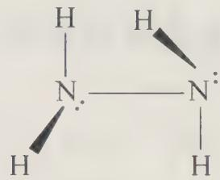

它是一种二元弱碱, 碱性弱于氨, 这是由于氮上的孤对电子都受氨基的吸引, 使其更难给出电子对。由于孤对电子的排斥作用, 联氨不如氨分子稳定, 还原性强于氨, 可以作为还原剂制取一些金属单质。联氨及其衍生物偏二甲肼 $\left(\mathrm{CH}_{3}\right)_{2} \mathrm{NNH}_{2}$ 可以作为火箭燃料, $\mathrm{N}_{2} \mathrm{H}_{4} + \mathrm{O}_{2} \longrightarrow \mathrm{N}_{2} + 2 \mathrm{H}_{2} \mathrm{O}$ , 产物无污染。

联氨可以由氨气和次氯酸钠制备：

$$
2 \mathrm{NH} _ {3} + \mathrm{NaClO} \longrightarrow \mathrm{N} _ {2} \mathrm{H} _ {4} + \mathrm{NaCl} + \mathrm{H} _ {2} \mathrm{O}
$$

如果将氨分子中的一个氢用羟基取代,则得到羟氨 $NH_{2}OH$ , 羟氨也是一种弱碱和强还原剂, 可以用于无机合成。

叠氮酸 $\left(\mathrm{HN}_{3}\right)$ 是另一种重要的氮氢化合物,其盐易分解为金属单质和氮气。重金属盐具有很强的爆炸性,可以制作炸药,而 $\mathrm{NaN}_{3}$ 分解较平稳,用于汽车安全气囊中。 $N_{3}^{-}$ 离子是 $CO_{2}$ 的等电子体,对称的直线形结构,其路易斯共振结构式可表示为:

$$
\left[: \ddot {N} = N = \ddot {N}: \right] ^ {-} \longleftrightarrow \left[: \ddot {N} - N \equiv N: \right] ^ {-} \longleftrightarrow \left[: N \equiv N - \ddot {N}: \right] ^ {-}
$$

## 3. 氮的氧化物

氮的氧化物有多种，从 $+1$ 氧化态到 $+5$ 氧化态都存在相应氧化物。 $\mathrm{N}_2\mathrm{O}$ ，NO， $\mathrm{N}_2\mathrm{O}_3$ ， $\mathrm{NO}_2$ ， $\mathrm{N}_2\mathrm{O}_4$ ， $\mathrm{N}_2\mathrm{O}_5$ 。下表列出了它们的性质与结构。

<table><tr><td>化学式</td><td>形状</td><td>熔点/°C</td><td>沸点/°C</td><td>结构</td></tr><tr><td> $N_{2}O$ </td><td>无色有甜味的气体,易溶于水</td><td>-90.88</td><td>-88.48</td><td></td></tr><tr><td>NO</td><td>无色气体,顺磁性</td><td>-163.6</td><td>-151.8</td><td>:N-O:</td></tr><tr><td> $N_{2}O_{3}$ </td><td>蓝色固体,浅蓝色液体</td><td>-110.7</td><td>3</td><td></td></tr><tr><td> $NO_{2}$ </td><td>红棕色气体</td><td>-93.5</td><td>21.5</td><td>一个 $\Pi_{3}^{4}$ </td></tr><tr><td> $N_{2}O_{4}$ </td><td>无色气体</td><td>11.3</td><td>24.2</td><td>两个 $\Pi_{3}^{4}$ 或一个 $\Pi_{6}^{8}$ </td></tr><tr><td> $N_{2}O_{5}$ </td><td>无色固体,固体时由 $NO_{2}^{+}NO_{3}^{-}$ 组成。气态时为 $N_{2}O_{5}$ 分子</td><td>32.5</td><td>升华</td><td>(气态时)两个 $\Pi_{3}^{4}$ </td></tr></table>

NO 是单电子分子, 气态的 NO 表现为顺磁性, 但低温时的液态和固态却表现为逆磁性, 红外光谱实验证明了是 NO 发生了双聚。结构如下:

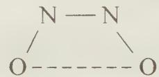

NO极易被氧化为 $\mathrm{NO}_2$ ，温度较高时，也能被还原成 $\mathbf{N}_2$ 甚至氨气。

NO 在反应中易失去其单电子, 形成正一价的亚硝酰离子 $NO^{+}$ , 相应的化合物有 $NO^{-}HSO_{4}^{-}$ , $NO^{+}ClO_{4}^{-}$ 。NO 分子内有孤对电子, 可与金属形成配离子形成配合物, 如与 $FeSO_{4}$ 溶液形成棕色可溶性的 $[Fe(NO)]SO_{4}$ 或 $[Fe(H_{2}O)_{5}(NO)]SO_{4}$ , 此配合物中 NO 以 $NO^{+}$ 与 Fe 键合, Fe 的氧化数为 +1。

$NO_{2}$ 是顺磁性的单电子分子, 易发生双聚形成逆磁性的无色 $N_{2}O_{4}$ 分子。 $N_{2}O_{4}$ 和 $NO_{2}$ 在 $-9^{\circ}C-140^{\circ}C$ 时是共存的。当温度超过 $150^{\circ}C$ 时, $NO_{2}$ 发生分解生成 $NO$ 和 $O_{2}$ 。

$NO_{2}$ 和 $N_{2}O_{4}$ 都是强氧化剂，能氧化硫、磷等。液态 $N_{2}O_{4}$ 可作为火箭推进剂（如 $N_{2}H_{4}$ ）的氧化剂。 $N_{2}O_{4} + 2N_{2}H_{4} \longrightarrow 3N_{2} + 4H_{2}O$ 。

液态的 $N_{2}O_{4}$ 是一种非水溶剂，可以发生微弱的自偶电离， $\mathrm{N}_{2}\mathrm{O}_{4}(1)\rightleftharpoons\mathrm{NO}^{+}+\mathrm{NO}_{3}$ ，钠与液态 $N_{2}O_{4}$ 反应生成 $NaNO_{3}$ ，并放出 NO，实际上是 Na 将 $NO^{-}$ 还原。

$$
\mathrm{Na} + \mathrm{N} _ {2} \mathrm{O} _ {4} \longrightarrow \mathrm{NO} + \mathrm{NaNO} _ {3}
$$

工业生产,汽车尾气等排放氮氧化物(主要是 NO 和 $NO_{2}$ , 以 $NO_{3}$ 表示)是大气污染的来源之一,可造成酸雨、光化学烟雾、臭氧层空洞等环境问题,因此控制氮氧化物的排放,含氮氧化物尾气的处理十分重要。常用的方法有碱液吸收法(NaOH, $Na_{2}CO_{3}$ 溶液等为吸收剂)、氨催化还原法、活性炭吸附法等。

思考2: 关于 $NO_{2}$ 的结构主要有两种意见, 一种认为形成了 $\Pi_{3}^{4}$ 键, 一种认为形成的是 $\Pi_{3}^{3}$ 键, 有哪个事实支持了 $\Pi_{3}^{4}$ 键的意见?

## 4. 氮的含氧酸

氮的含氧酸主要有硝酸和亚硝酸。

## (1) 硝酸

纯的硝酸是无色液体，与水任意比互溶。实验室使用的浓硝酸浓度约为 $15 \sim 16 \mathrm{~mol} / \mathrm{L}$ ，质量分数约为 $69\%$ 。硝酸不稳定，受热或见光时易分解，浓硝酸常因为溶有硝酸分解产生的 $\mathrm{NO}_2$ 而显黄色。

稀硝酸和浓硝酸均具有较强的氧化性,浓硝酸的氧化性更强,能够溶解除金、铂以外的所有金属。浓度不同的硝酸还原产物也不同,由浓到稀分别可生成 $NO_{2}$ , NO, $N_{2}O$ , $N_{2}$ , $NH_{4}^{+}$ 等。浓硝酸和浓盐酸以 1:3 体积混合的溶液称为王水,有更强的氧化性,能够将金和铂溶解,这与 $HNO_{3}$ 的强氧化性和 $Cl^{-}$ 对 Au(Ⅲ) 和 Pt(Ⅳ) 的强配位能力有关。

$$
\begin{array}{r l} & \mathrm {Au + HNO_ {3} + 4HCl\longrightarrow HAuCl_ {4} + NO\uparrow + 2H_ {2} O} \\ & 3 \mathrm{Pt+4HNO} _ {3} + 1 8 \mathrm{HCl} \longrightarrow 3 \mathrm{H} _ {2} \mathrm{PtCl} _ {6} + 4 \mathrm{NO} \uparrow + 8 \mathrm{H} _ {2} \mathrm{O} \end{array}
$$

硅不溶于王水,但可以溶解于 $HNO_{3}$ 和 HF 的混合溶液中,是 $HNO_{3}$ 的氧化性和 $F^{-}$ 对 Si(IV) 配位效应共同影响的结果。

$$
3 \mathrm{Si} + 4 \mathrm{HNO} _ {3} + 1 8 \mathrm{HF} \longrightarrow 3 \mathrm{H} _ {2} \mathrm{SiF} _ {6} + 4 \mathrm{NO} \uparrow + 8 \mathrm{H} _ {2} \mathrm{O}
$$

工业上硝酸用氨氧化法制备,此法制得的硝酸约为 50%,由于 69% 左右的硝酸形成恒沸溶液,直接常压下蒸馏稀硝酸溶液不能得到比质量分数 69% 浓度更高的硝酸,可以加入浓硫酸或无水硝酸镁做吸水剂,然后蒸馏,进一步浓缩。

【例 1】工业上用水吸收二氧化氮生产硝酸,产生的气体经过多次氧化、吸收的循环操作使其充分转化为硝酸(假定上述过程中无其他损失)。

(1) 写出上述反应的化学方程式。

(2) 设循环操作的次数为 $n$ , 写出 $\mathrm{NO}_{2} \rightarrow \mathrm{HNO}_{3}$ 转化率 $a$ 与循环操作的次数 $n$ 之间关系的数学表达式。

(3) 计算一定量的二氧化氮气体要经过多少次循环操作才能使 $95\%$ 的二氧化氮转化为硝酸？

过程探究 本题是一道数学与化学学科综合的问题,化学生产中为了提高原料的利用率,经常采用循环操作的方式,尽可能地提高“原子利用率”也是绿色化学的要求之一。由方程式 $3\mathrm{NO}_2 + \mathrm{H}_2\mathrm{O} \longrightarrow 2\mathrm{HNO}_3 + \mathrm{NO}$ , 知每次操作 $\mathrm{NO}_2$ 的转化率 $a = 2/3$ , 剩余 $1/3$ 的 NO 可以被空气中的氧气氧化, $2\mathrm{NO} + \mathrm{O}_2 \longrightarrow 2\mathrm{NO}_2$ , 生成的 $\mathrm{NO}_2$ 循环操作; 第二次操作中 $\mathrm{NO}_2$ 的转化率仍为 $2/3$ , 总转化率为 $a = 2/3 + 1/3 \times 2/3 = 8/9$ ; 同理可得, 第三次操作的总转化率为 $a = 2/3 + 1/3 \times 2/3 + 1/9 \times 2/3 = 26/27$ ; ……,可得 a 为以 2/3 为首项, 公比为 1/3 的等比数列之和, 由等比数列的求和公式知, 第 n 次吸收, 转化率 $a = (3^{n} - 1)/3^{n}$ , 当 $a = 95\%$ 时, 可得 n = 2.7, 取整数为 3。

参考解答 (1) $3 \mathrm{NO}_{2} + \mathrm{H}_{2} \mathrm{O} \longrightarrow 2 \mathrm{HNO}_{3} + \mathrm{NO}, 2 \mathrm{NO} + \mathrm{O}_{2} \longrightarrow 2 \mathrm{NO}_{2}$

(2) 第一次吸收, 转化率 $a = 2/3$ ; 第二次吸收, 转化率 $a = 2/3 + 1/3 \times 2/3 = 8/9$ ; 第三次吸收, 转化率 $a = 8/9 + 1/9 \times 2/3 = 26/27$ ; …… 第 $n$ 次吸收, 转化率 $a = (3^n - 1)/3^n$

(3) 将 $a=95\%$ 代入 $a=(3^{n}-1)/3^{n}$ 中，所以 n=3。

## (2) 亚硝酸

亚硝酸 $HNO_{2}$ 是一种不稳定的弱酸，将等物质的量的 NO 和 $NO_{2}$ 溶解在冰水中，或向亚硝酸盐的冷溶液中加酸时能制得亚硝酸。

$$
\mathrm{NO} + \mathrm{NO} _ {2} + \mathrm{H} _ {2} \mathrm{O} \xrightarrow {\text {冰水}} 2 \mathrm{HNO} _ {2}
$$

亚硝酸及其盐中的氮原子氧化态为+3，处于中间价态，既可以被 $\mathrm{KMnO_4}$ 强氧化剂氧化，又能被 $\mathrm{I}^{-}$ 、 $\mathrm{Fe}^{2+}$ 等还原剂所还原（酸性条件下）。

$$
2 \mathrm{NO} _ {2} ^ {-} + 2 \mathrm{I} ^ {-} + 4 \mathrm{H} ^ {+} \longrightarrow 2 \mathrm{NO} \uparrow + \mathrm{I} _ {2} + 2 \mathrm{H} _ {2} \mathrm{O}
$$

思考3: 硝酸和亚硝酸的酸性和氧化性谁更强？为什么？

## 三、磷及其化合物

## 1. 磷的单质

磷的单质有多种同素异形体,如白磷,红磷和黑磷。磷的同素异形体之间结构存在很大的差异,化学性质也差异较大,体现了“结构决定性质”这一规律。白磷的分子结构如下:

白磷分子构型为正四面体，磷原子处于四面体顶点。磷为 $sp^{3}$ 杂化，键角为 $60^{\circ}$ ，偏离 $sp^{3}$ 杂化的正常键角 $109^{\circ}28'$ 较多，磷磷键之间存在较大的张力，因此白磷分子不稳定，化学性质活泼，在空气缓慢氧化，当热量积蓄到燃点时即发生自燃。白磷为非极性分子，不溶于水，易溶于 $CS_{2}$ 。红磷的结构较为复杂，具有环—链交替的结构，可能是每个白磷分子断裂一个 P—P 键，然后剩余的 $P_{4}$ 单元链接形成的链状结构。

白磷易与氧气，卤素单质等氧化剂反应，与浓硝酸剧烈反应生成磷酸，与热的浓碱溶液反应生成磷化氢和次磷酸盐。白磷还能将金，银，铜从他们的盐溶液中还原出来。

$$
\begin{array}{r l} & \mathrm {P_ {4} + 3KOH + 3H_ {2} O\xrightarrow {\triangle} PH_ {3} \uparrow + 3KH_ {2} PO_ {2}} \\ & 1 1 \mathrm {P + 15CuSO_ {4} + 24H_ {2} O\xrightarrow {\triangle} 5Cu_ {3} P + 6H_ {3} PO_ {4} + 15H_ {2} SO_ {4}} \\ & 2 \mathrm {P + 5CuSO_ {4} + 8H_ {2} O\xrightarrow {\quad} 5Cu\downarrow + 2H_ {3} PO_ {4} + 5H_ {2} SO_ {4}} \end{array}
$$

红磷比白磷稳定,白磷密闭加热到 673 K 生成红磷,红磷可以用于生产火柴,火柴盒侧面涂有红磷和三硫化二锑的混合物。

## 2. 磷的化合物

磷的氢化物主要有 $PH_{3}$ ， $PH_{3}$ 又称为膦，可以用金属磷化物与水反应制得，如实验室制得的乙炔中含有的少量 $PH_{3}$ 来自于电石中的杂质磷化钙与水反应生成。类似于氨气的制备， $PH_{3}$ 可以由碘化磷 $(PH_{4}I)$ 与强碱反应制得，同时白磷在强碱中歧化也生成 $PH_{3}$ 。

$$
\mathrm{PH} _ {4} \mathrm{I} + \mathrm{NaOH} \longrightarrow \mathrm{NaI} + \mathrm{PH} _ {3} \uparrow + \mathrm{H} _ {2} \mathrm{O}
$$

$PH_{3}$ 的分子结构为三角锥,但磷的电负性比氮小, $PH_{3}$ 不能形成分子间氢键,所以熔沸点比 $NH_{3}$ 低。它在水中的溶解度也很小,水溶液的碱性也比氨水弱得多。膦具有强的还原性,它能从 $Cu^{2+}$ 、 $Ag^{+}$ 、 $Hg^{2+}$ 等盐的溶液中还原出金属。

磷的氧化物主要有 $\mathrm{P_4O_6}$ 和 $\mathrm{P_4O_{10}}$ 两种，我们习惯上书写的 $\mathrm{P_2O_3}$ 和 $\mathrm{P_2O_5}$ 实际上并不是分子式而是最简式。 $\mathrm{P_4O_6}$ 和 $\mathrm{P_4O_{10}}$ 的结构都可以看成从白磷的正四面体结构衍生而来。

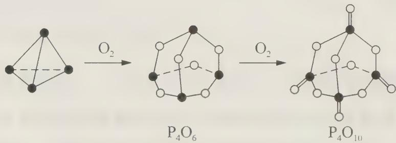

$P_{4}O_{6}$ 是亚磷酸的酸酐, $P_{4}O_{10}$ 是磷酸的酸酐,遇水分别生成相应氧化态的含氧酸。所生成酸的形态与水量多少有关,如与少量水反应时生成偏磷酸,当水足量时( $P_{4}O_{6}$ 与 $H_{2}O$ 的比例超过1:6时),生成磷酸。 $P_{4}O_{10}$ 有很强的吸水性,可用作酸性气体或液体的干燥剂,甚至可以使许多化合物脱水,这也是制酸酐的方法之一。

$$
\begin{array}{r l} & \mathrm {P_ {4} O_{10}} + 6 \mathrm {H_ {2} SO_ {4}} \longrightarrow 6 \mathrm {SO_ {3}} + 4 \mathrm {H_ {3} PO_ {4}} \\ & \mathrm {P_ {4} O_{10}} + 1 2 \mathrm {HNO_ {3}} \longrightarrow 6 \mathrm {N_ {2} O_ {5}} + 4 \mathrm {H_ {3} PO_ {4}} \\ & \mathrm {P_ {4} O_{10}} + 3 \mathrm {CH_ {2} (COOH) _ {2}} \longrightarrow 3 \mathrm{O=C=C=C=O+4H_{3} PO_{4}} \end{array}
$$

磷的含氧酸有磷酸 $\left(\mathrm{H}_{3}\mathrm{PO}_{4}\right)$ ，亚磷酸 $\left(\mathrm{H}_{3}\mathrm{PO}_{3}\right)$ 和次磷酸 $\left(\mathrm{H}_{3}\mathrm{PO}_{2}\right)$ ，其中磷酸为三元酸，亚磷酸为二元酸，次磷酸为一元酸。它们都含有一个非羟基氧，是中强酸，结构依次为：

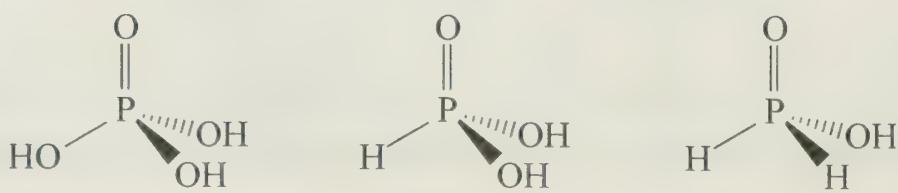

在磷酸分子 $H_{3}PO_{4}$ 中, 非羟基氧原子与磷原子之间形成的磷氧键并不是严格意义上的双键, 而是一个由磷到氧的 $\sigma$ 配键和两个氧到磷的 $d-p\pi$ 反馈配键组成, 但由于磷的 3d 轨道和氧的 2p 轨道能量相差较大, 所以形成的 $d-p\pi$ 反馈配键并不强。类似的 $d-p\pi$ 反馈配键还存在于硫、氯、硅的含氧酸根中。磷酸有很强的配位能力, 能与许多金属阳离子形成配合物, 在分析化学中可以用于掩蔽 $Fe^{3+}$ 。

焦磷酸可以视为两分子磷酸缩合形成的缩合酸,一般来说缩合酸的酸性大于单酸,这是由于缩合酸根离子体积较大,有利于电荷分散,酸根负电荷密度降低,更加稳定。焦磷酸可以由正磷酸和磷酰氯 $\left(\mathrm{POCl}_{3}\right)$ 反应制得。

$$
5 \mathrm{H} _ {3} \mathrm{PO} _ {4} + \mathrm{POCl} _ {3} \xrightarrow {\triangle} 3 \mathrm{H} _ {4} \mathrm{P} _ {2} \mathrm{O} _ {7} + 3 \mathrm{HCl}
$$

加热 $\mathrm{Na_2HPO_4}$ 制得焦磷酸盐， $2\mathrm{Na_2HPO_4}\xrightarrow{\triangle}\mathrm{Na_4P_2O_7 + H_2O}$

偏磷酸化学式为 $HPO_{3}$ ，但并不是其分子式，常见的偏磷酸有 $(\mathrm{HPO}_{3})_{3}$ 和 $(\mathrm{HPO}_{3})_{4}$ ，它们都是环状结构。可以视为正磷酸脱水缩合形成。

磷能形成多种卤化物,最重要的有 $PCl_{3}$ 和 $PCl_{5}$ 。 $PCl_{3}$ 为无色液体, $PCl_{3}$ 分子三角锥形的结构; $PCl_{5}$ 为白色固体,在气态时, $PCl_{5}$ 为三角双锥结构。但在晶态时, $PCl_{5}$ 晶体由正四面体 $[PCl_{4}]^{+}$ 和正八面体 $[PCl_{6}]^{-}$ 离子组成。 $PCl_{3}$ 和 $PCl_{5}$ 均易水解生成相应的磷含氧酸和氯化氢。但在水不足时, $PCl_{5}$ 可部分水解生成磷的氯氧化合物 $POCl_{3}$ 。

$$
\begin{array}{r l} & \mathrm{PCl} _ {5} + \mathrm{H} _ {2} \mathrm{O} \longrightarrow \mathrm{POCl} _ {3} + 2 \mathrm{HCl} \\ & \mathrm{POCl} _ {3} + 3 \mathrm{H} _ {2} \mathrm{O} \longrightarrow \mathrm{H} _ {3} \mathrm{PO} _ {4} + 3 \mathrm{HCl} \end{array}
$$

$\mathrm{PCl}_{5}$ 是路易斯碱, 能与许多金属卤化物形成酸碱加合物, 如 $\mathrm{PCl}_{5} \cdot \mathrm{AlCl}_{3}$ , 它溶于硝基苯形成的溶液有良好的导电性, 在溶液中形成了 $\mathrm{PCl}_{4}^{+}$ 和 $\mathrm{AlCl}_{4}^{-}$ 离子。而在固态的 $\mathrm{PBr}_{5}$ 中存在 $\mathrm{PBr}_{4}^{+}$ 和 $\mathrm{Br}^{-}$ 两种离子。

【例 2】 磷的含氧酸有磷酸 $\left(\mathrm{H}_{3}\mathrm{PO}_{4}\right)$ ，亚磷酸 $\left(\mathrm{H}_{3}\mathrm{PO}_{3}\right)$ ，次磷酸 $\left(\mathrm{H}_{3}\mathrm{PO}_{2}\right)$ ，它们均为中强酸。

(1) 根据鲍林经验规则, 推测它们的结构。

(2) 写出它们与足量氢氧化钠反应得到的钠盐的化学式。

过程探究 含氧酸的酸性可用鲍林经验规则来判断,若将单核含氧酸的化学式表示为 $\mathrm{RO}_{m}(\mathrm{OH})_{n}$ ，m 表示非羟基氧的个数，m 越大，酸性越强。其第一级电离常数 $K_{a}$ 与 m 存在如下关系： $pK_{a}=7-5m$ 。当 m=0 时， $pK_{a}\approx7$ ， $K_{a}\approx10^{-7}$ ，为弱酸，如 HClO；m=1 时， $pK_{a}\approx2$ ， $K_{a}\approx10^{-2}$ ，为中强酸，如 $H_{2}SO_{3}$ ；m=2 时， $pK_{a}\approx-3$ ， $K_{a}\approx10^{3}$ ，为强酸，如 $H_{2}SO_{4}$ ；m=3 时， $pK_{a}\approx-8$ ， $K_{a}\approx10^{8}$ ，为最强酸，如 $HClO_{4}$ 。题中磷的三种含氧酸，均为中强酸，则它们均含一个非羟基氧，其结构简式可表示为 $\mathrm{PO(OH)}_{3}$ 、 $\mathrm{PO(OH)}_{2}\mathrm{H}$ 、 $\mathrm{PO(OH)}\mathrm{H}_{2}$ ，分别为三元酸，二元酸和一元酸，与足量的氢氧化钠反应得到的应该是正盐，其化学式应为： $Na_{3}PO_{4}$ ， $Na_{2}HPO_{3}$ ， $NaH_{2}PO_{2}$ 。

参考解答 (1) $\mathrm{PO(OH)}_{3}$ 、 $\mathrm{PO(OH)}_{2} \mathrm{H}$ 、 $\mathrm{PO(OH)} \mathrm{H}_{2}$

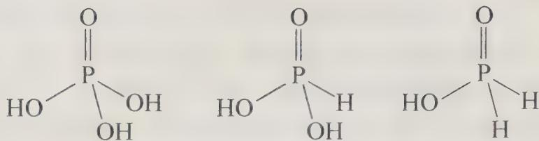

$$
\mathrm{Na} _ {3} \mathrm{PO} _ {4}, \mathrm{Na} _ {2} \mathrm{HPO} _ {3}, \mathrm{NaH} _ {2} \mathrm{PO} _ {2}
$$

## 【竞赛对接】

【例 1】（2004 年山东预赛试题）不同浓度的硝酸与同一金属反应可生成不同的还原产物。例如：镁与不同浓度硝酸反应实验中，测得其气相产物有 $H_{2}$ 、 $N_{2}$ 、NO、 $NO_{2}$ ，液相产物有 $\mathrm{Mg(NO_{3})_{2}}$ 、 $NH_{4}NO_{3}$ 和 $H_{2}O$ 。生成这些产物的硝酸浓度范围为： $H_{2}: c<6.6\ mol\cdot L^{-1}$ ; $N_{2}$ 和 $NH_{4}^{+}: c<10\ mol\cdot L^{-1}$ ; NO: $0.1\ mol\cdot L^{-1}<c<10\ mol\cdot$

$L^{-1}$ ; $NO_{2}: c > 0.1 \, mol \cdot L^{-1}$ 。各气相产物成分及含量随硝酸浓度变化曲线如图所示。

(1) 写出 $\mathrm{Mg}$ 与 $11 \mathrm{~mol} \cdot \mathrm{L}^{-1}$ 的 $\mathrm{HNO}_{3}$ 反应的方程式。

(2) 960 mg Mg 能在 1 L 4 mol·L $^{-1}$ 的 HNO $_{3}$ 中完全溶解, 并可收集到 224 mL(STP) 气体, 试写出反应方程式。

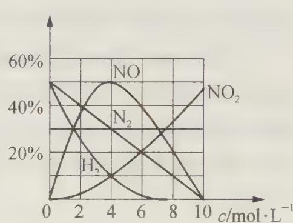

过程探究 本题是一道图象分析题,需要有较强的图象分析处理能力。问题(1)根据图象可知当硝酸的浓度大于 $10\ mol\cdot L^{-1}$ 时,只得到唯一的还原产物 $NO_{2}$ ,据此不难写出反应方程式。对于问题(2), $4\ mol\cdot L^{-1}$ 的硝酸中气相产物有NO, $N_{2}$ , $H_{2}$ , $NO_{2}$ ,它们的比例为 $n(\mathrm{NO}):n(\mathrm{H}_{2}):n(\mathrm{NO}_{2}):n(\mathrm{N}_{2})=5:1:1:3$ ,有没有 $NH_{4}NO_{3}$ 生成呢?如果有,物质的量又是多少呢?题中并没有明确说明。需要根据题中所给的数据进行计算确认。由已知, $n(\mathrm{Mg})=960\div24=40\ \mathrm{mmol}$ ,气体总物质的量为 $224\div22.4=10\ mmol$ ,即 $n(\mathrm{NO})=5\ mmol$ , $n(\mathrm{H}_{2})=1\ mmol$ , $n(\mathrm{NO}_{2})=1\ mmol$ , $n(\mathrm{N}_{2})=3\ mmol$ ,由化合价升降守恒得: $40\times2=5\times3+1\times2+1\times1+3\times10+n(\mathrm{NH}_{4}\mathrm{NO}_{3})\times8$ $n(\mathrm{NH}_{4}\mathrm{NO}_{3})=4\ mmol$ ,所以方程式应为:

$$
\begin{array}{l} 4 0 \mathrm{Mg} + 1 0 0 \mathrm{HNO} _ {3} \longrightarrow 5 \mathrm{NO} \uparrow + \mathrm{H} _ {2} \uparrow + \mathrm{NO} _ {2} \uparrow + 3 \mathrm{N} _ {2} \uparrow + 4 \mathrm{NH} _ {4} \mathrm{NO} _ {3} + 4 0 \mathrm{Mg} (\mathrm{NO} _ {3}) _ {2} + \\ 4 1 \mathrm{H} _ {2} \mathrm{O} \end{array}
$$

$$
\begin{array}{r l} & {\text {参考解答 (1) Mg + 4HNO} _ {3} \longrightarrow \mathrm {Mg(NO_ {3})} _ {2} + 2 \mathrm{NO} _ {2} \uparrow + 2 \mathrm{H} _ {2} \mathrm{O}} \\ & {(2) 4 0 \mathrm{Mg} + 1 0 0 \mathrm{HNO} _ {3} \longrightarrow 5 \mathrm{NO} \uparrow + \mathrm{H} _ {2} \uparrow + \mathrm{NO} _ {2} \uparrow + 3 \mathrm{N} _ {2} \uparrow + 4 \mathrm{NH} _ {4} \mathrm{NO} _ {3} +} \\ & {4 0 \mathrm{Mg(NO} _ {3}) _ {2} + 4 1 \mathrm{H} _ {2} \mathrm{O}} \end{array}
$$

【例 2】1905 年美国化学家富兰克林提出了酸碱的溶剂理论,人们发现许多溶剂都能发生自偶电离过程,生成特征阳离子和特征阴离子,如 $2H_{2}O \rightleftharpoons H_{3}O^{+} + OH$ , $2NH_{3} \rightleftharpoons NH_{4}^{-} + NH_{2}^{-}$ ,溶剂理论认为凡在溶剂中能产生(包括化学反应生成)特征阳离子的物质为溶剂酸,反之为溶剂碱。

(1) 试定义溶剂理论中的中和反应。

(2) ${\mathrm{{NH}}}_{4}\mathrm{{Cl}}$ 和 $\mathrm{{NaH}}$ 在液氨体系中是酸还是碱,并用方程式来表示。

(3) $\mathrm{SbF}_{5}$ 在 $\mathrm{BrF}_{3}$ 溶液中为酸, 写出其电离方程式, 指出电离所得阴、阳离子的立体结构。

(4) 尿素在液氨中为弱酸, 试写出电离方程式。液氨中尿素与氨基钠反应得到尿素盐, 试写出方程式。该反应能不能在水中进行? 为什么?

过程探究 近代以来,化学家对酸碱的定义提出了多种,如阿仑尼乌斯的电离理论(1884年),路易斯酸碱理论(1923年),布朗斯特的质子酸碱理论(1923年),富兰克林的溶剂酸碱理论(1925年)和皮尔逊的软硬酸碱理论(1963年)等。每种酸碱理论都有不同的应用范围,各有优势和缺陷。

阿仑尼乌斯的酸碱理论局限于水溶液体系，1905年爱德华·富兰克林研究了液氨体系，发现在液氨体系中也存在类似于水溶液中的酸碱反应，和后来的化学家一起提出了溶剂酸碱理论。溶剂酸碱理论是基于能发生自偶电离的溶剂，所谓自偶电离：溶剂中存在中性溶剂分子与解离出的阳离子和阴离子之间的平衡。如：

$$
2 \mathrm{H} _ {2} \mathrm{O} \rightleftharpoons \mathrm{H} _ {3} \mathrm{O} ^ {+} + \mathrm{OH} ^ {-}, 2 \mathrm{NH} _ {3} \rightleftharpoons \mathrm{NH} _ {4} ^ {+} + \mathrm{NH} _ {2} ^ {-}
$$

本题是一道信息题,先需要根据题中所给的溶剂酸碱的定义,对特定溶剂体系的反应进行分析。大家熟知的水溶液正是我们进行参照的体系。水溶液中的中和反应,是酸和碱发生反应生成盐和水的反应,本质上是酸电离出来的氢离子和碱电离出来的氢氧根离子发生中和,生成溶剂水分子的反应,不难得到,溶剂中的中和反应也应与之类似。根据溶剂酸碱理论,产生特征阳离子的物质是溶剂酸,故 $NH_{4}Cl$ 为溶剂酸,而NaH与液氨反应,生成 $NaNH_{2}$ 和氢气, $NH_{2}^{-}$ 为特征阴离子,故而NaH为溶剂碱。液态 $BrF_{3}$ 中存在的自偶电离为 $2BrF_{3}\rightleftharpoons BrF_{2}^{+}+BrF_{4}^{-}$ ,已知 $SbF_{5}$ 为溶剂酸,即可以产生阳离子 $BrF_{2}^{+}$ ,这是因为 $SbF_{5}$ 为强路易斯酸,可以夺取 $BrF_{3}$ 中的一个氟离子,生成稳定 $SbF_{6}^{-}$ 离子。根据价层电子对互斥理论,我们得到 $BrF_{2}^{+}$ 为折线形结构,而 $SbF_{6}^{-}$ 为正八面体结构。对于问题(4),尿素在液氨中为弱酸,即能在液氨中生成 $NH_{4}^{+}$ ,所以它能和作为液氨体系中的强碱 $NaNH_{2}$ (类似于水溶液中的NaOH)发生中和反应,生成氨分子和尿素酸钠( $NaNHCONH_{2}$ ),这个反应在水溶液中是不能进行的,因为无论是氨基钠还是尿酸酸钠在水溶液都发生强烈水解,这也说明了非水溶剂在化学合成的重要作用,能合成许多在水溶液中不能合成的物质。

参考解答 （1）特征阴阳离子生成溶剂分子的反应。

(2) 酸 $NH_{4}Cl \longrightarrow NH_{4}^{+} + Cl^{-}$

碱 $\mathrm{NaH} + \mathrm{NH}_3\longrightarrow \mathrm{H}_2 + \mathrm{NH}_2^- +\mathrm{Na}^+$

(3) $\mathrm{SbF}_5 + \mathrm{BrF}_3 \longrightarrow \mathrm{BrF}_2^+ + \mathrm{SbF}_6^-$

$\mathrm{BrF}_{2}^{+}$ V形 $\mathrm{SbF}_{6}$ 正八面体

$$
(4) \mathrm{CO} (\mathrm{NH} _ {2}) _ {2} + \mathrm{NH} _ {3} \longrightarrow \mathrm{NH} _ {4} ^ {+} + \mathrm{NH} _ {2} \mathrm{CONH} ^ {-}
$$

$$
\mathrm{NaNH} _ {2} + \mathrm{NH} _ {2} \mathrm{CONH} _ {2} \longrightarrow \mathrm{NH} _ {2} \mathrm{CONHNa} + \mathrm{NH} _ {3}, \text {不能,遇水分解。}
$$

【例 3】 NO 与 $F_{2}$ 反应, 当 $F_{2}$ 不足量时, 生成气体 X, 当 $F_{2}$ 过量时生成气体 Y, X 为 V 形分子, Y 为四面体形分子, Y 与 $BF_{3}$ 反应可以生成 $Y \cdot BF_{3}$ 与 $Y \cdot 2BF_{3}$ 均是离子型化合物, 它们含有相同的阳离子, 请画出这两种化合物的结构式。

(1) 给出 X, Y 的结构简式。

(2) 画出 $\mathrm{Y} \cdot \mathrm{BF}_{3}$ 与 $\mathrm{Y} \cdot 2\mathrm{BF}_{3}$ 的结构式。

(3) 气态化合物 Z 与 X, Y 组成元素相同, 且为平面构形, 推测 Z 的化学式。

过程探究 本题考查的是氮的含氧卤化物。氮的含氧卤化物包括亚硝酰卤化物NOX和硝酰卤化物 $\mathrm{NO}_2\mathrm{X}$ 两个大类。当氟气不足的时候，应该生成的是亚硝酰卤化物：FNO)，根据价层电子对互斥理论（VSEPR），容易得到为V形的结构，而氟气过量时，生成一种四面体形的分子，氮原子的配位数为4，设为 $\mathrm{NO}_x\mathrm{F}_y$ ，满足 $x + y = 4$ 且 $2x + y\leqslant 5$ ，易得 $x = 1$ ， $y = 3$ ，注意： $x = 0$ ， $y = 4$ 是不可能的！此时氮需要5个价电子轨道来匹配4个N一F键和一个单电子，而氮的最高价层轨道数不超过4，所以Y应为 $\mathrm{NOF}_3$ 。

$\mathrm{NOF}_3$ 与 $\mathrm{BF}_3$ 形成两种离子型的化合物, 意味着生成了新的阳离子和阴离子, 就像 $\mathrm{NH}_3$ 和 $\mathrm{HCl}$ 反应, 通过质子的转移, 生成了 $\mathrm{NH}_4^+$ 和 $\mathrm{Cl}^-$ 两种离子, 它们形成离子化合物。我们知道, $\mathrm{BF}_3$ 是典型的路易斯酸, 具有可以接受孤对电子的空轨道, 能够“诱使” $\mathrm{NOF}_3$ 失去一个 $\mathrm{F}$ 离子, 就像 $\mathrm{NH}_3$ 对 $\mathrm{HCl}$ 的作用一样, 形成 $\mathrm{NOF}_2^-$ 阳离子, 所以我们得到 $\mathrm{NOF}_3 \cdot \mathrm{BF}_3$ 的离子型结构式为 $[\mathrm{NOF}_2]^+ [\mathrm{BF}_4]^-$ , 而 $\mathrm{NOF}_3 \cdot 2\mathrm{BF}_3$ 可书写为 $[\mathrm{NOF}_2]^+ [\mathrm{B}_2\mathrm{F}_7]^-$ , $\mathrm{B}_2\mathrm{F}_7^-$ 阴离子可以看成两个 $\mathrm{BF}_3$ 和 $\mathrm{BF}_4$ 以氟桥键相连。

Z 与 Y 的组成元素相同, 即 Z 由 N、O、F 三种元素组成, 具有平面形的结构, 不难得到 Z 为 $NO_{2}F$ 。

参考解答 (1) $\mathrm{NOF}, \mathrm{NOF}_3$

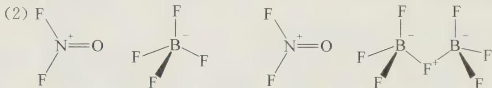

$$
\mathrm{NO} _ {2} \mathrm{F}
$$

【例 4】（2009 年中国科技大学自主招生试题）科学家已经合成出多种含氮量很高的化合物。

（1）由 H、N 两种元素组成的酸(A)，其氮的质量分数为 97.7%，画出 A 的路易斯结构式。

（2）含氮的质量分数为 $42.44\%$ 的某卤化氮(B)具有三种异构体，试画出这三种异构体的结构式。

(3) A 与 B 的一种异构体及 $\mathrm{SbF}_{5}$ 按 $1:1:1$ (摩尔比) 在 $-196^{\circ} \mathrm{C}$ 反应, 得到含氮质量分数为 $22.9 \%$ 的全氮正离子化合物 (C), C 与水反应放出大量的气体。试画出离子化合物 C 中全氮正离子的共振结构式并写出 C 与水反应的方程式。

(4) 近年来科学家合成含氮的质量分数竟达 $91.24\%$ 的离子化合物(D), 化合物 D 分两步合成: 第一步某主族元素氯化物与过量的含 A 酸根的钠盐在 $-20^{\circ} \mathrm{C}$ , 乙腈溶剂中以 1:6 摩尔比反应生成 E, E 再与 C 在 $-64^{\circ}C$ ，液态 $SO_{2}$ 溶剂中以 1:1 摩尔比反应，生成 D。试写出 D 的分子式（以离子式表示），并写出 D 与 $O_{2}$ 反应的最终产物方程式。

过程探究 高含氮量的化合物是含能材料研究的热点,它们在分解时,生成稳定的氮气时放出大量的热,同时产生大量的气体,在新型炸药制造上具有很大的潜在价值。

（1）由元素百分含量得 $\mathrm{N:H} = \frac{0.977}{14}:\frac{0.023}{1} = 3:1$ ，即A的化学式为 $\mathrm{HN}_3$ ，为叠氮酸。书写路易斯结构式，我们先要确定共价键的数目 $n = \frac{2\times 1 + 3\times 8 - 1 - 3\times 5}{2} = 5$ 然后再各原子之间分配共价键和剩余的价电子，使每个原子都满足八隅律。我们得到如下结构：

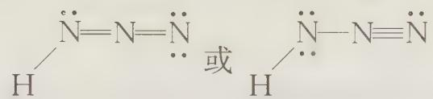

(2) 设 B 的化学式为 $N_{a}X_{b}$ ，根据已知有： $\frac{14a}{M(X)b}=\frac{42.44\%}{57.56\%}$ ，X 可能为 F、Cl、Br、I，相对原子量 $M(X)$ 分别为 19、35.5、80、127，a，b 必须为整数。用尝试法得，a=2，b=2，X 为 F。B 为 $N_{2}F_{2}$ ，可能的结构有三种，一种为两个氟原子连在同一个氮上，另外两种为两个氟原子连在不同的氮上，由于氮和氮原子之间是双键，因此存在顺反异构。

(3) C 中含有的元素只可能为 N, F, Sb 三种, 不妨设 C 为 $N_{x}Sb_{y}F_{z}$ , 含氮元素为 22.9%, x, y, z 必须为正整数, 将 N, F, Sb 的原子量代入可得到整数解 x = 5, y = 1, z = 6, 但运算量是比较大的。考虑到 $SbF_{5}$ 为一种强路易斯酸, 可以夺取其他分子中的氟离子形成稳定的 $SbF_{6}$ 离子, 猜测离子化合物中的 C 为 $SbF_{6}^{-}$ 离子, 设 C 为 $N_{x}(SbF_{6})_{y}$ , 这样可以大大简化运算, 在解题时, 进行大胆的合理的假设, 是十分重要的, 这也是科学研究中必备的素养之一。C 中的 $N_{5}^{+}$ 阳离子是一个大阳离子, $SbF_{6}^{-}$ 离子是个大阴离子, 它们在半径上是匹配的, 虽然这个离子化合物晶格能较小, 但是在生成 $SbF_{6}$ 离子时放出了大量的热, 这在热力学上促进了 C 的生成。显然, 它仍然是一个不稳定的化合物。遇到水将发生分解, 这个合成反应在低温下, 非水溶剂中进行。

D 中含氮量更大, 达到 91.24%。E 与 C 在液态 $SO_{2}$ 中以 1:1 摩尔比发生反应, C 为 $N_{5}^{+}SbF_{6}^{-}$ , 它提供的应该是 $N_{5}^{+}$ , E 提供的应该是一个负一价的原子团, 而 E 是由某一主族元素卤化物与 $NaN_{3}$ 以 1:6 的比例形成的化合物, $N_{3}^{-}$ 是一种拟卤离子, 和卤素离子性质相似, 卤素离子它能与第五主族的元素形成负一价的配离子, 如 $PCl_{6}$ , $SbF_{6}^{-}$ , $N_{3}^{-}$ 与第五主族的元素 M 形成的负一价配离子为 $M(N_{3})_{6}^{-}$ , D 的化学式为 $N_{5}^{+}\cdot M(N_{3})_{6}^{-}$ , 由含氮的数据计算得到 M 的式量为 31, 应为磷元素, 即 D 为 $N_{5}^{+}\cdot P(N_{3})_{6}^{-}$ , 它与氧气反应的最终产物为氮气和 $P_{2}O_{5}$ 。

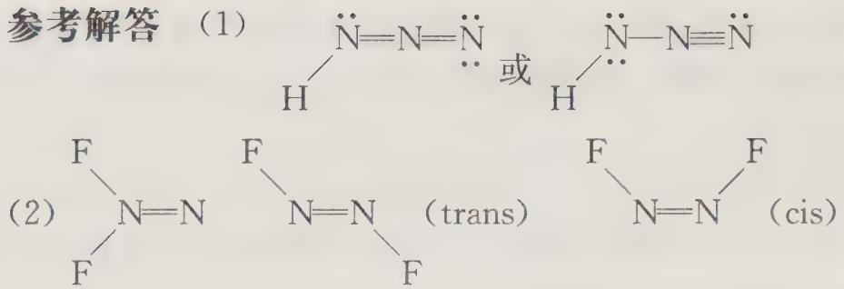

(3) C 为 $\mathrm{N}_{5}^{+}\mathrm{SbF}_{6}^{-}$

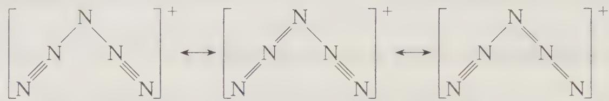

$$
4 \mathrm{N} _ {5} ^ {+} \mathrm{SbF} _ {6} ^ {-} + 2 \mathrm{H} _ {2} \mathrm{O} \longrightarrow 1 0 \mathrm{N} _ {2} \uparrow + \mathrm{O} _ {2} \uparrow + 4 \mathrm{HF} + 4 \mathrm{SbF} _ {5}
$$

或 $4\mathrm{N}_{5}^{+}\mathrm{SbF}_{6}^{-} + 2\mathrm{H}_{2}\mathrm{O}\longrightarrow 10\mathrm{N}_{2}\uparrow +\mathrm{O}_{2}\uparrow +4\mathrm{HF}\cdot \mathrm{SbF}_{5}$

$$
(4) 4 \mathrm{N} _ {5} ^ {+} \cdot \mathrm{P} (\mathrm{N} _ {3}) _ {6} ^ {-} + 5 \mathrm{O} _ {2} \longrightarrow 4 6 \mathrm{N} _ {2} + 2 \mathrm{P} _ {2} \mathrm{O} _ {5}
$$

【例 5】（据 1997 年全国初赛试题改编） $PCl_{5}$ 是一种白色固体，加热到 $160^{\circ}C$ 不经过液态阶段就变成蒸气，测得 $180^{\circ}C$ 下的蒸气密度（折合成标准状况）为 $9.3\,g\cdot L^{-1}$ ，极性为零，P—Cl 键长为 204 pm 和 211 pm 两种。继续加热到 $250^{\circ}C$ 时测得压力为计算值的两倍。 $PCl_{5}$ 在加压下于 $148^{\circ}C$ 液化，形成一种能导电的熔体，测得 P—Cl 的键长为 198 pm 和 206 pm 两种。（P、Cl 相对原子质量为 31.0、35.5）回答如下问题：

(1) $180^{\circ} \mathrm{C}$ 下 $\mathrm{PCl}_{5}$ 蒸气中存在什么分子？画出其立体结构。

(2) 在 $250^{\circ} \mathrm{C}$ 下 $\mathrm{PCl}_{5}$ 蒸气中存在什么分子？画出立体结构。

(3) $PCl_{5}$ 熔体为什么能导电？用最简洁的方式作出解释。

(4) $\mathrm{PBr}_{5}$ 气态分子结构与 $\mathrm{PCl}_{5}$ 相似, 它的熔体也能导电, 但经测定其中只存在一种 $\mathrm{P}-\mathrm{Br}$ 键长。 $\mathrm{PBr}_{5}$ 熔体为什么导电? 用最简洁的形式作出解释。

(5) $50\% \mathrm{PCl}_{5} - 50\% \mathrm{AlCl}_{3}$ 熔体也能导电,用最简洁的方式作出解释。如增大熔体中 $\mathrm{AlCl}_{3}$ 的摩尔分数,生成的阴离子将有何变化?

过程探究 $PCl_{5}$ 是大家熟知的一种卤化物, 它在不同状态时存在形式不尽相同, 在元素化学中有很多这样的例子, 如 $BeCl_{2}$ 在固态时是高聚合的链状分子, 气态时是低聚合的分子, 温度更高时变为单一分子。 $NO_{2}$ 在高温时是单分子, 在低温时发生双聚形成 $N_{2}O_{4}$ 分子。温度, 压强的变化, 会产生不同的存在形式。在 $180^{\circ}C$ 时, 由密度数据得 $9.3 \times 22.4 = 208.3 g \cdot mol^{-1}$ , 应为 $PCl_{5}$ 分子 ( $M_{r} = 208.5 g \cdot mol^{-1}$ ), 在 $250^{\circ}C$ 时, 压力为计算值的两倍, 表明 1 mol $PCl_{5}$ 完全分解成 1 mol $PCl_{3}$ 和 1 mol $Cl_{2}$ , 共 2 mol。气体由等摩 $PCl_{3}$ 和 $Cl_{2}$ 组成。加压液化后, $PCl_{5}$ 得到导电的熔体, 体系中应存在阴阳离子, 不可能是 $PCl_{4}^{+}$ 和 $Cl^{-}$ , 否则只有一种化学键长, 根据价层电子对互斥理论, $PCl_{4}^{+}$ 为正四面体结构的离子, 由于 $PCl_{5}$ 是一种路易斯酸, 它能和 $Cl^{-}$ 结合生成 $PCl_{6}$ . 配离子, $PCl_{6}^{-}$ 配离子为正八面体构型, 只有一种化学键长, 符合题意。如果将 $PCl_{5}$ 熔体电离的过程看成分两步进行: $PCl_{5} \longrightarrow PCl_{4}^{+} + Cl^{-}, PCl_{5} + Cl^{-} \longrightarrow PCl_{6}^{-}$ , 那么对于 $PBr_{5}$ 熔体, 只有一种化学键长, 说明只发生了第一步的反应, 由于 Br 半径大于 $Cl^{-}$ ，六个 $Br^{-}$ 在磷原子周围显得过于拥挤，因此只有 $PBr_{4}^{+}$ 和 $Br^{-}$ 两种离子。而在 50% $PCl_{5}-50\% AlCl_{3}$ 熔体中， $AlCl_{3}$ 是比 $PCl_{5}$ 更强的路易斯酸，将得到第一步电离的 $Cl^{-}$ ，生成 $AlCl_{4}^{-}$ ，如果增大 $AlCl_{3}$ 的摩尔分数，将生成聚合度更高的配阴离子，如 $Al_{2}Cl_{7}^{-}$ ， $Al_{3}Cl_{10}^{-}\cdots\cdots$ ，其通式为 $Al_{x}Cl_{3x+1}^{-}$ 。

参考解答（1） $9.3 \times 22.4 = 208.3 \, g \cdot mol^{-1}$ ; $PCl_{5}$ 相对分子质量 $31.0 + 35.5 \times 5 = 208.5$ ; 蒸气组成为 $PCl_{5}$ (结构式如右图所示); 呈三角双锥体。三角双锥分子无极性, 有两种键长。

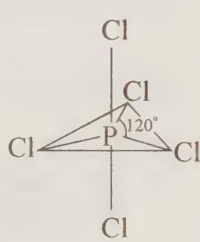

(2) $PCl_{5} \xrightarrow{\triangle} PCl_{3} + Cl_{2}$ 氯分子 Cl—Cl 三氯化磷分子(结构式如下图所示)(压力为计算值的两倍表明 1 mol $PCl_{5}$ 完全分解成 1 mol $PCl_{3}$ 和 1 mol $Cl_{2}$ ，共 2 mol。气体由等摩尔 $PCl_{3}$ 和 $Cl_{2}$ 组成。)

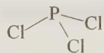

(3) $2\mathrm{PCl}_{5}\longrightarrow \mathrm{PCl}_{4}^{+} + \mathrm{PCl}_{6}^{-}$

(4) $\mathrm{PBr}_5 \longrightarrow \mathrm{PBr}_4^+ + \mathrm{Br}^- \quad \mathrm{PBr}_4^+$ 结构同 $\mathrm{PCl}_4^+$

(5) $\mathrm{PCl}_{5}-\mathrm{AlCl}_{3}\longrightarrow\mathrm{PCl}_{4}^{+}+\mathrm{AlCl}_{4}^{-}$ , 将生成 $\mathrm{Al}_{2}\mathrm{Cl}_{7}^{-}, \mathrm{Al}_{3}\mathrm{Cl}_{10}^{-}\cdots\cdots$ , 其通式为 $\mathrm{Al}_{x}\mathrm{Cl}_{3x+1}^{-}$ 等多核配离子。

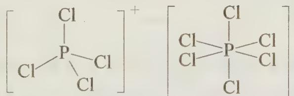

【例 6】（2014 年全国初赛试题）2013 年，科学家通过计算预测了高压下固态氮的一种新结构： $N_{8}$ 分子晶体。其中， $N_{8}$ 分子呈首尾不分的链状结构；按价键理论，氮原子有 4 种成键方式；除端位以外，其他氮原子采用 3 种不同类型的杂化轨道。

（1）画出 $\mathbf{N}_8$ 分子的Lewis结构并标出形式电荷。写出端位之外的N原子的杂化轨道类型。

(2) 画出 $\mathrm{N}_{8}$ 分子的构型异构体。

过程探究 本题考查分子结构理论中的路易斯结构式、形式电荷的判断、杂化轨道理论。氮单质的同素异形体能稳定存在的只有 $\mathbf{N}_2$ ，此外不稳定的同素异形体也是研究的热点，还有 $\mathbf{N}_4$ （类似白磷的结构），高聚氮(2004年全国初赛)等。

虽然 $N_{8}$ 是完全陌生的形态,但是只要拥有扎实的理论功底和较强的阅读分析能力,做出正确的解答并不困难。首先首尾不分的链状结构,即 $N_{8}$ 为链状的对称结构,由路易斯结构式的书写规则,我们可以判断出 $N_{8}$ 分子中共价键个数应为 12,再结合氮原子有 4 种成键方式,除端位的氮原子外,有三种杂化轨道类型即 sp、 $sp^{2}$ 、 $sp^{3}$ 杂化,对共价键和孤对电子进行合理分配即可得到答案。第 2 问中,构型异构体包括几何异构体和立体异构体, $N_{8}$ 分子中含有 N=N 双键,应该有顺反异构体(属于几何异构体),没有手性中心,故没有对映异构体。其他类似的含有 N=N 双键具有顺反异构体的物质还有 $N_{2}F_{2}$ ，HON=NOH（次硝酸）等

## 参考解答

(1) : $N \equiv N - \overset{\oplus}{\underset{\cdot}{N}} - \overset{\ominus}{\underset{\cdot}{N}} = N - \overset{\ominus}{\underset{\cdot}{N}} - N \equiv N :$ sp sp³ sp² sp² sp³ sp

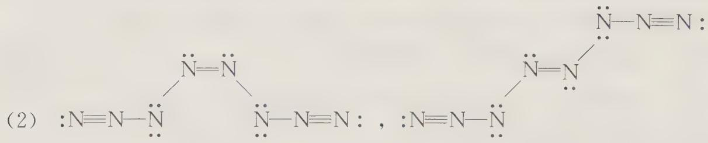

## 【实战演练】

1. 氮元素可形成多种离子, 如 $\mathrm{N}^{3-}$ 、 $\mathrm{NH}_{2}^{-}$ 、 $\mathrm{NH}_{4}^{+}$ 、 $\mathrm{N}_{2} \mathrm{H}_{3}^{-}$ 、 $\mathrm{N}_{2} \mathrm{H}_{5}^{+}$ 、 $\mathrm{N}_{2} \mathrm{H}_{6}^{2+}$ 等。

① 液态氨、 $N_{2}H_{4}$ 等可发生自偶电离，例如： $2NH_{3}\rightleftharpoons NH_{2}^{-}+NH_{4}^{+}$ 。

② $N_{2}H_{5}^{+}$ 、 $N_{2}H_{6}^{2+}$ 等与 $NH_{4}^{+}$ 性质相似， $N_{2}H_{3}^{-}$ 等与 $NH_{2}^{-}$ 性质相似。试写出：

(1) $\mathrm{N}_{2} \mathrm{H}_{4}$ 自偶电离方程式 \_\_\_\_。

(2) $\mathrm{N}_{2} \mathrm{H}_{5}^{+}$ 离子的电子式 \_\_\_\_, $\mathrm{NH}_{2}^{-}$ 离子的电子式 \_\_\_\_。

(3) $\mathrm{N}_{2} \mathrm{H}_{5} \mathrm{Cl}$ 溶液与 KOH 溶液混合所发生反应的离子方程式。

(4) ① 写出三种由多原子(三个以上)组成的与 $\mathrm{N}^{3-}$ 电子数相同的物质的分子式 \_\_\_\_、\_\_\_\_、\_\_\_\_。

② 写出含 N 等四种元素组成的既能与盐酸反应,又能与 NaOH 溶液反应的常见物质的化学式:无机物 \_\_\_\_ 有机物 \_\_\_\_ 。

(5) 按照下面的反应方程式, 在水溶液中 $N_{2}H_{5}^{+}$ 将 $Fe^{3+}$ 还原为 $Fe^{2+}$ 离子: $N_{2}H_{5}^{+} + 4Fe^{3+} \longrightarrow 4Fe^{2+} + Y + \cdots$ 作为 $N_{2}H_{5}^{+}$ 离子的氧化产物 Y 可能是 \_\_\_\_。
A. $NH_{4}^{+}$ B. $N_{2}$ C. $N_{2}O$ D. $NO_{2}$

2. $N_{2}H_{4}$ 在一定条件下热分解, 产生 $NH_{3}$ 、 $N_{2}$ 和 $H_{2}$ , 后两者摩尔比为 3:2, 写出反应方程式 \_\_\_\_。

3. 将磷酸加强热时可发生分子间的脱水生成焦磷酸 $\left(\mathrm{H}_{4}\mathrm{P}_{2}\mathrm{O}_{7}\right)$ 、三磷酸以至高聚磷酸。

(1) 焦磷酸的结构式是 \_\_\_\_；

(2) 当高聚磷酸中 P 原子数为 20 时, 其化学式是 \_\_\_\_ ;

(3) 如用 n 表示高聚磷酸中磷原子数, 则高聚磷酸的结构简式为 \_\_\_\_。

4. 美国在对阿富汗塔利班进行的军事打击中使用了温压弹。这种炸弹首先把固态炸药以粒子云的形式散布于空气中，同时引爆，除产生高温高压效果外，同时可以迅速耗尽附近的氧气（例如山洞内的氧气）。其中有一种称为“滚球”的温压弹内装硝酸铵、铝粉和聚苯乙烯的稠状混合物，简述其爆炸原理及消耗空气中的氧气的原因。

5. 目前认为铵盐 $\left(\mathrm{NH}_{4}\mathrm{A}\right)$ 热分解起因于铵离子 $NH_{4}^{+}$ 的质子传递, 即

$$
\mathrm{NH} _ {4} \mathrm{A} \longrightarrow \mathrm{NH} _ {3} + \mathrm{HA}
$$

(1) $\mathrm{NH_4Cl}$ 、 $\mathrm{NH_4Br}$ 中何者热分解温度更高？ $\mathrm{NH_4H_2PO_4}$ 、 $(\mathrm{NH_4})_3\mathrm{PO}_4$ 中何者热分解温度更高？

(2) 分别写出 $\mathrm{NH_4Cl}$ 和 $\mathrm{Fe}$ 固体混合物, $\mathrm{NH_4Cl}$ 和 $\mathrm{FeO}$ 固体混合物受热时反应的方程式。

(3) 若 HA 有氧化性, 可能发生什么反应。请举两例(用反应式表示)。

6. 某化学研究性学习小组在研究氨氧化制硝酸的过程中,查到如下资料:

① 氨气催化氧化为 NO 的温度在 $600^{\circ}$ C 左右。

② NO 在常压下, 温度低于 $150^{\circ}$ C 时, 几乎 100% 氧化成 $NO_{2}$ 。高于 $800^{\circ}$ C 时, 则大部分分解为 $N_{2}$ 。

③ $NO_{2}$ 在低温时，容易聚合成 $N_{2}O_{4}$ ， $2NO_{2} \rightleftharpoons N_{2}O_{4}$ ，且此反应能很快建立平衡，在 $21.3^{\circ}C$ 时，混合气体中 $N_{2}O_{4}$ 占 84.1%，在 $150^{\circ}C$ 左右，气体完全由 $NO_{2}$ 组成。高于 $500^{\circ}C$ 时，则分解为 NO。

④ NO 与 $NO_{2}$ 可发生下列可逆反应: $NO + NO_{2} \rightleftharpoons N_{2}O_{3}, N_{2}O_{3}$ 很不稳定, 在液体和蒸气中大部分离解为 NO 和 $NO_{2}$ , 所以在 NO 氧化为 $NO_{2}$ 过程中, 含 $N_{2}O_{3}$ 只有很少一部分。

⑤ 亚硝酸只有在温度低于 $3^{\circ} \mathrm{C}$ 和浓度很小时才稳定。

试问：

(1) 在 NO 氧化为 $NO_{2}$ 的过程中, 还可能有哪些气体产生?

(2) 在工业制硝酸的第一步反应中, 氨的催化氧化需要过量的氧气, 但产物为什么主要是 NO, 而不是 $\mathrm{NO}_{2}$ ?

(3) 为什么在处理尾气时,选用氢氧化钠溶液吸收,而不用水吸收?

7. 某无色透明固体 A 由两种常见元素构成。夏天时全部升华为无色透明的气体。拉曼光谱显示，气体分子为近平面形分子结构，分子中存在两个 $\Pi_{3}^{4}$ 大 $\pi$ 键。固体 A 为离子晶体，正离子具有直线形结构，具有两个 $\Pi_{3}^{4}$ 大 $\pi$ 键，负离子为平面三角形结构，具有 $\Pi_{4}^{6}$ 大 $\pi$ 键。

(1) 写出 A 的分子式。

(2) 写出 A 在固态时两种离子的形式。

(3) 写出 A 的制备方法。

(4) A 能与 Na、NaF 发生化学反应。请分别写出化学反应方程式。

8. $\mathrm{I}_2\mathrm{O}_5$ 是一种重要的碘氧化物, 为易吸潮的白色固体, 可与 $\mathrm{CO}, \mathrm{H}_2\mathrm{S}$ 等气体发生反应。

(1) 在分析化学中可以用来分析气体中 CO 的含量, 方法如下:

将 150 mL (在 $25^{\circ}C$ ，101 kPa 下测定) 气体样品通入盛有过量的 $I_{2}O_{5}$ 的干燥管中，控制温度在 $170^{\circ}C$ ，生成了易升华的紫黑色固体，收集紫黑色固体加入 20.00 mL

0.100 mol·L $^{-1}$ 的 $Na_{2}S_{2}O_{3}$ 充分反应，将所得的溶液稀释到 100 mL，取 25.00 mL，以淀粉为指示剂，用 0.100 mol·L $^{-1}$ 的 $I_{2}$ 标准溶液滴定，消耗 1.50 mL。试计算气体中 CO 的体积分数。（假设气体样品中无其他与 $I_{2}O_{5}$ 反应的气体）

(2) $\mathrm{I}_2\mathrm{O}_5$ 吸收空气中的水分得到物质 A, A 在 $200^{\circ}\mathrm{C}$ 时又失水生成 $\mathrm{I}_2\mathrm{O}_5$ , 失重率为 $1.766\%$ , 请给出 A 的化学式。

(3) $\mathrm{I}_2\mathrm{O}_5$ 与过量的水生成物质 B, B 也可以由 $\mathrm{Cl}_2$ , $\mathrm{I}_2$ 和水反应得到, 写出有关反应的方程式。并给出 B 的结构。

(4) $\mathrm{I}_2\mathrm{O}_5$ 与 $\mathrm{SO}_3$ 反应得到一种盐 C, $\mathrm{I}_2\mathrm{O}_5$ 在浓硫酸中与 $\mathrm{I}_2$ 反应得到另一种盐 D, C、D 含有相同的四面体形的阴离子, 阳离子由相同的元素组成, 均带一个电荷, 给出 C、D 的化学式。

9. 在铜的催化作用下, 氨和氟反应得到一种铵盐和一种三角锥体分子 A(键角 $102^{\circ}$ , 偶极矩 $0.78 \times 10^{-30} C \cdot m$ ; 对比: 氨的键角 $107.3^{\circ}$ , 偶极矩 $4.74 \times 10^{-30} C \cdot m$ )。

(1) 写出 A 的分子式和它的合成反应的化学方程式。

(2) A 分子质子化放出的热明显小于氨分子质子化放出的热。为什么？

(3) A 与汞共热, 得到一种汞盐和一对互为异构体的 B 和 C (相对分子质量 66)。写出化学方程式及 B 和 C 的立体结构。

(4) B与四氟化锡反应首先得到平面构型的 D 和负二价单中心阴离子 E 构成的离子化合物; 这种离子化合物受热放出 C, 同时得到 D 和负一价单中心阴离子 F 构成的离子化合物。画出 D、E、F 的立体结构; 写出得到它们的化学方程式。

(5) A 与 $\mathrm{F}_{2} 、 \mathrm{BF}_{3}$ 反应得到一种四氟硼酸盐, 它的阳离子水解能定量地生成 A 和 HF, 而同时得到的 $\mathrm{O}_{2}$ 和 $\mathrm{H}_{2} \mathrm{O}_{2}$ 的量却因反应条件不同而不同。写出这个阳离子的化学式和它的合成反应的化学方程式, 并用化学方程式和必要的推断对它的水解反应产物作出解释。

10. $As_{2}O_{3}$ 俗称砒霜, 是一种剧毒的白色粉末状固体, 法庭医学分析和卫生防疫分析上为鉴定试样中是否含砒霜, 是把样品跟锌、盐酸混和, 将产生的气体 $AsH_{3}$ 导入热的玻璃管, $AsH_{3}$ 就会因缺氧而在加热部位分解, 由单质砷而集成“砷镜”, “砷镜”能被 NaClO 溶解而成砷酸 $H_{3}AsO_{4}$ , 试写出反应式。

11. 火柴头中含有三硫化四磷 $\left(\mathrm{P}_{4}\mathrm{S}_{3}\right)$ 和氯酸钾 $\left(\mathrm{KClO}_{3}\right)$ 的混合物。当火柴在一个粗糙的平面上划过时，摩擦产生的热量足以点燃 $P_{4}S_{3}$ ， $KClO_{3}$ 分解提供燃烧需要的氧气。

A. (1) 写出 $\mathrm{P}_{4} \mathrm{~S}_{3}$ 燃烧生成五氧化二磷和二氧化硫的反应方程式;

(2) 写出 $\mathrm{KClO}_{3}$ 分解产生氯化钾和氧气的反应方程式;

(3) 写出火柴头燃烧过程中两种物质发生反应的总反应方程式;

(4) 计算火柴头中 $P_{4}S_{3}$ 和 $KClO_{3}$ 的质量比；

(5) 给出下列化合物的标准摩尔生成焓, 计算(3)中反应的标准焓。

<table><tr><td></td><td>KCl(s)</td><td> $KClO_3$ (s)</td><td> $SO_2$ (g)</td><td> $P_4S_3$ (s)</td><td> $P_4O_{10}$ (s)</td></tr><tr><td> $\Delta_fH^{\ominus}kJ·mol^{-1}$ </td><td>-436.7</td><td>-397.7</td><td>-296.8</td><td>-154.0</td><td>-2948</td></tr></table>

B. 磷的硫化物可以通过加热白磷和硫制备。当该反应在较低温度下进行时，可以得到一系列产物 $P_{4}S_{3}-P_{4}S_{10}$ 。 $^{31}$ P NMR 被用于测定很多磷的硫化物的结构。

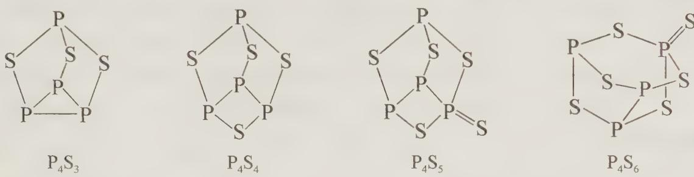

在 $^{31}$ P-NMR中，峰的数量对应于P的化学环境数，例如 $P_{4}S_{3}$ 中P有2个化学环境，因此有2个峰。指出下列化合物 $^{31}$ P NMR中峰的数目：(1) $P_{4}S_{4}$ (2) $P_{4}S_{5}$ (3) $P_{4}S_{6}$

C. $\mathrm{P_4S_4}$ 存在两个异构体，上图是其中的一个，另一个异构体的 $^{31}\mathrm{PNMR}$ 中只有1个峰。给出 $\mathrm{P_4S_4}$ 的另一个异构体的结构式。

12. $\mathrm{POCl}_3$ 无色透明的液体, 是一种重要的工业化工原料, 可用于制取磷酸二苯-异辛酯、磷酸三乙酯等磷酸酯, 塑料增塑剂, 有机磷农药, 长效磺胺药物等。还可用作染料中间体, 有机合成的氯化剂和催化剂, 阻燃剂。

(1) $\mathrm{POCl}_3$ 在空气中容易发烟, 主要产物为两种常见的酸, 同时还有少量的物质 A 生成, A 中磷元素质量分数为 $24.6\%$ , 不含氢元素, 试给出 A 的化学式及其结构。

(2) $\mathrm{POCl}_3$ 可以除去傅克反应产物中多余的 $\mathrm{AlCl}_3$ ，试分析原因。

(3) $\mathrm{POCl}_3$ 与液氨反应可得物质 B, B 的结构与 $\mathrm{POCl}_3$ 相似, 具有三重轴, 同时有少量 C 和 D 生成, C 为平面六元环状, 具有三重轴, D 为聚合物, 给出 B, C, D 的结构简式。

(4) B在室温下水解较慢, 只能部分水解, 得到产物 E, 100℃时水解速度加快可水解完全得产物 F, 加热数小时得到易溶的聚合物 G, 给出 E, F, G 的结构简式。

(5) $-10^{\circ} \mathrm{C}$ 下, 向 B 的乙醚悬浊液通入 HCl 得到物质 H, H 是焦磷酸的等电子体, 给出合成 H 的反应方程式, 并指出反应的类型。

# 第 14 讲 碳族元素和硼族元素

## 一、碳族元素

## 1. 碳族元素概述

本族元素包括碳(C)、硅(Si)、锗(Ge)、锡(Sn)、铅(Pb)五种元素,价层电子构型为 $ns^{2}np^{2}$ 。本族元素的主要氧化态为+4、+2,由于相对前三主族的元素,电负性显著增加,本族元素不会形成+4氧化态的简单阳离子。锡和铅的+2价氧化态能稳定存在,由于惰性电子对效应,+4氧化态的铅有很强的氧化性。

碳能形成数量众多的有机化合物,而本族的其他元素不能形成如此庞大的化合物家族,这与碳独特性质密切相关:首先 C—C 键的键能远大于 Si—Si, Ge—Ge, Sn—Sn, Pb—Pb 的键能;其次碳原子之间,碳原子和氮原子,氧原子等都能形成稳定的 $\pi$ 键(双键或叁键),而本族的其他元素 p 轨道不能和自身及其他原子的 p 轨道实现有效的重叠而形成稳定的 $\pi$ 键;此外,C—H、C—O、C—X 键的键能较大,容易形成稳定的化学键。

## 2. 碳及其化合物

## (1) 碳单质

碳的同素异形体有金刚石，石墨，富勒烯（如足球烯 $\mathrm{C}_{60}$ ， $\mathrm{C}_{70}$ ），无定形碳以及石墨烯等。

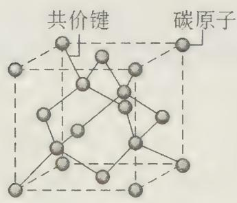  
金刚石

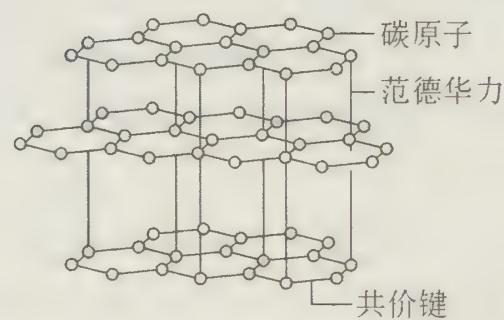  
石墨

金刚石是自然界中硬度最大的物质,为立方晶系,面心立方点阵,碳原子以 $sp^{3}$ 杂化轨道与相邻的四个碳原子形成共价键,延伸成立体网状结构。碳碳键键能大,金刚石是典型的原子晶体,硬度大,熔沸点很高,晶体内不存在自由电子,故不能导电,难溶于所有的溶剂。

石墨质地柔软,有三方石墨和六方石墨两种晶型,碳原子以 $sp^{2}$ 杂化和相邻的三个碳原子以共价键结合,形成以正六边形为单元的平面层状结构,每个碳原子均剩余一个未参与杂化的 p 轨道,且含有一个单电子,同一层的碳原子形成了一个庞大的离域 $\pi$ 键，从而使石墨具有良好的层向导电性和导热性。层与层之间通过范德华力结合，层与层之间容易滑动，故石墨硬度小，工业上可用作固体润滑剂。许多原子或离子能插入石墨的层和层之间，形成嵌层化合物，如锂的石墨嵌层化合物是重要锂电池的负极材料。如果将石墨的单层“剥开”得到一种性质截然不同的碳单质形态——石墨烯，石墨烯被证实是世界上已经发现的最薄、最坚硬的物质。石墨烯于2004年由英国科学家发现，他们于2010年因石墨烯研究成就被授予诺贝尔物理学奖。

富勒烯是由碳原子组成的原子簇, 它们是由若干五边形和六边形组成的球形、椭球形, 甚至管状结构的分子, 如 $\mathrm{C}_{60}, \mathrm{C}_{70}, \mathrm{C}_{76}, \mathrm{C}_{80}, \dots, \mathrm{C}_{60}$ 就是其中典型的代表, 富勒烯的结构和建筑师 Fuller 的代表作相似, 所以称为富勒烯。它是由 60 个碳原子以 20 个六元环和 12 个五元环连接而成的具有 30 个碳碳双键 (C=C) 的足球状空心对称分子, 所以富勒烯也被称为足球烯。富勒烯家族的分子结构, 符合欧拉公式 $V + F - E = 2$ , 其中 $V$ 为顶点数, $F$ 为面数, $E$ 为棱数。富勒烯在高温超导, 润滑材料, 催化, 抗癌药物等领域有广泛的用途。北京大学化学系和物理系在国内首次获得了 $\mathrm{K}_3\mathrm{C}_{60}$ 和 $\mathrm{Rb}_3\mathrm{C}_{60}$ 超导体, 超导转变温度为 $18\mathrm{K}$ 和 $28\mathrm{K}$ , 达到了国际先进水平。

思考1：最小的富勒烯分子含多少个碳？有多少个五边形和六边形？

碳是形成化合物最多的元素,它能形成数量庞大的有机化合物。无机含碳化合物主要有:碳化物,碳的氧化物,碳酸及其盐。

碳化物有离子型碳化物和共价型碳化物。离子型碳化物是由碳和电负性较小的元素形成，如 $CaC_{2}$ ， $Be_{2}C$ ， $Al_{4}C_{3}$ 等，它们水解时生成相应的碱和烃。如：

$$
\begin{array}{r l} & \mathrm {CaC_ {2}} + 2 \mathrm {H_ {2} O} \longrightarrow \mathrm {Ca(OH) _ {2}} + \mathrm {C_ {2} H_ {2}} \uparrow \\ & \mathrm {Al_ {4} C_ {3}} + 1 2 \mathrm {H_ {2} O} \longrightarrow 4 \mathrm {Al(OH) _ {3}} \downarrow + 3 \mathrm {CH_ {4}} \uparrow \end{array}
$$

$CaC_{2}$ 与氮气反应生成氰氨化钙(俗名:石灰氮), $CaC_{2}+N_{2}\xrightarrow{\triangle}CaCN_{2}+C$ ,石灰氮可用于制备三聚氰胺等。

碳与电负性相近的非金属元素生成共价型碳化物, 如 SiC、 $B_{4}C$ 、 $C_{3}N_{4}$ 等, 它们都是熔点高, 硬度大的原子晶体。

## (2) 碳的化合物

碳的常见氧化物有 CO 和 $CO_{2}$ ，此外还能形成 $C_{3}O_{2}$ 、 $C_{12}O_{9}$ 等碳氧化物。

CO 是无色无臭的有毒气体, CO 使人中毒的原因是 CO 与血红蛋白中的二价铁配位能力远超过氧气与二价铁配位能力, 使血红蛋白丧失输氧功能, 而且标准状况下气体密度为 $1.25 \mathrm{~g} / \mathrm{L}$ , 和空气密度 (标准状况下 $1.293 \mathrm{~g} / \mathrm{L}$ ) 相差很小, 漂浮在空气中, 也是容易发生煤气中毒的因素之一。燃烧时发出蓝色的火焰, 放出大量的热。因此一氧化碳可以作为气体燃料。

一氧化碳作为还原剂,高温时能将许多金属氧化物还原成金属单质,因此常用于金属的冶炼。如:将黑色的氧化铜还原成红色的金属铜,将氧化铁还原成金属铁等。实验室 CO 可以用甲酸脱水制得 $\mathrm{HCOOH} \xrightarrow{\text{浓硫酸}} \mathrm{H}_{2}\mathrm{O} + \mathrm{CO} \uparrow$ 。微量的 CO 可以由 $PbCl_{2}$ 检验:

$$
\mathrm{CO} + \mathrm{PbCl} _ {2} + \mathrm{H} _ {2} \mathrm{O} \longrightarrow \mathrm{Pb(黑色)} + \mathrm{CO} _ {2} + 2 \mathrm{HCl}
$$

$\mathrm{CO}_{2}$ 常温下是一种无色无味气体, 密度比空气略大, 能溶于水, 并生成碳酸。固态二氧化碳俗称干冰。二氧化碳被认为是造成温室效应的主要原因。 $\mathrm{CO}_{2}$ 分子中 C 为 sp 杂化, 为直线型分子, 有两个 $\Pi_{3}^{4}$ 的离域键。 $\mathrm{CO}_{2}$ 二氧化碳可用于制造碳酸氢铵、小苏打、纯碱、尿素、饮料、灭火器以及铸钢件的淬火, 其固体形式——干冰, 用途也十分广泛。近来 $\mathrm{CO}_{2}$ 超临界流体也获得了研究者的重视, 国内外正在致力于发展一种新型二氧化碳利用技术—— $\mathrm{CO}_{2}$ 超临界萃取技术。运用该技术可生产高附加值的产品, 可提取过去用化学方法无法提取的物质, 且廉价、无毒、安全、高效。它适用于化工、医药、食品等工业。

思考2：什么是超临界流体？请查阅有关文献了解其概念或用途。

碳酸是一种二元弱酸,能使紫色石蕊试液变成浅红色。稳定性差,易分解,纯的碳酸至今没有制得。溶于水中的二氧化碳,仅有一小部分生成碳酸。碳酸可以形成正盐和酸式盐,大多数酸式盐易溶于水,正盐只有铵盐和碱金属(锂除外)易溶于水。但易溶于水的正盐相应的酸式盐溶解度相对较小,这是由于 $HCO_{3}^{-}$ 在溶液中以氢键形成缔合离子的缘故。

碳酸及其正盐的热稳定性有如下顺序：

(1) 碳酸正盐的稳定性高于酸式盐, 酸式盐稳定性高于碳酸。

$$
\mathrm{Na} _ {2} \mathrm{CO} _ {3} > \mathrm{NaHCO} _ {3} > \mathrm{H} _ {2} \mathrm{CO} _ {3}
$$

(2) 同族元素, 从上往下, 碳酸盐热稳定性增强

$$
\mathrm{BeCO} _ {3} <   \mathrm{MgCO} _ {3} <   \mathrm{CaCO} _ {3} <   \mathrm{SrCO} _ {3} <   \mathrm{BaCO} _ {3}
$$

(3) 同周期金属的碳酸盐一般为碱金属盐稳定性大于碱土金属盐

$$
\mathrm{K} _ {2} \mathrm{CO} _ {3} > \mathrm{CaCO} _ {3}
$$

碳酸盐的热稳定性与阳离子极化能力大小有关，半径越小，电荷越高的阳离子极化能力越大，对碳酸根中的氧原子有更大的诱导极化作用，有利于碳氧键的削弱和断裂，从而热稳定性降低，分解温度降低。氢离子是半径最小的阳离子，有很强的极化能力，所以碳酸酸式盐及碳酸的热稳定性都较低。

## 3. 硅及其化合物

## (1) 硅单质

硅是地壳中含量第二多的元素,仅次于氧。自然界中的硅都以化合态的形式存在,如二氧化硅,硅酸盐,铝硅酸盐等,这些化合物广泛地存在于各种矿物和岩石中。

单质硅有晶态和无定形态两种同素异形体。研究表明晶态硅具有金刚石型的结构，晶体硬度大，质地较脆，具有金属光泽，导电性介于导体和绝缘体之间，是良好的半导体材料。

由于硅原子的半径大,平行的 3p 轨道之间不能实现有效的重叠,所以硅原子之间基本不形成 $p\pi - p\pi$ 键,也不存在石墨类型的同素异形体。由于硅原子存在 3d 轨道,可以参与形成杂化轨道,所以硅的最大配位数可以达到6,如: $\mathrm{SiF}_{6}^{2-}$ ,还可以形成 $d-p\pi$ 键,例如 $\mathrm{N(SiH_{3})_{3}}$ 是一个平面三角形的分子,氮原子采取 $sp^{2}$ 杂化,孤对电子进入硅原子的3d空轨道,形成 $d-p\pi$ 键,电子离域程度增大,分子稳定性增加。而 $\mathrm{N(CH_{3})_{3}}$ 则为三角锥分子,其路易斯碱性也大于 $\mathrm{N(SiH_{3})_{3}}$ 。

思考 3: 2010 年的诺贝尔物理学奖授予了“单层石墨”——石墨烯的发现者, 硅能否形成类似的结构?

通常情况下硅的化学性质不活泼,但在加热的条件下能与很多非金属化合(如 $F_{2}$ 、 $Cl_{2}$ 、 $O_{2}$ 、C、 $N_{2}$ 等)。硅溶于强碱和氢氟酸,放出氢气:

$$
\begin{array}{r l} & \mathrm {Si + 2OH^ {-} + H_ {2} O\longrightarrow SiO_ {3} ^ {2 - } + 2H_ {2} \uparrow} \\ & \mathrm {Si + 4HF\longrightarrow SiF_ {4} + 2H_ {2} \uparrow} \end{array}
$$

不溶于王水,但可溶于 $\mathrm{HF}-\mathrm{HNO}_{3}$ 的混合酸中,可见氟离子与硅(IV)形成的配离子是十分稳定的。

$$
3 \mathrm{Si} + 4 \mathrm{HNO} _ {3} + 1 8 \mathrm{HF} \longrightarrow 3 \mathrm{H} _ {2} \mathrm{SiF} _ {6} + 4 \mathrm{NO} \uparrow + 8 \mathrm{H} _ {2} \mathrm{O}
$$

单质硅可以用二氧化硅与焦炭在电炉中反应得到,也可以用活泼金属还原 $SiCl_{4}$ , 这样制备的硅纯度都不是特别高,用作半导体的超纯硅可以通过区域熔融法提纯粗硅或分解甲硅烷( $SiCl_{4}$ )得到。

## (2) 二氧化硅与硅酸

$\mathrm{SiO}_2$ 为无色不溶于水的晶体, 是硅酸的酸酐。 $\mathrm{SiO}_2$ 是通过 Si—O 键形成的三维网状结构的晶体, 可以看成是晶体硅每个 Si—Si 键之间插入一个氧原子, 即每个硅原子以 $\mathrm{sp}^3$ 杂化与四个氧原子相连, 每个氧原子与两个硅原子相连, 硅氧四面体是 $\mathrm{SiO}_2$ 晶体结构的基本单元。由于 Si—O 键键能很高, $\mathrm{SiO}_2$ 有很高的硬度和熔沸点。

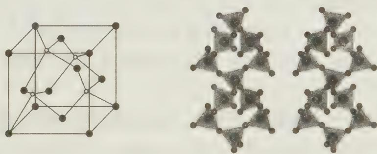

常温下,可以与氢氟酸和强碱溶液反应。高温时,与熔融的碳酸钠反应。释放出 $CO_{2}$ ,这是一个熵增加的反应,高温下是有利于正向进行的。

$$
\mathrm{SiO} _ {2} + 4 \mathrm{HF} \longrightarrow \mathrm{SiF} _ {4} + 2 \mathrm{H} _ {2} \mathrm{O} \text {   或   }
$$

$$
\mathrm{SiO} _ {2} + 2 \mathrm{OH} ^ {-} \longrightarrow \mathrm{SiO} _ {3} ^ {2 -} + \mathrm{H} _ {2} \mathrm{O}
$$

$$
\mathrm{SiO} _ {2} + \mathrm{Na} _ {2} \mathrm{CO} _ {3} \xrightarrow {\text {高温}} \mathrm{Na} _ {2} \mathrm{SiO} _ {3} + \mathrm{CO} _ {2} \uparrow
$$

硅酸可以由可溶性硅酸盐与酸性物质 $\left(\mathrm{H}^{+},\mathrm{CO}_{2},\mathrm{NH}_{4}^{+}\right)$ 反应得到。其组成复杂，随生成的条件而变，可表示为 $x\mathrm{SiO}_{2}\cdot y\mathrm{H}_{2}\mathrm{O},x=1,y=1$ 时为偏硅酸 $H_{2}SiO_{3}:x=1$ y=2 时为正硅酸 $H_{4}SiO_{4}$ ; x=2, y=3 时为焦硅酸 $H_{6}Si_{2}O_{7}$ ，这些结构中以偏硅酸最简单，通常用它来代表硅酸。硅酸久置时，容易缩合聚合成多硅酸。在单体可溶性硅酸盐 $\left(\mathrm{Na}_{2}\mathrm{SiO}_{3}\right)$ 中，加 $H^{+}$ ，至 pH=7\~8 时，硅酸根缩聚，聚合度逐渐加高，形成大分子量的胶体溶液。当分子量达到一定程度时，变成凝胶，用水洗涤、交换去掉阳离子、烘干、加热活化，得到一种多孔有吸附作用的物质，即多孔硅胶，可用为干燥剂。

## (3) 硅的卤化物

硅与所有卤素都能形成无色产物 $\mathrm{SiX_4}$ ，最重要的是 $\mathrm{SiCl_4}$ ，它是制备超纯硅及多种含硅化合物的原料。 $\mathrm{CX_4}$ 与 $\mathrm{SiX_4}$ 的一个重大差异在于， $\mathrm{SiX_4}$ 容易发生水解，而 $\mathrm{CX_4}$ 很难发生水解，尽管后者的水解反应在热力学上是趋于完全的。原因在于， $\mathrm{SiX_4}$ 有空的3d轨道，最大配位数可达到6，这些可以用于杂化成键的空轨道能够接受水分子中氧原子的进攻，形成一系列中间产物，使得水解得以顺利进行；而 $\mathrm{CX_4}$ 中碳已达到最高配位数，不能接受水分子的进攻，中间产物难以形成，所以水解难以进行。

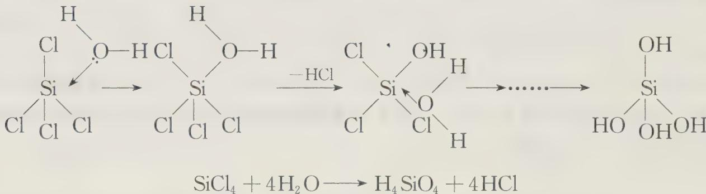

$SiF_{4}$ 的水解产物有所不同,生成的 HF 将与 $SiF_{4}$ 继续反应生成 $H_{2}SiF_{6}$ 。

$$
3 \mathrm{SiF} _ {4} + 4 \mathrm{H} _ {2} \mathrm{O} \longrightarrow \mathrm{H} _ {4} \mathrm{SiO} _ {4} + 2 \mathrm{H} _ {2} \mathrm{SiF} _ {6}
$$

【例 1】（据 1996 年全国初赛试题改编）(1) 1200℃时，Si 还原 MgO 为 Mg（沸点 1105℃）。煅烧白云石 $\left(\mathrm{MgCO}_{3} \cdot \mathrm{CaCO}_{3}\right)$ 得 $\mathrm{MgO} \cdot \mathrm{CaO}$ 。以 $\mathrm{MgO} \cdot \mathrm{CaO}$ 为原料和 Si 在 1200℃时反应比起以 MgO 为原料较容易获得 Mg。为什么？

(2) 在高温下, 氯气也不能将 $\mathrm{SiO}_{2}$ 氯化, 但是加入碳后, 高温下氯气可以将 $\mathrm{SiO}_{2}$ 氯化制得 $\mathrm{SiCl}_{4}$ 。为什么?

过程探究 这两个问题看似关系不大,但是在本质上是相同的。

硅在常温下化学性质不活泼,但在高温下具有较强的还原性,能将 $\mathrm{MgO}$ 、FeO等活泼金属氧化物还原成金属单质。如在钢铁工业中,硅可以用作脱氧剂, $2\mathrm{FeO} + \mathrm{Si} \xrightarrow{\triangle} 2\mathrm{Fe} + \mathrm{SiO}_2$ 。硅还原氧化镁生成镁单质和二氧化硅, $2\mathrm{MgO} + \mathrm{Si} \xrightarrow{\triangle} 2\mathrm{Mg} + \mathrm{SiO}_2$ 当 $\mathrm{CaO}$ 存在时,高温下, $\mathrm{CaO}$ 与 $\mathrm{SiO}_2$ 继续反应生成硅酸钙 $\mathrm{CaSiO}_3$ ,该反应为放热反应,促进了前一反应的进行。问题 2, $\mathrm{SiO}_2 + 2\mathrm{Cl}_2 \longrightarrow \mathrm{SiCl}_4 + \mathrm{O}_2$ , 进行程度不大,加入碳之后,高温下,碳能与氧气反应,生成一氧化碳,这是一个放热反应,促进了前一反应的进行,这种加碳氯化的方法,用于氯化 $\mathrm{TiO}_2$ 、 $\mathrm{MgO}$ 、 $\mathrm{B}_2\mathrm{O}_3$ 等通常条件下难以氯化的氧化物。

参考解答 (1) $2\mathrm{MgO} + \mathrm{Si}\xrightarrow{\triangle} 2\mathrm{Mg} + \mathrm{SiO}_2$ ， $\mathrm{CaO} + \mathrm{SiO}_2\xrightarrow{\triangle}\mathrm{CaSiO}_3$ 或 $2\mathrm{CaO}\cdot$ $\mathrm{MgO} + \mathrm{Si}\xrightarrow{\triangle} 2\mathrm{Mg} + \mathrm{Ca}_2\mathrm{SiO}_4$

原料中的氧化钙与二氧化硅反应生成盐，使还原反应变得容易。

(2) $\mathrm{SiO_2 + 2Cl_2\xrightarrow{\triangle} SiCl_4 + O_2, 2C + O_2\xrightarrow{\triangle} 2CO}$ 或 $\mathrm{SiO_2 + 2Cl_2 + 2C\xrightarrow{\triangle} SiCl_4 + 2CO}$ , 加入碳后, 与生成物之一氧气反应生成一氧化碳, 为放热反应, 使氯化反应变得容易。

## 二、硼族元素

## 1. 硼族元素概述

本族元素包括硼(B)、铝(Al)、镓(Ga)、铟(In)、铊(Tl)五种元素,价层电子构型为 $ns^{2}np^{1}$ ,主要氧化态为+3。本族元素自上而下,非金属性减弱,金属性增强,硼是非金属,其余元素均为金属。对于氧化物而言,硼的氧化物为酸性氧化物,铝和镓的氧化物为两性,铟和铊的氧化物为碱性。它们形成共价键的趋势随原子序数的递增而减弱。硼主要形成共价化合物,在水溶液中不存在简单的 $B^{3+}$ 离子,而其他元素可以形成 $M^{3-}$ 。对于铊而言,低氧化态较为稳定,是因为惰性电子效应的关系。由于最外层有4个原子轨道,仅有3个价电子,当它们以共价键形成化合物时,还剩一个空轨道,为缺电子分子。它们具有较强的接受电子对的能力,因此是强的路易斯酸,容易形成配合物。

## 2. 硼及其化合物

单质硼有多种同素异形体,这些结构都可以看成是以硼原子构成的二十面体以不同的方式结合而成。硼二十面体结构如右,其中12个硼原子在角顶上,含有20个等边三角形和30个棱边。需要注意的是,硼晶体中并不存在二十面体形的 $B_{12}$ 分子,因为这些二十面体也是通过共价键相连,硼晶体为原子晶体,其熔沸点很高,晶体硼的硬度在单质中仅次于金刚石。

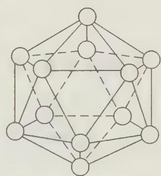

硼的含氧酸为硼酸 $H_{3}BO_{3}$ 或 $\mathrm{B(OH)}_{3}$ 。 $H_{3}BO_{3}$ 是白色的片状晶体。 $H_{3}BO_{3}$ 的晶体具有片层结构，其中氢键对其结构的形成具有支配的作用， $H_{3}BO_{3}$ 分子之间通过不对称氢键相连。层和层之间是范德华力，容易发生滑动。

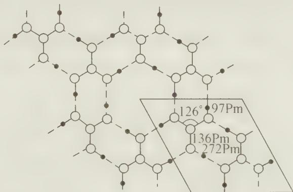  
硼酸的片层结构和二维晶胞

$H_{3}BO_{3}$ 是一种弱的一元酸，酸性与HCN相当，其在水中的电离方程式可表示

如下：

$$
\mathrm{B} (\mathrm{OH}) _ {3} + 2 \mathrm{H} _ {2} \mathrm{O} \longrightarrow \left( \begin{array}{c} \mathrm{H} \\ \mathrm{O} \\ | \\ \mathrm{HO} - \mathrm{B} \leftarrow \mathrm{OH} \\ | \\ \mathrm{O} \\ \mathrm{H} \end{array} \right) ^ {-} + \mathrm{H} _ {3} \mathrm{O} ^ {+}
$$

可见硼酸的酸性来自于缺电子的硼与水分子之间的配合反应,而不是自身电离氢离子。这也体现了三配位的硼原子的缺电子性质。四硼酸 $\left(\mathrm{H}_{2}\mathrm{B}_{4}\mathrm{O}_{7}\right)$ 为硼酸的缩合酸,酸性比硼酸强,其酸根的结构简式为 $\mathrm{B}_{4}\mathrm{O}_{5}\left(\mathrm{OH}\right)_{4}^{2-}$ ,离子中含有两个六元环,两个四配位四面体的硼原子,两个三配位的硼原子,分析其他缩合硼酸根,不难发现缩合硼酸根所带的电荷等于四配位的硼原子的个数。

再如 $\mathrm{B}_{5}\mathrm{O}_{6}(\mathrm{OH})_{4}^{-}$ 带一个单位的负电荷，只含一个四配位的 B 原子。

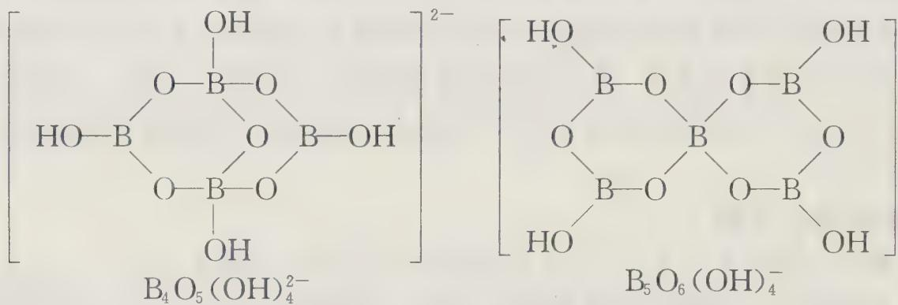

硼砂是最常见的四硼酸盐,化学式为 $\mathrm{Na_{2}B_{4}O_{5}(OH)_{4}\cdot8H_{2}O}$ 或 $Na_{2}B_{4}O_{7}\cdot10H_{2}O$ 。实验室中,硼砂可以作为缓冲溶液,其缓冲原理是:硼砂水解成为了等量的 $H_{3}BO_{3}$ 和 $\mathrm{B(OH)_{4}^{-}}$ 。

$$
\mathrm{Na} _ {2} \mathrm{B} _ {4} \mathrm{O} _ {7} + 7 \mathrm{H} _ {2} \mathrm{O} \longrightarrow 2 \mathrm{B} (\mathrm{OH}) _ {3} + 2 \mathrm{NaB} (\mathrm{OH}) _ {4}
$$

若加热 $H_{3}BO_{3}$ ，脱水成硼酸酐 $B_{2}O_{3}$ ，用镁或铝使之还原，可制得单质的硼。此种条件下所制得的硼不纯，杂质为金属氧化物。

硼与卤素都能形成三卤化物, 其分子结构均为平面构型。硼原子为 $sp^{2}$ 杂化, 还有一个空 p 轨道, $BX_{3}$ 分子都是路易斯酸, 它们能从其他许多配体如水、HF、 $NH_{3}$ 、醚、醇以及胺类等接受电子对。 $BX_{3}$ 均易发生水解生成 $H_{3}BO_{3}$ 和 HX, 如为 $BF_{3}$ 将继续与 HF 作用生成 $HBF_{4}$ 。

$$
\begin{array}{r l}&\mathrm {NH_ {3} + BF_ {3} \longrightarrow H_ {3} N\rightarrow BF_ {3}}\\&\mathrm {BCl_ {3} + 3H_ {2} O\longrightarrow H_ {3} BO_ {3} + 3HCl}\\&4 \mathrm {BF_ {3} + 3H_ {2} O\longrightarrow H_ {3} BO_ {3} + 3HBF_ {4}}\end{array}
$$

硼的氢化物叫硼烷, 目前发现的硼烷有二十余种, 主要有 $\mathrm{B}_{n} \mathrm{H}_{n+4}, \mathrm{~B}_{n} \mathrm{H}_{n+6}$ 两种类型, 如 $\mathrm{B}_{2} \mathrm{H}_{6}, \mathrm{~B}_{5} \mathrm{H}_{9}, \mathrm{~B}_{4} \mathrm{H}_{10} \cdots$ , 硼烷的结构较为复杂, 最简单的硼烷为乙硼烷 $\mathrm{B}_{2} \mathrm{H}_{6}$ 。在乙硼烷的六个氢原子中, 端点有四个氢原子分别和两个硼原子以正常的 B—H 键结合,并且两个 $\mathrm{BH}_{2}$ 处于同一平面。另两个氢原子分别在这一平面上下,分别与两个硼原子以两个电子形成 B—H—B 键,这种键被称为三中心两电子键,这种键又可看成是氢原子连接着两个硼原子,也称为氢桥键。

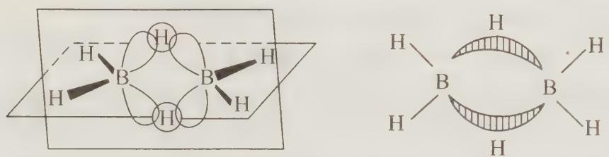

硼氢化合物稳定性都很差，在空气中极易燃烧，生成稳定的 $\mathrm{B}_2\mathrm{O}_3$ 和 $\mathrm{H}_2\mathrm{O}$ 。在乙醚中 $\mathrm{B}_2\mathrm{H}_6$ 与 $\mathrm{NaH}$ 直接反应，生成 $\mathrm{NaBH}_4$ ， $\mathrm{NaBH}_4$ 在有机合成中应用广泛，被称为“万能还原剂”。乙硼烷可以用 $\mathrm{NaH}$ 或 $\mathrm{NaBH}_4$ 还原 $\mathrm{BX}_3$ 的方法来制备。

$$
3 \mathrm{NaBH} _ {4} + 4 \mathrm{BF} _ {3} \xrightarrow {5 0 - 7 0 ^ {\circ} \mathrm{C}} 3 \mathrm{NaBF} _ {4} + 2 \mathrm{B} _ {2} \mathrm{H} _ {6}
$$

【例 2】（2010 年全国初赛试题）在我国青海、西藏等地有许多干涸盐湖盛产一种钠盐 Q。Q 为一种易溶于水的白色固体。Q 的水溶液用硫酸酸化，得到弱酸 X。X 为无色小片状透明晶体。X 和甲醇在浓硫酸存在下生成易挥发的 E。E 在空气中点燃呈现绿色火焰。E 和 NaH 反应得到易溶于水的白色固态化合物 Z（分子量 37.83）。

(1) 写出由 Q 得到 X 的离子方程式。

(2) 写出 X 在水中的电离方程式。

(3) 写出 X 和甲醇在浓硫酸存在下生成 E 的化学方程式。

(4) 写出 E 燃烧反应的化学方程式。

(5) 写出由 E 和 NaH 制备 Z 的化学反应方程式。

(6) Z 在水溶液里的稳定性与溶液 pH 有关, pH 越大越稳定。为什么?

(7) 近年来, 用 Z 和过氧化氢构建一种新型碱性电池已成为热门的研究课题。该电池放电时, 每摩尔 Z 释放 8 摩尔电子, 标准电动势大于 $2 \mathrm{~V}$ 。写出这种电池放电反应的离子方程式。

过程探究 硼有关的知识在中学化学中涉及不多,却是竞赛中命题的一个热点。三配位的硼的化合物具有缺电子性,是良好的路易斯酸,能发生路易斯酸碱反应形成四配位的硼,硼酸是一种配位酸;硼能形成多种类型的化学键,硼的化合物具有丰富多彩的结构;许多硼的化合物具有重要的用途,如硼砂、硼氢化钠等。

以 Z 为突破口, 化合物 Z 分子量为 37.83, 应为钠盐, 扣除掉一个钠外, 还剩余式量 37.83-22.99=14.84, Z 可能还含有 H、Li、Be、B、C 等元素, X 为含氧酸, 具有无色片状的特征, Z 和 X 中含有同一种元素, 应为 B 元素, 故 X 为硼酸, E 易挥发, 应为硼酸与甲醇形成的酯: $\mathrm{B(OCH_3)_3}$ , Q 为 $\mathrm{Na_2B_4O_7}$ , 硼的含氧酸盐有多种, 最重要的一种为硼砂 $(\mathrm{Na_2B_4O_7})$ , 但题目中并没有充分的信息说明 Q 为硼砂, 笔者认为这是命题中值得商榷的地方。

参考解答

$$
(1) \mathrm{B} _ {4} \mathrm{O} _ {5} (\mathrm{OH}) _ {4} ^ {2 -} + 3 \mathrm{H} _ {2} \mathrm{O} + 2 \mathrm{H} ^ {+} \longrightarrow 4 \mathrm{H} _ {3} \mathrm{BO} _ {3} \quad \text {或} \mathrm{B} _ {4} \mathrm{O} _ {7} ^ {2 -} + 5 \mathrm{H} _ {2} \mathrm{O} + 2 \mathrm{H} ^ {+} \longrightarrow
$$

$4\mathrm{H}_{3}\mathrm{BO}_{3}$

$$
(2) \mathrm{B} (\mathrm{OH}) _ {3} + \mathrm{H} _ {2} \mathrm{O} \longrightarrow \mathrm{B} (\mathrm{OH}) _ {4} ^ {-} + \mathrm{H} ^ {+}
$$

$$
(3) \mathrm{B} (\mathrm{OH}) _ {3} + 3 \mathrm{CH} _ {3} \mathrm{OH} \xrightarrow {\text {浓H} _ {2} \mathrm{SO} _ {4}} \mathrm{B} (\mathrm{OCH} _ {3}) _ {3} + 3 \mathrm{H} _ {2} \mathrm{O}
$$

$$
(4) 2 \mathrm{B} (\mathrm{OCH} _ {3}) _ {3} + 9 \mathrm{O} _ {2} \longrightarrow \mathrm{B} _ {2} \mathrm{O} _ {3} + 6 \mathrm{CO} _ {2} + 9 \mathrm{H} _ {2} \mathrm{O}
$$

$$
(5) \mathrm{B} (\mathrm{OCH} _ {3}) _ {3} + 4 \mathrm{NaH} \longrightarrow \mathrm{NaBH} _ {4} + 3 \mathrm{NaOCH} _ {3}
$$

（6）水溶液的 $\mathrm{pH}$ 越大， $[\mathrm{H}_3\mathrm{O}^+ ]$ 越低， $\mathrm{BH}_4^-$ 和 $\mathrm{H}_3\mathrm{O}^+$ 的反应越难，因而 $\mathrm{NaBH}_4$ 越稳定。

$$
(7) \mathrm{BH} _ {4} ^ {-} + 4 \mathrm{H} _ {2} \mathrm{O} _ {2} \longrightarrow \mathrm{B(OH)} _ {4} ^ {-} + 4 \mathrm{H} _ {2} \mathrm{O}
$$

## 3. 铝及其化合物

铝是地壳中含量最多的金属元素。它在地壳中含量仅次于氧和硅，在自然界中它们的存在形式有：铝硅酸盐形式的长石、云母、黏土等，铝矾土 $\left(\mathrm{Al}_{2}\mathrm{O}_{3}\cdot n\mathrm{H}_{2}\mathrm{O}\right)$ 、冰晶石 $\left(\mathrm{Na}_{3}\mathrm{AlF}_{6}\right)$ 。

铝位于周期表金属和非金属交界处,既有明显的金属性,也有明显的非金属性,是典型的两性元素,铝单质,氧化铝,氢氧化铝既能溶于酸又能溶于碱。铝的化合物有的是离子型的,如 $AlF_{3}$ ;也有的是共价型的,如 $AlCl_{3}$ , $AlBr_{3}$ , $AlI_{3}$ 都是共价型的。共价型的铝化合物熔点较低,能溶于有机溶剂中;离子型的铝化合物熔点高,不溶于有机溶剂中。

工业上用电解的方法生产铝,由于 $Al_{2}O_{3}$ 的熔点高(2050℃),熔融时导电能力差,且消耗大量能量。在电解时加入冰晶石( $Na_{3}AlF_{6}$ )做助熔剂,可以降低电解温度,同时也增强了熔融物的导电性。

氯化铝是铝最重要的卤化物。 $AlCl_{3}$ 在气态时或溶于有机溶剂或熔融态时都以共价的二聚分子形式 $Al_{2}Cl_{6}$ 存在。这是由于 $AlCl_{3}$ 为缺电子分子，电子对形成 $sp^{3}$ 杂化

的四面体。两个这样的铝四面体共用一边，即形成 $Al_{2}Cl_{6}$ 分子。中间两个氯桥原子中的每一个氯原子上的一孤电子对进入铝原子的空轨道，以达到 8 电子的稳定结构，形成 Al—Cl—Al 桥键（氯桥键），为正常的二电子配位键。其球棍模型如右图所示。

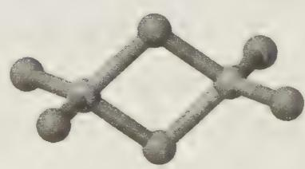

强酸的铝盐在水溶液中发生部分水解,生成氢氧化铝胶体,可以吸附水中的杂质,起到净水的作用。弱酸的铝盐在水溶液中发生强烈的双水解,如 $Al_{2}S_{3}$ , 因此 $Al_{2}S_{3}$ 应该用干法制备,而不能通过溶液中的离子反应制备。

## 三、p区元素性质小结

p区元素的价层电子排布式为 $ns^{2}np^{16}$ （He为 $1s^{2}$ ），同一族元素自上而下，原子半径逐渐增大，金属性增强，非金属性减弱。同一周期的主族元素，从左到右，元素原子有效核电荷数增大，半径减小，金属性减弱，非金属性增强。

p区元素除F外，一般都有多种氧化态。过渡元素之后的p区元素由于 $ns^2$ 的惰性电子对效应，这些金属元素的低氧化态比高氧化态更加稳定，尤其是第六周期的Ⅲ

A、ⅣA、VA各族表现得特别突出， $\mathrm{Tl}(+1)$ ， $\mathrm{Pb}(+2)$ ， $\mathrm{Bi}(+3)$ 均很稳定（皆能保持稳定的 $18 + 2$ 构型），其高价态具有很强的氧化性。

思考4: 为什么 $\mathrm{Tl}^{\mathrm{III}}\mathrm{I}_{3}$ 、 $\mathrm{PbCl}_{4}$ 、 $\mathrm{BiCl}_{5}$ 均不存在或者极不稳定?

## 四、新型无机材料简介

材料是人类生存和发展的物质基础,也是一切工程技术的基础。以材料科学中的化学问题为研究对象的材料化学成为无机化学的重要学科之一。下面将为同学们介绍几种重要的无机材料。

## 1. 氮化硅

$\mathrm{Si}_3\mathrm{N}_4$ 是一种重要的结构陶瓷材料。 $\mathrm{Si}_3\mathrm{N}_4$ 晶体中氮原子和硅原子以共价键结合，为原子晶体，具有熔点高、硬度大、机械强度高、化学性质稳定、绝缘性好等优点。可用于制作高温轴承、气轮机叶片、机械密封环、永久性模具等机械构件。

工业上常采用高纯硅和纯氮在高温下反应制取，也可以以 $SiCl_{4}$ 为原料制备。

$$
\begin{array}{r l} & 3 \mathrm{Si} + 2 \mathrm{N} _ {2} \xrightarrow {\text {高温}} \mathrm{Si} _ {3} \mathrm{N} _ {4} \\ & 3 \mathrm{SiCl} _ {4} + 2 \mathrm{N} _ {2} + 6 \mathrm{H} _ {2} \xrightarrow {\text {高温}} \mathrm{Si} _ {3} \mathrm{N} _ {4} + 1 2 \mathrm{HCl} \end{array}
$$

## 2. 氮化硼

氮化硼(BN) $_{n}$ 是由氮原子和硼原子构成的晶体,硼原子价电子数比碳少一个,氮原子价电子数比碳多一个,氮化硼与碳形成的晶体是等电子体。氮化硼有类似于金刚

石和石墨的结构。石墨型氮化硼在高温(1800℃)、高压(800 Mpa)下可转变为金刚石型氮化硼。这种氮化硼中 B—N 键长(156 pm)与金刚石在 C—C 键长(154 pm)相似,密度也和金刚石相近,它的硬度和金刚石不相上下,而耐热性比金刚石好,是新型耐高温的超硬氮化硼材料,用于制作钻头、磨具和切割工具。

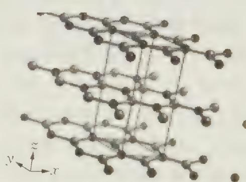  
石墨型氮化硼结构

氮化硼的制备有多种方法，如：

$$
\begin{array}{r l} & {\mathrm {BCl_ {3} + 6NH_ {3} \xrightarrow {(1)} B(NH_ {2}) _ {3} + 3NH_ {4} Cl}} \\ & {\quad n \mathrm {B(NH_ {2}) _ {3} \xrightarrow {\triangle} (BN) _ {n} + 2nNH_ {3} \uparrow}} \end{array}
$$

## 3. 砷化镓

砷化镓(GaAs)是一种半导体材料,具有立方 ZnS(闪锌矿)型的结构。Ga 和 As 的价电子数之和为 8,相当于两个锗原子,砷化镓晶体可视为半导体材料锗晶体的等电子体。类似的还有 AlP 可视为硅晶体的等电子体。砷化镓可以通过如下方法制备:

$$
\mathrm {Ga(C H_ {3})_ {3} + AsH_ {3} \xrightarrow {500 - 800°C} GaAs + 3CH_ {4}}
$$

思考 5: 请同学们画出 GaAs 的晶胞示意图, 指出 Ga 和 As 的配位数和所占空隙类型。

## 【竞赛对接】

【例 1】将硼酸, 发烟硫酸, 萤石粉共热得到无色气体 A, A 为平面构型分子, 密度约为空气的 2.3 倍, A 用乙醚吸收后得到液态物质 B。液态乙酸中存在微弱的自偶电离, 离子电导率为 $139 \mu \cdot S \cdot cm^{-1}$ , 将 B 加入乙酸中形成均一透明的无色溶液, 发现乙酸的离子电导率显著增强, 达到 $1300 - 5800 \mu \cdot S \cdot cm^{-1}$ , B 与乙酸的混合溶液是具有良好应用前景的非水型电解质, 与传统的水溶液电解质体系相比有独特的优势, 扩大了电化学反应研究的物质范围和电位研究区间。试回答下列问题:

(1) 写出 A, B 的结构简式;

(2) 写出生成 A 的化学反应方程式;

(3) 用方程式表示乙酸的自偶电离过程, 并分析乙酸中加入 B 后, 电导率显著提高的原因;

(4) 红外光谱显示, 纯乙酸中存在两种羧羟基吸收峰, 分析这两种峰产生的原因;

(5) 为什么说非水型电解质可以扩大电化学反应研究的物质范围和电位区间?

过程探究 无色气体 A 来自于硼酸, 发烟硫酸和萤石( $CaF_{2}$ )反应, 对于大多数同学而言是没有学到过, 化学反应成千上万, 不可能记住所有的反应, 需要我们根据所学的知识, 合理推断。我们知道浓硫酸和萤石反应的产物中有 HF, 硼酸在浓硫酸环境中可能脱水生成 $B_{2}O_{3}$ 和水, 根据“对角线规则”中硼, 硅的相似性, 推测 $B_{2}O_{3}$ 和 HF 反应的产物应为氟化物 $BF_{3}$ 和水, 即不难得到 A 为 $BF_{3}$ , 它为平面型分子, 密度约为空气的 2.3 倍, 也证实了这个推测。液态乙酸中存在微弱的自偶电离, $2CH_{3}COOH \rightleftharpoons CH_{3}COOH_{2}^{+} + CH_{3}COO^{-}$ , $BF_{3}$ 为典型的路易斯酸, $CH_{3}COO^{-}$ 是一种路易斯碱, 加入液态乙酸后, 将发生路易斯酸碱反应, 生成 $CH_{3}COO \cdot BF_{3}$ 离子, 降低了 $CH_{3}COO^{-}$ 的浓度, 根据勒夏特列原理, 平衡向右移动, 从而使乙酸的电导率显著增强。纯乙酸中存在两种羧羟基吸收峰, 原因是在纯乙酸中乙酸存在通过氢键缔合的双聚分子和单分子两种形态。

$$
\mathrm{CH} _ {3} \xrightarrow [ \mathrm{O} - \mathrm{H} \cdots \mathrm{O} ]{\mathrm{O} \cdots \mathrm{H} - \mathrm{O}} \mathrm{CH} _ {3}
$$

在水溶液中氢离子可能得到电子生成氢气,水分子也可能失去电子生成氧气,即电化学反应,受到了析氢电位和析氧电位的区间限制,而在非水溶剂中虽然可能也存在类似的溶剂电解反应,但是相对于原来的水溶液体系,电化学研究的电位区间大大扩大了。

参考解答 (1) $\mathrm{BF}_3$ ， $(\mathrm{CH}_3\mathrm{CH}_2)_2\mathrm{O}\cdot \mathrm{BF}_3$

$$
(2) 3 \mathrm{H} _ {2} \mathrm{SO} _ {4} + 2 \mathrm{H} _ {3} \mathrm{BO} _ {3} + 3 \mathrm{CaF} _ {2} \longrightarrow 2 \mathrm{BF} _ {3} + 3 \mathrm{CaSO} _ {4} + 6 \mathrm{H} _ {2} \mathrm{O}
$$

(3) $2 \mathrm{CH}_{3} \mathrm{COOH} \rightleftharpoons \mathrm{CH}_{3} \mathrm{COOH}_{2}^{+} + \mathrm{CH}_{3} \mathrm{COO}^{-}$ , 加入 $(\mathrm{CH}_{3} \mathrm{CH}_{2})_{2} \mathrm{O} \cdot \mathrm{BF}_{3}$ 后, $(\mathrm{CH}_{3} \mathrm{CH}_{2})_{2} \mathrm{O} \cdot \mathrm{BF}_{3}$ 是强路易斯酸, 形成了 $\mathrm{CH}_{3} \mathrm{COOBF}_{3}^{-}$ 离子, 促进了乙酸的自偶电离:

$$
2 \mathrm{CH} _ {3} \mathrm{COOH} + \mathrm{BF} _ {3} \rightleftharpoons \mathrm{CH} _ {3} \mathrm{COOBF} _ {3} ^ {-} + \mathrm{CH} _ {3} \mathrm{COOH} _ {2} ^ {+}
$$

(4) 乙酸中存在单分子和缔合分子两种状态。

（5）水溶液中难溶或不溶的物质在非水电解质中可以研究，故扩大了研究的物质范围；在水溶液中，电解电位受到析氢电位和析氧电位的区间限制，而非水电解质中扩大了研究的电位区间限制。

【例 2】（2000 年浙江初赛试题）质量为 1.52 g 的含两种固态单质的混合物与过量的盐酸反应，放出一种体积为 0.896 L 的气体；反应后还有 0.56 g 残余物不溶于剩余的酸。

在另一实验中，1.52 g 同样的混合物与过量的 10% 的 NaOH 溶液反应，这时有 0.896 L 的气体放出，但有 0.96 g 不溶的残余物。

在第三个实验中，1.52 g 起始混合物隔绝空气加热到高温，这时生成一种化合物，该化合物在盐酸中全部溶解并放出 0.488 L 的一种易自燃的未知气体。将所得的全部气体通入 1 L 充满氧气的密闭容器中，该未知气体与氧气反应后，容器中的压力减小到 1/10。

请写出上述各反应方程式,并用计算证明其正确性(气体可认为处于标准状态,相对原子质量可取整数)。

过程探究 本题并没有告诉我们两种单质为什么元素,需要通过计算确定,可以用尝试讨论法确定元素的归属。设两种固态单质一种为 A,一种为 B。A 能与盐酸反应,消耗的质量为:1.52-0.56=0.96 克;B 与 NaOH 反应,消耗质量为:1.52-0.96=0.56 克。

A 与盐酸反应的方程式为:

$$
\begin{array}{l l} \mathrm {A + xHCl = ACl_ {x} + \frac {x}{2} H_ {2} \uparrow} \\ 1 \mathrm{mol} & \frac {x}{2} \times 2 2. 4 \mathrm{L} \\ \frac {0 . 9 6}{M (\mathrm{A})} \mathrm{mol} & 0. 8 9 6 \mathrm{L} \end{array}
$$

由上述关系, 可得 $M(A)=12x$ , x 为不超过 4 的正整数, 尝试将 x=1、2、3、4 代入, 得 $M(A)=12\mathrm{g}\cdot\mathrm{mol}^{-1}$ 、 $24\mathrm{g}\cdot\mathrm{mol}^{-1}$ 、 $36\mathrm{g}\cdot\mathrm{mol}^{-1}$ 、 $48\mathrm{g}\cdot\mathrm{mol}^{-1}$ , 当 x=2 时有合理解, A 为镁。

B 与 NaOH 反应,生成了 B 的含氧酸盐和氢气。设每摩尔 B 单质失去的电子数为 y,我们有: $\frac{0.56}{M(B)}\times y=\frac{0.896}{22.4}\times2,M(B)=7y,y$ 为正整数,将 y=1、2、3…代入,当 y=4 时,有合理解 M(B)=28,B 为硅。

参考解答 $\mathrm{Mg} + 2\mathrm{HCl}\longrightarrow \mathrm{MgCl}_2 + \mathrm{H}_2\uparrow ,\mathrm{Si} + 2\mathrm{NaOH} + \mathrm{H}_2\mathrm{O}\longrightarrow \mathrm{Na}_2\mathrm{SiO}_3+$ $\mathrm{H}_{2}\uparrow ,2\mathrm{Mg} + \mathrm{Si}\xrightarrow{\triangle}\mathrm{Mg}_{2}\mathrm{Si},\mathrm{Mg}_{2}\mathrm{Si} + 4\mathrm{HCl}\longrightarrow 2\mathrm{MgCl}_{2} + \mathrm{SiH}_{4},\mathrm{SiH}_{4} + 2\mathrm{O}_{2}\longrightarrow \mathrm{SiO}_{2}+$ $2\mathrm{H}_{2}\mathrm{O})$

硅和镁在隔绝空气时加强热, 得到 $Mg_{2}Si$ , 0.96 克镁 (0.04 mol) 和 0.56 克硅 (0.02 mol), 恰好完全反应生成 0.02 mol $Mg_{2}Si$ , 将 0.02 mol 的 $Mg_{2}Si$ 溶于盐酸中, 生成 0.02 mol $SiH_{4}$ , 即 0.448 L, 与题中数据吻合。0.02 mol 的 $SiH_{4}$ 燃烧, 消耗氧气 0.04 mol, 剩余氧气为 $\frac{1}{22.4}-0.04=0.0046$ mol, 由于温度和压强不变, 所以容器中的压力减小到 $\frac{0.0046}{0.0446}\approx0.1$ 。

【例 3】（2003 年全国初赛试题）在 $30^{\circ}$ C 以下，将过氧化氢加到硼酸和氢氧化钠的混合溶液中，析出一种无色晶体 X。组成分析证实，该晶体的质量组成为 Na 14.90%，B 7.03%，H 5.24%。加热 X，得无色晶体 Y。Y 含 Na 23.0%，是一种温和的氧化剂，常温下在干燥空气里稳定，但在潮湿热空气中分解放氧，广泛用作洗涤剂、牙膏、织物漂白剂和美发产品，也用于有机合成。结构分析证实 X 和 Y 的晶体中有同一种阴离子 $Z^{2-}$ ，该离子中硼原子的化学环境相同，而氧原子却有两种成键方式。

(1) 写出 X、Y 的最简式。

（2）用最恰当的视角画出 $Z^{2-}$ 离子的立体结构（原子用元素符号表示，共价键用短线表示）。

过程探究 本题是元素化学的分析推理试题。题干中给出了 X 中 Na, B, H 的质量分数, 它们之和不等于 100%, 必含有氧元素, 含量为 1-14.90%-7.03%-5.24%=72.83%。由元素质量百分含量数据可以得到各元素的摩尔比, Na:B:H:O=14.90/23.0:7.03/10.8:5.24/1.008:72.83/16.0=1:1:8:7, 故 X 的最简式应为 $NaBH_{8}O_{7}$ , 若 X 中只含有一个硼, X 的摩尔质量为 $153.8\ g\cdot mol^{-1}$ ; Y 应为 X 脱水的产物, 根据钠的质量分数可得 Y 的摩尔质量为 $100\ g\cdot mol^{-1}$ , 数值上比 X 少了 53.8, 即为 3 个水分子, 所以 Y 的最简式为 $NaBH_{2}O_{4}$ 。问题二需要推测 $Z^{2-}$ 的结构, 从 Y 的最简式看, 若 Y 中氧元素均为 -2 价, 则 B 的化合价将高达 +5, 显然是不可能的, 而题中描述: Y 在潮湿的空气中分解放氧, 可作为温和的氧化剂, 这些性质都暗示 $Z^{2-}$ 可能含有过氧基团, 题中描述硼原子化学环境相同, 暗示至少 $Z^{2-}$ 有两个硼原子, 因此 $Z^{2-}$ 可以写为 $\mathrm{B}_{2}\mathrm{O}_{4}(\mathrm{OH})_{4}^{2-}$ , $Z^{2-}$ 中 4 个氧原子应该是两个过氧基团, 从而我们可以写出 $Z^{2-}$ 桥连的双核阴离子结构。

参考解答 (1) $\mathrm{NaBH}_{8} \mathrm{O}_{7} \quad \mathrm{NaBH}_{2} \mathrm{O}_{4}$

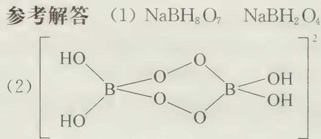

【例 4】（2012 年全国初赛试题）A 和 X 是两种常见的非金属元素，其核外电子数之和为 22，价电子数之和为 10。在一定条件下可生成 AX、AX₃（常见的 Lewis 酸）、

$A_{2}X_{4}$ 和 $A_{4}X_{4}$ ，反应如下：

$$
\begin{array}{r l} & {\mathrm {A(s) + 3 / 2X_ {2} (g)\longrightarrow AX_ {3} (g)}} \\ & {\mathrm {AX_ {3} (g)\xrightarrow{\mathrm{Hg,放电}} AX(g) + 2X(g)}} \\ & {2 \mathrm{Hg+2X(g)\longrightarrow Hg_ {2} X_ {2} (g)}} \\ & {\mathrm {AX(g) + AX_ {3} (g)\longrightarrow A_ {2} X_ {4} (g)}} \\ & {4 \mathrm {AX(g)\longrightarrow A_ {4} X_ {4} (s)}} \end{array}
$$

(1) 指出 A 和 X 各是什么元素。

(2) $\mathrm{A}_{4} \mathrm{~X}_{4}$ 具有 4 个三重旋转轴, 每个 A 原子周围都有 4 个原子, 画出 $\mathrm{A}_{4} \mathrm{~X}_{4}$ 的结构示意图。

(3) 写出 $AX_{3}$ 与 $CH_{3}MgBr$ 按计量数比为 1:3 反应的方程式。

(4) 写出 $A_{2}X_{4}$ 与乙醇发生醇解反应的方程式。

过程探究 由 A 与 X 形成的多种类型的化合物来看, X 为 -1 价, A 最高为 +3 价, 结合核外电子数之和为 22, 价电子数之和为 10, 可以得到 X 为氯元素, A 为硼元素; 或 X 为 -2 价, A 最高为 +6 价, 则 X、A 均应为氧族元素, 与价电子数之和为 10 相矛盾。 $A_{4}X_{4}$ 有 4 个三重旋转轴, 4 个硼原子恰好形成一个正四面体, 经过硼和硼相对的正三角形面的中心为旋转轴, 共 4 个; 第 3 问中、第 4 问中涉及简单的有机化学知识, $CH_{3}MgBr$ 中提供甲基负离子与 $BCl_{3}$ 中带正电的硼原子结合, 生成 $\mathrm{B(CH_{3})_{3}}$ , $B_{2}Cl_{4}$ 发生醇解, 乙醇中带负电荷的氧原子进攻带正电荷的硼原子, 再脱去 HCl 分子得到产物。

## 参考解答

(1) A:B X:Cl

(2)

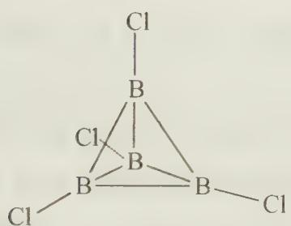

$$
\mathrm{BCl} _ {3} + 3 \mathrm{CH} _ {3} \mathrm{MgBr} \longrightarrow \mathrm{B} (\mathrm{CH} _ {3}) _ {3} + 3 \mathrm{MgBrCl}
$$

$$
\mathrm{AX} _ {3} + 3 \mathrm{CH} _ {3} \mathrm{MgBr} \longrightarrow \mathrm{A} (\mathrm{CH} _ {3}) _ {3} + 3 \mathrm{MgBrX}
$$

写成 $\mathrm{BCl}_3 + 3\mathrm{CH}_3\mathrm{MgBr}\longrightarrow \mathrm{B}(\mathrm{CH}_3)_3 + 3 / 2\mathrm{MgBr}_2 + 3 / 2\mathrm{MgCl}_2$ 也可

$$
\mathrm{或} \mathrm{A} _ {2} \mathrm{X} _ {4} + 4 \mathrm{C} _ {2} \mathrm{H} _ {5} \mathrm{OH} \longrightarrow \mathrm{A} _ {2} (\mathrm{OC} _ {2} \mathrm{H} _ {5}) _ {4} + 4 \mathrm{HX}
$$

## 【实战演练】

1. 写出下列反应的方程式：

(1) $\mathrm{PdCl}_2$ 水溶液检验 CO;

(2) 硅溶于氢氟酸与硝酸混合液；

(3) $Mg_{2}Si$ 与 $H_{2}SO_{4}$ 反应；

(4) $\mathrm{SiH}_{4}$ 水解(微量碱催化下);

(5) $\mathrm{B}_{2} \mathrm{O}_{3}$ 与碳、氯气共热；

(6) $B_{2}H_{6}$ 与 $NH_{3}$ 反应制无机苯( $B_{3}N_{3}H_{6}$ )。

2. 有人用高岭土[主要成分是 $\mathrm{Al}_{2}(\mathrm{Si}_{2}\mathrm{O}_{5})(\mathrm{OH})_{4}$ , 并含有少量的 $\mathrm{CuO}, \mathrm{Fe}_{2}\mathrm{O}_{3}$ ]制新型净水剂, 其实验步骤如下: 将土样和纯碱混合均匀后加热熔融, 冷却后用水浸取熔块, 过滤, 弃去残渣, 滤液用盐酸酸化, 经过滤分别得到沉淀和溶液, 溶液即为净水剂, 试回答下列问题:

(1) 用氧化物表示高岭土的主要成分。

(2) 写出熔融时主要成分(即各氧化物)分别与纯碱反应的化学方程式。

(3) 最后得到的沉淀是什么？写出生成沉淀物的离子方程式。

(4) 本实验中熔融土样时应选用的坩埚材质应为\_\_\_\_（填“瓷坩埚”、“氧化铝坩埚”或“铁坩埚”）。

(5) 以上方法可称为“碱法”。“酸法”生产的过程是: 把预处理好的高岭土直接与盐酸反应, 过滤, 滤液即为净水剂。两种方法比较, 比较节省盐酸的方法是哪一种? 节省的百分率是多少?

3. 有一种无机非金属化合物 X, 它的分子量为 140, 是由两种元素组成的, 其中硅元素的质量分数为 $60\%$ , 它可以由化合物 Y (也含两种元素) 与 $\mathrm{NH}_{3}$ 反应来制得, 反应同时还生成 HCl 气体, 请推断:

(1) 化合物 X 的分子式为 \_\_\_\_。

(2) 反应消耗 $1 \mathrm{~mol} \mathrm{NH}_{3}$ , 同时生成 $3 \mathrm{~mol} \mathrm{HCl}$ , 组成化合物 $\mathrm{Y}$ 的元素为 \_\_\_\_ 和 \_\_\_\_ 。

(3) 由 $1 \mathrm{~mol} \mathrm{NH}_{3}$ 和 $0.75 \mathrm{~mol} \mathrm{Y}$ 恰好完全反应, 由此可知化合物 Y 的分子式为 \_\_\_\_。

(4) 化合物 X 对空气中的氧气和水都不稳定, 发生反应, 产物中都有一种酸性氧化物, 它是工业上生产玻璃、水泥、陶瓷的主要原料, 遇氧反应的另一种产物是一种单质, 其化学反应方程式是: \_\_\_\_ ; 遇水反应的另一种产物是该种单质元素的氢化物, 其化学反应方程式是: \_\_\_\_ 。

4. 碳的化合物十分常见, 回答下列几个问题:

（1）在温热气候条件下的浅海地区往往发现有厚层的石灰岩沉积，而在深海地区却很少见到，说明为什么？

(2) $\mathrm{CO}_{2}$ 中形成大 $\pi$ 键情况, 并画出 $\mathrm{CO}_{2}$ 的结构式。

（3）已知从手册中查出的 $\mathrm{H}_2\mathrm{CO}_3$ 的 $K_{\mathrm{al}} = 4.45\times 10^{-7}$ ，该数据是 $\mathrm{H}_2\mathrm{CO}_3$ 的表观解离常数，在溶液中实际仅有 $0.166\%$ 的 $\mathrm{CO}_{2}$ 转化为 $\mathrm{H}_2\mathrm{CO}_3$ ，求算 $\mathrm{H}_2\mathrm{CO}_3$ 真实的第一步解离常数。

5. A 的单质和 B 的单质在加热下激烈反应得到化合物 X。X 的蒸气密度是同温度下的空气密度的 5.9 倍。X 遇过量的水激烈反应, 反应完全后的混合物加热蒸干, 得一难溶物。后者在空气中经 1000°C 以上高温灼烧, 得到化合物 Y。Y 的一种晶体的晶胞可与金刚石晶胞类比, A 原子的位置相当于碳原子在金刚石晶胞中的位置, 但 Y 晶胞中 A 原子并不直接相连而是通过 E 原子相连。X 与过量氨反应完全后得到含 A 的化合物 Z。Z 在无氧条件下经高温灼烧得化合物 G, G 是一种新型固体材料。

(1) 写出 X、Y、Z、G 的化学式: X \_\_\_\_ , Y \_\_\_\_ , Z \_\_\_\_ , G \_\_\_\_ 。

(2) 你预计 G 有什么用途？用一两句话说明理由。

6. 虽然硅实际上不溶于单独的硝酸及氢氟酸。为了溶解硅，可使用浓硝酸和氢氟酸的混合物。同时，二氧化硅能很好地溶于氢氟酸。

(1) 解释在硅的溶解过程中, 硝酸和氢氟酸各起什么作用? 写出反应方程式;

(2) 混合物中的氢氟酸能否用盐酸代替？说明回答的理由；

(3) 你知道把硅转入溶液还有什么方法？写出相应的反应方程式。

7. $\left(\mathrm{CH}_{3}\right)_{3}\mathrm{SiCl}$ 水解产物为挥发性 $\left(\mathrm{CH}_{3}\right)_{3}\mathrm{SiOH}$ (沸点: 99℃), 后者脱水成 $\left(\mathrm{CH}_{3}\right)_{3}\mathrm{SiOSi}\left(\mathrm{CH}_{3}\right)_{3}$ 。

(1) 写出 $\left(\mathrm{CH}_{3}\right)_{2}\mathrm{SiCl}_{2}$ 水解并且脱水后产物的结构式；

(2) 写出 $\left(\mathrm{CH}_{3}\right)_{2} \mathrm{SiCl}_{2}$ 和少量 $\mathrm{CH}_{3} \mathrm{SiCl}_{3}$ 水解并且脱水产物的结构式。

8. 将 $NaHB_{4}$ 放入冷水中, 可释放出 A 气体, 其化学式为 \_\_\_\_ 。每克 $NaBH_{4}$ 可产生 \_\_\_\_ 升 A 气体(在标准状况下)。开始时该反应释放 A 气体很快, 经过一段时间后就缓慢下来, 其原因是 \_\_\_\_ 。

当需要用 $NaHB_{4}$ 作为 A 气体的发生剂时, 常用一些促进剂制成药丸, 将药丸一投入水中即可快速地释放出 A 气体, 下列物质中能成为促进剂的是 \_\_\_\_ (填字母)。
A. 草酸 B. 氯化铝 C. 醋酸钠 D. 氨水

试说明你选择促进剂的依据是\_\_\_\_。

当需要用 $NaHB_{4}$ 在水溶液中作为与其他物质反应的还原剂时,你应选择上述物质中\_\_\_\_(填写字母),其选择的理由是\_\_\_\_。

9. 试说明下列现象的原因：

(1) 制备纯硼或硅时,用氢气做还原剂比用金属或碳好;

(2) 装有水玻璃的试剂瓶长期敞开瓶口后变浑浊；

(3) 石棉和滑石都是硅酸盐, 石棉具有纤维性质, 而滑石可做润滑剂。

10. $H_{3}BO_{3}$ 和 $H_{3}PO_{3}$ 组成相似,为什么前者是一元路易斯酸,而后者则为二元质子酸,试从结构上加以解释。

11. 实验室制备少量硅一般采用镁粉还原 $SiO_{2}$ 的方法, 然后用稀盐酸洗涤产品以除去杂质。某同学在进行上述操作时, 在制得的产品中加 HCl 洗涤时突然起火。

(1) 请用化学方程式解释:

① 稀盐酸洗涤产品可除去哪些主要杂质？

② 为什么加 HCl 洗涤时突然起火？

(2) 请设计一个实验来验证你的解释。(不必画出装置图,也不必指出具体化学药品,不必写方程式,只要简明指出方法。)

12. 当准确称量的试样单质 A 和氯化氢反应时生成物质 B 和氢气 0.448 L（标准状况下），而同样量的 A 和氯气作用时则生成质量是 B 的 1.254 倍的物质 C，物质 B 和 C 跟水作用生成沉淀 D，D 煅烧后其质量为 A 的 2.143 倍。为了能把分离出 D 之后滤液中的氯离子全部沉淀出来，所需硝酸银溶液的体积在物质 C 情况下，是物质 B 情况下的 1.33 倍。

(1) 试确定物质 A 是什么？其质量是多少？

(2) 试从定性和定量两方面确定 B 和 C 的组成?

(3) 处理物质 B 的滤液需要消耗多少克 10% 的硝酸银溶液?

(4) 写出所述各反应的方程式。

13. 将一定量的 $NH_{4}Cl$ 在甲苯中剧烈搅拌, 加热到 $110^{\circ}C$ 后缓慢通入 $BCl_{3}$ 气体, 在出口端冷凝回流 15 小时, 减压蒸馏溶剂得到无色针状晶体 X, X 具有三重轴, 在水中容易水解得到弱酸性的溶液。元素分析结果表明 X 中含 B:17.6%, N:22.9%, H:1.64%, 所有原子都只有一种化学环境。 $-20^{\circ}C \sim -10^{\circ}C$ 时, 在含 0.050 mol 的 X 的甲苯溶液中缓慢加入 0.150 mol 的异丙胺, 反应 5 h 后再升至室温下反应 15 h, 减压蒸馏溶剂得到物质 Y, 加热 Y, Y 的状态由液态转化为难熔的固体 Z, Z 具有多环结构, 进一步加热到高温得到只含两种元素的材料 W。

(1) 给出 X 的化学式及其结构。

(2) 写出 X 水解的方程式。

(3) 画出 Y 的结构式。

(4) 为什么 Y 在加热的状态下发生题中所述的变化并生成 Z?

(5) 给出 W 的化学式。

# 第 15 讲 碱金属、碱土金属

# 【知识要点】

## 一、s区元素概述

s区元素包括元素周期表中ⅠA族和ⅡA的元素。ⅠA族的元素中，由于NaOH、KOH为常见的碱，除氢以外的其他元素（锂、钠、钾、铷、铯、钫）称为碱金属；ⅡA族的元素（铍、镁、钙、锶、钡、镭）称为碱土金属，是因为这些元素的性质介于碱金属和稀土元素之间。

这两族元素价电子都比较少,有较大原子半径,对价电子的束缚能力较弱,容易失去价电子,表现出较强的还原性。碱土金属元素原子有两个价电子,与同周期的碱金属元素相比,半径较小,晶体中金属键更强,因此熔沸点,硬度和密度均比同周期的碱金属大,金属性弱一些。

## 二、碱金属元素

## 1. 碱金属简介

碱金属元素价电子构型为 $ns^{1}$ ，除 Li 外次外层均为稳定的 8 电子构型。碱金属晶体金属键较弱，熔沸点较低，硬度较小，用小刀即可切割。由于阳离子半径较大，电荷低，碱金属阳离子的极化作用一般都比较小，形成的化合物主要是离子化合物。锂离子为 2 电子构型，半径远小于同族的其他阳离子，因此极化作用较大，锂的化合物具有一定程度的共价特征。

碱金属及其离子有特征的火焰颜色,可以用于元素的定性分析。

$$
\begin{array}{l l l l l} {\mathrm{Li} ^ {+}} & {\mathrm{Na} ^ {+}} & {\mathrm{K} ^ {+}} & {\mathrm{Rb} ^ {+}} & {\mathrm{Cs} ^ {+}} \\ {\text {红色}} & {\text {黄色}} & {\text {紫色}} & {\text {红紫色}} & {\text {蓝色}} \end{array}
$$

碱金属是同周期中除稀有气体元素外原子半径最大的元素,最外层仅一个价电子,有很强的化学活泼性。本书将着重以钠和钾为代表介绍碱金属的性质特征。

## 2. 钠及其化合物

钠的化学性质很活泼,和其他碱金属和碱土金属元素一样,它在自然界里不能以游离态存在,只能以化合态存在。自然界中的含钠化合物有食盐、智利硝石、纯碱、冰晶石等。钠元素是戴维在1807年电解苛性钠时得到的,这是他在电解苛性钾发现金属钾之后得到的。

钠能与水剧烈反应,所以钠不能把金属活动性在钠之后的金属从盐溶液中还原出来,但可以将一些熔融状态的金属卤化物中的金属还原成单质。由于与水反应放出氢气,钠失火不能用水或者泡沫灭火器扑救,可用干燥的沙土来灭火。

钠与绝大多数非金属在一定条件下均能反应。金属钠在空气中缓慢氧化生成氧化钠，将氧化钠加热到 $300 - 400^{\circ}\mathrm{C}$ 或者让钠在空气中燃烧则生成淡黄色的过氧化钠。

$$
\begin{array}{r l} & 4 \mathrm{Na} + \mathrm{O} _ {2} \longrightarrow 2 \mathrm{Na} _ {2} \mathrm{O} \\ & 2 \mathrm{Na} _ {2} \mathrm{O} + \mathrm{O} _ {2} \longrightarrow 2 \mathrm{Na} _ {2} \mathrm{O} _ {2} \end{array}
$$

$Na_{2}O_{2}$ 在工业上可用作纤维, 纸浆, 木材的漂白剂。与水反应释放出氧气, $2Na_{2}O_{2} + 2H_{2}O \longrightarrow 4NaOH + O_{2} \uparrow$ 可视为分两步进行:

$$
\mathrm{Na} _ {2} \mathrm{O} _ {2} + 2 \mathrm{H} _ {2} \mathrm{O} \longrightarrow 2 \mathrm{NaOH} + \mathrm{H} _ {2} \mathrm{O} _ {2}, 2 \mathrm{H} _ {2} \mathrm{O} _ {2} \longrightarrow 2 \mathrm{H} _ {2} \mathrm{O} + \mathrm{O} _ {2} \uparrow
$$

过氧化钠与 $CO_{2}$ 反应也能释放出氧气,可用于潜水,消防作业中的供氧剂。作为强氧化剂, $Na_{2}O_{2}$ 能将 $Fe_{2}O_{3}$ , $Cr_{2}O_{3}$ , $MnO_{2}$ 等氧化为可熔的含氧酸盐,因此在冶金业中可作为熔矿剂。

$$
\begin{array}{r l} & {\mathrm {Fe_ {2} O_ {3} + 3Na_ {2} O_ {2} \xrightarrow {\text {熔融}} 2Na_ {2} FeO_ {4} + Na_ {2} O}} \\ & {\mathrm {Cr_ {2} O_ {3} + 3Na_ {2} O_ {2} \xrightarrow {\text {熔融}} 2Na_ {2} CrO_ {4} + Na_ {2} O}} \\ & {\mathrm {MnO_ {2} + Na_ {2} O_ {2} \xrightarrow {\text {熔融}} Na_ {2} MnO_ {4}}} \end{array}
$$

钠及其化合物应用广泛,食盐是人不可或缺的调味品;金属钠可用于金属 K、Ti 的冶炼,制备含钠的化合物;钠钾合金在室温下呈液态,是核反应堆的导热剂,起把反应堆产生的热量传导给蒸气轮机的作用。钠的商业化生产起始于 1855 年,科学家用碳在 1100℃时还原碳酸钠得到钠的单质。

$$
\mathrm{Na} _ {2} \mathrm{CO} _ {3} (\mathrm{l}) + 2 \mathrm{C} (\mathrm{s}) \xrightarrow {1 1 0 0 ^ {\circ} \mathrm{C}} 2 \mathrm{Na} (\mathrm{g}) + 3 \mathrm{CO} (\mathrm{g})
$$

目前金属钠的生产是通过电解熔融氯化钠的方法,在电解时可加入氯化钙降低熔点到 $700^{\circ}$ C 以下。

## 3. 钾及其化合物

钾是银白色金属,与钠相比原子半径更大,金属键强度小于钠,故熔沸点均低于钠。实际上碱金属元素的熔沸点随电子层数的增加即半径的增大而降低。

钾的第一电离能小于钠,有比钠更活泼的化学性质。它与水反应更加剧烈。在空气中极易被氧化,因此金属钾应该保存在煤油中。钾在空气中燃烧生成超氧化钾。

戴维在发现钾时使用的是电解法,但实际生产中并不用电解法,因为钾容易溶解在融化的 KCl 熔体中,不容易漂浮在液体上方而方便收集。现在生产钾单质采用如下方法:

$$
\mathrm{KCl(l)} + \mathrm{Na(l)} \xrightarrow {7 7 0 - 8 9 0 ^ {\circ} \mathrm{C}} \mathrm{NaCl(l)} + \mathrm{K(g)}
$$

由于钾的沸点小于钠,控制温度,使钾从体系中逸出,反应向右进行。但在液氨体

系中,由于 $CaCl_{2}$ 不溶于液氨,发生的反应则是:

$$
2 \mathrm{KCl} + \mathrm{Ca} \longrightarrow \mathrm{CaCl} _ {2} \downarrow + 2 \mathrm{K}
$$

【例 1】钾是一种活泼的金属,工业上通常用金属钠和氯化钾在高温下反应制取。该反应为: $\mathrm{Na(l)+KCl(l)\rightleftharpoons NaCl(l)+K(g)}$ (正反应吸热)

<table><tr><td>压强(kPa)</td><td>13.33</td><td>53.32</td><td>101.3</td></tr><tr><td>K的沸点(°C)</td><td>590</td><td>710</td><td>770</td></tr><tr><td>Na的沸点(°C)</td><td>700</td><td>830</td><td>890</td></tr><tr><td>KCl的沸点(°C)</td><td></td><td></td><td>1437</td></tr><tr><td>NaCl的沸点(°C)</td><td></td><td></td><td>1465</td></tr></table>

该反应的平衡常数可表示为： $K = c(K)$ ，各物质的沸点与压强的关系见上表。  
(1) 在常压下金属钾转变为气态从反应混合物中分离的温度范围。  
(2) 在制取钾的过程中,为了提高原料的转化率可以采取的措施有哪些?

(3) 在金属活动性顺序表中, 钾是比钠更活泼的金属, 但在上述过程中被钠“置换”出来, 是否矛盾? 为什么?

过程探究 在学习卤族元素时,我们学习了卤化氢的制备方法,由高沸点酸制低沸点酸,可以由中强酸磷酸制得强酸性的 HBr 和 HI,看似违背了“强酸制弱酸”这一规律,实际上所谓的“强酸制弱酸”适用的是水溶液的离子反应中。可见我们运用某一规律时,必须要考虑到这一规律适用的环境。我们所说的金属活动性顺序也是有应用环境的限制的,即需要在水溶液中。在高温熔融状态下,如有挥发性的物质脱离体系,有利于化学反应向生成挥发性物质的一方进行。这也是工业上冶炼钾、铷等活泼金属的理论基础。

## 参考解答 (1) $770^{\circ}\mathrm{C} \sim 890^{\circ}\mathrm{C}$

(2) 降低压强或移去钾蒸气 适当升高温度

（3）不矛盾，金属活动性顺序是溶液中金属失去电子形成水合阳离子能力的大小，而本题是在高温熔融状态下进行的反应。

## 4. 碱金属氧化物

碱金属与氧能形成多种二元化合物，如氧化物，过氧化物，超氧化物，臭氧化物等。

<table><tr><td>名称</td><td>存在</td></tr><tr><td>普通氧化物</td><td> $Li_{2}O$ 、 $Na_{2}O$ 、 $K_{2}O$ 、 $Rb_{2}O$ 、 $Cs_{2}O$ </td></tr><tr><td>过氧化物</td><td> $Na_{2}O_{2}$ 、 $K_{2}O_{2}$ </td></tr><tr><td>超氧化物</td><td> $KO_{2}$ 、 $RbO_{2}$ 、 $CsO_{2}$ </td></tr></table>

这些金属在空气充足的条件下燃烧时,锂生成氧化物 $Li_{2}O$ (纯白色),钠生成

$Na_{2}O_{2}$ （淡黄色），而钾、铷、铯生成超氧化物 $MO_{2}$ 。如果要制得纯净的 $Na_{2}O$ 可用如下方法得到：

$$
\begin{array}{r l} & \mathrm {Na_ {2} O_ {2}} + 2 \mathrm{Na} \xrightarrow {\triangle} 2 \mathrm {Na_ {2} O} \\ & 2 \mathrm {NaN O_ {2}} + 6 \mathrm{Na} \xrightarrow {\triangle} 4 \mathrm {Na_ {2} O} + \mathrm {N_ {2}} \uparrow \end{array}
$$

超氧化物 $MO_{2}$ 中 $O_{2}^{-}$ 为顺磁性的离子，只有大的阳离子如 $K^{+}$ 、 $Rb^{+}$ 、 $Cs^{+}$ 、 $Sr^{2+}$ 、 $Ba^{2+}$ 才能稳定它。

臭氧化物 $\mathrm{MO}_{3}(\mathrm{M}=\mathrm{K},\mathrm{Rb},\mathrm{Cs})$ 可在低温下通过臭氧与粉末状的无水 MOH 反应，再用液氨萃取得到，它们都是红色的晶体。

$$
4 \mathrm{MOH} + 4 \mathrm{O} _ {3} \longrightarrow 4 \mathrm{MO} _ {3} + \mathrm{O} _ {2} + 2 \mathrm{H} _ {2} \mathrm{O}
$$

除了这几种类型的氧化物外,还有低氧化物,这些氧化物中碱金属的价态低于+1价,如 $Rb_{6}O$ , $Rb_{9}O_{2}$ , $Cs_{7}O$ 等。

思考1：为什么锂不存在过氧化物，超氧化物和臭氧化物？

## 三、碱土金属

## 1. 碱土金属简介

碱土金属的价电子构型为 $ns^{2}$ ，从电离能的角度看，失去第二个电子要比失去第一个电子困难，但碱土金属通常形成二价的化合物，因为形成 +2 氧化态的离子化合物晶格能远大于 +1 氧化态的化合物，足以补偿第二电离能。碱土金属的单质有较高的化学活泼性，能与电负性较大的非金属元素直接反应生成相应的化合物；自上而下，碱土金属元素活泼性增强，与水反应剧烈程度逐渐增加。

$$
\begin{array}{r l} & 3 \mathrm{Mg} + \mathrm{N} _ {2} \xrightarrow {\triangle} \mathrm{Mg} _ {3} \mathrm{N} _ {2} \\ & \mathrm{Mg} + 2 \mathrm{H} _ {2} \mathrm{O} \xrightarrow {\triangle} \mathrm{Mg(OH)} _ {2} \downarrow + \mathrm{H} _ {2} \uparrow \\ & \mathrm{Ca} + 2 \mathrm{H} _ {2} \mathrm{O} \longrightarrow \mathrm{Ca(OH)} _ {2} + \mathrm{H} _ {2} \uparrow (\text {常温，剧烈}) \end{array}
$$

碱土金属形成的化合物多为离子化合物。碱土金属的卤化物中 $BeCl_{2}$ 为分子晶体, 其余均为离子晶体, 固态的 $BeCl_{2}$ 具有链式的结构, 气相中生成通过氯原子桥连的二聚体, 进一步升温可以离解成直线型的单体分子。

$$
\mathrm{Cl} - \mathrm{Be} - \mathrm{Cl} \quad \mathrm{Cl} - \mathrm{Be} \underset {\mathrm{Cl}} {\overset {\mathrm{Cl}} {\rightleftharpoons}} \mathrm{Be} - \mathrm{Cl} \quad \underset {\mathrm{Cl}} {\overset {\mathrm{Cl}} {\rightleftharpoons}} \mathrm{Be} \underset {\mathrm{Cl}} {\overset {\mathrm{Cl}} {\rightleftharpoons}} \mathrm{Be}
$$

固态二甲基铍 $\mathrm{Be(CH_{3})_{2}}$ 也具有类似的链式结构, 其蒸气中也有类似的单体, 二聚体。桥连的甲基与两个铍原子形成三中心两电子键, 这与 $BeCl_{2}$ 的桥连结构是不同的。

铍的氢氧化物和氧化物与铝类似,具有两性。

$$
\begin{array}{r l} & \mathrm {Be(OH) _ {2}} + 2 \mathrm{HCl} \longrightarrow \mathrm {BeCl_ {2}} + 2 \mathrm {H_ {2} O} \\ & \mathrm {Be(OH) _ {2}} + 2 \mathrm{NaOH} \longrightarrow \mathrm {Na_ {2} Be(OH) _ {4}} \end{array}
$$

氢氧化镁为中强碱，钙、锶、钡的氢氧化物均为强碱。

【例 2】不同于水溶液,在液氨的环境中,“不活泼”金属可以将“活泼”金属置换出来,如 $Mg + 2NaI \longrightarrow MgI_{2} + 2Na$ , 解释为什么能发生这样的反应?

过程探究 首先,金属在溶剂中的化学行为,由原子化焓(或升华焓)、电离能、溶剂化焓共同决定的,钠的原子化焓和电离能(第一电离能)远小于镁,钠离子的水合焓(负值)大于二价镁离子,综合计算,钠失电子形成水合钠离子放热大于镁的相应值,即更活泼。在水溶液中,钠的活泼性强于镁,而在其他溶剂中,则不一定比镁活泼。

其次，金属在溶液中失去电子后如果能与溶液中某些离子形成稳定的络合物或者沉淀，大大降低了金属离子的浓度，将有利于平衡向失电子的方向移动，如银不能与稀硫酸反应，但是能与浓氢碘酸作用生成氢气，因为生成了溶解度很小的 AgI，当然，如果在同学们学习了多重平衡原理，对这个现象就能够定量的解释了。

参考解答 在液氨体系中, $MgI_{2}$ 的溶解度很小,有利于 $Mg+2NaI\longrightarrow MgI_{2}+2Na$ 平衡向右移动。

## 2. 对角线规则

在短周期中处于对角线上的元素 Li 与 Mg、Be 与 Al、B 与 Si 性质具有相似性，称为对角线规则。

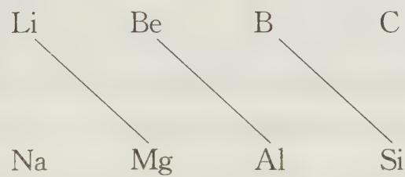

## (1) 锂和镁的相似性

① 锂和镁单质在氧气中燃烧均生成氧化物 $Li_{2}O$ 和 MgO，而碱金属其他元素形成过氧化物，甚至超氧化物。

② 锂和镁氟化物(LiF, $MgF_{2}$ )、碳酸盐( $Li_{2}CO_{3}$ , $MgCO_{3}$ )均难或微溶于水, 而相应的其他碱金属元素氟化物和碳酸盐易溶。

③ 锂和镁的氢氧化物为中强碱,溶解度不大,氯化物水合物受热发生水解,而碱金属其他元素为易溶于水的强碱。

## (2) 铍和铝的相似性

① 铍和铝氧化物和氢氧化物均为两性,而碱土金属其他氢氧化物为碱性。

② 铍和铝氯化物均为共价化合物,气态下形成双聚体,易升华,而碱土金属其他元素与氯形成离子型化合物。

③ 铍和铝遇冷浓硝酸发生钝化，而碱土金属其他元素与冷浓硝酸反应。

(3) 硼和硅的相似性

①硼和硅的氢化物常温下均为高反应活性的气体,而铝的氢化物为多聚的固体。

②硼和硅的卤化物完全水解，而氯化铝仅部分水解。

③硼和硅的氧化物水化物均为酸,而氢氧化铝为两性。

对角线规则可以用离子极化来解释,虽然它们所带电荷不相同,但离子极化力相近,离子极化力与离子势有关,离子势 $\Phi=Z/r$ (Z 为离子电荷,r 为离子半径),如 $Li^{+}$ 带 1 个电荷但半径较小, $Mg^{2+}$ 带两个电荷但半径较大,所以 $Li^{+}$ 和 $Mg^{2+}$ 离子势或极化力接近,在性质上具有相似性。

## 四、氢氧化物碱性的判断

碱金属的氢氧化物中 LiOH 为中强碱, NaOH、KOH、RbOH、CsOH 为强碱, 即自上而下, 碱性增强。碱土金属的氢氧化物中 Be(OH) $_{2}$ 为两性, Mg(OH) $_{2}$ 为中强碱, Ca(OH) $_{2}$ 、Sr(OH) $_{2}$ 、Ba(OH) $_{2}$ 为强碱, 同样自上而下, 碱性增强。那么氢氧化物的酸碱性与什么有关呢? 以 MOH 代表氢氧化物, 存在两种可能的离解方式:

$$
\begin{array}{l l}{\mathrm {M - OH\rightleftharpoons M^ {+} +OH^ {-}}}&{\text {碱式离解}}\\{\mathrm {M - OH\rightleftharpoons MO^ {-} + H^ {+}}}&{\text {酸式离解}}\end{array}
$$

MOH 发生酸式电离还是碱式电离, 取决于在离解时是断裂 M—OH 还是断裂 MO—H, 这是由 $M^{n+}$ 的离子势决定的。若 $M^{n+}$ 的离子势 (离子势 $\Phi = Z / r$ ) 越高, 对羟基的极化力越大, M—O 键越难断裂, 易发生酸式电离, 若 $M^{n+}$ 的离子势 (离子势 $\Phi = Z / r$ ) 越低, 对羟基的极化力越小, 则 M—O 键越易断裂, 将发生碱式电离。

对于碱金属和碱土金属元素而言,离子半径从上往下逐渐增大,离子势逐渐减小。根据以上规则,我们可以得到碱金属和碱土金属的氢氧化物自上而下碱性逐渐增强。同周期的碱金属比碱土金属离子半径要大,电荷要小,所以离子势更低,碱性更强,同周期元素形成的氢氧化物从左往右,碱性减弱,酸性增强,如碱性 $\mathrm{NaOH} > \mathrm{Mg(OH)}_{2} > \mathrm{Al(OH)}_{3}$ 。

## 【竞赛对接】

【例 1】（2000 年广西初赛试题）碱金属的氢化物都是离子型晶体，除 LiH（熔点 $688^{\circ}$ C）外，均在熔化前分解成单质。碱金属氢化物合成的反应式是（M 代表碱金属）：

$$
2 \mathrm{M} (\mathrm{s}) + \mathrm{H} _ {2} (\mathrm{g}) \xrightarrow {\triangle} 2 \mathrm{MH} (\mathrm{s})
$$

几种碱金属氢化物的物理性质如下表所示：

<table><tr><td>氢化物</td><td>LiH</td><td>KH</td><td>NaH</td></tr><tr><td>密度 g·cm-3</td><td>0.78</td><td>1.43</td><td></td></tr><tr><td>分解温度°C</td><td>850</td><td>400</td><td>425</td></tr></table>

(1) 纯净的 LiH 加热熔化后, 在容器两边分别接入正、负极, 向正极迁移的是什么微粒? 说明理由。

(2) 从化学结构的角度去说明,为什么分解温度 LiH > NaH > KH。

（3）利用氢化物的性质，可以除去金属锂中含有的金属钾，请说明操作过程及原理，并写出相关的反应方程式。

(4) 合成反应 $2 \mathrm{M}(\mathrm{s}) + \mathrm{H}_{2}(\mathrm{~g}) \xrightarrow{\triangle} 2 \mathrm{MH}(\mathrm{s})$ 中, 需要的反应条件是什么, 请加以说明。

过程探究 （1）碱金属氢化物都为离子化合物，熔化后离子键被破坏，电离生成碱金属阳离子和氢负离子，通电之后，阳离子向与电源负极相连的阴极移动，阴离子向与电源正极相连的阳极移动，同时发生电极反应，阳离子在阴极得到电子生成金属单质，氢负离子在阳极失去电子生成氢气。

(2) 第二个问题, LiH, NaH, KH 分解温度的比较, 实际上是比较它们的热稳定性的大小。同类型离子化合物的热稳定性取决于它们生成热的大小 (它们的熵变基本相同), 即生成 $1 \mathrm{~mol}$ 该离子化合物时放热越多, 该化合物越稳定。对于碱金属氢化物 MH, 它们的生成热由氢气的键能, 电子亲和能, M(s) 的原子化焓, 第一电离能以及 MH 的晶格能共同决定。前两项是一致的, 后三项与具体碱金属元素的性质有关, 随着原子序数的增大, 碱金属原子化焓, 第一电离能都是减小的, 表示吸热减小, 而 MH 的晶格能也减小, 表示生成 MH 晶体放热量也在减小, 那么哪一个因素起主导作用呢? 晶格能是 $\frac{1}{r_{+} + r_{-}}$ 的函数, $\mathrm{H}^{-}$ 半径是所有负离子中最小的, 随着阳离子半径的增大, 晶格能将显著减小, 超过了原子化焓和第一电离能减小的影响, 所以生成 MH 时放热也显著减少, 即热稳定性是下降的。事实上, 由于氟离子的半径也比较小, 碱金属氟化物的热稳定性随金属离子半径的增加也是逐渐减小的, 即 $\mathrm{LiF} > \mathrm{NaF} > \mathrm{KF} > \mathrm{CsF}$ 。对于碱金属的碘化物, 由于碘离子自身半径较大, 随着金属离子半径增加, $\frac{1}{r_{+} + r}$ 的减小幅度并不大, 这时原子化焓的减小和第一电离能的减小将起主要的作用了, 使得碱金属碘化物在生成时随原子序数增大放热更多, 即热稳定性 $\mathrm{LiI} < \mathrm{NaI} < \mathrm{KI} < \mathrm{CsI}$ 。

(3) 由题中所给的氢化物的性质知, LiH 分解温度 (850°C) 高于 KH 的分解温度 (400°C), 可分别制成氢化物后, 逐渐升温, 使 KH 先分解, 并形成蒸汽脱离体系, 然后再使 LiH 分解得到单质锂。

（4）碱金属化学性质活泼，容易与空气中的氧气和水发生反应，所以必须控制在无水无氧的环境中进行反应。

参考解答 (1) 向阳极迁移的是 $\mathrm{H}^-$ , 理由是 LiH 是离子晶体, 熔化时发生电离.

LiH $\longrightarrow$ Li $^{+}$ + H $^{-}$ 。

(2) 它们均为离子键, 阳离子的半径 $\mathrm{Li}^{+} < \mathrm{Na}^{+} < \mathrm{K}^{+}$ , 与 $\mathrm{H}^{-}$ 的作用力大小为 $\mathrm{LiH} > \mathrm{NaH} > \mathrm{KH}$ 。

(3) 首先把混有钾的锂与氢气反应,生成氢化物,然后对 LiH 和 KH 的混合物加热至 400\~774℃,此时 KH 分解并形成蒸汽分开。继续升温加热到 LiH 的分解温度得到锂单质。

(4) 反应条件是无氧, 无水。氧气的存在导致生成碱金属氧化物, 水的存在会与碱金属反应生成氢气, 不可能制得 $\mathrm{MH}$ 。

【例 2】（1992 年安徽初赛试题）某厂得知市场紧缺无水 $MgCl_{2}$ ，而工厂仓库内有大量的 MgO、 $NH_{4}Cl$ 、 $MnO_{2}$ 、盐酸和碳。于是技术科设计了两种制备工艺，进行试产，然后投入生产，使工厂转亏为盈。试问：

(1) 技术科设计的制备工艺是哪两种? (请用反应方程式表示流程)

(2)评估这两种工艺的经济效益。

过程探究 制备无机物通常有干法和湿法两种方法。如制备无水 $MgCl_{2}$ 采用干法制备，可先制备出镁单质和氯气，镁在氯气中燃烧可以得到无水氯化镁，而氯气可以来自于 $MnO_{2}$ 和盐酸反应，镁单质可以来自于碳还原氧化镁。或者用加碳氯化法，氧化镁、焦炭、氯气三者反应生成氯化镁和一氧化碳。如采用湿法制备，先要制得氯化镁溶液，将氯化镁溶液蒸发浓缩，冷却结晶，过滤得到的是 $MgCl_{2} \cdot 6H_{2}O$ ，要从水合物中得到晶体，直接加热是行不通的， $MgCl_{2} \cdot 6H_{2}O$ 在直接加热时，将发生水解，生成 $\mathrm{Mg(OH)}_{2}$ 或 $\mathrm{Mg(OH)Cl}$ 或 $\mathrm{MgO}$ ，可在干燥的 HCl 气氛下加热，本题中，可用 $NH_{4}Cl$ 代替 HCl 气体。比较两种方法的优劣，可从成本高低，是否节能，对环境是否友好，原料是否能充分利用等角度考虑，在本题中，湿法比干法好，更节能，更环保，经济效应更高。

参考解答 (1) ① 干法制备: $\mathrm{MnO}_{2} + 4\mathrm{HCl}$ (浓) $\xrightarrow{\triangle} \mathrm{MnCl}_{2} + \mathrm{Cl}_{2} \uparrow + 2\mathrm{H}_{2}\mathrm{O}$

$$
\mathrm{MgO} + \mathrm{C} \xrightarrow {\triangle} \mathrm{Mg} + \mathrm{CO}
$$

$$
\mathrm{Mg} + \mathrm{Cl} _ {2} \xrightarrow {\text {点燃}} \mathrm{MgCl} _ {2}
$$

或 $\mathrm{MgO} + \mathrm{C} + \mathrm{Cl}_2\xrightarrow{\triangle}\mathrm{MgCl}_2 + \mathrm{CO}$

② 湿法制备 $\mathrm{MgO} + 2\mathrm{HCl}\longrightarrow \mathrm{MgCl}_2 + \mathrm{H}_2\mathrm{O}$ 结晶得到 $\mathrm{MgCl}_2\cdot 6\mathrm{H}_2\mathrm{O}$

$$
\mathrm{MgCl} _ {2} \cdot 6 \mathrm{H} _ {2} \mathrm{O} + \mathrm{NH} _ {4} \mathrm{Cl} \xrightarrow {\triangle} \mathrm{MgCl} _ {2} + \mathrm{NH} _ {3} \uparrow + \mathrm{HCl} \uparrow + 6 \mathrm{H} _ {2} \mathrm{O}
$$

(2) 方法②更好, 方法①能源消耗大, 生产过程中可能产生氯气, 一氧化碳污染。方法②原料利用率高, 氨气和氯化氢回收后得到氯化铵, 能循环使用。

【例 3】（2011 年全国初赛试题）近年来，某些轻元素的含氢化合物及其复合体系作为氢源受到广泛关注。化合物 A(XYH₂) 和 B(XH) 都是具有潜在应用价值的释氢材料。A 受热分解生成固体化合物 C 并放出刺激性气体 D，D 可使湿润的 pH 试纸变蓝。A 和 B 混合可优化放氢性能。研究发现,该混合体系的放氢反应分三步进行:

$$
2 \mathrm{A} = \mathrm{C} + \mathrm{D} \tag {1}
$$

$$
\mathrm{D} + \mathrm{B} = \mathrm{A} + \mathrm{H} _ {2} \tag {2}
$$

$$
\mathrm{C} + \mathrm{B} = \mathrm{E} + \mathrm{H} _ {2} \tag {3}
$$

将 A 和 B 按 1:2 的摩尔(物质的量)比混合,在催化剂作用下,所含的氢全部以氢气放出,失重 10.4%。

A、C、E均能水解生成F和D。G是由X和Y组成的二元化合物，其阴离子是二氧化碳的等电子体，G分解生成E和一种无色无味的气体I。写出A、B、C、D、E、F、G和I的化学式。

过程探究 本题是一道元素推断试题,由轻元素及 B 的化学式,知 X 应为一种碱金属,而金属中最轻的金属莫过于锂了,D 为氨气,则可知 Y 为 N,A 和 B 以 1:2 摩尔比反应的方程式为: $XNH_{2} + 2XH \longrightarrow X_{3}N + 2H_{2}$ ,再结合失重率 10.4% 可以计算出 X 的式量为:6.91,故 X 应为 Li,则 F 为 LiOH,G 为 Li 和 N 形成的二元化合物,则阴离子应由氮元素形成,它是 $CO_{2}$ 的等电子体,为 $N_{3}^{-}$ ,故 G 为 $LiN_{3}$ ,叠氮化物易分解产生氮气,这个性质用于汽车的安全气囊。

问题背景涉及到的储氢材料,氢能源相关问题是考察的热点内容,读者可以多留意社会和科技发展中的热点问题,多加思考,提高科学素养。

## 参考解答

A. $\mathrm{LiNH_2}$ B. LiH C. $\mathrm{Li}_2\mathrm{NH}$ D. $\mathrm{NH}_3$

E. $\mathrm{Li}_3\mathrm{N}$ F. LiOH G. $\mathrm{LiN}_3$ I. $\mathbf{N}_2$

## 【实战演练】

1. 可以使含 $Mg^{2+}$ 和 $Be^{2+}$ 的混合溶液中的 $Mg^{2+}$ 沉淀下来而 $Be^{2+}$ 留在溶液中的试剂是 \_\_\_\_。

2. 烧碱中常含有的杂质为纯碱。商品检测时,通常采用盐酸滴定的方法。盐酸和烧碱反应的同时,也和纯碱作用。因而滴定时发生两步反应。

(1) 第一步反应式为 \_\_\_\_。

(2) 第二步反应式为 \_\_\_\_。

(3) 若除去反应生成的碳酸, 以使反应完全, 可采用的最简单方法是\_\_\_\_。

3.（1）已知 $BeCl_{2}$ 加热易升华，高温下的液态 $BeCl_{2}$ 不导电，则 $BeCl_{2}$ 属 \_\_\_\_ 化合物，在 $BeCl_{2}$ 中 Be 原子最外层电子数为 \_\_\_\_ ， $BeCl_{2}$ 的水溶液导电能力较强，其电离方程式为 \_\_\_\_ 。

(2) 将 $\mathrm{BeCl}_{2}$ 溶于浓盐酸中, 发生化学反应, 生成物中 Be 原子达到了 8 电子稳定结构, 这个反应的化学方程式为 \_\_\_\_, 阴离子的空间构型为 \_\_\_\_, 键角 \_\_\_\_。

(3) 已知 $\mathrm{BeCl}_{2}$ 溶液中加入 $\mathrm{NaOH}$ 首先出现白色絮状沉淀, 继续加入 $\mathrm{NaOH}$ , 则沉淀又溶解为 $\mathrm{Na}_{2} \mathrm{BeO}_{2}$ 。但实验证明 $\mathrm{Na}_{2} \mathrm{BeO}_{2}$ 并不存在, 而是以另一种 8 电子稳定结构的物质出现, 则 $\mathrm{Be(OH)}_{2}$ 溶于 $\mathrm{NaOH}$ 的化学反应方程式为 \_\_\_\_ ,生成物中阴离子的结构式为 \_\_\_\_ 。

4. 写出下列反应式：

① 金属钠与 $\mathrm{H}_{2} \mathrm{O} 、 \mathrm{NH}_{3} 、 \mathrm{C}_{2} \mathrm{H}_{5} \mathrm{OH} 、 \mathrm{TiCl}_{4} 、 \mathrm{KCl} 、 \mathrm{Na}_{2} \mathrm{O}_{2} 、 \mathrm{NaNO}_{2}$ 的反应；

② $Na_{2}O_{2}$ 与 $H_{2}O$ 、 $NaCrO_{2}$ 、 $CO_{2}$ 、 $Cr_{2}O_{3}$ 、 $H_{2}SO_{4}$ 的反应。

5. 解释下列事实：

(1) 卤化锂在非极性溶剂中的溶解度顺序为: LiI > LiBr > LiCl > LiF。

(2) 虽然锂的电离能比铯大, 但 $E^{\varphi}(\mathrm{Li}^{+}/\mathrm{Li})$ 却比 $E^{\varphi}(\mathrm{Cs}^{+}/\mathrm{Cs})$ 小。

(3) 虽然 $E^{\varphi}(\mathrm{Li}^{+}/\mathrm{Li})<E^{\varphi}(\mathrm{Na}^{+}/\mathrm{Na})$ ，但金属锂与水反应不如金属钠与水反应剧烈。

6. 锂及其化合物与其他碱金属及其化合物在性质上有哪些不同？试分析原因？

7. 锂与 $H_{2}$ 反应生成氢化锂时，在生成物中常含有未反应的锂。常用气体容量法测定氢化锂中未反应的金属锂的含量。在 $22^{\circ}C$ 和 97.46 kPa 时，0.205 g 样品与水反应，收集到 561 mL 未经干燥的氢气，试计算该样品中未反应的金属锂的质量百分比。（已知 $22^{\circ}C$ 时水的饱和蒸气压为 2.67 kPa）

8. 碱金属(如锂、钠、钾、铷等)溶于汞中可形成良好的还原剂“汞齐”。取某种碱金属的汞齐 7 g, 与水作用得到 2.24 L 氢气(标准状况), 并得到密度为 $\rho \mathrm{g} \cdot \mathrm{mL}^{-1}$ 的溶液 1 L, 则溶液的质量分数为多少?

9. 锂电池广泛使用于手表,照相机等电子产品中,具有稳定性好、轻便、环保等优点。金属锂常用做电池的负极材料,除此以外还有 Al、Cd、Zn 等。

（1）电容量指每 1 克金属完全放电时候提供的电量，单位为 Ah/g，请计算比较 Li、Al、Cd 的电容量，你能得出什么结论？

(2) 虽然 Li 的第一电离能大于 Na 和 K, 但 $E_{\mathrm{Li}}^{\ominus} \mathrm{Li}$ 比 $E_{\mathrm{Na}^{-}/\mathrm{Na}}^{\ominus}, E_{\mathrm{K}^{-}/\mathrm{K}}^{\ominus}$ 代数值都要小, 请解释之。尽管如此, Li 与水反应的剧烈程度确不如 Na 和 K, 请分析原因。

(3) 溶剂 A 可以做锂电池的溶剂, 它最有可能是下列几种溶剂中的哪一种? 请说明理由。

① $H_{2}O$ ② $CH_{3}CH_{2}OH$ ③ $(CH_{3})_{2}SO$ ④ $C_{6}H_{12}$ （环己烷）。

10. 电解法生产钠的反应为 $2 \mathrm{NaCl} \xrightarrow{\text {电解}} 2 \mathrm{Na} + \mathrm{Cl}_{2}$ , 下表为某些物质的性质

<table><tr><td>物质</td><td>熔点°C</td><td>沸点°C</td><td>相对密度(25°C)</td></tr><tr><td>NaCl</td><td>801</td><td>1413</td><td>2.165</td></tr><tr><td>CaCl2</td><td>772</td><td>1600以上</td><td>2.15</td></tr><tr><td>混合盐</td><td>600</td><td></td><td></td></tr><tr><td>Na</td><td>97.8</td><td>882.9</td><td>1</td></tr></table>

混合盐的组成: $CaCl_{2}$ 57%\~58%, NaCl 42%\~43%, 请回答下列问题:

(1) 电解时不用纯的熔融 NaCl, 而是用熔融的混合盐, 原因是什么?

(2) 得到的钠是如何与电解物料分离的(说明原因)?

(3) 混合盐在电解之前需要严格脱水, 原因是什么?

11. 1863 年本生把碳酸铷与炭黑在 $1000^{\circ}$ C 以上的高温下焙烧, 首次制得了金属铷。泰纳尔与盖吕萨克把碳酸钠或苛性钠和铁的混合物在 $1100^{\circ}$ C 下进行焙烧分离出了金属钠。制取金属钾的现代方法之一是基于用钠将钾从它的氯化物中置换出来。

(1) 写出所述各反应的反应方程式；

(2) 这些反应与这些金属在标准电动序中的位置或你所知道的关于元素的相对化学活动性的事实是否矛盾？解释你的答案；

(3) 工业上在怎样的条件下和利用怎样的设备来实现最后一种反应?

(4) 提出制取金属钡的方法。

12. 在标准状况下, 将 $\mathrm{CO}_{2}$ 与 $\mathrm{CO}$ 的混合气 (其质量为同状况下等体积氢气质量的 16 倍) 充满盛有足量过氧化钠的容积为 $2.24 \mathrm{~L}$ 的密闭容器内 (设固体物质的体积忽略不计)。用间断短暂的电火花引发反应, 使可能发生的反应充分进行。计算:

(1) 反应前, $\mathrm{CO}$ 和 $\mathrm{CO}_{2}$ 的物质的量各为多少摩?

(2) 最后容器里有几种生成物？它们的质量各为多少克？

13. 以 BaS 为原料制备 $\mathrm{Ba(OH)}_{2} \cdot 8\mathrm{H}_{2}\mathrm{O}$ 的过程是: BaS 与 HCl 反应, 所得溶液在 $70^{\circ}C \sim 90^{\circ}C$ 时与过量 NaOH 溶液作用, 除杂, 冷却后得到 $\mathrm{Ba(OH)}_{2} \cdot 8\mathrm{H}_{2}\mathrm{O}$ 晶体。据最新报道, 生产效率高、成本低的 $\mathrm{Ba(OH)}_{2} \cdot 8\mathrm{H}_{2}\mathrm{O}$ 晶体的新方法是使 BaS 与 CuO 反应……

(1) 新方法的反应方程式为: \_\_\_\_。

(2) 该反应的反应物 $\mathrm{CuO}$ 是不溶物, 为什么该反应还能进行:

(3) 简述新方法生产效率高、成本低的原因。

# 测试题一

## 一、选择题

1. 下列离子方程式正确的是( )。
A. 硫酸亚铁在空气中氧化: $4Fe^{2+} + 3O_{2} + 6H_{2}O \longrightarrow 4Fe(OH)_{3}$ B. 向硝酸银溶液中加入过量氨水: $Ag^{+} + NH_{3} \cdot H_{2}O \longrightarrow AgOH \downarrow + NH_{4}^{+}$ C. 向硫酸铝铵矾溶液中滴加过量的氢氧化钡溶液 $NH_{4}^{+} + Al^{3+} + 2SO_{4}^{2-} + 2Ba^{2+} + 5OH^{-} \longrightarrow AlO_{2}^{-} + 2BaSO_{4}\downarrow + NH_{3} \cdot H_{2}O + 2H_{2}O$ D. 向次氯酸钠溶液中通入足量 $SO_{2}$ 气体: $ClO^{-} + SO_{2} + H_{2}O \longrightarrow HClO + HSO_{3}^{-}$

2. 2008年北京奥运会主体体育场的外形好似“鸟巢”。有一类硼烷也好似鸟巢，故称为巢式硼烷。巢式硼烷除 $\mathrm{B}_{10} \mathrm{H}_{14}$ 不与水反应外，其余均易与水反应生成氢气和硼烷。硼烷易被氧化。下图是三种巢式硼烷，有关说法正确的是（ ）。

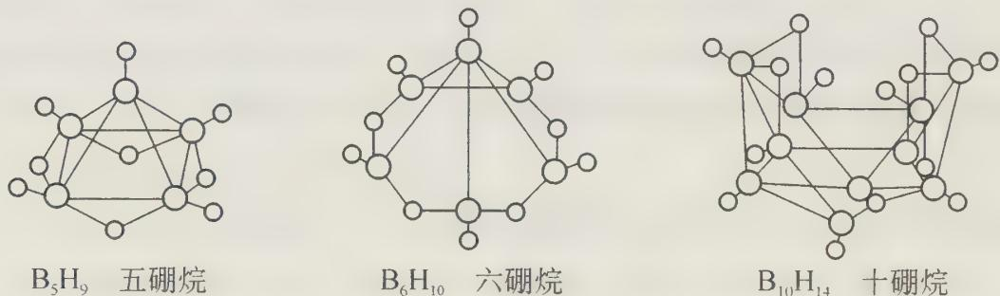

A.巢式硼烷与水反应是氧化还原反应B. $2\mathrm{B}_5\mathrm{H}_9 + 12\mathrm{O}_2\longrightarrow 5\mathrm{B}_2\mathrm{O}_3 + 9\mathrm{H}_2\mathrm{O},1\mathrm{mol}\mathrm{B}_5\mathrm{H}_9$ 完全燃烧转移 $25\mathrm{mol}$ 电子C.8个硼原子的巢式硼烷的化学式应为 $\mathrm{B_8H_{10}}$ D.这类巢式硼烷的通式是 $\mathrm{B}_n\mathrm{H}_{n + 4}$

3. 已知 A、B 两种气体在一定条件下可发生反应: $2 \mathrm{~A} + \mathrm{B} \longrightarrow \mathrm{C} + 3 \mathrm{~D} + 4 \mathrm{E}$ 。现将 $m \mathrm{~g}$ 相对分子质量为 $M$ 的 A 气体与适量的 B 气体充入一密闭容器中, 恰好完全反应且有少量液滴生成。在相同温度下测得反应前后容器内的压强为 $6.06 \times 10^{6} \mathrm{~Pa}$ 和 $1.01 \times 10^{7} \mathrm{~Pa}$ , 且测得反应共放出热量 $Q \mathrm{~kJ}$ 。则该反应的热化学方程式为 ( )。
A. $2 \mathrm{~A}(\mathrm{g}) + \mathrm{B}(\mathrm{g}) \longrightarrow \mathrm{C}(\mathrm{g}) + 3 \mathrm{D}(\mathrm{g}) + 4 \mathrm{E}(\mathrm{g}) \quad \Delta H = -M Q / m \mathrm{~kJ} \cdot \mathrm{mol}^{- 1}$ B. $2 \mathrm{~A}(\mathrm{g}) + \mathrm{B}(\mathrm{g}) \longrightarrow \mathrm{C}(\mathrm{l}) + 3 \mathrm{D}(\mathrm{g}) + 4 \mathrm{E}(\mathrm{g}) \quad \Delta H = -2 M Q / m \mathrm{~kJ} \cdot \mathrm{mol}^{- 1}$ C. $2 \mathrm{~A}(\mathrm{g}) + \mathrm{B}(\mathrm{g}) \longrightarrow \mathrm{C}(\mathrm{g}) + 3 \mathrm{D}(\mathrm{g}) + 4 \mathrm{E}(\mathrm{l}) \quad \Delta H = -M Q / m \mathrm{~kJ} \cdot \mathrm{mol}^{- 1}$

D. $2A(g) + B(g) \longrightarrow C(g) + 3D(l) + 4E(g)$ $\Delta H = -2MQ/m kJ \cdot mol^{-1}$ 4. 下列说法中, 正确的是( )。
① 同种元素的原子的性质相同
② 能自发进行的化学反应, 不一定是 $\Delta H < 0$ 、 $\Delta S > 0$ ③ 胶体与溶液的本质区别是胶体具有丁达尔现象
④ $K_{sp}$ 不仅与难溶电解质的性质和温度有关, 而且与溶液中的离子浓度有关
⑤ “冰, 水为之, 而寒于水”说明相同质量的水和冰, 水的能量高
⑥ 食盐可以融冰化雪, 用食盐作融雪剂不会对环境、植物生长产生任何危害
A. ①③④ B. ①④⑥ C. ②⑤ D. ①⑤

5. 碘元素有多种价态,可以形成多种含氧阴离子 $I_{x}O_{y}^{n-}$ 。由 2 个 $IO_{6}^{2-}$ 正八面体共用一个面形成的 $I_{x}O_{y}^{n-}$ 的化学式为( )。
A. $I_{2}O_{9}^{4-}$ B. $I_{2}O_{10}^{6-}$ C. $I_{2}O_{11}^{8-}$ D. $I_{2}O_{12}^{10-}$

6. 右表为元素周期表短周期的一部分。下列有关 A、B、C、D、E 五种元素的叙述中, 不正确的是( )。
A. A 与 B 形成的阴离子可能有: $\mathrm{AB}_{3}^{2-}$ 、 $\mathrm{A}_{2}\mathrm{B}_{4}^{2-}$ B. E 的氢化物的沸点比 C 的氢化物的沸点高
C. D 在过量的 B 中燃烧的主要产物为 $\mathrm{DB}_{3}$ D. 由这 5 种元素中的几种形成只含极性键的非极性分子多于 4 种

7. 2009年12月7日,联合国在哥本哈根召开《联合国气候变化框架公约》缔约方第15次会议,该会议的目的是通过全世界共同努力来减少 $CO_{2}$ 的排放,以减小温室效应。有资料表明,当压强达到22 MPa、温度达到374℃时,水成为“超临界状态”,此时水可将 $CO_{2}$ 等含碳化合物转化为有机物,称之为“水热反应”——该反应能吸收 $CO_{2}$ 。生物质在地下高温高压条件下通过水热反应可生成石油、煤等矿物能源。下列说法不正确的是( )。
A. “水热反应”是一种复杂的物理化学变化
B. 水热反应说明研究如何吸收利用 $CO_{2}$ 很有意义
C. 随着科技的进步,“水热反应”的制取,能源有望实现地球上碳资源的循环
D. 生物质与超临界水作用生成汽油的反应,能解决目前人类汽油短缺问题

8. 据 2009 年的报道,采用 1:1 硫酸溶液同槽浸出锰结核矿[质量分数 $w(\mathrm{MnO}_{2})=0.20$ ]和锌精矿[质量分数 $w(\mathrm{ZnS})=0.70$ ]的工艺方法提取锰和锌获得成功。该方法的原理是利用 $\mathrm{MnO}_{2}$ 与 $\mathrm{ZnS}$ 在酸性条件下发生氧化还原反应,使矿物中的锰与锌以 $\mathrm{Mn}^{2+}$ 、 $\mathrm{Zn}^{2+}$ 的形式浸出。研究发现,两种矿物同槽酸浸 4 h 后,锰和锌的浸出率只有 80% 左右,为了提高浸出率,在实际工艺中,需将过滤后的滤渣用四氯乙烷处理后再做二次酸浸,此处的四氯乙烷所起的作用是( )。
A. 氧化剂 B. 还原剂 C. 催化剂 D. 溶剂

9. 当向蓝色的 $\mathrm{CuSO_4}$ 溶液中逐滴加入氨水时, 观察到首先生成蓝色沉淀, 而后沉淀逐渐溶解成深蓝色溶液, 向深蓝色溶液中通入 $\mathrm{SO}_2$ 气体, 又生成了白色沉淀, 将白色沉淀加入稀硫酸中, 又生成了红色粉末状固体和 $\mathrm{SO}_{2}$ , 同时溶液呈蓝色。根据实验现象分析推测, 下列描述正确的有( )。

A. 蓝色沉淀为 $\mathrm{Cu(OH)}_{2}$ , 深蓝色溶液中所含 $\mathrm{Cu}^{2+}$ 浓度较大

B. 白色沉淀为 +2 价铜的某种亚硫酸盐, 溶于 $\mathrm{H}_{2} \mathrm{SO}_{4}$ 发生复分解反应

C. 白色沉淀为 +1 价铜的某种亚硫酸盐, 在酸性条件下发生了自身的氧化还原反应

D. 反应过程中消耗的 $\mathrm{SO}_{2}$ 与生成的 $\mathrm{SO}_{2}$ 的物质的量相等

10. 科学解释能力是科学素养的重要组成部分。下列对实验现象及操作的解释合理的是( )。

<table><tr><td></td><td>现象及操作</td><td>解释</td></tr><tr><td>A</td><td>用pH试纸鉴别NaCl和NH4Cl溶液</td><td>NH4+水解溶液显酸性</td></tr><tr><td>B</td><td>取少量某溶液,滴加氯化钡溶液,生成白色沉淀</td><td>该溶液中含有SO42-</td></tr><tr><td>C</td><td>配制氯化铁溶液时加入少量盐酸</td><td>抑制Fe3+的水解</td></tr><tr><td>D</td><td>向AlCl3溶液中加入过量浓氨水,生成白色沉淀</td><td>Al(OH)3不溶于碱溶液</td></tr></table>

11. 某中性含 $Na^{+}$ 的溶液中, 可能还存在 $NH_{4}^{+}$ 、 $Fe^{2+}$ 、 $Br^{-}$ 、 $CO_{3}^{2-}$ 、 $I^{-}$ 、 $SO_{3}^{2-}$ 六种离子中的一种或几种。进行以下实验: ① 在原溶液中滴加足量氯水后, 有气泡产生, 溶液呈橙黄色; ② 向呈橙黄色溶液中加入 $BaCl_{2}$ 溶液时无沉淀生成; ③ 橙黄色溶液不能使淀粉变蓝。由此可以推知该溶液中肯定不存在的离子是( )。
A. $NH_{4}^{+}$ 、 $Br^{-}$ 、 $CO_{3}^{2-}$ B. $NH_{4}^{+}$ 、 $I^{-}$ 、 $SO_{3}^{2-}$ C. $Fe^{2+}$ 、 $I^{-}$ 、 $SO_{3}^{2-}$ D. $Fe^{2+}$ 、 $CO_{3}^{2-}$ 、 $I^{-}$

12. 在淀粉碘化钾溶液中加入少量次氯酸钠溶液, 并加入少量的稀硫酸, 溶液立即变蓝, 在上述溶液中加入足量的亚硫酸钠溶液, 蓝色逐渐消失。下列判断错误的是 ( )。
A. 氧化性: $SO_{4}^{2-} > ClO^{-} > I_{2}$ B. 漂白粉溶液可使淀粉碘化钾试纸变蓝
C. 向氯水中加入亚硫酸钠溶液, 氯水褪色
D. 次氯酸钠可以与亚硫酸钠共存

13. 有机物分子一般是分子晶体。下列化合物的沸点高低排列正确的是( )。
(I) $CH_{3}CH_{2}CH_{2}OCH_{2}CH_{2}CH_{3}$ (Ⅱ) $(CH_{3})_{2}CH-OCH(CH_{3})_{2}$ (Ⅲ) $(CH_{3})_{3}CCH_{2}OH$ (Ⅳ) $CH_{3}CH_{2}CH_{2}CH_{2}COOH$ A. (I) > (Ⅱ) > (Ⅲ) > (Ⅳ)

B. (Ⅱ) > (Ⅲ) > (Ⅰ) > (Ⅳ)

C. (Ⅲ) > (Ⅱ) > (Ⅳ) > (Ⅰ)

D. (Ⅳ) > (Ⅲ) > (Ⅰ) > (Ⅱ)

14. XSO $_{4}$ (aq)与 NaOH(aq)反应,定量生成 X $_{3}$ (OH) $_{4}$ SO $_{4}$ (s)和 Na $_{2}$ SO $_{4}$ (aq)。1.0 mol·L $^{-1}$ 的 XSO $_{4}$ 和 1.0 mol·L $^{-1}$ NaOH 混合,总体积为 50 mL(体积可加合)。为了得到最大的沉淀量,这两种溶液的体积应取()。

A. $29\mathrm{mLNaOH} + 21\mathrm{mL}$ $\mathrm{XSO_4}$ B. $21\mathrm{mLNaOH} + 29\mathrm{mL}$ $\mathrm{XSO_4}$ C. $15\mathrm{mLNaOH} + 35\mathrm{mL}$ $\mathrm{XSO_4}$ D. $20\mathrm{mLNaOH} + 30\mathrm{mL}$ $\mathrm{XSO_4}$

15. 某同学做金属钼(Mo)在氧气中燃烧实验测其氧化物的组成, 结果如右图所示。则该同学利用实验结果得出 Mo 的氧化物 I 和 II 分别为( )。
A. I 为 $MoO_{3}$ ，II 为 $Mo_{2}O$ B. I 为 MoO，II 为 $MoO_{2}$ C. I 为 $MoO_{3}$ ，II 为 $MoO_{2}$ D. I 为 $MoO_{2}$ ，II 为 $MoO_{3}$

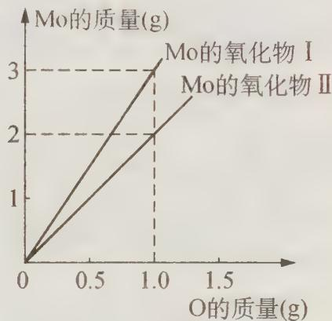

## 二、非选择题

16. Mn、Fe 元素的部分电离能数据列于下表:

<table><tr><td colspan="2">元素</td><td>Mn</td><td>Fe</td></tr><tr><td rowspan="3">电离能/(kJ·mol-1)</td><td>I1</td><td>717</td><td>759</td></tr><tr><td>I2</td><td>1509</td><td>1561</td></tr><tr><td>I3</td><td>3248</td><td>2957</td></tr></table>

(1) Mn 位于周期表中第\_\_\_\_族, Fe 元素价电子层的电子排布式为\_\_\_\_, 比较两元素的 $\mathrm{I}_{2} 、 \mathrm{I}_{3}$ 可知, 气态 $\mathrm{Mn}^{2+}$ 再失去一个电子比气态 $\mathrm{Fe}^{2+}$ 再失去一个电子难。对此, 你的解释是\_\_\_\_。

(2) Fe 原子或离子外围有较多能量相近的空轨道而能与一些分子或离子形成配合物。

① 与 Fe 原子或离子形成配合物的分子或离子应具备的结构特征是 \_\_\_\_；

② 六氰合亚铁离子 $\left(\mathrm{Fe}(\mathrm{CN})_{6}^{4-}\right)$ 中的 $Fe^{2+}$ 离子的杂化轨道类型是 \_\_\_\_。

(3) 三氯化铁常温下为固体, 熔点 $282^{\circ} \mathrm{C}$ , 沸点 $315^{\circ} \mathrm{C}$ , 在 $300^{\circ} \mathrm{C}$ 以上易升华。易溶

于水，也易溶于乙醚、丙酮等有机溶剂。据此判断三氯化铁晶体为\_\_\_\_。

(4) 金属铁的晶体在不同温度下有两种堆积方式, 晶胞分别如右图所示。面心立方晶胞和体心立方晶胞中实际含有的 Fe 原子个数之比为 \_\_\_\_ , Fe 原子配位数之比为 \_\_\_\_ 。

17. I A 族氯化物的熔、沸点列表如下：

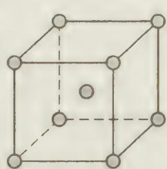

体心立方  
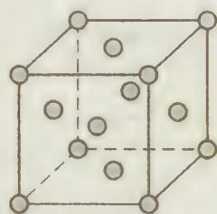  
面心立方

<table><tr><td>化合物</td><td>NaCl</td><td>KCl</td><td>RbCl</td><td>CsCl</td></tr><tr><td>熔点/°C</td><td>801</td><td>770</td><td>715</td><td>645</td></tr><tr><td>沸点/°C</td><td>1465</td><td>1437</td><td>1390</td><td>1303</td></tr></table>

(1) 在这些化合物中, 正负离子之间存在什么吸引作用? 从 NaCl 到 CsCl, 这种作用是逐渐 \_\_\_\_ (填“增强”、“减弱”或“不变”);

(2) 从 NaCl 到 CsCl, 熔、沸点依次降低的原因是 \_\_\_\_ ;

(3) 这些元素的氟化物的熔、沸点比对应氯化物都要高, 其原因是 \_\_\_\_ ;

(4) 这些元素溴化物熔、沸点比对应氯化物的熔、沸点要\_\_\_\_（填“高”、“低”或“不变”），原因是\_\_\_\_。

18. 从广义上讲,任何一个化学反应都是可逆反应,增加反应物浓度可使反应向生成物方向移动,反之亦然。已知某些固态水合物受热发生水解反应,如: $MgCl_{2}\cdot6H_{2}O\longrightarrow Mg(OH)Cl+HCl+5H_{2}O$ ,因而不能用加热方法制备它们的无水盐。在下列条件下加热可得到无水盐:(1)在 HCl 气氛下;(2)和适量 $NH_{4}Cl$ 固体混合后加热;(3)和适量 $SOCl_{2}$ 混合加热。这是因为:

(1) HCl 气氛 \_\_\_\_ ;

(2) 加 $NH_{4}Cl$ \_\_\_\_；

(3) 加 $SOCl_{2}$ \_\_\_\_；

(4) 某厂得知市场紧缺无水 $\mathrm{MgCl}_2$ ，而工厂仓库内存在大量的 $\mathrm{MgO}$ 、 $\mathrm{NH}_4\mathrm{Cl}$ 、 $\mathrm{MnO}_2$ 、盐酸和碳。于是技术科设计了两种制造工艺，进行试产后，投入生产，使工厂扭亏为盈。试问：

（Ⅰ）技术科设计的两种制造工艺是(用反应方程式表明工艺流程):

第一种\_\_\_\_；

第二种\_\_\_\_；

（Ⅱ）评估此两种工艺的经济效益\_\_\_\_。

19. 氟化钠是一种重要的氟盐, 主要用于农作物杀菌、杀虫剂、木材的防腐剂。实验室可通过下图所示的流程以氟硅酸 $\left(\mathrm{H}_{2}\mathrm{SiF}_{6}\right)$ 等物质为原料制取氟化钠, 并得到副产品氯化铵。

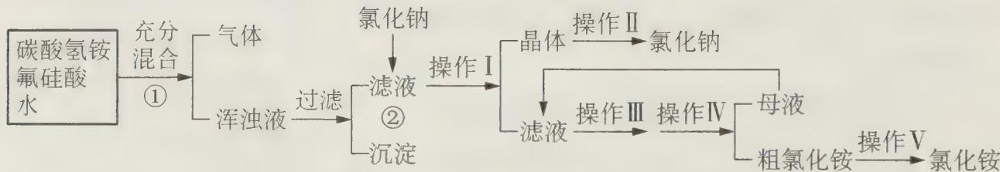

已知: $20^{\circ} \mathrm{C}$ 时氯化铵的溶解度为 $37.2 \mathrm{~g}$ , 氟化钠的溶解度为 $4 \mathrm{~g}$ , $\mathrm{Na}_{2} \mathrm{SiF}_{6}$ 微溶于水。

请回答下列问题：

(1) 上述流程中①②分别发生化学反应, 写出相关反应的化学方程式:

①

②

(2) 上述流程中操作 \_\_\_\_ 和 \_\_\_\_ (填编号) 都是 \_\_\_\_ (填操作名称)。

(3) 操作Ⅱ的具体过程是 \_\_\_\_。

(4) 流程①中 $NH_{4}HCO_{3}$ 必须过量, 其原因是 \_\_\_\_。

20. Tetraazidomethane 是化学家 2006 年新制得的一种只由两种元素构成的化合物。这两种元素一种是有机物中必不可少的，而另一种则是大气中含量最高的元素。制备 Tetraazidomethane 的一种方法是由含锑盐 A 与一种钠盐 B 在一定条件下发生复分解反应。盐 A 的阳离子为三角锥构型，含氮质量分数约为 91.30%；阴离子为 $SbCl_{6}^{-}$ 。钠盐 B 的阴离子和 $CO_{2}$ 是等电子体。Tetraazidomethane 是一种高沸点的液体，含氮质量分数约为 93.33%，有一定的危险性。

(1) 与 Tetmazidomethane 含有相同元素的二元化合物可能有着截然不同的性质, 比如按照化合价一般规律组成的最简单形式的化合物 X 在材料科学中有着特殊的研究意义。其化学式为 \_\_\_\_ 。

(2) 已知 $\mathrm{SbCl}_{6}$ 的中心原子上的价电子都用于形成共价键了, 则 $\mathrm{SbCl}_{6}^{-}$ 的立体构型为 \_\_\_\_ ; B 的阴离子的立体构型可能为 \_\_\_\_ 。

(3) B 与 $\mathrm{KNO}_3$ 混合, 点燃后产生相当慢的爆炸, 分两步进行反应, 首先是 B 分解, 产生金属和一种气体; 该金属再与 $\mathrm{KNO}_3$ 反应, 释放出一种气体, 同时得到两种用一般点燃法无法制备的金属氧化物。请写出可能发生反应的化学方程式:

①

②

(4) 硝化甘油是丙三醇与硝酸形成的酯, 撞击后能剧烈爆炸。试写出反应的化学方程式, 并配平: \_\_\_\_ 。Tetraazidomethane、硝化甘油与 B 均易发生爆炸反应的主要原因是: \_\_\_\_ 。

21. 在等浓度的 $FeCl_{2}$ 和 $FeSO_{4}$ 混合溶液中，滴入少量 $KMnO_{4}$ 溶液后，溶液的 $c(\mathrm{Fe}^{2+})$ \_\_\_\_ $c(\mathrm{Cl}^{-})$ （填“>”、“<”或“=”，下同）。在等浓度的 $CaCl_{2}$ 和 $SrCl_{2}$ 的混合溶液中，滴入适量的 $Na_{2}SO_{4}$ 溶液后，溶液中 $c(\mathrm{Ca}^{2+})$ \_\_\_\_ $c(\mathrm{Sr}^{2+})$ 。在 $c(\mathrm{H}_{2}\mathrm{NCH}_{2}\mathrm{CH}_{2}\mathrm{NH}_{2})=1/2c(\mathrm{NH}_{3})$ 的混合溶液中，滴入适量的 $ZnSO_{4}$ 溶液后，溶液中 \_\_\_\_ 的浓度变小了，而 \_\_\_\_ 的浓度变化很小。

22. 我国东方Ⅱ号宇宙火箭的燃料是 $\mathrm{N}_{2}\mathrm{H}_{2}(\mathrm{CH}_{3})_{2}$ ，助燃剂为 $N_{2}O_{4}$ ，两者发生完全燃烧时产生了巨大推力，让火箭携带卫星上天。

(1) $\mathrm{N}_{2} \mathrm{H}_{2}(\mathrm{CH}_{3})_{2}$ 中 $\mathrm{N}$ 的氧化数为 \_\_\_\_ , $\mathrm{N}_{2} \mathrm{O}_{4}$ 中 $\mathrm{N}$ 的氧化数为 \_\_\_\_ 。

(2) 完全燃烧反应的化学方程式为 \_\_\_\_。

(3) 试写出 $\mathrm{N}_{2} \mathrm{O}_{4}$ 中 $\mathrm{N} 、 \mathrm{~N}$ 连接的一种 Lewis 结构式并标出形式电荷 \_\_\_\_。

(4) $N_{2}H_{4}$ 与 $N_{2}O_{4}$ 比较，\_\_\_\_的 N—N 键长较长，其理由是 \_\_\_\_。

23. 保险粉是 $\mathrm{Na}_{2} \mathrm{~S}_{2} \mathrm{O}_{4}$ 的工业名称, 是最大宗的无机盐之一, 年产量 30 万吨, 大量用于印染业, 并用来漂白纸张、纸浆和陶土。

(1) 甲酸法是生产保险粉的主要生产方法之一, 其中最主要的步骤是把甲酸与溶于甲醇和水混合溶剂里的 NaOH 混合, 再通入 $\mathrm{SO}_{2}$ 气体。

① 写出甲酸法生产保险粉的化学反应方程式：\_\_\_\_。

② 甲酸法中使用的甲醇并不参加反应,你认为它的作用是什么?

③ 从反应后的混合物中分离保险粉应当采用的操作是什么？

(2) $S_{2}O_{4}^{2-}$ 中的 4 个 O 原子是完全等价的, 写出它的电子式 $\quad$ , $S_{2}O_{4}^{2-}$ 所有 6 个原子最多可能共面的有 $\quad$ 个, 有些分子的空间结构与 $S_{2}O_{4}^{2-}$ 类似, 试举一常见例子 $\quad$ ;

(3) 实验室中用锌粉作用于亚硫酸氢钠和亚硫酸的混合溶液, 可生成 $Na_{2}S_{2}O_{4}$ , 写出反应方程式: \_\_\_\_;

(4) 将 $\mathrm{Na}_{2} \mathrm{~S}_{2} \mathrm{O}_{4}$ 加热至 $643 \mathrm{~K}$ 发生爆炸, 并生成一种刺激性气体; 收集爆炸产生的气体溶于大量水, 酸化后溶液变白色浑浊, 加热溶液, 逸出刺激性气体, 其体积为爆炸产生气体体积的 2 倍 (相同条件下), 写出爆炸反应方程式: 。

24. 某铁的氧化物中含氧化亚铁 14.37%，三氧化二铁 47.91% 及四氧化三铁 37.72%。称取此混合物 10.0 g，加入 100.0 mL x mol·L $^{-1}$ HCl 溶液，立即通入 N $_{2}$ ，溶解完成后，加入 7.2493 g 铁粉（假定铁粉与 HCl 不反应）。待溶液变澄清后，滴入 5.00 mol·L $^{-1}$ NaOH 溶液 200.0 mL。此时恰好完全生成白色沉淀，试求 x 值。

# 测试题二

## 一、选择题(每小题有1\~2个答案)

1. 氢化亚铜(CuH)是一种难溶物质,用 $CuSO_{4}$ 溶液和“另一种反应物”在40℃～50℃时反应可生成它,CuH 不稳定,CuH 在氯气中能燃烧;跟盐酸反应能产生气体。以下有关它的推断错误的是()。
A. 这“另一种反应物”一定具有氧化性
B. CuH 既可做氧化剂也可做还原剂
C. $CuH + Cl_{2} \longrightarrow CuCl + HCl$ (燃烧)
D. $CuH + HCl \longrightarrow CuCl + H_{2} \uparrow$

2. 硫—钠原电池具有输出功率较高, 循环寿命长等优点。其工作原理可表示为: $2\mathrm{Na} + x\mathrm{S}\frac{\text{放电}}{\text{充电}}\mathrm{Na}_{2}\mathrm{S}_{x}$ 。

但工作温度过高是这种高性能电池的缺陷,科学家研究发现,采用多硫化合物(如右图)作为电极反应材料,可有效地降低电池的工作温度,且原材料价廉、低毒,具有生物降解性。下列关于此种多硫化合物的叙述正确的是( )。
A. 这是一种新型无机非金属材料
B. 此化合物可能发生加成反应
C. 原电池的负极反应将是单体
转化为
D. 当电路中转移 0.02 mol 电子时,将消耗原电池的正极反应

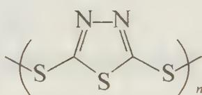

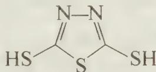

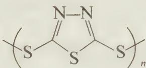

3. 在恒温、恒容条件下, 反应 $2 \mathrm{~A}(\mathrm{g}) + \mathrm{B}(\mathrm{g}) \rightleftharpoons 2 \mathrm{C}(\mathrm{g})$ 从两条途径分别建立平衡: (I) A、B 的起始浓度分别为 $2 \mathrm{~mol} \cdot \mathrm{L}^{-1}$ 和 $1 \mathrm{~mol} \cdot \mathrm{L}^{-1}$ ; (II) C 的起始浓度为 $4 \mathrm{~mol} \cdot \mathrm{L}^{-1}$ , 以下关于平衡时的叙述正确的是( )。
A. 途径 I 和途径 II 所得混合气体的百分组成相同
B. 途径 I 所得 C 物质的浓度为途径 II 所得 C 物质浓度的一半
C. 途径 I 的反应速率 $v(A)$ 与途径 II 的反应速率 $v(C)$ 相等
D. 途径 I 所得混合气体的密度为途径 II 所得混合气体的密度的一半

4. 在地壳内, 深度每增加 1 km, 压强大约增加 25250\~30300 kPa, 在这样的压强下, 对固体物质的平衡会发生较大影响。如:

$$
\mathrm{CaAl} _ {2} \mathrm{Si} _ {2} \mathrm{O} _ {8} + \mathrm{Mg} _ {2} \mathrm{SiO} _ {4} \longrightarrow \mathrm{CaMg} _ {2} \mathrm{Al} _ {2} \mathrm{Si} _ {3} \mathrm{O} _ {1 2}
$$

(钙长石) (镁橄榄石) (钙镁)石榴子石
摩尔质量(g·mol $^{-1}$ ) 278 140.6 413.6
密度(g·cm $^{-3}$ ) 2.70 3.22 3.50

在地壳区域变质的高压条件下,有利于( )。
A. 钙长石生成
B. 镁橄榄石生成
C. 钙长石和镁橄榄石共存
D. (钙镁)石榴子石生成

5. 原子的核电荷数小于 18 的某元素 X, 其原子的电子层数为 n, 最外层电子数为 $2n+1$ , 原子核内质子数是 $2n^{2}-1$ 。下列有关 X 的说法中, 错误的是()。
A. X 原子的价电子数和核电荷数肯定为奇数
B. X 能形成的酸都具有强氧化性
C. X 一定能形成化学式为 KXO₃ 的含氧酸钾盐
D. X 与短周期金属元素形成的化合物都是离子晶体

6. 在容积不变的密闭容器中,在一定条件下发生反应 $2A(?) \rightleftharpoons B(g) + C(s)$ ,达到化学平衡后,其他条件不变,升高温度时,容器内气体的密度增大,则下列叙述正确的是( )。
A. 若正反应是吸热反应,则 A 为气态
B. 若正反应是放热反应,则 A 为气态
C. 改变压强对平衡的移动无影响
D. 在平衡体系中加入少量 C,则平衡向逆反应方向移动

7. 在四个密闭容器中分别装有下表所示的一定量的物质, 将它们加热至 $300^{\circ}$ C, 经充分反应后排出气体, 则残留固体及其物质的量正确的是()。

<table><tr><td></td><td>A</td><td>B</td><td>C</td><td>D</td></tr><tr><td>反应前</td><td>1 mol NaOH、 1 mol  $NaHCO_3$ </td><td>1 mol  $Na_2O_2$ 、 1 mol  $NaHCO_3$ </td><td>1 mol  $Na_2O_2$ 、 2 mol  $NaHCO_3$ </td><td>1 mol  $Na_2O_2$ 、 1 mol  $NH_4HCO_3$ </td></tr><tr><td>反应后</td><td>1 mol  $Na_2CO_3$ </td><td>2 mol NaOH、 0.5 mol  $Na_2CO_3$ </td><td>2 mol NaOH、 1 mol  $Na_2CO_3$ </td><td>1 mol  $Na_2CO_3$ </td></tr></table>

8. 已知 $\mathrm{NaHSO}_3$ 溶液和 $\mathrm{Na}_2\mathrm{CO}_3$ 溶液混合后加热煮沸能产生 $\mathrm{CO}_2$ 气体。现有浓度均为 $0.1\mathrm{mol}\cdot \mathrm{L}^{-1}$ 的 $\mathrm{NaHSO}_3$ 溶液和 $\mathrm{NaHCO}_3$ 溶液，两溶液中各粒子物质的量浓度的关系一定正确的是(R表示S或C)( )。
A. $c(\mathrm{Na}^{+}) > c(\mathrm{HRO}_{3}^{-}) > c(\mathrm{H}^{+}) > c(\mathrm{RO}_{3}^{2-}) > c(\mathrm{OH}^{-})$ B. $c(\mathrm{Na}^{+}) + c(\mathrm{H}^{+}) = c(\mathrm{HRO}_{3}^{-}) + c(\mathrm{RO}_{3}^{2-}) + c(\mathrm{OH}^{-})$ C. $c(\mathrm{H}^{+}) + c(\mathrm{H}_{2}\mathrm{RO}_{3}) = c(\mathrm{RO}_{3}^{2-}) + c(\mathrm{OH}^{-})$ D. 两溶液中 $c(\mathrm{Na}^{+})$ 、 $c(\mathrm{HRO}_{3}^{-})$ 、 $c(\mathrm{RO}_{3}^{2-})$ 分别相等
9. 已知联二苯( )的二氯取代物有12种，则联 $n(n \geqslant 2)$ 苯的一氯一溴取代物种数为( )。
A. $2n^{2}+5n+1$ B. $n^{2}+7n+1$ C. $4n^{2}+n+1$ D. $3n^{2}+3n+1$

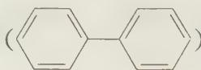

10. 在 25 mL NaOH 溶液中逐滴加入 $0.2 \, mol \cdot L^{-1}$ 醋酸溶液，曲线如右下图所示，有关粒子浓度关系比较正确的是()。

A. 在 A、B 间任一点，溶液中都有 $c(\mathrm{Na}^{+}) > c(\mathrm{CH}_{3}\mathrm{COO}^{-}) > c(\mathrm{OH}^{-}) > c(\mathrm{H}^{+})$ B. 在 B 点， $a > 12.5$ ，且有 $c(\mathrm{Na}^{+}) = c(\mathrm{CH}_{3}\mathrm{COO}^{-}) = c(\mathrm{OH}^{-}) = c(\mathrm{H}^{+})$ C. 在 C 点： $c(\mathrm{CH}_{3}\mathrm{COO}^{-}) > c(\mathrm{Na}^{+}) > c(\mathrm{H}^{+}) > c(\mathrm{OH}^{-})$ D. 在 D 点： $c(\mathrm{CH}_{3}\mathrm{COO}^{-}) + c(\mathrm{CH}_{3}\mathrm{COOH}) = 2c(\mathrm{Na}^{+})$

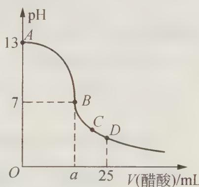

## 二、填空题

11. 化学上将一步完成的反应称为基元反应。只由一个基元反应构成的化学反应称为简单反应；由两个或两个以上基元反应构成的化学反应称为复杂反应。对于基元反应： $aA + bB \longrightarrow cC + dD$ ，其速率可以表示为 $v = k \cdot \{c(A)\}^{a} \cdot \{c(B)\}^{b}$ (k 称为速率常数)，复杂反应的速率取决于慢的基元反应。

已知反应 $NO_{2} + CO \longrightarrow NO + CO_{2}$ ，在不同的温度下反应机理不同，请回答下列问题：

(1) 温度高于 $220^{\circ} \mathrm{C}$ 时, 实验测得该反应的速率方程是 $v = k \cdot c(\mathrm{NO}_{2}) \cdot c(\mathrm{CO})$ , 则该反应是 \_\_\_\_ (填“简单反应”或“复杂反应”)。

（2）温度低于 $250^{\circ}\mathrm{C}$ 时，实验测得该反应的速率方程是 $v = k \cdot \{c(\mathrm{NO}_2)\}^2$ ，又知该反应是由两个基元反应构成的复杂反应，其中较慢的基元反应的反应物和生成物均为氮氧化物（目前已被科学家确认的氮氧化物有 $\mathrm{N}_2\mathrm{O}$ 、NO、 $\mathrm{NO}_2$ 、 $\mathrm{N}_2\mathrm{O}_3$ 、 $\mathrm{N}_2\mathrm{O}_4$ 、 $\mathrm{N}_2\mathrm{O}_5$ 、 $\mathrm{NO}_3$ 等）。

请你根据上述事实,大胆猜想:反应“ $NO_{2}+CO\longrightarrow NO+CO_{2}$ ”,在该条件下的反应机理(用方程式表示该反应的历程,并在括号内注明“快反应”或“慢反应”)。

① \_\_\_\_ ( )；

② （ ）。

12. $S_{2}Cl_{2}$ 是黄红色油状发烟液体,有刺激性臭味,熔点 $-80^{\circ}C$ ,沸点 $136^{\circ}C$ 。蒸气有腐蚀性,遇水分解,易溶解硫黄;将适量氯气通入熔融的硫黄而得。 $S_{2}Cl_{2}$ 用作有机化工产品、杀虫剂、硫化染料、合成橡胶等生产中的氯化剂和中间体,也用于橡胶硫化、糖浆纯化、软水硬化等。

(1) $S_{2}Cl_{2}$ 的结构简式是 \_\_\_\_；空间构型为 \_\_\_\_ 形（填“直线”或“折线”）。

(2) 根据 $S_{2}Cl_{2}$ 的结构特点, 它应属于 \_\_\_\_ (类别), 再列举两例此类常见化合物 \_\_\_\_、\_\_\_\_ (共价化合物和离子化合物各 1 例)。

(3) 制备 $\mathrm{S}_{2} \mathrm{Cl}_{2}$ 的化学方程式是\_\_\_\_, 实际得到的产物是\_\_\_\_, 如何用简单的实验方法得到较纯的 $\mathrm{S}_{2} \mathrm{Cl}_{2}$ : \_\_\_\_。

(4) $S_{2}Cl_{2}$ 遇水分解和溶于 $\mathrm{NaOH}$ 溶液的化学方程式分别为 \_\_\_\_；\_\_\_\_。

(5) $S_{2}Cl_{2}$ 在惰性溶剂 $CCl_{4}$ 中氨解可得到二元化合物 X, X 与氯化亚锡 (II) 的乙醇溶液反应, 所得主要产物 Y 的分子含氢 2.14% (质量分数), 且 Y 的摩尔质量比 X 略大; Y 是高度对称的分子, 结构中存在四重对称轴 (旋转 90° 重合)。Y 的结构简式为 \_\_\_\_ ; 合成 X、Y 的方程式分别为 \_\_\_\_ 和 \_\_\_\_ 。

13. 化合物 A 由前四周期的三种元素组成, 能与水反应, 生成白色沉淀 B 和无色气体 C; B 既能溶于强酸, 又能溶于强碱, 还能溶于氨水; C 是非极性分子, 能燃烧; 1.000 g A 与水反应后产生的气体 C 燃烧后, 产物经干燥后得到 0.923 g 气体 D, D 也是非极性分子。

(1) 写出化学式: B \_\_\_\_ ; C \_\_\_\_ ; D \_\_\_\_ 。

(2) A 的化学式为 \_\_\_\_, 判断 A 是 \_\_\_\_ (填“离子化合物”或“共价化合物”)。

(3) A 与水反应的化学方程式为\_\_\_\_，该反应能发生的最主要原因是\_\_\_\_。

(4) 写出溶解 B 的三个方程式:

① \_\_\_\_；

② \_\_\_\_；

③\_\_\_\_。

## 三、实验题

14. 某课外兴趣小组对双氧水( $H_{2}O_{2}$ 水溶液)做了如下实验探究。

(1) 将质量相同但聚集状态不同的 $\mathrm{MnO}_{2}$ 分别加入 $5 \mathrm{~mL} 5 \%$ 的双氧水中, 并用带火星的木条试之。测定结果如下:

<table><tr><td>催化剂 (MnO2)</td><td>操作情况</td><td>观察结果</td><td>反应完成所需的时间</td></tr><tr><td>粉末状</td><td rowspan="2">混合不振荡</td><td>剧烈反应,使木条复燃</td><td>3.5分钟</td></tr><tr><td>块状</td><td>反应较慢,火星红亮但木条未复燃</td><td>30分钟</td></tr></table>

① 写出 $H_{2}O_{2}$ 反应的化学方程式 \_\_\_\_。

② 实验结果说明催化剂作用的大小与 \_\_\_\_ 有关。

(2) 取三份含有等量 $\mathrm{H}_{2} \mathrm{O}_{2}$ , 但质量分数不同的双氧水, 分别向其中加入 1 克 $\mathrm{MnO}_{2}$ 粉末。测定结果如下:

<table><tr><td>双氧水体积</td><td>操作情况</td><td>反应完成所需的时间</td><td>收集到气体体积</td><td>反应后液体温度</td></tr><tr><td> $a_{1}\%$ 的150mL</td><td rowspan="3">混合不振荡</td><td>11分钟</td><td>539mL</td><td>24°C</td></tr><tr><td> $a_{2}\%$ 的15mL</td><td>1分20秒</td><td>553mL</td><td>56°C</td></tr><tr><td> $a_{3}\%$ 的7.5mL</td><td>9秒</td><td>562mL</td><td>67°C</td></tr></table>

请简要说明：

① 反应完成所需的时间不同的原因 \_\_\_\_；

② 反应后液体温度不同的原因 \_\_\_\_；

③ 收集到气体体积不同的原因 \_\_\_\_。

(3) 向含有酚酞的 NaOH 稀溶液中, 逐滴滴入 $10\%$ 的双氧水, 红色褪去。

① 已知双氧水显弱酸性,试写出 $H_{2}O_{2}$ 的电离方程式:

② 小组讨论红色褪去的原因时,甲同学认为是双氧水显酸性所致;乙同学认为是双氧水有较强氧化性所致。请你设计一个简单实验来说明是甲对还是乙对。(简要文字说明)

15. 某学生做了如下一个实验: 取 $0.1 \, mol/L \, Fe^{3+}$ 试液 2 滴, 加入过量的 $8 \, mol \cdot L^{-1}$ 浓度的 NaOH 溶液, 离心分离, 取离心液酸化, 滴加 $\mathrm{K}_{4}[\mathrm{Fe}(\mathrm{CN})_{6}]$ 溶液 (已知: $FeCl_{2}$ 与 $\mathrm{K}_{3}[\mathrm{Fe}(\mathrm{CN})_{6}]$ 、 $FeCl_{3}$ 与 $\mathrm{K}_{4}[\mathrm{Fe}(\mathrm{CN})_{6}]$ 都生成蓝色晶体——铁蓝: $\mathrm{KFe}[\mathrm{Fe}(\mathrm{CN})_{6}]$ 。

(1) 滴加 $\mathrm{K}_{4}[\mathrm{Fe(CN)}_{6}]$ 溶液的目的是什么？可观察到什么现象？

(2) 从本实验中可得到有关铁化合物的什么新性质?

(3) 写出上述反应方程式。

(4) 对离心液酸化应选何种酸(盐酸、硫酸、硝酸)? 为什么?

## 四、计算题

16. 某课外兴趣小组为了探究碱性溶液中 $Mg^{2+}$ 、 $Al^{3+}$ 与溶液 pH 的关系, 进行下列实验: 向含有 0.1 mol HCl、0.1 mol $MgCl_{2}$ 、1.0 mol $AlCl_{3}$ 的混合溶液中逐渐加入 NaOH 溶液, 均至反应后溶液体积为 1 L。测得部分实验数据如下表:

<table><tr><td>pH</td><td>9</td><td>10</td><td>11</td></tr><tr><td> $c(Mg^{2+})/(mol·L^{-1})$ </td><td> $10^{-1}$ </td><td> $10^{-3}$ </td><td> $10^{-5}$ </td></tr><tr><td> $c(AlO_2^-)/(mol·L^{-1})$ </td><td> $10^{-2}$ </td><td> $10^{-1}$ </td><td>1</td></tr></table>

(1) 向混合溶液中加入 NaOH 溶液至 pH=9, 能否有 $\mathrm{Mg(OH)}_{2}$ 沉淀出现 \_\_\_\_ (填“能”或“否”), 由此你得到的初步结论是什么?

(2) 向混合溶液中加入 NaOH 溶液至 pH=10，需要 NaOH 溶液中有多少克 NaOH？（最后结果保留两位小数）

17. 氢是最小的原子,但是它对于世界上物质结构和种类的丰富性却起着举足轻重的作用。氢与许多元素都能形成简单的无机小分子,其分子结构往往与中心原子的性质有关。

(1) $\mathrm{NH}_{3}$ 、 $\mathrm{PH}_{3}$ 、 $\mathrm{AsH}_{3}$ 、 $\mathrm{SbH}_{3}$ 分子的键角分别为 $107.3^{\circ}$ 、 $93.3^{\circ}$ 、 $91.8^{\circ}$ 、 $91.3^{\circ}$ ，试解释其键角逐渐减小的原因 \_\_\_\_。

(2) 试预测 $\mathrm{CH}_{4} 、 \mathrm{NH}_{3} 、 \mathrm{H}_{2} \mathrm{O}$ 分子的键角大小顺序 \_\_\_\_。

(3) 最新研究发现, 水能凝结成 13 种类型的结晶体, 除普通冰以外其余各自的冰都有自己奇特的性质: 有在 $-30^{\circ} \mathrm{C}$ 才凝固的超低温冰, 它的坚硬程度可和钢相媲美, 能抵挡炮弹轰击; 有在 $180^{\circ} \mathrm{C}$ 高温下依然不变的热冰; 还有的冰密度比水大, 号称重冰。

① 重冰属于立方晶系, 结构如左下图, 晶胞参数 $a = 333.7 \mathrm{pm}$ (即图中立方体的边长, $1 \mathrm{pm} = 10^{-12} \mathrm{~m}$ ), 计算其密度为 \_\_\_\_ 。其中氧原子的杂化方式为 \_\_\_\_ 。

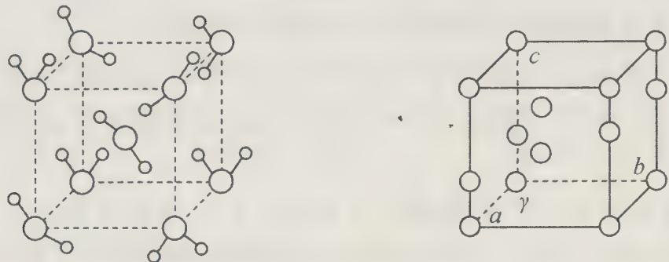

② 普通冰属于六方晶系, 晶胞参数为 $a = 452 \mathrm{pm}, c = 737 \mathrm{pm}, \gamma = 120^{\circ}$ , 如右上图, 白球表示氧原子, 一个晶胞中有 4 个水分子, 计算其密度为 \_\_\_\_ 。并与重冰比较, 可能的原因为 \_\_\_\_ 。

18. 为了研究单质 X 及其化合物的性质, 进行了如下实验: 将准确称量的等质量的物质 A 和 B 置于充满氩气的容器中充分混合。将容器密闭 $(p=1.01\times10^{5}\ \text{Pa}, T=291\ \text{K})$ 并加热。反应停止后, 容器内的压强等于 $2.66\times10^{5}\ \text{Pa}(T=300\ \text{K})$ , 而反应的唯一固体产物是一种单质 X。在空气中加热氧化物 A 导致如下的质量损失 (相对于起始质量):

<table><tr><td>温度,K</td><td>566</td><td>624</td><td>647</td><td>878</td></tr><tr><td>质量损失,%</td><td>2.789</td><td>3.905</td><td>4.463</td><td>6.695</td></tr><tr><td>生成的物质</td><td>C</td><td>D</td><td>F</td><td>G</td></tr></table>

下图还表示了各物质之间的相互转化关系(图中省略了部分物质), B 呈黑色, Z 呈黄色。

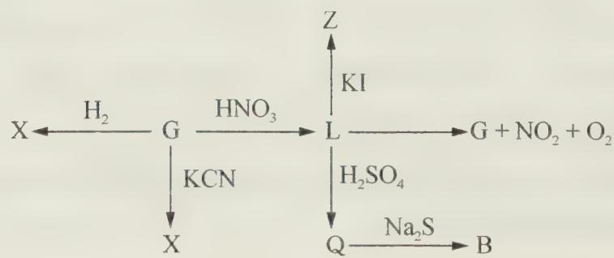

(1) 试确定 A、F、L、Q、Z 的化学式。

(2) 写出下列化学方程式①A+B; ②G+KCN。

(3) 若容器的容积等于 $1.00 \mathrm{~L}$ , 试确定所称取的物质 $\mathrm{A}$ 的质量。

# 测试题三

## 一、选择题(每小题有1\~2个答案)

1. 2010 年 12 月, 瑞典化学家研制出有望成为高效火箭推进剂的 $\mathrm{N}(\mathrm{NO}_{2})_{3}$ (如下图所示)。已知该分子中 $\mathrm{N}-\mathrm{N}-\mathrm{N}$ 键角都是 $108.1^{\circ}$ , 下列有关 $\mathrm{N}(\mathrm{NO}_{2})_{3}$ 的说法正确的是( )。
A. 分子中 N、O 间形成的共价键是非极性键
B. 分子中四个氮原子共平面
C. 该物质既有氧化性又有还原性
D. 能分解产生 $\mathrm{N}_{2}$ 和 $\mathrm{O}_{2}$

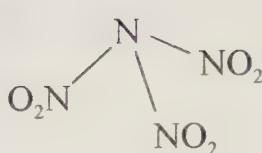

2. 据报道,科学家开发出了利用太阳能分解水的新型催化剂。下列有关水分解过程的能量变化示意图正确的是( )。

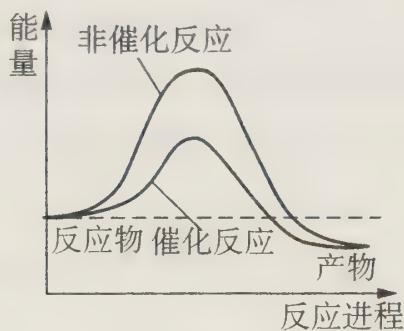  
A

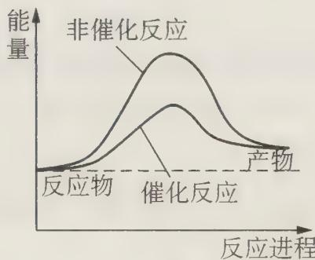  
B

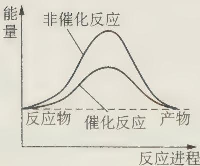  
C

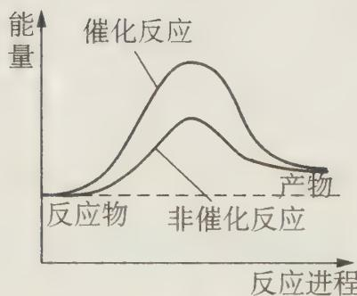  
D

3. 氨是重要的无机产品之一, 在国民经济中占有重要地位。下列表述中正确的是( )。
A. 氨的电子式为 H:N:H
B. $NH_{3}(l)\longrightarrow NH_{3}(g)$ $\Delta H<0$

C. 在 $2 \mathrm{NH}_{3} + \mathrm{NaClO} \longrightarrow \mathrm{N}_{2} \mathrm{H}_{4} + \mathrm{NaCl} + \mathrm{H}_{2} \mathrm{O}$ 中, $\mathrm{NH}_{3}$ 是还原剂 D. 氨溶于重水: $\mathrm{NH}_{3} + \mathrm{D}_{2} \mathrm{O} \rightleftharpoons \mathrm{NH}_{2} \mathrm{D}_{2}^{+} + \mathrm{OH}^{-}$

4. 2010年诺贝尔物理学奖授予英国曼彻斯特大学科学家安德烈·海姆和康斯坦丁·诺沃肖洛夫，以表彰他们在石墨烯材料方面的卓越研究。石墨烯具有优异的电学性能以及出色的热力学稳定性。他的结构如右图。下列说法不正确的是( )。
A. 石墨烯与金刚石、石墨、 $C_{60}$ 互为同素异形体
B. 石墨烯导电,属于化学变化
C. 石墨烯中碳原子间以共价键相联
D. 12 g 石墨烯中含有正六边形数目约为 $3.01 \times 10^{23}$ 个

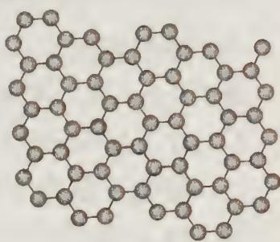

5. 室温下, 将 $1.000 \mathrm{~mol} \cdot \mathrm{L}^{-1}$ 盐酸滴入 $20.00 \mathrm{~mL} 1.000 \mathrm{~mol} \cdot \mathrm{L}^{-1}$ 氨水中, 溶液 $\mathrm{pH}$ 和温度随加入盐酸体积变化曲线如右图所示。下列有关说法正确的是( )。
A. a 点由水电离出的 $c(\mathrm{H}^{+}) = 1.0 \times 10^{-14} \mathrm{~mol} \cdot \mathrm{L}^{-1}$ B. b 点: $c(\mathrm{NH}_{4}^{+}) + c(\mathrm{NH}_{3} \cdot \mathrm{H}_{2} \mathrm{O}) = c(\mathrm{Cl}^{-})$ C. c 点: $c(\mathrm{Cl}^{-}) = c(\mathrm{NH}_{4}^{+})$ D. d 点后, 溶液温度略下降的主要原因是 $\mathrm{NH}_{3}$

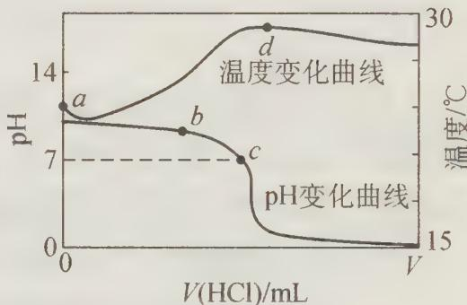

$$
\mathrm{NH} _ {3} \cdot \mathrm{H} _ {2} ()
$$

6. 在复盐 $\mathrm{NH}_{4}\mathrm{Fe}(\mathrm{SO}_{4})_{2}$ 溶液中逐滴加入 $\mathrm{Ba(OH)}_{2}$ 溶液，可能发生的反应的离子方程式是（）。A. $Fe^{2+} + SO_{4}^{2-} + Ba^{2+} + 2OH^{-} \longrightarrow BaSO_{4} \downarrow + Fe(OH)_{2} \downarrow$ B. $NH_{4}^{+} + Fe^{3+} + 2SO_{4}^{2-} + 2Ba^{2+} + 4OH^{-} \longrightarrow 2BaSO_{4} \downarrow + Fe(OH)_{3} \downarrow + NH_{3} \cdot H_{2}O$ C. $2Fe^{3+} + 3SO_{4}^{2-} + 3Ba^{2+} + 6OH^{-} \longrightarrow 3BaSO_{4} \downarrow + 2Fe(OH)_{3} \downarrow$ D. $3NH_{4}^{+} + Fe^{3+} + 3SO_{4}^{2-} + 3Ba^{2+} + 6OH^{-} \longrightarrow 3BaSO_{4} \downarrow + Fe(OH)_{3} \downarrow + 3NH_{3} \cdot H_{2}(O)$

7. 物质的量为 0.10 mol 的镁条在只含有 $CO_{2}$ 和 $O_{2}$ 混合气体的容器中燃烧(产物不含碳酸镁)，反应后容器内固体物质的质量不可能为()。
A. 3.2 g B. 4.0 g C. 4.2 g D. 4.6 g

8. PASS 是新一代高效絮凝净水剂, 它是由 X、Y、Z、W、R 五种短周期元素组成, 五种元素原子序数依次增大。X 原子是所有原子中半径最小的, Y、R 同主族, Z、W、R 同周期, Y 原子的最外层电子数是次外层的 3 倍, Z 是常见的金属, 其氢氧化物能溶于强碱但不溶于氨水, W 单质是人类将太阳能转变为电能的常用材料。下列说法正确的是( )。
A. 它们的原子半径依次增大
B. WY₂ 能与碱反应, 但不能与任何酸反应

C. Z 与 Y 形成的化合物是一种耐高温材料
D. 热稳定性: $X_{2}R > X_{2}Y$

9. 设 $N_{A}$ 为阿伏加德罗常数的值, 下列叙述中正确的是()。
A. 标准状况下, 22.4 L CHCl₃ 中含 C—Cl 键数为 $2N_{A}$ B. 1 mol $N_{3}^{-}$ 含有电子数为 $2N_{A}$ C. 在反应 $5NaClO_{2} + 4HCl \longrightarrow 4ClO_{2} + 5NaCl + 2H_{2}O$ 中, 每生成 $4\ mol\ ClO_{2}$ , 转移电子数为 $5N_{A}$ D. $44\ g\ CH_{3}CHO$ 与 $N_{2}O$ 混合气体, 含有氧原子总数为 $N_{A}$

10. 某无色溶液中可能含有 $\mathrm{I}^{-}$ 、 $\mathrm{NH}_{4}^{+}$ 、 $\mathrm{Cu}^{2+}$ 、 $\mathrm{SO}_{3}^{2-}$ ，向该溶液中加入少量溴水，溶液呈无色。则下列关于溶液组成的判断正确的是（ ）。 $①$ 肯定不含 $\mathrm{I}^{-}$ $②$ 肯定不含 $\mathrm{Cu}^{2+}$ $③$ 肯定含有 $\mathrm{SO}_{3}^{2-}$ $④$ 可能含有 $\mathrm{I}^{-}$ A. $①③$ B. $①②③$ C. $③④$ D. $②③④$

11. 高氯酸是很强的酸,沸点是 $130^{\circ} \mathrm{C}$ 。质量分数为 $60 \%$ 的溶液加热不分解,浓度增高就不稳定,受热易分解,热、浓的高氯酸溶液遇有机物爆炸。为使市售的 $70 \%$ 高氯酸进一步浓缩,所采取的措施正确的是( )。
A. 加入浓硫酸后常压蒸馏
B. 各仪器连接处的橡胶塞应塞紧防止漏气
C. 加入浓硫酸减压蒸馏
D. 各仪器连接处必须用磨口玻璃

12. NaCl 的晶胞如图所示, 将 NaCl 晶胞中的所有 Cl $^{-}$ 去掉, 并将 Na $^{+}$ 全部换成 C 原子, 再在晶胞的 4 个“小立方体”中心处各放置一个 C 原子, 且这四个“小立方体”互不共面, 位于“小立方体”中的碳原子均与最近的 4 个碳原子成键, 以此表示金刚石的一个晶胞。若再将在成键的 C 原子中心联线的中点处增添一个 O 原子, 则构成了

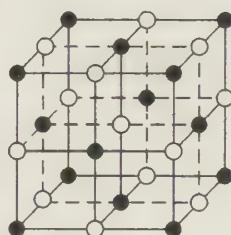

某种 $CO_{2}$ 的晶胞。则下面说法正确的是(已知 C—C 键的键长 $1.54 \times 10^{-10} \, m$ ) (黑球表示 $Na^{+}$ ，白球表示 $Cl^{-}$ )()。
A. 一个金刚石的晶胞中有8个C原子
B. 金刚石的密度为 $3.54 \, g \cdot cm^{-3}$ C. 在该种 $CO_{2}$ 晶体中，一个 $CO_{2}$ 分子由一个 C 原子和二个氧原子构成
D. 在该种 $CO_{2}$ 晶胞中含氧原子8个

## 二、填空题

13. 0.80 g $CuSO_{4} \cdot 5H_{2}O$ 样品受热脱水过程的热重曲线(样品质量随温度变化的曲线)如下图所示。

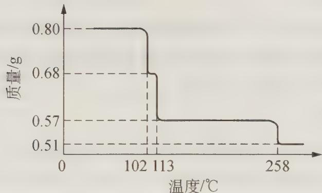

请回答下列问题：

(1) 试确定 $200^{\circ} \mathrm{C}$ 时固体物质的化学式 \_\_\_\_ (要求写出推断过程)。

(2) 取 $270^{\circ} \mathrm{C}$ 所得样品, 于 $570^{\circ} \mathrm{C}$ 灼烧得到的主要产物是黑色粉末和一种氧化性气体, 该反应的化学方程式为 \_\_\_\_ 。把该黑色粉末溶解于稀硫酸中, 经浓缩、冷却, 有晶体析出, 该晶体的化学式为 \_\_\_\_, 其存在的最高温度是 \_\_\_\_ 。

(3) 上述氧化性气体与水反应生成一种化合物,该化合物的浓溶液与 Cu 在加热时发生反应的化学方程式为 \_\_\_\_。

（4）在 $0.10 \, mol \cdot L^{-1}$ 硫酸铜溶液中加入氢氧化钠稀溶液充分搅拌有浅蓝色氢氧化铜沉淀生成，当溶液的 pH = 8 时， $c(\mathrm{Cu}^{2+}) = \_\_\_\_\_ \, \mathrm{mol} \cdot \mathrm{L}^{-1}(K_{\mathrm{sp}}[\mathrm{Cu(OH)}_{2}] = 2.2 \times 10^{-20})$ ;

若在 $0.1 \, mol \cdot L^{-1}$ 硫酸铜溶液中通入过量 $H_{2}S$ 气体，使 $Cu^{2+}$ 完全沉淀为 CuS，此时溶液中的 $H^{+}$ 浓度是 \_\_\_\_ $mol \cdot L^{-1}$ 。

14. 在酸性溶液中, $NaNO_{2}$ 与 KI 反应可得到 NO, 有两种操作步骤:

①先将 $NaNO_{2}$ 酸化后再滴加 KI; ②先将 KI 酸化后再滴加 $NaNO_{2}$ 。

\_\_\_\_种方法制得的 NO 更纯, 这是因为 \_\_\_\_。

15. 氮化硼(BN)是一种重要的功能陶瓷材料以天然硼砂为起始物, 经过一系列反应可以得到 $\mathrm{BP}_{3}$ 和 BN, 如下图所示:

$$
\text {硼砂} \xrightarrow {\mathrm{H} _ {2} \mathrm{SO} _ {4}} \mathrm{H} _ {3} \mathrm{BO} _ {3} \xrightarrow {\triangle} \mathrm{B} _ {2} \mathrm{O} _ {3} \xrightarrow [ \text {高温} ]{\text {CaF} _ {2} , \mathrm{H} _ {2} \mathrm{SO} _ {4}} \mathrm{BF} _ {3}
$$

请回答下列问题：

(1) 由 $\mathrm{B}_{2} \mathrm{O}_{3}$ 制备 $\mathrm{BF}_{3} 、 \mathrm{BN}$ 的化学方程式依次是 \_\_\_\_，\_\_\_\_。

(2) 基态 B 原子的电子排布式为 \_\_\_\_, B 和 N 相比, 电负性较大的是 \_\_\_\_, BN 中 B 元素的化合价为 \_\_\_\_。

(3) 在 $\mathrm{BF}_{3}$ 分子中, $\mathrm{F}-\mathrm{B}-\mathrm{F}$ 的键角是 \_\_\_\_, B 原子的杂化轨道类型为 \_\_\_\_, $\mathrm{BF}_{3}$ 和过量 $\mathrm{NaF}$ 作用可生成 $\mathrm{NaBF}_{4}, \mathrm{BF}_{4}^{-}$ 的立体结构为 \_\_\_\_。

(4) 在与石墨结构相似的六方氮化硼晶体中, 层内 B 原子与 N 原子之间的化学键

为\_\_\_\_，层间作用力为\_\_\_\_。

(5) 六方氮化硼在高温高压下, 可以转化为立方氮化硼, 其结构与金刚石相似, 硬度与金刚石相当, 晶胞边长为 $361.5 \mathrm{pm}$ , 立方氮化硼晶胞中含有 \_\_\_\_ 个氮原子, \_\_\_\_ 个硼原子, 立方氮化硼的密度是 \_\_\_\_ $\mathrm{g} \cdot \mathrm{cm}^{-3}$ (只要求列算式, 不必计算出数值, 阿伏加德罗常数为 $N_{\mathrm{A}}$ )。

16. 某化合物 X 是由第三周期两种相邻的元素 A 和 B 所组成, 其中 A 元素的含量为 43.64%。经测定 X 的摩尔质量为 $220 \, g \cdot mol^{-1}$ , 在 X 分子中所有原子均满足 8 电子稳定结构, B 处于两种不同的化学环境, 而所有的 A 都是等价的。X 为黄色晶体, 熔点为 447 K, 不溶于冷水, 可溶于苯和 $CS_{2}$ 。在空气中 40～60℃ 开始氧化, 100℃ 开始燃烧。

(1) 试通过推理和计算, 确定 X 的分子式 \_\_\_\_。

(2) 画出 X 的结构: \_\_\_\_。

17. 黄绿色 $ClO_{2}$ 是最早发现的氯的氧化物, 具有漂白、消毒作用。

(1) 制备 $ClO_{2}$ (沸点 $9.9^{\circ}C$ ) 的方法是: 湿润的 $KClO_{3}$ 和固体草酸混合加热到 $60^{\circ}C$ 即得, 其化学反应方程式为 \_\_\_\_。

(2) 画出 $\mathrm{ClO}_{2}$ 结构示意图 , 其大 $\pi$ 键为 , Cl 原子的杂化形态为 , 其键角大约为 。

(3) $\mathrm{BrO}_{2}$ 的制备方法可用臭氧在低温氧化溴, 写出化学方程式。该化合物不稳定, 溶于碱性溶液可发生类似于单质的反应, 其离子方程式为 \_\_\_\_ 。

18. 2011年全国人大批准实施了《刑法修正案》和修改后的《道路交通安全法》，加大了对醉酒驾车的处罚力度。我国交通法规定，以血液中酒精含量超过 $0.050\%$ 为醉酒。呼气测醉分析方法为：在 $20^{\circ}\mathrm{C}$ 时取一定量某饮酒司机的呼气样品立即鼓泡通过酸性 $\mathrm{K}_2\mathrm{Cr}_2\mathrm{O}_7$ 溶液（橙红色），将 $\mathrm{C}_2\mathrm{H}_5\mathrm{OH}$ 氧化成乙酸 $(\mathrm{K}_2\mathrm{Cr}_2\mathrm{O}_7$ 被还原成 $\mathrm{Cr}^{3+}$ ）的方法进行测定。

(1) $C_{2}H_{5}OH$ 与 $K_{2}Cr_{2}O_{7}$ 反应的离子方程式为 \_\_\_\_。

(2) 已知 $\mathrm{Cr}^{3+}$ 离子(蓝绿色)在弱酸性或碱性热溶液中, 被 $\mathrm{KMnO}_{4}$ 所氧化, 其颜色由蓝绿色变为橙红色, 并产生二氧化锰黑褐色沉淀。试写出 $\mathrm{KMnO}_{4}$ 在中性溶液中反应的离子反应方程式为 \_\_\_\_ 。

从原理上看，\_\_\_\_（填“能”或“不能）用 $\mathrm{KMnO}_{4}$ 代替 $\mathrm{K}_{2} \mathrm{Cr}_{2} \mathrm{O}_{7}$ 测定司机是否醉酒驾驶，原因是\_\_\_\_。

(3) $\mathrm{KMnO}_{4}$ 溶液不能储存时间太长。若一周时间内, $\mathrm{KMnO}_{4}$ 溶液在酸性条件下明显分解, 能沉淀出二氧化锰黑褐色沉淀, 则 $\mathrm{KMnO}_{4}$ 酸性条件下分解的离子反应方程式为 , 因此不难得出 (填 “能”或“不能”) 用 $\mathrm{KMnO}_{4}$ 代替 $\mathrm{K}_{2} \mathrm{Cr}_{2} \mathrm{O}_{7}$ 检验司机是否醉酒驾驶的原因。

19. 2001 年的德国化学家从一家化肥厂生产出的 $\left(\mathrm{NH}_{4}\right)_{2}\mathrm{SO}_{4}$ 中检出一种硫酸盐 A。经测定，A 易溶于水，在水溶液中以 $\mathrm{SO}_{4}^{2-}$ 和 $\mathrm{B}^{n+}$ 离子（由两种元素组成）两种空间构型均为正四面体的离子存在。 $\mathrm{B}^{n+}$ 离子植物根系易吸收，但它遇到碱时会生成一种

形似白磷的 $N_{4}$ 分子, $N_{4}$ 不能被植物吸收。

(1) $B^{n+}$ 离子的化学式为 \_\_\_\_；画出其结构为 \_\_\_\_。

(2) A \_\_\_\_ (填“能”或“不能”)与草木灰混合使用。原因是(用离子方程式表示)\_\_\_\_。

(3) $\mathrm{N}_{4}$ 与 $\mathrm{N}_{2}$ 的关系是\_\_\_\_。A. 相同的单质 B. 同位素 C. 同分异构体 D. 同素异形体

(4) 液氨中存在着 $2 \mathrm{NH}_{3} \rightleftharpoons \mathrm{NH}_{2}^{-} + \mathrm{NH}_{4}^{+}$ 的平衡。科学界已成功地在液氨中加入强碱 (CsOH) 和特殊的吸水剂, 使液氨中的 $\mathrm{B}^{n+}$ 合成了 $\mathrm{N}_{4}$ 分子。请类比于在 $\mathrm{H}_{2} \mathrm{O}$ 中的化学反应规律, 写出该反应方程式为 \_\_\_\_。

(5) 1 吨 A 相当于 \_\_\_\_ 吨 $\left(\mathrm{NH}_{4}\right)_{2}\mathrm{SO}_{4}$ (保留 2 位小数)。

20. 汽车作为一种现代交通工具正在进入千家万户,汽车尾气的污染问题也成为当今社会急需解决的问题。为使汽车尾气达标排放,催化剂及载体的选择和改良是关键。目前我国研制的稀土催化剂催化转化汽车尾气示意图如下左图:

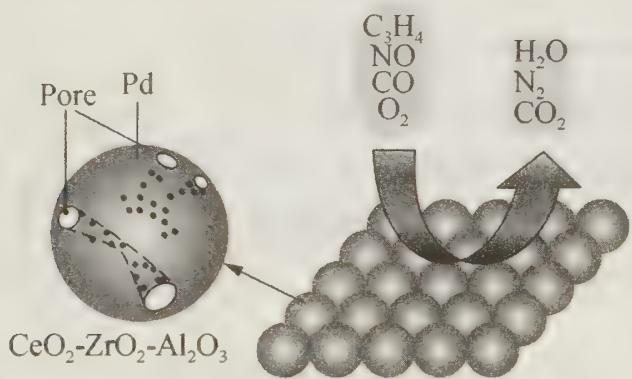

(1) 下列有关说法正确的是( )。
A. $C_{3}H_{8}$ 中碳原子都采用的是 $sp^{3}$ 杂化
B. $O_{2}$ 、 $CO_{2}$ 、 $N_{2}$ 都是非极性分子
C. 每个 $N_{2}$ 中含有 2 个 $\pi$ 键
D. CO 的一种等电子体 $NO^{+}$ ，它的电子式为 [ :N::O: ]

(2) CO 与 Ni 可生成羰基镍 $\left[\mathrm{Ni}(\mathrm{CO})_{4}\right]$ ，已知其中镍为 0 价，镍原子在基态时，核外电子排布式为 \_\_\_\_； $\left[\mathrm{Ni}(\mathrm{CO})_{4}\right]$ 它的配体是 \_\_\_\_，配位原子是 \_\_\_\_。

(3) Zr 原子序数为 40, 价电子排布 $4 \mathrm{~d}^{2} 5 \mathrm{~s}^{2}$ , 它在周期表中的位置是 \_\_\_\_。

(4) 为了节省贵金属并降低成本,也常用钙钛矿型复合氧化物作催化剂。一种复合氧化物结构如上图右,则与每个 $\mathrm{Sr}^{2+}$ 紧邻的 $\mathrm{O}^{2-}$ 有 \_\_\_\_ 个。

21. 过渡金属元素及其化合物的应用研究是目前科学研究的前沿之一。试回答下列问题：

(1) 二氧化钛作光催化剂能将居室污染物甲醛、苯等有害气体可转化为二氧化碳和水, 达到无害化。有关甲醛、苯、二氧化碳及水说法正确的是\_\_\_\_。

A. 苯与 $\mathrm{B}_{3} \mathrm{~N}_{3} \mathrm{H}_{6}$ 互为等电子体, 且分子中原子共平面  
B. 甲醛、苯和二氧化碳中碳原子均采用 $\mathrm{sp}^{2}$ 杂化

C. 苯、二氧化碳是非极性分子, 水和甲醛是极性分子

D. 水的沸点比甲醛高得多, 是因为水分子间能形成氢键

(2) 二茂铁又叫双环戊二烯基铁[化学式: $\mathrm{Fe(C_5H_5)_2}$ ], 结构如右图所示, 是一种具有芳香族性质的有机金属化合物。外观为橙色, 熔点为 $172^{\circ} \mathrm{C}$ , 沸点 $249^{\circ} \mathrm{C}, 100^{\circ} \mathrm{C}$ 以上能升华; 不溶于水, 溶于甲醇、乙醇等有机溶剂中。基态 $\mathrm{Fe}^{2+}$ 离子的电子排布式为 \_\_\_\_ 。

二茂铁 $\left[\mathrm{Fe}\left(\mathrm{C}_{5} \mathrm{H}_{5}\right)_{2}\right]$ 属于 \_\_\_\_ 晶体, $1 \mathrm{~mol}$ 环戊二烯中含有的 $\sigma$ 键数是 \_\_\_\_。

(3) 铜的第一电离能 $(I_{1})$ 小于锌的第一电离能, 而铜的第二电离能 $(I_{2})$ 却大于锌的第二电离能, 其主要原因是 \_\_\_\_。

<table><tr><td>电离能/kJ·mol-1</td><td> $I_1$ </td><td> $I_2$ </td></tr><tr><td>铜</td><td>746</td><td>1958</td></tr><tr><td>锌</td><td>906</td><td>1733</td></tr></table>

(4) 氢气作为一种清洁能源, 必须解决它的储存问题, $C_{60}$ 可用作储氢材料。科学家把 $C_{60}$ 和 K 掺杂在一起制造了一种富勒烯化合物, 其晶胞如图所示, 该物质在低温时是一种超导体。该物质的 K 原子和 $C_{60}$ 分子的个数比为 \_\_\_\_ 。

## 三、实验题

22. 采用 $32\% \sim 35\%$ 的 $\mathrm{FeCl}_3$ 溶液腐蚀印刷线路板上的金属铜，腐蚀废液中主要含有 $\mathrm{CuCl}_2$ 、 $\mathrm{FeCl}_2$ 和 $\mathrm{HCl}$ 等溶质。

(1) 用 $\mathrm{FeCl}_{3}$ 溶液溶解印刷线路板上金属铜的离子方程式为 \_\_\_\_。

(2) 工业上两种回收腐蚀废液中铜的方法如下:

第一种:电解腐蚀废液回收铜。阳极(石墨)的电极反应可表示为\_\_\_\_。

第二种:用铁粉置换腐蚀废液中的铜。

① 用铁粉回收铜的实验操作为: 加入过量铁粉, 充分搅拌, 过滤、\_\_\_\_、\_\_\_\_、\_\_\_\_。

② 科学家对铁置换铜的工艺有如下研究：

分别在 a、b、c 三种条件下回收腐蚀废液中的铜，取充分反应后的粉末各 3.000 g 分别放入甲、乙、丙三个烧杯中，再加入 100 mL 0.5 mol·L $^{-1}$ 的硫酸，水浴加热 (70℃)，搅拌，进行除铁处理。分别在第 10、20、30、40、50 min 时，用吸管移取 0.5 g 左右的铜试样于试管内，测定铜粉中铁的含量（质量分数），其结果如下图所示。

你认为除铁效果最好的是\_\_\_\_（填“a”、“b”或“c”），其原因是\_\_\_\_。

③ 用还原铁粉处理腐蚀废液得到的 3.000 g 铜粉中含铁的质量为 \_\_\_\_；第 10 min 时，乙烧杯中溶解掉的 Fe 的质量为 \_\_\_\_。

（3）工业上也可用腐蚀废液制备 $CuCl_{2} \cdot 2H_{2}O$ ，从而进行对废液的利用，其工艺流程如下：

部分阳离子以氢氧化物形式沉淀时溶液的 pH 见下表:

<table><tr><td>沉淀物</td><td> $Fe(OH)_3$ </td><td> $Fe(OH)_2$ </td><td> $Cu(OH)_2$ </td></tr><tr><td>开始沉淀</td><td>2.3</td><td>7.5</td><td>4.7</td></tr><tr><td>完全沉淀</td><td>4.1</td><td>9.7</td><td>6.7</td></tr></table>

① 试剂 A 最好应选用\_\_\_\_（填写字母代号），理由是\_\_\_\_。
a. 浓硫酸 b. Cl₂ c. NaClO d. NaOH 溶液

② 测定产品中 $CuCl_{2} \cdot 2H_{2}O$ 的质量分数如下: 取 2.000 g 产品, 用水溶解后, 加入 60.00 mL 0.4000 mol·L $^{-1}$ 的 KI 溶液(足量), 充分反应后加入淀粉指示剂, 用 0.4000 mol·L $^{-1}$ $Na_{2}S_{2}O_{3}$ 标准溶液滴定, 耗去此标准液 25.00 mL 时, 刚好到达滴定终点(已知: $2Cu^{2+} + 4I^{-} \longrightarrow 2CuI\downarrow + I_{2}, I_{2} + 2S_{2}O_{3}^{2-} \longrightarrow 2I^{-} + S_{4}O_{6}^{2-}$ )。此产品中 $CuCl_{2} \cdot 2H_{2}O$ 的质量分数为 \_\_\_\_。

23. 磷化铝、磷化锌、磷化钙是我国目前最常见的熏蒸杀虫剂的主要成分,它们都能与水或酸反应产生有毒气体 $PH_{3}$ , $PH_{3}$ 具有较强的还原性,能在空气中自燃。我国粮食卫生标准规定,粮食中磷化物(以 $PH_{3}$ 计)含量 $\leqslant0.05\ mg\cdot kg^{-1}$ 。现用如下装置测定粮食中残留磷化物含量。

已知： $5PH_{3} + 8KMnO_{4} + 12H_{2}SO_{4} \rightarrow 5H_{3}PO_{4} + 8MnSO_{4} + 4K_{2}SO_{4} + 12H_{2}O$

C 中盛有 200 g 原粮；D、E、F 各盛装 1.00 mL 浓度为 $1.00 \times 10^{-3} \, mol \cdot L^{-1}$ 的 $KMnO_{4}$ 的溶液 ( $H_{2}SO_{4}$ 酸化)。

(1) 写出磷化铝与水反应的化学方程式 \_\_\_\_。

(2) 检查上述装置气密性的方法是 \_\_\_\_。

(3) 实验过程中,用抽气泵抽气的目的是\_\_\_\_。

(4) A 中盛装 $\mathrm{KMnO}_{4}$ 溶液是为除去空气中可能含有的\_\_\_\_；B 中盛装碱性焦性没食子酸溶液的作用是\_\_\_\_；如去除 B 装置，则实验中测得的 $\mathrm{PH}_{3}$ 含量将\_\_\_\_。

(5) 收集 D、E、F 所得吸收液, 并洗涤 D、E、F, 将吸收液、洗涤液一并置于锥形瓶中, 加水稀释至 $25 \mathrm{~mL}$ , 用浓度为 $5 \times 10^{-4} \mathrm{~mol} \cdot \mathrm{L}^{-1} \mathrm{Na}_{2} \mathrm{SO}_{3}$ 标准溶液滴定剩余的 $\mathrm{KMnO}_{4}$ 溶液, 消耗 $\mathrm{Na}_{2} \mathrm{SO}_{3}$ 标准溶液 $11.00 \mathrm{~mL}$ , 则该原粮中磷化物 (以 $\mathrm{PH}_{3}$ 计) 的含量为 \_\_\_\_ $\mathrm{mg} \cdot \mathrm{kg}^{-1}$ 。

## 四、计算题

24. 硫化钠是用于皮革鞣制的重要化学试剂, 可用无水芒硝 $\left(\mathrm{Na}_{2} \mathrm{SO}_{4}\right)$ 与炭粉在高温下反应而制得, 反应式如下:

$$
\begin{array}{r l} & ① \mathrm {Na_ {2} SO_ {4}} + 4 \mathrm{C} \xrightarrow {\text {高温}} \mathrm {Na_ {2} S} + 4 \mathrm{CO} \uparrow \\ & ② \mathrm {Na_ {2} SO_ {4}} + 4 \mathrm{CO} \xrightarrow {\text {高温}} \mathrm {Na_ {2} S} + 4 \mathrm {CO_ {2}} \end{array}
$$

(1) 现要制取 $Na_{2}S$ 7.80 g, 若生产过程中无水芒硝 ( $Na_{2}SO_{4}$ ) 的利用率为 90%, 则理论上需要无水芒硝 ( $Na_{2}SO_{4}$ ) \_\_\_\_ g (精确到 0.01);

(2) 若在反应中生成的 $\mathrm{Na}_{2} \mathrm{~S}$ 物质的量为 $1 \mathrm{~mol}$ , 则消耗的碳单质的物质的量范围 $n$ 的范围是 $\quad < n < \quad$ ;

(3) 若在上述反应中消耗的碳单质为 $1 \mathrm{~mol}$ , 生成 $\mathrm{Na}_{2} \mathrm{~S}$ 的物质的量为 $y \mathrm{~mol}$ , 生成的 $\mathrm{CO}$ 和 $\mathrm{CO}_{2}$ 的物质的量之比为 $x$ , 则 $y$ 与 $x$ 的关系式为 $y =$ \_\_\_\_；

(4) $\mathrm{Na}_{2} \mathrm{~S}$ 放置在空气中, 会缓慢氧化成 $\mathrm{Na}_{2} \mathrm{SO}_{3}$ 及 $\mathrm{Na}_{2} \mathrm{SO}_{4}$ , 现称取已经部分氧化的硫化钠样品 $39.20 \mathrm{~g}$ 溶于水中, 加入足量盐酸, 充分反应后, 过滤得沉淀 $9.6 \mathrm{~g}$ , 放出 $\mathrm{H}_{2} \mathrm{~S}$ 气体 $1.12 \mathrm{~L}$ (标准状况)。请计算: $39.20 \mathrm{~g}$ 样品中各氧化产物的物质的量。

25. 氨和联氨 $\left(\mathrm{N}_{2}\mathrm{H}_{4}\right)$ 是氮的两种常见化合物,在科学技术和生产中有重要的应

用。根据题意完成下列计算：

（1）联氨用亚硝酸氧化生成氮的另一种氢化物，该氢化物的相对分子质量为43.0，其中氮原子的质量分数为0.977，计算确定该氢化物的分子式。

该氢化物受撞击则完全分解为氮气和氢气。4.30 g 该氢化物受撞击后产生的气体在标准状况下的体积为 \_\_\_\_ L。

(2) 联氨和四氧化二氮可用作火箭推进剂,联氨是燃料,四氧化二氮作氧化剂,反应产物是氮气和水。由联氨和四氧化二氮组成的火箭推进剂完全反应生成 $72.0 \mathrm{~kg}$ 水,计算推进剂中联氨的质量。

(3) 氨的水溶液可用于吸收 NO 与 $\mathrm{NO}_{2}$ 混合气体, 反应方程式为:

$$
\begin{array}{r l} & 6 \mathrm{NO} + 4 \mathrm{NH} _ {3} \longrightarrow 5 \mathrm{N} _ {2} + 6 \mathrm{H} _ {2} \mathrm{O} \\ & 6 \mathrm{NO} _ {2} + 8 \mathrm{NH} _ {3} \longrightarrow 7 \mathrm{N} _ {2} + 1 2 \mathrm{H} _ {2} \mathrm{O} \end{array}
$$

NO 与 $NO_{2}$ 混合气体 180 mol 被 $8.90 \times 10^{3}$ g 氨水（质量分数 0.300）完全吸收，产生 156 mol 氮气。吸收后氨水密度为 $0.980 \, g \cdot cm^{-3}$ 。

计算:① 该混合气体中 NO 与 $NO_{2}$ 的体积比。

② 吸收后氨水的物质的量浓度(答案保留 1 位小数)。

（4）氨和二氧化碳反应可生成尿素 $\mathrm{CO(NH_{2})_{2}}$ 。尿素在一定条件下会失去氨而缩合，如两分子尿素失去一分子氨形成二聚物：

已知常压下 $120 \, \text{mol CO(NH}_{2})_{2}$ 在熔融状态发生缩合反应，失去 $80 \, mol \, NH_{3}$ ，生成二聚物 $\left(\mathrm{C}_{2}\mathrm{H}_{5}\mathrm{N}_{3}\mathrm{O}_{2}\right)$ 和三聚物。测得缩合产物中二聚物的物质的量分数为 0.60，推算缩合产物中各缩合物的物质的量之比。

# 测试题四

## 一、选择题(每小题有1\~2个答案)

1. 设 $N_{A}$ 表示阿伏伽德罗常数的值, 下列叙述中正确的是()。
A. 常温常压下, $20 \, g \, D_{2}O$ 和足量的金属钠反应产生气体的分子数为 $0.54N_{A}$ B. $0.1 \, mol \cdot L^{-1}$ 的 $Na_{2}CO_{3}$ 溶液中 $Na^{+}$ 数为 $0.1N_{A}$ C. 若一盒 $120 \, g$ 的墨粉能打 a 个字，则平均每个字约含有 $10N_{A}$ 个碳原子
D. $0.5 \, mol$ 的甲基( $—CH_{3}$ )与氢氧根( $OH^{-}$ )所含电子数都为 $5N_{A}$

2. 下列有关“碘盐”的说法中正确的是( )。
A. 碘盐中含量最高的元素是碘元素
B. 利用溶解、过滤、结晶的方法可将 NaCl 与碘元素分离开
C. 利用氯水、淀粉可证明碘盐中含有碘元素
D. 食用碘盐可预防地方性甲状腺肿大

3. 三聚氰胺( )在常压下的熔点为 $354^{\circ} \mathrm{C}$ , 硝基苯的熔点是 5.

$7^{\circ} \mathrm{C}$ , 沸点为 $210.9^{\circ} \mathrm{C}$ 。二者相比前者熔点很高, 对其原因的分析中, 正确的是 ( )。  
A. 前者是原子晶体而后者是分子晶体  
B. 前者的范德华力远比后者大  
C. 前者能形成分子间氢键而后者不能  
D. 是 B、C 所涉及原因共同作用的结果

4. 将 Cu 片放入 $0.1 \, mol \cdot L^{-1} FeCl_{3}$ 溶液中，反应一定时间后取出 Cu 片，所得溶液 Q 中的 $c(\mathrm{Fe}^{3+}):c(\mathrm{Fe}^{2+})=2:3$ ，下列有关说法中正确的是（）。A. Q 中 $n(\mathrm{Cu}^{2+}):n(\mathrm{Fe}^{2+})=1:2$ B. 反应中转移电子为 0.04 mol
C. 溶液 Q 比原溶液增重了 1.28 g
D. $3c(\mathrm{Fe}^{3+}) + 2c(\mathrm{Cu}^{2+}) + 2c(\mathrm{Cu}^{2+}) = 0.1 \, \mathrm{mol} \cdot \mathrm{L}^{-1}$ 5. 下列离子组一定能大量共存的是（）。A. 甲基橙呈黄色的溶液中： $I^{-}$ 、 $Cl^{-}$ 、 $NO_{3}^{-}$ 、 $Na^{+}$ B. 由水电离的 $c(H^{+})=1\times10^{-14}\,mol\cdot L^{-1}$ 的溶液中： $Ca^{2+}$ 、 $K^{+}$ 、 $Cl^{-}$ 、 $HCO_{3}^{-}$

C. $c(\mathrm{OH}^{-})/c(\mathrm{H}^{+})=10^{-12}$ 的溶液中: $NH_{4}^{+}$ 、 $Al^{3+}$ 、 $NO_{3}^{-}$ 、 $Cl^{-}$ D. $c(\mathrm{Fe}^{3+}) = 0.1 \, \mathrm{mol} \cdot \mathrm{L}^{-1}$ 的溶液中: $K^{+}$ 、 $ClO^{-}$ 、 $SO_{4}^{2-}$ 、 $SCN^{-}$

6. 2008年北京奥运会奖牌——金镶玉具有浓郁的中国特色,其中奖牌所用的玉石是出自青海的昆仑玉。昆仑玉主要成分是由“透闪石”和“阳起石”组成的纤维状微晶结合体,透闪石(Tremolite)的化学成分为 $\mathrm{Ca}_{2}\mathrm{Mg}_{5}\mathrm{Si}_{8}\mathrm{O}_{22}(\mathrm{OH})_{2}$ 。下列有关说法不正确的是()。
A. 透闪石的化学式写成氧化物的形式为: $2\mathrm{CaO}\cdot5\mathrm{MgO}\cdot8\mathrm{SiO}_{2}\cdot\mathrm{H}_{2}\mathrm{O}$ B. 透闪石中 Mg 元素的质量分数是 Ca 元素质量分数的 1.5 倍
C. $1\mathrm{mol}\mathrm{Ca}_{2}\mathrm{Mg}_{5}\mathrm{Si}_{8}\mathrm{O}_{22}(\mathrm{OH})_{2}$ 与足量的盐酸作用,至少需要 14 mol HCl
D. 透闪石是一种新型无机非金属材料,难溶于水

7. 已知 $25^{\circ}C$ 时, $CaSO_{4}$ 在水中沉淀溶解平衡曲线如图所示, 向 100 mL 该条件下的 $CaSO_{4}$ 饱和溶液中, 加入 400 mL 0.01 mol·L $^{-1}$ 的 $Na_{2}SO_{4}$ 溶液, 针对此过程的下列叙述正确的是 ( )。
A. 溶液中析出 $CaSO_{4}$ 固体沉淀, 最终溶液中 $c(\mathrm{SO}_{4}^{2-})$ 较原来大

B. 溶液中无沉淀析出, 溶液中 $c(\mathrm{Ca}^{2+})$ 、 $c(\mathrm{SO}_4^{2-})$ 都变小  
C. 溶液中析出 $\mathrm{CaSO}_4$ 固体沉淀, 溶液中 $c(\mathrm{Ca}^{2+})$ 、 $c(\mathrm{SO}_4^{2-})$ 都变小  
D. 溶液中无沉淀析出, 但最终溶液中 $c(\mathrm{SO}_4^{2-})$ 较原来大

8. $a \mathrm{~mol} \mathrm{FeO}$ 与 $b \mathrm{~mol} \mathrm{FeS}$ 投入到 $V \mathrm{~L} c \mathrm{~mol} \cdot \mathrm{L}^{-1}$ 硝酸溶液中恰好完全反应, 生成 $d \mathrm{~mol} \mathrm{NO}$ 气体, 所得澄清溶液的成分可以看作是 $\mathrm{Fe(NO_3)_3}$ 、 $\mathrm{H_2SO_4}$ 溶液的混合液, 则反应中未被还原的硝酸不可能为( )。
A. $(a+b)\times 189 \mathrm{~g}$ B. $(21a+189b) \mathrm{~g}$ C. $3(a+b) \mathrm{~mol}$ D. $(c V-d) \mathrm{~mol}$

9. 下列排列顺序正确的是( )。
① 热稳定性: $HF > H_{2}O > NH_{3}$ ② 离子半径: $Na^{+} > Mg^{2+} > F^{-}$ ③ 酸性: 盐酸 > 碳酸 > 醋酸
④ 结合质子能力: $OH^{-} > CO_{3}^{2-} > HCO_{3}^{-}$ A. ①③ B. ②④ C. ①④ D. ②③

10. 下列说法正确的是( )。
A. $\mathrm{SO}_{2}(\mathrm{g}) + 1/2\mathrm{O}_{2}(\mathrm{g}) \rightleftharpoons \mathrm{SO}_{3}(\mathrm{g})$ $\Delta H = -98.3 \, kJ \cdot mol^{-1}$ 。当 $1 \, mol \, SO_{2}$ 与 $0.5 \, mol \, O_{2}$ 充分反应生成 $SO_{3}$ 时，生成热量 $98.3 \, kJ$ B. $2\mathrm{SO}_{2}(\mathrm{g})+\mathrm{O}_{2}(\mathrm{g})\rightleftharpoons2\mathrm{SO}_{3}(\mathrm{g})$ $\Delta H_{2}>\Delta H(\Delta H$ 数据 A 选项给出）
C. $X(g)+Y(g)\rightleftharpoons Z(g)+W(s)$ $\Delta H>0$ ，平衡后加入适量 X，则 $\Delta H$ 增大
D. $X(g)+Y(g)\rightleftharpoons Z(g)+W(s)$ $\Delta H<0$ ，平衡后加入适量 X，则放出的热量增加

11. 已知: $2\mathrm{Fe}^{2+} + \mathrm{Br}_2 \longrightarrow 2\mathrm{Fe}^{3+} + 2\mathrm{Br}^-, 2\mathrm{Fe}^{3+} + 2\mathrm{I}^- \longrightarrow 2\mathrm{Fe}^{2+} + \mathrm{I}_2$ 。向 $\mathrm{FeI}_2$ 、 $\mathrm{FeBr}_2$ 的混合溶液中通入适量氯气, 溶液中某些离子的物质的量变化如下图所示。则下列有关说法中正确的是( )。
A. 还原性: $\mathrm{Fe}^{2+} > \mathrm{I}^- > \mathrm{Br}^-$ B. 当通入 $2\mathrm{molCl}_2$ 时, 溶液中已发生的离子

反应可表示为： $2Fe^{2+} + 2I^{-} + 2Cl_{2} \longrightarrow 2Fe^{3+} + I_{2} + 4Cl^{-}$ C. 原混合溶液中 $FeBr_{2}$ 的物质的量为 6 mol
D. 原溶液中： $n(\mathrm{Fe}^{2+}):n(\mathrm{I}^{-}):n(\mathrm{Br}^{-})=2:1:3$ 12. 已知金刚石和石墨的空间结构和下图

  
金刚石结构图

  
石墨结构图  
则下列各选项所述的两个量,前者一定大于后者的是( )。
A. $F_{2}$ 和 $Br_{2}$ 的沸点
B. 材料 MgO 和 CaO 的熔点
C. 金属单质的熔点和非金属单质的熔点
D. 金刚石晶体和石墨晶体中,每个最小碳环里所含的实际碳原子数

## 二、填空题

13. 下表列出前 20 号元素中的某些元素性质的一些数据：

<table><tr><td>性质\元素</td><td>A</td><td>B</td><td>C</td><td>D</td><td>E</td><td>F</td><td>G</td><td>H</td><td>I</td><td>J</td></tr><tr><td>原子半径( $10^{-10}$  m)</td><td>1.02</td><td>2.27</td><td>0.74</td><td>1.60</td><td>0.77</td><td>1.10</td><td>0.99</td><td>1.86</td><td>0.75</td><td>1.17</td></tr><tr><td>最高价态</td><td>+6</td><td>+1</td><td>—</td><td>+2</td><td>+4</td><td>+5</td><td>+7</td><td>+1</td><td>+5</td><td>+4</td></tr><tr><td>最低价态</td><td>-2</td><td>—</td><td>-2</td><td>—</td><td>-4</td><td>-3</td><td>-1</td><td>—</td><td>-3</td><td>-4</td></tr></table>

根据上表回答下列问题：

(1) C、I 的氢化物可相互混溶在一起,请解释其可能的原因\_\_\_\_;

(2) 写出 E 的单质与 I 元素的最高价氧化物对应的水化物反应的化学方程式:

；

(3) 上述 E、F、G 三种元素中的某两种元素形成的化合物中, 每一个原子都满足 8 电子稳定结构的是 \_\_\_\_ (写分子式); 元素 E、H、I 形成的化合物 HEI, 其电子式为 \_\_\_\_, 该化合物中共形成 \_\_\_\_ 个 $\sigma$ 键, \_\_\_\_ 个 $\pi$ 键;

(4) 元素 B、D、H 与 C 组成的化合物 $\mathrm{B}_{2} \mathrm{C}$ 、DC、 $\mathrm{H}_{2} \mathrm{C}$ 的熔点高低顺序为 \_\_\_\_，其原因是 \_\_\_\_；

(5) A 和 J 相比较, 非金属性较弱的是 \_\_\_\_ (填元素名称), 可以验证你的结论的是下列中的 \_\_\_\_ (填编号)。

A. 氢化物中 X—H 键的键长(X 代表 A 和 J 两元素)
B. 单质分子中的键能
C. 两单质在自然界的存在
D. 含氧酸的酸性
E. 气态氢化物的稳定性和挥发性
F. 两元素的电负性

14. 在 $a \mathrm{~mL}$ 醋酸溶液中滴加 $0.01 \mathrm{~mol} \cdot \mathrm{L}^{-1}$ 的氢氧化钠溶液, 滴定曲线如图所示。

(1) 醋酸溶液浓度\_\_\_\_（填“大于”、“小于”或“等于”）0.01 mol·L $^{-1}$ ，理由是\_\_\_\_；

(2) b 点, $c(\mathrm{Na}^{+})$ \_\_\_\_ (填“>”、“<”或“=”) c $(\mathrm{CH}_{3}\mathrm{COO}^{-})$ ;

(3) 当醋酸与氢氧化钠溶液恰好完全中和时, 曲线上对应的点 Q 应在 \_\_\_\_;
A. 2 与 a 之间 B. a 与 b 之间 C. b 与 c 之间 D. a 与 c 之间

(4) 下列关系式一定正确的是\_\_\_\_。
A. a 点， $c(\mathrm{H}^{+}) > c(\mathrm{OH}^{-}) > c(\mathrm{CH}_{3}\mathrm{COO}^{-}) > c(\mathrm{Na}^{+})$ B. a 点， $c(\mathrm{Na}^{+}) > c(\mathrm{CH}_{3}\mathrm{COO}^{-}) > c(\mathrm{H}^{+}) > c(\mathrm{OH}^{-})$ C. c 点， $c(\mathrm{Na}^{+}) > c(\mathrm{CH}_{3}\mathrm{COO}^{-}) > c(\mathrm{OH}^{-}) > c(\mathrm{H}^{+})$ D. c 点， $c(\mathrm{Na}^{+}) + c(\mathrm{H}^{+}) = c(\mathrm{CH}_{3}\mathrm{COO}^{-}) + c(\mathrm{OH}^{-})$

15. 碳元素是形成单质及其化合物种类最多的元素。回答下列有关问题。

(1) 碳元素可形成多种不同形式的单质, 下列是几种单质的结构图

a.  

b.  

C.  

观察上述结构, 判断 a 中碳原子的杂化方式为 \_\_\_\_, c 是 $C_{60}$ 的分子结构模型, 在每

个 $C_{60}$ 分子中形成的 $\sigma$ 键数目为 \_\_\_\_。

(2) 在 $\mathrm{C}_{60}$ 单质中, 微粒之间的作用力为 \_\_\_\_, $\mathrm{C}_{60}$ 能与金属钾化合生成具有超导性的 $\mathrm{K}_{3} \mathrm{C}_{60}$ , 在 $\mathrm{K}_{3} \mathrm{C}_{60}$ 中阴阳离子个数比为 $1:3$ , 则 $\mathrm{K}_{3} \mathrm{C}_{60}$ 属于 \_\_\_\_ 晶体。

(3) CO 是碳元素的常见氧化物, 分子中 C 原子上有一对孤对电子, 与 $\mathrm{N}_{2}$ 互为等电子体, 则 CO 的结构式为 \_\_\_\_ ; 写出另一与 CO 互为等电子体的化学式 \_\_\_\_ 。

(4) CO 可以和很多过渡金属形成配合物。金属镍粉在 CO 气流中轻微地加热, 可生成液态的 Ni(CO) $_{4}$ , 用配位键表示 Ni(CO) $_{4}$ 的结构为 \_\_\_\_ ; 写出基态 Ni 原子的电子排布式 \_\_\_\_ 。

(5) 科学发现, C 和 Ni、Mg 元素的原子形成的晶体也具有超导性, 其晶胞的结构特点如右图, 则该化合物的化学式为 \_\_\_\_; C、Ni、Mg 三种元素中, 电负性最大的是 \_\_\_\_。

(6) 碳的氢化物甲烷在自然界中广泛存在, 其中可燃冰是有待人类开发的新能源。可燃冰是一种笼状结构, $\mathrm{CH}_{4}$ 分子存在于 $\mathrm{H}_{2} \mathrm{O}$ 分子形成的笼子中 (如右图所示)。两种分子中, 共价键的键能 \_\_\_\_ ; $\mathrm{CH}_{4}$ 分子与 $\mathrm{H}_{2} \mathrm{O}$ 分子的分子量相差不大, 但两种物质的熔沸点相差很大, 其主要原因是 \_\_\_\_ 。

16. 下图是一些常见的元素的单质或化合物之间的转化关系。溶液中的水以及部分反应物或生成物未标出。A、E 是空气中的两种主要成分，C 是由两种元素组成的新型材料，且和 SiC 具有相同的价电子数和原子数，J 是一种能引起温室效应的气体，K 是两性化合物，反应③、④、⑤用于工业中生产 H。

请回答下列问题：

(1) 写出下列物质的化学式: F \_\_\_\_ ; I \_\_\_\_ ; H \_\_\_\_ ;

(2) 写出反应③的化学反应方程式 \_\_\_\_；

(3) 写出反应⑥的离子反应方程式 \_\_\_\_；

(4) B 和 SiC 的纳米级复合粉末是新一代大规模集成电路理想的散热材料。反应①是科学家研究开发制备该纳米级复合粉末的最新途径。已知 B 由 Si 及另外两种元素组成，且 Si 与另外两种元素的物质的量之比均为 $1:4$ ，写出反应①的化学方程式。

## 三、实验题

17. 聚合硫酸铁是一种新型高效的无机高分子絮凝剂,广泛用于水的处理。用铁的氧化物为原料来制取聚合硫酸铁,为防止 $\mathrm{Fe}^{3+}$ 水解生成 $\mathrm{Fe(OH)}_{3}$ 沉淀,原料中的 $Fe^{3+}$ 必须先还原为 $Fe^{2+}$ 。实验步骤如下:

请回答下列问题：

(1) 在 $Fe_{3}O_{4}$ 中, 铁的氧化态(或氧化数)为 \_\_\_\_;

(2) 步骤Ⅱ取样分析溶液中的 $Fe^{2+}$ 、 $Fe^{3+}$ 的含量, 目的是 \_\_\_\_。
A. 控制溶液中 $Fe^{2+}$ 与 $Fe^{3+}$ 含量比
B. 确定下一步还原所需铁的量
C. 确定氧化 $Fe^{2+}$ 所需 $NaClO_{3}$ 的量
D. 确保铁的氧化物酸溶完全

(3) 用 $\mathrm{NaClO}_{3}$ 氧化时反应方程式如下:

$$
\mathrm{FeSO} _ {4} + \mathrm{NaClO} _ {3} + \mathrm{H} _ {2} \mathrm{SO} _ {4} \longrightarrow \mathrm{Fe} _ {2} (\mathrm{SO} _ {4}) _ {3} + \mathrm{NaCl} + \mathrm{H} _ {2} \mathrm{O}
$$

若改用 $HNO_{3}$ 氧化, 则反应方程式为:

$$
\mathrm{FeSO} _ {4} + \mathrm{HNO} _ {3} + \mathrm{H} _ {2} \mathrm{SO} _ {4} \longrightarrow \mathrm{Fe} _ {2} (\mathrm{SO} _ {4}) _ {3} + \mathrm{NO} \uparrow + \mathrm{H} _ {2} \mathrm{O} (
$$

已知 1 L 65% 的浓硝酸(密度 $1.4 \, g \cdot mL^{-1}$ ) 价格为 8 元, $500 \, g \, NaClO_{3}$ 价格为 15 元, 评价用硝酸代替 $NaClO_{3}$ 作氧化剂的利弊, 利是 \_\_\_\_ , 弊是 \_\_\_\_ 。

聚合硫酸铁溶液中 $SO_{4}^{2-}$ 与 $Fe^{3+}$ 物质的量之比不是 3:2。根据下列供选择的试剂和基本操作，测定聚合硫酸铁产品溶液中 $SO_{4}^{2-}$ 与 $Fe^{3+}$ 物质的量之比：

(4) 测定时所需的试剂是\_\_\_\_。
A. NaOH    B. $FeSO_{4}$ C. $BaCl_{2}$ D. $NaClO_{3}$

(5) 选出测定过程中所需的基本操作(按操作先后顺序列出)( )。
A. 萃取、分液    B. 过滤、洗涤    C. 蒸发、结晶
D. 冷却、称量    E. 烘干或灼烧

(6) 需要测定\_\_\_\_和\_\_\_\_的质量(填写化合物的化学式)。假设你选择化合物前者测得质量为 $a \mathrm{~g}$ , 后者质量为 $b \mathrm{~g}$ 。则求出 $\mathrm{SO}_{4}^{2-}$ 与 $\mathrm{Fe}^{3+}$ 的物质的量之比为\_\_\_\_（可以不简化）。

18. 二氯化二硫 $\left(\mathrm{S}_{2}\mathrm{Cl}_{2}\right)$ 是一种重要的化工原料, 常用作橡胶硫化剂, 改变生橡胶受热发黏、遇冷变硬的性质。查阅资料可知 $S_{2}Cl_{2}$ 具有下列性质:

<table><tr><td rowspan="2">物理性质</td><td>色态</td><td>挥发性</td><td>熔点</td><td>沸点</td></tr><tr><td>金黄色液体</td><td>易挥发</td><td>-76°C</td><td>138°C</td></tr><tr><td rowspan="3">化学性质</td><td colspan="4">300°C以上完全分解</td></tr><tr><td colspan="4"> $S_{2}Cl_{2} + Cl_{2} \xrightarrow{\Delta} 2SCl_{2}$ </td></tr><tr><td colspan="4">遇水反应生成  $SO_{2}$ 、S 等产物</td></tr></table>

向熔融的硫中通以干燥、纯净的 $\mathrm{Cl}_2$ 即可生成 $\mathrm{S}_2\mathrm{Cl}_2$ 。下图是实验室制备 $\mathrm{S}_2\mathrm{Cl}_2$ 的装置。

(1) 仪器 A 的名称是\_\_\_\_，导管 F 除导气外还起的作用是\_\_\_\_；

(2) B 中反应的离子方程式为 \_\_\_\_；

(3) 开始实验, 打开分液漏斗的活塞, 发现浓盐酸流出少量后即难以下滴, 经检查分液漏斗活塞没有堵塞, 你认为应采取的措施是\_\_\_\_;

(4) 装置 C 中的试剂是\_\_\_\_；如果缺少 D 装置，则对实验的影响是（用化学方程式表示）\_\_\_\_；

(5) 如果在加热 E 时温度过高, 对实验结果的影响是\_\_\_\_; 为了提高 $S_{2}Cl_{2}$ 的纯度, 关键的操作是控制好温度和\_\_\_\_;

(6) 设计装置 H 的目的是\_\_\_\_；烧杯中发生反应的离子方程式是\_\_\_\_。

## 四、计算题

19. 质量为 1.52 g 的含两种固态单质的混合物与过量的盐酸反应, 放出一种体积为 0.896 L 的气体; 反应后还有 0.56 g 残余物不溶于剩余的酸。

在另一实验中，1.52 g 同样的混合物与过量的 10% 的 NaOH 溶液反应，这时有 0.896 L 的气体放出，但有 0.96 g 不溶的残余物。

在第三个实验中，1.52 g 起始混合物隔绝空气加热到高温，这时生成一种化合物，该化合物在盐酸中全部溶解并释放出 0.448 L 的一种易自燃的未知气体。将所得的气体通人 1 L 充满氧气的密闭容器中,该未知气体与氧气反应后,容器中的压力减小到 1/10。

请写出上述各反应方程式,并用计算证明其正确性(气体可认为处于标准状态,相对原子质量可只取整数)。

# 参考答案

## 第1讲 物质的量

1. (1) $\frac{M \cdot S \cdot V_m}{A \cdot m \cdot V_d(d - 1)}$

(2) 防止水蒸发

2. (1) 容量瓶

(2) 不能,无法测出苯的体积

(3) 不能, NaCl 溶于水, 而无法测出 NaCl 晶体的体积

(4) $N_{\mathrm{A}} = 29.25V / ma^{3}$

(5) 96.3%

3. (1) $2\mathrm{MnO}_2 + 2\mathrm{KClO}_3 \longrightarrow 2\mathrm{KMnO}_4 + \mathrm{Cl}_2 \uparrow + \mathrm{O}_2 \uparrow$

(2) 0.3

(3) 1.34%

4. (1) $\mathrm{NaHSO}_{4}$ 与 $\mathrm{NaHCO}_{3}$ 这两种溶液的物质量的浓度不可能相同; 原因是当这两种物质的物质量的浓度相同时, 最后的溶液中必有硫酸根离子, 不可能只剩下氢氧化钠。

(2) 有两种可能。第一种可能是 $\left[\mathrm{Ba(OH)}_{2}\right] = \left[\mathrm{NaHSO}_{4}\right] = 1.8 \mathrm{~mol} / \mathrm{L}, \left[\mathrm{NaHCO}_{3}\right] = 0.9 \mathrm{~mol} / \mathrm{L}$ ; 第二种可能是 $\left[\mathrm{Ba(OH)}_{2}\right] = \left[\mathrm{NaHCO}_{3}\right] = 1.8 \mathrm{~mol} / \mathrm{L}, \left[\mathrm{NaHSO}_{4}\right] = 0.9 \mathrm{~mol} / \mathrm{L}$ 。

5. (1) $\mathrm{A}_2\mathrm{B} + \mathrm{CD}_2 \longrightarrow 2\mathrm{AD} + \mathrm{CB} \downarrow$ 4号实验后沉淀的量稳定, 且反应完全, 可知反应中 $n(\mathrm{CD}_2): n(\mathrm{A}_2\mathrm{B}) = 1:1$

(2) CB; 若为 AD, 则沉淀的质量 $=2 \times 0.1 \times 0.06 \times 58.5 = 0.702 \, g$ , 与实验结果不符

(3) $0.04 \times 0.1 \times 233 = 0.932 \mathrm{~g}; 0.1 \times 0.06 \times 233 = 1.398 \mathrm{~g}$

6.（1）浓硫酸 冰醋酸 浓硫酸比水密度大，且溶解时会放出大量的热，易溅出

(2) $20 \mathrm{~mL} 1000 \mathrm{~mL}$ 容量瓶

7. (1) $4\mathrm{N}_x\mathrm{H}_y + y\mathrm{O}_2 \longrightarrow 2x\mathrm{N}_2 + 2y\mathrm{H}_2\mathrm{O}$

(2) 反应前后质量守恒, 同温同压下气体密度与气体体积成反比 $\frac{7}{\frac{3x}{2}+\frac{3y}{2}+4-\frac{3y}{4}}=$

$$
1 - \frac {3}{1 0} x = 2, y = 4 \mathrm{N} _ {2} \mathrm{H} _ {4}
$$

8. (1) 充入 $\mathrm{N}_{2}$ 物质的量 $3.33 \times 10^{-3} \mathrm{~mol}$ 逸出 $\mathrm{N}_{2}$ 物质的量 $1.46 \times 10^{-3} \mathrm{~mol}$ 。

(2) 由(1)可知剩余在玻璃管内 $\mathrm{N}_2$ 物质的量 $1.87 \times 10^{-3} \mathrm{~mol}$ ; 由 $pV = nRT$ 得此时房间内温度应为 $521 \mathrm{~K}$ 。

(3) 结果不会有影响。 $N_{2}$ 、 $H_{2}$ 的化学性质在一般条件下均不活泼(此题中无化学反应)。
9. $(\mathrm{AlCl}_{3})_{2}$

10. (1) $M(\mathrm{C}_6\mathrm{H}_6) = 78.5\mathrm{g}\cdot \mathrm{mol}^{-1} \quad M(\mathrm{CH}_3\mathrm{OH}) = 33.9\mathrm{g}\cdot \mathrm{mol}^{-1} \quad M_{①}(\mathrm{HAc}) = 118.9\mathrm{g}\cdot \mathrm{mol}^{-1} \quad M_{②}(\mathrm{HAc}) = 99.8\mathrm{g}\cdot \mathrm{mol}^{-1}$

(2) 误差是由蒸气分子的性质偏离理想气体分子的性质引起的。此外在甲醇分子中有少量的分子缔合, 而在醋酸分子中有二聚分子 $\left(\mathrm{CH}_{3} \mathrm{COOH}\right)_{2}$ 。

11. (1) HF

(2) HF 以氢键结合之故

(3) 在稀溶液中其摩尔浓度之比(25℃、80℃、90℃)为 2.90:1.03:1.00。

12. (1) 沸水温度高于 $\mathrm{CCl_4}$ 的沸点 $(76.7^{\circ} \mathrm{C})$ , 使 $\mathrm{CCl_4}$ 迅速汽化并充满烧瓶, 烧瓶的体积是 $\mathrm{CCl_4}$ 蒸气在 $100^{\circ} \mathrm{C}$ 、常压下的体积。

(2) 将有部分 $\mathrm{CCl}_{4}$ 蒸气逸出, 使瓶内含少量空气, 冷凝得到的 $\mathrm{CCl}_{4}$ 质量较小, $pV / RT = m / M$ , 等号左边为定值, 等号右边质量小了, $\mathrm{CCl}_{4}$ 的摩尔质量偏小。

(3) 烧瓶体积是 250 mL, $CCl_{4}$ 密度大约 $1.5 \, g \cdot mL^{-1}$ ，冷凝的液态 $CCl_{4}$ 的体积大约为 1 mL，若未倒掉 $CCl_{4}$ ，则烧瓶（瓶内质量换算成）容积将增大 1 mL。引入误差 0.4%，低于约 2 mL $CCl_{4}$ 的质量约 3 g（标准到 0.1 g），相对误差 3%，影响不大。

(4) 未全部没入,表明瓶内部分空间低于 $100^{\circ} \mathrm{C}$ (在相同压强下),这部分空间的 $\mathrm{CCl}_{4}$ 蒸气的温度比 $100^{\circ} \mathrm{C}$ 下降许多。若露在水面上空间小,不会影响到实验结果。

13. (1) 0.1 mol

(2) 3

14. X 为氯化氢, Y 是氯气。因为在纯氯化氢气体中氢与氯的质量比为 $2:71$ , 所以混入任何比例的氯气, 这两者的质量比肯定小于 $2:71$ 。

15. 要使水通过玻璃管喷入烧瓶形成喷泉, 瓶内外压强差必须超过一个特定的值, 为了确定这一特定的压强差, 我们研究玻璃管中的一段水柱, 这段水柱受到瓶内气体压力 $pS$ 、重力 $mg$ 及向上的大气形成的压力 $p_{0}S$ 。要使水柱喷入瓶内, 要求: $p_{0}S > pS + mg$ 。式中 $p_{0} = \rho gh$ , 要以水柱计算, 一个标准大气压相当于 $10.34 \mathrm{~m}$ 水柱产生的压强。题中给出 $h$ 为 $0.35 \mathrm{~m}$ 。从而算出烧瓶内压强要求小于 $9.99 \mathrm{~m}$ 水柱产生的压强, 减少的压强要求大于 $0.35 \mathrm{~m}$ 水柱产生的压强。根据玻意耳定律可以求出, 压强为 $0.35 \mathrm{~m}$ 水柱高、体积为 $250 \mathrm{~mL}$ 的气体, 当压强改变为 1 个标准大气压 (即 $10.34 \mathrm{~m}$ 水柱形成的压强) 的体积 $V$ 的大小为 $8.50 \mathrm{~mL}$ 。因而, 当滴管内 $0.5 \mathrm{~mL}$ 的水挤压入烧瓶后, 如能溶解 1 个标准大气压下 $8.50 \mathrm{~mL}$ 以上的氨气, 即有喷泉现象发生。故要求气体的溶解度大于 17 (8.50/0.5)。除氨气外, HBr、HCl、 $\mathrm{SO}_{2}$ 等气体的溶解度均大于 17, 对于本题给出的烧瓶数据, 均能形成美丽的喷泉。

16. (1) C 的质量为 3.322-3.181=0.141 g, 利用 $pV=(m/M)RT$ 得出等式:

$M = 0.141 \times 8.314 \times 300 / (101325 \times 0.0000492) = 70.54 \mathrm{~g} \cdot \mathrm{mol}^{-1}$ , 该气体为 $\mathrm{Cl}_2$ 。

降温前气体物质的量为 n=0.0040 mol，其中 $Cl_{2}$ 为 0.0020 mol，假设由气体转化为固体的物质为 D，则 D 的摩尔质量为 $M=m/n=(3.181-2.279)/0.0020=450.5\ g/mol$ ，D 不可能为单质，则必为氯化物，假设化学式为 $RCl_{n}$ ，对 $n=1,2,\cdots8$ ，进行讨论得，只有 n=6 时存在合理 R 为 U，即 D 为 $UCl_{6}$ 。
设 A、B 也为 U 的氯化物，设反应为 $xUCl_{a}\longrightarrow(x-1)UCl_{b}+UCl_{6}+Cl_{2}$

U 最高为 +6，则 $0 \leqslant b < a < 6$ ，利用 Cl 元素守恒有 $ax = bx - b + 8, x = (8 - b)/(a - b)$ ， $UCl_{a}$ 的摩尔质量 $238 + 35.45a = 3.322/0.002x$ ，

$1 / x = (0.1433 + 0.0213a) = (a - b) / (8 - b);\left[b + 0.1433(8 - b)\right] / \left[1 - 0.0213\times (8 - b)\right] = a$

将 b=0, 1, 2, 3, 4 代入，解得 a=1.38, 2.35, 3.29, 4.15, 5.00; x=4
A: UCl₅; B: UCl₄

(2) $4\mathrm{UCl}_5\xrightarrow{\triangle}3\mathrm{UCl}_4 + \mathrm{UCl}_6 + \mathrm{Cl}_2$

(3) 该反应由 2 个独立反应加和而成 $2\mathrm{UCl}_5 \xrightarrow{\triangle} \mathrm{UCl}_4 + \mathrm{UCl}_6$ ； $2\mathrm{UCl}_5 \xrightarrow{\triangle} 2\mathrm{UCl}_4 + \mathrm{Cl}_2$ $2(n+m)\mathrm{UCl}_5 \xrightarrow{\triangle} (n+2m)\mathrm{UCl}_4 + n\mathrm{UCl}_6 + m\mathrm{Cl}_2$

## 第2讲 氧化还原反应

1. 对于固体物质的分解,书写化学反应方程式,我们通常要“定性的问题定量化”。以 $\left(\mathrm{NH}_{4}\right)_{2}\mathrm{MnO}_{4}$ 为例。若不发生氧化还原反应,应为: $\left(\mathrm{NH}_{4}\right)_{2}\mathrm{MnO}_{4}\xrightarrow{\triangle}2\mathrm{NH}_{3}\uparrow+\mathrm{H}_{2}\mathrm{MnO}_{4}$ ,由于 $\mathrm{NH}_{3}$ 具有一定的还原性, $\mathrm{H}_{2}\mathrm{MnO}_{4}$ 具有强氧化性,因此会发生氧化还原反应, $\mathrm{NH}_{3}$ 中-3价N会被氧化为 $\mathrm{N}_{2}$ ,即: $2\mathrm{NH}_{3}+\mathrm{H}_{2}\mathrm{MnO}_{4}\longrightarrow\mathrm{N}_{2}+\cdots$ ,再进行假设讨论。我们可从最简单的假设开始。由于反应物中均有氢元素,因此可假设反应物中所有的氢元素全部生成了水,即: $2\mathrm{NH}_{3}+\mathrm{H}_{2}\mathrm{MnO}_{4}\longrightarrow\mathrm{N}_{2}+4\mathrm{H}_{2}\mathrm{O}+\cdots$ ,此时方程式右边应为Mn。因此, $\left(\mathrm{NH}_{4}\right)_{2}\mathrm{MnO}_{4}$ 热分解反应为: $\left(\mathrm{NH}_{4}\right)_{2}\mathrm{MnO}_{4}\xrightarrow{\triangle}\mathrm{N}_{2}\uparrow+4\mathrm{H}_{2}\mathrm{O}+\mathrm{Mn}$ 简单的假设就能得出结论,就不要考虑较复杂的假设了。

同理: $NH_{4}NO_{2}\xrightarrow{\triangle}N_{2}\uparrow+2H_{2}O$

$$
\left(\mathrm{NH} _ {4}\right) _ {2} \mathrm{Cr} _ {2} \mathrm{O} _ {7} \xrightarrow {\triangle} \mathrm{N} _ {2} \uparrow + \mathrm{Cr} _ {2} \mathrm{O} _ {3} + 4 \mathrm{H} _ {2} \mathrm{O}
$$

2. 铁发生钝化的原因是在表面形成一层不溶性氧化物的膜。这层膜的生成使铁失去电子溶解的阳极反应受阻，而使腐蚀速度大为降低。如在浓硝酸等氧化性试剂中处理时铁的表面形成 $250 \sim 300 \mathrm{~nm}$ 的 $\mathrm{Fe}_{3} \mathrm{O}_{4}$ 钝化膜，而同样条件下处理的不锈钢表面形成 $90 \sim 100 \mathrm{~nm}$ 的钝化膜。这些超薄的钝化膜具有完整、连续的特点，因而能保护金属基体不再受腐蚀的性能。而在 $\mathrm{NaNO}_{2} 、 \mathrm{~N}_{2} \mathrm{H}_{4}$ 等还原性试剂中可以形成以 $\mathrm{Fe}_{3} \mathrm{O}_{4}$ 为主的钝化膜，其反应式为：

$$
\begin{array}{r l} & 3 \mathrm{Fe} _ {2} \mathrm{O} _ {3} + \mathrm{NaNO} _ {2} \longrightarrow 2 \mathrm{Fe} _ {3} \mathrm{O} _ {4} + \mathrm{NaNO} _ {3} \\ & 6 \mathrm{Fe} _ {2} \mathrm{O} _ {3} + \mathrm{N} _ {2} \mathrm{H} _ {4} \longrightarrow 4 \mathrm{Fe} _ {3} \mathrm{O} _ {4} + 2 \mathrm{H} _ {2} \mathrm{O} + \mathrm{N} _ {2} \uparrow \end{array}
$$

3. (1) 由于是舞台生烟, 此时必须是固体小颗粒, 由于硝酸铵分解产生的都是气体, 因此烟一定是锌的化合物。由于硝酸铵的强氧化性, 故此时的烟为 $\mathrm{ZnO}$ 。

(2) 根据氧化还原反应规律可得: $\mathrm{NH_4NO_3 + Zn\xrightarrow{H_2O}ZnO + N_2\uparrow + 2H_2O}$ 。

(3) 水应为催化剂, 是为了降低该反应所需的活化能。因此, 只要所需反应的能量达到了, 反应就可以发生, 根据化学反应速率和化学平衡相关知识, 我们可以通过加热等手段即可达到目的。

(4) 由于水分过多, 吸收能量多, 无法达到该反应所需的最低能量 (即活化能), 因而不能发生化学反应。

4. 本题考查综合性的化学反应

$$
\begin{array}{r l} & {(1) \mathrm {SO_ {3}} + \mathrm{NaCl} \xrightarrow {4 0 \sim 1 0 0 ^ {\circ} \mathrm{C}} \mathrm {NaSO_ {3} Cl(相当于加成反应)}} \\ & {\qquad 3 \mathrm {NaSO_ {3} Cl} \xrightarrow {2 3 0 ^ {\circ} \mathrm{C}} \mathrm {Na_ {2} S_ {2} O_ {7}} + \mathrm{NaCl} + \mathrm {SO_ {2}} \uparrow + \mathrm {Cl_ {2}} \uparrow (\text {同样可用假设讨论求解})} \\ & {\qquad 2 \mathrm {Na_ {2} S_ {2} O_ {7}} + 2 \mathrm{NaCl} \xrightarrow {4 0 0 ^ {\circ} \mathrm{C}} 3 \mathrm {Na_ {2} SO_ {4}} + \mathrm {SO_ {2}} \uparrow + \mathrm {Cl_ {2}} \uparrow (\text {同样可用假设讨论求解})} \\ & {(2) 2 \mathrm{NaCl} + 2 \mathrm {SO_ {3}} \longrightarrow \mathrm {Na_ {2} SO_ {4}} + \mathrm {SO_ {2}} \uparrow + \mathrm {Cl_ {2}} \uparrow} \end{array}
$$

5. 本题是书写化学方程式的另一种形式, 即将定量的方式引入, 写出化学方程式。固体 $\mathrm{KMnO}_{4}$ 受热分解发生的是氧化还原反应, 放出了氧气, 题目所述失重就是放出氧气的量。解决本题的关键是根据氧气的量和元素化合价确定另外的生成物。解答这类试题通常有两种方法:

方法一：

设反应为 $\mathrm{KMnO_4} \xrightarrow{\triangle} \mathrm{K}_x\mathrm{Mn}_y\mathrm{O}_z + \mathrm{O}_2 \uparrow$ ，失去氧气的质量占总质量的分数分别为 $10.8\%$ 和 $15.3\%$ ，可转化成物质的量的关系。假设 $\mathrm{KMnO_4}$ 为 $1\mathrm{mol}$ ，则有：

(1) $157.9 \times 10.8\% \div 32 = 0.5 \mathrm{~mol}$ , 即 $\mathrm{KMnO_4} \xrightarrow{\triangle} \mathrm{KMnO_3} + 1/2 \mathrm{O}_2 \uparrow$ (2) $157.9 \times 15.3\% \div 32 = 0.75 \mathrm{~mol}$ , 即 $\mathrm{KMnO_4} \xrightarrow{\triangle} \mathrm{KMnO}_{5/2} + 3/4 \mathrm{O}_2 \uparrow$ 调整系数得:

$$
2 \mathrm{KMnO} _ {4} \xrightarrow {\triangle} \mathrm{K} _ {2} \mathrm{Mn} _ {2} \mathrm{O} _ {6} + \mathrm{O} _ {2} \uparrow
$$

$$
4 \mathrm{KMnO} _ {4} \xrightarrow {\triangle} 2 \mathrm{K} _ {2} \mathrm{Mn} _ {2} \mathrm{O} _ {5} + 3 \mathrm{O} _ {2} \uparrow \tag {2}
$$

最后根据锰元素的性质进行分析,缩合的锰元素的多酸根可能不稳定,有可能分解。如: $K_{2}Mn_{2}O_{6}\longrightarrow K_{2}MnO_{4}+MnO_{2}$ ; $K_{2}Mn_{2}O_{5}\longrightarrow K_{2}MnO_{3}+MnO_{2}$ 。

方法二：

由于分解后的产物我们不熟悉或较复杂,可以借用硅酸盐的结构式的写法,从氧化数的角度考虑,将它们均写为氧化物的形式。然后根据氧化物之间的反应,写出它们之间反应的生成物。也就是前面所讲假设法的具体运用。

(1) $2 \mathrm{KMnO}_{4} \xrightarrow{\triangle} \mathrm{K}_{2} \mathrm{O} + \mathrm{Mn}_{2} \mathrm{O}_{5} + \mathrm{O}_{2}$ ; $\mathrm{Mn}_{2} \mathrm{O}_{5} \longrightarrow \mathrm{MnO}_{2} + \mathrm{MnO}_{3}$ , 其中, $\mathrm{MnO}_{2}$ 和 $\mathrm{MnO}_{3}$ 均为酸性氧化物, 且 $\mathrm{MnO}_{3}$ 的酸性较强, 可与 $\mathrm{K}_{2} \mathrm{O}$ 进一步反应: $\mathrm{K}_{2} \mathrm{O} + \mathrm{MnO}_{3} \longrightarrow \mathrm{K}_{2} \mathrm{MnO}_{4}$

$$
2 \mathrm{KMnO} _ {4} \xrightarrow {\triangle} \mathrm{K} _ {2} \mathrm{O} + \mathrm{Mn} _ {2} \mathrm{O} _ {4} + 3 / 2 \mathrm{O} _ {2}; \mathrm{Mn} _ {2} \mathrm{O} _ {4} \longrightarrow 2 \mathrm{MnO} _ {2}, \mathrm{K} _ {2} \mathrm{O} + \mathrm{MnO} _ {2} \longrightarrow \mathrm{K} _ {2} \mathrm{MnO} _ {3} \tag {2}
$$

因此答案为：

$$
(1) 2 \mathrm{KMnO} _ {4} \xrightarrow {\triangle} \mathrm{K} _ {2} \mathrm{MnO} _ {4} + \mathrm{MnO} _ {2} + \mathrm{O} _ {2} \uparrow
$$

$$
(2) 4 \mathrm{KMnO} _ {4} \xrightarrow {\triangle} 2 \mathrm{K} _ {2} \mathrm{MnO} _ {3} + 2 \mathrm{MnO} _ {2} + 3 \mathrm{O} _ {2} \uparrow
$$

6. 从题意知该反应为: $\mathrm{CuSO_4 + FeS_2 + H_2O \longrightarrow Cu_2S + FeSO_4 + H_2SO_4}$ (未配平)。根据元素化合价不能交叉, 分析元素化合价知: $\mathrm{Cu}$ 由 $+2 \rightarrow +1$ ; $\mathrm{S}$ 由 $-1 \rightarrow -2$ 、 $+6$ , 因此可很快得出结论。由于 $\mathrm{Cu_2S}$ 中两种元素的化合价都降低, 在计算电子的得失数时, 可作为一个整体。即: $14\mathrm{CuSO_4 + 5FeS_2 + 12H_2O \longrightarrow 7Cu_2S + 5FeSO_4 + 12H_2SO_4}$ 。 $\mathrm{FeS_2}$ 既是氧化剂, 又是还原剂。

7. 分析各元素化合价的变化,用电子得失数相等列等式求解。设 X 的最终价态为 a。XO $(\mathrm{OH})_{2}^{+}\longrightarrow\mathrm{X}$ , 得电子数为 $(5-a)\mathrm{e};\mathrm{Na}_{2}\mathrm{SO}_{3}\longrightarrow\mathrm{Na}_{2}\mathrm{SO}_{4}$ , 失电子数为 $(6-4)\mathrm{e}=2\mathrm{e}$ 。列方程得: $(5-a)\times0.1=2\times0.100\times2.5,a=0$ 。

8. 本题 B 和 C 很容易确定, B 为 Cu, C 为 CuO, 但关键是确定 A, 知道了 A 物质后, 书写与题中有关的化学反应方程式就会很简单。为了顺利地推测出 A 物质。我们可以把有关的信息用如下的图形来综合:

$H_{3}PO_{2}+CuSO_{4}(+H_{2}O)\rightarrow A+H_{2}SO_{4}+H_{3}PO_{4}$ A是红棕色难溶物

A具有MX型的组成，即1:1型化合物

A加热分解得到Cu和一种气体，可见A中有Cu，可假设M=Cu

A与氯气反应，是一个氧化还原反应

A与盐酸反应放出气体，这种气体不可能是A中的Cu一定是A中的另一组成产生的，可假设X+HCl产生的气体

首先可以把 A 写成 MX。其中的 M 是铜是无疑的，因 A 经加热分解可以得到铜 (M=Cu)。X 是什么？这是解题的关键。根据 MX 具有 ZnS 的结构的信息，得知 M:X=1:1，因此 A 可能是 CuS, CuP, CuO 和 CuH 等等，显然，若是 CuO，生成反应中就找不到被强还原剂 $\left(\mathrm{NaH}_{2}\mathrm{PO}_{2}\right)$ 还原的元素；若是 CuP，与铜和磷的化合价矛盾（按化合价，其组成应为 $Cu_{3}P$ 或者 $Cu_{3}P_{2}$ ，均非 1:1 的组成）；若是 CuS，中学化学里讲过 CuS 是黑色的，与 A 的颜色信息矛盾，再说，像 CuS 这样的硫化物在中学化学里遇到不少，都不会在 $60^{\circ}C$ 的水溶液里就分解出金属铜来；可见 A 是 CuH。如果选手以为 A 是 Cu、 $Cu_{2}O$ 、 $CuH_{2}PO_{3}$ 、 $Cu_{3}P$ 、 $Cu_{3}P_{2}$ 、 $CuH_{2}P$ 、CuHP 等等物质（其中许多是未知物质），也与 A 的晶体结构属 ZnS 型 (1:1 的 MX) 的信息矛盾而不可取。判定 A 是 CuH，其余问题迎刃而解。

(1) A: CuH B: Cu C: CuO

(2) 本题考查化学方程式的书写。由于化学方程式比较复杂, 且 Cu、CuO 和 CuH 比较分散, 因此本题最好用待定系数法配平:

$1\mathrm{CuSO}_{4} + x\mathrm{H}_{3}\mathrm{PO}_{2} + a\mathrm{H}_{2}\mathrm{O} \longrightarrow (2a - 2)\mathrm{CuH} + (3 + 2x - 3a)\mathrm{Cu} + (a - 2x)\mathrm{CuO} + 1\mathrm{H}_{2}\mathrm{SO}_{4} + x\mathrm{H}_{3}\mathrm{PO}_{4}$ ，由于 $x$ 和 $a$ 之间没有必然的联系，因此，反应具有多套系数。根据系数大于零，得出取值范围，如当 $a = 1.2, x = 0.4$ 时，化学方程式为：

$$
5 \mathrm{CuSO} _ {4} + 2 \mathrm{H} _ {3} \mathrm{PO} _ {2} + 6 \mathrm{H} _ {2} \mathrm{O} \longrightarrow 2 \mathrm{CuH} + \mathrm{Cu} + 2 \mathrm{CuO} + 5 \mathrm{H} _ {2} \mathrm{SO} _ {4} + 2 \mathrm{H} _ {3} \mathrm{PO} _ {4}
$$

若忽略 Cu 和 CuO, 则化学方程式很容易配平:

$$
4 \mathrm{CuSO} _ {4} + 3 \mathrm{H} _ {3} \mathrm{PO} _ {2} + 6 \mathrm{H} _ {2} \mathrm{O} \longrightarrow 4 \mathrm{CuH} + 3 \mathrm{H} _ {3} \mathrm{PO} _ {4} + 4 \mathrm{H} _ {2} \mathrm{SO} _ {4}
$$

$$
2 \mathrm{CuH} + 3 \mathrm{Cl} _ {2} \longrightarrow 2 \mathrm{CuCl} _ {2} + 2 \mathrm{HCl}; \mathrm{CuH} + \mathrm{HCl} \longrightarrow \mathrm{CuCl} + \mathrm{H} _ {2}
$$

9. 本题可通过讨论法确定 M。设 M 的两种氧化物分别为 $M_{2}O_{n}$ 和 $M_{2}O_{n-1}$ ，据题意：

$M_{2}O_{5+n}\rightarrow M_{2}O_{n}+\frac{5}{2}O_{2}$ ，则 $\frac{\frac{5}{2}M(O_{2})}{M(M_{2}O_{n+5})}\times100\%=36.06\%$ , $\frac{5\times16}{2M+5\times16+16n}=0.3606$ .
解得： $M=\frac{51.15-5.77n}{0.721}$ 。讨论：当n=1时，M=62.94，M可以是ⅠA族或ⅠB族，但它们没有 $n+5$ 的氧化数；当n=2时，M=54.94，M可以是Mn，它有 $n+5$ 的氧化数；当n=3时， $M = 46.94$ ，M 可以是 Ti，但它的最高价氧化数是 +4，不符合题意。因此，M 为 Mn。知道了 M 为 Mn 后，后面的问题就简单了。

(1) M 为 Mn, 氧化物为 MnO 和 $Mn_{2}O_{7}$

(2) 由题意知 A 为 $\mathrm{KMnO}_{4}$ , 制取 $\mathrm{KMnO}_{4}$ 有两步, 书写化学方程式的突破口是第②步, 熔体与 $\mathrm{CO}_{2}$ 反应生成 $\mathrm{KMnO}_{4}, \mathrm{CO}_{2}$ 不可能是氧化剂 (因为 $\mathrm{CO}_{2}$ 中碳元素呈最高价, 因此猜测做氧化剂), 因为它被还原成 CO 或 C 后, 又会被生成的 $\mathrm{KMnO}_{4}$ 氧化, 因此只能是熔体在 $\mathrm{CO}_{2}$ 中歧化。该熔体只能是 $\mathrm{K}_{2} \mathrm{MnO}_{4}$ 。因此, 上述化学反应可以写作: ① $\mathrm{KClO}_{3} + 3 \mathrm{MnO}_{2} + 6 \mathrm{KOH} \longrightarrow \mathrm{KCl} + 3 \mathrm{K}_{2} \mathrm{MnO}_{4} + 3 \mathrm{H}_{2} \mathrm{O}$ ; ② $3 \mathrm{K}_{2} \mathrm{MnO}_{4} + 2 \mathrm{CO}_{2} \longrightarrow 2 \mathrm{KMnO}_{4} + \mathrm{MnO}_{2} + 2 \mathrm{K}_{2} \mathrm{CO}_{3}$ 。当然若 $\mathrm{CO}_{2}$ 过量, 也可以将 $\mathrm{K}_{2} \mathrm{CO}_{3}$ 写作 $\mathrm{KHCO}_{3}$ 。

(3) $4\mathrm{MnO}_4^- + 4\mathrm{OH}^- \longrightarrow 4\mathrm{MnO}_4^{2-} + 2\mathrm{H}_2\mathrm{O} + \mathrm{O}_2$ $2\mathrm{MnO}_4^- + \mathrm{SO}_3^{2-} + 2\mathrm{OH}^- \longrightarrow 2\mathrm{MnO}_4^{2-} + \mathrm{SO}_4^{2-} + \mathrm{H}_2\mathrm{O}$

(4) 先混合碱液和 $SO_{3}^{2-}$ 液在不断搅拌下滴加 $KMnO_{4}$ 溶液，否则 $MnO_{4}^{-}$ 会先在碱液中发生氧化还原反应。

10. 本题是一道考查高科技的试题,题中 $\mathrm{Ag}_{2} \mathrm{Se}$ 是近年来合成的纳米材料。本题最简便的思考方法要应用模式思维,可以这样来“理解”:由硫在浓的强碱(如 $\mathrm{NaOH}$ )发生歧化反应,生成 $\mathrm{Na}_{2} \mathrm{~S} 、 \mathrm{Na}_{2} \mathrm{SO}_{3}$ 和 $\mathrm{H}_{2} \mathrm{O} 、 \mathrm{Se}$ 与 S 属于同一主族,具有相似的化学性质,也可能发生歧化反应,生成 $\mathrm{Na}_{2} \mathrm{Se} 、 \mathrm{Na}_{2} \mathrm{SeO}_{3}$ 和 $\mathrm{H}_{2} \mathrm{O} 。$ 生成的 $\mathrm{Na}_{2} \mathrm{Se}$ 再与 $\mathrm{AgCl}$ 反应,生成更难溶于水的 $\mathrm{Ag}_{2} \mathrm{Se} 。$ 因此很容易写出化学方程式,最后根据题给数据计算、验证并确证。

需要指出的是:在进行知识迁移时,一定要注意理解知识本质,要吃透信息,否则进行迁移时容易出错。有兴趣的参赛者可以查一下 $E^{\ominus}(Se/Se^{2-})$ 、 $E^{\ominus}(SeO_{3}^{2-}/Se)$ 的电极电势,看看 Se 是否发生歧化反应。其结果是 Se 不能在 NaOH 溶液中歧化。为什么加入了 AgCl 后可以看作 Se 在 NaOH 溶液中歧化呢? 有兴趣的竞赛选手可以用 Nernst 方程解答!

$$
4 \mathrm{AgCl} + 3 \mathrm{Se} + 6 \mathrm{NaOH} \longrightarrow 2 \mathrm{Ag} _ {2} \mathrm{Se} + \mathrm{Na} _ {2} \mathrm{SeO} _ {3} + 4 \mathrm{NaCl} + 3 \mathrm{H} _ {2} \mathrm{O}
$$

(2) NaCl, NaOH, $Na_{2}SeO_{3}$ , $Na_{2}Se$

(3) 信息中所述的“等电子体”是突破口。从元素的组成看,该等电子体只能是 $\mathrm{SO}_{2}$ 和 $\mathrm{SeO}_{2}$ ,另一种氧化物只能是 $\mathrm{H}_{2} \mathrm{O}$ 。因此,化学反应方程式为:

$$
\mathrm{Ag} _ {2} \mathrm{Se} + 4 \mathrm{H} _ {2} \mathrm{SO} _ {4} \longrightarrow \mathrm{Ag} _ {2} \mathrm{SO} _ {4} + \mathrm{SeO} _ {2} + 3 \mathrm{SO} _ {2} \uparrow + 4 \mathrm{H} _ {2} \mathrm{O}
$$

(4) 有 Ag 生成, 说明上述反应为氧化还原反应, 一种钠盐又在空气中生成新的钠盐, 结合 $Na_{2}SO_{3}$ 在空气中氧化成 $Na_{2}SO_{4}$ 知: 该钠盐为 $Na_{2}SeO_{3}$ 。又根据质量守恒定律知: $CO_{3}^{2-}$ 会转化成 $CO_{2}$ 。因此, 上述化学反应为:

$$
\mathrm{Ag} _ {2} \mathrm{Se} + \mathrm{Na} _ {2} \mathrm{CO} _ {3} + \mathrm{O} _ {2} \longrightarrow 2 \mathrm{Ag} + \mathrm{Na} _ {2} \mathrm{SeO} _ {3} + \mathrm{CO} _ {2} \uparrow ; 2 \mathrm{Na} _ {2} \mathrm{SeO} _ {3} + \mathrm{O} _ {2} \longrightarrow 2 \mathrm{Na} _ {2} \mathrm{SeO} _ {4}
$$

11. (1) $8\mathrm{Na}_2\mathrm{O} + 2\mathrm{Fe}_2\mathrm{O}_3 + \mathrm{O}_2\xrightarrow{450^\circ C} 4\mathrm{Na}_4\mathrm{FeO}_4$

$$
3 \mathrm{Na} _ {4} \mathrm{FeO} _ {4} + 8 \mathrm{H} _ {2} \mathrm{O} \longrightarrow \mathrm{Na} _ {2} \mathrm{FeO} _ {4} + 2 \mathrm{Fe(OH)} _ {3} \downarrow + 1 0 \mathrm{NaOH}
$$

(3) $4\mathrm{FeO}_4^{2-} + 20\mathrm{H}^+ \longrightarrow 4\mathrm{Fe}^{3+} + 10\mathrm{H}_2\mathrm{O} + 3\mathrm{O}_2 \uparrow$

12. (1) $c(\mathrm{Fe}^{2+}) = \frac{0.005000 \times 25.60 \times 5}{25.00} = 0.02560 \, \mathrm{mol} \cdot \mathrm{L}^{-1}$

$$
c (\mathrm{Fe} ^ {3 +}) = \frac {0 . 0 2 5 0 0 0 \times 1 2 . 8 0}{2 5 . 0 0} = 0. 0 1 2 8 0 \mathrm{mol} \cdot \mathrm{L} ^ {- 1}
$$

$$
c (\mathrm{SO} _ {4} ^ {2 -}) = \frac {0 . 2 9 8 8}{M _ {\mathrm{BaSO} _ {4}}} \times \frac {1 0 0 0}{1 0 0 . 0 0} = 0. 0 1 2 8 0 \mathrm{mol} \cdot \mathrm{L} ^ {- 1}
$$

$$
c \left(\mathrm{Fe} ^ {2 +}\right): c \left(\mathrm{Fe} ^ {3 +}\right): c \left(\mathrm{SO} _ {4} ^ {2 -}\right) = 0. 0 2 5 6 0: 0. 0 1 2 8 0: 0. 0 1 2 8 0 = 2: 1: 1
$$

若氧化物为 $Fe_{2}O_{3}$ ，根据 $c(\mathrm{Fe}^{3+}):c(\mathrm{Fe}^{2+}):c(\mathrm{SO}_{4}^{2-})=1:2:1$ ，则盐为 $FeSO_{4}$ ，氢氧化物 $\mathrm{Fe(OH)}_{2}$ ，则 X 为 $Fe_{2}O_{3}\cdot2FeSO_{4}\cdot2Fe(OH)_{2}$ ，吻合实验结果。

$$
1 2 \mathrm{FeSO} _ {4} + 1 6 \mathrm{NaOH} + \mathrm{O} _ {2} \longrightarrow 2 \left[ \mathrm{Fe} _ {2} \mathrm{O} _ {3} \cdot 2 \mathrm{FeSO} _ {4} \cdot 2 \mathrm{Fe(OH)} _ {2} \right] \downarrow + 8 \mathrm{Na} _ {2} \mathrm{SO} _ {4} + 4 \mathrm{H} _ {2} \mathrm{O}
$$

13.（1）设化合物A、B、C中M的化合价分别为 $+a$ 、 $+b$ 、 $+c$ ，则有 $b > a > c > 2$

$$
(b - c) \mathrm{A} \longrightarrow (a - c) \mathrm{B} + (b - a) \mathrm{C}
$$

歧化得到的B转化为 $\mathrm{M}^{2+}$ 需要得到电子数：

$$
1 0 \times (0. 4 0 0 0 \times 3 5. 0 0 - 5 \times 0. 0 4 0 0 \times 2 0. 0 0) = 1 0 0 \mathrm{mmol}
$$

歧化得到的 C 转化为 $M^{2+}$ 需要的得到的电子数: $0.8000 \times 25.00 = 20 \, mmol$ a、b、c 间满足 $(a-c)(b-2):(b-a)(c-2)=100:20=5:1$ 因为常见最高化合价为+8，则上述比例式中 b=7，带入上式整理得 $(8-a)(c-1)=6$ ，则 a=5、c=3 或 a=6、c=4

(2) 如果 $a = 5, b = 7, c = 3$ , 则 A 的物质的量为 $0.04 \mathrm{~mol}$ , A 的摩尔质量是 $246.3 \mathrm{~g} \cdot \mathrm{mol}^{-1}$ , 设 A 的化学式为 $\mathrm{KMO}_3$ 或 $\mathrm{K}_3\mathrm{MO}_4$ , 则都不存在合理的 M。如果 $a = 6, b = 7, c = 4$ , 则 A 的物质的量为 $0.03 \mathrm{~mol}$ , A 的摩尔质量是 $328.4 \mathrm{~g} \cdot \mathrm{mol}^{-1}$ , 设 A 的化学式为 $\mathrm{K}_2\mathrm{MO}_4$ , 则 M 的摩尔质量是 $186.4 \mathrm{~g} \cdot \mathrm{mol}^{-1}$ , M 元素是 Re。A: $\mathrm{K}_2\mathrm{ReO}_4$ ; B: $\mathrm{KReO}_4$ ; C: $\mathrm{ReO}_2$

(3) $\mathrm{ReO_2 + KNO_3 + 2KOH\longrightarrow K_2ReO_4 + KNO_2 + H_2O}$ （或 $3\mathrm{ReO}_2 + 2\mathrm{KNO}_3 + 4\mathrm{KOH}\longrightarrow 3\mathrm{K}_2\mathrm{ReO}_4 + 2\mathrm{NO}\uparrow +2\mathrm{H}_2\mathrm{O})$ $4\mathrm{K}_2\mathrm{ReO}_4 + \mathrm{O}_2 + 2\mathrm{H}_2\mathrm{O}\longrightarrow 4\mathrm{KReO}_4 + 4\mathrm{KOH}$

## 第3讲 离子反应

1. A 2. C 3. B 4. A

5.（1）①有白色沉淀生成 ②小球逐渐下沉到烧杯的底部。

(2) 起初硫酸溶液的密度与小球的密度相当, 随着反应的进行, $\mathrm{H}_{2} \mathrm{SO}_{4}$ 被逐渐消耗, 至沉淀完全时, 液体中只有水, 其密度小于原硫酸溶液, 故而小球下沉。

(3) 往图示烧杯中加入浓度大于 $2 \, mol \cdot L^{-1}$ 的硫酸溶液。

6. 本题综合性较强。第一问重点考查氧化还原方程式书写；第二问是拟卤离子的处理，其原理是 $\mathrm{CN}^{-}$ 用氧化剂如 $\mathrm{Cl}_{2}$ 或 $\mathrm{ClO}^{-}$ 氧化最终变成无污染的 $\mathrm{N}_{2}$ 和 $\mathrm{CO}_{2}$ 。

(1) $\mathrm{K}_4[\mathrm{Fe}(\mathrm{CN})_6] \xrightarrow{\triangle} 4\mathrm{KCN} + \mathrm{Fe} + 2\mathrm{C} + \mathrm{N}_2 \uparrow$ ;

(2) ① $\mathrm{CN}^{-}+\mathrm{ClO}^{-}\xrightarrow{\mathrm{TiO}_{2}}\mathrm{CNO}^{-}+\mathrm{Cl}^{-}$ ; $2\mathrm{CNO}^{-}+3\mathrm{ClO}^{-}+2\mathrm{H}^{+}\longrightarrow\mathrm{N}_{2}\uparrow+2\mathrm{CO}_{2}\uparrow+\mathrm{H}_{2}\mathrm{O}+3\mathrm{Cl}^{-}$ ; ②A;除去混合气体中 $Cl_{2}$ ，防止对 $CO_{2}$ 测定量的影响；>。

7. 本题重要的是要弄清 G、Q、X、Y 和 Z 中氯元素的化合价的高低顺序, 然后弄清 $\mathrm{ClO}_{2}$ 能在碱性条件下发生歧化。知道了这些知识, 本题很容易求解。

(1) G: $NaClO_{2}$ ; Q: $NaClO_{3}$ ; X: $NaClO_{4}$ ; Y: $ClO_{2}$ ; Z: $ClO_{3}$ 或 $Cl_{2}O_{6}$ ;

$$
3 \mathrm{NaClO} _ {2} \longrightarrow 2 \mathrm{NaClO} _ {3} + \mathrm{NaCl}; \mathrm{ClO} _ {3} ^ {-} + \mathrm{H} _ {2} \mathrm{O} \xrightarrow {\text {电解}} \mathrm{ClO} _ {4} ^ {-} + \mathrm{H} _ {2} \uparrow ; \tag {2}
$$

$$
2 \mathrm{ClO} _ {2} + 2 \mathrm{OH} ^ {-} \longrightarrow \mathrm{ClO} _ {2} ^ {-} + \mathrm{ClO} _ {3} ^ {-} + \mathrm{H} _ {2} \mathrm{O}; 2 \mathrm{ClO} _ {3} + 2 \mathrm{OH} ^ {-} \longrightarrow \mathrm{ClO} _ {3} ^ {-} + \mathrm{ClO} _ {4} ^ {-} + \mathrm{H} _ {2} \mathrm{O} 。
$$

(3) $\mathrm{ClO}_2$ 和 $\mathrm{ClO}_3$ 均是混合酸的酸酐。

8. (1) $\mathrm{CuSO_4}$ $\mathrm{Cu(OH)_2}$ $\mathrm{Na_2SO_4}$

(2) $\mathrm{Na}^{+}[:\ddot{\mathrm{O}}:\ddot{\mathrm{O}}:]^{2-}\mathrm{Na}^{+}$ 平面正三角形

(3) $2\mathrm{Cu}^{2+} + 2\mathrm{H}_{2}\mathrm{O}\xrightarrow{\text{电解}} 2\mathrm{Cu}\downarrow + \mathrm{O}_{2}\uparrow + 4\mathrm{H}^{+}$

(4) 常压, 催化剂, 400\~500℃; 不需要循环操作。

9. (1) Se; $1 \mathrm{~s}^{2} 2 \mathrm{~s}^{2} 2 \mathrm{p}^{6} 3 \mathrm{~s}^{2} 3 \mathrm{p}^{6} 3 \mathrm{d}^{10} 4 \mathrm{~s}^{2} 4 \mathrm{p}^{4}$ 或 [Ar] $3 \mathrm{~d}^{10} 4 \mathrm{~s}^{2} 4 \mathrm{p}^{4}$

(2) $\mathrm{Se} + 2\mathrm{H}_2\mathrm{SO}_4$ (浓) $\longrightarrow \mathrm{SeO}_2 + 2\mathrm{SO}_2\uparrow + 2\mathrm{H}_2\mathrm{O}$

$$
\mathrm{Cu} _ {2} \mathrm{Se} + 6 \mathrm{H} _ {2} \mathrm{SO} _ {4} (\text {浓}) \longrightarrow 2 \mathrm{CuSO} _ {4} + \mathrm{SeO} _ {2} + 4 \mathrm{SO} _ {2} \uparrow + 6 \mathrm{H} _ {2} \mathrm{O}
$$

(3) $\mathrm{H}_2\mathrm{SeO}_3 + 2\mathrm{SO}_2 + \mathrm{H}_2\mathrm{O}\longrightarrow \mathrm{Se}\downarrow +2\mathrm{H}_2\mathrm{SO}_4$

(4) 无离子反应; 因为反应物 Se、 $Cu_{2}Se$ 均为难溶于水的物质, 浓硫酸中水量少; 生成物中虽然有少量水, 但均形成了结晶水合物。

10. +6 0 $\mathrm{sp}^3\mathrm{d}^2$ 正八面体(或变形八面体)

$2\mathrm{SeOF}_{6} + 16\mathrm{OH}^{-}\longrightarrow 2\mathrm{SeO}_{4}^{2 - } + \mathrm{O}_{2} + 12\mathrm{F}^{-} + 8\mathrm{H}_{2}\mathrm{O}$ 不是

11. (1) $\mathrm{FeO_4^{2 - } + 8H^+ + 3e\longrightarrow Fe^{3 + } + 4H_2O}$

$$
4 \mathrm{FeO} _ {4} ^ {2 -} + 1 0 \mathrm{H} _ {2} \mathrm{O} \longrightarrow 4 \mathrm{Fe(OH)} _ {3} + 3 \mathrm{O} _ {2} \uparrow + 8 \mathrm{OH} ^ {-}
$$

$$
\mathrm {(FeO_ {4} ^ {2 - } +4H_ {2} O + 3e\longrightarrowFe(OH) _ {3} +5OH^ {-})}
$$

$$
2 \mathrm{BaFeO} _ {4} + 3 \mathrm{Zn} \longrightarrow \mathrm{Fe} _ {2} \mathrm{O} _ {3} + 2 \mathrm{BaZnO} _ {2} + \mathrm{ZnO}
$$

(2) 阳: $\mathrm{Fe} + \mathrm{Ba}^{2+} + 8\mathrm{OH}^{-} - 6\mathrm{e} \longrightarrow \mathrm{BaFeO}_{4} \downarrow + 4\mathrm{H}_{2}\mathrm{O}$

阴： $6H_{2}O + 6e \longrightarrow 6OH^{-} + 3H_{2}\uparrow$

总： $\mathrm{Fe}+\mathrm{Ba(OH)}_{2}+2\mathrm{H}_{2}\mathrm{O}\longrightarrow\mathrm{BaFeO}_{4}+3\mathrm{H}_{2}\uparrow$

$$
2 \mathrm{MnO} _ {2} + \mathrm{H} _ {2} \mathrm{O} + 2 \mathrm{e} \longrightarrow \mathrm{Mn} _ {2} \mathrm{O} _ {3} + 2 \mathrm{OH} ^ {-}
$$

$$
3 \mathrm{Mn} _ {2} \mathrm{O} _ {3} + 2 \mathrm{FeO} _ {4} ^ {2 -} + 2 \mathrm{H} _ {2} \mathrm{O} \longrightarrow 6 \mathrm{MnO} _ {2} + \mathrm{Fe} _ {2} \mathrm{O} _ {3} + 4 \mathrm{OH} ^ {-}
$$

$$
(4) ① \mathrm{FeO} _ {4} ^ {2 -} + \mathrm{Cr(OH)} _ {4} ^ {-} \longrightarrow \mathrm{Fe(OH)} _ {3} + \mathrm{CrO} _ {4} ^ {2 -} + \mathrm{OH} ^ {-}
$$

$$
2 \mathrm{CrO} _ {4} ^ {2 -} + 2 \mathrm{H} ^ {+} \longrightarrow \mathrm{Cr} _ {2} \mathrm{O} _ {7} ^ {2 -} + \mathrm{H} _ {2} \mathrm{O}
$$

$$
\mathrm{Cr} _ {2} \mathrm{O} _ {7} ^ {2 -} + 6 \mathrm{Fe} ^ {2 +} + 1 4 \mathrm{H} ^ {+} \longrightarrow 2 \mathrm{Cr} ^ {3 +} + 6 \mathrm{Fe} ^ {3 +} + 7 \mathrm{H} _ {2} \mathrm{O}
$$

$$
② \mathrm{FeO} _ {4} ^ {2 -} \sim 3 \mathrm{Fe} ^ {2 +}
$$

12. (1) $\mathrm{Cr_2O_7^{2 - } + 6I^- + 14H^+}\longrightarrow 2\mathrm{Cr}^{3 + } + 3\mathrm{I}_2 + 7\mathrm{H}_2\mathrm{O}$

(2) $\mathrm{BaCrO_4}$ $2\mathrm{BaCrO_4} + 2\mathrm{H}^+ \longrightarrow 2\mathrm{Ba}^{2+} + \mathrm{Cr}_2\mathrm{O}_7^{2-} + \mathrm{H}_2\mathrm{O}$

(3) $\mathrm{KMnO_4}$ 的氧化性比 $\mathrm{K}_2\mathrm{Cr}_2\mathrm{O}_7$ 强，因为前者可氧化稀盐酸而后者不能。

(4) 淀粉 溶液由蓝色变为无色。

$$
n \left(\mathrm{K} _ {2} \mathrm{Cr} _ {2} \mathrm{O} _ {7}\right) = 0. 0 0 0 4 5 0 0 \mathrm{mol} \quad \mathrm{Cr} _ {2} \mathrm{O} _ {7} ^ {2 -} \sim 3 \mathrm{I} _ {2} \sim 6 \mathrm{S} _ {2} \mathrm{O} _ {3} ^ {2 -}
$$

$$
n \left(\mathrm{S} _ {2} \mathrm{O} _ {3} ^ {2 -}\right) = 6 n \left(\mathrm{Cr} _ {2} \mathrm{O} _ {7} ^ {2 -}\right) = 6 \times 0. 0 0 0 4 5 0 0 \mathrm{mol} = 0. 0 0 2 7 0 0 \mathrm{mol}
$$

$$
c \left(\mathrm{S} _ {2} \mathrm{O} _ {3} ^ {2 -}\right) = 0. 1 0 0 0 \mathrm{mol} \cdot \mathrm{L} ^ {- 1}
$$

$$
2 \mathrm{Ba} ^ {2 +} \sim 2 \mathrm{BaCrO} _ {4} \sim 2 \mathrm{CrO} _ {4} ^ {2 -} \sim \mathrm{Cr} _ {2} \mathrm{O} _ {7} ^ {2 -} \sim 3 \mathrm{I} _ {2} \sim 6 \mathrm{S} _ {2} \mathrm{O} _ {3} ^ {2 -}
$$

$$
n (\mathrm{Ba} ^ {2 +}) = \frac {1}{3} n (\mathrm{S} _ {2} \mathrm{O} _ {3} ^ {2 -}) = 0. 1 0 0 0 \mathrm{mol/L/3} \times 0. 0 2 4 0 0 \mathrm{L} = 0. 0 0 0 8 0 0 0 \mathrm{mol}
$$

$$
c \left(\mathrm{Ba} ^ {2 +}\right) = 0. 0 1 6 0 0 \mathrm{mol} \cdot \mathrm{L} ^ {- 1}
$$

## 第 4 讲 化学反应中的能量变化

1. BC。由于白磷容易自燃，红磷在常温下较稳定，要将白磷隔绝空气加热到 $260^{\circ}$ C 可转变为红磷, 这说明, 白磷的内能高, 红磷的内能低。根据物理知识可知: 物质体系内能越低, 物质越稳定, 体系内能越高, 物质就越不稳定。这也正是高山上水往低处流的原因。因此红磷比白磷稳定。运用能量的高低说明物质的稳定性比较重要, 它体现了多学科知识的渗透和交叉。由上面的分析还可以知道: 由于白磷的内能比红磷的内能高, 白磷转变为红磷需外界提供引发反应的能量。能量高不一定会自发反应, 有时需要外界能量的引发。

2. B 
3. A 
4. A 
5. B

6. (1) $\mathrm{C_3H_5(OH)_3 + 3HONO_2\longrightarrow C_3H_5(ONO_2)_3 + 3H_2O}$ (2) $4\mathrm{C}_3\mathrm{H}_5\mathrm{N}_3\mathrm{O}_9(\mathrm{l})\longrightarrow 6\mathrm{N}_2(\mathrm{g}) + 12\mathrm{CO}_2(\mathrm{g}) + 10\mathrm{H}_2\mathrm{O}(\mathrm{g}) + \mathrm{O}_2(\mathrm{g})$ $\Delta H = -7.264\times 10^{3}$ $\mathrm{kJ}\cdot \mathrm{mol}^{-1}$

(3) 硅藻土 纤维素

(4) 取一块面积为 $S$ 的岩石块, 则其体积为 0.1S, 质量 $m = 2.7 \times 10^{2} S (\mathrm{~kg})$ ; 所受冲量 $p = 5.0 \times 10^{5} \mathrm{~N} \cdot \mathrm{s} / \mathrm{m}^{2} \times S = 500000 S (\mathrm{~N} \cdot \mathrm{s})$ , 则速率 $v = p / m = 1851.9 (\mathrm{~m} / \mathrm{s})$ 。设此速度方向与地面夹角为 $\theta$ , 则由抛体知识知, 它的射程 $L = [2(v \sin \theta) / g] \times \cos \theta = v \sin 2 \theta / g$ , 则 $L_{\max} = v / g = 189 \mathrm{~m}$ 。

7. (1) $\mathrm{CH}_4$ $\mathrm{CH}_4(\mathrm{g}) + 2\mathrm{O}_2(\mathrm{g}) \longrightarrow \mathrm{CO}_2(\mathrm{g}) + 2\mathrm{H}_2\mathrm{O}(1)$ $\Delta H = -890\mathrm{kJ}\cdot \mathrm{mol}^{-1}$ (2) $31.8^{\circ}\mathrm{C}$

8. (1) $\Delta H = -283\mathrm{kJ}\cdot \mathrm{mol}^{-1}$

(2) $N_{2}O$ 为 75%，CO 为 25%

(3) $\Delta H = 82\mathrm{kJ}\cdot \mathrm{mol}^{-1}$

9. (1) $\mathrm{CH}_3(\mathrm{CH}_2)_5\mathrm{CH} = \mathrm{CH}-\mathrm{CH}=\mathrm{CH}_2$

(2) $\mathrm{CH}_2 = \mathrm{CH}-\mathrm{CH}=\mathrm{CH}_2$

(3)

10. 10 g Li 与水反应放热: Q=284.42 kJ, 消耗水: 25.71 g, 生成 LiOH: 34.28 g, 即 1.43 mol, 反应所放出的热将用于: ① 熔冰: 33 kJ; ② 水由 0℃升至 100℃: 31.20 kJ; ③ LiOH 由 0℃升至 100℃: 7.09 kJ; 因此: 可蒸发水量: 92.7 g。而所剩水量仅为: 74.29 g<92.7 g。故产物中无氢氧化锂的一水合物。

11. (1) $\Delta H = -47.05\mathrm{kJ}\cdot \mathrm{mol}^{-1}$ (2) $\Delta H = 8.95\mathrm{kJ}\cdot \mathrm{mol}^{-1}$

12. 此题要根据题意分三种情况讨论。

第一种情况是 $\mathrm{O}_2$ 过量, 则最后剩余的气体只能是 $\mathrm{O}_2$ , $\mathrm{CH}_4$ 全部参与了反应, 而且生成物只能是 $\mathrm{CO}_2$ 和 $\mathrm{H}_2\mathrm{O}$ , 不可能是 $\mathrm{CO}$ 。据此计算出混合物中 $\mathrm{CH}_4$ 和 $\mathrm{O}_2$ 的量, 然后再根据反应的热效应检查这一种情况存在的可能性。第二种情况是 $\mathrm{CH}_4$ 过量, $\mathrm{O}_2$ 全部参与了反应, 生成物有 $\mathrm{H}_2\mathrm{O}$ 、 $\mathrm{CO}_2$ 和 $\mathrm{CO}$ (也可能是 $\mathrm{CO}_2$ 和 $\mathrm{CO}$ 中的一种), 最后剩余气体中有 $\mathrm{CH}_4$ , 也可能有 $\mathrm{CO}$ 。此种情况可根据反应中气体的变化和热效应列方程求解。第三种情况是 $\mathrm{CH}_4$ 和 $\mathrm{O}_2$ 刚好全部参与了反应, 最后剩余气体全部是 $\mathrm{CO}$ , 此种情况如果存在, 第二种情况的讨论已包括了。如果在第二种情况计算得到的生成 $\mathrm{CO}$ 气体为 $0.4\mathrm{L}$ , 就

是此情况。

(1) 若 $O_{2}$ 有剩余, 设混合物中 $CH_{4}$ 为 x L, 则有:

$$
\begin{array}{c c c c} \mathrm{CH} _ {4} + 2 \mathrm{O} _ {2} & \longrightarrow & \mathrm{CO} _ {2} + 2 \mathrm{H} _ {2} \mathrm{O} \\ 1 & 2 & 1 & 2 \\ x & 2 x & x & 2 x \end{array}
$$

$$
x + 2 x = 1 - 0. 4 = 0. 6, x = 0. 2 0
$$

则反应放出的热量 $= (394 \times 0.20 / 22.4) + (242 \times 0.40 / 22.4) - (75 \times 0.20 / 22.4) = 7.17 \mathrm{~kJ} \neq 8.22 \mathrm{~kJ}$ 。故 $\mathrm{O}_2$ 不可能有剩余。

(2) 若 $CH_{4}$ 过量, 该反应中生成的 $CO_{2}$ 和 CO 的体积分别是 x L 和 y L, 则有下列关系: $(x + y)\mathrm{CH}_{4} + (4x + 3y)/2\mathrm{O}_{2} \longrightarrow x\mathrm{CO}_{2} + y\mathrm{CO} + 2(x + y)\mathrm{H}_{2}\mathrm{O}$ $1 - (x + y) - (4x + 3y)/2 + y = 0.4, 6x + 3y = 1.2$ ① $242 \times 2(x + y)/22.4 + 394 \times x/22.4 + 110 \times y/22.4 - 75 \times (x + y)/22.4 = 8.22$ , 经化简得: $803x + 519y = 184.128$ ②

联立方程式①和②得: x = 0.1, y = 0.2

混合气体中 $CH_{4}$ 的体积为: $1 - (4x + 3y)/2 = 1 - (0.4 + 0.6)/2 = 0.5$ L $CH_{4}$ 的体积分数为 0.5/1 = 0.5, $O_{2}$ 的体积分数为 0.5, 因为反应气体通过碱液后所逸出的气体不可避免的含有水蒸气和生成热是在 $25^{\circ}C$ 时的值, 而气体体积又是在标准状况下的, 所以为了解题更加严密, 必须说明反应是在限定的两个方面下进行, 即热量损失和水蒸气的存在可以忽略, 并以标准状况代替 $25^{\circ}C$ 的标准态。

13. (1) 8 (2) 分子晶体 (3) N—N 的键能较小 (4) 13 230 kJ (5) 用作高能量的炸药或火箭燃料

14. (1) H: N: N: H

(2) $\mathrm{N}_2\mathrm{H}_4 + \mathrm{H}^+ \longrightarrow \mathrm{N}_2\mathrm{H}_5^+$ 或 $\mathrm{N}_2\mathrm{H}_4 + 2\mathrm{H}^+ \longrightarrow \mathrm{N}_2\mathrm{H}_6^{2+}$

(3) $\mathrm{NaClO} + 2\mathrm{NH}_3 \longrightarrow \mathrm{N}_2\mathrm{H}_4 + \mathrm{NaCl} + \mathrm{H}_2\mathrm{O}$

$$
\mathrm{N} _ {2} \mathrm{H} _ {4} (\mathrm{l}) + 2 \mathrm{H} _ {2} \mathrm{O} _ {2} (\mathrm{l}) \longrightarrow \mathrm{N} _ {2} (\mathrm{g}) + 4 \mathrm{H} _ {2} \mathrm{O} (\mathrm{l}) \quad \Delta H = - 8 1 7. 6 2 5 \mathrm{kJ} \cdot \mathrm{mol} ^ {- 1}
$$

$$
\mathrm{N} _ {2} \mathrm{H} _ {4} (\mathrm{g}) + \mathrm{O} _ {2} (\mathrm{g}) \longrightarrow \mathrm{N} _ {2} (\mathrm{g}) + 2 \mathrm{H} _ {2} \mathrm{O} (\mathrm{l})
$$

$$
(6) 2 \mathrm{N} _ {2} \mathrm{H} _ {4} + 2 \mathrm{NO} _ {2} \longrightarrow 3 \mathrm{N} _ {2} + 4 \mathrm{H} _ {2} \mathrm{O} \qquad \mathrm{N} _ {2} \mathrm{H} _ {4} + 2 \mathrm{F} _ {2} \longrightarrow \mathrm{N} _ {2} + 4 \mathrm{HF}
$$

(7) $\mathrm{F}_{2}$ 高温下稳定且易液化

(8) $Si_{3}N_{4}$ 原子晶体; 共价键

15. (1) $2\mathrm{CH}_4(\mathrm{g}) + 3\mathrm{O}_2(\mathrm{g}) \longrightarrow 2\mathrm{CO}(\mathrm{g}) + 4\mathrm{H}_2\mathrm{O}(\mathrm{l})$ $\Delta H = -1038\mathrm{kJ}\cdot \mathrm{mol}^{-1}$

$$
\mathrm{CH} _ {4} (\mathrm{g}) + 3 / 2 \mathrm{O} _ {2} (\mathrm{g}) \longrightarrow \mathrm{CO} (\mathrm{g}) + 2 \mathrm{H} _ {2} \mathrm{O} (\mathrm{l})
$$

(2) $8\mathrm{CH}_4 + 15\mathrm{O}_2 \longrightarrow 6\mathrm{CO}_2 + 2\mathrm{CO} + 16\mathrm{H}_2\mathrm{O}$

## 第5讲 原子结构

1. CD。这类试题可用数学表达式进行计算： $(X + Y)^2 = X^2 + 2XY + Y^2$ 。其中 $X^2$ 表示 $^a X^a X$ ， $2XY$ 表示： $^a X^b X$ 和 ${}^b X^a X$ ， $Y^2$ 表示 ${}^b X^b X$ 。2 表示同位素有 2 种。

2. C。本题可以建立模型:由于组成的水分子可以为 H—O—H、H—O—D、D—O—D 三种形式。而氧有三种同位素,因此水分子的种类为 $3 \times 3 = 9$ 种。

3. D。由于 $B_{x}H_{y}^{z-}$ 与 $B_{10}C_{2}H_{12}$ 的电子总数相同，因此 $5x+y+z=5\times10+2\times6+12$ ，解答 x=12, y=12, z=2。

4. 周期表中第一至第六周期的元素种数为 2, 8, 8, 18, 18, 32。这些数的规律是 $2n^{2}$ , 从第二周期到第五周期是每两个周期元素种数相同, 可见, 若原规律不变, 第七周期也应有 32 种元素, 由此, 将七个周期的元素数相加, 为 118, 故第 118 号元素是第七周期最后一种元素, 即稀有气体元素 (零族)。已知稀有气体都是气体, 故第 118 号元素单质最可能的物理状态也是气体。由已知周期的元素种数的规律, 第八周期应有 $2 \times 5^{2} = 50$ 种元素, $118 + 50 = 168$ , 故第 166 号元素应为第八周期第 VI A 族元素。因此, 118 号元素应是第七周期第零族元素, 它的单质在常温常压下最可能呈现的状态是气态。近日传闻俄国合成了第 166 号元素, 若已知原子结构规律不变, 该元素应是第八周期第 IV A 元素。

5. (1)50; (2)139; (3)七 ⅣA 7s²7p²。

6. 本题考查全新情境下的知识。我们根据题意知: 反氢原子的表达应该是: $-1\mathrm{H}$ ; 由于质量湮灭后, 全部产生能量, 其能量为 $E = 2mc^2 = 2 \times 0.9 \times 10^{-30} \times (3 \times 10^8)^2 = 1.62 \times 10^{-13} \approx 1.6 \times 10^{-13}(\mathrm{J})$ ; 由于 $E = 2h\nu$ , 因此, $\nu = E / 2h = \frac{1.62 \times 10^{-13}}{2 \times 6.63 \times 10^{-34}} = 1.22 \times 10^{20}(\mathrm{Hz}) \approx 1.2 \times 10^{20}(\mathrm{Hz})$ 。

(1) $1; -1; (2) 1.6 \times 10^{-13}; 1.2 \times 10^{20}; (3) \mathrm{H}^{-} + \mathrm{OH}^{+} \longrightarrow \mathrm{H}_{2} \mathrm{O}$ 。

7. 根据原子核外电子排布规律可知 $as^{a}$ 可能为 $1s^{1}$ 或 $2s^{2}$ ，即为 H 或 Be， $bs^{b}bp^{b}$ ，由于电子已进入 p 亚层，故 b 必为 2 即 $2s^{2}2p^{2}$ 为 C； $cs^{c}p^{2c}$ 同理分析得 $2s^{2}2p^{4}$ 为 O；又根据溶解度可知甲为 $BeCO_{3}$ ，乙为 $H_{2}CO_{3}$ 。反应的化学方程式为： $BeCO_{3} + H_{2}CO_{3} \longrightarrow Be(HCO_{3})_{2}$ 。简答如下：

甲为 $BeCO_{3}$ ，乙为 $H_{2}CO_{3}$ ; $BeCO_{3} + H_{2}CO_{3} \longrightarrow Be(HCO_{3})_{2}$ 。

8.（1）由于 Tl 位于ⅢA族，其最高正价为 +3。但由于存在惰性电子对效应，使得低价稳定，因此 +1 价比 +3 价稳定。+3 价 Tl 具有强氧化性；

(2) 由于 Tl 电子层比较多, 核对最外层电子吸引力减弱, 失去电子能力增强, 因此 Tl 能与盐酸反应;

(3) 对于变价金属元素而盐,低价氧化物碱性增强,高价氧化物由于离子极化,造成离子键向共价键转化,因此,低价氧化物碱性增强,高价氧化物酸性增强;

(4) 地壳中含量最多的金属元素是 Al。由于电子层数增加，Tl 的金属性强于 Al 的金属性，造成 Tl 的金属键弱于 Al 的金属键，因此 Tl 的熔点低于 Al 的熔点。

9. 从这两个反应来看,都是归中反应,单质 B、D 应是非金属,短周期能形成正负价态的二元非金属化合物并不多,一般都是氢化物和氧化物的归中反应(例如 $H_{2}S$ 和 $SO_{2}$ )。α 粒子参与的核反应往往会产生更小的微粒,质子或中子,即可能有氢元素,利用核反应中电荷守衡可确定它们的原子序数关系。α 粒子轰击 N 原子核产生 O 原子核和质子是原子物理中一个重要的核反应。N 的氢化物可以是 $NH_{3}$ 或 $N_{2}H_{4}$ ,氧化物则对应为 $N_{2}O_{3}$ 或 $N_{2}O_{4}$ ,所给答案应再加一组。补充说明,所给的此类反应并不能完全说是归中反应,如 Cu 的氧化物和硫化物也有类似反应。简答如下:

(1) B>C; +16 288 ;

(2) $2NH_{3}+N_{2}O_{3}\longrightarrow2N_{2}+3H_{2}O;2H_{2}S+SO_{2}\longrightarrow3S\downarrow+2H_{2}O;$

(3) $\mathrm{NH_4HSO_3}$ , $(\mathrm{NH_4})_2\mathrm{SO}_3$ 。

10. (1) C、A、B;

(2) $^{86}_{36}\mathrm{Kr}+^{208}_{82}\mathrm{Pb}\longrightarrow^{293}_{118}\mathrm{A}+^{1}_{0}\mathrm{n};^{293}_{118}\mathrm{A}\longrightarrow^{289}_{116}\mathrm{B}+^{4}_{2}\mathrm{He};^{289}_{116}\mathrm{B}\longrightarrow^{285}_{114}\mathrm{C}+^{4}_{2}\mathrm{He};^{48}_{20}\mathrm{Ca}+^{244}_{94}\mathrm{Pu}\longrightarrow^{292}_{114}\mathrm{C}$ （由于题目中信息不清楚，还有可能释放出中子等微粒！）；

(3) 根据每周期中元素的种数推测: $2 + 8 + 8 + 18 + 18 + 32 + 32 = 118$ 。因此, 118 号元素位于第七周期, 零族, 应该是类似氡元素, 比较稳定; 116 号元素位于第七周期, VIA 族, 类似钋元素, 是金属元素, 应该是低价稳定, 高价不稳定; 114 号元素位于第七周期, IA 族, 类似铅元素, +2 价稳定, +4 价具有强氧化性。

(4) 第八周期, 第ⅥA族(注: 在第八周期要填充 g 亚层 18 个电子, 共 50 个电子)

11. (1) $2 \mathrm{Na} + 2 \mathrm{H}_{2} \mathrm{O} \longrightarrow 2 \mathrm{Na}^{+} + 2 \mathrm{OH}^{-} + \mathrm{H}_{2} \uparrow$

(2) 酸; $\mathrm{NH}_{4}^{+} + \mathrm{H}_{2} \mathrm{O} \rightleftharpoons \mathrm{NH}_{3} \cdot \mathrm{H}_{2} \mathrm{O} + \mathrm{H}^{+}$

(3) $\mathrm{CH}_4(\mathrm{g}) + 2\mathrm{O}_2(\mathrm{g}) \longrightarrow \mathrm{CO}_2(\mathrm{g}) + 2\mathrm{H}_2\mathrm{O}(\mathrm{l}) + 890.3\mathrm{kJ}$

(4) (Ⅰ) $NO_{2}$ ; (Ⅱ) b; (Ⅲ) 0.8 (或 0.8 mol/L); (Ⅳ) 增大 $NO_{2}$ 的浓度 (合理均可)

12. (1) $\mathrm{SO}_3$ ; $1\mathrm{s}^2 2\mathrm{s}^2 2\mathrm{p}^6 3\mathrm{s}^2 3\mathrm{p}^5$

(2) $\mathrm{N}_2\mathrm{O}$

(3) 直线型, 分子

(4) $\mathrm{Cl}_2 + \mathrm{S}^{2-} \longrightarrow \mathrm{S} \downarrow + 2\mathrm{Cl}^-$

(5) $\mathrm{Mg}_3\mathrm{N}_2 + 6\mathrm{H}_2\mathrm{O}\longrightarrow 3\mathrm{Mg(OH)}_2 + 2\mathrm{NN}_3\uparrow$

13. (1) $1 \mathrm{~s}^{2} 2 \mathrm{~s}^{2} 2 \mathrm{p}^{6} 3 \mathrm{~s}^{2} 3 \mathrm{p}^{6} 3 \mathrm{d}^{10} 4 \mathrm{~s}^{1}$

(2) 3;2

(3) 三角锥形; $\left[\mathrm{Ag}\left(\mathrm{NH}_{3}\right)_{2}\right]^{+}$ , 配位

(4) $HNO_{3}$ 是极性分子, 易溶于极性的水中; $HNO_{3}$ 分子中的—OH 易与水分子之间形成氢键。

14. (1) $\mathrm{HClO_4}$ 、 $\mathrm{H}_2\mathrm{SO}_4$ 、 $\mathrm{H}_2\mathrm{CO}_3$

(2) $\mathrm{CO} 、 \mathrm{SO}_{2} 、 \mathrm{NO}$ (任举两例, 其他合理答案均可); $\mathrm{N}_{2} \mathrm{H}_{4} + 4 \mathrm{OH}^{-} - 4 \mathrm{e} \longrightarrow \mathrm{N}_{2} + 4 \mathrm{H}_{2} \mathrm{O}$

(3) $\mathrm{Cu^{2+} + 2e\longrightarrow Cu(Zn^{2+} + 2e\longrightarrow Zn, Ni^{2+} + 2e\longrightarrow Ni)}$

$$
\mathrm{Fe} _ {2} \mathrm{O} _ {3} + 2 \mathrm{Al} \longrightarrow \mathrm{Al} _ {2} \mathrm{O} _ {3} + 2 \mathrm{Fe}
$$

## 第6讲 元素周期律和元素周期表

1. D。本题以元素周期律为背景,结合短周期两元素之间形成化合物的化学式来考查学生的思维深刻性和敏捷性。由于设问的事实比较简单,考生在思考过程中,能不能从化学式组成的表面现象看到隐含着的元素原子序数的关系,是回答本题的关键。

从题设条件看,由短周期内两元素形成的化合物,两元素原子个数之比为 2:3,只有当两元素的原子序数一为奇数,另一个为偶数时才有这种可能。此判断是解答本题的关键。

由于奇数与偶数之差一定是一个奇数,则选项 A、B、C 都符合这一条件,它们都是可能的,唯有选项 D 不是奇数,因而 D 是答案。

2. C。由于最高化合价数等于族序数。T 只有 -2 价，且原子半径小，所以 T 为原子序数较小的元素，为 O 元素；R 的最高正价为 +6 价，最低价为 -2 价，说明 R 为 VIA 族元素，R 为 S元素; L 的原子半径最大, 化合价为 +2 价, 根据同周期中从左到右原子半径由大到小的规律可知: L 为 Mg; M 的原子半径介于 Mg 和 S 之间, 化合价为 +3 价, 因此 M 为 Al; 而 Q 的原子半径在 Mg 和 O 之间, 化合价为 +2 价, 所以 Q 为 Be。A 选项中由于 $H_{2}O$ 中存在氢键, 所以沸点: $H_{2}T > H_{2}R$ ; B 选项中由于 Mg 的金属性比 Al 强, 所以与 HCl 反应的速率: L > Q; C 选项中 Al 和 O 形成的化合物具有两性; D 选项中 $Mg^{2+}$ 只有两个电子层而 $S^{2-}$ 具有三个电子层。

3. B。由于 $NH_{3}$ 分子中含有氢键，沸点比 $AsH_{3}$ 高，故 A 选项错误；非金属性越强，气态氢化物越稳定，故选项 B 正确；金属晶体中有阳离子，没有阴离子，是靠自由电子平衡电荷的，因此选项 C 错误； $SiO_{2}$ 为原子晶体，选项 D 错误。

4. 在三维空间里，p 轨道有三种伸展方向： $p_{x}$ 、 $p_{y}$ 和 $p_{z}$ ；而在二维空间里只有 $p_{x}$ 和 $p_{y}$ ；在三维空间里 d 轨道有 5 种伸展方向： $d_{xy}$ 、 $d_{xz}$ 、 $d_{yz}$ 、 $d_{x^{2}-y^{2}}$ 和 $d_{z^{2}}$ ，而在二维空间里只有 $d_{xy}$ 和 $d_{x^{2}-y^{2}}$ 两种伸展方向。因此我们很快得出 Na 在二维空间里的核外电子排布： $1s^{2}2s^{2}2p^{4}3s^{2}3p^{1}$ 。

5. 本题实际上是考查 N、O、Cl 和 Mn 原子的核外电子排布, 然后根据价电子中成单电子数的多少来判断其磁矩的大小。

N 原子核外电子排布: $1s^{2}2s^{2}2p^{3}$ ，其成单电子是 2p 轨道的 3 个电子。

O原子核外电子排布： $1\mathrm{s}^2 2\mathrm{s}^2 2\mathrm{p}^4$ ，其成单电子是2p轨道的2个电子。

Cl 原子核外电子排布: $1s^{2}2s^{2}2p^{6}3s^{2}3p^{5}$ ，其成单电子是 3p 轨道的 1 个电子。

Mn 原子核外电子排布: $1s^{2}2s^{2}2p^{6}3s^{2}3p^{6}3d^{5}4s^{2}$ ，其成单电子是 3d 轨道的 5 个电子。

这样我们就可以得出 Mn 原子的磁矩最大。

6. 根据元素周期表的特点进行编排:族序数等于价电子数;同周期核外价电子数由1到8,其原子半径从左到右由大到小;同族元素价电子数相等,原子半径由上到下逐渐增大。

假想的元素周期表

<table><tr><td colspan="3">1</td><td rowspan="2">13</td><td rowspan="2">14</td><td rowspan="2">15</td><td rowspan="2">16</td><td rowspan="2">17</td><td>18</td></tr><tr><td>1</td><td>Pf</td><td>2</td><td>Bo</td></tr><tr><td>2</td><td>Ch</td><td>D</td><td>E</td><td>Fx</td><td>G</td><td>Nu</td><td>A</td><td>L</td></tr><tr><td>3</td><td>By</td><td>Z</td><td>Yz</td><td>Hi</td><td>M</td><td>Oz</td><td>Kt</td><td>J</td></tr><tr><td>4</td><td>Q</td><td>Do</td><td>R</td><td>T</td><td>Ss</td><td>Up</td><td>V</td><td>Wo</td></tr><tr><td>5</td><td>X</td><td>Pi</td><td>An</td><td>El</td><td colspan="4"></td></tr></table>

7. 本题最重要的是根据题给数据进行分析、归纳,从而得出结论。从数据上看:元素非金属性越强,其电负性数值越大。电负性反映了成键元素的原子吸引成键电子对的能力。因此不难得出结论:

(1) 同一周期中从左到右元素电负性逐渐增大(或同一主族中从上到下元素电负性逐渐减小)。

(2) 2.0 < $\chi < 2.4$ ; 弱

(3) 得电子

(4) 共价

8.（1）关于推测原子的核外电子排布式，如能记住各周期末稀有气体的元素符号和原子序数

是很有帮助的。

<table><tr><td>元素符号</td><td>He</td><td>Ne</td><td>Ar</td><td>Kr</td><td>Xe</td><td>Rn</td></tr><tr><td>周期</td><td>1</td><td>2</td><td>3</td><td>4</td><td>5</td><td>6</td></tr><tr><td>原子序数</td><td>2</td><td>10</td><td>18</td><td>36</td><td>54</td><td>86</td></tr></table>

如推测50号元素原子的核外电子排布式。显然，50号元素原子的电子数大于36，小于54，因此它应具有原子实[Kr]。剩下的电子 $50 - 36 = 14$ ，再按能级顺序填充第五能级组，即填充5s4d5p能级组。这14个电子应填充在： $5\mathrm{s}^2 4\mathrm{d}^{10}5\mathrm{p}^2$ 。因此50号元素的原子核外电子排布式是[Kr] $4\mathrm{d}^{10}5\mathrm{s}^2 5\mathrm{p}^2$ 。

(2) 由最外层电子排布式可知,该元素处于第五周期ⅣA族。它是 Sn 元素。

(3) 此元素外层轨道上有 2 个 p 电子, 应具有一定的非金属性, 但所处的周期数较大, 金属性更为显著, 因此它是金属元素。

(4) 从 Sn 的外层电子结构判断, 它的最高价氧化态是 +4, 相应的氧化物为 $SnO_{2}$ , 属两性氧化物。

9. 这是一道较为开放的试题。我们可以将前三周期元素的单质按照其状态加以分类：

① 稀有气体为单原子分子: He、Ne、Ar

② 双原子气态分子, 如: $\mathrm{N}_{2} 、 \mathrm{O}_{2}$ 和 $\mathrm{Cl}_{2}$

③ 简单的非金属固态单质(多原子分子), 如 $\mathrm{S}_{8} 、 \mathrm{P}_{4} 、 \mathrm{B}_{12}$ 等

④ 复杂的非金属固态单质(形成巨大的分子):金刚石、石墨、晶态硅等

将上面的几种分类仔细分析,我们不难得出结论:

非金属单质的形成与非金属元素的原子核外价电子的多少及其成键形式有关。像稀有气体元素原子价电子构型为 $ns^{2}np^{6}$ ，各亚层全充满电子，因此是单原子分子。

像 $N_{2}$ 、 $O_{2}$ 和 $Cl_{2}$ 等双原子分子, 是因为其非金属原子价电子数较多, 离 8e 相差很近, 加之原子半径相对较小, 可以通过两个原子共用核外的部分价电子, 从而达到每个原子价电子数均为 8 的稳定结构。

像 $S_{8}$ 、 $P_{4}$ 等固态非金属单质，虽然价电子数较多，但原子半径相对较大，可以通过多个非金属原子成键，且每个非金属原子共用少量电子。这样体系的内能较低，比较稳定。

而碳、硅、硼元素外围电子数较少,即使全部成键也很难达到 8e 稳定结构,但它们的价轨道中有空轨道,因此它们可以通过轨道的重组(即杂化)实现价轨道中未成对电子数的增多,这样成键方式比较多,可以自身或与其他元素结合成很复杂的巨大的分子。

10.（1）稀有气体元素原子的外层电子构型为 $ns^{2}np^{6}$ ，即 s 和 p 能级是全满的，因此上述 C 是稀有气体元素，它是 Ne。

(2) 过渡元素在化合物中具有可变的化合价, 因此它们的氧化物往往具催化性质。在上述五种元素中, A 是过渡元素, 它的氧化物 $MnO_{2}$ 是 $KClO_{3}$ 热分解反应的催化剂:

$$
2 \mathrm{KClO} _ {3} \xrightarrow [ \triangle ]{\mathrm{MnO} _ {2}} 2 \mathrm{KCl} + 3 \mathrm{O} _ {2} \uparrow
$$

(3) 由第一电离能在同一周期和同一族内的递变规律。可以推想到, 第一电离能较大的元素应集中在 $p$ 区元素的右上角区域, 而上述五种元素中, $C$ 正处于这一区域, 因此 $C$ 是这五种元素中第一电离能最大的元素。

11. (1) $\mathrm{Be}^{2+}$ 半径小于 $\mathrm{Li}^{+}$ 半径; 因为对于电子构型相同的微粒而言, 核电荷数越大, 半径越小。

(2) $\mathrm{Fe}^{3+}$ 较稳定; 因为 $\mathrm{Fe}^{3+}$ 电子排布为: $1\mathrm{s}^{2}2\mathrm{s}^{2}2\mathrm{p}^{6}3\mathrm{s}^{2}3\mathrm{p}^{6}3\mathrm{d}^{5}$ , 为半充满结构, 根据洪特规则可知: $\mathrm{Fe}^{3+}$ 比较稳定; 而 $\mathrm{Fe}^{2+}$ 电子排布为: $1\mathrm{s}^{2}2\mathrm{s}^{2}2\mathrm{p}^{6}3\mathrm{s}^{2}3\mathrm{p}^{6}3\mathrm{d}^{6}$ , 其中 $3\mathrm{d}^{6}$ 未达洪特规则特例, 所以 $\mathrm{Fe}^{3+}$ 比 $\mathrm{Fe}^{2+}$ 稳定。

(3) N的第一电离能大。因为 N 的核外电子排布式: $1s^{2}2s^{2}2p^{3}$ ，处于半充满状态，比较稳定；而 O 的核外电子排布式: $1s^{2}2s^{2}2p^{4}$ ，不符合洪特规则特例。

12. (1) 因为 $\mathrm{Zn}^{2+}$ 与 $\mathrm{Ge}^{2+}$ 的离子半径、电离能、电负性都极其相近, 故共生; 同理 Mo、Re 共生;

(2) 根据氧的价电子排布知, 氧得电子容易, 失去电子难, 故一般为 -2 价;

(3) 主要是惰性电子对效应的影响。

位于化学元素周期表第4、5、6周期的p区元素Ga、In、Tl;Ge、Sn、Pb;As、Sb、Bi等，有保留低价态，不易形成最高价的倾向，这叫惰性电子对效应。这种现象跟长周期中各族元素最高价态与族数相等的倾向是不协调的，即屏蔽效应。

惰性电子对效应突出地体现在第六周期 p 区元素中。如 Tl、Pb 和 Bi 较低价物种稳定。Tl、Pb 和 Bi 的氧化物，氟化物表现高氧化态，而硫化物、卤化物只存在低氧化态。如 $PbO_{2}$ 、 $PbF_{4}$ 、PbS 和 $PbI_{2}$ ，而无 $PbS_{2}$ 和 $PbI_{4}$ ； $NaBiO_{3}$ 是非常强的氧化剂，而 $Bi_{2}S_{3}$ 或 $BiCl_{3}$ 则是氧化还原反应的稳定物种； $Tl^{+}$ 能在水溶液中稳定存在。这种特性甚至延伸到单质汞 Hg 的稳定性。

## 第7讲 离子键和离子晶体

1. (1) $[\mathrm{Ar}]3\mathrm{d}^{8}4\mathrm{s}^{2}$ (2) $>$ (3) 6 6 (4) $\mathrm{LaNi}_{5}$ (5) ① $\sigma$ 键和 $\pi$ 键 配位键 ② 氢键 ③ $\mathrm{sp}^{2}, \mathrm{sp}^{3}$ 2. (1) sp 1:1 (2) $\mathrm{N} > \mathrm{O} > \mathrm{C}$ (3) $\mathrm{NH}_{4}^{+}$ (4) $\mathrm{TiO}_{2}$ (5) $[\mathrm{TiCl(H_{2}O)}_{5}] \mathrm{Cl}_{2} \cdot \mathrm{H}_{2} \mathrm{O}$

3. 试题的设置非常高明。问(1)实际上是一道立体几何知识,考查选手的空间想象能力,相信经过培训的参赛者能够答出(高考模拟试题也经常有这类试题,如晶体 $\mathrm{CO}_{2}$ 也是这种情

况）。可以这样思考：

$Na^{+}$ 离子用●表示， $Cl^{-}$ 离子用○表示。在 NaCl 晶体中每个 $Na^{+}$ 离子同时吸引着 6 个 $Cl^{-}$ 离子，6 个 $Cl^{-}$ 分别分布在 x 轴面、y 轴面、z 轴面三个平面上，所围成的空间几何构型为正八面体，如图 1。
在图 1 的基础上，以图 1 中最右边的 $Cl^{-}$ 为中心展开，6 个 $Na^{+}$ 也是分布在 x 轴面、y 轴面、z 轴面三个平面上，如图 2。

  
图2

  
图1  
图3

图 2 为基础, 按以上规律延伸, 我们得到 $Na^{+}$ 和 $Cl^{-}$ 相间列的立方体晶体结构, 每个 $Na^{+}$ 均位于立方体顶点和面心位置上, 如图 3。

这样,我们可以在图3中数出每个Cl⁻周围有等距的12个Cl⁻,这样所围成的空间几何构型为十四面体(如图4)，以Cl $^{-}$ 为中心的3个平面(分别为x轴面、y轴面、z轴面)，每个平面上有4个“对角线”方向上的。

  
图4

  
图5

同理,每个 $Na^{+}$ 周围等距的 $Na^{+}$ 也是 12 个,分布在 3 个平面上都是对角线方向(如图 5)。问(2)要搞清楚同种离子间的排斥作用, $Na^{+}$ 与 $Cl^{-}$ 之间的吸引作用。知道了这一点,不难得出答案。

问(3)首先要计算出晶胞的体积,再计算出离子的体积。离子在晶胞的空间占有率就是离子体积除以晶胞体积。

问(4)要计算出 NaCl 晶胞表面的离子数目, 内部的离子数目, 从而计算出答案。

问(5)是相对而言很难的一道试题。解体的关键在于需要建立数学模型。究竟如何建立模型,说穿了就像捅窗户纸一样的简单:

观察相当于氯化钠晶胞图像的颗粒,可以发现,该颗粒全部原子数为27个,相当于 $3^{3}$ 个,即图像中每个边上的原子数。而此图像作为晶胞集体的特例是只有1个晶胞,即n=1,而3则是 $2n+1$ 。又可以发现,该颗粒非表面原子只有1个,相当于 $1^{3}$ ,而1,又等于2n-1。因此,该颗粒的表面原子数占总原子数之比可以用如下公式算出: $\left[(2n+1)^{3}-(2n-1)^{3}\right]/(2n+1)^{3}$ 。很可能,这一关系的建立单观察一个晶胞大小的颗粒是得不出来的,但如果观察 $3\times3\times3$ 晶胞聚集体,而且想到建立关系的目的是解 $10\times10\times10$ 的晶胞聚集体,就

很容易得出来了,如图,。图中画出27个晶胞的聚集体的一个面,可

见每边的原子数为7个，而里面一层每边有5个原子。 $7=2n+1$ ， $5=2n-1$ ，n=3。

当然, 直接考查 $10 \times 10 \times 10$ 的晶胞聚集体也能得到相同的结论。该模型的建立, 是以晶胞原子计数的技能为基础的, 由于晶胞原子计数的技能已是近年考试中的陈题, 因此命题人认为应试者很可能会落入这一旧的模式思维, 然后进行扩展, 得到答案。

计算分两个步骤：

步骤一: 计算表面原子数。

可用 $n = 2,3$ 的晶胞聚合体建立模型，得出计算公式，用以计算 $n = 10$ 。观察发现，聚集体表面的原子按几何特征不同，可以分为如下6类，每一类原子都可以列出一个计算式，相加，即得到表面原子数的计算公式：

$$
\begin{array}{r l} {[ 8 ] + [ (n - 1) \times 1 2 ] + [ n \times 1 2 ] + [ (n - 1) ^ {2} \times 6 ]} \\ & {+ [ n ^ {2} \times 6 ] + [ (n - 1) \times n \times 2 \times 6 ]} \end{array}
$$

顶角+棱上棱交点+棱上核心+面上棱交点+面上面心+面上棱心

$n = 10$ ，表面原子总数为2402。

步骤二: 计算晶胞聚合体总原子数。若按计算晶胞原子数来计算 $10 \times 10 \times 10$ 晶胞聚集体的总原子数, 得到的数是 8000, 然而, 该数中聚集体顶角原子只计算了 1/8, 应当补足 7 个。总共要补足多少个原子? 只需将上式中 6 类原子一类一类考查, 就可明确, 如面上的原子补足 1/2 个, 棱上的原子补足 3/4 个。因此有:

$$
n ^ {3} \times 8 + [ 8 ] \times 7 / 8 + [ (n - 1) \times 1 2 ] \times 3 / 4 + [ n \times 1 2 ] \times 3 / 4 + [ (n - 1) ^ {2} \times 6 ] / 2 + [ n ^ {2} \times
$$

$$
6 ] / 2 + [ (n - 1) \times n \times 2 \times 6 ] / 2 = 8 0 0 0 + 7 + 8 1 + 9 0 + 2 4 3 + 3 0 0 + 5 4 0 = 9 2 6 1 。
$$

表面原子占总原子数的分数： $(2402 / 9261)\times 100\% = 26\%$

问(6)要注意的是气态团簇分子,不是晶胞。这一点务必在审题过程中把握。

(1) 由于 NaCl 晶体中 $Na^{+}$ 或 $Cl^{-}$ 的配位数为 6，因此，距离该 $Na^{+}$ 最近的 $Cl^{-}$ 的距离为 r，每个离子被 6 个距离为 r 的异号离子包围，稍远些又有 12 个距离为 $\sqrt{2}r$ 的同号离子，再远些就有 8 个距离为 $\sqrt{3}r$ 的异号离子，再远些就有 6 个距离为 2r 的同号离子，等等。

(2) 根据题意马德隆常数 $\alpha = 6 - \frac{12}{\sqrt{2}} + \frac{8}{\sqrt{3}} - \frac{6}{\sqrt{4}} + \cdots$

(3) 晶胞体积 $V = \left[2 \times (116 \, \text{pm} + 167 \, \text{pm})\right]^{3} = 181 \times 10^{6} \, \text{pm}^{3}$ ;
离子体积 $V' = 4 \times (4/3)\pi(116 \, \text{pm})^{3} + 4 \times (4/3)\pi(167 \, \text{pm})^{3} = 104 \times 10^{6} \, \text{pm}^{3}, V'/V \times 100\% = 57.5\%$ .

(4) 表面原子为 8(顶角) + 6(面心) + 12(棱中心) = 26
总原子数为 8(顶角) + 6(面心) + 12(棱中心) + 1(体心) = 27
表面原子占总原子数为 $26/27 \times 100\% = 96\%$ .

(5) ① 计算表面原子数：

用数学归纳法,即得到表面原子数的计算公式:

$$
\begin{array}{r l} & [ 8 ] + [ (n - 1) \times 1 2 ] + [ n \times 1 2 ] + [ (n - 1) ^ {2} \times 6 ] \\ & + [ n ^ {2} \times 6 ] + [ (n - 1) \times n \times 2 \times 6 ] \end{array}
$$

顶角+棱上棱交点+棱上核心+面上棱交点+面上面心+面上棱心n=10，表面原子总数为2402。

② 计算晶胞聚合体总原子数：

$$
\begin{array}{r l} & n ^ {3} \times 8 + [ 8 ] \times 7 / 8 + [ (n - 1) \times 1 2 ] \times 3 / 4 + [ n \times 1 2 ] \times 3 / 4 + [ (n - 1) ^ {2} \times 6 ] / 2 + \\ & [ n ^ {2} \times 6 ] / 2 + [ (n - 1) \times n \times 2 \times 6 ] / 2 = 8 0 0 0 + 7 + 8 1 + 9 0 + 2 4 3 + 3 0 0 + 5 4 0 = 9 2 6 1. \end{array}
$$

表面原子占总原子数的分数： $(2402 / 9261)\times 100\% = 26\%$

另解：

总离子数:一个晶胞的每条棱上有3个离子,边长为氯化钠晶胞边长2倍的颗粒每条棱上有5个离子,边长为氯化钠晶胞边长3倍的颗粒每条棱上有7个离子,则可知边长为氯化钠晶胞边长n倍的颗粒每条棱上有 $2n+1$ 个离子;边长为氯化钠晶胞边长10倍的颗粒每条棱上有21个原子。总原子数=9261(个)。

表面离子数:立方体6个面,共有离子= $21\times21\times6=2646$ (个);但这样算,立方体中8个顶角的8个离子各算重复了2次，每条棱上除开端点的2个，剩余19个离子各重复算了1次。表面离子数 $= 2646 - 8 \times 2 - 19 \times 12 = 2402$ （个）。所以表面离子占总数的百分比 $= 2402 / 9261 = 26\%$ 。

$$
\mathrm{Ti} _ {1 4} \mathrm{C} _ {1 3}
$$

4. (1) S O (2) 2 6 4 $\mathrm{Fe}^{3+}$ (3) Na $\mathrm{Na}_{2}\mathrm{Fe}_{6}(\mathrm{SO}_{4})_{4}(\mathrm{OH})_{12}$

5. (1) Na $1s^{2}2s^{2}2p^{6}3s^{1}$ HF 小 (2) B (3) > > (4) B

$$
\mathrm{S} _ {1} > \mathrm{S} _ {3} > \mathrm{S} _ {2} > \mathrm{S} _ {4}
$$

(3) ① $\mathrm{HClO}_{4}$ ② 离子键、(极性)共价键 $\mathrm{NaClO}$ ③ $\mathrm{SiO}_{2} + 2\mathrm{C} \xrightarrow{\text {高温}} \mathrm{Si} + 2\mathrm{CO} \uparrow$

7. $1 \mathrm{~s}^{2} 2 \mathrm{~s}^{2} 2 \mathrm{p}^{6}$ 正八面体 $\mathrm{Mg}^{2+}$ 半径比 $\mathrm{Ca}^{2+}$ 的小, $\mathrm{MgO}$ 的离子键强

8. (1) Na

(3) $\mathrm{Na}^{+}[\ddot{\mathrm{O}}\ddot{\mathrm{O}}:\mathrm{O}]^{2-}\mathrm{Na}^{+}$ (4) Cl 酸性: $\mathrm{HClO_4 > H_2SO_4}$ 或稳定性: $\mathrm{HCl > H_2S}$ 等

9. (1) 第三周期 $\mathrm{VI} \mathrm{A}$ (2) $\mathrm{F}^{-} > \mathrm{Na}^{+} > \mathrm{Al}^{3+}$ (3) 离子晶体 (4) $\mathrm{O} = \mathrm{C} = \mathrm{O}$ (5) $\mathrm{CO}_{2} + \mathrm{OH}^{-} \longrightarrow \mathrm{HCO}_{3}^{-}$

10. (1) VIA; IVA;随着相对分子质量的增大,分子间作用力增大;它们分子间存在氢键,分子间作用力增大。

(2) 假设 X 的原子序数是 x, Y 的原子序数是 y, Z 的原子序数是 z, 那么, 它们各自对应的核电荷数、核外电子数就都分别是: x、y、z。甲有 18 个电子, 也就是说 $n(x+y)=18$ ; 同理, $m(y+z)=38$ 。

假设: n=1, 则 $x+y=18$ , 写出满足条件的常见的甲有: HCl, MgC。如果是这样, 那么可以对应写出乙是: 无对应的乙 (m=1, 2 时均找不出对应的 z, $m\neq3,4,5,\cdots$ )。

假设 n=2, 则 $x+y=9$ , 写出满足条件的常见的甲有: $H_{2}O_{2}$ , 对应的乙有 $\mathrm{ZnO}(m=1)$ , $\mathrm{Na}_{2}\mathrm{O}_{2}(m=2)$ 。

假设 n=3, 则有 $x+y=6$ , 无对应的甲。

综上所述: X = H, Y = O, $Z_{1} = Na$ , $Z_{2} = Zn$ 。

对应的①甲是双氧水, 乙是过氧化钠; ②甲是双氧水, 乙是氧化锌。因 ZnO 中 Zn 不是短周期元素, 因此, 排除 ZnO。

① $H_{2}O_{2}$ $Na_{2}O_{2}$ ② B ③ $ClO^{-} + H_{2}O_{2} \longrightarrow H_{2}O + Cl^{-} + O_{2} \uparrow$ ④ -1、-2 $Cr_{2}O_{7}^{2-} + 4H_{2}O_{2} + 2H^{+} \longrightarrow 2CrO_{5} + 5H_{2}O$ 不是, Cr 元素化合价不变, 其它元素化合价也不变

## 第8讲 共价键理论

1. (1)

(2) 第一个共振式的 P—F 键级为: 1; 后三个共振结构式 P—F 键级为: $(2+1+1)/3=4/3$ , 所以 P—F 键级为: $1\sim4/3$ 。

<table><tr><td>微粒</td><td>IF3</td><td>ClO3-</td><td>AsCl3(CF3)2</td><td>SnCl2</td><td>TeCl4</td><td>GaF63-</td></tr><tr><td>杂化类型</td><td>sp3d</td><td>sp3</td><td>sp3d</td><td>sp2</td><td>sp3d</td><td>sp3d2</td></tr><tr><td>几何构型</td><td>T形</td><td>三角锥</td><td>三角双锥</td><td>V形</td><td>变形四面体</td><td>正八面体</td></tr></table>

(2) 因为电负性的差异, B 原子带正电荷, N 原子带负电荷, 所以 Cl 原子加成在 B 原子上。

(3) 因为(BN)与 $\mathrm{C}_2$ 互为等电子体关系, 由 $\mathrm{C}_n$ 可以有金刚石型和石墨型, 可以得出 $(\mathrm{BN})_x$ 也可以具有金刚石型或石墨型。在金刚石型的 $(\mathrm{BN})_x$ 中, B原子、N原子均采取 $\mathrm{sp}^3$ 杂化, 没有自由电子存在, 所以不导电; 在石墨型中虽然B原子、N原子都采取 $\mathrm{sp}^2$ 杂化, 形成层状结构, 由于B和N元素电负性差异比较大, 未参与杂化的N原子2p轨道上孤电子对与B原子未参与杂化的空2p轨道, 成为定域 $\pi$ 键, 所以也不导电。

<table><tr><td>CO</td><td> $CO_{2}$ </td><td>HCHO</td></tr><tr><td>:C≡O:一个σ键,一个π键,一个π配键</td><td>两个σ键,两个 $\Pi_{3}^{4}$ </td><td>三个σ键,一个π键</td></tr></table>

(2) 根据分子键级的大小, 可知 C—O 的键长从小到大的排列为: $CO < CO_{2} < HCHO$ 。

5. (1) 因为 VA 族从上到下, 元素的电负性变小, 对电子的吸引能力变弱, 成键电子变得远离中心原子, 故成键电子对之间的排斥力减小, 故会有上述现象。

(2) 在 $\mathrm{NH}_{3}$ 和 $\mathrm{NF}_{3}$ 分子中, 因为 $\mathrm{F}$ 原子的电负性大于 $\mathrm{H}$ 原子, 所以 $\mathrm{NF}_{3}$ 中的成键电子对距离中心原子较为远, 导致 $\mathrm{N}-\mathrm{F}$ 键之间的排斥力小于 $\mathrm{N}-\mathrm{H}$ 之间的排斥力, 故 $\mathrm{NH}_{3}$ 分子中 $\mathrm{N}-\mathrm{H}$ 的键角为 $107^{\circ}$ , 而 $\mathrm{NF}_{3}$ 分子中 $\mathrm{N}-\mathrm{F}$ 的键角为 $102.5^{\circ}$ 。

再看 $PH_{3}$ 和 $PF_{3}$ 分子, 虽然 N 与 P 同为 VA 族元素, 但是 P 处于第三周期, 原子存在 3d 空轨道, F 原子的孤电子可以填充在 P 原子的 3d 空轨道, 这样的结果是 P 原子上的电子密度被增大了, 这就导致 $PF_{3}$ 分子中 P—F 键之间的排斥力较 $PH_{3}$ 分子中 P—H键之间的排斥力大,因此 $PH_{3}$ 的键角为 $93.6^{\circ}$ , $PF_{3}$ 的键角为 $96.3^{\circ}$ 。

  
6. (1)  
(2) $\mathrm{C_8(NO_2)_8\longrightarrow 4N_2 + 8CO_2}$

7. $\mathrm{ArCl}^{+}$ 、 $\mathrm{OF}^{+}$ 、 $\mathrm{NO}^{+}$ 、 $\mathrm{PS}^{+}$ 、 $\mathrm{SCl}^{+}$ 离子的杂化及成键形式、键级、成键轨道的周期数的关系列于下表中：

<table><tr><td></td><td>杂化态</td><td>键的性质</td><td>键级</td><td>成键轨道的周期数</td></tr><tr><td> $ArCl^{+}$ </td><td> $sp^{3}$ </td><td> $\sigma$ </td><td>1</td><td>4~3</td></tr><tr><td> $OF^{+}$ </td><td> $sp^{2}$ </td><td> $1\sigma + 1\Pi_{2}^{2}$ </td><td>2</td><td>2~2</td></tr><tr><td> $NO^{+}$ </td><td>sp</td><td> $1\sigma + 2\Pi_{2}^{2}$ </td><td>3</td><td>2~2</td></tr><tr><td> $PS^{+}$ </td><td>sp</td><td> $1\sigma + 2\Pi_{2}^{2}$ </td><td>3</td><td>3~3</td></tr><tr><td> $SCl^{+}$ </td><td> $sp^{2}$ </td><td> $1\sigma + 1\Pi_{2}^{2}$ </td><td>2</td><td>3~3</td></tr></table>

由键级可知， $NO^{+}$ 、 $PS^{+}$ 稳定， $AlCl^{+}$ 不稳定。由于 $NO^{+}$ 成键轨道为2p和2s，形成的键比 $PS^{+}$ 用3p和3s成键更稳定，所以 $NO^{+}$ 最稳定。

提示:本题主要考查键级对分子或离子稳定性的影响。一般来说,键级越大,分子越稳定。相同键级的分子则看成键轨道的能级大小,能级越低,成键越稳定。

<table><tr><td>分子或离子</td><td> $NO_{2}$ </td><td> $SO_{3}$ </td><td> $NH_{4}^{+}$ </td><td> $TeCl_{4}$ </td><td> $IF_{5}$ </td></tr><tr><td>中心原子杂化类型</td><td> $sp^{2}$ </td><td> $sp^{2}$ </td><td> $sp^{3}$ </td><td> $sp^{3}d$ </td><td> $sp^{3}d^{2}$ </td></tr><tr><td>中心原子孤电子对数</td><td>1/2</td><td>0</td><td>0</td><td>1</td><td>1</td></tr><tr><td>分子中σ键数</td><td>2</td><td>3</td><td>4</td><td>4</td><td>5</td></tr><tr><td>分子中π键数</td><td>1个 $\Pi_{3}^{3}$ </td><td>1个 $\Pi_{4}^{6}$ </td><td>0</td><td>0</td><td>0</td></tr><tr><td>分子形状</td><td>V</td><td>平面形</td><td>四面体</td><td>四方锥</td><td>伞形</td></tr></table>

9. (1) B 为 $\mathrm{sp}^2$ 杂化, 平面分子, 有大 $\pi$ 键 $\Pi_4^6$ ;

(2) B 由 $\mathrm{sp}^2$ 杂化变为 $\mathrm{sp}^3$ 杂化。因 B 缺电子, 有空轨道, 能接受乙醚分子中 O 的孤对电子, 形成新的化学键。

10. (1) $9.3 \mathrm{~g} \cdot \mathrm{dm}^{-3} \times 22.4 \mathrm{dm}^{3} / \mathrm{mol} = 208.32 \mathrm{~g} / \mathrm{mol}$ $208.32 / (31 + 35.45 \times 5) = 1$ 所以 $\mathrm{PCl}_{5}$ 蒸汽中分子为 $\mathrm{PCl}_{5}$ 。

  
三角双锥

(2) 加热到 $250^{\circ}C$ ，测得压力为计算值两倍，这说明 $\mathrm{PCl}_{5}(\mathrm{~g})$ (1 mol) 成为 2 mol 气体，即 $\mathrm{PCl}_{5}(\mathrm{~g}) \longrightarrow \mathrm{PCl}_{3}(\mathrm{~g}) + \mathrm{Cl}_{2}(\mathrm{~g})$

  
三角锥

(3) $2\mathrm{PCl}_{5}(1)\rightleftharpoons\mathrm{PCl}_{4}^{+}(1)+\mathrm{PCl}_{6}^{-}(1)$ ，类似于水的自偶电离。

(4) $\mathrm{PBr}_5(l) \rightleftharpoons \mathrm{PBr}_4^+ (l) + \mathrm{Br}^- (l)$ 由于 $r_{\mathrm{Br}^-} > r_{\mathrm{Cl}^-}$ , 所以 $\mathrm{PBr}_6^-$ 不稳定, 6个 $\mathrm{Br}^-$ 离子之间的排斥力大, 即 $\mathrm{PBr}_6^-$ 不能存在, 也可以看成 $\mathrm{PBr}_6^-$ 分解成 $\mathrm{PBr}_5 + \mathrm{Br}^-$ , 所以 $\mathrm{PBr}_5(l)$ 与 $\mathrm{PCl}_5(l)$ 的离解方式不同。

## 第9讲 分子结构及性质

1. (1) 冰的密度比水小; 水分子的 O 上有两对孤对电子, 可以形成两个氢键, 两个 H 原子各可以形成一个氢键, 总计形成了 4 个氢键。但是还要注意一个问题: 每根氢键属于两个水分子, 因此实际上每个水分子形成了 $4 / 2 = 2$ 个氢键。

(2) 液态水中仍然存在着大量氢键。

2. (1) $\mathrm{CS}_2$ (2) 邻 $>$ 间 $>$ 对 (3) 三角锥; 平面三角形 (4)

棕黄色者

3. $NO_{3}^{-}$ 与 $PO_{3}^{3-}$ 的结构不同在于 $PO_{3}^{3-}$ 中的 P 原子有 d 轨道成键， $SiO_{3}^{2-}$ 是化学式，它是 $SiO_{4}^{4-}$ 以 2 个氧分别和另外 2 个 $SiO_{2}$ 相连成长链或环状物质的化学式，不像 $CO_{3}^{2-}$ 那样是一个单独存在的离子单元。

B:

从立体几何的角度看，A式为六元环结构，比B式三元环结构稳定，三元环的张力太大；从纯化学的角度看，A式中的N、B均以 $sp^{2}$ 杂化轨道成键；在A中，3个N原子的 $p_{z}$ 轨道上3对孤对电子与3个B原子的空 $p_{z}$ 轨道形成6中心、6电子的离域 $\pi$ 键，而B式却不能形成离域 $\pi$ 键。所以A式比B式稳定。

(2) A: B、N $sp^{2}$ 杂化一个 $\Pi_{6}^{6}$ B: B、N $sp^{3}$ 杂化

(3) 在成键情况下, 上面的两个式子中 B、N 都没有成单电子, 所以都是抗磁性分子。

(4)  

由于 A 式中的离域 $\pi$ 键的形成是 N 原子将孤对电子提供给 B 原子 (B 原子是缺电子原子), 综合考虑, N 原子少电子, 因此 N 原子显示正电荷, B 原子显示负电荷。

## 第10讲 金属键和金属晶体

1. 钒酸钇的化学式: $\mathrm{YVO}_{4}$ 。

计算过程: $\mathrm{YVO}_{4}$ 的摩尔质量为 203.8 g/mol;钒的质量分数为 50.9/203.8=0.25 合题意。
203.8/4.22=48.3 cm³·mol⁻¹ 四方晶胞的体积 V = 712² × 629 × 10⁻³⁰ cm³ = 3.18 × 10⁻²² cm³。
48.3/6.02×10²³ = 8.02×10⁻²³ cm³
3.18×10⁻²²/8.02×10⁻²³ = 3.97≈4
一个晶胞中的原子数: 4×6=24

2. 化学式 $LaFe_{4}Sb_{12}$ ; 铁的氧化态为 9/4=2.25。

计算化学式的过程如下:晶胞里有2个La原子(处于晶胞的顶角和体心);有8个Fe原子(处于锑形成的八面体的中心);锑八面体是共顶角相连的,平均每个八面体有6/2=3个锑原子,晶胞中共有8个八面体, $8\times3=24$ 个锑原子;即: $La_{2}Fe_{8}Sb_{24}$ 。

3. 先研究图 c, Ca 位于六棱柱的顶点 (1/6) 和底心 (1/2), 各有 12 个和 2 个, 即属于这个六棱柱的 Ca 为 3 个; Cu 有两种情况, 在底面 (参考图 a) 上, 各有 6 个 (1/2), 在中间一层 (参考图 b), 内部 6 个, 边 (对图 c 来说是面上) 上有 6 个 (1/2), 共有 15 个, $x = 5$ 。对 1 个 Ca 来说, 同一层上周围有 6 个 Cu (参考图 a, Ca—Cu 为 294 pm), 还应包括上下两层各 6 个 Cu (参考图 b, 中间构成六元环的 6 个 Cu, Ca—Cu 为 327 pm), 共 18 个; Cu 在图 a、b 中所处的环境是不一样的, 图 a 中的 Cu 周围是 3 个 Ca, 图 b 中的 Cu 周围是 4 个 Ca (仔细看看, 4 个 Ca 是构成矩形的, 图 b 中的 Cu 在 c 中都可以找到配位的 Ca), 平均 1 个 Cu 的 Ca 配位数是 $[3 \times 6 + 4 \times (6 + 6 \times 1/2)] / (6 + 6 + 6 \times 1/2) = 3.6$ 。看图 a, Cu 位于 3 个 Ca 构成正三角形的重心, 已知 Ca—Cu 为 294 pm, 可求出 Ca—Ca 距离 (六棱柱底面边长) 为 509 pm, 对比图 a、b 可知, 图 b 中的 Cu 位于图 a 中相邻两个 Cu 的中点的垂直位置上, 垂直距离 $h = \sqrt{327^2 - (294 \times \sqrt{3}/2)^2} = 205$ pm, 即六棱柱高为 410 pm, 六棱柱体积为 $2.76 \times 10^{-22}$ cm³, 该六棱柱质量为 $1.78 \times 10^{-21}$ g。计算原子半径时, 我们应尽可能考虑各原子接触相切。从题给数据看, 在图 a 中, Cu 与 Ca 应是相切的, 而 Ca 与图 b 中的 Cu 不应是相切的, 那么图 b 中的 Cu 只能与图 a 中的 Cu 相切, 在刚才求垂直距离时, 在图 a 中两个 Cu 与其中点垂直位置上的 Cu 是相切的, 可求出 Cu 的半径 $r = \frac{1}{2} \sqrt{205^2 + (294/2)^2} = 126$ pm。

解答如下：

(1) $CaCu_{5}$

(2) Ca 18; Cu 4 配位 9 个, 3 配位 6 个, 平均 3.6

(3) $6.45 \, g \cdot cm^{-3}$

(4) Cu 126 pm; Ca 168 pm

4. 本题须在晶胞图中作出八面体空隙和四面体空隙的位置, 在进行有关推算。(1) 立方最密堆积中正八面体空隙中心的位置在立方体的体心和棱的中心, 八面体空隙数为 $1 + 12 \times 1/4 = 4$ , 四面体空隙数为 8 , 球数为 $8 \times 1/8 + 6 \times 1/2 = 4$ 。堆积球数: 四面体空隙数 $= 1:2$ , 堆积球数: 八面体空隙数 $= 1:1$ 。其图形为:

(2) 六方密堆积中正四面体空隙的中心和正八面体空隙中心位置如下图所示:

(3) $r(\mathrm{Ti}^{3+}) / r(\mathrm{Cl}^{-}) = 77 / 181 = 0.425$ ，故 $\mathrm{Ti}^{3+}$ 离子填入八面体空隙。六方晶胞中， $\mathrm{Cl}^{-}$ 离子数为 $12 \times 1 / 6$ （顶角） $+ 2 \times 1 / 2$ （底心） $+ 3$ （体内） $= 6$ ，结合 $\beta - \mathrm{TiCl}_3$ 的组成，知每个六方晶胞中有 2 个 $\mathrm{Ti}^{3+}$ ；又八面体空隙数为 6，故八面体空隙占有率为 $1 / 3$ 。填入空隙的方式有 3 种。

## 第 11 讲 氢、稀有气体和卤族元素

1. $\mathrm{CO}_{2} \quad \mathrm{Na}_{2} \mathrm{CO}_{3} \quad \mathrm{CO}_{2} + 3 \mathrm{H}_{2} \longrightarrow \mathrm{CH}_{3} \mathrm{OH} + \mathrm{H}_{2} \mathrm{O}$

2. (1) $2\mathrm{LiAlH_4}\longrightarrow 2\mathrm{Al} + 2\mathrm{LiH} + 3\mathrm{H}_2\uparrow$ 2 mol

(2) $LiAlH_{4} + 4H_{2}O \longrightarrow LiOH + Al(OH)_{3} + 4H_{2}\uparrow$

3. (1) $3\mathrm{FeCl}_2 + 4\mathrm{H}_2\mathrm{O}\xrightarrow{500^\circ C}\mathrm{Fe}_3\mathrm{O}_4 + 6\mathrm{HCl} + \mathrm{H}_2\uparrow$

(2) $\mathrm{Fe}_{3} \mathrm{O}_{4} + 3 / 2 \mathrm{Cl}_{2} + 6 \mathrm{HCl} \xrightarrow{100^{\circ} \mathrm{C}} 3 \mathrm{FeCl}_{3} + 3 \mathrm{H}_{2} \mathrm{O} + 1 / 2 \mathrm{O}_{2}$

(3) $3\mathrm{FeCl}_3\xrightarrow{300^\circ C} 3\mathrm{FeCl}_2 + 3 / 2\mathrm{Cl}_2 \uparrow$

4. (1) $\mathrm{H}_2\mathrm{O}\longrightarrow \mathrm{H}_2\mathrm{O}^+ +\mathrm{e}$ (2) $\mathrm{e(H_2O)_n^-}$ (3) $\mathrm{H}_2\mathrm{O}^+ +\mathrm{H}_2\mathrm{O}\longrightarrow \mathrm{H}_3\mathrm{O}^+ +\cdot \mathrm{OH}$

(4) $(n+2)\mathrm{H}_{2}\mathrm{O}\longrightarrow\mathrm{H}_{3}\mathrm{O}^{+}+\cdot\mathrm{OH}+\mathrm{e}(\mathrm{H}_{2}\mathrm{O})_{n}^{-}$ (5) 酸性 强还原性

5. (1) ① $\mathrm{CaF}_{2} + 2\mathrm{H}_{2}\mathrm{SO}_{4}$ (浓) $\longrightarrow$ $\mathrm{Ca(HSO_4)_2 + 2HF\uparrow}$

② $2\mathrm{HF}_{2}^{-}\xrightarrow{\text{电解}}\mathrm{H}_{2}\uparrow+\mathrm{F}_{2}\uparrow+2\mathrm{F}^{-}$

(2) 盐酸易挥发, 容易给产物 HF 带来杂质, 而硫酸是稳定酸

(3) 在熔体中与 HF 形成 $HF_{2}^{-}$ ，电解 (4) $Ca^{2+}$

6. (1) $(\mathrm{CN})_2 + 2\mathrm{OH}^- \longrightarrow \mathrm{CN}^+ + \mathrm{CNO} + \mathrm{H}_2\mathrm{O}$ (2): N: : C: C: : N: N≡C-C≡N 非极性 (3) 14 [ : C: : N: ]

7. ① $NH_{3}$ 分子间存在氢键, 沸点反常的高。

② F 的电负性大, 使 N 上的孤对电子向 N 收缩, 电子云密度降低, 难以给出。所以碱性较弱。

8. ① 易溶于水, 故不是 $\mathrm{CaF}_{2}$ 。

② 加入浓硫酸, 若产生紫黑色固体, 是 $CaI_{2}$ ; 若产生红棕色液体, 是 $CaBr_{2}$ ; 若无现象, 则是 $CaCl_{2}$ 。

9. (1) $\mathrm{ClO}^{-} + 2\mathrm{I}^{-} + 2\mathrm{H}^{+} \longrightarrow \mathrm{Cl} + \mathrm{I}_{2} + \mathrm{H}_{2}\mathrm{O}$

(2) NaClO—I₂—2Na₂S₂O₃

$$
m (\mathrm{NaClO}) = \frac {7 4 . 5 \mathrm{g} \times 0 . 1 0 0 \times 3 3 . 8 \times 1 0 ^ {- 3} \mathrm{mol}}{2 \mathrm{mol}} = 0. 1 2 6 \mathrm{g}
$$

$$
w (\mathrm{NaClO}) = \frac {0 . 126 \mathrm{g}}{5. 00 \mathrm{mL} \times 1 . 00 \mathrm{g} \cdot \mathrm{mL} ^ {- 1}} \times 100 \% = 2.52\%
$$

10. ① $2\mathrm{I}^{-} + \mathrm{ClO}^{-} + \mathrm{H}_{2}\mathrm{O}\longrightarrow \mathrm{I}_{2} + \mathrm{Cl}^{-} + 2\mathrm{OH}^{-}$ ; ② $\mathrm{I}_2 + 5\mathrm{ClO}^- + 2\mathrm{OH}^- \longrightarrow 2\mathrm{IO}_3^- + 5\mathrm{Cl}^- + \mathrm{H}_2\mathrm{O}$ ;

$$
2 \mathrm{IO} _ {3} ^ {-} + 5 \mathrm{SO} _ {3} ^ {2 -} + 2 \mathrm{H} ^ {+} \longrightarrow \mathrm{I} _ {2} + 5 \mathrm{SO} _ {4} ^ {2 -} + \mathrm{H} _ {2} \mathrm{O}; ④ \mathrm{I} _ {2} + \mathrm{SO} _ {3} ^ {2 -} + \mathrm{H} _ {2} \mathrm{O} \longrightarrow 2 \mathrm{I} ^ {-} + \mathrm{SO} _ {4} ^ {2 -} + 2 \mathrm{H} ^ {+}
$$

⑤ $5I^{-} + IO_{3}^{-} + 6H^{+} \longrightarrow 3I_{2} + 3H_{2}O$

11. $2\mathrm{I}_2 + 3\mathrm{I}_2\mathrm{O}_5 + 10\mathrm{H}_2\mathrm{SO}_4 \longrightarrow 5[\mathrm{IO}]_2\mathrm{SO}_4 + 5\mathrm{H}_2\mathrm{SO}_4 \cdot \mathrm{H}_2\mathrm{O}$

$$
2 \mathrm{I} _ {2} + 3 \mathrm{I} _ {2} \mathrm{O} _ {5} + 1 5 \mathrm{H} _ {2} \mathrm{SO} _ {4} \cdot \mathrm{SO} _ {3} \longrightarrow 5 \mathrm{I} _ {2} (\mathrm{SO} _ {4}) _ {3} + 1 5 \mathrm{H} _ {2} \mathrm{SO} _ {4}
$$

$$
4 \mathrm{I} _ {2} (\mathrm{SO} _ {4}) _ {3} + 1 2 \mathrm{H} _ {2} \mathrm{O} \longrightarrow \mathrm{I} _ {2} + 3 \mathrm{I} _ {2} \mathrm{O} _ {4} + 1 2 \mathrm{H} _ {2} \mathrm{SO} _ {4}
$$

12. (1) A 是 $\mathrm{BrO}_2$ $6\mathrm{BrO}_2 + 6\mathrm{NaOH} \longrightarrow \mathrm{NaBr} + 5\mathrm{NaBrO}_3 + 3\mathrm{H}_2\mathrm{O}$

(2) B 是 $BrO_{2}F$ (3) C 是 $BrF_{3}$ (4) D 是 $KBrF_{4}$

13. (1) $3\mathrm{XeF}_2 + 8\mathrm{NH}_3 \longrightarrow 3\mathrm{Xe} + 6\mathrm{NH}_4\mathrm{F} + \mathrm{N}_2$

(2) $4\mathrm{XeF}_{6} + 36\mathrm{OH}^{-}\longrightarrow \mathrm{Xe} + 3\mathrm{XeO}_{6}^{4 - } + 24\mathrm{F}^{-} + 18\mathrm{H}_{2}\mathrm{O}$

(3) $Ba_{2}XeO_{6} + 4H_{2}SO_{4} \longrightarrow 2BaSO_{4} + 2H_{2}SO_{4} \cdot H_{2}O + XeO_{4}(Ba(HSO_{4})_{2})$ 也可以,但不要出现游离态的水,浓硫酸中少量的水以 $H_{2}SO_{4} \cdot H_{2}O$ 或 $H_{3}O^{+} \cdot HSO_{4}^{-}$ 形式存在)

(4) $2\mathrm{XeO}_6^{4-} + 2\mathrm{XeF}_6 \longrightarrow 2\mathrm{XeO}_3\mathrm{F}_2 + 2\mathrm{Xe} + 3\mathrm{O}_2 + 8\mathrm{F}^- \quad \mathrm{sp}^3\mathrm{d}^2$ 正八面体

## 第12讲 氧族元素

1. $CaS_{n} + H_{2}O + CO_{2} \longrightarrow CaCO_{3} + H_{2}S_{n}$ $H_{2}S_{n} \longrightarrow H_{2}S + (n-1)S \downarrow$ 生成的硫具有杀虫作用

2. (1) H 水分子通过氢键缔合形成三聚体(2) 水分子在亚临界状态下, 热运动加剧, 导致水分子簇团被局部破坏, 各个小簇团之间的极性取向由于热运动彼此取消, 在宏观上表现为非极性溶剂。

(3) 由(2)知, 水在不同温度, 不同压强时有不同的极性, 因而不同状态下对盐, 醇, 石蜡的溶解度也有所不同, 可以控制条件来进行“萃取”操作, 分离混合物。

3. 目的是为了去除天然气中含有的硫化氢,防止其燃烧后产生 $SO_{2}$ 污染环境。

$$
\mathrm{H} _ {2} \mathrm{S} + \mathrm{Fe} _ {2} \mathrm{O} _ {3} \longrightarrow 2 \mathrm{FeO} + \mathrm{S} + \mathrm{H} _ {2} \mathrm{O}
$$

4. $BaO_{2}$ 过氧化钡，含过氧离子 $\left(O_{2}^{2-}\right)$ ; $PbO_{2}$ 二氧化铅，不含过氧离子。

5. (1) A: $Na_{2}S_{2}O_{4}$ 连二亚硫酸钠 $2SO_{2} + 2Na - Hg \longrightarrow Na_{2}S_{2}O_{4} + 2Hg$

(2) 有 $\mathrm{O}_2$ 存在时, A 会被氧化 (得到 $\mathrm{Na}_2\mathrm{S}_2\mathrm{O}_6$ 或 $\mathrm{NaHSO}_3$ ); 说明 $\mathrm{Na}_2\mathrm{S}_2\mathrm{O}_4$ 具有强还原性。

(3) $2\mathrm{Na}_{2}\mathrm{S}_{2}\mathrm{O}_{4}\longrightarrow \mathrm{Na}_{2}\mathrm{S}_{2}\mathrm{O}_{3} + \mathrm{Na}_{2}\mathrm{SO}_{3} + \mathrm{SO}_{2}\uparrow$

6.（1）多硫化物

(2) $3\mathrm{S} + 6\mathrm{OH}^{-}\longrightarrow \mathrm{SO}_{3}^{2 - } + 2\mathrm{S}^{2 - } + 3\mathrm{H}_{2}\mathrm{O}\quad \mathrm{S} + \mathrm{SO}_{3}^{2 - }\longrightarrow \mathrm{S}_{2}\mathrm{O}_{3}^{2 - }$

$$
\mathrm{S} + \mathrm{S} ^ {2 -} \longrightarrow \mathrm{S} _ {2} ^ {2 -} \text {或} (\mathrm{X} - 1) \mathrm{S} + \mathrm{S} ^ {2 -} \longrightarrow \mathrm{S} _ {x} ^ {2 -}
$$

$$
(3) (2 x + 2) \mathrm{SO} _ {2} + 2 \mathrm{S} _ {x} ^ {2 -} + (4 x - 2) \mathrm{OH} ^ {-} \longrightarrow (2 x + 1) \mathrm{S} _ {2} \mathrm{O} _ {3} ^ {2 -} + (2 x - 1) \mathrm{H} _ {2} \mathrm{O}
$$

$$
6 \mathrm{SO} _ {2} + 2 \mathrm{S} _ {2} ^ {2 -} + 6 \mathrm{OH} ^ {-} \longrightarrow 5 \mathrm{S} _ {2} \mathrm{O} _ {3} ^ {2 -} + 3 \mathrm{H} _ {2} \mathrm{O}
$$

7. (1) $2\mathrm{FSO}_3\mathrm{H}\rightleftharpoons \mathrm{FSO}_3\mathrm{H}_2^+ +\mathrm{FSO}_3^-$

(2) $\mathrm{B(OH)}_{3} + 3\mathrm{FSO}_{3}\mathrm{H}\longrightarrow \mathrm{BF}_{3} + 3\mathrm{H}_{2}\mathrm{SO}_{4}$

$$
\mathrm{SO} _ {2} + \mathrm{F} _ {2} \longrightarrow \mathrm{SO} _ {2} \mathrm{F} _ {2}
$$

$$
\mathrm{SO} _ {2} \mathrm{F} _ {2} + \mathrm{OH} ^ {-} \longrightarrow \mathrm{FSO} _ {3} \mathrm{H} + \mathrm{F} ^ {-}
$$

$$
\mathrm{FSO} _ {3} \mathrm{H} + \mathrm{H} _ {2} \mathrm{O} \longrightarrow \mathrm{H} _ {2} \mathrm{SO} _ {4} + \mathrm{HF}
$$

$$
(4) \left(\mathrm{CH} _ {3}\right) _ {3} \mathrm{COH} + \mathrm{HSO} _ {3} \mathrm{F} \cdot \mathrm{SbF} _ {5} \longrightarrow \left(\mathrm{CH} _ {3}\right) _ {3} \mathrm{COH} _ {2} ^ {+} + \mathrm{SO} _ {3} \mathrm{F} \cdot \mathrm{SbF} _ {5} ^ {-}
$$

$$
\left(\mathrm{CH} _ {3}\right) _ {3} \mathrm{COH} _ {2} ^ {+} + \mathrm{HSO} _ {3} \mathrm{F} \cdot \mathrm{SbF} _ {5} \longrightarrow \left(\mathrm{CH} _ {3}\right) _ {3} \mathrm{C} ^ {+} + \mathrm{H} _ {3} \mathrm{O} ^ {+} + \mathrm{SO} _ {3} \mathrm{F} \cdot \mathrm{SbF} _ {5} ^ {-}
$$

不能稳定存在,易被水溶剂化,或和水结合,或水解。

8. (1) $\left[\mathrm{SBr}_3\right]^+ \left[\mathrm{AsF}_6\right]^-$ $\left[\mathrm{S}_7\mathrm{I}\right]^+ \left[\mathrm{AsF}_6\right]^-$

(3) $\mathrm{S}_8 + 12\mathrm{Br}_2 + 12\mathrm{AsF}_5 \longrightarrow 8[\mathrm{SBr}_3]^+ [\mathrm{AsF}_6]^- + 4\mathrm{AsF}_3$

9. (1) $\mathrm{H}_2\mathrm{S} + 2\mathrm{NaOH}\longrightarrow \mathrm{Na}_2\mathrm{S} + 2\mathrm{H}_2\mathrm{O}$

$$
4 \mathrm{H} _ {2} \mathrm{S} + \mathrm{Na} _ {2} \mathrm{S} \longrightarrow \mathrm{Na} _ {2} \mathrm{S} _ {5} + 4 \mathrm{H} _ {2}
$$

$$
1 0 \mathrm{H} _ {2} \mathrm{O} + 9 \mathrm{O} _ {2} + 2 \mathrm{Na} _ {2} \mathrm{S} _ {5} \longrightarrow 2 \mathrm{Na} _ {2} \mathrm{S} _ {2} \mathrm{O} _ {3} \cdot 5 \mathrm{H} _ {2} \mathrm{O} + 6 \mathrm{SO} _ {2}
$$

(2) $x - 2$

10. $n(\mathrm{Cl}_{2})=0.000\ 892\ 8\ \mathrm{mol},\ n(\mathrm{O}_{3})=0.000\ 442\ 1\ \mathrm{mol}$

11. (1) $\begin{array}{c}\mathrm{S - N}\\ ||\\ \mathrm{N - S} \end{array} \leftrightarrow \begin{array}{c}\mathrm{S = N}\\ ||\\ \mathrm{N = S} \end{array}$ 或 $\begin{array}{c}\mathrm{S - N}\\ | \\ \bigcirc \\ \mathrm{N - S} \end{array}$ , 具有 $\Pi_4^6$ 键

(3) 反键 $\pi$ 轨道半充满, 具有导电性(其他合理答案也可)

## 第13讲 氮族元素

1. (1) $2\mathrm{N}_2\mathrm{H}_4 \rightleftharpoons \mathrm{N}_2\mathrm{H}_5^+ + \mathrm{N}_2\mathrm{H}_3^-$

(2) $\left[\mathrm{H}\ddot{\times}\dot{\mathrm{N}}\dot{\times}\dot{\mathrm{N}}\dot{\times}\mathrm{H}\right]^{+}\quad \left[\mathrm{H}\ddot{\times}\dot{\mathrm{N}}\dot{\times}\right]^{-}$ H H H

(3) $\mathrm{N}_2\mathrm{H}_5^+ +\mathrm{OH}^- \longrightarrow \mathrm{N}_2\mathrm{H}_4 + \mathrm{H}_2\mathrm{O}$

(4) ① $CH_{4}$ 、 $NH_{3}$ 、 $H_{2}O$ ②无机物: $NH_{4}HCO_{3}$ 等 有机物: $NH_{2}-CH_{2}-COOH$ 等

(5) B

2. $7 \mathrm{~N}_{2} \mathrm{H}_{4} \longrightarrow 8 \mathrm{NH}_{3} + 3 \mathrm{~N}_{2} + 2 \mathrm{H}_{2}$

3. (1) HO—P(=O)—O—P(=O)—OH (2) H $_{22}$ P $_{20}$ O $_{61}$ (3), HO-[P(=O)—O] $_{n}$ H OH

4. 硝酸铵在高温下分解， $2NH_{4}NO_{3}\longrightarrow4H_{2}O+2N_{2}\uparrow+O_{2}\uparrow+$ 热，产生的 $O_{2}$ 使铝和聚苯乙烯急剧燃烧，上述一系列反应产生大量气体在高温下瞬间膨胀；由于铝粉、聚苯乙烯元素还原剂是过量的，必定在爆炸时消耗空气中的氧气（作为氧化剂），导致缺氧。

5. (1) $\mathrm{NH}_{4} \mathrm{Br}$ 比 $\mathrm{NH}_{4} \mathrm{Cl}$ 热分解温度更高 $\mathrm{NH}_{4} \mathrm{H}_{2} \mathrm{PO}_{4}$ 比 $(\mathrm{NH}_{4})_{3} \mathrm{PO}_{4}$ 热分解温度更高

(2) $2\mathrm{NH}_4\mathrm{Cl} + \mathrm{Fe}\longrightarrow 2\mathrm{NH}_3\uparrow +\mathrm{FeCl}_2 + \mathrm{H}_2\uparrow$ $2\mathrm{NH}_4\mathrm{Cl} + \mathrm{FeO}\longrightarrow 2\mathrm{NH}_3\uparrow +\mathrm{FeCl}_2$ $+\mathrm{H}_2\mathrm{O}$

(3) 若 HA 有氧化性, 则分解出来的 $NH_{3}$ 会立即被氧化。

$$
\mathrm{NH} _ {4} \mathrm{NO} _ {3} \longrightarrow \mathrm{N} _ {2} \mathrm{O} + 2 \mathrm{H} _ {2} \mathrm{O} \quad \mathrm{NH} _ {4} \mathrm{NO} _ {2} \longrightarrow \mathrm{N} _ {2} \uparrow + 2 \mathrm{H} _ {2} \mathrm{O}
$$

6. (1) $\mathrm{N}_2\mathrm{O}_3$ $\mathrm{N}_2\mathrm{O}_4$

(2) 高于 $500^{\circ}$ C 时, $NO_{2}$ 分解为 NO

(3) 若用水吸收, 生成的亚硝酸在常温下不稳定

7. (1) $N_{2}O_{5}$

(2) $\mathrm{NO}_2^+$ 、 $\mathrm{NO}_3^-$

(3) $4\mathrm{HNO}_3 + \mathrm{P}_4\mathrm{O}_{10}\longrightarrow 4\mathrm{HPO}_3 + 2\mathrm{N}_2\mathrm{O}_5$

(4) $\mathrm{N}_2\mathrm{O}_5 + \mathrm{Na}\longrightarrow \mathrm{NO}_2 + \mathrm{NaNO}_3$ $\mathrm{NaF + N_2O_5\longrightarrow NaNO_3 + NO_2F}$

8. (1) $32\%$

(2) $HI_{3}O_{8}$

(3) $\mathrm{HIO}_3, \mathrm{I}_2 + 5\mathrm{Cl}_2 + 6\mathrm{H}_2\mathrm{O} \longrightarrow 2\mathrm{HIO}_3 + 10\mathrm{HCl}$

(4) $(\mathrm{IO}_2^+)$ $2\mathrm{SO}_4$ ， $(\mathrm{IO}^{+})_{2}\mathrm{SO}_{4}$

9. (1) $\mathrm{NF}_3$ $4\mathrm{NH}_3 + 3\mathrm{F}_2\longrightarrow \mathrm{NF}_3 + 3\mathrm{NH}_4\mathrm{F}$

(2) N-F 键的偶极方向与氮原子孤对电子的偶极方向相反, 导致分子偶极矩很小, 因此质子化能力远比氨质子化能力小。画图说明也可。

(如：

(3) $2\mathrm{NF}_3 + 2\mathrm{Hg}\longrightarrow \mathrm{N}_2\mathrm{F}_2 + 2\mathrm{HgF}_2$

(4) D:

E:

F:

$2\mathrm{N}_{2}\mathrm{F}_{2} + \mathrm{SnF}_{4}\longrightarrow [\mathrm{N}_{2}\mathrm{F}]_{2}^{+}[\mathrm{SnF}_{6}]^{2-}$

$$
\left[ \mathrm{N} _ {2} \mathrm{F} \right] _ {2} ^ {+} \left[ \mathrm{SnF} _ {6} \right] ^ {2 -} \longrightarrow \left[ \mathrm{N} _ {2} \mathrm{F} \right] ^ {+} \left[ \mathrm{SnF} _ {5} \right] ^ {-} + \mathrm{N} _ {2} \mathrm{F} _ {2}
$$

(5) 阳离子的化学式为 $NF_{4}^{+}$

$$
\mathrm{NF} _ {3} + \mathrm{F} _ {2} + \mathrm{BF} _ {3} \longrightarrow \mathrm{NF} _ {4} ^ {+} \mathrm{BF} _ {4} ^ {-}
$$

$NF_{4}^{+}$ 水解反应首先得到 HOF(否则写不出配平的 $NF_{4}^{+}$ 水解反应):

$NF_{4}^{+} + H_{2}O \longrightarrow NF_{3} + HOF + H^{+}$ 定量生成 $NF_{3}$ 。

而反应 $2\mathrm{HOF}\longrightarrow2\mathrm{HF}+\mathrm{O}_{2}$ 和反应 $\mathrm{HOF}+\mathrm{H}_{2}\mathrm{O}\longrightarrow\mathrm{HF}+\mathrm{H}_{2}\mathrm{O}_{2}$ 哪一反应为主与反应条件有关，但无论哪一反应为主却总是定量生成 HF。

10. ① 试样跟锌、盐酸混和： $As_{2}O_{3} + 6Zn + 12HCl \rightarrow 2AsH_{3}\uparrow + 6ZnCl_{2} + 3H_{2}O$

② $AsH_{3}$ 缺氧时分解: $2AsH_{3}\longrightarrow2As+3H_{2}\uparrow$ ③ “砷镜”被 NaClO 溶解: $2As+5NaClO+3H_{2}O\longrightarrow2H_{3}AsO_{4}+5NaCl$

11. A. (1) $\mathrm{P_4S_3 + 8O_2\longrightarrow P_4O_{10} + 3SO_2}$ （或 $2\mathrm{P}_2\mathrm{O}_5 + 3\mathrm{SO}_2$ ）

(2) $2\mathrm{KClO}_{3}\longrightarrow2\mathrm{KCl}+3\mathrm{O}_{2}\uparrow$

(3) $3P_{4}S_{3}+16KClO_{3}\longrightarrow3P_{4}O_{10}$ （或 $6P_{2}O_{5})+9SO_{2}\uparrow+16KCl$

(4) $\mathrm{P_4S_3 / KClO_3 = 660 / 1960 = 1 / 2.97}$

(5) $\Delta_{\mathrm{r}}H^{\ominus} = 3\times (-2948) + 9\times (-296.8) + 16\times (-436.7) - [3\times (-154.0) + 16\times$ $(-397.7)] = -11677.2\mathrm{kJ}\cdot \mathrm{mol}^{-1}$

B. (1) 3个峰 (2) 4个峰 (3) 3个峰

C.

12. (1) $P_{2}O_{3}Cl_{4}$

可画成双键或配位键，或 $\mathrm{d} - \mathrm{p}\pi$ 配键

(2) 氧原子的孤对电子与强 Lewis 酸 $AlCl_{3}$ 形成了配合物 $Cl_{3}PO \longrightarrow AlCl_{3}$

(3)  

  
B

  
C

(4) $\mathrm{EPO(NH_2)_2(ONH_4)}$ 或 $\mathrm{PO(NH_2)(OH)(ONH_4)}$ ， $\mathrm{PO(NH_2)(ONH_4)_2}$

$\mathrm{F(NH_4)_3PO_4}\quad \mathrm{G(NH_4PO_3)_n}$

## 第 14 讲 碳族元素和硼族元素

1. (1) $\mathrm{CO} + \mathrm{PdCl}_2 + \mathrm{H}_2\mathrm{O}\longrightarrow \mathrm{Pd} + \mathrm{CO}_2 + 2\mathrm{HCl}$

(2) $3\mathrm{Si} + 18\mathrm{HF} + 4\mathrm{HNO}_3 \longrightarrow 3\mathrm{H}_2\mathrm{SiF}_6 + 4\mathrm{NO}\uparrow + 8\mathrm{H}_2\mathrm{O}$

(3) $\mathrm{Mg_2Si + 2H_2SO_4\longrightarrow SiH_4 + 2MgSO_4}$

(4) $\mathrm{SiH_4 + 3H_2O\longrightarrow H_2SiO_3 + 4H_2\uparrow}$ 或 $\mathrm{SiH_4 + (n + 2)H_2O\longrightarrow SiO_2\cdot nH_2O + }$ $4\mathrm{H}_{2}\uparrow$

(5) $\mathrm{B}_2\mathrm{O}_3 + 3\mathrm{C} + 3\mathrm{Cl}_2\xrightarrow{\triangle} 2\mathrm{BCl}_3 + 3\mathrm{CO}$

(6) $3\mathrm{B}_2\mathrm{H}_6 + 6\mathrm{NH}_3 \longrightarrow 2\mathrm{B}_3\mathrm{N}_3\mathrm{H}_6 + 12\mathrm{H}_2$

2. (1) $Al_{2}O_{3} \cdot 2SiO_{2} \cdot 2H_{2}O$

(2) $\mathrm{Al_2O_3 + Na_2CO_3\xrightarrow{\triangle} 2NaAlO_2 + CO_2\uparrow}$ $\mathrm{SiO_2 + Na_2CO_3\xrightarrow{\triangle} Na_2SiO_3 + CO_2\uparrow}$

(3) $\mathrm{H}_{4} \mathrm{SiO}_{4}$ 或 $\mathrm{H}_{2} \mathrm{SiO}_{3} \quad \mathrm{SiO}_{3}^{2-} + 2 \mathrm{H}^{+} + \mathrm{H}_{2} \mathrm{O} \longrightarrow \mathrm{H}_{4} \mathrm{SiO}_{4}$ (答 $\mathrm{H}_{2} \mathrm{SiO}_{3}$ 配平也可)

(4) 铁坩埚。

(5) 酸法。节省 50%，若用碱法，若高岭土为 1 mol，碱熔后得到 2 mol $NaAlO_{2}$ ，2 mol $Na_{2}SiO_{3}$ ，加酸酸化， $NaAlO_{2}$ 转化 $AlCl_{3}$ ，将 $Na_{2}SiO_{3}$ 转化为 $H_{1}SiO_{4}$ 或 $H_{2}SiO_{3}$ ，共消耗 HCl 12 mol，若直接用酸法，只需消耗 HCl 6 mol，节省盐酸 50%。

3. (1) $\mathrm{Si}_3\mathrm{N}_4$ (2) 硅(或 Si)和氯(或 Cl) (3) $\mathrm{SiCl}_4$

(4) $\mathrm{Si}_3\mathrm{N}_4 + 3\mathrm{O}_2 \longrightarrow 3\mathrm{SiO}_2 + 2\mathrm{N}_2$ $\mathrm{Si}_3\mathrm{N}_4 + 6\mathrm{H}_2\mathrm{O} \longrightarrow 3\mathrm{SiO}_2 + 4\mathrm{NH}_3$

4.（1）石灰岩的形成是 $CaCO_{3}$ 的沉积结果，海水中溶解一定量的 $CO_{2}$ ，因此 $CaCO_{3}$ 与 $CO_{2}$ ， $H_{2}O$ 之间存在着下列平衡：

$$
\mathrm{CaCO} _ {3} (\mathrm{s}) + \mathrm{CO} _ {2} (\mathrm{g}) + \mathrm{H} _ {2} \mathrm{O} \rightleftharpoons \mathrm{Ca} (\mathrm{HCO} _ {3}) _ {2} (\mathrm{aq})
$$

海水中 $CO_{2}$ 的溶解度随温度的升高而减小, 随压力的增大而增大, 在浅海地区, 海水底层压力较小, 同时水温比较高, 因而 $CO_{2}$ 的浓度较小, 根据平衡移动的原理, 上述平衡向生成 $CaCO_{3}$ 方向移动, 因而在浅海地区有较多的 $CaCO_{3}$ 沉淀。

深海地区情况恰相反,故深海底层沉积的 $CaCO_{3}$ 很少。

(2) 两个 $\Pi_{3}^{4}$

(3) 设: 碳酸真实的第一步解离常数为 $K_{a1}^{\prime}$

$$
\begin{array}{r l} K _ {\mathrm{al}} & = [ \mathrm{H} ^ {+} ] [ \mathrm{HCO} _ {3} ^ {-} ] / [ \mathrm{H} _ {2} \mathrm{CO} _ {3} + \mathrm{CO} _ {2} ] = 4. 4 5 \times 1 0 ^ {- 7} \\ & [ \mathrm{CO} _ {2} ] / [ \mathrm{H} _ {2} \mathrm{CO} _ {3} ] = 6 0 2 \end{array}
$$

真实的 $K_{\mathrm{a1}}^{\prime} = [\mathrm{H^{+}}][\mathrm{HCO_{3}^{-}}] / [\mathrm{H_{2}CO_{3}}] = 602\times 4.45\times 10^{-7}$ $= 2.68\times 10^{-4}$

5. (1) X SiCl $_4$ Y SiO $_2$ Z Si(NH $_2$ ) $_4$ G Si $_3$ N $_4$ (2) 耐磨材料 耐高温材料 Si $_3$ N $_4$ 是原子晶体, 其中 Si-N 键的键能高, 键长短, 因此该晶体的熔点高, 硬度大。

6. (1) 硝酸是氧化剂, 氢氟酸是配合剂 $3 \mathrm{Si} + 4 \mathrm{HNO}_{3} + 18 \mathrm{HF} \longrightarrow 3 \mathrm{H}_{2} \mathrm{SiF}_{6} + 4 \mathrm{NO} \uparrow + 8 \mathrm{H}_{2} \mathrm{O}$

(2) 不能代替, 因为氯离子不能与硅形成稳定的配合物。

(3) ① $\mathrm{Si} + 2\mathrm{NaOH} + \mathrm{H}_2\mathrm{O}\longrightarrow \mathrm{Na}_2\mathrm{SiO}_3 + 2\mathrm{H}_2\uparrow$

$$
② \mathrm{Si} + 2 \mathrm{NaNO} _ {3} + 2 \mathrm{NaOH} \longrightarrow \mathrm{Na} _ {2} \mathrm{SiO} _ {3} + \mathrm{H} _ {2} \mathrm{O} + 2 \mathrm{NaNO} _ {2}
$$

7. (1)

8. $\mathrm{H}_{2} 2.40 \mathrm{~L} \mathrm{NaBH}_{4}$ 与水反应生成碱性的偏硼酸钠, 阻碍反应的进行 A、B 它们都是酸性物质, 可以加快 $\mathrm{NaBH}_{4}$ 与水反应放出 $\mathrm{H}_{2}$ 的速率 C、D 它们都是碱性物质, 在溶液中可以抑制 $\mathrm{NaBH}_{4}$ 与水反应, 从而使 $\mathrm{NaBH}_{4}$ 起到还原剂的作用。

9.（1）活泼金属或碳在高温下可与 B 或 Si 化合，使产品不纯。

(2) 这是由于空气中的 $\mathrm{CO}_{2}$ 使其产生 $\mathrm{H}_{2} \mathrm{SiO}_{3}$ 的缘故。

(3) 石棉是链状结构,而滑石是片状结构。

10. $\mathrm{H}_{3} \mathrm{BO}_{3}$ 为平面三角形结构, 属缺电子化合物, B 原子上还有一空轨道, 可接受一个 OH , 给出一个质子, 所以为一元路易斯酸。而 $\mathrm{H}_{3} \mathrm{PO}_{3}$ 为四面体结构, 分子中含两个羟基, 还有一个质子直接与中心原子相连, 其不电离, 所以为二元质子酸。

11. (1) ① $2\mathrm{HCl} + \mathrm{MgO}\longrightarrow \mathrm{H}_2\mathrm{O} + \mathrm{MgCl}_2$ ； $2\mathrm{HCl} + \mathrm{Mg}\longrightarrow \mathrm{H}_2\uparrow + \mathrm{MgCl}_2$

$$
② \mathrm{SiO} _ {2} + 4 \mathrm{Mg} \longrightarrow \mathrm{Mg} _ {2} \mathrm{Si} + 2 \mathrm{MgO}; \mathrm{Mg} _ {2} \mathrm{Si} + 4 \mathrm{HCl} \longrightarrow \mathrm{SiH} _ {4} \uparrow + 2 \mathrm{MgCl} _ {2};
$$

$$
\mathrm{SiH} _ {4} + 2 \mathrm{O} _ {2} \longrightarrow \mathrm{SiO} _ {2} + 2 \mathrm{H} _ {2} \mathrm{O}
$$

(2) 在 $N_{2}$ 保护下(或惰性气体), 对硅烷气体进行检验

$$
\mathrm{SiH} _ {4} + 2 \mathrm{KMnO} _ {4} \rightleftharpoons \mathrm{H} _ {2} + \mathrm{K} _ {2} \mathrm{SiO} _ {3} + 2 \mathrm{MnO} _ {2} \downarrow + \mathrm{H} _ {2} \mathrm{O}
$$

12. (1) A: Si 0.56 g

(2) B: $\mathrm{SiHCl}_3$ C: $\mathrm{SiCl}_4$ 略

(3) $102\mathrm{g}$

(4) 反应为: $\mathrm{Si} + 2\mathrm{Cl}_2 \longrightarrow \mathrm{SiCl}_4$ $\mathrm{Si} + 3\mathrm{HCl} \longrightarrow \mathrm{SiHCl}_3 + \mathrm{H}_2 \uparrow$ $\mathrm{SiCl}_4 + (2 + n)\mathrm{H}_2\mathrm{O} \longrightarrow \mathrm{SiO}_2 \cdot n\mathrm{H}_2\mathrm{O} + 4\mathrm{HCl}$ $\mathrm{SiHCl}_3 + (2 + n)\mathrm{H}_2\mathrm{O} \longrightarrow \mathrm{SiO}_2 \cdot n\mathrm{H}_2\mathrm{O} + 3\mathrm{HCl} + \mathrm{H}_2 \uparrow$

13. (1) $\mathrm{B}_{3} \mathrm{~N}_{3} \mathrm{H}_{3} \mathrm{Cl}_{3}$

(2) $\mathrm{B}_{3} \mathrm{~N}_{3} \mathrm{H}_{3} \mathrm{Cl}_{3} + 9 \mathrm{H}_{2} \mathrm{O} \longrightarrow 3 \mathrm{H}_{3} \mathrm{BO}_{3} + 3 \mathrm{NH}_{4} \cdot \mathrm{Cl}$ .

(3)

R 为—CH(CH₃)₂

(4) X 通过脱胺聚合生成高分子化合物 Y

(5) $(\mathrm{BN})_n$ 或 BN

## 第 15 讲 碱金属、碱土金属

1. NaOH 溶液 提示: $\mathrm{Be(OH)}_{2}$ 具有两性。

2. (1) $\mathrm{NaOH} + \mathrm{HCl} \longrightarrow \mathrm{NaCl} + \mathrm{H}_{2} \mathrm{O}, \mathrm{Na}_{2} \mathrm{CO}_{3} + \mathrm{HCl} \longrightarrow \mathrm{NaHCO}_{3} + \mathrm{NaCl}$

(2) $\mathrm{NaHCO_3 + HCl\longrightarrow NaCl + H_2CO_3}$

(3) 将溶液煮沸, 使 $\mathrm{CO}_{2}$ 完全逸出

3. (1) 共价 4 $\mathrm{BeCl}_{2} \longrightarrow \mathrm{Be}^{2+} + 2\mathrm{Cl}^{-}$

(2) $2HCl+BeCl_{2}\longrightarrow H_{2}BeCl_{4}$ 正四面体 $109^{\circ}28'$

$$
2 \mathrm{NaOH} + \mathrm{Be(OH)} _ {2} \longrightarrow \mathrm{Na} _ {2} [ \mathrm{Be(OH)} _ {4} ] \left[\begin{array}{c}\mathrm{OH}\\|\\\mathrm{HO} \rightarrow \mathrm{Be} \leftarrow \mathrm{OH}\\|\\\mathrm{OH}\end{array}\right] ^ {2 -}
$$

4. ① $2\mathrm{Na} + 2\mathrm{H}_2\mathrm{O}\longrightarrow 2\mathrm{NaOH} + \mathrm{H}_2\uparrow$ $2\mathrm{Na} + 2\mathrm{NH}_3\longrightarrow 2\mathrm{NaNH}_2 + \mathrm{H}_2\uparrow$ $2\mathrm{Na} + 2\mathrm{C}_2\mathrm{H}_5\mathrm{OH}\longrightarrow 2\mathrm{C}_2\mathrm{H}_5\mathrm{ONa} + \mathrm{H}_2\uparrow$ $4\mathrm{Na} + \mathrm{TiCl}_4\xrightarrow{\triangle}\mathrm{Ti}\uparrow +4\mathrm{NaCl}$ $\mathrm{Na} + \mathrm{KCl}\xrightarrow{\triangle}\mathrm{NaCl} + \mathrm{K}\uparrow$

$$
\begin{array}{r l} & 2 \mathrm{Na} + \mathrm{Na} _ {2} \mathrm{O} _ {2} \xrightarrow {\triangle} 2 \mathrm{Na} _ {2} \mathrm{O} \\ & 6 \mathrm{Na} + 2 \mathrm{NaNO} _ {2} \xrightarrow {\triangle} 4 \mathrm{Na} _ {2} \mathrm{O} + \mathrm{N} _ {2} \uparrow \\ & ② \mathrm{Na} _ {2} \mathrm{O} _ {2} + 2 \mathrm{H} _ {2} \mathrm{O} \longrightarrow 2 \mathrm{NaOH} + \mathrm{H} _ {2} \mathrm{O} _ {2} \\ & 2 \mathrm{H} _ {2} \mathrm{O} _ {2} \longrightarrow 2 \mathrm{H} _ {2} \mathrm{O} + \mathrm{O} _ {2} \uparrow \\ & 3 \mathrm{Na} _ {2} \mathrm{O} _ {2} + 2 \mathrm{NaCrO} _ {2} \xrightarrow {\triangle} 2 \mathrm{Na} _ {2} \mathrm{CrO} _ {4} + 2 \mathrm{Na} _ {2} \mathrm{O} \\ & 2 \mathrm{Na} _ {2} \mathrm{O} _ {2} + 2 \mathrm{CO} _ {2} \longrightarrow 2 \mathrm{Na} _ {2} \mathrm{CO} _ {3} + \mathrm{O} _ {2} \uparrow \\ & 3 \mathrm{Na} _ {2} \mathrm{O} _ {2} + \mathrm{Cr} _ {2} \mathrm{O} _ {3} \xrightarrow {\triangle} 2 \mathrm{Na} _ {2} \mathrm{CrO} _ {4} + \mathrm{Na} _ {2} \mathrm{O} \\ & \mathrm{Na} _ {2} \mathrm{O} _ {2} + \mathrm{H} _ {2} \mathrm{SO} _ {4} \longrightarrow \mathrm{Na} _ {2} \mathrm{SO} _ {4} + \mathrm{H} _ {2} \mathrm{O} _ {2} \end{array}
$$

5. (1) 非极性或弱极性溶质的溶解性可用相似相溶原理来说明,随着 $\mathrm{F}^{-}$ 、 $\mathrm{Cl}^{-}$ 、 $\mathrm{Br}^{-}$ 、 $\mathrm{I}^{-}$ 的离子半径增大,极化率增大,LiF、LiCl、LiBr、LiI的共价键成分增强,分子的极性减弱,所以在非极性溶剂中的溶解度依次增大。

(2) $E^{\varphi}(\mathrm{M}^{+}/\mathrm{M})$ 与 $\Delta_{\mathrm{f}}G_{\mathrm{m}}^{\varphi}(\mathrm{M}^{+},\mathrm{aq})$ 有关, 但从金属生成水合离子时, Li 与 Cs 的 $\Delta_{\mathrm{r}}S_{\mathrm{m}}^{\varphi}$ 相近, 可忽略二者的差异, 只考虑 $\Delta_{\mathrm{f}}H_{\mathrm{m}}^{\varphi}$ 。虽然 Li 在升华及电离时吸收的能量都比 Cs 多, 但 $\mathrm{Li}^{+}$ 半径很小, 水合热比 $\mathrm{Cs}^{+}$ 大得多, 足以抵消前两项吸热而有余。因此, $\Delta_{\mathrm{f}}H_{\mathrm{m}}^{\varphi}(\mathrm{Li}^{+},\mathrm{aq})$ 比 $\Delta_{\mathrm{f}}H_{\mathrm{m}}^{\varphi}(\mathrm{Cs}^{+},\mathrm{aq})$ 更小, 所以 $E^{\varphi}(\mathrm{Li}^{+}/\mathrm{Li})$ 比 $E^{\varphi}(\mathrm{Cs}^{+}/\mathrm{Cs})$ 小。

(3) 虽然 $E^{\varphi}(\mathrm{Li}^{+}/\mathrm{Li})<E^{\varphi}(\mathrm{Na}^{+}/\mathrm{Na})$ ，但 Li 熔点高，升华焓大，不易活化，同时 Li 与 $H_{2}O$ 反应的产物 LiOH 溶解度较小，覆盖在金属表面减缓了反应。因此锂与水反应不如金属钠与水反应激烈。

6. 锂具有较高的熔沸点,锂的化合物具有一定的共价性,锂的氟化物、碳酸盐、磷酸盐等难溶于水,LiOH热分解生成 $Li_{2}O$ 。这些性质均与其他碱金属及其化合物不同,其原因为:锂的原子半径和离子半径很小,其离子的外层电子构型也与其他碱金属不同,锂离子最外层有2个电子,而其他碱金属离子有8个电子,而使元素锂具有很多特殊性。

7.0.374

8. 0.8/ρ% 0.48/ρ%

9. (1) $Q(\mathrm{Li} / \mathrm{Li}^{+}) = 3.86\mathrm{Ah}\cdot \mathrm{g}^{-1}, Q(\mathrm{Al} / \mathrm{Al}^{3 + }) = 2.98\mathrm{Ah}\cdot \mathrm{g}^{-1}, Q(\mathrm{Cd} / \mathrm{Cd}^{2 + }) = 0.48\mathrm{Ah}\cdot \mathrm{g}^{-1}$

结论:在三种金属中 Li 的电容量最大。

(2) 电极电势是相对于水溶液而言, $Li^{+}$ 半径小,有较大水合能,Li 更易失电子,故电极电势代数值降低;LiOH 难溶,覆盖在 Li 表面影响了 Li 与水反应的速度。

(3) ③, ①②含有活泼氢能与锂发生反应, 电解质中含有离子, 不能溶解于非极性溶剂中, 故④不可以。

10.（1）降低电解温度(纯 NaCl 熔点比混合盐高出 $201^{\circ}C$ )，降低能耗，并降低对设备的技术要求，其次还可以减少钠的挥发损失。

(2) 电解得到的液态钠将浮在表面, 因此, 可以方便地吸取分离。

(3) 电解生成的钠将与水剧烈反应, 发生危险。

11. (1) $\mathrm{Rb_2CO_3 + 2C\xrightarrow{\triangle} 3CO\uparrow + 2Rb\uparrow}$ $3\mathrm{Fe} + 2\mathrm{Na}_2\mathrm{CO}_3\xrightarrow{\triangle}\mathrm{Fe}_3\mathrm{O}_4 + 2\mathrm{CO}\uparrow + 4\mathrm{Na}\uparrow$ $3\mathrm{Fe} + 4\mathrm{NaOH}\xrightarrow{\triangle}\mathrm{Fe}_3\mathrm{O}_4 + 2\mathrm{H}_2\uparrow + 4\mathrm{Na}\uparrow \quad \mathrm{Na} + \mathrm{KCl}\xrightarrow{\triangle}\mathrm{NaCl} + \mathrm{K}\uparrow$

(2) 金属的标准电动序只是对于一定浓度 $(1 \mathrm{~mol} / \mathrm{L})$ 的水溶液和一定温度 $(25^{\circ} \mathrm{C})$ 下才是正确的。非水溶液、高温、固相反应的情况下不适用。因此，严格地说，电动序与本试题无关。比较化学活动性时应依具体条件而定。高温下的化学活动性是由许多因素决定的。在所给条件下，前三个反应在高温下之所以能够进行，可用 $Fe_{3}O_{4}$ 晶格的高度稳定性和大量气体的放出（体系的熵显著增大）来解释。

(3) 在高温下(约 $1000^{\circ}C$ ), 将钠蒸气从下向上通过熔融的 KCl, 在塔的上部可以得到钠—钾合金。在分馏塔中加热钠—钾合金, 利用钾在高温时挥发性较大(K、Na 的沸点分别为 $760^{\circ}C$ 和 $883^{\circ}C$ ), 而从合金中分离出来。这与电动序无关。

(4) 铝热法: $3 \mathrm{BaO} + 2 \mathrm{Al} \xrightarrow{\triangle} \mathrm{Al}_{2} \mathrm{O}_{3} + 3 \mathrm{Ba} \uparrow$ 副反应: $\mathrm{BaO} + \mathrm{Al}_{2} \mathrm{O}_{3} \xrightarrow{\triangle} \mathrm{BaAl}_{2} \mathrm{O}_{4}$ (或 $\mathrm{BaO} \cdot \mathrm{Al}_{2} \mathrm{O}_{3}$ ) 硅还原法: $2 \mathrm{BaO} + \mathrm{Si} \xrightarrow{\triangle} \mathrm{SiO}_{2} + 2 \mathrm{Ba} \uparrow$ 副反应: $\mathrm{BaO} + \mathrm{SiO}_{2} \xrightarrow{\triangle} \mathrm{BaSiO}_{3}$ (碳还原法制 $\mathrm{Ba}$ , 因生成 $\mathrm{BaC}_{2}$ 而不采用)

12. $\mathrm{CO}_{2}:0.025\mathrm{mol}$ CO: $0.075\mathrm{mol}$ (2) $\mathrm{O}_2:0.4\mathrm{g}$ $\mathrm{Na_2CO_3:10.6g}$

13. (1) $\mathrm{BaS} + \mathrm{CuO} + 9\mathrm{H}_{2}\mathrm{O} \longrightarrow \mathrm{Ba(OH)}_{2} \cdot 8\mathrm{H}_{2}\mathrm{O} + \mathrm{CuS}$ [也可写 $\mathrm{Ba(OH)}_{2}$ ] (2) $\mathrm{CuS}$ 的溶度积比 $\mathrm{CuO}$ 小得多(更难溶), 有利于该反应正向进行。 (3) $\mathrm{CuS}$ 为难溶物(未反应的 $\mathrm{CuO}$ 也不溶), 过滤后, 将滤液浓缩、冷却, 就可在溶液中析出 $\mathrm{Ba(OH)}_{2} \cdot 8\mathrm{H}_{2}\mathrm{O}$ 晶体, 故生产效率高; $\mathrm{CuS}$ 在空气中焙烧氧化可得 $\mathrm{CuO}$ 与 $\mathrm{SO}_{2}$ , 故 $\mathrm{CuO}$ 可反复使用 $(\mathrm{SO}_{2}$ 可用于制硫的化合物), 因而成本低。

## 测试题一

1. C。选项 A 电荷不守恒； $Ag^{+}$ 与过量氨水反应生成 $\left[\mathrm{Ag}\left(\mathrm{NH}_{3}\right)_{2}\right]^{-}$ ，因此选项 B 错误； $ClO^{-}$ 能将 $SO_{2}$ 氧化为 $SO_{4}^{2-}$ ，故选项 D 错误。

2. AD。在硼烷中, 氢元素为 -1 价, 与水反应产生 $\mathrm{H}_{2}$ , 因此, 氢元素化合价升高, 故硼烷与水反应是氧化还原反应, 选项 A 正确。 $\mathrm{B}_{5} \mathrm{H}_{9}$ 与 $\mathrm{O}_{2}$ 反应时, 氢元素由 -1 价变为 +1 价, 升了 2 个价态, 因此 $1 \mathrm{~mol} \mathrm{B}_{5} \mathrm{H}_{9}$ 完全燃烧转移 $18 \mathrm{~mol}$ 电子, 选项 B 错误。根据题干信息提供的巢式硼烷的分子式进行数学归纳, 得出巢氏硼烷的通式为 $\mathrm{B}_{n} \mathrm{H}_{n+4}$ , 故选项 D 正确。因此含 8 个硼原子的巢式硼烷的化学式应为 $\mathrm{B}_{8} \mathrm{H}_{12}$ 。因此选项 C 错误。

3. D。根据克拉珀龙方程知:反应前后气体压强之比等于其体积比,等于方程式中气态物质的计量系数比。因此设气态生成物的系数为 x, 则 $(2+1)/x = 6.06 \times 10^{6}/1.01 \times 10^{7} = 6/10 = 3/5$ , x = 5。因此,生成物中的气态物质的系数为 5。满足题意的选项为 A 或 D。再根据题意: m/M:Q = 2:y, $y = 2MQ/m kJ \cdot mol^{-1}$ 。由于反应放热,因此选项 D 正确。

4. C。在同种元素中, 同位素的化学性质几乎完全相同, 而物理性质有较大的差异。因此①不正确。对于自发进行的反应, 可用吉布斯·霍姆斯公式判断: $\Delta G = \Delta H - T \cdot \Delta S$ , 只要 $\Delta G < 0$ 即可自发进行。因此②正确。胶体与溶液的本质区别应为微粒半径大小不同, 从而得出胶体可发生丁达尔现象, 而溶液不发生丁达尔现象。 $K_{\mathrm{sp}}$ 只是温度的函数, 故④不正确。由于水放出能量后产生冰, 因此冰的内能较水的内能低, ⑤正确。食盐作融雪剂, 对环境产生不利影响, 如土壤板结, 对作物的根系产生影响, 使植物死亡。因此选项 C 正确。

5. A。2个 $\mathrm{IO}_6^{2-}$ 正八面体共用一个面，可减少3个O原子，因此，选项A正确。

6. BC。从元素周期表的位置看，A、B、C元素位于第二周期，D、E元素位于第三周期。从图形看，C为氟元素，B为氧元素，A为碳元素，D为硫元素，E为氯元素。因此 $AB_{3}^{2-}$ 为 $CO_{3}^{2-}$ ， $A_{2}B_{4}^{2-}$ 为 $C_{2}O_{4}^{2-}$ ，选项 A 正确；HF 能形成氢键，故 HF 的沸点较 HCl 沸点高。选项

B 错误。硫在过量的 $O_{2}$ 中燃烧产生 $SO_{2}$ ，因此选项 C 错误。上述 5 种元素中能形成只含极性键的非极性分子有 $CO_{2}$ 、 $CS_{2}$ 、 $CCl_{4}$ 、 $CF_{4}$ 、 $SO_{3}(g)$ 、 $SF_{6}$ 等，因此选项 D 正确。

7. D。根据题意，“水热反应”是“超临界状态”的水可将 $CO_{2}$ 等含碳化合物转化为有机物的反应，因此“水热反应”是一种复杂的物理化学变化，因此选项 A 正确。由于“水热反应”能有效降低 $CO_{2}$ ，因此水热反应说明研究如何吸收利用 $CO_{2}$ 很有意义，选项 B 正确。“水热反应”可将 $CO_{2}$ 等含碳化合物转化为有机物，有望实现地球上碳资源的循环，因此选项 C 正确。选项 D 不符合题干条件。

8. D。四氯乙烷在反应中起着溶剂作用,故选项 D 正确。

9. C。向蓝色的 $CuSO_{4}$ 溶液中逐滴加入氨水时,首先生成 $\mathrm{Cu}_{2}(\mathrm{OH})_{2}\mathrm{SO}_{4}$ 蓝色沉淀,而后沉淀逐渐溶解成 $\left[\mathrm{Cu}(\mathrm{NH}_{3})_{4}\right]\mathrm{SO}_{4}$ 深蓝色溶液,向深蓝色溶液中通入 $SO_{2}$ 气体,又生成了白色沉淀。由于溶液中通入 $SO_{2}$ 气体,即形成亚硫酸,亚硫酸是个二元酸,可以生成两种盐——正盐和酸式盐,所有的亚硫酸酸式盐都易溶于水;除碱金属的亚硫酸正盐外,其他正盐都微溶于水,故断定通入 $SO_{2}$ 生成的白色沉淀是铜的亚硫酸正盐—— $Cu_{2}SO_{3}$ ,将白色沉淀加入稀硫酸中,又生成了红色粉末状固体 $Cu_{2}O$ 和 $SO_{2}$ ,同时溶液呈蓝色。化学方程式为:

$$
2 \mathrm{Cu} ^ {2 +} + \mathrm{SO} _ {4} ^ {2 -} + 2 \mathrm{NH} _ {3} \cdot \mathrm{H} _ {2} \mathrm{O} \longrightarrow \mathrm{Cu} _ {2} (\mathrm{OH}) _ {2} \mathrm{SO} _ {4} \downarrow + 2 \mathrm{NH} _ {4} ^ {+}
$$

$$
\mathrm{Cu} _ {2} (\mathrm{OH}) _ {2} \mathrm{SO} _ {4} + 8 \mathrm{NH} _ {3} \longrightarrow 2 \left[ \mathrm{Cu} \left(\mathrm{NH} _ {3}\right) _ {4} \right] ^ {2 +} + \mathrm{SO} _ {4} ^ {2 -} + 2 \mathrm{OH} ^ {-}
$$

$$
2 \left[ \mathrm{Cu} \left(\mathrm{NH} _ {3}\right) _ {4} \right] \mathrm{SO} _ {4} + 2 \mathrm{SO} _ {2} + 3 \mathrm{H} _ {2} \mathrm{O} \longrightarrow \mathrm{Cu} _ {2} \mathrm{SO} _ {3} \downarrow + 3 \left(\mathrm{NH} _ {4}\right) _ {2} \mathrm{SO} _ {4} + 2 \mathrm{NH} _ {3} \uparrow
$$

$$
\mathrm{Cu} _ {2} \mathrm{SO} _ {3} + \mathrm{H} _ {2} \mathrm{SO} _ {4} \longrightarrow \mathrm{CuSO} _ {4} + \mathrm{Cu} \downarrow + \mathrm{SO} _ {2} \uparrow + \mathrm{H} _ {2} \mathrm{O}
$$

10. AC。由于 $NH_{4}^{+}$ 水解呈酸性，故选项 A 正确。选项 B 错误，产生沉淀的不一定是 $BaSO_{4}$ ，也可能是 $BaSO_{3}$ 或 $PbCl_{2}$ 、AgCl 等。因此要判断 $SO_{4}^{2-}$ 离子，需首先加入盐酸，排除其他离子的干扰。由于 $Fe^{3+}$ 极易水解，pH 约 1.8 左右开始沉淀 $\mathrm{Fe(OH)}_{3}$ ，pH 约 3.1 左右沉淀完全。因此，根据化学平衡移动原理，加入一定量的盐酸，抑制 $Fe^{3+}$ 水解。故选项 C 正确。选项 D 不完全正确。 $\mathrm{Al(OH)}_{3}$ 不溶于弱碱，但溶于强碱，如 NaOH。

11. C。在原溶液中滴加足量氯水后,有气泡产生,溶液呈橙黄色,橙黄色溶液不能使淀粉变蓝,说明有 $\mathrm{Br}_{2}$ 生成,无 $\mathrm{I}_{2}$ 生成,可以肯定原溶液中存在 $\mathrm{Br}^{-}$ ,一定不存在 $\mathrm{I}^{-}$ ;同时溶液中有气泡产生,说明原溶液中可能存在 $\mathrm{CO}_{3}^{2-}$ 或/和 $\mathrm{SO}_{3}^{2-}$ ,但向呈橙黄色溶液中加入 $\mathrm{BaCl}_{2}$ 溶液时无沉淀生成,可以肯定原溶液中无 $\mathrm{SO}_{3}^{2-}$ ,若原溶液中存在 $\mathrm{SO}_{3}^{2-}$ ,则会被 $\mathrm{Cl}_{2}$ 氧化为 $\mathrm{SO}_{4}^{2-}$ ,加入 $\mathrm{BaCl}_{2}$ ,会产生 $\mathrm{BaSO}_{4}$ 沉淀。这样可以肯定原溶液中存在 $\mathrm{CO}_{3}^{2-}$ ,这样就无 $\mathrm{Fe}^{2+}$ ,因为若存在 $\mathrm{Fe}^{2+}$ , $\mathrm{Fe}^{2+}$ 就会与 $\mathrm{CO}_{3}^{2-}$ 发生双水解。

也可以先把 $Fe^{2+}$ 不能与 $CO_{3}^{2-}$ 或 $SO_{3}^{2-}$ 共存先确定下来，然后再根据实验判断其他离子。

12. AD。根据题意: $ClO^{-}$ 在酸性介质中, 与 $I^{-}$ 发生了氧化还原反应:

$$
\mathrm{ClO} ^ {-} + 2 \mathrm{I} ^ {-} + 2 \mathrm{H} ^ {+} \longrightarrow \mathrm{Cl} ^ {-} + \mathrm{I} _ {2} + \mathrm{H} _ {2} \mathrm{O}
$$

加入 $Na_{2}SO_{3}$ 溶液(呈碱性)后, 蓝色消失, 说明 $I_{2}$ 与 $SO_{3}^{2-}$ 发生了反应:

$$
\mathrm{I} _ {2} + \mathrm{SO} _ {3} ^ {2 -} + 2 \mathrm{OH} ^ {-} \longrightarrow 2 \mathrm{I} ^ {-} + \mathrm{SO} _ {4} ^ {2 -} + \mathrm{H} _ {2} \mathrm{O}
$$

13. D。在同类有机物的同分异构体中,支链越多,则沸点越低。因此可以肯定,(I)>(II)。由于羧酸和醇均能形成分子间氢键,但羧酸可以形成二氢键。因此羧酸的沸点较高。氢键的作用力较分子间力大。再比较有机物中碳原子个数多少,即可得到答案为D。

14. A。根据化学方程式 $3\mathrm{XSO}_{4} + 4\mathrm{NaOH} \longrightarrow \mathrm{X}_{3}(\mathrm{OH})_{4}\mathrm{SO}_{4} \downarrow + 2\mathrm{Na}_{2}\mathrm{SO}_{4}$ 计算即可得到答案。

15. D。根据原子个数 $=$ 质量/摩尔质量，先计算出Mo和()原子个数，最后计算原子个数比即可。

16. (1) VⅡB $3\mathrm{d}^{6}4\mathrm{s}^{2}$ $\mathrm{Mn}^{2+}$ 转化为 $\mathrm{Mn}^{3+}$ 时, 3d 能级由较稳定的 $3\mathrm{d}^{5}$ 半充满状态转变为不稳定的 $3\mathrm{d}^{4}$ 状态(或 $\mathrm{Fe}^{2+}$ 转化为 $\mathrm{Fe}^{3+}$ 时, 3d 能级由不稳定的 $3\mathrm{d}^{6}$ 状态转变为较稳定的 $3\mathrm{d}^{5}$ 半充满状态)

(2) ① 具有孤对电子(或 $\pi$ 电子) ② $d^{2} sp^{3}$

(3) 分子晶体

(4) 2:1 3:2

17.（1）离子键(或静电吸引、库仑作用) 减弱

(2) 在这些化合物中, $\mathrm{Cl}^{-}$ 相同, 而 $\mathrm{Na}^{+} 、 \mathrm{K}^{+} 、 \mathrm{Rb}^{+} 、 \mathrm{Cs}^{+}$ 离子半径依次增大, 故正负离子间作用力 (离子键) 逐渐减弱、熔、沸点逐渐降低

(3) 氟化物与对应氯化物相比较, 阳离子相同, 但阴离子半径减小, 故离子键增强, 熔、沸点要高些

(4) 低 阴离子半径增大, 离子键减弱, 故熔、沸点要低些

18. (1) HCl 气流可抑制氯化物的水解

(2) $NH_{4}Cl$ 分解为 $NH_{3}$ 和 HCl, 后者抑制水解

(3) $SOCl_{2} + H_{2}O \longrightarrow SO_{2} + 2HCl$ ，既消耗水，又生成 HCl 气体

(4) 第一种: $MgO + 2HCl \longrightarrow MgCl_{2} + H_{2}O$ , 浓缩结晶为 $MgCl_{2} \cdot 6H_{2}O$ ,

$MgCl_{2}\cdot6H_{2}O+NH_{4}Cl\longrightarrow MgCl_{2}+NH_{3}\uparrow+HCl\uparrow+6H_{2}O$ ，将逸出的气体回收得 $NH_{4}Cl$

第二种: $\mathrm{MgO} + \mathrm{C} \longrightarrow \mathrm{Mg} + \mathrm{CO} \uparrow$

$$
\begin{array}{r l} & {\mathrm {MnO_ {2} + 4HCl(浓)\xrightarrow{\triangle} MnCl_ {2} + Cl_ {2} \uparrow + 2H_ {2} O}} \\ & {\mathrm {Mg + Cl_ {2} \longrightarrow MgCl_ {2}}} \end{array}
$$

第一种方法经济效益高,原料利用率高,且 $NH_{4}Cl$ 能回收,能量消耗低;第二种方法能量消耗大, $Cl_{2}$ 需干燥

19. (1) ① $\mathrm{H}_{2} \mathrm{SiF}_{6} + 6 \mathrm{NH}_{4} \mathrm{HCO}_{3} \longrightarrow 6 \mathrm{NH}_{4} \mathrm{~F} + \mathrm{H}_{2} \mathrm{SiO}_{3} \downarrow + 6 \mathrm{CO}_{2} \uparrow + 3 \mathrm{H}_{2} \mathrm{O}$ ② $\mathrm{NH}_{4} \mathrm{~F} + \mathrm{NaCl} \longrightarrow \mathrm{NaF} \downarrow + \mathrm{NH}_{4} \mathrm{Cl}$

(2) I IV 过滤

(3) 母液全部滤出后, 再在滤纸上加蒸馏水至恰好浸没晶体, 静置让其滤出。重复操作 2\~3 次, 以除去晶体表面的杂质

(4) 必须保证 $H_{2}SiF_{6}$ 能全部反应, 防止生成 $Na_{2}SiF_{6}$ 沉淀

20. (1) $\mathrm{C}_{3} \mathrm{~N}_{4}$ (2) 正八面体 直线形 (3) ① $2 \mathrm{~NaN}_{3} \longrightarrow 2 \mathrm{~Na} + 3 \mathrm{~N}_{2} \uparrow$ ② $10 \mathrm{~Na} + 2 \mathrm{KNO}_{3} \longrightarrow \mathrm{K}_{2} \mathrm{O} + 5 \mathrm{~Na}_{2} \mathrm{O} + \mathrm{N}_{2} \uparrow$

(4) $4 \mathrm{C}_{3} \mathrm{H}_{5}(\mathrm{NO}_{3})_{3} \longrightarrow 6 \mathrm{~N}_{2} \uparrow + \mathrm{O}_{2} \uparrow + 12 \mathrm{CO}_{2} \uparrow + 10 \mathrm{H}_{2} \mathrm{O} \uparrow$ 它们的分解产物中都有 $\mathrm{N}_{2}$ , 氮分子中有叁键, 形成时要放出大量的热, 以至于产生的气体迅速膨胀, 引起爆炸

$\mathrm{N}_{2}$ , 氮分子中有叁键, 形成时要放出大量的热, 以至于产生的气体迅速膨胀, 引起爆炸 21. $<$ > $\mathrm{H}_{2} \mathrm{~NCH}_{2} \mathrm{CH}_{2} \mathrm{NH}_{2} \quad \mathrm{NH}_{3}$

22. (1)-2; +4; (2) $\mathrm{N}_2\mathrm{H}_2(\mathrm{CH}_3)_2 + 2\mathrm{N}_2\mathrm{O}_4 \longrightarrow 3\mathrm{N}_2 + 2\mathrm{CO}_2 + 4\mathrm{H}_2\mathrm{O}$

(4) $N_{2}O_{4}$ ; 因为 $N_{2}O_{4}$ 中的两个 N 原子带同号形式电荷, N、N 原子之间存在排斥力, 所以

$N_{2}O_{4}$ 的 N—N 键长比 $N_{2}H_{4}$ 中的 N—N 键长要长。

23. 考查以 $Na_{2}S_{2}O_{4}$ 为代表的重点无机物。对无机化合物主要是从空间结构和化学反应进行考查,而后者的主要表现形式就是书写化学反应方程式。理解本题中极性与溶解度的关系。

(1) ① HCOONa + 2SO $_{2}$ + NaOH → Na $_{2}$ S $_{2}$ O $_{4}$ + CO $_{2}$ + H $_{2}$ O

② 降低水溶液的极性,使易溶于水的产物——保险粉从混合溶剂里结晶出来。

③ 过滤

(2) $\left[ \begin{array}{c} :\ddot{\mathrm{O}}::\ddot{\mathrm{O}}: \\ :\ddot{\mathrm{O}}:\ddot{\mathrm{S}}:\ddot{\mathrm{S}}:\ddot{\mathrm{O}}: \end{array} \right]^{2-}$ 4 $\mathrm{N}_2\mathrm{H}_1$

(3) $\mathrm{Zn} + 2\mathrm{NaHSO}_3 + \mathrm{H}_2\mathrm{SO}_3 \longrightarrow \mathrm{Na}_2\mathrm{S}_2\mathrm{O}_4 + \mathrm{ZnSO}_3 + 2\mathrm{H}_2\mathrm{O}$

(4) $2\mathrm{Na}_{2}\mathrm{S}_{2}\mathrm{O}_{4}\xrightarrow{\triangle} \mathrm{Na}_{2}\mathrm{S}_{2}\mathrm{O}_{3} + \mathrm{Na}_{2}\mathrm{SO}_{3} + \mathrm{SO}_{2}\uparrow$

24. 氧化亚铁中 $n(\mathrm{Fe})=10.00\times0.1437/(55.85+16.00)=0.0200\ \mathrm{mol}$ 三氧化二铁中 $n(\mathrm{Fe})=10.00\times0.4791\times2/(55.85\times2+16.00\times3)=0.0600\ \mathrm{mol}$ 四氧化三铁中 $n(\mathrm{Fe})=10.00\times0.3772\times3/(55.85\times3+16.00\times4)=0.0489\ \mathrm{mol}$ 铁粉中 $n(\mathrm{Fe})=7.2493/55.85=0.1298\ \mathrm{mol}>1/2n(\mathrm{Fe(III)})$ 因此与 NaOH 反应的 Fe 量与 HCl 反应的 Fe 量相当，所以 $100.0x=5.00\times200.0$ ， $x=10.0\ mol\cdot L^{-1}$ 。

## 测试题二

1. AC。 $CuSO_{4}$ 溶液和强还原性物质反应即可得到 CuH。强还原性物质可以是 $H_{3}PO_{2}$ 。因此选项 A 错误。由于 CuH 中 Cu 为 +1 价，呈中间价态，因此 CuH 既可做氧化剂也可做还原剂，因此选项 B 正确。选项 C 错误，假设正确，生成的 CuCl 又可被强氧化剂 $Cl_{2}$ 氧化为 $CuCl_{2}$ 。因此 CuH 与 $Cl_{2}$ 反应为： $2CuH + 3Cl_{2} \longrightarrow 2CuCl_{2} + 2HCl$ 。CuH 与盐酸反应方程式为：

$$
\mathrm{CuH} + \mathrm{HCl} \longrightarrow \mathrm{CuCl} + \mathrm{H} _ {2} \uparrow
$$

2. BD。从题干的叙述看,多硫化物是一种有机材料,不是一种新型无机非金属材料。因此选项A错误。由于该有机材料存在C=N键,因此可能发生加成反应,选项B正确。原电池的负极反应是氧化反应,因此选项C错误。据计算选项D正确。

3. D。本题要弄清楚同一化学平衡和等效平衡问题。Ⅰ和Ⅱ不是同一化学平衡。若将Ⅱ中C的起始浓度变为 $2\ \text{mol} \cdot \text{L}^{-1}$ ，则为同一化学平衡，Ⅰ和Ⅱ的生成物量的关系是2倍关系。因此选项A、B、C均错误。

4. D。本题考查化学平衡移动问题。在地壳区域变质的高压条件下，平衡有利于向密度较高的一方进行。

5. BD。原子的核电荷数小于18的元素,最多有三个电子层。若 $n = 1$ , 则最外层电子数 $2n + 1 = 3$ , 不可能; 若 $n = 2$ , 则最外层电子数 $2n + 1 = 5$ , 核电荷数=核内质子数=7, 即 $2n^{2} - 1 = 2 \times 2^{2} - 1 = 7$ , 满足题意, X 可能是 N 元素。若 $n = 3$ , 则最外层电子数为 $2n + 1 = 7$ , 核电荷数=核内质子数=2+8+7=17。而原子核内质子数是 $2n^{2} - 1 = 2 \times 3^{2} - 1 = 17$ , 符合题意, 可能是 Cl 元素。因此 X 可能是 N 或 Cl 元素。再根据 N 或 Cl 相关知识即可作答。

6. B。可以肯定，A应为气态物质，否则谈不上升高温度后容器内气体的密度增大。这是一个气体体积减小的反应，升高温度，化学平衡影响着气体体积减小的方向移动，才能使气体密度升高。因此上述正反应应为放热反应。

7. AD。解答本题的关键是要无误地写出化学反应方程式。再将可能的产物根据反应的先后和量的多少进行方程式的书写和计算。

8. C。 $NaHSO_{3}$ 溶液呈酸性， $2NaHSO_{3} + Na_{2}CO_{3} \longrightarrow 2Na_{2}SO_{3} + CO_{2} \uparrow + H_{2}O$ 同样， $NaHSO_{3}$ 溶液和 $NaHCO_{3}$ 溶液也能发生反应：

$$
\mathrm{NaHSO} _ {3} + \mathrm{NaHCO} _ {3} \longrightarrow \mathrm{Na} _ {2} \mathrm{SO} _ {3} + \mathrm{CO} _ {2} \uparrow + \mathrm{H} _ {2} \mathrm{O}
$$

本题最终是根据电解质溶液中的三大平衡确定 $Na_{2}SO_{3}$ 溶液中的微粒量的关系。

9. A。本题考查数学中的排列组合。

10. CD。本题考查电解质相关知识。
A 点是 NaOH 溶液滴定前的 pH 值，即 $c(\mathrm{NaOH}) = 0.1 \, \mathrm{mol} \cdot \mathrm{L}^{-1}$ 。在 A、B 间任一点，NaOH 过量。根据方程式 $CH_{3}COOH + NaOH \longrightarrow CH_{3}COONa + H_{2}O$ ，因此，溶液中 $c(\mathrm{Na}^{+}) > c(\mathrm{OH}^{-}) > c(\mathrm{CH}_{3}\mathrm{COO}^{-}) > c(\mathrm{H}^{+})$ 。
在 B 点，pH = 7。当 $CH_{3}COOH$ 与 NaOH 刚好反应时， $a = 25 \times 0.1 / 0.2 = 12.5 \, mL$ ，此时的 $CH_{3}COONa$ 溶液显碱性。而要满足 pH = 7，必须满足 $c(\mathrm{Na}^{+}) = c(\mathrm{CH}_{3}\mathrm{COO}^{-})$ 。由于在化学剂量点时溶液呈碱性，因此，要使溶液 pH = 7，必须，a > 12.5，且 $c(\mathrm{Na}^{+}) = c(\mathrm{CH}_{3}\mathrm{COO}^{-}) > c(\mathrm{OH}^{-}) = c(\mathrm{H}^{+})$ 。
在 C 点， $CH_{3}COOH$ 多加了一些，因此 $c(CH_{3}COO^{-}) > c(Na^{+})$ 。又加之溶液呈酸性，因此 $c(H^{+}) > c(OH^{-})$ 。总之，离子浓度 $c(CH_{3}COO^{-}) > c(Na^{+}) > c(H^{+}) > c(OH^{-})$ 。
在 D 点， $CH_{3}COONa$ 溶液的浓度 $c(\mathrm{CH}_{3}\mathrm{COOH}) = 0.0025 \, \mathrm{mol}/0.050 = 0.05 \, \mathrm{mol} \cdot \mathrm{L}^{-1}$ ， $CH_{3}COOH$ 的浓度为 $c(\mathrm{CH}_{3}\mathrm{COOH}) = (0.2 \times 0.025 - 0.025 \times 0.1)/0.050 = 0.05 \, mol \cdot L^{-1}$ 。因此，在 D 点是等浓度 $CH_{3}COOH$ 和 $CH_{3}COONa$ 组成缓冲溶液。 $c(\mathrm{CH}_{3}\mathrm{COO}^{-}) + c(\mathrm{CH}_{3}\mathrm{COOH}) = 2c(\mathrm{Na}^{+})$

11. (1) 简单反应

(2) ① $2 \mathrm{NO}_{2} \longrightarrow \mathrm{NO}_{3} + \mathrm{NO}$ (慢反应) ② $\mathrm{NO}_{3} + \mathrm{CO} \longrightarrow \mathrm{NO}_{2} + \mathrm{CO}_{2}$ (快反应)

12. (1)

(2) 过硫化物 $H_{2}S_{2}$ $FeS_{2}(Na_{2}S_{2})$

(3) $2 \mathrm{~S} + \mathrm{Cl}_{2} \longrightarrow \mathrm{S}_{2} \mathrm{Cl}_{2}$ S 的 $\mathrm{S}_{2} \mathrm{Cl}_{2}$ 溶液 分馏提纯

(4) $2\mathrm{S}_2\mathrm{Cl}_2 + 2\mathrm{H}_2\mathrm{O}\longrightarrow 3\mathrm{S}\downarrow +\mathrm{SO}_2\uparrow +4\mathrm{HCl}$

$$
\mathrm{S} _ {2} \mathrm{Cl} _ {2} + 6 \mathrm{NaOH} \longrightarrow \mathrm{Na} _ {2} \mathrm{SO} _ {3} + \mathrm{Na} _ {2} \mathrm{S} + 3 \mathrm{H} _ {2} \mathrm{O} + 2 \mathrm{NaCl}
$$

(5) Y:

(四个氮原子组成双楔形中的平面正

方形,而四个硫原子则两两分别构成两个楔形的两个边)

$$
6 \mathrm{S} _ {2} \mathrm{Cl} _ {2} + 1 6 \mathrm{NH} _ {3} \longrightarrow \mathrm{S} _ {4} \mathrm{N} _ {4} + 8 \mathrm{S} + 1 2 \mathrm{NH} _ {4} \mathrm{Cl}
$$

$$
\mathrm{S} _ {4} \mathrm{N} _ {4} + 2 \mathrm{SnCl} _ {2} + 4 \mathrm{C} _ {2} \mathrm{H} _ {5} \mathrm{OH} \longrightarrow \mathrm{H} _ {4} \mathrm{S} _ {4} \mathrm{N} _ {4} + 2 \mathrm{SnCl} _ {2} (\mathrm{OC} _ {2} \mathrm{H} _ {5}) _ {2}
$$

13. (1) B: $\mathrm{Zn(OH)_2}$ C: $CH_4$ D: $CO_2$

(2) $\mathrm{Zn(CH_{3})_{2}}$ 共价化合物

(3) $\mathrm{Zn(CH_{3})_{2}+2H_{2}O\longrightarrow Zn(OH)_{2}+2CH_{4}\uparrow}$ 强酸制弱酸原理( $H_{2}O$ 的酸性比 $CH_{4}$ 强)

(4) $\mathrm{Zn(OH)}_2 + 2\mathrm{H}^+ \longrightarrow \mathrm{Zn}^{2+} + 2\mathrm{H}_2\mathrm{O}$

$$
\mathrm {Zn(OH) _ {2} + 2OH^ {-} \longrightarrow Zn(OH) _ {4} ^ {2 - }}
$$

$$
\mathrm {Zn(OH) _ {2} +4NH_ {3} \longrightarrow Zn(NH_ {3}) _ {4} ^ {2 + } +2OH}
$$

14. (1) ① $2\mathrm{H}_{2}\mathrm{O}_{2} \xrightarrow{\mathrm{MnO}_{2}} 2\mathrm{H}_{2}\mathrm{O} + \mathrm{O}_{2} \uparrow$

② 催化剂的表面积(聚集状态)

(2) ① 溶液质量分数不同, 液体温度不同

② 反应放热相同,但液体的量不同

③ 液体的量不同,液体温度不同(影响气体在溶液中的溶解量)

(3) ① $\mathrm{H}_{2} \mathrm{O}_{2} \rightleftharpoons \mathrm{HO}_{2}^{-} + \mathrm{H}^{+} (\mathrm{H}_{2} \mathrm{O}_{2} \rightleftharpoons \mathrm{HOO}^{-} + \mathrm{H}^{+})$

② 在褪色溶液中再逐滴加入 NaOH 溶液, 若红色恢复, 说明甲对, 若红色不恢复则说明乙对

15.（1）检验 $\mathrm{Fe}^{3+}$ 的离子的存在 生成蓝色沉淀

(2) $\mathrm{Fe(OH)}_{3}$ 具有弱酸性(其他合理答案也可)

(3) $\mathrm{Fe}^{3+} + 6\mathrm{OH}^{-} \longrightarrow \mathrm{Fe(OH)}_{6}^{3-}$ (或 $\mathrm{Fe}^{3+} + 4\mathrm{OH}^{-} \longrightarrow \mathrm{FeO}_{2}^{-} + 2\mathrm{H}_{2}\mathrm{O}$ )

$$
\mathrm{Fe} ^ {3 +} + \mathrm{Fe(CN)} _ {6} ^ {4 -} + \mathrm{K} ^ {+} \longrightarrow \mathrm{KFe[Fe(CN)} _ {6} ] \downarrow
$$

(4) 硫酸 盐酸中一般含有 $Fe^{3+}$ ，会干扰检验；硝酸具有氧化性，会破坏 $\mathrm{Fe(CN)}_{6}^{4-}$

16.（1）否 $\mathrm{Mg}^{2+}$ 在弱碱性溶液中不能生成沉淀或 $\mathrm{Mg(OH)}_2$ 存在溶解平衡

(2) pH=10 时, 溶液中 $c(\mathrm{Mg}^{2+})=10^{-3}\mathrm{mol}\cdot\mathrm{L}^{-1}$ , $c(\mathrm{AlO}_{2}^{-})=0.1\mathrm{mol}\cdot\mathrm{L}^{-1}$

向混合溶液中加入 $\mathrm{NaOH}$ 溶液反应过程分为三个阶段：

$$
\mathrm{H} ^ {+} + \mathrm{OH} ^ {-} \longrightarrow \mathrm{H} _ {2} \mathrm{O}; n (\mathrm{OH} ^ {-}) = 0. 1 \mathrm{mol}
$$

$$
\mathrm{Mg} ^ {2 +} + 2 \mathrm{OH} ^ {-} \longrightarrow \mathrm{Mg} (\mathrm{OH}) _ {2} \downarrow ; n (\mathrm{OH} ^ {-}) = 0. 1 9 8 \mathrm{mol}
$$

$$
\mathrm{Al} ^ {3 +} + 3 \mathrm{OH} ^ {-} \longrightarrow \mathrm{Al} (\mathrm{OH}) _ {3} \downarrow ; n (\mathrm{OH} ^ {-}) = 3 \mathrm{mol}
$$

$$
\mathrm{Al} (\mathrm{OH}) _ {3} + \mathrm{OH} ^ {-} \longrightarrow \mathrm{AlO} _ {2} ^ {-} + 2 \mathrm{H} _ {2} \mathrm{O}; n (\mathrm{OH} ^ {-}) = 0. 1 \mathrm{mol}
$$

根据反应方程式计算,NaOH 的质量为:

$$
m (\mathrm{NaOH}) = (0. 1 \mathrm{mol} + 0. 1 9 8 \mathrm{mol} + 3 \mathrm{mol} + 0. 1 \mathrm{mol}) \times 4 0 \mathrm{g} \cdot \mathrm{mol} ^ {- 1} = 1 3 5. 9 2 \mathrm{g}
$$

17.（1）中心原子的电负性越大，相应的键角越大

(2) $\mathrm{CH}_4 > \mathrm{NH}_3 > \mathrm{H}_2\mathrm{O}$

(3) ① $1.61 \mathrm{~g} \cdot \mathrm{cm}^{-3} \quad \mathrm{sp}^{3}$

② $0.92 \, g \cdot cm^{-3}$

可能原因:重冰晶体中,每个水分子与周围水分子形成更多的氢键,从而结合力比普通冰更强,更致密,所以密度更大

18. (1) A: $PbO_{2}$ F: $Pb_{3}O_{4}$ L: $\mathrm{Pb(NO_{3})_{2}}$ Q: $PbSO_{4}$ Z: $PbI_{2}$ (2) ① $\mathrm{PbO_2 + PbS\xrightarrow{\triangle} 2Pb + SO_2}$ ② $\mathrm{PbO + KCN\longrightarrow Pb + KOCN}$

(3) $\mathrm{SO}_2$ 的物质的量等于 $\mathrm{PbO}_2$ , 故:

$$
\left(\frac {2 . 6 6 \times 1 0 ^ {5} \times 1 0 ^ {- 3}}{8 . 3 1 \times 3 0 0} - \frac {1 . 0 1 \times 1 0 ^ {5} \times 1 0 ^ {- 3}}{8 . 3 1 \times 2 9 1}\right) \times 2 3 9 = 1 5. 5 \mathrm{g}
$$

## 测试题三

1. C 和 D。本题考查分子结构、氧化还原反应等知识。

A 错在 N-O 键为极性键； $\mathrm{N}(\mathrm{NO}_{2})_{3}$ 的结构应与 $NH_{3}$ 相同，因此分子中 4 个氮原子不共平面，B 错误。分子中既有 +3 价氮原子，又有 +5 价氮原子，+3 价氮既有氧化性，又有还原性，C 正确；由于 $\mathrm{N}(\mathrm{NO}_{2})_{3}$ 可作高效火箭燃料，必定内能很高，易分解成 $N_{2}$ 和 $O_{2}$ ，因此 D 正确。

2. B。由于水的分解反应是典型的吸热反应。催化剂能改变化学反应途径，降低化学反应活化能。因此答案为 B。

3. C。书写电子式时孤对电子不能漏写,缺一不可;液氨气化是一个吸热过程, $\Delta H>0$ ,故A、B错误;氨分子中有一对孤对电子与重水中 $D^{+}$ 结合成 $NH_{3}D^{+}$ ,应为 $NH_{3}+D_{2}O\rightleftharpoons NH_{3}D^{+}+OD^{-}$ ,故D错误。

4. B。石墨烯是单层石墨，虽与金刚石结构不同，但只是碳原子成键方式不同，属于碳的同素异形体，故 A 正确；石墨烯中每个碳原子与相邻的三个碳原子相连，使用了三个价电子，还有一个价电子未参与成键，因此石墨烯的碳原子杂化形态为 $sp^{2}$ ，形成无限的正六边形的平面网状结构，未参与成键的价电子所占轨道与碳环平面垂直，电子通过离域能自由移动，因此 B 错误，C 正确。在每个六边形中，平均分摊的碳原子数为 $6 \times 1/3 = 2.12 \, g$ 石墨烯中含有 $1 \, mol$ 碳原子，即 $N_{A}$ 个碳原子，故含正六边形数目为 $N_{A}/2$ 个碳原子，约为 $3.01 \times 10^{23}$ 个，D 正确。

5. C。本题综合考查水溶液中的电离平衡以及酸碱中和滴定的相关知识。
a 点 $7 < pH < 14$ ，由于 $[H^{+}][OH^{-}] = 10^{-14}$ ，因此由水电离出的 $c(H^{+}) > 1.0 \times 10^{-14} \, \text{mol} \cdot \text{L}^{-1}$ ，A 错；b 点时盐酸和氨水反应，氨水过量，等式 $c(\mathrm{NH}_{4}^{+}) + c(\mathrm{NH}_{3} \cdot \mathrm{H}_{2}\mathrm{O}) = c(\mathrm{Cl}^{-})$ 不成立，B 错；c 点溶液呈中性，根据电荷守恒，有等式 $c(\mathrm{OH}^{-}) + c(\mathrm{Cl}^{-}) = c(\mathrm{NH}_{4}^{+}) + c(\mathrm{H}^{+})$ 。又由于 pH = 7，即 $c(\mathrm{H}^{+}) = c(\mathrm{OH}^{-})$ ，因此等式 $c(\mathrm{Cl}^{-}) = c(\mathrm{NH}_{4}^{+})$ 成立，C 正确。
d 点时盐酸和氨水恰好完全反应，放热最多，再加盐酸温度降低只能是加入盐酸的温度低于溶液温度，这才是温度下降的原因。因此 D 错误。

6. BC。复盐 $\mathrm{NH_{4}Fe(SO_{4})_{2}}$ 中 Fe 为 +3 价，而 A 中 Fe 为 +2 价，故错误。选项 B 是复盐 $\mathrm{NH_{4}Fe(SO_{4})_{2}}$ 恰好与 $\mathrm{Ba(OH)_{2}}$ 发生反应： $\mathrm{NH_{4}Fe(SO_{4})_{2}} + 2\mathrm{Ba(OH)_{2}} \longrightarrow 2\mathrm{BaSO_{4}} \downarrow + \mathrm{Fe(OH)_{3}} \downarrow + \mathrm{NH_{3}} \cdot \mathrm{H_{2}O}$ ，改写成离子方程式即为 B，故 B 正确。C 为 $\mathrm{Ba(OH)_{2}}$ 与 $\mathrm{Fe_{2}(SO_{4})_{3}}$ 反应方程式。由于 $\mathrm{Fe_{2}(SO_{4})_{3}}$ 与 $\mathrm{Ba(OH)_{2}}$ 反应的趋势较 $\mathrm{Ba(OH)_{2}}$ 与 $(\mathrm{NH_{4}})_{2}\mathrm{SO_{4}}$ 反应趋势强（请思考为什么？）。因此在复盐 $\mathrm{NH_{4}Fe(SO_{4})_{2}}$ 与 $\mathrm{Ba(OH)_{2}}$ 溶液反应时， $\mathrm{Ba(OH)_{2}}$ 先与 $\mathrm{Fe_{2}(SO_{4})_{3}}$ 反应，反应完后再与 $(\mathrm{NH_{4}})_{2}\mathrm{SO_{4}}$ 反应。同学们在学习时要注意学会将 $Fe^{3+}$ 和 $NH_{4}^{+}$ 与 $OH^{-}$ 的反应看作是竞争反应。选项 D 反应物离子系数与化学式不统一，故错误。

7. D。本题考查反应的竞争关系和极端假设法。

由于 $O_{2}$ 的氧化性强于 $CO_{2}$ ，故 Mg 先与 $O_{2}$ 反应。或用假设法进行确定：

假设 $\mathrm{Mg}$ 先与 $\mathrm{CO}_{2}$ 反应，则： $2\mathrm{Mg} + \mathrm{CO}_{2}\xrightarrow{\text{点燃}} 2\mathrm{MgO} + \mathrm{C}$

而 C 又会与 $O_{2}$ 反应: $C + O_{2} \xrightarrow{点燃} CO_{2}$

因此将上述两个化学反应综合起来,则 $2Mg + O_{2} \xrightarrow{点燃} 2MgO$

由于反应产物中没有 $MgCO_{3}$ 生成,说明混合气体中 $CO_{2}$ 较少,不然 MgO 可能与多余的 $CO_{2}$ 反应生成 $MgCO_{3}$ 。

若 $O_{2}$ 过量,则 0.1 mol Mg 反应生成 4 g MgO;若 $CO_{2}$ 过量,则 0.1 mol Mg 反应生成 $MgO + C$ 的总质量为 4.6 g,初看起来,固体产物的取值范围为 4.0 g < m < 4.6 g。但还有一个极端情况,即混合气体很少,此时 0.1 mol Mg 燃烧后的固体产物质量相当于 0.1 mol Mg 的质量,即为 2.4 g。因此综上所述,固体产物的取值范围为 2.4 g < m < 4.6 g,故选项 D 不正确。本题陷阱较多。

8. C。X原子是所有原子半径中最小的,故为H原子。Y原子的最外层电子数是次外层电子数的3倍,是O原子;Y与R同主族,R是S原子;Z、W和R同周期,Z是常见的金属,其氢氧化物能溶于强碱但不溶于氨水,说明Z是Al原子;W单质是人类将太阳能转化为电能的常用材料,因此W是Si原子。显然A错误。 $SiO_{2}$ 是酸性氧化物,不能跟一般的酸发生反应,但能与氢氟酸HF反应,故B错误; $Al_{2}O_{3}$ 的熔点高达2045℃,可作耐高温材料,故C正确。同主族元素的气态氢化物从上到下越来越不稳定,故热稳定性: $H_{2}O>H_{2}S$ ,故D错误。

9. D。氯仿 $CHCl_{3}$ 在常温下是液态，故 A 错误； $N_{3}^{-}$ 的电子数 $21+1=22$ ，因此 B 不正确，电子书应为 $22N_{A}$ 。C 选项要弄清同一种元素发生氧化还原反应时化学家不能交叉，即：

每生成 $4 \, mol \, ClO_{2}$ ，转移的电子数为 $4N_{A}$ ，故 C 错误；D 中 $CH_{3}CHO$ 与 $N_{2}O$ 的相对分子质量均为 44，且均含有一个氧原子，故 D 正确。

10. D。此题的综合性较强,离子之间相互干扰,学生注意不到这些隐含条件而造成错误。解题时一定要先寻找隐含条件、离子间的相互影响及离子间氧化性还原性的能力大小关系。由于溶液无色,因此不含有 $Cu^{2+}$ 。当向原溶液中加入少量溴水时,溶液仍呈无色,说明原溶液中肯定不含 $Cu^{2+}$ 。由于 $SO_{3}^{2-}$ 离子的还原性强于 $I^{-}$ 离子。因此加入的少量溴水先和 $SO_{3}^{2-}$ 离子反应。离子方程式为 $SO_{3}^{2-} + Br_{2} + H_{2}O \longrightarrow SO_{4}^{2-} + 2Br + 2H^{+}$ , 反应后溶液呈无色,因此③和④也正确。

11. CD。常压蒸馏只适合于比较稳定的物质,因此选项 A 错误。橡胶塞是有机物,题干中说“热、浓的高氯酸 $HClO_{4}$ 溶液遇有机物爆炸”,因此塞橡胶塞有可能发生爆炸。因此只能使用磨口玻璃瓶塞防止漏气,故选项 B 错误,D 正确。在减压条件下,降低溶液沸点,再用浓硫酸吸收高氯酸溶液中的水即可达到浓缩的目的,故选项 C 正确。

12. AB, 在 NaCl 晶胞中的所有 Cl 去掉, 并将 Na⁺ 全部换成 C 原子, 则在一个晶胞中有 8×1/8 + 6×1/2 = 4 个碳原子。再在晶胞的 4 个“小立方体”中心处各放置一个 C 原子, 且这四个“小立方体”互不共面，位于“小立方体”中的碳原子均与最近的4个碳原子成键，以此表示金刚石的一个晶胞。因此在一个金刚石晶胞内还有4个碳原子，因此一个金刚石晶胞中总共存在 $4+4=8$ 个碳原子。故选项A正确。再根据晶胞求算密度的公式即可计算出金刚石的密度为 $3.54\ g\cdot cm^{-3}$ ，故选项B正确。显然CD均错误。

## 13. 本题考查热重分析。

) $\mathrm{CuSO_4\cdot H_2O}$ $\mathrm{CuSO_4\cdot 5H_2O\xrightarrow{\triangle} CuSO_4\cdot (5 - n)H_2O + nH_2O}$ 250 18n $0.80\mathrm{g}$ $0.80 - 0.57 = 0.23\mathrm{g}$ $n = 4$

(2) 黑色粉末应为 CuO, 氧化性气体应为 $SO_{3}$ , 故化学反应为:

$$
\mathrm{CuSO} _ {4} \xrightarrow {5 7 0 ^ {\circ} \mathrm{C}} \mathrm{CuO} + \mathrm{SO} _ {3} \uparrow
$$

CuO经稀硫酸沉淀,浓缩、结晶应为 $CuSO_{4} \cdot 5H_{2}O$ 晶体。根据热重分析图可知: $CuSO_{4} \cdot 5H_{2}O$ 晶体存在的最高温度为 $102^{\circ}C$ , 超过此温度, $CuSO_{4} \cdot 5H_{2}O$ 就会先失去结晶水, 然后 $CuSO_{4}$ 再发生分解。

(3) $2\mathrm{H}_{2}\mathrm{SO}_{4}$ (浓) $+\mathrm{Cu}\xrightarrow{\triangle}\mathrm{CuSO}_{4} + \mathrm{SO}_{2}\uparrow +2\mathrm{H}_{2}\mathrm{O}$

(4) $\mathrm{pH} = 8$ 时， $[\mathrm{OH}^{-}] = 10^{-6} \, \mathrm{mol} \cdot \mathrm{L}^{-1}$ ，所以 $[\mathrm{Cu}^{2+}][\mathrm{OH}^{-}]^2 = K_{\mathrm{sp}}$ ，所以 $[\mathrm{Cu}^{2+}] = K_{\mathrm{sp}} / [\mathrm{OH}^{-}]^2 = 2.2 \times 10^{-20} / (10^{-6})^2 = 2.2 \times 10^{-8} \, \mathrm{mol} \cdot \mathrm{L}^{-1}$ 由于 $\mathrm{Cu}^{2+} + \mathrm{H}_2\mathrm{S} \longrightarrow \mathrm{CuS} \downarrow + 2\mathrm{H}^+$ ，因此 $0.1 \, \mathrm{mol} \cdot \mathrm{L}^{-1} \, \mathrm{Cu}^{2+}$ 完全沉淀，可产生 $0.2 \, \mathrm{mol} \cdot \mathrm{L}^{-1} \, \mathrm{H}^+$ 。

14. 第二种方法制得的 NO 更纯。因为先将 $NaNO_{2}$ 酸化，可能发生如下反应：

$2NO_{2}^{-} + 2H^{+} \rightarrow NO \uparrow + NO_{2} \uparrow + H_{2}O$ ，使 NO 中混有 $NO_{2}$

15. (1) $\mathrm{B}_{2} \mathrm{O}_{3} + 3 \mathrm{CaF}_{2} + 3 \mathrm{H}_{2} \mathrm{SO}_{4} \xrightarrow{\triangle} 3 \mathrm{CaSO}_{4} + 2 \mathrm{BF}_{3} \uparrow + 3 \mathrm{H}_{2} \mathrm{O}$

$$
\mathrm{B} _ {2} \mathrm{O} _ {3} + 2 \mathrm{NH} _ {3} \xrightarrow {\text {高温}} 2 \mathrm{BN} + 3 \mathrm{H} _ {2} \mathrm{O}
$$

(2) $1\mathrm{s}^2 2\mathrm{s}^2 2\mathrm{p}^1$ N +3

(3) $120^{\circ}$ $\mathrm{sp}^2$ 正四面体

(4) 共价键(或极性共价键) 分子间作用力

(5) 4 4 $25 \times 4 / [(361.5 \times 10^{-10})^3 \times N_A]$

16.（1）A、B是相邻的第三周期元素，并且形成的化合物分子中所有原子均满足8电子稳定结构，必都为非金属元素，由元素周期表中的相对原子质量可以分析，相邻的非金属元素的相对原子质量是比较接近的。再利用A元素的含量为 $43.64\%$ 的已知条件，可估算X中A与B的原子个数。A或B的相对于原子质量为 $M(A) = 220 \times 43.64\% / n = 96 / n$ 。第三周期相对原子质量最大的应为Cl(35.5)。当 $n = 1$ 时，第三周期无此元素；当 $n = 2$ 时， $M(A) = 48$ ，第三周期无此元素；当 $n = 3$ 是， $M(A) = 32$ ，因此A为S，符合题意，另一种元素B的相对原子质量为 $M(B) = 220 - 3 \times 32 = 124 / m$ 。经讨论， $m = 4$ 时， $M(B) = 124 / 4 = 31$ ，B为P元素，符合题意。最终得X的分子式为 $\mathrm{P}_4\mathrm{S}_3$ 。

(2) 磷硫化物一般均以 $P_{4}$ 为骨架, 硫元素插入 P—P 键即可。 $P_{4}S_{3}$ 分子结构为: $\begin{array}{c:c|c} S & P & S \\ | & S & | \\ P & P & P \end{array}$ 。

17. (1) $2\mathrm{KClO}_3 + \mathrm{H}_2\mathrm{C}_2\mathrm{O}_4 \longrightarrow \mathrm{K}_2\mathrm{CO}_3 + 2\mathrm{ClO}_2 \uparrow + \mathrm{CO}_2 \uparrow + \mathrm{H}_2\mathrm{O}$ 或写成 $2\mathrm{KClO}_3 + 2\mathrm{H}_2\mathrm{C}_2\mathrm{O}_4 \longrightarrow 2\mathrm{ClO}_2 \uparrow + 2\mathrm{CO}_2 \uparrow + \mathrm{K}_2\mathrm{C}_2\mathrm{O}_4 + 2\mathrm{H}_2\mathrm{O}$

(2) $\overset{\ddot{Cl}}{\underset{\mathrm{O}}{\rightleftharpoons}}$ ; $\Pi_{3}^{5}$ ; Cl 采取 $sp^{2}$ 杂化, 由于孤对电子斥力使键角小于 $120^{\circ}$ , 应在 $120^{\circ} \sim$

$110^{\circ}$ 之间(实际:键角 $\angle \mathrm{OClO} = 116.5$ )

$$
\mathrm{Br} _ {2} + 4 \mathrm{O} _ {3} \longrightarrow 2 \mathrm{BrO} _ {2} + 4 \mathrm{O} _ {2} \quad 6 \mathrm{BrO} _ {2} + 6 \mathrm{OH} ^ {-} \longrightarrow 5 \mathrm{BrO} _ {3} ^ {-} + \mathrm{Br} ^ {-} + 3 \mathrm{H} _ {2} \mathrm{O}
$$

18. (1) $2 \mathrm{Cr}_{2} \mathrm{O}_{7}^{2-} + 3 \mathrm{C}_{2} \mathrm{H}_{5} \mathrm{OH} + 16 \mathrm{H}^{+} \longrightarrow 4 \mathrm{Cr}^{3+} + 3 \mathrm{CH}_{3} \mathrm{COOH} + 11 \mathrm{H}_{2} \mathrm{O}$

(2) $2Cr^{3+} + 2MnO_{4}^{-} + 3H_{2}O \longrightarrow 2MnO_{2} \downarrow + Cr_{2}O_{7}^{2-} + 6H^{+}$

能;因为在酸性介质中, $KMnO_{4}$ 氧化性强于 $K_{2}Cr_{2}O_{7}$ 。

$$
4 \mathrm{MnO} _ {4} ^ {-} + 4 \mathrm{H} ^ {+} \longrightarrow 3 \mathrm{O} _ {2} \uparrow + 4 \mathrm{MnO} _ {2} \downarrow + 2 \mathrm{H} _ {2} \mathrm{O}
$$

由于 $KMnO_{4}$ 在酸性条件下不稳定, 因此不能用 $KMnO_{4}$ 来代替 $K_{2}Cr_{2}O_{7}$ 。

19. (1) $\mathrm{N}_{4} \mathrm{H}_{1}^{+}$

(2) 不能 $\mathrm{N}_{4} \mathrm{H}_{4}^{4+} + 2 \mathrm{CO}_{3}^{2-} \longrightarrow \mathrm{N}_{4} + 2 \mathrm{CO}_{2} + 2 \mathrm{H}_{2} \mathrm{O}$

(3) D

(4) $8\mathrm{NH}_3 + \mathrm{N}_4\mathrm{H}_4^{4+} + 4\mathrm{CsOH}\longrightarrow 4\mathrm{CsNH}_2 + \mathrm{N}_4 + 4\mathrm{H}_2\mathrm{O} + 4\mathrm{NH}_4^+$

(5) 1.05 吨

20. 本题主要考查核外电子排布式、等电子体、杂化轨道、分子结构、晶体结构等知识。

(1) abcd。 $C_{3}H_{8}$ 中碳原子均为饱和碳原子, 碳原子杂化为 $sp^{3}$ 杂化; $CO_{2}$ 分子为直线型分子; $O_{2}$ 和 $N_{2}$ 均是双原子单质, 故为非极性分子; 其中 $N_{2}$ 中的 $N\equiv N$ 由一个 $\sigma$ 和 2 个 $\pi$ 键组成; 而 $NO^{+}$ 可根据等电子体原理解答。由于 $NO^{+}$ 中的价电子数与 $N_{2}$ 、CO价电子数相等, 故结构也应相同。因此 abcd 均正确。

(2) Ni 为 28 号元素。Ni 的基态核外电子排布为 $1 \mathrm{~s}^{2} 2 \mathrm{~s}^{2} 2 \mathrm{p}^{6} 3 \mathrm{~s}^{2} 3 \mathrm{p}^{6} 3 \mathrm{d}^{8} 4 \mathrm{s}^{2}$ , 或写成 [Ar] $3 \mathrm{~d}^{8} 4 \mathrm{~s}^{2}$ 。[Ni(CO) $_{4}$ ]的中心原子是 Ni, 配体为 CO 中的 C 原子, 碳原子上的孤对电子进入 Ni 原子的空轨道。

(3) 40号元素 $\mathrm{Zr}$ 。根据价电子排布 $4\mathrm{d}^2 5\mathrm{s}^2$ ，可知有5个能层，价电子数之和等于4，等于族序数，故 $\mathrm{Zr}$ 在周期表中的位置为第5周期第IVB族。

(4) 12。依据晶胞示意图可以看出,从晶胞结构图中可以看出,位于中心的 $Sr^{2+}$ 与 12 个棱边上的 $O^{2-}$ 距离最近。

21. (1) ACD

$$
1 \mathrm{s} ^ {2} 2 \mathrm{s} ^ {2} 2 \mathrm{p} ^ {6} 3 \mathrm{s} ^ {2} 3 \mathrm{p} ^ {6} 3 \mathrm{d} ^ {6} \text {或} [ \mathrm{Ar} ] 3 \mathrm{d} ^ {6} \quad \text {分子} \quad 1 0 N _ {\mathrm{A}} (\text {或} 1 0 \times 6. 0 2 \times 1 0 ^ {2 3})
$$

(3) Cu 失去一个电子成为 $Cu^{+}$ 后, 核外电子排布为 $[Ar]3d^{10}$ , 属于能量较低的稳定结构, 所以 Cu 第二电离能相对较大

(4) 3:1

22. (1) $2\mathrm{Fe}^{3+} + \mathrm{Cu}\longrightarrow 2\mathrm{Fe}^{2+} + \mathrm{Cu}^{2+}$

(2) 第一种: $Fe^{2+}-e \longrightarrow Fe^{3+}$ 第二种:① 在滤渣中加入足量稀盐酸并搅拌 过滤, 并用适量蒸馏水洗涤滤渣 将滤渣干燥即得铜
② a 使用细铁粉, 还原得细铜粉, 铜粉颗粒越小, 与酸接触的表面积越大, 内部的铁与酸反应越快, 即除铁效率越高
③ 0.1200 g 0.0455 g

(3) ① c NaClO 能将 $Fe^{2+}$ 氧化为 $Fe^{3+}$ ，且反应能消耗 $H^{+}$ ，增大溶液的 pH 使 $Fe^{3+}$ 沉淀
② 85.50%

23. (1) $\mathrm{AlP} + 3\mathrm{H}_2\mathrm{O}\longrightarrow \mathrm{Al(OH)}_3\downarrow +\mathrm{PH}_3\uparrow$

(2) 打开抽气泵抽气, 观察各装置中是否有气泡产生

(3) 保证生成的 $\mathrm{PH}_{3}$ 进入 D、E、F, 被酸性 $\mathrm{KMnO}_{4}$ 溶液全部吸收

$$
\mathrm{O} _ {2}
$$

24. 本题是一道基本计算题, 难度并不是很大, 但包含的计算知识点较多, 从应用化学方程式的基本计算, 到元素的守恒应用, 以及物质量的关系, 最后还有混合物成分的计算。解答本题时可以巩固化学计算的原理, 理解化学计算最本质的东西, 以不变应万变。其次要求 $n$ 值的范围和 $y$ 与 $x$ 的关系式时, 根据题中反应式得到第三个反应: $\mathrm{Na}_{2} \mathrm{SO}_{4} + 2 \mathrm{C} \xrightarrow{\text {高温}} \mathrm{Na}_{2} \mathrm{~S} + 2 \mathrm{CO}_{2} \uparrow$ , 再根据题意和要求解就容易多了。解答最后一问时, 涉及到反应: $\mathrm{SO}_{3}^{2-} + \mathrm{S}^{2-} + 6 \mathrm{H}^{+} \longrightarrow 3 \mathrm{~S} \downarrow + 3 \mathrm{H}_{2} \mathrm{O}$ , 要根据题中信息和已有知识分析题中可能涉及的反应进行相关的计算, 计算时考虑问题要全面, 理清各个量的关系。

(1) 第一问较简单。15.77

(2) 由反应①和②可得反应③: $\mathrm{Na}_{2} \mathrm{SO}_{4} + 2 \mathrm{C} \xrightarrow{\text {高温}} \mathrm{Na}_{2} \mathrm{~S} + 2 \mathrm{CO}_{2} \uparrow$ 根据反应①和反应③, 由极值法得: 消耗的碳单质的物质的量范围 $n$ 的范围是: $2 \sim 4 \mathrm{~mol}$ 。

(3) 根据反应①: $Na_{2}SO_{4} + 4C \xrightarrow{高温} Na_{2}S + 4CO$ a mol 4a mol a mol 4a mol
根据反应③: $Na_{2}SO_{4} + 2C \xrightarrow{高温} Na_{2}S + 2CO_{2}$ b mol 2b mol b mol 2b mol
根据题意得: $4a\ mol + 2b\ mol = 1\ mol$

$a + 2b = y$ 且 $4a / 2b = x$ ，解得： $y = \frac{2 + x}{4 + 4x}$

(4) $2\mathrm{Na}_2\mathrm{S} + \mathrm{Na}_2\mathrm{SO}_3 + 3\mathrm{H}_2\mathrm{SO}_4 \longrightarrow 3\mathrm{Na}_2\mathrm{SO}_4 + 3\mathrm{S}\downarrow + 3\mathrm{H}_2\mathrm{O}$ $\mathrm{Na}_2\mathrm{S} + \mathrm{H}_2\mathrm{SO}_4 \longrightarrow \mathrm{Na}_2\mathrm{SO}_4 + \mathrm{H}_2\mathrm{S}$ 根据以上两个反应结合题中条件可求得： $39.20\mathrm{g}$ 样品中有 $\mathrm{Na}_2\mathrm{SO}_3: 0.10\mathrm{mol}$ ; $\mathrm{Na}_2\mathrm{S}: 0.250\mathrm{mol}$ 。再应用质量守恒得： $\mathrm{Na}_2\mathrm{SO}_4: 0.05\mathrm{mol}$ 。 $39.20\mathrm{g}$ 样品中氧化产物： $n(\mathrm{Na}_2\mathrm{SO}_3) = 0.10\mathrm{mol}\quad n(\mathrm{Na}_2\mathrm{SO}_4) = 0.05\mathrm{mol}$

25. 本题前三问较为简单。

(1) $\mathrm{HN}_3$ 4.48

(2) 64 g

(3) ① $V(\mathrm{NO}): V(\mathrm{NO}_2) = 9:1$ ② $2.4 \mathrm{~mol} / \mathrm{L}$

(4) 根据题意可知:

$$
1 2 0 \mathrm{CO} (\mathrm{NH} _ {2}) _ {2} \longrightarrow m \mathrm{C} _ {2} \mathrm{H} _ {5} \mathrm{N} _ {3} \mathrm{O} _ {2} + n (\text {三聚产物}) + 8 0 \mathrm{NH} _ {3}
$$

因此： $\mathrm{C_{120}H_{240}N_{160}O_{120}\longrightarrow mC_2H_5N_3O_2 + m}$ （三聚产物）

设三聚产物为 A, 又因为二聚产物占缩合产物的物质的量分数为 0.60, 即 $m/(m+n)=0.6$ , 即 $m/n=3/2$ 。设公比为 $x$ , 即 $\mathrm{C}_{120} \mathrm{H}_{240} \mathrm{~N}_{160} \mathrm{O}_{120} \longrightarrow 3 x \mathrm{C}_{2} \mathrm{H}_{5} \mathrm{~N}_{3} \mathrm{O}_{2} + 2 x \mathrm{A}$ 。此时最大公比 $x=10$ ,

因此， $\mathrm{C_{12}H_{24}N_{16}O_{12}\longrightarrow 3C_2H_5N_3O_2 + 2A}$

所以 $2A = C_{6}H_{9}N_{7}O_{6}$ 。

根据题意,正常的三聚产物为

$$
\mathrm{C} _ {3} \mathrm{H} _ {6} \mathrm{N} _ {4} \mathrm{O} _ {3}
$$

倍关系的分子式与 2A 分子式不符。因此可以考虑 A 应为

和另一种三聚产物的混合物。当缩三脲分子数为1时，另一种三聚产物为 $\mathrm{C_3H_3N_3O_3}$

即 $(\mathrm{CHNO})_{3}$ ，因此该物质应为异氰酸 $HN=C=O$ 三聚产物： $\ce{H-N-C(=O)-NH-CH2-CH2-O}$ ，即三

聚异氰酸。

② 在三聚产物中：

应)得到,而 $\mathrm{HN} = \mathrm{C} = \mathrm{O}$ 是分子内脱氨(即消去反应)得到:

## 测试题四

1. C。A项中 $20\mathrm{gD}_2\mathrm{O}$ 物质的量为 $1\mathrm{mol}$ ，根据关系式 $2\mathrm{D}_2\mathrm{O} \sim \mathrm{D}_2$ 可求得生成气体分子数为 $0.5\mathrm{N}_{\mathrm{A}}$ ；B项中没有给出 $\mathrm{Na_2CO_3}$ 溶液体积，不能计算 $\mathrm{Na}^+$ 数，错误；D项中每个甲基 $(-\mathrm{CH}_3)$ 含有9个电子，而每个氢氧根 $(\mathrm{OH}^-)$ 含有10个电子，所含电子数不等，错误。

2. D。目前的碘盐是指添加了极少量 $KIO_{3}$ 的食盐，氯水无法将碘元素转化为 $I_{2}$ 。

3. C。从二物质熔点、沸点绝对数据上看它不可能是原子晶体，A 错；三聚氰胺的相对分子质量为 126 只比后者的 123 多 3，因范德华力强弱主要由相对分子质量大小决定的，故二者范德华力相差不大，B 错；三聚氰胺熔点比硝基苯高的根本原因是它能形成分子间氢键，故 C 对 D 错。

4. C。由 $2Fe^{3+} + Cu \longrightarrow Cu^{2+} + 2Fe^{2+}$ 直接判断出 $Cu^{2+}$ 与 $Fe^{2+}$ 的物质的量之比为 1:2；因 $FeCl_{3}$ 溶液体积未知，故无法判断 B、C 是否正确；由电荷守恒原理知 D 错。

5. AC。甲基橙呈黄色，说明溶液呈碱性，OH 不与 A 中的离子反应。选项 A 正确。由水电离的 $c(\mathrm{H}^{+}) = 1 \times 10^{-14} \, \mathrm{mol} \cdot \mathrm{L}^{-1}$ ，其值小于 $10^{-7} \, mol \cdot L^{-1}$ ，说明溶液中加入了酸或碱，抑制了水的电离。 $HCO_{3}$ 能与 $H^{+}$ 或 $OH^{-}$ 反应，故选项 B 错误。 $c(\mathrm{OH}^{-}) / c(\mathrm{H}^{-}) = 10^{-12}$ ，又因为 $c(\mathrm{H}^{+}) \cdot c(\mathrm{OH}^{-}) = 10^{-14}$ ，解得 $c(\mathrm{H}^{+}) = 0.1 \, \mathrm{mol} \cdot \mathrm{L}^{-1}$ ， $c(\mathrm{OH}^{-}) = 10^{-13} \, \mathrm{mol} \cdot \mathrm{L}^{-1}$ ，所以溶液呈强酸性，选项 C 中的离子能与 $H^{+}$ 共存。选项 D 中 $Fe^{3+}$ 能与 SCN 形成配离子，故选项 D 错误。

6. D。由透闪石组成知它属于传统的硅酸盐材料,但难溶于水,D 错误;依改写规则可判断 A 正确;透闪石中镁的总式量为 120,是钙的 1.5 倍,B 正确;与盐酸作用时, $SiO_{2}$ 与盐酸不反应,其他金属元素则转化为金属氯化物,根据氯元素守恒易知 C 正确。

7. D。由题意， $K_{\mathrm{sp}}(\mathrm{CaSO}_{4})=c(\mathrm{Ca}^{2+})\cdot c(\mathrm{SO}_{4}^{2-})=3.0\times10^{-3}\times3.0\times10^{-3}=9\times10^{-6}$ ， $CaSO_{4}$ 饱和溶液中 $c(\mathrm{Ca}^{2+})=c(\mathrm{SO}_{4}^{2-})=3.0\times10^{-3}\mathrm{~mol}\cdot\mathrm{L}^{-1}$ 。加入 $400\ mL\ 0.01\ mol\cdot L^{-1}\ Na_{2}SO_{4}$ 溶液后， $c(\mathrm{Ca}^{2+})=\frac{3.0\times10^{-3}\times100}{500}=6\times10^{-4}\mathrm{~mol/L},\quad c(\mathrm{SO}_{4}^{2-})=\frac{3.0\times10^{-3}\times100+0.01\times400}{500}=8.6\times10^{-3}\mathrm{~mol}\cdot\mathrm{L}^{-1},\quad c(\mathrm{Ca}^{2+})\cdot c(\mathrm{SO}_{4}^{2-})=6\times10^{-4}\times8.6\times10^{-3}=5.16\times10^{-6}<K_{\mathrm{sp}}$ ，所以没有沉淀( $CaSO_{4}$ 固体)析出，溶液中 $c(\mathrm{SO}_{4}^{2-})$ 变大了、 $c(\mathrm{Ca}^{2+})$ 变小了。

8. B。用守恒方法求解。

9. C。②中离子半径: $Mg^{2+} < Na^{+} < F^{-}$ , ③中酸性:盐酸>醋酸>碳酸。

10. D。对于可逆反应而言,由于化学平衡的存在,反应无法进行彻底,因此A项中放出的热量小于98.3 kJ,该选项错误; $\Delta H$ 数值随计量数和物质聚集状态的改变而改变,计量数越大, $\Delta H$ 数值就越大,但是由于放热反应 $\Delta H<0$ ,所以B选项错误;当反应式计量数确定后, $\Delta H$ 不随物质的消耗量的变化而变化,C选项错误。

11. B。根据题中的两个离子方程式可判断出离子还原性强弱为 $I^{-} > Fe^{2+} > Br^{-}$ ，A 项错误；故通入的氯气优先和 I 反应，其次和 $Fe^{2+}$ 反应，再次和 $Br^{-}$ 反应；由图中看出通入 1 mol 氯气时将 $\mathrm{I}^{-}$ 完全氧化，通入 $3\mathrm{mol}$ 氯气时又将 $\mathrm{Fe}^{2+}$ 完全氧化，通入 $6\mathrm{mol}$ 氯气时又将 $\mathrm{Br}^{-}$ 完全氧化，故氧化 $\mathrm{I}^{-}$ 、 $\mathrm{Fe}^{2+}$ 、 $\mathrm{Br}^{-}$ 的氯气分别为 $1\mathrm{mol}$ 、 $2\mathrm{mol}$ 、 $3\mathrm{mol}$ ， $n(\mathrm{Fe}^{2+})$ 、 $n(\mathrm{I}^{-})$ 、 $n(\mathrm{Br}^{-})$ 分别为 $4\mathrm{mol}$ 、 $2\mathrm{mol}$ 、 $6\mathrm{mol}$ ，原溶液中 $\mathrm{FeBr}_2$ 的物质的量为 $3\mathrm{mol}$ ，C项、D项错误；通入 $2\mathrm{mol}$ 氯气时共转移 $4\mathrm{mol}$ 电子，I被完全氧化转移 $2\mathrm{mol}$ 电子，根据电子守恒，还有 $2\mathrm{mol}$ $\mathrm{Fe}^{2+}$ 被氧化，故可写出其离子方程式，B项正确。

12. B。 $F_{2}$ 常态下为气体， $Br_{2}$ 为液体，沸点： $Br_{2} > F_{2}$ ，A 不正确；MgO 和 CaO 都是离子化合物， $Ca^{2+}$ 的半径大于 $Mg^{2+}$ 的半径，MgO 的离子键强于 CaO 的离子键，故熔点也是 MgO 高于 CaO，B 正确；金属单质和非金属单质的熔点大小比较没有一定的规律，C 不正确；金刚石结构图中每个碳原为六个六边形所共用，而石墨结构是片层结构，每个碳只为三个六边形共用，所以，金刚石中每个最小碳环里所含的实际碳原子数比石墨少，D 不正确。

13.（1）相似相溶，相互反应，形成氢键

(2) $\mathrm{C} + 4\mathrm{HNO}_3 \longrightarrow \mathrm{CO}_2 \uparrow + 4\mathrm{NO}_2 \uparrow + 2\mathrm{H}_2\mathrm{O}$

(3) $PCl_{3}$ 或 $CCl_{4}$ $Na^{+}[:C::N:]^{-}$ 1 2

(4) $\mathrm{MgO} > \mathrm{Na}_{2}\mathrm{O} > \mathrm{K}_{2}\mathrm{O}$ 离子半径越小, 离子所带电荷数越多, 晶格能越大, 熔点越高
(5) 硅 AF

14.（1）大于 $\mathrm{CH}_3\mathrm{COOH}$ 是弱电解质，只部分电离。开始时，醋酸溶液的 $\mathrm{pH} = 2, c(\mathrm{H}^+) = 0.01\mathrm{mol}\cdot \mathrm{L}^{-1}$ ，由于醋酸是弱电解质，醋酸溶液中存在未电离的 $\mathrm{CH}_3\mathrm{COOH}$ ，故 $c(\mathrm{CH}_3\mathrm{COOH}) > 0.01\mathrm{mol}\cdot \mathrm{L}^{-1}$

(2) = 。因为 b 点，pH = 7 表示 $c(\mathrm{H}^{+}) = c(\mathrm{OH}^{-})$ ，由电荷守恒式 $c(\mathrm{Na}^{+}) + c(\mathrm{H}^{+}) = c(\mathrm{OH}^{-}) + c(\mathrm{CH}_{3}\mathrm{COO}^{-})$ 得出 $c(\mathrm{Na}^{+}) = c(\mathrm{CH}_{3}\mathrm{COO}^{-})$ 。

(3) $\mathrm{C}_{\circ} \mathrm{CH}_{3} \mathrm{COOH} + \mathrm{NaOH} \longrightarrow \mathrm{CH}_{3} \mathrm{COONa} + \mathrm{H}_{2} \mathrm{O}$ , 当醋酸与氢氧化钠恰好完全中和, 溶液呈碱性, $\mathrm{pH} > 7$ , 曲线上对应的 Q 点应在 b 与 c 之间。

(4) D。a 点, 溶液的溶质是醋酸和醋酸钠, 溶液显酸性, 醋酸是弱酸, 离子浓度大小关系有: $c(\mathrm{CH}_{3} \mathrm{COO}^{-}) > c(\mathrm{Na}^{-}) > c(\mathrm{H}^{+}) > c(\mathrm{OH}^{-})$ ; c 点, 溶液的溶质是醋酸钠和氢氧化钠, 由于氢氧化钠是强电解质, 且相对量不确定, 离子浓度大小有 $c(\mathrm{Na}^{+}) > c(\mathrm{CH}_{3} \mathrm{COO}^{-}) > c(\mathrm{OH}^{-}) > c(\mathrm{H}^{+})$ 和 $c(\mathrm{Na}^{+}) > c(\mathrm{OH}^{-}) > c(\mathrm{CH}_{3} \mathrm{COO}^{-}) > c(\mathrm{H}^{+})$ ; 无论溶液呈酸性、中性或碱性, 只存在 $\mathrm{Na}^{+}$ 、 $\mathrm{H}^{+}$ 、 $\mathrm{CH}_{3} \mathrm{COO}^{-}$ 、 $\mathrm{OH}^{-}$ 离子, 都一定有电荷守恒式, D 选项正确。

15. (1) $\mathrm{sp}^2$ 90

(2) 分子间作用力 离子

(3) $\mathrm{C} \rightleftharpoons \mathrm{O}$ $\mathrm{CN}^{-}$ 、 $\mathrm{C}_{2}^{2-}$ 等

$$
\begin{array}{c}\mathrm{CO}\\\downarrow\\\mathrm{OC} \rightarrow \mathrm{Ni} \leftarrow \mathrm{CO}\\\uparrow\\\mathrm{CO}\end{array}\quad 1 \mathrm{s} ^ {2} 2 \mathrm{s} ^ {2} 2 \mathrm{p} ^ {6} 3 \mathrm{s} ^ {2} 3 \mathrm{p} ^ {6} 3 \mathrm{d} ^ {8} 4 \mathrm{s} ^ {2}
$$

(5) $\mathrm{MgCNi_3}$ C

(6) H—O 键 > C—H 键 $H_{2}O$ 分子之间形成氢键

16. (1) $NH_{3}$ $NaAlO_{2}$ $HNO_{3}$

(2) $4NH_{3} + 5O_{2} \xrightarrow[\triangle]{催化剂} 4NO + 6H_{2}O$

(3) $\mathrm{CO}_{2} + 2\mathrm{AlO}_{2}^{-} + 3\mathrm{H}_{2}\mathrm{O}\longrightarrow 2\mathrm{Al(OH)}_{3}\downarrow +\mathrm{CO}_{3}^{2 - }$ 或 $\mathrm{CO}_{2} + \mathrm{AlO}_{2}^{-} + 2\mathrm{H}_{2}\mathrm{O}\longrightarrow$

$$
\mathrm{Al} (\mathrm{OH}) _ {3} \downarrow + \mathrm{HCO} _ {3} ^ {-}
$$

(4) $\mathrm{Al_4SiC_4 + 2N_2\xrightarrow{1500^\circ C} 4AlN + SiC + 3C}$

17. (1) $+8 / 3$

(2) BC

(3) 利: 原料成本低; 弊: 产生气体对大气有污染

(4) AC

(5) BED

(6) $\mathrm{Fe_2O_3}$ 、 $\mathrm{BaSO_4}$ （ $b / 233)$ ： $(a / 80)$ 若是 $\mathrm{BaSO_4}$ 、 $\mathrm{Fe_2O_3}$ 则 $(a / 233)$ ： $(b / 80)$

## 18.（1）分液漏斗 冷凝

(2) $\mathrm{MnO_2 + 4H^+ + 2Cl^- \longrightarrow Mn^{2+} + Cl_2\uparrow + 2H_2O}$

(3) 将玻璃塞上的凹槽与漏斗口颈上的小孔对准(或拔去玻璃塞)

(4) 饱和食盐水 $2S_{2}Cl_{2} + 2H_{2}O \longrightarrow SO_{2} + 3S \downarrow + 4HCl$

(5) 产率降低 控制浓盐酸的滴速不要过快

(6) 吸收尾气, 防止污染 $Cl_{2} + 2OH^{-} \rightarrow Cl^{-} + ClO^{-} + H_{2}O$

19. 计算过程略。其化学反应为：

$$
\mathrm{Mg} + 2 \mathrm{HCl} \longrightarrow \mathrm{MgCl} _ {2} + \mathrm{H} _ {2} \uparrow
$$

$$
\mathrm{Si} + 2 \mathrm{NaOH} + \mathrm{H} _ {2} \mathrm{O} \longrightarrow \mathrm{Na} _ {2} \mathrm{SiO} _ {3} + 2 \mathrm{H} _ {2} \uparrow
$$

$$
2 \mathrm{Mg} + \mathrm{Si} \longrightarrow \mathrm{Mg} _ {2} \mathrm{Si}
$$

$$
\mathrm{Mg} _ {2} \mathrm{Si} + 4 \mathrm{HCl} \longrightarrow 2 \mathrm{MgCl} _ {2} + \mathrm{SiH} _ {4} \uparrow
$$

$$
\mathrm{SiH} _ {4} + 2 \mathrm{O} _ {2} \longrightarrow \mathrm{SiO} _ {2} + 2 \mathrm{H} _ {2} \mathrm{O}
$$

## 图书在版编目(CIP)数据

高中化学竞赛教程. 第一分册/施华, 张命华, 赵子明编著. —3 版. —上海: 华东师范大学出版社, 2016.4

ISBN 978-7-5675-5009-4

I. ①高… II. ①施… ②张… ③赵… III. ①中学化学课—高中—教学参考资料 IV. ①G634.83

中国版本图书馆 CIP 数据核字(2016)第 069784 号

## 高中化学竞赛教程(第三版)

第一分册

编 著 施 华 张命华 赵子明

组稿编辑 储成连

特约审读 曹彬彬

装帧设计 高山

出版发行 华东师范大学出版社

社 址 上海市中山北路 3663 号 邮编 200062

网址 www.ecnupress.com.cn

电话 021-60821666 行政传真 021-62572105

客服电话 021-62865537 门市(邮购)电话 021-62869887

地址 上海市中山北路 3663 号华东师范大学校内先锋路口

网店 http://hdsdcbs.tmall.com

印刷者 常熟高专印刷有限公司

开 本 787×1092 16开

印 张 20.25

字 数 457 千字

版 次 2015年5月第3版

印 次 2018年1月第4次

书号 ISBN 978-7-5675-5009-4/G·9317

定 价 36.00元

出版人 王焰

（如发现本版图书有印订质量问题，请寄回本社客服中心调换或电话021-62865537联系）

## (2013)日本語の名称

（三）中国建筑建材中高
北京一局
国家图书馆
北京市建国门内大街1号
北京西城区新街口东
北京西城区新街口东
北京西城区新街口东
北京西城区新街口东
北京西城区新街口东
北京西城区新街口东
北京西城区新街口东
北京西城区新街口东
北京西城区新街口东
北京西城区新街口东
北京西城区新街口东
北京西城区新街口东
北京西城区新街口东
北京西城建工集团有限公司
北京西城建工集团有限公司
北京西城建工集团有限公司
北京西城建工集团有限公司
北京西城建工集团有限公司
北京西城建工集团有限公司
北京西城建工集团有限公司
北京西城建工集团有限公司
北京西城建工集团有限公司
北京西城建工集团有限公司
北京西城建工集团有限公司
北京西城建工集团有限公司
北京西城建工集团有限公司
北京西城市建设投资管理有限公司
北京西城市建设投资管理有限公司
北京西城市建设投资管理有限公司
北京西城市建设投资管理有限公司
北京西城市建设投资管理有限公司
北京西城市建设投资管理有限公司
北京西城市建设投资管理有限公司
北京西城市建设投资管理有限公司
北京西城市建设投资管理有限公司
北京西城市建设投资管理有限公司
北京西城市建设投资管理有限公司
北京西城市建设投资管理有限公司
北京西城市建设投资管理有限公司
北京南山区建设投资管理有限公司
北京南山区建设投资管理有限公司
北京南山区建设投资管理有限公司
北京南山区建设投资管理有限公司
北京南山区建设投资管理有限公司
北京南山区建设投资管理有限公司
北京南山区建设投资管理有限公司
北京南山区建设投资管理有限公司
北京南山区建设投资管理有限公司
北京南山区建设投资管理有限公司
北京南山区建设投资管理有限公司
北京南山区建设投资管理有限公司
北京南山区建设投资管理公司

初中化学竞赛教程 主编 高 清

高中化学竞赛教程 第一分册 编著 施华 张命华 赵子明

高中化学竞赛教程 第二分册 编著 万长江 张 恒

高中化学竞赛教程 第三分册 编著 施华 洪辰明

华师教辅 ECNUP

定价: 36.00元