## 参考解答

## 第1章 物质的量

能力测试 A 卷

第1题 这是一道进行数据分析的密码题。仔细分析数据发现，几组实验都是固定 $\mathrm{A}_2\mathrm{B}$ 的量，改变 $\mathrm{CD}_2$ 的量，通过分析沉淀的量来判断反应物的量的多少，当然分析沉淀的量时要考虑实验误差，如4号实验值和6号实验值在实验误差范围内是相等的。本题的思路是：上述反应可能是非氧化还原反应，即发生复分解反应，也有可能发生氧化还原反应。前一种情况比较简单，后一种情况比较复杂。若属于前一种情况，则应发生如下反应： $\mathrm{A}_2\mathrm{B} + \mathrm{CD}_2 = 2\mathrm{AD} + \mathrm{CB}$ ，沉淀是AD还是CB需要通过计算后确定。事实证明，根据计算该反应确为复分解反应。另外计算时需要确定 $\mathrm{A}_2\mathrm{B}$ 与 $\mathrm{CD}_2$ 恰好反应时 $\mathrm{CD}_2$ 的量，从实验数据看，4号实验恰好完全反应。

1-1 $\mathrm{A}_2\mathrm{B} + \mathrm{CD}_2 = 2\mathrm{AD} + \mathrm{CB}$ ; 4号实验后沉淀的量稳定, 即反应完全, 可知反应中 $\mathrm{CD}_2: \mathrm{A}_2\mathrm{B} = 1:1$ 。

1-2 CB; 若为 AD, 则沉淀的质量 $=2 \times 0.1 \times 0.06 \times 58.5 = 0.702 \, g$ , 与实验结果不符。

$$
1 - 3 \quad 0. 0 4 \times 0. 1 \times 2 3 3 = 0. 9 3 2 \mathrm{g}; 0. 1 \times 0. 0 6 \times 2 3 3 = 1. 3 9 8 \mathrm{g} 。
$$

第2题 由实验①可知B的溶液中含有 $Fe^{2+}$ ，因 $Fe^{2+}$ 与双氧水反应被氧化成 $Fe^{3+}$ （棕黄色）， $Fe^{3+}$ 遇KSCN溶液变为血红色得到证实，因此B物质为 $FeSO_{4}$ 。

又已知 C 的质量, 及在一定压强时占有的体积, 依据气态方程可计算出 C 的相对分子质量; 再从 B、C 中含有同种元素就可以确定物质 C。具体的解答过程如下:

计算气体 C 的摩尔质量 M: $M = \frac{mRT}{PV} = \frac{0.386 \, g \times 8.31 \times 10^{3} \, Pa \cdot L \cdot mol^{-1} \cdot K^{-1} \times 300 \, K}{1.01 \times 10^{5} \, Pa \times 0.28 \, L} = 34 \, g \cdot mol^{-1}$ 。

计算 1.000 g 物质 A 中含有的 $Fe^{2+}$ 质量 (x):

$$
\mathrm{MnO} _ {4} ^ {-} - 5 \mathrm{Fe} ^ {2 +}
$$

$$
\frac {1}{2 \times 0 . 0 5 \times 0 . 0 2 2 7 5} = \frac {5 \times 5 6}{x}
$$

解得 x=0.637 g。

因为 B 为 $FeSO_{4}$ ，B 与 C 含有同种元素，可以确定相对分子质量为 34 的气体是 $H_{2}S$ ，在 0.386 g $H_{2}S$ 中含有的 S 的质量是：0.386 g × 32/34 = 0.363 g。

物质 A 的确定: 在 1.000 g A 中, Fe 为 0.637 g, S 为 0.363 g, 其质量之和为 1.000 g, Fe 与 S 的原子个数比为: Fe: S = $\frac{0.637}{56}$ : $\frac{0.363}{32}$ 。

证明: 设 1.000 g FeS 跟过量稀 $H_{2}SO_{4}$ 反应, 生成 $x_{1} FeSO_{4}$ , $x_{2} H_{2}S$ , 可析出 $FeSO_{4} \cdot 7H_{2}O$ $x_{3} g$ 。

$$
\mathrm{FeS} + \mathrm {H_ {2} SO_ {4}} (\text {   稀   }) = \mathrm {FeSO_ {4}} + \mathrm {H_ {2} S} \uparrow
$$

$$
8 8 \quad 1 5 2 \quad 3 4
$$

1.000 g

1.000 g $x_{1}$ $x_{2}$ 解得： $x_{1}=1.73\ g,\ x_{2}=0.386\ g$ ，由 $FeSO_{4}$ —— $FeSO_{4}\cdot7H_{2}O$ 关系式解得 $x_{3}=1.582\ g$ 。
解得： $x_{1}=1.73\ g,\ x_{2}=0.386\ g$ ，由 $FeSO_{4}$ —— $FeSO_{4}\cdot7H_{2}O$ 关系式解得 $x_{3}=1.582\ g$ 。
第3题 此题型常有两种解题方法：直接法和间接法。若运用直接推理方法，依化合价规则，设气态氯化铝的分子式为 $(\mathrm{AlCl}_{3})_{n}$ ，由 $n\mathrm{Al}+3n\mathrm{HCl}=(\mathrm{AlCl}_{3})_{n}+3n/2\mathrm{H}_{2}$ 确定 n 非常简便。若应用间接法（此时为归谬法），设气态氯化铝的分子式为 $AlCl_{3}$ 。
2Al + 6HCl(g) = 2AlCl₃(g) + 3H₂(g)
2 mol 6 mol 2 mol 3 mol
0.1 mol 0.3 mol 0.1 mol 0.15 mol
由此可知 HCl 过量 7.84/22.4 - 0.3 = 0.05(mol)。

反应完成后物质的量应是 $0.1 + 0.15 + 0.05 = 0.3(\mathrm{mol})$ ，容积中物质的量实际为 $\frac{11.2\times 273}{546\times 22.4} = 0.25\mathrm{mol}$ ，所以气体氯化铝只可能有 $0.05\mathrm{mol}$ ，其分子式应是 $(\mathrm{AlCl}_3)_2$ 。

第4题 4-1 设X的化学式为 $\mathrm{Ag_{2a}Y_bS_{a + 2b}}$ （或 $a\mathrm{Ag}_2\mathrm{S}\cdot b\mathrm{YS}_2)$ $216a / M(X) = 0.7653$ $M(X) = 216a / 0.7653$

参加反应的 $\mathrm{H}_{2}$ 的物质的量是 $n(\mathrm{H}_{2}) = 100\times 0.557 / (473\times 8.31) = 0.01417\mathrm{mol}$ $\mathrm{Ag_{2a}Y_bS_{a + 2b} + bH_2 = aAg_2S + bYS + bH_2S}$ $216a / 0.7653$ b  
16.0 0.01417

$a / b = 4.00$ ，因X是整比化合物， $a,b$ 都是正整数，得 $a = 4,b = 1,M(\mathrm{Y}) = 73\mathrm{g}\cdot \mathrm{mol}^{-1}$ 查元素周期表可得Y为Ge元素，它的位置是第四周期IVA族。

4-2 $\mathrm{Ag_8GeS_6 + H_2\xlongequal{\triangle} 4Ag_2S + GeS + H_2S}$ 5题

## 第5题 5-1 硝酸盐易分解完全,易彻底用水洗去。

$$
\mathrm{Na} ^ {+}
$$

$$
\mathrm{Ca} ^ {2 +}
$$

$$
\mathrm{Na} ^ {+}
$$

$$
x = 0. 8 6
$$

$$
y = 0. 8 8 \times 0. 4 3 = 0. 3 8
$$

$$
1 / 2 \times 0. 8 6 = 0. 4 3
$$

$$
n \mathrm{mol} \mathrm{Ti} ^ {4 +}
$$

$$
n = 0. 6 2, m = 0. 3 8
$$

$$
m \left(\mathrm{N} _ {2}\right) = n M = 2 8 \mathrm{g} \cdot \mathrm{mol} ^ {- 1} \times 4.
$$

因此 $m(\mathrm{A})=6.4\ \mathrm{g}/0.2\ \mathrm{mol}=32\ \mathrm{g}\cdot\mathrm{mol}^{-1}$ 的半整数倍，这是 $N_{2}H_{4}$ 。

6-2 $NaClO+2NH_{3}=N_{2}H_{4}+NaCl+H_{2}O$ ;

次氯酸钠有强氧化性，防止 $N_{2}H_{4}$ 继续被氧化。

6-3 标准状况下 1 L 气体 0.0446

标准状况下1L气体0.0446 mol, 可计算出 $M = m / n = 1.25 \mathrm{~g} / 0.0446 \mathrm{~mol} = 28 \mathrm{~g} \cdot \mathrm{mol}^{-1}$ , 因此为 $\mathrm{N}_{2}$ , 其化学方程式为: $4 \mathrm{Cu(OH)}_{2} + \mathrm{N}_{2} \mathrm{H}_{4} = 2 \mathrm{Cu}_{2} \mathrm{O} + \mathrm{N}_{2} \uparrow + 6 \mathrm{H}_{2} \mathrm{O}$ 化学竞赛能力测试——高中第一分册

6-4 ① H: N::N: H; ② $\mathrm{H} \backslash \mathrm{N} = \mathrm{N} / \mathrm{H}$ (注意顺反几何异构体)。

第7题 7-1 A的氧化物受热分解,得到四种产物,有常见氧化物可知其形式为: $\mathrm{MO}$ 、 $\mathrm{M}_{2}\mathrm{O}_{3}$ 、 $\mathrm{M}_{3}\mathrm{O}_{4}$ 、 $\mathrm{MO}_{2}$ 。M的摩尔质量为 $M(\mathrm{M})16/6.695\%-16\times2=207\mathrm{g}\cdot\mathrm{mol}^{-1}$ 。这是Pb的摩尔质量。因此A为 $\mathrm{PbO}_{2}$ 。 $3\mathrm{mol}\mathrm{PbO}_{2}$ 失重 $4.463\%$ 时失去 $32\mathrm{g}\cdot\mathrm{mol}^{-1}$ ,这是 $2\mathrm{mol}\mathrm{O}$ 原子,因此F是 $\mathrm{Pb}_{3}\mathrm{O}_{4}$ ;后面的铅化合物就很容易得到了。因此:

$$
\mathrm{A}: \mathrm{PbO} _ {2} \quad \mathrm{F}: \mathrm{Pb} _ {3} \mathrm{O} _ {4} \quad \mathrm{L}: \mathrm{Pb} (\mathrm{NO} _ {3}) _ {2} \quad \mathrm{Q}: \mathrm{PbSO} _ {4} \quad \mathrm{Z}: \mathrm{PbI} _ {2}
$$

$$
7 - 2 \quad \mathrm{PbO} _ {2} + \mathrm{PbS} \xlongequal {\triangle} 2 \mathrm{Pb} + \mathrm{SO} _ {2} \uparrow
$$

$$
7 - 3 \quad \mathrm{PbO} + \mathrm{KCN} = \mathrm{Pb} + \mathrm{KOCN}
$$

7-4 $\mathrm{SO}_2$ 的物质的量等于 $\mathrm{PbO}_2$ ，故：

$$
\left(\frac {2 . 6 6 \times 1 0 ^ {5} \times 1 0 ^ {- 3}}{8 . 3 1 \times 3 0 0} - \frac {1 . 0 1 \times 1 0 ^ {5} \times 1 0 ^ {- 3}}{8 . 3 1 \times 2 9 1}\right) \times 2 3 9 = 1 5. 6 \mathrm{g}
$$

$$
\text { 第8题 } \quad 8 - 1 \quad M = \frac {\rho V N _ {\mathrm{A}}}{Z} = \frac {4 . 5 9 ^ {2} \times 2 . 9 6 \times 1 0 ^ {- 2 4} \times 4 . 2 5 \times 6 . 0 2 \times 1 0 ^ {2 3}}{2} = 7 9. 8 (\mathrm{g} \cdot \mathrm{mol} ^ {- 1})
$$

8-2 因 X 和 Y 是金属, E450(I) 由 $\mathrm{NaH}_{2} \mathrm{PO}_{4}$ 制得, 其中有 X 元素, 故 X 只能是 Na 元素。物质 N 的摩尔质量 $M(N)=23 \mathrm{~g} \cdot \mathrm{mol}^{-1} \div 39.34 \% = 58.5 \mathrm{~g} \cdot \mathrm{mol}^{-1}$ , 再减去 Na 元素摩尔质量 $23 \mathrm{~g} \cdot \mathrm{mol}^{-1}$ , 得到 $35.5 \mathrm{~g} \cdot \mathrm{mol}^{-1}$ , 这是氯元素摩尔质量, 因此 N 是 NaCl, $M(E450)=23 \mathrm{~g} \cdot \mathrm{mol}^{-1} \div 20.72 \% = 111 \mathrm{~g} \cdot \mathrm{mol}^{-1}$ , 因此 E450 为 $\mathrm{Na}_{2} \mathrm{H}_{2} \mathrm{P}_{2} \mathrm{O}_{7}$ 。

由质量守恒可知：E171应为氧化物， $M(E171)=15x/(1-59.94\%)$ 。

讨论: 当 x=2 时, E171 为 $TiO_{2}$ , 是白色染料, 因此 D 为 $TiCl_{4}$ , B 为 $TiOSO_{4}$ , 以此满足标准状态下 D 是一种液体。

因此答案为：

$$
\mathrm{B}: \mathrm{TiOSO} _ {4}; \mathrm{D}: \mathrm{TiCl} _ {4}; \mathrm{E500(II)}: \mathrm{NaHCO} _ {3}; \mathrm{E171}: \mathrm{TiO} _ {2}; \mathrm{N}: \mathrm{NaCl} 。
$$

8-3 $\mathrm{NaH}_{2} \mathrm{PO}_{4}$ 中存在—OH, 加热时分子间脱水, 因此化学反应方程式为:

$$
2 \mathrm{NaH} _ {2} \mathrm{PO} _ {4} \xlongequal {1 7 0 ^ {\circ} \mathrm{C}} \mathrm{Na} _ {2} \mathrm{H} _ {2} \mathrm{P} _ {2} \mathrm{O} _ {7} + \mathrm{H} _ {2} \mathrm{O}
$$

8-4 $\mathrm{Na}_{2} \mathrm{H}_{2} \mathrm{P}_{2} \mathrm{O}_{7}$ 与 $\mathrm{NaHCO}_{3}$ 混合, 能够使面坯疏松, 说明产生了 $\mathrm{CO}_{2}$ 。从广义上讲, $\mathrm{Na}_{2} \mathrm{H}_{2} \mathrm{P}_{2} \mathrm{O}_{7}$ 可视为酸, 与 $\mathrm{NaHCO}_{3}$ 反应产生 $\mathrm{CO}_{2}$ 气体, 因此其化学反应为:

$$
\mathrm{NaHCO} _ {3} + \mathrm{Na} _ {2} \mathrm{H} _ {2} \mathrm{P} _ {2} \mathrm{O} _ {7} = \mathrm{CO} _ {2} + \mathrm{Na} _ {3} \mathrm{HP} _ {2} \mathrm{O} _ {7} + \mathrm{H} _ {2} \mathrm{O}
$$

第9题 9-1 盐酸的物质的量 $n(\mathrm{HCl}) = 2.9 \times 1.1 \times 10\% / 36.5 = 8.7 \mathrm{mmol}$ 。而金属溶解的反应式可以写为 $\mathrm{M} + n\mathrm{HCl} = \mathrm{MCl}_n + n/2\mathrm{H}_2$

由方程式可以计算出金属的相对原子质量。

用假设讨论法确定：

① 当 $n = 1$ 时， $\mathbf{M}$ 的相对原子质量为28.04，可能是铝，但铝通常无 $+1$ 价，舍去；

② 当 n=2 时，M 的相对原子质量为 56.09，可能是铁，蓝绿色溶液符合 Fe 的化学性质，故 M 是铁符合题意。

③ 当 $n = 3$ 时，M的相对原子质量为84.14，无金属符合题意。

④ 当 $n = 4$ 时，M的相对原子质量为112.16，无金属符合题意。

⑤ 当 $n > 4$ 时，由于盐酸有限的氧化能力，这么高的价态不可能。

因此，A为Fe，B为 $FeCl_{2}$ 因此溶液 B 中有 $n(\mathrm{Fe})=0.244/55.85=4.37\ \mathrm{mmol}$ ，且加入钴的物质的量 $n(\mathrm{C}_{0})=3.815/291.0=13.1\ \mathrm{mmol}$ ，因此可以断定沉淀 C 中 $n(\mathrm{Fe}):n(\mathrm{Co})=1:3$ 。

假设 1 mol 沉淀 C 中恰好有 1 mol Fe 元素，则其摩尔质量 $M(\mathrm{C}) = 3.186 / 0.004 \times 729 \, \text{g} \cdot \text{mol}^{-1}$ 。为了使沉淀 C 达到电荷平衡，必须还有 4 mol 草酸根 $C_{2}O_{4}^{2-}$ ，恰好对应 8 mol 水。故 C 为 $\mathrm{Co}_{3}\mathrm{Fe}(\mathrm{C}_{2}\mathrm{O}_{4})_{4} \cdot 8\mathrm{H}_{2}\mathrm{O}$ 。

9-2 化合物 C 的准确摩尔质量为 $728.8 \, g \cdot mol^{-1}$ ，故余下的物质摩尔质量为 $311.2 \, g \cdot mol^{-1}$ 。可以断定高温氧气气氛下钴的氧化物为 CoO 和 $Co_{3}O_{4}$ ，铁的氧化物为 $Fe_{2}O_{3}$ 。假设 1 mol 沉淀 C，CoO、 $Co_{3}O_{4}$ 、 $Fe_{2}O_{3}$ 的物质的量分别为 x、y、z，则：

$$
2 x = 1
$$

$$
\omega \left(\mathrm{Co} _ {3} \mathrm{O} _ {4}\right) = 31.7\%, \omega (\mathrm{CoO}) = 42.6\%, \omega \left(\mathrm{Fe} _ {2} \mathrm{O} _ {3}\right) = 25.7 \% 。
$$

第10题 水合草酸锰晶体 $MnC_{2}O_{4} \cdot 2H_{2}O$ ，在受热的条件下发生分解反应，从给出的图象数据可知，在50℃以下 $MnC_{2}O_{4} \cdot 2H_{2}O$ 不会发生分解反应；在50℃～100℃时， $MnC_{2}O_{4} \cdot 2H_{2}O$ 会失去结晶水，生成 $MnC_{2}O_{4}$ ；无水草酸锰的热稳定性较高，在100℃～214℃之间不发生分解；当温度超过214℃时， $MnC_{2}O_{4}$ 会分解生成 MnO 固体，另有 CO、 $CO_{2}$ 生成；当温度超过280℃时，MnO 又会跟空气中的氧气化合，生成高价锰的氧化物，所以，固体质量又会增加。上述分析应通过图象中的数据，即固体质量的变化，经过计算加以确证。

10 - 1 0℃～50℃时， $MnC_{2}O_{4}\cdot2H_{2}O$ 不发生分解反应，固体质量仍为100 mg，没有发生变化，此时为反应的预热阶段。

10-2 在 $50^{\circ}\mathrm{C} \sim 100^{\circ}\mathrm{C}$ 时, 固体质量由 $100\mathrm{mg}$ 减少至 $80\mathrm{mg}$ , 这是水合草酸锰发生分解反应, 失去结晶水, 变为无水草酸锰, 设固体质量为 $x$ 。

$$
\begin{array}{r l} & \mathrm {MnC_ {2} O_ {4}} \cdot 2 \mathrm {H_ {2} O} \xlongequal {5 0 ^ {\circ} \mathrm{C} \sim 1 0 0 ^ {\circ} \mathrm{C}} \mathrm {MnC_ {2} O_ {4}} + 2 \mathrm {H_ {2} O} \\ & \frac {1 7 9 \mathrm{mg}}{1 0 0 \mathrm{mg}} = \frac {1 4 3 \mathrm{mg}}{x}, x = 8 0. 0 \mathrm{mg} \end{array}
$$

10-3 在 $100^{\circ}\mathrm{C} \sim 214^{\circ}\mathrm{C}$ 时, $\mathrm{MnC}_{2}\mathrm{O}_{4}$ 稳定区, 固体物质质量仍为 $80.0 \mathrm{mg}$ , 没有发生化学变化。

10-4 在 $214^{\circ}\mathrm{C} \sim 280^{\circ}\mathrm{C}$ , 固体物质质量由 $80.0\mathrm{mg}$ 减至 $40.0\mathrm{mg}$ , 说明 $\mathrm{MnC}_{2}\mathrm{O}_{4}$ 发生分解反应, 生成 $\mathrm{MnO}$ 、 $\mathrm{CO}$ 、 $\mathrm{CO}_{2}$ 。设 $\mathrm{MnC}_{2}\mathrm{O}_{4}$ 分解生成氧化锰的式量为 $y$ 。

$$
\begin{array}{r l} & \mathrm {MnC_ {2} O_ {4}} \xlongequal {2 1 4 ^ {\circ} \mathrm{C} \sim 2 8 0 ^ {\circ} \mathrm{C}} \mathrm{MnO} + \mathrm{CO} \uparrow + \mathrm {CO_ {2}} \uparrow \\ & \frac {1 4 3 \mathrm{mg}}{8 0 . 0 \mathrm{mg}} = \frac {y}{4 0 . 0}, y = 7 1 \end{array}
$$

证明 $MnC_{2}O_{4}$ 分解生成的产物是 MnO。

10-5 在 $280^{\circ}\mathrm{C} \sim 943^{\circ}\mathrm{C}$ 时, 固体质量由 $40.0 \mathrm{mg}$ 上升至 $43.0 \mathrm{mg}$ , 这是 $\mathrm{MnO}$ 与 $\mathrm{O}_{2}$ 反应生成 “高”价氧化锰的缘故。设其化学式为 $\mathrm{Mn}_{a} \mathrm{O}_{b}$ , 则有

$$
a: b = \frac {4 0}{7 1}: \frac {4 3 - \frac {4 0}{7 1} \times 5 5}{1 6} = 1: 1. 3 3 3 = 3: 4
$$

所以，此阶段生成的固体物质的化学式是 $Mn_{3}O_{4}$ ，生成 $Mn_{3}O_{4}$ 的化学方程式是： $6MnO+O_{2}\xlongequal{280^{\circ}C\sim943^{\circ}C}2Mn_{3}O_{4}$

## 能力测试B卷

第1题 1-1 由C分子式 $\mathrm{C}_3\mathrm{H}_5\mathrm{NO}$ 变为 $\mathrm{D}(\mathrm{C}_9\mathrm{H}_{15}\mathrm{N}_3\mathrm{O}_3)$ ，其D分子式为C的3倍，说明C发生三聚，得到了D。因此反应⑤的反应类型为加成反应。

1-2 $\mathrm{C}_3\mathrm{H}_9\mathrm{N}_3$ 可写成 $(\mathrm{CH}_3\mathrm{N})_3$ ，可视为 $\mathrm{CH}_3\mathrm{N}$ 的三聚得到，而三聚一般是六元环。再应用Lewis电子理论，可知A为 。由于A中一NH为给质子试剂，能与 $\mathrm{CH}_2 = \mathrm{O}$ 发生加成反

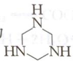

应(产生—OH),再与 $NH_{3}$ 反应,实际为—OH 与 $H—NH_{2}$ 发生脱水得到,因此 B 为

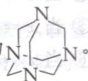

上述反应也可由碳元素和氮元素质量守恒可知: 1 mol A 与 3 mol HCHO 和 1 mol NH₃ 反应得到。再由基本的有机化学知识, 即可得到上述结论。

HCHO 与 $CH_{3}CONH_{2}$ 反应, 得到 C。结合题中信息, 可知 D 为

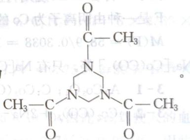

1-3 E 可分别由 B 或 D 与浓硝酸反应得到, 除生成 E 外, 还有 $\mathrm{N}_{2}$ 和 $\mathrm{CO}_{2}$ 气体。E 分子式为 $\mathrm{C}_{3} \mathrm{H}_{6} \mathrm{~N}_{6} \mathrm{O}_{6}$ , 即 $(\mathrm{CH}_{2} \mathrm{~N}_{2} \mathrm{O}_{2})_{3}$ , 因此 E 为六元环。再应用 Lewis 电子理论可知: E 为

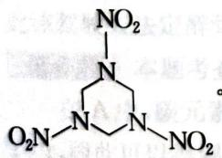

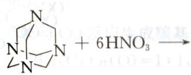

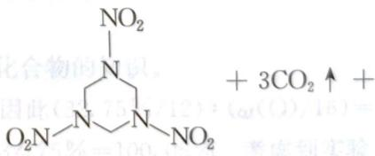

$$
2 \mathrm{N} _ {2} \uparrow + 6 \mathrm{H} _ {2} \mathrm{O}
$$

第2题 2-1 根据价电子守恒可知：N相当于CH。因此 $\mathrm{C}_2\mathrm{H}_4$ 相当于 $\mathrm{N}_2\mathrm{H}_2$ ； $\mathrm{C}_2\mathrm{H}_2$ 相当于 $\mathrm{N}_2$ ； $\mathrm{H}_2\mathrm{CO}_3$ 相当于 $\mathrm{HNO}_3$ 。

2-2 由于 $1 \mathrm{~mol} \mathrm{NH}_{4} \mathrm{~N}_{3}$ 热分解产生 $4 \mathrm{~mol}$ 气体单质, 只能是 $\mathrm{N}_{2}$ 和 $\mathrm{H}_{2}$ 。因此化学反应为: $\mathrm{NH}_{4} \mathrm{~N}_{3} = 2 \mathrm{~N}_{2} \uparrow + 2 \mathrm{H}_{2} \uparrow$

2-3（1）因还原产物不是 $\mathrm{NO}_x$ ，因此其还原产物只能是 $\mathrm{NH}_3$ 或 $\mathrm{NH}_4^+$ ，由此可推A、B混合物是 $\mathrm{NH}_3$ 与 $\mathbf{H}_2$ 两种还原性气体。据题意可知A为 $\mathrm{H}_2$ ，B为 $\mathrm{NH}_3$ 。其化学反应为：

$$
\mathrm{H} _ {2} + \mathrm{CuO} \xlongequal {\triangle} \mathrm{Cu} + \mathrm{H} _ {2} \mathrm{O} 2 \mathrm{NH} _ {3} + 3 \mathrm{CuO} \xlongequal {\triangle} 3 \mathrm{Cu} + \mathrm{N} _ {2} \uparrow + 3 \mathrm{H} _ {2} \mathrm{O}
$$

设上述反应进行的比例为 1:x，因此 $\frac{\frac{x}{2}}{1+x}=\frac{1}{3}$ ，解得 x=2。

故 $V(A):V(B) = n(A):V(B) = 1:2$ 。

(2) $2NH_{3} + 3CuO \xlongequal{\Delta} N_{2} \uparrow + 3H_{2}O + 3Cu$

(3) $9\mathrm{Mg} + 22\mathrm{H}^{+} + 2\mathrm{NO}_{3}^{-} = 2\mathrm{NH}_{4}^{+} + \mathrm{H}_{2} + 9\mathrm{Mg}^{2+} + 6\mathrm{H}_{2}\mathrm{O}$ 第3题 A为氧化物，可假设A为 $\mathrm{M}_x\mathrm{O}_y$ ，由M质量分数可得： $xM / (xM + 16y)\times 100\% =$ 73. $42\%$ 。

讨论：

① 当 $x = 1, y = 1$ 时， $M = 44.2$ ，无解；

② 当 $x = 1, y = 2$ 时， $M = 88.4$ ，无解；

③ 当 x=1, y=3 时, M=132.6, 无解;

④ 当 $x = 2, y = 1$ 时， $M = 22$ ，无解；

⑤ 当 x=2, y=3 时, M=66.3, 无解;

⑥ 当 $x = 3, y = 1$ 时， $M = 14.7$ ，无解；

⑦ 当 x=3, y=2 时, M=29.5, 无解;

⑧ 当 x=3, y=4 时, M=58.9, 因此 M 时 Co, A 时 $Co_{3}O_{4}$ , B 是 Co。

由于 C 符合 EAN 规则, 且由 Co 与气体组成的双核配合物, 故 C 是 $\mathrm{Co}_{2}(\mathrm{CO})_{9}$ 。

F 是一种由阴离子为 Co 的羰基配合物的盐, 且 Co 元素质量分数为 30.38%, 因此:

$M(F)=58.9/0.3038=193.9\ g\cdot mol^{-1}$ ，F符合EAN规则，故F是 $\mathrm{Na[Co(CO)_4]}$ 或 $\mathrm{Na_3[Co(CO)_3]}$ 等。只有 $\mathrm{Na[Co(CO)_4]}$ 符合要求。因此F为 $\mathrm{Na[Co(CO)_4]}$ 。

3-1 A: $\mathrm{Co}_3\mathrm{O}_4$ ; C: $\mathrm{Co}_2(\mathrm{CO})_8$ ; G: Bi[Co(CO)4]3

3-2 $\mathrm{Co}_{2}(\mathrm{CO})_{8} + 2\mathrm{Na}\longrightarrow 2\mathrm{NaCo}(\mathrm{CO})_{4}$

3-3 因 D 有四条 $\mathrm{C}_3$ 轴, 类似于 $\mathrm{P}_4$ , 因此 D 为

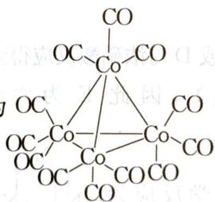

E 只有一条 $C_{3}$ 轴，与 D 是同分异构体，因此 E 为

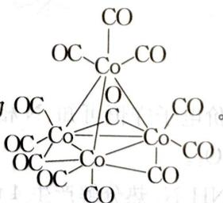

因 F 是 $\mathrm{Na[Co(CO)_{4}]}$ ，G 由 $BiCl_{3}$ 与 F 反应得到，故 G 是 $\mathrm{Bi[Co(CO)_{4}]_{3}}$ ，其 Co 元素质量分数 $\omega(\mathrm{Co})\% = 58.9 \times 3 / [209 + (58.9 + 28 \times 4) \times 3] \times 100\% = 24.48\%$ ，与数据相符。

又因为 G 加热得 H, D、E、H 的金属骨架类型相同, 因此 H 是以 Bi 为四面体顶点, 其余 3 个

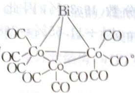

Co原子与D类似， $\mathrm{Bi[Co_3(CO)_9]}$ ， $\omega (\mathrm{Co})\% = 58.9\times 3 / [209 + (58.9\times 3 + 28\times 9)]\times 100\% =$ $27.71\%$ 。故H为

第4题 4-1 $2\mathrm{Cu} + \mathrm{H}_2\mathrm{O} + \mathrm{CO}_2 + \mathrm{O}_2 = \mathrm{Cu(OH)}_2\cdot \mathrm{CuCO}_3$ ，可写成 $\mathrm{Cu_2(OH)_2CO_3}$ 。

$$
3 \mathrm{B} _ {2} \mathrm{H} _ {6} + 6 \mathrm{CO} = 2
$$

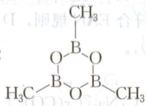

$$
4 - 3 \quad \mathrm{PbS} + 4 \mathrm{H} _ {2} \mathrm{O} _ {2} = \mathrm{PbSO} _ {4} + 4 \mathrm{H} _ {2} \mathrm{O}
$$

$$
4 - 4 \quad \mathrm{COCl} _ {2} + 4 \mathrm{NH} _ {3} = \mathrm{CO(NH} _ {2}) _ {2} + 2 \mathrm{NH} _ {4} \mathrm{Cl}
$$

4-5 $3\mathrm{Ag(NH_3)_2OH + 2H_2O\longrightarrow 5NH_3\cdot H_2O + Ag_3N\downarrow}$ 或 $3\mathrm{Ag(NH_3)_2OH\longrightarrow 5NH_3 + }$ $3\mathrm{H}_2\mathrm{O} + \mathrm{Ag}_3\mathrm{N}\downarrow$

第5题 本题主要考察亨利定律和有机物的氧化还原反应。由于醇羟基具有还原性，在重铬酸根作用下被氧化为醛基(—CHO)，甚至氧化成羧基(—COOH)，自身在酸性介质中被还原为 $Cr^{3+}$ 。在有机物的氧化还原反应中，一般可认为H为+1价，O为-2价。有机物的氧化还原可视为碳元素化合价的升降变化。因此：

$$
2 \mathrm{Cr} _ {2} \mathrm{O} _ {7} ^ {2 -} + 3 \mathrm{C} _ {2} \mathrm{H} _ {5} \mathrm{OH} + 1 6 \mathrm{H} ^ {+} = 4 \mathrm{Cr} ^ {3 +} + 3 \mathrm{CH} _ {3} \mathrm{COOH} + 1 1 \mathrm{H} _ {2} \mathrm{O}
$$

(1) $2 \mathrm{Cr}_{2} \mathrm{O}_{7}^{2-} + 3 \mathrm{C}_{2} \mathrm{H}_{5} \mathrm{OH} + 16 \mathrm{H}^{+} = 4 \mathrm{Cr}^{3+} + 3 \mathrm{CH}_{3} \mathrm{COOH} + 11 \mathrm{H}_{2} \mathrm{O}$ 。

(2) $50.0 \mathrm{~mL}$ 该驾驶人的呼吸样品中应含有乙醇的物质的量 $n(\mathrm{C}_{2} \mathrm{H}_{5} \mathrm{OH}) = 3 \times 3.30 \times 10^{-5} / 4 = 2.475 \times 10^{-5} \mathrm{~mol}$ 人呼吸的温度约为 $310 \mathrm{~K}$ , 因此血液上面乙醇的分压 $p = n R T / V = 0.75 \times 3.30 \times 10^{-5} \times 8.314 \times 310 / (50.0 \times 10^{-6}) = 1276 \mathrm{~Pa}$ 。

若亨利定律适用于血液中的乙醇溶液, 则亨利常数 $k = 10^{4} / (4.5 \times 10^{-3})$ , 因此, 该驾驶人的血液中乙醇的含量为: $n(\mathrm{C}_{2} \mathrm{H}_{5} \mathrm{OH}) = 1276 \times (4.5 \times 10^{-3} / 10^{4}) \times 100\% = 0.057\% > 0.050\%$ 。因此该驾驶人是法定的醉驾。

也可以先求出法定允许的乙醇分压 $p = 0.050 \times 1.00 \times 10^{4} / 0.45 = 1.1 \times 10^{3} \mathrm{~Pa} < 1276 \mathrm{~Pa}$ , 因此该驾驶人法定醉驾。

在 A 中, 碳元素质量分数为 32.75%, 因 $n(\mathrm{C}): n(\mathrm{O}) = 1:1$ , 因此 $(32.75\% / 12): (\omega(\mathrm{O}) / 16) = 1:1$ , 因此可以得到 $\omega(\mathrm{O}) = 43.67\%$ 。因为 $43.67\% + 23.63\% + 32.75\% = 100.05\%$ 。考虑到实验误差, 因此 A 为 Cr、C 和 O 三种元素组成。根据质量分数可求得 $\mathrm{Cr}: \mathrm{C}: \mathrm{O} = (23.63\% / 52): (32.75\% / 12): (43.67\% / 16) = 1:6:6$ 。因此 A 为 $\mathrm{Cr}(\mathrm{CO})_6$ 。

B的考虑要复杂一点。由于A又可和 $\mathrm{P(CH_{3})_{3}}$ 反应,生成物质B。根据质量守恒定律可知:B可能有Cr、C、O、P和H元素,而且在考虑B时,C元素应该有CO和CH₃两部分。碰到这种情况,要通过假设法:若假设B中只有一种P原子,因此根据磷元素质量分数求出B的摩尔质量,再减去Cr、P元素摩尔质量,即可求出C、O、H的残基总量,最后用CO和CH₃组合,得出B为 $\mathrm{Cr(CO)_{5}P(CH_{3})_{3}}$ ,满足EAN规则。

也可以这样计算：

$$
\mathrm{A}: n (\mathrm{Cr}): n (\mathrm{C}) = (23.63 \% / 52):
$$

因 B 中磷元素质量分数 11.55%，铬元素质量分数 19.39%，因此 $n(\mathrm{Cr})$ ： $n(\mathrm{P}) = (19.39\% / 52) : (11.55\% / 31) = 1 : 1$ ，得到 $M(\mathrm{B}) = 31 \, \mathrm{g} \cdot \mathrm{mol}^{-1} \div 11.55\% = 268 \, \mathrm{g} \cdot \mathrm{mol}^{-1}$ ，因此 B 为 $\mathrm{Cr}(\mathrm{CO})_{5}\mathrm{P}(\mathrm{CH}_{3})_{3}$ ，满足 EAN 规则。

A 为 $\mathrm{Cr(CO)_{6}}$ 满足 EAN 规则。
设 C 为 $\mathrm{Na_{2x}[Cr(CO)_{6-x}]}$ 。根据 Cr 元素质量分数 $\omega(\mathrm{Cr})\% = 52/[23 \times 2x + 52 + 28 \times (6 - 2x)] \times 100\% = 21.84\%$ 。解得 x = 1，即 C 为 $\mathrm{Na_{2}[Cr(CO)_{5}]}$ 。
Mo 与 Cr 同一副族，因此 D 为 $\mathrm{Mo(CO)_{6}}$ ，符合 EAN 规则。D 与 $PPh_{3}$ 反应，生成物类似于 B，其反应为配体交换反应，生成 $\mathrm{Mo(CO)_{5}P(CH_{3})_{3}}$ 。

因此答案为：

$$
6 - 1 \quad A: C r (C O) _ {6}; B: C r (C O) _ {5} P (C H _ {3}) _ {3}; C: N a _ {2} [ C r (C O) _ {5} ]
$$

$$
6 - 2 \quad \mathrm{Mo} (\mathrm{CO}) _ {6} + \mathrm{PPh} _ {3} = \mathrm{Mo} (\mathrm{CO}) _ {5} \mathrm{PPh} _ {3} + \mathrm{CO}
$$

第7题 本题考查热重分析。

白色粉末 A 是由 $BaCl_{2}$ 、 $TiCl_{4}$ 、 $H_{2}O$ 和 $H_{2}C_{2}O_{4}$ 混合反应后，经洗涤、干燥后得到的。由于 A 中含有 H 元素，根据反应，可以猜测 A 为结晶水合物。又由于 A 中含有碳元素，结合制备 A 需要 $H_{2}C_{2}O_{4}$ ，且 A 热分解得到 $BaTiO_{3}$ ，因此可以猜测 A 中含有阴离子 $C_{2}O_{4}^{2-}$ 。再通过假设讨论的方法得到 A 为 $\mathrm{BaTiO(C_{2}O_{4})_{2}\cdot4H_{2}O}$ 。

也可以用假设法：

假设 A 中只有一个 Ba 原子, 则 $M(A)=137\ \text{g}\cdot\text{mol}^{-1}\div30.50\%=449\ \text{g}\cdot\text{mol}^{-1}$

因此 Ti 原子数： $n(\mathrm{Ti})=449\ \mathrm{g}\cdot\mathrm{mol}^{-1}\times10.70\%\div47.9\ \mathrm{g}\cdot\mathrm{mol}^{-1}=1$ ;

$$
n (\mathrm{H}) = 449 \mathrm{g} \cdot \mathrm{mol} ^ {- 1} \times 1.81 \% \div 1.008 \mathrm{g} \cdot \mathrm{mol} ^ {- 1} = 8
$$

此时 A 中应剩余氧原子, Cl 原子以 HCl 形式离去, 其氧原子数 $n(\mathrm{O}) = 449 \, \mathrm{g} \cdot \mathrm{mol}^{-1} \times (1 - 30.50\% - 10.70\% - 1.81\% - 10.66\%) \div 16 \, \mathrm{g} \cdot \mathrm{mol}^{-1} = 13$ 。

因 $C_{2}O_{4}^{2-}$ 是常见的配体, 根据碳元素守恒, 因此 A 中存在 2 个 $C_{2}O_{4}^{2-}$ , 结合氢元素守恒, 因此存在 4 个 $H_{2}O$ , 多出一个氧原子。因此 A 为 $\mathrm{BaTiO(C_{2}O_{4})_{2}\cdot4H_{2}O}$ 。

400 K 时失重 1 - 83.8% = 16.2%，对应的摩尔质量 $M = 16.2\% \times 449 \, g \cdot mol^{-1} = 72.79 \, g \cdot mol^{-1}$ ，恰好对应 4 个结晶水。故 400 K 时样品的组成为 $\mathrm{BaTiO(C_{2}O_{4})_{2}}$ 。

600 K 时失重 83.8% - 56.8% = 27%，对应的摩尔质量 $M = 449 \, g \cdot mol^{-1} \times 27\% = 121.23 \, g \cdot mol^{-1}$ ，其化学式为 $Ba_{2}Ti_{2}CO_{8}$ ，即 $BaCO_{3} \cdot BaTi_{2}O_{5}$ 。

900 K 时失重 56.8% - 51.9% = 4.9%，对应的摩尔质量 $M = 449 \, g \cdot mol^{-1} \times 4.9\% = 22 \, g \cdot mol^{-1}$ ，是 $CO_{2}$ 摩尔质量的一半。因此 900 K 时的产物为 $BaTiO_{3}$ 。

因此答案为：

$$
7 - 1 \quad \mathrm{BaTiO} (\mathrm{C} _ {2} \mathrm{O} _ {4}) _ {2} \cdot 4 \mathrm{H} _ {2} \mathrm{O}.
$$

$$
7 - 2 \quad 4 0 0 \mathrm{K}: \mathrm{BaTiO} \left(\mathrm{C} _ {2} \mathrm{O} _ {4}\right) _ {2}; 6 0 0 \mathrm{K}: 1 / 2 \mathrm{BaTi} _ {2} \mathrm{O} _ {5} + 1 / 2 \mathrm{BaCO} _ {3}; 9 0 0 \mathrm{K}: \mathrm{BaTiO} _ {3}
$$

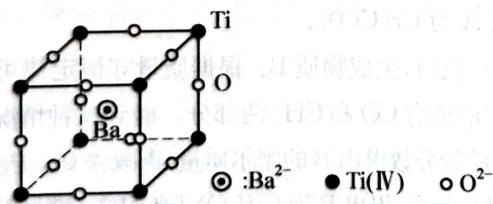  
第7题答图

$\partial S_{\mathrm{H}} = 0$

$Ba^{2+}$ : 占据 12 个 $O^{2-}$ 形成的多面体空隙(十四面体空隙);

Ti(Ⅳ): 占据 6 个 $O^{2-}$ 形成的八面体空隙；

$O^{2-}$ : 2个Ti(Ⅳ)和4个 $Ba^{2+}$ 形成的八面体空隙。

第8题 8-1 A是环状结构， $n(\mathrm{P}):n(\mathrm{N}):n(\mathrm{Cl})=1:1:2$ ，即A最简式为 $PNCl_{2}$ ，其结构式为

$N \equiv PCl_{2}$ ，环状分子应为 $PNCl_{2}$ 的三聚，因此 A 为

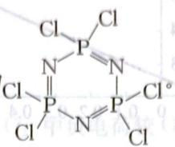  
或者画成

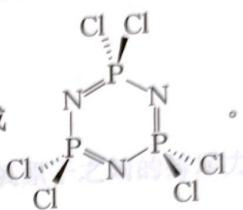

$$
3 \mathrm{NH} _ {4} \mathrm{Cl} + 3 \mathrm{PCl} _ {5} = 1 2 \mathrm{HCl} +
$$

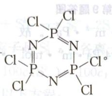

$S = q \backslash q, \text{时} 0 = q$ 阵图由
全等比数列 $1 \times 2^{10}$ S = M
: 二者鞭

0884.0

8-2 B 为链状聚合分子, $N \equiv \mathrm{PCl}_2$ 的加聚反应得到, 因此 B 为 $\left[\mathrm{P}=\mathrm{N}\right]_n$ ;

Cl图示用，如0←q当

由于 C 的红外光谱显示存在 S—S 和两种化学环境的 P—S 键, 因此 C:

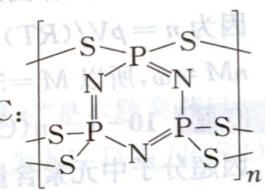

，或

$S_{3/2}$ 者画成 $\left[\begin{array}{c}P=N\\S_{3/2}\end{array}\right]_{n}$ 也可。

8-3 $300^{\circ} \mathrm{C}$ 以下; 聚合物分子链中共轭双键与氮、磷原子上孤对电子的存在, 使材料有较好的导电性。

第9题 解法一：

应用极限密度法,由 pV=mRT/M

$M=(\rho/p)_{p\to\infty}RT(\rho$ 代表密度 $)$

作 $\rho / p \sim p$ 图，得 $p = 0$ 时的 $\rho / p$ ，代入上式即得 $M$ 。

<table><tr><td> $p/10^{5} \text{ Pa}$ </td><td>1.013</td><td>0.6755</td><td>0.5066</td><td>0.3378</td><td>0.2533</td></tr><tr><td> $V/10^{-3} \text{ m}^{3}$ </td><td>0.4334</td><td>0.6552</td><td>0.8771</td><td>1.321</td><td>1.765</td></tr><tr><td> $\rho/10^{3} \text{ g } \cdot \text{ m}^{-3}$ </td><td>2.307</td><td>1.526</td><td>1.140</td><td>0.7570</td><td>0.5666</td></tr><tr><td> $(\rho/p)/10^{-2} \text{ g } \cdot \text{ m}^{-3} \cdot \text{ Pa}^{-1}$ </td><td>2.277</td><td>2.259</td><td>2.251</td><td>2.241</td><td>2.237</td></tr></table>

50.0 80.0 £-1

$\mathrm{CO}$ loam $\mathrm{V}_{2}$ , $\mathrm{O}_{2}$ sN loam x 谐: 炒

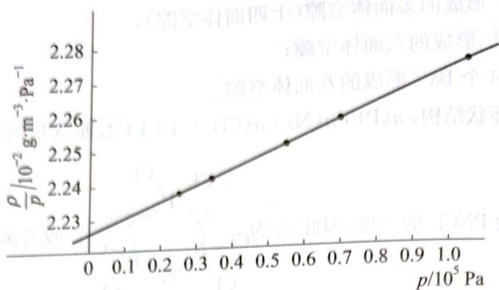  
第9题答图

由图得 p=0 时， $\rho/p=2.223\times10^{-2}\ g\cdot m^{-3}\cdot Pa^{-1}$ 。故 $M=2.223\times10^{-2}\ g\cdot m^{-3}\cdot Pa^{-1}\times8.314\ Pa\cdot m^{3}\cdot mol^{-1}\cdot K^{-1}\times273\ K=50.46\ g\cdot mol^{-1}$ 解法二：

<table><tr><td> $pV/10^{2} \text{ Pa} \cdot \text{m}^{3}$ </td><td>0.4390</td><td>0.4426</td><td>0.4443</td><td>0.4462</td><td>0.4471</td></tr><tr><td> $p/10^{5} \text{ Pa}$ </td><td>1.013</td><td>0.6755</td><td>0.5066</td><td>0.3378</td><td>0.2533</td></tr></table>

当 $p \to 0$ 时，用作图外推法得： $pV / 10^{2} \mathrm{~Pa} \cdot \mathrm{m}^{3} = 0.4500$

因为 $n=pV/(RT)=45.00/(8.314\times273)=0.0198(\text{mol})$

$nM=\omega$ , 所以 $M=50.5(g\cdot mol^{-1})$ 。

因超分子中元素含量: C 4.50%; H 1.05%; N 2.47%; Si 0.91%; W 67.02%。因此超分子 $n(\mathrm{C}):n(\mathrm{H}):n(\mathrm{N}):n(\mathrm{Si}):n(\mathrm{W}):n(\mathrm{O})=(4.50\%/12):(1.05\%/1):(2.47\%/14):(0.91\%/28):(67.02\%/183.84):(1-4.50%-1.05%-2.47%-0.91%-67.2%)=12:34:6:1:12:50$ 。因此超分子式为 $C_{12}H_{34}N_{6}SiW_{12}O_{50}$ 。可以写成 $(HisH_{2})_{2}SiW_{12}O_{40}\cdot6H_{2}O$ ;或 $(H_{2}C_{6}H_{9}N_{3}O_{2})_{2}SiW_{12}O_{40}\cdot6H_{2}O$ 。

10-2 可根据第七题计算方法,可得:第一步:失去结晶水;第二步:失去组氨酸;第三步的阴离子为 $\left[SiW_{12}O_{40}\right]^{4-}$ 。

10-3 超分子化合物的各组分间主要依靠氢键结合。

10-4 根据题中热重分析图所示,超分子在 $135^{\circ}$ C 以下稳定存在。在此温度下,因存在氢键的作用,故比较稳定存在。

## 第 2 章 氧化还原反应

## 能力测试A卷

$$
4 \mathrm{KO} _ {2} + 2 \mathrm{CO} _ {2} = 2 \mathrm{K} _ {2} \mathrm{CO} _ {3} + 3 \mathrm{O} _ {2}
$$

故 $30 \, mL CO_{2}$ 和足量 $KO_{2}$ 反应后产生的 $O_{2}$ 为 $30 \times 3/2 = 45 (\text{mL})$

1-2 0.08 0.02

设:有 x mol $Na_{2}O_{2}$ 、y mol $KO_{2}$ ，

$2Na_{2}O_{2}+2CO_{2}=2Na_{2}CO_{3}+O_{2}$ x x x/2 $4KO_{2}+2CO_{2}=2K_{2}CO_{3}+3O_{2}$ y y/2 0.75y $\left\{\begin{aligned}&0.5x+0.75y=(1568/1000)/22.4=0.07\\&78x+71y=7.24\end{aligned}\right.$ 解得：x=0.02 mol y=0.08 mol

1-3 $\mathrm{KO}_2$ 中键能大；因为 $\mathrm{KO}_2$ 中键级大（或 $\mathrm{O}_2^-$ 中负电荷较 $\mathrm{O}_2^{2-}$ 中少，氧原子之间的排斥力小，键长短，键能大）

第2题 生成多硫离子的反应： $S+S^{2-}\longrightarrow S_{2}^{2-}$ 、 $2S+S^{2-}\longrightarrow S_{3}^{2-}$ 。

由于溶液中最大聚合度的多硫离子是 $S_{3}^{2-}$ ，且各离子的浓度比符合等比数列 1, 10, …, $10^{n-1}$ ， $c(S_{2}^{2-})=10c(S^{2-})=10c_{1}$ ， $c(S_{3}^{2-})=100c(S^{2-})=100c_{1}$

根据反应的计量关系,可以列出以下方程:

电荷 $(S^{2-})$ 守恒： $c_{1}+10c_{1}+100c_{1}=c_{0}$

物料(S)守恒： $10c_{1}+2\times100c_{1}=0.080/32\ mol/0.010\ L=0.25\ mol\cdot L^{-1}$

解得：

$$
c _ {1} = 1. 2 \times 1 0 ^ {- 3} \mathrm{mol} \cdot \mathrm{L} ^ {- 1}; c _ {0} = 0. 1 3 \mathrm{mol} \cdot \mathrm{L} ^ {- 1}
$$

采用其他方法,计算过程合理,结果正确,亦得分。

第3题 3-1 “在水中微溶于水,加入A后B的溶解度增大,成棕色溶液C”是本题突破口。说明B为 $I_{2}$ ，A为KI，生成 $KI_{3}$ ，增大了 $I_{2}$ 的溶解度。气体容易确定。因此A为KI，D为 $Na_{2}S_{2}O_{3}$ 。

$$
3 - 2 \quad S _ {2} O _ {3} ^ {2 -} + 4 C l _ {2} + 5 H _ {2} O = 2 S O _ {4} ^ {2 -} + 8 C l ^ {-} + 1 0 H ^ {+}
$$

$$
\mathrm{I} _ {3} ^ {-} + 8 \mathrm{Cl} _ {2} + 9 \mathrm{H} _ {2} \mathrm{O} = 3 \mathrm{IO} _ {3} ^ {-} + 1 6 \mathrm{Cl} ^ {-} + 1 8 \mathrm{H} ^ {+}
$$

3-4 碘分子是非极性分子, $I_{2}$ 遇 $I^{-}$ 溶液生成了 $I_{3}^{-}$ (也可从 Lewis 酸碱角度考虑。 $I_{2}$ 为 Lewis 酸, $I^{-}$ 为 Lewis 碱, 发生 Lewis 酸碱反应)。

第4题 4-1 总反应为 $2\mathrm{LiAlH_4}\xrightarrow{\triangle}2\mathrm{LiH} + 2\mathrm{Al} + 3\mathrm{H}_2\uparrow$ 故放氢量为 $(3\times 2\times 1.008) / [2\times (6.94 + 26.98 + 4\times 1.008)]\times 100\% = 7.97\%$ 。 $4 - 2n[\mathrm{Mg(AlH_4)_2}] = 4.316\mathrm{g} / [24.3 + 2\times (27 + 4\times 1.008)]\mathrm{g}\cdot \mathrm{mol}^{-1} = 5.0\times 10^{-2}\mathrm{mol}$ $n(\mathrm{Al}) = 1.798\mathrm{g} / 26.98\mathrm{g}\cdot \mathrm{mol}^{-1} = 6.66\times 10^{-2}\mathrm{mol}$ 因此 $n(\mathrm{Al}) / n[\mathrm{Mg(AlH_4)_2}] = 4 / 3$ 。因此化学反应为： $3\mathrm{Mg(AlH_4)_2} = 4\mathrm{Al} + \mathrm{Al}_2\mathrm{Mg}_3 + 12\mathrm{H}_2\uparrow$ 。  
第5题 $5 - 18\mathrm{MoO}_3 + 24\mathrm{H}_2\mathrm{S} = 8\mathrm{MoS}_2 + 24\mathrm{H}_2\mathrm{O} + \mathrm{S}_8$ $5 - 2n(\mathrm{MoS}_2) = m / M(\mathrm{MoO}_3) = 10^6\mathrm{g} / 143.94\mathrm{g}\cdot \mathrm{mol}^{-1} = 6947.34\mathrm{mol}$ $n(\mathrm{MoS}_2) = 6947.34\mathrm{mol}\div 95\% \div 97\% = 7539.16\mathrm{mol}$ 因此 $m(\mathrm{MoS}_2) = n\times M(\mathrm{MoS}_2) = 7539.16\mathrm{mol}\times (95.94 + 32.066\times 2)\mathrm{g}\cdot \mathrm{mol}^{-1} = 1.207\mathrm{t}$ 即 $m(\text{精钼矿}) = 1.207 / 82\% = 1.5\mathrm{t}$ 离子反应为 $\mathrm{MoS}_2 + 9\mathrm{ClO}^- +3\mathrm{H}_2\mathrm{O} = 9\mathrm{Cl}^- +6\mathrm{H}^+ +\mathrm{MoO}_4^{2 - } + 2\mathrm{SO}_4^{2 - }$ $n(\mathrm{ClO}^{-}) = 9n(\mathrm{MoS}_2) = 9n(\mathrm{MoO}_3) = 62526\mathrm{mol}$ 因此 $m(\mathrm{NaClO}) = n\times M(\mathrm{NaClO}) = 4.7\mathrm{t}_{\circ}$

第6题 本题旨在考查硝酸工业制法的基本过程。在解决过程中涉及较多的数学知识。比如等比数列、识图能力等。

$$
6 - 1 \quad (1) 3 \mathrm{NO} _ {2} + \mathrm{H} _ {2} \mathrm{O} = 2 \mathrm{HNO} _ {3} + \mathrm{NO}; 2 \mathrm{NO} + \mathrm{O} _ {2} = 2 \mathrm{NO} _ {2};
$$

(2) 设起始时 $NO_{2}$ 物质的量为 1 mol, 经过 n 次循环后生成 $HNO_{3}$ 的物质的量为:

(2) 设起始时 $NO_{2}$ 物质的量为 $100\%$ $S_{n}=2/3+2/3\times1/3+2/3\times(1/3)^{2}+2/3\times(1/3)^{3}+\cdots+2/3\times(1/3)^{n-1}$ ，经等比数列求和得 $S_{n}=1-(1/3)^{n}$ 。因此， $NO_{2}\longrightarrow HNO_{3}$ 转化率为 $[1-(1/3)^{n}]/1\times100\%$ ;

(3) $[1 - (1/3)^n] / 1 \times 100\% \longrightarrow 95\%$ , 因此, $n = 2.6 \approx 3$ , 要经过 3 次循环操作才能使 $95\%$ 的 $\mathrm{NO}_2$ 转化为 $\mathrm{HNO}_3$ 。

$$
6 - 2 \quad (1) \mathrm{Mg} + 4 \mathrm{HNO} _ {3} = \mathrm{Mg} (\mathrm{NO} _ {3}) _ {2} + 2 \mathrm{NO} _ {2} \uparrow + 2 \mathrm{H} _ {2} \mathrm{O};
$$

(2) 本题考查识图能力, 图象的定量分析, 氧化还原反应得失电子守恒, 方程式比例系数的确定。由图象可知: $n_{\mathrm{NO}}: n_{\mathrm{N}_{2}}: n_{\mathrm{NO}_{2}}: n_{\mathrm{H}_{2}} = 5:3:1:1$ , 同时还原产物还有 $\mathrm{NH}_{4}^{+}$ , 并通过得失电子相等确定与前者的关系。因此, 很容易写出其化学反应方程式:

$$
4 0 \mathrm{Mg} + 1 0 0 \mathrm{HNO} _ {3} = 5 \mathrm{NO} \uparrow + \mathrm{H} _ {2} \uparrow + \mathrm{NO} _ {2} \uparrow + 3 \mathrm{N} _ {2} \uparrow + 4 1 \mathrm{H} _ {2} \mathrm{O} + 4 \mathrm{NH} _ {4} \mathrm{NO} _ {3} + 4 0 \mathrm{Mg} (\mathrm{NO} _ {3}) _ {2}
$$

(1) $MnO_{4}^{-}$

$$
5 \mathrm{XeO} _ {3} + 6 \mathrm{Mn} ^ {2 +} + 9 \mathrm{H} _ {2} \mathrm{O} = 5 \mathrm{Xe} + 6 \mathrm{MnO} _ {4} ^ {-} + 1 8 \mathrm{H} ^ {+}
$$

$$
2 \mathrm{XeO} _ {3} = 2 \mathrm{Xe} + 3 \mathrm{O} _ {2}
$$

$$
(\text {或:} 1 2 \mathrm{XeO} _ {3} + 1 2 \mathrm{Mn} ^ {2 +} + 1 8 \mathrm{H} _ {2} \mathrm{O} = 1 2 \mathrm{Xe} + 1 2 \mathrm{MnO} _ {4} ^ {-} + 3 \mathrm{O} _ {2} + 3 6 \mathrm{H} ^ {+})
$$

(提示: $XeF_{6} + 3H_{2}O = XeO_{3} + 6HF$

$$
\mathrm{XeO} _ {3} = \mathrm{Xe} + 3 / 2 \mathrm{O} _ {2}
$$

14. 72 g XeF $_{6}$ 为 0.06 mol, 生成 XeO $_{3}$ 为 0.06 mol, 共放出 Xe 气体 0.06 mol, 被铜吸收的 O $_{2}$ 为 0.06/4 = 0.015 mol, 由此可知发生反应 (a) 的 XeO $_{3}$ 为 0.01 mol, 氧化 Mn $^{2+}$ 的 XeO $_{3}$ 为 0.05 mol, Mn $^{2+}$ 为 0.06 mol, Mn $^{2+}$ 的氧化产物应为 MnO $_{4}^{-}$ 。

(2) 0.74 $7.0 \times 10^{-4} \mathrm{~mol} \cdot \mathrm{L}^{-1}$

7-3

(1) 直线形、平面正方形、畸变八面体

(2) Ni 器表面生成 $NiF_{2}$ 保护膜；除去表面氧化物，否则表面氧化物与 $XeF_{x}$ 反应。

(3)  
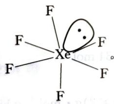

第8题 8-1 $20\mathrm{CsB}_3\mathrm{H}_8 = 2\mathrm{Cs}_2\mathrm{B}_9\mathrm{H}_9 + 2\mathrm{Cs}_2\mathrm{B}_{10}\mathrm{H}_{10} + \mathrm{Cs}_2\mathrm{B}_{12}\mathrm{H}_{12} + 10\mathrm{CsBH}_4 + 35\mathrm{H}_2;$ 70e $20\mathrm{CsB}_3\mathrm{H}_8$ 。

8-2（根据阴阳离子大小匹配原则）铯盐较钠盐稳定

8-3 不稳定

8-4 $2\mathrm{NaBH}_4 + 5\mathrm{B}_2\mathrm{H}_6 = \mathrm{Na}_2\mathrm{B}_{12}\mathrm{H}_{12} + 13\mathrm{H}_2$

$$
9 - 1 \quad 2 \mathrm{CuSO} _ {4} + 4 \mathrm{KCN} = (\mathrm{CN}) _ {2} \uparrow + 2 \mathrm{CuCN} + 2 \mathrm{K} _ {2} \mathrm{SO} _ {4};
$$

$$
2 \mathrm{CuCN} + 2 \mathrm{FeCl} _ {3} = (\mathrm{CN}) _ {2} \uparrow + 2 \mathrm{CuCl} + 2 \mathrm{FeCl} _ {2}
$$

$$
9 - 2 \quad (\mathrm{CN}) _ {2} + 2 \mathrm{NaOH} = \mathrm{NaOCN} + \mathrm{NaCN} + \mathrm{H} _ {2} \mathrm{O} 。
$$

$$
\begin{array}{l l} \mathfrak {g} - 3 & \mathrm{X:} (\mathrm{SCN}) _ {2}; 3 (\mathrm{SCN}) _ {2} + 8 \mathrm{NaOH} = 5 \mathrm{NaSCN} + \mathrm{Na} _ {2} \mathrm{SO} _ {4} + 4 \mathrm{H} _ {2} \mathrm{O} + \mathrm{NaCN}. \\ \mathfrak {g} - 4 & \mathrm{B:Cl-C} \equiv \mathrm{N}; \end{array}
$$

三聚产物：

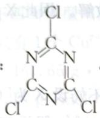

$$
9 - 5 \quad \mathrm{H} _ {2} \mathrm{N} - \mathrm{C} \equiv \mathrm{N} 。
$$

第10题 10-1 因为A中铜元素质量分数为 $21.55\%$ ，且只有K、Cu、F三种元素，阴离子堆成，故 $M(A) = 63.546 / 21.55\% = 294.88\mathrm{g}\cdot \mathrm{mol}^{-1}$ 。经讨论：A为 $\mathrm{K}_3\mathrm{CuF}_6$ ；Cu元素为 $+3$ 价，在正八面体 $\mathbf{e}_{\mathrm{g}}$ 轨道上有2个单电子： $\frac{1}{1\downarrow}\frac{1}{1\downarrow}\frac{\mathrm{eg}}{1\downarrow t_2g},\mu = [2\times (2 + 2)]^{1 / 2} = 2.8\mathrm{B.M}$ ，符合题意。

因 C 中铜元素占 24.85%，故 $M(\mathrm{C})=63.546/24.85\%=255.72\ \mathrm{g}\cdot\mathrm{mol}^{-1}$ ，因此 C 为 $K_{2}CuF_{6}$ ，Cu 为 +4 价；B 为 $Cl_{2}$ 。

A、C中铜原子价态分别为+3、+4。价电子构型分别为 $3d^{8}$ 和 $3d^{7}$ 。

$$
1 0 - 2 \quad 3 \mathrm{F} _ {2} + 3 \mathrm{KCl} + \mathrm{CuCl} = \mathrm{K} _ {3} \mathrm{CuF} _ {6} + 2 \mathrm{Cl} _ {2} \uparrow ;
$$

$$
2 \mathrm{K} _ {3} \mathrm{CuF} _ {6} + \mathrm{F} _ {2} \longrightarrow 2 \mathrm{K} _ {2} \mathrm{CuF} _ {6} + 2 \mathrm{KF} 。
$$

10-3 主要是由于 $\mathrm{F}^{-}$ 半径小, 电负性大, 配位能力强。

## 能力测试 B 卷

$$
\text {   第1题   } \quad 1 - 1 \quad \mathrm{Zn} + 2 \mathrm{SO} _ {2} = \mathrm{ZnS} _ {2} \mathrm{O} _ {4}; \mathrm{ZnS} _ {2} \mathrm{O} _ {4} + 2 \mathrm{NaOH} = \mathrm{Na} _ {2} \mathrm{S} _ {2} \mathrm{O} _ {4} + \mathrm{Zn(OH)} _ {2} 。
$$

$$
1 - 2 \quad \mathrm{HCOONa} + \mathrm{NaOH} + 2 \mathrm{SO} _ {2} = \mathrm{Na} _ {2} \mathrm{S} _ {2} \mathrm{O} _ {4} + \mathrm{CO} _ {2} + \mathrm{H} _ {2} \mathrm{O} 。
$$

1-3 由于离子化合物可视为强极性物质,而有机物一般为弱极性或非极性,因此可降低保险粉的溶解度。

$$
1 - 4 \quad \mathrm{CO} + \mathrm{NaOH} = \mathrm{HCOONa} _ {\circ}
$$

第2题 2-1 因B的密度是空气的0.139倍，因此 $M(B)=0.139\times29\ g\cdot mol^{-1}=4\ g\cdot mol^{-1}$ ，即B为HT。因此A中含有T，又因为A在热核动力中提供能量，因此含有Li元素。故A为LiT。

2-2 氧化物 C 与 $\mathrm{SO}_2$ 发生反应, 有沉淀产生, 说明该氧化物具有氧化性, 因为 $\mathrm{SO}_2$ 具有较强的还原性, 因此可设 C 为 $\mathrm{XO}_{n/2}$ 。然后根据题意进行假设讨论, 得到 C 为 $\mathrm{SeO}_2$ , D 为 $\mathrm{Se}$ 。

$$
\mathrm{SeO} _ {2} + 2 \mathrm{SO} _ {2} + 2 \mathrm{H} _ {2} \mathrm{O} = \mathrm{Se} + 2 \mathrm{H} _ {2} \mathrm{SO} _ {4}
$$

$$
\mathrm{SeO} _ {2} + \mathrm{H} _ {2} \mathrm{O} _ {2} = \mathrm{H} _ {2} \mathrm{SeO} _ {4}
$$

$$
\mathrm{H} _ {2} \mathrm{SeO} _ {4} + 2 \mathrm{NaOH} = \mathrm{Na} _ {2} \mathrm{SeO} _ {4} + 2 \mathrm{H} _ {2} \mathrm{O}
$$

$$
2 - 3 \quad 2 \mathrm{VO} _ {2} \mathrm{Cl} + \mathrm{Zn} + 4 \mathrm{HCl} = 2 \mathrm{VOCl} _ {2} + \mathrm{ZnCl} _ {2} + 2 \mathrm{H} _ {2} \mathrm{O}
$$

黄色变为蓝色

$$
2 \mathrm{VOCl} _ {2} + \mathrm{Zn} + 4 \mathrm{HCl} = 2 \mathrm{VCl} _ {3} + \mathrm{ZnCl} _ {2} + 2 \mathrm{H} _ {2} \mathrm{O}
$$

蓝色变为绿色

$$
2 \mathrm{VCl} _ {3} + \mathrm{Zn} = 2 \mathrm{VCl} _ {2} + \mathrm{ZnCl} _ {2}
$$

2-4 $X_{2}[\mathrm{O}_{2}][\mathrm{AuF}_{6}]$ 或 $[\mathrm{O}_2]\mathrm{AuF}_6$ 解答过程：由X结构与N.Bartlett的开创性工作与X极相似，即与 $\mathrm{O_2PtF_6}$ 结果相似。产物X由三种单质化合而成，则应为 $[\mathrm{O}_2][\mathrm{Au}_m\mathrm{F}_n](m,n$ 均为正整数），则：

由三种单质化合而成，则应为 $\left[\mathrm{O}_{2}\right]\left[\mathrm{Au}_{m} \mathrm{F}_{n}\right](m, n)$ 均为应 $57.43\%$

讨论：

讨论：
m=1, n=6 合理; m=2, n=13.68(舍去), $m \geqslant 3$ , 均无合理正整数解。因此 X 为 $[O_{2}][AuF_{6}]$ 或写为 $[O_{2}]AuF_{6}$ 。

我们也可用验证法：
与 N. Bartlett 的产物 $O_{2}PtF_{6}$ 结构相似，且 X 由三种元素组成，则不妨设 X 为 $[O_{2}][AuF_{6}]$ ，检验： $Au\% = 197.0 / (16.00 \times 2 + 197.0 + 19.00 \times 6) \times 100\% = 57.43\%$ ，假设正确，因此 X 为 $[O_{2}][AuF_{6}]$ 。

第3题 3-1 Y常显+3价,δ可取最大值为0.5,则此时氧化物的化学式为 $YBa_{2}Cu_{3}O_{7}$ ,根据化学式中化合价代数和等于零,可求得Cu平均化合价为+(7/3)。

设 $Cu^{3+}$ 占总铜量的质量分数为 x，故它占总铜量的物质的量分数也为 x

则有 $3x + 2(1 - x) = 7/3$ ，求得 $x = 1/3 = 33.3\%$

3-2 第一份溶解、滴定过程中,依次发生如下反应:

$$
2 \mathrm{Cu} ^ {3 +} + 2 \mathrm{I} ^ {-} = 2 \mathrm{Cu} ^ {2 +} + \mathrm{I} _ {2}; 2 \mathrm{Cu} ^ {2 +} + 4 \mathrm{I} ^ {-} = 2 \mathrm{CuI} \downarrow + \mathrm{I} _ {2}; \mathrm{I} _ {2} + 2 \mathrm{S} _ {2} \mathrm{O} _ {3} ^ {2 -} = 2 \mathrm{I} ^ {-} + \mathrm{S} _ {4} \mathrm{O} _ {6} ^ {2 -}
$$

第二份溶解、滴定过程中,依次发生如下反应:

$$
4 \mathrm{Cu} ^ {3 +} + 2 \mathrm{H} _ {2} \mathrm{O} = 4 \mathrm{Cu} ^ {2 +} + \mathrm{O} _ {2} \uparrow + 4 \mathrm{H} ^ {+}, 2 \mathrm{Cu} ^ {2 +} + 4 \mathrm{I} ^ {-} = 2 \mathrm{CuI} \downarrow + \mathrm{I} _ {2}; 2 \mathrm{S} _ {2} \mathrm{O} _ {3} ^ {2 -} + \mathrm{I} _ {2} = \mathrm{S} _ {4} \mathrm{O} _ {6} ^ {2 -} +
$$

根据以上方程式可知,滴定两份氧化物时 $Na_{2}S_{2}O_{3}$ 溶液体积的差值,即对应于 $Cu^{3+}$ 产生的 $I_{2}$ 的量。

设其中一份氧化物中 $\mathrm{Cu}^{3+}$ 的物质的量为 $x$ ，则

$$
2 \mathrm{Cu} ^ {3 +} \sim \mathrm{I} _ {2} \sim 2 \mathrm{S} _ {2} \mathrm{O} _ {3} ^ {2 -}
$$

$$
x = 0. 1 5 6 8 \times (3 0. 2 6 - 2 3. 8 9) \times 1 0 ^ {- 3}
$$

解得 $x = 0.9988 \times 10^{-3} \mathrm{~mol}$

滴定第二份溶液所消耗的 $Na_{2}S_{2}O_{3}$ ，对应于氧化物中 $Cu^{3+}$ 和 $Cu^{2+}$ 的总量，有

$$
2 (\mathrm{Cu} ^ {2 +} + \mathrm{Cu} ^ {3 +}) \sim \mathrm{I} _ {2} \sim 2 \mathrm{S} _ {2} \mathrm{O} _ {3} ^ {2 -}
$$

$$
n (\mathrm{Cu} ^ {2 +} + \mathrm{Cu} ^ {3 +}) 0. 1 5 6 8 \times 2 3. 8 9 \times 1 0 ^ {- 3}
$$

$$
n \left(\mathrm{Cu} ^ {2 +} + \mathrm{Cu} ^ {3 +}\right) = 3. 7 4 6 \times 1 0 ^ {- 3} \mathrm{mol}
$$

则原氧化物中 $\mathrm{Cu}^{2+}$ 的物质的量为:

$$
3. 7 4 6 \times 1 0 ^ {- 3} - 0. 9 9 8 8 \times 1 0 ^ {- 3} = 2. 7 4 7 \times 1 0 ^ {- 3} \mathrm{mol}
$$

因此氧化物中 $\mathrm{Cu}$ 的平均化合价为：

$$
3 \times 0. 9 9 8 8 / 3. 7 4 6 + 2 \times 2. 7 4 7 / 3. 7 4 6 = 2. 2 6 7
$$

根据氧化物中正负化合价代数和为0，有 $3+2\times2+3\times2.267=2\times(6.5+\delta)$ ，解得 $\delta=0.40$ 。

则该氧化物的化学式为 $YBa_{2}Cu_{3}O_{6.9}$

则 $Cu^{3+}$ 的质量分数 $=(63.55\times3\times0.9988/3.746)/(88.91+137.2\times2+63.55\times3+16.01\times6.9)\times100\%=7.65\%$

$3m/M(\mathrm{YBa}_{2}\mathrm{Cu}_{3}\mathrm{O}_{6.9})=n(\mathrm{Cu}^{2+}+\mathrm{Cu}^{3+})=3.746\times10^{-3}$ 。解得 $m=0.83\ g$ 。

第4题 4-1 黑色含铜的化合物只能是 $\mathrm{CuO}$ ; 因为固相反应中放出的热量使 $\mathrm{Cu(OH)}_2$ 分解生成 $\mathrm{CuO}$ 。

$$
4 - 2 \quad \mathrm{C}: \mathrm{Cu} _ {2} (\mathrm{OH}) _ {2} \mathrm{SO} _ {4}; \mathrm{D}: [ \mathrm{Cu} (\mathrm{NH} _ {3}) _ {4} ] \mathrm{SO} _ {4}
$$

4-3 正四面体型阳离子只能是 $NH_{4}^{+}$ ，三角锥形阴离子为 $SO_{3}^{2-}$

若 E 中只有 1 个 $Cu^{2+}$ 离子，则 $M=63.546\ g\cdot mol^{-1}\div39.31\%=161.65\ g\cdot mol^{-1}$ ，因此 E 中硫原子 $n(S)=(161.65\ g\cdot mol^{-1}\times19.84\%)/32.07\ g\cdot mol^{-1}=1$ 个， $n(N)=161.65\ g\cdot mol^{-1}\times8.67\%\div14.007\ g\cdot mol^{-1}=1$ 个。又因为 E 是抗磁性物质，故 Cu 必显 +1 价，为 $d^{10}$ 构型。因此 E 化学式为 $NH_{4}CuSO_{3}$ 。

其化学反应为： $2\left[\mathrm{Cu}\left(\mathrm{NH}_{3}\right)_{4}\right]\mathrm{SO}_{4}+4\mathrm{H}_{2}\mathrm{O}+3\mathrm{SO}_{2}=2\mathrm{Cu}\left(\mathrm{NH}_{4}\right)\mathrm{SO}_{3}+3\left(\mathrm{NH}_{4}\right)_{2}\mathrm{SO}_{4}$

## 第5题 5-1 设白色沉淀为 $\mathrm{Ag}_n\mathrm{X}$

$$
\therefore \frac {n \times M _ {\mathrm{Ag}}}{n \times M _ {\mathrm{Ag}} + M _ {\mathrm{X} ^ {n -}}} = 0. 7 5 2 6
$$

$$
\frac {n \times 1 0 7 . 8 7}{n \times 1 0 7 . 8 7 + M _ {\mathrm{X} ^ {n -}}} = 0. 7 5 2 6
$$

$$
M _ {\mathrm{x} ^ {n -}} = \frac {0 . 2 4 2 7 n \times 1 0 7 . 8 7}{0 . 7 5 2 6} = 3 5. 4 6 n
$$

当 n=1 时， $M_{x^{-}}=35.46$ X 应为氯元素 ∴ 白色沉淀为 AgCl。

5-2 (A) 酸应由 H、Cl 和另一种元素 Y 组成

$$
\because n _ {\mathrm{Cl}} = n _ {\mathrm{AgCl}} = \frac {2 5 . 8 1}{1 0 7 . 8 7 + 3 5 . 4 5} = 0. 1 8 0 (\mathrm{mol}) \quad n _ {\mathrm{H}} = 2 n _ {\mathrm{H} _ {2}} = \frac {2 \times 0 . 6 7 2}{2 2 . 4} = 0. 0 6 0 (\mathrm{mol})
$$

$$
\therefore n _ {\mathrm{H}}: n _ {\mathrm{Cl}} = 0. 0 6 0: 0. 1 8 0 = 1: 3
$$

∴(A)酸的化学式可以记作 $H_{a}Y_{b}Cl_{3a}$

设金属线元素为 M, M 与 (A) 酸的反应方程式为:

$$
m \mathrm{H} _ {a} \mathrm{Y} _ {b} \mathrm{Cl} _ {3 a} + 3 a \mathrm{M} = \frac {m a}{2} \mathrm{H} _ {2} + m b \mathrm{Y} + 3 a \mathrm{MCl} _ {m}
$$

(A) 酸的摩尔质量= $\frac{75.0\times0.164\times a}{0.060}=205a(g\cdot mol^{-1})$

当 $a = 1$ ，则 $1.008 + bM_{(\mathrm{Y})} + 3\times 35.45 = 205\times 1$

$$
b M _ {(Y)} = 9 7. 6 4 2 \qquad \begin{array}{l l} {b = 1 \text {时}} & {\mathrm{Y为Tc(98)}} \\ {b = 2 \text {时}} & {\mathrm{Y为Ti(49)}} \end{array}
$$

此两种金属都不符合题意

当 $a = 2$ ，则 $1.008\times 2 + bM_{(\mathrm{Y})} + 6\times 35.45 = 205\times 2$

$$
b M _ {(\mathrm{Y})} = 1 9 5. 2 8 \qquad b = 1 \text {时} \qquad \mathrm{Y为Pt(195.08)}
$$

金属铂符合题意，∴(A)酸为 $H_{2}PtCl_{6}$ 。

$$
5 - 3 \quad k \mathrm{H} _ {2} [ \mathrm{PtCl} _ {6} ] + 6 \mathrm{M} = 6 \mathrm{MCl} _ {k} + k \mathrm{H} _ {2} \uparrow + k \mathrm{Pt}
$$

由于反应前后金属线的质量不变， $\therefore m_{(M)} = m_{(Pt)}$

而 Pt 的质量 $= \frac{1}{2} \times 0.060 \times 195.08 = 5.8524(\mathrm{g})$

∴ 金属线的金属元素摩尔质量 = $\frac{5.8524}{\frac{6}{k} \times 0.03} = 32.51 \, (g \cdot mol^{-1})$

$k = 1$ 时，不合题意

k=2 时,32.51×2=65.02,应为金属 Zn。

$$
5 - 4 \quad 3 \mathrm{Zn} + \mathrm{H} _ {2} [ \mathrm{PtCl} _ {6} ] = 3 \mathrm{ZnCl} _ {2} + \mathrm{H} _ {2} \uparrow + \mathrm{Pt};
$$

$$
\mathrm{ZnCl} _ {2} + 2 \mathrm{AgNO} _ {3} = \mathrm{Zn(NO} _ {3}) _ {2} + 2 \mathrm{AgCl} \downarrow 。
$$

$$
5 - 5 \quad 3 \mathrm{Pt} + 4 \mathrm{HNO} _ {3} + 1 8 \mathrm{HCl} = 3 \mathrm{H} _ {2} \mathrm{PtCl} _ {6} + 4 \mathrm{NO} \uparrow + 8 \mathrm{H} _ {2} \mathrm{O}
$$

第6题 6-1 $\mathrm{Si} + 2\mathrm{SeCl}_2 = \mathrm{SiCl}_4 + 2\mathrm{Se}$ 。

$$
6 - 2 \quad 2 \mathrm{Al} + 3 \mathrm{H} _ {2} \mathrm{SiF} _ {6} + 3 \mathrm{O} _ {2} = \mathrm{Al} _ {2} (\mathrm{SiF} _ {6}) _ {3} + 3 \mathrm{H} _ {2} \mathrm{O} _ {2} 。
$$

$$
6 - 3 \quad Z n + 2 C u O + 4 H C l = 2 C u C l + Z n C l _ {2} + 2 H _ {2} O.
$$

$$
6 - 4 \quad 2 \mathrm{Si} + \mathrm{C} + \mathrm{CaO} \xlongequal {1 0 0 0 ^ {\circ} \mathrm{C}} \mathrm{CaSi} _ {2} + \mathrm{CO} \uparrow 。
$$

$$
6 - 5 \quad \mathrm{Cu} _ {2} \mathrm{Se} + \mathrm{Na} _ {2} \mathrm{CO} _ {3} + 2 \mathrm{O} _ {2} = 2 \mathrm{CuO} + \mathrm{Na} _ {2} \mathrm{SeO} _ {3} + \mathrm{CO} _ {2} 。
$$

$$
6 - 6 \quad 2 \mathrm{ClO} _ {2} + \mathrm{SO} _ {3} ^ {2 -} + \mathrm{H} _ {2} \mathrm{O} = 2 \mathrm{ClO} _ {2} ^ {-} + \mathrm{SO} _ {4} ^ {2 -} + 2 \mathrm{H} ^ {+};
$$

$$
2 \mathrm{ClO} _ {2} + 2 \mathrm{SO} _ {3} ^ {2 -} + \mathrm{H} _ {2} \mathrm{O} = \mathrm{Cl} ^ {-} + \mathrm{ClO} _ {3} ^ {-} + 2 \mathrm{SO} _ {4} ^ {2 -} + 2 \mathrm{H} ^ {+} 。
$$

$$
6 - 7 \quad \mathrm{Si} _ {6} \mathrm{Cl} _ {1 2} + 2 \mathrm{TrCl} = [ \mathrm{Tr} ] _ {2} [ \mathrm{Si} _ {6} \mathrm{Cl} _ {1 4} ];
$$

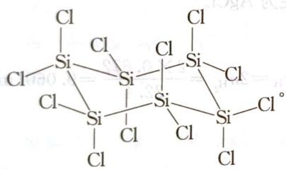

6-8 $2\mathrm{K}_3[\mathrm{Mn}(\mathrm{C}_2\mathrm{O}_4)_3]\cdot 3\mathrm{H}_2\mathrm{O} = 2\mathrm{K}_2[\mathrm{Mn}(\mathrm{C}_2\mathrm{O}_4)_2] + \mathrm{K}_2\mathrm{C}_2\mathrm{O}_4 + 2\mathrm{CO}_2\uparrow +6\mathrm{H}_2\mathrm{O}$

第7题 设B化学式为 $\mathrm{P}_x\mathrm{H}_y(x,y$ 不一定是整数),列方程式为:

$$
\mathrm{P} _ {x} \mathrm{H} _ {y} + \mathrm{Ph} _ {3} \mathrm{CNa} \longrightarrow \mathrm{NaP} _ {x} \mathrm{H} _ {y - 1} + \mathrm{Ph} _ {3} \mathrm{CH}
$$

$$
3 \mathrm{NaP} _ {x} \mathrm{H} _ {y - 1} = \mathrm{Na} _ {3} \mathrm{P} + \mathrm{P} _ {3 x - 1} \mathrm{H} _ {3 (y - 1)}
$$

最后根据题意,可以得到:

$$
\mathrm{A}: \mathrm{P} _ {2} \mathrm{H} _ {4}; \mathrm{B}: \mathrm{PH} _ {3}; \mathrm{C}: \mathrm{NaPH} _ {2}
$$

因此化学反应方程式为：

$$
2 \mathrm{P} + 2 \mathrm{H} _ {2} = \mathrm{P} _ {2} \mathrm{H} _ {4};
$$

$$
\mathrm{PH} _ {3} + \mathrm{Ph} _ {3} \mathrm{CNa} = \mathrm{NaH} _ {2} \mathrm{P} + \mathrm{Ph} _ {3} \mathrm{CH};
$$

$$
3 \mathrm{NaH} _ {2} \mathrm{P} = 2 \mathrm{PH} _ {3} + \mathrm{Na} _ {3} \mathrm{P};
$$

$$
\mathrm{PH} _ {3} + \mathrm{NH} _ {3} = \mathrm{NH} _ {4} ^ {+} + \mathrm{PH} _ {2} ^ {-};
$$

阴极： $\mathrm{NH_4^+ + e = NH_3 + 0.5H_2}$

阳极： $\mathrm{PH}_2^-$ -3e $\mathrm{P} + 2\mathrm{H}^{+}$

第8题 8-1 由M相对分子质量为374.09可知：

第一次损失相对分子质量为 $374.09 \times (1 - 0.9037) = 36.02$ ，应为两个结晶水，则化学式为

$$
\mathrm{UO} _ {2} \left(\mathrm{O} _ {2}\right) \left(\mathrm{H} _ {2} \mathrm{O}\right) _ {2}
$$

。

第二次产物相对分子质量为 $374.09 \times 0.7860 = 294.03$ ，应为 U 的氧化物，因此 B 为 $UO_{3.5}$ ，即 $U_{2}O_{7}$ 。

第三次产物相对分子质量为 $374.09 \times 0.7646 = 286.03$ ，C 应为 $UO_{3}$ 。

A到B为： $4\mathrm{UO}_2(\mathrm{O}_2)(\mathrm{H}_2\mathrm{O})_2 = 2\mathrm{U}_2\mathrm{O}_7 + \mathrm{O}_2 + 8\mathrm{H}_2\mathrm{O};$

B到C为： $2U_{2}O_{7}=4UO_{3}+O_{2}$

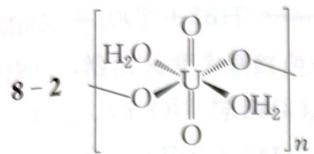

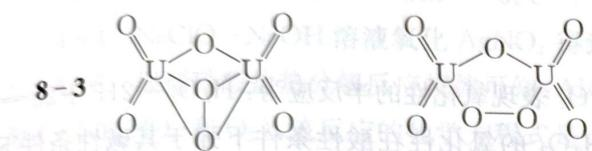

卷 A 五版六論

第9题 9-1 $S_{4}N_{4}$ ; $6S_{2}Cl_{2} + 16NH_{3} = S_{4}N_{4} + S_{8} + 12NH_{4}Cl$ 。

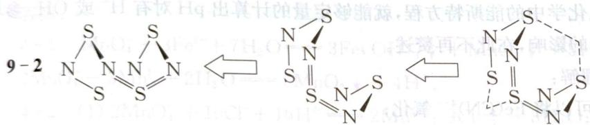

9-3 因为 $\mathrm{S}_4\mathrm{N}_4$ 中硫氮键的强度介于 S—N 单键和 S=N 双键之间，约为 $400\mathrm{kJ}\cdot \mathrm{mol}^{-1}$ ，而分解的生成物 $\mathbf{N}_2$ ，其 $\mathrm{N}\equiv \mathrm{N}$ 键能 $E(\mathrm{N}\equiv \mathrm{N}) = 945\mathrm{kJ}\cdot \mathrm{mol}^{-1}$ ，且分解反应（产生气体）是熵增反应，焓效应和熵效应都有利于 $\mathrm{S}_4\mathrm{N}_4$ 分解，故 $\mathrm{S}_4\mathrm{N}_4$ 不稳定，加热即可发生爆炸性分解。而由 $\mathbf{N}_2$ 和 S 合成 $\mathrm{S}_4\mathrm{N}_4$ 必须断裂旧键，需要加热，所以不能使用 $\mathbf{N}_2$ 和 S 做原料来合成 $\mathrm{S}_4\mathrm{N}_4$ 。

9-4 每个N原子提供1个π电子,每个S原子提供2个π电子,因此π电子总数 $m=2\times4+1\times4=12$ , $n=4+4=8$ 。

9-5 因为 $\mathrm{S}_4\mathrm{N}_4$ 有12个非定域电子，电子跃迁能量低，可见光就可以使其激发，因而有颜色。这种物质叫做热色性物质。

9-6 S—S键相互作用。成因是：S上被两个电子占据的 $\mathrm{P}_z$ 轨道与跨环的另一个S的空3d轨道(或大π键与S的空3d轨道)发生相互作用，这种相互作用的本质是(次级的)轨道间的给受体相互作用。

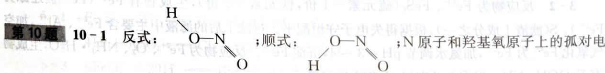

子相互排斥,阻碍了 N—O 单键旋转或室温下二者相互转换下能量较高,不易相互转换。

10-2 A:NO $^{+}$ :[: N≡O:] $^{+}$ ; B:INO: $\ddot{O}$ =N $_{I}$ .

$$
\mathrm{HNO} _ {2} + \mathrm{H} ^ {+} \rightleftharpoons \mathrm{NO} ^ {+} + \mathrm{H} _ {2} \mathrm{O} \quad \mathrm{NO} ^ {+} + \mathrm{I} ^ {-} \rightleftharpoons \mathrm{INO} \quad 2 \mathrm{INO} = \mathrm{I} _ {2} + 2 \mathrm{NO}
$$

10-3 C: 过氧亚硝酸; HOONO; $\ce{H-\ddot{O}-\ddot{O}-N=\ddot{O}:}$ ，左边两个 O 原子为 $sp^{3}$ 杂化; N 为 $sp^{2}$

杂化。

反应机理：

$$
\mathrm{HNO} _ {2} + \mathrm{H} ^ {+} \rightleftharpoons \mathrm{H} _ {2} \mathrm{NO} _ {2} ^ {+} \rightleftharpoons \mathrm{NO} ^ {+} + \mathrm{H} _ {2} \mathrm{O};
$$

$$
\mathrm{H} _ {2} \mathrm{O} _ {2} + \mathrm{NO} ^ {+} \rightleftharpoons \mathrm{HOONO} + \mathrm{H} ^ {+};
$$

$$
\mathrm{HOONO} \rightleftharpoons \mathrm{NO} _ {3} ^ {-} + \mathrm{H} ^ {+} 。
$$

10-4 $2\mathrm{Al} + \mathrm{NO}_2^- +\mathrm{OH}^- +\mathrm{H}_2\mathrm{O}\longrightarrow 2\mathrm{AlO}_2^- +\mathrm{NH}_3\uparrow$ （写成 $\mathrm{Al(OH)_4^-}$ 也可）

或 $2Al + NO_{2}^{-} + OH^{-} + 5H_{2}O \longrightarrow 2[Al(OH)_{4}]^{-} + NH_{3}\uparrow$ 。

## 第3章 离子反应

## 能力测试 A 卷

第1题 $\mathrm{H}_{2} \mathrm{O}_{2}$ 的氧化性与酸性大小有关, $\mathrm{H}_{2} \mathrm{O}_{2}$ 表现氧化性的半反应为: $\mathrm{H}_{2} \mathrm{O}_{2} + 2 \mathrm{H}^{+} + 2 \mathrm{e} = 2 \mathrm{H}_{2} \mathrm{O}, \mathrm{H}^{+}$ 浓度增大, 有利反应向右进行, 即 $\mathrm{H}_{2} \mathrm{O}_{2}$ 的氧化性在酸性条件下强于其碱性条件下; $\mathrm{H}_{2} \mathrm{O}_{2}$ 表现还原性的半反应为: $\mathrm{H}_{2} \mathrm{O}_{2} - 2 \mathrm{e} + 2 \mathrm{OH}^{-} = \mathrm{O}_{2} \uparrow + 2 \mathrm{H}_{2} \mathrm{O}$ , 则在碱性条件下, $\mathrm{H}_{2} \mathrm{O}_{2}$ 的还原性增强。如果自学了电化学中的能斯特方程, 就能够定量的计算出 $\mathrm{pH}$ 对有 $\mathrm{H}^{+}$ 或 $\mathrm{OH}^{-}$ 参与反应的物质氧化性和还原性的影响, 在此不再赘述。

由上面的分析,不难理解:

在酸性条件下 $H_{2}O_{2}$ 可以将 $\mathrm{Fe(CN)}_{6}^{4-}$ 氧化；

在碱性条件下， $H_{2}O_{2}$ 的可将 $\mathrm{Fe(CN)}_{6}^{3-}$ 还原。

$$
2 \mathrm{Fe(CN)} _ {6} ^ {4 -} + \mathrm{H} _ {2} \mathrm{O} _ {2} + 2 \mathrm{H} ^ {+} = 2 \mathrm{Fe(CN)} _ {6} ^ {3 -} + 2 \mathrm{H} _ {2} \mathrm{O};
$$

$$
2 \mathrm{Fe(CN)} _ {6} ^ {3 -} + \mathrm{H} _ {2} \mathrm{O} _ {2} + 2 \mathrm{OH} ^ {-} = 2 \mathrm{Fe(CN)} _ {6} ^ {4 -} + \mathrm{O} _ {2} \uparrow + 2 \mathrm{H} _ {2} \mathrm{O}.
$$

第2题 2-1 由题意可知,离子反应可表示为 $BH_{4}^{-} + Au^{3+} + \cdots \rightarrow Au + BO_{2}^{-} + \cdots$ , 结合守恒规律补全物质并配平该离子方程式。

2-2 根据题给信息,结合质量守恒、电荷守恒及得失电子守恒,可写出 $MnO_{2}$ 、 $H_{3}AsO_{3}$ 在酸性条件下的离子方程式。

答案：

$$
2 - 1 \quad 8 \mathrm{Au} ^ {3 +} + 3 \mathrm{BH} _ {4} ^ {-} + 2 4 \mathrm{OH} ^ {-} = 8 \mathrm{Au} + 3 \mathrm{BO} _ {2} ^ {-} + 1 8 \mathrm{H} _ {2} \mathrm{O}
$$

$$
2 - 2 \quad \mathrm{MnO} _ {2} + \mathrm{H} _ {3} \mathrm{AsO} _ {3} + 2 \mathrm{H} ^ {+} = \mathrm{H} _ {3} \mathrm{AsO} _ {4} + \mathrm{Mn} ^ {2 +} + \mathrm{H} _ {2} \mathrm{O} 。
$$

第3题 3-1 反应I是 $\mathrm{SO}_2$ 、 $\mathrm{I}_2$ 、 $\mathrm{H}_2\mathrm{O}$ 的反应。

3-2 反应物为 $\mathrm{Fe}^{3+}$ 、 $\mathrm{FeS}_2$ （硫元素-1价，铁元素+2价），生成物有 $\mathrm{Fe}^{2+}$ （ $\mathrm{Fe}^{3+}$ 被还原为 $\mathrm{Fe}^{2+}$ ）、 $\mathrm{S}$ （滤渣I成分之一），根据得失电子守恒配平。过滤I后的滤液中主要含 $\mathrm{Fe}^{2+}$ 、 $\mathrm{Al}^{3+}$ ，加空气氧化 $\mathrm{Fe}^{2+}$ 为 $\mathrm{Fe}^{3+}$ ，加氨水调节 $\mathrm{pH}=3\sim4$ ，沉淀 $\mathrm{Fe}^{3+}$ 。反应物为 $\mathrm{Fe}^{2+}$ 、 $\mathrm{O}_2$ 、 $\mathrm{NH}_3\cdot\mathrm{H}_2\mathrm{O}$ ，生成物有 $\mathrm{FeOOH}$ 、 $\mathrm{NH}_4^+$ ，根据电子守恒、电荷守恒配平：

$4Fe^{2+} + 8NH_{3} \cdot H_{2}O + O_{2} = 4FeOOH \downarrow + 8NH_{4}^{+} + 2H_{2}O$ ，根据原子守恒确定水。

3-3 氯酸钠 $\left(\mathrm{NaClO}_{3}\right)$ 与盐酸反应生成 $\mathrm{ClO}_2$ 的方程式：

$$
2 \mathrm{NaClO} _ {3} + 4 \mathrm{HCl} = 2 \mathrm{ClO} _ {2} \uparrow + \mathrm{Cl} _ {2} \uparrow + 2 \mathrm{NaCl} + 2 \mathrm{H} _ {2} \mathrm{O} 。
$$

答案：

$$
3 - 1 \quad \mathrm{SO} _ {2} + \mathrm{I} _ {2} + 2 \mathrm{H} _ {2} \mathrm{O} = 4 \mathrm{H} ^ {+} + \mathrm{SO} _ {4} ^ {2 -} + 2 \mathrm{I} ^ {-}.
$$

$$
3 - 2 \quad 2 \mathrm{Fe} ^ {3 +} + \mathrm{FeS} _ {2} = 3 \mathrm{Fe} ^ {2 +} + 2 \mathrm{S};
$$

$$
4 \mathrm{Fe} ^ {2 +} + 8 \mathrm{NH} _ {3} \cdot \mathrm{H} _ {2} \mathrm{O} + \mathrm{O} _ {2} = 4 \mathrm{FeOOH} \downarrow + 8 \mathrm{NH} _ {4} ^ {+} + 2 \mathrm{H} _ {2} \mathrm{O}
$$

$$
3 - 3 \quad 2 \mathrm{ClO} _ {3} ^ {-} + 4 \mathrm{H} ^ {+} + 2 \mathrm{Cl} ^ {-} = 2 \mathrm{ClO} _ {2} \uparrow + \mathrm{Cl} _ {2} \uparrow + 2 \mathrm{H} _ {2} \mathrm{O} _ {\circ}
$$

第4题 4-1 $\mathrm{Fe}^{2+}$ 和 $\mathrm{Mn}^{2+}$ 具有还原性，被氧化性较强的 $\mathrm{KMnO}_4$ (aq) 氧化为 $\mathrm{Fe(OH)}_3$ 、 $\mathrm{MnO}_2$ 而除去。

4-2 （1）根据浓盐酸被 $\mathrm{KMnO_4}$ 氧化可知：酸性条件下 $\mathrm{Cl^-}$ 能被 $\mathrm{KMnO_4}$ 氧化，反应方程式为 $2\mathrm{MnO}_4^-$ + $10\mathrm{Cl^-} + 16\mathrm{H^+} = 2\mathrm{Mn}^{2+} + 5\mathrm{Cl}_2\uparrow +8\mathrm{H}_2\mathrm{O}$ ；（2）在反应后的溶液中加入 $\mathrm{NaBiO_3}$ （不溶于冷水），溶液又变为紫红色（应该为 $\mathrm{MnO_4^-}$ ），说明 $\mathrm{MnSO_4}$ 被氧化。4-3 $\mathrm{Cr_2O_7^{2 - }}$ 与 $\mathrm{FeSO_4}$ 溶液在酸性条件下反应的离子方程式是

4-3 $\mathrm{Cr_2O_7^{2 - }}$ 与 $\mathrm{FeSO_4}$ 溶液在酸性条件下反应的离子方程式是：

$$
\mathrm{Cr} _ {2} \mathrm{O} _ {7} ^ {2 -} + 6 \mathrm{Fe} ^ {2 +} + 1 4 \mathrm{H} ^ {+} = 2 \mathrm{Cr} ^ {3 +} + 6 \mathrm{Fe} ^ {3 +} + 7 \mathrm{H} _ {2} \mathrm{O}
$$

4-4 NaClO—NaOH溶液氧化 $AgNO_{3}$ 得到 $Ag_{2}O_{2}$

4-5 根据硝酸盐热分解反应规律可知: $\mathrm{Al(NO_{3})_{3}}$ 完全分解成 $Al_{2}O_{3}$ 和两种气体(其体积比为 4:1 的 $NO_{2}$ 和 $O_{2}$ ), 该反应的化学方程式是:

$$
4 \mathrm{Al} (\mathrm{NO} _ {3}) _ {3} \stackrel {\text {高温}} {=} 1 2 \mathrm{NO} _ {2} \uparrow + 3 \mathrm{O} _ {2} \uparrow + 2 \mathrm{Al} _ {2} \mathrm{O} _ {3}
$$

答案:

$$
4 - 1 \quad \mathrm{MnO} _ {4} ^ {-} + 3 \mathrm{Fe} ^ {2 +} + 7 \mathrm{H} _ {2} \mathrm{O} = 3 \mathrm{Fe(OH)} _ {3} \downarrow + \mathrm{MnO} _ {2} \downarrow + 5 \mathrm{H} ^ {+};
$$

$$
2 \mathrm{MnO} _ {4} ^ {-} + 3 \mathrm{Mn} ^ {2 +} + 2 \mathrm{H} _ {2} \mathrm{O} = 5 \mathrm{MnO} _ {2} \downarrow + 4 \mathrm{H} ^ {+} 。
$$

$$
4 - 2 \quad (1) 2 \mathrm{MnO} _ {4} ^ {-} + 1 0 \mathrm{Cl} ^ {-} + 1 6 \mathrm{H} ^ {+} = 2 \mathrm{Mn} ^ {2 +} + 5 \mathrm{Cl} _ {2} \uparrow + 8 \mathrm{H} _ {2} \mathrm{O};
$$

$$
2 \mathrm{Mn} ^ {2 +} + 5 \mathrm{NaBiO} _ {3} + 1 4 \mathrm{H} ^ {+} = 2 \mathrm{MnO} _ {4} ^ {-} + 5 \mathrm{Na} ^ {+} + 5 \mathrm{Bi} ^ {3 +} + 7 \mathrm{H} _ {2} \mathrm{O}
$$

$$
4 - 3 \quad \mathrm{Cr} _ {2} \mathrm{O} _ {7} ^ {2 -} + 6 \mathrm{Fe} ^ {2 +} + 1 4 \mathrm{H} ^ {+} = 2 \mathrm{Cr} ^ {3 +} + 6 \mathrm{Fe} ^ {3 +} + 7 \mathrm{H} _ {2} \mathrm{O} 。
$$

$$
4 - 4 \quad 2 \mathrm{Ag} ^ {+} + \mathrm{ClO} ^ {-} + 2 \mathrm{OH} ^ {-} = \mathrm{Ag} _ {2} \mathrm{O} _ {2} \downarrow + \mathrm{Cl} ^ {-} + \mathrm{H} _ {2} \mathrm{O} 。
$$

$$
4 \mathrm{Al} (\mathrm{NO} _ {3}) _ {3} \stackrel {\text {高温}} {=} 1 2 \mathrm{NO} _ {2} \uparrow + 3 \mathrm{O} _ {2} \uparrow + 2 \mathrm{Al} _ {2} \mathrm{O} _ {3}
$$

第5题 5-1 根据题意 $\mathrm{Fe}_{3} \mathrm{~S}_{4}$ 与稀 $\mathrm{H}_{2} \mathrm{SO}_{4}$ 反应，生成的淡黄色不溶物应为 S，气体的摩尔质量为 $M = 1.518 \mathrm{~g} \cdot \mathrm{L}^{-1} \times 22.4 \mathrm{~L} \cdot \mathrm{mol}^{-1} = 34 \mathrm{~g} \cdot \mathrm{mol}^{-1}$ ，故应为 $\mathrm{H}_{2} \mathrm{~S}$ ，硫元素化合价升高，故产物还有 $\mathrm{Fe}^{2+}$ ，反应的离子方程式为 $\mathrm{Fe}_{3} \mathrm{~S}_{4} + 6 \mathrm{H}^{+} = 3 \mathrm{Fe}^{2+} + 3 \mathrm{H}_{2} \mathrm{~S} \uparrow + \mathrm{S}$ 。

5-2 酸性条件下, $NaClO_{2}$ 发生歧化反应生成 NaCl 并释放出 $ClO_{2}$ 。

5-3 $\mathrm{FeO}_{4}^{2-}$ 具有强氧化性,在其钠盐溶液中加入稀 $\mathrm{H}_{2} \mathrm{SO}_{4}$ , 溶液变为黄色,说明生成 $\mathrm{Fe}^{3+}$ , 铁元素化合价降低,有无色气体产生,只能是 $\mathrm{O}_{2}$ 。

因此答案为：

$$
\mathbf {5} - \mathbf {1} \quad \mathrm{Fe} _ {3} \mathrm{S} _ {4} + 6 \mathrm{H} ^ {+} = 3 \mathrm{Fe} ^ {2 +} + 3 \mathrm{H} _ {2} \mathrm{S} \uparrow + \mathrm{S} _ {\circ}
$$

$$
5 - 2 \quad 4 \mathrm{H} ^ {+} + 5 \mathrm{ClO} _ {2} ^ {-} = \mathrm{Cl} ^ {-} + 4 \mathrm{ClO} _ {2} \uparrow + 2 \mathrm{H} _ {2} \mathrm{O} 。
$$

$$
5 - 3 \quad 4 \mathrm{FeO} _ {4} ^ {2 -} + 2 0 \mathrm{H} ^ {+} = 4 \mathrm{Fe} ^ {3 +} + 3 \mathrm{O} _ {2} \uparrow + 1 0 \mathrm{H} _ {2} \mathrm{O} 。
$$

第6题 由甲组实验中溴水不褪色,说明废水试样中不含 $\mathrm{SO}_3^{2-}$ ; 由丙组实验现象可确定废水中含 $\mathrm{NH}_4^+$ , 即 X 为 $\mathrm{NH}_4^+$ ; 由丁组实验现象说明其含 $\mathrm{NO}_3^-$ ; 由乙组实验现象说明其含 $\mathrm{SO}_4^{2-}$ , 即 Y 为 $\mathrm{SO}_4^{2-}$ 。不能确定是否存在的阴离子为 $\mathrm{Cl^-}$ 。废水试样中滴加淀粉 KI 溶液, 酸性条件下, $\mathrm{NO}_3^-$ 有强氧化性, 与 I⁻ 发生氧化还原反应。

答案为：

6-1 $NH_{4}^{+}$ ; $SO_{4}^{2-}$

6-2 $\mathrm{Cl}^{-}$ ; 取少量废水试样, 滴加足量的 $\mathrm{Ba(NO_3)_2}$ 溶液, 静置; 取上层清液, 滴加硝酸酸化的 $\mathrm{AgNO_3}$ 溶液, 若有白色沉淀产生, 则存在 $\mathrm{Cl}^{-}$ ; 若无白色沉淀产生, 则不存在 $\mathrm{Cl}^{-}$ 。

$$
6 - 3 \quad 6 \mathrm{I} ^ {-} + 2 \mathrm{NO} _ {3} ^ {-} + 8 \mathrm{H} ^ {+} = 3 \mathrm{I} _ {2} + 2 \mathrm{NO} \uparrow + 4 \mathrm{H} _ {2} \mathrm{O} 。
$$

第7题 7-1 $\mathrm{AlCl}_3$ 与 $\mathrm{NaHCO}_3$ 发生双水解生成 $\mathrm{Al(OH)}_3$ 沉淀和 $\mathrm{CO}_{2}$ 气体。

7-2 $\mathrm{CN}^{-}$ 与 $\mathrm{S}_2\mathrm{O}_3^{2-}$ 反应生成两种离子，其中一种离子与 $\mathrm{Fe}^{3+}$ 可生成红色溶液（说明有 $\mathrm{SCN}^{-}$ ），另一种离子与 $\mathrm{H}^{+}$ 作用产生能使品红溶液褪色的刺激性气味的气体（说明有 $\mathrm{SO}_3^{2-}$ 或 $\mathrm{HSO}_3^-$ ），反应生成 $\mathrm{SCN}^{-}$ 与 $\mathrm{SO}_3^{2-}$ 或 $\mathrm{HSO}_3^-$ 。

7-3 酸性 $\mathrm{K}_{2} \mathrm{Cr}_{2} \mathrm{O}_{7}$ (aq) 能将 $\mathrm{NaNO}_{2}$ 氧化成 $\mathrm{NaNO}_{3}$ , 同时溶液由橙色 $(\mathrm{Cr}_{2} \mathrm{O}_{7}^{2-})$ 变为绿色 $(\mathrm{Cr}^{3+})$ , 反应的离子方程式为 $\mathrm{Cr}_{2} \mathrm{O}_{7}^{2-} + 3 \mathrm{NO}_{2}^{-} + 8 \mathrm{H}^{+} = 2 \mathrm{Cr}^{3+} + 3 \mathrm{NO}_{3}^{-} + 4 \mathrm{H}_{2} \mathrm{O}$ 。

7-4 在淀粉 NaI 溶液中, 滴入少量 NaClO(aq), 溶液立即变蓝, 说明 $\mathrm{I}^{-}$ 被 $\mathrm{ClO}^{-}$ 氧化生成 $\mathrm{I}_{2}$ , 继续滴加足量的 $\mathrm{NaClO(aq)}$ , 蓝色逐渐消失, 说明 $\mathrm{I}_{2}$ 继续被 $\mathrm{ClO}^{-}$ 氧化生成 $\mathrm{IO}_{3}^{-}$ , 碘元素化合价由 0 价变为 +5 价、氯元素化合价由 +1 价变为 -1 价, 离子方程式为:

$$
\mathrm{I} _ {2} + 5 \mathrm{ClO} ^ {-} + 2 \mathrm{OH} ^ {-} = 2 \mathrm{IO} _ {3} ^ {-} + 5 \mathrm{Cl} ^ {-} + \mathrm{H} _ {2} \mathrm{O}
$$

答案为：

$$
\begin{array}{r l} {7 - 1} & {\mathrm{Al} ^ {3 +} + 3 \mathrm{HCO} _ {3} ^ {-} = \mathrm{Al(OH)} _ {3} \downarrow + 3 \mathrm{CO} _ {2} \uparrow .} \\ {7 - 2} & {\mathrm{CN} ^ {-} + \mathrm{S} _ {2} \mathrm{O} _ {3} ^ {2 -} = \mathrm{SCN} ^ {-} + \mathrm{SO} _ {3} ^ {2 -} (\text {写为HSO} _ {3} ^ {-} \text {也可})} \\ {7 - 3} & {\mathrm{Cr} _ {2} \mathrm{O} _ {7} ^ {2 -} + 3 \mathrm{NO} _ {2} ^ {-} + 8 \mathrm{H} ^ {+} = 2 \mathrm{Cr} ^ {3 +} + 3 \mathrm{NO} _ {3} ^ {-} + 4 \mathrm{H} _ {2} \mathrm{O}} \\ {7 - 4} & {\mathrm{I} _ {2} + 5 \mathrm{ClO} ^ {-} + 2 \mathrm{OH} ^ {-} = 2 \mathrm{IO} _ {3} ^ {-} + 5 \mathrm{Cl} ^ {-} + \mathrm{H} _ {2} \mathrm{O}} \end{array}
$$

第8题 8-1 草酸亚铁晶体分解生成的物质有 $\mathrm{FeO}$ 、 $\mathrm{CO}$ 、 $\mathrm{CO}_{2}$ 、 $\mathrm{H}_{2} \mathrm{O}$ ，B装置是用于检验水蒸气的，选用无水硫酸铜；D的作用是检验 $\mathrm{CO}_{2}$ 是否被吸收完全。 $\mathrm{Ba(OH)}_{2}$ 与 $\mathrm{CO}_{2}$ 反应生成 $\mathrm{BaCO}_{3}$ 和 $\mathrm{H}_{2} \mathrm{O}$

8-2 空气中的 $\mathrm{O}_2$ 能氧化 $\mathrm{CO}$ , 空气中的 $\mathrm{CO}_2$ 会干扰对生成的 $\mathrm{CO}_2$ 量的测定, 故要先将装置中空气排出。

8-3 由题给信息可知该反应的反应物为 $\mathrm{CO}$ 、 $\mathrm{PdCl}_2$ 和 $\mathrm{H}_2\mathrm{O}$ ，生成物为 $\mathrm{Pd}$ 、 $\mathrm{CO}_2$ 和 $\mathrm{HCl}$ ，配平后即可得到该氧化还原反应的化学方程式。

8-4 第二次通入 $\mathbf{N}_2$ 的目的是使生成的 $\mathrm{CO}_{2}$ 全部进入装置 C 中, 故相应的操作为打开 $\mathbf{K}_{1}$ 、 $\mathbf{K}_{3}$ , 关闭 $\mathbf{K}_{2}$ , 缓缓通入 $\mathbf{N}_2$ 一段时间。

8-5 草酸亚铁晶体物质的量为 $0.2 \mathrm{~mol}$ , $\mathrm{BaCO}_{3}$ 沉淀的物质的量 $n = 41.37 \mathrm{~g} / 197 \mathrm{~g} \cdot \mathrm{mol}^{-1} = 0.21 \mathrm{~mol}$ , $n(\mathrm{FeC}_{2} \mathrm{O}_{4} \cdot 2 \mathrm{H}_{2} \mathrm{O}): n(\mathrm{CO}_{2}) = 20:21$ , 相应的化学方程式为

$$
2 0 \mathrm{FeC} _ {2} \mathrm{O} _ {4} \cdot 2 \mathrm{H} _ {2} \mathrm{O} \xlongequal {\triangle} 1 9 \mathrm{FeO} + 1 9 \mathrm{CO} \uparrow + 2 1 \mathrm{CO} _ {2} \uparrow + \mathrm{Fe} + 4 0 \mathrm{H} _ {2} \mathrm{O} 。
$$

8-6 高温条件下， $\mathrm{FeC_2O_4 \cdot 2H_2O}$ 分解出的 CO 和 FeO 发生了氧化还原反应，生成了 $\mathrm{CO_2}$ 和 Fe，导致 $\mathrm{CO_2}$ 的量增多。

答案：

8-1 无水硫酸铜；检验 $\mathrm{CO}_{2}$ 是否被吸收完全； $\mathrm{Ba}^{2+} + 2\mathrm{OH}^{-} + \mathrm{CO}_{2} = \mathrm{BaCO}_{3}\downarrow +\mathrm{H}_{2}\mathrm{O}$ 。

8-2 排出装置内的空气，防止 $\mathrm{O}_2$ 氧化生成的CO，防止空气中的 $\mathrm{CO}_2$ 进入装置C中。

8-3 因 $\mathrm{PdCl}_2$ 不溶于水，因此离子方程式为：

$$
\mathrm{CO} + \mathrm{PdCl} _ {2} + \mathrm{H} _ {2} \mathrm{O} = \mathrm{Pd} + \mathrm{CO} _ {2} + 2 \mathrm{H} ^ {+} + 2 \mathrm{Cl} ^ {-} 。
$$

8-4 打开 $\mathrm{K}_{1}$ 、 $\mathrm{K}_{3}$ ，关闭 $\mathrm{K}_{2}$ ，缓缓通入 $\mathrm{N}_{2}$ 一段时间。

$$
8 - 5 \quad 2 0 \mathrm{FeC} _ {2} \mathrm{O} _ {4} \cdot 2 \mathrm{H} _ {2} \mathrm{O} \xlongequal {\triangle} 1 9 \mathrm{FeO} + 1 9 \mathrm{CO} \uparrow + 2 1 \mathrm{CO} _ {2} \uparrow + \mathrm{Fe} + 4 0 \mathrm{H} _ {2} \mathrm{O}
$$

8-6 高温条件下， $\mathrm{FeC}_{2} \mathrm{O}_{4} \cdot 2 \mathrm{H}_{2} \mathrm{O}$ 分解出的 CO 和 FeO 发生了氧化还原反应，生成了 $\mathrm{CO}_{2}$ 和 Fe 取适量的 A 装置中反应后的固体产物于小试管中，加入过量稀硫酸，若有气体产生，则说明乙同学观点正确。

第9题 9-1 氯由0价升至+5价和降至-1价，发生歧化反应，根据得失电子守恒可配平反应。缓慢通入 $\mathrm{Cl}_2$ 可以减慢反应速率，从而控制反应温度。

9-2 若将尿素滴入 NaClO 碱性溶液中, 可以迅速将滴入的尿素氧化成水合肼, 而已知②中说明, 水合肼具有强还原性, 可以被 NaClO 氧化成 $\mathrm{N}_{2}$ , 所以应将 NaClO 碱性溶液滴入尿素中。水合肼的沸点为 $118^{\circ} \mathrm{C}$ , 若不使用冷凝管, 则会造成水合肼的挥发而损失。

9-3 ①由图2知， $\mathrm{pH} = 4$ 时，溶液中主要存在 $\mathrm{HSO}_3^-$ ，所以可以通过测定溶液的 $\mathbf{pH}$ 来确定溶液中的主要成分为 $\mathrm{NaHSO}_3$ 。②由图2知， $\mathrm{pH} = 10$ 左右时，溶液中主要成分为 $\mathrm{Na}_2\mathrm{SO}_3$ ，故可以向 $\mathrm{NaHSO}_3$ 中加入 $\mathrm{NaOH}$ 溶液，控制 $\mathrm{pH}$ 约为10时，得 $\mathrm{Na}_2\mathrm{SO}_3$ 溶液，由图3知，在温度高于 $34^\circ\text{C}$ 时，析出的主要成分为 $\mathrm{Na}_2\mathrm{SO}_3$ ，在低于 $34^\circ\text{C}$ 时，析出 $\mathrm{Na}_2\mathrm{SO}_3 \cdot 7\mathrm{H}_2\mathrm{O}$ 晶体，故加热浓缩 $\mathrm{Na}_2\mathrm{SO}_3$ 溶液时，需要控制温度在 $34^\circ\text{C}$ 以上，最后趁热过滤，以得出较纯的 $\mathrm{Na}_2\mathrm{SO}_3$ 晶体。

答案：

9-1 $3Cl_{2} + 6OH^{-} \xrightarrow{\triangle} 5Cl^{-} + ClO_{3}^{-} + 3H_{2}O$ ; 缓慢通入 $Cl_{2}$ 。

9-2 NaClO 碱性溶液; 减少水合肼的挥发。

9-3 ① 测量溶液的 pH, 若 pH ≈ 4, 停止通 SO₂;

② 边搅拌边向 $NaHSO_{3}$ 溶液中滴加 NaOH 溶液，测量溶液 pH，pH ≈ 10 时，停止滴加 NaOH 溶液，加热浓缩溶液至有大量晶体析出，在高于 $34^{\circ}C$ 条件下趁热过滤。

第10题 10-1 pH 过低, 则 $\mathrm{CrO}_{4}^{2-}$ 利用率低, 由图看出: $\mathrm{pH}=7.5$ 和 $\mathrm{pH}=10$ 时 $\mathrm{CrO}_{4}^{2-}$ 利用率相当, 但后期需要将 $\mathrm{pH}$ 调回 1, 导致浪费药品, 因此应选用 $\mathrm{pH}=7.5$ 。

10-2 酸性条件下, $H_{2}C_{2}O_{4}$ 还原 $Cr_{2}O_{7}^{2-}$ 离子方程式为:

$$
8 \mathrm{H} ^ {+} + \mathrm{Cr} _ {2} \mathrm{O} _ {7} ^ {2 -} + 3 \mathrm{H} _ {2} \mathrm{C} _ {2} \mathrm{O} _ {4} = 6 \mathrm{CO} _ {2} \uparrow + 2 \mathrm{Cr} ^ {3 +} + 7 \mathrm{H} _ {2} \mathrm{O} 。
$$

10-3 根据溶度积常数表得出沉淀为 $\mathrm{CaC_2O_4}$ 和 $\mathrm{Mg(OH)_2}$ 。

10-4 加入 $(\mathrm{NH}_4)_2\mathrm{CO}_3$ 在除杂的同时会形成 $\mathrm{SrCO_3}$ 沉淀，降低原料的利用率。

10-5 “中和、沉淀”时若调节 $\mathrm{pH}$ 过高会导致部分 $\mathrm{Cr(OH)}_3$ 溶解（该物质为两性），导致产品不纯。

10-6 $\mathrm{Sr(NO_3)_2}$ 和 $\mathrm{NH_3\cdot H_2O}$ 混合液与 $\mathrm{NH_4HCO_3}$ 反应的离子方程式为：

$$
\mathrm{NH} _ {3} \cdot \mathrm{H} _ {2} \mathrm{O} + \mathrm{HCO} _ {3} ^ {-} + \mathrm{Sr} ^ {2 +} = \mathrm{SrCO} _ {3} \downarrow + \mathrm{NH} _ {4} ^ {+} + \mathrm{H} _ {2} \mathrm{O} 。
$$

10-7 由于对产品的纯度要求是分析纯，而在成盐过程中生成的 $\mathrm{SrCO_3}$ 经过滤和洗涤后，仍会含微量 $\mathrm{NH_4NO_3}$ ，因此需要在 $200^{\circ}\mathrm{C}$ 时烘干使铵盐分解。

答案：

10-1 pH 过低, $CrO_{4}^{2-}$ 利用率低, pH=7.5 和 pH=10 时 $CrO_{4}^{2-}$ 的利用率相当, 但后期需要将 pH 调回 1, 导致浪费药品, 因此应选用 pH=7.5。

$$
1 0 - 2 \quad 8 \mathrm{H} ^ {+} + \mathrm{Cr} _ {2} \mathrm{O} _ {7} ^ {2 -} + 3 \mathrm{H} _ {2} \mathrm{C} _ {2} \mathrm{O} _ {4} = 6 \mathrm{CO} _ {2} \uparrow + 2 \mathrm{Cr} ^ {3 +} + 7 \mathrm{H} _ {2} \mathrm{O}
$$

10-3 $\mathrm{CaC_2O_4}$ 和 $\mathrm{Mg(OH)_2}$ 。

10-4 加入 $\left(\mathrm{NH}_{4}\right)_{2} \mathrm{CO}_{3}$ 在除杂的同时会形成 $\mathrm{SrCO}_{3}$ 沉淀，降低原料的利用率。

10-5 “中和、沉淀”时若调节 $\mathrm{pH}$ 过高会导致部分 $\mathrm{Cr(OH)_3}$ 溶解，导致产品不纯。

$$
1 0 - 6 \quad \mathrm{NH} _ {3} \cdot \mathrm{H} _ {2} \mathrm{O} + \mathrm{HCO} _ {3} ^ {-} + \mathrm{Sr} ^ {2 +} = \mathrm{SrCO} _ {3} \downarrow + \mathrm{NH} _ {4} ^ {+} + \mathrm{H} _ {2} \mathrm{O} 。
$$

10-7 $\mathrm{NH_4NO_3}$ [多写 $\mathrm{NH_4HCO_3}$ 、 $(\mathrm{NH_4})_2\mathrm{CO}_3$ 也可]。

## 能力测试B卷

第1题 1-1 废液含少量 $\mathrm{Fe}^{3+}$ 和 $\mathrm{Cu}^{2+}$ , 先加入足量的 Fe 粉, 使 $\mathrm{Fe}^{3+}$ 和 $\mathrm{Cu}^{2+}$ 转化为 $\mathrm{Fe}^{2+}$ 和 Cu, 经过操作 1 过滤后, 可将废液中的 $\mathrm{Cu}^{2+}$ 除尽, 过滤需要的玻璃仪器分别是漏斗、烧杯、玻璃棒。

1-2 加入氧化剂双氧水，将 $\mathrm{Fe}^{2+}$ 氧化成 $\mathrm{Fe}^{3+}$ ，同时自身被还原为水。

1-3 由表中数据可知,加入氨水调节溶液 pH 到 3.7 左右,使溶液中的 $Fe^{3+}$ 完全转化为 $\mathrm{Fe(OH)}_{3}$ 沉淀,过滤,得到滤渣 $\mathrm{Fe(OH)}_{3}$ 。

1-4 NaClO 具有氧化性,能把 $Fe^{3+}$ 氧化生成高铁酸盐,而 NaClO 被还原生成 NaCl。根据电子守恒和电荷守恒,可以写出离子方程式:

$$
3 \mathrm{ClO} ^ {-} + 4 \mathrm{OH} ^ {-} + 2 \mathrm{Fe(OH)} _ {3} = 2 \mathrm{FeO} _ {4} ^ {2 -} + 3 \mathrm{Cl} ^ {-} + 5 \mathrm{H} _ {2} \mathrm{O} 。
$$

1-5 铵明矾溶于水配成溶液,加入过量 NaOH 溶液充分混合、加热,发生反应的离子方程式为 ① $\mathrm{NH}_{4}^{+}+\mathrm{Al}^{3+}+5\mathrm{OH}^{-}\xlongequal{\triangle}\mathrm{AlO}_{2}^{-}+\mathrm{NH}_{3}\uparrow+3\mathrm{H}_{2}\mathrm{O}$ ;②9.06 g 硫酸铝铵晶体的物质的量 n= $\frac{9.06}{453}\mathrm{g}\cdot\mathrm{mol}^{-1}=0.02\mathrm{mol},9.06\mathrm{g}$ 硫酸铝铵晶体中水的质量为 $0.02\mathrm{mol}\times12\times18\mathrm{g}\cdot\mathrm{mol}^{-1}=4.32\mathrm{g}$ ，加热 $400^{\circ}C$ 时固体质量减少 $\Delta m=9.06\mathrm{g}-5.46\mathrm{g}=3.6\mathrm{g}<4.32\mathrm{g}$ ，剩余固体中结晶水的物质的量 $n=\frac{4.32\mathrm{g}-3.6\mathrm{g}}{18\mathrm{g}\cdot\mathrm{mol}^{-1}}=0.04\mathrm{mol}$ ，剩余固体中 $n[\mathrm{NH}_{4}\mathrm{Al}(\mathrm{SO}_{4})_{2}]:n(\mathrm{H}_{2}\mathrm{O})=0.02\mathrm{mol}:0.04\mathrm{mol}=1:2$ ，故 $400^{\circ}C$ 时剩余固体成分的化学式为 $\mathrm{NH}_{4}\mathrm{Al}(\mathrm{SO}_{4})_{2}\cdot2\mathrm{H}_{2}\mathrm{O}$ ;在温度从 $800^{\circ}C$ 到 $950^{\circ}C$ 的过程中得到的两种氧化物，一种为固体，一种为氧化性气体，则该固体为氧化铝，据铝守恒可知为 0.01 mol，即 1.02 g，气体只能为 $SO_{3}$ 。

答案:

1-1 除去铜离子；烧杯、漏斗、玻璃棒。

$$
1 - 2 \quad 2 \mathrm{Fe} ^ {2 +} + \mathrm{H} _ {2} \mathrm{O} _ {2} + 2 \mathrm{H} ^ {+} = 2 \mathrm{Fe} ^ {3 +} + 2 \mathrm{H} _ {2} \mathrm{O} 。
$$

1-3 3.7。

$$
1 - 4 \quad 3 \mathrm{ClO} ^ {-} + 4 \mathrm{OH} ^ {-} + 2 \mathrm{Fe(OH)} _ {3} = 2 \mathrm{FeO} _ {4} ^ {2 -} + 3 \mathrm{Cl} ^ {-} + 5 \mathrm{H} _ {2} \mathrm{O}
$$

1-5 ① $\mathrm{NH_4^+ + Al^{3 + } + 5OH^-\xlongequal{\triangle}AlO_2^- + NH_3\uparrow + 3H_2O;}$

② $\mathrm{NH_{4}Al(SO_{4})_{2}\cdot2H_{2}O}$ ; ③ 三氧化硫。

第2题 可用假设讨论确定 A\~D 的化学式。

2-1 先确定 D。设 D 化学式为 $MO_{x}$ ，M 摩尔质量为 $y \, g \cdot mol^{-1}$ 。则 $16.00x/(y + 16.00x) = 10.38\%$ 。化简得 y = 138.15x。

讨论：

当 x=1/2，则 y=69.1，M 为 Ga，其氧化物无氧化性，不合题意，舍去；

当 $x = 1, y = 138.1, \mathrm{M}$ 为La，非主族元素，不合题意，舍去；

当 $x = 4 / 3, y = 184.2, \mathrm{M}$ 为W，非主族元素，不合题意，舍去；

当 $x = 3 / 2, y = 207.2, \mathrm{M}$ 为 $\mathrm{Pb}$ ，ⅣA族元素。因此D为 $\mathrm{Pb}_{2} \mathrm{O}_{3}$ 。4.004 g $\mathrm{CaCO}_{3}$ 沉淀的物质的量 $n = 4.004 / 100.1 = 0.04000 \mathrm{~mol}, \mathrm{H}_{2} \mathrm{C}_{2} \mathrm{O}_{4}$ 物质的量 $n = 0.04000 / 2 = 0.02000 \mathrm{~mol}$ 。由反应式可知 $\mathrm{PbO}_{2}$ 物质的量 $n = 0.02000 \mathrm{~mol}, \mathrm{PbO}_{2}$ 质量 $m = (207.2 + 32) \times 0.02000 = 4.784 \mathrm{~g}$ ，化合物A中PbO质量 $m = 13.712 - 4.784 = 8.928 \mathrm{~g}, \mathrm{PbO}$ 物质的量 $n = 8.928 / 223.2 = 0.04000 \mathrm{~mol}$ ，故 $n(\mathrm{PbO}) / n(\mathrm{PbO}_{2}) = 2$ ，即化合物A为 $2\mathrm{PbO} \cdot \mathrm{PbO}_{2}$ ，或写为 $\mathrm{Pb}_{3} \mathrm{O}_{4}$ 。

$$
\mathrm{Pb} _ {3} \mathrm{O} _ {4}
$$

$$
\mathrm{HNO} _ {3}
$$

$$
\mathrm{Pb} _ {3} \mathrm{O} _ {4} + 4 \mathrm{HNO} _ {3} = \mathrm{PbO} _ {2} + 2 \mathrm{Pb(NO} _ {3}) _ {2} + 2 \mathrm{H} _ {2} \mathrm{O}
$$

$$
\mathrm{PbO} _ {2}, \mathrm{C}
$$

$$
\mathrm{Pb} (\mathrm{NO} _ {3}) _ {2}
$$

2-2 $\mathrm{Pb}_{3}\mathrm{O}_{4}$ 可写为 $\mathrm{PbO} \cdot \mathrm{PbO}_{2}$ 。在硫酸介质中与 $\mathrm{H}_{2}\mathrm{C}_{2}\mathrm{O}_{4}$ 反应的离子方程式为：

$$
\mathrm{Pb} _ {3} \mathrm{O} _ {4} + \mathrm{H} _ {2} \mathrm{C} _ {2} \mathrm{O} _ {4} + 6 \mathrm{H} ^ {+} + 3 \mathrm{SO} _ {4} ^ {2 -} = 3 \mathrm{PbSO} _ {4} + 2 \mathrm{CO} _ {2} \uparrow + 4 \mathrm{H} _ {2} \mathrm{O}
$$

写成 $\mathrm{PbO_2 + H_2C_2O_4 + 2H^+ + SO_4^{2 - } = PbSO_4 + 2CO_2\uparrow + 2H_2O}$ 也可。

第3题 3-1 $4\mathrm{MnO}_4^-$ +5HCHO+12H $^+$ = 4Mn $^{2+}$ +5CO $_2$ ↑ +11H $_2$ O; $2\mathrm{MnO}_4^-$ +5H $_2$ C $_2$ O $_4$ +6H $^+$ = 2Mn $^{2+}$ +10CO $_2$ ↑ +8H $_2$ O。

$$
\mathbf {3} - \mathbf {3} \quad 2 7. 6 0;
$$

$$
n (\mathrm{H} _ {2} \mathrm{C} _ {2} \mathrm{O} _ {4}) = 2. 0 0 \times 1 0 ^ {- 3} \mathrm{mol} \cdot \mathrm{L} ^ {- 1} \times 3 0. 7 9 \times 1 0 ^ {- 3} \mathrm{L} = 6. 1 5 8 \times 1 0 ^ {- 5} \mathrm{mol}
$$

$$
n (\mathrm{MnO} _ {4} ^ {-}) = 1. 0 0 \times 1 0 ^ {- 3} \mathrm{mol} \cdot \mathrm{L} ^ {- 1} \times 2 5 \times 1 0 ^ {- 3} \mathrm{L} = 2. 5 \times 1 0 ^ {- 5} \mathrm{mol}
$$

$$
\Rightarrow n (\mathrm{HCHO}) = \frac {5}{2} \times \left(2. 5 \times 1 0 ^ {- 5} \mathrm{mol} - 6. 1 5 8 \times 1 0 ^ {- 5} \mathrm{mol} \times \frac {2}{5}\right) = 9. 2 \times 1 0 ^ {- 7} \mathrm{mol}
$$

$$
\Rightarrow m = 2. 7 6 2 \times 1 0 ^ {- 5} \mathrm{g} \Rightarrow c = 2 7. 6 \mathrm{mg} \cdot \mathrm{m} ^ {- 3} 。
$$

第4题 4-1 A: $\mathrm{CrO}_2\mathrm{Cl}_2$ ; B: $\mathrm{BaCrO_4}$ ; C: $\mathrm{H}_2\mathrm{Cr}_2\mathrm{O}_7$ ; D: $\mathrm{BaSO_4}$ 。

$$
4 - 2 \quad \mathrm{CrO} _ {2} \mathrm{Cl} _ {2} + \mathrm{Ba} ^ {2 +} + 4 \mathrm{OH} ^ {-} = \mathrm{BaCrO} _ {4} \downarrow + 2 \mathrm{Cl} ^ {-} + 2 \mathrm{H} _ {2} \mathrm{O} 。
$$

$$
4 - 3 \quad \mathrm{Cr} _ {2} \mathrm{O} _ {7} ^ {2 -} + 6 \mathrm{I} ^ {-} + 1 4 \mathrm{H} ^ {+} = 2 \mathrm{Cr} ^ {3 +} + 3 \mathrm{I} _ {2} + 7 \mathrm{H} _ {2} \mathrm{O} 。
$$

$$
4 - 4 \quad 2 \mathrm{CrO} _ {2} \mathrm{Cl} _ {2} + 3 \mathrm{SO} _ {3} ^ {2 -} + \mathrm{H} _ {2} \mathrm{O} = 2 \mathrm{Cr(OH)} ^ {2 +} + 4 \mathrm{Cl} ^ {-} + 3 \mathrm{SO} _ {4} ^ {2 -}.
$$

第5题 5-1 $\mathrm{SiH_4 + 2O_2 = SiO_2 + 2H_2O}$ 。

$$
5 - 2 \quad \mathrm{SiH} _ {4} + 8 \mathrm{Ag} ^ {+} + 2 \mathrm{H} _ {2} \mathrm{O} = 8 \mathrm{Ag} + \mathrm{SiO} _ {2} \downarrow + 8 \mathrm{H} ^ {+}.
$$

$$
5 - 3 \quad 5 \mathrm{SiH} _ {4} + 8 \mathrm{MnO} _ {4} ^ {-} + 2 4 \mathrm{H} ^ {+} = 8 \mathrm{Mn} ^ {2 +} + 5 \mathrm{H} _ {2} \mathrm{SiO} _ {3} \downarrow + 1 7 \mathrm{H} _ {2} \mathrm{O}.
$$

$$
5 - 4 \text {   方法①:   } \mathrm{SiO} _ {2} + 4 \mathrm{Mg} = \mathrm{Mg} _ {2} \mathrm{Si} + 2 \mathrm{MgO};
$$

$Mg_{2}Si + 4NH_{4}Br = SiH_{4} + 2MgBr_{2} + 4NH_{3}$ （在液氨中）。

$$
\text {   方法②:   } \mathrm{SiO} _ {2} + 2 \mathrm{Cl} _ {2} + 2 \mathrm{C} = \mathrm{SiCl} _ {4} + 2 \mathrm{CO};
$$

$\mathrm{SiCl}_{4} + \mathrm{Li[AlH}_{4}] = \mathrm{LiCl} + \mathrm{SiH}_{4} + \mathrm{AlCl}_{3}$ （在乙醚中）。

5-5 物理: 区域熔炼法或由熔融体拉成单晶(实际上, 炼制芯片级纯硅是先用化学法沉降出高纯硅, 再用区域熔炼法制得的。相关试题参见 38th IChO PP)。

化学： $Si + Cl_{2} \xlongequal{高温} SiCl_{4}$ ; $SiCl_{4} + 2H_{2} \xlongequal{高温} Si + 4HCl$ 。

5-6 $\mathrm{SiO}_{2}$ ; 因为 $\mathrm{SiH}_{4}$ 水解、氧化所得产物都是 $\mathrm{SiO}_{2}$ 。

$$
6 - 1 \mathrm{A}: \mathrm{CoCl} _ {2} \cdot 6 \mathrm{H} _ {2} \mathrm{O}; \mathrm{B}: [ \mathrm{Co} (\mathrm{H} _ {2} \mathrm{O}) _ {6} ] \mathrm{Cl} _ {2}; \mathrm{C}: \mathrm{Co} _ {2} (\mathrm{OH}) _ {2} \mathrm{CO} _ {3}; \mathrm{D}: \mathrm{Co} (\mathrm{OH}) _ {2};
$$

$$
\mathrm{E}: \mathrm{Co} (\mathrm{OH}) _ {3}; \mathrm{F}: [ \mathrm{Co} (\mathrm{NH} _ {3}) _ {6} ] \mathrm{Cl} _ {2}; \mathrm{G}: [ \mathrm{Co} (\mathrm{NH} _ {3}) _ {5} \cdot \mathrm{H} _ {2} \mathrm{O} ] \mathrm{Cl} _ {3} 。
$$

$$
6 - 2 \quad 2 \mathrm{Co} ^ {2 +} + 3 \mathrm{CO} _ {3} ^ {2 -} + 2 \mathrm{H} _ {2} \mathrm{O} \longrightarrow \mathrm{Co} _ {2} (\mathrm{OH}) _ {2} \mathrm{CO} _ {3} \downarrow + 2 \mathrm{HCO} _ {3} ^ {-};
$$

$$
2 \mathrm{Co} (\mathrm{OH}) _ {3} + 6 \mathrm{H} ^ {+} + 2 \mathrm{Cl} ^ {-} + 6 \mathrm{H} _ {2} \mathrm{O} \longrightarrow 2 [ \mathrm{Co} (\mathrm{H} _ {2} \mathrm{O}) _ {6} ] ^ {2 +} + \mathrm{Cl} _ {2} \uparrow ;
$$

$$
\begin{array}{l} 7 - 2 \quad 2 \mathrm{CuO} + 5 \mathrm{I} ^ {-} + 4 \mathrm{H} ^ {+} = 2 \mathrm{CuI} \downarrow + \mathrm{I} _ {3} ^ {-} + 2 \mathrm{H} _ {2} \mathrm{O}; \mathrm{MnO} _ {2} + 3 \mathrm{I} ^ {-} + 4 \mathrm{H} ^ {+} = \mathrm{Mn} ^ {2 +} + \mathrm{I} _ {3} ^ {-} \\ 2 \mathrm{H} _ {2} \mathrm{O}. \end{array}
$$

$$
7 - 3 \quad A: 0. 0 1 0 0 \mathrm{mol}; B: 0. 0 1 5 0 \mathrm{mol}.
$$

第8题 8-1 立方密堆积；6；4。

$$
8 - 2 \quad \mathrm{Ba} (\mathrm{OH}) _ {1 2} ^ {1 0 -}; \mathrm{Ti} (\mathrm{OH}) _ {6} ^ {2 -};
$$

$$
\mathrm{Ba} ^ {2 +} + 2 \mathrm{OH} ^ {-} + 1 0 \mathrm{H} _ {2} \mathrm{O} = \mathrm{Ba(OH)} _ {1 2} ^ {1 0 -} + 1 0 \mathrm{H} ^ {+};
$$

$$
\mathrm{Ti} ^ {4 +} + 2 \mathrm{OH} ^ {-} + 4 \mathrm{H} _ {2} \mathrm{O} = \mathrm{Ti} (\mathrm{OH}) _ {6} ^ {2 -} + 4 \mathrm{H} ^ {+} [ \text {或} \mathrm{TiO} _ {3} ^ {2 -} + 3 \mathrm{H} _ {2} \mathrm{O} = \mathrm{Ti} (\mathrm{OH}) _ {6} ^ {2 -} ] 。
$$

8-3 立方体; $Ce^{4+}$ 离子的配位数为8。

8-4 八面体；

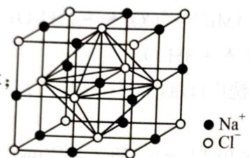

第9题 9-1 设X的化合价降 $n$ 价： $n(\mathrm{X}):n(\mathrm{Na}_2\mathrm{S}_2\mathrm{O}_3) = 1:n$

$$
M (X) = 0. 2 6 4 0 / (0. 4 8 8 \times 0. 0 2 8 6 8 / n) = 1 8. 8 6 n
$$

讨论得 n=7 时存在合理的化学式: $CrO_{5}$ 。

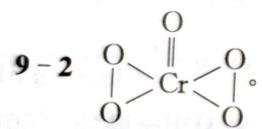

$$
9 - 3 \quad 2 \mathrm{CrO} _ {5} + 1 4 \mathrm{I} ^ {-} + 2 0 \mathrm{H} ^ {+} = 2 \mathrm{Cr} ^ {3 +} + 7 \mathrm{I} _ {2} + 1 0 \mathrm{H} _ {2} \mathrm{O} 。
$$

$$
\mathrm{9-4} \quad \mathrm{Cr} _ {2} \mathrm{O} _ {7} ^ {2 -} + 4 \mathrm{H} _ {2} \mathrm{O} _ {2} + 2 \mathrm{H} ^ {+} = 2 \mathrm{CrO} _ {5} + 5 \mathrm{H} _ {2} \mathrm{O}
$$

第 10 题 10 - 1 硒代硫酸钠; SnSe。

$$
1 0 - 2 \quad \mathrm{Na} _ {2} \mathrm{SO} _ {3} + \mathrm{Se} = \mathrm{Na} _ {2} \mathrm{SSeO} _ {3};
$$

$$
\mathrm{Sn} ^ {2 +} + 4 \mathrm{OH} ^ {-} = [ \mathrm{Sn(OH)} _ {4} ] ^ {2 -};
$$

$$
\left[ \mathrm{Sn} (\mathrm{OH}) _ {4} \right] ^ {2 -} + x \mathrm{TSC} ^ {3 -} = \mathrm{Sn(TSC)} _ {x} ^ {(3 x - 2) -} + 4 \mathrm{OH} ^ {-};
$$

$$
\mathrm{Sn(TSC)} _ {x} ^ {(3 x - 2) -} + \mathrm{SeSO} _ {3} ^ {2 -} + 2 \mathrm{OH} ^ {-} = \mathrm{SnSe} \downarrow + \mathrm{SO} _ {4} ^ {2 -} + x \mathrm{TSC} ^ {3 -} + \mathrm{H} _ {2} \mathrm{O}
$$

10-3 当 $OH^{-}$ 浓度很低时： $Sn^{2-} + OH^{-} + Cl^{-} = Sn(OH)Cl \downarrow$ ;

当 $OH^{-}$ 浓度很高时： $2\left[\mathrm{Sn(OH)}_{6}\right]^{4-}+\mathrm{O}_{2}=2\mathrm{SnO}_{2}\downarrow+8\mathrm{OH}^{-}+2\mathrm{H}_{2}\mathrm{O}$

10-4 配位后 $\mathrm{Sn}^{2+}$ 在特定发现上与 $\mathrm{Se}^{2-}$ 相连，使晶体以一定方向生长。

10 - 5 $\rho = \frac{zM}{N_{\mathrm{A}} \cdot V} = \frac{3 \times (118.71 + 78.961) \mathrm{~g} \cdot \mathrm{mol}^{-1}}{6.02 \times 10^{23} \mathrm{~mol} \cdot^{-1} \times 1.13 \mathrm{~nm} \times 0.42 \mathrm{~nm} \times 0.44 \mathrm{~nm} \times 10^{-21}} =$ 4. $72 \mathrm{~g} \cdot \mathrm{cm}^{-3}$ 。

## 第4章 化学反应中的能量变化

能力测试A卷

第1题 1-1 设 $2\mathrm{mol}$ $\mathrm{CH}_3\mathrm{OH}(l)$ 完全燃烧生成 $\mathrm{CO}_{2}$ 气体和液态水放出热量为 $Q$ 。则有 $\frac{5\mathrm{g}}{32\mathrm{g}\cdot\mathrm{mol}^{-1}} = \frac{2\mathrm{mol}}{Q}$ ，解得 $Q = 1452.8\mathrm{kJ}$ ，所以甲醇燃烧的热化学方程式为：

$$
2 \mathrm{CH} _ {3} \mathrm{OH} (\mathrm{l}) + 3 \mathrm{O} _ {2} (\mathrm{g}) = 2 \mathrm{CO} _ {2} (\mathrm{g}) + 4 \mathrm{H} _ {2} \mathrm{O} (\mathrm{l}) \quad \Delta H = - 1 4 5 2. 8 \mathrm{kJ} \cdot \mathrm{mol} ^ {- 1}
$$

1-2 反应热 $\Delta H = a\mathrm{kJ}\cdot \mathrm{mol}^{-1} = \mathrm{E}_{\text{反应物键能总和}} - \mathrm{E}_{\text{生成物键能总和}} = 3\times 436\mathrm{kJ}\cdot \mathrm{mol}^{-1} + 945\mathrm{kJ}\cdot$ $\mathrm{mol}^{-1} - 6\times 391\mathrm{kJ}\cdot \mathrm{mol}^{-1} = -93\mathrm{kJ}\cdot \mathrm{mol}^{-1}$ 。  
1-3 $\Delta H = \frac{4\Delta H_1 + \Delta H_2 - \Delta H_3}{2} = +226.7\mathrm{kJ}\cdot \mathrm{mol}^{-1}$

答案：
1-1 $2CH_{3}OH(l)+3O_{2}(g)=2CO_{2}(g)+4H_{2}O(l)$ $\Delta H=-1452.8kJ\cdot mol^{-1}$ 1-2 -93
1-3 +226.7 kJ·mol $^{-1}$

第2题 2-1 反应的平衡常数表达式为 $K = \frac{c(\mathrm{N}_2) \cdot c^2(\mathrm{CO}_2)}{c^2(\mathrm{CO}) \cdot c^2(\mathrm{NO})}$ ，则该反应为 $2\mathrm{CO(g)} + 2\mathrm{NO(g)} \rightleftharpoons \mathrm{N}_2(\mathrm{g}) + 2\mathrm{CO}_2(\mathrm{g})$ 。分析题给三个热化学方程式，根据盖斯定律，由①+②×2-③可得 $2\mathrm{CO(g)} + 2\mathrm{NO(g)} \rightleftharpoons \mathrm{N}_2(\mathrm{g}) + 2\mathrm{CO}_2(\mathrm{g})$ 。 $\Delta H = (-180.5\mathrm{kJ} \cdot \mathrm{mol}^{-1}) + (-393.5\mathrm{kJ} \cdot \mathrm{mol}^{-1}) \times 2 - (-221\mathrm{kJ} \cdot \mathrm{mol}^{-1}) = -746.5\mathrm{kJ} \cdot \mathrm{mol}^{-1}$ 。

2-2 用 $\mathrm{NH}_3$ 脱除NO的反应为 $4\mathrm{NH}_3(\mathrm{g}) + 6\mathrm{NO}(\mathrm{g}) = 5\mathrm{N}_2(\mathrm{g}) + 6\mathrm{H}_2\mathrm{O}(1)$ ，分析题给三个热化学方程式，根据盖斯定律，由 $② \times 3 - ① \times 2 - ③ \times 3$ 可得 $4\mathrm{NH}_3(\mathrm{g}) + 6\mathrm{NO}(\mathrm{g}) = 5\mathrm{N}_2(\mathrm{g}) + 6\mathrm{H}_2\mathrm{O}(1) \Delta H = (2Q_1 - 3Q_2 - 3Q_3)\mathrm{kJ}\cdot \mathrm{mol}^{-1}$ 。

2-3 根据盖斯定律，由 ① + ② 可得 $2\mathrm{NH}_3(\mathrm{g}) + \mathrm{CO}_2(\mathrm{g}) = \mathrm{CO}(\mathrm{NH}_2)_2(\mathrm{s}) + \mathrm{H}_2\mathrm{O}(\mathrm{g})$ $\Delta H = (-159.47\mathrm{kJ}\cdot \mathrm{mol}^{-1}) + 72.49\mathrm{kJ}\cdot \mathrm{mol}^{-1} = -86.98\mathrm{kJ}\cdot \mathrm{mol}^{-1}$ 。

答案：

$$
2 - 1 \quad 2 \mathrm{CO} (\mathrm{g}) + 2 \mathrm{NO} (\mathrm{g}) \rightleftharpoons \mathrm{N} _ {2} (\mathrm{g}) + 2 \mathrm{CO} _ {2} (\mathrm{g}) \quad \Delta H = - 7 4 6. 5 \mathrm{kJ} \cdot \mathrm{mol} ^ {- 1}
$$

$$
2 - 2 \quad 4 \mathrm{NH} _ {3} (\mathrm{g}) + 6 \mathrm{NO} (\mathrm{g}) = 5 \mathrm{N} _ {2} (\mathrm{g}) + 6 \mathrm{H} _ {2} \mathrm{O} (\mathrm{l}) \quad \Delta H = (2 Q _ {1} - 3 Q _ {2} - 3 Q _ {3}) \mathrm{kJ} \cdot \mathrm{mol} ^ {- 1}
$$

2-3 -86.98

第3题 3-1 根据燃烧热定义, 可知 $1 \mathrm{~mol} \mathrm{CH}_{4}$ 完全燃烧生成液态水时放出 $890.3 \mathrm{~kJ}$ 热量。

3-2 由 $\mathrm{CH}_4$ 制 $\mathbf{H}_2$ 的反应是吸热反应，需要消耗大量能量，且反应时生成的CO有毒。

3-3 反应中碳元素由 -4 价升高为 +2 价。每生成 1 mol CO 时，转移 6 mol 电子，则生成标准状况下 8.96 L(0.4 mol)CO 时，转移 2.4 mol 电子。

3-4 ① B 极通入的气体是 CH₄，CH₄ 发生氧化反应，B 极是电池的负极。电池总反应为 CH₄ + 2O₂ = CO₂ + 2H₂O，因为电解质是固体氧化物，所以 O₂ 在正极发生还原反应生成 O²⁻，电极反应式为 O₂ + 4e = 2O²⁻，用电池总反应式减去正极反应式即得负极反应式。②电解 CuSO₄ 溶液时，阴极生成 Cu，阳极生成 O₂。当 Cu²⁺ 被电解完之后，水电离产生的 H⁺ 被还原为 H₂。

0.1 mol $Cu^{2+}$ 被还原时，阳极生成 0.05 mol $O_{2}$ ；此后再电解 0.1 mol $H_{2}O$ 时，生成 0.1 mol $H_{2}$ 和 0.05 mol $O_{2}$ ，两极收集到的气体体积相等。电路中共转移 0.4 mol 电子，需要 $CH_{4}$ 的物质的量为 0.05 mol， $V(\mathrm{CH}_{4})=22.4\mathrm{L}\cdot\mathrm{mol}^{-1}\times0.05\mathrm{mol}=1.12\mathrm{L}$ 。燃料电池中，化学能不可能全部转化为电能，所需 $CH_{4}$ 的实际体积比理论体积大。

答案：

$$
3 - 1 \quad \mathrm{CH} _ {4} (\mathrm{g}) + 2 \mathrm{O} _ {2} (\mathrm{g}) = \mathrm{CO} _ {2} (\mathrm{g}) + 2 \mathrm{H} _ {2} \mathrm{O} (\mathrm{l}) \quad \Delta H = - 8 9 0. 3 \mathrm{kJ} \cdot \mathrm{mol} ^ {- 1}
$$

3-2 需要消耗大量的能量(其他答案合理也可)

3-3 C(或碳元素) 2.4 mol

3-4 ① 负 $\mathrm{CH}_4 + 4\mathrm{O}^{2-} - 8\mathrm{e} = \mathrm{CO}_2 + 2\mathrm{H}_2\mathrm{O}$ ② $1.12\mathrm{L}$ 甲烷不能完全被氧化，可能生成C或CO(或电池能量转化率达不到 $100\%$ ，其他答案合理也可）

第4题 4-1 甲品牌充电宝放电时，Li在负极失去电子生成 $\mathrm{Li^{+}}: x\mathrm{Li} - x\mathrm{e} = x\mathrm{Li^{+}}$ ，用电池总反应减去负极反应式即可得到电池正极的电极反应式： $\mathrm{V}_{2}\mathrm{O}_{5} + x\mathrm{e} + x\mathrm{Li^{+}} = \mathrm{Li}_{x}\mathrm{V}_{2}\mathrm{O}_{5}$ 。

4-2 K与N相接时，充电宝给平板电脑充电，充电宝为原电池，A为电池正极，B为电池负极， $\mathrm{Li}_x\mathrm{C}_6$ 在负极失去电子生成 $\mathrm{Li}^+$ 和 $\mathrm{C}_6$ ，其电极反应式为 $\mathrm{Li}_x\mathrm{C}_6 - x\mathrm{e} = \mathrm{C}_6 + x\mathrm{Li}^+$ 。 $\mathrm{Li}^+$ 由B区迁移到A区。

4-3 K与M相接时,电源给充电宝充电,此时A为阳极, $LiMnO_{2}$ 失去电子生成 $Li^{+}$ ,其电极反应式为 $LiMnO_{2}-xe=Li_{1-x}MnO_{2}+xLi^{+}$ 。

4-4 给手机电池充电时, 通过的电量 $Q = I \cdot t = 3200 \times 10^{-3} \mathrm{~A} \times 2 \times 60 \times 60 \mathrm{~s} \approx 2.3 \times 10^{4} \mathrm{C}$ , 根据 $1 \mathrm{C}$ 电量约为 $1.0 \times 10^{-5} \mathrm{~mol}$ 电子的电量可得, 转移电子的物质的量 $= 2.3 \times 10^{4} \mathrm{C} \times 1.0 \times 10^{-5} \mathrm{~mol} \cdot \mathrm{C}^{-1} = 0.23 \mathrm{~mol}, 1 \mathrm{~mol} \mathrm{Li}$ 失去 $1 \mathrm{~mol}$ 电子, 所以理论上需要 Li 的质量 $= 0.23 \mathrm{~mol} \times 7 \mathrm{~g} \cdot \mathrm{mol}^{-1} = 1.61 \mathrm{~g}$ 。

【答案】

4-1 $\mathrm{V}_2\mathrm{O}_5 + x\mathrm{e} + x\mathrm{Li}^+ = \mathrm{Li}_x\mathrm{V}_2\mathrm{O}_5$

4-2 $\mathrm{Li}_x\mathrm{C}_6 - xe = \mathrm{C}_6 + x\mathrm{Li}^+$ B A

4-3 $\mathrm{LiMnO_2 - xe = Li_{1 - x}MnO_2 + xLi^+}$

4-4 1.61

第5题 无水盐的溶解过程可认为分两步进行：

$$
\mathrm{CuSO} _ {4} (\mathrm{s}) + 5 \mathrm{H} _ {2} \mathrm{O} (\mathrm{l}) = \mathrm{CuSO} _ {4} \cdot 5 \mathrm{H} _ {2} \mathrm{O} (\mathrm{s})
$$

$$
\mathrm{CuSO} _ {4} \cdot 5 \mathrm{H} _ {2} \mathrm{O} (\mathrm{s}) + n \mathrm{H} _ {2} \mathrm{O} (\mathrm{l}) = \mathrm{CuSO} _ {4} (\mathrm{aq}) + (n + 5) \mathrm{H} _ {2} \mathrm{O} (\mathrm{aq})
$$

$\Delta H_{1}$ 为形成水合晶体的焓变, $\Delta H_{2}$ 是水合晶体的溶解焓。总反应式为:

$$
\mathrm{CuSO} _ {4} (\mathrm{s}) + (n + 5) \mathrm{H} _ {2} \mathrm{O} (\mathrm{l}) = \mathrm{CuSO} _ {4} (\mathrm{aq}) + (n + 5) \mathrm{H} _ {2} \mathrm{O} (\mathrm{aq})
$$

$\Delta H_{3}$ 为无水盐的溶解焓。

根据盖斯定律， $\Delta H_{3}=\Delta H_{1}+\Delta H_{2}$ ，则： $\Delta H_{1}=\Delta H_{3}-\Delta H_{2}=Q$ ，即差值Q即为 $CuSO_{4}$ 形成 $CuSO_{4}\cdot5H_{2}O$ 的焓变值10Q（因为物质是以0.1mol物质为依据）。

由于 $CuSO_{4}(s)$ 溶于水，形成 $CuSO_{4} \cdot 5H_{2}O(s)$ 是自发进行的，因此 $CuSO_{4}(s)$ 溶于水是放热的，据题意可知： $CuSO_{4} \cdot 5H_{2}O(s)$ 溶于水就应该是吸热的了。

第6题 6-1 考虑到每个碳原子均为 $\mathrm{sp}^3$ 杂化，因此新戊烷为圆球形，其结构对称，内能低，完全燃烧放出的热量要少，即 $Q_{1} > Q_{2}$ 。

6-2 将两个热化学方程式写出后,根据盖斯定律,即可得到 $Q_{1}$ 和 $Q_{2}$ 的差值就是正戊烷转化为新戊烷的异构化能。

第7题 本题是一道物理和化学的综合试题。这应该是今后化学自主招生的趋势。

本题的第1问是物理问题,第2问则是与化学综合的问题。

第一问是物理学科力学中的运动学问题,火箭从发射到落回地面的运动可分为三段,第一段是竖直向上的匀加速运动,第二段是竖直上抛运动,直到最高点,第三段则是自由落体运动。分别求出三段所用的时间,相加即为总时间。

第二问首先要理解题目给出的两个热化学反应方程式,求出火箭共获得多少机械能,再根据效率(70%)求出需要放出的热量,从而求出所需燃料的质量。

(1) 在不计空气阻力的情况下, 火箭的运动可以分为三段, 第一段是竖直向上的匀加速运动, 第二段是竖直上抛运动, 直到最高点, 第三段则是自由落体运动。

第一段用时间 10 s, 这段时间内的位移 $s_{1}$ 和末速度 $v_{1}$ 分别是:

$$
s _ {1} = \frac {1}{2} a t ^ {2} = 2 5 0 \mathrm{m}, v _ {1} = a t = 5 0 \mathrm{m} \cdot \mathrm{s} ^ {- 1}
$$

第二段的末速度为0，这段时间里的位移： $s_{2}=v_{1}^{2}/2\ g=125\ m$ ；所用时间： $t_{2}=v_{1}/g=5\ s$ 。

第三段自由落体运动所用的时间： $t_3 = \sqrt{\frac{2(s_1 + s_2)}{g}} = 8.66\mathrm{s}$

火箭从发射到落回地面所经历的时间： $t=t_{1}+t_{2}+t_{3}=23.7\ s$

(2) 火箭获得的机械能为: $E = mg(s_{1} + s_{2}) = 3.75 \times 10^{4} \, \text{J} = 37.5 \, \text{kJ}$ 。

由题目给出的两个热反应方程式,可得 $N_{2}H_{4}$ 与 $NO_{2}$ 反应的热反应方程式为:

$$
2 \mathrm{N} _ {2} \mathrm{H} _ {4} (\mathrm{g}) + 2 \mathrm{NO} _ {2} (\mathrm{g}) = 3 \mathrm{N} _ {2} (\mathrm{g}) + 4 \mathrm{H} _ {2} \mathrm{O} (\mathrm{g}) \quad \Delta H = - 1 1 3 5. 7 \mathrm{kJ} \cdot \mathrm{mol} ^ {- 1}
$$

设燃料的物质的量为 $n$ ，则： $n \times (1135.7/2) \times 70\% = E$

因此： $n = [2E / (1135.7\times 0.7)]\mathrm{mol} = 0.0943\mathrm{mol}$

火箭燃料 $N_{2}H_{4}$ (肼) 的质量: m=nM=0.0943×32×10 $^{-3}$ kg=3.0×10 $^{-3}$ kg

## 第8题 本题考查碳的三种同素异形体。

(1)由标准生成热可判断物质体系内能的高低,由物质密度的大小可判断物质的存在条件。(2) $C_{60}$ 中每个碳原子只跟相邻三个碳原子形成化学键,因 $C_{60}$ 分子含30个双键,与极活泼的 $F_{2}$ 发生加成反应即生成 $C_{60}F_{60}$ ; $C_{60}$ 分子形成的化学键数为 $60\times3/2=90$ 。或由欧拉定理得出, $C_{60}$ 分子中单键为90-30=60。问(4)因每个碳原子连2个6元环和1个5元环。键角之和为: $2\times(6-2)\times180^{\circ}/6+(5-2)\times180^{\circ}/5=348^{\circ}$ ;平均 $\angle CCC$ 键角 $=348^{\circ}/3=116^{\circ}$ 。根据杂化轨道的公式: $\cos\theta=-\alpha/(1-\alpha)$ ,其中 $\theta$ 为键角, $\alpha$ 为轨道的s成分,(1- $\alpha$ )为p轨道的成分,计算出C原子的杂化形态为 $sp^{2.28}$ ,介于C—C单键与C=C双键之间, $C_{60}$ 因此得名为足球烯。(5)设 $C_{70}$ 分子中五边形数为x,六边形数为y。依题意可得方程组:

$$
\left\{ \begin{array}{l} \frac {1}{2} (5 x + 6 y) = \frac {1}{2} (3 \times 7 0) (\text {   键数,即棱边数   }) \\ 7 0 + (x + y) - \frac {1}{2} (3 \times 7 0) = 2 (\text {   欧拉定理   }) \end{array} \right.
$$

解得 x=12, y=25; 从解题看, 上述凸多面体中五边形的个数总是 12 个。设 C—C 键数为 m, C=C 键数为 n, 由键数等于棱边数得: $m+n=3/2 \times 70$ ……①, 由电子数守恒可得: $2m+4n=$

280……②，解得：m=70, n=35；问(6)内部20个C原子构成正十二面体，据欧拉公式得：棱数 $20\times3/2=30$ ；外部60个C原子组成12个分立正五边形，棱数 $=12\times5=60$ ；中部20个C原子要满足每个C原子4个共价键，棱数 $=20\times4=80$ ，总棱数 $=30+60+80=170$ ；又因C原子的4个价电子全部成键，100个C原子有400个价电子，1个C=C要4个价电子，1个C—C要2个价电子。设C=C数为x个，C—C数为y，据价电子数守恒可知：① $4x+2y=400$ 。② $x+y=170$ 。解方程得x=30，即C=C数为30， $C_{100}$ 与 $H_{2}$ 或 $F_{2}$ 加成后的产物分别为 $C_{100}H_{60}$ 、 $C_{100}F_{60}$ 。

## 【答案】

(1) ①最稳定单质为石墨。因为石墨的标准生成热为零, 根据标准生成热的定义可得。②石墨转化成金刚石要高温高压。因金刚石的密度大于石墨的密度, 高压有利于转化; 又因金刚石的标准生成热为正, 石墨转化成金刚石要吸热, 高温有利。③石墨转化成 $\mathrm{C}_{60}$ 要高温低压。因石墨转化成 $\mathrm{C}_{60}$ 要吸热, 高温有利; 又因 $\mathrm{C}_{60}$ 密度小于石墨的密度, 低压有利。④能溶于有机试剂的是 $\mathrm{C}_{50}$ , 原因是 $\mathrm{C}_{60}$ 是分子晶体。⑤在死火山口常能发现金刚石, 因为火山口温度高, 岩浆喷射时压强大, 地壳中的石墨随岩浆喷出时易转化成金刚石; 某些星际空间温度高, 同时大气层稀薄, 即压强低, 有利于 $\mathrm{C}_{60}$ 的生成。

(2) ①金刚石; 金刚石属于原子晶体, 而固体 $\mathrm{C}_{60}$ 中每个碳原子只跟相邻三个碳原子形成化学键, 故金刚石的熔点较高。②可能; 因 $\mathrm{C}_{60}$ 分子含 30 个双键, 与极活泼的 $\mathrm{F}_{2}$ 发生加成反应即生成 $\mathrm{C}_{60} \mathrm{~F}_{60}$ 。③ $\mathrm{C}_{60}$ 分子中单键为 $90 - 30 = 60$ 。④因每个碳原子连 2 个 6 元环和 1 个 5 元环。键角之和为: $2 \times (6 - 2) \times 180^{\circ} / 6 + (5 - 2) \times 180^{\circ} / 5 = 348^{\circ}$ ; 平均 $\angle \mathrm{CCC}$ 键角 $= 348^{\circ} / 3 = 116^{\circ}$ 。 $\mathrm{C}_{60}$ 中 C 原子的杂化形态为 $\mathrm{sp}^{2.28}$ , 介于 C—C 单键与 C=C 双键之间, $\mathrm{C}_{60}$ 因此得名为足球烯。⑤ $\mathrm{C}_{70}$ 分子中五边形数为 12, 六边形数为 25。 C—C 键数为 70, C=C 键数为 35。⑥ C=C 数为 30, $\mathrm{C}_{100}$ 与 $\mathrm{H}_{2}$ 或 $\mathrm{F}_{2}$ 加成后的产物分别为 $\mathrm{C}_{100} \mathrm{H}_{60}, \mathrm{C}_{100} \mathrm{F}_{60}$ 。

第9题 需要反复思考题面给出的三个反应的可能组合才会找到答案。这个试题是热化学定律的灵活运用。思考容量大，但最后得到的结果是唯一的。

将②-①式, 得 $N_{2}O$ 分解反应的热化学方程式:

$$
\mathrm{N} _ {2} \mathrm{O} \longrightarrow \mathrm{N} _ {2} + 1 / 2 \mathrm{O} _ {2} + 0. 9 4 \mathrm{kJ} \cdot \mathrm{g} ^ {- 1} \mathrm{NH} _ {4} \mathrm{NO} _ {3}\tag{④}
$$

此反应热是以每克 $NH_{4}NO_{3}$ 计放出的热量，若以每摩尔 $NH_{4}NO_{3}$ 计则放热为 $0.94\ kJ \cdot g^{-1} \times 80\ g \cdot mol^{-1} = 75.2\ kJ \cdot mol^{-1}$ 。由上述反应式的关系可以看出，这也是每摩尔 $N_{2}O$ 分解放出的热，所以 $N_{2}O$ 分解反应的热化学反应式为： $N_{2}O \longrightarrow N_{2} + 1/2O_{2} + 75.2\ kJ \cdot mol^{-1}$ ⑤。

## 第 10 题 本题考查盖斯定律。

根据盖斯定律可知： $\Delta_{\mathrm{f}}H(\mathrm{NaCl}) = \Delta H_{1} + \Delta H_{2} + \Delta H_{3} + \Delta H_{4}$

$$
\mathrm{即} \Delta H _ {1} = \Delta_ {\mathrm{f}} H (\mathrm{NaCl}) - (\Delta H _ {2} + \Delta H _ {3} + \Delta H _ {4}) = - 4 1 1 - (1 2 8 - 5 2 6 - 2 4 8) = 2 3 5 \mathrm{kJ} \cdot \mathrm{mol} ^ {- 1}
$$

离子键是相邻的两个或多个离子间强烈的相互作用，因此 NaCl 离子键的键能 $=\Delta H_{2}+\Delta H_{3}=128-526=-398\ \text{kJ}\cdot\text{mol}^{-1}$ 。

由于晶格能是指气态的阴阳离子结合成晶体的能量变化，因此 NaCl 晶格能 = $\Delta H_{3} + \Delta H_{4} = -526 + (-248) = -774 \, \text{kJ} \cdot \text{mol}^{-1}$ 。

## 能力测试 B 卷

以过程 $\mathrm{O}_2(\alpha) \rightleftharpoons \mathrm{O}_2(\mathrm{g})$ 为例：

该过程的焓变应该满足： $\lg \frac{p_1}{p_2} = -\frac{\Delta H_\alpha}{2.303R}\left(\frac{1}{T_1} -\frac{1}{T_2}\right)$ 分别取 $T_{1} = 30\mathrm{K}, T_{2} = 40\mathrm{K}$ ，代入上式，得： $\lg \frac{p_1}{p_2} = -478.4\left(\frac{1}{30} -\frac{1}{40}\right) - 2.055(\lg 30 - \lg 40) = -3.73$ $\Delta H_{\alpha} = 8.57\mathrm{kJ}\cdot \mathrm{mol}^{-1}$ 同理， $\Delta H_{\beta} = 7.28\mathrm{kJ}\cdot \mathrm{mol}^{-1};\Delta H_{\gamma} = 7.24\mathrm{kJ}\cdot \mathrm{mol}^{-1}$

若忽略不同相之间转变的熵变值，则可以判断固态氧气的稳定性为 $\mathrm{O}_{2}(\alpha) > \mathrm{O}_{2}(\beta) > \mathrm{O}_{2}(\gamma)$ 。

第2题 2-1 开始 NaCl 浓度不大是表现为同离子效应,溶解度减小;当 NaCl 浓度较大时氯离子与 AgCl 结合成络离子,溶解度增大。

2-2 溶解是 $\Delta S > 0$ 的过程, 只要 $\Delta H$ 不是很大, 均是自发的。当溶质与溶剂相似时, 溶解的能量效应不大; 当溶质的极性与溶剂差别较大时, 溶解破坏了原溶剂分子间较强的色散力而转变为溶质分子与溶剂间较弱的诱导力, $\Delta H$ 很大, 使得 $\Delta G > 0$ , 不自发。

第3题 (1) $\mathrm{CoO} + \mathrm{CO} \longrightarrow \mathrm{Co} + \mathrm{CO}_{2}$ $\Delta_{\mathrm{r}} G_{3}^{0} = (\Delta_{\mathrm{r}} G_{1}^{0} - \Delta_{\mathrm{r}} G_{2}^{0}) / 2 = -48.5 \times 10^{3} + 14.95 T$ $\Delta_{\mathrm{r}} G_{3}^{0} = -R T \ln [c(\mathrm{CO}_{2}) / c(\mathrm{CO})] = -R T \ln [(1 - \mathrm{CO}\%) / \mathrm{CO}\%]$ $\ln [(1 - \mathrm{CO}\%) / \mathrm{CO}\%] = -5833.5 / T + 1.798$ (2) 将 $T = 1500$ 代入解得 $\mathrm{CO}\% = 11.0\%$ (3) 因为 $\mathrm{CO}\% = \mathrm{CO}_{2}\% = 50\%$ ，故有 $5833.5 / T = 1.798$ ，解得 $T = 3243$

$$
r (\mathrm{M} ^ {+}) \approx r (\mathrm{X} ^ {-})
$$

当 $r(\mathrm{M}^{+}) \ll r(\mathrm{X}^{-})$ 时，对 $\Delta_{\mathrm{h}} H_{\mathrm{m}}$ 有利，即正负离子差别较大时，有利于 $\Delta_{\mathrm{h}} H_{\mathrm{m}}$ 增大。如果正负离子差别较大时，以水合能大小来判断溶解性大小。例如 $\mathrm{M}^{+}$ 与 $\mathrm{ClO}_{4}^{-}$ 组成的盐，由于 $\mathrm{ClO}_{4}^{-}$ 离子半径大，从 $\mathrm{Li}^{+} \rightarrow \mathrm{Cs}^{+}$ 离子的水合能减小，所以 $\mathrm{LiClO}_{4}$ 溶解度较大， $\mathrm{NaClO}_{4}$ 在水中的溶解度比 $\mathrm{LiClO}_{4}$ 约小 $3 \sim 12$ 倍，而 $\mathrm{KClO}_{4}, \mathrm{RbClO}_{4}$ 和 $\mathrm{CsClO}_{4}$ 的溶解度仅是 $\mathrm{LiClO}_{4}$ 的 $10^{-3}$ 倍。

如果正负离子差别不大时，以晶格能大小来判断溶解性大小。例如： $M^{+}$ 与 $F^{-}$ 离子组成的盐，由于离子半径相近，而LiF的晶格能最大，所以LiF是碱金属氟化物溶解度最小的。

一般来说大的阳离子需要大的阴离子作为沉淀剂，因为大的阳离与大的阴离子形成的离子型的盐溶解度小。例如 $\mathrm{Na[Sb(OH)_{6}]、NaZn(UO_{2})_{3}(CH_{3}COO)_{9}\cdot6H_{2}O、K_{3}[Co(NO_{2})_{6}]、K_{2}[PtCl_{6}]、K[B(C_{6}H_{5})_{4}]$ 等都是难溶的钠盐、钾盐。铷、铯比相应的钾盐还要难溶。

第5题 5-1 973 K时， $K_{3}=K_{1}/K_{2}=1.47/2.38=0.618$ ; 1173 K时， $K_{3}=K_{1}/K_{2}=2.15/1.67=1.29$ 。

5-2 $n(\mathrm{H}_2) = (4.00\times 10^5\times 5.15) / (8.314\times 973) = 255\mathrm{mol}$ $n(\mathrm{CO}_2) = (255\times 0.6)^2 /(255\times 0.4\times 0.618) + 255\times 0.6 = 524\mathrm{mol}$ $V(\mathrm{CO}_2) = (524\times 8.314\times 973) / (4.00\times 10^5) = 10.6\mathrm{m}^3$ 5-3 $n(\text{总}) = (4.00\times 10^{5}\times 10.0) / (8.314\times 1173) = 410\mathrm{mol}$

由于反应前后,总物质的量不发生变化,故 $CO_{2}$ 和 $H_{2}$ 的最初的物质的量都为 410/2=205 mol 设 $CO_{2}$ 和 $H_{2}$ 都转化了 x mol, 则: $x^{2}/(205-x)^{2}=1.29$ , 解之得 x=109 mol 转化率为 109/205=53.2%。

$$
6 - 1 M (\mathrm{AlCl} _ {3}) = 2 6. 9 8 + 3 \times 3 5. 4 5 = 1 3 3. 3
$$

$M(200^{\circ}\mathrm{C})=(6.80\times8.314\times473)/101.3=264.0$ 264.0/133.3≈2 分子式为 $Al_{2}Cl_{6}$ ; $M(800^{\circ}\mathrm{C})=(1.51\times8.314\times1073)/101.3=133.0$ $133.0/133.3\approx1$ 分子式为 $AlCl_{3}$ 。
6-2 建立平衡的化学方程式： $2AlCl_{3}\rightleftharpoons Al_{2}Cl_{6}$ $M(600^{\circ}\mathrm{C})=(2.65\times8.314\times873)/101.3=190.0$ $p(\mathrm{AlCl}_{3})=[(266.6-190.0)/133.3]\times101.3\mathrm{kPa}=58.2\mathrm{kPa};$ $p(\mathrm{Al}_{2}\mathrm{Cl}_{6})=[(190.0-133.3)/133.3]\times101.3\mathrm{kPa}=43.1\mathrm{kPa}.$ 6-3 $p(\mathrm{AlCl}_{3})/p=58.2\mathrm{kPa}/101.3\mathrm{kPa}=0.575$ $p(\mathrm{Al}_{2}\mathrm{Cl}_{6})/p=43.1\mathrm{kPa}/101.3\mathrm{kPa}=0.425$ $K_{p}=0.425/(0.575)^{2}=1.29$

## 第7题 7-1 与离子半径及所带电荷有关；

离子半径越小,电荷越大,溶解熵越“负”。

7-2 $\mathrm{CO}_{3}^{2-}$ 和 $\mathrm{NO}_{3}^{-}$ 虽然半径相近, 但前者电荷是后者的两倍, 故 $\mathrm{MCO}_{3}$ 溶解熵较小, 故一般难溶。

$$
\Delta H ^ {0} = \sum_ {\mathrm{i}} D _ {\mathrm{反应物}} - \sum_ {\mathrm{i}} D _ {\mathrm{生成物}}
$$

$$
\therefore \Delta H _ {1} ^ {0} = 1 2 6. 0 9 \mathrm{kJ} \cdot \mathrm{mol} ^ {- 1} \quad \Delta H _ {2} ^ {0} = - 2 6 9. 6 1 \mathrm{kJ} \cdot \mathrm{mol} ^ {- 1} \quad \Delta H _ {3} ^ {0} = - 2 5 1. 4 5 \mathrm{kJ} \cdot \mathrm{mol} ^ {- 1}
$$

$$
1, \Delta n _ {\mathrm{g}} = 1
$$

对于反应 2、3， $\Delta n_{g}=-1$ ，压强增大有利于反应向正向移动。

(1) ① 吸热: $3E(\mathrm{C}-\mathrm{C}) + 10E(\mathrm{C}-\mathrm{H}) = 3 \times 277.16 + 10 \times 378.9 = 4620.48 \mathrm{~kJ} \cdot \mathrm{mol}^{-1}$ 放热: $E(\mathrm{C}=\mathrm{C}) + 2E(\mathrm{C}-\mathrm{C}) + 8E(\mathrm{C}-\mathrm{H}) + E(\mathrm{H}-\mathrm{H}) = 472.69 + 2 \times 277.16 + 8 \times 378.9 + 436.18 = 4494.39 \mathrm{~kJ} \cdot \mathrm{mol}^{-1} \therefore \Delta H = 126.09 \mathrm{~kJ} \cdot \mathrm{mol}^{-1}$ 吸热

② 吸热： $E(\mathrm{C}=\mathrm{C})+4E(\mathrm{C}-\mathrm{H})+E(\mathrm{Cl}-\mathrm{Cl})=2109.31\ \mathrm{kJ}\cdot\mathrm{mol}^{-1}$ 放热： $E(\mathrm{C}-\mathrm{C})+E(\mathrm{C}-\mathrm{H})\times4+2E(\mathrm{C}-\mathrm{Cl})=2378.92\ \mathrm{kJ}\cdot\mathrm{mol}^{-1}$ $\therefore\Delta H=-269.61\ kJ\cdot mol^{-1}$ 放热

③ 吸热: $4E(\mathrm{C}-\mathrm{H}) + \frac{1}{2} \times E(\mathrm{O}-\mathrm{O}) = 1639.29 \mathrm{~kJ} \cdot \mathrm{mol}^{-1}$ 放热: $E(\mathrm{O}-\mathrm{H}) + E(\mathrm{C}-\mathrm{O}) + 3E(\mathrm{C}-\mathrm{H}) = E(\mathrm{C}-\mathrm{O}) + 1567.94 \mathrm{~kJ} \cdot \mathrm{mol}$ 若 $\Delta H = 71.35 \mathrm{~kJ} \cdot \mathrm{mol}^{-1} - E(\mathrm{C}-\mathrm{O}) < 0$ , 则放热; 若 $\Delta H = 71.35 \mathrm{~kJ} \cdot \mathrm{mol}^{-1} - E(\mathrm{C}-\mathrm{O}) > 0$ , 则吸热 (缺 C-O 单键键能数据!)

(2) 压力变大时反应 1 逆向进行, 反应 2、3 正向进行

$$
9 - 1 \quad K _ {\mathrm{p}} = (0. 3 7 6) ^ {2} / [ (0. 1 2 5) ^ {3} \times 0. 4 9 9 ] = 1 4 5
$$

9-2 当总压增加到原压强 2 倍时， $p(\mathrm{NH}_{3})=0.752\ \mathrm{bar};\ p(\mathrm{H}_{2})=0.250\ \mathrm{bar};\ p(\mathrm{N}_{2})=0.998\ \mathrm{bar}$ 。

$Q_{p}=(0.752)^{2}/[(0.250)^{3}\times0.998]=36.3<145$ ，故系统表现出平衡向右移动、减小压强的行为。

$$
9 - 3 \quad ① Q _ {p} = (0. 4 7 6) ^ {2} / [ (0. 1 2 5) ^ {3} \times 0. 4 9 9 ] = 2 3 2 > 1 4 5
$$

$$
\mathrm{NH} _ {3}
$$

② $Q_{\mathrm{p}} = (0.376)^{2} / [(0.125)^{3} \times 0.599] = 121 < 145$ ，故系统表现出平衡向右移动、减小 $\mathbf{N}_{2}$ 浓度的行为。

9-4 $Q_{\mathrm{p}} = (0.189)^{2} / [(0.111)^{3} \times 0.700] = 37.3 < 145$ ，故系统表现出平衡向右移动、减小 $\mathbf{N}_{2}$ 浓度和 $\mathrm{H}_{2}$ 浓度同时增大 $\mathrm{NH}_{3}$ 浓度的行为。

$$
\Delta G ^ {0} \geqslant 0:
$$

$$
\mathrm{Fe(s)} + \mathrm{CO(g)} = \mathrm{FeO(s)} + \mathrm{CO(g)}
$$

$$
\Delta G = 0
$$

$$
\Delta G = \Delta G ^ {0} + R T \ln J _ {\mathrm{p}} ^ {0}
$$

$\Delta G^{0} = -RTK^{0} = -RT\ln \frac{p_{\mathrm{CO}}}{p_{\mathrm{CO}_{2}}} 。 \Delta G^{0}$ 可由已知条件求得： $(2\mathrm{Fe} + \mathrm{O}_{2} = \mathrm{FeO}) \times 1 / 2$ $\Delta G_{(2)}^{0}$ $-(2\mathrm{CO} + \mathrm{O}_{2} = 2\mathrm{CO}_{2}) \times 1 / 2$ $\Delta G_{(1)}^{0}$ $\mathrm{Fe} + \mathrm{CO}_{2} = \mathrm{FeO} + \mathrm{CO}$ $\Delta G^{0} = 1 / 2\Delta G_{(2)}^{0} - 1 / 2\Delta G_{(1)}^{0}$

有了以上分析,本题就容易解答了。
10-1 $2\mathrm{CO(g)} + \mathrm{O}_{2}(\mathrm{g}) = 2\mathrm{CO}_{2}(\mathrm{g})$ ① $\Delta G_{(1)}^{0} = -278.4 \, \text{kJ} \cdot \text{mol}^{-1}$ $2\mathrm{Fe(s)} + \mathrm{O}_{2}(\mathrm{g}) = 2\mathrm{FeO(s)}$ ② $\Delta G_{(2)}^{0} = -311.4 \, \text{kJ} \cdot \text{mol}^{-1}$

[②-①]×1/2得: $\mathrm{Fe}+\mathrm{CO}_{2}\xlongequal{\Delta G^{0}}(-311.4+278.4)\times1/2=-16.5(\mathrm{kJ}\cdot\mathrm{mol}^{-1})$ $\Delta G^{0}=-RT\ln\frac{p_{CO}/p^{0}}{p_{CO_{2}}/p^{0}},\therefore$ 代入数据得: $\frac{p_{CO}}{p_{CO_{2}}}=3.27$ 。

当CO和 $\mathrm{CO}_{2}$ 的分压比 $\frac{p_{\mathrm{CO}}}{p_{\mathrm{CO_2}}}\geqslant 3.27$ 时，可防止铁氧化。

10-2 由题知，混合气氛中 $\mathrm{N}_2$ 占 $1\%$ 。设其中CO为 $x$ ， $\mathrm{CO}_{2}$ 为 $y$ ，则： $\left\{ \begin{array}{l} x + y = 99\% \\ x / y = 3.27 \end{array} \right.$

解得: $x = 75.8\% (\mathrm{CO}), y = 23.2\% (\mathrm{CO}_2)$

10-3 根据道尔顿分压定律。同温同压下气体分压比等于物质的量比；根据阿佛加德罗定律，同温同压下气体体积比等于物质的量比。所以，CO 和 CO₂ 的分压比、体积比、物质的量比均相同。

设 $W_{CO}$ 和 $W_{CO_2}$ 分别表示混合气体中 CO 和 $CO_2$ 的质量。则： $\frac{W_{CO}}{28} : \frac{W_{CO_2}}{44} = \frac{n_{CO}}{n_{CO_2}}$

$$
\therefore \frac {W _ {\mathrm{co}}}{W _ {\mathrm{co} _ {2}}} = \frac {2 8}{4 4} \times \frac {n _ {\mathrm{co}}}{n _ {\mathrm{co} _ {2}}} = \frac {7}{1 1} \times \frac {n _ {\mathrm{co}}}{n _ {\mathrm{co} _ {2}}}
$$

10-4 在 $1673\mathrm{K}$ 时， $\mathrm{CaCO_3}$ 分解，以下反应 $K^0 >1$

$$
\mathrm{CaCO} _ {3} (\mathrm{s}) = \mathrm{CaO} (\mathrm{s}) + \mathrm{CO} _ {2} (\mathrm{g}) \quad K ^ {0} = p _ {\mathrm{CO} _ {2}} > 1 0 1. 3 \mathrm{kPa。}
$$

所以 $CaCO_{3}$ 分解使混合气氛中 $CO_{2}$ 分压增大, 氧化性增强。

【答案】

10-1 当 CO 和 $CO_{2}$ 的分压比 $\frac{p_{CO}}{p_{CO_{2}}} \geqslant 3.27$ 时，可防止铁氧化。

10-2 混合气氛中，CO 占 75.8%， $CO_{2}$ 占 23.2%。

10-3 根据道尔顿分压定律。同温同压下气体分压比等于物质的量比；根据阿佛加德罗定律，同温同压下气体体积比等于物质的量比。所以， $\mathrm{CO}$ 和 $\mathrm{CO}_{2}$ 的分压比、体积比、物质的量比均相同。

10-4 $\mathrm{CaCO_3}$ 分解使混合气氛中 $\mathrm{CO}_{2}$ 分压增大，氧化性增强。

## 第5章 原子结构

## 能力测试A卷

第1题 ${}^{253}_{99}Es + {}^{4}_{2}He \rightarrow {}^{256}_{101}Md + {}^{1}_{0}n;$ ${}^{22}_{10}Ne + {}^{238}_{92}U \rightarrow {}^{256}_{101}Md + {}^{1}_{1}H + 3_{0}^{1}n.$

第2题 2-1 基态钒原子的核外电子排布式为 $[\mathrm{Ar}]3\mathrm{d}^34\mathrm{s}^2$ ，当原子价层电子全部失去时，形成的离子最外层达到稳定的电子层结构，故 $+5$ 价最稳定。

2-2 $\mathrm{AsCl}_5$ 分子中砷的价电子均成键，故它是非极性分子； $\mathrm{AsCl}_3$ 分子中的价层电子对数为4，其中孤电子对数为1，因此砷原子为 $\mathfrak{sp}^3$ 杂化，分子的空间构型为三角锥形。

2-3 As原子核外电子排布 $1\mathrm{s}^2 2\mathrm{s}^2 2\mathrm{p}^6 3\mathrm{s}^2 3\mathrm{p}^6 3\mathrm{d}^{10}4\mathrm{s}^2 4\mathrm{p}^3$ ，4p亚层为半满结构。根据洪特规则，半满结构比较稳定，电离能相对较大。

2-4 由晶胞结构知,8个La全在晶胞顶点,故一个晶胞中La个数为 $8\times1/8=1$ ,8个Ni在晶胞面上,1个Ni在晶胞内,故一个晶胞中Ni个数为 $8\times1/2+1=5$ ,因此该合金化学式为 $LaNi_{5}$ ;8个 $H_{2}$ 在晶胞棱上,2个 $H_{2}$ 在晶胞面上,故一个晶胞中 $H_{2}$ 个数为 $8\times1/4+2\times1/2=3$ ,因此1mol La形成的该合金能储存3mol氢气。

【答案】

2-1 $[Ar]3d^{3}4s^{2}$ 或 $1s^{2}2s^{2}2p^{6}3s^{2}3p^{6}3d^{3}4s^{2}$ ; +5。

2-2 $\mathrm{AsCl}_5$ ; $\mathrm{sp}^3$ ；三角锥形。

2-3 As(或砷)。

2-4 $\mathrm{LaNi}_5$ ; 3。

第3题 3-1 P的基态原子核外电子具有的原子轨道为1个1s、1个2s、3个2p、1个3s、3个3p；轨道中电子处于半满、全满、全空时该微粒最稳定。

3-2 同一周期元素,元素的电负性随着原子序数增大而增大,其第一电离能随着原子序数增大而呈增大趋势,但第ⅡA族、第V A族第一电离能大于其相邻元素,同一主族元素第一电离能、电负性随着原子序数增大而减小。

3-3 含氮化合物 $\mathrm{NH}_4\mathrm{SCN}$ 溶液是检验 $\mathrm{Fe}^{3+}$ 的常用试剂， $\mathrm{SCN}^-$ 中C原子价层电子对个数是2且不含孤电子对，根据价层电子对互斥理论判断C原子的杂化类型，1个 $\mathrm{SCN}^-$ 中 $\pi$ 键个数为2。

3-4 由链状结构可知每个 $\mathrm{P}$ 与3个O形成阴离子，且 $\mathbf{P}$ 的化合价为 $+5$ 价，以此判断形成的化合物的化学式。

3-5 离子晶体熔、沸点与晶格能成正比，晶格能与离子比较成反比、与电荷成正比。

3-6 P原子与B原子的最近距离为 $a\mathrm{cm}$ ，为晶胞体对角线长的1/4，晶胞体对角线长等于棱长的 $\sqrt{3}$ 倍，则晶胞棱长 $[a / (1 / 4)] / \sqrt{3}\mathrm{cm} = \frac{4a}{\sqrt{3}}\mathrm{cm}$ 。

3-7 在冰的晶体结构中,每个水分子与周围4个水分子形成氢键,因此每个水分子形成的氢键数目为2个。

【答案】

3-1 9; $\mathrm{Fe}^{3+}$ 的价电子排布式为 $3\mathrm{d}^5$ ，处于半充满状态，结构稳定。

3-2 N; O。
3-3 sp; 2。
3-4 NaPO₃。

3-5 $<$ ; FeO 和 NiO 相比, 阴离子相同, 阳离子所带电荷相同, 但亚铁离子半径大于镍离子, 所以 FeO 晶格能小, 熔点低。

3-6 $\frac{4a}{\sqrt{3}}$ 。

。补面四五 5-2

$\text{HO}^{+}\text{O}_{3}\text{H}_{12}\text{H}_{2}\text{A} \text{OH} \quad \varepsilon-\varepsilon$

3-7 ①2。② H—N…H—O 或 N—H…O—H 。但由于 O 元素电负性大， $H_{2}O$ 中 H 原子裸露程度大，因此是 H—N…H—O 。

第4题 4-1 Ti原子价电子为3d、4s上的电子，3d能级上有2个电子、4s能级上有2个电子；原子核外有几个电子其电子就有几种运动状态；该晶体为六方最密堆积。

4-2 $\mathrm{TiCl}_4$ 熔沸点低，应为分子晶体。因为分子晶体熔、沸点较低。

4-3 氢键的存在导致物质熔、沸点升高；同一周期元素，元素第一电离能随着原子序数增大而呈增大趋势，但第ⅡA族、第V A族元素第一电离能大于其相邻元素。

4-4 每个O原子被两个Ti原子共用、每个Ti原子被两个O原子共用，利用均摊法计算二者原子个数之比；Ti元素为 $+4$ 价、O元素为 $-2$ 价，据此书写其化学式。

4-5 钛离子位于立方晶胞的顶角，被6个氧离子包围成配位八面体；钙离子位于立方晶胞的体心，被12个氧离子包围；每个晶胞中钛离子和钙离子均为1个，晶胞的12个边长上各有一个氧原子，根据均摊原则计算各原子个数，从而确定化学式。

【答案】

4-1 3d 4s; 22;六方最密。

4-2 分子。

4-3 化合物乙分子间形成氢键； $\mathrm{N} > \mathrm{O} > \mathrm{C}$

4-4 1:1; $\mathrm{TiO}^{2+}$ (或 $[\mathrm{TiO}]_n^{2n+})$ 。

4-5 6; 12; $\mathrm{CaTiO_3}$ 。

第5题 5-1 铜是29号元素,二价铜离子核外有27个电子,根据构造原理写出其核外电子排布式,铜最外层有1个电子。

5-2 $\mathrm{PO}_4^{3-}$ 中P原子的价层电子对 $= 4 + 1 / 2\times (5 + 3 - 4\times 2) = 4$ ，且不含孤电子对，所以其空间构型为正四面体。

5-3 根据原子数和价电子数分别相等的两种微粒互为等电子体,可以写出等电子体的分子和离子分别为 $PH_{3}$ 或 $AsH_{3}$ 、 $H_{3}O^{+}$ 或 $CH_{3}^{-}$ 。

5-4 氨基乙酸铜的分子中一种碳有碳氧双键，碳的杂化方式为 $\mathfrak{sp}^2$ 杂化，另一种碳周围都是单键，碳的杂化方式为 $\mathfrak{sp}^3$ 杂化。

5-5 在 $\left[\mathrm{Cu}(\mathrm{CN})_{4}\right]^{2-}$ 中，一个 $\mathrm{CN^{-}}$ 中含有1个 $\sigma$ 键，每个 $\mathrm{CN^{-}}$ 和 $\mathrm{Cu}$ 间有1个 $\sigma$ 键。

5-6 铜原子个数 $= 3 + 2 \times 1 / 2 + 12 \times 1 / 6 = 6$ ，H原子个数 $= 1 + 3 + 6 \times 1 / 3 = 6$ ，则其化学式为 $\mathrm{CuH}$ 。

【答案】
5-1 $[Ar]3d^{9}$ ; O < N。
5-2 正四面体。
5-3 $PH_{3}$ 或 $AsH_{3}$ ; $H_{3}O^{+}$ 或 $CH_{3}^{-}$ 。
5-4 $sp^{3}$ 、 $sp^{2}$ 。
5-5 8N $_{A}$ 。
5-6 CuH。

第6题 6-1 Ge核外电子排布为 $1\mathrm{s}^2 2\mathrm{s}^2 2\mathrm{p}^6 3\mathrm{s}^2 3\mathrm{p}^6 3\mathrm{d}^{10}4\mathrm{s}^2 4\mathrm{p}^2$ 或[Ar] $3\mathrm{d}^{10}4\mathrm{s}^2 4\mathrm{p}^2$ 。

6-2 ① 根据电离能的变化规律,具有半充满和全充满的电子构型元素的稳定性较高,所以第一电离能介于 B、N 之间的第二周期元素有 Be、C、O 三种元素。

② 无机苯类似苯结构, 分子存在大 $\pi$ 键。由单方原子提供孤电子对与含空轨道的原子形成配位键。

③类比苯的结构可知,由硼氮原子形成平面六元环结构,所有原子共面,B、N都是 $sp^{2}$ 杂化。

6-3 硅烷相对分子质量随着硅原子数的增多而增大,硅烷分子间作用力增大,硅烷沸点升高;氢原子的电负性大,吸引电子能力比硅强。

6-4 $\mathrm{AsCl}_3$ 分子中砷原子价电子有4对，其中3个成键电子对、1个孤电子对，VSEPR模型包括孤电子对和成键电子对，VSEPR构型为四面体形； $\mathrm{AsO}_4^{3-}$ 中砷原子价电子对数为 $4\left(\frac{5 + 0\times 4 + 3}{2} = 4\right)$ ，4个电子对都是成键电子对，它的立体构型为正四面体形。

6-5 针晶胞模型如图所示:1个晶胞含1个钋原子。

$1\mathrm{cm} = 1\times 10^{10}\mathrm{pm},m(\mathrm{Po}) = \frac{209}{N_{\mathrm{A}}}g;\rho = \frac{m}{V} = \frac{m(\mathrm{Po})}{a^3},a^3 = \frac{209}{N_{\mathrm{A}}\times\rho},a =$ $\sqrt[3]{\frac{209}{\rho N_{\mathrm{A}}}}\mathrm{cm} = \sqrt[3]{\frac{209}{\rho N_{\mathrm{A}}}}\times 10^{10}\mathrm{pm。}$

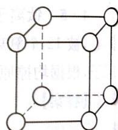  
钋晶胞模型

【答案】

$$
1 \mathrm{s} ^ {2} 2 \mathrm{s} ^ {2} 2 \mathrm{p} ^ {6} 3 \mathrm{s} ^ {2} 3 \mathrm{p} ^ {6} 3 \mathrm{d} ^ {1 0} 4 \mathrm{s} ^ {2} 4 \mathrm{p} ^ {2} \text {或} [ \mathrm{Ar} ] 3 \mathrm{d} ^ {1 0} 4 \mathrm{s} ^ {2} 4 \mathrm{p} ^ {2}
$$

第6题答图

$$
\mathrm{sp} ^ {2}
$$

6-3 相对分子质量增大,分子间作用力增大;氢原子的电负性比硅原子电负性大。

6-4 四面体形 正四面体形

$$
6 - 5 \sqrt [ 3 ]{\frac {2 0 9}{\rho N _ {\mathrm{A}}}} \times 1 0 ^ {1 0}
$$

第7题 7-1 等电子体是指原子个数相等,价电子数相等的微粒。CO 的价电子数为 $4 + 6 = 10$ 。O 相当于 $\mathrm{N}^{-}$ , C 相当于 $\mathrm{N}^{+}$ , 因此与 CO 等电子体为 $\mathrm{N}_{2} - \mathrm{CN}^{-}$ (或 $\mathrm{O}_{2}^{2+} 、 \mathrm{C}_{2}^{2-} 、 \mathrm{NO}^{+}$ )。

7-2 碳原子采取 $\mathrm{sp}^2$ 杂化的有双键碳原子（=C），因此为①③④。HCHO分子结构按照价层电子对互斥理论可知为平面三角形。

【答案】

$$
7 - 1 \quad \mathrm{N} _ {2}; \mathrm{CN} ^ {-} (\text {或} \mathrm{O} _ {2} ^ {2 +}, \mathrm{C} _ {2} ^ {2 -}, \mathrm{NO} ^ {+}) 。
$$

7-2 ①③④;平面三角。

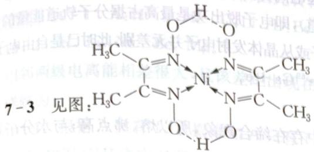  
第7题答图

$$
3 \Delta
$$

$$
0 = 3 \Delta , \infty \rightarrow T
$$

第8题 8-1 β粒子为电子,根据质子数守恒和质量数守恒,可知: $t_{1/2}=8.02d=0.693/b$ , $b=0.0004b$

8-2 $t_{1/2} = 8.02\mathrm{d} = 0.693 / k, k = 0.0864\mathrm{d}^{-1}, \ln (N_0 / N) = 0.0864\times 2 = 0.173$ ，解得 $N = 0.841N_0$ ，因此 $N / N_0 = 0.841$ ，即 $84.1\%$ 。

8-3 设滤液中 $\mathrm{I}^{-}$ 浓度为 $x\mathrm{mol}\cdot \mathrm{L}^{-1}$ ，则：

$\frac{0.050}{1.25\times10^{10}}=\frac{x}{2.50\times10^{3}}$ ，解得 $x=1.0\times10^{-8}$ ， $K_{sp}=1.0\times10^{-16}$ 。

$$
8 - 4 \quad {} _ {9 2} ^ {2 3 5} \mathrm{U} + _ {0} ^ {1} \mathrm{n} = _ {5 5} ^ {1 4 0} \mathrm{Cs} + _ {3 7} ^ {9 3} \mathrm{Rb} + 3 _ {0} ^ {1} \mathrm{n} 。
$$

第9题 ${}^{14}$ C 是碳的一种放射性同位素, 其丰度约为百万分之一, 其半衰期约为5730年, 碳是生物体内含量最高的元素, 人们可以通过测定古生物遗迹中 ${}^{14}$ C 含量来测定遗迹的年代, 称为放射性碳定年法。生物在生存期间需要呼吸, 和外界的碳进行交换, 体内 ${}^{14}$ C 含量基本保持恒定, 当生物死亡后, 呼吸作用停止, 体内的 ${}^{14}$ C 开始减少, 而自然界中的碳各种同位素含量保持恒定, 可以通过生物体内残留的 ${}^{14}$ C 的含量, 和半衰期的计算推算该生物的生存时所处的年代。但是用年代过于久远的样品, ${}^{14}$ C 不断衰变的含量极少, 如经过10个半衰期, ${}^{14}$ C 含量将降至 $1/2^{10}$ , 含量过低难以检出, 故 ${}^{14}$ C 断代存在时间的限制, 一般只能测定5万年以内的样品。北京周口店猿人距今约50万年以上, 不在放射性碳定年法的测定年限之内。

【答案】

$$
9 - 1 \quad {} _ {7} ^ {1 4} \mathrm{N} + _ {0} ^ {1} \mathrm{n} \longrightarrow {} _ {6} ^ {1 4} \mathrm{C} + _ {1} ^ {1} \mathrm{H} 。
$$

$$
9 - 2 \quad {} _ {6} ^ {1 4} \mathrm{C} \longrightarrow {} _ {7} ^ {1 4} \mathrm{N} + _ {- 1} ^ {0} \mathrm{e} _ {\circ}
$$

9-3 设活体中含 $^{14}_{6}C$ 的量为 $N_{0}$ ，遗骸中含量为 $N, ^{14}_{6}C$ 的半衰期为 $T$ ，半衰期的数为 $n$ ，则 $N/N_{0}=1/2^{n}, n=3$ 。因为 $n=t/T$ ，所以 $t=nT=17\ 190$ 年。

第10题 10-1 表示La被包在 $\mathrm{C}_{82}$ 的笼中

10-2 EMF 容易被氧化,作为电子给体;也容易被还原,作为电子受体。

10-3 EMF的极性比空心富勒烯大，与极性强的试剂结合力强。

## 能力测试 B 卷

第1题 1-1 746.2 kJ 是 1 mol 铜的电离势, 即 $E(\mathrm{Cu}) = I(\mathrm{Cu}) \cdot N_{\mathrm{A}}$ , 而对于晶体铜, 能量 434.1 kJ 是 1 mol 铜的电子脱出功, 即 $\varphi_{\mathrm{m}}(\mathrm{Cu}) = \varphi(\mathrm{Cu}) \cdot N_{\mathrm{A}}$ 。由于晶体的晶格中存在着电子与电子、核与核、核与电子之间的相互作用和晶格振动, 使原子损失能量, 导致晶体铜电离时所需能量较低, 两电离过程所需能量的差为 $\Delta E = [I(\mathrm{Cu}) - \varphi(\mathrm{Cu})]N_{\mathrm{A}}$ 。

1-2 $2.76 \times 10^{-7}(\mathrm{~m})$ (该波长在紫外光区)。

1-3 温度将大大改变能差 $\Delta E$ 。温度上升引起电离势降低，但对电子脱出功却难以确定。根据定义： $\varphi(\mathrm{Cu}) = -E_{\mathrm{HOMO}}$ （HOMO为最高被占分子轨道），即电子脱出功是最高占据分子轨道能量的负值（在高温下），因此 $T \to \infty$ ， $\Delta E = 0$ ，即在高温下从原子或从晶体发射电子并无差别，此时已是自由电子

第2题 2-1 $^{68}$ Zn+ $^{1}$ n→ $^{69}$ Zn+γ, $^{69}$ Zn→ $^{69}$ Ga+e。

2-2 $\left[\mathrm{AsCl}_4\right]^+$ 和 $\left[\mathrm{AsF}_6\right]^-$ ； $\mathrm{sp}^3$ ； $\mathrm{sp}^3\mathrm{d}^2$ 。

2-3 $\mathrm{H}_2\mathrm{O}_2$ 分子间存在氢键，在液态或固态中存在缔合现象，所以熔、沸点高；与水分子可形成氢键，所以溶解度大。

2-4 可以用于研究洋流从一个海盆流到另一海盆时海水的混合状况。

第3题 3-1 2、6、6、12。

3-2 15。

3-3 $1\mathrm{s}^2 2\mathrm{s}^2 2\mathrm{p}^4 3\mathrm{s}^2 3\mathrm{p}^4 3\mathrm{d}^3 4\mathrm{s}^1$

3-4 $\mathrm{BH}_3$ ; $\mathrm{B}_n\mathrm{H}_{n + 2}$

第4题 4-1 $\nu = \frac{\Delta E}{h} = \frac{2.86\times 1.6\times 10^{-19}}{6.67\times 10^{-34}} = 6.86\times 10^{14}s^{-1}$

$\lambda=\frac{c}{\nu}=\frac{3.00\times10^{8}}{6.86\times10^{14}}=437(nm)$ ，因此吸收紫光，应该呈红光。

4-2 主要考虑电子成对能。当电子跃迁时，除了考虑分裂能外，还要考虑电子成对能，因而分裂能不能判断其颜色。（ $\mathrm{Ti}^{2+}$ 为 $3\mathrm{d}^2$ ）

第5题 5-1 $n = \frac{pV}{RT} = \frac{1.01 \times 10^{5} \mathrm{~Pa} \times 0.448 \mathrm{~L}}{8.314 \mathrm{~J} \cdot \mathrm{mol}^{-1} \cdot \mathrm{K}^{-1} \times 273.15 \mathrm{~K}} = 0.02 \mathrm{~mol}, m = 1.7 \mathrm{~g}$ 。

5-2 ${}^{85}_{36}Kr\longrightarrow{}^{85}_{37}Rb+{}^{0}_{-1}e_{o}$

5-3 22年为2个半衰期，剩余氮气为原来的1/4，忽略掉固态铷的体积，以氮气为研究对象： $p = \frac{1}{4} p_0 \times \frac{373\mathrm{K}}{273\mathrm{K}} = 0.342\mathrm{atm}$ ，即 $p_2 = 0.34\mathrm{atm}$ 。

第6题 6-1 CsAu。

6-2 $6\mathrm{s}^2$ 惰性电子对效应。

6-3 Au 的次外层有较多的 d 电子, 电子云密度较大, 对最外层电子排斥作用较大, 不易形变, 而 Cs 次外层不含 d 电子, 因此容易形变。

第7题 7-1 Hs; $\mathrm{HsO_4}$ 。

7-2 ${}^{58}_{26}Fe + {}^{208}_{82}Pb \longrightarrow {}^{265}_{108}Hs + {}^{1}_{0}n,$ ${}^{26}_{12}Mg + {}^{248}_{96}Cm \longrightarrow {}^{269}_{108}Hs + 5_{0}^{1}n.$

第8题 8-1 每个水分子平均最多可形成2个氢键,每个HF分子平均最多生成1个氢键。前者氢键数目多,总键能较大,故沸点较高。

8-2 氟原子半径小,外层孤对电子多,电子云密度大,电子间斥力大,使得氟原子结合一个电子形成气态 $F^{-}$ 时放出能量较少。

8-3 ①B原子半径比N原子小，且B、F电负性差比N、F电负性差大，因此B—F单键比N—F单键键能大；②在 $\mathrm{BF}_3$ 中，由于F和B的p轨道重叠，使B—F健具有双键特征（ $\pi_4^6$ ），因此在 $\mathrm{BF}_3$ 中的键能更大。

第9题 9-1 $\mathrm{D} + \mathrm{T}\longrightarrow_{2}^{4}\mathrm{He} + _{0}^{1}\mathrm{n}$ (或 ${}_{1}^{2}\mathrm{H} + _{1}^{3}\mathrm{H}\longrightarrow_{2}^{4}\mathrm{He} + _{0}^{1}\mathrm{n})$ 。

9-2 由于顺磁物质具有永久磁距,其靠近仲氢时,顺磁分子吸引磁感线,仲氢变为正氢后满

足了顺磁分子的要求,相当于能量降低,因此转化。

第10题 10-1 A: H B: He C: Li D: Be E: C F: N G: Na H: Mg I: Al。
10-2 H, Li, Na Be, Mg。

相邻两级电离能相差很大，且该差距出现在相同的相邻两极电离中。详解为：

10-1 根据 A 只有 $I_{1}$ 数据推知 A 只有 1 个电子，即 H，同理 B:He C:Li D:Be∵ $I_{1}$ 数据 GHI 之中 G 最低， $I_{2}$ 是 H， $I_{3}$ 是 I 说明 G，H，I 的常见价态是 +1，+2，+3
∵ G:Na H:Mg I:Al

∵ A\~I序数增大 ∴ E:C F:N( $I_{4}$ 数据E最小;即E常见的是+4价,C; $I_{3}$ , $I_{5}$ 数据F最小,即F常见的是+3,+5价,N)

10-2 (H, Li, Na)(Be, Mg)是同族的。

## 第6章 元素周期律和元素周期表

## 能力测试 A 卷

第1题 1-1 C、Si、Al。

1-2 $\mathrm{HNO}_3$ ；共价键；写“耐火材料，冶炼铝或作催化剂”中任一种。  
1-3 $\mathrm{Al_4SiC_4 + 2N_2\xrightarrow{1500^\circ C} 4AlN + SiC + 3C}$ 。  
1-4 $\mathrm{AlN + OH^- + H_2O\xlongequal{\Delta} AlO_2^- + NH_3\uparrow}$ 。  
1-5 $4\mathrm{Al + Si + 4C\xlongequal{\Delta} Al_4C_3 + SiC(1106^\circ C)}$ 。

详解为：

∵ ZX 与金刚石结构相似,且 Z 与 X 同族
∴ ZX:SiC A:AlN
∴ X:C Y:Al Z:Si K:N₂
∵ K, J 是空气主要成分
∴ J:O₂ E:CO₂

∵ B 有两性

$$
\therefore \mathrm{B}: \mathrm{Al} _ {2} \mathrm{O} _ {3} \quad \mathrm{D}: \mathrm{NaAlO} _ {2}
$$

$$
\therefore \mathrm{H}: \mathrm{Al} (\mathrm{OH}) _ {3} \quad \mathrm{C}: \mathrm{NH} _ {3} \quad \mathrm{F}: \mathrm{NO} \quad \mathrm{G}: \mathrm{HNO} _ {3}
$$

$$
\Rightarrow \left\{ \begin{array}{l} \frac {26.98x}{26.98x + 28.09y + 12.01z} = 58.7 \% \\ \frac {12.01z}{26.98x + 28.09y + 12.01z} = 15.2 \% \end{array} \right.
$$

$$
0, 0
$$

$$
\Rightarrow x = 4 \quad y = 1 \quad z = 4
$$

$$
\frac {1}{0 - \nabla \partial A I . 0 - I} = M \Leftarrow
$$

$\Rightarrow \mathrm{Al}_{4} \mathrm{SiS}_{4}$ 。

$$
1 - 1 \quad C > S i > A l _ {\circ}
$$

1-2 $HNO_{3}$ ，共价键，干燥剂。

$$
\partial = \frac {\partial^ {2} \nabla \partial . A I \times_ {\text { 有 }} M}{1 - \log m \cdot g 1 0 . 8 1} = (C) _ {n}
$$

$$
1 - 3 \quad \mathrm{Al} _ {4} \mathrm{SiC} _ {4} + 2 \mathrm{N} _ {2} \xrightarrow {1 5 0 0 ^ {\circ} \mathrm{C}} 4 \mathrm{AlN} + \mathrm{SiC} + 3 \mathrm{C} _ {\circ}
$$

$$
1 - 4 \quad \mathrm{AlN} + \mathrm{OH} ^ {-} + \mathrm{H} _ {2} \mathrm{O} \xrightarrow {\triangle} \mathrm{AlO} _ {2} ^ {-} + \mathrm{NH} _ {3} \uparrow .
$$

$$
1 - 5 \quad 4 \mathrm{Al} + \mathrm{Si} + 4 \mathrm{C} \xrightarrow [ 8 0 \sim 1 0 0 \mathrm{MPa} ]{1 5 0 0 \sim 1 7 0 0 ^ {\circ} \mathrm{C}} \mathrm{Al} _ {4} \mathrm{C} _ {3} + \mathrm{SiC} 。
$$

第2题 因为A的最高正价和最低负价绝对值相等，所以A可能为氢、碳、硅。

A与C形成的二元化合物是一种常见的非极性有机溶剂，可判断A为碳，而它们形成的二元化合物可能为二硫化碳或四氯化碳。

因为 A 与 C 形成的二元化合物中 A 的质量分数为 7.8%，分别将硫和氯代入验证，知四氯化碳符合题意。推出 C 为氯。

根据 A 与 B 形成的二元化合物中 B 的质量分数为 75%，设元素 B 的氧化数（化合价）为 x，A 与 B 形成的二元化合物化学式为 $C_{x}B_{4}$ ，依题意可得：

$$
\frac {4 M _ {\mathrm{r}} (\mathrm{B})}{1 2 x + 4 M _ {\mathrm{r}} (\mathrm{B})} = 0. 7 5
$$

经讨论当 $x = 3$ 时， $M_{r}(B) = 27$ ，B为铝，符合题意。

第3题 A:C; B:H; C:O; D:K; E:Fe; X:K₃[Fe(C₂O₄)₃]·3H₂O。

详解为：

∵ D 通过蓝钴玻璃焰色呈紫色

∴ D 是 K

∵ E 最外层电子数比次外层少 12 个

∴ 若 E 是第四周期元素 $\Rightarrow 3d^{6}4s^{2}$ Fe

若 E 是第五周期元素 $\Rightarrow 4d^{5}5s^{1}$ Mo

若 E 是第六周期元素 $\Rightarrow 5d^{6}6s^{2}$ Os

∵ B 与 C 可组成两种极性物质, 且都是短周期的, 且 C 是 $sp^{3}$ 杂化, 其中一种为 $104.5^{\circ}$

∴ B:H C:O 组成有 $H_{2}O$ , $H_{2}O_{2}$

∵ A 的高价与低价和为 0, 且也为短周期

∴ A 为 C 或 Si

∵ X 中有金属元素与多种非金属元素

∴ X 是配合物(阴离子), 其阳离子为 K

$$
\therefore \mathrm{E:Fe} \quad \mathrm{A:C}
$$

假设为单核配合物 $\Rightarrow M_{\text{总}} = \frac{55.845\mathrm{g}\cdot\mathrm{mol}^{-1}}{1 - 0.1467 - 0.0123 - 0.4885 - 0.2388} = 491\mathrm{g}\cdot \mathrm{mol}^{-1}$

$$
\therefore n (\mathrm{H}) = M _ {\text {总}} \times 1.23 \% = 6 \quad n (\mathrm{K}) = \frac {M _ {\text {总}} \times 23.88 \%}{39 \mathrm{g} \cdot \mathrm{mol} ^ {- 1}} = 3 \quad n (\mathrm{O}) = \frac {M _ {\text {总}} \times 48.85 \%}{16 \mathrm{g} \cdot \mathrm{mol} ^ {- 1}} =
$$

15 $n(\mathrm{C}) = \frac{M_{\text{总}} \times 14.67\%}{12.01 \mathrm{~g} \cdot \mathrm{mol}^{-1}} = 6$

$$
\therefore \mathrm{K} _ {3} \mathrm{FeC} _ {6} \mathrm{O} _ {1 5} \mathrm{H} _ {6} \Rightarrow \mathrm{K} _ {3} \left[ \mathrm{Fe} (\mathrm{C} _ {2} \mathrm{O} _ {4}) _ {3} \right] \cdot 3 \mathrm{H} _ {2} \mathrm{O} 。
$$

第4题 4-1 A:C; B:N; C:Si。

4-2 $\mathrm{Si}_3\mathrm{N}_4$

$$
\mathrm{D}: \mathrm{C} _ {4} \mathrm{O} _ {3}
$$

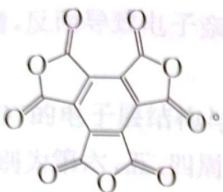

详解为：
∵ A、B、C 原子序数依次增大，且 A 与 B、C 相邻
∴ A、B 同周期，A、C 同族
∵ A、B 有多种氧化物，且都是第二周期
∴ A:C B:N
∵ C 的氧化物 D 含氧量 50%，且水解为六元酸
∴ D: $C_{4}O_{3}$ ，是羧酸酯，不饱和度为 5
∵ 水解产物为六元酸

$$
\mathrm{C} _ {1 2} \mathrm{O} _ {9}
$$

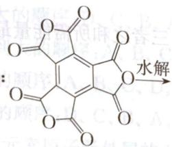

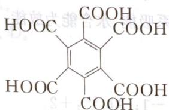

∵ B 与 C 形成化合物 B 占 40%。B 是 N 且 A 与 C 同族

∴ C 是 Si, 形成 $Si_{3}N_{4}\frac{4\times14}{3\times28+4\times14}=40\%$ 成立。

$$
5 - 2 \quad {} _ {9 2} ^ {2 3 5} \mathrm{U} + _ {0} ^ {1} \mathrm{n} \longrightarrow {} _ {5 6} ^ {1 4 2} \mathrm{Ba} + _ {3 6} ^ {9 1} \mathrm{Kr} + 3 _ {0} ^ {1} \mathrm{n}, \quad {} _ {9 2} ^ {2 3 5} \mathrm{U} + _ {0} ^ {1} \mathrm{n} \longrightarrow {} _ {5 3} ^ {1 3 5} \mathrm{I} + _ {3 9} ^ {9 7} \mathrm{Y} + 4 _ {0} ^ {1} \mathrm{n} 。
$$

$$
\mathbf {6 - 1} \quad \mathrm{H} _ {2} \mathrm{O}; \mathrm{LiHS}
$$

$$
\mathrm{NaOH}
$$

$$
\therefore x = 3 \Rightarrow 2 \mathrm{H} _ {x} \mathrm{R} \longrightarrow 2 \mathrm{R} + x \mathrm{H} _ {2}
$$

$$
\Rightarrow M = x + M (R) = 2 \times 1 7 = 3 4 \Rightarrow M (R) = 3 1 g \cdot m o l ^ {- 1}
$$

$$
1 \mathrm{s} ^ {2} 2 \mathrm{s} ^ {2} 2 \mathrm{p} ^ {6} 3 \mathrm{s} ^ {2} 3 \mathrm{p} ^ {3}, \mathrm{P} _ {2} \mathrm{O} _ {5}, \mathrm{H} _ {3} \mathrm{PO} _ {4}
$$

$$
\mathrm{P}; 1 6; 1 \mathrm{s} ^ {2} 2 \mathrm{s} ^ {2} 2 \mathrm{p} ^ {6} 3 \mathrm{s} ^ {2} 3 \mathrm{p} ^ {3}; \mathrm{P} _ {2} \mathrm{O} _ {5}; \mathrm{HPO} _ {3} (\mathrm{H} _ {3} \mathrm{PO} _ {4})
$$

$$
\begin{array}{c} \mathrm{H} \\ \mathrm{H}: \dot {\mathrm{N}}:; + 1 \\ : \dot {\mathrm{Cl}}: \end{array}
$$

$$
6 - 4 \text {七}; \mathrm{IVA}; \mathrm{XO} _ {2}; \text {八}; \mathrm{IVA} 。
$$

$$
\mathrm{Fe} + _ {8 3} ^ {2 0 9} \mathrm{Bi} \longrightarrow_ {1 0 9} ^ {2 6 6} \mathrm{M} + _ {0} ^ {1} \mathrm{n})
$$

$$
\mathrm{Fe} + _ {8 2} ^ {2 0 9} \mathrm{Pb} \longrightarrow_ {1 0 8} ^ {2 6 6} \mathrm{M} + _ {0} ^ {1} \mathrm{n})
$$

$$
7 - 1 \mathrm{B} _ {\circ}
$$

$$
7 - 2 \quad \mathrm{BC} _ {\circ}
$$

$$
7 - 3 \quad \mathrm{C} _ {\circ}
$$

$$
7 - 4 \quad \mathrm{sp} ^ {3}; 1 。
$$

7-5 $\mathrm{XeF_2 + BrO_3^- + H_2O = Xe + BrO_4^- + 2HF}$ 第8题 8-1 C.   
8-2 $(\mathrm{NH}_4)_2\mathrm{BeF}_4$ 8-3 $\mathrm{P_4O_7}$ 、 $\mathrm{P_4O_3}$ 、 $\mathrm{P_4O_9}$ 8-4 $\mathrm{NaF + NaPO_3 = Na_2PO_3F}$

第9题 5项错误。
错误的有①③④⑤⑦。①由单方提供两个电子，③ $[Ar]3d^{10}4s^{2}4p^{2}$ ，④ $H_{2}O_{2}$ 有极性，⑤氢键不是化学键，⑦ $HgCl_{2}$ 是弱电解质。
第10题 因为 $\Delta H(Eu)=4236.9-3623.1=613.8\ kJ\cdot mol^{-1}$ $\Delta H(Yb)=4372.7-3848.3=524.4\ kJ\cdot mol^{-1}$ $\Delta H(Lu)=4362.6-3844.3=518.3\ kJ\cdot mol^{-1}$ 还原性 Lu > Yb > Eu。
升华能、电离能是体系吸能，水合能为放能。三者之和所需能量最低的金属还原性最强。

## 能力测试B卷

第1题 1-1 $\mathrm{Al}_{13}^{-}: -1; \mathrm{Al}_{14}^{2+}: +2$ 。

$\mathrm{Al}_{14}$ 相当于碱土金属, 因为 $\mathrm{Al}_{14}$ 容易失去 2 个电子而呈现 +2 价。  
1-2 根据晶体密度公式可得: $V = \frac{MZ}{N_{\mathrm{A}} \rho} = \frac{27 \times 4}{6.02 \times 10^{23} \times 2.7} = a^3$ , 故晶胞参数 $a = 405 \mathrm{pm}$ 。因为金属铝形成面心立方晶胞, 所以原子半径与晶胞参数之间的关系为: $\sqrt{2} a = 4r$ $r = \frac{\sqrt{2}}{4} a = \frac{\sqrt{2}}{4} \times 405 \mathrm{pm} = 143 \mathrm{pm}$ 所以估计 Al—Al 键长约为: $2r = 2 \times 143 \mathrm{pm} = 286 \mathrm{pm}$ 。

1-3 有20个四面体空隙。

设 Al 的半径为 R，正四面体空隙可以填充的内切球半径为 r，则正四面体边长 b=2R，立方体边长 $\sqrt{2}R$ ，立方体对角线为： $\left[(\sqrt{2}R)^{2}+(2R)^{2}\right]^{\frac{1}{2}}=\sqrt{6}R$ ，而 $\frac{1}{2}\times\sqrt{6}R=r+R$ 。所以 $r=\left(\frac{\sqrt{6}}{2}-1\right)R=0.225R=0.225\times143\mathrm{pm}=32.2\mathrm{pm}$ 。

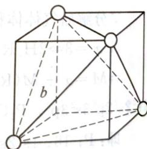  
第1题答图

第2题 2-1 错误。因为价电子层含有 $ns^1$ 的元素，除了碱金属元素外，还有IB族 $[(n - 1)\mathrm{d}^{10}ns^1]$ 的铜、银、金等元素，它们并非碱金属元素。

2-2 错误。Ⅷ族元素价电子排布为 $(n-1)\mathrm{d}^{6\sim8}ns^{2}$ 。

2-3 错误。过渡金属的原子填充电子时，因发生能级交错现象，先填充4s，再填充3d；而失去电子时，先失去4s，再失去3d。

2-4 错误。由于镧系收缩，使第六周期元素的原子半径与第五周期元素的原子半径相近。

2-5 错误。应该是 $\mathrm{O(g) + e\longrightarrow O^{-}(g)}$ （第一电子亲和能）为放热反应。 $\mathrm{O^{-}(g) + e\longrightarrow}$ $\mathrm{O^{2 - }(g)}$ 是吸热反应。

2-6 错误。虽然氟是最活泼非金属元素,但由于原子半径最小,加入电子后负电荷密集,电

子间的排斥作用剧增, 反而导致电子亲和能比它同族下面的一个元素氯的为小, 即具有最大电子亲和能的元素是氯。

第3题 由题意 D 的电子层结构与 Ar 相同可知: D 是 17 号元素, 位于第三周期 VII A 族。由此可推知: A、B、C 分别为第六、五、四周期的元素。又根据 A、B、C 三元素价电子数和次外层电子的特点可知: A 为 I A 族元素; B 为 II A 族元素, C 为 VI A 族元素。
A、B、C、D 四种元素的电子排布式、在周期表中的位置上以及性质变化如下所示:

<table><tr><td>元素代码及符号</td><td>电子排布式</td><td>周期</td><td>族</td></tr><tr><td>A(Cs)铯</td><td> $[Xe]6s^{1}$ </td><td>六</td><td>IA</td></tr><tr><td>B(Sr)锶</td><td> $[Kr]5s^{2}$ </td><td>五</td><td>IIA</td></tr><tr><td>C(Se)硒</td><td> $[Ar]3d^{10}4s^{2}4p^{4}$ </td><td>四</td><td>VIA</td></tr><tr><td>D(Cl)氯</td><td> $[Ne]3s^{2}3p^{5}$ </td><td>三</td><td>VIIA</td></tr></table>

3-1 原子半径由小到大的顺序: D、C、B、A。

3-2 第一电离能由小到大的顺序: A、B、C、D。

3-3 电负性由小到大的顺序: A、B、C、D。

3-4 金属性由弱到强的顺序: D、C、B、A。

3-5 A、B、C、D四种元素原子最外层的 $l = 0$ 的电子的量子数如下所示：

<table><tr><td rowspan="2">元素代码</td><td rowspan="2"> $l=0$ 的电子</td><td colspan="4">量子数</td></tr><tr><td> $n$ </td><td> $l$ </td><td> $m$ </td><td> $m_s$ </td></tr><tr><td>A</td><td> $6s^1$ </td><td>6</td><td>0</td><td>0</td><td>+1/2或-1/2</td></tr><tr><td rowspan="2">B</td><td rowspan="2"> $5s^2$ </td><td>5</td><td>0</td><td>0</td><td>+1/2</td></tr><tr><td>5</td><td>0</td><td>0</td><td>-1/2</td></tr><tr><td rowspan="2">C</td><td rowspan="2"> $4s^2$ </td><td>4</td><td>0</td><td>0</td><td>+1/2</td></tr><tr><td>4</td><td>0</td><td>0</td><td>-1/2</td></tr><tr><td rowspan="2">D</td><td rowspan="2"> $3s^2$ </td><td>3</td><td>0</td><td>0</td><td>+1/2</td></tr><tr><td>3</td><td>0</td><td>0</td><td>-1/2</td></tr></table>

第4题 4-1 $^{82}_{34}Se + n \longrightarrow ^{83}_{34}Se; ^{83}_{34}Se \longrightarrow ^{83}_{35}Br + e$ 。

4-2 有偶数中子的核素一般比有奇数中子的核素的丰度大。
4-3 BrO $_{4}^{-}$ ; Rb $_{2}$ SeO $_{4}$ ; Kr。

4-4 $3\mathrm{Se} + 4\mathrm{HNO}_3 + \mathrm{H}_2\mathrm{O}\longrightarrow 3\mathrm{H}_2\mathrm{SeO}_3 + 4\mathrm{NO}\uparrow ,$ $\mathrm{H_2SeO_3 + 2RbOH\longrightarrow Rb_2SeO_3 + 2H_2O},$

$$
\mathrm{Rb} _ {2} \mathrm{SeO} _ {3} + \mathrm{O} _ {3} \longrightarrow \mathrm{Rb} _ {2} \mathrm{SeO} _ {4} + \mathrm{O} _ {2},
$$

$$
{ } _ { 3 4 } ^ { 8 3 } \mathrm{SeO} _ { 4 } ^ { 2 - } \longrightarrow { } _ { 3 5 } ^ { 8 3 } \mathrm{BrO} _ { 4 } ^ { - } + \mathrm{e} _ { \circ }
$$

$$
4 - 5 \quad \mathrm{XeF} _ {2} + 2 \mathrm{OH} ^ {-} + \mathrm{BrO} _ {3} ^ {-} \longrightarrow \mathrm{Xe} \uparrow + \mathrm{BrO} _ {4} ^ {-} + 2 \mathrm{F} ^ {-} + \mathrm{H} _ {2} \mathrm{O} 。
$$

第5题 5-1 13;6;14;7;15;7。

5-2 $4_{1}^{1}\mathrm{H}\longrightarrow_{2}^{4}\mathrm{He} + 2\mathrm{e}^{+} + 2\mathrm{v}_{\mathrm{e}} + 25.7\mathrm{MeV}$

5-3 催化剂

第6题 6-1 聚合的 $\mathrm{Al(OH)_3}$ 胶体； $[\mathrm{Al(OH)}_2]^+$ ； $\mathrm{AlF}_4^-$ 。

6-2 $[\mathrm{Ar}]3\mathrm{d}^5 4\mathrm{s}^1$ ;[Kr] $4\mathrm{d}^5 5\mathrm{s}^1$ ;铬;钼; $5\mathrm{g}^9 8\mathrm{s}^1$ ;128。

第7题 7-1 第三周期第IA族 低;固;能;易。

7-2 ${}^{235}_{92}U+{}_{0}^{1}n\longrightarrow{}^{142}_{56}Ba+{}_{36}^{91}Kr+{}_{0}^{1}n,$ ${}^{235}_{92}U+{}_{0}^{1}n\longrightarrow{}^{135}_{53}I+{}_{39}^{97}Y+{}_{0}^{1}n.$

第8题 8-1 $M = \frac{a^2 c\rho\sin 60^\circ N_A}{z} = 752.04\mathrm{g}\cdot \mathrm{mol}^{-1}$ 。

设 A 的化学式为 $M_{x}N_{y}$ 。讨论得到当 y=4 时，x=3， $M=232.0\ g\cdot mol^{-1}$ 。

M 为钍 Th。所以 A 为 $Th_{3}N_{4}$ ; B 为 ThN。 $6d^{2}7s^{2}$ 。

$$
\rho = \frac {z M}{a ^ {3} N _ {\mathrm{A}}} = \frac {4 \times 2 4 6 . 0 1}{(5 . 1 6 \times 1 0 ^ {- 8}) ^ {3} \times 6 . 0 2 \times 1 0 ^ {2 3}} = 1 1. 9 0 \mathrm{g} \cdot \mathrm{cm} ^ {- 3}.
$$

8-3 A是绝缘体,因为A中Th-N间的距离等于阴阳离子半径之和,无空隙。B为电的良导体。

8-4 质量数是226、228、230等较稳定。

$$
\mathbf {8} - \mathbf {5} ^ {2 3 2} \mathrm{Th} + ^ {7 6} \mathrm{Ge} \longrightarrow^ {3 0 5} \mathrm{N} + 3 \mathrm{n};
$$

N 在周期表中为: 第八周期、ⅢB族, 属于类锕系元素。

第9题 9-1 $\mathrm{Gr}^{3+}(\mathrm{aq}) / \mathrm{Gr}(\mathrm{s})$ 电位小于零, $\mathrm{Gr}$ 可能被 $\mathrm{H}^{+}(\mathrm{aq})(1\mathrm{M})$ 氧化为 $\mathrm{Gr}^{3+}$ , 而 $E^{0}(\mathrm{H}^{+}/\mathrm{H}_{2}) = 0$ 。其化学反应方程式为: $2\mathrm{Gr} + 6\mathrm{H}^{+} \longrightarrow 2\mathrm{Gr}^{3+} + 3\mathrm{H}_{2}\uparrow$ 。

9-2 $\mathrm{Gr}^{3+}(\mathrm{aq}) / \mathrm{GrCl}_2(\mathrm{s})$ 电位小于零， $\mathrm{GrCl}_2(\mathrm{s})$ 可能被 $\mathrm{H}^+(\mathrm{aq})(1\mathrm{M})$ 氧化为 $\mathrm{Gr}^{3+}$ ，而 $E^0 (\mathrm{H}^+ /\mathrm{H}_2) = 0$ 。其化学反应方程式为： $2\mathrm{GrCl}_2 + 2\mathrm{H}^+ \longrightarrow 2\mathrm{Gr}^{3+} + \mathrm{H}_2 + 4\mathrm{Cl}^-$ 。

9-3 $\mathrm{GrO}^{2+}$ (aq)/ $\mathrm{Gr}^{3+}$ (aq) 的电位为 $0 \sim 1.2 \mathrm{~V}$ , 因为 $0 \mathrm{~V} < E^{0}(\mathrm{GrO}^{2+}/\mathrm{Gr}^{3+}) < E^{0}(\mathrm{O}_{2}/\mathrm{H}_{2} \mathrm{O}), 0 \mathrm{~V} < E^{0}(\mathrm{GrO}^{2+}/\mathrm{Gr}^{3+}) < 1.23 \mathrm{~V}$ , 所以 $\mathrm{Gr}^{3+}$ 不能被 $\mathrm{H}^{+}$ 氧化, 而被氧气氧化。

9-4 Ti元素符合这个业余化学爱好者对Gr的描述。

第 10 题 10-1 气态 $\mathrm{Cu}^{+}$ 稳定性强于 $\mathrm{Cu}^{2+}$ 。可从 $\mathrm{Cu}$ 核外电子排布说明：

Cu 原子核外电子排布: $1s^{2}2s^{2}2p^{6}3s^{2}3p^{6}3d^{10}4s^{1}$

$Cu^{+}$ 核外电子排布为: $1s^{2}2s^{2}2p^{6}3s^{2}3p^{6}3d^{10}$ 。

$Cu^{2+}$ 核外电子排布为: $1s^{2}2s^{2}2p^{6}3s^{2}3p^{6}3d^{9}$ 。

$Cu^{+}$ 核外电子排布为全满结构, 比较稳定, 而 $Cu^{2+}$ 则不是。根据洪特规则特例, $Cu^{+}$ 比 $Cu^{2+}$ 稳定。

水合 $Cu^{2+}$ 要比水合 $Cu^{+}$ 稳定。这是因为： $Cu^{2+}$ 水合能 $(-2119\ \mathrm{kJ}\cdot\mathrm{mol}^{-1})$ 比 $Cu^{+}$ 水合能 $(-581\ \mathrm{kJ}\cdot\mathrm{mol}^{-1})$ 大得多，可以补偿 $Cu^{+}$ 变成 $Cu^{2+}$ 所消耗的第二电离能 $(1958\ \mathrm{kJ}\cdot\mathrm{mol}^{-1})$ 。因此水溶液中 $Cu^{2+}$ 比 $Cu^{+}$ 稳定。

当然也可以从热力学循环计算出反应 $2\mathrm{Cu}^{+}(\mathrm{aq}) \longrightarrow 2\mathrm{Cu}^{2+}(\mathrm{aq}) + \mathrm{Cu}(\mathrm{s})$ 的反应焓变，说明该歧化反应易于进行。

$$
\begin{array}{r l} & 2 \mathrm{Cu} ^ {+} (\mathrm{aq}) \xrightarrow {\Delta H} \mathrm{Cu} ^ {2 +} (\mathrm{aq}) + \mathrm{Cu} (\mathrm{s}) \\ & \Biggl \downarrow - 2 \Delta H _ {\mathrm{h}} (\mathrm{Cu} ^ {+}) \uparrow \Delta H _ {\mathrm{h}} (\mathrm{Cu} ^ {2 +}) \Biggl \uparrow - \Delta H _ {\mathrm{s}} \\ & \mathrm{Cu} ^ {+} (\mathrm{g}) \xrightarrow {\Delta H _ {1 2}} \mathrm{Cu} ^ {2 +} (\mathrm{g}) \\ & \mathrm{Cu} ^ {+} (\mathrm{g}) \xrightarrow {- \Delta H _ {1 1}} \mathrm{Cu} (\mathrm{g}) \end{array}
$$

10-2 ① 第一步失重失去的组分是水分子或 $\mathrm{H}_{2} \mathrm{O}$ , 且是 3 个水分子或 $3 \mathrm{H}_{2} \mathrm{O}$ 。由于 $C_{11} H_{14} CuN_{4} O_{7}$ 的摩尔质量约 $377.8 \mathrm{~g} \cdot \mathrm{mol}^{-1}$ , 失去 3 个水分子, 失重质量分数理论值为 $14.3\%$ 。② 第二步失重后的固态残渣是 $\mathrm{CuO}$ 和 $\mathrm{Cu}_{2} \mathrm{O}$ 的混合物。这是因为: $\mathrm{CuO}, \mathrm{Cu}_{2} \mathrm{O}$ 及 $C_{11} H_{14} CuN_{4} O_{7}$ 的摩尔质量分别为 $79.55 \mathrm{~g} \cdot \mathrm{mol}^{-1}, 143.1 \mathrm{~g} \cdot \mathrm{mol}^{-1}$ 和 $377.8 \mathrm{~g} \cdot \mathrm{mol}^{-1}$ 。若残渣为 $\mathrm{CuO}$ , 则失重质量分数为 $79.55 / 377.8 = 21.1\%$ ; 若残渣为 $\mathrm{Cu}_{2} \mathrm{O}$ , 则质量分数为 $143.1 / (377.8 \times 2) = 18.9\%$ , 实验值为 $20\%$ 介于两者之间, 故残渣是两者的混合物。10-3 根据 Y[化学式为 $\mathrm{CuSO}_{4} \cdot n \mathrm{Cu(OH)}_{2}$ ] 加热脱水, 将失去 $11.9\%$ 的质量, 则有: $18 n / (160 + 98 n) \times 100\% = 11.9\%$ ; 解得 $n = 3$ , 故 Y 的化学式为: $\mathrm{CuSO}_{4} \cdot 3 \mathrm{Cu(OH)}_{2}$ ; 再根据 Y 是由 X 和水相遇生成的, 而且 X 和水相遇时, 有 $1 / 3 \mathrm{CuSO}_{4}$ 转化为 Y、有 $2 / 3$ 的溶解了, 设 Y 为 $3 \mathrm{~mol}$ , 则有 X 和水相遇时 Y 为 $1 \mathrm{~mol}, \mathrm{CuSO}_{4} 2 \mathrm{~mol}$ , 可知黄色中间产物含有 $\mathrm{Cu}^{2+}, \mathrm{SO}_{4}^{2-}$ 的个数比为 $2:1$ , 根据 a、b、c 为整数, 则推出黄色中间产物含有 $\mathrm{Cu}^{2+}, \mathrm{SO}_{4}^{2-}$ 的个数比为 $2:1$ , 根据电荷守恒则有 $2a = 2b + 2c, b = 1$ , 推出 X 的化学式为: $\mathrm{Cu}_{2} \mathrm{OSO}_{4}$ 。10-4 $200 \mathrm{~mL} 5 \mathrm{~mol} \cdot \mathrm{L}^{-1}$ 的 $\mathrm{CuCl}_{2}$ 中含有 $n(\mathrm{Cu}^{2+}) = 0.2 \mathrm{~L} \times 5 \mathrm{~mol} \cdot \mathrm{L}^{-1} = 1 \mathrm{~mol}, n(\mathrm{Cl}^{-}) = 2 \mathrm{~mol}$ , 由实验 1 可知, 加入 $0.4 \mathrm{~mol} \mathrm{NaCl}$ 后 $n(\mathrm{Cl}^{-}) = 2 \mathrm{~mol} + 0.4 \mathrm{~mol} = 2.4 \mathrm{~mol}, n(\mathrm{Cu}^{2+}) = 1 \mathrm{~mol} - 0.2 \mathrm{~mol} = 0.8 \mathrm{~mol}$ , 因此配阴离子中 $n(\mathrm{Cu}^{2+}): n(\mathrm{Cl}^{-}) = 0.8 \mathrm{~mol}: 2.4 \mathrm{~mol} = 1:3$ , 此产物化学式为 $\mathrm{NaCuCl}_{3}$ , 在实验 2、3 中均成立。由实验 4 可知: 配阴离子中 $n(\mathrm{Cu}^{2+}): n(\mathrm{Cl}^{-}) = 1 \mathrm{~mol}: 4 \mathrm{~mol} = 1:4$ , 此产物化学式为 $\mathrm{Na}_{2} \mathrm{CuCl}_{4}$ , 此在实验 5、6 中均成立, 故答案为: $\mathrm{NaCuCl}_{3}$ 或 $\mathrm{Na}_{2} \mathrm{CuCl}_{4}$ 。

## 第 7 章 离子键和离子晶体

## 能力测试 A 卷

1-1 ∵ A 是可溶性强碱,与 B 反应生成气体 C

∴ B是氨盐 C是氨气 A是碱金属或碱土金属氢氧化物

沉淀 D 是白色且不溶于稀硝酸, B 是正盐

∴ O 是 $BaSO_{4} \Rightarrow A$ 是 $\mathrm{Ba(OH)}_{2}$ $\mathrm{B:(NH_{4})_{2}SO_{4}}$ $\mathrm{C:NH_{3}}$ $\mathrm{E:H_{2}O}$

$$
\Rightarrow \mathrm{Ba} ^ {2 +} + 2 \mathrm{OH} ^ {-} + 2 \mathrm{NH} _ {4} ^ {+} + \mathrm{SO} _ {4} ^ {2 -} \longrightarrow \mathrm{BaSO} _ {4} \downarrow + 2 \mathrm{NH} _ {3} \uparrow + 2 \mathrm{H} _ {2} \mathrm{O}
$$

1-2 $\because$ D可溶于HCl或NaOH溶液

∴ D 有两性, 为 A(OH) $_{3}$ B 是铝盐

∴ A 是氢氧化物或氧化物或过氧化物(溶于水生成碱)

∵ A 是 2:1 型且生成气体

∴ A 是 $Na_{2}O_{2}$ $2Na_{2}O_{2} + 2H_{2}O \rightarrow 4NaOH + O_{2} \uparrow$

因此 B 为 $\mathrm{Al}_{2}(\mathrm{SO}_{4})_{3}$ ，其化学反应为： $6\mathrm{Na}_{2}\mathrm{O}_{2} + 2\mathrm{Al}_{2}(\mathrm{SO}_{4})_{3} + 6\mathrm{H}_{2}\mathrm{O} = 3\mathrm{O}_{2}\uparrow + 4\mathrm{Al}(\mathrm{OH})_{3}\downarrow + 6\mathrm{Na}_{2}\mathrm{SO}_{4}$

因此答案为：

$$
\mathrm {(NH_ {4}) _ {2} SO_ {4}}: 2 \mathrm{NH} _ {4} ^ {+} + \mathrm{SO} _ {4} ^ {2 -} + \mathrm{Ba} ^ {2 +} + 2 \mathrm{OH} ^ {-} = 2 \mathrm{NH} _ {3} \uparrow + 2 \mathrm{H} _ {2} \mathrm{O} + \mathrm{BaSO} _ {4} \downarrow .
$$

$$
\mathrm{Al} _ {2} \left(\mathrm{SO} _ {4}\right) _ {3}; 6 \mathrm{Na} _ {2} \mathrm{O} _ {2} + 2 \mathrm{Al} _ {2} \left(\mathrm{SO} _ {4}\right) _ {3} + 6 \mathrm{H} _ {2} \mathrm{O} = 3 \mathrm{O} _ {2} \uparrow + 4 \mathrm{Al} (\mathrm{OH}) _ {3} \downarrow + 6 \mathrm{Na} _ {2} \mathrm{SO} _ {4} 。
$$

$$
[ \mathrm{H}: ] ^ {-} \mathrm{Ca} ^ {2 +} [: \mathrm{H} ] ^ {-}; 2 \mathrm{H} _ {2} (\mathrm{g}) + \mathrm{O} _ {2} (\mathrm{g}) = 2 \mathrm{H} _ {2} \mathrm{O} (\mathrm{l}) \quad \Delta H = - 2 Q \mathrm{kJ} \cdot \mathrm{mol} ^ {- 1}
$$

第2题 2-1 6.93A
2-2 因 NaY 是碱性盐，与 NaX 反应显棕黄色，NaY 过量时无色，因此 NaX 是 NaI，NaY 是 NaClO。NaClO 可氧化 NaI 为 I₂，继而氧化为 NaIO₃。

2-3 ② $2\mathrm{NaI} + \mathrm{NaClO} + \mathrm{H}_2\mathrm{O} = \mathrm{I}_2 + \mathrm{NaCl} + 2\mathrm{NaOH}$ 。

④ $2NaI + 2FeCl_{3} = I_{2} + 2FeCl_{2} + 2NaCl$

$$
\mathrm{NaClO} + 2 \mathrm{HCl} = \mathrm{Cl} _ {2} \uparrow + \mathrm{NaCl} + \mathrm{H} _ {2} \mathrm{O} 。
$$

第3题 3-1 $\left[\mathrm{N}\left(\mathrm{CH}_{3}\right)_{4}\right]_{2} \mathrm{S}_{2} \mathrm{O}_{6} = 2 \left[\mathrm{N}\left(\mathrm{CH}_{3}\right)_{4}^{+} + \mathrm{S}_{2} \mathrm{O}_{6}^{2-}\right.$

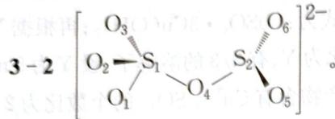

$$
\mathrm{H} _ {2} \mathrm{O} _ {2} + \mathrm{SO} _ {2} = \mathrm{H} _ {2} \mathrm{SO} _ {4}, n [ \mathrm{Ba(ClO} _ {4}) _ {2} ] = c V = 0. 0 1 2 0 8 \mathrm{mol} \cdot \mathrm{L} ^ {- 1} \times 7. 6 8 \times 1 0 ^ {- 3} \mathrm{L} =
$$

9. $277 \times 10^{-5} \mathrm{~mol}, n(\mathrm{H}_{2} \mathrm{SO}_{4}) = 9.277 \times 10^{-5} \mathrm{~mol}, m(\mathrm{SO}_{2}) = 5.944 \times 10^{-3} \mathrm{~g}, c = 0.4817 \mathrm{mg} \cdot \mathrm{L}^{-1}$ 。

第4题 4-1 $\because$ A焰色反应为黄色 $\therefore$ A是钠盐

∵ 标况下 B 0.224 L ∴ $n(\mathrm{B})=0.01\ \mathrm{mol}$

∵ A 可作吸氧剂 ∴ A 有还原性

∵ C 与 D 酸化后产生黄色沉淀 ∴ 有 S 元素即 A 是钠的硫的含氧酸盐

$$
2 \mathrm{Na} _ {2} \mathrm{S} _ {2} \mathrm{O} _ {4} \longrightarrow 2 \mathrm{Na} _ {2} \mathrm{S} _ {2} \mathrm{O} _ {3} + \mathrm{O} _ {2} \uparrow m (\mathrm{Na} _ {2} \mathrm{S} _ {2} \mathrm{O} _ {3}) = 0. 0 1 \times 2 \times (2 3 \times 2 + 3 2 \times 2 + 1 6 \times 4) = 3. 4 8 \mathrm{g。}
$$

$$
4 - 2 \quad \mathrm{S} _ {2} \mathrm{O} _ {3} ^ {2 -} + 2 \mathrm{H} ^ {+} \longrightarrow \mathrm{S} \downarrow + \mathrm{SO} _ {2} \uparrow + \mathrm{H} _ {2} \mathrm{O} 。
$$

$$
4 - 3 \quad \mathrm{Na} _ {2} \mathrm{S} _ {2} \mathrm{O} _ {4} + \mathrm{O} _ {2} + \mathrm{H} _ {2} \mathrm{O} \longrightarrow \mathrm{NaHSO} _ {3} + \mathrm{NaHSO} _ {4} 。
$$

$$
4 - 4 \quad 2 \mathrm{CrO} _ {4} ^ {2 -} + 3 \mathrm{S} _ {2} \mathrm{O} _ {4} ^ {2 -} + 4 \mathrm{H} _ {2} \mathrm{O} \longrightarrow 2 \mathrm{Cr(OH)} _ {3} \downarrow + 4 \mathrm{SO} _ {3} ^ {2 -} + 2 \mathrm{HSO} _ {3} ^ {-}
$$

【答案】

4-1 $\mathrm{Na}_2\mathrm{S}_2\mathrm{O}_4$

4-2 $\mathrm{S}_2\mathrm{O}_3^{2 - } + 2\mathrm{H}^+ = \mathrm{S}\downarrow +\mathrm{SO}_2\uparrow +\mathrm{H}_2\mathrm{O}_{\circ}$

4-3 $\mathrm{Na}_{2}\mathrm{S}_{2}\mathrm{O}_{3} + \mathrm{O}_{2} + \mathrm{H}_{2}\mathrm{O} = \mathrm{NaHSO}_{4} + \mathrm{NaHSO}_{3}$ 。

$$
4 - 4 \quad 2 \mathrm{CrO} _ {4} ^ {2 -} + 3 \mathrm{S} _ {2} \mathrm{O} _ {4} ^ {2 -} + 4 \mathrm{H} _ {2} \mathrm{O} = 2 \mathrm{Cr(OH)} _ {3} \downarrow + 4 \mathrm{SO} _ {3} ^ {2 -} + 2 \mathrm{HSO} _ {3} ^ {-}
$$

第5题 由题知 A 中阳离子有 +1 与 +3 价态, 阴离子 -2 价 C 是 $CO_{2}$ 或 $SO_{2}$

∵ 阴离子中元素质量分数与 C 相同且式量是 C 的 2 倍

∴ C 是 $CO_{2}$ 阴离子是 $C_{2}O_{4}^{2-}$

∴ D 是 CO E 是氧化物 G 是单质

∵ E 是红棕色, F 焰色为紫色

∴ E 是 $Fe_{2}O_{3}$ F 是 KCl G 是 Fe I 是 $FeCl_{3}$

因此答案为：

5-1 $CO_{2}$

5-2 $K_{3}Fe(C_{2}O_{4})_{3}$

5-3 $3\mathrm{CO} + \mathrm{Fe}_2\mathrm{O}_3 = 2\mathrm{Fe} + 3\mathrm{CO}_2$

5-4 $2\mathrm{Fe}^{2+} + \mathrm{H}_{2}\mathrm{O}_{2} + 2\mathrm{H}^{+} = 2\mathrm{Fe}^{3+} + 2\mathrm{H}_{2}\mathrm{O}$ 。

6-2 ① 已知 $r_{\mathrm{Na}^{+}} = 0.5r_{\mathrm{Cl}^{-}}, r_{\mathrm{Na}^{+}} = 0.7r_{\mathrm{K}^{+}}$ ，于是可得： $0.7r_{\mathrm{k}^{+}} = 0.5r_{\mathrm{Cl}^{-}}$

故 $a(\mathrm{KCl}):a(\mathrm{NaCl})=8:7=1.14$ 。

$$
\mathrm{NaCl}: M _ {\text {晶胞}} = 4 (2 3 + 3 5. 5), \rho = M / V N _ {\Lambda}
$$

$$
V = a _ {N a C l} ^ {3}
$$

KCl: $M^{\prime}$ 晶胞 $= 4(39 + 35.5)$ , $\rho^{\prime} = M^{\prime} / V^{\prime}N_{\mathrm{A}}$ ，而 $V^{\prime} = a_{\mathrm{KCl}}^{3}$

所以， $\rho^{\prime}:\rho=0.853$ 。

$$
\Rightarrow \mathrm{M} (\mathrm{A}) = \frac {0 . 0 1 \mathrm{m}}{1 . 0 . 3 3 \mathrm{g}} = 1 0 0 3 \mathrm{g} \cdot \mathrm{mol} ^ {- 1}
$$

$$
6 - 4 \quad \rho = 3. 5 4 (\mathrm{g} \cdot \mathrm{cm} ^ {- 3}) 。
$$

：次寨薯黄园

6-5 8;16;2;4。

6-6 4;共价键;范德华力。

第7题 7-1 [ : C : : C : ] $^{2-}$ ; sp杂化。
7-2 CN $^{-}$ 。

7-3 离子键、共价键。

7-4 棱上 $12 / 4 = 3$ 个Nd，体心1个Nd，共4个Nd。因此有4个 $\mathrm{NdC_2}$ 。

第8题 8-1 $\mathrm{KC}_{60}$ 为面心立方晶胞, $\mathbf{K}^{+}$ 在体心和棱心, 最短的距离是 $1420 \mathrm{pm} / 2 = 710 \mathrm{pm}$ 。8-2 $\mathrm{C}_{60}$ 分子形成面心立方最密堆积, 由其晶胞参数可得 $\mathrm{C}_{60}$ 分子的半径:

$$
r (C _ {6 0}) = \frac {a}{2 \sqrt {2}} = \frac {1 4 2 0}{2 \sqrt {2}} = 5 0 2 \mathrm{pm}
$$

所以 $C_{60}$ 分子堆积形成的八面体空隙可容纳的球半径为：

$$
r (\text { 容   纳 }) = 0. 4 1 4 \times r (\text { 堆   积 }) = 0. 4 1 4 \times 5 0 2 = 2 0 8 \mathrm{pm}
$$

这个半径远大于 $K^{+}$ 的离子半径 133 pm, 所以对 $C_{60}$ 分子堆积形成的面心立方晶胞参数几乎没有影响

8-3 因 $r(\mathrm{C}_{60}) = 502 \mathrm{pm}$ , 所以 $\mathrm{C}_{60}$ 球心到 $\mathrm{C}$ 原子中心的距离为: $502 - 170 = 332 \mathrm{pm}$ 。所以空腔半径, 即 $\mathrm{C}_{60}$ 球内可容纳原子最大半径为: $332 - 170 = 162 \mathrm{pm}$ 。

第9题 9-1 $\mathrm{LiCoO_2 + 6C\xrightarrow[\text{放电}]{\text{充电}} Li_{1 - x}CoO_2 + Li_xC_6}$ 。

9-2 $96500 \times 1000 \div 3600 \div 181 = 148 \mathrm{mAh} \cdot \mathrm{g}^{-1}$ 。

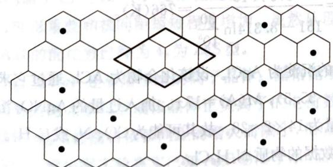  
第9题答图

9-4 $V = abc\sin 60^{\circ} = 0.426^{2}\times 0.3706\sin 60^{\circ} = 0.058244543\times 10^{-21}\mathrm{cm}^{3}$ $m = (6.941 + 12.01\times 6) / (6.02\times 10^{23}) = 1.31231\times 10^{-22}\mathrm{g}$ $\rho = m / V = 2.25\mathrm{g}\cdot \mathrm{cm}^{-3}$

题 由对称性信息知卤原子组成立方体, 金属原子置换面心 $\Rightarrow [M_{6}X_{8}]X_{3}$

黄色沉淀 $\therefore 1^{\circ}$ X是 $\mathrm{Br}\Rightarrow 3n([\mathrm{M}_6\mathrm{X}_8]\mathrm{X}_3) = \frac{7.044\mathrm{g}}{(107.9 + 79.9)\mathrm{g}\cdot\mathrm{mol}^{-1}} = 0.0375\mathrm{mol}$ $\Rightarrow M([M_6X_8]X_3) = \frac{19.534\mathrm{g}}{0.0375\mathrm{mol}\div 3} = 1562.72\mathrm{g}\cdot \mathrm{mol}^{-1}\Rightarrow \mathrm{M}$ 的原子量为113.97不合适 $2^{\circ}$ X是 $\mathrm{I}\Rightarrow 3n([\mathrm{M}_6\mathrm{X}_8]\mathrm{X}_3) = \frac{7.044\mathrm{g}}{(107.9 + 126.9)\mathrm{g}\cdot\mathrm{mol}^{-1}} = 0.03\mathrm{mol}\Rightarrow n(\mathrm{A})20.01\mathrm{mol}$ $\Rightarrow M(\mathrm{A}) = \frac{19.534\mathrm{g}}{0.01\mathrm{mol}} = 1953.4\mathrm{g}\cdot \mathrm{mol}^{-1}$ M的原子量 $92.92\Rightarrow \mathrm{Nb}$

因此答案为：

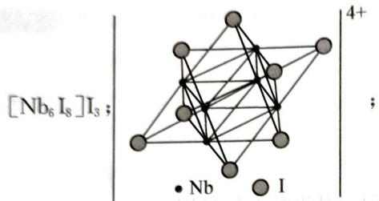

$$
\left[ \mathrm{Nb} _ {6} \mathrm{I} _ {8} \right] \mathrm{I} _ {3} + 3 \mathrm{AgNO} _ {3} \longrightarrow \left[ \mathrm{Nb} _ {6} \mathrm{I} _ {8} \right] \left(\mathrm{NO} _ {3}\right) _ {3} + 3 \mathrm{AgI} \downarrow 。
$$

## 能力测试 B 卷

第1题 1-1 $5\mathrm{d}^5 6\mathrm{s}^2$ ；+3。

1-2 1个σ键,2个π键,1个δ键。

1-3 交叉式；交叉式构型虽然可以降低 $\mathrm{Re}-\mathrm{Cl}$ 键间的排斥能，但是交叉式构型不能生成2个 $\pi$ 键和1个δ键，四重键的形成更有利于结构的稳定，因此重叠式比交叉式稳定。

第2题 2-1 等物质的量的四种碳酸盐产生的 $\mathrm{CO}_{2}$ 气体的量相等。

2-2 根据 $\Delta_{\mathrm{r}}G_{\mathrm{m}}^{0} = \Delta_{\mathrm{r}}H_{\mathrm{m}}^{0} - T\Delta_{\mathrm{r}}S_{\mathrm{m}}^{0}$ ，解得 $T = 1087\mathrm{K}$ ，因此 $x = 1087$ 。

2-3 四种金属属于同一主族,从 $\mathrm{Mg} \rightarrow \mathrm{Ba}$ , 原子的电子层数依次增大, 其原子半径依次增大, $\mathbf{M}^{2+}$ 对 $\mathrm{O}^{2-}$ 的极化能力减弱, 生成 MO 越来越难, 导致其分解温度越来越高。

2-4 此时的分解温度 $< x$ 或小于 $x$ 。

$$
\Delta G = \Delta G ^ {\theta} + R T \ln Q = \Delta H ^ {\theta} - T \Delta S ^ {\theta} + R T \ln Q = 0
$$

$$
T = \frac {\Delta H ^ {\theta}}{\Delta S ^ {\theta} - R \ln Q} = \frac {\Delta H ^ {\theta}}{\Delta S ^ {\theta} - R \ln \frac {p _ {\mathrm{CO} _ {2}}}{p _ {\mathrm{CO} _ {2}} ^ {\theta}}} = \frac {1 7 5 \times 1 0 ^ {3}}{1 6 1 - 8 . 3 1 4 \ln \frac {3 0}{1 0 ^ {5}}} = 7 6 6 (\mathrm{K}) 。
$$

第3题 3-1 加入硝酸银得到的白色的沉淀为 $\mathrm{AgCl}$ 。设该化合物为 $\mathrm{ACl}_n$ 通过它求出阳离子A的式量 $M(A) = x[(1.00 / (2.73 / 143.4) - 35.5), M(A) = 17x$ 。加入过量的 $\mathrm{AgNO_3}$ 溶液的作用是氧化(生成银沉淀)，得到的气体摩尔质量为 $14 \times 2 = 28$ 。故其可能为 $\mathrm{CO}, \mathrm{N}_2$ 或 $\mathrm{C}_2\mathrm{H}_4$ 。再与阳离子A的分子量相比，我们可以找一个符合数据的物质 $\mathrm{N}_2\mathrm{H}_6\mathrm{Cl}_2$ 。

$$
3 - 2 \quad \mathrm{N} _ {2} \mathrm{H} _ {6} \mathrm{Cl} _ {2} + 2 \mathrm{AgNO} _ {3} = \mathrm{N} _ {2} \mathrm{H} _ {6} (\mathrm{NO} _ {3}) _ {2} + 2 \mathrm{AgCl} \downarrow ,
$$

$$
\mathrm{N} _ {2} \mathrm{H} _ {6} (\mathrm{NO} _ {3}) _ {2} + 4 \mathrm{AgNO} _ {3} = 4 \mathrm{Ag} + 6 \mathrm{HNO} _ {3} + \mathrm{N} _ {2} \uparrow 。
$$

第4题 4-1 A中应含— $NO_{2}$ ，ADN应含 $NH_{4}^{+}$ ，由元素组成不难得到N:H:O=1:1:1，又分子量在200以下，所以A: $H_{2}NNO_{2}$ ，B: $\mathrm{HN(NO_{2})_{2}}$ ，ADN: $NH_{4}N(NO_{2})_{2}$

注：有关方程式如下：

$$
\mathrm{NaSO} _ {3} \mathrm{NH} _ {2} + \mathrm{HNO} _ {3} \longrightarrow \mathrm{NaHSO} _ {4} + \mathrm{H} _ {2} \mathrm{NNO} _ {2}
$$

$$
\mathrm{H} _ {2} \mathrm{NNO} _ {2} + \mathrm{NO} _ {2} \mathrm{BF} _ {4} \longrightarrow \mathrm{HBF} _ {4} + \mathrm{HN} (\mathrm{NO} _ {2}) _ {2}
$$

$\mathrm{HN(NO_2)_2 + NH_3 \longrightarrow NH_4[N(NO_2)_2]}$

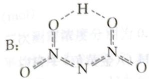

$$
\mathrm{AND}: \mathrm{NH} _ {4} \mathrm{N} (\mathrm{NO} _ {2}) _ {2}
$$

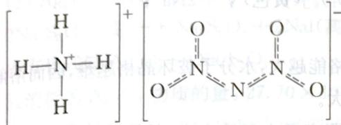

$$
4 \mathrm{NH} _ {4} \mathrm{ClO} _ {4} + 5 \mathrm{C} = 5 \mathrm{CO} _ {2} + 2 \mathrm{N} _ {2} + 6 \mathrm{H} _ {2} \mathrm{O} + 4 \mathrm{HCl},
$$

$$
\mathrm{NH} _ {4} \mathrm{N} (\mathrm{NO} _ {2}) _ {2} + \mathrm{C} = \mathrm{CO} _ {2} + 2 \mathrm{N} _ {2} + 2 \mathrm{H} _ {2} \mathrm{O};
$$

ADN产物无 HCl, 无污染, 不会对发射装置造成腐蚀, HCl遇水成白雾, 影响了导弹的隐身性能。

$$
4 - 3 \quad \mathrm{NH} _ {4} \mathrm{N} (\mathrm{NO} _ {2}) _ {2} = 2 \mathrm{H} _ {2} \mathrm{O} + 2 \mathrm{N} _ {2} \mathrm{O}
$$

$$
4 - 4 \quad \mathrm{H} _ {2} \mathrm{N} - \mathrm{NH} - \mathrm{C} (\mathrm{NO} _ {2}) _ {3}
$$

第5题 $\mathrm{Cu^{+}}$ 与 $\mathrm{Na^{+}}$ 虽然半径相近，电荷相同，但离子的电子层构型不同：

$Na^{+}:2s^{2}2p^{6},8e$ 构型；

$Cu^{+}:3s^{2}3p^{6}3d^{10},18e$ 构型。

由于 8e 构型的 $Na^{+}$ 离子极化能力和变形性都较弱，在 NaCl 晶体中以离子键为主，而 18e 电子构型的 $Cu^{+}$ 离子有较强的极化能力，又有较大的变形性，因此 CuCl 的键型由离子键向共价键过渡，故 NaCl 晶体有较大的溶解度，而 CuCl 却是难溶物质。

第6题 6-1 根据离子半径数据算出 AgCl、AgBr 和 AgI 的理论核间距分别为 307、321、342 pm，而实验测定值则均比理论值小，并且缩小的程度越来越大。这反映出 AgCl 等卤化物发生了离子极化，且极化能力依次增强。其原因是 $\mathrm{Ag}^{+}$ 离子为 18e 构型，具有较强的极化能力，也具有较大的变形性，阴离子 $\mathrm{Cl}^{-}$ 、 $\mathrm{Br}^{-}$ 、 $\mathrm{I}^{-}$ 变形性随着离子半径的增大而加强。由于相互极化能力依次加强，导致电子云变形重叠和核间距缩短程度增加。虽然从理论半径比得出这三种晶体都是 NaCl 型，但实际上 AgI 的配位数已降为 4，为 ZnS 型。

6-2 已知 AgF 是易溶于水的离子晶体。晶格能小的离子晶体一般易溶于极性溶剂中。离子晶体的晶格能的大小与组成该晶体正负离子的电荷数和核间距有关。若题中所列银的卤化物都是离子晶体，则晶格能将依核间距的增大而减小，相应将出现从 AgF、AgCl、AgBr 和 AgI 溶解度增大的现象。现根据实验事实已知 AgF 易溶于水，而 AgCl、AgBr 和 AgI 的溶解度则是依次减小，这就说明在银的卤化物中从 AgF 到 AgI，由于离子极化而使键型发生了从离子键向共价键过渡变化。由于共价键成分逐渐增加，使键的极性下降，导致在极性溶剂一水中的溶解度下降。

6-3 一般说来,若离子是有颜色的,其化合物就有颜色,但 $\mathrm{Ag}^{+}$ 和 $\mathrm{I}^{-}$ 都是无色的,而 AgI 却是黄色,这也是离子极化的结果。离子极化后,相应能级随之改变,使激发态和基态的能量差变小,因而能吸收某些波长的可见光而变为有色。通常阴离子易被极化,且随着半径增大而增大,故在卤离子中, $\mathrm{I}^{-}$ 最易被极化,碘化物颜色最深,溴化物颜色次之,而氯化物和氟化物则通常是白色的。因此在银的卤化物中, $\mathrm{AgCl}-\mathrm{AgBr}-\mathrm{AgI}$ 的颜色依次为白色、淡黄色、黄色,依次加深。

第7题 7-1 Li: $\mathrm{Fe}^{3+} + \mathrm{IO}_4^- + 2\mathrm{KOH} \longrightarrow \mathrm{K}_2\mathrm{FeIO}_6 + 2\mathrm{H}^+$ , $\mathrm{Li}^+ + \mathrm{K}_2\mathrm{FeIO}_6 \longrightarrow \mathrm{KLi[FeIO}_6]$ (黄色) $\downarrow + \mathrm{K}^+$ ; $\mathrm{Na}: \mathrm{Na}^+ + \mathrm{KSb(OH)}_6 \longrightarrow \mathrm{NaSb(OH)}_6 \downarrow + \mathrm{K}^+$ 或 $\mathrm{Na}^+ + \mathrm{Zn(UO}_2)_3\mathrm{Ac}_8 + \mathrm{HAc} + 9\mathrm{H}_2\mathrm{O} \longrightarrow \mathrm{NaZn(UO}_2)_3\mathrm{Ac}_9 \cdot 9\mathrm{H}_2\mathrm{O}$ (金黄色) $+\mathrm{H}^+$ ; $\mathrm{K}: 2\mathrm{K}^+ + \mathrm{Na}_3[\mathrm{Co(NO}_2)_6] \longrightarrow \mathrm{K}_2\mathrm{Na}[\mathrm{Co(NO}_2)_6]$ (黄色) $\downarrow + 2\mathrm{Na}^+$ ; $\mathrm{Rb}: 2\mathrm{Rb}^+ + \mathrm{Na}_2\mathrm{Ag[Bi(NO}_2)_6] \longrightarrow \mathrm{Rb}_2\mathrm{Ag[Bi(NO}_2)_6]$ (黄色) $\downarrow + 2\mathrm{Na}^+$ ; $\mathrm{Cs}: \mathrm{Cs}^+ + \mathrm{KBiI}_4 \longrightarrow \mathrm{Cs}_3\mathrm{Bi}_2\mathrm{I}_9$ (亮红色) $\downarrow + \mathrm{K}^+$ .

7-2 溶解过程较为复杂,一般规律是:晶体的晶格能越大,水分子破坏晶格越难,因而溶解度越小;构成晶体的离子水合放热越多,盐的溶解度就越大。

与半径大的阴离子形成的盐,阳离子的半径小则阴离子之间斥力大,晶格能较小,溶解度较大;即盐的阴阳离子的半径严重不匹配,则盐的稳定性差,溶解度较大。这就解释了在水中的溶解度大小顺序为 $LiClO_{4} > NaClO_{4} > KClO_{4}$ 。(碘化物溶解度顺序亦是如此)

若阴离子的半径小,与半径小的金属阳离子静电吸引力大,形成的盐晶格能大,因而盐的溶解度随着金属阳离子的半径的增大而增大,这就解释了在水中的溶解度大小顺序为 $LiF < NaF < KF$ 。

$$
7 - 3 \quad \mathrm{NaBH} _ {4} <   \mathrm{LiBH} _ {4} <   \mathrm{LiAlH} _ {4} 。
$$

$$
\mathrm{(CF} _ {x}) _ {n} + n x \mathrm{e} \longrightarrow n \mathrm{C} + n x \mathrm{F} ^ {-} 。 \tag {7-4}
$$

第8题 8-1 化合物A中Cs的质量分数为 $1.0000 - 0.4516 - 0.2438 = 0.3046$

A 中各元素原子数目 Cs: Au: Cl=(0.3046/132.9):(0.4516/197.0):(0.2438/35.45)=1:1:3,所以 A 的化学式为 $CsAuCl_{3}$

8-2 在 $\mathrm{CsAuCl}_3$ 中 $\mathrm{Au}$ 的表观氧化数为 $+2$ , 由于 $\mathrm{Au}$ 的常见氧化数为 $+1$ 和 $+3$ , 结合 $\mathrm{A}$ 中 $\mathrm{Au}$ 存在于两种不同的酸根中, 因而可以 $\mathrm{CsAuCl}_3$ 写成 $\mathrm{Cs}_2[\mathrm{AuCl}_2][\mathrm{AuCl}_4]$ 。则 $\mathrm{B}$ 为 $\mathrm{AuCl}_2^-$ , 直线形结构; $\mathrm{C}$ 为 $\mathrm{AuCl}_4^-$ , 正方形结构。

8-3 长链中 B 和 C 要共用顶点

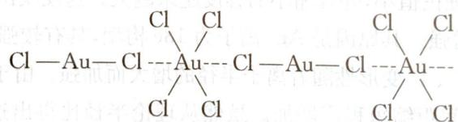

长链中 C 实际上为拉长的八面体。

第9题 9-1 $4\mathrm{Ag} + 2\mathrm{O}_3 \longrightarrow 2\mathrm{Ag}_2\mathrm{O}_3$

9-2 以空隙为顶点的晶胞：

  
第9题答图1

;以 Ag 为顶点的晶胞:

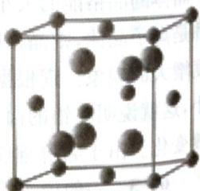  
第9题答图2

9-3 变形八面体空隙(写成正八面体空隙不得分)。

9-4（1）每份滴定中消耗的重铬酸钾质量： $1.11494 \times 25.00 / 250.0 = 0.11494(\mathrm{g})$ 每份滴定中消耗的重铬酸钾物质的量： $0.11494 / 294.2 = 3.907 \times 10^{-4}(\mathrm{mol})$

$Cr_{2}O_{7}^{2-}\sim3I_{2}\sim6S_{2}O_{3}^{2-}$ （写方程式亦可），故每份滴定消耗 $S_{2}O_{3}^{2-}:6\times3.907\times10^{-4}=2.344\times10^{-3}$ (mol)

三次测定浓度分别为 $0.09456 \, mol \cdot L^{-1}$ ， $0.09437 \, mol \cdot L^{-1}$ 和 $0.09464 \, mol \cdot L^{-1}$ 平均浓度为 $0.09452 \, mol \cdot L^{-1}$ ，

相对平均偏差 0.11%(有效数字也可取一位,若多于两位则扣分)。

$$
(2) \mathrm{Ag} _ {2} \mathrm{O} _ {3} + 6 \mathrm{KI} + 6 \mathrm{HCl} \longrightarrow 2 \mathrm{AgI} + 2 \mathrm{I} _ {2} + 6 \mathrm{KCl} + 3 \mathrm{H} _ {2} \mathrm{O}
$$

$2Na_{2}S_{2}O_{3}+I_{2}\longrightarrow Na_{2}S_{4}O_{6}+2NaI$ （离子方程式也可）

由方程式知 $\mathrm{Ag_2O_3\sim 4Na_2S_2O_3}$

故消耗的 $Ag_{2}O_{3}$ 物质的量： $27.70 \times 10^{-3} \times 0.09452/4 = 6.546 \times 10^{-4} \, (\text{mol})$ $Ag_{2}O_{3}$ 质量分数： $6.546 \times 10^{-4} \times 263.8/0.1735 = 99.53\%$

$$
1 0 - 1 x / 2 \mathrm{Li} _ {2} \mathrm{O} + (1 - x) \mathrm{NiO} + x / 4 \mathrm{O} _ {2} \longrightarrow \mathrm{Li} _ {x} \mathrm{Ni} _ {1 - x} \mathrm{O} 。
$$

$$
1 0 - 2 x = 0. 1 0 0 。
$$

$$
\mathrm{NiO}: \rho = \frac {m}{V} = \frac {m}{a ^ {3}} = \frac {4 \cdot (M (\mathrm{Ni}) + M (\mathrm{O}))}{N _ {\mathrm{A}} \cdot a ^ {3}}, a = 4. 2 0 6 \times 1 0 ^ {- 8} \mathrm{cm};
$$

$$
\mathrm{Li} _ {x} \mathrm{Ni} _ {1 - x} \mathrm{O}: 6. 2 1 \mathrm{g} \cdot \mathrm{cm} ^ {- 3} = \frac {4 \cdot ((1 - x) \cdot 5 8 . 6 9 + x \cdot 6 . 9 4 1 + 1 6 . 0 0)}{N _ {\mathrm{A}} \cdot \mathrm{a} ^ {3}} = 0. 1 0
$$

10-3 高温下 $\mathrm{LiNiO_2}$ 分解。  
10-4 LiNi(Ⅲ)Ni(Ⅱ) $_8$ O $_{10}$

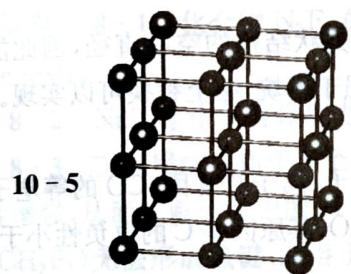  
第10题答图1

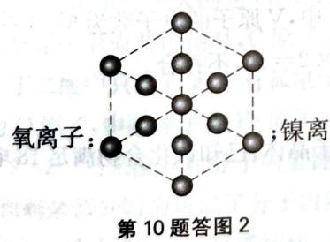

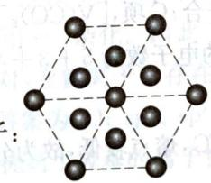  
第10题答图3

(氧离子,镍离子用不同的符号表示即可)。

10-6 AcBaCbA(至少需写出三个大写字母)。

## 第8章 共价键与分子结构

## 能力测试 A 卷

第1题 1-1 $\Delta H =$ 反应物总键能一生成物总键能， $\Delta H = (462.8\mathrm{kJ}\cdot \mathrm{mol}^{-1}\times 2 + 142\mathrm{kJ}\cdot$ $\mathrm{mol}^{-1})\times 2 - (497.3\mathrm{kJ}\cdot \mathrm{mol}^{-1} + 462.8\mathrm{kJ}\cdot \mathrm{mol}^{-1}\times 4) = -213.3\mathrm{kJ}\cdot \mathrm{mol}^{-1}$ 。

1-2 由于原子半径递增，O—H、S—H、Se—H三者的键长依次变大，因而键能依次减小；247；386。

1-3 C—C键的键能较大，比较稳定，所以易形成C—C长链；而N—N、O—O键由于成键原子上存在孤对电子，会相互排斥，导致共价键不稳定易断裂，因此难以形成N—N、O—O长链。

第2题 2-1 As为 $\mathfrak{sp}^3$ 杂化，含有一对孤对电子，为三角锥形。

2-2 氮原子形成一个双键，一个单键时，价层电子对数为3对，杂化方式为 $\mathfrak{sp}^2$ ；形成三个单键的氮原子，孤对电子数为1对，价层电子对数为4对，杂化方式为 $\mathfrak{sp}^3$

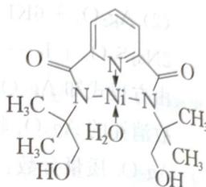

2-3 由结构式可知， $\mathrm{H}_{3} \mathrm{AsO}_{4}$ 分子结构中非羟基氧原子数比 $\mathrm{H}_{3} \mathrm{AsO}_{3}$ 多，中心原子电正性更高，导致 $\mathrm{O}-\mathrm{H}$ 键容易异裂，所以 $\mathrm{H}_{3} \mathrm{AsO}_{4}$ 的酸性强；或 $\mathrm{H}_{3} \mathrm{AsO}_{4}$ 分子中 As 价态更高，导致 As-O-H 中的 O 的电

子向 As 偏移, 氧氢键的极性变大, 在水分子作用下, 更容易异裂, 电离出 $\mathrm{H}^{+}$ , 故 $\mathrm{H}_{3} \mathrm{AsO}_{4}$ 酸性更强; 砷原子的电负性小于氮原子, 其成键电子对离砷核距离较远, 成键电子间的斥力较小, 导致键角较小。

第3题 3-1 图乙中1号C是 $\mathfrak{sp}^3$ 杂化，与相邻C没有形成 $\pi$ 键。

3-2 氧化石墨烯粒含有羟基可与水分子形成氢键,而石墨烯不能,形成氢键增强了与水分子间的作用力,使分散系稳定性增强。

3-3 ① $\mathrm{CH}_4$ 与 $\mathrm{H}_2\mathrm{O}$ 形成的水合物属于分子晶体, 分子晶体中作用力是范德华力, 水分子之间存在氢键

② 由表格可知：0.512 < 0.586，即二氧化碳的分子直径小于笼状结构的空腔直径，因此能顺利进入笼状空腔内；29.91 > 16.40，即二氧化碳与水的结合能力强于甲烷，综上替换可以实现。二氧化碳替换的水合物的相对分子质量大，熔点较高。

第4题 4-1 ①等电子体一般指价电子数和原子数相同的分子、离子或基团，CO的等电子体有 $\mathbf{N}_2$ 、 $\mathrm{CN}^{-}$ 、 $\mathrm{NO}^{+}$ 、 $\mathrm{C}_{2}^{2-}$ 。②CO作配体时，配位原子是C而不是O，其原因是C的电负性小于O，对孤电子对吸引能力弱，更容易给出孤对电子对。

4-2 ① $\left[\mathrm{V}(\mathrm{H}_2\mathrm{O})_6\right]^{2+}$ 中 V 原子的电子数为 $5 - 2 + 6 \times 2 = 15$ ，不符合；B 项， $\left[\mathrm{V}(\mathrm{CN})_6\right]^{4-}$ 中 V 原子的电子数为 $5 - 2 + 6 \times 2 = 15$ ，不符合；C 项， $\left[\mathrm{V}(\mathrm{CO})_6\right]^{-}$ 中，V 原子的电子数为 $5 + 1 + 6 \times 2 = 18$ ，符合；D 项， $\left[\mathrm{V}(\mathrm{O}_2)_4\right]^{3-}$ 中 V 原子的电子数为 $5 + 3 + 4 \times 2 = 16$ ，不符合。

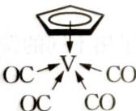

② 化合物 OC V CO 的熔点为 $138^{\circ}$ C，熔点较低，故为分子晶体；已知该化合物满足 18 电子 OC CO

规则,其配体“”中的大 $\pi$ 键 5 碳共用 5 电子,可表示为 $\pi_{5}^{5}$ 。

第5题 5-1 丁二酮肟分子中C原子,甲基上碳原子为 $\mathrm{sp}^3$ 杂化,连接甲基的碳原子为 $\mathrm{sp}^2$ 杂化;分子中含有13个单键,和2个双键,则共含有15个σ键。所以 $1\mathrm{mol}$ 丁二酮肟含有σ键数目为 $15N_{\mathrm{A}}$ , $2\mathrm{mol}$ 丁二酮肟含有σ键数目为 $30N_{\mathrm{A}}$ 。

5-2 ① A 分子中含有一OH, 分子间易形成氢键, B 分子不能形成氢键。

② 根据图可知碳碳间形成非极性共价键、碳氮间为极性共价键，氮镍间为配位键，氧氢间形成氢键，无离子键、金属键。

第6题 6-1 中心B原子为 $\mathfrak{sp}^2$ 杂化，分子空间构型为平面正三角形；中心B原子价层只有3个电子，故 $\mathrm{BF}_3$ 中硼原子有空轨道，HF中氟原子有孤对电子，两者之间可形成配位键得到 $\mathrm{HBF}_4$ 。6-2 $\mathrm{H}_3\mathrm{BO}_3$ 中B原子的杂化轨道类型为 $\mathrm{sp}^2$ ， $[\mathrm{B(OH)}_4]^{-}$ 中B原子的杂化轨道类型为 $\mathrm{sp}^2$ 。6-3 $\mathrm{Na_2[B_4O_5(OH)_4]\cdot 8H_2O}$ 中含有离子键；形成4个键的B原子中含有1个配位键；氢氧根离子中氧原子与B原子之间形成配位键；图中用“ $\rightarrow$ ”标出其中的配位键为：

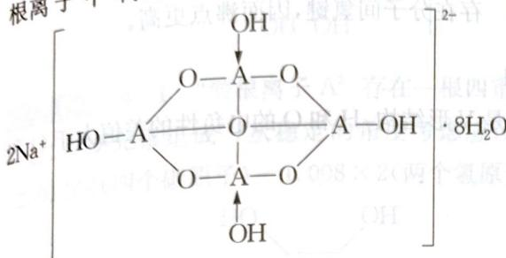  
第6题答图

,该阴离子通过氢键相互结合形成链状结构,故含

有共价键、氢键及范德华力的作用,不存在金属键。

第7题 7-1 根据图,阳离子是 $\mathrm{NH}_{4}^{+}$ 和 $\mathrm{H}_{3} \mathrm{O}^{+}, \mathrm{NH}_{4}^{+}$ 为等性杂化类型为 $\mathrm{sp}^{3}$ ,空间构型为正四面体形; $\mathrm{H}_{3} \mathrm{O}^{+}$ 为不等性 $\mathrm{sp}^{3}$ 杂化,空间构型为三角锥形,因此相同之处为 ABD,不同之处为 C。

7-2 根据图 $\mathrm{N}_{5}^{-}$ 中 $\sigma$ 键总数为 5 个；根据等电子体原理， $\mathrm{N}_{5}^{-}$ 的等电子体为 $\mathrm{C}_{5} \mathrm{H}_{5}^{-}$ ，因此大 II 键应是表示为： $\pi_{5}^{6}$ 。

7-3 根据图还有的氢键是: $\left(\mathrm{H}_{3} \mathrm{O}^{+}\right) \mathrm{O}-\mathrm{H} \cdots \mathrm{N}; \left(\mathrm{NH}_{4}^{+}\right) \mathrm{N}-\mathrm{H} \cdots \mathrm{N}$ 。

第8题 8-1 化合物 $\mathrm{N}_2\mathrm{F}_2$ 的结构式为 $\mathrm{F} - \mathrm{N} = \mathrm{N} - \mathrm{F}$ , 分子中的氮原子采取 $\mathrm{sp}^2$ 杂化, 由此可知 ac 正确。

8-2 $\mathrm{NaHF}_2$ 中所含作用力的类型有离子键, 共价键, 氢键, 故答案为 abd。

8-3 三氟甲烷中由于3个F原子具有很高的电负性,强烈吸引共用电子对,使得C原子的正电性增强,从而三氟甲烷中的H原子可与 $H_{2}O$ 中的O原子之间形成氢键,因此可溶于水;二氟甲烷( $CH_{2}F_{2}$ )无法形成氢键,难溶于水。

第9题 9-1 H、C、O中H元素的电负性最小，C、O为同周期元素，原子序数越大，电负性越大，因此电负性最大的是O；C原子连接4个原子形成共价键时，C原子采用 $sp^{3}$ 杂化，C原子连接3个原子形成共价键时，C原子采用 $sp^{2}$ 杂化。因此丁二酸中C原子的杂化方式为 $sp^{2}$ 、 $sp^{3}$ 杂化。丁二酸中只有O原子有孤电子对，亚铁离子中存在空轨道，故琥珀酸亚铁的配位键中配位原子为O原子，中心原子为Fe原子。答案为：O； $sp^{2}$ 、 $sp^{3}$ ；O；Fe。

9-2 马来酸存在分子内氢键,提高了羧基的离子性,有利于酸性电离,因此一级电离较为容易,而剩余部分因为形成了分子内氢键而很稳定,相对难以电离,因此马来酸电离主要以第一步电离为主。富马酸由于是反式结构,无法形成分子内氢键,故两级电离常数差别较小。

第10题 10-1 每两个原子之间形成1个 $\sigma$ 键，由 $\left[\begin{array}{c}N=N\\|\\N-N\end{array}\right]^{*}\stackrel{*}{\longrightarrow}\stackrel{*}{\longrightarrow}\stackrel{*}{\longrightarrow}\stackrel{*}{\longrightarrow}\stackrel{*}{\longrightarrow}\stackrel{*}{\longrightarrow}\stackrel{*}{\longrightarrow}\stackrel{*}{\longrightarrow}\stackrel{*}{\longrightarrow}\stackrel{*}{\longrightarrow}\stackrel{*}{\longrightarrow}\stackrel{*}{\longrightarrow}\stackrel{*}{\longrightarrow}\stackrel{*}{\longrightarrow}\stackrel{*}{\longrightarrow}$ 结构图可知， $1\mathrm{mol}$ 配体中的 $\sigma$ 键有 $8\mathrm{mol}$ ，即数目为 $8N_{\mathrm{A}}$ ，因为是平面结构，所以是N的 $\mathfrak{sp}^2$ 杂化轨道与O的2p轨道重叠形成 $\sigma$ 键；

10-2 $\mathrm{NO}_2^+$ 是直线型结构，键角为 $180^{\circ}$ ， $\mathrm{NO}_2$ 和 $\mathrm{NO}_2^-$ 是 $\mathfrak{sp}^2$ 杂化V型结构，键角约为 $120^{\circ}$ ，其中 $\mathrm{NO}_2$ 的N原子的其中一个杂化轨道上含一个单电子， $\mathrm{NO}_2^-$ 的N原子杂化轨道上含一对电

子，则排斥力更大，键角更小，所以三者键角大小关系为： $NO_{2}^{+}>NO_{2}>NO_{2}^{-}$ ；1个 $NO_{2}^{-}$ 有3个原子，核外有24个电子，与 $NO_{2}^{-}$ 互为等电子体的单质是 $O_{3}$ 。

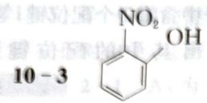

存在分子内氢键，而

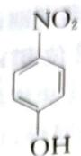

存在分子间氢键,因而沸点更高。

10-4 $\mathrm{H}_2\mathrm{O}$ 的极性大于 $\mathrm{OF}_2$ ， $\mathrm{H}_2\mathrm{O}$ 和 $\mathrm{OF}_2$ 都是V形结构，H和O的电负性的差值大于O和F之间的电负性差值，则 $\mathrm{H}_2\mathrm{O}$ 的极性更大。

能力测试B卷

第1题 1-1

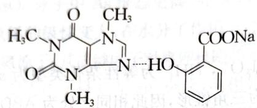

(不要求氢键的键角和方向,但要求画在有弧对

第1题答图1

电子的氮原子上;氧原子的电负性大于氮原子,因此要画在氮原子处。)

电子的氮原子上;氧原子的电负性大于氮原子,因此要固定质原子有1-2 由于苯环的吸电子共轭作用,连着苯环的羧基酸性较强。因此阿司匹林中的羧基和柠

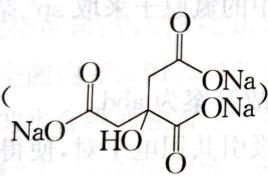

檬酸三钠盐( $NaO \xrightarrow{HO} \begin{array}{c} O \\ | \\ CO \end{array} \begin{array}{c} ONa \\ | \\ ONa \end{array} )$ 反应形成阿司匹林的离子形式,增大了溶解度。

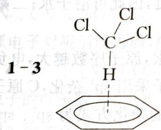

三氯甲基具有强吸电子诱导效应,相当于一个高电负性的原子,使得

$CHCl_{3}$ 的氢原子与苯环的离域电子形成氢键。

第2题 2-1 题目中提到了反应物有三个: Cu、盐酸和空气, 空气里优先考虑氧气作为反应物, 可以将铜氧化; 再考虑到生成难溶物, 应该是氯化亚铜, 根据原子守恒, 另外一个产物则为 $\mathrm{HO}_{2}$ 。于是方程式为: $\mathrm{Cu} + \mathrm{HCl} + \mathrm{O}_{2} = \mathrm{CuCl} + \mathrm{HO}_{2}$ , 这样书写满足质量守恒和得失电子守恒。

2-2 根据“酸 A 含未成对电子, 是一种自由基”, 再结合酸 A 的化学式 $HO_{2}$ , 它可以看成 $H_{2}O_{2}$ 失去一个氢原子后的产物, 于是 Lewis 结构式如图 $\mathrm{H}-\dot{\mathrm{O}}=\mathrm{O}$ : (画 O—O 单键不扣分, 但分子不画成角型不得分。)

2-3 S:氯化亚铜;A:超氧酸(因为分子中氧原子为-1/2价,属于超氧化物)。

第3题 3-1 硼酸是缺电子化合物,会与水分子的孤对电子结合,杂化方式从 $sp^{2}$ 变为 $sp^{3}$ 。 $H_{3}BO_{3} + H_{2}O \rightleftharpoons B(OH)_{4}^{-} + H^{+}$

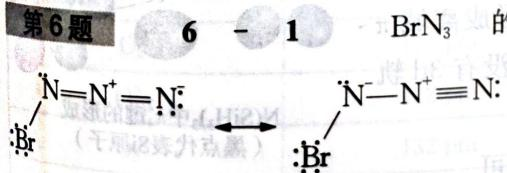

3-2 硼酸在这里充当 Lewis 酸, 多元醇充当 Lewis 碱。

第4题 4-1 “酸根离子 $A^{2-}$ 存在一根四重旋转轴”，最简单的考虑应该形成四元环，“A由第一、二周期元素组成”，从稳定的角度考虑应该是碳元素形成的四元环。用A的式量114.06—12.01×4（四个碳原子）-1.008×2（两个氢原子）=64.004，正好是四个氧原子的式量。再考虑到

对称性,结构式如下:

4-2 $\mathrm{A}^{2-}$ 环内的 $\pi$ 电子数为 2, 符合 $4n + 2$ 规则, 具有芳香性, $\pi$ 电子是离域的, 可记为 $\pi_8^{10}$ , 因而同种化学键是等长的。

4-3 5个。

第5题 5-1

  
C

5-2 D<C<B<A。B中形成了对称氢键；C中相当于二中心三电子(2c-3e)次级键；D中N原子间形成正常的共价σ单键。

5-3 因为有机碱 A 中氮原子的间距只有 280.6 pm, 范德华半径 300 pm 短 19.4 pm, 距离较近, 因此能形成对称氢键。

第6题 6 - 1 BrN₃ 的结构可以参考 HN₃ 的成键情况，

$$
\mathrm{NaN} _ {3} + \mathrm{Br} _ {2} \longrightarrow \mathrm{BrN} _ {3} + \mathrm{NaBr} 。
$$

6-2 $NaN_{3}$ 与 NOCl 反应我们可以看做复分解反应: $NOCl + NaN_{3} \longrightarrow N_{4}O + NaCl$ , 那么产

物 $\mathrm{N}_{4} \mathrm{O}$ 可认为是 $\mathrm{N}_{3}^{-}$ 离子和 $\mathrm{NO}^{+}$ 离子结合形成的共价化合物, 由此不难写出 $\mathrm{N}_{4} \mathrm{O}$ 的结构

$$
: \mathrm{N} = \mathrm{N} ^ {+} - \mathrm{N} ^ {-} / \dot {\mathrm{N}} = \ddot {\mathrm{O}}: \longleftrightarrow : \mathrm{N} = \mathrm{N} ^ {+} - \mathrm{N} ^ {-} / \dot {\mathrm{N}} = \ddot {\mathrm{O}}: \longleftrightarrow : \mathrm{N} ^ {-} = \mathrm{N} ^ {+} = \mathrm{N} ^ {-} / \dot {\mathrm{N}} = \ddot {\mathrm{O}}:
$$

第7题 7-1 分子的总价电子数： $5 \times 8 = 40$ ，达到8电子稳定结构需要总计 $8 \times 8 = 64$ 个电子，因而成键数： $(64 - 40) / 2 = 12$ ，孤对电子对数： $40 / 2 - 12 = 8$ 。

$$
: N \equiv \underset {\oplus} {N} - \underset {\ominus} {N} - N = N - \underset {\ominus} {N} - N \equiv N:
$$

7-2 $\mathbf{N}_8$ 分子中间存在 $N = N$ 双键结构，参考我们熟悉的2-丁烯，它应该存在顺反异构。

第8题 8-1 三氧化二磷的实际组成为 $\mathrm{P_4O_6}$ ，从 $\mathrm{P_4O_{18}}$ 扣除一个 $\mathrm{P_4O_6}$ 后，剩下12个O原子，相当于4份 $\mathrm{O_3}$ 分子，从分子对称性的角度，优先考虑每个P原子分到结合一个 $\mathrm{O_3}$ 分子。现在的

$$
\mathrm{O} _ {3}
$$

$$
\mathrm{P} _ {4} \mathrm{O} _ {1 0}
$$

$$
\mathrm{P} _ {4} \mathrm{O} _ {6}
$$

不变,将端位的 O 原子,替换成 $O_{3}$ 分子,得到的结构为

8-2 这里要注意 Si 为三周期元素, 从三周期开始, 原子拥有了 3d 轨道, 有着更为灵活的成键方式。在 $\mathrm{N}(\mathrm{SiH}_{3})_{3}$ 分子中, N 原子采用 $\mathfrak{sp}^{2}$ 杂化, 孤对电子与 3 个 Si 原子的空 3d 轨道, 形成离域 $\pi$ 键 $\pi_{4}^{2}$ , 所以分子呈现平面结构。 $\mathrm{N}(\mathrm{CH}_{3})_{3}$ 分子中, C 原子没有 3d 轨道, N 原子为正常的 $\mathfrak{sp}^{3}$ 杂化, 分子为三角锥形。

画出它们的 Lewis 结构式, 再计算键级比较即可。

  
$N(SiH_{3})_{3}$ 中 $\pi_{4}^{2}$ 键的形成（黑点代表Si原子）

9-1

<table><tr><td>分子/离子</td><td>N—O键级</td><td>N—O键长(Å)</td></tr><tr><td> $NO^{+}$ : $N \equiv \overset{+}{O}$ :)</td><td>3</td><td>1.062</td></tr><tr><td> $NO_{2}^{+}$ : $\overset{+}{O}$ = $\overset{+}{N}$ = $\overset{+}{O}$ :)</td><td>2</td><td>1.15</td></tr><tr><td> $NO_{2}^{-}$ : $\overset{+}{N}$ \( \overset{+}{\underset{\cdot}{\underset{\cdot}{\underset{\cdot}{\underset{\cdot}{\underset{\cdot}{\underset{\cdot}{\underset{\cdot}{\underset{\cdot}{\underset{\cdot}{\underset{\cdot}{\underset{\cdot}{\underset{\cdot}{\underset{\cdot}{\underset{\cdot}{\underset{\cdot}{\underset{\cdot}{\underset{\cdot}{\undersup{\cdot}{\underset{\cdot}{\underset{\cdot}{\underset{\cdot}{\underset{\cdot}{\underset{\cdot}{\underset{\cdot}{\underset{\cdot}{\underset{\cdot}{\underset{\cdot}{\underset{\cdot}{\underset{\cdot}{\underset{\cdot}{\underset{\cdot}{\underset{\cdot}{\underset{\cdot}{\underset{\cdot}{ \underset{\cdot}{\underset{\cdot}{\underset{\cdot}{\underset{\cdot}{\underset{\cdot}{\underset{\cdot}{\underset{\cdot}{\underset{\cdot}{\underset{\cdot}{\underset{\cdot}{\underset{\cdot}{\underset{\cdot}{\underset{\cdot}{\underset{\cdot}{\underset{\cdot}{\underset{\cdot}{\underset{\sim}{\underset{\cdot}{\underset{\sim}{\underset{\cdot}{\underset{\sim}{\underset{\sim}{\underset{\sim}{\underset{\sim}{\underset{\sim}{\underset{\sim}{\underset{\sim}{\underset{\sim}{\underset{\sim}{\underset{\sim}{\underset{\sim}{\underset{\sim}{\underset{\sim}{\sim}{\underset{\sim}{\sim}{\underset{\sim}{\sim}}}{}}}^{-}}}}}}}}}}}}}}}}}}}}}}}}}}}}}}}}}}}}}}}}}}}}}}}}}}}}}}}}}}}}}}}}}}}}}}}}}}}}}}}}}}}}}}}}}}}}}}}}}}}}}}}}}}}}}}}}}}}}}}}}}}}}}}}}}}}}}}}}}}}}}}}}}}}}}}}}}}}}}}}}}}}}}}}}}}}}}}}}}}}}}}}}}}}}}}}}}}}}}}}}})}}}}}}}}}}}}}}}}}}}}}}}}}}}}}}}}}}}}}}}}}}}}}}}}}}}}}}}}}}}}}}}}}}}}}}}}}}}}}}}}}}}}}}}}}}}}}}}}}}}}}}}}}}}}}}}}}}}}}}}}}}}}}}}}}}}}}}}}}}}}}}}}}}}}}}}}}}}}}}}}}}}}}}}}}}}}}}}}}}}}}}}}}}}}}}}}}}}}}}</td><td></td><td></td></tr></table>

9-2

<table><tr><td>分子/离子</td><td>C—O键级</td><td>C—O键长(Å)</td></tr><tr><td> $CO(:\bar{C} \equiv \overset{+}{O}:)$ </td><td>3</td><td>1.128</td></tr><tr><td> $CO_{2}( \ddot{O}=C= \ddot{O})$ </td><td>2</td><td>1.163</td></tr><tr><td> $CH_{3}CO_{2}^{-}\left(H_{3}C-C \begin{array}{c} \overset{\ddot{O}}{\underset{\cdot}{\vert}} \\ \cdot \\ \cdot \\ \cdot \\ \cdot \\ \cdot \\ \cdot \\ \cdot \\ \cdot \\ \cdot \\ \cdot \\ \cdot \\ \cdot \\ \cdot \\ \cdot \\ \cdot \\ \cdot \\ \cdot \\ \cdot \\ \cdot \\ \cdot \\ \cdot \\ \cdot \\ \cdot \\ \cdot \\ \cdot \\ \cdot \\ \cdot \\ \cdot \\ \cdot \\ \cdot \\ \cdot \\ \cdot \\ \cdot \\ \cdot$ 等</td><td> $1\frac{1}{2}$ </td><td>1.250</td></tr><tr><td> $CO_{3}^{2-}\left(\ddot{O}-C \begin{array}{c} \overset{\ddot{O}}{\underset{\cdot}{\vert}} \\ \cdot \\ \cdot \\ \cdot \\ \cdot \\ \cdot \\ \cdot \\ \cdot \\ \cdot \\ \cdot \\ \cdot \\ \cdot \\ \cdot \\ \cdot \\ \cdot \\ \cdot \\ \cdot \\ \cdot \\ \cdot \\ \cdot \\ \cdot \\ \cdot \\ \cdot \\ \cdot \\ \cdot \\ \right. \right.$ ,等</td><td> $1\frac{1}{3}$ </td><td>1.290</td></tr><tr><td> $(CH_{3})_{2}O\left(H_{3}C \begin{array}{c} \overset{\ddot{O}}{\underset{\cdot}{\vert}} \\ \cdot \\ \cdot \\ \cdot \\ \cdot \\ \cdot \\ \cdot \\ \cdot \\ \cdot \\ \cdot \\ \cdot \\ \cdot \\ \cdot \\ \cdot \\ \cdot \\ \cdot \\ \cdot \\ \cdot \\ \cdot \\ \cdot \\ \cdot \\ \cdot \\ \cdot \\ \cdot \\ \cdot \\ -CH_{3}\right)$ </td><td>1</td><td>1.416</td></tr></table>

$$
1 0 - 1 \quad \mathrm{O} _ {2} ^ {2 -}: \mathrm{Na} _ {2} \mathrm{O} _ {2}; \mathrm{O} _ {2} ^ {-}: \mathrm{KO} _ {2}; \mathrm{O} _ {3} ^ {-}: \mathrm{KO} _ {3}; \mathrm{O} _ {2} ^ {+}: \mathrm{O} _ {2} [ \mathrm{PtF} _ {6} ] 。
$$

10-2 $\mathrm{O}_2^{2-}$ , 它不含单电子。

10-3 根据分子轨道理论分析

<table><tr><td>微粒</td><td>原子间距离</td><td>键能</td><td>键级</td></tr><tr><td> $O_{2}$ </td><td>121 pm</td><td>490 kJ·mol $^{-1}$ </td><td>2</td></tr><tr><td> $O_{2}^{+}$ </td><td>112 pm</td><td>625 kJ·mol $^{-1}$ </td><td>2.5</td></tr><tr><td> $O_{2}^{-}$ </td><td>132 pm</td><td>—</td><td>1.5</td></tr><tr><td> $O_{2}^{2-}$ </td><td>149 pm</td><td>200 kJ·mol $^{-1}$ </td><td>1</td></tr></table>

10-4 不可能从 $\mathbf{F}_2$ 出发，制备出含 $\mathbf{F}_2^2-$ 离子的化合物。因为按分子轨道理论 $\mathbf{F}_2$ 得到的两个电子要填充在反键轨道上去，此时键级为零，不可能稳定存在。

第11题 基于题目描述和定量组成的条件,可以合理地假设各盐类符合通式 $K_x(CO)_y$ 。根据盐R是盐Q的三聚体,再结合盐R与六碳化合物U之间的关系,可以假设盐Q为 $K_2(CO)_2$ 以及盐R为 $K_2(CO)_6$ 。考虑到三聚化反应最著名的例子是炔烃三聚成苯及其衍生物。那么Q则是二羟基乙炔的二钾盐,R则是六羟基苯的六钾盐,因此T是六羟基苯,U是环己六醇。由于盐S应该含有6个碳原子,那么钾原子的个数小于6。由于酸Y是二元酸,则酸V也必须是二元酸,综上可假设酸V的结构如下:

V  

钠盐 V 与铅形成有色螯合物。化合物 W 是十二羟基环己烷，它是物质 X——环己烷六酮 $\left(\mathrm{C}_{6}\mathrm{O}_{6}\right)$ 的水合物。具有相同阴离子组成的盐的实例可以是方酸或乙炔二羧酸盐的二钾盐：

化合物的结构简式：

  
R

  
U

  
Y

  
Z

## 第9章 金属键和金属晶体

1-2 Mg在空气中燃烧，生成 $\mathrm{MgO}$ 和 $\mathrm{Mg}_3\mathrm{N}_2$ ，所得灰烬与盐酸的反应为： $\mathrm{MgO} + 2\mathrm{HCl} = \mathrm{MgO}$

$$
\mathrm{MgO} + 2 \mathrm{HCl} = \mathrm{MgCl} _ {2} + \mathrm{H} _ {2} \mathrm{O} \dots\dots①
$$

$$
\mathrm{Mg} _ {3} \mathrm{N} _ {2} + 8 \mathrm{HCl} = 3 \mathrm{MgCl} _ {2} + 2 \mathrm{NH} _ {4} \mathrm{Cl} \dots \dots \tag {②}
$$

设所得灰烬中有 $\mathrm{MgO} x \mathrm{mmol}$ , $\mathrm{Mg}_{3} \mathrm{~N}_{2} y \mathrm{mmol}$ , 则据题意有:

$$
\left\{ \begin{array}{l} 2 x + 8 y = 4 8 \mathrm{mmol} \\ 2 y = 4 \mathrm{mmol} \end{array} \right.
$$

即 $x = 16\mathrm{mmol}$ $y = 2\mathrm{mmol}$

故 $\mathrm{Mg}$ 的总量为 $16 + 2\times 3 = 22\mathrm{mmol}$

已知 $Mg^{2+} + EDTA \rightarrow Mg^{2+} - EDTA$

所以需加入 EDTA 为 22 mmol。

1-3 吸收能量,因为 DNA 发生开环(链)反应时,需破坏碱基间的氢键,故需吸收能量。

第2题 2-1 低温、高压。

2-2 利用 U 与 F 化合形成 $UF_{6}$ ，根据 ${}^{235}_{92}UF_{6}$ 与 ${}^{238}_{92}UF_{6}$ 式量的差异，进行多次扩散纯化分离。

第3题 3-1 $3\mathrm{d}^5 4\mathrm{s}^1$ ；半充满的 $\mathrm{d}^5$ 电子结构更稳定。

3-2 $\mathrm{Cr_2O_3 + 2Al = 2Cr + Al_2O_3}$ ； $\mathrm{Al - O}$ （铝一氧）。

3-3 δ键;π键。

第4题 4-1 $1\mathrm{s}^2 2\mathrm{s}^2 2\mathrm{p}^6 3\mathrm{s}^2 3\mathrm{p}^6 3\mathrm{d}^{10}4\mathrm{s}^2 4\mathrm{p}^6 4\mathrm{d}^{10}4\mathrm{f}^{14}5\mathrm{s}^2 5\mathrm{p}^6 5\mathrm{d}^{10}6\mathrm{s}^2$ 。

$$
4 - 2 \quad 3 \mathrm{Hg} + 8 \mathrm{HNO} _ {3} = 3 \mathrm{Hg} (\mathrm{NO} _ {3}) _ {2} + 2 \mathrm{NO} \uparrow + 4 \mathrm{H} _ {2} \mathrm{O};
$$

$$
\mathrm{Hg} (\mathrm{NO} _ {3}) _ {2} + 2 \mathrm{KI} = \mathrm{HgI} _ {2} \downarrow + 2 \mathrm{KNO} _ {3} 。
$$

$$
4 - 3 \quad \mathrm{K} _ {2} [ \mathrm{HgI} _ {4} ] + 2 \mathrm{AgNO} _ {3} = \mathrm{Ag} _ {2} [ \mathrm{HgI} _ {4} ] \downarrow + 2 \mathrm{KNO} _ {3} 。
$$

$$
4 - 4 \quad \mathrm{HgAg} [ \mathrm{AgI} _ {4} ] 。
$$

第5题 5-1 Ni; $3\mathrm{d}^8 4\mathrm{s}^2$ 。

5-2 $\mathrm{Ni(NH_3)_6^{2+}}$ ； $\mathrm{NiO(OH)}$ 或 $\mathrm{Ni(OH)_3}$ 。

5-3 $2\mathrm{NiO(OH)} + 6\mathrm{HCl} = 2\mathrm{NiCl}_2 + \mathrm{Cl}_2\uparrow +4\mathrm{H}_2\mathrm{O}$ 或 $2\mathrm{Ni(OH)}_3 + 6\mathrm{HCl} = 2\mathrm{NiCl}_2+$ $\mathrm{Cl}_2\uparrow +6\mathrm{H}_2\mathrm{O}$

5-4 中心 Ni 的 d 电子部分填入 CO 配体的 $\pi^{*}$ 轨道，形成 d-p 反馈 $\pi$ 键，削弱了 C-O 键键级，C-O 键键长增长。

6-1 +2;还原剂;碳。

6-2 失去结晶水；柠檬酸根分解； $\left(\mathrm{NH}_{4}\right)_{2}\mathrm{HPO}_{4}$ 分解； $Li_{2}CO_{3}$ 分解。

$$
6 - 3 \quad 1 8; 7 2 \mathrm{NH} _ {3} \uparrow ; \mathrm{C} 。
$$

第7题 7-1 钒为VB族，因此外围电子数为5，最高价为 $+5$ 价。因此最高价氧化物为 $\mathrm{V}_2\mathrm{O}_5$ ；其最高价含氧酸为 $\mathrm{H}_3\mathrm{VO}_4$ 。

7-2 ①钒的相对原子质量为51，Y的相对原子质量为89，则 $51 / 0.25 = 204$ ， $x = (204 - 89 - 51) / 16 = 4$ 。因此钒酸钇的化学式为 $\mathrm{YVO_4}$ 。

② 四方晶胞的体积 $V = 712^{2} \times 629 \times 10^{-30} \mathrm{~cm}^{3} = 3.19 \times 10^{-22} \mathrm{~cm}^{3}$ 。因此一个晶胞中的 $\mathrm{YVO}_{4}$ 个数为 $3.19 \times 10^{-22} \times 4.22 \times 6.02 \times 10^{23} \approx 810.4$ 。 $810.4 / 204 \approx 4$ 。故一个晶胞中的原子数为 $4 \times 6 = 24$ 。

7-3 V(CO) $_{6}$ 为八面体构型；钒的化合价为 0 价；能得一个电子变成 V(CO) $_{6}^{-}$ ，满足 18e 规则。

第8题 8-14。

8-2 $\mathrm{ZrW_2O_8}$ （写成 $\mathrm{W}_2\mathrm{ZrO}_8$ ， $\mathrm{ZrO_2\cdot 2WO_3}$ ， $2\mathrm{WO}_3\cdot \mathrm{ZrO}_2$ 不扣分）。

8-3 $\rho = \frac{zM}{N_{\mathrm{A}}V} = \frac{4\times(91.22 + 183.8\times 2 + 16\times 8)}{6.02\times 10^{23}\times 0.916^3\times 10^{-21}} = 5.07\mathrm{g}\cdot \mathrm{cm}^{-3}$

第9题 各物质的转换如下：

9-1 X:锰、铜、铝(顺序调换无妨);M:LiAlH $_{4}$ ; Q:MnO $_{4}^{2-}$ 。

9-2 ① $\mathrm{Li}_2\mathrm{C}_2 + 2\mathrm{H}_2\mathrm{O} = 2\mathrm{LiOH} + \mathrm{C}_2\mathrm{H}_2\uparrow$ ；② $\mathrm{C}_2\mathrm{H}_2 + \mathrm{H}_2\mathrm{O} = \mathrm{CH}_3\mathrm{CHO}$

③ $HCO_{3}^{-} + AlO_{2}^{-} + H_{2}O = CO_{3}^{2-} + Al(OH)_{3}$ ;

$$
2 \mathrm{CH} _ {3} \mathrm{COOH} + \mathrm{LiAlH} _ {4} + 2 \mathrm{H} _ {2} \mathrm{O} = 2 \mathrm{EtOH} + \mathrm{Al(OH)} _ {3} \downarrow + \mathrm{LiOH} \downarrow
$$

$$
9 - 3 \text {   Cathode(-):   } \mathrm{LiMnO} _ {2} - x \mathrm{e} \longrightarrow \mathrm{Li} _ {1 - x} \mathrm{MnO} _ {2} + x \mathrm{Li} ^ {+}
$$

$$
\text { Anode } (+): n \quad \mathrm{C} + x \quad \mathrm{Li} ^ {+} + x \mathrm{e} \longrightarrow \quad \mathrm{Li} _ {x} \mathrm{C} _ {n}
$$

导电性能好,不与电解质溶液反应;ac。

9-4 $\mathrm{LiMnO_2}$ ;晶胞如图所示：

第10题 10-1 B: CuO; C: CuSO4 · 5H2O; D: Cu2(OH)2SO4; G: [Cu(CN)2]⁻ 或 Na[Cu(CN)2]。

$$
\begin{array}{r l} & 1 0 - 2 \quad 2 \mathrm{Cu} ^ {2 +} + 4 \mathrm{CN} ^ {-} = 2 \mathrm{CuCN} + (\mathrm{CN}) _ {2} 。 \end{array}
$$

10-3 加热 $\mathrm{Cu(NO_3)_2}$ 由离子晶体向分子晶体转化；或分子晶体中，两个 $\mathrm{NO}_3^-$ 向一个 $\mathrm{Cu}^{2+}$ 配位；或答极化作用也给分。

10-4 由晶胞图知，G的化学式为 $\mathrm{Cu_2O}$ 。

设晶胞边长为 a，Cu—O 距离为 d；则晶胞立方体对角线为 4d。

$$
(4 d) ^ {2} = a ^ {2} + (\sqrt {2} a) ^ {2}
$$

$$
a = \frac {4 d}{\sqrt {3}}
$$

$$
\rho = \frac {z M}{a ^ {3} N _ {\mathrm{A}}} = \frac {2 M}{a ^ {3} N _ {\mathrm{A}}} = \frac {2 \times 1 4 3 . 1}{\left(\frac {4 d}{\sqrt {3}}\right) ^ {3} \times 6 . 0 2 \times 1 0 ^ {2 3}} = 6 (\mathrm{g} \cdot \mathrm{cm} ^ {- 3})
$$

$$
\leftarrow_ {t} (0, 1)
$$

解得 $d=1.86\times10^{-8}$ (cm) 或 $d=186\ pm$ 。

$$
\mathrm{Gm} ^ {3} \mathrm{C} ^ {2} \mathrm{C} ^ {2 + 1}
$$

$$
_ {1 0} A: A
$$

## 能力测试 B 卷

$$
\text {   第1题   } \quad 1 - 1 \mathrm{K} _ {2} \mathrm{ReH} _ {9}; 1 8 \mathrm{K} + \mathrm{KReO} _ {4} + 1 3 \mathrm{H} _ {2} \mathrm{O} = \mathrm{K} _ {2} \mathrm{ReH} _ {9} + 1 7 \mathrm{KOH}.
$$

1-2 抗磁性, Re 化合价 +7, 所有的电子参与成键。

1-3

第2题 2-1 Fe; $\mathrm{K}_3[\mathrm{Fe}(\mathrm{CN})_6]$ 。

$$
2 - 2 \quad {} _ {9 2} ^ {2 3 5} \mathrm{U} + _ {0} ^ {1} \mathrm{n} \longrightarrow {} _ {3 0} ^ {7 2} \mathrm{Zn} + _ {6 2} ^ {1 6 0} \mathrm{Sm} + 4 _ {0} ^ {1} \mathrm{n};
$$

$$
{ } _ { 3 0 } ^ { 7 2 } \mathrm{Zn} + { } _ { 0 } ^ { 1 } \mathrm{n} \longrightarrow { } _ { 2 8 } ^ { 6 9 } \mathrm{Ni} + { } _ { 2 } ^ { 4 } \mathrm{He(或} \alpha ) ;
$$

图答题

$$
{ } _ { 2 8 } ^ { 6 9 } \mathrm{Ni} + { } _ { 0 } ^ { 1 } \mathrm{n} \longrightarrow { } _ { 2 6 } ^ { 6 6 } \mathrm{Fe} + { } _ { 2 } ^ { 4 } \mathrm{He(或} \alpha ) 。
$$

2-3 $3\mathrm{Fe(CN)}_6^{3 - } + \mathrm{Cr(OH)}_3 + 5\mathrm{OH}^-$ $= 3\mathrm{Fe(CN)}_6^{4 - } + \mathrm{CrO}_4^{2 - } + 4\mathrm{H}_2\mathrm{O}$ 。

2-4 碳水化合物(或葡萄糖)、硫；

①O 和 S 是同族元素, ② $\mathrm{O}_{2}$ 和 $\mathrm{S}_{2}$ 的价电子数为 12, 可视为等电子体, ③ $\mathrm{O}_{2}$ 和 $\mathrm{S}_{2}$ 中均有一个 $\sigma$ 键, 2 个 2 中心 3 电子 $\pi$ 键 ( $\pi_{2}^{3}$ 键)。

2-5 4种；

$$
\mathrm{Fe}: (0, 0, 0), (0, 0, 1 / 2), (0, 1 / 2, 0), (1 / 2, 0, 0)
$$

C:(1/4, 1/4, 1/4), (1/4, 1/4, 3/4), (1/4, 3/4, 1/4), (3/4, 1/4, 1/4)

(1/4, 1/4, 1/4), (1/4, 1/4, 3/4), (2/4) = 6084，一千个晶胞为 $10 \times 10 \times 10$ ，含铁原子 $4 \times 9^{3} + 5 \times 9^{2} \times 6 + 6.25 \times 9 \times 12 + 7.875 \times 8 = 6084$ 含碳原子 $4 \times 1000 = 4000$ ，含氧原子 $(2 \times 9^{2} + 1.5 \times 9 \times 4 + 1 \times 4) \times 6 = 1320$

化学式为 $Fe_{6084}C_{4000}O_{1320}$

化简为 $\mathrm{Fe}_{1521}\mathrm{C}_{1000}\mathrm{O}_{330}$

  
第3题答图

## 第4题 4-1

N 是 $C_{11}O_{3}\Rightarrow\frac{11M(C)}{11M(C)+16\times3}=0.968\Rightarrow M(C)=132\Rightarrow C$ 是 Cs, N 是 $Cs_{11}O_{3}\Rightarrow$ $\frac{M(A)}{M(A)+M(C)}=59.71\%\Rightarrow M(A)=196.96\Rightarrow A$ 是 Au, M 是 CsAu。

因此 A:Au; B:Cu; C:Cs; M:CsAu; N:Cs $_{11}$ O $_{3}$ ; X:Cu $_{3}$ Au。

卷8 短断式論

第4题答图1  

  
第4题答图2

4-4 由于相对论效应和屏蔽效应使 6s 轨道收缩,能级降低,6s 和 5d 轨道一起形成最外层的价轨道,此时 Au 具有类似卤素的电子组态,差一个电子即成为闭壳层,因此 Au 具有稳定的 -1 价。

$$
5 - 1 \quad ① [ \mathrm{B} (\mathrm{CF} _ {3}) _ {4} ] ^ {-} + \mathrm{H} _ {3} \mathrm{O} ^ {+} = (\mathrm{F} _ {3} \mathrm{C}) _ {3} \mathrm{BCO} + 3 \mathrm{HF}.
$$

5-2 $\mathrm{B(OH)_3 + 2HF_2^- = BF_4^- + 2H_2O + OH^-}$

5-3 ① $4\mathrm{P}_2\mathrm{H}_4 + 6\mathrm{Cs} = \mathrm{Cs}_2\mathrm{P}_4 + 4\mathrm{CsPH}_2 + 4\mathrm{H}_2$ 。

$$
② \begin{array}{c} \mathrm{P} - \mathrm{P} \\ | ② - | _ {\circ} \\ \mathrm{P} - \mathrm{P} \end{array} + ③ 2 \mathrm{Cs} _ {2} \mathrm{P} _ {4} = \mathrm{Cs} _ {4} \mathrm{P} _ {6} + 1 / 2 \mathrm{P} _ {4}; \begin{array}{c} \mathrm{P} - \mathrm{P} - \mathrm{P} \\ | ② - | ② - | _ {\circ} \\ \mathrm{P} - \mathrm{P} - \mathrm{P} \end{array}
$$

第6题 6-1 $\mathrm{O}_2 + 2\mathrm{H}_2\mathrm{O} + 4\mathrm{e} = 4\mathrm{OH}^-$

6-2 ① 面心立方最密堆积(或立方最密堆积或 $\mathrm{A}_{1}$ 型密堆积);B离子占据八面体空隙,占据率为 $25\%$ 。

② A 离子配位数为 12, $O^{2-}$ 离子的分数坐标: $(1/2, 1/2, 0)$ , $(0, 1/2, 1/2)$ , $(1/2, 0, 1/2)$ 。6-3 ①

<table><tr><td> $Cr^{3+}$ </td><td> $Fe^{3+}$ </td><td> $Mn^{3+}$ </td><td> $Ni^{3+}$ </td></tr><tr><td> $t_{2g}^{3}e_{g}^{0}$ </td><td> $t_{2g}^{3}e_{g}^{2}$ </td><td> $t_{2g}^{3}e_{g}^{1}$ </td><td> $t_{2g}^{6}e_{g}^{1}$ </td></tr></table>

② 当过渡金属的 $e_{g}$ 轨道上没有电子时，要失去能量更低的 $t_{2g}$ 电子较为困难；

$e_{g}$ 上有 2 个电子时， $e_{g}$ 轨道半充满，能量较低，不易向 $O_{2}$ 转移电子；

$e_{g}$ 上有 1 个电子时，易转移电子形成 $t_{2g}$ 半满或全满的稳定结构。

因此, 具有 0 电子的 $\mathrm{LaCrO}_{3}$ 和具有 2 电子的 $\mathrm{LaFeO}_{3}$ 活性较低, 具有单电子的 $\mathrm{LaMnO}_{3}$ 和 $\mathrm{LaNiO}_{3}$ 的催化活性比较高。

第7题 7-1 3条相互垂直的 $\mathrm{C}_2$ 轴；1个对称中心，3个镜面。

7-2 根据密度计算公式： $\rho=MZ/(N_{A}V)$ ，因此

$Z = \rho N_{\mathrm{A}}V / M = (7.9\times 6.02\times 10^{23}\times 4.38\times 10^{-8}\times 4.38\times 10^{-8}\times 30.5\times 10^{-8}\times \sin 60^{\circ}) / (127.6\times$ $3 + 209\times 2) = 3.$

因此一个 $\mathrm{Bi}_{2} \mathrm{Te}_{3}$ 晶胞中包含 6 个 Bi 原子和 9 个 Te 原子。

7-3 面心立方最密堆积或 A1 堆积; NaCl 型; 立方 ZnS 型; 面心立方晶胞。

  
第7题答图

7-5 由晶胞结构或题意可知: Bi-Pt 之间的核间距 $d_{\mathrm{Bi-Pt}}$ 即为晶胞顶点与对应的四面体空隙中心的距离:

$$
d _ {\mathrm{Bi-Pt}} = \frac {1}{4} \sqrt {3} a = \frac {1}{4} \sqrt {3} \times 6. 8 3 \AA = 2. 9 6 \AA
$$

Bi-La 之间的核间距 $d_{Bi-La}$ 即为晶胞顶点到棱心的距离：

$$
d _ {\mathrm{Bi-La}} = \frac {1}{2} \times 6. 8 3 \AA = 3. 4 2 \AA 。
$$

8-1 正八面体；

萤石结构 $Z = 4$ ， $\rho = m / V = m / a^3 = 5.174\mathrm{g}\cdot \mathrm{cm}^{-3}$ ， $m = 4\times (132.9\times 2 + 106.4 + 126.9\times$ $6) / (6.022\times 10^{23}) = 7.528\times 10^{-23}\mathrm{g}$ 。故晶胞参数 $a = 1133\mathrm{pm}$

8-2 晶体密度 $\rho=m/V=\frac{2(132.9\times2+106.4+126.9\times6)}{899\times899\times924\times(10^{-10})^{3}\times6.022\times10^{23}}=5.04\ g\cdot cm^{-3}$ 8-3 $(0, 1/2, 1/4); (0, 1/2, 3/4); (1/2, 0, 1/4); (1/2, 0, 3/4)$ 。

  
第9题答图1

  
第9题答图2

注：实线或虚线部分画一个即可。

9-2 晶胞参数: Ti 作 A3 型堆积, 所以为如图所示六方晶胞。

  
第9题答图3

在 A3 型堆积中取出六方晶胞, 平行六面体的底是平行四边形, 则晶胞参数: $a = b = 2r = 2 \times 145 = 290 \mathrm{pm}$

由晶胞可以看出,六方晶胞的边长 c 为四面体高的两倍,即:

$$
\begin{array}{r l} & c = 2 \times \text {边长为} a \text {的四} \\ & = 2 \times \frac {\sqrt {6}}{3} a = \frac {2 \sqrt {6}}{3} a \\ & = \frac {2 \sqrt {6}}{3} \times 2 9 0 \\ & = 4 7 3. 6 \mathrm{pm} \end{array}
$$

图答题「菜

晶体密度:平行四边形的面积:

$$
S = a \cdot a \sin 6 0 ^ {\circ} = \frac {\sqrt {3}}{2} a ^ {2}
$$

$$
\begin{array}{r l} & V _ {\text { 晶胞 }} = \frac {\sqrt {3}}{2} a ^ {2} \times \frac {2 \sqrt {6}}{3} a \\ & = \sqrt {2} a ^ {3} = 8 \sqrt {2} r ^ {3} \end{array}
$$

$$
\begin{array}{r l} \rho & = \frac {2 M}{N _ {\mathrm{A}} V _ {\text {晶胞}}} = \frac {2 \times 4 7 . 9}{6 . 0 2 \times 1 0 ^ {2 3} \times 8 \sqrt {2} \times (1 4 5 \times 1 0 ^ {- 1 0}) ^ {3}} \\ & = 4. 6 1 \mathrm{g} \cdot \mathrm{cm} ^ {- 3}. \end{array}
$$

9-3 NiTiSn的晶胞结构图：

  
● Sn ● Ti ● Ni  
第9题答图4

Ni处在Sn的一半四面体空隙中，(或Ni处在一半小立方体中)。
9-4 边长为NiTiSn晶胞边长2倍的纳米颗粒的总原子数= $5^{3}+4\times8=157$ 表面原子数= $5^{2}\times6-8\times2-12\times3=98$ 或：表面原子数= $5^{3}-3^{3}=98$ 表面原子数/总原子数=98/157=62.4%。
第10题 10-1 $r=\frac{1}{4}\sqrt{3}a=\frac{\sqrt{3}}{4}\times429\ pm=186\ pm;$ 每个晶胞中含有2个钠原子，因此密度为： $d=\frac{2M}{a^{3}N_{A}}=\frac{2\times23}{(429\times10^{-10})^{3}\times6.02\times10^{23}}=0.968\ g\cdot cm^{-3}$ 10-2 $2(r(\mathrm{Na}^{+})+r(\mathrm{H}^{-}))=a$ $r(\mathrm{H}^{-})=0.5a-r(\mathrm{Na}^{+})=0.5\times488-102=142\ pm.$ 10-3 $d_{H}=\frac{4\times1}{4\times1+23+27}\times1.2=0.089\ g\cdot cm^{-3}.$ 第11题 11-1 $La_{2}CuO_{4}$ 晶胞

。中(1)EH 年畜不，AH
，且：EH 人吡卦。颖密而

  
(构建中间部分)  
第11题答图

11-2 根据晶体场理论, $Ni^{2+}$ 是 $d^{8}$ 电子结构,在 $d_{x2-y2}$ 轨道上电子云分布均匀,形成 $NiO_{6}$ 正八面体结构,而 $Cu^{2+}$ 是 $d^{9}$ 电子结构,在 $d_{x2-y2}$ 轨道上电子云分布不均匀,形成 $CuO_{6}$ 畸变(变形)八面体结构,产生姜-泰勒效应:这是 $La_{2}NiO_{4}$ 和 $La_{2}CuO_{4}$ 超导性质不同的结构基础。

11-3 Co(Ⅱ)或 Fe(Ⅱ)(高自旋)等。

11-4 2; 1。

11-5 具有相同 $x$ 坐标的原子是同一平面中的原子。故 $(0, 0.154, 0.117)$ , $(0, 0.654, 0.383)$ 是层内原子, 层内距离:

$$
r _ {\text {层内}} ^ {2} = (0. 1 5 4 - 0. 6 5 4) ^ {2} \times 4 6 8. 6 ^ {2} + (0. 1 1 7 - 0. 3 8 3) ^ {2} \times 9 7 8. 4 ^ {2}, \text {解得} r = 3 5 0. 5 \mathrm{pm。}
$$

具有不同 $x$ 坐标的原子是层间原子，因此 $(0, 0.154, 0.117)$ 和 $(0.500, 0.654, 0.117)$ 以及 $(0, 0.654, 0.383)$ 和 $(0.500, 0.654, 0.117)$ 是层间原子，层间距离：

$$
r _ {\text {层间}} ^ {2} = 0. 5 0 0 ^ {2} \times 7 1 3. 6 ^ {2} + (0. 1 5 4 - 0. 6 5 4) ^ {2} \times 4 6 8. 6 ^ {2}, \text {解得} r = 4 2 6. 9 \mathrm{pm}
$$

$$
r _ {\text {层间}} ^ {2} = 0. 5 0 0 ^ {2} \times 7 1 3. 6 ^ {2} + (0. 3 8 3 - 0. 1 1 7) ^ {2} \times 9 7 8. 4 ^ {2}, \text {解得} r = 4 4 1. 6 \mathrm{pm}
$$

取最近距离为 426.9 pm。

I原子范德华半径之和为 $436\mathrm{pm}$ ，层内和部分层间接触距离小于这个值，这种介于共价单键和范德华距离之间的作用力，导致了碘晶体具有金属光泽；导电性能各向异性是因为碘晶体沿yz平面形成层状结构，层内和层间导电性差异导致的。

## 第 10 章 氢、稀有气体和卤族元素

## 能力测试A卷

$$
\text { 第 } 1 \text { 题 } \quad 1 - 1 \quad 2 \mathrm{KClO} _ {3} + \mathrm{H} _ {2} \mathrm{C} _ {2} \mathrm{O} _ {4} = \mathrm{K} _ {2} \mathrm{CO} _ {3} + 2 \mathrm{ClO} _ {2} + \mathrm{CO} _ {2} \uparrow + \mathrm{H} _ {2} \mathrm{O}
$$

$$
1 - 2 \quad \mathrm{BrO} _ {3} ^ {-} + \mathrm{F} _ {2} + 2 \mathrm{OH} ^ {-} = \mathrm{BrO} _ {4} ^ {-} + 2 \mathrm{F} ^ {-} + \mathrm{H} _ {2} \mathrm{O}
$$

$$
1 - 3 \quad 2 \mathrm{HgO} + 2 \mathrm{Cl} _ {2} = \mathrm{HgCl} _ {2} \cdot \mathrm{HgO} + \mathrm{Cl} _ {2} \mathrm{O}
$$

$$
\mathbf {1} - \mathbf {4} \quad \mathrm{XeF} _ {4} + 2 \mathrm{SF} _ {4} = 2 \mathrm{SF} _ {6} + \mathrm{Xe}
$$

1-5 $2\mathrm{XeF}_2 + \mathrm{SbF}_5 = \mathrm{Xe}_2\mathrm{F}_3^+ +\mathrm{SbF}_6^-$ ；阳离子：V型，阴离子：正八面体。

第2题 2-1 $3\mathrm{HF(l)} \rightleftharpoons \mathrm{H}_2\mathrm{F}^+ + \mathrm{HF}_2^-$ ; NaF 加入 HF 中, 产生 $\mathrm{HF}_2^-$ , 为溶剂碱, $\mathrm{BF}_3$ 加入 HF 中, $\mathrm{BF}_3 + 2\mathrm{HF} \longrightarrow \mathrm{H}_2\mathrm{F}^+ + \mathrm{BF}_4^-$ , 为溶剂酸。

2-2 在 $\mathrm{HF(l)}$ 中， $\mathrm{F}^{-}$ 离子浓度很低， $\mathrm{AlF}_{3}$ 难以形成 $\mathrm{AlF}_{6}^{3-}$ ，所以 $\mathrm{AlF}_{3}$ 不溶于 $\mathrm{HF(l)}$ 中。当 $\mathrm{NaF}$ 加入 $\mathrm{HF(l)}$ 中， $\mathrm{F}^{-}$ 离子浓度大大提高， $\mathrm{AlF}_{3}$ 与 $\mathrm{F}^{-}$ 反应形成 $\mathrm{AlF}_{6}^{3-}$ 而溶解。但加入 $\mathrm{BF}_{3}$ 后， $\mathrm{BF}_{3}$ 把 $\mathrm{AlF}_{6}^{3-}$ 中的 $\mathrm{F}^{-}$ 夺出来，使 $\mathrm{AlF}_{3}$ 又沉淀出来。

第3题 3-1 由杂化轨道理论得: $\text{OF}_2$ 、 $\text{OCl}_2$ 、 $\text{ClO}_2$ 中心原子的杂化类型为 $\text{sp}^3$ 、 $\text{sp}^3$ 、 $\text{sp}^2$ 杂化。 $\text{OF}_2$ 分子中, O—F 为单键, 键长为 O—F 单键键长; 由于电负性 O < F, 中心氧原子核附近电子密度降低, 使键角减小至 103.2°。

子密度降低,使键角减小至 $103.2^{\circ}$ 。 $\mathrm{OCl}_{2}$ 分子中, $\mathrm{O}-\mathrm{Cl}$ 为单键,键长为 $\mathrm{O}-\mathrm{Cl}$ 单键键长;由于电负性 $\mathrm{O} > \mathrm{Cl}$ ,中心氧原子核附近电子密度增大,电子互斥作用增强,使键角增大至 $110^{\circ}$ 。

电子密度增大, 电子互作用增强, 使键用增入至 $110^{\circ}$ 。ClO $_2$ 分子中, Cl 为中心原子, sp $^2$ 杂化导致形成平面形分子, Cl 以 sp $^2$ 杂化轨道与 2 个 O 原子的 2p 轨道形成 2 个 $\sigma$ 单键; 此外, 氯原子以未参与杂化、有 1 个电子的 3p 轨道与 2 个氧原子各 1 个充满电子的 2p 轨道组成 $\pi_3^5$ 的离域 $\pi$ 键, 使 Cl—O 键具有多重键性质, 键长短于正常 Cl—O 单键的

171 pm, 为 147 pm。由于电负性 O > Cl，中心氧原子核附近电子密度增大，电子互斥作用增强，使键角增大至 $118^{\circ}$ 。

3-2 $(\mathrm{CN})_2$ 分子中两个C原子均作sp杂化，各与一个N原子形成 $\sigma$ 键，同时形成两个 $\pi_{i}^{4}$ 键：N——C——C——N。

由以上结构可见： $(\mathrm{CN})_{2}$ 分子中 C—C 键并不是单键，而是具有多重键性质，故其键长短于 C—C 单键键长 (154 pm)，而大于 C=C 双键键长 (134 pm)。

第4题 4-1 F是第二周期元素,氟原子半径小,电子云密度大,与另一个F原子成键后,电子密度过大、未成键的孤对电子之间互相排斥作用大故更容易解离。

氢原子电负性小,价电子数目少,与氟成键后价层电子云密度不至于过大,1s轨道与2p轨道能量更加接近,能更有效的重叠,故键能HF>HCl。

4-2 氟气的氧化性非常强,氟离子相对于水,氟离子更难失去电子,电解氟化钾水溶液不能得到氟气,且氟气遇到水会剧烈反应,故制备单质氟不能用水溶液。

液态氟化氢不导电,不能电解得到氟气。

而以氟化氢为溶剂, 氟化钾溶于液态氟化氢, 生成 $\mathrm{KHF}_{2}$ , 具有导电性, 可发生电解生成氟气。 $2\mathrm{KHF}_{2} \xrightarrow{\text {电解}} 2\mathrm{KF} + \mathrm{H}_{2} \uparrow + \mathrm{F}_{2} \uparrow$ 。

4-3 ① $\mathrm{NF}_{3}$ 的挥发性较 $\mathrm{NH}_{3}$ 低, 主要是由于氨气中 $\mathrm{NH}_{3}$ 分子间存在较强的氢键, 使其不易挥发, 因而沸点较 $\mathrm{NF}_{3}$ 高。

② $NH_{3}$ 的碱性强于 $NF_{3}$ 。从结构式来看，它们均为三角锥形，表观上 N 均有一孤对电子，但 $NF_{3}$ 分子中，由于 F 的强吸电子能力，使得 N 上的电子密度减弱，同质子等路易斯酸结合的能力减小； $NH_{3}$ 中 N 周围的电子密度较 $NF_{3}$ 的 N 要大很多，故碱性强。

第5题 5-1 $\left[\mathrm{Xe}_{2} \mathrm{~F}_{3}\right]^{+} \left[\mathrm{AsF}_{6}\right]^{-}$

5-2 $\mathrm{AgF_2 + ClO_2 = ClO_2F + AgF;ClO_2F + BF_3 = [ClO_2]^+ [BF_4]^-$

第6题 6-1 3种,结构式 $^{35}\mathrm{Cl}-^{35}\mathrm{Cl}$ 、 $^{35}\mathrm{Cl}-^{37}\mathrm{Cl}$ 、 $^{37}\mathrm{Cl}-^{37}\mathrm{Cl}$ 。

6-2 $^{35}\mathrm{Cl}-^{35}\mathrm{Cl}$ 的概率 $\frac{3}{4}\times\frac{3}{4}=\frac{9}{16}$ ; $^{35}\mathrm{Cl}-^{37}\mathrm{Cl}$ 的概率 $\frac{3}{4}\times\frac{1}{4}\times2=\frac{6}{16}$ ;

$^{37}$ Cl— $^{37}$ Cl 的概率 $\frac{1}{4} \times \frac{1}{4} = \frac{1}{16}$ ; 故 $^{35}$ Cl— $^{35}$ Cl、 $^{35}$ Cl— $^{37}$ Cl、 $^{37}$ Cl— $^{37}$ Cl 的分子数之比为 9:6:1 (还

可从排列组合入手)。6-3 12种,该 $\mathrm{Cl}_{2}$ 有两种不同原子, $\mathrm{PCl}_{5}$ 空间结构为三角双锥,5个Cl原子处于两种不同位置,种数为 $1 + 2 + 3 + 3 + 2 + 1$ 。

7-1 原子半径小,原子核对外层电子引力大。

7-2 $\left[\begin{array}{c}He\\C\\He\end{array}\right]^{3+}$ （正三角形）； $\left[\begin{array}{c}He\\C\\He\end{array}\right]$ （正四面体）。

7-3 $\mathrm{CHe}_3^{3+}$ 中C原子 $\mathfrak{sp}^2$ 杂化， $\mathrm{CHe}_4^{4+}$ 中C原子 $\mathfrak{sp}^3$ 杂化，后者p轨道成分多，相同条件下成键长。

7-4 甲基；甲烷。

$$
7 - 5 \quad \mathrm{CHe} _ {4} ^ {\mathrm{q+}} + 2 \mathrm{H} _ {2} \mathrm{O} = \mathrm{CO} _ {2} + 4 \mathrm{He} + 4 \mathrm{H} ^ {+};
$$

$$
\mathrm{CHe} _ {4} ^ {4 +} + 4 \mathrm{HCl} = \mathrm{CCl} _ {4} + 4 \mathrm{He} + 4 \mathrm{H} ^ {+} 。
$$

第8题 8-1 $\mathrm{I}_2\mathrm{Cl}_6$ 。

8-3 $\mathrm{I}_2\mathrm{Cl}_6\rightleftharpoons \mathrm{ICl}_2^+ +\mathrm{ICl}_4^-$

$$
8 - 4 \quad \mathrm{CH} _ {3} \mathrm{CH} = \mathrm{CH} _ {2} + \mathrm{ICl} = \mathrm{CH} _ {3} \mathrm{CHCl} - \mathrm{CH} _ {2} \mathrm{I。}
$$

第9题 9-1 更接近于硫酸,氟硅酸为强酸,其阴离子非常稳定,体积很大,与氢离子作用较弱。

$$
9 - 2 \quad 2. 9 6 \mathrm{g} \cdot \mathrm{cm} ^ {- 3} 。
$$

9-3 正八面体。

$$
9 - 4 \quad \mathrm{H} _ {2} \mathrm{SiF} _ {6} + \mathrm{Al} _ {2} \mathrm{O} _ {3} \longrightarrow 2 \mathrm{AlF} _ {3} + \mathrm{SiO} _ {2} + \mathrm{H} _ {2} \mathrm{O};
$$

$$
\mathrm{AlF} _ {3} + 3 \mathrm{NaF} \longrightarrow \mathrm{Na} _ {3} \mathrm{AlF} _ {6} 。
$$

第10题 10-1 T型； $\mathrm{BrCl}_3 + 4\mathrm{H}_2\mathrm{O} + 2\mathrm{SO}_2 = 2\mathrm{H}_2\mathrm{SO}_4 + 3\mathrm{HCl} + \mathrm{HBr}$

$$
\mathbf {1 0} - \mathbf {2} \quad n = 3 。
$$

第11题 11-1 CO与 $\mathrm{I}_2\mathrm{O}_5$ 反应的方程式为： $5\mathrm{CO} + \mathrm{I}_2\mathrm{O}_5 = \mathrm{I}_2 + 5\mathrm{CO}_2$

$I_{2}$ 与 $Na_{2}S_{2}O_{3}$ 反应的方程式为： $I_{2} + 2Na_{2}S_{2}O_{3} = 2NaI + Na_{2}S_{4}O_{6}$

剩余的 $Na_{2}S_{2}O_{3}$ 物质的量为： $0.100 \times 1.5 \times 2 \times 4 = 1.2 \, mmol$

与 CO 反应生成的 $I_{2}$ 消耗的 $Na_{2}S_{2}O_{3}$ 物质的量为： $0.100 \times 20.00 - 1.2 = 0.8 \, mmol$

与 CO 反应生成的 $I_{2}$ 物质的量为： $0.8 \times 1/2 = 0.4 \, mmol$

CO 的物质的量为: $0.4 \times 5 = 2 \mathrm{mmol}$

$25^{\circ} \mathrm{C}, 101 \mathrm{kPa}$ 下 CO 的体积为: $V = n R T / P = 48.9 \mathrm{~mL}$

CO 的体积分数为: 0.326。

11-2 $\mathrm{HI}_3\mathrm{O}_8$

$$
1 1 - 3 \quad \mathrm{HIO} _ {3}; \mathrm{I} _ {2} + 5 \mathrm{Cl} _ {2} + 6 \mathrm{H} _ {2} \mathrm{O} \longrightarrow 2 \mathrm{HIO} _ {3} + 1 0 \mathrm{HCl} 。
$$

$$
\mathbf {1 1 - 4} \quad (\mathrm{IO} _ {2} ^ {+}) _ {2} \mathrm{SO} _ {4}; (\mathrm{IO} ^ {+}) _ {2} \mathrm{SO} _ {4} 。
$$

## 能力测试 B 卷

$$
1 - 1 \quad \mathrm{CsICl} _ {2} = \mathrm{CsCl} + \mathrm{ICl} 。
$$

$$
1 - 2 \quad 2 \mathrm{K} + 2 \mathrm{BrF} _ {4} ^ {-} + \left[ \mathrm{BrF} _ {2} ^ {+} \right] _ {2} \left[ \mathrm{SnF} _ {6} \right] ^ {2 -} \longrightarrow \mathrm{K} _ {2} \mathrm{SnF} _ {6} + 4 \mathrm{BrF} _ {3} 。
$$

1-4 $\mathrm{Hg(CN)_2 + HgCl_2 = Hg_2Cl_2 + (CN)_2}$ 阳极： $2\mathrm{H}^{+} + 0$

1-5 阴极： $2H^{+}+2e^{-}=H_{2}\uparrow$ ；阳极： $I^{+}+3H_{2}O=IO_{3}^{-}+6H^{+}+6e^{-}$ 第2题 2-1 C。

2-2 水解生成 $\mathrm{BiOCl}$ ，加入 $\mathrm{NaCl}$ 可形成 $\mathrm{BiCl}_6^{3-}$ ，加入盐酸能抑制水解，也能形成配离子，加入 $\mathrm{Na_2SO_4}$ 无此作用。

2-3 $\mathrm{AgCl} + 2\mathrm{NH}_3 \longrightarrow \mathrm{Ag(NH_3)_2^+ + Cl^-}$ 沉淀消失

$Hg_{2}Cl_{2}+2NH_{3}\longrightarrow Hg(NH_{2})Cl+Hg+NH_{4}^{+}+Cl^{-}$ $Hg(NH_{2})Cl$ 为白色，Hg 为黑色，二者混合颜色为灰黑色。

2-4 $\mathrm{Au}_{2}\mathrm{Cl}_{6}$ (反磁性固体, 所以无成单电子, 应为内轨形, $\mathrm{dsp}^{2}$ 杂化)

$$
(\mathrm{dsp} ^ {2}
$$

$$
\mathrm{AuCl} _ {4} ^ {-}
$$

2-5 $\mathrm{Fe}^{3+} + 4\mathrm{Cl}^{-} + \mathrm{C}_{2}\mathrm{H}_{5}\mathrm{OC}_{2}\mathrm{H}_{5} + \mathrm{H}^{+}\longrightarrow (\mathrm{C}_{2}\mathrm{H}_{5})_{2}\mathrm{OH}^{+}\cdot \mathrm{FeCl}_{4}^{-}$ 第3题 3-1 每个水分子平均最多可形成2个氢键，每个HF分子平均最多生成1个氢键。前者氢键数目多，总“键”能较大，故沸点较高。

3-2 氟原子半径小,外层孤对电子多,电子云密度大,电子间斥力大,使得氟原子结合一个电子形成气态 $\mathbf{F}^{-}$ 时放出能量较少。

3-3 在 $\mathrm{BF}_3$ 中, 由于 $\mathrm{F}$ 和 $\mathrm{B}$ 的 $\mathfrak{p}$ 轨道重叠, 使 $\mathrm{B} - \mathrm{F}$ 键具有双键特征 $(\pi_4^6)$ , 因此在 $\mathrm{BF}_3$ 中的键能更大。

第4题 4-1 $\mathrm{ClO}_2$ 。

4-2 $\mathrm{Cl}_2\mathrm{O}$ 。

4-3 都可以。

4-4 $2\mathrm{ClO}_2 + 2\mathrm{NaOH} = \mathrm{NaClO}_2 + \mathrm{NaClO}_3 + \mathrm{H}_2\mathrm{O}$ ; 碱性。

4-5 $\mathrm{SO}_2 + 2\mathrm{ClO}_3^- = 2\mathrm{ClO}_2 + \mathrm{SO}_4^{2-}$

$$
\dot {\mathrm{N}} - \mathrm{C} \equiv \mathrm{N}:
$$

第5题 5-1 :O

5-2 $\Pi_4^4$ 。

5-3 3ONCN= $N_{2}+CO_{2}+N_{2}O+(CN)_{2}$

5-4 可用分步 $^{15}$ N 标记氰化亚硝酰中不同的氮原子，在反应过程中进行追踪加以证明。

第6题 6-1 立体结构图略。 $\mathrm{IF}_3\mathrm{T}$ 型， $\mathrm{IF}_5$ 四方锥型， $\mathrm{IF}_7$ 五角双锥形。

6-2 $\mathrm{A}[\mathrm{IF}_6^+ ][\mathrm{AsF}_6^- ],\mathrm{B}$ $[\mathrm{IF}_6^+] [\mathrm{Sb}_2\mathrm{F}_{11}^- ]$

$Sb_{2}F_{11}^{-}$ 立体结构图略;两个 $SbF_{6}$ 正八面体以氟桥键相连。

6-3 C $\left[IF_{4}^{+}\right]\left[SO_{3}F^{-}\right]$ 。

$\mathbf{IF}_4^+$ K型，立体结构图略。

6-4

3IF $\longrightarrow$ I\$\_{2}\$ + IF\$\_{3}\$

$$
\Delta_ {\mathrm{r}} H ^ {\theta} = - 3 \Delta_ {\mathrm{r}} H ^ {\theta} (\mathrm{IF}) + \Delta_ {\mathrm{r}} H ^ {\theta} (\mathrm{IF} _ {3}) = (2 8 6. 2 - 4 8 6) \mathrm{kJ} \cdot \mathrm{mol} ^ {- 1} = - 1 9 9. 8 \mathrm{kJ} \cdot \mathrm{mol} ^ {- 1}
$$

$$
5 \mathrm{IF} _ {3} \longrightarrow \mathrm{I} _ {2} + 3 \mathrm{IF} _ {5}
$$

$$
\Delta_ {\mathrm{r}} H ^ {\theta} = - 5 \Delta_ {\mathrm{r}} H ^ {\theta} (\mathrm{IF} _ {3}) + 3 \Delta_ {\mathrm{r}} H ^ {\theta} (\mathrm{IF} _ {5}) = (2 4 3 0 - 2 5 2 9) \mathrm{kJ} \cdot \mathrm{mol} ^ {- 1} = - 9 9 \mathrm{kJ} \cdot \mathrm{mol} ^ {- 1}
$$

$$
7 \mathrm{IF} _ {5} \longrightarrow \mathrm{I} _ {2} + 5 \mathrm{IF} _ {7}
$$

$$
\Delta_ {\mathrm{r}} H ^ {\theta} = - 7 \Delta_ {\mathrm{r}} H ^ {\theta} (\mathrm{IF} _ {5}) + 5 \Delta_ {\mathrm{r}} H ^ {\theta} (\mathrm{IF} _ {7}) = (5 9 0 1 - 4 8 1 2. 5) \mathrm{kJ} \cdot \mathrm{mol} ^ {- 1} = + 1 0 8 8. 5 \mathrm{kJ} \cdot \mathrm{mol} ^ {- 1}
$$

结论： $\mathrm{IF}_5$ 不歧化。

$$
\text {   第7题   } 7 - 1 \quad \mathrm{Ca} _ {5} (\mathrm{PO} _ {4}) _ {3} \mathrm{F} + 5 \mathrm{H} _ {2} \mathrm{SO} _ {4} + 2 \mathrm{H} _ {2} \mathrm{O} \longrightarrow 3 \mathrm{H} _ {3} \mathrm{PO} _ {4} + 5 \mathrm{CaSO} _ {4} \cdot 2 \mathrm{H} _ {2} \mathrm{O} + \mathrm{HF} 。
$$

7-2 $\mathrm{H}_2\mathrm{SiF}_6$

7-3 由于氟磷灰石常与硅酸盐矿共存，在浓硫酸处理时，生成的 HF 与 $SiO_{2}$ 反应生成 $SiF_{4}$ ， $SiF_{4}$ 与 HF 用水吸收后生成 $H_{2}SiF_{6}$ ，也可以用方程式表述此过程。

7-4 $\mathrm{SiF_4}$ 和HF。

$$
7 - 5 \quad \mathrm{SiO} _ {2} + 6 \mathrm{HF} \longrightarrow \mathrm{H} _ {2} \mathrm{SiF} _ {6} + 2 \mathrm{H} _ {2} \mathrm{O},
$$

$$
\mathrm{Na} _ {2} \mathrm{SiF} _ {6} + 4 \mathrm{NaOH} \longrightarrow 6 \mathrm{NaF} + \mathrm{SiO} _ {2} + 2 \mathrm{H} _ {2} \mathrm{O} 。
$$

第8题 8-1 设化合物为 $\mathrm{AB}_x$ ，则 $M_{\mathrm{AB}_x} = 5.89 \times 29.0 = 170$

$M_{\mathrm{A}} = 170\times (1 - 0.835) = 28.1$ 故A为Si。

$\frac{28.1}{(1 - 0.533)} \times 0.533 = 32.1$ 故氧化物中有两个氧原子。

所以 $\mathrm{AB}_x$ 中 $x = 4, 4M_{\mathrm{B}} = 170 \times 0.835 = 142$

所以 $M_{B}$ 为 35.5，故 B 为 Cl。

8-2 $\mathrm{SiCl}_4$ 、 $\mathrm{SiO}_2$ 。

8-3 正四面体、非极性。

第9题 9-1 $2\mathrm{O}_2 + \mathrm{F}_2 + 2\mathrm{AsF}_5 = 2\mathrm{O}_2^+ \mathrm{AsF}_6^-$ 。

$$
9 - 2 \quad 7 \mathrm{Br} _ {2} + \mathrm{BrF} _ {5} + 5 \mathrm{AsF} _ {5} = 5 \mathrm{Br} _ {3} ^ {+} \mathrm{AsF} _ {6} ^ {-}.
$$

9-3 $\mathrm{AsF}_6^-$ 正八面体型 $\mathrm{sp}^3\mathrm{d}^2$ 杂化， $\mathrm{Br}_3^+$ 折线形或V形或角形 $\mathrm{sp}^3$ 杂化。

$$
\text { 第 } 1 0 \text { 题 } \quad 1 0 - 1 \quad 1 s ^ {2} 2 s ^ {2} 2 p ^ {6} 3 s ^ {2} 3 p ^ {6} 3 d ^ {1 0} 4 s ^ {2} 4 p ^ {6} 4 d ^ {9}
$$

$$
2 \mathrm{F} _ {2} + 2 \mathrm{AgCl} = 2 \mathrm{AgF} _ {2} + \mathrm{Cl} _ {2}, 2 6 \mathrm{AgF} _ {2} + \mathrm{C} _ {1 0} \mathrm{H} _ {8} = 2 6 \mathrm{AgF} + \mathrm{C} _ {1 0} \mathrm{F} _ {1 8} + 8 \mathrm{HF},
$$

$$
\mathrm{O} _ {3} + 2 \mathrm{Ag} ^ {+} + \mathrm{H} _ {2} \mathrm{O} = 2 \mathrm{AgO} + \mathrm{O} _ {2} + 2 \mathrm{H} ^ {+},
$$

$$
\mathrm{S} _ {2} \mathrm{O} _ {8} ^ {2 -} + 2 \mathrm{Ag} ^ {+} + 4 \mathrm{OH} ^ {-} = 2 \mathrm{AgO} + 2 \mathrm{SO} _ {4} ^ {2 -} + 2 \mathrm{H} _ {2} \mathrm{O} 。
$$

10-3 氧化性很强,可以将水氧化。

$$
\begin{array}{r l} & {\text {第11题}} \\ & {1 1 - 1 \quad \mathrm{H} _ {2} \mathrm{O} _ {2} + 2 \mathrm{ClO} _ {2} + 2 \mathrm{OH} ^ {-} = 2 \mathrm{ClO} _ {2} ^ {-} + 2 \mathrm{H} _ {2} \mathrm{O} + \mathrm{O} _ {2}.} \\ & {1 1 - 2 \quad \left[ \begin{array}{c} {\mathrm{OH}} \\ {\mathrm{HO-B-O-O-ClO} _ {2}} \\ {\mathrm{OH}} \end{array} \right] ^ {2 -}.} \end{array}
$$

$$
1 1 - 3 \quad [ \mathrm{HOOB} (\mathrm{OH}) _ {3} ] ^ {-} + \mathrm{ClO} _ {2} \rightleftharpoons [ \mathrm{O} _ {2} \mathrm{Cl} - \mathrm{OOB} (\mathrm{OH}) _ {3} ] ^ {2 -} + \mathrm{H} ^ {+}
$$

$$
1 1 - 4 \left[ \begin{array}{c} \mathrm{HO} \\ \mathrm{HO} \end{array} \mathrm{B} \left\langle \begin{array}{c} \mathrm{O} \\ \mathrm{O} \end{array} \right. \left\langle \begin{array}{c} \mathrm{O} \\ \mathrm{O} \end{array} \right. \mathrm{B} \left\langle \begin{array}{c} \mathrm{OH} \\ \mathrm{OH} \end{array} \right. \right] ^ {2 -}
$$

11-5 硼酸在水中可发生电离, $\mathrm{B(OH)}_{3} + \mathrm{H}_{2} \mathrm{O} \rightleftharpoons \left[\mathrm{HO}-\mathrm{B(OH)}_{3}\right]^{-} + \mathrm{H}^{+}$ 形成 $\mathrm{B(OH)}_{4}^{-}$ 离子比 A 离子更加稳定, 所以不容易吸收 $\mathrm{ClO}_{2}$ 。

## 第 11 章 氧族元素

## 能力测试 A 卷

$$
\text {   第1题   } \quad 1 - 1 \quad 2 \mathrm{HCl} + (\mathrm{NH} _ {4}) _ {2} \mathrm{S} _ {x} = \mathrm{H} _ {2} \mathrm{S} \uparrow + (x - 1) \mathrm{S} \downarrow + 2 \mathrm{NH} _ {4} \mathrm{Cl} 。
$$

$$
1 - 2 \quad 3 \mathrm{S} _ {5} ^ {2 -} + 1 6 \mathrm{BrO} _ {3} ^ {-} + 2 4 \mathrm{OH} ^ {-} = 1 5 \mathrm{SO} _ {4} ^ {2 -} + 1 6 \mathrm{Br} ^ {-} + 1 2 \mathrm{H} _ {2} \mathrm{O} 。
$$

$$
1 - 3 \quad 3 \mathrm{Se} + 6 \mathrm{KOH} \xlongequal {\triangle} \mathrm{K} _ {2} \mathrm{SeO} _ {3} + 2 \mathrm{K} _ {2} \mathrm{Se} + 3 \mathrm{H} _ {2} \mathrm{O} 。
$$

1-4 $2\mathrm{SO}_2 + \mathrm{H}_2\mathrm{SeO}_3 + \mathrm{H}_2\mathrm{O} = 2\mathrm{H}_2\mathrm{SO}_4 + \mathrm{Se}\downarrow$ 或 $\mathrm{SeO_2 + 2H_2O + 2SO_2 = Se\downarrow + }$ $2\mathrm{H}_2\mathrm{SO}_4$ 。

$$
1 - 5 \quad \mathrm{S} _ {4} \mathrm{N} _ {4} + 2 \mathrm{SnCl} _ {2} + 4 \mathrm{C} _ {2} \mathrm{H} _ {5} \mathrm{OH} = \mathrm{H} _ {4} \mathrm{S} _ {4} \mathrm{N} _ {4} + 2 \mathrm{SnCl} _ {2} (\mathrm{OC} _ {2} \mathrm{H} _ {5}) _ {2}
$$

$$
\text {   第2题   } 2 - 1 2 \mathrm{NaOH} + 2 \mathrm{SO} _ {2} + \mathrm{Zn} = \mathrm{Zn(OH)} _ {2} + \mathrm{Na} _ {2} \mathrm{S} _ {2} \mathrm{O} _ {4} 。
$$

$$
2 \mathrm{Na} _ {2} \mathrm{S} _ {2} \mathrm{O} _ {4} + 4 \mathrm{HCl} = \mathrm{S} + 3 \mathrm{SO} _ {2} + 4 \mathrm{NaCl} + 2 \mathrm{H} _ {2} \mathrm{O}.
$$

2-3 $Ag^{+} + 2S_{2}O_{3}^{2-}$ (过量) = $[\mathrm{Ag}(\mathrm{S}_{2}\mathrm{O}_{3})_{2}]^{3-}$

2-4 $2\mathrm{Ag}^{+} + \mathrm{S}_{2}\mathrm{O}_{3}^{2 - }$ （少量） $\mathrm{Ag_2S_2O_3\downarrow}$ 白； $\mathrm{Ag_2S_2O_3 + H_2O = Ag_2S\downarrow}$ 黑 $+\mathrm{H}_2\mathrm{SO}_4$ 。

$$
\text {   第3题   } \quad 3 - 1 \quad ① 2 \mathrm{BrF} _ {3} (l) \rightleftharpoons \mathrm{BrF} _ {2} ^ {+} + \mathrm{BrF} _ {4} ^ {-}.
$$

$$
② \mathrm{SOCl} _ {2} (l) \rightleftharpoons \mathrm{SOCl} ^ {+} + \mathrm{Cl} ^ {-} 。
$$

$$
③ \mathrm{N} _ {2} \mathrm{O} _ {4} (l) \rightleftharpoons \mathrm{NO} ^ {+} + \mathrm{NO} _ {3} ^ {-} 。
$$

$$
④ 2 \mathrm{SO} _ {2} (l) \rightleftharpoons \mathrm{SO} ^ {2 +} + \mathrm{SO} _ {3} ^ {2 -}.
$$

$$
[ \mathrm{H} _ {3} \mathrm{SO} _ {4} ^ {+} ] = [ \mathrm{HSO} _ {4} ^ {-} ] = 1. 6 7 \times 1 0 ^ {- 2} \mathrm{mol} \cdot \mathrm{dm} ^ {- 3}
$$

3-3 ① 酸 $2\mathrm{HF} + \mathrm{BF}_3 \rightleftharpoons \mathrm{H}_2\mathrm{F}^+ + \mathrm{BF}_4^-$ 。

②酸 $2\mathrm{HF} + \mathrm{SbF}_5 \rightleftharpoons \mathrm{H}_2\mathrm{F}^+ + \mathrm{SbF}_6$ 。

③ 碱 $HF + H_{2}O \rightleftharpoons H_{3}O^{+} + F^{-}$

④ 碱 $HF + CH_{3}COOH \rightleftharpoons F^{-} + CH_{3}COOH_{2}^{+}$

⑤ 碱 $C_{6}H_{6} + 2HF \rightleftharpoons C_{6}H_{6}\cdots H^{+} + HF_{2}^{-}$

第4题 4-1 $\left[\mathrm{SbCl}_{2}^{+}\right]$ V型； $\left[\mathrm{GaCl}_{4}^{-}\right]$ 正四面体型；

$\left[GaCl_{2}^{+}\right]$ 直线型； $\left[SbCl_{4}^{-}\right]$ 变形四面体型；

$\left[SbCl_{2}^{+}\right]\left[GaCl_{4}^{-}\right]\left(\left[GaCl_{4}^{-}\right] \right.$ 正四面体型，对称性最高，稳定性最好更易生成）。

4-2 $2\mathrm{SO}_2\longrightarrow \mathrm{SO}^{2 + } + \mathrm{SO}_3^{2 - }$

$$
\mathrm{Cs} _ {2} \mathrm{SO} _ {3} + \mathrm{SOCl} _ {2} \longrightarrow 2 \mathrm{CsCl} + 2 \mathrm{SO} _ {2};
$$

$$
2 \mathrm{NH} _ {4} \mathrm{SCN} + \mathrm{SOCl} _ {2} \longrightarrow \mathrm{SO(SCN)} _ {2} + 2 \mathrm{NH} _ {4} \mathrm{Cl} 。
$$

第5题 5-1 $2\mathrm{Na}_2\mathrm{S} + 4\mathrm{SO}_2 + \mathrm{Na}_2\mathrm{CO}_3 = 3\mathrm{Na}_2\mathrm{S}_2\mathrm{O}_3 + \mathrm{CO}_2$

固态物质逐渐增多是因为 $\mathrm{SO}_2 + \mathrm{Na}_2\mathrm{S} + \mathrm{H}_2\mathrm{O} = \mathrm{Na}_2\mathrm{SO}_3 + \mathrm{H}_2\mathrm{S}, 2\mathrm{H}_2\mathrm{S} + \mathrm{SO}_2 = 3\mathrm{S} + 2\mathrm{H}_2\mathrm{O}$

固态物质减少是因为 $S + SO_{3}^{2-} = S_{2}O_{3}^{2-}$

pH 在 5 左右又产生固态物质是因为 $S_{2}O_{3}^{2-} + SO_{2} + H_{2}O = 2HSO_{3}^{-} + S$ 。

5-2 $S_{2}O_{3}^{2-}$ 为四面体构型；S。

5-3 $\mathrm{S}_2\mathrm{O}_3^{2-} + 4\mathrm{Cl}_2 + 5\mathrm{H}_2\mathrm{O} = 2\mathrm{SO}_4^{2-} + 8\mathrm{Cl}^- +10\mathrm{H}^+$ $2\mathrm{S}_2\mathrm{O}_3^{2-} + \mathrm{Hg}^{2+} = \mathrm{Hg(S_2O_3)}_{2}^{2-};$ $\mathbf{S}_2\mathbf{O}_3^{2-} + \mathbf{CN}^{-} = \mathbf{SCN}^{-} + \mathbf{SO}_3^{2-}$

第6题 6-1 $\mathrm{S}_2\mathrm{O}_6\mathrm{F}_2$ ；强氧化性(含过氧基)；它的等电子体是：过二硫酸根。

6-2 F-S-O-O-S-F $\rightleftharpoons$ 2O=S-O。
I II

6-3 $N_{2}O_{4} \rightleftharpoons 2NO_{2}$

6-4 $\mathrm{I}_2 + \mathrm{S}_2\mathrm{O}_6\mathrm{F}_2 = 2\mathrm{IOSO}_2\mathrm{F},3\mathrm{I}_2 + \mathrm{S}_2\mathrm{O}_6\mathrm{F}_2 = 2\mathrm{I}_3^+ (\mathrm{SO}_3\mathrm{F})^-.$

第7题 7-1 $5\mathrm{O}_3 + 2\mathrm{KOH} = 5\mathrm{O}_2 + 2\mathrm{KO}_3 + \mathrm{H}_2\mathrm{O}$ 。

7-2 向上述产物中加入液氨,萃取出 $\mathrm{KO}_{3}$ ,待氨蒸发后即得 A 的结晶。

7-3 $4\mathrm{KO}_3 + 2\mathrm{H}_2\mathrm{O} = 4\mathrm{KOH} + 5\mathrm{O}_2$

$$
7 - 4 \quad \mathrm{B}: \mathrm{NH} _ {4} \mathrm{NO} _ {3}; \mathrm{C}: \mathrm{NH} _ {4} \mathrm{O} _ {3}; 3 \mathrm{O} _ {3} + 4 \mathrm{NH} _ {3} = \mathrm{NH} _ {4} \mathrm{NO} _ {3} + 2 \mathrm{NH} _ {4} \mathrm{O} _ {3} 。
$$

第8题 8-1 每个硫原子以不等性 $\mathrm{sp}^3$ 杂化轨道与另外两个硫原子形成共价单键相连结，故为绉环状。

8-2 $\mathbf{S}_8$ 中 $S - S$ 是 $\sigma$ 单键；而 $\mathbf{S}_2$ 中是 $S = S$ 双键（或答：一个 $\sigma$ 键和两个三电子 $\pi$ 键），键长较 $S - S$ 单键短。

8-3 $\Delta H_{1} = 2128\mathrm{kJ}\cdot \mathrm{mol}^{-1}$

8-4 $\Delta H_{2}=411.2\ kJ\cdot mol^{-1}$

$$
\Delta H _ {3} = 1 / 4 \left(\Delta H _ {1} - \Delta H _ {2}\right) = 4 2 9. 2 \mathrm{kJ} \cdot \mathrm{mol} ^ {- 1} 。
$$

第9题 9-1 浓盐酸中氯离子能与 $\mathrm{Bi}^{3+}$ 形成稳定的配离子, 氢离子能与硫离子生成硫化氢气体逸出, 这两重因素共同促使 $\mathrm{Bi}_{2} \mathrm{~S}_{3}$ 的溶解。而硫酸和浓氯化钠溶液均只有促使 $\mathrm{Bi}_{2} \mathrm{~S}_{3}$ 溶解的一个因素, 不足以使其溶解。反应方程式为: $\mathrm{Bi}_{2} \mathrm{~S}_{3} + 12 \mathrm{HCl} = 2 \mathrm{H}_{3} \mathrm{BiCl}_{6} + 3 \mathrm{H}_{2} \mathrm{~S}$ 。

9-2 $\mathrm{Bi}^{3+}$ 为 $18 + 2$ 构型，有很强的极化作用，氯离子变形性大于氟离子，氯离子能与 $\mathrm{Bi}^{3+}$ 形

成更稳定的配合物。

9-3 ① $\mathrm{Bi}_{2} \mathrm{~S}_{3} + 6 \mathrm{FeCl}_{3} = 2 \mathrm{BiCl}_{3} + 6 \mathrm{FeCl}_{2} + 3 \mathrm{~S}$ , 或生成 $\mathrm{H}_{3} \mathrm{BiCl}_{6}$ 盐酸作用: 溶解 $\mathrm{Bi}_{2} \mathrm{O}_{3}$ , $\mathrm{Bi}_{2} \mathrm{O}_{3} + 6 \mathrm{HCl} = 2 \mathrm{BiCl}_{3} + 3 \mathrm{H}_{2} \mathrm{O}$ , 抑制 $\mathrm{Bi}^{3+}$ 的水解。

② 铁粉: 置换出 Bi 单质, 氯气: 将 $FeCl_{2}$ 氧化为 $FeCl_{3}$ , 使 $FeCl_{3}$ 再生。

第10题 10-1 $\mathrm{O}_3 + 2\Gamma + \mathrm{H}_2\mathrm{O} = \mathrm{O}_2 + \mathrm{I}_2 + 2\mathrm{OH}^-$ , $\mathrm{I}_2 + 2\mathrm{S}_2\mathrm{O}_3^{2-} = 2\Gamma + \mathrm{S}_4\mathrm{O}_6^{2-}$ 。

10-2 滴定消耗的硫代硫酸钠的物质的量为： $4.2 \times 0.0106 = 0.0445 \, mol$

反应的 $I_{2}$ 物质的量为：0.0445÷2=0.0223 mol

空气中的臭氧的物质的量为:0.0223 mol。

10-3 臭氧的体积为： $0.0223 \times 22.4 = 0.50 \, dm^{3}$

10-4 臭氧的体积分数为： $0.50 \div 20000 \times 100\% = 2.5 \times 10^{-3}\%$

## 能力测试B卷

第1题 1-1 $\mathrm{PbS} + 4\mathrm{H}_2\mathrm{O}_2 \longrightarrow \mathrm{PbSO}_4 + 4\mathrm{H}_2\mathrm{O}$ 。

1-2 $2\mathrm{NH}_4\mathrm{HSO}_4\xrightarrow{\text{电解}} (\mathrm{NH}_4)_2\mathrm{S}_2\mathrm{O}_8 + \mathrm{H}_2$

$$
\mathbf {1} - \mathbf {3} \quad \mathrm{O} _ {2} \mathrm{F} _ {2} + \mathrm{BF} _ {3} \longrightarrow \mathrm{O} _ {2} ^ {+} \mathrm{BF} _ {4} ^ {-} + \frac {1}{2} \mathrm{F} _ {2} 。
$$

$$
1 - 4 \quad \mathrm{Na} _ {2} \mathrm{O} _ {2} + \mathrm{CH} _ {3} \mathrm{CH} _ {2} \mathrm{OH} \longrightarrow \mathrm{CH} _ {3} \mathrm{CH} _ {2} \mathrm{ONa} + \mathrm{NaOOH} 。
$$

$$
1 - 5 \quad 1 2 \mathrm{KO} _ {3} + 6 \mathrm{CO} _ {2} \longrightarrow 6 \mathrm{K} _ {2} \mathrm{CO} _ {3} + 1 5 \mathrm{O} _ {2} 。
$$

第2题 2-1 冷凝。

2-2 $2\mathrm{Fe}^{3+} + \mathrm{H}_2\mathrm{S}\longrightarrow 2\mathrm{Fe}^{2+} + \mathrm{S}\downarrow +2\mathrm{H}^+$

电解过程:阳极: $Fe^{2+}-e\longrightarrow Fe^{3+}$ 阴极: $2H^{+}+2e\longrightarrow H_{2}\uparrow$ 。

第3题 3-1 $\left[ \begin{array}{c}\mathrm{Se} - \mathrm{Se}\\ \big| \bigcirc \\ \mathrm{Se} - \mathrm{Se} \end{array} \right]^{2 + }$ ，具有6个π电子，有芳香性。

每个 S 和 N 原子都采取 $sp^{2}$ 杂化, 形成二个 $\sigma$ 键并容纳一对孤对电子对, 垂直于平面的 p 轨道

相互重叠,形成离域 $\pi$ 键( $\Pi_{4}^{6}$ ), 具有芳香性,
:S——N:
| ○ |
:N——S:

提示:本题可以类比立方烷的结构,与立方烷互为等电子体。

第4题 4-1 $\mathrm{H}_3\mathrm{SO}_4^+$ 与 $\mathrm{H}_2\mathrm{SO}_4(l)$ 之间， $\mathrm{HSO}_4^-$ 与 $\mathrm{H}_2\mathrm{SO}_4(l)$ 之间依靠氢键形成了 $\mathrm{H}_3\mathrm{SO}_4^+$ 和 $\mathrm{HSO}_4^-$ 离子团的通道，所以这两种离子在 $\mathrm{H}_2\mathrm{SO}_4(l)$ 中迁移速度快。  
4-2 $①$ $\mathrm{HNO}_3 + 2\mathrm{H}_2\mathrm{SO}_4 = \mathrm{NO}_2^+ +\mathrm{H}_3\mathrm{O}^+ +2\mathrm{HSO}_4^-$ 。 $②$ $\mathrm{H}_3\mathrm{BO}_3 + 6\mathrm{H}_2\mathrm{SO}_4 = \mathrm{B(HSO_4)_4^- + 2HSO_4^- + 3H_3O^+}$ 。 $③$ $7\mathrm{I}_2 + \mathrm{HIO}_3 + 8\mathrm{H}_2\mathrm{SO}_4 = 5\mathrm{I}_3^+ +8\mathrm{HSO}_4^- +3\mathrm{H}_3\mathrm{O}^+$ 。

第5题 5-1 $\mathrm{A:Na_2S_2O_4}$ ；连二亚硫酸钠； $2\mathrm{SO}_2 + 2\mathrm{Na} - \mathrm{Hg} = \mathrm{Na}_2\mathrm{S}_2\mathrm{O}_4 + 2\mathrm{Hg}$ 。

第5题 $5-1$ $A:Na_{2}S_{2}O_{4}$ ; 连二业硫酸钠; $2SO_{2} + 2Na = Hg + Na_{2}S_{2}O_{4} + 2Hg$ .
5-2 有 $O_{2}$ 存在时，A 会被氧化（得到 $Na_{2}S_{2}O_{6}$ 或 $NaHSO_{3}$ ）；说明 $Na_{2}S_{2}O_{4}$ 具有强还原性。
5-3 $2Na_{2}S_{2}O_{4}=Na_{2}S_{2}O_{3}+Na_{2}SO_{3}+SO_{2}\uparrow$

第6题 (1) ① $\mathrm{TiO_2 + Na_2S_2O_7 = Na_2SO_4 + TiO(SO_4)}$ 。

② 酸: $S_{2}O_{7}^{2-}$ , 碱: $O^{2-}$ 。

(2) $\mathrm{Fe_2O_3 + 2NaOH\xlongequal{\triangle} 2NaFeO_2 + H_2O}$

$$
2 \mathrm{NaFeO} _ {2} + 3 \mathrm{NaClO} + 2 \mathrm{NaOH} = 2 \mathrm{Na} _ {2} \mathrm{FeO} _ {4} + 3 \mathrm{NaCl} + \mathrm{H} _ {2} \mathrm{O} 。
$$

第7题 7-1 A: $\left[\mathrm{SH}_{3}\right]^{+}\left[\mathrm{SbF}_{6}\right]^{-}, \mathrm{SbF}_{5} + \mathrm{HF} + \mathrm{H}_{2} \mathrm{~S} \longrightarrow \left[\mathrm{SH}_{3}\right]^{+}\left[\mathrm{SbF}_{6}\right]^{-}$ 。

7-2 $\mathrm{H}_2\mathrm{S}$ 起着碱的作用(质子碱)。

7-3 $SH_{3}^{+}$ 。

7-4 聚四氟乙烯的塑料瓶中。

第8题 8-1 生成的银的物质的量为: $0.2158 \div 107.9 = 2.000 \times 10^{-3} \mathrm{~mol}$ $0.1741 \mathrm{~g} \mathrm{X}_{2} \mathrm{O}_{4}^{2-}$ 失去的电子数为: $2.000 \times 10^{-3} \mathrm{~mol}$ $\frac{0.1741}{22.99 \times 2 + 2 M (\mathrm{X}) + 4 \times 16.00} \times n = 2.000 \times 10^{-3}$ $n = 2$ 时, $M(\mathrm{X}) = 32$ 为合理解, X为硫。  
8-2 $\mathrm{S} + \mathrm{O}_{2} = \mathrm{SO}_{2}$ , $\mathrm{SO}_{2} + \mathrm{PCl}_{5} = \mathrm{SOCl}_{2} + \mathrm{POCl}_{3}$ , $2 \mathrm{SO}_{2} + \mathrm{O}_{2} \xrightarrow{\text {催化剂}} 2 \mathrm{SO}_{3}$ , $\mathrm{SO}_{2} + 2 \mathrm{OH}^{-} = \mathrm{SO}_{3}^{2-} + \mathrm{H}_{2} \mathrm{O}$ , $\mathrm{SO}_{2} + \mathrm{SO}_{3}^{2-} + \mathrm{Zn} + 2 \mathrm{H}^{+} = \mathrm{Zn}^{2+} + \mathrm{H}_{2} \mathrm{O} + \mathrm{S}_{2} \mathrm{O}_{4}^{2-}$ , $2 \mathrm{S}_{2} \mathrm{O}_{4}^{2-} + \mathrm{H}_{2} \mathrm{O} = \mathrm{S}_{2} \mathrm{O}_{3}^{2-} + 2 \mathrm{HSO}_{3}^{-}$ , $\mathrm{S}_{2} \mathrm{O}_{4}^{2-} + 2 \mathrm{Ag(NH}_{3})_{2}^{+} + 4 \mathrm{OH}^{-} = 2 \mathrm{SO}_{3}^{2-} + 2 \mathrm{Ag} + 4 \mathrm{NH}_{3} + 2 \mathrm{H}_{2} \mathrm{O}$ 。第9题 9-1 $\mathrm{H}_{2} \mathrm{~S} + \mathrm{Cd}^{2+} + 2 \mathrm{CH}_{3} \mathrm{COO}^{-} = \mathrm{CdS} \downarrow + 2 \mathrm{CH}_{3} \mathrm{COOH}$ ; $\mathrm{CdS} + \mathrm{I}_{2} = \mathrm{Cd}^{2+} + 2 \mathrm{I}^{-} + \mathrm{S} \downarrow$ ; $\mathrm{I}_{2} + 2 \mathrm{S}_{2} \mathrm{O}_{3}^{2-} = 2 \mathrm{I}^{-} + \mathrm{S}_{4} \mathrm{O}_{6}^{2-}$ 。

9-2 加入的碘的总物质的量为 $0.08226 \times 20 = 1.645 \mathrm{mmol}$ 滴定消耗的 $\mathrm{Na}_{2} \mathrm{~S}_{2} \mathrm{O}_{3}$ 为: $0.1080 \times 15.80 = 1.714 \mathrm{mmol}$ 与 CdS 反应的碘单质为: $1.645 - 1.714 / 2 = 0.7880 \mathrm{mmol}$ 空气中的 $\mathrm{H}_{2} \mathrm{~S}$ 为: $0.7880 \mathrm{mmol}$

由 PV=nRT，计算得空气的物质的量为： $\frac{98.0\times2.68}{8.314\times(273+24)}=0.1064\ mol$ 。

其体积分数为：0.7880/0.106=0.743%

其质量分数为： $0.7880 \times 10^{-3} \times 34/0.1064 \times 29 = 0.87\%$

第10题 10-1 $\left[\mathrm{SBr}_{3}\right]^{+}\left[\mathrm{AsF}_{6}\right]^{-},\left[\mathrm{S}_{7} \mathrm{I}\right]^{+}\left[\mathrm{AsF}_{6}\right]^{-}$ 。

$$
1 0 - 3 \quad S _ {8} + 1 2 B r _ {2} + 1 2 A s F _ {5} = 8 [ S B r _ {3} ] ^ {+} [ A s F _ {6} ] ^ {-} + 4 A s F _ {3}
$$

第11题 11-1 X-[NS(O)Cl]3，

$$
3 \mathrm{SOCl} _ {2} + 3 \mathrm{NaN} _ {3} = [ \mathrm{NS(O)Cl} ] _ {3} + 3 \mathrm{NaCl} + 3 \mathrm{N} _ {2}
$$

$$
1 1 - 3 \quad \mathrm{Y} - [ \mathrm{NS(O)F} ] _ {3}, \mathrm{X} - [ \mathrm{NS(O)Cl} ] _ {3} 。
$$

$$
1 1 - 4 \quad [ \mathrm{NS} (\mathrm{O}) (\mathrm{NHCH} _ {3}) ] _ {3} 。
$$

## 第 12 章 氮族元素

## 能力测试A卷

$$
1 - 1 \quad 5 \mathrm{N} _ {2} \mathrm{H} _ {4} + 4 \mathrm{MnO} _ {4} ^ {-} + 1 2 \mathrm{H} ^ {+} = 5 \mathrm{N} _ {2} + 4 \mathrm{Mn} ^ {2 +} + 1 6 \mathrm{H} _ {2} \mathrm{O}.
$$

$$
\mathbf {1} - \mathbf {2} \quad \mathrm{AsH} _ {3} + \mathrm{HF} + \mathrm{SbF} _ {5} \longrightarrow [ \mathrm{AsH} _ {4} ^ {+} ] [ \mathrm{SbF} _ {6} ].
$$

$$
1 - 3 \quad 2 \mathrm{HNO} _ {2} + \mathrm{CO} (\mathrm{NH} _ {2}) _ {2} \longrightarrow 2 \mathrm{N} _ {2} + \mathrm{CO} _ {2} + 3 \mathrm{H} _ {2} \mathrm{O}.
$$

$$
1 - 4 \quad 3 [ \mathrm{Ag} (\mathrm{NH} _ {3}) _ {2} ] \mathrm{OH} = \mathrm{Ag} _ {3} \mathrm{N} \downarrow + 5 \mathrm{NH} _ {3} + 3 \mathrm{H} _ {2} \mathrm{O}
$$

或 $3[\mathrm{Ag(NH_3)_2}]\mathrm{OH} + 2\mathrm{H}_2\mathrm{O} = \mathrm{Ag}_3\mathrm{N}\downarrow +5\mathrm{NH}_3\cdot \mathrm{H}_2\mathrm{O},$

由于 $NH_{3}$ 的挥发,久置后上述平衡向右移动,促使 $Ag_{3}N$ 的生成并形成沉淀。

$$
2 - 2 \quad \mathrm{HCl} + \mathrm{KOH} = \mathrm{KCl} + \mathrm{H} _ {2} \mathrm{O}, 2 \mathrm{HI} + \mathrm{Pb(OH)} _ {2} = \mathrm{PbI} _ {2} + 2 \mathrm{H} _ {2} \mathrm{O}
$$

$$
2 - 3 \quad ① 2 \mathrm{M} + 2 \mathrm{NH} _ {3} = 2 \mathrm{MNH} _ {2} + \mathrm{H} _ {2} 。
$$

$$
2 \mathrm{M} + 2 \mathrm{NH} _ {4} \mathrm{Cl} = 2 \mathrm{MCl} + \mathrm{H} _ {2} + 2 \mathrm{NH} _ {3} 。
$$

③ $\mathrm{M(NH_{2})_{2}}\xlongequal{\triangle}\mathrm{MNH}+\mathrm{NH_{3}}$

第3题 (1) $\mathrm{NH_4N_3}$ ; $137.5\mathrm{dm}^3$ 。

(2) $K_{3}CrO_{8}$ ; +5; 不稳定、极易分解、强氧化性;

$2\mathrm{CrO}_{4}^{2-} + 9\mathrm{H}_{2}\mathrm{O}_{2} + 2\mathrm{OH}^{-} = 2\mathrm{CrO}_{8}^{3-} + \mathrm{O}_{2}\uparrow +10\mathrm{H}_{2}\mathrm{O}_{\circ}$

第4题 4-1 A: $\mathrm{NF}_3$ ；B: $\mathrm{NH}_4\mathrm{F}$ ；C: $[\mathrm{NF}_4][\mathrm{SbF}_6]$ ；正八面体。

4-3 $2\mathrm{PCl}_5(1) \rightleftharpoons \mathrm{PCl}_4^+ + \mathrm{PCl}_6^-$ ;

第5题 5-1 A: $N_{2}O_{4}$ ; B:NO; C: $N_{2}O_{3}$ ; D: $N_{2}O_{5}$ ; E: $NO_{2}$ 。

5-2 $2\mathrm{NO}_2 + \mathrm{O}_3\longrightarrow \mathrm{N}_2\mathrm{O}_5 + \mathrm{O}_2$

5-3 A 自偶电离生成 $NO^{+}$ 和 $NO_{3}^{-}$ ，钠电子转移给 $NO^{+}$ ，放出 NO。

第6题 6-1 $2\mathrm{HNO}_3 + \mathrm{P}_2\mathrm{O}_5$ (或 $1 / 2\mathrm{P}_4\mathrm{O}_{10}) = \mathrm{N}_2\mathrm{O}_5 + 2\mathrm{HPO}_3$ 。

6-2 $(\mathrm{NO}_2)_2\mathrm{O}\longrightarrow \mathrm{BF}_3;\mathrm{NO}_2[\mathrm{BF}_4];\mathrm{NO}_2\mathrm{F}_{\circ}$

6-3 $\mathrm{C_6H_6 + NO_2F = C_6H_5NO_2 + HF}$

第7题 7-1 $\mathrm{ONO}_2^-$ ; $\mathrm{NO} + \mathrm{O}_2^-$ = $\mathrm{ONO}_2^-$ ; $\ddot{\mathrm{O}} = \dot{\mathrm{N}} - \ddot{\mathrm{O}}$ .

7-2 $\mathrm{O}_2\mathrm{NOCO}_2^-$ 或 $\mathrm{ONO}_2\mathrm{CO}_2^-$ (把 O 合在一起写也算正确答案),

7-3 $\mathrm{NO}_2^-$ + $\mathrm{Cu}^+$ + $2\mathrm{H}^+$ = NO + $\mathrm{Cu}^{2+} + \mathrm{H}_2\mathrm{O}$ 。

7-4 $3\mathrm{NO} = \mathrm{N}_2\mathrm{O} + \mathrm{NO}_2$ ，发生 $2\mathrm{NO}_2 = \mathrm{N}_2\mathrm{O}_4$ 的聚合反应，因此最后压力低于 $2 / 3$

第8题 8-1 $\left[\mathrm{P}\left(\mathrm{CH}_{2} \mathrm{OH}\right)_{4}\right] \mathrm{Cl}$ , 氯化四(羟甲基)磷。

8-2 易溶于于水,为类似于铵盐的离子化合物,阳离子与阴离子半径相差较大。

8-3 $\mathrm{PH}_3 + 4\mathrm{H}_2\mathrm{C} = \mathrm{O} + \mathrm{HCl}\longrightarrow [\mathrm{P}(\mathrm{CH}_2\mathrm{OH})_4]\mathrm{Cl};$

$$
[ \mathrm{P} (\mathrm{CH} _ {2} \mathrm{OH}) _ {4} ] \mathrm{Cl} + \mathrm{NaOH} \longrightarrow \mathrm{P} (\mathrm{CH} _ {2} \mathrm{OH}) _ {3} + \mathrm{H} _ {2} \mathrm{O} + \mathrm{H} _ {2} \mathrm{C} = \mathrm{O} + \mathrm{NaCl};
$$

$$
\left[ \mathrm{P} \left(\mathrm{CH} _ {2} \mathrm{OH}\right) _ {4} \right] \mathrm{Cl} + \mathrm{NaOH} + 3 \mathrm{CH} _ {2} = \mathrm{CHCONH} _ {2} \longrightarrow \mathrm{P} \left(\mathrm{CH} _ {2} \mathrm{CH} _ {2} \mathrm{CONH} _ {2}\right) _ {3} + 4 \mathrm{CH} _ {2} \mathrm{O}
$$

$H_{2}O + NaCl$

第9题 9-1 X应该为 $\mathrm{CH}_{3} \mathrm{NO}_{2}$ 的还原产物, 且应为盐酸盐, 由其式量知, X应为: $\mathrm{CH}_{3} \mathrm{NHOH} \cdot \mathrm{HCl} (\mathrm{N}-$ 甲基羟胺盐酸盐)。

9 - 2

阴极反应：

$$
\mathrm{CH} _ {3} \mathrm{NO} _ {2} + 4 \mathrm{H} ^ {+} + 4 \mathrm{e} \longrightarrow \mathrm{CH} _ {3} \mathrm{NHOH} + \mathrm{H} _ {2} \mathrm{O}
$$

阳极反应：

总反应：

$$
\mathrm{CH} _ {3} \mathrm{NO} _ {2} + 5 \mathrm{HCl} \longrightarrow \mathrm{CH} _ {3} \mathrm{NHOH} \cdot \mathrm{HCl} + \mathrm{H} _ {2} \mathrm{O} + 2 \mathrm{Cl} _ {2} \uparrow 。
$$

9-3 $\eta = (W / 83.5) \times 96500 \times 4 \div (3600Q) = 1.2839 \times \frac{W}{Q} \times 100\%$

第10题 10-1 $2\mathrm{NO} + 3\mathrm{H}_2\mathrm{O}_2 = 2\mathrm{H}^+ +2\mathrm{NO}_3^- +2\mathrm{H}_2\mathrm{O},$

$$
3 \mathrm{Fe} ^ {2 +} + \mathrm{NO} _ {3} ^ {-} + 4 \mathrm{H} ^ {+} = \mathrm{NO} \uparrow + 3 \mathrm{Fe} ^ {3 +} + 2 \mathrm{H} _ {2} \mathrm{O},
$$

$$
\mathrm{Cr} _ {2} \mathrm{O} _ {7} ^ {2 -} + 6 \mathrm{Fe} ^ {2 +} + 1 4 \mathrm{H} ^ {+} = 2 \mathrm{Cr} ^ {3 +} + 6 \mathrm{Fe} ^ {3 +} + 7 \mathrm{H} _ {2} \mathrm{O}
$$

10-2 消耗的 $\mathrm{K}_2\mathrm{Cr}_2\mathrm{O}_7$ 物质的量为： $c_{2}\times V_{2}\times 10^{-3}$ mol

$Fe^{2+}$ 的物质的量为： $6c_{2} \times V_{2} \times 10^{-3}$ mol

与硝酸根离子反应的 $Fe^{2+}$ 的物质的量为： $(c_{1} \times V_{1} \times 10^{-3} - 6c_{2} \times V_{2} \times 10^{-3})\mathrm{mol}$

$NO_{3}^{-}$ 的物质的量为： $(c_{1}\times V_{1}\times10^{-3}-6c_{2}\times V_{2}\times10^{-3})\mathrm{mol}/3$

$NO_{2}$ 的物质的量为：

$$
(1 0 0 / 2 0) \times (c _ {1} \times V _ {1} \times 1 0 ^ {- 3} - 6 c _ {2} \times V _ {2} \times 1 0 ^ {- 3}) \mathrm{mol} / 3 = 5 (c _ {1} \times V _ {1} \times 1 0 ^ {- 3} - 6 c _ {2} \times V _ {2} \times 1 0 ^ {- 3}) / 3
$$

折合成 $\mathrm{NO}_2$ 的含量为：

$$
4 6 \times 5 \left(c _ {1} \times V _ {1} - 6 c _ {2} \times V _ {2}\right) / (3 V) \mathrm{mg} \cdot \mathrm{L} ^ {- 1} = 2 3 \left(c _ {1} V _ {1} - 6 c _ {2} V _ {2}\right) \times 1 0 ^ {4} / 3 V \mathrm{mg} \cdot \mathrm{m} ^ {- 3} 。
$$

10-3 偏高。

## 能力测试 B 卷

第1题 1-1 $\mathrm{AsCl}_3 + \mathrm{FeCl}_3 \longrightarrow \mathrm{AsCl}_2^- + \mathrm{FeCl}_4^-$ 。

$$
1 - 2 \quad 3 \mathrm{SnCl} _ {2} + 1 2 \mathrm{Cl} ^ {-} + 2 \mathrm{H} _ {3} \mathrm{AsO} _ {3} + 6 \mathrm{H} ^ {+} \longrightarrow 2 \mathrm{As} + 3 \mathrm{SnCl} _ {6} ^ {2 -} + 6 \mathrm{H} _ {2} \mathrm{O} 。
$$

$$
1 - 3 \quad \mathrm{Bi} (\mathrm{NO} _ {3}) _ {3} + \mathrm{H} _ {2} \mathrm{O} \longrightarrow \mathrm{BiONO} _ {3} + 2 \mathrm{HNO} _ {3}
$$

$$
1 - 4 \quad (\mathrm{C} _ {6} \mathrm{H} _ {5}) _ {3} \mathrm{Bi} + 3 \mathrm{HCl} \longrightarrow \mathrm{BiCl} _ {3} + 3 \mathrm{C} _ {6} \mathrm{H} _ {6}
$$

$$
1 0 \mathrm{Bi} + 9 \mathrm{AsF} _ {5} \longrightarrow 2 \mathrm{Bi} _ {5} (\mathrm{AsF} _ {6}) _ {3} + 3 \mathrm{AsF} _ {3}
$$

第2题 2-1 在 $\mathbf{N}_3^-$ 离子中 N 原子采取 sp 杂化, 有两个 N—N 的 $\sigma$ 键, 分子中还含有 2 个等同的 $\Pi_3^4$ 离域 $\pi$ 键, 故键长相同; 在 $\mathrm{HN}_3$ 分子中, 其中一个 N 原子和 H 原子成键, 分子不能形成 2 个等同的离域 $\pi$ 键, 其氮原子间成键情况不同, 故键长不同。

2-2 CO与 $\mathbf{N}_2$ 是等电子体，共14个电子，在它们的分子轨道表示式中有6个成键电子，相当于1个σ键，2个π键。但由于CO分子是异核双原子分子，其中1个π键相当于由氧原子向碳原子提供的π配键。这样在C原子上就有较多的负电荷，C原子上电子密度较大，从而使其有较强的配位能力，所以易与一些过渡元素形成羰基化合物。

2-3 $\mathrm{NO}^{+}$ 、 $\mathrm{PS}^{+}$ 分子中都有三重键, 都比较稳定。但由于 N、O 同为第二周期元素, 成键能力大于 P、S 第三周期元素, 所以 $\mathrm{NO}^{+}$ 更稳定。

3-1 特征阴阳离子反应生成溶剂分子。

$$
\mathrm{NH} _ {4} \mathrm{Cl} = \mathrm{NH} _ {4} ^ {+} + \mathrm{Cl} ^ {-};
$$

$$
\mathrm{NaH} + \mathrm{NH} _ {3} = \mathrm{H} _ {2} \uparrow + \mathrm{NH} _ {2} ^ {-} + \mathrm{Na} ^ {+} 。
$$

$$
3 - 3 \quad \mathrm{SbF} _ {5} + \mathrm{BrF} _ {3} = \mathrm{BrF} _ {2} ^ {+} + \mathrm{SbF} _ {6} ^ {-},
$$

$$
\mathrm{CO} (\mathrm{NH} _ {2}) _ {2} + \mathrm{NH} _ {3} = \mathrm{NH} _ {4} ^ {+} + \mathrm{NH} _ {2} \mathrm{CONH} ^ {-};
$$

$NaNH_{2} + NH_{2}CONH_{2} = NH_{2}CONHNa + NH_{3}$ ; 遇水分解。

第4题 4-1 氨分子之间存在氢键而 $\mathrm{PH}_3$ 不存在。

4-2 ① $\mathrm{O}_2 + \mathrm{e}(\mathrm{NH}_3)y^- \longrightarrow \mathrm{O}_2^-$ + $y\mathrm{NH}_3$ 。② $2\mathrm{C_6H_5I} + 2\mathrm{e}(\mathrm{NH}_3)y^- \longrightarrow \mathrm{C_6H_5 - C_6H_5 + }$ $2\Gamma + 2y\mathrm{NH}_3$ 。

4-3 方程式： $ZnCl_{2} + 2NaNH_{2} = 2NaCl + Zn(NH_{2})_{2}\downarrow$

$$
\mathrm{Zn} \left(\mathrm{NH} _ {2}\right) _ {2} + 2 \mathrm{NaNH} _ {2} = \mathrm{Na} _ {2} \mathrm{Zn} \left(\mathrm{NH} _ {2}\right) _ {4}, \mathrm{Zn} \left(\mathrm{NH} _ {2}\right) _ {2}
$$

$$
2 \mathrm{AgCl} + \mathrm{Ba} (\mathrm{NO} _ {3}) _ {2} = \mathrm{BaCl} _ {2} \downarrow + 2 \mathrm{AgNO} _ {3},
$$

$\mathrm{BaCl}_2$ 在液氨中的溶解度小于 $\mathrm{AgCl}$ 与 $\mathrm{Ba(NO_3)_2}$ 在液氨中的溶解度。

第5题 5-1 $\mathrm{PCl}_4^+$ 和 $\mathrm{PCl}_6^-$ 正四面体型和正八面体型。

$$
\mathrm{5-3} \quad \mathrm{PCl} _ {5} + \mathrm{AlCl} _ {3} = [ \mathrm{PCl} _ {4} ] ^ {+} [ \mathrm{AlCl} _ {4} ] ^ {-},
$$

$$
\mathrm{SbCl} _ {5} + \mathrm{AlCl} _ {3} = [ \mathrm{AlCl} _ {2} ] ^ {+} [ \mathrm{SbCl} _ {6} ] ^ {-},
$$

说明了路易斯酸性： $SbCl_{5}>PCl_{5}$ 或 $SbCl_{5}>AlCl_{3}>PCl_{5}$ 。

第6题 6-1 ① $\mathrm{Me}_3\mathrm{SiN}_3 + \mathrm{PPh}_4\mathrm{N}_3 + \mathrm{C}_2\mathrm{H}_5\mathrm{OH}\longrightarrow \mathrm{Me}_3\mathrm{SiOC}_2\mathrm{H}_5 + \mathrm{PPh}_4\mathrm{HN}_6$

阴离子立体结构：

② 不能,稳定大阴离子需要用大阳离子, $NH_{4}^{+}$ 体积不够大。

6-2

6-3 化学式: $\mathrm{NaN(CN)_2}$

第7题 7-1 H 反式(trans) 顺式(cis)
氮和羟基氧上的孤对电子互相排斥,阻碍了N—O单键的旋转或室温下二者相互转换能量较高,不易互相转换。
7-2 A: $\left[:N\equiv O:\right]^{+}$ , B= N—i

$$
7 - 2 \quad A: [ N \equiv O: ] ^ {+}; B: \dot {I} \sim \dot {N} = \ddot {O}:
$$

$$
\begin{array}{l} 7 - 3 \quad \mathrm{HNO} _ {2} + \mathrm{H} ^ {+} \longrightarrow \mathrm{NO} ^ {+} + \mathrm{H} _ {2} \mathrm{O}, \\ \mathrm{NO} ^ {+} + \mathrm{I} ^ {-} \longrightarrow \mathrm{INO}, \end{array}
$$

$$
2 \mathrm{INO} \longrightarrow \mathrm{I} _ {2} + 2 \mathrm{NO} 。
$$

7-4 $2\mathrm{Al} + \mathrm{NO}_2^- +\mathrm{OH}^- +\mathrm{H}_2\mathrm{O}\longrightarrow \mathrm{NH}_3\uparrow +2\mathrm{AlO}_2^-$ （或写成 $\mathrm{Al(OH)_4^-}$ 也可）。第8题 8-1 $\mathrm{POCl}_3$ 。8-2 $\mathrm{POCl}_3 + 3\mathrm{H}_2\mathrm{O} = \mathrm{H}_2\mathrm{PO}_3 + 3\mathrm{H}_2\mathrm{O}$

$$
\begin{array}{r l} & 8 - 2 \quad \mathrm{POCl} _ {3} + 3 \mathrm{H} _ {2} \mathrm{O} = \mathrm{H} _ {3} \mathrm{PO} _ {4} + 3 \mathrm{HCl} _ {\circ} \\ & 8 - 3 \text {和纯水一样，存在弱的水。} \end{array}
$$

8-3 和纯水一样,存在弱的自偶电离。

$$
8 - 4 \quad \mathrm{POCl} _ {3} + 3 \mathrm{CH} _ {3} \mathrm{CH} _ {2} \mathrm{OH} = \mathrm{POOCH} _ {3}
$$

$$
; \mathrm{Ag} _ {4} \mathrm{P} _ {2} \mathrm{O} _ {6}
$$

$$
\mathrm{H} ^ {+} + \mathrm{OH} ^ {-} = \mathrm{H} _ {2} \mathrm{O}
$$

或 $H_{2}SO_{4} + 2NaOH = 2H_{2}O + Na_{2}SO_{4}$ 终点溶液颜色为黄色

终点溶液颜色为黄色

$\mathrm{H}_2\mathrm{SO}_4$ 的摩尔数： $n = 50.0\times 0.100 = 5.00(\mathrm{mmol})$ 或 $5.00\times 10^{-3}\mathrm{mol}$ $\mathrm{NH_4^+}$ 的摩尔数： $n = 2\times 5.00 - 25.0\times 0.200 = 5.00(\mathrm{mmol})$ 或 $5.00\times 10^{-3}\mathrm{mol}$ 样品中 $\mathrm{NH_4^+}$ 的含量：

$$
w (N) = \frac {n A r}{m} \times 100 \% = \frac {5.00 \times 14.0}{0.438 \times 1000} \times 100 \% = 16.0\%
$$

第二次滴定消耗的氢氧化钠的摩尔数为： $(15.60 - 1.30)\times 10^{-3}\times 0.200 = 2.86\mathrm{mmol}$ 铵根的摩尔数为： $2.86\mathrm{mmol}$

氮的质量为:0.0400 g

食盐水中的含氮量为：0.040 04/0.0200=2 g·L $^{-1}$ =2002 mg·L $^{-1}$ 。

第10题 10-1

$$
1 0 - 2 \quad \mathrm{NaNO} _ {2} + \mathrm{NaHSO} _ {3} + \mathrm{SO} _ {2} = \mathrm{HON} (\mathrm{SO} _ {3} \mathrm{Na}) _ {2},
$$

$$
2 \mathrm{HON} (\mathrm{SO} _ {3} \mathrm{Na}) _ {2} + 4 \mathrm{H} _ {2} \mathrm{O} = (\mathrm{NH} _ {2} \mathrm{OH}) _ {2} \cdot \mathrm{H} _ {2} \mathrm{SO} _ {4} + \mathrm{Na} _ {2} \mathrm{SO} _ {4} + 2 \mathrm{NaHSO} _ {4}
$$

$$
1 0 - 3 \quad R - X + N H _ {2} O H \longrightarrow R - O N H _ {2} + H X,
$$

$$
\mathrm{R} - \mathrm{X} + \mathrm{NH} _ {2} \mathrm{OH} \longrightarrow \mathrm{R} - \mathrm{NHOH} + \mathrm{HX} 。
$$

10-4 $(\mathrm{NH}_3\mathrm{OH})_2\mathrm{SO}_4 + \mathrm{NH}_3 = 2\mathrm{NH}_2\mathrm{OH} + (\mathrm{NH}_4)_2\mathrm{SO}_4$ ，硫酸铵盐不溶于液氨，可过滤除去，氨沸点低于羟胺熔点，可以蒸发除去。  
10-5 $4\mathrm{NH}_2\mathrm{OH} + \mathrm{O}_2\longrightarrow 2\mathrm{N}_2 + 6\mathrm{H}_2\mathrm{O}$

## 第13章 碳族元素和硼族元素

能力测试A卷

$$
\begin{array}{r l} \text {第1题} & 1 - 1 \quad 2 \mathrm{HgCl} _ {2} + \mathrm{SnCl} _ {2} = \mathrm{Hg} _ {2} \mathrm{Cl} _ {2} \downarrow + \mathrm{SnCl} _ {4} \\ & 1 - 2 \quad 3 \mathrm{Sn(OH)} ^ {-} + 2 \mathrm{Pb} ^ {+} \end{array}
$$

$$
\begin{array}{r l} & 3 \mathrm{Sn} _ {2} + \mathrm{SnCl} _ {2} = \mathrm{Hg} _ {2} \mathrm{Cl} _ {2} \downarrow + \mathrm{SnCl} _ {4} \\ 1 - 2 & 3 \mathrm{Sn(OH)} _ {3} ^ {-} + 2 \mathrm{Bi} ^ {3 +} + 9 \mathrm{OH} ^ {-} = 3 \mathrm{Sn(OH)} _ {6} ^ {2 -} + 2 \mathrm{Bi} \downarrow \\ 1 - 3 & 4 \mathrm{BF} _ {2} + 2 \mathrm{CO} ^ {2 -} + 3 \mathrm{NH} _ {2} \end{array}
$$

$$
\begin{array}{l} \text {1-3} \quad 4 \mathrm{BF} _ {3} + 2 \mathrm{CO} _ {3} ^ {2 -} + 2 \mathrm{H} _ {2} \mathrm{O} = 3 \mathrm{BF} _ {4} ^ {-} + B (\mathrm{OH}) _ {4} ^ {-} + 2 \mathrm{CO} _ {2}. \\ \text {1-4} \quad \mathrm{Pb(OH)} _ {3} ^ {-} + \mathrm{OH} _ {2} + \mathrm{CH} _ {2}. \end{array}
$$

$$
\begin{array}{l} \mathrm{I-4} \quad \mathrm {Pb(OH) _ {3} ^ {-}} + \mathrm {OH^ {-}} + \mathrm {Cl_ {2}} = \mathrm {PbO_ {2}} + 2 \mathrm {Cl^ {-}} + 2 \mathrm {H_ {2} O}. \\ \mathrm{I-5} \quad \mathrm {B O(OH) _ {3} ^ {2 - }} + \end{array}
$$

$$
\begin{array}{r l} & 1 - 5 \quad B _ {4} O _ {5} (O H) _ {4} ^ {2 -} + 5 H _ {2} O = 2 H _ {3} B O _ {3} + 2 B (O H) _ {4} ^ {-}. \\ & 2 \text {   题   } \quad 2 - 1, B H _ {3} \text {   系钟电子分   } \end{array}
$$

第2题 2-1 $\mathrm{BH}_{3}$ 系缺电子分子，不稳定，极具形式 $\mathrm{BO}_3$

$BF_{3}$ 也属缺电子分子，但 $BF_{3}$ 中的 F 原子有未成键的 p 孤电子对，它可以提供出来，与 B 的空轨道形成大 $\pi$ 键，补偿了缺电子的性质，因此 $BF_{3}$ 就很稳定，能单独存在。
2-2 加入后形成 $Tl^{+}$ 和 $I^{-}$ 离子的体

华东师范大学出版社

2-2 加入后形成 $\mathrm{Tl}^{+}$ 和 $\mathrm{I}_3^-$ 离子，结合起来即为 $\mathrm{TlI}_3$ ，Tl在其中并不是正3价。  
2-3 结构为 $\mathrm{Ga}^{\mathrm{I}}[\mathrm{Ga}^{\mathrm{III}}\mathrm{Cl}_{4}]_{\circ}$

2-4 $\mathrm{NaBH}_{4}$ 为离子化合物，熔点较高； $\mathrm{Al(BH_{4})_{3}}$ 为分子晶体，熔点较低。

  
假设(ii)

假设2更加合理，氮电负性大于碳，形式电荷在氮原子上更加合理。3-2 可以通过测量C—C—C键角，若为 $120^{\circ}$ 则为平面三角形。3-3 $\mathrm{CH}_3^-$ 的碱性比较强， $\mathrm{CN}^-$ 为强吸电基，有利于阴离子电荷的分散。3-4 $\mathrm{NH_4C(CN)_3}$ 。

第4题 4-1 X:

A: $CH_{3}$ $\overset{SCN}{\underset{|}{\text{CH}}}-OH$ ; B: $CH_{3}$ $\overset{OH}{\underset{|}{\text{CH}}}-SCN$ 。

第5题 5-1 X: $\mathrm{SiCl}_4$ ；Y: $\mathrm{SiO}_2$ ；Z: $\mathrm{Si(NH_2)_4}$ ；G: $\mathrm{SiN}$ 。

提供出来,与B的空
3价。

5-2 耐磨材料,耐高温材料。 $Si_{3}N_{4}$ 是原子晶体,其中 Si—N 健的键能高,健长短,因此该晶体的熔点高,硬度大。

$$
\mathrm{Li} _ {2} \mathrm{CO} _ {3} + 3 \mathrm{MoO} _ {3} \xrightarrow {\triangle} \mathrm{Li} _ {2} \mathrm{Mo} _ {3} \mathrm{O} _ {1 0} + \mathrm{CO} _ {2}
$$

6-2 晶体中无结晶水或 $OH^{-}$ ，性能更加优良。

6-3 $\mathrm{SiO}_2$ (等电子体)。

第7题 7-1 $\mathrm{B}_{2} \mathrm{H}_{6} + 3 \mathrm{O}_{2} = \mathrm{B}_{2} \mathrm{O}_{3} + 3 \mathrm{H}_{2} \mathrm{O}$ ; 硼烷的热分解产物有毒, 硼烷在空气中易着火爆炸。

$$
\begin{array}{l} 7 - 2 \quad 5 \mathrm{B} _ {2} \mathrm{H} _ {6} + 2 \mathrm{Na} [ \mathrm{BH} _ {4} ] = \mathrm{Na} _ {2} [ \mathrm{B} _ {1 2} \mathrm{H} _ {1 2} ] + 1 3 \mathrm{H} _ {2} \uparrow ; 2 6 \mathrm{e}; + 5 / 6. \\ 7 - 3 \quad [ (\mathrm{NH} _ {3}) \mathrm{BH} _ {7} ] ^ {+}, \mathrm{BH} _ {7} = \mathrm{CH} _ {3}. \end{array}
$$

$$
[ (\mathrm{NH} _ {3}) _ {2} \mathrm{BH} _ {2} ] ^ {+}; \mathrm{BH} _ {4} ^ {-}; \mathrm{B} _ {2} \mathrm{H} _ {6} + 2 \mathrm{NH} _ {3} = [ (\mathrm{NH} _ {3}) _ {2} \mathrm{BH} _ {2} ] [ \mathrm{BH} _ {4} ]. \tag {7-3}
$$

两种配位方式,三角形配位和四面体配位。

8-2 硼砂的化学可以写为 $\mathrm{Na}_{2}\left[\mathrm{B}_{4}\mathrm{O}_{5}(\mathrm{OH})_{4}\right]\cdot8\mathrm{H}_{2}\mathrm{O}$ ，真实结晶水个数为 8。

8-4 B的化学式为 $\left[\mathrm{B}_{5} \mathrm{O}_{6} (\mathrm{OH})_{4}\right]^{-}$ , 设碱金属为 R, 则其化学式为 $\mathrm{R} \left[\mathrm{B}_{5} \mathrm{O}_{6} (\mathrm{OH})_{4}\right] \cdot 3 \mathrm{H}_{2} \mathrm{O}$ 晶胞体积为 $V = abc \sin \beta = 2.134 \mathrm{~nm}^{3}$

M的式量为=278.9g·mol $^{-1}$

$M_{r}(R)=6.9$ , 故 R 为 Li

其化学式为 $\mathrm{Li[B_5O_6(OH)_4]}\cdot 3\mathrm{H}_2\mathrm{O}$

有四种化学环境的氧原子。

第9题 9-1 $\begin{array}{c} H_{2}N \\ | \\ H_{2}N \end{array}$ C=O-⊕-O=C $\begin{array}{c} NH_{2} \\ | \\ NH_{2} \end{array}$ 或 $\begin{array}{c} H_{2}N \\ | \\ H_{2}N \end{array}$ C=O-H+ -O=C $\begin{array}{c} NH_{2} \\ | \\ NH_{2} \end{array}$ ,

$H_{2}N'$ 2个尿素分子俘获1个质子 $H^{+}$ ，在尿素分子的2个氧原子间形成很强的氢键O…H…O。

9-2 根据密度计算公式可得： $Z=\frac{\rho N_{A}V}{M}=\frac{1.66\times6.02\times10^{23}\times(926.3\times10^{-10})^{2}\times1789.8\times10^{-10}}{384.31}$ =4

根据计算结果可知,一个晶胞中包含4个 $\left\{\left[\left(\mathrm{NH}_{2}\right)_{2}\mathrm{CO}\right]_{2}\mathrm{H}\right\}_{2}\mathrm{SiF}_{6}$ ，即一个晶胞中有8个脲合质子 $\left[\left(\mathrm{NH}_{2}\right)_{2}\mathrm{CO}\right]_{2}\mathrm{H}^{+}$ 。
9-3 因为在氟硅酸脲是体每0.4小时

9-3 因为在氟硅酸脲晶体每2个尿素分子俘获1个质子 $\mathrm{H}^{+}$ 形成脲合质子 $\left[\left(\mathrm{NH}_{2}\right)_{2} \mathrm{CO}\right]_{2} \mathrm{H}^{+}$ , 被俘获的质子与2个尿素分子的O原子间形成很强的氢键 $\mathrm{O} \cdots \mathrm{H} \cdots \mathrm{O}$ , 这就使得氟硅酸脲缓慢地释放质子, 而有效地抑制了下述反应的进行: $\mathrm{H}_{2} \mathrm{SiF}_{6}(1) = \mathrm{SiF}_{4}(g) + 2 \mathrm{HF}(g)$ , 从而能有效地保持药效并减小腐蚀性。

第10题 10-1 空间位阻大

$$
\begin{array}{r l} & 1 0 - 2 \quad [ H P C y _ {3} ] ^ {+} [ H B (C _ {6} F _ {5}) _ {3} ] ^ {-} \\ & 1 0 - 3 \quad C y _ {3} P ^ {+} C H _ {2} C H _ {2} B ^ {-} (C _ {6} F _ {5}) _ {3} 。 \end{array}
$$

## 能力测试 B 卷

1-2 $\mathrm{Ge(OH)_2 + 2NaOH\longrightarrow Na_2GeO_3 + H_2O + H_2}$ 1-3 $3\mathrm{GeO}_2 + 4\mathrm{BrF}_3\longrightarrow 3\mathrm{GeF}_4 + 3\mathrm{O}_2 + 2\mathrm{Br}_2$ 1-4 $3\mathrm{SnCl}_2 + 6\mathrm{HCl} + \mathrm{O}_3\longrightarrow 3\mathrm{SnCl}_4 + 3\mathrm{H}_2\mathrm{O}$ 或 $3\mathrm{SnCl}_2 + 12\mathrm{HCl} + \mathrm{O}_3\longrightarrow 3\mathrm{H}_2\mathrm{SnCl}_6 + 3\mathrm{H}_2\mathrm{O}$ 1-5 $3\mathrm{PbS} + 8\mathrm{HNO}_3 = 3\mathrm{Pb(NO)}$

第2题 2-1 Si的原子半径大于C，如形成类似石墨结构中的p—pπ键，3p轨道重叠程度小于2p轨道，键能和稳定性小于石墨中的π键，故不能形成类似石墨的同素异形体。
2-2 Si是亲氟元素， $SiF_{4}$ 水解生成的HF能与 $SiF_{4}$ 继续作用生成 $H_{2}SiF_{6}$ 。 $SiCl_{4} + 3H_{2}O = H_{2}SiO_{3} + 4HCl - 3SiF_{4} + 3H_{2}O = 2H_{2}SiF_{6} + H_{2}SiO_{3}$ 2-3 动力学因素决定。

C 为第二周期元素, 只有 2s、2p 轨道可以成键, 最大配位数为 4, $\mathrm{CCl}_{4}$ 已经达到最高配位数,无空轨道可以接受水分子的进攻配位, 因此不易水解; Si 为第三周期元素, Si 可以利用 3s、3p、3d 轨道成键, 最大配位数大于 4, $\mathrm{SiX}_{4}$ 可以利用 3d 轨道, 接受水分子的进攻, 形成配位中间体, 进而发生水解。2-4 加入 Sn 单质, 防止 $\mathrm{Sn}^{2+}$ 被空气中的氧气氧化为 $\mathrm{Sn}^{4+}$ 或 $\mathrm{SnCl}_{6}^{2-}$ ; 加入盐酸, 防止 $\mathrm{Sn}^{2+}$ 水解生成 $\mathrm{Sn(OH)Cl_{2}}$ $\mathrm{Sn}^{2+}$ 和 $\mathrm{SiO}_{3}$

$$
\mathrm{Sn(OH)Cl:} \mathrm{Sn} ^ {2 +} + \mathrm{H} _ {2} \mathrm{O} + \mathrm{Cl} ^ {-} = \mathrm{Sn(OH)Cl} + \mathrm{H} ^ {+}
$$

第4题 4-1 由钠原子的质量分数得：A为 $\mathrm{NaBH}_4$ 、B为 $\mathrm{NaB}_2\mathrm{H}_7$ 。4-2 $7\mathrm{NaBH}_{4} + \mathrm{BCl}_{3} = 4\mathrm{NaBrH}_{2}$

$4-3$ 不可以， $NaBH_{4}$ ，乙硼烷中含-1价氢，不能用质子溶剂。
第5题 5-1 $BF_{3}$ ， $(CH_{3}CH_{2})_{2}O_{2}BF_{3}$

$$
\begin{array}{l} \text {子的3d空轨道形} \\ \text {第8题} \quad 8 - 1 \\ \text {时,} M (A) = 6 9. 8 \end{array}
$$

5-2 $3\mathrm{H}_2\mathrm{SO}_4 + 2\mathrm{H}_3\mathrm{BO}_3 + 3\mathrm{CaF}_2 = 2\mathrm{BF}_3 + 3\mathrm{CaSO}_4 + 6\mathrm{H}_2\mathrm{O}$ 5-3乙酸的自偶电离过程为：

自偶电离过程为： $2CH_{3}COOH \rightleftharpoons CH_{3}COOH_{2}^{+} + CH_{3}COO^{-}$ ，加入 $(CH_{3}CH_{2})_{2}O \cdot BF_{3}$ 后， $(CH_{3}CH_{2})_{2}O \cdot BF_{3}$ 释放出 $BF_{3}$ ，形成了 $CH_{3}COOBF_{3}^{-}$ 离子，促进了乙酸的自偶电离

或用方程式表示： $2CH_{3}COOH \rightleftharpoons CH_{3}COOH_{2}^{+} + CH_{3}COO^{-}$

5-4 乙酸中存在单分子和缔合分子两种状态。  
5-5 水溶液中难溶式石油的

第6题 6-1 Sn。

$$
\begin{array}{r l} {8 - 3} & {6. 1} \\ {8 - 4} & {\text { 半 }} \\ {8 - 5} & {\mathrm{Ga}} \end{array}
$$

$$
\begin{array}{r l} {\text {第} 9 \text {题}} & {9 - 2} \\ {9 - 3} & {(0)} \end{array}
$$

$$
\left(\mathrm{CH} _ {3}\right) _ {3} \mathrm{N}
$$

$$
6 - 3 \left[ \begin{array}{c} \ddots \\ \mathrm{Cl} \stackrel {\mathrm{Sn}} {\underset {8 7 ^ {\circ}} {\longrightarrow}} \mathrm{Cl} \\ \mathrm{Cl} \end{array} \right] ^ {-}
$$

$\mathrm{Sn(OH)_{4}+4HCl\uparrow}$ 生成 $SnO_{2}$ 或 $SnO_{2}\cdot xH_{2}O$ 也可以。

6-5 $Sn^{4+}$ 的电荷高于 $Sn^{2+}$ ，半径小于 $Sn^{2+}$ ， $Sn^{4+}$ 极化作用更大， $SnCl_{4}$ 共价成分更高，为共价分子，故熔沸点较低。（参考： $SnCl_{2}$ 熔点为 $246^{\circ}C$ ， $SnCl_{4}$ 熔点为 $-33^{\circ}C$ ）

第7题

7-1 $2(CH_{3})_{3}SiCl + 3NH_{3} \longrightarrow [(CH_{3})_{3}Si]_{2}NH + 2NH_{4}Cl$ 。

7-2 $[(CH_{3})_{3}Si]_{2}NLi$ ，两个三甲硅基体积很大，有很强的空间位置（如胺基锂）。

$$
\begin{array}{l} \text {7 - 3} \\ \text {H} _ {3} \mathrm{C}) _ {3} \mathrm{Si} \\ \text {(H} _ {3} \mathrm{C}) _ {3} \mathrm{Si} \end{array} \stackrel {\text {(H} _ {3} \mathrm{C)} _ {3} \mathrm{Si}} {\longrightarrow} \stackrel {\text {N}} {\longrightarrow} \stackrel {\text {Li}} {\longrightarrow} \stackrel {\text {N}} {\longrightarrow} \stackrel {\text {Si(CH} _ {3}) _ {3}} {\longrightarrow} \stackrel {\text {Si(CH} _ {3}) _ {3}} {\longrightarrow}
$$

7-4 B的空间位阻很大,不利于形成高配位的化合物。
7-5 $\left[\left(\mathrm{CH}_{3}\right)_{3}\mathrm{Si}\right]_{3}\mathrm{N}$

$CH_{3}$ ，三个硅原子与氮原子形成三个δ键，氮原子的孤对电子与三个硅原

子的 3d 空轨道形成离域 $\pi$ 键。

子的3d空轨道形成高线。设化合物化学式为 $AxNy$ ， $xM(A):y \times 14.01 = 83.3\% : 16.7\%$ ， $x = 1$ ， $y = 1$ 时， $M(A) = 69.8$ ，有合理解为 $\mathrm{Ga}$ 。 $\mathrm{A}_x\mathrm{N}_y$ 为 $\mathrm{GaN, Ga_2O_3 + 2NH_3 \longrightarrow 2GaN + 3H_2O}$ 。

顶点及内部原子为N原子。

$$
\mathrm{N}: (0, 0, 0) (2 / 3, 1 / 3, 1 / 2)
$$

$$
\mathrm{Ga}: (0, 0, 7 / 8) (2 / 3, 1 / 3, 1 / 8) 。
$$

8-3 6.15 g·cm $^{-3}$ 。

8-4 半导体材料,光电材料,与硅为等电子体。

$$
8 - 5 \quad \mathrm {Ga(C H_ {3}) _ {3} + NH_ {3} \longrightarrow GaN + 3CH_ {4}}.
$$

9题 9-1 酸碱加合物(或酸碱复合物)。

9-2 B的化学式为 $\left(\mathrm{CH}_{3}\right)_{3}\mathrm{N}\cdot\mathrm{BHCl}_{2}$ ; D的化学式为HgHCl。

$$
\mathrm{O} _ {\text { GB }} \mathrm{H} - \varepsilon
$$

$$
\mathrm {(CH_ {3}) _ {3} N\cdot BH_ {3} + HgCl_ {2} \xlongequal {\quad} (CH_ {3}) _ {3} N\cdot BH_ {2} Cl + HgHCl},
$$

$$
\mathrm {(CH_ {3}) _ {3} N\cdot BH_ {2} Cl + HgCl_ {2} \xlongequal {\quad} (CH_ {3}) _ {3} N\cdot BHCl_ {2} + HgHCl},
$$

$(\mathrm{CH}_{3})_{3}\mathrm{N} \cdot \mathrm{BHCl}_{2} + \mathrm{HgCl}_{2} = (\mathrm{CH}_{3})_{3}\mathrm{N} \cdot \mathrm{BCl}_{3} + \mathrm{HgHCl}$ , 以原始加入物为反应物也可取代

第10题 10-1 $\mathrm{B}_3\mathrm{N}_3\mathrm{H}_3\mathrm{Cl}_3$

$$
1 0 - 2 \quad \mathrm{B} _ {3} \mathrm{N} _ {3} \mathrm{H} _ {3} \mathrm{Cl} _ {3} + 9 \mathrm{H} _ {2} \mathrm{O} = 3 \mathrm{H} _ {3} \mathrm{BO} _ {3} + 3 \mathrm{NH} _ {4} \mathrm{Cl}
$$

$(\mathbf{R}-=(\mathrm{CH}_{3})_{2}\mathrm{CH}-)$ 。

10-4 缩聚反应(脱去胺分子)。
10-5 (BN) $_{n}$ 或 BN。

## 第14章 碱金属、碱土金属

## 能力测试A卷

第1题 1-1 $2\mathrm{NaNO}_2 + 6\mathrm{Na}\longrightarrow 4\mathrm{Na}_2\mathrm{O} + \mathrm{N}_2$ 。

第5题 5-1 B
5-2 在 $M_{4}O$ 四面体中心，以 $sp^{3}$ 连接。

1-2 $3\mathrm{Fe} + 2\mathrm{Na}_2\mathrm{CO}_3 = \mathrm{Fe}_3\mathrm{O}_4 + 2\mathrm{CO}\uparrow +4\mathrm{Na}\uparrow$ ，从 $\mathrm{Fe_3O_4}$ 晶格的高度稳定性和大量气体的放出（体系的熵显著增大）来解释。

$$
1 - 3 \quad 2 \mathrm{KF} + \mathrm{BeF} _ {2} = \mathrm{K} _ {2} \left[ \mathrm{BeF} _ {4} \right] 。
$$

$$
\begin{array}{l l} 1 - 4 & \mathrm{CaH} _ {2} + \mathrm{Na} _ {2} \mathrm{CO} _ {3} + 2 \mathrm{H} _ {2} \mathrm{O} = \mathrm{CaCO} _ {3} + 2 \mathrm{NaOH} + 2 \mathrm{H} _ {2} \uparrow \\ 1 - 5 & 2 \mathrm{KMnO} + 2 \mathrm{N} _ {2} \mathrm{O} + 2 \mathrm{H} _ {2} \uparrow \end{array}
$$

第2题 $2-1\ C$ 。 $2-2\ D$ 。 $2-3\ B$ 。 $2-4\ D$ 。

第3题 3-1 在气态条件下存在双原子分子。从Li到Cs随着主量子数n的增大，原子半径逐渐增大，M—M键的键能逐渐减小，所以由 $Li_{2}\rightarrow Cs_{2}$ 分子的稳定性逐渐减小。
3-2 电极电势只能在水溶液条件下产生的

3-2 电极电势只能在水溶液条件下才能应用，而 Na 置换 KCl 中的 K 是在高温低压条件下进行的。因为 K 的沸点低于 Na，钾在高温更易挥发，另外钠和钾的同类型化合物的晶格能相比，钠比钾高，即 NaCl 比 KCl 晶格能大，更稳定，所以 Na 能从 KCl 中把 K 置换出来。

3-3 从 $E^{0}$ 值看，Mg 能置换出上个数

$$
\mathrm{Mg} (\mathrm{OH}) _ {2}
$$

$$
\mathrm{Mg} (\mathrm{OH}) _ {2}
$$

3-4 $Na_{2}O_{2}$ 能使某些矿石氧化成可溶于水的含氧酸盐，使所需成分分离出来。如 $Na_{2}O_{2}$ 同 $CrO_{3}$ 、 $MnO_{2}$ 等共熔时的反应：

$$
\begin{array}{r l} & \mathrm{Cr} _ {2} \mathrm{O} _ {3} + 3 \mathrm{Na} _ {2} \mathrm{O} _ {2} = 2 \mathrm{Na} _ {2} \mathrm{CrO} _ {4} + \mathrm{Na} _ {2} \mathrm{O}, \\ & \mathrm{MnO} _ {2} + \mathrm{Na} _ {2} \mathrm{O} _ {2} = \mathrm{Na} _ {2} \mathrm{MnO} _ {4}. \end{array}
$$

Be 或 Zn 都 5-3 因为子中 O 原子的时而 Zn 处于易于水解。
第6题 6-

3-5 由于 $\mathrm{BeCl}_2$ 主要呈共价性, 熔化的无水 $\mathrm{BeCl}_2$ 导电性较差, 加入 $\mathrm{NaCl}$ 是为了增强电解液的导电性。 3-6 根据“密度=相对原子质量/压子的

3-6 根据“密度 $=$ 相对原子质量/原子体积”，可知相对原子质量的增大使密度增加，而电子层的增加又使原子体积增大使得密度减小。即单质的密度由相对原子质量和原子体积两个因素决定。对钾来说，核对最外层引力较小，体积增大的效应大于相对原子质量增加产生的影响，结果钾的密度反而比钠小。  
第4题 4-1 $1s^{2}2s^{2}2p^{6}3s^{2}$

4-2 阳极： $Na^{-}-e^{-}=Na$ ；阴极： $Na^{+}+e^{-}=Na$ 。
4-3 阳离子与冠醚形成配合物，被嵌在冠醚穴中， $Na^{+}$ 反应。

4-3 阳离子与冠醚形成配合物,被嵌在冠醚穴中, $Na^{-}$ 被乙胺溶剂化,难以相互接触,故不发生反应。

4-4 ① 降低电解温度(纯 $NaCl$ 接与电

4-4 ①降低电解温度(纯 NaCl 熔点比混合盐高出 201℃)，降低能耗，并降低对设备的技术要求，其次还可以

②电解得到的液态钠将浮在表面,因此,可以方便的吸取分离。
③电解生成的钠将与水剧烈反应,发生危险。

第5题 5-1 $\mathrm{Be(OH)_2 + 2NaOH\longrightarrow Na_2BeO_2 + 2H_2O}$ 5-2 在 $\mathrm{M_4O(CH_3COO)_6}$ 中（ $\mathrm{M = Be,Zn)}$ ，4个 $\mathrm{Be}$ 或 $\mathrm{Zn}$ )原子组成一个四面体，O原子位于四面体中心，以 $\mathfrak{sp}^3$ 杂化分别与四个M原子结合，每个 $\mathrm{CH}_3\mathrm{COO}^-$ 用两个氧与两个 $\mathrm{Be}$ 或 $\mathrm{Zn}$ )原子连接。

Be 或 Zn 都是 $sp^{3}$ 杂化。

5-3 因为 Be 是第二周期元素, Be 以 $\mathrm{sp}^{3}$ 杂化成键后, 四个价轨道已饱和, 无 d 轨道, $\mathrm{H}_{2} \mathrm{O}$ 分子中 O 原子的电子难以进攻, 故 $\mathrm{Be}_{4} \mathrm{O}(\mathrm{CH}_{3} \mathrm{COO})_{6}$ 不易水解。

而 Zn 处于第四周期, 有空 4d 轨道, $H_{2}O$ 分子可以进攻 Zn 的 4d 轨道, 所以 $\mathrm{Zn}_{4}\mathrm{O}(\mathrm{CH}_{3}\mathrm{COO})_{6}$ 易于水解。

第6题 6-1 可设计如下波恩-哈伯循环

则有： $\Delta \mathrm{r}H_{\mathrm{m1}}^{\ominus} + \Delta \mathrm{r}H_{\mathrm{m2}}^{\ominus} + \Delta \mathrm{r}H_{\mathrm{m3}}^{\ominus} + \Delta \mathrm{r}H_{\mathrm{m4}}^{\ominus} - \Delta \mathrm{r}H_{\mathrm{m5}}^{\ominus} - U = 0$

代入数据解得： $U=3275\ kJ\cdot mol^{-1}$ 。

6-2 记 $\mu$ 为偶极矩, $q$ 为电荷, $l$ 为键长则有: $\mu = q \cdot l$

因此： $q = \mu /l = 28.1\times 10^{-21}\mathrm{C}$

一个电荷的电量为 $1.602 \times 10^{-19} \mathrm{C}$ 因此 $\delta = q / e = 0.18$ 单位电荷 $\delta_{\mathrm{H}} = 0.18, \delta_{\mathrm{Cl}} = -0.18$

H-Cl键中具有18%的离子性。

## 由题意可知样品 A 为金属及金属氢化物的混合物。

A与水反应的方程式为：

$$
\mathrm{MH} + \mathrm{H} _ {2} \mathrm{O} = \mathrm{MOH} + \mathrm{H} _ {2} \uparrow 2 \mathrm{M} + 2 \mathrm{H} _ {2} \mathrm{O} = 2 \mathrm{MOH} + \mathrm{H} _ {2} \uparrow
$$

设样品中金属M的质量分数为 $x$

$$
\frac {0 . 2 0 5 (1 - x)}{M + 1} + \frac {0 . 2 0 5 x}{M \times 2} = \frac {(9 7 . 4 6 - 2 . 6 7) \times 0 . 5 6 1}{8 . 3 1 4 \times (2 7 3 . 2 + 2 2)}
$$

当 $x = 0$ 时 $M = 8.44; x = 1$ 时， $M = 4.72$ ，故金属式量应介于 $8.44 - 4.72$ 之间所以金属为 $\mathrm{Li}$ ， $M = 6.91$ 解之 $x = 0.37$ 。第8题 $8 - 1 \mathrm{~B}_2\mathrm{H}_6, \mathrm{LiBF}_4$ 。

8-2 $\mathrm{LiBH}_{4}$ , 正四面体, $\left[\begin{array}{c} \mathrm{H} \\ | \\ \mathrm{H} \cdots \mathrm{B} \\ | \\ \mathrm{H} \end{array} \right]^{-}$ 。

$$
8 - 3 \quad H _ {3} B \cdot N (C H _ {3}) _ {3} 。
$$

$$
8 - 4 \quad 4 \mathrm{LiH} + \mathrm{BF} _ {3} = \mathrm{LiBH} _ {4} + 3 \mathrm{LiF};
$$

$$
\begin{array}{r l} & \mathrm{N} (\mathrm{CH} _ {3}) _ {3} \cdot \mathrm{HF} + \mathrm{LiBH} _ {4} = \mathrm{BH} _ {3} \cdot \mathrm{N} (\mathrm{CH} _ {3}) _ {3} + \mathrm{LiF} + \mathrm{H} _ {2} \uparrow \\ & \text {第9题} 9 - 1 \quad \mathrm{H} ^ {-} 。 \end{array}
$$

华东师范大学出版社

镁—氢间距离为 194.8 pm, $Mg^{2+}$ 离子半径为 72 pm, 则氢的半径为 194.8 pm - 72 pm = 123 pm。此值远大于氢原子的共价半径, 这说明 H 原子以 $H^{-}$ 离子的形式存在。

9-2 Mg 原子与 Ni 原子数之比为 2:1, 故每个晶胞中含 8 个镁原子。所有镁原子的配位数相等, 它们只能填入由镍原子形成的四面体空隙。

镁原子的位置也可以用下列坐标参数表示

$$
\begin{array}{r l} & \text {   二   } \text {   可   以   可   用   下   列   坐   标   参   数   表   示   :   } \\ & 1 / 4, 1 / 4, 1 / 4; 1 / 4, 1 / 4, 3 / 4; 3 / 4, 3 / 4, 1 / 4; 3 / 4, 3 / 4, 3 / 4; \\ & 1 / 4, 3 / 4, 1 / 4; 1 / 4, 3 / 4, 3 / 4; 3 / 4, 1 / 4, 1 / 4, 3 / 4; \\ & 9 - 3. \end{array}
$$

9-3 镁镍间的距离为

$$
d _ {\mathrm{Mg-Ni}} = \frac {1}{4} \times \sqrt {3} a = \frac {1}{4} \sqrt {3} \times 6 4 6. 5 \mathrm{pm} = 2 7 9. 9 \mathrm{pm。}
$$

$$
= \frac {4 \times M (\mathrm{Mg} _ {2} \mathrm{NiH} _ {4})}{N _ {\mathrm{A}} a ^ {3}} \times \frac {3 . 6 2 2 / 1 0 0}{0 . 0 7 0 8 \mathrm{g} \cdot \mathrm{cm} ^ {- 3}}
$$

## 能力测试 B 卷

$$
= \frac {4 \times 1 1 1 . 3 4 \mathrm{g} \cdot \mathrm{mol} ^ {- 1}}{6 . 0 2 2 \times 1 0 ^ {2 3} \mathrm{mol} ^ {- 1} \times (6 . 4 6 5 \times 1 0 ^ {- 8} \mathrm{cm}) ^ {3}} \times \frac {3 . 6 2 2 / 1 0 0}{0 . 0 7 0 8 \mathrm{g} \cdot \mathrm{cm} ^ {- 3}} = 1. 4 0 。
$$

$$
\begin{array}{r l} & \text { 第1题 } \quad 1 - 1 \quad 3 \mathrm{LiH} + \mathrm{N} _ {2} \longrightarrow \mathrm{Li} _ {3} \mathrm{N} + \mathrm{NH} _ {3} \\ & 1 - 2 \quad 4 \mathrm{NaH} + \mathrm{TiCl} + \mathrm{Ti} _ {3} \end{array}
$$

$$
\begin{array}{l l} \mathrm{Li} _ {3} + \mathrm{N} _ {2} & \mathrm{Li} _ {3} \mathrm{N} + \mathrm{NH} _ {3} \\ 1 - 2 & 4 \mathrm{NaH} + \mathrm{TiCl} _ {4} \longrightarrow \mathrm{Ti} + 4 \mathrm{NaCl} + 2 \mathrm{H} _ {2} \\ 1 - 3 & \mathrm{CsICl} _ {2} \longrightarrow \mathrm{CsCl} + \mathrm{ICl} \end{array}
$$

$$
\begin{array}{l l} \text {1 - 4} & K _ {2} O + N H _ {3} \longrightarrow K O H + K N H _ {2} \\ \text {1 - 5} & 3 N a N _ {2} + N _ {2} N O \end{array}
$$

$$
\begin{array}{c} \text { B } \\ 5 - 2 \\ \text { 离子化合 } \\ 5 - \end{array}
$$

$$
\begin{array}{r l} & 3 \mathrm{NaN} _ {3} + \mathrm{NaNO} _ {2} \longrightarrow 2 \mathrm{Na} _ {2} \mathrm{O} + 5 \mathrm{N} _ {2} 。 \\ \text {第2题} & 2 - 1 \quad D _ {\circ} \end{array}
$$

$$
\mathbf {2} - \mathbf {2} \quad D _ {\circ}
$$

$$
2 - 3 \quad B _ {\circ}
$$

$$
2 - 4 \quad D _ {\circ}
$$

化学竞赛能力测试——高中第一分册

第3题 3-1 石膏为 $\mathrm{CaSO_4}$ ，他虽然不溶于水，但与 $\mathrm{Na_2CO_3}$ 作用可生成更难溶的 $\mathrm{CaCO_3}$ ，则降低了由于 $\mathrm{Na_2CO_3}$ 水解而引起的土壤碱性。

3-2 首先，Li与 $\mathrm{H}_2\mathrm{O}$ 反应产物LiOH的溶解度较小，它一经生成即覆盖在Li的表面上，阻碍反应继续进行。其次锂的熔点(180.5℃)较高，反应所产生的热量不足以使他熔化，而钠的熔点(97.82℃)较低，钠与水反应放出的热可以使其熔化，更利于与水反应。

3-3 Li比KF易溶于水，主要由于 $\mathrm{Li^{+}}$ 半径小，I-半径大，LiI晶格能较小，其水合能大的因素占主导；而LiF比KF难溶于水，主要是由于 $\mathrm{Li^{+}}$ 半径小，LiF的晶格能大的因素占主导。

3-4 主要是由于 $\mathrm{Be}^{2+}$ 的半径小，极化能力强，故 $\mathrm{BeCl}_2$ 为共价化合物；而 $\mathrm{Ca}^{2+}$ 的半径大，极化能力弱，故 $\mathrm{CaCl}_2$ 为离子化合物。

3-5 $\mathrm{O}_2^{2-}$ 离子分子轨道电子排布为：

$$
O _ {2} ^ {2 -} \left[ k k (\sigma_ {2 s}) ^ {2} (\sigma_ {2 s} ^ {*}) ^ {2} (\sigma_ {2 p}) ^ {2} (\pi_ {2 p y}) ^ {2} (\pi_ {2 p z}) ^ {2} (\pi_ {2 p y} ^ {*}) ^ {2} (\pi_ {2 p z} ^ {*}) ^ {2} \right]
$$

$O_{2}^{-}$ 离子分子轨道电子排布为：

$$
O _ {2} ^ {-} \left[ k k \left(\sigma_ {2 s}\right) ^ {2} \left(\sigma_ {2 s} ^ {*}\right) ^ {2} \left(\sigma_ {2 p}\right) ^ {2} \left(\pi_ {2 p y}\right) ^ {2} \left(\pi_ {2 p z}\right) ^ {2} \left(\pi_ {2 p y} ^ {*}\right) ^ {2} \left(\pi_ {2 p z} ^ {*}\right) ^ {1} \right]
$$

离子无成单电子,故为逆磁性的,而 $O_{2}^{-}$ 离子有单电子存在,所以是顺磁性的。

3-6 钾钠可以说存在于任何水当中,而且绝大多数情况下,极易溶于水,极难分离,且对人体没有不良影响,没有测试的必要。

第4题 4-1 镁片过厚生成的氧化镁、氮化镁等不易脱落,覆盖在表面,阻碍了进一步反应。

$$
4 - 2 \quad 2 \mathrm{Mg} + \mathrm{SO} _ {2} = 2 \mathrm{MgO} + \mathrm{S}, \mathrm{Mg} + \mathrm{S} = \mathrm{MgS。}
$$

$$
4 - 3 \quad \mathrm{SiO} _ {2} + 4 \mathrm{Mg} = \mathrm{Mg} _ {2} \mathrm{Si} + 2 \mathrm{MgO}, \mathrm{Mg} _ {2} \mathrm{Si} + 4 \mathrm{H} ^ {+} = 2 \mathrm{Mg} ^ {2 +} + \mathrm{SiH} _ {4} \uparrow 。
$$

第5题 5-1 Cl—Be—Cl sp;

中间的 Be 为 $sp^{3}$ ，其余为 $sp^{2}$ ;

华东师范大学出版社

$$
\left[ \mathrm{Be} <   \begin{array}{l} \mathrm{Cl} \\ \mathrm{Cl} \end{array} \right] _ {n} \quad \mathrm{sp} ^ {3} 。
$$

5-2 氯化铍为共价化合物,液态存在微弱的自偶电离, $\mathrm{BeCl}_{2}(1)\rightleftharpoons\mathrm{BeCl}^{+}+\mathrm{BeCl}_{3}^{-}$ ; $\mathrm{CaCl}_{2}$ 为 $CaCl_{2}$ 与 $Na^{+}$ 交换, $\mathrm{CaCl}_{2}\rightarrow\mathrm{Ca}^{2+}+2\mathrm{Cl}^{-}$ 存在大量离子,导电性强。

$$
\mathrm{CaCl} _ {2} \longrightarrow \mathrm{Ca} ^ {2 +} + 2 \mathrm{Cl} ^ {-}
$$

$$
5 - 3 \quad \mathrm{BeO} + \mathrm{C} + \mathrm{Cl} _ {2} \xrightarrow {\triangle} \mathrm{BeCl} _ {2} + \mathrm{CO}
$$

$\left[\begin{array}{c}H_{2}O\\H_{2}O\end{array}\right]\ce{Be(OH)2Be(OH)2}$ 6-1 $Li_{4}(CH_{3})_{4}$ ，每三个 Li 构成一个面（正三角形）， $CH_{3}$ 分别处于该面中心的垂线

$$
6 - 2 \quad 2 \mathrm{Li} + \mathrm{CH} _ {3} \mathrm{Cl} = \mathrm{CH} _ {3} \mathrm{Li} + \mathrm{LiCl}, 4 \mathrm{CH} _ {3} \mathrm{Li} + \mathrm{SiCl} _ {4} = 4 \mathrm{LiCl} + \mathrm{Si} (\mathrm{CH} _ {3}) _ {4}
$$

$$
\mathrm{或} 8 \mathrm{Li} + 4 \mathrm{CH} _ {3} \mathrm{Cl} = \mathrm{Li} _ {4} (\mathrm{CH} _ {3}) _ {4} + 4 \mathrm{LiCl}, \mathrm{Li} _ {4} (\mathrm{CH} _ {3}) _ {4} + \mathrm{SiCl} _ {4} = 4 \mathrm{LiCl} + \mathrm{Si} (\mathrm{CH} _ {3}) _ {4}.
$$

由于烃基形成的共价键强于离子键,因而倾向于选择电负性较大的元素;而卤素则与电负性较小的金属形成离子型化合物,简言之,烷基或芳基倾向于从电负性较低的元素向电负性较高的元素迁移。

第7题 7-1 $\mathrm{LiFePO_4 - e\longrightarrow Li^+ + FePO_4}$ 或 $\mathrm{LiFePO_4 - xe\longrightarrow xLi^+ + Li_{1 - x}FePO_4}$

7-2 $1\mathrm{g}$ $\mathrm{LiFePO_4}$ 的物质的量为： $1\mathrm{g} / 157.8 = 6.34\times 10^{-3}\mathrm{mol}$

$Li^{+}$ 完全脱欠时,充电电量为 $Q=n\times F=611.5\ C$

即理论电容量为： $611.5/(3600 \times 10^{-3}) = 170\ mA \cdot h$ 。

7-3 两相界面存在脱欠能垒,处于晶体内部的 Li 离子无法完全脱欠。

第8题 8-1 设X中的化学式为 $\mathrm{CaB}_x$ ，Ca位于立方晶胞的顶点，则1个晶胞中含有1个 $\mathrm{CaB}_x$ 单位。

每 1 mol 晶胞的质量为: $Z \times M = d \times N_{\mathrm{A}} \times a^{3}$

$$
1 \times (4 0. 0 8 + 1 0. 8 1 x) = 2. 4 4 \times 6. 0 2 \times 1 0 ^ {2 3} \times (4 1 5 \times 1 0 ^ {- 1 0}) ^ {3}
$$

解得 $x = 6$

X 的化学式为 $CaB_{6}$ 。

8-2 $\mathrm{Ca(BO_2)_2}$ 或 $\mathrm{CaB_4O_7}$

密度小于铜水,浮在表面分离。

$$
8 - 3 \quad \mathrm{CaO} + 3 \mathrm{B} _ {2} \mathrm{O} _ {3} + 1 0 \mathrm{Mg} = \mathrm{CaB} _ {6} + 1 0 \mathrm{MgO},
$$

$$
\mathrm{CaCl} _ {2} + 6 \mathrm{NaBH} _ {4} = \mathrm{CaB} _ {6} + 2 \mathrm{NaCl} + 4 \mathrm{NaH} + 1 0 \mathrm{H} _ {2} 。
$$

第9题 9-1 由A不存在V—Cl键,知A的阴离子为羰基配位,阳离子应为钠离子,设其化学式为: $Na_{x}V(CO)_{y}$

由 V 元素含量得到：50.94/(22.99x+50.94+16.00y+12.01y)=21.05%，

解得 x=1, y=6 时有合理解。

故 A 的化学式为: NaV(CO) $_{6}$ 。

方程式为： $4\mathrm{Na} + \mathrm{VCl}_{3} + 6\mathrm{CO} \longrightarrow \mathrm{NaV(CO)}_{6} + 3\mathrm{NaCl}$

9-2 由 B 中 V 的百分含量求得 B 的分子式为: $V(CO)_{6}$ 。

有单电子，V外围价电子总数为 $5+12=17$ ，不满足EAN规则，若发生双聚，虽然满足了EAN规则，但是V为七配位，排斥力大，不稳定，故不容易双聚。

第 10 题 10-1 $\mathrm{AlH}_{3}$ , $3\mathrm{LiAlH}_{4} + \mathrm{AlCl}_{3} \xrightarrow{\text {乙醚}} 4\mathrm{AlH}_{3} + 3\mathrm{LiCl}$ 。

10-2 $1.477\mathrm{g}\cdot \mathrm{cm}^{-3}$ ，Al的配位数为6,6个H与其配位，

H 的配位数为 2, 2 个 Al 与其配位。

10-3 $\mathrm{AlH_3}$ 单分子中 Al 为 6e, 缺电子分子, H 不能提供 p 轨道和 p 电子, 无法形成 $\pi$ 键。

10-5 B:单分子为四面体型HAl-NCH₃,

二聚体结构图 $\mathrm{H}\xrightarrow{\mathrm{Al}}\mathrm{H}\xrightarrow{\mathrm{Me}_2\mathrm{N}}\mathrm{H}\xrightarrow{\mathrm{H}}\mathrm{Al}\xrightarrow{\mathrm{H}}\mathrm{NMe}_2$

C:为三角双锥型 $\ce{H-\overset{NMe3}{\underset{|}{Al}}-H, sp^3d杂化。}$