## 目录

第1章 物质的量
能力测试 A卷/1 …… (参考解答/117)
能力测试 B卷/6 …… (参考解答/121)
第2章 氧化还原反应
能力测试 A卷/11 …… (参考解答/126)
能力测试 B卷/15 …… (参考解答/129)
第3章 离子反应
能力测试 A卷/19 …… (参考解答/134)
能力测试 B卷/25 …… (参考解答/138)
第4章 化学反应中的能量变化
能力测试 A卷/30 …… (参考解答/141)
能力测试 B卷/35 …… (参考解答/144)
第5章 原子结构
能力测试 A卷/39 …… (参考解答/148)
能力测试 B卷/44 …… (参考解答/151)
第6章 元素周期律和元素周期表
能力测试 A卷/47 …… (参考解答/153)
能力测试 B卷/51 …… (参考解答/156)
第7章 离子键和离子晶体
能力测试 A卷/55 …… (参考解答/159)
能力测试 B卷/60 …… (参考解答/162)

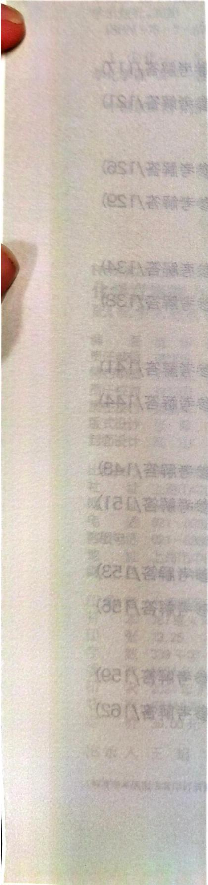

第8章 共价键与分子结构
能力测试A卷/64 …… (参考解答/165)
能力测试B卷/69 …… (参考解答/168)
第9章 金属键和金属晶体
能力测试A卷/73 …… (参考解答/172)
能力测试B卷/79 …… (参考解答/175)
第10章 氢、稀有气体和卤族元素
能力测试A卷/85 …… (参考解答/180)
能力测试B卷/88 …… (参考解答/182)
第11章 氧族元素
能力测试A卷/92 …… (参考解答/185)
能力测试B卷/95 …… (参考解答/187)
第12章 氮族元素
能力测试A卷/98 …… (参考解答/189)
能力测试B卷/101 …… (参考解答/191)
第13章 碳族元素和硼族元素
能力测试A卷/104 …… (参考解答/194)
能力测试B卷/107 …… (参考解答/196)
第14章 碱金属、碱土金属
能力测试A卷/110 …… (参考解答/200)
能力测试B卷/113 …… (参考解答/202)
参考解答 …… 117

## 第1章

## 物质的量

# 能力测试A卷

## 第1题 (10分) <<<

向盐 $\mathrm{A}_2\mathrm{B}$ 溶液中加入盐 $\mathrm{CD}_2$ 溶液有沉淀生成，为了研究这一化学反应，将两种盐分别配成 $0.1\mathrm{mol}\cdot \mathrm{L}^{-1}$ 溶液进行实验，其有关数据如下表。（化学式中A、B、C、D表示原子或原子团，式量为 $A = 23$ 、 $B = 96$ 、 $C = 137$ 、 $D = 35.5$ ）

<table><tr><td>编号</td><td>A2B溶液体积(mL)</td><td>CD2溶液体积(mL)</td><td>沉淀质量(g)</td></tr><tr><td>1</td><td>60</td><td>0</td><td>0</td></tr><tr><td>2</td><td>60</td><td>20</td><td>0.464</td></tr><tr><td>3</td><td>60</td><td>40</td><td></td></tr><tr><td>4</td><td>60</td><td>60</td><td>1.395</td></tr><tr><td>5</td><td>60</td><td>70</td><td>1.404</td></tr><tr><td>6</td><td>60</td><td>80</td><td>1.397</td></tr><tr><td>7</td><td>60</td><td>120</td><td></td></tr></table>

## 试回答：

1-1 用化学方程式表示其反应：\_\_\_\_，理由是\_\_\_\_。

1-2 沉淀的化学式为：\_\_\_\_，理由是\_\_\_\_。

1-3 3号实验中沉淀的质量为：\_\_\_\_，7号实验中的沉淀质量为：\_\_\_\_。

## 第2题 (10分)>>>

在稀硫酸溶液里加入 1.000 g 物质 A 充分反应后,生成一种浅绿色的物质 B 的溶液和无色气体 C,在 B、C 中含有同种元素。已知 0.386 g 气体 C 在 $1.01 \times 10^{5}$ Pa 27℃ 时占有体积 0.28 L。把物质 B 的溶液定容 100 mL,进行下列实验:

① 取定容后溶液 50 mL, 蒸发结晶可析出 1.582 g 浅绿色含水晶体 D, 取 D 少许溶于水, 加入双氧水后, 溶液由浅绿色变为棕黄色, 再加入几滴 KSCN 溶液, 又变为血红色溶液。

② 另取 50 mL 溶液, 用 $0.05 \, mol \cdot L^{-1}$ 的 $KMnO_{4}$ 溶液滴定, 耗用 22.75 mL 时恰好到达滴定终点。

通过计算确定物质 A 的化学式, 并用所给出的实验数据加以论证。

(10 分) <<<

无水氯化铝可用干燥的氯化氢气体与铝加热制得，今以 $2.7\mathrm{g}$ 铝与标态下7.84L HCl作用。然后在 $1.013\times 10^{5}\mathrm{Pa}$ ， $546\mathrm{K}$ 下（此时氯化铝也为气体），测得气体总体积为 $11.2\mathrm{L}$ 。试通过计算写出气态氯化铝的分子式。

## 第4题 (10分)>>>

1885年，德国夫赖堡(Frieberg)矿业学院的一位教授在分析夫赖堡附近发现的一种新矿石(以X表示，X为整比化合物)的时候，发现其中有一种当时未知的新元素(以Y表示，在X中Y的化合价为+4)，并通过实验验证了自己的推断。经分析，X中含有银元素(化合价为+1)和硫元素(化合价为-2)，其中Ag的质量分数为76.53%。在氢气流中加热X，可得到 $Ag_{2}S$ 、 $H_{2}S$ 和Y的低价硫化物(Y的化合价为+2)。如果在200℃和100kPa条件下完全转化16.0g的X需要0.557L的氢气。根据上面的描述：

4-1 计算 Y 的摩尔质量并指出 Y 在元素周期表中的位置。

4-2 写出氢气和 X 反应的化学方程式。

## (10 分) <<<

固体材料的制备中,常遇到缺陷和非整比(非化学计量)的化合物, $Na_{1-x+y}Ca_{x/2}LaTiO_{4}$ 就是非整比化合物,也是一类新的高温超导体。

它的制备方法如下:用 $\mathrm{NaLaTiO_{4}(I)}$ 作为母体化合物,和无水 $\mathrm{Ca(NO_{3})_{2}}$ 混合,封闭在耐热玻管中,加热到 $350^{\circ}C$ ,维持3天,然后打开,取出样品,用水冲洗,直到没有杂质(用X射线衍射证实),得到 $Ca^{2+}$ 交换产物,记为 $Na_{1-x}Ca_{x/2}LaTiO_{4}(II)$ ,光谱实验证明,上述过程中(I)有86%的 $Na^{+}$ 被交换,所以产生离子空位(即部分原本 $Na^{+}$ 的位置空置了)。

将样品(Ⅱ)放入 $300^{\circ}C$ 下的钠蒸气中, 经历数天, 该物质由白色渐变为黑色, 这是 $Na^{+}$ 插入空位所致, 光谱实验证明, 有 88% 的离子空位被 $Na^{+}$ 插入了, 生成目标化合物 $\mathrm{Na}_{1-x+y}\mathrm{Ca}_{x/2}\mathrm{LaTiO}_{4}(\mathrm{III})$ 。试回答:

5-1 制备时,为何选用 $\mathrm{Ca(NO_{3})_{2}}$ 而不用其他钙盐?

5-2 产物(Ⅲ)中 $x$ 和 $y$ 分别是多少？

5-3 当化合物(Ⅱ)中的离子空位被 $\mathrm{Na}^{+}$ 插入时, 为保持晶体的电中性, 部分 Ti 的化合价发生了改变, 求化合物(Ⅲ)中高、低价态钛离子的个数比为何?

## 第6题 (10分)>>>

已知二元化合物 A 可以用次氯酸钠和过量的氨气制得, 6.4 g A 完全燃烧得到 4.48 L 的氮气 (已折算成标准状况)。A 可以与新制 $\mathrm{Cu(OH)}_{2}$ 反应生成砖红色沉淀, 同时生成密度为 1.25 g·L $^{-1}$ 的无色无味的气体 (已折算成标准状况)。

请回答下列问题:

6-1 A的化学式为

6-2 写出次氯酸钠与过量氨气反应生成 A 的化学方程式 A 的制备过程中氨气需要过量的理由是

6-3 写出 A 与新制 Cu(OH) $_{2}$ 反应的化学方程式 \_\_\_\_。
6-4 已知在一定条件下，A 可与等离子组成的 Cu(OH) $_{2}$ 反应的化学方程式 \_\_\_\_。

已知在一定条件下，A可与等物质的量 $H_{2}O_{2}$ 恰好完全反应得到化合物B，B所含元素与A相同，其摩尔质量小于A，实验表明，B可能存在两种异构体。

② 写出 B 的两种可能异构体的结构式

化学竞赛能力测试—高中第一分册

## 第7题 (10分) <<<

早在7000年前人类就开始使用单质X，《周易参同契》中也曾提到X单质的冶炼方法。为了研究X及其化合物的性质，进行了如下实验：将准确称量的等质量的物质A和B置于充满氩气的容器中充分混合。将容器密闭 $(p=1.01\times10^{5}\mathrm{Pa},T=291\mathrm{K})$ 并加热。反应停止后，容器内的压强等于 $2.66\times10^{5}\mathrm{Pa}(T=300\mathrm{K})$ ，而反应的唯一固体产物是一种单质X。在空气中加热氧化物A导致如下的质量损失（相对于起始质量）：

<table><tr><td>温度,K</td><td>566</td><td>624</td><td>647</td><td>878</td></tr><tr><td>质量损失,%</td><td>2.789</td><td>3.905</td><td>4.463</td><td>6.695</td></tr><tr><td>生成的物质</td><td>C</td><td>D</td><td>F</td><td>G</td></tr></table>

下图还表示了各物质之间的相互转化关系(图中省略了部分物质),B呈黑色,Z呈黄色。

表面是髓头的中汽主点瓣干团对门，使鞘式呈源融合新的侧面味(Ⅱ)0023，(Ⅰ)02457-8

$$
\begin{array}{c} \mathrm{H} _ {2} \\ \mathrm{X} \xleftarrow {\mathrm{G}} \mathrm{L} \xrightarrow {\mathrm{HNO} _ {3}} \mathrm{G} + \mathrm{NO} _ {2} + \mathrm{O} _ {2} \\ \mathrm{KCN} \\ \mathrm{X} \end{array}
$$

7-1 试确定 A、F、L、Q、Z 的化学式。

$$
\mathrm{O} _ {2} \mathrm{C} _ {3} (\mathrm{NH})
$$

7-2 写出下列化学方程式 A+B。

7-3 写出化学方程式 $\mathrm{G} + \mathrm{KCN}$ 。

7-4 若容器的容积等于 $1.00 \mathrm{~L}$ , 试确定所称取的物质 A 的质量。

。元素度分量范围，如里量安的O乘S-Q

## 第8题 (10分)>>>

当今世界,食品生产几乎都离不开食品添加剂。部分欧盟许可的食品添加剂信息如下表。已知 X、Y 为不同的金属元素。

<table><tr><td>食品添加剂</td><td>元素成分</td><td>用途</td><td>生成过程</td></tr><tr><td>N</td><td>39.34% X</td><td>保持口味</td><td></td></tr><tr><td>E171</td><td>59.94% Y</td><td>食品颜色白色</td><td></td></tr><tr><td>E450(I)</td><td>20.72% X</td><td>烘焙面粉的成分</td><td> $NaH_{2}PO_{4} \xrightarrow{170°C} E450(I)$ </td></tr><tr><td>E500(II)</td><td>27.37% X</td><td>烘焙面粉的成分</td><td> $N \xrightarrow{NH_{3} + CO_{2} + H_{2}O} E500(II)$ </td></tr></table>

下图画出了 E171(晶胞参数 $a = b = 4.59\AA, c = 2.96\AA, \alpha = \beta = \gamma = 90^{\circ}, \rho = 4.25\mathrm{g} \cdot \mathrm{cm}^{-3}$ ) 的

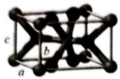

(灰球●为Y原子)

第8题图

8-1 利用给出的晶胞参数,列式计算 E171 中最小重复单元的化学式的摩尔质量。

8-2 确定 B、D 的化学式，以及 E500(II)、E171 和 N 的化学式。注：标准状态下 D 是一种液体。

8-3 写出 $\mathrm{NaH_2PO_4}\xrightarrow{170^{\circ}C}$ E450(I)转化的反应方程式。

8-4 E450(I)、E500(II)和面粉的混合物就是发酵粉,广泛用于糕点生产中的无酵母面坯。请写出上述混合物能够使面坯疏松的反应方程式。

## (10 分) <<<

在 $N_{2}$ 气氛下，0.244 g 金属 A 恰被 2.9 mL 10% HCl ( $\rho=1.1\ g\cdot mL^{-1}$ ) 溶解，形成含有盐 B 的浅蓝绿色溶液。该溶液和 15 mL 含 3.815 g $\mathrm{Co(NO_{3})_{2}\cdot6H_{2}O}$ 的溶液混合，再加稍过量的 $(\mathrm{NH}_{4})_{2}\mathrm{C}_{2}\mathrm{O}_{4}$ 即可得到 3.186 g 橙黄色沉淀 C。化合物 C 在氧气气氛中的热重分析 (25℃ 到 900℃) 表明，它受热失重分三个阶段，最后以 57.3% 的总失重得到混合物 G。其中，有一个阶段发生了质量增加，G 中 A 的化合价只有一种。

9-1 通过计算和讨论,确定 A、B、C 的化学式。

9-2 求 G 的定量组成,用质量分数表示。

## 第10题 (10分)>>>

将质量 100 mg 水合草酸锰 $MnC_{2}O_{4} \cdot 2H_{2}O$ 放在一个可以称出质量的容器里加热, 所得固体产物的质量随温度变化的曲线如图所示:

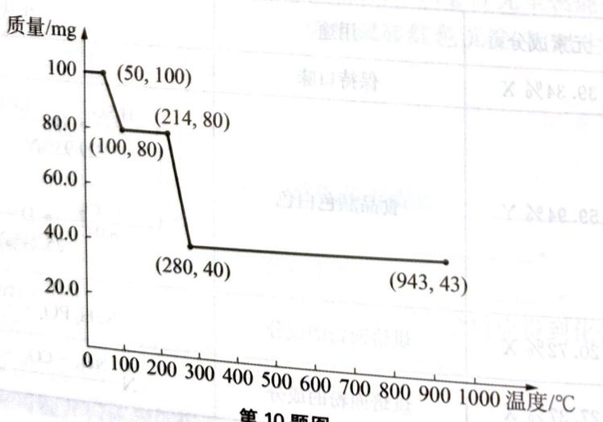  
第10题图

试通过对该图象数据的分析和计算,回答下列各问:

10-1 在 $0^{\circ}\mathrm{C} \sim 50^{\circ}\mathrm{C}$ 时， $\mathrm{MnC_2O_4 \cdot 2H_2O}$ 是否发生了化学变化。

10-2 在 $50^{\circ}\mathrm{C} \sim 100^{\circ}\mathrm{C}$ 时, 发生的化学反应方程式是 \_\_\_\_, 做出这一判断的依据是: \_\_\_\_。

10-3 $100^{\circ}\mathrm{C} \sim 214^{\circ}\mathrm{C}$ ,有无发生化学变化?其理由是

10-4 在 $214^{\circ}\mathrm{C} \sim 280^{\circ}\mathrm{C}$ 时, 固体物质发生反应的化学方程式是 , 做出这一判断的依据是 。

10-5 在 $280^{\circ}\mathrm{C} \sim 943^{\circ}\mathrm{C}$ 时, 固体物质质量上升的原因是 \_\_\_\_ 。所得固体产物的化学式是 \_\_\_\_, 做出这一判断的依据是 \_\_\_\_ 。

如图1-2所示，图2-3所示。

注：本次股东大会以现场会议形式召开，采用网络投票方式，通过了以下方式：

（1）在 $x$ 轴上，当 $y$ 为正方形的边长，则 $z$ 的值为 $\frac{2\pi}{3}$ 。

（1）在社会经济中，以“自上而下”为根本出发点，从2007年到2013年，中国社会科学院与上海科学技术大学、上海交通大学、上海财经大学、上海财经大学、上海财经大学、上海财经大学、上海财经大学、上海财经大学、上海财经大学、上海财经大学、上海财经大学、上海财经大学、上海财经大学、上海财经大学、上海财经大学、上海财经大学、上海财经大学、上海财经大学、上海财经大学、上海财经大学、上海财经大学、上海财经大学、上海财经大学、上海财经大学、上海财经大学、上海财经大学、上海财经大学、上海财经学院、上海财经学院、上海财经学院、上海财经学院、上海财经学院、上海财经学院、上海财经学院、上海财经学院、上海财经学院、上海财经学院、上海财经学院、上海财经学院、上海财经学院、上海财经学院、上海财经学院、上海财经学院、上海财经学院、上海财经学院、上海财经学院、上海财经学院、上海财经学院、上海财经学院、上海财经学院、上海财经学院、上海财经学院、上海财经学

(1) 用塑料的磨料加工, 算料加工, 算料加工, 算料加工, 算料加工, 算料加工, 算料加工, 算料加工, 算料加工, 算料加工, 算料加工, 算料加工, 算料加工, 算料加工, 算料加工, 算料加工, 算料加工, 算料加工,

(2) 联合非向各递反回的转角入，可取任意正负数。其中，由非负数为负数，取任意正负数，取任意负数。  
(3) 联合非向两向复方，有足的正负数，取任意正负数，取任意负数。  
(4) 从仅改由离散和离散至原点（与右下同人，不等）；取任意正负数，取任意负数。  
(5) 在长三、重合非（经第1号期类）时即试用示例：与原点同位数相等。

## 能力测试B卷

## (10 分) <<<

某高能炸药 E 可由 B 或 D 用浓硝酸硝化得到，B 和 D 的制备流程如下图所示，其 $^{1}$ H 核磁共振谱（H-NMR）中显示 B、E 只有一种化学环境的氢原子，D 有两种化学环境的氢原子。

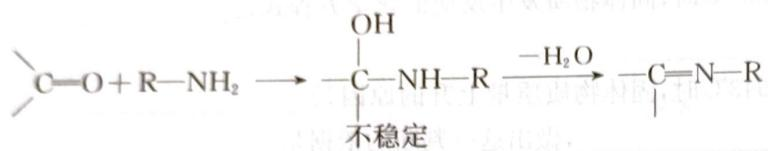

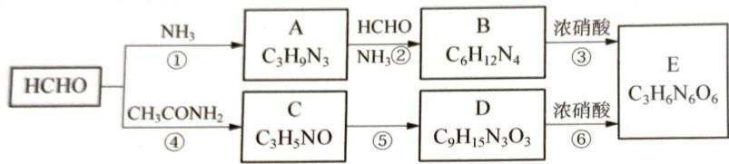

1-1 指出反应⑤的反应类型\_\_\_\_。

1-2 写出A、B、D的结构简式。

1-3 反应③中除了生成E外，还生成了 $\mathrm{N}_2$ 、 $\mathrm{CO}_{2}$ 气体，写出该反应方程式。

## 第2题 (10分)>>>

## 氮的化合物丰富多彩

2-1 从分子结构上看,氮与碳有很多对应的物质(如甲烷跟氨气对应),请找出下列含碳化合物对应的含氮物质: $C_{2}H_{4}$ 、 $C_{2}H_{2}$ 、 $H_{2}CO_{3}$ 。

2-2 叠氮化钠 $\left(\mathrm{NaN}_{3}\right)$ 受猛烈撞击时可发生分解反应 $2\mathrm{NaN}_{3}=2\mathrm{Na}+3\mathrm{N}_{2}$ 。另一种仅由两种元素组成的叠氮化物，每1 mol该叠氮化合物分解时只产生4 mol气体单质，写出该叠氮化合物分解的化学方程式 \_\_\_\_。

2-3 硝酸与金属反应时往往产生氮氧化物,但是在某些特殊情况则不然。将稀硝酸 $\left(\mathrm{HNO}_{3}\right.$ 浓度低于 $2\ \mathrm{mol}\cdot\mathrm{L}^{-1}$ )与过量金属镁混合反应放出气体A,反应完全后向剩余溶液中加入过量NaOH固体并加热,放出气体B,将两次放出的气体全部收集并混合,用碱石灰干燥后通过灼热氧化铜固体,观察到固体变红,再将剩余气体用浓硫酸干燥,气体体积变为原总体积的三分之一。

(1) A 的化学式 \_\_\_\_ , A 和 B 的体积比为 \_\_\_\_ 。

(2) 写出 B 跟氧化铜反应的化学方程式 \_\_\_\_。

(3) 镁与稀硝酸反应的离子方程式 \_\_\_\_。

## (10 分) <<<

金属 B 能够与气体 X 形成多种金属羰基化合物, 1908 年, 人们制得橙色双核结构化合物 C, 它可以用作有机合成中的催化剂。1923 年, 人们加热 C 得到了黑色晶体, 它是两种同分异构体 D 和 E 的混合物, 定性组成与 C 相同。直至 1959 年, 人们才得到了 D 和 E 的确切结构, 由此开启了金属簇状化合物的大门。化合物 D 分子结构中有四条三重旋转轴 (类似于白磷 $\mathrm{P}_{4}$ ), 化合物 E 分子结构中有一条三重旋转轴。再进一步研究这类物质，还可以制得由两种不同金属组成的骨架，例如化合物 H（分子结构中有一条三重旋转轴）。

已知:①A 是一种氧化物;②忽略金属的差异,D、E、H 的金属骨架类型相同;③簇状化合物中金属原子一般满足最外层 18 电子(即中心体的价电子数+配体提供的电子数=18)。

$$
\mathrm{A} \xrightarrow {\mathrm{H} _ {2}} \mathrm{B} \xrightarrow {\mathrm{X}} \mathrm{C} \xrightarrow [ \Delta ]{\text { Na }} \mathrm{F} \xrightarrow {\mathrm{BiCl} _ {3}} \mathrm{G} \xrightarrow {\triangle} \mathrm{H}
$$

其中，A～H 各物质中金属 B 的质量分数如下表所示：

<table><tr><td>物质符号</td><td>A</td><td>B</td><td>C</td><td>D和E</td><td>F</td><td>G</td><td>H</td></tr><tr><td>金属B质量分数(%)</td><td>73.42</td><td>100.0</td><td>34.47</td><td>41.22</td><td>30.38</td><td>24.49</td><td>27.72</td></tr></table>

3-1 写出物质 A、C、G 的化学式。

3-2 写出图 $\mathrm{C} \rightarrow \mathrm{F}$ 过程对应的反应方程式。

3-3 画出D、E、H的空间结构，已知物质X只在其中一种分子中形成桥式连接。

## 第4题 (10分)>>>

根据所给条件按照要求书写化学方程式(要求系数为最简整数比)。

4-1 铜在潮湿空气中慢慢生成一层绿色铜锈 $\left[\mathrm{Cu(OH)}_{2} \cdot \mathrm{CuCO}_{3}\right]$ 。

4-2 乙硼烷与一氧化碳在 $\mathrm{NaBH}_4$ 、THF条件下 $1:2$ 化合，生成物有一个六元环。

4-3 古代艺术家的油画都是以铅白为底色, 这些油画易受 $\mathrm{H}_{2} \mathrm{~S}$ 气体的侵蚀而变黑 (PbS), 可以用 $\mathrm{H}_{2} \mathrm{O}_{2}$ 对这些古油画进行修复。写出 $\mathrm{H}_{2} \mathrm{O}_{2}$ 修复油画的化学反应方程式。

4-4 光气 $\left(\mathrm{COCl}_{2}\right)$ 和 $\mathrm{NH}_{3}$ 反应制备常见的氮肥。

4-5 银镜反应时需要用的银氨溶液,必须现配现用:因为久置的银氨溶液常析出黑色的氮化银沉淀。写出相应的化学反应方程式。

交警为确定驾驶员是否醉酒后驾车,常采用呼吸测醉法分析。在 310 K 时取 50.0 mL 被检测人的呼吸样品鼓泡通过酸性重铬酸盐溶液。由于乙醇的还原作用产生了 $3.30 \times 10^{-5}$ mol Cr(Ⅲ),重铬酸盐的消耗可用分光光度法测定。法律上规定人体血液中乙醇含量不能超过 0.05%(质量分数),否则就是醉酒。试回答:

5-1 写出检测醉酒的离子方程式 \_\_\_\_。

5-2 若某驾驶人在 $310 \mathrm{~K}$ 时, 含有 $0.45 \%$ 乙醇的血液上面乙醇的分压为 $1.00 \times 10^{4} \mathrm{~Pa}$ 。请通过计算确定此人是否为法定的酒醉。

## 第6题 (10分)>>>

$CrCl_{3}$ 、金属铝和 CO 可在 $AlCl_{3}$ 的苯溶液中发生化学反应生成一种无色物质 A，A 又可和 $\mathrm{P(CH_{3})_{3}}$ 反应，生成物质 B，A 还可和钠汞齐反应生成物质 C，已知 A、B、C 的元素分析结果

如下：聚首的動態與金同不韓國內捐補及捐，別評典資產進一步再。評解對重

<table><tr><td>元素质量分数/%</td><td>Cr</td><td>P</td><td>C</td><td>元素质量分数/%</td><td>Cr</td><td>P</td><td>C</td></tr><tr><td>A</td><td>23.63</td><td></td><td>32.75</td><td>C</td><td>21.84</td><td></td><td>25.23</td></tr><tr><td>B</td><td>19.39</td><td>11.55</td><td>35.83</td><td></td><td></td><td></td><td></td></tr></table>

试写出：

6-1 结构简式 A \_\_\_\_；B \_\_\_\_；C \_\_\_\_。

6-2 将 A 中 Cr 原子换为 Mo 原子得物质 D, D 可与 PPh₃ 反应 (Ph 为苯基), 试写出反应的化学方程式 \_\_\_\_。

## 第7题 (10分) <<<

$\mathrm{BaTiO_{3}}$ 是一种重要的无机功能材料, 工业上常用以下方法制得: 将 $\mathrm{BaCl_{2}}$ 、 $\mathrm{TiCl_{4}}$ 、 $\mathrm{H_{2}O}$ 和 $\mathrm{H_{2}C_{2}O_{4}}$ 混合反应后, 经洗涤、干燥后得一组成为 $\mathrm{Ba} 30.50\%$ 、 $\mathrm{Ti} 10.70\%$ 、 $\mathrm{C} 10.66\%$ 、 $\mathrm{H} 1.81\%$ 的白色粉末 A, 进一步热分解 A 即可得 $\mathrm{BaTiO_{3}}$ 。用热分析仪测定 A 的热解过程, 得下图所示的质量—温度关系曲线:

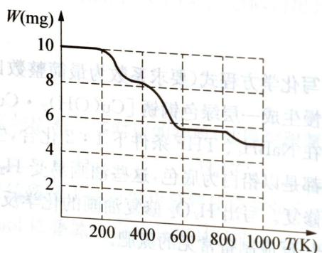  
第7题图

图中 400 K、600 K 和 900 K 时对应的样品的质量分别为 8.38 mg、5.68 mg 和 5.19 mg

试回答：

7-1 A的化学式为

7-2 分别写出 $400 \mathrm{~K} 、 600 \mathrm{~K} 、 900 \mathrm{~K}$ 时样品的组成为。  
7-3 晶体结构分析表明

7-3 晶体结构分析表明, $\mathrm{BaTiO_{3}}$ 为立方晶体,晶胞参数 $a=7.031\text{\AA}$ ,一个晶胞中含有一个 $\mathrm{BaTiO_{3}}$ “分子”。画出 $\mathrm{BaTiO_{3}}$ 的晶胞结构示意图,分别指出 $\mathrm{Ba^{2+}}$ 、 $\mathrm{Ti(IV)}$ 、 $\mathrm{O^{2-}}$ 三种离子所处的位置及其配位情况。

## 第8题 (10分)>>>

随着便携式电子设备的大量使用,具有高能量密度特点的锂二次电池的重要性日益突出。目前多采用无机金属氧化物作为正极,但这类材料的比容量普遍低于200 mAh/g,能量密度难以提高。元素硫作为锂二次电池正极材料,具有极高的理论容量(1672 mAh/g),因此锂硫电池的开发引起人们的关注。研究人员尝试将二硫或多硫基桥接于各种有机或无机化合物中,从而得到正极化学竞赛能力测试一高中第一分即

化学竞赛能力测试—高中第一分册

材料。

某研究小组尝试将 S—S—S 交联于聚磷氮烯分子中，得到一类新型的具有高能量密度和安全性的无机化合物聚三硫代磷氮烯。制备该材料的方法如下：将一定量的 $PCl_{5}$ 和 $NH_{4}Cl$ 分别溶解于四氯乙烷中制成溶液，将 $PCl_{5}$ 溶液滴加到沸腾状态的氯化铵溶液中，在一定条件下充分反应后，重结晶得到中间产物 A。将纯化后的 A 在 Ar 气氛下加热聚合，得到灰白色橡胶状固体 B。将 B 与溶有 S 和 $Na_{2}S$ 的 N，N-二甲基甲酰胺（DMF）溶液在沸腾条件下反应，减压蒸馏除去溶剂 DMF 后，用去离子水洗涤所剩棕黄色固体，经 $AgNO_{3}$ 检验，确认 NaCl 完全除掉后，对所得产品真空干燥，得到可用于制作电池正极的干燥聚合物粉末 C。

从各物质表征信息可知，A 含有 P、N、Cl，它们的原子个数比为 1:1:2，为环状结构的分子；B 为链状聚合分子；C 的红外 (IR) 光谱如图 1 所示。元素含量测试结果表明聚合物 C 的主要元素组成与含量为 P:22.0%、N:9.9%、S:68.1%。C 的热重分析如图 2 所示。

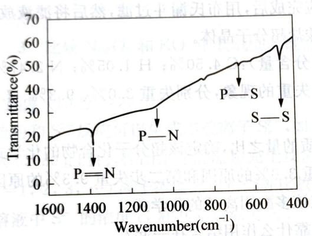  
图1

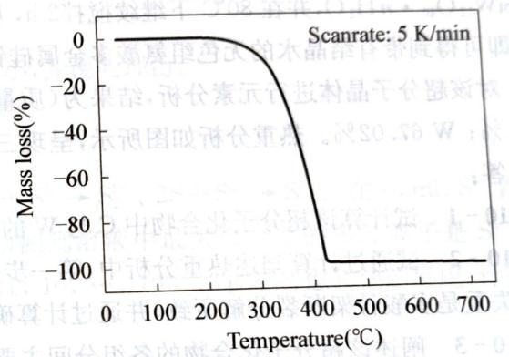  
图2  
第8题图

8-1 写出生成 A 的化学反应方程式。

8-2 写出B和C的结构式。

8-3 C实际使用的温度范围是\_\_\_\_，该材料具有较好导电性的原因是\_\_\_\_。

(10 分) <<<

实际气体在温度越高,压强越低时越接近理想气体,现在 273 K 时测得 1 g 某实际气体在不同压强下的体积如下表,请用作图法对得到的数据加以处理,求出该气体的分子量。

<table><tr><td> $p/10^{5}$  Pa</td><td>1.013</td><td>0.6755</td><td>0.5066</td><td>0.3378</td><td>0.2533</td></tr><tr><td> $V/10^{-3}$  m3</td><td>0.4334</td><td>0.6552</td><td>0.8771</td><td>1.321</td><td>1.765</td></tr><tr><td></td><td></td><td></td><td></td><td></td><td></td></tr><tr><td></td><td></td><td></td><td></td><td></td><td></td></tr></table>

## 第10题 (10分)>>>

研究发现、氨基酸与多金属氧酸盐能够通过氢键形成超分子化合物，晶体中常含有结晶水，这类物质展示其独特的晶体结构和新颖的物理化学性质，对探究新型功能材料十分重要。

某研究小组采用一种简便的溶液法, 将一定量的组氨酸(分子式: $C_{6}H_{9}N_{3}O_{2}$ , 英文缩写: His, 结构式:

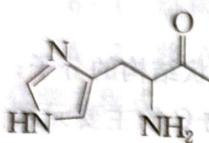

OH）、结构助剂及去离子水放入

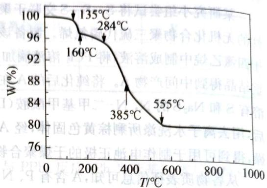  
第10题图

100 mL 锥形瓶中, 搅拌混合均匀, 2 h 后加入一定量的

$K_{4}SiW_{12}O_{40}\cdot nH_{2}O$ ，并在80℃下继续搅拌2 h，反应完成后，用布氏漏斗过滤，然后将滤液放置两周，即可得到带有结晶水的无色组氨酸多金属硅钨酸盐超分子晶体。

对该超分子晶体进行元素分析,结果为(质量百分含量):C 4.50%; H 1.05%; N 2.47%; Si 0.91%; W 67.02%。热重分析如图所示,呈现三步失重的现象,分别失重3.0%、9.3%、7.5%。
请回答:

10-1 试计算该超分子化合物中 C 与 W 的物质的量之比, 确定该超分子化合物的化学式。

10-2 试通过计算阐述热重分析中,第一步失重 $3.0\%$ 的原因和第二步失重 $9.3\%$ 的原因;第三步失重是多酸骨架断裂分解所致,并通过计算确定该多酸阴离子的化学式。

10-3 阐述该超分子化合物的各组分间主要是靠什么作用结合在一起？

10-4 该超分子化合物在什么温度以下稳定？其原因是什么？

7-3 晶体结构分析图 10.1.1 星期, 砂产比重及质量指标都是正, 高能量能占本产利差。量子长(内)产则出来, 胶小则能用(因降解快去图齐阳渐, 等个能用本的)

<table><tr><td>及其他情况</td><td>8566.0</td><td>4406.0</td><td>2510.0</td><td>810.1</td><td> $\chi^{2}I_{1} = 0.9$ </td></tr><tr><td>327.1</td><td>156.1</td><td>1598.0</td><td>5668.0</td><td>4584.0</td><td> $^{2}m^{-1} = 0.15$ </td></tr><tr><td>(10分)&gt;&gt;&gt;</td><td></td><td></td><td></td><td></td><td></td></tr><tr><td colspan="6">随着便携式电子设备的大量</td></tr></table>

## 第2章

# 氧化还原反应

# 能力测试 A 卷

## 第1题 (10分) <<<

呼吸面具中的 $Na_{2}O_{2}$ 可吸收 $CO_{2}$ 放出 $O_{2}$ ，若用超氧化钾 $\left(\mathrm{KO}_{2}\right)$ 代替 $Na_{2}O_{2}$ 也可以得到类似的产物，起到同样的作用。

1-1 标准状况下,若有 30 mL 的 $CO_{2}$ 气体通过盛有足量的 $KO_{2}$ 的装置充分反应后,逸出气体的体积为多少毫升?

1-2 标准状况下, 若一定量的 $CO_{2}$ (过量), 通过盛有 $7.24 \, g \, KO_{2}$ 和 $Na_{2}O_{2}$ 的均匀混合物的装置充分反应后, 逸出的气体中 $O_{2}$ 体积为 $1568 \, mL$ , 求混合物中 $KO_{2}$ 和 $Na_{2}O_{2}$ 的物质的量分别为多少摩尔?

1-3 比较 $\mathrm{Na_2O_2}$ 和 $\mathrm{KO}_2$ 中氧氧键的键能大小，并说明理由。

## 第2题 (10分)>>>

硫粉和 $S^{2-}$ 反应可以生成多硫离子 $S_{n}^{2-}$ ，如： $S + S^{2-} \rightarrow S_{2}^{2-}$ 、 $2S + S^{2-} \rightarrow S_{3}^{2-}$ 。在 $10\ mL\ S^{2-}$ 溶液中加入 0.080 g 硫粉，控制条件使硫粉完全反应，检测到溶液中最大聚合度的多硫离子是 $S_{3}^{2-}$ ，且 $S_{n}^{2-}(n=1,2,3,\cdots)$ 离子浓度之比符合等比数列，1,10, $\cdots$ , $10^{n-1}$ 。若不考虑其他副反应，计算反应后溶液中 $S^{2-}$ 的浓度 $c_{1}$ 和其起始浓度 $c_{0}$ 。

## 第3题 (10分) <<<

钾盐 A 可用作感光乳化剂、食品添加剂等；B 在水中微溶于水，加入 A 后 B 的溶解度增大，成棕色溶液 C；D 溶液遇酸有淡黄色沉淀生成，将黄绿色气体 E 通入溶液 D，在所得溶液中加入 $BaCl_{2}$ 溶液有难溶于 $HNO_{3}$ 溶液白色沉淀生成；物质 C 与 D 反应，常用于化学反应的定量分析。各物质之间的部分转化关系如下：

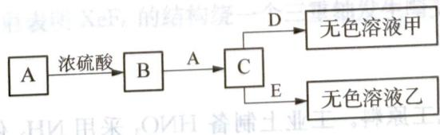

## 回答下列问题：

3-1 化合物 A 和 D 的化学式分别是 A: \_\_\_\_；D: \_\_\_\_。

3-1 化合物 A 和 D 的离子式方程式: \_\_\_\_。
3-2 写出过量 E 通入溶液 D 的离子反应方程式: \_\_\_\_。

3-3 写出上述流程中 C 与 B 反应的分子结构分析。  
3-4 从分子结构分析, B 微溶于水, 加入 A 后 B 的溶解度增大的原因。

## 第4题 (10分)>>>

第4题 (10分) 科学家对络合氢化物的储氢特性进行了系列研究。

4-1 $\mathrm{LiAlH_4}$ 在不同温度下分解放氢反应为：

当温度为 $160^{\circ}C \sim 180^{\circ}C$ 时，反应 $1:3LiAlH_{4} = Li_{3}AlH_{6} + 2Al + 3H_{2}$

当温度为 $180^{\circ}C \sim 220^{\circ}C$ 时，反应 2: $Li_{3}AlH_{6} = 3LiH + Al + 3/2H_{2}$

上述两步反应总的放氢量是\_\_\_\_（放氢量即为氢元素的质量占总质量的百分含量）。

4-2 已知 $\mathrm{Mg(AlH_4)_2}$ 在 $400^{\circ}\mathrm{C}$ 下分解，理论上放氢量为 $9.34\%$ 。现取 $4.316\mathrm{gMg(AlH_4)_2}$ 在该温度下分解生成 $1.798\mathrm{g}$ 单质Al和一种金属互化物。写出该反应的化学方程式

## 第5题 (10分) <<<

最近美国科学家在《自然》杂志上称，研制出了全球最纤薄的发电机，这种发电机的材料由单个原子厚度的二硫化钼 $\left(\mathrm{MoS}_{2}\right)$ 制得。

5-1 高温硫化法是目前研究比较成熟的方法,即在高温下以硫或硫化氢对单质钼或三氧化钼进行硫化制得纳米 $MoS_{2}$ 。若在高温下硫化氢进行硫化三氧化钼时,还生成一种硫单质(分子结构可表示为 )。

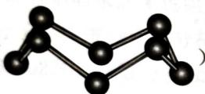

写出该反应的化学方程式

5-2 目前工业上冶炼钼是以辉钼矿(主要成分是 $MoS_{2}$ )为原料,其反应原理如下:

① $2MoS_{2} + 7O_{2} = 2MoO_{3} + 4SO_{2}$

② $\mathrm{MoO}_3 + 2\mathrm{NH}_3 \cdot \mathrm{H}_2\mathrm{O} = (\mathrm{NH}_4)_2\mathrm{MoO}_4 + \mathrm{H}_2\mathrm{O}$

③ $(\mathrm{NH}_4)_2\mathrm{MoO}_4 + 2\mathrm{HCl} = \mathrm{H}_2\mathrm{MoO}_4\downarrow +2\mathrm{NH}_4\mathrm{Cl}$

④ $\mathrm{H}_2\mathrm{MoO}_4 = \mathrm{MoO}_3 + \mathrm{H}_2\mathrm{O}$

实践证明该生产方法在原理①煅烧过程有3%的钼损失,在后续氨浸过程中又有5%的钼损失。假设工业上要生产1t的 $MoO_{3}$ ，需要\_\_\_\_t含82% $MoS_{2}$ 的精钼矿。上述方法的缺点是要损失较多的钼,为了克服该缺点可改用次氯酸钠作为氧化浸出剂(在浸出过程中,Mo被氧化为钼酸盐进入溶液中,硫元素被氧化为硫酸盐)。若用次氯酸钠作为氧化浸出剂,要生产1t $MoO_{3}$ 需要消耗\_\_\_\_t次氯酸钠。

## 第6题 (10分)>>>

$HNO_{3}$ 是极其重要的化工原料。工业上制备 $HNO_{3}$ 采用 $NH_{3}$ 催化氧化法, 将中间产生的 $NO_{2}$ 在密闭容器中多次循环用水吸收制备的。据此完成下列试题:

6-1 工业上用水吸收二氧化氮生产硝酸,生成的气体经过多次氧化、吸收的循环操作使其充分转化为硝酸(假定上述过程中无其他损失)。

(1) 试写出上述反应的化学方程式

(2) 设循环操作的次数为 $n$ , $\mathrm{NO}_{2} \rightarrow \mathrm{HNO}_{3}$ 转化率与循环操作的次数 $n$ 之间关系的数学表达式为 \_\_\_\_。

6-2 上述方法制备的 $\mathrm{HNO}_{3}$ 为稀 $\mathrm{HNO}_{3}$ , 将它用水稀释或蒸馏、浓缩可制得不同浓度的 $\mathrm{HNO}_{3}$ 。实验证明: 不同浓度的 $\mathrm{HNO}_{3}$ 与同一金属反应可生成不同的还原产物。例如, 镁与硝酸反
化学竞赛能力测试一高中第一分时

应实验中,测得其气相产物有 $H_{2}$ 、 $N_{2}$ 、NO、 $NO_{2}$ ，液相产物有 $\mathrm{Mg(NO_{3})_{2}}$ ， $NH_{4}NO_{3}$ 和 $H_{2}O$ 。生成这些产物的 $HNO_{3}$ 浓度范围为：

$$
c \left(\mathrm{H} _ {2}\right) <   6. 6 \mathrm{mol} \cdot \mathrm{L} ^ {- 1}; c \left(\mathrm{N} _ {2}\right) <   1 0 \mathrm{mol} \cdot \mathrm{L} ^ {- 1};
$$

$$
c \left(\mathrm{NH} _ {4} ^ {+}\right) <   1 0 \mathrm{mol} \cdot \mathrm{L} ^ {- 1}; 0. 1 \mathrm{mol} \cdot \mathrm{L} ^ {- 1} <   c (\mathrm{NO}) <   1 0 \mathrm{mol} \cdot \mathrm{L} ^ {- 1};
$$

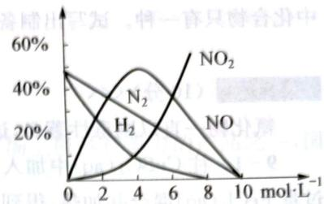

$$
c (\mathrm{NO} _ {2}) > 0. 1 \mathrm{mol} \cdot \mathrm{L} ^ {- 1}
$$

各气相产物成分及含量随 $HNO_{3}$ 浓度变化曲线如图所示。

第6题图

(1) 写出 Mg 与 $11 \, mol \cdot L^{-1}$ 的 $HNO_{3}$ 反应的方程式 \_\_\_\_

(2) 960 g Mg 与 25 L 4 mol·L $^{-1}$ 的 HNO $_{3}$ 恰好完全反应, 标准状况下收集到 244 L 气体, 试通过计算写出反应方程式 \_\_\_\_。

(10 分) <<<

氟是一种氧化性极强的非金属元素, 它甚至能与稀有气体氙反应生成 $\mathrm{XeF}_{2} 、 \mathrm{XeF}_{4} 、 \mathrm{XeF}_{6}$ 等固体, 这些固体都极易与水反应。其中 $\mathrm{XeF}_{2}$ 与 $\mathrm{H}_{2} \mathrm{O}$ 仅发生氧化还原反应, 而 $\mathrm{XeF}_{4}$ 与 $\mathrm{H}_{2} \mathrm{O}$ 反应时,有一半的 $\mathrm{XeF}_{4}$ 与 $\mathrm{H}_{2} \mathrm{O}$ 发生氧化还原反应, 另一半则发生歧化反应: $3 \mathrm{Xe(IV)} \longrightarrow \mathrm{Xe} + 2 \mathrm{Xe(VI)}$ 。 $\mathrm{XeF}_{6}$ 则发生非氧化还原反应完全水解。试回答下列问题:

7-1 写出 $\mathrm{XeF_4}$ 与 $\mathrm{H}_2\mathrm{O}$ 反应的方程式。

7-2 14.72 g XeF $_{6}$ 完全水解后,再加入 100 mL 0.600 mol·L $^{-1}$ Mn $^{2+}$ 的水溶液,反应完全后,放出的气体干燥后再通过红热的金属铜,体积减少 20%。

(1) 通过计算可确定 $Mn^{2+}$ 的氧化产物, 写出相应的化学方程式。

(1) 通过计算可确定 $\mathrm{Mn}^{+}$ 的氧化产物，用出水溶液中稀释到 $1000 \mathrm{~mL}$ 后，求溶液 $\mathrm{pH}$ 以及氟离子 $(\mathrm{F}^{-})$ 浓度。（已知弱酸 HF 在水溶液中存在电离平衡， $K_{\mathrm{a}} = [\mathrm{H}^{+}][\mathrm{F}^{-}] / [\mathrm{HF}] = 3.5 \times 10^{-4}$ ）。

存在电离平衡, ${\mathrm{K}}_{\mathrm{a}} = \left\lbrack  {\mathrm{{H}}}^{2}\right\rbrack   \cdot  \left\lbrack  {\mathrm{{F}}}^{2}\right\rbrack   \cdot  \left\lbrack  {\mathrm{{H}}}^{2}\right\rbrack   \cdot  \left\lbrack  {\mathrm{{F}}}^{2}\right\rbrack   \cdot  \left\lbrack  {\mathrm{{H}}}^{2}\right\rbrack   \cdot  \left\lbrack  {\mathrm{{F}}}^{2}\right\rbrack   \cdot  \left\lbrack  {10}\right\rbrack   \cdot  \left\lbrack  {10}\right\rbrack   \cdot  \left\lbrack  {10}\right\rbrack   \cdot  \left\lbrack  {10}\right\rbrack   \cdot  \left\lbrack  {10}\right\rbrack   \cdot  \left\lbrack  {10}\right\rbrquare$ . 7-3 合成 ${\mathrm{{XeF}}}_{2}$ 、 ${\mathrm{{XeF}}}_{4}$ 、 ${\mathrm{{XeF}}}_{6}$ 时通常用 $\mathrm{{Ni}}$ 制反应容器,使用前用 ${\mathrm{F}}_{2}$ 使之钝化。

(1) 写出上述化合物的分子构型。

(2) 写出使用 Ni 制反应容器前用 $F_{2}$ 钝化的两个主要原因。

(2) 写出使用 Ni 制反应容器前用 $F_{2}$ 钝化的两个主要原料和物质。
(3) 红外光谱和电子衍射表明 $XeF_{6}$ 的结构绕一个三重轴发生畸变。画出 $XeF_{6}$ 结构发生畸变的示意图。

## 第8题 (10分)>>>

在真空下, $CsB_{3}H_{8}$ 在 $230^{\circ}C$ 时分解, 可产生下列化学反应:

$$
\mathrm{CsB} _ {3} \mathrm{H} _ {8} \longrightarrow \mathrm{Cs} _ {2} \mathrm{B} _ {9} \mathrm{H} _ {9} + \mathrm{Cs} _ {2} \mathrm{B} _ {1 0} \mathrm{H} _ {1 0} + \mathrm{Cs} _ {2} \mathrm{B} _ {1 2} \mathrm{H} _ {1 2} + \mathrm{CsBH} _ {4} + \mathrm{H} _ {2}
$$

8-1 配平上述反应。单线桥标明电子的转移方向和数目。

8-2 不用硼氢化物的钠盐进行实验的原因是\_\_\_\_\_\_。
8-3 $\text{B}_9\text{H}_9^{2-}$ 离子可通过 $\text{B}_{10}\text{H}_{10}^{2-}$ 离子的热分解得到。已知 $\text{B}_9\text{H}_9^{2-}$ 为三角棱柱的三个面上带三个“帽子”，而 $\text{B}_{10}\text{H}_{10}^{2-}$ 的结构为上下两个四边形在上下各带一个“帽子”。两种离子围成的封闭多面体均只有三角形面。则 $\text{B}_9\text{H}_9^{2-}$ 离子较 $\text{B}_{10}\text{H}_{10}^{2-}$ 离子\_\_\_\_\_\_（填“稳定”或“不稳定”）。
面体均只有三角形面。则 $\text{B}_9\text{H}_9^{2-}$ 离子较 $\text{B}_{10}\text{H}_{10}^{2-}$ 离子\_\_\_\_\_\_（填“稳定”或“不稳定”）。

面体均只有三角形面。则 $B_{9}H_{9}^{2-}$ 离子较 $B_{10}H_{10}^{2-}$ 离子 \_\_\_\_（填“底”）已知产物

8-4 $B_{12}H_{12}^{2-}$ 是一个完整的封闭二十面体，可用 $NaBH_{4}$ 与 $B_{2}H_{6}$ 反应制备其钠盐。已知产物

中化合物只有一种。试写出制备 $Na_{2}B_{12}H_{12}$ 的化学反应方程式。

## (10 分) <<<

氰化物一直以剧毒性著名，试回答相关问题。

9-1 往 $\mathrm{CuSO}_4$ (aq) 中加入 KCN 并温热, 得到一种白色沉淀和一种剧毒气体。将白色沉淀与过量 $\mathrm{FeCl}_3$ (aq) 混合并加热, 得到与上一步等量的同种气体。试写出上述两个反应的方程式。

9-2 气体 A 性质有趣, 它与稀 NaOH 溶液反应时与某卤素单质类似, 请写出该化学反应方程式。

9-3 事实上,化学中有许多与 A 相似物质,如物质 X 能与 Fe 反应的产物在水中呈血红色,试确定 X,并写出 X 与稀 NaOH(aq) 反应方程式。

9-4 将 $\mathrm{Cl}_2$ 通入到 KCN(aq) 中反应得到 B, B 易三聚得环状结构, 请确定 B 和其三聚产物的结构式。

9-5 B可与 $\mathrm{NH}_3$ 反应得C，C也可三聚得环状结构，请画出C的结构式。

## 第10题 (10分)>>>

近年来,化学家将 $F_{2}$ 通入 KCl 和 CuCl 的混合物中,制得了一种浅绿色的晶体 A 和一种黄绿色气体 B。经分析,A 有磁性,其磁矩为 $\mu=2.8~B.M$ ,且能被氧化。将 A 在高温高压下继续和 $F_{2}$ 反应,可得 C,C 的阴离子和 A 的阴离子共价键数不变(阴离子结构对称)。已知 A、C 中铜元素的质量分数分别为 21.55% 和 24.85%。

10-1 试写出 A\~C 的化学式, 分别指出 A、C 中铜的化合价和价电子构型。

10-2 写出上述化学反应方程式。

10-3 简述A、C阴离子形成的原因。

因项要主个两阶分时，且函数容应交随区甲的出第（3）

变斜半支曲除，10X出画。变斜半支曲重三个一叠圆龄的，10X即表根语于30麻酱头术正（8）。图示示例

## <<(价01)

：应交学科可主气顶，朝食团 $^{9}$ 085 合 H 812，不空真

## 能力测试 B 卷

## (10 分) <<<

保险粉(连二亚硫酸钠 $Na_{2}S_{2}O_{4}$ ) 是中国无机盐工业在国际市场上极具竞争力的产品之一, 国际上试用的保险粉大部分是中国制造。

1-1 制造保险粉的传统方法是锌粉法，主要工艺过程是在常温的锌粉水悬浮液中通入 $\mathrm{SO}_2$ 气体，制得连二亚硫酸锌，再用烧碱反应成连二亚硫酸钠。试写出其化学方程式。

1-2 甲酸钠(HCOONa)法是生产保险粉的新方法。此法用甲酸钠、烧碱和 $\mathrm{SO}_2$ 投放于甲醇溶液中制得连二亚硫酸钠，写出其总反应方程式。

1-3 甲酸钠中甲醇的作用是什么？

1-4 如今 HCOONa 经常被用作化工原料, 这是因为它比较容易获得。写出由两种常见无机物制得 HCOONa 的化学方程式。

## 第2题 (10分)>>>

2-1 晶体 A 能在热核动力中提供能量, 是生产氢弹的原料。将 11.3 g A 与足量 HCl 反应生成 25.3 L(标准状态) 具有还原性的气体 B(其密度为空气的 0.139)。试写出 A、B 化学式。

2-2 14.65 g 氧化物晶体 C 溶于水, 通入过量 $\mathrm{SO}_{2}$ 后过滤, 干燥后得到 $10.42 \mathrm{~g}$ 固体 D。取 $0.1465 \mathrm{~g} \mathrm{C}$ 溶于水后, 加入过量 $\mathrm{H}_{2} \mathrm{O}_{2}$ 充分反应后煮沸, 用浓度为 $0.1328 \mathrm{~mol} \cdot \mathrm{L}^{-1} \mathrm{NaOH}(\mathrm{aq})$ 滴定, 消耗 $19.88 \mathrm{~mL}$ 。试确定 C 和 D, 并写出各步反应方程式。

2-3 $\mathrm{VO}_2\mathrm{Cl}$ 的盐酸溶液与较强的还原剂锌汞齐反应, 溶液的颜色会发生一系列变化, 试写出化学反应方程式, 并注明颜色变化情况。

2-4 Au与单一的无机酸不反应,但可溶于王水。Au与 $\mathrm{O}_2$ 和 $\mathrm{F}_2$ 反应生成化合物X,X中Au元素质量分数为 $57.43\%$ ，X结构与1962年N.Barlett开创性工作的产物极为相似，试通过推导给出X的化学式。

## (10 分) <<<

高温超导材料的研究是21世纪材料领域的热点问题，YBaCuO体系一直是此领域的研究重点之一。将钇(Y)、钡、铜的氧化物按一定的物质的量之比混合（Y为ⅢB族元素），再经高温煅烧可得到复合氧化物 $\mathrm{YBa}_2\mathrm{Cu}_3\mathrm{O}_{6.5 + \delta}$ ，实验证明：该物质具有超导性能，其零电阻温度可达 $90\mathrm{K}$ ，化学式中的 $\delta$ 大小与超导性能密切相关。有一种观点认为 $\delta$ 的产生源于体系中产生了 $\mathrm{Cu}^{3+}$ 。

3-1 经测定 $\delta$ 一般不大于0.50，按此推算， $\mathrm{Cu}^{3+}$ 占物质中总铜量的质量分数最大为多少？

3-2 已知可用间接碘量法测出体系中 $\mathrm{Cu}^{3+}$ 的质量分数, 该法涉及的化学反应有:

$$
4 \mathrm{Cu} ^ {3 +} + 2 \mathrm{H} _ {2} \mathrm{O} = 4 \mathrm{Cu} ^ {2 +} + \mathrm{O} _ {2} \uparrow + 4 \mathrm{H} ^ {+}, 2 \mathrm{Cu} ^ {2 +} + 4 \mathrm{I} ^ {-} = 2 \mathrm{CuI} \downarrow + \mathrm{I} _ {2}; 2 \mathrm{S} _ {2} \mathrm{O} _ {3} ^ {2 -} + \mathrm{I} _ {2} = \mathrm{S} _ {4} \mathrm{O} _ {6} ^ {2 -} +
$$

现有两份质量都为 m 的该氧化物, 其中一份加过量的 KI 固体, 溶解后用浓度为 $0.1568 \, mol \cdot L^{-1}$ 的 $Na_{2}S_{2}O_{3}$ 滴定至终点, 消耗 $Na_{2}S_{2}O_{3}$ 的体积为 30.26 mL, 另一份先完全溶解, 再加和第一份等量的 KI 固体, 用同样浓度的 $Na_{2}S_{2}O_{3}$ 滴定至终点, 消耗的体积为 23.89 mL, 该氧化物中 $Cu^{3+}$ 的质量分数为多少? m 值为多少?

## 第4题 (10分)>>>

20 世纪 80 年代末,南京大学的一个研究小组率先提出了低热固相反应的概念,从而打破了固体之间的反应只有在高温下才能进行的局限性。他们发现一些在液相中不能进行的反应在低热固相反应中得以实现,一些在固相和液相反应中都能进行的反应,产物却不同。

将 $CuCl_{2} \cdot 2H_{2}O$ 晶体和 NaOH 固体混合研磨，可生成黑色固体化合物 A。A 不溶于水，但可溶于硫酸生成蓝色溶液 B；在 B 中加入适量氨水生成浅蓝色沉淀 C；C 溶于盐酸后，加入 $BaCl_{2}$ 溶液，生成白色沉淀；C 溶于过量氨水得到深蓝色溶液 D，向 D 中通入 $SO_{2}$ 至微酸性，有白色沉淀 E 生成。元素分析表明 E 中部分元素的质量分数为：Cu 39.31%、S 19.84%、N 8.67%；激光拉曼光谱和红外光谱显示 E 的晶体里有一种三角锥型的负离子和一种正四面体型的正离子；磁性实验指出 E 呈抗磁性。

4-1 写出 A 的化学式; 阐述 A 不同于 $CuCl_{2}$ 和 NaOH 在溶液中反应所得产物的可能原因。

4-2 分别写出C和D的化学式。

4-3 写出由D生成E的化学反应方程式。

## (10 分) <<<

某酸(A)由三种元素组成。把一种金属线放入盛有75.0g、16.4%的酸(A)的锥形瓶中，会放出0.672dm³的氢气(体积已换算成0℃与1atm)，并生成盐溶液。当过量的硝酸银加入上述盐溶液中，得到25.81g白色沉淀。该沉淀含有75.26%(质量分数)的银。在分析过程中，反应前后的金属线质量没有发生变化。

5-1 通过计算,试确定白色沉淀的组成。

5-2 通过计算,试确定(A)的化学式。

5-3 通过计算,说明金属线是什么金属元素?

5-4 写出上述实验中所发生的全部的反应方程式。

5-5 试写出制备酸(A)的化学方程式。

## 第6题 (10分)>>>

根据条件书写下列反应的化学方程式(要求写出思考过程)。

6-1 Si 硅被 $SeCl_{2}$ 慢慢侵蚀。

6-2 将铝粉加入 $1\%$ 氟硅酸水溶液，敞口振摇，生成 $\mathrm{H}_2\mathrm{O}_2$ 。

6-3 锌粉与 CuO 在浓盐酸中反应, 产物中没有单质。

6-4 将硅单质、石墨与 CaO 按照物质的量之比 2:1:1 混合，加热至 $1000^{\circ}$ C，保持 15 h，可以得到一种铅灰色有强烈金属光泽的六方板状结晶，该物质能猛烈地溶于盐酸。

6-5 $\mathrm{Cu}_{2} \mathrm{Se(aq)}$ 与 $\mathrm{Na}_{2} \mathrm{CO}_{3}(\mathrm{aq})$ 敞口反应, 生成含 $\mathrm{CuO}$ 等三种产物。

6-6 研究发现, $ClO_{2}$ 与 $SO_{3}^{2-}$ 在水相中反应有两种反应途径, 第一种为 $ClO_{2}:SO_{3}^{2-}$ 物质的量之比 2:1, 第二种为 1:1。试分别写出化学反应方程式。

6-7 在环己烧中， $\mathrm{Si}_{6} \mathrm{Cl}_{12}$ 与两摩尔三苯基氯甲烷(TrCl)发生 Lewis 酸碱反应，请写出方程式，并画出 $\mathrm{Si}_{6} \mathrm{Cl}_{12}$ 的六元环稳定构型。

6-8 $\mathrm{K}_{3}\left[\mathrm{Mn}\left(\mathrm{C}_{2} \mathrm{O}_{4}\right)_{3}\right] \cdot 3 \mathrm{H}_{2} \mathrm{O} 85^{\circ} \mathrm{C}$ 下分解产生 $\mathrm{K}_{2}\left[\mathrm{Mn}\left(\mathrm{C}_{2} \mathrm{O}_{4}\right)_{2}\right]$ 。

## (10 分) <<<

Yagami 等报道: 在 $CO_{2}$ 激光作用下 $P(g)$ 与 $H_{2}(g)$ 反应得到 A, 已知一个有关 A 的已配平的化学反应式: $(3m-n)A=(4m-2n)B+2P_{m}H_{n}$ , B 可与 $Ph_{3}CNa$ 作用得到 C, C 热分解得到 B 和 $Na_{3}P$ , B 溶于液氨形成的溶液可导电。经用惰性电极电解 B, 在阳极析出 P, 请写出有关的化学方程式。

## 第8题 (10分)>>>

电影《红海行动》围绕着黄饼的争夺而展开。其中，黄饼的主要成分是重铀酸铵，呈黄色粉末。研究发现，黄饼内部也会发生一系列变化，如射线分解后，会生成化学式为 $\left[\mathrm{UO}_{2}\left(\mathrm{O}_{2}\right)\left(\mathrm{H}_{2} \mathrm{O}\right)_{2}\right] \cdot 2 \mathrm{H}_{2} \mathrm{O}$ 的物质（记为M）。M受热分解的数据如下。

请根据数据回答下列问题。

注：U 的相对原子质量为 $238.03 \, g \cdot mol^{-1}$

① $100^{\circ}$ C 左右发生第一次分解, 质量为初始值 90.37%, 产物为 A。

② 230℃左右发生第二次分解,质量为初始值78.60%,产物为B。

③ 520℃左右发生第三次分解,质量为初始值76.46%,产物为C。

8-1 请根据计算,分别给出 A、B、C 的化学式,并分别写出 A 生成 B、B 生成 C 的化学反应方程式。

8-2 研究发现A为链状结构，请给出A的结构。

8-3 在对 B 的结构进行理论计算后发现, B 存在两种较为稳定的构型, 其中均有过氧根双齿配体的存在, 其中一种过氧离子近似平行于 $\mathrm{UO}_{2}$ 基团, 一种近似垂直于 $\mathrm{UO}_{2}$ 基团。请分别给出两种构型的结构。

## (10 分) <<<

低温下 $S_{2}Cl_{2}$ 与 $NH_{3}$ 反应，生成一种具有 $D_{2d}$ 对称性的二元化合物 X。已知 X 是一种撞击或加热时易爆炸的橙色晶体。

9-1 试确定 X 分子式, 并写出生成 X 的化学反应方程式。

9-2 画出 X 的立体结构, 不要求画出键级。

9-3 解释X为何难以用相应的单质通过化合反应合成。

提示: X 中所有化学键的平均键能约为 $400 \, kJ \cdot mol^{-1}$ 。

9-4 X 中存在着一个非平面大 $\pi$ 键 $\pi_n^m$ ，给出 $m$ 与 $n$ 的数值。

9-5 试解释X显色原因。

9-6 X 中存在着一种非共价相互作用, 它的名称是什么? 这种相互作用的成因是什么?

## 第10题 (10分)>>>

$HNO_{2}$ 是一种重要的氮的含氧酸,在工业上具有重要用途。

10-1 $\mathrm{HNO}_2$ 只在低温下稳定，低温下具有两种几何异构体，写出其几何异构体的结构式。分析它具有该类型异构体的原因。

10-2 $\mathrm{HNO}_2$ 是以氧化性为主的酸, 可视为一种快速氧化剂。科学家研究了 $\mathrm{HNO}_2$ 在酸性介质中氧化 $\mathbf{I}^{-}$ 的机理, 其步骤如下:

第一步： $\mathrm{HNO}_2$ 在酸性介质中形成一个带有正电荷的活性中间体A（两种元素）；

第二步：A离子与另一种离子迅速结合生成中性分子B；

第三步：B分解得到产物，且为决速步骤。

写出 A、B 路易斯结构式以及上述三步离子方程式。

10-3 $\mathrm{HNO}_2$ 和 $\mathrm{H}_2\mathrm{O}_2$ 反应，能最终产生 $\mathrm{NO}_3^-$ ，其形成过程是：

首先 $HNO_{2}$ 质子化后产生中间体 A。A 再与 $H_{2}O_{2}$ 反应产生中性分子 C。C 迅速分解产生 $NO_{3}^{-}$ 。试命名 C，画出 C 的路易斯结构式，指出中心原子的杂化形态。写出相关反应机理。
10-4 Al 可以除去废水中的 $NO_{2}^{-}$ ，有一种刺激性气味气体生成。试写出离子方程式。

② $\Delta S_{0}S_{1}S_{2}S_{3}S_{4}S_{5}S_{6}S_{7}S_{8}S_{9}S_{10}S_{11}S_{12}S_{13}S_{14}S_{15}S_{16}S_{17}S_{18}S_{19}S_{20}S_{21}S_{22}S_{23}S_{24}S_{25}S_{26}S_{27}S_{28}S_{29}S_{30}S_{31}S_{32}S_{33}S_{34}S_{35}S_{36}S_{37}S_{38}S_{39}S_{40}S_{41}S_{42}S_{43}S_{44}S_{45}S_{46}S_{47}S_{48}S_{49}S_{50}S_{51}S_{52}S_{53}S_{54}S_{55}S_{56}S_{57}S_{58}S_{59}S_{60}S_{61}S_{62}S_{63}S_{64}S_{65}S_{66}S_{67}S_{68}S_{69}S_{70}S_{71}S_{72}S_{73}S_{74}S_{75}S_{76}S_{77}S_{78}S_{79}S_{80}S_{81}S_{82}S_{83}S_{84}S_{85}S_{86}S_{87}S_{88}S_{89}S_{90}S_{91}S_{92}S_{93}S_{94}S_{95}S_{96}S_{97}S_{98}S_{99}S_{100}$

两出聚偏分散式图基，OU于直角断边相连，图基，OU于谷平侧交于离岸复角一中具，亦针的本图。

(10分) 本品自费的我最是切费时

为居文宝灵举出团X象坐出官并，发于台X宝饰后1-2

6-2 粤花粉在人中，以斜面单的边时用以截回比 $x$ 群轴 $\varepsilon - \varrho$ 6-3 针面与C的方程相等曲面 $x$ 已减出合；阶数 $x$ 大面平非个一普方程中 $x - \varepsilon$ 6-4 粤底单度二卷（1）按图题向导式

得到：本图集团提供非正非标准的公共非标准的证明时，其非标准亦含中 $X$ $\delta -\epsilon$ 6-3 CaoSeraqly Na2(1)2aq蛋白反应生成因子中的功能作用6-6 研究发现，CQ为单核苷酸

量之比 2:1, 第三种为 ( )。就分。强固键固有具生业注治, 颐厚含固质的要重件--量, OIH。失理者的两氧酶及其出货, 本两氧酶几体醛食具不盛因, 安慰不能静容足OIH。因有的料两氧酶类离子共可得

化学竞赛能力测试—高中第一公园

## 第3章

## 离子反应

## 能力测试 A 卷

过氧化氢可以在酸性溶液中把黄色的亚铁氰化钾(六氰合铁(Ⅱ)酸钾)转化为棕色的铁氰化钾,若在该棕色溶液中再加入一定量的氢氧化钠,溶液又变回黄色。试写出配平的离子方程式。

## 第2题 (10分)>>>

试根据题意写出离子方程式：

2-1 20世纪初期，化学家合成出极易溶于水的 $\mathrm{NaBH}_4$ 。在强碱性条件下，常用 $\mathrm{NaBH}_4$ 处理含 $\mathrm{Au}^{3+}$ 的废液生成单质 $\mathrm{Au}$ ，已知，反应后硼元素以 $\mathrm{BO}_2^-$ 形式存在，反应前后硼元素化合价不变，且无气体生成，则发生反应的离子方程式为 \_\_\_\_。

2-2 酸性废水中的 $\mathrm{H}_{3} \mathrm{AsO}_{3}$ (弱酸) 不易沉降, 可投入 $\mathrm{MnO}_{2}$ 先将其氧化成 $\mathrm{H}_{3} \mathrm{AsO}_{4}$ (弱酸), 其反应的离子方程式为 \_\_\_\_。

## (10 分) <<<

根据图示信息书写离子方程式：

3-1 氢能是一种极具发展潜力的清洁能源，以太阳能为热源，热化学硫碘循环分解水是一种高效、无污染的制氢方法。其反应过程如图所示：

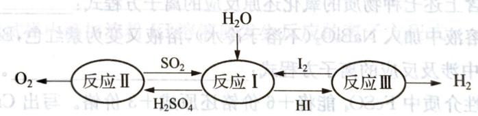  
第3题图1

## 反应Ⅰ的离子方程式为

3-2 利用硫酸渣(主要含 $\mathrm{Fe_2O_3}$ 、FeO,杂质为 $\mathrm{Al_2O_3}$ 和 $\mathrm{SiO_2}$ 等)生产铁基颜料铁黄(FeOOH)的制备流程如下：

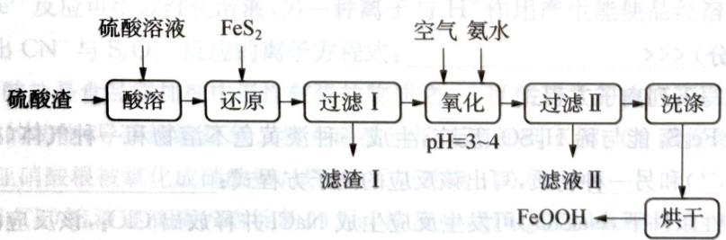  
第3题图2

$Fe^{3+}$ 被 $FeS_{2}$ 还原的离子方程式为 \_\_\_\_，“氧化”中，生成 FeOOH 的离子方程式为 \_\_\_\_。

3-3 二氧化氯 $\left(\mathrm{ClO}_{2}\right)$ 是一种高效、广谱、安全的杀菌、消毒剂。氯化钠电解法是一种可靠的工业生产 $\mathrm{ClO}_{2}$ 的方法。该法工艺原理示意图如图所示。其过程是将食盐水在特定条件下电解得到的氯酸钠 $\left(\mathrm{NaClO}_{3}\right)$ 与盐酸反应生成 $\mathrm{ClO}_{2}$ 。发生器中生成 $\mathrm{ClO}_{2}$ 的离子方程式为

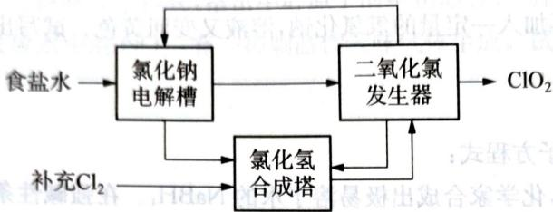  
第3题图3

## (10 分) >>>

按要求完成下列方程式。

4-1 $\mathrm{ZnSO_{4}}$ 溶液中含有少量 $\mathrm{Fe}^{2+}$ 和 $\mathrm{Mn}^{2+}$ ，为了除去这两种离子，调节溶液 pH 为 5，然后加入高锰酸钾溶液，使之生成沉淀。已知高锰酸钾的还原产物是 $\mathrm{MnO_{2}}$ 。请写出该过程中两反应的离子方程式：

4-2 已知将浓盐酸滴入酸性 $\mathrm{KMnO}_{4}(\mathrm{aq})$ 中, 产生黄绿色气体, 而溶液的紫红色褪去。在一氧化还原反应的体系中, 共有 $\mathrm{KCl}$ 、 $\mathrm{Cl}_{2}$ 、浓硫酸、 $\mathrm{H}_{2} \mathrm{O}$ 、 $\mathrm{KMnO}_{4}$ 、 $\mathrm{MnSO}_{4}$ 、 $\mathrm{K}_{2} \mathrm{SO}_{4}$ 七种物质。

(1) 写出一个包含上述七种物质的氧化还原反应的离子方程式: \_\_\_\_。

(2) 在反应后的溶液中加入 $\mathrm{NaBiO}_{3}$ (不溶于冷水), 溶液又变为紫红色, $\mathrm{BiO}_{3-}$ 反应后变为无色的 $\mathrm{Bi}^{3+}$ 。写出该实验中涉及反应的离子方程式:

4-3 已知在酸性介质中 $\mathrm{FeSO_4}$ 能将 $+6$ 价铬还原成 $+3$ 价铬。写出 $\mathrm{Cr_2O_7^{2 - }}$ 与 $\mathrm{FeSO_4}$ 溶液在酸性条件下反应的离子方程式：

4-4 用 NaClO—NaOH 溶液氧化 $\mathrm{AgNO}_{3}$ , 制得高纯度的纳米级 $\mathrm{Ag}_{2} \mathrm{O}_{2}$ 。写出该反应的离子方程式: \_\_\_\_。

4-5 温度高于 $200^{\circ} \mathrm{C}$ 时, 硝酸铝完全分解成氧化铝和两种气体 (其体积比为 $4:1$ ), 该反应的化学方程式为 \_\_\_\_。

## (10 分) <<<

根据要求书写下列离子方程式。

5-1 已知 $Fe_{3}S_{4}$ 能与稀 $H_{2}SO_{4}$ 反应,生成一种淡黄色不溶物和一种气体(标准状况下的密度为 $1.518\ g \cdot L^{-1}$ ) 和另一种物质,写出该反应的离子方程式:

5-2 在酸性条件下, $\mathrm{NaClO}_{2}$ 可发生反应生成 $\mathrm{NaCl}$ 并释放出 $\mathrm{ClO}_{2}$ , 该反应的离子方程式为 \_\_\_\_。

5-3 铁的一种含氧酸根 $\mathrm{FeO}_4^{2-}$ 具有强氧化性,在其钠盐溶液中加入稀硫酸,溶液变为黄色,并有无色气体产生,该反应的离子方程式是

某地环保部门取一定量某工厂所排废水试样分成甲、乙、丙、丁四份，进行如图所示探究。

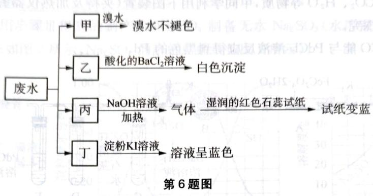

已知废水试样中可能含有下表中的离子：

<table><tr><td></td><td>离子</td></tr><tr><td>阳离子</td><td> $Na^{+}$ 、 $Mg^{2+}$ 、X</td></tr><tr><td>阴离子</td><td> $Cl^{-}$ 、 $SO_{3}^{2-}$ 、Y、 $NO_{3}^{-}$ </td></tr></table>

请回答下列问题：

6-1 X是\_\_\_\_（填化学式，下同），Y是\_\_\_\_。

6-2 表中不能确定是否存在的阴离子是\_\_\_\_，能证明该阴离子是否存在的简单实验操作作为\_\_\_\_。

6-3 写出废水试样中滴加淀粉 KI 溶液所发生反应的离子方程式: \_\_\_\_。

(10 分) <<<

化学方程式是能够很直接形象表示化学反应的过程与特征的一种符号,书写化学方程式是我们必须掌握的一项基本技能。请按照要求完成下列方程式。

7-1 写出泡沫灭火器反应原理的离子方程式：\_\_\_\_。

7-2 NaCN属于剧毒物质,有一种处理方法的原理为 $CN^{-}$ 与 $S_{2}O_{3}^{2-}$ 反应生成两种离子,其中一种离子与 $Fe^{3+}$ 反应可生成红色溶液,另一种离子与 $H^{+}$ 作用产生能使品红溶液褪色的刺激性气味的气体,写出 $CN^{-}$ 与 $S_{2}O_{3}^{2-}$ 反应的离子方程式:\_\_\_\_。

7-3 亚硝酸盐是食品添加剂中毒性较强的物质之一,可使正常的血红蛋白变成正铁血红蛋白而失去携带氧的功能,导致组织缺氧。将亚硝酸钠溶液滴加到 $\mathrm{K}_{2} \mathrm{Cr}_{2} \mathrm{O}_{7}$ 酸性溶液中,溶液由橙色变为绿色,且亚硝酸根被氧化成硝酸根,试写出反应的离子方程式:\_\_\_\_。

7-4 将 NaClO 溶液逐滴滴入含淀粉的 NaI 溶液中, 溶液变蓝, 继续滴加, 溶液颜色先加深, 后逐渐变浅, 最终消失。经检测得知此时溶液中含有一种含正五价元素的含氧酸根。写出上述变化过程中第二个反应的离子方程式: \_\_\_\_。

## 第8题 (10分)>>>

二水合草酸亚铁 $\left(\mathrm{FeC}_{2}\mathrm{O}_{4}\cdot2\mathrm{H}_{2}\mathrm{O}\right)$ 可用作照相显影剂和制药工业。 $FeC_{2}O_{4}\cdot2H_{2}O$ 受热分解时生成FeO、CO、 $CO_{2}$ 、 $H_{2}O$ 等物质，甲同学利用下图装置（夹持及加热仪器省略）在实验室中对其气体产物进行了探究。

已知：常温下CO能与 $\mathrm{PdCl_2}$ 溶液反应得到黑色的 $\mathrm{Pd}$ 。

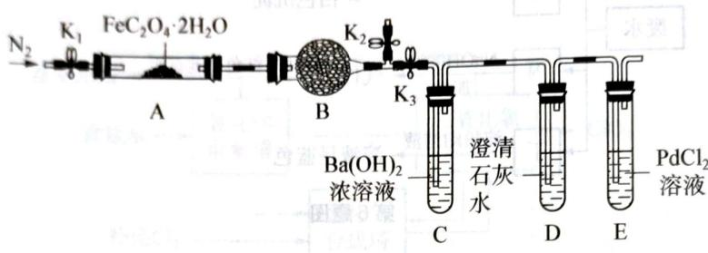

请回答下列问题：

8-1 装置 B 中的试剂为 \_\_\_\_；装置 D 的作用为 \_\_\_\_。写出 C 中的离子方程式 \_\_\_\_。

8-2 实验开始前向装置内通入一段时间 $\mathrm{N}_2$ 的目的是

8-3 实验过程中,装置 E 中除了生成黑色的 Pd 外还有 $CO_{2}$ 生成,对应的离子方程式为 \_\_\_\_。

8-4 反应结束后,需向装置 A 中再次通入 $\mathrm{N}_{2}$ , 目的是将生成的气体产物全部赶入右侧实验装置中, 通入 $\mathrm{N}_{2}$ 的具体实验操作为 \_\_\_\_。

8-5 若实验中所用草酸亚铁晶体的质量为 $36 \mathrm{~g}$ , 装置 C 中产生的白色沉淀的质量为 $41.37 \mathrm{~g}$ , 则装置 A 中发生反应的化学方程式为

8-6 乙同学认为 $\mathrm{FeC}_{2} \mathrm{O}_{4} \cdot 2 \mathrm{H}_{2} \mathrm{O}$ 分解时得到的 $\mathrm{CO}_{2}$ 的量应高于理论值, 他的判断理由为 \_\_\_\_; 请设计实验证明乙同学的观点正确: \_\_\_\_。

(10 分) <<<

以 $Cl_{2}$ 、NaOH、 $(\mathrm{NH}_{2})_{2}\mathrm{CO}$ （尿素）和 $SO_{2}$ 为原料可制备 $N_{2}H_{4} \cdot H_{2}O$ （水合肼）和无水 $Na_{2}SO_{3}$ ，其主要实验流程如下：

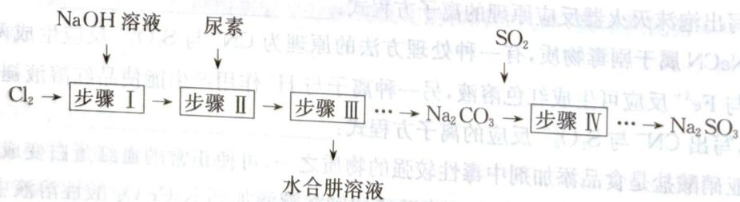

已知: ① $Cl_{2} + 2OH^{-} = ClO^{-} + Cl^{-} + H_{2}O$ 是放热反应。
② $N_{2}H_{4} \cdot H_{2}O$ 沸点约 $118^{\circ}C$ ，具有强

$$
1 1 8 ^ {\circ} \mathrm{C}
$$

$$
\mathrm{NaClO}
$$

9-1 步骤 I 制备 NaClO 溶液时, 若温度超过 $40^{\circ} \mathrm{C}, \mathrm{Cl}_{2}$ 与 $\mathrm{NaOH}$ 溶液反应生成 $\mathrm{NaClO}_{3}$ 和 $\mathrm{NaCl}$ , 其离子方程式为 \_\_\_\_; 实验中控制温度除用冰水浴外, 还需采取的措施是 \_\_\_\_。

9-2 步骤Ⅱ合成 $\mathrm{N}_2\mathrm{H}_4\cdot \mathrm{H}_2\mathrm{O}$ 的装置如图1所示。NaClO碱性溶液与尿素水溶液在 $40^{\circ}\mathrm{C}$ 以下反应一段时间后，再迅速升温至 $110^{\circ}\mathrm{C}$ 继续反应。实验中通过滴液漏斗滴加的溶液是\_\_\_\_；使用冷凝管的目的是\_\_\_\_。

9-3 步骤Ⅳ用步骤Ⅲ得到的副产品 $Na_{2}CO_{3}$ 制备无水 $Na_{2}SO_{3}$ （水溶液中 $H_{2}SO_{3}$ 、 $HSO_{3}^{-}$ 、 $SO_{3}^{2-}$ 随 pH 的分布如图 2 所示， $Na_{2}SO_{3}$ 的溶解度曲线如图 3 所示）。

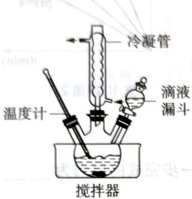  
图1

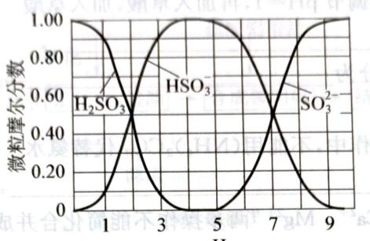  
图2  
第9题图

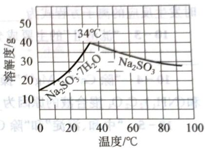  
图3

① 边搅拌边向 $Na_{2}CO_{3}$ 溶液中通入 $SO_{2}$ 制备 $NaHSO_{3}$ 溶液。

实验中确定何时停止通 $SO_{2}$ 的实验操作为 \_\_\_\_。

② 请补充完整由 $NaHSO_{3}$ 溶液制备无水 $Na_{2}SO_{3}$ 的实验方案：\_\_\_\_，用少量无水乙醇洗涤，干燥，密封包装。

## 第10题 (10分)>>>

碳酸锶主要用于制造彩电阴极射线管、电磁铁、锶铁氧体、烟火、荧光玻璃和信号弹等，是重要的化工基础原料，由工业级硝酸锶(含有 $Ba^{2+}$ 、 $Ca^{2+}$ 、 $Mg^{2+}$ 等杂质)制备分析纯碳酸锶的工艺流程如下：

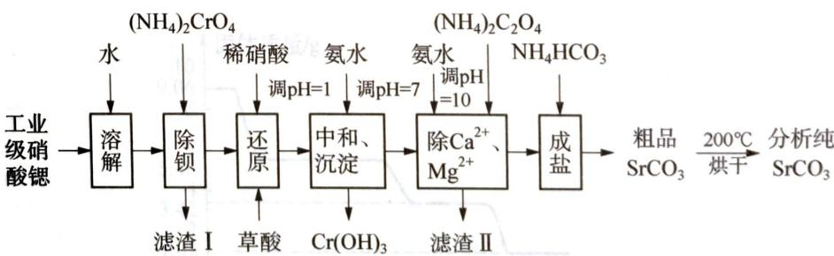  
第10题图1  
已知：

① $BaCrO_{4}$ 不溶于水，在水溶液中 $Cr_{2}O_{7}^{2-}$ 与 $Ba^{2+}$ 不能结合。  
② 常温下,各物质的溶度积常数如下表所示:

<table><tr><td>化合物</td><td> $\mathrm{{Ca}}{\left( \mathrm{{OH}}\right) }_{2}$ </td><td> ${\mathrm{{CaC}}}_{2}{\mathrm{O}}_{4}$ </td><td> $\mathrm{{Mg}}{\left( \mathrm{{OH}}\right) }_{2}$ </td><td> ${\mathrm{{MgC}}}_{2}{\mathrm{O}}_{4}$ </td></tr><tr><td> ${K}_{sp}$ </td><td> ${5.0} \times {10}^{-6}$ </td><td> ${2.2} \times {10}^{-9}$ </td><td> ${5.6} \times {10}^{-{12}}$ </td><td> ${4.8} \times {10}^{-6}$ </td></tr></table>

③ $\mathrm{Cr(OH)}_{3}$ 是两性氢氧化物。

④ $Cr_{2}O_{4}^{2-}$ 与 $Cr_{2}O_{7}^{2-}$ 在溶液中可相互转化。

10-1 “除钡”过程中 $CrO_{4}^{2-}$ 在不同 pH 时的利用率随时间变化曲线如下图所示，根据图象分析“除钡”过程中需要调节 pH=7.5 的原因为 \_\_\_\_。

10-2 “还原”过程中,应先调节 pH=1,再加入草酸,加入草酸时发生反应的离子方程式为 \_\_\_\_。

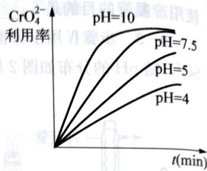

10-3 “滤渣Ⅱ”的主要成分为\_\_\_\_。

第10题图2

10-4 “除 $\mathrm{Ca^{2+}}$ 、 $\mathrm{Mg^{2+}}$ ”操作中，不能用 $(\mathrm{NH}_4)_2\mathrm{CO}_3$ 代替氨水和 $(\mathrm{NH}_4)_2\mathrm{C}_2\mathrm{O}_4$ 混合液的原因为

10-5 “中和、沉淀”和“除 $\mathrm{Ca}^{2+}$ 、 $\mathrm{Mg}^{2+}$ ”两步操作不能简化合并成一步完成的原因为\_\_\_\_。

10-6 “除 $\mathrm{Ca}^{2+}$ 、 $\mathrm{Mg}^{2+}$ ”后得到的滤液中除含有 $\mathrm{Sr(NO_3)_2}$ 外还含有过量的 $\mathrm{NH_3} \cdot \mathrm{H_2O}$ ，则“成盐”过程中发生反应的离子方程式为 \_\_\_\_。

10-7 “粗品 $\mathrm{SrCO_3}$ ”烘干过程中除去的主要杂质为

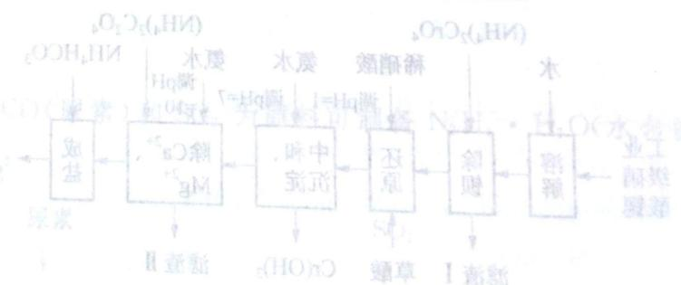

② $Cl_{2} + 2OH$ 中溶解水，水平溶解不 $O_{2}HCl$ ③ $N_{2}H_{4}O_{3}$ 棒点的118℃，具有硬度要求。

，

<table><tr><td> $2O_{3}$ 溶液</td><td>Na2(HCO3)4</td><td>温度(50°C)</td><td>与(NHCO3)2</td></tr><tr><td>NaCl,共前×8/4程式为</td><td> $^{11}$ 0.1×0.2</td><td> $^{11}$ 0.1×8.8</td><td>和后,共前×0.2</td></tr></table>

## 能力测试B卷

(10 分) <<<

某研究小组利用某酸性腐蚀废液（含 $Fe^{3+}$ 、 $Cu^{2+}$ 、 $NH_{4}^{+}$ 、 $SO_{4}^{2-}$ ），制取铵明矾 $\left[\mathrm{NH}_{4}\mathrm{Al}\left(\mathrm{SO}_{4}\right)_{2}\cdot12\mathrm{H}_{2}\mathrm{O}\right]$ 的流程如下：

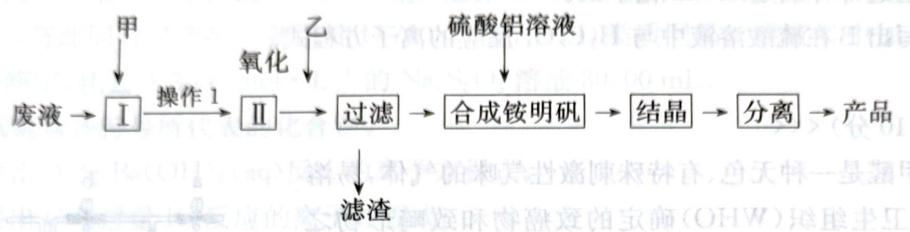  
第1题图1

<table><tr><td>物质</td><td> $Cu(OH)_2$ </td><td> $Fe(OH)_2$ </td><td> $Fe(OH)_3$ </td></tr><tr><td>开始沉淀pH</td><td>6.0</td><td>7.5</td><td>1.4</td></tr><tr><td>沉淀完全pH</td><td>13</td><td>14</td><td>3.7</td></tr></table>

回答下列问题：

1-1 加入物质甲的目的是\_\_\_\_，操作1用到的玻璃仪器有\_\_\_\_。

1-2 第Ⅱ步中用双氧水作为氧化剂,请写出反应离子方程式\_\_\_\_。

1-3 加入物质乙的目的是调节 $\mathrm{pH}$ , 调节后溶液的 $\mathrm{pH}$ 最小值是 \_\_\_\_。

1-4 工业上将流程中产生的滤渣用 NaClO 碱性溶液氧化可生成一种高效净水剂 $\left(\mathrm{Na}_{2}\mathrm{FeO}_{4}\right)$ ，写出反应的离子方程式：\_\_\_\_。

1-5 固体铵明矾加热过程中,固体质量随温度的变化如图所示。

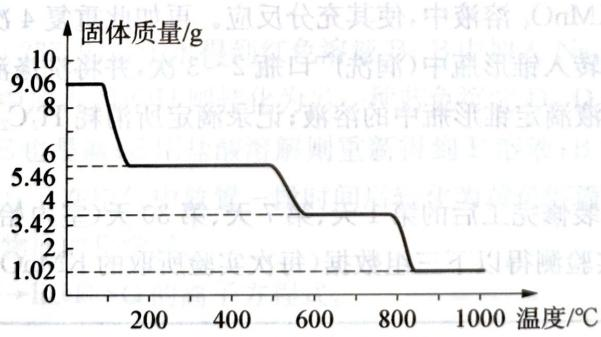  
第1题图2

①铵明矾溶于水配成溶液,加入过量 NaOH 溶液充分混合、加热,发生反应的离子方程式为\_\_\_\_。

② 若将铵明矾加热灼烧, $400^{\circ} \mathrm{C}$ 时剩余固体成分的化学式为\_\_\_\_。在温度从 $800^{\circ} \mathrm{C}$ 到 $950^{\circ} \mathrm{C}$ 过程中得到两种氧化物,一种为固体,一种为氧化性气体,该气体的名称是\_\_\_\_

第2题 (10分) >>>
化合物A为非放射性主族元素M与氧元素的化合物,将13.712g A与过量热稀硝酸充分反应后,得到不溶物B和溶液C。洗净后的B与过量 $H_{2}C_{2}O_{4}$ 混合,加入过量稀 $H_{2}SO_{4}$ 充分反应,生成气体全部通入过量的石灰水中,得到4.004g沉淀。控制温度,M的单质与氧气反应,生成具有较强氧化性的D,D中氧元素质量分数为10.38%。

2-1 通过计算确定 A\~D 化学式。

2-2 写出 B 在硫酸溶液中与 $H_{2}C_{2}O_{4}$ 反应的离子方程式。

## (10分)

常温下甲醛是一种无色、有特殊刺激性气味的气体，易溶于水，是世界卫生组织（WHO）确定的致癌物和致畸形物之一。我国规定：居室空气中甲醛的最高容许浓度为 $0.08\ mg\cdot m^{-3}$ 。某研究性学习小组设计用如下方法测定某居室空气中甲醛的含量（假设空气中无其他还原性气体）：

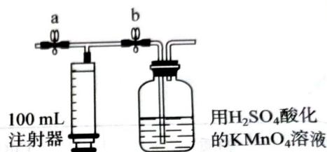

(1) 测定原理: $KMnO_{4}(H^{+})$ 溶液为强氧化剂, 可氧化甲醛和草酸。

第3题图

(2) 测定装置：

部分装置如图所示(a、b为止水夹)。

(3) 实验步骤：

① 检查装置气密性(气密性良好)。

② 准确移取 $25.00 \, mL \, 1.00 \times 10^{-3} \, mol \cdot L^{-1}$ 的 $KMnO_{4}$ 溶液（过量）于广口瓶中并滴入 3 滴 $6 \, mol \cdot L^{-1} \, H_{2}SO_{4}$ 溶液备用。

③ 将 $2.00 \times 10^{-3} \, mol \cdot L^{-1}$ 的 $H_{2}C_{2}O_{4}$ 标准溶液置于酸式滴定管中备用。

④ 打开 a, 关闭 b, 用注射器抽取 100 mL 新装修的室内空气。关闭 a, 打开 b, 再缓缓推动注射器, 将气体全部推入酸性 $KMnO_{4}$ 溶液中, 使其充分反应。再如此重复 4 次 (共 5 次)。

⑤ 将广口瓶中的溶液转入锥形瓶中(润洗广口瓶 2\~3 次,并将洗涤液全部转入锥形瓶)。

⑥ 用标准 ${\mathrm{H}}_{2}{\mathrm{C}}_{2}{\mathrm{O}}_{4}$ 溶液滴定锥形瓶中的溶液；记录滴定所消耗 ${\mathrm{H}}_{2}{\mathrm{C}}_{2}{\mathrm{O}}_{4}$ 溶液体积

⑦ 再重复实验 2 次。

$$
\mathrm{H} _ {2} \mathrm{C} _ {2} \mathrm{O} _ {4}
$$

(4) 数据处理: 分别于装修完工后的第 1 天、第 7 天、第 30 天 (室内始终保持通风换气状况) 对室内空气进行取样, 通过实验测得以下三组数据 (每次实验所取的 $\mathrm{KMnO}_{4}$ 溶液均为 $25.00 \mathrm{~mL}$ ):

<table><tr><td rowspan="2">装修后 第n天</td><td colspan="4"> $H_2C_2O_4$ 溶液(mL)</td><td rowspan="2">甲醛的浓度 mg·m-3</td></tr><tr><td>1</td><td>2</td><td>3</td><td>平均值</td></tr><tr><td>1</td><td>15.86</td><td>15.72</td><td>15.67</td><td>15.75</td><td></td></tr><tr><td>7</td><td>26.17</td><td>26.36</td><td>26.38</td><td>26.27</td><td></td></tr><tr><td>30</td><td>30.90</td><td>30.67</td><td>30.81</td><td>30.79</td><td></td></tr></table>

3-1 分别写出 $\mathrm{KMnO}_{4}$ 氧化甲醛和草酸的化学反应离子方程式。 3-2 步骤④如果压送气体时速度过快,可能会产生什么不利后果? 化学竞赛能力测试一高中第一分吧

步骤⑤如果没有润洗广口瓶,对所测甲醛的含量将产生什么影响?

3-3 计算第 30 天室内空气中甲醛浓度, 并判断此时业主能否入住?

## 第4题 (10分)>>>

称取液体 A 464.7 mg，使之溶于水中，溶液具有明显的酸性。需要 6.000 mmol 的 $\mathrm{Ba(OH)}_{2}$ 才能中和它，同时溶液中产生沉淀 B 760.0 mg。过滤出沉淀并洗涤后用稀 $H_{2}SO_{4}$ 处理，沉淀 B 转化为一溶液 C，与此同时又产生一新沉淀 D 700.2 mg，B、D 类质同晶。溶液 C 中加入过量的 KI 后、用 $S_{2}O_{3}^{2-}$ 滴定，耗去 $0.3000\ mol\cdot L^{-1}$ 的 $Na_{2}S_{2}O_{3}$ 溶液 30.00 mL。

4-1 试确认各符号所代表的化合物。

4-2 写出 A 与 $\mathrm{Ba(OH)_{2}(aq)}$ 反应的离子方程式。

4-3 写出 C 与过量 KI 反应的离子方程式。

4-4 A的蒸气可以用中性亚硫酸钠溶液吸收，写出离子反应方程式。

## 第5题 (10分) <<<

甲硅烷是一种无色气体,遇到空气能发生爆炸性自燃,易分解,可用于制备高纯度硅。

5-1 写出甲硅烷自燃反应方程式。

5-2 甲硅烷可与 $\mathrm{AgNO}_3$ (aq) 反应, 有沉淀生成, 但无气体释放, 写出离子反应方程式。

5-3 甲硅烷可以在溶液中使(酸性) $KMnO_{4}(aq)$ 褪色(无气体释放),写出离子反应方程式。

5-4 以 $\mathrm{SiO}_2$ 为硅源，在非水溶剂（液氨、乙醚）中制取 $\mathrm{SiH}_4$ ，其他反应物有 $\mathrm{Li}[\mathrm{AlH}_4]$ 、 $\mathrm{NH_4Br}$ 及其他常见无机物。现用两种方法进行制备，写出分步反应方程式。

5-5 提出由粗硅制得纯硅的一种物理方法和一种化学方法。

5-6 $\mathrm{SiH_4}$ 为原料也可以用来制备 $\mathrm{Si}_3\mathrm{N}_4$ 纳米材料，该制备方法中最可能存在的杂质是什么？请解释该结论。

## 第6题 (10分)>>>

红色晶体 A 的式量为 237.9, 溶于水得到红色溶液 B; B 中加入 $\mathrm{Na}_{2} \mathrm{CO}_{3}$ 溶液得到紫红色沉淀 C, C 的式量为 211.9; C 中加入 NaOH 则转化为另一种蓝色沉淀 D, D 是一种碱; D 中加入 $\mathrm{H}_{2} \mathrm{O}_{2}$ 则转化为棕褐色沉淀 E, E 也是碱; E 用盐酸溶解则重新得到 B 溶液; B 中加入浓氨水得到黄红色溶液 F, F 的式量为 232.0; F 在空气中放置一段时间后转化为黄色溶液 G, G 的式量为 268.5。

6-1 写出 A\~G 各物质的化学式。

6-2 写出 $\mathrm{B} \rightarrow \mathrm{C}$ 、 $\mathrm{E} \rightarrow \mathrm{B}$ 、 $\mathrm{F} \rightarrow \mathrm{G}$ 的离子方程式。

## (10 分) <<<

有两种常见黑色氧化物 A、B 组成的混合物，取 2.875 g 溶于足量 $KI-H_{2}SO_{4}$ 的溶液中，充分反应后过滤。滤饼经干燥后为白色晶体 C，质量为 3.809 g；所得滤液用 $2\ mol\cdot L^{-1}$ 的 $Na_{2}S_{2}O_{3}$ 溶液进行滴定，消耗 25.00 mL；若所得滤液中加入足量 NaOH，则得到白色沉淀 D，D 可被 $H_{2}O_{2}$ 氧化干燥后得到 B。

7-1 通过计算和推理,确定 A、B、C、D 的化学式。

7-2 写出 A、B 分别与 $\mathrm{KI}-\mathrm{H}_{2}\mathrm{SO}_{4}$ 溶液反应的离子方程式。

7-3 确定混合物样品中A、B物质的量。

## 第8题 (10分)>>>

以 $\mathrm{Ba(OH)}_{2} \cdot 8\mathrm{H}_{2}\mathrm{O}$ 和无水 $TiO_{2}$ 粉为反应物，在 $300^{\circ}C$ 时连续反应 8 h 得到 $BaTiO_{3}$ 晶体。该晶体具有显著的压电性能，用于超声波发生装置中。该晶体中每个 $Ba^{2+}$ 离子被 12 个 $O^{2-}$ 离子包围，形成立方八面体； $BaO_{12}$ 十二面体在晶体中的趋向相同，根据配位多面体生长习性法则的特例，晶体的理论习性与 $BaO_{12}$ 多面体的形状相同。由于 $BaO_{12}$ 多面体的形状为立方八面体，因此该晶体的生长习性为立方八面体。

8-1 $\mathrm{BaTiO_3}$ 晶体的晶胞如图所示。该晶体中 $\mathrm{Ba}$ 、 $\mathrm{O}$ 联合组成哪种类型的堆积形式(图1); Ti 的 O 配位数和 O 的 Ba 配位数分别是多少(图2)?

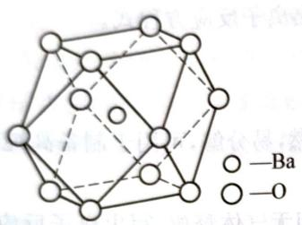  
第8题图1

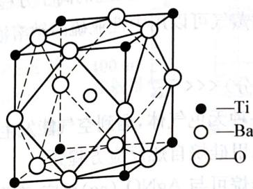  
第8题图2

8-2 我们在研究该晶体时,溶液中存在的生长基元为 2 种阴离子,其 O 配位数与晶体中相同。请写出这 2 种生长基元和形成生长基元的离子反应方程式。

8-3 图3所示 $\mathrm{CeO_2}$ 结构， $\mathrm{O}^{2-}$ 离子位于各小立方体的角顶，而 $\mathrm{Ce}^{4+}$ 离子位于小立方体的中心。判断 $\mathrm{CeO_2}$ 晶体的生长习性，说明判断理由。

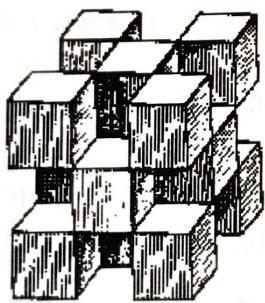  
第8题图3

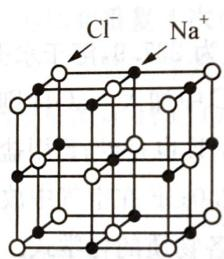  
第8题图4

8-4 判断 NaCl 晶体(图 4)的生长习性,画出 NaCl 晶胞中体现其生长习性的单元。

(10分) <<<

某元素与氧元素形成的化合物 X, 具有强氧化性。一定条件下取 0.2640 g X, 与足量 $KI-H_{2}SO_{4}$ 溶液反应, 所得溶液需要被 0.488 mol·L $^{-1}$ 的 $Na_{2}S_{2}O_{3}$ 溶液 28.68 mL 完全滴定到终点。

9-1 通过计算和讨论,确定 X 的化学式。

9-2 写出 $X$ 的结构式。

9-3 写出X与KI反应的离子方程式。

9-4 写出制备 X 的离子反应方程式。

## 第10题 (10分)>>>

称取 $25.2 \, g \, Na_{2}SO_{3} \cdot 7H_{2}O$ 溶于 $200 \, mL$ 蒸馏水中，加入 $3.2 \, g \, Se$ 粉，在 $90^{\circ}C$ 下回流 $24 \, h$ ，过滤得澄清溶液 A；将 $2.0 \, g \, NaOH$ 溶于 $30 \, mL$ 蒸馏水中，加入 $0.45 \, g \, SnCl_{2} \cdot 2H_{2}O$ ，然后将 $10 \, mL \, 1.0 \, mol \cdot L^{-1}$ 柠檬酸钠（TSC）加入此碱性溶液中，迅速搅拌，缓慢地加入 $10 \, mL \, 0.2 \, mol \cdot L^{-1} \, Na_{2}SeSO_{3}$ 溶液，生成黑色沉淀 B。经处理得到的 B 是一种棒状纳米材料，有广泛用途。

10-1 写出A的名称与B的化学式。

10-2 写出合成B的全部反应方程式(有离子反应的写离子反应方程式)。

10-3 溶液中 $\mathrm{OH}^{-}$ 的浓度对产物的纯度有重要影响。请写出浓度过低或过高时可能发生反应的离子方程式。

10-4 预测加入柠檬酸钠对得到棒状纳米材料B有什么影响？

10-5 SnSe属于正交晶系, 晶胞参数 $a = 1.13 \mathrm{~nm}, b = 0.42 \mathrm{~nm}, c = 0.44 \mathrm{~nm}, Z = 3$ , 计算其密度。

②若用该燃料电池在电极中，由右臂作电极分解成 $H_{2}O$ ， $H_{2}S + (a)_{2}O$ ， $H_{2}S = (b)_{2}O$ ， $H_{2}S + (a)_{2}H_{2}O$ 。它中的交流(g)， $H_{2}O$ 为100m³，100℃的硫酸钙溶液，当同线或聚丙的气体体积相等时，理论上消耗的甲烷的体积为 \_\_\_\_。

裂积县崩排的中产大合卵外岸的质小解，用边要重管官中岳主，气主业办工亦调合外其义属
(10分) >> 。一云容内要重卵电果

## <<<(台01)

$$
\frac {(\mathrm{CO}) ^ {8} \cdot (\mathrm{CH}) ^ {5}}{(\mathrm{OH}) ^ {8} \cdot (\mathrm{O}) ^ {5}}
$$

## 化学反应中的能量变化

# 能力测试 A 卷

## 第1题 (10分)

为了合理利用化学能、确保安全生产，化工设计需要充分考虑化学反应的焓变，并采取相应措施。化学反应的焓变通常用实验进行测定，也可进行理论推算。

1-1 实验测得 5 g 甲醇在氧气中充分燃烧生成二氧化碳气体和液态水时释放出 113.5 kJ 的热量，试写出甲醇燃烧的热化学方程式：\_\_\_\_。

3-2 由气态基态原子形成 $1 \mathrm{~mol}$ 化学键释放的最低能量叫键能。从化学键的角度分析, 化学反应的过程就是反应物的化学键被破坏和生成物的化学键形成的过程。在化学反应过程中, 拆开化学键需要消耗能量, 形成化学键又会释放能量。

<table><tr><td>化学键</td><td>H—H</td><td>N—H</td><td>N≡N</td></tr><tr><td>键能/(kJ·mol-1)</td><td>436</td><td>391</td><td>945</td></tr></table>

已知反应：

$$
\mathrm{N} _ {2} (\mathrm{g}) + 3 \mathrm{H} _ {2} (\mathrm{g}) \rightleftharpoons 2 \mathrm{NH} _ {3} (\mathrm{g}) \quad \Delta H = a \mathrm{kJ} \cdot \mathrm{mol} ^ {- 1}
$$

试根据表中所列键能数据估算 a 的值为 \_\_\_\_。

1-3 依据盖斯定律可以对某些难以通过实验直接测定的化学反应的焓变进行推算。已知： $\mathrm{C(s,石墨)} + \mathrm{O}_2(\mathrm{g}) = \mathrm{CO}_2(\mathrm{g})$ $\Delta H_{1} = -393.5\mathrm{kJ}\cdot \mathrm{mol}^{-1}$

$$
2 \mathrm{H} _ {2} (\mathrm{g}) + \mathrm{O} _ {2} (\mathrm{g}) = 2 \mathrm{H} _ {2} \mathrm{O} (\mathrm{l}) \quad \Delta H _ {2} = - 5 7 1. 6 \mathrm{kJ} \cdot \mathrm{mol} ^ {- 1}
$$

$$
2 \mathrm{C} _ {2} \mathrm{H} _ {2} (\mathrm{g}) + 5 \mathrm{O} _ {2} (\mathrm{g}) = 4 \mathrm{CO} _ {2} (\mathrm{g}) + 2 \mathrm{H} _ {2} \mathrm{O} (\mathrm{l}) \quad \Delta H _ {3} = - 2 5 9 9 \mathrm{kJ} \cdot \mathrm{mol} ^ {- 1}
$$

根据盖斯定律, 计算 298 K 时由 C(s, 石墨) 和 $\mathrm{H}_{2}(\mathrm{~g})$ 生成 $1 \, \mathrm{mol} \, \mathrm{C}_{2}\mathrm{H}_{2}(\mathrm{~g})$ 反应的焓变: \_\_\_\_。

## 第2题 (10分)>>>

氮及其化合物在工农业生产、生活中有着重要应用，减少氮的氧化物在大气中的排放是环境保护的重要内容之一。

2-1 已知：

$$
① 2 \mathrm{NO(g)} = \mathrm {N_ {2} (g)+ O_ {2} (g)} \quad \Delta H = - 1 8 0. 5 \mathrm{kJ} \cdot \mathrm{mol} ^ {- 1}
$$

$$
② \mathrm{C(s)} + \mathrm {O_ {2} (g)} = \mathrm {CO_ {2} (g)} \quad \Delta H = - 3 9 3. 5 \mathrm{kJ} \cdot \mathrm{mol} ^ {- 1}
$$

$$
③ 2 C (s) + O _ {2} (g) = 2 C O (g) \quad \Delta H = - 2 2 1 k J \cdot m o l ^ {- 1}
$$

某反应的平衡常数表达式为 $K = \frac{c(\mathrm{N}_2) \cdot c^2(\mathrm{CO}_2)}{c^2(\mathrm{CO}) \cdot c^2(\mathrm{NO})}$ ，写出此反应的热化学方程式：

2-2 已知: 在 $25^{\circ}$ C、101 kPa 时

$$
① \mathrm{N} _ {2} (\mathrm{g}) + 3 \mathrm{H} _ {2} (\mathrm{g}) = 2 \mathrm{NH} _ {3} (\mathrm{g}) \quad \Delta H = - Q _ {1} \mathrm{kJ} \cdot \mathrm{mol} ^ {- 1}
$$

② $2\mathrm{H}_{2}(\mathrm{g}) + \mathrm{O}_{2}(\mathrm{g}) = 2\mathrm{H}_{2}\mathrm{O}(\mathrm{l})$ $\Delta H = -Q_{2}\mathrm{kJ}\cdot \mathrm{mol}^{-1}$

③ $\mathrm{N}_2(\mathrm{g}) + \mathrm{O}_2(\mathrm{g}) = 2\mathrm{NO}(\mathrm{g})$ $\Delta H = +Q_{3}\mathrm{kJ}\cdot \mathrm{mol}^{-1}$

写出用 $NH_{3}$ 脱除 NO 的热化学方程式：\_\_\_\_。

2-3 传统工业上利用氨气合成尿素。以 $\mathrm{CO}_{2}$ 与 $\mathrm{NH}_{3}$ 为原料合成尿素的主要反应如下：

$$
2 \mathrm{NH} _ {3} (\mathrm{g}) + \mathrm{CO} _ {2} (\mathrm{g}) = \mathrm{NH} _ {2} \mathrm{CO} _ {2} \mathrm{NH} _ {4} (\mathrm{s}) \quad \Delta H = - 1 5 9. 4 7 \mathrm{kJ} \cdot \mathrm{mol} ^ {- 1}
$$

$$
\mathrm{NH} _ {2} \mathrm{CO} _ {2} \mathrm{NH} _ {4} (\mathrm{s}) = \mathrm{CO} (\mathrm{NH} _ {2}) _ {2} (\mathrm{s}) + \mathrm{H} _ {2} \mathrm{O} (\mathrm{g}) \quad \Delta H = + 7 2. 4 9 \mathrm{kJ} \cdot \mathrm{mol} ^ {- 1}
$$

反应 $2\mathrm{NH}_3(\mathrm{g}) + \mathrm{CO}_2(\mathrm{g}) = \mathrm{CO}(\mathrm{NH}_2)_2(\mathrm{s}) + \mathrm{H}_2\mathrm{O}(\mathrm{g})$ 的 $\Delta H = \underline{\hspace{1cm}}\mathrm{kJ}\cdot \mathrm{mol}^{-1}$

## 第3题 (10分) <<<

天然气既是重要的燃料,又是重要的化工原料。

3-1 已知甲烷的燃烧热为 $890.3 \, kJ \cdot mol^{-1}$ ，则甲烷燃烧的热化学方程式为 \_\_\_\_。

3-2 以甲烷为原料制取氢气是工业上常用的制氢气的方法。

已知： $\mathrm{CH}_{4}(\mathrm{~g})+\mathrm{H}_{2}\mathrm{O}(\mathrm{g})=\mathrm{CO}(\mathrm{g})+3\mathrm{H}_{2}(\mathrm{g})$ $\Delta H=+206.2\ kJ\cdot mol^{-1}$

$$
\mathrm{CH} _ {4} (\mathrm{g}) + \mathrm{CO} _ {2} (\mathrm{g}) = 2 \mathrm{CO} (\mathrm{g}) + 2 \mathrm{H} _ {2} (\mathrm{g}) \quad \Delta H = + 2 4 7. 4 \mathrm{kJ} \cdot \mathrm{mol} ^ {- 1}
$$

由甲烷制氢气的一个缺点是\_\_\_\_。

3-3 甲烷与水蒸气发生反应: $\mathrm{CH}_{4}(\mathrm{~g}) + \mathrm{H}_{2} \mathrm{O}(\mathrm{g}) = \mathrm{CO}(\mathrm{g}) + 3 \mathrm{H}_{2}(\mathrm{~g})$ , 被氧化的元素是 \_\_\_\_ , 当生成标准状况下 $8.96 \mathrm{LCO}$ 时转移电子的物质的量是 \_\_\_\_ 。

3-4 以甲烷为燃料的新型电池,其成本大大低于以氢气为燃料的传统燃料电池。如图是目前研究较多的一类固体氧化物燃料电池工作原理示意图。

① B极为电池\_\_\_\_极,电极反应式为\_\_\_\_。

② 若用该燃料电池作电源,用石墨作电极电解 $100\ mL\ 1\ mol\cdot L^{-1}$ 的硫酸铜溶液,当两极收集到的气体体积相等时,理论上消耗的甲烷的体积为\_\_\_\_(标准状况下),实际上消耗的甲烷体积(折算到标准状况)比理论上的大,可能的原因为\_\_\_\_

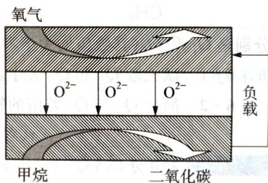  
第3题图

## 第4题 (10分)>>>

充电宝基本都由聚合物锂电池作为储电单元,它本身就是一个聚合物锂电池的储电装置,通过 IC 芯片进行电压的调控,再通过连接电源线充电或储电后将贮存的电量释放出来。

已知:①甲品牌充电宝属于锂钒氧化物凝胶电池,其电池总反应为 $V_{2}O_{5} + xLi \xlongequal{放电} Li_{x}V_{2}O_{5}$ 。

② 乙品牌充电宝工作原理如图所示,该电池的总反应式为 $Li_{1-x}MnO_{2} + Li_{x}C_{6}\xlongequal{放电}LiMnO_{2} + C_{6}(Li_{x}C_{6}$ 表示锂原子嵌入石墨

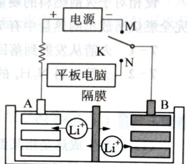  
乙品牌充电宝工作原理  
第4题图

形成的复合材料）。

请回答下列问题：

4-1 甲品牌充电宝放电时，正极的电极反应式为 \_\_\_\_ ，Li+由
4-2 图中K与N相接时，负极的电极反应式为 \_\_\_\_ ，Li+由
区迁移到 \_\_\_\_ 区。（填写“A”或“B”）

4-3 图中 K 与 M 相接时，阳极的电极反应式为 \_\_\_\_。
4-4 若用乙品牌充电宝给手机充电，该手机电池容量为 3200 mA，2 小时能将电池充满，则理论上消耗金属 Li 的质量为 \_\_\_\_ g。（已知：1 C 电量约为 $1.0 \times 10^{-6}$ mol 电子的电量）

称取 $16 \, g \, CuSO_{4}$ ( $160 \, g \cdot mol^{-1}$ )、 $25 \, g \, CuSO_{4} \cdot 5H_{2}O$ ( $250 \, g \cdot mol^{-1}$ ) 各一份，分别溶于相同量水时，一种是溶解吸热，另一种是溶解放热。溶解放热的（溶质）是 \_\_\_\_。若测得放热量和吸热量的差值 Q，由此可以得到的数据是 \_\_\_\_。

## 第6题 (10分)>>>

有机物戊烷 $\left(\mathrm{C}_{5}\mathrm{H}_{12}\right)$ 有3种异构体,其中两种是:正戊烷 $\left(\mathrm{CH}_{3}-\mathrm{CH}_{2}-\mathrm{CH}_{2}-\mathrm{CH}_{2}-\mathrm{CH}_{3}\right)$ 和新戊烷 $\left(\mathrm{H}_{3}\mathrm{C}-\mathrm{C}-\mathrm{CH}_{3}\right)$ 。将等物质的量的正戊烷和新戊烷分别在足量的氧气中燃烧,放出的热量

分别是 $Q_{1}$ 和 $Q_{2}$ (其数值均大于零)。

6-1 试比较 $Q_{1}$ 和 $Q_{2}$ 大小，并说明理由。

6-2 简述 $Q_{1}$ 与 $Q_{2}$ 差值的物理意义。

## (10 分) <<<

质量为 10 kg 的火箭从地面竖直向上发射, 点燃后火箭以 $a = 5 \, m \cdot s^{-2}$ 的加速度匀加速上升, 经过 10 s 时间, 燃料烧完。该火箭所使用的燃料是 $N_{2}H_{4}$ (肼)。氧化剂是 $NO_{2}$ , 其相关的热反应方程式为:

$$
\mathrm{N} _ {2} (\mathbf {g}) + 2 \mathrm{O} _ {2} (\mathbf {g}) = 2 \mathrm{NO} _ {2} (\mathbf {g}) \quad \Delta H = + 6 6. 7 \mathrm{kJ} \cdot \mathrm{mol} ^ {- 1}
$$

$$
\mathrm{N} _ {2} \mathrm{H} _ {4} (\mathrm{g}) + \mathrm{O} _ {2} (\mathrm{g}) = \mathrm{N} _ {2} (\mathrm{g}) + 2 \mathrm{H} _ {2} \mathrm{O} (\mathrm{g}) \quad \Delta H = - 5 3 4 \mathrm{kJ} \cdot \mathrm{mol} ^ {- 1}
$$

设相对于火箭燃料的质量可以忽略,为了简便,空气阻力可以不计,取 $g=10\ m\cdot s^{-2}$ ,并设燃料完全燃烧所放出的热量中有 70% 转化为火箭的机械能。求:

7-1 火箭从发射到落回地面所经历的时间。

7-2 火箭燃料 $N_{2}H_{4}$ 的质量。

## (10分)>>>

(1) 标准生成热是指某温度下, 由处于标准状态的各种元素的最稳定状态的单质生成标准状态下单位物质的量 (1 mol) 某纯物质的热效应。放热用“-”表示, 吸热用“+”表示。已知碳的三种同素异形体为金刚石、石墨和 $\mathrm{C}_{60}$ , 它们的密度分别是 3.514、2.266、 $1.678 \mathrm{~g} \cdot \mathrm{cm}^{-3}$ ; 标准生成热依

次是+1.987、0、 $+2280\ kJ\cdot mol^{-1}$ 。试回答：

① 标准状况下最稳定的碳单质是\_\_\_\_，理由是\_\_\_\_。

②由石墨转化成金刚石的条件是\_\_\_\_温\_\_\_\_压(填“高或低”),理由是\_\_\_\_。

③由石墨转化成 $C_{60}$ 的条件是\_\_\_\_温\_\_\_\_压(填“高或低”),理由是\_\_\_\_。

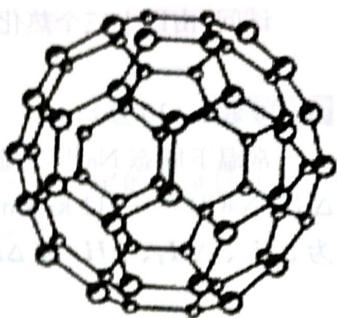

④ 能够溶于有机溶剂的碳单质是\_\_\_\_，理由是\_\_\_\_。

第8题图

⑤ 在死火山口常能发现的碳单质是\_\_\_\_，理由是\_\_\_\_；在星际空间可望发现的碳单质是\_\_\_\_，理由是\_\_\_\_。

(2) 1996 年诺贝尔化学奖授予对发现 $C_{60}$ 有重大贡献的三位科学家。 $C_{60}$ 分子是形如球状的多面体（如图所示），该结构的建立基于以下考虑：

① $C_{60}$ 分子中每个碳原子只跟相邻的 3 个碳原子形成化学键；

② $C_{60}$ 分子只含有五边形和六边形；

③ 多面体的顶点数、面数和棱边数的关系,遵循欧拉定理: 顶点数 + 面数 = 棱边数 + 2。

据上所述,可推知 $C_{60}$ 分子有 12 个五边形和 20 个六边形, $C_{60}$ 分子所含的双键数为 30。请回答下列问题:

① 固体 $C_{60}$ 与金刚石相比较, 熔点较高者应是\_\_\_\_, 理由是\_\_\_\_。

② 试估计 $C_{60}$ 跟 $F_{2}$ 在一定条件下, 能否发生反应生成 $C_{60} F_{60}$ \_\_\_\_ (填“可能”或“不可能”), 并简述其理由: \_\_\_\_。

③ 通过计算,确定 $C_{60}$ 分子所含单键数。 $C_{60}$ 分子所含单键数为 \_\_\_\_。

④ 在 $C_{60}$ 中, 每个碳原子与几个六元环相连? 与几个五元环相连? 每个碳原子周围的 ( $\sigma$ 键) 键角之和为多少度? 平均 $\angle CCC$ 键角为多少度? 计算 $C_{60}$ 中碳原子的杂化态?

⑤ $C_{70}$ 分子也已制得, 它的分子结构模型可以与 $C_{60}$ 同样考虑而推知。通过计算确定 $C_{60}$ 分子中五边形和六边形的数目。 $C_{70}$ 分子中所含五边形数为 \_\_\_\_ , 六边形数共 \_\_\_\_ 。C—C 键数为 \_\_\_\_ ; C=C 键数为 \_\_\_\_ 。

⑥ 近年来,科学家们发现由 100 个碳原子构成一个具有完美对称性的 $C_{100}$ 原子团,其中每个碳原子仍可形成四个化学键。最内部是由 20 个 C 原子构成的正十二面体,外层的 60 个 C 原子形成 12 个分立的正五边形,处于中间层次的将内外层碳原子连接在一起,当它与氢气和氟气形成分子时,其分子式分别是什么?

(10 分) <<<

$NH_{4}NO_{3}$ 热分解及和燃料油 $\left[\text{以}\left(\mathrm{CH}_{2}\right)_{n}\right.$ 表示]反应的方程式及反应热分别为：

$$
\mathrm{NH} _ {4} \mathrm{NO} _ {3} \longrightarrow \mathrm{N} _ {2} \mathrm{O} + 2 \mathrm{H} _ {2} \mathrm{O} + 0. 5 3 \mathrm{kJ} \cdot \mathrm{g} ^ {- 1} \mathrm{NH} _ {4} \mathrm{NO} _ {3} \quad ①
$$

$$
\mathrm{NH} _ {4} \mathrm{NO} _ {3} \longrightarrow \mathrm{N} _ {2} + 1 / 2 \mathrm{O} _ {2} + 2 \mathrm{H} _ {2} \mathrm{O} + 1. 4 7 \mathrm{kJ} \cdot \mathrm{g} ^ {- 1} \mathrm{NH} _ {4} \mathrm{NO} _ {3}
$$

$$
3 n \mathrm{NH} _ {4} \mathrm{NO} _ {3} + (\mathrm{CH} _ {2}) _ {n} \longrightarrow 3 n \mathrm{N} _ {2} + 7 n \mathrm{H} _ {2} \mathrm{O} + n \mathrm{CO} _ {2} + 4. 2 9 n \mathrm{kJ} \cdot \mathrm{g} ^ {- 1} \mathrm{NH} _ {4} \mathrm{NO} _ {3}
$$

试问:由以上三个热化学方程式可得出哪些新的热化学方程式?

## 第10题 (10分)>>>

常温下固态 Na 与气态 Cl₂ 生成 1 mol NaCl 晶体放出的能量叫做 NaCl 的生成热。生成热 $\Delta_{f}H(\mathrm{NaCl}) = -411 \, \mathrm{kJ} \cdot \mathrm{mol}^{-1}$ 。该化合过程也被解析成如下四个步骤，各步的能量变化分别表示为 $\Delta H_{1}$ 、 $\Delta H_{2}$ 、 $\Delta H_{3}$ 和 $\Delta H_{4}$ 。

$$
\begin{array}{c c c} \mathrm {Na(s) + (1 / 2)Cl_ {2}} & \xrightarrow {\Delta_ {\mathrm{f}} H _ {\mathrm{NaCl}}} & \mathrm{NaCl(S)} \\ \Delta H _ {1} \Big \downarrow & & \uparrow \Delta H _ {4} \end{array}
$$

$$
\mathrm{Na(g)} + \mathrm{Cl(g)} \xrightarrow {\Delta H _ {2}} \mathrm{Na} ^ {+} (\mathrm{g}) + \mathrm{Cl} ^ {-} (\mathrm{g}) \xrightarrow {\Delta H _ {3}} \mathrm{NaCl(g)}
$$

其中 $\Delta H_{2}=128\ kJ\cdot mol^{-1}$ ， $\Delta H_{3}=-526\ kJ\cdot mol^{-1}$ ， $\Delta H_{4}=-248\ kJ\cdot mol^{-1}$ 。则 $\Delta H_{1}=$ \_\_\_\_ kJ·mol $^{-1}$ ；NaCl 的离子键键能为 \_\_\_\_ kJ·mol $^{-1}$ ；NaCl 晶体的晶格能（气态的阴阳离子结合成晶体的能量变化）为 \_\_\_\_ kJ·mol $^{-1}$ 。

是由胜，\_\_\_\_是宜普高好点欲，穿出卧石铜金已。①本固①

$^{①}$ 本题是数学性质的，不科学一定。 $^{②}$ 书龄好 $^{③}$ 他的物理意义：由题其张简书，“渝

式χχ单含两千代 ω)。χχ单含两千代 ω) 安廊，莫书长画 ②

① ② ③ ④ ⑤ ⑥ ⑦ ⑧ ⑨ ⑩ ⑪ ⑫ ⑬ ⑭ ⑮ ⑯ ⑰ ⑱ ⑲ ⑳ ㉑ ㉒ ㉓ ㉔ ㉕ ㉖ ㉗ ㉘ ㉙ ㉚ ㉛ ㉜ ㉝ ㉞ ㉟ ㉳ ㉴ ㉵ ㉜ ㉝ ㉞ ㉟ ㉳ ㉟ ㉓ ㉔ ㉕ ㉖ ㉗ ㉘ ㉙ ㉚ ㉛ ㉜ ㉝ ㉞ ㉟ ㉓ ㉔ ㉕ ㉖ ㉗ ㉘ ㉙ ㉚ ㉛ ㉜ ㉝ ㉞ ㉟ ㉓ ㉔ ㉕ ㉖ ㉗ ㉘ ㉙ ㉚ ㉛ ㉜ ㉝ ㉞ ㉟ ㉓ ㉔

# 能力测试 B 卷

液态氧在 54 K 以下可以凝固为固态氧, 固态氧有 $\alpha$ 、 $\beta$ 、 $\gamma$ 三种晶型, 在一定的温度区间内, 三种晶型的蒸汽压方程如下, 请通过计算, 粗略地估计三种晶型的相对稳定性。

$$
\gamma - \mathrm{O} _ {2}: \lg p (\mathrm{Pa}) = \frac {- 4 7 8 . 4}{T} + 1 4. 5 2 4 8 - 2. 0 5 5 \lg T
$$

$$
\beta - \mathrm{O} _ {2}: \lg p (\mathrm{Pa}) = \frac {- 4 5 2 . 2}{T} + 4. 1 8 5 8 - 4. 7 8 \lg T
$$

$$
\alpha - \mathrm{O} _ {2}: \lg p (\mathrm{Pa}) = \frac {- 4 5 4 . 7}{T} + 3. 9 1 8 8 + 5. 0 8 5 \lg T
$$

## 第2题 (10分)>>>

$\mathrm{AgCl}$ 在不同浓度的 $\mathrm{NaCl}$ 溶液中的溶解度如下表：

<table><tr><td>过量NaCl浓度c:×10-2mol·L-1</td><td>0</td><td>0.39</td><td>0.92</td><td>3.6</td><td>8.8</td><td>35</td><td>50</td></tr><tr><td>AgCl溶解度S:×10-6mol·L-1</td><td>13</td><td>0.72</td><td>0.91</td><td>1.9</td><td>3.6</td><td>17</td><td>28</td></tr></table>

2-1 解释上表数据。

2-2 试从热力学的角度解释相似相溶原理。

(10 分) <<<

金属冶炼最常用的方法之一就是热还原法。如金属钴可用 CO 还原其氧化物制得：

$\mathrm{CoO(s) + CO(g)\longrightarrow Co(s) + CO_2(g)}$ 。已知： $\Delta G^0 = -RT\ln K^0$

$$
2 \mathrm{CO} + \mathrm{O} _ {2} \longrightarrow 2 \mathrm{CO} _ {2} \quad \Delta_ {\mathrm{r}} G _ {1} ^ {0} = - 5 6 4. 8 \times 1 0 ^ {3} + 1 7 3. 6 T
$$

$$
2 \mathrm{Co} + \mathrm{O} _ {2} \longrightarrow 2 \mathrm{CoO} \quad \Delta_ {\mathrm{r}} G _ {2} ^ {0} = - 4 5 7. 8 \times 1 0 ^ {3} + 1 4 3. 7 T
$$

3-1 求反应达平衡时气相中 CO 的体积分数与反应温度之间的函数关系。

3-2 在 $1500 \mathrm{~K}$ 时用 $\mathrm{CO} 、 \mathrm{CO}_{2}$ 混合气体还原 $\mathrm{CoO}$ , 问气相中 $\mathrm{CO}$ 的体积分数 $(\mathrm{CO} \%)$ 应至少控制在多大?

3-3 冶金工业中常用如图判断产物的组成及反应控制的温度。若平衡浓度 $\mathrm{CO}\% = \mathrm{CO}_{2}\%$ ，问反应应控制在什么温度范围？

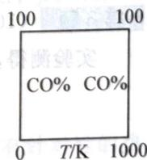  
第3题图

第4题 (10分)>>>

阅读下表：

Enthalpy and entropy factors in the solution process for magnesium chloride and sodium chloride

<table><tr><td>Compound</td><td>Lattice energy $\left( {\mathrm{{kJ}} \cdot {\mathrm{{mol}}}^{-1}}\right)$ </td><td>Hydration enthalpy $\left( {\mathrm{{kJ}} \cdot {\mathrm{{mol}}}^{-1}}\right)$ </td><td>Net enthalpy charge $\left( {\mathrm{{kJ}} \cdot {\mathrm{{mol}}}^{-1}}\right)$ </td><td>Lattice entropy $\left( {\mathrm{J} \cdot {\mathrm{K}}^{-1} \cdot \mathrm{{mol}}}^{-1}\right)$ </td><td>Hydration entropy $\left( {\mathrm{J} \cdot {\mathrm{K}}^{-1} \cdot \mathrm{{mol}}}^{-1}\right)$ </td><td>Net entropy $\left( {\mathrm{J} \cdot {\mathrm{K}}^{-1} \cdot \mathrm{{mol}}}^{-1}\right)$ </td></tr><tr><td> ${\mathrm{{MgCl}}}_{2}$ </td><td>+2526</td><td>-2659</td><td>-133</td><td>+109</td><td>-143</td><td>-34</td></tr><tr><td>NaCl</td><td>+788</td><td>-784</td><td>+4</td><td>+68</td><td>-55</td><td>+13</td></tr></table>

通过计算， $\mathrm{MgCl}_2$ 和 $\mathrm{NaCl}$ 溶解过程的 $\Delta_{\mathrm{f}}G_{m}^{0}$ 分别为 $-99\mathrm{kJ}\cdot \mathrm{mol}^{-1}$ 和 $-11\mathrm{kJ}\cdot \mathrm{mol}^{-1}$ 。从溶解的全过程来看， $\mathrm{MgCl}_2$ 的熵变因素对溶解过程不利，而 $\mathrm{NaCl}$ 的熵变因素对溶解过程有利。解释原因。

(10 分) <<<

反应 1: $\mathrm{Fe(s)+CO_{2}(g)\rightleftharpoons FeO(s)+CO(g)}$ 的平衡常数为 $K_{1}$ ;

反应 2: $\mathrm{Fe(s)+H_{2}O(g)\rightleftharpoons FeO(s)+H_{2}(g)}$ 的平衡常数为 $K_{2}$ ;

反应 3: $\mathrm{CO}_{2}(\mathrm{~g}) + \mathrm{H}_{2}(\mathrm{~g}) \rightleftharpoons \mathrm{CO}(\mathrm{g}) + \mathrm{H}_{2}\mathrm{O}(\mathrm{g})$ 的平衡常数为 $K_{3}$ 。

在不同温度时 $K_{1}$ 、 $K_{2}$ 的值如下表：

<table><tr><td>T/K</td><td>K1</td><td>K2</td></tr><tr><td>973</td><td>1.47</td><td>2.38</td></tr><tr><td>1173</td><td>2.15</td><td>1.67</td></tr></table>

5-1 温度 973 K 时, $K_{3} =$ ; 1173 K 时, $K_{3} =$ 。

5-2 在 $973\mathrm{K}, 4.00 \times 10^{5}\mathrm{Pa}$ 时，向反应容器通入 $5.15\mathrm{m}^{3}\mathrm{H}_{2}$ ，要使 $\mathrm{H}_{2}$ 的转化率达到 $60\%$ 计算至少通入 $\mathrm{CO}_{2}$ 的体积。

5-3 在 $1173\mathrm{K}$ 时，向 $10.0\mathrm{m}^3$ 的容器内通入物质的量比为 $1:1$ 的 $\mathrm{CO}_{2}$ 和 $\mathrm{H}_{2}$ ，一段时间后，反应3达到平衡状态，容器内压强为 $4.00\times 10^{5}\mathrm{Pa}$ ，计算 $\mathrm{H}_{2}$ 的转化率。

(10 分) >>>

实验测得,无水三氯化铝在热力学标准压力下的以下各温度时测定的密度为:

<table><tr><td>T/°C</td><td>200</td><td>600</td><td>800</td></tr><tr><td> $d/g \cdot L^{-1}$ </td><td>6.80</td><td>2.65</td><td>1.51</td></tr></table>

6-1 计算并写出三氯化铝在 $200^{\circ}\mathrm{C}$ 和 $800^{\circ}\mathrm{C}$ 时的分子式。

6-2 计算 $600^{\circ}\mathrm{C}$ 时的各物种的平衡分压。

6-3 计算 $600^{\circ}$ C 时的 $K_{p}$ 。

(10 分) <<<

在讨论溶解现象时，“熵”的变化往往是很重要的。如 $CO_{3}^{2-}$ 离子和 $NO_{3}^{-}$ 离子大小相似，而 $MCO_{3}$ 一般难溶，硝酸盐一般易溶；一些盐如： $CaF_{2}$ 、 $LnPO_{4}$ 难溶， $LnH_{2}PO_{4}$ 易溶。

7-1 由此溶解产生的离子的哪些因素与“熵”变有关？并简述他们与“熵”变的关系。

7-2 由结论或推论解释 $\mathrm{CO}_{3}^{2-}$ 、 $\mathrm{NO}_{3}^{-}$ 形成盐的溶解度不同的问题。

## 第8题 (10分)>>>

下列反应可在适当的温度范围内发生：

$$
\mathrm{C} _ {4} \mathrm{H} _ {1 0} (\mathrm{g}) \longrightarrow (\mathrm{CH} _ {3}) _ {2} \mathrm{C} = \mathrm{CH} _ {2} (\mathrm{g}) + \mathrm{H} _ {2} (\mathrm{g})
$$

$$
\mathrm{C} _ {2} \mathrm{H} _ {4} (\mathrm{g}) + \mathrm{Cl} _ {2} (\mathrm{g}) \longrightarrow \mathrm{ClCH} _ {2} \mathrm{CH} _ {2} \mathrm{Cl(g)}
$$

$$
\mathrm{CH} _ {4} (\mathrm{g}) + 1 / 2 \mathrm{O} _ {2} (\mathrm{g}) \longrightarrow \mathrm{CH} _ {3} \mathrm{OH(g)}
$$

各化合物中键能平均值如下：

<table><tr><td>化学键:</td><td>H—H</td><td>C—H</td><td>C=C</td><td>C—Cl</td><td>O—H</td><td>Cl—Cl</td><td>O—O</td><td>C—C</td></tr><tr><td>键能:(kJ·mol-1)</td><td>436.18</td><td>378.9</td><td>472.69</td><td>293.08</td><td>431.24</td><td>121.02</td><td>247.38</td><td>277.16</td></tr></table>

8-1 估算上述各反应的反应热并说明他们是放热的还是吸热的？

8-2 若反应是可逆的,请说明压力对化学平衡的影响。

## 第9题 (10分) <<<

根据 P. W. Atkins 所著的《物理化学》，Le Chatelier 原理表述为“当有扰动作用于处于平衡态的系统时，系统将会表现出减轻扰动效果的行为。”

假定下列理想气体已经建立了平衡： $3H_{2}+N_{2}\rightleftharpoons2NH_{3}$ 。在400 K时反应物和产物的分压分别是： $p(\mathrm{NH}_{3})=0.376\ \mathrm{bar};\ p(\mathrm{H}_{2})=0.125\ \mathrm{bar};\ p(\mathrm{N}_{2})=0.499\ \mathrm{bar}$ 。

9-1 计算反应的平衡常数 $K_{\mathrm{p}}$ 。

9-2 在给定温度下使系统的总压增加到原压强的 2 倍,通过计算判断平衡受到扰动后,系统表现出哪种减轻扰动效果的行为。

9-3 总压及温度恒定,当平衡受到下列扰动时,通过计算判断系统表现出哪种减轻扰动效果的行为。①增加 0.100 bar NH₃ 的量;②增加 0.100 bar N₂ 的量。

9-4 如果初始平衡分压改变为： $p(\mathrm{H}_{2})=0.111\ \mathrm{bar}$ ; $p(\mathrm{N}_{2})=0.700\ \mathrm{bar}$ ; $p(\mathrm{NH}_{3})=0.189\ \mathrm{bar}$ ，通过计算判断系统表现出哪种减轻扰动效果的行为。

## 第10题 (10分)>>>

在机械制造业中,为了消除金属制品中的残余应力和调整其内部组织,常采用有针对性的热处理工艺,以使制品机械性能达到设计要求。

CO 和 $CO_{2}$ 的混合气氛用于热处理时，调节 $CO/CO_{2}$ 既可成为氧化性气氛（脱除钢制品中的过量碳），也可成为还原性气氛（保护制品在处理过程中不被氧化或还原制品表面的氧化膜）。反应式为： $\mathrm{Fe(s)+CO_{2}(g)=FeO(s)+CO(g)}$ 。

已知在 $1673\mathrm{K}$ 时：

① $2\mathrm{CO}(\mathbf{g}) + \mathrm{O}_{2}(\mathbf{g}) = 2\mathrm{CO}_{2}(\mathbf{g})$ $\Delta G^{0} = -278.4\ kJ \cdot mol^{-1}$

$$
) 2 \mathrm{Fe} (\mathrm{s}) + \mathrm{O} _ {2} (\mathrm{g}) = 2 \mathrm{FeO} (\mathrm{s}) \quad \Delta G ^ {0} = - 3 1 1. 4 \mathrm{kJ} \cdot \mathrm{mol} ^ {- 1}
$$

混合气氛中含有 CO、CO₂ 及 N₂(N₂ 占 1.0%，不参与反应)。

10-1 $\mathrm{CO} / \mathrm{CO}_2$ 比值为多大时，混合气氛恰好可以防止铁的氧化？

10-2 此混合气氛中 $\mathrm{CO}$ 和 $\mathrm{CO}_{2}$ 各占百分之几？

10-3 混合气氛中 $\mathrm{CO}$ 和 $\mathrm{CO}_{2}$ 的分压比、体积比、物质的量比和质量比是否相同？若相同，写出依据；若不同，请说明互相换算关系。

10-4 若往由上述气氛保护下的热处理炉中投入一定量石灰石碎块,如气氛的总压不变(设为 $101.3\mathrm{kPa}$ ),且已知 $\mathrm{CaCO_3}$ 的分解温度为 $1173\mathrm{K}$ ,石灰石加入对气氛的氧化性还原性有何影响?

<table><tr><td>3-2</td><td>0-0</td><td>D-D</td><td>H-O</td><td>D-O</td><td>O-O</td><td>H-O</td><td>H-H</td><td>热学</td></tr><tr><td></td><td>36.15</td><td>20.15</td><td>18.15</td><td>80.80</td><td>60.05</td><td>0.37</td><td>81.05</td><td>( long·D), 高</td></tr></table>

① 面热凝器的热凝器（用四氟苯热血氧的血又谷发生衰减） 1-8

即道的商平亭外权代退民务，由蜀回县直文营 5-8

## >>>（台）

志清平于授予团队的宣传“武永务假则（ref:sanD）o.l.《举外脱牌》的宣传-nibA.W.H.刷单”。武宁但如果教育讲解提出服务会称参杀：团聚杀如

在组代的磨汽时磨应又加 $200\mathrm{H}$ 。 $\mathrm{HV} / \mathrm{S} = -\frac{1}{2}\mathrm{H} + \frac{1}{2}\mathrm{H}\varepsilon$ ：卤平丁立成分与本异脲脲不溶剂，and $\partial \mathrm{EF}.0 = (\frac{1}{2})\mathrm{q}$ , and $\overline{\partial}\mathrm{SF}.0 = (\frac{1}{2}\mathrm{H})\mathrm{q}$ ; and $\overline{\partial}\mathrm{SF}.0 = (\frac{1}{2}\mathrm{H})\mathrm{q}$

。g 爱富南平的血交莫十 1-9

赛莱，吕氏家庭受调平调典章卡拉版，合S如题无泉能曾总团禁案更不可到嘉安食许5-0。比谷由果文由刘学朝中砸出的

量设在每列何题出更易起录读段算中套面，如这得不可接受平首，宝丽如墨玉总 $\varepsilon = 0$ 反应 $x\leqslant 0$ 时 $x\leqslant 0$ 时 $x\leqslant 0$ 时 $x\leqslant 0$ 时 $x\leqslant 0$ 时 $x\leqslant 0$ 时 $x\leqslant 0$ 时 $x\leqslant 0$ 时 $x\leqslant 0$ 时 $x\geqslant 0$ 时 $x\leqslant 0$ 时 $x\leqslant 0$ 时 $x\leqslant 0$ 时 $x\leqslant 0$ 时 $x\leqslant 0$ 时 $x\leqslant 0$ 时 $x\leqslant 0$ 时 $x\leqslant$ 时 $x\leqslant 0$

$= (sHV)q: \text{rad } 0.05, 0 = (J)q: \text{rad } H11.0 = (H)q: \text{改变范围化率波动时果项} \rightarrow 0$ 。改行因果数应能经解制出原果或聚通性算方设断， $\text{rad } 0.81$

## <<（台01）

鼓轮对铁骨官用穿，座座格内其壁隔脉氏直余爽肉中品隔周金粥部丁氏，中业黄隔刺丸。朱要长对室舌脂针棘脉品隔刺川，艾工服长的中晶圆圆的圆产指原内质圆 $_{2}O_{3}O_{4}$ 节质，加脱衣若干团聚产合器的 $O_{3}O_{4}$ 为定义 $_{2}$ （转对原的面体圆圆或夹层等不中器长度少品陆电裂）展产斜面不比角形由（图6-2）计算成圆圆对称人： $(g)O^{2}+(z)O_{3}H=(g)_{2}O^{2}+(z)O_{3}H=0$

5. 用 103 玉具

# 第5章

# 原子结构

# 能力测试 A 卷

第1题 (10分) <<<

今年是Ghiorso，Harvey，Choppin成功合成第101号元素51周年。为了纪念俄国科学家门捷列夫，该元素被命名为钔(Md Mendelevium)。他的首次合成是用 $\alpha$ 粒子轰击 $^{253}_{99}\mathrm{Es}$ 得到，同时放出一个中子。后来苏联杜布纳联合核子研究所的 $3.1\mathrm{m}$ 重离子加速器，用 $^{22}_{10}\mathrm{Ne}$ 轰击 $^{238}_{92}\mathrm{U}$ 靶，并放出四个常见的实物粒子，也曾获得数百个 $^{256}_{101}\mathrm{Md}$ 原子，请写出以上两个核反应方程式。

## 第2题 (10分)>>>

钒(V)、砷(As)、镍(Ni)均为第四周期元素,钒位于VB族,砷位于VA族,镍位于Ⅷ族。请回答下列相关问题。

2-1 基态钒原子的电子排布式为\_\_\_\_，钒有+2、+3、+4、+5等几种化合价，这几种价态中，最稳定的是\_\_\_\_价。

2-2 砷与氯气反应可得到 $\mathrm{AsCl}_{3} 、 \mathrm{AsCl}_{5}$ 两种氯化物。其中属于非极性分子的是\_\_\_\_， $\mathrm{AsCl}_{3}$ 分子的中心原子杂化类型是\_\_\_\_，分子的空间构型是\_\_\_\_。

2-3 高纯度砷可用于生产具有半导体“贵族”之称的新型半导体材料 GaAs, 镓(Ga)为第四周

期ⅢA族元素,Ga与As相比,第一电离能较大的是\_\_\_\_。

2-4 镍和镧形成的一种合金具有储氢功能,该合金储氢后的晶胞如图所示:

镍和镧形成的这种合金的化学式是

，1 mol 镧形成的该合金能储存 \_\_\_\_ mol 氢气。

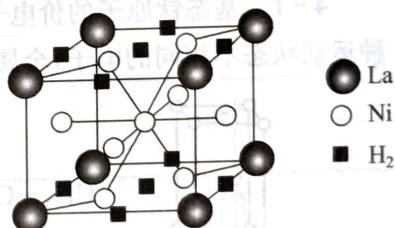  
第2题图

(10 分) <<<

氮、氧、磷、铁是与生命活动密切相关的元素。回答下列问题：

3-1 P 的基态原子核外电子具有的原子轨道数为\_\_\_\_， $\mathrm{Fe}^{3+}$ 比 $\mathrm{Fe}^{2+}$ 稳定的原因是\_\_\_\_。

3-2 N、O、P三种元素第一电离能最大的是\_\_\_\_，电负性最大的是\_\_\_\_。

3-3 含氮化合物 $NH_{4}$ SCN 溶液是检验 $Fe^{3+}$ 的常用试剂， $SCN^{-}$ 中 C 原子的杂化类型为 \_\_\_\_，1 mol 的 $SCN^{-}$ 中含 $\pi$ 键的数目为 \_\_\_\_ $N_{A}$ 。

3-4 某直链多磷酸钠的阴离子呈如图1所示的无限单链状结构,其中磷氧四面体通过共用

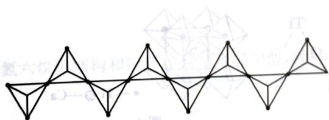  
图1

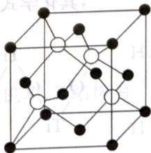  
图2

顶点的氧原子相连，则该多磷酸钠的化学式为

3-5 FeO、NiO的晶体结构与NaCl晶体结构相同，其中 $Fe^{2+}$ 与 $Ni^{2+}$ 的离子半径分别为 $7.8\times10^{-2}$ nm、 $6.9\times10^{-2}$ nm，则熔点FeO\_\_\_\_（填“<”、“>”或“=”）NiO，原因是

3-6 磷化硼是一种超硬耐磨的涂层材料, 其晶胞如图 2 所示。P 原子与 B 原子的最近距离为 $a \mathrm{~cm}$ , 则磷化硼晶胞的边长为 \_\_\_\_ cm (用含 $a$ 的代数式表示)。

3-7 如图 3 为某种冰的一种骨架形式, 以此为单位向空间延伸。

①该冰中的每个水分子有\_\_\_\_个氢键；

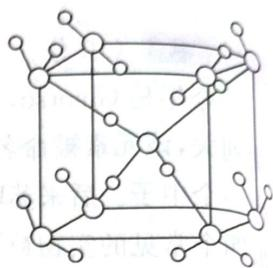

② 在气相中 $NH_{3}$ 易与 $H_{2}O$ 通过氢键以加合物形式存在,试写出加合物 $NH_{3} \cdot H_{2}O$ 的结构式: \_\_\_\_。

第3题图3

第4题 (10分)>>>

钛被称为继铁、铝之后的第三金属，制备金属钛的一种流程如下：

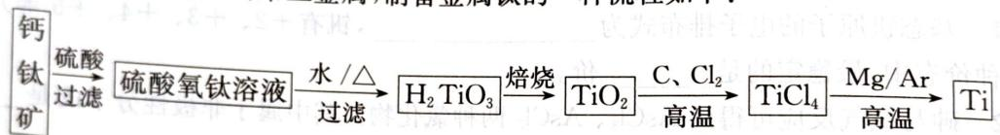

回答下列问题：

4-1 基态钛原子的价电子排布图为\_\_\_\_，其原子核外共有\_\_\_\_种运动状态不相同的电子，金属钛晶胞如图1所示，为\_\_\_\_堆积（填堆积方式）。

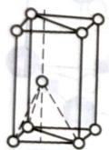  
图1

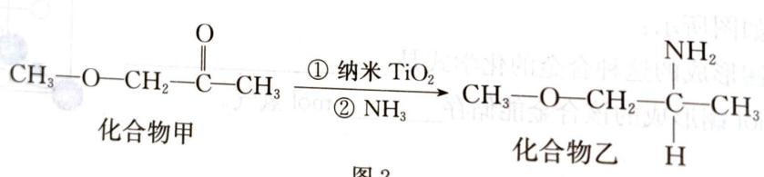  
图2  
第4题图

4-2 已知 $\mathrm{TiCl}_{4}$ 在通常情况下是无色液体, 熔点为 $-37^{\circ} \mathrm{C}$ , 沸点为 $136^{\circ} \mathrm{C}$ , 可知 $\mathrm{TiCl}_{4}$ 为 \_\_\_\_ 晶体。

4-3 纳米 $\mathrm{TiO}_{2}$ 是一种应用广泛的催化剂, 其催化的一个实例如图 2。化合物乙的沸点明显高于化合物甲, 主要原因是 \_\_\_\_ 。化合物乙中采取 $\mathrm{sp}^{3}$ 杂化的原子的第一电离能由大到小的顺序为 \_\_\_\_ 。

4-4 硫酸氧钛晶体中阳离子为链状聚合形式的离子,结构如图3所示。该阳离子Ti与O的原子数之比为\_\_\_\_,其化学式为\_\_\_\_

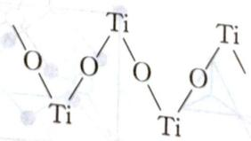  
图3

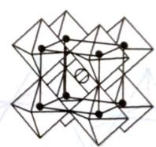  
图4

4-5 钙钛矿晶体的结构如图4所示。钛离子位于立方晶胞的顶角，被\_\_\_\_个氧离子包围成配位八面体；钙离子位于立方晶胞的体心，被\_\_\_\_个氧离子包围，钙钛矿晶体的化学式为\_\_\_\_。

## (10 分) <<<

锂—磷酸氧铜电池正极的活性物质是 $\mathrm{Cu_{4}O(PO_{4})_{2}}$ ，可通过下列反应制备：

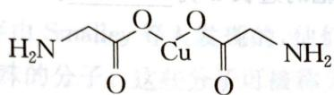  
图1

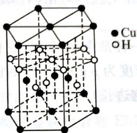  
第5题图  
图2

$$
\text {   l   o   m   } \cdot \text {   g   }
$$

$$
2 \mathrm{Na} _ {3} \mathrm{PO} _ {4} + 4 \mathrm{CuSO} _ {4} + 2 \mathrm{NH} _ {3} \cdot \mathrm{H} _ {2} \mathrm{O} = \mathrm{Cu} _ {4} \mathrm{O} (\mathrm{PO} _ {4}) _ {2} \downarrow + 3 \mathrm{Na} _ {2} \mathrm{SO} _ {4} + (\mathrm{NH} _ {4}) _ {2} \mathrm{SO} _ {4} + \mathrm{H} _ {2} \mathrm{O}
$$

5-1 写出基态 $\mathrm{Cu}^{2+}$ 的核外电子排布式: , 上述方程式中涉及的 N、O 元素第一电离能由小到大的顺序为 。

5-2 $PO_{4}^{3-}$ 的空间构型是 \_\_\_\_。

5-3 与 $\mathrm{NH}_{3}$ 互为等电子体的分子、离子有一例)。

5-4 氨基乙酸铜的分子结构如图1,碳原子的杂化方式为\_\_\_\_。

5-5 在硫酸铜溶液中加入过量 KCN, 生成配合物 $\left[\mathrm{Cu}(\mathrm{CN})_{4}\right]^{2-}$ , 则 $1 \mathrm{~mol} \left[\mathrm{Cu}(\mathrm{CN})_{4}\right]^{2-}$ 中含有的 $\sigma$ 键的数目为 \_\_\_\_。

5-6 Cu元素与H元素可形成一种红色化合物,其晶体结构单元如图2所示,则该化合物的化学式为\_\_\_\_。

## 第6题 (10分)>>>

元素周期表中,金属和非金属分界线附近的元素性质特殊,其单质及化合物应用广泛,成为科学研究的热点。

6-1 锗(Ge)可以作半导体材料,写出基态锗原子的电子排布式\_\_\_\_。

6-2 环硼氮六烷的结构和物理性质与苯很相似,故称为无机苯,其结构为

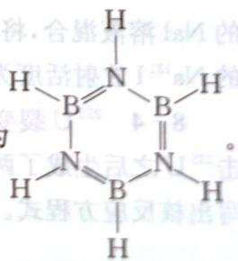

① 第一电离能介于 B、N 之间的第二周期元素有 \_\_\_\_ 种。

② 无机苯分子中1个氮原子给有空轨道的硼原子提供1个孤电子对，形成1个\_\_\_\_键。

③硼、氮原子的杂化方式是\_\_\_\_。

6-3 硅烷的通式为 $\mathrm{Si}_n\mathrm{H}_{2n + 2}$ ，随着硅原子数增多，硅烷的沸点逐渐升高，其主要原因是\_\_\_\_。最简单的硅烷是 $\mathrm{SiH_4}$ ，其中的氢元素显一1价，其原因为

6-4 根据价层电子对互斥理论(VSEPR)推测: $\text{AsCl}_3$ 的 VSEPR 构型为 \_\_\_\_； $\text{AsO}_4^{3-}$ 的立体构型：\_\_\_\_。

6-5 针(Po)是一种放射性金属,它的晶胞堆积模型为简单立方堆积,钋的摩尔质量为 $209\ g\cdot mol^{-1}$ ,晶胞的密度为 $\rho\ g\cdot cm^{-3}$ ,则它晶胞的边长a为\_\_\_\_pm。( $N_{A}$ 表示阿伏加德罗常数,用代数式表示晶胞边长)

## 第7题 (10分) <<<

金属镍及其化合物在合金材料以及催化剂等方面应用广泛。

7-1 金属镍能与CO形成配合物 $\mathrm{Ni(CO)}_4$ ，写出与CO互为等电子体的一种分子和一种离子的化学式 \_\_\_\_、\_\_\_\_。

7-2 很多不饱和有机物在 Ni 催化下可与 $H_{2}$ 发生加成反应。如 ① $CH_{2}=CH_{2}$ 、② $HC\equiv CH$ 、③ HCOOH、④ HCHO，其中碳原子采取 $sp^{2}$ 杂化的分子有 \_\_\_\_（填物质序号），HCHO 分子的立体结构为 \_\_\_\_ 形。

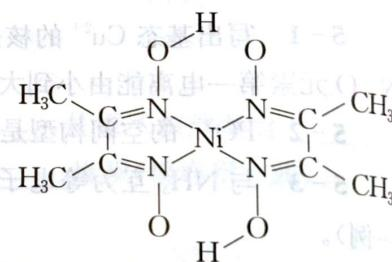

7-3 丁二酮肟常用于检验 $\mathrm{Ni}^{2+}$ 。在稀氨水中，丁二酮肟与 $\mathrm{Ni}^{2+}$ 反应生成鲜红色沉淀，其结构如图所示。该结构中，除共价键外还存在配位键和氢键，请在图中用箭头和“…”表示出配位键和氢键。

第7题图

## 第8题 (10分)>>>

2011年3月11日,东日本大地震引发的海啸引发了福岛核电站危机,造成了大量放射性物质泄漏,引起了全球的密切关注。核燃料 $^{235}$ U在中子的轰击下发生裂变,裂变为更小的核素和产生更多的中子,产生的中子引发更多的裂变,形成链式反应,同时放出巨大的能量。裂变的核素中2.83%为危害性极大的 $^{131}$ I, $^{131}$ I半衰期为8.02天,发生2支方式,

$$
\beta
$$

8-1 写出 $^{131}$ I 发生衰变的反应方程式。

8-2 计算扩散到空气中的 $^{131}$ I 经过 2 天后的残留百分比。

8-3 将 $25.0 \mathrm{~mL} 0.0500 \mathrm{~mol} \cdot \mathrm{L}^{-1}$ 的 $\mathrm{AgNO}_{3}$ 溶液与 $25.0 \mathrm{~mL} 0.0500 \mathrm{~mol} \cdot \mathrm{L}^{-1}$ 用 $^{131}\mathrm{I}$ 标记的 $\mathrm{NaI}$ 溶液混合, 将产生的沉淀过滤, 测得滤液的放射活度为 $2.50 \times 10^{3} \mathrm{cpm}$ 。而 $0.050 \mathrm{~mol} \cdot \mathrm{L}^{-1}$ 的 $\mathrm{Na}^{131}\mathrm{I}$ 放射活度为 $1.25 \times 10^{10} \mathrm{cpm}$ 。计算 $\mathrm{AgI}$ 的 $K_{\mathrm{sp}}$ 。

8-4 $^{235}\mathrm{U}$ 裂变方式有多种, 产物除 $^{131}\mathrm{I}$ 外还有几十种。其中一种裂变方式为: 一个中子轰击 $^{235}\mathrm{U}$ 之后生成了两种新核素 A、B 和三个中子, A、B 为同一族的元素, 其核内中子数相差 29。写出核反应方程式。

放射性同位素 $^{14}_{6}$ C 被考古学家称为“碳钟”。它可以用来断定古生物体死亡至今的年代。此项研究成果获得 1960 年诺贝尔化学奖。

9-1 宇宙射线中高能量中子碰撞空气中的氮原子后，就会形成 $^{14}_{6}C$ ，写出它的核反应方程式。

9-2 ${}^{14}_{6}\mathrm{C}$ 很不稳定，容易发生 $\beta$ 衰变，其半衰期5730年。写出它发生衰变的方程式。

9-3 ${}^{14}_{6}\mathrm{C}$ 的生成和衰变通常是平衡的，即空气中、生物活体中 ${}^{14}_{6}\mathrm{C}$ 的含量是不变的。当机体死亡后，机体内的 ${}^{14}_{6}\mathrm{C}$ 含量将会不断减少，若测得一具古生物遗骸中 ${}^{14}_{6}\mathrm{C}$ 含量只有活体中的 $12.5\%$ ，则这具遗骸死亡至今应有多少年？

## 第 10 题 (10 分) >>>

$C_{60}$ 分子是 1985 年由 Smalley 等人发现的，他们当时就预言 $C_{60}$ 笼内可以包入各种分子和原子，形成结构和性质特殊的分子。这些分子可被称为富勒烯金属包合物 EMF。建议用 $M@C_{2n}$ 来表示 EMF。

10-1 解释 $\mathrm{La}@\mathrm{C}_{82}$ 表示的含义。

10-2 下表为几种 EMF 与富勒烯的电离能(Ip)和电子亲和能(Ea)

<table><tr><td></td><td>Ip/eV</td><td>Ea/eV</td><td></td><td>Ip/eV</td><td>Ea/eV</td></tr><tr><td> $Sc@C_{82}$ </td><td>6.45</td><td>3.08</td><td> $C_{60}$ </td><td>7.78</td><td>2.57</td></tr><tr><td> $Gd@C_{82}$ </td><td>6.25</td><td>3.20</td><td> $C_{82}$ </td><td>7.10</td><td>2.03</td></tr><tr><td> $La@C_{82}$ </td><td>6.19</td><td>3.22</td><td></td><td></td><td></td></tr></table>

由上表数据,你可以得出关于 EMF 的化学性质的什么结论?

10-3 合成 EMF 常用电弧法，在电弧法得到的产物中大部分是无定形碳、 $\mathrm{C}_{60}$ 、 $\mathrm{C}_{70}$ 和其他富勒烯分子，而 EMF 的总量只是 $\mathrm{C}_{60}$ 的 $1\%$ ，必须经过提取和分离才能得到纯的 EMF。早期常用 $\mathrm{CS}_2$ 和甲苯为提取剂，但在提取物中 EMF 的含量仍较少，主要为空心富勒烯。实验发现，DMF 和苯胺为选择提取 EMF 的有效试剂。请解释原因。

8-2 气态氯原子与一个电子结合比气态氟原子与一个电子结合放出更余的质谱图所示原因。顺，变不余其，首个 $I+\backslash$ 共 $\lambda,\cdots,S,I,O$ 乘回m明，外变语言直减因m减干量强容

8-3 在 $NF_{3}$ 中N-F键能为 $280\ kJ\cdot mol^{-1}$ ，比在 $BF_{3}$ 中表示杯镜器容限圆四面 $olI^{+}$ 的1/2还小，请解释原因。

减半的素元量金的置舌量中素元号OS值S-E

热核爆炸是用裂变弹(如钚弹)激发D-T混合物发生聚变反应。

9-1 按书写要求写出核反应方程式：\_\_\_\_
(台 01) 红酸水道的 $\mathrm{P}_{2}(\mathrm{O}_{3}\mathrm{H})$ 出积率中, $V_{\text{析}} = 8.5$ 的浓度变化和体积的测定值为: (2) $D_{10}$ 取过顺解物质可以催化仲氢转变为正氧。试写出催化机理：\_\_\_\_（表不干因习题的血权视色光）；总随

<table><tr><td>实验时间</td><td>10分</td><td>蜡</td><td>黄</td><td>绿</td><td>红</td><td>卤水</td></tr><tr><td>00h~02h</td><td>02h~06h</td><td>06h~08h</td><td>08h~09h</td><td>09h~09h</td><td>09h~09h</td><td>汁酸</td></tr></table>

# 能力测试 B 卷

第1题 电离 $1\mathrm{mol}$ 自由铜原子得 $1\mathrm{mol}\mathrm{Cu}^{+}$ ，需能量为 $746.2\mathrm{kJ}$ ，而由晶体铜电离获得 $1\mathrm{mol}\mathrm{Cu}^{+}$ 离不仅消耗 $434.1\mathrm{kJ}$ 能量。试问：

消耗 434.1 kJ 能量。试问：
1-1 说明上述两电离过程所需能量不同的主要原因。

1-1 说明上述两电离过程所需能量不等。

1-2 计算电离 1 mol 晶体铜所需照射完的
1-3 升高温度可否大大改变上述两电离过程所需能量之差？

第2题 (10分) >>
2-1 据认为“红巨星”星体内部发生着合成重元素的中子俘获反应,例如 $^{68}$ Zn可以俘获1个中子形成A,过剩的能量以光子形式带走;A发生β衰变转化为B。试写出平衡的核反应方程式。
由于可生成混合卤化物 $AsCl_{2}F_{3}$ ，在过量的 $AsF_{3}$ 中能导

$$
\mathrm{AsF} _ {3}
$$

2-2 将 $\mathrm{Cl}_{2}$ 通入到用冰冷却的 $\mathrm{AsF}_{3}$ 中, 可生成的电荷。相应的中心原子的杂化形态为电, 说明了 $\mathrm{AsF}_{3}$ 中, $\mathrm{AsCl}_{2} \mathrm{~F}_{3}$ 存在 \_\_\_\_ 和 \_\_\_\_ 离子。相应的中心原子的杂化形态为 \_\_\_\_ 和 \_\_\_\_ 。

2-3 $\mathrm{H}_2\mathrm{S}$ 和 $\mathrm{H}_2\mathrm{O}_2$ 的主要物理性质比较如下：

<table><tr><td></td><td>熔点/K</td><td>沸点/K</td><td>标准状况时在水中的溶解度</td></tr><tr><td> $H_{2}S$ </td><td>187</td><td>202</td><td>2.6</td></tr><tr><td> $H_{2}O_{2}$ </td><td>272</td><td>423</td><td>以任意比互溶</td></tr></table>

$H_{2}S$ 和 $H_{2}O_{2}$ 的相对分子质量基本相同,造成上述物理性质差异的主要原因是什么?

2-4 美国哥伦比亚大学的科学家根据对沉积物中稀土元素钕(Nd)的分析发现,北大西洋和太平洋海水中的 $^{143}Nd$ 和 $^{144}Nd$ 比例差异很明显,由此得出周围大陆的岩石中 $^{143}Nd$ 和 $^{144}Nd$ 含量不同的结论。该结论在地理学上有什么意义?

(10 分) <<<

若磁量子数 m 的取值有所变化, 即 m 可取 0, 1, 2, …, l 共 $l+1$ 个值, 其余不变, 则:

3-1 前四周期各有几种元素。

3-2 前20号元素中最活泼的碱金属元素的序数。

3-3 第二个过渡元素的核外电子排布式。

3-4 写出有机化学中最简单的烃的化学式及烃的通式。

第4题 (10分)>>>

4-1 已知: $\left[\mathrm{Ti}\left(\mathrm{H}_{2} \mathrm{O}\right)_{6}\right]^{3+}$ 中钛的晶体场分裂能为 $2.86 \mathrm{eV}$ , 试根据计算得出 $\left[\mathrm{Ti}\left(\mathrm{H}_{2} \mathrm{O}\right)_{6}\right]^{3+}$ 的颜色: (光色所对应的波长列于下表)

<table><tr><td>光色</td><td>红</td><td>橙</td><td>黄</td><td>绿</td><td>蓝一靛</td><td>紫</td></tr><tr><td>波长</td><td>770~620</td><td>620~600</td><td>600~580</td><td>580~490</td><td>490~450</td><td>450~400</td></tr></table>

4-2 $\left[\mathrm{Ti}\left(\mathrm{H}_{2} \mathrm{O}\right)_{6}\right]^{2+}$ 却不能仅根据分裂能得出其颜色，解释原因。

## (10 分) <<<

放射性同位素氮 $\left(\frac{85}{36}\mathrm{Kr}\right)$ 气，经β衰变成铷 $\left(\frac{85}{37}\mathrm{Rb}\right)$ ，半衰期为11年，铷最后成固态。有一容积为0.448 L的密闭容器，内盛温度为0℃，压强为1 atm的纯净的氮气。

5-1 此容器内氮气的质量是多少？

5-2 写出氪 $\left(\frac{85}{36}\mathrm{Kr}\right)$ 气的 $\beta$ 衰变方程式。

5-3 将此容器埋入地下22年后取出，加热到 $100^{\circ}\mathrm{C}$ ，此时容器内气体的压强多大？

## 第6题 (10分)>>>

某 AB 型离子化合物 M, 溶于王水与硝酸按 3:4 反应(假设生成气体全为 NO), 并可分离一反磁性一元酸。已知 M 中两元素在同一周期, M 的阴离子显 -1 价并具有稳定的闭壳层结构:

6-1 求 M 的化学式。

6-2 为何阴离子可以稳定存在。

6-3 将两元素的单质分别做成形状相同的笼并压缩，两者形变能力相差很大，解释原因。

## (10 分) <<<

1984 年, 联邦德国达姆施塔特重离子研究机构阿姆布鲁斯特和明岑贝格等人在重离子加速器上用 ${}^{58}Fe$ 离子轰击 ${}^{208}Pb$ 靶时, 发生核合成反应, 发现了 ${}^{265}X$ 。最近有人用高能 ${}^{26}Mg$ 核轰击 ${}^{248}Cm$ 核, 发生相似反应, 得到 X 的另一种同位素 ${}^{269}X$ 。

7-1 X 的元素符号是\_\_\_\_，最高价氧化物的化学式是\_\_\_\_。

7-2 用元素符号并在左上角和左下角分别标注其质量数和质子数,写出合成 X 的 2 个核反应方程式(方程式涉及的其他符号请按常规书写)。

## 第8题 (10分)>>>

8-1 $\mathrm{H}_{2} \mathrm{O}$ 的沸点 $(100^{\circ} \mathrm{C})$ 比 HF 的沸点 $(20^{\circ} \mathrm{C})$ 高, 请解释原因。

8-2 气态氯原子与一个电子结合比气态氟原子与一个电子结合放出更多的能量,请解释原因。

8-3 在 $\mathrm{NF}_3$ 中 $\mathrm{N}-\mathrm{F}$ 键能为 $280 \mathrm{~kJ} \cdot \mathrm{mol}^{-1}$ , 比在 $\mathrm{BF}_3$ 中 $\mathrm{B}-\mathrm{F}$ 键能 $(646 \mathrm{~kJ} \cdot \mathrm{mol}^{-1})$ 的 $1/2$ 还小, 请解释原因。

## (10 分) <<<

热核爆炸是用裂变弹(如钚弹)激发 D—T 混合物发生聚变反应。

9-1 按书写要求写出核反应方程式：\_\_\_\_。

9-2 氢原子有 2 种变体, 即正氢和仲氢, 区别在于核的自旋量子数不同, 现已知顺磁物质可以催化仲氢转变为正氢。试写出催化机理: \_\_\_\_。

## 第 10 题 (10 分) >>>

10 题 (10 分) >>
下表为短周期的一些元素的电离能数据(单位: kJ·mol $^{-1}$ ), A\~I 原子序数依次增大, 读表回

答问题。

因思赫勒，总随其出得指像全图外异缩不吐 $^{+2}$ [s(O,H)iT] = 4

<table><tr><td>元素代号</td><td> $I_1$ </td><td> $I_2$ </td><td> $I_3$ </td><td> $I_4$ </td><td> $I_5$ </td><td> $I_6$ </td></tr><tr><td>A</td><td>1312</td><td></td><td></td><td></td><td></td><td></td></tr><tr><td>B</td><td>2372</td><td>5250</td><td></td><td></td><td></td><td></td></tr><tr><td>C</td><td>520</td><td>7298</td><td>11 815</td><td></td><td></td><td></td></tr><tr><td>D</td><td>900</td><td>1757</td><td>14 849</td><td>21 007</td><td></td><td></td></tr><tr><td>E</td><td>1086</td><td>2353</td><td>4621</td><td>6223</td><td>37 830</td><td>47 277</td></tr><tr><td>F</td><td>1402</td><td>2856</td><td>4578</td><td>7475</td><td>9445</td><td>53 266</td></tr><tr><td>G</td><td>496</td><td>4562</td><td>6912</td><td>9544</td><td>13 353</td><td>16 619</td></tr><tr><td>H</td><td>738</td><td>1451</td><td>7733</td><td>10 540</td><td>13 628</td><td>17 995</td></tr><tr><td>I</td><td>578</td><td>1817</td><td>2745</td><td>11 578</td><td>14 831</td><td>18 378</td></tr></table>

10-1 写出 A\~I 的元素符号。

10-2 写出表格中所有在同一族的元素(用元素符号表示),并写出你的推理过程。

\_\_\_\_是力学外的球外算价高量。\_\_\_\_是力学表示的X=1-1

灵芝伞S的Z和合出器中属于晶球质量乘其台冠底位的原子或原子的反应式由光子的第3层法？S-1

2-4 美国哥伦比亚大学的科学家根据对沉积物测点的测量，由其的光子发射成大气球在岛

太平洋带海水中的“Nd和”Nd比例差异很明显，由此得出周围大陆的岩石中“Nd和”Nd含量不
同的情况。该结论在地球学上有什么意义？

<<（价01）

因原料释放，高(°0S)点将的 $^{3}$ H出(°001)点将的 $O_{2}H=1-8$ 根据原料释放途径更突出适合干单个一己干肌原态声出合帮干单个一己干肌原态声 $^{5-8}$ 根据量子效应的取位有所变化，根次可取 $0.12\cdots/$ 共 $t+1$ 个值，其余不变，则：因项

S1由(“Iom”和“D0”则错分—中， $^{3}$ H 异出，“Iom·D08S”试错分—中， $^{3}$ H 不等 $^{5-8}$ 3、2、3、4、5、6、7、8、9、10、11、12、13、14、15、16、17、18、19、20、21、22、23、24、25、26、27、28、29、30、31、32、33、34、35、36、37、38、39、40、41、42、43、44、45、46、47、48、49、50、51、52、53、54、55、56、57、58、59、60、61、62、63、64、65、66、67、68、69、70、71、72、73、74、75、76、77、78、79、80、81、82、83、84、85、86、87、88、89、90、91、92、93、94、95、96、97、98、99、100

8-3 且NHE中N-E于瓣槽S80以W为中心，W为中心，W为中心，W为中心，W为中心，W为中心，W为中心，W为中心，W为中心，W为中心，W为中心，W为中心，W为中心，W为中心，W为中心，W为中心，W为中心，W为中心，W为中心，W为中心，

## 第6章

# 元素周期律和元素周期表

# 能力测试A卷

(10 分) <<<

某新型耐火材料 M 由原子序数依次递增的 X、Y、Z 三种短周期元素组成，其中 X、Z 同主族，M 中 Y、Z 元素的质量分数分别为 58.7%、15.2%，涉及 M 的转化关系如图所示，已知：气体 J、K 为空气中两种主要成分，化合物 ZX 和 A 互为等电子体，其结构与金刚石晶体结构相似，化合物 B 具有两性。（部分反应物或生成物未标出）

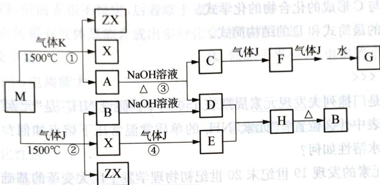  
第1题图

1-1 X、Y、Z的第一电离能从大到小的顺序为\_\_\_\_（用元素符号表示）。

1-2 G 的化学式为\_\_\_\_，A 中所含的化学键类型为\_\_\_\_。写出 B 的一种常见用途\_\_\_\_。

1-3 写出反应①的化学反应方程式

1-4 写出反应③的离子反应方程式

1-5 用平均粒度为 $5 \sim 10 \mu \mathrm{m}$ 的 X、Y、Z 三种单质的混合料，在 Ar 气氛围中控制适宜的条件（压强为 $80 \sim 100 \mathrm{MPa}$ ，温度为 $1500 \sim 1700^{\circ} \mathrm{C}$ ）下可以直接合成材料 M，但是若温度过低（如 $1106^{\circ} \mathrm{C}$ 左右）则可得到由 ZX 和二元化合物 N 组成的复合耐火材料，该复合耐火材料中各元素的质量分数与 M 相同，N 中两元素的质量比为 $3:1$ ，写出由 X、Y、Z 三种单质合成该复合耐火材料的化学方程式：\_\_\_\_。

## 第2题 (10分)>>>

三种原子序数依次增大的常见短周期元素 A、B、C，在其形成的 3 种二元化合物中，同种元素化合价绝对值相等，且 A 表现出其最高正价和最低负价。在 A 与 B 形成的二元化合物中 B 的质量分数为 75%；在 A 与 C 形成的二元化合物中 A 的质量分数为 7.8%，它是一种常见的非极性有机溶剂。试通过计算推理确定 A、B、C 的元素名称。

(10 分) <<<

纯净物 X 由 5 种常见元素组成, 其中 3 种为短周期元素 A、B、C。A 元素的最高正价与最低负价之和为0，B元素与C元素组合得到两种常见的极性物质，其中C元素原子皆以 $\mathfrak{sp}^3$ 杂化，其中一种物质的键角为 $104.5^{\circ}$ 。另外两种元素D、E为长周期元素，D元素通过蓝色钴玻璃焰色为紫色，金属元素E原子最外层电子数比次外层少12个。5种元素在X中的质量分数依次为A： $14.67\%$ ；B:1.23%；C:48.85%；D:23.88%。请写出A、B、C、D、E的元素符号及X的化学式

## 第4题 (10分)>>>

第4题（10分）>>>
短周期元素 A、B、C，原子序数依次增大，其中 A 与 B、C 均相邻。A、B 有多种常见氧化物，A 的某种氧化物 D 含氧量为 50%，D 可以水解为一种六元酸。A 与 C，B 与 C 分别形成两种高熔沸点、高硬度材料，其中 B、C 形成的化合物中 B 的含量为 40%。试回答下列问题：

4-1 写出 A、B 和 C 的元素符号。

4-2 写出 B 与 C 形成的化合物的化学式。

4-3 写出D的最简式和D的结构简式。

## 第5（10分）<

5-1 2019年是门捷列夫发现元素周期表150周年。假设 $NH_{4}^{+}$ 是“元素” $NH_{4}$ 的阳离子，则 “元素” $NH_{4}$ 在周期表中什么位置？“元素” $NH_{4}$ 的单质常温常压下熔点如何？什么状态？能否导电？ $NH_{4}$ 的碳酸盐水溶性如何？

5-2 放射性元素的发现 19 世纪末 20 世纪初物理学发生巨大变革的基础。最早发现的具有放射性的元素是铀，铀也是核电厂的燃料。 $^{235}_{92}$ U 是自然界存在的易于发生裂变的唯一核素。 $^{235}_{92}$ U 吸收一个中子发生核裂变可得到 $^{142}Ba$ 和 $^{91}Kr$ ，或 $^{135}I$ 和 $^{97}Y$ 等。请写出上述核反应方程式。

## 第6题 (10分)>>>

6-1 在 $1 \sim 18$ 号元素组成的化合物中具有三核 10 个电子的共价化合物是 \_\_\_\_；具有三核 20 个电子的离子化合物是 \_\_\_\_。

6-2 某元素的气态氢化物 $\mathrm{H}_{\mathrm{x}}\mathrm{R}$ 在某温度下分解为氢气和固体物质，在相同条件下体积为原来的1.5倍，分解前后气体的密度比为 $17:1$ ，该元素原子核内中子数与质子数之差为1，该元素的符号为\_\_\_\_，R原子核内中子数为\_\_\_\_，R原子的电子排布式为\_\_\_\_，R原子的最高氧化物的分子式为\_\_\_\_，其溶于水后生成物为\_\_\_\_。

6-3 由氨水和次氯酸盐溶液在弱碱性介质中反应可生成氯胺 $\mathrm{H}_{2} \mathrm{~NCl}$ , 分子结构类似于 $\mathrm{NH}_{3}, \mathrm{H}_{2} \mathrm{~NCl}$ 分子的空间构型为 \_\_\_\_ , 电子式为 \_\_\_\_ : 友解式等, $\mathrm{H}_{2} \mathrm{~NCl}$ 中的氯的氧化数为 \_\_\_\_ 。

6-4 近几十年发展起来的关于超重元素核稳定性理论认为:当原子核中质子和中子数目达到某一“幻数”(奇异的、有魔力的数)时,这个核将是特别稳定的。在周期表中铀以前的元素中具有2、8、20、28、50、82个质子或中子的核是特别稳定的,中子数126也是一个重要的幻数。氦、氧、钙、铅的质子数和中子数都是幻数,具有这种双幻数的原子核更为稳定。科学家们用计算机算出下一个具有双幻数的元素将是含114个质子和184个中子的第114号元素X(称为超重元素)。若已知原子结构规律不发生变化,该元素X就是第\_\_\_\_周期第\_\_\_\_族元素,其最高氧化物的分子式为\_\_\_\_,再下一个具有双幻数的超重元素是质子数为164、中子数为318的164号元素Y,它应是第\_\_\_\_周期第\_\_\_\_族元素。

6-5 1982年前联邦德国达姆塔特重离子研究中心的科学家用冷态聚变法经 $^{58}_{26}$ Fe轰击 $^{209}_{83}$ Bi产生109号元素，1984年该研究中心合成了第108号元素，它是在重离子加速器中用 $^{58}_{26}$ Fe轰击 $^{209}_{82}$ Pb产生聚变合成的。写出含109、108号元素的核反应方程式。在元素的左上角、左下角分别标出其质量数和质子数。

①

②

## 第7题 (10分) <<<

上世纪60年代，第一个稀有气体化合物 $\mathrm{Xe}[\mathrm{PtF}_6]$ 被合成出来后，打破了“绝对惰性”的观念。在随后的几年内，科学家又相继合成了氙的氟化物、氧化物、氟氧化物以及含氧酸盐等。氪和氡的个别化合物也已制得，但前者很不稳定，后者难于表征。

7-1 只有较重的稀有气体氙能合成出多种化合物,其原因是\_\_\_\_。
A. 氙含量比较丰富
B. 氙原子半径大,电离能小
C. 氙原子半径小,电离能大

7-2 氙的化合物中,多数是含有氟和氧的,其原因是\_\_\_\_。
A. 氟、氧的电负性大
B. 氟、氧的原子半径小
C. 氟、氧的氧化性强

7-3 氢的化合物难于表征,原因是\_\_\_\_。
A. 氢的原子半径大    B. 氨的电离能大
C. 氢是强放射性元素,无稳定的同位素

7-4 已知 $\mathrm{XeO}_{3}$ 是三角锥形结构, 则其中氙原子轨道杂化类型为 , 氙原子的孤对电子数为 。

7-5 二氟化氙是强氧化剂。1968年E.H. Appleman用二氟化氙和溴酸盐的水溶液反应制得高溴酸盐，解决了无机化学上长期努力未获成功的一个难题。试写出该反应的离子方程式：\_\_\_\_。

## 第8题 (10分)>>>

8-1 随着原子序数的增加,碱金属 Li、Na、K、Rb、Cs 下列性质的递变不是单调的是\_\_\_\_。
A. 熔沸点    B. 原子半径    C. 晶体密度    D. 第一电离能

8-2 某离子化合物 $\mathrm{A}_{2} \mathrm{~B}$ 由四种元素组成, 一种为氢, 一种为氟, 另二种为第二周期元素。正负离子皆由两种原子构成, 且均呈正面体构型。这种离子化合物的化学式为 \_\_\_\_ 。

8-3 好奇心是科学发展的内在动力之一。 $\mathrm{P}_2\mathrm{O}_3$ 和 $\mathrm{P}_2\mathrm{O}_5$ 是两种经典的化合物，其分子结构已经确定。自然而然会有如下问题：是否存在磷氧原子比介于二者之间的化合物？由此出发，化学家合成并证实了这些中间化合物的存在。请写出这些中间化合物的分子式。

8-4 化学合成的成果需要一定的时间才得以应用于日常生活。例如，化合物A合成于1929年，至1969年才被用作牙膏的添加剂和补牙填充剂成分。A是离子晶体，由 $\mathrm{NaF}$ 和 $\mathrm{NaPO_3}$ 在熔融状态下反应得到。它易溶于水，阴离子水解产生 $\mathbf{F}^{-}$ 和对人无毒的另一种离子。写出合成A的反应方程式。(10分)

在过去一个半世纪的时间内，一直试图合成粒子 A 离子。1968 年利用核化学方法经多步合成

## (10 分) <<<

下列关于物质结构的8个命题中：

① 配位键在形成时，是由成键双方各提供一个电子形成共用电子对。

② $C_{60}$ 晶体的晶胞是面心立方结构。

③ Ge 是ⅣA族的一个主族元素, 其核外电子排布式为 Ge: [Ar]4s²4p², 属于 P 区元素。
④ 非极性分子往往是高度对称的分子, 比如 BF₃、PCl₅、H₂O₂、CO₂ 这样的分子。

⑤ 冰中存在极性共价键和氢键两种化学键的作用。

⑥ $\mathrm{Cu(OH)}_{2}$ 是一种蓝色的沉淀，既溶于硝酸、浓硫酸，也能溶于氨水中。
⑦ 熔融状态的 $HgCl_{2}$ 不能导电， $HgCl_{2}$ 的稀溶液有弱的导电能力且可作手术刀的消毒液，从不同角度分类 $HgCl_{2}$ 是一种共价化合物、非电解质、盐、分子晶体。

⑧ 氨水中大部分 $NH_{3}$ 与 $H_{2}O$ 以氢键(用“…”表示)结合成 $NH_{3} \cdot H_{2}O$ 分子, 根据氨水的性质可知 $NH_{3} \cdot H_{2}O$ 的结构式可记为 $H-N\cdots H-O$ 。

其中,错误的有几项?试一一阐述。

## 第10题 (10分)>>>

金属在水溶液中的还原性强弱,在一定程度上取决于金属的升华能、电离能和气态金属离子的水合能三者之和。例如 $25^{\circ}$ C 时:

<table><tr><td></td><td>Eu(铕)</td><td>Yb(镱)</td><td>Lu(镥)</td></tr><tr><td>升华能+电高能(kJ·mol-1)</td><td>4236.9</td><td>4372.7</td><td>4362.6</td></tr><tr><td>水合能(kJ·mol-1)</td><td>3623.1</td><td>3848.3</td><td>3844.3</td></tr></table>

根据上表所列数据,判断3种金属还原性的强弱顺序。

## 能力测试 B 卷

2005年1月美国科学家在Science上发表论文，宣布发现了Al的超原子结构，并预言其他金属原子也可能存在类似的结构，这是一项将对化学、物理以及材料领域产生重大影响的发现，引起了科学界的广泛关注。这种超原子是在Al的碘化物中发现的，以13个Al原子或14个Al原子形成 $\mathrm{Al}_{13}$ 或 $\mathrm{Al}_{14}$ 超原子结构，量子化学计算结果表明， $\mathrm{Al}_{13}$ 形成12个Al在表面，1个Al在中心的三角二十面体结构， $\mathrm{Al}_{14}$ 可以看作是一个Al原子跟 $\mathrm{Al}_{13}$ 面上的一个三角形的3个Al形成Al—Al键而获得的。文章还指出， $\mathrm{Al}_{13}$ 和 $\mathrm{Al}_{14}$ 超原子都是具有40个价电子时最稳定。

1-1 根据以上信息可预测 $\mathrm{Al}_{13}$ 和 $\mathrm{Al}_{14}$ 的稳定化合价态。 $\mathrm{Al}_{14}$ 应具有元素周期表中哪一类化学元素的性质？阐述原因。

1-2 对 $\mathrm{Al}_{13}$ 和 $\mathrm{Al}_{14}$ 的 Al-Al 键长的测定十分困难，而理论计算表明， $\mathrm{Al}_{13}$ 和 $\mathrm{Al}_{14}$ 中的 Al-Al 键长与金属铝的 Al-Al 键长相当，已知金属铝的晶体结构采取面心立方最密堆积，密度约为 $2.7\mathrm{g} \cdot \mathrm{cm}^{-3}$ ，请估算 $\mathrm{Al}_{13}$ 和 $\mathrm{Al}_{14}$ 中 Al-Al 的键长。

1-3 $\mathrm{Al}_{13}$ 三角二十面体中有多少个四面体空隙，假设为正四面体空隙，如果在其中掺杂其他原子，请通过计算估计可掺杂原子的半径最大为多少？

## 第2题 (10分)>>>

指出下列叙述是否真正确？

2-1 价电子层排布为 $n\mathrm{s}^1$ 的元素是碱金属元素。

2-2 Ⅷ族元素的价电子层排布为 $(n-1)\mathrm{d}^{6}\mathrm{ns}^{2}$ 。

2-3 过渡金属元素的原子填充电子时是先填 3d 然后填 4s, 所以失去电子时, 也按照这次序进行。

2-4 因为镧系收缩,第六周期元素的原子半径全比第五周期同族元素半径小。

2-5 $\mathrm{O(g) + e\longrightarrow O^{-}(g), O^{-}(g) + e\longrightarrow O^{2 - }(g)}$ 都是放热过程。

2-6 氟是最活泼的非金属元素,故其电子亲和能也最大。

## (10 分) <<<

有 A、B、C、D 四种元素, 其价电子数依次为 1、2、6、7, 其电子层数依次减小。已知 $\mathrm{D}^{-}$ 的电子层结构与 Ar 原子相同, A 和 B 的次外层各只有 8 个电子, C 的次外层有 18 个电子。试判断这四种元素:

3-1 原子半径由小到大的顺序。

3-2 第一电离能由小到大的顺序。

3-3 电负性由小到大的顺序。

3-4 金属性由弱到强的顺序。

3-5 分别写出元素原子最外层的 $l = 0$ 的电子的量子数。

第4题 (10分)>>>

在过去一个半世纪的时间内，一直试图合成粒子A离子。1968年利用核化学方法经多步合成

首次得到了这种粒子,用于制备 A 离子的元素 X 的天然同位素组成如下:

<table><tr><td>核素的质量数</td><td>74</td><td>76</td><td>77</td><td>78</td><td>80</td><td>82</td></tr><tr><td>核素的摩尔分数,%</td><td>0.87</td><td>9.02</td><td>7.58</td><td>23.52</td><td>49.82</td><td>9.19</td></tr></table>

富集 $^{82}$ X 的核素的制剂，以中子流照射得到核素 $^{83}$ X，将其单质溶于稀 HNO $_{3}$ 中，向所得溶液中加入过量的 RbOH，之后，将 O $_{3}$ 通入溶液，得到 B 溶液。由于得到的 B 中含核素 $^{83}$ X 的 β-蜕变 ( $t_{1/2}=22.5\ min$ )，形成了 A 离子 ( $^{83}X \rightarrow^{n}Y$ )；A 中所含核素 $^{n}$ Y 继续发生 β-蜕变 ( $t_{1/2}=2.39\ h$ )，同时从溶液中释放出的气体中一种是惰性的(C)。

4-1 写出制备 $^{83}$ X 和 $^{n}$ Y 的核反应方程式。
4-2 自然界中元素的核组成与元素的任一个稳定核素的丰度之间有什么联系？

4-3 写出离子A、溶液B、气体C的化学式。

4-4 试写出制取A时进行的反应方程式。

4-5 在 1971 年, 以 $\mathrm{XeF}_{2}$ 为氧化剂, 在碱性条件下通过化学反应制得了 A 离子, 写出反应方程式。

## (10 分) <<<

世界各国科学家,从关注人类生存质量角度出发,将保护地球自然生态环境研究作为重大任务之一。并对与之相关的宇宙空间的复杂体系如太阳系进行了初步研究。结果发现太阳是一个巨大能源。它时刻都在向太空发射大量能量,其能量来源就是太阳时刻不停地进行着的链式聚变反应。在那里,氢原子核在极高温度下发生聚变反应。这种反应放出的能量,一方面用以维持反应必需的高温,另一方面则向太空辐射出能量。其中一种重要的聚变过程是碳—氮循环。这一循环是由一系列由碳—氮作媒介的反应组成的,并按下列步骤进行:

$$
① \mathrm{H} + _ {6} ^ {1 2} \mathrm{C} \longrightarrow_ {7} ^ {1 3} \mathrm{N} \quad ② \mathrm{N} \longrightarrow_ {y} ^ {x} \mathrm{C} + \mathrm{e} ^ {+} + \mathrm{v} _ {\mathrm{e}} \quad ③ \mathrm{H} + _ {y} ^ {x} \mathrm{C} \longrightarrow_ {y ^ {\prime}} ^ {x ^ {\prime}} \mathrm{N}
$$

$$
④ \mathrm{H} + _ {y ^ {\prime}} ^ {x ^ {\prime}} \mathrm{N} \longrightarrow_ {y ^ {n}} ^ {x ^ {n}} \mathrm{O} \quad ⑤ \mathrm{O} \longrightarrow_ {y ^ {n}} ^ {x ^ {n}} \mathrm{N} + \mathrm{e} ^ {+} + \mathrm{v} _ {\mathrm{e}} \quad ⑥ \mathrm{H} + _ {y ^ {\prime}} ^ {x ^ {\prime \prime}} \mathrm{N} \longrightarrow_ {6} ^ {1 2} \mathrm{C} + _ {2} ^ {4} \mathrm{He}
$$

上述过程,放出的净能量为 25.7 MeV。每消耗 $1 \, kg \frac{1}{1} H$ 约产生 $6.2 \times 10^{14} J$ 的能量。核聚变反应是太阳能够在几十亿年内稳定地发光释能的主要原因。

5-1 在上述过程中 $x = \_$ ， $y = \_$ ； $x' = \_$ ， $y' = \_$ ； $x'' = \_$ ， $y'' = \_$ （均填数值）。

5-2 写出与净能量产生对应的反应方程式：\_\_\_\_。

5-3 在反应中碳原子的作用是\_\_\_\_。

## 第6题 (10分)>>>

6-1 越来越多的事实表明:在环境与生物体系中,元素的毒性、生物可给性、迁移性和再迁移性不是取决于元素的总量,而是与该元素的化学形态密切相关。例如,在天然水正常 pH 下,铝处于\_\_\_\_形态,对鱼类是无毒的;但是,若天然水被酸雨酸化,铝则转化为可溶性有毒形态\_\_\_\_,会造成鱼类的大量死亡。再如,铝离子能穿过血脑屏障进入人脑组织,引起痴呆等严重后果,而配合态的铝,如处于\_\_\_\_形态时就没有这种危险。

6-2 在元素周期表第4、第5周期中成单电子数最多的过渡元素的电子构型分别为和\_\_\_\_；元素名称是\_\_\_\_和\_\_\_\_。依据现代原子结构理论，请你推测，当出现5g电子后，成单电子最多的元素可能的价层电子构型为\_\_\_\_，可能是\_\_\_\_号元素。

## (10 分) <<<

7-1 元素周期表是20世纪科学技术发展的重要理论依据之一。假设 $\mathrm{NH}_{4}^{+}$ 是“元素” $\mathrm{NH}_{4}$ 的阳离子，则“元素” $\mathrm{NH}_{4}$ 在周期表中的位置应该是\_\_\_\_；“元素” $\mathrm{NH}_{4}$ 的单质常温常压下应为\_\_\_\_（填“高”或“低”）熔点\_\_\_\_（填“固”、“液”或“气”）体，\_\_\_\_（填“能”或“不能”）导电； $\mathrm{NH}_{4}^{+}$ 的碳酸盐应\_\_\_\_（填“易”或“不易”）溶于水。

7-2 放射性元素的发现 19 世纪末 20 世纪初物理学发生巨大变革的基础。最早发现的具有放射性的元素是铀，铀也是核电厂的燃料。 $^{235}_{92}$ U 是自然界存在的易于发生裂变的唯一核素。 $^{235}_{92}$ U 吸收一个中子发生核裂变可得到 ${}^{142}Ba$ 和 ${}^{91}Kr$ ，或 ${}^{135}I$ 和 ${}^{97}Y$ 等。请写出上述核反应方程式：\_\_\_\_。

## 第8题 (10分)>>>

M 的金属粉末在真空中加热 $500 \sim 1000^{\circ}C$ 与 $N_{2}$ 反应生成红褐色粉末状的 A，将 A 加热到 $1400^{\circ}C$ 时分解成黄绿色粉末状的 B。已知 A 为简单六方晶系， $a = 387 \, pm, c = 2739 \, pm$ ，密度 $\rho = 10.55 \, g \cdot cm^{-3}$ 。其中 M—N 间的距离为 $270 \, pm$ ，而 $M^{n+}$ 的半径为 $99 \, pm, N^{3-}$ 半径为 $171 \, pm$ 。B 为面心立方晶系，与 NaCl 结构相同， $a = 516 \, pm$ 。根据摩尔效应的测量，B 中平均每个 M 离子常有 1.47 个电子。

8-1 试通过计算确定金属M以及A、B的化学式。写出M的价电子构型。

8-2 计算B的密度。

8-3 说明A、B的导电性情况。

8-4 M的质量数可以是 $212 \sim 236$ 之间的整数。根据原子核的壳层理论, 当质子数 (Z) 和中子数 (N) 为 2, 8, 20, 28, 50, 82, 114, 126, 184 等幻数时, 核特别稳定, 半衰期比较长。质子和中子均为偶数的核素比较稳定。试问 M 的哪些核素较稳定? 试举出两例。

8-5 1936年N.Bohr提出了复合核理论。将 $^{232}$ M与 $^{76}$ Ge通过核融合后，生成一种核素N，同时释放出3个中子。试写出核反应方程式，确定N在周期表中的位置。

## (10 分) <<<

一业余的化学爱好者曾声称应该存在一种新的金属元素 Gr。该元素具有下列特征：无氧条件下金属单质与 $\mathrm{H}^{+}(\mathrm{aq})(c=1\mathrm{~mol}\cdot\mathrm{L}^{-1})$ 反应生成 $\mathrm{Gr}^{3+}(\mathrm{aq})$ 和 $\mathrm{H}_{2}(\mathrm{g})$ ；无氧条件下 $\mathrm{GrCl}_{2}(\mathrm{s})$ 溶于 $\mathrm{H}^{+}(\mathrm{aq})$ 浓度为 $1\mathrm{~mol}\cdot\mathrm{L}^{-1}$ 的酸中缓慢的生成 $\mathrm{H}_{2}(\mathrm{g})$ 和 $\mathrm{Gr}^{3+}(\mathrm{aq})$ ； $\mathrm{Gr}^{3+}(\mathrm{aq})$ 在空气中放置生成 $\mathrm{GrO}^{2+}(\mathrm{aq})$ 。试根据这些信息估计各种过程的还原电势大体范围，并说明理由。

9-1 $\mathrm{Gr}^{3+}(\mathrm{aq})$ 还原为 $\mathrm{Gr}(\mathrm{s})$ 。

9-2 $\mathrm{Gr}^{3+}(\mathrm{aq})$ 还原为 $\mathrm{GrCl}_2(\mathrm{s})$ 。

9-3 $\mathrm{GrO}^{2+}(\mathrm{aq})$ 还原为 $\mathrm{Gr}^{3+}(\mathrm{aq})$ 。

9-4 已知元素中哪种元素的性质符合这个业余的化学爱好者对 $\mathrm{Gr}$ 的描述？

## 第10题 (10分)>>>

铜盐是重要的化工原料，试回答下列问题：

$$
\mathrm{Cu} ^ {2 +}
$$

10-1 试比较气态 $\mathrm{Cu}^{+}$ 和 $\mathrm{Cu}^{2+}$ 稳定性。水合 $\mathrm{Cu}^{+}$ 和水合 $\mathrm{Cu}^{2+}$ 稳定性，热重分析曲线表明，该化合物受热分解发生两步失重，第一个失重峰在 $200 \sim 250^{\circ} \mathrm{C}$ ，失重的质量分数为 $15.2 \%$ 。第二个失重峰在 $400 \sim 500^{\circ} \mathrm{C}$ ，失重后的固态残渣质量为原化合物质量的 $20.0 \%$ 。Pydc和amp是含有芳环的有机配体。通过计算回答：

① 第一步失重失去的组分 \_\_\_\_。

② 第二步失重后的固态残渣是，解释理由是

10-3 无水硫酸铜受热分解成 CuO 之前,有一种黄色中间产物 X 出现,其化学式可以表示为 $\mathrm{Cu}_{a} \mathrm{O}_{b}(\mathrm{SO}_{4})_{c}(a, b, c$ 为整数)。将 X 放入水中,有不溶的蓝色沉淀 Y 生成[化学式为 $\mathrm{CuSO}_{4} \cdot n \mathrm{Cu(OH)}_{2}$ ],同时还有 $2/3$ 的 $\mathrm{SO}_{4}^{2-}$ 溶于水。若对 Y 进行加热脱水,将失去 $11.9\%$ 的质量。已知 X 和 Y 均可溶于稀硫酸。通过计算确定 X 和 Y 的化学式

10-4 为研究 $\mathrm{CuCl}_2$ 溶液与 $\mathrm{NaCl}$ 固体混合后的组成,有人做了5次实验。每次取 $200 \mathrm{~mL} 5 \mathrm{~mol} \cdot \mathrm{L}^{-1}$ 的 $\mathrm{CuCl}_2$ 溶液,向其中加入 $\mathrm{NaCl}$ 固体,每次实验均充分反应,实验记录如下:

<table><tr><td>实验次数</td><td>加入NaCl的物质的量(mol)</td><td>测得溶液中Cl−物质的量(mol)</td><td>测得溶液中 $Cu^{2+}$ 物质的量(mol)</td></tr><tr><td>1</td><td>0.4</td><td>0</td><td>0.2</td></tr><tr><td>2</td><td>1</td><td>0</td><td>0</td></tr><tr><td>3</td><td>1.2</td><td>0</td><td>0</td></tr><tr><td>4</td><td>2</td><td>0</td><td>0</td></tr><tr><td>5</td><td>2.4</td><td>0.4</td><td>0</td></tr><tr><td>6</td><td>3</td><td>1</td><td>0</td></tr></table>

试确定上述反应中生成物的化学式。

# 第7章

# 离子键和离子晶体

# 能力测试 A 卷

## 第1题 (10分) <<<

除一种元素外,其余由周期表中前20号元素组成的物质A、B、C、D、E,它们间的反应关系如图所示:

  
第1题图

1-1 若 A 是可溶性强碱, B 是正盐, D 不溶于稀硝酸, 则 B 的化学式为\_\_\_\_; 写出该反应的离子方程式: \_\_\_\_。

1-2 A是2:1型的离子化合物,B是正盐,D既可溶于盐酸又可溶于NaOH溶液,且A与B以物质的量之比为3:1恰好完全反应,推知B的化学式为\_\_\_\_;写出该反应的化学方程式:\_\_\_\_。

方程式: \_\_\_\_。

1-3 若 A 是一个 1:2 型的离子化合物, A 与 B 的溶液反应时只生成 C、D 和水; C 的燃烧热为 $Q \, kJ \cdot mol^{-1}$ , 其燃烧产物通过装有碱石灰干燥管或浓硫酸的洗气瓶, 两者质量都增重, 则 A 的电子式 \_\_\_\_; C 燃烧的热化学方程式为 \_\_\_\_。

## 第2题 (10分)>>>

艾哈迈德·泽维尔因在飞秒化学反应动态学研究中突出贡献,而获得1999年诺贝尔化学奖。利用飞秒技术,人们可直接测量在化学反应中最短寿命的过渡态。人们发现在飞秒化学领域中,有一种无机物(白色钠盐)NaX。其有关实验是带有转折性的范例,为飞秒化学动态学建立了若干新概念。

已知:①NaX溶于水呈中性。②在 NaX 的水溶液中滴加碱性盐 NaY 溶液时,溶液变成棕黄色。③若继续加过量 NaY 溶液,溶液又变成无色。④NaX 溶液与 $FeCl_{3}$ 溶液作用,溶液变成棕色浑浊。⑤NaX 溶液与 $AgNO_{3}$ 溶液作用,有黄色沉淀析出。⑥NaY 与浓盐酸反应,有黄绿色刺激性气体生成。⑦此气体同冷 NaOH 溶液作用,可得到含 NaY 的溶液。

  
第2题图

溶液。
在 NaX 微粒的反应中(如图所示)。用飞秒化学实验结果,人们首次证明有化学键的共振行

为。在实时观测中发现,化学键的转化是沿反应坐标从共价键到离子键(曲线1、2,文献报道 $R_{1}=$ 2.70; $R_{2}=6.93$ )。从此实验,人们可以得到动态学的若干关键参数,如化学键断裂的时间、共价键/离子键的偶合量值,反应轨迹的分支等。问题:

(1) NaX $^{+}$ 在核间距为多少时,有成钠原子分离?

(2) NaX 和 NaY 各是何种物质?

(3) 写出下列反应的化学方程式：

②

④

⑥

第3题 (10分) <<< 大气中的 $\mathrm{SO}_{2}$ 是造成酸雨的主要污染物。2013年《无机化学》杂志发表的最新研究表明: $\left[\mathrm{N}(\mathrm{CH}_{3})_{4}\right]_{2}\mathrm{SO}_{4}(\mathrm{s})$ 在室温下能与 $\mathrm{SO}_{2}$ 进行如下可逆反应, 使其有可能成为绿色的 $\mathrm{SO}_{2}$ 吸收剂: $\left[\mathrm{N}(\mathrm{CH}_{3})_{4}\mathrm{SO}_{4}(\mathrm{s})\right.\xrightarrow[-\mathrm{SO}_{2}]+\mathrm{SO}_{2}\left[\mathrm{N}(\mathrm{CH}_{3})_{4}\right]_{2}\mathrm{S}_{2}\mathrm{O}_{6}(\mathrm{s})$ 。

3-1 已知 $\left[\mathrm{N}\left(\mathrm{CH}_{3}\right)_{4}\right]_{2} \mathrm{~S}_{2} \mathrm{O}_{6} (\mathrm{s})$ 可电离产生两种离子, 请写出 $\left[\mathrm{N}\left(\mathrm{CH}_{3}\right)_{4}\right]_{2} \mathrm{~S}_{2} \mathrm{O}_{6}$ 的电离方程式。 3-2 实验数据表明: $\left[\mathrm{N}\left(\mathrm{CH}_{3}\right)_{4}\right]_{2} \mathrm{~S}_{2} \mathrm{O}_{6}$ 中两个硫原子是通过一个氧原子相连的, 写出 $\left[\mathrm{N}\left(\mathrm{CH}_{3}\right)_{4}\right]_{2} \mathrm{~S}_{2} \mathrm{O}_{6}$ 中负离子的结构式。 3-3 若将某空气试样 $12.34 \mathrm{~L}$ 通过 $\mathrm{H}_{2} \mathrm{O}_{2}$ 溶液, 再用 $0.01208 \mathrm{~mol} \cdot \mathrm{L}^{-1}$ 的 $\mathrm{Ba}\left(\mathrm{ClO}_{4}\right)_{2} (\mathrm{aq})$ $7.68 \mathrm{~mL}$ 可滴定至终点, 则该空气试样中 $\mathrm{SO}_{2}$ 的含量为多少 $\mathrm{mg} \cdot \mathrm{L}^{-1}$ ?

## 第4题 (10分)>>>

某物质 A 由三种常见的元素组成, 某兴趣小组进行了如下实验:

  
第4题图

又知，A的焰色反应为黄色，盐C和盐D的组成元素和A相同，①和②处气体体积均在充分加热挥发后经干燥测定。

4-1 试确定 A 的化学式。

4-2 写出②中产生黄色沉淀反应的离子方程式。

4-3 A的溶液还可以作分析化学中的吸氧剂，假设其溶液与少量氧气反应产生等物质的量的两种酸式盐，试写出该反应的化学方程式。

4-4 A 可用来除去废水 $(\mathrm{pH} \sim 8)$ 中的 $\mathrm{Cr(VI)}$ ，所得产物中含 A 某元素的价态以 (IV) 存在。

写出反应的离子方程式。

## 第5题 (10分) <<<

化合物 A 是一种重要的光化学试剂，属不含结晶水的复盐。A～H 之间相互转化关系如下图所示（某些反应物、生成物没有列出）：

  
第5题图

已知: A 中含二种阳离子和一种带二个单位负电荷的阴离子, 三种离子的个数比为 3:1:3。阴离子中各元素的质量分数与 C 相同且式量是 C 的 2 倍。C、D 都为气体且含有元素种类相同, C 能使澄清石灰水变浑浊, E 是一种红棕色的颜料, F 的焰色反应呈紫色, I 能使苯酚溶液显紫色。

5-1 写出C的化学式。

5-2 写出A的化学式。

5-3 $\mathrm{D} + \mathrm{E}\longrightarrow \mathrm{C} + \mathrm{G}$ 的化学方程式。

5-4 $\mathrm{H} + \mathrm{H}_{2}\mathrm{O}_{2}\longrightarrow \mathrm{I}$ 的离子方程式。

## 第6题 (10分)>>>

晶体的最小重复单位是晶胞, 晶胞一般为平行六面体(立方晶格为立方体)。NaCl 属立方面心晶格, 在 NaCl 晶胞中 8 个顶点各有一个 $\mathrm{Na}^{+}$ (顶点处的微粒为 8 个晶胞共有), 6 个面心处各有一个 $\mathrm{Na}^{+}$ (面心处的微粒为两个晶胞共有), 故我们说 $\mathrm{Na}^{+}$ 形成立方面心晶格, 而在该晶胞的 12 条棱的中点处各有一个 $\mathrm{Cl}^{-}$ (棱心处的微粒为 4 个晶胞共有), 在该立方晶胞的体心处还有一个 $\mathrm{Cl}^{-}$ (立方体内的微粒为一个晶胞独有), 故 $\mathrm{Cl}^{-}$ 也形成立方面心晶格。

6-1 按上述微粒数的计算规则,则一个 NaCl 晶胞中有 \_\_\_\_ 个 Na $^{+}$ , \_\_\_\_ 个 Cl $^{-}$ 。
6-2 KCl 和 NaCl 的晶格型式相同。已知 Na $^{+}$ 离子的半径是 Cl $^{-}$ 离子的 0.5 倍,而又是 K $^{+}$ 离子的 0.7 倍,计算:KCl 晶胞和 NaCl 晶胞的边长之比;KCl 和 NaCl 晶体的密度之比。(相对原子质量:K:39,Na:23,Cl:35.5)

6-3 将 NaCl 晶胞中的所有 Cl $^{-}$ 去掉,并将 Na $^{+}$ 全部换成 C 原子,再在每两个不共面的“小立方体”中心处各放置一个 C 原子便构成了金刚石的一个晶胞,则一个金刚石的晶胞中有 \_\_\_\_ 个 C 原子。

6-4 计算金刚石的密度。(已知 C 原子的半径为 $7.7 \times 10^{-11} \mathrm{~m}$ , 相对原子质量: 12)

6-5 白硅石 $\mathrm{SiO}_2$ 属 $\mathrm{AB}_2$ 型共价键晶体。若将金刚石晶胞中的所有 C 原子换成 Si 原子, 同时在每两个相邻的 Si 原子(距离最近的两个 Si 原子)中心联线的中点处增添一个 O 原子,则构取 SiO $_{2}$ 晶胞,故 SiO $_{2}$ 晶胞中有 \_\_\_\_ 个 Si 原子,\_\_\_\_ 个 O 原子,离 O 原子最近的 Si 原子有 \_\_\_\_ 个。

\_\_\_\_个,离 Si 原子最近的 O 原子有\_\_\_\_个。
6-6 干冰(固态 CO₂)属于分子晶体。若把每个 CO₂ 分子抽象为一个质点(微粒),则其晶胞也属于立方面心晶格,故一个干冰晶胞中有\_\_\_\_个 CO₂,在干冰分子中,原子之间靠\_\_\_\_结合,CO₂ 分子之间靠\_\_\_\_结合。

第7题（10分）<>
已知二碳化钕 $\left(\mathrm{NdC}_{2}\right)$ 的结构与NaCl相似，即以钕离子替换 $Na^{+}$ ， $C_{2}^{2-}$ 离子替换成 $Cl^{-}$ ，NaCl晶体就变成了 $NdC_{2}$ 晶体。 $C_{2}^{2-}$ 离子是棒状的，在 $NdC_{2}$ 晶体中， $C_{2}^{2-}$ 沿c轴平性取向。 $NdC_{2}$ 晶体局部结构如图所示。根据上述信息回答下列问题。

7-1 试写出 $\mathrm{C}_2^{2-}$ 的电子式和 $\mathrm{C}_2^{2-}$ 中碳原子的杂化形态。

7-2 写出 $\mathrm{C}_2^{2-}$ 的一种阴离子等电子体。

7-3 写出 $\mathrm{NdC}_2$ 晶体中含有的化学键类型。

7-4 计算该晶体每个晶胞中含有的 $\mathrm{NdC}_2$ 分子数。

第7题图

## 第8题 (10分)>>>

$C_{60}$ 的发现开创了国际科学的一个新领域，除 $C_{60}$ 分子本身具有诱人的性质外，人们发现它的金属掺杂体系也往往呈现出多种优良性质，所以掺杂 $C_{60}$ 成为当今的研究热门领域之一。经测定 $C_{60}$ 晶体为面心立方结构，晶胞参数 a=1420 pm。在 $C_{60}$ 中掺杂碱金属钾能生成盐，假设掺杂后的 $K^{+}$ 填充 $C_{60}$ 分子堆积形成的全部八面体空隙，在晶体中以 $K^{+}$ 和 $C_{60}^{-}$ 存在，且 $C_{60}^{-}$ 可近似看作与 $C_{60}$ 分子半径相同的球体。已知 C 的范德华半径为 170 pm， $K^{+}$ 的离子半径 133 pm。

## 8-1 写出掺杂后晶体的化学式;判断晶胞类型;

如果为 $C_{60}^{-}$ 顶点，试判断 $K^{+}$ 所处的位置；计算处于八面体空隙中心的 $K^{+}$ 到最邻近的 $C_{60}^{-}$ 中心的距离 (pm)。

8-2 实验表明 $C_{60}$ 掺杂 $\mathbf{K}^{+}$ 后的晶胞参数几乎没有发生变化，试给出理由。

8-3 计算预测 $C_{60}$ 球内可容纳的掺杂原子的半径。

## 第9题 (10分)

锂离子电池、金属氢化物-镍电池(MH—Ni)、无水碱性锌-锰电池、燃料电池、太阳能电池等是21世纪理想的绿色环保电源。其中液态锂离子电池是指 $Li^{+}$ 嵌入化合物为正负电极的二次电池。正极采用锂化合物 $LiCoO_{2}$ 、 $LiNiO_{2}$ 或 $LiMn_{2}O_{4}$ ，负极采用碳电极，充电后成为锂-碳层间化合物 $Li_{x}C_{6}(0<x\leqslant1)$ ，电解质为溶解有锂盐 $LiPF_{6}$ 、 $LiAsF_{6}$ 等的有机溶液。

9-1 在电池放电时， $\mathrm{Li}^{+}$ 在两个电极之间往返嵌入和脱嵌。写出该电池的充放电反应方程式。

9-2 金属锂放电容量 $(3861\mathrm{mAh}\cdot \mathrm{g}^{-1})$ 最大。其中 $\mathrm{mAh}$ 的意思是指用1毫安(mA)的电流放电1小时(h)。则：理论上 $\mathrm{LiMn_2O_4}$ 的放电容量是多少 $\mathrm{mAh}\cdot \mathrm{g}^{-1}$ ？

## 化学竞赛能力测试一高中第一分册

9-3 1965年，Juza提出石墨层间化合物组成是 $\mathrm{LiC_6}$ ，锂离子位于石墨层间，其投影位于石墨层面内碳六元环的中央。试在下图中用“·”画出Li的位置。并在此二维图形上画出一个晶胞。

  
第9题图

9-4 $\mathrm{LiC_6}$ 的晶胞参数 $a = b = 0.426\mathrm{nm}$ 。锂插入后，石墨层间距为 $0.3706\mathrm{nm}$ 。试以此计算 $\mathrm{LiC_6}$ 的密度。

## 第10题 (10分)>>>

今有一金属 M 的卤化物 A, 在水溶液中完全电离, 生成一种阴离子和一种阳离子, 个数比为 $3:1$ 。取 $19.534 \mathrm{~g} \mathrm{A}$ 溶于水, 加入过量 $\mathrm{AgNO}_{3}$ 溶液, 生成 $7.044 \mathrm{~g}$ 黄色沉淀。经测定, 阳离子由金属 M 和卤素 X 两种元素构成, 结构呈正方体状, 十分对称。任意两个相离最远的卤原子的连线为此离子的三重轴, 任意两个相离最远的 M 原子的连线为此离子的四重轴 ( $n$ 重轴表示某物质绕此轴旋转 $360^{\circ} / n$ 的角度, 不能察觉其是否旋转过)。试写出 A 的化学式 (阴阳离子分开写), 画出 A 溶液中阳离子的结构。写出 A 与 $\mathrm{AgNO}_{3}$ 溶液反应方程式。

因果发酱膏，蛋味变甜的糖代煎盐醋酸辣肉 1 - \$

直 x 的中点来 S = S

$= (2O)_{4}$ ，不料表面，对百主线群（融伦燕受百英云）表示的“燕白裂”通常覆盖环状 $s = 5$ 实测核间距。即将囊书及色衣，对于那是否升高奥晶器化的 $\mathrm{O}_2\mathrm{O}_2$ 挖出圆 $(n9a^{1}001 = ^2q)n^2$

## (10分)

## >>> (台01)

800 权, 静散射频波, 精散球束中水表质度, 本晶曾自某工艺和同接管并表面完全含水。像像光圈, 最长幅 O/A, 本面透射率, 到的自相等距离, 整备 O/A, 砜断器容水的温度特性很强的元素, 其单质也是典型的金属, 表现出较强的体面中密度更密补产, 主气的本户味蜜谱色

## 能力测试B卷

(10 分) <<<

1964年，美国的F.A.Cotton研究小组测定了 $\mathrm{K}_{2}[\mathrm{Re}_{2}\mathrm{Cl}_{8}]\cdot 2\mathrm{H}_{2}\mathrm{O}$ 的晶体结构，他们惊讶地发现在 $[\mathrm{Re}_2\mathrm{Cl}_8]^{2-}$ 结构（如右图所示）中Re—Re间距离异常的短，仅为 $224~\mathrm{pm}$ （金属Re中Re—Re间的平均距离为 $275~\mathrm{pm}$ )。此后，类似结构的化合物不断被发现，无机化学这个古老的学科因此开辟了一个新的研究领域。关于 $[\mathrm{Re}_2\mathrm{Cl}_8]^{2-}$ 的结构，请回答下列问题：

  
第1题图

1-1 Re 原子的价电子组态是 \_\_\_\_，

$\left[Re_{2}Cl_{8}\right]^{2-}$ 中 Re 的化合价为 \_\_\_\_；

1-2 $\left[\mathrm{Re}_{2} \mathrm{Cl}_{8}\right]^{2-}$ 中 $\mathrm{Re}-\mathrm{Re}$ 间距离特别短, 是因为存在四重键, 它们分别是 键、 键、 键 (请填键型和个数);

1-3 Cl 原子的范德华半径和为 $360 \, pm$ ，因此理应期望 $\left[Re_{2}Cl_{8}\right]^{2-}$ 为 \_\_\_\_ 式构型，但实验结果如图所示却为重叠式构型，其原因是 \_\_\_\_。

第2题 (10分)>>>

碱土金属碳酸盐热分解反应: $\mathrm{MCO}_{3}(\mathrm{s}) = \mathrm{MO}(\mathrm{s}) + \mathrm{CO}_{2}(\mathrm{g})$ , 热力学数据如下:

<table><tr><td></td><td> $MgCO_3$ </td><td> $CaCO_3$ </td><td> $SrCO_3$ </td><td> $BaCO_3$ </td></tr><tr><td> $\Delta_rH_m^{\ominus}/(kJ·mol^{-1})$ </td><td>117</td><td>175</td><td>236</td><td>268</td></tr><tr><td> $\Delta_rS_m^{\ominus}/(J·mol^{-1}·K^{-1})$ </td><td>167</td><td>161</td><td>167</td><td>167</td></tr><tr><td> $p_{CO_2}=10^5 Pa时的分解温度/K$ </td><td>701</td><td>x</td><td>1413</td><td>1605</td></tr></table>

2-1 四种碳酸盐热分解的熵变相近,请简述原因。

2-2 求表中的 $x$ 值。

2-3 从原子结构解释上述碳酸盐分解温度的递变规律。

2-4 农村盖房常用“烧白灰”的方法(石灰石受热分解)得到生石灰,在此条件下, $p(\mathrm{CO}_{2})=30\ \mathrm{Pa}(p^{0}=100\ \mathrm{kPa})$ ,则此时 $CaCO_{3}$ 的分解温度高于还是低于x,并通过计算说明。

(10 分) <<<

在实验室里,化学家们研究了某白色晶体。物质在水中很好溶解,形成酸性溶液。对 1.00 g 该物质的水溶液滴加 AgNO₃ 溶液,形成 2.73 g 白色沉淀。进一步加入 AgNO₃ 到过量,观察到黑色沉淀和气体的产生,气体密度是氢气的 14 倍。

3-1 确定化学家发现了什么物质？

3-2 写出反应方程式。

## 第4题 (10分)>>>

ADN 是新型高能密度材料, 也是一种高能氧化剂, 由于其优异性能, 可望成为固体推进剂 $\mathrm{AP}(\mathrm{NH}_{4}\mathrm{ClO}_{4})$ 的替代品。ADN 的合成方法有多种, 如氨基磺酸盐法, 合成步骤如下 (反应中某些无机物质已略去):

$$
\mathrm{NaSO} _ {3} \mathrm{NH} _ {2} \xrightarrow {\mathrm{HNO} _ {3}} \mathrm{A} \xrightarrow {\mathrm{NO} _ {2} \mathrm{BF} _ {4}} \mathrm{B} \xrightarrow {\mathrm{NH} _ {3}} \mathrm{ADN}
$$

A、ADN最简式相同，元素分析表明：N:45.2%，H:3.2%，O:51.6%，分子量均在200以下。4-1给出A、B、ADN的结构简式，并画出B、ADN的结构。

4-2 ADN与AP都可作为固体推进剂(如导弹),写出它们氧化燃料(燃料用碳表示)的化学方程式,试从产物的角度分析做为导弹推进剂ADN相对于AP的优点。

4-3 ADN还是一种优良性能的炸药，1 mol ADN 爆炸后得到 4 mol 气体，写出 ADN 爆炸的方程式 \_\_\_\_。

4-4 HNF 也是一种可替代 AP 的固体推进剂, 化学式为 $\mathrm{H}_{3} \mathrm{~N}_{5} \mathrm{CO}_{6}$ , O 原子只有一种化学环境, 给出 HNF 的结构简式 \_\_\_\_。

试用离子极化讨论 $Cu^{+}$ 与 $Na^{+}$ 虽然半径相近,但 CuCl 在水中溶解度比 NaCl 小得多的原因。

## 第6题 (10分)>>>

已知 AgF 为无色易溶的离子晶体, 下表列出了其他三种卤化物的某些性质的实验数据。试解释从 AgCl 到 AgI:

6-1 晶格类型的变化。

6-2 为什么溶解度依次降低？

6-3 为什么颜色依次加深？

<table><tr><td>化合物</td><td>AgCl</td><td>AgBr</td><td>AgI</td></tr><tr><td>颜色</td><td>白色</td><td>淡黄色</td><td>黄色</td></tr><tr><td>溶解度/mol·L-1</td><td>1.34×10-5</td><td>7.07×10-7</td><td>9.11×10-9</td></tr><tr><td>实测晶格类型</td><td>NaCl</td><td>NaCl</td><td>ZnS</td></tr><tr><td>实测核间距/pm</td><td>277</td><td>288</td><td>305</td></tr></table>

1938.中

## (10分) <<<

碱金属(alkali metals)指的是元素周期表ⅠA族中的所有金属元素,目前共计锂(Li)、钠(Na)、钾(K)、铷(Rb)、铯(Cs)、钫(Fr)六种,前五种存在于自然界,钫只能由核反应产生。碱金属是金属性很强的元素,其单质也是典型的金属,表现出较强的导电、导热性。

7-1 写出检验前五种碱金属离子方法的方程式。

7-1 写出检验前五种碱金属离子方法的分程式。
7-2 在水中的溶解次序是 $LiClO_{4} > NaClO_{4} > KClO_{4}$ ; $LiF < NaF < KF$ 。请解释:为什么与半径大的阴离子形成的盐,溶解度随着金属阳离子的半径增大而减小;而与半径小的阴离子形成的盐,溶解度随着金属阳离子的半径增大而增大?
7-3 化合物 $LiBH_{4}$ 、 $NaBH_{4}$ 、 $LiAlH_{4}$ 的还原能力按增强顺序排列为

7-4 锂-聚氟化碳电池 $\mathrm{Li} / (\mathrm{CF}_x)_n$ 正极的电极反应式为

## 第8题 (10分)>>>

在高温条件下 Au 与 CsCl 和 Cl₂ 反应得到黑色晶体 A, 实验测定结果表明 A 中 Au 和 Cl 元素质量分数分别约为 45.16% 和 24.38%。研究表明 A 中 Au 有两种不同的化学环境, 分别位于两种酸根中, 一种 Au 的配位数较低(记为 B), 另一种 Au 的配位数较高(记为 C)。

8-1 通过计算确定化合物A的化学式。

8-2 给出B和C的几何构型。

8-3 晶体 A 中含有 B 和 C 交替形成的长链,请给出长链结构图。

## 第9题 (10分) <<<

将 Ag 与过量臭氧反应,生成一种化合物 A,它的晶体结构可以看作 Ag 原子做立方最密堆积,而 O 原子有序地填入 3/4 四面体空隙构成的。该晶体沿 C 轴的投影如下:

9-1 写出生成A的化学反应方程式。

9-2 用两种方式画出A的晶胞：

以空隙为顶点：\_\_\_\_。

以 Ag 原子为顶点：\_\_\_\_。

第9题图

9-3 Ag 原子填充在 O 原子组成的什么空隙中?

9-4 化合物A的含量可以用间接碘量法测定，步骤如下：

① 配制 $0.1 \, mol \cdot L^{-1}$ 硫代硫酸钠溶液。

② 准确称取基准试剂级重铬酸钾固体 1.1494 g 于烧杯中, 加适量蒸馏水溶解, 再定量转入 250 mL 容量瓶中定容。定容后移取 25.00 mL 配制好的重铬酸钾标准溶液于碘量瓶中, 加入 6 mol·L $^{-1}$ 盐酸 3 mL, 10% 碘化钾溶液 10 mL, 摇匀后盖好瓶盖在暗处静置 5 分钟。之后立即加入 30 mL 蒸馏水稀释, 用硫代硫酸钠溶液滴定至浅黄绿色, 再加入淀粉指示剂 1 mL, 继续滴定至溶液由蓝色变为亮绿色, 即为终点。

进行三次平行实验,分别消耗硫代硫酸钠溶液 24.79 mL, 24.84 mL 和 24.77 mL。

③ 准确称取制得的 A 样品 0.1735 g, 溶于盛有适量盐酸和过量碘化钾溶液的碘量瓶中, 此时产生大量黄棕色物质。在暗处静置 5 分钟后, 用在步骤②中标定过的硫代硫酸钠溶液滴定, 在合适时机加入淀粉指示剂, 最后至蓝色全部褪去即为终点, 消耗硫代硫酸钠溶液 27.70 mL。

(1) 计算硫代硫酸钠溶液的浓度,以及标定相对平均偏差。

(2) 写出 A 与 KI 反应的方程式和步骤③中滴定反应方程式, 计算样品中 A 的质量分数(假定 A 样品中的杂质不与 KI 反应)。

## 第10题 (10分)>>>

镍酸锂是一种前景广阔的锂电池正极材料,理想状态化学式为 $LiNiO_{2}$ ,但实验室制得的往往不是理想状态的化学式。某实验室以 $Li_{2}O$ ，NiO 原料在氧气氛围下的高温固相反应制得了化学式为 $Li_{x}Ni_{1-x}O$ 的材料，该材料的密度为 $6.21\ g\cdot cm^{-3}$ 。NiO 和 $Li_{x}Ni_{1-x}O$ 晶体结构均为是 NaCl 型的，可以视为 NiO 中的部分 Ni 被 Li 所代替，晶胞参数不变。纯氧化镍的密度为 $6.67\ g\cdot cm^{-3}$

10-1 写出合成 $\mathrm{Li}_x\mathrm{Ni}_{1 - x}\mathrm{O}$ 的化学反应方程式。

10-2 计算 $x$ 的数值。

10-3 为什么实验室中制得的镍酸锂往往非理想状态的化学式。

10-4 给出该材料的化学式(原子个数需整数表示,Ni不同氧化态用(Ⅱ)(Ⅲ)表示)。

10-5 以氧离子为晶胞的顶点,画出 NiO 的一个晶胞,并根据你画的晶胞图画出 Ni 离子,O 离子在体对角线方向上的投影。

10-6 镍离子和氧离子均为分层排布,若将在体对角线方向上投影相同的层用同一个字母表示,如 A(a), B(b), C(c), D(d)……,大写为镍离子层,小写字母为氧离子层,用字母表示给出氧化镍层状结构。

## $\ll (\text{分} SI)$

：圆回度不容回。

。比坚耐本立的毛长，O2A I-S

①“可燃冰”中分子间存在的2种作用力,通过图或图的配合酶能育(Ⅱ)两个某S-S
②有科学家提出用CO₂置换CH₄的设想。已知图3中定状结构的空腔直径为0.586 nm,结合图表从物质结构及性质的角度分析,该设想能否实现:\_\_\_\_(填“能”或“否”).

可燃冰与二氧化碳替换的水合物的沸点较高的是

<table><tr><td>参数分子</td><td>分子直径(m)</td><td>分子与H2O的结合能E/(kJ·mol-1)</td></tr><tr><td>CH4OH</td><td>4.46</td><td>10.4</td></tr><tr><td>特立馏中+Si出水</td><td>“田中因平而”</td><td>比左氏焊接肉干剂H中平台对</td></tr></table>

牛小鱼胶的 $\mathrm{HgA}$ ，(10分)

第23号元素钒在地壳中的含量大约为0.00的体积过被无量于 $10^{4}$ 。
五、我国四川攀枝花地区蕴藏着极其丰富的钒钛磁铁矿。>>>（台e）
① 过渡金属可形成许多碳基配合物，即以固体形成的配合物。
② 大探国中氏以普什一家，即式大重早出铜是白黄斑义丙叶虽《然自》，日c月c平810S
③ CO的等电子体系有N、CN
④ 作配体时，配位原子是C的小分子，即以六如质干黄斑由锌—星源墨云。变舜泊朴
⑤ 中型墨云，(1因吸)珠林米不漏聚二阳晶单融与进六如质干黄斑由锌—星源墨云。
⑥ 过渡金属配合物常满足“16电子规则”，即中心原子的价电子数加上配体提供的电子数

## 第8章

# 共价键与分子结构

# 能力测试A卷

(9 分) <<<

已知下列化学键的键能：

<table><tr><td>化学键</td><td>C—C</td><td>N—N</td><td>O—O</td><td>O=O</td><td>O—H</td><td>S—H</td><td>Se—H</td><td>N—H</td><td>As—H</td></tr><tr><td>键能/(kJ·mol-1)</td><td>347.7</td><td>193</td><td>142</td><td>497.3</td><td>462.8</td><td>363.5</td><td>276</td><td>386</td><td>247</td></tr></table>

回答下列问题：

1-1 过氧化氢不稳定,易发生分解反应 $2H_{2}O_{2}(g)=2H_{2}O(g)+O_{2}(g)$ , 利用键能数据计算该反应的反应热为 \_\_\_\_。

1-2 O—H、S—H、Se—H 的键能逐渐减小,原因是

,据此可推测 P—H 键的键能范围为 \_\_\_\_ <P—H 键键能<\_\_\_\_>。

1-3 有机物是以碳骨架为基础的化合物,即碳原子间易形成 C—C 长链,而氮原子与氮原子间,氧原子与氧原子间难形成 N—N 长链和 O—O 长链,原因是 \_\_\_\_。

## 第2题 (12分)>>>

含 Ni、As 元素的物质在生产生活中有重要的用途。回答下列问题：

2-1 $\mathrm{AsCl}_3$ 分子的立体构型为

2-2 某个 Ni(Ⅱ)有机配合物的结构如图所示：

该分子中 N 原子的杂化方式为 \_\_\_\_、\_\_\_\_。请在图中用“→”标出 $Ni^{2+}$ 的配位键 \_\_\_\_。

2-3 $\mathrm{H}_{3} \mathrm{AsO}_{4}$ 的酸性强于 $\mathrm{H}_{3} \mathrm{AsO}_{3}$ 的原因是 \_\_\_\_ , $\mathrm{AsH}_{3}$ 的键角小于 $\mathrm{NH}_{3}$ 的原因是 \_\_\_\_ 。

(9 分) <<<

2018年3月5日，《自然》连刊两文报道石墨烯超导重大发现，第一作者均为中国科大10级少年班现年仅21岁的曹原。曹原团队在双层石墨烯中发现新的电子态，可以简单实现绝缘体到超导体的转变。石墨烯是一种由碳原子组成六角形呈蜂巢晶格的二维碳纳米材料（如图1），石墨烯中部分碳原子被氧化后，其平面结构会发生改变，转化为氧化石墨烯(如图2)。

3-1 图2中1号C与相邻C有无形成π键（填“有”或“无”）。

  
图 1 石墨烯结构

  
第3题图  
图 2 氧化石墨烯结构

3-2 我国制墨工艺是将 $50 \mathrm{~nm}$ 左右的石墨烯或氧化石墨烯溶于水，在相同条件下所得到的分散系后者更为稳定，其原因是 \_\_\_\_。

3-3 一定条件下, $CH_{4}$ 、 $CO_{2}$ 都能与 $H_{2}O$ 形成笼状结构(如图3所示)的水合物晶体,其相关参数见下表。 $CH_{4}$ 与 $H_{2}O$ 形成的水合物晶体俗称“可燃冰”。

  
第3题图3  
① “可燃冰”中分子间存在的2种作用力是\_\_\_\_。

②有科学家提出用 $CO_{2}$ 置换 $CH_{4}$ 的设想。已知图3中笼状结构的空腔直径为0.586 nm，结合图表从物质结构及性质的角度分析，该设想能否实现：\_\_\_\_（填“能”或“否”）。  
可燃冰与二氧化碳替换的水合物的熔点较高的是\_\_\_\_。

<table><tr><td>参数分子</td><td>分子直径/nm</td><td>分子与 $H_2O$ 的结合能 $E/(kJ·mol^{-1})$ </td></tr><tr><td> $CH_4$ </td><td>0.436</td><td>16.40</td></tr><tr><td> $CO_2$ </td><td>0.512</td><td>29.91</td></tr></table>

## 第4题 (10分)>>>

第 23 号元素钒在地壳中的含量大约为 0.009%，在过渡元素中仅次于 Fe、Ti、Mn、Zn，排第五位。我国四川攀枝花地区蕴藏着极其丰富的钒钛磁铁矿。

4-1 过渡金属可形成许多羰基配合物, 即 CO 作为配体形成的配合物。

① CO 的等电子体有 $N_{2}$ 、 $CN^{-}$ 、\_\_\_\_（任写一个）等。

② CO 作配体时, 配位原子是 C 而不是 O, 其原因是 \_\_\_\_。

4-2 过渡金属配合物常满足“18电子规则”，即中心原子的价电子数加上配体提供的电子数之和等于18，如 $\left[\mathrm{Fe}(\mathrm{CO})_{5}\right]$ 、 $\left[\mathrm{Mn}(\mathrm{CO})_{5}\right]^{-}$ 等都满足这个规则。 $①$ 下列钒配合物中，钒原子满足18电子规则的是\_\_\_\_。A. $\left[\mathrm{V}(\mathrm{H}_{2}\mathrm{O})_{6}\right]^{2+}$ B. $\left[\mathrm{V}(\mathrm{CN})_{6}\right]^{4-}$ C. $\left[\mathrm{V}(\mathrm{CO})_{6}\right]^{-}$ D. $\left[\mathrm{V}(\mathrm{O}_{2})_{4}\right]^{3-}$

② 化合物的熔点为 $138^{\circ}$ C，其晶体类型为 \_\_\_\_；已知该化合物满足 18 电不规则，其配体“”中的大 $\pi$ 键可表示为 \_\_\_\_。

金属镍及其化合物在合金材料以及催化剂等方面应用广泛。试回答下列问题：

5-1 丁二酮肟(HON=C-C=NOH)是检验 Ni $^{2+}$ 的灵敏试剂。丁二酮肟分子中 C 原子轨道杂化类型为\_\_\_\_，2 mol 丁二酮肟分子中所含 σ 键的数目为\_\_\_\_。

5-2 丁二酮肟常与 $\mathrm{Ni}^{2+}$ 形成图A所示的配合物，图B是硫代氧的结果：

  
A  
第5题图

  
B

① A 的熔、沸点高于 B 的原因为 \_\_\_\_。

② B 晶体含有化学键的类型为\_\_\_\_（填选项字母）。
A. σ 键    B. 金属键    C. 配位键    D. π 键

## 第6题 (10分)>>>

硼及其化合物在新材料、工农业生产等方面用途很广。请回答下列问题：

6-1 $\mathrm{BF}_{3}$ 的立体构型是\_\_\_\_；HF能与 $\mathrm{BF}_{3}$ 化合得到 $\mathrm{HBF}_{4}$ ，从化学键形成角度分析HF与 $\mathrm{BF}_{3}$ 能化合的原因\_\_\_\_。

6-2 $\mathrm{H}_{3} \mathrm{BO}_{3}$ 为一元酸, 与足量 $\mathrm{NaOH}$ 溶液反应得到 $[\mathrm{B(OH)}_{4}]^{-}, \mathrm{H}_{3} \mathrm{BO}_{3}$ 和 $[\mathrm{B(OH)}_{4}]^{-}$ 中 B 的杂化轨道类型分别为 \_\_\_\_、

6-3 自然界中含硼元素的钠盐是一种天然矿藏, 其化学式写作 $\mathrm{Na}_{2} \mathrm{~B}_{4} \mathrm{O}_{7} \cdot 10 \mathrm{H}_{2} \mathrm{O}$ , 实际上它的结构单元是由两个 $\mathrm{H}_{3} \mathrm{BO}_{3}$ 和两个 $[\mathrm{B(OH)}_{4}]^{-}$ 缩合而成的双六元环, 应该写成 $\mathrm{Na}_{2}[\mathrm{B}_{4} \mathrm{O}_{5}(\mathrm{OH})_{4}] \cdot 8 \mathrm{H}_{2} \mathrm{O}$ , 其结构如图所示:

  
第6题图

它的阴离子可形成链状结构,则该晶体中不存在的作用力是\_\_\_\_(填选项字母)。
A. 离子键    B. 共价键    C. 氢键    D. 金属键

## 第7题 (12分) <<<

我国科学家最近成功合成了世界上首个五氮阴离子盐 $\left(\mathrm{N}_{5}\right)_{6}\left(\mathrm{H}_{3}\mathrm{O}\right)_{3}\left(\mathrm{NH}_{4}\right)_{4}\mathrm{Cl}$ （用R代表）。回答下列问题：

经 X 射线衍射测得化合物 R 的晶体结构, 其局部结构如图所示。

7-1 从结构角度分析，R中两种阳离子的相同之处为\_\_\_\_，不同之处为\_\_\_\_。（填标号）
A. 中心原子的杂化轨道类型
B. 中心原子的价层电子对数
C. 立体结构
D. 共价键类型

7-2 R 中阴离子 $\mathbf{N}_5^-$ 中的 $\sigma$ 键总数为 \_\_\_\_ 个。分子中的大 $\pi$ 键可用符号 $\Pi_m^n$ 表示，其中 $m$ 代表参与形成的大 $\pi$ 键原子数， $n$ 代表参与形成的大 $\pi$ 键电子数（如苯分子中的大 $\pi$ 键可表示为 $\Pi_6^6$ ），则 $\mathbf{N}_5^+$ 中的大 $\pi$ 键应表示为 \_\_\_\_。

7-3 图中虚线代表氢键,其表示式为 $\left(\mathrm{NH}_{4}^{+}\right)\mathrm{N}-\mathrm{H}-\mathrm{C}$ 、\_\_\_\_、\_\_\_\_。

  
第7题图

含氟化合物在生产生活中有重要的应用,回答下列问题:
8-1 N与F可形成化合物 $N_{2}F_{2}$ ，下列有关 $N_{2}F_{2}$ 的说法正确的是\_\_\_\_（填字母）。
a. 分子中氮原子的杂化轨道类型为 $sp^{2}$ b. 其结构式为 F—N≡N—F
c. 其分子有两种不同的空间构型
d. 1 mol $N_{2}F_{2}$ 含有的 $\sigma$ 键的数目为 $4N_{A}$

8-2 $\mathrm{NaHF}_2$ 可用于制无水氟化氢和供雕刻玻璃、木材防腐等用。常温常压下为白色固体，易溶于水， $160^{\circ}\mathrm{C}$ 分解。 $\mathrm{NaHF}_2$ 中所含作用力的类型有 \_\_\_\_（填字母）。  
a. 离子键 b. 共价键  
c. 配位键 d. 氢键

8-3 二氟甲烷 $(\mathrm{CH}_2\mathrm{F}_2)$ 难溶于水，而三氟甲烷 $(\mathrm{CHF}_3)$ 可溶于水，其可能的原因是

## 第9题 (10分)

补铁剂常用于防治缺铁性贫血,其有效成分一般为硫酸亚铁、琥珀酸亚铁、富马酸亚铁和乳酸亚铁等。回答下列问题:

9-1 琥珀酸即丁二酸( $\mathrm{HOOCCH_{2}CH_{2}COOH}$ )，在琥珀酸分子中电负性最大的原子是\_\_\_\_碳原子的杂化方式是\_\_\_\_；琥珀酸亚铁中存在配位键，在该配位键中配位原子是\_\_\_\_，中心原子是\_\_\_\_。

9-2 富马酸和马来酸互为顺反异构体,其电离常数如下表:

<table><tr><td>物质名称</td><td> $K_{a1}$ </td><td> $K_{a2}$ </td></tr><tr><td>富马酸</td><td> $7.94 \times 10^{-4}$ </td><td> $2.51 \times 10^{-5}$ </td></tr><tr><td>马来酸( $HOOC-COOH$ )</td><td> $1.23 \times 10^{-2}$ </td><td> $4.68 \times 10^{-7}$ </td></tr></table>

请解释富马酸两级电离常数差别较小,而马来酸两级电离常数差别较大的原因:

## 第10题 (14分)>>>

新型超高能材料是国家核心军事力量制高点的重要标志，高性能炸药 BNCP 的结构如图，回答下列问题：

10-1 1 mol $\left[\begin{array}{c}N=N\\N-N\end{array}\right]^{*}\stackrel{*}{=}\stackrel{*}{=}\stackrel{*}{=}\stackrel{*}{=}\stackrel{*}{=}\stackrel{*}{=}\stackrel{*}{=}\stackrel{*}{=}\stackrel{*}{=}\stackrel{*}{=}\stackrel{*}{=}\stackrel{*}{=}\stackrel{*}{=}\stackrel{*}{=}\stackrel{*}{=}\stackrel{*}{=}\stackrel{*}{=}\stackrel{**}{}=$ 配体中的 $\sigma$ 键的数目是

\_\_\_\_，已知该配体是平面结构，图中标记的 N 原子与 O 原子之间的 $\sigma$ 键是由 N 原子的 \_\_\_\_ 杂化轨道与 O 原子的 \_\_\_\_

第 10 题图

轨道重叠形成的。

10-2 比较 $\mathrm{NO}_2^+$ 、 $\mathrm{NO}_2$ 、 $\mathrm{NO}_2^-$ 的键角大小：\_\_\_\_，与 $\mathrm{NO}_2^-$ 互为等电子体的单质是\_\_\_\_。

10-4 比较 $\mathrm{H}_2\mathrm{O}$ 与 $\mathrm{OF}_2$ 的极性大小并说明理由：

# 能力测试B卷

## 第1题 (9分) <<<

1-1 咖啡因对中枢神经有兴奋作用,其结构式如下。常温下,咖啡因在水中的溶解度为 2 g/100 g H₂O,加适量水杨酸钠[C₆H₄(OH)(COONa)],由于形成氢键而增大咖啡因的溶解度。请在图 1 上添加水杨酸钠与咖啡因形成的氢键。

  
图1

  
图2  
第1题图

1-2 阿司匹林结构式如图 2, 难溶于水。若和适量柠檬酸三钠混合, 即可增大溶解度。解释原因。

1-3 氯仿在苯中的溶解度明显比 1,1,1-三氯乙烷的大,请给出一种可能的原因(含图示)。

## 第2题 (8分)>>>

据世界卫生组织统计,全球约有8000万妇女使用避孕环。常用避孕环都是含金属铜的。据认为,金属铜的避孕机理之一是,铜与子宫分泌物中的盐酸以及子宫内的空气反应,生成两种产物,一种是白色难溶物S,另一种是酸A。酸A含未成对电子,是一种自由基,具有极高的活性,能杀死精子。

2-1 写出铜环产生A的化学方程式。

2-2 画出A分子的Lewis结构式。

2-3 给出难溶物 S 和酸 A 的化学名称。

## (8分) <<<

硼酸的化学式为 $H_{3}BO_{3}$ ，但它并非三元酸，而是一种一元弱酸。

3-1 写出硼酸电离的化学方程式,并指出反应前后硼原子的杂化形式。

3-2 在硼酸中加入乙二醇或甘油等邻二羟基多元醇后,酸性显著增强,请用化学方程式和简要的文字解释说明。

## 第4题 (9分)>>>

化合物 A 是一种重要化工产品, 用于生产染料、光电材料和治疗疣的药物等。A 由第一、二周期元素组成, 白色晶体, 摩尔质量 $114.06 \mathrm{~g} \cdot \mathrm{mol}^{-1}$ , 熔点 $293^{\circ} \mathrm{C}$ , 酸常数 $\mathrm{pKa} 1 = 1.5, \mathrm{pKa} 2 = 3.4$ ; 酸根离子 $\mathrm{A}^{2-}$ 中同种化学键是等长的, 存在一根四重旋转轴。

4-1 画出 A 的结构简式。

## 4-2 为什么 $\mathbf{A}^{2 - }$ 离子中同种化学键是等长的？

4-3 $\mathsf{A}^{2 - }$ 离子有几个镜面？

## 第5题 (10分)

有机碱 A 的化学式为 $C_{12}H_{24}N_{2}$ ，它有一个三重旋转轴，分子中含有多个十元环结构，氮原子的间距为 280.6 pm (N—N 的范德华半径和为 300 pm)。有机碱 A 可以结合一个氢离子，形成离子 B；A 也可以被氧化，失去一个电子形成离子 C，将离子 C 再氧化失去一个电子，则形成离子 D。离子 B、C、D 都有着和 A 一样的对称性。

5-1 请画出 A、B、C、D 的结构式，要注明离子电荷的位置。

5-2 比较 A、B、C、D 中 N—N 的分子间距，从小到大排列。

5-3 为什么有机碱 A 质子化后,能形成离子 B 这样的物质?

## 第6题 (8分)>>>

叠氮酸根作为一种纯多氮阴离子,能形成许多有趣的化合物。

6-1 $\mathrm{NaN}_3$ 与 $\mathrm{Br}_2$ 反应生成橙色液体 $\mathrm{BrN}_3$ ，写出反应的化学方程式和 $\mathrm{BrN}_3$ 的 Lewis 结构式。

6-2 $\mathrm{NaN}_{3}$ 与 NOCl 反应生成淡黄色固体 $\mathrm{N}_{4} \mathrm{O}$ , 写出反应的化学方程式和 $\mathrm{N}_{4} \mathrm{O}$ 的 Lewis 结构式。

## 第7题 (8分) <<<

2013年，科学家通过计算预测了高压下固态氮的一种新结构： $\mathrm{N}_{8}$ 分子晶体。其中， $\mathrm{N}_{8}$ 分子呈首位不分的链状结构；按价键理论，氮原子有4种成键方式；除端位以外，其他氮原子采用3种不同类型的杂化轨道。

7-1 画出 $\mathbf{N}_8$ 分子的Lewis结构并标出形式电荷。写出段位之外的N原子的杂化轨道类型。

7-2 画出 $\mathbf{N}_8$ 分子的构型异构体。

## 第8题 (8分)>>>

根据现代共价键理论,完成下列问题。

8-1 195 K, 三氧化二磷在二氯甲烷中与臭氧反应得到 $\mathrm{P}_{4} \mathrm{O}_{18}$ , 画出 $\mathrm{P}_{4} \mathrm{O}_{18}$ 分子的模型示意图。  
8-2 $\mathrm{N}(\mathrm{SiH}_{3})_{3}$ 与 $\mathrm{N}(\mathrm{CH}_{3})_{3}$ 有相同的价电子数, 从等电子体的角度来看, 两者应该有类似分子结构, 但实验测定前者呈平面构型, 后者呈三角锥形。请分析简述原因。

## 第9题 (10分) <<<

Lewis 结构式的书写思想虽然简单,但在现代化学中仍然有发挥着重要作用。请根据 Lewis 结构式的分析后填写下表。

9-1 将这些微粒与最后一列中相应的 N-O 键长相匹配: 胫胺 $\left(\mathrm{CH}_{2}\mathrm{NOH}\right)$ 、亚硝酰离子 $\left(\mathrm{NO}^{+}\right)$ 、硝酰离子 $\left(\mathrm{NO}_{2}^{+}\right)$ 、亚硝酸根离子 $\left(\mathrm{NO}_{2}^{-}\right)$ 和硝酸根离子 $\left(\mathrm{NO}_{3}^{-}\right)$ 。

化学竞赛能力测试—高中第一分册

4-2 为什么 $\mathbf{A}^2$ 离子中同种化学键是等长的？

4-3 $\mathbf{A}^{2 - }$ 离子有几个镜面？

## 第5题 (10分)

有机械 A 的化学式为 $C_{12}H_{24}N_{2}$ ，它有一个三重旋转轴，分子中含有多个十元环结构，氮原子的间距为 280.6 pm（N—N 的范德华半径和为 300 pm）。有机碱 A 可以结合一个氢离子，形成离子 B；A 也可以被氧化，失去一个电子形成离子 C，将离子 C 再氧化失去一个电子，则形成离子 D。离子 B、C、D 都有着和 A 一样的对称性。

5-1 请画出 A、B、C、D 的结构式，要注明离子电荷的位置。

5-2 比较 A、B、C、D 中 N—N 的分子间距，从小到大排列。

5-3 为什么有机碱 A 质子化后,能形成离子 B 这样的物质?

## 第6题 (8分)>>>

叠氮酸根作为一种纯多氮阴离子,能形成许多有趣的化合物。

6-1 $\mathrm{NaN}_{3}$ 与 $\mathrm{Br}_{2}$ 反应生成橙色液体 $\mathrm{BrN}_{3}$ , 写出反应的化学方程式和 $\mathrm{BrN}_{3}$ 的 Lewis 结构式。

6-2 $\mathrm{NaN}_{3}$ 与 NOCl 反应生成淡黄色固体 $\mathrm{N}_{4} \mathrm{O}$ , 写出反应的化学方程式和 $\mathrm{N}_{4} \mathrm{O}$ 的 Lewis 结构式。

## 第7题 (8分) <<<

2013 年, 科学家通过计算预测了高压下固态氮的一种新结构: $N_{8}$ 分子晶体。其中, $N_{8}$ 分子呈首位不分的链状结构; 按价键理论, 氮原子有 4 种成键方式; 除端位以外, 其他氮原子采用 3 种不同类型的杂化轨道。

7-1 画出 $\mathbf{N}_8$ 分子的Lewis结构并标出形式电荷。写出段位之外的N原子的杂化轨道类型。

7-2 画出 $\mathbf{N}_8$ 分子的构型异构体。

## 第8题 (8分)>>>

根据现代共价键理论,完成下列问题。

8-1 195 K, 三氧化二磷在二氯甲烷中与臭氧反应得到 $\mathrm{P}_4\mathrm{O}_{18}$ , 画出 $\mathrm{P}_4\mathrm{O}_{18}$ 分子的模型示意图。

8-2 $\mathrm{N(SiH_3)_3}$ 与 $\mathrm{N(CH_3)_3}$ 有相同的价电子数，从等电子体的角度来看，两者应该有类似分子结构，但实验测定前者呈平面构型，后者呈三角锥形。请分析简述原因。

## (10 分) <<<

Lewis 结构式的书写思想虽然简单,但在现代化学中仍然有发挥着重要作用。请根据 Lewis 结构式的分析后填写下表。

9-1 将这些微粒与最后一列中相应的 $\mathrm{N}-\mathrm{O}$ 键长相匹配: 胫胺 $(\mathrm{CH}_{2} \mathrm{NOH})$ 、亚硝酰离子 $(\mathrm{NO}^{+})$ 、硝酰离子 $(\mathrm{NO}_{2}^{+})$ 、亚硝酸根离子 $(\mathrm{NO}_{2}^{-})$ 和硝酸根离子 $(\mathrm{NO}_{3}^{-})$ 。

<table><tr><td>分子/离子</td><td>N—O键级</td><td>N—O键长(Å)</td></tr><tr><td></td><td></td><td>1.062</td></tr><tr><td></td><td></td><td>1.15</td></tr><tr><td></td><td></td><td>1.236</td></tr><tr><td></td><td></td><td>1.25</td></tr><tr><td></td><td></td><td>1.47</td></tr></table>

9-2 完成下表，使所列分子与最后一列中相应的 C—O 键长相匹配：CO、 $\mathrm{CO}_{2}$ 、 $\mathrm{CO}_{3}^{2-}$ 、 $\mathrm{H}_{3}\mathrm{COCH}_{3}$ （二甲醚）和 $\mathrm{H}_{3}\mathrm{CCOO}^{-}$ （醋酸根离子）。

<table><tr><td>分子/离子</td><td>C—O键级</td><td>C—O键长(Å)</td></tr><tr><td></td><td></td><td>1.128</td></tr><tr><td></td><td></td><td>1.163</td></tr><tr><td></td><td></td><td>1.250</td></tr><tr><td></td><td></td><td>1.290</td></tr><tr><td></td><td></td><td>1.416</td></tr></table>

## 第10题 (10分)>>>

已知含 $O_{2}^{2-}$ 、 $O_{2}^{-}$ 、 $O_{3}^{-}$ 和 $O_{2}^{+}$ 的化合物都是存在的。

10-1 写出上述四个离子对应的化合物的化学式。

10-2 上述四个离子中是否存在反磁性的？若有请指出来。

10-3 已知下表中各个微粒的 O—O 原子间距离为 112、121、132 和～149 pm，有三种物种的键能约为 200, 490 和 625 kJ·mol $^{-1}$ ，另一种未给出数据，试把这些数据填在下表中的合适位置，并确定每一种微粒的键级。

<table><tr><td>微粒</td><td>原子间距离</td><td>键能</td><td>键级</td></tr><tr><td> $O_{2}$ </td><td></td><td></td><td></td></tr><tr><td> $O_{2}^{+}$ </td><td></td><td></td><td></td></tr><tr><td> $O_{2}^{-}$ </td><td></td><td></td><td></td></tr><tr><td> $O_{2}^{2-}$ </td><td></td><td></td><td></td></tr></table>

10-4 有没有可能从 $\mathbf{F}_2$ 出发，制备出含 $\mathrm{F}_2^{2-}$ 离子的化合物，理由是什么？

## (12 分) <<<

在分析钾蒸气与一氧化碳的反应产物时,分离出 Q、R 和 S 三种令人感兴趣的有机盐,其中盐 R 是盐 Q 的三聚体。

后来人们在许多水果和蔬菜中,发现了含有六个不对称碳原子的化合物 U,利用它可制备盐

S。方法如下:将U用硝酸氧化,然后在氧气的存在下用碳酸钾中和。在U的氧化过程中,也可以得到R与盐酸反应生成的化合物T。

将 S 酸化后, 可以得到相应的有机酸 V, 随着时间的推移, 该酸在溶液中会被氧化成物质 W, 它实际上是未能分离得到的一种碳氧化物 X 的水合物。当将酸 V 的溶液储存在无氧气氛中时, 会释放出一氧化碳并转化成另一种酸 Y, 用两倍物质的量的氢氧化钾中和该酸, 将得到盐 Z。

有趣的是，Q、R、S和Z四种盐具有相同的元素组成，并且它们的阴离子中，碳质量分数都等于42.86%。酸V的钠盐在法医学中有广泛的应用，它的水溶液能检测出枪击后残留的铅痕迹。

画出化合物 Q-Z 的结构简式。酸 V 的钠盐检测铅痕迹的原理是什么？给出一个盐的例子，其阴离子具有与 Q、R、S 和 Z 等盐的阴离子相同的碳质量分数和元素组成。

## (8分)

## <<(台01)

2013年，科学家通过计算预测了高压电离器或热熔合体的O₂和O₂O₂O₂含以出首位不分的等状结构按价格理论，被取了为等效热熔合体的物质中离子四氢离子出量I-01类型的杂化轨道。来出讲断盲苦？的分辨又五异含量中干离个四氢离子S-01

7-2 分子的构数结构。

<table><tr><td>实验步骤</td><td>前臂</td><td>高强度干裂</td><td>床端</td></tr><tr><td colspan="2">前臂定义其价值理论,形成下列问题:</td><td></td><td>20</td></tr><tr><td>8.1.395h,一氧化碳</td><td colspan="3">碳化碳的化学反应应得到P2O4,画出P2O4分70的朝式</td></tr><tr><td>碳</td><td></td><td></td><td>20</td></tr><tr><td>碳2N2酸碳二等碳</td><td colspan="3">碳2N2酸碳的反应应得到P2O4,画出P2O4分70的朝式</td></tr></table>

?公升量由殷，配合并的午离，日舍出备铺，突出，只从朝向官交言 $\phi=01$

4-2 为什么 $\mathbf{A}^{2-}$ 离子中同种化学键是等长的？

4-3 $\mathbf{A}^{2 - }$ 离子有几个镜面？

## 第5题 (10分)

有机械 A 的化学式为 $C_{12}H_{24}N_{2}$ ，它有一个三重旋转轴，分子中含有多个十元环结构，氮原子的间距为 280.6 pm（N—N 的范德华半径和为 300 pm）。有机碱 A 可以结合一个氢离子，形成离子 B；A 也可以被氧化，失去一个电子形成离子 C，将离子 C 再氧化失去一个电子，则形成离子 D。离子 B、C、D 都有着和 A 一样的对称性。

5-1 请画出 A、B、C、D 的结构式，要注明离子电荷的位置。

5-2 比较 A、B、C、D 中 N—N 的分子间距，从小到大排列。

5-3 为什么有机碱 A 质子化后,能形成离子 B 这样的物质?

## 第6题 (8分)>>>

叠氮酸根作为一种纯多氮阴离子,能形成许多有趣的化合物。

6-1 $\mathrm{NaN}_{3}$ 与 $\mathrm{Br}_{2}$ 反应生成橙色液体 $\mathrm{BrN}_{3}$ , 写出反应的化学方程式和 $\mathrm{BrN}_{3}$ 的 Lewis 结构式。

6-2 $\mathrm{NaN}_{3}$ 与 NOCl 反应生成淡黄色固体 $\mathrm{N}_{4} \mathrm{O}$ , 写出反应的化学方程式和 $\mathrm{N}_{4} \mathrm{O}$ 的 Lewis 结构式。

## 第7题 (8分) <<<

2013 年, 科学家通过计算预测了高压下固态氮的一种新结构: $N_{8}$ 分子晶体。其中, $N_{8}$ 分子呈首位不分的链状结构; 按价键理论, 氮原子有 4 种成键方式; 除端位以外, 其他氮原子采用 3 种不同类型的杂化轨道。

7-1 画出 $\mathbf{N}_8$ 分子的Lewis结构并标出形式电荷。写出段位之外的N原子的杂化轨道类型。

7-2 画出 $\mathbf{N}_8$ 分子的构型异构体。

## 第8题 (8分)>>>

根据现代共价键理论,完成下列问题。

8-1 $195\mathrm{K}$ ，三氧化二磷在二氯甲烷中与臭氧反应得到 $\mathrm{P_4O_{18}}$ ，画出 $\mathrm{P_4O_{18}}$ 分子的模型示意图。

8-2 $\mathrm{N(SiH_3)_3}$ 与 $\mathrm{N(CH_3)_3}$ 有相同的价电子数，从等电子体的角度来看，两者应该有类似分子结构，但实验测定前者呈平面构型，后者呈三角锥形。请分析简述原因。

## (10 分) <<<

Lewis 结构式的书写思想虽然简单,但在现代化学中仍然有发挥着重要作用。请根据 Lewis 结构式的分析后填写下表。

9-1 将这些微粒与最后一列中相应的 $\mathrm{N}-\mathrm{O}$ 键长相匹配: 胫胺 $(\mathrm{CH}_{2} \mathrm{NOH})$ 、亚硝酰离子 $(\mathrm{NO}^{+})$ 、硝酰离子 $(\mathrm{NO}_{2}^{+})$ 、亚硝酸根离子 $(\mathrm{NO}_{2}^{-})$ 和硝酸根离子 $(\mathrm{NO}_{3}^{-})$ 。

<table><tr><td>分子/离子</td><td>N—O键级</td><td>N—O键长(Å)</td></tr><tr><td></td><td></td><td>1.062</td></tr><tr><td></td><td></td><td>1.15</td></tr><tr><td></td><td></td><td>1.236</td></tr><tr><td></td><td></td><td>1.25</td></tr><tr><td></td><td></td><td>1.47</td></tr></table>

9-2 完成下表，使所列分子与最后一列中相应的 C—O 键长相匹配：CO、 $\mathrm{CO}_{2}$ 、 $\mathrm{CO}_{3}^{2-}$ 、 $\mathrm{H}_{3}\mathrm{COCH}_{3}$ （二甲醚）和 $\mathrm{H}_{3}\mathrm{CCOO}^{-}$ （醋酸根离子）。

<table><tr><td>分子/离子</td><td>C—O键级</td><td>C—O键长(Å)</td></tr><tr><td></td><td></td><td>1.128</td></tr><tr><td></td><td></td><td>1.163</td></tr><tr><td></td><td></td><td>1.250</td></tr><tr><td></td><td></td><td>1.290</td></tr><tr><td></td><td></td><td>1.416</td></tr></table>

## 第10题 (10分)>>>

已知含 $O_{2}^{2-}$ 、 $O_{2}^{-}$ 、 $O_{3}^{-}$ 和 $O_{2}^{+}$ 的化合物都是存在的。

10-1 写出上述四个离子对应的化合物的化学式。

10-2 上述四个离子中是否存在反磁性的？若有请指出来。

10-3 已知下表中各个微粒的 O—O 原子间距离为 112、121、132 和～149 pm，有三种物种的键能约为 200, 490 和 625 kJ·mol $^{-1}$ ，另一种未给出数据，试把这些数据填在下表中的合适位置，并确定每一种微粒的键级。

<table><tr><td>微粒</td><td>原子间距离</td><td>键能</td><td>键级</td></tr><tr><td> $O_{2}$ </td><td></td><td></td><td></td></tr><tr><td> $O_{2}^{+}$ </td><td></td><td></td><td></td></tr><tr><td> $O_{2}^{-}$ </td><td></td><td></td><td></td></tr><tr><td> $O_{2}^{2-}$ </td><td></td><td></td><td></td></tr></table>

10-4 有没有可能从 $\mathbf{F}_2$ 出发，制备出含 $\mathrm{F}_2^{2-}$ 离子的化合物，理由是什么？

## (12 分) <<<

在分析钾蒸气与一氧化碳的反应产物时,分离出 Q、R 和 S 三种令人感兴趣的有机盐,其中盐 R 是盐 Q 的三聚体。

后来人们在许多水果和蔬菜中,发现了含有六个不对称碳原子的化合物 U,利用它可制备盐

# 第9章

# 金属键和金属晶体

# 能力测试 A 卷

## 第1题 (10分) <<<

2020 年是 DNA 结构发现 67 周年。DNA(脱氧核糖核酸)是生物体的重要组成物质,在它的碱基对中储存着遗传信息,与生物的生长、发育等正常生命活动以及癌变、突变等异常生命活动密切相关。因此,研究 DNA 的结构与功能的关系,将有助于人们从分子水平上了解生命现象的本质,并从基因水平上理解某些疾病的发病机理,从而使通过分子设计寻找有效的治疗药物成为可能。

研究工作者通常选取动物体外模拟的方法来对所合成的药物分子进行初步研究,如小牛胸腺常被选为实验材料。由于小牛胸腺不仅 DNA 含量高,而且其脱氧核糖核酸酶(DNase)的活性较低,在制备过程中由此酶引起的 DNA 降解损失也较小。为了防止 DNase 的作用,常在提取它的缓冲液中加入一定量的 EDTA(乙二胺四乙酸)螯合剂,以除去保持 Dnase 活性的一种金属离子 M $^{n+}$ (生成 1:1 的 M $^{n+}$ —EDTA 螯合物)。

实验发现该金属离子在 DNase 中含量相当于此金属在空气中燃烧所得灰烬溶于 60 mmol 的盐酸中,且过量的盐酸需用 12 mmol 的 NaOH 才能完全中和,然后在此溶液中加入过量碱蒸馏,逸出的氨通到 10 mmol 的盐酸中,剩余的酸需用 6 mmol 的 NaOH 中和。该金属离子电子数与 Ne 相同,但多 2 个质子。请回答以下问题:

1-1 此金属离子是什么？

1-2 需要加入多少毫摩尔的 EDTA 恰好除去 DNase 中的金属离子？写出计算过程。

1-3 如果在药物分子作用下，DNA发生开环(链)反应，你认为它是吸收能量还是放出能量？为什么？

## 第2题 (10分)>>>

已知 $_{a}$ A、 $_{b}$ B、 $_{c}$ C、 $_{d}$ D、 $_{e}$ E、 $_{g}$ G六种元素原子序数依次增大，原子半径按A、E、D、C、B、G的顺序增大，它们分散在三个短周期中。B是生命体的构架元素，E是同周期中半径最小的元素，也是浓缩分离铀(U)的原料，游离态的E是经过几代人以生命为代价，最终由莫瓦桑制得而荣获1906年诺贝尔化学奖，G的最高价含氧酸的产量是衡量一个国家化工实力的标志。它们的原子序数存在如下关系：① $a+b=c$ ，② $\frac{b+d}{2}=c$ ，③ $\frac{c+e}{2}=d$ ，请根据提供的信息，回答下列问题（回答问题时，必须用具体元素符号代替A、B、C、D、E、G）：

2-1 $\mathrm{A}_{2}$ 是最理想的绿色能源, 一般情况下固化得到的是分子晶体。20世纪末, 美国卡内基实验室曾获得了它的金属晶体, 进一步证明了英国物理学家贝纳尔在1925年的预言: “只要创造条件, 任何非金属材料都能变成金属”的正确性。你认为由分子晶体 A 变成金属晶体 A 的最必要条件是 \_\_\_\_ 和 \_\_\_\_ 。

2-2 铀是重要的战略物资,它有三种同位素: $^{234}_{92}$ U、 $^{235}_{92}$ U、 $^{238}_{92}$ U,其中 $^{235}_{92}$ U是核材料。但是 $^{235}_{92}$ U与 $^{238}_{92}$ U是形影相随的。分离方法是利用U与E形成 $UE_{6}$ 气体(E不存在同位素),再进行一定的操作。请简述 $^{235}_{92}$ U与 $^{238}_{92}$ U的分离原理是\_\_\_\_。

2-3 由 $(\mathrm{GC})_4 \longrightarrow \mathrm{G}_4\mathrm{C}_3^+$ , 其空间构型发生了很大变化。 $(\mathrm{GC})_4$ 是由半径小的 C 组成正方形, 半径大的 G 构成正四面体 (G 原子已在图中画出), 彼此互相穿插构成的笼形化合物; $\mathrm{G}_4\mathrm{C}_3^+$ 是一种以异种原子相邻为主体的平面型阳离子, 请分别画出 $(\mathrm{GC})_4$ 、 $\mathrm{G}_4\mathrm{C}_3^+$ 的结构示意图。

$$
(\mathrm{GC}) _ {4}
$$

$$
\mathbf {G} _ {4} \mathbf {C} _ {3} ^ {+}
$$

## 第2题图

## 第3题 (10分) <<<

金属铬硬度大,抗腐蚀性强,有光泽,在金属材料和结构理论等领域中有着重要的应用和超乎寻常的发现。1994年,在秦始皇兵马俑二号俑坑中发现了一批青铜剑,它们在黄土下沉睡了2000多年,出土时却光亮如新,锋利无比。科研人员测试后发现,剑的表面有一层10微米厚的铬盐化合物。这一发现立刻轰动了世界,因为这种铬盐氧化处理方法是近代才出现的先进工艺。

3-1 铬的独特化学性质与其电子结构关系

3-1 铬的独特化学性质与其电子结构有密切关系,写出 Cr 的价层电子排布\_\_\_\_,铬的这一电子排布与其同一周期的其他元素的 $3d^{1\sim10}4s^{2}$ 价电子排布不同,原因是

3-2 铝热法是用三氧化二铬作原料,铝粉作还原剂生产金属铬的主要方法之一,请写出其化学反应方程式:\_\_\_\_;这是一个自发放热反应,由此可判断铬氧键和铝氧键中\_\_\_\_键更强。

3-3 在结构化学中,对多重键的研究具有重要意义。常见的多重键有双键和三键,2005年11月,美国 Science 杂志发表了 Power 等人的文章,报导了一种具有 Cr≡Cr 五重键的稳定化合物,这是目前发现的最短的铬—铬键。结构如图。

化学键的形成可以通过对称性形象地描述为：

σ键是成键原子轨道头对头形成的；肩并肩形成的是π键，而面对面形成的是δ键。那么，在上述具有Cr≡Cr五重键的化合物中，对其成键情况进行分析发现Cr原子的价层电子排布特点是其成键情况的决定因素。

  
第3题图

轨道形成五重键,其中两个铬原子的 $d_{z}^{2}$ 轨道沿着z轴方向形成一个σ键。则轨道 $dx^{2}-r^{2}$ 和 $d_{xy}$ 面对面形成两个\_\_\_\_键,轨道 $d_{xz}$ 和 $d_{yz}$ 肩并肩形成两个\_\_\_\_键。

第4题 (10分)>>>

汞是人们古代就已认知的元素之一,汞常见的氧化态有+2,+1,熔点-38.72℃,沸点357℃,

是室温下呈液态的唯一金属单质。

无机物 A 是一种较常见的热敏变色材料, 合成路线如下: 将一份 40.12 mg 的液态汞样品完全溶解在 $0.10 \, mol \cdot L^{-1}$ 的稀硝酸中; 再添加 KI 溶液立即产生橘红色沉淀 B; 继续添加 KI 溶液, 沉淀溶解, 得到 C 溶液; 然后滴加硝酸银溶液, 即生成黄色沉淀 D, D 的理论值是 184.8 mg; D 中碘元素的质量分数达到 54.94%。D 经过滤、洗涤后, 取出和木工用的白胶或透明胶水混合, 即得到一种示温涂料。用毛笔蘸取该涂料在白纸上描成图画或写成文字, 待它干燥。把这种描有图画或者文字的纸条贴在盛有热水的大烧杯外壁, 原来黄色的图画不久便成橘红色, 冷却后又变黄色, 呈现可逆热致变色现象。该纸条可反复使用。

4-1 写出汞原子的核外电子排布式。

4-2 分别写出汞与稀硝酸反应以及产生橘红色沉淀 B 的化学方程式。

4-3 C与D的阴离子构型均为正四面体，写出C与硝酸银溶液反应的化学方程式。

4-4 D发生可逆热致变色过程中元素组成并未发生改变,但阴离子降低了一价。请写出橘红色物质的化学式。

## 第5题

金属元素 M 单质广泛用作其他金属镀层及生产耐腐蚀的合金钢,也可用于有机化工中的催化加氢反应。2013 年 1 月,R. Martin 等人在美国化学会杂志上发表了使用盐 A(含 M 质量分数 45.3%)催化苄基卤化物与 CO₂ 生成羧酸的反应,这一反应的条件温和(常温常压)且无需使用对环境极为敏感的金属有机试剂。

将盐 A 溶于水可以得到绿色溶液 X。向溶液 X 中逐渐加入氨水，先有绿色沉淀 B 生成，继续加入过量氨水则沉淀溶解，最终得到含配离子 C 的蓝色溶液。向 C 的蓝色溶液中加入适量 NaCN 溶液，可以得到含配离子 D 的黄色溶液。低温下，向溶液 X 中加入碱性 NaClO 溶液可以得到黑色沉淀 E，沉淀 E 可溶于浓盐酸。向盐 A 的溶液中加入丁二酮肟生成鲜红色沉淀。请回答下列问题：

5-1 试写出金属 M 的元素符号, 写出其价电子构型。

5-2 写出C和E物质的化学式。

5-3 写出沉淀 E 溶于浓盐酸的化学方程式。

5-4 50℃、1 atm 下，1 mg 金属 M 可与 1.8 mL CO 化合生成羰基化合物 G，光谱实验表明 G 分子中 C—O 键键长比 CO 气体分子中 C—O 键要长。请解释该现象的原因。

## 第6题 (10分)>>>

第6题 (10分) 与 LiFePO4 具有成本低廉、理论比容量高（170 mAh·g-1）、与电解液相容性好、高温循环性能和过充放电性能优良以及对环境友好等突出优点，被看做是锂离子动力电池的最佳阴极材料。然而，该材料存在较差的电子导电率等缺点，制约了其商业化应用。将其制成 LiFePO4/导电复合物（例如和碳复合等）有利于克服这些缺点。我国一研究小组采用简单、易控制的固相-碳热还原法，以 Fe2O3 和柠檬酸铁（FeC6H5O7·5H2O）两种价格低廉的铁化合物为铁源，Li2CO3 和 (NH4)2HPO4 分别为锂源和磷酸根源，通过控制合成条件，制得了低成本、较好性能的 LiFePO4/C 复合材料。

复合材料。
6-1 $Fe_{2}O_{3}$ 和柠檬酸铁中均含有三价铁， $LiFePO_{4}$ 中 Fe 的化合价呈几价？在上述制备 $LiFePO_{4}/C$ 复合材料的过程中，柠檬酸铁中的柠檬酸根可用作什么剂？什么源？

6-2 为了确定以 $\mathrm{Fe_2O_3}$ 、柠檬酸铁（ $\mathrm{FeC_6H_5O_7\cdot 5H_2O}$ ）、 $(\mathrm{NH_4})_2\mathrm{HPO}_4$ 和 $\mathrm{Li_2CO_3}$ 为原料，用碳热还原法制备 $\mathrm{LiFePO_4 / C}$ 复合材料的热处理温度条件，研究者对球磨混合均匀并烘干后的原材料（前驱体混合物）进行了热重分析(GT)，所得结果如图所示：

  
$\mathrm{LiFePO_4 / C}$ 前驱体混合物的GT曲线  
第6题图

由图的 GT 权限可以看到, 原材料在 $400^{\circ}$ C 以下出现了连续的失重现象, 质量损失为 27.5%, 造成这些失重的可能原因是什么? TG 曲线上 $590^{\circ}$ C 之后无质量损失, 说明此时已基本分解完全。

6-3 结合原料的组成配比和热分析数据推测,该固相-碳热还原反应的总反应式可能如下,请填写缺失的系数及物质:

$$
\begin{array}{l} 1 6 \mathrm{Fe} _ {2} \mathrm{O} _ {3} + \_ \_ \_ \_ \mathrm{Li} _ {2} \mathrm{CO} _ {3} + 4 \mathrm{FeC} _ {6} \mathrm{H} _ {5} \mathrm{O} _ {7} \cdot 5 \mathrm{H} _ {2} \mathrm{O} + 3 6 (\mathrm{NH} _ {4}) _ {2} \mathrm{HPO} _ {4} = \\ 3 6 \mathrm{LiFePO} _ {4} + \_ \_ \_ \_ + 8 4 \mathrm{H} _ {2} \mathrm{O} \uparrow + 3 3 \mathrm{CO} _ {2} \uparrow + 9 \_ \_ \_ \_ 。 \end{array}
$$

## (10 分) <<<

第23号元素钒的盐常常呈现出各种绚丽的颜色,因而被比喻为古希腊美丽的女神Vanadis,钒因此而得名。我国钒的储量占全球的11%,居第四位,钒在制造合金钢和光纤中都具有重要的应用。钒酸钇 $YVO_{x}$ 晶体是光纤通讯的重要材料,我国福州是全球钒酸钇晶体主要供应地。

7-1 根据钒的核外电子排布规律,写出它最高价氧化收于

7-2 钒酸钇是四方晶体, 晶胞参数 $a = b = 712 \mathrm{pm}, c = 629 \mathrm{pm}$ , 密度 $d = 4.22 \mathrm{~g} \cdot \mathrm{cm}^{-3}$ , 含钒 $25\%$ , 求钒酸钇的化学式以及在一个晶胞中有几个原子的分子。

7-3 钒最常见的羰基化合物 $\mathrm{V}(\mathrm{CO})_6$ ，其分子是什么构型？钒的化合价为多少？，该物质是否可以得电子？指出理由。

## 第8题 (10分)>>>

有一类复合氧化物具有奇特的性质:受热密度不降反升。这类复合氧化物的理想结构属立方晶系,晶胞示意图如图。图中八面体中心是锆(Zr)原子,位于晶胞的顶角和面心;四面体中心是钨(W)原子,共8个,均在晶胞中。八面体和四面体之间通过共用顶点(氧原子)连接。锆和钨的氧化数分别为+4和+6。

  
第8题图

8-1 晶胞中锆原子的数目为 \_\_\_\_。

8-2 该复合氧化物的化学式为 \_\_\_\_。

8-3 已知晶胞参数 $a = 0.916 \mathrm{~nm}$ , 该晶体的密度为 $\mathrm{g} \cdot \mathrm{cm}^{-3}$ 。

## 第9题

## (10 分) <<<

根据给出的各物质转化框图 1、原电池模式图 2、某化合物的尖晶石型晶体结构基元示意图 3 和相关文字说明，回答以下问题。

  
第9题图1

  
第9题图2

  
- Li
- Transition metal
- Oxygen  
第9题图3

图 1 中的混合物 X 由 3 种金属元素组成,有一种为短周期元素,其余两种为过渡元素,其中一种过渡金属元素原子即为图 2 中的 Metallic Atom 和图 3 中的 Transition metal。化合物 A、B、M 中含有同一种元素,该元素的原子也在图 2 和图 3 中出现。C、E、F、G 为简单有机物,其中 G 的

相对分子质量为 46, 其余均为无机物。L 为无色无味液体, W 为红色不溶固体, Y、K 为单质气体。图 1 中未标出所有的反应产物。

9-1 请写出固体混合物 X 的三种组成金属名称、M 和 Q 晶体所含的阴离子的化学式。

9-2 请写出图1中反应①、②、③、④的化学反应方程式。

9-3 请补全图2中已配平的原电池的电极反应式。

Cathode(-): \_\_\_\_ - xe → \_\_\_\_ + x \_\_\_\_
Anode(+): n \_\_\_\_ + x \_\_\_\_ + xe → \_\_\_\_

该电池之所以使用石墨棒作正极材料,是因为石墨电极具有\_\_\_\_的优点,下列给出的材料中可以替换石墨棒作为正极材料的有\_\_\_\_(选填序号)。
a. Bi 金属合金
b. NaAsF $_{6}$ c. ZrO $_{2}$ 固体电解质
d. CCl $_{4}$ —H $_{2}$ O 混合电解质

9-4 图3为某化合物尖晶石型的结构基元,据图可知该化合物的化学式为\_\_\_\_(最简式)。下图是一个以Oxygen原子为顶点的晶胞,Oxygen原子已经全部画出,请画出其余所有Lithium原子、Transition Metal原子的位置。

  
备用图4

  
第9题图

  
备用图6

## 第10题 (10分)>>>

某单质 M 是一种常见的金属, 它在日常生活中有极其重要的作用, 如电线、合金等。将 M 溶于浓硝酸得含 A 的绿色水溶液。A 受热分解得到黑色固体 B, B 溶于稀硫酸后经蒸发、浓缩、冷却得到蓝色晶体 C。将一定量的 C 溶解并分成两份, 一份加入少量氨水, 生成浅蓝色沉淀 D, 已知 D 中 M 元素的百分含量为 49.42%, 硫为 12.47%, 氧为 37.33%; 另一份加入少量 NaCN 溶液 (氰根离子是一种类卤素), 产生一种棕黄色沉淀 E 和气体 F, 再往沉淀 E 中加入过量 NaCN 溶液, 生成含 G 的溶液, 该溶液是用作电镀 M 的电镀液, 污染大。

10-1 写出以下物质的化学式: B \_\_\_\_ , C \_\_\_\_ , D \_\_\_\_ , G \_\_\_\_ 。

10-2 写出 $\mathrm{C} \rightarrow \mathrm{E}$ 的离子方程式 \_\_\_\_；

10-3 A的熔点较低，真空时易升华，这与一般离子晶体的性质不相符，简述理由。

10-4 M在一定温度下与氧作用得到固体H。H属立方晶系，其正当晶胞如图所示，密度为 $6.00\mathrm{g}\cdot \mathrm{cm}^{-3}$ 。通过计算给出M—O的距离。

  
第 10 题图

## 能力测试 B 卷

(10 分) <<<

在元素周期表中，位于金属锰(Mn)之下的是锝(Tc)和铼(Re)。铼是1925年由W.Noddack等人发现的，并以莱茵河的名字给她取名为铼。高铼酸的氧化性比高锰酸弱的多，用稀 $\mathrm{HNO}_3$ 氧化 $\mathrm{Re}^{3+}$ 即可得之。

1-1 在乙二铵水溶液中，用金属钾 K 与 $\mathrm{KReO_4}$ 反应可得到无色化合物 A，已知该化合物含 K 28.59%，含 Re 68.09%，写出 A 的化学式以及制备 A 的化学方程式。

## 1-2 判断化合物A的磁性。为什么？

1-3 在 A 的阴离子结构中, Re 处于中心位置, 另一原子 L 与之配位, L 有两种不同的位置, 其比例关系为 $1:2$ , 试画出该阴离子的草图。

## 第2题 (10分)>>>

光合作用是绿色植物和其他自养型生物利用光能由简单化合物合成高能复杂分子的过程。光合作用中叶绿素分子与特殊的酶分子受体(MS)相结合,发生一系列氧化还原反应。科学家们发现光合作用还存在许多变化形式,如有些细菌可用 $H_{2}S$ 代替 $H_{2}O$ 进行光合作用生成结构与性质完全相似的产物。

我国科学家早在 1946 年就发现铀吸收中子后可发生核裂变分裂成较小的碎片。如以一个慢中子轰击 $^{235}_{92}$ U 发生核裂变时，能产生两种核素 $^{72}_{X}$ 、 $^{160}_{62}$ Sm 和若干快中子。快中子再与核素 $^{72}_{X}$ 反应可生成 $^{69}_{28}$ Ni，继而生成以上 MS 中金属 M 的一种核素。M 是应用最广泛的金属之一，在高温高压下与 CO 作用生成淡黄色液体 A（A 在高温下可分解为 M 和 CO）。含有 M 的一种深红色化合物晶体 B 具有顺磁性，在碱性溶液中 B 能把 Cr(Ⅲ) 氧化为 CrO $_{4}^{2-}$ ，而本身被还原成 C。溶液中 C 可被氯气氧化成 B。固体 C 在高温下可分解，其产物为碳化物 D，剧毒的钾盐 E 和化学惰性气体 F。A 继续与 CO 作用可形成满足 18 电子规则的金属有机化合物 M $_{2}$ (CO) $_{9}$ 。(18 电子规则指过渡金属有机化合物中，金属的价电子和配体提供或共享的电子总数等于 18)。

2-1 写出 M 的元素符号和 B 的化学式。

2-2 写出上述所有核化学反应方程式。

2-3 写出 B 将 Cr(Ⅲ) 氧化为 $CrO_{4}^{2-}$ 的离子方程式。

2-4 写出 $\mathrm{H}_{2} \mathrm{~S}$ 代替 $\mathrm{H}_{2} \mathrm{O}$ 进行光合作用的主要产物, 阐述该反应能够发生的主要原因。

2-5 指出 $\mathbf{M}_2(\mathrm{CO})_9$ 中共有几种不同的成键方式，画出 $\mathrm{M}_2(\mathrm{CO})_9$ 的结构式。

## (10 分) <<<

某耐腐蚀纳米材料结构如下所述:内部为铁碳合金,其中铁原子构成立方最密堆积,碳原子填入一半的四面体空隙;表面覆盖了一层致密的氧原子,氧的配位数为4。画出晶胞并写出铁、碳的原子坐标,若一个颗粒中有一千个晶胞,写出化学式。

## 第4题 (10分)>>>

某化合物X由A、B两种元素组成，X晶体中存在一根 $\mathrm{C}_3$ 轴，晶体沿此轴的投影图如图所示。

晶体中 A 元素与 B 元素的质量之比为 1:0.968，A 和 C 组成某种离子化合物 M，其中阴阳离子的比值为 1:1，而且 A 的质量分数为 59.71%。C 存在多种低价氧化物，有一种含 C 的低价氧化物 N 中 C 的质量分数为 0.968，该氧化物有一根 $C_{3}$ 轴，并且有 3 个八面体两两共面组成，由 C 组成八面体的框架，O 在八面体的中心。

4-1 写出 A、B、C、M、N、X 的化学式。

  
第4题图

4-2 画出 X 的晶胞。

4-3 画出 $\mathbf{N}$ 的结构。

4-4 试分析 $\mathbf{N}$ 存在的原因。

## (10 分) <<<

5-1 在浓硫酸中 $\mathrm{K}[\mathrm{B}(\mathrm{CF}_3)_4]$ 发生溶剂化作用，生成 $(\mathrm{F}_3\mathrm{C})_3\mathrm{BCO}$ 。

① 写出反应方程式。

①写出反应方程式。
②在气相中 $\left(\mathrm{F}_{3}\mathrm{C}\right)_{3}\mathrm{BCO}$ 具有 $C_{3}$ 而不是 $C_{3v}$ 对称性，试画出 $\left(\mathrm{F}_{3}\mathrm{C}\right)_{3}\mathrm{BCO}$ 的结构式。

5-2 过量的硼酸加入到 $\mathrm{K}[\mathrm{HF}_2]$ 中, 溶液呈酸性, 中性还是碱性? 试用反应方程式表示之。

5-3 联磷与金属铯反应,生成二元化合物(A),三元化合物(B)与单质(C)。二元化合物(A)中磷的质量百分含量为 31.79%,分子量为 389.68。

① 试写出反应方程式。

② 试画出(A)中阴离子结构式。

③ (A)分解成含磷的质量百分数为 $25.90\%$ 的二元化合物(D)(分子量为717.42)。试写出生成D的化学方程式,画出(D)中阴离子结构式。

## 第6题 (10分)>>>

2011年，《自然》杂志报道了题为“钙钛矿型氧化物催化氧分子还原反应(ORR)的催化剂设计原理”的研究工作。

  
图1  
第6题图

  
图2

6-1 钙钛矿型氧化物催化 ORR 的可能机理如图 1 所示, 反应共分为四步进行。请写出总反应方程式。

6-2 钙钛矿型氧化物的晶体结构如图2所示，其中A为镧系金属离子，B为过渡金属离子，O为 $\mathrm{O}^{2-}$ 离子。

① A 和 O 联合组成哪种类型的堆积, B 离子占据什么空隙, 其占据率为多少?

② 请指出 A 离子的配位数，并写出 $O^{2-}$ 离子的分数坐标。

6-3 研究者发现： $\mathrm{LaCrO_3}$ 和 $\mathrm{LaFeO_3}$ 的 ORR 催化活性较低，而 $\mathrm{LaMnO_3}$ 和 $\mathrm{LaNiO_3}$ 的 ORR 催化活性较高。

① 推测过渡金属 $e_{g}$ 轨道单电子占据时的催化活性比 0 电子占据或 2 电子占据时高。请写出以下催化剂中过渡金属离子在八面体场中价电子排布 ( $Cr^{3+}$ 和 $Fe^{3+}$ 已给出)。

<table><tr><td> $Cr^{3+}$ </td><td> $Fe^{3+}$ </td><td> $Mn^{3+}$ </td><td> $Ni^{3+}$ </td></tr><tr><td> $t_{2g}^{3}e_{g}^{0}$ </td><td> $t_{2g}^{3}e_{g}^{2}$ </td><td></td><td></td></tr></table>

② 由图 1 知, 反应过程中催化剂的过渡金属离子和 $O_{2}$ 之间发生电子转移, 其转移的难易程度是影响催化剂活性的重要因素。请解释上述四种化合物催化活性高低原因。

## 第7题 (10分) <<<

2013年4月12日，世界著名学术期刊《科学》发表文章，宣布中国科学家薛其坤院士领衔的清华大学和中国科学院物理所等研究团队首次在磁性掺杂的拓扑绝缘体中发现了量子反常霍尔效应，这一发现在世界科学领域受到了高度评价，被视为世界基础研究领域的一项重要科学发现。这一发现将会对新一代电子学器件带来革命性的影响。请根据题意解决如下问题：

7-1 中国科学家发现量子反常霍尔效应利用的是掺杂的碲铋(锑)拓扑绝缘体,拓扑绝缘材料是一种具有奇异量子特性的新材料,其与众不同的奇异性质是由其对称性所决定的,基本不受杂质等影响。在其结构中可以分离出如图1所示的碲化铋晶体结构基元:

写出该结构单元的旋转轴(所有种类个数)有几个?该结构单元有无对称中心和镜面?如有,请写出其个数。

  
碲化铋晶体结构单元  
第7题图1

7-2 晶体结构测试结果表明: $\text{Bi}_2\text{Te}_3$ 属于六方晶系, 晶胞参数 $a = 4.38 \text{Å}$ , $c = 30.50 \text{Å}$ , $\gamma = 120^\circ$ , 晶体密度 $7.9 \text{g} \cdot \text{cm}^{-3}$ 。试通过计算推测一个碲化铋晶胞中包含多少个 Bi 原子和 Te 原子?

7-3 拓扑绝缘体材料是现实量子反常霍尔效应的 2 保障, 因此, 发现合适的拓扑绝缘材料具有重大的科学和实践意义。中国科学院物理研究所的研究人员预言了在Half-Heusler化合物中存在着大量的拓扑绝缘材料,其中LaPtBi就是最重要的一种。晶体结构测试表明:LaPtBi是立方晶系,晶胞参数a=6.83Å,Bi呈现面心立方堆积,Pt与Bi形成正四面体配位结构,La与Bi形成正八面体配位结构。那么,晶体中La的堆积方式是什么?La与Bi形成哪种常见的晶体类型?Pt与Bi形成的晶体结构类型是什么?它们在空间点阵

  
第7题图2

结构上的共同点是什么？

7-4 根据第3问的描述,在以下只标出了Bi原子(以“·”表示)的LaPtBi晶胞结构图中,表示出一个Pt原子(以“o”表示)的位置及Pt与Bi之间形成的化学键。该晶胞中还含有La原子,它们位于什么位置?

7-5 计算 LaPtBi 的晶体中最近的 Bi—Pt 和 Bi—La 之间的核间距。

## 第8题 (10分)>>>

由于 $\mathrm{Pd(IV)}$ 具有比较强的氧化性，其碘化物的晶体不太容易得到。2000 年，有文献报道通过对 $\mathrm{Pd(II)}$ 的碘化物 $Cs_{2}PdI_{4}$ 与 $I_{2}$ 共同生成的晶体直接施加高压，可以得到 $\mathrm{Pd(IV)}$ 的 $Cs_{2}PdI_{6}$ 晶体。 $Cs_{2}PdI_{6}$ 的晶体属于立方晶系，具有反萤石型结构，晶体密度为 $5.174 g \cdot cm^{-3}$ 。 $Cs_{2}PdI_{4}$ 与 $I_{2}$ 共同生成的晶体属于四方晶系，晶胞参数 a = 899 pm, c = 924 pm。

8-1 请指出 $\mathrm{Cs_2PdI_6}$ 中阴离子的空间构型并求算 $\mathrm{Cs_2PdI_6}$ 的晶胞参数。

8-2 求算 $\mathrm{Cs}_2\mathrm{PdI}_4$ 与 $\mathbf{I}_2$ 共同生成晶体的晶体密度。

8-3 如图所示为 $\mathrm{Cs_2PdI_4}$ 与 $\mathrm{I}_2$ 共同生成晶体的晶胞，请给出 $\mathrm{Cs^{+}}$ 离子的分数坐标。

第8题图

## (10 分) <<<

热电材料又称温差电材料,是一种利用材料本身温差发电和制冷的功能材料,在能源与环境危机加剧和提倡绿色环保主题的21世纪,具有体积小、重量轻、无传动部件和无噪声运行等优点的热电材料引起了材研究学者的广泛重视。近来,美国科学家在国际著名学术期刊《Science》上报道了一种高效低温的热电材料,如图是其沿某一方向的一维晶体结构。

  
第9题图1

  
第9题图2

9-1 在图中画出它们的结构基元；结构基元的化学式分别是图1，图2。

9-2 现在,热电材料的研究主要集中在金属晶体上,Ti 就是制备热电材料的重要金属之一,已知 Ti 的原子半径为 145 pm,作 A3 型堆积,请预测金属晶体 Ti 的晶胞参数和密度。

9-3 热电晶体 NiTiSn 是著名的 Half-Heusler 化合物结构, Sn 作 A1 型堆积, Ti 填充 Sn 的八面体空隙, Ni 在 Ti 的周围形成四面体空隙, 并且 Ni—Ti 和 Ni—Sn 距离相等, 试画出一个 NiTiSn 的晶胞结构图, 并用文字说明 Ni 的位置。

9-4 纳米粒子的量子尺寸效应可以显著提高材料的热电性能，表面原子占总原子数的比例是其具有量子尺寸效应的重要影响因素，假设某NiTiSn颗粒形状为立方体，边长为NiTiSn晶胞边长的2倍，试估算表面原子占总原子数的百分比(保留一位小数)。

## 第10题 (10分)>>>

金属钠晶体为体心立方结构,钠原子在晶胞的体对角线上互相接触,晶胞参数 a=429 pm(即每个体心立方晶胞的边长为 429 pm)。

10-1 计算可知钠的原子半径为 \_\_\_\_ pm, 金属钠的理论密度 \_\_\_\_ g·cm $^{-3}$ 。

10-2 1982年,我国化学家以 $\mathrm{NaCl}$ 为固体分散剂,对熔融金属钠直接氢化合成了晶体 $\mathrm{NaH}$ ,大大地降低了生产成本。 $\mathrm{NaH}$ 具有 $\mathrm{NaCl}$ 型结构,晶胞参数 $a = 488 \mathrm{pm}$ ,已知 $\mathrm{Na}^{+}$ 的离子半径为 $102 \mathrm{pm}$ ,则 $\mathrm{H}^{-}$ 的离子半径为 \_\_\_\_ pm。

10-3 NaH 是合成氢化铝钠 $\mathrm{NaAlH_4}$ 的关键材料 $\mathrm{NaAlH_4}$ 是很有前途的储氢材料，密度为 $1.2\mathrm{g}\cdot \mathrm{cm}^{-3}$ ，请估算 $\mathrm{NaAlH_4}$ 的储氢性能（以 H 的密度表示）。

## 第11题 (10分) <<<

“结构决定性质,性质反映结构。”这一规律在自然科学领域处处体现,科学家利用这一规律可以通过物质结构认识其性质,预测其性质并进行结构改造而获得具有特定性质的目标化合物,这一科学规律日益成为科学家解释机理、创造先进功能材料从而造福人类的有力工具。晶体中的原子间距是决定材料性质的重要结构因素。如下体系就是这方面的典型例子:

$La_{2}CuO_{4}$ 是 1986 年瑞士科学家缪勒和柏诺兹发现的第一个高温氧化物超导体, 其发现者获得 1987 年的诺贝尔物理学奖。 $La_{2}CuO_{4}$ 的结构可看作是两种钙钛矿型结构的组合, 在一个钙钛矿结构单元中 La 和 O 原子一起形成面心立方最密堆积, Cu 和 O 形成 $CuO_{6}$ 配位八面体。

  
图1

  
图 2(小黑球是 Cu, 小白球是 O)  
第11题图

11-1 图1画出了 $\mathrm{La}_2\mathrm{CuO}_4$ 晶胞的部分原子，请根据题目给出的结构信息，在图1中把晶胞中的其他原子补充完整。

11-2 Ni 和 Cu 是周期表中相邻的元素, $La_{2}NiO_{4}$ 和 $La_{2}CuO_{4}$ 的晶体结构也极其相似。相似的结构应该有相似的性质, 可人们却惊讶地发现, 它们的超导性质大不相同。研究表明: $La_{2}CuO_{4}$ 超导体中铜氧配位八面体结构是其超导性质的关键结构。阐述它们超导性质不同的主要原因

11-3 根据第2问的分析结果试推测,如果设计与 $La_{2}CuO_{4}$ 结构相似的 $La_{2}MO_{4}$ 型超导材料,金属元素 M 可选择哪种金属元素?

11-4 1987年2月,中国科学家赵忠贤和美国华裔科学家朱经武几乎同时发现了起始转变温度 $100 \mathrm{~K}$ 以上的著名超导体, $\mathrm{YBa}_{2} \mathrm{Cu}_{3} \mathrm{O}_{7}$ 晶胞结构如图2所示。 $\mathrm{YBa}_{2} \mathrm{Cu}_{3} \mathrm{O}_{7}$ 也是以 $\mathrm{La}_{2} \mathrm{CuO}_{4}$ 为母体结构的高温超导材料, $\mathrm{CuO}_{5}$ 四方锥和 $\mathrm{CuO}_{4}$ 平面四方形是其关键结构,请在图2中分别构建出一个 $\mathrm{CuO}_{5}$ 四方锥和一个 $\mathrm{CuO}_{4}$ 四方平面(可以在晶胞外加所需要的原子)。

计算在一个 $YBa_{2}Cu_{3}O_{7}$ 晶胞有 $CuO_{5}$ 四方锥个数，与之共顶相连的 $CuO_{4}$ 四方平面个数。
11-5 碘是一种非金属元素，但碘是体积只有气体分离。

11-5 碘是一种非金属元素,但碘晶体却具有金属光泽,且具有各向异性的导电性能。测试表明:碘晶体属于正交晶系,晶胞参数 $a = 713.6 \mathrm{pm}, b = 468.6 \mathrm{pm}, c = 978.4 \mathrm{pm}, Z = 4$ 。晶体中 $\mathrm{I}_{2}$ 沿 $yz$ 平面形成层状结构,I原子范德华半径为 $218 \mathrm{pm}$ , 原子坐标(0, 0.154, 0.117), (0, 0.654, 0.383), (0.500, 0.654, 0.117)。试计算碘晶体中层内和层间 $\mathrm{I}_{2}$ 的接触距离; 阐述碘晶体具有金属光泽,且导电性能各向异性的主要原因。

## 第10章

# 氢、稀有气体和卤族元素

## 能力测试 A 卷

## (12 分) <<<

写出下列反应的方程式：

1-1 将湿润的 $\mathrm{KClO}_3$ 和草酸(固体)混合加热到 $60^{\circ}\mathrm{C}$ 即得二氧化氯。

1-2 将 $F_{2}$ 通入碱性的 $NaBrO_{3}$ 溶液制备 $NaBrO_{4}$ 。

1-3 氯气与 HgO 以摩尔比 1:1 反应制备 Cl₂O。

1-4 $\mathrm{XeF_4}$ 与 $\mathrm{SF}_4$ 得到两种化学惰性的分子。

1-5 $\mathrm{XeF}_2$ 与 $\mathrm{SbF}_5$ 以 $2:1$ 反应得到一个离子化合物，指出阴、阳离子的立体构型。

## 第2题 (9分)>>>

2-1 写出 $\mathrm{HF}(1)$ 自偶电离的方程式, 从溶剂酸碱理论分析 $\mathrm{NaF} 、 \mathrm{BF}_{3}$ 是溶剂酸还是溶剂碱。

2-2 $\mathrm{AlF}_3$ 不溶于 $\mathrm{HF(l)}$ 中，但当 $\mathrm{NaF}$ 加入 $\mathrm{HF(l)}$ 中， $\mathrm{AlF}_3$ 就可以溶解。再把 $\mathrm{BF}_3$ 加入 $\mathrm{AlF}_3$ 的 $\mathrm{NaF}-\mathrm{HF}$ 溶液中。 $\mathrm{AlF}_3$ 又沉淀出来。试解释原因。

2-3 20世纪60年代维也纳大学V.Gutmann研究小组报道,三原子分子A可由 $\mathrm{SF}_{4}$ 和 $\mathrm{NH}_{3}$ 反应合成;A被 $\mathrm{AgF}_{2}$ 氧化得到沸点为 $27^{\circ}\mathrm{C}$ 的三元化合物B。A和B分子中的中心原子与同种端位原子的核间距几乎相等;B分子有一根三重轴和3个镜面。画出A和B的结构式(明确示出单键和重键,不在纸面上的键用楔形键表示,非键合电子不必标出)。

(9 分) <<<

3-1 已知: $\mathrm{OF}_{2} 、 \mathrm{OCl}_{2} 、 \mathrm{ClO}_{2}$ 的键长、键角见下表:

<table><tr><td>结构参数</td><td> $OF_{2}$ </td><td> $OCl_{2}$ </td><td> $ClO_{2}$ </td></tr><tr><td>X—O键长/pm</td><td>140.9</td><td>171</td><td>147</td></tr><tr><td>键角/°</td><td>103.2</td><td>110</td><td>118</td></tr></table>

试用杂化轨道理论讨论这 3 种分子的成键情况,并解释其键长和键角。

3-2 实验测得 $(\mathrm{CN})_{2}$ 中 $\mathrm{C}-\mathrm{C}$ 键长为 $138 \mathrm{pm}$ , 直线型分子。试用杂化轨道理论讨论 $(\mathrm{CN})_{2}$ 分子的形成过程。(参考 $\mathrm{C}-\mathrm{C}$ 键长: $\mathrm{H}_{3} \mathrm{C}-\mathrm{CH}_{3} 154 \mathrm{pm}, \mathrm{H}_{2} \mathrm{C}=\mathrm{CH}_{2} 134 \mathrm{pm}$ )

第4题 (12分)>>>

回答下列问题：

回答下列问题:
4-1 为什么键解离能 F—F < Cl—Cl, 而 H—F > H—Cl?

4-1 为什么键解离能 $F - F < C_F - C_F$ ，而 $F = 0$ 。为什么用 KF 水溶液，也不用液态氟化氢，而用氟化钾的无水氟化氢电解制氟气时，为什么不用 KF 水溶液，也不用液态氟化氢，而用氟化钾的无水氟化氢

溶液? 4-3 三氟化氮 $\mathrm{NF}_{3}$ (沸点 $-129^{\circ} \mathrm{C}$ ) 不显路易斯碱性, 而相对分子质量最低的化合物 $\mathrm{NH}_{3}$ (沸

点 $-33^{\circ} \mathrm{C}$ )却是一个强的路易斯碱。①说明它们挥发性差别如此之大的原因；②说明它们碱性不同的原因。

## 第5题 (10分)

5-1 在 $\mathrm{Ag}^{+}$ 催化下， $\mathrm{Xe}$ 与 $\mathrm{F}_{2}$ 在液态 $\mathrm{AsF}_{5}$ 中反应，可得到一化学式为 $\mathrm{Xe}_{2} \mathrm{AsF}_{9}$ 的离子化合物，其中阳离子为 V 型，画出阴、阳离子的结构。

5-2 常温下 $\mathrm{AgF_2}$ 与 $\mathrm{ClO_2}$ 等摩尔反应可得到一逆磁性分子A，A与 $\mathrm{BF}_3$ 反应得到一离子化合物，其中阴离子为正四面体构型，请写出反应方程式。

## 第6题 (7分)>>>

元素的同位素现象产生了分子的多样性,氯只有两种稳定核素 $^{35}$ Cl 和 $^{37}$ Cl。

已知自然界中 $^{35}$ Cl 和 $^{37}$ Cl 的个数比约为 3:1。

6-1 氯气中可能有多少种氯分子？用结构式将它们表示出来。

6-2 数学方法是解决化学问题的重要方法。请通过计算求出你得出各种氯分子的分子数之比。

6-3 白磷在过量氯气中燃烧时,推测产物共有多少种不同分子(不考虑 P 的同位素)?

## 第7题 (9分) <<<

1962 年英国青年化学家巴特列第一次制得了 $XePtF_{6}$ 化合物，突破了“惰性元素”的禁区。此后人们相继合成了氙的系列化合物，以及原子序数较大的稀有气体氮、氡的化合物。对于原子序数较小的氦、氖尚未制得化合物。有人从理论上预言了它们的化合物是可以制得的。不久澳洲国立大学的拉多姆宣布了化学上一奇闻，氦能够与碳结合形成分子。像 $CHe_{x}^{x+}$ 不仅存在，而且能够用实验手段观察到，并借助计算机算出了 $CHe_{3}^{3+}$ 、 $CHe_{4}^{4+}$ 的键长分别为：0.1209 nm，0.1212 nm。

7-1 相对于 $\mathrm{Xe}$ , $\mathrm{Ne}$ 、 $\mathrm{He}$ 的化合物难以合成的主要原因是什么?

7-2 如果 $\mathrm{CHe}_3^{3+}$ 、 $\mathrm{CHe}_4^{4+}$ 果真存在的话，请写出它们的立体结构式。

7-3 为什么 $\mathrm{CHe}_3^{3+}$ 的键长比 $\mathrm{CHe}_4^{4+}$ 短？

7-4 写出与 $\mathrm{CHe}_3^{3+}$ 、 $\mathrm{CHe}_4^{4+}$ 互为等电子体的物质(或原子团)的名称。

7-5 并完成下列化学方程式：

$$
\mathrm{CHe} _ {4} ^ {4 +} + \mathrm{H} _ {2} \mathrm{O} \longrightarrow
$$

$$
\mathrm{CHe} _ {4} ^ {4 +} + \mathrm{HCl} \longrightarrow
$$

## 第8题 (8分)>>>

液态碘和足量的氯气在 $105^{\circ}$ C 下加热得到一种亮黄色的固体 A，A 中碘元素质量分数为 54.4%，A 分子偶极矩为 0，具有两种不同的 I—Cl 键键长。

8-1 确定 A 的分子式。

8-2 画出A分子的结构。

8-3 液态的 A 有弱的导电性,用方程式说明之。

8-4 当与碘反应的氯气不足时,得到棕黑色 B, B 中碘元素质量分数为 78.2%,在有机合成中作为碘化试剂。写出丙烯与 B 反应的方程式。

## 第9题 (7分) <<<

氟硅酸 $\left(\mathrm{H}_{2}\mathrm{SiF}_{6}\right)$ 是磷酸工业的副产品,几乎是所有含氟无机、有机产品的基本原料,大多数的氟硅酸用于制备冰晶石。冰晶石是电解铝工业作助熔剂、也用作制造乳白色玻璃和搪瓷的遮光剂。格陵兰西海岸的Ivigtut是冰晶石的主要产地,此矿于1987年开采完毕。目前工业上的冰晶石主要来自于氟硅酸。天然的冰晶石为单斜晶系,晶胞参数为a=5.4nm,b=5.6nm,c=7.78nm,Z=2;β=90.183°V=235.27nm³。

9-1 氟硅酸的酸性更接近于碳酸还是硫酸,为什么?

9-2 计算冰晶石的密度。

9-3 指出冰晶石中阴离子的空间构型。

9-4 氟硅酸与氧化铝反应得到中间产物 M, M 与 NaF 熔融反应得到冰晶石, 写出反应的方程式。

## 第10题 (5分)>>>

10-1 $\mathrm{BrCl}_3$ 具有很强的氧化性, 指出它的分子构型。将 $\mathrm{BrCl}_3$ 溶于水, 再通入二氧化硫写出该反应的化学方程式。

10-2 若将 $4.66 \mathrm{~g} \mathrm{BrCl}_{n}$ 溶于水, 通入二氧化硫, 反应后, 将溶液调节为中性, 并加入过量 $\mathrm{Ba(NO_3)_2}$ 溶液, 除去沉淀后, 所得溶液再用过量的 $\mathrm{AgNO}_{3}$ 溶液处理, 得到 $15.46 \mathrm{~g}$ 沉淀, 试确定 $\mathrm{BrCl}_{n}$ 中 $n$ 的值。

## 第11题 (12分) <<<

$I_{2}O_{5}$ 是一种重要的碘氧化物,为易吸潮的白色固体,可与 CO, $H_{2}S$ 等气体发生反应。

11-1 在分析化学中可以用来分析气体中CO的含量,方法如下:

将 150 mL(在 $25^{\circ}C$ ，101 kPa 下测定)气体样品通入盛有过量的 $I_{2}O_{5}$ 的干燥管中，控制温度在 $170^{\circ}C$ ，生成了易升华的紫黑色固体，收集紫黑色固体加入 20.00 mL $0.100 \, mol \cdot L^{-1}$ 的 $Na_{2}S_{2}O_{3}$ 充分反应，将所得的溶液稀释到 100 mL，取 25.00 mL，以淀粉为指示剂，用 $0.100 \, mol \cdot L^{-1}$ 的 $I_{2}$ 标准溶液滴定，消耗 1.50 mL。试计算气体中 CO 的体积分数。（假设气体样品中无其他与 $I_{2}O_{5}$ 反应的气体）

11-2 $\mathrm{I}_2\mathrm{O}_5$ 吸收空气中的水分得到物质A，A在 $200^{\circ}\mathrm{C}$ 时又失水生成 $\mathrm{I}_2\mathrm{O}_5$ ，失重率为 $1.766\%$ ，请给出A的化学式。

11-3 $\mathrm{I}_2\mathrm{O}_5$ 与过量的水生成物质 B, B 也可以由 $\mathrm{Cl}_2$ , $\mathrm{I}_2$ 和水反应得到, 写出有关反应的方程式。并给出 B 的结构。

11-4 $\mathrm{I}_2\mathrm{O}_5$ 与 $\mathrm{SO}_3$ 反应得到一含盐 $\mathrm{C}$ , $\mathrm{I}_2\mathrm{O}_5$ 在浓硫酸中与 $\mathrm{I}_2$ 反应得到另一种盐 $\mathrm{D}$ , $\mathrm{C}$ 、 $\mathrm{D}$ 含有相同的四面体型的阴离子, 阳离子由相同的元素组成, 均带一个电荷, 给出 $\mathrm{C}$ 、 $\mathrm{D}$ 的化学式。

# 能力测试 B 卷

## (10 分) <<<

写出下列反应的方程式：

1-1 多卤化物 $CsICl_{2}$ 受热分解。

1-2 液态 $\mathrm{BrF}_3$ 中， $\mathrm{KBrF}_4$ 与 $\mathrm{SnBr}_2\mathrm{F}_{10}$ 反应。

1-3 $\mathrm{XeF_6}$ 与 $\mathrm{NH_3}$ 反应得到两种单质和一种铵盐。

1-4 $\mathrm{Hg(CN)_2}$ 和 $\mathrm{HgCl_2}$ 为原料制备一种拟卤素。

1-5 电解KI制备 $\mathrm{KIO}_3$ 的电极反应。

## 第2题 (10分)>>>

元素周期表中绝大多数元素均能形成稳定的氯化物,但其性质却是千差万别。

2-1 下列氯化物中熔点最高的是\_\_\_\_。
A. $BiCl_{3}$ B. AgCl C. NaCl D. $Hg_{2}Cl_{2}$

$$
\mathrm{FeCl} _ {3}
$$

2-2 $\mathrm{BiCl}_3$ 可溶于水，静置溶液变浑浊，加入NaCl或稀HCl后溶液变澄清，而加入 $\mathrm{Na_2SO_4}$ 无此现象，解释原因。

2-3 $\mathrm{AgCl}$ 、 $\mathrm{Hg_2Cl_2}$ 均为难溶于水的白色沉淀，用氨水可以鉴别，写出有关的化学反应方程式并描述现象。

2-4 $\mathrm{Cl}_2$ 与 $\mathrm{Au}$ 在 $200^{\circ}\mathrm{C}$ 下作用得到一反磁性红色固体， $\mathrm{Au}$ 元素含量为 $64.9\%$ ，有两种 $\mathrm{Au}-\mathrm{Cl}$ 键长，为 $234~\mathrm{pm}$ 与 $224~\mathrm{pm}$ ，给出该固体的化学式和立体结构，并标出对应的键长。

2-5 盐酸介质中 $\mathrm{FeCl}_3$ 可被乙醚萃取，形成了不溶于水易溶解于乙醚的离子络合物，写出反应的方程式。

## (6分) <<<

回答下列问题：

3-1 $\mathrm{H}_2\mathrm{O}$ 的沸点 $(100^{\circ}\mathrm{C})$ 比HF的沸点 $(20^{\circ}\mathrm{C})$ 高，请解释原因。

3-2 气态氯原子与一个电子结合比气态氟原子与一个电子结合放出更多的能量,请解释原因。

3-3 在 $\mathrm{NF}_3$ 中 $\mathrm{N}-\mathrm{F}$ 键能为 $280 \mathrm{~kJ} \cdot \mathrm{mol}^{-1}$ , 比在 $\mathrm{BF}_3$ 中 $\mathrm{B}-\mathrm{F}$ 键能 $(646 \mathrm{~kJ} \cdot \mathrm{mol}^{-1})$ 的 $1/2$ 还小, 请解释原因。

## 第4题 (8分)>>>

某元素 X 的氧化物很多, 其中常见的有 A、B 两种。

4-1 A为黄绿色气体，氧含量为 $47.44\%$ ，可用于漂白木浆和水处理，A在液态和浓缩的气态时具有爆炸性，给出该气体的化学式。

4-2 B为黄绿色气体，氧含量为 $18.41\%$ ，当加热或遇电火花时会发生爆炸，给出该气体的化学式。

4-3 你认为这两种气体是否可作为预防新冠肺炎的消毒剂？

4-4 写出气体 A 与 NaOH 反应的化学方程式。由于工业上大量使用的 A 具有爆炸性，A 适宜存放在酸性还是碱性溶液中？

4-5 用 $\mathrm{SO}_2$ 还原X的 $+5$ 价的盐，可制得A，写出该反应的离子方程式。

(8分) <<<

W. L. Jolly 和 D. Illigle 曾研究了氰化亚硝酰(即 ONCN)的分解反应。在正常情况下 ONCN 分解产生等摩尔的 4 种气体, 其中两种是常见气体, 存在于空气中。在低压下 ONCN 按另一种方式发生分解, 分解终产物中存在一种含氮的与上述 4 种气体不同的另一种产物。

5-1 画出 ONCN 分子的路易斯结构式,要求表示出键角。

5-2 请写出 ONCN 分子中的 $\pi$ 键种类 $(\pi_n^m)$ 。

5-3 请根据上述信息写出 ONCN 在正常情况下分解反应的化学方程式。

5-4 根据 W. L. Jolly 和 D. Illigle 的研究, 氰化亚硝酰在正常情况下分解也总是先发生在低压下的分解反应, 继而进行其他历程转化为正常情况下的 4 种终产物。请问用什么方法可以证实这个结论?

## 第6题 (12分)>>>

碘能形成多种氟化物,具有许多有趣的性质。

6-1 画出 $\mathrm{IF}_3$ 、 $\mathrm{IF}_5$ 、 $\mathrm{IF}_7$ 的立体结构。

6-2 在非水溶剂中， $\mathrm{IF}_7$ 与 $\mathrm{AsF}_5$ 反应得到一种离子化合物A， $\mathrm{IF}_7$ 与 $\mathrm{SbF}_5$ 以摩尔比 $1:2$ 反应得到离子化合物B，A、B中阳离子结构相同，给出A、B的结构简式，画出B中阴离子的立体结构。

6-3 $\mathrm{IF}_5$ 和 $\mathrm{SO}_3$ 以摩尔比 $1:1$ 反应得到一种离子化合物C，给出C的结构简式，画出C中阳离子的结构。

6-4 IF、 $\mathrm{IF}_3$ 、 $\mathrm{IF}_5$ 均可能发生歧化反应，生成碘单质和碘元素价态升高二价的氟化物。写出歧化反应的方程式，并计算反应热。事实上 $\mathrm{IF}$ ， $\mathrm{IF}_3$ ， $\mathrm{IF}_5$ 只有一个不能发生歧化，指出是何种物质。已知某些物质的标准生成热如下：

<table><tr><td></td><td>IF</td><td> $\mathrm {IF}_{3}$ </td><td> $\mathrm {IF}_{5}$ </td><td> $\mathrm {IF}_{7}$ </td></tr><tr><td> $\Delta_{\mathrm {f}}H^{\ominus}/\mathrm {kJ}\cdot\mathrm {mol}^{-1}$ </td><td>-95.4</td><td>-486</td><td>-843</td><td>-962.5</td></tr></table>

已，综合出(Ⅱ)gA 立随回卦中一如主匝，迎又 gA 且 $_{2}$ O₂ 用，不亦许随早-3-突地 4-01

## 第7题 (9分) <<<

氟磷灰石 $\left[\mathrm{Ca}_{5}\left(\mathrm{PO}_{4}\right)_{3}\mathrm{F}\right]$ 是最常见的磷酸盐矿石,生产磷酸的重要原料,它常常和硅酸盐矿床共生。工业上用浓硫酸处理氟磷灰石得到磷酸,同时副产石膏。将生产过程中的废气吸收,得到另一种副产品(记为A)的溶液。A具有强酸性,其电导与同物质的量浓度的硫酸相同,溶液中阴离子具有正八面体构型。

7-1 写出工业生产磷酸的化学方程式。

7-2 写出A的化学式。

7-3 简要描述 A 的生成过程。

7-4 浓缩 A 的溶液并不能得到纯净的 A，而是两种气体，给出这两种气体的化学式。

7-5 A 可以与 NaOH 溶液反应得到无色溶液，与过量的 NaOH 反应得到白色沉淀，写出有关反应的方程式。

## 第8题 (7分)>>>

某元素 A 能直接与卤族元素 B 反应生成 A 的最高氧化态化合物，在此化合物中 B 的含量占 83.5%，而在与此相应的氧化物中，氧的质量则占 53.3%，又它与 B 形成的此化合物为一无色透明的液体，沸点为 57.6℃，其蒸气对空气的相对密度约为 5.87 倍。回答下列问题：

8-1 通过计算确定 A、B 为何种元素。

8-2 给出 C 与 B 元素所生成的化合物及 A 氧化物的化学式。

8-3 指出A与B形成的化合物的构型、极性。

## 第9题 (8分) <<<

在日光照射下， $\mathrm{O}_2$ 、 $\mathrm{F}_2$ 、和 $\mathrm{AsF}_5$ 以 $2:1:2$ （物质的量比）混合反应，只生成离子化合物 $\mathrm{X}, \mathrm{X}$ 中阳离子为 $\mathrm{O}_2^+$ ， $\mathrm{X}$ 是一种强氧化剂，它可氧化 $\mathrm{Br}_2$ ，生成离子化合物 $\mathrm{Y}$ （其中 $\mathrm{Br}$ 的质量分数为 $55.93\%$ ）和一种助燃气。 $\mathrm{Y}$ 也可用 $\mathrm{Br}_2$ 、 $\mathrm{BrF}_5$ 和 $\mathrm{AsF}_5$ 混合后通过化合反应制得，且 $\mathrm{X}$ 与 $\mathrm{Y}$ 的阴离子相同。

9-1 写出 X 的结构简式和合成 X 的化学反应方程式。

9-2 写出 Y 的结构简式和合成 Y 的化学反应方程式。

9-3 指出 X 的阴离子和 Y 的阳离子的空间构型, 以及中心原子杂化类型。

## 第10题 (12分)>>>

氟可以与某些元素形成令人惊讶的高价态化合物,比如银的化合物主要表现为+1价,银的氟化物可以表现为+2价。氟在一定温度下与 AgCl 反应可以得到 $AgF_{2}$ (反应一), $AgF_{2}$ 是一种很强的氟化剂,可以将碳氢化合物氟化,如将 $AgF_{2}$ 与萘在 225\~330℃ 下反应,可得到一含氟量为 74.0% 的液体 X(反应二),用臭氧氧化 $AgNO_{3}$ 溶液可得到一黑色沉淀 AgO(反应三), $K_{2}S_{2}O_{8}$ 的碱性溶液与沸腾的 $AgNO_{3}$ 溶液也可以得到 AgO(反应四)。

10-1 写出 $\mathrm{Ag}^{2+}$ 的电子排布式。

10-2 写出反应一、二、三、四的方程式。

10-3 $\mathrm{Ag}^{2+}$ 不能存在于水溶液中, 其可能的原因是什么?

10-4 吡啶-2-甲酸存在下，用 $\mathrm{S}_2\mathrm{O}_8^{2-}$ 与 $\mathrm{Ag}^+$ 反应，可生成一中性四配位 $\mathrm{Ag(II)}$ 化合物，写出反应的方程式，并画出生成物的结构。

10-5 将 $\mathrm{AgF_2}$ 在 $\mathrm{CCl_4}$ 中处理 $\mathrm{S}_4\mathrm{N}_4$ 可以得到 $(\mathrm{SNF})_4$ ，试画出 $(\mathrm{SNF})_4$ 分子的结构式（不要求立体结构）。

## 第11题 (10分) <<<

$\mathrm{ClO}_{2}$ 是一种高效, 性能优良的广谱消毒杀菌剂, 可用来杀灭新冠肺炎病毒, 但它不稳定, 不易储运, $\mathrm{ClO}_{2}$ 稳定性成为研究的热点, 目前国内外常用的稳定剂有过碳酸钠 $(2 \mathrm{~Na}_{2} \mathrm{CO}_{3} \cdot \mathrm{H}_{2} \mathrm{O}_{2})$ 、过

硼酸钠 $\left[\mathrm{Na}\left(\mathrm{B}\left(\mathrm{OH}\right)_{3}(\mathrm{OOH})\right)\right]$ 等。过碳酸钠的稳定原理是在过碳酸钠溶液中 $ClO_{2}$ 被还原成稳定的 $ClO_{2}^{-}$ ，而在 $ClO_{2}$ 的过硼酸钠稳定液中并不存在大量的 $ClO_{2}^{-}$ 离子，但与过硼酸钠稳定液相比，pH 发现明显下降，并有一种二价硼四配位的阴离子 A 形成，这种阴离子稳定性并不高，酸化后释放出该 $ClO_{2}$ 。

11-1 写出过碳酸钠稳定 $\mathrm{ClO}_2$ 的离子方程式。

11-2 给出A离子的结构。

11-3 用离子方程式表示过硼酸钠溶液 pH 下降的原因。

11-4 过硼酸阴离子的二聚倾向,影响了 $\mathrm{ClO}_{2}$ 的吸收效率,二聚离子化学式为 $[\mathrm{H}_{4} \mathrm{~B}_{2} \mathrm{O}_{8}]^{2-}$ ,该离子中 B、H 原子化学环境相同,给出其结构。

11-5 用硼酸溶液吸收 $\mathrm{ClO}_2$ 不能起到稳定 $\mathrm{ClO}_2$ 的作用，试分析原因。

A 中存在的分子的反应中，反应中新溶融盐在微剑果 S-S

阶段也有，可避免作用，如反应时，反应中新溶融盐在微剑果 S-S如果受到单击白置换，我们明白登录式，乘客将要满分测量心时离中乘客要请同 4-5
6-4 写出 A 与被以 1:1, 1:3 比例反应的方程式。

## >>> (代 I I)

1866年，化学家在258\~263K时，将干燥的长、浮置于白点。由于水和蛋白质含量大，已知盐A易溶于液氨，但能跟水剧烈反应，故出 $^{[1]}$ 。纯酸的A为蓝色针状结晶，其

离子价电子数与 $ClO_{3}$ 价电子数相等。 (1) $SO_{2}$ ④ (1) $O_{3}H$ ⑥ (1) $COO_{2}$ ⑤ (1) $FeH_{2}$ ①的干离谷中 $\mathrm{O_2H}$ 表示中 $0.1\times 0.8$ 改展常用干离的离串联自由 $\mathrm{O_2H}$ 硬与 $\xi -\varepsilon$ 如何从上述反应产物中提纯A。

左角式应交出式，且补先进的解如是用补先进的解以最通略各项不，中TH态解亦 $\varepsilon-\varepsilon$ 7-4 在143 K时，将O $_{2}$ 通过氨气可得到盐B和盐C。经分析，B和C含有相同的阳离子，B中的阴离子为平面型，含有π大π键，C的阴离子与A的阴离子相同。虽确定B和C的化学式，并出生成B和C的化学反应方程式。

## <<<(台II)

## (10分)>>>

。降裕水非向要重晕，O2态新

$\mathrm{d}2\mathrm{e}\mathrm{o}$ 水为常性介,假易 $\mathrm{d}2\mathrm{e}\mathrm{o}$ 麻, $\mathrm{d}2\mathrm{e}\mathrm{o}$ 合界可以通过稀释反应生成的反应来解决。在高强围推四中提出证 $[\mathrm{d}2\mathrm{e}\mathrm{o}]^{+}[\mathrm{d}2\mathrm{e}\mathrm{o}]^{-}$ 混凝 $[\mathrm{d}2\mathrm{e}\mathrm{o}]^{+}[\mathrm{d}2\mathrm{e}\mathrm{o}]^{-}$ 混凝析,则合并于离态固态的生长结构。根据最简单的氧化物键建立,由于氧化物键由弱离子键合出的离对即为,原内同JH和苯基酸钠正向量 $\mathrm{d}2\mathrm{O}_{2}\mathrm{O}_{3}\mathrm{O}_{4}\mathrm{O}_{5}\mathrm{O}_{6}\mathrm{O}_{7}\mathrm{O}_{8}\mathrm{O}_{9}\mathrm{O}_{10}\mathrm{O}_{11}\mathrm{O}_{12}\mathrm{O}_{13}\mathrm{O}_{14}\mathrm{O}_{15}\mathrm{O}_{16}\mathrm{O}_{17}\mathrm{O}_{18}\mathrm{O}_{19}\mathrm{O}_{20}\mathrm{O}_{21}\mathrm{O}_{22}\mathrm{O}_{23}\mathrm{O}_{24}\mathrm{O}_{25}\mathrm{O}_{26}\mathrm{O}_{27}\mathrm{O}_{28}\mathrm{O}_{29}\mathrm{O}_{30}\mathrm{O}_{31}\mathrm{O}_{32}\mathrm{O}_{33}\mathrm{O}_{34}\mathrm{O}_{35}\mathrm{O}_{36}\mathrm{O}_{37}\mathrm{O}_{38}\mathrm{O}_{39}\mathrm{O}_{40}\mathrm{O}_{41}\mathrm{O}_{42}\mathrm{O}_{43}\mathrm{O}_{44}\mathrm{O}_{45}\mathrm{O}_{46}\mathrm{O}_{47}\mathrm{O}_{48}\mathrm{O}_{49}\mathrm{O}_{50}\mathrm{O}_{51}\mathrm{O}_{52}\mathrm{O}_{53}\mathrm{O}_{54}\mathrm{O}_{55}\mathrm{O}_{56}\mathrm{O}_{57}\mathrm{O}_{58}\mathrm{O}_{59}\mathrm{O}_{60}\mathrm{O}_{61}\mathrm{O}_{62}\mathrm{O}_{63}\mathrm{O}_{64}\mathrm{O}_{65}\mathrm{O}_{66}\mathrm{O}_{67}\mathrm{O}_{68}\mathrm{O}_{69}\mathrm{O}_{70}\mathrm{O}_{71}\mathrm{O}_{72}\mathrm{O}_{73}\mathrm{O}_{74}\mathrm{O}_{75}\mathrm{O}_{76}\mathrm{O}_{77}\mathrm{O}_{78}\mathrm{O}_{79}\mathrm{O}_{80}\mathrm{O}_{81}\mathrm{O}_{82}\mathrm{O}_{83}\mathrm{O}_{84}\mathrm{O}_{85}\mathrm{O}_{86}\mathrm{O}_{87}\mathrm{O}_{88}\mathrm{O}_{89}\mathrm{O}_{90}\mathrm{O}_{91}\mathrm{O}_{92}\mathrm{O}_{93}\mathrm{O}_{94}\mathrm{O}_{95}\mathrm{O}_{96}\mathrm{O}_{97}\mathrm{O}_{98}\mathrm{O}_{99}\mathrm{O}_{100}$

## 第11章

## 氧族元素

## 能力测试A卷

## 第1题 (10分) <<<

完成下列反应式：

1-1 盐酸酸化多硫化铵 $\left(\mathrm{NH}_{4}\right)_{2}\mathrm{S}_{x}$ 溶液。

1-2 多硫化物 $S_{5}^{2-}$ 在碱性溶液中与 $BrO_{3}^{-}$ 反应。

1-3 硒与氢氧化钾溶液共热。

1-4 将 $SeO_{2}$ 溶于水, 然后通 $SO_{2}$ 气体。

1-5 $S_{4}N_{4}$ 与氯化亚锡(Ⅱ)乙醇溶液反应生成 $H_{4}S_{4}N_{4}$ 。

## 第2题 (10分)>>>

硫可以形成多种低价态含氧酸, 大多不稳定, 常以钠盐形式存在, 如保险粉 $\mathrm{Na}_{2} \mathrm{~S}_{2} \mathrm{O}_{4}$ 、大苏打 $\mathrm{Na}_{2} \mathrm{~S}_{2} \mathrm{O}_{3}$ 。写出下列有关反应的方程式。

2-1 以 $\mathrm{SO}_2$ 、NaOH、锌粉为原料制备保险粉。

2-2 保险粉在盐酸溶液中分解,有使品红褪色的气体生成。

2-3 向硫代硫酸钠溶液中滴加少量硝酸银溶液,得到无色溶液。

2-4 向硝酸银溶液中滴加少量硫代硫酸钠溶液,先得到白色沉淀,放置白色沉淀变成黑色。

## 第3题 (11分) <<<

很多溶剂存在类似于水的自偶电离,溶剂酸碱理论认为凡是在溶剂中产生该溶剂的特征阳离子的溶质叫酸,产生该溶剂的特征阴离子的溶质叫碱。

3-1 写出下列各溶剂的自偶电离式：

① $\mathrm{BrF}_3(1)$ ② $\mathrm{SOCl}_2(1)$ ③ $\mathrm{N}_2\mathrm{O}_4(1)$ ④ $\mathrm{SO}_2(1)$

3-2 已知 $\mathrm{H}_2\mathrm{SO}_4$ 的自偶电离的离子积常数为 $2.8\times 10^{-4}$ ，试计算纯 $\mathrm{H}_2\mathrm{SO}_4$ 中各离子的浓度。

3-3 在液态 HF 中, 下列各物质是以酸的形式作用还是以碱的形式作用, 写出反应方程式说明之。

① $\mathrm{BF}_3$ ② $\mathrm{SbF}_5$ ③ $\mathrm{H}_2\mathrm{O}$ ④ $\mathrm{CH}_3\mathrm{COOH}$ ⑤ $\mathrm{C_6H_6}$

## 第4题 (11分)>>>

液态 $SO_{2}$ 是重要的非水溶剂。

4-1 在液态 $\mathrm{SO}_2$ 中, 以物质的量比为 $1:1$ 混合 $\mathrm{SbCl}_3$ 和 $\mathrm{GaCl}_3$ 得到一个化学式为 $\mathrm{GaSbCl}_5$ 固态离子化合物。其离子式为 $[\mathrm{SbCl}_2^+][\mathrm{GaCl}_4^-]$ 或者 $[\mathrm{GaCl}_2^+][\mathrm{SbCl}_4^-]$ 。指出题中四种阴阳离子的几何构型。说明该离子化合物最可能的离子式是什么, 说明理由。

4-2 在液态 $\mathrm{SO}_2$ 中, 存在类似于水的自偶电离; $\mathrm{Cs}_2\mathrm{SO}_3$ 和 $\mathrm{SOCl}_2$ 可以互相滴定; $\mathrm{NH}_4\mathrm{SCN}$ 和 $\mathrm{SOCl}_2$ 反应, 写出有关反应的化学方程式。

# 能力测试A卷

## 第1题 (10分) <<<

完成下列反应式：

1-1 盐酸酸化多硫化铵 $\left(\mathrm{NH}_{4}\right)_{2}\mathrm{S}_{x}$ 溶液。

1-2 多硫化物 $S_{5}^{2-}$ 在碱性溶液中与 $BrO_{3}^{-}$ 反应。

1-3 硒与氢氧化钾溶液共热。

1-4 将 $SeO_{2}$ 溶于水, 然后通 $SO_{2}$ 气体。

1-5 $S_{4}N_{4}$ 与氯化亚锡(Ⅱ)乙醇溶液反应生成 $H_{4}S_{4}N_{4}$ 。

## 第2题 (10分)>>>

硫可以形成多种低价态含氧酸, 大多不稳定, 常以钠盐形式存在, 如保险粉 $Na_{2}S_{2}O_{4}$ 、大苏打 $Na_{2}S_{2}O_{3}$ 。写出下列有关反应的方程式。

2-1 以 $\mathrm{SO}_2$ 、NaOH、锌粉为原料制备保险粉。

2-2 保险粉在盐酸溶液中分解,有使品红褪色的气体生成。

2-3 向硫代硫酸钠溶液中滴加少量硝酸银溶液，得到无色溶液。

2-4 向硝酸银溶液中滴加少量硫代硫酸钠溶液,先得到白色沉淀,放置白色沉淀变成黑色。

## 第3题 (11分) <<<

很多溶剂存在类似于水的自偶电离,溶剂酸碱理论认为凡是在溶剂中产生该溶剂的特征阳离子的溶质叫酸,产生该溶剂的特征阴离子的溶质叫碱。

3-1 写出下列各溶剂的自偶电离式：

① $\mathrm{BrF}_{3}(1)$ ② $\mathrm{SOCl}_{2}(1)$ ③ $\mathrm{N}_{2}\mathrm{O}_{4}(1)$ ④ $\mathrm{SO}_{2}(1)$

3-2 已知 $\mathrm{H}_2\mathrm{SO}_4$ 的自偶电离的离子积常数为 $2.8\times 10^{-4}$ ，试计算纯 $\mathrm{H}_2\mathrm{SO}_4$ 中各离子的浓度。

① $BF_{3}$ ② $SbF_{5}$ ③ $H_{2}O$ ④ $CH_{3}COOH$ ⑤ $C_{6}H_{6}$

## 第4题 (11分)>>>

液态 $\mathrm{SO}_2$ 是重要的非水溶剂。

4-1 在液态 $\mathrm{SO}_{2}$ 中, 以物质的量比为 $1:1$ 混合 $\mathrm{SbCl}_{3}$ 和 $\mathrm{GaCl}_{3}$ 得到一个化学式为 $\mathrm{GaSbCl}_{4}$ 固态离子化合物。其离子式为 $[\mathrm{SbCl}_{2}^{+}][\mathrm{GaCl}_{4}^{-}]$ 或者 $[\mathrm{GaCl}_{2}^{+}][\mathrm{SbCl}_{4}^{-}]$ 。指出题中四种阴阳离子的几何构型。说明该离子化合物最可能的离子式是什么, 说明理由

4-2 在液态 $\mathrm{SO}_2$ 中, 存在类似于水的自偶电离; $\mathrm{Cs}_2\mathrm{SO}_3$ 和 $\mathrm{SOCl}_2$ 可以互相滴定; $\mathrm{NH}_4\mathrm{SCN}$ 和 $\mathrm{SOCl}_2$ 反应, 写出有关反应的化学方程式。

## (10 分) <<<

硫代硫酸钠是一种重要的化工产品，用途十分广泛。

制备硫代硫酸钠的方法之一是把二氧化硫通入硫化钠和碳酸钠(摩尔比2:1)的混合溶液。在反应过程中,先生成黄色的固体,其量先逐渐增多,然后又逐渐减少,溶液的pH值降到7左右时,溶液近于无色,反应已经完成。如果继续通入二氧化硫,溶液的pH值降到5,又会有固体物质出现。

硫代硫酸钠在药剂中常用作解毒剂,可解卤素单质(如 $Cl_{2}$ )、重金属离子(如 $Hg^{2+}$ )及氰化物(如 KCN)中毒。

5-1 写出制备硫代硫酸钠的总反应以及和以上现象有关的化学方程式。

5-2 $\mathrm{S}_2\mathrm{O}_3^{2-}$ 为何种几何构型，与重金属离子形成配位键时配位原子是什么？

5-3 写出其中三个解毒有关的反应方程式。

## 第6题 (10分)>>>

$UF_{6}$ 处理 $SO_{3}$ 可得到一种液体 A, 是一种含非极性键的极性分子, 在液态的 A 中存在一种分子-自由基平衡, 这在无机分子中是十分罕见的。将 A 与碘单质以不同摩尔比反应, 可以得到一些无法在溶液中得到的阳离子, 若以 1:1 反应得到 B, 以 1:3 反应得到 C。

6-1 写出 A 的结构简式, 预测它的化学性质, 并给出一个 A 的等电子体。

6-2 写出液态 A 中存在的分子-自由基平衡。

6-3 在中学阶段也有一个常见的分子-自由基平衡体系,温度升高时体系颜色变深,用方程式表示该平衡体系。

6-4 写出 A 与碘以 1:1, 1:3 比例反应的方程式。

## (10 分) <<<

1866 年，化学家在 258～263 K 时，将干燥的 KOH 置于含 6%～8% O $_{3}$ 的 O $_{2}$ 中 2.5 h 后，即可生成盐 A。已知盐 A 易溶于液氨，但能跟水剧烈反应，放出 O $_{2}$ 。纯净的 A 为红棕色针状结晶，其阴离子价电子数与 ClO $_{2}$ 价电子数相等。

7-1 写出生成 A 的化学反应方程式。

7-2 如何从上述反应产物中提纯 A。

7-3 写出 A 与水反应的化学方程式。

7-4 在 $143\mathrm{K}$ 时，将 $\mathrm{O}_3$ 通过氨气可得到盐B和盐C。经分析，B和C含有相同的阳离子，B中的阴离子为平面型，含有 $\pi_4^6$ 大 $\pi$ 键，C的阴离子与A的阴离子相同。试确定B和C的化学式，并写出生成B和C的化学反应方程式。

## 第8题 (10分)>>>

斜方硫由绉环状 $S_{8}$ 分子组成如右图所示。可以通过简单杂化轨道知识来讨论它的空间结构。根据最简单的杂化轨道理论，sp 杂化组成化学键的键角为 $180^{\circ}$ ; $sp^{2}$ 杂化理想键角为 $120^{\circ}$ ; $sp^{3}$ 杂化理想键角为 $109^{\circ}28'$ 。特别指出的是在 $sp^{2}$ 和 $sp^{3}$ 杂化中所生成的杂化轨道，如没有完全结合上其他原子，或者所结合的原子种类不同,则键角将在较小范围内偏离理想的值。 $S_{8}$ 分子中键角约为 $108^{\circ}$ , S-S 键长为 205 pm, 平均键能 (B.E) 为 $266\ kJ \cdot mol^{-1}$ , $\Delta H_{f} = 102.3\ kJ \cdot mol^{-1}$ ( $\Delta H_{f}$ 定义为在标准状况下由稳定单质生成 1 mol 物质时的反应热)。高温下气态分子 $S_{8}$ 可离解成气态分子 $S_{2}$ ( $\Delta H_{f} = 128.37\ kJ$ , $mol^{-1}$ , $S_{2}$ 分子中键长缩短为 189 pm)。请回答下列问题:

  
第8题图

8-1 由结构知识解释 $\mathrm{S}_8$ 为何为绉环状？

8-2 由结构知识解释 $\mathrm{S}_8$ 及 $\mathrm{S}_2$ 分子中为何有不同健长？

8-3 算出 $\mathrm{S}_8(\mathrm{g})$ 分子离解成 $\mathrm{S}(\mathrm{g})$ 原子的反应热。

8-4 算出 $S_{8}(g)\rightarrow4S_{2}(g)$ 的反应热。

8-5 算出 $\mathrm{S}_2(\mathrm{g})$ 分子中键能。

## 第9题 (9分) <<<

中国有丰富的有色金属矿藏,包括铋在内的多种有色金属产量位居世界第一,其中铋的产量约占世界产量的80%。铋的主要矿石有辉铋矿、铋华等。辉铋矿的主要成分为 $Bi_{2}S_{3}$ ,是最重要的含铋矿石。

9-1 $\mathrm{Bi}_{2} \mathrm{~S}_{3}$ 不溶于 $6 \mathrm{~mol} \cdot \mathrm{L}^{-1}$ 硫酸, 也不溶于浓氯化钠溶液, 但可溶于 $12 \mathrm{~mol} \cdot \mathrm{L}^{-1}$ 的浓盐酸, 请分析原因。写出反应方程式以及该反应的平衡常数的表达式。

9-2 $\mathrm{Bi}_2\mathrm{S}_3$ 可溶于浓盐酸，但不溶于浓氢氟酸，分析原因。

9-3 某工厂用从辉铋矿(含少量氧化铋)生产海绵铋(单质)。其工艺中使用到的原料为:氯化铁,盐酸,铁,氯气。第一步浸取流程如下:

① 写出浸取反应及获得海绵铋的方程式。盐酸的作用是什么？

② 铁粉和氯气的作用是什么？

## 第10题 (9分)>>>

对地球环境来说,臭氧不可或缺。然而,过多的臭氧却会引发呼吸道等疾病增多,严重情况下甚至会危及人们的生命。在臭氧的分析中,把 $20\ 000\ dm^{3}$ 的空气(在 STP 下)通入 NaI 的溶液中,生成的 $I_{2}$ 用 $0.0106\ mol\cdot dm^{-3}$ 的硫代硫酸钠溶液滴定,用去硫代硫酸钠溶液 $4.2\ dm^{3}$ ,试计算:

10-1 写出题中所涉及的反应的离子方程式。

10-2 在 $20000\mathrm{dm}^3$ 空气中，含有多少摩尔 $\mathrm{O}_3$ ？

10-3 在 STP 下, 这些 $\mathrm{O}_{3}$ 占多大体积?

10-4 空气中 $\mathrm{O}_3$ 占的体积为空气的百分之几？

合的原子种类不同,则键角将在较小范围内偏离理想的值。 $S_{8}$ 分子中键角约为 $108^{\circ}$ , S—S 键长为 205 pm, 平均键能 (B.E) 为 $266\ kJ \cdot mol^{-1}$ , $\Delta H_{f} = 102.3\ kJ \cdot mol^{-1}$ ( $\Delta H_{f}$ 定义为在标准状况下由稳定单质生成 1 mol 物质时的反应热)。高温下气态分子 $S_{8}$ 可离解成气态分子 $S_{2}$ ( $\Delta H_{f} = 128.37\ kJ$ , $mol^{-1}$ , $S_{2}$ 分子中键长缩短为 189 pm)。请回答下列问题:

8-1 由结构知识解释 $\mathbf{S}_8$ 为何为绉环状？

8-2 由结构知识解释 $\mathrm{S}_8$ 及 $\mathrm{S}_2$ 分子中为何有不同健长？

8-3 算出 $\mathrm{S}_8(\mathrm{g})$ 分子离解成 $\mathrm{S}(\mathrm{g})$ 原子的反应热。

8-4 算出 $\mathrm{S}_8(\mathrm{g})\rightarrow 4\mathrm{S}_2(\mathrm{g})$ 的反应热。

8-5 算出 $\mathrm{S}_2(\mathrm{g})$ 分子中键能。

## 第9题 (9分) <<<

中国有丰富的有色金属矿藏,包括铋在内的多种有色金属产量位居世界第一,其中铋的产量约占世界产量的 80%。铋的主要矿石有辉铋矿、铋华等。辉铋矿的主要成分为 $\mathrm{Bi}_{2}\mathrm{S}_{3}$ , 是最重要的含铋矿石。

9-1 $Bi_{2}S_{3}$ 不溶于 $6\ mol\cdot L^{-1}$ 硫酸,也不溶于浓氯化钠溶液,但可溶于 $12\ mol\cdot L^{-1}$ 的浓盐酸,请分析原因。写出反应方程式以及该反应的平衡常数的表达式。
9-2 $Bi_{2}S_{3}$ 可溶于浓盐酸，但可溶于浓氯化钠溶液，但可溶于 $12\ mol\cdot L^{-1}$ 的浓盐酸，请分析原因。写出反应方程式以及该反应的平衡常数的表达式。

9-2 $\mathrm{Bi}_{2} \mathrm{~S}_{3}$ 可溶于浓盐酸, 但不溶于浓氢氟酸, 分析原因。

9-3 某工厂用从辉铋矿(含少量氧化铋)生产海绵铋(单质)。其工艺中使用到的原料为:氯化铁,盐酸,铁,氯气。第一步浸取流程如下:

① 写出浸取反应及获得海绵铋的方程式。盐酸的作用是什么？ ② 铁粉和氯气的作用是什么？

## 第10题 (9分)>>>

对地球环境来说,臭氧不可或缺。然而,过多的臭氧却会引发呼吸道等疾病增多,严重情况下甚至会危及人们的生命。在臭氧的分析中,把 $20\,000\ \mathrm{dm}^{3}$ 的空气(在 STP 下)通入 NaI 的溶液中,生成的 $\mathrm{I}_{2}$ 用 $0.0106\ \mathrm{mol} \cdot \mathrm{dm}^{-3}$ 的硫代硫酸钠溶液浓度

10-1 写出题中所涉及的反应的离子方程式

10-2 在 $20000 \mathrm{dm}^{3}$ 空气中, 含有多少摩尔 $\mathrm{O}_{3}$ ? 10-3 在 STP 下, 这些 $\mathrm{O}_{3}$ 的反应的反应的离子方程式。

$$
\mathrm{O} _ {3}
$$

10-4 空气中 $\mathrm{O}_3$ 占的体积为空气的百分之几？

# 能力测试 B 卷

## (10 分) <<<

写出下列反应方程式。

1-1 过氧化氢漂白油画(PbS)。

电解硫酸氢铵溶液，阳极无气体生成。

1-3 低温下， $\mathrm{O}_2\mathrm{F}_2$ 用 $\mathrm{BF}_3$ 处理，得到 $\mathrm{O}_2^+$ 的盐。

1-4 过氧化钠加入含有乙醇钠的乙醇溶液中得到两种钠盐。

1-5 臭氧化钾与二氧化碳作用作供氧剂。

## (5 分) >>>

石油炼制过程中产生大量的 $H_{2}S$ 废气,用热分解法和电化学的方法可以制得 $H_{2}$ 和硫磺产品。
2-1 如何从高温分解(一般在 $1100^{\circ}C$ 以上)的蒸汽中得到硫磺?

2-2 电化学的基本工艺是将 $\mathrm{H}_{2} \mathrm{~S}$ 通入 $\mathrm{FeCl}_{3}$ 水溶液中, 过滤后将反应液通入电解槽中电解。研究表明, Fe—Cl 体系中对 $\mathrm{H}_{2} \mathrm{~S}$ 的吸收率可达 $99 \%$ , 反应液可循环利用。写出有关反应方程式。

## (8分) <<<

S、Se 可以形成多种环状结构的分子或离子, 回答下列问题。

3-1 环状离子 $\mathrm{Se}_4^{2+}$ 是否具有芳香性,说明理由?

3-2 画出环状化合物 $\mathrm{S}_2\mathrm{N}_2$ 的共振结构式，标明形式电荷。指出成键原子的杂化类型，判断是否具有芳香性。

3-3 $\mathrm{Tl}_4\mathrm{Se}_4^{4-}$ 具有四根三重旋转轴，画出其结构。

## 第4题 (8分)>>>

纯硫酸是无色透明的液体,是一种重要的非水溶剂,试回答下列问题。

4-1 纯硫酸的粘度非常大,为什么纯硫酸中 $H_{3}SO_{4}^{+}$ 和 $HSO_{4}^{-}$ 离子的迁移速度可以与水中的 $H_{3}O^{+}$ 和 $OH^{-}$ 离子的迁移速度相提并论。

4-2 写出下列在 $100\% \mathrm{H}_{2} \mathrm{SO}_{4}$ 中化学反应方程式

① $\mathrm{HNO}_3(1\mathrm{mol}) + \mathrm{H}_2\mathrm{SO}_4(2\mathrm{mol})$ $v^{*} = 4$

$$
② \mathrm{H} _ {3} \mathrm{BO} _ {3} (1 \mathrm{mol}) + \mathrm{H} _ {2} \mathrm{SO} _ {4} (6 \mathrm{mol}) \quad v ^ {*} = 6
$$

$$
③ \mathrm{I} _ {2} (7 \mathrm{mol}) + \mathrm{HIO} _ {3} (1 \mathrm{mol}) + \mathrm{H} _ {2} \mathrm{SO} _ {4} (8 \mathrm{mol}) \quad \nu^ {*} = 1 6
$$

$v^{*}$ 表示反应方程式右边的离子数(以 mol 计, 可由冰点测定仪确定)

## (8分) <<<

在无氧的条件下以干燥的钠汞齐(以 Na—Hg 表示)和干燥的二氧化硫一起振荡, 只制得固态化合物 A。已知 A 中钠元素的质量分数为 26.41%, 氧元素的质量分数为 36.76%, 其余为 S 元素。

5-1 试确定 A 的化学式并命名 A。写出生成 A 的化学反应方程式。

5-2 若在有氧的条件下,进行上述反应,会有什么样的结果?说明 A 具有什么样的化学

性质？

5-3 若将 A 加热到 402 K 时, 质量减轻了 18.39%。分析得到的固体残渣, 发现是两种物质 (记为 B 和 C) 组成的混合物。试写出 A 分解的化学反应方程式。

## 第6题 (8分)>>>

6-1 钠盐 A 是冶金工业常用的试剂, 可以将 Ti、Ta 和 Nb 的矿物转化为可溶物。例如将红石矿( $TiO_{2}$ ) 在 800℃时转化, 得到可溶性硫酸盐 $\mathrm{TiO(SO_{4})}$ 和钠盐 B。

① 写出反应方程式。

② 根据路易斯酸碱理论,写出反应中属于酸和碱的离子。

6-2 高温下 $\mathrm{Fe_2O_3}$ 与 $\mathrm{NaOH}$ 反应得到蓝黑色固体钠盐C，C与NaClO的浓 $\mathrm{NaOH}$ 溶液得到D的紫色溶液，D是常见的消毒净水剂。写出有关反应方程式。

## 第7题 (8分) <<<

在强酸性的非水溶液,如 $SbF_{5}$ 的 HF 溶液中通入 $H_{2}S$ 气体,结果只得到一种晶体 A。经分析,A 的阴离子具有八面体结构,阳离子与 $PH_{3}$ 是等电子体。

7-1 确定 A 的结构简式, 写出生成 A 的化学反应方程式。

7-2 在上述反应中， $\mathrm{H}_2\mathrm{S}$ 起着什么作用？

7-3 A物质能对石英有腐蚀作用,问A的哪一种离子对石英具有腐蚀作用?

7-4 如何贮存A?

## 第8题 (12分)>>>

某元素 X, 在空气中燃烧, 生成 $\mathrm{XO}_{2}, \mathrm{XO}_{2}$ 与 $\mathrm{PCl}_{5}$ 反应, 生成 $\mathrm{XOCl}_{2}$ 。在室温下 $\mathrm{XO}_{2}$ 与 $\mathrm{O}_{2}$ 反应生成 $\mathrm{XO}_{3}$ 很难, 但是在有催化剂存在下, 此反应进行得很快。 $\mathrm{XO}_{2}$ 溶解在碱性溶液中, 得到 $\mathrm{XO}_{3}^{2-}$ , 在有过量的 $\mathrm{XO}_{2}$ 存在下的 $\mathrm{XO}_{3}^{2-}$ 溶液可用锌还原到 $\mathrm{X}_{2} \mathrm{O}_{4}^{2-}$ , 但 $\mathrm{X}_{2} \mathrm{O}_{4}^{2-}$ 静止后就分解成 $\mathrm{X}_{2} \mathrm{O}_{3}^{2-}$ 和 $\mathrm{HXO}_{3}^{-}$ 。当 $0.1741 \mathrm{~g} \mathrm{X}_{2} \mathrm{O}_{4}^{2-}$ 的钠盐与过量的硝酸银的氨溶液反应, 得到 $0.2158 \mathrm{~g}$ 银的沉淀。

8-1 通过计算确定 $X$ 是何种元素。

8-2 写出上述各反应的方程式。

## (8分) <<<

如下方法用于分析空气中的硫化氢。在 $24.0^{\circ}C$ 、98.0 kPa 下将 2.68 L 的空气样品通入过量的 $(\mathrm{CH}_{3}\mathrm{COO})_{2}\mathrm{Cd}$ 溶液中，将得到的沉淀用 20.00 mL 0.08226 mol·L $^{-1}$ 的碘标准溶液处理，加入淀粉指示剂，用 $0.1085\ mol\cdot L^{-1}$ 的标准硫代硫酸钠溶液滴定，消耗标准溶液 15.80 mL。

9-1 写出有关反应的方程式。

9-2 计算空气样品中 $\mathrm{H}_2\mathrm{S}$ 的体积, 质量百分含量。

## (9分)>>>

非水溶剂中能发生许多有趣的反应,在液态 $\mathrm{SO}_{2}$ 溶剂中,硫单质 $(\mathrm{S}_{8})$ , $\mathrm{AsF}_{5}$ 与过量的液溴反应,可得到一亮黄色固体物质A,拉曼光谱分析表明,A中含一正八面体型阴离子和三角锥型阳离子(只含一种化学键);若将硫单质 $(\mathrm{S}_{8})$ , $\mathrm{AsF}_{5}$ 与过量的碘反应,则得到固体B,B与A中阴离子相

同，阳离子为环状，其中某一元素含量为 $63.82\%$ 。在液态 $\mathrm{SO}_2$ 中A，B电导率相同。10-1给出A，B的结构简式。

10-2 画出题中所提到的两种阳离子，一种阴离子的结构。

10-3 写出生成A的化学反应方程式。

## (14 分) <<<

11-1 氯化亚砜和叠氮酸钠在 $-30^{\circ}\mathrm{C}$ 反应，得到无色晶体X，含N元素 $14.36\%$ 。晶体是由环状三聚体组成。确定X的化学式，并写出合成反应的方程式。

11-2 画出 X 的两种立体异构体。

11-3 X与 $\mathrm{SbF}_3$ 反应，得到无色液体Y，Y与X具有相似的结构，含N元素 $17.28\%$ 。确定Y的化学式，画出它的结构。

11-4 Y会与典型的亲核试剂(如甲胺)进行取代反应。写出Y与过量甲胺反应得到的产物的结构。

11-5 写出两个与 Y 互为等电子体的分子或离子(所含元素只能为 N、S、O 中的若干种)。

11-6 其中一个与 Y 互为等电子体的分子在有微量水存在下,会变成聚合物 Z,将 1.00 g 的 Z 溶入水中,再加入过量的醋酸钡溶液,得到 2.91 g 的沉淀物。写出 Z 的化学式,并画出它的结构。

6-1 写出A相B生成C的方程式。

6-2 给出 D、E、F 的结构简式。

$\triangle$ $_{s}(sH)M$ ②

## >>> (代01)

合引近似词。(面单氏因材料群语)本产量大主汽, 额伏主式源击量强一, 唰合出料固某 I-E
(2) 由高中其4, 纯里表示两 H , N 有只牌合出共断强。中置荣全交卒产于因应唯
X180SC的材料转化至距坐面冲击耐受测合酶酶(复学分析融合出质酚酶SAE的
代号, 在生理 pH 值条件下, A 的半衰期为 1\~2 秒。A 被认为是人生病, 如杂前, 排除的S族OS和
仅清除中A起人后结合研究中反应剂[红]单茎变(①)细胞里(②)染成不同种类素种菌能够完全癌
致棘体大量量物的着密原因, 单降剂量中的细胞酶能去除 A 的营养液, 染如S与硝酸钠的溶
构化反应等。他们发现, 当“O 标记的 A 在”O 质量水平高的反应, (H 有硝酸钠) 出异备O 总得
该反应历程复杂。回答如下问题:

7-1 写出 A 的化学式。写出 NO 跟超氧离子的反应。你认为 A 离示的(可选)试写出它的路易斯结构式(即用短横表示化学键和用小黑点表示沸沸的沸沸是为细沸沸沸沸沸沸沸沸沸沸沸沸沸沸沸沸沸沸沸沸沸沸沸沸沸沸沸沸沸沸沸沸沸沸沸沸沸沸沸沸沸沸沸沸沸沸沸沸沸沸沸沸沸沸沸沸沸沸沸沸沸沸沸沸沸沸沸沸沸沸沸沸沸沸沸沸沸沸沸沸沸沸沸沸沸沸沸沸沸沸沸沸沸沸沸沸沸沸沸沸

## 第12章

## 氮族元素

# 能力测试A卷

(10 分) <<<

1-1 胼与酸性高锰酸钾作用,得到无色无味的气体,写出反应的方程式。

1-2 将 $\mathrm{AsH}_3$ 通入 $\mathrm{HF}-\mathrm{SbF}_5$ 体系中, 可以得到一高对称性的阴离子和阳离子, 写出反应方程式。

1-3 亚硝酸能氧化尿素，并释放出无污染的气体，写出反应的方程式。

1-4 银氨溶液久置常分解析出黑色沉淀(此过程中无电子转移),写出这一反应的化学方程式,并说明“久置”为什么会析出沉淀。

液氨是研究较多的非水溶剂之一,液氨体系与水溶液体系有很多相似的性质。

2-1 写出液氨自偶电离的方程式

2-2 已知在液氨中能发生下列两个反应：

$$
\mathrm{NH} _ {4} \mathrm{Cl} + \mathrm{KNH} _ {2} = \mathrm{KCl} + 2 \mathrm{NH} _ {3}
$$

$$
2 \mathrm{NH} _ {4} \mathrm{I} + \mathrm{PbNH} = \mathrm{PbI} _ {2} + 3 \mathrm{NH} _ {3}
$$

请写出能在水溶液中发生的与上两个反应相当的反应方程式。

2-3 试完成并配平下列反应方程式(反应①②中 M 为碱金属):

① $M + NH_{3} \xrightarrow{NH_{3}(1)}$

② $M + NH_{4}Cl \xrightarrow{NH_{3}(l)}$

③ $\mathrm{M(NH_{2})_{2}}\xrightarrow{\triangle}$

## (10 分) <<<

3-1 某固体化合物,一经撞击就发生分解,产生大量气体(所得气体均为单质),所以该化合物应用于汽车安全装置中。经测此化合物只有 N、H 两种元素组成,其中含 N 质量分数为 93.29%,试写出此化合物的化学式,每 100 g 此化合物,受撞击后可生成多少升的气体(在 298 K、120 kPa 的条件下)。

3-2 在特定条件下, $\mathrm{K}_{2} \mathrm{CrO}_{4}$ 与 $\mathrm{H}_{2} \mathrm{O}_{2}$ 发生氧化还原反应, 生成化合物 A, A 中含有 Cr 17.49%, K 39.46%, 请写出 A 的化学式, 指出 A 中 Cr 的氧化数, A 在化学性质上最大的特点是什么? 请写出 $\mathrm{K}_{2} \mathrm{CrO}_{4}$ 与 $\mathrm{H}_{2} \mathrm{O}_{2}$ 反应的离子方程式。

## 第4题 (10分)>>>

氮族元素能形成多种卤化物。

4-1 $\mathrm{NH}_{3}$ 和 $\mathrm{F}_{2}$ 在铜做催化剂下可直接得到一种三角锥结构的分子 A, 另外一种产物是离子化合物 B, 阳离子为正四面体构型。往 A 分子中通入 $\mathrm{F}_{2}$ , 在 $\mathrm{SbF}_{3}$ 中反应可得 C, 阳离子也具有正四请写出 A、B、C 的结构简式和 C 的阴离子空间构型。

面体构型。请写出 A、B、C 的结构形式和 C 的初离子空间构型。
4-2 $F_{2}$ 与 $SbF_{3}$ 反应制得 D 在常温下是粘稠液体。结构测定是一种环状四聚体，通过 F 原子桥相缔合，请画出其结构；用 $^{19}F$ 的核磁共振可以确定 D 中有几种化学环境不同的 F 原子。
4-3 $PCl_{5}$ 在加压下于 $148^{\circ}C$ 液化，形成一种能导电的熔体，此时测得 P—Cl 键键长为 198 pm 和 206 pm，试分析其原因，并画出有关微粒的结构。

## (10分) <<<

A、B、C、D、E为同一元素的氧化物。F为一种常见的盐。已知下列事实：

A、B、C、D 液态 A 中存在两种离子。

Ⅰ. 液态 A 中有位点 B, 金属钠与液态 A 反应可生成 F 和 B, 残留在 A 中的 B 和 A 可结合生成 C, 使溶液成蓝

Ⅲ. A 和 E 在一定条件下可以互相转化。
Ⅳ. E 和臭氧反应可以得到 D。

回答下列问题：

5-1 写出 A、B、C、D、E 的化学式。

5-2 写出 E 和臭氧反应生成 D 的方程式。

5-3 试提出金属钠与 A 反应的原理。

## 第6题 (10分)>>>

A、B为同主族短周期元素，A最高价含氧酸根为平面构型，B最高价含氧酸根为正四面体构型。将A的最高价含氧酸冷冻后与B的最高价氧化物混合，升温融化，维持温度40℃，剧烈反应生成气体C，氟化硼可与C以摩尔比1:1反应，生成D，将D溶于硝基甲烷中，通入干燥的氟化氢气体可得到沉淀E，E的阳离子与 $CO_{2}$ 为等电子体，阴离子为四面体构型。将E与氟化钠在240℃反应得到产物F，F与固态C中的阴离子为等电子体。

6-1 写出A和B生成C的方程式。

6-2 给出 D、E、F 的结构简式。

6-3 F 可苯剧烈反应, 写出反应的方程式。

## (12 分) <<<

NO 的生物活性已引起科学家高度重视。它与超氧离子 $\left(\mathrm{O}_{2}^{-}\right)$ 反应，该反应的产物本题用 A 为代号。在生理 pH 值条件下，A 的半衰期为 1～2 秒。A 被认为是人生病，如炎症、中风、心脏病和风湿病等引起大量细胞和组织毁坏的原因。A 在巨噬细胞里受控生成却是巨噬细胞能够杀死癌细胞和入侵的微生物的重要原因。科学家用生物拟态法探究了 A 的基本性质，如它与硝酸根的异构化反应等。他们发现，当 $^{16}$ O 标记的 A 在 $^{18}$ O 标记的水中异构化得到的硝酸根有 11% $^{18}$ O，可见该反应历程复杂。回答如下问题：

7-1 写出 A 的化学式。写出 NO 跟超氧离子的反应。你认为 A 离子的可能结构是什么？试写出它的路易斯结构式（即用短横表示化学键和用小黑点表示未成键电子的结构式）。

7-2 A离子和水中的 $\mathrm{CO}_{2}$ 迅速一对一地结合。试写出这种物种可能的路易斯结构式。

7-3 含 $\mathrm{Cu}^{+}$ 离子的酶的活化中心，亚硝酸根转化为一氧化氮。写出 $\mathrm{Cu}^{+}$ 和 $\mathrm{NO}_2^-$ 在水溶液

中的反应。

7-4 在常温下把 NO 气体压缩到 100 个大气压，在一个体积固定的容器里加热到 $50^{\circ} \mathrm{C}$ ，发现气体的压力迅速下降，压力降至略小于原压力的 2/3 就不再改变，已知其中一种产物是 $\mathrm{N}_{2} \mathrm{O}$ ，写出化学方程式。并解释为什么最后的气体总压力略小于原压力的 2/3。

## 第8题 (11分)>>>

化合物 A 为浅黄绿色液体, 是一种常用的织物阻燃剂, 可由磷化氢, 甲醛在稀盐酸中反应合成, 磷元素含量为 16.3%。A 为离子化合物, 可与 NaOH 溶液反应可得化合物 B, B 中磷元素含量为 25.0%。A, B 中除氢外, 所有元素均只有一种化学环境。在 NaOH 作用下 A 与丙烯酰胺作用生成化合物 C, C 可视为 B 的某一基团全部被另一基团取代的产物。

8-1 给出 A 的结构, 并命名。

8-2 预测A在水中的溶解性能并分析原因。

8-3 写出合成A、B、C的化学反应方程式。

## 第9题 (8分) <<<

有机含氮化合物 X 是重要的有机合成中间体,广泛的用于医药,农药,生物酶的合成。X 式量为 83.5,可由取硝基甲烷 $\left(\mathrm{CH}_{3}\mathrm{NO}_{2}\right)$ 的盐酸水溶液,减压蒸馏除去未反应的硝基甲烷和大部分的水,得浅黄色稠状溶液,冷冻 24 小时,得到浅黄色晶体 X。

9-1 推测 X 的结构简式, 并给出其命名。

9-2 写出电解反应的电极方程式和总反应方程式。

9-3 若反应电量为 $Q$ 安培小时, 产物 $\mathrm{X}$ 为 $W\mathrm{g}$ , 假定蒸馏结晶过程中 $\mathrm{X}$ 均无损失, 式计算电流效率 $\eta$ , 已知法拉弟常数: $96500\mathrm{C} \cdot \mathrm{mol}^{-1}$ , 安培小时: 电流强度为 1 安培时不间断工作 1 小时所产生的电量。

## 第 10 题 (7 分) >>>

烟道气中的 $NO_{x}$ 是主要的大气污染物之一,为了监测其含量,将 v L 气样通入适量酸化的 $H_{2}O_{2}$ 溶液中,使 $NO_{x}$ 完全被氧化为 $NO_{3}^{-}$ ,加水稀释至 100.00 mL。量取 20.00 mL 该溶液,加入 $v_{1}$ mL $c_{1}$ mol·L $^{-1}$ $FeSO_{4}$ 标准溶液(过量),充分反应后,用 $c_{2}$ mol·L $^{-1}$ $K_{2}Cr_{2}O_{7}$ 标准溶液滴定剩余的 $Fe^{2+}$ ,终点时消耗 $v_{2}$ mL。

10-1 写出测定过程中涉及的反应方程式。

10-2 计算 $\mathrm{NO}_x$ 的含量 $(\mathrm{mg} \cdot \mathrm{m}^{-3}$ , 折合成 $\mathrm{NO}_2$ )。

10-3 若 $\mathrm{FeSO_4}$ 标准溶液部分变质，会对测定结果造成什么影响。

# 能力测试 B 卷

完成下列反应方：
液态 $AsCl_{3}$ 中加入氯化铁发现导电性增强。

1-1 液态盐酸中， $\mathrm{H}_{3} \mathrm{AsO}_{3}$ 与 $\mathrm{SnCl}_{2}$ 作用生成黑色的砷单质。

1-2 浓盐酸 $\mathrm{Bi(NO_{3})_{3}}$ 水解得到白色沉淀。

1-3 三苯基铋在浓盐酸中分解。

1-4 三本基硫
1-5 液态二氧化硫中， $AsF_{5}$ 与 Bi 作用生成 $Bi_{5}^{3+}$ 阳离子的配合物。

## (6 分) >>>

2 题 (0) 气是地球上最常见的元素,回答下列问题:

$$
2 - 1
$$

氮是地球主
1. 为什么在 $\mathrm{N}_{3}^{-}$ 离子中, 两个 $\mathrm{N}-\mathrm{N}$ 键的键长相等, 而在 $\mathrm{HN}_{3}$ 中却不相同?

2-1 CO 和 $\mathrm{N}_{2}$ 是等电子体, 具有完全相同的分子轨道和一些类似的性质, 但为什么 CO 和金
2-2 合物要比 $\mathrm{N}_{2}$ 容易?

属形成配合物要比 $N_{2}$ 容易：
2-3 在地球的电离层中，可能存在以下离子： $NO^{+}$ ， $PS^{+}$ 。预测其稳定性，并比较它们的稳定性。

## (8分) <<<

1905 年美国化学家富兰克林提出了酸碱的溶剂理论,人们发现许多溶剂能发生自电离过程,生成特征阳离子和特征阴离子,如 $2 \mathrm{H}_{2} \mathrm{O} \rightleftharpoons \mathrm{H}_{3} \mathrm{O}^{+} + \mathrm{OH}^{-}, 2 \mathrm{NH}_{3} \rightleftharpoons \mathrm{NH}_{4}^{+} + \mathrm{NH}_{2}^{-}$ ,溶剂理论认为凡在溶剂中能产生(包括化学反应生成)特征阳离子的物质为溶剂酸,反之为溶剂碱。

3-1 试定义溶剂理论中的中和反应。

3-2 $NH_{4}Cl$ 和 NaH 在液氨体系中的是酸还是碱，并用方程式来表示。

3-3 $\mathrm{SbF}_5$ 在 $\mathrm{BrF}_3$ 溶液中为酸，并画出电离所得阴离子的结构。

3-4 尿素在液氨中为弱酸，试写出电离方程式。液氨中尿素与氨基钠反应得到尿素盐试写出方程式。为什么该反应不能在水中进行。

## 第4题 (10分)>>>

液氨是一种无色液体，沸点为 $239.6\mathrm{K}$ ，是研究最多的非水溶剂。

4-1 $\mathrm{PH}_3$ 的沸点为 $185.3\mathrm{K}$ , 为什么液氨的沸点比 $\mathrm{PH}_3$ 高?

4-2 某些金属可以溶解在液氨中，并显示一定的颜色，可用方程式为 $M+(x+y)NH_{3}(l)\rightarrow M(NH_{3})_{x}^{+}+e(NH_{3})_{y}^{-}$ 表示，金属液氨溶液可以用来制备一些物质，如①由 $O_{2}$ 制备 $O_{2}^{-}$ ，②由 $C_{6}H_{5}I$ 制备联苯，请写出反应的方程式。

4-3 液氨中能发生许多有趣的反应, 如① $\mathrm{ZnCl}_{2}$ 与 $\mathrm{NaNH}_{2}$ 反应可生成沉淀, $\mathrm{NaNH}_{2}$ 过量时沉淀将溶解; ② $\mathrm{AgCl}$ 与 $\mathrm{Ba(NO_{3})_{2}}$ 的液氨溶液混合可得到白色沉淀 $\mathrm{BaCl}_{2}$ , 写出反应的方程式并指出上述反应为什么能够发生。

## 第5题 (10分) <<<

在不同的条件下,化合物可以表现出不同的存在形式,如单分子形态、聚合分子形态或者化合物形态。回答下列问题:

5-1 固态 $\mathrm{PCl}_5$ 中存在两种结构高度对称的阴阳离子，指出其立体结构。

5-2 $\mathrm{PCl}_{5}$ 在 $\mathrm{CCl}_{4}$ 中以二聚体形式存在，分子中含有三个对称面，画出其立体结构。

5-3 在 $\mathrm{PCl}_{5}$ 与 $\mathrm{AlCl}_{3}$ 摩尔比为 $1:1$ 的熔体中, 有两种结构相同的离子生成; 而在 $\mathrm{SbCl}_{3}$ 和 $\mathrm{AlCl}_{3}$ 摩尔比为 $1:1$ 的熔体中, 形成两种结构不同的离子。写出有关反应式, 从这两个反应式你能得出什么结论?

## 第6题 (12分)>>>

以下问题涉及含数种含氮阴离子的化合物。

6-1 $\mathrm{Me}_{3} \mathrm{SiN}_{3}$ 和 $\mathrm{PPh}_{4} \mathrm{~N}_{3}$ 在乙醇中反应, 可得到化合物 A (化学式为 $\mathrm{C}_{24} \mathrm{H}_{21} \mathrm{PN}_{6}$ )。① 写出反应的方程式, 画出其阳离子的结构。

① 写出反应的方程式,画出其阴离子的结构。

② 能否用 $NH_{4}N_{3}$ 代替 $PPh_{4}N_{3}$ 制备该 A? 说明理由。

6-2 已知在下列两种双核的含 $\mathrm{N}_3^-$ 配体的配合物或配离子中有三种配位方式，B中只有一种氮氮键长。画出B、C的立体结构。

B. $\mathrm{Cu_{2}(PPh_{3})_{4}(N_{3})_{2}}$

$$
\left[ \mathrm{Pd} _ {2} \left(\mathrm{N} _ {3}\right) _ {6} \right] ^ {2 -}
$$

6-3 钠盐 D 式量为 89.0，阴离子由碳和氮两种元素组成，具有链状结构。给出 D 的化学式，画出阴离子的共振结构式。

## 第7题 (11分) <<<

亚硝酸是一种重要的氮的含氧酸, 亚硝酸盐在工业上有重要的用途。实验表明, 亚硝酸是一种快速氧化剂, 酸性介质中, 亚硝酸参加的氧化还原反应速率相当快。科学家研究了酸性溶液中, 亚硝酸根氧化碘离子的机理。第一步反应为, 亚硝酸在酸性条件下形成一个带有正电荷的活泼中间体 A(只含两种元素); 第二步为, A 离子与另一种离子迅速结合生成中性分子 B; 最后一步为 B 的分解得到产物, 为决速步骤。

7-1 $\mathrm{HNO}_2$ 只在低温下稳定, 低温下具有两种几何异构体, 写出其几何异构体的结构式, 分析它具有该类型的异构体的原因。

7-2 写出A、B的路易斯结构式。

7-3 写出亚硝酸根氧化碘离子的机理的三步反应的方程式。  
7-4 Al可以除碱性废水中的NO $_{2}$

7-4 Al 可以除碱性废水中的 $\mathrm{NO}_2^-$ ，有一种刺激性气味的气体生成。写出反应的方程式。

## 第8题 (12分)>>>

A 为重要的无机化工原料,广泛用于医药,燃料合成,半导体等行业。A 分子结构为四面体构型,具有两种不同的化学键长,分子量不超过 200。A 极易水解,在潮湿的空气中易发烟,生成两种常见的酸 B 和 C,若等摩尔的 B 和 C 分别用等浓度氢氧化钠溶液滴定,消耗氢氧化钠溶液的体积比为 3:1,形成正盐时溶液分别为碱性和中性。常温下 A 为无色易挥发性液体,电导率为 $1.6 \times 10^{-6} \Omega^{-1} \mathrm{~cm}^{-1}$ ,约为纯水的 30 倍。酸 B 与 A 共热,可得到另一种酸 D,过量的硝酸银溶液滴入 D 的溶液中,可得到一种白色沉淀 E,元素分析表明,E 中银元素质量分数为 $71.3\%$ 。

8-1 给出 A 的结构简式。

8-1 给出 A 在潮湿的空气中发烟的方程式。

8-2 解释 A 具有弱电导率的原因，并用方程式表示。

$$
8 - 3
$$

8-3 在药物合成中 A 可以与胺, 醇, 酚, 酸等多类物质作用, 写出 A 与足量乙醇反应的化学方程式, 并给出所得有机产物的名称。
8-5 给出 D 和 E 的化学式。

## (8分) <<<

9-1 克氏定氮法是测量样品 N 含量的一种化学分析方法。准确称取某一含铵盐样品 0.438 g 置于克氏定氮仪中, 加入适量水溶解, 加入过量的 NaOH 溶液后加热, 释放出的氨气全部导入 50.0 mL 0.100 mol·L $^{-1}$ H $_{2}$ SO $_{4}$ 溶液。取下与氨气反应后的 H $_{2}$ SO $_{4}$ 溶液, 加入 3 滴甲基橙指示剂, 采用 0.200 mol·L $^{-1}$ NaOH 标准溶液滴定, 到达终点时用去 25.0 mL NaOH 溶液。请写出滴定反应方程式, 指出终点溶液颜色, 计算样品中的含 N 量。

9-2 甲醛法是另一种测定样品的含氮量的方法。取 $10 \mathrm{~mL}$ 甲醛溶液(部分氧化,过量)于锥形瓶,加入1滴酚酞,用浓度为 $0.200 \mathrm{~mol} \cdot \mathrm{L}^{-1}$ 的 $\mathrm{NaOH}$ 溶液中和,滴定管的初始读数 $0.10 \mathrm{~mL}$ ,当溶液呈微红色时,滴定管的读数 $1.30 \mathrm{~mL}$ 。向其中加入饱和食盐水试样 $20.00 \mathrm{~mL}$ ,静置数分钟。再加 $1 \sim 2$ 滴酚酞,再用上述 $\mathrm{NaOH}$ 溶液滴定至微红色,滴定管的读数 $15.60 \mathrm{~mL}$ 。计算饱和食盐水中的含氮量为 $(\mathrm{mg} \cdot \mathrm{L}^{-1})$ 。已知:甲醛和铵根离子的反应如下:

$$
4 \mathrm{NH} _ {4} ^ {+} + 6 \mathrm{HCHO} = (\mathrm{CH} _ {2}) _ {6} \mathrm{N} _ {4} \mathrm{H} ^ {+} (\text {一元酸}) + 3 \mathrm{H} ^ {+} + 6 \mathrm{H} _ {2} \mathrm{O}
$$

## 第10题 (13分)>>>

羟胺又称为胺,是无色,无嗅,易潮解的晶体,熔点为 $33^{\circ} \mathrm{C}$ ,加热容易爆炸。羟胺具有弱碱性,可以和硫酸,盐酸等强酸形成盐。羟胺及其盐是重要的有机合成中间体,在有机合成中用于合成肟,多种药物,己内酰胺等。以下是合成羟胺的一种方法:

在 $0^{\circ}$ C 时, 将 $SO_{2}$ 缓慢通入亚硝酸钠和亚硫酸氢钠的混合溶液 (三者物质的量比 1:1:1) 中, 得到一种负二价阴离子 A, A 完全水解得到羟胺的硫酸盐溶液, 所得溶液为强酸性。已知 A 中氮元素含量分别为 7.33%, 含 N—O, N—S, S—O 等四种类型的化学键。

10-1 画出A以及羟胺的硫酸盐的结构式。

10-2 写出合成羟胺的反应方程式。

10-2 写出合成羟胺的反应方程式。  
10-3 一定条件下羟胺可以与卤代烃(RX)反应生成两种不同类型的化合物,写出合成反应方程式。

10-4 纯羟胺可以用液氨处理羟胺的硫酸盐得到,写出反应方程式,并说明如何除去杂质。

10-5 纯羟胺在空气中受热容易爆炸，写出爆炸反应方程式。

# 碳族元素和硼族元素

# 能力测试A卷

## 第1题 (10分)

完成反应式：

1-1 适量的 $\mathrm{SnCl}_2$ 溶液加入 $\mathrm{HgCl}_2$ 溶液中得到白色沉淀。

1-2 Sn(Ⅱ)的强碱溶液中加入硝酸铋溶液。

1-3 $BF_{3}$ 通入 $Na_{2}CO_{3}$ 溶液。

1-4 将 $\mathrm{Cl}_2$ 通入 $\mathrm{Pb(II)}$ 的碱性溶液中。

1-5 硼砂 $\left[\mathrm{Na}_{2} \mathrm{~B}_{4} \mathrm{O}_{5} (\mathrm{OH})_{4} \cdot 8 \mathrm{H}_{2} \mathrm{O}\right]$ 溶液具有缓冲作用的原因。

## 第2题 (10分)>>>

回答下列问题：

2-1 为什么 $\mathrm{BH}_3$ 不存在，而 $\mathrm{BF}_3$ 却能稳定存在。

2-2 $\mathrm{Tl}^{3+}$ 具有强氧化性，而将 $\mathrm{I}_2$ 加入TII溶液中却可得到 $\mathrm{TlI}_3$ ，试分析原因。

2-3 将金属镓与三氯化镓一起加热至 $450 \mathrm{~K}$ , 得低价氯化物 $\mathrm{GaCl}_{2}$ 。根据磁性的测量, 该化合物为逆磁性, 且熔融的 $\mathrm{GaCl}_{2}$ 亦可导电, 依据以上实验事实, 试推断这一化合物的组成。

2-4 已知 $\mathrm{NaBH}_4$ 的熔点为 $505^{\circ}\mathrm{C}, \mathrm{Al(BH_4)_3}$ 的熔点为 $-64.5^{\circ}\mathrm{C}$ ，解释原因。给出 $\mathrm{Al(BH_4)_3}$ 的结构式。

## 第3题 (10分) <<<

实验室已经制出了 $\mathrm{C}(\mathrm{CN})_3^-$ 阴离子，关于该离子的结构有人提出了两种假设（i）三角锥形，(ii)平面三角形。

3-1 写出假设（i），假设（ii）的路易斯结构式，如存在共振结构，请一起写出。

3-2 如需要证实两种假设的正确性,可以测量一些什么数据,说明理由?

3-3 比较 $\mathrm{C}(\mathrm{CN})_3^-$ 与 $\mathrm{CH}_3^-$ 碱性，分析原因。

3-4 某离子化合物中碳元素含量为 $44.4\%$ ，N元素含量为 $51.9\%$ ，求其可能的化学式。

## 第4题 (9分)>>>

$H_{3}BO_{3}$ 为白色片状晶体，在一定条件下可以发生下列转化（某些生成物已略去）：

$$
6 \mathrm{mol} \text {离子} \xrightarrow {6 \mathrm{mol} \mathrm{H} _ {2} \mathrm{SO} _ {4} (1 0 0 \%)} \mathrm{H} _ {3} \mathrm{BO} _ {3} (1 \mathrm{mol}) \xrightarrow [ \mathrm{N} _ {2} , \text {室温} ]{3 \mathrm{mol} \mathrm{ClSO} _ {3} \mathrm{H}} M + N
$$

X(六元环状结构) $\xleftarrow{1\ mol\ CH_{3}OH}H_{3}BO_{3}(1\ mol)\xrightarrow{3\ mol\ CH_{3}OH}Y\xrightarrow[250^{\circ}C]{4\ mol\ NaH}Z(重要还原剂)$

M 是一种良好的固体酸催化剂, 在乙醚溶剂中, 可以催化 1,2-环氧丙烷与 $\mathrm{NH}_{4} \mathrm{SCN}$ 反应得到物质 A 和 B, A, B 互为同分异构体。

4-1 给出 X、Y、A、B 的结构简式。

4-2 写出 Y 合成 Z 的化学方程式。
4-3 写出 $H_{3}BO_{3}$ 与 100% 的 $H_{2}SO_{4}$ 反应的方程式。

## (10分) <<<

第5题 A的单质和B的单质在加热下激烈反应得到化合物X。X的蒸气密度是同温度下的空气密度的5.9倍。X遇过量的水激烈反应，反应完全后的混合物加热蒸干，得一难溶物。后者在空气中经1000℃以上高温灼烧，得到化合物Y。Y的一种晶体的晶胞可与金刚石晶胞类比，A原子的位置相当于碳原子在金刚石晶胞中的位置，但Y晶胞中A原子并不直接相连而是通过E原子相连。X与过量氨反应完全后得到含A的化合物Z。Z在无氧条件下经高温灼烧得化合物G，G是一种新型固体材料。

5-1 写出 X、Y、Z、G 的化学式。

5-2 你预计 G 有什么用途？用一两句话说明理由。

## 第6题 (8分)>>>

第6题 (8分) >>
压电材料是受到压力作用时会在两端面间出现电压的晶体材料, 磷酸镓晶体是性能优良的新型压电材料, 过去常用水热法合成, 山东大学晶体材料国家重点实验室采用了高温固相法合成了性能更加优良的磷酸镓晶体。实验原料为反应计量比的 $Ga_{2}O_{3}$ 、 $NH_{4}H_{2}PO_{4}$ (二者物质的量比为1:2), 同时采用的助熔剂为 $Li_{2}CO_{3}$ 、 $MoO_{3}$ (物质的量比为1:3), 反应温度为 $1000^{\circ}C$ 。

6-1 写出合成磷酸镓的化学反应方程式以及助熔剂之间反应的方程式。

6-2 高温固相法制得的晶体与水热法相比有何优点？ 6-3 最早的压电材料 M 由 1880 年，法国物理学家 P·居里和 J·居里兄弟发现，M 由两种短期非金属元素形成，推测 M 的化学式。

短周期非金属元素形成,推测 M 的化学式。
6-4 压电材料广泛用于制作传感器,可以测量下列哪一些物理量?
A. 长度    B. 时间    C. 加速度    D. 地震波

第7题 (11分) <<<
硼烷化学是二十世纪的产物,由于它有可能作为高能燃料而促使其化学迅速发展,五十年代后,硼烷的立体化学、结构和键合理论有很大发展,已成为现代无机化学的重要内容之一。
7-1 最简单的硼烷是 $B_{2}H_{6}$ (乙硼烷), 它燃烧能放出大量的热, 写出其燃烧反应方程式为 \_\_\_\_, 它之所以没有实际应用作火箭燃料, 可能的原因是什么?

7-2 在 $180^{\circ} \mathrm{C}$ 时乙硼烷与 $\mathrm{NaBH}_{4}$ 反应, 得到一种钢盐和一种气体。其钠盐中没有反应, 两种元素组成, 式量为 141.82, 电荷为 -2 的离子, 在这种离子中, B 和 H 的质量分数分别为: B: $91.47\%$ , H: $8.53\%$ 。写出 $\mathrm{B}_{2} \mathrm{H}_{6}$ 与 $\mathrm{NaBH}_{4}$ 反应的化学方程式, 该反应转移的电子数为多少? 在产物中硼元素的平均氧化数为多少?

产物中硼元素的平均氧化数为多少？

7-3 乙硼烷还能与氨气反应,生成离子化合物,且阴、阳离子都有四面体结构,写出阴、阳离子的化学式和反应的化学方程式。

(13分)>>> 硼在工农业、冶金、医药、纺织等高新技术领域有着广泛的用途。硼是一种亲氧元素,在自然界

中主要以硼酸和硼氧酸盐的形式存在,与硅酸盐类似,硼也可以形成种类繁多,结构多变的聚合硼酸根。

硼砂的化学式为 $Na_{2}B_{4}O_{7}\cdot10H_{2}O$ ，但结构分析表明其结晶水并非10个，其晶体和水溶液中均存在一种四硼酸根阴离子A，A中含有两种化学环境的硼原子，存在两个等价的六元环。
8-1 给出 A 的结构以及 A 中硼原子有几种配位方式。

## 8-2 指出硼砂中结晶水的真实个数。

某种碱金属的五硼酸盐晶体 M 中含有 3 个真实的结晶水，阴离子 B 中含有两个等价的六元环，晶体结构分析表明 M 属于单斜晶系，晶胞参数为 $a = 1.088 \mathrm{~nm}$ ， $b = 1.600 \mathrm{~nm}$ ， $c = 1.329 \mathrm{~nm}$ ， $\beta = 112.7^{\circ}$ ，密度为 $1.737 \mathrm{~g} \cdot \mathrm{cm}^{-3}$ ， $Z = 8$ 。

## 8-3 给出 B 的结构。

## 8-4 通过计算给出 M 的化学式。

某研究小组合成出了一种六硼酸盐,其阴离子C的化学式为 $\left[\mathrm{B}_{6}\mathrm{O}_{7}\left(\mathrm{OH}\right)_{6}\right]^{2-}$ ，C中含有三个等价的六元环。

8-5 请给出C的结构，指出C中有几种化学环境的氧原子。

## 第9题 (8分) <<<

氟硅酸 $H_{2}SiF_{6}$ 具有很好的防治小麦锈病的药效,但它易按下式分解而失效: $\mathrm{H}_{2}\mathrm{SiF}_{6}(l)=\mathrm{SiF}_{4}(g)+2\mathrm{HF}(g)$ 。后来人们将四氟化硅气体通入尿素的甲醇溶液制得了氟硅酸脲晶体,它易溶于水,和含量相同的氟硅酸具有相同的防锈药效,并有许多优越性能而成为氟硅酸的替代产品。晶体结构测试表明,氟硅酸脲属四方晶系,晶胞参数 a=926.3 pm, c=1789.8 pm, 晶体密度 $1.66\ g\cdot cm^{-3}$ ; 晶体由 $\left[\left(\mathrm{NH}_{2}\right)_{2}\mathrm{CO}\right]_{2}\mathrm{H}^{+}$ 和 $SiF_{6}^{2-}$ 两种离子组成,其中 $\left[\left(\mathrm{NH}_{2}\right)_{2}\mathrm{CO}\right]_{2}\mathrm{H}^{+}$ 是由两个尿素分子俘获一个质子形成的脲合质子。

9-1 试分析脲合质子 $\left[\left(\mathrm{NH}_{2}\right)_{2} \mathrm{CO}\right]_{2} \mathrm{H}^{+}$ 的结构和成键情况。

9-2 计算说明一个氟硅酸脲晶胞中包含多少个这样的脲合质子。

9-3 与氟硅酸相比，氟硅酸脲能有效地保持药效并减小腐蚀性，请解释原因。

## 第 10 题 (11 分) >>>

最近,一类“受阻路易酸碱对”(Frustrated Lewis Pairs, FLPs)的化合物或混合物,因其独特的性质和催化领域的潜在用途,受到了人们的越来越多的关注。与传统的路易斯酸碱对不同,受阻路易酸碱对并不能直接形成酸碱加合物,如三环己基膦( $PCy_3$ )和三(五氟代苯基)硼( $B(C_6F_5)_3$ )混合物。

10-1 指出 FLPs 不能形成酸碱加合物的原因。

10-2 许多 FLPs 可以“活化氢气”，这些 FLPs 可在氢气气氛下可逆的吸附氢气生成离子型化合物。试画出 $\mathrm{PCy}_{3}$ 和 $\mathrm{B(C_{6}F_{5})_{3}}$ 在活化氢气时得到的离子型化合物的结构简式。

10-3 FLPs还能与不饱和烃作用,如 $\mathrm{PCy}_{3} 、 \mathrm{B(C_{6}F_{5})_{3}}$ 和乙烯化合得到一个内盐型化合物,写出该化合物的结构简式。

10-4 某研究小组将 $\mathrm{B}(\mathrm{C}_6\mathrm{F}_5)_3$ (化合物 1)与 $(\mathrm{MeS})_2\mathrm{PH}$ (化合物 2)混合, 发生了亲核取代反应, 生成内盐型化合物 3, 化合物 3 与二甲基氯硅烷反应, 得到内盐型化合物 4, 化合物 4 加热至 $100^{\circ}\mathrm{C}$ 生成一个 FLP 化合物 5, 化合物 5 能够在室温下“活化氢气”, 这是非金属可逆活化氢气的首次报道。给出化合物 3、4、5 的结构简式。

## 能力测试 B 卷

## (10 分) <<<

完成反应式：

1-1 足量 $SiF_{4}$ 通入碳酸钠溶液。

1-2 $\mathrm{Ge(OH)_{2}}$ 溶于氢氧化钠溶液生成无色气体。

1-3 $GeO_{2}$ 与 $BrF_{3}$ 作用得到两种单质气体。

1-4 酸性 $SnCl_{2}$ 溶液吸收臭氧。

1-5 硫化铅溶于稀硝酸。

## 第2题 (12分)>>>

回答下列问题：

2-1 解释硅没有类似于石墨的同素异形体。

2-2 $\mathrm{SiCl}_4$ 和 $\mathrm{SiF}_4$ 都能水解, 但两者水解不完全相同, 前者能比后者产生更多的 $\mathrm{H}_2\mathrm{SiO}_3$ , 说明理由, 请分别写出它们水解的化学方程式。

2-3 碳与硅为同族元素, $SiCl_{4}$ 和 $CCl_{4}$ 结构相似,且根据:

$$
\mathrm{CCl} _ {4} (\mathrm{l}) + 2 \mathrm{H} _ {2} \mathrm{O} (\mathrm{l}) = \mathrm{CO} _ {2} (\mathrm{g}) + 4 \mathrm{HCl} (\mathrm{g}) \quad \Delta_ {\mathrm{r}} G _ {\mathrm{m}} ^ {\ominus} = - 3 7 7 \mathrm{kJ} \cdot \mathrm{mol} ^ {- 1}
$$

$$
\mathrm{SiCl} _ {4} (\mathrm{l}) + 2 \mathrm{H} _ {2} \mathrm{O} (\mathrm{l}) = \mathrm{SiO} _ {2} (\mathrm{s}) + 4 \mathrm{HCl} (\mathrm{g}) \quad \Delta_ {\mathrm{r}} G _ {\mathrm{m}} ^ {\ominus} = - 2 8 2 \mathrm{kJ} \cdot \mathrm{mol} ^ {- 1}
$$

$CCl_{4}(l)$ 的水解比 $SiCl_{4}(l)$ 的水解在热力学上趋势更大。然而，在实际上， $SiCl_{4}$ 能激烈水解，而 $CCl_{4}$ 不发生水解，请说明理由。

2-4 实验室配制 $\mathrm{SnCl}_2$ 溶液时要采取哪些措施？说明原因（写出有关的方程式）。

## 第3题 (10分) <<<

铝的化合物常常体现缺电子的特征,成键方式多种多样。如铝的氢化物中氢有端氢和桥氢两种成键方式,铝胺基化合物可以形成具有高度对称性的多聚体,画出下列分子的结构。(其中:Me—为甲基、Pr—为异丙基)

3-1 $\mathrm{AlH}_3(\mathrm{NMe}_3)_2$

3-2 $\mathrm{Al}_{2} \mathrm{H}_{2}(\mathrm{BH}_{4})_{4}$ (氢有 3 种化学环境, 两种成键方式)。

3-3 $\mathrm{AlMe(BH_4)_2}$ (氢有3种化学环境,两种成键方式)。

$$
3 - 4 \quad (\mathrm{AlNMe} _ {4}) _ {2} 。
$$

$$
3 - 5 \quad (\mathrm{MeAlN} ^ {\mathrm{i}} \mathrm{Pr}) _ {4} 。
$$

## 第4题 (6分)>>>

高纯乙硼烷在半导体工业中有重要用途,某技术专利中用钠盐 A 与 BCl₃ 在二乙二醇二甲醚溶剂中反应制得了高纯乙硼烷,已知反应分两步进行,中间产物为钠盐 B,组成 A,B 的元素种类相同,且 A 中含钠元素 60.8%,B 中含钠元素 44.6%。

4-1 写出 A、B 的化学式。

4-2 写出两步反应的化学方程式。

4-3 上述反应可以用乙二醇为溶剂吗，说明理由。

## 第5题 (10分)

将硼酸、发烟硫酸、萤石粉共热得到无色气体 A，A 为平面构型分子，密度约为空气的 2.3 倍，A 用乙醚吸收后得到液态物质 B。乙酸中存在微弱的自偶电离，离子电导率为 $139 \mu S/cm$ ，将 B 加入乙酸中形成均一透明的无色溶液，发现乙酸的离子电导率显著增强，达到 $1300 \sim 5800 \mu S/cm$ ，B 与乙酸的混合溶液是具有良好应用前景的非水型电解质，与传统的水溶液电解质体系相比有独特的优势，扩大了电化学反应研究的物质范围和电位研究区间。试回答下列问题：

5-1 给出 A, B 的结构简式。

5-2 写出生成 A 的化学反应方程式。

5-3 用方程式表示乙酸的自偶电离过程，并分析乙酸中加入 B 后，电导率显著提高的

5-4 红外光谱显示,纯乙酸中存在两种羧羟基吸收峰,分析这两种峰产生的原因。

5-5 为什么说非水型电解质可以扩大电化学反应研究的物质范围和电位区间？

## 第6题 (11分)>>>

主族元素 X 是人类最早使用的元素之一, 它与铜形成的合金有悠久的历史, 具有特殊的重要性和历史意义, 在我国的夏商周时期是该合金使用的鼎盛时期。X 能形成 $XCl_{2}$ , $XCl_{4}$ 两种氯化物, $XCl_{2}$ 常温下为白色晶体, 具有一维链状的聚合结构, 气态时以单分子形式存在, $XCl_{2}$ ; 而 $XCl_{4}$ 常温下为无色的液体。

6-1 给出 $X$ 的元素符号。

6-2 画出 $\mathrm{XCl}_2$ 在气态和固态时的立体结构。

6-3 $\mathrm{XCl}_2$ 与CsCl在水溶液中反应得到一负一价的阴离子，画出阴离子的结构。

6-4 $\mathrm{XCl}_4$ 在空气中容易发烟，写出反应方程式。

6-5 解释 $\mathrm{XCl}_2$ 熔点高于 $\mathrm{XCl}_4$ 的原因。

## 第7题 (12分) <<<

试剂 A 是一种无色液体, 是有机合成和金属有机化学中一类重要碱试剂的中间体。A 可由三甲基氯硅烷与氨气反应合成, 有两种化学环境不同的氢, 个数之比为 18:1。

7-1 给出合成A的化学方程式。

7-2 A与丁基锂反应生成一种“非亲核性强碱”B，B在有机合成中有重要的用途，写出这种强碱的B的结构简式。为什么B是一种“非亲核性强碱”？

7-3 B 可以形成二聚体,给出二聚体的结构。

7-4 B可以用来制备一些低配位数的配合物,如三配位的Fe(Ⅲ)的配合物,分析原因。

7-5 三甲基氯硅烷与 B 反应, 可以得到一种分子 C, C 的结构特征是具有平面正三角形的配位形式, 给出 C 的结构简式, 并通过其成键形式解释其结构特征。

## 第8题 (12分)>>>

某金属 A 的最高价氧化物与氨气在高温下反应作用得到一种重要的二元无机材料 X(氮元素的质量分数为:16.7%),晶体中氮原子作六方最密堆积,金属原子占据氮原子形成的同种空隙,空隙利用率为 50%，一层氮，一层 A 分层排布，且两种原子在 c 轴上投影相同。晶胞参数为 a = 0.3186 nm, c = 0.5186 nm。

8-1 推测 X 的化学式, 写出合成 X 的方程式。

8-2 画出 X 的一个晶胞, 写出晶胞内各原子的坐标。

8-3 计算 X 的密度。

8-4 预测 $X$ 的一个用途。

8-5 X也可以由含A $60.7\%$ （质量分数）的化合物Y与 $\mathrm{NH_3}$ 在高温下反应制备，Y常温下为液态。写出反应的方程式。

## 第9题 (8分) <<<

$\left(\mathrm{CH}_{3}\right)_{3}\mathrm{N}\cdot\mathrm{BH}_{3}$ 和 $HgCl_{2}$ 在一定条件下反应可得到 A、B、C、D 四种物质。四种物质中硼元素的含量依次降低，物质 B 中 Cl 元素的含量为 49.99%；D 中含 3 种元素且 Cl 元素的含量为 14.95%；将 $\left(\mathrm{CH}_{3}\right)_{3}\mathrm{N}\cdot\mathrm{BH}_{3}$ 和 $HgCl_{2}$ 以不同比例加入可得到不同比例的 A、B、C，而 D 总是得到的物质的量最多的物质。请回答：

9-1 $(\mathrm{CH}_3)_3\mathrm{N}\cdot \mathrm{BH}_3$ 是什么类型的物质？

9-2 请写出B、D两种物质的化学式。

9-3 写出 $(\mathrm{CH}_3)_3\mathrm{N}\cdot \mathrm{BH}_3$ 和 $\mathrm{HgCl_2}$ 反应的化学方程式。

## 第10题 (10分)>>>

将一定量的 $NH_{4}Cl$ 在甲苯中剧烈搅拌, 加热到 $110^{\circ}C$ 后缓慢通入 $BCl_{3}$ 气体, 在出口端冷凝回流 15 小时, 减压蒸馏溶剂得到无色针状晶体 X, X 具有三重轴, 在水中容易水解得到弱酸性的溶液。元素分析结果表明 X 中含 B:17.6%, N:22.9%, H:1.64%, 所有原子都只有一种化学环境。 $-20^{\circ}C \sim -10^{\circ}C$ 下, 在含 0.050 mol 的 X 的甲苯溶液中缓慢加入 0.150 mol 的异丙胺, 反应 5 h 后再升至室温下反应 15 h, 减压蒸馏溶剂得到物质 Y, 加热 Y, Y 的状态由液态转化为难熔的固体 Z, Z 具有多环结构, 进一步加热到高温得到只含两种元素的材料 W。

10-1 给出X的化学式及其结构。

10-2 写出X水解的方程式。

10-3 画出Y的结构式。

10-4 Y在加热的状态下生成Z的反应类型。

10-5 给出 W 的化学式。

$$
\mathrm{so} _ {\mathrm{s}} ^ {\mathrm{mol}} \mathrm{SBV}
$$

分式，小面灵奥密的朝日变密的朝日，大曾而大曾的载荷中刻则难一变密的圆单属金解 $\partial-\varepsilon$

根据上述数据计算，MgS的晶格能U，即反应 $MgS(g) \rightarrow Mg^{2+}(g) + S^{-}$ （能量变速） $\frac{1}{2}$ 已知： $Cl_{2}$ 的键底漏音溶液中量和面积随导数变化得出均数五渗出筛后置异氧原子上的强度为 $\delta_{H}$ 和 $\delta_{J}$ ，各由金属金键的离长和杂质多受到任意圆金解密闭电离式净分用 $10^{-60}C$ 屏积 $\Delta$ 等。苯二泊量安一颗密度中翅S泊者， $^{1}J \cdot loar^{-2}O1$ 氏度，小则奥鞘密中翅

# 第14章

# 碱金属、碱土金属

# 能力测试 A 卷

## (10 分) <<<

写出下列反应的方程式：

1-1 亚硝酸钠与钠反应得到一种单质和一种氧化物。

1-1 亚硝酸钠与钠反应得到一种单质和一种铁
1-2 铁远不如钠活泼，但高温下可以与碳酸钠反应制备出钠单质。

1-3 氟化铍溶于熔融的氟化钾。

1-4 氢化钙与碳酸钠溶液作用。

1-4 氢化钙与碳酸钠溶液作用。
1-5 $Na_{2}O_{2}$ 溶于水立即滴加 $KMnO_{4}$ 溶液时，出现 $MnO_{2}$ 沉淀并有氧气放出。

## 第2题 (8分)>>>

## 选择正确的答案。

2-1 下列原子中哪一种原子第一电离势最大( )。
A. Na    B. Li    C. Be    D. Mg

2-2 下列元素中形成化合物时,共价倾向最小的是( )。
A. Be    B. Li    C. Ba    D. Cs

2-3 下列过氧化物中至今尚未发现的是( )。
A. $Na_{2}O_{2}$ B. $BeO_{2}$ C. $Rb_{2}O_{2}$ D. $CaO_{2}$

2-4 下列金属离子中,难溶盐数目最多的是( )。
A. Li    B. K    C. Na    D. Cs

## (12 分) <<<

回答下列问题：

3-1 碱金属在什么条件下存在双原子分子？为什么由 $\mathrm{Li}_2\rightarrow \mathrm{Cs}_2$ 分子的稳定性逐渐减小？

3-2 从标准电极电势看 K 比 Na 活泼,但为什么 Na 能从 KCl 中把 K 置换出来?

3-3 把镁片放入冷水中觉察不出其作用,但加入铵盐后却迅速不断地放出 $\mathrm{H}_{2}$ ,请简述其原因。

3-4 为什么 $\mathrm{Na}_{2} \mathrm{O}_{2}$ 可以分离某些矿石(如 $\mathrm{Cr}_{2} \mathrm{O}_{3} 、 \mathrm{MnO}_{2}$ )? 结合方程式说明。

3-5 电解熔化的 $\mathrm{BeCl}_2$ 生产 Be 时, 必须加入 NaCl 其作用是什么?

3-6 碱金属单质的密度一般随核电荷数的增大而增大,但钾的密度比钠的密度反而小,为什么呢?

## 第4题 (12分)>>>

尽管目前化学家还难以用化学方法将 $Na^{+}$ 还原,但是化学家有能力用化学方法使 Na 等碱金属原子接受一个电子成为 $Na^{-}$ 。金属钠在乙胺中溶解度极小,约为 $10^{-6} \, mol \cdot L^{-1}$ ,若在乙胺中先溶解一定量的二苯基18-冠-6醚(如图)后,钠的溶解度可以达到0.21 mol·L $^{-1}$ ,成为电解质溶液。以钠为电极,通入直流电进行电解,结果在两极都能得到金属钠。请回答下列问题:

  
第4题图

4-1 写出 $\mathrm{Na}^{-}$ 的电子构型。

4-2 写出电解过程电极上的反应离子方程式。

4-3 请解释电解过程中两种离子在溶液中没有发生反应。

4-4 工业上常用电解法生产钠的反应为 $2\mathrm{NaCl}\xrightarrow{\text{电解}} 2\mathrm{Na} + \mathrm{Cl}_2$ ，下表为某些物质的性质：

<table><tr><td>物质</td><td>熔点°C</td><td>沸点°C</td><td>相对密度(25°C)</td></tr><tr><td>NaCl</td><td>801</td><td>1413</td><td>2.165</td></tr><tr><td>CaCl2</td><td>772</td><td>1600以上</td><td>2.15</td></tr><tr><td>混合盐</td><td>600</td><td></td><td></td></tr><tr><td>Na</td><td>97.8</td><td>882.9</td><td>1</td></tr></table>

混合盐的组成: $CaCl_{2}$ 57%\~58%, NaCl 42%\~43%, 请回答下列问题:

① 电解时不用纯的熔融 NaCl, 而是用熔融的混合盐, 原因是什么?

② 得到的钠是如何与电解物料分离的(说明原因)?

③ 混合盐在使用于电解之前需要严格脱水,原因是什么?

铍及锌分别为ⅡA及ⅡB族元素,在很多性质上相类似。例如,它们的氧化物及其水合物表现为两性,卤化物有显著的共价性,易于形成配位数为4的配合物。

5-1 写出一个氢氧化铍表现弱酸性的方程式。

5-2 Be 和 Zn 都可以形成结构相似的 $\mathrm{Be}_{4}\mathrm{O}(\mathrm{CH}_{3}\mathrm{COO})_{6}$ 及 $\mathrm{Zn}_{4}\mathrm{O}(\mathrm{CH}_{3}\mathrm{COO})_{6}$ 配合物，试说明它们的结构特点，画出结构式，分别说明中心原子及 Be、Zn 的杂化态。

5-3 试从结构特点解释为什么 $\mathrm{Be}_4\mathrm{O}(\mathrm{CH}_3\mathrm{COO})_6$ 不易水解而 $\mathrm{Zn_4O(CH_3COO)_6}$ 却极易于水解。

第6题 (12分)>>>

6-1 已知：

$\mathrm{Mg(s)}\longrightarrow \mathrm{Mg(g)}$ $\Delta_{\mathrm{r}}H_{\mathrm{ml}}^{\ominus} = 146\mathrm{kJ}\cdot \mathrm{mol}^{-1}$ $\mathrm{Mg(g)}\longrightarrow \mathrm{Mg^{2 + }(g) + 2e}$ $\Delta_{\mathrm{r}}H_{\mathrm{m2}}^{\ominus} = 2178\mathrm{kJ}\cdot \mathrm{mol}^{-1}$ $\mathrm{S(s)}\longrightarrow \mathrm{S(g)}$ $\Delta_{\mathrm{r}}H_{\mathrm{m3}}^{\ominus} = 272\mathrm{kJ}\cdot \mathrm{mol}^{-1}$ $\mathrm{S(g) + 2e\longrightarrow S^{2 - }(g)}$ $\Delta_{\mathrm{r}}H_{\mathrm{m4}}^{\ominus} = 332\mathrm{kJ}\cdot \mathrm{mol}^{-1}$ $\mathrm{Mg(s) + S(s)}\longrightarrow \mathrm{MgS(s)}$ $\Delta_{\mathrm{r}}H_{\mathrm{m5}}^{\ominus} = -347\mathrm{kJ}\cdot \mathrm{mol}^{-1}$

根据上述数据计算 $\mathrm{MgS}$ 的晶格能 $U$ ，即反应 $\mathrm{MgS(s)}\longrightarrow \mathrm{Mg}^{2 + }(g) + S^{2 - }(g)$ 的能量变化。

6-2 已知: HCl 的键长为 127 pm, 由实验测得其偶极矩为 $3.57 \times 10^{-30} \mathrm{C} \cdot \mathrm{m}$ , 计算氢和氯原子上的形式电荷 $\delta_{\mathrm{H}}$ 和 $\delta_{\mathrm{Cl}}$ , 指出 H—Cl 键的离子百分数为多少。已知一个电子的电量为 $1.602 \times 10^{-19} \mathrm{C}$ 。

## 第7回 (10分) <<<

某碱金属隔绝空气与氢气反应得到固体样品 A，在 $22^{\circ}$ C 和 97.46 kPa 时，0.205 g 样品 A 与水反应，收集到 $561 \, cm^{3}$ 未经干燥的氢气，请推测 A 的成分及质量分数。（已知 $22^{\circ}$ C 时水的饱和蒸气压为 2.67 kPa）。

## 第8题 (12分)

0.954 g LiH 与含 $BF_{3}$ 10.84 g 的乙醚溶液反应，得到气态产物 X，将乙醚蒸发得到晶体 $Y_{0}X$ 是非常活泼的有毒气体，25℃，1 atm 下测得 X 密度为 $1.131 \, g \cdot L^{-1}$ 。0.954 g LiH 与含 $BF_{3}$ 的乙醚溶液反应，没有得到气态产物，但是得到了 LiF 和一种新的离子化合物 Z，在反应得到的混合物中加入含有 $2.374 \, g \, HF \cdot N(CH_{3})_{3}$ 的乙醚溶液，反应后通过升华分离出白色晶体 W，元素分析显示 W 中：B:14.8%，N:19.2%，有两种化学环境的氢原子。回答下列问题：

8-1 给出 X、Y 的化学式。

8-2 给出Z化学式，画出阴离子的立体构型。

8-3 给出 W 的结构简式。

8-4 写出生成Z、W的化学方程式。

## 第9题 (12分)>>>

由烷基镁热分解制得镁的氢化物。实验测定，该氢化物中氢的质量分数为7.6%，氢的密度为0.101 g·cm $^{-3}$ ，镁和氢的核间距为194.8 pm。已知氢原子的共价半径为37 pm，Mg $^{2+}$ 的离子半径为72 pm。

9-1 写出该氢化物中氢的存在形式，并简述理由。

9-2 将上述氢化物与金属镍在一定条件下用球磨机研磨, 可制得化学式为 $\mathrm{Mg}_{2} \mathrm{NiH}_{4}$ 的化合物。X-射线衍射分析表明, 该化合物的立方晶胞的面心和顶点均被镍原子占据, 所有镁原子的配位数都相等。推断镁原子在 $\mathrm{Mg}_{2} \mathrm{NiH}_{4}$ 晶胞中的位置(写出推理过程)。

9-3 实验测定, 上述 $\mathrm{Mg}_{2} \mathrm{NiH}_{4}$ 晶体的晶胞参数为 $646.5 \mathrm{pm}$ , 计算该晶体中镁和镍的核间距。已知镁和镍的原子半径分别为 $159.9 \mathrm{pm}$ 和 $124.6 \mathrm{pm}$ 。

9-4 若以材料中氢的密度与液态氢密度之比定义储氢材料的储氢能力, 计算 $\mathrm{Mg}_{2} \mathrm{NiH}_{4}$ 的储氢能力 (假定氢可全部放出; 液氢的密度为 $0.0708 \mathrm{~g} \cdot \mathrm{cm}^{-3}$ )。

# 能力测试 B 卷

## (10 分) <<<

写出下列反应的方程式：

1-1 氢化锂与氮气一起加热生成两种二元化合物。

1-2 400℃下，足量氢化钠与钛的最高价氯化物作用得到钛单质。

1-3 500℃下，加热橙黄色的CsICl₂晶体。

1-4 氧化钾溶于液氨中。

1-5 叠氮化钠与亚硝酸钠作用制备氧化钠。

## 第2题 (8分)>>>

选择正确的答案。

2-1 下列物质的硫酸盐在水中溶解度最小的是( )
A. $MgSO_{4}$ B. $CaSO_{4}$ C. $SrSO_{4}$ D. $BaSO_{4}$

2-2 下列物质热分解温度最高的是( )
A. $MgCO_{3}$ B. $CaCO_{3}$ C. $SrCO_{3}$ D. $BaCO_{3}$

2-3 碱金属,碱土金属氢氧化物中显示两性的是( )
A. $\mathrm{Mg(OH)_2}$ B. $\mathrm{Be(OH)_2}$ C. $\mathrm{Sr(OH)_2}$ D. LiOH

2-4 下列关于锂和镁性质上的相似性说法错误的是( ) A. 锂和镁的氢氧化物受热时, 可分解为相应的氧化物 B. 锂和镁的氟化物, 碳酸盐和磷酸盐都难溶于水 C. 锂和镁的氯化物能溶于有机溶剂 D. 锂和镁的固体密度都小于 $1 \mathrm{~g} \cdot \mathrm{cm}^{-3}$ , 熔点都很低

## (12 分) <<<

回答下列问题：

3-1 某地的土壤显碱性主要是由于 $\mathrm{Na}_{2} \mathrm{CO}_{3}$ 引起的, 加入石膏为什么有降低碱性的作用?

3-2 $E^{\theta}(\mathrm{Li}^{+} / \mathrm{Li})$ 比 $E^{\theta}(\mathrm{Na}^{+} / \mathrm{Na})$ 小，但锂和水作用不如钠激烈。

3-3 LiI 比 KI 易溶于水，而 LiF 比 KF 难溶于水。

3-4 $\mathrm{BeCl}_2$ 为共价化合物，而 $\mathrm{CaCl}_2$ 为离子化合物。

3-5 已知过氧化钠中过氧离子是逆磁性的,而超氧化钾中的超氧离子是顺磁性的,试用分子轨道理论解释其原因。

3-6 为什么水的硬度测定不包括钾钠的测定？

(9 分) >>>

4-1 点燃镁粉或镁条可产生耀眼的光,但厚度超过 $0.318 \mathrm{~cm}$ 的镁片就难以燃烧,为什么?

4-2 点燃镁条在 $\mathrm{SO}_2$ 中像在 $\mathrm{CO}_2$ 中那样继续燃烧, 反应比镁在 $\mathrm{CO}_2$ 中更剧烈。请写出燃烧中可能发生的反应方程式。

4-3 镁粉与 $\mathrm{SiO}_2$ 以质量比 $1.6:1$ 混合共热，得到两种二元化合物，将生成物加入盛有稀硫酸的烧杯中，产生气泡。写出上述反应的方程式。

## 第5题 (14分) <<<

5-1 画出 $\mathrm{BeCl}_2$ 、 $(\mathrm{BeCl}_2)_2$ 、 $(\mathrm{BeCl}_2)_3$ 、 $(\mathrm{BeCl}_2)_n$ 的立体结构，标出 Be 原子的杂化类型

5-2 液态的 $\mathrm{BeCl}_2$ 导电性较弱, 液体中存在两种一价的离子; 而液态的 $\mathrm{CaCl}_2$ 导电性很强, 用电离方程式解释之。

5-3 写出以 $\mathrm{BeO}$ 为原料一步反应制备 $\mathrm{BeCl}_2$ 的方程式。

5-4 $\mathrm{Be}^{2+}$ 在水溶液中部分水解得到了一种多核的 $[\mathrm{Be}_3(\mathrm{OH})_3]^{3+}$ 的离子，具有六元环状的结构，画出它的结构式（需考虑水合）。

## 第6题 (7分)>>>

6-1 甲基锂是一个团簇分子,具有高度对称构型,团簇中四个锂原子处于一个正四面体的顶角上,写出其分子式,并描述相对应的烃基最可能的空间位置;在该晶体中烃基的空间排布构型是什么?

6-2 工业上采用金属 Li 和卤代烷烃制备有机锂化合物, 然后利用其和二元卤化物之间的复分解反应合成其他有机物, 请以该思路在两步合成 $\mathrm{Si(CH_3)_4}$ ; 请从电负性概念判断第二个反应发生的趋势。

## 第7题 (7分) <<<

几秒钟即可将手机充满电不再是神话,最近,复旦大学吴宇平教授、潘锋教授的合作团队研发的纳米 $LiFePO_{4}(LFP)$ 电池具有超快充放电速度锂离子电池取得重大突破。吴教授等通过电化学实验和理论计算发现, $LiFePO_{4}$ 纳米颗粒与不同电解液接触形成的新的固液界面结构,该固液界面的结构成为锂离子脱嵌过程及锂离子输运速度的决速步率,将电池的容量提高至了理论电容量的42%,处于国际领先水平。回答下列问题:

7-1 写出充电反应时, $LiFePO_{4}$ 电极发生的反应方程式。

7-2 计算 $\mathrm{LiFePO_4}$ 最大理论电容量 $(\mathrm{mA} \cdot \mathrm{h})$ (法拉第常数: $F = 9.65 \times 10^{4} \mathrm{C} \cdot \mathrm{mol}^{-1}$ )。

7-3 通常锂电池难以达到理论电容量,请提出一种可能的原因。

第8题 (9分) >>
B与Ca在900℃下反应得到晶体X，X的晶胞为立方晶系，Ca占据八个顶点，硼原子在立方体内，晶胞边长为415 pm，密度为2.44 g·cm $^{-3}$ 。X在工业上有广泛的用途，例如，可以作为高纯铜生产的脱氧剂。

8-1 计算 X 的化学式。

8-2 写出一种 X 在脱氧过程中可能转化为的物质(盐类)。这些物质如何和反应成 $\mathrm{CaCl}_{2}$ 与 $\mathrm{NaBH}_{4}$ 在 $500^{\circ}C$ 时反应。写出两个方程式。

(9分) $\ll\ll$ 在200 atm的CO压强下， $VCl_{3}$ 在二甘醇二甲醚的溶剂中与钠作用得到盐A，A中V元素含

量为 21.05%，阴离子为单核配离子，将 A 酸化萃取后得到一易挥发的蓝绿色可自燃的晶体 B，B 中 V 的含量为 23.26%，令人惊讶的是 B 并不二聚，经检测 A 中不存在 V—Cl 键。

9-1 推测A的化学式，并写出合成A的方程式。

9-2 给出B的化学式，指出B不发生二聚的原因。

## 第10题 (15分)>>>

二元化合物 A 可以由 $LiAlH_{4}$ 与 $AlCl_{3}$ 在乙醚中反应制得，A 可以溶于乙醚中，可用作有机合成中的重要还原剂，因具有较高的储氢密度，是具有广阔前景的燃料电池储氢材料。A 有多种晶型，最稳定的晶型为晶胞如图所示（记为 $\alpha-A$ ），为六方晶胞，a=444.9 pm, c=1180.4 pm。

10-1 给出A的化学式，并写出制备A的反应方程式。

10-2 计算 $\alpha$ —A 晶体的密度, 指出各元素的配位情况。

10-3 A的分子单体很不稳定，试分析原因。

10-4 从固氢基质中分离出了 A 的二聚体,请画出它最可能的立体结构。

第10题图

10-5 A可以与三甲胺以摩尔比 $1:1$ 反应生成B。B在气态时为单分子形式，在固态时为二聚体，请分别画出这两种形态的结构。若以摩尔比 $1:2$ 反应生成C，画出C的立体结构，并指出杂化类型。

计算 $1.000\mathrm{g}$ 物质入中含有的 $\mathrm{Fe}^{3+}$ 质量 $(x)$ 。

$\mathrm{Mn(O)}_{4} \rightarrow 3\mathrm{Fe}^{2+}$

因为 B 为 $FeSO_{4}$ ，B 与 C 含有同种元素，可以确定相对分子质量为 34 的气体是 $H_{2}S$ ，在 0.386 g $H_{2}S$ 中含有的 S 的质量是：0.386 g < 32/34 = 0.363 g。

物质 A 的确定: 在 1.60 g 中, Fe 为 0.637 g, S 为 0.363 g, 其质量之和为 1.000 g, Fe 与 S 的原子个数比为: Fe : S = $\frac{1}{56}$

证明：设 $1,000\mathrm{gFeS}$ 跟过量和 $\mathrm{H}_2\mathrm{SO}_4$ 反应，生成 $x_{1}\mathrm{FeSO}_{4}, x_{2}\mathrm{H}_{2}\mathrm{S}$ ，可析出 $\mathrm{FeSO}_4 + 7\mathrm{H}_2\mathrm{O}$