# 高中化学竞赛教程

第二分册

## 序

中学教育,应该是双重目标的,既为了全面提高全民素养,又为了培养未来的精英。科技精英的造就单靠课堂教学是远远不够的,还需要针对教学个体开展的课外活动,包括学生主动的自我塑造。爱因斯坦在暮年写了一个自述,他告诉我们,他在少年时就在课外研究宗教、哲学、高等数学和物理学了。为中学生创造一个宽松的自我塑造的环境对现今的中国教育尤显珍贵。包括化学竞赛在内的学科竞赛这种探究式的课外活动可以创造这种学习环境。从这个意义上讲,不管今后如何发展,包括化学竞赛在内的各种课外活动是不会消亡的。

我国的高中学生化学竞赛活动的宗旨是:(1)普及化学基础知识,激励中学生接触化学发展的前沿,了解化学对科学技术、国民经济和人民生活以及社会发展的意义,学习化学家的思想方法和工作方法,以培养他们学习化学的兴趣和创造精神;(2)探索早期发现和培养优秀学生的思路、途径和方法;(3)促进化学教学新思想与新方法的交流,推动大学与中学的化学教学改革,提高我国化学教学水平;(4)选拔参加一年一度的国际化学竞赛的选手。在四分之一个世纪的发展中,化学竞赛的主流始终坚守着这些宗旨,成为中学化学教学的一种重要补充形式,培养了一大批热爱化学的中学生,同时也培养了一大批化学教师。

在化学竞赛发展史中有一个事实很值得关注,无论中外,都不断呈现获奖选手集中在个别学校的现象。现象背后的本质是什么呢?除个别例外,是这些个别学校有能够肩负竞赛辅导的优秀中学教师。

本书的编者正是长年参与化学竞赛活动而脱颖而出的中学教师。他们为化学竞赛付出的艰辛努力和自身能力的提升在字里行间体现得淋漓尽致。本书的出版对今后参与化学竞赛的高中生和化学教师都很有意义。

“知之者不如好之者, 好之者不如乐之者。”能不能提高中学生学习知识的兴趣是教师教学能力的重要标志。学生若对学习的知识毫无兴趣, 是不可能学得知识的精髓的。有足够的知识, 才可能有丰富的联想和想象力, 进而迸发出创新思想。对于学生, 其创新, 大多是做自己没有想过做过的事情, 本质上属于“拟创新”。本书收集了不少在历年化学竞赛试题里出现的以及编著者编制的好题, 这些试题较好地体现了知识和创新的关系, 对参加化学竞赛的师生都会有启发。

在众多竞赛试题中,最值得推崇的是其答案是学生未知的知识,而答案的得出却是基于基本化学知识的严密逻辑推理。这样的试题既检查了学生的知识基础,又检查了学生的逻辑推理能力,更检查了学生的创新能力,其中包含的不仅是智商,也包含着情商。解这样的试题,本身就是一个兴趣盎然的过程。一道这样的试题,其功能胜过只需靠记忆和“眼熟”即可解题的百题。本书就收录了一定量的具有上述特征的试题。

作为竞赛辅导书,本书与所有已出版的竞赛辅导书一样,以解题为核心。限于篇幅,对解题所需的知识,只能给出要点。须知,解题只是学习知识的一个环节而已,学习知识更重要的环节是掌握完整的知识系统。这需要循序渐进地、深入细致地、反复地阅读深度恰当的教科书,做阅读笔记,再针对某些核心概念,阅读更深的书籍或文献,写研究报告。对于自然科学,还离不开实验。有的知识,见过一次远远胜过阅读十次文字描述。眼下的中国鲜有大本头的标准教科书出现,学习者做实验的机会更少,这与国际科技教育态势很不合拍。竞赛辅导书的功能是有限的,不可能代替标准教材,也不可能代替实验。相信在这篇小文的最后,指出这一点是必要的。

吴国庆 识

2011年6月22日于北京

## 目录

第 1 讲 化学反应速率与化学平衡 …… 1
第 2 讲 电解质溶液和电离平衡 …… 27
第 3 讲 难溶电解质的沉淀溶解平衡 …… 51
第 4 讲 原电池及常见化学电源 …… 70
第 5 讲 电解的原理及应用 …… 90
第 6 讲 配位化学基础 …… 114
第 7 讲 常见的过渡元素(上) …… 136
第 8 讲 常见的过渡元素(下) …… 156
第 9 讲 烷烃及环烷烃 …… 179
第 10 讲 不饱和烃 …… 201
第 11 讲 芳香烃 …… 234
第 12 讲 卤代烃 …… 257
第 13 讲 醇、酚、醚 …… 278
第 14 讲 醛和酮 …… 301
第 15 讲 羧酸及其衍生物 …… 324
第 16 讲 糖类、蛋白质 …… 353
第 17 讲 合成高分子化合物 …… 375
测试题一 …… 398
测试题二 …… 410

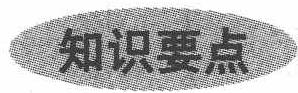

## 一、化学反应速率

## 1. 反应速率及其表示方法

在化学反应中,某物质的浓度(指物质的量浓度)随时间的变化率称反应速率。

## (1) 平均速率

用单位时间内,反应物浓度的减少或生成物浓度的增加来表示。平均速率只能描述在一定的时间间隔内反应速率的大致轮廓。

$$
\bar {v} = \frac {\Delta c}{\Delta t}
$$

## (2) 瞬时速率

若将观察的时间间隔 $\Delta t$ 尽可能缩短, 它的极限是 $\Delta t \rightarrow 0$ , 此时的速率即为某一时刻的真实速率(瞬时速率):

$$
\upsilon_ {\mathrm{瞬时}} = \lim _ {\Delta t \to 0} \Bigl (\frac {\Delta c}{\Delta t} \Bigr) = \frac {\mathrm{d} c}{\mathrm{d} t}
$$

瞬时速率也可用实验作图法求得。即将已知浓度的反应物混合，在指定温度下，每隔一定时间，连续取样分析某一物质的浓度，然后以 c-t 作图，求某一时刻曲线的斜率，即得该时刻的瞬时速率，这也能说明瞬时速率的物理意义。由于产物浓度随时间增加，故曲线在某点的切线斜率为正值；相反，反应物浓度随时间减少，故曲线在某点的切线斜率为负值，因此瞬时反应速率即为各物质浓度时间曲线上某点切线的斜率。

(3) 由于反应速率既可用反应物浓度随时间减少来表示, 又可用生成物浓度随时间增加来表示, 因而反应体系中每一物质的浓度变化均可以用来表示反应速率。

对反应

$$
a \mathrm{A} + b \mathrm{B} \longrightarrow g \mathrm{G} + h \mathrm{H}
$$

$$
v _ {\mathrm{A}} = - \frac {\mathrm{d} c _ {\mathrm{A}}}{\mathrm{d} t} v _ {\mathrm{B}} = - \frac {\mathrm{d} c _ {\mathrm{B}}}{\mathrm{d} t} v _ {\mathrm{G}} = \frac {\mathrm{d} c _ {\mathrm{G}}}{\mathrm{d} t} v _ {\mathrm{H}} = \frac {\mathrm{d} c _ {\mathrm{H}}}{\mathrm{d} t}
$$

上述四种反应速率表示法究竟选哪种是任意的,但它们之间存在着定量的比例关系。如果将反应速率定义为:

$v=-\frac{1}{a}\cdot\frac{dc_{A}}{dt}=-\frac{1}{b}\cdot\frac{dc_{B}}{dt}=\frac{1}{g}\cdot\frac{dc_{G}}{dt}=\frac{1}{h}\cdot\frac{dc_{H}}{dt}$ ，则反应速率的值就与选用的测定对象无关。

## 2. 反应速率理论——碰撞理论简介

化学反应发生的先决条件是分子必须发生碰撞,但不是所有的碰撞都能发生反应,只有当两个反应物分子的能量超过一定数值时,碰撞后才可能发生反应,称为有效碰撞。碰撞理论有两个观点:

第一, 分子无限接近时, 要克服斥力, 这就要求分子具有足够的运动速度, 即能量。具备足够的能量是有效碰撞的必要条件。一组碰撞的反应物分子的总能量必须具备一个最低的能量值。第二, 仅具有足够能量尚不充分, 分子有空间构型, 所以碰撞方向会有所不同, 只有取向合适的碰撞才可能有效。

一般将具备足够能量(碰撞后可反应)的反应物分子,称为活化分子,我们可将活化分子的平均能量与反应物分子的平均能量之差称为活化能,用 Ea 表示。显然 Ea 越大,活化分子百分数则越小,有效碰撞百分数也越小,故反应速率会越小。

不同类型的反应,活化能差别很大,而同一反应,只要温度一定,未放催化剂,则活化能一定,活化分子的百分数也是一定的。

【例 1】 $N_{2}O_{5}$ 的分解反应为

$$
2 \mathrm{N} _ {2} \mathrm{O} _ {5} (\mathrm{g}) \longrightarrow 4 \mathrm{NO} _ {2} (\mathrm{g}) + \mathrm{O} _ {2} (\mathrm{g})
$$

在 $340 \mathrm{~K}$ 测得实验数据如下

<table><tr><td>t/min</td><td>0</td><td>1</td><td>2</td><td>3</td><td>4</td><td>5</td></tr><tr><td> $c(N_2O_5)/(mol·L^{-1})$ </td><td>1.00</td><td>0.70</td><td>0.50</td><td>0.35</td><td>0.25</td><td>0.17</td></tr></table>

试计算该反应进行 1 min 和 3 min 时的反应速率。

过程探究 以 $c(\mathrm{N}_2\mathrm{O}_5)$ 为纵坐标， $t$ 为横坐标作图，可得 $\mathrm{N}_2\mathrm{O}_5$ 浓度随时间变化曲线。

在曲线上任一点作切线,其斜率即为该时刻的 $\frac{dc}{dt}$ 。

1 min 时

$$
\begin{array}{r l} \text {   斜率   } & = \frac {(0 . 9 2 - 0) \mathrm{mol} \cdot \mathrm{L} ^ {- 1}}{(0 - 4 . 1) \mathrm{min}} \\ & = - 0. 2 2 \mathrm{mol} \cdot \mathrm{L} ^ {- 1} \cdot \mathrm{min} ^ {- 1} \\ & (\text {   取   } A, B \text {   两点   }) \end{array}
$$

$$
\begin{array}{r l} v & = \frac {1}{\nu} \frac {\mathrm{d} c}{\mathrm{d} t} = - \frac {1}{2} (- 0. 2 2 \mathrm{mol} \cdot \mathrm{L} ^ {- 1} \cdot \mathrm{min} ^ {- 1}) \\ & = 0. 1 1 \mathrm{mol} \cdot \mathrm{L} ^ {- 1} \cdot \mathrm{min} ^ {- 1} \end{array}
$$

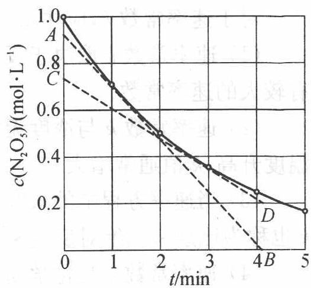  
$\mathbf{N}_2\mathbf{O}_5$ 分解的 $c - t$ 曲线

3 min 时

$$
\begin{array}{r l} \text {斜率} & = \frac {(0 . 7 3 - 0 . 2 0) \mathrm{mol} \cdot \mathrm{L} ^ {- 1}}{(0 - 4 . 2) \mathrm{min}} \\ & = - 0. 1 3 \mathrm{mol} \cdot \mathrm{L} ^ {- 1} \cdot \mathrm{min} ^ {- 1} \quad (\text {取} C, D \text {两点}) \end{array}
$$

$$
v = \frac {1}{\nu} \frac {\mathrm{d} c}{\mathrm{d} t} = - \frac {1}{2} (- 0. 1 3 \mathrm{mol} \cdot \mathrm{L} ^ {- 1} \cdot \mathrm{min} ^ {- 1}) = 0. 0 6 5 \mathrm{mol} \cdot \mathrm{L} ^ {- 1} \cdot \mathrm{min} ^ {- 1}
$$

参考解答 1 min 时, $v = 0.11 \mathrm{~mol} \cdot \mathrm{L}^{-1} \cdot \mathrm{min}^{-1}$ ; 3 min 时, $v = 0.065 \mathrm{~mol} \cdot \mathrm{L}^{-1} \cdot \mathrm{min}^{-1}$ .

## 二、影响化学反应速率的因素

影响化学反应速率的因素很多,除主要取决于反应物的性质外,外界因素也对反应速率有重要作用,如浓度、温度、压强、催化剂等。

思考1：影响化学反应速率的因素还有哪些？

## 1. 浓度对反应速率的影响

在总结大量实验结果的基础上,发现了质量作用定律:恒温下,基元反应的速率与各种反应物浓度以反应分子数为乘幂的乘积成正比。

对于基元反应

$$
a \mathrm{A} + b \mathrm{B} \longrightarrow g \mathrm{G} + h \mathrm{H}
$$

质量作用定律的数学表达式：

$$
\upsilon = k \cdot c _ {\mathrm{A}} ^ {a} \cdot c _ {\mathrm{B}} ^ {b}
$$

称为该反应的速率方程。式中 k 为速率常数，其意义是当各反应物浓度为 $1 \, mol \cdot L^{-1}$ 时的反应速率。

对于速率常数 $k$ ，应注意：

(1) 速率常数 $k$ 取决于反应的本性。当其他条件相同时较快的反应通常有较大的速率常数。

(2) 速率常数 $k$ 与浓度无关, 但受温度及催化剂等影响。 $k$ 随温度而变化, 温度升高, $k$ 值通常增大。

(3) 当速率方程中的浓度为一个单位时, $k$ 的数值等于此时的瞬时速率, 故 $k$ 也称为比速率或绝对反应速率。

(4) 速率常数 $k$ 是化学动力学中一个重要的物理量, 体现了反应体系的速率特征。其单位随具体反应而变, 目的是为了与浓度相乘后保证速率的单位是浓度 $\cdot$ 时间 $^{-1}$ 。

确定速率方程时必须特别注意,质量作用定律仅适用于一步完成的反应——基元反应,而不适用于由几个基元反应组成的总反应——非基元反应。如 $N_{2}O_{5}$ 的分解反应:

$$
2 \mathrm{N} _ {2} \mathrm{O} _ {5} \longrightarrow 4 \mathrm{NO} _ {2} + \mathrm{O} _ {2}
$$

实际上分三步进行：

$$
\begin{array}{l l} {\mathrm {N_ {2} O_ {5}} \longrightarrow \mathrm {NO_ {2}} + \mathrm {NO_ {3}}} & {\text {慢(定速步骤)}} \\ {\mathrm {NO_ {2}} + \mathrm {NO_ {3}} \longrightarrow \mathrm {NO_ {2}} + \mathrm {O_ {2}} + \mathrm{NO}} & {\text {快}} \\ {\mathrm {NO+NO_ {3}} \longrightarrow 2 \mathrm {NO_ {2}}} & {\text {快}} \end{array}
$$

思考2: 这种非基元反应的速率又取决于哪一步呢?

## 2. 压强对化学反应速率的影响

对于气体反应:增大压强(必须是由减小容器容积引起)相当于增大反应物的浓度(相应也增大了活化分子的浓度),反应速率加快。对于只有固体、液体或溶液参加的反应,压强的变化对反应速率的影响,可以忽略不计。

但溶液中的反应常受其他因素影响。如溶剂效应、溶剂的极性和介电常数、溶液的离子强度等因素，都将影响反应速率。

## 3. 温度对反应速率的影响

升高温度一般使反应速率增大,这是因为一方面,升高温度使分子获得更高的能量,活化分子百分数提高;另一方面,升高温度,分子运动加快,单位时间里反应物的碰撞次数增加。一般每升高10℃,化学反应速率增大到原来的2\~4倍。

## 4. 催化剂对反应速率的影响

一种或几种物质能改变化学反应速率,而本身在反应前后其质量及化学性质没有变化,该物质称为催化剂。催化剂改变反应速率的作用,称为催化作用;有催化剂参加的反应,称为催化反应。能加快反应速率的物质称为正催化剂,能延缓反应速率的物质称为负催化剂。生活和生产上常使用正催化剂,如合成氨、 $SO_{2}$ 氧化成 $SO_{3}$ 、氨氧化制硝酸、合成橡胶等;在生命活动中,也大量存在着催化作用,如植物对 $CO_{2}$ 的光合作用,蛋白质及碳水化合物的分解作用等,这些与生命体有关的催化作用称为酶催化或生物催化。

加正催化剂常减小活化能,改变反应速率。如: A+B→AB, Ea 很大,

无催化剂,速率很慢;加入催化剂 K,反应机

理改变： $\mathrm{A} + \mathrm{B} + \mathrm{K}\xrightarrow{\textcircled{①}}\mathrm{AK} + \mathrm{B}\xrightarrow{\textcircled{②}}\mathrm{AB}+$ K，速率会大大加快。

图中可以看出,不仅正反应的活化能减小了,而且逆反应的活化能也降低了。因此,正逆反应都加快了,可使平衡时间提前,但不改变平衡转化率。催化剂不能引发反应,催化剂只能加快那些热力学上可能发生的反应的速率,但不能使热力学上不能进行的反应发生。

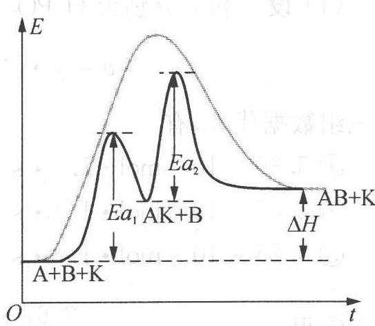  
催化剂改变反应活化能的示意图  
若产物之一对反应本身有催化作用,则称之为自催化反应。如:

$$
2 \mathrm{MnO} _ {4} ^ {-} + 6 \mathrm{H} ^ {+} + 5 \mathrm{H} _ {2} \mathrm{C} _ {2} \mathrm{O} _ {4} \longrightarrow 1 0 \mathrm{CO} _ {2} \uparrow + 8 \mathrm{H} _ {2} \mathrm{O} + 2 \mathrm{Mn} ^ {2 +}
$$

产物中 $Mn^{2+}$ 对反应有催化作用。

思考3：自催化反应过程的速率变化图会有什么特点呢？

【例2】在碱性溶液中,次磷酸根离子 $\left(\mathrm{H}_{2}\mathrm{PO}_{2}^{-}\right)$ 分解为亚磷酸根离子 $\left(\mathrm{HPO}_{3}^{2-}\right)$ 和氢气,反应式为

$$
\mathrm{H} _ {2} \mathrm{PO} _ {2} ^ {-} (\mathrm{aq}) + \mathrm{OH} ^ {-} (\mathrm{aq}) \longrightarrow \mathrm{HPO} _ {3} ^ {2 -} (\mathrm{aq}) + \mathrm{H} _ {2} (\mathrm{g})
$$

在一定的温度下,实验测得下列数据

<table><tr><td>实验编号</td><td> $c(H_2PO_2^-)/(mol·L^{-1})$ </td><td> $c(OH^-)/(mol·L^{-1})$ </td><td> $v/(mol·L^{-1}·s^{-1})$ </td></tr><tr><td>1</td><td>0.10</td><td>0.10</td><td> $5.30×10^{-9}$ </td></tr><tr><td>2</td><td>0.50</td><td>0.10</td><td> $2.67×10^{-8}$ </td></tr><tr><td>3</td><td>0.50</td><td>0.40</td><td> $4.25×10^{-7}$ </td></tr></table>

试求:(1) 速率方程式;

(2) 速率常数 k；

(3) $c(\mathrm{H}_{2} \mathrm{PO}_{2}^{-}) = c(\mathrm{OH}^{-}) = 1.0 \mathrm{~mol} \cdot \mathrm{L}^{-1}$ 时, $10 \mathrm{~L}$ 溶液在 $2.0 \mathrm{~s}$ 时间内放出 $\mathrm{H}_{2}$ 的体积为多少 (标准状况下)?

过程探究 本题涉及的是非基元反应,不能直接使用质量作用定律。

非基元反应必须通过实验来确定其速率方程式。本题介绍一种比较简单的由实验确立速率方程式的方法——改变物质数量比例法。

(1) 设 $x$ 和 $y$ 分别为 ${\mathrm{H}}_{2}{\mathrm{{PO}}}_{2}^{ - }$ 和 ${\mathrm{{OH}}}^{ - }$ 的反应级数,则该反应的速率方程为

$$
v = k \cdot c ^ {x} (\mathrm{H} _ {2} \mathrm{PO} _ {2} ^ {-}) \cdot c ^ {y} (\mathrm{OH} ^ {-})
$$

把三组数据代入,有

$$
① 5. 3 0 \times 1 0 ^ {- 9} \mathrm{mol} \cdot \mathrm{L} ^ {- 1} \cdot \mathrm{s} ^ {- 1} = k (0. 1 0 \mathrm{mol} \cdot \mathrm{L} ^ {- 1}) ^ {x} (0. 1 0 \mathrm{mol} \cdot \mathrm{L} ^ {- 1}) ^ {y}
$$

$$
2. 6 7 \times 1 0 ^ {- 8} \mathrm{mol} \cdot \mathrm{L} ^ {- 1} \cdot \mathrm{s} ^ {- 1} = k (0. 5 0 \mathrm{mol} \cdot \mathrm{L} ^ {- 1}) ^ {x} (0. 1 0 \mathrm{mol} \cdot \mathrm{L} ^ {- 1}) ^ {y}
$$

$$
4. 2 5 \times 1 0 ^ {- 7} \mathrm{mol} \cdot \mathrm{L} ^ {- 1} \cdot \mathrm{s} ^ {- 1} = k (0. 5 0 \mathrm{mol} \cdot \mathrm{L} ^ {- 1}) ^ {x} (0. 4 0 \mathrm{mol} \cdot \mathrm{L} ^ {- 1}) ^ {y}
$$

②÷①得

$$
\frac {2 . 6 7 \times 1 0 ^ {- 8}}{5 . 3 0 \times 1 0 ^ {- 9}} = \left(\frac {0 . 5 0}{0 . 1 0}\right) ^ {x}
$$

$$
5. 0 = 5. 0 ^ {x} \quad x = 1. 0
$$

③÷②得

$$
\frac {4 . 2 5 \times 1 0 ^ {- 7}}{2 . 6 7 \times 1 0 ^ {- 8}} = \left(\frac {0 . 4 0}{0 . 1 0}\right) ^ {y}
$$

$$
1 6 = 4. 0 ^ {y} \quad y = 2. 0
$$

所以速率方程式为

$$
v = k c (\mathrm{H} _ {2} \mathrm{PO} _ {2} ^ {-}) \cdot c ^ {2} (\mathrm{OH} ^ {-})
$$

(2) 将表中任意一组数据代入速率方程式, 可求得 $k$ 值。现取第一组数据

$$
k = \frac {5 . 3 0 \times 1 0 ^ {- 9} \mathrm{mol} \cdot \mathrm{L} ^ {- 1} \cdot \mathrm{s} ^ {- 1}}{0 . 1 0 \mathrm{mol} \cdot \mathrm{L} ^ {- 1} \times (0 . 1 0 \mathrm{mol} \cdot \mathrm{L} ^ {- 1}) ^ {2}} = 5. 3 \times 1 0 ^ {- 6} \mathrm{L} ^ {2} \cdot \mathrm{mol} ^ {- 2} \cdot \mathrm{s} ^ {- 1}
$$

$$
\begin{array}{r l} (3) v & = 5. 3 \times 1 0 ^ {- 6} \mathrm{L} ^ {2} \cdot \mathrm{mol} ^ {- 2} \cdot \mathrm{s} ^ {- 1} \times 1. 0 \mathrm{mol} \cdot \mathrm{L} ^ {- 1} \times (1. 0 \mathrm{mol} \cdot \mathrm{L} ^ {- 1}) ^ {2} \\ & = 5. 3 \times 1 0 ^ {- 6} \mathrm{mol} \cdot \mathrm{L} ^ {- 1} \cdot \mathrm{s} ^ {- 1} \end{array}
$$

放出 $\mathrm{H}_{2}$ 的体积为

$$
\begin{array}{r l} V & = 5. 3 \times 1 0 ^ {- 6} \mathrm{mol} \cdot \mathrm{L} ^ {- 1} \cdot \mathrm{s} ^ {- 1} \times 1 0 \mathrm{L} \times 2. 0 \mathrm{s} \times 2 2. 4 \times 1 0 ^ {3} \mathrm{mL} \cdot \mathrm{mol} ^ {- 1} \\ & = 2. 4 \mathrm{mL} \end{array}
$$

参考解答 (1) 速率方程式为 $v = {kc}\left( {{\mathrm{H}}_{2}{\mathrm{{PO}}}_{2}^{ - }}\right)  \cdot  {c}^{2}\left( {\mathrm{{OH}}}^{ - }\right)$

(2) 速率常数 $k = 5.3 \times 10^{-6} \mathrm{~L}^{2} \cdot \mathrm{mol}^{-2} \cdot \mathrm{s}^{-1}$

(3) ${\mathrm{H}}_{2}$ 体积为 ${2.4}\mathrm{\;{mL}}$

## 三、化学平衡

## 1. 实验平衡常数

实验证明,在一定条件下进行的可逆反应,其反应物和产物的平衡浓度间存在某种定量关系。若可逆反应用下述通式表示:

$$
a \mathrm{A} + b \mathrm{B} \rightleftharpoons d \mathrm{D} + e \mathrm{E}
$$

在一定温度下达到平衡时,则有:

$$
\frac {[ \mathrm{D} ] ^ {d} [ \mathrm{E} ] ^ {e}}{[ \mathrm{A} ] ^ {a} [ \mathrm{B} ] ^ {b}} = K _ {c}
$$

即平衡时,产物的浓度以化学计量数为指数的幂的乘积与反应物浓度以化学计量数为指数的幂的乘积之比是一个常数。如由实验直接测定的,则称之为实验平衡常数或经验平衡常数。

书写平衡常数关系式应注意：

(1) 对于气相反应,平衡常数除可用各物质平衡浓度表示外,也可用平衡时各物质的分压表示,如:

$$
\begin{array}{r l}a \mathrm{A(g)} + b \mathrm{B(g)}&\rightleftharpoons d \mathrm{D(g)} + e \mathrm{E(g)}\\K _ {p}&= \frac {(p _ {\mathrm{D}}) ^ {d} (p _ {\mathrm{E}}) ^ {e}}{(p _ {\mathrm{A}}) ^ {a} (p _ {\mathrm{B}}) ^ {b}}\end{array}
$$

式中实验平衡常数以 $K_{p}$ 表示，为与 $K_{c}$ 相区别。 $K_{p}$ 称为压力常数， $K_{c}$ 称为浓度平衡常数。

思考4: 同一反应的 $K_{p}$ 与 $K_{c}$ 有何关系? 如何推导?

(2) 不要把反应体系中纯固体、纯液体以及稀的水溶液中水的浓度写进平衡常数表达式。例如：

$$
\begin{array}{r l}&\mathrm {CaCO_ {3} (s)} \rightleftharpoons \mathrm {CaO(s) + CO_ {2} (g)} \quad K _ {p} = p _ {\mathrm {CO_ {2}}}\\&\mathrm {Cr_ {2} O_ {7} ^ {2 - } (aq)+ H_ {2} O(l)} \rightleftharpoons 2 \mathrm {CrO_ {4} ^ {2 - } (aq) + 2H^ {+} (aq)}\\&K _ {c} = [ \mathrm {CrO_ {4} ^ {2 - }} ] ^ {2} [ \mathrm {H^ {+}} ] ^ {2} / [ \mathrm {Cr_ {2} O_ {7} ^ {2 - }} ]\end{array}
$$

但非水溶液中反应,若有水参加或生成,则此时水的浓度不可视为常数,应写进平衡常数表达式中。例如:

$$
\begin{array}{r l}&{\mathrm {C_ {2} H_ {5} OH + CH_ {3} COOH\rightleftharpoons CH_ {3} COOC_ {2} H_ {5} + H_ {2} O}}\\&{\qquad K _ {c} = \frac {[ \mathrm {CH_ {3} COOC_ {2} H_ {5}} ] [ \mathrm {H_ {2} O} ]}{[ \mathrm {C_ {2} H_ {5} OH} ] [ \mathrm {CH_ {3} COOH} ]}}\end{array}
$$

(3) 同一化学反应, 化学反应方程式写法不同, 其平衡常数表达式及数值亦不同。例如:

$$
\begin{array}{r l}&3 \mathrm{H} _ {2} (\mathrm{g}) + \mathrm{N} _ {2} (\mathrm{g}) \rightleftharpoons 2 \mathrm{NH} _ {3} (\mathrm{g}) \quad K _ {c} = \frac {[ \mathrm{NH} _ {3} ] ^ {2}}{[ \mathrm{H} _ {2} ] ^ {3} [ \mathrm{N} _ {2} ]}\\&\frac {3}{2} \mathrm{H} _ {2} (\mathrm{g}) + \frac {1}{2} \mathrm{N} _ {2} (\mathrm{g}) \rightleftharpoons \mathrm{NH} _ {3} (\mathrm{g}) \quad K _ {c} = \frac {[ \mathrm{NH} _ {3} ]}{[ \mathrm{H} _ {2} ] ^ {3 / 2} [ \mathrm{N} _ {2} ] ^ {1 / 2}}\end{array}
$$

因此书写平衡常数表达式及数值,要与化学反应方程式相一致,否则意义不明确。

平衡常数是表明化学反应进行到最大限度(即反应限度)时的特征值。平衡常数愈大,表示反应进行愈完全。虽然转化率也能表示反应进行的限度,但转化率不仅与温度条件有关,而且与起始浓度有关。若有几种反应物的化学反应,对不同反应物,其转化率也可能不同。而平衡常数则能表示一定温度下各种起始浓度下反应进行的限度。

## 2. 标准平衡常数

等温等压下,对理想气体反应:

$$
d \mathrm{D} + e \mathrm{E} \rightleftharpoons f \mathrm{F} + h \mathrm{H}
$$

设 $p_{\mathrm{D}}$ 、 $p_{\mathrm{E}}$ 、 $p_{\mathrm{F}}$ 、 $p_{\mathrm{H}}$ 分别为 $\mathrm{D}$ 、 $\mathrm{E}$ 、 $\mathrm{F}$ 、 $\mathrm{H}$ 的平衡分压，则有：

$$
K _ {p} ^ {\ominus} = \frac {\left(\frac {p _ {\mathrm{F}}}{p ^ {\ominus}}\right) ^ {f} \cdot \left(\frac {p _ {\mathrm{H}}}{p ^ {\ominus}}\right) ^ {h}}{\left(\frac {p _ {\mathrm{D}}}{p ^ {\ominus}}\right) ^ {d} \cdot \left(\frac {p _ {\mathrm{E}}}{p ^ {\ominus}}\right) ^ {e}}
$$

式中 $K_{p}^{\ominus}$ 称理想气体的热力学平衡常数——标准平衡常数。

热力学中可证明,气相反应达平衡时,标准吉布斯自由能增量 $\Delta_{r}G_{m}^{\ominus}$ 与 $K_{p}^{\ominus}$ 应有如下关系:

$$
\Delta_ {r} G _ {m} ^ {\ominus} = - R T \ln K _ {p} ^ {\ominus}
$$

此内容将在第三册书中深化讲解。

## 3. 平衡转化率的计算

(1) 平衡转化率

$$
\mathrm{平衡转化率} = \frac {\mathrm{平衡后反应物消耗量}}{\mathrm{反应物投料量}} \times 100
$$

平衡转化率也叫理论转化率或最高转化率,是平衡后反应物转化为产物的百分率。实际转化率是指在实际情况下,反应结束时的反应物转化的百分率,由于实际情况往往不能达到平衡,所以实际的转化率常低于平衡转化率。

(2) 平衡产率(最大产率)——以产品来衡量反应的限度

$$
\mathrm{平衡产率} = \frac {\mathrm{平衡时主要产品的产量}}{\mathrm{原料按化学反应方程式全部变为主要产品时的产量}} \times 100
$$

(产率通常用在多方向的反应中,即有副反应的反应中)

当有副反应时,产率<转化率

【例3】 $1000 \mathrm{~K}$ 时的一个平衡体系中含 $\mathrm{NH}_{3} 0.102 \mathrm{~mol} \cdot \mathrm{L}^{-1}, \mathrm{~N}_{2} 1.03 \mathrm{~mol} \cdot \mathrm{L}^{-1}, \mathrm{H}_{2} 1.62 \mathrm{~mol} \cdot \mathrm{L}^{-1}$ 。计算 $1000 \mathrm{~K}$ 时反应 $\mathrm{N}_{2} (\mathrm{~g}) + 3 \mathrm{H}_{2} (\mathrm{~g}) \rightleftharpoons 2 \mathrm{NH}_{3} (\mathrm{~g})$ 的 $K_{c}, K_{p}$ 。

过程探究 计算 $K_{c}$ 需要知道每种物质的平衡浓度 $(\mathrm{mol} \cdot \mathrm{L}^{-1})$ ，各物质的平衡浓度已在题中给出： $[\mathrm{NH}_{3}] = 0.102 \mathrm{~mol} \cdot \mathrm{L}^{-1}, [\mathrm{N}_{2}] = 1.03 \mathrm{~mol} \cdot \mathrm{L}^{-1}, [\mathrm{H}_{2}] = 1.62 \mathrm{~mol} \cdot \mathrm{L}^{-1}$ ，所以

$$
K _ {c} = \frac {[ \mathrm{NH} _ {3} ] ^ {2}}{[ \mathrm{N} _ {2} ] [ \mathrm{H} _ {2} ] ^ {3}} = \frac {(0 . 1 0 2) ^ {2}}{(1 . 0 3) (1 . 6 2) ^ {3}} = 2. 3 8 \times 1 0 ^ {- 3} (\mathrm{mol} \cdot \mathrm{L} ^ {- 1}) ^ {- 2}
$$

计算 $K_{p}$ :

解法1 计算 $K_{p}$ 需要知道每种物质的平衡分压, 可近似地把上述气体看成理想气体, 因此可用 $pV = nRT$ 来计算 $p, p = \left(\frac{n}{V}\right)RT = cRT$ 。

因为

$$
\begin{array}{r l} & p (\mathrm {NH_ {3}}) = (0. 1 0 2) \times (R T) \\ & p (\mathrm {N_ {2}}) = (1. 0 3) \times (R T) \\ & p (\mathrm {H_ {2}}) = (1. 6 2) \times (R T) \end{array}
$$

所以

$$
K _ {p} = \frac {p ^ {2} (\mathrm{NH} _ {3})}{p (\mathrm{N} _ {2}) \times p ^ {3} (\mathrm{H} _ {2})} = 3. 4 4 \times 1 0 ^ {- 1 1} (\mathrm{kPa} ^ {- 2})
$$

解法 2 利用 $K_{p}$ 与 $K_{c}$ 的关系式 $K_{p} = K_{c}(RT)^{\Delta n}$ 来计算 $K_{p}$ :

$$
K _ {p} = 2. 3 8 \times 1 0 ^ {- 3} \times (8. 3 1 4 \times 1 0 0 0) ^ {- 2} = 3. 4 4 \times 1 0 ^ {- 1 1} (\mathrm{kPa} ^ {- 2})
$$

此处 $\Delta n$ 等于生成物化学计量数之和减去反应物化学计量数之和。

参考解答 $K_{c}$ 为 $2.38 \times 10^{-3} (\mathrm{~mol} \cdot \mathrm{L}^{-1})^{-2}$ , $K_{p}$ 为 $3.44 \times 10^{-11} (\mathrm{kPa}^{-2})$

## 四、外界因素对化学平衡的影响

## 1. 浓度对平衡的影响

在其他条件不变的情况下,增加反应物浓度或减少生成物浓度,平衡向正反应方向移动;增加生成物浓度或减少反应物浓度,平衡向逆反应方向移动。

## 2. 压力对平衡的影响

体系(总)压力的变化对没有气体参加或生成的反应影响很小。对于有气体参加且反应前后气体物质计量数有变化的反应,压力变化对平衡有影响。例如合成氨反应

$$
\mathrm{N} _ {2} (\mathrm{g}) + 3 \mathrm{H} _ {2} (\mathrm{g}) \rightleftharpoons 2 \mathrm{NH} _ {3} (\mathrm{g})
$$

在某温度下达到平衡时有：

$$
K _ {p} ^ {\ominus} = \frac {(p _ {\mathrm{NH} _ {3}} / p ^ {\ominus}) ^ {2}}{(p _ {\mathrm{N} _ {2}} / p ^ {\ominus}) (p _ {\mathrm{H} _ {2}} / p ^ {\ominus}) ^ {3}}
$$

如果将体系的容积减少一半,使体系的总压力增加至原来的2倍,这时各组分的分压分别为原来的2倍,反应商为:

即

$$
\begin{array}{r} Q _ {p} = \frac {(2 p _ {\mathrm {NH_ {3}}} / p ^ {\ominus}) ^ {2}}{(2 p _ {\mathrm {N_ {2}}} / p ^ {\ominus}) (2 p _ {\mathrm {H_ {2}}} / p ^ {\ominus}) ^ {3}} = \frac {1}{4} K _ {p} ^ {\ominus} \\ Q _ {p} <   K _ {p} ^ {\ominus} \end{array}
$$

原平衡破坏, 反应正向进行。随着反应进行, $p_{\mathrm{N}_{2}}$ 、 $p_{\mathrm{H}_{2}}$ 不断下降, $p_{\mathrm{NH}_{3}}$ 不断增大, 使 $Q_{p}$ 值增大, 直到 $Q_{p}$ 再次与 $K_{p}^{\ominus}$ 相等, 达到新的平衡为止。可见, 增大体系总压力平衡向着气体计量数减小的方向移动。

思考5: 用反应商 $Q_{p}$ 与 $K_{p}^{\ominus}$ 的大小关系分析容积增大压力减小时, 该反应平衡向何方向移动?

惰性气体的存在并不影响平衡常数, 却能影响平衡组成, 即能使平衡发生移动。在实际生产中, 原料气中常混有不发生反应的惰性气体, 例如在合成氨的原料气中常含有 $\mathrm{Ar} 、 \mathrm{CH}_{4}$ 等气体; 在 $\mathrm{SO}_{2}$ 的转化反应中, 需要的是氧气, 而通入的是空气, 多余的 $\mathrm{N}_{2}$ 不参加反应, 这些就成为反应体系中的惰性气体。这些惰性气体虽不参加反应, 但却能影响平衡移动。

当总压一定时,惰性气体的存在实际上起了稀释的作用,它和减少反应体

系总压的效应一致。

对于分子数增加的反应,添加惰性气体对正向反应有利;对于分子数减小的反应,添加惰性气体对正向反应不利。可见添加惰性气体与减少各组分分压的作用相同。例如,乙苯脱氢制苯乙烯,在反应体系中通入水蒸气,可增加乙苯的实际转化率。

## 3. 温度对平衡的影响

温度的改变可以改变平衡常数。

升温使平衡向吸热方向移动。反之，降温使平衡向放热方向移动。原因也将在第三册书中深化讲解。

各种外界条件对化学平衡的影响,均符合勒沙特列概括的一条普遍规律:如果改变影响平衡的一个条件(如浓度、压强和温度等),平衡就向着能够减弱这种改变的方向移动。

注意催化剂不能改变平衡常数 $K$ , 催化剂在加快正反应速率的同时也加快逆反应速率, 而且对正、逆反应速率是按相同比例增加的。根据这个原理, 一个对正向反应有效的催化剂对逆向反应也一定有效。例如, 对脱氢反应有效的催化剂, 对加氢反应也一定有效。因此加催化剂对平衡移动无影响, 但可缩短到达平衡的时间。

【例 4】 反应 $\mathrm{CO(g)+H_{2}O(g)\rightleftharpoons H_{2}(g)+CO_{2}(g)}$ 在密闭容器中建立平衡,749 K 时平衡常数 $K_{c}=2.60$ 。试回答:

(1) 计算物质的量之比 $\left(\mathrm{H}_{2}\mathrm{O}/\mathrm{CO}\right)$ 为1时CO的理论转化率；

(2) 计算物质的量之比 $\left(\mathrm{H}_{2}\mathrm{O}/\mathrm{CO}\right)$ 为3时CO的理论转化率；

(3) 根据计算结果说明浓度对化学平衡移动的影响。

过程探究 (1) 设起始物质的浓度均为 $a \mathrm{~mol} \cdot \mathrm{L}^{- 1}$ , 平衡时反应已消耗的物质的浓度为 $x \mathrm{~mol} \cdot \mathrm{L}^{- 1}$ , 则

$$
\mathrm{CO(g)} + \mathrm {H_ {2} O(g)} \rightleftharpoons \mathrm {H_ {2} (g)} + \mathrm {CO_ {2} (g)}
$$

起始物质的浓度/ $(\mathrm{mol}\cdot \mathrm{L}^{-1})$ a a 0 0

平衡时物质的浓度/ $(\mathrm{mol}\cdot\mathrm{L}^{-1})$ a-x a-x x x

$$
K _ {c} = \frac {[ \mathrm{H} _ {2} ] [ \mathrm{CO} _ {2} ]}{[ \mathrm{CO} ] [ \mathrm{H} _ {2} \mathrm{O} ]} = \frac {x ^ {2}}{(a - x) ^ {2}} = 2. 6 0
$$

即 $\frac{x}{a - x} = 1.61$ ，解得 $x = 0.617a$ 。

理论转化率 $\alpha = \frac{0.617a}{a} \times 100\% = 61.7\%$ 。

## (2) 设起始物质的浓度为

$$
[ \mathrm{CO} ] = b \mathrm{mol} \cdot \mathrm{L} ^ {- 1}, [ \mathrm{H} _ {2} \mathrm{O} ] = 3 b \mathrm{mol} \cdot \mathrm{L} ^ {- 1}
$$

平衡时反应已消耗的物质的浓度为 $y \, mol \cdot L^{-1}$ ，则

$$
\mathrm{CO(g)} + \mathrm {H_ {2} O(g)} \rightleftharpoons \mathrm {H_ {2} (g)} + \mathrm {CO_ {2} (g)}
$$

起始物质的浓度/ $(\mathrm{mol}\cdot\mathrm{L}^{-1})$ b 3b 0 0
平衡时物质的浓度/ $(\mathrm{mol}\cdot\mathrm{L}^{-1})$ b-y 3b-y y y

$$
K _ {c} = \frac {[ \mathrm{H} _ {2} ] [ \mathrm{CO} _ {2} ]}{[ \mathrm{CO} ] [ \mathrm{H} _ {2} \mathrm{O} ]} = \frac {y ^ {2}}{(b - y) (3 b - y)} = 2. 6 0
$$

解得 y = 0.866b。

理论转化率 $\alpha=\frac{0.866b}{b}\times100\%=86.6\%$ .

(3) 从计算结果可以看出: 增加某一反应物 (如 $\mathrm{H}_{2} \mathrm{O}$ ) 的比例, 平衡向右移动, 从而提高另一反应物 (如 CO) 的理论转化率。

参考解答 (1) $61.7\%$ (2) $86.6\%$ (3) 增加某一反应物浓度, 平衡会正向移动, 从而提高另一反应物的转比率。

## 五、化学反应速率与化学平衡的实际应用

化学反应速率与化学平衡是化工生产中两个非常重要且彼此相关的问题。选择合理适宜的生产条件时要考虑以下几方面。

## 1. 浓度

对于任何一个反应,增大反应物的浓度,可提高反应速率,因而实际生产中常采用廉价原料过量的办法,来提高另一原料的转化率。例如为使 CO 充分转化为 $CO_{2}$ , 常通入过量的水蒸气。但是, 当使一种原料过量时, 应该配比适当, 否则会引起设备利用率降低, 而将另一种原料过分稀释。

## 2. 压强

对于反应后气体分子数减少的气相反应,增加压强可使平衡正向移动,如在合成氨工业中,增大压强不但能增加反应速率,而且能提高氨的产率。在 $1000\times10^{5}$ Pa下,不用催化剂就可以合成氨,但在增加反应速率提高转化率的同时,还应考虑设备的耐压能力和安全问题。由于 $H_{2}$ 在高压下能穿透特种钢制造的反应器,故合成氨在工业生产上一般采用 $600 \times 10^{5}$ Pa,并用适当的催化剂。

## 3. 温度

对于放热反应,升高温度会提高反应速率,但会使转化率降低。对于吸热反应,升温既能加快反应速率又能提高转化率,但要避免产物因过热而分解,以致影响产率。而使用催化剂要注意其活性温度。

## 4. 同时平衡

相同的反应物,若同时能发生几种反应,则应选择合适的催化剂以保证某种反应的进行,得到预期的产物。如果体系中有两个或两个以上的化学反应同时进行,则称为同时平衡。其特点是:当反应体系达到平衡后,某组分同时参与了几个不同反应,但其平衡浓度只有一个,在各个反应的平衡浓度表达式中,该组分的浓度值应相等。

【例1】（2002年全国初赛）Xe 和 $F_{2}$ 反应，可得三种氟化物，视反应条件而定。右图表述的是将 $0.125 \, mol \cdot L^{-1} \, Xe$ 和 $1.225 \, mol \cdot L^{-1} \, F_{2}$ 作为始态得到的生成物在平衡体系内的分压与反应温度的关系。

(1) 应在什么温度下制备 $\mathrm{XeF}_{6}$ 和 $\mathrm{XeF}_{4}$ ?

(2) Xe 和 $F_{2}$ 生成 $XeF_{6}$ 和 $XeF_{4}$ ，哪个反应放热更多？生成 \_\_\_\_ 的反应放热更多。理由为 \_\_\_\_ 。

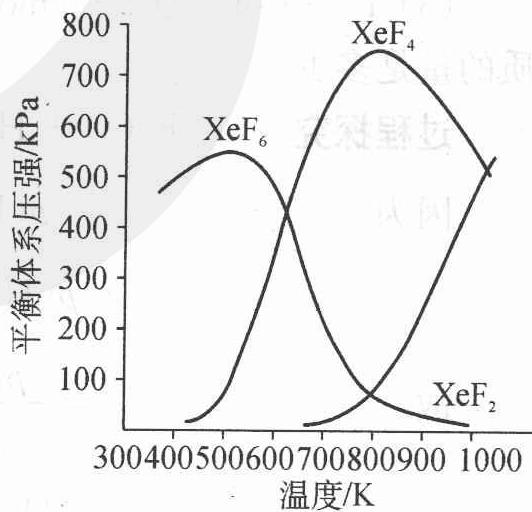

(3) 为有效地制备 $\mathrm{XeF}_{2}$ , 应在什么反应条件下为好? 简述理由。

过程探究 （1）由图可知， $XeF_{6}$ 与 $XeF_{4}$ 的平衡体系压强在图中处于最高点时的温度分别约为 550 K 和 750 K，因此应分别在 550 K 和 750 K 的温度下制备 $XeF_{6}$ 与 $XeF_{4}$ 。

(2) 生成 $\mathrm{XeF}_{6}$ 的反应放热更多。若 $\mathrm{Xe}$ 与 $\mathrm{F}_{2}$ 生成 $\mathrm{XeF}_{4}$ 的反应放热多, 反应 $\mathrm{XeF}_{4} + \mathrm{F}_{2} \longrightarrow \mathrm{XeF}_{6}$ 将是吸热反应, 温度升高应有利于 $\mathrm{XeF}_{6}$ 的生成, 而由图可见, 事实恰恰相反。(或答: 反应 $\mathrm{XeF}_{6} \longrightarrow \mathrm{XeF}_{4} + \mathrm{F}_{2}$ 发生在相对较高的温度下)

(3) 在上图条件下必须在高温下才能制备 $\mathrm{XeF}_{2}$ , 但高温要求的技术问题

太多,因而应降低投料中 $\frac{F_{2}}{Xe}$ 的比值,可有效制备 $XeF_{2}$ 。

参考解答 (1) $550 \mathrm{~K}$ 制 $\mathrm{XeF}_{6}, 750 \mathrm{~K}$ 制 $\mathrm{XeF}_{4}$ 。

(2) 生成 $\mathrm{XeF}_{6}$ 的反应放热更多, 理由见上。

(3) 应增大 Xe 的量, 减少 $F_{2}$ 的量。

【例2】（2003年江苏预赛）1273 K时 $H_{2}O(g)$ 通过红热的铁生产 $H_{2}$ ，发生如下反应：

$$
\mathrm{Fe(s)} + \mathrm {H_ {2} O(g)} \rightleftharpoons \mathrm{FeO(s)} + \mathrm {H_ {2} (g)}
$$

反应的平衡常数 $K_{p} = 1.49$ ( $K_{p}$ 是以各平衡混合气体分压表示的化学平衡常数)。

(1) 每生成 $1.00 \mathrm{~mol}$ 氢气需通入水蒸气的物质的量为多少?

(2) $1273 \mathrm{~K}$ 时, 若反应体系中只有 $0.30 \mathrm{~mol}$ 的铁并通入 $1.00 \mathrm{~mol}$ 水蒸气与其反应, 试计算反应后各组分的物质的量。反应后体系是否处于平衡状态,为什么?

(3) $1273 \mathrm{~K}$ 时, 当 $1.00 \mathrm{~mol}$ 水蒸气与 $0.80 \mathrm{~mol}$ 铁接触时, 最后各组分的物质的量是多少?

过程探究 (1) $\mathrm{Fe(s)} + \mathrm{H}_{2}\mathrm{O(g)} \rightleftharpoons \mathrm{FeO(s)} + \mathrm{H}_{2}(g)$

因为

$$
p (\mathrm{H} _ {2}) = n (\mathrm{H} _ {2}) R T / V
$$

$$
p (\mathrm{H} _ {2} \mathrm{O}) = n (\mathrm{H} _ {2} \mathrm{O}) R T / V
$$

故

$$
K _ {p} = \frac {p (\mathrm{H} _ {2})}{p (\mathrm{H} _ {2} \mathrm{O})} = \frac {n (\mathrm{H} _ {2})}{n (\mathrm{H} _ {2} \mathrm{O})} = 1. 4 9
$$

平衡时， $n(\mathrm{H}_2\mathrm{O}) = \frac{n(\mathrm{H}_2)}{1.49}\approx 0.671\mathrm{mol}$

因此起始时通入 $\mathrm{H}_2\mathrm{O}(\mathrm{g})$ 的物质的量为： $n(\mathrm{H}_2)_\text{平} + n(\mathrm{H}_2\mathrm{O})_\text{平} = 1.00+$ $0.671 = 1.67\mathrm{mol}$

注意该反应是一个可逆反应,存在化学平衡,故该反应不能进行到底,所以不能误认为通入的水蒸气的物质的量就是氢气的物质的量。

(2) 假设 $0.30 \mathrm{~mol}$ 铁与 $1.00 \mathrm{~mol}$ 水蒸气完全反应, 则生成 $\mathrm{H}_{2}$ 的物质的量 $n(\mathrm{H}_{2}) = 0.30 \mathrm{~mol}$ 。此时用于平衡的 $\mathrm{H}_{2} \mathrm{O}(\mathrm{g})$ 的物质的量为:

$$
n (\mathrm{H} _ {2} \mathrm{O}) = \frac {0 . 3 0}{1 . 4 9} \approx 0. 2 0 \mathrm{mol}
$$

所以当 0.30 mol Fe 完全反应时共需 $H_{2}O(g)$ 为: $0.20 + 0.30 = 0.50 \, mol$

现有 1.00 mol 水蒸气, 故铁粉可完全反应。此时各组分的物质的量分别为:

$$
\begin{array}{r l} & n (\mathrm{H} _ {2}) = 0. 3 0 \mathrm{mol} \\ & n (\mathrm{H} _ {2} \mathrm{O}) = 1. 0 0 - 0. 3 0 = 0. 7 0 \mathrm{mol} \\ & n (\mathrm{FeO}) = 0. 3 0 \mathrm{mol} \\ & n (\mathrm{Fe}) = 0 \mathrm{mol} \end{array}
$$

故 $\frac{n(\mathrm{H}_2)}{n(\mathrm{H}_2\mathrm{O})} = \frac{0.30}{0.70}\approx 0.43 <   K_p = 1.49$

因此，此时体系没有达到平衡。

(3) 当 $1.00 \mathrm{~mol}$ 水蒸气与 $0.80 \mathrm{~mol}$ 铁接触时, 显然不能使铁完全反应, 设反应的 Fe 的物质的量为 $x \mathrm{~mol}$ , 则:

$$
\begin{array}{r l r l r l}&&{\mathrm {Fe(s)+ H_ {2} O(g)\rightleftharpoons FeO(s)+ H_ {2} (g)}}\\{n (\text {起始})}&{0. 8 0}&{1. 0 0}&{0}&{0}\\{n (\text {转化})}&{x}&{x}&{x}&{x}\\{n (\text {平衡})}&{0. 8 0 - x}&{1. 0 0 - x}&{x}&{x}\end{array}
$$

故有 $\frac{x}{1.00 - x} = K_{p} = 1.49$ ，解得 $x = 0.60\mathrm{mol}$

此时体系各组分的物质的量分别为：

$$
\begin{array}{r l} & n (\mathrm{H} _ {2}) = 0. 6 0 \mathrm{mol}, n (\mathrm{H} _ {2} \mathrm{O}) = 0. 4 0 \mathrm{mol} \\ & n (\mathrm{FeO}) = 0. 6 0 \mathrm{mol}, n (\mathrm{Fe}) = 0. 2 0 \mathrm{mol} \end{array}
$$

参考解答 (1) 需通入水蒸气的物质的量为 $1.67 \mathrm{~mol}$

(2) 反应后各组分的物质的量 $n(\mathrm{H}_{2}) = 0.30 \mathrm{~mol}$ , $n(\mathrm{H}_{2} \mathrm{O}) = 0.70 \mathrm{~mol}$ , $n(\mathrm{FeO}) = 0.30 \mathrm{~mol}$ , $n(\mathrm{Fe}) = 0 \mathrm{~mol}$ , 反应后体系没有达到平衡, 理由见上

(3) 最后各组分的物质的量是 $n(\mathrm{H}_{2}) = 0.60 \mathrm{~mol}$ , $n(\mathrm{H}_{2} \mathrm{O}) = 0.40 \mathrm{~mol}$ , $n(\mathrm{FeO}) = 0.60 \mathrm{~mol}$ , $n(\mathrm{Fe}) = 0.20 \mathrm{~mol}$ 。

【例3】（2008年广东高考）某探究小组用 $\mathrm{HNO}_3$ 与大理石反应过程中质量减小的方法，研究影响反应速率的因素。所用 $\mathrm{HNO}_3$ 浓度为 $1.00 \, \mathrm{mol} \cdot \mathrm{L}^{-1}$ 、 $2.00 \, \mathrm{mol} \cdot \mathrm{L}^{-1}$ ，大理石有细颗粒与粗颗粒两种规格，实验温度为 $298 \, \mathrm{K}$ 、 $308 \, \mathrm{K}$ ，每次实验 $\mathrm{HNO}_3$ 的用量为 $25.0 \, \mathrm{mL}$ 、大理石用量为 $10.00 \, \mathrm{g}$ 。

(1) 请完成以下实验设计表, 并在实验目的一栏中填出对应的实验编号:

<table><tr><td>实验编号</td><td>T/K</td><td>大理石规格</td><td>HNO3浓度/(mol·L-1)</td><td>实验目的</td></tr><tr><td>1</td><td>298</td><td>粗颗粒</td><td>2.00</td><td rowspan="4">(I)实验1和2探究HNO3浓度对该反应速率的影响;(II)实验1和 探究温度对该反应速率的影响;(III)实验1和 探究大理石规格(粗、细)对该反应速率的影响</td></tr><tr><td>2</td><td></td><td></td><td></td></tr><tr><td>3</td><td></td><td></td><td></td></tr><tr><td>4</td><td></td><td></td><td></td></tr></table>

(2) 实验①中 $\mathrm{CO}_{2}$ 质量随时间变化的关系见右图:

依据反应方程式 $\frac{1}{2}\mathrm{CaCO}_3 + \mathrm{HNO}_3 \longrightarrow$ $\frac{1}{2}\mathrm{Ca(NO_3)_2} + \frac{1}{2}\mathrm{CO}_2 \uparrow + \frac{1}{2}\mathrm{H}_2\mathrm{O}$ , 计算实验①在 $70 \sim 90 \mathrm{~s}$ 范围内 $\mathrm{HNO}_3$ 的平均反应速率（忽略溶液体积变化，写出计算过程）。

(3) 请画出实验②、③和④中 $\mathrm{CO}_{2}$ 质量随时间变化关系的预期结果示意图。

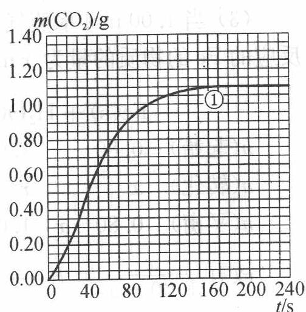

## 过程探究 (1)

<table><tr><td>实验编号</td><td>T/K</td><td>大理石规格</td><td>HNO3浓度/(mol·L-1)</td><td>实验目的</td></tr><tr><td>1</td><td>298</td><td>粗颗粒</td><td>2.00</td><td rowspan="4">(I)实验1和2探究HNO3浓度对该反应速率的影响;(II)实验1和3探究温度对该反应速率的影响;(III)实验1和4探究大理石规格(粗、细)对该反应速率的影响</td></tr><tr><td>2</td><td>298</td><td>粗颗粒</td><td>1.00</td></tr><tr><td>3</td><td>308</td><td>粗颗粒</td><td>2.00</td></tr><tr><td>4</td><td>298</td><td>细颗粒</td><td>2.00</td></tr></table>

(2) ① 70 至 90 s, $CO_{2}$ 生成的质量为: $m(\mathrm{CO}_{2}) = 0.95 \, \mathrm{g} - 0.85 \, \mathrm{g} = 0.10 \, \mathrm{g}$ ;

② 根据方程式比例, 可知消耗 $HNO_{3}$ 的物质的量为:

$$
n (\mathrm{HNO} _ {3}) = \frac {0 . 1 0 \mathrm{g}}{4 4 \mathrm{g} \cdot \mathrm{mol} ^ {- 1}} \times 2 = \frac {1}{2 2 0} \mathrm{mol}
$$

③ 溶液体积为 $25 \mathrm{~mL} = 0.025 \mathrm{~L}$ , 所以 $\mathrm{HNO}_{3}$ 减少的浓度;

$$
\Delta c (\mathrm{HNO} _ {3}) = \frac {2}{1 1} \mathrm{mol} \cdot \mathrm{L} ^ {- 1}
$$

④ 反应的时间 $\Delta t = 90 \, s - 70 \, s = 20 \, s;$

⑤ 所以 $HNO_{3}$ 在 70～90 s 范围内的平均反应速率为：

$$
v (\mathrm{HNO} _ {3}) = \Delta c (\mathrm{HNO} _ {3}) / \Delta t = \frac {1}{1 1 0} \mathrm{mol} \cdot \mathrm{L} ^ {- 1} \cdot \mathrm{s} ^ {- 1}
$$

(3) 作图要点: 因为实验① $HNO_{3}$ 恰好完全反应;

实验②中， $HNO_{3}$ 浓度减半，纵坐标对应的每一个值均为原来的 $\frac{1}{2}$ ;

实验③④的图像类似,恰好完全反应,但反应条件改变,升高温度与使用大理石细颗粒增大表面积可加快反应速率。所以图像曲线斜率变大,平衡位置纵坐标与实验①相同。

参考解答 见上述分析。

【例 4】（2006 年全国初赛）有人设计了如下甲醇(methanol) 合成工艺：

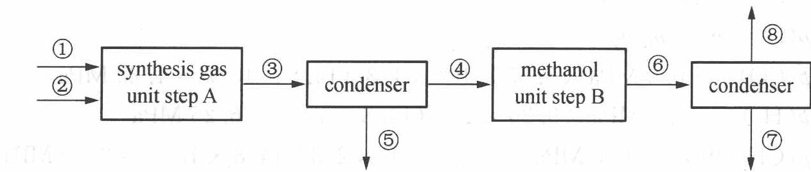

其中, ①为甲烷气源, 压强 $250.0 \mathrm{kPa}$ , 温度 $25^{\circ} \mathrm{C}$ , 流速 $55.0 \mathrm{~m}^{3} \cdot \mathrm{s}^{-1}$ 。②为水蒸气气源, 压强 $200.0 \mathrm{kPa}$ , 温度 $150^{\circ} \mathrm{C}$ , 流速 $150.0 \mathrm{~m}^{3} \cdot \mathrm{s}^{-1}$ 。合成气和剩余反应物的混合物经管路③进入 $25^{\circ} \mathrm{C}$ 的冷凝器 (condenser), 冷凝物由管路⑤流出。在步骤 B 中合成的甲醇和剩余反应物的混合物经⑥进入 $25^{\circ} \mathrm{C}$ 的冷凝器, 甲醇冷凝后经管路⑦流出, 其密度为 $0.791 \mathrm{~g} \cdot \mathrm{mL}^{-1}$ 。

(1) 分别写出在步骤 A 和步骤 B 中所发生的化学反应的方程式。

(2) 假定: 所有气体皆为理想气体, 在步骤 A 和 B 中完全转化, 气液在冷凝器中完全分离, 计算经步骤 A 和步骤 B 后, 在一秒钟内剩余物的量。

(3) 实际上, 在步骤 B 中 CO 的转化率只有三分之二。计算在管路⑥中

$CO、H_{2}$ 和 $CH_{3}OH$ 的分压(总压强为 10.0 MPa)。

(4) 当甲醇反应器足够大, 反应达到平衡, 管路⑥中的各气体的分压服从方程

$$
K _ {p} = \frac {p (\mathrm{CH} _ {3} \mathrm{OH}) \times p _ {0} ^ {2}}{p (\mathrm{CO}) \times p ^ {2} (\mathrm{H} _ {2})}
$$

式中 $p_{0}=0.100\ MPa$ ，计算平衡常数 $K_{p}$ 。

过程探究 (1) $\mathrm{CH}_4(\mathrm{g}) + \mathrm{H}_2\mathrm{O}(\mathrm{g}) \longrightarrow \mathrm{CO}(\mathrm{g}) + 3\mathrm{H}_2(\mathrm{g})$

$$
\mathrm{CO(g)} + 2 \mathrm {H_ {2} (g)} \longrightarrow \mathrm {CH_ {3} OH(g)}
$$

$$
n \left(\mathrm{CH} _ {4}\right) = (2 5 0. 0 \times 1 0 ^ {3} \times 5 5. 0) / (8. 3 1 4 \times 2 9 8) = 5. 5 5 \times 1 0 ^ {3} (\mathrm{mol})
$$

$$
n \left[ \mathrm{H} _ {2} \mathrm{O} (\mathrm{g}) \right] = (2 0 0. 0 \times 1 0 ^ {3} \times 1 5 0. 0) / (8. 3 1 4 \times 4 2 3) = 8. 5 3 \times 1 0 ^ {3} (\mathrm{mol})
$$

经步骤 A 后在③中过量的 $\mathrm{H}_{2}\mathrm{O}(\mathrm{g})$ 为 $(8.53 \times 10^{3} - 5.55 \times 10^{3})\ \mathrm{mol} = 2.98 \times 10^{3}\ \mathrm{mol}$

在步骤 A 中生成的 CO 和 $H_{2}$ 的摩尔比为 1:3，而在步骤 B 中消耗的 CO 和 $H_{2}$ 的摩尔比为 1:2，故经步骤 B 后剩余的 $H_{2}$ 为 $5.55 \times 10^{3}$ mol

$$
\begin{array}{r l} n _ {\mathrm{T}} & = n (\mathrm{CO}) + n (\mathrm{H} _ {2}) + n (\mathrm{CH} _ {3} \mathrm{OH}) \\ & = \{5. 5 5 \times 1 0 ^ {3} \times 1 / 3 + (1 6. 6 5 \times 1 0 ^ {3} - 5. 5 5 \times 1 0 ^ {3} \times 2 / 3 \times 2) + \\ & \quad 5. 5 5 \times 1 0 ^ {3} \times 2 / 3 \} \mathrm{mol} \\ & = 1 4. 8 \times 1 0 ^ {3} \mathrm{mol} \end{array}
$$

$$
p (\mathrm{i}) = p _ {\mathrm{T}} \times n _ {\mathrm{i}} / n _ {\mathrm{T}}
$$

$$
p (\mathrm{CO}) = 1 0. 0 \mathrm{MPa} \times 5. 5 5 \times 1 0 ^ {3} \times 1 / 3 / (1 4. 8 \times 1 0 ^ {3}) = 1. 2 5 \mathrm{MPa}
$$

$$
p (\mathrm{H} _ {2}) = 1 0. 0 \mathrm{MPa} \times 9. 2 5 \times 1 0 ^ {3} / (1 4. 8 \times 1 0 ^ {3}) = 6. 2 5 \mathrm{MPa}
$$

$$
p \left(\mathrm{CH} _ {3} \mathrm{OH}\right) = 1 0. 0 \mathrm{MPa} \times 5. 5 5 \times 1 0 ^ {3} \times 2 / 3 / (1 4. 8 \times 1 0 ^ {3}) = 2. 5 0 \mathrm{MPa}
$$

$$
(4) K _ {p} = 2. 5 0 \times (0. 1 0 0) ^ {2} / (1. 2 5 \times 6. 2 5 ^ {2}) = 5. 1 2 \times 1 0 ^ {- 4}
$$

参考解答 (1) $\mathrm{CH}_4(\mathrm{g}) + \mathrm{H}_2\mathrm{O}(\mathrm{g}) \longrightarrow \mathrm{CO}(\mathrm{g}) + 3\mathrm{H}_2(\mathrm{g}), \mathrm{CO}(\mathrm{g}) + 2\mathrm{H}_2(\mathrm{g}) \longrightarrow \mathrm{CH}_3\mathrm{OH}(\mathrm{g})$

(2) 经步骤 A 后过量的 $H_{2}O(g)$ 为 $2.98 \times 10^{3} \, mol$ ，经步骤 B 后剩余的 $H_{2}$ 为 $5.55 \times 10^{3} \, mol$

(3) $p(\mathrm{CO}) = 1.25\mathrm{MPa}, p(\mathrm{H}_2) = 6.25\mathrm{MPa}, p(\mathrm{CH}_3\mathrm{OH}) = 2.50\mathrm{MPa}$

(4) $K_{p} = 5.12 \times 10^{-4}$

① 在容积固定的 4 L 密闭容器中, 进行可逆反应 $X(g) + 2Y(g) \rightleftharpoons 2Z(g)$ 并达到平衡, 在此过程中, 以 Y 的浓度改变表示的反应速率 $v_{正}$ 、 $v_{逆}$ 与时间 t 的关系如右图。则图中阴影部分的面积表示 ( )。
A. X 的浓度的减少
B. Y 的物质的量的减少
C. Z 的浓度的增加
D. X 的物质的量的减少

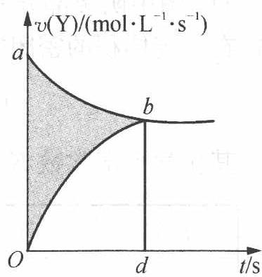

② 某温度下,在固定容积的密闭容器中,可逆反应 A(g) + 3B(g) ⇌ 2C(g) 达到平衡时,各物质的物质的量之比为 n(A):n(B):n(C)=2:2:1。保持温度不变,以 2:2:1 的物质的量之比再充入 A、B、C,则( )。
A. 平衡不移动
B. 再达平衡时,n(A):n(B):n(C)仍为 2:2:1
C. 再达平衡时,C 的体积分数将大于 20%
D. 再达平衡时,C 的体积分数可能减小

3 某学生用纯净的 Cu 与过量浓 $HNO_{3}$ 反应制取 $NO_{2}$ ，实验结果如图所示，对

5 桑学生用纯净的 Cu 与过量浓 HNO₃ 反应制取 N 图中曲线的描述正确的是( )。
A. OA 段表示开始时, 反应速率稍慢
B. AB 段表示反应速率较快, 可能因为产物有催化作用
C. BC 段表示反应速率最快, 在该时间内收集到的气体最多
D. OC 线表示随时间增加, 反应速率逐渐增大

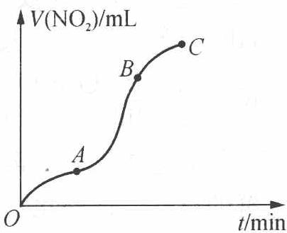

4 $ClO_{3}^{-}$ 和 $HSO_{3}^{-}$ 发生氧化还原反应 $ClO_{3}^{-} + 3HSO_{3}^{-} \longrightarrow 3SO_{4}^{2-} + 3H^{+} + Cl^{-}$ ，右图为该反应速率随时间变化的图像。图中 $v(ClO_{3}^{-})$ 是用 $ClO_{3}^{-}$ 在单位时间内的物质的量浓度的变化来表示的反应速率，则下列说法不正确的是()。

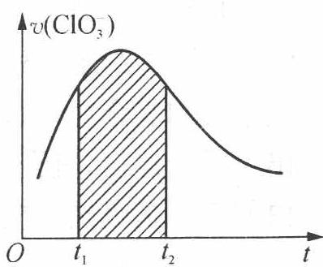

A. 反应开始时速率增大可能是由 $c(\mathrm{H}^{+})$ 增大引起的  
B. 若纵坐标改为 $v(\mathrm{Cl}^{-})$ , 速率-时间曲线和图中曲线完全重合  
C. 后期反应速率下降的原因是反应物浓度减少  
D. 图中阴影部分面积为 $t_{1}$ 至 $t_{2}$ 时间内 $\mathrm{ClO}_{3}^{-}$ 的物质的量的减少值

5 在一定体积的密闭容器中,进行如下反应:

$$
\mathrm{CO} _ {2} (\mathrm{g}) + \mathrm{H} _ {2} (\mathrm{g}) \rightleftharpoons \mathrm{CO} (\mathrm{g}) + \mathrm{H} _ {2} \mathrm{O} (\mathrm{g})
$$

其化学平衡常数 $K$ 和温度的关系如下表:

<table><tr><td>t/°C</td><td>700</td><td>800</td><td>830</td><td>1000</td><td>1200</td></tr><tr><td>K</td><td>0.6</td><td>0.9</td><td>1.0</td><td>1.7</td><td>2.6</td></tr></table>

根据以上信息做出下列判断,其中正确的是( )。
A. 此反应为吸热反应
B. 此反应只有在达到平衡时,密闭容器中的压强才不再变化
C. 此反应在 $1000^{\circ}$ C 达到平衡时, $\frac{c(\mathrm{CO}_{2})\cdot c(\mathrm{H}_{2})}{c(\mathrm{CO})\cdot c(\mathrm{H}_{2}\mathrm{O})}$ 约为 0.59
D. $1100^{\circ}$ C 时,此反应的 K 值可能为 0.9

6 人体中的血红蛋白(简写为 Hb)可以携带氧气变为氧合血红蛋白(简写为 $HbO_{2}$ ), 其化学平衡方程式可写为 $Hb + O_{2} \rightleftharpoons HbO_{2}$ 。在海拔比较高的地方, 氧气的分压比较低, 平衡将向左移动, 人体会感到比较累并易有眩晕感; 严重时还会导致疾病。CO 可与 $HbO_{2}$ 反应生成 HbCO, 并且 HbCO 比 $HbO_{2}$ 要稳定得多, 其化学平衡方程式可写为 $HbO_{2} + CO \rightleftharpoons HbCO + O_{2}$ 。 $K_{c} = \frac{c(HbCO)c(O_{2})}{c(HbO_{2})c(CO)} = 2.1 \times 10^{2}$ , HbCO 的形成使得血红蛋白不再携带氧气而造成人员中毒。一旦发生 CO 中毒, 首先要做的事是让患者呼吸新鲜的空气。试从化学平衡的角度分析这样做的意义: \_\_\_\_。除了 CO 和 $O_{2}$ , $HbO_{2}$ 还可以吸附 $CO_{2}$ 和氢离子, 且反应几乎是完全的, 其方程式如下: $HbO_{2} + H^{+} + CO_{2} \rightleftharpoons Hb(H^{+})CO_{2} + O_{2}$ 。人体肌肉在剧烈运动时会产生乳酸 $[CH_{3}CH(OH)COOH]$ , 乳酸在血液中会和氧合血红蛋白发生怎样的反应? \_\_\_\_。肌肉剧烈运动时放出大量的热量, 氧合血红蛋白会放出更多氧气, 你认为乳酸和氧合血红蛋白的反应是吸热反应还是放热反应? \_\_\_\_。简述理由: \_\_\_\_。

7 一定温度下,按下式发生分解反应: $N_{2}O_{5}(g) \rightleftharpoons 2NO_{2}(g) + 1/2O_{2}(g)$ 实验测得的数据如下表:

<table><tr><td>时间/s</td><td>0</td><td>500</td><td>1000</td><td>1500</td><td>2000</td><td>2500</td><td>3000</td></tr><tr><td> $c(N_2O_5)/(mol·L^{-1})$ </td><td>5.00</td><td>3.52</td><td>2.4</td><td>1.75</td><td>1.23</td><td>0.87</td><td>0.61</td></tr></table>

(1) 求各时间间隔内 $N_{2}O_{5}$ 分解的平均反应速率。

(2) 求 1000 s 时, 生成 $NO_{2}$ 的瞬时反应速率。

(3) 若上述反应的正、逆反应速率分别为 $v_{\text{正}} = kc(N_{2}O_{5})$ 和 $v_{\text{逆}} = k'c^{2}(NO_{2}) \cdot c^{1/2}(O_{2})$ ，试写出该反应的平衡常数的表达式。

8 2000 年是勒沙特列(Le Chatelier 1850 - 1936)诞生 150 周年。请用勒沙特列原理解释如下生活中的常见现象: 打开冰镇啤酒瓶把啤酒倒入玻璃杯, 杯中立即泛起大量泡沫。

9 下面四张图是用计算机制作的在密闭容器里, 在不同条件下进行的异构化反应 X ⇌ Y 的进程图解。图中的◇是 X, ◆是 Y。

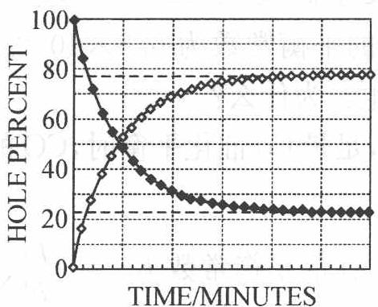  
A

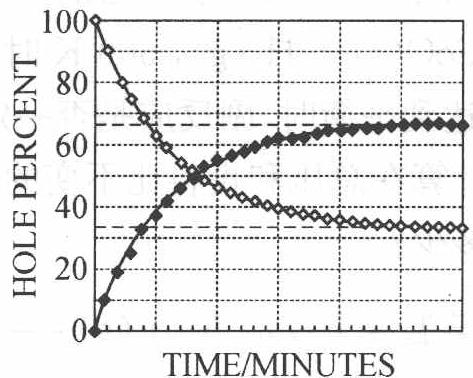  
B

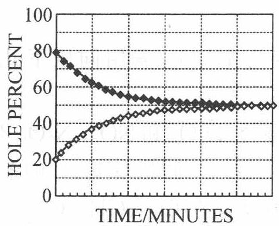  
C

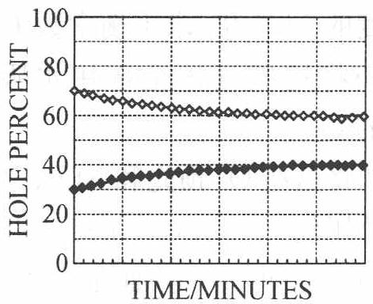  
D

(1) 图中的纵坐标表示\_\_\_\_（填入物理量, 下同), 横坐标表示\_\_\_\_。

(2) 平衡常数 $K$ 最小的图是 \_\_\_\_。

(3) 平衡常数 K 最大的图是 \_\_\_\_。

(4) 平衡常数 K = 1 的图是 \_\_\_\_。

10 配制 $\mathrm{KI}(0.100 \mathrm{~mol} \cdot \mathrm{L}^{-1}) - \mathrm{I}_{2}$ 的水溶液, 用 $0.100 \mathrm{~mol} \cdot \mathrm{L}^{-1}$ 的 $\mathrm{Na}_{2} \mathrm{~S}_{2} \mathrm{O}_{3}$ 标准溶液测得 $c(\mathrm{I}_{2}) = 4.85 \times 10^{-3} \mathrm{~mol} \cdot \mathrm{L}^{-1}$ 。量取 $50.0 \mathrm{~mL} \mathrm{KI} - \mathrm{I}_{2}$ 溶液和 $50.0 \mathrm{~mL} \mathrm{CCl}_{4}$ 置于分液漏斗中振荡达平衡, 分液后测知 $\mathrm{CCl}_{4}$ 相中 $c(\mathrm{I}_{2}) = 2.60 \times 10^{-3} \mathrm{~mol} \cdot \mathrm{L}^{-1}$ 。已知实验温度下 $\mathrm{CCl}_{4}$ 从水溶液中萃取 $\mathrm{I}_{2}$ 的分配比为 $85:1$ , 求水溶液中 $\mathrm{I}_{2} + \mathrm{I}^{-} \rightleftharpoons \mathrm{I}_{3}^{-}$ 的平衡常数。

11 铁系金属常用作 CO 加氢反应(Fischer-Tropsch 反应)的催化剂。已知某种催化剂在 1000 K 时可用来催化反应 CO(g) + 3H₂(g) ⇌ CH₄(g) + H₂O(g)，在总压 1 atm，CO 和 H₂ 投料比为 1:3 时，平衡时 CO 物质的量分数为 19.3%。

(1) 求该温度下的平衡常数及 $\mathrm{CO}$ 的转化率。

(2) 如果用纳米 Co 作为催化剂, 可以降低反应温度, 在 500 K 时反应的平衡常数为 $1.98 \times 10^{10}$ 。该反应为吸热反应还是放热反应?

(3) 用纳米 Co 作为催化剂, 可能会发生副反应 $\mathrm{Co(s)} + \mathrm{H}_{2} \mathrm{O(g)} \rightleftharpoons \mathrm{CoO(s)} + \mathrm{H}_{2}(\mathrm{g})$ , $500 \mathrm{~K}$ 时该反应的平衡常数为 $6.8 \times 10^{-3}$ 。主反应达到平衡时, 副反应是否一定会发生? 为什么?

(4) 计算在总压和投料比不变的情况下, 足量 Co 催化平衡时, CO 的分压为多少?

⑫ 已知某温度下反应 $\mathrm{N}_{2}\mathrm{O}_{4}(\mathrm{~g})\rightleftharpoons2\mathrm{NO}_{2}(\mathrm{~g})$ 的平衡常数 $K_{p}=\frac{\left[p(\mathrm{NO}_{2})\right]^{2}}{p(\mathrm{N}_{2}\mathrm{O}_{4})}$ 。

(1) 现有总压 $1 \, atm$ 下 $NO_{2}$ 和 $N_{2}O_{4}$ 的混合气体, 其密度为同状态下 $H_{2}$ 密度的 34.5 倍, 求平衡常数 $K_{p}$ 。

(2) 如将这些气体全部用水吸收转变为 $HNO_{3}$ ，需用同压下几倍体积的 $O_{2}$ ?

(3) 如将这些 $\mathrm{O}_{2}$ 预先和 $\mathrm{NO}_{2} 、 \mathrm{~N}_{2} \mathrm{O}_{4}$ 相混合 (设 $\mathrm{O}_{2}$ 和 $\mathrm{NO}_{2} 、 \mathrm{~N}_{2} \mathrm{O}_{4}$ 不反应), 总压仍为 $1 \mathrm{atm}$ , 其平衡后混合气体的密度为同状态下 $\mathrm{H}_{2}$ 的多少倍?

13 人的牙齿表面有一层釉质, 其组成为羟基磷灰石 $\mathrm{Ca}_{10}(\mathrm{OH})_{2}(\mathrm{PO}_{4})_{6}(K_{\mathrm{sp}} = 3.8 \times 10^{-37})$ 。为防止龋齿的产生, 人们常常使用含氟牙膏, 牙膏中的氟化钙可使羟基磷灰石转化为氟磷灰石 $\mathrm{Ca}_{10} \mathrm{~F}_{2}(\mathrm{PO}_{4})_{6}(K_{\mathrm{sp}} = 1.0 \times 10^{-60})$ 。写出羟基磷灰石与牙膏中的 $\mathrm{F}^{-}$ 反应转化为氟磷灰石的离子方程式, 并通过计算其转化反应的平衡常数说明哪种物质更稳定。

14 $\mathrm{Mn}^{2+}$ 是 $\mathrm{KMnO}_4$ 溶液氧化 $\mathrm{H}_2\mathrm{C}_2\mathrm{O}_4$ 的催化剂。有人提出该反应的历程为： $\mathrm{Mn(VII)} \xrightarrow{\mathrm{Mn(II)}} \mathrm{Mn(VI)} \xrightarrow{\mathrm{Mn(II)}} \mathrm{Mn(IV)} \xrightarrow{\mathrm{Mn(II)}} \mathrm{Mn(III)} \xrightarrow{\mathrm{C}_2\mathrm{O}_4^{2-}} \mathrm{Mn(C_2O_4)_n^{3-2n}} \longrightarrow \mathrm{Mn}^{2+} + \mathrm{CO}_2$ 请设计2个实验方案来验证这个历程是可信的（无须给出实验装置，无须指出选用的具体试剂，只需给出设计思想）。

1. 解析: 本题主要考查化学反应速率的概念和对 $v - t$ 图的理解。从图像可知, 阴影部分的面积应为 Y 的浓度的减少。再由对应的化学方程式可知 Y 物质和 Z 物质前的计量系数相等, 所以图中阴影部分的面积还可理解为 Z 的浓度的增加, 故只有 C 选项是正确的。
答案: C

2. 解析: 本题主要考查改变反应体系中相关物质的物质的量对化学平衡的影响。由题可知, 在保持温度不变、容积不变, 以 $2:2:1$ 的物质的量之比再充入 A、B、C 时, 可理解为相当于增大了反应体系的压强, 由平衡移动原理可得, 平衡向气体体积减小的方向移动, 故该平衡向正反应方向移动。所以雷达平衡时, C 的体积分数将大于 $20\%$ 。
答案: C

3. 解析: 本题解题时, 必须知道 $V(\mathrm{NO}_{2}) - t$ 图像中每一时间段的 $\frac{\Delta V}{\Delta t}$ 即为此段的平均反应速率, 由此可知 A、B 选项符合题意。答案: AB

4. 解析: 从图像可知, 阴影部分的面积应为 $\mathrm{ClO}_{3}^{-}$ 的物质的量浓度的减少值, 而不是物质的量的减少值, 因为 $v(\mathrm{ClO}_{3}^{-}) \times \Delta t = \Delta c(\mathrm{ClO}_{3}^{-})$ 。答案: D

5. 解析: 由题意知, 随着温度的升高 $K$ 值增大, 即升高温度平衡正向移动, 因此该反应为吸热反应, 故 A 选项符合题意。

上述反应是一个在体积固定的密闭容器中达到平衡的气相反应, 且反应前后气体的分子数没有变化, 即压强一直保持恒定, 故 B 选项不符合题意。

由于 $\frac{c(\mathrm{CO}_2) \cdot c(\mathrm{H}_2)}{c(\mathrm{CO}) \cdot c(\mathrm{H}_2\mathrm{O})} = \frac{1}{K(1000^\circ\mathrm{C})} = \frac{1}{1.7} \approx 0.59$ , 故 C 选项符合题意。 $1100^\circ\mathrm{C}$ 时的 $K$ 值应该介于 $K(1000^\circ\mathrm{C})$ 和 $K(1200^\circ\mathrm{C})$ 之间, 即 $1.7 < K(1100^\circ\mathrm{C}) < 2.6$ , 因此 $K(1100^\circ\mathrm{C})$ 不可能为 0.9, 故 D 选项不符合题意。

答案: AC

6. 本题只要利用勒夏特列原理就可顺利求解。因为 CO 与 $HbO_{2}$ 反应的平衡常数不大，可通过改变浓度使平衡发生移动，呼吸新鲜的空气能够增加 $O_{2}$ 的分压，降低 CO 的分压。
题干中所提供的方程式 $HbO_{2} + H^{+} + CO_{2} \rightleftharpoons Hb(H^{+})CO_{2} + O_{2}$ ，表明 $CO_{2}$ 在酸性条件下和 $HbO_{2}$ 结合放出 $O_{2}$ ，因此乳酸在血液中和氧合血红蛋白作用，就是利用其酸性使 $HbO_{2}$ 和 $CO_{2}$ 作用而放出 $O_{2}$ 。 $HbO_{2} + CH_{3}CH(OH)COOH + CO_{2} \rightleftharpoons Hb(H^{+})CO_{2} + O_{2} + CH_{3}CH(OH)COO^{-}$ 乳酸和氧合血红蛋白的反应是吸热反应，理由是升高温度时，平衡向右移动。
7. (1) $2.96 \times 10^{-3}$ $2.24 \times 10^{-3}$ $1.30 \times 10^{-3}$ $1.04 \times 10^{-3}$ $0.72 \times 10^{-3}$ $0.52 \times 10^{-3}$ (单位: mol·L $^{-1}$ ·s $^{-1}$ ) (2) $3.52 \times 10^{-3}$ mol·L $^{-1}$ ·s $^{-1}$ (3) c $^{2}$ (NO $_{2}$ ) ·
c $^{1/2}$ (O $_{2}$ ) / c(N $_{2}$ O $_{5}$ ) = k/k'

8. (1) 啤酒瓶中二氧化碳气体与啤酒中溶解的二氧化碳达到平衡: $\mathrm{CO}_{2} (\mathrm{~g}) \rightleftharpoons \mathrm{CO}_{2} (\mathrm{aq})$ , 打开啤酒瓶, 二氧化碳气体的压力下降, 根据勒沙特列原理, 平衡向放出二氧化碳气体的方向移动, 以减弱气体压力下降对平衡的影响。

(2) 温度是保持平衡的条件, 玻璃杯的温度比冰镇啤酒的温度高, 根据勒沙特列原理, 平衡应向减弱温度升高的方向移动, 即应向吸热方向移动, 从溶液中放出二氧化碳气体是吸热的, 因而, 平衡向放出二氧化碳气体的方向移动。

9. 解析: 由图像的纵横坐标的英文可知纵坐标表示 X 和 Y 的摩尔百分数 (或物质的量分数), 横坐标表示时间。根据平衡常数的定义及图像中的数据可知, 平衡常数 $K$ 最小的图是 A, 平衡常数 $K$ 最大的图是 B, 平衡常数 $K = 1$ 的图是 C。

10. 设萃取平衡时, 水溶液中 $c(\mathrm{I}_2) = x \mathrm{~mol} \cdot \mathrm{L}^{-1}$ 。 $\frac{c(\mathrm{I}_2, \mathrm{CCl}_4)}{c(\mathrm{I}_2, \mathrm{H}_2\mathrm{O})} = \frac{2.60 \times 10^{-3} \mathrm{~mol} \cdot \mathrm{L}^{-1}}{x \mathrm{~mol} \cdot \mathrm{L}^{-1}} = 85$ 解得 $x = 3.06 \times 10^{-5}$ 水溶液中 $\mathrm{I}_2 + \mathrm{I}^- \rightleftharpoons \mathrm{I}_3^-$ , 平衡浓度 $c(\mathrm{I}_2) = 3.06 \times 10^{-5} \mathrm{~mol} \cdot \mathrm{L}^{-1}$ $c(\mathrm{I}_3^-) = (4.85 - 2.60) \times 10^{-3} \mathrm{~mol} \cdot \mathrm{L}^{-1} - 3.06 \times 10^{-5} \mathrm{~mol} \cdot \mathrm{L}^{-1} = 2.22 \times 10^{-3} \mathrm{~mol} \cdot \mathrm{L}^{-1}$ $c(\mathrm{I}^-) = 0.100 \mathrm{~mol} \cdot \mathrm{L}^{-1} - 2.22 \times 10^{-3} \mathrm{~mol} \cdot \mathrm{L}^{-1} = 0.0978 \mathrm{~mol} \cdot \mathrm{L}^{-1}$ $K = \frac{2.22 \times 10^{-3}}{3.06 \times 10^{-5} \times 0.0978} = 7.4 \times 10^{2} \mathrm{~L} \cdot \mathrm{mol}^{-1}$

$$
\mathrm{CO(g)} + 3 \mathrm{H} _ {2} (\mathrm{g}) \rightleftharpoons \mathrm{CH} _ {4} (\mathrm{g}) + \mathrm{H} _ {2} \mathrm{O(g)}
$$

$$
K = \frac {0 . 1 1 4 ^ {2}}{0 . 1 9 3 \times 0 . 5 7 9 ^ {3}} = 0. 3 4 7 \quad \alpha = \frac {0 . 1 1 4}{0 . 3 0 7} \times 1 0 0 \% = 37.1
$$

(2) 放热反应

(3) 副反应一定会发生

$$
\mathrm{CO(g)} + 3 \mathrm{H} _ {2} (\mathrm{g}) \rightleftharpoons \mathrm{CH} _ {4} (\mathrm{g}) + \mathrm{H} _ {2} \mathrm{O(g)} \quad \mathrm{Co(s)} + \mathrm{H} _ {2} \mathrm{O(g)} \rightleftharpoons \mathrm{CoO(s)} + \mathrm{H} _ {2} (\mathrm{g})
$$

总反应的化学方程式为

$$
\mathrm{Co(s)} + \mathrm{CO(g)} + 2 \mathrm {H_ {2} (g)} \rightleftharpoons \mathrm{CoO(s)} + \mathrm {CH_ {4} (g)}.
$$

$K = 6.8 \times 10^{-3} \times 1.98 \times 10^{10} = 1.3 \times 10^{8}$ ，是完全反应，因此副反应一定会发生。

(4) 设有 $1\mathrm{{mol}}\mathrm{{CO}}$ 、 $3\mathrm{{mol}}{\mathrm{H}}_{2}$ 反应,主反应完全发生,副反应生成 ${\mathrm{H}}_{2}\mathrm{y}\mathrm{{mol}}$

$$
\mathrm{CO(g)} + 3 \mathrm {H_ {2} (g)} \rightleftharpoons \mathrm {CH_ {4} (g)} + \mathrm {H_ {2} O(g)}
$$

初始

平衡

副反应

分压

$$
\begin{array}{l l l l} {1} & {3} \\ {\sim 0} & {\sim 0} \\ {\sim 0} & {y} \\ {p (\mathrm{CO})} & {\frac {y}{2}} \end{array} \qquad \begin{array}{l l l l} {1} & {1} \\ {1} & {1 - y} \\ {\frac {1}{2}} & {\frac {1 - y}{2}} \end{array}
$$

$$
\frac {\frac {1 - y}{2} \times \frac {1}{2}}{\left(\frac {y}{2}\right) ^ {3} \times p (\mathrm{CO})} = 1. 9 8 \times 1 0 ^ {1 0}
$$

由于 $\frac{y}{1 - y} = 6.8 \times 10^{-3}$ , 解得 $y = 6.8 \times 10^{-3}$ , $p(\mathrm{CO}) = 3.2 \times 10^{-4} \mathrm{atm}$ 。

12. (1) 混合气体平均相对分子质量为 $34.5 \times 2 = 69$ , 由十字交叉法:

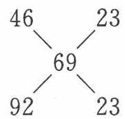

即 $p(\mathrm{NO}_2) = p(\mathrm{N}_2\mathrm{O}_4) = 0.5\mathrm{atm}, K_p = 0.5\mathrm{atm}$ 。

(2) 设有 $1 \mathrm{~mol} \mathrm{NO}_{2} 、 1 \mathrm{~mol} \mathrm{N}_{2} \mathrm{O}_{4}$ , 共可折合为 $3 \mathrm{~mol} \mathrm{NO}_{2}$ 。

$$
4 \mathrm{NO} _ {2} + \mathrm{O} _ {2} + 2 \mathrm{H} _ {2} \mathrm{O} \longrightarrow 4 \mathrm{HNO} _ {3}
$$

需 $O_{2}$ 的物质的量为 0.75 mol，即需 $\frac{0.75\ mol}{2\ mol}=0.375$ 倍体积的 $O_{2}$ 。

(3) 设初始时有 $2 \mathrm{~mol} \mathrm{N}_{2} \mathrm{O}_{4} 、 1 \mathrm{~mol} \mathrm{O}_{2}$ , 反应掉 $x \mathrm{~mol} \mathrm{N}_{2} \mathrm{O}_{4}$ 。

平衡时有 $(2 - x)\mathrm{mol}\mathrm{N}_2\mathrm{O}_4$ 、 $2x\mathrm{molNO_2}$ 、 $1\mathrm{molO_2}$ ，共 $(3 + x)\mathrm{mol}$ 气体， $K_{p} =$ $\frac{\left(\frac{2x}{3 + x}\right)^2}{\frac{2 - x}{3 + x}} = 0.5,x = 0.7628.$ 平均分子量为 $92\times \frac{2 - x}{3 + x} +46\times \frac{2x}{3 + x} +32\times \frac{1}{3 + x} =$

57.4。平衡混合气体密度为 $\mathrm{H}_{2}$ 的28.7倍。

$$
\mathrm{Ca} _ {1 0} (\mathrm{OH}) _ {2} \left(\mathrm{PO} _ {4}\right) _ {6} (\mathrm{s}) + 2 \mathrm{F} ^ {-} \longrightarrow \mathrm{Ca} _ {1 0} \mathrm{F} _ {2} \left(\mathrm{PO} _ {4}\right) _ {6} (\mathrm{s}) + 2 \mathrm{OH} ^ {-}
$$

$$
K = \frac {c ^ {2} (\mathrm{OH} ^ {-})}{c ^ {2} (\mathrm{F} ^ {-})} = \frac {K _ {\mathrm{sp}} [ \mathrm{Ca} _ {1 0} (\mathrm{OH}) _ {2} (\mathrm{PO} _ {4}) _ {6} ]}{K _ {\mathrm{sp}} [ \mathrm{Ca} _ {1 0} \mathrm{F} _ {2} (\mathrm{PO} _ {4}) _ {6} ]} = \frac {3 . 8 \times 1 0 ^ {- 3 7}}{1 . 0 \times 1 0 ^ {- 6 0}} = 3. 8 \times 1 0 ^ {2 3}
$$

此反应的平衡常数很大,说明羟基磷灰石转化为氟磷灰石的倾向很大,即氟磷灰石更稳定。

14. (1) 对比实验: 向一份草酸溶液中加 $\mathrm{Mn}^{2+}$ 离子, 另一份不加。在滴加 $\mathrm{KMnO}_{4}$ 溶液时, 事先加 $\mathrm{Mn}^{2+}$ 的那一份反应速率快。

(2) 寻找一种试剂能与 Mn(VI)、Mn(IV) 或 Mn(III) 生成配合物或难溶物; 加入这种试剂, 反应速率变慢。

(注:表述形式不限,其他设计思想也可以)

## 知识梳理

## 一、酸碱质子理论

## 1. 酸碱的定义

质子理论认为:凡能给出质子( $\mathrm{H}^{+}$ )的物质都是酸;凡能接受质子的物质都是碱。如 $\mathrm{HCl}$ , $\mathrm{NH}_{4}^{+}$ , $\mathrm{HSO}_{4}^{-}$ 都是酸,因为它们能给出质子; $\mathrm{NH}_{3}$ , $\mathrm{HSO}_{4}^{-}$ , $\mathrm{SO}_{4}^{2-}$ 都是碱,因为它们都能接受质子。由此可见,酸碱质子理论中的酸碱不限于电中性的分子,也可以是带电的阴阳离子。若某物质既能给出质子,又能接受质子,就既是酸又是碱,可称为酸碱两性物质,如 $\mathrm{HCO}_{3}^{-}$ 等。

## 2. 酸碱的共轭关系

质子酸碱是相对应的,质子酸释放质子转化为它的共轭碱,质子碱得到质子转化为它的共轭酸,这种关系称为酸碱共轭关系。可用通式表示为:酸=碱+质子,此式中的酸碱称为共轭酸碱对。例如 $NH_{3}$ 是 $NH_{4}^{+}$ 的共轭碱,反之, $NH_{4}^{+}$ 是 $NH_{3}$ 的共轭酸。又例如,对于酸碱两性物质, $HCO_{3}^{-}$ 的共轭酸是 $H_{2}CO_{3}$ , $HCO_{3}^{-}$ 的共轭碱是 $CO_{3}^{2-}$ 。

## 3. 酸和碱的反应

酸碱质子理论中的酸碱反应是两对共轭酸碱对之间传递质子的反应,通式为: 酸 $_{1}$ +碱 $_{2}$ ⇌碱 $_{1}$ +酸 $_{2}$

$$
\begin{array}{r l}&: \mathrm{HCl} + \mathrm{NH} _ {3} \rightleftharpoons \mathrm{Cl} ^ {-} + \mathrm{NH} _ {4} ^ {+}\\&\mathrm{HAc} + \mathrm{H} _ {2} \mathrm{O} \rightleftharpoons \mathrm{Ac} ^ {-} + \mathrm{H} _ {3} \mathrm{O} ^ {+}\\&\mathrm{H} _ {2} \mathrm{O} + \mathrm{S} ^ {2 -} \rightleftharpoons \mathrm{OH} ^ {-} + \mathrm{HS} ^ {-}\end{array}
$$

由上可知,质子酸碱反应的产物不必是盐和水,在酸碱质子理论看来,阿仑尼乌斯酸碱理论中的中和反应、强酸置换弱酸、强碱置换弱碱、酸碱的电离、盐的水解以及没有水参与的气态氯化氢和气态氨反应等等,都是酸碱反应。在酸碱质子理论中并没有“盐”这一概念。

## 4. 电离平衡常数

质子酸碱性强弱和电离理论下的酸碱性强弱有许多一致,以 $CH_{3}COOH$ 为例,在溶液中只发生部分电离,并存在平衡:

$$
\mathrm{CH} _ {3} \mathrm{COOH} \rightleftharpoons \mathrm{CH} _ {3} \mathrm{COO} ^ {-} + \mathrm{H} ^ {+}
$$

不论 $CH_{3}COOH$ 起始浓度如何, 在一定温度下, 醋酸的电离平衡常数 $K_{a}$ 为一定值。 $K_{a}$ 表达式: $K_{a} = [CH_{3}COO^{-}][H^{+}] / [CH_{3}COOH]$ 。

一定温度下,各种弱电解质都有相应的电离平衡常数,它表明弱电解质电离的倾向, $K_{a}$ 越大,则该电解质越容易电离。若已知各种不同的弱酸的电离平衡常数,则平衡常数越大,对应弱酸的酸性越强。同样,若已知各种不同的弱碱的电离平衡常数,则平衡常数越大,对应弱碱的碱性就越强。下表列出几种弱酸在室温下的电离平衡常数(此表中如是多元酸,则其 $K_{a}$ 指的是 $K_{a}$ )。

几种弱酸的电离平衡常数(室温)

<table><tr><td>弱酸</td><td>H2C2O4</td><td>H3PO4</td><td>HCOOH</td><td colspan="2">CH3COOH</td></tr><tr><td>Ka</td><td>5.9×10-2</td><td>7.6×10-3</td><td>1.8×10-4</td><td colspan="2">1.8×10-5</td></tr><tr><td>弱酸</td><td>H2CO3</td><td>H2S</td><td>HCN</td><td>H3BO3</td><td>HCO3-</td></tr><tr><td>Ka</td><td>4.2×10-7</td><td>1.3×10-7</td><td>6.2×10-10</td><td>5.8×10-10</td><td>5.6×10-11</td></tr></table>

由于离子反应的反应方向是趋向离子浓度的减小, 因此一般是由强电解质生成弱电解质。例如 $K_{\mathrm{a}}(\mathrm{CH}_{3} \mathrm{COOH}) > K_{\mathrm{a}}(\mathrm{H}_{2} \mathrm{CO}_{3})$ ，故足量的 $\mathrm{CH}_{3} \mathrm{COOH}$ 能使 $\mathrm{HCO}_{3}^{-}$ 转化为 $\mathrm{H}_{2} \mathrm{CO}_{3}$ 。

$$
\mathrm{CH} _ {3} \mathrm{COOH} + \mathrm{HCO} _ {3} ^ {-} \rightleftharpoons \mathrm{CH} _ {3} \mathrm{COO} ^ {-} + \mathrm{H} _ {2} \mathrm{CO} _ {3}
$$

$K_{a}$ 差值越大, 转化反应越完全。 $K_{a}$ 相近时, 如 $H_{2}CO_{3}$ 和 $H_{2}S$ 发生相互转化, 通 $CO_{2}$ 入 $HS^{-}$ 溶液得 $H_{2}S$ , 通 $H_{2}S$ 入 $HCO_{3}^{-}$ 溶液得 $CO_{2}$ 。

【例 1】试判断下列化学反应方向,并用质子理论说明之。

(1) $\mathrm{HAc} + \mathrm{CO}_{3}^{2-} \rightleftharpoons \mathrm{HCO}_{3}^{-} + \mathrm{Ac}^{-}$

(2) $\mathrm{HS}^{-} + \mathrm{H}_{2}\mathrm{PO}_{4}^{-} \rightleftharpoons \mathrm{H}_{3}\mathrm{PO}_{4} + \mathrm{S}^{2-}$

(3) $\mathrm{H}_{2} \mathrm{O} + \mathrm{SO}_{4}^{2-} \rightleftharpoons \mathrm{HSO}_{4}^{-} + \mathrm{OH}^{-}$

(4) $\mathrm{HCN} + \mathrm{S}^{2-} \rightleftharpoons \mathrm{HS}^{-} + \mathrm{CN}^{-}$

过程探究 一般来说无论是在质子理论中还是在电离理论中, $\mathrm{H}_{3} \mathrm{O}^{+}$ 总是水溶液中最强的酸, $\mathrm{OH}^{-}$ 总是水溶液中最强的碱。对于在质子理论中不易判断酸碱性强弱的物质, 如联系其共轭酸或共轭碱就较易判断, 例如, $\mathrm{H}_{2} \mathrm{SO}_{4}$ 是强酸, 其共轭碱 $\mathrm{HSO}_{4}^{-}$ 的碱性就很弱; $\mathrm{HS}^{-}$ 为弱酸, 其共轭碱 $\mathrm{S}^{2-}$ 的碱性就较强。

参考解答 (1) HAc 的酸性大于 $\mathrm{HCO}_{3}^{-}$ , 而 $\mathrm{CO}_{3}^{2-}$ 的碱性大于 $\mathrm{Ac}^{-}$ , 所以反应方向为:

$$
\mathrm{HAc} + \mathrm{CO} _ {3} ^ {2 -} \longrightarrow \mathrm{HCO} _ {3} ^ {-} + \mathrm{Ac} ^ {-}
$$

(2)酸性： $H_{3}PO_{4}>HS^{-}$ ，碱性： $S^{2-}>H_{2}PO_{4}^{-}$ ，所以反应方向为：

$$
\mathrm{H} _ {3} \mathrm{PO} _ {4} + \mathrm{S} ^ {2 -} \longrightarrow \mathrm{HS} ^ {-} + \mathrm{H} _ {2} \mathrm{PO} _ {4} ^ {-}
$$

(3) ${\mathrm{{OH}}}^{ - }$ 是最强碱, ${\mathrm{{SO}}}_{4}^{2 - }$ 是相当弱的碱,所以反应方向为:

$$
\mathrm{HSO} _ {4} ^ {-} + \mathrm{OH} ^ {-} \longrightarrow \mathrm{H} _ {2} \mathrm{O} + \mathrm{SO} _ {4} ^ {2 -}
$$

(4)酸性：HCN＞HS $^{-}$ ，碱性：S $^{2-}$ ＞CN $^{-}$ ，所以反应方向为：

$$
\mathrm{HCN} + \mathrm{S} ^ {2 -} \longrightarrow \mathrm{HS} ^ {-} + \mathrm{CN} ^ {-}
$$

## 二、弱电解质的电离平衡

## 1. 水的电离平衡

(1) 水的离子积常数

$$
\mathrm{H} _ {2} \mathrm{O} (1) \rightleftharpoons \mathrm{H} ^ {+} (\mathrm{aq}) + \mathrm{OH} ^ {-} (\mathrm{aq}) K _ {\mathrm{w}} = [ \mathrm{H} ^ {+} ] [ \mathrm{OH} ^ {-} ]
$$

式中的 $K_{w}$ 称为水的离子积常数。应注意：

① $K_{w}$ 是标准平衡常数,式中的浓度都是相对浓度。

② 由于水的电离是吸热反应,所以,温度升高时, $K_{w}$ 值变大。

③ 不论溶液是酸性,碱性,还是中性,都存在数量关系 $\left[\mathrm{H}^{+}\right]\left[\mathrm{OH}^{-}\right]=K_{\mathrm{w}}$ 。

思考1: 如 $[\mathrm{H}^{+}] = 1 \times 10^{-7}$ , 则溶液一定显中性吗?

(2) $\mathrm{pH}$ 值和 $\mathrm{pOH}$ 值

$$
\mathrm{pH} = - \lg [ \mathrm{H} ^ {+} ], \mathrm{pOH} = - \lg [ \mathrm{OH} ^ {-} ]
$$

由于常温下 $[\mathrm{H}^{+}][\mathrm{OH}^{-}] = 1.0\times 10^{-14}$ ，故常温下 $\mathrm{pH + pOH = 14}$ 。

pH 和 pOH 一般的取值范围是 1\~14。

思考 2: pH = -1 其含义如何?

## 2. 弱酸和弱碱的电离平衡

(1) 一元弱酸和弱碱的电离平衡

醋酸的电离平衡可以表示成： $HAc \rightleftharpoons H^{+} + Ac^{-}$

其电离平衡常数为

$$
K _ {\mathrm{a}} = \frac {[ \mathrm{H} ^ {+} ] [ \mathrm{Ac} ^ {-} ]}{[ \mathrm{HAc} ]} = 1. 8 \times 1 0 ^ {- 5}
$$

类似氨水有：

$$
\mathrm{NH} _ {3} \cdot \mathrm{H} _ {2} \mathrm{O} \rightleftharpoons \mathrm{NH} _ {4} ^ {+} + \mathrm{OH} ^ {-} K _ {\mathrm{b}} = \frac {[ \mathrm{NH} _ {4} ^ {+} ] [ \mathrm{OH} ^ {-} ]}{[ \mathrm{NH} _ {3} \cdot \mathrm{H} _ {2} \mathrm{O} ]} = 1. 8 \times 1 0 ^ {- 5}
$$

$K_{a}$ 、 $K_{b}$ 的大小可以表示弱酸和弱碱的离解程度，K 的值越大，则弱酸和弱碱的电离程度越大。

## (2) 多元弱酸的电离平衡

多元弱酸的电离是分步进行的,对应每一步电离,各有其电离常数。以 $H_{2}S$ 为例:

第一步

$$
\mathrm{H} _ {2} \mathrm{S} \rightleftharpoons \mathrm{H} ^ {+} + \mathrm{HS} ^ {-} \quad K _ {\mathrm{a}} = \frac {[ \mathrm{H} ^ {+} ] [ \mathrm{HS} ^ {-} ]}{[ \mathrm{H} _ {2} \mathrm{S} ]} = 1. 3 \times 1 0 ^ {- 7}
$$

第二步

$$
\mathrm{HS} ^ {-} \rightleftharpoons \mathrm{H} ^ {+} + \mathrm{S} ^ {2 -} \quad K _ {\mathrm{a} _ {2}} = \frac {[ \mathrm{H} ^ {+} ] [ \mathrm{S} ^ {2 -} ]}{[ \mathrm{HS} ^ {-} ]} = 7. 1 \times 1 0 ^ {- 1 5}
$$

显然， $K_{a_{1}} \gg K_{a_{2}}$ ，说明多元弱酸的电离以第一步电离为主。

将两个方程式相加, 得:

$$
\mathrm{H} _ {2} \mathrm{S} \rightleftharpoons 2 \mathrm{H} ^ {+} + \mathrm{S} ^ {2 -} \quad K _ {\mathrm{a}} = \frac {[ \mathrm{H} ^ {+} ] ^ {2} [ \mathrm{S} ^ {2 -} ]}{[ \mathrm{H} _ {2} \mathrm{S} ]} = K _ {\mathrm{a} _ {1}} \cdot K _ {\mathrm{a} _ {2}} = 9. 2 \times 1 0 ^ {- 2 2}
$$

【例2】计算 $0.10 \mathrm{~mol} \cdot \mathrm{L}^{- 1} \mathrm{H}_{3} \mathrm{PO}_{4}$ 溶液中 $[\mathrm{H}^{+}]$ 、 $[\mathrm{H}_{2} \mathrm{PO}_{4}^{-}]$ 、 $[\mathrm{HPO}_{4}^{2-}]$ 、 $[\mathrm{PO}_{4}^{3-}]$ 和 $[\mathrm{H}_{3} \mathrm{PO}_{4}]$ 。

$$
(\text { 已知 }: \mathrm{H} _ {3} \mathrm{PO} _ {4} \quad K _ {\mathrm{a} _ {1}} = 7. 5 \times 1 0 ^ {- 3}, K _ {\mathrm{a} _ {2}} = 6. 2 \times 1 0 ^ {- 8}, K _ {\mathrm{a} _ {3}} = 2. 2 \times 1 0 ^ {- 1 3})
$$

过程探究 $H_{3}PO_{4}$ 是三元弱酸,但由于 $K_{a_{1}}\gg K_{a_{2}}\gg K_{a_{3}}$ ,所以,计算 $[H^{+}]$ 时可当一元弱酸处理,并且 $[H_{2}PO_{4}^{-}]$ 近似等于 $[H^{+}]$ 。

参考解答 因

$$
\frac {c}{K _ {\mathrm{a} _ {1}}} = \frac {0 . 1 0}{7 . 5 \times 1 0 ^ {- 3}} = 1 3 <   5 0 0
$$

$$
\begin{array}{r l} \left[ \mathrm{H} ^ {+} \right] & = \frac {- 7 . 5 \times 1 0 ^ {- 3} + \sqrt {(7 . 5 \times 1 0 ^ {- 3}) ^ {2} + 4 \times 7 . 5 \times 1 0 ^ {- 3} \times 0 . 1 0}}{2} \\ & = 2. 4 \times 1 0 ^ {- 2} \mathrm{mol} \cdot \mathrm{L} ^ {- 1} \end{array}
$$

$$
\left[ \mathrm{H} _ {2} \mathrm{PO} _ {4} ^ {-} \right] = \left[ \mathrm{H} ^ {+} \right] = 2. 4 \times 1 0 ^ {- 2} \mathrm{mol} \cdot \mathrm{L} ^ {- 1}
$$

由 $\mathrm{H}_{3} \mathrm{PO}_{4}$ 的第二级离解平衡可得

$$
[ \mathrm{HPO} _ {4} ^ {2 -} ] = K _ {\mathrm{a} _ {2}} \frac {[ \mathrm{H} _ {2} \mathrm{PO} _ {4} ^ {-} ]}{[ \mathrm{H} ^ {+} ]} = K _ {\mathrm{a} _ {2}} = 6. 2 \times 1 0 ^ {- 8} \mathrm{mol} \cdot \mathrm{L} ^ {- 1}
$$

由 $\mathrm{H}_{3} \mathrm{PO}_{4}$ 的第三级离解平衡可得

$$
\begin{array}{r l} & {\left[ \mathrm{PO} _ {4} ^ {3 -} \right] = K _ {\mathrm{a} _ {3}} \frac {\left[ \mathrm{HPO} _ {4} ^ {2 -} \right]}{\left[ \mathrm{H} ^ {+} \right]} = \frac {K _ {\mathrm{a} _ {3}} \cdot K _ {\mathrm{a} _ {2}}}{\left[ \mathrm{H} ^ {+} \right]} = \frac {2 . 2 \times 1 0 ^ {- 1 3} \times 6 . 2 \times 1 0 ^ {- 8}}{2 . 4 \times 1 0 ^ {- 2}}} \\ & {\qquad = 5. 7 \times 1 0 ^ {- 1 9} \mathrm{mol} \cdot \mathrm{L} ^ {- 1}} \\ & {\left[ \mathrm{H} _ {3} \mathrm{PO} _ {4} \right] = c (\mathrm{H} _ {3} \mathrm{PO} _ {4}) - ([ \mathrm{H} _ {2} \mathrm{PO} _ {4} ^ {-} ] + [ \mathrm{HPO} _ {4} ^ {2 -} ] + [ \mathrm{PO} _ {4} ^ {3 -} ])} \\ & {\qquad = 0. 1 0 - (2. 4 \times 1 0 ^ {- 2} + 6. 2 \times 1 0 ^ {- 8} + 5. 7 \times 1 0 ^ {- 1 9})} \\ & {\qquad = 7. 6 \times 1 0 ^ {- 2} \mathrm{mol} \cdot \mathrm{L} ^ {- 1}} \end{array}
$$

注意: 本题中 $K_{a_2} = [HPO_4^{2-}]$ , 但不能因此认为 $[PO_4^{3-}] = K_{a_3}$

## 3. 缓冲溶液

## (1) 同离子效应

$HAc \rightleftharpoons H^{+} + Ac^{-}$ 达到平衡时, 向溶液中加入固体 NaAc(强电解质完全电离: $\mathrm{NaAc} \longrightarrow \mathrm{Na}^{+} + \mathrm{Ac}^{-}$ ), 由于 $\mathrm{Ac}^{-}$ 的引入, 破坏了已建立的弱电解质的电离平衡:

$$
\mathrm{HAc} \rightleftharpoons \mathrm{H} ^ {+} + \mathrm{Ac} ^ {-}
$$

$Ac^{-}$ 增多,使平衡左移,HAc的电离度减小。

定义:在弱电解质的溶液中,加入与其具有相同离子的强电解质,从而使电离平衡左移,降低弱电解质的电离度,这种现象就称为同离子效应。

## (2) 缓冲溶液

## ① 概念

缓冲溶液指能够抵抗外来少量酸碱的影响和较多水的稀释的影响,保持体系 pH 值变化不大的溶液。

如向 1 L 含 $0.10 \, mol \cdot L^{-1}$ 的 HCN 和 $0.10 \, mol \cdot L^{-1}$ NaCN 的混合溶液中 (pH = 9.40)，加入 $0.010 \, mol \, HCl$ 时，pH 变为 9.31；加入 $0.010 \, mol \, NaOH$ 时，pH 变为 9.49；用水稀释，体积扩大 10 倍时，pH 基本不变。

可以认为, $0.10 \mathrm{~mol} \cdot \mathrm{L}^{- 1} \mathrm{HCN}$ 和 $0.10 \mathrm{~mol} \cdot \mathrm{L}^{- 1} \mathrm{NaCN}$ 的混合溶液是一种缓冲溶液, 可以维持体系的 $\mathrm{pH}$ 值为 9.40 左右。

## ② 原理

缓冲溶液之所以具有缓冲作用是因为溶液中含有一定量的抗酸成分和抗碱成分。当外加少量酸(或碱)时,则外加酸(或碱)与抗酸(或抗碱)成分作用,使 $c_{弱酸}/c_{弱酸盐}$ （或 $c_{弱碱}/c_{弱碱盐}$ ）比值基本不变，从而使溶液 pH 值基本不变。

## 思考3: 那么适量水稀释时,为什么缓冲溶液 $\mathrm{pH}$ 值基本不变?

缓冲溶液一般是由弱酸及其盐(如 HAc 与 NaAc)或弱碱及其盐(如 $NH_{3} \cdot H_{2}O$ 与铵盐)以及多元弱酸及其次级酸式盐或酸式盐及其次级盐(如 $H_{2}CO_{3}$ 与 $NaHCO_{3}$ ， $NaHCO_{3}$ 与 $Na_{2}CO_{3}$ )组成。缓冲溶液的 pH 值计算公式为：

## (a) 弱酸及其盐

$$
[ \mathrm{H} ^ {+} ] = K _ {\mathrm{a}} \cdot \frac {c _ {\mathrm{酸}}}{c _ {\mathrm{盐}}}, \mathrm{pH} = \mathrm{pK} _ {\mathrm{a}} + \lg \frac {c _ {\mathrm{盐}}}{c _ {\mathrm{酸}}}
$$

(b) 弱碱及其盐

$$
[ \mathrm{OH} ^ {-} ] = K _ {\mathrm{b}} \cdot \frac {c _ {\mathrm{碱}}}{c _ {\mathrm{盐}}}, \mathrm{pOH} = \mathrm{pK} _ {\mathrm{b}} + \lg \frac {c _ {\mathrm{盐}}}{c _ {\mathrm{碱}}}
$$

缓冲溶液中的弱酸及其盐(或弱碱及其盐)称为缓冲对。缓冲对的浓度愈大,则它抵制外加酸碱影响的作用愈强,通常称缓冲容量愈大。缓冲对浓度比也是影响缓冲容量的重要因素,浓度比为1时,缓冲容量最大。一般浓度比在10到0.1之间,因此缓冲溶液的pH(或pOH)在 $pK_{a}$ (或 $pK_{b}$ )±1范围内。配制缓冲溶液时,首先选择缓冲对的 $pK_{a}$ (或 $pK_{b}$ )最靠近欲达到的溶液pH(或pOH),然后再调整缓冲对的浓度比,使其达到所需的pH。

【例 3】 计算 200 mL 0.20 mol·L $^{-1}$ 的 NH $_{3}$ 和 300 mL 0.10 mol·L $^{-1}$ NH $_{4}$ Cl 混合溶液的 pH。并分别计算在此混合溶液中分别加入 20 mL 0.10 mol·L $^{-1}$ HCl、20 mL 0.10 mol·L $^{-1}$ NaOH 和 100 mL H $_{2}$ O 后，混合溶液的 pH。

过程探究 此混合溶液由 $NH_{4}^{+}-NH_{3}$ 组成, 共轭酸为 $NH_{4}^{+}$ , 查表知 $pK_{a}=9.25$ 。

(1) 忽略两溶液混合所引起的体积变化, 原混合液的 $\mathrm{pH}$ 为:

$$
\mathrm{pH} = \mathrm{pK} _ {\mathrm{a}} + \lg \frac {c (\mathrm{NH} _ {3})}{c (\mathrm{NH} _ {4} ^ {+})} = 9. 2 5 + \lg \frac {0 . 2 0 \times 2 0 0}{0 . 1 0 \times 3 0 0} = 9. 3 7
$$

(2) 加入 $20 \mathrm{~mL} 0.10 \mathrm{~mol} \cdot \mathrm{L}^{-1} \mathrm{HCl}$ 后, 加入的 $\mathrm{HCl}$ 相当于 $0.002 \mathrm{~mol} \mathrm{H}^{+}$ , 它将消耗 $0.002 \mathrm{~mol}$ 的 $\mathrm{NH}_{3}$ , 并生成 $0.002 \mathrm{~mol}$ 的 $\mathrm{NH}_{4}^{+}$ , 故有溶液的 $\mathrm{pH}$ :

$$
\mathrm{pH} = 9. 2 5 + \lg \frac {0 . 2 0 \times 2 0 0 - 0 . 1 0 \times 2 0}{0 . 1 0 \times 3 0 0 + 0 . 1 0 \times 2 0} = 9. 3 2
$$

可见,加入 $20 \mathrm{~mL} 0.10 \mathrm{~mol} \cdot \mathrm{L}^{-1} \mathrm{HCl}$ 后,溶液的 $\mathrm{pH}$ 由 9.37 减小为 9.32, $\mathrm{pH}$ 减少了 0.05,结果表明缓冲溶液具有抵抗外来少量强酸的能力。

(3) 加入 $20 \mathrm{~mL} 0.10 \mathrm{~mol} \cdot \mathrm{L}^{-1} \mathrm{NaOH}$ 后, 加入的 $\mathrm{NaOH}$ 相当于 $0.002 \mathrm{~mol} \mathrm{OH}^{-}$ , 它将消耗 $0.002 \mathrm{~mol}$ 的 $\mathrm{NH}_{4}^{+}$ , 并生成 $0.002 \mathrm{~mol}$ 的 $\mathrm{NH}_{3}$ , 故有溶液的 $\mathrm{pH}$ :

$$
\mathrm{pH} = 9. 2 5 + \lg \frac {0 . 2 0 \times 2 0 0 + 0 . 1 0 \times 2 0}{0 . 1 0 \times 3 0 0 - 0 . 1 0 \times 2 0} = 9. 4 3
$$

可见,加入 $20 \, mL \, 0.10 \, mol \cdot L^{-1} \, NaOH$ 后,溶液的 pH 由 9.37 增大为 9.43, pH 增加了 0.06,结果表明缓冲溶液具有抵抗外来少量强碱的能力。

(4) 加入 $100 \mathrm{~mL} \mathrm{H}_{2} \mathrm{O}$ 后, 缓冲溶液中共轭酸碱的浓度同时降低, 而共轭酸、碱的物质的量和缓冲比不变, 据公式可知, $\mathrm{pH}$ 基本不变, 说明缓冲溶液具有抵抗稀释的作用。

参考解答 (1) 混合溶液的 $\mathrm{pH}$ 为 9.37 (2) 加入 HCl 后 $\mathrm{pH}$ 为 9.32 (3) 加入 NaOH 后 $\mathrm{pH}$ 为 9.43 (4) 加入 $\mathrm{H}_{2} \mathrm{O}$ 后 $\mathrm{pH}$ 基本不变, 仍为 9.37

## 【例 4】如何配制 100 mL pH 约为 9.00 的缓冲溶液？

过程探究 （1）选择缓冲体系 由于 $NH_{4}Cl-NH_{3}$ 缓冲体系中共轭酸的 $pK_{a}=9.25$ ，与欲配制缓冲溶液的 pH 较为接近，可选用此缓冲体系。

(2) 确定总浓度 若配制具备中等能力的缓冲溶液, 并计算方便, 选用浓度均为 $0.10 \mathrm{~mol} \cdot \mathrm{L}^{- 1}$ 的 $\mathrm{NH}_{4} \mathrm{Cl}$ 和 $\mathrm{NH}_{3}$ 溶液, 由计算公式可得

$$
\begin{array}{l} 9. 0 0 = 9. 2 5 + \lg \frac {V (\mathrm{NH} _ {3})}{V (\mathrm{NH} _ {4} ^ {+})} \\ 1 0 0 = V (\mathrm{NH} _ {4} ^ {+}) + V (\mathrm{NH} _ {3}) \end{array}
$$

计算可得

$$
V (\mathrm{NH} _ {4} ^ {+}) = 6 4 \mathrm{mL}, V (\mathrm{NH} _ {3}) = 1 0 0 - 6 4 = 3 6 \mathrm{mL}
$$

参考解答 按计算结果,量取 $0.10 \, mol \cdot L^{-1}$ 的 $NH_{4}Cl$ 溶液 64 mL 和 $0.10 \, mol \cdot L^{-1}$ 的 $NH_{3}$ 溶液 36 mL,混合均匀即可得所需的缓冲溶液,如有必要,可用 pH 计校正。

## 4. 酸碱指示剂

## (1) 指示剂的变色原理

能通过颜色变化指示溶液的酸碱性的物质,如石蕊、酚酞、甲基橙等,称为酸碱指示剂。酸碱指示剂一般是弱的有机酸。现以甲基橙为例,说明指示剂的变色原理。甲基橙的电离平衡表示如下:

$$
\mathrm{HIn} \rightleftharpoons \mathrm{In} ^ {-} + \mathrm{H} ^ {+} \quad K _ {\mathrm{a}} = 4 \times 1 0 ^ {- 4}
$$

分子态 HIn 显红色, 而酸根离子 In $^{-}$ 显黄色。当体系中 H $^{+}$ 的浓度大时, 平衡左移, 以分子态形式居多, 显红色; 当体系中 OH $^{-}$ 的浓度大时, 平衡右移, 以离子态形式居多, 显黄色。

## (2) 变色点和变色范围

仍以甲基橙为例， $\mathrm{HIn} \rightleftharpoons \mathrm{In}^{-} + \mathrm{H}^{+}$ $K_{\mathrm{a}} = 4 \times 10^{-4}$ ；当 $[\mathrm{In}^{-}] = [\mathrm{HIn}]$ 时， $[\mathrm{H}^{+}] = K_{\mathrm{a}} = 4 \times 10^{-4}, \mathrm{pH} = \mathrm{pK}_{\mathrm{a}} = 3.4$ ，显橙色，介于红色和黄色之间。

当 pH < 3.4, HIn 占优势时, 红色成分大;

当 pH > 3.4, In $^{-}$ 占优势时, 黄色成分大。

故 $pH = pK_{a}$ 称为指示剂的理论变色点。甲基橙的理论变色点为 pH = 3.4，酚酞的理论变色点为 pH = 9.1。距离理论变色点很近时，显色并不明显，因为一种物质的优势还不够大。当 $[HIn] = 10[In^{-}]$ 时，显红色，当 $[In^{-}] = 10[HIn]$ 时，显黄色。这时有关系式 $pH = pK_{a} \pm 1$ ，这就是指示剂的理论变色范围。

思考4: 甲基橙的实际变色范围为 $\mathrm{pH}$ 值在3.1和4.4之间, 并不是在2.4和4.4之间, 为什么?

## 三、盐类的水解

## 1. 各类盐的水解

盐电离出来的离子与 $H_{2}O$ 电离出的 $H^{+}$ 或 $OH^{-}$ 结合成弱电解质的过程叫做盐类的水解。

## (1) 弱酸强碱盐

以 NaAc 为例讨论。NaAc 是强电解质，在溶液中完全电离，产生 $Na^{+}$ 和 $Ac^{-}$ ：

$$
\mathrm{NaAc} \longrightarrow \mathrm{Na} ^ {+} + \mathrm{Ac} ^ {-}
$$

$Ac^{-}$ 会与 $H_{2}O$ 电离出的 $H^{+}$ 结合为弱电解质 HAc,使水的电离平衡向右移动:

$$
\begin{array}{r l r}\mathrm {H_ {2} O\rightleftharpoons H^ {+} + OH^ {-}}&&K _ {\mathrm{w}}\\\mathrm {Ac^ {-} + H^ {+} \rightleftharpoons HAc}&&1 / K _ {\mathrm{a}}\end{array}
$$

总反应为：

$$
\begin{array}{r l}\mathrm {Ac^ {-}} + \mathrm {H_ {2} O}&\rightleftharpoons \mathrm{HAc} + \mathrm {OH^ {-}}\\K _ {\mathrm{h}}&= \frac {K _ {\mathrm{w}}}{K _ {\mathrm{a}}}\end{array}
$$

$K_{h}$ 是水解平衡常数,一般都很小[如 $Ac^{-}$ 的 $K_{h}=1.0\times10^{-14}/(1.8\times10^{-5})=5.6\times10^{-10}$ ], 故计算中常采用近似法处理。即 $cK_{h}\gg20K_{w}, c/K_{h}>500$ 时

$$
\left[ \mathrm{OH} ^ {-} \right] = \sqrt {K _ {\mathrm{h}} \cdot c}
$$

盐类水解程度常用水解度 $h$ 表示：

$$
h = \frac {[ \mathrm{OH} ^ {-} ]}{c} = \sqrt {K _ {\mathrm{h}} / c}
$$

## (2) 强酸弱碱盐

思考5: 以 $\mathrm{NH}_{4} \mathrm{Cl}$ 为例讨论其 $h$ 和 $[\mathrm{H}_{3} \mathrm{O}^{+}]$ 的计算公式。

## (3) 弱酸弱碱盐

以 $\mathrm{NH_4Ac}$ 为例

$$
\begin{array}{l l}{\mathrm {NH_ {4} Ac\longrightarrow NH_ {4} ^ {+} +Ac^ {-}}}\\{\mathrm {① H_ {2} O\rightleftharpoons H^ {+} +OH^ {-}}}&{K _ {\mathrm{w}}}\\{\mathrm {② NH_ {4} ^ {+} +OH^ {-} \rightleftharpoons NH_ {3} \cdot H_ {2} O}}&{1 / K _ {\mathrm{b}}}\\{\mathrm {③ Ac^ {-} +H^ {+} \rightleftharpoons HAc}}&{1 / K _ {\mathrm{a}}}\end{array}
$$

$$
① + ② + ③: \mathrm{NH} _ {4} ^ {+} + \mathrm{Ac} ^ {-} + \mathrm{H} _ {2} \mathrm{O} \rightleftharpoons \mathrm{NH} _ {3} \cdot \mathrm{H} _ {2} \mathrm{O} + \mathrm{HAc}
$$

$$
K _ {\mathrm{h}} = \frac {K _ {\mathrm{w}}}{K _ {\mathrm{a}} K _ {\mathrm{b}}}
$$

此类水解称为双水解,它的水解常数比相应的单水解常数大得多,水解后溶液呈现的酸碱性不能从水解反应看出,必须推导求算公式。此内容将在第三册书中深化讲解。

## (4) 多元弱酸强碱盐

多元弱酸盐有正盐、酸式盐之分。正盐以 $Na_{2}CO_{3}$ 为例，酸式盐以 $NaHCO_{3}$ 为例讨论。

$Na_{2}CO_{3}$ 的水解是分步进行的, 每步各有相应的水解常数。

$$
\begin{array}{r l}&{\mathrm {Na_ {2} CO_ {3} \longrightarrow 2Na^ {+} + CO_ {3} ^ {2 - }}}\\&{\textcircled {1} \mathrm {CO_ {3} ^ {2 - } + H_ {2} O\rightleftharpoons HC O _ {3} ^ {-} + OH^ {-}}}\\&{\qquad K _ {\mathrm {h_ {1}}} = K _ {\mathrm{w}} / K _ {\mathrm {a_ {2}}}}\\&{\textcircled {2} \mathrm {HCO_ {3} ^ {-} + H_ {2} O\rightleftharpoons H_ {2} CO_ {3} + OH^ {-}}}\\&{\qquad K _ {\mathrm {h_ {2}}} = K _ {\mathrm{w}} / K _ {\mathrm {a_ {1}}}}\end{array}
$$

由于 $K_{a_{2}} \ll K_{a_{1}}$ ，所以 $K_{h_{1}} \gg K_{h_{2}}$ ，多元弱酸盐水解以第一步水解为主。计算溶液 pH 值时，只考虑第一步水解即可。

如 $cK_{\mathrm{h_1}} \gg 20K_{\mathrm{w}}, c / K_{\mathrm{h_1}} > 500$ ，则

$$
\left[ \mathrm{OH} ^ {-} \right] = \sqrt {K _ {\mathrm{h} _ {1}} c}
$$

$NaHCO_{3}$ 溶液,为多元酸的酸式盐溶液,有求算 $[H^{+}]$ 的近似公式

$$
\left[ \mathrm{H} ^ {+} \right] = \sqrt {K _ {\mathrm{a} _ {1}} K _ {\mathrm{a} _ {2}}}
$$

但此式只在 c 不很小， $c/K_{a_{1}}>10$ ，且水的离解可以忽略的情况下应用。

思考6: 多元酸的酸式盐溶液 $\left[\mathrm{H}^{+}\right]$ 的近似计算公式 $\left[\mathrm{H}^{+}\right] = \sqrt{\mathrm{K}_{\mathrm{a}_{1}} \mathrm{K}_{\mathrm{a}_{2}}}$ 如何推出?

## 2. 影响水解平衡的因素

## (1) 温度的影响

盐类水解反应吸热, $\Delta H > 0$ , $T$ 升高时, $K_{\mathrm{h}}$ 增大, 故升高温度有利于水解反应的进行。例如 $\mathrm{Fe}^{3+}$ 的水解

$$
\mathrm{Fe} ^ {3 +} + 3 \mathrm{H} _ {2} \mathrm{O} \rightleftharpoons \mathrm{Fe(OH)} _ {3} + 3 \mathrm{H} ^ {+}
$$

若不加热,水解不明显;加热时颜色逐渐加深,最后得到深棕色的 $\mathrm{Fe(OH)}_{3}$ 沉淀。

## (2) 浓度的影响

由水解反应式可以看出:加水稀释时,除弱酸弱碱盐外,水解平衡向右移动,使水解度增大,这点也可从水解度公式 $h = \sqrt{K_{h}/c}$ 看出,当 c 减小时,h 增大。如 $Na_{2}SiO_{3}$ 溶液稀释时可得 $H_{2}SiO_{3}$ 沉淀。

## (3) 酸度的影响

水解的产物中, 肯定有 $H^{+}$ 或 $OH^{-}$ , 故改变体系的 pH 值会使平衡移动。例如

$$
\mathrm{SnCl} _ {2} + \mathrm{H} _ {2} \mathrm{O} \rightleftharpoons \mathrm{Sn(OH)Cl} + \mathrm{HCl}
$$

为了抑制 $SnCl_{2}$ 的水解, 防止 $\mathrm{Sn(OH)Cl}$ 的生成, 可以将 $SnCl_{2}$ 溶于盐酸来配制。

【例 5】 计算下列溶液的 pH。

(1) $0.1 \mathrm{~mol} \cdot \mathrm{L}^{- 1} \mathrm{HCl}$ 溶液和 $0.1 \mathrm{~mol} \cdot \mathrm{L}^{- 1} \mathrm{NH}_{3}$ 溶液等体积混合;

(2) $0.1 \mathrm{~mol} \cdot \mathrm{L}^{- 1} \mathrm{HAc}$ 溶液和 $0.1 \mathrm{~mol} \cdot \mathrm{L}^{- 1} \mathrm{NH}_{3}$ 溶液等体积混合;

(3) $0.1 \mathrm{~mol} \cdot \mathrm{L}^{- 1} \mathrm{HCl}$ 溶液和 $0.1 \mathrm{~mol} \cdot \mathrm{L}^{- 1} \mathrm{Na}_{2} \mathrm{CO}_{3}$ 溶液等体积混合；

(4) $0.1 \mathrm{~mol} \cdot \mathrm{L}^{- 1} \mathrm{NaOH}$ 溶液和 $0.1 \mathrm{~mol} \cdot \mathrm{L}^{- 1} \mathrm{Na}_{2} \mathrm{HPO}_{4}$ 溶液等体积混合。

过程探究 两种溶液混合,存在发生反应及稀释两种变化,先判断两种溶液混合后发生何种反应,产物属于哪种类型的溶液,其浓度为多少,然后按不同体系 pH 的求算公式进行计算。

参考解答 (1) 同浓度、同体积的 $\mathrm{HCl}$ 溶液和 $\mathrm{NH}_{3}$ 溶液混合, 二者反应, 产物是 $\mathrm{NH}_{4} \mathrm{Cl}$ , 混合溶液是一元弱酸体系:

$$
\begin{array}{r l} & K _ {\mathrm{a}} (\mathrm{NH} _ {4} ^ {+}) = 5. 7 1 \times 1 0 ^ {- 1 0}, c (\mathrm{NH} _ {4} ^ {+}) = 0. 0 5 \mathrm{mol} \cdot \mathrm{L} ^ {- 1} \\ & c / K _ {\mathrm{a}} \gg 5 0 0, [ \mathrm{H} ^ {+} ] = (c \cdot K _ {\mathrm{a}}) ^ {1 / 2} = (0. 0 5 \times 5. 7 1 \times 1 0 ^ {- 1 0}) ^ {1 / 2} \\ & \qquad = 5. 3 4 \times 1 0 ^ {- 6} (\mathrm{mol} \cdot \mathrm{L} ^ {- 1}) \\ & \qquad \mathrm{pH} = 5. 2 7 \end{array}
$$

(2) 同浓度、同体积的 HAc 溶液和 $NH_{3}$ 溶液混合, 二者反应, 产物是 $NH_{4}Ac$ , 混合溶液是两性体系:

$$
K _ {\mathrm{a}} (\mathrm{NH} _ {4} ^ {+}) = 5. 7 1 \times 1 0 ^ {- 1 0}, K _ {\mathrm{a}} (\mathrm{HAc}) = 1. 7 6 \times 1 0 ^ {- 5}
$$

应用两性体系的 $\mathrm{pH}$ 计算公式:

$$
\begin{array}{r l} \mathrm{pH} & = [ \mathrm {pK_ {a} (HAc) + pK_ {a} (NH_ {4} ^ {+})} ] / 2 \\ & = [ - \lg (5. 7 1 \times 1 0 ^ {- 1 0} \times 1. 7 6 \times 1 0 ^ {- 5}) ] / 2 = 7. 0 0 \end{array}
$$

(3) 同浓度、同体积的 HCl 溶液和 $Na_{2}CO_{3}$ 溶液混合, 二者反应, 产物是 $NaHCO_{3}$ , 混合溶液是两性体系:

$$
\begin{array}{r l} & K _ {a _ {1}} (\mathrm{H} _ {2} \mathrm{CO} _ {3}) = 4. 4 6 \times 1 0 ^ {- 7}, K _ {a _ {2}} (\mathrm{H} _ {2} \mathrm{CO} _ {3}) = 4. 6 8 \times 1 0 ^ {- 1 1} \\ & \quad \mathrm{pH} = [ \mathrm{pK} _ {a _ {1}} (\mathrm{H} _ {2} \mathrm{CO} _ {3}) + \mathrm{pK} _ {a _ {2}} (\mathrm{H} _ {2} \mathrm{CO} _ {3}) ] / 2 \\ & \quad = [ - \lg (4. 4 6 \times 1 0 ^ {- 7} \times 4. 6 8 \times 1 0 ^ {- 1 1}) ] / 2 = 8. 3 4 \end{array}
$$

(4) 同浓度、同体积的 $\mathrm{NaOH}$ 溶液和 $\mathrm{Na}_{2} \mathrm{HPO}_{4}$ 溶液混合, 二者反应, 产物是 $\mathrm{Na}_{3} \mathrm{PO}_{4}$ , 这是一个多元弱碱体系:

$$
K _ {\mathrm{b}} (\mathrm{PO} _ {4} ^ {3 -}) = 1 \times 1 0 ^ {- 1 4} / (4. 5 \times 1 0 ^ {- 1 3}) = 2. 2 \times 1 0 ^ {- 2}
$$

$c/K_{b}<500$ ，不能使用近似公式计算溶液中的氢氧根离子浓度。

$$
\mathrm{PO} _ {4} ^ {3 -} + \mathrm{H} _ {2} \mathrm{O} \rightleftharpoons \mathrm{HPO} _ {4} ^ {2 -} + \mathrm{OH} ^ {-}
$$

平衡时浓度/ $(\mathrm{mol}\cdot\mathrm{L}^{-1})$ 0.05- $[OH^{-}]$ $[OH^{-}]$ $[OH^{-}]$

$$
K _ {\mathrm{b}} = [ \mathrm{OH} ^ {-} ] ^ {2} / (0. 0 5 - [ \mathrm{OH} ^ {-} ]) = 2. 2 \times 1 0 ^ {- 2}
$$

整理上式

$$
[ \mathrm{OH} ^ {-} ] ^ {2} + K _ {\mathrm{b}} [ \mathrm{OH} ^ {-} ] - 0. 0 5 K _ {\mathrm{b}} = 0
$$

解一元二次方程, 得 $\left[OH^{-}\right]=2.4\times10^{-2}\ mol\cdot L^{-1}$ ,

$$
\mathrm{pH} = \mathrm{pK} _ {\mathrm{w}} - (- \lg [ \mathrm{OH} ^ {-} ]) = 1 2. 3 8
$$

【例 1】（2007 年江苏初赛）在 25 mL 0.1 mol·L $^{-1}$ NaOH 溶液中逐滴加入 0.2 mol·L $^{-1}$ CH $_{3}$ COOH 溶液，曲线如右图所示，有关粒子浓度关系比较正确的是()。

A. 在 A、B 间任一点, 溶液中一定都有: $c(\mathrm{Na}^{+}) > c(\mathrm{CH}_{3}\mathrm{COO}^{-}) > c(\mathrm{OH}^{-}) >$ $c(\mathrm{H}^{+})$

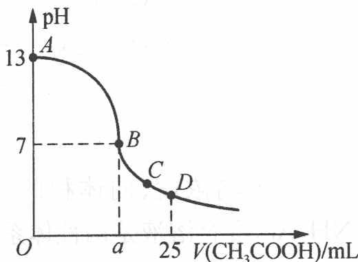

B. 在 $B$ 点, $a > 12.5$ , 且有: $c(\mathrm{Na}^{+}) = c(\mathrm{CH}_{3}\mathrm{COO}^{-}) = c(\mathrm{OH}^{-}) = c(\mathrm{H}^{+})$ C. 在 $C$ 点有: $c(\mathrm{CH}_{3}\mathrm{COO}^{-}) > c(\mathrm{Na}^{+}) > c(\mathrm{H}^{+}) > c(\mathrm{OH}^{-})$ D. 在 $D$ 点有: $c(\mathrm{CH}_{3}\mathrm{COO}^{-}) + c(\mathrm{CH}_{3}\mathrm{COOH}) = 2c(\mathrm{Na}^{+})$

过程探究 A、B 两点间(不包括 A、B 点在内)有 $c(\mathrm{OH}^{-}) > c(\mathrm{CH}_{3}\mathrm{COO}^{-})$ 的情况; 当滴加 12.5 mL 醋酸时, 恰好完全反应生成 $CH_{3}COONa$ , 溶液呈碱性, 而 B 点对应溶液呈中性, 故必须再滴加少量醋酸, 即 a > 12.5; B 点有 $c(\mathrm{Na}^{+}) = c(\mathrm{CH}_{3}\mathrm{COO}^{-}) > c(\mathrm{OH}^{-}) = c(\mathrm{H}^{+})$ ; 根据电荷守恒知 C 点有 $c(\mathrm{CH}_{3}\mathrm{COO}^{-}) > c(\mathrm{Na}^{+}) > c(\mathrm{H}^{+}) > c(\mathrm{OH}^{-})$ 成立; D 点相当于醋酸与醋酸钠 1:1 的混合物, 根据物料守恒知: $c(\mathrm{CH}_{3}\mathrm{COO}^{-}) + c(\mathrm{CH}_{3}\mathrm{COOH}) = 2c(\mathrm{Na}^{+})$ 。

参考解答 CD

【例2】（2004年山东初赛）学完盐类的水解后，老师出了这样一个小组讨论题： $0.1 \mathrm{~mol} \cdot \mathrm{L}^{-1}$ 的碳酸氢钠溶液中 $c(\mathrm{CO}_{3}^{2-})$ 大于还是小于 $c(\mathrm{OH}^{-})$ ？请发表你的观点，并根据下列信息以及所学的知识，通过计算证明你的观点。

信息:298 K 时的 $H_{2}CO_{3}$ 溶液中:

$$
\mathrm{H} _ {2} \mathrm{CO} _ {3} \rightleftharpoons \mathrm{H} ^ {+} + \mathrm{HCO} _ {3} ^ {-} \qquad K _ {\mathrm{a} _ {1}} = \frac {c (\mathrm{H} ^ {+}) \cdot c (\mathrm{HCO} _ {3} ^ {-})}{c (\mathrm{H} _ {2} \mathrm{CO} _ {3})} = 4. 3 0 \times 1 0 ^ {- 7}
$$

$$
\mathrm{HCO} _ {3} ^ {-} \rightleftharpoons \mathrm{H} ^ {+} + \mathrm{CO} _ {3} ^ {2 -} \quad K _ {\mathrm{a} _ {2}} = \frac {c (\mathrm{H} ^ {+}) \cdot c (\mathrm{CO} _ {3} ^ {2 -})}{c (\mathrm{HCO} _ {3} ^ {-})} = 5. 6 0 \times 1 0 ^ {- 1 1}\tag{②}
$$

过程探究 $K_{\mathrm{a}} = \frac{c(\mathrm{H}^{+})\bullet c(\mathrm{HCO}_{3}^{-})}{c(\mathrm{H}_{2}\mathrm{CO}_{3})}$ ①

$$
K _ {\mathrm{a} _ {2}} = \frac {c (\mathrm{H} ^ {+}) \cdot c (\mathrm{CO} _ {3} ^ {2 -})}{c (\mathrm{HCO} _ {3} ^ {-})}
$$

在 $\mathrm{NaHCO}_{3}$ 溶液中存在如下平衡:

电荷守恒： $c(\mathrm{Na}^{+})+c(\mathrm{H}^{+})=c(\mathrm{HCO}_{3}^{-})+2c(\mathrm{CO}_{3}^{2-})+c(\mathrm{OH}^{-})$

③

物料守恒： $c(\mathrm{Na}^{+})=c(\mathrm{HCO}_{3}^{-})+c(\mathrm{CO}_{3}^{2-})+c(\mathrm{H}_{2}\mathrm{CO}_{3})$ ④

③④两式相减得质子守恒： $c(\mathrm{H}^{+})+c(\mathrm{H}_{2}\mathrm{CO}_{3})=c(\mathrm{CO}_{3}^{2-})+c(\mathrm{OH}^{-})$ 将①②两式代入⑤式得：

$$
c (\mathrm{H} ^ {+}) + \frac {c (\mathrm{H} ^ {+}) \cdot c (\mathrm{HCO} _ {3} ^ {-})}{K _ {\mathrm{a}}} = \frac {K _ {\mathrm{a} _ {2}} \cdot c (\mathrm{HCO} _ {3} ^ {-})}{c (\mathrm{H} ^ {+})} + \frac {K _ {\mathrm{w}}}{c (\mathrm{H} ^ {+})}\tag{⑤}
$$

由于 $c(\mathrm{HCO}_3^-)\approx 0.1\mathrm{mol}\cdot \mathrm{L}^{-1}$ ，则： $c(\mathrm{HCO}_3^-)\cdot K_{\mathrm{a_2}}\gg K_{\mathrm{W}},c(\mathrm{HCO}_3^-)\gg K_{\mathrm{a_1}}$

整理得： $c(\mathrm{H}^{+})\approx(K_{a_{1}}K_{a_{2}})^{\frac{1}{2}}=4.91\times10^{-9}\mathrm{~mol}\cdot\mathrm{L}^{-1}\quad c(\mathrm{OH}^{-})=2.04\times10^{-6}\mathrm{~mol}\cdot\mathrm{L}^{-1}$

将 $c(\mathrm{H}^{+})$ 和 $c(\mathrm{HCO}_{3}^{-})$ 代入②得：

$$
c (\mathrm{CO} _ {3} ^ {2 -}) = 1. 1 4 \times 1 0 ^ {- 3} \mathrm{mol} \cdot \mathrm{L} ^ {- 1} > c (\mathrm{OH} ^ {-})
$$

参考解答 $c(\mathrm{CO}_{3}^{2-}) > c(\mathrm{OH}^{-})$

【例3】（2009年上海交大自主招生）在醋酸溶液中存在下列电离平衡： $\mathrm{HAc} \rightleftharpoons \mathrm{H}^{+} + \mathrm{Ac}^{-}$

在平衡时 $H^{+}$ 、 $Ac^{-}$ 和 HAc 浓度的比值是一个常数, 称为电离常数 $K_{HAc}$ , $K_{HAc} = \frac{[H^{+}][Ac^{-}]}{[HAc]} \approx \frac{[H^{+}]^{2}}{c}$

式中 $\left[H^{+}\right]$ 、 $\left[Ac^{-}\right]$ 和 $\left[HAc\right]$ 分别为平衡浓度，c 为 HAc 的起始浓度。通过对已知浓度的醋酸溶液的 pH 值测定，即可求出电离平衡常数。用移液管和吸量管分别移取 50.00 mL、25.00 mL、10.00 mL 和 5.00 mL HAc 溶液（浓度为 $0.1954 \, mol \cdot L^{-1}$ ）于四个已编号的 100.00 mL 容量瓶中，用蒸馏水稀释至刻度摇匀，即得不同浓度的一系列 HAc 溶液。用 pH 计测定 pH 值，记录实验时的室温。完成下列问题：

(1) 填写下列表格(第一部分)

<table><tr><td colspan="7">第一部分</td><td colspan="2">第二部分</td></tr><tr><td>编号</td><td>HAc 溶液体积/mL</td><td>稀释后体积/mL</td><td>稀释后浓度 $c/(mol·L^{-1})$ </td><td>pH</td><td> $[H^{+}]/(mol·L^{-1})$ </td><td> $K_{HAc}$ </td><td></td><td></td></tr><tr><td>1</td><td></td><td></td><td>0.009 770</td><td>3.38</td><td></td><td></td><td></td><td></td></tr><tr><td>2</td><td></td><td></td><td>0.019 54</td><td>3.23</td><td></td><td></td><td></td><td></td></tr><tr><td>3</td><td></td><td></td><td>0.048 85</td><td>3.04</td><td></td><td></td><td></td><td></td></tr><tr><td>4</td><td></td><td></td><td>0.097 70</td><td>2.88</td><td></td><td></td><td></td><td></td></tr><tr><td>5</td><td colspan="2">未稀释的溶液</td><td>0.1954</td><td>2.73</td><td></td><td></td><td></td><td></td></tr></table>

(2) 根据计算结果, 评价 $K_{\mathrm{HAc}}$ 和浓度的关系。

(3) 采用作图法可以精确计算 $K_{\mathrm{HAc}}$ 。经过一系列数学的变换, 找出可以形成直线关系的自变量和因变量, 在上表中的第二部分填写相关的数据, 并在右面的坐标系中作图, 并在图中标出和 $K_{\mathrm{HAc}}$ 相关的点, 求出 $K_{\mathrm{HAc}}$ 的数值。

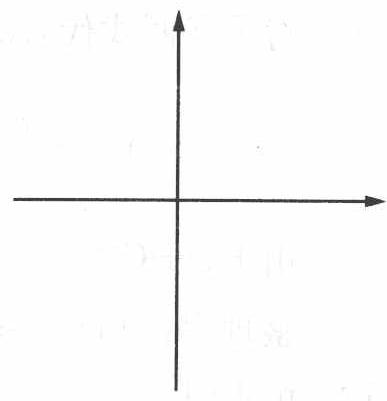

过程探究 (1) 第一问考查 $\mathrm{pH} = -\lg \left[\mathrm{H}^{+}\right]$ 。由于

HAc起始浓度 $c = 0.1954 \mathrm{~mol} \cdot \mathrm{L}^{-1}$ , 稀释后溶液的体积均为 $100 \mathrm{~mL}$ , 如 $5.00 \mathrm{~mL}$ 醋酸稀释到 $100 \mathrm{~mL}$ , 溶液体积增大 20 倍, 则浓度稀释到原来的 $1/20$ , 即 $c = 0.1954 / 20 = 0.009770 \mathrm{~mol} \cdot \mathrm{L}^{-1}$ , 此时表中给出的 $\mathrm{pH} = 3.38$ , 即 $[\mathrm{H}^{+}] = 4.17 \times 10^{-4} \mathrm{~mol} \cdot \mathrm{L}^{-1}$ , 根据醋酸电离常数的定义, 得: $K_{\mathrm{HAc}} = \frac{[\mathrm{H}^{+}][\mathrm{Ac}^{-}]}{[\mathrm{HAc}]} \approx \frac{[\mathrm{H}^{+}]^{2}}{c}$ , 将数据代入得: $K_{\mathrm{HAc}} = 1.78 \times 10^{-5}$ , 同理可以得出其他的数据。

<table><tr><td colspan="7">第一部分</td><td colspan="2">第二部分</td></tr><tr><td>编号</td><td>HAc 溶液体积/mL</td><td>稀释后体积/mL</td><td>稀释后浓度 $c/(mol·L^{-1})$ </td><td>pH</td><td> $[H^{+}]/(mol·L^{-1})$ </td><td> $K_{HAc}$ </td><td>lg c</td><td>2pH</td></tr><tr><td>1</td><td>5.00</td><td>100.00</td><td>0.009 770</td><td>3.38</td><td> $4.17×10^{-4}$ </td><td> $1.78×10^{-5}$ </td><td>-2.01</td><td>6.76</td></tr><tr><td>2</td><td>10.00</td><td>100.00</td><td>0.019 54</td><td>3.23</td><td> $5.89×10^{-4}$ </td><td> $1.78×10^{-5}$ </td><td>-1.71</td><td>6.46</td></tr><tr><td>3</td><td>25.00</td><td>100.00</td><td>0.048 85</td><td>3.04</td><td> $9.12×10^{-4}$ </td><td> $1.70×10^{-5}$ </td><td>-1.31</td><td>6.08</td></tr><tr><td>编号</td><td>HAc 溶液体积/mL</td><td>稀释后体积/mL</td><td>稀释后浓度c/(mol·L-1)</td><td>pH</td><td>[H+]/(mol·L-1)</td><td>KHAc</td><td>lg c</td><td>2pH</td></tr><tr><td>4</td><td>50.00</td><td>100.00</td><td>0.097 70</td><td>2.88</td><td>1.32×10-3</td><td>1.78×10-5</td><td>-1.01</td><td>5.76</td></tr><tr><td>5</td><td colspan="2">未稀释的溶液</td><td>0.1954</td><td>2.73</td><td>1.86×10-3</td><td>1.77×10-5</td><td>-0.709</td><td>5.46</td></tr></table>

(2) 从计算可以看出, $K_{HAc}$ 与浓度的变化关系不大, 即电离常数不是浓度的函数。

(3) 本问是运用数学手段,通过作图得到 $K_{\mathrm{HAc}}$ 。由于 $K_{\mathrm{HAc}} = \frac{[\mathrm{H}^{+}][\mathrm{Ac}^{-}]}{[\mathrm{HAc}]} \approx \frac{[\mathrm{H}^{+}]^{2}}{c}$ , 将其取负对数, 得: $\mathrm{pK}_{\mathrm{a}} = 2 \mathrm{pH} + \lg c$ , 即 $2 \mathrm{pH} = -\lg c + \mathrm{pK}_{\mathrm{a}}$ , 因此只要把稀释后的浓度 $c$ 处理成 $\lg c$ , $\mathrm{H}^{+}$ 浓度处理为 $2 \mathrm{pH}$ , 然后以 $2 \mathrm{pH}$ 为纵坐标, $\lg c$ 为横坐标作图, $\mathrm{pK}_{\mathrm{a}}$ 即为截距, 然后将图外推与纵坐标交点即可, 得 $\mathrm{pK}_{\mathrm{a}} = 4.76$ , $K_{\mathrm{a}} = 1.74 \times 10^{-5}$ 。

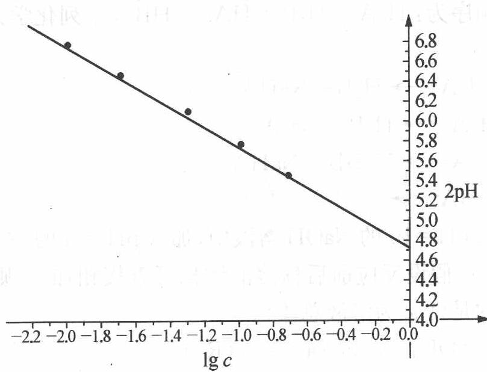

参考解答 见上述分析。

1 把 $0.2 \, mol \cdot L^{-1}$ 的偏铝酸钠溶液和 $0.4 \, mol \cdot L^{-1}$ 的盐酸溶液等体积混合，混合溶液中离子浓度由大到小的顺序正确的是()。

A. $c(\mathrm{Cl}^{-}) > c(\mathrm{Al}^{3+}) > c(\mathrm{Na}^{+}) > c(\mathrm{H}^{+}) > c(\mathrm{OH}^{-})$ B. $c(\mathrm{Cl}^{-}) > c(\mathrm{Al}^{3+}) > c(\mathrm{Na}^{+}) > c(\mathrm{OH}^{-}) > c(\mathrm{H}^{+})$ C. $c(\mathrm{Cl}^{-}) > c(\mathrm{Na}^{+}) > c(\mathrm{Al}^{3+}) > c(\mathrm{H}^{+}) > c(\mathrm{OH}^{-})$ D. $c(\mathrm{Na}^{+}) > c(\mathrm{Cl}^{-}) > c(\mathrm{Al}^{3+}) > c(\mathrm{OH}^{-}) > c(\mathrm{H}^{+})$

2 有关 $\mathrm{pH}$ 计算结果一定正确的是( )。
A. 强酸 $\mathrm{pH} = a$ ，加水稀释到 $10^{n}$ 倍，则 $\mathrm{pH} = a + n$ 。
B. 弱酸 $\mathrm{pH} = a$ ，加水稀释到 $10^{n}$ 倍，则 $\mathrm{pH} < a + n (a + n < 7)$ C. 强碱 $\mathrm{pH} = b$ ，加水稀释到 $10^{n}$ 倍，则 $\mathrm{pH} = b - n$ D. 弱碱 $\mathrm{pH} = b$ ，加水稀释到 $10^{n}$ 倍，则 $\mathrm{pH} > b - n (b - n > 7)$

3 重水 $\left(\mathrm{D}_{2}\mathrm{O}\right)$ 的离子积为 $1.6\times10^{-15}$ ，可以用类似定义 pH 的方法规定 $pD=-\lg\left[c\left(D^{+}\right)\right]$ ，以下关于 pD 的叙述正确的是()。
A. 中性溶液的 pD = 7.0
B. 含 0.01 mol NaOD 的 D₂O 溶液 1 L，其 pD = 12.0
C. 溶解 0.01 mol DCI 的 D₂O 溶液 1 L，其 pD = 2.0
D. 在 100 mL 0.25 mol · L⁻¹ DCI 的 D₂O 溶液中，加入 50 mL 0.2 mol · L⁻¹ NaOD 的重水溶液，其 pD = 1.0

④ 已知酸强弱顺序为: $\mathrm{H}_{2} \mathrm{~A} > \mathrm{H}_{2} \mathrm{~B} > \mathrm{HA}^{-} > \mathrm{HB}^{-}$ , 下列化学方程式正确的是 ( )。
A. $\mathrm{NaHB} + \mathrm{H}_{2}\mathrm{A} \longrightarrow \mathrm{H}_{2}\mathrm{B} + \mathrm{NaHA}$ B. $\mathrm{Na}_{2}\mathrm{B} + \mathrm{H}_{2}\mathrm{A} \longrightarrow \mathrm{H}_{2}\mathrm{B} + \mathrm{Na}_{2}\mathrm{A}$ C. $\mathrm{H}_{2}\mathrm{B} + \mathrm{Na}_{2}\mathrm{A} \longrightarrow \mathrm{NaHB} + \mathrm{NaHA}$ D. $\mathrm{H}_{2}\mathrm{B} + \mathrm{NaHA} \longrightarrow \mathrm{NaHB} + \mathrm{H}_{2}\mathrm{A}$

5 常温下 20 mL pH=10 的 NaOH 溶液中, 加入 pH=4 的一元酸 HR 溶液至 pH 刚好等于 7 (假设反应前后稀溶液体积可直接相加)。则对反应后溶液的叙述正确的是 ( $V_{总}$ 为溶液总体积) ( )。
A. $c(\mathrm{H}^{+}) = c(\mathrm{OH}^{-}) < c(\mathrm{Na}^{+}) < c(\mathrm{R}^{-})$ B. $V_{总} \geqslant 40 \, mL$ C. $c(R^{-}) = c(Na^{+})$ D. $V_{总} \leqslant 40 \, mL$

6 缓冲溶液可以由浓度较大的弱酸及其相应的盐溶液组成,其溶液能够保持稳定的 $\mathrm{pH}$ 值,溶液 $\mathrm{pH}$ 的计算公式为: $\mathrm{pH} = \mathrm{pK}_{\mathrm{a}} + \lg \frac{C_{\text {盐}}}{C_{\text {弱酸}}}$ ,其中 $K_{\mathrm{a}}$ 为弱酸的电离常数。相应地,由弱碱及其相应的盐溶液组成的缓冲溶液,其 $\mathrm{pOH} =$ $pK_{b} + \lg \frac{c_{盐}}{c_{弱碱}}$ 。试就 HAc-NaAc 缓冲体系，回答下列问题：

(1) 上述缓冲溶液呈\_\_\_\_性(填“酸性”、“中性”或“碱性”);

(2) 决定体系 pH 值的最主要因素是 \_\_\_\_；

(3) 使上述体系 $\mathrm{pH}$ 变动 $0.1 \sim 0.2$ 个单位的因素是 \_\_\_\_；

(4) 外加酸时保持 $\mathrm{pH}$ 值没有显著变化的最主要因素是

7 甘氨酸

$$
\mathrm{H} _ {2} \mathrm{N} - \mathrm{CH} _ {2} - \mathrm{C} - \mathrm{OH}
$$

有一个弱酸基—COOH 和一个弱碱基— $NH_{2}$ ，其酸常数 $K_{a}$ 和碱常数 $K_{b}$ 近似相等，则在酸性介质中以 \_\_\_\_ 离子存在，在碱性介质中以 \_\_\_\_ 离子存在，在纯水中以 \_\_\_\_ 离子存在。

⑧ 水是两性酸碱物质,存在\_\_\_\_和\_\_\_\_两个酸碱共轭对,不同酸 HA 或碱 B 在水中的相对强度取决于\_\_\_\_。

9 根据酸碱质子理论,“凡是能给出质子( $\mathrm{H}^{+}$ )的分子或离子都是酸;凡是能结合质子的分子或离子都是碱”,按这个理论,下列微粒:

① ${\mathrm{{HS}}}^{ - }$ ,② ${\mathrm{{CO}}}_{3}^{2 - }$ ,③ ${\mathrm{{HPO}}}_{4}^{2 - }$ ,④ ${\mathrm{{NH}}}_{3}$ ,⑤ ${\mathrm{{OH}}}^{ - }$ ,⑥ ${\mathrm{H}}_{2}\mathrm{O}$ ,⑦ ${\mathrm{{HCO}}}_{3}^{ - }$ ,

⑧HAc, ⑨KHSO $_{4}$

(1) 只属于碱的微粒是: \_\_\_\_；

(2) 只属于酸的微粒是: \_\_\_\_；

(3) 属于两性的微粒是: (填编号)。

10 请仔细阅读下面的材料,回答有关问题:

材料之一:常温下,浓度相等的 $CH_{3}COOH$ 和 $NH_{3}\cdot H_{2}O$ 两种稀溶液,pH 之和为 14。

材料之二:有三种酸碱指示剂:酚酞为常用的单色指示剂,显色的最低pH=8。甲基红是常用的有酸式色和碱式色的双色指示剂,pH<4呈红色,4<pH<5.2呈橙色,pH>5.2呈黄色。“中性红-次甲基蓝混合指示剂”是双色指示剂中性红和惰性蓝色染料次甲基蓝在酒精中组成的混合溶液,它恰好能在pH=7时在溶液中显紫蓝色,在酸性溶液中显红与蓝合成的复合色——蓝紫色,在碱性溶液中显黄橙与蓝合成的复合色——绿色。

(1) 由 $0.05 \mathrm{~mol} \cdot \mathrm{L}^{- 1} \mathrm{CH}_{3} \mathrm{COONa}$ 溶液的 $\mathrm{pH} = 8.7$ , 推断 $0.05 \mathrm{~mol} \cdot \mathrm{L}^{- 1}$

$NH_{4}Cl$ 溶液的 pH, 并简要说明理由。

(2) 用标准盐酸(HCl 的准确浓度接近 $0.1 \mathrm{~mol} \cdot \mathrm{L}^{-1}$ ) 测定约 $0.1 \mathrm{~mol} \cdot \mathrm{L}^{-1}$ 稀氨水的准确浓度, 试研究下列技术问题:

① 中性红-次甲基蓝混合指示剂能否用于本滴定？若能，请说明如何掌握滴定终点。

② 以上材料中所提供的其他酸碱指示剂中是否有适用的？若有，请说明适用的理由和如何掌握滴定终点。

③ 在所有提供的不适用的酸碱指示剂中,哪一种用于本滴定时产生的误差最大?试分析其原因。

11 计算下列各溶液的 $\mathrm{pH}$ 值。

(1) $20 \mathrm{~mL} 0.10 \mathrm{~mol} \cdot \mathrm{L}^{-1}$ 的 HCl 和 $20 \mathrm{~mL} 0.10 \mathrm{~mol} \cdot \mathrm{L}^{-1}$ 氨水混合；

(2) $20 \mathrm{~mL} 0.10 \mathrm{~mol} \cdot \mathrm{L}^{- 1}$ 的 $\mathrm{HCl}$ 和 $20 \mathrm{~mL} 0.20 \mathrm{~mol} \cdot \mathrm{L}^{- 1}$ 氨水混合。

12 水是我们熟悉的物质,正如同学们所知道的,水能“分裂”出一个质子而离解。此处打引号是由于分裂出来的质子不是以游离状态存在于真实的化学体系中,而是立即与另一水分子结合:

$$
\mathrm{H} _ {2} \mathrm{O} + \mathrm{H} _ {2} \mathrm{O} \rightleftharpoons \mathrm{H} _ {3} \mathrm{O} ^ {+} + \mathrm{OH} ^ {-} \quad K _ {1} = \frac {c (\mathrm{H} _ {3} \mathrm{O} ^ {+}) \cdot c (\mathrm{OH} ^ {-})}{c (\mathrm{H} _ {2} \mathrm{O})}
$$

氢氧根离子可进一步离解：

$$
\mathrm{OH} ^ {-} + \mathrm{H} _ {2} \mathrm{O} \rightleftharpoons \mathrm{H} _ {3} \mathrm{O} ^ {+} + \mathrm{O} ^ {2 -} K _ {2} = \frac {c (\mathrm{H} _ {3} \mathrm{O} ^ {+}) \cdot c (\mathrm{O} ^ {2 -})}{c (\mathrm{OH} ^ {-})}
$$

(1) 计算 $25^{\circ} \mathrm{C}$ 时 $K_{1}$ 的值。

(2) 已知 $25^{\circ} \mathrm{C}$ 时 $K_{2} = 10^{-36}$ , 计算在多少体积的水里含有一个氧负离子。

(3)哪一种水(轻水 $^{1}$ H $_{2}$ O或重水D $_{2}$ O)将具有较大离解度？为什么？

13 双指示剂可用来测定 $\mathrm{NaOH}$ 、 $\mathrm{NaHCO_3}$ 、 $\mathrm{Na_2CO_3}$ 中的一种或两种物质组成混合物时各成分的质量分数。具体做法是: 先向待测溶液中加入酚酞,用标准盐酸滴定, 当 $\mathrm{NaOH}$ 或 $\mathrm{Na_2CO_3}$ 被转化为 $\mathrm{NaCl}$ 或 $\mathrm{NaHCO_3}$ 时, 酚酞由红色褪为无色, 消耗 $V_{1} \mathrm{~mL}$ 盐酸; 然后滴加甲基橙, 继续用标准盐酸滴定, 当 $\mathrm{NaHCO_3}$ 转化为 $\mathrm{NaCl}$ 时, 溶液由黄色变为橙色, 消耗 $V_{2} \mathrm{~mL}$ 盐酸。

(1) 试根据下表给出的 $V_{1} 、 V_{2}$ 数值的范围, 判断原混合物的成分 (用化学式表示)。

<table><tr><td> $V_1$ 和 $V_2$ </td><td> $V_1 \neq 0$  $V_2 = 0$ </td><td> $V_1 = 0$  $V_2 \neq 0$ </td><td> $V_1 = V_2 \neq 0$ </td><td> $V_1 > V_2 > 0$ </td><td> $V_2 > V_1 > 0$ </td></tr><tr><td>试样成分</td><td></td><td></td><td></td><td></td><td></td></tr></table>

(2) 若称取 1.200 g 含杂质的试样(杂质不与盐酸反应), 配制成 100.00 mL 溶液, 取出 20.00 mL 溶液, 用 0.100 mol·L $^{-1}$ 的标准盐酸滴定, 测得 $V_{1} = 35.00 \, mL$ , $V_{2} = 5.00 \, mL$ 。求试样的成分及质量分数。

14 碳的化合物十分常见,回答下列几个问题:

(1) 在温热气候条件下的浅海地区往往发现有石灰岩沉积, 而在深海地区却很少见到, 说明为什么。

(2) 已知从手册中查出的 $H_{2}CO_{3}$ 的 $K_{a_{1}} = 4.45 \times 10^{-7}$ ，该数据是 $H_{2}CO_{3}$ 的表观解离常数，在溶液中实际仅有 0.166% 的 $CO_{2}$ 转化为 $H_{2}CO_{3}$ ，求算 $H_{2}CO_{3}$ 真实的第一步解离常数。

15 某一元有机弱酸 HA 1.000 g, 溶于适量水后, 用仪器法确定终点, 以 $0.1100 \, mol \cdot L^{-1}$ NaOH 滴定至化学计量点时, 消耗 24.60 mL。当加入 NaOH 溶液 11.00 mL 时, 该溶液的 pH = 4.80。计算该弱酸 HA 的 $pK_{a}$ 值。

16 1905 年美国化学家富兰克林提出了酸碱的溶剂理论,人们发现许多溶剂都能发生自电离过程,生成特征阳离子和特征阴离子,如 $2 \mathrm{H}_{2} \mathrm{O} \rightleftharpoons \mathrm{H}_{3} \mathrm{O}^{+} + \mathrm{OH}^{-}$ , $2 \mathrm{NH}_{3} \rightleftharpoons \mathrm{NH}_{4}^{+} + \mathrm{NH}_{2}^{-}$ , 溶剂理论认为凡在溶剂中能产生(包括化学反应生成)特征阳离子的物质为溶剂酸,反之为溶剂碱。

(1) 试定义溶剂理论中的中和反应;

(2) 判断 $NH_{4}Cl$ 和 NaH 在液氨体系中是酸还是碱，并用方程式来表示；

(3) $\mathrm{SbF}_{5}$ 在 $\mathrm{BrF}_{3}$ 溶液中为酸, 写出其电离方程式, 画出电离所得阴、阳离子的结构;

(4) 尿素在液氨中为弱酸,试写出电离方程式。液氨中尿素与氨基钠反应得到尿素盐,试写出方程式。该反应能不能在水中进行?为什么?

1. 解析：偏铝酸钠与盐酸混合后，发生反应： $NaAlO_{2} + HCl + H_{2}O \longrightarrow NaCl + Al(OH)_{3} \downarrow$ 。显然盐酸过量，过量的盐酸与 $\mathrm{Al(OH)}_{3}$ 进一步反应： $\mathrm{Al(OH)}_{3} + 3\mathrm{HCl} \longrightarrow$ $\mathrm{AlCl}_{3} + 3\mathrm{H}_{2}\mathrm{O}$ ，故反应后溶液为 $\mathrm{AlCl}_{3}$ 与 $\mathrm{NaCl}$ 的混合溶液， $\mathrm{Cl}^{-}$ 浓度最大。因 $1\mathrm{mol}$ $\mathrm{NaAlO}_{2}$ 须 $4\mathrm{mol} \mathrm{HCl}$ 才能使 $\mathrm{NaAlO}_{2}$ 全部转变成 $\mathrm{Al}^{3+}$ ，所以溶液中还有未溶解的 $\mathrm{Al(OH)}_{3}$ ，故 $c(\mathrm{Na}^{+}) > c(\mathrm{Al}^{3+})$ ；由于 $\mathrm{AlCl}_{3}$ 水解，溶液呈酸性，故 $c(\mathrm{H}^{+}) > c(\mathrm{OH}^{-})$ ，正确答案为 C。

答案：C

2. 解析: 强酸、强碱稀释时, 其稀释的离子分别为 $\mathrm{H}^{+}$ 和 $\mathrm{OH}^{-}$ , 故酸的稀释与碱的稀释在计算上不同。若为强酸时, $\mathrm{pH} = a \Rightarrow c(\mathrm{H}^{+}) = 10^{-a}$ , 加水稀释到 $10^{n}$ 倍, 稀释后 $c(\mathrm{H}^{+}) = 10^{-(a+n)}$ , 则 $\mathrm{pH} = a + n$ , 但当稀释到很稀时, 应考虑水的电离, 此时 $\mathrm{pH} < 7$ , 故 A 不完全正确; 若为强碱时, $\mathrm{pH} = b \Rightarrow c(\mathrm{H}^{+}) = 10^{-b}$ , 即 $c(\mathrm{OH}^{-}) = 10^{-14+b}$ , 加水稀释到 $10^{n}$ 倍后, $c(\mathrm{OH}^{-}) = 10^{-14+b-n}$ , 换算成 $c(\mathrm{H}^{+}) = 10^{n-b}$ , 即 $\mathrm{pH} = b - n$ , 同理, 稀释到很稀时, 应考虑水的电离, 此时 $\mathrm{pH} > 7$ 。弱酸与弱碱稀释时除考虑稀释因素外, 还要考虑稀释对电离的促进。答案: BD

3. 解析: $K_{\text{重水}} = c(\mathrm{D}^{+}) \cdot c(\mathrm{OD}^{-}) = 1.6 \times 10^{-15}, c(\mathrm{D}^{+}) = c(\mathrm{OD}^{-}) = 4.0 \times 10^{-8} \mathrm{~mol} \cdot \mathrm{L}^{-1}$ 时为中性溶液, 所以 $\mathrm{pD} = \mathrm{pOD} = 7.40$ , 含 $0.01 \mathrm{~mol} \mathrm{NaOD}$ 的 $\mathrm{D}_{2} \mathrm{O}$ 溶液 $1 \mathrm{~L}, c(\mathrm{OD}^{-}) = 10^{-2} \mathrm{~mol} \cdot \mathrm{L}^{-1}, \mathrm{pOD} = 2.0, \mathrm{pD} = 14.8 - 2.0 = 12.8$ ; 溶解 $0.01 \mathrm{~mol} \mathrm{DCl}$ 的 $\mathrm{D}_{2} \mathrm{O}$ 溶液 $1 \mathrm{~L}$ , 其 $\mathrm{pD} = 2.0$ , 在 $100 \mathrm{~mL} 0.25 \mathrm{~mol} \cdot \mathrm{L}^{-1} \mathrm{DCl}$ 的重水溶液中, 加入 $50 \mathrm{~mL} 0.2 \mathrm{~mol} \cdot \mathrm{L}^{-1} \mathrm{NaOD}$ 的重水溶液, $c(\mathrm{D}^{+}) = 0.1 \mathrm{~L} \times 0.25 \mathrm{~mol} \cdot \mathrm{L}^{-1} - 0.05 \mathrm{~L} \times 0.2 \mathrm{~mol} \cdot \mathrm{L}^{-1} = 0.1 \mathrm{~mol} \cdot \mathrm{L}^{-1}$ , 所以 $\mathrm{pD} = 1.0$ 。

答案: CD

4. 解析: 强弱不同的酸在溶液中, 其一般的反应规律为较强酸可以制备较弱酸。在比较其酸性强弱时, 还可从其对应的酸根得 $\mathrm{H}^{+}$ 或结合 $\mathrm{H}^{+}$ 的能力进行分析, 即酸性越弱, 其酸根结合 $\mathrm{H}^{+}$ 的能力就越强, 如 $\mathrm{B}^{2-}$ 不仅可以结合 $\mathrm{H}_{2} \mathrm{~A}$ 电离的 $\mathrm{H}^{+}$ , 而且还可以结合 $\mathrm{HA}^{-}$ 电离的 $\mathrm{H}^{+}$ , 成为 $\mathrm{HB}^{-}$ , 故 $\mathrm{HA}^{-} + \mathrm{B}^{2-} \longrightarrow \mathrm{HB}^{-} + \mathrm{A}^{2-}$ 。选项 A, 由题中已知条件可知, $\mathrm{H}_{2} \mathrm{~A}$ 酸性最强, 可以和其他任一弱酸盐进行反应, 但其酸式盐的酸性却不如 $\mathrm{H}_{2} \mathrm{~B}$ 酸性强, 故与 NaHB 反应时, $\mathrm{H}_{2} \mathrm{~A}$ 只能被转化为 NaHA。选项 B, 由于 $\mathrm{H}_{2} \mathrm{~B}$ 的酸性强于 $\mathrm{HA}^{-}$ , 故 $\mathrm{H}_{2} \mathrm{~B}$ 可与 $\mathrm{Na}_{2} \mathrm{~A}$ 发生 C 选项所示的反应, B 是错误的, 而 C 则是正确的; D 中的 $\mathrm{H}_{2} \mathrm{~B}$ 酸性不如 $\mathrm{H}_{2} \mathrm{~A}$ , 不能发生弱酸制强酸的反应。

答案: AC

5. BC

6. (1) 该缓冲体系是酸与共轭碱组成, 因此整个缓冲溶液呈酸性;

(2) 根据公式 $\mathrm{pH} = \mathrm{pK}_{\mathrm{a}} + \lg \frac{c_{\text {盐}}}{c_{\text {弱酸}}} \text {知: 决定体系 } \mathrm{pH}$ 值最主要因素是弱酸的 $K_{\mathrm{a}}$ 值;

(3) 使上述体系 pH 变动 0.1\~0.2 个单位的因素是弱酸及其盐的浓度；

(4)外加酸时保持 $\mathrm{pH}$ 值没有显著变化的最主要因素是弱酸盐的浓度。

$$
\begin{array}{r l} & \text {   [H } _ {3} \mathrm{N-CH} _ {2} - \mathrm{C-OH]} ^ {+}; \left[ \mathrm{H} _ {2} \mathrm{N-CH} _ {2} - \mathrm{C-O} \right] ^ {-}; \\ & \quad \mathrm{O} \\ & \quad^ {+} \mathrm{H} _ {3} \mathrm{N-CH} _ {2} - \mathrm{C-O} ^ {-} \\ & \quad \mathrm{O} \end{array}
$$

8. $H_{3}O^{+}-H_{2}O$ ; $H_{2}O-OH^{-}$ ; 共轭酸碱对 HA-A $^{-}$ 或 B-HB $^{+}$ 中酸给出 H $^{+}$ 或碱接受 H $^{+}$ 的能力

9. (1) ②④⑤ (2) ⑧⑨ (3) ①③⑥⑦

10. 解析: (1) 材料一说明 $\mathrm{CH}_{3} \mathrm{COOH}$ 和 $\mathrm{NH}_{3} \cdot \mathrm{H}_{2} \mathrm{O}$ 的电离能力相同, 则等浓度的 $\mathrm{CH}_{3} \mathrm{COO}^{-}$ 的水解能力 (结合 $\mathrm{H}^{+}$ 能力) 与 $\mathrm{NH}_{4}^{+}$ 的水解能力 (结合 $\mathrm{OH}^{-}$ 能力) 相同。 $\mathrm{CH}_{3} \mathrm{COONa}$ 溶液的 $\mathrm{pH} = 8.7$ , 则生成的 $c(\mathrm{OH}^{-}) = 10^{-5.3}, \mathrm{NH}_{4} \mathrm{Cl}$ 溶液的 $c(\mathrm{H}^{+}) = 10^{-5.3}$ , 故 $\mathrm{NH}_{4} \mathrm{Cl}$ 溶液的 $\mathrm{pH} = 5.3$ 。

(2) 盐酸滴定 $NH_{3}$ 到达终点时, 其混合液中 $NH_{4}Cl$ 浓度约为 $0.05 \, mol \cdot L^{-1}$ , 故滴定终点时溶液的 pH 为 5.3 左右, 中性红-次甲基蓝混合指示剂的变色点为 7, 故不适合。由于甲基红的变色点为 pH = 5.2, 非常接近 5.3, 故选用甲基红较好, 其终点时, 溶液应由黄色变为橙色。由于酚酞的变色点为 pH = 8, 溶液呈碱性, 而恰好反应时, pH = 5.3, 故用酚酞做指示剂, 造成的误差最大。

答案: (1) $\mathrm{pH} = 5.3 \quad \mathrm{CH}_{3} \mathrm{COO}^{-}$ 与 $\mathrm{NH}_{4}^{+}$ 的水解能力(结合 $\mathrm{H}^{+}$ 或 $\mathrm{OH}^{-}$ 的能力)相同 (2) ① 否 指示剂的变色点的 $\mathrm{pH}$ 与终点时盐溶液的 $\mathrm{pH}$ 不一致 ② 甲基红甲基红的变色点为 $\mathrm{pH} = 5.2$ , 非常接近 黄色变为橙色 ③ 酚酞 酚酞的变色点为 $\mathrm{pH} = 8$ , 溶液呈碱性

11. (1) 等物质的量的 HCl 和 $NH_{3} \cdot H_{3}O$ 混合生成等物质的量的 $NH_{4}Cl$ 。 $NH_{4}Cl$ 浓度是 HCl 浓度的一半， $c_{NH_{4}Cl} = \frac{0.10 \times 20}{40} = 0.050 \, mol \cdot L^{-1}$ ，按 $NH_{4}Cl$ 的水解来计算溶液的 pH 值：

$$
\begin{array}{r l}&{\mathrm {NH_ {4} ^ {+}} + \mathrm {H_ {2} O\rightleftharpoons NH_ {3} \cdot H_ {3} O+ H^ {+}}}\\{\text {平衡时}}&{0. 0 5 0 - x \qquad \qquad \qquad x \qquad x}\\&{K _ {\mathrm{h}} = \frac {K _ {\mathrm{w}}}{K _ {\mathrm{b}}} = 5. 6 \times 1 0 ^ {- 1 0} \qquad \frac {x ^ {2}}{0 . 0 5 0 - x} = 5. 6 \times 1 0 ^ {- 1 0}}\\&{x = 5. 3 \times 1 0 ^ {- 6} \qquad \mathrm{pH=5.28}}\end{array}
$$

(2)两溶液混合后发生中和反应,除生成与 $\mathrm{HCl}$ 等物质的量的 $\mathrm{NH}_{4} \mathrm{Cl}, \mathrm{NH}_{3} \cdot \mathrm{H}_{3} \mathrm{O}$ 还有剩余,相当于 $\mathrm{NH}_{3} \cdot \mathrm{H}_{3} \mathrm{O}-\mathrm{NH}_{4} \mathrm{Cl}$ 的缓冲溶液。

用缓冲溶液计算公式计算：

所以 $\mathrm{pH} = 14 - 4.74 + \lg \frac{0.050}{0.050} = 9.26$

12. (1) $25^{\circ} \mathrm{C}$ 时 $c(\mathrm{H}_{3} \mathrm{O}^{+}) \cdot c(\mathrm{OH}^{-}) = K_{\mathrm{W}} = 10^{-14}$

$$
c (\mathrm{H} _ {2} \mathrm{O}) = \frac {1 0 0 0 \mathrm{g}}{1 8 \mathrm{g} \cdot \mathrm{mol} ^ {- 1} \times 1 \mathrm{L}} = 5 5. 6 \mathrm{mol} \cdot \mathrm{L} ^ {- 1}
$$

$$
K _ {1} = \frac {c (\mathrm{H} _ {3} \mathrm{O} ^ {+}) \bullet c (\mathrm{OH} ^ {-})}{c (\mathrm{H} _ {2} \mathrm{O})} = 1. 8 \times 1 0 ^ {- 1 6}
$$

(2) 水中 $c(\mathrm{H}_{3}\mathrm{O}^{+}) = c(\mathrm{OH}^{-})$

$$
c (\mathrm{O} ^ {2 -}) = \frac {K _ {2} \cdot c (\mathrm{OH} ^ {-})}{c (\mathrm{H} _ {3} \mathrm{O} ^ {+})} = K _ {2} = 1 0 ^ {- 3 6} \mathrm{mol} \cdot \mathrm{L} ^ {- 1}
$$

$1.7 \times 10^{12}$ L 水中有一个氧负离子。

(3) 轻水具有较大的离解度。

$D_{2}O$ 中D—O键比 $^{1}H_{2}O$ 中H—O键强，或 $D_{2}O$ 中氢键比 $^{1}H_{2}O$ 中氢键强。

13. 利用双指示剂法分析碱性混合物的组成是容量分析中有实际意义的分析方法, 常用以测定烧碱中 $\mathrm{NaOH}$ 的质量分数 (因吸收空气中 $\mathrm{CO}_{2}$ 而混有 $\mathrm{Na}_{2} \mathrm{CO}_{3}$ 杂质)。

(1) ① 当 $V_{1} \neq 0, V_{2} = 0$ 时, 表示该物质中只含有 $\mathrm{NaOH}$ , 不含 $\mathrm{Na}_{2} \mathrm{CO}_{3}$ 或 $\mathrm{NaHCO}_{3}$ (有后两种杂质时, $V_{2} \neq 0$ )。

② 当 $V_{2} \neq 0, V_{1} = 0$ 时，表示该物质中只含有 $NaHCO_{3}$ ，发生反应：

$NaHCO_{3} + HCl \longrightarrow NaCl + H_{2}O + CO_{2} \uparrow$ ，反应达终点的溶液为 $CO_{2}$ 饱和溶液，pH 在 3.1～4.4 之间，在甲基橙变色（黄到橙）范围内。该物质中不含 NaOH 和 $Na_{2}CO_{3}$ （若有这两种物质，滴入酚酞显红色， $V_{1} \neq 0$ ）。

③ 当 $V_{1} = V_{2} \neq 0$ 时，该物质中只含有 $Na_{2}CO_{3}$ ，其两步反应消耗盐酸的量相等：

$$
\begin{array}{r l} & \mathrm {Na_ {2} CO_ {3} + HCl\longrightarrow NaCl + NaHCO_ {3}} \\ & \mathrm {NaHCO_ {3} + HCl\longrightarrow NaCl + CO_ {2} \uparrow+ H_ {2} O} \end{array}
$$

第一步反应完成则滴定终点酚酞无色。

第二步反应完成则滴定终点甲基橙橙色。此情况下该物质中不含 NaOH 和 $NaHCO_{3}$ 。

④ $V_{1} > V_{2} > 0$ 时，则该物质中含 NaOH 和 $Na_{2}CO_{3}$ ，此时 $c_{酸} \cdot V_{1} = n(\mathrm{NaOH}) + n(\mathrm{Na}_{2}\mathrm{CO}_{3})$ ， $c_{酸} \cdot V_{2} = n(\mathrm{Na}_{2}\mathrm{CO}_{3})$ ，则 $n(\mathrm{NaOH}) = c_{酸}(V_{1} - V_{2})$ 。

⑤ $V_{2} > V_{1} > 0$ 时, 此物质为 $\mathrm{Na}_{2} \mathrm{CO}_{3}$ 和 $\mathrm{NaHCO}_{3}$ 的混合物。

$$
c _ {\mathrm{酸}} \cdot V _ {1} = n (\mathrm{Na} _ {2} \mathrm{CO} _ {3}), c _ {\mathrm{酸}} \cdot V _ {2} = n (\mathrm{Na} _ {2} \mathrm{CO} _ {3}) + n (\mathrm{NaHCO} _ {3})
$$

则 $n(\mathrm{NaHCO}_3) = c_{\text{酸}} \cdot (V_2 - V_1)$

(2) 由题示条件 $V_{1} > V_{2} > 0$ 。

混合物中含有 $\mathrm{NaOH}$ 和 $\mathrm{Na}_{2} \mathrm{CO}_{3}$ , 则有:

$$
n (\mathrm{NaOH}) = c _ {\text {酸}} (V _ {1} - V _ {2}) = 0. 1 0 0 \times (3 5. 0 0 - 5. 0 0) \times 1 0 ^ {- 3} = 3. 0 0 \times 1 0 ^ {- 3} (\mathrm{mol})
$$

$$
\mathrm{NaOH}\% = \frac{3.00\times 10^{-3}\times\frac{100.00}{20.00}\times 40}{1.200}\times 100\% = 50.0\%
$$

$$
n (\mathrm{Na} _ {2} \mathrm{CO} _ {3}) = c _ {\mathrm{酸}} V _ {2} = 0. 1 0 0 \times 5. 0 0 \times 1 0 ^ {- 3} = 5. 0 0 \times 1 0 ^ {- 4} (\mathrm{mol})
$$

$$
\mathrm{Na} _ {2} \mathrm{CO} _ {3} \% = \frac {5 . 0 0 \times 1 0 ^ {- 4} \times \frac {1 0 0 . 0 0}{2 0 . 0 0} \times 1 0 6}{1 . 2 0 0} \times 1 0 0 \% = 2 2. 1 \%
$$

14. (1) 石灰岩的形成是 $\mathrm{CaCO}_{3}$ 沉积的结果, 海水中溶解一定量的 $\mathrm{CO}_{2}$ , 因此 $\mathrm{CaCO}_{3}$ 与 $\mathrm{CO}_{2}, \mathrm{H}_{2} \mathrm{O}$ 之间存在着下列平衡:

$$
\mathrm{CaCO} _ {3} (\mathrm{s}) + \mathrm{CO} _ {2} (\mathrm{g}) + \mathrm{H} _ {2} \mathrm{O} (\mathrm{l}) \rightleftharpoons \mathrm{Ca} (\mathrm{HCO} _ {3}) _ {2} (\mathrm{aq})
$$

海水中 $CO_{2}$ 的溶解度随温度的升高而减少, 随压力的增大而增大。在浅海地区, 海水底层压力较小, 同时水温比较高, 因而 $CO_{2}$ 的浓度较小, 根据平衡移动的原理, 上述平衡向生成 $CaCO_{3}$ 方向移动, 因而在浅海地区有较多的 $CaCO_{3}$ 沉淀。深海地区情况恰相反, 故深海底层沉积的 $CaCO_{3}$ 很少。

(2) 设碳酸真实的第一步解离常数为 $K_{\mathrm{a}}^{\prime}$

$$
K _ {\mathrm{a} _ {4}} = \left[ \mathrm{H} ^ {+} \right] \left[ \mathrm{HCO} _ {3} ^ {-} \right] / \left[ \mathrm{H} _ {2} \mathrm{CO} _ {3} + \mathrm{CO} _ {2} \right] = 4. 4 5 \times 1 0 ^ {- 7}
$$

据题意,真实的 $K_{a}^{\prime}=[H^{+}][HCO_{3}^{-}]/[H_{2}CO_{3}]=\frac{4.45\times10^{-7}}{0.166\%}=2.68\times10^{-4}$

15. HA 的总量为: 0.1100×24.60 = 2.706(mmol)

当加入 NaOH 溶液 11.00 mL 时已知 pH=4.80，即溶液中 A $^{-}$ 的量为：0.1100 × 11.00 = 1.210 (mmol)

则 HA 的量为: 2.706 - 1.210 = 1.496 (mmol)

$$
4. 8 0 = \mathrm{p} K _ {\mathrm{a}} + \lg \frac {1 . 2 1 0}{1 . 4 9 6}
$$

所以 $\mathrm{pK_a} = 4.89$

16. (1) 特征阴阳离子生成溶剂分子的反应

(2) 酸 $NH_{4}Cl \rightarrow NH_{4}^{+} + Cl^{-}$

碱 $\mathrm{NaH} + \mathrm{NH}_3\longrightarrow \mathrm{H}_2 + \mathrm{NH}_2^- +\mathrm{Na}^+$

(3) $\mathrm{SbF_5 + BrF_3\longrightarrow BrF_2^+ + SbF_6^-}$

$$
\mathrm{BrF} _ {2} ^ {+} \mathrm{V型} \left[ \begin{array}{c c} & \mathrm{Br} \\ & \mathrm{F} \end{array} \right] ^ {+}
$$

$\mathrm{SbF_6^-}$ 正八面体型 $\left[ \begin{array}{c} \mathrm{F} \\ | \\ \mathrm{Sb} \\ | \\ \mathrm{F} \end{array} \right]$

(4) $\mathrm{CO(NH_2)_2 + NH_3\rightleftharpoons NH_4^+ + NH_2CONH^-}$ $\mathrm{NaNH_2 + NH_2CONH_2\longrightarrow NH_2CONHNa + NH_3}$ 不能 遇水分解

（2）在 $x$ 轴上，当 $y$ 为正方形的半圆柱体，又有一条平行四边形的圆柱体，每个圆柱体有一个圆柱体，每个圆柱体有一个圆柱体。

## 知识要点

## 一、溶度积

难溶电解质,如 $\mathrm{AgCl}$ 虽然难溶于水,但仍能微量地溶于水而形成饱和溶液。其溶解的部分则几乎完全电离为 $\mathrm{Ag}^{+}$ 和 $\mathrm{Cl}^{-}$ 。一定温度时,当溶解速率和沉淀速率相等,就达到沉淀溶解平衡: $\mathrm{AgCl(s)} \rightleftharpoons \mathrm{Ag}^{+}(\mathrm{aq}) + \mathrm{Cl}^{-}(\mathrm{aq})$ 。

根据化学平衡原理,在 AgCl 的沉淀溶解平衡中存在如下关系:

$$
K _ {\mathrm{sp}} = \frac {[ \mathrm{Ag} ^ {+} ]}{c ^ {\theta}} \cdot \frac {[ \mathrm{Cl} ^ {-} ]}{c ^ {\theta}}
$$

习惯上简写为： $K_{sp}=\left[Ag^{+}\right]\left[Cl^{-}\right]$ ，式中 $K_{sp}$ 是溶度积常数，简称溶度积。对于 $A_{n}B_{m}$ 型难溶电解质，溶度积表达形式为：

$$
K _ {\mathrm{sp}} = \left[ \mathrm{A} ^ {m +} \right] ^ {n} \left[ \mathrm{B} ^ {n -} \right] ^ {m}
$$

对于相同类型的物质(指 n、m 相同)， $K_{sp}$ 值的大小，反映了难溶电解质在溶液中溶解能力的大小，也反映了该物质在溶液中沉淀的难易。与平衡常数一样， $K_{sp}$ 与温度有关。

## 二、溶度积与溶解度的关系

难溶物质的溶解度可表示为:在一定温度下,每升饱和溶液中所含溶质的物质的量。溶解度和溶度积都能代表难溶电解质的溶解能力。若难溶电解质溶解后显著电离,且电离形成的离子不水解或水解极弱,相应离子间不发生明显的配位作用,则可由溶解度求溶度积或反之亦然,如 AgCl、BaSO₄、Ag₂CrO₄ 等少数几种难溶物质符合此要求。

【例1】 $298\mathrm{K}$ 时， $\mathrm{Ag_2CrO_4}$ 在水中的溶解度为 $4.3\mathrm{mg / 100g}$ 水，求 $K_{\mathrm{sp}}(\mathrm{Ag}_2\mathrm{CrO}_4)$ 。

过程探究 溶解的 $Ag_{2}CrO_{4}$ 完全电离， $Ag^{+}$ 、 $CrO_{4}^{2-}$ 水解极弱，可认为 $Ag_{2}CrO_{4}$ 饱和溶液中 $[Ag^{+}] = 2[CrO_{4}^{2-}]$

$$
\mathrm{Ag} _ {2} \mathrm{CrO} _ {4} \rightleftharpoons 2 \mathrm{Ag} ^ {+} + \mathrm{CrO} _ {4} ^ {2 -}
$$

$$
K _ {\mathrm{sp}} = [ \mathrm{Ag} ^ {+} ] ^ {2} [ \mathrm{CrO} _ {4} ^ {2 -} ]
$$

再由 $Ag_{2}CrO_{4}$ 的溶解度求 $Ag^{+}$ 和 $CrO_{4}^{2-}$ 浓度，则可求溶度积。若溶解形成的离子水解明显，如 $CaCO_{3}$ 中 $CO_{3}^{2-}$ ，则 $\left[Ca^{2+}\right] \neq \left[CO_{3}^{2-}\right]$ 不能简单地在溶解度和溶度积间进行换算。但 $K_{\mathrm{sp}}(\mathrm{CaCO}_{3}) = [\mathrm{Ca}^{2+}][\mathrm{CO}_{3}^{2-}]$ 仍是确定的。

参考解答 设稀溶液密度为 $1.0 \, g/mL$ ，可由 $Ag_{2}CrO_{4}(332 \, \text{g/mol})$ 的溶解度求浓度

$$
4. 3 \times 1 0 ^ {- 3} \mathrm{g} \times \frac {1 0 0 0}{1 0 0 \mathrm{L}} \div 3 3 2 \mathrm{g/mol} = 1. 3 \times 1 0 ^ {- 4} \mathrm{mol} \cdot \mathrm{L} ^ {- 1}
$$

则 $[\mathrm{Ag^{+}}] = 2\times 1.3\times 10^{-4}\mathrm{mol}\cdot \mathrm{L}^{-1} = 2.6\times 10^{-4}\mathrm{mol}\cdot \mathrm{L}^{-1},[\mathrm{CrO}_4^{2 - }] =$ $1.3\times 10^{-4}\mathrm{mol}\cdot \mathrm{L}^{-1}$

$$
K _ {\mathrm{sp}} = \left[ \mathrm{Ag} ^ {+} \right] ^ {2} \left[ \mathrm{CrO} _ {4} ^ {2 -} \right] = \left[ 2. 6 \times 1 0 ^ {- 4} \right] ^ {2} \times \left[ 1. 3 \times 1 0 ^ {- 4} \right] = 8. 8 \times 1 0 ^ {- 1 2}
$$

## 三、溶度积规则

比较 $K_{sp}$ 和 Q 的大小, 可以判断反应进行的方向。例如: $\mathrm{AgCl(s)} \rightleftharpoons \mathrm{Ag^{+}(aq)} + \mathrm{Cl^{-}(aq)}$

如果某一时刻 $Ag^{+}$ 浓度与 $Cl^{-}$ 浓度的乘积称为反应商,那么

1. $Q > K_{\mathrm{sp}}$ 时, 平衡左移, 生成沉淀;

2. $Q = K_{sp}$ 时, 平衡状态, 溶液饱和;

3. $Q < K_{\mathrm{sp}}$ 时, 平衡右移, 沉淀溶解。

上述结论可称之为溶度积规则,据此可以判断沉淀的生成与溶解的趋势,其具体应用在沉淀平衡、分步沉淀、沉淀转化三个方面。

【例2】已知 $298 \mathrm{~K}$ 时, $\mathrm{BaSO}_{4}$ 的溶度积为 $1.08 \times 10^{-10}$ 。求 $\mathrm{BaSO}_{4}$ 在 $1 \mathrm{~L} 0.01 \mathrm{~mol} \cdot \mathrm{L}^{-1} \mathrm{Na}_{2} \mathrm{SO}_{4}$ 溶液中的溶解度。

过程探究 难溶强电解质的饱和溶液中,如果加入与该电解质相同的离子,使平衡移动,降低难溶电解质溶解度的效应,称为“同离子效应”。

参考解答 设 $BaSO_{4}$ 在 $NaSO_{4}$ 溶液中的溶解度为 $S\ mol\cdot L^{-1}$ 。沉淀溶解平衡时， $\left[Ba^{2+}\right]=S\ mol\cdot L^{-1},\left[SO_{4}^{2-}\right]=0.01+S\approx0.01\ mol\cdot L^{-1}$ （难溶盐溶解度很小）

$$
[ \mathrm{Ba} ^ {2 +} ] [ \mathrm{SO} _ {4} ^ {2 -} ] = 1. 0 8 \times 1 0 ^ {- 1 0} = K _ {\mathrm{sp}}
$$

$$
S \times 0. 0 1 = 1. 0 8 \times 1 0 ^ {- 1 0}, S = 1. 0 8 \times 1 0 ^ {- 8}
$$

实际上,在纯水中的溶解度为 $1.04 \times 10^{-5} \mathrm{~mol} \cdot \mathrm{L}^{-1}$ 与上面计算结果相比,可以看到,由于 $\mathrm{Na}_{2} \mathrm{SO}_{4}$ 的存在,溶液中存在大量 $\mathrm{SO}_{4}^{2-}$ 离子,因而大大降低了 $\mathrm{BaSO}_{4}$ 的溶解度。

## 四、沉淀溶解平衡的移动

## 1. 沉淀的生成

根据溶度积规则, 当 $Q > K_{sp}$ 时, 将有沉淀生成。但是在配制溶液和进行化学反应过程中, 有时 $Q > K_{sp}$ 时, 却没有观察到沉淀物生成。其原因有三个方面:

(1) 盐效应的影响: 事实证明, 在 $\mathrm{AgCl}$ 饱和溶液中加入 $\mathrm{KNO}_{3}$ 溶液, 会使 $\mathrm{AgCl}$ 的溶解度增大, 且加入 $\mathrm{KNO}_{3}$ 溶液浓度越大, $\mathrm{AgCl}$ 的溶解度增大越多。这种因加入易溶强电解质而使难溶电解质溶解度增大的现象称为盐效应。盐效应可用平衡移动观点定性解释:

$$
\mathrm{AgCl(s)} \rightleftharpoons \mathrm {Ag^ {+} (aq) + Cl^ {-} (aq)}
$$

$KNO_{3}$ 溶液加入后, 并不起任何化学反应, 但溶液中增加了 $K^{+}$ 和 $NO_{3}^{-}$ , 它们与溶液中的 $Ag^{+}$ 和 $Cl^{-}$ 有相互“牵制”作用, 使 $Ag^{+}$ 和 $Cl^{-}$ 的自由运动受到阻碍, 因而 $Ag^{+}$ 和 $Cl^{-}$ 能起作用的“有效浓度”降低, 于是它们回到固体表面的速率减少了, 即沉淀速率 < 溶解速率, 平衡向右移动, AgCl 的溶解度增大。

注意,当加入含共同离子的强电解质时,也有盐效应。只是盐效应对溶解度影响较小,一般不改变溶解度的数量级,而同离子效应却可以使溶解度改变几个数量级,因此在一般计算中,特别是较稀溶液中,不必考虑盐效应。

(2) 过饱和现象: 虽然 $\left[\mathrm{Ag}^{+}\right]\left[\mathrm{Cl}^{-}\right]$ 略大于 $K_{\mathrm{sp}}$ , 但是, 由于体系内无结晶中心, 即无晶核的存在, 沉淀亦不能生成, 因此如形成过饱和溶液, 则观察不到沉淀物。此时向过饱和溶液中加入晶种 (非常微小的晶体, 甚至于尘埃), 或用玻璃棒磨擦容器壁, 立刻析晶。

(3) 沉淀的量: 前两种情况中, 并没有生成沉淀。实际上即使有沉淀生成, 若其量过小, 也可能观察不到。正常的视力, 当沉淀的量达到 $10^{-5} \mathrm{~g} \cdot \mathrm{mL}^{-1}$ 时, 才可以看出溶液浑浊。

## 2. 沉淀的溶解

根据溶度积规则,使沉淀溶解的必要条件是 $Q < K_{sp}$ ，如创造条件使溶液中有关离子的浓度降低，则沉淀溶解。降低溶液中离子的浓度有如下途径：

(1) 使相关离子生成弱电解质,例如 $\mathrm{Mg(OH)}_{2}$ 可以溶于酸或铵盐溶液

中,其反应式

$$
\mathrm{Mg(OH)} _ {2} + 2 \mathrm{NH} _ {4} \mathrm{Cl} \xrightarrow {\triangle} \mathrm{MgCl} _ {2} + 2 \mathrm{NH} _ {3} \uparrow + 2 \mathrm{H} _ {2} \mathrm{O}
$$

【例3】 计算使 $0.010 \mathrm{~mol}$ 的 $\mathrm{SnS}$ 溶于 $1.0 \mathrm{~L}$ 盐酸中, 所需盐酸的最低浓度。

过程探究 要使 SnS 溶解, 加入 HCl 后, 其 $H^{+}$ 与 SnS 溶解后电离出的 $S^{2-}$ 相结合形成弱电解质 $HS^{-}$ 和 $H_{2}S$ , 使沉淀溶解平衡向溶解方向移动。根据计算结果, 可判断出所需盐酸的最低浓度是否在实际可配制的范围, 从而判断沉淀是否能溶于某种酸。

参考解答 当 0.010 mol 的 SnS 全部溶于 1.0 L 盐酸中时, 溶液中 $c(\mathrm{Sn}^{2+}) = 0.010 \, \mathrm{mol} \cdot \mathrm{L}^{-1}$ , 解离出的 $S^{2-}$ 将与盐酸中的 $H^{+}$ 结合生成 $H_{2}S$ , 且 $c(\mathrm{H}_{2}\mathrm{S}) = 0.010 \, \mathrm{mol} \cdot \mathrm{L}^{-1}$ 。

溶液中的 $c(\mathrm{H}_{3}\mathrm{O}^{+})$ 为

$$
\begin{array}{r l} c (\mathrm{H} _ {3} \mathrm{O} ^ {+}) & = \sqrt {\frac {c (\mathrm{Sn} ^ {2 +}) c (\mathrm{H} _ {2} \mathrm{S})}{K _ {\mathrm{spa}} (\mathrm{SnS})}} \\ & = \sqrt {\frac {c (\mathrm{Sn} ^ {2 +}) c (\mathrm{H} _ {2} \mathrm{S}) K _ {\mathrm{a} _ {1}} (\mathrm{H} _ {2} \mathrm{S}) K _ {\mathrm{a} _ {2}} (\mathrm{H} _ {2} \mathrm{S})}{K _ {\mathrm{sp}} (\mathrm{SnS})}} \\ & = \sqrt {\frac {0 . 0 1 0 \times 0 . 0 1 0 \times 1 . 3 \times 1 0 ^ {- 7} \times 7 . 1 \times 1 0 ^ {- 1 5}}{1 . 0 \times 1 0 ^ {- 2 5}}} \\ & = 0. 9 6 (\mathrm{mol} \cdot \mathrm{L} ^ {- 1}) \end{array}
$$

这个浓度是溶液中平衡时的 $c(\mathrm{H}_{3}\mathrm{O}^{+})$ ，原来的盐酸中的 $H^{+}$ 与 0.010 mol 的 $S^{2-}$ 结合时消耗掉 0.020 mol，故所需盐酸的起始浓度为 $0.96 + 0.02 = 0.98 (\mathrm{~mol} \cdot \mathrm{L}^{-1})$ 。

思考1: 上题假定溶解 SnS 产生的 $\mathrm{S}^{2-}$ 全部转变成 $\mathrm{H}_{2} \mathrm{~S}$ 。实际上应是 $[\mathrm{H}_{2} \mathrm{~S}] + [\mathrm{HS}^{-}] + [\mathrm{S}^{2-}] = 0.010 \mathrm{~mol} \cdot \mathrm{L}^{-1}$ , 那么 $[\mathrm{H}_{2} \mathrm{~S}] \approx 0.010 \mathrm{~mol} \cdot \mathrm{L}^{-1}$ 的近似处理合理吗?

同上题, 还可以求出 0.01 mol 的 CuS 溶于 1.0 L 盐酸中, 所需的盐酸的最低浓度约是 $1.0 \times 10^{9} \, mol \cdot L^{-1}$ 。这种浓度过大, 根本不可能存在。实际上反应 $CuS + 2H^{+} \rightleftharpoons Cu^{2+} + H_{2}S$ 的平衡常数 $K = \frac{K_{sp}}{K_{a_{1}} K_{a_{2}}} = \frac{8.5 \times 10^{-45}}{1.3 \times 10^{-7} \times 7.1 \times 10^{-15}} = 9.2 \times 10^{-24}$ , 平衡常数过小。结论是 CuS 不能溶于盐酸。

## (2) 使相关离子被氧化

实验事实表明，CuS 不溶解于盐酸，但在 $HNO_{3}$ 中可溶。原因是 $S^{2-}$ 被氧

化,使得平衡 $\mathrm{CuS(s)}\rightleftharpoons\mathrm{Cu}^{2+}(aq)+\mathrm{S}^{2-}(aq)$ 右移。反应的方程式为:

$$
3 \mathrm{CuS} + 8 \mathrm{HNO} _ {3} \longrightarrow 3 \mathrm{Cu(NO} _ {3}) _ {2} + 2 \mathrm{NO} \uparrow + 3 \mathrm{S} + 4 \mathrm{H} _ {2} \mathrm{O}
$$

## (3) 使相关离子被络合

AgCl 沉淀可以溶于氨水, 原因是 $Ag^{+}$ 与 $NH_{3}$ 络合生成 $\mathrm{Ag(NH_{3})_{2}^{+}}$ , 使平衡 $\mathrm{AgCl(s)} \rightleftharpoons \mathrm{Ag^{+}(aq)} + \mathrm{Cl^{-}(aq)}$ 右移, AgCl 溶解。反应的方程式为:

$$
\mathrm{AgCl} + 2 \mathrm{NH} _ {3} = \mathrm{Ag} (\mathrm{NH} _ {3}) _ {2} ^ {+} + \mathrm{Cl} ^ {-}
$$

这类反应将在配位化合物一讲中学习和讨论。当既发生氧化还原反应又生成络合物时则可溶解更难溶的沉淀。

## 3. 分步沉淀

若一种沉淀剂可使溶液中多种离子产生沉淀时, 则可以控制条件, 使这些离子先后分别沉淀, 这种现象称为分步沉淀。控制溶液的 $\mathrm{pH}$ 值, 可使某种难溶电解质先沉淀, 以达到分离金属离子的目的。例如, $\mathrm{Fe(OH)}_{3}$ 和 $\mathrm{Fe(OH)}_{2}$ 的 $K_{\mathrm{sp}}$ 分别为 $1.10 \times 10^{-36}$ 和 $1.64 \times 10^{-14}$ , 欲使 $0.01 \mathrm{~mol} \cdot \mathrm{L}^{-1}$ 的 $\mathrm{Fe}^{3+}$ 沉淀, 通过计算, 开始沉淀时溶液的 $\mathrm{pH}$ 值为 2.68, 沉淀完全时溶液的 $\mathrm{pH}$ 为 3.68, 而使 $0.01 \mathrm{~mol} \cdot \mathrm{L}^{-1} \mathrm{Fe}^{2+}$ 沉淀完全, 溶液的 $\mathrm{pH}$ 值应是 9.61。因此, 生产上除去溶液中的铁杂质, 常将它先氧化成 $\mathrm{Fe}^{3+}$ , 再调节溶液的 $\mathrm{pH}$ 值, 在较小的 $\mathrm{pH}$ 值, 就能够将它全部沉淀, 完全除去。

【例 4】在含有 $Mn^{2+}$ 、 $Pb^{2+}$ 各 $0.010\ mol\cdot L^{-1}$ 的溶液中通入 $H_{2}S$ 达饱和 ( $H_{2}S$ 浓度为 $0.10\ mol\cdot L^{-1}$ )，问溶液的 $[H^{+}]$ 应控制在何值时，可使 $Mn^{2+}$ 与 $Pb^{2+}$ 分离？已知 $K_{\mathrm{sp}}(\mathrm{MnS})=1.4\times10^{-15}$ ， $K_{\mathrm{sp}}(\mathrm{PbS})=3.4\times10^{-28}$ 。

过程探究 控制溶液 pH, 则可使溶液中 $\mathrm{S}^{2-}$ 处于一定的浓度范围, 使不同的金属硫化物沉淀或不沉淀, 从而达到分离金属离子的目的。这与调节溶液 pH, 使不同的金属氢氧化物先后沉淀的原理是相同的。

参考解答 $Pb^{2+}$ 完全沉淀时(即 $[Pb^{2+}] < 1.0 \times 10^{-5} \, mol \cdot L^{-1}$ ), 溶液中 $[S^{2-}]$ 至少要达到

$$
[ \mathrm{S} ^ {2 -} ] = \frac {K _ {\mathrm{sp}} (\mathrm{PbS})}{[ \mathrm{Pb} ^ {2 +} ]} = \frac {3 . 4 \times 1 0 ^ {- 2 8}}{1 . 0 \times 1 0 ^ {- 5}} = 3. 4 \times 1 0 ^ {- 2 3} \mathrm{mol} \cdot \mathrm{L} ^ {- 1}
$$

此时 $[\mathrm{H}^{+}]$ 为

$$
\left[ \mathrm{H} ^ {+} \right] = \sqrt {\frac {K _ {\mathrm{a} _ {1}} K _ {\mathrm{a} _ {2}} \left[ \mathrm{H} _ {2} \mathrm{S} \right]}{\left[ \mathrm{S} ^ {2 -} \right]}} = \sqrt {\frac {1 . 1 \times 1 0 ^ {- 2 1} \times 0 . 1 0}{3 . 4 \times 1 0 ^ {- 2 3}}} = 1. 8 \mathrm{mol} \cdot \mathrm{L} ^ {- 1}
$$

即 $[\mathrm{H}^{+}] \leqslant 1.8 \mathrm{~mol} \cdot \mathrm{L}^{-1}$ 时 PbS 沉淀完全。

$Mn^{2+}$ 不形成 MnS 沉淀时溶液中 $[S^{2-}]$ 最大为

$$
[ \mathrm{S} ^ {2 -} ] = \frac {K _ {\mathrm{sp}} (\mathrm{MnS})}{[ \mathrm{Mn} ^ {2 +} ]} = \frac {1 . 4 \times 1 0 ^ {- 1 5}}{0 . 0 1 0} = 1. 4 \times 1 0 ^ {- 1 3} \mathrm{mol} \cdot \mathrm{L} ^ {- 1}
$$

此时 $[\mathrm{H}^{+}]$ 为

$$
\left[ \mathrm{H} ^ {+} \right] = \sqrt {\frac {K _ {\mathrm{a} _ {1}} K _ {\mathrm{a} _ {2}} \left[ \mathrm{H} _ {2} \mathrm{S} \right]}{\left[ \mathrm{S} ^ {2 -} \right]}} = \sqrt {\frac {1 . 1 \times 1 0 ^ {- 2 1} \times 0 . 1 0}{1 . 4 \times 1 0 ^ {- 1 3}}} = 2. 8 \times 1 0 ^ {- 5} \mathrm{mol} \cdot \mathrm{L} ^ {- 1}
$$

把 $\left[\mathrm{H}^{+}\right]$ 控制在 $2.8 \times 10^{-5} \mathrm{~mol} \cdot \mathrm{L}^{-1} \sim 1.8 \mathrm{~mol} \cdot \mathrm{L}^{-1}$ 之间, 通 $\mathrm{H}_{2} \mathrm{~S}$ 达饱和, 就可分离 $\mathrm{Pb}^{2+}$ 和 $\mathrm{Mn}^{2+}$ 。

## 4. 沉淀的转化

顾名思义,一种沉淀转化为另一种沉淀的过程称为沉淀的转化。如向 $\mathrm{BaCO_{3}}$ 沉淀中加入 $\mathrm{Na_{2}CrO_{4}}$ 溶液,将会发现白色的 $\mathrm{BaCO_{3}}$ 沉淀逐渐转化成黄色的 $\mathrm{BaCrO_{4}}$ 沉淀。

## 思考2：为什么会产生这种现象呢？

可根据溶度积规则分析。当加入少量 $CrO_{4}^{2-}$ 时， $\left[\mathrm{Ba}^{2+}\right]\left[\mathrm{CrO}_{4}^{2-}\right]<K_{\mathrm{sp}}(\mathrm{BaCrO}_{4})$ ，这时不生成 $BaCrO_{4}$ 沉淀。继续加入 $CrO_{4}^{2-}$ ，将有一时刻刚好达到 $Q=K_{sp}$ ，即 $\left[Ba^{2+}\right]\left[CrO_{4}^{2-}\right]=K_{\mathrm{sp}}(\mathrm{BaCrO}_{4})$ 。这时，体系中同时存在两种平衡：

$$
\mathrm{BaCO} _ {3} \rightleftharpoons \mathrm{Ba} ^ {2 +} + \mathrm{CO} _ {3} ^ {2 -} \quad K _ {\mathrm{sp}} (\mathrm{BaCO} _ {3}) = [ \mathrm{Ba} ^ {2 +} ] [ \mathrm{CO} _ {3} ^ {2 -} ] = 2. 5 8 \times 1 0 ^ {- 9}\tag{①}
$$

$$
\mathrm{BaCrO} _ {4} \rightleftharpoons \mathrm{Ba} ^ {2 +} + \mathrm{CrO} _ {4} ^ {2 -} K _ {\mathrm{sp}} (\mathrm{BaCrO} _ {4}) = [ \mathrm{Ba} ^ {2 +} ] [ \mathrm{CrO} _ {4} ^ {2 -} ] = 1. 6 \times 1 0 ^ {- 1 0}\tag{②}
$$

$$
① - ② \text {   得:   } \quad \mathrm{BaCO} _ {3} + \mathrm{CrO} _ {4} ^ {2 -} \rightleftharpoons \mathrm{BaCrO} _ {4} + \mathrm{CO} _ {3} ^ {2 -}\tag{③}
$$

方程式③所表示的就是白色的 $BaCO_{3}$ 转化成黄色的 $BaCrO_{4}$ 的反应。其平衡常数为：

$$
K _ {3} = \frac {[ \mathrm{CO} _ {3} ^ {2 -} ]}{[ \mathrm{CrO} _ {4} ^ {2 -} ]} = \frac {K _ {\mathrm{sp}} (\mathrm{BaCO} _ {3})}{K _ {\mathrm{sp}} (\mathrm{BaCrO} _ {4})} = \frac {2 . 5 8 \times 1 0 ^ {- 9}}{1 . 6 \times 1 0 ^ {- 1 0}} = 1 6
$$

分析化学中常将难溶的强酸盐(如 $BaSO_{4}$ )转化为难溶的弱酸盐(如 $BaCO_{3}$ ),然后再用酸溶解使阳离子( $Ba^{2+}$ )进入溶液。 $BaSO_{4}$ 沉淀转化为 $BaCO_{3}$ 沉淀的反应为

$$
\mathrm{BaSO} _ {4} + \mathrm{CO} _ {3} ^ {2 -} \rightleftharpoons \mathrm{BaCO} _ {3} + \mathrm{SO} _ {4} ^ {2 -}
$$

$$
K = \frac {[ \mathrm{SO} _ {4} ^ {2 -} ]}{[ \mathrm{CO} _ {3} ^ {2 -} ]} = \frac {K _ {\mathrm{sp}} (\mathrm{BaSO} _ {4})}{K _ {\mathrm{sp}} (\mathrm{BaCO} _ {3})} = \frac {1 . 0 7 \times 1 0 ^ {- 1 0}}{2 . 5 8 \times 1 0 ^ {- 9}} \approx \frac {1}{2 4}
$$

虽然平衡常数小,转化不彻底,但只要 $\left[CO_{3}^{2-}\right]$ 比 $\left[SO_{4}^{2-}\right]$ 大24倍以上,经多次转化,即可将 $BaSO_{4}$ 转化为 $BaCO_{3}$ 。

从上面的事实中,可得出一条普遍适用于沉淀转化的规律:溶解度大的沉淀转化成溶解度小的沉淀,反应的平衡常数大;溶解度小的沉淀转化成溶解度大的沉淀,反应的平衡常数小。

【例 5】 锅炉中的锅垢其中所含的 $CaSO_{4}$ 如何除去？试用沉淀转化原理说明（要求计算转化反应的平衡常数大小）。

过程探究 从一种沉淀转化为另一种沉淀的过程叫做沉淀的转化。在实际应用中,有时遇到一些既不溶于水,又不溶于酸的沉淀,往往为了某种需要,把它转化为另一种难溶的电解质。例如,锅炉中的锅垢,其中含有 $\mathrm{CaSO}_{4}$ ,很难除去,可用 $\mathrm{Na}_{2} \mathrm{CO}_{3}$ 溶液处理,使其转化为更难溶的疏松的 $\mathrm{CaCO}_{3}$ 沉淀,以便用酸清除,其反应如下:

$$
\begin{array}{r l}&\mathrm {CaSO_ {4}} \rightleftharpoons \mathrm {Ca^ {2 + }} + \mathrm {SO_ {4} ^ {2 - }}\\&\mathrm {Na_ {2} CO_ {3}} \longrightarrow \mathrm {CO_ {3} ^ {2 - }} + 2 \mathrm {Na^ {+}}\\&\quad \quad \quad \quad \quad \quad \quad \quad \quad \quad \quad \quad \quad \quad \quad \quad \quad \quad \quad \quad \quad \quad \quad \quad \quad \quad \text {   }\\&\mathrm {CaCO_ {3}}\end{array}
$$

参考解答 $\mathrm{CaSO}_{4}$ 与 $\mathrm{Na}_{2} \mathrm{CO}_{3}$ 溶液反应的方程式如下:

$$
\begin{array}{r l}&\mathrm {CaSO_ {4} + CO_ {3} ^ {2 - } \rightleftharpoons CaCO_ {3} + SO_ {4} ^ {2 - }}\\&K = K _ {\mathrm{sp}} (\mathrm {CaSO_ {4}}) / K _ {\mathrm{sp}} (\mathrm {CaCO_ {3}}) \approx 5. 1 \times 1 0 ^ {3}\end{array}
$$

$CaSO_{4}$ 之所以能转化为 $CaCO_{3}$ ，是因为 $CaCO_{3}(K_{\mathrm{sp}}=4.7\times10^{-9})$ 比 $CaSO_{4}(K_{\mathrm{sp}}=2.4\times10^{-5})$ 更难溶。上述沉淀转化反应的平衡常数很大，该沉淀转化反应进行得很完全。

【例 1】（2008 年北京大学自主招生）室温下饱和氯水浓度约为 $0.09 \, mol \cdot L^{-1}$ ，其中约 1/3 的 $Cl_{2}$ 发生了自氧化还原反应。增加饱和溶液中 HClO 浓度的一种方法是：把 $Cl_{2}$ 通入到 $CaCO_{3}$ 悬浊液。请写出反应式并简述理由。

过程探究 本题考查化学平衡移动。由于氯气溶于水发生了两个过程：

① 氯气分子变成水合氯气分子: $\mathrm{Cl}_{2}(\mathrm{~g}) \rightleftharpoons \mathrm{Cl}_{2}(\mathrm{aq})$ 。该平衡常数即为亨利常数。

② $1/3$ 的水合氯气分子继续反应: ${\mathrm{{Cl}}}_{2} + {\mathrm{H}}_{2}\mathrm{O} \rightleftharpoons  \mathrm{{HCl}} + \mathrm{{HClO}}$

当把 $Cl_{2}$ 通入到 $CaCO_{3}$ 悬浊液后,氯水中的盐酸与 $CaCO_{3}$ 反应:

$$
2 \mathrm{HCl} + \mathrm{CaCO} _ {3} \longrightarrow \mathrm{CaCl} _ {2} + \mathrm{CO} _ {2} \uparrow + \mathrm{H} _ {2} \mathrm{O}
$$

而 HClO 由于酸性很弱, 不与 $CaCO_{3}$ 反应, 造成氯气不断与水发生反应, 生成的盐酸又不断与 $CaCO_{3}$ 反应, 化学平衡移动, 此时 HClO 的浓度越来越大。

参考解答 反应式为 $2Cl_{2} + CaCO_{3} + H_{2}O \longrightarrow CaCl_{2} + CO_{2} + 2HClO$ ，理由见上。

【例2】（2004年江苏预赛）称取含 $CaCO_{3}$ 60% 的试样 0.25 g，用酸溶解后加入过量 $(\mathrm{NH}_{4})_{2}\mathrm{C}_{2}\mathrm{O}_{4}$ ，使 $Ca^{2+}$ 沉淀为 $CaC_{2}O_{4}$ 。在过滤、洗涤沉淀时，为了使沉淀溶解损失造成的误差不大于万分之一，应该用 100 mL 质量分数至少为多少的 $(\mathrm{NH}_{4})_{2}\mathrm{C}_{2}\mathrm{O}_{4}$ 作洗涤液？已知溶液中当 $Ca^{2+}$ 和 $C_{2}O_{4}^{2-}$ 物质的量浓度的乘积等于或大于 $2.3 \times 10^{-9}$ 时会析出 $CaC_{2}O_{4}$ 沉淀。

过程探究 由元素守恒可知生成 $CaC_{2}O_{4}$ 沉淀的物质的量为:

$$
n (\mathrm{CaC} _ {2} \mathrm{O} _ {4}) = n (\mathrm{CaCO} _ {3}) = 1. 5 \times 1 0 ^ {- 3} \mathrm{mol}
$$

因允许损失的量不大于万分之一,因此溶液中残留的 $Ca^{2+}$ 的浓度为:

$$
c (\mathrm{Ca} ^ {2 +}) = 1. 5 \times 1 0 ^ {- 6} \mathrm{mol} \cdot \mathrm{L} ^ {- 1}
$$

则 $C_{2}O_{4}^{2-}$ 的浓度至少约为 $1.5 \times 10^{-3} \, mol \cdot L^{-1}$

故需要的 $\left(\mathrm{NH}_{4}\right)_{2}\mathrm{C}_{2}\mathrm{O}_{4}$ 的质量为 $1.5\times10^{-3}\mathrm{mol}\cdot\mathrm{L}^{-1}\times0.1\mathrm{L}\times124\mathrm{g}\cdot\mathrm{mol}^{-1}\approx$ $1.9\times10^{-2}\mathrm{g}$

又 $\left(\mathrm{NH}_{4}\right)_{2}\mathrm{C}_{2}\mathrm{O}_{4}$ 溶液的浓度较小,可近似地认为该溶液的密度为 $1\mathrm{g}\cdot\mathrm{mL}^{-1}$ ,则 $\left(\mathrm{NH}_{4}\right)_{2}\mathrm{C}_{2}\mathrm{O}_{4}$ 的质量分数为0.019%。

参考解答 应用溶质质量分数至少为 0.019% 的 $(\mathrm{NH}_{4})_{2}\mathrm{C}_{2}\mathrm{O}_{4}$ 溶液作洗涤液。

【例 3】（2007 年湖南预赛）工业上制取 $CuCl_{2}$ 的生产流程如下：

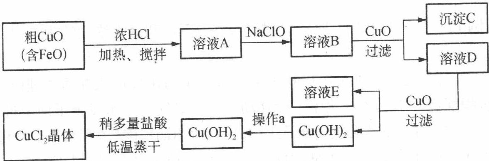

$\lg c(SO_{4}^{2-})$

请结合下列数据,回答下列问题:

<table><tr><td>物质</td><td>Fe(OH)2</td><td>Cu(OH)2</td><td>Fe(OH)3</td></tr><tr><td>溶度积(25°C)</td><td>8.0×10-16</td><td>2.2×10-20</td><td>4.0×10-38</td></tr><tr><td>完全沉淀时的pH范围</td><td>≥9.6</td><td>≥6.4</td><td>3~4</td></tr></table>

(1) 在溶液 A 中加入 NaClO 的目的是\_\_\_\_；

(2) 在溶液 B 中加入 CuO 的作用是\_\_\_\_；

(3) 操作 a 的目的是 \_\_\_\_；

(4) 在 $\mathrm{Cu(OH)}_{2}$ 中加入盐酸使 $\mathrm{Cu(OH)}_{2}$ 转变为 $\mathrm{CuCl}_{2}$ , 采用稍多量盐酸和低温蒸干的目的是 \_\_\_\_。

过程探究 该生产流程中溶液 A 含 $Cu^{2+}$ 和 $Fe^{2+}$ ，NaClO 的作用是将 $Fe^{2+}$ 氧化成 $Fe^{3+}$ 以便通过 CuO 调节 pH 至 3～4，使铁元素以 $\mathrm{Fe(OH)}_{3}$ （即沉淀 C）的形式除去，第二次加 CuO 是继续调节 pH≥6.4，使铜元素以 $\mathrm{Cu(OH)}_{2}$ 的形式沉淀，以便后期制备 $CuCl_{2}$ 。考虑到 $Cu^{2+}$ 易水解，故蒸发 $CuCl_{2}$ 溶液时应加较多量盐酸并且低温蒸干。

参考解答 (1) 将 $\mathrm{Fe}^{2+}$ 氧化成 $\mathrm{Fe}^{3+}$ 而使分离更加完全

(2) 调节溶液的 $\mathrm{pH}$ 为 $3 \sim 4$ , 使 $\mathrm{Fe}^{3+}$ 完全转变为 $\mathrm{Fe(OH)}_{3}$ 沉淀而分离

(3) 洗涤 $\mathrm{Cu(OH)}_{2}$ 表面的可溶性杂质

(4) 抑制 $Cu^{2+}$ 的水解

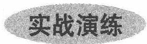

1 硫酸锶 $(\mathrm{SrSO}_4)$ 在水中的沉淀溶解平衡曲线如右图。下列说法正确的是（ ）。A. 温度一定时, $K_{\mathrm{sp}}(\mathrm{SrSO}_4)$ 随 $c(\mathrm{SO}_4^{2-})$ 的增大而减小B. 三个不同温度中, $313 \mathrm{~K}$ 时 $K_{\mathrm{sp}}(\mathrm{SrSO}_4)$ 最大C. $283 \mathrm{~K}$ 时, 图中 a 点对应的溶液是不饱和溶液

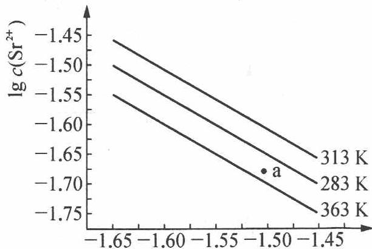

D. $283 \mathrm{~K}$ 下的 $\mathrm{SrSO}_{4}$ 饱和溶液升温到 $363 \mathrm{~K}$ 后变为不饱和溶液

某温度时, $BaSO_{4}$ 在水中的沉淀溶解平衡曲线如右图所示。
提示: $BaSO_{4}(s)\rightleftharpoons Ba^{2+}(aq)+SO_{4}^{2-}(aq)$ ,
平衡常数 $K_{\mathrm{sp}} = c(\mathrm{Ba}^{2+}) \cdot c(\mathrm{SO}_{4}^{2-})$ 称为溶度积。下列说法正确的是()。
A. 加入 $Na_{2}SO_{4}$ 可以使溶液由 a 点变到 b 点
B. 通过蒸发可以使溶液由 d 点变到 c 点
C. d 点无 $BaSO_{4}$ 沉淀生成
D. a 点对应的 $K_{sp}$ 大于 c 点对应的 $K_{sp}$

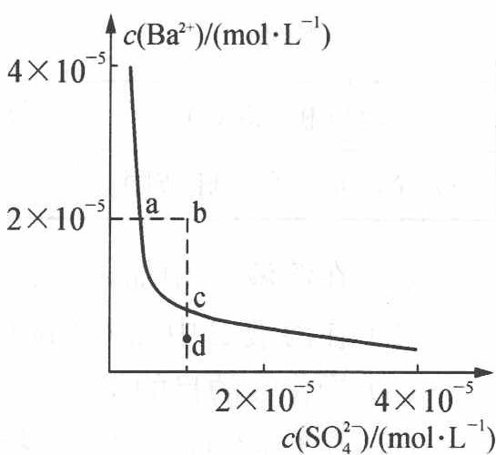

已知 $Ag_{2}SO_{4}$ 的 $K_{sp}$ 为 $2.0 \times 10^{-5}$ ，将适量 $Ag_{2}SO_{4}$ 固体溶于 100 mL 水中至刚好饱和，该过程中 $Ag^{+}$ 和 $SO_{4}^{2-}$ 浓度随时间变化关系如右图，饱和 $Ag_{2}SO_{4}$ 溶液中 $c(\mathrm{Ag}^{+}) = 0.034 \, \mathrm{mol} \cdot \mathrm{L}^{-1}$ 。若 $t_{1}$ 时刻在上述体系中加入 100 mL $0.020 \, mol \cdot L^{-1} \, Na_{2}SO_{4}$ 溶液，下列示意图中，能正确表示 $t_{1}$ 时刻后 $Ag^{+}$ 和 $SO_{4}^{2-}$ 浓度随时间变化关系的是（）。

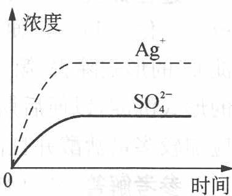

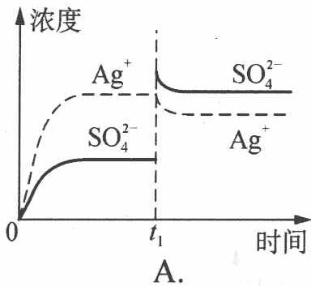

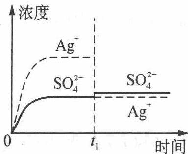  
B.

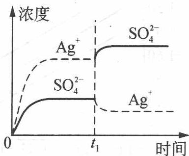  
C.

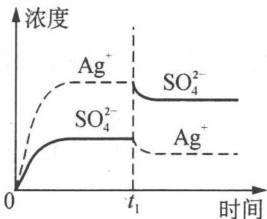  
D.

④ 用适当的公式,通过计算,解释下列事实(要求:必须用数据证明你的每个结论是合理的。假定(a)所谓溶解一词,是指298 K时在1 L溶液中溶解0.1 mol硫化物;(b) $Cu^{2+}$ 不与 $Cl^{-}$ 形成稳定的配合物)。

(1) $\mathrm{Tl}_{2} \mathrm{~S}$ 可溶解在浓度为 $1 \mathrm{~mol} \cdot \mathrm{L}^{- 1}$ 的无络合性、无氧化性的一元强酸中；

(2) CuS 不溶于 $1 \, mol \cdot L^{-1}$ 盐酸。

有关常数： $\mathrm{pK_a(H_2S) = 7}$ ， $\mathrm{pK_a(HS^-) = 13}$

$$
K _ {\mathrm{sp}} (\mathrm{Tl} _ {2} \mathrm{S}) = 1 0 ^ {- 2 0}, K _ {\mathrm{sp}} (\mathrm{CuS}) = 1 0 ^ {- 3 5} 。
$$

⑤ 某厂生产硼砂过程中产生的固体废料, 主要含有 $\mathrm{MgCO}_{3} 、 \mathrm{MgSiO}_{3}$ 、 $\mathrm{CaMg(CO_{3})_{2}}$ 、 $\mathrm{Al}_{2} \mathrm{O}_{3}$ 和 $\mathrm{Fe}_{2} \mathrm{O}_{3}$ 等, 回收其中镁的工艺流程如下:

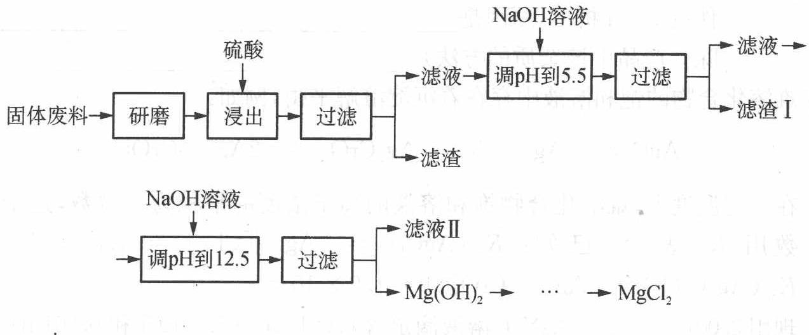

<table><tr><td>沉淀物</td><td>Fe(OH)3</td><td>Al(OH)3</td><td>Mg(OH)2</td></tr><tr><td>pH</td><td>3.2</td><td>5.2</td><td>12.4</td></tr></table>

部分阳离子以氢氧化物形式完全沉淀时溶液的 pH 见上表,请回答下列问题:

(1)“浸出”步骤中,为提高镁的浸出率,可采取的措施有\_\_\_\_（要求写出两条）。

(2) 滤渣Ⅰ的主要成分有\_\_\_\_。

(3) 从滤液Ⅱ中可回收利用的主要物质有\_\_\_\_。

(4) $\mathrm{Mg(ClO_{3})_{2}}$ 在农业上可用作脱叶剂、催熟剂,可采用复分解反应制备:

$$
\mathrm{MgCl} _ {2} + 2 \mathrm{NaClO} _ {3} \longrightarrow \mathrm{Mg(ClO} _ {3}) _ {2} + 2 \mathrm{NaCl}
$$

已知四种化合物的溶解度(S)随温度(T)变化曲线如下图所示:

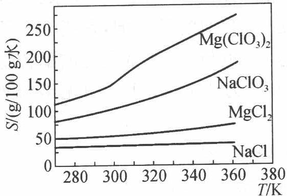

① 将反应物按化学反应方程式计量数比混合制备 $\mathrm{Mg(ClO_{3})_{2}}$ 。简述可制备 $\mathrm{Mg(ClO_{3})_{2}}$ 的原因 \_\_\_\_。

(2) 按①中条件进行制备实验。在冷却降温析出 $\mathrm{Mg(ClO_3)_2}$ 过程中, 常伴有 NaCl 析出, 原因是 。除去产品中该杂质的方法是 。

⑥ 难溶化合物的饱和溶液中存在着沉淀溶解平衡,例如:

$$
\mathrm{AgCl} \rightleftharpoons \mathrm{Ag} ^ {+} + \mathrm{Cl} ^ {-}; \quad \mathrm{Ag} _ {2} \mathrm{CrO} _ {4} \rightleftharpoons 2 \mathrm{Ag} ^ {+} + \mathrm{CrO} _ {4} ^ {2 -} 。
$$

在一定温度下,难溶化合物饱和溶液的离子浓度的乘积为一常数,这个常数用 $K_{sp}$ 表示。已知: $K_{\mathrm{sp}}(\mathrm{AgCl}) = [\mathrm{Ag}^{+}][\mathrm{Cl}^{-}] = 1.8 \times 10^{-10}$ ; $K_{\mathrm{sp}}(\mathrm{Ag}_{2}\mathrm{CrO}_{4}) = [\mathrm{Ag}^{+}]^{2}[\mathrm{CrO}_{4}^{2-}] = 1.9 \times 10^{-12}$ 。

现用 $0.001 \, mol \cdot L^{-1} \, AgNO_{3}$ 溶液滴定含 $0.001 \, mol \cdot L^{-1} \, KCl$ 和 $0.001 \, mol \cdot L^{-1} \, K_{2}CrO_{4}$ 的混合溶液，试通过计算回答：

(1) $\mathrm{Cl}^{-}$ 和 $\mathrm{CrO}_{4}^{2-}$ 哪种先沉淀?

(2) 当 $CrO_{4}^{2-}$ 以 $Ag_{2}CrO_{4}$ 形式沉淀时, 溶液中的 $Cl^{-}$ 离子浓度是多少? $CrO_{4}^{2-}$ 与 $Cl^{-}$ 能否达到有效的分离? (设当一种离子开始沉淀时, 另一种离子浓度小于 $10^{-5} \, mol \cdot L^{-1}$ 时, 则认为可以达到有效分离)

7 工业上采用湿法炼锌过程中, 以 $\mathrm{ZnSO}_{4}$ 为主要成分的浸出液中, 有 $\mathrm{Fe}^{3+}$ 、 $\mathrm{Fe}^{2+}$ 、 $\mathrm{Sb}^{3+}$ 、 $\mathrm{Cu}^{2+}$ 、 $\mathrm{Cd}^{2+}$ 、 $\mathrm{Cl}^{-}$ 等杂质, 这些杂质对下一道锌的电解工序有妨碍, 必须事先除去。现有下列试剂:

① $KMnO_{4}$ ，②NaOH，③ZnO，④ $H_{2}O_{2}$ ，⑤Zn，⑥Fe，⑦ $AgNO_{3}$ ，⑧ $Ag_{2}SO_{4}$ ，⑨ $H_{2}SO_{4}$ 。

根据要求将合适的试剂的序号填入下面的空格：

(1) 用\_\_\_\_将 $\mathrm{Fe}^{2+}$ 离子氧化成 $\mathrm{Fe}^{3+}$ 离子, 相应的离子反应方程式为\_\_\_\_。

(2) 用\_\_\_\_调节浸出液的 $\mathrm{pH} = 5.2$ ，\_\_\_\_、\_\_\_\_等形成氢氧化物沉淀。

(3) 用 \_\_\_\_ 除去 $Cu^{2+}$ 和 $Cd^{2+}$ 。

(4) 用 \_\_\_\_ 除去 Cl $^{-}$ 。

向浓度为 $0.10 \, mol \cdot L^{-1}$ 的 $MnCl_{2}$ 溶液中慢慢滴加 $Na_{2}S$ 溶液，试问是先生成 MnS 沉淀还是先生成 $\mathrm{Mn(OH)}_{2}$ 沉淀？ $(K_{\mathrm{sp}}(\mathrm{MnS}) = 2.5 \times 10^{-10}, K_{\mathrm{sp}}[\mathrm{Mn(OH)}_{2}] = 1.9 \times 10^{-13}, H_{2}S$ 的 $K_{a_{1}}$ 和 $K_{a_{2}}$ 分别为 $9.1 \times 10^{-8}, 1.1 \times 10^{-12}$

9 将 $CaCO_{3}$ 固体与 $CO_{2}$ 饱和水溶液充分接触, 设室温下饱和 $CO_{2}$ 溶液中 $\left[H_{2}CO_{3}\right]=0.034\ mol\cdot L^{-1}$ , 水的 pH 等于 5.5, 试计算在这种情况下, 溶液中的 $Ca^{2+}$ 浓度最高可达多少?

$(\mathrm{CaCO_3}$ 的 $K_{\mathrm{sp}} = 2.8\times 10^{-9},\mathrm{H_2CO_3}$ 的 $K_{\mathrm{a_1}} = 4.3\times 10^{-7},K_{\mathrm{a_2}} = 4.7\times 10^{-11})$

⑩ 某学生在 $25^{\circ}$ C 下用纯水制备了一份氢氧化镁饱和溶液, 测得溶液的 pH 为 10.5。

(1) 用上述测定数据计算氢氧化镁的溶解度(用 $\mathrm{mol} \cdot \mathrm{L}^{-1}$ 和 $\mathrm{g} / 100 \mathrm{~mL}$ 两种单位表示)。

(2) 计算氢氧化镁的溶度积。

(3) 计算 $25^{\circ} \mathrm{C}$ 下在 $0.010 \mathrm{~mol} \cdot \mathrm{L}^{-1} \mathrm{NaOH}$ 中氢氧化镁的溶解度。

(4) $25^{\circ} \mathrm{C}$ 下将 $10 \mathrm{~g} \mathrm{Mg(OH)}_{2}$ 和 $100 \mathrm{~mL} 0.100 \mathrm{~mol} \cdot \mathrm{L}^{-1} \mathrm{HCl}$ 的混合物长时间搅拌, 计算该体系达平衡时的 $\mathrm{pH}$ 。

11 蛋壳的主要成分是 $CaCO_{3}$ ，其次是 $MgCO_{3}$ 、蛋白质、色素等。为测定其中钙的含量，洗净蛋壳，加水煮沸约 5 min，置于蒸发皿中用小火烤干，研细。

(1) 称取 0.3 g(设为 0.3000 g) 蛋壳样品, 置于锥形瓶中逐滴加入已知浓度为 c(HCl) 的盐酸 40.00 mL, 然后用小火加热使之溶解, 冷却后加 2 滴甲基橙溶液, 用已知浓度为 c(NaOH) 的 NaOH 溶液回滴, 达终点时消耗的体积为 V(NaOH)。

① 写出计算钙含量的算式。

② 计算得到的是钙的含量吗？

(2) 称取 0.3 g (设为 0.3000 g) 蛋壳样品, 用适量强酸溶解, 然后加 $\left(\mathrm{NH}_{4}\right)_{2}\mathrm{C}_{2}\mathrm{O}_{4}$ 得沉淀, 经过滤、洗涤, 沉淀溶于 $H_{2}SO_{4}$ 溶液, 再用已知浓度为 $c(\mathrm{KMnO}_{4})$ 的 $KMnO_{4}$ 溶液滴定 (生成 $Mn^{2+}$ 和 $CO_{2}$ ), 达终点时消耗的体积为 $V(\mathrm{KMnO}_{4})$ 。

① 写出计算钙含量的算式。

② 此法求得的钙含量略低于上法,为什么?

2 绿色化学法制备天青石有效地克服了传统生产方法中转化率较低、三废污染严重、能耗高、生产复杂等种种弊端。制备的碳酸锶产品化学纯度平均达到 $99.5\%$ ，并且可制备质量较高的工业副产品硫酸铵，从而大大降低了生产成本。我国鄂东某地的天青石，其中有效成分的平均质量分数为 $80\%$ ，同时含有少量的 $\mathrm{Ba}$ ， $\mathrm{Ca}$ ， $\mathrm{Mg}$ ， $\mathrm{SiO}_{2}$ ， $\mathrm{Fe}_{2} \mathrm{O}_{3}$ ， $\mathrm{FeO}$ 等杂质。天青石可以同 $\mathrm{NH}_{4} \mathrm{HCO}_{3}$ 溶液在一定的条件下发生化学反应，而生成含有某些杂质的 $\mathrm{SrCO}_{3}$ 粗级产品。在上述反应过程中，添加适量的 $\mathrm{NH}_{4} \mathrm{Cl}$ 作为催化剂，可以使反应速度明显加快。将分离出 $(\mathrm{NH}_{4})_{2} \mathrm{SO}_{4}$ 溶液后的沉淀物用 $\mathrm{HCl}$ 溶解，以抽取含有可溶性 $\mathrm{SrCl}_{2}$ 及某些杂质的锶盐溶液，经净化除去其中的 $\mathrm{Ba}^{2+}$ ， $\mathrm{Ca}^{2+}$ 等杂质后，即可制成纯度较高的 $\mathrm{SrCl}_{2}$ 溶液。此时向其中加入经过净化的碳酸氢铵溶液，经反应生成纯净的碳酸锶沉淀，沉淀物经过滤、洗涤、干燥、粉碎，得到高纯碳酸锶产品。

(已知 $K_{\mathrm{sp}}(\mathrm{SrSO}_{4})=3.2\times10^{-7}, K_{\mathrm{sp}}(\mathrm{SrCO}_{3})=1.1\times10^{-10}$ )

(1) 试简要说明该绿色反应的原理并写出主要反应的方程式。

(2) 添加适量的 $\mathrm{NH}_{4} \mathrm{Cl}$ 作为催化剂的原因何在?

3（1）医学研究表明，有相当一部分的肾结石是由 $CaC_{2}O_{4}$ 组成的。血液通过肾小球前其中的草酸钙通常是过饱和的，即 $Q = c(\mathrm{Ca}^{2+})c(\mathrm{C}_{2}\mathrm{O}_{4}^{2-}) > K_{\mathrm{sp}}(\mathrm{CaC}_{2}\mathrm{O}_{4})$ ，由于血液中存在草酸钙结晶抑制剂，通常并不形成 $CaC_{2}O_{4}$ 沉淀。但经过肾小球过滤后，滤液在肾小管中会形成 $CaC_{2}O_{4}$ 结晶。正常人每天排尿量大约为 1.4 L，其中约含 0.10 g $Ca^{2+}$ 。为了不使尿中形成 $CaC_{2}O_{4}$ 沉淀，其中 $C_{2}O_{4}^{2-}$ 的最高浓度为 \_\_\_\_（已知 $K_{\mathrm{sp}}(\mathrm{CaC}_{2}\mathrm{O}_{4}) = 2.3 \times 10^{-9}$ ）。对肾结石患者，医生总是让其多饮水，试从两个角度解释之：

(2) 维生素 C 是人体免疫系统所必需的, 它具有增强人体免疫功能和抗病毒、抗衰老的作用。维生素 C 易被氧化, 测定维生素 C 含量典型的滴定剂是 $KIO_{3}$ 。用一定浓度的 $KIO_{3}$ 溶液在 $1 \, mol \cdot L^{-1} HCl$ 介质中滴定维生素 C 时反应的离子方程式为:

氢氧化钙是重要的化工原料、建筑材料,因其在水中溶解度有限常被用来

生产水泥等。

(1) 甲同学测量 $\mathrm{Ca(OH)}_{2}$ 溶度积利用了以下简便方法: 将 $2.00 \mathrm{~g} \mathrm{Ca(OH)}_{2}$ 加入 $200 \mathrm{~mL}$ 蒸馏水中, 搅拌达饱和后, 用已称重的滤纸 (重量为 $1.000 \mathrm{~g}$ ) 过滤, 沉淀用少量丙酮洗涤, 干燥后称得 $\mathrm{Ca(OH)}_{2}$ 沉淀及滤纸共重 $2.778 \mathrm{~g}$ 。

① 以丙酮冲洗沉淀的目的是\_\_\_\_；

② 用这种方法可计算出氢氧化钙的 $K_{\mathrm{sp}}$ 值为 \_\_\_\_；

③ 甲同学在该实验中还发现, 温度越高, 所得 $K_{\mathrm{sp}}$ 值越 \_\_\_\_ (填 “大”或“小”)。

(2) 以上方法得到的结果误差较大。乙同学查阅文献发现,由于 $\mathrm{Ca(OH)}_{2}$ 的溶解度相对较大,它的溶度积应是其饱和溶液中离子活度幂的乘积。可采用配位滴定法测定 $\mathrm{Ca}^{2+}$ 活度,酸碱滴定法测定 $\mathrm{OH}^{-}$ 活度的方法来计算 $\mathrm{Ca(OH)}_{2}$ 的溶度积。乙同学进行了如下实验:

① 移取 10.00 mL 饱和 Ca(OH) $_{2}$ 澄清溶液放入锥形瓶中, 加 15 mL 去离子水和 3 滴钙指示剂, 加 2 mL 10% NaOH(减小 EDTA 的副反应, 一定量情况下不影响 K $_{sp}$ 值测定), 摇匀, 立即用 0.0100 mol·L $^{-1}$ EDTA 标准溶液滴定(生成 1:1 的 Ca $^{2+}$ -EDTA 配合物), 溶液变成纯蓝色时, 记录所耗 EDTA 标准溶液的体积。

② 移取 $25.00 \, mL \, \mathrm{Ca(OH)}_{2}$ 饱和溶液放入锥形瓶中，加 3 滴甲基橙，用 $0.0500 \, mol \cdot L^{-1} \, HCl$ 标准溶液滴定，溶液变成橙色时记录所耗 HCl 标准溶液的体积。实验数据见下表。

<table><tr><td>步骤</td><td colspan="3">消耗滴定剂体积(mL)</td></tr><tr><td>步骤1</td><td>29.03</td><td>29.02</td><td>29.04</td></tr><tr><td>步骤2</td><td>18.72</td><td>18.75</td><td>18.69</td></tr></table>

通过该实验计算氢氧化钙的 $K_{sp}$ 值。

15 一个学生通过实验验证醋酸银 $\left(\mathrm{CH}_{3}\mathrm{COOAg}\right)$ 的 $K_{\mathrm{sp}}$ （即 $CH_{3}COOAg$ 饱和溶液中 $Ag^{+}$ 与 $CH_{3}COO^{-}$ 物质的量浓度 $(\mathrm{mol}\cdot\mathrm{L}^{-1})$ 的乘积），实验中用了如下的反应：

$$
2 \mathrm{Ag} ^ {+} (\mathrm{aq}) + \mathrm{Cu(s)} \rightleftharpoons 2 \mathrm{Ag(s)} + \mathrm{Cu} ^ {2 +} (\mathrm{aq})
$$

这个学生将已知质量的铜片加入到 $CH_{3}COOAg$ 饱和溶液中, 待充分反应

之后，将铜片冲洗净、干燥、重新称量。

(1) 写出能表示 $\mathrm{CH}_{3} \mathrm{COOAg}$ 的沉淀溶解平衡的方程式。

(2) $CH_{3}COOAg$ 的 $K_{sp}=2.0\times10^{-3}$ 。铜片刚开始的质量为 23.4 g，将铜片放在 100 mL 的 $CH_{3}COOAg$ 饱和溶液中，此饱和溶液中没有 $CH_{3}COOAg$ 固体。通过计算说明充分反应后铜片中铜的质量为何值时， $CH_{3}COOAg$ 的 $K_{sp}$ 得到证实。

(3) 为什么做此实验时 $\mathrm{CH}_{3} \mathrm{COOAg}$ 饱和溶液中必须没有 $\mathrm{CH}_{3} \mathrm{COOAg}$ 固体?

1. 解析: $K_{\mathrm{sp}}$ 只与温度有关, A 错; 由图像可知, $c(\mathrm{SO}_{4}^{2-}) \cdot c(\mathrm{Sr}^{2-})$ 越大, $K_{\mathrm{sp}}(\mathrm{SrSO}_{4})$ 越大, B 正确; a 点在 $283 \mathrm{~K}$ 时平衡曲线的下方, 属于不饱和溶液, C 正确; $283 \mathrm{~K}$ 下的 $\mathrm{SrSO}_{4}$ 饱和溶液升温到 $363 \mathrm{~K}$ 后会有晶体析出, 还是属于饱和溶液, D 错。答案: BC

2. 解析: a 点在平衡曲线上, 此时溶液中存在溶解平衡, 加入 $\mathrm{Na}_{2} \mathrm{SO}_{4}$ 会增大 $\mathrm{SO}_{4}^{2-}$ 浓度, 平衡左移, $\mathrm{Ba}^{2+}$ 浓度应降低, A 项错; 蒸发溶液, $c(\mathrm{SO}_{4}^{2-})$ 、 $c(\mathrm{Ba}^{2+})$ 均增大, B 项错; d 点表示溶液的 $Q < K_{\mathrm{sp}}$ , 所以溶液不饱和, 不会沉淀, C 项正确; $K_{\mathrm{sp}}$ 是一常数, 温度不变 $K_{\mathrm{sp}}$ 不变, 所以该曲线上任一点的 $K_{\mathrm{sp}}$ 都相等, D 项错误。答案: C

3. 解析: 题给溶液刚好为 $100 \mathrm{~mL}$ 的饱和溶液, $c(\mathrm{Ag}^{+}) = 0.034 \mathrm{~mol} \cdot \mathrm{L}^{-1}, c(\mathrm{SO}_{4}^{2-}) = 0.017 \mathrm{~mol} \cdot \mathrm{L}^{-1}$ ; 当加入 $100 \mathrm{~mL} 0.020 \mathrm{~mol} \cdot \mathrm{L}^{-1} \mathrm{Na}_{2} \mathrm{SO}_{4}$ 溶液后, $c(\mathrm{SO}_{4}^{2-}) = 0.0185 \mathrm{~mol} \cdot \mathrm{L}^{-1}, c(\mathrm{Ag}^{+}) = 0.017 \mathrm{~mol} \cdot \mathrm{L}^{-1}$ (此时 $Q < K_{\mathrm{sp}}$ )。由计算可知选 B。答案: B

4. (1) 由题目中给出的溶解标准, 可推知各离子的起始浓度:

$$
c (\mathrm{Tl} ^ {+}) \doteq 0. 2 \mathrm{mol} \cdot \mathrm{L} ^ {- 1}, c (\mathrm{S} ^ {2 -}) = 0. 1 \mathrm{mol} \cdot \mathrm{L} ^ {- 1} 。
$$

在 $1\mathrm{mol}\cdot \mathrm{L}^{-1}$ 的一元强酸中， $c(\mathrm{H}^{+}) = 1\mathrm{mol}\cdot \mathrm{L}^{-1};c(\mathrm{S}^{2 - })\approx 10^{-21}\mathrm{mol}\cdot \mathrm{L}^{-1};$ $c^2 (\mathrm{Tl}^+)c(\mathrm{S}^{2 - }) = 4\times 10^{-23} <   K_{\mathrm{sp}}(\mathrm{Tl}_2\mathrm{S})$

所以 $Tl_{2}S$ 可以溶解于 $1\ mol\cdot L^{-1}$ 的一元强酸中

(2) $Cu^{2+}$ 不与 $Cl^{-}$ 形成稳定的配合物， $c(\mathrm{Cu}^{2+})c(\mathrm{S}^{2-})=10^{-22}>K_{\mathrm{sp}}(\mathrm{CuS})$ ，所以 CuS 不溶于 $1\ mol\cdot L^{-1}$ 盐酸中。

5. 解析: 原料加 $\mathrm{H}_{2} \mathrm{SO}_{4}$ , 过滤后滤液调 $\mathrm{pH}=5.5$ , 使 $\mathrm{Fe}^{3+}$ 和 $\mathrm{Al}^{3+}$ 沉淀完全, 再过滤除去 $\mathrm{Al}^{3+}$ 、 $\mathrm{Fe}^{3+}$ , 滤液再调 $\mathrm{pH}=12.5$ , $\mathrm{Mg}^{2+}$ 沉淀完全, 过滤得 $\mathrm{Mg(OH)}_{2}$ 。

答案: (1)适当提高反应温度、增加浸出时间(或其他合理答案) (2) $\mathrm{Al(OH)}_{3}$ $\mathrm{Fe(OH)_3}$ (3) $\mathrm{Na_2SO_4}$ (4) ① 在某一温度时, NaCl 最先达到饱和析出; $\mathrm{Mg(ClO_3)_2}$ 的溶解度随温度的变化最大; NaCl 溶解度与其他物质的溶解度有一定差别 ② 降温前, 溶液中 NaCl 已饱和, 降温过程中, NaCl 溶解度降低, 会少量析出重结晶

6. (1) $\mathrm{AgCl}$ 饱和所需 $\mathrm{Ag^{+}}$ 浓度 $[\mathrm{Ag^{+}}]_{1} = \frac{1.8\times 10^{-10}}{0.001} = 1.8\times 10^{-7}\mathrm{mol}\cdot \mathrm{L}^{-1};$ $\mathrm{Ag_2CrO_4}$ 饱和所需 $\mathrm{Ag^{+}}$ 浓度 $[\mathrm{Ag^{+}}]_{2} = \sqrt{\frac{1.9\times 10^{-12}}{0.001}} = 4.4\times 10^{-5}\mathrm{mol}\cdot \mathrm{L}^{-1};$ $[\mathrm{Ag^{+}}]_{1} < [\mathrm{Ag^{+}}]_{2},\mathrm{Cl^{-}}$ 先沉淀。

(2) $\mathrm{Ag_2CrO_4}$ 开始沉淀时 $[\mathrm{Cl^-}] = \frac{1.8\times 10^{-10}}{4.4\times 10^{-5}} = 4.1\times 10^{-6} < 10^{-5}$ , 所以能有效地分离 $\mathrm{CrO_4^{2 - }}$ 和 $\mathrm{Cl^-}$ 。

7. (1) ④; $2\mathrm{Fe}^{2+} + \mathrm{H}_{2}\mathrm{O}_{2} + 2\mathrm{H}^{+} \longrightarrow 2\mathrm{Fe}^{3+} + 2\mathrm{H}_{2}\mathrm{O}$ (2) ③; $\mathrm{Fe}^{3+}; \mathrm{Sb}^{3+}$ (3) ⑤ (4) ⑧

8. 当生成 MnS 沉淀时, 所需 $S^{2-}$ 的最低浓度为

$$
[ \mathrm{S} ^ {2 -} ] = \frac {K _ {\mathrm{sp}} (\mathrm{MnS})}{[ \mathrm{Mn} ^ {2 +} ]} = \frac {2 . 5 \times 1 0 ^ {- 1 0}}{0 . 1 0} = 2. 5 \times 1 0 ^ {- 9} (\mathrm{mol} \cdot \mathrm{L} ^ {- 1})
$$

$S^{2-}$ 与 $H_{2}O$ 发生反应：

$$
\mathrm{S} ^ {2 -} + \mathrm{H} _ {2} \mathrm{O} \rightleftharpoons \mathrm{HS} ^ {-} + \mathrm{OH} ^ {-}
$$

设只发生一步反应,则 $\left[HS^{-}\right]=\left[OH^{-}\right]$ ,

$$
\begin{array}{r l} \left[ \mathrm{OH} ^ {-} \right] & = \sqrt {K _ {\mathrm{b}} \left[ \mathrm{S} ^ {2 -} \right]} = \sqrt {\frac {K _ {\mathrm{w}} \left[ \mathrm{S} ^ {2 -} \right]}{K _ {\mathrm{a} _ {2}} (\mathrm{H} _ {2} \mathrm{S})}} = \sqrt {\frac {1 . 0 \times 1 0 ^ {- 1 4} \times 2 . 5 \times 1 0 ^ {- 9}}{1 . 1 \times 1 0 ^ {- 1 2}}} \\ & = 4. 8 \times 1 0 ^ {- 6} (\mathrm{mol} \cdot \mathrm{L} ^ {- 1}) \end{array}
$$

$$
\begin{array}{r l} {[ \mathrm {Mn^ {2 + }} ] [ \mathrm {OH^ {-}} ] ^ {2}} & = 0. 1 0 \times (4. 8 \times 1 0 ^ {- 6}) ^ {2} = 2. 3 \times 1 0 ^ {- 1 2} \\ & > K _ {\mathrm{sp}} [ \mathrm {Mn(OH) _ {2}} ] = 1. 9 \times 1 0 ^ {- 1 3} \end{array}
$$

从计算结果可知,在还没有达到生成 MnS 沉淀的条件之前,已经达到了生成 $\mathrm{Mn(OH)}_{2}$ 沉淀的条件,所以应先生成 $\mathrm{Mn(OH)}_{2}$ 沉淀。

9. 在 $\mathrm{pH} = 5.5$ 的溶液中, $[\mathrm{H}^{+}] = 3.2 \times 10^{-6} \mathrm{~mol} \cdot \mathrm{L}^{-1}$ 。在 $\mathrm{CO}_{2}$ 饱和溶液中,

$$
\begin{array}{r l}&{\mathrm {H_ {2} CO_ {3}} \rightleftharpoons 2 \mathrm {H^ {+}} + \mathrm {CO_ {3} ^ {2 - }}}\\&{K = \frac {[ \mathrm {H^ {+}} ] ^ {2} [ \mathrm {CO_ {3} ^ {2 - }} ]}{[ \mathrm {H_ {2} CO_ {3}} ]} = K _ {\mathrm {a_ {1}}} K _ {\mathrm {a_ {2}}}}\\&{\qquad = 4. 3 \times 1 0 ^ {- 7} \times 4. 7 \times 1 0 ^ {- 1 1} = 2. 0 \times 1 0 ^ {- 1 7}}\end{array}
$$

$$
\begin{array}{r l} {[ \mathrm{CO} _ {3} ^ {2 -} ] = \frac {K [ \mathrm{H} _ {2} \mathrm{CO} _ {3} ]}{[ \mathrm{H} ^ {+} ] ^ {2}} = \frac {2 . 0 \times 1 0 ^ {- 1 7} \times 0 . 0 3 4}{(3 . 2 \times 1 0 ^ {- 6}) ^ {2}}} \\ & {= 6. 6 \times 1 0 ^ {- 8} (\mathrm{mol} \cdot \mathrm{L} ^ {- 1})} \end{array}
$$

因此溶液中 $Ca^{2+}$ 可达到的最高浓度为

$$
[ \mathrm{Ca} ^ {2 +} ] = \frac {K _ {\mathrm{sp}} (\mathrm{CaCO} _ {3})}{[ \mathrm{CO} _ {3} ^ {2 -} ]} = \frac {2 . 8 \times 1 0 ^ {- 9}}{6 . 6 \times 1 0 ^ {- 8}} = 0. 0 4 2 (\mathrm{mol} \cdot \mathrm{L} ^ {- 1})
$$

10. (1) $1.6 \times 10^{-4} \mathrm{~mol} \cdot \mathrm{L}^{-1}$ ; $9.2 \times 10^{-4} \mathrm{~g} / 100 \mathrm{~mL}$

(2) $1.6 \times 10^{-11}$

(3) $1.6 \times 10^{-7} \mathrm{~mol} \cdot \mathrm{L}^{-1}$ ; $9.2 \times 10^{-7} \mathrm{~g} / 100 \mathrm{~mL}$

$$
[ \mathrm{Mg} ^ {2 +} ] = 0. 0 5 0 \mathrm{mol} \cdot \mathrm{L} ^ {- 1}; [ \mathrm{OH} ^ {-} ] = 1. 8 \times 1 0 ^ {- 5} \mathrm{mol} \cdot \mathrm{L} ^ {- 1}; \mathrm{pH} = 9. 3
$$

$$
1 1. (1) ① \frac {\left[ c (\mathrm{HCl}) \times 0 . 0 4 0 0 0 \mathrm{L} - c (\mathrm{NaOH}) \times V (\mathrm{NaOH}) \right] \times \frac {40 . 0 0 \mathrm{g} \cdot \mathrm{mol} ^ {- 1}}{2}}{0 . 3 0 0 0 \mathrm{g}} \times 100\%
$$

② 不是

$$
\begin{array}{r l} & {(2) \textcircled {1} \mathrm {CaCO_ {3}} + 2 \mathrm{H} ^ {+} \longrightarrow \mathrm{Ca} ^ {2 +} + \mathrm{CO} _ {2} \uparrow + \mathrm{H} _ {2} \mathrm{O}} \\ & {\quad \mathrm{Ca} ^ {2 +} + \mathrm{C} _ {2} \mathrm{O} _ {4} ^ {2 -} \longrightarrow \mathrm{CaC} _ {2} \mathrm{O} _ {4} \downarrow} \\ & {\quad \mathrm{CaC} _ {2} \mathrm{O} _ {4} + 2 \mathrm{H} ^ {+} \longrightarrow \mathrm{Ca} ^ {2 +} + \mathrm{H} _ {2} \mathrm{C} _ {2} \mathrm{O} _ {4}} \\ & {\quad 2 \mathrm{MnO} _ {4} ^ {-} + 5 \mathrm{H} _ {2} \mathrm{C} _ {2} \mathrm{O} _ {4} + 6 \mathrm{H} ^ {+} \longrightarrow 2 \mathrm{Mn} ^ {2 +} + 1 0 \mathrm{CO} _ {2} \uparrow + 8 \mathrm{H} _ {2} \mathrm{O}} \\ & {\quad \text {即} 1 \mathrm{molCaCO} _ {3} \sim 1 \mathrm{molCa} ^ {2 +} \sim 1 \mathrm{molH} _ {2} \mathrm{C} _ {2} \mathrm{O} _ {4} \sim \frac {2}{5} \mathrm{molKMnO} _ {4}} \\ & {\quad w (\mathrm{Ca}) = \frac {5}{2} c (\mathrm{KMnO} _ {4}) \times V (\mathrm{KMnO} _ {4}) \times \frac {4 0 . 0 0 \mathrm{g} \cdot \mathrm{mol} ^ {- 1}}{0 . 3 0 0 0 \mathrm{g}} \times 1 0 0 \%} \end{array}
$$

② $CaC_{2}O_{4}$ 为难溶物,能从溶液中完全沉淀,又能完全溶于过量稀 $H_{2}SO_{4}$ 。实验结果钙含量低,可能由于 $MgC_{2}O_{4}$ 的溶解度不是很小(18℃时 $MgC_{2}O_{4}\cdot10H_{2}O$ 的溶解度为 0.03 g/100 g 水),用 $H_{2}SO_{4}$ 溶解沉淀时, $H_{2}C_{2}O_{4}$ 的量也相应减少。

12. (1) 根据溶度积原理,该反应可以发生,反应方程式为

$$
\begin{array}{r l} & \mathrm {SrSO_ {4}} + 2 \mathrm {NH_ {4} HC O _ {3}} \longrightarrow \mathrm {SrCO_ {3}} + (\mathrm {NH_ {4}}) _ {2} \mathrm {SO_ {4}} + \mathrm {CO_ {2}} \uparrow + \mathrm {H_ {2} O}, \\ & \mathrm {SrCO_ {3}} + 2 \mathrm{HCl} \longrightarrow \mathrm {SrCl_ {2}} + \mathrm {H_ {2} O} + \mathrm {CO_ {2}} \uparrow \\ & \mathrm {SrCl_ {2}} + 2 \mathrm {NH_ {4} HC O _ {3}} \longrightarrow \mathrm {SrCO_ {3}} \downarrow + 2 \mathrm {NH_ {4} Cl} + \mathrm {H_ {2} O} + \mathrm {CO_ {2}} \uparrow \end{array}
$$

(2) 在催化剂的作用下反应方程式为:

$$
\begin{array}{r l} & \mathrm {SrSO_ {4}} + 2 \mathrm {NH_ {4} Cl} \longrightarrow \mathrm {SrCl_ {2}} + (\mathrm {NH_ {4}}) _ {2} \mathrm {SO_ {4}} \\ & \mathrm {SrCl_ {2}} + 2 \mathrm {NH_ {4} HC O _ {3}} \longrightarrow \mathrm {SrCO_ {3}} \downarrow + 2 \mathrm {NH_ {4} Cl} + \mathrm {CO_ {2}} \uparrow + \mathrm {H_ {2} O} \end{array}
$$

$$
c (\mathrm{Ca} ^ {2 +}) = 0. 1 0 \mathrm{g} / (4 0 \mathrm{g} \cdot \mathrm{mol} ^ {- 1} \times 1. 4 \mathrm{L}) = 1. 8 \times 1 0 ^ {- 3} \mathrm{mol} \cdot \mathrm{L} ^ {- 1}
$$

$$
c \left(\mathrm{C} _ {2} \mathrm{O} _ {4} ^ {2 -}\right) = K _ {\mathrm{sp}} / c \left(\mathrm{Ca} ^ {2 +}\right) = 2. 3 \times 1 0 ^ {- 9} / 1. 8 \times 1 0 ^ {- 3} = 1. 3 \times 1 0 ^ {- 6} \mathrm{mol} \cdot \mathrm{L} ^ {- 1}
$$

多饮水,一方面加快排尿速率,降低尿液在体内的停留时间;另一方面加大尿量,减小 $Ca^{2+}$ 和 $C_{2}O_{4}^{2-}$ 的浓度,防止尿结石

(2) $3\mathrm{C}_{6}\mathrm{H}_{8}\mathrm{O}_{6} + \mathrm{IO}_{3}^{-} \longrightarrow 3\mathrm{C}_{6}\mathrm{H}_{6}\mathrm{O}_{6} + \mathrm{I}^{-} + 3\mathrm{H}_{2}\mathrm{O}$

14.（1）①因丙酮挥发性较强，可使沉淀干燥更快
② $1.35 \times 10^{-5}$ ③ 小

(2) 计算两步中消耗滴定剂体积数值的平均值 $V(\text{EDTA}) = 29.03 \, \text{mL} \quad V(\text{HCl}) = 18.72 \, \text{mL}$ 根据①: $c(\text{Ca}^{2+}) \times 10.00 = c(\text{EDTA}) \cdot V(\text{EDTA})$ 根据②: $c(\text{OH}^-) \times 25.00 = c(\text{HCl}) \cdot V(\text{HCl})$ $K_{\text{sp}} = c(\text{Ca}^{2+}) \cdot c(\text{OH}^-)^2 = c(\text{EDTA}) \cdot V(\text{EDTA}) \cdot c^2(\text{HCl}) \cdot V^2(\text{HCl})/6250$ 解得 $K_{\text{sp}} = 4.07 \times 10^{-5}$

15. (1) $\mathrm{CH}_3\mathrm{COOAg(s)} \rightleftharpoons \mathrm{Ag}^+ (\mathrm{aq}) + \mathrm{CH}_3\mathrm{COO}^- (\mathrm{aq})$ (2) $2\mathrm{Ag}^+ (\mathrm{aq}) + \mathrm{Cu(s)} \rightleftharpoons 2\mathrm{Ag(s)} + \mathrm{Cu}^{2+}(\mathrm{aq})$ $K_{\mathrm{sp}}(\mathrm{CH}_3\mathrm{COOAg}) = c(\mathrm{Ag}^+) \cdot c(\mathrm{CH}_3\mathrm{COO}^-) = 2.0 \times 10^{-3}$ $c(\mathrm{Ag}^+) = c(\mathrm{CH}_3\mathrm{COO}^-) = 0.045 \, \mathrm{mol} \cdot \mathrm{L}^{-1}$ 因溶液为 $100 \, \mathrm{mL}$ , 故与 $\mathrm{Cu}$ 反应的 $\mathrm{Ag}^+$ 的物质的量应为 $4.5 \times 10^{-2} \, \mathrm{mol} \cdot \mathrm{L}^{-1} \times 0.1 \, \mathrm{L} = 4.5 \times 10^{-3} \, \mathrm{mol}$ 。置换 $\mathrm{Ag}^+$ 的 $\mathrm{Cu}$ 的物质的量则为 $n(\mathrm{Cu}) = \frac{4.5 \times 10^{-3} \, \mathrm{mol}}{2} = 2.3 \times 10^{-3} \, \mathrm{mol}$ , 其质量为 $m(\mathrm{Cu}) = 2.3 \times 10^{-3} \, \mathrm{mol} \times 64 \, \mathrm{g} \cdot \mathrm{mol}^{-1} = 0.15 \, \mathrm{g}$ 。反应后 $\mathrm{Cu}$ 的质量为 $23.4 \, \mathrm{g} - 0.15 \, \mathrm{g} = 23.3 \, \mathrm{g}$ 。

(3) 若存在固体 $\mathrm{CH}_{3} \mathrm{COOAg}$ , 则随着 $\mathrm{Cu}$ 与 $\mathrm{Ag}^{+}$ 反应的进行, 反应体系中 $\mathrm{Ag}^{+}$ 的物质的量浓度减小, $\mathrm{CH}_{3} \mathrm{COOAg}$ 固体溶解, 平衡向正方向移动, 会产生更多的 $\mathrm{Ag}^{+}$ , 无法验证 $\mathrm{CH}_{3} \mathrm{COOAg}$ 的 $K_{\mathrm{sp}}$ 。

## 知识梳理

## 一、氧化还原反应的基本概念

## 1. 氧化数

氧化数是指某元素一个原子的荷电数, 这个荷电数是假设把每个化学键的电子指定给电负性更大的原子而求得的。例如, 在 KF 中, 钾的氧化数为 +1, 氟的氧化数为 -1。在 $N_{2}O_{5}$ 中, 氮的氧化数为 +5, 氧的氧化数为 -2。可见, 氧化数是人为规定的形式电荷数。

## 确定氧化数的规则如下：

(1) 在单质中, 元素的氧化数为零。

(2) 在单原子离子中, 元素的氧化数等于离子所带的电荷数。

(3) 在大多数化合物中, 氢的氧化数为 +1 , 只有在活泼金属的氢化物 (如 KH) 中, 氢的氧化数为 -1 。通常, 在化合物中氧的氧化数为 -2 ; 但在过氧化物 (如 $\mathrm{H}_{2} \mathrm{O}_{2} 、 \mathrm{CaO}_{2}$ ) 中氧的氧化数为 -1 ; 而在 $\mathrm{OF}_{2}$ 和 $\mathrm{O}_{2} \mathrm{~F}_{2}$ 中, 氧的氧化数分别为 +2 和 +1 。

(4) 在所有化合物中, 氟的氧化数为 -1。碱金属和碱土金属在化合物中的氧化数分别为 +1 和 +2。

(5) 在中性分子中, 各元素氧化数的代数和为零。在多原子离子 (包括配离子) 中各元素氧化数的代数和等于离子所带的电荷数。

根据上述原则,可以方便地确定化合物中某种元素的氧化数。

## 2. 氧化还原电对

在氧化还原反应中,元素氧化数升高的物质是还原剂,元素氧化数降低的物质是氧化剂。

氧化还原反应是由还原剂被氧化和氧化剂被还原这两个半反应所组成的。例如：

$$
\mathrm{Zn(s)} + 2 \mathrm{Ag} ^ {+} (\mathrm{aq}) \longrightarrow \mathrm{Zn} ^ {2 +} (\mathrm{aq}) + 2 \mathrm{Ag(s)}
$$

是由半反应 $\mathrm{Zn(s)}\longrightarrow\mathrm{Zn^{2+}(aq)}+2\mathrm{e}^{-}$ 和 $2\mathrm{Ag^{+}(aq)}+2\mathrm{e}^{-}\longrightarrow2\mathrm{Ag(s)}$ 所

组成。

在半反应中,同一元素的两个不同氧化数的物种组成了电对,其中,氧化数较大的物种称为氧化型,氧化数较小的物种称为还原型。通常电对表示成:氧化型 / 还原型。

而氧化还原反应是由两个电对构成的反应系统。可以表示为：

$$
\text { 还原型 } (1) + \text { 氧化型 } (2) \longrightarrow \text { 氧化型 } (1) + \text { 还原型 } (2)
$$

氧化还原反应中两个电对的电子得失总数应相等,由此可进行氧化还原的计算及相关配平。复杂的氧化还原反应中还能同时存在多个氧化还原电对。

【例1】在反应 $3\mathrm{BrF}_{3} + 5\mathrm{H}_{2}\mathrm{O}\longrightarrow \mathrm{HBrO}_{3} + \mathrm{Br}_{2} + 9\mathrm{HF} + \mathrm{O}_{2}\uparrow$ 中，

(1) 当有 $5 \mathrm{~mol}$ 水参加反应时, 由 $\mathrm{H}_{2} \mathrm{O}$ 还原的 $\mathrm{BrF}_{3}$ 为 \_\_\_\_ mol; 由 $\mathrm{BrF}_{3}$ 还原的 $\mathrm{BrF}_{3}$ 为 \_\_\_\_ mol; 总的被还原的 $\mathrm{BrF}_{3}$ 为 \_\_\_\_ mol。

(2) 当有 5 mol 水作还原剂参加化学反应时, 由水还原的 $BrF_{3}$ 为 \_\_\_\_ mol; 由 $BrF_{3}$ 还原的 $BrF_{3}$ 为 \_\_\_\_ mol; 总的被还原的 $BrF_{3}$ 为 \_\_\_\_ mol。

(3) 当有 5 mol 水未参加氧化还原反应时, 由水还原的 BrF₃ 为 \_\_\_\_ mol; 由 BrF₃ 还原的 BrF₃ 为 \_\_\_\_ mol; 总的被还原的 BrF₃ 为 \_\_\_\_ mol。

过程探究 解答此题首先必须弄清电子转移情况,其次注意审题,理解不同的措词,才能得到正确答案。用下列图式有利于正确答案的得出:

$$
\mathrm{BrF} _ {3} + 2 \mathrm{BrF} _ {3} + 2 \mathrm{H} _ {2} \mathrm{O} + 3 \mathrm{H} _ {2} \mathrm{O} \longrightarrow \mathrm{HBrO} _ {3} + \mathrm{Br} _ {2} + 9 \mathrm{HF} + \mathrm{O} _ {2} \uparrow
$$

参考解答 (1) 当有 $5 \mathrm{~mol}$ 水参加反应时, 共有 $6 \mathrm{~mol}$ 电子转移, 其中由水还原的 $\mathrm{BrF}_{3}$ 为 $4 / 3 \mathrm{~mol}$ , 由 $\mathrm{BrF}_{3}$ 还原的 $\mathrm{BrF}_{3}$ 为 $2 / 3 \mathrm{~mol}$ , 总的被还原的 $\mathrm{BrF}_{3}^{+}$ 为 $2 \mathrm{~mol}$ 。

(2) 当有 $2 \mathrm{~mol}$ 水作还原剂时, 由水还原的 $\mathrm{BrF}_{3}$ 为 $4 / 3 \mathrm{~mol}$ , 现有 $5 \mathrm{~mol}$ 水作还原剂, 则由水还原的 $\mathrm{BrF}_{3}$ 为 $10 / 3 \mathrm{~mol}$ , 由 $\mathrm{BrF}_{3}$ 还原的 $\mathrm{BrF}_{3}$ 为 $5 / 3 \mathrm{~mol}$ , 总的被还原的 $\mathrm{BrF}_{3}$ 为 $5 \mathrm{~mol}$ 。

(3) 当有 $3 \mathrm{~mol}$ 水未参与氧化还原反应时, 由水还原的 $\mathrm{BrF}_{3}$ 为 $4 / 3 \mathrm{~mol}$ , 现有 $5 \mathrm{~mol}$ 水未参与氧化还原反应, 所以由水还原的 $\mathrm{BrF}_{3}$ 为 $20 / 9 \mathrm{~mol}$ , 由 $\mathrm{BrF}_{3}$ 还原的 $\mathrm{BrF}_{3}$ 为 $10 / 9 \mathrm{~mol}$ , 总的被还原的 $\mathrm{BrF}_{3}$ 为 $10 / 3 \mathrm{~mol}$ 。

## 二、电极电势

## 1. 原电池

## (1) 原电池的组成

将锌片插入硫酸铜溶液中锌会自发溶解,从而发生氧化还原反应:

$$
\begin{array}{r l} & \mathrm {Zn(s) + Cu^ {2 + } (aq)\longrightarrow Zn^ {2 + } (aq) + Cu(s);} \\ & \Delta_ {r} H _ {m} ^ {\ominus} (2 9 8 \mathrm{K}) = - 2 8 1. 6 6 \mathrm{kJ} \cdot \mathrm{mol} ^ {- 1} \end{array}
$$

随着反应的进行,金属铜不断地沉淀在锌片上,同时锌不断溶解。

思考1: 此时反应的化学能转变为什么能量? 如何将化学能转变为电能而产生电流呢?

1863 年, J. E. Daniell 将锌片插入 $ZnSO_{4}$ 溶液中, 铜片插入 $CuSO_{4}$ 溶液中, 用这两个半电池组成了一个电池, 称为 Daniell 电池。

后来,经过改进,用充满含有饱和 KCl 溶液的琼脂胶冻的倒置 U 型管作盐桥将两个半电池联通,在锌片和铜片间串联一个安培

锌片为负极,发生氧化反应:

$$
\mathrm{Zn(s)} \longrightarrow \mathrm {Z n ^ {2 + } (aq) + 2 e ^ {-}}
$$

铜片为正极,发生还原反应:

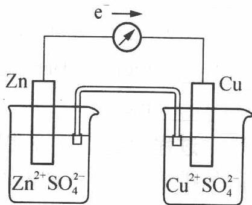

$$
\mathrm{Cu} ^ {2 +} (\mathrm{aq}) + 2 \mathrm{e} ^ {-} \longrightarrow \mathrm{Cu(s)}
$$

氧化和还原反应分别在两处进行,还原剂失去电子经外电路转移给氧化剂形成了电子的有规则定向流动,产生了电流。这种借助于自发的氧化还原反应产生电流的装置称为原电池。

在原电池中,两个半电池中发生的反应可叫做半电池反应或电极反应。

总的氧化还原反应叫做电池反应。铜-锌原电池反应为：

$$
\mathrm{Zn(s)} + \mathrm {Cu^ {2 + } (aq)} \longrightarrow \mathrm {Zn^ {2 + } (aq)} + \mathrm{Cu(s)}
$$

原电池可以用简单的符号表示,称为电池符号。例如铜-锌原电池的符号为:

$$
(-) \mathrm{Zn(s)} | \mathrm {ZnSO_ {4} (c_ {1})} \| \mathrm {CuSO_ {4} (c_ {2})} | \mathrm{Cu(s)(+)}
$$

在电池符号中,习惯上将负极写在左边,正极写在右边,用单竖线表示相

与相间的界面,用双竖线表示盐桥。

有些原电池需要用铂片或石墨作电极。例如：

$$
(-) \mathrm{Pt} | \mathrm{Sn} ^ {2 +} \left(c _ {1}\right), \mathrm{Sn} ^ {4 +} \left(c _ {1} ^ {\prime}\right) \| \mathrm{Fe} ^ {3 +} \left(c _ {2}\right), \mathrm{Fe} ^ {2 +} \left(c _ {2} ^ {\prime}\right) | \mathrm{Pt} (+)
$$

相应的电池反应为:

$$
2 \mathrm{Fe} ^ {3 +} (\mathrm{aq}) + \mathrm{Sn} ^ {2 +} (\mathrm{aq}) \rightleftharpoons 2 \mathrm{Fe} ^ {2 +} (\mathrm{aq}) + \mathrm{Sn} ^ {4 +} (\mathrm{aq})
$$

【例 2】 下列氧化还原反应若设计原电池,试写出电池符号。

$$
2 \mathrm{KMnO} _ {4} + 1 0 \mathrm{KCl} + 3 \mathrm{H} _ {2} \mathrm{SO} _ {4} \longrightarrow 2 \mathrm{MnSO} _ {4} + 5 \mathrm{Cl} _ {2} \uparrow + \mathrm{K} _ {2} \mathrm{SO} _ {4} + 8 \mathrm{H} _ {2} \mathrm{O}
$$

(2) $\mathrm{Hg_2Cl_2 + H_2\longrightarrow 2HCl + 2Hg}$

过程探究 首先要写出电极反应,根据溶液的酸碱性,找出反应式中的氧化剂及其还原产物,还原剂及其氧化产物,写出相应的离子反应式。

参考解答 (1) 负极 $2 \mathrm{Cl}^{-} \longrightarrow \mathrm{Cl}_{2} \uparrow + 2 \mathrm{e}^{-}$

正极 $\mathrm{MnO_4^- + 8H^+ + 5e^- \longrightarrow Mn^{2+} + 4H_2O}$

电池符号（一）Pt | Cl₂(p) | Cl⁻(c₁) || MnO₄⁻(c₂), Mn²⁺(c₃), H⁺(c₄) |
Pt(+)

(2) 负极 $H_{2} \longrightarrow 2H^{+} + 2e^{-}$

正极 $\mathrm{Hg_2Cl_2 + 2e^- \longrightarrow 2Hg + 2Cl^-}$

电池符号（一）Pt | $H_{2}(p)$ | $H^{+}(c_{1})$ || $Cl^{-}(c_{2})$ | $Hg_{2}Cl_{2}$ | $Hg(+)$

## (2) 原电池的电动势

原电池的两极用导线连接时有电流通过,说明两极之间存在着电势差。在外电路电流趋于零时,用电位计可测定正极与负极间的电势差。用 $E_{MF}$ 表示原电池的电动势,它等于正极的电极电势与负极的电极电势之差:

$$
E _ {\mathrm{MF}} = E _ {(+)} - E _ {(-)}
$$

原电池的电动势与系统的组成有关。当原电池中的各物质均处于标准态时,测得的原电池的电动势称为标准电动势,用 $E_{MF}^{\ominus}$ 表示。

$$
E _ {\mathrm{MF}} ^ {\ominus} = E _ {(+)} ^ {\ominus} - E _ {(-)} ^ {\ominus}
$$

## 2. 电极电势

原电池的电动势是组成原电池的两个电极电势之差。

思考2: 每个电极的电势是如何产生的呢? 为什么电极电势的绝对值无法测定?

以金属电极为例,将金属浸入其盐溶液时,在金属与其盐溶液接触的界面上会发生金属溶解和金属离子沉淀两个不同的过程:

$$
\mathrm{M(s)} \xrightarrow [ \text {沉淀} ]{\text {溶解}} \mathrm {M^ {2 + } (aq) + 2e^ {-}}
$$

当这两个过程速率相等时,达到动态平衡。如果是较活泼的金属(如锌),金属表面带负电荷,而靠近金属的溶液带正电荷,形成了双电层,产生了电势差,称为电极电势。对于不活泼的金属(如铜),则情况刚好相反,金属表面带正电荷,而靠近金属的溶液带负电荷,则可形成双电层,产生电极电势。

无论是从金属进入溶液的离子,还是从溶液沉积到金属上的离子的量都非常少,以致不能用化学或物理方法进行测量电极电势的绝对值。通常要选定一个参比电极,以其电极电势为基准,与其他电极相比较,从而确定其他电极的电极电势相对值。

## 3. 电极电势的应用

## (1) 判断氧化剂、还原剂的相对强弱

根据标准电极电势的大小,可以判断氧化剂、还原剂的相对强弱。E愈大,电对中氧化型物质的氧化能力愈强,是强的氧化剂;E愈小,电对中还原型物质的还原能力愈强,是强的还原剂。

在标准电极电势数据表中,电极反应为还原反应,即

$$
\mathrm{氧化型} + z \mathrm{e} ^ {-} \rightleftharpoons \mathrm{还原型}
$$

排在最前面的 $E^{\ominus}$ 最小, 其还原型物质 Li 是强的还原剂; 排在最后面的电对 $F_{2}/F^{-}$ 的 $E^{\ominus}$ 最大, 其氧化型物质 $F_{2}$ 是最强的氧化剂。

## (2) 判断氧化还原反应的方向

$$
\begin{array}{l l} {E _ {\mathrm{MF}} > 0} & {\text {反应正向进行}} \\ {E _ {\mathrm{MF}} <   0} & {\text {反应逆向进行}} \\ {E _ {\mathrm{MF}} = 0} & {\text {反应处于平衡状态}} \end{array}
$$

又由于 $E_{\mathrm{MF}} = E_{( + )} - E_{(-)} = E_{(\text{氧化剂})} - E_{(\text{还原剂})}$

若使 $E_{\mathrm{MF}} > 0$ ，则必须 $E_{(+)} > E_{(-)}$ ，即氧化剂电对的电极电势大于还原剂电对的电极电势。

E 大的电对的氧化型物质作氧化剂, E 小的电对的还原型物质作还原剂, 两者的反应自发地进行。氧化还原反应的方向可以表示为:

强氧化型(1)+强还原型(2)⇌弱还原型(1)+弱氧化型(2)

从标准电极电势表中查得的 $E^{\ominus}$ 能用于计算 $E_{MF}^{\ominus}$ 。但严格地说， $E_{MF}^{\ominus}$ 只能用于判断标准状态下的氧化还原反应的方向。

## (3) 确定氧化还原反应的限度

氧化还原反应的限度即为平衡状态,可以用其标准平衡常数来表明。氧化还原反应的标准平衡常数与标准电池电动势有关,即与相关的电对的标准电极电势有关。

$$
\ln K ^ {\ominus} = \frac {z F E _ {\mathrm{MF}} ^ {\ominus}}{R T}
$$

298.15 K 时：

$$
\lg K ^ {\ominus} = \frac {z E _ {\mathrm{MF}} ^ {\ominus}}{0 . 0 5 9 2}
$$

可见 $E_{MF}^{\ominus}$ 愈大, 则 $K^{\ominus}$ 愈大, 反应正向进行的程度愈大。

【例3】已知：

$$
\begin{array}{l l}{2 \mathrm{H} ^ {+} + 2 \mathrm{e} ^ {-} \rightleftharpoons \mathrm{H} _ {2}}&{E ^ {\ominus} = 0. 0 0 \mathrm{V}}\\{\mathrm{O} _ {2} + 4 \mathrm{H} ^ {+} + 4 \mathrm{e} ^ {-} \rightleftharpoons 2 \mathrm{H} _ {2} \mathrm{O}}&{E ^ {\ominus} = 1. 2 2 9 \mathrm{V}}\\{\mathrm{Mn} ^ {2 +} + 2 \mathrm{e} ^ {-} \rightleftharpoons \mathrm{Mn}}&{E ^ {\ominus} = - 1. 1 8 \mathrm{V}}\\{\mathrm{Ag} ^ {+} + \mathrm{e} ^ {-} \rightleftharpoons \mathrm{Ag}}&{E ^ {\ominus} = 0. 7 9 9 \mathrm{V}}\\{\mathrm{CO} ^ {3 +} + \mathrm{e} ^ {-} \rightleftharpoons \mathrm{CO} ^ {2 +}}&{E ^ {\ominus} = 1. 8 0 8 \mathrm{V}}\end{array}
$$

根据上述标准电极电势, 判断 $Mn^{2+}$ 、Mn、 $Ag^{+}$ 、Ag、 $CO^{3+}$ 、 $CO^{2+}$ 分别置于 $c(H^{+})=1.0\ mol\cdot L^{-1}$ 的水溶液时能否稳定存在? 不能稳定存在的, 则写出有关反应式。

过程探究 $c(\mathrm{H}^{+})=1.0\ \mathrm{mol}\cdot\mathrm{L}^{-1}$ 时的水溶液为标准状态,此时只需判断 $E_{(+)}-E_{(-)}$ 是否大于零,如大于零,则对应分子或离子则不能稳定存在,在水溶液中此时考虑的 $E_{(+)}$ 对应电对应为 $2H^{+}+2e^{-}\rightleftharpoons H_{2}$ (水中的 $H^{+}$ 作氧化剂) 或考虑的 $E_{(-)}$ 为 $O_{2}+4H^{+}+4e^{-}\rightleftharpoons2H_{2}O$ ,此时水会被氧化剂氧化生成 $O_{2}$ ,这两种情况下分子或离子不能稳定存在。

参考解答 能稳定存在的分子或离子: $Mn^{2+} 、 Ag 、 CO^{2+} 、 Ag^{+}$ ; 不能稳定存在的分子或离子: $Mn 、 CO^{3+}$ 。相关反应式如下:

$$
\mathrm{Mn} + 2 \mathrm{H} ^ {+} \longrightarrow \mathrm{Mn} ^ {2 +} + \mathrm{H} _ {2} \uparrow
$$

$$
4 \mathrm{CO} ^ {3 +} + 2 \mathrm{H} _ {2} \mathrm{O} \longrightarrow 4 \mathrm{CO} ^ {2 +} + \mathrm{O} _ {2} \uparrow + 4 \mathrm{H} ^ {+}
$$

## 三、标准氢电极和标准电极电势

## 1. 标准氢电极

电极电势的绝对值无法测量, 只能测量相对值。为使相对值统一, 必须选一个电极作为比较的标准, 通常选定的是标准氢电极。

标准氢电极的构成:将镀有铂黑(海绵状铂)的铂片置于氢离子浓度(严格讲应为活度)为 $1.0 \, mol \cdot kg^{-1}$ 的酸溶液中(近似为 $1.0 \, mol \cdot L^{-1}$ )。然后不断地通入压力为 $1.013 \times 10^{5} \, Pa$ 的纯氢气,使铂黑吸附氢气达到饱和,形成一个氢电极。相应的电极反应为 $2H^{+} + 2e^{-} \longrightarrow H_{2}\uparrow$ 。

标准氢电极所具有的电势叫做氢电极的标准电极电势, 将它作为电极电势的相对标准, 令其为零伏。记作: $E_{\mathrm{H}^{+} / \mathrm{H}_{2}}^{\ominus} = 0.0000 \mathrm{~V}$ 。

## 2. 标准电极电势

用标准氢电极与其他各种标准状态下的电极组成原电池,测得这些电池的电动势,从而求得各种电极的标准电极电势,通常测定时的温度为 298 K。所谓标准状态是指组成电极的离子其浓度为 1.0 mol·L $^{-1}$ ,气体的分压为 1.013×10 $^{5}$ Pa,液体或固体都是纯净物质。标准电极电势用符号 $E^{\ominus}$ 表示。大学书一般都会列出各种电极在水溶液中的标准电极电势。

为能正确使用标准电极电势表,现将几个有关的问题说明如下:

(1) 在 $\mathrm{M}^{n+} + n\mathrm{e}^{-} \longrightarrow \mathrm{M}$ 电极反应中, $\mathrm{M}^{n+}$ 为物质的氧化型, $\mathrm{M}$ 为物质的还原型, 即氧化型 $\rightarrow$ 还原型。

同一种物质在某一电对中是氧化型，在另一电对中也可以是还原型。

例如， $\mathrm{Fe}^{2+}$ 在 $\mathrm{Fe}^{2+} + 2\mathrm{e}^{-} \longrightarrow \mathrm{Fe}(E^{\ominus} = -0.44\mathrm{V})$ 中是氧化型，在 $\mathrm{Fe}^{3+} + \mathrm{e}^{-} \longrightarrow \mathrm{Fe}^{2+}(E^{\ominus} = +0.771\mathrm{V})$ 中是还原型。所以在讨论与 $\mathrm{Fe}^{2+}$ 有关的氧化-还原反应时，若 $\mathrm{Fe}^{2+}$ 作为还原剂而被氧化成 $\mathrm{Fe}^{3+}$ ，则必须用与还原型的 $\mathrm{Fe}^{2+}$ 相对应的电对的 $E^{\ominus}$ 值（ $+0.771\mathrm{V}$ ）。反之，若 $\mathrm{Fe}^{2+}$ 作为氧化剂被还原为 $\mathrm{Fe}$ ，则必须用与氧化型的 $\mathrm{Fe}^{2+}$ 相对应的电对的 $E^{\ominus}$ 值（ $-0.44\mathrm{V}$ ）。

(2) $E^{\ominus}$ 值仅从热力学的角度衡量反应进行的可能性和进行的程度, 而与反应的速率无关。例如 $2 \mathrm{H}_{2} + \mathrm{O}_{2} \longrightarrow 2 \mathrm{H}_{2} \mathrm{O}$ , 该反应进行的可能性可从相关的 $E^{\ominus}$ 进行判断, 得到的结论是进行的可能性极大, 达到平衡时几乎全部生成水。但把 $\mathrm{H}_{2}$ 和 $\mathrm{O}_{2}$ 放在一起, 没有其他条件的促进, 则看不到有 $\mathrm{H}_{2} \mathrm{O}$ 生成。

(3) $E^{\ominus}$ 值的数据是在标准状态下水溶液中测出的, 在非水溶液、高温、固相反应介质等情况下不适用。例如在周期表ⅠA族元素中，K的活泼性大于Na，Na的活泼性大于Li，这是从气态时，金属原子失去电子所需的能量大小来判断的；而在水溶液中的活泼性，即金属活泼性顺序表中却是Li的活泼性大于K，K的活泼性大于Na，与周期表中的活泼性不一致，因为金属在水溶液中的活泼性是指金属转化为水合金属离子的倾向。

(4) $E^{\ominus}$ 值的符号并不因为电对物质在实际反应中的转化方向不同而改变, 它是国际理论与应用化学联合会所推荐的规定, 在电极电势表中电极反应以规定的还原反应表示。例如 $\mathrm{Cu}^{2+}$ 作为氧化剂转化为 $\mathrm{Cu}$ , 或者 $\mathrm{Cu}$ 作为还原剂转化为 $\mathrm{Cu}^{2+}$ , 所涉及的电对电极电势都是 +0.337 V, 并不因为转化方向相反而使符号发生变化。

(5) 在一般书籍和手册中, 标准电极电势都分为两种介质, 酸性溶液和碱性溶液。其查询规律: 在电极反应中, $\mathrm{H}^{+}$ 无论在电极反应的左边出现或在右边出现皆查酸表; 在电极反应中, $\mathrm{OH}^{-}$ 无论在电极反应的左边出现或在右边出现皆查碱表; 电极反应中无 $\mathrm{H}^{+}$ 或 $\mathrm{OH}^{-}$ 参与, 则从存在状态考虑。例如 $\mathrm{Fe}^{3+} + \mathrm{e}^{-} \longrightarrow \mathrm{Fe}^{2+}$ , 只在酸性溶液中存在, 故在酸表中查, 在碱表中则以 $\mathrm{Fe(OH)}_{3} + \mathrm{e}^{-} \longrightarrow \mathrm{Fe(OH)}_{2} + \mathrm{OH}^{-}$ 表示。再如 $\mathrm{S} + 2\mathrm{e}^{-} \longrightarrow \mathrm{S}^{2-}$ , 则在碱表中查, 因为 $\mathrm{S}^{2-}$ 只能存在于碱性溶液中, 在酸性溶液中以 $\mathrm{H}_{2} \mathrm{~S}$ 形式存在。与反应介质无关的电极反应在酸表中查, 例如 $\mathrm{Cl}_{2} + 2\mathrm{e}^{-} \longrightarrow 2\mathrm{Cl}^{-}$ 等。

思考3: 标准电极电势与得失电子数多少有关吗? 举例说明。

## 3. 电极的类型

根据电极的组成不同可以分为以下四种类型：

(1) 金属-金属离子电极: 它是由金属置于含相应金属离子的盐溶液中所构成的电极。例如 $\mathrm{Zn}^{2+}/\mathrm{Zn}$ 电对所组成的电极即是。其电极反应为: $\mathrm{Zn}^{2+} + 2 \mathrm{e}^{-} \longrightarrow \mathrm{Zn}$ 。电极符号为 $\mathrm{Zn} + \mathrm{Zn}^{2+}(c)$ 。

(2) 气体-离子电极: 氢电极和氯电极是气体-离子电极, 此类电极的构成需要一个固体导体, 该固体导体与所接触的气体和溶液都不反应, 仅作为连接导线用。常用的固体导体是铂和石墨。氢电极和氯电极的电极反应分别是

$$
2 \mathrm{H} ^ {+} + 2 \mathrm{e} ^ {-} \longrightarrow \mathrm{H} _ {2} \uparrow , \mathrm{Cl} _ {2} + 2 \mathrm{e} ^ {-} \longrightarrow 2 \mathrm{Cl} ^ {-}
$$

电极符号分别为

$$
\mathrm{Pt} \mid \mathrm{H} _ {2} (\mathrm{g}, p) \mid \mathrm{H} ^ {+} (c), \mathrm{Pt} \mid \mathrm{Cl} _ {2} (\mathrm{g}, p) \mid \mathrm{Cl} ^ {-} (c)
$$

在电极符号中, 凡涉及气体, 均应标明其分压, 凡涉及离子均应标明其

浓度。

(3) 金属-金属难溶盐电极: 它是在金属表面涂上该金属的难溶盐 (或氧化物), 然后将它浸在与该盐具有相同阴离子的溶液中。例如表面涂有 $\mathrm{AgCl}$ 的银丝插在 $\mathrm{HCl}$ 溶液中, 称为氯化银电极。它的电极反应是 $\mathrm{AgCl} + \mathrm{e}^{-} \longrightarrow \mathrm{Ag} + \mathrm{Cl}^{-}$ 。电极符号为 $\mathrm{Ag} \mid \mathrm{AgCl} \mid \mathrm{Cl}^{-}(c)$ 。

思考 4: 氯化银电极与银电极 $(Ag^{+}/Ag)$ 是不相同的,那么这两者有何关系?

(4)“氧化还原”电极:它是将惰性导电材料(铂或石墨)放在某一溶液中,该溶液含有同一元素不同氧化态的两种离子,如 Pt 插入含有 $Fe^{3+}$ 和 $Fe^{2+}$ 的溶液中,该电对的电极反应为: $\mathrm{Fe}^{3+} + \mathrm{e}^{-} \longrightarrow \mathrm{Fe}^{2+}$ 。电极符号为 $\mathrm{Pt} \mid \mathrm{Fe}^{3+}(c_{1})$ , $\mathrm{Fe}^{2+}(c_{2})$ , 这里 $\mathrm{Fe}^{3+}$ 与 $\mathrm{Fe}^{2+}$ 处于同一相中,用逗号分开。

## 四、化学电源简介

## 1. 锌锰干电池(一次性电池)

锌锰干电池是最常见的化学电源。干电池的外壳(锌)是负极,中间的碳棒是正极,在碳棒的周围是细密的石墨和去极化剂 $MnO_{2}$ 的混合物,在混合物周围再以 $ZnCl_{2}$ 、 $NH_{4}Cl$ 和淀粉组成的糊状物填充。为了避免水的蒸发,干电池用蜡封好。干电池在使用时的电极反应为

碳极：

$$
2 \mathrm{MnO} _ {2} (\mathrm{s}) + 2 \mathrm{NH} _ {4} ^ {+} (\mathrm{aq}) + 2 \mathrm{e} ^ {-} \longrightarrow 2 \mathrm{MnO(OH)} (\mathrm{s}) + 2 \mathrm{NH} _ {3} (\mathrm{aq})
$$

锌极：

$$
\mathrm{Zn(s)} - 2 \mathrm{e} ^ {-} \longrightarrow \mathrm{Zn} ^ {2 +} (\mathrm{aq})
$$

总反应：

$$
\mathrm{Zn(s)} + 2 \mathrm {MnO_ {2} (s)} + 2 \mathrm {NH_ {4} ^ {+} (aq)} \longrightarrow
$$

$$
\mathrm{Zn} ^ {2 +} (\mathrm{aq}) + 2 \mathrm{MnO} (\mathrm{OH}) (\mathrm{s}) + 2 \mathrm{NH} _ {3} (\mathrm{aq})
$$

思考5: 加 $\mathrm{MnO}_{2}$ 起什么作用? 什么叫“极化作用”和去极化剂?

此外, 普通碱性干电池, 也是用 $\mathrm{Zn}$ 和 $\mathrm{MnO}_{2}$ 或 $\mathrm{HgO}$ 做反应物, 但在 KOH 碱性条件下工作。例如汞电池是最早应用的微型电池, 由 $\mathrm{Zn}$ (负极) 和 $\mathrm{HgO}$ (正极) 组成, 电解质为 KOH 和 $\mathrm{Zn(OH)}_{2}$ 组成的碱性很强的糊状物。

思考6: 汞电池的电极反应及总反应如何?

## 2. 蓄电池(可充电电池)

蓄电池和干电池不同,它可以通过许多次的充电和放电。所谓充电,是使直流电通过蓄电池,使蓄电池内进行化学反应,把电能转化为化学能并积蓄起来,其本质是一种电解反应。充完电的蓄电池,在使用时蓄电池内进行与充电时方向相反的电极反应,使化学能转变为电能,这一过程称为放电。

常用的蓄电池是铅蓄电池,铅蓄电池的电极是用铅锑合金制成的栅状极片,正极的极片上填充着 $PbO_{2}$ ,负极的极片上填塞着灰铅。这两组极片交替地排列在蓄电池中,并浸泡在 30% 的 $H_{2}SO_{4}$ (密度为 $1.2 \, kg \cdot L^{-1}$ ) 溶液中。

蓄电池放电时(即使用时),正极上的 $PbO_{2}$ 被还原为 $Pb^{2+}$ ,负极上的 Pb 被氧化成 $Pb^{2+}$ 。 $Pb^{2+}$ 与溶液中的 $SO_{4}^{2-}$ 作用在正负极片上生成沉淀。反应为

负极：

$$
\mathrm{Pb} + \mathrm{SO} _ {4} ^ {2 -} \longrightarrow \mathrm{PbSO} _ {4} + 2 \mathrm{e} ^ {-}
$$

正极：

$$
\mathrm{PbO} _ {2} + 4 \mathrm{H} ^ {+} + \mathrm{SO} _ {4} ^ {2 -} + 2 \mathrm{e} ^ {-} \longrightarrow \mathrm{PbSO} _ {4} + 2 \mathrm{H} _ {2} \mathrm{O}
$$

思考7: 上述电池放电时的正负极与充电时阴阳极有什么关系? 充电时电极反应如何?

## 3. 燃料电池

燃料电池和其他电池中的氧化还原反应一样都是一种自发的化学反应。目前像氢氧燃料电池已应用于宇宙飞船和潜艇中。它的基本反应是：

$$
\mathrm{H} _ {2} (\mathrm{g}) + 1 / 2 \mathrm{O} _ {2} (\mathrm{g}) \longrightarrow \mathrm{H} _ {2} \mathrm{O} (\mathrm{l})
$$

从原理上说燃烧 $1 \, mol \, H_{2}$ 可以产生 237 kJ 的电能。若将它设计成一个电池，则电能的利用率大大增加。在氢氧燃料电池中用多孔隔膜把电池分成三部分。电池的中间部分装有 75% 的 KOH 溶液，左侧通入燃料 $H_{2}$ ，右侧通入氧化剂 $O_{2}$ ，气体通过隔膜，缓慢扩散到 KOH 溶液中并发生如下反应：

正极：

$$
1 / 2 \mathrm{O} _ {2} + \mathrm{H} _ {2} \mathrm{O} + 2 \mathrm{e} ^ {-} \longrightarrow 2 \mathrm{OH} ^ {-}
$$

负极：

$$
\mathrm{H} _ {2} + 2 \mathrm{OH} ^ {-} \longrightarrow 2 \mathrm{H} _ {2} \mathrm{O} + 2 \mathrm{e} ^ {-}
$$

总反应：

$$
\mathrm{H} _ {2} + 1 / 2 \mathrm{O} _ {2} \longrightarrow \mathrm{H} _ {2} \mathrm{O}
$$

燃料电池的突出优点是把化学能直接转变为电能而不经过热能这一中间形式,因此化学能的利用率很高而且大大减少了环境污染。

## 竞赛对接

【例 1】（2009 年广东预赛）可用于电动汽车的铝-空气燃料电池，通常以

NaCl溶液或 NaOH溶液为电解液,铝合金为负极,空气电极为正极。下列说法正确的是( )。
A. 以 NaCl 溶液或 NaOH 溶液为电解液时,正极反应都为 $O_{2} + 2H_{2}O + 4e^{-} \longrightarrow 4OH^{-}$ B. 以 NaOH 溶液为电解液时,负极反应为 $\mathrm{Al} + 3\mathrm{OH}^{-} - 3\mathrm{e}^{-} \longrightarrow \mathrm{Al(OH)}_{3}$ C. 以 NaOH 溶液为电解液时,电池在工作过程中电解液的 pH 保持不变
D. 电池工作时,电子通过外电路从正极流向负极

过程探究 无论是 NaOH 溶液还是 NaCl 溶液, 在正极上都是 $\mathrm{O}_{2}$ 得到电子被还原, 选项 A 正确; 生成的 $\mathrm{Al(OH)}_{3}$ 是两性氢氧化物, 在碱溶液中发生反应生成 $\mathrm{AlO}_{2}^{-}$ , 选项 B 错误; 生成的 $\mathrm{Al(OH)}_{3}$ 与 NaOH 反应生成 $\mathrm{NaAlO}_{2}$ , 消耗电解质中的 NaOH, 使 pH 减小, 选项 C 错误; 原电池中, 电子从外电路的负极流向正极, 选项 D 错误。

## 参考解答 A

【例2】（2009年江苏高考）以葡萄糖为燃料的微生物燃料电池结构示意图如右图所示。关于该电池的叙述正确的是( )。
A. 该电池能够在高温下工作
B. 电池的负极反应为 $C_{6}H_{12}O_{6} + 6H_{2}O - 24e^{-} \rightarrow 6CO_{2}\uparrow + 24H^{+}$ C. 放电过程中, $H^{+}$ 从正极区向负极区迁移
D. 在电池反应中, 每消耗 $1 \, mol \, O_{2}$ , 理论上能生成标准状况下 $CO_{2} \frac{22.4}{6} L$

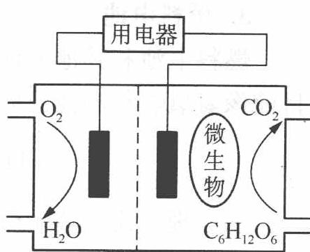  
质子交换膜

过程探究 微生物燃料电池不可能在高温下工作,所以选项 A 错误;放电过程中, $H^{+}$ 从负极区向正极区迁移,所以选项 C 错误;消耗 1 mol $O_{2}$ 则转移 4 mol $e^{-}$ ,由 $C_{6}H_{12}O_{6} + 6H_{2}O - 24e^{-} \longrightarrow 6CO_{2}\uparrow + 24H^{+}$ 计算出转移 4 mol $e^{-}$ 则生成 1 mol $CO_{2}$ ,即 22.4 L(标准状况下),所以选项 D 错误。

## 参考解答 B

【例3】（2003年全国初赛）下图是一种正在投入生产的大型蓄电系统。左右两侧为电解质储罐，中央为电池，电解质通过泵不断在储罐和电池间循环；电池中的左右两侧为电极，中间为离子选择性膜，在电池放电和充电时该膜可允许钠离子通过；放电前，被隔开的电解质为 $\mathrm{Na}_{2} \mathrm{~S}_{2}$ 和 $\mathrm{NaBr}_{3}$ ，放电后，分别为 $\mathrm{Na}_{2} \mathrm{~S}_{4}$ 和 $\mathrm{NaBr}$ 。

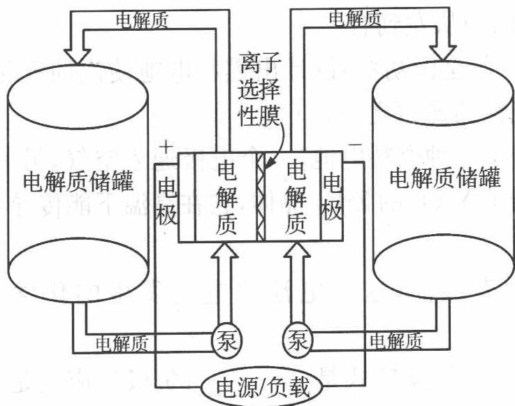

(1) 左、右储罐中的电解质分别是 \_\_\_\_。

(2) 写出电池充电时,阳极和阴极的电极反应。

(3) 写出电池充、放电的反应方程式。

(4) 指出在充电过程中钠离子通过膜的流向。

过程探究 (1) 可根据发生反应的类型来判断。电池放电时, 电解质 $\mathrm{Na}_{2} \mathrm{~S}_{2}^{-1} \longrightarrow \mathrm{Na}_{2} \mathrm{~S}_{4}^{-\frac{1}{2}}, \mathrm{NaBr}_{3}^{-\frac{1}{3}} \longrightarrow \mathrm{NaBr}^{-1}$ , 可推知硫元素化合价升高, 发生氧化反应, 是电池负极, 因此右边储罐中的电解质是 $\mathrm{Na}_{2} \mathrm{~S}_{2}$ 和 $\mathrm{Na}_{2} \mathrm{~S}_{4}$ , 那么左边储罐中应存放 $\mathrm{NaBr}_{3}$ 和 $\mathrm{NaBr}$ 。

(2) 充电与放电是相反的过程。因此充电会使 $\mathrm{NaBr} \longrightarrow \mathrm{NaBr}_{3}, \mathrm{Na}_{2} \mathrm{~S}_{4} \longrightarrow \mathrm{Na}_{2} \mathrm{~S}_{2}$ , 因此充电时阳极反应为 $3 \mathrm{NaBr} - 2 \mathrm{e}^{-} \longrightarrow \mathrm{NaBr}_{3} + 2 \mathrm{Na}^{+}$ , 阴极反应为 $\mathrm{Na}_{2} \mathrm{~S}_{4} + 2 \mathrm{Na}^{+} + 2 \mathrm{e}^{-} \longrightarrow 2 \mathrm{Na}_{2} \mathrm{~S}_{2}$ 。

(3) 原电池充放电的方程式应该是电极反应的总和。因此答案为 $2 \mathrm{~Na}_{2} \mathrm{~S}_{2} + \mathrm{NaBr}_{3} \xrightarrow[充电]{放电} \mathrm{Na}_{2} \mathrm{~S}_{4} + 3 \mathrm{NaBr}$ 。应注意的是电池的充电与放电的方程式相反，但不是化学平衡中的可逆反应，因为充电要外接电源，与放电时反应的条件不同。

(4) 从第二问的电极反应可得到, 充电时, 阳极 (左边) 反应生成了较多游离的 $\mathrm{Na}^{+}$ , 而阴极 (右边) 反应消耗 $\mathrm{Na}^{+}$ , 因此 $\mathrm{Na}^{+}$ 流动方向由左到右。

参考解答 (1) 左: $\mathrm{NaBr}_{3} / \mathrm{NaBr}$ ; 右: $\mathrm{Na}_{2} \mathrm{~S}_{2} / \mathrm{Na}_{2} \mathrm{~S}_{4}$

(2) 阳极: $3 \mathrm{NaBr} - 2 \mathrm{e}^{-} \longrightarrow \mathrm{NaBr}_{3} + 2 \mathrm{Na}^{+}$ ; 阴极: $\mathrm{Na}_{2} \mathrm{~S}_{4} + 2 \mathrm{Na}^{+} + 2 \mathrm{e}^{-} \longrightarrow 2 \mathrm{Na}_{2} \mathrm{~S}_{2}$

$$
(3) 2 \mathrm{Na} _ {2} \mathrm{S} _ {2} + \mathrm{NaBr} _ {3} \xrightarrow [ \text {充电} ]{\text {放电}} \mathrm{Na} _ {2} \mathrm{S} _ {4} + 3 \mathrm{NaBr}
$$

(4) ${\mathrm{{Na}}}^{ + }$ 的流向为从左到右。

【例 4】（2001 年全国初赛）设计出燃料电池使汽油氧化直接产生电流是本世纪最富有挑战性的课题之一。

最近有人制造了一种燃料电池,一个电极通入空气,另一电极通入汽油蒸气。电解质是掺杂了 $\mathrm{Y}_{2} \mathrm{O}_{3}$ 的 $\mathrm{ZrO}_{2}$ 晶体,它在高温下能传导 $\mathrm{O}^{2-}$ 离子。回答如下问题:

(1) 以丁烷代表汽油, 这个电池放电时发生的化学反应的方程式是 \_\_\_\_。

(2) 这个电池的正极反应式是\_\_\_\_；负极反应式是\_\_\_\_；固体电解质里的 $\mathrm{O}^{2-}$ 的移动方向是\_\_\_\_；向外电路释放电子的电极是\_\_\_\_。

(3) 人们追求燃料电池氧化汽油而不在内燃机里燃烧汽油产生动力的主要原因是\_\_\_\_。

(4) 你认为 $\mathrm{ZrO}_{2}$ 晶体里掺杂 $\mathrm{Y}_{2} \mathrm{O}_{3}$ , 用 $\mathrm{Y}^{3+}$ 代替晶体里部分 $\mathrm{Zr}^{4+}$ 对提高固体电解质的导电能力起什么作用? 其可能的原因是什么?

(5) 汽油燃料电池最大的障碍是氧化反应不完全, 产生\_\_\_\_堵塞电极的气体通道, 有人估计, 完全避免这种副反应至少还需 10 年时间, 正是新一代化学家的历史使命。

过程探究 (1) 燃料电池的制作原理就是燃料气体被氧化剂氧化而发生了氧化还原反应, 故该电池放电时化学反应方程式为: $2 \mathrm{C}_{4} \mathrm{H}_{10} + 13 \mathrm{O}_{2} \longrightarrow 8 \mathrm{CO}_{2} + 10 \mathrm{H}_{2} \mathrm{O}$ 。

(2) 因为放电时,电池正极发生还原反应,负极发生氧化反应。所以正极反应式是: $O_{2} + 4e^{-} \longrightarrow 2O^{2-}$ (或 $13O_{2} + 52e^{-} \longrightarrow 26O^{2-}$ ), 负极反应式是: $C_{4}H_{10} + 13O^{2-} - 26e^{-} \longrightarrow 4CO_{2} + 5H_{2}O$ (或 $2C_{4}H_{10} + 26O^{2-} - 52e^{-} \longrightarrow 8CO_{2} + 10H_{2}O$ )。由上述电池正、负极反应式可以看出: 正极反应“源源不断”地产生 $O^{2-}$ , 负极反应要持续进行, 则需要“持续不断”的 $O^{2-}$ 供应, 故电池内 $O^{2-}$ 的移动方向是由正极流向负极。电池的负极发生氧化反应, 失掉电子, 故外电路电子是从负极流出。

(3) 燃料电池是将燃料燃烧反应所产生的化学能直接转化为电能的“能量转化器”, 其能量转化率很高, 可达 $70 \%$ 以上, 而内燃机的能量转化率较低。

(4) 依据电荷守恒原理, 掺有 $\mathrm{Y}_{2} \mathrm{O}_{3}$ 的 $\mathrm{ZrO}_{2}$ 晶体中 $\mathrm{O}^{2-}$ 减少了, 致使晶体中 $\mathrm{O}^{2-}$ 缺陷, 从而使其在电场作用下向负极移动。

(5) “氧化反应不完全”即汽油不完全燃烧。含碳化合物不完全燃烧的固

体产物是碳,故是“碳”堵塞了电极的气体通道。

参考解答 (1) $2\mathrm{C}_4\mathrm{H}_{10} + 13\mathrm{O}_2 \longrightarrow 8\mathrm{CO}_2 + 10\mathrm{H}_2\mathrm{O}$ (2) $\mathrm{O}_2 + 4\mathrm{e}^- \longrightarrow 2\mathrm{O}^{2-}$ $\mathrm{C}_4\mathrm{H}_{10} + 13\mathrm{O}^{2-} - 26\mathrm{e}^- \longrightarrow 4\mathrm{CO}_2 + 5\mathrm{H}_2\mathrm{O}$ ;

向负极移动 负极

(3) 燃料电池具有较高的能量利用率(答内燃机能量利用率较低也可)

(4) 为维持电荷守恒, 晶体中的 $\mathrm{O}^{2-}$ 将减少 (或导致 $\mathrm{O}^{2-}$ 缺陷), 从而使 $\mathrm{O}^{2-}$ 得以在电场作用下向负极移动

(5) 碳(或炭粒等)

## 实战演练

1 有一种 MCFC 型燃料电池,该电池所用原料为 $\mathrm{H}_{2}$ 和空气,电解质为熔融的 $\mathrm{K}_{2} \mathrm{CO}_{3}$ 。电池总反应为: $2 \mathrm{H}_{2} + \mathrm{O}_{2} \longrightarrow 2 \mathrm{H}_{2} \mathrm{O}$ , 负极反应为 $\mathrm{H}_{2} + \mathrm{CO}_{3}^{2-} \longrightarrow \mathrm{H}_{2} \mathrm{O} + \mathrm{CO}_{2} + 2 \mathrm{e}^{-}$ 。下列说法中正确的是( )。
A. 正极反应为 $4 \mathrm{OH}^{-} - 4 \mathrm{e}^{-} \longrightarrow 2 \mathrm{H}_{2} \mathrm{O} + \mathrm{O}_{2} \uparrow$ B. 电池放电时,电池中 $\mathrm{CO}_{3}^{2-}$ 的物质的量将逐渐减少
C. 放电时 $\mathrm{CO}_{3}^{2-}$ 向负极移动
D. 电路中的电子经正级、负极、熔融 $\mathrm{K}_{2} \mathrm{CO}_{3}$ 后再回到正极,形成闭合回路

② 探测冥王星的“新地平线”号载有 10.9 kg 钚 $238(^{238}_{94}\mathrm{Pu})$ 燃料电池系统, 核电池是由辐射 $\beta$ 射线(高速电子流)的放射源、收集这些电子的集电器以及两者之间的绝缘体三部分组成。下列有关说法正确的是()。
A. 钚电池是将核能转化为电能
B. 核原料是可再生能源
C. 放射源一端为正极, 集电器一端为负极
D. $^{238}_{94}Pu$ 的原子质量是 $^{12}C$ 原子质量的 238 倍

3 下列各反应可用于设计制造原电池的是( )。
A. $2CH_{3}CHO + O_{2} \xrightarrow{催化剂} 2CH_{3}COOH$ B. $CH_{3}OH + CH_{3}CH_{2}COOH \xlongequal{浓硫酸} CH_{3}CH_{2}COOCH_{3} + H_{2}O$ C. $KAl(SO_{4})_{2} + 2Ba(OH)_{2} \longrightarrow 2BaSO_{4} \downarrow + KAlO_{2} + 2H_{2}O$ D. $CuSO_{4} + 4NH_{3} \cdot H_{2}O \longrightarrow [Cu(NH_{3})_{4}]SO_{4} + 4H_{2}O$

固体电解质是具有与强电解质水溶液的导电性相当的一类无机固体。这类固体通过其中的离子迁移进行电荷传递,因此又称为固体离子导体。目前固体电解质在制造全固态电池及其他传感器、探测器等方面的应用日益广泛。如 $\mathrm{RbAg_4I_5}$ 晶体,其中迁移的物种全是 $\mathrm{Ag^{+}}$ ,室温下导电率达 $0.27\Omega^{-1} \cdot \mathrm{cm}^{-1}$ 。利用 $\mathrm{RbAg_4I_5}$ 晶体,可以制成电化学气敏传感器,下图是一种测定 $\mathrm{O_2}$ 含量的气敏传感器示意图。被分析的 $\mathrm{O_2}$ 可以透过聚四氟乙烯薄膜,由电池电动势变化可以得知 $\mathrm{O_2}$ 的含量。

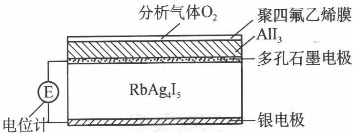

在气敏传感器工作过程中,下列变化肯定没有发生的是(   )。
A. $4AlI_{3} + 3O_{2} \longrightarrow 2Al_{2}O_{3} + 6I_{2}$ B. $I_{2} + 2Ag^{+} + 2e^{-} \longrightarrow 2AgI$ C. $Ag - e^{-} \longrightarrow Ag^{+}$ D. $I_{2} + 2Rb^{+} + 2e^{-} \longrightarrow 2RbI$

5 高铁电池是一种新型可充电电池,与普通高能电池相比,该电池能长时间保持稳定的放电电压。高铁电池的总反应为 $3 \mathrm{Zn} + 2 \mathrm{K}_{2} \mathrm{FeO}_{4} + 8 \mathrm{H}_{2} \mathrm{O} \xrightarrow[充电]{放电} 3 \mathrm{Zn(OH)}_{2} + 2 \mathrm{Fe(OH)}_{3} + 4 \mathrm{KOH}$ 。下列叙述不正确的是( )。
A. 放电时负极反应为 $\mathrm{Zn}-2 \mathrm{e}^{-}+2 \mathrm{OH}^{-} \longrightarrow \mathrm{Zn(OH)}_{2}$ B. 充电时阳极反应为 $\mathrm{Fe(OH)}_{3}-3 \mathrm{e}^{-}+5 \mathrm{OH}^{-} \longrightarrow \mathrm{FeO}_{4}^{2-}+4 \mathrm{H}_{2} \mathrm{O}$ C. 放电时每转移 $3 \mathrm{~mol}$ 电子, 正极有 $1 \mathrm{~mol} \mathrm{K}_{2} \mathrm{FeO}_{4}$ 被还原
D. 放电时正极附近溶液的 $\mathrm{pH}$ 不变

⑥ 氢氧燃料电池是符合绿色化学理念的新型发电装置。右图为电池示意图,该电池电极表面镀一层细小的铂粉,铂吸附气体的能力强,性质稳定。请回答:

(1) 氢氧燃料电池能量转化的主要形式是\_\_\_\_, 在导线中电子的流动方向为\_\_\_\_（用 a、b 表示）。

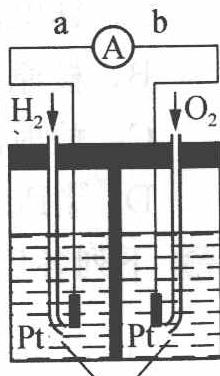  
KOH溶液

(2) 负极反应式为 \_\_\_\_。

(3) 电极表面镀铂粉的原因为 \_\_\_\_。

(4) 该电池工作时, $\mathrm{H}_{2}$ 和 $\mathrm{O}_{2}$ 由外部连续供给, 电池可连续不断提供电能, 因此大量安全储氢是关键技术之一。金属锂是一种重要的储氢材料, 吸氢和放氢原理如下:

I. $2\mathrm{Li} + \mathrm{H}_{2}\longrightarrow 2\mathrm{LiH}$

Ⅱ. $\mathrm{LiH} + \mathrm{H}_2\mathrm{O}\longrightarrow \mathrm{LiOH} + \mathrm{H}_2\uparrow$

① 反应Ⅰ中的还原剂是\_\_\_\_，反应Ⅱ中的氧化剂是\_\_\_\_。

② 已知 LiH 固体密度为 $0.82 \, g \cdot cm^{-3}$ ，用锂吸收 $224 \, L \, H_{2}$ （标准状况），生成的 LiH 的体积与被吸收的 $H_{2}$ 的体积比为 \_\_\_\_。

③ 由②生成的 LiH 与 $H_{2}O$ 作用放出的 $H_{2}$ 用作电池燃料, 若能量转化率为 80%, 则导线中通过电子的物质的量为 \_\_\_\_。

⑦ 科学家预言,燃料电池将是21世纪获得电力的重要途径。美国已计划将甲醇燃料电池用于军事目的。一种甲醇燃料电池是采用铂或碳化钨作电极催化剂,在硫酸电解液中直接加入纯化后的甲醇,同时向另一个电极通入空气。回答如下问题:

(1) 这种电池放电时发生反应的化学方程式是\_\_\_\_。

(2) 此电极的正极发生的反应是\_\_\_\_；
负极发生的反应是\_\_\_\_；
电解液中的 $H^{+}$ 向\_\_\_\_极移动；向外电路释放电子的电极是\_\_\_\_。

(3) 甲醇燃料电池与氢氧燃料电池相比, 其主要缺点是甲醇燃料电池的输出功率较低, 但其主要优点是\_\_\_\_。

(4) 在甲醇燃料电池及其他许多燃料电池中, 电极大多采用多孔结构, 这是由于 \_\_\_\_。

(5) 比起直接燃烧燃料产生电力, 使用燃料电池有许多优点, 其中主要有两点: 首先是燃料电池的能量转化效率高; 其次是\_\_\_\_。

⑧ 已知银锌电池的电池符号为:

$$
\mathrm{Zn} \mid \mathrm{ZnO} \mid \mathrm{KOH(40\%)}, \mathrm{K} _ {2} \mathrm{ZnO} _ {2} (c) \parallel \mathrm{Ag} _ {2} \mathrm{O} \mid \mathrm{Ag}
$$

写出该电池的负极反应、正极反应及电池反应。

9 有两根同时安装的地下自来水管道,一根在完全均匀的土质中通过,另一根通过的土质变化复杂,有的位置为粘土,有的位置为沙土,有的位置潮湿,有的位置干燥。试问这两根管道哪一根使用年限长一些?为什么?

⑩ 在含有 $Cl^{-}$ 、 $Br^{-}$ 、 $I^{-}$ 三种离子的混合溶液中，欲使 $I^{-}$ 氧化成 $I_{2}$ ，而不能使 $Br^{-}$ 、 $Cl^{-}$ 氧化，在常用氧化剂 $Fe^{3+}$ 和 $KMnO_{4}$ 中应选择哪一种？

(已知： $E_{I_2/I}^- = +0.535\ V; E_{Br_2/Br^-}^- = +1.087\ V; E_{Cl_2/Cl^-}^- = +1.3583\ V;$ $E_{Fe^{3+}/Fe^{2+}}^- = +0.770\ V; E_{MnO_4^-/Mn^{2+}}^- = +1.491\ V)$

11 Cu 是一种不很活泼的金属, 下列反应能否进行:

$Cu + 2H_{2}O \longrightarrow Cu(OH)_{2} + H_{2} \uparrow$ ，若能，请说明理由，并设计一简单实验证明之。

12 一小块 $\mathrm{Mg}-\mathrm{Al}$ 合金分别放入 $6 \mathrm{~mol} \cdot \mathrm{L}^{-1} \mathrm{H}_{2} \mathrm{SO}_{4}$ 和 $6 \mathrm{~mol} \cdot \mathrm{L}^{-1} \mathrm{NaOH}$ 中, 它们都可以组成一个微型原电池, 请指出原电池的正负极, 写出电极反应, 并设计一个实验验证你的结论。

13 $\mathrm{HN}_{3}$ 被称为叠氮酸, $\mathrm{N}_{3}^{-}$ 被称为类卤离子。回答下列问题:

(1) $N_{3}^{-}$ 与\_\_\_\_分子互为等电子体。 $N_{3}^{-}$ 的空间构型是\_\_\_\_，结构式为\_\_\_\_。

(2) 酸性比较: $HN_{3}$ \_\_\_\_ HX(卤化氢)(填“>”或“<”); 热稳定性 $HN_{3}$ \_\_\_\_ HX(填“>”或“<”)。

(3) $\mathrm{HN}_{3}$ 与硝酸银溶液作用, 可得一种不溶于水的白色固体, 该固体加热时会发生爆炸。写出该白色固体加热爆炸反应的化学方程式: \_\_\_\_。

(4) 以金属 Cu、石墨作电极, 以盐酸、 $\mathrm{HN}_{3}$ 混合溶液作电解质溶液组成原电池, 正极有气泡产生。一段时间后电流减弱, 在负极周围滴入几滴浓盐酸后又使电流增大。写出原电池的电极反应和滴入浓盐酸后的负极反应。正极反应式: \_\_\_\_ ; 负极反应式: \_\_\_\_ ; 负极滴加浓盐酸后的反应式: \_\_\_\_ 。

14 化学作为一门中心学科,在人类能源开发与利用中起着十分关键的作用。化学电源是一种直接把化学能转变为电能的装置,其研究为各国科学家所关注。利用燃料和氧化剂的氧化还原反应也可以组成一个电池,而且这种电池与传统的电池不同,其工作物质可以源源不断地由外部输入,因此可以长时间不间断地工作。将氢气( $\mathrm{H}_{2}$ )、甲烷( $\mathrm{CH}_{4}$ )、乙醇( $\mathrm{C}_{2} \mathrm{H}_{5} \mathrm{OH}$ )等物质在

氧气 $\left(\mathrm{O}_{2}\right)$ 中燃烧的化学能直接转化为电能的装置叫燃料电池。

燃料电池的基本组成为电极、电解质、燃料和氧化剂。此种电池能量利用率可高达80%(一般柴油发电机只有40%左右)，产物污染也少。人们已将它用于航天飞行器上。右图为氢氧燃料电池反应的完整过程。

(1) 请将右图方框中的反应填补完整: $\mathrm{H}_{\text {吸附}}$ ;

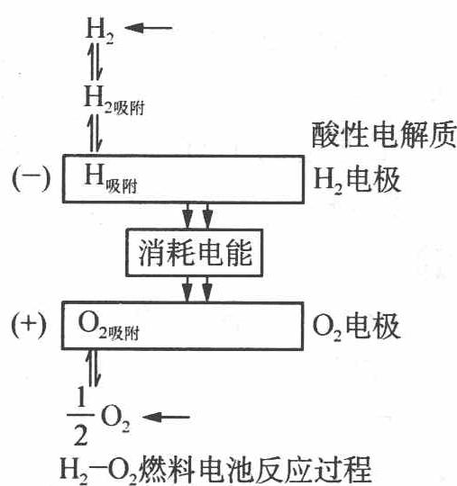

$O_{2}$ 吸附。

(2) 该电池反应为 \_\_\_\_。

(3) 人们将燃料电池用于航天飞行器上原因有二:一是\_\_\_\_,减轻重量就等于降低向太空发射的费用,与另一绿色能源\_\_\_\_配合,可以使飞行器在空间停留的时间较长;二是\_\_\_\_,更可减少携带重量。

15 锂电池是 20 世纪末迅速发展起来的新一代高性能二次电池,以其特有的性能优势已在便携式电器,如手提电脑、摄像机、移动通讯设备中得到普遍应用。目前商用锂离子电池大多采用各种嵌锂的碳/石墨材料为负极材料, $LiCoO_{2}$ 或 $LiNiO_{2}$ 等复合氧化物为正极材料。尖晶石型 $Li_{4}Ti_{5}O_{12}$ 是一种很有应用前景的锂离子电池负极材料,在嵌锂过程中变为岩盐型 $Li_{7}Ti_{5}O_{12}$ 。请回答下列问题:

(1) ${\mathrm{{LiNiO}}}_{2}$ 与 ${\mathrm{{Li}}}_{4}{\mathrm{{Ti}}}_{5}{\mathrm{O}}_{12}$ 中, $\mathrm{{Ni}}$ 和 $\mathrm{{Ti}}$ 元素的氧化数各为多少？

(2) 将 $\mathrm{TiO}_{2}$ 和 $\mathrm{Li}_{2} \mathrm{CO}_{3}$ 混合后在空气中加热到 $1073 \mathrm{~K}$ , 可得到 $\mathrm{Li}_{4} \mathrm{Ti}_{5} \mathrm{O}_{12}$ , 写出化学反应方程式。

(3) 若用 $LiNiO_{2}$ 与 $Li_{4}Ti_{5}O_{12}$ 作为锂离子电池的两极, 写出充电过程中两极发生反应的化学方程式。

(4) $\mathrm{Li}_{4} \mathrm{Ti}_{5} \mathrm{O}_{12}$ 与 $\mathrm{Li}_{7} \mathrm{Ti}_{5} \mathrm{O}_{12}$ 结构相似、晶格常数相近, 被誉为“零应变”材料。这对 $\mathrm{Li}_{4} \mathrm{Ti}_{5} \mathrm{O}_{12}$ 用作锂离子电池负极有什么好处?

(5) 作为锂离子电池的负极材料, 导电能力太差是 $\mathrm{Li}_{4} \mathrm{Ti}_{5} \mathrm{O}_{12}$ 的主要缺点, 应如何改进其导电性能?

1. C 
2. A 
3. A 
4. D

5. 解析: 根据题中电池总反应式可知, 放电时负极反应为 $\mathrm{Zn}-2 \mathrm{e}^{-}+2 \mathrm{OH}^{-} \longrightarrow \mathrm{Zn(OH)}_{2}$ , 选项 A 正确; 充电时阳极反应为 $\mathrm{Fe(OH)}_{3}-3 \mathrm{e}^{-}+5 \mathrm{OH}^{-} \longrightarrow \mathrm{FeO}_{4}^{2-}+4 \mathrm{H}_{2} \mathrm{O}$ , 选项 B 正确; $1 \mathrm{~mol} \mathrm{K}_{2} \mathrm{FeO}_{4}$ 被还原成 $\mathrm{Fe(OH)}_{3}$ 得 $3 \mathrm{~mol}$ 电子, 所以选项 C 正确; 正极附近溶液的 $\mathrm{pH}$ 变大, 选项 D 错误。

答案: D

6. 解析: (1) 原电池的定义就是将化学能转化为电能的装置, 电子流向是从负极到正极, 即从 a 到 b。

(2)负极反应式可以理解为 $\mathrm{H}_{2}$ 失电子变为 $\mathrm{H}^{+}$ , $\mathrm{H}^{+}$ 再与电解质 KOH 溶液反应,

可得到 $\mathrm{H}_{2} + 2\mathrm{OH}^{-} - 2\mathrm{e}^{-}\longrightarrow 2\mathrm{H}_{2}\mathrm{O}$ 。

(3) 由已知条件可知铂吸附气体的能力强, 因此可加快反应速率。

(4) ①可根据价态变化得到氧化剂和还原剂; ②中 $\mathrm{H}_{2}$ 为 $10 \mathrm{~mol}$ , 可得到 LiH 为 $20 \mathrm{~mol}$ , 质量为 $20 \times 8 \mathrm{~g}$ , 体积为 $\frac{20 \times 8 \times 10^{-3}}{0.82} \mathrm{~L}$ , LiH 与被吸收的 $\mathrm{H}_{2}$ 的体积比为 $\frac{20 \times 8 \times 10^{-3}}{0.82}: 224 = 8.7 \times 10^{-4}: 1$ ; ③ $20 \mathrm{~mol} \mathrm{LiH}$ 可生成 $20 \mathrm{~mol} \mathrm{H}_{2}$ , 由 $2 \mathrm{H}_{2} + \mathrm{O}_{2} \longrightarrow 2 \mathrm{H}_{2} \mathrm{O}$ 得 $20 \mathrm{~mol} \mathrm{H}_{2}$ 转移电子为 $40 \mathrm{~mol}$ , 所以 $20 \times 80 \% \mathrm{~mol} \mathrm{H}_{2}$ 反应转移电子 $32 \mathrm{~mol}$ 。

答案: (1) 由化学能转化为电能 由 a 到 b (2) $\mathrm{H}_{2} + 2 \mathrm{OH}^{-} - 2 \mathrm{e}^{-} \longrightarrow 2 \mathrm{H}_{2} \mathrm{O}$

(3) 增大电极表面单位面积吸附 $H_{2}$ 、 $O_{2}$ 分子数, 加快电极反应速率 (4) ① Li; $H_{2}O$ ② $8.7 \times 10^{-4}: 1$ ③ 32 mol

7. (1) $2 \mathrm{CH}_{3} \mathrm{OH} + 3 \mathrm{O}_{2} \longrightarrow 2 \mathrm{CO}_{2} + 4 \mathrm{H}_{2} \mathrm{O}$ (2) $3 \mathrm{O}_{2} + 12 \mathrm{H}^{+} + 12 \mathrm{e}^{-} \longrightarrow 6 \mathrm{H}_{2} \mathrm{O}$ ; $2 \mathrm{CH}_{3} \mathrm{OH} + 2 \mathrm{H}_{2} \mathrm{O} - 12 \mathrm{e}^{-} \longrightarrow 2 \mathrm{CO}_{2} \uparrow + 12 \mathrm{H}^{+}$ 正极 负极 (3) 甲醇比氢气更廉价, 更易制得 (4) 多数燃气和氧气常温下在溶液中溶解度很小, 多孔电极可增大电极的比表面积, 提高工作效率 (5) 燃料电池减少对空气的污染 (燃料直接燃烧对空气污染大)

8. 负极: $\mathrm{{Zn}} + 2{\mathrm{{OH}}}^{ - } - 2{\mathrm{e}}^{ - } \rightarrow  \mathrm{{Zn}}{\left( \mathrm{{OH}}\right) }_{2}$ 正极: ${\mathrm{{Ag}}}_{2}\mathrm{O} + {\mathrm{H}}_{2}\mathrm{O} + 2{\mathrm{e}}^{ - } \rightarrow  2\mathrm{{Ag}} + 2{\mathrm{{OH}}}^{ - }$ 电池反应: $\mathrm{{Zn}} + {\mathrm{{Ag}}}_{2}\mathrm{O} + {\mathrm{H}}_{2}\mathrm{O} \rightarrow  2\mathrm{{Ag}} + \mathrm{{Zn}}{\left( \mathrm{{OH}}\right) }_{2}$

9. 在完全均匀的土质中的水管使用年限要长一些, 而在变化复杂的土质中的水管腐蚀得要快一些。水管所通过的位置土质变化复杂, 实际上就使水管处于不均匀的腐蚀介质中, 从而形成浓差腐蚀, 加快腐蚀速度, 所以在这种位置通过的水管更容易腐蚀而减少使用年限。

10. 从题给电对数据可知 $E^{\ominus}_{\mathrm{MnO}_4^- / \mathrm{Mn}^{2+}}$ 之值最大, $\mathrm{KMnO_4}$ 是强氧化剂, 它可将 $\mathrm{I}^-$ 、 $\mathrm{Br}^-$ 、 $\mathrm{Cl}^-$ 都分别氧化成 $\mathrm{I}_2$ 、 $\mathrm{Br}_2$ 、 $\mathrm{Cl}_2$ 。所以 $\mathrm{KMnO_4}$ 不符合题意。而 $E^{\ominus_{3+}/Fe^{2+}}$ 之值比 $E^{\ominus}_{\mathrm{I}_2/\mathrm{I}^-}$ 大, 但小于 $E^{\ominus}_{\mathrm{Br}_2/\mathrm{Br}^-}$ 和 $E^{\ominus}_{\mathrm{Cl}_2/\mathrm{Cl}^-}$ , 因此 $\mathrm{Fe}^{3+}$ 可把 $\mathrm{I}^-$ 氧化成 $\mathrm{I}_2$ , 而不能将 $\mathrm{Br}^-$ 、 $\mathrm{Cl}^-$ 氧化成 $\mathrm{Br}_2$ 、 $\mathrm{Cl}_2$ 。

11. 可采用直流电电解的方法使反应进行。用 Cu 作电解池的阳极, 通过电解饱和 NaCl 溶液, 实现上述反应。其反应为: 阳极反应: $\mathrm{Cu}-2\mathrm{e}^{-}\longrightarrow\mathrm{Cu}^{2+}$ ; 阴极反应: $2\mathrm{H}^{+}+2\mathrm{e}^{-}\longrightarrow\mathrm{H}_{2}\uparrow$ 电解反应: $\mathrm{Cu}+2\mathrm{H}_{2}\mathrm{O}\xrightarrow{\text {电解}}\mathrm{Cu(OH)}_{2}+\mathrm{H}_{2}\uparrow$

12. 在硫酸介质中：
正极： $2H^{+} + 2e^{-} \rightarrow H_{2}\uparrow$ 负极： $Mg - 2e^{-} \rightarrow Mg^{2+}$ 在 NaOH 介质中：

正极: $6 \mathrm{H}_{2} \mathrm{O} + 6 \mathrm{e}^{-} \longrightarrow 6 \mathrm{OH}^{-} + 3 \mathrm{H}_{2} \uparrow$

负极： $2\mathrm{Al}+8\mathrm{OH}^{-}-6\mathrm{e}^{-}\longrightarrow2\mathrm{AlO}_{2}^{-}+4\mathrm{H}_{2}\mathrm{O}$

注:要将 $2Al + 2NaOH + 2H_{2}O \longrightarrow 2NaAlO_{2} + 3H_{2} \uparrow$ 拆成上述两个电极反应。

这样, $\mathrm{Mg}-\mathrm{Al}$ 合金在两种介质中形成原电池时, 原电池的正负极刚好相反, 可用安培表来检验电流的方向, 确定原电池的正负极。于是有了下面的实验装置图, 实验证明现象明显。在硫酸介质中, $\mathrm{Mg}$ 作负极, $\mathrm{Al}$ 作正极; 在氢氧化钠介质中, $\mathrm{Al}$ 作负极, $\mathrm{Mg}$ 作正极。(说明: 严格讲, 在碱性溶液中, $\mathrm{AlO}_{2}^{-}$ 不存在, 而是以 $\mathrm{Al(OH)}_{4}^{-}$ 形式存在)

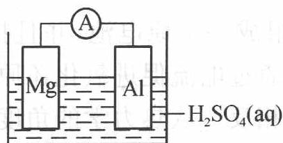

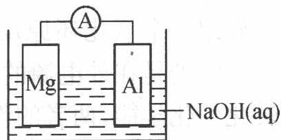

13. (1) ${\mathrm{{CO}}}_{2}$ (或 ${\mathrm{N}}_{2}\mathrm{O}$ ); 直线形; ${\left\lbrack  \mathrm{N} = \mathrm{N} = \mathrm{N}\right\rbrack  }^{ - }$ (或 ${\left\lbrack  \mathrm{N} - \mathrm{N} \equiv  \mathrm{N}\right\rbrack  }^{ - }$ ) (2)<;<

(3) $2\mathrm{AgN}_{3}\longrightarrow 2\mathrm{Ag} + 3\mathrm{N}_{2}\uparrow$ (4) $2\mathrm{H}^{+} + 2\mathrm{e}^{-}\longrightarrow \mathrm{H}_{2}\uparrow ;\mathrm{Cu - e^{-} + Cl^{-}}\longrightarrow \mathrm{CuCl};$ $\mathrm{CuCl + Cl^{-}\longrightarrow [CuCl_2]^-}$

14. (1) $2 \mathrm{H}_{\text {吸附}} - 2 \mathrm{e}^{-} \longrightarrow 2 \mathrm{H}^{+}; \frac{1}{2} \mathrm{O}_{2 \text { 吸附 }} + 2 \mathrm{e}^{-} + 2 \mathrm{H}^{+} \longrightarrow \mathrm{H}_{2} \mathrm{O}$

(2) $\mathrm{H}_{2} + \frac{1}{2}\mathrm{O}_{2}\longrightarrow \mathrm{H}_{2}\mathrm{O}$

(3) 燃料电池有很高的能质比; 光电池; 燃料电池的产物为水, 经过处理之后可供宇航员使用

15. (1) Ni: +3; Ti: +4

(2) $2\mathrm{Li}_2\mathrm{CO}_3 + 5\mathrm{TiO}_2\xrightarrow{1073\mathrm{K}}\mathrm{Li}_4\mathrm{Ti}_5\mathrm{O}_{12} + 2\mathrm{CO}_2\uparrow$

(3) 阳极: $\mathrm{LiNiO_2 - xe^- \longrightarrow Li_{1 - x}NiO_2 + xLi^+}$ 阴极: $\mathrm{Li_4Ti_5O_{12} + 3Li^+ + 3e^- \longrightarrow Li_7Ti_5O_{12}}$

(4) ${\mathrm{{Li}}}^{ + }$ 脱嵌或嵌入更易进行,可反复使用,即循环性能好,使用寿命长

(5) 往 $Li_{4}Ti_{5}O_{12}$ 掺杂一些具有良好导电性的微粒, 如金属及其金属氧化物, 使其进入晶格中

## 一、电解

## 1. 原电池与电解池

上一讲已介绍一个氧化还原反应可以组成一个原电池,并且把化学能转化为电能。而电解则是在外电源的作用下,通过电流促进氧化还原反应进行,它是把电能转化为化学能,两者的作用正好相反。从热力学的角度来看,原电池反应是自发进行的,而电解池反应是强迫进行的。而且两者在构成方式、电极名称、电流流向上都存在一系列区别,可详见下表:

原电池和电解池的比较

<table><tr><td>原电池</td><td>电解池</td></tr><tr><td>原电池的反应是自发进行的</td><td>电解池的反应是强迫进行的(非自发反应)</td></tr><tr><td>正极发生还原反应</td><td>与外电路正极相连的电极——阳极发生氧化反应</td></tr><tr><td>负极发生氧化反应</td><td>与外电路负极相连的电极——阴极发生还原反应</td></tr><tr><td>电流由正极经外电路流向负极</td><td>电流由阳极经电解池流向阴极</td></tr><tr><td>原电池有电池电动势</td><td>电解池有理论分解电压</td></tr></table>

## 2. 理论分解电压与超电势

当一个电池与外接电源反向对接时, 只要外加的电压大于该电池的电动势 $E$ 无限小值, 电池接受外界所提供的电能, 电池反应发生逆转, 原电池就变成了电解池。

这种在外加电源作用下发生的氧化还原过程称为电解。依靠外加电压在两极上发生的氧化还原反应叫做电解反应。电解反应是非自发进行的反应。通过对电池电动势的计算,可以从理论上求得使电解开始所必需的最小外加电压,称为理论分解电压。

实际上,电解时所需的外加电压(实际分解电压)总是大于理论分解电压。例如,电解 $5 \mathrm{~mol} \cdot \mathrm{L}^{-1} \mathrm{NaCl}$ 溶液需要的外加电压为 $2.2 \mathrm{~V}$ 。比理论分解电压 (1.73 V) 大得多。究其原因主要有两个方面:一是电解质溶液(严格地讲尚有导线、接触点)都有一定电阻,电流通过时必然会额外消耗电能;二是当电流通过时,两个电极上进行的是不可逆电解过程,其电极电势(称为不可逆电极电势)会偏离计算得到的可逆电极电势,其偏离的数值称为超电势。电解时由于超电势的存在也会额外消耗电能。

可以规定某一电流密度下的电极电势与电极的平衡电势之间的差值称为超电势,以 $\eta$ 表示。

超电势均为正值,阴极超电势( $\eta_{阴}$ )和阳极超电势( $\eta_{阳}$ )之和就是实际分解电压( $E_{实}$ )与理论分解电压( $E_{理}$ )之差的主要部分:

$$
E _ {\mathrm{实}} \approx E _ {\mathrm{理}} + \eta_ {\mathrm{阳}} + \eta_ {\mathrm{阴}}
$$

## 3. 法拉第(Faraday)电解定律

法拉第研究了通过溶液的电量与电极上起化学变化的物质的量之间的关系,总结出了著名的电解定律,其基本内容是:在电解时,电极上发生化学反应的物质的量和通过电解池的电量 q 成正比。可以概括为下列公式:

$$
m = \frac {M}{z F} q = \frac {M}{z F} I t
$$

式中： $m$ 为电极上参与化学反应的物质的质量，单位为 $\mathrm{g}$ ； $M$ 为参与反应物质的摩尔质量，单位为 $\mathrm{g} \cdot \mathrm{mol}^{-1}$ ； $F$ 为法拉第常量其含义是指 $1 \mathrm{~mol}$ 电子所带的电量，约为 $96500 \mathrm{C}$ ，即 $F$ 为 $96500 \mathrm{C} \cdot \mathrm{mol}^{-1}$ ； $z$ 为电极反应进行时得失的电子数； $t$ 为时间，单位为 $\mathrm{s}$ ； $I$ 为电流强度，单位为 $\mathrm{A}$ 。

## 4. 电流效率

在电解生产中,法拉第常数(96 500 C·mol $^{-1}$ )是一个很重要的数据,在实际生产中,不可能得到理论上相应量的电解产物,因为同时有副反应存在。通常我们把实际产量与理论产量之比称为电流效率,即电流效率= $\frac{实际产量}{理论产量}\times100\%$ .

【例1】含有银、铜、铬的一种合金,质量为 $1.500 \mathrm{~g}$ ,溶解后溶液中含有 $\mathrm{Ag}^{+} 、 \mathrm{Cu}^{2+} 、 \mathrm{Cr}^{3+}$ ,用水稀释到 $500.00 \mathrm{~mL}$ 。

(1) 取出 $50.00 \mathrm{~mL}$ 溶液, 加入过量稀碱溶液, 分离出沉淀物, 滤液用足量 $\mathrm{H}_{2} \mathrm{O}_{2}$ 氧化, 酸化上述溶液, 用 $25.00 \mathrm{~mL} 0.100 \mathrm{~mol} \cdot \mathrm{L}^{-1}$ 的 $\mathrm{Fe(II)}$ 盐溶液还原其中的 $Cr_{2}O_{7}^{2-}$ 生成 $Cr^{3+}$ ，未反应的 Fe(Ⅱ)盐溶液用 $0.0200\ mol\cdot L^{-1}\ KMnO_{4}$ 溶液滴定，耗 $KMnO_{4}$ 溶液 17.20 mL。

(2) 在另一个实验中, 取 $200.00 \mathrm{~mL}$ 原始溶液进行电解。电解析出金属的电流效率为 $90\%$ , 电流为 $2 \mathrm{~A}$ , 在 $14.50 \mathrm{~min}$ 内, 三种金属恰好完全析出。求合金中 $\mathrm{Ag} 、 \mathrm{Cu} 、 \mathrm{Cr}$ 的质量分数。(相对原子质量: $\mathrm{Cr}: 52.00, \mathrm{Cu}: 63.55, \mathrm{Ag}: 107.9$ ; 法拉第常数: $9.648 \times 10^{4} \mathrm{C} \cdot \mathrm{mol}^{-1}$ )

过程探究 法拉第常数的含义是 1 mol 电子的电量, 其值为 $N_{A} \times e \approx 9.6485 \times 10^{4} \, C \cdot mol^{-1}$ , 一般取值为 96 500 C $\cdot$ $mol^{-1}$ , 此题取值为 $9.648 \times 10^{4} \, C \cdot mol^{-1}$ 。

本题涉及的反应方程式为：

$$
6 \mathrm{Fe} ^ {2 +} + \mathrm{Cr} _ {2} \mathrm{O} _ {7} ^ {2 -} + 1 4 \mathrm{H} ^ {+} \longrightarrow 6 \mathrm{Fe} ^ {3 +} + 2 \mathrm{Cr} ^ {3 +} + 7 \mathrm{H} _ {2} \mathrm{O}
$$

$$
5 \mathrm{Fe} ^ {2 +} + \mathrm{MnO} _ {4} ^ {-} + 8 \mathrm{H} ^ {+} \longrightarrow 5 \mathrm{Fe} ^ {3 +} + \mathrm{Mn} ^ {2 +} + 4 \mathrm{H} _ {2} \mathrm{O}
$$

参考解答 (1) $\mathrm{Cr}^{3+} \sim 0.5\mathrm{Cr}_{2}\mathrm{O}_{7}^{2-} \sim 3\mathrm{Fe}^{2+} \quad 5\mathrm{Fe}^{2+} \sim \mathrm{MnO}_{4}^{-}$

$n_{\mathrm{Cr}} = 1 / 3 \times (0.02500 \times 0.100 - 5 \times 0.01720 \times 0.0200) \times 10 = 0.0026(\mathrm{mol})$

(2) $2n_{\mathrm{Cu}} + n_{\mathrm{Ag}} + 3n_{\mathrm{Cr}} = n_{\mathrm{e}} = 2.5 \times 90\% \times 2 \times 14.50 \times 60/96480 = 0.0406(\mathrm{mol})$

$$
6 3. 5 5 n _ {\mathrm{Cu}} + 1 0 7. 9 n _ {\mathrm{Ag}} + 5 2. 0 0 n _ {\mathrm{Cr}} = 1. 5 0 0
$$

$$
n _ {\mathrm{Cu}} = 0. 0 1 4 3 \mathrm{mol} n _ {\mathrm{Ag}} = 0. 0 0 4 2 \mathrm{mol}
$$

$$
w(\mathrm{Cr}) = 9.0\% \quad w(\mathrm{Cu}) = 60.6\% \quad w(\mathrm{Ag}) = 30.2\%
$$

## 二、新型化学电源

电池是一种提供能源的装置,它通常包含一次电池、蓄电池(二次电池)和燃料电池。

## 1. 一次电池

一次电池是一种轻便能源,已被广泛用于各种小型电器中。一次电池有许多类型,按使用的电解液分类可分为碱或酸性电解质电池、盐类电解质电池、有机电解质电池和固体电解质电池几大类。

实用的一次电池及其有关性质

<table><tr><td rowspan="2">分类</td><td colspan="2">电极</td><td rowspan="2">电解质</td><td rowspan="2">电池反应</td></tr><tr><td>正极</td><td>负极</td></tr><tr><td rowspan="3">盐类电解质电池</td><td> $MnO_2$ </td><td>Zn</td><td> $NH_4Cl/ZnCl_2$ </td><td> $Zn + 2MnO_2 + 2NH_4Cl \longrightarrow 2MnOOH + Zn(NH_3)_2Cl_2$ </td></tr><tr><td> $O_2$ </td><td>Zn</td><td> $NH_4Cl/ZnCl_2$ </td><td> $Zn + 1/2O_2 \longrightarrow ZnO$ </td></tr><tr><td>CuCl</td><td>Mg</td><td>NaCl或KCl</td><td> $Mg + 2CuCl \longrightarrow MgCl_2 + 2Cu$ </td></tr><tr><td rowspan="4">酸或碱性电解质电池</td><td> $MnO_2$ </td><td>Zn</td><td>KOH</td><td> $Zn + MnO_2 + 2H_2O + 2KOH \longrightarrow Mn(OH)_2 + K_2[Zn(OH)_4]$ </td></tr><tr><td> $MnO_2$ </td><td>Mg</td><td>KOH</td><td> $Mg + 2MnO_2 + 2H_2O \longrightarrow 2MnOOH + Mg(OH)_2$ </td></tr><tr><td>HgO</td><td>Zn</td><td>KOH</td><td> $Zn + HgO \longrightarrow ZnO + Hg$ </td></tr><tr><td> $Ag_2O$ </td><td>Zn</td><td>KOH</td><td> $Zn + Ag_2O + H_2O \longrightarrow Zn(OH)_2 + 2Ag$ </td></tr><tr><td rowspan="3">有机电解质电池</td><td rowspan="2"> $SOCl_2$  $(CF_x)_n$ </td><td>Li</td><td> $SOCl_2/LiAlCl_4$ </td><td> $4Li + 2SOCl_2 \longrightarrow 4LiCl + S + SO_2 \uparrow$ </td></tr><tr><td>Li</td><td> $LiClO_4$ </td><td> $nxLi + (CF_x)_n \longrightarrow nxLiF + nC$ </td></tr><tr><td>CuO</td><td>Li</td><td> $LiClO_4$ </td><td> $2Li + CuO \longrightarrow Li_2CuO$ </td></tr><tr><td>固体电解质电池</td><td> $RbI_3$ </td><td>Ag</td><td> $RbAg_4I_5$ </td><td> $4Ag + 2RbI_3 \longrightarrow Rb_2AgI_3 + 3AgI$ </td></tr></table>

## (1) 盐类电解质电池

此类电池特点是采用盐类的水溶液作电解液,最常见的为锌锰干电池,其电池反应原理如下:

负极反应：

$$
\mathrm{Zn} - 2 \mathrm{e} ^ {-} \longrightarrow \mathrm{Zn} ^ {2 +}
$$

正极反应：

$$
2 \mathrm{MnO} _ {2} + 2 \mathrm{H} _ {2} \mathrm{O} + 2 \mathrm{e} ^ {-} \longrightarrow 2 \mathrm{MnOOH} + 2 \mathrm{OH} ^ {-}
$$

放电过程中离子反应：

$$
\mathrm{Zn} ^ {2 +} + 2 \mathrm{NH} _ {4} \mathrm{Cl} + 2 \mathrm{OH} ^ {-} \longrightarrow \mathrm{Zn} (\mathrm{NH} _ {3}) _ {2} \mathrm{Cl} _ {2} + 2 \mathrm{H} _ {2} \mathrm{O}
$$

电池反应：

$$
\mathrm{Zn} + 2 \mathrm{MnO} _ {2} + 2 \mathrm{NH} _ {4} \mathrm{Cl} \longrightarrow 2 \mathrm{MnOOH} + \mathrm{Zn} (\mathrm{NH} _ {3}) _ {2} \mathrm{Cl} _ {2}
$$

电池采用含 $NH_{4}Cl$ 和 $ZnCl_{2}$ 的水溶液作电解液 ( $pH \approx 5$ )，采用 Zn 和石墨分别作为负极和正极。

## (2) 酸或碱性电解质电池

以锌空气电池为例说明。该电池以浓的 KOH 溶液作电解液, 电极分别为锌与石墨, 电池反应为 $Zn + \frac{1}{2}O_{2} \longrightarrow ZnO$

思考1: 写出锌空气电池的符号及负极反应与正极反应, 并思考这种电池的主要优点。

## (3) 有机电解质电池

锂电池是负极用金属锂或锂合金或含锂化合物的一类电池的总称。由于锂是最轻的金属(密度为 $0.534 \, g \cdot cm^{-3}$ )，其理论容量为锌的 4.7 倍。锂具有最低的电负性，电极电势最低，因此锂电池的电压高达 4 V 以上，输出能量超过 $200 \, W \cdot h \cdot kg^{-1}$ 。同时锂电池工作温度范围大 ( $-70 \sim 40^{\circ}C$ )，比功率大，且具有平稳的放电性能，具有潜在的应用前景，已被用作手机电池等。但锂电池的缺点也是明显的，安全性欠佳、价格较贵、生产工序复杂等，限制了其大规模的使用。

由于金属锂高的电化学活性, 因此, 锂电池一般采用有机溶剂作为电解液。电解液最重要的性能有: 必须是质子惰性的; 必须不与金属锂及正极物料发生反应; 必须有高的离子传导性能; 应在一个宽的温度范围内保持为液态;应具有适宜的物理性能, 如低的饱和蒸气压、无毒性等。一般用作锂电池中电解液的有机溶剂有乙腈(AN), 二甲亚砜(DMSO), 碳酸丙烯酯(PC), 1,2-二甲氧基乙烷(DME), $\gamma-$ 丁内酯 ( $\gamma-$ BL) 等, 还有用无机溶剂的, 如亚硫酰氯(SOCl $_{2}$ ), 硫酰氯(SO $_{2}$ Cl $_{2}$ )。支持电解质有: LiClO $_{4}$ , LiAsF $_{6}$ , LiBF $_{4}$ , LiPF $_{6}$ , LiCl, LiAlCl $_{4}$ 等。

锂电池有许多种类,按是否可以充电分为一次电池和二次电池。

$Li/SOCl_{2}$ 是一种常用的锂电池,该电池以多孔碳作正极, $SOCl_{2}$ 既是溶剂,又是正极活性物质,电池反应为:

$$
4 \mathrm{Li} + 2 \mathrm{SOCl} _ {2} \longrightarrow 4 \mathrm{LiCl} + \mathrm{S} + \mathrm{SO} _ {2} \uparrow
$$

思考2: 写出该电池的电极反应,并思考为什么此电池曾是最早的用作心

脏起搏器的电池。

## 2. 二次电池

二次电池也叫蓄电池。蓄电池在放电时通过化学反应可以产生电能，而充电(通以反向电流)时则可使体系回复到原来状态，即将电能以化学能形式重新储存起来，从而实现电池两极的可逆充放电反应。蓄电池充电和放电可反复多次，因而可循环使用。常用的蓄电池有铅酸、镍/镉、镍/铁、镍/氢、锂离子电池等。它们的电极(电池)反应见下表。

相关蓄电池的电极(电池)反应

<table><tr><td>电池</td><td>电极(电池)反应</td></tr><tr><td>铅酸</td><td>正极: $PbO_2 + 4H^+ + SO_4^{2-} + 2e^- \rightleftharpoons PbSO_4 + 2H_2O$ 负极: $Pb + SO_4^{2-} \rightleftharpoons PbSO_4 + 2e^-$ 总反应: $Pb + PbO_2 + 4H^+ + 2SO_4^{2-} \rightleftharpoons 2PbSO_4 + 2H_2O$ </td></tr><tr><td>镍/镉</td><td>正极: $NiOOH + H_2O + e^- \rightleftharpoons Ni(OH)_2 + OH^-$ 负极: $Cd + 2OH^- \rightleftharpoons Cd(OH)_2 + 2e^-$ 总反应: $2NiOOH + Cd + 2H_2O \rightleftharpoons 2Ni(OH)_2 + Cd(OH)_2$ </td></tr><tr><td>镍/氢</td><td>正极: $NiOOH + H_2O + e^- \rightleftharpoons Ni(OH)_2 + OH^-$ 负极: $MH_x + xOH^- \rightleftharpoons M + xH_2O + xe^-$ 总反应: $MH_x + xNiOOH \rightleftharpoons xNi(OH)_2 + M$ </td></tr><tr><td>锂离子</td><td>正极: $Li_{1-x}MO_2 + xLi^+ + xe^- \rightleftharpoons LiMO_2$ 负极: $Li_xC_6 \rightleftharpoons C_6 + xLi^+ + xe^-$ 总反应: $Li_{1-x}MO_2 + Li_xC_6 \rightleftharpoons LiMO_2 + C_6$ (M为Co、Ni或Mn等,相对于Li电极)</td></tr></table>

## (1) 镍氢电池

镍氢电池 $\left(\mathrm{MH}_{x}-\mathrm{Ni}\right.$ 电池)是一种新型的二次电池,自20世纪80年代末以来就成为电化学工作者研究和开发的热点,它是在发现了贮氢合金能够用电化学的方法可逆地吸收和放出氢,并能用作可逆贮氢电极之后,才得到快速发展的。 $MH_{x}-Ni$ 电池具有高的比能量(一般为镍镉电池1.5\~2.0倍)和无镉污染的优点。

镍氢电池的负极可采用混合稀土贮氢合金(如 $LaNiH_{x}$ ，x=6)或钛-镍合金( $MH_{x}$ )，正极采用碱性 Ni/Cd 电池中 Ni 电极技术，并加以改进。

负极反应: $\mathrm{MH}_{x}+x\mathrm{OH}^{-}\rightleftharpoons\mathrm{M}+x\mathrm{H}_{2}\mathrm{O}+xe^{-}$

正极反应: $\mathrm{NiOOH} + \mathrm{H}_{2} \mathrm{O} + \mathrm{e}^{-} \rightleftharpoons \mathrm{Ni(OH)}_{2} + \mathrm{OH}^{-}$

电池反应: $\mathrm{MH}_{x} + x\mathrm{NiOOH} \rightleftharpoons x\mathrm{Ni(OH)}_{2} + \mathrm{M}$

在贮氢合金的研究方面,一般要求用于 $MH_{x}-Ni$ 电池的贮氢合金必须具备以下特点:

① 高的贮氢容量, 氢平衡压在 101.325\~101325 Pa 之间;

② 在碱液中稳定, 耐氧化性好, 具有良好的循环寿命;

③ 资源丰富,价格低廉,且对环境无害。

(2) 锂二次电池

【例 2】 目前商品化的锂离子电池正极几乎都是锂钴复合氧化物,其理想结构如右图所示。

1. 在右图上用粗线框出这种理想结构的锂钴复合氧化物晶体的一个晶胞。

2. 这种晶体的一个晶胞里有\_\_\_\_个锂原子、\_\_\_\_个钴原子和\_\_\_\_个氧原子？

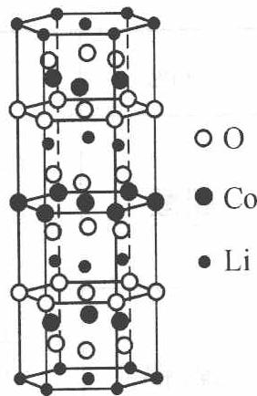

3. 给出这种理想结构的锂钴复合氧化物的化学式(最简式)\_\_\_\_。

锂钴复合氧化物
晶体的理想结构

4. 锂离子电池必须先长时间充电后才能使用。写出上述锂钴复合氧化物作为正极放电时的电极反应。

5. 锂锰复合氧化物是另一种锂离子电池正极材料。它的理想晶体中有两种多面体: $LiO_{4}$ 四面体和 $MnO_{6}$ 八面体, 个数比 1:2, $LiO_{4}$ 四面体相互分离, $MnO_{6}$ 八面体的所有氧原子全部取自 $LiO_{4}$ 四面体。写出这种晶体的化学式。

6. 从右图获取信息,说明为什么锂锰复合氧化物正极材料在充电和放电时晶体中的锂离子可在晶体中移动,而且个数可变。并说明晶体中锂离子的增减对锰的氧化态有何影响。

过程探究 锂二次电池是以金属锂或锂合金作为负极,以插入式(或嵌入式)过渡金属化合物(如 $V_{6}O_{13}$ , $MoS_{2}$ , 锂锰复合氧化物等)作为正极活性物质,电池反应能可逆进行的一类电池总称。该类电池反应已不再是一般电池中的氧化-还原反应,而是 $Li^{+}$ 在充放电过程中可逆地在化合物晶格中嵌入和脱嵌反应。放电和充电过程对应的是 $Li^{+}$ 在化合物中嵌入和脱嵌。

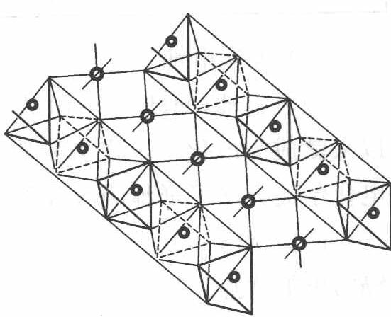  
锂锰复合氧化物正极材料的理想晶体的结构示意图

## 参考解答 1.

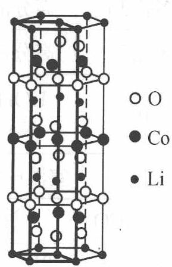

$$
2. 3; 3; 6 \quad 3. \mathrm{LiCoO} _ {2}
$$

$$
4. \mathrm{Li} _ {1 - x} \mathrm{CoO} _ {2} + x \mathrm{Li} ^ {+} + x \mathrm{e} ^ {-} \xrightarrow {\text {放电}} \mathrm{LiCoO} _ {2} (\text {理想})
$$

5. 化学式: $\mathrm{LiMn}_{2} \mathrm{O}_{4}$

6. 相邻 $\mathrm{Li}^{+}$ 之间有多个未填 $\mathrm{Li}^{+}$ 的八面体及四面体空隙, 在电场的作用下, 形成“离子通道”。充电时, 锂锰复合氧化物中部分 $\mathrm{Li}^{+}$ 沿着“离子通道”移出晶体, 晶体中锂离子的个数减少, $\mathrm{Mn}$ 的氧化态升高。

当放电时, $Li^{+}$ 沿着“离子通道”从电解质流回锂锰复合氧化物晶体,晶体中锂离子的个数增加,Mn 的氧化态降低。

## 3. 燃料电池

燃料电池的基本组成为电极、电解质(可以是固体的,也可以是水溶液或熔融盐)、燃料和氧化剂。燃料电池的电极多采用多孔电极技术,电极可以由具有电催化活性的材料制成,也可以只作为电化学反应的载体和反应电流的传导体。燃料可以是气体(如 $H_{2}$ , CO 和碳氢化合物)或液体( $CH_{3}OH$ , $N_{2}H_{4}$ 和高级碳氢化合物),也可以是固体(金属氢化物)。相对于燃料的选择,氧化剂的选择比较方便,纯氧气、空气或卤素都可以胜任,而空气是最便宜的氧化剂。

燃料电池一般都依据电解质类型来分类,可以分为五大类燃料电池,即磷酸型燃料电池(phosphoric acid fuel cell, PAFC)、质子交换膜燃料电池(proton exchange membrane fuel cell, PEMFC)、熔融碳酸盐燃料电池(molten carbonate fuel cell, MCFC)、固体氧化物燃料电池(solid oxide fuel cell, SOFC)和碱性燃料电池(alkaline fuel cell, AFC)。

燃料电池的种类和特征

<table><tr><td colspan="2">电池类型</td><td>PAFC</td><td>MCFC</td><td>SOFC</td><td>AFC</td><td>PEMFC</td></tr><tr><td rowspan="2">电极</td><td>正极</td><td>高分散 Pt</td><td>高分散 Ni</td><td>多孔 Pt</td><td>高分散 Ni</td><td>高分散 Pt</td></tr><tr><td>负极</td><td>高分散 Pt</td><td>高分散 Ni</td><td>多孔 Pt</td><td>高分散 Ni</td><td>高分散 Pt(-Ru)</td></tr><tr><td colspan="2">电解质</td><td>浓 H3PO4</td><td>Li2CO3-K2CO3(Na2CO3)</td><td>ZrO2</td><td>KOH 或 NaOH</td><td>质子交换膜(如 Nafion 膜)</td></tr><tr><td colspan="2">工作温度</td><td>180~210°C</td><td>600~700°C</td><td>900~1000°C</td><td>室温~100°C</td><td>25~120°C</td></tr><tr><td colspan="2">燃料</td><td>H2</td><td>CO或 H2</td><td>H2或 CO</td><td>H2</td><td>H2或甲醇</td></tr><tr><td colspan="2">电池反应</td><td>2H2+O2→2H2O</td><td>2CO+O2→2CO2</td><td>2H2+O2→2H2O</td><td>2H2+O2→2H2O</td><td>CH3OH+1.5O2→CO2+2H2O</td></tr></table>

以质子交换膜燃料电池为例加以说明。

质子交换膜燃料电池除具有燃料电池的一般特点,如不受卡诺循环的限制、无污染、能量转化效率高等,同时还具有可室温快速启动、无电解液流失及腐蚀问题、水易排出、寿命长、比功率与比能量高等突出特点。

质子交换膜燃料电池以全氟磺酸型固体聚合物为电解质,铂/碳或铂-钌/碳为电催化剂,氢为燃料,空气或纯氧为氧化剂,带有气体流动通道的石墨或表面改性的金属板为双极板。

质子交换膜燃料电池中的电极反应类同于其他酸性电解质燃料电池。氢气在催化剂作用下发生电极反应,裂解成氢离子(质子)和电子:

$$
\mathrm{H} _ {2} \longrightarrow 2 \mathrm{H} ^ {+} + 2 \mathrm{e} ^ {-}
$$

该电极反应产生的电子经外电路流动到达正极, 提供电力。而 $\mathrm{H}^{+}$ 则通过电解质膜转移到正极, 与 $\mathrm{O}_{2}$ 及电子发生反应, 生成水:

$$
\frac {1}{2} \mathrm{O} _ {2} + 2 \mathrm{H} ^ {+} + 2 \mathrm{e} ^ {-} \longrightarrow \mathrm{H} _ {2} \mathrm{O}
$$

电池总反应为:

$$
\mathrm{H} _ {2} + \frac {1}{2} \mathrm{O} _ {2} \longrightarrow \mathrm{H} _ {2} \mathrm{O}
$$

生成的水不稀释电解质,而是通过电极随反应尾气排出。

构成质子交换膜燃料电池的关键材料与部件为电催化剂、电极、质子交换膜及双极集流板。

质子交换膜燃料电池的电催化剂以铂为主体,到目前为止,铂是 $H_{2}$ 氧化和 $O_{2}$ 还原的最好催化剂。为提高利用率,铂以纳米颗粒的形式高度分散于碳载体上。铂/碳电催化剂可由化学络合沉淀反应制得。

## 4. 其他类型的电池

科学家还利用光催化和光电化学反应原理,制备了光化学电池。可由下列例题了解此类电池。

【例 3】太阳能发电和阳光分解水制氢,是清洁能源研究的主攻方向,研究工作之一集中在 n-型半导体光电化学电池方面。右图是 n-型半导体光电化学电池光解水制氢的基本原理示意图,图中的半导体导带(未充填电子的分子轨道构成的能级最低的能带)与价带(已充填价电子的分子轨道构成的能级最高的能带)之间的能量差 $\Delta E=(E_{\mathrm{c}}-E_{\mathrm{v}})$ 称为带隙,图中的 $e^{-}$ 为电子、 $h^{+}$ 为空穴。

对电极

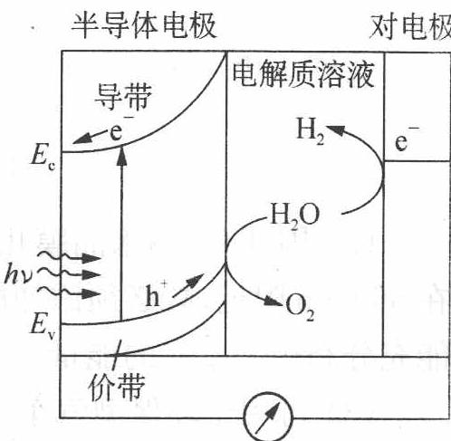

瑞士科学家最近发明了一种基于图中所示原理的廉价光电化学电池装置,其半导体电极由两个光系统串联而成,系统一由吸收蓝色光的 $WO_{3}$ 纳米晶膜构成;系统二吸收绿色和红色光,由染料敏化的 $TiO_{2}$ 纳米晶膜构成。在光照下,系统一的电子( $e^{-}$ )由价带跃迁到导带后,转移到系统二的价带,再跃迁到系统二的导带,然后流向对电极。所采用的光敏染料为配合物 $\mathrm{RuL}_{2}(\mathrm{SCN})_{2}$ ,其中,中性配体 L 为 4,4'-二羧基-2,2'-联吡啶。

(1) 分别写出半导体电极表面和对电极表面发生的电极反应式以及总反应式。

(2) 已知太阳光能量密度最大的波长在 $560 \mathrm{~nm}$ 附近, 说明半导体电极中 $\mathrm{TiO}_{2}$ 纳米晶膜 (白色) 必须添加光敏剂的原因。

(3) 该光电化学电池装置所得产物可用于环保型汽车发动机吗？说明理由。

过程探究 (1) 由图说明水在半导体电极上反应产生了 $\mathrm{O}_{2}$ , 必然还有另一含氢元素物种, $\mathrm{h}^{+}$ 将得到电子, 从而该物种为 $\mathrm{H}^{+}$ 。对电极表面提供电子产生 $\mathrm{H}_{2}$ , 说明是 $\mathrm{H}^{+}$ 得电子。电极反应式以及总反应式见“解答”。

(2) $\mathrm{TiO_2}$ 纳米晶膜呈白色, 说明了它不吸收可见光, 要吸收 $560 \mathrm{~nm}$ 附近的太阳光则必须在晶膜上添加光敏剂。

(3) 该光电化学电池本身提供 $\mathrm{H}_{2}$ , 可作清洁能源物质, 不会造成对环境的污染, 故可用于环保型汽车发动机。

参考解答 (1) 半导体电极表面发生的电极反应式为

$$
4 \mathrm{h} ^ {+} + 2 \mathrm{H} _ {2} \mathrm{O} \longrightarrow \mathrm{O} _ {2} \uparrow + 4 \mathrm{H} ^ {+}
$$

对电极表面发生的电极反应式为

$$
4 \mathrm{H} ^ {+} + 4 \mathrm{e} ^ {-} \longrightarrow 2 \mathrm{H} _ {2} \uparrow
$$

总反应式为

$$
2 \mathrm{H} _ {2} \mathrm{O} \xrightarrow {h \nu} \mathrm{O} _ {2} \uparrow + 2 \mathrm{H} _ {2} \uparrow
$$

(2) 因 $\mathrm{TiO}_{2}$ 纳米晶膜几乎不吸收可见光, 而太阳光能量密度最大的波长在 $560 \mathrm{~nm}$ 附近, 故必须添加能吸收可见光区该波长附近光能的光敏剂, 才有可能充分利用太阳光的能量。

(3) 可用于环保型汽车发动机。因为该光电化学电池装置所得产物为氢气,属于清洁能源,可通过氢气燃烧产生热能用于汽车发动机,亦可经由氢燃料电池产生电能用于汽车发动机。

【例 4】 右图是一种染料敏化太阳能电池的示意图。电池的一个电极由有机光敏染料(S)涂在 $TiO_{2}$ 纳米晶体表面制成, 另一电极由导电玻璃镀铂构成, 电池中发生的反应为:

$$
\begin{array}{r l} & {\mathrm {TiO_ {2} /S\xrightarrow {h\nu} TiO_ {2} / S^ {*} (\text {激发态})}} \\ & {\mathrm {TiO_ {2} / S^ {*} \longrightarrow TiO_ {2} / S^ {+} + e^ {-}}} \\ & {\mathrm {I_ {3} ^ {-} + 2e^ {-} \longrightarrow 3I^ {-}}} \\ & {2 \mathrm {TiO_ {2} / S^ {+} + 3I^ {-} \longrightarrow 2TiO_ {2} / S+ I_ {3} ^ {-}}} \end{array}
$$

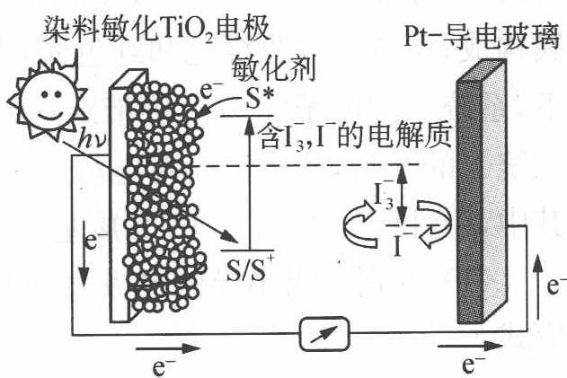

下列关于该电池叙述错误的是( )。
A. 电池工作时, 是将太阳能转化为电能
B. 电池工作时, I⁻ 在镀铂导电玻璃电极上放电
C. 电池中镀铂导电玻璃为正极

D. 电池的电解质溶液中 $\mathrm{I}^{-}$ 和 $\mathrm{I}_{3}^{-}$ 的浓度不会减少

过程探究 B 选项错误,从示意图可看出在外电路中电子由负极流向正极,也即镀铂电极做正极,发生还原反应: $I_{3}^{-}+2e^{-}\longrightarrow3I^{-}$ ; A 选项正确,这是个太阳能电池,从装置示意图可看出是个原电池,最终是将光能转化为电能,因为把上面四个反应加起来可知,化学物质并没有减少;C 正确;D 正确,此太阳能电池中总的反应其中一部分实质就是: $I_{3}^{-}\xrightarrow[氧化]{还原}3I^{-}$ 的转化,另一部分就是光敏有机物激发态与基态的相互转化而已,所有化学物质最终均不被损耗!

参考解答 B

【例 1】（2006 年江苏高考）用太阳光分解水制氢是未来解决能源危机的理想方法之一。某研究小组设计了如下图所示的循环系统实现光分解水制氢。反应过程中所需的电能由太阳能光电池提供，反应体系中 $I_{2}$ 和 $Fe^{3+}$ 等可循环使用。

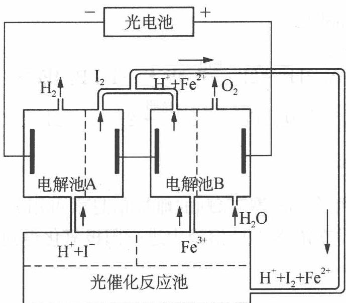

(1) 写出电解池 A、电解池 B 和光催化反应池中反应的离子方程式。

(2) 若电解池 A 中生成 $3.36 \mathrm{~L} \mathrm{H}_{2}$ (标准状况), 试计算电解池 B 中生成 $\mathrm{Fe}^{2+}$ 的物质的量。

(3) 若循环系统处于稳定工作状态时,电解池 A 中流入和流出的 HI 浓度分别为 $a \, mol \cdot L^{-1}$ 和 $b \, mol \cdot L^{-1}$ , 光催化反应生成 $Fe^{3+}$ 的速率为 $c \, mol \cdot min^{-1}$ , 循环系统中溶液的流量为 Q (流量为单位时间内流过的溶液体积)。试用含所给字母的代数式表示溶液的流量 $Q$ 。

过程探究 由所给图示知电解池 A 中电解对象为 HI, 而 B 中则为含 $\mathrm{Fe}^{3+}$ 的溶液, 所以有:

(1) 电解池 A: $2H^{+} + 2I^{-} \xrightarrow{通电} H_{2} \uparrow + I_{2}$ ;

电解池 B: $4Fe^{3+} + 2H_{2}O \xrightarrow{通电} O_{2} \uparrow + 4H^{+} + 4Fe^{2+}$ ;

光催化反应池： $2Fe^{2+} + I_{2}\xrightarrow{光照}2Fe^{3+} + 2I^{-}$

(2) $n(\mathrm{H}_2) = \frac{3.36\mathrm{L}}{22.4\mathrm{L}\cdot\mathrm{mol}^{-1}} = 0.150\mathrm{mol};$

转移电子的物质的量为 $n(\mathrm{e}^{-}) = 2n(\mathrm{H}_{2}) = 0.150 \mathrm{~mol} \times 2 = 0.300 \mathrm{~mol}$ 。

因为电解池 A、B 是串联电解池，电路中转移的电子数目相等，所以， $n(\mathrm{Fe}^{2+}) = n(\mathrm{e}^{-}) = 0.300 \, \mathrm{mol}$ 。

(3) 根据化学反应 $2\mathrm{Fe}^{2+} + \mathrm{I}_2 \xrightarrow{\text{光照}} 2\mathrm{Fe}^{3+} + 2\mathrm{I}^-$ , 光催化反应生成 $\mathrm{I}^-$ 的速率 $v(\mathrm{I}^-) = v(\mathrm{Fe}^{3+}) = c \, \mathrm{mol} \cdot \min^{-1}$ ;

电解池 A 中消耗 I⁻ 的速率应等于光催化反应池中生成 I⁻ 的速率 a mol·L⁻¹·Q-b mol·L⁻¹·Q=c mol·min⁻¹；

$$
Q = \frac {c}{a - b} \mathrm{L} \cdot \mathrm{mol} ^ {- 1} 。
$$

参考解答 (1) A: $2 \mathrm{H}^{+} + 2 \mathrm{I}^{-} \xrightarrow{\text {通电}} \mathrm{H}_{2} \uparrow + \mathrm{I}_{2}$ ; B: $4 \mathrm{Fe}^{3+} + 2 \mathrm{H}_{2} \mathrm{O} \xrightarrow{\text {通电}} \mathrm{O}_{2} \uparrow + 4 \mathrm{H}^{+} + 4 \mathrm{Fe}^{2+}$ ; 光催化反应池: $2 \mathrm{Fe}^{2+} + \mathrm{I}_{2} \xrightarrow{\text {光照}} 2 \mathrm{Fe}^{3+} + 2 \mathrm{I}^{-}$ (2) $0.300 \mathrm{~mol}$ (3) $Q = \frac{c}{a - b} \mathrm{L} \cdot \mathrm{min}^{-1}$

【例 2】（2004 年全国初赛）家蝇的雌性信息素可用芥酸（来自菜籽油）与羧酸 X（摩尔比 1:1）在浓 NaOH 溶液中进行阳极氧化得到。

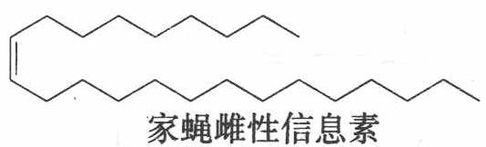

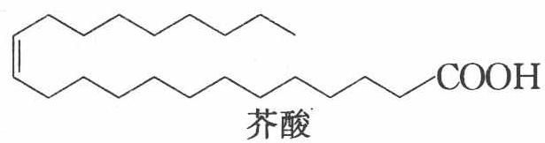

(1) 写出羧酸 X 的名称和结构简式以及生成上述信息素的电解反应的化学方程式。

(2) 该合成反应的理论产率(摩尔分数)多大? 说明理由。

过程探究 （1）本题涉及 Kolbe 反应, 其反应机理为:

阳极反应: $\mathrm{RCH}_{2} \mathrm{COO}^{-}-\mathrm{e}^{-} \longrightarrow \mathrm{RCH}_{2} \mathrm{COO}$

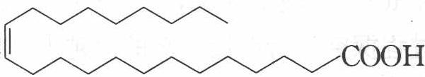

$RCH_{2}COO \cdot$ 不稳定,要脱羧: $RCH_{2}COO \cdot \longrightarrow RCH_{2} \cdot + CO_{2} \uparrow$

游离基 $\mathrm{RCH}_2$ ·再偶联: $2\mathrm{RCH}_2\cdot \longrightarrow \mathrm{RCH}_2 - \mathrm{CH}_2\mathrm{R}$

阴极反应: $2 \mathrm{H}^{+} + 2 \mathrm{e}^{-} \longrightarrow \mathrm{H}_{2} \uparrow$

因此总的电解反应: $2 \mathrm{RCH}_{2} \mathrm{COONa} + 2 \mathrm{NaOH} \xrightarrow{\text {电解}} \mathrm{RCH}_{2}- \mathrm{CH}_{2} \mathrm{R}+$ $2 \mathrm{Na}_{2} \mathrm{CO}_{3} + \mathrm{H}_{2} \uparrow$

本题讨论的是两种羧酸在 NaOH 溶液中发生 Kolbe 反应。根据上面的机理, 将两种酸分别减去羧基, 由芥酸 $\left[\begin{array}{c}\text{CH}_2\text{CH}_2\text{CH}_2\text{CH}_2\text{CH}_2\text{CH}_2\text{COOH}\end{array}\right]$ 变成

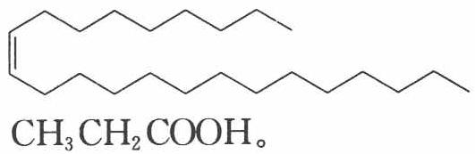

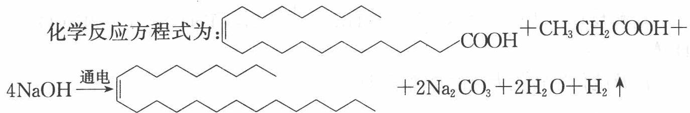

(2) 由于本题有两种羧酸, 则会产生 $\mathrm{R}_{1} \cdot$ 和 $\mathrm{R}_{2} \cdot$ 两种游离基, 它们的偶联有如下几种:

$$
\begin{array}{l} 2 \mathrm{R} _ {1} \bullet \longrightarrow \mathrm{R} _ {1} - \mathrm{R} _ {1} \\ 2 \mathrm{R} _ {2} \bullet \longrightarrow \mathrm{R} _ {2} - \mathrm{R} _ {2} \\ \mathrm{R} _ {1} \bullet + \mathrm{R} _ {2} \bullet \longrightarrow \mathrm{R} _ {1} - \mathrm{R} _ {2} \end{array}
$$

根据游离基相互反应的概率,可得出:芥酸和丙酸氧化脱羧形成摩尔分数相等的2种烃基,同种烃基偶联的摩尔分数各占25%,异种烃基偶联形成家蝇雌性信息素的摩尔分数占50%。

参考解答 (1) 丙酸; $\mathrm{CH}_{3} \mathrm{CH}_{2} \mathrm{COOH}$

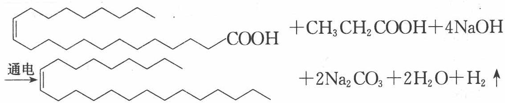

(分析:试题要求写电解反应的方程式,因此,未写 $H_{2}$ 或将 $H_{2}$ 写成 $2H^{+}$ 都是错误的,将 $Na_{2}CO_{3}$ 写成 $CO_{2}$ 也是错误的) (2) 芥酸和丙酸氧化脱羧形成摩尔分数相等的 2 种烃基,同种烃基偶联的摩尔分数各占 25%(或 1/4 或 0.25),异种烃基偶联形成家蝇雌性信息素的摩尔分数占50%(或1/2或0.5)。

【例 3】（2005 年全国初赛）气态废弃物中的硫化氢可用下列方法转化为可利用的硫：配制一份电解质溶液，主要成分为 $\mathrm{K}_{4}\left[\mathrm{Fe}(\mathrm{CN})_{6}\right](200\mathrm{~g}\cdot\mathrm{L}^{-1})$ 和 $\mathrm{KHCO}_{3}(60\mathrm{~g}\cdot\mathrm{L}^{-1})$ ；通电电解，控制电解池的电流密度和槽电压，通入 $H_{2}S$ 气体。写出相应的反应式。

已知： $E_{\mathrm{Fe(CN)}_{6}^{3-}/\mathrm{Fe(CN)}_{6}^{4-}}^{\ominus}=0.35\ \mathrm{V};$

$\mathrm{KHCO_3}$ 溶液中的 $E_{\mathrm{H^+ / H_2}} \sim -0.5\mathrm{V}; E_{\mathrm{S / S^{2 - }}} \sim -0.3\mathrm{V}$

过程探究 若电极电势的值越大,则氧化型物质的氧化性就越强;若电极电势的值越小,则还原型物质的还原性就越强。

阳极反应： $\left[\mathrm{Fe}(\mathrm{CN})_6\right]^{4-}-\mathrm{e}^{-}\longrightarrow \left[\mathrm{Fe}(\mathrm{CN})_6\right]^{3-}$

阴极反应: $2 \mathrm{HCO}_{3}^{-} + 2 \mathrm{e}^{-} \longrightarrow 2 \mathrm{CO}_{3}^{2-} + \mathrm{H}_{2} \uparrow$

电解反应： $2K_{4}[Fe(CN)_{6}]+2KHCO_{3}\xrightarrow{电解}2K_{3}[Fe(CN)_{6}]+2K_{2}CO_{3}+H_{2}\uparrow$

涉及硫化氢转化为硫的总离子反应：

$$
2 \mathrm{Fe(CN)} _ {6} ^ {3 -} + 2 \mathrm{CO} _ {3} ^ {2 -} + \mathrm{H} _ {2} \mathrm{S} \longrightarrow 2 \mathrm{Fe(CN)} _ {6} ^ {4 -} + 2 \mathrm{HCO} _ {3} ^ {-} + \mathrm{S} \downarrow
$$

参考解答 见上述分析。

1 右图为阳离子交换膜法电解饱和食盐水原理示意图。下列说法不正确的是( )。
A. 从 E 口逸出的气体是 $H_{2}$ B. 从 B 口加入含少量 NaOH 的水溶液以增强导电性
C. 标准状况下每生成 $22.4 \, L Cl_{2}$ ，便产生 $2 \, mol \, NaOH$ D. 粗盐水中含 $Ca^{2+}$ 、 $Mg^{2+}$ 、 $Fe^{3+}$ 、 $SO_{4}^{2-}$ 等离溶液

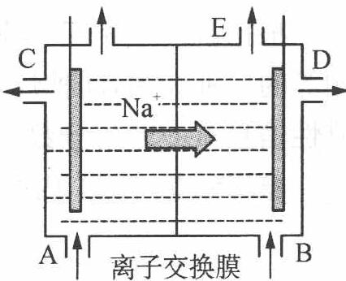

D. 粗盐水中含 $Ca^{2+}$ 、 $Mg^{2+}$ 、 $Fe^{3+}$ 、 $SO_{4}^{2-}$ 等离子，精制时先加 $Na_{2}CO_{3}$ 溶液

② 锂离子电池正极材料是含锂的二氧化钴 $\left(\mathrm{LiCoO}_{2}\right)$ ，充电时 $LiCoO_{2}$ 中 Li 被氧化， $Li^{+}$ 迁移并以原子形式嵌入电池负极材料碳 $\left(\mathrm{C}_{6}\right)$ 中，以 $LiC_{6}$ 表示。电池反应为 $LiCoO_{2} + C_{6} \xlongequal[放电]{充电} CoO_{2} + LiC_{6}$ ，下列说法正确的是()。

A. 充电时,电池的负极反应为 $\mathrm{LiC}_{6}-\mathrm{e}^{-}\longrightarrow\mathrm{Li}^{+}+\mathrm{C}_{6}$ B. 放电时,电池的正极反应为 $\mathrm{CoO}_{2}+\mathrm{Li}^{+}+\mathrm{e}^{-}\longrightarrow\mathrm{LiCoO}_{2}$ C. 羧酸、醇等含活泼氢的有机物可用作锂离子电池的电解质
D. 锂离子电池的比能量(单位质量释放的能量)低

③ 将质量相等的铜片和铂片插入硫酸铜溶液中, 铜片与电源正极相连, 铂片与电源负极相连, 以电流强度 $1 \mathrm{~A}$ 通电 $10 \mathrm{~min}$ , 然后反接电源, 以电流强度 $2 \mathrm{~A}$ 继续通电 $10 \mathrm{~min}$ 。下列表示铜电极、铂电极、电解池中产生的气体的质量 (g) 和电解时间 (min) 的关系图正确的是 ( )。

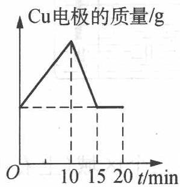  
A

B

C

  
D

④ 硫钠原电池具有输出功率较高、循环寿命长等优点。其工作原理可表示为 $2 \mathrm{~Na} + x \mathrm{~S} \xrightarrow[充电]{放电} \mathrm{Na}_{2} \mathrm{~S}_{x}$

但工作温度过高是这种高性能电池的缺陷。科学家研究发现采用多硫化

合物(如右图)作为电极反应材料,可有效地降低电池的工作温度,且原材料价廉、低毒,可生物降解。下列关于此种多硫化合物的叙述正确的是( )。
A. 这是一种新型无机非金属材料
B. 此化合物可能发生加成反应
C. 原电池的负极反应是将单体转化为的过程

D. 当电路中转移 $0.02 \mathrm{~mol}$ 电子时, 将消耗原电池的正极反应材料 $1.48 \mathrm{~g}$

5 科学家 P. Tatapudi 等人首先使用在空气中电解纯水(酸性条件下)的方法制得臭氧,同时还得到了过氧化氢。下列电极反应式正确的是( )。
A. 阳极反应: $3O_{2} + 6H^{+} + 6e^{-} \longrightarrow 3H_{2}O_{2}$ B. 阳极反应: $3H_{2}O - 6e^{-} \longrightarrow O_{3} \uparrow + 6H^{+}$

C. 阴极反应: $3 \mathrm{O}_{2} + 6 \mathrm{H}_{2} \mathrm{O} + 6 \mathrm{e}^{-} \longrightarrow 3 \mathrm{H}_{2} \mathrm{O}_{2} + 6 \mathrm{OH}^{-}$ D. 阴极反应: $3 \mathrm{H}_{2} \mathrm{O} - 6 \mathrm{e}^{-} \longrightarrow \mathrm{O}_{3} \uparrow + 6 \mathrm{H}^{+}$

6 目前世界上比较先进的电解制碱技术是离子交换膜法,如下左图为离子交换膜法电解饱和食盐水的原理示意图。

(1) 透过交换膜的离子 a 是 \_\_\_\_。

(2) 现有离子交换膜 A 和 B 将电解槽分为 I、II、III 三个区域 (上右图所示), 在这种电解池中电解 $\mathrm{Na}_{2} \mathrm{SO}_{4}$ 溶液可制得氢氧化钠、硫酸等物质。A 为 \_\_\_\_ 离子交换膜, B 为 \_\_\_\_ 离子交换膜 (填“阴”或“阳”),电极均为惰性电极。 $\mathrm{Na}_{2} \mathrm{SO}_{4}$ 溶液应该在 \_\_\_\_ 区 (填“I”、“Ⅱ”或“Ⅲ”) 加入。通电电解时阴极的电极反应式为 \_\_\_\_, 在Ⅲ区得到 \_\_\_\_ 。

7 下图所示装置中, 甲、乙、丙三个烧杯分别盛放 $100 \mathrm{~g} 5.00 \%$ 的 $\mathrm{NaOH}$ 溶液、足量的 $\mathrm{CuSO}_{4}$ 溶液和 $100 \mathrm{~g} 10.00 \%$ 的 $\mathrm{K}_{2} \mathrm{SO}_{4}$ 溶液, 电极均为石墨电极。

  
甲  
乙  
丙

(1) 接通电源, 经过一段时间后, 测得丙中 $\mathrm{K}_{2} \mathrm{SO}_{4}$ 浓度为 $10.47 \%$ , 乙中 c 电极质量增加。据此回答问题:

① 电源的 N 端为 \_\_\_\_ 极。

② 电极 b 上发生的电极反应为 \_\_\_\_。

③ 电极 b 上生成的气体在标准状况下的体积为 \_\_\_\_。

④ 电极 c 的质量变化是 \_\_\_\_ g。

⑤电解前后各溶液的酸、碱性大小是否发生变化？简述其原因：
甲溶液\_\_\_\_；
乙溶液\_\_\_\_；
丙溶液\_\_\_\_。

(2) 如果电解过程中铜全部析出, 此时电解能否继续进行? 为什么?

⑧ 100.0 g无水氢氧化钾溶于100.0 g水。在T温度下电解该溶液,电流强度I=6.00安培,电解时间10.00小时。电解结束温度重新调至T,分离析出的KOH·2H₂O固体后,测得剩余溶液的总质量为164.8 g。已知不同温度下每100 g溶液中无水氢氧化钾的质量为:

<table><tr><td>温度/°C</td><td>0</td><td>10</td><td>20</td><td>30</td></tr><tr><td>KOH/g</td><td>49.2</td><td>50.8</td><td>52.8</td><td>55.8</td></tr></table>

求温度 T, 给出计算过程, 最后计算结果只要求两位有效数字。

注:法拉第常数 $F = 9.65 \times 10^{4} \, C \cdot mol^{-1}$ ，相对原子质量:K—39.1
O—16.0 H—1.01

9 有一种模拟电化学方法处理废水的微型实验,其基本原理是在电解过程中使低价态的金属离子 $M^{n+}$ (例如 $Co^{2+}$ ) 氧化为高价态的金属离子,然后用此高价态的金属离子作氧化剂把废水中的有机物氧化分解成 $CO_{2}$ 而净化。该电化学净化法又称间接电化学氧化,其阳极反应式为 $M^{n+}-e^{-}\longrightarrow M^{(n+1)+}$ 。若现按右图所示进行实验,试回答下列问题:

模拟有机废水组成：吸收液
2滴甲醇, $1.0 \, mol \cdot L^{-1}$ 硫酸1 mL, $0.1 \, mol \cdot L^{-1}$ 硫酸钴4 mL

(1) 井穴板穴孔内应盛放\_\_\_\_溶液以便检验电解时产生的 $\mathrm{CO}_{2}$ 气体, 现象是\_\_\_\_。

(2) 写出电解过程中的电极反应式:

阳极：\_\_\_\_；

阴极：\_\_\_\_。

(3) 写出 $\mathrm{M}^{(n+1)+}$ 氧化有机物 (以甲醇为代表) 的离子方程式: \_\_\_\_。

10 某远洋船只的船壳浸水面积为 $4500 \, m^{2}$ ，与锌块相连来保护，额定电流密度为 $15.0 \, mA/m^{2}$ ，预定保护期限 2 年，可选择的锌块有两种，每块的质量分别为 $15.7 \, kg$ 和 $25.9 \, kg$ ，通过每块锌块的电流强度分别为 0.92 A 和 1.2 A。计算说明，为达到上述保护船体的目的，最少各需几块锌块？用哪种锌块更合理？为什么？

11 工业上制备金属铝通常是用石墨作电极电解熔融的 $Al_{2}O_{3}$ 。为使电解能顺利进行，常在熔融的 $Al_{2}O_{3}$ 中加入冰晶石 $\left(\mathrm{Na}_{3}\mathrm{AlF}_{6}\right)$ ，并不断补充石墨电极。

(1) 写出阳极、阴极和电解池的反应。

(2) 加入冰晶石的主要作用是\_\_\_\_，补充石墨电极的原因是\_\_\_\_。

(3) 设电解池电流效率 $\eta = 80.0\%$ ，电解电流为 $80.0 \mathrm{~A}$ ，要获得 $0.100 \mathrm{~kg} \mathrm{Al}$ 需电解多长时间？

⑫ 将羧酸的碱金属盐溶液电解, 可得到烃类化合物, 例如:

$$
2 \mathrm{CH} _ {3} \mathrm{COOK} + 2 \mathrm{H} _ {2} \mathrm{O} \xrightarrow {\text {电解}} \underbrace {\mathrm{CH} _ {3} \mathrm{CH} _ {3} + 2 \mathrm{CO} _ {2}} _ {\text {阳极}} \uparrow + \underbrace {\mathrm{H} _ {2} \uparrow + 2 \mathrm{KOH}} _ {\text {阴极}}
$$

根据下列演变关系：

$$
\mathrm{Cl} - \mathrm{CH} _ {2} \mathrm{COOK} \xrightarrow {\text {电解}} \mathrm{A(混合物)} \xrightarrow {\text {加热}} \mathrm{B} \xrightarrow {\mathrm{O} _ {2}} \mathrm{C} \xrightarrow {\mathrm{O} _ {2}} \mathrm{D} \xrightarrow {+ \mathrm{B}} \mathrm{E}
$$

(1) 分别写出阳极、阴极的电极反应方程式和电解反应方程式。

(2) 分别写出 B、C、D 的化学式。

(3) 不同条件下的 D 和 B 反应, 会得到三种产物, 请写出符合下列要求的反应方程式:

①最小的链状 E; ②最小的环状 E; ③高分子 E。

13 在 $25^{\circ}$ C 和 101.325 kPa 下, 向电解池通入 0.04193 A 的恒定电流, 阴极 (Pt, 0.1 mol·L $^{-1}$ HNO $_{3}$ ) 放出氢气, 阳极 (Cu, 0.1 mol·L $^{-1}$ NaCl) 得到 Cu $^{2+}$ 。用 0.05115 mol·L $^{-1}$ 的 EDTA 标准溶液滴定产生的 Cu $^{2+}$ , 消耗了 53.12 mL。

(1) 计算从阴极放出的氢气的体积。

(2) 计算电解所需的时间 (以小时为单位)。

14 制取镁有一次电解法与二次电解法：

(1)一次电解:铁锅中溶有氯化镁与氯化钾,石墨为阳极,铁锅为阴极。在

$700^{\circ} \mathrm{C}$ 下电解生成的镁(熔点为 $647^{\circ} \mathrm{C}$ )浮在电解质表面, 电解是在惰性气氛保护下进行的。

① 为什么要在惰性气氛下电解？

② 电解时电流效率不高的原因何在?

(2) 二次电解:电解质同上,石墨为阳极,铅(熔点为 $323^{\circ} \mathrm{C}$ )为阴极沉于电解槽底。电解得铅镁合金,取出冷却后,以它为阳极进行第二次电解,电解质仍为氯化镁与氯化钾,以钢为阴极,在低于 $650^{\circ} \mathrm{C}$ 的条件下电解,在阴极得到镁。与一次电解相比,电流效率明显提高,原因何在?

15 近年来研究表明高铁酸盐在能源(高效电池)、环境保护(新型净水剂)等方面有着广泛的用途。高铁酸盐的制备方法之一是在氢氧化钠溶液中用电解的方法来获得(电解装置如右图所示)。

(1) 电解一段时间后, 在阳极上收集到 $1.12 \mathrm{~L}$ 气体,在阴极上收集到 $8.96 \mathrm{~L}$ 气体 (已换算成标准状态)。在电解过程中, 阳极上发生的主要的电极反应方程式为 , 阴极上发生的

  
NaOH 隔膜 NaOH

电极反应方程式为\_\_\_\_，总电解反应方程式为\_\_\_\_。

(2) 在阳极上有气体放出, 这说明阳极上还发生副反应, 其电极反应方程式为\_\_\_\_。在上述电解过程中获得的高铁酸钠的物质的量为\_\_\_\_。

(3) 高铁酸钠是水处理过程中使用的一种新型净水剂, 它的氧化性比高锰酸钾更强, 能消毒、杀菌, 还能净化水。在酸性条件下, $\mathrm{FeO}_{4}^{2-}$ 与水反应的化学方程式为\_\_\_\_。试解释高铁酸钠能净化水的原因为\_\_\_\_。

(4) 在 $\mathrm{Na}_{2} \mathrm{FeO}_{4}$ 中, Fe 的氧化数为 \_\_\_\_, 铁元素的核外价电子的排布式为 \_\_\_\_, Fe 的氧化数在理论上可以高达 \_\_\_\_。

(5) 试说明 Fe 与 Os 相比, Fe 达到最高氧化态困难的原因是\_\_\_\_。

1. 解析：从图中观察 $\mathrm{Na}^{+}$ 的移动方向, 知左边为阳极, 右边为阴极, 故 $\mathrm{A} 、 \mathrm{B}$ 正确; 又据

$2NaCl + 2H_{2}O \xrightarrow{电解} 2NaOH + H_{2} \uparrow + Cl_{2} \uparrow$ ，可知标准状况下每生成 $22.4 L Cl_{2}$ ，便产生 2 mol NaOH，C 项正确；粗盐水中含 $Ca^{2+}$ 、 $Mg^{2+}$ 、 $Fe^{3+}$ 、 $SO_{4}^{2-}$ 等离子，精制时先加 $BaCl_{2}$ 溶液，D 项错误。
答案：D

2. 解析: 电池充电时发生电解反应, 电池的阳极, 发生氧化反应: $\mathrm{LiCoO}_{2} - \mathrm{e}^{-} \longrightarrow \mathrm{Li}^{+} + \mathrm{CoO}_{2}$ , A项不正确; 放电时, 正极发生还原反应: $\mathrm{CoO}_{2} + \mathrm{Li}^{+} + \mathrm{e}^{-} \longrightarrow \mathrm{LiCoO}_{2}$ , B项正确; 由于 Li 为活泼的金属, 可与羧酸、醇中的活泼氢反应, 故它们不能作电池的电解质, C项不正确; 由于锂的相对原子质量小, 故等质量的物质 Li 的物质的量多, 故比能量高, D项不正确。

答案: B

3. 解析: 第一次通电 $10 \mathrm{~min}$ , 在铜电极 (阳极) 发生氧化反应为 $\mathrm{Cu}-2 \mathrm{e}^{-} \longrightarrow \mathrm{Cu}^{2+}$ , 在铂电极 (阴极) 发生还原反应为 $\mathrm{Cu}^{2+} + 2 \mathrm{e}^{-} \longrightarrow \mathrm{Cu}$ , 铂电极质量增大, 铜电极质量减小,两极均无气体生成, 由此推知选项 A 错误。第二次通电时间相同, 但电流是第一次的两倍, 且两极交换, 此时在铜电极 (阴极) 发生反应为 $\mathrm{Cu}^{2+} + 2 \mathrm{e}^{-} \longrightarrow \mathrm{Cu}$ 。根据电子得失守恒原则, 第二次通电的前 $5 \mathrm{~min}$ (即 $10 \sim 15 \mathrm{~min}$ ) 在铂电极 (阳极) 发生反应为 $\mathrm{Cu}-2 \mathrm{e}^{-} \longrightarrow \mathrm{Cu}^{2+}$ , 铂电极上铜全部放电完, 之后 $5 \mathrm{~min}$ (即 $15 \sim 20 \mathrm{~min}$ ) 在铂电极 (阳极) 发生反应为 $2 \mathrm{H}_{2} \mathrm{O}-4 \mathrm{e}^{-} \longrightarrow \mathrm{O}_{2} \uparrow + 4 \mathrm{H}^{+}$ 。根据分析对照题中关系图, 推知选项 B、C 正确, 选项 D 错误。

答案: BC

4. BD 5. B

6. 解析: (1) 电解池左边是阳极, 发生氧化反应: $2 \mathrm{Cl}^{-}-2 \mathrm{e}^{-} \longrightarrow \mathrm{Cl}_{2} \uparrow$ ; 电解池右边是阴极, 发生还原反应: $2 \mathrm{H}_{2} \mathrm{O}+2 \mathrm{e}^{-} \longrightarrow 2 \mathrm{OH}^{-}+\mathrm{H}_{2} \uparrow$ 。 $\mathrm{Na}^{+}$ 透过交换膜从左边流向右边。

(2) 电解 $\mathrm{Na}_{2} \mathrm{SO}_{4}$ 溶液的本质是电解水, 生成氢气和氧气, A 为阳离子交换膜, B 为阴离子交换膜, $\mathrm{Na}_{2} \mathrm{SO}_{4}$ 溶液应该在 II 区。I 区发生反应 (阴极): $2 \mathrm{H}_{2} \mathrm{O} + 2 \mathrm{e}^{-} \longrightarrow \mathrm{H}_{2} \uparrow + 2 \mathrm{OH}^{-}$ , II 区中 $\mathrm{Na}^{+}$ 透过阳离子交换膜 A 从右边流向左边生成 $\mathrm{NaOH}$ ; III 区发生反应 (阳极): $2 \mathrm{H}_{2} \mathrm{O} - 4 \mathrm{e}^{-} \longrightarrow 4 \mathrm{H}^{+} + \mathrm{O}_{2} \uparrow$ , II 区中 $\mathrm{SO}_{4}^{2-}$ 透过阴离子交换膜 B 从左边流向右边生成 $\mathrm{H}_{2} \mathrm{SO}_{4}$ 。

答案：(1) ${\mathrm{{Na}}}^{ + }$ (2) 阳；阴；II； $2{\mathrm{H}}_{2}\mathrm{O} + 2{\mathrm{e}}^{ - } \rightarrow  {\mathrm{H}}_{2} \uparrow   + 2{\mathrm{{OH}}}^{ - };{\mathrm{H}}_{2}{\mathrm{{SO}}}_{4}$ 溶液

7. (1) ① 正 ② $4 \mathrm{OH}^{-} - 4 \mathrm{e}^{-} \longrightarrow 2 \mathrm{H}_{2} \mathrm{O} + \mathrm{O}_{2} \uparrow$

③ 根据丙中 $K_{2}SO_{4}$ 质量分数由 10.00% 上升为 10.47%，假设电解水的质量为 x g。

$$
100 \mathrm{g} \times 10.00 \% = (100 - x) \mathrm{g} \times 10.47 \% \quad \text{得} x = 4.49
$$

再由 $2H_{2}O\xrightarrow{电解}2H_{2}\uparrow+O_{2}\uparrow$ ，算出在 b、d、f 极上均产生相同体积的氧气 2.79 L。

④ 根据电解 $CuSO_{4}$ 溶液时 $2Cu \sim O_{2}$ 的关系, 计算出电极 c 上析出铜 16.0 g。

⑤ 甲增大, 因为相当于电解水; 乙减小, 因为 $OH^{-}$ 放电, $H^{+}$ 增多; 丙不变, 因为相当于电解水

(2) 可以, 因为 $CuSO_{4}$ 溶液已转变为 $H_{2}SO_{4}$ 溶液, 继续电解也就是电解水

8. 电解反应是水分解为氢气和氧气。

10.00 小时 6.00 安培总共提供电量 $Q = It = 216 \times 10^{3} \mathrm{C}$ , 相当于 $2.24 \mathrm{~mol}$ 电子, 每电解 $1 \mathrm{~mol}$ 水需电子 $2 \mathrm{~mol}$ , 故有 $1.12 \mathrm{~mol}$ 水, 即 $20.2 \mathrm{~g}$ 水被电解。从剩余溶液的总质量 $(200.0 \mathrm{~g} - 164.8 \mathrm{~g})$ 知, 有 $35.2 \mathrm{~g}$ 物质离开溶液, 其中有 $20.2 \mathrm{~g}$ 水被电解, 故结晶的 $\mathrm{KOH} \cdot 2 \mathrm{H}_{2} \mathrm{O}$ 的质量为 $15.0 \mathrm{~g}$ 。

结晶的 KOH 的质量为: $\frac{15.0 \mathrm{~g}}{M(\mathrm{KOH} \cdot 2 \mathrm{H}_{2} \mathrm{O})} \cdot M(\mathrm{KOH}) = 9.13 \mathrm{~g}$ 剩余溶液的溶质质量分数为: $m(\mathrm{KOH}) / [m(\mathrm{H}_{2} \mathrm{O}) + m(\mathrm{KOH})] = 55.1\%$ 。

根据溶解度数据, $T$ 应在 $20 \sim 30^{\circ} \mathrm{C}$ 之间, 设此期间溶解度与温度呈线性关系, 则 $T = 20 + (55.1 - 52.8) / (55.8 - 52.8) \times 10 = 28^{\circ} \mathrm{C}$ 9. (1) $\mathrm{Ca(OH)}_{2}$ ; 澄清石灰水变浑浊

(2) $2 \mathrm{Co}^{2+} - 2 \mathrm{e}^{-} \longrightarrow 2 \mathrm{Co}^{3+}; 2 \mathrm{H}^{+} + 2 \mathrm{e}^{-} \longrightarrow \mathrm{H}_{2} \uparrow$ (3) $6 \mathrm{Co}^{3+} + \mathrm{CH}_{3} \mathrm{OH} + \mathrm{H}_{2} \mathrm{O} \longrightarrow \mathrm{CO}_{2} \uparrow + 6 \mathrm{Co}^{2+} + 6 \mathrm{H}^{+}$ 10. 首先算出通过体系的总电量: $2 \times 365 \mathrm{~d} \times 24 \mathrm{~h} / \mathrm{d} \times 60 \mathrm{~min} / \mathrm{h} \times 60 \mathrm{~s} / \mathrm{min} = 6.307 \times 10^{7} \mathrm{~s}$ $0.0150 \mathrm{A} / \mathrm{m}^{2} \times 4500 \mathrm{~m}^{2} = 67.5 \mathrm{~A}$ $67.5 \mathrm{~A} \times 6.307 \times 10^{7} \mathrm{~s} = 4.26 \times 10^{9} \mathrm{C}$ 其次计算总共需要多少锌:

电子的量为: $4.26 \times 10^{9} \mathrm{C} / (9.65 \times 10^{4} \mathrm{C} \cdot \mathrm{mol}^{-1}) = 4.41 \times 10^{4} \mathrm{~mol}$ 锌量: $4.41 \times 10^{4} \mathrm{~mol} \times 65.4 \mathrm{~g} / \mathrm{mol} \times 10^{-3} (\mathrm{kg} / \mathrm{g}) / 2 = 1.44 \times 10^{3} \mathrm{kg}$ 需质量为 $15.7 \mathrm{~kg}/$ 块的锌块数为: $1.44 \times 10^{3} \mathrm{kg}/(15.7 \mathrm{~kg}/$ 块) = 91.7 块 ≈ 92 块

92 块 × 0.92 A/块 = 85 A > 67.5 A, 电流强度可以达到要求。 $25.9 \mathrm{~kg}/$ 块: $1.44 \times 10^{3} \mathrm{kg}/(25.9 \mathrm{~kg}/$ 块) = 55.6 块 ≈ 56 块

56 块 × 1.2 A/块 = 67.2 A < 67.5 A, 电流强度达不到要求, 应当加 1 块, 则

57 块 × 1.2 A/块 = 68.4 A, 电流强度才能达到要求。

选用较重的锌块更合理, 因其电流强度较小, 理论上可以保证 2 年保护期限, 而用较轻的锌块因其电流强度太大, 不到 2 年就会消耗光。

11. (1) 阳极: $Al_{2}O_{3} \longrightarrow 2 Al^{3+} + \frac{3}{2} O_{2} \uparrow + 6 e^{-}$ 阴极: $2 Al^{3+} + 6 e^{-} \longrightarrow 2 Al$ 电解池: $Al_{2}O_{3} \xrightarrow{\text {电解}} 2 Al + \frac{3}{2} O_{2} \uparrow$

(2) 降低 $Al_{2}O_{3}$ 的熔点; 石墨被电解产生的氧气氧化而消耗

$$
Q _ {\mathrm{实}} = \frac {Q _ {\mathrm{理}}}{\eta} = \frac {\frac {1 0 0}{2 7} \times 3 \times 9 6   5 0 0}{0 . 8 0 0} \mathrm{C} = 1. 3 4 \times 1 0 ^ {6} \mathrm{C} t = \frac {Q _ {\mathrm{实}}}{I} = \frac {1 . 3 4 \times 1 0 ^ {6}}{8 0 \times 3 6 0 0} \mathrm{h} = 4. 6 5 \mathrm{h}
$$

12. (1) 阳极: $2 \mathrm{Cl}-\mathrm{CH}_{2} \mathrm{COO}^{-}-2 \mathrm{e}^{-} \longrightarrow \mathrm{Cl}-\mathrm{CH}_{2} \mathrm{CH}_{2}-\mathrm{Cl}+2 \mathrm{CO}_{2} \uparrow$ 阴极: $2 \mathrm{H}_{2} \mathrm{O}+2 \mathrm{e}^{-} \longrightarrow \mathrm{H}_{2} \uparrow+2 \mathrm{OH}^{-}$ 电解反应化学方程式: $2 \mathrm{ClCH}_{2} \mathrm{COOK}+2 \mathrm{H}_{2} \mathrm{O} \xrightarrow{\text {电解}} \mathrm{ClCH}_{2} \mathrm{CH}_{2} \mathrm{Cl}+2 \mathrm{KOH}+$ $2 \mathrm{CO}_{2} \uparrow+ \mathrm{H}_{2} \uparrow$

(2) B: ${\mathrm{{HOCH}}}_{2}{\mathrm{{CH}}}_{2}\mathrm{{OH}}\;\mathrm{C} : \mathrm{{OHC}} - \mathrm{{CHO}}\;\mathrm{D} : \mathrm{{HOOC}} - \mathrm{{COOH}}$

(3) ① HOCH₂CH₂OH + HOOC-COOH → HOCH₂CH₂OCCOOH + H₂O;

$$
\mathrm{HOCH} _ {2} \mathrm{CH} _ {2} \mathrm{OH} + \mathrm{HOOC-COOH} \longrightarrow \begin{array}{c} \text {   } \\ \text {   } \\ \text {   } \\ \text {   } \\ \text {   } \\ \text {   } \\ \text {   } \\ \text {   } \\ \text {   } \\ \text {   } \\ \text {   } \\ \text {   } \\ \text {   } \\ \text {   } \\ \text {   } \\ \text {   } \\ \text {   } \\ \text { O } \end{array} + 2 \mathrm{H} _ {2} \mathrm{O};
$$

$$
③ n \mathrm{HOCH} _ {2} \mathrm{CH} _ {2} \mathrm{OH} + n \mathrm{HOOC-COOH} \longrightarrow \left[ \begin{array}{c c} & \mathrm{O} \\ & \mathrm{O} \\ \mathrm{OCH} _ {2} \mathrm{CH} _ {2} \mathrm{OC-C} & \end{array} \right] _ {n} + n \mathrm{H} _ {2} \mathrm{O}
$$

13. (1) 阳极反应: $\mathrm{Cu} \longrightarrow \mathrm{Cu}^{2+} + 2 \mathrm{e}^{-}$

阴极反应: $H^{+}+e^{-}\longrightarrow1/2H_{2}\uparrow$

电解反应: $\mathrm{Cu} + 2\mathrm{H}^{+}\xrightarrow{\text{电解}}\mathrm{Cu}^{2+} + \mathrm{H}_{2}\uparrow$

$Cu^{2+}$ 与 EDTA 按 1:1 络合, 因此, 阴极放出的氢气的摩尔数等于阳极产生的 $Cu^{2+}$ 的摩尔数, 即等于消耗的 EDTA 的摩尔数:

$$
n _ {\mathrm{H} _ {2}} = n _ {\mathrm{Cu} ^ {2 +}} = c _ {\mathrm{EDTA}} V _ {\mathrm{EDTA}} = 0. 0 5 1 1 5 \mathrm{mol} \cdot \mathrm{L} ^ {- 1} \times 0. 0 5 3 1 2 \mathrm{L} = 2. 7 1 7 \times 1 0 ^ {- 3} \mathrm{mol}
$$

$H_{2}$ 在给定条件下的体积为

$$
\begin{array}{r l} V _ {\mathrm {H_ {2}}} & = \frac {n _ {\mathrm {H_ {2}}} \times R \times T}{p} = \frac {2 . 7 1 7 \times 1 0 ^ {- 3} \mathrm{mol} \times 8 . 3 1 4 \mathrm{J} \cdot \mathrm{K} ^ {- 1} \cdot \mathrm{mol} ^ {- 1} \times 2 9 8 . 2 \mathrm{K}}{1 . 0 1 3 2 5 \times 1 0 ^ {5} \mathrm{Pa}} \\ & = 6 6. 4 8 \mathrm{mL} \end{array}
$$

(2) 生成 $66.48 \mathrm{~mL}$ 氢气需 $2.717 \mathrm{mmol} \times 2 = 5.434 \mathrm{mmol}$ 电子, 电解所需时间为 $t = \frac{5.434 \times 10^{-3} \mathrm{~mol} \times 96500 \mathrm{C} \cdot \mathrm{mol}^{-1}}{0.04193 \mathrm{A}} = 1.251 \times 10^{4} \mathrm{s} = 3.475 \mathrm{~h}$

14. (1) ① 隔绝空气,防止高温下的 $\mathrm{Mg}$ 被 $\mathrm{O}_{2}$ 氧化 ② 电解时电流效率不高是由于电解生成的 $\mathrm{Mg}$ 浮在电解质表面,与 $\mathrm{Cl}_{2}$ 反应重新生成了 $\mathrm{MgCl}_{2}$ 。

(2) 二次电解法电流效率较高是由于两个原因所致: ①第一阶段电解时, 生成的 $\mathrm{Mg}$ 与 $\mathrm{Pb}$ 形成了合金沉于槽底, 避免了与 $\mathrm{Cl}_{2}$ 反应; ②第二阶段电解时, 阳极: $\mathrm{Mg}-2\mathrm{e}^{-} \longrightarrow \mathrm{Mg}^{2+}$ , 阴极: $\mathrm{Mg}^{2+} + 2\mathrm{e}^{-} \longrightarrow \mathrm{Mg}$ , 此时已再无 $\mathrm{Cl}_{2}$ 的干扰。

15. (1) 阳极: $\mathrm{Fe} + 8\mathrm{OH}^{-} - 6\mathrm{e}^{-} \rightarrow  \mathrm{FeO}_{4}^{2-} + 4{\mathrm{H}}_{2}\mathrm{O}$

阴极: $6 \mathrm{H}_{2} \mathrm{O} + 6 \mathrm{e}^{-} \longrightarrow 3 \mathrm{H}_{2} \uparrow + 6 \mathrm{OH}^{-}$

总的反应方程式: $\mathrm{Fe} + 2\mathrm{H}_{2}\mathrm{O} + 2\mathrm{OH}^{-} \xrightarrow{\text{电解}} \mathrm{FeO}_{4}^{2-} + 3\mathrm{H}_{2} \uparrow$

(2) $2OH^{-}-2e^{-}\longrightarrow H_{2}O+\frac{1}{2}O_{2}\uparrow$ 0.1 mol

(3) $4 \mathrm{FeO}_{4}^{2-} + 10 \mathrm{H}_{2} \mathrm{O} \longrightarrow 4 \mathrm{Fe}^{3+} + 3 \mathrm{O}_{2} \uparrow + 20 \mathrm{OH}^{-}$ ; 高铁酸钠在水中作氧化剂, 消毒、杀菌, 本身还原为 $\mathrm{Fe}^{3+}, \mathrm{Fe}^{3+}$ 在 $\mathrm{pH} = 2 \sim 3$ 时就可以彻底水解, 形成 $\mathrm{Fe(OH)}_{3}$ 胶体。 $\mathrm{Fe(OH)}_{3}$ 胶体可以吸附、聚沉水中的固体小颗粒杂质而净化水。

(4) +6 $3d^{6}4s^{2}$ +8

(5) Fe 的原子半径小于 Os, 所以 Fe 原子中的原子核对价电子的吸引力强, 形成最高氧化态困难。

## 一、配合物的定义、组成和命名

## 1. 定义

由中心离子(或原子)和几个配体分子(或离子)以配位键相结合而形成的复杂分子或离子,通常称为配位单元。凡是含有配位单元的化合物都称作配位化合物,简称配合物,也叫络合物。

$\left[\mathrm{Cu}\left(\mathrm{NH}_{3}\right)_{4}\right]^{2+},\left[\mathrm{Cr}\left(\mathrm{CN}\right)_{6}\right]^{3-},\mathrm{Ni}\left(\mathrm{CO}\right)_{4}$ 都是配位单元，分别称作配阳离子、配阴离子、配分子。

$\left[\mathrm{Co}\left(\mathrm{H}_{2} \mathrm{O}\right)_{6}\right] \mathrm{Cl}_{2}$ 、 $\left[\mathrm{Ag}\left(\mathrm{NH}_{3}\right)_{2}\right] \mathrm{Cl}$ 、 $\mathrm{Ni}\left(\mathrm{CO}\right)_{4}$ 都是配位化合物。判断的关键在于是否含有配位单元。

思考1: 化学中还有一些组成复杂的化合物, 如钾矾 $\mathrm{KAl(SO_4)_2\cdot 12H_2O}$ 、光卤石 $\mathrm{KCl\cdot MgCl_2\cdot 6H_2O}$ 等, 称为复盐。络盐和复盐的主要区别是什么?

## 2. 组成

(1) 配合物的内界和外界

以 $\left[\mathrm{Co}\left(\mathrm{H}_{2} \mathrm{O}\right)_{6}\right] \mathrm{SO}_{4}$ 为例：

$$
\begin{array}{r l} & {\left[ \mathrm{Co} (\mathrm{H} _ {2} \mathrm{O}) _ {6} \right] ^ {2 +} \mathrm{SO} _ {4} ^ {2 -}} \\ & {\text {内界 外界}} \end{array}
$$

内界是配位单元, 外界是简单离子。也可以无外界, 如 $\mathrm{Fe(CO)}_{5}$ , 但不能没有内界, 内外界之间是完全电离的。

## (2) 中心离子(或原子)和配位体

中心离子多为金属(过渡金属)离子,也有电中性的原子。如 $\mathrm{Fe}^{3+}$ 、 $\mathrm{Fe}^{2+}$

$Co^{2+}$ 、 $Ni^{2+}$ 、 $Cu^{2+}$ 、Co等，只要能提供接纳孤对电子的空轨道即可。某些羰基络合物如 $\mathrm{MnH(CO)_5}$ 和 $\mathrm{CoH(CO)_3}$ 中的 Mn 和 Co 的氧化态都是 -1，它们也是络合物的中心离子。配位体一般是含有孤对电子的阴离子或分子。如 $NH_3$ 、 $H_2O$ 、 $Cl^-$ 、 $Br^-$ 、 $I^-$ 、 $CN^-$ 等。

## (3) 配位原子和配位数

配体中给出孤对电子与中心离子(或原子)直接形成配位键的原子,叫配位原子。配位单元中,直接与中心离子(或原子)相连的配位原子的个数,叫配位数。配位化合物 $\left[\mathrm{Co}\left(\mathrm{NH}_{3}\right)_{4}\right]\mathrm{SO}_{4}$ 的内界为 $\left[\mathrm{Co}\left(\mathrm{NH}_{3}\right)_{4}\right]^{2+}$ ,中心 $Co^{2+}$ 的周围有4个配体 $NH_{3}$ ,每个 $NH_{3}$ 中有1个N原子与 $Co^{2+}$ 配位。N是配位原子,Co的配位数为4。

## 思考2: 配体的个数与配位数是不是同一个概念?

## (4) 常见的配体

单齿配体:一个配体中只能提供一个配位原子与中心离子(或原子)成键。如 $OH^{-}$ 、 $NH_{3}$ 、CO 等。单齿配体中,有些配体含有两个配位原子,称为两可配体。如 $SCN^{-}$ 离子,结构为线性。以 S 为配位原子时, $-SCN^{-}$ 称硫氰根;以 N 为配位原子时, $-NCS^{-}$ 称异硫氰根。

多齿配体:有多个配位原子的配体(又分双齿、三齿、四齿等)。如含氧酸根: $PO_{4}^{3-}$ 、 $C_{2}O_{4}^{2-}$ 等。

螯合配体:同一配体中两个或两个以上的配位原子直接与同一金属离子配合成环状结构的配体称为螯合配体。如乙二胺 $H_{2}N-CH_{2}-CH_{2}-NH_{2}$ (可表示为 en)，其中两个氮原子经常和同一个中心离子配位。这种有两个配位原子的配体通常又称双基配体(或双齿配体)。

而乙二胺四乙酸(EDTA),其中2个N,4个—OH中的O均可配位,称多基配体。

由双基配体或多基配体形成的具有环状结构的配合物称螯合物(如下图所示)。含五元环或六元环的螯合物较稳定。

有些含有 $\pi$ 键的不饱和烃(如烯类和炔类)和芳香烃分子(苯及其衍生物)等也可作为配体,但是它们没有配位原子,而是以 $\pi$ 键的电子和金属离子络合的,这样的配体称为 $\pi$ 键配体。

## 3. 配合物的系统命名原则

## (1) 在配合物中

先阴离子,后阳离子,阴阳离子之间加“化”字或“酸”字,配阴离子看成是酸根。

## (2) 在配位单元中

① 先配体后中心离子(或原子),配体与中心离子(或原子)之间加“合”字。

② 配体前面用一、二、三等表示该配体个数。

③ 几种不同的配体之间加“·”隔开。

④ 中心离子后面加“( )”, 内写罗马数字表示中心离子的价态。

## (3) 配体的名称

<table><tr><td> $F^{-}$ </td><td>氟</td><td> $Cl^{-}$ </td><td>氯</td></tr><tr><td> $OH^{-}$ </td><td>羟基</td><td> $CN^{-}$ </td><td>氰</td></tr><tr><td> $NO_{2}^{-}$ </td><td>硝基</td><td> $ONO^{-}$ </td><td>亚硝酸根</td></tr><tr><td> $SO_{4}^{2-}$ </td><td>硫酸根</td><td> $NH_{3}$ </td><td>氨</td></tr><tr><td>Py</td><td>吡啶 </td><td>en</td><td>乙二胺</td></tr><tr><td> $Ph_{3}P$ </td><td>三苯基膦</td><td>NO</td><td>亚硝酰</td></tr><tr><td>CO</td><td>羰基</td><td> $H_{2}O$ </td><td>水</td></tr></table>

## (4) 配体的先后顺序

下述的每条规定均在其前一条的基础上

① 先无机配体后有机配体

如 $\mathrm{PtCl}_{2}(\mathrm{Ph}_{3}\mathrm{P})_{2}$ 二氯·二（三苯基膦）合铂（Ⅱ）

② 先阴离子类配体,后阳离子类配体,最后分子类配体

如 $\mathrm{K}[\mathrm{PtCl}_{3}(\mathrm{NH}_{3})]$ 三氯·一氨合铂（Ⅱ）酸钾

③ 同类配体中, 按配位原子的元素符号在英文字母表中的次序分出先后如 $\left[\mathrm{Co}\left(\mathrm{NH}_{3}\right)_{5}\mathrm{H}_{2}\mathrm{O}\right]\mathrm{Cl}_{3}$ 三氯化五氨·一水合钴（Ⅲ）

④ 配位原子相同,配体中原子个数少的在前

如 $\left[\mathrm{Co}(\mathrm{Py})(\mathrm{NH}_{3})(\mathrm{NO}_{2})(\mathrm{NH}_{2}\mathrm{OH})\right]\mathrm{Cl}$ 氯化一硝基·一氨·一羟氨·一吡啶合钴（Ⅱ）

⑤ 配体中原子个数相同,则按和配位原子直接相连的配体中的其他原子的元素符号在英文字母表中的次序。如 $NH_{2}^{-}$ 和 $NO_{2}^{-}$ ,则 $NH_{2}^{-}$ 在前。

## 【例1】

(1) 填写下表空白处。

<table><tr><td>序号</td><td>配合物的化学式</td><td>配合物的名称</td><td>形成体</td><td>配位体</td><td>配位数</td></tr><tr><td>1</td><td>[Cu(H2O)4]SO4</td><td>硫酸四水合铜(II)</td><td>Cu(II)</td><td>H2O</td><td>4</td></tr><tr><td>2</td><td></td><td>二氯化四氨合锌(II)</td><td></td><td></td><td></td></tr><tr><td>3</td><td>[CoClNO2(NH3)4]Cl</td><td></td><td></td><td></td><td></td></tr><tr><td>4</td><td>K3[Fe(CN)6]</td><td></td><td></td><td></td><td></td></tr><tr><td>5</td><td></td><td>五氯·一氨合铂(IV)酸钾</td><td></td><td></td><td></td></tr></table>

(2) 在一个配位体分子中若有二个配位原子, 同时与一个中心离子 (或原子) 成键时, 即可形成环状化合物。乙二胺四乙酸是一种常用的含有多个配位原子的试剂, 请写出乙二胺四乙酸分子的结构简式。其中的配位原子最多可以有几个? 最多可形成几个五元环?

(3) 某配合物的摩尔质量为 $260.6 \mathrm{~g} \cdot \mathrm{mol}^{-1}$ , 按质量百分比计, 其中 $\mathrm{Cr}$ 占 $20.0\%$ , $\mathrm{NH}_{3}$ 占 $39.2\%$ , $\mathrm{Cl}$ 占 $40.8\%$ ; 取 $25.0 \mathrm{~mL}$ 浓度为 $0.052 \mathrm{~mol} \cdot \mathrm{L}^{-1}$ 的该配合物的水溶液用 $0.121 \mathrm{~mol} \cdot \mathrm{L}^{-1}$ 的 $\mathrm{AgNO}_{3}$ 滴定, 达到终点时, 耗去 $\mathrm{AgNO}_{3} 32.5 \mathrm{~mL}$ , 滴加 $\mathrm{NaOH}$ 使该化合物的溶液呈强碱性, 未检出 $\mathrm{NH}_{3}$ 的逸出。试确定该配合物组成。

过程探究 （3）由 Cr、 $NH_{3}$ 、Cl 的百分比之和为 100% 知该物不含其他元素；由 Cr、 $NH_{3}$ 、Cl 的百分比，可得它们的物质的量比为 Cr： $NH_{3}$ ：Cl = 1：6：3。由滴定消耗的 $Ag^{+}$ 的量可算出被 $Ag^{+}$ 沉淀的 $Cl^{-}$ 是全部所含的 $Cl^{-}$ 。由使该化合物溶液呈强碱性不能释放出氨可见 $NH_{3}$ 被 $Cr^{3+}$ 牢牢结合住。综上信息，为 $\left[\mathrm{Cr}\left(\mathrm{NH}_{3}\right)_{6}\right]\mathrm{Cl}_{3}$

$\mathrm{Cr:NH_3:Cl = \frac{0.20\times 260.6}{52}:\frac{0.392\times 260.6}{17}:\frac{0.408\times 260.6}{35.5} = 1:6:3}$ 每摩尔配合物里所含的氯 $= \frac{32.5\times 0.121}{25.0\times 0.052}\approx 3\mathrm{mol}$ 所以该配合物为 $[\mathrm{Cr(NH_3)_6}] \mathrm{Cl}_3$ 。

## 参考解答 (1)

<table><tr><td>序号</td><td>配合物的化学式</td><td>配合物的名称</td><td>形成体</td><td>配位体</td><td>配位数</td></tr><tr><td>1</td><td> $[Cu(H_2O)_4]SO_4$ </td><td>硫酸四水合铜(II)</td><td>Cu(II)</td><td> $H_2O$ </td><td>4</td></tr><tr><td>2</td><td> $[Zn(NH_3)_4]Cl_2$ </td><td>二氯化四氨合锌(II)</td><td>Zn(II)</td><td> $NH_3$ </td><td>4</td></tr><tr><td>3</td><td> $[CoClNO_2(NH_3)_4]Cl$ </td><td>氯化一氯·一硝基·四氨合钴(III)</td><td>Co(III)</td><td> $Cl^-$ 、 $NO_2^-$ 、 $NH_3$ </td><td>6</td></tr><tr><td>4</td><td> $K_3[Fe(CN)_6]$ </td><td>六氰合铁(III)酸钾</td><td>Fe(III)</td><td> $CN^-$ </td><td>6</td></tr><tr><td>5</td><td> $K[PtCl_5NH_3]$ </td><td>五氯·一氨合铂(IV)酸钾</td><td>Pt(IV)</td><td> $Cl^-$ 、 $NH_3$ </td><td>6</td></tr></table>

  
最多可形成5个五元环

(3) 该配合物为 $\left[\mathrm{Cr}\left(\mathrm{NH}_{3}\right)_{6}\right] \mathrm{Cl}_{3}$

## 二、配位化合物的异构现象

配位化合物的异构现象,可分结构异构和空间异构两大类。结构异构是由于键联关系的不同引起,空间异构则是键联关系相同,但其空间排列不同。

## 1. 结构异构(构造异构)

## (1) 电离异构

内外界之间是完全电离的。内外界之间交换成分得到的配合物，与原来的配合物互为电离异构。它们电离出的离子种类不同，如例如紫色的 $\left[\mathrm{Co}\left(\mathrm{NH}_{3}\right)_{5}\mathrm{Br}\right]\mathrm{SO}_{4}$ 和红色的 $\left[\mathrm{Co}\left(\mathrm{NH}_{3}\right)_{5}\mathrm{SO}_{4}\right]\mathrm{Br}$ ，前者可以使 $Ba^{2+}$ 沉淀，后者则使 $Ag^{+}$ 沉淀。这种络合物中能电离的离子在配位内界和外界发生位置变换的现象，亦称为离子变位异构现象。

$H_{2}O$ 经常作为配体,由于 $H_{2}O$ 分子在内外界不同造成的电离异构,称为水合异构。如 $CrCl_{3} \cdot 6H_{2}O$ , 具有三种水合异构体。

## (2) 配位异构

内界之间交换配体, 得配位异构。如 $\left[\mathrm{Co}\left(\mathrm{NH}_{3}\right)_{6}\right]\left[\mathrm{Cr}\left(\mathrm{CN}\right)_{6}\right]$ 和 $\left[\mathrm{Cr}\left(\mathrm{NH}_{3}\right)_{6}\right]\left[\mathrm{Co}\left(\mathrm{CN}\right)_{6}\right]$ 。

## (3) 键合异构

络合物组成完全相同,仅仅由于配体通过不同的配位原子与中心离子(或原子)键合就形成了键合异构体。例如由两可配体— $\mathrm{NO}_{2}^{-}$ 和— $\mathrm{ONO}^{-}$ 形成的 $[\mathrm{Co(NH_{3})_{5}NO_{2}}]\mathrm{Cl}_{2}$ 和 $[\mathrm{Co(NH_{3})_{5}ONO}]\mathrm{Cl}_{2}$ 则互为键合异构体。键合异构体的颜色常有不同， $[\mathrm{Co(NH_{3})_{5}NO_{2}}]\mathrm{Cl}_{2}$ 是黄色的，而 $[\mathrm{Co(NH_{3})_{5}ONO}]\mathrm{Cl}_{2}$ 却是红色的，其原因就是由于 $\mathrm{NO}_{2}^{-}$ 和 $\mathrm{ONO}^{-}$ 的配位能力的差异造成的。

## 2. 空间异构(立体异构)

在一种分子或离子里,成键原子的联结方式相同,但在空间有不同的排布取向时就形成所谓的空间异构现象。

## (1) 几何异构(顺反异构)

配位数为 4 的平面正方形结构

顺式称顺铂,是抗癌药物,反式则无药效。

正方形的配合物 $M_{2a2b}$ 有顺反异构， $M_{a3b}$ 不会有顺反异构。正四面体结构，不会有顺反异构。

配位数为 6 的正八面体结构

反式

顺式

一反二顺 3 种

这里应注意 $M_{3a3b}$ 型络合物顺-反异构体结构上的特点,顺式是三个相同的配体(无论是 a 或 b)占据八面体等边三角形的一个平面,故顺式异构体又称面式异构体。而反式异构体又称经式异构体。

总之，配体数目越多，种类越多，异构现象则越复杂。

(2) 旋光异构

配体的相互位置关系不一致时形成几何异构, 当相互位置关系亦一致时, 也可能不重合。比如人的两只手, 互为镜像, 但不能重合。若两种配合物互为镜像但又不能重合, 则互为旋光异构体, 也叫对映异构体或手性异构体。

四配位的四面体结构的 $\mathrm{M}_{\mathrm{abcd}}$ 有旋光异构体，如下图所示：

六配位的八面体结构的顺式 $M_{2a2b2c}$ 也有旋光异构体, 如下图所示:

更多有关旋光异构现象的内容将在第三册书中深化讲解。

【例 2】今有化学式为 $\mathrm{Co(NH_{3})_{4}BrCO_{3}}$ 的配合物。回答下列问题：

(1) 画出该配合物全部异构体的立体结构。

(2) 指出区分它们的实验方法。

过程探究 (1) 配合物 $\mathrm{Co(NH_3)_4BrCO_3}$ 中 $\mathrm{Co}$ 为六配位。 $\mathrm{CO}_{3}^{2-}$ 可作单齿

配体,也可以作双齿配体。

若 $CO_{3}^{2-}$ 作单齿配体，则配合物 $\mathrm{Co(NH_{3})_{4}BrCO_{3}}$ ，是非电解质；

若 $CO_{3}^{2-}$ 作双齿配体，则 $Br^{-}$ 在外界，配合物为 $\left[\mathrm{Co}\left(\mathrm{NH}_{3}\right)_{4}\mathrm{CO}_{3}\right]\mathrm{Br}$ ，是电解质。因此，该配合物的异构体有三种。立体结构如下：

  
(I)

  
(Ⅱ)

  
(Ⅲ)

结构式中的碳酸根离子也可用路易斯结构式表示,但须表明是单齿还是双齿配位(可不标2一); $CO_{3}^{2-}$ 不能用 $\pi$ 电子配位(受限于Co的配位数及 $NH_{3}$ 必为配体)。

(2) 配合物Ⅲ可通过其离子特性与另两种配合物区分开: 滴加 $AgNO_{3}$ 溶液, $Br^{-}$ 立即被沉淀下来 (而直接与钴配位的溴相当缓慢地沉淀)。也可通过测定电导率将Ⅲ与Ⅰ、Ⅱ区分 (用红外光谱法区分也可)。Ⅰ的偶极矩比Ⅱ的偶极矩小, 因此测定极性可将两者区分开。

参考解答 见上所述。

【例 3】画出(1) $\left[\mathrm{Ma}_{3}\mathrm{def}\right]$ (2) $\left[\mathrm{M}(\mathrm{AB})_{2}\mathrm{cd}\right]$ 八面体构型配合物的所有异构体(小写字母表示单齿配体,大写字母表示多齿配体中的配位原子)。

过程探究 (1) 先确定同种配体的相对排布方式, 然后再推出不同种配体的排布方式:

所以 $\left[\mathrm{Ma}_{3} \mathrm{def}\right]$ 有 4 种几何异构体, 其中 1 种有旋光异构体。

(2) 推断步骤: ①先确定多齿配体的排布方式; ②在环的相对位置不变的情况下, 推算环的配位原子排布方式; ③最后推出单齿配体的排布方式。

所以 $\left[M(AB)_{2}cd\right]$ 有6种几何异构体,其中5种有旋光异构体。参考解答 见上所述。

【例 1】（2009 年广东高考）铜单质及其化合物在很多领域有重要的用途，如金属铜用来制造电线电缆，五水硫酸铜可用作杀菌剂。

(1) Cu 位于元素周期表第 I B 族。 $Cu^{2+}$ 的核外电子排布式为 \_\_\_\_。

(2) 右图是铜的某种氧化物的晶胞结构示意图, 可确定该晶胞中阴离子的个数为\_\_\_\_。

(3) 胆矾 $\mathrm{CuSO}_{4} \cdot 5 \mathrm{H}_{2} \mathrm{O}$ 可写成 $[\mathrm{Cu}(\mathrm{H}_{2} \mathrm{O})_{4}] \mathrm{SO}_{4} \mathrm{H}_{2} \mathrm{O}$ , 其结构示意图如下:

下列说法正确的是\_\_\_\_（填字母）。

A. 在上述结构示意图中,所有氧原子都采用 $\mathrm{sp}^{3}$ 杂化  
B. 在上述结构示意图中,存在配位键、共价键和离子键  
C. 胆矾是分子晶体,分子间存在氢键  
D. 胆矾中的水在不同温度下会分步失去

(4) 往硫酸铜溶液中加入过量氨水, 可生成 $\left[\mathrm{Cu}\left(\mathrm{NH}_{3}\right)_{4}\right]^{2+}$ 配离子。已知 $\mathrm{NF}_{3}$ 与 $\mathrm{NH}_{3}$ 的空间构型都是三角锥形, 但 $\mathrm{NF}_{3}$ 不易与 $\mathrm{Cu}^{2+}$ 形成配离子, 其原因是\_\_\_\_。

(5) $\mathrm{Cu}_{2} \mathrm{O}$ 的熔点比 $\mathrm{Cu}_{2} \mathrm{~S}$ 的 \_\_\_\_ (填“高”或“低”), 请解释原因 \_\_\_\_ 。

过程探究 本题考查对常见元素核外电子排布、电负性概念、常见轨道杂化类型以及离子晶体的晶胞结构、化学键、物质性质、配合物成键状况的了解。

(1)Cu(核外电子排布式为: $[Ar]3d^{10}4s^{1}$ )形成 $Cu^{2+}$ 的过程中, 参与反应的电子是最外层的 4s 及 3d 轨道上各一个电子, 故 $Cu^{2+}$ 的核外电子排布式为: $[Ar]3d^{9}$ 或 $1s^{2}2s^{2}2p^{6}3s^{2}3p^{6}3d^{9}$ ; (2)从图中可以看出阴离子在晶胞有四类: 顶点 (8个)、棱心 (4个)、面心 (2个)、体心 (1个), 根据立方体的分摊法, 可知该晶胞中有 4 个阴离子; (3)胆矾是由水合铜离子及硫酸根离子构成的, 属于离子化合物, C 不正确; (4)N、F、H 三种元素的电负性: F > N > H, 所以 $NH_{3}$ 中共用电子对偏向 N, 而在 $NF_{3}$ 中, 共用电子对偏向 F, 偏离 N 原子; (5)由于氧离子的离子半径小于硫离子的离子半径, 所以亚铜离子与氧离子形成的离子键强于亚铜离子与硫离子形成的离子键,所以 $Cu_{2}O$ 的熔点比 $Cu_{2}S$ 的高。

参考解答 (1) $[\mathrm{Ar}]3\mathrm{d}^{9}$ 或 $1\mathrm{s}^{2}2\mathrm{s}^{2}2\mathrm{p}^{6}3\mathrm{s}^{2}3\mathrm{p}^{6}3\mathrm{d}^{9}$ (2) 4个 (3) BD

(4) N、F、H三种元素的电负性: F>N>H, 在 $NF_{3}$ 中, 共用电子对偏向 F, 偏离 N 原子, 使得氮原子上的孤对电子难于与 $Cu^{2+}$ 形成配位键。

(5) 高; $\mathrm{Cu}_{2} \mathrm{O}$ 与 $\mathrm{Cu}_{2} \mathrm{~S}$ 相比, 阳离子相同, 阴离子所带的电荷数也相同, 但 $\mathrm{O}^{2-}$ 半径比 $\mathrm{S}^{2-}$ 半径小, 所以 $\mathrm{Cu}_{2} \mathrm{O}$ 的晶格能更大, 熔点更高。

【例2】（1995年全国冬令营）1926年俄罗斯化学家切尔纳耶夫研究了许多铂(Ⅱ)配合物的反应后指出：在配合物的内界，配体和中心离子间的键往往受到其反位配体的影响而减弱，反位配体的这种作用称为反位效应。对于Pt(Ⅱ)配合物，其配体的反位顺序如下：CO～CN⁻～C₂H₄＞H⁻～PR₃＞SC(NH₂)₂（硫脲）～CH₃⁻＞C₆H₅⁻～NO₂⁻～I⁻～SCN⁻＞Br⁻＞Cl⁻＞Py～RNH₂～NH₃＞OH⁻＞H₂O。

配体的反位效应顺序对解释已知的合成反应和设计新的化合物很有用处。请设计由顺式 $\left[\mathrm{Pt}\left(\mathrm{NH}_{3}\right)_{2}\mathrm{Cl}_{2}\right]$ 和蛋氨酸(Met)制备Met取反式位置的配合物：

其中 Met 结构简式为: $CH_{3}-S-CH_{2}-CH$ COOH

NH $_{2}$

过程探究 从题目中的信息可知 $\mathrm{Cl}^{-}$ 的反位效应大于 $\mathrm{NH}_{3}$ , 因此易错误理解为 $\mathrm{Pt}-\mathrm{Cl}$ 键不能断裂, 事实是如果 $\mathrm{NH}_{3}$ 过量时可形成 $\mathrm{Pt}-\mathrm{N}$ 键来取代 $\mathrm{Pt}-\mathrm{Cl}$ 键, $\mathrm{HCl}$ 过量时当然也会使 $\mathrm{Pt}-\mathrm{N}$ 键断裂而形成 $\mathrm{Pt}-\mathrm{Cl}$ 键。而反位效应一般表现在如下情况: 同样是断裂 $\mathrm{Pt}-\mathrm{N}$ 键, 处于 $\mathrm{Pt}-\mathrm{Cl}$ 键反位的 $\mathrm{Pt}-\mathrm{N}$ 键更易断裂, 即配体和中心离子间的键往往受到其反位配体的影响而减弱。

参考解答 (1) 解法一:

$$
\left( \begin{array}{c} {\mathrm{NH} _ {3}} \\ {\mathrm{Pt}} \\ {\mathrm{NH} _ {3}} \end{array} \right) \xrightarrow [ ① ]{\text {过量氨水}} \left( \begin{array}{c} {\mathrm{NH} _ {3}} \\ {\mathrm{Pt}} \\ {\mathrm{NH} _ {3}} \end{array} \right) ^ {2 +} \xrightarrow [ ② ]{\text {浓HCl}}
$$

$$
\begin{array}{r l} & {\left[ \begin{array}{c c} {\mathrm{NH} _ {3}} & {\mathrm{NH} _ {3}} \\ & {\mathrm{Pt}} \\ {\mathrm{NH} _ {3}} & {\mathrm{Cl}} \end{array} \right] ^ {+} \xrightarrow [ ③ ]{\text {浓HCl}} \left[ \begin{array}{c c} {\mathrm{Cl}} & {\mathrm{NH} _ {3}} \\ & {\mathrm{Pt}} \\ {\mathrm{NH} _ {3}} & {\mathrm{Cl}} \end{array} \right] \xrightarrow [ ④ ]{\text {Met}}} \\ & {\left[ \begin{array}{c c} {\mathrm{Met}} & {\mathrm{NH} _ {3}} \\ & {\mathrm{Pt}} \\ {\mathrm{NH} _ {3}} & {\mathrm{Cl}} \end{array} \right] ^ {+} \xrightarrow [ ⑤ ]{\text {Met}} \left[ \begin{array}{c c} {\mathrm{Met}} & {\mathrm{NH} _ {3}} \\ & {\mathrm{Pt}} \\ {\mathrm{NH} _ {3}} & {\mathrm{Met}} \end{array} \right] ^ {2 +}} \\ & {\text {反式} [ \mathrm{Pt(Met)} _ {2} (\mathrm{NH} _ {3}) _ {2} ] \mathrm{Cl} _ {2}} \end{array}
$$

此方案中, 反位效应体现在第③步, 新的 Pt—Cl 键会出现在原 Pt—Cl 键的反位。而第④步引入 Met 时, Pt—Met 也出现在原来 Pt—Cl 键的反位, 第⑤步也表现 Met 的反位顺序位于 $\mathrm{NH}_{3}$ 的前面。

## (2) 解法二:

$$
\begin{array}{r l} & {\left( \begin{array}{c c} {\mathrm{NH} _ {3}} & {\mathrm{Cl}} \\ & {\mathrm{NH} _ {3}} \end{array} \right) \xrightarrow [ \text {过量氨水} ]{} \left( \begin{array}{c c} {\mathrm{NH} _ {3}} & {\mathrm{NH} _ {3}} \\ & {\mathrm{NH} _ {3}} \end{array} \right) ^ {2 +} \xrightarrow [ \text {②} ]{\mathrm{Met}}} \\ & {\text {顺式} [ \mathrm{Pt(NH} _ {3}) _ {2} \mathrm{Cl} _ {2} ]} \\ & {\left( \begin{array}{c c} {\mathrm{Met}} & {\mathrm{NH} _ {3}} \\ & {\mathrm{NH} _ {3}} \end{array} \right) ^ {2 +} \xrightarrow [ \text {③} ]{\mathrm{Met}} \left( \begin{array}{c c} {\mathrm{Met}} & {\mathrm{NH} _ {3}} \\ & {\mathrm{NH} _ {3}} \end{array} \right) ^ {2 +}} \\ & {\text {反式} [ \mathrm{Pt(Met)} _ {2} (\mathrm{NH} _ {3}) _ {2} ] \mathrm{Cl} _ {2}} \end{array}
$$

此方案中的第③步也说明 Met 的反位顺序位于 $NH_{3}$ 的前面。

【例 3】（2004 年全国初赛）研究发现，钒与吡啶-2-甲酸根形成的配合物可增强胰岛素降糖作用，它是电中性分子，实验测得其氧的质量分数为 25.7%，画出它的立体结构，指出中心原子的氧化态。要给出推理过程。

过程探究 吡啶甲酸根的相对分子质量为 122。设钒与 2 个吡啶甲酸根络合，50.9+244=295，氧的质量分数为 21.7%；设钒与 3 个吡啶甲酸根络合，50.9+366=417，氧的质量分数为 23.0%；设钒与 4 个吡啶甲酸根络合，50.9+

488=539,氧的质量分数为23.7%;设钒与5个吡啶甲酸根络合,50.9+610=661,氧的质量分数为24.2%;钒与更多吡啶甲酸根络合将使钒的氧化态超过+5而不可能,因而应假设该配合物的配体除吡啶甲酸根外还有氧,设配合物为 $\mathrm{VO}(\mathrm{C}_{6}\mathrm{H}_{4}\mathrm{NO}_{2})_{2}$ ,相对分子质量为50.9+16.0+244=311,氧的质量分数为25.7%,符合题设。

参考解答 该配合物的结构如下:(其他合理推论也可)

钒的氧化态为+4。

钒与吡啶甲酸根形成的五元环呈平面结构,因此,该配合物的配位结构为四角锥体(或四方锥体),氧原子位于锥顶。(通过计算得出 $\mathrm{VO}(\mathrm{C}_{6}\mathrm{H}_{4}\mathrm{NO}_{2})_{2}$ ,但将配位结构画成三角双锥,尽管无此配位结构,却也符合题意,建议得部分分。用有效数字较多的相对原子质量数据通过计算得出 $\mathrm{V}(\mathrm{C}_{6}\mathrm{H}_{4}\mathrm{NO}_{2})_{3}\cdot\mathrm{H}_{2}\mathrm{O}$ ,氧含量为25.7%,钒的氧化态为+3,五角双锥,尽管由于环太大而不可能,却也符合题意,建议得部分分。)

① 对于配合物中心体的配位数,下列说法错误的是( )。
A. 直接与中心体键合的配位体数目
B. 直接与中心体键合的配位原子数目
C. 中心体接受配体的孤对电子对数
D. 中心体与配体所形成的 $\sigma$ 配键数目

② $\left[\mathrm{Co}(\mathrm{NO}_{2})(\mathrm{NH}_{3})_{5}\right]^{2+}$ 与 $\left[\mathrm{Co}(\mathrm{ONO})(\mathrm{NH}_{3})_{5}\right]^{2+}$ 是属于()。
A. 电离异构 B. 配位异构 C. 键合异构 D. 几何异构

③ 下列物质不能作螯合剂的是( )。
A. $\ce{C6H5N=CH2}$ B. $(\mathrm{CH}_3)_2\mathrm{N}-\mathrm{NH}_2$ C. $C_2O_4^{2-}$ D. $CH_3S-CH_2-C(=O)-O^-$

④ 下列配合物有无异构现象？若有异构现象请指出属于哪一类异构：

(1) $\left[\mathrm{Co}(\mathrm{en})_{2}(\mathrm{NCS})(\mathrm{NO}_{2})\right]^{+}$

(2) $\left[\mathrm{Zn}(\mathrm{NH}_3)_4\right]\left[\mathrm{CuCl}_4\right]$

(3) $\left[\mathrm{Co}(\mathrm{NH}_3)_5(\mathrm{NO}_3)\right]\mathrm{SO}_4$

(4) $\left[\mathrm{Co}(\mathrm{NH}_3)_3(\mathrm{H}_2\mathrm{O})_2\mathrm{Cl}\right]\mathrm{Br}$

(5) $\left[\mathrm{Pt}(\mathrm{NH}_3)_3\mathrm{Br}_3\right]^+$

5 命名下列配合物：

(1) $\left[\mathrm{Co}\left(\mathrm{H}_{2} \mathrm{O}\right)_{4} \mathrm{Cl}_{2}\right] \mathrm{Cl}$

(2) $\left[\mathrm{Co}(\mathrm{ONO})(\mathrm{NH}_3)_5\right]\mathrm{SO}_4$

(3) $\left[\mathrm{Co}(\mathrm{NCS})(\mathrm{NH}_3)_5\right]\mathrm{Cl}_2$

(4) $\left[\mathrm{Cr}(\mathrm{H}_2\mathrm{O})_4\mathrm{Br}_2\right]\mathrm{Br}\cdot 2\mathrm{H}_2\mathrm{O}$

(5) $\left[\mathrm{Cr}\left(\mathrm{H}_{2} \mathrm{O}\right)(\mathrm{en})(\mathrm{C}_{2} \mathrm{O}_{4})(\mathrm{OH})\right]$

(6) $\left[\mathrm{Cr}(\mathrm{NH}_3)_2(\mathrm{H}_2\mathrm{O})_3(\mathrm{OH})\right](\mathrm{NO}_3)_2$

(7) $\mathrm{NH_4}\left[\mathrm{Co}(\mathrm{NH}_3)_2(\mathrm{NO}_2)_4\right]$

(8) $\left[\mathrm{Pt}(\mathrm{NH}_3)_2(\mathrm{NO}_2)\mathrm{Cl}\right]$

(9) $\left[\mathrm{Fe}(\mathrm{en})(\mathrm{C}_{2}\mathrm{O}_{4})\mathrm{Cl}_{2}\right]^{-}$

(10) $\left[\mathrm{Cr}(\mathrm{en})_{2}(\mathrm{NH}_{3})\mathrm{Cl}\right]\mathrm{SO}_{4}$

⑥ 本题涉及3种组成不同的铂配合物,它们都是八面体的单核配合物,配体为 $OH^{-}$ 和/或 $Cl^{-}$ 。

(1) $\text{PtCl}_4 \cdot 5\text{H}_2\text{O}$ 的水溶液与等摩尔 $\text{NH}_3$ 反应,生成两种铂配合物,化学反应方程式为\_\_\_\_。

(2) $\mathrm{BaCl}_{2} \cdot \mathrm{PtCl}_{4}$ 和 $\mathrm{Ba(OH)}_{2}$ 反应 (摩尔比 2:5), 生成两种产物, 其中一种为配合物, 该反应的化学方程式为 \_\_\_\_。

7 指出下列配合物的空间构型并画出它们可能存在的几何异构体：

(1) $\left[\mathrm{Cr}(\mathrm{en})_{2}(\mathrm{SCN})_{2}\right]\mathrm{SCN}$

(2) $\left[\mathrm{Co}(\mathrm{NH}_3)_3(\mathrm{OH})_3\right]$

(3) $\left[\mathrm{Pt}(\mathrm{NH}_3)_2(\mathrm{OH})_2\mathrm{Cl}_2\right]$

(4) $\left[\mathrm{FeCl}_{2}\left(\mathrm{C}_{2} \mathrm{O}_{4}\right)(\mathrm{en})\right]^{-}$

(5) $\left[\mathrm{Pt}(\mathrm{CO}_3)(\mathrm{NH}_3)(\mathrm{en})\right]$

(6) $\left[\mathrm{Pt}(\mathrm{Py})(\mathrm{NH}_{3})\mathrm{ClBr}\right]$

8 配合物 A 经元素分析, 其质量百分组成为 19.5% 的 Cr, 40.0% 的 Cl,

4.5%的 H 和 36% 的 O。将 0.533 g A 溶于 100 mL 水中, 再加入过量 $HNO_{3}$ 使其溶解, 然后加入过量 $AgNO_{3}$ 至沉淀完全, 将沉淀经干燥处理称量得 0.287 g。已知 1.06 g A 在干燥空气中缓慢加热至 100℃时有 0.144 g 水生成, 请回答:

(1) 推导出配合物 A 的实验式;

(2) 推导配合物 A 的配位化学式;

(3) 写出配合物 A 的几何异构体和水合异构体。

⑨ 生物体内分子间共价键的形成是十分重要的,化学家们常用一些实验来进行模拟,例如水杨醛阴离子( )和甘氨酸根离子( $\mathrm{H_{2}NCH_{2}COO^{-}}$ )间

发生化学反应形成化合物 A, A 与二价金属离子 $\mathrm{M}^{2+}$ 反应获得配合物 B, B 呈电中性。而水杨醛阴离子和甘氨酸根离子直接与 $\mathrm{M}^{2+}$ 反应却可获得化合物 C, C 与 B 有相同的化学组成。

请回答下列问题：

(1) 写出形成 A 的化学反应方程式。

(2) 画出 B 和 C 的结构示意图(已知 $M^{2+}$ 的配位数是 4)。

(3) 在形成化合物 A、B、C 时, 涉及哪些化学平衡常数? 请用反应式表示它们之间的关系。

10 铬的化学丰富多彩,实验结果常出人意料。将过量 $30 \% \mathrm{H}_{2} \mathrm{O}_{2}$ 加入 $(\mathrm{NH}_{4})_{2} \mathrm{CrO}_{4}$ 的氨水溶液,加热至 $50^{\circ} \mathrm{C}$ 后冷至 $0^{\circ} \mathrm{C}$ ,析出暗棕红色晶体 A。元素分析报告: A 含 Cr 31.1%, N 25.1%, H 5.4%。在极性溶剂中 A 不导电。红外光谱证实 A 有 N—H 键,且与游离氨分子键能相差不太大,还证实 A 中的铬原子周围有 7 个配位原子提供孤对电子与铬原子形成配位键,呈五角双锥构型。回答下列问题:

(1) 以上信息表明 A 的化学式为 \_\_\_\_；可能的结构简式为 \_\_\_\_。

(2) A 中铬的氧化数为\_\_\_\_。

(3) 预计 A 最特征的化学性质为 \_\_\_\_。

(4) 生成晶体 A 的反应是氧化还原反应,化学反应方程式是\_\_\_\_。

11 用邻苯基-双-(二甲砷) $\ce{C6H5As(CH3)2}$ (简记为 diars, 常做配体)与 FeCl3作用,可生成一个双配离子的化合物 A。已知 A 中阴离子是正四面体结构,阳离子中 Fe 为 6 配位,其配体 diars 和 Cl⁻ 的数目相等,为 1:1。

将 A 用硝酸氧化后得到一种晶体 B, 经分析 B 晶体中的正负离子的空间结构与 A 完全相同, 只不过是阴离子与阳离子的个数比不同, A 为 1:1, B 为 2:1。

(1) 试确定 A 和 B 的分子式。

(2) 画出 A 中阳离子可能的结构简式, 并指明哪一种结构较为稳定。为什么?

(3) 指明 A 和 B 中铁元素的氧化数。A $\longrightarrow$ B 属于什么反应？

(4) 写出生成 A 的化学反应方程式。

1951 年 Pauson 等人制备并分离得到环戊二烯与铁形成的化合物即二茂铁,人们发现许多具有 $\pi$ 电子的分子也可以作为配体形成配合物。现有这样的一种配合物 A,由四种元素组成,测得含碳 $80.05\%$ 、铂 $13.55\%$ 、磷 $4.3\%$ 、氢 $2.10\%$ 。A 的一个配体具有很大的立体结构,且有很好的对称性;另一个配体中磷和氢原子个数比为 $1:15$ 。回答下列问题:

(1) 计算得出 A 的化学式。

(2) A 中 Pt 的配位数为多少?

(3) 画出 A 的可能结构简式(具有很大立体结构的配体可用其分子式表示)。

(4) 预计 A 最特征的化学性质。

13 铂的配合物 $\{\mathrm{Pt}(\mathrm{CH}_{3}\mathrm{NH}_{2})(\mathrm{NH}_{3})[\mathrm{CH}_{2}(\mathrm{COO})_{2}]\}$ (记为 E) 是一种抗癌新药, 药效高而毒副作用小。其合成路线如下:

$$
\mathrm{K} _ {2} \mathrm{PtCl} _ {4} \xrightarrow {\mathrm{I}} \mathrm{A} (\text {棕色溶液}) \xrightarrow {\mathrm{II}} \mathrm{B} (\text {黄色晶体}) \xrightarrow {\mathrm{III}}
$$

C(红棕色固体) $\xrightarrow{\mathrm{IV}}$ D(金黄色晶体) $\xrightarrow{\mathrm{V}}$ E(淡黄色晶体)

(I)加入过量KI,反应温度70℃;(II)加入 $CH_{3}NH_{2}$ ;A与 $CH_{3}NH_{2}$ 的反应摩尔比=1:2;(III)加入 $HClO_{4}$ 和乙醇;红外光谱显示C中有两种不同振动频率的Pt—I键,而且C分子呈中心对称,经测定,C的相对分子质量为B的1.88倍;(IV)加入适量的氨水得到极性化合物D;(V)加入 $Ag_{2}CO_{3}$ 和丙二酸,滤液经减压蒸馏得到E。在整个合成过程中铂的配位数不变。已知铂原子始终是四配位的。回答下列问题:

(1) 画出 A、B、C、D、E 的结构简式。

(2) 确定铂原子的杂化形态。

(3) 从目标产物 E 的化学式可见, 其中并不含碘, 请问将 $\mathrm{K}_{2} \mathrm{PtCl}_{4}$ 转化为 A 的目的何在?

(4) 合成路线的最后一步加入 $\mathrm{Ag}_{2} \mathrm{CO}_{3}$ 起到什么作用?

14 $\left[\mathrm{RuCl}_{2} \left(\mathrm{H}_{2} \mathrm{O}\right)_{4}\right]^{+}$ 有 2 个异构体: A 和 B。 $\mathrm{RuCl}_{3} \left(\mathrm{H}_{2} \mathrm{O}\right)_{3}$ 也有 2 个异构体: C 和 D。C、D 分别按下式水解均生成 A:

$$
\mathrm{C} (\text {或D}) + \mathrm{H} _ {2} \mathrm{O} \longrightarrow \mathrm{A} + \mathrm{Cl} ^ {-}
$$

写出 A、B、C、D 的结构简式并说明 C 或 D 水解均生成 A 的原因。

15 试设计以 $\mathrm{K}_{2} \mathrm{PtCl}_{4}$ 为主要原料, 合成以下三种异构体的实验方法:

(1)

(2)

(3)

已知反位效应： $Br^{-}>Cl^{-}>NH_{3}>Py$ 。

1. A 2. C 3. B

4.（1）有，几何异构和键合异构

(2) 有, 配位异构

(3) 有,电离异构

(4) 有, 几何异构、电离异构和水合异构

(5) 有, 几何异构

5. (1) 氯化二氯·四水合钴(Ⅲ)

(2) 硫酸一亚硝酸根·五氨合钴(Ⅲ)

(3) 二氯化一异硫氰根·五氨合钴(Ⅲ)

(4) 二水溴化二溴·四水合铬(Ⅲ)

(5) 一羟基·一草酸根·一乙二胺·一水合铬(Ⅲ)

(6) 硝酸一羟基·二氨·三水合铬(Ⅲ)

(7) 四硝基·二氨合钴(Ⅲ)酸铵

(8) 一氯·一硝基·二氨合铂(Ⅱ)

(9) 二氯·一草酸根·一乙二胺合铁(Ⅲ)配离子

(10) 硫酸一氯·一氨·二(乙二胺)合铬(Ⅲ)

6. (1) $2 \mathrm{H}_{2}[\mathrm{PtCl}_{4}(\mathrm{OH})_{2}] + 2 \mathrm{NH}_{3} \longrightarrow (\mathrm{NH}_{4})_{2}[\mathrm{PtCl}_{6}] + \mathrm{H}_{2}[\mathrm{PtCl}_{2}(\mathrm{OH})_{4}]$

也可写成: $\mathrm{H}_{2}[\mathrm{PtCl}_{6}]+(\mathrm{NH}_{4})_{2}[\mathrm{PtCl}_{2}(\mathrm{OH})_{4}]$ 或 $\mathrm{NH}_{4}\mathrm{H}[\mathrm{PtCl}_{6}]+\mathrm{NH}_{4}\mathrm{H}[\mathrm{PtCl}_{2}(\mathrm{OH})_{4}]$ 还可写成： $2\left[\mathrm{PtCl}_{4}\cdot5\mathrm{H}_{2}\mathrm{O}\right]+2\mathrm{NH}_{3}\longrightarrow(\mathrm{NH}_{4})_{2}\left[\mathrm{PtCl}_{6}\right]+\mathrm{H}_{2}\left[\mathrm{PtCl}_{2}(\mathrm{OH})_{4}\right]+6\mathrm{H}_{2}\mathrm{O}$ 等

$$
2 \mathrm{Ba} [ \mathrm{PtCl} _ {6} ] + 5 \mathrm{Ba(OH)} _ {2} \longrightarrow 2 \mathrm{Ba} [ \mathrm{PtCl(OH)} _ {5} ] + 5 \mathrm{BaCl} _ {2}
$$

还可写成： $2\left[\mathrm{BaCl}_{2}\cdot\mathrm{PtCl}_{4}\right]+5\mathrm{Ba(OH)}_{2}\longrightarrow2\mathrm{Ba}\left[\mathrm{PtCl(OH)}_{5}\right]+5\mathrm{BaCl}_{2}$

7. (1) $\left[\mathrm{Cr}(\mathrm{en})_{2}(\mathrm{SCN})_{2}\right] \mathrm{SCN}$ 几何构型为八面体, 有两种几何异构体:

(2) $\left[\mathrm{Co}\left(\mathrm{NH}_{3}\right)_{3}(\mathrm{OH})_{3}\right]$ 几何构型为八面体, 有两种几何异构体:

(3) $\left[\mathrm{Pt}\left(\mathrm{NH}_{3}\right)_{2}\left(\mathrm{OH}\right)_{2}\mathrm{Cl}_{2}\right]$ 几何构型为八面体,有五种几何异构体:

(4) $\left[FeCl_{2}(C_{2}O_{4})(en)\right]^{-}$ 几何构型为八面体,有两种几何异构体:

(5) $\left[\mathrm{Pt}\left(\mathrm{CO}_{3}\right)\left(\mathrm{NH}_{3}\right)(\mathrm{en})\right]$ 几何构型为平面四边形, 没有几何异构体:

(6) $\left[\mathrm{Pt}(\mathrm{Py})(\mathrm{NH}_{3})\mathrm{ClBr}\right]$ 几何构型为平面四边形, 有三种几何异构体:

8. (1) $\mathrm{CrCl}_3\mathrm{H}_{12}\mathrm{O}_6$

(2) $\left[\mathrm{CrCl}_{2}(\mathrm{H}_{2}\mathrm{O})_{4}\right]\mathrm{Cl}\cdot 2\mathrm{H}_{2}\mathrm{O}$

(3)有顺式和反式两种几何异构体(如下图所示);有 $\left[CrCl_{2}(H_{2}O)_{4}\right]Cl\cdot2H_{2}O$

$\left[\mathrm{CrCl}\left(\mathrm{H}_{2} \mathrm{O}\right)_{5}\right] \mathrm{Cl}_{2} \cdot \mathrm{H}_{2} \mathrm{O}$ 和 $\left[\mathrm{Cr}\left(\mathrm{H}_{2} \mathrm{O}\right)_{6}\right] \mathrm{Cl}_{3}$ 三种水合异构体

  
顺式  
反式

9. (1)

(2) B:

(3) 涉及到络合平衡的稳定常数和 B、C 间的异构体互变平衡常数, 它们的关系如下:

10. (1) ①元素分析报告表明: A 中 Cr:N:H:O= $\frac{31.1\%}{52}:\frac{25.1\%}{14}:\frac{5.4\%}{1}:\frac{38.4\%}{16}=$ 1:3:9:4, A 的最简式为 $CrN_{3}H_{9}O_{4}$ ; ②由于 A 在极性溶剂中不导电, 说明 A 中无外界; ③红外光谱显示 A 中有 $NH_{3}$ 参与配位; ④A 中有 7 个配位原子, 呈五角双锥结构, 故 A 中三氮四氧全配位。以上信息综合分析得知 A 的化学式为 $\mathrm{Cr(NH_{3})_{3}(O_{2})_{2}}$ , 其中 $O_{2}$ 以过氧根形式存在。A 的可能结构简式如下图:

(2) 由于 $\mathrm{O}_{2}$ 以过氧根形式存在, 显 -2 价, 故 A 中铬的氧化数为 +4。

(3) 氧化还原性(或填“易分解”或“不稳定”等类似表述均正确)。

(4) 化学反应方程式: $\mathrm{CrO}_{4}^{2-} + 3 \mathrm{NH}_{3} + 3 \mathrm{H}_{2} \mathrm{O}_{2} \longrightarrow \mathrm{Cr}(\mathrm{NH}_{3})_{3}(\mathrm{O}_{2})_{2} \downarrow + \mathrm{O}_{2} \uparrow + 2 \mathrm{H}_{2} \mathrm{O} + 2 \mathrm{OH}^{-}$ 。

11. (1) A: $\left[\mathrm{Fe}(\mathrm{diars})_{2} \mathrm{Cl}_{2}\right]\left[\mathrm{FeCl}_{4}\right]$ ; B: $\left[\mathrm{Fe}(\mathrm{diars})_{2} \mathrm{Cl}_{2}\right]\left[\mathrm{FeCl}_{4}\right]_{2}$ 。

(2) $\left[\mathrm{Fe}\left(\mathrm{diars}\right)_2\mathrm{Cl}_2\right]^+$ 可能的结构简式为: (将 $\mathrm{CH}_{3} \xrightarrow{\mathrm{CH}_{3}} \mathrm{As} \quad \mathrm{CH}_{3}$ 用 $\left(\begin{array}{c}\mathrm{As}\\ \mathrm{As}\end{array}\right.$ 表示)

由于 $\left[\begin{array}{c}\mathrm{Cl}\\ \mathrm{As} \\ \mathrm{Fe} \\ \mathrm{As} \end{array}\right]^+$ 两个 $\mathrm{Cl^-}$ 在对位，两个diars也尽可能远离，结构对称，

因此比较稳定。

(3) 在 A 中, 铁的氧化数为 +3 , 而在 B 的阳离子中铁的氧化数为 +4 , 氧化数发生变化, 因此 A $\longrightarrow$ B 是氧化还原反应。

(4) $2\mathrm{FeCl}_3 + 2\mathrm{diars}\longrightarrow [\mathrm{Fe}(\mathrm{diars})_2\mathrm{Cl}_2][\mathrm{FeCl}_4]$

12. (1) $\mathrm{PtC}_{60}[\mathrm{P(C_6H_5)_3}]_2$ 或 $\mathrm{C_{96}H_{30}P_2Pt}$

(2) 4

(3)  

(4) 有很好的配位能力, 具有某些特殊的催化性能

13. (1) A:

B:

C:

D:

E:

(2) $\mathrm{dsp}^2$ 杂化

(3) ${\mathrm{K}}_{2}{\mathrm{{PtCl}}}_{4}$ 转化为 $\mathrm{A}$ 的目的是使 ${\mathrm{{CH}}}_{3}{\mathrm{{NH}}}_{2}$ 更容易取代 $\mathrm{A}$ 中的碘

(4) 下列两种答案均完全正确:

① $Ag_{2}CO_{3}$ 与丙二酸生成丙二酸银盐, 再与 D 作用形成 AgI 沉淀, 加速丙二酸根与铂配位。

② 与 D 发生下列反应：

$$
\mathrm{D} + \mathrm{Ag} _ {2} \mathrm{CO} _ {3} \longrightarrow \mathrm{DCO} _ {3} + 2 \mathrm{AgI}
$$

$DCO_{3}$ 再与丙二酸根发生配体取代反应, 形成 E。

14.

A

B

C

D

C 水解: 因反位效应 $Cl > H_{2}O$ , $H_{2}O$ 取代反应必发生在对位位置 Cl 原子上, 产物为 A。

D 水解: 不论水解发生在哪个 Cl 原子上, 产物都为 A。

15. (1)  

## 知识要点

## 一、过渡元素通论

狭义的过渡元素(指 d 区和 f 区元素)是具有部分充填 d 或 f 壳层电子的元素(Pd 例外), 最外层常常只有 1\~2 个电子, 价电子层构型为 $(n-1)\mathrm{d}^{1\sim9}\mathrm{ns}^{1\sim2}$ (Pd 的价电子层构型为 $4\mathrm{d}^{10}5\mathrm{s}^{0}$ )。镧系和锕系各元素的新增加的电子依次填入倒数第三层的 f 轨道上, 被称为内过渡元素, 价电子层构型一般为 $(n-2)\mathrm{f}^{1\sim14}(n-1)\mathrm{d}^{0\sim2}\mathrm{ns}^{2}$ 。

广义的过渡元素还包括 ds 区元素(指 I B、ⅡB 族元素), ds 区元素的价电子层构型是 $(n-1)d^{10}ns^{1\sim2}$ 。本册讨论广义的过渡元素。

过渡元素有许多共性：

1. 过渡元素原子的最外层 s 电子和次外层 d 电子都可以参加成键, 从而增大了金属键的强度。此外, 过渡元素原子的半径较小, 并有较大的密度。所以大多数过渡元素都有较高的硬度和较高的熔点和沸点。

2. 过渡元素常有多种氧化态。第一过渡系元素随着原子序数的增加,最高氧化数是逐渐升高的,当 3d 轨道中电子数超过 5 时,最高氧化数又逐渐降低。第二、三过渡系元素从左向右氧化数变化规律与第一过渡系相同,但这些元素的最高氧化态化合物稳定,低氧化态化合物不常见。在同族中从上到下,高氧化态化合物趋向稳定,这一点与 p 区ⅢA、ⅣA、ⅤA 族元素正好相反。

3. 它们的水合离子和酸根离子常呈现一定的颜色。这些离子的颜色同它们的离子中存在未成对的 d 电子发生跃迁有关。

下表列出了第一过渡系元素低氧化态水合离子的颜色。

<table><tr><td>元素</td><td>Sc</td><td>Ti</td><td>V</td><td>Cr</td><td>Mn</td><td>Fe</td><td>Co</td><td>Ni</td></tr><tr><td> $M^{2+}$ 中d电子数</td><td>—</td><td>2</td><td>3</td><td>4</td><td>5</td><td>6</td><td>7</td><td>8</td></tr><tr><td> $[M(H_2O)_6]^{2+}$ 颜色</td><td>—</td><td>褐</td><td>紫</td><td>天蓝</td><td>浅桃红</td><td>浅绿</td><td>粉红</td><td>绿</td></tr><tr><td> $M^{3+}$ 中d电子数</td><td>0</td><td>1</td><td>2</td><td>3</td><td>4</td><td>5</td><td>6</td><td>7</td></tr><tr><td> $[M(H_2O)_6]^{3+}$ 颜色</td><td>无</td><td>紫</td><td>绿</td><td>蓝紫</td><td>红</td><td>浅紫</td><td>绿</td><td>粉红</td></tr></table>

4. 它们的原子或离子形成配合物的倾向都较大, 因为它们的电子构型具有接受配体孤电子对的条件。

思考 1: 过渡元素的原子或离子有较强的形成配合物的倾向的原因是什么?

## 二、过渡元素分述

## (一) 钒副族

## 1. 钒副族元素基本性质

钒副族包括钒、铌、钽三个元素, 它们的价电子层结构为 $(n - 1)\mathrm{d}^{3}ns^{2}$ , 5个价电子都可以参加成键, 因此最高氧化数为 $+5$ , 相当于 $\mathrm{d}^{0}$ 的结构, 为钒族元素最稳定的一种氧化态。按 V、Nb、Ta 顺序最高氧化态的稳定性依次增强, 而低氧化态的稳定性依次减弱。铌、钽由于半径相近, 性质非常相似。

## 2. 钒及其化合物

## (1) 钒

钒是一种银灰色金属,容易呈钝态,因此常温下活泼性较低。块状钒在常温下不与空气、水、苛性碱作用,也不与非氧化性的酸作用,但溶于氢氟酸,也溶于强氧化性的酸(如硝酸和王水)。在高温下,钒与大多数非金属元素反应,并可与熔融苛性碱发生反应。

如： $4V+5O_{2}\xrightarrow{>993K}2V_{2}O_{5}$

## (2) 五氧化二钒

$V_{2}O_{5}$ 可通过加热分解偏钒酸铵或三氯氧化钒的水解而制得：

$$
\begin{array}{r l} & 2 \mathrm{NH} _ {4} \mathrm{VO} _ {3} \xrightarrow {8 7 3 \mathrm{K}} \mathrm{V} _ {2} \mathrm{O} _ {5} + 2 \mathrm{NH} _ {3} \uparrow + \mathrm{H} _ {2} \mathrm{O} \uparrow \\ & 2 \mathrm{VOCl} _ {3} + 3 \mathrm{H} _ {2} \mathrm{O} \longrightarrow \mathrm{V} _ {2} \mathrm{O} _ {5} + 6 \mathrm{HCl} \end{array}
$$

$V_{2}O_{5}$ 的主要性质有：

① 酸碱性 $V_{2}O_{5}$ 为两性氧化物(以酸性为主), 易溶于碱。溶于冷的强碱, 生成正钒酸盐; 溶于热的强碱, 生成偏矾酸盐; 溶于强酸, 生成含氧离子盐。

$$
\begin{array}{r l} & {\mathrm {V_ {2} O_ {5} + 6NaOH(冷) \longrightarrow 2Na_ {3} VO_ {4} (正钒酸钠) + 3H_ {2} O}} \\ & {\mathrm {V_ {2} O_ {5} + 2NaOH(热) \longrightarrow 2NaVO_ {3} (偏钒酸钠) + H_ {2} O}} \\ & {\mathrm {V_ {2} O_ {5} + H_ {2} SO_ {4} \longrightarrow (VO_ {2}) _ {2} SO_ {4} (硫酸钒氧) + H_ {2} O}} \end{array}
$$

② 氧化性 $V_{2}O_{5}$ 为中强氧化剂, 若将其溶于浓 HCl, 得到 $VO^{2+}$ 离子和 $Cl_{2}$ 。

$$
\mathrm{V} _ {2} \mathrm{O} _ {5} + 6 \mathrm{HCl(浓)} \longrightarrow 2 \mathrm{VOCl} _ {2} (\text {蓝色}) + \mathrm{Cl} _ {2} \uparrow + 3 \mathrm{H} _ {2} \mathrm{O}
$$

③ 催化性 $V_{2}O_{5}$ 是一种较好的催化剂,用于接触法制 $H_{2}SO_{4}$ 、空气氧化法制邻苯二甲酸等。

【例 1】 $VO_{2}Cl$ 的盐酸溶液与较强的还原剂锌汞齐反应, 溶液的颜色会发生什么变化? 写出相应的化学反应方程式。

过程探究 钒在化合物中, 主要是 +5 氧化态, 但也可以还原成 +4、+3、+2 等低氧化态, 由于氧化数为 +5 的钒具有较大的电荷半径比, 所以在水溶液中不存在简单的 $\mathrm{V}^{5+}$ 离子。钒的不同氧化态的化合物具有不同的颜色。

参考解答 $VO_{2}Cl$ 与锌汞齐在盐酸介质中相互作用, 溶液的颜色会发生一系列的变化: 由开始的黄色, 逐渐变蓝、变绿, 最后成为紫色。颜色的变化是钒(V)被锌还原成各种氧化态所致。有关的化学方程式如下:

$$
\begin{array}{r l} & 2 \mathrm{VO} _ {2} \mathrm{Cl(黄)} + \mathrm{Zn} + 4 \mathrm{HCl} \longrightarrow 2 \mathrm{VOCl} _ {2} (\text {蓝}) + \mathrm{ZnCl} _ {2} + 2 \mathrm{H} _ {2} \mathrm{O} \\ & 2 \mathrm{VOCl} _ {2} + \mathrm{Zn} + 4 \mathrm{HCl} \longrightarrow 2 \mathrm{VCl} _ {3} (\text {绿}) + \mathrm{ZnCl} _ {2} + 2 \mathrm{H} _ {2} \mathrm{O} \\ & 2 \mathrm{VCl} _ {3} + \mathrm{Zn} \longrightarrow 2 \mathrm{VCl} _ {2} (\text {紫}) + \mathrm{ZnCl} _ {2} \end{array}
$$

## (二) 铬副族

## 1. 铬副族的基本性质

周期表第VIB族包括铬、钼、钨三个元素。铬和钼的价电子层结构为 $(n - 1)\mathrm{d}^{5}ns^{1}$ , 钨为 $(n - 1)\mathrm{d}^{4}ns^{2}$ 。它们的最高氧化数为 $+6$ , 都具有d区元素多种氧化数的特征。它们的最高氧化态按Cr、Mo、W的顺序稳定性增强, 而低氧化态的稳定性顺序则相反。

## 2. 铬及其化合物

## (1) 铬

铬是银白色有光泽的金属, 比较活泼, 能溶于稀 HCl、稀 $H_{2}SO_{4}$ , 起初生成蓝色 $Cr^{2+}$ 溶液, 之后为空气所氧化成绿色的 $Cr^{3+}$ 溶液:

$$
\begin{array}{r l} & \mathrm{Cr+2HCl} \longrightarrow \mathrm {CrCl_ {2}} + \mathrm {H_ {2}} \uparrow \\ & 4 \mathrm {CrCl_ {2}} + 4 \mathrm{HCl} + \mathrm {O_ {2}} \longrightarrow 4 \mathrm {CrCl_ {3}} + 2 \mathrm {H_ {2} O} \end{array}
$$

但由于铬的钝化作用,不溶于浓硝酸甚至王水。在高温下,铬能与卤素、

硫、氮、碳等直接化合。

## (2) 铬(Ⅲ)的化合物

向铬(Ⅲ)盐溶液中加入碱,可得灰绿色胶状水合氧化铬 $\left(\mathrm{Cr}_{2}\mathrm{O}_{3}\cdot x\mathrm{H}_{2}\mathrm{O}\right)$ 沉淀,通常称之为氢氧化铬,习惯上以 $\mathrm{Cr(OH)}_{3}$ 表示。 $\mathrm{Cr(OH)}_{3}$ 难溶于水,具有两性。

$$
\begin{array}{r l} & {\mathrm {Cr(OH) _ {3} + 3 H ^ {+} \longrightarrow Cr^ {3 + } + 3 H_ {2} O}} \\ & {\mathrm {Cr(OH) _ {3} + OH^ {-} \longrightarrow [Cr(OH) _ {4} ]^ {-} (\text {亮绿色})}} \end{array}
$$

铬(Ⅲ)盐的主要性质有：

① 水解性 Cr(Ⅲ)盐容易发生水解反应: $\mathrm{Cr}^{3+} + 3\mathrm{H}_{2}\mathrm{O} \rightleftharpoons \mathrm{Cr(OH)}_{3} + 3\mathrm{H}^{+}$ 。因此 $\mathrm{Cr}^{3+}$ 溶液呈酸性, 而 $[\mathrm{Cr(OH)}_{4}]^{-}$ 只能存在于碱性介质中。

② 还原性 在碱性溶液中, $\left[\mathrm{Cr(OH)}_{4}\right]^{-}$ 有较强的还原性, 例如可用 $\mathrm{H}_{2} \mathrm{O}_{2}$ 将其氧化为 $\mathrm{CrO}_{4}^{2-}$ 。

$$
2 [ \mathrm{Cr(OH)} _ {4} ] ^ {-} (\text {绿色}) + 3 \mathrm{H} _ {2} \mathrm{O} _ {2} + 2 \mathrm{OH} ^ {-} \longrightarrow 2 \mathrm{CrO} _ {4} ^ {2 -} (\text {黄色}) + 8 \mathrm{H} _ {2} \mathrm{O}
$$

在酸性溶液中,需用很强的氧化剂如 $PbO_{2}$ 、 $KMnO_{4}$ 、 $K_{2}S_{2}O_{7}$ 才能氧化 $Cr^{3+}$ 。

$$
2 \mathrm{Cr} ^ {3 +} + 3 \mathrm{PbO} _ {2} + \mathrm{H} _ {2} \mathrm{O} \longrightarrow \mathrm{Cr} _ {2} \mathrm{O} _ {7} ^ {2 -} + 2 \mathrm{H} ^ {+} + 3 \mathrm{Pb} ^ {2 +}
$$

③ 铬(Ⅲ)的配合物:铬(Ⅲ)的配位数常是6(少数例外),其单核配合物的空间构型为八面体, $Cr^{3+}$ 离子提供6个空轨道,形成六个 $d^{2}sp^{3}$ 杂化轨道。在可见光下这些配合物极易发生d电子跃迁,所以Cr(Ⅲ)配合物大都显色。 $Cr^{3+}$ 离子在水溶液中以水合离子 $\left[\mathrm{Cr}\left(\mathrm{H}_{2}\mathrm{O}\right)_{6}\right]^{3+}$ 形式存在,配体水分子可被其他配体取代,如被氨取代后,配离子发生以下变化:

$$
\begin{array}{r l} & {\left[ \mathrm{Cr} (\mathrm{H} _ {2} \mathrm{O}) _ {6} \right] ^ {3 +} (\text {紫色}) \xrightarrow [ \mathrm{NH} _ {4} ^ {+} ]{\mathrm{NH} _ {3}} \left[ \mathrm{Cr} (\mathrm{NH} _ {3}) _ {3} (\mathrm{H} _ {2} \mathrm{O}) _ {3} \right] ^ {3 +} (\text {浅红色})} \\ & {\qquad \qquad \qquad \qquad \qquad \qquad \qquad \frac {\mathrm{NH} _ {3}}{\mathrm{NH} _ {4} ^ {+}} \left[ \mathrm{Cr} (\mathrm{NH} _ {3}) _ {6} \right] ^ {3 +} (\text {黄色})} \end{array}
$$

## (3) 铬(VI)化合物

① 三氧化铬: $\text{CrO}_3$ 俗名“铬酐”。向 $\text{K}_2\text{Cr}_2\text{O}_7$ 饱和溶液中加入过量浓硫酸, 即可析出暗红色的 $\text{CrO}_3$ 晶体。 $\text{K}_2\text{Cr}_2\text{O}_7 + \text{H}_2\text{SO}_4$ (浓) $\longrightarrow$ $2\text{CrO}_3 \downarrow + \text{K}_2\text{SO}_4 + \text{H}_2\text{O}$

②铬酸、铬酸盐和重铬酸盐: $\mathrm{CrO}_{3}$ 溶于水生成铬酸 $\mathrm{H}_{2} \mathrm{CrO}_{4}$ , 溶液呈黄色。

铬酸为中强酸,但只存在于水溶液中。 $H_{2}CrO_{4}$ 的酸性比 $H_{3}VO_{4}$ 强,在强酸性的溶液中也能形成多酸根离子,如: $2CrO_{4}^{2-}$ (黄色) $+2H^{+}\rightleftharpoons Cr_{2}O_{7}^{2-}$ (橙色) $+H_{2}O$ $K=1.2\times10^{14}$

思考2: $\mathrm{CrO}_{4}^{2-}$ 和 $\mathrm{Cr}_{2} \mathrm{O}_{7}^{2-}$ 两者之间的转化与溶液的 $\mathrm{pH}$ 值关系如何?

除碱金属、铵和镁的铬酸盐易溶外,其他铬酸盐均难溶于水。一般来说,铬酸盐的溶解度比重铬酸盐小。所以不论是向铬酸盐溶液或是向重铬酸盐溶液中加入 $\mathrm{Ba}^{2+}$ 、 $\mathrm{Pb}^{2+}$ 、 $\mathrm{Sr}^{2+}$ 、 $\mathrm{Ag}^{+}$ 等离子,都可以得到相应的难溶盐 $\mathrm{BaCrO}_{4}$ (黄色)、 $\mathrm{PbCrO}_{4}$ (黄色)、 $\mathrm{SrCrO}_{4}$ (黄色)、 $\mathrm{Ag}_{2}\mathrm{CrO}_{4}$ (砖红色)沉淀,而它们均溶于强酸生成 $\mathrm{M}^{n+}$ 和 $\mathrm{Cr}_{2}\mathrm{O}_{7}^{2-}$ 。

在酸性溶液中， $Cr_{2}O_{7}^{2-}$ 离子具有强的氧化性，如：

$$
\mathrm{K} _ {2} \mathrm{Cr} _ {2} \mathrm{O} _ {7} + 1 4 \mathrm{HCl} \xrightarrow {\triangle} 2 \mathrm{KCl} + 2 \mathrm{CrCl} _ {3} + 3 \mathrm{Cl} _ {2} \uparrow + 7 \mathrm{H} _ {2} \mathrm{O}
$$

③ 过氧化铬: 在重铬酸盐的酸性溶液中加入少许乙醚和 $H_{2}O_{2}$ 溶液, 并摇荡, 乙醚层出现深蓝色: $Cr_{2}O_{7}^{2-} + 4H_{2}O_{2} + 2H^{+} \longrightarrow 2CrO_{5} + 5H_{2}O$ 。利用这个反应可鉴定 Cr(VI) 或 $H_{2}O_{2}$ 。

思考3: 过氧化铬的结构如何? 此反应为何不是氧化还原反应? 为何要加入少许乙醚?

【例2】在 $\mathrm{K}_{2} \mathrm{Cr}_{2} \mathrm{O}_{7}$ 的饱和溶液中加入浓 $\mathrm{H}_{2} \mathrm{SO}_{4}$ 并加热到 $200^{\circ} \mathrm{C}$ 时, 发现溶液的颜色为蓝绿色, 经检验反应开始时溶液中并无任何还原剂存在, 试说明上述变化的原因。

过程探究 $K_{2}Cr_{2}O_{7}$ 与浓 $H_{2}SO_{4}$ 作用生成 $CrO_{3}$ ，而 $CrO_{3}$ 受热超过其熔点 (197℃) 时，即分解为 $Cr_{2}O_{3}$ 和 $O_{2}$ ， $Cr_{2}O_{3}$ 又与 $H_{2}SO_{4}$ 作用生成 $Cr^{3+}$ ， $Cr^{3+}$ 的水合离子呈蓝绿色。

可见知道 $CrO_{3}$ 的熔点小于 $200^{\circ}C$ 这个知识点是解题关键。

参考解答 在 $K_{2}Cr_{2}O_{7}$ 的饱和溶液中加入浓硫酸, 即可析出暗红色的 $CrO_{3}$ 晶体:

$$
\mathrm{K} _ {2} \mathrm{Cr} _ {2} \mathrm{O} _ {7} + \mathrm{H} _ {2} \mathrm{SO} _ {4} (\text {浓}) \longrightarrow 2 \mathrm{CrO} _ {3} \downarrow + \mathrm{K} _ {2} \mathrm{SO} _ {4} + \mathrm{H} _ {2} \mathrm{O}
$$

$CrO_{3}$ 的熔点为 $197^{\circ}C$ ，对热不稳定。加热超过熔点则分解放出氧气：

$$
4 \mathrm{CrO} _ {3} \xrightarrow {\triangle} 2 \mathrm{Cr} _ {2} \mathrm{O} _ {3} + 3 \mathrm{O} _ {2} \uparrow
$$

$Cr_{2}O_{3}$ 是难溶于水、难熔融的两性氧化物,和浓硫酸反应生成 $Cr_{2}(SO_{4})_{3}$ 和 $H_{2}O$ :

$$
\mathrm{Cr} _ {2} \mathrm{O} _ {3} + 3 \mathrm{H} _ {2} \mathrm{SO} _ {4} \longrightarrow \mathrm{Cr} _ {2} (\mathrm{SO} _ {4}) _ {3} + 3 \mathrm{H} _ {2} \mathrm{O}
$$

$\mathrm{Cr}_{2}(\mathrm{SO}_{4})_{3}$ 溶液呈蓝绿色,我们观察到溶液的颜色即为 $Cr^{3+}$ 离子的显色(蓝绿色)。

## (三) 锰副族

## 1. 锰副族的基本性质

ⅦB族包括锰、锝和铼三个元素。其中只有锰及其化合物有很大实用价值。同其他副族元素性质的递变规律一样，从 Mn 到 Re 高氧化态趋向稳定，低氧化态则相反。

## 2. 锰及其化合物

## (1) 锰

单质锰比较活泼,在空气中被氧化或加热时生成 $Mn_{3}O_{4}$ , 高温下可与卤素、硫、碳、硼、硅、磷作用。锰在水中, 因表面生成氢氧化锰沉淀而阻止反应继续进行。锰和强酸反应生成 $\mathrm{Mn(II)}$ 盐和氢气, 但和冷浓 $H_{2}SO_{4}$ 反应很慢(钝化)。

## (2) 锰(Ⅱ)的化合物

① 水溶性 除 $MnCO_{3}$ (白色)、 $Mn_{3}(PO_{4})_{2}$ (白色)、MnS(肉色)难溶于水外, 其他强酸的锰盐都易溶于水中。一般锰的难溶物都易溶于稀酸中。

② 还原性 在酸性介质中, $Mn^{2+}$ 离子很稳定, 还原性很弱, 只有遇到强氧化剂, 如 $(NH_{4})_{2}S_{2}O_{8}$ 、 $NaBiO_{3}$ 、 $PbO_{2}$ 、 $H_{5}IO_{6}$ 等, $Mn^{2+}$ 才会被氧化生成 $MnO_{4}^{-}$ 。在碱性条件下, $Mn(II)$ 的还原性显著, 如在 $Mn^{2+}$ 溶液中加碱, 首先生成白色的 $Mn(OH)_{2}$ 沉淀, 随后立即被空气氧化为棕褐色的 $MnO(OH)_{2}$ 沉淀。

$$
\mathrm{Mn} ^ {2 +} + 2 \mathrm{OH} ^ {-} \longrightarrow \mathrm{Mn(OH)} _ {2} \downarrow 2 \mathrm{Mn(OH)} _ {2} + \mathrm{O} _ {2} \longrightarrow 2 \mathrm{MnO(OH)} _ {2}
$$

③ 配合物 Mn(Ⅱ)的价电子层结构为 $3d^{5}$ ，它的大多数配合物是高自旋的，并呈八面体构型，只有与一些强的配位体如 $CN^{-}$ 配位时，才能形成低自旋的 $\left[\mathrm{Mn}(\mathrm{CN})_{6}\right]^{4-}$ 配合物。

## (3) 锰(IV)的化合物

最重要的 Mn(IV)化合物是 $MnO_{2}$ ，它存在于自然界中，俗称为软锰矿，黑色粉末，不溶于水。二氧化锰在中性介质中很稳定，在碱性介质中倾向于转化成锰(VI)酸盐；在酸性介质中是一个强氧化剂，倾向于转化成 $Mn^{2+}$ 。

$$
2 \mathrm{MnO} _ {2} + 2 \mathrm{H} _ {2} \mathrm{SO} _ {4} (\text {浓}) \longrightarrow 2 \mathrm{MnSO} _ {4} + \mathrm{O} _ {2} \uparrow + 2 \mathrm{H} _ {2} \mathrm{O}
$$

$$
\mathrm{MnO} _ {2} + 4 \mathrm{HCl(浓)} \longrightarrow \mathrm{MnCl} _ {2} + \mathrm{Cl} _ {2} \uparrow + 2 \mathrm{H} _ {2} \mathrm{O}
$$

简单的 Mn(Ⅳ)盐在水溶液中极不稳定,或水解生成水合二氧化锰 $\mathrm{MnO(OH)}_{2}$ ,或在浓强酸中反应生成氧气和 $\mathrm{Mn(II)}$ 。

## (4) Mn(VI)的化合物

氧化数为+6的化合物只有锰酸盐,最重要的锰(Ⅵ)化合物是锰酸钾。在熔融碱中, $\mathrm{MnO_{2}}$ 被氧气氧化生成 $\mathrm{K_{2}MnO_{4}}$ 。

$$
2 \mathrm{MnO} _ {2} + 4 \mathrm{KOH} + \mathrm{O} _ {2} \xrightarrow {\triangle} 2 \mathrm{K} _ {2} \mathrm{MnO} _ {4} + 2 \mathrm{H} _ {2} \mathrm{O}
$$

无水锰酸钾是深绿色晶体,锰酸盐溶于强碱溶液呈绿色,但在酸性、中性及碱性介质中,发生自氧化还原作用。

$$
3 \mathrm{K} _ {2} \mathrm{MnO} _ {4} + 2 \mathrm{H} _ {2} \mathrm{O} \longrightarrow 2 \mathrm{KMnO} _ {4} + \mathrm{MnO} _ {2} \downarrow + 4 \mathrm{KOH}
$$

思考4: 锰酸钾是制备高锰酸盐的中间体, 将锰酸盐转化为高锰酸盐有三种方法: 歧化法、被氧化法、电解法, 试写出相关反应的方程式。

## (5) $\mathrm{Mn(VII)}$ 化合物

有高锰酸钾和高锰酸钠。实验室中常用钾盐，因为钠盐易潮解。主要性质为：

① 稳定性 将固体 $KMnO_{4}$ 加热到 $200^{\circ}C$ ，分解放出 $O_{2}$ 。

$$
2 \mathrm{KMnO} _ {4} \xrightarrow {\triangle} \mathrm{K} _ {2} \mathrm{MnO} _ {4} + \mathrm{O} _ {2} \uparrow + \mathrm{MnO} _ {2}
$$

在酸性溶液中, $KMnO_{4}$ 不稳定,缓慢分解,析出棕色 $MnO_{2}$ 。

$$
4 \mathrm{MnO} _ {4} ^ {-} + 4 \mathrm{H} ^ {+} \longrightarrow 4 \mathrm{MnO} _ {2} \downarrow + 2 \mathrm{H} _ {2} \mathrm{O} + 3 \mathrm{O} _ {2} \uparrow
$$

在中性或碱性溶液中， $\mathrm{KMnO}_{4}$ 也不稳定，分解放出 $\mathrm{O}_{2}$ 。

$$
4 \mathrm{MnO} _ {4} ^ {-} + 2 \mathrm{H} _ {2} \mathrm{O} \longrightarrow 4 \mathrm{MnO} _ {2} \downarrow + 3 \mathrm{O} _ {2} \uparrow + 4 \mathrm{OH} ^ {-}
$$

光线或 $MnO_{2}$ 对 $KMnO_{4}$ 的分解起催化作用, 所以配置好的 $KMnO_{4}$ 溶液应保存在棕色瓶中, 放置一段时间后, 过滤除去 $MnO_{2}$ 。

② 氧化性 $\mathrm{KMnO}_{4}$ 为强氧化剂, 还原产物因溶液酸度不同而异, 如:

酸性: $2 \mathrm{MnO}_{4}^{-} + 5 \mathrm{SO}_{3}^{2-} + 6 \mathrm{H}^{+} \longrightarrow 2 \mathrm{Mn}^{2+} + 5 \mathrm{SO}_{4}^{2-} + 3 \mathrm{H}_{2} \mathrm{O}$ 中性及弱碱性: $2 \mathrm{MnO}_{4}^{-} + 3 \mathrm{SO}_{3}^{2-} + \mathrm{H}_{2} \mathrm{O} \longrightarrow 2 \mathrm{MnO}_{2} \downarrow + 3 \mathrm{SO}_{4}^{2-} + 2 \mathrm{OH}^{-}$ 强碱性: $2 \mathrm{MnO}_{4}^{-} + \mathrm{SO}_{3}^{2-} + 2 \mathrm{OH}^{-} \longrightarrow 2 \mathrm{MnO}_{4}^{2-} + \mathrm{SO}_{4}^{2-} + \mathrm{H}_{2} \mathrm{O}$

【例 3】 完成并配平下列反应方程式：

(1) 固体 $\mathrm{KMnO}_{4}$ 在 $200^{\circ} \mathrm{C}$ 下加热, 失重 $10.8 \%$

(2) 固体 $\mathrm{KMnO}_{4}$ 在 $240^{\circ} \mathrm{C}$ 下加热, 失重 $15.3 \%$ 。

已知相对原子质量: O:16.0, K:39.0, Mn:54.9

过程探究 可假设 $\mathrm{KMnO_4}\xrightarrow{\triangle}\mathrm{K_xMn_yO_z + O_2\uparrow}$

由失去氧的质量,将质量转化为物质的量,再结合价态升降值相等解答此题。

假设以 $1 \, mol \, KMnO_{4}$ 为基准量, 失氧量:

$$
157.9\times 10.8\% \div 16.0\approx 1(\mathrm{mol})
$$

$$
157.9 \times 15.3\% \div 16.0 \approx 1.5(\mathrm{mol})
$$

则有

$$
\begin{array}{r l} \mathrm {KMnO_ {4}} & \xrightarrow {\triangle} \mathrm {KMnO_ {3}} + [ \mathrm{O} ] \\ & \xrightarrow {\triangle} \mathrm {KMnO_ {2.5}} + 1. 5 [ \mathrm{O} ] \end{array}
$$

调整计量数

$$
2 \mathrm{KMnO} _ {4} \xrightarrow {\triangle} \mathrm{K} _ {2} \mathrm{Mn} _ {2} \mathrm{O} _ {6} + \mathrm{O} _ {2}   \xrightarrow {\triangle} \mathrm{K} _ {2} \mathrm{Mn} _ {2} \mathrm{O} _ {5} + \frac {3}{2} \mathrm{O} _ {2}
$$

根据锰元素性质,缩合的锰元素的多酸根可能不稳定,有再分解的可能,即:

$$
\begin{array}{r l} & \mathrm {K_ {2} Mn_ {2} O_ {6}} \longrightarrow \mathrm {K_ {2} MnO_ {4}} + \mathrm {MnO_ {2}} \\ & \mathrm {K_ {2} Mn_ {2} O_ {5}} \longrightarrow \mathrm {K_ {2} MnO_ {3}} + \mathrm {MnO_ {2}} \end{array}
$$

另一种思考方式为:将含氧酸盐分解还原为各种氧化物,尔后再根据氧化物的酸碱性,在加热条件下融合,生成相应的含氧酸盐。

以价态分析为依据,则:

$$
\begin{array}{r l} & 2 \mathrm{KMnO} _ {4} \xrightarrow {\triangle} \mathrm{K} _ {2} \mathrm{O} + \mathrm{Mn} _ {2} \mathrm{O} _ {5} + \mathrm{O} _ {2} \\ & (\mathrm{Mn} _ {2} \mathrm{O} _ {5} \longrightarrow \mathrm{MnO} _ {3} + \mathrm{MnO} _ {2}) \\ & \triangle \mathrm{K} _ {2} \mathrm{O} + 2 \mathrm{MnO} _ {2} + \frac {3}{2} \mathrm{O} _ {2} \end{array}
$$

由于 $MnO_{3}$ 、 $MnO_{2}$ 都是酸性氧化物，且 $MnO_{3}$ 酸性强，因此 $K_{2}O$ 与 $MnO_{3}$ 或 $MnO_{2}$ 会反应。

参考解答 (1) $2 \mathrm{KMnO}_{4} \xrightarrow{\triangle} \mathrm{K}_{2} \mathrm{Mn}_{2} \mathrm{O}_{6} + \mathrm{O}_{2} \uparrow$

$$
2 \mathrm{KMnO} _ {4} \xrightarrow {\triangle} \mathrm{K} _ {2} \mathrm{MnO} _ {4} + \mathrm{MnO} _ {2} + \mathrm{O} _ {2} \uparrow
$$

$$
(2) 4 \mathrm{KMnO} _ {4} \xrightarrow {\triangle} 2 \mathrm{K} _ {2} \mathrm{Mn} _ {2} \mathrm{O} _ {5} + 3 \mathrm{O} _ {2} \uparrow
$$

$$
4 \mathrm{KMnO} _ {4} \xrightarrow {\triangle} 2 \mathrm{K} _ {2} \mathrm{MnO} _ {3} + 2 \mathrm{MnO} _ {2} + 3 \mathrm{O} _ {2} \uparrow
$$

## (四) 钛副族

## 1. 钛副族元素的基本性质

钛副族元素原子的价电子层结构为 $(n-1)d^{2}ns^{2}$ ，所以钛、锆和铪的最稳定氧化态是+4，其次是+3，+2氧化态则比较少见。在个别配位化合物中，钛还可以呈低氧化数0和-1。锆、铪生成低氧化态的趋势比钛小，它们的M(Ⅳ)化合物主要以共价键结合，在水溶液中主要以 $MO^{2+}$ 形式存在，并且容易水解。由于镧系收缩，铪的离子半径与锆接近，因此它们的化学性质极相似，造成锆和铪分离上的困难。

## 2. 钛及其化合物

## (1) 钛

钛是活泼的金属,在高温下能直接与绝大多数非金属元素反应。在室温下,钛不与无机酸反应,但能溶于浓、热的盐酸和硫酸中:

$$
\begin{array}{r l} & 2 \mathrm{Ti} + 6 \mathrm{HCl} (\text {浓}) \xrightarrow {\triangle} 2 \mathrm{TiCl} _ {3} + 3 \mathrm{H} _ {2} \uparrow \\ & 2 \mathrm{Ti} + 3 \mathrm{H} _ {2} \mathrm{SO} _ {4} (\text {浓}) \xrightarrow {\triangle} \mathrm{Ti} _ {2} (\mathrm{SO} _ {4}) _ {3} + 3 \mathrm{H} _ {2} \uparrow \end{array}
$$

钛易溶于氢氟酸或含有氟离子的酸中：

$$
\mathrm{Ti} + 6 \mathrm{HF} \xrightarrow {\triangle} \mathrm{TiF} _ {6} ^ {2 -} + 2 \mathrm{H} ^ {+} + 2 \mathrm{H} _ {2} \uparrow
$$

## (2) 二氧化钛

二氧化钛俗称钛白,在自然界以金红石型为最重要,不溶于水,也不溶于稀酸,但能溶于氢氟酸和热的浓硫酸中:

$$
\begin{array}{r l} & {\mathrm {TiO_ {2} + 6HF\longrightarrow H_ {2} [TiF_ {6} ] + 2H_ {2} O}} \\ & {\mathrm {TiO_ {2} + 2H_ {2} SO_ {4} (\text {浓}) \xrightarrow{\triangle} Ti(SO_ {4}) _ {2} + 2H_ {2} O}} \\ & {\mathrm {TiO_ {2} + H_ {2} SO_ {4} (\text {浓}) \xrightarrow{\triangle} TiOSO_ {4} + H_ {2} O}} \end{array}
$$

## (3) 四氯化钛

四氯化钛是钛的一种重要卤化物, $TiCl_{4}$ 通常由 $TiO_{2}$ 、 $Cl_{2}$ 和碳在高温下反应制得。

$$
\mathrm{TiO} _ {2} + 2 \mathrm{Cl} _ {2} + 2 \mathrm{C} \xrightarrow {\triangle} \mathrm{TiCl} _ {4} + 2 \mathrm{CO}
$$

以它为原料,可以制备一系列钛的化合物和金属钛。它在水中或潮湿空

气中都极易水解,将它暴露在空气中会发生反应:

$$
\mathrm{TiCl} _ {4} + 2 \mathrm{H} _ {2} \mathrm{O} \longrightarrow \mathrm{TiO} _ {2} + 4 \mathrm{HCl}
$$

## (4) 钛酸盐和钛氧盐

$TiO_{2}$ 具有两性, 可形成钛酸盐和钛氧盐。钛酸盐难溶于水, 如 $BaTiO_{3}$ 为难溶的白色固体。

硫酸氧钛( $TiOSO_{4}$ )为白色粉末,可溶于冷水。

钛酸盐和钛氧盐皆易水解,形成白色偏钛酸沉淀。

$$
\mathrm{Na} _ {2} \mathrm{TiO} _ {3} + 2 \mathrm{H} _ {2} \mathrm{O} \longrightarrow \mathrm{H} _ {2} \mathrm{TiO} _ {3} \downarrow + 2 \mathrm{NaOH}
$$

$$
\mathrm{TiOSO} _ {4} + 2 \mathrm{H} _ {2} \mathrm{O} \xrightarrow {\triangle} \mathrm{H} _ {2} \mathrm{TiO} _ {3} \downarrow + \mathrm{H} _ {2} \mathrm{SO} _ {4}
$$

【例 1】（1999 年全国初赛）市场上出现过一种一氧化碳检测器，其外观像一张塑料信用卡，正中有一个直径不到 2 cm 的小窗口，露出橙红色固态物质。若发现橙红色转为黑色而在短时间内不复原，表明室内一氧化碳浓度超标，有中毒危险。一氧化碳不超标时，橙红色虽也会变黑却能很快复原。已知检测器的化学成分：亲水性硅胶、氯化钙、固体酸 $\mathrm{H}_{8}\left[\mathrm{Si}\left(\mathrm{Mo}_{2}\mathrm{O}_{7}\right)_{6}\right]\cdot28\mathrm{H}_{2}\mathrm{O}$ 、 $CuCl_{2}\cdot2H_{2}O$ 和 $PdCl_{2}\cdot H_{2}O$ （注橙红色为复合色，不必细究）。

(1) CO 与 $PdCl_{2} \cdot H_{2}O$ 的反应方程式为 \_\_\_\_。

(2) (1)的产物之一与 $CuCl_{2} \cdot 2H_{2}O$ 反应而复原, 化学反应方程式为 \_\_\_\_。

(3) (2)的产物之一复原的反应方程式为\_\_\_\_。

过程探究 CO 与 $PdCl_{2} \cdot H_{2}O$ 反应的产物是 Pd、HCl 和 $CO_{2}$ ，只有 Pd 与 $CuCl_{2}$ 反应能复原。 $CuCl_{2}$ 与 Pd 反应生成 Cu 还是 CuCl 呢？因为 $\mathrm{Cu}(+1)$ 比 $\mathrm{Cu}(0)$ 更易被氧化，还原产物只能是 $\mathrm{CuCl}(\mathrm{CuCl}$ 可被空气中的 $O_{2}$ 氧化成 $CuCl_{2}$ 。

参考解答 (1) $\mathrm{CO} + \mathrm{PdCl}_{2} \cdot \mathrm{H}_{2} \mathrm{O} \longrightarrow \mathrm{CO}_{2} + \mathrm{Pd} + 2 \mathrm{HCl}$

(2) $\mathrm{Pd} + 2\mathrm{CuCl}_2 \cdot 2\mathrm{H}_2\mathrm{O} \longrightarrow \mathrm{PdCl}_2 \cdot \mathrm{H}_2\mathrm{O} + 2\mathrm{CuCl} + 3\mathrm{H}_2\mathrm{O}$

$$
4 \mathrm{CuCl} + 4 \mathrm{HCl} + 6 \mathrm{H} _ {2} \mathrm{O} + \mathrm{O} _ {2} \longrightarrow 4 \mathrm{CuCl} _ {2} \cdot 2 \mathrm{H} _ {2} \mathrm{O}
$$

【例 2】（2006 年全国初赛）化合物 A 是近十年开始采用的锅炉水添加剂。A 的相对分子质量 90.10，可形成无色晶体，能除去锅炉水中的溶解氧，并

可使锅炉壁钝化。

(1) A 是用碳酸二甲酯和一水合肼在 $70^{\circ}$ C 下合成的, 收率 80%。画出 A 的结构简式。

(2) 写出合成 A 的反应方程式。

(3) 低于 $135^{\circ} \mathrm{C}$ 时, A 直接与溶解氧反应, 生成三种产物。写出化学反应方程式。

(4) 高于 $135^{\circ} \mathrm{C}$ 时, A 先发生水解, 水解产物再与氧反应。写出化学反应方程式。

(5) 化合物 A 能使锅炉壁钝化是基于能将氧化铁转化为致密的四氧化三铁。写出化学反应方程式。

(6) 化合物 A 与许多金属离子能形成八面体配合物, 例如 $\left[\mathrm{Mn}(\mathrm{A})_{3}\right]^{2+}$ 。结构分析证实该配合物中的 A 和游离态的 A 相比, 分子中原本等长的两个键不再等长。画出这种配合物的结构简图 (氢原子不需画出), 讨论异构现象。

过程探究 本题的关键是要突破 A 的结构简式,根据信息“A 是用碳酸二甲酯和一水合肼在 $70^{\circ}$ C 下合成的”。所以类比酯的水解,生成 A 的反应相当于酯的氨解。A 的结构就相当于酰胺类化合物,至于具体的结构可以通过相对分子质量 90.10 来确定。在化学性质上 A 具有还原性,可以直接与溶解氧反应,也可以先发生水解,重新得到 $N_{2}H_{4}$ 和 $CO_{2}$ , $N_{2}H_{4}$ 与溶解氧反应。至于 A 可以与许多金属离子形成八面体配合物,是因为 A 中 N、O 原子可以提供孤对电子。跟具有空的 $d^{2}sp^{2}$ 杂化轨道的金属离子 $Mn^{2+}$ 形成配位键。并且 A 中有多个原子可以提供孤对电子,属于多齿配体,再次利用信息“配合物中的 A 和游离态的 A 相比。分子中原本等长的两个键不再等长”,显然不是 A 中对称的两个 N 原子同时与 $Mn^{2+}$ 成键。另外,形成八面体配合物的异构现象可以从几何异构、光学异构两方面去讨论。

参考解答 (1)

(注:C—N—N 必须不是直线)

(2) $\mathrm{O} = \mathrm{C(OCH_3)_2 + 2H_2NNH_2\cdot H_2O}\longrightarrow \mathrm{O} = \mathrm{C(NHNH_2)_2 + 2CH_3OH + }$ $2\mathrm{H}_2\mathrm{O}$

$$
(3) (\mathrm{NH} _ {2} \mathrm{NH}) _ {2} \mathrm{CO} + 2 \mathrm{O} _ {2} \longrightarrow 2 \mathrm{N} _ {2} + \mathrm{CO} _ {2} + 3 \mathrm{H} _ {2} \mathrm{O}
$$

$$
\mathrm {(NH_ {2} NH) _ {2} CO+ H_ {2} O\longrightarrow 2N_ {2} H_ {4} +CO_ {2}} \quad \mathrm {N_ {2} H_ {4} + O_ {2} \longrightarrow N_ {2} + 2H_ {2} O}
$$

$$
(5) \mathrm {(NH_ {2} NH) _ {2} CO + 12Fe_ {2} O_ {3} \longrightarrow 8Fe_ {3} O_ {4} + 2N_ {2} \uparrow + CO_ {2} \uparrow + 3H_ {2} O}
$$

(6) 有一对经式、面式异构体(几何异构体), 它们分别有一对对映异构体 (手性异构体)(画不画异构体的结构不影响得分)

已知:为使 $Fe^{3+}$ 、 $Fe^{2+}$ 、 $Zn^{2+}$ 较完全地形成氢氧化物沉淀,溶液的 pH 分别为 3.7、9.6、9.4 左右。某硫酸锌酸性溶液中含有少量 $Fe^{3+}$ 、 $Fe^{2+}$ 杂质离子,为除去这些杂质离子制得纯净的硫酸锌,应加入的试剂是( )。
A. NaOH 溶液
B. 氨水
C. $KMnO_{4}$ 、 $ZnCO_{3}$ D. $H_{2}O_{2}$ 、ZnO

② $TiO_{2}$ 在光照射下可使水分解: $2H_{2}O \xrightarrow{光} TiO_{2}$ $2H_{2}\uparrow + O_{2}\uparrow$ , 该过程类似植物的光合作用。

右图是光照射下 $TiO_{2}$ 分解水的装置示意图。

下列叙述正确的是()。

A. 该装置可以将光能转化为电能, 同时也能转化为化学能

B. 铂电极上发生的反应为: $2H^{+} + 2e^{-} \longrightarrow H_{2}\uparrow$ C. 该装置工作时, 电流由 $TiO_{2}$ 电极流向铂电极

D. 该装置工作时 $TiO_{2}$ 电极附近溶液的 pH 变大

  
e

3 在 $CrCl_{3}$ 和 $K_{2}Cr_{2}O_{7}$ 溶液中加入过量 NaOH 溶液, 两者存在的主要形式分别是( )。
A. $\mathrm{Cr(OH)}_{3}$ 和 $\mathrm{Cr}_{2}\mathrm{O}_{7}^{2-}$ B. $\left[\mathrm{Cr(OH)}_{4}\right]^{-}$ 和 $Cr_{2}O_{7}^{2-}$ C. $\mathrm{Cr(OH)}_{3}$ 和 $\mathrm{CrO}_{4}^{2-}$ D. $\left[\mathrm{Cr(OH)}_{4}\right]^{-}$ 和 $CrO_{4}^{2-}$

$V_{2}O_{5}$ 分别溶于较浓的强碱和强酸溶液中, 下面所给的反应产物(前者为强碱,后者为强酸)全部正确的是( )。
A. $VO_{4}^{3-}$ , $H_{3}VO_{4}$ B. $VO_{4}^{3-}$ , $V^{5+}$ C. $VO_{2}^{+}$ , $VO_{4}^{3-}$ D. $VO_{4}^{3-}$ , $VO_{2}^{+}$

⑤ 白色化合物 A 在煤气灯上加热转化为橙色固体 B 并有无色气体 C 生成。B 溶于 $H_{2}SO_{4}$ 得黄色溶液 D。向 D 中滴加适量 NaOH 溶液又析出橙色固体 B，NaOH 过量时 B 溶解得无色溶液 E。向 D 中通入 $SO_{2}$ 得蓝色溶液 F，F 可使酸性 $KMnO_{4}$ 溶液褪色。将少量 C 通入 $AgNO_{3}$ 溶液，有棕褐色沉淀 G 生成，通入过量 C 后沉淀 G 溶解，得无色溶液 H。试指出各字母所代表的物质，并写出有关的反应方程式。

化合物 A 是一不溶于水的暗绿色固体,但它能溶于硝酸生成浅粉色溶液 B,将 B 与浓 HNO₃ 和 KClO₃ 共煮,便可生成棕色沉淀 C,将该沉淀 C 与 NaOH 和 Na₂O₂ 共熔,它就转化为绿色化合物 D,D 可溶于盐酸溶液中,生成紫色溶液 E 及少量沉淀 C。将 C 加入酸性 H₂O₂ 溶液中,便有气体 F 生成,在溶液中加入少量的 NaOH 溶液,生成白色沉淀 G,G 迅速变成褐色沉淀 H。请确认每个字母所代表的物质,并写出 C 在酸性条件下与 H₂O₂ 反应和 C 在碱性条件下与 Na₂O₂ 反应的方程式。

⑦ 二氧化钛在现代社会里有广泛的用途,它的产量是一个国家国民经济发展程度的标志。我国至今二氧化钛的产量不足,尚需进口。硫酸法生产二氧化钛的简化流程框图如下:

  
注：钛铁矿的化学式为 $FeTiO_{3}$ 。

(1) 指出在上面的框图的何处发生了化学反应, 并写出配平的化学反应方程式。

(2) 硫酸法生产二氧化钛产生的废液直接排放将对环境有哪些不利的影响？请指出三点。

(3) 提出一种处理上述流程的废水的方法。

(4) 氯化法生产二氧化钛是以金红石 $\left(\mathrm{TiO}_{2}\right)$ 为原料, 氯气可以回收循环使用。你能写出有关的化学反应方程式吗? 请对比硫酸法和氯化法的优缺点。

8 根据下列各实验现象,写出相应的化学反应方程式:

(1) 在 $\mathrm{Cr}_{2}(\mathrm{SO}_{4})_{3}$ 溶液中滴加 NaOH 溶液, 先析出葱绿色絮状沉淀, 后又溶解, 此时加入溴水, 溶液就由绿色变为黄色。用 $H_{2}O_{2}$ 代替溴水, 也得到同样结果。

(2) 当黄色 $BaCrO_{4}$ 沉淀溶解在浓盐酸中时得到一绿色溶液。

(3) 在酸性溶液中, 用锌还原 $\mathrm{Cr}_{2} \mathrm{O}_{7}^{2-}$ 时溶液由橙色经绿色变成蓝色, 放置时又变成绿色。

(4) 将 $\mathrm{H}_{2} \mathrm{~S}$ 通入已用 $\mathrm{H}_{2} \mathrm{SO}_{4}$ 酸化的 $\mathrm{K}_{2} \mathrm{Cr}_{2} \mathrm{O}_{7}$ 溶液时, 溶液颜色由橙变绿, 同时析出淡黄色沉淀。

(5) 往 $\mathrm{Cr}_{2}(\mathrm{SO}_{4})_{3}$ 溶液中加入适量 $Na_{2}CO_{3}$ 生成葱绿色沉淀, 再加入 $H_{2}O_{2}$ 并煮沸, 此时溶液呈黄色。冷却并酸化此黄色溶液, 再加入 $H_{2}O_{2}$ , 溶液呈深蓝色, 此溶液在乙醚中较稳定, 但在水中不稳定, 放置后变为绿色。

⑨ 有一棕褐色化合物 A, 不溶于碱溶液, 加热时可溶于浓 HCl 并放出气体 B。将 A 与 NaOH 和 KClO₃ 共热, 它就变成可溶于水的绿色化合物 C。C 经酸化后变成紫红色溶液 D 和棕褐色沉淀 A。用 Na₂SO₃ 溶液处理 D 时也可得到棕褐色沉淀 A。用 H₂SO₄ 酸化的 Na₂SO₃ 溶液处理 D 时, 则得到几乎无色的溶液 E。写出 A、B、C、D、E 所代表的物质, 并写出有关反应的方程式。

10 根据下列实验现象写出有关的反应方程式: 将一瓶 $TiCl_{4}$ 打开瓶塞时立即冒白烟。向瓶中加入浓 HCl 和金属锌时生成紫色溶液, 缓慢地加入 NaOH 溶液直至溶液呈碱性, 于是出现紫色沉淀。沉淀过滤后, 先用 $HNO_{3}$ 处理, 然后用稀碱溶液处理, 生成白色沉淀。

11 已知 $\mathrm{Cr(OH)_3}$ 的 $K_{\mathrm{sp}}^{\ominus} = 6.3\times 10^{-31},[\mathrm{Cr(OH)}_4]^-$ 的 $K_{\text{稳}}^{\ominus} = 6.3\times 10^{29}$ 。

(1) 在 $1.0 \mathrm{~L} 0.10 \mathrm{~mol} \cdot \mathrm{L}^{-1} \mathrm{Cr}^{3+}$ 溶液中逐滴加入 $\mathrm{NaOH}$ , 当 $\mathrm{Cr}^{3+}$ 沉淀完全

时,溶液的 pH 是多少?

(2) 要使沉淀出的 $\mathrm{Cr(OH)}_{3}$ 刚好在 $1.0 \mathrm{~L} \mathrm{NaOH}$ 溶液中完全溶解, 并生成 $[\mathrm{Cr(OH)}_{4}]^{-}$ , 则 $\mathrm{NaOH}$ 溶液的起始浓度应为多少?

化合物 A 是具有腐蚀性的挥发性深红色液体, 称取 A 465 mg, 使之溶于水中, 溶液具有明显的酸性, 需要 6 mmol 的 $\mathrm{Ba(OH)}_{2}$ 才能中和它, 同时溶液中产生沉淀 B。过滤出沉淀并洗涤后用稀 $\mathrm{HClO}_{4}$ 处理, 沉淀 B 转化为一橙红色溶液 C, 与此同时又产生一白色的新沉淀 D。加入过量的 KI 后, 用 $\mathrm{S}_{2} \mathrm{O}_{3}^{2-}$ 滴定所生成的 $\mathrm{I}_{3}^{-}$ , 耗去 9.0 mmol $\mathrm{S}_{2} \mathrm{O}_{3}^{2-}$ , 终点时生成一绿色溶液, 经中和可产生葱绿色沉淀 E。过滤得到 E, 使之溶于过量的 NaOH 溶液中生成 F, 再与 $\mathrm{H}_{2} \mathrm{O}_{2}$ 共沸, 生成黄色溶液 G, 酸化时进一步变成橙红色溶液 H。向 H 中加入少许 $\mathrm{H}_{2} \mathrm{O}_{2}$ , 有蓝色 I 生成, 静置时又生成 J 并放出气体 K。试确认各符号所代表的化合物, 并写出反应方程式。

13 下图摘自一篇新近发表的钒生物化学的论文。回答如下问题：

(1) 此图钒化合物的每一次循环中无机物发生的净反应的化学反应方程式是\_\_\_\_。

(2) 在上面的无机反应中, 被氧化的元素是\_\_\_\_; 被还原的元素是\_\_\_\_。

(3) 次氯酸的生成被认为是自然界的海藻制造 C—Cl 键的原料。请举一有机反应来说明。

(4) 试分析图中钒的氧化态有没有发生变化, 简述理由。

已探明我国锰矿储量占世界第三位,但富矿仅占 $6.4\%$ ,每年尚需进口大量锰矿石。有人设计了把我国的菱锰矿(贫矿)转化为高品位“菱锰矿砂”的绿色工艺。该工艺首先将矿砂与硫酸铵一起焙烧,较佳条件是:投料比 $m[(NH_4)_2SO_4]/m[MnCO_3]=1.5$ ;焙烧温度 $450^{\circ}C$ ;焙烧时间 1.5 小时。

(1) 写出焙烧反应方程式。

(2) 其次, 将焙烧产物转化为高品位的“菱锰矿砂”, 写出反应方程式。

(3) 若焙烧温度过高或时间过长, 将导致什么结果?

(4) 从物料平衡角度看, 生产过程中是否需要添加 $(\mathrm{NH}_{4})_{2} \mathrm{SO}_{4}$ ? 说明理由。用化学反应方程式表示:

(1) 用浓氨水检查氯气管道的漏气；

(2) 在酸性介质中用锌粒还原 $Cr_{2}O_{7}^{2-}$ 离子时, 溶液颜色经绿色变成天蓝色, 放置后溶液又变为绿色。

1. 解析: $\text{Fe}^{2+}$ 、 $\text{Zn}^{2+}$ 完全沉淀时 pH 相当, 需要 $\text{Fe}^{2+} \longrightarrow \text{Fe}^{3+}$ , 再加 ZnO 以减少 $\text{H}^+$ ,使 $\text{Fe}^{3+}$ 以 $\text{Fe(OH)}_3$ 形式沉淀完全。故选 D。

答案: D

2. 解析: 此题的关键是判断此装置的类型。乍一看, 没有电源, 好像是燃料电池。但仔细审题后, 看到题中两次提到 $\mathrm{TiO}_{2}$ 分解水, 不难发现 $\mathrm{TiO}_{2}$ 在这儿起了很重要的作用, 它能将光能转化为电能, 其实这是电解水的装置。电子由 $\mathrm{TiO}_{2}$ 电极经 R 流向铂电极, $\mathrm{H}^{+}$ 在铂电极上得到电子生成了 $\mathrm{H}_{2}$ ; $\mathrm{OH}^{-}$ 在 $\mathrm{TiO}_{2}$ 电极上失去电子生成了 $\mathrm{O}_{2}$ , 附近溶液的 $\mathrm{pH}$ 变小。

答案: AB

3. D 
4. D

5. A: $NH_{4}VO_{3}$ B: $V_{2}O_{5}$ C: $NH_{3}$ D: $(VO_{2})_{2}SO_{4}$ E: $Na_{3}VO_{4}$ F: $VOSO_{4}$ G: $Ag_{2}O$ H: $[Ag(NH_{3})_{2}]OH$ $2NH_{4}VO_{3}\xrightarrow{\triangle}V_{2}O_{5}+2NH_{3}\uparrow+H_{2}O$ $V_{2}O_{5}+H_{2}SO_{4}\longrightarrow(VO_{2})_{2}SO_{4}+H_{2}O$

$$
\begin{array}{r l} & (\mathrm{VO} _ {2}) _ {2} \mathrm{SO} _ {4} + 2 \mathrm{NaOH} \longrightarrow \mathrm{V} _ {2} \mathrm{O} _ {5} \downarrow + \mathrm{Na} _ {2} \mathrm{SO} _ {4} + \mathrm{H} _ {2} \mathrm{O} \\ & \mathrm{V} _ {2} \mathrm{O} _ {5} + 6 \mathrm{NaOH} \longrightarrow 2 \mathrm{Na} _ {3} \mathrm{VO} _ {4} + 3 \mathrm{H} _ {2} \mathrm{O} \\ & (\mathrm{VO} _ {2}) _ {2} \mathrm{SO} _ {4} + \mathrm{SO} _ {2} \longrightarrow 2 \mathrm{VOSO} _ {4} \\ & 1 0 \mathrm{VOSO} _ {4} + 2 \mathrm{KMnO} _ {4} + 2 \mathrm{H} _ {2} \mathrm{O} \longrightarrow 5 (\mathrm{VO} _ {2}) _ {2} \mathrm{SO} _ {4} + 2 \mathrm{MnSO} _ {4} + \mathrm{K} _ {2} \mathrm{SO} _ {4} + 2 \mathrm{H} _ {2} \mathrm{SO} _ {4} \\ & 2 \mathrm{AgNO} _ {3} + 2 \mathrm{NH} _ {3} \cdot \mathrm{H} _ {2} \mathrm{O} \longrightarrow \mathrm{Ag} _ {2} \mathrm{O} \downarrow + 2 \mathrm{NH} _ {4} \mathrm{NO} _ {3} + \mathrm{H} _ {2} \mathrm{O} \\ & \mathrm{Ag} _ {2} \mathrm{O} + 4 \mathrm{NH} _ {3} \cdot \mathrm{H} _ {2} \mathrm{O} \longrightarrow 2 [ \mathrm{Ag(NH} _ {3}) _ {2} ] ^ {+} + 2 \mathrm{OH} ^ {-} + 3 \mathrm{H} _ {2} \mathrm{O} \end{array}
$$

$$
\begin{array}{r l} & 6. \mathrm {A:MnO B:Mn(NO_ {3}) _ {2} C:MnO_ {2} D:Na_ {2} MnO_ {4} E:NaMnO_ {4} F: O _ {2}} \\ & \mathrm {G:Mn(OH) _ {2} H:MnO(OH) _ {2}} \\ & \mathrm {MnO_ {2} + H_ {2} O_ {2} + 2 H^ {+} \longrightarrow Mn^ {2 + } + O_ {2} \uparrow + 2 H_ {2} O;} \\ & \mathrm {MnO_ {2} + Na_ {2} O_ {2} \xrightarrow{\triangle} Na_ {2} MnO_ {4} (\text {碱性条件下})} \end{array}
$$

7. (1) 硫酸煮解: $\mathrm{FeTiO_3 + 2H_2SO_4}$ (浓) $\xrightarrow{\triangle} \mathrm{TiOSO_4 + FeSO_4 + 2H_2O}$ 加水分解: $\mathrm{TiOSO_4 + (n + 2)H_2O \longrightarrow TiO_2\cdot nH_2O + H_2O + H_2SO_4}$ 煅烧: $\mathrm{TiO_2\cdot nH_2O\xrightarrow{\triangle} TiO_2 + nH_2O}$

(2) ① 废液呈强酸性,会使排入废水的水体 pH 值明显降低。

② 废液中的硫酸亚铁能够在水体里变成氢氧化亚铁,并迅速被水中的溶解氧氧化成氢氧化铁,大大降低水中的溶解氧。

③ 废液里肯定含有溶于硫酸溶液的重金属离子,如锰、锌、铬、铜等,这些离子对水生生物是有毒的。

(3) 在废水中加入生石灰(CaO)或 $\mathrm{CaCO}_{3}$ 等, 控制溶液呈中性。

(4) $\mathrm{TiO_2 + C + 2Cl_2\longrightarrow TiCl_4 + CO_2}$ $\mathrm{TiCl_4 + O_2\longrightarrow TiO_2 + 2Cl_2}$

硫酸法与氯化法的优缺点比较如下：

<table><tr><td>硫酸法</td><td>氯化法</td></tr><tr><td>工艺简单,技术要求较低</td><td>工艺复杂,设备技术要求高</td></tr><tr><td>使用低品位的钛铁矿</td><td>使用高品位的金红石</td></tr><tr><td>只能间歇生产</td><td>能够连续生产</td></tr><tr><td>排出大量废料</td><td>只有很少废料</td></tr><tr><td>废硫酸难以再循环</td><td>氯气能够循环使用</td></tr></table>

8. (1) $\mathrm{Cr}^{3+} + 3\mathrm{OH}^{-} \longrightarrow \mathrm{Cr(OH)}_{3} \downarrow$ (葱绿色,絮状)

$$
\begin{array}{r l} & {\mathrm {Cr(OH) _ {3} + OH^ {-} \longrightarrow [Cr(OH) _ {4} ]^ {-}} (\text {绿色})} \\ & {2 [ \mathrm {Cr(OH) _ {4} ]^ {-} + 3Br_ {2} + 8OH^ {-} \longrightarrow 6Br^ {-} + 8H_ {2} O+ 2CrO_ {4} ^ {2 - }} (\text {黄色})} \\ & {2 [ \mathrm {Cr(OH) _ {4} ]^ {-} + 3H_ {2} O_ {2} + 2OH^ {-} \longrightarrow 8H_ {2} O + 2CrO_ {4} ^ {2 - }} (\text {黄色})} \end{array}
$$

$$
\begin{array}{r l} & (2) 2 \mathrm{BaCrO} _ {4} + 1 6 \mathrm{HCl} (\text {浓}) \longrightarrow 2 \mathrm{CrCl} _ {3} + 2 \mathrm{BaCl} _ {2} + 3 \mathrm{Cl} _ {2} \uparrow + 8 \mathrm{H} _ {2} \mathrm{O} \\ & (\text {绿色}) \end{array}
$$

$$
\begin{array}{r l} & {(3) 3 \mathrm{Zn} + \mathrm{Cr} _ {2} \mathrm{O} _ {7} ^ {2 -} + 1 4 \mathrm{H} ^ {+} \longrightarrow 3 \mathrm{Zn} ^ {2 +} + 2 \mathrm{Cr} ^ {3 +} + 7 \mathrm{H} _ {2} \mathrm{O}} \\ & {\quad (\text {橙色}) \qquad \qquad (\text {绿色})} \\ & {\mathrm{Zn} + 2 \mathrm{Cr} ^ {3 +} \longrightarrow \mathrm{Zn} ^ {2 +} + 2 \mathrm{Cr} ^ {2 +} (\text {蓝色})} \\ & {4 \mathrm{Cr} ^ {2 +} + \mathrm{O} _ {2} + 4 \mathrm{H} ^ {+} \longrightarrow 4 \mathrm{Cr} ^ {3 +} + 2 \mathrm{H} _ {2} \mathrm{O}} \end{array}
$$

$$
\mathrm{Cr} _ {2} \mathrm{O} _ {7} ^ {2 -} + 3 \mathrm{H} _ {2} \mathrm{S} + 8 \mathrm{H} ^ {+} \longrightarrow 2 \mathrm{Cr} ^ {3 +} + \quad 3 \mathrm{S} \quad \downarrow + 7 \mathrm{H} _ {2} \mathrm{O}
$$

(淡黄色)

$$
\begin{array}{r l}&{(5) 2 \mathrm{Cr} ^ {3 +} + 3 \mathrm{CO} _ {3} ^ {2 -} + 3 \mathrm{H} _ {2} \mathrm{O} \longrightarrow 2 \mathrm{Cr(OH)} _ {3} \downarrow + 3 \mathrm{CO} _ {2} \uparrow}\\&{\qquad \text {(葱绿色)}}\\&{2 \mathrm{Cr(OH)} _ {3} + 3 \mathrm{H} _ {2} \mathrm{O} _ {2} + 4 \mathrm{OH} ^ {-} \longrightarrow 8 \mathrm{H} _ {2} \mathrm{O} + 2 \mathrm{CrO} _ {4} ^ {2 -} (\text {黄色})}\\&{\text {酸化:} 2 \mathrm{CrO} _ {4} ^ {2 -} + 2 \mathrm{H} ^ {+} \rightleftharpoons \mathrm{Cr} _ {2} \mathrm{O} _ {7} ^ {2 -} + \mathrm{H} _ {2} \mathrm{O}}\\&{\mathrm{Cr} _ {2} \mathrm{O} _ {7} ^ {2 -} + 4 \mathrm{H} _ {2} \mathrm{O} _ {2} + 2 \mathrm{H} ^ {+} \longrightarrow 5 \mathrm{H} _ {2} \mathrm{O} + 2 \mathrm{CrO} _ {5} (\text {深蓝色})}\\&{4 \mathrm{CrO} _ {5} + 1 2 \mathrm{H} ^ {+} \longrightarrow 7 \mathrm{O} _ {2} \uparrow + 6 \mathrm{H} _ {2} \mathrm{O} + 4 \mathrm{Cr} ^ {3 +} (\text {绿色})}\end{array}
$$

$$
9. \mathrm{A}: \mathrm{MnO} _ {2} \quad \mathrm{B}: \mathrm{Cl} _ {2} \quad \mathrm{C}: \mathrm{Na} _ {2} \mathrm{MnO} _ {4} \quad \mathrm{D}: \mathrm{MnO} _ {4} ^ {-} \quad \mathrm{E}: \mathrm{Mn} ^ {2 +}
$$

有关反应方程式：

$$
\begin{array}{r l} & {\mathrm {MnO_ {2}} + 4 \mathrm{HCl(浓)} \xrightarrow {\triangle} \mathrm {MnCl_ {2}} + \mathrm {Cl_ {2}} \uparrow + 2 \mathrm {H_ {2} O}} \\ & {\text {(棕褐色)}} \\ & {3 \mathrm {MnO_ {2}} + 6 \mathrm{NaOH} + \mathrm {KClO_ {3}} \xrightarrow {\triangle} 3 \mathrm {Na_ {2} MnO_ {4}} + \mathrm{KCl} + 3 \mathrm {H_ {2} O}} \\ & {\text {(绿色)}} \\ & {3 \mathrm {MnO_ {4} ^ {2 - }} + 4 \mathrm {H^ {+}} \longrightarrow 2 \mathrm {MnO_ {4} ^ {-}} + \mathrm {MnO_ {2}} \downarrow + 2 \mathrm {H_ {2} O}} \\ & {\text {(紫红色)}} \\ & {2 \mathrm {MnO_ {4} ^ {-}} + 3 \mathrm {SO_ {3} ^ {2 - }} + \mathrm {H_ {2} O} \longrightarrow 2 \mathrm {MnO_ {2}} \downarrow + 3 \mathrm {SO_ {4} ^ {2 - }} + 2 \mathrm {OH^ {-}}} \\ & {2 \mathrm {MnO_ {4} ^ {-}} + 5 \mathrm {SO_ {3} ^ {2 - }} + 6 \mathrm {H^ {+}} \longrightarrow 2 \mathrm {Mn^ {2 + }} + 5 \mathrm {SO_ {4} ^ {2 - }} + 3 \mathrm {H_ {2} O}} \end{array}
$$

10. $\mathrm{TiCl}_{4} + 2\mathrm{H}_{2}\mathrm{O}\longrightarrow \mathrm{TiO}_{2} + 4\mathrm{HCl}$

$$
\begin{array}{r l} & 2 \mathrm{TiCl} _ {4} + \mathrm{Zn} \xrightarrow {\text {浓HCl}} \mathrm{ZnCl} _ {2} + 2 \mathrm{TiCl} _ {3} (\text {紫色}) \\ & \mathrm{TiCl} _ {3} + 3 \mathrm{NaOH} \longrightarrow 3 \mathrm{NaCl} + \mathrm{Ti(OH)} _ {3} \downarrow (\text {紫色}) \\ & 3 \mathrm{Ti(OH)} _ {3} + 7 \mathrm{HNO} _ {3} \longrightarrow 3 \mathrm{TiO(NO} _ {3}) _ {2} + \mathrm{NO} \uparrow + 8 \mathrm{H} _ {2} \mathrm{O} \\ & \mathrm{TiO} ^ {2 +} + 2 \mathrm{OH} ^ {-} + n \mathrm{H} _ {2} \mathrm{O} \longrightarrow \mathrm{TiO} _ {2} \cdot (n + 1) \mathrm{H} _ {2} \mathrm{O} (\text {白色}) \end{array}
$$

11. (1) 一般认为, 当 $\mathrm{Cr}^{3+}$ 沉淀完全时, $[\mathrm{Cr}^{3+}] \leqslant 1.0 \times 10^{-5} \mathrm{~mol} \cdot \mathrm{L}^{-1}$

$$
K _ {\mathrm{sp}} ^ {\ominus} = [ \mathrm{Cr} ^ {3 +} ] [ \mathrm{OH} ^ {-} ] ^ {3}
$$

$$
\begin{array}{r l} {[ \mathrm{OH} ^ {-} ] =} & {\sqrt [ 3 ]{\frac {K _ {\mathrm{sp}} ^ {\ominus}}{[ \mathrm{Cr} ^ {3 +} ]}} = \sqrt [ 3 ]{\frac {6 . 3 \times 1 0 ^ {- 3 1}}{1 . 0 \times 1 0 ^ {- 5}}} = 4. 0 \times 1 0 ^ {- 9} (\mathrm{mol} \cdot \mathrm{L} ^ {- 1})} \\ & {\mathrm{pOH=8.40}} \end{array}
$$

$$
\mathrm{pH} = 1 4 - \mathrm{pOH} = 5. 6 0
$$

(2) $\mathrm{Cr(OH)_3 + OH^- \rightleftharpoons [Cr(OH)_4]^-}$

$\mathrm{Cr(OH)_3}$ 刚好溶解时， $[\mathrm{Cr(OH)_4}]^- = 0.10(\mathrm{mol} \cdot \mathrm{L}^{-1})$

$$
K = K _ {\mathrm{sp}} ^ {\ominus} \bullet K _ {\mathrm{稳}} ^ {\ominus} = \frac {[ \mathrm{Cr(OH)} _ {4} ^ {-} ]}{[ \mathrm{OH} ^ {-} ]}
$$

$$
\begin{array}{r l} 6. 3 \times 1 0 ^ {- 3 1} \times 6. 3 \times 1 0 ^ {2 9} & = \frac {0 . 1 0}{[ \mathrm{OH} ^ {-} ]} \\ [ \mathrm{OH} ^ {-} ] & = 0. 2 5 (\mathrm{mol} \cdot \mathrm{L} ^ {- 1}) \\ [ \mathrm{OH} ^ {-} ] _ {\text {起始}} & = 0. 2 5 + 0. 1 0 = 0. 3 5 (\mathrm{mol} \cdot \mathrm{L} ^ {- 1}) \end{array}
$$

12. $\mathrm{I}_2 + 2\mathrm{Na}_2\mathrm{S}_2\mathrm{O}_3 \longrightarrow \mathrm{Na}_2\mathrm{S}_4\mathrm{O}_6 + 2\mathrm{NaI}$

$$
\begin{array}{r l} & \mathrm {Cr_ {2} O_ {7} ^ {2 - } + 6 I ^ {-} + 14 H ^ {+} \longrightarrow 2Cr^ {3 + } + 3 I _ {2} + 7 H _ {2} O} \\ & 2 \mathrm {S_ {2} O_ {3} ^ {2 - }} \sim \mathrm {I_ {2}} \sim 1 / 3 \mathrm {Cr_ {2} O_ {7} ^ {2 - }} \sim 2 / 3 \mathrm{A} \\ & 9 \mathrm{mmol} \quad 4. 5 \mathrm{mmol} \quad 1. 5 \mathrm{mmol} \quad 3 \mathrm{mmol} \\ & 4 6 5 / M _ {\mathrm{A}} = 3 \qquad M _ {\mathrm{A}} = 1 5 5 \end{array}
$$

根据 A 的物理性质和化学性质以及求出的相对分子质量, 可推知是 $CrO_{2}Cl_{2}$ 。

$$
\begin{array}{r l} & \mathrm {CrO_ {2} Cl_ {2} + 2H_ {2} O\longrightarrow H_ {2} CrO_ {4} + 2HCl} \\ & \mathrm{A} \\ & 3 \mathrm{mmol} \quad 3 \mathrm{mmol} \quad 6 \mathrm{mmol} \\ & \mathrm {Ba(OH) _ {2} + H_ {2} CrO_ {4} \longrightarrow BaCrO_ {4} \downarrow + 2H_ {2} O} \\ & 3 \mathrm{mmol} \quad 3 \mathrm{mmol} \quad \mathrm{B} \\ & \mathrm {Ba(OH) _ {2} + 2HCl\longrightarrow BaCl_ {2} + 2H_ {2} O} \\ & 3 \mathrm{mmol} \quad 6 \mathrm{mmol} \end{array}
$$

$\mathrm{Ba(OH)}_{2}$ 共需 6 mmol。

经分析又知: C 为 $Cr_{2}O_{7}^{2-}$ ，D 为 $\mathrm{Ba(ClO_{4})_{2}}$ ，E 为 $\mathrm{Cr(OH)_{3}}$ ，F 为 $\mathrm{Na[Cr(OH)_{4}]}$ ，G 为 $CrO_{4}^{2-}$ ，H 为 $Cr_{2}O_{7}^{2-}$ ，I 为 $CrO_{5}$ ，J 为 $Cr^{3+}$ ，K 为 $O_{2}$ 。

除下述反应式外,其余的反应是常见的,不再列出:

$$
4 \mathrm{CrO} _ {5} + 1 2 \mathrm{H} ^ {+} \longrightarrow 4 \mathrm{Cr} ^ {3 +} + 7 \mathrm{O} _ {2} \uparrow + 6 \mathrm{H} _ {2} \mathrm{O}
$$

说明:钢铁分析中当有铬干扰时,溶解试样时加入 NaCl 和 $HClO_{4}$ , 加热蒸发冒烟,使生成的 $CrO_{2}Cl_{2}$ 挥发而除去 $(\mathrm{CrO}_{2}\mathrm{Cl}_{2}$ 的沸点为 390 K):

$$
\mathrm{Cr} _ {2} \mathrm{O} _ {7} ^ {2 -} + 4 \mathrm{Cl} ^ {-} + 6 \mathrm{H} ^ {+} \longrightarrow 2 \mathrm{CrO} _ {2} \mathrm{Cl} _ {2} + 3 \mathrm{H} _ {2} \mathrm{O}
$$

13. (1) $\mathrm{H}_{2} \mathrm{O}_{2} + \mathrm{Cl}^{-} + \mathrm{H}^{+} \longrightarrow \mathrm{H}_{2} \mathrm{O} + \mathrm{HOCl}$

(2) 氯氧

(3) $\mathrm{H}_{2} \mathrm{C} = \mathrm{CH}_{2} + \mathrm{HOCl} \longrightarrow \mathrm{CH}_{2} \mathrm{Cl}-\mathrm{CH}_{2} \mathrm{OH}$ (举其他含碳碳双键的有机物也可)

(4) 没有变化。理由: ①过氧化氢把过氧团转移到钒原子上形成钒与过氧团配合的配合物并没有改变钒的氧化态, 所以从三角双锥到四方锥体钒的氧化态并没有发生变化; ②其后添加的水和氢离子都不是氧化剂或还原剂, 因此, 过氧团变成次氯酸的反应也没有涉及钒的氧化态的变化。结论: 在整个循环过程中钒的氧化态不变。

14. (1) ${\left( {\mathrm{{NH}}}_{4}\right) }_{2}{\mathrm{{SO}}}_{4} + \mathrm{{MnC}{O}_{3}} \rightarrow  \mathrm{{MnS}{O}_{4}} + 2{\mathrm{{NH}}}_{3} \uparrow   + {\mathrm{{CO}}}_{2} \uparrow   + {\mathrm{H}}_{2}\mathrm{O} \uparrow$

(2) $\mathrm{MnSO_4 + 2NH_3 + CO_2 + H_2O\longrightarrow (NH_4)_2SO_4 + MnCO_3\downarrow}$

(3) ${\mathrm{{MnSO}}}_{4}$ 、 ${\mathrm{{MnCO}}}_{3}$ 分解生成高价锰的氧化物而导致锰浸出率下降。

(4) 不需加。开始投料时 $\left(\mathrm{NH}_{4}\right)_{2}\mathrm{SO}_{4}\left(132\ \mathrm{g}\cdot\mathrm{mol}^{-1}\right)$ 过量，反应生成的 $NH_{3}$ 、 $CO_{2}$ 以及 $\left(\mathrm{NH}_{4}\right)_{2}\mathrm{SO}_{4}$ 可循环利用。

15. (1) ① $2 \mathrm{NH}_{3} + 3 \mathrm{Cl}_{2} \longrightarrow \mathrm{N}_{2} + 6 \mathrm{HCl}$

② $NH_{3} + HCl \rightarrow NH_{4}Cl$ (白烟)

(2)① $3\mathrm{Zn} + \mathrm{Cr}_{2}\mathrm{O}_{7}^{2-} + 14\mathrm{H}^{+} \longrightarrow 3\mathrm{Zn}^{2+} + 2\mathrm{Cr}^{3+}$ (绿) $+7\mathrm{H}_{2}\mathrm{O}$

② $Zn + 2Cr^{3+} \longrightarrow Zn^{2+} + 2Cr^{2+}$ (天蓝)

③ $4 \mathrm{Cr}^{2+} + \mathrm{O}_{2} + 4 \mathrm{H}^{+} \longrightarrow 4 \mathrm{Cr}^{3+}$ (绿) $+ 2 \mathrm{H}_{2} \mathrm{O}$

## (一) 铁系元素

## 1. 铁系元素基本性质

位于第4周期、第一过渡系的三个Ⅷ族元素铁、钴、镍，性质很相似，称为铁系元素。铁、钴、镍三个元素原子的价电子层结构分别是 $3d^{6}4s^{2}$ 、 $3d^{7}4s^{2}$ 、 $3d^{8}4s^{2}$ ，原子半径十分相近，最外层都有两个电子，只是3d电子数不同，所以性质很相似。铁的最高氧化数为+6，一般条件下，常见氧化数是+2、+3，只有与很强的氧化剂作用时才生成不稳定的+6氧化态。钴和镍的最高氧化数为+4，一般常见氧化数都是+2。钴的+3氧化态是不稳定的，镍的+3氧化态更少见。

## 2. 铁、钴、镍的单质

Fe溶于HCl和稀 $\mathrm{H}_{2} \mathrm{SO}_{4}$ , 但冷浓 $\mathrm{HNO}_{3} 、 \mathrm{H}_{2} \mathrm{SO}_{4}$ 使其钝化。Co、Ni在HCl和稀 $\mathrm{H}_{2} \mathrm{SO}_{4}$ 中比Fe溶解慢, 钴、镍在浓碱中比较稳定, 所以镍质容器可盛浓碱。Fe、Co、Ni属于中等活泼金属, 在高温下, 它们分别与 $\mathrm{O}_{2} 、 \mathrm{S} 、 \mathrm{Cl}_{2}$ 等非金属作用生成相应的氧化物、硫化物、氯化物。

## 3. 铁、钴、镍的化合物

## (1) 铁、钴、镍的氧化物和氢氧化物

铁、钴、镍的氧化物颜色各异。FeO、 $Fe_{3}O_{4}$ 为黑色， $Fe_{2}O_{3}$ 为砖红色；CoO 为灰绿色， $Co_{2}O_{3}$ 为黑色；NiO 为暗绿色， $Ni_{2}O_{3}$ 为黑色。FeO、CoO、NiO 均为碱性氧化物，难溶于水和碱，易溶于酸，并形成相应的盐。 $Co_{2}O_{3}$ 、 $Ni_{2}O_{3}$ 在酸性溶液中显示出强氧化性。

如： $\mathrm{Co_2O_3 + 6HCl\longrightarrow 2CoCl_2 + Cl_2\uparrow + 3H_2O}$

向 $Fe^{2+}$ 溶液中加碱生成白色 $\mathrm{Fe(OH)}_{2}$ 沉淀，并立即被空气中 $O_{2}$ 氧化为棕红色的 $\mathrm{Fe(OH)}_{3}$ 。

向 $Co^{2+}$ 溶液中加碱,生成玫瑰红色的 $\mathrm{Co(OH)_2}$ ,逐渐被空气中 $O_2$ 氧化为棕色的 $\mathrm{Co(OH)_3}$ 。向 $Ni^{2+}$ 溶液中加碱生成较稳定的绿色的 $\mathrm{Ni(OH)_2}$ 。

$\mathrm{Co(OH)}_{3}$ 为碱性,溶于酸得到 $\mathrm{Co}^{2+}$ (因为 $\mathrm{Co}^{3+}$ 在酸性介质中是强氧化剂):

$$
4 \mathrm{Co} ^ {3 +} + 2 \mathrm{H} _ {2} \mathrm{O} \longrightarrow 4 \mathrm{Co} ^ {2 +} + 4 \mathrm{H} ^ {+} + \mathrm{O} _ {2} \uparrow
$$

$\mathrm{Ni(OH)_2}$ 则不能被空气中的氧所氧化, 只能在碱性溶液中用强氧化剂 $(\mathrm{NaClO}, \mathrm{Cl}_2, \mathrm{Br}_2 \text{ 等})$ , 才会被氧化为黑色的 $\mathrm{Ni(OH)_3}$ 。

## (2) 铁、钴、镍的 +2 价盐类

铁、钴、镍与强酸形成的+2价的可溶性盐类从溶液中析出时常常带结晶水, 硫酸盐含7个结晶水, 硝酸盐含6个结晶水。其水合离子带有颜色, 如 $\mathrm{Fe}^{2+}$ 为浅绿色、 $\mathrm{Co}^{2+}$ 为粉红色、 $\mathrm{Ni}^{2+}$ 为绿色。硫酸盐都能与碱金属或铵的硫酸盐形成复盐, 如浅绿色的 $(\mathrm{NH}_{4})_{2} \mathrm{SO}_{4} \cdot \mathrm{FeSO}_{4} \cdot 6 \mathrm{H}_{2} \mathrm{O}$ 硫酸亚铁铵称为摩尔盐。

思考1: 作干燥剂用的变色硅胶中常含有 $\mathrm{CoCl}_{2}$ , 可利用它的吸水和脱水而产生的颜色变化来表示硅胶的吸湿情况。请写出其化学原理。

## (3) 铁、钴、镍的 +3 价盐类

在酸性介质中 Co(Ⅲ) 的氧化性强于 Fe(Ⅲ)， $Fe^{3+}$ 在水溶液中是稳定的， $Co^{3+}$ 不稳定，易被还原成 $Co^{2+}$ ， $Ni^{3+}$ 在水溶液中不存在。

Fe(Ⅲ)的性质主要有：

① 氧化性 $Fe^{3+}$ 可被 $H_{2}S$ 、 $I^{-}$ 等还原剂还原成 $Fe^{2+}$ 。

$$
2 \mathrm{Fe} ^ {3 +} + \mathrm{H} _ {2} \mathrm{S} \longrightarrow 2 \mathrm{Fe} ^ {2 +} + \mathrm{S} \downarrow + 2 \mathrm{H} ^ {+} \quad 2 \mathrm{Fe} ^ {3 +} + 2 \mathrm{I} ^ {-} \longrightarrow 2 \mathrm{Fe} ^ {2 +} + \mathrm{I} _ {2}
$$

② 水解性 $Fe^{3+}$ 盐易水解, 其水解程度比 $Fe^{2+}$ 盐大, 因水解使溶液显酸性。

$$
\left[ \mathrm{Fe} (\mathrm{H} _ {2} \mathrm{O}) _ {6} \right] ^ {3 +} + \mathrm{H} _ {2} \mathrm{O} \rightleftharpoons \left[ \mathrm{Fe} (\mathrm{OH}) (\mathrm{H} _ {2} \mathrm{O}) _ {5} \right] ^ {2 +} + \mathrm{H} _ {3} \mathrm{O} ^ {+}
$$

$$
\cdot \left[ \mathrm{Fe(OH)} (\mathrm{H} _ {2} \mathrm{O}) _ {5} \right] ^ {2 +} + \mathrm{H} _ {2} \mathrm{O} \rightleftharpoons \left[ \mathrm{Fe(OH)} _ {2} (\mathrm{H} _ {2} \mathrm{O}) _ {4} \right] ^ {+} + \mathrm{H} _ {3} \mathrm{O} ^ {+}
$$

加 $H^{+}$ 平衡向左移动, 水解程度减小, 而 pH 值升高会发生聚合, 形成二聚离子, 且聚合倾向随着 pH 值升高而增大, 颜色由黄棕色逐渐变为红棕色, 直到析出红棕色的胶状 $\mathrm{Fe(OH)}_{3}$ 。加热也能促进 $Fe^{3+}$ 水解, 加深溶液颜色。

## (4) 铁、钴、镍的配合物

$Fe^{2+}$ 、 $Fe^{3+}$ 易形成配位数为6的配合物， $Co^{2+}$ 、 $Co^{3+}$ 、 $Ni^{2+}$ 等可形成配位数为6或4的配合物。

① 氨配合物：

$Co^{2+}$ 与过量的氨水反应,能形成土黄色的 $\left[\mathrm{Co}\left(\mathrm{NH}_{3}\right)_{6}\right]^{2+}$ ,由于它被空气中的 $O_{2}$ 氧化,慢慢地转变为红褐色的 $\left[\mathrm{Co}\left(\mathrm{NH}_{3}\right)_{6}\right]^{3+}$ 。

$$
4 [ \mathrm{Co} (\mathrm{NH} _ {3}) _ {6} ] ^ {2 +} + \mathrm{O} _ {2} + 2 \mathrm{H} _ {2} \mathrm{O} \xrightarrow {\text {活性炭}} 4 [ \mathrm{Co} (\mathrm{NH} _ {3}) _ {6} ] ^ {3 +} + 4 \mathrm{OH} ^ {-}
$$

所有镍的氨合物都比较稳定,在空气中不会被氧化。

② 氰配合物: ${\mathrm{{Fe}}}^{2 + }$ 、 ${\mathrm{{Co}}}^{2 + }$ 、 ${\mathrm{{Ni}}}^{2 + }$ 、 ${\mathrm{{Fe}}}^{3 + }$ 等离子均能与 ${\mathrm{{CN}}}^{ - }$ 形成稳定的配合物。

Fe(Ⅱ)与 KCN 溶液作用得白色 Fe(CN) $_{2}$ 沉淀，KCN 过量时形成 [Fe(CN) $_{6}$ ] $^{4-}$ 。

$$
\mathrm{Fe} ^ {2 +} + 2 \mathrm{CN} ^ {-} \longrightarrow \mathrm{Fe(CN)} _ {2} \downarrow (\text {白色})
$$

$$
\mathrm{Fe(CN)} _ {2} + 4 \mathrm{CN} ^ {-} \longrightarrow [ \mathrm{Fe(CN)} _ {6} ] ^ {4 -} (\text {黄色})
$$

从该溶液中可析出黄色晶体 $\mathrm{K}_{4}\left[\mathrm{Fe}(\mathrm{CN})_{6}\right]\cdot3\mathrm{H}_{2}\mathrm{O}$ ，俗称黄血盐。在 $\left[\mathrm{Fe}(\mathrm{CN})_{6}\right]^{4-}$ 溶液中通入 $Cl_{2}$ 或其他氧化剂，可将 $\left[\mathrm{Fe}(\mathrm{CN})_{6}\right]^{4-}$ 氧化为 $\left[\mathrm{Fe}(\mathrm{CN})_{6}\right]^{3-}$ 。

$$
2 [ \mathrm{Fe(CN)} _ {6} ] ^ {4 -} + \mathrm{Cl} _ {2} \longrightarrow 2 [ \mathrm{Fe(CN)} _ {6} ] ^ {3 -} (\text {红色}) + 2 \mathrm{Cl} ^ {-}
$$

由此溶液中析出红色晶体 $\mathrm{K}_{3}[\mathrm{Fe}(\mathrm{CN})_{6}]$ , 俗称赤血盐。

在含有 $Fe^{2+}$ 的溶液中加入赤血盐溶液，生成深蓝色沉淀，称为滕氏蓝。

$$
\mathrm{K} ^ {+} + \mathrm{Fe} ^ {2 +} + [ \mathrm{Fe(CN)} _ {6} ] ^ {3 -} \longrightarrow \mathrm{KFe[Fe(CN)} _ {6} ] \downarrow (\text {蓝})
$$

利用这一反应,可检验 $Fe^{2+}$ 离子。

在含有 $Fe^{3+}$ 的溶液中加入黄血盐溶液，生成深蓝色沉淀，称为普鲁士蓝。

$$
\mathrm{K} ^ {+} + \mathrm{Fe} ^ {3 +} + [ \mathrm{Fe(CN)} _ {6} ] ^ {4 -} \longrightarrow \mathrm{KFe[Fe(CN)} _ {6} ] \downarrow (\text {蓝})
$$

利用这一反应,可检验 $Fe^{3+}$ 离子。

③ 硫氰配合物: $\text{Fe}^{2+}$ 的硫氰配合物 $[\text{Fe(SCN)}_6]^{4-}$ 不稳定, 易被空气氧化; $\text{Fe}^{3+}$ 与 $\text{SCN}^-$ 反应, 形成血红色的 $[\text{Fe(SCN)}_n]^{3-n}$ 。

$$
\mathrm{Fe} ^ {3 +} + n \mathrm{SCN} ^ {-} \longrightarrow [ \mathrm{Fe(SCN)} _ {n} ] ^ {3 - n} (n = 1 \sim 6)
$$

n 值由溶液中 $SCN^{-}$ 浓度和酸度来确定。这一反应非常灵敏，常用来检验 $Fe^{3+}$ 和比色法测定 $Fe^{3+}$ 的含量。

【例1】固体 A、B 都由两种相同的元素组成。在 A、B 中两种元素的原子个数比分别为 1:1 和 1:2。将 A、B 在高温下煅烧, 产物都是 C(固体)和 D (气体)。由 D 最终可制得 E(酸), E 和另一种酸组成混合酸, 常用于制取有机炸药。E 的稀溶液和 A 反应时, 生成 G(气体)和 F(溶液)。G 通入 D 的水溶液, 有浅黄色沉淀生成。在 F 中滴入溴水后, 加入氢氧化钾溶液, 有红褐色沉淀生成, 该沉淀加热又能转变为 C。根据上述事实回答:

(1) A 的化学式是\_\_\_\_, B 的化学式是\_\_\_\_。

(2) 写出下列反应的化学方程式:

① B 煅烧生成 C 和 D: \_\_\_\_；

② G 通入 D 的水溶液中：\_\_\_\_；

③ 在 F 中滴入溴水：\_\_\_\_。

(3) 写出 A 和 E 反应的离子方程式: \_\_\_\_。

过程探究 本题的突破口是“红褐色沉淀”和“浅黄色沉淀”。红褐色沉淀必为 $\mathrm{Fe(OH)}_{3}$ , 加热分解后的固体产物 C 是 $\mathrm{Fe}_{2} \mathrm{O}_{3}$ , 再由 $\mathrm{F} \rightarrow \mathrm{Fe(OH)}_{3}$ , 推知 F (溶液) 中应有 $\mathrm{Fe}^{2+}$ , 溴水为氧化剂, KOH 为沉淀剂。又由 E(酸)与 A 反应得到 F, 则可推知 A、B 均含 Fe 元素。浅黄色沉淀可能是 AgBr, 也可能是 S, 由两种气体反应生成浅黄色沉淀, 而 $\mathrm{AgNO}_{3}$ 不可能是气体, 因而浅黄色沉淀必为 S (这一思维过程, 就是发散思维 $\rightarrow$ 收敛思维的过程), 联想到 $2 \mathrm{H}_{2} \mathrm{~S} + \mathrm{SO}_{2} \longrightarrow 3 \mathrm{~S} \downarrow + 2 \mathrm{H}_{2} \mathrm{O}$ 这一反应, 可知 D 和 G 分别是 $\mathrm{H}_{2} \mathrm{~S}$ 和 $\mathrm{SO}_{2}$ 中的一种。因为 D 是由 A、B 煅烧得到的, 在煅烧过程中, 有氧气参加, 则 D 只可能是 $\mathrm{SO}_{2}$ 而不可能是 $\mathrm{H}_{2} \mathrm{~S}, \mathrm{G}$ 是 $\mathrm{H}_{2} \mathrm{~S}$ 才符合题意。因 D 是 $\mathrm{SO}_{2}$ , 则 A、B 必含有 S 元素, 又因在 A、B 中 Fe、S 两种元素的原子个数比分别为 1:1 和 1:2, 可进一步推知: A 是 FeS, B 是 $\mathrm{FeS}_{2}, \mathrm{D}$ 最终可制得的酸是 $\mathrm{H}_{2} \mathrm{SO}_{4}$ , 与 FeS 反应得到的 F 是 $\mathrm{FeSO}_{4}$ 。

参考解答 (1) $\text{FeS; FeS}_2$ (2) ① $4\text{FeS}_2 + 11\text{O}_2 \xrightarrow{\text{高温}} 2\text{Fe}_2\text{O}_3 + 8\text{SO}_2$ ② $2\text{H}_2\text{S} + \text{H}_2\text{SO}_3 \longrightarrow 3\text{S} \downarrow + 3\text{H}_2\text{O}$ ③ $6\text{FeSO}_4 + 3\text{Br}_2 \longrightarrow 2\text{Fe}_2(\text{SO}_4)_3 + 2\text{FeBr}_3$ (3) $\text{FeS} + 2\text{H}^+ \longrightarrow \text{Fe}^{2+} + \text{H}_2\text{S} \uparrow$

## (二) 铜族元素

## 1. 铜族元素与同周期的碱金属元素对比

<table><tr><td></td><td>碱金属元素</td><td>铜族元素</td><td>原因</td></tr><tr><td>物理性质</td><td>碱金属的熔点、沸点、硬度均低</td><td>铜族金属具有较高的熔点和沸点</td><td>铜族元素原子半径较小</td></tr><tr><td>化学活泼性</td><td>IA族是极活泼的轻金属,在空气中极易被氧化,能与水剧烈反应,同族内的活泼性自上而下增大</td><td>IB族都是不活泼的重金属,在空气中比较稳定,与水几乎不反应,同族内的活泼性自上而下减小</td><td>铜族元素第一电离能较大,标准电极电势比碱金属大</td></tr><tr><td>氧化态</td><td>碱金属只有+1一种氧化态,碱金属离子一般是无色的</td><td>铜族元素可能有不同氧化态(+1,+2,+3)存在,水合离子大多显颜色</td><td>铜族元素原子结构特征为(n-1)d10ns1</td></tr></table>

思考2: 为什么 IA族所形成的化合物多数是离子化合物, IA族的离子一般很难成为配合物的中心体？而 IB 族的化合物有相当程度的共价性，其离子易成为配合物的中心体？

## 2. 铜族元素单质的化学性质

(1) 铜在含有 $\mathrm{CO}_{2}$ 的潮湿空气中生锈:

$$
2 \mathrm{Cu} + \mathrm{O} _ {2} + \mathrm{H} _ {2} \mathrm{O} + \mathrm{CO} _ {2} \longrightarrow \mathrm{Cu(OH)} _ {2} \cdot \mathrm{CuCO} _ {3} (\text {绿色})
$$

银和金不发生上述反应。

(2) 铜、银可以被硫腐蚀, 银器暴露在含硫及 $\mathrm{H}_{2} \mathrm{~S}$ 的空气中会生成一层 $\mathrm{Ag}_{2} \mathrm{~S}$ 的黑色薄膜。

(3) 铜、银、金都不能与稀盐酸或稀硫酸作用放出氢气, 但在有空气存在时, 铜可以缓慢溶解于稀酸中, 铜还可溶于热的浓盐酸中:

$$
\begin{array}{r l} & 2 \mathrm{Cu} + 4 \mathrm{HCl} + \mathrm{O} _ {2} \longrightarrow 2 \mathrm{CuCl} _ {2} + 2 \mathrm{H} _ {2} \mathrm{O} \\ & 2 \mathrm{Cu} + 2 \mathrm{H} _ {2} \mathrm{SO} _ {4} + \mathrm{O} _ {2} \longrightarrow 2 \mathrm{CuSO} _ {4} + 2 \mathrm{H} _ {2} \mathrm{O} \\ & 2 \mathrm{Cu} + 8 \mathrm{HCl(浓)} \xrightarrow {\triangle} 2 \mathrm{H} _ {3} [ \mathrm{CuCl} _ {4} ] + \mathrm{H} _ {2} \uparrow \end{array}
$$

思考3：为什么金不溶于硝酸或浓硫酸但能溶于王水？

$$
\mathrm{Au} + 4 \mathrm{HCl} + \mathrm{HNO} _ {3} \longrightarrow \mathrm{HAuCl} _ {4} + \mathrm{NO} \uparrow + 2 \mathrm{H} _ {2} \mathrm{O}
$$

## 3. 铜族元素的氧化物和氢氧化物

$$
\begin{array}{r l} & {\mathrm{(1)制备:} 4 \mathrm{CuO(黑)} \xrightarrow {1 2 7 3 \mathrm{K}} 2 \mathrm{Cu} _ {2} \mathrm{O(红)} + \mathrm{O} _ {2} \uparrow} \\ & {\mathrm{Ag} ^ {+} + \mathrm{OH} ^ {-} \longrightarrow \mathrm{AgOH} \downarrow (\text {白}), 2 \mathrm{AgOH} \longrightarrow \mathrm{Ag} _ {2} \mathrm{O(棕黑)} + \mathrm{H} _ {2} \mathrm{O}} \end{array}
$$

(2) 对热的稳定性: $\mathrm{Ag}_{2} \mathrm{O}$ 的热稳定性差, 加热到 $300^{\circ} \mathrm{C}$ 时完全分解:

$$
2 \mathrm{Ag} _ {2} \mathrm{O} \xrightarrow {\triangle} 4 \mathrm{Ag} + \mathrm{O} _ {2} \uparrow
$$

$Cu_{2}O$ 对热比较稳定,在 $1235^{\circ}C$ 时熔化而不分解。

(3)与酸的作用: $\text{Cu}_2\text{O}$ 溶于稀 $\text{H}_2\text{SO}_4$ 时,即发生歧化反应:

$$
\mathrm{Cu} _ {2} \mathrm{O} + \mathrm{H} _ {2} \mathrm{SO} _ {4} \longrightarrow \mathrm{CuSO} _ {4} + \mathrm{Cu} + \mathrm{H} _ {2} \mathrm{O}
$$

与盐酸作用形成难溶的氯化物沉淀: $\mathrm{Cu}_{2} \mathrm{O} + 2 \mathrm{HCl} \longrightarrow 2 \mathrm{CuCl}$ (白色) $+\mathrm{H}_{2} \mathrm{O}$

$Ag_{2}O$ 类似: $Ag_{2}O + 2HCl \longrightarrow 2AgCl$ (白色) $+ H_{2}O$

(4) 溶于氨水形成配合物:

$$
\mathrm{Cu} _ {2} \mathrm{O} + 4 \mathrm{NH} _ {3} \cdot \mathrm{H} _ {2} \mathrm{O} \longrightarrow 2 [ \mathrm{Cu(NH} _ {3}) _ {2} ] ^ {+} (\text {无色}) + 2 \mathrm{OH} ^ {-} + 3 \mathrm{H} _ {2} \mathrm{O}
$$

$$
\mathrm{Ag} _ {2} \mathrm{O} + 4 \mathrm{NH} _ {3} \cdot \mathrm{H} _ {2} \mathrm{O} \longrightarrow 2 [ \mathrm{Ag(NH} _ {3}) _ {2} ] ^ {+} (\text {无色}) + 2 \mathrm{OH} ^ {-} + 3 \mathrm{H} _ {2} \mathrm{O}
$$

$\left[\mathrm{Cu}\left(\mathrm{NH}_{3}\right)_{2}\right]^{+}$ 不稳定，在空气中立即被氧化变成深蓝色的 $\left[\mathrm{Cu}\left(\mathrm{NH}_{3}\right)_{4}\right]^{2+}$ 。

$$
4 \left[ \mathrm{Cu} (\mathrm{NH} _ {3}) _ {2} \right] ^ {+} + \mathrm{O} _ {2} + 8 \mathrm{NH} _ {3} \cdot \mathrm{H} _ {2} \mathrm{O} \longrightarrow
$$

$$
4 [ \mathrm {Cu(NH_ {3}) _ {4}} ] ^ {2 +} (\mathrm{深蓝色}) + 4 \mathrm {OH^ {-}} + 6 \mathrm {H_ {2} O}
$$

(5) $\mathrm{Cu(OH)}_{2}$ :

$\mathrm{Cu(OH)_2}$ 显两性,溶于酸和过量的强碱中,也能于氨水中形成配离子 $\left[\mathrm{Cu}\left(\mathrm{NH}_{3}\right)_{4}\right]^{2+}$ 。 $\mathrm{Cu(OH)_2}$ 的热稳定性较差,加热时易分解为黑色 $\mathrm{CuO}$ 。在碱性介质中, $\mathrm{Cu^{2+}}$ 可被含醛基的葡萄糖还原成红色的 $\mathrm{Cu_2O}$ ,用以检验糖尿病。

## 4. 卤化物

## (1) 铜的卤化物:

除氟因其电负性很大而不能形成 CuF 外, 其他三种卤化亚铜 CuX(X=Cl、Br、I)都是白色难溶的化合物, 其溶解度依 Cl、Br、I 顺序减小。

CuI 可由 $Cu^{2+}$ 和 $I^{-}$ 直接反应制得： $2Cu^{2+} + 5I^{-} \longrightarrow 2CuI \downarrow + I_{3}^{-}$

CuCl 的盐酸溶液能吸收 CO, 形成氯化羰基亚铜 CuCl(CO)·H₂O, 所以此反应在气体分析中可用于测定混合气体中 CO 的含量。

$CuCl_{2}$ 极易溶于水,也易溶于一些有机溶剂(乙醇、丙酮)中。

思考 4: 为何 $CuCl_{2}$ 水溶液通常为绿色, 稀溶液呈浅蓝色, 浓溶液为黄绿色?

(2) 银的卤化物: AgF 易溶于水, 其余卤化银难溶, 溶解度依 AgF、AgCl、AgBr、AgI 顺序降低, 颜色也依次加深, 其原因可用离子极化论加以解释。

AgCl、AgBr、AgI都有感光性，可用作感光材料。

$$
2 \mathrm{AgX} \xrightarrow {h v} 2 \mathrm{Ag} + \mathrm{X} _ {2} (\mathrm{X} = \mathrm{Cl}, \mathrm{Br}, \mathrm{I})
$$

## 5. 其他重要的盐

## (1) 硫酸铜

无水 $CuSO_{4}$ 呈白色, 不溶于乙醇或乙醚, 吸水性很强, 吸水后即显出特征的蓝色, 常用这一性质检验一些有机物如乙醇、乙醚中的微量水分, 也可用作干燥剂。

$CuSO_{4}\cdot5H_{2}O$ 俗称胆矾或蓝矾,温度升高时,逐步脱水。

$$
\begin{array}{r l} & \mathrm {CuSO_ {4} \cdot 5H_ {2} O\xrightarrow {102°C} CuSO_ {4} \cdot 3H_ {2} O+ 2H_ {2} O} \\ & \mathrm {CuSO_ {4} \cdot 3H_ {2} O\xrightarrow {113°C} CuSO_ {4} \cdot H_ {2} O + 2H_ {2} O} \\ & \mathrm {CuSO_ {4} \cdot H_ {2} O\xrightarrow {258°C} CuSO_ {4} + H_ {2} O} \end{array}
$$

加热到 $650^{\circ}C$ ，分解为 CuO 和 $SO_{3}$ 。

## (2) 硝酸银

$AgNO_{3}$ 易溶于水,受热或见光分解为单质银而变成黑。

$$
2 \mathrm{AgNO} _ {3} \xrightarrow {4 4 0 ^ {\circ} \mathrm{C}} 2 \mathrm{Ag} + 2 \mathrm{NO} _ {2} \uparrow + \mathrm{O} _ {2} \uparrow
$$

因此， $\mathrm{AgNO}_{3}$ 应保存在棕色瓶中。

固体 $AgNO_{3}$ 及其溶液都是氧化剂 ( $E_{Ag^{+}/Ag}^{\ominus}=0.799\ V$ )，可被氨、联氨、亚磷酸等还原成 Ag。

$$
2 \mathrm{NH} _ {2} \mathrm{OH} + 2 \mathrm{AgNO} _ {3} \longrightarrow \mathrm{N} _ {2} \uparrow + 2 \mathrm{Ag} \downarrow + 2 \mathrm{HNO} _ {3} + 2 \mathrm{H} _ {2} \mathrm{O}
$$

【例2】向硫酸四氨合铜的水溶液中通入 $\mathrm{SO}_2$ 至溶液呈微酸性, 生成白色沉淀 A。元素分析表明 A 含 Cu、N、S、H、O 五种元素, 而且物质的量之比为 $\mathrm{Cu}: \mathrm{N}: \mathrm{S} = 1: 1: 1$ 。激光拉曼光谱和红外光谱显示 A 的晶体里有一种呈三角椎体和一种呈正四面体的离子(或分子)。磁性实验指出 A 呈逆磁性。

(1) 写出 A 的化学式。

(2) 写出生成 A 的配平的化学方程式。

(3) 将 A 和足量的 $10 \, mol \cdot L^{-1} \, H_{2}SO_{4}$ 混合微热, 生成沉淀 B、气体 C 和溶液 D。B 是主要产品, 尽管它是常见物质, 本法制得的呈超细粉末状, 有重要用途。写出这个反应式 (配平)。

(4) 按(3)操作得到 B 的最大理论产率是多大?

(5) 有人设计了在密闭容器里使 A 和硫酸反应, 结果 B 的产率大大超过按 (4) 的估计值。问: 在这种设计操作下, B 的最大理论产率是多大? 试对此作出解释。

过程探究 (4) A 与 $\mathrm{H}_{2} \mathrm{SO}_{4}$ 混合发生复分解反应生成 $\mathrm{SO}_{2}$ 气体, 同时 $\mathrm{Cu}^{+}$ 在酸性条件下歧化为 $\mathrm{Cu}^{2+}$ 和 $\mathrm{Cu}$ 。 $2 \mathrm{Cu}^{+} \longrightarrow \mathrm{Cu}^{2+} + \mathrm{Cu} \downarrow$ 故(3)的产率最大为 $50 \%$ 。

(5) 在密闭容器中反应生成的 $\mathrm{SO}_{2}$ 与 $\mathrm{Cu}^{2+}$ 反应, $\mathrm{Cu}^{2+}$ 被还原成 $\mathrm{Cu}^{+}, \mathrm{Cu}^{+}$ 再歧化, 循环往复。故理论产率会接近 $100\%$ 。

参考解答 (1) A 为 $\mathrm{CuNH}_{4} \mathrm{SO}_{3}$

(2) $2[Cu(NH_{3})_{4}]SO_{4} + 3SO_{2} + 4H_{2}O \longrightarrow 2CuNH_{4}SO_{3} \downarrow + 3(NH_{4})_{2}SO_{4}$ (3) $2CuNH_{4}SO_{3} + 2H_{2}SO_{4} \xrightarrow{\triangle} Cu \downarrow + CuSO_{4} + 2SO_{2} \uparrow + 2H_{2}O + (NH_{4})_{2}SO_{4}$

(4) $50\%$

(5) 100%, 因为 $\mathrm{SO}_{2}$ 循环使用, 直至所有 $\mathrm{CuSO}_{4}$ 还原为 $\mathrm{Cu}$ , 故理论产率可达 $100\%$ 。

## (三)锌族元素

1. 锌族元素与碱土金属元素及铜族元素对比

<table><tr><td></td><td>与碱土金属元素及铜族元素对比</td><td>原因</td></tr><tr><td>主要物理性质</td><td>锌族元素单质的熔点、沸点、熔化热和气化热等不仅比碱土金属低,而且比铜族金属低</td><td>可能是由于最外层s电子成对后趋于稳定的缘故,而且这种稳定性随着原子序数的增加而增高。在汞原子里,这对s电子最稳定,所以金属键最弱,故在室温时仍为液体</td></tr><tr><td>化学活泼性</td><td>锌族元素的金属性不及碱土金属但比铜族强,单质的活泼性Zn&gt;Cu,Cd&gt;Ag,Hg&gt;Au。IIA族金属能从稀酸和水中置换出氢气。IIB族不能从水中置换出氢气,在稀的盐酸或硫酸中,锌易溶解,镉较难,汞则不溶解</td><td>锌族的标准电极电势值比同周期的铜族元素负些,比同周期的碱土金属正些。锌族18电子层结构对原子核的屏蔽作用较小,锌族元素的电负性和电离能都比碱土金属大</td></tr><tr><td>氧化数</td><td>碱土金属和锌族元素一般只有+2一种氧化态</td><td>锌族元素原子结构特征为(n-1)d10ns2,IIA族元素原子结构特征为ns2</td></tr><tr><td>键型及配合的倾向</td><td>IIB族元素的化合物所表现的共价性比IIA族元素大。IIB族离子形成配合物的倾向比IIA强得多。由于锌族金属的离子(M2+)d轨道已填满,电子不能发生d-d跃迁,因此其配合物一般无色</td><td>IIB族元素的离子具有18电子构型,有较强的极化力,本身变形性也大</td></tr></table>

## 2. 锌、汞及其化合物

## (1) 锌和汞单质

锌既可以与非氧化性的酸反应又可以与氧化性的酸反应,而汞在通常情况下只能与氧化性的酸反应。汞与热的浓硝酸反应,生成硝酸汞:

$$
3 \mathrm{Hg} + 8 \mathrm{HNO} _ {3} (\text {浓}) \xrightarrow {\triangle} 3 \mathrm{Hg(NO} _ {3}) _ {2} + 2 \mathrm{NO} \uparrow + 4 \mathrm{H} _ {2} \mathrm{O}
$$

用过量的汞与冷的稀硝酸反应,生成硝酸亚汞:

$$
6 \mathrm{Hg} + 8 \mathrm{HNO} _ {3} \longrightarrow 3 \mathrm{Hg} _ {2} (\mathrm{NO} _ {3}) _ {2} + 2 \mathrm{NO} \uparrow + 4 \mathrm{H} _ {2} \mathrm{O}
$$

和汞不同,锌与铝相似,都是两性金属,能溶于强碱溶液中:

$$
\mathrm{Zn} + 2 \mathrm{NaOH} + 2 \mathrm{H} _ {2} \mathrm{O} \longrightarrow \mathrm{Na} _ {2} [ \mathrm{Zn(OH)} _ {4} ] + \mathrm{H} _ {2} \uparrow
$$

锌和铝又有区别,锌溶于氨水形成锌氨配离子,而铝不溶于氨水形成配离子:

$$
\mathrm{Zn} + 4 \mathrm{NH} _ {3} + 2 \mathrm{H} _ {2} \mathrm{O} \longrightarrow \left[ \mathrm{Zn} (\mathrm{NH} _ {3}) _ {4} \right] ^ {2 +} + \mathrm{H} _ {2} \uparrow + 2 \mathrm{OH} ^ {-}
$$

锌、汞都能与其他各种金属形成合金。锌与铜的合金称为黄铜，汞的合金称为汞齐。

思考5: 锌粉与硫磺共热可形成硫化锌, 汞与硫磺粉研磨即能形成硫化汞。这种反常的现象是为什么?

## (2) 锌、汞的化合物

## ① 氢氧化物和氧化物

在锌、镉、汞易溶盐(Ⅱ)的溶液中加适量的碱可制得 $\mathrm{Zn(OH)_2}$ 、 $\mathrm{Cd(OH)_2}$ 和 $\mathrm{HgO}$ 。 $\mathrm{Zn(OH)_2}$ 受热脱水变为 $\mathrm{ZnO}$ 。 $\mathrm{Hg(OH)_2}$ 在室温下不存在，立即分解成黄色的 $\mathrm{HgO}$ 。而 $\mathrm{HgO}$ 也不够稳定，受热分解成单质。 $\mathrm{HgO}$ 有红色变体。

$\mathrm{Zn(OH)_2}$ 显两性, 在碱溶液中生成无色的配离子 $\left[\mathrm{Zn(OH)_4}\right]^{2+}$ ; $\mathrm{Cd(OH)_2}$ 显两性, 但偏碱性, 其酸性很弱, 只能溶于浓热的强碱中, 形成无色的 $\left[\mathrm{Cd(OH)_4}\right]^{2+}$ 。 $\mathrm{Zn(OH)_2}$ 和 $\mathrm{Cd(OH)_2}$ 都能溶于氨水中, 形成配合物。

$$
\mathrm {M(OH) _ {2} + 4NH_ {3} \longrightarrow[M(NH_ {3}) _ {4} ] ^ {2 + } + 2OH^ {-}}
$$

## ② 硫化物

ZnS 白色, 难溶于水, 但溶于盐酸, HgS 黑色, 为天然辰砂时呈红色, 极难溶; $\mathrm{ZnI}_{2}$ 无色, 易溶于水, $\mathrm{HgI}_{2}$ 红色, 微溶于水。HgS 是金属硫化物中溶解度最小的一个, 甚至不溶于浓硝酸, 只溶于王水或浓 $\mathrm{Na}_{2} \mathrm{~S}$ 溶液、KI 和 HCl 的混合

溶液中。

$$
\begin{array}{r l} & 3 \mathrm{HgS} + 8 \mathrm{H} ^ {+} + 2 \mathrm{NO} _ {3} ^ {-} + 1 2 \mathrm{Cl} ^ {-} \longrightarrow 3 [ \mathrm{HgCl} _ {4} ] ^ {2 -} + 3 \mathrm{S} + 2 \mathrm{NO} \uparrow + 4 \mathrm{H} _ {2} \mathrm{O} \\ & \quad \mathrm{HgO} + \mathrm{Na} _ {2} \mathrm{S(浓)} \longrightarrow \mathrm{Na} _ {2} [ \mathrm{HgS} _ {2} ] \\ & \quad \mathrm{HgS} + 2 \mathrm{H} ^ {+} + 4 \mathrm{I} ^ {-} \longrightarrow [ \mathrm{HgI} _ {4} ] ^ {2 -} + \mathrm{H} _ {2} \mathrm{S} \uparrow \end{array}
$$

思考6: 为什么 $\mathrm{Hg}^{2+}$ 与 $\mathrm{S}^{2-}$ 、 $\mathrm{I}^{-}$ 形成的化合物呈现很深的颜色和较低的溶解度？

## ③ 卤化物

$ZnCl_{2}$ 在浓溶液中形成配酸, 这种酸有显著的酸性, 能溶解金属氧化物, 故 $ZnCl_{2}$ 的浓溶液用作焊接金属的清洗剂和助熔剂。

$$
\begin{array}{r l} & \mathrm {ZnCl_ {2} + H_ {2} O\longrightarrowH[ZnCl_ {2} (OH)]} \\ & \mathrm {FeO + 2H[ZnCl_ {2} (OH)]\longrightarrowFe[ZnCl_ {2} (OH) ] _ {2} + H_ {2} O} \end{array}
$$

$HgCl_{2}$ (熔点 549 K) 加热能升华, 常称升汞, 有剧毒! 稍有水解, 但易氨解:

$$
\begin{array}{r l} & {\mathrm {HgCl_ {2}} + 2 \mathrm {H_ {2} O} \longrightarrow \mathrm{Hg(OH)Cl} + \mathrm {H_ {3} O^ {+}} + \mathrm {Cl^ {-}}} \\ & {\mathrm {HgCl_ {2}} + 2 \mathrm {NH_ {3}} \longrightarrow \mathrm {Hg(NH_ {2})Cl\downarrow(白色)} + \mathrm {NH_ {4} Cl}} \end{array}
$$

可被 $SnCl_{2}$ 还原成 $Hg_{2}Cl_{2}$ (白色沉淀):

$$
2 \mathrm{HgCl} _ {2} + \mathrm{SnCl} _ {2} + 2 \mathrm{HCl} \longrightarrow \mathrm{Hg} _ {2} \mathrm{Cl} _ {2} \downarrow + \mathrm{H} _ {2} \mathrm{SnCl} _ {6}
$$

若 $SnCl_{2}$ 过量, 则进一步还原为 Hg:

$$
\mathrm{Hg} _ {2} \mathrm{Cl} _ {2} + \mathrm{SnCl} _ {2} + 2 \mathrm{HCl} \longrightarrow 2 \mathrm{Hg(黑色)} + \mathrm{H} _ {2} \mathrm{SnCl} _ {6}
$$

红色 $\mathrm{HgI}_2$ 可溶于含过量 $\mathrm{I}^-$ 的溶液中:

$$
\mathrm{Hg} ^ {2 +} + 2 \mathrm{I} ^ {-} \longrightarrow \mathrm{HgI} _ {2} \downarrow ; \mathrm{HgI} _ {2} + 2 \mathrm{I} ^ {-} \longrightarrow [ \mathrm{HgI} _ {4} ] ^ {2 -} (\text {无色})
$$

$K_{2}[HgI_{4}]$ 和 KOH 的混合液称为奈斯勒试剂用以检验 $NH_{4}^{+}$ 或 $NH_{3}$ 。

$$
\mathrm{NH} _ {4} \mathrm{Cl} + 2 \mathrm{K} _ {2} [ \mathrm{HgI} _ {4} ] + 4 \mathrm{KOH} \longrightarrow
$$

$$
\mathrm{Hg} _ {2} \mathrm{NI} \cdot \mathrm{H} _ {2} \mathrm{O} \downarrow (\text {   红棕色   }) + \mathrm{KCl} + 7 \mathrm{KI} + 3 \mathrm{H} _ {2} \mathrm{O}
$$

$Hg_{2}^{2+}$ 在水溶液中能稳定存在,且与 $Hg^{2+}$ 有下列平衡:

$$
\mathrm{Hg} ^ {2 +} + \mathrm{Hg} \rightleftharpoons \mathrm{Hg} _ {2} ^ {2 +} \quad K = 1 6 6
$$

$Hg_{2}Cl_{2}$ 俗称甘汞,白色固体,难溶于水,无毒、无味,受光照发生歧化反应,故应

将其保存在棕色瓶中。 $\mathrm{Hg_2Cl_2}\xrightarrow{\text{光}}\mathrm{HgCl_2} + \mathrm{Hg}$

在氨水中发生歧化反应生成氨基氯化汞和汞,形成灰色沉淀,此反应可检验 $Hg_{2}^{2+}$ 离子。

$$
\mathrm{Hg} _ {2} \mathrm{Cl} _ {2} + 2 \mathrm{NH} _ {3} \longrightarrow \mathrm{Hg} (\mathrm{NH} _ {2}) \mathrm{Cl} \downarrow (\text {白色}) + \mathrm{Hg} \downarrow (\text {黑色}) + \mathrm{NH} _ {4} \mathrm{Cl}
$$

【例3】根据下列反应和现象,写出A、B、C、D、E、F、G、H、I、J的化学式,并写出①—⑥的化学反应方程式和D的热分解反应方程式。

$$
\mathrm{A(红色固体)} \xrightarrow [ ① ]{\text {加热分解}} \mathrm{B(液体)} + \mathrm{C(无色气体)}
$$

$$
\mathrm{B} + \mathrm{HNO} _ {3} \xrightarrow [ ② ]{} \mathrm{D(溶液)} + \mathrm{E(无色气体)} + \mathrm{H} _ {2} \mathrm{O}
$$

$$
\mathrm{C} + \mathrm{E} \xrightarrow [ ③ ]{} \mathrm{F} (\text {   红棕色气体   })
$$

D(溶液) + G(溶液) $\xrightarrow{\textcircled{④}}$ H(红色沉淀)(G的焰色反应呈紫色)

$\mathrm{H} + \mathrm{G}$ (溶液、过量) $\xrightarrow{\textcircled{5}}$ I(无色溶液)

$$
\mathrm{C} + \mathrm{G} (\text {溶液}) \xrightarrow [ ⑥ ]{\text {酸性条件}} \mathrm{J} (\text {棕黄色溶液}) (\text {写出离子方程式})
$$

J遇淀粉溶液变蓝色

过程探究 首先可判断 J 为 $I_{2}$ 。在反应⑥中，无色气体 C 不大可能含碘，于是得出 G 为 KI（从焰色反应判断存在 $K^{+}$ ）。再由反应④、⑤初步推断 H 为 $HgI_{2}$ ，I 为 $K_{2}[HgI_{4}]$ ，D 为 $\mathrm{Hg(NO_{3})_{2}}$ 。综合其他反应进一步推断其他物质，同时确证上述判断。

参考解答 A: HgO; B: Hg; C: $O_{2}$ ; D: $\mathrm{Hg(NO_{3})_{2}}$ ; E: NO;

$\mathrm{F:NO_2}$ ； $\mathrm{G:KI}$ ； $\mathrm{H:HgI_2}$ ； $\mathrm{I:K_2[HgI_4]}$ ； $\mathrm{J:I_2}$

① $2\mathrm{{HgO}} \xrightarrow[]{\bigtriangleup } 2\mathrm{{Hg}} + {\mathrm{O}}_{2} \uparrow$

② $3\mathrm{Hg} + 8\mathrm{HNO}_3 \longrightarrow 3\mathrm{Hg(NO_3)_2 + 2NO\uparrow + 4H_2O}$

③ $2\mathrm{{NO}} + {\mathrm{O}}_{2} \rightarrow  2{\mathrm{{NO}}}_{2}$

④ $\mathrm{Hg(NO_3)_2 + 2KI\longrightarrow HgI_2\downarrow + 2KNO_3}$

⑤ $\mathrm{HgI}_2 + 2\mathrm{KI}\longrightarrow \mathrm{K}_2[\mathrm{HgI}_4]$

⑥ $4\mathrm{I}^{-} + \mathrm{O}_{2} + 4\mathrm{H}^{+} \longrightarrow 2\mathrm{I}_{2} + 2\mathrm{H}_{2}\mathrm{O}$

(或 $6I_{2} + O_{2} + 4H^{+} \longrightarrow 2I_{3}^{-} + 2H_{2}O$ )

【例1】（2001年全国初赛）某不活泼金属X在氯气中燃烧的产物Y溶于盐酸得黄色溶液，蒸发结晶，得到黄色晶体Z，其中X的质量分数为 $50\%$ 。在 $500~\mathrm{mL}$ 浓度为 $0.100\mathrm{mol}\cdot \mathrm{L}^{-1}$ 的Y水溶液中投入锌片，反应结束时固体的质量比反应前增加 $4.95\mathrm{g}$ 。

X是\_\_\_\_；Y是\_\_\_\_；Z是\_\_\_\_。

过程探究 (1) X 为不活泼金属, 设为一种重金属, 但熟悉的金属其氯化物与锌的置换反应得到的产物的质量太小, 或者其水溶液颜色不合题意, 均不合适, 经诸如此类的排他法假设 X 为金, 由此 Y 为 $\mathrm{AuCl}_{3}$ , 则置换反应的计算结果为: $2\mathrm{AuCl}_{3} + 3\mathrm{Zn} \longrightarrow 3\mathrm{ZnCl}_{2} + 2\mathrm{Au}$

反应得到 $\mathrm{Au}$ 的质量 $= 0.100\mathrm{mol}\cdot \mathrm{L}^{-1}\times 0.500\mathrm{L}\times 197\mathrm{g}\cdot \mathrm{mol}^{-1} = 9.85\mathrm{g}$ 反应消耗 $\mathrm{Zn}$ 的质量 $= 0.100\mathrm{mol}\cdot \mathrm{L}^{-1}\times 0.500\mathrm{L}\times 65.39\mathrm{g}\cdot \mathrm{mol}^{-1}\times$ $3 / 2 = 4.90\mathrm{g}$

反应后得到的固体质量增重: 9.85 g - 4.90 g = 4.95 g

(2) 由 $\mathrm{AuCl}_{3}$ 溶于盐酸得到的黄色晶体中 $\mathrm{Au}$ 的含量占 $50\%$ ，而 $\mathrm{AuCl}_{3}$ 中 $\mathrm{Au}$ 的含量达 $64.9\%$ ，可见 $\mathrm{Z}$ 不是 $\mathrm{AuCl}_{3}$ ，假设为配合物 $\mathrm{HAuCl}_{4}$ ，含 $\mathrm{Au} 57.9\%$ ，仍大于 $50\%$ ，故假设它是水合物，则可求得： $\mathrm{HAuCl}_{4} \cdot 3\mathrm{H}_{2}\mathrm{O}$ 的摩尔质量为 $394$ ，其中 $\mathrm{Au}$ 的含量为 $197 / 394 = 50\%$ 。

参考解答 X 是 Au; Y 是 $AuCl_{3}$ ; Z 是 $HAuCl_{4} \cdot 3H_{2}O$

【例2】（2002年全国初赛）六配位（八面体）单核配合物 $\mathrm{MA}_{2}(\mathrm{NO}_{2})_{2}$ 呈电中性；组成分析结果：M为 $21.68\%$ ，N为 $31.04\%$ ，C为 $17.74\%$ ；配体A不含氧；配体 $(\mathrm{NO}_2)^x$ 的氮氧键不等长。

(1) 该配合物中心原子 M 是什么元素？氧化数为多少？给出推理过程。

(2) 画出该配合物的结构示意图,给出推理过程。

(3)指出配体 $\left(\mathrm{NO}_{2}\right)^{x}$ 在“自由”状态下的几何构型和氮原子的杂化轨道。

(4) 除本例外, 上述无机配体还可能以什么方式和中心原子配位? 画出三种。

过程探究 （1）设配体 A 中含 N 原子 y 个，则 $n_{M}: n_{N} = 21.68 / M_{M}$ : 31.04/14 = 1: (2y + 2)

$$
M _ {\mathrm{M}} = 1 9. 5 6 \times (y + 1)
$$

$y = 2$ （设 $y$ 为其他自然数均不合题意），得 $M_{\mathrm{M}} = 58.68(\mathrm{g}\cdot \mathrm{mol}^{-1})$

查周期表, M=Ni

由配体 $\left(\mathrm{NO}_{2}\right)^{x}$ 的两个氮氧键不等长,推断配体为单齿配体,配位原子为O,

故配体为 $NO_{2}^{-}$ ，因此，Ni 的氧化数为 +2。

(2) 设配合物中碳原子数为 $n_{C}$ ，则： $n_{C}: n_{N} = 17.74/12: 31.04/14 = 0.6668$

已知 $n_{\mathrm{N}} = 2\times 2 + 2 = 6$ ，所以， $n_{\mathrm{C}} = 0.6668\times 6 = 4$

由于剩余量过小, 只能设 A 是氮氢化合物, 由此得氢原子数, 可推得配体 A 为 $\mathrm{H}_{2} \mathrm{~NCH}_{2} \mathrm{CH}_{2} \mathrm{NH}_{2}$ ,

(3) (根据 VSEPR 理论, 可预言) $NO_{2}^{-}$ 为角型, 夹角略小于 $120^{\circ}$ , N 取 $sp^{2}$ 杂化轨道。

(4)

画出其他合理配位结构也可,如氧桥结构、 $NO_{2}^{-}$ 桥结构等。

参考解答 (1) M 是 Ni, Ni 的氧化数为 +2。

(3) ${\mathrm{{NO}}}_{2}^{ - }$ 为角型,夹角略小于 ${120}^{ \circ  },\mathrm{N}$ 取 ${\mathrm{{sp}}}^{2}$ 杂化轨道。

(4) 见上。

【例 3】（2001 年全国冬令营）绿矾（化学式 $FeSO_{4} \cdot 7H_{2}O$ ）是硫酸法生产钛白粉的主要副产物，每生产 1 t 钛白粉，副产 4.5 t～5.0 t 绿矾，目前全国每年约副产 75 万吨，除极少量被用于制备新产品外，绝大部分作为废料弃去，对环境造成污染。因此开发综合利用绿矾的工艺，是一项很有意义的工作。某研究者提出如下图所示的绿色工艺流程。

其中 B 是氯化物, C 是不含氯的优质钾肥, D 是一种氮肥, E 是红色颜料; A、B、C、D 均是盐类, E 和 F 是常见的化合物。该工艺实现了原料中各主要成分的利用率均达 94% 以上, 可望达到综合利用工业废弃物和防治环境污染的双重目的。

(1) 写出 A、B、C、D、E、F 的化学式。

(2) 写出反应(1)、(2)、(3)的化学方程式。

(3) 指出反应(3)需要加入 DFA(一种有机溶剂)的理由。

(4) 判断 DFA 是否溶于水。

过程探究 绿色工艺这个名词来源于绿色化学, 即原料中原子的利用率为百分之百, 因此是没有排放也没有污染的工艺。本题的工艺只是接近于绿色工艺, 因为它还有 $\mathrm{CO}_{2}$ 的排放, $\mathrm{CO}_{2}$ 是造成“温室效应”的污染物。

根据此定义,则 $\mathrm{FeSO}_{4} \cdot 7 \mathrm{H}_{2} \mathrm{O}$ 中的 $\mathrm{Fe}^{2+}$ 和 $\mathrm{SO}_{4}^{2-}$ 要百分之百地制成产品,

可将 $Fe^{2+}$ 制成 $Fe_{2}O_{3}$ ， $SO_{4}^{2-}$ 制成优质钾肥—— $K_{2}SO_{4}$ ，思路也就由此引起。

D 是氮肥, 说明它含 $\mathrm{NH}_{4}^{+}$ , 而 B 是氯化物, 它是在制备 $\mathrm{C(K_{2}SO_{4})}$ 时引入的, 必须含有 $\mathrm{K}^{+}$ , 所以 B 肯定是 KCl, 那么 D 就必然是 $\mathrm{NH}_{4} \mathrm{Cl}$ 。反过来说明使 $\mathrm{Fe}^{2+}$ 水解的 A 必然是铵盐, A 与 $\mathrm{FeSO}_{4}$ 反应能生成气体, 则 A 必然是 $(\mathrm{NH}_{4})_{2} \mathrm{CO}_{3}$ 或 $\mathrm{NH}_{4} \mathrm{HCO}_{3}$ , 那么 F 就是 $\mathrm{CO}_{2}$ , 而 E 则是 $\mathrm{Fe}_{2} \mathrm{O}_{3}$ 。

参考解答 (1) A 为 $\mathrm{NH}_{4} \mathrm{HCO}_{3}$ 更合适, 它是氮肥厂的主要产品之一, 价格低, 来源广。A 也可以是 $(\mathrm{NH}_{4})_{2} \mathrm{CO}_{3}$ 。B 为 KCl, C 为 $\mathrm{K}_{2} \mathrm{SO}_{4}, \mathrm{D}$ 为 $\mathrm{NH}_{4} \mathrm{Cl}, \mathrm{E}$ 为 $\mathrm{Fe}_{2} \mathrm{O}_{3}, \mathrm{F}$ 为 $\mathrm{CO}_{2}$ 。

(2) 反应(1):

$$
2 \mathrm{FeSO} _ {4} + 4 \mathrm{NH} _ {4} \mathrm{HCO} _ {3} \longrightarrow \mathrm{Fe} _ {2} (\mathrm{OH}) _ {2} \mathrm{CO} _ {3} \downarrow + 2 (\mathrm{NH} _ {4}) _ {2} \mathrm{SO} _ {4} + 3 \mathrm{CO} _ {2} \uparrow + \mathrm{H} _ {2} \mathrm{O}
$$

或写成更确切的通式：

$$
\begin{array}{r l} & (m + n) \mathrm{FeSO} _ {4} + 2 (m + n) \mathrm{NH} _ {4} \mathrm{HCO} _ {3} \longrightarrow \\ & \mathrm{Fe} _ {m + n} (\mathrm{OH}) _ {2 n} (\mathrm{CO} _ {3}) _ {m} \downarrow + (m + n) (\mathrm{NH} _ {4}) _ {2} \mathrm{SO} _ {4} + (2 n + m) \mathrm{CO} _ {2} \uparrow + m \mathrm{H} _ {2} \mathrm{O} \end{array}
$$

因为会发生聚合现象 $\left[Fe(OH)_{2}\right]_{n}\cdot\left[FeCO_{3}\right]_{m}$ ，所以n与m数并非一定是1:1关系。

反应(2):

$$
\mathrm{Fe} _ {2} (\mathrm{OH}) _ {2} \mathrm{CO} _ {3} + \frac {1}{2} \mathrm{O} _ {2} + 2 \mathrm{H} _ {2} \mathrm{O} \longrightarrow 2 \mathrm{Fe(OH)} _ {3} + \mathrm{CO} _ {2}
$$

或

$$
2 \mathrm{Fe} _ {m + n} (\mathrm{OH}) _ {2 n} (\mathrm{CO} _ {3}) _ {m} + \frac {m + n}{2} \mathrm{O} _ {2} + (3 m + n) \mathrm{H} _ {2} \mathrm{O} \longrightarrow 2 (m + n) \mathrm{Fe(OH)} _ {3} + 2 m \mathrm{CO} _ {2}
$$

反应(3):

$$
(\mathrm{NH} _ {4}) _ {2} \mathrm{SO} _ {4} + 2 \mathrm{KCl} \xrightarrow {\mathrm{DFA}} \mathrm{K} _ {2} \mathrm{SO} _ {4} \downarrow + 2 \mathrm{NH} _ {4} \mathrm{Cl}
$$

(3) DFA 加入是使 $\mathrm{K}_{2} \mathrm{SO}_{4}$ 的溶解度降低, 形成晶体析出, 促使平衡向右进行。

(4) 肯定能溶于水, 且溶解度较大, 沸点较水高, 这样才能在蒸发浓缩分离后返还循环使用。

1 可用来检验 $Fe^{2+}$ 的试剂是( )。

A. $\mathrm{NH_4SCN}$ B. $\mathrm{K_3[Fe(CN)_6]}$ C. $\mathrm{K_4[Fe(CN)_6]}$ D. $\mathrm{H_2S}$

② 已知 $\left[\mathrm{Co}\left(\mathrm{NH}_{3}\right)_{6}\right]^{3+}$ 呈正八面体结构, 若其中有两个 $\mathrm{NH}_{3}$ 分子分别被 $\mathrm{Cl}^{-}$ 和 $\mathrm{H}_{2} \mathrm{O}$ 取代, 所形成的 $\left[\mathrm{Co}\left(\mathrm{NH}_{3}\right)_{2} \mathrm{Cl}_{2}\left(\mathrm{H}_{2} \mathrm{O}\right)_{2}\right]^{+}$ 的几何异构体种数有 (不考虑光学异构) 几种 ( )。 A. 3 种 B. 4 种 C. 5 种 D. 6 种

3 下列物质不可能通过化合反应制取的是( )。
A. $\mathrm{Fe(OH)}_{3}$ B. $\mathrm{Al(OH)}_{3}$ C. HgS D. CuS

某溶液中可能含有 $Na^{+}$ ， $Ag^{+}$ ， $Al^{3+}$ ， $AlO_{2}^{-}$ ， $S^{2-}$ ， $CO_{3}^{2-}$ ， $SO_{3}^{2-}$ ， $NO_{3}^{-}$ 等离子中的数种。向此溶液中加入稀盐酸，有浅黄色沉淀和气体出现，此溶液的焰色反应为黄色。根据以上实验现象，下列结论中不正确的是（）。A. 此溶液中一定有 $S^{2-}$ 、 $SO_{3}^{2-}$ 、 $Na^{+}$ B. 此溶液中可能有 $AlO_{2}^{-}$ 、 $CO_{3}^{2-}$ C. 此溶液中一定没有 $Ag^{+}$ 、 $Al^{3+}$ D. 此溶液中可能有 $SO_{3}^{2-}$ 、 $NO_{3}^{-}$

5 当向蓝色的 $CuSO_{4}$ 溶液中逐滴加入氨水时, 观察到首先生成蓝色沉淀, 之后沉淀逐渐溶解成深蓝色溶液, 向深蓝色溶液中通入 $SO_{2}$ 气体, 又生成了白色沉淀, 将白色沉淀加入稀硫酸中, 又生成了红色粉末状固体和 $SO_{2}$ , 同时溶液呈蓝色。根据实验现象分析推测, 下列描述正确的有()。
A. $Cu^{2+}$ 和 $Ag^{+}$ 相似, 能与 $NH_{3}$ 结合生成铜氨离子
B. 白色沉淀为 +2 价铜的某种亚硫酸盐, 溶于 $H_{2}SO_{4}$ 发生复分解反应
C. 白色沉淀为 +1 价铜的某种亚硫酸盐, 在酸性条件下发生了自身的氧化还原反应
D. 反应过程中消耗的 $SO_{2}$ 与生成的 $SO_{2}$ 的物质的量相等

⑥ 混合溶液 A 为紫红色。向 A 中加入浓 HCl 并微微加热得蓝色溶液 B 和气体 C。A 中加入 NaOH 溶液，得棕黑色沉淀 D 和绿色溶液 E。向 A 中通入过量 $SO_{2}$ ，则溶液最后变为粉红色溶液 F。向 F 中加入过量氨水，得白色沉淀 G 和棕黄色溶液 H。G 在空气中缓慢转化为棕黑色沉淀。将 D 和 G 混合后加入 $H_{2}SO_{4}$ ，又得溶液 A。给出各字母所代表的物质，写出有关的化

学反应方程式。

7 金属 M 溶于稀盐酸时生成 $MCl_{2}$ 。在无氧操作条件下， $MCl_{2}$ 溶液遇 NaOH 溶液生成白色沉淀 A。A 接触空气逐渐变绿，最后变成棕色沉淀 B。灼烧时 B 转化为红棕色粉末 C，C 不溶于 NaOH 溶液。B 与 $KHC_{2}O_{4}$ 溶液在加热条件下得黄色溶液，蒸发、浓缩后有绿色晶体 D 析出。B 溶于盐酸生成黄色溶液 E。E 与 KI 溶液作用有 $I_{2}$ 生成，再加过量的 NaF， $I_{2}$ 又消失。若向 B 的浓 NaOH 悬浊液中通入 $Cl_{2}$ ，可得紫红色的溶液 F。向 F 中加入 $BaCl_{2}$ 时有红棕色沉淀 G 生成。试给出各字母所代表的物质，并分别写出生成 D 和 F 的反应方程式、E 与 KI 作用生成 $I_{2}$ 以及加 NaF 后 $I_{2}$ 消失的反应方程式。

8 1.176 g 的盐 A 溶于少量水中, 向所得溶液中加入过量的硝酸钙溶液, 结果析出含钙 51.33% 的沉淀 0.362 g。然后向滤液中加入稍过量的乙酸钠浓溶液, 得到白色沉淀 B(沉淀认为是定量进行的, 在溶解度表里此物质被指明微溶)。向物质 B 的吡啶 (Py) 溶液中加入过量脱水剂 $\left(\mathrm{CH}_{3} \mathrm{CO}\right)_{2} \mathrm{O}$ , 反应结果得到一种沉淀物, 它是物质 C 与吡啶 (可以小心地蒸馏) 的加合物。在 $150^{\circ} \mathrm{C}$ 下于氩气中物质 C 分解, 并伴有爆炸。此时, 生成 $1.028 \mathrm{~g}$ 的固体残留物和 $56.7 \mathrm{~mL}(18^{\circ} \mathrm{C}, 98.925 \mathrm{kPa})$ 的气体化合物 D。固体残留物在空气中煅烧时, 其质量减少了 $0.028 \mathrm{~g}$ , 并生成气体 E。气体 D 在空气中燃烧也生成气体 E, E 的体积是气体 D 原有体积的 3 倍 (在同一条件下)。

试确定 A\~E 的所有物质,并写出所进行的反应方程式。

9 处理含 Cr(VI) 废水的一种方法是用 $FeSO_{4}$ 把 Cr(VI) 还原为 Cr(III)，然后让它形成铁氧体沉淀 $\left(\mathrm{Fe}^{2+}\mathrm{Cr}_{x}^{3+}\mathrm{Fe}_{2-x}^{3+}\mathrm{O}_{4}\right)$ 而除去。问：

(1) 若 1 L 废水中含 Cr(VI) 100 mg, 需至少加 FeSO₄·7H₂O 多少克?

(2) 试解释为什么还原反应时, 溶液的 $\mathrm{pH}$ 应控制在较低水平 (一般小于 3), 而形成铁氧体沉淀时, 溶液的 $\mathrm{pH}$ 应控制在较高水平 (一般在 $8 \sim 10$ 之间)?

已知 $K_{\mathrm{sp}}^{\ominus}\left[\mathrm{Fe}(\mathrm{OH})_{3}\right]=1.1\times10^{-36}$ ; $K_{\mathrm{sp}}^{\ominus}\left[\mathrm{Fe}(\mathrm{OH})_{2}\right]=1.6\times10^{-14}$ ; $K_{\mathrm{sp}}^{\ominus}\left[\mathrm{Cr}(\mathrm{OH})_{3}\right]=6\times10^{-31}$ ; 相对原子质量: Fe:55.8, Cr:52, S:32。

10 有一浅绿色晶体 A, 可溶于水。在无氧操作下, 将 NaOH 溶液加入 A 溶液,有能使酚酞试纸变红的气体 B 放出, 同时溶液中有白色沉淀 C 生成。C 接触空气逐渐变灰绿色, 最后变成棕色沉淀 D。D 溶于稀 HCl 生成棕黄色溶液 E。在 E 溶液中滴加 KI 溶液, 先有棕褐色沉淀 F 产生, 随后变成棕色溶液 G。若在滴加 KI 溶液之前先加入 KF, 则无此现象。在 D 的浓 NaOH 溶液中通入 $Cl_{2}$ , 可得紫色溶液 H。在 A 和 H 溶液中分别滴加 $BaCl_{2}$ 溶液, 均可得到沉淀, 但前者为白色沉淀 I, 后者为红棕色沉淀 J。I 不溶于 $HNO_{3}$ , 但 J 遇 $HNO_{3}$ 即分解并放出无色无臭的气体 K。试指出各字母所代表的物质, 并写出生成 H、J、K 的反应方程式。

11 把铜粉放入装有浓氨水的试管中,塞紧试管塞,振荡后发现试管塞越来越紧,且溶液逐渐变为浅黄色(近乎无色)溶液 A,打开试管塞后,溶液迅速变为蓝色溶液 B。试回答下列问题:

(1) 写出上述变化的化学反应方程式。

(2) 试从结构上解释: A 为何为无色, B 为何为蓝色?

(3) 上述反应有何用途?

(4) 若将铜粉换成氧化亚铜, 重复上述实验, 现象是否一样?

12 在铜的催化作用下氨和氟反应得到一种铵盐和一种三角锥体分子 A(键角 $102^{\circ}$ ，偶极矩 $0.78 \times 10^{-30} \, C \cdot m$ ; 对比氨的键角 $107.3^{\circ}$ ，偶极矩 $4.74 \times 10^{-30} \, C \cdot m$ );

(1) 写出 A 的分子式和它的合成反应的化学方程式。

(2) A 分子质子化放出的热明显小于氨分子质子化放出的热。为什么？

(3) A 与汞共热, 得到一种汞盐和一对互为异构体的 B 和 C (相对分子质量 66)。写出化学方程式及 B 和 C 的立体结构。

(4) B与四氟化锡反应首先得到平面构型的D和负二价单核配阴离子E构成的离子化合物;这种离子化合物受热放出C,同时得到D和负一价单核配阴离子F构成的离子化合物。画出D、E、F的立体结构;写出得到它们的化学方程式。

(5) A 与 $\mathrm{F}_{2} 、 \mathrm{BF}_{3}$ 反应得到一种四氟硼酸盐, 它的阳离子水解能定量地生成 A 和 HF, 而同时得到的 $\mathrm{O}_{2}$ 和 $\mathrm{H}_{2} \mathrm{O}_{2}$ 的量却因反应条件不同而不同。写出这个阳离子的化学式和它的合成反应的化学方程式, 并用化学方程式和必要的推断对它的水解反应产物作出解释。

13 某 AB 型离子化合物 M 溶于王水, 与硝酸按 3:4 反应(假设生成的气体全为 NO), 并可分离一反磁性一元酸。已知 M 中两元素在同一周期, M 的阴离子显 -1 价并具有稳定的闭壳层结构。

(1) 求 M 的化学式。

(2) 为何阴离子可以稳定存在?

(3) 将两元素的单质分别做成形状相同的笼并压缩, 两者形变能力相差很大, 解释原因。

14 完成下列反应方程式：

(1) $\mathrm{Cu} + \mathrm{NaCN} + \mathrm{H}_{2} \mathrm{O} \rightarrow$

(2) $\mathrm{Cu} + \mathrm{NaCN} + \mathrm{H}_{2}\mathrm{O} + \mathrm{O}_{2}\longrightarrow$

(3) $\mathrm{Au} + \mathrm{NaCN} + \mathrm{H}_2\mathrm{O} + \mathrm{O}_2 \rightarrow$

(4) $\mathrm{CuSO_4 + KI}\longrightarrow$

(5) $\mathrm{Hg}_{2} \mathrm{Cl}_{2} + \mathrm{NH}_{3} \longrightarrow$

(6) $\mathrm{Hg_2(NO_3)_2 + NaOH}$

(7) $\mathrm{Zn} + \mathrm{NaOH} + \mathrm{H}_{2}\mathrm{O}\rightarrow$

(8) $\mathrm{HgCl_2 + SnCl_2}$

15 化合物 A 有三种方法制取：

① 将硝酸银溶于苯中, 加入次磷酸;

② 在催化剂存在的条件下,硫化银与卤代烃(如 $\mathrm{CH}_{3} \mathrm{I}$ ) 反应;

③ 一定条件下,两种单质化合。

(1) 写出 A 的化学式, 写出 A 溶于水的化学反应方程式。

(2) 在非质子惰性溶剂中, A 与 NaCl 按 2:1 反应得 B 和 S, S 为白色固体, 求 B 的化学式。

1. B

2. 解析: (1) 三对均在对位: 1 种 (2) 有 1 对在对位: 3 种 (3) 3 对均在邻位: 1 种共计 5 种。
答案: C

3. 解析: $\mathrm{Fe(OH)}_{3}$ 可以由反应 $4 \mathrm{Fe(OH)}_{2} + \mathrm{O}_{2} + 2 \mathrm{H}_{2} \mathrm{O} \longrightarrow 4 \mathrm{Fe(OH)}_{3}$ 制取; 实验室洒落在地的水银可以用硫粉来除去: $\mathrm{Hg} + \mathrm{S} \longrightarrow \mathrm{HgS}$ ; 而 $\mathrm{CuS}$ 不能由铜和硫直接化合得到, 因其产物为 $\mathrm{Cu}_{2} \mathrm{~S}$ ; $\mathrm{Al(OH)}_{3}$ 也不能通过化合反应得到。

4. 解析: 由题给的几种离子中要产生浅黄色沉淀, 只可能是 S, 故存在 $\mathrm{S}^{2-}$ , 暗示了溶液为强碱性, 故可知 B 正确; 加入稀盐酸, 有浅黄色沉淀, 故可以排除 $\mathrm{Ag}^{+}$ , 否则将会产生白色的氯化银沉淀及硫化银的黑色沉淀, 由 $\mathrm{S}^{2-}$ 和 $\mathrm{Al}^{3+}$ 会发生双水解, 故不存在 $\mathrm{Al}^{3+}$ , C 正确; 气体可以为二氧化硫, 硫化氢, 或是二氧化碳, 并不能得出确切的答案。由亚硫酸能氧化硫离子,硝酸能氧化亚硫酸,硝酸也可以氧化硫离子,故不一定有 $\mathrm{SO}_{3}^{2-}$ 、 $\mathrm{NO}_{3}^{-}$ 。

答案: A

5. 解析: $\mathrm{Cu}^{2+}$ 与 $\mathrm{Ag}^{+}$ 类似, 易形成配合物; 正一价的铜离子在酸性介质中易发生歧化反应, 所有这些与现象吻合。

答案: AC

$$
\begin{array}{r l} & {\mathrm {A:MnO_ {4} ^ {-} + Co^ {2 + } ; B:[CoCl_ {4} ]^ {2 - } ; C:Cl_ {2} ; D:Co(OH) _ {3} ; E:MnO_ {4} ^ {2 - } ; F:Mn^ {2 + } +}} \\ & {\mathrm {Co^ {2 + } ; G:Mn(OH) _ {2} ; H:[Co(NH_ {3}) _ {6} ]^ {2 + } .}} \\ & {\mathrm {Co^ {2 + } + 4Cl^ {-} \longrightarrow [CoCl_ {4} ]^ {2 - }}} \\ & {\mathrm {2MnO_ {4} ^ {-} + 10Cl^ {-} + 16H^ {+} \longrightarrow 2Mn^ {2 + } + 5Cl_ {2} \uparrow + 8H_ {2} O}} \\ & {\mathrm {MnO_ {4} ^ {-} + Co^ {2 + } + 3OH^ {-} \longrightarrow MnO_ {4} ^ {2 - } + Co(OH) _ {3} \downarrow}} \\ & {\mathrm {2MnO_ {4} ^ {-} + 5SO_ {2} + 2H_ {2} O \longrightarrow 2Mn^ {2 + } + 5SO_ {4} ^ {2 - } + 4H^ {+}}} \\ & {\mathrm {Mn^ {2 + } + 2NH_ {3} \cdot H_ {2} O \longrightarrow Mn(OH) _ {2} \downarrow + 2NH_ {4} ^ {+}}} \\ & {\mathrm {Co^ {2 + } + 6NH_ {3} \cdot H_ {2} O \longrightarrow [Co(NH_ {3}) _ {6} ]^ {2 + } + 6H_ {2} O}} \\ & {\mathrm {Mn(OH) _ {2} + \frac {1}{2} O_ {2} \longrightarrow MnO(OH) _ {2}}} \\ & {\mathrm {5Co(OH) _ {3} + Mn(OH) _ {2} + 9 H ^ {+} \longrightarrow MnO_ {4} ^ {-} + 5Co^ {2 + } + 13H_ {2} O}} \end{array}
$$

$$
\begin{array}{r l} & 7. \mathrm {A:Fe(OH) _ {2}} \quad \mathrm {B:Fe(OH) _ {3}} \quad \mathrm {C:Fe_ {2} O_ {3}} \quad \mathrm {D:K_ {3} [Fe(C_ {2} O_ {4}) _ {3} ]\cdot 3 H _ {2} O} \quad \mathrm {E:FeCl_ {3}} \\ & \mathrm {F:Na_ {2} FeO_ {4}} \quad \mathrm {G:BaFeO_ {4}} \\ & \mathrm {Fe(OH) _ {3} + 3KHC_ {2} O_ {4} \longrightarrow K_ {3} [Fe(C_ {2} O_ {4}) _ {3} ]\cdot 3 H _ {2} O} \\ & 2 \mathrm {Fe(OH) _ {3} + 3Cl_ {2} + 10NaOH\longrightarrow 2Na_ {2} FeO_ {4} + 6NaCl+ 8 H _ {2} O} \\ & 2 \mathrm {Fe^ {3 + } + 2I^- \longrightarrow 2Fe^ {2 + } + I_ {2}} \\ & 2 \mathrm {Fe^ {2 + } + I_ {2} + 12F^- \longrightarrow 2[FeF_ {6}] ^ {3 - } + 2I^-} \end{array}
$$

8. A 中加入 $\mathrm{Ca(NO_{3})_{2}}$ ，有难溶性钙盐沉淀可初步推知：A 中阴离子为弱酸根离子，再由滤液中加入浓 NaAc 有微溶物 B 产生，并向 B 中加 Py 及 $(\mathrm{CH}_{3}\mathrm{CO})_{2}\mathrm{O}$ 有爆炸性物质产生的特点，推断 A 中阳离子可能为 $Ag^{+}$ ，再定量计算印证 A 为 AgF。所以：

$$
\mathrm{A:AgF} \quad \mathrm{B:CH} _ {3} \mathrm{COOAg} \quad \mathrm{C:Ag} _ {2} \mathrm{C} _ {2} \mathrm{O} \quad \mathrm{D:C} _ {3} \mathrm{O} _ {2} \quad \mathrm{E:CO} _ {2}
$$

反应为:

$$
\begin{array}{r l} & {2 \mathrm{AgF} + \mathrm{Ca(NO} _ {3}) _ {2} \longrightarrow 2 \mathrm{AgNO} _ {3} + \mathrm{CaF} _ {2} \downarrow} \\ & {\mathrm{AgNO} _ {3} + \mathrm{CH} _ {3} \mathrm{COONa} \longrightarrow \mathrm{NaNO} _ {3} + \mathrm{CH} _ {3} \mathrm{COOAg} \downarrow} \\ & {\mathrm{Py} + 2 \mathrm{CH} _ {3} \mathrm{COOAg} + (\mathrm{CH} _ {3} \mathrm{CO}) _ {2} \mathrm{O} \longrightarrow \mathrm{Ag} _ {2} \mathrm{C} _ {2} \mathrm{O} \bullet \mathrm{Py} + 3 \mathrm{CH} _ {3} \mathrm{COOH}} \\ & {2 \mathrm{Ag} _ {2} \mathrm{C} _ {2} \mathrm{O} \xrightarrow [ \triangle ]{\mathrm{Ar气}} 4 \mathrm{Ag} + \mathrm{C} + \mathrm{C} _ {3} \mathrm{O} _ {2} \uparrow} \\ & {\mathrm{C} + \mathrm{O} _ {2} \xrightarrow [ ]{\triangle} \mathrm{CO} _ {2}} \\ & {\mathrm{C} _ {3} \mathrm{O} _ {2} + 2 \mathrm{O} _ {2} \xrightarrow {\text {点燃}} 3 \mathrm{CO} _ {2}} \end{array}
$$

## 9. (1) 还原反应为

$$
\mathrm{Cr(VI)} + 3 \mathrm{Fe} ^ {2 +} \longrightarrow \mathrm{Cr} ^ {3 +} + 3 \mathrm{Fe} ^ {3 +}
$$

还原 $1 \, \text{mol Cr(VI)}$ 需 $3 \, \text{mol Fe}^{2+}$ ，同时生成 $1 \, \text{mol Cr}^{3+}$ 和 $3 \, \text{mol Fe}^{3+}$ 。另外，从铁氧体本身组成来看，每 $2 \, \text{mol M}^{3+} (\text{Fe}^{3+} \text{ 或 } \text{Cr}^{3+})$ 需 $1 \, \text{mol Fe}^{2+}$ ，现还原反应产生了 $1 \, \text{mol Cr}^{3+}$ 和 $3 \, \text{mol Fe}^{3+}$ ，故需 $2 \, \text{mol Fe}^{2+}$ 。因此把 $1 \, \text{mol Cr(VI)}$ 转化为铁氧体共需 $Fe^{2+}$ 为 $3 \, \text{mol} + 2 \, \text{mol} = 5 \, \text{mol}$ 。所以，处理 1 L 废水需 $FeSO_{4} \cdot 7H_{2}O$ 为

$$
\frac {1 0 0 \times 1 0 ^ {- 3}}{5 2} \times 5 \times 2 7 8 = 2. 6 7 (\mathrm{g})
$$

(2) 由 $K_{\mathrm{sp}}^{\ominus}$ 值可知, 在 $\mathrm{Cr}^{3+} 、 \mathrm{Fe}^{3+} 、 \mathrm{Fe}^{2+}$ 的溶液中, $\mathrm{Fe}^{3+}$ 最易形成氢氧化物沉淀, 而 $\mathrm{Fe}^{2+}$ 最难形成氢氧化物沉淀。在还原阶段, 为了保证 $\mathrm{Fe}^{3+}$ 不过早地单独沉淀下来, 溶液的 $\mathrm{pH}$ 不能太高, 因为 $\mathrm{Fe}^{3+}$ 开始沉淀的 $\mathrm{pH}$ 为

$$
[ \mathrm{OH} ^ {-} ] = \sqrt [ 3 ]{\frac {1 . 1 \times 1 0 ^ {- 3 6}}{\frac {3 \times 1 0 0 \times 1 0 ^ {- 3}}{5 2}}} = 5. 8 \times 1 0 ^ {- 1 2} \quad \mathrm{pH} = 2. 7 6
$$

所以还原阶段溶液 $\mathrm{pH} < 3$ 为好。

在形成铁氧体阶段,为了使 $Fe^{2+}$ 也尽可能地沉淀下来,溶液的 pH 不能太低,因为 $Fe^{2+}$ 沉淀完全的 pH 为

$$
[ \mathrm{OH} ^ {-} ] = \sqrt {\frac {1 . 6 \times 1 0 ^ {- 1 4}}{1 \times 1 0 ^ {- 5}}} = 4. 0 \times 1 0 ^ {- 5} \quad \mathrm{pH} = 9. 6 0
$$

一般来说,形成复杂物质沉淀要求的 pH 比简单物质低些,因此控制 pH = 8 \~ 10 可达到铁氧体沉淀完全的目的。若 pH 控制太高, $\mathrm{Cr(OH)_3}$ 会变成 $[\mathrm{Cr(OH)_4}]^-$ 而溶解。

10. A: $(NH_{4})_{2}Fe(SO_{4})_{2}\cdot6H_{2}O$ B: $NH_{3}$ C: $Fe(OH)_{2}$ D: $Fe(OH)_{3}$ E: $FeCl_{3}$ F: $I_{2}$ G: $I_{3}^{-}$ H: $FeO_{4}^{2-}$ I: $BaSO_{4}$ J: $BaFeO_{4}$ K: $O_{2}$ $2Fe(OH)_{3}+10OH^{-}+3Cl_{2}\longrightarrow2FeO_{4}^{2-}+6Cl^{-}+8H_{2}O$ $Ba^{2+}+FeO_{4}^{2-}\longrightarrow BaFeO_{4}\downarrow$ $4BaFeO_{4}+20H^{+}\longrightarrow4Ba^{2+}+4Fe^{3+}+3O_{2}\uparrow+10H_{2}O$

11. (1) 振荡后试管塞越来越紧, 属于减压状态, 说明试管中的 $\mathrm{O}_{2}$ 参与了反应。化学反应方程式为: $4 \mathrm{Cu} + 8 \mathrm{NH}_{3} + \mathrm{O}_{2} + 2 \mathrm{H}_{2} \mathrm{O} \longrightarrow 4 \left[ \mathrm{Cu} \left( \mathrm{NH}_{3} \right)_{2} \right] \mathrm{OH}$ ; $4 \left[ \mathrm{Cu} \left( \mathrm{NH}_{3} \right)_{2} \right] \mathrm{OH} + \mathrm{O}_{2} + 8 \mathrm{NH}_{3} + 2 \mathrm{H}_{2} \mathrm{O} \longrightarrow 4 \left[ \mathrm{Cu} \left( \mathrm{NH}_{3} \right)_{4} \right] (\mathrm{OH})_{2}$ 。

(2) A 中 $\left[\mathrm{Cu}\left(\mathrm{NH}_{3}\right)_{2}\right]^{+}$ 中 $Cu^{+}$ 为 $d^{10}$ 结构，d 亚层已排满，不能进行 d-d 电子跃迁，所以 A 无色；而在 B 中， $\left[\mathrm{Cu}\left(\mathrm{NH}_{3}\right)_{4}\right]^{2+}$ 中 $Cu^{2+}$ 为 $d^{9}$ 结构，d 亚层未排满，可进

行 d-d 电子跃迁, 所以 B 为蓝色。

(3)上述反应可以定量测定 $\mathrm{O}_{2}$ 的含量。

(4) 若换成 $\mathrm{Cu}_{2} \mathrm{O}$ 上述反应更易进行, 此时不需要空气中的 $\mathrm{O}_{2}$ 参与: $\mathrm{Cu}_{2} \mathrm{O} + 4 \mathrm{NH}_{3} + \mathrm{H}_{2} \mathrm{O} \longrightarrow 2[\mathrm{Cu}(\mathrm{NH}_{3})_{2}] \mathrm{OH}$ 。

$$
\mathrm{NF} _ {3}; 4 \mathrm{NH} _ {3} + 3 \mathrm{F} _ {2} \longrightarrow \mathrm{NF} _ {3} + 3 \mathrm{NH} _ {4} \mathrm{F}
$$

(2) N—F 键的偶极方向与氮原子孤对电子的偶极方向相反, 导致分子偶极矩很小, 因此质子化能力远比氨质子化能力小。(画图说明也可)

(3) $2\mathrm{NF}_3 + 2\mathrm{Hg}\xrightarrow{\triangle}\mathrm{N}_2\mathrm{F}_2 + 2\mathrm{HgF}_2$

(4) D: $\left[\begin{array}{c}\mathrm{F}\\ \backslash \\ \mathrm{N}\\ \parallel \\ \mathrm{N}\end{array}\right]^+$ E: $\left[\begin{array}{ccccc}\mathrm{F} & \mathrm{F} & \mathrm{F}\\ \backslash & \vert & \diagup\\ \mathrm{Sn} & \mathrm{F}\\ \mathrm{F} & \mathrm{F} & \mathrm{F}\\ \end{array}\right]^{2-}$ F: $\left[\begin{array}{c}\mathrm{F} \\ \backslash \\ \mathrm{Sn}-\mathrm{F}\\ \mathrm{F} \\ \mathrm{F} \end{array}\right]$

$$
\begin{array}{l} 2 \mathrm{N} _ {2} \mathrm{F} _ {2} + \mathrm{SnF} _ {4} \longrightarrow [ \mathrm{N} _ {2} \mathrm{F} ] _ {2} ^ {+} [ \mathrm{SnF} _ {6} ] ^ {2 -}; [ \mathrm{N} _ {2} \mathrm{F} ] _ {2} ^ {+} [ \mathrm{SnF} _ {6} ] ^ {2 -} \xrightarrow {\triangle} [ \mathrm{N} _ {2} \mathrm{F} ] ^ {+} [ \mathrm{SnF} _ {5} ] ^ {-} + \\ \mathrm{N} _ {2} \mathrm{F} _ {2} \end{array}
$$

(5) 阳离子的化学式为 $NF_{4}^{+}$ 。

$$
\mathrm{NF} _ {3} + \mathrm{F} _ {2} + \mathrm{BF} _ {3} \longrightarrow [ \mathrm{NF} _ {4} ] ^ {+} [ \mathrm{BF} _ {4} ] ^ {-}
$$

$NF_{4}^{+}$ 水解反应首先得到 HOF(否则写不出配平的 $NF_{4}^{+}$ 水解反应方程式):

$NF_{4}^{+} + H_{2}O \longrightarrow NF_{3} + HOF + H^{+}$ 定量生成 $NF_{3}$ 。

而反应 $2\mathrm{HOF}\longrightarrow2\mathrm{HF}+\mathrm{O}_{2}\uparrow$ 和反应 $\mathrm{HOF}+\mathrm{H}_{2}\mathrm{O}\longrightarrow\mathrm{HF}+\mathrm{H}_{2}\mathrm{O}_{2}$ ，哪一反应为主与反应条件有关，但无论哪一反应为主却总是定量生成 HF。

$$
\mathrm{M}: \mathrm{CsAu}; 3 \mathrm{CsAu} + 4 \mathrm{HNO} _ {3} + 1 5 \mathrm{HCl} \longrightarrow 3 \mathrm{HAuCl} _ {4} + 3 \mathrm{CsCl} + 4 \mathrm{NO} \uparrow + 8 \mathrm{H} _ {2} \mathrm{O}
$$

(2) $Au^{-}$ 为闭壳结构,具有18+2电子构型。

(3) Au 不活泼, 金属键强, 因此它的延展性很大; 而 Cs 金属活泼, 金属键弱, 延展性很小。

14. (1) $2 \mathrm{Cu} + 4 \mathrm{NaCN} + 2 \mathrm{H}_{2} \mathrm{O} \longrightarrow 2 \mathrm{Na}\left[\mathrm{Cu}(\mathrm{CN})_{2}\right] + 2 \mathrm{NaOH} + \mathrm{H}_{2} \uparrow$

(2) $2 \mathrm{Cu} + 4 \mathrm{NaCN} + \mathrm{H}_{2} \mathrm{O} + \frac{1}{2} \mathrm{O}_{2} \longrightarrow 2 \mathrm{Na}\left[\mathrm{Cu}(\mathrm{CN})_{2}\right] + 2 \mathrm{NaOH}$

$$
(3) 2 \mathrm{Au} + 4 \mathrm{NaCN} + \mathrm{H} _ {2} \mathrm{O} + \frac {1}{2} \mathrm{O} _ {2} \longrightarrow 2 \mathrm{Na} [ \mathrm{Au(CN)} _ {2} ] + 2 \mathrm{NaOH}
$$

(4) $2 \mathrm{CuSO}_{4} + 4 \mathrm{KI} \longrightarrow 2 \mathrm{CuI} \downarrow + 2 \mathrm{K}_{2} \mathrm{SO}_{4} + \mathrm{I}_{2}$

$$
\mathrm{Hg} _ {2} \mathrm{Cl} _ {2} + 2 \mathrm{NH} _ {3} \longrightarrow \mathrm{Hg} (\mathrm{NH} _ {2}) \mathrm{Cl} \downarrow + \mathrm{Hg} \downarrow + \mathrm{NH} _ {4} \mathrm{Cl}
$$

$$
\mathrm{Hg} _ {2} (\mathrm{NO} _ {3}) _ {2} + 2 \mathrm{NaOH} \longrightarrow \mathrm{HgO} \downarrow + \mathrm{Hg} \downarrow + 2 \mathrm{NaNO} _ {3} + \mathrm{H} _ {2} \mathrm{O}
$$

$$
(7) \mathrm{Zn} + 2 \mathrm{NaOH} + 2 \mathrm{H} _ {2} \mathrm{O} \longrightarrow \mathrm{Na} _ {2} [ \mathrm{Zn(OH)} _ {4} ] + \mathrm{H} _ {2} \uparrow
$$

(8) $2\mathrm{HgCl}_2 + \mathrm{SnCl}_2$ (适量) $\longrightarrow \mathrm{Hg}_2\mathrm{Cl}_2\downarrow +\mathrm{SnCl}_4$

$SnCl_{2}$ 加入过量还会发生下述反应：

$$
\mathrm{Hg} _ {2} \mathrm{Cl} _ {2} + \mathrm{SnCl} _ {2} \longrightarrow 2 \mathrm{Hg} + \mathrm{SnCl} _ {4}
$$

15. (1) 将三个条件制备的 A 综合起来考虑, A 为 AgH。其溶于水的化学反应方程:

$$
2 \mathrm{AgH} + \mathrm{H} _ {2} \mathrm{O} \longrightarrow \mathrm{Ag} _ {2} \mathrm{O} + 2 \mathrm{H} _ {2} \uparrow
$$

(2) B: $NaAgH_{2}$ ; S: AgCl; 其化学反应方程式为:

$$
2 \mathrm{AgH} + \mathrm{NaCl} \longrightarrow \mathrm{AgCl} \downarrow + \mathrm{NaAgH} _ {2}
$$

相关的化学反应方程式为：

$$
2 \mathrm{AgNO} _ {3} + 2 \textcircled {\text {   }} + \mathrm{H} _ {3} \mathrm{PO} _ {2} \longrightarrow 2 \mathrm{AgH} + \mathrm{H} _ {3} \mathrm{PO} _ {4} + 2 \textcircled {\text {   }} - \mathrm{NO} _ {2}
$$

$$
2 \mathrm{Ag} _ {2} \mathrm{S} + \mathrm{CH} _ {3} \mathrm{I} \xrightarrow {\text {催化}} 3 \mathrm{AgH} + \mathrm{AgI} + \mathrm{CS} _ {2}
$$

## 知识要点

## 一、有机化合物的分类和命名

## 1. 有机化合物的分类

(1) 按基本骨架分类

开链化合物

有机化合物

碳环化合物

脂环化合物

杂环化合物

芳香族化合物

① 脂肪族化合物(包括开链化合物和脂环化合物): 分子中碳原子相互结合成碳链或碳环。

② 芳香族化合物: 含有碳原子连接成的特殊芳香环。

③ 杂环化合物: 具有环状结构, 且组成环的原子除碳外, 还有氧、硫、氮等原子。

(2) 按官能团分类

官能团是决定某类化合物的主要性质的原子、原子团或特殊结构。显然，官能团相同的有机物具有相似的化学性质。

所有的有机化合物按官能团可分为两大类:一类是烃,另一类是烃的衍生物。

烷烃

饱和烃

环烷烃

烃

烯烃、二烯烃、环烯烃等

不饱和烃

炔烃

芳香烃

含氧衍生物: 醇、酚、醚、醛、酮、羧酸、酯

含卤衍生物: 卤代烃、酰卤

烃的衍生物

含氮衍生物:硝基化合物、胺、腈、重氮化合物、偶氮化合物等

元素有机化合物:金属有机化合物(如含 Mg、Li、Cu 等)

非金属有机化合物(含 S、P、Si 等)

## (1) 烷烃的命名

烷烃通常用系统命名法,其要点如下:

① 直链烷烃根据碳原子数称“某烷”，碳原子数由1到10用甲、乙、丙、丁等表示，如 $CH_{3}CH_{2}CH_{2}CH_{2}CH_{3}$ 叫戊烷，自十一起用汉数字表示，如 $C_{11}H_{24}$ ，叫十一烷。

② 带有支链烷烃的命名原则：

A. 选取主链。选取含碳原子数最多的碳链, 写出相当于这一碳链的直链烷烃的名称。

B. 从最靠近取代基的一端开始,对主链进行编号。

C. 如果有几种取代基时,应依“次序规则”排列,次序规则中小的基团放在前面。

D. 当具有相同长度的碳链可选做主链时,应选定具有支链数目最多的碳链为主链。例如:

  
2,4,6-三甲基-3-乙基庚烷

## (2) 次序规则

就是把各种取代基按照优先顺序排列的规则。

(1) 原子: 原子序数大的顺序大, 同位素中质量数大的顺序大。几种常见原子的次序为: $\mathrm{I} > \mathrm{Br} > \mathrm{Cl} > \mathrm{S} > \mathrm{P} > \mathrm{O} > \mathrm{N} > \mathrm{C} > \mathrm{H}$

(2) 饱和基团: 先比较直接相连的第一个原子的原子序数。如果是相同原子, 那就再比较第二个、第三个……原子的原子序数, 依次类推。常见的烃基排列次序为: $\left(\mathrm{CH}_{3}\right)_{3} \mathrm{C}- > \left(\mathrm{CH}_{3}\right)_{2} \mathrm{CH}- > \mathrm{CH}_{3} \mathrm{CH}_{2}- > \mathrm{CH}_{3}-$

(3) 不饱和基团: 当取代原子团为不饱和原子团时, 应把双键或叁键原子看做连有两个或三个相同的原子。例如:

因此不饱和烃基的次序为：

$$
- \mathrm{C} \equiv \mathrm{CH} > - \mathrm{CH} = \mathrm{CH} _ {2} > (\mathrm{CH} _ {3}) _ {2} \mathrm{CH} -
$$

次序规则主要应用于烷烃的系统命名和烯烃顺反异构的命名及化合物立体异构的命名。

## (3) 脂环烃的命名

脂环烃分为饱和的脂环烃和不饱和的脂环烃。饱和的脂环烃称为环烷烃，不饱和的脂环烃称环烯烃或环炔烃。它们的命名是在同数目碳原子的开链烃的名称之前加冠词“环”。

连有取代基的环烷烃,命名时使取代基的编号最小。

1-甲基-2-乙基环丙烷

取代的不饱和环烃,要从双键或叁键开始编号,并使取代基有较小的位次。

  
4-乙基环己烯

  
2-甲基-5-异丙基-1,3-环己二烯

环之间有共同碳原子的多环化合物叫多环烃。根据环中共用碳原子的不同可分为螺环烃和桥环烃。

螺环烃分子中两个碳环共有一个碳原子。螺环烃的命名是根据成环碳原子的总数称为螺某烷，在螺字后面的方括号内，用阿拉伯数字标出两个碳环除了共有碳原子以外的碳原子数目，将小的数字排在前面。编号从较小环中与螺原子(共有碳原子)相邻的一个碳原子开始，经过共有碳原子而到较大的环进行编号,在此编号规则基础上使取代基及官能团编号较小。如:

  
螺[2,4]庚烷

  
1,5-二甲基螺[3,4]辛烷

脂环烃分子中两个或两个以上碳环共有两个或两个以上碳原子的称为桥环烃。桥环烃中多个环共用的两个碳原子称为“桥头碳”，命名时先确定“桥”，并由桥头碳原子之一开始编号，其顺序是先经“大桥”再经“小桥”。方括号内标出各桥的碳原子数，将大的数字排在前面最后写某烷。如

(4) 含单官能团化合物的命名

含单官能团化合物的命名按下列步骤：

① 选择主链:选择含官能团的最长碳链为主链,称“某烯”、“某炔”、“某醇”、“某醛”、“某酸”等(而卤素、硝基、烷氧基则只作取代基),并标明官能团的位置。

② 编号:从靠近官能团(或取代基)的一端开始编号。

③ 取代基次序: 同支链烷烃, 按“次序规则”排列。如:

$$
\mathrm{CH} _ {3} \mathrm{CH} = \mathrm{CHCH} _ {3} \quad 2 - \text {丁烯} \quad (\mathrm{CH} _ {3}) _ {2} \mathrm{CHCH} _ {2} \mathrm{CH} _ {2} \mathrm{OH} \quad 3 - \text {甲基} - 1 - \text {丁醇}
$$

3-甲基苯酚(或称间甲基苯酚)

$H_{3}C-\text{CHO}$ 4-甲基苯甲醛(或称对甲基苯甲醛)

2-甲基-2-溴丙烷

(5) 含多官能团的化合物命名

含多官能团的化合物按下列步骤命名：

① 选择主链(或母体):开链化合物应选择含尽可能多官能团(尽量包含碳碳双键或碳碳叁键)的最长碳链为主链(或母体);碳环、芳环、杂环以环为母体。选主官能团的优先次序为:

$$
\begin{array}{r l} & {- \mathrm{COOH} > - \mathrm{SO} _ {3} \mathrm{H} > - \mathrm{COOR} > - \mathrm{CO} _ {x} > - \mathrm{CONH} _ {2} > - \mathrm{CN} > - \mathrm{CHO} >} \\ & {- \mathrm{CO} - (\text {羰基}) > - \mathrm{OH(羟基)} > - \mathrm{SH(巯基)} > - \mathrm{NH} _ {2} (- \mathrm{NHR}, - \mathrm{NR} _ {2}) >} \\ & {- \mathrm{O} - > \mathrm{C=C} > - \mathrm{C≡C->烷基}} \end{array}
$$

思考1：选主官能团的优先次序和次序规则是一回事吗？

② 开链化合物编号从靠近主要官能团(选为词尾的官能团)的一端编起;碳环化合物、芳香环化合物使主要官能团的编号最小。而苯环上的2号位、3号位、4号位常分别用邻位、间位和对位表示。

③ 不选作主要官能团的其他官能团以及取代基一律作词头。其次序排列按“次序规则”。

例如：

主要官能团是—COOCH₃，所以叫苯甲酸甲酯。—OH、—NO₂作词头，其次序是先硝基、后羟基。编号从主要官能团开始，并使取代基位次最小。所以命名为：3-硝基-2-羟基苯甲酸甲酯。

$$
\begin{array}{c} \mathrm{CH} _ {3} \mathrm{CH} - \mathrm{CH} - \mathrm{CH} - \mathrm{CH} - \mathrm{CHO} \\ | \\ \mathrm{Br} \quad \mathrm{CH} _ {3} \quad \mathrm{OH} \quad \mathrm{C} _ {2} \mathrm{H} _ {5} \end{array}
$$

醛基(—CHO)在羟基(—OH)前,所以优先选择—CHO为主要官能团作词尾称“己醛”,— $CH_{2}CH_{3}$ 、—OH、— $CH_{3}$ 、—Br作词头,根据“次序规则”,其次序是甲基、乙基、羟基、溴。编号从主要官能团开始,并使取代基位次最小。所以命名为:4-甲基-2-乙基-3-羟基-5-溴己醛。

## 二、烷烃

## 1. 烷烃的组成和结构

烷烃的通式为 $C_{n}H_{2n+2}$ ，分子中原子间均以单键即 $\sigma$ 键相结合，碳原子均为

$\mathbf{sp}^3$ 杂化形式。

## 2. 烷烃的物理性质

烷烃随着碳原子数增加,其熔点、沸点呈上升趋势,常温下甲烷至丁烷为气体,戊烷至十六烷为液体,十七以上者为固体,但同碳原子数的异构烷烃,其熔沸点往往也有很大区别。例如:戊烷,2-甲基丁烷和新戊烷,其沸点分别为36.1℃、25℃、9℃,熔点分别为-130℃、-160℃、-17℃。

## 3. 烷烃的化学性质

烷烃从结构上看,没有官能团存在,因而烷烃的化学性质比较稳定,在室温下不与强酸、强碱、强氧化剂起反应,但在一定条件下如光照、催化剂、高温、高压下烷烃也会发生反应。

## (1) 取代反应

$$
\begin{array}{l} \mathrm {CH_ {4} + Cl_ {2} \xrightarrow {hv} CH_ {3} Cl + HCl} \\ \mathrm {CH_ {3} Cl + Cl_ {2} \xrightarrow {hv} CH_ {2} Cl_ {2} + HCl} \\ \mathrm {CH_ {2} Cl_ {2} + Cl_ {2} \xrightarrow {hv} CHCl_ {3} + HCl} \\ \mathrm {CHCl_ {3} + Cl_ {2} \xrightarrow {hv} CCl_ {4} + HCl} \end{array}
$$

反应活性： $F_{2}>Cl_{2}>Br_{2}>I_{2}$ ;

烷烃中氢:叔氢>仲氢>伯氢>甲烷中的氢

$$
\text {例如:} \mathrm{CH} _ {3} \mathrm{CH} _ {2} \mathrm{CH} _ {2} \mathrm{CH} _ {3} + \mathrm{Cl} _ {2} \xrightarrow {h v} \mathrm{CH} _ {3} \mathrm{CH} _ {2} \mathrm{CH} _ {2} \mathrm{CH} _ {2} \mathrm{Cl} + \mathrm{CH} _ {3} \mathrm{CHCH} _ {2} \mathrm{CH} _ {3}
$$

$F_{2}$ 与烷烃的反应太激烈,而 $I_{2}$ 反应又太困难。通常只用 $Br_{2}$ 及 $Cl_{2}$ 。

## (2) 热裂反应

在加热或催化剂存在下,烷烃发生碳碳键断裂形成较小分子的反应。根据反应条件和产物不同又可分为热裂化、催化裂化、裂解等。

$$
\text {例如:} \mathrm{CH} _ {3} \mathrm{CH} _ {2} \mathrm{CH} _ {2} \mathrm{CH} _ {3} \xrightarrow {5 0 0 ^ {\circ} \mathrm{C}} \left\{ \begin{array}{l l} \mathrm{C} _ {3} \mathrm{H} _ {6} + \mathrm{CH} _ {4} \\ \mathrm{C} _ {2} \mathrm{H} _ {4} + \mathrm{C} _ {2} \mathrm{H} _ {6} \\ \mathrm{C} _ {4} \mathrm{H} _ {8} + \mathrm{H} _ {2} \end{array} \right.
$$

## (3) 异构化反应

烷烃在一定条件下会发生碳骨架变化。如：

$$
\mathrm{CH} _ {3} \mathrm{CH} _ {2} \mathrm{CH} _ {2} \mathrm{CH} _ {3} \xrightarrow {\mathrm{AlCl} _ {3} + \mathrm{HCl}} \mathrm{CH} _ {3} \mathrm{CH} (\mathrm{CH} _ {3}) _ {2}
$$

## (4) 氧化反应

常温下烷烃不与氧化剂反应,但在空气中易燃烧放出大量的热。

$$
\mathrm{C} _ {n} \mathrm{H} _ {2 n + 2} + \frac {3 n + 1}{2} \mathrm{O} _ {2} \xrightarrow {\text {点燃}} n \mathrm{CO} _ {2} + (n + 1) \mathrm{H} _ {2} \mathrm{O}
$$

在适当条件下烷烃可被氧化为醇、醛、酮、酸等含氧化合物。

$$
\mathrm{RCH} _ {3} \xrightarrow {[ \mathrm{O} ]} \mathrm{RCH} _ {2} \mathrm{OH} \xrightarrow {[ \mathrm{O} ]} \mathrm{RCHO} \xrightarrow {[ \mathrm{O} ]} \mathrm{RCOOH}
$$

【例 1】人们在对烷烃分子空间结构的研究中发现某一系列的烷烃分子只有一种一卤取代物,如:

这一系列烷烃具有一定的规律性,当一种烃分子的—H全部被—CH₃取代后,它的一卤代物异构体数目不变。试回答:

(1) 请写出这一系列烷烃中第 4 种烷烃的化学式\_\_\_\_。

(2) 请写出这一系列烷烃化学式的通式\_\_\_\_。

(3) 以上系列烷烃中, 含碳量最高的烷烃碳元素质量分数为\_\_\_\_（保留三个有效数字）。

(4) 人们在研究中发现另一系列烷烃分子也只有一种一卤取代物,请写出它们化学式的通式\_\_\_\_。

过程探究 本题从氢原子个数入手, 计算方便, 而从碳原子入手计算较繁。分析三个分子中氢原子的个数分别为 4, 12, 36, 正好成等比数列, 氢原子个数的通式为 $4 \times 3^{n-1}$ 。然后再求分子通式。该系列是由烷烃系列中一组特殊的分子组成。因此，该系列中碳的极限与烷烃系列中碳的极限是一样的，直接用 $C_{n}H_{2n+2}$ 求碳的质量分数的极限很方便。从甲烷可联想到乙烷也只有一种一卤取代物，用同样的方法可以求出另一个通式。

$$
\begin{array}{r l} & \text {参考解答} \quad (1) \mathrm{C} _ {5 3} \mathrm{H} _ {1 0 8} \quad (2) \mathrm{C} _ {2 \times 3 ^ {n - 1} - 1} \mathrm{H} _ {4 \times 3 ^ {n - 1}} \quad (3) 8 5. 7 \% \\ & (4) \mathrm{C} _ {3 \times 3 ^ {n - 1} - 1} \mathrm{H} _ {6 \times 3 ^ {n - 1}} \end{array}
$$

## 4. 烷烃卤代反应的历程

有机反应历程是有机化合物通过化学反应变成产物所经历的全过程。烷烃的卤代反应是共价键均裂造成的自由基取代反应。凡是自由基的链式反应均包括链引发、链传递和链终止三个阶段。以甲烷氯代为例：

链引发是自由基的产生阶段：

$$
\mathrm{Cl} _ {2} \xrightarrow [ \text {或} 5 0 0 ^ {\circ} \mathrm{C} ]{h v} 2 \mathrm{Cl} \cdot
$$

链传递是一个自由基消失的同时一个新的自由基形成的阶段：

还可以发生

$$
\begin{array}{r l} & {\mathrm {Cl\bullet + CH_ {4} \longrightarrow\bulletCH_ {3} + HCl}} \\ & {\bullet \mathrm {CH_ {3} + Cl_ {2} \longrightarrow ClCH_ {3} + Cl\bullet}} \\ & {\mathrm {Cl\bullet + ClCH_ {3} \longrightarrow HCl+ \bulletCH_ {2} Cl}} \\ & {\bullet \mathrm {ClCH_ {2} + Cl_ {2} \longrightarrow CH_ {2} Cl_ {2} + Cl\bullet}} \end{array}
$$

链终止是自由基间结合形成分子的阶段：

$$
\begin{array}{r l} & \mathrm{Cl} \bullet + \mathrm{Cl} \bullet \longrightarrow \mathrm{Cl} _ {2} \\ & \mathrm{Cl} \bullet + \bullet \mathrm{CH} _ {3} \longrightarrow \mathrm{CH} _ {3} \mathrm{Cl} \\ & \bullet \mathrm{CH} _ {3} + \bullet \mathrm{CH} _ {3} \longrightarrow \mathrm{CH} _ {3} \mathrm{CH} _ {3} \end{array}
$$

甲烷卤代反应总结果为

$$
\mathrm{CH} _ {4} + \mathrm{Cl} _ {2} \longrightarrow \mathrm{CH} _ {3} \mathrm{Cl} + \mathrm{CH} _ {2} \mathrm{Cl} _ {2} + \mathrm{CHCl} _ {3} + \mathrm{CCl} _ {4} + \mathrm{HCl}
$$

较复杂的烷烃卤代时,各种不同的氢被取代,从而生成不同的产物,有三种因素决定着不同产物的相对产率:

(1) 几率因素:例如在 $\mathrm{CH}_{3} \mathrm{CH}_{2} \mathrm{CH}_{2} \mathrm{CH}_{3}$ 中的伯氢和仲氢的被取代几率因素之比为 $6:4$ , 伯氢占先。

(2) H 的活泼性: H 的活泼性次序是 $3^{\circ}H > 2^{\circ}H > 1^{\circ}H$ 。

(3) X·的活泼性: Cl·的活泼性较大, 但选择性较差, 因此受几率因素影响较大。Br·的活泼性较小,但选择性较强,因此受几率的影响较小。这些可归结成活泼性-选择性原理:游离基的活泼性越大,选择性越小,产物越接近于几率因素所能预料到的产物。

当卤素为同一种时,这时复杂烷烃卤代,各种产物的产率比是由各类氢原子的活性和个数决定的。

$$
\begin{array}{r l} & {\mathrm{例:} (\mathrm{CH} _ {3}) _ {3} \mathrm{CH} + \mathrm{Cl} _ {2} \xrightarrow {h \nu} (\mathrm{CH} _ {3}) _ {3} \mathrm{CCl} + (\mathrm{CH} _ {3}) _ {2} \mathrm{CHCH} _ {2} \mathrm{Cl}} \\ & {\qquad \frac {(\mathrm{CH} _ {3}) _ {3} \mathrm{CCl} \text {产率}}{(\mathrm{CH} _ {3}) _ {2} \mathrm{CHCH} _ {2} \mathrm{Cl} \text {产率}} = \frac {\text {叔氢的数目} \times \text {叔氢的活性}}{\text {伯氢的数目} \times \text {伯氢的活性}}} \end{array}
$$

可以根据实际产率求出该条件下各类氢的活性比。例如烷烃中不同氢在127℃溴代时活性比为： $3^{\circ}$ H: $2^{\circ}$ H: $1^{\circ}$ H=1600:82:1。烷烃在室温下氯代时，各类氢活性比为： $3^{\circ}$ H: $2^{\circ}$ H: $1^{\circ}$ H=5:4:1。

形成不同氢原子活性差异的原因是生成各种烷基自由基所需能量大小不同。

【例 2】试求算 2,3-二甲基丁烷在 $127^{\circ}$ C 时进行溴代反应的产物产率百分比。

过程探究 首先写出该条件下的反应式:

$$
\begin{array}{c} \mathrm {(CH_ {3}) _ {2} CHCH(CH_ {3}) _ {2}} \xrightarrow [ h \nu , 1 2 7 ^ {\circ} \mathrm{C} ]{\mathrm{Br} _ {2}} (\mathrm{CH} _ {3}) _ {2} \mathrm{CHCHCH} _ {2} \mathrm{Br} + (\mathrm{CH} _ {3}) _ {2} \mathrm{CHC} (\mathrm{CH} _ {3}) _ {2} \\ \mid \\ \mathrm{CH} _ {3} \\ \text {A} \end{array}
$$

根据此反应条件下 $1^{\circ}$ H 与 $3^{\circ}$ H 的活性比为 1:1600，又根据反应物中 $1^{\circ}$ H 有 12 个， $3^{\circ}$ H 只有两个，即可计算其产率百分比了。

参考解答 产率比为: A: B = (1 × 12): (1600 × 2) = 6 : 1600

产率百分比为: $A = \frac{6}{1606} \times 100\% = 0.37\%$

$$
\mathrm{B} = \frac {1 6 0 0}{1 6 0 6} \times 1 0 0 \% = 9 9. 6 3 \%
$$

## 5. 烷烃的制法

(1) 武兹(A. Wurtz)合成法: $\mathrm{RX} + \mathrm{NaR} \longrightarrow \mathrm{R} - \mathrm{R} + \mathrm{NaX}(\mathrm{X} = \mathrm{Cl}, \mathrm{Br}, \mathrm{I})$ 。此法是用于制备对称的烷烃。

(2) 科里·豪斯(Corey-House)法: RX $\xrightarrow{Li}$ RLi $\xrightarrow{CuX}$ R $_{2}$ CuLi $\xrightarrow{1^{\circ}R'X}$

$R—R'$ ( $R_{2}CuLi$ 为烷基铜锂)。

(3) 电解法: $2 \mathrm{RCOONa} + 2 \mathrm{H}_{2} \mathrm{O} \xrightarrow{\text {通电}} \underbrace {\mathrm{R} - \mathrm{R} + 2 \mathrm{CO}_{2} \uparrow} _{\text {阳极}} + \underbrace {2 \mathrm{NaOH} + \mathrm{H}_{2} \uparrow} _{\text {阴极}}$

以上三种方法的共同特点是增长碳链。

(4) 格林尼亚法(V. Grignard): RBr + Mg $\xrightarrow{无水乙醚}$ RMgBr $\xrightarrow{H_{2}O}$ RH + Mg(OH)Br

(5) 卤代烃还原法: $\mathrm{RI} + \mathrm{HI}$ (浓) $\longrightarrow$ $\mathrm{RH} + \mathrm{I}_{2}, \mathrm{R}-\mathrm{X} \xrightarrow{\mathrm{LiAlH}_{4}} \mathrm{R}-\mathrm{H}$

(4)、(5)两法保持碳链不变,其中(4)法在实验室可制得纯净烷烃。

(6) 脱羧法: RCOONa $\xrightarrow[\triangle]{\mathrm{NaOH} + \mathrm{CaO}}$ $\mathrm{R}-\mathrm{H}+\mathrm{Na}_{2}\mathrm{CO}_{3}$

此法仅适用于制备小分子烷烃,其特点是减少一个碳原子。

## 三、环烷烃

## 1. 环烷烃的组成与结构

环烷烃的通式为 $C_{n}H_{2n}$ ，与同碳原子数的烯烃互为同分异构体。环烷烃中碳原子的杂化及成键方式与烷烃一样，均为 $sp^{3}$ 杂化，分子中各原子间均以单键即 $\sigma$ 键相结合。

## 2. 环烷烃的性质

(1) 物理性质

环烷烃的沸点、熔点和相对密度均比相同碳原子数的链烃高。

(2) 化学性质

① 卤代反应

在高温或紫外线作用下,脂环烃上的氢原子可以被卤素取代而生成卤代脂环烃。如:

$$
\triangle + \mathrm{Cl} _ {2} \xrightarrow {h \nu} \triangle - \mathrm{Cl} + \mathrm{HCl}
$$

$$
\mathrm{C} _ {6} \mathrm{H} _ {5} + \mathrm{Br} _ {2} \xrightarrow {3 0 0 ^ {\circ} \mathrm{C}} \mathrm{C} _ {6} \mathrm{H} _ {5} - \mathrm{Br} + \mathrm{HBr}
$$

## ② 氧化反应

在常温下,一般氧化剂如 $\mathrm{KMnO}_{4}$ 水溶液不能使环丙烷等环烷烃氧化,因此可用 $\mathrm{KMnO}_{4}$ 水溶液鉴别环烷烃和烯烃等不饱和烃。

③ 加成反应

小环(三元、四元环)不稳定易开环,能与氢气、卤素、卤化氢等发生类似于烯烃的加成反应。

a. 加氢 在催化剂作用下,环烷烃加一分子氢生成烷烃。

$$
\triangle + \mathrm{H} _ {2} \xrightarrow [ \mathrm{Ni} ]{8 0 ^ {\circ} \mathrm{C}} \mathrm{CH} _ {3} \mathrm{CH} _ {2} \mathrm{CH} _ {3}
$$

$$
\square + \mathrm{H} _ {2} \xrightarrow [ \mathrm{Ni} ]{2 0 0 ^ {\circ} \mathrm{C}} \mathrm{CH} _ {3} \mathrm{CH} _ {2} \mathrm{CH} _ {2} \mathrm{CH} _ {3}
$$

$$
\mathrm{H} _ {2} + \mathrm{H} _ {2} \xrightarrow [ \mathrm{Ni} ]{3 0 0 ^ {\circ} \mathrm{C}} \mathrm{CH} _ {3} \mathrm{CH} _ {2} \mathrm{CH} _ {2} \mathrm{CH} _ {2} \mathrm{CH} _ {3}
$$

环烷烃加氢反应的活性不同,其活性为:环丙烷>环丁烷>环戊烷。

b. 加卤素 环烷烃在较低温度下可以与卤素发生加成反应。

$$
\triangle + \mathrm{Br} _ {2} \xrightarrow {\text {室温}} \mathrm{CH} _ {2} \mathrm{BrCH} _ {2} \mathrm{CH} _ {2} \mathrm{Br}
$$

$$
\square + \mathrm{Br} _ {2} \xrightarrow {\triangle} \mathrm{CH} _ {2} \mathrm{BrCH} _ {2} \mathrm{CH} _ {2} \mathrm{CH} _ {2} \mathrm{Br}
$$

c. 加卤化氢 环丙烷及其衍生物很容易与卤化氢发生加成反应而开环。

$$
\mathrm{CH} _ {3} + \mathrm{HBr} \xrightarrow {\text {室温}} \mathrm{CH} _ {3} \mathrm{CHBrCH} _ {2} \mathrm{CH} _ {3}
$$

【例 3】在有机分子的结构中, 当碳原子分别以单键跟其他 1、2、3、4 个碳原子连接时, 常分别被称为伯、仲、叔、季碳原子, 假如伯、仲、叔、季碳原子数目分别用 $n_{1}$ 、 $n_{2}$ 、 $n_{3}$ 、 $n_{4}$ 表示。

① 烷烃中氢原子数(用 $n_{0}$ 表示)与 $n_{1}$ 、 $n_{2}$ 、 $n_{3}$ 、 $n_{4}$ 的关系； $n_{1}$ 、 $n_{2}$ 、 $n_{3}$ 、 $n_{4}$ 之间关系。

② 仅含 6 个伯碳原子和 6 个叔碳原子的烃, 其可能结构有几种? 画出它们对应结构的结构简式(不必考虑是否存在对应的物质)。

过程探究 根据题中信息,每一个伯、仲、叔、季碳原子上连接的氢原子数分别为3、2、1、0个,所以 $n_{0}=3n_{1}+2n_{2}+n_{3}$ ;或者直接根据烷烃的通式, $n_{0}=2(n_{1}+n_{2}+n_{3}+n_{4})+2$ 。两者的 $n_{0}$ 应该相等,所以只要合并以上两式,消去 $n_{0}$ ,就可以得到各种碳原子数之间的关系。对于仅有6个伯碳原子和6个叔碳原子的烃,由于 $n_{1}=6$ 、 $n_{3}=6$ 、 $n_{2}=n_{4}=0$ ,所以 $n_{0}=3n_{1}+2n_{2}+n_{3}=$

$3 \times 6 + 6 = 24$ , 其分子组成为 $C_{12}H_{24}$ , 因此, 对应的分子结构中必定存在一个碳环, 然后依照碳环从大到小的思维顺序, 书写出具体的结构简式。

参考解答 ① $n_0 = 2(n_1 + n_2 + n_3 + n_4) + 2$ （或 $n_0 = 3n_1 + 2n_2 + n_3)$ ； $n_1 = n_3 + 2n_4 + 2$ ；②可能结构有9种：

【例 1】（2008 年上海交大自主招生）可燃冰又叫“天然气水合物”，是天然气在 $0^{\circ}$ C 和 30 atm 作用下结晶而成的“冰块”。它是一种由水分子和碳氢气体分子组成的结晶状固体，通常是由甲烷分子进入冰晶体的结构中形成的。“冰块”中的甲烷占 $80\% \sim 99.9\%$ ，可直接点燃，有学者称其为“21 世纪能源”或“未来能源”。从上述的描述中你得到了怎样的启示（从可燃冰的形成和利用角度考虑）？

过程探究 题面讲述了“可燃冰”的形成过程。可能每一个考生对其认识不同,感受就不一样,因而答案就会不一样,因此,此题具有开放性。但不管怎样,考生不能泛泛而谈,因为出题者要求从“可燃冰”的形成和利用角度考虑。因此,首先要吃透“可燃冰”的形成过程。

参考解答 由于可燃冰是在低温、高压下形成的分子间化合物 $\mathrm{CH}_4\cdot n\mathrm{H}_2\mathrm{O}$ ，属于分子晶体，其中 $n$ 在 $6\sim 9$ 之间，一般 $n = 8$ 。我们知道，冰比水轻, 冰会浮在水面上, 说明冰的密度比水的密度小, 进而说明冰中水分子间的空隙很大。这种陌生的晶体一定是甲烷分子填充在冰中水分子的空隙中形成的 (因为甲烷和水分子间不会有氢键, 甲烷的加入不会改变冰的基本骨架)。试题说甲烷水合物外表像冰是个提示。

题面说可燃冰可直接点燃,将气体固化,这样储存和运输比较方便。有点像我们在火锅店使用的固体酒精。从中我们可以得到如下启示:如何将其他气体固化?要消除或减少温室效应,我们可否将大气中过量排放的 $CO_{2}$ 气体通入到海底,在高压、低温下制成固态 $CO_{2}$ ? 我们也可否将可燃性气体通入到某类固态多空腔(即里面具有疏松多孔的结构)的物质中,使之固化,这样就可以方便地储存和运输了,节省大量的存放、运输经费。

【例 2】（1998 年全国初赛）三种等摩尔气态脂肪烷烃在室温（25℃）和常压下的体积为 2 升，完全燃烧需氧气 11 升（同温同压下）；若将该气态脂肪烃混合物冷至 5℃，体积减少到原体积的 0.933 倍。试写出这三种脂肪烃的结构式，给出推理过程。注：已知该混合物没有环烃，又已知含 5 个或更多碳原子的烷烃在 5℃时为液态。

过程探究 （1）解题的第一步是写出用直链烷烃通式来表示的完全燃烧的化学反应方程式：

$$
\mathrm{C} _ {n} \mathrm{H} _ {2 n + 2} + (1. 5 n + 0. 5) \mathrm{O} _ {2} \longrightarrow n \mathrm{CO} _ {2} + (n + 1) \mathrm{H} _ {2} \mathrm{O}
$$

写出通式的依据自然是试题告诉我们这三种气态烷烃中没有环烷烃。

(2) 再根据三种烷烃是等摩尔的信息, 就可以列出一组三个关系式:

$$
\begin{array}{r l} & 2 / 3 \mathrm{L} (1. 5 n _ {1} + 0. 5) = (n _ {1} + 1 / 3) \mathrm{L} \\ & 2 / 3 \mathrm{L} (1. 5 n _ {2} + 0. 5) = (n _ {2} + 1 / 3) \mathrm{L} \\ & 2 / 3 \mathrm{L} (1. 5 n _ {3} + 0. 5) = (n _ {3} + 1 / 3) \mathrm{L} \\ & \because n _ {1} + n _ {2} + n _ {3} + 1 = 1 1 \quad \therefore n _ {1} + n _ {2} + n _ {3} = 1 0 \end{array}
$$

(3) 第三步是用尝试法:

如右表所示, 只有 2, 4, 4 是可能的答案(据试题提供的注释性信息, 表中前 4 个组合均有高于 4 个碳原子数的烷而不可能, 又因丙烷没有异构体, 3, 3, 4 组合不可能)。

<table><tr><td> $n_{1}$ </td><td> $n_{2}$ </td><td> $n_{3}$ </td></tr><tr><td>1</td><td>2</td><td>7</td></tr><tr><td>1</td><td>3</td><td>6</td></tr><tr><td>1</td><td>4</td><td>5</td></tr><tr><td>2</td><td>3</td><td>5</td></tr><tr><td>2</td><td>4</td><td>4</td></tr><tr><td>3</td><td>3</td><td>4</td></tr></table>

故:三种烷是 $CH_{3}CH_{3}$ 、 $CH_{3}CH_{2}CH_{2}CH_{3}$ 、 $CH_{3}CH(CH_{3})CH_{3}$

(4) 此题中的数据 0.933 用于验证三种烷在 $5^{\circ} \mathrm{C}$ 下都是气体, 因 $V_{278} / V_{298} = 278 / 298 = 0.933$

$$
\text { 参考解答 } \quad \text { 三种烷是 } \mathrm{CH} _ {3} \mathrm{CH} _ {3} \text { 、 } \mathrm{CH} _ {3} \mathrm{CH} _ {2} \mathrm{CH} _ {2} \mathrm{CH} _ {3} \text { 、 } \mathrm{CH} _ {3} \mathrm{CH} (\mathrm{CH} _ {3}) \mathrm{CH} _ {3}
$$

【例3】（1998年全国初赛）1932年捷克人Landa等人从南摩拉维亚油田的石油分馏物中发现一种烷(代号A)，次年采用X射线技术证实了其结构，竟是由一个叫Lukes的人早就预言过的。后来A被大量合成，并发现它的胺类衍生物具有抗病毒、抗震颤的药物活性，被开发为常用药。下图给出三种已经合成的由2,3,4个A为基本结构单元“模块”像搭积木一样“搭”成的较复杂笼状烷。

  
B

  
C

  
D

(1) 请根据这些图形画出 A 的结构, 并给出 A 的分子式。

(2) 图中 B、C、D 三种分子是否与 A 属于一个同系列中的 4 个同系物? 为什么?

(3) 如果在 D 上继续增加一“块”A“模块”，得到 E，给出 E 的分子式。E 有无异构体？若有，给出异构体的数目，并用 100 字左右说明你得出结论的理由，也可以通过作图来说明。

过程探究 (1) 试题说 B、C、D 是用 A 搭积木式搭成的笼状烷, 就应该想得出它们都是以 A 为母体共用椅式六元环形成的, 因此就能推出 A 的结构式为 [icon], 并由此得到 A 的分子式为 $\mathrm{C}_{10} \mathrm{H}_{16}$ 。

(2) 在中学, 无同系列的定义, 而只讲同系物, 同系列的概念是同系物的扩展: 具有同一个通式, 结构相似, 组成上相差一个或多个 W 原子团的化合物称为同系列。如化合物 $\mathrm{CH}_{2}=\mathrm{CH}_{2} 、 \mathrm{CH}_{2}=\mathrm{CH}-\mathrm{CH}=\mathrm{CH}_{2} 、 \mathrm{CH}_{2}=\mathrm{CH}- \mathrm{CH}=\mathrm{CH}-\mathrm{CH}=\mathrm{CH}_{2} \cdots$ 属于同系列, 级差 $\mathrm{C}_{2} \mathrm{H}_{2}$ 。有的人以为同系列的级差必须像直链烷烃那样是 $\mathrm{CH}_{2}$ , 是不对的。这里 A、B、C、D 在结构上具有相同的特征, 在组成上总是相差一个 $(\mathrm{C}_{4} \mathrm{H}_{4})$ , 可以用一个通式来表示: $\mathrm{C}_{4 n+6} \mathrm{H}_{4 n+12}$ , $n=1, 2, 3, 4, \cdots$ , 符合同系列的定义, 因此它们是一个同系列。

(3) 用通式就可以推论再增加一个积木母体 A, 就得到化学式为 $\mathrm{C}_{26} \mathrm{H}_{32}$ 的 E。E 有没有异构体呢? 这先要理解 A 的结构。A 共有 4 个六元环, 全是椅式的, 尽管从图上看起来似乎不同, 事实上却是完全相同的, 因为它有 4 个碳