原子是连接3个碳原子的,另有6个碳原子是连接2个碳原子的,这两类碳原子是相间的,同类碳原子没有什么不同,故A中4个六元环都是等同的。然而D中六元环却因取向不同,可分为互不相同的3组,故而 $C_{26}H_{32}$ 应当有3种异构体。

参考解答 (1) $C_{10}H_{16}$

(2) 是同系列。A、B、C、D 在结构上具有相同的特征, 在组成上总是相差一个 $\left(\mathrm{C}_{4} \mathrm{H}_{4}\right)$ , 可以用一个通式来表示: $\mathrm{C}_{4 n + 6} \mathrm{H}_{4 n + 12}, n = 1, 2, 3, 4, \cdots$ , 符合同系列的定义, 因此它们是一个同系列。

(3) $\mathrm{C}_{26} \mathrm{H}_{32}$ ; 有异构体, A 共有 4 个六元环 (全是椅式结构), 完全相同。D 中的六元环可分为三组, 互不相同, 因此, $\mathrm{C}_{26} \mathrm{H}_{32}$ 有 3 种异构体。

思考2: 如果考虑到手性异构的存在, 异构体的总数为多少?

## 实战演练

1 $\text{C}_8\text{H}_{18}$ 经多步裂化, 最后完全转化为 $\text{C}_4\text{H}_8$ 、 $\text{C}_3\text{H}_6$ 、 $\text{C}_2\text{H}_4$ 、 $\text{C}_2\text{H}_6$ 、 $\text{CH}_4$ 五种气体的混合物。该混合物的平均相对分子质量可能是( )。
A. 28
B. 30
C. 38
D. 40

2 轻烃燃料、液化石油气等同属烷烃类石油产品。其中甲烷 $\left(\mathrm{CH}_{4}\right)$ 、乙烷 $\left(\mathrm{C}_{2}\mathrm{H}_{6}\right)$ 为天然气的主要成分，丙烷 $\left(\mathrm{C}_{3}\mathrm{H}_{8}\right)$ 、丁烷 $\left(\mathrm{C}_{4}\mathrm{H}_{10}\right)$ 为液化石油气的主要成分，这些成分称为轻烃气体燃料；以戊烷 $\left(\mathrm{C}_{5}\mathrm{H}_{12}\right)$ 、己烷 $\left(\mathrm{C}_{6}\mathrm{H}_{14}\right)$ ……十五烷 $\left(\mathrm{C}_{15}\mathrm{H}_{32}\right)$ 等较重的烷烃为主要成分的燃料统称为轻烃液体燃料。现有一种轻烃液体燃料，其主要成分的一种同分异构体只能生成一种一氯代物，该主要成分的分子式可以是( )。
A. CH₄ B. C₅H₁₂
C. C₆H₁₄ D. C₇H₁₆

3 某有机物分子中含 n 个— $CH_{2}$ —，m 个—CH—，a 个—OH，其余为甲基，则甲基的个数为（）。A. $2n+3m-a$ B. $n+m+a$ C. $m+2-a$ D. $m+2n+2-a$

④ 命名下列化合物：

(1)

(4)  
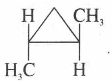

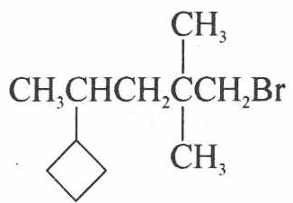

(2)

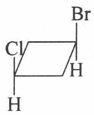

(5)

(3)

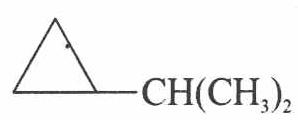

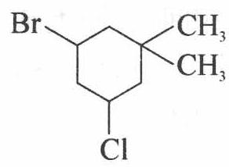

(6)

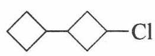

(7)

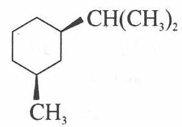

(8)

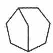

(9)

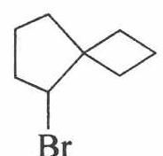

⑤ 化学的核心是发现与合成新物质。1965年舒尔茨曾设计过一种烷烃分子，到1981年，伊顿合成了它。这种分子结构里有10个碳原子，它们无结构上的差别，各以两种不同的键角与其他碳原子相连。

(1) 试推出这种分子的立体结构简式。

(2) 这种分子是舒尔茨设计的一个同系物的一员。试推出该同系物中与该化合物最相邻的另外的 4 个成员的立体结构简式。

⑥ 烷烃分子中的基团: $-\mathrm{CH}_{3} 、 -\mathrm{CH}_{2}- 、 -\mathrm{CH} 、 -\mathrm{C}-$ 中的碳原子分别称为伯、仲、叔、季碳原子, 数目分别用 $n_{1} 、 n_{2} 、 n_{3} 、 n_{4}$ 表示。例如:

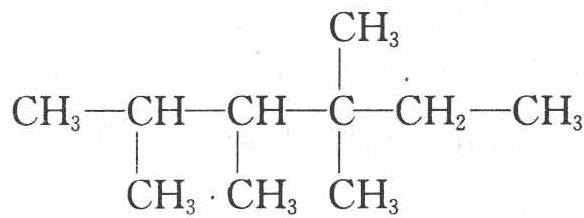

$CH_{3}-CH-CH-C-CH_{2}-CH_{3}$ 分子中 $n_{1}=6,n_{2}=1,n_{3}=2,n_{4}=1$ 。试 $CH_{3} \cdot CH_{3} \quad CH_{3}$

根据不同烷烃的组成和结构,分析烷烃(除甲烷外)中各原子数目的关系。

(1) 烷烃分子中氢原子数为 $n_{0}$ 。 $n_{0}$ 与 $n_{1} 、 n_{2} 、 n_{3} 、 n_{4}$ 的关系是: $n_{0} =$ \_\_\_\_ 或 $n_{0} =$ \_\_\_\_。

(2) 四种碳原子数之间的关系为 $n_{1} =$ \_\_\_\_。

(3) 若某分子中 $n_{2} = n_{3} = n_{4} = 1$ , 则该分子的结构简式可能是

(4) 若某种共价化合物分子中含有 C、N、H 三种元素, 其数目分别用 a、b、c 表示, 则氢原子数目最多为 c= \_\_\_\_。

(5) 若某种共价化合物分子中只含有 C、N、O、H 四种元素, 其数目分别

用 a、b、c、d 表示，则氢原子数目最多为 d= \_\_\_\_。

⑦ 某烃相对分子质量为 100, 请给出其主链为含 5 个碳原子并且一卤代物只有 3 种异构体的物质的结构简式和系统命名的名称。

8 美籍埃及人泽维尔用激光闪烁照相机拍摄到化学反应中化学键断裂和形成的过程,因而获得 1999 年诺贝尔化学奖。激光有很多用途,例如波长为 10.3 微米的红外激光能切断 B(CH₃)₃ 分子中的一个 B—C 键,使之与 HBr 发生取代反应: B(CH₃)₃ + HBr $\xrightarrow{10.3\text{微米的激光}}$ B(CH₃)₂ Br + CH₄ ,而利用 9.6 微米的红外激光却能切断两个 B—C 键,并与 HBr 发生二元取代反应。

(1) 试写出二元取代反应的化学方程式: \_\_\_\_；

(2) 现用 $5.6 \, \text{g B(CH}_{3})_{3}$ 和 $9.72 \, \text{g HBr}$ 正好完全反应, 则生成物中除了甲烷外, 其他两种产物的物质的量之比为多少?

9 将 2-甲基丁烷进行一氯化反应, 已知其四种一氯化产物和相应的百分含量如下:

$$
\begin{array}{r l} & (\mathrm{CH} _ {3}) _ {2} \mathrm{CHCH} _ {2} \mathrm{CH} _ {3} + \mathrm{Cl} _ {2} \xrightarrow {\text {光}} \\ & \mathrm{ClCH} _ {2} \mathrm{CHCH} _ {2} \mathrm{CH} _ {3} + (\mathrm{CH} _ {3}) _ {2} \mathrm{CCH} _ {2} \mathrm{CH} _ {3} + (\mathrm{CH} _ {3}) _ {2} \mathrm{CHCHCH} _ {3} + \\ & \quad \mathrm{CH} _ {3} \\ & (2 7. 1 \% \quad 2 3. 1 \% \quad 3 6. 2 \% \\ & (\mathrm{CH} _ {3}) _ {2} \mathrm{CHCH} _ {2} \mathrm{CH} _ {2} \mathrm{Cl} \\ & 1 3. 6 \% \end{array}
$$

试推算伯、仲、叔氢原子被氯取代的活性比。

⑩ 最近,我国一留美化学家参与合成了一种新型炸药,它跟三硝基甘油一样抗打击、抗震,但一经引爆就发生激烈爆炸,据信是迄今最烈性的非核爆炸品。该炸药的化学式为 $C_{8}N_{8}O_{16}$ , 同种元素的原子在分子中是毫无区别的。

(1) 画出它的结构简式。

(2) 写出它的爆炸反应方程式。

(3) 该物质为何是迄今最烈性的非核爆炸品?

11 重氮甲烷 $\left(\mathrm{CH}_{2}\leftarrow\mathrm{N}\equiv\mathrm{N}\right)$ 在有机合成中有着重要作用。它的分子中,碳原子和氮原子之间的共用电子对是由氮原子一方提供的。

(1) 重氮甲烷的电子式是\_\_\_\_；

(2)重氮甲烷在受热或光照时容易分解出 $\mathrm{N}_{2}$ , 同时生成一个极活泼的缺电

子基团碳烯(： $CH_{2}$ )，碳烯的电子式为 \_\_\_\_；

(3) 碳烯很容易以它的一对未成键电子对与不饱和的烯、炔发生加成, 形成三元环状化合物。它与丙烯发生加成反应后所得产物的结构简式为\_\_\_\_；

(4) 碳烯还可以插入 C—H 键之间, 使碳链增长。它插入丙烷分子中 C—H 键之间, 碳链增长后的化合物的结构简式是 \_\_\_\_ 或 \_\_\_\_ ;

(5) 重氮甲烷的 $\mathrm{CCl}_{4}$ 溶液用紫外光照射时发生反应, 生成一种相对分子质量为 210 的有机物和 $\mathrm{N}_{2}$ , 写出反应的化学方程式: \_\_\_\_。

12 如右图所示是十二面体烷的空间构型。

(1) 写出它的化学式: \_\_\_\_；

(2) 它的一氯取代物的数目为\_\_\_\_；

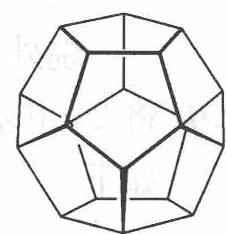

(3) 它的二氯取代物的数目为\_\_\_\_。

13 2003年5月报道,在石油中发现了一种新的烷烃分子,因其结构类似于金刚石,被称为“分子钻石”,若能合成,有可能用作合成纳米材料的理想模板。该分子的结构简图如右:

(1) 该分子的分子式为\_\_\_\_。

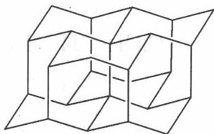

(2) 该分子有无对称中心？\_\_\_\_。

(3) 该分子有几种不同级的碳原子？\_\_\_\_。

14 有一类烷烃 $\mathrm{C}_{m} \mathrm{H}_{2 m + 2}$ 不能由任何的 $\mathrm{C}_{m} \mathrm{H}_{2 m}$ 催化加氢得到。若烷烃中只有伯、仲、季碳原子而无叔碳原子。试回答：

(1) 季碳原子数目应满足什么范围(与 m 的关系)
\_\_\_\_?

(2) 写出 $C_{13}H_{28}$ 的结构简式。

(3) ${\mathrm{C}}_{16}{\mathrm{H}}_{34}$ 的各类碳原子各有几个？它有多少种满足条件的同分异构体？

(4) 计算 $\mathrm{C}_{20} \mathrm{H}_{42}$ 满足已知条件的全部同分异构体数目。

(5) 若某类烷烃中任何相邻两个碳原子不都是季碳原子时, 试给出该类烷烃的通式。

1. 解析: 因 $\mathrm{C}_{8} \mathrm{H}_{18}$ 的裂化方式不定, 故混合气体的平均相对分子质量也不定, 可用极值法解此题。 $\mathrm{C}_{8} \mathrm{H}_{18}$ 按下列方式裂化所得混合物平均相对分子质量最大, $\mathrm{C}_{8} \mathrm{H}_{18} \longrightarrow \mathrm{C}_{4} \mathrm{H}_{8} + \mathrm{C}_{4} \mathrm{H}_{10}, \mathrm{C}_{4} \mathrm{H}_{10} \longrightarrow \mathrm{C}_{2} \mathrm{H}_{4} + \mathrm{C}_{2} \mathrm{H}_{6}$ (或 $\mathrm{C}_{4} \mathrm{H}_{10} \longrightarrow \mathrm{CH}_{4} + \mathrm{C}_{3} \mathrm{H}_{6}$ ), 混合气体的平均相对分子质量为 $114 \div 3 = 38$ 。若按下式分解: $\mathrm{C}_{8} \mathrm{H}_{18} \longrightarrow \mathrm{C}_{2} \mathrm{H}_{4} + \mathrm{C}_{6} \mathrm{H}_{14}, \mathrm{C}_{6} \mathrm{H}_{14} \longrightarrow \mathrm{C}_{4} \mathrm{H}_{10} + \mathrm{C}_{2} \mathrm{H}_{4}, \mathrm{C}_{4} \mathrm{H}_{10} \longrightarrow \mathrm{C}_{2} \mathrm{H}_{4} + \mathrm{C}_{2} \mathrm{H}_{6}$ (或 $\mathrm{C}_{4} \mathrm{H}_{10} \longrightarrow \mathrm{CH}_{4} + \mathrm{C}_{3} \mathrm{H}_{6}$ ), 所得混合气体中不含 $\mathrm{C}_{4} \mathrm{H}_{8}$ , 此时平均相对分子质量最小, 为 $114 \div 4 = 28.5$ , 即混合气体平均相对分子质量的范围是 $28.5 < \mathrm{Mr} \leqslant 38$ 。答案: BC

2. 解析：采用“换元法”。已知甲烷 $\left(\mathrm{CH}_{4}\right)$ 和乙烷 $\left(\mathrm{C}_{2}\mathrm{H}_{6}\right)$ 的一氯代物只有一种，但不是轻烃液体燃料的主要成分，故不符题意。B、C、D三个选项可以用甲基替换甲烷或乙烷中的氢原子进行分析。
答案：B

3. 解析: 每个分子的两个链端必为— $\mathrm{CH}_{3}$ , 每个— $\mathrm{CH}$ —还可连接一个— $\mathrm{CH}_{3}$ , 而— $\mathrm{CH}_{2}$ —不可能再连— $\mathrm{CH}_{3}$ , 当 $\mathrm{C}$ 原子上连有一OH 后必然会少一个— $\mathrm{CH}_{3}$ , 即分子中有一个—OH, 就会少一个— $\mathrm{CH}_{3}$ 。所以, 有机物分子中的甲基个数为: $(m+2-a)$ 个。
答案: C

4. (1) 反-1,2-二甲基环丙烷 (2) 顺-1-氯-3-溴环丁烷
(3) 1,1-二甲基-3-氯-5-溴环己烷 (4) 2,2-二甲基-4-环丁基-1-溴戊烷
(5) 异丙基环丙烷 (6) 1-环丁基-3-氯环丁烷
(7) 顺-1-甲基-3-异丙基环己烷 (8) 二环[3,2,1]辛烷
(9) 5-溴螺[3,4]辛烷

5. 解析: 此题的关键是“各碳原子以两种不同的键角与其他碳原子相连”。一个碳原子以两种不同的键角与其他碳原子相连就至少要连接 3 个碳原子, 因它是“烷烃”,且具有“无结构差别”的碳原子, 这意味着不会有的碳原子不连氢原子而有的碳原子连氢原子。由此可知, 每个碳原子上连 1 个氢原子和 3 个碳原子。故可推得此化合物的分子式为 $\mathrm{C}_{10} \mathrm{H}_{10}$ 。又由不饱和度为 6 可知, 此分子是环烃。综合分析, 可推出该烷是五角棱柱烷。五角棱柱烷的同系物应是各种棱柱烷, 通式为 $\mathrm{C}_{n} \mathrm{H}_{n}$ , 系列差为 $(\mathrm{CH})_{2}$ 。同系物中与五角棱柱烷最相邻的另外 4 个成员当然是三角棱柱烷 $(\mathrm{C}_{6} \mathrm{H}_{6}$ , 是苯的同分异构体)、四角棱柱烷 $(\mathrm{C}_{8} \mathrm{H}_{8}$ , 就是立方烷)、六角棱柱烷 $(\mathrm{C}_{12} \mathrm{H}_{12})$ 和七角棱柱烷 $(\mathrm{C}_{14} \mathrm{H}_{14})$ 。

答案: 各种棱柱烷的结构简式为:

(1)  
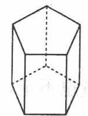  
五角棱柱烷

(2)  
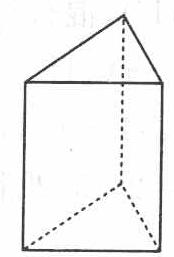  
三角棱柱烷

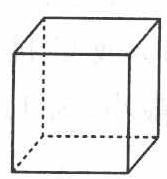  
四角棱柱烷

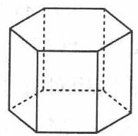  
六角棱柱烷

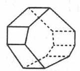  
七角棱柱烷

6. 解析: (1)可根据烷烃的通式,各基团中碳、氢原子关系,确定氢原子总数与各种碳原子数目间的关系。(2)由(1)中两个关系式的共同点:均为烷烃中 H 的总数,可知两种表达式结果相等,从而可求出 $n_1$ 、 $n_2$ 、 $n_3$ 、 $n_4$ 之间的相互关系。(3)据—CH₃、—CH₂—、—CH—、—C—的结构特点知:—CH₃ 在端点,—CH—,—C—,—CH₂—必在链的中间,故碳架有三种情况,①—CH—C—CH₂— ②—CH—CH₂—C—
③—CH₂—CH—C—;在碳架上加上—CH₃ 即得到要求的结构简式。(4)共价化合物分子中,C 原子满足四价原则,N 原子满足三价原则,C 原子数目一定时,每增加一个 N 原子,就增加一个 H 原子。C 原子数目为 a 时,H 原子数目最多为 2a+2,在此基础上增加 b 个 N 原子,则增加 b 个 H 原子,故 H 原子数目最多为 c = 2a + 2+b。(5)比较相同 C 原子数目的烷烃和饱和一元醇的分子式通式,可知增加 O 原子,对 H 原子数目没有影响,故 H 原子数目最多仍为 d = 2a + 2 + b。

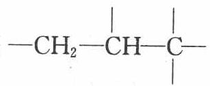

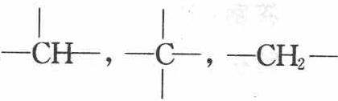

答案：(1) $3n_{1} + 2n_{2} + n_{3}; 2(n_{1} + n_{2} + n_{3} + n_{4}) + 2$ (2) $n_{3} + 2n_{4} + 2$

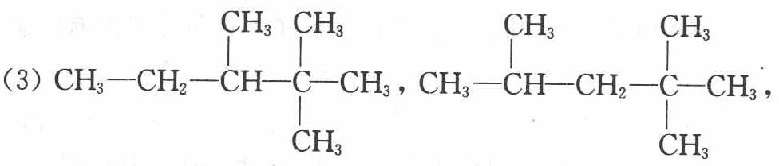

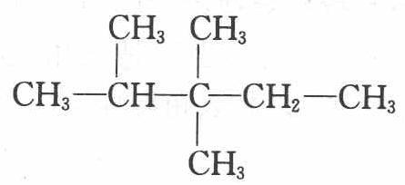

$$
d = 2 a + 2 + b
$$

7. ${\mathrm{{CH}}}_{3} - \mathrm{{CH}} - {\mathrm{{CH}}}_{2} - \mathrm{{CH}} - {\mathrm{{CH}}}_{3}$ (2,4-二甲基戊烷) ${\mathrm{{CH}}}_{3}{\mathrm{{CH}}}_{2} - \mathrm{{CH}} - {\mathrm{{CH}}}_{2}{\mathrm{{CH}}}_{3}$

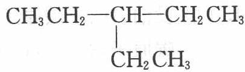

(3-乙基戊烷) $\mathrm{CH_3CH_2 - C - CH_2CH_3}$ (3,3-二甲基戊烷)

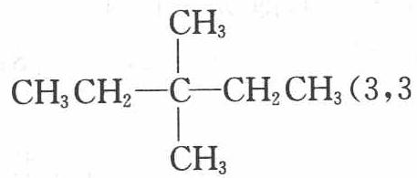

8. (1) $\mathrm{B(CH_3)_3 + 2HBr\xrightarrow{9.6\text{微米的激光}} B(CH_3)Br_2 + 2CH_4}$ (2) $n[\mathrm{B(CH_3)_3}] = 5.6 / 56 = 0.1\mathrm{mol}$ $n(\mathrm{HBr}) = 9.72 / 81 = 0.12\mathrm{mol}$ 设生成 $\mathrm{B(CH_3)_2Br}$ 为 $a\mathrm{mol}$ , $\mathrm{B(CH_3)Br_2}$ 为 $b\mathrm{mol}$ , 则 $\left\{\begin{array}{l}a+b=0.1\\a+2b=0.12\end{array}\right.$ $\left\{\begin{array}{l}a=0.08\mathrm{mol}\\b=0.02\mathrm{mol}\end{array}\right.$ 所以 $n[\mathrm{B(CH_3)_2Br}]:n[\mathrm{B(CH_3)Br_2}]=4:1$

9. 1:4:5.1

10. (1) 结构如右图所示。(答八硝基环辛四烯也可)

(2) $\mathrm{C_8(NO_2)_8}\longrightarrow 8\mathrm{CO}_2\uparrow +4\mathrm{N}_2\uparrow$

(3) ①八硝基立方烷分解得到的两种气体都是最稳定的; ②立方烷的碳架键角只有 $90^{\circ}$ , 大大小于 $109^{\circ}28'$ (或答是张力很大的环), 因而八硝基立方烷是一种高能化合物, 分解时将释放大量能量; ③八硝基立方烷分解产物完全是气体, 体积膨胀将引起激烈爆炸。

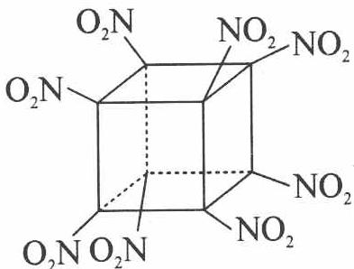

11. (1) H: C: N: :N: (2) H: C: (3) CH₃—HC—CH₂

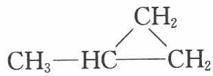

(4) ${\mathrm{{CH}}}_{3}{\mathrm{{CH}}}_{2}{\mathrm{{CH}}}_{2}{\mathrm{{CH}}}_{3};{\mathrm{{CH}}}_{3}{\mathrm{{CHCH}}}_{3}$ (5) ${\mathrm{{CCl}}}_{4}$ 的相对分子质量为 154,(210- 154)÷14=4,故反应的化学方程式为：

$$
4 \mathrm{CH} _ {2} \leftarrow \mathrm{N} \equiv \mathrm{N} + \mathrm{CCl} _ {4} \xrightarrow {\text {紫外光}} \mathrm{ClCH} _ {2} - \underset {\mathrm{CH} _ {2} \mathrm{Cl}} {\overset {\mathrm{CH} _ {2} \mathrm{Cl}} {\mathrm{C}}} - \mathrm{CH} _ {2} \mathrm{Cl} + 4 \mathrm{N} _ {2} \uparrow
$$

12. (1) $\mathrm{C}_{20} \mathrm{H}_{20}$ 。

(2) 从图形上分析它是中心对称结构, 所有的碳是一样的, 所以它的一氯取代物的数目为 1。

(3)一个碳上只有一个氢,只能发生一氯取代,它的二氯取代物的数目为5。

13. (1) $\mathrm{C}_{22} \mathrm{H}_{30}$ (2) 有对称中心 (3) 3 种

14.（1）设伯、仲、季碳原子各有 $x$ 、y、z个， $x + y + z = m$ ， $3x + 2y = 2m + 2$ ；考虑仲碳原子，若 $y = 0$ ，则 $z = (m - 2) / 3$ ，若 $y$ 尽可能大，由于仲碳原子必介于两季原子间，则 $y = z - 1$ ，故 $z = (m - 1) / 4$ ，即 $(m - 1) / 4 \leqslant z \leqslant (m - 2) / 3$

(2) 令 $m = 13, 3 \leqslant z \leqslant 11/3$ , 故 $z = 3, y = 2, x = 8; (\mathrm{CH}_{3})_{3} \mathrm{C}-\mathrm{CH}_{2}-$ $\mathrm{C}(\mathrm{CH}_{3})_{2}-\mathrm{CH}_{2}-\mathrm{C}(\mathrm{CH}_{3})_{3}$

(3) 令 $m = 16, 15 / 4 \leqslant z \leqslant 14 / 3, z = 4, y = 2, x = 10$ ; 共有 3 种

(4) 令 $m = 20, 19 / 4 \leqslant z \leqslant 6, z = 6, y = 0, x = 14$ 或 $z = 5, y = 3, x = 12$ ; 共 $5 + 6 = 11$ 种

(5) $z = (m - 1) / 4$ 可得通式： $\mathrm{C_{4a + 1}H_{8a + 4}}$

## 一、烯烃

## 1. 烯烃的组成和结构

(1) 分子中含有碳碳双键的烃为烯烃。仅含一个双键的烃为单烯烃, 其通式为 $\mathrm{C}_{n} \mathrm{H}_{2 n}$ 。

(2) 烯烃分子中的碳碳双键是由一个 $\sigma$ 键和一个 $\pi$ 键组成的。

(3) 由于烯烃的双键可处于碳链的不同位置上,导致了位置异构的出现;由于 $\pi$ 键不能自由旋转,又导致烯烃存在顺反异构。

## 2. 烯烃的物理性质

烯烃的物理性质基本上类似于烷烃,即不溶于水而易溶于非极性溶剂,比重小于水。一般来说,四个碳以下的烯为气体,十九个碳以上者为固体。

## 3. 烯烃的化学性质

烯烃与烷烃相比,分子中出现了双键官能团。由于双键中的 $\pi$ 键重叠程度小,容易断裂,且原子核对 $\pi$ 电子束缚力比较小,使 $\pi$ 电子云具有较大的流动性,受到外界电场影响时易极化变形,故烯烃具有较活泼的化学性质。

## (1) 加成反应

## ① 催化加氢(顺式加成)

在催化剂作用下,烯烃与氢发生加成反应生成相应的烷烃。催化剂有 Ni、Pt、Pd-C 等。

$$
\mathrm{CH} _ {2} = \mathrm{CH} _ {2} + \mathrm{H} _ {2} \xrightarrow {\mathrm{Ni}} \mathrm{CH} _ {3} \mathrm{CH} _ {3}
$$

② 加卤素

$$
\mathrm{CH} _ {2} = \mathrm{CH} _ {2} + \mathrm{Br} _ {2} \xrightarrow {\mathrm{CCl} _ {4}} \mathrm{CH} _ {2} \mathrm{BrCH} _ {2} \mathrm{Br}
$$

将乙烯通入溴的四氯化碳溶液中, 溴的颜色很快褪去, 常用这个反应来检验烯烃。加卤素的活性次序为: $\mathrm{F}_{2} > \mathrm{Cl}_{2} > \mathrm{Br}_{2} > \mathrm{I}_{2}$ , 通常采用 ICl、IBr、 $\mathrm{Br}_{2}$ 、 $\mathrm{Cl}_{2}$ 等试剂。烯烃活性次序为 $(\mathrm{CH}_{3})_{2} \mathrm{C} = \mathrm{C}(\mathrm{CH}_{3})_{2} > (\mathrm{CH}_{3})_{2} \mathrm{C} = \mathrm{CHCH}_{3} >$

$$
\left(\mathrm{CH} _ {3}\right) _ {2} \mathrm{C} = \mathrm{CH} _ {2} > \mathrm{CH} _ {3} \mathrm{CH} = \mathrm{CH} _ {2} > \mathrm{CH} _ {2} = \mathrm{CH} _ {2} 。
$$

## ③ 加卤化氢

$$
\mathrm{CH} _ {2} = \mathrm{CH} _ {2} + \mathrm{HI} \longrightarrow \mathrm{CH} _ {3} \mathrm{CH} _ {2} \mathrm{I}
$$

同一烯烃与不同的卤化氢加成时,加碘化氢最容易,加溴化氢次之,加氯化氢最难。

## ④ 加硫酸及加水(须中等浓度的强酸催化)

烯烃能与浓硫酸反应,生成硫酸氢烷酯。硫酸氢烷酯易溶于硫酸,用水稀释后水解生成醇。工业上用这种方法合成醇,称为烯烃间接水合法。

$$
\mathrm{CH} _ {3} \mathrm{CH} = \mathrm{CH} _ {2} + \mathrm{H} _ {2} \mathrm{SO} _ {4} \longrightarrow \mathrm{CH} _ {3} \mathrm{CH} (\mathrm{OSO} _ {3} \mathrm{H}) \mathrm{CH} _ {3} \xrightarrow [ \mathrm{H} _ {2} \mathrm{O} ]{\triangle} \mathrm{CH} _ {3} \mathrm{CH} (\mathrm{OH}) \mathrm{CH} _ {3} + \mathrm{H} _ {2} \mathrm{SO} _ {4}
$$

## ⑤ 加次卤酸

烯烃与次卤酸加成,生成 $\beta-$ 卤代醇。由于次卤酸不稳定,常用烯烃与卤素的水溶液反应。如: $\mathrm{CH}_{2}=\mathrm{CH}_{2}+\mathrm{HOCl}\longrightarrow\mathrm{CH}_{2}(\mathrm{OH})\mathrm{CH}_{2}\mathrm{Cl}$

## (2) 氧化反应

## ① 被高锰酸钾氧化(此反应使高锰酸钾紫色褪去,常用于烯烃的鉴别)

用碱性冷高锰酸钾稀溶液作氧化剂,反应结果使双键碳原子上各引入一个羟基,生成邻二醇:

$$
3 \mathrm{CH} _ {2} = \mathrm{CH} _ {2} + 2 \mathrm{KMnO} _ {4} + 4 \mathrm{H} _ {2} \mathrm{O} \xrightarrow {\text {碱性}} 3 \mathrm{CH} _ {2} (\mathrm{OH}) \mathrm{CH} _ {2} (\mathrm{OH}) + 2 \mathrm{MnO} _ {2} \downarrow + 2 \mathrm{KOH}
$$

若用酸性高锰酸钾溶液氧化烯烃,则反应迅速发生,此时不仅 $\pi$ 键打开, $\sigma$ 键也可断裂。双键断裂时,由于双键碳原子连接的烃基不同,氧化产物也不同。

$$
\begin{array}{r l} & \mathrm {CH_ {2} = CH_ {2} \xrightarrow {KMnO_ {4} , H^ {+}} 2CO_ {2} + 2H_ {2} O} \\ & \mathrm {CH_ {3} CH = CH_ {2} \xrightarrow {KMnO_ {4} , H^ {+}} CH_ {3} COOH + CO_ {2} + H_ {2} O} \\ & \mathrm {CH_ {3} CH = CHCH_ {3} \xrightarrow {KMnO_ {4} , H^ {+}} 2CH_ {3} COOH} \\ & \mathrm {CH_ {3} C(CH_ {3}) = CHCH_ {3} \xrightarrow {KMnO_ {4} , H^ {+}} CH_ {3} COOH + CH_ {3} COCH_ {3}} \end{array}
$$

思考1：由上述反应说明双键碳原子连接的烃基数目和氧化产物的关系。

## ② 臭氧化

在低温时,将含有臭氧的氧气流通入液体烯烃或烯烃的四氯化碳溶液中,臭氧迅速与烯烃作用,生成粘稠状的臭氧化物,此反应称为臭氧化反应。如:

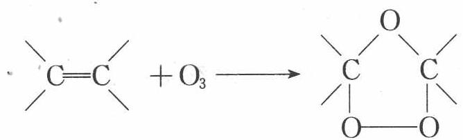

臭氧化物在还原剂存在的条件下水解(为了避免生成的醛被同时产生的 $H_{2}O_{2}$ 继续氧化为羧酸),可以得到醛或酮。例如:

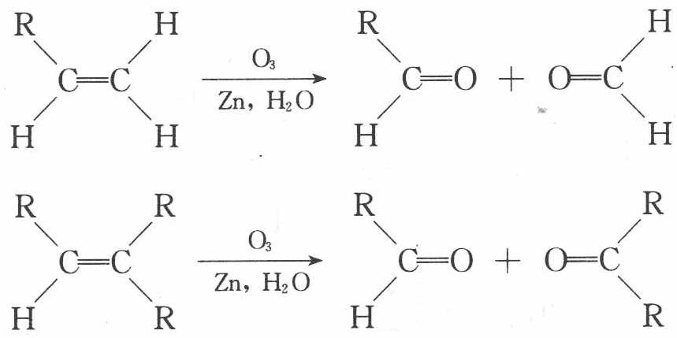

烯烃经臭氧化再水解, 分子中的“ $\mathrm{CH}_{2}$ =”部分变为甲醛, “ $\mathrm{RCH}$ =”部分变成醛, “ $\mathrm{R}_{2} \mathrm{C}$ =”部分变成酮。这样, 可通过测定反应后的生成物来推测原来烯烃的结构。

【例1】某液态有机化合物 A, 其蒸气对氢气的相对密度为 53.66; A 经元素分析得知含碳 88.82% (质量分数, 下同), 含氢 11.18%。2.164 g A 与 6.392 g 溴 (溶在 CCl₄ 中) 能完全反应生成化合物 B; 1 mol A 经臭氧氧化再还原水解得 1 mol HCH 和 1 mol OHCCH₂CHCH₂CH₂CHO。
O CHO

(1) 写出化合物 A 和 B 的各一种可能的结构简式(用键线式表示)。

(2) 写出有关反应的化学方程式及必要的计算过程。

(本题中相对原子质量采用以下数据: H—1.0079 C—12.011 Br—79.904)

过程探究 A 的相对分子质量=1.0079×2×53.66=108.2,

分子中含碳原子数为 $108.2 \times 88.82\% \div 12.011 \approx 8$

分子中含氢原子数为 $108.2 \times 11.18\% \div 1.0079 \approx 12$

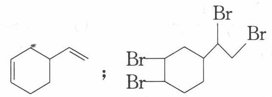

所以分子式为 $C_{8}H_{12}$ 。

因为 2.164 g A 相当于 $\frac{2.164\ g}{108.2\ g\cdot mol^{-1}}=0.02\ mol$ ，6.392 g Br₂ 相当于 $\frac{6.392\ g}{79.904\ g\cdot mol^{-1}\times2}\approx0.04\ mol$ ，

所以 A 分子中应有 2 个双键或一个叁键, 还有一个不饱和度可能为一单环。

又因为 A 经臭氧氧化再还原水解的产物恰好为 $(1+7)$ 个碳原子，与 $C_{8}H_{12}$ 相应，又从产物之一有 3 个醛基，可知 A 分子中有两个双键，且定位如下：

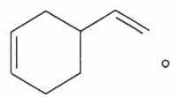

参考解答 (1)

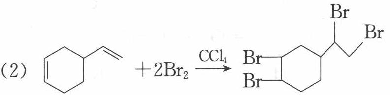

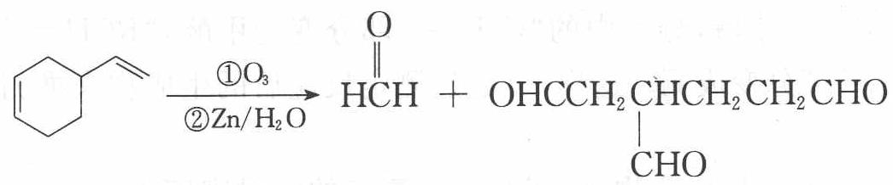

③ 过氧酸氧化——环氧化反应

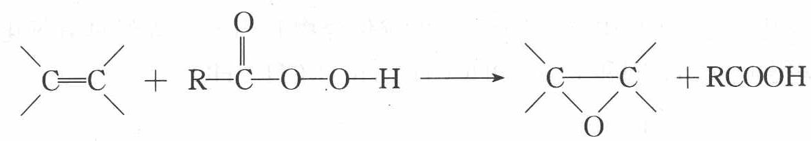

④ 催化氧化

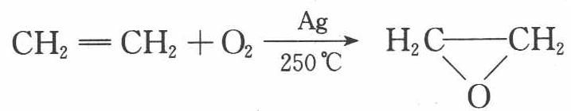

$$
\mathrm{CH} _ {2} = \mathrm{CH} _ {2} + \mathrm{O} _ {2} \xrightarrow [ 1 2 0 \sim 1 3 0 ^ {\circ} \mathrm{C} ]{\mathrm{PdCl} _ {2} - \mathrm{CuCl} _ {2}} \mathrm{CH} _ {3} \mathrm{CHO}
$$

(3) 聚合反应 在引发剂或催化剂存在下, 烯烃打开双键自相加成生成高

聚物。

$$
n \mathrm{CH} _ {2} = \mathrm{CH} _ {2} \longrightarrow [ \mathrm{CH} _ {2} \mathrm{CH} _ {2} ] _ {n}
$$

## (4) $\alpha - \mathrm{H}$ 的活性反应

双键是烯烃的官能团,与官能团直接相连的碳为 $\alpha$ -碳,连在 $\alpha$ -碳上的氢为 $\alpha$ -H,因受双键的影响,表现出一定的活泼性,可以发生取代反应和氧化反应。例如,丙烯与氯气混合,在常温下是发生加成反应,生成 1,2-二氯丙烷。而在 $500^{\circ} \mathrm{C}$ 的高温或在光照下,主要是烯丙碳上的氢被取代,生成 3-氯丙烯。溴代常用 N-溴代丁二酰亚胺(NBS)作溴化试剂。 $\alpha$ -H 取代是自由基取代反应:

$$
\begin{array}{r l} & {\mathrm {CH_ {3} CH = CH_ {2} +Cl_ {2} \xrightarrow{\text {常温}} CH_ {3} CHClCH_ {2} Cl}} \\ & {\mathrm {CH_ {3} CH = CH_ {2} +Cl_ {2} \xrightarrow{500°C} CH_ {2} ClCH = CH_ {2} +HCl}} \end{array}
$$

## 4. 烯烃加成反应的反应机理

## (1) 亲电加成反应机理

思考2: “将乙烯通入含溴的氯化钠水溶液中, 反应产物除了 $\mathrm{CH}_{2} \mathrm{BrCH}_{2} \mathrm{Br}$ 外, 还有少量 $\mathrm{CH}_{2} \mathrm{BrCH}_{2} \mathrm{Cl}$ 生成, 但没有 $\mathrm{CH}_{2} \mathrm{ClCH}_{2} \mathrm{Cl}$ , 请由此说明乙烯与溴的加成反应不是一步完成的。

乙烯与溴的加成反应不是一步完成的,而是分步进行的。

当溴分子接近双键时,由于 $\pi$ 电子的排斥,使非极性的溴-溴键发生极化,离 $\pi$ 键近的溴原子带部分正电荷,另一溴原子带部分负电荷。带部分正电荷的溴原子对双键的亲电进攻,生成一个缺电子的碳正离子。

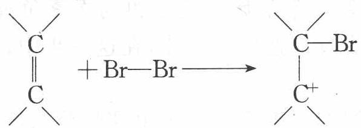

而碳正离子中,带正电荷的碳原子的空 p 轨道,可与其邻位碳原子上的溴原子的带有未共用电子对的 p 轨道相互重叠,形成一个环状的溴正离子。可用下式表示:

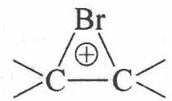

接着溴负离子进攻溴正离子中的一个碳原子,得到加成产物。

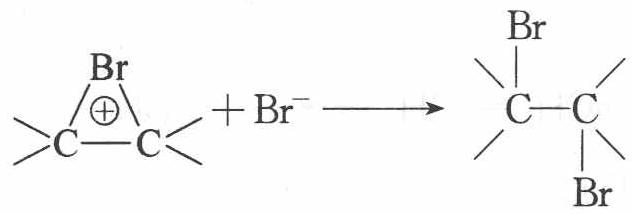

从上述的反应过程可以看出:(1)在这个有机反应过程中,有离子的生成及其变化,属于离子型反应。(2)两个溴原子的加成是分步进行的,而首先进攻碳碳双键的是溴分子中带部分正电荷的溴原子,在整个反应中,这一步最慢,是决定反应速度的一步。所以这个反应称为亲电性离子型反应,溴在这个反应中作亲电试剂。(3)两个溴原子先后分别加到双键的两侧,属于反式加成。

## (2) 马尔可夫尼可夫规则

当乙烯与卤化氢加成时, 卤原子或氢原子不论加到哪个碳原子上, 产物都是相同的, 因为乙烯是对称分子。但丙烯与卤化氢加成时, 情况就不同了, 有可能生成两种加成产物:

$$
\mathrm{CH} _ {3} \mathrm{CH} = \mathrm{CH} _ {2} + \mathrm{HX} \longrightarrow \left\{ \begin{array}{l} \mathrm{CH} _ {3} \mathrm{CH} _ {2} \mathrm{CH} _ {2} \mathrm{X} \\ \mathrm{CH} _ {3} \mathrm{CHXCH} _ {3} \end{array} \right.
$$

实验证明, 丙烯与卤化氢加成时, 主要产物是 2-卤丙烷。即当不对称烯烃与卤化氢加成时, 氢原子主要加到含氢较多的双键碳原子上, 这一规律称为马尔可夫尼可夫规则, 简称马氏规则。

马氏规则可用烯烃的亲电加成反应机理来解释。由于卤化氢是极性分子，带正电荷的氢离子先加到碳碳双键中的一个碳原子上，使碳碳双键中的另一个碳原子形成碳正离子，然后碳正离子再与卤素负离子结合形成卤代烷。其中第一步是决定整个反应速度的一步，在这一步中，生成的碳正离子愈稳定，反应愈容易进行。

一个带电体系的稳定性,取决于所带电荷的分布情况,电荷愈分散,体系愈稳定。碳正离子的稳定性也是如此,电荷愈分散,体系愈稳定。以下几种碳正离子的稳定性顺序为:

$$
\mathrm{CH} _ {3} ^ {+} <   \mathrm{CH} _ {3} \mathrm{CH} _ {2} ^ {+} <   (\mathrm{CH} _ {3}) _ {2} \mathrm{CH} ^ {+} <   (\mathrm{CH} _ {3}) _ {3} \mathrm{C} ^ {+}
$$

甲基与氢原子相比,前者是排斥电子的基团。当甲基与带正电荷的中心碳原子相连接时,共用电子对向中心碳原子方向移动,中和了中心碳原子上的部分正电荷,即使中心碳原子的正电荷分散,而使碳正离子稳定性增加。与中心碳原子相连的甲基愈多,碳正离子的电荷愈分散,其稳定性愈高。因此,上述 4 个碳正离子的稳定性,从左至右,逐步增加。

思考3: $\mathrm{CH}_{3} \mathrm{CH}=\mathrm{CH}_{2}+\mathrm{HBr} \xrightarrow{\text {过氧化物}} \mathrm{CH}_{3} \mathrm{CH}_{2} \mathrm{CH}_{2} \mathrm{Br}$ , 已知机理为自由基加成反应, 为何产物为反马氏规则产物?

注意: 不对称烯烃仅与 HBr 加成有过氧化物效应, 与 HCl、HI 加成均无过氧化物效应。

【例 2】（1）下表为烯类化合物与溴发生加成反应的相对速率（以乙烯为标准）。

<table><tr><td>烯类化合物</td><td>相对速率</td></tr><tr><td>(CH3)2C=CHCH3</td><td>10.4</td></tr><tr><td>CH3CH=CH2</td><td>2.03</td></tr><tr><td>CH2=CH2</td><td>1.00</td></tr><tr><td>CH2=CHBr</td><td>0.04</td></tr></table>

据表中数据,总结烯类化合物加溴时,反应速率与C=C上取代基的种类、个数间的关系:\_\_\_\_。

(2) 下列化合物与氯化氢加成时, 取代基对速率的影响与上述规律类似, 其中反应速率最慢的是\_\_\_\_(填代号)。
A. $(\mathrm{CH}_{3})_{2}\mathrm{C}=\mathrm{C}(\mathrm{CH}_{3})_{2}$ B. $CH_{3}CH=CHCH_{3}$ C. $CH_{2}\rightleftharpoons CH_{2}$ D. $CH_{2}=CHCl$

(3) 烯烃与溴化氢、水加成时, 产物有主次之分, 例如:

$$
\mathrm{CH} _ {2} = \mathrm{CHCH} _ {3} + \mathrm{HBr} \longrightarrow \mathrm{CH} _ {3} \underset {\text {   Br   }} {\mathrm{CHCH} _ {3}} + \mathrm{CH} _ {3} \mathrm{CH} _ {2} \mathrm{CH} _ {2} \mathrm{Br}
$$

$$
\mathrm{CH} _ {2} = \mathrm{CHCH} _ {2} \mathrm{CH} _ {3} + \mathrm{H} _ {2} \mathrm{O} \xrightarrow {\mathrm{H} ^ {+}} \mathrm{CH} _ {3} \mathrm{CHCH} _ {2} \mathrm{CH} _ {3} + \mathrm{CH} _ {3} \mathrm{CH} _ {2} \mathrm{CH} _ {2} \mathrm{CH} _ {2} \mathrm{OH}
$$

下列框图中 B、C、D 都是相关反应中的主要产物(部分条件、试剂被省略),且化合物 B 中仅有 4 个碳原子、1 个溴原子、1 种氢原子。

框图中，B的结构简式为\_\_\_\_；属于取代反应的有\_\_\_\_（填框图中序号),属于消去反应的有\_\_\_\_(填序号);写出反应④的化学方程式(只写主要产物,标明反应条件):\_\_\_\_。

过程探究 （1）由题给信息可知，烯类化合物与溴加成的反应速率 $\left(\mathrm{CH}_{3}\right)_{2}\mathrm{C}=\mathrm{CHCH}_{3}>\mathrm{CH}_{3}\mathrm{CH}=\mathrm{CH}_{2}>\mathrm{CH}_{2}=\mathrm{CH}_{2}$ ，对比它们的结构得出结论：C=C上连有甲基，有利于加成反应，

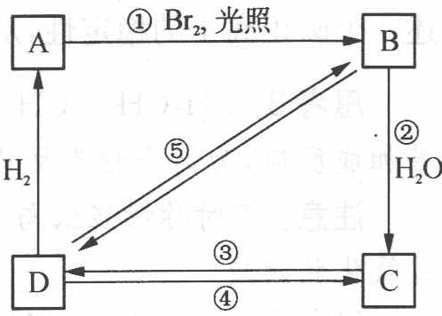

甲基越多,速率越大。由 $CH_{2}=CH_{2}$ 、 $CH_{2}=CHBr$ 分别与溴加成的反应速率的大小,说明 C=C 上连有溴原子时,不利于加成反应。

(2) 烯类化合物与氯化氢加成速率大小的影响规律与(1)中规律类似。在给定的四种烯类化合物中, $\mathrm{CH}_{2}=\mathrm{CHCl}$ 结构中 $\mathrm{C}=\mathrm{C}$ 上无甲基连接, 且连有氯原子, 与氯化氢加成速率最小, 所以答案为 $\mathrm{D}$ 。

(3) 因为化合物 B 中仅有 4 个碳原子、1 个溴原子、1 种氢原子, 则 B 的结

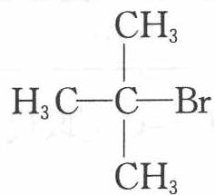

构简式为 $H_{3}C-C-Br$ ；B 水解生成 C，C 的结构简式为 $H_{3}C-C-OH$ ；B、

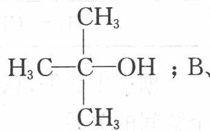

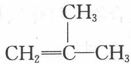

C均可发生消去反应生成D，D的结构简式为 $CH_{2}=C-CH_{3}$ 。由题给信息可知D与溴化氢加成的主要产物为B，D与水加成的主要产物为C，该反应的化学方程式为： $\mathrm{CH}_{2}=\mathrm{C}(\mathrm{CH}_{3})_{2}+\mathrm{H}_{2}\mathrm{O}\xrightarrow{\mathrm{H}^{+}}(\mathrm{CH}_{3})_{3}\mathrm{COH}$

参考解答 (1) ① C=C 上甲基(烷基)取代,有利于加成反应 ② 甲基(烷基)越多,速率越大 ③ C=C 上溴(卤素)取代,不利于加成反应 (2) D (3) $(\mathrm{CH}_{3})_{3} \mathrm{CBr}$ ①② ③ $\mathrm{CH}_{2}=\mathrm{C}(\mathrm{CH}_{3})_{2}+\mathrm{H}_{2} \mathrm{O} \xrightarrow{\mathrm{H}^{+}} (\mathrm{CH}_{3})_{3} \mathrm{COH}$

## 5. 烯烃和环烃的顺反异构(或几何异构)

由于双键或环两侧的基团在空间的位置不同所引起的异构现象。

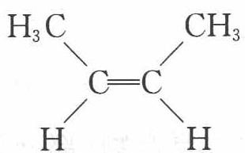  
顺-2-丁烯

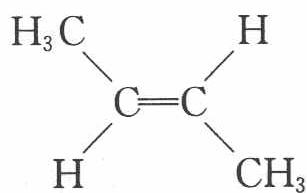  
反-2-丁烯

在顺-2-丁烯分子中,结合在双键两个碳原子上的两个氢原子在同一侧,两个甲基也同在另一侧,这种结构称为顺型。在反-2-丁烯分子中,两个氢原子处在相反的一侧,两个甲基也处在相反的一侧,故叫做反型。产生顺反异构现象的条件是:必须在构成双键的任何一个碳原子上所连接的两个原子或基团都要不相同。如Ⅰ、Ⅱ图没有顺反异构体。对于环状化合物,由于环的存在阻止了碳碳单键的旋转,所以也有顺反异构体(Ⅲ、Ⅳ图)。

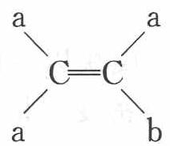  
(I)

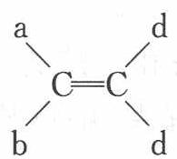  
(Ⅱ)

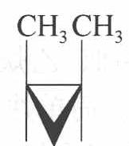  
顺-1,2-二甲基环  
丙烷(Ⅲ)

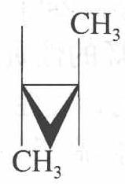  
反-1,2-二甲基环  
丙烷(Ⅳ)

顺反异构体的命名可采用普通命名法(顺反命名法)和 IUPAC 法(Z、E 命名法)。

(1) 顺反命名法 顺-2-丁烯的两个甲基在同侧故为顺式, 反-2-丁烯两个甲基在异侧故为反式。

如形成双键的两个碳原子所连基团均不相同时,则难以用顺反命名法命名,就必须采用系统命名法(Z、E命名法)。

(2) $Z 、 E$ 命名法 先将有关原子或基团按次序规则排列次序。双键原子所连的顺序较大的基团在碳碳双键同一侧时为 $Z$ 构型, 如在双键的异侧则为 $E$ 构型。

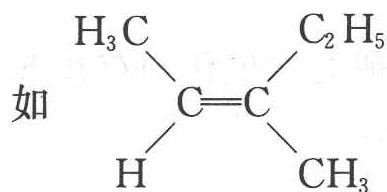

由于 $CH_{3}$ ， $C_{2}H_{5}$ 处于双键同一侧 ( $CH_{3}>H$ ， $C_{2}H_{5}>CH_{3}$ )，该化合物称为 Z-3-甲基-2-戊烯。

Z、E 命名中的 Z 型与顺反命名中的顺型之间没有必然的联系。顺型可以是 Z 型, 也可能是 E 型。例如:

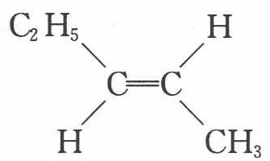  
反-2-戊烯(E-2-戊烯)

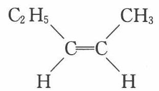  
顺-2-戊烯(Z-2-戊烯)

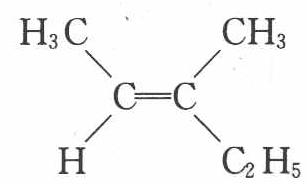  
顺-3-甲基-2-戊烯  
(E-3-甲基-2-戊烯)

## 二、炔烃

## 1. 炔烃的组成和结构

炔烃的通式为 $C_{n}H_{2n-2}$ ，分子中含碳碳叁键，形成叁键的两个碳均发生 sp 杂化。

由于碳碳叁键为直线型,所以炔烃无顺反异构。

## 2. 炔烃的性质

炔烃的物理性质与烯烃相似, 乙炔、丙炔和丁炔为气体, 戊炔以上的低级炔烃为液体, 高级炔烃为固体。简单炔烃的沸点、熔点和相对密度比相应的烯烃要高。炔烃难溶于水而易溶于有机溶剂。

炔烃的化学反应主要有：

## (1) 加成反应

① 催化加氢

$$
\mathrm{HC} \equiv \mathrm{CH} + \mathrm{H} _ {2} \xrightarrow {\text { 催化剂 }} \mathrm{CH} _ {2} = \mathrm{CH} _ {2} \xrightarrow [ \mathrm{H} _ {2} ]{\text { 催化剂 }} \mathrm{CH} _ {3} \mathrm{CH} _ {3}
$$

② 加卤素

$$
\mathrm{HC} \equiv \mathrm{CH} + \mathrm{Br} _ {2} \longrightarrow \mathrm{CHBr} = \mathrm{CHBr} \xrightarrow {\mathrm{Br} _ {2}} \mathrm{CHBr} _ {2} \mathrm{CHBr} _ {2}
$$

思考4: 炔烃比烯烃更不饱和,但为什么炔烃进行亲电加成却比烯烃难(例如当分子中同时存在双键和叁键时,与溴的加成首先发生在双键上)?

## ③ 加卤化氢

炔烃加碘化氢容易进行,加氯化氢则难进行,一般要在催化剂存在下才能进行。不对称炔烃加卤化氢时,服从马氏规则。例如:

$$
\mathrm{CH} _ {3} \mathrm{C} \equiv \mathrm{CH} + \mathrm{HI} \longrightarrow \mathrm{CH} _ {3} \mathrm{CI} = \mathrm{CH} _ {2} \xrightarrow {\mathrm{HI}} \mathrm{CH} _ {3} \mathrm{CI} _ {2} \mathrm{CH} _ {3}
$$

在汞盐的催化作用下，乙炔与氯化氢在气相发生加成反应，生成氯乙烯。

$$
\mathrm{HC} \equiv \mathrm{CH} + \mathrm{HCl} \xrightarrow {\mathrm{HgCl} _ {2}} \mathrm{CH} _ {2} = \mathrm{CHCl}
$$

在光或过氧化物的作用下,炔烃与溴化氢的加成反应,得到反马氏规则的加成产物。如:

$$
\begin{array}{r l} & {\mathrm {CH_ {3} CH_ {2} C\equiv CH + HBr\xrightarrow{\text {过氧化物}}} \quad} \\ & {\qquad \mathrm {CH_ {3} CH_ {2} CH = CHBr\xrightarrow[HBr]{\text {过氧化物}} CH_ {3} CH_ {2} CH_ {2} CHBr_ {2}}} \end{array}
$$

## ④ 加水

在稀酸(10% $H_{2}SO_{4}$ )中,炔烃比烯烃容易发生加成反应。例如,在10% $H_{2}SO_{4}$ 和5%硫酸汞溶液中,乙炔与水加成生成乙醛,此反应称为乙炔的水化反应或库切洛夫反应。汞盐是催化剂,炔烃与水的加成遵从马氏规则。

$$
\mathrm{HC} \equiv \mathrm{CH} + \mathrm{H} _ {2} \mathrm{O} \xrightarrow [ \mathrm{H} ^ {+} ]{\mathrm{HgSO} _ {4}} \mathrm{CH} _ {3} \mathrm{CHO}
$$

其他的炔烃水化得到酮。如：

$$
\mathrm{CH} _ {3} \mathrm{CH} _ {2} \mathrm{C} \equiv \mathrm{CH} + \mathrm{H} _ {2} \mathrm{O} \xrightarrow [ \mathrm{H} ^ {+} ]{\mathrm{HgSO} _ {4}} \mathrm{CH} _ {3} \mathrm{CH} _ {2} \mathrm{COCH} _ {3}
$$

思考5：上述反应为何不生成烯醇？

## ⑤ 加醇

在碱性条件下,乙炔与乙醇发生加成反应,生成乙烯基乙醚。

$$
\mathrm{HC} \equiv \mathrm{CH} + \mathrm{CH} _ {3} \mathrm{CH} _ {2} \mathrm{OH} \xrightarrow {\text {   碱   }} \mathrm{CH} _ {2} = \mathrm{CHOCH} _ {2} \mathrm{CH} _ {3}
$$

## (2) 氧化反应

炔烃被高锰酸钾或臭氧氧化时,生成羧酸或二氧化碳。如:

$$
\begin{array}{r l} & \mathrm {RC\equiv CH + KMnO_ {4} \xrightarrow {H^ {+}} RCOOH+ CO_ {2}} \\ & \mathrm {RC\equiv CR^ {\prime} +KMnO_ {4} \xrightarrow {H^ {+}} RCOOH+ R^ {\prime} COOH} \end{array}
$$

思考6：上述反应中生成的产物结构与反应物结构相比有何规律？

## (3) 聚合反应

在不同的催化剂作用下,乙炔可以分别聚合成链状或环状化合物。与烯烃的聚合不同的是,炔烃一般不聚合成高分子化合物。例如,将乙炔通入氯化亚铜和氯化铵的强酸溶液时,可发生二聚或三聚作用。

$$
\mathrm{HC} \equiv \mathrm{CH} + \mathrm{HC} \equiv \mathrm{CH} \xrightarrow [ \mathrm{NH} _ {4} \mathrm{Cl} ]{\mathrm{Cu} _ {2} \mathrm{Cl} _ {2}} \mathrm{CH} _ {2} = \mathrm{CH} - \mathrm{C} \equiv \mathrm{CH} (\text {乙烯基乙炔})
$$

在高温下,三个乙炔分子聚合成一个苯分子。

$$
3 \mathrm{HC} \equiv \mathrm{CH} \xrightarrow {5 0 0 ^ {\circ} \mathrm{C}} \mathrm{C} _ {6} \mathrm{H} _ {6}
$$

## (4) 炔化物的生成

与叁键碳原子直接相连的氢原子活泼性较大。因 sp 杂化的碳原子表现出较大的电负性,使与叁键碳原子直接相连的氢原子较一般的碳氢键所连氢原子,显示出弱酸性,可与强碱、碱金属或某些重金属离子反应生成金属炔化物。

乙炔与熔融的钠反应,可生成乙炔钠和乙炔二钠:

$$
\mathrm{CH} \equiv \mathrm{CH} + \mathrm{Na} \longrightarrow \mathrm{HC} \equiv \mathrm{CNa} \xrightarrow {\mathrm{Na}} \mathrm{NaC} \equiv \mathrm{CNa}
$$

丙炔或其他末端炔烃与氨基钠反应,生成炔化钠:

$$
\mathrm{RC} \equiv \mathrm{CH} + \mathrm{NaNH} _ {2} \xrightarrow {\text {液氨}} \mathrm{RC} \equiv \mathrm{CNa} + \mathrm{NH} _ {3}
$$

炔化钠与卤代烃(一般为伯卤代烷)作用,可在炔烃分子中引入烷基,制得一系列炔烃同系物。如:

$$
\mathrm{RC} \equiv \mathrm{CNa} + \mathrm{RX} \xrightarrow {\text {液氨}} \mathrm{RC} \equiv \mathrm{CR} + \mathrm{NaX}
$$

炔烃与某些重金属离子反应,生成重金属炔化物。例如,将乙炔通入硝酸银的氨溶液或氯化亚铜的氨溶液时,则分别生成白色的乙炔银沉淀和红棕色的乙炔亚铜沉淀:

$$
\begin{array}{r l} & \mathrm {HC\equiv CH + 2[Ag(NH_ {3}) _ {2} ]NO_ {3} \longrightarrow AgC\equiv CAg\downarrow + 2NH_ {4} NO_ {3} + 2NH_ {3}} \\ & \mathrm {HC\equiv CH + 2[Cu(NH_ {3}) _ {2} ]Cl\longrightarrow CuC\equiv CCu\downarrow + 2NH_ {4} Cl + 2NH_ {3}} \end{array}
$$

上述反应很灵敏,现象也很明显,常用来鉴别分子中的末端炔烃或乙炔。

## 三、二烯烃

## 1. 二烯烃的组成和分类

分子中含有两个或两个以上碳碳双键的不饱和烃称为多烯烃。二烯烃的通式为 $C_{n}H_{2n-2}$ ，故二烯烃与同碳原子数的炔烃互为同分异构体。

根据二烯烃中两个双键的相对位置的不同,可将二烯烃分为三类:

(1) 累积二烯烃: 两个双键与同一个碳原子相连接, 即分子中含有 $\mathrm{C} = \mathrm{C} = \mathrm{C}$ 结构的二烯烃称为累积二烯烃。例如: 丙二烯 $\mathrm{CH}_{2} = \mathrm{C} = \mathrm{CH}_{2}$ 。

(2) 隔离二烯烃: 两个双键被两个或两个以上的单键隔开, 即分子骨架为 $\mathrm{C} = \mathrm{C} - (\mathrm{C})_{n} - \mathrm{C} = \mathrm{C}$ 的二烯烃称为隔离二烯烃。例如, 1, 4-戊二烯 $\mathrm{CH}_{2} = \mathrm{CH}-\mathrm{CH}_{2}-\mathrm{CH}=\mathrm{CH}_{2}$ 。

(3) 共轭二烯烃: 两个双键被一个单键隔开, 即分子骨架为 $\mathrm{C} = \mathrm{C}-\mathrm{C}=\mathrm{C}$ 的二烯烃为共轭二烯烃。例如, 1,3-丁二烯 $\mathrm{CH}_{2}=\mathrm{CH}-\mathrm{CH}=\mathrm{CH}_{2}$ 。本讲重点讨论的是共轭二烯烃。

## 2. 共轭二烯烃的结构

1,3-丁二烯分子中,4个碳原子都是 $\mathrm{sp}^2$ 杂化,它们彼此各以 1 个 $\mathrm{sp}^2$ 杂化轨道结合形成碳碳 $\sigma$ 键,其余的 $\mathrm{sp}^2$ 杂化轨道分别与氢原子的 s 轨道重叠形成 6 个碳氢 $\sigma$ 键。分子中所有 $\sigma$ 键和全部碳原子、氢原子都在一个平面上。此外,每个碳原子还有 1 个未参加杂化的与分子平面垂直的 p 轨道,在形成碳碳 $\sigma$ 键的同时,对称轴相互平行的 4 个 p 轨道可以侧面重叠形成一个包含 4 个碳原子的离域键,也称大 $\pi$ 键。像这样具有离域键的体系称为共轭体系。在共轭体系中,由于原子间的相互影响,使整个分子电子云的分布趋于平均化的倾向称为共轭效应。由 $\pi$ 电子离域而体现的共轭效应称为 $\pi - \pi$ 共轭效应。

共轭效应与诱导效应是不相同的。诱导效应是由键的极性所引起的，可沿 $\sigma$ 键传递下去，这种作用是短程的，一般只在和作用中心直接相连的碳原子中表现得最大，相隔一个原子，所受的作用力就很小了。而共轭效应是由于 $\pi$ 电子在整个分子轨道中的离域作用所引起的，其作用可沿共轭体系传递。

共轭效应不仅表现在使 1,3-丁二烯分子中的碳碳双键键长增加, 碳碳单键键长缩短, 单双键趋向于平均化, 由于电子离域的结果, 使化合物的能量降低, 稳定性增加, 在参加化学反应时, 也体现出与一般烯烃不同的性质。

## 3. 1,3-丁二烯的化学性质

## (1) 稳定性

物质的稳定性取决于分子内能的高低, 分子的内能愈低, 其分子愈稳定。分子内能的高低, 通常可通过测定其氢化热来进行比较。例如:

$$
\begin{array}{r l} \mathrm {CH_ {2}} & = \mathrm {CHCH_ {2} CH} = \mathrm {CH_ {2}} + 2 \mathrm {H_ {2}} \longrightarrow \mathrm {CH_ {3} CH_ {2} CH_ {2} CH_ {2} CH_ {3}} \\ & \Delta H = - 2 5 5 \mathrm{kJ} \cdot \mathrm{mol} ^ {- 1} \\ \mathrm {CH_ {2}} & = \mathrm{CHCH} = \mathrm {CHCH_ {3}} + 2 \mathrm {H_ {2}} \longrightarrow \mathrm {CH_ {3} CH_ {2} CH_ {2} CH_ {2} CH_ {3}} \\ & \Delta H = - 2 2 7 \mathrm{kJ} \cdot \mathrm{mol} ^ {- 1} \end{array}
$$

从以上两反应式可以看出,虽然1,4-戊二烯与1,3-戊二烯氢化后都得到相同的产物,但其氢化热不同,1,3-戊二烯的氢化热比1,4-戊二烯的氢化热低,即1,3-戊二烯的内能比1,4-戊二烯的内能低,1,3-戊二烯较为稳定。

## (2) 亲电加成

与烯烃相似,1,3-丁二烯能与卤素、卤化氢和氢气发生加成反应。但由于其结构的特殊性,加成产物通常有两种。例如1,3-丁二烯与溴化氢的加成反应:

$$
\mathrm{CH} _ {2} = \mathrm{CHCH} = \mathrm{CH} _ {2} + \mathrm{HBr} \longrightarrow \left\{ \begin{array}{l l} \mathrm{CH} _ {3} \mathrm{CHBrCH} = \mathrm{CH} _ {2} & 3 - \text {溴} - 1 - \text {丁烯} \\ \mathrm{CH} _ {3} \mathrm{CH} = \mathrm{CHCH} _ {2} \mathrm{Br} & 1 - \text {溴} - 2 - \text {丁烯} \end{array} \right.
$$

这说明共轭二烯烃与亲电试剂加成时,有两种不同的加成方式。一种是发生在一个双键上的加成,称为1,2-加成;另一种加成方式是试剂的两部分分别加到共轭体系的两端,即加到 $C_{1}$ 和 $C_{4}$ 两个碳原子上,分子中原来的两个双键消失,而在 $C_{2}$ 与 $C_{3}$ 之间,形成一个新的双键,称为1,4-加成。

共轭二烯烃能够发生 1,4-加成的原因,是由于共轭体系中 $\pi$ 电子离域的结果。当 1,3-丁二烯与溴化氢反应时,由于溴化氢极性的影响,不仅使一个双键极化,而且使分子整体产生交替极化。按照不饱和烃亲电加成反应机理,进攻试剂首先进攻交替极化后电子云密度较大的部位 $C_1$ 和 $C_3$ ,但因进攻 $C_1$ 后生成的碳正离子比较稳定,所以 $H^+$ 先进攻 $C_1$ 。

$$
\mathrm{CH} _ {2} = \mathrm{CHCH} = \mathrm{CH} _ {2} + \mathrm{H} ^ {+} \longrightarrow \left\{ \begin{array}{l l} \mathrm{CH} _ {2} = \mathrm{CHC} ^ {+} \mathrm{HCH} _ {3} \\ \mathrm{C} ^ {+} \mathrm{H} _ {2} \mathrm{CH} _ {2} \mathrm{CH} = \mathrm{CH} _ {2} \end{array} \right.\tag{①}
$$

②

当 $H^{+}$ 进攻 $C_{1}$ 时,生成的碳正离子①中 $C_{2}$ 的 p 轨道与双键可发生共轭,称为 $p-\pi$ 共轭。电子离域的结果使 $C_{2}$ 上的正电荷分散,这种烯丙基碳正离子是比较稳定的。而碳正离子②不能形成共轭体系,所以不如碳正离子①稳定。

在碳正离子①的共轭体系中,由于 $\pi$ 电子的离域,使 $\mathrm{C}_{2}$ 和 $\mathrm{C}_{4}$ 都带上部分正电荷。

$$
\stackrel {\delta^ {+}} {\mathrm{CH} _ {2}} \xrightarrow [ 3 ]{\dots \dots} \mathrm{CH} \xrightarrow [ 2 ]{\dots \dots} \stackrel {\delta^ {+}} {\mathrm{CH}} \xrightarrow [ 1 ]{\mathrm{CH} _ {3}}
$$

反应的第二步,是带负电荷的试剂 $\mathrm{Br}^{-}$ 加到带正电荷的碳原子上,因 $\mathrm{C}_{2}$ 和 $\mathrm{C}_{4}$ 都带上部分正电荷,所以 $\mathrm{Br}^{-}$ 既可以加到 $\mathrm{C}_{2}$ 上,也可以加到 $\mathrm{C}_{4}$ 上,即发生1,2-加成或1,4-加成。

【例3】（1）在某天然产物中得到一种有机物分子X，分子式为 $C_{10}H_{14}$ ，经酸性高锰酸钾氧化后得到有机物A和B，A经高碘酸氧化后得到分子式为 $C_{2}H_{4}O_{2}$ 的酸和 $CO_{2}$ 。而B是二元羧酸，可由环戊二烯和乙烯经双烯加成的产物用酸性高锰酸钾氧化得到。请给出化合物A、B和X的结构简式（可用键线式表示）。

$$
\text { 提示:① } \mathrm{R} \underset {\mathrm{O}} {\overset {\mathrm{R} ^ {\prime}} {\rightleftharpoons}} + \mathrm{HIO} _ {4} + \mathrm{H} _ {2} \mathrm{O} \longrightarrow \mathrm{RCOOH} + \mathrm{R} ^ {\prime} \mathrm{COOH} + \mathrm{HIO} _ {3}\tag{② || +}
$$

A \_\_\_\_ , B \_\_\_\_ , X \_\_\_\_ 。

(2) A、B、C、D四种烃, 摩尔质量之比是 $1: 2: 3: 4$ , 且它们的实验式都是 $\mathrm{C}_{7} \mathrm{H}_{5}$ , 都只有 3 种一硝基取代物。写出 A、B、C、D 的结构简式 (各写一例)。

\_\_\_\_ \_\_\_\_ \_\_\_\_ \_\_\_\_ \_\_\_\_

过程探究 (1) ① 推断 A 的关键在于运用提示所给的反应

A 经高碘酸氧化得分子式为 $C_{2}H_{4}O_{2}$ 的酸和 $CO_{2}$ 。 $C_{2}H_{4}O_{2}$ 一定是 $CH_{3}COOH$ 了，马上推出—R 是— $CH_{3}$ ，而 $CO_{2}$ 是如何而来的呢？那肯定是氧化得碳酸再脱水得 $CO_{2}$ 。所以 A 为 $CH_{3}COCOOH$ 。

② 推断 B 有两个关键点。第一,推测环戊二烯和乙烯反应后的产物,对我

们的空间思维能力要求较高。得到产物 。第二，高锰酸钾对碳碳双

键的氧化,在酸性条件下,碳碳双键又有氢,则被氧化成酸,立体结构变成平面

结构的 COOH COOH 。③根据高锰酸钾氧化规则,可得 X 为

(2) $\text{C}_7\text{H}_5$ 不饱和度为 5.5, 可能生成只有 3 种一硝基取代物的物质 $\text{C}_{14}\text{H}_{10}$ 不饱和度为 10, 苯环的不饱和度为 4, 可以假设 A 由 2 个苯环和 1 个碳碳叁键组成。得 A 为: $\ce{C6H5-C=C-C6H5}$ 。

$C_{28}H_{20}$ 可以看成两个 A 组合而成, 两个碳碳叁键组合成四面体, 得 B

参考解答 见上述分析。

## (3) 双烯合成

共轭二烯烃与某些具有碳碳双键的不饱和化合物发生 1,4-加成生成环状化合物的反应称为双烯合成,也叫狄尔斯-阿尔德(Diels-Alder)反应。这是共轭二烯烃特有的反应:

$$
\mathrm{CH} _ {2} = \mathrm{CH} _ {2} \xrightarrow {2 0 0 ^ {\circ} \mathrm{C}} \text {   (cyclohexyl)   }
$$

一般把进行双烯合成的共轭二烯烃称作双烯体,另一个不饱和的化合物称为亲双烯体。实验证明,当亲双烯体的双键碳原子上连有一个吸电子基团时,则反应易于进行。如:

$$
\mathrm{CH} _ {2} = \mathrm{CH} _ {2} \mathrm{CHO} \xrightarrow {1 0 0 ^ {\circ} \mathrm{C}} \text {   -CHO   }
$$

## (4) 聚合反应

共轭二烯烃在聚合时,既可发生 1,2-加成聚合,也可发生 1,4-加成聚合。四、不饱和度的一般计算方法

分子中每产生一个 C=C 或 C=O 或每形成一个只含单键的环, 就会产生一个不饱和度, 每形成一个 C≡C, 就会产生 2 个不饱和度, 每形成一个苯环就会产生 4 个不饱和度。

碳原子数目相同的烃,氢原子数目越少,则不饱和度越大。

## 1. 根据有机物化学式计算

若有机物化学式为 $\mathrm{C}_n\mathrm{H}_m$ ，则 $\Omega = \frac{(2n + 2) - m}{2}$

注:(1) 若有机物为含氧化合物, 因为氧为二价, 故在进行不饱和度计算时可不考虑氧原子。如 $CH_{2}=CH_{2}$ 、 $C_{2}H_{4}O$ 、 $C_{2}H_{4}O_{2}$ 的 $\Omega$ 均为 1。

(2) 有机物分子中的卤素原子取代基, 可视作氢原子计算 $\Omega$ 。

(3) 碳的同素异形体, 可把它视作 $m = 0$ 的烃, 按上式计算 $\Omega$ 。如足球烯 $\mathrm{C}_{60}, \Omega = 61$ 。

## 2. 根据有机物分子结构计算

$$
\Omega = \text { 双键数 } + \text { 叁键数 } \times 2 + \text { 环数 }
$$

注:苯分子可看成有一个环和3个双键。

: $\Omega=2$ ,化学式为 $C_{6}H_{10}$ ;

C=O : $\Omega=3$ , 化学式为 $C_{8}H_{12}O_{3}$ ;

$\text{C}_6\text{H}_4\text{N}=\text{CH}$ : $\Omega=6$ , 化学式为 $C_7H_6N_2$ 。

3. 立体封闭有机物分子(多面体或笼状结构)不饱和度的计算

其成环的不饱和度比面数少1。如：立方烷面数为6， $\Omega=5$ ；棱晶烷面数为5， $\Omega=4$ ；金刚烷面数为4， $\Omega=3$ 。

## 竞赛对接

【例1】（2000年全国初赛）1999年合成了一种新化合物，本题用X为代号。用现代物理方法测得X的相对分子质量为64；X含碳 $93.8\%$ ，含氢 $6.2\%$ ；X分子中有3种化学环境不同的氢原子和4种化学环境不同的碳原子；X分子中同时存在C—C、 $\mathrm{C = C}$ 和 $\mathrm{C\equiv C}$ 三种键，并发现其 $\mathrm{C = C}$ 键比寻常的 $\mathrm{C = C}$ 短。

(1) X 的分子式是 \_\_\_\_ 。 (2) 请画出 X 的可能结构。

过程探究 (1) C 原子数 $= 64 \times 93.8 \% / 12 \approx 5$

H原子数 $= 64\times 6.2\% /1\approx 4$ 故X的分子式为 $\mathrm{C_5H_4}$

(2) X 分子中同时存在 C—C、C=C 和 C≡C 三种键, 所以 X 可能有如下两种结构:

$\text{C}\equiv\text{CH}$ 或 $H_{2}C=C=CH-C\equiv CH$ ，但后者有5种化学环境不同

的碳原子, 故后者不符合题意。那么为什么 X 中的 C=C 键比寻常的 C=C 键短呢? 在三元环中, C=C 中 C 原子采取 $sp^{2}$ 杂化, 理想键角为 $120^{\circ}$ , 但三元环中键角应为 $60^{\circ}$ , 此时杂化轨道不能沿着键轴方向最大重叠, 环中碳碳之间只得形成一个弯曲的键, 使整个分子产生一种张力。这个弯曲的键会导致环内

碳碳单键、双键均较短。

参考解答 (1) $\mathrm{X}$ 的分子式是 ${\mathrm{C}}_{5}{\mathrm{H}}_{4}$

(2) $X$ 的可能结构式为

【例2】（2001年全国初赛）最近报道在 $-100^{\circ}\mathrm{C}$ 的低温下合成了化合物X，元素分析得出其分子式为 $\mathrm{C}_{5} \mathrm{H}_{4}$ ，红外光谱和核磁共振表明其分子中的氢原子的化学环境没有区别，而碳的化学环境却有2种，而且分子中既有C—C单键，又有C=C双键。温度升高将迅速分解。

X 的结构式是 \_\_\_\_。

过程探究 根据不饱和度为 4 和分子式为 $C_{5}H_{4}$ ，分子中不仅有 C=C 双键，还有碳环。

另外要氢原子种类唯一, 所以, $\mathrm{C} = \mathrm{C}$ 双键不能以“ $\mathrm{CH}_{2} = \mathrm{CH}-$ ”的方式出现, 这样氢原子的种类会有 2 种, 只能以“—CH=CH—”的结构出现, 而且这样的结构要两个且对称, 如此氢原子的种类才唯一, 再对照组成 $\mathrm{C}_{5} \mathrm{H}_{4}$ , 还相差一个碳原子, 这个碳原子就只能位于两个“—CH=CH—”之中, 由于三元环的不稳定性, 它只能在低温下存在。

参考解答

【例3】（2000年全国初赛）某烃A，分子式为 $C_{7}H_{10}$ ，经催化氢化生成化合物 $B(C_{7}H_{14})$ 。A在 $HgSO_{4}$ 催化下与水反应生成醇，但不能生成烯醇式结构（该结构可进一步转化为酮）。A与 $KMnO_{4}$ 剧烈反应生成化合物C，结构简式如下图所示。试画出A的可能结构的简式。

$$
\begin{array}{c} \mathrm{HOOCCH} _ {2} \mathrm{CH} _ {2} \mathrm{CCH} _ {2} \mathrm{COOH} \\ \parallel \\ \mathrm{O} \end{array}
$$

过程探究 由 A 的分子式为 $C_{7}H_{10}$ ，可知不饱和度 $\Omega=3$ ，又 A 氢化生成 B 的分子式为 $C_{7}H_{14}$ ，说明 A 分子中必含一个碳环；再根据 B 比 A 分子中多四个氢原子可推测 A 可能有两个 C=C 或一个 C≡C。若含 C≡C，则 A 在催化剂作用下与水发生加成反应可能生成烯醇式结构，这与题意不符合，故 A 只能含有两个 C=C。

比较化合物 C(HOOCCH₂CH₂COCH₂COOH)与 A 的组成和结构, 发现 C 比 A 分子少了一个碳原子, 没有了碳环, 没有了双键, 却多了两个羧基和一个羰基, 因此可判定 A 与 KMnO₄ 反应时双键断开, 断开处的两个不饱和碳原子变成两个羰基。题中信息显示 A 与 KMnO₄ 作用后只生成化合物 C 和另一个只含一个碳原子的产物。由此可确定 A 中有一个双键处于碳环上, 另一个双键位于碳链链端, 前者断开时碳环被破坏, 后者断开时可生成含一个碳原子的小分子 (即 CO₂), 从而使得 C 比 A 少一个碳原子。若 C 中 HO—C—CH₂CH₂—C—CH₂—C—OH, ab 两个碳原子来自碳环则 A 的结构简式为①; 若 ac 两个碳原子来自碳环则 A 为②; 若 bc 两个碳原子来自碳环则 A 为③。

①

③

参考解答 A 的可能结构的简式为:

$$
\mathrm{CH} _ {2} \mathrm{CH} = \mathrm{CH} _ {2}
$$

$$
\mathrm{CH} _ {2} \mathrm{CH} _ {2} \mathrm{CH} = \mathrm{CH} _ {2}
$$

【例 4】（2007 年全国初赛）石竹烯(Caryophyllene, $C_{15}H_{24}$ ) 是一种含有双键的天然产物，其中一个双键的构型是反式的，丁香花气味主要是由它引起的。可从下面的反应推断石竹烯及其相关化合物的结构。

$$
\text {   石竹烯   } \xrightarrow {\mathrm{H} _ {2} , \mathrm{Pd/C}} \mathrm{C} _ {1 5} \mathrm{H} _ {2 8}
$$

反应 1:

A

反应 2:

反应3：

$$
\text {   石竹烯   } \xrightarrow {\text {   等摩尔   } \mathrm{BH} _ {3} , \mathrm{THF}} \xrightarrow {\mathrm{H} _ {2} \mathrm{O} _ {2} , \mathrm{NaOH} , \mathrm{H} _ {2} \mathrm{O}} \mathrm{C} (\mathrm{C} _ {1 5} \mathrm{H} _ {2 6} \mathrm{O})
$$

反应 4:

石竹烯的异构体—异石竹烯在反应1和反应2中也分别得到产物A和B,而在经过反应3后却得到了产物C的异构体,此异构体在经过反应4后仍得到了产物D。

(1) 在不考虑反应生成手性中心的前提下, 画出化合物 A、C 以及 C 的异构体的结构简式;

(2) 画出石竹烯和异石竹烯的结构简式;

(3) 指出石竹烯和异石竹烯的结构差别。

过程探究 由分子式 $\mathrm{C}_{15} \mathrm{H}_{24}$ 可知不饱和度 $\Omega = 4$ , 根据石竹烯这一名称可知必含有双键, 可能还含有环状结构。

由反应 1 可知, 石竹烯中含有 2 个碳碳双键, 由反应 2 的产物可推知, 石竹烯中还含有 2 个环状结构。

反应 2 为碳碳双键先被臭氧氧化, 后被锌粉还原, 由 B 的结构可逆推出石竹烯的结构, 思路如下:

。左新

由反应3(烯烃的硼氢化-氧化反应)、反应4(环烯烃的臭氧氧化-锌粉还原反应), 可知式Ⅰ是石竹烯的结构简式, 式Ⅱ和式Ⅲ不符合题意。

反应 3 可表示为:

C 的结构简式为:

C 的异构体的结构简式为:

石竹烯的异构体在反应 3 中发生的反应为:

参考解答 (1) A 的结构简式如下, 注意要画出四元环并九元环的并环结构形式。

C 的结构简式如下, 注意环内双键的构型画成反式。

C 的异构体的结构简式如下, 注意环内双键的构型画成顺式。

(2) 石竹烯的结构简式如下, 注意结构中有二个双键, 一个在环内, 一个在环外; 九元环内的双键的构型必须是反式的。

异石竹烯的结构式如下,注意结构中有二个双键,一个在环内,一个在环外;九元环内的双键的构型必须是顺式的。

(3) 环内的双键构型不同, 石竹烯九元环中的双键构型为反式的, 异石竹烯九元环中的双键构型为顺式的。

以上结构式,都要注意双键位置和甲基位置要正确。

1 描述 $CH_{3}-CH=CH-C\equiv C-CF_{3}$ 分子结构的下列叙述中, 正确的是( ). A. 6 个碳原子有可能都在一条直线上 B. 6 个碳原子不可能都在一条直线上 C. 6 个碳原子有可能都在同一平面上 D. 6 个碳原子不可能都在同一平面上

2 下列各组有机物不管它们以任何物质的量比混合, 只要混合物的总的物质的量一定, 则在完全燃烧时消耗氧气的量恒定不变的是( ). A. $C_{3}H_{6}$ 和 $C_{3}H_{8}$ B. $C_{4}H_{6}$ 和 $C_{3}H_{8}$ C. $C_{5}H_{10}$ 和 $C_{6}H_{6}$ D. $C_{3}H_{6}$ 和 $C_{3}H_{8}O$

③ 某有机物 A 为烃或烃的含氧衍生物, $1 \mathrm{~mol} \mathrm{A}$ 在一定量的 $\mathrm{O}_{2}$ 中充分反应,消耗 $\mathrm{O}_{2} x \mathrm{~mol}$ ,生成的气体(包括 $\mathrm{CO} 、 \mathrm{CO}_{2} 、 \mathrm{H}_{2} \mathrm{O}$ 等)通过足量的 $\mathrm{Na}_{2} \mathrm{O}_{2}$ 固体,并用间断的电火花引发反应,充分反应后,又释放出 $\mathrm{O}_{2} y \mathrm{~mol}$ ,已知 $x - y = 1$ ,则 A 可能是① $\mathrm{C}_{2} \mathrm{H}_{2}$ 、② $\mathrm{C}_{2} \mathrm{H}_{4}$ 、③ $\mathrm{C}_{2} \mathrm{H}_{6}$ 、④ $\mathrm{C}_{3} \mathrm{H}_{6} \mathrm{O}$ 、⑤ $\mathrm{C}_{3} \mathrm{H}_{4} \mathrm{O}$ 、⑥ $\mathrm{C}_{4} \mathrm{H}_{8} \mathrm{O}_{2}$ ( )。
A. ①②③ B. ④⑤⑥ C. ②④⑥ D. 全部

比较下列化合物与 HBr 加成的区域选择性。
(1) $CF_{3}CH=CH_{2}$ (2) $BrCH=CH_{2}$ (3) $CH_{3}OCH=CHCH_{3}$

5 环己烯可以通过丁二烯与乙烯发生双烯加成反应得到：

实验证明,下列反应中反应物分子的环外双键比环内双键更容易被氧化:

氧化
现仅以丁二烯为有机原料,无机试剂任选,按下列途径合成甲基环己烷:

请按要求填空：

(1) A 的结构简式是\_\_\_\_；B 的结构简式是\_\_\_\_。

(2) 写出下列反应的化学方程式和反应类型:
反应④\_\_\_\_, 反应类型\_\_\_\_;
反应⑤\_\_\_\_, 反应类型\_\_\_\_。

6 脂肪烃 $\left(\mathrm{C}_{x}\mathrm{H}_{y}\right)$ 分子中碳碳原子间共用电子对数为\_\_\_\_（用 x、y 代数式表示），若某脂肪烃分子中碳碳原子间的共用电子对数为 26，且分子中含有一个双键、一个叁键，则它的化学式为\_\_\_\_。若将 $C_{x}$ 看作烃完全失去氢原子后的产物，则球碳 $C_{70}$ 中的碳碳原子间的共用电子对数为\_\_\_\_。

⑦ 乙烯与乙烷混合气体共 a mol, 与 b mol 的氧气共存于一密闭容器中, 点燃后充分反应, 乙烯和乙烷全部消耗完, 得到 CO 和 $CO_{2}$ 的混合气体和 45 g 水。试求:

(1) 当 a = 1 时, 乙烯和乙烷的物质的量之比 $n(\mathrm{C}_{2}\mathrm{H}_{4}): n(\mathrm{C}_{2}\mathrm{H}_{6}) =$ \_\_\_\_。

(2) 当 $a = 1$ , 且反应后 $\mathrm{CO}$ 和 $\mathrm{CO}_{2}$ 的混合气体的物质的量为反应前氧气的 $2 / 3$ 时, 则 $b = \_$ , 得到的 $\mathrm{CO}$ 和 $\mathrm{CO}_{2}$ 的物质的量之比 $n(\mathrm{CO}) : n(\mathrm{CO}_{2}) = \_$ 。

(3) a 的取值范围是 \_\_\_\_。

(4) b 的取值范围是 \_\_\_\_。

⑧ 从柑橘中可提炼得萜二烯-1,8 $\left(\begin{array}{c} \\ \text{苯环} \\ \text{苯环} \end{array}\right)$ ，请推测它和下列试剂反应时的产物：

(1) 过量 HBr;

(2) 过量 $Br_{2}$ 和 $CCl_{4}$ ;

(3) 浓 $\mathrm{KMnO}_{4}$ 溶液, 加热。

9 烯烃通过臭氧化并经锌和水处理得到醛和酮。例如：

I. 已知丙醛燃烧热为 $1815 \mathrm{~kJ} \cdot \mathrm{mol}^{- 1}$ , 丙酮的燃烧热为 $1789 \mathrm{~kJ} \cdot \mathrm{mol}^{- 1}$ , 试写出丙醛燃烧的热化学方程式 \_\_\_\_。

Ⅱ．上述反应可用来推断烯烃的结构。一种链状单烯烃 A 通过臭氧化并经锌和水处理得到 B 和 C。化合物 B 含碳 69.8%，含氢 11.6%，B 无银镜反应，催化加氢生成 D。D 在浓硫酸存在下加热，可得到能使溴水褪色且只有一种结构的物质 E。反应图如下：

回答下列问题:

(1) B 的相对分子质量是\_\_\_\_; C→F 的反应类型为\_\_\_\_; D 中含有的官能团的名称\_\_\_\_。

(2) D+F→G 的化学方程式是: \_\_\_\_。

(3) A 的结构简式为 \_\_\_\_。

(4) 化合物 A 的某种同分异构体通过臭氧氧化并经锌和水处理只得到一种产物, 符合该条件的异构体的结构简式有\_\_\_\_种。

⑩ 下列反应在 $100^{\circ}$ C 时能顺利进行：

(1) 给出两种产物的系统命名。

(2) 这两种产物互为下列哪一种异构体?
A. 旋光异构体 B. 立体异构体 C. 非对映异构体 D. 几何异构体

11 具有一C≡C—H结构的炔在一定条件下可以与醛发生如下的加成反应,生成含有叁键的炔醇(炔醇具有炔的通性)。

(1) 根据上述给出的信息, 判断乙炔和甲醛发生加成反应, 可以得到的炔醇的结构简式可能有 \_\_\_\_。

(2) 请写出由电石、水、甲醛和氢气制取 1,4-丁二醇( $\mathrm{HOCH_{2}CH_{2}CH_{2}CH_{2}OH}$ ) 各步的化学反应方程式。(不需要书写反应条件)

⑫ 请根据以下所给信息填空：

A

(1)

<table><tr><td>(a)的反应条件</td><td>(a)的反应类别</td><td>(b)的反应类别</td></tr></table>

(2) 分子 A 中有 \_\_\_\_ 个一级碳原子, 有 \_\_\_\_ 个二级碳原子, 有 \_\_\_\_ 个三级碳原子, 有 \_\_\_\_ 个四级碳原子, 至少有 \_\_\_\_ 个氢原子共平面。

(3) B 的同分异构体 D 的结构简式是 \_\_\_\_。

(4) E 是 A 的一种同分异构体, E 含有 sp、 $sp^{2}$ 、 $sp^{3}$ 杂化的碳原子, 分子中没有甲基, E 的结构简式是 \_\_\_\_。

13 将 0.45 g A 完全燃烧后的产物依次通过盛有浓硫酸与澄清石灰水的洗气瓶, 燃烧产物全部被吸收, 两个洗气瓶依次增重 0.57 g 与 1.32 g。已知 A 有六种可能结构, 且每种结构中均存在甲基。求 A 的化学式与其六种可能结构。

14 化合物 A、B 和 C 互为同分异构体。它们的元素分析数据为: 含碳 92.3%, 含氢 7.7%。1 mol A 在氧气中充分燃烧产生 179.2 L 二氧化碳(标准状况)。A 是芳香化合物, 分子中所有的原子共平面; B 是具有两个支链的链状化合物, 分子中只有两种不同化学环境的氢原子, 偶极矩等于零; C 是烷烃, 分子中碳原子的化学环境完全相同。

(1) 写出 A、B 和 C 的分子式。

(2) 画出 A、B 和 C 的结构简式。

15 乙烯是十分重要的石油化工产品,乙烯的产量是衡量一个国家石油化工发展水平的一个指标,其原因是从乙烯出发可以合成为数众多的有机化工产品。下面所列的只是其中的一小部分,请你在下列空格内填入适当的试剂、反应条件或产物。

1. 解析：依基团的结构将分子可写为立体结构并编号如图所示：①②③④这4个碳原子具有乙烯平面型结构，它们在同一平面上，而不在同一直线上，键角 $120^{\circ}$ ；③④⑤⑥这4个碳原子具有乙炔的线型结构，它们在同一直线上，键角为 $180^{\circ}$ 。由此可知，这6个碳原子不可能都在同一直线上，有可能都在同一平面上。

答案: BC

2. 解析: 将有机物的分子式改成 $\mathrm{C}_{x} \mathrm{H}_{y} (\mathrm{H}_{2} \mathrm{O})_{m} (\mathrm{CO}_{2})_{n}$ 的形式, 等物质的量的有机物只要 $\mathrm{C}_{x} \mathrm{H}_{y}$ 相同, 其耗氧量是相同的。又因为一个 C 原子与 4 个 H 原子耗氧量相同, 因此, $\mathrm{C}_{x} \mathrm{H}_{y}$ 和 $\mathrm{C}_{x-1} \mathrm{H}_{y+4}$ 的耗氧量相同。对照选项, 可知 C、D 符合题意。

3. 解析: 由 $2 \mathrm{CO}_{2} + 2 \mathrm{Na}_{2} \mathrm{O}_{2} \longrightarrow 2 \mathrm{Na}_{2} \mathrm{CO}_{3} + \mathrm{O}_{2}, 2 \mathrm{CO} + \mathrm{O}_{2} \longrightarrow 2 \mathrm{CO}_{2}$ 叠加得 $\mathrm{CO} + \mathrm{Na}_{2} \mathrm{O}_{2} \longrightarrow \mathrm{Na}_{2} \mathrm{CO}_{3}$ , 故可认为 CO 被 $\mathrm{Na}_{2} \mathrm{O}_{2}$ 完全吸收。因此本题可采用极端假设法处理, 只考虑 A 完全燃烧生成 $\mathrm{CO}_{2}$ 和 $\mathrm{H}_{2} \mathrm{O}$ 的情况。设 A 的分子式为 $\mathrm{C}_{m} \mathrm{H}_{n} \mathrm{O}_{z}$ , 则 $x = m + \frac{n}{4} - \frac{z}{2}, y = \frac{(m + \frac{n}{2})}{2}$ , 由 $x - y = 1$ , 整理得 $m = z + 2$ 。故逐项代入得答案为 D。答案: D

4. (1) $\mathrm{CF}_{3} \mathrm{CH}=\mathrm{CH}_{2}+\mathrm{HBr} \longrightarrow \mathrm{CF}_{3} \mathrm{CH}_{2} \mathrm{CH}_{2} \mathrm{Br}$ 。这是因为— $\mathrm{CF}_{3}$ 具有强吸电子效应, 因此, 碳正离子中间体 $\mathrm{CF}_{3} \mathrm{CH}_{2} \mathrm{C}^{+} \mathrm{H}_{2}$ 比 $\mathrm{CF}_{3} \mathrm{C}^{+} \mathrm{HCH}_{3}$ 稳定, 从反应结果来看, 导致形成反 Markovnikov 的产物。

(2) $\mathrm{BrCH} = \mathrm{CH}_{2} + \mathrm{HBr} \longrightarrow \mathrm{Br}_{2} \mathrm{CHCH}_{3}$ ，这是因为在碳正离子中间体中， $\mathrm{BrC}^{+} \mathrm{HCH}_{3}$ 由于 $p-p$ 共轭，而比 $\mathrm{BrCH}_{2} \mathrm{C}^{+} \mathrm{H}_{2}$ 稳定，导致主要形成正常加成产物。

(3) $\text{CH}_3\text{OCH}=\text{CHCH}_3+\text{HBr} \longrightarrow \text{CH}_3\text{OCHBrCH}_2\text{CH}_3, \text{H}^+$ 优先加在与 O 处于 β 位的双键碳原子上，从而形成氧原子与碳正离子的 p-p 共轭结构，即 $\text{CH}_3\text{OC}^+\text{HCH}_2\text{CH}_3$ 。

5. 解析: 由合成途径和信息一可知, A 是由两分子丁二烯经下列反应制得的:

$\text{CH}_3\text{CH}=\text{CH}-\text{C}_6\text{H}_4-\text{CH}=\text{CH}$ ; 而由 C 的分子式 $\mathrm{C_7H_{14}O}$ 和信息二可知 B 是 A 的氧化产

物,其结构简式为 $\ce{C6H5CHO}$ ; C 为 B 的加氢产物,其结构简式为 $\ce{C6H5OH}$ 。

要得到 $\mathrm{C}_{10}\mathrm{H}_{12}\mathrm{O}_{3}$ ，可先使C消去一OH而得到D，反应为 $\mathrm{C}_{10}\mathrm{H}_{12}\mathrm{O}_{3}\xrightarrow[\Delta]{\text{浓硫酸}}$

$+H_{2}O$ , 再由 D 发生加成反应得到甲基环己烷, 反应为

(或 $\ce{C6H5CH2OH}$ $\xrightarrow[\Delta]{浓硫酸}$ $\ce{C6H5CH=CH2OH}$ + H₂O); 消去反应;

6. $2x - \frac{y}{2};\mathrm{C}_{24}\mathrm{H}_{44}$ ；140

7. 解析: (1) $1 \mathrm{~mol} \mathrm{C}_{2} \mathrm{H}_{4}$ 燃烧生成 $2 \mathrm{~mol} \mathrm{H}_{2} \mathrm{O}, 1 \mathrm{~mol} \mathrm{C}_{2} \mathrm{H}_{6}$ 燃烧生成 $3 \mathrm{~mol} \mathrm{H}_{2} \mathrm{O}$ , 现生成 $45 / 18 = 2.5 \mathrm{~mol} \mathrm{H}_{2} \mathrm{O}$ , 由十字交叉法易知 $n(\mathrm{C}_{2} \mathrm{H}_{4}): n(\mathrm{C}_{2} \mathrm{H}_{6}) = 1: 1$ 。

(2) 由碳元素守恒可得, $1 \mathrm{~mol}$ 乙烯与乙烷的混合气体生成的 $\mathrm{CO}$ 和 $\mathrm{CO}_{2}$ 共为 $2 \mathrm{~mol}$ , $b \times 2 / 3 = 2$ , 则 $b = 3$ 。该乙烯与乙烷混合气体的平均组成可用 $\mathrm{C}_{2} \mathrm{H}_{5}$ 表示, 设生成x mol CO,应用待定系数法列式: $1C_{2}H_{5}+3O_{2}\longrightarrow xCO+(2-x)CO_{2}+2.5H_{2}O$ ,由氧元素守恒可得: $6=x+(2-x)\times2+2.5$ 解得x=0.5,故 $n(\mathrm{CO}):n(\mathrm{CO}_{2})=0.5:(2-0.5)=1:3$ 。

(3) 采用极限法。若全是乙烯, 则 $n(\mathrm{H}_{2} \mathrm{O}) = 2a = 2.5, a = \frac{5}{4}$ ; 若全是乙烷, 则 $n(\mathrm{H}_{2} \mathrm{O}) = 3a = 2.5, a = \frac{5}{6}$ 。因为是乙烯与乙烷的混合气体, 所以 $a$ 的取值范围是 $\frac{5}{6} < a < \frac{5}{4}$ 。

(4) 设混合气体的平均组成为 $C_{2}H_{n}$ ，采用极限法，若只生成 CO，则 $aC_{2}H_{n} + bO_{2} \longrightarrow 2aCO + 2.5H_{2}O$ ，由氧元素守恒可得 $2b = 2a + 2.5$ ，则 $b = a + \frac{5}{4}$ 。若只生成 $CO_{2}$ ，则 $aC_{2}H_{n} + bO_{2} \longrightarrow 2aCO_{2} + 2.5H_{2}O$ ，由氧元素守恒可得 $2b = 4a + 2.5$ ，则 $b = 2a + \frac{5}{4}$ 。因为生成的是 CO 和 $CO_{2}$ 的混合气体，所以 b 的取值范围是 $a + \frac{5}{4} < b < 2a + \frac{5}{4}$ ，应用数学知识，将 $a = \frac{5}{6}$ 代入下限， $a = \frac{5}{4}$ 代入上限，即得 b 的取值范围是 $\frac{25}{12} < b < \frac{15}{4}$ 。

答案：(1) 1:1 (2) 3 1:3 (3) $\frac{5}{6} < a < \frac{5}{4}$ (4) $\frac{25}{12} < b < \frac{15}{4}$

8. (1)

(2)  

(3)  

9. I．燃烧热定义为 1 mol 物质燃烧生成稳定氧化物时放出的热量,根据丙醛的燃烧热为 $1815 \, kJ \cdot mol^{-1}$ , 写出热化学方程式: $CH_{3}CH_{2}CHO(l) + 4O_{2}(g) \longrightarrow 3CO_{2}(g) + 3H_{2}O(l)$ ; $\Delta H = -1815 \, kJ \cdot mol^{-1}$

Ⅱ. (1) 1 分子链状单烯烃 A 经过上述过程, 得到 2 分子饱和一元醛(或酮)。所以可以假设 B 分子组成为 $\mathrm{C}_{n} \mathrm{H}_{2n} \mathrm{O}$ , 则有 $\frac{12 n}{12 n + 2 n + 16} \times 100 \% = 69.8\%$ , 得到 $n = 5$ 。B 的相对分子质量为 86。C $\longrightarrow$ F 的变化使用了银氨溶液, 所以 C 为醛, 发生了氧化反应, 生成物 F 为羧酸。B 不能发生银镜反应, 则 B 为酮, 和 $\mathrm{H}_{2}$ 反应生成醇 D。醇 D 含有的官能团为羟基, 可以发生消去反应生成烯烃 E; 也可以和羧酸 F 发生酯化反应, 生成酯 G。

(2) 酯 G 有 8 个 C 原子, 醇 D 中有 5 个 C 原子, 所以羧酸 F 中有 3 个 C 原子, F 是丙酸, 结构简式为 $\mathrm{CH}_{3} \mathrm{CH}_{2} \mathrm{COOH}$ 。

醇 D 消去只能得到一种烯烃, D 为 3-戊醇, 结构为 $\left(\mathrm{C}_{2} \mathrm{H}_{5}\right)_{2} \mathrm{CHOH}$ 。D 和 F 反应:

$$
\mathrm{CH} _ {3} \mathrm{CH} _ {2} \mathrm{COOH} + (\mathrm{C} _ {2} \mathrm{H} _ {5}) _ {2} \mathrm{CHOH} \xrightarrow [ \triangle ]{\text {浓硫酸}} \mathrm{CH} _ {3} \mathrm{CH} _ {2} \mathrm{COOCH} (\mathrm{C} _ {2} \mathrm{H} _ {5}) _ {2} + \mathrm{H} _ {2} \mathrm{O}
$$

(3) A 处理后得到 B $\left(\mathrm{CH}_{3}\mathrm{CH}_{2}\mathrm{CCH}_{2}\mathrm{CH}_{3}\right)$ 和 C $\left(\mathrm{CH}_{3}\mathrm{CH}_{2}\mathrm{CHO}\right)$ ，可知 A 的结构为： $\left(\mathrm{CH}_{3}\mathrm{CH}_{2}\right)_{2}\mathrm{C}=\mathrm{CHCH}_{2}\mathrm{CH}_{3}$ 。

(4) 可能的结构有 3 种:

$$
① \mathrm{CH} _ {3} \mathrm{CH} _ {2} \mathrm{CH} _ {2} \mathrm{CH} = \mathrm{CHCH} _ {2} \mathrm{CH} _ {2} \mathrm{CH} _ {3} \quad ② \mathrm{CH} _ {3} \mathrm{CHCH} = \mathrm{CHCHCH} _ {3}
$$

10. (1) I. (7S, 3Z, 5Z)-3-甲基-7-氘代-3,5-辛二烯或(7S, 3Z, 5Z)-3-甲基-3,5-辛二烯-7-d或(7S, 3Z, 5Z)-3-甲基-7-²H-3,5-辛二烯(只要标出氘的位置即可)

II. (7R, 3E, 5Z)-3-甲基-7-氘代-3,5-辛二烯或(7R, 3E, 5Z)-3-甲基-3,5-辛二烯-7-d或(7R, 3E, 5Z)-3-甲基-7-²H-3,5-辛二烯(只要标出氘的位置即可)

(2) B(立体异构体)

11. 解析: (1) 分析题目信息, 该类加成反应的规律是与碳碳叁键相连的氢原子进攻羰基氧, 连有氢原子的叁键碳进攻羰基碳。乙炔与甲醛 $1: 1$ 反应时的产物为 $\mathrm{CH} \equiv \mathrm{C}-\mathrm{CH}_{2} \mathrm{OH}, 1: 2$ 反应时产物为 $\mathrm{HOCH}_{2} \mathrm{C} \equiv \mathrm{CCH}_{2} \mathrm{OH}$ 。

(2) 在(1)的基础上 $1 \, mol \, HOCH_{2}C \equiv CCH_{2}OH$ 与 $2 \, mol \, H_{2}$ 加成即可得产物 1,4-丁二醇。

答案: (1) $\mathrm{HOCH}_{2} \mathrm{C} \equiv \mathrm{CH}$ ; $\mathrm{HOCH}_{2} \mathrm{C} \equiv \mathrm{CCH}_{2} \mathrm{OH}$

(2) ① $\mathrm{CaC}_{2} + 2\mathrm{H}_{2}\mathrm{O}\longrightarrow \mathrm{Ca(OH)}_{2} + \mathrm{HC}\equiv \mathrm{CH}\uparrow$

② $\mathrm{HC} \equiv \mathrm{CH} + 2\mathrm{HCHO} \longrightarrow \mathrm{HOCH}_2\mathrm{C} \equiv \mathrm{CCH}_2\mathrm{OH}$ ;

$$
③ \mathrm{HOCH} _ {2} \mathrm{C} \equiv \mathrm{CCH} _ {2} \mathrm{OH} + 2 \mathrm{H} _ {2} \longrightarrow \mathrm{HOCH} _ {2} \mathrm{CH} _ {2} \mathrm{CH} _ {2} \mathrm{CH} _ {2} \mathrm{OH。}
$$

12. (1)

<table><tr><td>(a)的反应条件加热</td><td>(a)的反应类别狄尔斯-阿尔德(Diels-Alder)反应</td><td>(b)的反应类别还原反应(答催化氢化、加成反应也可)</td></tr></table>

(2) 2 0 4 1 4 (3)

13. 由已知条件可得 $0.45 \mathrm{~g} \mathrm{A}$ 中含碳 $0.03 \mathrm{~mol}$ , 含氢为: $2 \times 0.03167 \mathrm{~mol}$ , 可知碳氢原子数不成整数比, 而相差又很小, 故考虑到可能含同位素 D 和 T。假设含氢 $0.06 \mathrm{~mol}$ , 可求得含 D 和 T 各 $0.01 \mathrm{~mol}$ , 质量相加恰为 $0.45 \mathrm{~g}$ , 故不含其他元素。于是可求得化学式为 $\mathrm{C}_{3} \mathrm{H}_{4} \mathrm{DT}$ 。再考虑到顺反异构, 便可求得六种异构体。可能结构为:

14. (1) $\mathrm{C_8H_8}$

(2) A 的结构简式:

B 的结构简式:

C 的结构简式:

15. A: $Br_{2}/CCl_{4}$ B: NaCN/丙酮 C: $\ce{C6H5 -> /AlCl3, H+}$ D: $H_{2}O, H_{2}SO_{4}$

E: $\mathrm{KMnO}_{4} / \mathrm{H}^{+}$ F: $\mathrm{CH}_{3} \mathrm{COOC}_{2} \mathrm{H}_{5}$ G: 浓 $\mathrm{H}_{2} \mathrm{SO}_{4}, 140^{\circ} \mathrm{C}$ H: HOCl 或 $\mathrm{Cl}_{2} / \mathrm{H}_{2} \mathrm{O}$

I: $\bigtriangleup$ O J: HCl K: $\mathrm{CH}_{3} \mathrm{CH}_{2} \mathrm{MgCl}$ L: $\mathrm{CH}_{3} \mathrm{CH}_{2}-\mathrm{CHCH}_{3}$ $\mathrm{OMgCl}$

M: ClCH₂CH₂Cl N: NaOH 或 KOH, C₂H₅OH O: $\left[\mathrm{CH}_{2}-\mathrm{CH}\right]_{n}$ P: O₂,

T: HOOC- $\ce{C6H5COOH}$ , $\mathrm{H}^+$

$\mathrm{Ag}/\triangle$ 或 $\mathrm{CH_{3}CO_{3}H}$ $\mathrm{Q}: \mathrm{NH_{3}}$ $\mathrm{R}: \mathrm{H_{2}O}, \mathrm{OH^{-}}$ 或 $\mathrm{H^{+}}$ $\mathrm{S}: \mathrm{CH_{3}O^{-}}, \mathrm{CH_{3}OH}$

## 一、芳香烃

## 1. 芳香烃的概念和分类

芳香烃也叫芳烃,芳烃可分为苯系芳烃和非苯系芳烃两大类。

苯系芳烃根据苯环的多少和连接方式不同可分为：

(1) 单环芳烃: 分子中只含有一个苯环的芳烃。

(2) 多环芳烃: 分子中含有两个或两个以上独立苯环的芳烃。例如:

联苯

二苯基甲烷

(3) 稠环芳烃: 分子中含有两个或两个以上苯环, 苯环之间共用相邻两个碳原子的芳烃。例如:

茶

葱

## 2. 苯的结构

苯的结构式常表示为: $\bigcirc$ 或 $\bigcirc$

思考1：为何苯很稳定且邻位二元取代物没有异构体？

## 3. 苯的性质

苯及其同系物一般为无色透明有特殊气味的液体,相对密度小于1,不溶于水而溶于有机溶剂。苯和甲苯都具有一定的毒性。烷基苯的沸点随着分子量的增大而升高。

苯环具有特殊的稳定性,化学性质与烷烃、烯烃和炔烃均不同。

(1) 取代反应

① 卤代反应

苯的卤代反应是在路易斯酸( $FeCl_{3}$ 、 $AlCl_{3}$ 、 $FeBr_{3}$ 等)催化下进行的。

## ② 硝化反应

通常用混酸(浓硝酸和浓硫酸的混合物)作硝化剂,要在约 $60^{\circ}$ C 下进行。

$$
\mathrm{C} _ {6} \mathrm{H} _ {5} + \mathrm{HNO} _ {3} (\text {浓}) \xrightarrow [ \triangle ]{\mathrm{H} _ {2} \mathrm{SO} _ {4}} \mathrm{C} _ {6} \mathrm{H} _ {5} ^ {-} \mathrm{NO} _ {2} + \mathrm{H} _ {2} \mathrm{O}
$$

## ③ 磺化反应

常用浓硫酸或发烟硫酸作为磺化试剂，磺化反应为可逆反应。

$$
\mathrm{C} _ {6} \mathrm{H} + \mathrm{H} _ {2} \mathrm{SO} _ {4} (\text {浓}) \rightleftharpoons \mathrm{C} _ {6} \mathrm{H} ^ {-} \mathrm{SO} _ {3} \mathrm{H} + \mathrm{H} _ {2} \mathrm{O}
$$

## ④ 傅-克反应

傅-克反应常用催化剂有无水 $AlCl_{3}$ 、 $ZnCl_{2}$ 、 $BF_{3}$ 和 $H_{2}SO_{4}$ 等，其中无水氯化铝用得最普遍，而且活性更高。烷基化试剂常用卤代烃、烯烃或醇。

## a. 傅-克烷基化反应

在无水三氯化铝催化下，苯与卤代烷反应，可以在苯环上引入一烷基。

$$
\mathrm{C} _ {6} \mathrm{H} _ {5} + \mathrm{RX} \xrightarrow {\mathrm{AlCl} _ {3}} \mathrm{C} _ {6} \mathrm{H} _ {5} ^ {- \mathrm{R}} + \mathrm{HX}
$$

烷基化反应中有碳正离子形成,碳正离子常会发生重排。因此傅-克烷基化常会发生异构化、多烷基化反应。

思考2：为何下列反应主要生成前一种产物？

$$
\mathrm{C} _ {6} \mathrm{H} _ {5} + \mathrm{CH} _ {3} \mathrm{CH} _ {2} \mathrm{CH} _ {2} \mathrm{Cl} \xrightarrow {\mathrm{AlCl} _ {3}} \mathrm{C} _ {6} \mathrm{H} _ {5} \mathrm{CHCH} _ {3} + \mathrm{C} _ {6} \mathrm{H} _ {5} \mathrm{CH} _ {2} \mathrm{CH} _ {2} \mathrm{CH} _ {3}
$$

## b. 傅-克酰基化反应

在无水三氯化铝催化下,苯可以与酰卤或酸酐反应,在苯环上引入一个酰基而生成酮。傅-克酰基化不会生成多取代和异构化产物。

$$
\mathrm{C} _ {6} \mathrm{H} _ {5} + \mathrm{RCOCl} \xrightarrow {\mathrm{AlCl} _ {3}} \mathrm{C} _ {6} \mathrm{H} _ {5} \mathrm{COR} + \mathrm{HCl}
$$

## ⑤ 苯环侧链上的取代反应

甲苯在光照情况下与氯的反应,不是发生在苯环上而是发生在侧链上:

$$
\mathrm{CH} _ {3} + \mathrm{Cl} _ {2} \xrightarrow {\text {光}} \mathrm{CH} _ {2} \mathrm{Cl} + \mathrm{HCl}
$$

## (2) 加成反应

苯环很稳定,但在特定条件下仍可以发生加成反应,如在钯、镍等催化下加氢:

$$
\mathrm{C} _ {6} \mathrm{H} _ {5} + 3 \mathrm{H} _ {2} \xrightarrow [ \mathrm{Ni} ]{2 0 0 ^ {\circ} \mathrm{C}} \mathrm{C} _ {6}
$$

在紫外光照射下,苯可与氯加成生成六氯代环己烷(六六六)。

## (3) 氧化反应

## ① 苯环的侧链氧化

苯不与高锰酸钾反应,但苯环上含 $\alpha-H$ 的侧链能被强氧化剂(如高锰酸钾和浓硫酸、重铬酸钾和浓硫酸)氧化,不论侧链有多长,氧化产物均为苯甲酸。

若侧链上不含 $\alpha-H$ ，则不能发生氧化反应。

## ② 苯环的氧化

苯环一般不易氧化,但在高温和催化剂作用下,苯环可被氧化破裂。

## 4. 亲电取代反应的定位规律及其应用

## (1) 定位规律

当苯环上已有一个取代基时,第二个取代基进入苯环的位置将由第一个取代基决定,称之为定位基,定位基可分为两类:

第一类定位基:能使苯环的亲电取代反应变得比苯容易,将苯环活化,把第二个取代基引入它的邻对位。常见的有: $-NR_{2}$ 、-NHR、 $-NH_{2}$ 、-OH、-NHCOR、-OR、-OCOR、-R、-Ar、-X(致钝的邻对位定位基)。

第二类定位基:能使苯环的亲电取代反应变得比苯困难,将苯环钝化,把第二个取代基引入它的间位,常见的有: $-NO_{2}$ 、 $-CF_{3}$ 、 $-CCl_{3}$ 、-CN、 $-SO_{3}H$ 、-CHO、-COR、-COOH、-COOR。

## (2) 定位规律的应用

当苯环上有两个定位基时,第三个取代基进入的位置,由两个定位基共同控制。

① 两个定位基定位效应一致时,第三个取代基进入它们共同确定的位置,如:

② 两个定位基定位效应矛盾时,第三个取代基进入的位置可分为两种情况。如果两个定位基为不同类,则由邻对位定位基控制定位,如:

如果两个定位基为同一类,则由致活能力强的定位基控制定位,如:

【例 1】以氯苯为起始原料,用最佳方法合成 1-溴-3-氯苯(限用具有高产率的各反应,标明合成的各个步骤)。

过程探究 氯苯 中由于—Cl 是一个致钝的邻、对位定位基, 在苯环上再上一个—Br 时, 一般在—Cl 的对位上进行。而我们要求溴原子必须在氯原子的间位上引入。这就提醒我们, 可以在氯原子的对位上添加一个 I 类定位基，且该定位基要容易离去，符合条件的基团只有一 $-\mathrm{NH}_{2}$ 或

—NH—C—CH₃，因为它们均为Ⅰ类定位基，均可以在 HNO₂（因不稳定，要用 NaNO₂/HCl）作用下进行重氮化，变成重氮离子，最后在 H₃PO₂ 中加热，脱去重氮离子。

由于氨基— $\mathrm{NH}_{2}$ 是一个活性大、易被氧化的基团。在有机合成中需要用易于脱去的基团进行保护。简单说几种: ① 酰化保护, 即用酸酐保护; ② 用苄基保护。

参考解答 合成步骤如下：

## 5. 稠环芳烃

## (1) 萘

萘是两个苯环通过共用两个相邻碳原子而形成的芳烃。其结构简式为：

萘是白色的片状晶体, 易升华, 不溶于水而溶于有机溶剂, 有特殊的难闻气味。萘有防虫作用, 市场上出售的卫生球就是萘的粗制品 (现已被樟脑代替)。

萘分子中键长平均化程度没有苯高, 因此稳定性也比苯差, 而反应活性比苯高, 不论是取代反应或是加成、氧化反应均比苯容易, 一般易 $\alpha$ -取代。

## (2) 萘的化学性质

## ① 取代反应

萘的化学性质与苯相似,也能发生卤代、硝化和磺化反应等亲电取代反

应。由于萘环上 $\alpha$ 位电子云密度比 $\beta$ 位高，所以取代反应主要发生在 $\alpha$ 位。

在三氯化铁的催化下，萘能顺利地与氯发生反应。

萘的硝化比苯容易,室温下也能顺利进行。

萘的磺化反应随反应温度不同,产物也不一样,低温产物主要为 $\alpha-$ 萘磺酸,高温条件下主要产物为 $\beta-$ 萘磺酸。

② 氧化反应

萘比苯易氧化,氧化反应发生在 $\alpha$ 位。在缓和条件下,萘氧化生成醌;在强烈条件下,萘氧化生成邻苯二甲酸酐。

(3) 葱和菲

蒽和菲是同分异构体, 分子式为 $\mathrm{C}_{14} \mathrm{H}_{10}$ , 都有芳香性, 但较苯弱。环上各碳原子的电子云密度分布不均匀。9、10位易发生加成反应，表示出明显的不饱和性。

蒽是白色晶体,不溶于水,也不溶于乙醇和乙醚,但在苯中溶解度较大。其结构式为:

菲也是由三个苯环稠合而成,但三个苯环不在一条直线上,其结构式为:

## (4) 休克尔规则

1931 年, 休克尔从分子轨道理论角度提出了判断化合物是否具有芳香性的规则, 他指出: 在环状共轭多烯烃分子中, 如果组成环的原子在同一平面上或接近同一平面且离域的 $\pi$ 电子数为 $4n+2$ 时, 该类化合物具有芳香性。此规则称休克尔规则, 也叫 $4n+2$ 规则。

【例2】稠环芳烃萘被强氧化剂氧化时可得邻苯二甲酸, 同样, 葱( )被强氧化剂所氧化时, 其氧化产物也是只保留一个苯环的羧酸。现有 $0.890 \mathrm{~g}$ 葱, 将其用强氧化剂氧化 (设蒽被完全氧化为羧酸)。

(1) 试确定所得含苯环的羧酸的结构简式。

(2) 若所得含苯环羧酸需用 $0.500 \mathrm{~mol} \cdot \mathrm{L}^{- 1}$ 的 $\mathrm{NaOH}$ 溶液 $25.00 \mathrm{~mL}$ 恰好完全中和, 求所得含苯环的羧酸的物质的量。

(3) 若某稠环芳烃的氧化产物中有苯六甲酸, 试确定符合此条件的最简单的稠环芳烃的结构简式。

过程探究 此题第(1)小题主要是分析苯环的断裂点,邻苯二甲酸易得出,而苯四甲酸确定时是以中间苯环作母体的。第(3)小题是第(1)小题的逆向命题,因为第(1)小题中已得出,若苯环上连有4个羧基,则中心的苯环可外连两个苯环,故若是苯六甲酸,则中心苯环外连三个苯环。

参考解答 (1)

(3)  

(2) 葱为 $0.005 \mathrm{~mol}$ , 设有 $x \mathrm{~mol}$ 被氧化为邻苯二甲酸, 则有 $(0.005 - x) \mathrm{~mol}$ 被氧化为苯四甲酸, 据此列式: $2x + (0.005 - x) \times 4 = 0.500 \times 0.025$

解得 $x = 0.00375\mathrm{mol}$ ，故苯四甲酸为 $0.00125\mathrm{mol}$

【例1】（2005年全国初赛）(1)给出下列四种化合物的化学名称：
A: H—C(=O)—N(CH₃)₂
B: CH₃OCH₂CH₂OCH₃
C: 
D: H₃C—S—CH₃

(2) 常用上述溶剂将芳香烃和丁二烯等化工原料从石油馏分中抽提出来,请简要说明它们的作用原理。

(3) 选出下列物种中的顺磁性物种(用物种前面的字母表示):

$$
\left[ \mathrm{Cr} (\mathrm{H} _ {2} \mathrm{O}) _ {6} \right] ^ {2 +}
$$

B: $\mathrm{Fe(CO)}_{5}$

C: $\mathrm{N}_{2} \mathrm{O}-\mathrm{ON}_{2}$

D: $\left[\mathrm{N}\left(\mathrm{C}_{6} \mathrm{H}_{4} \mathrm{OCH}_{3}\right)_{3}\right]^{+}$

过程探究 第(1)问要求是对四种化合物命名。含杂原子的有机物命名是这几年初赛试题中常见题型。第(2)问要求首先找到丁二烯与芳香烃的共同点:它们具有 $\pi$ 电子共轭体系。上述溶剂都是极性溶剂,极性溶剂极化 $\pi$ 电子共轭体系,增大其溶解度,导致与石油(烷烃)分离。第(3)问判断物质的磁性,讨论分子中是否有单电子。A 中 $\mathrm{Cr}^{2+}$ 带 2 个正电荷,构型为 $3\mathrm{d}^3$ ,由于水为弱场配体,故有三个成单电子; $\mathrm{Fe(CO)}_5$ 中 Fe 的构型为 $3\mathrm{d}^64\mathrm{s}^2$ ,羰基为强场配体, 故没有成单电子。 $N_{2}O$ 的双聚分子没有成单电子。D 中带有一个正电荷,有成单电子。

参考解答 (1) A: N, N-二甲基甲酰胺 B: 乙二醇二甲醚

C: 丁内酰胺或 $\alpha$ -吡咯烷酮或 $\alpha$ -氧代四氢吡咯 D: 二甲亚砜

(2) 芳香烃和丁二烯等有离域 $\pi$ 键, 分子中的电子容易被这些极性溶剂诱导极化, 因而溶解于其中, 使它们与烷烃分离。

(3) 顺磁性物种是: A、D

【例2】（2009年全国初赛）1964年，合成大师Woodward提出了利用化合物A $\left(\mathrm{C}_{10}\mathrm{H}_{10}\right)$ 作为前体合成一种特殊的化合物B $\left(\mathrm{C}_{10}\mathrm{H}_{6}\right)$ 。化合物A有三种不同化学环境的氢，其数目比为6:3:1；化合物B分子中所有氢的化学环境相同，B在质谱仪中的自由区场中寿命约为1微秒，在常温下不能分离得到。三十年后化学家们终于由A合成了第一个碗形芳香二价阴离子C， $\left[C_{10}H_{6}\right]^{2-}$ 。化合物C中六个氢的化学环境相同，在一定条件下可以转化为B。化合物A转化为C的过程如下所示：

$$
\begin{array}{r l} \mathrm{C} _ {1 0} \mathrm{H} _ {1 0} & \xrightarrow [ (\mathrm{CH} _ {3}) _ {2} \mathrm{NCH} _ {2} \mathrm{CH} _ {2} \mathrm{N} (\mathrm{CH} _ {3}) _ {2} ]{n - \text {BuLi}, t - \text {BuOK}, n - \mathrm{C} _ {6} \mathrm{H} _ {1 4}} [ \mathrm{C} _ {1 0} \mathrm{H} _ {6} ] ^ {2 -} \cdot 2 \mathrm{K} ^ {+} \xrightarrow [ \mathrm{C} _ {2} \mathrm{H} _ {5} \mathrm{OC} _ {2} \mathrm{H} _ {5} ]{\mathrm{Me} _ {3} \mathrm{SnX}} \\ & \quad \quad \quad \quad \quad \quad \quad \quad \quad \quad \quad \quad \quad \quad \quad \quad \quad \quad \quad n - \mathrm{C} _ {6} \mathrm{H} _ {1 4} \\ & \xrightarrow [ \mathrm{CH} _ {3} \mathrm{OCH} _ {2} \mathrm{CH} _ {2} \mathrm{OCH} _ {3} ]{\text {MeLi}} [ \mathrm{C} _ {1 0} \mathrm{H} _ {6} ] ^ {2 -} \cdot 2 \mathrm{Li} ^ {+} \\ & \quad - 7 8 ^ {\circ} \mathrm{C} \quad \quad \quad \quad \quad \quad \quad \quad \quad \quad \quad \quad C \cdot 2 L i ^ {+} \end{array}
$$

写出 A、B、C 的结构简式。

过程探究 (1) 分子式为 $\mathrm{C}_{10} \mathrm{H}_{10}$ , 不饱和度 $\Omega = \frac{2 \times 10 + 2 - 10}{2} = 6$ 。其排列方式很多, 但题目认为可由 A 合成碗形芳香二价阴离子, 故 A 有 3 个环和 3 个碳碳双键, 又由含有三种氢, 且数目比为 $6:3:1$ , 因此 A 结构简式

(2) B 的分子式为 $C_{10}H_{6}$ ，比 $A(C_{10}H_{10})$ 少了 4 个 H 原子，即会增加 2 个

C=C键。因此，B可以是

(3) C实际上可认为在 B 的基础上得到 2 个电子, 将得到电子的 2 个 C 原子位置一一罗列出来, 可得到如下结构:

式中 6 六个氢原子化学环境相同, 共有 10 个电子, 满足 $4n + 2$ 规则, 具有芳香性。

参考答案 A 的结构简式为:

B 的结构简式:

或

C 的结构简式:

或

【例 3】（2003 年浙江省初赛）有许多现象,你去留心观察,分析思考,会发现一些有趣的问题,从中发现规律。如一系列芳香族有机物,各项排列构成一个等差数列。请回答有关问题:

(1) 写出上面等差数列的第 $n$ 项芳烃分子式。

(2) 某课外兴趣小组,做了系列实验。他们将该数列的前五项芳烃逐一加到浓的酸性高锰酸钾溶液中加热。结果发现,只有 $\mathrm{A}_{1}$ 无明显变化,其余四种物质都能使酸性高锰酸钾溶液褪色。经分析知,后四种的氧化产物是

(3) 甲、乙、丙三同学同做酸性高锰酸钾溶液氧化 $\mathrm{A}_{5}$ 的实验。甲将氧化后的混合液酸化分离得到一种无色晶体 X, 称取 $0.2540 \mathrm{~g} \mathrm{X}$ , 用热水配成 $100 \mathrm{~mL}$ 溶液, 取出 $25 \mathrm{~mL}$ 用 $0.1 \mathrm{~mol} \cdot \mathrm{L}^{-1} \mathrm{NaOH}$ 溶液中和滴定, 滴到 $10 \mathrm{~mL}$ 时达到终点; 丙用酸性高锰酸钾溶液氧化 $\mathrm{A}_{5}$ , 将氧化后的混合液酸化分离得到无色晶体 Y, 中和测定知 Y 的中和能力比 X 的中和能力弱得多; 乙用酸性高锰酸钾溶液氧化 $\mathrm{A}_{5}$ , 将氧化后的混合液酸化分离得到无色晶体, 经分析其中包含了甲与丙获得的两种成分。通过计算确定 X 的结构简式。

(4) 仔细分析该系列芳烃的二氯取代物异构体的数目, 很有规律性。请你分析推出 $A_{n}$ 的二氯取代物异构体种数的代数表达式。

过程探究 （1）可根据 $A_{n+1}$ 与 $A_{n}$ 之间组成差别，找到系列差 $C_{4}H_{2}$ ，再根据第一个 $A_{1}$ 的组成 $C_{6}H_{6}$ ，得出通式为 $C_{4n+2}H_{2n+4}$ 。

(2) 每次氧化的产物均保留苯环, 因此说明苯环特别稳定。

(3) 根据“Y 的中和能力比 X 弱得多”, 结合(2)的信息, 也能猜出 X 为苯四甲酸, 当然也可由下列计算过程得出:

① 设 X 的式量为 $M_{r}$ ，酸的元数为 n， $\frac{0.254n}{M_{r}}=\frac{100}{25}\times0.1\times10\times10^{-3}$ ， $M_{r}=63.5n$ 。

晶体为有机酸, 只含 C、H、O 三种元素式量只能是偶数, 由此可以确定为 $M_{\mathrm{r}} = 254, n = 4$ 。

X 的结构简式为

(4) 第 $n$ 项为 $\mathrm{C}_{10}\mathrm{H}_{8}\cdots \mathrm{C}_{6}\mathrm{H}_{5}$ $n$ 个苯环。写出若干项的二氯代物的异构体数目, 列表如下:

<table><tr><td>苯环数</td><td></td><td></td><td></td><td></td><td>...</td></tr><tr><td>二氯代物</td><td>7+3</td><td>9+5+1</td><td>11+7+3</td><td>13+9+5+1</td><td>...</td></tr><tr><td>总数目</td><td>10</td><td>15</td><td>21</td><td>28</td><td>...</td></tr></table>

可以初步定为每项二氯代物的种数为两个自然数的乘积: $\frac{(n+2)(n+3)}{2}$ 。

参考答案 (1) $\mathrm{C}_{4n+2} \mathrm{H}_{2n+4}$

(2) 苯环特别稳定

(3) $X$ 为

(4) ${\mathrm{A}}_{n}$ 的二氯取代物种数的代数表达式为 $\frac{\left( {n + 2}\right) \left( {n + 3}\right) }{2}$

## 实战演练

① 萘环上的碳原子的编号如(Ⅰ)式,根据系统命名法,(Ⅱ)式可称为2-硝基萘,则化合物(Ⅲ)的名称应是()。

(I)

(Ⅱ)

(Ⅲ)

A. 2,6-二甲基萘 B. 1,4-二甲基萘 C. 4,7-二甲基萘 D. 1,6-二甲基萘

② 化学工作者把烷烃、烯烃、环烷烃、炔烃等的通式转化为键数的通式,给研究有机物分子中键能大小的规律带来了很大方便。设键为 I, 则烷烃中碳原子数跟键数的关系通式为 $C_{n}I_{3n+1}$ , 烯烃(视双键为两条单键)、环烷烃中碳原子数跟键数的关系通式为 $C_{n}I_{3n}$ 。则苯的同系物中碳原子数跟键数的关系通式为( )。
A. $C_{n}I_{3n-1}$ B. $C_{n}I_{3n-2}$ C. $C_{n}I_{3n-3}$ D. $C_{n}I_{3n-4}$

3 下列分子中所有碳原子可能处于同一平面上的有( )。

①

苯并芘  

②

③

④

⑤

⑥

A. ①②③ B. ④⑤ C. ②④⑥ D. ①②④

④ 吸烟有害健康,全世界每年有 400 万人因吸烟而死亡。吸烟产生的物质中危害最大的两种物质是尼古丁和苯并芘。有关尼古丁和苯并芘的下列说法正确的是:

  
尼古丁

A. 尼古丁不是芳香族化合物
B. 苯并芘的分子式为 $C_{20}H_{18}$ ，是苯的同系物
C. 尼古丁和苯并芘固态时都属分子晶体
D. 在一定条件下，苯并芘分子能够发生硝化反应，其一硝基取代物最多有8种

5 甲苯在 $\mathrm{FeCl}_3$ 催化作用下与 $\mathrm{Cl}_2$ 发生一氯取代反应, 产物中邻氯甲苯约占 $30\%$ , 对氯甲苯约占 $40\%$ ; 现改用间二甲苯进行如上所述的一氯取代反应,

假定取代基的定位效应可以叠加,混合产物中

所占的质

量分数最接近( )。
A. 15% B. 30%
C. 37.5% D. 46%

6 苯是重要的有机化工原料,由苯可以制得多种有机化合物。下面所列的是由苯制备一部分有机化合物的反应:

$$
\begin{array}{r l} & \mathrm {CH_ {3} ONa} \\ & \mathrm {G} \\ & \mathrm {(CH_ {3}) _ {3} COK} \\ & \mathrm {\Delta} \\ & \mathrm {NH_ {3}} \\ & \mathrm{J} \end{array} \xrightarrow [ (\text {过量}) ]{\mathrm{HBr}} \mathrm{I}
$$

(1) 写出上述反应中的主要有机产物 A—J 的结构简式；

(2) 上述反应中, $\mathrm{C} \rightarrow \mathrm{D}, \mathrm{C} \rightarrow \mathrm{E}, \mathrm{C} \rightarrow \mathrm{F}, \mathrm{E} \rightarrow \mathrm{G}, \mathrm{E} \rightarrow \mathrm{H}, \mathrm{H} \rightarrow \mathrm{I}$ 分别属于什么反应类型 (取代反应、加成反应、消去反应、氧化反应)?

(3) 实验室采用上述方法在制备化合物 A 的反应过程中, 不断有氯化氢气体产生逸出, 为避免污染空气, 应如何处理? 请写出处理氯化氢所需的实验装置和试剂名称。

7 下列化合物中,哪个可能有芳香性?

a.

b.

C.

d.

⑧ 烷基苯在高锰酸钾的作用下,侧链被氧化成羧基,例如:

化合物 A\~E 的转化关系如图 1 所示, 已知: A 是芳香族化合物, 只能生成 3种一溴代物，B有酸性，C是常用增塑剂，D是有机合成的重要中间体和常用化学试剂(D也可由其他原料催化氧化得到)，E是一种常用的指示剂酚酞，结构如图2。

  
图1

  
图2

写出 A、B、C、D 的结构简式：

(1) A \_\_\_\_; (2) B \_\_\_\_; (3) C \_\_\_\_; (4) D \_\_\_\_。

9 写出下列化合物进行一元卤代的主要产物：

a.

b.

C.

d.

e.

f.

10 1,2,3,4-四氢化萘的结构简式是 $\mathrm{C}_{10} \mathrm{H}_{12}$ , 分子式是 $\mathrm{C}_{10} \mathrm{H}_{12}$ , 常温下为无色液体, 有刺激性气味, 沸点为 $207^{\circ} \mathrm{C}$ , 不溶于水, 是一种优良的溶剂, 它与液溴发生反应: $\mathrm{C}_{10} \mathrm{H}_{12} + 4 \mathrm{Br}_{2} \xrightarrow{\mathrm{Fe}} \mathrm{C}_{10} \mathrm{H}_{8} \mathrm{Br}_{4} + 4 \mathrm{HBr}$ 。生成的四溴化萘常温下为固态, 不溶于水。有人用四氢化萘、液溴、蒸馏水和纯铁粉为原料, 制备少量饱和氢溴酸溶液, 实验步骤如下:

① 按一定比例把四氢化萘和水加入适当容器中,加入少量纯铁粉;

② 慢慢滴入液溴,不断搅拌,直到反应完全;

③ 取下反应容器,补充少量四氢化萘,直到溶液颜色消失,过滤,将滤液倒入分液漏斗,静置;

④ 分液,得到的“水层”即氢溴酸溶液。

回答下列问题:

(1) 图中的装置,适合步骤①和②操作的是\_\_\_\_;

(2) 步骤②中如何判断“反应完全”：\_\_\_\_；

(3) 步骤③中补充少量四氢化萘的目的是

(4) 步骤③中过滤后得到的固体物质是\_\_\_\_；

(5) 已知在实验室条件下, 饱和氢溴酸溶液中氢溴酸的质量分数达 66%, 如果溴化反应进行完全, 则步骤①中四氢化萘和水的质量比约为 1: \_\_\_\_ (保留小数点后 1 位)。

11 下面是苯及一组稠环芳香烃的结构简式：

  
① 苯

  
② 萘

  
③ 葱

  
④ 并四苯

  
⑤ 并五苯  
$⑨$ 并 $n$ 苯

(1) 写出化合物②～⑤的分子式: ① $C_{6}H_{6}$ ; ②\_\_\_\_; ③\_\_\_\_; ④\_\_\_\_; ⑤\_\_\_\_。

(2) 这组化合物的分子式的通式是\_\_\_\_（请用含 $n$ 的代数式表示）。

(3) 由于取代基的位置不同而产生的异构现象, 称为官能团位置异构, 一氯并五苯有\_\_\_\_种异构体, 二氯蒽有\_\_\_\_种异构体。

12 合成相对分子质量在 2000～50 000 范围内、具有确定结构的有机化合物是一个新的研究领域。1993 年报道合成了两种烃 A 和 B，其分子式分别为 $C_{1134}H_{1146}$ 和 $C_{1398}H_{1278}$ ，其中 A 分子中只含有三种结构单元（I～Ⅲ）：

(I)

4  

(Ⅱ) $-C\equiv C-$ (Ⅲ) $(\mathrm{CH}_{3})_{3}\mathrm{C}-$

(注:分子式为 $C_{n}H_{m}$ 的烃, 若 $m<2n+2$ , 则该烃及该烃的烃基就具有一定的不饱和度(也叫缺氢指数), 分子式为 $C_{n}H_{m}$ 的不饱和度为 $\frac{2n+2-m}{2}$ , 上述三种结构单元中, (I) 的不饱和度为 4, (II) 的不饱和度为 2, (III) 的不饱和度为 0)

(1) 计算 B 的不饱和度。

(2) A 分子中有上述结构单元各多少个?

13 曾有人用金属钠处理化合物 A(分子式 $C_{5}H_{6}Br_{2}$ ，含五元环)，欲得产物 B，而事实上却得到芳香化合物 C(分子式 $C_{15}H_{18}$ )。

(1) 请画出 A、B、C 的结构简式。

(2) 为什么该反应得不到 B 却得到 C?

(3) 预期用过量酸性高锰酸钾溶液处理 C, 得到的产物是 D, 写出 D 的结构简式。

14 某芳香烃 A, 分子式 $\mathrm{C}_{9} \mathrm{H}_{12}$ 。在光照下用 $\mathrm{Br}_{2}$ 溴化 A 得到两种一溴衍生物 $(\mathrm{B}_{1}$ 和 $\mathrm{B}_{2})$ ，产率约为 $1:1$ 。在铁催化下用 $\mathrm{Br}_{2}$ 溴化 A 也得到两种一溴衍生物 $(\mathrm{C}_{1}$ 和 $\mathrm{C}_{2})$ ； $\mathrm{C}_{1}$ 和 $\mathrm{C}_{2}$ 在铁催化下继续溴化则总共得到 4 种二溴衍生物 $(\mathrm{D}_{1}, \mathrm{D}_{2}, \mathrm{D}_{3}, \mathrm{D}_{4})$ 。(1) 写出 A 的结构简式。(2) 写出 $\mathrm{B}_{1}, \mathrm{B}_{2}, \mathrm{C}_{1}, \mathrm{C}_{2}, \mathrm{D}_{1}, \mathrm{D}_{2}, \mathrm{D}_{3}, \mathrm{D}_{4}$ 的结构简式。

15 自20世纪90年代以来,芳炔类大环化合物的研究发展十分迅速,具有不同分子结构和几何形状的这一类物质在高科技领域有着十分广泛的应用前景。合成芳炔类大环的一种方法是以苯乙炔( $\ce{C6H5-C=CH}$ )为基本原料,经过反应得到一系列的芳炔类大环化合物,其结构为:

1

2

3

(1) 上述系列中第 1 种物质的分子式为 \_\_\_\_。

(2) 已知上述系列第 1 至第 4 种物质的分子直径在 $1 \sim 100 \mathrm{~nm}$ 之间, 分别将它们溶解于有机溶剂中, 形成的分散系为 \_\_\_\_。

(3) 以苯乙炔为基本原料, 经过一定反应而得到终产物。假设反应过程中原料无损失, 理论上消耗苯乙炔与所得芳炔类大环化合物的质量比为\_\_\_\_。

(4) 在实验中, 制备上述系列化合物的原料苯乙炔可用苯乙烯 ( $\ce{C6H5-CH=CH2}$ ) 为起始物质, 通过加成、消去反应制得。写出由苯乙烯制取苯乙炔的化学方程式 (所需的无机试剂自选) \_\_\_\_。

1. 解析: 本题的关键是弄清(Ⅰ)中 1、4、5、8 四个碳原子的位置是等同的, 其中任何一个位置都可定为 1, 则另三个分别为 4、5、8。再根据支链位置和最小的原则命名, (Ⅲ) 的名称为 1,6-二甲基萘。
答案: D

2. 解析: 根据题意, 烯烃比烷烃少两个氢, 键数少 1, 苯的同系物比相应的烷烃少 8 个氢, 键数少 4, 为 $\mathrm{C}_{n} \mathrm{I}_{3n-3}$ 。答案: C

3. 解析: 由甲烷的空间结构(正四面体型)迁移可得, 饱和碳原子及与之相连的所有原子不可能共一个平面。运用该规律易知③、⑤、⑥中均有甲烷结构的饱和碳原子, 不符合题意。

答案: D

4. 解析：苯并芘的分子式为 $C_{20}H_{12}$ ，不是苯的同系物，其一硝基取代物最多有 12 种。
答案：AC

5. 解析：解决本题的关键是抓住有效信息“假定取代基的定位效应可以叠加”，然后进

取代的概率是 $2 \times 30\%$ , 3号位和5号位分别是一个甲基的邻位和另一个甲基的对

所占的质量分数

为： $\frac{2\times 30}{2\times 30 + 2\times(30 + 40)}\times 100\% = 30\%$

答案: B

6. (1)

(2) $\mathrm{C} \rightarrow  \mathrm{D}$ 氧化反应, $\mathrm{C} \rightarrow  \mathrm{E}$ 取代反应, $\mathrm{C} \rightarrow  \mathrm{F}$ 取代反应, $\mathrm{E} \rightarrow  \mathrm{G}$ 取代反应, $\mathrm{E} \rightarrow  \mathrm{H}$ 消去

反应, $H\rightarrow I$ 加成反应

(3) 用气体吸收装置处理氯化氢。

所需试剂: 氢氧化钠(或氢氧化钾)溶液。

7. b, d 有芳香性

8. 解析: 由 $\mathrm{A}(\mathrm{C}_{8} \mathrm{H}_{10})$ 为芳香族化合物, 只能生成 3 种一溴代物, 说明苯环有两个侧链且处于相邻位置, A 的结构简式为 $\ce{C6H5CH3}$ ; 根据题给信息和 B 有酸性知 B 的结构简式为 $\ce{C6H5COOH}$ ; 由于 B 的结构中含有 2 个—COOH, 因此 $1 \mathrm{~mol} \mathrm{B}$ 与正丁醇作用时应消耗 $2 \mathrm{~mol} \mathrm{CH}_{3} \mathrm{CH}_{2} \mathrm{CH}_{2} \mathrm{CH}_{2} \mathrm{OH}$ , 所以 C 的结构简式为 $\ce{C6H5COOCH2CH2CH2CH3}$ ; 由 $\mathrm{B}(\mathrm{C}_{8} \mathrm{H}_{6} \mathrm{O}_{4}) \xrightarrow{250^{\circ} \mathrm{C}} \mathrm{D}(\mathrm{C}_{8} \mathrm{H}_{4} \mathrm{O}_{3})$ 及 E 的结构可推

知，D 为 B 分子内脱水的产物，结构为

答案: (1)

(2)

(3)  

(4)  

9.  
a.  

b.

C.  

d.  

e.  

f.  

10. 解析：从四氢化萘和溴的取代反应角度来进行分析，设饱和氢溴酸溶液 $100 \, g$ 答案:(1) D (2) 加入的液溴基本不再褪色 (3) 除去过量的溴 (4) 四溴化萘、铁粉 (5) 1.3

11. (1) ② $\mathrm{C_{10}H_8}$ ③ $\mathrm{C_{14}H_{10}}$ ④ $\mathrm{C_{18}H_{12}}$ ⑤ $\mathrm{C_{22}H_{14}}$

(2) 根据题意分析, 相邻芳香烃的分子式相差 $C_{4}H_{2}$ , 由等差数列通项公式可以得出分子式通式为 $C_{4n+2}H_{2n+4}(n \geqslant 1)$ 。

(3) 以虚线为轴,用对称原理分析。

(I) 一氯并五苯的同分异构体:

(II) 分析二氯蒽的同分异构体, 先固定一个 Cl 原子, 再移动另一个 Cl 原子。第一个 Cl 原子确定方法: 葱的一氯代物有几种? 用对称法分析, 有 3 种, 所以第一

个 Cl 原子有 3 种放法

然后确定第二个 Cl 原子。

当第一个 Cl 在 1 号位时

第一个Cl在2号位时

第一个 Cl 在 3 号位时

1种。

故蒽的二氯代物共有 $9+5+1=15$ 种。

12. 解析: (1) 由不饱和度公式知, B 的不饱和度为 $\frac{1398 \times 2 + 2 - 1278}{2} = 760$ ;

(2) A 的不饱和度为 $\frac{1134 \times 2 + 2 - 1146}{2} = 562$ ,

设含(Ⅰ)式、(Ⅱ)式、(Ⅲ)式分别为 x、y、z 个，
根据 C 原子守恒 $\Rightarrow 6x + 2y + 4z = 1134$ ,
H 原子守恒 $\Rightarrow 3x + 9z = 1146$ ,

A 的不饱和度 $\Rightarrow 4x + 2y = 562$ ,

得 $x = 94, y = 93, z = 96$ 。

答案: (1) 760 (2) 94 93 96

13. (1)

A

B

C

(B 若答的结构简式为:

亦可）

(2) B 不稳定。如 B 为环炔, 则炔碳原子通常为 sp 杂化, 线型, 环炔的张力太大; 如 B 为后者环二烯, 则反芳香性。

(3)

酸性高锰酸钾溶液氧化芳香环侧链反应发生在 $\alpha-$ 碳上；该产物可形成分子内氢键。

14. (1)

(2)

$D_{1}$

15. 解析: (1) 由第 1 种物质的结构知, 分子中含有 3 个 $\mathrm{C}_{24} \mathrm{H}_{12}$ 和 3 个 $-\mathrm{C} \equiv \mathrm{C}-$ 结构, 因此分子中含碳原子数为 $3 \times 6 + 3 \times 2 = 24$ 个, 氢原子数为 $4 \times 3 + 0 \times 3 = 12$ 个, 故分子式为 $\mathrm{C}_{24} \mathrm{H}_{12}$ 。

(2) 第 1 至第 4 种物质的分子直径在 $1 \sim 100 \mathrm{~mm}$ 之间, 恰与胶体粒子的直径相同, 故它们溶解于有机溶剂中, 形成的分散系为胶体。

(3) 由所给系列芳炔类大环化合物的结构可知, 它们的结构中皆含有 $(n + 2)$ 个苯

乙炔结构 $\mathrm{C} = \mathrm{C}$ ，分别应由 $(n + 2)$ 个苯乙炔分子形成，消耗苯乙炔与所得芳炔类大环化合物的质量比为 $102\times (n + 2):100\times (n + 2) = 51:50$

(4) 依题意知由 $\ce{C6H5CH(OH)CH2OH}$ 或 $\ce{C6H5CH(Br)CH2Br}$ 皆可发生消去反应得到

苯乙炔, 但 $\mathrm{C6H5CH(OH)CH2OH}$ 不能由苯乙烯加成得到。故由苯乙烯制备苯乙

炔的化学方程式为 $\mathrm{C}_6\mathrm{H}_5\mathrm{CH} = \mathrm{CH}_2 + \mathrm{Br}_2 \rightarrow \mathrm{C}_6\mathrm{H}_5\mathrm{CH} - \mathrm{CH}_2$ ， Br Br

答案: (1) $\mathrm{C}_{24} \mathrm{H}_{12}$ (2) 胶体 (3) $51: 50$

## 知识要点

## 一、卤代烃的分类

卤代烃是烃分子中一个或多个氢原子被卤素原子取代后所生成的化合物。

根据卤代烃分子中烃基的结构可分为卤代饱和烃、卤代不饱和烃和卤代芳烃, 根据与卤原子相连的碳原子的类型又可分为伯、仲、叔卤代烃。卤原子直接与碳碳双键或芳环相连称为乙烯式卤代烃, 如 $\mathrm{CH}_{2} = \mathrm{CH}-\mathrm{Cl}$ 、 $\mathrm{C}_{6} \mathrm{H}_{5} \mathrm{Br}$ ; 卤原子连在烯键或芳环的 $\alpha$ -碳上称为烯丙式卤代烃, 如 $\mathrm{CH}_{2} = \mathrm{CH}-\mathrm{CH}_{2} \mathrm{Cl}$ 、 $\mathrm{C}_{6} \mathrm{H}_{5}-\mathrm{CH}_{2} \mathrm{Cl}$ , 后者又称为苄基式卤代烃。

## 二、卤代烃的物理性质

四个碳以下的氟代烷,两个碳以下的氯代烷和 $CH_{3}Br$ 为气体,其余为液体,十五个碳以上为固体。卤代烃的沸点随碳原子数的增加而升高,而且比相应的烷烃高。相同烃基时的沸点为 RI > RBr > RCl > RF。在同分异构体中,直链异构体沸点最高,支链增多,沸点降低。

卤代烃不溶于水, 易溶于醇、醚和烃类溶剂。一氯代烷比水轻, 而溴代烷和碘代烷比水重。在卤代烷的同系列中, 密度随碳原子数增加而减小。

## 三、卤代烃的化学性质

卤代烃分子结构中含有 C—X 键,由于卤素的电负性比碳大,碳卤键中电子云偏向卤素,使碳原子带部分正电荷,卤素易以 X⁻ 的形式被取代,这种取代称为亲核取代反应(简写为 S $_{N}$ )。活泼金属也可以与卤代烃反应,生成金属有机化合物。由于碳卤键的极性,使 β 碳原子上的氢原子与卤素原子一起脱去,发生消除反应而形成碳碳重键。另外卤代烃还可被多种试剂还原生成烃。

## 1. 亲核取代反应

常见的亲核试剂有 $OH^{-}$ ， $OR^{-}$ ， $CN^{-}$ ， $NH_{3}$ ， $H_{2}O$ ，ROH，金属卤代物等。

## (1) 水解反应

卤代烃与 NaOH 或 KOH 水溶液共热生成醇,但只有少数醇用该方法制取。

$$
\mathrm{RX} + \mathrm {H_ {2} O} \xrightarrow [ \triangle ]{\mathrm{NaOH}} \mathrm{ROH} + \mathrm{HX}
$$

## (2) 氰解反应

$$
\mathrm{RX} + \mathrm{NaCN} \longrightarrow \mathrm{RCN} + \mathrm{NaX}
$$

氰基经水解可以生成羧基(一COOH)，可以制备羧酸及其衍生物，也是增长碳链的一种方法。如由乙烯来制备丙酸：

$$
\mathrm{CH} _ {2} = \mathrm{CH} _ {2} \xrightarrow {\mathrm{HCl}} \mathrm{CH} _ {3} \mathrm{CH} _ {2} \mathrm{Cl} \xrightarrow {\text {氰解}} \mathrm{CH} _ {3} \mathrm{CH} _ {2} \mathrm{CN} \xrightarrow {\text {水解}} \mathrm{CH} _ {3} \mathrm{CH} _ {2} \mathrm{COOH}
$$

## (3) 氨解反应

卤代烃在氨或胺的乙醇溶液中加压加热,生成胺,该胺可与生成的 HX 结合成盐。

$$
\mathrm{RX} + \mathrm{NH} _ {3} \xrightarrow {\triangle} \mathrm{RNH} _ {2} + \mathrm{HX}
$$

## (4) 醇解反应

与醇钠作用生成醚,此反应称为威廉逊(Williamson)醚合成法,是制备不对称醚的常用方法之一。通常用伯卤代烃、仲卤代烃,叔卤代烃在该条件下发生消去反应。

$$
\mathrm{RX} + \mathrm{NaOEt} \xrightarrow {\triangle} \mathrm{ROEt} + \mathrm{NaX}
$$

## (5) 与硝酸银的醇溶液反应

$$
\mathrm{RX} + \mathrm{AgNO} _ {3} \xrightarrow {\text {醇}} \mathrm{RONO} _ {2} + \mathrm{AgX} \downarrow
$$

此反应常用于各类卤代烃的鉴别。

不同的卤代烃活性不同,键能 C—F>C—Cl>C—Br>C—I,所以取代反应的活性是 RI>RBr>RCl>RF。

另外卤代烃的结构对活性也有影响。叔卤代烷＞仲卤代烷＞伯卤代烷，烯丙基卤代烃和苄基卤代烃也很活泼，同叔卤代烷一样，与硝酸银的反应速度很快，加入试剂可立即反应，仲卤代烷次之，伯卤代烷加热才能反应。乙烯基卤RCH=CHX、CCl₄、CHCl₃等在加热时也不产生沉淀。

【例 1】 卤代烃在氢氧化钠存在的条件下水解, 这是一个典型的亲核取代反应。其实质是带负电的原子团(如 $OH^{-}$ 等阴离子)取代了卤代烃中的卤原子。如:

$$
\mathrm{CH} _ {3} \mathrm{CH} _ {2} \mathrm{CH} _ {2} - \mathrm{Br} + \mathrm{OH} ^ {-} \longrightarrow \mathrm{CH} _ {3} \mathrm{CH} _ {2} \mathrm{CH} _ {2} \mathrm{OH} + \mathrm{Br} ^ {-}
$$

写出下列反应的化学方程式：

(1) 溴乙烷跟 NaHS 反应；

(2)碘甲烷跟 $\mathrm{CH}_{3}\mathrm{COONa}$ 反应；

(3) 由碘甲烷, 无水乙醇和金属钠合成甲乙醚 $\left(\mathrm{CH}_{3} \mathrm{OCH}_{2} \mathrm{CH}_{3}\right)$ 。

过程探究 从已给出的示例结合所学知识,很快可以判断出这是一个亲核取代反应,

通式为：

$$
\mathrm{R} ^ {+} \mathrm{X} ^ {-} + \mathrm{Y} ^ {-} \longrightarrow \mathrm{RY} + \mathrm{X} ^ {-}
$$

对于(1)根据题意可以看出 RX 即 $CH_{3}CH_{2}Br$ ，而 $Y^{-}$ 即为 $SH^{-}$ 。因此，反应式为：

$$
\mathrm{CH} _ {3} \mathrm{CH} _ {2} \mathrm{Br} + \mathrm{SH} ^ {-} \longrightarrow \mathrm{CH} _ {3} \mathrm{CH} _ {2} \mathrm{SH} + \mathrm{Br} ^ {-}
$$

对于(2)从题意可以看出 RX 即 $CH_{3}I$ ; 而 $Y^{-}$ 即 $CH_{3}COO^{-}$ 。反应式为：

$$
\mathrm{CH} _ {3} \mathrm{I} + \mathrm{CH} _ {3} \mathrm{COO} ^ {-} \longrightarrow \mathrm{CH} _ {3} \mathrm{OCCH} _ {3} + \mathrm{I} ^ {-}
$$

同理, 在(3)中 RX 显然是 $\mathrm{CH}_{3} \mathrm{I}$ , 但题中并未直接给出和 $\mathrm{Y}^{-}$ 有关的分子, 而给出了反应的结果 $\mathrm{CH}_{3} \mathrm{OCH}_{2} \mathrm{CH}_{3}$ 。从产物 $\mathrm{CH}_{3}-\mathrm{O}-\mathrm{C}_{2} \mathrm{H}_{5}$ 可以分析出 $\mathrm{Y}^{-}$ 应该是 $\mathrm{CH}_{3} \mathrm{CH}_{2} \mathrm{O}^{-}$ , 它可来自无水乙醇和金属钠合成的 $\mathrm{C}_{2} \mathrm{H}_{5} \mathrm{ONa}, \mathrm{Y}^{-}$ 为 $\mathrm{CH}_{3} \mathrm{CH}_{2} \mathrm{O}^{-}$ 。

$$
\begin{array}{r l} & 2 \mathrm{CH} _ {3} \mathrm{CH} _ {2} \mathrm{OH} + 2 \mathrm{Na} \longrightarrow 2 \mathrm{CH} _ {3} \mathrm{CH} _ {2} \mathrm{ONa} + \mathrm{H} _ {2} \uparrow \\ & \mathrm{CH} _ {3} \mathrm{I} + \mathrm{CH} _ {3} \mathrm{CH} _ {2} \mathrm{ONa} \longrightarrow \mathrm{CH} _ {3} \mathrm{OC} _ {2} \mathrm{H} _ {5} + \mathrm{NaI} \end{array}
$$

参考解答 (1) $\mathrm{CH}_{3} \mathrm{CH}_{2} \mathrm{Br} + \mathrm{NaHS} \longrightarrow \mathrm{CH}_{3} \mathrm{CH}_{2} \mathrm{SH} + \mathrm{NaBr}$ ;

$$
\mathrm{CH} _ {3} \mathrm{COONa} + \mathrm{CH} _ {3} \mathrm{I} \longrightarrow \mathrm{CH} _ {3} \mathrm{COOCH} _ {3} + \mathrm{NaI};
$$

$$
2 \mathrm{CH} _ {3} \mathrm{CH} _ {2} \mathrm{OH} + 2 \mathrm{Na} \longrightarrow 2 \mathrm{CH} _ {3} \mathrm{CH} _ {2} \mathrm{ONa}. + \mathrm{H} _ {2} \uparrow
$$

$$
\mathrm{CH} _ {3} \mathrm{I} + \mathrm{CH} _ {3} \mathrm{CH} _ {2} \mathrm{ONa} \longrightarrow \mathrm{CH} _ {3} \mathrm{OCH} _ {2} \mathrm{CH} _ {3} + \mathrm{NaI}
$$

## 2. 消除反应

卤代烷与强碱的醇溶液共热可脱去卤化氢生成烯烃。

$$
\mathrm {RCH_ {2} CH_ {2} Br + NaOH\xrightarrow[ \triangle]{乙醇} RCH = CH_ {2} + NaBr+ H_ {2} O}
$$

卤代烃消去 HX 的难易程度与烃基结构有关, 叔卤代烃 > 仲卤代烃 > 伯卤代烃。

不对称卤代烷在发生消除反应时,可得到两种产物。如:

$$
\mathrm {RCH_ {2} CHXCH_ {3}} + \mathrm{NaOH} \xrightarrow [ \triangle ]{\text {乙醇}} \left\{ \begin{array}{l l} \mathrm {RCH = CHCH_ {3}} & (\text {主要产物}) \\ \mathrm {RCH_ {2} CH = CH_ {2}} & (\text {次要产物}) \end{array} \right.
$$

查依采夫规则:被消除的 $\beta-H$ 主要来自含氢较少的碳原子。

卤代烃的亲核取代和消去反应是竞争反应。一般在强碱溶液、较高温度、极性弱的溶剂中易发生消去，而用强亲核试剂及极性较强的溶剂有利于取代，叔卤代烃更易发生消去反应，而伯卤代烃易发生取代反应。

邻二卤代烃在锌粉作用下也可消除两个卤代原子形成双键。

## 3. 与金属反应

## (1) 伍尔兹反应

卤代烷与金属钠反应可制备烷烃，此反应称为伍尔兹反应。

$$
2 \mathrm{CH} _ {3} \mathrm{CH} _ {2} \mathrm{Cl} + 2 \mathrm{Na} \longrightarrow \mathrm{CH} _ {3} \mathrm{CH} _ {2} \mathrm{CH} _ {2} \mathrm{CH} _ {3} + 2 \mathrm{NaCl}
$$

## (2) 格氏试剂反应

卤代烃在干燥乙醚中与金属镁反应生成有机镁化合物即格林雅(Grignard V)试剂。

$$
\mathrm{RX} + \mathrm{Mg} \xrightarrow {\text {无水乙醚}} \mathrm{RMgX} (\text {烷基卤化镁})
$$

格氏试剂中碳镁键是极性很强的共价键, 性质极为活泼。它和含活泼氢的化合物, 如水、醇、酸、氨等作用生成相应的烃, 与空气中的 $\mathrm{CO}_{2}$ 生成相应的酸。

$$
\mathrm{RMgX} + \mathrm{HY} \longrightarrow \mathrm{RH} + \mathrm{YMgX}
$$

HY 中—Y 可以为—OH、—OR、—OCOR、—NH $_{2}$ 。

## (3) 与金属锂反应: 卤代烷在乙醚中与金属锂反应生成烷基锂。

有机锂化合物与碘化亚铜反应得到铜锂试剂,它是一个非常好的烷基化

试剂,可用于合成一些结构复杂的烷烃。

$$
\begin{array}{r l} & 2 \mathrm{RLi} + \mathrm{CuI} \longrightarrow \mathrm {R_ {2} CuLi} + \mathrm{LiI} \\ & \mathrm {R_ {2} CuLi} + \mathrm {R^ {\prime} Br} \longrightarrow \mathrm {R- R^ {\prime}} + \mathrm{RCu} + \mathrm{LiBr} \end{array}
$$

## 4. 还原反应

卤代烃可以被还原为烃。还原剂很多，常用氢化铝锂、硼氢化钠，也可用其他化学试剂如锌加盐酸、氢碘酸或催化加氢等。

$$
\mathrm{RX} \xrightarrow {[ \mathrm{H} ]} \mathrm{RH}
$$

【例2】2-甲基-1-溴环己烷有顺反异构体A和B。在KOH醇溶液中反应B只能得到一种产物，A可得到两种产物，写出反应式，并说明原因。

过程探究 2-甲基-1-溴环己烷由于碳碳键不能自由旋转形成顺-2-甲基-1-溴环己烷和反-2-甲基-1-溴环己烷。β-消去反应要求β-H与消去基团处于反式共平面。A中溴与两侧β-H都达到反式共平面故可消去得到两种产物。其中C₂为符合查依采夫规则的烯，是主要产物；C₁由于不符合查依采夫规则，产量相对较低。但是在B中β-H虽然也有两种，但只有一种可处于反式共平面，只能形成产物C₁。

参考解答

## 四、卤代烃的制备

## 1. 烃的卤代

烷烃在光照或加热下直接卤代，并通过原料比控制得不同的卤代烃。

$$
\mathrm{CH} _ {4} + \mathrm{Cl} _ {2} \xrightarrow {h v} \mathrm{CH} _ {3} \mathrm{Cl} + \mathrm{CH} _ {2} \mathrm{Cl} _ {2} + \mathrm{CHCl} _ {3} + \mathrm{CCl} _ {4} + \mathrm{HCl}
$$

烯丙式卤代烃,除光照或加热外,还可用NBS制取溴代烃。

## 2. 不饱和烃与卤素或卤化氢加成

$$
\begin{array}{r l} & \mathrm {CH_ {3} CH = CH_ {2} + HBr\longrightarrow CH_ {3} CHBrCH_ {3}} \\ & \mathrm {CH_ {2} = CH_ {2} +Cl_ {2} \longrightarrow CH_ {2} Cl - CH_ {2} Cl} \end{array}
$$

## 3. 由醇制卤代烃

醇与 $\mathrm{HX}$ 、 $\mathrm{PX}_{3}$ 、 $\mathrm{PX}_{5}$ 或 $\mathrm{SOCl}_{2}$ 等反应制备卤代烃。

$$
\mathrm{ROH} + \mathrm{HX} \longrightarrow \mathrm{RX} + \mathrm{H} _ {2} \mathrm{O}
$$

## 4. 用卤代烷与卤原子互换

碘代烃可由氯代烃或溴代烃在碘化钠的丙酮溶液中发生卤素交换制得。

$$
\mathrm{RCl} + \mathrm{NaI} \xrightarrow {\text {丙酮}} \mathrm{RI} + \mathrm{NaCl} \downarrow
$$

## 五、亲核取代反应机理

两类典型的亲核取代反应,一类是反应速度只与卤代烃的浓度有关,而与进攻试剂的浓度无关。

$$
\begin{array}{r l} & \mathrm {RX + OH^ {-} \longrightarrow ROH+ X^ {-}} \\ & v = k [ \mathrm{RX} ] \end{array}
$$

这类反应称为一级反应,也叫单分子反应,全称是单分子亲核取代反应,以 $S_{\mathrm{N}}1$ 表示。

另一类是反应速度不仅与卤代烃的浓度有关,也与进攻试剂的浓度有关。

$$
\begin{array}{r l} & \mathrm {RX + OH^ {-} \longrightarrow ROH+ X^ {-}} \\ & v = k [ \mathrm{RX} ] [ \mathrm {OH^ {-}} ] \end{array}
$$

这类反应称为二级反应,也叫双分子反应,全称为双分子亲核取代反应,以 $S_{\mathrm{N}}2$ 表示。

## 1. 单分子亲核取代反应 $\left( {{S}_{N}1}\right)$

叔丁基溴在碱性溶液中的水解反应速度, 只与叔丁基溴的浓度有关, 而与进攻试剂无关, 它属于单分子亲核取代反应。

$$
\begin{array}{r l} & (\mathrm{CH} _ {3}) _ {3} \mathrm{CBr} + \mathrm{OH} ^ {-} \longrightarrow (\mathrm{CH} _ {3}) _ {3} \mathrm{COH} + \mathrm{Br} ^ {-} \\ & v = k [ (\mathrm{CH} _ {3}) _ {3} \mathrm{CBr} ] \end{array}
$$

单分子亲核取代反应分两步进行：

第一步 叔丁基溴发生碳溴键异裂,生成叔丁基碳正离子和溴负离子。在解离过程中碳溴键逐渐削弱,电子云向溴偏移,形成过渡态 A,进一步发生 C—Br 键断裂。第一步反应速度很慢。

$$
(\mathrm{CH} _ {3}) _ {3} \mathrm{CBr} \xrightarrow {\text {慢}} [ (\mathrm{CH} _ {3}) _ {3} \mathrm{C} \bullet \mathrm{Br} ] \longrightarrow (\mathrm{CH} _ {3}) \mathrm{C} ^ {+} + \mathrm{Br} ^ {-}
$$

第二步 生成的叔丁基碳正离子很快与进攻试剂结合形成过渡态 B, 最后生成叔丁醇。

$$
(\mathrm{CH} _ {3}) \mathrm{C} ^ {+} + \mathrm{OH} ^ {-} \longrightarrow [ (\mathrm{CH} _ {3}) _ {3} \mathrm{C} \bullet \mathrm{OH} ] \xrightarrow {\text {快}} (\mathrm{CH} _ {3}) _ {3} \mathrm{COH}
$$

对 $S_{N}1$ 历程反应来说, 反应速度与生成的活性中间体——碳正离子的稳定性有关。碳正离子的稳定性取决于碳正离子的种类。烷基是一个给电子基, 它通过诱导效应和共轭效应使碳正离子的正电荷得到分散, 而增加了碳正离子的稳定性。显然碳正离子所连的烃基越多, 其稳定性越大。碳正离子稳定性顺序如下:

$$
3 ^ {\circ} \mathrm{C} ^ {+} > 2 ^ {\circ} \mathrm{C} ^ {+} > 1 ^ {\circ} \mathrm{C} ^ {+} > ^ {+} \mathrm{CH} _ {3}
$$

## 2. 双分子亲核取代反应 $\left( {{S}_{\mathrm{N}}2}\right)$

溴甲烷在碱性溶液中的水解速度与卤代烷的浓度以及进攻试剂 $OH^{-}$ 的浓度的乘积成正比。 $S_{N}2$ 历程与 $S_{N}1$ 历程不同，反应是同步进行的，即卤代烃分子中碳卤键的断裂和醇分子中碳氧键的形成，是同时进行的，整个反应通过过渡态来实现。

过渡态一旦形成,会很快转变为生成物。此时新键的形成和旧键的断裂是同时发生的。 $S_{N}2$ 反应的速度取决于过渡态的形成。形成过渡态不仅需要卤代烃的参与,同时也需要进攻试剂的参与,故称为双分子反应。

## 3. 影响亲核取代和消除反应的因素

卤代烃的消除反应和亲核取代反应同时发生而又相互竞争,控制反应方向获得所需要的产物,在有机合成上具有重要意义,影响上述反应的因素有下列几个:

## (1) 烷基结构的影响

卤代烃反应类型的取向取决于亲核试剂进攻的烃基部分。亲核试剂若进攻 $\alpha$ -碳原子, 则发生取代反应; 若进攻 $\beta$ -氢原子, 则发生消除反应。显然 $\alpha$ -碳原子上所连的取代基越多, 空间位阻越大, 越不利于取代反应 ( $S_{N}2$ ) 而有利于消除反应。 $3^{\circ}$ 卤代烃在碱性条件下, 易发生消除反应。 $1^{\circ}$ 卤代烃与强的亲核试剂作用时, 主要发生取代反应。

## (2) 亲核试剂的影响

亲核试剂的碱性强、浓度大有利于消除反应,反之利于取代反应。这是因为亲核试剂碱性强、浓度大有利进攻 $\beta$ -氢原子而发生消除反应。

## (3) 溶剂的影响

一般来说,弱极性溶剂有利于消除反应,而强极性溶剂有利于取代反应。

## (4) 温度的影响

温度升高对消除反应、取代反应都是有利的。但由于消除反应涉及到 C—H 键断裂,所需能量较高,所以提高温度对消除反应更有利。

【例3】卤代烃 $\mathrm{R}_{3} \mathrm{C}-\mathrm{X}$ 的取代反应是指其分子中的 $\mathrm{X}$ 原子被其他基团代替的反应, 其反应历程大致可分为单分子反应历程 $(\mathrm{S}_{\mathrm{N}} 1)$ 和双分子反应历程 $(\mathrm{S}_{\mathrm{N}} 2)$ 两类。 $\mathrm{S}_{\mathrm{N}} 1$ 反应历程的整个反应分两步进行: 第一步是被取代的卤原子 $\mathrm{X}$ 与烃基团的共价键发生异裂, 共用电子对全部转向卤原子, 形成 $\mathrm{X}^{-}$ ; 而与之相连的烃基碳原子则带一个正电荷, 变为 $\mathrm{R}_{3} \mathrm{C}^{+}$ , 称为碳正离子。第二步是碳正离子与取代基团连接, 形成新的物质。在这两步过程中, 第一步进行得很慢, 第二步进行得很快。即生成碳正离子的过程很慢, 碳正离子一旦生成, 立即就会与取代基结合。因而整个反应的快慢, 完全取决于第一步的快慢。

影响卤代烃取代反应快慢的因素很多。试通过分析,推断下列因素对 $S_{N}1$ 类取代反应有无影响,影响的结果是加快还是减慢反应?

(1) 溶剂分子的极性大小;

(2) 取代基团的亲电和亲核性;

(3) 卤代烃中烃基 $\mathrm{R}_{3} \mathrm{C}$ — 斥电子能力的大小;

(4) 卤代烃中烃基 R 占领的空间的多少 (R 的结构越复杂, 占的空间越多);

(5) 卤素原子被极化变形的难易(原子结构越复杂的卤素原子越易被极化变形)。

过程探究 对 $S_{N}1$ 历程反应来说, 反应速度只与生成的活性中间体——碳正离子的稳定性有关而与取代基团无关。极性大的溶剂能使碳正离子稳定。另外碳正离子的稳定性取决于碳正离子的种类, 斥电子能力大的烃基可使碳正离子的正电荷得到分散, 而增加了碳正离子的稳定性。显然碳正离子所连的烃基斥电子能力越大,其稳定性越大。

碳正离子为平面结构, 烃基 R 占领的空间的多少一般与稳定性无关, 另外卤素原子被极化变形的难易与卤素原子离去难易有关。

## 参考解答

(1) 极性大的溶剂能使 $S_{N}$ 1 类反应加快

(2) 取代基团不同对 $S_{N}1$ 类反应快慢无影响

(3) 斥电子能力大的烃基, $S_{\mathrm{N}} 1$ 类反应快

(4) R 占空间的大小对 $S_{N}1$ 类反应无影响

(5) 含易极化变形的卤素原子的卤代烃易发生 $S_{N}1$ 类反应

【例 1】（2002 年全国初赛）据报道,我国酱油出口因“氯丙醇”含量超标而受阻。

(1) 据研究, 酱油中的“氯丙醇”的来源可能是酱油原料中的杂质脂肪水解产物甘油的羟基被氯取代的衍生物; 另一来源可能是用离子交换树脂纯化水配制酱油, 由于交换树脂采用 1,2-环氧-3-氯丙烷(代号 A)作交联剂, 残留的 A 水解会产生“氯丙醇”; 此外, A 还可能来自包装食品的强化高分子材料。试写出由甘油得到的“氯丙醇”的结构简式和 A 水解的反应方程式, 反应涉及的有机物用结构简式表示。

(2) 在同一个碳上同时有 2 个羟基或者一个羟基和一个氯原子的“氯丙醇”是不稳定的,在通常条件下会发生消除反应,请给出 2 个反应方程式作为例子。

过程探究 报道中的“氯丙醇”虽是不完全的化学信息,但此信息可缩小它的可能结构,尤其是通过酱油中的氯丙醇可能来自A水解进一步使“氯丙醇”的结构具体化,而写出A水解又必须利用氯丙醇是甘油衍生物的信息,表明要求学生具有足够的信息综合能力。

参考解答 (1)

【例2】（2006年浙江预赛）等物质的量的1,2-二溴乙烷和环戊二烯在过量碱的水溶液中与催化剂氯化三乙基苯基铵存在以下反应，生成含C 91.3%的烃Y，沸点115℃（1.01×10 $^{5}$ Pa）。当用一氘代的1,2-二溴乙烷与环戊二烯反应时，只生成唯一产物（已知具有一定的稳定性）。1 mol Y可与3 mol Br $_{2}$ 在CCl $_{4}$ 中反应，求Y的结构与反应所得产物的可能结构（不要求立体化学）。（已知环丙烷易与Br $_{2}$ 反应生成1,3-二溴丙烷。）

Y: \_\_\_\_ ;产物可能结构：\_\_\_\_。

过程探究 由题意知，有一定稳定性，可知环戊二烯与1,2-二溴乙烷的反应是首先在碱的作用下生成环戊二烯碳负离子，则下一步反应为亲核取代，由环戊二烯碳负离子进攻二溴乙烷，取代一个溴。而最终生成的是烃类，故另一个溴还会发生消去反应。又因为题中所说“当用一氘代的1,2-二溴乙烷与环戊二烯反应时，只生成唯一产物”，所以二溴乙烷上的两个碳在产物中的化学环境相同，故另一个溴肯定是与环戊二烯上的氢发生消去，形成一个三元环。而溴对三元环发生开环的位置不同，会生成两种不同的产物。

参考解答

【例 3】（2004 年全国初赛）2004 年是俄国化学家马尔可夫尼可夫(V. V. Markovnikov, 1838-1904)逝世 100 周年。马尔可夫尼可夫因提出 C=C 双键的加成规则(Markovnikov Rule)而著称于世。本题就涉及该规则。给出下列有机反应中的 A、B、C、D、E、F 和 G 的结构简式，并给出 D 和 G 的系统命名。

$$
\begin{array}{l} \mathrm {CH_ {3} CH = CH_ {2}} \xrightarrow {\mathrm{HBr}} \mathrm{A} \xrightarrow {\mathrm{KCN}} \mathrm{B} \xrightarrow {2 \mathrm{H} _ {2} \mathrm{O} , \mathrm{H} ^ {+}} \mathrm{C} \xrightarrow {\mathrm{Br} _ {2} , \mathrm{P}} \mathrm{D} \\ \quad \downarrow \mathrm{KCN} \\ \mathrm{G} \xleftarrow {2 \mathrm{C} _ {2} \mathrm{H} _ {5} \mathrm{OH} , \mathrm{H} ^ {+}} \mathrm{F} \xleftarrow {2 \mathrm{H} _ {2} \mathrm{O} , \mathrm{H} ^ {+}} \mathrm{E} \end{array}
$$

过程探究 不对称烯烃的加成取向涉及马氏规则,即氢总是加在含氢较多的碳上。本题中丙烯与 HBr 加成生成 2-溴丙烷(A)。A 与 KCN 反应,是一CN取代—Br, B 水解后产生羧基,C→D 的步骤是羧基邻位碳原子上导入溴。尔后的 D→E,E→F 是重复上述 B、C 生成的步骤,F→G 则是羧酸与醇的酯化反应。

参考解答 A: CH₃CHBrCH₃
B: CH₃CHCH₃
C: CH₃CHCH₃
CN
COOH

Br
D: CH₃CCH₃
E: CH₃CCH₃
F: CH₃CCH₃
COOH
COOH
COOC₂H₅
COOC₂H₅
COOH

D: 2-甲基-2-溴丙酸 G: 2,2-二甲基丙二酸二乙酯

## 实战演练

1 一种新型的灭火剂叫“1211”，其分子式为 $\mathrm{CF}_{2} \mathrm{ClBr}$ 。命名方法是按碳、氟、氯、溴的顺序分别以阿拉伯数字表示相应元素的原子数目（末尾的“0”可略去），按此原则，对下列几种新型灭火剂的命名不正确的是（ ）。A. $\mathrm{CF}_{3} \mathrm{Br}-1301$ B. $\mathrm{CF}_{2} \mathrm{Br}_{2}-122$ C. $\mathrm{C}_{2} \mathrm{F}_{4} \mathrm{Cl}_{2}-242$ D. $\mathrm{C}_{2} \mathrm{ClBr}_{2}-2012$

② 溴乙烷中含有少量乙醇杂质,下列方法中可以除去该杂质的是( )。
A. 加入浓硫酸并加热到 $170^{\circ}$ C,使乙醇变成乙烯而逸出
B. 加入氢溴酸并加热,使乙醇转化为溴乙烷
C. 加入金属钠,使乙醇发生反应而除去
D. 加水振荡,静置分层后,用分液漏斗分离去水层

3 的系统命名的名称是( )。
A. 1,2-二溴-2-环己烯 B. 1,2-二溴-1-环己烯
C. 1,6-二溴-1-环己烯 D. 2,3-二溴-1-环己烯

卤代烃能够发生下列反应: $2 \mathrm{CH}_{3} \mathrm{CH}_{2} \mathrm{Br} + 2 \mathrm{Na} \longrightarrow \mathrm{CH}_{3} \mathrm{CH}_{2} \mathrm{CH}_{2} \mathrm{CH}_{3} + 2 \mathrm{NaBr}$ , 下列有机物可以合成环丙烷的是( )。
A. $\mathrm{CH}_{3} \mathrm{CH}_{2} \mathrm{CH}_{2} \mathrm{Br}$ B. $\mathrm{CH}_{3} \mathrm{CHBrCH}_{2} \mathrm{Br}$

C. ${\mathrm{{CH}}}_{2}\mathrm{{Br}}{\mathrm{{CH}}}_{2}{\mathrm{{CH}}}_{2}\mathrm{{Br}}$ D. ${\mathrm{{CH}}}_{3}\mathrm{{CHBr}}{\mathrm{{CH}}}_{2}{\mathrm{{CH}}}_{2}\mathrm{{Br}}$

5 化合物 A 和 B 的元素分析数据均为含 C 85.71%，H 14.29%。质谱数据表明 A 和 B 的相对分子质量均为 84。室温下 A 和 B 均能使溴水褪色，但均不能使高锰酸钾溶液褪色。A 与 HCl 反应得 2,3-二甲基-2-氯丁烷，A 催化加氢得 2,3-二甲基丁烷；B 与 HCl 反应得 2-甲基-3-氯戊烷，B 催化加氢得 2,3-二甲基丁烷。

(1) 写出 A 和 B 的结构简式。

(2) 写出所有与 A、B 具有相同碳环骨架的同分异构体, 并写出其中一种异构体与 HCl 反应的产物。

⑥ 某烃类化合物 A 的质谱图表明其相对分子质量为 84, 红外光谱表明分子中含有碳碳双键, 核磁共振氢谱表明分子中只有一种类型的氢。

(1) A 的结构简式为 \_\_\_\_；

(2) A 中的碳原子是否都处于同一平面? (填“是”或者“不是”);

(3) 在下图中, $\mathrm{D}_{1} 、 \mathrm{D}_{2}$ 互为同分异构体, $\mathrm{E}_{1} 、 \mathrm{E}_{2}$ 互为同分异构体。

反应②的化学方程式为\_\_\_\_；C 的化学名称是\_\_\_\_； $E_{2}$ 的结构简式是\_\_\_\_；④⑥的反应类型依次是\_\_\_\_。

7 6-羰基庚酸是合成某些高分子材料和药物的重要中间体。某实验室以溴代甲基环己烷为原料合成6-羰基庚酸。

请用合成反应流程图表示出最合理的合成方案(注明反应条件)。

提示：

① 合成过程中无机试剂任选。

② 已知：

③ 合成反应流程图表示方法示例如下：

$$
\mathrm{A} \xrightarrow [ \text {反应条件} ]{\text {反应物}} \mathrm{B} \xrightarrow [ \text {反应条件} ]{\text {反应物}} \mathrm{C} \dots \dots \longrightarrow \mathrm{H}
$$

8 Z式烯烃由于分子中位阻比相应的E式烯烃大,稳定性差,因而在适当条件下能够直接异构化而转变为E式烯烃。然而E式烯烃转变为Z式烯烃就不那么容易,需要用多步反应来实现。有同学欲将下面E式烯烃转变为相应的Z式烯烃,你能否替他完成?

用反应式表示,并写出反应条件。

9 物质 C 可由下列过程的几种方法制备：

化合物 A 含 C、H、O 的质量分数分别为 48.60%、8.10% 和 43.30%，它可和新制备的氧化银（I）反应，形成一种难溶盐，从 0.74 g 的 A 可得到 1.81 g 银（I）盐。

化合物 D 含 C、H、O 的质量分数分别为 54.54%、9.09% 和 36.37%，它可和亚硫酸氢钠化合，形成一种含硫 21.60% 的化合物。

(1) 简要写出推导过程以及 A 和 D 的结构简式。

(2) 写出 B、C、E、F、G 的结构简式。

⑩ 在金属锂和碘化亚铜存在的条件下, 卤代烃之间可发生反应生成烃, 如:

$$
\mathrm{C} _ {4} \mathrm{H} _ {9} \mathrm{Cl} \xrightarrow {\mathrm{Li}} \mathrm{C} _ {4} \mathrm{H} _ {9} \mathrm{Li} \xrightarrow {\mathrm{CuI}} (\mathrm{C} _ {4} \mathrm{H} _ {9}) _ {2} \mathrm{CuLi} \xrightarrow {\mathrm{C} _ {2} \mathrm{H} _ {5} \mathrm{Cl}} \mathrm{C} _ {4} \mathrm{H} _ {9} - \mathrm{C} _ {2} \mathrm{H} _ {5}
$$

试通过分析把下列各步变化之中的有机物的结构简式填入方框之中。

11 溴系阻燃剂是有机阻燃剂, 其主要品种之一“八溴醚”广泛应用于聚乙烯、聚丙烯等聚烯烃类高聚物的阻燃。八溴醚的合成路线如下:

$C_{21}H_{20}O_{2}Br_{8}(C,八溴醚)$

(1) 请写出 A、B、C 的结构简式：

A \_\_\_\_, B \_\_\_\_, C \_\_\_\_。

(2) 反应①属于\_\_\_\_（填反应类型名）。

(3) 请写出反应②的方程式 \_\_\_\_。

⑫ 类似于卤素 $X_{2}$ 与苯的同系物的反应, 卤代烃亦可进行类似反应, 如 1,3,5-三甲苯与氟乙烷的反应。它们的反应经历了中间体 (I) 这一步, 中间体 (I) 为橙色固体, 熔点 $-15^{\circ}C$ , 它是由负离子 $BF_{4}^{-}$ 与一个六元环的正离子组成的, 正离子中正电荷平均分配在除画 \* 号碳原子以外的另五个成环的碳原子上, 见下图 (I) 虚线。

  
(Ⅱ)

(1) 从反应类型看, 反应 A 属于 \_\_\_\_, 反应 B 属于 \_\_\_\_, 全过程属于 \_\_\_\_。

(2) 中间体(I)中画\*号的碳原子的立体构型与下列化合物中画\*号碳原子接近的是( )。
A. $^{*}$ CH≡CH
B. $CH_{3}^{*}CH_{2}CH_{3}$ C. $\ce{C6H5*Br}$ D. $\ce{C6H5*CH3}$

(3) 模仿上题, 完成下列反应 (不必写中间体, 不考虑反应条件, 但要求配平)。

② $\ce{C6H5}$ (过量) + $CHCl_{3} \rightarrow$ \_\_\_\_。

13 A 是分子式为 $C_{7}H_{8}$ 的芳香烃, 已知它存在以下一系列转化关系, 其中 C 是一种一元醇, D 是 A 的对位一取代物, H 与 E、I 与 F 分别互为同分异构体:

(1) 化合物 I 的结构简式是\_\_\_\_，反应 B→C 的化学方程式是\_\_\_\_；

(2) 设计实验证明 H 中含有溴原子, 还需用到的试剂有\_\_\_\_。

(3) 为验证 $\mathrm{E} \rightarrow \mathrm{F}$ 的反应类型与 $\mathrm{E} \rightarrow \mathrm{G}$ 不同, 下列实验方法切实可行的是 \_\_\_\_。  
A. 向 $\mathrm{E} \rightarrow \mathrm{F}$ 反应后的混合液中加入硝酸酸化, 再加入 $\mathrm{AgNO}_{3}$ 溶液得到淡黄色沉淀  
B. 向 $\mathrm{E} \rightarrow \mathrm{F}$ 反应后的混合液中加入溴水, 发现溴水立即褪色  
C. 向 $\mathrm{E} \rightarrow \mathrm{F}$ 反应后的混合液中加入盐酸酸化后, 加入溴的 $\mathrm{CCl}_{4}$ 溶液使之褪色  
D. 向 $\mathrm{E} \rightarrow \mathrm{F}$ 反应后的混合液中加入酸性 $\mathrm{KMnO}_{4}$ 溶液, 混合液红色变浅

(4) 若 A 被酸性 $KMnO_{4}$ 氧化后得芳香族化合物 $J(C_{7}H_{6}O_{2})$ ，写出 J 的所有属于芳香族化合物的同分异构体 \_\_\_\_（不包括 J）。

14 通常,溴代烃既可以水解生成醇,也可以消去溴化氢生成不饱和烃。如:

请观察下列化合物 A～H 的转换反应的关系图(图中副产物均未写出),并填写空白:

(1) 写出图中化合物 C、G、H 的结构简式: C \_\_\_\_; G \_\_\_\_; H \_\_\_\_。

(2) 属于取代反应的有 \_\_\_\_。

15 $\text{CH}_3\text{Cl}$ 为无色, 略带臭味的气体, 密度为 $2.25 \text{ g} \cdot \text{L}^{-1}$ , 熔点为 $-24.2^\circ\text{C}$ , $20^\circ\text{C}$ 时在水中的溶解度小, 易溶于乙醇和丙醇等有机溶剂。

(I) 实验室制取 $CH_{3}Cl$ 的原理是 $CH_{3}OH + HCl$ (浓) $\xrightarrow[\triangle]{ZnCl_{2}} CH_{3}Cl +$

$H_{2}O$ 。具体步骤如下:①干燥 $ZnCl_{2}$ 晶体。②检查气密性,称取 24 g 研细的无水 $ZnCl_{2}$ 和量取 20 mL 浓盐酸放入圆底烧瓶,同时量取一定量的甲醇放入分液漏斗中。③将分液漏斗里的甲醇逐滴滴入烧瓶中并加热,待 $ZnCl_{2}$ 完全溶解后有 $CH_{3}Cl$ 气体逸出,可用排水法收集。请回答:

① 实验室干燥 $ZnCl_{2}$ 晶体的仪器是 \_\_\_\_；

(2) 如果甲醇与浓盐酸的物质的量浓度接近,那么量取甲醇的体积最好是( )；
A. 约 10 mL    B. 约 20 mL    C. 约 30 mL
其理由是\_\_\_\_；

(3) 实验室为何用排水法收集 ${\mathrm{{CH}}}_{3}\mathrm{{Cl}}$ ?

④ 反应前,瓶内产生大量白雾,原因是\_\_\_\_,反应后,瓶内只剩下白色固体,它是\_\_\_\_。

(Ⅱ) 据某资料记载, $\mathrm{CH}_{4}$ 分子中的一个 $\mathrm{H}$ 原子被 $\mathrm{Cl}$ 原子取代后, 其稳定性受到影响, 可被强氧化剂酸性高锰酸钾氧化 (C元素的氧化产物为 $\mathrm{CO}_{2}$ )。现有五只洗气瓶; 分别盛有以下试剂: (A) $1.5\% \mathrm{KMnO}_{4}(\mathrm{H}^{+})$ 溶液; (B) 蒸馏水; (C) $5\% \mathrm{Na}_{2} \mathrm{SO}_{3}$ 溶液; (D) $98\% \mathrm{H}_{2} \mathrm{SO}_{4}$ ; (E) $\mathrm{pH} = 13$ 澄清石灰水。为证实这一理论的可靠性, 请从上面选择最恰当的洗气瓶, 将上述装置生成的气体依次通过洗气瓶 , 如果观察到 \_\_\_\_ 则证实上述资料的正确性。写出洗气瓶中发生反应的化学方程式: 。如果 $\mathrm{CH}_{3} \mathrm{Cl}$ 是大气的污染物, 上述洗气瓶最后还应接一只盛 \_\_\_\_ 的洗气瓶。

## 参考答案

1. B 2. D 3. C 4. C

5. (1) A 的结构简式

B的结构简式 $\mathrm{CH(CH_3)_2}$

(2) 同分异构体的结构简式

与 HCl 反应的产物结构简式

$$
\begin{array}{c} \mathrm{CH} _ {3} \mathrm{CH} _ {2} \mathrm{CH} - \mathrm{CHCH} _ {3} \\ | \\ \mathrm{CH} _ {3} \quad \mathrm{Cl} \end{array}
$$

$$
\begin{array}{c} \mathrm{CH} _ {3} \mathrm{CH} - \mathrm{CHCH} _ {2} \mathrm{CH} _ {3} \\ | \\ \mathrm{CH} _ {3} \quad \mathrm{Cl} \end{array}
$$

$$
\begin{array}{c} \mathrm{CH} _ {3} \mathrm{CH} _ {2} \mathrm{CHCH} _ {2} \mathrm{CH} _ {2} \mathrm{CH} _ {3} \\ \mid \\ \mathrm{Cl} \end{array}
$$

6. (1)

(2) 是

$$
\mathrm{H} _ {3} \mathrm{C} - \mathrm{C} - \mathrm{C} - \mathrm{CH} _ {3} + 2 \mathrm{NaOH} \xrightarrow [ \triangle ]{\mathrm{C} _ {2} \mathrm{H} _ {5} \mathrm{OH}}
$$

$H_{3}C$ $CH_{3}$ $H_{2}C=C-C=CH_{2}$ + 2NaCl + 2H $_{2}$ O; 2,3-二甲基-1,3-丁二烯; $H_{3}C$ $CH_{3}$ $HOH_{2}C-C=C-CH_{2}OH$ ; 1,4加成反应;取代反应

7. 解析: 本题是一道从卤代烃出发的有机合成题。一般采取逆向思维即由产物逆向推理到原料, 再用正向思维的方法写出由原料到产物的流程图或各步反应的化学方程式。

根据题意,原料溴代甲基环己烷是环状结构而产品6-羰基庚酸是链状结构,因此合成过程中必须进行开环。开环的方法即根据题给信息:臭氧氧化并经锌和水处理。6-羰基庚酸是由6-羰基庚醛氧化得到,由反应历程可知,6-羰基庚醛则是甲基环己烯发生臭氧氧化还原水解反应的结果。因此本题的关键是如何将溴代甲基环己烷转变成甲基环己烯,再将其开环氧化即可。

9. (1) A: $\mathrm{CH}_{3} \mathrm{CH}_{2} \mathrm{COOH}$ D: $\mathrm{CH}_{3}-\mathrm{C}=\mathrm{O}-\mathrm{H}$

(2) B: $CH_{3}-CH-COOH$ C: $CH_{3}-CH-COOH$ E: $CH_{3}-CH-CN$

10. A: CH≡CH B: CH₂=CHBr C: (CH₂=CH)₂CuLi D: Br

E: $\mathrm{C6H5CH=CH2}$ F: $\mathrm{CH_2=CH-CH=CH_2}$

G: $\left[\mathrm{CH}_{2}-\mathrm{CH}=\mathrm{CH}-\mathrm{CH}_{2}-\mathrm{CH}_{2}-\mathrm{CH}\right]_{n}$

(2) 取代反应

12. (1) 加成; 消去; 取代 (2) B

③ ${\mathrm{{CH}}}_{3}{\mathrm{{CH}}}_{2}\mathrm{{Br}}$

13. (1)

(2) $\mathrm{{NaOH}}$ 水溶液(或 $\mathrm{{NaOH}}$ 醇溶液)、稀硝酸、硝酸银溶液

(3) C

14. 解析: 本题的关键在于题给信息的灵活运用,采用逆推法由 $\mathrm{C}_{8} \mathrm{H}_{10}$ 入手,其不饱和度为 4 , 可推知其合理的结构简式为: $\mathrm{C}_{6} \mathrm{H}_{5}-\mathrm{CH}_{2} \mathrm{CH}_{3}$ ,由题意知: E 应为二元卤代烃,则 G 中应含 C≡C,所以 F 为二元醇。

答案：(1) C: $C_{6}H_{5}-CH=CH_{2}$ G: $C_{6}H_{5}-C\equiv CH$ $OCOCH_{3}$ H: $C_{6}H_{5}-CH-CH_{2}OCOCH_{3}$ (2) ①③⑥⑧

15. (I) ①坩埚; ②A; 加热烧瓶会使 HCl 大量挥发; ③ ${\mathrm{{CH}}}_{3}\mathrm{{Cl}}$ 不易溶于水,用排水法可除去 $\mathrm{{HCl}}\text{、}{\mathrm{{CH}}}_{3}\mathrm{{OH}}$ 等杂质气体; ④ ${\mathrm{{ZnCl}}}_{2}$ 吸水,促进浓盐酸的挥发; $\mathrm{{Zn}}{\left( \mathrm{{OH}}\right) }_{2}$ (II) (B)-(A)-(C); (A) 紫色褪去; ${10}{\mathrm{{CH}}}_{3}\mathrm{{Cl}} + {14}{\mathrm{{KMnO}}}_{4} + {21}{\mathrm{H}}_{2}{\mathrm{{SO}}}_{4} \rightarrow$ $7{\mathrm{K}}_{2}{\mathrm{{SO}}}_{4} + {14}{\mathrm{{MnSO}}}_{4} + {10}{\mathrm{{CO}}}_{2} \uparrow   + 5{\mathrm{{Cl}}}_{2} \uparrow   + {36}{\mathrm{H}}_{2}\mathrm{O};{\mathrm{{Na}}}_{2}{\mathrm{{SO}}}_{3} + {\mathrm{{Cl}}}_{2} + {\mathrm{H}}_{2}\mathrm{O} \rightarrow$ ${\mathrm{{Na}}}_{2}{\mathrm{{SO}}}_{4} + 2\mathrm{{HCl}}$ ;乙醇(或其他有机溶剂)

(装置的选择既要防止杂质的影响,树立环保意识,又要使选择的装置最少)

## 一、醇

醇可看成烃分子中的氢原子(不含有芳环直接相连)被—OH取代后的生成物,通式可写成R—OH。

## 1. 物理性质

醇的沸点变化情况与烷烃相似,随碳原子数增加而有规律地上升。醇有较高沸点是由于低级醇在液体状态时,分子间能通过氢键缔合,以缔合体存在。

低级醇如甲醇、乙醇、丙醇能与水形成氢键故与水可以任意混溶。但随着烃基增大，羟基在分子中的比例减少，而不溶于水易溶于有机溶剂。

## 2. 化学性质

(1) 醇与活泼金属作用: 醇具有羟基, 故能与活泼金属如钠、钾、镁等反应放出氢气。

$$
2 \mathrm{Na} + 2 \mathrm{ROH} \longrightarrow 2 \mathrm{RONa} + \mathrm{H} _ {2} \uparrow
$$

不同的醇与活泼金属反应的活性为： $H_{2}O > CH_{3}OH > 1^{\circ}$ 醇 $> 2^{\circ}$ 醇 $> 3^{\circ}$ 醇。

醇的酸性比水小,因此反应所得到的醇钠可水解得到原来的醇。

其他活泼的金属,例如镁、铝等也可与醇作用生成醇镁和醇铝。

(2) 与氢卤酸反应

$$
\mathrm{ROH} + \mathrm{HX} \rightleftharpoons \mathrm{RX} + \mathrm{H} _ {2} \mathrm{O}
$$

醇与氢卤酸反应的快慢与氢卤酸的种类及醇的结构有关。

不同种类的氢卤酸活性顺序为: 氢碘酸 > 氢溴酸 > 盐酸;

不同结构的醇活性顺序为: 烯丙醇 > 叔醇 > 仲醇 > 伯醇。

卢卡斯试剂(无水氯化锌的浓盐酸溶液)与醇的反应可以鉴别六个碳以下的醇,因为高级一元醇也不溶于卢卡斯试剂:烯丙式醇和 $3^{\circ}$ 醇在与其反应时立即生成卤代烃,它不溶于盐酸显浑浊并很快分层;仲醇一般需要 $5 \sim 10 \mathrm{~min}$ 才显浑浊;伯醇在室温下几乎不作用,需要加热才显浑浊。

醇也可与卤代磷如 $PX_{3}$ 、 $PX_{5}$ 或 $SOCl_{2}$ 等反应得到卤代烃。

## (3) 与含氧无机酸反应

醇与含氧无机酸如硝酸、硫酸、磷酸等作用,脱去水分子而生成无机酸酯。例如:

$$
\begin{array}{r l} & {\mathrm {CH_ {3} CH_ {2} OH + HNO_ {3} \longrightarrow CH_ {3} CH_ {2} O - NO_ {2} + H_ {2} O} \quad \text {硝酸乙酯}} \\ & {\mathrm {CH_ {3} OH+ H_ {2} SO_ {4} \longrightarrow CH_ {3} O - SO_ {3} H+ H_ {2} O} \quad \text {硫酸氢甲酯}} \\ & {2 \mathrm {CH_ {3} O - SO_ {3} H\xrightarrow{\text {减压蒸馏}} CH_ {3} O - SO_ {2} -OCH_ {3} + H_ {2} SO_ {4}} \quad \text {硫酸二甲酯}} \end{array}
$$

## (4) 脱水反应

醇与浓硫酸混合在一起,随着反应温度的不同,有两种脱水方式。在高温下,可分子内脱水生成烯烃;在低温下也可分子间脱水生成醚。例如:

$$
\begin{array}{r l} & {\mathrm {CH_ {3} CH_ {2} OH + HOCH_ {2} CH_ {3} \xrightarrow [ \text {浓} H_ {2} SO_ {4} ]{140°C} CH_ {3} CH_ {2} OC H_ {2} CH_ {3} + H_ {2} O}} \\ & {\mathrm {CH_ {3} CH_ {2} OH\xrightarrow [ \text {浓} H_ {2} SO_ {4} ]{170°C} CH_ {2} = CH_ {2} + H_ {2} O}} \end{array}
$$

醇中最易脱水的是叔醇, 仲醇次之, 伯醇最难。对于叔醇, 分子内脱水可有两种方向, 但主要产物与卤代烷烃脱卤代氢一样服从查依采夫规则, 生成双键碳原子上连有最多烃基的烯烃。醇在催化剂 $\mathrm{Al}_{2} \mathrm{O}_{3}$ 及较高温度下也发生消去反应脱水生成烯。分子内脱水和分子间脱水往往是竞争反应, 除了控制温度外, 在过量醇存在下易发生分子间脱水, 但叔醇只能分子内脱水成烯。

(5) 氧化反应: 伯醇被重铬酸钾或高锰酸钾等氧化先生成同碳的醛, 继续氧化为酸; 仲醇一般只能氧化到酮; 叔醇分子中无 $\alpha - \mathrm{H}$ 一般不能被氧化, 但在 $\mathrm{KMnO}_{4}$ 的酸性溶液中加热回流, 会发生碳碳键断裂, 生成小分子氧化产物。

$$
\begin{array}{r l} & {\mathrm {RCH_ {2} OH\xrightarrow {[O]} RCHO\xrightarrow {[O]} RCOOH\quad ([O]: K_ {2} Cr_ {2} O_ {7} + H_ {2} SO_ {4})}} \\ & {\mathrm {R- \overset {R ^ {\prime}} {\underset {H} {C}} -OH\xrightarrow {[O]} \overset {O} {\underset {R} {C}} -R^ {\prime}}} \\ & {\mathrm {R- \overset {R ^ {\prime}} {\underset {R ^ {\prime \prime}} {C}} -OH\xrightarrow [一般条件 ]{[O]} 不反应}} \end{array}
$$

邻二醇在 $HIO_{4}$ 或四乙酸铅存在下，碳碳键氧化断裂形成醛或酮。根据产物可推断邻二醇分子结构。

## 3. 醇的制备

(1) 烯烃直接或间接水合和硼氢化-氧化

(2) 卤代烃水解: RX + NaOH $\xrightarrow[\triangle]{\mathrm{H}_{2}\mathrm{O}}$ ROH + NaX

(3) 羰基化合物的还原: 醛、酮、羧酸及酯用 $\mathrm{LiAlH}_{4}$ 还原或在一定条件下

(4) 格氏试剂与醛、酮、酯及环氧化合物反应: 酮和格氏试剂反应可得到叔醇, 与酯则得含两个相同基团的叔醇, 除甲醛外, 醛与格氏试剂可制得仲醇, 甲醛或环氧乙烷与格氏试剂反应可制得伯醇。

例如：

【例 1】 分子式为 $C_{9}H_{12}O$ 的化合物与一系列试剂有如下反应：

(1) 与 Na → 慢慢产生气泡。

(2) 与乙酸酐→生成有香味的产物。

(3) 与 $\mathrm{CrO}_{3} + \mathrm{H}_{2} \mathrm{SO}_{4} \longrightarrow$ 立即生成绿色溶液。

(4)与热的 $\mathrm{KMnO}_{4}$ 酸性溶液 $\rightarrow$ 生成苯甲酸。

(5) 与 $\mathrm{Br}_{2}-\mathrm{CCl}_{4}$ 溶液→不褪色。

(6) 与 $\mathrm{I}_{2} + \mathrm{NaOH}$ 溶液 $\longrightarrow$ 生成黄色固体化合物。

试推测此化合物的结构简式,并写出上述有关反应的化学方程式(只要写出主要产物)。

过程探究 (1)、(2)、(3)反应说明此化合物含有羟基；(4)反应说明此

化合物为一元取代苯；(5)显示没有 $\mathrm{C} = \mathrm{C}$ ; (6)显示有 $-\mathrm{CH}-\mathrm{CH}_{3}$ 或

$\text{—C} \text{—CH}_3$ 。综合(1)、(2)、(3)反应及不饱和度为 4 等信息, 可知此化合物含
有—CH—CH $_3$ 结构。进而推出此化合物的结构简式为:

参考答案 有关反应的化学方程式如下：

## 二、酚

羟基与苯环直接相连时称酚，它们大多为固体。

思考1: 为什么酚羟基的酸性比醇要强且酚羟基也不易消去? 为什么酚的芳环比相应的芳环更容易发生亲电取代反应?

## 1. 酚羟基的反应

(1) 酸性

酚具有酸性,酚和氢氧化钠的水溶液作用,生成可溶于水的酚钠。若在酚钠溶液中通入二氧化碳,则酚又游离出来。可利用这一性质进行酚的分离提纯。

  
思考2：由上可见酚、碳酸、碳酸氢钠的酸性强弱如何？

## (2) 与三氯化铁反应

含酚羟基的化合物大多数都能与三氯化铁作用发生显色反应,故此反应常用来鉴别酚类。但具有烯醇式结构的化合物也会与三氯化铁呈显色反应。

## 2. 芳环上的亲电取代反应

## (1) 卤代反应

由于酚羟基与苯环发生 $p-\pi$ 共轭，使苯环上电子云密度增大，特别是邻对位更易发生卤代反应。苯酚只要用溴水处理，就立即生成不溶于水的2,4,6-三溴苯酚白色沉淀，反应非常灵敏。

除苯酚外,凡是酚羟基的邻、对位上还有氢的酚类化合物与溴水作用,均能生成沉淀。故该反应常用于酚类化合物的鉴别。

## (2) 硝化反应

  
思考3: 邻硝基苯酚和对硝基苯酚可用水蒸气蒸馏法分开,为什么?

## (3) 缩合反应

酚羟基的邻对位上的氢还可与羰基化合物发生缩合反应。在稀碱存在下

苯酚与过量甲醛缩合成酚醛树脂,也可用酸作催化剂缩合。

## 3. 氧化反应

酚类化合物很容易被氧化,不仅可用氧化剂如高锰酸钾等氧化,甚至较长时间与空气接触,也可被空气中的氧气氧化,使颜色加深。苯酚被氧化时,不仅羟基被氧化,羟基对位的碳氢键也被氧化,结果生成对苯醌。

多元酚更易被氧化,例如,邻苯二酚和对苯二酚可被弱的氧化剂(如氧化银、溴化银)氧化成邻苯醌和对苯醌。

## 4. 酚的制备

(1) 异丙苯氧化法:

(2) 苯磺酸盐碱熔法:

(3) 氯苯水解 (水解困难, 在高温高压及催化剂条件下才能与 $10\%$ 的 $\mathrm{NaOH}$ 水溶液或 $\mathrm{Na}_{2} \mathrm{CO}_{3}$ 水溶液反应)。

【例 2】下图是含苯酚的工业废水处理的流程图。

(1) 所述流程里, 设备 I 中进行的是\_\_\_\_操作(填写操作名称)。实验室里这一步操作可以用\_\_\_\_进行(填写仪器名称);

(2) 由设备Ⅱ送入设备Ⅲ的物质 A 是 \_\_\_\_；

由设备Ⅲ进入设备Ⅳ的物质 B 是\_\_\_\_；

(3) 在设备Ⅲ中发生反应的化学方程式为\_\_\_\_；

(4) 在设备Ⅳ中, 物质 B 的水溶液和 CaO 反应后, 产物是 NaOH、 $\mathrm{H}_{2} \mathrm{O}$ 和 \_\_\_\_, 通过\_\_\_\_操作 (填写操作名称), 可以使产物相互分离;

(5) 图中, 能循环使用的物质是 $\mathrm{C}_{6} \mathrm{H}_{6} 、 \mathrm{CaO} 、$ \_\_\_\_、\_\_\_\_。

过程探究 在含有苯酚的废水中, 加入适量的苯后, 苯酚溶解在苯中, 萃取分液得到苯和苯酚的混合物进入设备Ⅱ, 在设备Ⅱ中加入适量 $\mathrm{NaOH}$ 水溶液, 使苯酚变成苯酚钠溶液再次分液得苯, 苯酚钠水溶液进入设备Ⅲ中, 通入 $\mathrm{CO}_{2}$ , 得到苯酚及碳酸氢钠, 氧化钙与水反应: $\mathrm{CaO} + \mathrm{H}_{2} \mathrm{O} \longrightarrow \mathrm{Ca(OH)}_{2}$ , 将碳酸氢钠与氢氧化钙反应: $\mathrm{NaHCO}_{3} + \mathrm{Ca(OH)}_{2} \longrightarrow \mathrm{CaCO}_{3} \downarrow + \mathrm{NaOH} + \mathrm{H}_{2} \mathrm{O}$ , 通过过滤得 $\mathrm{CaCO}_{3}$ 。设备 V 把 $\mathrm{CaCO}_{3}$ 加热分解得到 $\mathrm{CaO}$ 和 $\mathrm{CO}_{2}$ 。所以能循环使用的物质有苯、 $\mathrm{CaO}$ 、 $\mathrm{CO}_{2}$ 和 $\mathrm{NaOH}$ 水溶液。

参考答案 (1) 萃取(或萃取、分液) 分液漏斗

(2) $\mathrm{C}_{6} \mathrm{H}_{5} \mathrm{ONa} \quad \mathrm{NaHCO}_{3}$

$$
\mathrm{C} _ {6} \mathrm{H} _ {5} \mathrm{ONa} + \mathrm{CO} _ {2} + \mathrm{H} _ {2} \mathrm{O} \longrightarrow \mathrm{C} _ {6} \mathrm{H} _ {5} \mathrm{OH} + \mathrm{NaHCO} _ {3}
$$

(4) ${\mathrm{{CaCO}}}_{3}$ 过滤

(5) NaOH 水溶液 $CO_{2}$

## 三、醚

醚是醇或酚分子中羟基的氢被烃基取代而成的化合物。它的通式为R—O—R'。

醚的化学性质不活泼(环氧乙烷除外), 它对碱、活泼金属、还原剂和氧化剂都相当稳定。如常温下与金属钠不作用, 因此常用金属钠干燥醚。但是在一定条件下, 醚可发生特有的反应。

## 1. 铎盐的生成

因醚键上的氧原子有孤电子对,能接受强酸中的质子,以配位键的形式结合生成锌盐。

$$
\mathrm{R} - \mathrm{O} - \mathrm{R} + \mathrm{HCl} \longrightarrow [ \mathrm{R} - \mathrm{OH} - \mathrm{R} ] ^ {+} \mathrm{Cl} ^ {-}
$$

醚还可以同缺电子的化合物如 $\mathrm{BF}_{3} 、 \mathrm{AlCl}_{3} 、$ 格氏试剂等生成络合物。

## 2. 醚键的断裂

在较高的温度下,强酸能使醚键断裂,最有效的是氢卤酸,常温下就可使醚键断裂。若有过量的氢碘酸,则生成的醇进一步转变成另一分子碘代烃。

$$
\begin{array}{r l} & \mathrm{R} - \mathrm{O} - \mathrm{R} + \mathrm{HI} \longrightarrow \mathrm{RI} + \mathrm{ROH} \\ & \mathrm{ROH} + \mathrm{HI} \longrightarrow \mathrm{RI} + \mathrm{H} _ {2} \mathrm{O} \end{array}
$$

## 3. 环醚(环氧乙烷)的反应

环醚(环氧乙烷)在酸或碱催化下可与许多含活泼氢的化合物或亲核试剂作用发生开环反应。试剂中的负离子或带部分负电荷的原子或基团,总是和碳原子结合,其余部分和氧原子结合生成各类相应的化合物。

如：

$$
\begin{array}{r l} & \text {   :   } \mathrm{CH} _ {3} - \mathrm{CH} - \mathrm{CH} _ {2} \xrightarrow [ \mathrm{ROH} ]{\mathrm{RONa}} \mathrm{CH} _ {3} - \mathrm{CH} - \mathrm{CH} _ {2} \mathrm{OR} \\ & \quad \mathrm{OH} \\ & \quad \mathrm{CH} _ {3} - \mathrm{CH} - \mathrm{CH} _ {2} \xrightarrow [ \mathrm{ROH} ]{\mathrm{H} ^ {+}} \mathrm{CH} _ {3} - \mathrm{CH} - \mathrm{CH} _ {2} \mathrm{OH} \\ & \quad \mathrm{OR} \end{array} \tag {S_{N1}}
$$

环氧乙烷环上有取代基时,开环方向与反应条件有关,一般规律是:在酸催化下反应主要发生在含烃基较多的碳氧键间;在碱催化下反应主要发生在含烃基较少的碳氧键间。

【例 3】醚(ROR',其中 R、R'代表脂烃基或芳烃基)是一类较为稳定的化合物,在通常条件下遇氧化剂、还原剂、碱等,醚链一般都无变化,但在加热条件下与浓氢卤酸反应使醚键断裂生成醇(或酚)和卤代烃。

化合物 A、B、C 分子式都为 $C_{8}H_{9}OBr$ ，均属卤代烃基醚，它们都不与冷的稀 $KMnO_{4}$ 溶液作用，与 $Br_{2}/CCl_{4}$ 也不反应。进一步研究它们的化学性质得到下列结果：

用热的碱性 $\mathrm{KMnO}_{4}$ 溶液氧化, 再用酸酸化:

A→D(CH₃O-COOH); B→E(C₈H₈O₃, 是一个酸); C→不反应。

用热的浓氢溴酸处理：

A→F(C₇H₇OBr); B→G(C₇H₇OBr); C→H(C₆H₅OBr,经鉴定为邻溴苯酚); E→I( COOH )。

试写出 A、B、C、E、F、G 的结构简式。

A \_\_\_\_, B \_\_\_\_, C \_\_\_\_, E \_\_\_\_, F \_\_\_\_, G \_\_\_\_。

过程探究 根据 A 分子式为 $C_{8}H_{9}OBr$ ，而 A 被 $KMnO_{4}$ 氧化得

$\mathrm{CH_{3}O}-\underset{\mathrm{Br}}{\underset{|}{\mathrm{C}_6\mathrm{H}_4}}-\mathrm{COOH}$ ，可推得 A 为 $\mathrm{CH_{3}O}-\underset{\mathrm{Br}}{\underset{|}{\mathrm{C}_6\mathrm{H}_4}}-\mathrm{CH_{3}}$ ；又由 I 的结构可反推 E 中两侧链为邻位，再结合 B→E 和 B→G 的信息，可知 B 中也有两邻位侧链，且一定含—OCH₃ 基团，加上 B 能被 KMnO₄ 氧化，可推得 B 为 $\mathrm{CH_{3}O}-\underset{\mathrm{CH_{2}Br}}{\underset{|}{\mathrm{C}_6\mathrm{H}_4}}$ ；由于 C 不能被 KMnO₄ 氧化，说明苯环无含 α-H 的侧链，加上

C用热的氢溴酸处理可生成邻溴苯酚,可推知C为 $\ce{C6H5BrOCH2CH3}$ ,然后可由A、

B、C的结构推出E、F、G的结构。

## 参考答案

【例 1】（2005 年全国初赛）二战期间日本是在战场上唯一大量使用毒气弹的国家，战争结束日军撤退时，在我国秘密地遗弃了大量未使用过的毒气弹，芥子气是其中一种毒气。芥子气的分子式为 $\left(\mathrm{ClCH}_{2}\mathrm{CH}_{2}\right)_{2}\mathrm{S}$ 。人接触低浓度芥子气并不会立即感到痛苦，然而，嗅觉不能感受的极低浓度芥子气已能对人造成伤害，而且，伤害是慢慢发展的。

(1) 用系统命名法命名芥子气。

(2) 芥子气可用两种方法制备。其一是 $ClCH_{2}CH_{2}OH$ 与 $Na_{2}S$ 反应，反应产物之一接着与氯化氢反应；其二是 $CH_{2}=CH_{2}$ 与 $S_{2}Cl_{2}$ 反应，反应物的摩尔比为 2:1。写出化学方程式。

(3) 用碱液可以解毒。写出反应式。

过程探究 (1) 芥子气的系统命名可通过下列联想与类比得出:

$$
\left\{ \begin{array}{l l} \mathrm {CH_ {3} CH_ {2} OH} & \text {乙醇} \\ \mathrm {CH_ {3} CH_ {2} SH} & \text {乙硫醇} \end{array} \right. \quad \left\{ \begin{array}{l l} \mathrm {CH_ {3} CH_ {2} OC H_ {2} CH_ {3}} & \text {乙醚} \\ \mathrm {CH_ {3} CH_ {2} SCH_ {2} CH_ {3}} & \text {乙硫醚} \end{array} \right.
$$

$$
\left\{ \begin{array}{l l} \mathrm {ClCH_ {2} CH_ {2} OC H_ {2} CH_ {2} Cl} & 2 - \text {   氯乙醚   } \\ \mathrm {ClCH_ {2} CH_ {2} SCH_ {2} CH_ {2} Cl} & 2 - \text {   氯乙硫醚   } \end{array} \right.
$$

(2) 制备方法一:

$$
\mathrm{由} 2 \mathrm{RX} + \mathrm{Na} _ {2} \mathrm{S} \xrightarrow {\mathrm{S} _ {\mathrm{N}} 2} \mathrm{R} - \mathrm{S} - \mathrm{R} + 2 \mathrm{NaX}
$$

$(S_{N}2 \text{ 为双分子亲核取代反应})$ 可得

$$
2 \mathrm{ClCH} _ {2} \mathrm{CH} _ {2} \mathrm{OH} + \mathrm{Na} _ {2} \mathrm{S} \longrightarrow (\mathrm{HOCH} _ {2} \mathrm{CH} _ {2}) _ {2} \mathrm{S} + 2 \mathrm{NaCl}
$$

联想到反应 $\mathrm{R}-\mathrm{OH}+\mathrm{HCl}\longrightarrow \mathrm{R}-\mathrm{Cl}+\mathrm{H}_{2}\mathrm{O}$ 可得 $(\mathrm{HOCH}_{2}\mathrm{CH}_{2})_{2}\mathrm{S}+$ $2\mathrm{HCl}\longrightarrow (\mathrm{ClCH}_{2}\mathrm{CH}_{2})_{2}\mathrm{S}+2\mathrm{H}_{2}\mathrm{O}$

制备方法二：

其中一反应物为 $S_{2}Cl_{2}$ (二氯化二硫)，其结构为 Cl—S—S—Cl(V 型结构)，其中 Cl 的氧化数为 -1，则 S 的氧化数为 +1。而 $(\mathrm{ClCH}_{2}\mathrm{CH}_{2})\mathrm{S}$ 中 S 的氧化数为 -2，可知 $CH_{2}=CH_{2}$ 与 $S_{2}Cl_{2}$ 发生了氧化还原反应。由题中信息 $n(\mathrm{CH}_{2}=\mathrm{CH}_{2}):n(\mathrm{S}_{2}\mathrm{Cl}_{2})=2:1$ ，据质量守恒可得出：

$$
2 \mathrm{CH} _ {2} = \mathrm{CH} _ {2} + \mathrm{S} _ {2} \mathrm{Cl} _ {2} \longrightarrow (\mathrm{ClCH} _ {2} \mathrm{CH} _ {2}) _ {2} \mathrm{S} + \mathrm{S}
$$

(3) 芥子气的毒性主要是由氯原子引起的, 若能将氯原子通过反应之后变为 $\mathrm{Cl}^{-}$ , 则可以消毒。联想到反应 $\mathrm{R}-\mathrm{Cl}+\mathrm{NaOH} \longrightarrow \mathrm{ROH}+\mathrm{NaCl}$ , 则可得出:

$$
\mathrm {(ClCH_ {2} CH_ {2}) _ {2} S + 2NaOH\longrightarrow(HOCH_ {2} CH_ {2}) _ {2} S + 2NaCl}
$$

参考解答 (1) 2-氯乙硫醚(或 2-氯乙烷硫化物)

$$
\begin{array}{r l} & {(2) 2 \mathrm {ClCH_ {2} CH_ {2} OH + Na_ {2} S\longrightarrow(HOCH_ {2} CH_ {2}) _ {2} S+ 2NaCl}} \\ & {\quad (\mathrm {HOCH_ {2} CH_ {2}) _ {2} S+ 2HCl\longrightarrow(ClCH_ {2} CH_ {2}) _ {2} S+ 2 H _ {2} O}} \\ & {\quad 2 \mathrm {CH_ {2} = CH_ {2} + S_ {2} Cl_ {2} \longrightarrow(ClCH_ {2} CH_ {2}) _ {2} S+ S}} \\ & {(3) (\mathrm {ClCH_ {2} CH_ {2}) _ {2} S+ 2OH^ {-} \longrightarrow(HOCH_ {2} CH_ {2}) _ {2} S+ 2Cl^ {-}}} \end{array}
$$

【例 2】（2001 年全国初赛）新药麦米诺的合成路线如下：

(1) 确定 B、C、D 的结构简式(填入方框)。

(2) 给出 B 和 C 的系统命名: B 为 \_\_\_\_; C 为 \_\_\_\_。

(3) $\mathrm{CH}_{3} \mathrm{SH}$ 在常温常压下的物理状态最可能是\_\_\_\_态（填“气”或“液”或“固”），作出以上判断的理由是\_\_\_\_。

过程探究 A 物质在甲硫醇作用下发生取代反应,很容易得出 B 的结构

简式为 $H_{3}CS\bigtriangleup O$ ，B 在肼的作用下开环，得到 $H_{3}CS\bigtriangleup OH NHNH_{2}$ ，即 C

的结构。C物质与碳酸二甲酯发生取代反应,生成的产物可由F逆推,即D的

。至于命名,主要确定谁是取代基、谁是母体。

常见官能团的优先顺序为 $-COOH > -SO_{3}H > -COOR > -CONH_{2} > -CN > -CHO > -CR > -OH > -NH_{2}$ 。

本题 B 中—S—和—O—都可以作母体，C 中—OH 较为优先。注意命名时应使母体的编号最小。

(2) B 为 3-硫甲基-1,2-环氧丙烷或甲基-2,3 环氧丙基硫醚; C 为 2-羟基-3-硫甲基-丙肼或 1-硫甲基-3-肼基-2-丙醇

(3) 气, $\mathrm{H}_{2} \mathrm{O}$ 和 $\mathrm{CH}_{3} \mathrm{OH}$ 为液态主要是由于存在分子间氢键, $\mathrm{H}_{2} \mathrm{~S}$ 无氢键而呈气态, $\mathrm{CH}_{3} \mathrm{SH}$ 也无氢键, 故也可能也是气态。( $\mathrm{CH}_{3} \mathrm{SH}$ 其沸点仅 $6^{\circ} \mathrm{C}$ , 它是燃气的添味剂, 其恶臭可提高燃气泄露的警觉。)

【例3】（1996年俄罗斯中学生奥赛十年级）将 $1 \mathrm{~g}$ 一种甲酚异构体A溶解在热水中后加入过量的溴水，这时沉淀出 $3.93 \mathrm{~g}$ 非芳香性物质B，将沉淀进行洗涤后放入过量的酸性碘化钾中，析出的碘用 $1 \mathrm{~mol} \cdot \mathrm{L}^{-1} \mathrm{Na}_{2} \mathrm{~S}_{2} \mathrm{O}_{3}$ 溶液返滴定，消耗 $\mathrm{Na}_{2} \mathrm{~S}_{2} \mathrm{O}_{3} 18.5 \mathrm{~mL}$ 。

(1) 试确定甲酚 A 及物质 B 的结构。

(2) 写出物质 B 和碘化钾的反应方程式。

过程探究 酚与溴作用时发生苯环取代:

$$
\begin{array}{r l} \mathrm{C} _ {6} \mathrm{H} _ {4} (\mathrm{CH} _ {3}) \mathrm{OH} + n \mathrm{Br} _ {2} & \longrightarrow \mathrm{C} _ {6} \mathrm{H} _ {(4 - n)} (\mathrm{CH} _ {3}) \mathrm{OHBr} _ {n} \downarrow + n \mathrm{HBr} \\ 1 0 8 \mathrm{g} \cdot \mathrm{mol} ^ {- 1} & , (1 0 8 + 7 9 n) \mathrm{g} \cdot \mathrm{mol} ^ {- 1} \end{array}
$$

根据题给条件,由 1 g 物质 A 可生成 3.93 g 物质 B,而由 108 g A 能生成 x g 的 B。

于是， $x = 108\times 3.93 = 424(\mathrm{g})$

但 $424 = 108 + 79n, n = 4$

每 $1 \mathrm{~mol}$ 物质 B 消耗 $(108 / 1) \times 0.0185 = 2 \mathrm{~mol}$ 的 $\mathrm{Na}_{2} \mathrm{~S}_{2} \mathrm{O}_{3}$

$$
2 \mathrm{Na} _ {2} \mathrm{S} _ {2} \mathrm{O} _ {3} + \mathrm{I} _ {2} \longrightarrow \mathrm{Na} _ {2} \mathrm{S} _ {4} \mathrm{O} _ {6} + 2 \mathrm{NaI}
$$

相当于 1 mol 碘, 就是说, B 是一种不稳定的化合物, 能够失去卤素, 而稳定产物的分子中含有三个溴原子。这样起反应的是间-甲苯酚。

参考答案 (1) 甲酚 A 结构为: 物质 B 结构为:

(2)  

(B)  
  
(B)

1 下面反应中,主要产物为 $(\mathrm{CH}_{3})_{3}\mathrm{C}-\mathrm{OCH}_{3}$ (甲基叔丁基醚)的是()。

A. $(\mathrm{CH}_3)_3\mathrm{C}-\mathrm{ONa} + \mathrm{CH}_3\mathrm{I}\xrightarrow{(\mathrm{CH}_3)_3\mathrm{COH}}$

B. $\mathrm{CH_{3}-C(=O)-OC(CH_{3})_{3}}$ $\xrightarrow[2.\ H_{3}O^{+}]{1.\ CH_{3}MgBr}$

C. $(\mathrm{CH}_3)_3\mathrm{CCl} + \mathrm{KOCH}_3\xrightarrow{\mathrm{CH}_3\mathrm{OH}}$ D. $\mathrm{CH_3 - C(=O) - C(CH_3)_3\xrightarrow{H_2 / Pd}}$

② 某同学在做苯酚的性质实验时,将少量溴水滴入苯酚溶液中,结果没有发生沉淀现象,他思考了一下,又继续在反应混合液中滴入足量的氢氧化钠溶液,此时他发现( )。
A. 溶液中仍无沉淀
B. 溶液中产生白色沉淀
C. 先产生沉淀后沉淀溶解
D. 溶液呈橙色

3 下列关于酒精的说法正确的是( )。
① 各种饮用酒中都含有酒精；② 酒精有加快人体血液循环和使人兴奋的作用；③ 酒精在人体不需要经消化作用可直接被肠胃吸收；④ 酒精在体内的代谢作用，绝大部分发生在肝脏中；⑤ 短时间内饮用大量酒精，过量的酒精在各器官特别是肝脏和大脑内积蓄，损害人的许多器官。
A. ①④⑤ B. ①③⑤ C. ①③④⑤ D. ①②③④⑤

石油中常会有少量硫醇,因而产生难闻气味。硫醇是巯基(一SH)与链烃基相连的含硫有机物,其性质与醇类有相似之处。但是由于巯基存在,也导致硫醇有一些醇类所没有的化学性质,例如:硫醇能跟NaOH溶液反应生成盐,硫醇在空气中能被氧化等等。根据上述信息,判断下列关于硫醇性质的比较,正确的是( )。
A. 沸点 $C_{2}H_{5}SH > C_{3}H_{7}SH$ B. 还原性 $C_{2}H_{5}SH > C_{2}H_{5}OH$ C. 水溶性 $C_{2}H_{5}SH > C_{2}H_{5}OH$ D. 酸性 $\ce{C6H5-CH=CH-SH>C_{2}H_{5}OH}$

5 丙烯 $\left(\mathrm{C}_{3}\mathrm{H}_{6}\right)$ 和丙醇 $\left(\mathrm{C}_{3}\mathrm{H}_{7}\mathrm{OH}\right)$ 组成的混合物中氧的质量分数为8%，则此混合物中氢的质量分数为( )。
A. 78% B. 22% C. 14% D. 13%

6 Grignard 试剂是一种常用的有机合成试剂,通常可用卤代烃制备,例如:

$$
\mathrm{CH} _ {3} \mathrm{I} + \mathrm{Mg} \xrightarrow {\text {无水乙醚}} \mathrm{CH} _ {3} \mathrm{MgI}
$$

Grignard 试剂可以与许多有机物反应,例如,它可以和羰基( $\ce{C=O}$ )发生加成反应。反应时,它的组成中的烃基加到羰基的碳原子上,卤镁基的镁原子加到氧原子上,反应产物再经水解,氧原子上的卤镁基就会被水中的羟基取代而生成醇。甲醇经多步反应,其中包括 Grignard 试剂的反应,就可以得到叔丁醇 $\left(\mathrm{CH}_{3}\right)_{3}\mathrm{COH}$ ，全部反应过程除甲醇及其反应产物外不需要添加任何其他有机试剂(使用的无机试剂不计)。

试按反应步骤逐步写出由甲醇合成叔丁醇的所有反应的化学方程式（在反应箭头的左右分别写反应物和有机产物，添加的试剂写在箭头上面，使用的有机溶剂不作要求）。

7 目标产物 C(分子式 $C_{11}H_{12}O_{2}$ ) 可通过如下合成路线合成:

该合成路线涉及 3 个著名有机反应, 分别举例介绍如下:

反应Ⅰ是 Diels-Alder 反应:共轭双烯与烯烃或炔烃共热生成环己烯的衍生物,例如:

反应Ⅱ是 $[2+2]$ 环加成反应:在光照下两分子烯烃可双聚成环丁烷衍生物,举例如下;若分子内适当位置有2个C=C键,也有可能发生分子内的 $[2+2]$ 环加成反应,

反应Ⅲ是酮还原偶联反应,在二碘化钐等还原剂作用下两分子酮被还原并偶联生成相邻的二醇,例如:

(1) 画出 A、B、C 的结构简式,请尽可能清楚地表达出它们的立体结构。

(2) 上述合成反应体现了哪些绿色化学的特征?

⑧ 苯酚是重要的化工原料,通过下列流程可合成阿司匹林、香料和一些高分子化合物。已知:

(1) 写出 C 的结构简式 \_\_\_\_；

(2) 写出反应②的化学方程式 \_\_\_\_；

(3) 写出 G 的结构简式 \_\_\_\_；

(4) 写出反应⑧的化学方程式 \_\_\_\_；

(5) 写出反应类型:④\_\_\_\_,⑦\_\_\_\_;

(6) 下列可检验阿司匹林样品中混有水杨酸的试剂是\_\_\_\_。

(a) 三氯化铁溶液 (b) 碳酸氢钠溶液 (c) 石蕊试液

⑨ 原子核磁共振谱(PMR)是研究有机物结构的有力手段之一,在研究的化合物分子中,每一结构中的等性氢原子在PMR谱中都给出了相应的峰值(信号)。谱中峰的强度与结构中H原子数成正比。例如:乙醛的结构为

H—C—C—H 其 PMR 谱中有两个信号, 其强度之比为 3:1。

的有机物,在 PMR 谱上观察峰给

出的强度之比为：\_\_\_\_。

(2) 实践中可根据 PMR 谱上观察到氢原子给出的峰值情况, 确定有机物的结构。如分子式为 $C_{3}H_{6}O_{2}$ 的链状有机物，在 PMR 谱上峰给出的强度之比仅有四种，它们分别为：① 3:3 ② 3:2:1 ③ 3:1:1:1 ④ 2:2:1:1，请分别推断出其对应的全部结构：① \_\_\_\_；② \_\_\_\_；③ \_\_\_\_；④ \_\_\_\_。

(3) 在测得 $CH_{3}CH_{2}CH_{2}CH_{3}$ 化合物 PMR 谱上可观察到两种峰, 而测 $CH_{3}-CH=CH-CH_{3}$ 时, 却得到氢原子给出的信号峰 4 个, 结合其空间结构解释产生 4 个信号峰的原因: \_\_\_\_。

⑩ 苯酚与溴的反应可用于苯酚的定量测定,方法如下:

①按物质的量之比为 1:5 配制 $1000 \, mL \, KBrO_{3} - KBr$ 溶液，该溶液在酸性条件下完全反应可以生成 $0.05 \, mol \, Br_{2}$ ; ②用该溶液（含过量的 $Br_{2}$ ）与苯酚充分反应后，用 KI 还原未反应的溴，再用 $Na_{2}S_{2}O_{3}$ 标准溶液滴定所生成的碘， $Na_{2}S_{2}O_{3}$ 与 $I_{2}$ 反应的化学方程式为 $2Na_{2}S_{2}O_{3} + I_{2} \longrightarrow 2NaI + Na_{2}S_{4}O_{6}$ ; ③根据所消耗的 $Na_{2}S_{2}O_{3}$ 标准溶液的毫升数，便可计算出苯酚的纯度。现称量 $0.2 \, g$ 苯酚试样，在一定条件下溶于水并稀释为 $250 \, mL$ ，取该溶液 $10 \, mL$ ，与 $10 \, mL$ 上述 $KBrO_{3}-KBr$ 溶液在酸性条件下反应后，加入过量 KI，再用 $0.1 \, mol \cdot L^{-1} \, Na_{2}S_{2}O_{3}$ 溶液滴定至终点，消耗 $5.2 \, mL \, Na_{2}S_{2}O_{3}$ 溶液。试计算苯酚试样的纯度。

11 碳正离子[例如 $CH_{3}^{+}$ ， $CH_{5}^{+}$ ， $(CH_{3})_{3}C^{+}$ 等]是有机反应中重要的中间体，欧拉(G·Olah)因在此领域研究中的卓越成就而荣获1994年诺贝尔化学奖。碳正离子 $CH_{5}^{+}$ 可以通过 $CH_{4}$ 在“超强酸”中再获得1个 $H^{+}$ 而得到，而 $CH_{5}^{+}$ 失去 $H_{2}$ 可得 $CH_{3}^{+}$ 。

(1) ${\mathrm{{CH}}}_{3}^{ + }$ 是反应性很强的正离子,是缺电子的,其电子式是\_\_\_\_。

(2) ${\mathrm{{CH}}}_{3}^{ + }$ 中 4 个原子是共平面的,三个键角相等,键角应是\_\_\_\_。

(3) $\left(\mathrm{CH}_{3}\right)_{2}\mathrm{CH}^{+}$ 在 NaOH 的水溶液中反应将得到电中性的有机分子, 其结构简式是\_\_\_\_。

(4) ${\left( {\mathrm{{CH}}}_{3}\right) }_{3}{\mathrm{C}}^{ + }$ 去掉 ${\mathrm{H}}^{ + }$ 后将生成电中性有机分子,其结构简式是\_\_\_\_。

(1) 丁醇( $\mathrm{CH_{3}CH_{2}CH_{2}CH_{2}OH}$ )和丁硫醇( $\mathrm{CH_{3}CH_{2}CH_{2}CH_{2}SH}$ ), 前者的沸点(117℃)比后者的沸点(98℃)高, 而且在水中溶解度也比后者在水中的溶解度大, 这是为什么? 试解释原因。

(2) 实验表明, 由氯苯制苯酚需要很苛刻的条件, 但 2, 4, 6-三硝基氯苯 $0^{\circ} \mathrm{C}$ 水解成苦味酸, 试予以理论上的说明。

13 水杨醇( )具有多种生物活性,科学家已经开发出多种含这种结构单元的化合物,譬如抗 HIV 病毒的 cycloSal-d4TMP,具有高效杀虫活性的 Salithion 等。最近,我国化学家将水杨醇衍生物与同样具有活性的苯氧乙酸衍生物结合合成了一系列新型除草剂。下面的方程式是其中一种这类化合物的合成路线。

A  

请根据这个路线回答下面的问题:

(1) 写出 A、B、C、D 的结构简式, 并用系统命名法对原料 命名 \_\_\_\_。

(2) 反应过程[1]中的第二步和反应过程[2]中的第一步属于什么反应？为什么要加入氢氧化钠？

(3) 反应过程[2]中的第二步除 $\mathrm{SOCl}_{2}$ 外, 还可以采用的试剂是 \_\_\_\_ 。

14 醇类化合物在香料中占有重要的地位,下面所列的是一些天然的或合成的醇类香料:

(1) 写出化合物 A 的系统命名及被热高锰酸钾溶液氧化所得产物的结构简式:

(2) 化合物 B 和 C 均可由丙酮、溴代烃及必要的无机试剂为原料合成, 请分别写出合成 B 和 C 所需溴代烃的结构简式;

(3) 化合物 D 和 E 的合成方法如下, 请分别写出合成反应式中 F—M 所代表的化合物。

$$
\mathrm{CH} _ {2} = \mathrm{CH} _ {2} \xrightarrow [ \triangle ]{\mathrm{O} _ {2} , \mathrm{Ag}} \mathrm{F}
$$

1. A 2. A

3. 解析: 本题考查乙醇的生理作用。扩散作用: 进入血液, 分布至全身各器官, 主要在肝脏和大脑中。代谢作用: 酒精 $\rightarrow$ 进入肝脏 $\xrightarrow{\text{酶}}$ 乙醛(有毒) $\xrightarrow{\text{酶}}$ 乙酸(营养成分) $\rightarrow$ $\mathrm{CO}_{2}$ 和 $\mathrm{H}_{2} \mathrm{O}$ 。酒精中毒: 酒精在人体内的代谢速率是有限的, 如果超量饮酒, 酒精就会在肝脏和大脑中积蓄使人体出现中毒症状。通过比较排除选 D。

4. 解析: 本题根据题给信息和已知规律使用排除法。 $\mathrm{C}_{2} \mathrm{H}_{5} \mathrm{SH}$ 与 $\mathrm{C}_{3} \mathrm{H}_{7} \mathrm{SH}$ 互为同系物, 含碳数越多, 沸点越高, 因此 $\mathrm{C}_{3} \mathrm{H}_{7} \mathrm{SH}$ 的沸点较高, A 错; 根据题给信息, 硫醇在空气中能被氧气氧化, 而乙醇无此性质, 可见 $\mathrm{C}_{2} \mathrm{H}_{5} \mathrm{SH}$ 的还原性比 $\mathrm{C}_{2} \mathrm{H}_{5} \mathrm{OH}$ 要强, B 正确; 由于硫的非金属性比氧的弱, 所以 S—H 键的极性小于 O—H 键的极性, 根据 “相似相溶原理” $\mathrm{C}_{2} \mathrm{H}_{5} \mathrm{SH}$ 的水溶性应小于 $\mathrm{C}_{2} \mathrm{H}_{5} \mathrm{OH}, \mathrm{C}$ 错; 由于硫醇能与 NaOH 溶液反应生成盐, 表明它有弱酸性, 而 $\mathrm{C}_{2} \mathrm{H}_{5} \mathrm{OH}$ 无酸性, 故 D 正确。

答案: BD

5. 解析: 将 $\mathrm{C}_{3} \mathrm{H}_{7} \mathrm{OH}$ 拆分成 $\mathrm{C}_{3} \mathrm{H}_{6} \cdot \mathrm{H}_{2} \mathrm{O}$ , 由氧的质量分数可求出水的质量分数为 $8 \% \times 18 / 16 = 9 \%$ 及水中氢的质量分数为 $1 \%$ , 剩余 $\mathrm{C}_{3} \mathrm{H}_{6}$ 中 $\mathrm{C}, \mathrm{H}$ 满足质量比 $12: 2 = 6: 1$ , 故 $\mathrm{C}_{3} \mathrm{H}_{6}$ 中氢的质量分数为 $(1 - 9 \%) \times 1 / 7 = 13 \%$ , 所以混合物中的氢的总的质量分数为 $14 \%$ , 故选 $\mathrm{C}$ 。

答案: C

6. 合成路线为：

7. (1)

B:  

C:  

(2) 反应Ⅰ及反应Ⅱ中参加反应的化合物所有原子均用于组成中间体 A 及 B, 充分体现了绿色化学中的原子经济性原则。另一方面, 上述合成笼状化合物 C 的三个反应均具有原料毒性小, 反应副产物少的特点, 符合绿色化学中与环境友好的要求。

8. 解析：结合题目所提供的信息和流程图,容易推断得到 A、B 的结构简式和反应②的化学方程式。D 是苯酚与足量的 $\mathrm{H}_{2}$ 发生加成反应的产物,所以 D 应为环己醇: $\mathrm{OH}$ ,因此 C 是水杨酸与环己醇发生酯化反应的产物:

G 是水杨酸发生缩聚反应的产物:

D脱水后生成E环己烯： $\text{苯环}$ ，E再与溴加成得到二溴环己烷，二溴环己烷在烧碱的醇溶液中发生消去反应得到环己二烯： $\text{苯环}$ ，环己二烯再进行加聚反应（双键中移）即得最终产物： $n \text{苯环} \rightarrow \left[ \text{苯环} \right]_n$ 。

答案: (1)

(2)

(3)

(5) 加成反应，消去反应

(6) a

9. (1) 如右图所示, 根据有机物的结构简式可看出 ①⑥、②⑤、③④、⑦⑩、⑧⑨共五个位置有对称性, 且每一个位置上有一个氢原子, 依题意可知 PMR 谱上峰值之比为 $1:1:1:1:1$ ; (2) ① $\mathrm{CH}_{3} \mathrm{COOCH}_{3}$

② $CH_{3}CH_{2}COOH$ 或 $HCOOCH_{2}CH_{3}$

③ $\mathrm{OHCCH(OH)CH_{3}}$ ④ $\mathrm{OHCCH_{2}CH_{2}OH}$ (3) 因 $\mathrm{CH_{3}-CH=CH-CH_{3}}$

两种空间结构：

每种在 PMR 谱上给出信号峰 2 个, 所以共给出信号峰 4 个。

10. 本题将苯酚与溴水反应应用于定量计算,要计算苯酚试样的纯度,关键是要求出与苯酚反应的溴的物质的量。

设与苯酚反应后过量的溴的物质的量为 $x \mathrm{~mol}$ , 根据下列关系式列方程有

$$
\begin{array}{r l} & {\mathrm {Br_ {2}} \sim \mathrm {I_ {2}} \sim 2 \mathrm {Na_ {2} S_ {2} O_ {3}}} \\ & {1 \mathrm{mol} \qquad 2 \mathrm{mol}} \\ & {x \mathrm{mol} \qquad 5. 2 \times 1 0 ^ {- 3} \mathrm{L} \times 0. 1 \mathrm{mol} \bullet \mathrm{L} ^ {- 1}} \\ & {\text {解得} x = 2. 6 \times 1 0 ^ {- 4}} \end{array}
$$

所以与苯酚反应的溴的物质的量为： $0.05 \times 10/1000 \, mol - 2.6 \times 10^{-4} \, mol = 2.4 \times 10^{-4} \, mol$

设试样中苯酚的物质的量为 $y \mathrm{~mol}$ , 则有

$$
\begin{array}{r l} & {\mathrm {C_ {6} H_ {5} -OH\sim3Br_ {2}}} \\ & {1 \mathrm{mol} \qquad 3 \mathrm{mol}} \\ & {y \mathrm{mol} \qquad 2. 4 \times 1 0 ^ {- 4} \mathrm{mol}} \\ & {\text {解得} y = 0. 8 \times 1 0 ^ {- 4}} \end{array}
$$

故苯酚试样中苯酚的纯度为： $\frac{0.8\times 10^{-4}\mathrm{mol}\times 94\mathrm{g}\cdot\mathrm{mol}^{-1}}{0.2\mathrm{g}\times 10 / 250} = 94\%$

11. 解析: (1) 解答此题关键是搞清楚碳正离子与自由基的区别。甲基是甲烷失去一个 H 原子, 不带电, 有一个自由价电子; $\mathrm{CH}_{3}^{+}$ 碳正离子是甲烷失去一个 $\mathrm{H}^{-}$ 离子, 无自由价电子。 $\mathrm{CH}_{3}^{+}$ 也可看做是一 $\mathrm{CH}_{3}$ 失去 1 个电子后形成的带正电荷的离子, 即 $\mathrm{H} \cdot \stackrel{\mathrm{H}}{\underset{\cdot\cdot}{\mathrm{C}}}. \xrightarrow{-\mathrm{e}^{-}} \left[ \begin{array}{c}\mathrm{H}\\ \mathrm{H} \cdot \stackrel{\cdot\cdot}{\underset{\cdot\cdot}{\mathrm{C}}} \\ \mathrm{H} \end{array} \right]^{+}$ , 碳原子周围有 6 个电子。

(2) 根据“共平面和三个键角相等”的条件, 可联想乙烯分子和苯分子的原子也是共平面, 键角相等, 这自然就是 $120^{\circ}$ 。

(3) $\left(\mathrm{CH}_{3}\right)_{2}\mathrm{CH}^{+}$ 与 NaOH 水溶液反应得到电中性分子, 显然是中和了碳正离子所带的电荷, 有两种可能, 一是失去一个 $\mathrm{H}^{+}$ , 二是得到一个 $\mathrm{OH}^{-}$ , 在 NaOH 水溶液中有大量 $\mathrm{OH}^{-}$ 离子, 显然发生后一种情况的可能性大, 生成 $\left(\mathrm{CH}_{3}\right)_{2}\mathrm{CHOH}$ (2-丙醇)。

(4) 推断 $\left(\mathrm{CH}_{3}\right)_{3}\mathrm{C}^{+}$ 的反应产物与(3)相似,但它是去掉 $\mathrm{H}^{+}$ 后生成电中性有机分子, 故不难想到 $\left(\mathrm{CH}_{3}\right)_{2}\mathrm{C}=\mathrm{CH}_{2}$ 。

答案: (1) $\left[\mathrm{H}_{\times}^{\cdot}\stackrel{\mathrm{H}}{\mathrm{C}}_{\cdot}\mathrm{H}\right]^{+}$ (2) $120^{\circ}$ (3) $(\mathrm{CH}_{3})_{2}\mathrm{CHOH}$ (4) $(\mathrm{CH}_{3})_{2}\mathrm{C}=\mathrm{CH}_{2}$

12. (1) 原因都是氢键缔合的因素, 沸点高是丁醇自身分子间缔合, 溶解度是丁醇与水分子之间缔合的结果。 (2) 由于 $-\mathrm{NO}_{2}$ 的吸电子作用和空间位阻效应。

的命名为邻甲氧基苯酚

(2) 这两步均为亲核取代反应; 加入氢氧化钠的目的是使相应的酚形成芳氧负离子, 从而对氯乙烷或氯乙酸进行亲核取代

(3) $\mathrm{PCl}_{3} 、 \mathrm{PCl}_{5}$

14. (1) 命名 $(2E, 6E)-3, 7, 11-$ 三甲基-2, 6, 10-十二碳三烯-1-醇

(2) 合成 B 所需的溴代烃

合成 C 所需的溴代烃

$\mathrm{Mg}$ /无水乙醚

## 一、物理性质

常温下甲醛为气体,其他低级醛和酮是液体,高级醛酮是固体。由于羰基氧与水分子中的氢形成氢键,故低级醛酮在水中有一定的溶解度,高级醛酮不溶于水,而溶于有机溶剂。

思考1: 为什么醛酮沸点比相对分子质量相近的烃或醚高,但沸点比醇低得多?

## 二、化学性质

由羰基的结构知道,醛、酮一般可以发生以下三类化学反应:

## 1. 亲核加成反应

反应时,决定反应速度的一步是亲核试剂进攻带部分正电荷的羰基碳原子,生成氧负离子。即羰基上的加成反应由亲核试剂进攻引起,故称为亲核加成反应。

## (1) 与氢氰酸加成

醛、脂肪族甲基酮及8个碳以下的环酮能与氢氰酸发生加成反应生成 $\alpha-$ 羟基腈。反应通式为：

思考2: 丙酮与氢氰酸作用,无碱存在时,3\~4小时内只有一半反应物作用掉。但如加一滴氢氧化钾,则反应2分钟内即完成。这说明其反应机理如何?

## (2) 与亚硫酸氢钠加成

醛、甲基酮以及环酮可与亚硫酸氢钠的饱和溶液发生加成反应,生成 $\alpha-$ 羟基磺酸钠,它不溶于饱和的亚硫酸氢钠溶液中而析出结晶。

$$
\begin{array}{l}\mathrm{R}\\\mathrm{CH} _ {3}\end{array}\mathrm{C} = \mathrm{O} + \mathrm{NaHSO} _ {3} \rightleftharpoons \mathrm{R} - \mathrm{C} - \mathrm{CH} _ {3} \xrightarrow [ ]{\text {OH}} \mathrm{SO} _ {3} \mathrm{Na}
$$

该加成反应可用来鉴别醛、脂肪族甲基酮和8个碳原子以下的环酮。由于反应为可逆反应，加成物 $\alpha-$ 羟基磺酸钠遇酸或碱，又可恢复成原来的醛和酮，故可利用这一性质分离和提纯醛酮。

思考3: 实验证明不同结构的醛、酮进行亲核加成反应的难易程度不同, 其由易到难的顺序为: HCHO > RCHO > RCOCH₃ > RCOR, 如何解释?

## (3) 与醇加成

在强的无水酸(干燥的氯化氢)催化下,醛酮与过量的醇反应首先得到半缩醛或半缩酮,最后可生成缩醛或缩酮。

形成的缩醛或缩酮,对碱、氧化剂、还原剂都相当稳定,但在稀酸催化下可水解生成原来的醛酮,因此常作为羰基的保护方法。

## (4) 与格氏试剂加成

格氏试剂与甲醛作用生成伯醇,生成的醇比用作原料的格氏试剂多一个碳原子。

$$
\mathrm{HCHO} + \mathrm{RMgX} \longrightarrow \mathrm {RCH_ {2} OMgX} \xrightarrow [ \mathrm {H_ {2} O} ]{\mathrm {H^ {+}}} \mathrm {RCH_ {2} OH}
$$

格氏试剂与其他醛作用生成仲醇。例如：

$$
\mathrm{RCHO} + \mathrm{RMgX} \longrightarrow \mathrm {R_ {2} CHOMgX} \xrightarrow [ \mathrm {H_ {2} O} ]{\mathrm {H^ {+}}} \mathrm {R_ {2} CHOH}
$$

格氏试剂与酮作用生成叔醇。例如：

$$
\mathrm{RCOR} + \mathrm{RMgX} \longrightarrow \mathrm {R_ {3} COMgX} \xrightarrow [ \mathrm {H_ {2} O} ]{\mathrm {H^ {+}}} \mathrm {R_ {3} COH}
$$

## (5) 与氨的衍生物加成

氨的衍生物可以是伯胺、羟胺、肼、苯肼、2,4-二硝基苯肼以及氨基脲 $\left(\mathrm{NH}_{2}\mathrm{NH}-\mathrm{CNH}_{2}\right)$ 。醛、酮能与氨的衍生物先发生亲核加成然后再脱去一分子水生成一系列含有碳氮双键的化合物。这些缩合物与酸性水溶液反应可分解成原来的醛酮，因此可用来分离提纯醛酮。

反应式如下：

$$
\begin{array}{l} \text { (CH } _ {3} \text {)H} \xrightarrow {\text { R }} \text { C=O } \\ \left\{ \begin{array}{l} + \text { H } _ {2} \text { N-R } \xrightarrow {- \text { H } _ {2} \text { O }} \text {(CH } _ {3} \text {)H} \xrightarrow {\text { R }} \text { C=NR } \\ + \text { H } _ {2} \text { NOH } \xrightarrow {- \text { H } _ {2} \text { O }} \text {(CH } _ {3} \text {)H} \xrightarrow {\text { R }} \text { C=NOH } \\ + \text { H } _ {2} \text { NNH } _ {2} \xrightarrow {- \text { H } _ {2} \text { O }} \text {(CH } _ {3} \text {)H} \xrightarrow {\text { R }} \text { C=NNH } _ {2} \\ + \text { H } _ {2} \text { NHN- } \xrightarrow {- \text { H } _ {2} \text { O }} \text {(CH } _ {3} \text {)H} \xrightarrow {\text { R }} \text { C=NNH } _ {2} \\ + \text { H } _ {2} \text { NNHCONH } _ {2} \xrightarrow {- \text { H } _ {2} \text { O }} \text {(CH } _ {3} \text {)H} \xrightarrow {\text { R }} \text { C=NNHCONH } _ {2} \\ \end{array} \right. \end{array}
$$

上述的氨衍生物可用于鉴定羰基的存在, 又叫羰基试剂。特别是 2,4-二硝基苯肼几乎能与所有的醛、酮迅速反应, 生成橙黄色或橙红色的结晶, 常用来鉴别。

## (6) 与维悌希(Wittig)试剂加成

三苯基膦与卤代烷作用形成较稳定的卤代烷基三苯基磷，后者在强碱（烷基锂）作用下生成磷叶立德即维悌希(Wittig)试剂。

醛、酮与维悌希试剂反应使醛酮碳氧双键变为碳碳双键，称为维悌希反应。应用此反应制备烯烃条件温和、双键位置确定。

$$
\begin{array}{r l} & {\mathrm {R_ {2} CHBr + Ph_ {3} P\longrightarrow R_ {2} CHPPh_ {3} \overset {+} {Br} \xrightarrow {C_ {4} H_ {9} Li} R_ {2} \overset {-} {C} -PPh_ {3}}} \\ & {\quad \mathrm {\backslash C = O + R_ {2} \overset {-} {C} -PPh_ {3} \longrightarrow \overset {\cdot} {C} = CR_ {2} + Ph_ {3} P = O}} \end{array}
$$

【例1】设法提纯以下溶剂：

(1) 乙醚中含有少量乙醇和乙醛；

(2) 丙酮中含有少量甲醇。

过程探究 提纯和分离要求不增(不增加新的杂质), 不减(不损失要提纯的物质), 方便(操作容易, 步骤简单), 既可用物理方法(依据主成分与杂质的物理性质的不同), 也可用化学方法(依据主成分与杂质的化学性质的不同)。

本题的难点在于(1)中乙醚(沸点为34.5℃)和乙醛(沸点20.8℃)相差不大,不能直接蒸馏,因此要想能使杂质转化为较高沸点的物质,如加入钠可使乙醛缩合,产物沸点为70℃\~86℃,且乙醇转为乙醇钠难挥发,而蒸馏则可分离出乙醚。

(2)中思路也相似,只不过利用了醇易氧化的性质。

参考解答 (1) 加入金属钠有 $\mathrm{CH}_{3} \mathrm{CH}_{2} \mathrm{ONa}$ 生成, 并使乙醛缩合, 然后将乙醚蒸出即可。

(2) 加入适量 $\mathrm{KMnO}_{4}$ 氧化剂使甲醇氧化生成 $\mathrm{CO}_{2}$ 和 $\mathrm{H}_{2} \mathrm{O}$ 再蒸馏得丙酮。

## 2. $\alpha$ -活泼氢的反应

(1) 卤代和卤仿反应

在酸的存在下，醛、酮和卤素的卤代反应可控制在一卤代产物。

$$
\mathrm{Br} - \mathrm{C} _ {6} \mathrm{H} _ {5} - \mathrm{COCH} _ {3} + \mathrm{Br} _ {2} \xrightarrow {2 0 ^ {\circ} \mathrm{C}} \mathrm{Br} - \mathrm{C} _ {6} \mathrm{H} _ {5} - \mathrm{COCH} _ {2} \mathrm{Br}
$$

在碱性催化下,卤代反应不能控制在一卤代产物,而是生成多卤代产物。α-碳原子上连有三个氢原子的醛酮,例如,乙醛和甲基酮,能与卤素的碱性溶液作用,生成三卤代物。三卤代物在碱性溶液中不稳定,立即分解成三卤甲烷和羧酸盐,这叫卤仿反应。常用的卤素是碘,称为碘仿反应。碘仿是淡黄色结晶,不溶于水析出,故碘仿反应常用来鉴别乙醛和甲基酮。次碘酸钠也是氧化剂, 可把乙醇及具有 $\mathrm{CH}_{3} \mathrm{CH(OH)}$ — 结构的仲醇分别氧化成相应的乙醛或甲

基酮, 故也可发生碘仿反应。所以凡具有 $\mathrm{H}_{3} \mathrm{C}-\mathrm{C}$ 的醛酮或有 $\mathrm{CH}_{3} \mathrm{CH(OH)}$ 的醇都可用碘仿反应鉴别。卤仿反应也可用来制备比原料甲基酮少一个碳原子的羧酸和卤仿。

## (2) 羟醛缩合反应

在稀碱的催化下,一分子醛因失去 $\alpha$ -氢原子而生成的碳负离子加到另一分子醛的羰基碳原子上,而氢原子则加到氧原子上,生成 $\beta$ -羟基醛,这一反应就是羟醛缩合反应。它是增长碳链的一种方法。例如:

$$
\mathrm{CH} _ {3} \mathrm{CHO} + \mathrm{CH} _ {3} \mathrm{CHO} \longrightarrow \mathrm{CH} _ {3} \mathrm{CH(OH)CH} _ {2} \mathrm{CHO}
$$

若生成的 $\beta$ -羟基醛仍有 $\alpha-H$ 时, 则受热或在酸作用下脱水生成 $\alpha, \beta$ -不饱和醛。

$$
\mathrm{CH} _ {3} \mathrm{CH(OH)CH} _ {2} \mathrm{CHO} \longrightarrow \mathrm{CH} _ {3} \mathrm{CH=CHCHO}
$$

当两种不同的含 $\alpha-H$ 的醛(或酮)在稀碱作用下发生醇醛(或酮)缩合反应时,由于交叉缩合的结果会得到4种不同的产物,分离困难,意义不大。若选用一种不含 $\alpha-H$ 的醛和一种含 $\alpha-H$ 的醛进行缩合,控制反应条件可得到单一产物。例如:

$$
\mathrm{HCHO} + (\mathrm{CH} _ {3}) _ {2} \mathrm{CHCHO} \longrightarrow \mathrm{HOCH} _ {2} \mathrm{C} (\mathrm{CH} _ {3}) _ {2} \mathrm{CHO}
$$

【例2】某化合物 $\mathrm{A}(\mathrm{C}_{8} \mathrm{H}_{10} \mathrm{O})$ 与 $\mathrm{Br}_{2} / \mathrm{CCl}_{4}$ 及 $\mathrm{KMnO}_{4}$ /冷 EtOH 都不作用。A 也不同生成羰基衍生物的试剂反应,也不与 $\mathrm{I}_{2} / \mathrm{NaOH}$ 生成碘仿。但它与 $\mathrm{CH}_{3} \mathrm{COCl}$ 反应放出 HCl 并生成一种油状香味产物。将 A 剧烈氧化得到酸 $\mathrm{B}(\mathrm{C}_{7} \mathrm{H}_{6} \mathrm{O}_{2})$ , B 物质则不易再被氧化。要求推导出 A 的结构并写出涉及的反应流程。

过程探究 A 的不饱和度 $\Omega=\frac{2\times8+2-10}{2}=4$

凡不饱和度≥4,应考虑存在苯环的可能。A与 $\mathrm{Br}_{2}/\mathrm{CCl}_{4}$ 及 $\mathrm{KMnO}_{4}$ /冷EtOH都不作用,表明A分子中不含烯键和炔键,因为烯和炔都能与这两种试剂发生反应。

A 不同生成羰基衍生物的试剂反应, 也就是说, A 与 $\mathrm{NH}_{2} \mathrm{OH} 、 \mathrm{NH}_{2} \mathrm{NH}_{2}$

$NH_{2}NH\overset{\prime\prime}{CNH}_{2}$ 这些试剂均不反应,说明分子中不含羰基。

$\mathrm{CH}_{3} \mathrm{CR}$ 、 $\mathrm{CH}_{3} \mathrm{CHO}$ 、 $\mathrm{CH}_{3} \mathrm{CHR}$ 等这类的化合物都能与 $\mathrm{I}_{2} / \mathrm{OH}^{-}$ 发生碘仿反应。化合物 A 不能发生这样的反应,说明其不含上述结构。

A 与 $CH_{3}CHOCl$ 反应放出 HCl 并生成油状香味产物, 这是酯化反应的特征。表明 A 是一个醇, A 经氧化得到 B, B 的分子式为 $C_{7}H_{6}O_{2}$ , 考虑苯环的存在可知 B 为苯甲酸。苯甲酸不再被氧化。由于 B 是由 A 经剧烈氧化而成, 所以 A 只能是一取代的苯, 可能的结构为:

因为后者具有 $CH_{3}CH-$ 结构, 能与 $I_{2}/OH^{-}$ 试剂发生碘仿反应, 因此 A 应为前者。

参考答案 A 结构简式为 $\ce{C6H5CH2OH}$

本题涉及的反应为：

## 3. 氧化与还原反应

## (1) 氧化反应

醛羰基上的氢原子不但可被强的氧化剂高锰酸钾等氧化,也可被弱的氧化剂如托伦试剂和斐林试剂所氧化,生成含相同数碳原子的羧酸。

① 醛与托伦试剂(由氢氧化银和氨水制得的无色溶液)共热,可以在试管壁上生成明亮的银镜,故又称银镜反应。

$$
\mathrm{RCHO} + 2 \mathrm{Ag} (\mathrm{NH} _ {3}) _ {2} \mathrm{OH} \xrightarrow {\triangle} \mathrm{RCOONH} _ {4} + 2 \mathrm{Ag} \downarrow + 3 \mathrm{NH} _ {3} + \mathrm{H} _ {2} \mathrm{O}
$$

② 醛与斐林试剂(由硫酸铜和酒石酸钾钠的氢氧化钠溶液配制而成的深蓝色二价铜络合物)共热,则生成砖红色的氧化亚铜沉淀。

$$
\mathrm{RCHO} + 2 \mathrm{Cu(OH)} _ {2} \xrightarrow {\triangle} \mathrm{RCOOH} + \mathrm{Cu} _ {2} \mathrm{O} \downarrow + 2 \mathrm{H} _ {2} \mathrm{O}
$$

利用托伦试剂可把醛与酮区别开来。但芳醛不与斐林试剂作用，因此，利用斐林试剂可把脂肪醛和芳香醛区别开来。

③ 而酮通常情况下不易被氧化,在强氧化剂存在下,可发生碳碳键断裂的氧化。但只有在环酮或对称分子氧化时有制备价值。

$$
\mathrm{O} + \mathrm{HNO} _ {3} \longrightarrow \mathrm{HOOC} (\mathrm{CH} _ {2}) _ {4} \mathrm{COOH}
$$

## (2) 还原反应

## ① 羰基还原成醇羟基

醛酮羰基在催化剂铂、钯、镍等存在下，可催化加氢，将羰基还原成羟基。若分子结构中有碳碳双键也同时被还原。如：

$$
\mathrm{CH} _ {3} \mathrm{CH} = \mathrm{CHCHO} + \mathrm{H} _ {2} \xrightarrow {\mathrm{Ni}} \mathrm{CH} _ {3} \mathrm{CH} _ {2} \mathrm{CH} _ {2} \mathrm{CH} _ {2} \mathrm{OH}
$$

用金属氢化物如 $\mathrm{LiAlH_4}$ 或 $\mathrm{NaBH_4}$ 等则只选择性地把羰基还原成羟基，而分子中的碳碳双键不被还原，例如：

$$
\mathrm{CH} _ {3} \mathrm{CH} = \mathrm{CHCH} _ {2} \mathrm{CHO} \xrightarrow {\mathrm{LiAlH} _ {4}} \mathrm{CH} _ {3} \mathrm{CH} = \mathrm{CHCH} _ {2} \mathrm{CH} _ {2} \mathrm{OH}
$$

## ② 羰基还原成亚甲基

醛酮用锌汞齐和浓盐酸一起加热,羰基被还原成亚甲基,醛酮被还原为烃,该反应称克莱门森(Clemmenson)反应。

例如：

$$
\mathrm{COCH} _ {3} + \mathrm{HCl} \xrightarrow [ \triangle ]{\mathrm{Zn-Hg}} \mathrm{CH} _ {2} \mathrm{CH} _ {3}
$$

## ③ 康尼查罗反应

没有 $\alpha$ -氢原子的醛在浓碱作用下发生醛分子自身之间的氧化还原反应，即一分子醛被还原成醇,另一分子醛被氧化成羧酸,这一反应称为康尼查罗反应,属歧化反应。例如:

如果是两种不含 $\alpha-H$ 的醛在浓碱条件下作用, 小分子醛成酸, 大分子醛成醇。若两种醛其中一种是甲醛, 总是甲醛被氧化成酸而另一醛被还原成醇。

## 三、醛酮的制备

(1) 醇氧化或脱氢制备醛酮。

(2) 烯的氧化,烯烃经臭氧氧化后用锌粉还原水解可得到醛酮。

(3) 芳烃的酰基化。

【例 3】根据康尼查罗反应及羟醛缩合反应原理完成下列要求：

1. 写出下列反应的产物：

(5)  

2. 若康尼查罗反应在 $\mathrm{D}_2\mathrm{O}$ 中进行, 则有无可能发现连接到醇的碳原子上的氘? 解释理由。

3. 若 4-硝基苯甲醛和 4-甲氧基苯甲醛单独进行康尼查罗反应,何者反应较快?

4. 在 KOH 存在时, 乙醛与大量甲醛反应, 预期产物是什么?

过程探究 有 $\alpha$ -氢的醛在碱液中发生羟醛缩合反应, 而无 $\alpha$ -氢的醛在碱液中发生康尼查罗反应, 一般没有 $\alpha$ -氢的醛有甲醛和 $\alpha$ -位连叔碳基团或芳基的醛, 本题中第 1 问中第 (5) 小问很特别, 是一种分子内的康尼查罗反应。

参考解答

1. (1)

2. 若康尼查罗反应在 $\mathrm{D}_2\mathrm{O}$ 中进行, 没有可能发现连接到醇的碳原子上的氘, 这是由康尼查罗反应的机理所决定的。

反应从 $OH^{-}$ 对醛基的亲核进攻开始,然后由中间体(I)提供氢负离子向另一分子的羰基进攻,分别生成羧酸和烷氧负离子,二者进行质子交换可得酸根负离子和醇。显然,氢负离子的提供与溶剂无关。因此, $D_{2}O$ 中的氘不可能连接到醇的碳原子上。

3. 由于康尼查罗反应机理首先是亲核加成,因此能使醛羰基碳原子上的电荷密度下降,有利于反应的进行。显然4-硝基苯甲醛要比4-甲氧基苯甲醛反应快。

4. 产物应是季戊四醇。整个反应经历了三次羟醛缩合和一次歧化反应。

【例1】（第15届ICHO竞赛）在水溶液中， $1 \mathrm{~mol}$ 化合物A在碱催化剂[例如 $\mathrm{Ca(OH)}_{2}$ ]存在下与 $3 \mathrm{~mol} \mathrm{B}$ 发生如下连续反应：

$$
\mathrm{A} + \mathrm{B} \rightarrow \mathrm{C} \quad \mathrm{C} + \mathrm{B} \rightarrow \mathrm{D} \quad \mathrm{B} + \mathrm{D} \rightarrow \mathrm{E}
$$

氢化 E 得到 F: $E + H_{2} \rightarrow F$

F 的组成是: $w(\mathrm{C})=44.18\%$ , $w(\mathrm{H})=8.82\%$ , $w(\mathrm{O})=47\%$ , 相对分子质量 $M_{r}=136$ 。

已知 13.6 g F 与 40.8 g 乙酸酐反应只生成两种产物: G 和乙酸。

问A、B、C、D、E、F和G各是什么？写出所有的化学反应。

过程探究 先由 F 的组成: $M_{r}=136$ 求分子中各原子个数比:

$$
\mathrm{C:H:O} = \frac {1 3 6 \times 4 4 . 1 8}{1 2}: \frac {1 3 6 \times 8 . 8 2}{1}: \frac {1 3 6 \times 4 . 7}{1 6} = 5: 1 2: 4
$$

分子式是 $C_{5}H_{12}O_{4}$ 。不饱和度为 0，所有的氧原子必定是由醇或醚所有。它的相对分子质量是 136，乙酸酐 $\left(\mathrm{C}_{4}\mathrm{H}_{6}\mathrm{O}_{3}\right)$ 的相对分子质量是 102。题设 0.1 mol F 跟 0.4 mol 乙酸酐反应，可见 F 中有 4 个羟基。由此推想，A 是乙醛，B 是甲醛，乙醛中的 3 个 $\alpha-H$ 可以逐个与甲醛作用，得到的三羟甲基乙醛还可以被催化加氢生成季戊四醇 F，四个羟基都被乙酰化得化合物 G。

$$
\begin{array}{r l} & {\text {参考解答} \quad \mathrm {CH_ {3} CHO + HCHO\xrightarrow {Ca(OH) _ {2}} HOCH_ {2} -CH_ {2} CHO}} \\ & {\qquad \mathrm{A} \qquad \mathrm{B} \qquad \mathrm{C}} \\ & {\mathrm {HOCH_ {2} -CH_ {2} CHO + HCHO\xrightarrow {Ca(OH) _ {2}} (HOCH_ {2}) _ {2} CHCHO}} \\ & {\mathrm{C} \qquad \mathrm{B} \qquad \mathrm{D}} \\ & {\mathrm {(HOCH_ {2}) _ {2} CHCHO + HCHO\xrightarrow {Ca(OH) _ {2}} (HOCH_ {2}) _ {3} CCHO}} \\ & {\mathrm{D} \qquad \mathrm{E}} \\ & {\mathrm {(HOCH_ {2}) _ {3} CCHO\xrightarrow [ \text {催化剂} ]{\mathrm {H_ {2}}} (HOCH_ {2}) _ {4} C}} \\ & {\mathrm{E} \qquad \mathrm{F}} \\ & {\mathrm {(HOCH_ {2}) _ {4} C + 4(CH_ {3} CO) _ {2} O\xrightarrow {} (CH_ {3} COOCH_ {2}) _ {4} C + 4CH_ {3} COOH}} \\ & {\mathrm{F} \qquad \mathrm{G}} \end{array}
$$

【例2】（2001年浙江预赛）已知：①乙醛甲基上的氢原子都是 $\alpha$ 氢原子，活性较大,都可以与甲醛中的醛发生加成反应,如 $HCHO + CH_{3}CHO \xrightarrow{一定条件} HO-CH_{2}-CH_{2}-CHO;$

现由乙烯和丙二酸等物质合成 I, 合成路线如下:

请回答下列问题：

(1) 写出下列物质的结构简式: E \_\_\_\_, H \_\_\_\_, I \_\_\_\_。

(2) 写出 A→D 化学方程式：\_\_\_\_。

过程探究 本题信息既来自题目直接列出的,也要注意方框中的转化关系。

(1) 乙烯催化氧化得 A(乙醛或环氧乙烷), A 加 $H_{2}$ , 得 B(乙醇), 则 C 为 $NaOC_{2}H_{5}$ 。

(2) A 与 HCHO 反应得 D, 根据题给反应①, 可知 A 应为乙醛, D 为 $HOCH_{2}CH_{2}CHO$ 。D 加氢还原得 E ( $HOCH_{2}CH_{2}CH_{2}OH$ ), 则 F 是 $BrCH_{2}CH_{2}CH_{2}Br$ 。

(3) 丙二酸加 B(乙醇)生成的 G, 应该是 $\mathrm{CH}_{2}(\mathrm{COOC}_{2} \mathrm{H}_{5})_{2}$ , 那么会推出 I

为 $CH_{2}\begin{array}{c}CH_{2}\\CH_{2}\end{array}$ $CH-COOH$ ，但这与 I 分子式不符合，因此正确的推导思路

如下：

根据 I 的分子式判断, I 中应该有 2 个羧基, 进而反推 H 中应含有 4 个酯官能团, 则 G+F→H 的反应中, G $\left[\mathrm{CH}_{2}\left(\mathrm{COOC}_{2}\mathrm{H}_{5}\right)_{2}\right]$ 必须消耗 2 mol。那么 F 中也必须含有 4 个 Br 原子。则 E 中须含四个羟基, D 中含三个羟基和一个醛基。

再进一步审视原题初始信息:乙醛甲基上的氢原子都是 $\alpha-$ 氢原子,活性较大,都可以与甲醛中的醛发生加成反应。乙醛上有3个 $\alpha-$ 氢原子,可与3分子HCHO加成,即 $CH_{3}CHO + 3HCHO \longrightarrow (HOCH_{2})_{3}CCHO$ 。

由此可得其余物质的结构简式。

可见,此题逆推才易得正确的答案,而顺推时由 A→D 此步易出错。

参考解答 (1)

$$
\mathrm{CH} _ {3} \mathrm{CHO} + 3 \mathrm{HCHO} \longrightarrow (\mathrm{HOCH} _ {2}) _ {3} \mathrm{CCHO}
$$

【例 3】（2008 年全国初赛）1941 年从猫薄荷植物中分离出来的荆芥内酯可用作安眠药、抗痉挛药、退热药等。通过荆芥内酯的氢化反应可以得到二氢荆芥内酯，后者是有效的驱虫剂。为研究二氢荆芥内酯的合成和性质，进行如下反应：

写出 A、B、C、D 和 E 的结构简式(不考虑立体异构体)。

过程探究 本题为有机合成试题,给出合成路线,考查有机反应。醛被

$CrO_{3}$ 氧化成羧酸 A( $COOH$ ), A 与 $CH_{3}OH$ 在酸性条件下生成酯 B

( ) $COOCH_{3}$ ), B与HBr在过氧化物的条件下反马氏规则加成生成C

( COOCH₃ ), C在LiOH/CH₃OH条件下水解反应生成醇

该醇在酸性条件下发生酯交换反应生成 D( )。一般情况下,羧酸、

酯和大多数还原剂不反应,但能被强还原剂——氢化铝锂还原成醇。用氢化铝锂还原时,不但产率高,而且分子中的碳碳不饱和键不受影响,只还原羧基

生成醇。D被还原成E( )，E可开环生成

参考解答

A

B

C

D

E

E答如下结构也可：

① 在 20% 的 NaOH 溶液中,用丙酮在 100°C 条件下与 $\ce{C6H5CHO}$ 反应得到的主要产物是( )。
A. $\ce{C6H5CH=CH-OH}$ B. $\ce{C6H5CH=CH-C(=O)-CH3}$ C. $H_3C-CH=CH-C(=O)-CH_3$ D. $C_6H_5-CH_2-C(=O)-C_6H_5$

② 心酮胺是治疗冠心病的药物,其结构简式如下图,下列关于心酮胺的描述,错误的是( )。
A. 可以在催化剂作用下和溴反应
B. 可以和银氨溶液发生银镜反应
C. 可以和氢溴酸反应
D. 可以和浓硫酸与浓硝酸的混合液反应

3 在有机物分子中, 若某个碳原子连接着四个不同的原子或原子团, 这种碳原子称为“手性碳原子”。凡有一个手性碳原子的物质一定具有光学活性, 物质 $\mathrm{CH}_{3} \mathrm{COOCH}_{2}-\mathrm{CH}-\mathrm{CHO}$ 有光学活性, 发生下列反应后生成的有机物无光学活性的是( )。
A. 与甲酸发生酯化反应
B. 与 NaOH 水溶液共热
C. 与银氨溶液作用
D. 在催化剂存在下与 $\mathrm{H}_{2}$ 作用

④ 有一系列有机物按以下顺序排列: $\mathrm{CH}_{3} \mathrm{CH}=\mathrm{CHCHO}, \mathrm{CH}_{3} \mathrm{CH}=\mathrm{CHCH}=\mathrm{CHCHO}, \mathrm{CH}_{3}(\mathrm{CH}=\mathrm{CH})_{3} \mathrm{CHO}, \cdots$ , 在该系列有机物中, 分子中碳元素的质量分数的最大值最接近于( )。
A. 95.6% B. 92.3% C. 85.7% D. 75.0%

5 由乙炔、乙醛组成的混合气体,经测定,其中碳的质量分数为72%,则混合气体中氧的质量分数为( )。
A. 32% B. 22.65% C. 19.56% D. 2.14%

⑥ 很多既有氧化性又有还原性的物质可在碱性溶液中发生自身氧化还原反应。例如

$$
\mathrm{Cl} _ {2} + 2 \mathrm{NaOH} \longrightarrow \mathrm{NaCl} + \mathrm{NaClO} + \mathrm{H} _ {2} \mathrm{O}
$$

醛也具有类似性质,下列反应路线中 E 为含 2 个碳原子的化合物,则:

(1) 写出 A、B、C 的结构简式: A \_\_\_\_, B \_\_\_\_, C \_\_\_\_。

(2) 写出 B 和 D 反应, A 与过量银氨溶液反应的化学方程式: \_\_\_\_。

(3) E 的另一种同分异构体 F 为无色液体, 能发生银镜反应, 则 F 为 (写出结构简式) \_\_\_\_。

酮（R—C—R'）可被浓硝酸氧化，结果是羰基处的 C—C 键发生断裂，生成两个羧基。

(1) 庚酮 $\left(\mathrm{CH}_{3} \mathrm{CH}_{2} \mathrm{COCH}_{2} \mathrm{CH}_{2} \mathrm{CH}_{2} \mathrm{CH}_{3}\right)$ 被浓硝酸氧化能得到的产物的结构式是\_\_\_\_。

(2) 麝香酮的分子式是 $C_{16}H_{30}O$ ，它被浓硝酸氧化后的产物是 3-甲基十五烷二酸和 2-甲基十五烷二酸。麝香酮的结构简式是 \_\_\_\_。

8 物质 C 可由下列过程的几种方法制备:

化合物 A 含 C、H、O 的质量分数分别为 48.60%、8.10% 和 43.30%，它可和新制备的氢氧化银（I）反应，形成一种难溶盐，从 0.74 g 的 A 可得到

1.81 g银(Ⅰ)盐。

化合物 D 含 C、H、O 的质量分数分别为 54.54%、9.09% 和 36.37%，它可和亚硫酸氢钠化合，形成一个含硫 21.60% 的化合物。

(1) 简要写出推导过程以及 A 和 D 的结构式。

(2) 写出 B、C、E、F、G 的结构式。

(3) 指出上述过程中按箭头标出的反应的反应类型, 并较详细地讨论 B→G 和 D→E 的反应。

9 醛类(R—CHO)分子中羰基上氧原子吸引电子能力强于碳原子,使羰基碳上带有部分正电荷,从而表现出以下两方面的性质:

① 羰基碳接受带负电荷或带部分负电荷的原子或原子团进攻而发生加成反应,称为亲核加成反应。

② $\alpha-$ 氢(R—CH $_{2}$ —CHO)表现出一定酸性,能与碱作用,产生碳负离子: R— $^{-}$ CH—CHO。

(1) 醛与亚硫酸氢钠加成反应的过程如下:

$$
\mathrm{R} - \underset {\delta^ {+}} {\overset {\mathrm{O}} {\mathrm{C}}} - \mathrm{H} + \underset {\ddots} {\overset {\mathrm{O}} {\mathrm{HO}}} - \underset {\mathrm{O} ^ {-}} {\overset {\mathrm{O}} {\mathrm{S}}} - \mathrm{Na} ^ {+} \longrightarrow \underset {\mathrm{SO} _ {3} \mathrm{H}} {\overset {\mathrm{H}} {\mathrm{R}}} - \underset {\mathrm{O} ^ {-}} {\overset {\mathrm{O} ^ {-}} {\mathrm{C}}} - \mathrm{Na} ^ {+} \longrightarrow \underset {\mathrm{SO} _ {3} \mathrm{Na}} {\overset {\mathrm{H}} {\mathrm{R}}} - \underset {\mathrm{OH}} {\overset {\mathrm{O} ^ {-}} {\mathrm{C}}} - \mathrm{H}
$$

为什么Ⅰ会转化成Ⅱ？

(2) 已知 $\mathrm{R}-\mathrm{CH}_{2}-\mathrm{CHO}+\mathrm{NH}_{2}-\mathrm{NH}_{2}\longrightarrow\mathrm{A}\xrightarrow{-\mathrm{H}_{2}\mathrm{O}}\mathrm{R}-\mathrm{CH}_{2}-\mathrm{CH}=$ $\mathrm{N}-\mathrm{NH}_{2}$ , 写出 $\mathrm{A}$ 的结构简式。

(3) 乙醛与乙醇在催化剂作用下, 可生成半缩醛 $\left(\mathrm{C}_{4} \mathrm{H}_{10} \mathrm{O}_{2}\right)$ 和缩醛 $\left(\mathrm{C}_{6} \mathrm{H}_{14} \mathrm{O}_{2}\right)$ 。试写出上述半缩醛和缩醛的结构简式。

(4) 乙醛与 $\mathrm{OH}^{-}$ 作用可产生碳负离子, 该碳负离子又可进攻另一分子乙醛, 而发生加成反应: $2 \mathrm{CH}_{3} \mathrm{CHO} \longrightarrow \mathrm{C}$ (分子式: $\mathrm{C}_{4} \mathrm{H}_{8} \mathrm{O}_{2}) \xrightarrow{-\mathrm{H}_{2} \mathrm{O}, \triangle} \mathrm{D}$ , 试写出该碳负离子的电子式和 C、D 的结构简式。

10 已知 $\left(\mathrm{CH}_{3}\right)_{2}\mathrm{CHCOOR}\xrightarrow{-\mathrm{H}_{2}/\text{催化剂}}\mathrm{CH}_{2}=\mathrm{C}\left(\mathrm{CH}_{3}\right)\mathrm{COOR}$

$$
\mathrm{RCH} = \mathrm{CH} _ {2} \xrightarrow {\mathrm{H} _ {2} / \mathrm{CO}} \mathrm{RCH} (\mathrm{CH} _ {3}) \mathrm{CHO}
$$

现有只含 C、H、O 的化合物 A—F，有关它们的某些信息，已注明在下面的方框内。

(1) 写出 A—E 的结构简式 \_\_\_\_；

(2) 写出 B 和足量 $\mathrm{Cu(OH)}_{2}$ 反应的化学方程式 \_\_\_\_。
11 根据文献报道,醛基可和双氧水发生如下反应:

为了合成一类新药,选择了下列合成路线

(1) 请写出 A 的化学式; 画出 B、C、D 和缩醛 G 的结构简式。

(2) 由 E 生成 F 和由 F 生成 G 的反应分别属于哪类基本有机反应类型。

12 等摩尔的丙酮和过氧化氢混合,在盐酸催化下生成白色粉末 A 和水,反应进行完全,产物分子总数是反应物分子总数的 2/3。A 在撞击、摩擦和加热时发生爆炸,被称为熵炸弹。

(1) A 分子中氧的化学环境相同。画出 A 的立体结构(H 原子不必画出)。

(2) A 发生爆炸生成丙酮等物质,并不燃烧起火。写出爆炸的反应方程式。

(3) 为什么 A 被称为“熵炸弹”？

(4) 合成 A 是十分危险的, 不慎会在合成时瞬即发生爆炸, 例如, 温度稍高, 反应将生成 A 的同系物 B, B 的相对分子质量为 A 的 $2 / 3$ 。画出 B 的结构; B 比 A 更容易爆炸, 应如何从结构上理解? (注: 在 $\mathrm{H}_{2} \mathrm{O}_{2}$ 分子中的 $\mathrm{H}-\mathrm{O}-\mathrm{O}$ 夹角约 $95^{\circ}$ , 面夹角约 $112^{\circ}$ )

⑬ 乙基香草醛( $\ce{C6H5CHOOC2H5}$ )是食品添加剂的增香原料,其香味比香草醛更

加浓郁。

(1) 写出乙基香草醛分子中两种含氧官能团的名称\_\_\_\_。

(2) 乙基香草醛的同分异构体 A 是一种有机酸, A 可发生以下变化:

提示:① $RCH_{2}OH\xrightarrow{CrO_{3}/H_{2}SO_{4}}RCHO$

② 与苯环直接相连的碳原子上有氢时, 此碳原子才可被酸性 $\mathrm{KMnO}_{4}$ 溶液氧化为羧基

(a) 由 A→C 的反应属于 \_\_\_\_ (填反应类型);

(b) 写出 A 的结构简式 \_\_\_\_。

(3) 乙基香草醛的另一种同分异构体 $\mathrm{D}(\mathrm{CH}_{3} \mathrm{O}-\mathrm{C}_6\mathrm{H}_4)-\mathrm{COOCH}_{3}$ 是一种医药中间体。请设计合理方案用茴香醛 $(\mathrm{CH}_{3} \mathrm{O}-\mathrm{C}_6\mathrm{H}_4)-\mathrm{CHO})$ 合成 D (其他原料自选, 用反应流程图表示, 并注明必要的反应条件)。

1. B

2. 可以溴化和硝化(都是取代反应), 是烷烃和苯环的性质, 发生银镜反应是醛基的性质, 和氢溴酸反应或是加成反应, 或是醇羟基的取代反应。该物质缺少醛基, 故应选 B。

3. 本题将题给信息转化为与该物质发生反应后的产物中不出现在某个碳原子上连有相同原子或原子团即满足无光学活性。逐项分析,选 BD。

4. 依题意此系列有机物的通式为 $\mathrm{C}_{2n+2} \mathrm{H}_{2n+4} \mathrm{O}(n \geqslant 1)$ 。则 $w(\mathrm{C}) = \frac{24 n + 24}{26 n + 44} \times 100\%$ ，当 $n \to +\infty$ 时其极限值为 $12 / 13$ ，即 $92.3\%$ ，选B。

5. 本题使用拆分法, 分析 $\mathrm{C}_{2} \mathrm{H}_{2}$ 和 $\mathrm{CH}_{3} \mathrm{CHO}$ 的组成, 似乎没有联系, 但将 $\mathrm{CH}_{3} \mathrm{CHO}$ 改写成 $(\mathrm{C}_{2} \mathrm{H}_{2})(\mathrm{H}_{2} \mathrm{O})$ 的形式, 就显而易见了。该混合物可看成 $(\mathrm{C}_{2} \mathrm{H}_{2})_{n} \mathrm{H}_{2} \mathrm{O}$ , 再根据碳的质量分数为 $72 \%$ ，则有 $w(\mathrm{C}_{2} \mathrm{H}_{2}) = 26 / 24 \times w(\mathrm{C}) = 26 / 24 \times 72 \% = 78 \%$ ， $w(\mathrm{H}_{2} \mathrm{O}) = 1 - 78 \% = 22 \%$ ， $w(\mathrm{O}) = 16 / 18 \times w(\mathrm{H}_{2} \mathrm{O}) = 19.65 \%$ ，故选 $\mathrm{C}$ 。

6. (1) HCHO $\mathrm{CH}_{3} \mathrm{OH}$ HCOONa

$$
\begin{array}{r l} & {(2) \mathrm {CH_ {3} OH + HCOOH\xrightarrow {\text {浓硫酸,} \triangle} HCOOC H _ {3} + H_ {2} O\quad HCHO + 4Ag(NH_ {3}) _ {2} OH}} \\ & {\xrightarrow {\triangle} 4 \mathrm{Ag} \downarrow + 6 \mathrm {NH_ {3}} \uparrow + 2 \mathrm {H_ {2} O + (NH_ {4}) _ {2} CO_ {3}}} \end{array}
$$

(3) ${\mathrm{{HOCH}}}_{2}\mathrm{{CHO}}$

$$
\begin{array}{l} {\mathrm{(1)} \mathrm {CH_ {3} COOH, CH_ {3} CH_ {2} COOH, CH_ {3} CH_ {2} CH_ {2} COOH, CH_ {3} CH_ {2} CH_ {2} CH_ {2} COOH}} \\ {\mathrm{(2)} \quad \mathrm {CH_ {2} -(CH_ {2}) _ {10} CH_ {2} C = O}} \\ {\mathrm{CH-CH_2}} \\ {\mathrm {CH_3}} \end{array}
$$

8. (1) 化合物 A 中:

$$
\mathrm{C:H:O} = \frac {4 8 . 6 0}{1 2}: \frac {8 . 1 0}{1}: \frac {4 3 . 3 0}{1 6} = 3: 6: 2
$$

A 的最简式为 $C_{3}H_{6}O_{2}$ ，且 $M_{\mathrm{r}}(\mathrm{A})=74$ ，故 A 为 $CH_{3}-CH_{2}-COOH$ 。

$$
\mathrm{CH} _ {3} \mathrm{CH} _ {2} \mathrm{COOH} + \mathrm{AgOH} \longrightarrow \mathrm{CH} _ {3} \mathrm{CH} _ {2} \mathrm{COOAg} + \mathrm{H} _ {2} \mathrm{O} (\mathrm{M} _ {\mathrm{r}} = 1 8 1)
$$

化合物 D 中: C : H : O = $\frac{54.54}{12}$ : $\frac{9.09}{1}$ : $\frac{36.37}{16}$ =2 : 4 : 1, D 的最简式为 $C_{2}H_{4}O$ , $M_{r}(D)$ =44, D 为 $CH_{3}CHO$ 。

$$
\mathrm{CH} _ {3} - \underset {\mathrm{H}} {\overset {\mathrm{O}} {\mathrm{C}}} + \mathrm{NaHSO} _ {3} \longrightarrow \mathrm{CH} _ {3} - \underset {\mathrm{SO} _ {3} \mathrm{Na}} {\overset {\mathrm{OH}} {\mathrm{CH}}} (\text {含S的质量分数为} 21.60 \%)
$$

(2)有关结构简式：
B: $CH_{3}-CH-COOH$ Cl
E: $CH_{3}-CH-CN$ OH
G: $CH_{3}-CH-COOH$ OH
C: $CH_{3}-CH-COOH$ $NH_{2}$ F: $CH_{3}-CH-CN$ $NH_{2}$

(3) 反应类型及反应的化学方程式:
A→B:取代反应 B→G:亲核取代反应 B→C:亲核取代反应
C→G:取代反应 D→E:亲核加成反应 E→G:加成反应,水解
D→F:加成反应,消去 F→C:加成反应,水解

B→G 反应的化学方程式：

$$
\mathrm{CH} _ {3} - \underset {\text {Cl}} {\mathrm{CH}} - \mathrm{COOH} \xrightarrow {\mathrm{KOH}} \mathrm{CH} _ {3} - \underset {\text {OH}} {\mathrm{CH}} - \mathrm{COOH}
$$

该反应属于卤化烷的亲核取代反应,产物为醇。

D→E 反应的化学方程式:

$$
\mathrm{CH} _ {3} - \mathrm{CHO} \xrightarrow {\mathrm{HCN}} \mathrm{CH} _ {3} - \mathrm{CH} - \mathrm{CN}
$$

该反应属于羰基化合物的亲核加成反应, 反应结果是醛变成了 $\alpha-$ 羟基腈。

9. (1) $-\mathrm{SO}_{3} \mathrm{H}$ 的酸性强于 $-\mathrm{OH}$ 的酸性 (2) $\mathrm{R}-\mathrm{CH}_{2}-\mathrm{CH}-\mathrm{NH}-\mathrm{NH}_{2}$

(3) $CH_{3}-CH(OH)-O-CH_{2}-CH_{3}$ $CH_{3}-CH-(O-CH_{2}-CH_{3})_{2}$ (4) $\left[\begin{array}{c}\ddot{\times}\\ \ddot{\times}\\ \ddot{\times}\\ \ddot{\times}\\ \ddot{\times}\\ \ddot{\times}\\ \ddot{\times}\\ \ddot{\times}\\ \ddot{\times}\\ \ddot{\times}\\ \ddot{\times}\\ \ddot{\times}\\ \ddot{\times}\\ \ddot{\times}\\ \ddot{\times}\\ \ddot{\times}\\ \ddot{\times}\\ \ddot{\cdot}\end{array}\right]^{-}$ $CH_{3}-CH-CH_{2}-CHO$ $CH_{3}-CH=CH-C-H$

10. (1) 由 A 的分子量利用商余法 $82 \div 12 = 6 \dots 10$ 可推知 A 的分子式为 $\mathrm{C}_{6} \mathrm{H}_{10}$ , 其中有两个 $\mathrm{C} = \mathrm{C}$ 双键, 依据题目信息若 A 转化为 B 引入一个醛基, 则分子量增加 30, 氧化为羧酸, 分子量增加 16, 再与甲醇发生酯化分子量增加 14, 则 D 的分子量应增加 60, 其值为 142, 而 D 的分子量为 202, 增加了 120, 可知 B 中有两个醛基, 又 A 为无支链的烃, 则其结构简式为 $\mathrm{CH}_{2} = \mathrm{CHCH}_{2} \mathrm{CH}_{2} \mathrm{CH} = \mathrm{CH}_{2}$ , 所以 B、C、D、E 的结构简式分别为:

B  

(2) B 和足量 $\mathrm{Cu(OH)}_{2}$ 反应, 两个—CHO 都被氧化成—COOH, 方程式为

11. (1) A: $\mathrm{KMnO}_{4}$ 或 $\mathrm{K}_{2} \mathrm{Cr}_{2} \mathrm{O}_{7}$ 或其他合理的氧化剂 ( $\mathrm{MnO}_{2}$ 、PCC、PDC、Jones 试剂等不行)

  
G

D  

(2) 由 E 生成 F 的反应属于加成反应; 由 F 生成 G 的反应属于缩合反应或“分子间消除反应”

12. (1)

,分子中 C—O—O—C 不在一个

平面上）

(2) $\mathrm{C}_{9} \mathrm{H}_{18} \mathrm{O}_{6} \longrightarrow 3 \mathrm{CH}_{3} \mathrm{COCH}_{3} + \mathrm{O}_{3} \uparrow$ (或 $3 / 2 \mathrm{O}_{2}$ )

(3) 爆炸反应不是燃烧反应,能量改变不大,是由于生成大量气态小分子导致的熵增加效应,因而称为“熵炸弹”。

(4)

B 是双聚分子, 分子的六元环不能满足过氧团的正常键角 (C—O—O—C 面间角和 C—O—O 键角) 的需要, 导致分子张力太大而不稳定。

13. 解析: 由 $\mathrm{CHO} \quad \mathrm{OC}_{2} \mathrm{H}_{5}$ 结构可知含氧官能团为—OH 和—CHO 或—O—。由

A→C 减少了一个 H 和一个 O, 增加一个—Br, 所以为取代反应, 是—OH 被—Br 取

$$
\mathrm{KMnO} _ {4}
$$

—OH,另一官能团为—COOH,结构简式为 $\ce{C6H5CHCOOH}$ $CH_{2}OH$

答案: (1) 醛基、(酚)羟基、醚键 (2) (a) 取代反应 (b) $\mathrm{C}_{10}\mathrm{H}_{13}\mathrm{O}$

## 一、羧酸

由烃基(或氢原子)与羧基相连所组成的化合物称为羧酸,其通式为RCOOH,羧基(—COOH)是羧酸的官能团。根据羧酸结构分析,它主要发生以下四类反应:

思考1: 羧基是羰基和羟基直接相连的基团,为什么羧酸与醛酮和醇性质不同呢?

## (一) 羧酸的物理性质

直链脂肪酸 $C_{1} \sim C_{9}$ 都是具有特殊气味的液体, $C_{10}$ 以上为无气味固体, 芳香酸和二元酸都是结晶固体。

思考2: 为什么羧酸比相对分子质量相近的醇沸点高,低级羧酸溶于水,但随碳链增长,溶解度明显下降呢?

## (二) 羧酸的化学性质

## 1. 酸性

$$
\mathrm{RCOOH} \rightleftharpoons \mathrm{RCOO} ^ {-} + \mathrm{H} ^ {+}
$$

羧酸的酸性比大多数无机酸弱, 比碳酸强。它能与 NaOH 或 $NaHCO_{3}$ 作用生成羧酸盐。

$$
\text { 酸性为 } \mathrm{HCl} > \mathrm{RCOOH} > \mathrm{H} _ {2} \mathrm{CO} _ {3} > \mathrm{ArOH} > \mathrm{H} _ {2} \mathrm{O} > \mathrm{ROH。}
$$

羧酸的酸性受与羧基相连的烃基的影响,烃基上连有吸电子基团时酸性增大,连有供电子基时酸性减弱。

思考3：说明为什么以下羧酸酸性有如此顺序？

酸性 $Cl_{3}CCOOH > CHCl_{2}COOH > CH_{2}ClCOOH > CH_{3}COOH > CH_{3}CH_{2}COOH$

## 2. 羰基的反应

## (1) 酰卤的生成

羧酸与三氯化磷、五氯化磷、氯化亚砜等作用，生成酰氯。

$$
3 \mathrm{CH} _ {3} \mathrm{CH} _ {2} \mathrm{COOH} + \mathrm{PCl} _ {3} \xrightarrow {4 5 ^ {\circ} \mathrm{C}} 3 \mathrm{CH} _ {3} \mathrm{CH} _ {2} \mathrm{COCl} + \mathrm{H} _ {3} \mathrm{PO} _ {3}
$$

## (2) 酸酐的生成

在脱水剂 $\left(\mathrm{P}_{2}\mathrm{O}_{5}\right.$ 或乙酸酐)的作用下,羧酸加热脱水,生成酸酐。加热某些二元酸,分子内脱水也生成酸酐。

## (3) 酯化反应

羧酸与醇在酸的催化作用下生成酯的反应,称为酯化反应。

思考4：酯化反应是可逆反应，为了提高酯的产率，可采用什么措施？

$$
\mathrm{RCOOH} + \mathrm {R_ {1} OH} \stackrel {\mathrm {H^ {+}}} {\rightleftharpoons} \mathrm {RCOOR_ {1}} + \mathrm {H_ {2} O}
$$

酯化反应可按两种方式进行：

$$
\begin{array}{l} \mathrm{RCO} \boxed {\mathrm{OH} + \mathrm{H}} \mathrm{OR} _ {1} \longrightarrow \mathrm{RCOOR} _ {1} + \mathrm{H} _ {2} \mathrm{O} \\ \mathrm{RCOO} \boxed {\mathrm{H} + \mathrm{HO}} \mathrm{R} _ {1} \longrightarrow \mathrm{RCOOR} _ {1} + \mathrm{H} _ {2} \mathrm{O} \end{array}\tag{①}
$$

②

实验证明,大多数情况下,酯化反应是按①的方式进行的。如用含有示踪原子 $^{18}$ O的甲醇与苯甲酸反应,结果发现 $^{18}$ O在生成的酯中。

## (4) 酰胺的生成

在羧酸中通入氨气或加入碳酸铵,首先生成羧酸的铵盐,铵盐胺热脱水生成酰胺。

$$
\mathrm{RCOOH} + \mathrm{NH} _ {3} \longrightarrow \mathrm{RCOONH} _ {4} \xrightarrow [ \triangle ]{- \mathrm{H} _ {2} \mathrm{O}} \mathrm{RCONH} _ {2}
$$

## (5) 羧基还原反应

羧酸在一般情况下,和大多数还原剂不反应。但能被氢化锂铝还原成醇,不但产率高,而且碳碳不饱和键不受影响,只还原羧基而生成不饱和醇。例如:

$$
\mathrm{RCH} _ {2} \mathrm{CH} = \mathrm{CHCOOH} \xrightarrow {\mathrm{LiAlH} _ {4}} \mathrm{RCH} _ {2} \mathrm{CH} = \mathrm{CHCH} _ {2} \mathrm{OH}
$$

## 3. $\alpha - H$ 的反应

羧基和羰基一样,能使 $\alpha -\mathrm{H}$ 活化。但羧基的致活作用比羰基小,所以羧酸的 $\alpha -\mathrm{H}$ 卤代反应需用在红磷等催化剂存在下才能顺利进行。

$$
\mathrm{CH} _ {3} \mathrm{COOH} + \mathrm{Cl} _ {2} \xrightarrow {\mathrm{P}} \mathrm{CH} _ {2} \mathrm{ClCOOH} \xrightarrow [ \mathrm{Cl} _ {2} ]{\mathrm{P}} \mathrm{CHCl} _ {2} \mathrm{COOH} \xrightarrow [ \mathrm{Cl} _ {2} ]{\mathrm{P}} \mathrm{CCl} _ {3} \mathrm{COOH}
$$

## 4. 脱羧反应

羧酸分子脱去羧基放出二氧化碳的反应叫脱羧反应。例如，低级羧酸的钠盐及芳香族羧酸的钠盐在碱石灰(NaOH—CaO)存在下加热，可脱羧生成烃。

$$
\mathrm{NaOH} + \mathrm{CH} _ {3} \mathrm{COONa} \xrightarrow [ \text {   碱石灰   } ]{\triangle} \mathrm{CH} _ {4} \uparrow + \mathrm{Na} _ {2} \mathrm{CO} _ {3}
$$

当一元羧酸的 $\alpha$ -碳上连有较强的吸电子基时, 受热易脱羧, 如:

$$
\mathrm{CCl} _ {3} \mathrm{COOH} \xrightarrow {\triangle} \mathrm{CHCl} _ {3} + \mathrm{CO} _ {2} \uparrow
$$

【例1】由碳 $40\%$ 、氢 $6.7\%$ 、氧 $53.3\%$ 所组成含有一个羧基的有机物 $900 \mathrm{mg}$ 放入容量瓶中, 加水溶解至 $100 \mathrm{~cm}^{3}$ 形成溶液 A, 取 $20.0 \mathrm{~cm}^{3}$ 的 A 溶液用 $0.1050 \mathrm{~mol} \cdot \mathrm{L}^{-1}$ 的氢氧化钠溶液滴定, 当完全中和时, 用去氢氧化钠溶液 $19.05 \mathrm{~cm}^{3}$ , 溶液 A 的 $\mathrm{pH}$ 值是 3。

(1) 求有机物的分子式；

(2) 求溶液 A 中此有机物电离度;

(3) 若此有机物和钠反应时, $1 \mathrm{~mol}$ 有机物可生成 $1 \mathrm{~mol}$ 氢气, 写出此有机物可能的结构简式。

过程探究 C: H: O = $\frac{40}{12}$ : $\frac{6.7}{1}$ : $\frac{53.3}{16}$ = 3.3: 6.7: 3.3 = 1: 2: 1

所以最简式为 $CH_{2}O$ 。

由题意知 $\frac{0.900}{M} \times \frac{20.0}{100} = 0.1050 \times \frac{19.05}{1000}$

解得 $M = 90.0$

设 $M_{(\mathrm{CH}_2\mathrm{O})_n} = 90$

即 $(12 + 2 + 16)\times n = 90,n = 90 / 30 = 3$

分子式为 $\mathrm{C}_{3} \mathrm{H}_{6} \mathrm{O}_{3}$

参考解答 1. 该有机物分子式为 $\mathrm{C}_{3} \mathrm{H}_{6} \mathrm{O}_{3}$

2. 溶液物质的量的浓度为 $\frac{0.9 / 90}{0.1} = 0.1 (\mathrm{mol} \cdot \mathrm{L}^{-1})$

$\left[\mathrm{H}^{+}\right]=10^{-3}\left(\mathrm{mol}\cdot\mathrm{L}^{-1}\right)$ ,则电离度 $\alpha=(10^{-3}/10^{-1})\times100\%=1\%$

3. 由于 $1 \mathrm{~mol}$ 有机物可置换出 $1 \mathrm{~mol} \mathrm{H}_{2}$ , 此有机物可能的结构简式为:

$$
\begin{array}{c c} \mathrm{CH} _ {3} - \mathrm{CH} - \mathrm{COOH} & \mathrm{CH} _ {2} - \mathrm{CH} _ {2} - \mathrm{COOH} \\ | & | \\ \mathrm{OH} & \mathrm{OH} \end{array}
$$

## 二、羧酸衍生物

## 1. 羧酸衍生物的水解、醇解和氨(胺)解

重要的羧酸衍生物有酰卤、酸酐、酯和酰胺。它们的结构特征为

R—C—L，它与水、醇、氨或胺发生先加成后消去的反应生成酸、酯和酰胺。

其中酯的氨解比较困难。酯与醇反应称为酯交换，酰胺的氨解也较困难称作胺交换。

据上历程,酰基化合物水解、醇解、氨解的速率与羰基正电性大小及离去基团的稳定性有关。反应活性为:酰氯>酸酐>酸>酯>酰胺。酰氯和酸酐常作为酰化试剂。

## 2. 与 RMgX 反应

羧酸的衍生物与醛酮一样可与格氏试剂反应,酰氯与等摩尔格氏试剂生成产物为酮。

酸酐也可与格氏试剂在低温下反应生成羰基酸。

酯可与格氏试剂反应生成酮,继续与格氏试剂反应,生成有两个相同烃基的叔醇。

$$
\mathrm{CH} _ {3} \mathrm{CH} _ {2} \stackrel {\mathrm{O}} {\mathrm{C}} - \mathrm{OCH} _ {3} \xrightarrow [ \text {乙醚} ]{(1) 2 \mathrm{CH} _ {3} \mathrm{MgI} (2) \mathrm{H} _ {2} \mathrm{O} , \mathrm{H} ^ {+}} \mathrm{CH} _ {3} \mathrm{CH} _ {2} - \stackrel {\mathrm{OH}} {\mathrm{C}} (\mathrm{CH} _ {3}) _ {2}
$$

酰胺分子中含有活性氢,能使格氏试剂分解。

## 3. 酯缩合反应

两分子酯在醇钠作用下,缩去一分子醇,生成β-酮酸酯

$$
\begin{array}{r l} & 2 \mathrm{CH} _ {3} \mathrm{COOEt} \xrightarrow {\mathrm{EtONa}} \mathrm{CH} _ {3} \mathrm{COCH} _ {2} \mathrm{COOEt} (\text {乙酰乙酸乙酯}) \\ & \mathrm{EtO-C(=O)(CH} _ {2}) _ {5} \xrightarrow {\mathrm{O}} \mathrm{C-OEt} \xrightarrow {\mathrm{EtONa}} \mathrm{C} = \mathrm{O} \\ & \end{array}
$$

## 4. 酰胺特有的反应

$$
\begin{array}{r l} \mathrm {R - COONH_ {4}} & \xrightarrow [ \mathrm {H_ {2} O} ]{- \mathrm {H_ {2} O}} \mathrm {RCONH_ {2}} \xrightarrow [ \mathrm {H_ {2} O} ]{- \mathrm {H_ {2} O}} \mathrm {R - C\equiv N} \\ & \mathrm {RCONH_ {2}} \xrightarrow [ (\mathrm{NaOX}) ]{\mathrm {X_ {2} + NaOH}} \mathrm {RNH_ {2}} \end{array}
$$

## 5. 还原

羧酸及其衍生物(除酰胺)都可用 $LiAlH_{4}$ 还原成醇, 一级、二级酰胺则还原成胺。三级酰胺须用过量 $LiAlH_{4}$ 还原成三级胺。

$$
\mathrm{RCOL} \xrightarrow {\mathrm{LiAlH} _ {4}} \mathrm{RCH} _ {2} \mathrm{OH} \quad \mathrm{L}: - \mathrm{Cl}, - \mathrm{COCOR}, - \mathrm{OR}
$$

【例 2】 完成下列反应式：

$$
\begin{array}{l} \text {   1.   } \mathrm {CH_ {3} CCH_ {2} CHCH_ {2} COOC_ {2} H_ {5}} \xrightarrow [ \mathrm {C_ {2} H_ {5} OH} ]{\mathrm {C_ {2} H_ {5} ONa}} \xrightarrow [ \mathrm {H^ {+}} ]{} \\ \text {   2.   } \mathrm {CH_ {3} CH_ {2} CH_ {2} CCH_ {2} CH_ {2} CH_ {2} CH} \xrightarrow [ \mathrm {C_ {2} H_ {5} OH} ]{\mathrm {C_ {2} H_ {5} O^-}} \xrightarrow [ \mathrm {(A)} ]{\mathrm {PhCH_ {2} Cl}} \xrightarrow [ \mathrm{(B)} ]{} \end{array}
$$

$$
\begin{array}{c} \mathrm{CH} _ {3} \\ \mathrm{CHCOOC} _ {2} \mathrm{H} _ {5} \\ \mathrm{CH} _ {2} \mathrm{COOC} _ {2} \mathrm{H} _ {5} \end{array} \xrightarrow {\mathrm{C} _ {2} \mathrm{H} _ {5} \mathrm{ONa(>1mol)}} \xrightarrow {\mathrm{H} ^ {+}}
$$

过程探究 酯缩合的机理常是在强碱作用下,酯上的 $\alpha$ 氢失去形成碳负离子,与另一分子酯中的羰基碳发生亲核加成。即 $\mathrm{CH}_{3} \mathrm{COOEt} \xrightarrow{\mathrm{C}_{2} \mathrm{H}_{5} \mathrm{ONa}} \mathrm{CH}_{2} \mathrm{COOEt} \xrightarrow{\mathrm{CH}_{3}-\mathrm{C}-\mathrm{OEt}} \mathrm{CH}_{3} \mathrm{COCH}_{2} \mathrm{COOEt}$ 。

此种碳负离子亲核加成机理不仅仅限于酯缩合反应。酮酯、 $\beta-$ 二羰基化合物等具有强吸电子基团旁边的 $\alpha-$ 氢的有机物也会发生类似反应。而且酯缩合的逆反应在合适条件下也能发生。

参考解答 1.

2. (A)

(B)

分子内的酮酯缩合反应有两种选择时,通常优先生成五元或六元环的 $\beta-$ 二酮。

3.

反应的方向依靠生成稳定的烯醇盐来控制, 分子内的酯缩合具有位置的选择性。反应时具有两个 $\alpha - H$ 的酯出 $\alpha - H$ , 只有一个 $\alpha - H$ 的酯提供酯羰基。

4. (A)

(B)

$\beta$ -二羰基化合物既能发生 $\alpha$ -烷基化、酰基化, 也能发生 $\gamma$ -烷基化、酰基化, 控制反应方向的关键在于碱的强弱和碱的用量。

(B)  

(C)  

(D)

  
(C)→(D)是酯缩合的逆反应。

## 三、取代羧酸

羧酸分子中烃基上的氢原子被其他原子或原子团取代后生成的化合物称为取代羧酸。常见的取代羧酸有卤代酸、羟基酸、羰基酸(氧代酸)和氨基酸等。

## (一) 羟基酸

羟基酸既具有醇和羧酸的一般性质,如醇羟基可以氧化、酰化、酯化;羧基可以成盐、成酯等,又由于羟基和羧基的相互影响,而具有一些特殊的性质。

## 1. 酸性

思考5：说明为什么以下羧酸酸性有如此顺序？

$$
\mathrm{p} K _ {\mathrm{a}}
$$

$$
\begin{array}{c c c} \mathrm{CH} _ {3} \mathrm{CHOHCOOH} & \mathrm{OHCH} _ {2} \mathrm{CH} _ {2} \mathrm{COOH} & \mathrm{CH} _ {3} \mathrm{CH} _ {2} \mathrm{COOH} \\ 3. 8 7 & 4. 5 1 & 4. 8 8 \end{array}
$$

## 2. 脱水反应

(1) $\alpha$ -羟基酸生成交酯: $\alpha$ -羟基酸受热时, 一分子 $\alpha$ -羟基酸的羟基与另一分子 $\alpha$ -羟基酸的羟基相互脱水, 生成六元环的交酯。

(2) $\beta$ -羟基酸生成 $\alpha, \beta$ -不饱和羧酸:

$$
\mathrm{RCHOHCH} _ {2} \mathrm{COOH} \xrightarrow {\triangle} \mathrm{RCH} = \mathrm{CHCOOH} + \mathrm{H} _ {2} \mathrm{O}
$$

(3) $\gamma$ -和 $\delta$ -羟基酸生成内酯: $\gamma$ -和 $\delta$ -羟基酸在室温时分子内的羟基和羧基就自动脱去一分子水, 生成稳定的 $\gamma$ -和 $\delta$ -内酯。

$$
\begin{array}{c}\mathrm{O}\\\mathrm{CH} _ {2} - \mathrm{C} - \mathrm{OH}\\|\\\mathrm{CH} _ {2} - \mathrm{CHOH}\\|\\\mathrm{R}\end{array}\rightarrow\begin{array}{c}\mathrm{O}\\\mathrm{CH} _ {2} - \mathrm{C} - \mathrm{O}\\|\\\mathrm{CH} _ {2} - \mathrm{CH}\\|\\\mathrm{R}\end{array}
$$

(4) 羟基与羧基相隔 5 个或 5 个以上碳原子的醇酸受热, 发生多分子间的脱水, 生成链状的聚酯。

思考6：为什么脱水产物因羟基与羧基的相对位置不同而有所区别？

## (二) 羰基酸

分子中既含有羰基又含有羧基的化合物称为羰基酸。根据所含的是醛基还是酮基，将其分为醛酸和酮酸。

酮酸具有酮和羧酸的一般性质,如与氢或亚硫酸氢钠加成、与羟胺生成肟、成盐和酰化等。由于两种官能团的相互影响, $\alpha$ -酮酸和 $\beta$ -酮酸又有一些特殊的性质。

## 1. $\alpha$ -酮酸的性质

## 脱羧和脱羰反应

在 $\alpha$ -酮酸分子中,羰基与羧基直接相连,由于羰基和羧基的氧原子都具有较强的吸电子能力,使羰基碳与羧基碳原子之间的电子云密度降低,所以碳碳键容易断裂,在一定条件下可发生脱羧和脱羰反应。

α-酮酸与稀硫酸或浓硫酸共热,分别发生脱羧和脱羰反应生成醛或羧酸。

$$
\begin{array}{r l} & {\mathrm {RCOCOOH + \text {稀} H_ {2} SO_ {4} \xrightarrow {150°C} RCHO + CO_ {2} \uparrow}} \\ & {\mathrm {RCOCOOH + \text {浓} H_ {2} SO_ {4} \xrightarrow [ \triangle ]{} RCOOH + CO\uparrow}} \end{array}
$$

## 2. $\beta$ -酮酸的性质

在 $\beta$ -酮酸分子中, 由于羰基和羧基的吸电子诱导效应的影响, 使 $\alpha$ -位的亚甲基碳原子电子云密度降低。因此亚甲基与相邻两个碳原子间的键容易断裂, 在不同的反应条件下, 能发生酮式和酸式分解反应。

## (1) 酮式分解

$\beta$ -酮酸在高于室温的情况下, 即脱去羧基生成酮。称为酮式分解。

$$
\mathrm{RCOCH} _ {2} \mathrm{COOH} \xrightarrow {\triangle} \mathrm{RCOCH} _ {3} + \mathrm{CO} _ {2} \uparrow
$$

## (2) 酸式分解

$\beta$ -酮酸与浓碱共热时, $\alpha-$ 和 $\beta-$ 碳原子间的键发生断裂, 生成两分子羧酸盐。称为酸式分解。

$$
\mathrm{RCOCH} _ {2} \mathrm{COOH} + \mathrm{NaOH} (40\%) \xrightarrow{\triangle} \mathrm{RCOONa} + \mathrm{CH} _ {3} \mathrm{COONa}
$$

## 四、乙酰乙酸乙酯和丙二酸二乙酯

## 1. 乙酰乙酸乙酯的制备

在醇钠的催化作用下,两分子乙酸乙酯脱去一分子乙醇生成乙酰乙酸乙酯,此反应称为克莱森酯缩合反应。

$$
2 \mathrm{CH} _ {3} \mathrm{COOC} _ {2} \mathrm{H} _ {5} \xrightarrow {\text {乙醇钠}} \mathrm{CH} _ {3} \mathrm{COCH} _ {2} \mathrm{COOC} _ {2} \mathrm{H} _ {5} + \mathrm{C} _ {2} \mathrm{H} _ {5} \mathrm{OH}
$$

## 2. 酮式-烯醇式互变异构现象

乙酰乙酸乙酯能与羰基试剂如苯肼、氢氰酸、亚硫酸氢钠等反应。由此，证明具有酮的结构。另外还能与钠作用放出氢气，能与三氯化铁作用产生紫红色。又证明它也具有烯醇式的结构。这是因为乙酰乙酸乙酯室温下是由酮式和烯醇式共同组成的混合物，它们之间以一定比例呈动态平衡（互变异构现象）。

## 3. 分解反应

## (1) 酮式分解

乙酰乙酸乙酯在稀碱溶液中加热,可发生水解反应,经酸化后,生成β-丁酮酸。β-丁酮酸不稳定,失去二氧化碳生成丙酮。

$$
\mathrm{CH} _ {3} - \mathrm{C} - \mathrm{CH} _ {2} \mathrm{COOC} _ {2} \mathrm{H} _ {5} \xrightarrow {\text {稀碱}} \mathrm{CH} _ {3} - \mathrm{C} - \mathrm{CH} _ {2} \mathrm{COONa} \xrightarrow [ \triangle ]{\mathrm{H} ^ {+}} \mathrm{CH} _ {3} - \mathrm{C} - \mathrm{CH} _ {3}
$$

## (2) 酸式分解

乙酰乙酸乙酯与浓碱共热时,生成两分子乙酸盐,经酸化后得到两分子乙酸。

## 4. 在合成上的应用

乙酰乙酸乙酯亚甲基上的氢原子很活泼,与醇钠等强碱作用时,生成乙酰乙酸乙酯的钠盐,再与活泼的卤烃或酰卤作用,生成乙酰乙酸乙酯的一烃基、二烃基或酰基衍生物。

乙酰乙酸乙酯的钠盐还可与卤代酸酯、卤代丙酮等反应，引入相应的酯基和羰基。乙酰乙酸乙酯的一烃基、二烃基或酰基衍生物，再进行酮式分解或酸式分解反应，可以制取甲基酮、二酮、一元羧酸、二元羧酸、酮酸等化合物。

## 5. 丙二酸二乙酯及其在有机合成中的应用

丙二酸二乙酯,简称丙二酸酯,其亚甲基上的氢原子受相邻两个酯基的影响,比较活泼,能在乙醇钠的催化下与卤代烃或酰氯反应,生成一元取代丙二酸酯和二元取代丙二酸酯。再经碱性水解、酸化和脱羧后,可制得相应的羧酸。这种合成羧酸的方法,称为丙二酸酯合成法。例如:

【例 3】请应用丙二酸二乙酯及其他有机原料合成下列化合物：

(2)

过程探究 （1）产物为双乙酸衍生物，可采用两分子丙二酸二乙酯与一个四卤代烃经烷基化反应合成：

而 $\mathrm{Br} - \mathrm{Br}$ 的合成显然可来自季戊四醇, 而季戊四醇的经典合成方法是利用 $\mathrm{CH}_{3} \mathrm{CHO}$ 和 $\mathrm{CH}_{2} \mathrm{O}$ 经过羟醛缩合反应和康尼查罗反应合成。

(2) 产物为乙酸的衍生物, 可通过丙二酸酯的烷基化和酮式分解来制备。下面是逆合成法的推导过程。

## 竞赛对接

【例 1】（2008 年湖北预赛）一氯乙酸 $\left(\mathrm{ClCH}_{2}\mathrm{COOH}\right)$ 是无色晶体，可溶于水，其水溶液显酸性，是重要的有机中间体，可进行多种反应。

(1) 一定条件下,一氯乙酸与苯可直接合成苯乙酸,其反应方程式是\_\_\_\_（不要求标出反应条件）。

(2) 工业上将一氯乙酸、2-丙醇与浓硫酸混合加热制备一氯乙酸异丙酯, 一氯乙酸异丙酯的结构简式为\_\_\_\_；反应过程中, 可能产生的有机副产物有\_\_\_\_、\_\_\_\_（填两种结构简式）。

(3) $\mathrm{pK}_{\mathrm{a}}$ 常用于表示物质的酸性强弱, $\mathrm{pK}_{\mathrm{a}}$ 的数值越小, 该物质的酸性越强。已知卤素原子对饱和脂肪酸的酸性影响具有相似性。 $25^{\circ} \mathrm{C}$ 时一些卤代饱和脂肪酸的 $\mathrm{pK}_{\mathrm{a}}$ 数值如下:

<table><tr><td>卤代酸</td><td>F3CCOOH</td><td>Cl3CCOOH</td><td>F2CHCOOH</td><td>FCH2COOH</td><td>CH3CH2CHCOOH|Cl</td></tr><tr><td>pKa</td><td>0.23</td><td>0.65</td><td>1.24</td><td>2.66</td><td>2.85</td></tr><tr><td>卤代酸</td><td>ClCH2COOH</td><td>BrCH2COOH</td><td>ICH2COOH</td><td>CH3CHCH2COOH|Cl</td><td>ClCH2CH2COOH</td></tr><tr><td>pKa</td><td>2.86</td><td>2.90</td><td>3.18</td><td>4.06</td><td>4.52</td></tr></table>

可见, $25^{\circ} \mathrm{C}$ 时卤素原子对卤代饱和脂肪酸的酸性影响有(写出 2 条即可):

①\_\_\_\_。

②

根据上述数据和规律判断, $Cl_{2}CHCOOH$ 的 $pK_{a}$ 的数值范围为\_\_\_\_。

过程探究 (1) 一氯乙苯与苯可直接合成苯乙酸, 属于取代反应, 根据质量守恒定律书写方程式。

(2)一氯乙酸异丙酯的结构式为 $\mathrm{ClCH_{2}COOCH(CH_{3})_{2}}$ 。 $\mathrm{HOCH(CH_{3})_{2}}$ 在浓硫酸加热的作用下可以分子内脱水成烯，也可以分子间脱水成醚，副产物可以为 $CH_{3}CH=CH_{2}$ ，也可以为 $(\mathrm{CH}_{3})_{2}\mathrm{CHOCH}(\mathrm{CH}_{3})_{2}$ 。

(3) 对 $\mathrm{XCH}_{2} \mathrm{COOH}$ (X=F、Cl、Br、I) 的 $\mathrm{pK}_{\mathrm{a}}$ 数据进行对比得出, 一卤代乙酸的酸性按 F、Cl、Br、I 的顺序依次减弱; 从 $\mathrm{F}_{3} \mathrm{CCOOH} 、 \mathrm{F}_{2} \mathrm{CHCOOH} 、 \mathrm{FCH}_{2} \mathrm{COOH}$ 的 $\mathrm{pK}_{\mathrm{a}}$ 数据可以看出, 卤代饱和脂肪酸的酸性随着卤素原子个数的增多而增强; 从 $\mathrm{CH}_{3} \mathrm{CH}_{2} \mathrm{CHClCOOH} 、 \mathrm{CH}_{3} \mathrm{CHClCH}_{2} \mathrm{COOH} 、 \mathrm{CH}_{2} \mathrm{ClCH}_{2} \mathrm{CH}_{2} \mathrm{COOH}$ 的 $\mathrm{pK}_{\mathrm{a}}$ 数据可以得出, 卤素原子离羧基越远, 一卤代饱和脂肪酸的酸性越弱。

根据上述结论, ${\mathrm{{Cl}}}_{2}\mathrm{{CHCOOH}}$ 的 $\mathrm{p}{K}_{\mathrm{a}}$ 应该大于 ${0.65}\left( {{\mathrm{{Cl}}}_{3}\mathrm{{CCOH}}}\right)$ ,小于 2.86 $\left( {{\mathrm{{ClCH}}}_{2}\mathrm{{COOH}}}\right)$ ,或者大于 ${1.24}\left( {{\mathrm{F}}_{2}\mathrm{{CHCOOH}}}\right)$ ,小于 ${2.86}\left( {{\mathrm{{ClCH}}}_{2}\mathrm{{COOH}}}\right)$ 。

参考解答 (1) $\mathrm{ClCH_2COOH}+$ $\mathrm{C6H5}\rightarrow\mathrm{C6H5CH_2COOH}+\mathrm{HCl}$

$$
\mathrm{ClCH} _ {2} \mathrm{COOCH} \left(\mathrm{CH} _ {3}\right) _ {2} \quad \mathrm{CH} _ {3} \mathrm{CH} = \mathrm{CH} _ {2} \quad \left(\mathrm{CH} _ {3}\right) _ {2} \mathrm{CHOCH} \left(\mathrm{CH} _ {3}\right) _ {2}
$$

(3) ① 一卤代乙酸的酸性按 F、Cl、Br、I 的顺序依次减弱

② 含有相同卤素原子的卤代乙酸的酸性随卤素原子个数的增多而增强

③ 卤素原子离羟基越远,一卤代饱和脂肪酸的酸性越弱

2.86\~1.24(或2.86\~0.65)

【例 2】（2001 年全国初赛）1997 年 BHC 公司因改进常用药布洛芬的合成路线获得美国绿色化学挑战奖：

旧合成路线：

新合成路线：

(1) 写出 A、B、C、D 的结构简式(填入方框内)。

(2) 布洛芬的系统命名为：\_\_\_\_。

过程探究 A 是酰基化反应的产物,甲酰基位在苯环已有基团的对位(这可由后续反应产物很快逆推得知)。B 是醛与羟氨发生加成、缩合反应的产物,

其结构为 $\ce{H3C-CH=CH-C(=NOH)-CH3}$ ，B 进一步脱水产生腈，故 C 的结构应为

综上所述,旧合成路线过程较为复杂,而新合成路线中 D 物质的推断则非

常简单, 即 $\mathrm{H}_{2}$ 与羰基加成得到产物, 为 $\mathrm{H}_{3} \mathrm{C}$ $\mathrm{CH}_{3} \mathrm{OH}$

参考解答

(1) A.

(2) 布洛芬系统命名: $2 - [对 - 异丁苯基] - 丙酸或 2 - [4' - (3'' - 甲基丙基) - 苯基] - 丙酸$

【例3】（2009年武汉大学自主招生）2007年1月30日20时10分左右，山东淄博某化工厂公司所属十吨化学品专用槽罐运输车，在由北向南驶进107国道孝感市境内发生硫酸二甲酯泄露，造成1人死亡和139人中毒。硫酸二甲酯的分子式为 $\mathrm{C}_2\mathrm{H}_6\mathrm{O}_4\mathrm{S}$ ，无色或浅黄色透明液体，微带洋葱臭味，微溶于水，溶于醇，为剧毒物质，主要用于制造染料及作为胺类和醇类的甲基化试剂。

(1) 写出硫酸二甲酯可能的结构简式。

(2) 硫酸二甲酯水解后的产物。

(3) 预测硫酸二甲酯的毒性原因。

(4) 你认为硫酸二甲酯的运输应该注意什么问题?

过程探究 硫酸二甲酯属于无机酸酯, 它是由硫酸和甲醇反应得到的, 其本质还是酯化反应: 醇与含氧酸作用时, 醇起亲核试剂作用, 其烃氧基(—OR)取代酸其中的羟基(—OH), 生成产物酯。例如:

$$
\begin{array}{r l}&{\mathrm {CH_ {3} O - H + HO - SO_ {2} OH\rightleftharpoons CH_ {3} OSO_ {2} OH(硫酸一甲酯)+ H_ {2} O}}\\&{\mathrm {CH_ {3} OSO_ {2} OH + HOSO_ {2} OC H _ {3} \xrightarrow [ \text {加热} ]{\text {减压蒸馏}} CH_ {3} OSO_ {2} OC H _ {3} (\text {硫酸二甲酯})+ H_ {2} SO_ {4}}}\end{array}
$$

参考解答 (1) 硫酸二甲酯的结构简式为 $\mathrm{CH}_{3} \mathrm{O}-\mathrm{S}\left(\right)\mathrm{OCH}_{3}$

(2) 硫酸二甲酯是一种酯类, 符合酯水解特点: 生成相应的酸和醇。化学反应为:

$$
\mathrm{CH} _ {3} \mathrm{OSO} _ {2} \mathrm{OCH} _ {3} + 2 \mathrm{H} _ {2} \mathrm{O} \rightleftharpoons \mathrm{H} _ {2} \mathrm{SO} _ {4} + 2 \mathrm{CH} _ {3} \mathrm{OH}
$$

(3) 由于硫酸二甲酯在人体中水解产生硫酸和甲醇。其中硫酸有腐蚀作用,甲醇对人体毒性很大,表现在多方面:吸入甲醇的患者常有头晕、头痛、眩晕、乏力、步态蹒跚、失眠,表情淡漠、意识浑浊等。重者出现意识朦胧、昏迷及癫痫样抽搐等。

(4) 由于硫酸二甲酯的强毒性, 因此包装环节很重要。应用铁桶包装或玻璃瓶外木箱内衬耐火材料。储运条件: 储存于阴凉通风的仓库内, 远离火种、热源; 与氧化剂、氨、食品添加剂分开存放; 轻装轻卸, 防止包装破损。

【例 4】（2003 年全国初赛）中和 1.2312 g 平面构型的羧酸消耗 18.00 mL 1.20 mol·L $^{-1}$ NaOH 溶液，将该羧酸加热脱水，生成含碳量为 49.96% 的化合物。确定符合上述条件的摩尔质量最大的羧酸及其脱水产物的结构简式，简述推理过程。

核酸的结构简式：\_\_\_\_，脱水产物的结构简式：\_\_\_\_。

推理过程：\_\_\_\_。

过程探究 设羧酸为 n 元酸; 则:

羧酸的摩尔质量为 $M=1.2312\ \text{g}/[(1.20\ \text{mol} \cdot \text{L}^{-1}\times18.00\ \text{mL}/1000)/n]=57n\ \text{g/mol}$

羧基(—COOH)的摩尔质量为 45 g/mol, 对于 n 元酸; n 个羧基的摩尔质量为 45n g/mol;

n 元酸分子中除羧基外的基团的摩尔质量为 $(57-45) \times n = 12n, n = 1, 2, 3, 4 \cdots$ ;

该基团只能是 n 个碳原子才能保证羧酸的摩尔质量为 57n g/mol。

对于一元酸:n=1,结构为:C—COOH;不存在。

对于二元酸:n=2;结构为:HOOC—C≡C—COOH(尚非最大摩尔质量平面结构)

对于三元酸:n=3,无论3个碳呈链状结构还是三元环结构;都不存在。

对于四元酸:n=4;结构为:

第一个结构符合题意;但尚非最大摩尔质量的平面结构羧酸(注;且不能稳定存在)

后两者具非平面结构;不符合题意。

五元酸跟三元酸一样不能存在。(或得出结论:n为奇数均不能成立。)

对于六元酸:n=6,羧酸及其脱水产物结构式如下。羧酸具平面结构;符合题意。

脱水产物的碳含量= $12M_{c}/(12M_{c}+9M_{o})=50\%$ 。符合题意。

n 更大; 不可能再出现平面结构的羧酸。(或用碳架结构表示)

参考解答 羧酸的结构式:

脱水产物的结构式；

## 实战演练

① 莽草酸是一种合成治疗禽流感药物达菲的原料,鞣酸存在于苹果、生石榴等植物中,下列关于这两种有机物的叙述正确的是()。

A. 两种酸都能和溴水反应  
B. 两种酸遇三氯化铁溶液都显紫色  
C. 鞣酸分子与莽草酸分子相比多两个碳碳双键  
D. 等物质的量的两种酸与NaOH反应，消耗NaOH的量相同

  
莽草酸

  
鞣酸

② 新兴的大脑营养学研究发现,大脑的生长发育与不饱和脂肪酸有密切关系,从深海鱼油中提取的被称作“脑黄金”的 DHA 就是一种不饱和程度很高的脂肪酸,它的分子中含有六个碳碳双键,学名二十六碳六烯酸,它的分子组成应是( )。
A. $C_{25}H_{50}COOH$ B. $C_{25}H_{39}COOH$ C. $C_{26}H_{41}COOH$ D. $C_{26}H_{47}COOH$

③ 实验室制取 1 mL 乙酸乙酯后, 沿壁器加入 0.5 mL 紫色石蕊试液, 这时石蕊试液将存在于饱和碳酸钠层和乙酸乙酯层之间(整个过程不振荡试管), 对可能出现的现象, 叙述正确的是( )。
A. 液体分两层, 石蕊层仍为紫色, 有机层呈无色
B. 石蕊层为三层环, 由上而下是蓝、紫、红色
C. 石蕊层有两层, 上层为紫色, 下层为蓝色
D. 石蕊层为三层环, 由上而下是红、紫、蓝

将乙醛和乙酸分离的正确方法是( )。
A. 加热蒸馏
B. 先加入烧碱溶液,之后蒸出乙醛;再加入浓硫酸,蒸出乙酸
C. 加入碳酸钠后,通过萃取的方法分离
D. 利用银镜反应进行分离

5 有机物 A(分子式 $C_{6}H_{10}O_{3}$ ) 是合成某种隐形眼镜材料的单体, A 可发生如下变化:

已知: I. 物质 B 是最简单的二元醇, 可用作汽车发动机抗冻剂; 物质 D 不能发生银镜反应, 但能与 $\mathrm{NaClO}_{3}$ 溶液反应放出气体。

回答下列问题:(1)隐形眼镜材料的结构简式为\_\_\_\_；

(2) 写出物质 B 在铜催化下与 $O_{2}$ 反应的化学方程式 \_\_\_\_；

(3) 与 C 互为同分异构体, 分子为链状的酯类物质共有 \_\_\_\_ 种;

(4) 请设计合理方案,用物质 D 制取乙二酸(其他原料自选,用反应流程图表示,并注明必要的反应条件)。

例如： $\ce{C6H5 ->[H2,△] C6H5 ->[Br2][光照] C6H5-Br}$

6 乙酸在磷酸铝的催化作用下生成一种重要的基本有机试剂 A。核磁共振谱表明 A 分子中的氢原子没有差别；红外光谱表明 A 分子里存在羰基，而且，A 分子里的所有原子在一个平面上。A 很容易与水反应重新变成乙酸。回答如下问题：

(1) 写出 A 的结构式。

(2) 写出 A 与水的反应方程式。

(3) 写出 A 与氢氧化钠的反应方程式。

(4) 写出 A 与氨的反应方程式, 有机产物要用结构式表示。

(5) 写成 A 与乙醇的反应方程式, 有机产物要用结构式表示。

⑦ 动物之间的信息传递除了声音、光电信号外，在低等动物中，如昆虫，还能分泌化学物质作为种群个体之间的通讯工具，这就是所谓“化学通讯”。棉铃象（一种象鼻虫）的性引诱剂就是这类化学物质。它是混合物，含有单环萜烯醇 E 和萜烯醛 F 和 H。人工合成棉铃象性引诱剂是杀灭这种棉花害虫的绿色农药。其合成路线如下：

$$
\mathrm{(iii)} \mathrm{D} \xrightarrow {\mathrm{LiAlH} _ {4}} \mathrm{G} \xrightarrow {\mathrm{MnO} _ {2}} \mathrm{H}
$$

分别写出上面以 A、B、C、D、E、G、H 为代号的各化合物的结构简式。

⑧ 高效低毒杀虫剂氯菊酯(I)可通过下列合成路线制备:

