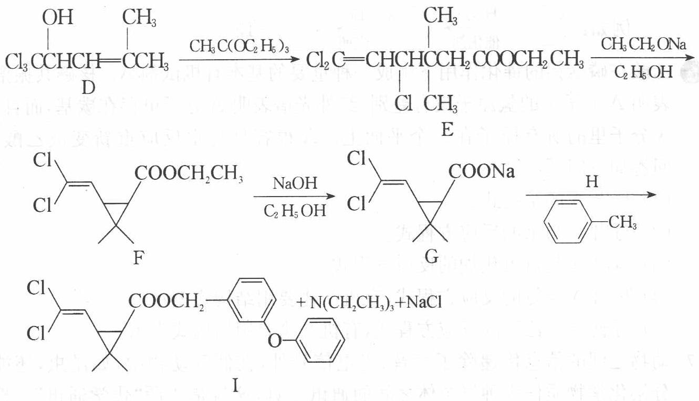

(1) 化合物 A 能使溴的四氯化碳溶液褪色且不存在几何异构体。
A 的结构简式\_\_\_\_，B 的结构简式\_\_\_\_。

(2) 化合物 E 的系统名称\_\_\_\_，化合物 I 中官能团的名称\_\_\_\_。

(3) 由化合物 E 生成化合物 F 经历了\_\_\_\_步反应, 每步反应的反应类别分别是\_\_\_\_。

(4) 在化合物 E 转化成化合物 F 的反应中, 能否用 $NaOH/C_{2}H_{5}OH$ 代替 $C_{2}H_{5}ONa/C_{2}H_{5}OH$ 溶液? 为什么?

(5) 化合物 G 和 H 反应生成化合物 I、 $\mathrm{N}(\mathrm{CH}_{2}\mathrm{CH}_{3})_{3}$ 和 NaCl，由此可推断：H 的结构简式 \_\_\_\_，H 分子中氧原子至少与 \_\_\_\_ 个原子共平面。

(6) 芳香化合物 J 比 F 少两个氢, J 中有三种不同化学环境的氢, 它们的数目比是 9:2:1, 则 J 可能的结构为 (用结构简式表示) \_\_\_\_。

9（1）化合物 A 是一种重要化工产品，用于生产染料、光电材料和治疗疣的药物等。A 由第一、二周期元素组成，白色晶体，摩尔质量 114.06 g/mol，熔点 293℃，酸常数 $pK_{a_{1}} = 1.5$ ， $pK_{a_{2}} = 3.4$ ；酸根离子 $A^{2-}$ 中同种化学键是等长的，存在一根四重旋转轴。

(a) 画出 A 的结构简式。

(b) 为什么 $\mathrm{A}^{2-}$ 离子中同种化学键是等长的？

(c) $\mathrm{A}^{2-}$ 离子有几个镜面?

(2) 顺反丁烯二酸的四个酸常数为 $1.17 \times 10^{-2}$ , $9.3 \times 10^{-4}$ , $2.9 \times 10^{-5}$ 和 $2.60 \times 10^{-7}$ 。指出这些常数分别是哪个酸的几级酸常数, 并从结构与性质的角度简述你做出判断的理由。

(3) 氨基磺酸是一种重要的无机酸,用途广泛,全球年产量逾 40 万吨,分子量为 97.09。晶体结构测定证实分子中有三种化学键,键长分别为 102、144 和 176 pm。氨基磺酸易溶于水,在水中的酸常数 $K_{\mathrm{a}} = 1.01 \times 10^{-1}$ ,其酸根离子中也有三种键长,分别为 100、146 和 167 pm。

(a) 计算 $0.10 \mathrm{~mol} \cdot \mathrm{L}^{- 1}$ 氨基磺酸水溶液的 $\mathrm{pH}$ 值；

(b) 从结构与性质的关系解释为什么氨基磺酸是强酸？

(c) 氨基磺酸可用作游泳池消毒剂氯水的稳定剂, 这是因为氨基磺酸与 $Cl_{2}$ 的反应产物一氯代物能缓慢释放次氯酸。写出形成一氯代物以及一氯代物与水反应的方程式。

⑩ 化合物 A、B、C 和 D 互为同分异构体, 分子量为 136 , 分子中只含碳、氢、氧, 其中氧的含量为 $23.5\%$ 。实验表明: 化合物 A、B、C 和 D 均是一取代芳香化合物, 其中 A、C 和 D 的芳环侧链上只含一个官能团。4 个化合物在碱性条件下可以进行如下反应:

$$
\begin{array}{r l} & {\mathrm{A} \xrightarrow {\mathrm{NaOH溶液}} \xrightarrow {\text {酸化}} \mathrm{E} (\mathrm{C} _ {7} \mathrm{H} _ {6} \mathrm{O} _ {2}) + \mathrm{F}} \\ & {\mathrm{B} \xrightarrow {\mathrm{NaOH溶液}} \xrightarrow {\text {酸化}} \mathrm{G} (\mathrm{C} _ {7} \mathrm{H} _ {8} \mathrm{O}) + \mathrm{H}} \\ & {\mathrm{C} \xrightarrow {\mathrm{NaOH溶液}} \xrightarrow {\text {酸化}} \mathrm{I} (\text {芳香化合物}) + \mathrm{J}} \\ & {\mathrm{D} \xrightarrow {\mathrm{NaOH溶液}} \mathrm{K} + \mathrm{H} _ {2} \mathrm{O}} \end{array}
$$

(1) 写出 A、B、C 和 D 的分子式。

(2) 画出 A、B、C 和 D 的结构简式。

(3) A 和 D 分别与 NaOH 溶液发生了哪类反应?

(4) 写出 H 分子中官能团的名称。

(5) 现有如下溶液: HCl、 $HNO_{3}$ 、 $NH_{3} \cdot H_{2}O$ 、NaOH、 $NaHCO_{3}$ 、饱和 $Br_{2}$ 水、 $FeCl_{3}$ 和 $NH_{4}Cl$ 。从中选择合适试剂, 设计一种实验方案, 鉴别 E、G 和 I。

11 写出下列反应的每步反应的主产物(A、B、C)的结构式;若涉及立体化学,请用 Z、E、R、S 等符号具体标明。

$$
\begin{array}{c} \mathrm{CH} _ {2} \mathrm{COOH} \\ | \\ \mathrm{CH} _ {2} \mathrm{COOH} \end{array} \xrightarrow [ \triangle ]{- \mathrm{H} _ {2} \mathrm{O}} \mathrm{A} \xrightarrow [ \text {无水丁二酸钠} ]{\mathrm{CH} _ {3} \mathrm{CHO(等摩尔)}} \mathrm{B} \xrightarrow [ \triangle ]{\mathrm{HBr}} \mathrm{C}
$$

B 是两种几何异构体的混合物。

2006年2月15日,中国食疗网发布“反式脂肪酸预警报告”。专家指出,摄入过多的反式脂肪酸,会导致心脑血管疾病、糖尿病,儿童若摄入过多将会影响身体发育。人造奶油、快餐中的炸鸡和炸薯条均含这种物质。反式脂肪酸是指至少含一个反式构型双键的脂肪酸。反式构型是指碳碳双键上与两个碳原子结合的氢原子分别位于双键的两侧,若两个氢原子位于双键同侧则是顺式结构。

某医学杂志上用下图表示甲、乙两种物质的结构简式,这两个结构简式虽不是很符合有机物结构简式的书写规范,但还是能够清楚地表示甲、乙两种物质的结构特征。

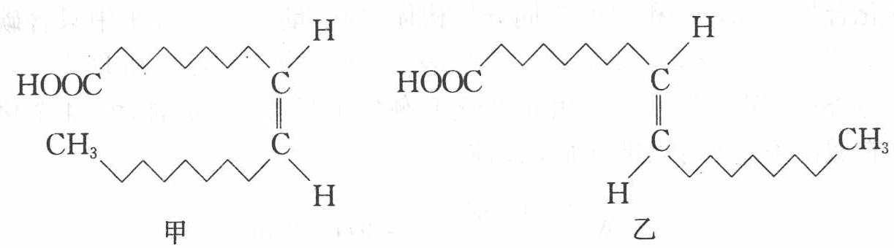

请根据你所学过的化学知识回答下列问题:

(1) 甲的分子式为\_\_\_\_，甲和乙可互称为\_\_\_\_（填“同系物”、“同分异构体”或“同位素”）。你认为甲、乙两种物质中是反式脂肪酸的为\_\_\_\_。

(2) 你认为甲、乙两种物质能否在空气中燃烧？\_\_\_\_。若你认为能够燃烧，请写出甲在足量氧气中燃烧的化学方程式：\_\_\_\_。

(3) 顺式脂肪酸多为液态, 空间呈弯曲状, 反式脂肪酸多为固态, 空间呈线型。血液中反式脂肪酸含量过高容易堵塞血管而导致心脑血管疾病, 原因是

(4) 在油脂催化加氢(如制备人造奶油、酥油)过程中, 构型会发生变化。另外, 油脂长时间高温加热, 也会产生反式脂肪酸。若 $a \mathrm{~g}$ 甲转化成乙吸收 $Q \mathrm{~kJ}$ 热量, 写出该热化学反应方程式: (用“甲”、“乙”表示物质分子式)。

3-氨基-2,5-二氯苯甲酸是一种可防除禾木科和阔叶杂草的除草剂。请以甲苯为原料，通过四步或五步反应合成该化合物，写出其合成路线。

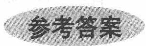

1. A

2. 依题意知分子组成中共有 26 个碳原子, 除一个羧基外的烃基部分还含有 6 个碳碳双键 (六个不饱和度), 选 B。

3. 乙酸乙酯层浮于饱和碳酸钠溶液上, 其中溶有的乙酸使紫色石蕊试液的上层变红, 下层的饱和碳酸钠溶液因水解而显碱性, 使紫色石蕊试液的下层变蓝, 故选 D。

4. 分离是将不同的物质分成独立的成分, 其方法包括物理的和化学的。因为乙醛和乙酸沸点都不高, 易挥发, 用蒸馏分离的方法不好; 两者都易溶于水, 故用 C 中萃取也不妥; 若用银镜反应, 则将乙醛转化为乙酸, 达不到分离的效果; 方法 B 将乙酸转化为高沸点的离子化合物乙酸钠, 且乙酸钠又容易还原, 故可以实现分离的目的, 选 B。

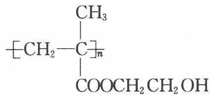

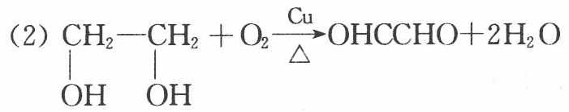

(3) 5

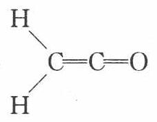

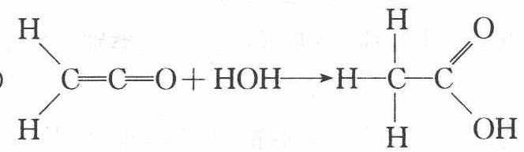

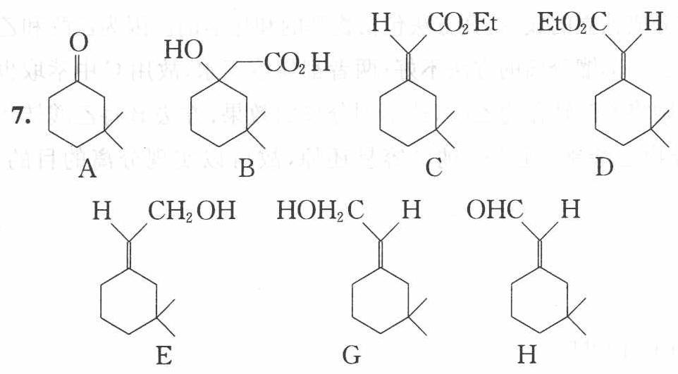

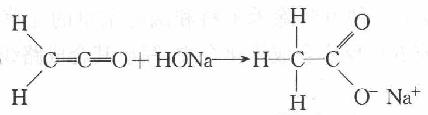

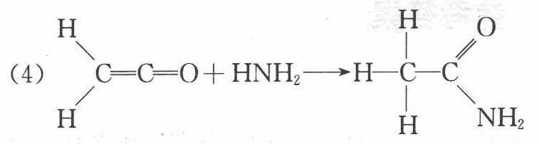

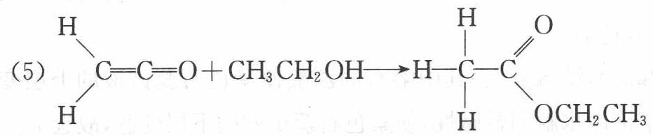

8. (1) A 的结构简式:

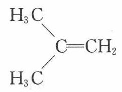

B 的结构简式:

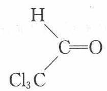

(2) 化合物 E 的系统名称: 3,3-二甲基-4,6,6-三氯-5-己烯酸乙酯;

化合物 I 中官能团的名称卤原子、碳碳双键、酯基、醚键。

(3) 由化合物 E 生成化合物 F 经历了 2 步反应, 每步反应的反应类别分别是酸碱反应、(亲核)取代反应。

(4) 在化合物 E 转化成化合物 F 的反应中, 不能用 $\mathrm{NaOH} / \mathrm{C}_{2} \mathrm{H}_{5} \mathrm{OH}$ 代替

$C_{2}H_{5}ONa/C_{2}H_{5}OH$ 溶液，因为酯会发生皂化反应、NaOH 的碱性不够强（不能在酯的 $\alpha-$ 位生成碳负离子）、烯丙位的氯会被取代、双键可能重排等等。

(5) H 的结构简式:

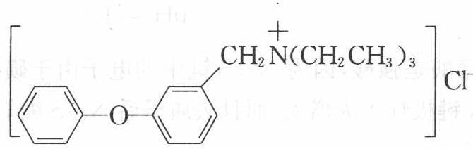

H 分子中氧原子至少与 11 个原子共平面。

(6)

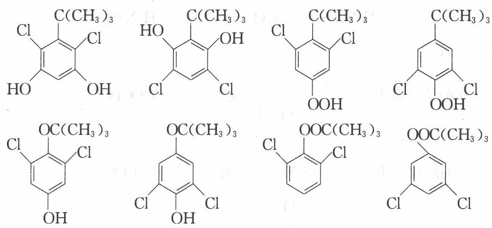

A

(b) $\mathrm{A}^{2-}$ 环内的 $\pi$ 电子数为 2, 符合 $4n+2$ 规则, 具有芳香性, $\pi$ 电子是离域的, 可记为 $\pi_8^{10}$ , 因而同种化学键是等长的。

(c) $\mathrm{A}^{2-}$ 离子有 5 个镜面。

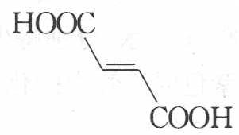

$$
\begin{array}{l} K _ {1} = 1. 1 7 \times 1 0 ^ {- 2} \\ K _ {2} = 2. 6 0 \times 1 0 ^ {- 7} \end{array}
$$

$$
\begin{array}{l} K _ {1} = 9. 3 \times 1 0 ^ {- 4} \\ K _ {2} = 2. 9 \times 1 0 ^ {- 5} \end{array}
$$

顺式丁烯二酸发生一级电离后形成具有对称氢键的环状结构,十分稳定,既使一级电离更容易,又使二级电离更困难了,因而其 $K_{1}$ 最大, $K_{2}$ 最小。

(3) (a) 计算 $0.10 \mathrm{~mol} \cdot \mathrm{L}^{- 1}$ 氨基磺酸水溶液的 $\mathrm{pH}$ 值:

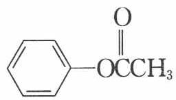

$$
\begin{array}{r l} & c / K = 0. 1 / 1 0 ^ {- 1} <   5 0 0, \\ & K = [ \mathrm{H} ^ {+} ] ^ {2} / (c - [ \mathrm{H} ^ {+} ]), \\ & [ \mathrm{H} ^ {+} ] = 0. 0 6 2 \mathrm{mol} \cdot \mathrm{L} ^ {- 1} \\ & \mathrm{pH} = 1. 2 1 \end{array}
$$

(b) 氨基磺酸是强酸, 因为 $\mathrm{N} - \mathrm{S}$ 键中的电子由于磺酸根强大的吸电子效应使 $\mathrm{H} - \mathrm{N}$ 键极性大大增大, 而且去质子后 $\mathrm{N} - \mathrm{S}$ 缩短, 导致 $\mathrm{H} - \mathrm{N}$ 很容易电离出氢离子。

(c) 形成一氯代物以及一氯代物与水反应的方程式:

$$
\begin{array}{r l} & \mathrm {H_ {3} NSO_ {3}} + \mathrm {Cl_ {2}} \longrightarrow \mathrm {H_ {2} ClNSO_ {3}} + \mathrm{HCl} \\ & \mathrm {H_ {2} ClNSO_ {3}} + \mathrm {H_ {2} O} \longrightarrow \mathrm{HClO} + \mathrm {H_ {3} NSO_ {3}} \end{array}
$$

10. (1) $\mathrm{C}_{8} \mathrm{H}_{8} \mathrm{O}_{2}$

(2) A 的结构简式: $\mathrm{C6H5COOCH3}$ 或 $\mathrm{C6H5COOCH3}$

B 的结构简式: $\mathrm{C_{6}H_{5}-CH_{2}OCH}$ 或 $\mathrm{C_{6}H_{5}-CH_{2}OCHO}$

C 的结构简式: $\mathrm{C_{6}H_{5}-OCCH_{3}}$ 或 $\mathrm{C_{6}H_{5}-OCOCH_{3}}$

D 的结构简式: $\mathrm{C6H5CH(OH)COOH}$ 或 $\mathrm{C6H5CH_2COOH}$

(3) A 与 NaOH 溶液发生了酯的碱性水解反应 D 与 NaOH 溶液发生了酸碱中和反应

(4) H 分子中官能团为醛基和羧基

(5) E 是苯甲酸, G 是苯甲醇, I 是苯酚。根据所给试剂, 可采用如下方案鉴定。

方案1:取3个试管,各加2mL水,分别将少许E、G、I加入试管中,再各加1\~2滴FeCl₃溶液,呈现蓝紫色的试管中的化合物为苯酚I。另取2个试管,各加适量NaOH溶液,分别将E和G加入试管中,充分振荡后,不溶于NaOH溶液的化合物为苯甲醇G,溶于NaOH溶液的化合物为苯甲酸E。

方案 2: 取 3 个试管, 各加 $2 \mathrm{~mL}$ 水, 分别将少许 E、G、I 加入试管中, 再各加几滴溴水, 产生白色沉淀的试管中的化合物为苯酚 I; 另取 2 个试管, 各加适量 NaOH 溶液, 分别将 E 和 G 加入试管中, 充分振荡后, 不溶于 NaOH 溶液的为苯甲醇 G。溶于 NaOH 溶液的为苯甲酸 E。

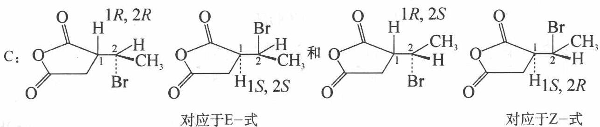

方案 3: 取 3 个试管, 各加 $2 \mathrm{~mL}$ 水, 分别将少许 E、G、I 加入试管中, 再各加 $1 \sim 2$ 滴 $\mathrm{FeCl}_{3}$ 溶液, 呈现蓝紫色的试管中的化合物为苯酚 I。另取 2 个试管, 各加适量 $\mathrm{NaHCO}_{3}$ 溶液, 分别将 E 和 G 加到试管中。加热, 放出气体的试管中的化合物为苯甲酸 E。

方案 4: 取 3 个试管, 各加 2 mL 水, 分别将少许 E、G、I 加入试管中, 再各加几滴溴水, 产生白色沉淀的试管中的化合物为苯酚 I; 另取 2 个试管, 各加适量 $NaHCO_{3}$ 溶液, 分别将 E 和 G 加入试管中。加热, 放出气体的试管中的化合物为苯甲酸 E。

方案 5: 取 3 个试管, 各加适量 NaOH 溶液, 分别将 E、G 和 I 加到试管中, 充分振荡后, 不溶于 NaOH 溶液的化合物为苯甲醇 G, 溶于 NaOH 溶液的化合物为苯甲酸 E 或苯酚 I。另取 2 个试管, 各加适量 $NaHCO_{3}$ 溶液, 分别将 E、I 加入试管中。加热, 放出气体的试管中的化合物为苯甲酸 E。

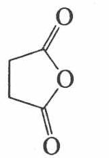

B:

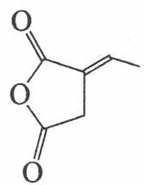

(E-)

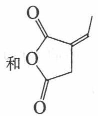

(Z-)

12. (1) $\mathrm{C_{18}H_{34}O_2}$ 同分异构体 乙

(2)能够燃烧 $\mathrm{C_{18}H_{34}O_2 + \frac{51}{2}O_2\longrightarrow 18CO_2 + 17H_2O}$

(3) 顺式脂肪酸分子间空隙大, 分子间作用力相对比较弱, 反式脂肪酸分子间空隙小, 分子作用力相对比较大, 所以反式脂肪酸熔点较高, 大多为固态物质, 在血管中易形成“堵块”而堵塞血管

(4) 甲(1)→乙(s) $\Delta H=+\frac{282Q}{a}kJ\cdot mol^{-1}$

13. 首先采用逆合成法,根据名称写出目标物的结构简式,3-氨基-2,5-二氯苯甲酸的

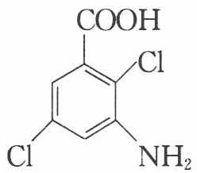

结构简式为 $\ce{C6H5COOH}$ 。分析原料的结构简式，可以将甲基氧化成羧基。

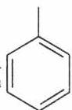

羧基是间位取代基, $\mathrm{Cl}_{2} / \mathrm{FeCl}_{3}$ 属于强的亲电试剂, 氯的取代反应应该发生在羧基的

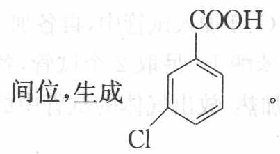

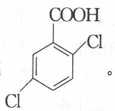

间位,生成

苯环上有两个取代基的定位效应主要由较强的定位基决

定,第二个氯的取代反应应该发生在第一个氯的对位,生成

是间位取代基，Cl 是邻对位取代基，

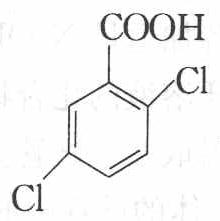

与硝酸发生取代反应生成

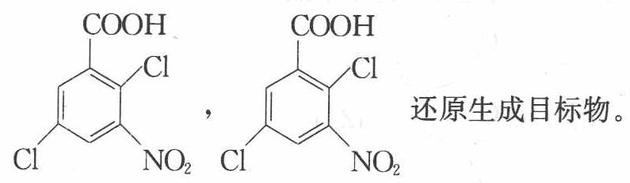

还原生成目标物。

合成路线：

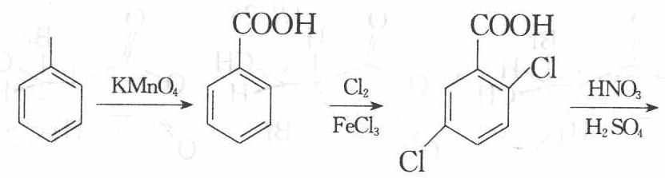

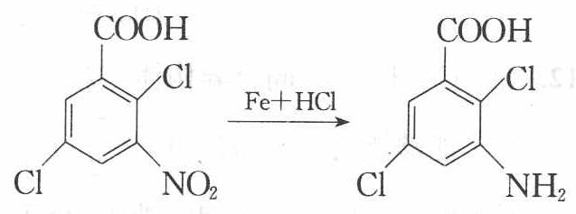

## 第16讲 糖类、蛋白质

## 知识要点

## 一、糖类

碳水化合物是一类多羟基醛、多羟基酮，或一些能水解成多羟基醛和多羟基酮的化合物。不能水解的碳水化合物为单糖。能够水解成两个单糖分子的称为双糖。能够水解成许多单糖分子的碳水化合物称为多糖。

## (一) 单糖

## 1. 单糖的组成及结构

## (1) 葡萄糖的组成及结构

葡萄糖是一个己醛糖,可形成半缩醛的环状结构,由于成环时半缩醛羟基的位置不同又分为 $\alpha-D-$ 葡萄糖和 $\beta-D-$ 葡萄糖,它们在溶液中可相互转化,前者约占 36%,后者约占 64%,而链式葡萄糖极少,其结构如图所示。

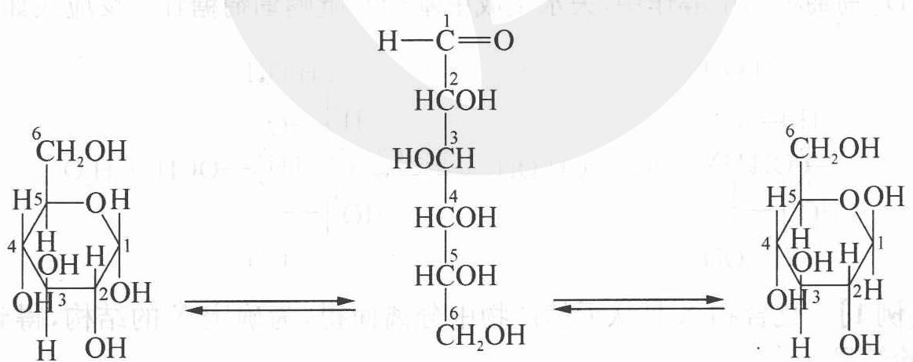  
$\alpha -\mathrm{D}-$ 葡萄糖  
直链式D-葡萄糖  
$\beta -\mathrm{D}-$ 葡萄糖

思考1: 葡萄糖六元环的结构如何形成? $\alpha - D$ -葡萄糖和 $\beta - D$ -葡萄糖结构差别如何?

## (2) 果糖的组成及结构

果糖的分子式也是 $C_{6}H_{12}O_{6}$ ，是葡萄糖的同分异构体。果糖是己酮糖，其结构式中 $C_{3}$ 、 $C_{4}$ 、 $C_{5}$ 的构型与葡萄糖相同。

## 2. 单糖的化学性质

## (1) 氧化反应

醛糖能将斐林试剂还原生成氧化亚铜砖红色沉淀,能将托伦试剂还原生成银镜。酮糖具有 $\alpha-$ 羟基酮的结构，在碱性溶液中可变出醛基，故也能被上述弱氧化剂氧化，利用上述碱性试剂不能区分醛糖和酮糖。

$$
\begin{array}{r l} & {\mathrm {C_ {6} H_{12} O_ {6} + 2[Ag(NH_ {3})_ {2} ] ^ {+} + 2OH^ {-} \longrightarrow}} \\ & {\qquad \mathrm {CH_ {2} OH(CHOH) _ {4} COO^ {-} + NH_ {4} ^ {+} + 2Ag\downarrow+ H_ {2} O + 3NH_ {3}}} \\ & {\mathrm {C_ {6} H_{12} O_ {6} + 2Cu(OH) _ {2} \longrightarrow CH_ {2} OH(CHOH) _ {4} COOH + Cu_ {2} O\downarrow + 2H_ {2} O}} \end{array}
$$

与托伦试剂或斐林试剂反应的糖叫做还原糖,不反应的叫做非还原性糖,葡萄糖和果糖都是还原性糖。

在不同条件下,醛糖可被氧化成不同产物,比如葡萄糖,用硝酸氧化时,得到葡萄糖二酸,而用溴水氧化则得到葡萄糖酸。

在葡萄糖的溶液中加入溴水,稍加热后,溴水的棕红色即可褪去,而果糖与溴水无作用,所以,用溴水可以区别醛糖和酮糖。

## 3. 还原反应

在活性镍催化下,葡萄糖或果糖都可以在一定条件下被氢化生成醇。

## 4. 成苷反应

单糖的半缩醛羟基较其他羟基活泼,在适当条件下可与醇或酚等含羟基的化合物失水,生成具有缩醛结构的化合物,称为糖苷。如在干燥的氯化氢气体催化下,D-葡萄糖与甲醇作用,失水生成甲基-D-吡喃葡萄糖苷。反应式如下:

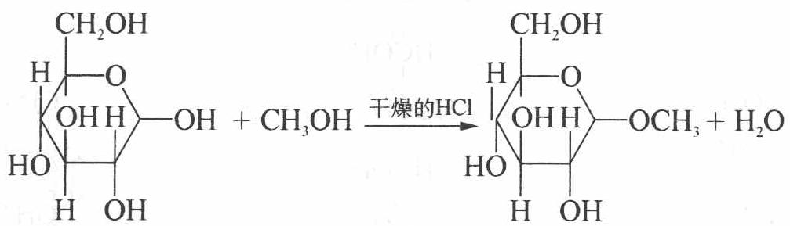

【例 1】化合物 X 是从天然产物中分离而得,为确定 X 的结构,得到下表的实验结果:

$$
\begin{array}{l} \text {I.} \xrightarrow {\text {燃烧}} \mathrm{CO} _ {2} + \mathrm{H} _ {2} \mathrm{O} \\ \text {II.} \xrightarrow {\text {+苯肼}} \mathrm{A} \\ \text {III.} \xrightarrow {\text {+NaIO}} \mathrm{B} \\ \text {IV.} \xrightarrow {\text {+KCN}} \mathrm{C} + \mathrm{H} _ {2} \mathrm{O}, \mathrm{OH} ^ {-} \\ \text {V.} \xrightarrow {\text {乙酸酐}} \mathrm{E} \end{array}
$$

(1) 从以上实验结果可对 $X$ 的组成与结构得出什么结论? 请简单明确地推导这些结论, 填写下表而不写推导过程。

I. \_\_\_\_；

II. \_\_\_\_；

Ⅲ．；

IV. \_\_\_\_；

V. \_\_\_\_。

(2) 根据第一问, 写出 X 的结构式。

(3) 写出物质 A、B、C、D、E 和庚酸的结构式。

(4) 与 X 的结构式一致的天然产物是什么？写出它的名称，并以最好的方式写出它的结构。

过程探究 I. 1.98 g X 中含 C 原子, $\frac{1478.4 \times 10^{-3}}{22.4} = 0.066 (\mathrm{~mol})$ , 即 $0.792 \mathrm{~g}$ ; 含 H 原子, $1.188 \times \frac{2}{18} = 0.132 (\mathrm{~mol})$ , 即 $0.132 \mathrm{~g}$ ; 含 O 原子, $1.98 - 0.792 - 0.132 = 1.056 \mathrm{~g}$ , X 中 C: H: O = 0.066 : 0.132 : $\frac{1.056}{16} = 1:2:1$ 。Ⅲ. X 的化学式量 M 与所含的—CHO 数 n 的关系为: $\frac{0.189}{M} = 21.0 \times 10^{-3} \times 0.05 \times n$

$$
M = \frac {1 8 0}{n}
$$

V. E 的化学式量为 $M \times 216.67\%$ .

参考解答 (1) I. X 的最简式为 $\mathrm{CH}_2\mathrm{O}$ , 不饱和度为 1;

Ⅱ．X有一个—C—基；

Ⅲ. X 有—CHO 基，

X 的分子量 $M=\frac{180}{n}$ ，n 为—CHO 基数目；

IV. X 含 6 个 C 原子的直链, 一个—CHO, 分子量 M = 180, 分子式为 $C_{6}H_{12}O_{6}$ ;

V. X 含 5 个—OH 基。

(2) $\mathrm{HOCH}_2(\mathrm{CHOH})_4\mathrm{CHO}$

<table><tr><td>(3)</td><td>CH=NNHC6H5</td><td>COOH</td><td>CN</td></tr><tr><td></td><td>| (CHOH)4</td><td>| (CHOH)4</td><td>| (CHOH)5</td></tr><tr><td></td><td>CH2OH</td><td>CH2OH</td><td>CH2OH</td></tr><tr><td></td><td>A</td><td></td><td></td></tr><tr><td></td><td>COOH</td><td>COOH</td><td>C</td></tr><tr><td></td><td>| (CHOH)5</td><td>| (CH2)5</td><td>| (CHOCOCH3)4</td></tr><tr><td></td><td>CH2OH</td><td>CH3</td><td>CH2OCOCH3</td></tr><tr><td></td><td>D</td><td colspan="2">庚酸</td></tr></table>

## (4) D-(+)-葡萄糖

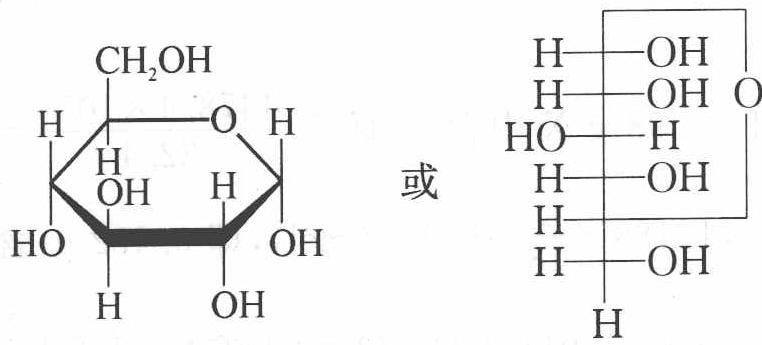

## (二) 二糖

## 1. 蔗糖

蔗糖为无色晶体, 易溶于水, 难溶于乙醇和乙醚。蔗糖的分子式为 $\mathrm{C}_{12} \mathrm{H}_{22} \mathrm{O}_{11}$ , 在蔗糖的分子中已无半缩醛羟基存在, 不能转变为醛式, 因此, 蔗糖是一种非还原性二糖, 不能被斐林试剂和托伦试剂氧化。

## 2. 麦芽糖

麦芽糖分子式也为 $C_{12}H_{22}O_{11}$ ，可由淀粉酶水解制得，在麦芽糖的分子中还保留了一个半缩醛羟基，因此具有还原性，属于还原性二糖，能被斐林试剂和托伦试剂氧化。

## (三) 多糖

## 1. 淀粉

淀粉用水处理后,得到的可溶解部分为直链淀粉(胶体溶液),不溶而膨胀的部分为支链淀粉。

淀粉溶液与碘作用生成蓝色包合物,常作为淀粉的鉴别。

## 2. 纤维素及其衍生物

直链淀粉大约含有 250～350 个单糖结构单位,但纤维素中平均含有 3000

个单糖结构单位。一般无分支链。

纤维素的衍生物主要是纤维素酯类和纤维素醚类。

【例 2】用 $HIO_{4}$ 处理葡萄糖所得的结果可证实葡萄糖的己醛糖结构, 高碘酸 $HIO_{4}$ 处理葡萄糖应该生成哪些产物? 要消耗多少分子 $HIO_{4}$ ?

过程探究 该反应是研究碳水化合物的有用手段之一。在相邻的碳原子上连接有两个或更多—OH或=O基团的化合物再用高碘酸 $\mathrm{HIO}_{4}$ 处理时,发生C—C键断裂的氧化反应。例如: $\mathrm{RCH}-\mathrm{C}-\mathrm{R}^{\prime}+\mathrm{HIO}_{4}\longrightarrow\mathrm{RCHO}+\mathrm{R}^{\prime}\mathrm{COOH}$ $\begin{array}{c:c} \mid & \parallel \\ \mathrm{OH} & \mathrm{O} \end{array}$

参考解答 葡萄糖的 $HIO_{4}$ 反应: $\mathrm{CH_{2}OH(CHOH)_{4}CHO + 5HIO_{4}} \rightarrow 5HCOOH + HCHO$

## 二、氨基酸、蛋白质、核酸

## (一) 氨基酸

分子中既含有氨基又含有羧基的双官能团化合物称为氨基酸。根据氨基酸分子中所含氨基和羧基的相对数目的多少,可将氨基酸分为:中性氨基酸、碱性氨基酸和酸性氨基酸。

思考2: 中性氨基酸呈中性吗? 为什么?

氨基酸的主要性质：

氨基酸无色晶体,它具有高熔点、能溶解于水而不溶于有机溶剂。

思考3：由此可以推断氨基酸是什么化合物？

## 1. 两性与等电点

氨基酸分子中,含有氨基和羧基,一个是碱性基团,一个是酸性基团,两者可相互作用而成盐,这种盐称为内盐。

$$
\begin{array}{c c} \mathrm{RCHCOOH} & \longrightarrow \mathrm {RCHCOO^ {-}} \\ | & | \\ \mathrm {NH_ {2}} & \mathrm {NH_ {3} ^ {+}} \end{array} \quad \text {内盐}
$$

内盐分子中,既有带正电荷的部分,又有带负电荷的部分,所以又称两性离子或偶极离子。实验证明,在氨基酸晶体中,是以两性离子的形式存在。氨基酸在水溶液中,形成如下的平衡体系:

$$
\begin{array}{c c c}\mathrm {RCHCOO^ {-}}&\stackrel {\mathrm {H^ {+}}} {\rightleftharpoons} \mathrm {RCHCOO^ {-}}&\stackrel {\mathrm {H^ {+}}} {\rightleftharpoons} \mathrm {RCHCOOH^ {-}}\\|&|&|\\\mathrm {NH_ {2}}&\mathrm {NH_ {3} ^ {+}}&\mathrm {NH_ {3} ^ {+}}\\\text {负离子}&\text {两性离子}&\text {正离子}\end{array}
$$

思考4: 氨基酸溶液置于电场之中时, 离子则将随着溶液 $\mathrm{pH}$ 值的不同而向不同的极移动, 为什么? 移动规律如何?

当调节氨基酸溶液的 pH, 使氨基酸所带的净电荷为零, 在电场中既不向阴极移动也不向阳极移动, 此时氨基酸所处溶液的 pH 值称为氨基酸的等电点, 以符号 pI 表示。在等电点时, 氨基酸的溶解度最小, 容易沉淀, 由于不同氨基酸的等电点不同, 利用这一性质可以分离制备某些氨基酸。

## 2. 受热反应

α-氨基酸受热后,2 分子脱水生成环状交酰胺。开始加热时,2 分子 α-氨基酸也可脱去 1 分子水生成二肽,但反应的主要产物是交酰胺。如果用盐酸或碱处理,生成的交酰胺,也可转变成二肽。

$$
\mathrm{RCHNH} _ {2} \mathrm{COOH} + \mathrm{RCHNH} _ {2} \mathrm{COOH} \xrightarrow {\triangle} \mathrm{RCHNH} _ {2} \mathrm{CONH(CHR)COOH} \quad \text {二肽}
$$

二肽分子中的—CONH—结构称为酰胺键或肽键。肽键是多肽和蛋白质分子中氨基酸之间相互连接的基本方式。

$\beta$ -氨基酸受热时, 氨基与 $\alpha$ -碳原子上的氢结合成氨而脱去, 生成 $\alpha$ , $\beta$ -不饱和酸。例如:

$$
\mathrm{RCHNH} _ {2} \mathrm{CH} _ {2} \mathrm{COOH} \xrightarrow {\triangle} \mathrm{RCH} = \mathrm{CHCOOH} + \mathrm{NH} _ {3} \uparrow
$$

γ-、δ-氨基酸受热时,氨基上的1个氢原子与羧基上的羟基结合成水而脱去,生成较为稳定的五元环或六元环的内酰胺。

当氨基酸分子中的氨基与羧基相隔 5 个或 5 个以上碳原子时, 受热则发生分子间脱水, 生成链状聚酰胺。如尼龙-6、尼龙-7 等聚酰胺纤维, 就是由相应的 $\omega$ -氨基酸脱水聚合制成的。

思考5: 氨基酸以上性质与什么化合物相似?

## (二) 多肽

由 2 个以上 $\alpha$ -氨基酸单位通过肽键互相连接起来的化合物称为多肽。其通式为：

$$
\mathrm{RCHNH} _ {2} - (\mathrm{CONH}) _ {n} - \mathrm{COOH}
$$

在多肽链中,保留有游离氨基的一端称为 N 端,保留有游离羧基的一端称为 C 端。习惯上把 N 端写在左边,C 端写右边。

## (三) 蛋白质

蛋白质是由氨基酸通过肽键连接而成的高分子化合物,也是多肽,人们通常把分子量低于10 000的视为多肽,高于10 000的称为蛋白质。

蛋白质是由数千个氨基酸缩合而成的大分子链,可表示为

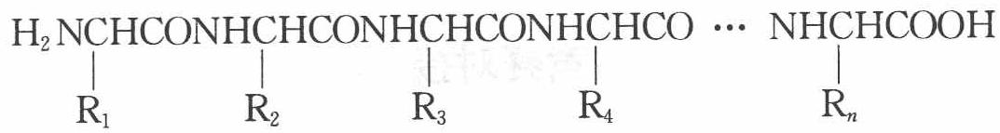

R 可以是—H、 $-CH_{2}OH$ 、 $-CH_{3}$ 、 $-CH_{2}SH$ 、 $-CH_{2}COOH$ 、 $-CH_{2}CONH_{2}$ 等。

思考6: 为什么蛋白质同氨基酸一样,也是两性电解质,而且各种蛋白质也具有特定的等电点? 这点性质有何意义?

## 蛋白质其他性质

1. 蛋白质水溶液具有胶体性质。在蛋白质的胶体溶液中加入某些轻金属盐类等可使蛋白质沉淀,称为盐析,盐析是可逆的。

2. 如果在蛋白质的胶体溶液中加入强酸或强碱、重金属盐、加热至 $70^{\circ} \mathrm{C}$ 以上, 剧烈振荡或搅拌, 紫外线或 $\alpha$ 射线照射、超声波等, 能使蛋白质分子内部原有的高度规律性结构发生变化, 致使蛋白质的理化性质和生物活性发生变化, 这种现象叫蛋白质的变性。

3. 蛋白质的显色反应: 皮肤、指甲、毛皮等遇浓硝酸会变成黄色, 是由于蛋白质分子中含有酪氨酸、色氨酸等芳香族氨基酸中的苯环发生硝化反应。

【例3】某有机物A,经实验测得含碳 $32\%$ 、含氢 $6.7\%$ 、含氮 $18.7\%$ 、含氧 $42.6\%$ ,A的相对分子质量为75,该有机物能溶于水,并有如下图所示的变化关系,写出A、B、C、D各物质的结构简式。

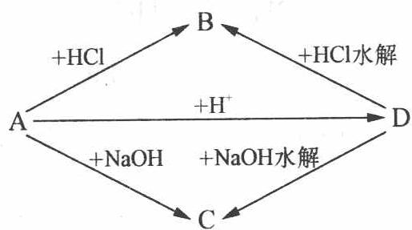

过程探究 A 分子中原子个数比:

$$
\mathrm{C}: \mathrm{H}: \mathrm{N}: \mathrm{O} = 3 2 / 1 2: 6. 7 / 1: 1 8. 7 / 1 4: 4 2. 6 1 / 1 6 = 2: 5: 1: 2
$$

A 的最简式为 $C_{2}H_{5}NO_{2}$ ，式量:75

A 的最简式量与相对分子质量相等, 所以 A 的分子式为 $C_{2}H_{5}NO_{2}$ 。

参考解答 根据图示可判断 A 为一种氨基酸, 根据分子式则可判断:

A: $NH_{2}CH_{2}COOH$ B: $Cl^{-}H_{3}N^{+}CH_{2}COOH$ C: $NH_{2}CH_{2}COONa$ D: $H_{2}NCH_{2}CONHCH_{2}COOH$

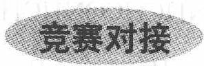

【例 1】已知在一定条件下,醇和醛能发生如下反应: $R_{1}OH + R_{2}CHO \longrightarrow R_{2}CH(OH)OR_{1}$

(1) 已知葡萄糖溶液中,部分葡萄糖链状分子能发生上述反应生成六元环状化合物,该六元环状物质的结构简式是

(2) 果糖的结构简式是 $\begin{array}{c|ccccc} \mathrm{CH}_{2}-\mathrm{C}-\mathrm{CH}-\mathrm{CH}-\mathrm{CH}-\mathrm{CH}_{2} \\ | & || & | & | & | & | \\ \mathrm{OH} & \mathrm{O} & \mathrm{OH} & \mathrm{OH} & \mathrm{OH} & \mathrm{OH} \end{array}$ , 它也能发生类似的反应生成五元环状化合物, 该五元环状化合物的结构简式是

(3) 由于葡萄糖的环状结构中存在苷羟基( $—O—C—OH$ ), 所以能发生银镜反应, 则果糖溶液\_\_\_\_(填“能”或“不能”, 下同)发生银镜反应。麦芽糖可看成是两个葡萄糖的环状分子脱水而成, 其结构如下图所示, 麦芽糖\_\_\_\_(填“能”或“不能”)发生银镜反应。

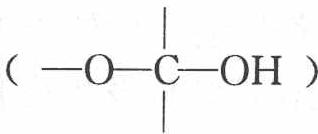

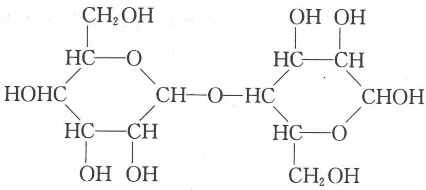

(4) 由于蔗糖分子中没有苷羟基, 所以不能发生银镜反应。蔗糖可以看成由葡萄糖和果糖的环状结构脱水而成, 则蔗糖的结构简式是\_\_\_\_。

过程探究 (1)(2) 醇与醛反应可以形成缩醛。葡萄糖和果糖中的羟基与自身的羰基进行加成, 葡萄糖形成六元环利用的是 5 位上的羟基, 果糖形成五元环利用的也是 5 位上的羟基, 形成环状化合物分别如下图所示。

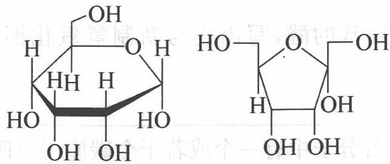

(3) 果糖溶液中也存在苷羟基,能够发生银镜反应。麦芽糖右边的葡萄糖结构中存在苷羟基,也能发生银镜反应。

(4) 蔗糖分子中没有苷羟基,不能发生银镜反应。蔗糖由葡萄糖和果糖环状结构中的苷羟基脱水而成,结构如下图所示。

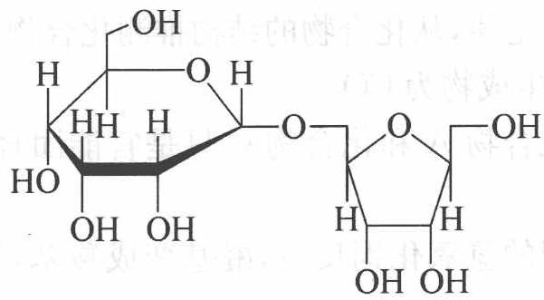

参考解答 见上述分析。

【例 2】（2008 年山东预赛）在某些酶的催化下，人体内葡萄糖的代谢过程如下：

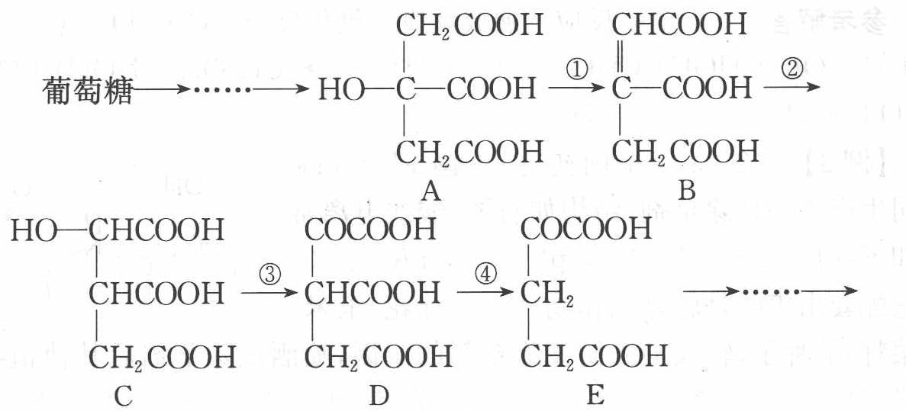

(1) 过程①、②、③的反应类型分别是: ① \_\_\_\_ ② \_\_\_\_
③ \_\_\_\_。

(2) 由质量守恒定律推测,④中的另一种生成物是\_\_\_\_（填化学式）。

(3) 上述五种物质中，\_\_\_\_和\_\_\_\_互为同分异构体（填 A～E）

序号）。

(4) 葡萄糖是多羟基的醛, 写出它与新制氢氧化铜发生反应的化学方程式:

(5) 在有机物中, 若分子中有一个或若干个碳原子以四个单键与四个不同的原子或原子团相连, 该有机物就有“对映异构体”。以上 A\~E 物质中有对映异构体的是 (填 A\~E 序号)。

过程探究 （1）有机化学的基本反应类型有加成、取代、消去、氧化还原等。反应①脱水生成双键属于消去反应，反应②打开双键加上水属于加成反应，反应③羟基变成羰基属于氧化反应。

(2) 根据质量守恒定律,从化合物的结构推测化合物 E 与化合物 D 相差一个 $\mathrm{CO}_{2}$ , 反应④的另一生成物为 $\mathrm{CO}_{2}$ 。

(3) 上述物质中化合物 A 和化合物 C 只是官能团羟基位置不同, 属于同分异构体。

(4) 葡萄糖与新制的氢氧化铜反应,醛基变成羧基,氢氧化铜被还原为氧化亚铜。

(5) 若分子中有一个或若干个碳原子以四个单键与四个不同的原子或原子团相连,该有机物就有“对映异构体”,依据此规则化合物 C、D 应该有同分异构体。

参考解答 (1) 消去反应 加成反应 氧化反应 (2) $\mathrm{CO}_{2}$ (3) A、C (4) $\mathrm{CH}_{2} \mathrm{OH}(\mathrm{CHOH})_{4} \mathrm{CHO} + 2 \mathrm{Cu(OH)}_{2} \longrightarrow \mathrm{CH}_{2} \mathrm{OH}(\mathrm{CHOH})_{4} \mathrm{COOH} + \mathrm{Cu}_{2} \mathrm{O} \downarrow + 2 \mathrm{H}_{2} \mathrm{O}$ (5) C、D

【例 3】（2003 年全国初赛）美国 Monsanto 公司生产了一种除草剂，结构如右图，酸式电离常数如下： $pK_{a_{1}}$ 0.8， $pK_{a_{2}}$ 2.3， $pK_{a_{3}}$ 6.0， $pK_{a_{4}}$ 11.0。与它配套出售的是转基因作物（大豆、棉花、玉米、

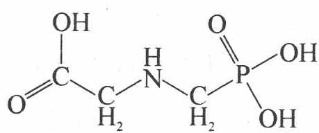

油菜籽)的种子,转入了抗御该除草剂的基因,喷洒该除草剂后其他植物全部死光,唯独这些作物茁壮成长,由此该除草剂得名 roundup,可意译为“一扫光”。这四种转基因作物已在美国大量种植,并已向我国和巴西等国大量出口,但欧洲至今禁止进口。

(1) Roundup 为无色晶体, 熔点高达 $200^{\circ} \mathrm{C}$ , 根据如上结构式进行的分子间作用力 (包括氢键) 的计算, 不能解释其高熔点。试问: Roundup 在晶体中以什

么型式存在？写出它的结构式。

(2) 加热至 $200 \sim 230^{\circ} \mathrm{C}$ , Roundup 先熔化, 后固化, 得到一种极易溶于水的双聚体 A, 其中有酰胺键, 在 $316^{\circ} \mathrm{C}$ 高温下仍稳定存在, 但在无机强酸存在下回流, 重新转化为 Roundup。画出 A 的结构式。

(3) Roundup 的植物韧皮的体液的 pH 约为 8; 木质部和细胞内液的 pH 为 5\~6。试写出 Roundup 后三级电离的方程式 (方程式中的型体附加①②③④标注), 并问: Roundup 在植物动皮液和细胞内液的主要存在型体 (用你定义的①②③④表达)。提示: 通常羧酸的电离常数介于磷酸的一、二级电离常数之间。

电离方程式：\_\_\_\_；

植物动皮液的主要型体：\_\_\_\_；细胞内液的主要型体：\_\_\_\_。

(4) 只有把 Roundup 转化为它的衍生物, 才能测定它的 $pK_{a_{1}}$ , 问: 这种衍生物是什么?

过程探究 (1) 既然“进行分子间作用力(包括氢键)的计算,不能解释其高熔点”,那么其中一定存在另外一种作用力。分析 Roundup 的结构可知,其中存在—COOH 与—NH—可形成内盐,那么这种作用力就是离子键。

(2) 由题给信息“得到一种极易溶于水的双聚体 A, 其中有酰胺键”可知 Roundup 加热至 $200^{\circ} \mathrm{C} \sim 230^{\circ} \mathrm{C}$ 发生了一 COOH 与 -NH 之间的脱水反应。应特别注意的是: 在有机分子反应过程中, 如果能形成五元环或六元环 (特别是六元环), 则应将该环状产物作为主要产物写出。

(3) 解答此小题首先要弄清楚 Roundup 的酸式电离常数 $\mathrm{p}K_{\mathrm{a}_{1}}0.8, \mathrm{p}K_{\mathrm{a}_{2}}2.3, \mathrm{p}K_{\mathrm{a}_{3}}6.0, \mathrm{p}K_{\mathrm{a}_{4}}11.0$ 所对应的电离方程式是哪些。与氨基酸相似，Roundup 的 $\mathrm{p}K_{\mathrm{a}_{1}}=0.8$ 对应的电离方程式为

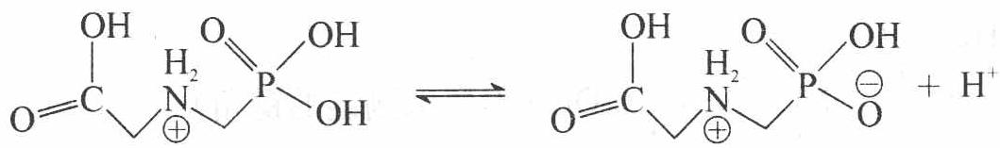

再根据提示,可以依次写出后三级电离的方程式,如下:

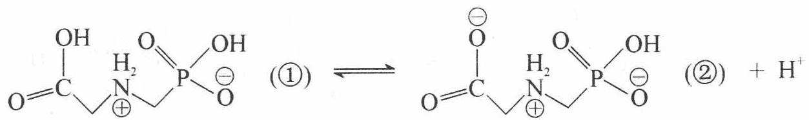

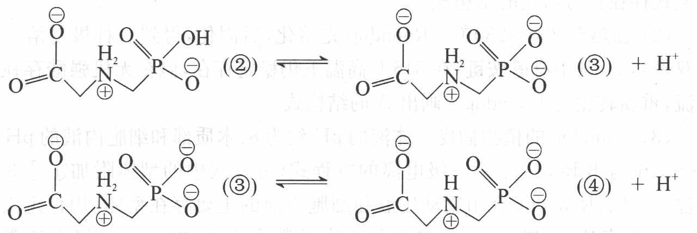

植物韧皮的体液的 pH 约为 8, 介于 $pK_{a_{3}}$ 6.0 和 $pK_{a_{4}}$ 11.0 之间, 且偏碱性, 所以存在型体应是③; 木质部和细胞内液的 pH 为 5\~6, 介于 $pK_{a_{2}}$ 2.3 和 $pK_{a_{3}}$ 6.0 之间, 且接近 6.0, 所以主要存在型体就是②。

(4) 由于 Roundup 的 $\mathrm{p}K_{\mathrm{a}} = 0.8$ 对应的电离方程式为

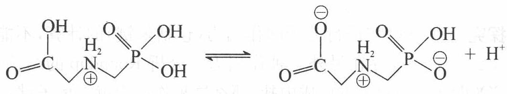

所以, 只有把 Roundup 转化为 Roundup 的强酸盐, 即才能测定它的 $pK_{a_{1}}$ 。

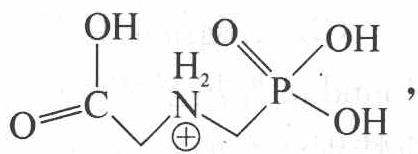

参考解答 (1)

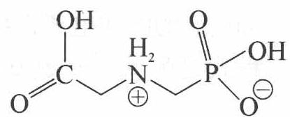

(电荷符号不加圈也可)

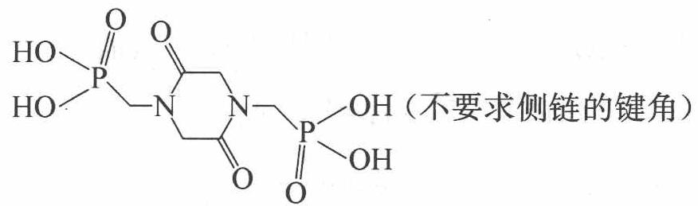

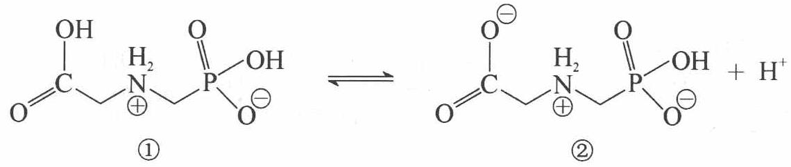

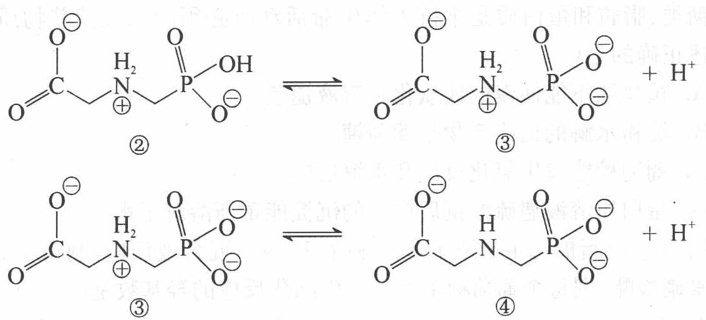

植物韧皮液的主要型体:③ 细胞内液的主要型体:②和③(4) 这种衍生物是 Roundup 的强酸盐(答盐酸盐也可)


1 某分子式为 $C_{n}H_{2n}O_{4}N_{2}$ 的氨基酸, 若分子内氮原子只形成氨基, 且无其他支链, 则符合该分子式通式的氨基酸的数目为( )。
A. $\frac{(n-1)(n-2)}{2}$ B. $\frac{n(n-2)}{4}$ C. $\frac{(n-1)^{2}}{4}$ D. $\frac{n(n-1)}{2}$

② 核糖是合成核酸的重要原料,结构简式为: $\mathrm{CH_{2}OH-CHOH-CHOH-CHOH-CHO}$ , 下列关于核糖的叙述正确的是( )。
A. 与葡萄糖互为同分异构体
B. 可以与银氨溶液作用形成银镜
C. 可以跟氯化铁溶液作用显色
D. 可以使紫色石蕊试液变红

若液态氨相当于地球上的水,能满足木星上生物生存的需要,那么木星上生物体内与地球上生物体内葡萄糖的分子结构相当的化合物是(   )。
A. $CH_{2}-CH-CH-CH-CH-CH-C-H$ OH OH OH OH OH O
B. $CH_{2}-CH-CH-CH-CH-CH-H$ $NH_{2}$ $NH_{2}$ $NH_{2}$ $NH_{2}$ $NH_{2}$ O
C. $CH_{2}-CH-CH-CH-CH-C-H$ $NH_{2}$ $NH_{2}$ $NH_{2}$ $NH_{2}$ $NH_{2}$ NH
D. $CH_{2}-CH-CH-CH-CH-C-H$ OH OH OH OH OH NH

4 糖类、脂肪和蛋白质是维持人体生命活动所必须的三大营养物质,以下叙述正确的是( )。
A. 植物油不能使溴的四氯化碳溶液褪色
B. 淀粉水解的最终产物是葡萄糖
C. 葡萄糖能发生氧化反应和水解反应
D. 蛋白质溶液遇硫酸铜后产生的沉淀能重新溶解于水

5 用 $10 \mathrm{~g}$ 脱脂棉与足量浓 $\mathrm{HNO}_{3}$ 和浓 $\mathrm{H}_{2} \mathrm{SO}_{4}$ 混合液反应, 制得 $15.6 \mathrm{~g}$ 纤维素硝酸酯, 则每个葡萄糖单元中发生酯化反应的羟基数是 ( )。 A. 3 B. 2 C. 1 D. 无法计算

⑥ 某种豆类作物中所含的天然蛋白质在酶的作用下发生水解, 可得到甲、乙两种氨基酸。已知甲的结构简式为 $NH_{2}CH_{2}CH_{2}CH_{2}CH_{2}CH_{2}CHCOOH$ ，乙 $NH_{2}$

的分子式为 $C_{4}H_{7}O_{4}N$ 。

(1) 由甲形成的三肽中氨基、羧基的数目依次为\_\_\_\_、\_\_\_\_。

(2) 若 $1 \mathrm{~mol}$ 乙与足量 $\mathrm{NaHCO}_{3}$ 反应放出标况下的 $\mathrm{CO}_{2} 44.8 \mathrm{~L}$ , 且分子中没有甲基, 则乙的结构简式为 \_\_\_\_。

(3) 乙的分子中的— $\mathrm{NH}_{2}$ 和—COOH 发生分子内缩合反应脱去一分子水,所形成的含有四元环结构的化合物的结构简式为\_\_\_\_。

7 如图所示: 淀粉水解可产生某有机化合物 A, A 在不同的氧化剂作用下, 可以生成 B( $C_{6}H_{12}O_{7}$ ) 或 C( $C_{6}H_{10}O_{8}$ ), B 和 C 都不能发生银镜反应。A、B、C 都可以被强还原剂还原为 D( $C_{6}H_{14}O_{6}$ )。B 脱水可得到五元环的酯类化合物 E 或六元环的酯类化合物 F。

已知,相关物质被氧化的难易次序是:RCHO

最易， $\mathrm{R}-\mathrm{CH}_{2} \mathrm{OH}$ 次之， $\mathrm{R}_{2}-\mathrm{CHOH}$ 最难。

请在下列空格中填写 A、B、C、D、E、F 的结构简式。

A: \_\_\_\_ ; B: \_\_\_\_ ;

C: \_\_\_\_ ; D: \_\_\_\_ ;

E: \_\_\_\_ ; F: \_\_\_\_ 。


8 纤维素是自然界最为丰富的可再生的天然高分子资源。

(1) 纤维素可制备用于纺织、造纸等的黏胶纤维[成分是 $\left(\mathrm{C}_{6}\mathrm{H}_{10}\mathrm{O}_{5}\right)_{n}$ ], 生产过程涉及多个化学反应。工艺简图如下:


近来,化学家开发了一种使用 NMMO 加工纤维素的新方法,产品 “Lyocell 纤维”成分也是 $\left(\mathrm{C}_{6}\mathrm{H}_{10}\mathrm{O}_{5}\right)_{n}$ 。工艺流程示意图如下:


① “Lyocell纤维”工艺流程中,可充分循环利用的物质是\_\_\_\_。

② 与“Lyocell 纤维”工艺相比,黏胶纤维工艺中会产生含有\_\_\_\_(只填非金属元素符号)的废物,并由此增加了生产成本。

③ “Lyocell 纤维”被誉为“21 世纪的绿色纤维”，原因是\_\_\_\_。

(2) “Lyocell 纤维”工艺流程中的 NMMO 可按如下路线制备(反应条件均省略):


其中,化合物Ⅰ可三聚为最简单的芳香烃,化合物Ⅱ可使溴水褪色。

① 化合物Ⅰ也可聚合为在一定条件下具有导电性的高分子化合物,该高分子化合物的化学式为\_\_\_\_。

② 化合物Ⅱ与氧气反应的原子利用率达 100%, 其化学方程式为 \_\_\_\_。

③关于化合物Ⅲ、Ⅳ的说法正确的是\_\_\_\_（填代号）。
A. 都可发生酯化反应
B. Ⅲ可被氧化，Ⅳ不可被氧化
C. 都溶于水
D. Ⅲ可与钠反应，Ⅳ不可与钠反应
E. Ⅲ是乙醇的同系物
F. Ⅲ可由卤代烃的取代反应制备

④ 写出合成 NMMO 最后一步反应的化学方程式\_\_\_\_。

9 称取某多肽 415 g, 在小肠液作用下完全水解得到氨基酸 505 g。经分析知道组成此多肽的氨基酸的平均相对分子质量为 100, 此多肽由甘氨酸、丙氨酸、半胱氨酸三种氨基酸组成, 每摩尔此多肽中含有 S 元素 51 mol。已知甘氨酸、丙氨酸、半胱氨酸的化学式分别为 $\mathrm{H}_{2} \mathrm{NCH}_{2} \mathrm{COOH}$ , $\mathrm{H}_{2} \mathrm{NCH}(\mathrm{CH}_{3}) \mathrm{COOH}$ , $\mathrm{H}_{2} \mathrm{NCH}(\mathrm{CH}_{2} \mathrm{SH}) \mathrm{COOH}$ 。试求:

(1) 一分子的此多肽由多少个氨基酸组成?

(2) 此多肽分子中三种氨基酸的数量比是多少?

(3) 此多肽 415 g, 用硫酸把它分解成铵盐后, 加过量的碱中和, 能够蒸出氨 (假定氨全部逸出) 多少克?

10 化合物 A 是天然蛋白质的最终水解产物, 分子中只有一个氨基, 化合物 B 是一种含有醛基的硝酸酯, 两物质的分子式都可用 $C_{a}H_{b}O_{c}N_{d}$ 表示, 且 $a + c = b$ 、 $a - c = d$ 。试回答:

(1) A、B 的分子式是 \_\_\_\_。

(2) 光谱测定显示 A 的分子结构中不存在甲基( $-CH_{3}$ ), 则 A 的结构简式是 \_\_\_\_。

(3) 光谱测定显示 B 的烃基部分不存在支链, 则 B 的结构简式是 \_\_\_\_。

11 某中学同学在一本英文杂志上发现两张描述结构变化的简图如下(图中“—～—”是长链的省略符号):


未读原文,他已经理解:左图是生命体内最重要的一大类有机物质\_\_\_\_(填中文名称)的模型化的结构简图,右图是由于左图物质与\_\_\_\_(化学式),即\_\_\_\_(中文名称)发生反应后的模型化的结构简图。由左至右的变化的主要科学应用场合是\_\_\_\_;但近年来我国一些不法奸商却利用这种变化来坑害消费者,消费者将因\_\_\_\_。

12 写出赖氨酸 $\left[\mathrm{H}_{2} \mathrm{NCH}_{2} \mathrm{CH}_{2} \mathrm{CH}_{2} \mathrm{CH}_{2} \mathrm{CH}_{2} \mathrm{CH}(\mathrm{NH}_{2}) \mathrm{COOH}\right]$ 在指定条件下占优势的结构式:

(1) 在强酸性溶液中;

(2) 在强碱性溶液中;

(3) 在达到等电点的溶液中。

13 氨基酸分子(R—CH—COOH)中,既有碱性的氨基(—NH₂),又有酸性的
| NH₂

羧基(—COOH),在一定的酸碱性条件下,能自身成盐(R—CH—COO $^{-}$ )。
NH $_{3}^{+}$

所以在氨基酸分析中不能用碱溶液测定氨基酸水溶液中羧基的数目,而应先加入甲醛,使它与 $-NH_{2}$ 缩合( $R-NH_{2}+HCHO \longrightarrow R-N=CH_{2}+H_{2}O$ ),然后再用碱液滴定法,测定羧基含量。氨基酸中 $-NH_{2}$ 的数目可用与 $HNO_{2}$ 反应定量放出 $N_{2}$ 而测得, $-NH_{2}$ 在反应中变成 $-OH(R-NH_{2}+HNO_{2} \longrightarrow R-OH+N_{2} \uparrow + H_{2}O)$ 。

化合物 A, 分子式为 $C_{8}H_{15}O_{4}N_{3}$ 。中和 1 mol A 与甲醛作用后的产物消耗 1 mol NaOH。1 mol A 与 $HNO_{2}$ 反应放出 1 mol $N_{2}$ ，并生成 $\mathrm{B}(\mathrm{C}_{8}\mathrm{H}_{14}\mathrm{O}_{5}\mathrm{N}_{2})$ 。B 经水解后得羟基乙酸和丙氨酸。

(1) A 的结构简式为 \_\_\_\_。

(2) B 的结构简式为 \_\_\_\_。

(3) A 跟亚硝酸反应的化学方程式为\_\_\_\_。

14 室温离子液体是一类可广泛用于有机、无机及高分子合成的优质溶剂，其典型组成是含氮有机阳离子和无机阴离子。美国匹茨堡大学首次报道了室温离子用于酶催化反应。在离子液体中用一种叫做 Thermolysin 的蛋白水解酶催化两种氨基酸的衍生物合成了人造甜味素阿斯巴糖的前体（如下式 I 所示）。


离子液体还可用于电化学的潜在溶剂,如用做电池的电解质。Robert

Engel 研究小组新合成出一类水溶性非水离子液体 LIPs(如右式)。LIPs 可以在相对温和的条件下制备, 相对无反应活性, 高电导, 安全易得, 为绿色化学提供了一种值得尝试的介质。

回答下列问题：


(1) 化合物Ⅰ在酸性条件下完全水解的最终产物是\_\_\_\_。

(2) 命名化合物Ⅱ：\_\_\_\_。

(3) 写出化合物Ⅲ可能的结构简式。

(4) 在合成Ⅲ的过程中, Thermolysin 的作用是\_\_\_\_\_\_\_\_; Ionic liquid 的化学式是\_\_\_\_\_\_\_\_, 作用是\_\_\_\_\_\_\_\_。

(5) 上述第一种离子液体的阳离子的两个 N 原子杂化类型是否一样\_\_\_\_（分别指出）；阴离子的空间构型与 $Na_{3}AlF_{6}$ 中阴离子构型是否相同\_\_\_\_，理由是\_\_\_\_。分别再确定它们中心原子的杂化类型\_\_\_\_和阴离子的空间构型\_\_\_\_。

(6) LIPs 是否为电解质? \_\_\_\_, 理由是 \_\_\_\_.

(7) 举出两种与 LIPs 存在某些相似性而水溶性却相反的磷酸盐: \_\_\_\_。

1. BC

2. 核糖分子结构中有醛基, 因此一定条件下可以与银氨溶液作用形成银镜, 本题选 B。

3. 水写成 H—OH 的形式, 氨写成 H—NH $_{2}$ , 可推断本题选 C。

4. 植物油中有不饱和键, 可使溴的四氯化碳溶液褪色, 葡萄糖不水解, 蛋白质遇重金属盐变性, 不能复原。本题选 B。

5. 设纤维素的每个葡萄糖单元中, 有 $x$ 个羟基与硝基发生酯化 $(\mathrm{C}_{6} \mathrm{H}_{10} \mathrm{O}_{5})_{n} + x n \mathrm{HO}-\mathrm{NO}_{2} \longrightarrow (\mathrm{C}_{6} \mathrm{H}_{10-x} \mathrm{O}_{5})_{n} - x n \mathrm{NO}_{2} + x n \mathrm{H}_{2} \mathrm{O}$ $162 n$ (162 - x) $n + 46 x n$ 10 15.6 $x = 2$ 本题选 B。

6. 甲形成的三肽中有两个肽键, 则剩下 4 个氨基, 1 个羧基。乙为氨基酸, 且 $1 \mathrm{~mol}$ 乙可与足量 $\mathrm{NaHCO}_{3}$ 反应放出 $2 \mathrm{~mol} \mathrm{CO}_{2}$ , 则有两个羧基, 又分子中无甲基, 其结构简式为 $\mathrm{HOOC}-\mathrm{CH}_{2}-\mathrm{CH}-\mathrm{COOH}$ , 乙发生分子内脱水形成的四元环状化物的结构 $\mathrm{NH}_{2}$

或  


7. A. ${\mathrm{{HOCH}}}_{2}{\left( \mathrm{{CHOH}}\right) }_{4}\mathrm{{CHO}}$ $\mathrm{B.} {\mathrm{{HOCH}}}_{2}{\left( \mathrm{{CHOH}}\right) }_{4}\mathrm{{COOH}}$ C. $\mathrm{{HOOC}}{\left( \mathrm{{CHOH}}\right) }_{4}\mathrm{{COOH}}$ $\mathrm{D.} {\mathrm{{HOCH}}}_{2}{\left( \mathrm{{CHOH}}\right) }_{4}{\mathrm{{CH}}}_{2}\mathrm{{OH}}$

E.  


8. 解析: (1) 由工艺流程可知, NMMO 被循环利用。比较两个生产流程可知在黏胶纤维的生产过程中会产生含硫、含氯的废物, 从而增加了生产成本, 并可能由此产生环境污染。而新工艺不会产生污染物, 且纤维素原料可以再生, 故称为“21世纪绿色纤维”。

(2) 最简单的芳香烃为苯, 则三聚为苯的烃必为乙炔, 其聚合成为高分子化合物的化学方程式为 $n \mathrm{CH} \equiv \mathrm{CH} \xrightarrow{\text {一定条件下}} [ \mathrm{CH} = \mathrm{CH}]_n$ ; 化合物 II 为乙烯, 故使其与 $\mathrm{O}_2$ 反应, 原子利用率为 $100 \%$ ，只有发生加成反应即 $2 \mathrm{CH}_2 = \mathrm{CH}_2 + \mathrm{O}_2 \longrightarrow 2 \mathrm{H}_2 \mathrm{C} - \mathrm{CH}_2$ 。据 III、IV 的分子结构特点不难推知它们所具有的性质。


答案: (1) ① NMMO ② S、Cl ③ 新工艺环境污染小, 纤维素原料可再生

$$
[ \mathrm{CH} = \mathrm{CH} ] _ {n} \quad ② 2 \mathrm{CH} _ {2} = \mathrm{CH} _ {2} + \mathrm{O} _ {2} \longrightarrow 2 \mathrm{H} _ {2} \mathrm{C} - \mathrm{CH} _ {2}
$$


9. (1) 水解产生的氨基酸的物质的量为 $\frac{505}{100} = 5.05 (\mathrm{mol})$ ，消耗 $\mathrm{H}_{2} \mathrm{O}$ 的物质的量为 $\frac{505 - 415}{18} = 5 (\mathrm{mol})$ ，设一分子此多肽由 $n$ 个氨基酸组成，由 $(n - 1) \mathrm{~mol} \mathrm{H}_{2} \mathrm{O} \sim n \mathrm{~mol}$ 氨基酸：有 $\frac{n - 1}{n} = \frac{5}{5.05}$ ，得 $n = 101$ 。

(2) 由第一问结果可计算此多肽分子量为 $100 \times 101 = 10100$ , 又依题可知一分子此多肽含有 51 个半胱氨酸, 设含甘氨酸、丙氨酸分别为 $x$ 个、 $y$ 个, 则有方程式 $x + y = 101 - 51$ , $75x + 89y + 51 \times 121 = 10100$ , 可得 $x = 37$ , $y = 13$ , 因此此多肽分子中三种氨基酸的数量比为 $37:13:51$ 。

(3) 此多肽的相对分子质量为 $10\ 100 - 100 \times 18 = 8300$ ，多肽中氮元素的百分含量为 $101 \times \frac{14}{8300} = 17\%$ ，氮元素全部转化为氨气，其质量为 $415 \, g \times 17\% \times \frac{17}{14} = 85.9 \, g$ 。

10. A 为 $\alpha$ -氨基酸, 分子中含有—COOH、—NH $_2$ 官能团; B 为含有醛基的化合物, 分子中含—CHO、—ONO $_2$ 官能团, 由于 A 分子中只有一个氨基, 故 $d=1, c=4$ , 据 $a-4=1$ , 得 $a=5$ ; 据 $a+c=b$ , 得 $b=9$ , 可知 A、B 的分子式是 C $_5$ H $_9$ O $_4$ N, A 的结构简式是 HOOCCH $_2$ CH $_2$ CHCOOH, B 的结构简式是: NH $_2$ OHC—CH $_2$ —CH $_2$ —CH $_2$ —CH $_2$ ONO $_2$

11. 蛋白质(或多肽) $CH_{2}O$ 甲醛 制作(动物)标本(或保存尸体) 食物中残余甲醛可与人体蛋白质发生同右图所示的反应而受害

12. (1) $\mathrm{H}_{3} \stackrel{+}{\mathrm{NCH}}_{2} \mathrm{CH}_{2} \mathrm{CH}_{2} \mathrm{CH}_{2} \mathrm{CH}-\mathrm{COOH} \mid \mathrm{NH}_{3}^{+}$


$$
\mathrm {(2) H_ {2} NC H _ {2} CH_ {2} CH_ {2} CH_ {2} CH_ {2} CH - COO^ {-}} \mathrm {\underset {NH_ {2}} {|}}
$$


14. (1) $\ce{C6H5CH2OH}$ 、 $\ce{CO2}$ 、 $\ce{HOOCCH2CH(NH2)COOH}$

(2) 苯丙氨酸甲酯(或 $\alpha$ -氨基- $\beta$ -苯基丙酸甲酯)


(有两种结构,Ⅱ的氨基与Ⅰ的两个羧基分别反应)

(4) 催化剂 $C_{8}H_{15}N_{2}PF_{6}$ 溶剂

(5) 不一样, 左侧一个 $sp^{3}$ , 右侧一个 $sp^{2}$ 相同价电子数和原子数都相同——等电子体 $sp^{3}d^{2}$ 正八面体

(6) 是电解质 水溶液或熔融状态能导电

(7) $\mathrm{Ca}_{3}(\mathrm{PO}_{4})_{2}$ 、 $\mathrm{Ba}_{3}(\mathrm{PO}_{4})_{2}$


## 一、合成高分子化合物

高分子化合物简称高分子,与低分子化合物的最大不同是相对分子质量,相对分子质量一般在一万以上,亦有几十万,甚至上百万。高分子广泛存在于自然界中,如淀粉、纤维素、蛋白质、核酸等,这些都是天然高分子,通过人工合成的高分子如塑料、橡胶、纤维、胶粘剂、涂料等称合成高分子。

高分子也叫聚合物,相对分子质量虽然很大,但它是由简单结构单元重复组成。如 $\left[CH_{2}CH_{2}\right]_{n}$ 表示聚乙烯,它的结构单元为 $-CH_{2}CH_{2}-$ ,它是由乙烯聚合而成。乙烯称为单体,而 $\left[CH_{2}CH_{2}\right]_{n}$ 则表示聚合物,n表示聚合度。聚合物的相对分子质量M是重复单元的相对分子质量 $M_{0}$ 与聚合度的乘积。

思考1: 高分子化合物是纯净物吗? 其相对分子质量是一条高分子链的相对分子质量吗?

## 1. 加聚反应与缩聚反应

含有重键的单体分子, 如乙烯、丁二烯 $\left(\mathrm{CH}_{2}=\mathrm{CH}-\mathrm{CH}=\mathrm{CH}_{2}\right)$ 、苯乙烯 $\left(\mathrm{CH}_{2}=\mathrm{CHC}_{6} \mathrm{H}_{5}\right)$ 等它们是通过加成聚合反应得到聚合物的。加聚反应又叫连锁聚合反应, 一般由链引发、链增长、链终止等基元反应组成。

含有双官能团或多官能团的单体,通过分子间官能团地缩合反应把单体分子连接起来,同时生成水、醇、氨等小分子,这样不断地缩合,使分子不断增大,最后形成高分子聚合物,称为缩合聚合反应,简称缩聚反应。如己二胺和己二酸反应生成聚己二酰己二胺,商品名为尼龙-66。反应式可写成:

$$
\begin{array}{r l}&n \mathrm{H} _ {2} \mathrm{N} (\mathrm{CH} _ {2}) _ {6} \mathrm{NH} _ {2} + n \mathrm{HOOC} (\mathrm{CH} _ {2}) _ {4} \mathrm{COOH}\\&\rightarrow \mathrm{H} [ \mathrm{NH} (\mathrm{CH} _ {2}) _ {6} \mathrm{NHCO} (\mathrm{CH} _ {2}) _ {4} \mathrm{CO} ] _ {n} \mathrm{OH} + (2 n - 1) \mathrm{H} _ {2} \mathrm{O}\end{array}
$$

## 2. 合成高分子的结构和特性

从结构和特性高分子看,又可分为两种,线型高分子和体型高分子。线型高分子加热时可以逐渐变软,然后再变成液体,液体冷却后又逐渐变成固体,随着温度的变化可反复改变物理状态。这种性质,称为热塑性,它可以使高分子多次重复加工,线型高分子还可以用溶剂溶解。如聚乙烯就是热塑性的。

单体进行聚合反应时,先形成线型高分子,在某种条件下分子链之间发生交联由线型变成体型网状高分子。体型高分子加热后不会熔化和流动,这种性质称为热固性。体型高分子一旦加工成型后,不能通过加热改变其形态,热固性树脂固化后也不能被溶剂溶解,如酚醛树脂和环氧树脂就是热固性树脂。

## 【例 1】用不大于两个碳的化合物合成聚乙烯醇。

过程探究 $\left[CH_{2}CH\right]_{n}$ 为聚乙烯醇,但该聚合物无 $CH_{2}=CH-OH$ 单体,

因此只能通过大分子的反应得到,即先合成聚醋酸乙酯,再醇解。

参考解答 $\mathrm{CH} \equiv \mathrm{CH} + \mathrm{HOOCCH}_{3} \longrightarrow \mathrm{CH}_{2} = \mathrm{CHOOCCH}_{3}$

$$
\begin{array}{r l} & n \mathrm{CH} _ {2} = \mathrm{CHOOCCH} _ {3} \xrightarrow [ \Delta ]{\text {引发剂}} \left[ \mathrm{CH} _ {2} \mathrm{CH} \right] _ {n} \\ & + n \mathrm{HOCH} _ {3} \xrightarrow {\mathrm{NaOH}} \left[ \mathrm{CH} _ {2} \mathrm{CH} \right] _ {n} + n \mathrm{CH} _ {3} \mathrm{COOCH} _ {3} \\ & \quad \mathrm{OOCCH} _ {3} \\ & \quad \mathrm{OOCCH} _ {3} \end{array}
$$

## 3. 高分子材料

## (1) 塑料

塑料是在一定的温度和压力下,可以塑制成型的合成高分子材料,由于合成高分子具有热塑性和热固性,所以塑料可以分成热塑性塑料和热固性塑料。

工程塑料可以作为工程材料代替金属,具有优良的机械性能、耐热性和尺寸稳定性,主要有聚酰胺、ABS、聚碳酸脂等。ABS 工程塑料广泛用于机械、电气、纺织、汽车和造船等工业,许多家电的外壳就是 ABS 塑料做的。

ABS树脂是丙烯腈(A)、丁二烯(B)、苯乙烯(S)三种单体的共聚物,其结构式为:

$$
\left[ \begin{array}{c} \left(\mathrm{CH} _ {2} - \mathrm{CH}\right) _ {x} \left(\mathrm{CH} _ {2} - \mathrm{CH} = \mathrm{CH} - \mathrm{CH} _ {2}\right) _ {y} \left(\mathrm{CH} _ {2} - \mathrm{CH}\right) _ {z} \end{array} \right] _ {n}
$$

【例 2】用石灰石、食盐、水、焦炭为原料,写出合成聚氯乙烯的方程式。

过程探究 确定合成路线,一般按“逆向思维,顺向作答”的思考方式,即根据合成物质的结构,找出合成该物质所需要的单体,然后再找出制备这些单体的方法;作答时按原料→单体→聚合物顺序。本题合成路线为:

石灰石→生石灰→碳化钙→乙炔
食盐+水→氯气、氢气→氯化氢
}→氯乙烯→聚氯乙烯

参考解答 ① $\mathrm{CaCO}_{3} \xrightarrow{\text {高温}} \mathrm{CaO} + \mathrm{CO}_{2} \uparrow$

② $CaO + 3C \xrightarrow{高温} CaC_{2} + CO \uparrow$

③ $CaC_{2} + 2H_{2}O \rightarrow Ca(OH)_{2} + C_{2}H_{2} \uparrow$

④ $2\mathrm{NaCl} + 2\mathrm{H}_{2}\mathrm{O}\xrightarrow{\text{电解}} 2\mathrm{NaOH} + \mathrm{H}_{2} \uparrow + \mathrm{Cl}_{2} \uparrow$

⑤ $\mathrm{H}_{2} + \mathrm{Cl}_{2} \xrightarrow{\text{点燃}} 2 \mathrm{HCl}$

$$
\mathrm{CH} \equiv \mathrm{CH} + \mathrm{HCl} \xrightarrow [ \triangle ]{\text { 催化剂 }} \mathrm{CH} _ {2} = \mathrm{CHCl}
$$

$$
⑦ n \mathrm{CH} _ {2} = \mathrm{CHCl} \xrightarrow [ \text {加热、加压} ]{\text {催化剂}} [ \mathrm{CH} _ {2} - \mathrm{CH} ] _ {n}
$$

## (2) 橡胶

橡胶具有高弹性、绝缘性、不透气、不透水、抗冲击、吸震及阻尼性。有些特种橡胶还具有耐化学腐蚀、耐高温、耐低温、耐油等性能。

天然橡胶的组成是异戊二烯。现在可用异戊二烯单体合成的异戊胶的结构和性能基本与天然橡胶相同。

$$
n \mathrm{CH} _ {2} = \mathrm{CH} - \mathrm{C} = \mathrm{CH} _ {2} \longrightarrow [ \mathrm{CH} _ {2} \mathrm{CH} = \mathrm{C} - \mathrm{CH} _ {2} ] _ {n}
$$

由于丁二烯则来源丰富,因此以丁二烯为基础开发了一系列橡胶,如顺丁橡胶、丁苯橡胶、丁腈橡胶和氯丁橡胶等。丁苯橡胶是由丁二烯和苯乙烯通过聚合制得。

$$
n \mathrm{CH} _ {2} = \mathrm{CH} - \mathrm{CH} = \mathrm{CH} _ {2} + n \xrightarrow {\mathrm{CH} _ {2} = \mathrm{CH}} [ \mathrm{CH} _ {2} - \mathrm{CH} = \mathrm{CH} - \mathrm{CH} _ {2} - \mathrm{CH} _ {2} - \mathrm{CH} ] _ {n}
$$

天然橡胶和合成橡胶在未硫化前称为生橡胶。生橡胶具有可塑性，强度低，回弹力差，容易产生永久形变，这是因为生橡胶分子是线型结构，生橡胶只在硫化后由线形分子体型网状结构增加了橡胶的强度和高弹性，才有应用价值。

橡胶的硫化可表示如下：


【例 3】有机化合物分子中C=C键可以跟臭氧反应,再在锌粉作用下水解,即可将原有的双键断开,例如:


据此信息回答下列问题：

(1) 异戊二烯的结构简式为 ${\mathrm{{CH}}}_{2} = \mathrm{C} - \mathrm{{CH}} = {\mathrm{{CH}}}_{2}$ ,则它的臭氧化分解的产物为\_\_\_\_；

(2)天然橡胶是异戊二烯的加聚产物,其结构简式为 $\left[CH_{2}-C=CH-CH_{2}\right]_{n}$ ,
则它的臭氧化分解的产物为\_\_\_\_；


(3)某烃的化学式为 $\mathrm{C}_{8} \mathrm{H}_{8}$ , 其臭氧化分解的产物只有 $\mathrm{H}-\mathrm{C}-\mathrm{C}-\mathrm{H}$ , 则该烃的结构简式为 \_\_\_\_。

过程探究 烯烃臭氧化的规律是碳碳双键断裂,在原碳碳双键处形成碳氧双键。

(1)由该规律易知异戊二烯的臭氧化分解的产物是 $\mathrm{HCHO}$ 和 $\mathrm{CH}_{3} \mathrm{CCHO}$ 。


(2) 将天然橡胶的链节重复一次, 应用该规律则得臭氧化分解的产物为 $CH_{3}CCH_{2}CH_{2}CHO$ 。

(3) 由臭氧化分解的产物倒推烯烃的结构简式, 只需去掉碳氧双键的氧, 相互连接恢复碳碳双键即可。1个 $\mathrm{C}_{8} \mathrm{H}_{8}$ 臭氧分解应生成 4 个乙二醛, 去掉羰基氧后 4 个 $\mathrm{CH}-\mathrm{CH}$ 相互连接即可得 $\mathrm{C}_{8} \mathrm{H}_{8}$ 的结构简式。


## (3) 纤维

棉、麻、丝、毛属天然纤维，而目前纺织品，大多由化学纤维制成，化学纤维又分为人造纤维和合成纤维。人造棉（粘胶纤维）、人造毛、人造丝（醋酸纤维），是由天然纤维或蛋白质为原料，经过化学改性而制成的，属于人造纤维。但涤纶、尼龙，腈纶，维纶等都是合成纤维。

聚酯纤维:凡是含有—C—O—(酯基)的高分子都称为聚酯。以聚对苯二甲酸乙二醇酯(商品名为涤纶或的确良)为代表,反应式为


涤纶纤维由于分子排列规整、紧密,结晶度较高,不易变形,因此抗皱性好。聚酰胺纤维:聚酰胺是一类性能优良的高聚物,它可以做工程塑料,抽丝

(1)

则可制成纤维,商品名尼龙或锦纶,最常见的是尼龙-6和尼龙-66。


【例 1】（2000 年全国初赛）据统计，40%的飞机失事时机舱内壁和座椅的塑料会着火冒烟，导致舱内人员窒息致死。为此，寻找装修机舱的阻燃聚合物是化学研究的热点之一。最近，有人合成了一种叫 PHA 的聚酰胺类高分子，即主链内有“酰胺键”(—CO—NH—)。温度达 180～200℃时，PHA 就会释放水变成 PBO（结构式如右图所示），后者着火点高达 600℃，使舱内人员逃离机

舱的时间比通常增大10倍。该发明创造的巧妙之处还在于，PHA是热塑性的（加热后可任意成型），而PBO却十分坚硬，是热固性的（加热不能改变形状）。


(1) 写出 PHA 的结构式。

(2) 根据高分子结构来解释为什么 PHA 有热塑性而 PBO 却是热固性的。

过程探究 (1) PHA 是聚酰胺类高分子, 主链内有—CO—NH—; PHA 失水变成 PBO; 从 PBO 的结构式知 PBO 无—CO—NH—, 可见 PBO 中的五元环是由 PHA 中的—CO—NH—与苯环上的某种基团作用脱水而来, 加上 $\mathrm{H}_{2} \mathrm{O}$ , 把 CO—NH—“还原”出来后, 可知苯环上脱去的是羟基 (—OH), 至此 PHA 的结构式确定。

(2) PHA 与 PBO 的性能差别一定是由其结构差别所致。PHA 加热后可任意成型说明其分子的柔顺性好, 分子形状发生变化时, 分子内原子间的相互作用不会被破坏, PBO 加热后不能任意改变形状说明分子是刚性的, 即分子形状发生变化时分子内原子间只是 PHA 中的—CO—NH—与苯环上的—OH作用后形成了 PBO 中的五元环, —CO—NH—与五元环的区别是前者可以绕键轴自由转动, 而后者无法自由转动, 这正是 PHA 有热塑性而 PBO 却是热固性的原因。

参考解答


(2) PHA 高分子键的共轭较差, 加热容易发生键的旋转, 是柔性骨架, 所以 PHA 具有热塑性, 而 PBO 高分子键的共轭程度高, 加热不容易发生键的旋

转,所以 PBO 是热固性的。

【例 2】（2002 年全国初赛）离子液体是常温下呈液态的离子化合物，已知品种几十种，是一类“绿色溶剂”。据 2002 年 4 月的一篇报道，最近有人进行了用离子液体溶解木浆纤维素的实验，结果如下表所示：向溶解了纤维素的离子液体添加约 1.0%（质量分数）的水，纤维素会从离子液体中析出而再生；再生纤维素跟原料纤维素的聚合度相近；纤维素分子是葡萄糖 $\left(\mathrm{C}_{6}\mathrm{H}_{12}\mathrm{O}_{6}\right)$ 的缩合高分子，可粗略地表示如下图，它们以平行成束的高级结构形成纤维；葡萄糖缩合不改变葡萄糖环的结构；纤维素溶于离子溶液又从离子液体中析出，基本结构不变。


表木浆纤维在离子液体中的溶解性

<table><tr><td>离子液体</td><td>溶解条件</td><td>溶解度(质量分数%)</td></tr><tr><td> $[C_4\ min]Cl$ </td><td>加热到100°C</td><td>10%</td></tr><tr><td> $[C_4\ min]Cl$ </td><td>微波加热</td><td>25%, 清澈透明</td></tr><tr><td> $[C_4\ min]Br$ </td><td>微波加热</td><td>5%~7%</td></tr><tr><td> $[C_4\ min]SCN$ </td><td>微波加热</td><td>5%~7%</td></tr><tr><td> $[C_4\ min][BF_4]$ </td><td>微波加热</td><td>不溶解</td></tr><tr><td> $[C_4\ min][PF_4]$ </td><td>微波加热</td><td>不溶解</td></tr><tr><td> $[C_6\ min]Cl$ </td><td>微波加热</td><td>5%</td></tr><tr><td> $[C_8\ min]Cl$ </td><td>微波加热</td><td>微溶</td></tr></table>

表中 $\left[\mathrm{C}_{4} \min\right] \mathrm{Cl}$ 是 1—(正)丁基-3—甲基咪唑正一价离子的代号,“咪唑”的结构如右上图所示。

回答如下问题：

(1) 在下面的方框中画出以 $\left[\mathrm{C}_{4} \min\right]^{+}$ 为代号的离子的结构式。

(2) 符号 $\left[\mathrm{C}_{6} \min\right]^{+}$ 和 $\left[\mathrm{C}_{8} \min\right]^{+}$ 里的 $\mathrm{C}_{6}$ 和 $\mathrm{C}_{8}$ 代表什么? 答: \_\_\_\_ 和 \_\_\_\_。

(3) 根据上表所示在相同条件下纤维素溶于离子液体的差异可见, 纤维素溶于离子液体的主要原因是纤维素分子与离子液体中的 \_\_\_\_ 之间形成了 \_\_\_\_ 键; 纤维素在 $\left[\mathrm{C}_{4} \min\right] \mathrm{Cl}$ 、 $\left[\mathrm{C}_{4} \min\right] \mathrm{Br}$ 、 $\left[\mathrm{C}_{4} \min\right]\left[\mathrm{BF}_{4}\right]$ 中的溶解性下降可用 \_\_\_\_ 来解释, 而纤维素在 $\left[\mathrm{C}_{4} \min\right] \mathrm{Cl}$ 、 $\left[\mathrm{C}_{6} \min\right] \mathrm{Cl}$ 和 $\left[\mathrm{C}_{8} \min\right] \mathrm{Cl}$ 中溶解度下降是由于 \_\_\_\_ 的摩尔分数 \_\_\_\_ 。

(4) 在离子液体中加入水会使纤维素在离子液体里的溶解度下降, 可解释为: \_\_\_\_。

(5) 假设在 $\left[\mathrm{C}_{4} \min\right] \mathrm{Cl}$ 里溶解了 $25 \%$ 的聚合度 $n = 500$ 的纤维素, 试估算, 向该体系添加 $1.0 \%$ (质量分数)的水, 占整个体系的摩尔分数多少? 假设添水后纤维素全部析出, 析出的纤维素的摩尔分数多大?

过程探究 第(1)问画结构式,需迁移高中化学学过的芳香化合物碳的定位的命名规则,咪唑结构已经给出,显然,咪唑环上有氢的氮应是1位。第(3)问从纤维素溶解后又析出这一信息,可见是物理溶解,溶解没有改变纤维素的结构;由表中见,阴离子不同导致纤维素溶解度不同,可见是离子液体的阴离子与纤维素分子之间有作用力产生。可猜测是氢键,在水中氯、溴等离子不会形成氢键,但这里不是水,是离子液体。最后一问的意图是让应试者半定量地解释离子液体溶解纤维素的这一事实。

参考解答

$$
\left[ \begin{array}{c} \mathrm{CH} _ {2} \mathrm{CH} _ {2} \mathrm{CH} _ {2} \mathrm{CH} _ {3} \\ \mathrm{N} \\ \mathrm{C} _ {6} \mathrm{H} _ {5} \mathrm{N} \\ \mathrm{N} \\ \mathrm{CH} _ {3} \end{array} \right] ^ {+}\tag{1}
$$

(2) 己基 辛基

(3) 阴离子(或负离子) 氢 $Cl^{-}$ 、 $Br^{-}$ 、 $BF_{4}^{-}$ 结合氢的能力下降(或答半径增大或与氢形成氢键的能力下降或作为质子碱的碱性减小) $Cl^{-}$ 降低

(4) 水与离子液体中的阴离子形成氢键的能力更强

(5) 溶解于离子液体中的纤维素的摩尔质量为:

$$
(6 \times 1 2 + 1 0 + 5 \times 1 6) \times 1 0 0 0 = 1. 6 2 \times 1 0 ^ {5} (\mathrm{g/mol})
$$

离子液体的摩尔质量为：

$$
8 \times 1 2 + 1 5 + 1 4 \times 2 + 3 5. 5 = 9 6 + 1 5 + 2 8 + 3 5. 5 = 1 7 5 (\mathrm{g/mol})
$$

水的摩尔分数为：

$$
1. 0 / 1 8 / (1. 0 / 1 8 + 7 5 / 1 7 5 + 2 5 / 1. 6 2 \times 1 0 ^ {5}) = 0. 1 2
$$

析出的纤维素的摩尔分数为：

$$
(2 5 / 1 6 2 0 0 0) / (1. 0 / 1 8 + 7 5 / 1 7 5 + 2 5 / 1. 6 2 \times 1 0 ^ {5}) = 3. 2 \times 1 0 ^ {- 4}
$$

【例3】（2002年全国初赛）组合化学是一种新型合成技术。对比于传统的合成反应如 $\mathrm{A} + \mathrm{B} = \mathrm{AB}$ ，组合化学合成技术则是将一系列 $\mathrm{A}_i (i = 1, 2, 3, \cdots)$ 和一系列 $\mathrm{B}_j (j = 1, 2, 3, \cdots)$ 同时发生反应，结果一次性地得到许多个化合物的库(library)，然后利用计算机、自动检测仪等现代化技术从库中筛选出符合需要的化合物。今用21种氨基酸借组合化学技术合成由它们连接而成的三肽(注：三肽的组成可以是ABC，也可以是AAA或者AAB等等，还应指出，三肽ABC不等于三肽CBA：习惯上，书写肽的氨基酸顺序时，写在最左边的总有未键合的 $\alpha$ -氨基而写在最右边的总有未键合的羧基)。

(1) 该组合反应能得到多少个三肽的产物库? 答: \_\_\_\_个。

(2) 假设所得的库中只有一个三肽具有生物活性。有人提出, 仅需进行不多次实验, 即可得知活性三肽的组成 (每次实验包括对全库进行一次有无生物活性的检测)。请问: 该实验是如何设计的? 按这种实验设计, 最多需进行多少次实验, 最少只需进行几次实验? 简述理由。

过程探究 本题意图用排列组合的知识和原理解决化学问题。第(1)问其实只是一个简单的数学上的排列,相当于三个位置,每个位置可以有21种填充,完成三个位置的排列则由数学乘法原理可知有 $21^{3}=9261$ 种。第(2)问是第(1)问的引伸,学生必须想到要确定一个活性肽的组成(不包含顺序),即确定其有哪几种氨基酸组合。由于仅特定三肽有活性,故宜用尝试法,即每次从21种氨基酸的库中取走一种,检验剩余20种氨基酸库中反应后产物的活性,若有活性则取出的氨基酸不为特定三肽的组成,若无活性,则取得氨基酸属于三肽的一部分,故若头三次实验发现所得库均无生物活性,则可知被减去的三种氨基酸是活性肽的组成。因此,最少只需进行3次实验。若做了20次实验只发现有1或2次实验得到的库有活性,不能肯定活性三肽是AAA,还是ABA,还是ABC,仍需做第21次实验来证实,因此,最多需进行21次实验才能最后确定活性三肽的组成。

## 参考解答 (1) $21^{3} = 9261$

(2) ①实验设计: 每次减少 1 个氨基酸用 20 个氨基酸进行同上组合反应, 若发现所得库没有生物活性, 即可知被减去的氨基酸是活性肽的组分。②若头三次实验发现所得库均无生物活性,则可知被减去的三种氨基酸是活性肽的组成。因此,最少只需进行3次实验就可完成实验。③若做了20次实验只发现有1或2次实验得到的库有活性,不能肯定活性三肽是AAA,还是ABA,还是ABC,仍需做第21次实验来证实,因此,最多需进行21次实验才能最后确定活性三肽的组成。


1 生物降解塑料在微生物的作用下降解成 $\mathrm{CO}_{2}$ 和 $\mathrm{H}_{2} \mathrm{O}$ , 从而消除废弃塑料对


环境的污染。PHB塑料就属于这种塑料,其结构简式为 $\left[\mathrm{C}-\mathrm{CH}-\mathrm{O}\right]_{n}$ 。下面有关PHB的说法正确的是( )。
A. PHB是分子晶体,有固定的熔点
B. PHB的降解过程不需要氧气参加反应
C. 合成PHB的单体是 $\mathrm{CH}_{3} \mathrm{CH}_{2} \mathrm{CH}(\mathrm{OH}) \mathrm{COOH}$ D. 通过加聚反应可以制得PHB

② 在国际环境问题中,一次性使用聚苯乙烯材料带来的“白色污染”极为严重。这种材料难降解、难处理。最近研制出一种新材料聚乳酸能代替聚苯乙烯,它是由乳酸缩聚而成,它能在乳酸菌的作用下降解而消除对环境的污染。下列关于聚乳酸的说法正确的是( )。
A. 聚乳酸是一种纯净物
B. 单体是 CH₃CHOHCOOH
C. 聚乳酸是一种羧酸
D. 其聚合方式和聚苯乙烯相同

3 在人们的印象中,塑料是常见的绝缘材料,但2000年三名诺贝尔化学奖得主的研究成果表明,塑料经改造后能像金属一样具有导电性,要使塑料聚合物异电,其内部的碳原子之间必须交替地以单键和双键结合(再经掺杂处理)。目前导电聚合物已成为物理学家和化学家研究的重要领域。由上述分析,下列聚合物经掺杂处理后可以制成“导电塑料”的是( )。
A. $\left[CH_{2}-CH=CH-CH_{2}\right]_{n}$ B. $\left[CH=C\right]_{n}$ $CH_{3}$


\+ $x \mathrm{~mol} \mathrm{CH}_{2}=\mathrm{C}-\mathrm{C}=\mathrm{CH}_{2}$ 和 $y \mathrm{~mol} \mathrm{CH}_{2}=\mathrm{CH}-\mathrm{CH}$ 经加聚反应生成高聚物 A, $\mathrm{CH}_{3} \mathrm{CH}_{3}$

(1) 若 A 在适量的氧气中完全燃烧生成 $CO_{2}$ 、 $N_{2}$ 和水蒸气, 其中 $CO_{2}$ 占总体积的 57.14%, 则 x:y 约是( )。
A. 1:2 B. 1:1 C. 2:3 D. 3:2

(2) 若 A 在适量的氧气中完全燃烧生成 $CO_{2}$ 、 $N_{2}$ 和水蒸气在相同条件下体积比为 12:1:8，则 x:y 约是（）。
A. 3:2 B. 2:3 C. 1:2 D. 1:1

5 某药物结构简式如图所示：


该物质1摩尔与足量NaOH溶液反应,消耗NaOH的物质的量为( )。
A. 3摩尔    B. 4摩尔    C. 3n摩尔    D. 4n摩尔

⑥（1）“502 胶”是一种快干胶，其主要成分是 $\alpha-$ 氰基丙烯酸乙酯，其结构简式


为: $\mathrm{CH}_{2}=\mathrm{C}-\mathrm{C}-\mathrm{O}-\mathrm{CH}_{2}-\mathrm{CH}_{3}$ 。它在空气中微量水催化下发生加聚反应,迅速固化而将被粘物粘牢。

请写出“502 胶”发生粘合过程的化学方程式\_\_\_\_。

(2) 厌氧胶也是一种粘合剂, 其结构简式为:


定,但在隔绝空气(缺氧)时,分子中双键断开发生聚合而固化。工业上用丙烯酸和某种物质在一定条件下反应可制得这种粘合剂。这一制取过程的化学方程式为:\_\_\_\_。

(3) 白乳胶是常用的粘合剂, 其主要成分为醋酸乙烯酯 $\left(\mathrm{CH}_{3} \mathrm{COOCH}=\mathrm{CH}_{2}\right)$ , 它有多种同分异构体, 其中同时含有“—CHO”和“—CH=CH—”结构的同分异构体共有五种, 如 “ $\mathrm{CH}_{3}-\mathrm{CH}=\mathrm{CH}-\mathrm{O}-\mathrm{CHO}$ ” 和 “ $\mathrm{CH}_{2}=\mathrm{CH}-\mathrm{CH}_{2}-\mathrm{O}-\mathrm{CHO}$ ”, 请写出另外三种同分异构体的结构简式 (已知含有—C=C—OH结构的物质不能稳定存在): \_\_\_\_、\_\_\_\_、\_\_\_\_。

⑦ 聚氯乙烯是用途十分广泛的石油化工产品,某化工厂曾利用下列工艺生产聚氯乙烯的单体氯乙烯:

$$
\mathrm{CH} _ {2} = \mathrm{CH} _ {2} + \mathrm{Cl} _ {2} \longrightarrow \mathrm{CH} _ {2} \mathrm{Cl} - \mathrm{CH} _ {2} \mathrm{Cl}\tag{①}
$$

$$
\mathrm{CH} _ {2} \mathrm{Cl} - \mathrm{CH} _ {2} \mathrm{Cl} \longrightarrow \mathrm{CH} _ {2} = \mathrm{CHCl} + \mathrm{HCl}\tag{②}
$$

请回答下列问题：

(1) 已知反应①中二氯乙烷的产率 $\left(\text{产率}=\frac{\text{实际产量}}{\text{理论产量}}\times 100\%\right)$ 为 $98\%$ ，反应②中氯乙烯和氯化氢的产率均为 $95\%$ ，则 $2.8 \mathrm{t}$ 乙烯可制得氯乙烯 t。同时得到副产物氯化氢 t（计算结果保留 1 位小数）。

(2) 为充分利用副产物氯化氢,该工厂后来将下列反应运用于生产:

$$
2 \mathrm{CH} _ {2} = \mathrm{CH} _ {2} + 4 \mathrm{HCl} + \mathrm{O} _ {2} \longrightarrow 2 \mathrm{CH} _ {2} \mathrm{Cl} - \mathrm{CH} _ {2} \mathrm{Cl} + 2 \mathrm{H} _ {2} \mathrm{O}\tag{③}
$$

由反应①、③获得二氯乙烷，再将二氯乙烷通过反应②得到氯乙烯和副产物氯化氢，副产物氯化氢供反应③使用，形成了新的工艺。

由于副反应的存在,生产中投入的乙烯全部被消耗时,反应①、③中二氯乙烷的产率依次为 $a\%$ 、 $c\%$ ;二氯乙烷全部被消耗时,反应②中氯化氢的产率为 $b\%$ 。试计算:反应①、③中乙烯的投料比为多少时,新工艺既不需要购进氯化氢为原料,又没有副产物氯化氢剩余(假设在发生的副反应中既不生成氯化氢,也不消耗氯化氢)。

8 日本的白川英树等于 1977 年首先合成出带有金属光泽的聚乙炔薄膜, 发现它具有导电性。这是世界上第一个导电高分子聚合物。研究者为此获得了 2000 年诺贝尔化学奖。

(1) 写出聚乙炔分子的顺式和反式两种构型。再另举一例常见高分子化合物, 它也有顺反两种构型 (但不具有导电性)。

(2) 若把聚乙炔分子看成一维晶体, 指出该晶体的结构基元。

(3) 简述该聚乙炔塑料的分子结构特点。

(4) 假设有一种聚乙炔由 9 个乙炔分子聚合而成, 聚乙炔分子中碳—碳平均键长为 $140 \mathrm{pm}$ 。若将上述线型聚乙炔分子头尾连接起来, 形成一个大环轮烯分子, 请画出该分子的结构。

(5) 如果 3 个乙炔分子聚合, 可得到什么物质。并比较与由 9 个乙炔分子聚合而成的大环轮烯分子在结构上有什么共同之处。


9 邻苯二甲酸酐 在紫外光的作用下,能形成一种安定性很小、反

应性很强的物质 A, 人们至今没有把 A 独立地分离出来, 只能在低温下 (8 K) 观察其光谱, 或用活性试剂截获。例如, 用 1,3-环己二烯截获 A 可


得；若用呋喃（O）来截获A，可得产物B，将B物质置于酸性


条件下,可得比 B 更稳定的酸性物质 C;若用蒽( )来截获 A,


可得产物 D。A 物质在惰性溶剂中, 可自身聚合生成 E 和 F。D 和 E 具有相类似的对称性, 如都存在三重轴 (分子绕轴旋转 $120^{\circ}$ 后重合) 等。F 是具有弱导电性的直线型高分子化合物。

(1) 请画出 A、B、C、D、E 的结构简式。

(2) 计算 D 和 E 的一氯、二氯取代物的同分异构体的种数。

(3) 写出 F 分子的结构构型; 若把 F 分子看成一维晶体, 指出该晶体的结构基元; 并分析该分子具有导电性的原因。

10 超支化聚合物由于具有高度独特的结构特征、合成方法和应用领域而引起了聚合物科学家们浓厚的兴趣。早在 1952 年, Flory 就首先在理论上论述通过 $\mathrm{AB}_{x}$ (如 $\mathrm{AB}_{2}$ ) 型单体分子间的缩聚制备高度支化大分子超支化聚合物

1. 聚苯是超支化聚合物早期的研究结果, Kim 等采用 3,5-二卤代苯基格林氏试剂 (AB₂ 型单体, 右图所示, A 代表—MgBr、B 代表—Br) 经过渡金属催化合成了卤代苯封端的全芳基骨架超支化聚合物。


(1) 由单体生成聚合物过程中,生成的无机副产物是\_\_\_\_（化学式）;

(2) 为使得到的聚合物全部由卤代苯封端, 反应中还应加入 (少量的) 一种物质 \_\_\_\_ (称为核分子, 写结构简式), 每合成一个聚合物分子, 需要该核分子 \_\_\_\_ 个;

(3) 该超支化聚合物分子中苯环数(n)与卤素原子数(m)的关系式\_\_\_\_；

(4) 写出该超支化聚合物分子结构的片段(至少7个苯环)。

2. 以 $\mathrm{C}_{9} \mathrm{H}_{12}(\mathrm{A})$ 为原料, 通过环三聚, 得到 $\mathrm{B}$ , 进一步反应得到超支化聚苯 (C)。写出 A、B 的结构简式和 C 的结构片段。

3. 某聚酯的结构简式如下图。可由 $\mathrm{AB}_{2}$ 型单体 D 在核分子 E 存在下进行的熔融缩聚。写出 D、E 的结构简式，并分别命名。


11 为扩大现有资源的使用效率,在一些油品中加入降凝剂 J,以降低其凝固点,扩大燃料油品的使用范围。J 是一种高分子聚合物,它的合成路线可以设计如下,其中 A 的氧化产物不发生银镜反应:


试写出：

(1) 反应类型: a \_\_\_\_、b \_\_\_\_、c \_\_\_\_

(2) 结构简式: F \_\_\_\_、H \_\_\_\_

(3) 化学方程式: D $\longrightarrow$ E \_\_\_\_ , E + K $\longrightarrow$ J \_\_\_\_

12 下面是一个合成反应的流程图。A～G 均为有机物, 反应中产生的无机物均省略, 每一步反应中的试剂与条件有的已注明、有的未注明。根据图填空:


(1) 写出 D 的分子式\_\_\_\_, G 的结构简式\_\_\_\_。

(2) 写出下列化学反应方程式并注明反应类型

反应② \_\_\_\_，\_\_\_\_。

反应⑤\_\_\_\_，\_\_\_\_。

反应⑥ \_\_\_\_，\_\_\_\_。

(3) 写出两种符合括号内条件的 D 的同分异构体的结构简式(苯环上有两个取代基, 在对位且属于酯类) \_\_\_\_、\_\_\_\_。

(4) 试计算该流程中, 每生产 1.00 吨该高分子化合物, 理论上消耗 NaOH 固体 \_\_\_\_ 吨。

(5) 绿色化学追求充分利用原料中原子, 实现零排放或少排放。就该流程中大量消耗的 $\mathrm{NaOH}$ , 谈一谈你的建议或设想:

(1) 以聚氯乙烯(A)为代表的含氯塑料, 当用它们制成的电线及电缆包皮、管材、板材、人造革、雨布等物着火时, 可因受热分解产生质量分数高达 $50 \%$ 的 $\mathrm{HCl}$ 气体, 余下的不饱和碳链即重排成单环或多环芳烃, 导致燃烧时生成大量黑烟。反应过程如下式所示 (不反应的基团可用 R, $\mathrm{R}^{\prime}$ 表示):

$$
\mathrm{A} \xrightarrow {- \mathrm{HCl}} \mathrm{B} \xrightarrow {- 2 \mathrm{HCl}} \mathrm{C} \xrightarrow {\text {闭环}} \mathrm{D} \xrightarrow {- \mathrm{H} _ {2}} \mathrm{E} \xrightarrow {- \mathrm{R} , - \mathrm{R} ^ {\prime}} \text {苯} (\text {苯})
$$

① 写出有机物 A、B、C、D、E 的结构简式。

② 聚氯乙烯最多可释放出多少质量分数的 HCl?

(2) 聚氨酯类树脂可以根据原料配比的不同,制成软质或硬质泡沫塑料。软质制品可用于做床垫、坐垫、地毯垫等;硬质制品则用于制作隔热、隔音、绝缘材料,包装的填充材料等。它们遇火燃烧后,生成的黑烟中会混杂有黄色的碳化二亚胺,进一步分解则产生剧毒的 HCN。反应过程如下式所示(不反应的基团可用 R, R' 表示):

聚氨酯 F(RXR', X 是其中一个官能团) $\xrightarrow{500\sim210\ K}$ 异腈酸酯 G $\xrightarrow{分子间消去 CO_{2}}$ 碳化二亚胺 H $\xrightarrow{1100\sim1300\ K}$ HCN + 乙腈 $(\mathrm{CH}_{3}\mathrm{CN})+$ 丙烯腈 I + 苄腈 J

写出有机物 F、G、H、I、J 的结构简式。

14 $\left(\mathrm{CH}_{3}\right)_{3}\mathrm{SiCl}$ 水解产物为挥发性的 $\left(\mathrm{CH}_{3}\right)_{3}\mathrm{SiOH}$ (沸点:99℃),后者脱水成 $\left(\mathrm{CH}_{3}\right)_{3}\mathrm{SiOSi}\left(\mathrm{CH}_{3}\right)_{3}$ 。

(1) 写出 $\left(\mathrm{CH}_{3}\right)_{2}\mathrm{SiCl}_{2}$ 水解并且脱水后产物的结构简式；

(2) 写出 $\left(\mathrm{CH}_{3}\right)_{2} \mathrm{SiCl}_{2}$ 和少量 $\mathrm{CH}_{3} \mathrm{SiCl}_{3}$ 水解并且脱水产物的结构简式。

15 全国各地正在更换第一代身份证,现第二代身份证采用的是具有环保性能的 PETG 新材料,PETG 新材料可以回收再利用,而且对周边环境不构成任何污染。PETG 的结构简式为:


已知：


(2) $\mathrm{RCOOR}_{1} + \mathrm{R}_{2} \mathrm{OH} \longrightarrow \mathrm{ROOR}_{2} + \mathrm{R}_{1} \mathrm{OH} (\mathrm{R}_{1}, \mathrm{R}_{2}, \mathrm{R}$ 表示羟基)

这种材料可采用下列合成路线


试回答下列问题:

(1) 反应②、⑥加入的试剂 X 是\_\_\_\_；

(2) ⑤的反应类型是\_\_\_\_；

(3) 写出结构简式: B \_\_\_\_, I \_\_\_\_;

(4) 合成时应控制的单体的物质的量 $n(\mathrm{D}): n(\mathrm{E}): n(\mathrm{H})=$ \_\_\_\_：\_\_\_\_（用 $m$ 、 $n$ 表示）；

(5) 写出化学方程式: 反应③\_\_\_\_。
反应⑥\_\_\_\_。


1. 高聚物是混合物,无固定熔点,PHB的降解过程需要氧气,且是通过缩聚反应得到,本题选C。

2. 高聚物的 n 值不定, 因此不是纯净物; 聚苯乙烯是通过加聚反应得到, 聚乳酸是通过缩聚反应得到; 聚乳酸不符合羧酸的定义, 本题选 B。

3. 将上述高分子材料分段, 只有 B(—CH—C—CH=C—) 满足“碳原子之间必须交替
    |   |
    CH₃   CH₃

地以单键和双键结合”的条件,本题选 B。

4. (1) $x \mathrm{~mol} \mathrm{CH}_{2}=\mathrm{C}-\mathrm{C}=\mathrm{CH}_{2}$ 和 $y \mathrm{~mol} \mathrm{CH}_{2}=\mathrm{CHCN}$ , 经加聚反应生成高聚物 A

后原子个数不变, $x \mathrm{~mol} \mathrm{CH}_{2}=\mathrm{C}-\mathrm{C}=\mathrm{CH}_{2}$ 完全燃烧生成 $6 x \mathrm{~mol} \mathrm{CO}_{2}$ 和 $5 x \mathrm{~mol}$

$H_{2}O, y$ mol $CH_{2}=CHCN$ 完全燃烧生成3y mol $CO_{2}$ 、1.5y mol $H_{2}O$ 和 0.5y mol $N_{2}$ ，因此由 $\frac{6x+3y}{11x+5y}=57.14\%$ 可求得 x:y 约是 1:2。选 A。

(2) 同上由 $(6x + 3y): 0.5y: (5x + 1.5y) = 12: 1: 8$ , 可得 $x: y = 1: 2$ 。选 C。

5. 由于羧酸和酚都能与 $\mathrm{NaOH}$ 反应, 故 1 摩尔该物质耗 $\mathrm{NaOH} 4n$ 摩尔。选 D。

6. 本题第一小题考查加聚反应的原理, 第二小题通过酯基断裂判断单体, 从而写出化学方程式, 第三题是同分异构体的书写。


(顺式)

$$
\mathrm{H} _ {2} \mathrm{C} = \mathrm{CH} - \stackrel {\mathrm{O}} {\mathrm{C}} - \mathrm{OCH} _ {2} \mathrm{CH} _ {2} \mathrm{O} - \stackrel {\mathrm{O}} {\mathrm{C}} - \mathrm{CH} = \mathrm{CH} _ {2} + 2 \mathrm{H} _ {2} \mathrm{O}
$$

$$
\begin{array}{r l} & {\mathrm {(3) HOCH_ {2} -CH = CH - CHO \quad CH_ {3} OCH = CHCHO}} \\ & {\mathrm {CH_ {2} = CHOCH_ {2} CHO \quad CH_ {2} = CHCHCHO(四个中任写三个即可)}} \\ & {\mathrm{OH}} \end{array}
$$

7. (1) 设制得的氯乙烯和氯化氢的质量分别为 $m 、 n$

解得 $m = 5.8\mathrm{t}$

$$
\begin{array}{r l r} \mathrm {CH_ {2} = CH_ {2}} & \sim & \mathrm{HCl} \\ 2 8 & & 3 6. 5 \end{array}
$$

解得 $n = 3.4\mathrm{t}$

(2) 设投入反应①、③的乙烯物质的量分别为 $x$ 、 $y$ , 则: 由反应①生成的二氯乙烷为 $x \cdot a\%$ , 由反应③生成的二氯乙烷为 $y \cdot c\%$ , 则由反应①、③共制得二氯乙烷的物质的量为 $(x \cdot a\% + y \cdot c\%)$ , 通过反应②可获得 HCl 的物质的量为 $(x \cdot a\% + y \cdot c\%) \cdot b\%$ 。据题意, 反应③消耗的 HCl 为 $2 \cdot y \cdot c\%$ , 则: $2 \cdot y \cdot c\% = (x \cdot a\% + y \cdot c\%) \cdot b\%$ 解得: $\frac{x}{y} = \frac{200c - bc}{ab}$

反应①、③中乙烯的投料比应为 $\frac{200c-bc}{ab}$ 。


  
(反


$$
- \mathrm{CH} = \mathrm{CH} - \mathrm{CH} = \mathrm{CH} - \tag {2}
$$


(3) 聚乙炔的结构单元是 CH, 每个碳原子轨道都是 $\mathrm{sp}^{2}$ 杂化, 形成了三个共平面的, 夹角约 $120^{\circ}$ 的杂化轨道, 这些轨道与相邻的碳氢原子轨道键合构成了平面型的结构框架。其余未成键的 P 轨道与这一分子平面垂直, 它们互相重叠, 形成长程的 $\pi$ 电子共轭体。

(4)


(5) 苯, 具有相同的对称要素 (六重轴); 都有 3 个顺式双键 (苯看作单双键, 轮烯还有六个反式双键)。

9. (1) A:


B:


C:


D:


E:


(2) D:3, 15; E:2, 14

(3)


$$
(- \mathrm{C} _ {1 2} \mathrm{H} _ {8} -)
$$

F 中的结构单元是 $C_{6}H_{4}$ ，每个碳原子轨道都是 $sp^{2}$ 杂化，形成了三个共平面的，夹角约 $120^{\circ}$ 的杂化轨道，这些轨道与相邻的碳氢原子轨道键合构成了平面型的结构框架。其余未成键的 P 轨道与这一分子平面垂直，它们互相重叠，形成长程的 $\pi$ 电子共轭体。

10. 1. (1) $\mathrm{MgX_2}$

(2)


(3) $m = n + 2$

(其他合理答案也可以,但不能成环)


(B、C的取代基1,3,4位或1,3,5位都可以)


2,2一二(羟甲基)丙酸 2-乙基-2-(羟甲基)-1,3-丙二醇

11. 此题可采用正向思维和逆向思维相结合的方法解题, 先判断高聚物 J 的单体为


$\mathrm{CH}_{2}=\mathrm{C}-\mathrm{C}_{16}\mathrm{H}_{33}$ 和 $\mathrm{CH}-\mathrm{CH},\mathrm{D}$ 生成 E 的反应为酯化反应,说明了反应 b 为消去反应,a 为 $\mathrm{CH}_{2}=\mathrm{CH}_{2}\mathrm{CH}_{3}$ 与水的加成反应;H 到 K 的反应为分子内两个—COOH 脱水成环; $\mathrm{CH}_{2}=\mathrm{CH}-\mathrm{CH}=\mathrm{CH}_{2}$ 与氯气发生了 1,4-加成反应,生成物水解得到二元醇,最终氧化为二元羧酸 $\mathrm{HOOCCH}=\mathrm{CHCOOH}$ ,因此反应 c 为取代反应。

F 的结构简式为 $H_{2}C-CH=CH-CH_{2}$


12. (1)(2)对二甲苯在光照的条件下与氯气发生取代反应生成 $\mathrm{ClCH_{2}-C6H5-CH_{2}Cl}$ ，在经过两步氧化得到 $\mathrm{HOOC}-\underset{\text{COOH}}{\underset{|}{\ce{<=>}}}$ ，其分子式为 $C_{8}H_{6}O_{4}$ ，G的结构简式


为 $HOCH_{2}CH_{2}OH$ ，反应②为氧化反应，其反应式为 $\ce{C6H5CH2OH} + O2 \xrightarrow[\Delta]{催化剂} \ce{C6H5CHO}$

$$
+ 2 \mathrm{H} _ {2} \mathrm{O}
$$

反应⑤为取代(水解) $BrCH_{2}CH_{2}Br+2NaOH\longrightarrow HOCH_{2}CH_{2}OH+2NaBr$


(3) 符合条件的 D 的同分异构体有 HCOO-◯-OOCH 和 HO-◯-C(=O)-COH

(4) 由每生产 $1 \mathrm{~mol}$ 该高分子化合物需 $4 n \mathrm{~mol} \mathrm{NaOH}$ , 则可计算生产 1.00 吨该化合物, 理论上消耗 $\mathrm{NaOH}$ 固体 0.833 吨。

为了充分利用原料中原子, 实现零排放或少排放可附设氯碱工艺, 将产物 NaCl 溶液电解所得 NaOH 循环用于有机合成, 所得 $Cl_{2}$ 可置换出 $Br_{2}$ , 循环用于有机合成, $H_{2}$ 收集可作商品出售 (凡合理答案均可)。

$$
\mathrm{Cl} _ {2} + 2 \mathrm{NaBr} \longrightarrow 2 \mathrm{NaCl} + \mathrm{Br} _ {2},
$$

$$
2 \mathrm{NaCl} + 2 \mathrm{H} _ {2} \mathrm{O} \xrightarrow {\text {电解}} 2 \mathrm{NaOH} + \mathrm{H} _ {2} \uparrow + \mathrm{Cl} _ {2} \uparrow ,
$$


② $\left[\mathrm{CH}_{2} \mathrm{CHCl}\right]_{n} \longrightarrow n / 3 \mathrm{C}_{6} \mathrm{H}_{6} + n \mathrm{HCl}, \mathrm{HCl}$ 的质量分数为 $36.5 / 62.5 = 0.584$ 。


15. 由高聚物 PETG 的结构简式可推断其单体的结构简式为 HOCH₂CH₂OH，HOOC-◯-COOH 和 HOCH₃-◯-CH₃OH，烃 A 为 CH₂=CH₂ 通过加成、水解生成 HOCH₂CH₂OH，B 为 CH₃-◯-CH₃ 在 KMnO₄ 条件下氧化为 HOOC-◯-COOH，H 是 B 通过取代、水解、加成反应生成 HOCH₃-◯-CH₃OH，其中②⑥均为卤代烃水解，试剂 X 为 NaOH 溶液，⑤为取代反应，I 的结构简式为 CH₃OOC-◯-COOCH₃，合成时应控制的单体的物质的量 n(D): n(E): n(H)=m: (m+n): n，反应③⑥的化学方程式分别为：


## 测试题一

## 一、选择题(本题包括5题,每小题4分,共20分)


如右图, $\alpha - \mathrm{AgI}$ 是一种固体导体, 导电率很高。为研究 $\alpha - \mathrm{AgI}$ 到底是 $\mathrm{Ag^{+}}$ 导电还是 $\mathrm{I}^{-}$ 导电, 设计了如下实验, 下列有关结论正确的是 ( )。A. 若 $\alpha - \mathrm{AgI}$ 是 $\mathrm{Ag^{+}}$ 导电, 则通电一段时间后晶体密度不均匀B. 若 $\alpha - \mathrm{AgI}$ 是 $\mathrm{Ag^{+}}$ 导电, 则通电一段时间后晶体密度仍均匀C. 若 $\alpha - \mathrm{AgI}$ 是 $\mathrm{I}^{-}$ 导电, 则通电一段时间后晶体密度不均匀D. 若 $\alpha - \mathrm{AgI}$ 是 $\mathrm{I}^{-}$ 导电, 则通电一段时间后晶体密度仍均匀

2 右图是一种形状酷似罗马两面神 Janus 的有机物结构简式,化学家建议将该分子叫做“Janusene”。有关 Janusene 的说法正确的是( )。
A. Janusene 的分子式为 $C_{30}H_{22}$ B. Janusene 属于苯的同系物
C. Janusene 苯环上的一氯代物有 6 种
D. Janusene 既可发生氧化反应,又可发生还原反应

  
Janusene

③ 市场上经常见到的标记为 Li-ion 的电池称为“锂离子电池”。它的负极材料是金属锂和碳的复合材料(碳作为金属锂的载体)，电解质为一种能传导 $Li^{+}$ 的高分子材料。这种锂离子电池的电池反应式为：

$$
\mathrm{Li} + 2 \mathrm{Li} _ {0. 3 5} \mathrm{NiO} _ {2} \xrightarrow [ \mathrm{充电} ]{\mathrm{放电}} 2 \mathrm{Li} _ {0. 8 5} \mathrm{NiO} _ {2}
$$

下列说法不正确的是( )。
A. 放电时,负极的电极反应式: $Li-e^{-}\longrightarrow Li^{+}$ B. 充电时, $Li_{0.85}NiO_{2}$ 既发生氧化反应又发生还原反应
C. 该电池不能用水溶液作为电解质
D. 放电过程中 $Li^{+}$ 向负极移动

④ 酸碱指示剂(HIn)在水溶液中存在以下电离平衡: HIn(红色)⇌H $^{+}$ +In $^{-}$ (黄色)。请判断浓度为2×10 $^{-2}$ mol·L $^{-1}$ 的下列溶液: ①盐酸, ②澄清石灰水, ③氯化铵溶液, ④硫酸氢钠溶液, ⑤亚硫酸氢铵溶液, ⑥磷酸氢二铵溶液,其中能使指示剂显红色的是( )。
A. ①④⑥ B. ①③④⑤⑥ C. ①③④⑤ D. 其他组合

5 氧氟沙星是常用抗菌药,其结构简式如右所示,下列对氧氟沙星叙述错误的是( )。
A. 能发生加成、取代反应
B. 能发生还原、酯化反应
C. 分子内共有 19 个氢原子
D. 分子内共平面的碳原子多于 6 个


## 二、(本题共有2小题,共15分)

⑥ (6分)目前世界上比较先进的电解制碱技术是离子交换膜法,如图为离子交换膜法电解饱和食盐水的原理示意图。


(1) 透过交换膜的离子 a 是 \_\_\_\_；

(2) 现有离子交换膜 A 和 B 将电解槽分为 I、Ⅱ、Ⅲ三个区域（如右图所示），在这种电解池中电解 $Na_{2}SO_{4}$ 溶液可制得氢氧化钠、硫酸等物质。A 为 \_\_\_\_ 离子交换膜、B 为 \_\_\_\_ 离子交换膜（填“阳”或“阴”），


电极均为惰性电极。 $Na_{2}SO_{4}$ 溶液应该在\_\_\_\_区(填“Ⅰ”、“Ⅱ”或“Ⅲ”)加入。通电电解时阴极的电极反应式为\_\_\_\_，在Ⅲ区得到\_\_\_\_。

7 (9 分)人们日常生活中广泛使用干电池,但电池中含有的重金属会严重污染环境,随着人们环保意识的加强,对废旧电池的无害化处理和综合利用显得越来越重要。

(1) 锌—锰干电池表达式为: (一) $\mathrm{Zn(s)} \mid \mathrm{ZnCl_{2}(aq), NH_{4}Cl(aq)} \mid \mathrm{MnO_{2}(s)}$ , $\mathrm{C(s)(+)}$

① 请写出阳极和阴极的电极反应 $\left(\mathrm{MnO}_{2}\right.$ 在阴极上还原为三价的

MnO(OH));

② 次级反应的主要产物是微溶的 $\mathrm{Zn(NH_{3})_{2}Cl_{2}}$ ，请写出次级反应的离子反应方程式和总电池反应。

(2) 采用湿法硫酸浸取锌锰干电池(并加入 FeS)的处理工艺方法,制取的硫酸锌和硫酸锰用于配制复合微肥,具有一定的实用价值。

① 该反应另外加入 FeS,作用是\_\_\_\_。

② 请写出该反应的两个化学反应方程式。

③ 硫酸锌和硫酸锰溶液中可能会引入的新杂质是什么？如何除去？

## 三、(本题共有3小题,共28分)

(11分)把红热的玻棒插入橙红色固体A中,A受热后喷射出灰绿色粉末B和无色无味气体C。镁在C中加热生成灰色固体D。B在过量的NaOH溶液中加热溶解,得到绿色溶液E。将适量 $H_{2}O_{2}$ 加入E中,加热,得到黄色溶液F。F酸化后变为橙色溶液G。向G中加入 $\mathrm{Pb(NO_{3})_{2}}$ 溶液,得到黄色沉淀H。

(1) 写出 A、B、C、D、E、F、G 和 H 的化学式。

(2) 写出由 E 转变为 F, F 转变为 G, G 转变为 H 的离子方程式。

(3) A 中的金属元素 M 可以形成 $MO_{2}$ 和 $ZnM_{2}O_{4}$ ，它们均为磁性材料，广泛用于制作磁带和磁盘。分别写出 $MO_{2}$ 和 $ZnM_{2}O_{4}$ 中 M 的价电子组态。

(4) A 中的金属元素 M 可以形成不同形式的羰基化合物或者羰基阴离子, 按照 18 电子规则画出 $\mathrm{Na}_{2}[\mathrm{M}_{2}(\mathrm{CO})_{10}]$ 的阴离子结构, 指出 M 的氧化数。

(8分)标准电极电位的高低可以参照物质在水溶液中氧化态氧化性和还原态还原性的强弱,标准电极电位代数值越高,氧化态氧化性越强,还原态还原性越弱。

已知： $E_{Fe^{3+}/Fe^{2+}}^{\ominus}=0.77\ V,E_{(CN)_{2}/CN^{-}}^{\ominus}=0.37\ V,E_{PbO_{2}/Pb^{2+}}^{\ominus}=1.46\ V;E_{Cl_{2}/Cl^{-}}^{\ominus}=1.36\ V$ 。

$Fe^{3+}$ 具有中等强度的氧化性,又由于它具有空轨道,因此可以与许多具有孤对电子的离子形成配离子。如与 $H_{2}O$ 、 $Cl^{-}$ 、 $SCN^{-}$ 、 $F^{-}$ 、 $C_{2}O_{4}^{2-}$ 、 $CN^{-}$ 等配合。 $CN^{-}$ 在性质上与卤离子( $X^{-}$ )相似,而(CN) $_{2}$ 则类似游离卤素( $X_{2}$ ),故(CN) $_{2}$ 称为拟卤素。

制备黄血盐 $\left\{  {{\mathrm{K}}_{4}\left\lbrack  {\mathrm{{Fe}}{\left( \mathrm{{CN}}\right) }_{6}}\right\rbrack  }\right\}$ 可以由 ${\mathrm{{FeSO}}}_{4}$ 与 $\mathrm{{KCN}}$ 直接在溶液中作用而合成,但制备赤血盐 $\left\{K_{3}\left[Fe(CN)_{6}\right]\right\}$ 却不能直接用 $Fe^{3+}$ 与 $CN^{-}$ 作用而得,而是采用氧化剂 $Cl_{2}$ 或 $H_{2}O_{2}$ 将黄血盐氧化为赤血盐。

铅位于第6周期ⅣA族,具有+2价、+4价两种氧化态,溶液中的无色 $\mathrm{Pb}^{2+}$ 遇 $\mathrm{S}^{2-}$ 生成溶于硝酸的黑色PbS沉淀,遇 $\mathrm{CrO}_{4}^{2-}$ 生成黄色沉淀(铬黄颜料),此反应很灵敏;棕色+4价氧化物是铅蓄电池的阳极材料,其氧化性很强,在酸性溶液中能把 $\mathrm{Mn}^{2+}$ 氧化成 $\mathrm{MnO}_{4}^{-}$ 。

今有稀盐酸、稀硫酸、稀硝酸、硫化钠、Pb、硫酸铁、硫酸亚铁、KCN、 $H_{2}O_{2}$ 、 $MnSO_{4}$ 、 $K_{2}CrO_{4}$ 等试剂，请选择适当试剂，按要求回答下列问题：

(1) 写出制备黄血盐的化学方程式: \_\_\_\_；

(2) 写出制备赤血盐的化学方程式: ;

(3) 不能用 $\mathrm{Fe}_{2}(\mathrm{SO}_{4})_{3}$ 与 KCN 直接反应制备赤血盐的原因是 \_\_\_\_；

(4) 证明一种红色固体 $\mathrm{Pb}_{3} \mathrm{O}_{4}$ 中含有 $+2$ 、 $+4$ 价两种铅离子的方法和现象是 \_\_\_\_。

10 (9 分)一种作为接触法制备硫酸的催化剂 A, 在它的催化作用下, 二氧化硫被氧化为三氧化硫。

(1) 写出这种催化剂 A 的化学式。

(2) A 溶于盐酸得到一种化合物 B、氯气和水, 写出该反应的化学方程式和 B 的化学式。

(3) B 在水溶液中形成一种 +2 价的六配位的络离子 C, 写出该络离子 C 的结构式。

(4) B 与乙酰丙酮(2,4-戊二酮)反应可得到蓝色的五配位络合物 D, 写出该络合物 D 的结构式。

## 四、(本题共有3小题,共20分)

11 (6 分)研究表明,火灾中绝大多数人的第一死因并非高温烘烤或火烧,而是慌乱奔跑时吸入烟雾中毒,且起火的建筑装修越豪华,这一点越明显。聚氯乙烯是制作装修材料的最常用原料,失火时聚氯乙烯在不同的温度下,发生一系列复杂的化学变化,产生大量有害气体,其过程大体如下:


请回答下列问题：

(1) 火灾中由聚氯乙烯产生的有害气体, 其化学成分主要是\_\_\_\_, 你认为其中含量最大的为\_\_\_\_。在火灾现场, 为防止气体中毒的防护措施是\_\_\_\_。

(2) 上述变化中①所属的反应类型为\_\_\_\_。有机化学中将分子加氧或去氢的反应称为氧化反应, 加氢或去氧的反应称为还原反应, 据此上述反应中属于氧化反应的是\_\_\_\_（填代号）。

(3) 在装修中广泛使用的粘合剂也是极易发生火灾的物质。聚乙烯醇缩丁醛就是这样一种粘合剂, 它是由聚乙烯醇 $\left(\begin{array}{c}[CH_{2}-CH]_{n}\\|\\OH\end{array}\right)$ 与丁醛缩合得到的含有六元环的高分子化合物。若已知反应 $2CH_{3}OH + HCHO \longrightarrow CH_{3}OCH_{2}OCH_{3} + H_{2}O$ 可以发生, 请写出制取聚乙烯醇缩丁醛的化学方程式: \_\_\_\_。

(6 分)由 C、H、O 三种元素组成的化合物 A, 其蒸气密度是相同状态下 $\mathrm{H}_{2}$ 密度的 30 倍。将 $30 \mathrm{~g} \mathrm{A}$ 充分燃烧, 产物被足量烧碱溶液吸收, 烧碱溶液增重 $44 \mathrm{~g}$ 。已知 A 能与 $\mathrm{NaHCO}_{3}$ 反应生成 $\mathrm{CO}_{2}$ 。回答下列问题:

(1) 有机物 B 与 A 相对分子质量相同, A 和 B 之间能发生酯化反应, 生成有机物 C; B 烃基上的一氯取代产物有 3 种。C 的结构简式是 \_\_\_\_。

(2) 有机物 B 在 Cu 做催化剂的条件下与 O₂ 反应生成 D, 化学方程式是 \_\_\_\_。

(3) 有机物 E 是 D 的氧化产物, F 是 E 的一种同分异构体, F 有下图所示的转化关系:


①写出 F 的结构简式\_\_\_\_、

②X生成Y反应类型\_\_\_\_。

③Z在一定条件下可以聚合,写出化学方程式\_\_\_\_。

④写出 Q 发生氨解反应的化学方程式 \_\_\_\_。

13 (8分)以苯和丙酰氯为原料制备1-(4-溴苯基)丙烯的反应式如下:

  
(a)

  
(e)

(1) 请在(a)～(f)中填入所得产物的结构或所需的试剂及必要的反应条件。

(2) 以苯、不超过 4 个碳原子的任何有机物及必要的无机试剂为原料合成 2-丁基-1-硝基-4-氯苯。

## 五、(本题共有2小题,共17分)

14 (9 分)某实验人员做了下列实验: 将一定量 $1.00 \, mol \cdot L^{-1} \, CuSO_{4}$ 溶液和 $2.00 \, mol \cdot L^{-1} \, NaOH$ 溶液混合, 得到一种浅绿色沉淀 X。将 $0.499 \, g \times X$ 隔绝空气在 $1000^{\circ}C$ 以上强热, 得到一种红色固体 Y, 质量为 $0.316 \, g$ 。Y 溶于酸得到另一种红色固体 $0.141 \, g$ 。

(1) 该实验人员认为沉淀 X 可能含有 $SO_{4}^{2-}$ 。请设计一个简单实验确定这一判断。

(2) 通过计算确定 X 和 Y 的化学式。

(3) 写出 X 隔绝空气加强热的化学方程式。

15 (8分)溶剂萃取法是以溶质在两互不相溶的液体中不平等分布为理论基础的一种重要的化学分离技术。一系列的实验在进行对某一元有机酸X在水(w)和苯(b)中的分布的研究。在实验中，X的分配系数 $K_{\mathrm{d}} = \frac{[\mathrm{HA}]_{\mathrm{b}}}{[\mathrm{HA}]_{\mathrm{w}}} = 1.00$ 。在水相中，X有微弱的电离，电离方程式为 $\mathrm{HA} \rightleftharpoons \mathrm{H}^{+} + \mathrm{A}^{-}, K_{\mathrm{a}} = 1.00 \times 10^{-4}$ 。在有机相中，X会发生部分二聚， $2\mathrm{HA} \rightleftharpoons (\mathrm{HA})_{2}$ 。

(1) 分离两相后, 蒸发去溶剂, 得到 $1.00 \mathrm{~L}$ 水相中含有 $3.05 \mathrm{mmol}$ 的化合物 $\mathrm{X}$ , 而 $1.00 \mathrm{~L}$ 苯层中含有 $3.96 \mathrm{mmol} \mathrm{X}$ 。计算在水相中所有物质的浓度, 并预测它的 $\mathrm{pH}$ 值。

(2) 计算在苯中化合物 X 的二聚常数。

1. BC。固体电解质一般只传导特定的离子,但传导何种离子不影响阴阳极的放电。如传导银离子则此过程类似电镀,如传导碘离子则在阳极区域生成沉淀而阴极消耗 AgI。

2. AD。该有机物分子式为 $C_{30}H_{22}$ ，A 选项正确。苯的同系物是苯环上的氢被烷基取代后的产物，B 选项不正确。该有机物有 2 个对称面，因此一氯化物有 2 种，C 选项不正确。苯环可以与氢气加成被还原，也可以被氧气氧化成二氧化碳和水，D 选项正确。

3. D。选项 A, 锂离子电池内电路主要靠 Li $^{+}$ 导电, 负极向外电路输送电子, 向内电路供给 Li $^{+}$ ; 选项 B, 充电时, 原电池恢复过程中 Li 和 Li $_{0.35}$ NiO $_{2}$ 都由 Li $_{0.85}$ NiO $_{2}$ 生成, 正确; 选项 C, 金属 Li 与 H $_{2}$ O 反应而腐蚀; 选项 D, 放电时 Li $^{+}$ 在负极生成, 到正极消耗, 错误。

4. C。亚硫酸氢根离子的电离程度大于其水解程度,而磷酸氢根离子的水解程度大于其电离程度,故亚硫酸氢铵溶液显酸性,而磷酸氢二铵溶液显碱性。当然严格地说,应根据亚硫酸、磷酸的各级电离常数来判断。这样可得①③④⑤是满足题意的,故选C。


5. C。该有机物中含有苯环、 $\overset{\backslash}{\mathrm{C}}=\overset{\backslash}{\mathrm{C}}$ 、 $-\overset{\parallel}{\mathrm{C}}-$ 、 $-\overset{\parallel}{\mathrm{C}}-\mathrm{OH}$ 等结构单元，可以发生加成、取代、还原及酯化反应。由于苯环的存在，共面的碳原子数一定多于6个，而该有机物分子内共有20个氢原子。

6. 解析: 因为右边会有 $\mathrm{NaOH}$ 出去, 所以 a 必定是 $\mathrm{Na}^{+}$ 。第(2)小题中, 因为要分离出 $\mathrm{NaOH}$ 和 $\mathrm{H}_{2} \mathrm{SO}_{4}$ , 而这 2 个必然不能相邻, 所以 $\mathrm{Na}_{2} \mathrm{SO}_{4}$ 必然在中间。阴阳极即使不会看, 也可以从上一小题中得到启发, 靠近负极的必然是阳离子交换膜。其实从电荷守恒也可以轻易得到答案, 因为负极附近有较多负电荷, 所以必定要求正电荷过去。

答案: (1) $\mathrm{Na}^{+}$ (2) 阳阴 $\mathrm{II} 2 \mathrm{H}_{2} \mathrm{O} + 2 \mathrm{e}^{-} \longrightarrow \mathrm{H}_{2} \uparrow + 2 \mathrm{OH}^{-} \quad \mathrm{H}_{2} \mathrm{SO}_{4}$ 溶液

7. (1) ① 阳极: $\mathrm{{Zn}}\left( \mathrm{s}\right)  \rightarrow$ ${\mathrm{{Zn}}}^{2 + }\left( \mathrm{{aq}}\right)  + 2{\mathrm{e}}^{ - }$

阴极: $2 \mathrm{MnO}_{2}(\mathrm{s}) + 2 \mathrm{H}_{2} \mathrm{O}(\mathrm{l}) + 2 \mathrm{e}^{-} \longrightarrow 2 \mathrm{MnOOH}(\mathrm{s}) + 2 \mathrm{OH}^{-}(\mathrm{aq})$

② 次级反应: $Zn^{2+} + 2OH^{-} + 2NH_{4}^{+} + 2Cl^{-} \longrightarrow Zn(NH_{3})_{2}Cl_{2} + 2H_{2}O$ $Zn(s) + 2MnO_{2}(s) + 2NH_{4}Cl(aq) \longrightarrow 2MnOOH(s) + Zn(NH_{3})_{2}Cl_{2}$

(2) ① 还原剂, 将四价锰还原为二价锰

$$
9 \mathrm{MnO} _ {2} + 2 \mathrm{FeS} + 1 0 \mathrm{H} _ {2} \mathrm{SO} _ {4} \longrightarrow 9 \mathrm{MnSO} _ {4} + \mathrm{Fe} _ {2} (\mathrm{SO} _ {4}) _ {3} + 1 0 \mathrm{H} _ {2} \mathrm{O}
$$

$$
\mathrm{Zn} + \mathrm{H} _ {2} \mathrm{SO} _ {4} \longrightarrow \mathrm{ZnSO} _ {4} + \mathrm{H} _ {2} \uparrow
$$

③ 引入新杂质 $Fe^{3+}$ 调节 pH 使 $Fe^{3+}$ 沉淀

8. (1) A: $(\mathrm{NH}_{4})_{2}\mathrm{Cr}_{2}\mathrm{O}_{7}$ B: $Cr_{2}O_{3}$ C: $N_{2}$ D: $Mg_{3}N_{2}$ E: $\mathrm{NaCr(OH)}_{4}$ $F: Na_{2}CrO_{4}$ G: $Na_{2}Cr_{2}O_{7}$ H: PbCrO $_{4}$

(2) E转变为 $F:2Cr(OH)_{4}^{-}+3H_{2}O_{2}+2OH^{-}\longrightarrow2CrO_{4}^{2-}+8H_{2}O$ F转变为 $G:2CrO_{4}^{2-}+2H^{-}\longrightarrow Cr_{2}O_{7}^{2-}+H_{2}O$ G转变为 $H:2Pb^{2+}+Cr_{2}O_{7}^{2-}+H_{2}O\longrightarrow2PbCrO_{4}\downarrow+2H^{+}$

(3) $3 \mathrm{~d}^{2} \quad 3 \mathrm{~d}^{3}$


9. (1) $\mathrm{FeSO_4 + 6KCN\longrightarrow K_4[Fe(CN)_6] + K_2SO_4}$

$$
2 \mathrm{K} _ {4} [ \mathrm{Fe(CN)} _ {6} ] + \mathrm{H} _ {2} \mathrm{O} _ {2} + \mathrm{H} _ {2} \mathrm{SO} _ {4} \longrightarrow 2 \mathrm{K} _ {3} [ \mathrm{Fe(CN)} _ {6} ] + \mathrm{K} _ {2} \mathrm{SO} _ {4} + 2 \mathrm{H} _ {2} \mathrm{O}
$$

(3) 因 $Fe^{3+}$ 能将 $CN^{-}$ 氧化，而 $Fe^{3+}$ 被还原为 $Fe^{2+}$ ，结果得不到赤血盐 $2Fe^{3+} + 2CN^{-} \longrightarrow 2Fe^{2+} + (CN)_{2} \uparrow$

(4) 取 $Pb_{3}O_{4}$ 少许与稀硝酸完全反应,生成无色溶液和棕色沉淀;过滤后,滤液(适度中和)加 $K_{2}CrO_{4}$ 溶液生成黄色沉淀( $PbCrO_{4}$ ),说明原 $Pb_{3}O_{4}$ 中有+2价铅;沉淀用硝酸酸化,加入 $MnO_{4}$ 溶液并加热,溶液中出现 $MnO_{4}^{-}$ 的紫色,显示 $PbO_{2}$ 有强氧化性,说明 $Pb_{3}O_{4}$ 中有+4价 Pb,或者把滤渣干燥后涂在铅板上与另一块铅板用导线连接,在稀硫酸中可形成铅蓄电池的即为 $PbO_{2}$ ,+4价的铅。

10. 解析：（1）接触法制硫酸中二氧化硫氧化为三氧化硫使用的催化剂为五氧化二钒。

(2)五氧化二钒具有两性,但主要显酸性。溶于碱溶液中生成正钒酸盐,例如 ${\mathrm{V}}_{2}{\mathrm{O}}_{5} + 6\mathrm{{NaOH}} \rightarrow   2{\mathrm{{Na}}}_{3}{\mathrm{{VO}}}_{4} + 3{\mathrm{H}}_{2}\mathrm{O}$ ;溶于强酸性溶液中生成 ${\mathrm{{VO}}}_{2}^{ + }$ 离子,例如 ${\mathrm{V}}_{2}{\mathrm{O}}_{5} + {\mathrm{H}}_{2}{\mathrm{{SO}}}_{4} \rightarrow  {\left( {\mathrm{{VO}}}_{2}\right) }_{2}{\mathrm{{SO}}}_{4} + {\mathrm{H}}_{2}\mathrm{O}$ 。

五氧化二钒具有较强的氧化性,它与盐酸作用生成二氯氧化钒并放出氯气。

$$
\mathrm{V} _ {2} \mathrm{O} _ {5} + 6 \mathrm{HCl} \longrightarrow 2 \mathrm{VOCl} _ {2} + \mathrm{Cl} _ {2} \uparrow + 3 \mathrm{H} _ {2} \mathrm{O}
$$

(3) $VOCl_{2}$ 的阳离子为 $VO^{2+}$ ，在水溶液中形成 +2 价的六配位的络离子 $\left[\mathrm{VO}\left(\mathrm{H}_{2}\mathrm{O}\right)_{5}\right]^{2+}$ ，该离子应为正八面体结构，所以该络离子 C 的结构式为


(4) 乙酰丙酮(2,4-戊二酮)的结构式为 ${\mathrm{H}}_{3}\mathrm{C} - \mathrm{C} - {\mathrm{{CH}}}_{2} - \mathrm{C} - {\mathrm{{CH}}}_{3}$ 。B与乙酰丙酮


(2,4-戊二酮)反应可得到蓝色的五配位络合物， $H_{3}C-C-CH_{2}-C-CH_{3}$ 中


—CH₂—基团失去1个氢离子显-1价，H₃C—C—CH—C—CH₃中标记的5个


(3)  


答案: (1) $\mathrm{V}_{2} \mathrm{O}_{5}$

(2) $\mathrm{V}_{2} \mathrm{O}_{5} + 6 \mathrm{HCl} \longrightarrow 2 \mathrm{VOCl}_{2} + \mathrm{Cl}_{2} \uparrow + 3 \mathrm{H}_{2} \mathrm{O} \quad \mathrm{VOCl}_{2}$


(4)  


11. (1) HCl、CO、 $\mathrm{C}_{6} \mathrm{H}_{6}$ 等 HCl 用湿毛巾捂住口鼻, 弯下腰吸低处空气

(2) 消去反应 ④


12. 解析: (1) 由题目可得 A 的相对分子质量为 60, 而 $30 \mathrm{~g}$ 的 A 即 $0.5 \mathrm{~mol}$ 中有 $12 \mathrm{~g}$ 的 C, 即 $1 \mathrm{~mol}$ 。可以得到 A 分子中有 2 个 C, 又因为能和 $\mathrm{NaHCO}_{3}$ 反应生成 $\mathrm{CO}_{2}$ , 所以 A 为乙酸, 再根据有机物 B 与 A 相对分子质量相同, A 和 B 之间能发生酯化反应和 B 烃基上的一氯取代产物有 3 种, 可以知道 B 中有羟基和 3 个碳, 即为丙醇, 由此可得 C 为 $\mathrm{CH}_{3} \mathrm{COOCH}_{2} \mathrm{CH}_{2} \mathrm{CH}_{3}$ 。

(2) B 为丙醇在铜催化下和氧气反应,生成 D 丙醛。

(3) E 即为 D 的氧化产物, 应为丙酸。F 是 E 的一种同分异构体又能和银氨溶液反应, 一定有醛基, 那么另一个羟基定在醛基的 $\alpha$ -碳和 $\beta$ -碳上, 再根据 Q 中有一个甲基, 可推测在 $\alpha$ -位上, X 为羧酸, 当生成 Y 时, 一定是一个缩合反应, 而 X 中又有羧基又有羟基, 因此定为酯化反应, X 生成 Z 应为脱水反应, Z 为不饱和


醛,所以容易聚合。Z和HCl反应应是加成反应,生成了 $CH_{3}CHCOOH$ ,因此氨解生成了 $CH_{3}CHCOOH$ 。

答案：(1) ${\mathrm{{CH}}}_{3}{\mathrm{{COOCH}}}_{2}{\mathrm{{CH}}}_{2}{\mathrm{{CH}}}_{3}$

(2) $2{\mathrm{{CH}}}_{3}{\mathrm{{CH}}}_{2}{\mathrm{{CH}}}_{2}\mathrm{{OH}} + {\mathrm{O}}_{2}\xrightarrow[]{\text{催化剂}}2{\mathrm{{CH}}}_{3}{\mathrm{{CH}}}_{2}\mathrm{{CHO}} + 2{\mathrm{H}}_{2}\mathrm{O}$

(3) ① $\mathrm{CH}_{3} \mathrm{CHCHO}$

② 酯化反应(或取代反应)


(b) $\mathrm{Zn - Hg / HCl}$ [或 $\mathrm{H_2NNH_2}$ , $\mathrm{NaOH / (HOCH_2CH_2O)_2}$ , △]

(c) $\mathrm{Br}_2 / \mathrm{FeBr}_3$ (或Fe) (d) $\mathrm{Br}_2$ ，光照(或高温） (e)


(f) $\mathrm{NaOH} / \mathrm{CH}_{3} \mathrm{CH}_{2} \mathrm{OH}, \triangle$


14. (1) 把绿色沉淀 X 用蒸馏水多次洗涤, 至洗涤液中用 $\mathrm{BaCl}_{2}$ 溶液检验不出 $\mathrm{SO}_{4}^{2-}$ 后,用稀盐酸溶解绿色沉淀, 此时再用 $\mathrm{BaCl}_{2}$ 溶液检验, 溶解液中有大量白色沉淀生成, 则说明沉淀 X 中有 $\mathrm{SO}_{4}^{2-}$ 。

(2) 因为 $Cu_{2}O:Cu=0.316:0.141$ ，可判断 Y 为 $Cu_{2}O$ 。根据硫酸铜溶液跟氢氧化钠溶液混合生成沉淀，可设沉淀组成为 $m\mathrm{Cu(OH)}_{2}\cdot n\mathrm{CuSO}_{4}$ ，则有 $(97.55m+159.62n):\frac{2\times63.55+16.00}{2}(m+n)=0.499:0.316$ ，即可得 m:n=3:1，所以 X 为 $3\mathrm{Cu(OH)}_{2}\cdot\mathrm{CuSO}_{4}$ 或 $\mathrm{Cu}_{4}(\mathrm{OH})_{6}\mathrm{SO}_{4}$ 。

(3) $\mathrm{Cu_4(OH)_6SO_4}\longrightarrow 2\mathrm{Cu_2O + 3H_2O\uparrow + SO_3\uparrow + O_2\uparrow}$

15. (1) 该羧酸是一元酸。在水相中, 它的电离方程式为: $\mathrm{HA} \rightleftharpoons \mathrm{H}^{+} + \mathrm{A}^{-}$ 。

我们知道 $[\mathrm{HA}] + [\mathrm{A}^{-}] = 3.05 \times 10^{-3} \mathrm{~mol} \cdot \mathrm{L}^{-1}$ , 电离常数的表达式为 $\frac{[\mathrm{H}^{+}][\mathrm{A}^{-}]}{[\mathrm{HA}]} = 1.00 \times 10^{-4}$ , 而且溶液是电中性的, 所以 $[\mathrm{H}^{+}] = [\mathrm{A}^{-}]$ 。

联立这三个方程式, 得到 $\frac{[\mathrm{H}^{+}]^{2}}{(3.05 \times 10^{-3} - [\mathrm{H}^{+}])} = 1.00 \times 10^{-4}$ 。

所以, $[\mathrm{H}^{+}] = 5.05 \times 10^{-4} \mathrm{~mol} \cdot \mathrm{L}^{-1}$ 。然后 $[\mathrm{A}^{-}] = 5.05 \times 10^{-4} \mathrm{~mol} \cdot \mathrm{L}^{-1}$ , 所以 $[\mathrm{HA}] = 2.55 \times 10^{-3} \mathrm{~mol} \cdot \mathrm{L}^{-1}$ 。

需要考虑水的自电离: $\mathrm{H}_{2} \mathrm{O} \rightleftharpoons \mathrm{H}^{+} + \mathrm{OH}^{-}$ , $[\mathrm{H}^{+}][\mathrm{OH}^{-}] = 1.0 \times 10^{-14}$ , 得出 $[\mathrm{OH}^{-}] = \frac{1.0 \times 10^{-14}}{5.05 \times 10^{-4}} = 1.98 \times 10^{-11} \mathrm{~mol} \cdot \mathrm{L}^{-1}$ 。 $\mathrm{pH} = -\lg [\mathrm{H}^{+}] = 3.30$ 。

(2) 苯-水分配系数为 $K_{d}=\frac{[HA]_{b}}{[HA]_{w}}=1.00$ ,
所以，平衡状态下的浓度为 $\left[HA\right]_{b}=\left[HA\right]_{w}=2.55\times10^{-3}\left(\mathrm{mol}\cdot\mathrm{L}^{-1}\right)$ 。
有机层含有 $3.96 \times 10^{-3} \, mol \cdot L^{-1}$ 的 X。

二聚反应是 $2\mathrm{HA}\rightleftharpoons(\mathrm{HA})_{2}$ 。

因此， $2[(HA)_{2}]+[HA]_{b}=3.96\times10^{-3}(mol\cdot L^{-1})$ ，得出 $[(HA)_{2}]=7.05\times10^{-4}(mol\cdot L^{-1})$ 。

二聚常数是 $K_{\mathrm{dim}} = \frac{7.05\times 10^{-4}}{(2.55\times 10^{-3})^2} = 108$

（2）以 $x = 2$ 为正方形，又有一条直线。如在 $x \in \mathbb{Z}$ 上，它们的面积和体积由 $x$ 的总和减小。

（2）在 $x$ 轴上，当 $y$ 为正方形，且 $z$ 的值为 $\frac{1}{2}$ ；

## 测试题二

## 一、选择题(本题包括5题,每小题4分,共20分)

1 用惰性电极电解硫酸铜和盐酸的混合溶液,则阴、阳两极产生的气体成分及体积比不可能是( )。
A. 阳极为纯净气体,阴、阳两极产生的气体体积比≤1:1
B. 阳极为纯净气体,阴、阳两极产生的气体体积比≥1:1
C. 阳极为混合气体,阴、阳两极产生的气体体积比≤1:1
D. 阳极为混合气体,阴、阳两极产生的气体体积比≥1:1

② 某化学科研小组研究在其他条件不变时, 改变某一条件对 $\mathrm{A}_{2}(\mathrm{~g}) + 3 \mathrm{~B}_{2}(\mathrm{~g}) \rightleftharpoons 2 \mathrm{AB}_{3}(\mathrm{~g})$ 化学平衡状态的影响, 得到如右图所示的变化规律 (图中 $T$ 表示温

度，n 表示物质的量），根据如图可得出的判断结论正确的是（ ）。  
A. 正反应一定是放热反应  
B. 达到平衡时 $\mathrm{A}_{2}$ 的转化率大小为：b > a > c  
C. 正反应一定是吸热反应，且 $T_{2} > T_{1}$ D. b 点时，平衡体系中 A、B 原子数之比接近 1:3


③ 难挥发性二硫化钽 $\left(\mathrm{TaS}_{2}\right)$ 可采用如右图装置提纯。将不纯的 $TaS_{2}$ 粉末装入石英管一端，抽真空后引入适量碘并封管，置于加热炉中。反应如下：


$$
\mathrm{TaS} _ {2} (\mathrm{s}) + 2 \mathrm{I} _ {2} (\mathrm{g}) \xrightarrow [ 1 0 2 3 \mathrm{K} ]{1 1 2 3 \mathrm{K}} \mathrm{TaI} _ {4} (\mathrm{g}) + \mathrm{S} _ {2} (\mathrm{g})
$$

下列说法正确的是( )。
A. 在不同温度区域, $TaI_{4}$ 的量保持不变
B. 在提纯过程中, $I_{2}$ 的量不断减少
C. 在提纯过程中, $I_{2}$ 的作用是将 $TaS_{2}$ 从高温区转移到低温区
D. 该反应的平衡常数与 $TaI_{4}$ 和 $S_{2}$ 的浓度乘积成反比


已知 C—C 键可以绕键轴自由旋转, 结构简式为 $\mathrm{H}_{3} \mathrm{C}-\mathrm{CH}_{3}$ 烃, 下列说法中正确的是( )。
A. 分子中至少有 9 个碳原子处于同一平面上
B. 分子中至少有 10 个碳原子处于同一平面上
C. 分子中至少有 11 个碳原子处于同一平面上
D. 该烃属于苯的同系物

5 已知: $25^{\circ} \mathrm{C}$ 时, $K_{\mathrm{sp}}[\mathrm{Mg(OH)}_2] = 5.61 \times 10^{-12}, K_{\mathrm{sp}}[\mathrm{MgF}_2] = 7.42 \times 10^{-11}$ 。下列说法正确的是( )。
A. $25^{\circ} \mathrm{C}$ 时, 饱和 $\mathrm{Mg(OH)}_2$ 溶液与饱和 $\mathrm{MgF}_2$ 溶液相比, 前者的 $c(\mathrm{Mg}^{2+})$ 大
B. $25^{\circ} \mathrm{C}$ 时, 在 $\mathrm{Mg(OH)}_2$ 的悬浊液中加入少量的 $\mathrm{NH}_4 \mathrm{Cl}$ 固体, $c(\mathrm{Mg}^{2+})$ 增大
C. $25^{\circ} \mathrm{C}$ 时, $\mathrm{Mg(OH)}_2$ 固体在 $20 \mathrm{~mL} 0.01 \mathrm{~mol} \cdot \mathrm{L}^{-1}$ 氨水中的 $K_{\mathrm{sp}}$ 比在 $20 \mathrm{~mL} 0.01 \mathrm{~mol} \cdot \mathrm{L}^{-1} \mathrm{NH}_4 \mathrm{Cl}$ 溶液中的 $K_{\mathrm{sp}}$ 小
D. $25^{\circ} \mathrm{C}$ 时, 在 $\mathrm{Mg(OH)}_2$ 悬浊液中加入 NaF 溶液后, $\mathrm{Mg(OH)}_2$ 不可能转化为 $\mathrm{MgF}_2$

## 二、(本题共有2小题,共27分)

(10分)下图是工业制取 $Cr_{2}O_{3}$ 流程图。已知: 溶液 A 中含 $Na_{2}CrO_{4}$ 和 $NaFeO_{2}$ ; D 是实验室常用的氧化剂; “氧化碱熔”是指在通入空气条件下跟碳酸钠共熔。


(1) 写出框图中 B、D、F 物质的化学式。

(2) 写出铬铁矿→A、E→F 的反应式。

7 (9 分)(1) EDTA 是乙二胺四乙酸的英文名称的缩写, 市售试剂是其二水合二钠盐。

① 画出 EDTA 二钠盐水溶液中浓度最高的阴离子的结构简式。

② $\mathrm{Ca(EDTA)^{2-}}$ 溶液可用于静脉点滴以排除体内的铅。写出这个排铅反应的化学方程式(用 $Pb^{2+}$ 表示铅)。

③ 能否用 EDTA 二钠盐溶液代替 Ca(EDTA) $^{2-}$ 溶液排铅？为什么？

(2) $\mathrm{Na}_{2}[\mathrm{Fe(CN)}_{5}(\mathrm{NO})]$ 的磁矩为零,给出铁原子的氧化态。 $\mathrm{Na}_{2}[\mathrm{Fe(CN)}_{5}(\mathrm{NO})]$ 是鉴定 $\mathrm{S}^{2-}$ 的试剂,二者反应得到紫色溶液,写出鉴定反应的离子方程式。

(3) 取质量相等的两份 $PbSO_{4}$ (难溶物) 粉末, 分别加入 $HNO_{3}(3\ \text{mol} \cdot \text{L}^{-1})$ 和 $HClO_{4}(3\ \text{mol} \cdot \text{L}^{-1})$ , 充分混合, $PbSO_{4}$ 在 $HNO_{3}$ 中能全溶, 而在 $HClO_{4}$ 中不能全溶。简要解释 $PbSO_{4}$ 在 $HNO_{3}$ 中溶解的原因。

(8分)铜是一种重要的金属元素,铜元素与银元素同处第IB族,+1价的铜和+1价的银都可形成二配位的络离子,如 $\left[\mathrm{Ag}\left(\mathrm{NH}_{3}\right)_{2}\right]^{+}$ 、 $\left[\mathrm{AgCl}_{2}\right]^{-}$ 、 $\left[\mathrm{Cu}\left(\mathrm{CN}\right)_{2}\right]^{-}$ 等,含铜最丰富的自然资源是黄铜矿 $\left(\mathrm{CuFeS}_{2}\right)$ 。

(1) 用黄铜矿冶炼粗铜的传统工艺是将精选后的富铜矿砂与空气在高温下煅烧,使其转变为铜。完成下列两个化学方程式:

① $\mathrm{CuFeS}_{2} + \mathrm{O}_{2} \longrightarrow \mathrm{Cu}_{2} \mathrm{~S} + \mathrm{Fe}_{3} \mathrm{O}_{4} + \mathrm{SO}_{2}$

② $Cu_{2}S + O_{2} \rightarrow$

(2) 但是, 这种方法的缺点是副产物 $\mathrm{SO}_{2}$ 会导致大气污染, 同时要消耗大量的热能。现有一种湿法冶炼技术, 其步骤是:

① 用 $FeCl_{3}$ 、 $CuCl_{2}$ 的混合液处理富铜矿砂，使 $CuFeS_{2}$ 中的 Cu 元素转变为难溶的氯化物 A, S 元素转变为硫单质沉淀；

② 将沉淀分离出来,用 NaCl 溶液处理所得的沉淀物,使 A 溶解变成化合物 B,从而和硫单质分离;

③ 控制条件使 B 在溶液中通过歧化反应生成铜, 母液中的一种成分可以在处理铜矿砂时循环使用。

指出 A、B 各是什么物质, 写出①～③步中的化学方程式。

## 三、(本题共有2小题,共16分)

(8分)用作人体心脏起搏器的电池规格与通常的电池有很大的不同。例如要求是一次电池,输出功率只需几个毫瓦,但必须连续工作若干年,其间不需要维护保养,并且要有绝对的可靠性,工作温度要与人体正常体温(37.4℃)相适应。化学家设想由 $\mathrm{Zn^{2+}/Zn}$ 和 $\mathrm{H^{+}/O_{2}}$ ,Pt两电极体系构成一“生物电池”,人体体液含有一定浓度的溶解氧。若该“生物电池”在低功率下工作,人体就易于适应 $Zn^{2+}$ 的增加和 $H^{+}$ 的迁出。请回答下列问题:

(1) 写出该电池的电极反应和电池反应:

(2) 如果上述电池在 0.80 V 和 $4.0 \times 10^{-5}$ W 的功率下工作, 该“生物电池”的锌电极的质量为 5.0 g, 试问该电池理论上可以连续工作多长时间才需要更换? (已知锌的相对原子质量为 65.39)

(8分)我国石油工业一般采用恒电流库仑分析法测定汽油的溴指数。溴指数是指每100克试样消耗溴的毫克数,它反映了试样中C=C的数目。测定时将V(毫升)试样加入库仑分析池中,利用电解产生的溴与不饱和烃反应。当反应完全后,过量溴在指示电极上还原而指示终点。支持电解质为LiBr,溶剂系统仅含5%水,其余为甲醇、苯与醋酸。设d为汽油试样密度,Q为终点时库仑计指示的溴化反应消耗的电量(库仑)。

(1) 导出溴指数与 $V 、 d$ 和 $Q$ 的关系式 (注: 关系式中只允许有一个具体的数值)。

(2) 若在溶剂体系中增加苯的比例,说明其优缺点。

## 四、(本题共有2小题,共13分)

11 (7 分)对乙酰氨基酚,俗称扑热息痛(Paracetamol),具有很强的解热镇痛作用,工业上通过下列方法合成( $B_{1}$ 和 $B_{2}$ 、 $C_{1}$ 和 $C_{2}$ 分别互为同分异构体,无机产物略去):

  
请按要求填空：

(1) 上述①～⑤的反应中,属于取代反应的有\_\_\_\_（填数字序号）。

(2) $\mathrm{C}_{2}$ 分子内通过氢键又形成了一个六元环, 用“—N”表示硝基、用


“…”表示氢键,画出 $\mathrm{C}_{2}$ 分子的结构 。 $\mathrm{C}_{1}$ 只能通过分子间氢键缔合,工业上用水蒸气蒸馏法将 $\mathrm{C}_{1}$ 和 $\mathrm{C}_{2}$ 分离,则首先被蒸出的成分是 (填“ $\mathrm{C}_{1}$ ”或“ $\mathrm{C}_{2}$ ”)。

(3) 工业上设计反应①、②、③, 而不是只通过反应②得到 $\mathrm{C}_{1} 、 \mathrm{C}_{2}$ , 其目的是

(4)扑热息痛有很多同分异构体,符合下列要求的同分异构体有5种: (I)是对位二取代苯;(II)苯环上两个取代基一个含氮不含碳、另一个含碳不含氮;(III)两个氧原子与同一原子相连。其中2种的结构简式是 $HCOOCH_{2}-\text{苯环} \text{—}NH_{2}$ 和 $H_{2}N-\text{苯环} \text{—}COOCH_{3}$ ,写出另3种同分异构体的结构简式\_\_\_\_。


12 (6 分) 构成蛋白质的甘氨酸在晶体和水溶液中主要以偶极离子 $\left(\mathrm{H}_{3} \mathrm{~N}^{+} \mathrm{CH}_{2} \mathrm{COO}^{-}\right)$ 的形式存在, 它是两性电解质, 有两个可解离基团, 解离方程如下。

$$
\begin{array}{r l} & \mathrm {H_ {3} N^ {+} CH_ {2} COOH\xrightarrow [ + H^ {+} ]{- H^ {+}} H_ {3} N^ {+} CH_ {2} COO^ {-} \xrightarrow [ + H^ {+} ]{- H^ {+}} H_ {2} NC H_ {2} COO^ {-}} \\ & \mathrm {R^ {+}} \end{array}
$$

在水溶液中,甘氨酸的带电状况与溶液的 $\mathrm{pH}$ 有关。当调节溶液的 $\mathrm{pH}$ 使甘氨酸所带正负电荷正好相等时,甘氨酸所带的净电荷为零,在电场中不发生移动现象,此时溶液的 $\mathrm{pH}$ 即为甘氨酸的等电点。

(1) 已知甘氨酸的熔点是 $233^{\circ} \mathrm{C}$ , 而二苯胺的熔点只有 $53^{\circ} \mathrm{C}$ , 为什么甘氨酸的熔点高?

(2) 等电点时, $R^{+ - }$ 、 $R^{+}$ 、 $R^{-}$ 的数量关系是 $R^{+ - }$ \_\_\_\_ $R^{+}$ \_\_\_\_ $R^{-}$ (填“<”、“>”或“=”）。

(3) 已知甘氨酸的等电点为 5.97, 说明甘氨酸中更易解离的是\_\_\_\_基; 在 pH 小于 5.97 的溶液中, 甘氨酸带有净\_\_\_\_电荷, 在电场中将向\_\_\_\_极移动。

## 五、(本题共有3小题,共24分)

13 (10 分) A 通常存在于钢铁中, 它是由甲、乙两种化合物组成的混合物。甲和乙的组成元素相同, 均是由两种常见元素的原子以最简整数比构成的化合物, 其化学式量分别为 124、180。图中 C, D, H, I, J 常温下为气体, H, I, J 为单质, D 是一种红棕色气体; 部分生成物没有列出。


请填写以下空白：

(1) C 的电子式为\_\_\_\_，甲和乙的化学式分别为\_\_\_\_、\_\_\_\_。

(2) 反应②的离子反应方程式\_\_\_\_。电解 E、L 混合物的离子方程式\_\_\_\_。

(3) 钢铁的表面发蓝、发黑处理是常用的防腐方法。 $6Na_{2}FeO_{2} + NaNO_{2} + 5H_{2}O \longrightarrow 6NaFeO_{2} + NH_{3} \uparrow + 7NaOH$ 是主要处理反应之一。而工业上一般不用冷浓硝酸进行铁表面处理, 其可能的原因是 \_\_\_\_。

(6分)无水硫酸中,存在如下的自偶电离: $2H_{2}SO_{4}\rightleftharpoons H_{3}SO_{4}^{+}+HSO_{4}^{-}$ 正如水的自偶电离常数为 $K_{w}=1.0\times10^{-14}$ 一样, $H_{2}SO_{4}$ 的自偶电离常数为 $K=2.7\times10^{-4}$ 。

(1) 请计算无水硫酸中 $\mathrm{H}_{3} \mathrm{SO}_{4}^{+}$ 的浓度。

硫酸的一级电离近乎完全,而二级电离不是很完全, $K_{a_{2}}=1.29\times10^{-2}$

(2) 请计算下列溶液中的 $[\mathrm{H}^{+}]$ :

① 0.10 mol K₂SO₄ 溶于体积为 1 L 的 0.10 mol·L⁻¹ H₂SO₄ 中。

② 0.10 mol KHSO $_{4}$ 溶于体积为 1 L 的 0.10 mol·L $^{-1}$ H $_{2}$ SO $_{4}$ 中。

15 (8分)某芳香烃 X, 室温下为固体, 取 1.30 g, 在足量纯氧中燃烧, 所得气体通入足量澄清石灰水溶液中, 得到沉淀 10.00 g。X 在光照下与 Cl₂ 反应, 得到 1 种一氯取代物; X 在 AlCl₃ 催化剂作用下与 Cl₂ 反应, 也得到 1 种一氯取代物。X 不能使溴水褪色, 但可以使 KMnO₄ 溶液褪色, 氧化产物干燥脱水后得到 Y, Y 是平面型分子(所有原子共平面), 含 O 32.9%。

请通过计算和分析,确定 X、Y 最合理的化学式,并画出结构简式。

X 化学式 \_\_\_\_ ; 结构简式 \_\_\_\_ ;

Y 化学式\_\_\_\_；结构简式\_\_\_\_。


1. B。溶液中随着通电时间的延续,依次发生以下电极反应:

阴极: $\text{Cu}^{2+} + 2\text{e}^- \longrightarrow \text{Cu} \quad 2\text{H}^+ + 2\text{e}^- \longrightarrow \text{H}_2 \uparrow$

阳极: $2 \mathrm{Cl}^{-}-2 \mathrm{e}^{-} \longrightarrow \mathrm{Cl}_{2} \uparrow$ $4 \mathrm{OH}^{-}-4 \mathrm{e}^{-} \longrightarrow \mathrm{O}_{2} \uparrow + 2 \mathrm{H}_{2} \mathrm{O}$

由上面这些反应式可以看出,若阳极为纯净气体,则由于有 $\mathrm{Cu}^{2+}$ 的存在,氢气的量总是小于氯气,因此阴、阳两极产生的气体体积比 $\leqslant 1:1$ , A 可能;若阳极为混合气体,则氯离子已经电解完了,由上分析可知,氯离子电解完的时候,阴、阳两极产生的气体体积比 $\leqslant 1:1$ , 故 C 可能,可以设想,若是硫酸铜量足够多,则阴极不再有气体,而阳极氧气将源源不断产生,若是硫酸铜电解完了,则将电解水,若水的量足够多,阴、阳两极产生的气体体积比无穷趋近于 $2:1$ , 故 D 可能;综上所述,本题答案为 B。

2. D。由于题中没有给出我们反应具体进程中三种物质的浓度, 只有平衡态时产物的体积分数, 无从得知温度的高低关系, 也无从得知反应的热效应, 故 AC 两项不正确; B 项中, 求 A 物质的转化率, 注意到该图的横轴为 B 的起始物质的量, 由化学平衡的相关知识易得 B 的物质的量越大, A 的转化率也就越大, 故转化率大小应为 c > b > a; b 点为产物体积分数的最大值, 故 A 和 B 物质的投料比应等于产物中 A、B 原子的比即为 1:3; 故答案为 D。

3. C。在图中高温区放 $TaS_{2}$ 和 $I_{2}$ 反应生成 $TaI_{4}$ 和 $S_{2}$ 气体；在低温区 $TaI_{4}$ 与 $S_{2}$ 反应又生成固体 $TaS_{2}(s)$ 和 $I_{2}$ 气体，达到提纯的目的。

4. C。因为苯环上的碳和氢处于同一平面,但由于C—C键可以绕键轴自由旋转,两个苯环可能不在同一平面,但是,第二个苯环对位上的碳还是在同一平面(因为在同一直线上),因此至少11个C在同一平面。该烃中有两个苯环,显然不可能是苯的同系物,本题答案C。

5. B。选项 A, $\mathrm{Mg(OH)_2}$ 的 $K_{sp}$ 比 $MgF_2$ 小, $c(\mathrm{Mg}^{2+})$ 应小; 选项 B, 在 $\mathrm{Mg(OH)_2}$ 悬浊液中存在 $\mathrm{Mg(OH)_2} \rightleftharpoons \mathrm{Mg}^{2+} + 2\mathrm{OH}^-$ , 加入 $NH_4Cl, NH_4^+$ 与 $OH^-$ 部分结合成 $NH_3 \cdot H_2O$ , 上述平衡正向移动, $c(\mathrm{Mg}^{2+})$ 增大; 选项 C, 温度不变, $K_{sp}$ 不变; 选项 D, 当 $c(\mathrm{F}^-)$ 大到与 $c(\mathrm{Mg}^{2+})$ 超过 $7.42 \times 10^{-11}$ 时, 沉淀开始转化。

6. 解析: 首先我们从溶液 A 入手, 根据“溶液 A 中含 $\mathrm{Na}_{2} \mathrm{CrO}_{4}$ 和 $\mathrm{NaFeO}_{2}$ ”以及“氧化碱熔” 可知道溶液 A 是一种碱性溶液。“ $\mathrm{FeO}_{2}^{-}$ ”可与高中所学的偏铝酸根离子作类比, 则可知道在碱性条件下, 铁(III)以“ $\mathrm{FeO}_{2}^{-}$ ”的形式存在, 那么在中性条件应该以氢氧化铁的形式存在了, 所以 B 就是氢氧化铁, 而根据 A 中含有 $\mathrm{Na}_{2} \mathrm{CrO}_{4}$ 以及以后的“浓缩酸化”，钾离子的引入，以及“D是实验室常用的氧化剂”，所以D可以较容易地联想到重铬酸钾，则E可很容易地推出是相应酸酐，F则可通过由氧化铜类比得到应为化合价更低的酸酐。

答案: (1) B: $\mathrm{Fe(OH)}_{3} \quad \mathrm{D:K}_{2} \mathrm{Cr}_{2} \mathrm{O}_{7} \quad \mathrm{F:Cr}_{2} \mathrm{O}_{3}$

(2) 铬铁矿 $\rightarrow$ A: $4\mathrm{Fe(CrO_2)_2 + 8Na_2CO_3 + 7O_2\xrightarrow{高温} 8Na_2CrO_4 + 2Fe_2O_3 + 8CO_2}$

$$
\mathrm{Fe} _ {2} \mathrm{O} _ {3} + \mathrm{Na} _ {2} \mathrm{CO} _ {3} \xrightarrow {\text {高温}} 2 \mathrm{NaFeO} _ {2} + \mathrm{CO} _ {2} \uparrow
$$

或 $4\mathrm{Fe(CrO_2)_2 + 10Na_2CO_3 + 7O_2\xrightarrow{高温} 8Na_2CrO_4 + 4NaFeO_2 + 10CO_2}$

$\mathrm{E}\rightarrow \mathrm{F}:4\mathrm{CrO}_3\xrightarrow{\triangle}2\mathrm{Cr}_2\mathrm{O}_3 + 3\mathrm{O}_2\uparrow$


② $\mathrm{Pb}^{2+} + \mathrm{Ca(EDTA)}^{2-} \longrightarrow \mathrm{Ca}^{2+} + \mathrm{Pb(EDTA)}^{2-}$

③ 不能。若直接用 EDTA 二钠盐溶液, EDTA 阴离子不仅和 $\mathrm{Pb}^{2+}$ 反应, 也和体内的 $\mathrm{Ca}^{2+}$ 结合, 造成钙的流失。

(2) $\mathrm{Fe(II)}$ $[\mathrm{Fe(CN)_5(NO)}]^{2 - } + \mathrm{S}^{2 - }\longrightarrow [\mathrm{Fe(CN)_5(NOS)}]^4 -$

(3) ${\mathrm{{Pb}}}^{2 + }$ 与 ${\mathrm{{NO}}}_{3}^{ - }$ 形成络离子 (配离子或配合物)。写方程式也可,如 ${\mathrm{{PbSO}}}_{4} + {\mathrm{H}}^{ + } +$ ${\mathrm{{NO}}}_{3}^{ - } \rightarrow  {\mathrm{{HSO}}}_{4}^{ - } + \mathrm{{Pb}}{\left( {\mathrm{{NO}}}_{3}\right) }^{ + }$ 。若将络离子 (配离子或配合物) 写成 $\mathrm{{Pb}}{\left( {\mathrm{{NO}}}_{3}\right) }_{2}$ 或 $\mathrm{{Pb}}{\left( {\mathrm{{NO}}}_{3}\right) }_{3}^{ - }$ 也对。

8. (1) ① $6 \mathrm{CuFeS}_{2} + 13 \mathrm{O}_{2} \xrightarrow{\text { 煅烧 }} 3 \mathrm{Cu}_{2} \mathrm{~S} + 2 \mathrm{Fe}_{3} \mathrm{O}_{4} + 9 \mathrm{SO}_{2}$

② $Cu_{2}S + O_{2} \xrightarrow{煅烧} 2Cu + SO_{2}$

(2) A 是 CuCl, B 是 Na[CuCl₂]。

$$
① \mathrm{CuFeS} _ {2} + 3 \mathrm{FeCl} _ {3} \longrightarrow \mathrm{CuCl} \downarrow + 4 \mathrm{FeCl} _ {2} + 2 \mathrm{S} \downarrow
$$

$$
\mathrm{CuFeS} _ {2} + 3 \mathrm{CuCl} _ {2} \longrightarrow 4 \mathrm{CuCl} \downarrow + \mathrm{FeCl} _ {2} + 2 \mathrm{S} \downarrow
$$

② $CuCl + NaCl \longrightarrow Na[CuCl_{2}]$

③ $2\mathrm{Na}[\mathrm{CuCl}_{2}]\longrightarrow2\mathrm{NaCl}+\mathrm{Cu}+\mathrm{CuCl}_{2}$

9. (1) 电极反应: 负极: $\mathrm{Zn}-2\mathrm{e}^{-}\longrightarrow\mathrm{Zn}^{2+}$ ; 正极 $1/2\mathrm{O}_{2}+2\mathrm{H}^{+}+2\mathrm{e}^{-}\longrightarrow\mathrm{H}_{2}\mathrm{O}$ 总反应 $\mathrm{Zn}+1/2\mathrm{O}_{2}+2\mathrm{H}^{+}\longrightarrow2\mathrm{Zn}^{2+}+\mathrm{H}_{2}\mathrm{O}$

(2) 电流=功率/电压= $4.0\times10^{-5}/0.80=5.0\times10^{-5}$ A,

5.0 g Zn 溶解放出电量为(5.0/65.39)×96500 C,

输出 $5.0 \times 10^{-5} \mathrm{~A}$ 电流时可维持时间 $=$ 电量/电流 $= (5.0 / 65.39) \times 96500 \mathrm{C}/$ $(5.0 \times 10^{-5}) = 3.0 \times 10^{8}$ 秒 $= 9.5$ 年(9.3年～9.6年均可）

10.（1）溴指数 $= \frac{Q}{V\times d}\times \frac{79.90\mathrm{g}\cdot\mathrm{mol}^{-1}\times 1000\mathrm{mg}\times\mathrm{g}^{-1}}{96500\mathrm{C}\cdot\mathrm{mol}^{-1}}\times 100 = \frac{Q}{V\times d}\times$ $82.8\mathrm{mg}\cdot \mathrm{C}^{-1}$

(2) 优点: 增加汽油溶解度, 有利于烯烃的加成过程; 缺点: 降低溶液电导, 将使库伦仪输出电压增加。

11. 解析: (1) 取代反应类似于无机反应中的复分解反应, $A - B + C - D \longrightarrow A - C + B - D$ , 所以①②③⑤都为取代反应。

(2) 分子间通过氢键缔合, 要比分子内氢键, 对物质的熔沸点影响大, $\mathrm{C}_{2}$ 的沸点要比 $\mathrm{C}_{1}$ 小, 所以 $\mathrm{C}_{1} 、 \mathrm{C}_{2}$ 混合物进行蒸馏时, 沸点较低的 $\mathrm{C}_{2}$ 先被蒸出。

(3) 酚羟基不被硝酸氧化,为了防止酚羟基被氧化,在合成中要对酚基进行保护。

(4) 注意羧酸和酯、氨基酸和硝基化合物可构成同分异构体。

答案: (1) ①②③⑤ (2)


(3) 保护酚羟基不被硝酸氧化


12. (1) 甘氨酸是离子晶体 (2) > = (3) 羧正负

13. 本题可以按以下思路推断:与 $\mathrm{Na}_{2} \mathrm{O}_{2}$ 反应的物质最常见的为 $\mathrm{CO}_{2}$ 和 $\mathrm{H}_{2} \mathrm{O}$ , 其中在常温下是气体是 $\mathrm{CO}_{2}$ , 因此可推断 $\mathrm{C}$ 为 $\mathrm{CO}_{2}, \mathrm{R}$ 为 $\mathrm{Na}_{2} \mathrm{CO}_{3}, \mathrm{H}$ 为 $\mathrm{O}_{2}, \mathrm{D}$ 是红棕色气体, 高中阶段常见的为 $\mathrm{NO}_{2}$ 和 $\mathrm{Br}_{2}$ 蒸气, 无论是从“常温下为气体”, 还是与 $\mathrm{O}_{2}$ 反应这一事实都可推断出 $\mathrm{D}$ 应为 $\mathrm{NO}_{2}$ , 而 $\mathrm{NO}_{2} 、 \mathrm{O}_{2}$ ——起反应还需要环境——水, 因此 $\mathrm{E}$ 为水, 而 $\mathrm{B}$ 为硝酸。某物质的水溶液电解产生两种气体和另一种物质, 最常见的显然是电解饱和 $\mathrm{NaCl}$ 溶液故 $\mathrm{L}$ 为 $\mathrm{NaCl}, \mathrm{I}$ 为 $\mathrm{H}_{2}, \mathrm{J}$ 为 $\mathrm{Cl}_{2}, \mathrm{G}$ 为 $\mathrm{NaOH}$ 。继续推断: $\mathrm{L}$ 为 $\mathrm{NaCl}, \mathrm{M}$ 为 $\mathrm{NaClO}$ , 因反应②的产物中有 $\mathrm{Fe}$ 元素, 因此在 $\mathrm{N}$ 中也必定含有铁元素, 那么 $\mathrm{F}$ 中也必定有 $\mathrm{Fe}$ 元素, 最后不难得到 $\mathrm{A}$ 中含有铁元素, 另外由于 $\mathrm{B}$ 是硝酸, 而产物中有 $\mathrm{CO}_{2}$ , 所以 $\mathrm{A}$ 中的另一元素应为 $\mathrm{C}$ 元素 (F 为硝酸铁也就顺理成章了)。结合式量为 124 和 180, 则甲和乙应该分别为 $\mathrm{Fe}_{2} \mathrm{C}$ 和 $\mathrm{Fe}_{3} \mathrm{C}$ 。

(1) $\ddot{\mathrm{O}}:\ddot{\mathrm{C}}\ddot{\mathrm{C}}:\ddot{\mathrm{O}}$ $\mathrm{Fe_2C}$ $\mathrm{Fe_3C}$

$$
2 \mathrm{Cl} ^ {-} + 2 \mathrm{H} _ {2} \mathrm{O} \xrightarrow {\text {电解}} 2 \mathrm{OH} ^ {-} + \mathrm{H} _ {2} \uparrow + \mathrm{Cl} _ {2} \uparrow
$$

(3) 硝酸易挥发, 且不稳定, 见光易分解, 故不易操作; 生成物对环境污染严重

14. (1) 由电荷守恒, 得到 $\left[\mathrm{H}_{3} \mathrm{SO}_{4}^{+}\right] = \left[\mathrm{HSO}_{4}^{-}\right], K = \left[\mathrm{H}_{3} \mathrm{SO}_{4}^{+}\right]\left[\mathrm{HSO}_{4}^{-}\right]$ , 所以 $\left[\mathrm{H}_{3} \mathrm{SO}_{4}^{+}\right] = K^{0.5} = 1.6 \times 10^{-2} (\mathrm{~mol} \cdot \mathrm{L}^{-1})$

(2) ① 可将该溶液视为 $0.10 \mathrm{~mol} \cdot \mathrm{L}^{-1} \mathrm{KHSO}_{4}$ 溶液。

因为 $\frac{c}{K_{a_{2}}}$ =7.75<500，所以不能使用最简式。

$$
[ \mathrm{H} ^ {+} ] = \frac {- K _ {\mathrm{a} _ {2}} + \sqrt {K _ {\mathrm{a} _ {2}} ^ {2} + 4 K _ {\mathrm{a} _ {2}} c}}{2} = 3. 0 0 \times 1 0 ^ {- 2} (\mathrm{mol} \cdot \mathrm{L} ^ {- 1})
$$

② 可视为达到电离平衡前, 溶液中存在 $0.10 \mathrm{~mol} \mathrm{H}^{+}$ 和 $0.20 \mathrm{~mol} \mathrm{HSO}_{4}^{-}$ 。设 $\mathrm{HSO}_{4}^{-}$ 电离出了 $x \mathrm{~mol} \mathrm{H}^{+}$ , 则可得如下方程: $\frac{x(0.10 + x)}{0.20 - x} = 1.29 \times 10^{-2}$ , 解得 $x = 1.95 \times 10^{-2}$ , 则 $[\mathrm{H}^{+}] = 1.19 \times 10^{-1} (\mathrm{~mol} \cdot \mathrm{L}^{-1})$ 。

15. 由 X 的燃烧计算得 X 的最简式为 CH,

Y 分子中 H/C 应比 X 中更小, 近似认为 C/O 质量比为 2, 即 Y 中 C 65.8%, H 1.3%, 此时 Y 的最简式为 $C_{8}H_{2}O_{3}$ , Y 是平面型分子, 应为酸酐, 即由苯环平面和酸酐平面组成。

X、Y的化学式分别为 $\left(\mathrm{C}_{8}\mathrm{H}_{8}\right)_{m}$ 和 $\left(\mathrm{C}_{8}\mathrm{H}_{2}\mathrm{O}_{3}\right)_{m}$ ，X的苯环侧链都为(对称)甲基，当m=3时恰好围成苯环(最稳定)，即化学式 $X:C_{24}H_{24}(2分)$ 、 $Y:C_{24}H_{6}O_{9}$ 。结构简式：


Document generated by Anna's Archive around 2023-2024 as part of the DuXiu collection (https://annas-blog.org/duxiu-exclusive.html).

```json
Images have been losslessly embedded. Information about the original file can be found in PDF attachments):
{
    "before_pdg2pic_conversion": {
    "filename": "MTI4OTExMTEuemlw",
    "filename_decoded": "12891111.zip",
    "filesize": 79221622,
    "md5": "669202c181a0ee6725b0fb7e636230af",
    "header_md5": "a952f33892cffcda25a8c82a2783462d",
    "sha1": "fcbfce0b26cb3068a5db0bce26589abd322c2100",
    "sha256": "9e5cabd7d1c24a10506d13f0904e3e0a8626af637cd6a8e40d6885f3c514559b",
    "crc32": 1027034844,
    "zip_password": "wcpfxk&^TDwcpfxk",
    "uncompressed_size": 92187806,
    "pdg_dir_name": "",
    "pdg_main_pages_found": 419,
    "pdg_main_pages_max": 419,
    "total_pages": 426,
    "total_pixels": 1280751744
},
"after_pdg2pic_conversion": {
    "filename": "MTI4OTExMTEuemlw",
    "filename_decoded": "12891111.zip",
    "filesize": 79303629,
    "md5": "41f913a360c71c3cae97f9d06a53a152",
    "header_md5": "eef0190b9365620b7033db354c155885",
    "sha1": "8be1f335eb43d5d487926cc9c0be18dd611d89b6",
    "sha256": "b121c1585408afead94cd27c8985ec0116c9e754f98adf6b1cd497024d9dba13",
    "crc32": 3667404434,
    "zip_password": "",
    "uncompressed_size": 92177978,
    "pdg_dir_name": "",
    "pdg_main_pages_found": 419,
    "pdg_main_pages_max": 419,
    "total_pages": 426,
    "total_pixels": 1668502272
},
"pdf_generation_missing_pages": false
}
```