## 第1章

# 化学反应速率与化学平衡

# 能力测试 A 卷

(满分 100 分，时间 120 分钟)

## (12 分) <<<

若将 $1 \, \mathrm{mol} \, H_{2}$ 和 $3 \, \mathrm{mol} \, I_{2}$ 引入一容积为 V，温度为 T 的烧瓶中，当达到平衡时得到 x mol 的 HI，此后再引入 $2 \, \mathrm{mol} \, H_{2}$ ，新达平衡后得到 2x mol 的 HI。

1-1 写出 $K_{\mathrm{p}}, K_{\mathrm{c}}, K_{\mathrm{x}}$ 之间的关系。

1-2 求该温度下的 $K_{\mathrm{p}}$ 。

## 2 (4 分) >>>

水的分解反应为： $2H_{2}O(g)\rightleftharpoons2H_{2}(g)+O_{2}(g)$ ，在 $1227^{\circ}C$ 和 $727^{\circ}C$ 下该反应的标准平衡常数 $K^{\ominus}$ 分别为 $1.9\times10^{-11}$ 和 $3.9\times10^{-19}$ ，求反应的 $2H_{2}(g)+O_{2}(g)\rightleftharpoons2H_{2}O(g)$ 的热效应为多少？

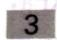

(13 分) <<<

已知四氧化二氮的分解反应：

$$
\mathrm{N} _ {2} \mathrm{O} _ {4} (\mathrm{g}) \rightleftharpoons 2 \mathrm{NO} _ {2} (\mathrm{g})
$$

在 298.15 K 时， $\Delta_{r}G_{m}^{\ominus}=4.75\ \mathrm{kJ}\cdot \mathrm{mol}^{-1}$ 。试判断在此温度及下列条件下，反应进行的自发方向：

$$
3 - 1 \quad \mathrm{N} _ {2} \mathrm{O} _ {4} (1 0 0 \mathrm{kPa}), \mathrm{NO} _ {2} (1 0 0 0 \mathrm{kPa}) 。
$$

$$
3 - 2 \quad \mathrm{N} _ {2} \mathrm{O} _ {4} (1 0 0 0 \mathrm{kPa}), \mathrm{NO} _ {2} (1 0 0 \mathrm{kPa}) 。
$$

$$
3 - 3 \quad \mathrm{N} _ {2} \mathrm{O} _ {4} (3 0 0 \mathrm{kPa}), \mathrm{NO} _ {2} (2 0 0 \mathrm{kPa}) 。
$$

4 (8分)>>>

使一定量 1:3 的氮、氢混合气体在 1174 K, 3 MPa 下通过铁催化剂以合成氨。设反应达到平衡。出来的气体混合物缓缓地通入 20 mL 盐酸吸收氨。用气量计测得剩余气体的体积相当于 273.15 K, 101.325 kPa 的干燥气体 (不含水蒸气) 2.02 L。原盐酸溶液 20 mL 需用浓度为 52.3 mmol·L $^{-1}$ 的氢氧化钾溶液 18.72 mL 滴定至终点。气体通过后则需用同样浓度的氢氧化钾溶液 15.17 mL。求 1174 K 时反应 N $_{2}$ (g) + 3H $_{2}$ (g) ⇌ 2NH $_{3}$ (g) 的 K $^{\ominus}$ 。

## 5 (12分) <<<

将 $1\mathrm{molSO}_2$ 与 $1\mathrm{molO}_2$ 的混合气体在 $101.325\mathrm{kPa}$ 及 $903\mathrm{K}$ 下通过盛有铂丝的玻璃管，控制气流速度，使反应达到平衡，把产生的气体急剧冷却，并用KOH吸收 $\mathrm{SO}_2$ 及 $\mathrm{SO}_3$ ，最后量得余下的氧气在 $101.325\mathrm{kPa}, 273.15\mathrm{K}$ 下体积为 $13.78\mathrm{L}$ ，试计算反应 $\mathrm{SO}_2 + \frac{1}{2}\mathrm{O}_2 \rightleftharpoons \mathrm{SO}_3$ 在 $903\mathrm{K}$ 时的

$\Delta_{i}G_{m}^{\ominus}$ 及 $K^{\ominus}$

6 (9分) >>>
已知血红蛋白(Hb)的氧化反应 $\mathrm{Hb(aq)} + \mathrm{O}_{2}(\mathrm{g}) \rightleftharpoons \mathrm{HbO}_{2}(\mathrm{aq})$ 的 $(292\mathrm{K})K_{1}^{\ominus} = 85.5$ 。若在 $292\mathrm{K}$ 时，空气中 $p_{0_{2}} = 20.2\mathrm{kPa}$ ， $O_{2}$ 在水中溶解度为 $2.3 \times 10^{-4}\mathrm{mol} \cdot \mathrm{L}^{-1}$ ，试求反应 $\mathrm{Hb(aq)} + \mathrm{O}_{2}(\mathrm{aq}) \rightleftharpoons \mathrm{HbO}_{2}(\mathrm{aq})$ 的 $K_{2}^{\ominus}(292\mathrm{K})$ 和 $\Delta_{r}G_{m}^{\ominus}(292\mathrm{K})$ 。

7 (14分) $< <  <  <   <   <   <   <   <   <   <   <   <   <   <   <   <   <   <   <   <   <   <   <   <   <   <   <   <   <   <   <   <   <   <   <   <   <   <   <   <   <   <   <   <   <   <   <   <   <   <   <   <   <    \Delta_{\mathrm{r}}S_{\mathrm{m}}^{\ominus}(373K)=$ 在 $100^{\circ}C$ 下，下列反应： $\mathrm{COCl}_2(\mathrm{g})\rightleftharpoons \mathrm{CO(g)} + \mathrm{Cl}_2(\mathrm{g})$ 的 $K^{\ominus}=8.1\times 10^{-9}$ , $\Delta_{\mathrm{r}}S_{\mathrm{m}}^{\ominus}(373K)=$ $125.6\mathrm{J}\cdot\mathrm{mol}^{-1}\cdot\mathrm{K}^{-1}$ 。计算：

7-1 $100^{\circ}\mathrm{C}$ 、总压为 $200\mathrm{kPa}$ 时 $\mathrm{COCl}_2$ 的离解度。

7-2 100℃上述反应的 $\Delta_{r}H_{m}^{\ominus}$ 。
7-3 总压为 200 kPa、 $COCl_{2}$ 离解度为 0.1% 时的温度，设 $\Delta_{r}C_{p,m}=0$ 。

## 8 (8分)>>>

在一个抽空的烧瓶中放很多的 $NH_{4}Cl(s)$ ，当加热到 $340^{\circ}C$ 时，固态 $NH_{4}Cl$ 仍然存在，此时系统的平衡压力为 104.67 kPa；在同样的情况下，若放入 $NH_{4}I(s)$ ，则量得的平衡压力为 18.846 kPa，试求固态 $NH_{4}Cl$ 和固态 $NH_{4}I$ 的混合物在 $340^{\circ}C$ 时的平衡压力。假设 HI 不分解，且此二盐类不形成固溶体。

## 9 (12 分) <<<

制备光气的反应按下式进行： $CO + Cl_{2} = COCl_{2}$

实验测得下列数据：

| 实验顺序 | 初浓度/mol·L-1 |  | 初速率/mol·L-1·s-1 |
| --- | --- | --- | --- |
| 实验顺序 | CO | Cl2 | 初速率/mol·L-1·s-1 |
| 1 | 0.100 | 0.100 | 1.2×10-2 |
| 2 | 0.100 | 0.050 | 4.26×10-3 |
| 3 | 0.050 | 0.10 | 6.0×10-3 |
| 4 | 0.050 | 0.050 | 2.13×10-3 |

求该反应的速率常数、反应级数和速率方程。

## 10 (8分,全国化学竞赛决赛试题)>>>

温度对反应速率的影响可用阿伦尼乌斯公式的一种形式表示： $\lg \frac{k_2}{k_1} = \frac{E(T_2 - T_1)}{2.303RT_1T_2}$ 式中 $k_{1}, k_{2}$ 分别为温度 $T_{1}, T_{2}$ 时某反应的速率常数； $E$ 为反应的活化能（单位： $\mathrm{kJ} \cdot \mathrm{mol}^{-1}$ ）（假定活化能在温度变化范围不大时是常数）。又对同一反应，在不同温度下反应速率常数与反应

时间的关系如下： $\frac{k_1}{k_2} = \frac{t_2}{t_1}$

10-1 现知在 $300\mathrm{K}$ , 鲜牛奶 5 小时后即变酸, 但在 $275\mathrm{K}$ 的冰箱里可保存 50 小时, 牛奶变酸反应的活化能是多少?

10-2 若鲜牛奶存放2.5小时后即变酸，则此时温度为多少？

(1) 用 $f(x)$ 为正方形, $(x,y)$ 的圆柱中圆弧分为两个平面. 其余点以 $x$ 为正方形, $(x,y)$ 的圆弧为正方形. 由于 $x$ 的圆弧的圆弧与正方形的圆弧相互交集, 可以 $x$ 为正方形, $(x,y)$ 的圆弧的圆弧相互交集.

图2-3 首中在多含1到百的，由红都和高得可为的多含1。从两式数分之二
人体外，有10个离入本是由十例（3）多含1是自1到百，高得1、出除且由各含1多
与同位不同，有10个离入本是由十例（4）多含1是自1到百，高得1、出除且由各含1多

一般情况下， $(a^{2}+b^{2})^{2}$ 为 $(a^{2}+b^{2})^{2}$ ， $a^{2}$ 为 $(a^{2}+b^{2})^{2}$ 。

原因。  
容量最高为10万立方米，最大值为10万吨/年，最小值为5万吨/年。

（2）因与研究内容进行了讨论，我们

(8) 分析题意: $(1)$ 分析题意: $(2)$ 分析题意: $(3)$ 分析题意: $(4)$ 分析题意: $(5)$ 分析题意: $(6)$ 分析题意: $(7)$ 分析题意: $(8)$ 分析题意: $(9)$ 分析题意: $(10)$ 分析题意: $(11)$ 分析题意: $(12)$ 分析题意: $(13)$ 分析题意: $(14)$ 分析题意: $(15)$ 分析题意: $(16)$ 分析题意: $(17)$ 分析题意: $(18)$ 分析题意: $(19)$ 分析题意: $(20)$ 分析题意: $(21)$ 分析题意: $(22)$ 分析题意: $(23)$ 分析题意: $(24)$ 分析题意: $(25)$ 分析题意: $(26)$ 分析题意: $(27)$ 分析题意: $(28)$ 分析题意: $(29)$ 分析题意: $(30)$ 分析题意: $(31)$ 分析题意: $(32)$ 分析题意: $(33)$ 分析题意: $(34)$ 分析题意: $(35)$ 分析题意: $(36)$ 分析题意: $(37)$ 分析题意: $(38)$ 分析题意: $(39)$ 分析题意: $(40)$ 分析题意: $(41)$ 分析题意: $(42)$ 分析题意: $(43)$ 分析题意: $(44)$ 分析题意: $(45)$ 分析题意: $(46)$ 分析题意: $(47)$ 分析题意: $(48)$ 分析题意: $(49)$ 分析题意: $(50)$

SrO(s)、Sr(C₂s)和SiO₂(II)反应生成 Sr(OH)₃，生成 Sr(OH)₃，生成 Sr(OH)₃，生成 Sr(OH)₃，生成 Sr(OH)₃，生成 Sr(OH)₃，生成 Sr(OH)₃，生成 Sr(OH)₃，生成 Sr(OH)₃，生成 Sr(OH)₃，生成 Sr(OH)₃，生成 Sr(OH)₃，生成 Sr(OH)₃，生成 Sr(O)

# 能力测试 B 卷 (满分 100 分, 时间 150 分钟)

## 7 (14 分) <<<

碳酸钙在密闭容器中加热分解产生氧化钙和二氧化碳并达到平衡：

$$
\mathrm{CaCO} _ {3} (\mathrm{s}) \rightleftharpoons \mathrm{CaO} (\mathrm{s}) + \mathrm{CO} _ {2} (\mathrm{g})
$$

已知 $298\mathrm{K}$ 时的数据如下：

| 物质 | $CaCO_3(s)$ | $CaO(s)$ | $CO_2(g)$ |
| --- | --- | --- | --- |
| $Δ_fH_m(\mathrm{kJ}\cdot\mathrm{mol}^{-1})$ | -1206.9 | -635.6 | -393.5 |
| $Δ_fG_m(\mathrm{kJ}\cdot\mathrm{mol}^{-1})$ | -1128.8 | -604.2 | -394.4 |

求 298 K 时分解反应的 $K_{p}$ 和分解压。在石灰窑中欲使 $CaCO_{3}(s)$ 以一定的速度分解， $CO_{2}$ 的分压应不低于 101325 Pa，试计算石灰窑温至少维持在多少度（假设此反应的 $\Delta C_{P}=0$ ）？

## 2 (4分)>>>

碳-14半衰期为5720a，今测得北京周口店山顶洞遗址出土的古斑鹿骨化石中的 $^{14}C/^{12}C$ 比值是当今活着的生物的0.109倍，估算该化石是距今多少？周口店北京猿人距今约50万年，若有人提议用碳-14法测定它的生活年代，你认为是否可行？

## 3 (4分) <<<

有人提出反应 $2\mathrm{NO}(g) + \mathrm{Cl}_{2}(g) = 2\mathrm{NOCl}(g)$ 的反应历程如下：

$$
\mathrm{NO} + \mathrm{Cl} _ {2} \longrightarrow \mathrm{NOCl} _ {2}
$$

$$
\mathrm{NOCl} _ {2} + \mathrm{NO} \longrightarrow 2 \mathrm{NOCl}
$$

如果第一个基元反应是速控步,该反应的表观速率方程应呈何形式?如果第二个反应是速控步,该反应的表观速率方程又呈何形式?

## 4 (14分,全国化学竞赛决赛试题)>>>

超氧化物歧化酶 SOD(本题用 E 为代号)是生命体中的“清道夫”,在它的催化作用下生命体代谢过程产生的超氧离子才不致过多积存而使人体过早衰老:

4-1 超氧离子在催化剂SOD存在下发生如下反应,请完成该反应的离子方程式:

$$
\square \mathrm{O} _ {2} ^ {-} + \square \square \xrightarrow {\mathrm{E}} \mathrm{O} _ {2} + \square \mathrm{H} _ {2} \mathrm{O} _ {2}
$$

4-2 今在SOD的浓度为 $c_{\mathrm{o}}(\mathrm{E}) = 0.400 \times 10^{-6} \mathrm{~mol} \cdot \mathrm{L}^{-1}$ , $\mathrm{pH} = 9.1$ 的缓冲溶液中进行动力学研究, 在常温下测得不同超氧离子的初始浓度 $c_{\mathrm{o}}(\mathrm{O}_{2}^{-})$ 下超氧化物歧化反应的初始反应速率 $v_{\circ}$ 如下表:

| $c_{o}(O_{2}^{-})/\mathrm{mol}\cdot\mathrm{L}^{-1}$ | $7.69×10^{-6}$ | $3.33×10^{-5}$ | $2.00×10^{-4}$ |
| --- | --- | --- | --- |
| $v_{o}/\mathrm{mol}\cdot\mathrm{L}^{-1}·\mathrm{s}^{-1}$ | $3.85×10^{-3}$ | $1.67×10^{-2}$ | 0.100 |

已知该歧化反应在常温下的速率方程可表示为： $v_{0}=kc_{0}^{n}$ ，其中 n 为该反应的反应级数，k 为速率常数。试根据测定数据确定该歧化反应的反应级数 n 和速率常数 k。要求计算过程。

## 5 (12 分, 全国化学竞赛初赛试题) <<<

高炉炼铁是重要的工业过程。冶炼过程中涉及如下反应：
(1) $\mathrm{FeO(s)+CO(g)=Fe(s)+CO_{2}(g)}$ $K_{1}=1.00$ $(T=1200\mathrm{K})$ (2) $\mathrm{FeO(s)+C(s)=Fe(s)+CO(g)}$ $K_{2}$ $(T=1200\mathrm{K})$

气体常数 $R = 8.314\mathrm{J}\cdot \mathrm{mol}^{-1}\cdot \mathrm{K}^{-1}$ ；相关的热力学常数(298K)列入下表：

|  | FeO(s) | Fe(s) | C(s)(石墨) | CO(g) | $CO_2(g)$ |
| --- | --- | --- | --- | --- | --- |
| $\Delta_fH_m^\ominus (\mathrm{kJ}\cdot\mathrm{mol}^{-1})$ | -272.0 | — | — | -110.5 | -393.5 |
| $S_m^\ominus (\mathrm{J}\cdot\mathrm{mol}^{-1}·\mathrm{K}^{-1})$ | 60.75 | 27.3 | 5.74 | / | x |

5-1 假设上述反应体系在密闭条件下达平衡时总压力为 $1200 \mathrm{kPa}$ , 计算各气体的分压。

5-2 计算 $K_{2}$ 。

5-3 计算 $\mathrm{CO}_{2}(\mathrm{g})$ 的标准熵 $S_{\mathrm{m}}^{\theta}$ （单位： $\mathrm{J}\cdot \mathrm{mol}^{-1}\cdot \mathrm{K}^{-1}$ ）。（设反应的焓变和熵变不随温度变化）5-4 反应体系中，若 $\mathrm{CO(g)}$ 和 $\mathrm{CO_2(g)}$ 均保持标态，判断此条件下反应的自发性（填写对应的字母）：反应(1) A自发 B不自发 C达平衡反应(2) A自发 B不自发 C达平衡

5-5 若升高温度,指出反应平衡常数如何变化(填写对应的字母)。计算反应焓变,给出原因。
反应(1) A 增大 B 不变化 C 减小
反应(2) A 增大 B 不变化 C 减小

## 6 (8分,福建省化学竞赛试题)>>>

在较高温度下， $\mathrm{C}$ （石墨） $+\mathrm{CO}_{2}(\mathrm{g}) \rightleftharpoons 2\mathrm{CO}(\mathrm{g})$ 的平衡常数，可用下面方法测量：将足量 $\mathrm{SrO}(\mathrm{s})$ ， $\mathrm{SrCO}_{3}(\mathrm{s})$ 和 $\mathrm{C}$ （石墨）放入抽空的石英球中，并加热到 $1123\mathrm{K}$ ；当达平衡时，三种固态物质上方气相压力为 $22.5\mathrm{kPa}$ 。已知反应 $\mathrm{SrCO}_{3}(\mathrm{s}) \rightleftharpoons \mathrm{SrO}(\mathrm{s}) + \mathrm{CO}_{2}(\mathrm{g})$ 在该温度下的平衡常数为 $3.25 \times 10^{-3}$ 。今在 $1123\mathrm{K}$ 及 $100\mathrm{kPa}$ 时，使 $\mathrm{CO}_{2}(\mathrm{g})$ 通过石墨并保持压力不变。

6-1 石英球中,存在几个独立反应?
6-2 计算反应 C(石墨) + CO₂(g) ⇌ 2CO(g) 的热力学平衡常数。
6-3 总压为 100 kPa 的气相中，CO(g) 与 CO₂(g) 的比例为多少？

6-4 为促使 $\mathrm{SrCO}_3(\mathrm{s})$ 的分解, 可采取哪些措施?

(14分) $<<$ 下列各反应在 $0^{\circ}\mathrm{C}$ 时的平衡常数值已给出： $① \mathrm{SrCl}_2 \cdot 6\mathrm{H}_2\mathrm{O}(\mathrm{s}) \rightleftharpoons \mathrm{SrCl}_2 \cdot 2\mathrm{H}_2\mathrm{O}(\mathrm{s}) + 4\mathrm{H}_2\mathrm{O}(\mathrm{g})$ $\mathrm{Na_2HPO_4} \cdot 7\mathrm{H}_2\mathrm{O}(\mathrm{s}) + 5\mathrm{H}_2\mathrm{O}(\mathrm{g})$

$$
K _ {\mathrm{p}} = 6. 8 9 \times 1 0 ^ {- 1 2}
$$

$$
K _ {\mathrm{p}} = 5. 2 5 \times 1 0 ^ {- 1 3}
$$

$$
K _ {\mathrm{p}} = 4. 0 8 \times 1 0 ^ {- 2 5}
$$

$$
\begin{array}{r l}&\mathrm{SrCl} _ {2} \cdot 6 \mathrm{H} _ {2} \mathrm{O} (\mathrm{s}) \rightleftharpoons \mathrm{SrCl} _ {3}\\&\mathrm{Na} _ {2} \mathrm{HPO} _ {4} \cdot 1 2 \mathrm{H} _ {2} \mathrm{O} (\mathrm{s}) \rightleftharpoons \mathrm{Na} _ {2} \mathrm{HPO} _ {4} \cdot 7 \mathrm{H} _ {2} \mathrm{O} (\mathrm{s})\\&\mathrm{Na} _ {2} \mathrm{SO} _ {4} \cdot 1 0 \mathrm{H} _ {2} \mathrm{O} (\mathrm{s}) \rightleftharpoons \mathrm{Na} _ {2} \mathrm{SO} _ {4} (\mathrm{s}) + 1 0 \mathrm{H} _ {2} \mathrm{O} (\mathrm{g})\end{array}
$$

③ $Na_{2}SO_{4} \cdot 10H_{2}O(s) \rightleftharpoons Na_{2}SO_{4}(s)$ $0^{\circ}C$ 时水的蒸气压为 $6.03 \times 10^{-3} \mathrm{atm}$ $Na_{2}HPO_{4} \cdot 12H_{2}O$ 和 $Na_{2}SO_{4} \cdot 10H_{2}O$ 共存的气态

7-1 计算 $0^{\circ}$ C 时，分别与 $SrCl_{2}\cdot6H_{2}SO_{4}$ 水的压力值为多少？

7-2 $0^{\circ}$ C 时 $SrCl_{2}\cdot2H_{2}O$ ， $Na_{2}HPO_{4}\cdot7H_{2}O$ 和 $Na_{2}SO_{4}$ 中谁的干燥效果最好？

7-3 $0^{\circ}$ C 时当相对湿度为多少时暴露在空气中的 $Na_{2}SO_{4}\cdot10H_{2}O$ 会风化？

7-4 $0^{\circ}$ C 时当相对湿度为多少时暴露在空气中的 $Na_{2}SO_{4}$ 会潮解？

8 (10分) >>
超音速飞机在平流层飞行放出的燃烧尾气中的NO会通过下列反应破坏其中保护我们免受阳光中的短波紫外线辐射伤害的臭氧： $\mathrm{NO}_{2}(\mathrm{g}) + \mathrm{O}_{2}(\mathrm{g}) = \mathrm{NO}_{2}(\mathrm{g}) + \mathrm{O}_{2}(\mathrm{g})$

$$
\mathrm{NO} (\mathrm{g}) + \mathrm{O} _ {3} (\mathrm{g}) = \mathrm{NO} _ {2} (\mathrm{g}) + \mathrm{O} _ {2} (\mathrm{g})
$$

8-1 如果已知 298 K 和 100 kPa 下 NO、 $NO_{2}$ 和 $O_{3}$ 的生成自由能分别为 +86.7、+51.8、+163.6 kJ·mol $^{-1}$ ，求上面的反应的 $K_{p}$ 和 $K_{c}$ 。
8-2 假定反应在 298 K 下发生，高层大气里的 NO、 $O_{3}$ 和 $O_{2}$ 的浓度分别为 $2 \times 10^{-9} \, \mathrm{mol} \cdot \mathrm{L}^{-1}$ ， $1 \times 10^{-9} \, \mathrm{mol} \cdot \mathrm{L}^{-1}$ ， $2 \times 10^{-3} \, \mathrm{mol} \cdot \mathrm{L}^{-1}$ ， $NO_{2}$ 浓度为零，试计算 $O_{3}$ 的平衡浓度。

8-3 计算达到平衡时 $\mathrm{O}_{3}$ 被NO破坏的百分数。

8-3 计算达到平衡时 $\mathrm{O}_3$ 被NO破坏的百分数。（附注：实际上上述反应的速度不很大，反应并不易达到平衡转化率。）

9 (12分) <<<
NH₄I固体在一定条件下首先发生分解反应并达平衡: ①NH₄I(s)⇌NH₃(g)+HI(g),然后缓慢进行反应 ②2HI(g)⇌H₂(g)+I₂(g),亦达平衡。它们的平衡常数 K(K 只随温度的变化而变化)分别为: K₁=pNH₃pHI, K₂=pH₂pI₂/p²HI,式中 p 指平衡时气体的分压。
(填“不变”)

变化)分别为: $K_{1}=p_{NH_{3}}p_{\text{H}}, K_{2}=p_{H_{2}}p_{I_{2}}/p_{\text{H}}$ (填“不变”、“增大”或“减小”)。

9-2 平衡时，若 $p(\mathrm{NH}_3) = d$ ， $p(\mathrm{H}_2) = f$ ，则 $p_{\mathrm{HI}} =$

9-3 用 $K_{1}, K_{2}$ 表示 $\mathrm{NH}_{3}$ 的平衡分压: $p(\mathrm{NH}_{3}) =$ 。

## 10 (8分,全国化学竞赛初赛试题)>>>

Xe 和 $F_{2}$ 反应, 可得三种氟化物, 视反应条件而定。如图表述的是将 $0.125 \, \mathrm{mol} \cdot \mathrm{L}^{-1} \, Xe$ 和 $1.225 \, \mathrm{mol} \cdot \mathrm{L}^{-1} \, F_{2}$ 为始态得到的生成物在平衡体系内的分压与反应温度的关系。

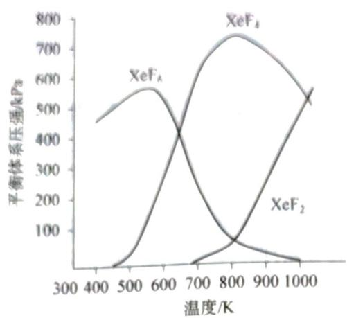

10-1 应在什么温度下制备 $\mathrm{XeF}_2$ 和 $\mathrm{XeF}_4$ ?

10-2 Xe 和 $\mathrm{F}_2$ 生成 $\mathrm{XeF}_6$ 和 $\mathrm{XeF}_4$ ，哪个反应放热更多？并说明理由。

10-3 为有效地制备 $\mathrm{XeF}_2$ ，应在什么反应条件下为好？简述理由。

# 电解质溶液和电离平衡

# 能力测试 A 卷 (满分 100 分, 时间 120 分钟)

常温常压下，在 $\mathrm{H}_2\mathrm{S}$ 气体的饱和溶液中， $\mathrm{H}_2\mathrm{S}$ 浓度约为 $0.10\mathrm{mol}\cdot \mathrm{L}^{-1}$ ，试计算该溶液中的 $[\mathrm{H}^{+}]$ 、[HS-]和[S2-]。（已知 $\mathrm{H}_2\mathrm{S}$ 的 $K_{\mathrm{a1}} = 1.0\times 10^{-7},K_{\mathrm{a2}} = 1.0\times 10^{-12})$

2 (9分) >>
在血液中， $H_{2}CO_{3}-NaHCO_{3}$ 缓冲对的功能之一是从细胞组织中迅速地除去运动产生的乳酸
(HLac:K(HLac)=8.4×10^{-4})。 $H_{2}CO_{3}+HCO_{3}^{-}=H_{2}CO_{3}+Lac^{-}$ 的平衡常数 K。

2-1 已知 $K_{1}(\mathrm{H}_{2}\mathrm{CO}_{3}) = 4.3 \times 10^{-7}$ , 求 $\mathrm{HLac} + \mathrm{HCO}_{3}^{-}$ 。  
2-2 在正常血液中, $[\mathrm{H}_{2}\mathrm{CO}_{3}] = 1.4 \times 10^{-3} \mathrm{~mol} \cdot \mathrm{L}^{-1}$ , $[\mathrm{HCO}_{3}^{-}] = 2.7 \times 10^{-2} \mathrm{~mol} \cdot \mathrm{L}^{-1}$ , 求 $\mathrm{pH}$ 。

2-3 若 $1.0 \mathrm{~L}$ 血液中加入 $5.0 \times 10^{-3} \mathrm{~mol} \mathrm{HLac}$ 后, $\mathrm{pH}$ 为多少?

3 (12分) <<< 已知硫酸的第一步电离 $\left(\mathrm{H}_{2}\mathrm{SO}_{4}=\mathrm{H}^{+}+\mathrm{HSO}_{4}^{-}\right)$ 是完全的,但第二步电离 $\left(\mathrm{HSO}_{4}^{-}\rightleftharpoons\mathrm{H}^{+}+\mathrm{SO}_{4}^{2-}$ 并不完全。如果25℃时,0.1mol·L $^{-1}$ H $_{2}$ SO $_{4}$ 溶液中 $c(\mathrm{SO}_{4}^{2-})=0.010\mathrm{~mol}\cdot\mathrm{L}^{-1},0.1\mathrm{~mol}\cdot\mathrm{L}^{-1}$ NaHSO $_{4}$ 溶液中 $c(\mathrm{SO}_{4}^{2-})=0.029\mathrm{~mol}\cdot\mathrm{L}^{-1}$ ，试回答：

$$
3 - 1 \quad 2 5 ^ {\circ} \mathrm{C}
$$

$$
0. 1 \mathrm{mol} \cdot \mathrm{L} ^ {- 1} \mathrm{H} _ {2} \mathrm{SO} _ {4}
$$

3-1 25℃时，0.1 mol·L $^{-1}$ H $_{2}$ SO $_{4}$ 溶液中 3-2 为何 0.1 mol·L $^{-1}$ 的 H $_{2}$ SO $_{4}$ 溶液中的 c(SO $_{4}^{2-}$ ) 比 0.1 mol·L $^{-1}$ 的 NaHSO $_{4}$ 溶液中 c(SO $_{4}^{2-}$ ) 小？

3-3 0.1 mol·L $^{-1}$ Na $_{2}$ SO $_{4}$ 溶液的 pH \_\_\_\_ 7(填“大于”、“小于”或“等于”)。

3-4 固体 $\mathrm{NaHSO}_{4}$ 与固体食盐混和共热至 $600^{\circ} \mathrm{C}$ , 能否得到 $\mathrm{HCl}$ 气体? 为什么?

3-5 常温下测得 $0.25 \mathrm{~mol} \cdot \mathrm{L}^{-1}$ 的 $\mathrm{CuSO}_{4}$ 溶液的 $\mathrm{pH}$ 为 $5, 0.25 \mathrm{~mol} \cdot \mathrm{L}^{-1} \mathrm{Cu(ClO}_{4})_{2}$ 溶液的 $\mathrm{pH}$ 为 4.5, 其原因是 \_\_\_\_。

## 4 (12分)>>>

试判断下列化学反应方向,并用质子理论解释。

$$
4 - 1 \quad \mathrm{HAc} + \mathrm{CO} _ {3} ^ {2 -} \rightleftharpoons \mathrm{HCO} _ {3} ^ {-} + \mathrm{Ac} ^ {-}
$$

$$
4 - 2 \quad \mathrm{H} _ {3} \mathrm{O} ^ {+} + \mathrm{HS} ^ {-} \rightleftharpoons \mathrm{H} _ {2} \mathrm{S} + \mathrm{H} _ {2} \mathrm{O}
$$

$$
4 - 3 \quad \mathrm{HS} ^ {-} + \mathrm{H} _ {2} \mathrm{PO} _ {4} ^ {-} \rightleftharpoons \mathrm{H} _ {3} \mathrm{PO} _ {4} + \mathrm{S} ^ {2 -}
$$

$$
4 - 4 \quad \mathrm{HCN} + \mathrm{S} ^ {2 -} \rightleftharpoons \mathrm{HS} ^ {-} + \mathrm{CN} ^ {-}
$$

## (8分) <<<

计算下列各溶液的 $\mathrm{pH}$ ，已知 $K_{\mathrm{b}}(\mathrm{NH}_{3} \cdot \mathrm{H}_{2}\mathrm{O}) = 1.8 \times 10^{-5}$ ， $K_{\mathrm{a}}(\mathrm{HF}) = 3.53 \times 10^{-4}$ 。

化学竞赛能力测试一高中第二分册

5-1 0.500 mol·L $^{-1}$ NH $_{4}$ Cl溶液

5-2 $0.040\mathrm{mol}\cdot \mathrm{L}^{-1}$ NaF溶液

## 6 (10 分,北京市化学竞赛试题)>>>

① 称取酚醛树脂试样 2.1027 g，提取其中游离的对甲苯酚（分子量为：108.0），配成 1000 mL 待测液。

② 移取 25.00 mL 该待测液于锥形瓶中，加入过量溴水。充分反应后，加入过量 KI 溶液，而后用 $0.1010 \, \mathrm{mol} \cdot \mathrm{L}^{-1} \, Na_{2}S_{2}O_{3}$ 溶液滴定生成的碘，滴定终点时，用掉 21.78 mL。

③ 以蒸馏水代替待测液做空白实验，消耗该 $\mathrm{Na_2S_2O_3}$ 溶液 $23.95\mathrm{mL}$ 。

计算试样中游离对甲苯酚的质量分数。

## 7 (10分) <<<

称取含 NaOH 和 $Na_{2}CO_{3}$ 的样品 0.700 g（杂质不与 HCl 反应）溶解后稀释至 100 mL。取 20 mL 该溶液，用甲基橙作指示剂，用 0.110 mol·L $^{-1}$ HCl 滴定，终点时用去 26.00 mL；另取 20 mL 上述溶液，加入过量 $BaCl_{2}$ 溶液，过滤，滤液中加入酚酞作指示剂，滴定达终点时，用去上述 HCl 溶液 20 mL。试求样品中 NaOH 和 $Na_{2}CO_{3}$ 质量分数。

## 8 (12分)>>>

1905 年美国化学家富兰克林提出了酸碱的溶剂理论,人们发现许多溶剂都能发生自电离过程,生成特征阳离子和特征阴离子,如 $2H_{2}O \rightleftharpoons H_{3}O^{+} + OH^{-}$ , $2NH_{3} \rightleftharpoons NH_{4}^{+} + NH_{2}^{-}$ ,溶剂理论认为凡在溶剂中能产生(包括化学反应生成)特征阳离子的物质为溶剂酸,反之为溶剂碱。

8-1 试定义溶剂理论中的中和反应。

8-2 $\mathrm{NH}_{4} \mathrm{Cl}$ 和 $\mathrm{NaH}$ 在液氨体系中是酸还是碱, 并用方程式来表示。

8-3 $\mathrm{SbF}_5$ 在 $\mathrm{BrF}_3$ 溶液中为酸，写出其电离方程式，画出电离所得阴、阳离子的结构。

8-4 尿素在液氨中为弱酸,试写出电离方程式。液氨中尿素与氨基钠反应得到尿素盐,试写出方程式。该反应能不能在水中进行?为什么?

## (8分) <<<

写出下列溶液的质子条件式: $\mathrm{Na}_{2} \mathrm{HPO}_{4} 、 (\mathrm{NH}_{4})_{2} \mathrm{HPO}_{4} 、 c_{1} \mathrm{~mol} \cdot \mathrm{L}^{-1} \mathrm{NaAc}-c_{2} \mathrm{~mol} \cdot \mathrm{L}^{-1} \mathrm{HAc}$ 、 $c \mathrm{~mol} \cdot \mathrm{L}^{-1} \mathrm{HCl}+\mathrm{NH}_{4} \mathrm{Ac}$ 。

## 10 (10 分) >>>

计算 $\mathrm{pH} = 4.00$ 和8.00时HAc和 $\mathrm{Ac}^-$ 的分布分数。已知 $\mathrm{pK_a} = 4.74, K_{\mathrm{a}} = 1.8\times 10^{-5}$

# 能力测试 B 卷 (满分 100 分, 时间 150 分钟)

## 7 (8分)

1-1 根据酸碱质子理论,按碱性由强到弱的顺序排列下列各离子: $\mathrm{NO}_{2}^{-}$ 、 $\mathrm{SO}_{4}^{2-}$ 、 $\mathrm{HCO}_{3}^{-}$ 、 $\mathrm{HSO}_{4}^{-}$ 、 $\mathrm{Ac}^{2-}$ 、 $\mathrm{CO}_{3}^{2-}$ 、 $\mathrm{S}^{2-}$ 、 $\mathrm{ClO}_{4}^{-}$ 。

1-2 根据酸碱电子理论, 按酸性由强到弱的顺序排列下列各离子: $Li^{+}$ 、 $Na^{+}$ 、 $K^{+}$ 、 $Be^{2+}$ 、 $Mg^{2+}$ 、 $Al^{3+}$ 、 $B^{3+}$ 、 $Fe^{2+}$ 。

## 2 (12分)>>>

丙二酸( $\mathrm{H_{2}A}$ )的 $\mathrm{pK_{a1}} = 2.86, \mathrm{pK_{a2}} = 5.70$ ，向 $20.00 \mathrm{~mL} \mathrm{Na_{2}A}$ 、 $\mathrm{NaHA}$ 混合溶液中加入 $1.00 \mathrm{~mL} 0.0100 \mathrm{~mol} \cdot \mathrm{L^{-1}HCl}$ ， $\mathrm{pH}$ 为 $5.70$ ；滴入同样浓度 $10.00 \mathrm{~mL} \mathrm{HCl}$ ， $\mathrm{pH}$ 为 $4.28$ ，求初始混合液中 $\mathrm{Na_{2}A}$ 、 $\mathrm{NaHA}$ 的浓度和 $\mathrm{pH}$ 。

## (12 分) <<<

二元酸 $\mathrm{H}_2\mathrm{A}$ 的电离反应如下：

$$
\mathrm{H} _ {2} \mathrm{A} \rightleftharpoons \mathrm{HA} ^ {-} + \mathrm{H} ^ {+} \quad K _ {1} = 4. 5 0 \times 1 0 ^ {- 7}
$$

$$
\mathrm{HA} ^ {-} \rightleftharpoons \mathrm{A} ^ {2 -} + \mathrm{H} ^ {+} \quad K _ {2} = 4. 7 0 \times 1 0 ^ {- 1 1}
$$

用 $0.300 \, \mathrm{mol} \cdot \mathrm{L}^{-1}$ HCl 滴定含有 $Na_{2}A$ 和 NaHA 的一份 20.00 mL 的溶液，滴定进程用玻璃电极 pH 计跟踪，滴定曲线上的两个点对应的数据如下：

| 加入的HCl/mL | 1.00 | 10.00 |
| --- | --- | --- |
| pH | 10.33 | 8.34 |

3-1 加入 $1.00 \mathrm{~mL} \mathrm{HCl}$ 时首先与 $\mathrm{HCl}$ 反应的物种是什么？产物是什么？

3-2 3-1 中生成的产物有多少 mmol?

3-3 写出 3-1 中生成的产物与溶剂反应的主要平衡式。

3-4 初始溶液中存在的 $\mathrm{Na}_{2} \mathrm{~A}$ 和 $\mathrm{NaHA}$ 的量各有多少 mmol?

3-5 计算为达到第二个等当点所需要 HCl 的总体积。

## 4 (8分,国际奥赛预备试题)>>>

监测电导率是一种常用的电化学分析方法,电导率仪向两个相同的电极施加交流电信号,诱导离子在溶液中移动,其极性的变换避免了电极处发生电解反应。因此,溶液中离子迁移率与溶液中离子电导率有关。可用电导率探针来监测 $0.100 \, \mathrm{mol} \cdot \mathrm{L}^{-1}$ NaOH 滴定 25.00 mL 盐酸的反应。在 NaOH 添加期间记录电导率信号。电导滴定装置如图 1 所示。标准

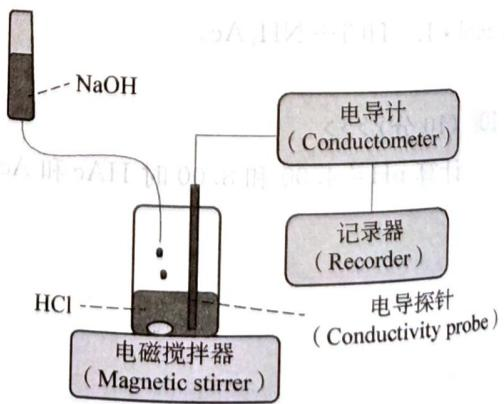  
图1

NaOH 溶液在重力作用下以每秒 3 滴的速度滴加, 记录来自电导率仪的电导率, 溶液的电导率与滴定时间的关系曲线如图 2 所示。

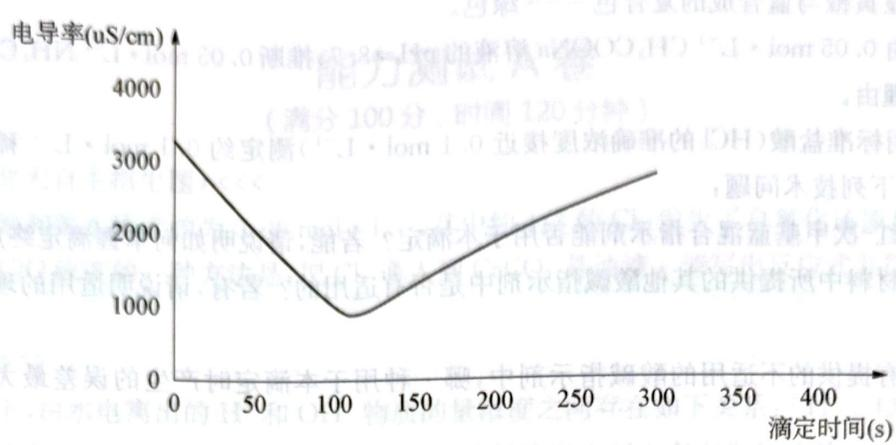  
图2

4-1 解释为什么滴定曲线在转折点前后斜率不同。

4-2 如果每滴 $\mathrm{NaOH}$ 的体积为 $0.029\mathrm{mL}$ ，转折点的横坐标为108秒，计算盐酸的浓度。

## 5 (8分) <<<

3%的甲酸的密度 $\rho=1.0049\ g\cdot \mathrm{cm}^{-3}$ ，其 pH=1.97，问稀释多少倍后，甲酸溶液的电离度增大为稀释前的 10 倍？

## 6 (8分)>>>

拟配制 pH=7 的缓冲溶液, 如何从下列信息中选择缓冲对? 配比应如何?

$$
\mathrm{HAc} \rightleftharpoons \mathrm{H} ^ {+} + \mathrm{Ac} ^ {-} \qquad \mathrm{pK} _ {\mathrm{a}} = 4. 7 4
$$

$$
\mathrm{H} _ {3} \mathrm{PO} _ {4} \rightleftharpoons \mathrm{H} ^ {+} + \mathrm{H} _ {2} \mathrm{PO} _ {4} ^ {-} \qquad \mathrm{pK} _ {\mathrm{a}} = 2. 1 2
$$

$$
\mathrm{H} _ {2} \mathrm{PO} _ {4} ^ {-} \rightleftharpoons \mathrm{H} ^ {+} + \mathrm{HPO} _ {4} ^ {2 -} \quad \mathrm{pK} _ {\mathrm{a}} = 7. 2 1
$$

$$
\mathrm{HPO} _ {4} ^ {2 -} \rightleftharpoons \mathrm{H} ^ {+} + \mathrm{PO} _ {4} ^ {3 -} \quad \mathrm{pK} _ {\mathrm{a}} = 1 2. 4 4
$$

## (10 分) <<<

已知氨水的 $K_{b}=1.8\times10^{-5}$ ，计算下列各溶液的 pH:

7-1 $20\mathrm{mL}0.10\mathrm{mol}\cdot \mathrm{L}^{-1}$ HCl和 $20\mathrm{mL}0.10\mathrm{mol}\cdot \mathrm{L}^{-1}$ 氨水混合

7-2 $20\mathrm{mL}0.10\mathrm{mol}\cdot \mathrm{L}^{-1}$ HCl和 $20~\mathrm{mL}0.20\mathrm{mol}\cdot \mathrm{L}^{-1}$ 氨水混合

## 8 (12分)>>>

请仔细阅读下面的材料,回答有关问题:

材料之一:常温下,浓度相等的 $CH_{3}COOH$ 和 $NH_{3}\cdot H_{2}O$ 两种稀溶液,pH 之和为 14。

材料之二:有三种酸碱指示剂:酚酞为常用的单色指示剂,显色的最低pH=8。甲基红是常用的有酸式色和碱式色的双色指示剂,pH<4呈红色,4<pH<5.2呈橙色,pH>5.2呈黄色。“中性红一次甲基蓝混合指示剂”是双色指示剂中性红和惰性蓝色染料次甲基蓝在酒精中组成的混合溶液，它恰好能在pH=7时在溶液中显紫蓝色，在酸性溶液中显红与蓝合成的复合色——紫色，在碱性溶液中显黄橙与蓝合成的复合色——绿色。

8-1 由 $0.05\mathrm{mol}\cdot \mathrm{L}^{-1}\mathrm{CH}_3\mathrm{COONa}$ 溶液的 $\mathrm{pH} = 8.7$ ，推断 $0.05\mathrm{mol}\cdot \mathrm{L}^{-1}\mathrm{NH}_4\mathrm{Cl}$ 溶液的 $\mathsf{pH}$ 并简要说明理由。

8-2 用标准盐酸(HCl)的准确浓度接近 $0.1 \mathrm{~mol} \cdot \mathrm{L}^{-1}$ 测定约 $0.1 \mathrm{~mol} \cdot \mathrm{L}^{-1}$ 稀氨水的准确浓度,试研究下列技术问题:

① 中性红-次甲基蓝混合指示剂能否用于本滴定？若能，请说明如何掌握滴定终点。

② 以上材料中所提供的其他酸碱指示剂中是否有适用的？若有，请说明适用的理由和如何掌握滴定终点。

③ 在所有提供的不适用的酸碱指示剂中,哪一种用于本滴定时产生的误差最大?试分析其原因。

## 9 (8分) <<<

酸碱的溶剂理论认为:酸是能给出表征溶剂特征的阳离子的物质,碱则是能给出表征溶剂特征的阴离子的物质。

9-1 液态 $\mathrm{SO}_2$ 存在着 $2\mathrm{SO}_2 \rightleftharpoons \mathrm{SO}^{2+} + \mathrm{SO}_3^{2-}$ 平衡。在液态 $\mathrm{SO}_2$ 中， $\mathrm{Cs}_2\mathrm{SO}_3$ 和 $\mathrm{SOCl}_2$ 可以相互滴定，写出该反应的化学方程式。

9-2 二乙基锌 $\mathrm{Zn(C_2H_5)_2}$ 在干冰的温度下可与 $\mathrm{SO}_2$ 反应，写出该反应的化学方程式。

9-3 $\mathrm{PCl}_5$ 、 $\mathrm{NbCl}_5$ 和 $\mathrm{UCl}_6$ 在液态 $\mathrm{SO}_2$ 中可以发生溶剂分解反应，写出它们的化学反应方程式。

9-4 在液体 $\mathrm{SO}_2$ 中, $\mathrm{NH}_4\mathrm{SCN}$ 和 $\mathrm{SOCl}_2$ 反应类似于水溶液中的什么反应? 写出该化学反应方程式。

## 10 (14 分) >>>

丙二酸的结构简式为 HOOC—CH₂—COOH，简写成 H₂M，存在下列两个平衡：

$$
\begin{array}{l l}\mathrm {H_ {2} M\rightleftharpoons HM^ {-} + H^ {+}}&\mathrm {p K _ {a1} = 2.86}\\\mathrm {HM^ {-} \rightleftharpoons M^ {2 - } + H^ {+}}&\mathrm {p K _ {a2} = 5.70}\end{array}
$$

现取 20.00 mL 某丙二酸钠( $Na_{2}M$ ) 和丙二酸氢钠(NaHM) 混合物的溶液, 用 0.010 mol·L $^{-1}$ HCl 滴定, 在滴定过程中, 测得滴定曲线上的两个点的 pH:

加入体积/mL pH 1.00 5.70 10.00 4.28

试计算达到丙二酸化学计量点时,总共需要多少盐酸?

## 第3章

# 难溶电解质的沉淀溶解平衡

# 能力测试 A 卷

（满分100分，时间120分钟）

## 1 (8分,北大自主招生题) <<<

室温下饱和氯水浓度约为 $0.09 \, \mathrm{mol} \cdot \mathrm{L}^{-1}$ ，其中约 1/3 的 $Cl_{2}$ 发生了自氧化还原反应。增加饱和溶液中 HClO 浓度的一种方法是：把 $Cl_{2}$ 通入到 $CaCO_{3}$ 悬浊液。请写出反应式并简述理由。

## 2 (6分)>>>

某温度下,由水电离出的 $H^{+}$ 和 $OH^{-}$ 物质的量浓度之间存在如下关系: $[H^{+}][OH^{-}] = K_{w}$ , 同样对于难溶盐 MA, 其饱和溶液中 $M^{+}$ 和 $A^{-}$ 物质的量浓度之间也存在类似关系:

$\left[W^{+}\right]\left[A^{-}\right]=K_{\mathrm{sp}}$ 。现将足量 AgCl 分别放在 5 mL $H_{2}O$ 、10 mL 0.2 mol· $L^{-1}$ $MgCl_{2}$ 、20 mL 0.5 mol· $L^{-1}$ NaCl 和 40 mL 0.3 mol· $L^{-1}$ HCl 溶液中，溶解达到饱和，各溶液中 $Ag^{+}$ 浓度的数值依次为 a、b、c、d，它们由大到小排列顺序为 \_\_\_\_。

## 3 (8分,上海交大自主招生题) <<<

在下列系统中各加入约 0.010 g NaAc(醋酸钠)固体并使其溶解,对所指定的性质影响如何?并简单的说明原因。

3-1 $10.0 \mathrm{~mL} 0.10 \mathrm{~mol} \cdot \mathrm{L}^{-1}$ 氨水溶液的电离度 \_\_\_\_ ，原因 \_\_\_\_ 。

3-2 $10.0 \mathrm{~mL}$ 带有 $\mathrm{PdCl}_{2}$ 沉淀的饱和溶液, $\mathrm{PdCl}_{2}$ 的溶解度\_\_\_\_, 原因

## 4 (8分)>>>

请根据以下数据讨论 $BaCrO_{4}$

在 HAc(2.0 mol·L $^{-1}$ )—NaAc(2.0 mol·L $^{-1}$ ) 溶液中的溶解情况。

$$
\mathrm{Cr} _ {2} \mathrm{O} _ {7} ^ {2 -} + \mathrm{H} _ {2} \mathrm{O} \rightleftharpoons 2 \mathrm{CrO} _ {4} ^ {2 -} + 2 \mathrm{H} ^ {+}
$$

$$
K _ {\mathrm{sp}} (\mathrm {BaCrO_ {4}}) = 2. 0 \times 1 0 ^ {- 1 0}
$$

$$
K = 2. 4 \times 1 0 ^ {- 5}
$$

$$
K _ {\mathrm{a}} (\mathrm{HAc}) = 1. 8 \times 1 0 ^ {- 5}
$$

## 5 (10分) <<<

称取含 $CaCO_{3}$ 60% 的试样 0.25 g，用酸溶解后加入过量 $(\mathrm{NH}_{4})_{2}\mathrm{C}_{2}\mathrm{O}_{4}$ ，使 $Ca^{2+}$ 沉淀为 $CaC_{2}O_{4}$ 。在过滤、洗涤沉淀时，为了使沉淀溶解损失造成的误差不大于万分之一，应该用 100 mL 溶质质量分数至少为多少的 $(\mathrm{NH}_{4})_{2}\mathrm{C}_{2}\mathrm{O}_{4}$ 作洗涤液？已知溶液中当 $Ca^{2+}$ 和 $C_{2}O_{4}^{2-}$ 物质的量浓度的乘积等于或大于 $2.3 \times 10^{-9}$ 时会析出 $CaC_{2}O_{4}$ 沉淀。

## 6 (10分)>>>

用有关理论解释下列事实:甲学生在制得 $\mathrm{Mg(OH)}_{2}$ 沉淀中加入浓氯化铵溶液,结果沉淀完全溶解,乙学生在制得的 $\mathrm{Mg(OH)}_{2}$ 沉淀中加入浓醋酸铵溶液,结果沉淀也完全溶解。

7（12分，国际奥赛预备试题）《《CuSO4溶液混合，用0.01mol·L-1的HCl稀释至500mL。计算所配制的Cu2+浓度(mol·L-1)》。
7-1 把1.345g的CuCl2和50.00mL31.9g·L-1的CuSO4溶液混合，用0.01mol·L-1的HCl稀释至500mL。计算所配制的Cu2+浓度(mol·L-1)。
7-2 取25.00mL溶液，用NaOH调至pH8.0，终点体积为100.0mL，计算是否有沉淀生成（注：Ksp(Cu(OH)2)=4.8×10-20）。

## 8 (12分)>>>

难溶化合物的饱和溶液中存在着溶解平衡,例如: $\mathrm{AgCl(固)} \rightleftharpoons \mathrm{Ag}^{+} + \mathrm{Cl}^{-}; \mathrm{Ag}_{2}\mathrm{CrO}_{4}(固) \rightleftharpoons 2\mathrm{Ag}^{+} + \mathrm{CrO}_{4}^{2-}$ 面积为一常数,这个常

在一定温度下,难溶化合物饱和溶液的离子浓度的乘积为一常数,这个常数用 $K_{\mathrm{sp}}$ 表示。已知: $K_{\mathrm{sp}}(\mathrm{AgCl}) = [\mathrm{Ag}^{+}][\mathrm{Cl}^{-}] = 1.8 \times 10^{-10}$ ; $K_{\mathrm{sp}}(\mathrm{Ag}_{2} \mathrm{CrO}_{4}) = [\mathrm{Ag}^{+}]^{2}[\mathrm{CrO}_{4}^{2-}] = 1.9 \times 10^{-12}$ 。现有 $0.001 \mathrm{~mol} \cdot \mathrm{L}^{-1} \mathrm{AgNO}_{3}$ 溶液滴定 $0.001 \mathrm{~mol} \cdot \mathrm{L}^{-1} \mathrm{KCl}$ 和 $0.001 \mathrm{~mol} \cdot \mathrm{L}^{-1}$ 的 $\mathrm{K}_{2} \mathrm{CrO}_{4}$ 的混和溶液,试通过计算回答:

8-1 $\mathrm{Cl}^{-}$ 和 $\mathrm{CrO}_4^{2-}$ 哪种先沉淀？

8-2 当 $CrO_{4}^{2-}$ 以 $Ag_{2}CrO_{4}$ 形式沉淀时，溶液中的 $Cl^{-}$ 离子浓度是多少？ $CrO_{4}^{2-}$ 与 $Cl^{-}$ 能否达到有效的分离？（设当一种离子开始沉淀时，另一种离子浓度小于 $10^{-5} \, \mathrm{mol} \cdot \mathrm{L}^{-1}$ 时，则认为可以达到有效分离）

## 9 (14分) <<<

某厂生产硼砂过程中产生的固体废料,主要含有 $MgCO_{3}$ 、 $MgSiO_{3}$ 、 $CaMg(CO_{3})_{2}$ 、 $Al_{2}O_{3}$ 和 $Fe_{2}O_{3}$ 等,回收其中镁的工艺流程如下:

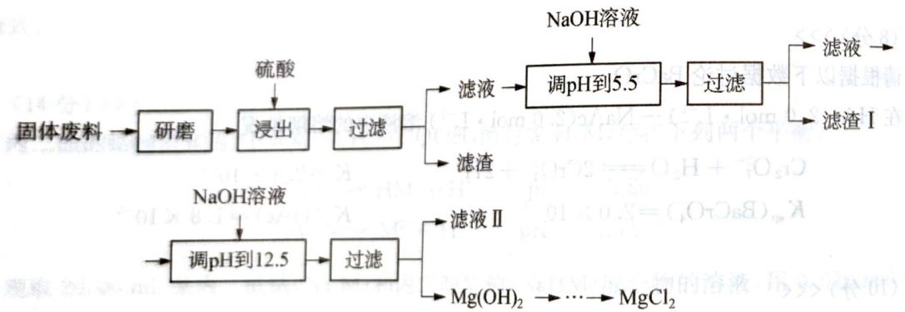

| 沉淀物 | $Fe(OH)_3$ | $Al(OH)_3$ | $Mg(OH)_2$ |
| --- | --- | --- | --- |
| pH | 3.2 | 5.2 | 12.4 |

部分阳离子以氢氧化物形式完全沉淀时溶液的 pH 见上表,请回答下列问题:

9-1 “浸出”步骤中,为提高镁的浸出率,可采取的措施有\_(要求写出两条)。

9-2 滤渣I的主要成分有

9-3 从滤液Ⅱ中可回收利用的主要物质有

9-4 $\mathrm{Mg(ClO_3)_2}$ 在农业上可用作脱叶剂、催熟剂，可采用复分解反应制备：

$$
\mathrm{MgCl} _ {2} + 2 \mathrm{NaClO} _ {3} \longrightarrow \mathrm{Mg(ClO} _ {3}) _ {2} + 2 \mathrm{NaCl}
$$

已知四种化合物的溶解度(S)随温度(T)变化曲线如下图所示：

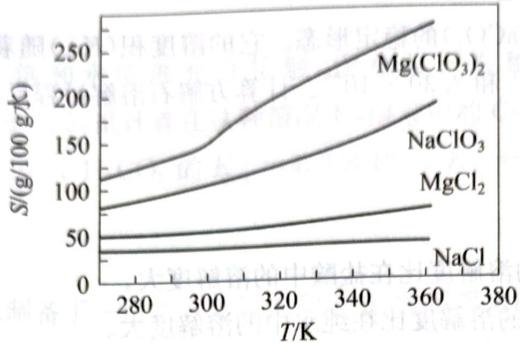

① 将反应物按化学反应方程式计量数比混合制备 $\mathrm{Mg(ClO_{3})_{2}}$ 。简述可制备 $\mathrm{Mg(ClO_{3})_{2}}$ 的原因 \_\_\_\_。

② 按①中条件进行制备实验。在冷却降温析出 $\mathrm{Mg(ClO_{3})_{2}}$ 过程中，常伴有 NaCl 析出，原因是 \_\_\_\_。

除去产品中该杂质的方法是 \_\_\_\_。

## 10 (12 分,北京市化学竞赛试题) >>>

对于反应 $\mathrm{Hg}^{2+} + \mathrm{Hg} \rightleftharpoons \mathrm{Hg}_{2}^{2+}$ , 由 $K = \frac{\left[\mathrm{Hg}_{2}^{2+}\right]}{\left[\mathrm{Hg}^{2+}\right]} = 166$ 可知, 一定条件下达平衡时, 体系状态随各物种的浓度 (c) 有如下对应关系:

| $\frac{c(Hg_{2}^{2+})}{c(Hg^{2+})}$ | >166 | =166 | <166 |
| --- | --- | --- | --- |
| 体系状态 | 向左移动 | 达平衡 | 向右移动 |

10-1 往 $0.10 \mathrm{~mol} \cdot \mathrm{L}^{-1} \mathrm{Hg}(\mathrm{NO}_{3})_{2}$ 溶液中加入足量 $\mathrm{Hg}$ , 能否生成 $\mathrm{Hg}_{2}(\mathrm{NO}_{3})_{2}$ ? 请说明依据。

10-2 再向上述溶液中通入 $\mathrm{H}_2\mathrm{S}$ ，通过计算写出相关反应的化学方程式（已知：溶度积常数 $K_{\mathrm{sp}}(\mathrm{HgS}) = [\mathrm{Hg}^{2+}][\mathrm{S}^{2-}] = 4 \times 10^{-55}$ 和 $K_{\mathrm{sp}}(\mathrm{Hg}_2\mathrm{S}) = [\mathrm{Hg}_2^{2+}][\mathrm{S}^{2-}] = 1 \times 10^{-47}$ ）。

# 能力测试 B 卷 (满分 100 分, 时间 150 分钟)

## 1 (8分,国际奥赛预备试题) <<<

(5分,国际奥赛预备试题) $\ll$ 方解石是一种碳酸钙 $(CaCO_{3})$ 的稳定形态。它的溶度积 $(K_{sp})$ 随着温度的升高而降低，在 $0^{\circ}C$ 和 $50^{\circ}C$ 时分别为 $9.50\times10^{-9}$ 和 $2.30\times10^{-9}$ 。计算方解石溶解过程反应的焓变。

## 2 (10分)>>>

解释下列事实：

2-1 AgCl 在纯水中的溶解度比在盐酸中的溶解度大。

2-2 $\mathrm{BaSO}_{4}$ 在硝酸中的溶解度比在纯水中的溶解度大。

2-3 $\mathrm{Ag}_{3} \mathrm{PO}_{4}$ 在磷酸中的溶解度比在纯水中的大。

2-4 PbS在盐酸中的溶解度比在纯水中的大。

2-5 $\mathrm{Ag_2S}$ 易溶于硝酸但难溶于硫酸。

## 3 (10分) <<<

向含有 $Cd^{2+}$ 和 $Fe^{2+}$ 浓度均为 $0.020 \, \mathrm{mol} \cdot \mathrm{dm}^{-3}$ 的溶液中通入 $H_{2}S$ 达到饱和，欲使两种离子完全分离，则溶液的 pH 值应控制在什么范围？

已知 $K_{\mathrm{sp}}^{\ominus}(\mathrm{CdS}) = 8.0 \times 10^{-27}$ ， $K_{\mathrm{sp}}^{\ominus}(\mathrm{FeS}) = 4.0 \times 10^{-19}$ ，常温常压下，饱和 $H_{2}S$ 溶液的浓度为 $0.1 \, \mathrm{mol} \cdot \mathrm{L}^{-1}$ ， $H_{2}S$ 的电离常数为 $K_{a1}^{\ominus} = 1.3 \times 10^{-7}$ ， $K_{a2}^{\ominus} = 7.1 \times 10^{-15}$ 。

## 4 (12分)>>>

已知下列热力学数据: $H_{2}S$ 的 $K_{a1}^{\ominus}=1.1\times10^{-7}$ , $K_{a2}^{\ominus}=1.3\times10^{-13}$ , ZnS 的 $K_{sp}=2.5\times10^{-22}$ , CdS 的 $K_{sp}=8.0\times10^{-27}$ 。

4-1 计算浓度为 $1.0 \times 10^{-6} \mathrm{~mol} \cdot \mathrm{L}^{-1}$ 的 $\mathrm{H}_{2} \mathrm{~S}$ 水溶液中的 $\mathrm{H}^{+}$ 浓度。

4-2 用 HCl 溶解 ZnS, 欲使溶解后的 $\mathrm{Zn}^{2+}$ 浓度为 $2.1 \times 10^{-2} \mathrm{~mol} \cdot \mathrm{L}^{-1}$ , 假设 $\mathrm{H}_{2} \mathrm{~S}$ 始终不会溢出反应体系, 计算使用的 HCl 起始浓度的最小值。

4-3 使用浓度为 $12\mathrm{mol}\cdot \mathrm{L}^{-1}$ 的浓HCl溶解 $\mathrm{CdS(H_2S}$ 的饱和浓度为 $0.10\mathrm{mol}\cdot \mathrm{L}^{-1})$ ，计算达到平衡时，溶液中 $\mathrm{Cd^{2 + }}$ 的浓度。

(12分) <<<

5-1 在下列几组化合物中,前面括号外的是需要提纯的固体,后面括号内的是含有的杂质,现有盐酸,浓氨水, $Na_{2}S$ 溶液,EDTA二钠盐溶液, $NaOH$ 溶液, $Na_{2}S_{2}$ 溶液, $HOAc$ 溶液。要求将杂质全部溶解,待提纯固体不溶解或者极少量地溶解,每种试剂只能用1次,且每种试剂都要被使用,溶解一种固体最多使用一种试剂。说明为了提纯下列混合物,需要使用什么溶液,并指出相应溶解的固体。

① Ni(OH) $_{2}$ (Cr(OH) $_{3}$ , NaOH) ② BaSO $_{4}$ (BaCO $_{3}$ , PbSO $_{4}$ )

③ ZnS(HgS, MnS) ④ AgI(AgCl, SnS)

① $\mathrm{Ni(OH)_{2}}$ $\mathrm{NaSO_{4}(BaCO_{3}, PbSO_{4})}$ ③ ZnS(HgS, MnS) ④ AgI(AgCl, SnS)

5-2 金属离子 $\mathrm{M}^{2+}$ 被 $\mathrm{H}_2\mathrm{S}$ 沉淀为硫化物，完全沉淀为： $[\mathrm{M}^{2+}] \leqslant 1.0 \times 10^{-6} \, \mathrm{mol} \cdot \mathrm{L}^{-1}$ 。 $\mathrm{H}_2\mathrm{S}$ 的 $K_{\mathrm{a1}}^{\ominus} = 1.1 \times 10^{-7}, K_{\mathrm{a2}}^{\ominus} = 1.3 \times 10^{-13}$ ，向 $0.10 \, \mathrm{mol} \cdot \mathrm{L}^{-1}$ 的 $\mathrm{M}^{2+}$ 溶液中通入 $\mathrm{H}_2\mathrm{S}$ 至饱和（ $[\mathrm{H}_2\mathrm{S}] = 0.10 \, \mathrm{mol} \cdot \mathrm{L}^{-1}$ ），计算MS的 $\mathrm{pK}_{\mathrm{sp}}^{\ominus}$ 至少为多少时，可完全沉淀。

## 6 (6分)>>>

将 $\mathrm{CaCO_3}$ 固体与 $\mathrm{CO}_{2}$ 饱和水溶液充分接触，设室温下饱和 $\mathrm{CO}_{2}$ 溶液中 $[\mathrm{H}_2\mathrm{CO}_3] = 0.034\mathrm{mol}\cdot \mathrm{L}^{-1}$ ，水的 $\mathsf{pH}$ 等于5.5，试计算在这种情况下，溶液中的 $\mathrm{Ca^{2 + }}$ 浓度最高可达多少？ $(\mathrm{CaCO_3}$ 的 $K_{\mathrm{sp}} = 2.8\times 10^{-9}$ ， $\mathrm{H_2CO_3}$ 的 $K_{\mathrm{a_1}} = 4.3\times 10^{-7}, K_{\mathrm{a_2}} = 4.7\times 10^{-11})$

## 7 (14 分) <<<

某学生在 $25^{\circ}$ C 下用纯水制备了一份氢氧化镁饱和溶液，测得溶液的 pH 为 10.5。

7-1 用上述测定数据计算氢氧化镁的溶解度(用 mol·L $^{-1}$ 和 g/100 mL 两种单位表示)。

7-2 计算氢氧化镁的溶度积。

7-3 计算 $25^{\circ} \mathrm{C}$ 下在 $0.010 \mathrm{~mol} \cdot \mathrm{L}^{-1} \mathrm{NaOH}$ 中氢氧化镁的溶解度。

7-4 $25^{\circ}\mathrm{C}$ 下将 $10\mathrm{gMg(OH)}_2$ 和 $100\mathrm{mL}0.100\mathrm{mol}\cdot \mathrm{L}^{-1}\mathrm{HCl}$ 的混合物长时间搅拌，计算该体系达平衡时的 $\mathsf{pH}$ 。

## 8 (8分)>>>

绿色化学法制备天青石有效地克服了传统生产方法中转化率较低、三废污染严重、能耗高、生产复杂等种种弊端。制备的碳酸锶产品化学纯度平均达到99.5%，并且可制备质量较高的工业副产品硫酸铵，从而大大降低了生产成本。我国鄂东某地的天青石，其中有效成分的平均质量分数为80%，同时含有少量的Ba, Ca, Mg, $SiO_{2}$ , $Fe_{2}O_{3}$ , FeO等杂质。天青石可以同 $NH_{4}HCO_{3}$ 溶液在一定的条件下发生化学反应，而生成含有某些杂质的 $SrCO_{3}$ 粗级产品。在上述反应过程中，添加适量的 $NH_{4}Cl$ 作为催化剂，可以使反应速度明显加快。将分离出 $\left(\mathrm{NH}_{4}\right)_{2}\mathrm{SO}_{4}$ 溶液后的沉淀物用HCl溶解，以抽取含有可溶性 $SrCl_{2}$ 及某些杂质的锶盐溶液，经净化除去其中的 $Ba^{2+}$ , $Ca^{2+}$ 等杂质后，即可制成纯度较高的 $SrCl_{2}$ 溶液。此时向其中加入经过净化的碳酸氢铵溶液，经反应生成纯净的碳酸锶沉淀，沉淀物经过滤、洗涤、干燥、粉碎，得到高纯碳酸锶产品。

(已知 $K_{\mathrm{sp}}(\mathrm{SrSO}_{4})=3.2\times10^{-7}$ , $K_{\mathrm{sp}}(\mathrm{SrCO}_{3})=1.1\times10^{-10}$ )

8-1 试简要说明该绿色反应的原理并写出主要反应的方程式。

8-2 添加适量的 $\mathrm{NH_4Cl}$ 作为催化剂的原因何在？

## (6分) <<<

9-1 医学研究表明,有相当一部分的肾结石是由 $CaC_{2}O_{4}$ 组成的。血液通过肾小球前其中的草酸钙通常是过饱和的,即 $Q=c(\mathrm{Ca}^{2+})c(\mathrm{C}_{2}\mathrm{O}_{4}^{2-})>K_{\mathrm{sp}}(\mathrm{CaC}_{2}\mathrm{O}_{4})$ ,由于血液中存在草酸钙结晶抑制剂,通常并不形成 $CaC_{2}O_{4}$ 沉淀。但经过肾小球过滤后,滤液在肾小管中会形成 $CaC_{2}O_{4}$ 结晶。正常人每天排尿量大约为 1.4 L,其中约含 0.10 g $Ca^{2+}$ 。为了不使尿中形成 $CaC_{2}O_{4}$ 沉淀,其中 $C_{2}O_{4}^{2-}$ 的最高浓度为多少?（已知 $K_{\mathrm{sp}}(\mathrm{CaC}_{2}\mathrm{O}_{4})=2.3\times10^{-9}$ ）

对肾结石患者，医生总是让其多饮水，试从两个角度解释之。

9-2 维生素C是人体免疫系统所必需的,它具有增强人体免疫功能和抗病毒、抗衰老的作用。维生素C易被氧化,测定维生素C含量典型的滴定剂是 $KIO_{3}$ 。写出用一定浓度的 $KIO_{3}$ 溶液在 $1\ \mathrm{mol}\cdot \mathrm{L}^{-1}\ HCl$ 介质中滴定维生素C时反应的离子方程式。

## 10 (12分)>>>

一个学生通过实验验证醋酸银 $\left(\mathrm{CH}_{3}\mathrm{COOAg}\right)$ 的 $K_{sp}$ [即 $CH_{3}COOAg$ 饱和溶液中 $Ag^{+}$ 与 $CH_{3}COO^{-}$ 物质的量浓度 $(\mathrm{mol}\cdot\mathrm{L}^{-1})$ 的乘积],实验中用了如下的反应:

$$
2 \mathrm{Ag} ^ {+} (\mathrm{aq}) + \mathrm{Cu(s)} \rightleftharpoons 2 \mathrm{Ag(s)} + \mathrm{Cu} ^ {2 +} (\mathrm{aq})
$$

这个学生将已知质量的铜片加入到 $CH_{3}COOAg$ 饱和溶液中, 待充分反应之后, 将铜片冲洗净、干燥、重新称量。

10-1 写出能表示 $\mathrm{CH}_3\mathrm{COOAg}$ 的沉淀溶解平衡的方程式。

10-2 $\mathrm{CH}_{3} \mathrm{COOAg}$ 的 $K_{\mathrm{sp}} = 2.0 \times 10^{-3}$ 。铜片刚开始的质量为 $23.4 \mathrm{~g}$ ，将铜片放在 $100 \mathrm{~mL}$ 的 $\mathrm{CH}_{3} \mathrm{COOAg}$ 饱和溶液中，此饱和溶液中没有 $\mathrm{CH}_{3} \mathrm{COOAg}$ 固体。通过计算说明充分反应后铜片中铜的质量为何值时， $\mathrm{CH}_{3} \mathrm{COOAg}$ 的 $K_{\mathrm{sp}}$ 得到证实。

10-3 为什么做此实验时 $\mathrm{CH}_3\mathrm{COOAg}$ 饱和溶液中必须没有 $\mathrm{CH}_3\mathrm{COOAg}$ 固体？

$$
\mathrm{O} _ {9} \mathrm{H}, \mathrm{O} _ {2 0} \mathrm{H}, \mathrm{g} \mathrm{Oi} 2, \mathrm{gM}, \mathrm{sO}
$$

达到平衡时，溶液中Cd的浓度。每锌式的亚叉变主出现代入脱氧的亚碘总溶解剂需要简洁 1-8

$^{8}$ 等回因因的酸盐酸式钠 $IO_{3}H_{4}$ 的量蛋喷稀 $\S-8$

① Ni(OH) $_{2}$ (C $_{2}$ (OH), NaOH) $^{+}$ ② BaS $_{4}$ (BaO $_{3}$ ) $_{2}$ P $_{10}$ S $_{4}$ (P $_{2}$ S $_{4}$ ) $^{-}$ 小透式更易高量的③ ZnS(HgS, MnS) ④ AgS $_{4}$ 水溶液最高的两个从右，水对透其少量总尘图，普惠百泰和仪

# 原电池及常见化学电源

## 能力测试 A 卷

(满分 100 分，时间 120 分钟)

## (12 分) <<<

已知硫酸锰 $\left(\mathrm{MnSO}_{4}\right)$ 和铋酸钠 $\left(\mathrm{NaBiO}_{3},\text{难电离}\right)$ 两种盐溶液在硫酸介质中可发生氧化还原反应，生成高锰酸钠、硫酸铋和硫酸钠。

1-1 请写出并配平上述反应的化学方程式：可以满足酸钾和大量血中稀盐溶液 2-3。

1-2 此反应的氧化剂是\_\_\_\_，它的还原产物是\_\_\_\_。

1-3 此反应的离子反应方程式可表示为：\_\_\_\_。

1-4 若该反应所用的硫酸锰改为氯化锰, 当它跟过量的铋酸钠反应时, 除有上述产物生成外, 其他的生成物还有 \_\_\_\_。

## 2 (10 分) >>>

设计一种实验证明在酸性条件下， $S_{2}O_{8}^{2-}$ 的氧化性比 $MnO_{4}^{-}$ 、 $Cr_{2}O_{7}^{2-}$ 的强， $MnO_{4}^{-}$ 、 $Cr_{2}O_{7}^{2-}$ 的氧化性比 $H_{2}O_{2}$ 的强，写出相应反应的化学方程式。

## (8分) <<<

已知银锌电池的电池符号为：

$$
\mathrm{Zn(s)} \mid \mathrm{ZnO(s)} \mid \mathrm{KOH(40\%),K_2ZnO_2(aq)} \mid \mid \mathrm{Ag_2O} \mid \mathrm{Ag(s)}
$$

写出该电池的负极反应、正极反应及电池反应。

4 (8分)>>>

一种含有 $Sn^{2+}$ 的溶液用 $Fe^{3+}$ 进行电位滴定。

已知： $\mathrm{Sn}^{4 + } + 2\mathrm{e}^{-} = \mathrm{Sn}^{2 + }$ $E^{\ominus} = 0.154\mathrm{V}$

$$
\mathrm{Fe} ^ {3 +} + \mathrm{e} ^ {-} = \mathrm{Fe} ^ {2 +} \quad E ^ {\ominus} = 0. 7 7 1 \mathrm{V}
$$

4-1 写出总反应式。

4-2 确定反应的平衡常数。

## 5 (8分) <<<

在含有 $Cl^{-}$ 、 $Br^{-}$ 、 $I^{-}$ 三种离子的混合溶液中，欲使 $I^{-}$ 氧化成 $I_{2}$ ，而不能使 $Br^{-}$ 、 $Cl^{-}$ 氧化，在常用氧化剂 $Fe^{3+}$ 和 $KMnO_{4}$ 中应选择哪一种能符合上述要求：

（已知： $E_{L_{2}/I^{-}}^{\ominus}=+0.535\ V;\ E_{Br_{2}/Br^{-}}^{\ominus}=+1.087\ V;\ E_{Cl_{2}/Cl^{-}}^{\ominus}=+1.3583\ V;\ E_{Fe^{3+}/Fe^{2+}}^{\ominus}=+0.770\ V;$ $E_{MnO_{4}^{-}/Mn^{2+}}^{\ominus}=+1.491\ V)$

6 (12分,全国化学竞赛决赛试题)>>>

设计出燃料电池使汽油氧化直接产生电流是本世纪最富有挑战性的课题之一。

最近有人制造了一种燃料电池,一个电极通入空气,另一电极通入汽油蒸气,电池的电解质是掺杂了 $Y_{2}O_{3}$ 的 $ZrO_{2}$ 晶体,它在高温下能传导 $O^{2-}$ 离子。回答如下问题:

6-1 以丁烷代表汽油,写出电池放电时发生的化学反应是\_\_\_\_；固体电解质里的
6-2 这个电池的正极发生的反应是\_\_\_\_；固体电解质里的
O $^{2-}$ 的移动方向是\_\_\_\_；向外电路释放电子的电极是\_\_\_\_。

的移动方向是\_\_\_\_；向外电路释放电子的电极是\_\_\_\_。
6-3 人们追求燃料电池氧化汽油而不在内燃机里燃烧汽油产生动力的主要原因是：

6-4 你认为在 $\mathrm{ZrO_2}$ 晶体里掺杂 $\mathrm{Y}_2\mathrm{O}_3$ 用 $\mathrm{Y}^{3+}$ 代替晶体里部分的 $\mathrm{Zr}^{4+}$ 对提高固体电解质的导电能力会起什么作用？其可能的原因是什么？ 堵塞电极的气体通道，有

导电能力会起什么作用？其可能的原因是什么？
6-5 汽油燃料电池最大的障碍是氧化反应不完全产生\_\_\_\_堵塞电极的气体通道，有人估计，完全避免这种副反应至少还需10年时间，正是新一代化学家的历史使命。

(8分) <<<

$$
2 \mathrm{H} ^ {+} + \mathrm{O} _ {2} + 2 \mathrm{e} ^ {-} \rightleftharpoons \mathrm{H} _ {2} \mathrm{O} _ {2}
$$

$$
E ^ {\ominus} = + 0. 6 8 2 \mathrm{V}
$$

$$
2 \mathrm{H} ^ {+} + \mathrm{H} _ {2} \mathrm{O} _ {2} + 2 \mathrm{e} ^ {-} \rightleftharpoons 2 \mathrm{H} _ {2} \mathrm{O}
$$

$$
E ^ {\ominus} = + 1. 7 7 \mathrm{V}
$$

$$
\mathrm{Fe} ^ {3 +} + \mathrm{e} ^ {-} \rightleftharpoons \mathrm{Fe} ^ {2 +}
$$

$$
E ^ {\ominus} = + 0. 7 7 1 \mathrm{V}
$$

判断 $\mathrm{H}_2\mathrm{O}_2$ 与 $\mathrm{Fe}^{2+}$ 混合时为何可加快 $\mathrm{H}_2\mathrm{O}_2$ 分解？

## 8 (10 分,北京市化学竞赛试题)>>>

某课题组以纳米 $Fe_{2}O_{3}$ 作为电极材料制备锂离子电池(另一极为金属锂和石墨的复合材料),通过在室温条件下对锂离子电池进行循环充放电,成功地实现了对磁性的可逆调控(见下图)。

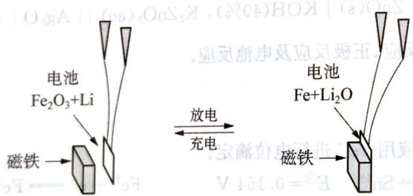

8-1 该电池可否以水溶液为电解液,请说明理由。

8-2 请写出放电时正极的电极反应式。

8-3 请说明该电池在充放电过程中与磁铁的相互作用。

## (12 分) <<<

根据下列数据（ $\mathrm{pH} = 0$ ），回答问题：

$$
\Delta_ {\mathrm{r}} G (1 \mathrm{eV} = 9 6. 5 \mathrm{kJ} \cdot \mathrm{mol} ^ {- 1})
$$

$$
\mathrm{Mn} ^ {2 +} + 2 \mathrm{e} ^ {-} \longrightarrow \mathrm{Mn}
$$

$$
- 2 2 7. 7 \mathrm{kJ} \cdot \mathrm{mol} ^ {- 1} (- 2. 3 6 \mathrm{eV})
$$

$$
\mathrm{Mn} ^ {3 +} + 3 \mathrm{e} \longrightarrow \mathrm{Mn}
$$

$$
- 8 3. 0 3 \mathrm{kJ} \cdot \mathrm{mol} ^ {- 1} (- 0. 8 5 \mathrm{eV})
$$

$$
\mathrm{MnO} _ {2} + 4 \mathrm{H} ^ {+} + 4 \mathrm{e} ^ {-} \longrightarrow \mathrm{Mn} + 2 \mathrm{H} _ {2} \mathrm{O}
$$

$$
9. 6 5 \mathrm{kJ} \cdot \mathrm{mol} ^ {- 1} (0. 1 \mathrm{eV})
$$

$$
\mathrm{MnO} _ {4} ^ {2 -} + 8 \mathrm{H} ^ {+} + 6 \mathrm{e} ^ {-} \longrightarrow \mathrm{Mn} + 4 \mathrm{H} _ {2} \mathrm{O}
$$

$$
4 4 5. 8 \mathrm{kJ} \cdot \mathrm{mol} ^ {- 1} (4. 6 2 \mathrm{eV})
$$

$$
\mathrm{MnO} _ {4} ^ {-} + 8 \mathrm{H} ^ {+} + 7 \mathrm{e} ^ {-} \longrightarrow \mathrm{Mn} + 4 \mathrm{H} _ {2} \mathrm{O}
$$

$$
4 9 9. 9 \mathrm{kJ} \cdot \mathrm{mol} ^ {- 1} (5. 1 8 \mathrm{eV})
$$

9-1 完成下列锰的元素电势图 $(\mathrm{pH} = 0)$

$$
\mathrm{MnO} _ {4} ^ {-} - \mathrm{MnO} _ {4} ^ {2 -} - \mathrm{MnO} _ {2} - \mathrm{Mn} ^ {3 +} - \mathrm{Mn} ^ {2 +} - \mathrm{Mn}
$$

9-2 根据以上锰的氧化态自由能图或锰的元素电势图，说明在酸性介质中 $\mathrm{MnO_4^-}$ 的还原产物一般为 $\mathrm{Mn}^{2+}$ 。

9-3 计算 $\mathrm{pH} = 0$ 条件下， $\mathrm{Mn}^{3+}$ 歧化的标准平衡常数。

9-4 已知在酸性条件下，碘元素的电势图为：

$$
\mathrm{IO} _ {3} ^ {-} \xrightarrow {1 . 2 0 \mathrm{V}} \mathrm{I} _ {2} \xrightarrow {0 . 5 4 \mathrm{V}} \mathrm{I} ^ {-}
$$

讨论 $\mathrm{KMnO_4}$ 溶液和KI溶液在酸性条件下的反应情况（写出反应方程式）：① $\mathrm{KMnO_4}$ 过量；②KI过量。

## 10 (12 分) >>>

根据下图解释下列试验现象：

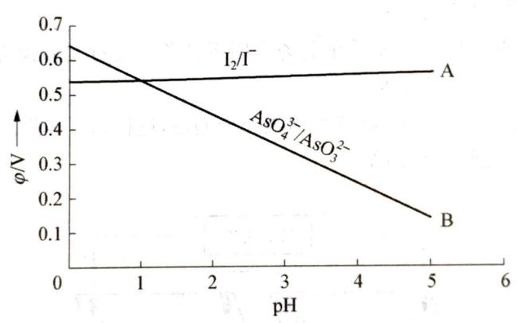

无色 $Na_{3}AsO_{3}$ 溶液 $\xrightarrow{加I_{2}水}$ 碘水棕黄色褪去 $\xrightarrow{加足量浓HCl}$ 溶液出现棕黄色 $\xrightarrow{加足量NaHCO_{3}}$ 溶液棕黄色褪去。解释时写出 pH > 1 时和 pH < 1 时发生的化学方程式。

# 能力测试 B 卷 (满分 100 分, 时间 150 分钟)

## (10分)

我们都知道，亚铁离子在水溶液中存在氧化还原平衡：

$$
4 \mathrm{Fe} ^ {2 +} (\mathrm{aq}) + \mathrm{O} _ {2} (\mathrm{g}) + 4 \mathrm{H} ^ {+} (\mathrm{aq}) = 4 \mathrm{Fe} ^ {3 +} (\mathrm{aq}) + 2 \mathrm{H} _ {2} \mathrm{O} (\mathrm{l})
$$

本题已知如下常数：

$$
\begin{array}{l} K _ {\mathrm{sp}} [ \mathrm{Fe(OH)} _ {3} ] = 2. 7 9 \times 1 0 ^ {- 2 3} \quad K _ {\mathrm{sp}} [ \mathrm{Fe(OH)} _ {2} ] = 4. 8 7 \times 1 0 ^ {- 1 7} \quad K _ {\mathrm{w}} = 1 0 ^ {- 1 4} \\ \varphi_ {(\mathrm{Fe} ^ {3 +} / \mathrm{Fe})} ^ {\ominus} = - 0. 0 4 1 \mathrm{V} \quad \varphi_ {(\mathrm{Fe} ^ {2 +} / \mathrm{Fe})} ^ {\ominus} = - 0. 4 4 7 \mathrm{V} \quad \varphi_ {(\mathrm{O} _ {2} / \mathrm{OH} ^ {-})} ^ {\ominus} = 0. 4 0 1 \mathrm{V} \end{array}
$$

1-1 请问上述反应于下面环境中可以达到平衡的是( )。
A. pH < 3    B. pH > 10    C. pH = 7    D. 任意 pH 条件下

1-2 请求算上述反应的标准平衡常数 $K^{\ominus}$ 。

1-3 请问在极强的碱性条件下,亚铁离子和铁离子是否可以同时达到沉淀溶解平衡?若可以,请求算此时氧气的分压;若不可以,请给出证明过程。

## 2 (12分,北京市化学竞赛试题)>>>

电解质溶液导电的本质是阴阳离子在电场作用下迁移。通过实验探究同一溶液中不同离子的迁移对总电流贡献的差异及其原因。

实验 1: 将 pH 试纸用不同浓度 $Na_{2}SO_{4}$ 溶液充分润湿, 进行如下实验。a、b、c、d 均为石墨电极, 电极间距 4 cm, 电解电流 0.20 mA。

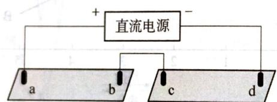

$$
\begin{array}{l l} \text {试纸I:0.01mol\cdot L^{-1}} & \text {试纸II:1mol\cdot L^{-1}} \\ \mathrm {Na_ {2} SO_ {4}} & \mathrm {Na_ {2} SO_ {4}} \end{array}
$$

实验现象：

| 时间 | 试纸I | 试纸II |
| --- | --- | --- |
| 1 min | a极附近试纸变红,b极附近试纸变蓝 | c极附近试纸变红,d极附近呈现_颜色 |
| 10 min | 红色区和蓝色区不断向中间扩展,相遇时红色区约2.7cm,蓝色区约1.3cm | 两极颜色范围扩大不明显,试纸大部分仍为黄色 |

2-1 d极附近呈现\_\_\_\_颜色,用电极反应式解释原因:

2-2 两张试纸构成串联电路,目的是保证\_\_\_\_相同。

2-3 对比 I、II 的实验现象,说明影响离子迁移对电流贡献的一个因素是\_\_\_\_。
实验 2: 测定不同溶液在 $20^{\circ}$ C 时的电导率 (mS/cm)。

| 浓度 | $H_{2}SO_{4}$ | $Na_{2}SO_{4}$ | NaOH |
| --- | --- | --- | --- |
| 0.01 mol·L-1 | 6.7 | 2.1 | 2.3 |
| 1 mol·L-1 | 超量程(>100) | 83.8 | 超量程(>100) |

2-4 电解 $10\mathrm{min}$ 时，a电极产生的 $c(\mathrm{H}^{+}) =$ \_\_\_\_ mol·L-1。

(体积以 $5 \times 10^{-5}$ L 计, 1 mol 电子的电量为 $9.65 \times 10^{4}$ , Q = It)

2-5 比较相同浓度时 $\mathrm{Na}^{+}$ 、 $\mathrm{H}^{+}$ 、 $\mathrm{OH}^{-}$ 的导电能力，并写出判断依据：\_\_\_\_。

2-6 结合实验 2 和(4)说明,实验 1 中 10 min 时两张试纸现象不同的原因是 \_\_\_\_。

2-7 预测 $10\mathrm{min}$ 后试纸I的现象

## (8 分) <<<

298 K 时，在 $Ag^{+}/Ag$ 电极中加入过量 $I^{-}$ ，设达到平衡时 $[I^{-}]=0.10\ \mathrm{mol}\cdot \mathrm{L}^{-1}$ ，而另一个电极为 $Cu^{2+}/Cu,\left[Cu^{2+}\right]=0.010\ \mathrm{mol}\cdot \mathrm{L}^{-1}$ ，现将两电极组成原电池，写出原电池的符号、电池反应式，并计算电池反应的平衡常数。已知：

$$
\varphi_ {(\mathrm{Ag} ^ {+} / \mathrm{Ag})} ^ {\ominus} = 0. 8 0 \mathrm{V}, \varphi_ {(\mathrm{Cu} ^ {2 +} / \mathrm{Cu})} ^ {\ominus} = 0. 3 4 \mathrm{V}, K _ {\mathrm{sp}} (\mathrm{AgI}) = 1. 0 \times 1 0 ^ {- 1 8}
$$

4 (12分) >>>

氢氧燃料电池是符合绿色化学理念的新型发电装置。右图为电池示意图，该电池电极表面镀一层细小的铂粉，铂吸附气体的能力强，性质稳定。请回答：

4-1 氢氧燃料电池能量转化的主要形式是\_\_\_\_，在导线中电子的流动方向为\_\_\_\_（用a、b表示）。

4-2 负极反应式为 \_\_\_\_。

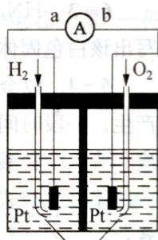

4-3 电极表面镀铂粉的原因为 \_\_\_\_。

4-4 该电池工作时, $H_{2}$ 和 $O_{2}$ 由外部连续供给,电池可连续不断提供电

KOH溶液

能,因此大量安全储氢是关键技术之一,金属锂是一种重要的储氢材料,吸氢和放氢原理如下:

I. $2\mathrm{Li} + \mathrm{H}_{2}\longrightarrow 2\mathrm{LiH}$

Ⅱ. LiH + H₂O → LiOH + H₂ ↑

① 反应Ⅰ中的还原剂是\_\_\_\_，反应Ⅱ中的氧化剂是\_\_\_\_。

② 已知 LiH 固体密度为 $0.82 \, g \cdot \mathrm{cm}^{-3}$ ，用锂吸收 $224 \, L \, H_{2}$ （标准状况），生成的 LiH 的体积与被吸收的 $H_{2}$ 的体积比为 \_\_\_\_。

③ 由②生成的 LiH 与 $H_{2}O$ 作用放出的 $H_{2}$ 用作电池燃料, 若能量转化率为 80%, 则导线中通过电子的物质的量为 \_\_\_\_。

## (10 分) <<<

科学家预言,燃料电池将是21世纪获得电能的重要途径。美国已计划将甲醇燃料电池用于军事目的。一种甲醇燃料电池是采用铂或碳化钨作电极催化剂,在硫酸电解液中直接加入纯化后的甲醇,同时向一个电极通入空气。回答如下问题:

5-1 这种电池放电时发生反应的化学方程式是

5-2 此电极的正极发生的反应是\_\_\_\_。
负极发生的反应是\_\_\_\_。

电解液中的 $H^{+}$ 向 \_\_\_\_ 极移动；向外电路释放电子的电极化 \_\_\_\_。
5-3 甲醇燃料电池与氢氧燃料电池相比，其主要缺点是甲醇燃料电池的输出功率较低，但其主要优点是

5-4 在甲醇燃料电池及其他许多燃料电池中，电极大多采用多孔结构，这是由于

5-5 比起直接燃烧燃料产生电能,使用燃料电池有许多优点:首先是燃料电池的能量转化效率高;其次是

## 6 (10分)>>>

$HN_{3}$ 被称为叠氮酸, $N_{3}^{-}$ 被称为类卤离子。回答下列问题:

6-1 $N_{3}^{-}$ 与\_\_\_\_分子互为等电子体。 $N_{3}^{-}$ 的空间构型是\_\_\_\_，结构式为\_\_\_\_。

6-2 酸性比较: $HN_{3}$ \_\_\_\_ HX(卤化氢)(填“>”或“<”); 热稳定性 $HN_{3}$ \_\_\_\_ HX(填“>”或“<”)。

6-3 $\mathrm{HN}_{3}$ 与硝酸银溶液作用, 可得一种不溶于水的白色固体, 该固体加热时会发生爆炸。写出该白色固体加热爆炸反应的化学方程式:

6-4 以金属 Cu、石墨作电极，以盐酸、 $\mathrm{HN}_{3}$ 混合溶液作电解质溶液组成原电池，正极有气泡产生。一段时间后电流减弱，在负极周围滴入几滴浓盐酸后又使电流增大。写出原电池的电极反应和滴入浓盐酸后的反应。

正极反应式：\_\_\_\_；负极反应式：\_\_\_\_；负极滴加浓盐酸后的反应式：\_\_\_\_。

## 7 (9分) <<<

化学作为一门中心学科,在人类能源开发与利用中起着十分关键的作用。化学电源是一种直接把化学能转变为电能的装置,其研究为各国科学家所关注。利用燃料和氧化剂的氧化还原反应也可以组成一个电池,而且这种电池与传统的电池不同,其工作物质可以源源不断地由外部输入,因此可以长时间不间断地工作。将氢气( $\mathrm{H}_{2}$ )、甲烷( $\mathrm{CH}_{4}$ )、乙醇( $\mathrm{C}_{2} \mathrm{H}_{5} \mathrm{OH}$ )等物质在氧气( $\mathrm{O}_{2}$ )中燃烧的化学能直接转化为电能的装置叫燃料电池。 $\mathrm{H}_{2}$ ←

燃料电池的基本组成为电极、电解质、燃料和氧化剂。此种电池能量利用率可高达80%(一般柴油发电机只有40%左右)，产物污染也少。人们已将它用于航天飞行器上。

右图为氢氧燃料电池反应的完整过程。

7-1 请将右图方框中的反应填补完整：

$H_{吸附}$ ； $O_{2吸附}$

7-2 该电池反应为\_\_\_\_。

7-3 人们将燃料电池用于航天飞行器上原因有二：一是\_\_\_\_，减轻重量就等于降低向太空发射的费用，与另一绿色能源\_\_\_\_配合，可以使飞行器在空间停留的时间较长；二是\_\_\_\_，更可减少携带重量。

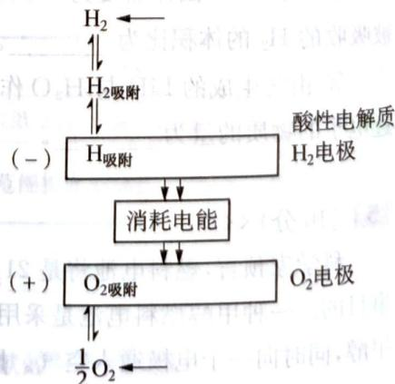  
$H_{2}$ — $O_{2}$ 燃料电池反应过程

## 8 (7分)>>>

用作人体心脏起搏器的电池规格与通常的电池有很大的不同。例如要求是一次电池，输出功率只需几个毫瓦，但必须连续工作若干年，其间不需要维护保养，并且要有绝对的可靠性，工作温度要与人体正常体温(37.4℃)相适应。化学家设想由 $Zn^{2+}/Zn$ 和 $H^{+}/O_{2}$ ，Pt两电极体系构成一“生物电池”，人体体液含有一定浓度的溶解氧。若该“生物电池”在低功率下工作，人体就易于适应 $Zn^{2+}$ 的增加和 $H^{+}$ 的迁出。请回答下列问题：

## 8-1 写出该电池的电极反应和电池反应。

8-2 如果上述电池在 $0.80\mathrm{V}$ 和 $4.0\times 10^{-5}\mathrm{W}$ 的功率下工作，该“生物电池”的锌电极的质量为 $5.0\mathrm{g}$ ，试问该电池理论上可以连续工作多长时间才需要更换？（已知锌的相对原子质量为65.39）

## 9 (10分) <<<

世界锂电池消耗量巨大,对不可再生的金属资源的消耗是相当大的,因此锂离子电池回收具有重要意义,其中需要重点回收的是正极材料,其主要成分为钴酸锂( $LiCoO_{2}$ )、导电乙炔黑(一种炭黑)、铝箔以及有机粘接剂。某回收工艺流程如下:

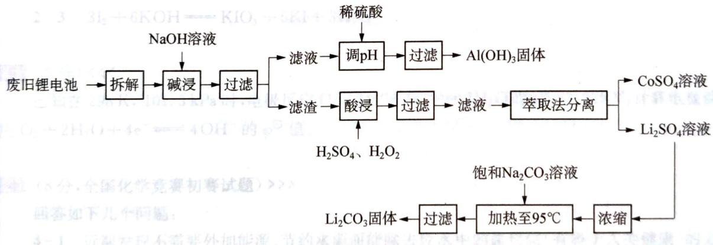

9-1 上述工艺回收到的产物有\_\_\_\_。

9-2 废旧电池可能由于放电不完全而残留有原子态的锂,为了安全对拆解环境的要求是\_\_\_\_。

9-3 碱浸时主要反应的离子方程式为\_\_\_\_。

9-4 酸浸时反应的化学方程式为\_\_\_\_。
如果用盐酸代替 $H_{2}SO_{4}$ 和 $H_{2}O_{2}$ 的混合液也能达到溶解的目的,但不利之处是\_\_\_\_。

9-5 生成 $\mathrm{Li}_2\mathrm{CO}_3$ 的化学反应方程式为

已知 $Li_{2}CO_{3}$ 在水中的溶解度随着温度升高而减小, 最后一步过滤时应 \_\_\_\_。

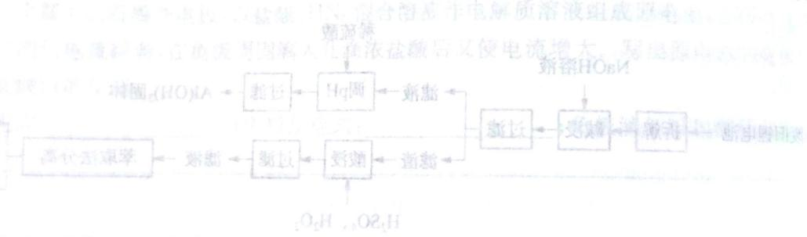

10（12分，全国化学竞赛初赛试题）>>右图示出在碳酸—碳酸盐体系 $\left(\mathrm{CO}_{3}^{2-}\right)$ 的分析浓度为 $1.0\times10^{-2}\mathrm{mol}\cdot\mathrm{L}^{-1}$ 中，铀的存在物种及相关电极电势随pH的变化关系(E-pH图，以标准氢电极为参比电极)。作为比较，虚线示出 $H^{+}/H_{2}$ 和 $O_{2}/H_{2}O$ 两电对的E-pH关系。

10-1 计算在 $\mathrm{pH}$ 分别为4.0和6.0的条件下碳酸—碳酸盐体系中主要物种的浓度。

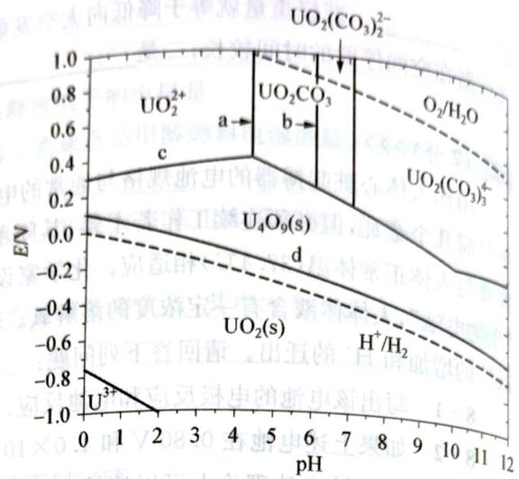

$$
\mathrm{H} _ {2} \mathrm{CO} _ {3}: K _ {\mathrm{a} _ {1}} = 4. 5 \times 1 0 ^ {- 7}, K _ {\mathrm{a} _ {2}} = 4. 7 \times 1 0 ^ {- 1 1}
$$

10-2 图中 $a$ 和 $b$ 分别是 $\mathrm{pH} = 4.4$ 和6.1的两条直线，分别写出与a和b相对应的轴的物种发生转化的方程式。

10-3 分别写出与直线 $c$ 和 $d$ 相对应的电极反应，说明其斜率为正或负的原因。

10-4 在 $\mathrm{pH} = 4.0$ 的缓冲体系中加入 $\mathrm{UCl}_3$ ，写出反应方程式。

10-5 在 $\mathrm{pH} = 8.0 \sim 12$ 之间，体系中 $\mathrm{UO}_2(\mathrm{CO}_3)_{3}^{4-}$ 和 $\mathrm{U}_4\mathrm{O}_9(\mathrm{s})$ 能否共存？说明理由； $\mathrm{UO}_2(\mathrm{CO}_3)_{3}^{4-}$ 和 $\mathrm{UO}_2(\mathrm{s})$ 能否共存？说明理由。

$$
\mathrm{O} _ {2} \mathrm{H} _ {3} \text {   时   } \mathrm{O} _ {2} \mathrm{H}
$$

## 第5章

# 电解的原理及应用

# 能力测试A卷

(满分 100 分，时间 120 分钟)

## 1 (6分) <<<

回答下列问题：

1-1 锂的电离势和升华热都比钠大,为什么锂的电极电势比钠的更小(在金属活动顺序表中更远离氢)?

1-2 有人说,燃料电池是“一种通过燃烧反应使化学能直接转化为电能的装置”。这种说法正确吗?说明理由。燃料电池的理论效率有可能超过 $100\%$ 吗?燃料电池的工作温度与燃料电池的理论效率呈什么关系?

## 2 (10 分) >>>

将下列反应设计成原电池,用标准电极电势判断标准态下电池的正极和负极,电子传递的方向,正极和负极的电极反应,电池的电动势,写出电池符号。

$$
2 - 1 \quad 2 \mathrm{Fe} ^ {3 +} + \mathrm{Fe} = 3 \mathrm{Fe} ^ {2 +}
$$

$$
2 - 2 \quad \mathrm{H} _ {2} + \mathrm{Cl} _ {2} = 2 \mathrm{HCl}
$$

$$
2 - 3 \quad 3 \mathrm{I} _ {2} + 6 \mathrm{KOH} = \mathrm{KIO} _ {3} + 5 \mathrm{KI} + 3 \mathrm{H} _ {2} \mathrm{O}
$$

已知在 298 K, 101.3 kPa 时, 电极反应 $O_{2} + 4H^{+} + 4e^{-} \rightleftharpoons 2H_{2}O$ 的 $\varphi^{\ominus} = 1.229 V$ ; 计算电极反应 $O_{2} + 2H_{2}O + 4e^{-} \rightleftharpoons 4OH^{-}$ 的 $\varphi^{\ominus}$ 值。

## 4 (8分,全国化学竞赛初赛试题)>>>

## 回答如下几个问题：

4-1 近期发现不需要外加能源、节约水源而能除去废水中的卤代烷(有碍于人类健康)的方法:把铁放在含卤代烷的废水中,经一段时间后卤代烷“消失”。例如废水中的一氯乙烷经 14.9 d 后就检不出来了。目前认为反应中卤代烷( $\mathrm{RCH_{2}X}$ )是氧化剂。写出反应式并说明(按原子)得失电子的关系。

4-2 电解 $\mathrm{NaCl}-\mathrm{KCl}-\mathrm{AlCl}_{3}$ 熔体制铝比电解 $\mathrm{Al}_{2} \mathrm{O}_{3}-\mathrm{Na}_{3} \mathrm{AlF}_{6}$ 制铝节省电能约 $30 \%$ 。为什么现仍用后一种方法制铝？

## (10分,全国化学竞赛初赛试题) <<<

我国石油工业一般采用恒电流库伦分析法测定汽油的溴指数。溴指数是指每 $100\mathrm{g}$ 试样消耗溴的毫克数，它反映了试样中 $\mathrm{C} = \mathrm{C}$ 的数目。测定时将 $V$ （毫升）试样加入库伦分析池中，利用电解产生的溴与不饱和烃反应。当反应完全后，过量溴在指示电极上还原而指示终点。支持电解质为LiBr，溶剂系统仅含 $5\%$ 水，其余为甲醇、苯与醋酸。

10（12分，全国化学竞赛初赛试题）>>右图示出在碳酸—碳酸盐体系 $\left(\mathrm{CO}_{3}^{2-}\right)$ 的分析浓度为 $1.0\times10^{-2}\mathrm{mol}\cdot\mathrm{L}^{-1}$ 中，铀的存在物种及相关电极电势随pH的变化关系(E-pH图，以标准氢电极为参比电极)。作为比较，虚线示出 $H^{+}/H_{2}$ 和 $O_{2}/H_{2}O$ 两电对的E-pH关系。

10-1 计算在 $\mathrm{pH}$ 分别为4.0和6.0的条件下碳酸—碳酸盐体系中主要物种的浓度。

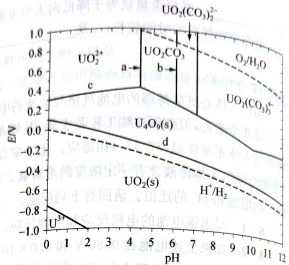

$$
\mathrm{H} _ {2} \mathrm{CO} _ {3}: K _ {\mathrm{a} _ {1}} = 4. 5 \times 1 0 ^ {- 7}, K _ {\mathrm{a} _ {2}} = 4. 7 \times 1 0 ^ {- 1 1}
$$

10-2 图中 $a$ 和 $b$ 分别是 $\mathrm{pH} = 4.4$ 和6.1的两条直线，分别写出与a和b相对应的轴的物种发生转化的方程式。

10-3 分别写出与直线 $c$ 和 $d$ 相对应的电极反应，说明其斜率为正或负的原因。

10-4 在 $\mathrm{pH} = 4.0$ 的缓冲体系中加入 $\mathrm{UCl}_3$ ，写出反应方程式。

10-5 在 $\mathrm{pH} = 8.0 \sim 12$ 之间，体系中 $\mathrm{UO}_2(\mathrm{CO}_3)_{3}^{4-}$ 和 $\mathrm{U}_4\mathrm{O}_9(\mathrm{s})$ 能否共存？说明理由； $\mathrm{UO}_2(\mathrm{CO}_3)_{3}^{4-}$ 和 $\mathrm{UO}_2(\mathrm{s})$ 能否共存？说明理由。

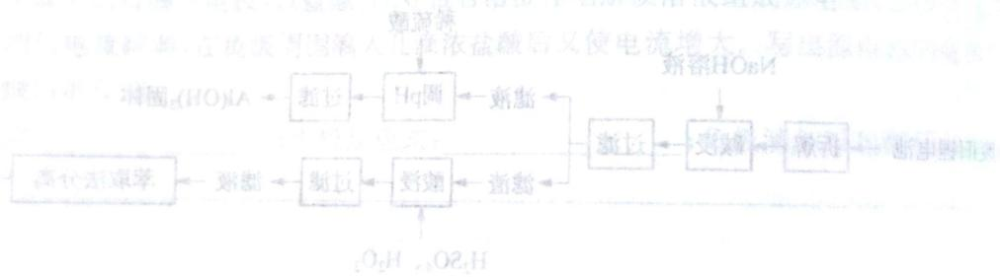

$$
\mathrm{O} _ {2} \mathrm{H} _ {3} \text {   时   } \mathrm{O} _ {2} \mathrm{H}
$$

## 第5章

# 电解的原理及应用

# 能力测试 A 卷

(满分 100 分，时间 120 分钟)

回答下列问题：

1-1 锂的电离势和升华热都比钠大,为什么锂的电极电势比钠的更小(在金属活动顺序表中更远离氢)?

1-2 有人说,燃料电池是“一种通过燃烧反应使化学能直接转化为电能的装置”。这种说法正确吗?说明理由。燃料电池的理论效率有可能超过 $100\%$ 吗?燃料电池的工作温度与燃料电池的理论效率呈什么关系?

## 2 (10 分) >>>

将下列反应设计成原电池,用标准电极电势判断标准态下电池的正极和负极,电子传递的方向,正极和负极的电极反应,电池的电动势,写出电池符号。

$$
2 - 1 \quad 2 \mathrm{Fe} ^ {3 +} + \mathrm{Fe} = 3 \mathrm{Fe} ^ {2 +}
$$

$$
2 - 2 \quad \mathrm{H} _ {2} + \mathrm{Cl} _ {2} = 2 \mathrm{HCl}
$$

$$
2 - 3 \quad 3 \mathrm{I} _ {2} + 6 \mathrm{KOH} = \mathrm{KIO} _ {3} + 5 \mathrm{KI} + 3 \mathrm{H} _ {2} \mathrm{O}
$$

## 3 (6分) <<<

已知在 298 K, 101.3 kPa 时, 电极反应 $O_{2} + 4H^{+} + 4e^{-} \rightleftharpoons 2H_{2}O$ 的 $\varphi^{\ominus} = 1.229 V$ ; 计算电极反应 $O_{2} + 2H_{2}O + 4e^{-} \rightleftharpoons 4OH^{-}$ 的 $\varphi^{\ominus}$ 值。

## 4 (8分,全国化学竞赛初赛试题)>>>

## 回答如下几个问题：

4-1 近期发现不需要外加能源、节约水源而能除去废水中的卤代烷(有碍于人类健康)的方法:把铁放在含卤代烷的废水中,经一段时间后卤代烷“消失”。例如废水中的一氯乙烷经 14.9 d 后就检不出来了。目前认为反应中卤代烷( $\mathrm{RCH_{2}X}$ )是氧化剂。写出反应式并说明(按原子)得失电子的关系。

4-2 电解 $\mathrm{NaCl}-\mathrm{KCl}-\mathrm{AlCl}_{3}$ 熔体制铝比电解 $\mathrm{Al}_{2} \mathrm{O}_{3}-\mathrm{Na}_{3} \mathrm{AlF}_{6}$ 制铝节省电能约 $30 \%$ 。为什么现仍用后一种方法制铝？

## (10分,全国化学竞赛初赛试题) <<<

我国石油工业一般采用恒电流库伦分析法测定汽油的溴指数。溴指数是指每 $100\mathrm{g}$ 试样消耗溴的毫克数，它反映了试样中 $\mathrm{C} = \mathrm{C}$ 的数目。测定时将 $V$ （毫升）试样加入库伦分析池中，利用电解产生的溴与不饱和烃反应。当反应完全后，过量溴在指示电极上还原而指示终点。支持电解质为LiBr，溶剂系统仅含 $5\%$ 水，其余为甲醇、苯与醋酸。

设 $d$ 为汽油试样密度， $Q$ 为终点时库伦计指示的溴化反应消耗的电量（库伦）。  
5-1 导出溴指数与 $V, d$ 和 $Q$ 的关系式（注：关系式中只允许有一个具体的数值）。  
5-2 若在溶剂体系中增加苯的比例，说明其优缺点。

## 6 (14分)>>>

$AgNO_{3}$ 溶液的烧杯中，组成原电池。

$AgNO_{3}$ 溶液的烧杯中，组成原电池。
已知： $\varphi^{\ominus}\left(\mathrm{Cu}^{2+}/\mathrm{Cu}\right)=0.337\mathrm{V},\varphi^{\ominus}\left(\mathrm{Ag}^{+}/\mathrm{Ag}\right)=0.799\mathrm{V},K_{\mathrm{sp}}(\mathrm{CuS})=1.27\times10^{-36},K_{\mathrm{a1}}(\mathrm{H}_{2}\mathrm{S})=5.7\times10^{-8},K_{\mathrm{a2}}(\mathrm{H}_{2}\mathrm{S})=1.2\times10^{-15}$

6-1 写出原电池符号,电池反应式。

6-2 求该原电池的电动势。

6-3 若不断通 $\mathrm{H}_{2} \mathrm{~S}$ 于 $\mathrm{CuSO}_{4}$ 溶液, 使之饱和, 求此时原电池的电动势。已知 $[\mathrm{H}_{2} \mathrm{~S}]$ 为 $0.10 \mathrm{~mol} \cdot \mathrm{L}^{-1}$ 。

(14 分) <<<

已知酸性介质中下面两个元素的元素电势图：

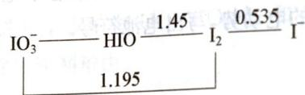

$$
\mathrm{O} _ {2} \xrightarrow {0 . 6 8} \mathrm{H} _ {2} \mathrm{O} _ {2} \xrightarrow {1 . 7 7} \mathrm{H} _ {2} \mathrm{O}
$$

请回答下列问题：

7-1 计算： $\varphi^{\ominus}(\mathrm{IO}_{3}^{-}/\mathrm{I}^{-}) = ? \quad \varphi^{\ominus}(\mathrm{IO}_{3}^{-}/\mathrm{HIO}) = ?$

7-2 指出电势图中哪些物质能发生歧化反应，并写出反应方程式。

7-3 在酸性介质中 $\mathrm{H}_{2} \mathrm{O}_{2}$ 与 $\mathrm{HIO}_{3}$ 能否反应？

7-4 在酸性介质中 $\mathrm{I}_2$ 与 $\mathrm{H}_2\mathrm{O}_2$ 能否反应？

7-5 综合考虑(3)、(4)两个反应， $\mathrm{HIO}_3$ 与 $\mathrm{H}_2\mathrm{O}_2$ 反应最终结果是什么？用反应式说明。

8 (10分,全国化学竞赛初赛试题)>>>

在 $25^{\circ}$ C 和 101.325 kPa 下，向电解池通入 0.04193 A 的恒定电流，阴极 (Pt, 0.1 mol·L $^{-1}$ HNO $_{3}$ ) 放出氢气，阳极 (Cu, 0.1 mol·L $^{-1}$ NaCl) 得到 Cu $^{2+}$ 。用 0.05115 mol·L $^{-1}$ 的 EDTA 标准溶液滴定产生的 Cu $^{2+}$ ，消耗了 53.12 mL。

8-1 计算从阴极放出的氢气的体积。

8-2 计算电解所需的时间(以小时为单位)。

利用半反应 $Ag^{+} + e^{-} \rightleftharpoons Ag$ 和 AgCl 的溶度积计算半反应 $AgCl + e^{-} \rightleftharpoons Ag + Cl^{-}$ 的标准电极电势。

## 10 (10分)>>>

酸性介质中， $\mathrm{Co}^{3+}$ (aq)氧化性很强；而在过量氨水中，土黄色的 $[\mathrm{Co(NH_3)_6}]^{2+}$ 却被空气中的氧气逐步氧化为淡红棕色的 $[\mathrm{Co(NH_3)_6}]^{3+}$ ，使 $\mathrm{Co}^{3+}$ 稳定化：

$$
4 \left[ \mathrm{Co} (\mathrm{NH} _ {3}) _ {6} \right] ^ {2 +} + \mathrm{O} _ {2} + 2 \mathrm{H} _ {2} \mathrm{O} = 4 \left[ \mathrm{Co} (\mathrm{NH} _ {3}) _ {6} \right] ^ {3 +} + 4 \mathrm{OH} ^ {-}
$$

求该反应在 $298\mathrm{K}$ 的平衡常数。

（已知： $\varphi^{\ominus}(\mathrm{Co}^{3 + } / \mathrm{Co}^{2 + }) = 1.82\mathrm{V},\varphi^{\ominus}(\mathrm{O}_2 / \mathrm{OH}^-) = 0.401\mathrm{V},K_{\text{稳}}(\mathrm{Co(NH_3)_6^{2 + }}) = 1.28\times 10^5,$ $K_{\text{稳}}(\mathrm{Co(NH_3)_6^{3 + }}) = 1.60\times 10^{35})$

（1）在 $x$ 轴上，当 $y$ 为正方形，且 $z$ 的值为 $\frac{1}{2}$ ； $w$ 在 $x$ 轴上，当 $y$ 为正方形，且 $z$ 的值为 $\frac{1}{2}$ 。

# 能力测试 B 卷

## (满分 100 分，时间 150 分钟)

## 1 (12 分) <<<

试以中和反应 $\mathrm{H}^{+}(\mathrm{aq})+\mathrm{OH}^{+}(\mathrm{aq})=\mathrm{H}_{2}\mathrm{O}(\mathrm{l})$ 为电池反应，设计成一种原电池（用电池符号表示）。分别写出电极半反应，并求算出它在 $25^{\circ}C$ 时的标准电动势。

## 2 (12分)>>>

298 K 时, 在 $\mathrm{Ag}^{+}/\mathrm{Ag}$ 电极中加入过量 $\mathrm{I}^{-}$ , 设达到平衡时 $[\mathrm{I}^{-}] = 0.10 \mathrm{~mol} \cdot \mathrm{L}^{-1}$ , 而另一个电极为 $\mathrm{Cu}^{2+}/\mathrm{Cu}, [\mathrm{Cu}^{2+}] = 0.010 \mathrm{~mol} \cdot \mathrm{L}^{-1}$ , 现将两电极组成原电池, 写出原电池的符号、电池反应式、并假设此条件达到平衡, 计算电池反应的平衡常数。

$$
\varphi^ {\ominus} (\mathrm{Ag} ^ {+} / \mathrm{Ag}) = 0. 8 0 \mathrm{V}, \varphi^ {\ominus} (\mathrm{Cu} ^ {2 +} / \mathrm{Cu}) = 0. 3 4 \mathrm{V}, K _ {\mathrm{sp}} (\mathrm{AgI}) = 1. 0 \times 1 0 ^ {- 1 8}
$$

(6 分) <<<

海水通常的 pH 约为 8.1, 含有 $Na^{+}$ 、 $K^{+}$ 、 $Ca^{2+}$ 、 $Mg^{2+}$ 、 $Cl^{-}$ 、 $SO_{4}^{2-}$ 、 $Br^{-}$ 、 $F^{-}$ 以及分子形态的 $H_{3}BO_{3}$ 。如图所示, 利用电解池从海水中可提取 $CO_{2}$ 和 $H_{2}$ 作为费托合成的原料合成烃类燃料油。假设将此装置用于长时间在海上续航的军舰。

3-1 请写出反应室中的离子反应式。

3-2 反应后的废液呈酸性,应如何处理?

3-3 实际操作中发现电解过程中阴极室逐渐生成沉淀，并最终包裹电极导致电池无法工作。请写出沉淀的化学式，并提出合理解决方案。

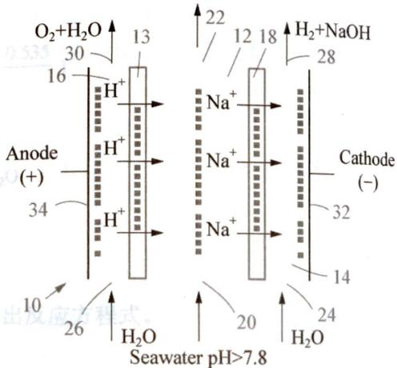

## (10 分,全国化学竞赛初赛试题)>>>

气态废弃物中的硫化氢可用下法转化为可利用的硫:配制一份电解质溶液,主要成分为: $K_{4}[Fe(CN)_{6}](200\ g/L)$ 和 $KHCO_{3}(60\ g/L)$ ;通电电解,控制电解池的电流密度和槽电压,通入 $H_{2}S$ 气体。写出相应的反应式。

已知： $\varphi^{\ominus}(\mathrm{Fe(CN)}_{6}^{3 - } / \mathrm{Fe(CN)}_{6}^{4 - }) = 0.35\mathrm{V}$

KHCO $_{3}$ 溶液中的 $\varphi(\mathrm{H}^{+}/\mathrm{H}_{2})\sim-0.5\;\mathrm{V}$ ; $\varphi(\mathrm{S}/\mathrm{S}^{2-})\sim-0.3\;\mathrm{V}$

阳极反应：\_\_\_\_。

阴极反应：\_\_\_\_。

涉及硫化氢转化为硫的总反应：\_\_\_\_。

## (12 分) <<<

在酸性溶液中,锰元素的电势图为:

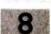

$$
\mathrm{MnO} _ {4} ^ {-} \xrightarrow {0 . 5 6 \mathrm{V}} \mathrm{MnO} _ {4} ^ {2 -} \xrightarrow {2 . 2 6 \mathrm{V}} \mathrm{MnO} _ {2} \xrightarrow {0 . 9 5 \mathrm{V}} \mathrm{Mn} ^ {3 +} \xrightarrow {1 . 5 1 \mathrm{V}} \mathrm{Mn} ^ {2 +} \xrightarrow {- 1 . 1 8 \mathrm{V}} \mathrm{Mn}
$$

5-1 计算电对 $MnO_{4}^{-}/MnO_{2}$ 的 $\varphi^{\ominus}$

5-2 锰的哪几种氧化态在酸性溶液中是不稳定的,容易歧化?

5-3 在酸性介质中，用 $\mathrm{KMnO_4}$ 氧化 $\mathrm{Fe}^{2+}$ 时，当 $\mathrm{KMnO_4}$ 过量时会发生什么现象？写出有关反应方程式。

## 6 (8分,全国化学竞赛初赛试题)>>>

镅(Am)是一种用途广泛的锕系元素。 $^{241}$ Am 的放射性强度是镭的 3 倍，在我国各地商场里常常可见到 $^{241}$ Am 骨密度测定仪，检测人体是否缺钙：用 $^{241}$ Am 制作的烟雾监测元件已广泛用于我国各地建筑物的火警报警器（制作火警报警器的 1 片 $^{241}$ Am 我国批发价仅 10 元左右）。镅在酸性水溶液里的氧化态和标准电极电势 ( $\varphi^{\ominus}/V$ ) 如下，图中 2.62 是 $Am^{4+}/Am^{3+}$ 的标准电极电势，-2.07 是 $Am^{3+}/Am$ 的标准电极电势，等等。一般而言，发生自发的氧化还原反应的条件是氧化剂的标准电极电势大于还原剂的标准电极电势。

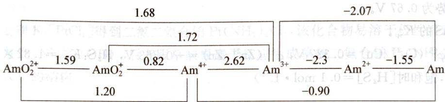

试判断金属镅溶于过量稀盐酸溶液后将以什么离子形态存在。简述理由。

附： $\varphi^{\ominus}(\mathrm{H^{+} / H_{2}}) = 0\mathrm{V};\varphi^{\ominus}(\mathrm{Cl}_{2} / \mathrm{Cl}^{-}) = 1.36\mathrm{V};\varphi^{\ominus}(\mathrm{O}_{2} / \mathrm{H}_{2}\mathrm{O}) = 1.23\mathrm{V}$

## (12 分) <<<

光合作用发生的总反应是：

$$
6 \mathrm{CO} _ {2} (\mathrm{g}) + 6 \mathrm{H} _ {2} \mathrm{O(l)} \xrightarrow [ \text {叶绿素} ]{\text {光}} \mathrm{C} _ {6} \mathrm{H} _ {1 2} \mathrm{O} _ {6} (\mathrm{s}) + 6 \mathrm{O} _ {2} (\mathrm{g})
$$

在 $25^{\circ}C$ 下反应的 $\Delta H^{\ominus}=2.816\times10^{6}\ \mathrm{J}\cdot \mathrm{mol}^{-1}$ ， $\Delta S^{\ominus}=-182\ J\cdot \mathrm{K}^{-1}\cdot \mathrm{mol}^{-1}$ 。假设反应的产物可以设计成一个原电池在电极上氧气和葡萄糖分别被还原和氧化成水和二氧化碳。这样，我们可以通过光合反应的正逆两个反应把光能转化为电能了。

7-1 求原电池的电动势。

7-2 为使上列光合反应发生需要多少摩 $500 \mathrm{~nm}$ 的光子？

7-3 用一个边长 $10\mathrm{m}$ 的充满绿藻的正方形游泳池里发生的光合作用的产物来发电，平均 $1\mathrm{cm}^2$ 的面积可产生 $1\mathrm{mA}$ 电流，求电池产生电流的功率。

## (12 分) >>>

通常用电解铬酸溶液的方法镀铬。电解槽的阴极是欲镀铬的物体，阳极是惰性金属，电解液是含铬酐 $0.230\mathrm{kg}\cdot \mathrm{L}^{-1}$ ，体积 $100\mathrm{L}$ 的水溶液。电解时使用了 $1500\mathrm{A}$ 电流通电 $10.0\mathrm{h}$ 阴极的质量增加了 $0.679\mathrm{kg}$ 。阴极和阳极放出的气体体积比是 $V_{\mathrm{A}} / V_{\mathrm{B}} = 1.603$ （体积是在相同条件下测定的）。问

8-1 沉积出 $0.679\mathrm{kg}$ 铬耗用的电量是总电量的百分之几？

8-2 阴极和阳极放出的气体在标准态(STP)下的体积比。

8-3 阴极和阳极放出气体的反应的电流效率分别为多大？若发现你计算的数据有差别，试解释这是由于未考虑电镀时发生的什么过程的缘故？写出电解的总反应。若有可能，纠正你原先的计算。

## 9 (6分) <<<

为什么检测铅蓄电池电解质硫酸的浓度可以确定蓄电池充电是否充足？铅蓄电池充电为什么会放出气体？是什么气体？

## 10 (10 分) >>>

某原电池一边用 Cu 电极浸入 $c(\mathrm{Cu}^{2+})=0.10\ \mathrm{mol}\cdot\mathrm{L}^{-1}$ 的溶液中，另一边用 Zn 电极浸入 $c(\mathrm{Zn}^{2+})=0.10\ \mathrm{mol}\cdot\mathrm{L}^{-1}$ 的溶液中。向溶液中 $Cu^{2+}$ 通入 $H_{2}S$ 气体使之始终处于饱和状态，测得此电池的电动势为 0.67 V。

计算 CuS 的 $K_{sp}$ 。

（已知： $\varphi^{\ominus}(\mathrm{Cu}^{2 + } / \mathrm{Cu}) = 0.337\mathrm{V},\varphi^{\ominus}(\mathrm{Zn}^{2 + } / \mathrm{Zn}) = -0.763\mathrm{V},\mathrm{H}_2\mathrm{S}:K_1^\ominus = 1.32\times 10^{-7},K_2^\ominus =$ $7.10\times 10^{-16}$ ，饱和时 $[\mathrm{H}_2\mathrm{S}] = 0.1\mathrm{mol}\cdot \mathrm{L}^{-1})$

## >>> (台SI)

气态废弃物中的硫化氢可用下法转化为可利用的硫，配制一份电解质溶液，主要为 $K_{2}[Fe(CN)_{4}](200\ g\ L\ (g)O_{3}(O)(e)_{2})_{2}O_{3}\text{内}\ )$ 通电电解（HCO）电解（H $_{2}$ O）密度和槽电压，随 $H_{2}S$ 气体，写出相应的反应式。

$\text{臭气的反应条件}$ $\mathrm{H}_{\text{2}} \cdot [\mathrm{H}_{2}\mathrm{O}^{-1.881} = -0.92\Delta v, \mathrm{H}_{\text{2}} \cdot [\mathrm{H}_{2}\mathrm{O}^{-1.881} \times 0.1] \times 0.18.S = ^{\ominus}H\Delta \text{的反应又不等}$ 四门稀释，稀释为： $\text{臭水的反应条件是互溶性、溶解性、溶解度等}$ 滴出，恶由异断反应一个一滴书费灯的附模反应。下谓由火外辨脂光的反应两个两逆五的反应合式反应

阳极反应

。登记由内断串票来

涉及硫化氢转化为硫的反应， $S$ 千光的 $m_{0} 002$ 离处送要需主式应交合光度土封区 $s-1$ 良平，由受来测汽的用符合光的主式里断将能逆式五的荷载断充的 $m_{0} 1$ 分成一个用 $\varepsilon-1$ (12分) $\ll$ 率由的高电主气断由来，高电 $A_{m} I$ 主气顶壁面的 $m_{0} 1$

秦鞭申，冀金卦齋星朔曰，朴碑的辞蜀者是进阳的薛鞭申。辞蜀者式的辞帝朝辞鞭申因常数

$\ll(181)$

# 第6章

# 配位化学基础

# 能力测试 A 卷

<<<（台SI）

(满分 100 分，时间 120 分钟)

1 (16 分) <<<

填写下表空白处。

| 序号 | 配合物的化学式 | 配合物的名称 | 中心离子 | 配位体 | 配位数 |
| --- | --- | --- | --- | --- | --- |
| 1 | $[Cu(H_2O)_4]SO_4$ | 硫酸四水合铜(II) | $Cu(II)$ | $H_2O$ | 4 |
| 2 |  | 二氯化四氨合锌(II) |  |  |  |
| 3 | $[CoClNO_2(NH_3)_4]Cl$ |  |  |  |  |
| 4 | $K_3[Fe(CN)_6]$ |  |  |  |  |
| 5 |  | 五氯一氨合铂(IV)酸钾 |  |  |  |

## 2 (5 分) >>>

用氨水处理 $\mathrm{K}_2[\mathrm{PtCl}_4]$ 得到二氯二氨合铂 $\mathrm{Pt(NH_3)_2Cl_2}$ ，该化合物易溶于极性溶剂，其水溶液加碱后转化为 $\mathrm{Pt(NH_3)_2(OH)_2}$ ，后者跟草酸根离子反应生成草酸二氨合铂 $\mathrm{Pt(NH_3)_2C_2O_4}$ ，请写出 $\mathrm{Pt(NH_3)_2Cl_2}$ 的结构。

3 (6分) <<<

写出 $\mathrm{Pt(NH_{3})_{2}(OH)_{2}Cl_{2}}$ 的异构体。

4 (4分) >>>

已知铁的原子序数为26,则 $Fe^{2+}$ 在八面体场中的晶体场稳定化能(以 $\Delta_{0}=10Dq$ 表示)在弱场中是\_\_\_\_Dq,在强场中是\_\_\_\_Dq。

## 5 (10分) <<<

已知 $\left[\mathrm{Cu}(\mathrm{NH}_3)_4\right]^{2+}$ 的 $K_{\text {不稳}} = 4.79 \times 10^{-14}$ , 若在 $1.0 \mathrm{~L} 6.0 \mathrm{~mol} \cdot \mathrm{L}^{-1}$ 氨水溶液中溶解 $0.10 \mathrm{~mol} \mathrm{CuSO}_4$ , 求溶液中各组分的浓度 (假设溶解 $\mathrm{CuSO}_4$ 后溶液的体积不变)。

## 6 (5 分) >>>

已知:配位化合物 $\left[\mathrm{Co}\left(\mathrm{NH}_{3}\right)_{4}\mathrm{Cl}_{2}\right]$ 有两种异构体。试判断其空间体构型是八面体型还是三棱柱型?

## (15 分) <<<

根据下列配离子的磁矩推断中心离子的杂化轨道类型和配离子的空间构型。

## 8 (12分)>>>

8-1 近年来,化学家合成出一种对称性极高的多齿配体,它有超乎寻常的稳定性。质谱仪分析测定其分子量为332.42,分子中含碳93.94%。请画出其结构并指出稳定性好的原因。

8-2 利用 $\left[\mathrm{Ni}\left(\mathrm{NH}_{3}\right)_{6}\right]^{2+}$ 制备 $\left[\mathrm{Ni}\left(\mathrm{en}\right)_{3}\right]^{2+}$ 时采取配体取代的方法。请画出 $\left[\mathrm{Ni}\left(\mathrm{en}\right)_{3}\right]^{2+}$ 的结构。

8-3 $\mathrm{CN}^{-}$ 的等电子体CO是金属配合物的常见配体。 $\mathrm{Fe}_{5}(\mathrm{CO})_{15}\mathrm{C}$ 是一种具有四方锥结构的配合物,无对称中心,无 $\mathrm{C}_{4}$ 轴,请画出其结构。

## (12 分, 安徽省化学竞赛试题) <<<

$RuO_{4}$ 与 $C_{2}H_{4}$ 、 $H_{2}O_{2}-H_{2}O$ 发生下列一系列反应：

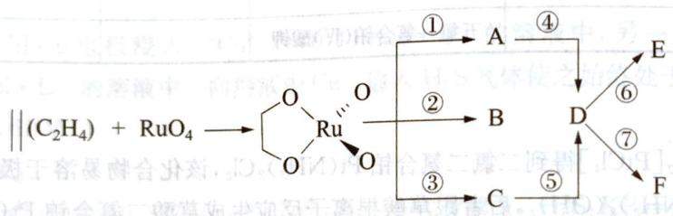

①、②、⑤、⑥、⑦中加入 $H_{2}O_{2}-H_{2}O$ ，③、④中加入 $C_{2}H_{4}$ 。A 与 B、E 与 F 有相同的化学式，但是不属于立体异构体。

9-1 请画出上图 A～F 各字母所代表的化合物的结构式并标出 Ru 的氧化态。

9-2 说明 $\mathrm{H}_2\mathrm{O}_2 - \mathrm{H}_2\mathrm{O}$ 在上述系列反应中起哪些作用？

9-3 $\mathrm{H}_2\mathrm{O}_2$ 与其他物质反应时，还能起什么作用？试用化学反应方程式说明。

## 10 (15 分) >>>

关于 $\mathrm{Ni}^{2+}$ 的配合物的合成。

10-1 向烧杯中加入六水合硫酸镍后，用去离子水溶解，再加入乙醇和水杨醛（即邻羟基苯甲醛）后搅拌45分钟。加入KOH溶液，继续搅拌15分钟。静置后析出黄绿色晶体X。元素分析得到X中Ni的质量分数为 $17.42\%$ 。晶体结构测定发现X有对称中心。试通过计算和推导给出X的结构式。

10-2 将得到的 X 晶体进行进一步的实验: 向圆底烧瓶中加入乙醇, 氨水以及 X 晶体, 搅拌回流 45 分钟后得到橘红色晶体 A。若将氨水换成仲丁胺(即 2-丁胺)进行同样的操作, 得到的则是深绿色的晶体 B。元素分析得到 A 中 Ni 的质量分数为 19.63%, B 中 Ni 的质量分数为 14.27%。经测定, A 的磁矩 $\mu_{A}=0$ , B 的磁矩 $\mu_{B}=2.8$ 。试通过计算和推导给出 A 和 B 的结构式, 并解释 B 为何不采取和 A 相同的构型。

# 能力测试 B 卷

（满分100分，时间150分钟）

## 1 (10分) <<<

，飘回渡不着回短

试根据价键理论判断下列配合物的杂化类型,根据晶体场理论判断下列配合物的电子排布。

(1) 四面体型 $\left[CoCl_{4}\right]^{2-}$ ; (2) 内轨型 $\left[Fe(CN)_{6}\right]^{3-}$

## 2 (10分)>>>

2-1 有一种极强酸叫做魔酸,其制备方法为将 $\mathrm{SbF}_{5}$ 加入 $\mathrm{HSO}_{3} \mathrm{~F}$ 中。请写出反应方程式并画出产物阴离子结构。

2-2 小明同学原以为 $\mathrm{Ti}(\mathrm{C}_5\mathrm{H}_5)_2$ 为二茂铁型化合物，查询资料后却发现并非如此。真实结构为二聚体，Ti间有氢原子为桥，结构中有两种配体化合物，一种为 $\pi_5^6$ ，一种为 $\pi_{10}^{12}$ 。请画出其结构。

## 3 (11分) <<<

已知含有金属多重键的化合物 A 的制备方法如下: 0.15 g 氯化铼(Ⅲ)溶于 10 毫升干丙酮中, 红色溶液回流几分钟后过滤, 除去未溶解的 $Re_{3}Cl_{9}$ 。在滤液中加入 0.4 ml 三乙基膦, 反应混合物回流 7 天, 此时已变成深绿色或棕色, 沸腾棒上形成了发光的黑色晶体。将黑色晶体(研磨时为灰色)从反应混合物中分离, 用丙酮和乙醚洗净, 在真空干燥。对于 A 的元素分析表明分子具有 $D_{2d}$ 对称性, 且 Re 的质量分数为 37.74%(Re 的相对原子质量为 186.2)。

3-1 请根据以上信息写出化合物 A 的分子式。

3-2 请根据对称性信息画出化合物 A 的结构,请将不在纸面上的化学键用楔形键表示,金属—金属键可以用单键表示。

3-3 请写出化合物中 $\mathrm{Re}$ 的化合价，并写出 $\mathrm{Re}-\mathrm{Re}$ 金属键的键级和你判断的理由。

3-4 我们会发现化合物的结构和我们在第三小问预期的 d 轨道重叠方式似乎矛盾,但事实就是如此,请说明原因。

4 (6分)>>>

在平面四边形配合物中,配体 L 有使反位的另一配体不稳定的效应,称为反位效应。Pt(Ⅱ)配合物的配体反应效应强度顺序如下:

$$
\mathrm{CN} ^ {-} > \mathrm{SC(NH} _ {2}) _ {2} (\text {硫脲tu}) > \mathrm{Cl} > \mathrm{NH} _ {3}
$$

$\mathrm{Pt(NH_3)_2Cl_2}$ 有两种异构体A和B，当A与硫脲(tu)反应时，生成 $[\mathrm{Pt(tu)}_4]^{2+}$ ；B与硫脲反应时，则生成 $[\mathrm{Pt(NH_3)_2(tu)}_2]^{2+}$ 。问A和B各是什么异构体？为什么？

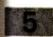

## (9分,山东省化学竞赛试题) <<<

某二水合、六配位的锰配合物中各元素分析结果如下：

| 元素 | Mn | Cl | C | N | O | H |
| --- | --- | --- | --- | --- | --- | --- |
| 质量分数(%) | 12.4 | 16.1 | 32.6 | 25.3 | 7.2 | 6.4 |

试回答下列问题：

5-1 通过计算写出该配合物的化学式。

5-2 该配合物具有八面体结构,画出该配合物所有可能几何异构体的结构式(用 a 表示 $\mathrm{H}_{2} \mathrm{O}$ ,用 b 表示 Cl,用 c 表示相对分子质量最大的配位体)。

5-3 实验表明:该配合物晶体属正交面心晶胞,结构具有高度的对称性。写出该配合物的结构式(用a表示 $H_{2}O$ ,用b表示Cl,用c表示相对分子质量最大的配位体)。

5-4 有人认为,最大配位体 c 可通过如下路线合成(其中 X、Y 均为六元环状化合物,c 中有多个环): $CH_{2}=NH \rightarrow X\xrightarrow{HCHO} Y$ (化学式 $C_{6}H_{15}O_{3}N_{3}$ ) $\xrightarrow{NH_{3}} c$

写出 X、Y、c 的结构简式。

## 6 (8分)>>>

结合平衡与酸碱反应分析 AgCl 被 $NH_{3}$ 溶解后，滴入 HAc 有何现象发生？若换成 $\left[\mathrm{Ag}(\mathrm{CN})_{2}\right]^{-}$ 中滴入 HAc 又怎样？（已知： $K_{a,HAc}=1.75\times10^{-5}$ ， $K_{b,NH_{3}\cdot H_{2}O}=1.75\times10^{-5}$ ， $K_{a,HCN}=4.93\times10^{-10}$ ， $K_{不稳,Ag(NH_{3})_{2}^{+}}=5.89\times10^{-8}$ ， $K_{不稳,Ag(CN)_{2}^{-}}=2.51\times10^{-21}$ ， $K_{\mathrm{sp}}(\mathrm{AgCl})=1.56\times10^{-10}$ ）

## (11 分) <<<

过渡金属六配位的配合物多以八面体形存在。但在特殊情况下，八面体会发生畸变，有时甚至会变成别的几何体。

7-1 判断以下配合物中哪些存在Jahn-Teller效应。
A. $\left[\mathrm{Mn}(\mathrm{CN})_{6}\right]^{3-}$ B. $\left[CrCl_{6}\right]^{3-}$ C. $\left[FeF_{6}\right]^{3-}$ D. $\left[\mathrm{Mn}(\mathrm{CN})_{6}\right]^{4-}$ 7-2 有些配合物看似存在不同的配位数。

7-2 有些配合物看似存在不同的配位数: $\text{Na}_2[\text{MnF}_5]$ , $\text{Cs}[\text{MnF}_4]$ , 但实际上, 它们的 Mn 原子的配位数都是 6。其中, $\text{Na}_2[\text{MnF}_5]$ 中的阴离子具有一维链结构, $\text{Cs}[\text{MnF}_4]$ 中的阴离子具有二维面结构。试画出 $\text{Na}_2[\text{MnF}_5]$ 中的阴离子的结构, 指此 $\text{Cs}[\text{MnF}_4]$

$$
\mathrm{Cs} [ \mathrm{MnF} _ {4} ] \text {中} [ \mathrm{MnF} _ {6} ],
$$

7-3 八面体畸变大到一定程度后, 几何体更接近于三棱柱。三棱柱配位场中, 中心原子 $d$ 轨道分裂能级图如下:

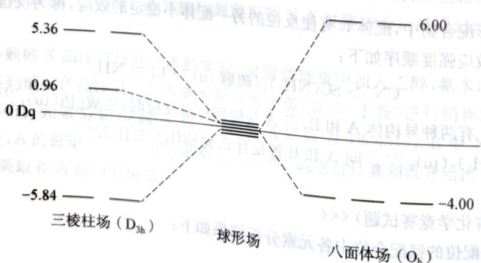

仅考虑晶体场稳定化能(CFSE)影响,通过计算,推测下述配合物哪些是三棱柱形(假设下述所有配合物都是低自旋,忽略电子成对能的影响),并计算其理论磁矩。

① $\mathrm{V(S_2C_2Ph_2)_3^{4 - }}$ ② $[\mathrm{Co}(\mathrm{C}_2\mathrm{O}_4)_3]^{3 - }$

## 8 (9 分) >>>

钴的一种配合物 $\left[\mathrm{Co}(\mathrm{en})_{2}\left(\mathrm{OH}_{2}\right)\left(\mathrm{SO}_{3}\right)\right]^{+}$ 能与 $SO_{3}^{2-}$ 发生取代反应，生成 $\left[\mathrm{Co}(\mathrm{en})_{2}\left(\mathrm{SO}_{3}\right)_{2}\right]^{-}$ ，其机理如下：

$$
\begin{array}{r l}&{\left[ \mathrm{Co(en)} _ {2} (\mathrm{OH} _ {2}) (\mathrm{SO} _ {3}) \right] ^ {+} + \mathrm{SO} _ {3} ^ {2 -} \rightleftharpoons \left[ \mathrm{Co(en)} _ {2} (\mathrm{OH} _ {2}) (\mathrm{SO} _ {3}) ^ {+} (\mathrm{SO} _ {3} ^ {2 -}) \right] ^ {-} K _ {1}}\\&{\left[ \mathrm{Co(en)} _ {2} (\mathrm{OH} _ {2}) (\mathrm{SO} _ {3}) ^ {+} (\mathrm{SO} _ {3} ^ {2 -}) \right] ^ {-} \rightleftharpoons \left[ \mathrm{Co(en)} _ {2} (\mathrm{OSO} _ {2}) (\mathrm{SO} _ {3}) \right] ^ {-} + \mathrm{H} _ {2} \mathrm{O} K _ {2}}\\&{\left[ \mathrm{Co(en)} _ {2} (\mathrm{OSO} _ {2}) (\mathrm{SO} _ {3}) \right] ^ {-} \rightleftharpoons \left[ \mathrm{Co(en)} _ {2} (\mathrm{SO} _ {3}) _ {2} \right] ^ {-} K _ {3}}\end{array}
$$

其中 en 表示乙二胺, $K_{1}$ , $K_{2}$ , $K_{3}$ 分别为三个反应的标准平衡常数。

8-1 给出 $\left[\mathrm{Co}(\mathrm{en})_{2}\left(\mathrm{SO}_{3}\right)_{2}\right]^{-}$ 的命名。

8-2 画出 $\left[\mathrm{Co}(\mathrm{en})_{2}\left(\mathrm{SO}_{3}\right)_{2}\right]^{-}$ 所有的立体异构体（用S代表 $\mathrm{SO}_3^{2-}$ ， $\mathrm{N} \cap \mathrm{N}$ 代表en）。

8-3 若 $\left[\mathrm{Co}(\mathrm{en})_{2}(\mathrm{OH}_{2})(\mathrm{SO}_{3})\right]^{+}$ 的起始浓度为 $0.1\mathrm{mol}\cdot \mathrm{L}^{-1}$ ，且测得反应达到平衡时 $\mathrm{SO}_3^{2-}$ 的实际浓度为 $0.1\mathrm{mol}\cdot \mathrm{L}^{-1}$ 。记三个反应的标准平衡常数分别为 $K_{1}, K_{2}, K_{3}$ ，计算平衡时 $\left[\mathrm{Co}(\mathrm{en})_{2}(\mathrm{SO}_{3})_{2}\right]^{-}$ 的实际浓度。为简化书写，约定以 A, B, C, D, S 分别表示 $\left[\mathrm{Co}(\mathrm{en})_{2}(\mathrm{OH}_{2})(\mathrm{SO}_{3})\right]^{+}, \left[\mathrm{Co}(\mathrm{en})_{2}(\mathrm{OH}_{2})(\mathrm{SO}_{3})^{+}(\mathrm{SO}_{3}^{2-})\right]^{-}, \left[\mathrm{Co}(\mathrm{en})_{2}(\mathrm{OSO}_{2})(\mathrm{SO}_{3})\right]^{-}, \left[\mathrm{Co}(\mathrm{en})_{2}(\mathrm{SO}_{3})_{2}\right]^{-}, \mathrm{SO}_3^{2-}$ 。

## 9 (18分) <<<

金属 M 溶于稀 HCl 时生成氯化物, 金属正离子的磁矩为 5.0 B. M. 。在无氧操作下, $MCl_{2}$ 溶液遇 NaOH 溶液, 生成一白色沉淀 A。A 接触空气, 就逐渐变绿, 最后变为棕色沉淀 B。灼烧 B 生成了棕红色粉末 C, C 经不彻底还原生成了铁磁性的黑色物质 D。

B溶于稀 HCl 生成溶液 E, 它能使 KI 溶液氧化为 $I_{2}$ 。

若向 B 的浓 NaOH 悬浮液中通入 $Cl_{2}$ 气可得一紫红色溶液 F，加入 $BaCl_{2}$ 会沉淀出红棕色固体 G，G 是一种强氧化剂。

9-1 确定金属 M 及 A\~G, 写出各反应方程式。

9-2 写出G与浓HCl反应的方程式及现象。

9-3 金属 M 单质可形成一系列的配合物,并且有如下转换反应:

$M(CO)_{5} + \textcircled{C} \xrightarrow{-nCO} H \xrightarrow{-CO} I \xrightarrow{-H} J, \text{试确定 } H, I, J \text{ 的结构式。}$

## 10 (8分)>>>

在苯的夹心配合物中,以二苯铬 $\left(\mathrm{C}_{6}\mathrm{H}_{6}\right)_{2}\mathrm{Cr}$ 为最稳定。

10-1 将苯、氯化铝、铝、三氯化铬混合，一起反应后，可得 $\left(\mathrm{C}_{6} \mathrm{H}_{6}\right)_{2} \mathrm{Cr}^{+}$ 。

10-2 上述产物经 $\mathrm{S}_2\mathrm{O}_4^{2-}$ 在碱性溶液中还原，可得 $(\mathrm{C}_6\mathrm{H}_6)_2\mathrm{Cr}(\mathrm{S}_2\mathrm{O}_4^{2-}$ 被氧化为 $\mathrm{SO}_3^{2-})$ 。

10-3 二苯铬在空气中可自燃。

10-4 二苯铬的水溶液中通入氧气，可氧化得到 $(\mathrm{C}_6\mathrm{H}_6)_2\mathrm{Cr}^+$ （还原产物为 $\mathrm{H}_2\mathrm{O}_2$ ）。

# 常见的过渡元素（上）

# 能力测试 A 卷

(满分 100 分，时间 120 分钟)

## 1 (7 分, 湖北省化学竞赛试题) <<<

低氧化态的 Ti 配合物 X 为棕色或深红棕色盐，在加热或空气暴露条件下具有很好的稳定性。X 的合成反应是化学计量的，如下图所示：

$\mathrm{TiCl_4(THF)_2\xrightarrow[\mathrm{THF-60^{\circ}C}]{6\text{当量} \mathrm{KC_{18}H_8}}\frac{18-\text{冠}-6}{\mathrm{THF}-60^{\circ}\mathrm{C}}\mathrm{A}\xrightarrow[\mathrm{THF}-60^{\circ}\mathrm{C}]{2.5\text{当量} \mathrm{P_4}}\mathrm{X}$ (结构如图

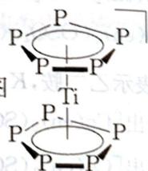

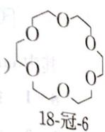

1-1 加入 $\mathrm{KC}_{10}\mathrm{H}_{8}$ 的作用是，其中的离域键可表示为：\_\_\_\_。

1-2 加入 18-冠-6(18-Crown-6)(结构如上图)的作用是 \_\_\_\_。

1-3 中间体 A 为 $\left[\mathrm{K}(18-\mathrm{Crown}-6)\right]_{2}\left[\mathrm{Ti}\left(\mathrm{C}_{10}\mathrm{H}_{8}\right)_{2}\right]$ ，请写出生成 A 的化学反应方程式：

1-4 配合物 X 中 Ti 的氧化数为：\_\_\_\_，其中心离子的价层电子数为：\_\_\_\_。

2 (12分,福建省化学竞赛试题)>>>

硫酸铬、铬绿是工业上广泛使用的化工原料。

2-1 在三份 $\mathrm{Cr}_{2}(\mathrm{SO}_{4})_{3}$ 溶液中分别加入 $\mathrm{Na}_{2} \mathrm{~S}, \mathrm{Na}_{2} \mathrm{CO}_{3}$ 、过量 $\mathrm{NaOH}$ , 写出化学反应方程式。

2-2 现有硫酸、生石灰、亚硫酸氢钠可供应用。试设计一个从含 $\mathrm{Cr(VI)}$ ， $\mathrm{Cr(III)}$ 的废水制取铬绿的简单方案，并写出各步化学反应方程式。

Cr(VI)是有毒的,可用电解的方法处理含 Cr(VI)废水,将 Cr(VI)转变为 Cr(III)。电解时将 Cr(VI)废水调至酸性,并加入一定的 NaCl,用铁作电极电解。试回答以下问题:

3-1 写出电极反应。

3-2 $\mathrm{Cr(VI)}$ 如何转变为 $\mathrm{Cr(III)}$ ，写出相应的反应方程式。

3-3 $\mathrm{Cr(III)}$ 以何种形式存在？写出相应的反应方程式。

3-4 NaCl 在过程中起何作用?

4 (9分)>>>

试叙述下列反应实验现象并用化学反应方程式加以说明：

4-1 向 $\mathrm{CrCl}_3$ 溶液中缓缓滴加 $\mathrm{NaOH}$ 溶液。

4-2 向 $\mathrm{K}_2\mathrm{CrO}_4$ 与 $\mathrm{H}_2\mathrm{O}_2$ 混合溶液中加入硫酸。

4-3 向 $\mathrm{MnCl}_2$ 溶液加入 $\mathrm{NaOH}$ 溶液，再加入 $\mathrm{H}_2\mathrm{O}_2$ 。

4-4 写出 $\mathrm{Na}_{2} \mathrm{SO}_{3}$ 溶液与 $\mathrm{KMnO}_{4}$ 溶液分别在酸性、碱性、中性条件下的反应方程式。

## 5 (10 分) <<<

白钨矿 $CaWO_{4}$ 是一种重要的含钨矿物。在 $80 \sim 90^{\circ}C$ 时，浓盐酸和白钨矿作用生成黄钨酸。黄钨酸在盐酸中溶解度很小，过滤可除去可溶性杂质。黄钨酸易溶于氨水，生成钨酸铵溶液，而与不溶性杂质分开。浓缩钨酸铵溶液，溶解度较小的五水仲钨酸铵从溶液中结晶出来。仲钨酸铵是一种同多酸盐，仲钨酸根含 12 个 W 原子，带 10 个负电荷。仲钨酸铵晶体灼烧分解可得 $WO_{3}$ 。

5-1 写出上述化学反应方程式：\_\_\_\_。

5-2 已知(298 K 下):

<table><tr><td> $\mathrm{WO}_{3}(\mathrm{s})$ </td><td> $\Delta H_{\mathrm{f}}^{\ominus}=-842.9\ \mathrm{kJ}\cdot\mathrm{mol}^{-1}$ </td><td> $\Delta G_{\mathrm{f}}^{\ominus}=-764.1\ \mathrm{kJ}\cdot\mathrm{mol}^{-1}$ </td></tr><tr><td> $\mathrm{H}_{2}\mathrm{O}(\mathrm{g})$ </td><td> $\Delta H_{\mathrm{f}}^{\ominus}=-242\ \mathrm{kJ}\cdot\mathrm{mol}^{-1}$ </td><td> $\Delta G_{\mathrm{f}}^{\ominus}=-228\ \mathrm{kJ}\cdot\mathrm{mol}^{-1}$ </td></tr></table>

$\Delta H^{\ominus}$ 与平衡常数 $K$ 、温度 $T$ 间满足公式： $\ln (K_2 / K_1) = \Delta H^{\ominus}(1 / T_1 - 1 / T_2) / R$

问:在什么温度条件下,可用 $H_{2}$ 还原 $WO_{3}$ 制备 W(假设此时平衡常数 K=1)?

5-3 钨丝常用作灯丝，在灯泡里加入少量碘，可延长灯泡使用寿命，为什么？

5-4 三氯化钨实际上是一种原子簇化合物 $\mathrm{W}_{6} \mathrm{Cl}_{18}$ , 其中存在 $[\mathrm{W}_{6} \mathrm{Cl}_{18-n}]^{n+}$ 离子结构单元, 该离子中含有 W 原子组成的八面体, 且知每个 Cl 原子与两个 W 原子形成桥键, 而每个 W 原子与四个 Cl 原子相连。试推断 $[\mathrm{W}_{6} \mathrm{Cl}_{18-n}]^{n+}$ 的 $n$ 值。

| 食品添加剂 | 元素成分 | 用途 | 生成过程 |
| --- | --- | --- | --- |
| N | 39.34% X | 保持口味 |  |
| E171 | 59.94% Y | 食品颜色白色 |  |
| E450(I) | 20.72% X | 烘焙面粉的成分 | $NaH_{2}PO_{4} \xrightarrow{170°C} E450(I)$ |
| E500(II) | 27.37% X | 烘焙面粉的成分 | $N\xrightarrow{NH_{3}+CO_{2}+H_{2}O} E500(II)$ |

右图画出了 E171（晶胞参数 $a = b = 4.59 \, \AA$ , c = 2.96 Å, $\alpha = \beta = \gamma = 90^{\circ}$ , $\rho = 4.25 \, g/\mathrm{cm}^{3}$ ）的晶胞。

6-1 利用给出的晶胞参数,列式计算 E171 中最小重复单元的化学式的摩尔质量。

6-2 确定 B、D 的化学式，以及 E500(Ⅱ)、E171

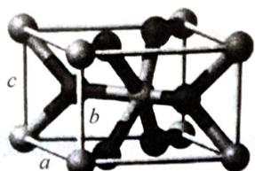

（灰球为Y原子，位于顶点和体心）

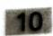

和 N 的化学式(注: 标准状况下 D 是一种液体)。

6-3 写出 $\mathrm{NaH_2PO_4}\xrightarrow{170^{\circ}C}\mathrm{E450(I)}$ 转化的反应方程式。

6-3 写出 $\mathrm{NaH_2PO_4}$ $\longrightarrow$ E450(I)转化成  
6-4 E450(I)、E500(II)和面粉的混合物就是发酵粉，广泛用于糕点生产中的无酵母面坯。请写出上述混合物能够使面坯疏松的反应方程式。

## 7 (11分) <<<

钒具有下列几种氧化态,其还原电势可用 $c(\mathrm{H}^{+})=1\ \mathrm{mol}\cdot\mathrm{L}^{-1}$ 时的元素电势图表示:

$$
E _ {\mathrm{A}} ^ {0} / \mathrm{V} \quad \mathrm{VO} _ {2} ^ {+} \xrightarrow {1 . 0 0} \mathrm{VO} ^ {2 +} \xrightarrow {0 . 3 4} \mathrm{V} ^ {3 +} \xrightarrow {- 0 . 2 6} \mathrm{V} ^ {2 +} \xrightarrow {- 1 . 1 3} \mathrm{V}
$$

7-1 钒若能溶解在稀酸中,将以何种氧化态存在,试写出反应方程式。

7-2 写出 $\mathrm{V}^{3+}/\mathrm{V}$ 电对的 $E^{\ominus}$ 。

7-3 在这些不同氧化态物质间能否发生歧化反应？如能发生请写出反应方程式。

7-4 将 V 放入含有 $V^{3+}$ 离子的溶液中, 有无反应发生, 若有请写出反应方程式。

7-5 在酸性介质中, 足量金属锌 $[E^{\ominus}(\mathrm{Zn}^{2+}/\mathrm{Zn}) = -0.76\mathrm{V}]$ 加入到钒(V)的溶液中, 溶液由黄色逐渐变为蓝色、绿色, 最后变成紫色。写出相应的反应方程式。

## 8 (6分)>>>

化合物 A 是一不溶于水的暗红色固体, 它能溶于硝酸生成浅粉色的溶液 B, 将 B 与浓 $HNO_{3}$ 和 $KClO_{3}$ 共煮沸生成棕色沉淀 C, 将 C 与 NaOH 和 $Na_{2}O_{2}$ 共熔转化为暗绿色化合物 D, D 可溶于酸溶液生成紫红色溶液 E 及少量 C, 将 C 加入酸性 $H_{2}O_{2}$ 溶液中有气体产生, 同时生成溶液 B, 在溶液 B 中加入少量 NaOH 溶液生成白色沉淀 F, F 很快转变为褐色沉淀 G, F、G 分别失水得到 A、C。回答下列问题:

8-1 A\~G 各是什么物质, 写出分子式。

8-2 写出 C 在酸性条件与 $\mathrm{H}_2\mathrm{O}_2$ 反应及在碱性条件与 $\mathrm{Na}_2\mathrm{O}_2$ 反应的方程式。

8-3 写出E的阴离子的空间构型。

## 9 (13分) <<<

橙红色固体 A 受热后生成深绿色的固体 B 和无色的气体 C, 加热时 C 能与镁反应生成黄色的固体 D。固体 B 与 NaOH 共熔后溶于水生成绿色的溶液 E, 在 E 中加适量 $\mathrm{H}_{2} \mathrm{O}_{2}$ 则生成黄色溶液 F。将 F 酸化变为橙色的溶液 G, 在 G 中加 $\mathrm{BaCl}_{2}$ 溶液, 得黄色沉淀 H。在 G 的浓溶液中加 KCl 固体, 反应完全后蒸发、浓缩后冷却有橙红色晶体 I 析出。I 受强热得到的固体产物中有 B, 同时得到能支持燃烧的气体 J。

试给出 A、B、C、D、E、F、G、H、I 和 J 所代表物质的化学式，并用化学反应方程式表示各过程。

## 10 (11分) >>>

铬是一种典型的过渡元素,它能形成许多色彩鲜艳的化合物,并呈现出不同的氧化态。
10-1 将一种铬(Ⅲ)盐溶于水,加入过量 NaOH 溶液,得到一种绿色溶液 A,在 A 溶液中添

加 $H_{2}O_{2}$ ，得到黄色的 B 溶液，再酸化，又得到橙色的 C 溶液。写出反应方程式。

10-2 在足量 $\mathrm{H}_3\mathrm{O}^+$ 离子存在下，在C溶液里再加入 $\mathrm{H}_2\mathrm{O}_2$ ，呈现一种深蓝色，该蓝色物质为 $\mathrm{CrO_5}$ ，不久溶液又转变为绿色。请画出蓝色中间物 $\mathrm{CrO_5}$ 的结构。由C生成 $\mathrm{CrO_5}$ 的反应是否为氧化还原反应？当用C溶液滴定 $\mathrm{H}_2\mathrm{O}_2$ 时，请计算每毫升 $0.020\mathrm{mol}\cdot \mathrm{L}^{-1}$ 的C相当于多少摩尔的 $\mathrm{H}_2\mathrm{O}_2?$

10-3 固体 $\mathrm{CrCl}_3\cdot 6\mathrm{H}_2\mathrm{O}$ 溶于水可能有几种不同组成的配离子。今用以下离子交换实验，测定属于哪种组成的配离子。实验将含 $0.219\mathrm{gCrCl}_3\cdot 6\mathrm{H}_2\mathrm{O}$ 的溶液通过H—离子交换树脂，交换出来的酸用 $0.125\mathrm{mol}\cdot \mathrm{L}^{-1}$ 的NaOH溶液滴定，用去NaOH溶液 $6.57~\mathrm{mL}$ 。已知配离子呈八面体结构，试确定该配离子，并画出它的所有可能结构式。

$$
\mathrm{E} _ {\mathrm{e}} (\mathrm{C} _ {2} \mathrm{O} _ {5} ^ {-}) = \mathrm{J}. 3 8 \mathrm{a} \quad \mathrm{E} _ {\mathrm{e}} (\mathrm{E} _ {\mathrm{g}} / \mathrm{L} _ {6 \mathrm{g}}) = 0. \mathrm{A} \mathrm{L} \quad \mathrm{E} _ {\mathrm{g}} (\mathrm{H} (\mathrm{OH}) = \mathrm{T} + 1 0 - \mathrm{K} \times 1 0 ^ {- 4} \times 1 0 ^ {- 4} \times 1 0 ^ {- 4} \times 1 0 ^ {- 4} \times 1 0 ^ {- 4} \times 1 0 ^ {- 4}
$$

解: 这是含有 $O_{2}O$ 以富士至 $O_{2}O$ 的 $H_{2}O^{+}$ 等元素, 指定为外子并表其原式 $O_{2}O$ 中水离析下式 1-5. 因此可知, 对出它的极外电子排布式, 并指出它在元素周期表中的位数 $O_{2}O$ 的表面的边Hg的边界膜或厚度, 为北方存在晶体中水离析(凹)杂对, 并测为水表含氧则 5.34. S 试计算的体积为 $H_{2}O$ 的密度, 原子体积占晶体空间的（囊核态不断着进气流干离析其）? 固 5.34. 每个体积为 $H_{2}O$ 同 $O_{2}O \sim 8$ 的密度 $H_{2}O$ 的气体的水体和原子的离子脱硫后的氧化态为 $H_{2}O$ , 可按下面的步骤来理解该含氢酸积的结构。

O $_{2}$ O $_{3}$ H $^{+}$ 用，OnM $_{2}$ 中经导式蜡面（O $_{2}$ H $^{+}$ 用，g000S $^{-}$ 用，O $_{17}$ O $_{7}$ -O $_{17}$ M $_{2}$ 的蜡台钢制取一系列断唇，O $_{25}$ I $^{+}$ 、lom000J $^{-}$ 用和磨，O $_{24}$ H $^{+}$ 去唇自唇容并解，由小圆柱去斜以圆环形背离，断唇线距，OnM $_{2}$ In0M8I去用，宝丽断唇，OnM $_{2}$ I·lom00010.0用，O $_{25}$ I量上，竖似Jm0.02断唇，OnM $_{2}$ I·lom00010.0用，O $_{25}$ I量生倒位，Jm00101朝容，O $_{25}$ I $^{+}$ ，lom000J $^{-}$ 用，圆锥内侧D $^{+}$ 复角本题的Mn。O $_{25}$ （图D中用虚线表示的小八面体是，JmF1.8主用，宝被取走的）。

$\text{烷化量固油 } O_{3} \text{O 味 OnM 中料吸收 } S - E$

金色白瓣稀——最冷，X表示的两栖——Y腹类（noallium），森林、灌溉站等桑甘典藏，第0821
藻萃稀多拉部要需冷试因，花台的藏困常非页一景X载落。嘉元土稀于圆，黄色的塑典官具，圆
冰晶醇）A质醇指弱不逊主，中新密求的弯曲深的X侵入腋附翅草株。孙龄味果富来异长到灵时
以3°00'至散脱速为盈，又65区内夹趾量贡，8瓶进并赠分热受中产空亦A，加2°00'干净。（唐合
回文藏薄主，用朝如：解旋风中断斜鳞盘对冲引深造。时气6.3倾静流水平稀不占白散脱
能
食杂氮气如远而鲜黄的C用于用途，圆锥齿脉量较早由员的象的解得为X属金起举出角主不

## 能力测试 B 卷 (满分 100 分, 时间 150 分钟)

## 1 (8分) <<<

根据条件书写化学反应方程式。

1-1 通过 $\mathrm{KMnO_4}$ 和 $\mathrm{H}_2\mathrm{O}_2$ 在 $\mathrm{KF - HF}$ 介质中反应获得化学法制 $\mathrm{F}_2$ 的原料 $\mathrm{K}_2\mathrm{MnF}_6$ 。

1-2 将热的硝酸铅溶液滴入热的铬酸钾溶液产生碱式铬酸铅沉淀 $\left[\mathrm{Pb}_{2}(\mathrm{OH})_{2}\mathrm{CrO}_{4}\right]$ 。

1-3 酸性溶液中，黄血盐用 $\mathrm{KMnO_4}$ 处理，被彻底氧化，产生 $\mathrm{NO}_3^-$ 和 $\mathrm{CO}_{2}$ 。

1-4 保险粉 $\left(\mathrm{Na}_{2} \mathrm{~S}_{2} \mathrm{O}_{4} \cdot 2 \mathrm{H}_{2} \mathrm{O}\right)$ 是重要的化工产品, 用途广泛, 可用来除去废水 $(\mathrm{pH} \approx 8)$ 中的 $\mathrm{Cr(VI)}$ , 所得含硫产物中硫以 $\mathrm{S(IV)}$ 存在。写出反应的离子方程式。

## 2 (10 分) >>>

已知： $K_{\mathrm{sp}}(\mathrm{Fe(OH)}_{3})=4\times10^{-38}$ $K_{\mathrm{sp}}(\mathrm{Fe(OH)}_{2})=8.0\times10^{-16}$ $K_{\mathrm{sp}}(\mathrm{Cr(OH)}_{3})=6\times10^{-31}$

$$
E ^ {\ominus} \left(\mathrm{Cr} _ {2} \mathrm{O} _ {7} ^ {2 -} / \mathrm{Cr} ^ {3 +}\right) = 1. 3 3 \mathrm{v} E ^ {\ominus} \left(\mathrm{Fe} ^ {3 +} / \mathrm{Fe} ^ {2 +}\right) = 0. 7 7 \mathrm{v}
$$

处理含铬(Ⅵ)废水的一种方法是:用 $FeSO_{4}$ 把铬(Ⅵ)还原为铬(Ⅲ),并同时转化为铁氧体 $Fe^{2+}Cr_{x}^{3+}Fe_{2-x}^{3+}O_{4}$ 。

2-1 为了把废水中 $\mathrm{CrO}_3$ 还原并转化为铁氧体 $\mathrm{Fe}^{2+}\mathrm{Cr}_x^{3+}\mathrm{Fe}_{2-x}^{3+}\mathrm{O}_4$ ，至少需加 $\mathrm{CrO}_3$ 含量多少倍的 $\mathrm{FeSO}_4 \cdot 7\mathrm{H}_2\mathrm{O}$ 固体？

2-2 如果含铬废水为酸性,按铬(VI)在废水中实际存在形式,计算还原反应的 pH 应在何范围?(其他离子浓度均按标准状态计算)

2-3 沉淀出组成和铁氧体相当的沉淀， $\mathrm{pH}$ 需在 $8 \sim 10$ 间进行，为什么？

## 3 (10分) <<<

某一难被酸分解的 $MnO—Cr_{2}O_{3}$ 矿石 2.000 g，用 $Na_{2}O_{2}$ 熔融后，得到 $Na_{2}MnO_{4}$ 和 $Na_{2}CrO_{4}$ 溶液，煮沸浸取液以除去过氧化物。酸化溶液后滤去 $MnO_{2}$ ，滤液用 $0.1000\ \mathrm{mol}\cdot \mathrm{L}^{-1}\ FeSO_{4}$ 溶液 50.00 mL 处理，过量 $FeSO_{4}$ 用 $0.010\ 00\ \mathrm{mol}\cdot \mathrm{L}^{-1}\ KMnO_{4}$ 溶液滴定，用去 18.40 mL。 $MnO_{2}$ 沉淀用 $0.1000\ \mathrm{mol}\cdot \mathrm{L}^{-1}\ FeSO_{4}$ 溶液 10.00 mL 处理，过量 $FeSO_{4}$ 用 $0.010\ 00\ \mathrm{mol}\cdot \mathrm{L}^{-1}\ KMnO_{4}$ 溶液滴定，用去 8.24 mL。

3-1 写出试样处理及滴定过程中的化学反应方程式。

3-2 求矿样中 MnO 和 $Cr_{2}O_{3}$ 的质量分数。

## 4 (12分)>>>

1879 年, 瑞典化学家拉尔斯·尼尔森(Lars Nilson)发现了一种新的元素 X, 它是一种银白色金属, 具有典型的淡黄色, 属于稀土元素。获得 X 是一项非常困难的任务, 因为它需要通过多种萃取和沉淀过程来富集和纯化。将草酸钠加入到 X 的氯化物的浓溶液中, 生成不溶性物质 A(结晶水合物)。低于 $100^{\circ}$ C 时, A 在空气中受热分解并形成 B, 质量损失约为 20%, 进一步加热至 $400^{\circ}$ C 以上, 形成白色不溶于水的物质 C。产物 C 与氟化钠在浓盐酸溶液中反应, 生成沉淀 D, 在钙热反应下生成化学纯金属 X。值得注意的是, 由于过量的氟化钠(工业中用于 D 的沉淀)而形成了复杂的

化合物 E。E 的分子量是 D 的 2.235 倍。

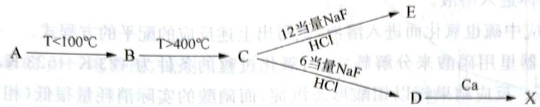

4-1 确定元素 X 及未知化合物 A、B、C、D、E 的化学式。

金属 X 可以在卤化物相中形成团簇化合物，特别是与氯形成团簇。美国科学家制备出了一系列 X 与氯形成的簇合物：F、G、H 和 I，在这些簇合物中，X 的质量分数依次增加。在置于真空密封石英安瓿中的钽坩埚中，以 4:3 的摩尔比将 X 金属氯化物与粉末状 X 熔融合成 F。F 经长时间加热分解生成 I，质量损失为 23.95%；F 与 H 融合形成 G 是一个归中反应，在该反应中，X 的氧化态从 F 到 G 变化了 6.67%，从 H 到 G 变化了 12%，F 和 H 中的金属原子数是相同的。

4-2 给出簇合物 F、G、H 和 I 的化学式。

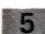

## (12 分) <<<

钼是我国丰产元素,探明储量居世界之首。钼有广泛用途,例如白炽灯里支撑钨丝的就是钼丝;钼钢在高温下仍有高强度,用以制作火箭发动机、核反应堆等。钼是固氨酶活性中心元素,施钼肥可明显提高豆科植物产量。

5-1 钼的元素符号是 42, 写出它的核外电子排布式, 并指出它在元素周期表中的位置。

5-2 钼金属的晶格类型为体心立方晶格，原子半径为 $136\mathrm{pm}$ ，相对原子质量为95.94。试计算该晶体钼的密度和空间利用率（原子体积占晶体空间的百分率）。

5-3 钼有一种含氧酸根 $\left[\mathrm{Mo}_x\mathrm{O}_y\right]^{z - }$ （如右图所示），式中 $x$ 、 $y$ 、 $z$ 都是正整数；Mo的氧化态为 $+6$ ，O呈一2。可按下面的步骤来理解该含氧酸根的结构：

(A) 所有 Mo 原子的配位数都是 6, 形成 $\left[MoO_{6}\right]^{6-}$ , 呈正八面体, 称为“小八面体”(图 A);

(B) 6个“小八面体”共棱连接可构成一个“超八面体”(图 B)，化学式为 $\left[Mo_{6}O_{19}\right]^{2-}$ ;

(C) 2个“超八面体”共用2个“小八面体”可构成一个“孪超八面体”(图C)，化学式为 $\left[Mo_{10}O_{28}\right]^{4+}$ ;

(D) 从一个“挛超八面体”里取走3个“小八面体”，得到的“缺角挛超八面体”(图D)便是本题的 $\left[Mo_{x}O_{y}\right]^{z-}$ （图D中用虚线表示的小八面体是被取走的）。

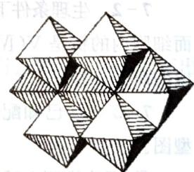

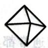  
A

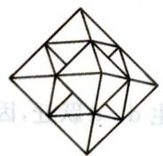  
B

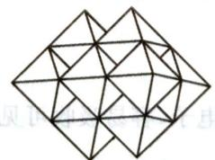  
C

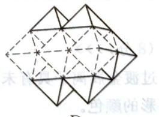  
D

$\left[Mo_{x}O_{y}\right]^{z-}$ 的化学式为 \_\_\_\_。

5-4 钼能形成六核簇合物，如一种含卤离子 $\left[\mathrm{Mo}_{6} \mathrm{Cl}_{8}\right]^{4+}$ ，6个Mo原子形成八面体骨架结构，氯原子以三桥基与Mo原子相连。则该离子中8个Cl离子的空间构型为\_\_\_\_。

5-5 辉钼矿 $\left(\mathrm{MoS}_{2}\right)$ 是最重要的铝矿，它在 $403\mathrm{K}$ 、 $202650\mathrm{Pa}$ 氧压下跟苛性碱溶液反应时，钼便以 $\mathrm{MoO}_4^{2-}$ 型体进入溶液。

① 在上述反应中硫也氧化而进入溶液，试写出上述反应的配平的方程式。
② 在密闭容器里用硝酸来分解辉钼矿，氧化过程的条件为 $423 \, K \sim 523 \, K$ ， $1114575 \, \mathrm{Pa} \sim 1823850 \, \mathrm{Pa}$ 氧压。反应结果钼以钼酸形态沉淀，而硝酸的实际消耗量很低（相当于催化剂的作用），为什么？试通过化学方程式（配平）来解释。

## 6 (8分,全国化学竞赛初赛试题)>>>

有一类复合氧化物具有奇特的性质:受热密度不降反升。这类复合氧化物的理想结构属立方晶系,晶胞示意图如右。图中八面体中心是锆原子,位于晶胞的顶角和面心;四面体中心是钨原子,均在晶胞中。八面体和四面体之间通过共用顶点(氧原子)连接。锆和钨的氧化数分别等于它们在周期表里的族数。

6-1 写出晶胞中锆原子和钨原子的数目。

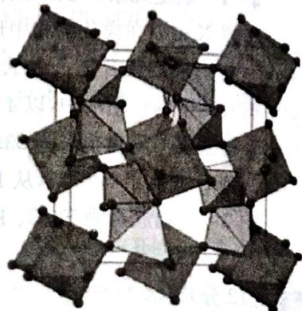

6-2 写出这种复合氧化物的化学式。

6-3 晶体中,氧原子的化学环境有几种?各是什么类型?在一个晶胞中各有多少?

6-4 已知晶胞参数 $a = 0.916 \mathrm{~nm}$ , 计算该晶体的密度 (以 $\mathrm{g} \cdot \mathrm{cm}^{-3}$ 为单位)。

## 7 (8分,全国化学竞赛决赛试题) <<<

钒是人体不可缺少的元素，有文献报道了偏钒酸钠显著降低糖尿病大鼠血糖的作用后，钒化学的研究得到了很大发展。钒及其化合物也广泛应用于特种钢、催化剂、颜料、染料、电子材料及防腐剂等领域。

7-1 钒酸盐与磷酸盐结构相似。请画出 $\mathrm{VO}_4^{3-}$ 、 $\mathrm{H}_2\mathrm{VO}_4^-$ 、 $\mathrm{VO}_2(\mathrm{H}_2\mathrm{O})_4^+$ 和 $\mathrm{V}_2\mathrm{O}_7^{4-}$ 的空间构型。

7-2 生理条件下的钒以多种氧化态存在,各种氧化态可以相互转化。通常细胞外的钒是 V(V),而细胞内的钒是 V(IV)。研究表明,钒酸二氢根离子可与亚铁血红素(Mtrc-Fe $^{2+}$ )反应,写出该反应的离子方程式。

7-3 ① 已知配合物 $\left[\mathrm{VON}(\mathrm{CH}_2\mathrm{COO})_3\right]$ 在水溶液中的几何构型是唯一的，画出它的空间构型图。

② 理论推测上述配合物分子在晶体中是有手性的,指出产生手性的原因。

## 8 (8分)>>>

过渡金属离子具有未成对 d 电子, 容易吸收可见光而发生 d-d 跃迁, 因而它们通常都具有丰富多彩的颜色。

8-1 $\mathrm{TiO}^{2+}$ (aq)为无色离子， $\mathrm{TiCl}_3$ 为紫色，而 $\mathrm{TiI}_4$ 为暗棕色晶体，试分析原因。

8-2 试解释 $\mathrm{Mn}^{2+}(\mathrm{aq})$ 有5个未成对电子，但 $\mathrm{Mn}^{2+}$ 的颜色是粉红色的原因。

8-3 酸性钒酸盐溶液中通入 $\mathrm{SO}_2$ 时生成一深蓝色溶液。相同量的钒酸盐溶液用锌汞齐还原时则得到紫色溶液。将此两溶液混合，即得绿色溶液，在此过程中进行了哪些反应，写出有关反

应方程式。

9 (10分) <<<

右图是铬体系的 pH-电势图, 试用反应方程式表示:

9-1 线段 AB、BO、DE、DF、OM 各表示的意义。

9-2 在 $\mathrm{pH} < 0$ 、 $\mathrm{pH} = 8$ 和 $\mathrm{pH} > 14$ 时， $\mathrm{Br}_2$ 能参与什么反应（已知 $\varphi_{\mathrm{Br}_2 / \mathrm{Br}^-}^{\ominus} = 1.07\mathrm{V}$ ）。

9-3 在 $\mathrm{pH} < 1.3$ 和 $\mathrm{pH} > 1.3$ 时， $\mathrm{I}_2$ 和 $\mathrm{IO}_3^-$ 分别参与什么反应（已知 $\varphi_{\mathrm{IO}_3^- / \mathrm{I}_2}^{\ominus} = 1.20\mathrm{V}$ ）。

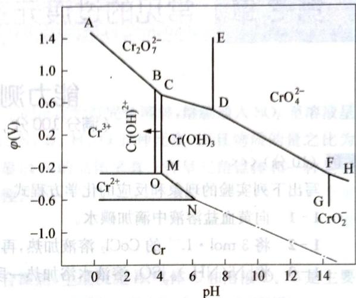

10 (14分)>>>

在合成某些铬的配合物时进行以下反应：

(a) 新制备的 $CrBr_{2}$ + 溶于稀盐酸溶液中的 $2,2'$ -联吡啶 → 黑色结晶沉淀 A。

(b) A + 5% HClO $_{4}$ 在空气中摇动 → 黄色晶状沉淀 B。

(c) 将 A 溶解在无空气的并含有过量 $NH_{4}ClO_{4}$ 的蒸馏水中，在惰性气氛中与 Mg 粉反应，生成深蓝色化合物 C。化学分析和磁性测量的结果如下：

|  | 重量百分比(w%) |  |  |  |  | $\mu (\mu_{B})$ |
| --- | --- | --- | --- | --- | --- | --- |
|  | N | Br | Cl | Cr | $ClO_4$ | $\mu (\mu_{B})$ |
| A | 11.0 | 21.0 |  | 6.9 |  | 3.27 |
| B | 10.26 |  | 13.01 | 6.4 |  | 3.76 |
| C | 13.56 |  |  | 8.39 | 16.6 | 2.05 |

10-1 写出化合物 A、B 和 C 的结构式并解释磁性数据。

10-2 当用 $0.05000 \mathrm{~mol} \cdot \mathrm{L}^{-1}$ 的碘溶液滴定 $0.1906 \mathrm{~g}$ 的 C 时, 滴定用去溶液 $6.1 \mathrm{~mL}$ , 写出该反应的方程式。

10-3 简要说明进行(a)、(b)和(c)所需反应条件的原因。

# 第8章

# 常见的过渡元素（下）

# 能力测试 A 卷

(满分 100 分，时间 120 分钟)

(10 分) <<<

写出下列实验的现象和反应的化学方程式。

1-1 向黄血盐溶液中滴加碘水。

1-2 将 $3 \mathrm{~mol} \cdot \mathrm{L}^{-1}$ 的 $\mathrm{CoCl}_2$ 溶液加热, 再滴入 $\mathrm{AgNO}_3$ 溶液。

1-3 将 $\left[\mathrm{Ni}\left(\mathrm{NH}_{3}\right)_{6}\right]\mathrm{SO}_{4}$ 溶液水浴加热一段时间后再加入氨水。

## 2 (6分)>>>

市场上出现过一种一氧化碳检测器,其外观像一张塑料信用卡,正中有一个直径不到2 cm的小窗口,露出橙红色固态物质。若发现橙红色转为黑色且在短时间内不复原,表明室内一氧化碳浓度超标,有中毒危险。一氧化碳不超标时,橙红色虽也会变黑却能很快复原。已知检测器的化学成分:亲水性硅胶、氯化钙、固体酸 $H_{8}[Si(Mo_{2}O_{7})_{6}]\cdot28H_{2}O$ 、 $CuCl_{2}\cdot2H_{2}O$ 和 $PdCl_{2}\cdot H_{2}O$ (注橙红色为复合色,不必细究)。

2-1 CO 与 $\mathrm{PdCl}_2\cdot \mathrm{H}_2\mathrm{O}$ 的反应方程式为

2-2 上述的产物之一与 $\mathrm{CuCl}_2\cdot 2\mathrm{H}_2\mathrm{O}$ 反应而复原，化学方程式为

2-3 复原 $\mathrm{CuCl}_2\cdot 2\mathrm{H}_2\mathrm{O}$ 的反应方程式为

## (11 分, 浙江省化学竞赛试题) <<<

3-1 有一含 Co 的单核配合物, 元素分析表明其含 Co 21.4%, H 5.4%, N 25.4%, Cl 13.0%(质量分数)。该配合物的稀水溶液与 $\mathrm{Ba(NO_3)_2}$ 相遇生成不溶于稀酸的白色沉淀; 将溶液过滤, 滤液与硝酸银溶液相遇不生成沉淀。

① 写出该配合物的结构式(不要求推理过程)。

② 写出该配合物中心原子 Co 的杂化形式。

③该配合物呈顺磁性还是抗磁性。

3-2 最近合成出常量的含金化合物 A, 由阴离子和阳离子组成, 其中 Au 含量 $12.11\%$ 。阳离子呈平面四边形构型; 阴离子由二种元素组成, 其中一种为氟, 阴离子是含两个共顶点八面体的负一价离子。A 中 X—Au 键, 是继 X—F、X—N、X—C 键后, 又发现的一例新的由元素 X 参与形成的键。请写出 A 中 Au 的氧化态、杂化形式, 并画出 A 中阴、阳离子的结构。

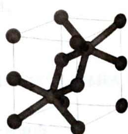

3-3 许多 1:1 化合物都属于六方 NiAs 晶胞,例如 FeSe、AuSn 等,右侧是它的晶胞图,顶点、棱上小球为 Ni。

① 写出两种原子的坐标。

② 写出 As 原子以何种方式密堆积, 给出 Ni 原子占据的空隙种类。

③ 晶胞参数 $a = 360.2 \mathrm{pm}, c = 500.9 \mathrm{pm}$ ，计算密度（已知 $N_{\mathrm{A}} = 6.02 \times 10^{23} \mathrm{~mol}^{-1}$ ）。

## 4 (10分)>>>

向 $\mathrm{CuSO_4}$ 溶液中滴加稍过量的氨水至初始产生的沉淀恰好完全溶解，继续通入 $\mathrm{SO}_2$ 至溶液呈微酸性，生成白色沉淀A。元素分析表明A含Cu、N、S、H、O五种元素，而且物质的量之比为 $\mathrm{Cu:N:S = 1:1:1}$ 。激光拉曼光谱和红外光谱显示A的晶体里有一种呈三角锥体和一种呈正四面体的离子(或分子)。磁性实验指出A呈逆磁性。

4-1 写出 A 的化学式。

4-2 写出生成 A 的配平的化学方程式。

4-3 将 A 和足量的 $10 \mathrm{~mol} \cdot \mathrm{L}^{-1} \mathrm{H}_{2} \mathrm{SO}_{4}$ 混合微热, 生成沉淀 B、气体 C 和溶液 D。B 是主要产品, 尽管它是常见物质, 本法制得的呈超细粉末状, 有重要用途。写出这个反应式 (配平)。

4-4 按 4-3 操作得到 B 的最大理论产率是多大?

4-5 有人设计了在密闭容器里使 A 和硫酸反应, 结果 B 的产率大大超过按 4-4 的估计。问: 在这种设计操作下, B 的最大理论产率多大? 试对此作出解释。

## 5 (14分) <<<

银白色金属 M, 在较高温度和压力下, 同一氧化碳作用, 生成淡黄色液体 A, A 在高温下分解为 M 和一氧化碳。M 的一种红色化合物晶体 B 具有顺磁性, 实验测得其磁矩为 2.3 玻尔磁子, B 在中性溶液中微弱水解, 在碱性溶液中 B 能把 Cr(Ⅲ) 氧化为 $\mathrm{CrO}_{4}^{2-}$ , 而本身被还原成溶液 C。溶液 C 在弱酸性介质中与 $\mathrm{Cu}^{2+}$ 作用生成红褐色沉淀, 因而常作为 $\mathrm{Cu}^{2+}$ 的鉴定试剂。溶液 C 可被氯气氧化成 B。固体 C 在高温下可分解, 其分解产物为碳化物 D, 剧毒的钾盐 E 和化学惰性气体 F。碳化物 D 经硝酸处理可得 $\mathrm{M}^{3+}$ 离子, $\mathrm{M}^{3+}$ 离子碱化后与 NaClO 溶液反应可得紫红色溶液 G, G 溶液酸化后立即变成 $\mathrm{M}^{3+}$ 并放出气体 H。

5-1 试写出 M、A\~H 所表示的物质的化学式。

5-2 写出下面变化的离子方程式：

① B在碱性条件下,氧化Cr(Ⅲ)。

$$
\mathbf {M} ^ {3 +}
$$

$$
\mathrm{NaClO}
$$

③ G 溶液酸化的反应,指出反应中的氧化剂和还原剂。

## 6 (10分,黑龙江省化学竞赛试题)>>>

钴(Co)化合物对化学键的研究起着重要的作用。为测定化合物 $\left[\mathrm{Co}\left(\mathrm{NH}_{3}\right)_{x}\mathrm{Cl}_{y}\right]\mathrm{Cl}_{z}$ 的组成，进行如下实验：

① 称取样品 0.5010 g, 加入过量的 NaOH 溶液, 煮沸, 蒸出所有的氨, 冷却, 得到 A。产生的氨用 50.00 mL 0.5000 mol·L $^{-1}$ 的盐酸完全吸收并用蒸馏水定容至 100 mL, 得溶液 B。取 B 溶液 20.00 mL, 用 0.1000 mol·L $^{-1}$ NaOH 滴定, 消耗 NaOH 溶液 30.00 mL。

② 向 A 中加入过量 KI 固体，振荡，用盐酸酸化后置于暗处，反应完成后，加蒸馏水稀释，用 $Na_{2}S_{2}O_{3}$ 溶液滴定析出的 $I_{2}$ ，消耗 $0.1000\ \mathrm{mol}\cdot \mathrm{L}^{-1}\ Na_{2}S_{2}O_{3}$ 溶液 20.00 mL。

③ 另称取该物质样品 0.2505 g，溶于水，以 $0.1000 \, \mathrm{mol} \cdot \mathrm{L}^{-1} AgNO_{3}$ 溶液滴定至恰好反应完

全，消耗 $AgNO_{3}$ 溶液 20.00 mL。

6-1 求 $\left[\mathrm{Co}\left(\mathrm{NH}_{3}\right)_{x} \mathrm{Cl}_{y}\right] \mathrm{Cl}_{z}$ 中氮元素的质量分数。

6-2 写出该钴化合物的化学式。

## (10 分) <<<

约200年前丹麦人蔡斯(W.C Zeise)最早合成了以烯烃为配体的过渡金属配合物。1868年伯恩鲍姆(Birnbaum)利用氯化亚锡做催化剂,将乙烯通入 $\mathrm{K}_{2}[\mathrm{PtCl}_{4}]$ 的盐酸溶液中,得一个稳定的金黄色晶体即蔡斯盐: $\mathrm{K}[\mathrm{Pt}(\mathrm{C}_{2}\mathrm{H}_{4})\mathrm{Cl}_{3}]$ 。研究此类配位化合物对了解催化机理、合理选择催化剂有重要意义。目前工业上大部分乙烯化合物类催化剂都是受蔡斯盐的启发。

7-1 蔡斯盐的系统名称为：\_\_\_\_。

7-2 写出制备蔡斯盐的化学反应方程式：

7-3 讨论蔡斯盐的结构和化学键,它是否符合18电子规则?此盐阴离子的结构可用什么方法来确定?

7-4 用乙酰萃取蔡斯盐的水溶液,可得化学式为 $\mathrm{Pt}(\mathrm{C}_{2}\mathrm{H}_{4})\mathrm{Cl}_{2}$ 的中性化合物,试写出此化合物的可能的分子式和结构式。

## 8 (9分)>>>

十九世纪末,化学家发现了镍(Ni)细粉与一氧化碳反应,生成 Ni(CO) $_{4}$ 。Ni 原子的价电子与 CO 配体提供的电子数等于 18——EAN 规则(或 18 电子规则),请回答下列问题:

8-1 用EAN规则预言 $\mathrm{Fe}^{(0)}$ 和 $\mathrm{Cr}^{(0)}$ 的二元羰基化合物的分子式。

8-2 用EAN规则预言最简单的二元铬(0)—亚硝基化合物应具有什么组成？

8-3 解释为什么 $\mathrm{Mn}^{(0)}$ 和 $\mathrm{Co}^{(0)}$ 不生成所谓单核中性羰基化合物, 而生成有金属一金属键的化合物?

8-4 $\mathrm{V}(\mathrm{CO})_6$ 以及(1)、(2)问中提出的化合物是顺磁性还是反磁性？

8-5 18 电子规则对铬和苯合成的化合物也适用,写出此配合物的结构式。

## (10 分) <<<

化合物 A 是一种黑色固体, 它不溶于水、稀 HAc 与 NaOH 溶液, 而易溶于热 HCl 中, 生成一种绿色的溶液 B。如溶液 B 与铜丝一起煮沸, 即逐渐变成土黄色溶液 C。溶液 C 若用大量水稀释时会生成白色沉淀 D, D 可溶于氨溶液中生成无色溶液 E。E 暴露于空气中则迅速变成蓝色溶液 F。往 F 中加入 KCN 时, 蓝色消失, 生成溶液 G。往 G 中加入锌粉, 则生成红色沉淀 H, H 不溶于稀酸和稀碱中, 但可溶于热 HNO₃ 中生成蓝色的溶液 I。往 I 中慢慢加入 NaOH 溶液则生成蓝色沉淀 J。如果将 J 过滤, 取出后加热, 又生成原来的化合物 A。

9-1 试判断各字母所代表的物质。

9-2 分别写出生成 C、D、E、F、G 的有关反应方程式。

## 10 (10 分) >>>

铂的配合物是一类新抗癌药，如顺式-二氯二氨合铂对一些癌症有较高治愈率。铂元素化学性质不活泼，几乎完全以单质形式分散于各种矿石中，铂的制备一般是先用王水溶解经处理后的铂

化学竞赛能力测试一高中第二分册

精矿，滤去不溶渣，在滤液中加入氯化铵，使铂沉淀出来，该沉淀经 $1000^{\circ}\mathrm{C}$ 缓慢灼烧分解，即得海绵铂。

10-1 写出上述制备过程有关的化学方程式。

10-2 氯铂酸与硝酸钠在 $500^{\circ}\mathrm{C}$ 熔融可制得二氧化铂，写出化学方程式。 $\mathrm{PtO_2}$ 在有机合成中广泛用作氢化反应的催化剂，试问此反应中实际起催化作用的物质是什么？

10-3 X射线分析测得 $\mathrm{K}_2[\mathrm{PtCl}_6]$ 晶胞为面心立方， $[\mathrm{PtCl}_6]^{2-}$ 中 $\mathrm{Pt}^{4+}$ 位于立方体的八个顶角和六个面心。问 $\mathrm{Pt}^{4+}$ 采用何种类型杂化？ $[\mathrm{PtCl}_6]^{2-}$ 空间构型？ $\mathbf{K}^+$ 占据何种类型空隙？该类型空隙被占百分率？标出 $\mathbf{K}^+$ 在晶胞中的位置。

2. 用 $\mathrm{H}_2\mathrm{O}$ 和 $\mathrm{H}_3\mathrm{O}$ 的体积为 $\mathrm{H}_2\mathrm{O}$ ，即 $\mathrm{H}_2\mathrm{O}$ 的体积为 $\mathrm{H}_3\mathrm{O}$ ，即 $\mathrm{H}_3\mathrm{O}$ 的体积为 $\mathrm{H}_4\mathrm{O}$ 。

在所有文件上，您已收到了《关于使用部分闲置募集资金进行现金管理的公告》。

(1) 用 $f(x)$ 为正方形的三角形，开口由 $x$ 与 $y$ 交于点 $f(x,y)$ 上的三角形。当 $x > y$ ，则 $f(x,y)$ 在 $y$ 上的三角形上，开口由 $x$ 与 $y$ 交于点 $f(y,y)$ 上的三角形。

1. 2. 3. 4. 5. 6. 7. 8. 9. 10. 11. 12. 13. 14. 15. 16. 17. 18. 19. 20. 21. 22. 23. 24. 25. 26. 27. 28. 29. 30. 31. 32. 33. 34. 35. 36. 37. 38. 39. 40. 41. 42. 43. 44. 45. 46. 47. 48. 49. 50. 51. 52. 53. 54. 55. 56. 57. 58. 59. 60. 61. 62. 63. 64. 65. 66. 67. 68. 69. 70. 71. 72. 73. 74. 75. 76. 77. 78. 79. 80. 81. 82. 83. 84. 85. 86. 87. 88. 89. 90. 91. 92. 93. 94. 95. 96. 97. 98. 99.

1. 精点图： $\left( {x - 1}\right)  = \left( {x + 2}\right)$ . (2) 对称式为直线, 则定 $x = 3\sqrt{2}$ . (3) 对称式为直线, 则定 $x = 4\sqrt{2}$ . (4) 对称式为直线, 则定 $x = 5\sqrt{2}$ . (5) 对称式为直线, 则定 $x = 6\sqrt{2}$ . (6) 对称式为直线, 则定 $x = 7\sqrt{2}$ . (7) 对称式为直线, 则定 $x = 8\sqrt{2}$ . (8) 对称式为直线, 则定 $x = 9\sqrt{2}$ . (9) 对称式为直线, 则定 $x = 10\sqrt{2}$ . (10) 对称式为直线, 则定 $x = 11\sqrt{2}$ . (11) 对称式为直线, 则定 $x = 12\sqrt{2}$ . (12) 对称式为直线, 则定 $x = 13\sqrt{2}$ . (13) 对称式为直线, 则定 $x = 14\sqrt{2}$ . (14) 对称式为直线, 则定 $x = 15\sqrt{2}$ . (15) 对称式为直线, 则定 $x = 16\sqrt{2}$ . (16) 对称式为直线, 则定 $x = 17\sqrt{2}$ . (17) 对称式为直线, 则定 $x = 18\sqrt{2}$ . (18) 对称式为直线, 则定 $x = 19\sqrt{2}$ . (19) 对称式为直线, 则定 $x = 20\sqrt{2}$ . (20) 对称式为直线, 则定 $x = 21\sqrt{2}$ . (21) 对称式为直线, 则定 $x = 22\sqrt{2}$ . (22) 对称式为直线, 则定 $x = 23\sqrt{2}$ . (23) 对称式为直线, 则定 $x = 24\sqrt{2}$ . (24) 对称式为直线, 则定 $x = 25\sqrt{2}$ . (25) 对称式为直线, 则定 $x = 26\sqrt{2}$ . (26) 对称式为直线, 则定 $x = 27\sqrt{2}$ . (27) 对称式为直线, 则定 $x = 28\sqrt{2}$ . (28) 对称式为直线, 则定 $x = 29\sqrt{2}$ . (29) 对称式为直线, 则定 $x = 30\sqrt{2}$ . (30) 对称式为直线, 则定 $x = 31\sqrt{2}$ . (31) 对称式为直线, 则定 $x = 32\sqrt{2}$ . (32) 对称式为直线, 则定 $x = 33\sqrt{2}$ . (33) 对称式为直线, 则定 $x = 34\sqrt{2}$ . (34) 对称式为直线, 则定 $x = 35\sqrt{2}$ . (35) 对称式为直线, 则定 $x = 36\sqrt{2}$ . (36) 对称式为直线, 则定 $x = 37\sqrt{2}$ . (37) 对称式为直线, 则定 $x = 38\sqrt{2}$ . (38) 对称式为直线, 则定 $x = 39\sqrt{2}$ . (39) 对称式为直线, 则定 $x = 40\sqrt{2}$ . (40) 对称式为直线, 则定 $x = 41\sqrt{2}$ . (41) 对称式为直线, 则定 $x = 42\sqrt{2}$ . (42) 对称式为直线, 则定 $x = 43\sqrt{2}$ . (43) 对称式为直线, 则定 $x = 44\sqrt{2}$ . (44) 对称式为直线, 则定 $x = 45\sqrt{2}$ . (45) 对称式为直线, 则定 $x = 46\sqrt{2}$ . (46) 对称式为直线, 则定 $x = 47\sqrt{2}$ . (47) 对称式为直线, 则定 $x = 48\sqrt{2}$ . (48) 对称式为直线, 则定 $x = 49\sqrt{2}$ . (49) 对称式为直线, 则定 $x = 50\sqrt{2}$ . (50) 对称式为直线, 则定

# 能力测试 B 卷 (满分 100 分, 时间 150 分钟)

## (8分) <<<

写出下列反应方程式。

1-1 将擦亮的铜片投入装有足量的浓硫酸的大试管中, 微热片刻, 有固体析出但无气体产生, 固体为 $\mathrm{Cu}_{2} \mathrm{~S}$ 和另一种白色物质的混合物。

1-2 向含氰化氢的废水中加入铁粉和 $\mathrm{K}_2\mathrm{CO}_3$ 制备黄血盐 $[\mathrm{K}_4\mathrm{Fe}(\mathrm{CN})_6\cdot 3\mathrm{H}_2\mathrm{O}]$

1-3 在 $\mathrm{Fe}^{3+}$ 存在下, 可以用硫脲溶解矿物中的金。

1-4 银镜反应时需要用的银氨溶液,必须现配现用:因为久置的银氨溶液常析出黑色的氮化银沉淀。写出相应的化学反应方程式。

## 2 (7 分) >>>

六配位单核配合物 $\left[\mathrm{MA}_{2}\left(\mathrm{NO}_{2}\right)_{2}\right]$ 的组成分析结果为：M 21.68%；N 31.04%，C 17.74%；未知配体 A 中不含氧；在配位化合物中已知的配体的氮氧键不等长。

2-1 通过计算推导出配合物的化学式。

2-2 画出该配合物的结构及其立体异构体的结构。

## 3 (9分) <<<

钌在酸性溶液中被 $\mathrm{KMnO_4}$ 氧化时，可生成橙黄色的 $\mathrm{RuO_4}$ 。在KCl存在下， $\mathrm{RuO_4}$ 可被HCl还原生成红色晶体 $\mathrm{K_4[Ru_2OCl_{10}]$ 。迄今已知只有两种金属四氧化物， $\mathrm{RuO_4}$ 是稳定性较差的一种，受热易分解。

3-1 $\mathrm{RuO_4}$ 分子空间构型为\_\_\_\_，分子所属于点群为\_\_\_\_，其分解反应方程式为\_\_\_\_。

3-2 配合物 $\mathrm{K}_4[\mathrm{Ru}_2\mathrm{OCl}_{10}]$ 的磁性为 \_\_\_\_，画出配合物中阴离子的结构式。

3-3 $\mathrm{RuCl}_2(\mathrm{H}_2\mathrm{O})_4^+$ 有两种几何异构体 A 和 B, $\mathrm{RuCl}_3(\mathrm{H}_2\mathrm{O})_3$ 也有两种几何异构体 C 和 D。如果用 $\mathrm{H}_2\mathrm{O}$ 取代一个 C 或 D 中的 $\mathrm{Cl^-}: \mathrm{C}$ (或 D) + $\mathrm{H}_2\mathrm{O} = \mathrm{A} + \mathrm{Cl^-}$ 均生成 A。请画出 A、B、C、D 的结构，并试说明用 $\mathrm{H}_2\mathrm{O}$ 取代 C 或 D 中的一个 $\mathrm{Cl^-}$ 时产物都是 A 的原因。

## 4 (12分)>>>

现有某混合物,其中含有 $\mathrm{K}_{3} \mathrm{NiF}_{6}$ 与 $\mathrm{K}_{2} \mathrm{NiF}_{6}$ 两种组分,为了检验各组分所占质量分数,进行以下实验:准确称取 $0.4237 \mathrm{~g}$ 混合物固体,加入 $\mathrm{H}_{2} \mathrm{SO}_{4}$ 酸化的 KI 溶液,充分反应后,加入去离子水稀释,再以 $0.1008 \mathrm{~mol} \cdot \mathrm{L}^{-1}$ 的 $\mathrm{Na}_{2} \mathrm{S}_{2} \mathrm{O}_{3}$ 溶液进行滴定,消耗 $21.48 \mathrm{~mL}$ 。

4-1 画出 $\mathrm{K}_3\mathrm{NiF}_6$ 的阴离子结构，明确表明键角与键长的关系。判断 $\mathrm{NiF}_6^{3-}$ 所属点群，并写出其中 Ni(Ⅲ)的价电子在晶体场中的排布式。

4-2 计算混合物中 $\mathrm{K}_2\mathrm{NiF}_6$ 与 $\mathrm{K}_3\mathrm{NiF}_6$ 的质量分数。

4-3 写出 $\mathrm{K}_2\mathrm{NiF}_6$ 在HCl中分解的反应方程式。

## (10 分) <<<

某氧化物 A, 溶于浓盐酸得溶液 B 并有气体生成。B 加入适量 KOH 溶液后析出蓝色沉淀, 放置或加热后转化为粉红色沉淀 C, 将 C 用 $H_{2}O_{2}$ 处理, 可得棕褐色不溶于水的固体 D。B 遇过量氨水, 得不到沉淀而得溶液 E, 放置后则变为抗磁性的橙黄色 F。B 中加入 KSCN 及少量丙酮时生成宝石蓝色的溶液 G。若将 B 用 $KNO_{2}$ 的醋酸溶液处理, 则生成沉淀 H 和气体 I, 将 I 通过 $FeSO_{4}$ 溶液, 则溶液变为暗棕色 J, 但无沉淀生成。

## 5-1 写出 A\~K 的化学式。

5-2 写出由①A生成B、②E转化为F、③B生成G、④B生成H、⑤将I通过 $\mathrm{FeSO_{4}}$ 溶液转化为J的有关反应方程式。

## 6 (11分,国际奥赛理论试题)>>>

在 5500 年前,古代埃及人就已经知道如何合成蓝色颜料,我们现在称之为埃及蓝。在此之后 2000 年,古代中国人亦大量使用另一种蓝色颜料,现在称之为中国蓝,这两个颜料结构相似,但是元素组成不同。现代实验室可以很容易的复制古代制备这些颜料的方法。

本题假设这些化合物都是纯的,并且产率都是100%。

制备埃及蓝需加热 10.0 g 的矿物 A 和 21.7 g 的 $SiO_{2}$ 以及 9.05 g 的矿物 B，加热到 800～900℃ 一段时间，会有 16.7 L 的气体混合物（体积是在 850℃ 和 1 个大气压下测量），和 34.0 g 的颜料生成，没有其他的产物。当混合气体冷却时，其中一个物质会凝结。剩下的气体冷却到 0℃，体积会减少为 3.04 L。

6-1 计算出加热矿物 A、B 和 $\mathrm{SiO}_2$ 时产生的气体混合物的质量。

## 6-2 确定此混合气体的定量组成。

当只有 10.0 g 克矿物 A 和 21.7 g 的 $SiO_{2}$ 加热时，不含 B，则会产生 8.34 L 的气体产物（在 $850^{\circ}C$ 和 1 个大气压下测量）。矿物 A 只含一种金属。

6-3 计算矿物 B 的式量并判断其化学式(提示:矿物 B 是一个不溶水的固态盐类,并且不含结晶水)。

制备中国蓝,需拿 17.8 克的矿物 C 来代替矿物 B(矿物 A 和 $SiO_{2}$ 的用量和埃及蓝相同),并加热到更高的温度。除了得到颜料外,还会得到和制备埃及蓝时相同且等量的气体混合物。

6-4 判断矿物C的化学式。

6-5 判断埃及蓝和中国蓝的化学式。

6-6 判断矿物 A 的化学式。

## 7 (10分,全国化学竞赛决赛试题) <<<

M为常见金属,不溶于盐酸和稀硫酸,质地坚韧,富有延展性。将M溶于硝酸后蒸发、浓缩、冷却得到A的水合盐。A受热分解得到黑色固体B。B溶于盐酸,经蒸发、浓缩、冷却得到绿色晶体C。B溶于稀硫酸后经蒸发、浓缩、冷却得到蓝色晶体D。D在270℃恒温下生成白色粉末E,E经600℃恒温后生成B。

7-1 写出A、B、C和E的化学式。

7-2 将 E 溶于水, 加入过量的碘化钾溶液充分反应, 其后缓慢滴加硫代硫酸钠溶液至过量。简述反应过程中发生的现象, 写出相关反应的离子方程式。

7-3 A的熔点较低,真空时易升华,这与一般离子晶体的性质不相符。简述理由。

## 8 (11分)>>>

向 $K_{4}[Fe(CN)_{6}]$ 的溶液中加入硝酸并加热，然后用碳酸钠中和多余的硝酸，除去溶液中的硝酸钾、浓缩结晶、析出一种鲜红色的反磁性水合二钠盐 X。X 的阴离子是单核六配位离子，具有一根四重轴，但没有对称中心，其配体只有两种。

8-1 将 X 在 $120^{\circ}$ C 下分解, 失重的质量分数为 12.1%。通过计算和推理给出 X 的化学式。

8-2 指出 X 中心离子的价电子组态、自旋态(高或低)和氧化态。

8-3 写出硝酸和 $\mathrm{K}_{4}[\mathrm{Fe}(\mathrm{CN})_{6}]$ 反应的离子反应方程式(此反应还生成 $\mathrm{NH}_{4}^{+}$ 和 $\mathrm{CO}_{2}$ )。

8-4 在人体血管平滑肌内，X能代谢产生一种小分子物质，进而扩张血管，降低血压。试写出这一小分子物质的化学式。

8-5 X 的水溶液能与 NaOH 反应, 此过程中配体与中心原子之间的键未发生断裂, 写出反应的方程式。

## 9 (12分) <<<

将乙基二苯基膦加到 $-78^{\circ}C$ $NiBr_{2}$ 的 $CS_{2}$ 溶液中，得到配合物 A，其分子式为 $(\mathrm{Etph}_{2}\mathrm{P})_{2}\mathrm{NiBr}_{2}$ ；在室温下放置，转变成分子式相同的配合物 B，这两种异构体（固态）的光谱如右图所示。异构体 A 是反磁性的，而异构体 B 的磁矩为 $3.2\mu_{B}$ 。将异构体 B 溶解在氯仿中，得到一种微带红色的绿色溶液，异构体 B 在氯仿中的磁矩为 $2.69\mu_{B}$ 。

9-1 试确定配合物 A 和 B 是什么结构, 画出它们可能存在的所有几何异构体。

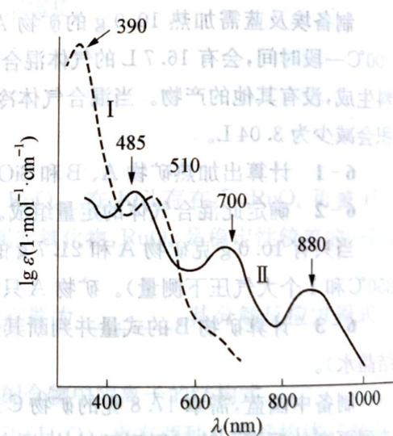

9-2 指出谱图中曲线Ⅰ和Ⅱ分别属于哪个配合物，说明理由。

9-3 谱图中哪些吸收峰与A和B的颜色对应?

9-4 如何解释异构体 B 在氯仿中的颜色和磁矩？

9-5 如果选用波长为 $510 \mathrm{~nm}$ 的单色光照射 A, A 呈什么颜色?

## 10 (10分)>>>

1803年,英国化学家和物理学家沃拉斯顿(Wollaston)在处理铂矿时偶然发现了一种玫瑰色的复盐结晶。用氢气还原该盐得到了铑。这是除铂外首例从自然界中提取出的铂系金属。铂系金属中除锇外电子排布都很特殊。

10-1 写出铂和铑的电子构型。

10-2 铂系金属对酸很不活泼, 如 Ru, Os, Rh, Ir 在常温下连王水都不能溶解, 但是 Pd 和 Pt 可溶于王水中。写出 Pt 溶于王水的化学方程式。

10-3 含铂 $40.14\%$ 的盐A受热分解得到单质铂，一种盐B和一种黄绿色气体C。A中阴离子呈八面体结构，其阴离子与 $\mathrm{K}_2\mathrm{C}_2\mathrm{O}_4$ 作用生成一种呈平面四边形的阴离子D。D与一种二元化合物反应生成阴离子 E。E 中含 Pt 59.22%。E 可双聚形成中性化合物 F。画出 A 中阴离子，D、E、F 的结构，写出 B、C 的化学式。

10-4 Pd与氯气在大于 $823\mathrm{K}$ 时生成 $\alpha -\mathrm{PdCl}_2$ 。小于 $823\mathrm{K}$ 时 $\beta -\mathrm{PdCl}_2$ 为原子簇化合物，其化学式可表示为 $(\mathrm{PdCl}_2)_6$ 。它与A中阴离子属于同一点群。 $\alpha -\mathrm{PdCl}_2$ 为扁平链状结构，画出两种 $\mathrm{PdCl}_2$ 的结构。

## 第9章

# 烷烃及环烷烃

# 能力测试 A 卷

# (满分 100 分，时间 120 分钟)

1-1 写出下列分子或离子的一个可能的路易斯结构式：

$CH_{3}OH$ HCHO $HNO_{3}$ $CH_{3}CH_{2}\cdot CH_{2}=CH-CH_{2}^{+}$

1-2 分别指出 1-1 中各个 C 原子及 N 原子的杂化方式。

1-3 判断 1-1 中前两个分子的极性, 可通过 \_\_\_\_ 方法进行实验证实。

1-4 根据以下信息,画出分子式为 $CH_{4}N_{2}O$ 的路易斯结构式:氧原子和两个氮原子都与碳结合,各原子所带形式电荷均为 0。

2 (15 分) >>>

2-1 请写出下列分子中所含 $\sigma$ 键和 $\pi$ 键的数目：

(a) $\mathrm{CH}_3\mathrm{CH} = \mathrm{CHCH}_3$ (b) $\mathrm{HC}\equiv \mathrm{CCH}_2\mathrm{CH}_3$ (c) $\mathrm{O} = \overline{\mathrm{C}} = \mathrm{O}$

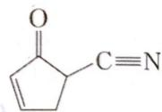

2-2 指出上题各分子中每个碳原子的杂化方式。

2-3 键长与键角是决定分子构型的基本参数,其大小受多种因素影响。

(1) 下列化合物中, 编号所指三根 C—H 键的键长由小到大的顺序是: \_\_\_\_, 为什么?

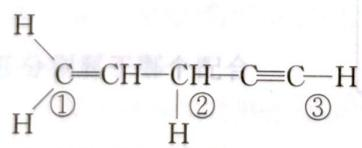

(2) 下列化合物中, 编号所指碳碳键的键长由大到小的顺序是: \_\_\_\_, 为什么?

$$
\mathrm{CH} _ {2} = \mathrm{CH} - \mathrm{CH} - \mathrm{CH} _ {2} - \mathrm{C} = \mathrm{C} - \mathrm{CH} _ {3}
$$

(3) 上面图中分子最多有 \_\_\_\_ 个碳原子共平面。

## (10分) <<<

3-1 用系统命名法命名下列化合物：

(1) $\mathrm{CH}_3\mathrm{CH}_2\mathrm{CHCHCH}_2\mathrm{C}-\mathrm{CH}_3$ (2) $\mathrm{CH}_3\mathrm{CH}_2\mathrm{CHCH}_2\mathrm{CHCH}_2\mathrm{CHCH}_3$

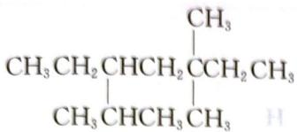

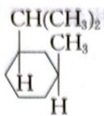

)伏莱美的颜牌两段可 $\delta-\delta$

3-2 用键线式表示出下列各化合物：
(1) 3-甲基-3-乙基-6-异丙基壬烷
(2) 3,7,7-三甲基二环[4.1.0]庚烷
(3) 1,5-二甲基-6-乙基螺[2.4]庚烷

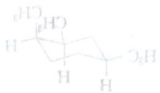

1 mol 丙烷与 2 mol 氯气进行自由基氯化时生成氯化混合物, 仔细分馏得到四种二氯丙烷 A、B、C、D。试根据它们的 $^{1}$ H-NMR 核磁共振数据, 推定 A、B、C、D 的结构。
A: b. p. 69℃, δ 2.4(单峰, 6H)
B: b. p. 88℃, δ 1.2(三重峰, 3H), δ 1.9(多重峰, 2H), δ 5.8(三重峰, 1H)
C: b. p. 96℃, δ 1.4(二重峰, 3H), δ 3.8(二重峰, 2H), δ 4.3(多重峰, 1H)
D: b. p. 120℃, δ 2.2(五重峰, 2H), δ 3.7(三重峰, 4H)

5 (10分) <<<

5-1 下图为正丁烷分子绕 C2—C3 键旋转 $360^{\circ}$ 所得无数构象的势能图, 请用纽曼式画出 a、b、c、d 点所对应的构象。

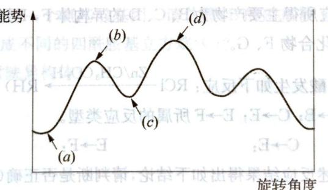

5-2 为什么1,2-二溴乙烷的偶极矩为0，而乙二醇却有一定的偶极矩？(8分)>>>

6-1 比较以下两种化合物的稳定性: A \_\_\_\_ B。
A: 顺-1-甲基-3-乙基环己烷 B: 反-1-甲基-3-乙基环己烷

6-2 关于以下过程的平衡常数 $K$ 的大小判断正确的是（ ）。

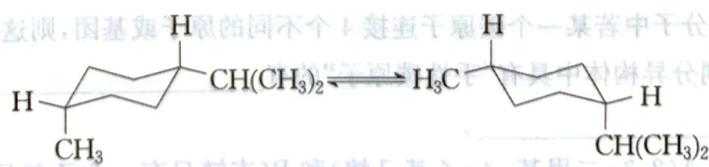

A. K > 1
B. K = 1
C. K < 1
D. 无法判断

6-3 画出反-1,3-二甲基环己烷最稳定的构象。

6-4 下列两种物质的关系为（ ）。

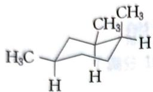

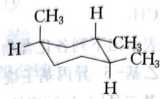

A. 同一物质 B. 构象异构体 C. 构造异构体 D. 立体异构体

## 7 (7分) <<<

从指定原料合成下列有机物，给出所有合成反应步骤。
7-1 用1-溴丙烷及其他必要试剂合成正戊烷
7-2 从2-氯-2-甲基丁烷合成2-甲基-2-氘丁烷

## 8 (13分)>>>

某饱和碳氢化合物 A, 分子量为 86, 在光照条件下与氯气反应生成三种互为构造异构体的一氯代产物, 所占比例分别为 B 45%、C 15%、D 40%。这些一氯代产物中只有 C 和 D 与乙醇钠-乙醇溶液共热能得到烯烃, 且 C、D 所得的是相同烯烃 E。D 存在一对对映异构体, B 和 C 不存在对映异构体, E 催化加氢 (H₂/Pd) 得到 A。

8-1 请写出化合物 A\~E 的结构简式并用系统命名法命名。

8-2 E与氯化氢反应所得主要产物为B、C、D的异构体F，F用Zn/乙酸处理则得A的异构体G。请用结构简式表示化合物F、G。

(已知卤代烃与 Zn/乙酸发生如下反应: RCl $\xrightarrow{Zn/CH_{3}CO_{2}H}$ RH)

8-3 请分别指出 A→B; C→E; E→F 所属的反应类型。
A→B: C→E: E→F:

8-4 某同学根据上述反应结果得出如下结论,请判断是否正确(只需回答对与错):

① A 分子中含有 3 种不同环境的氢原子, 分别以 b、c、d 标记, 氯代后分别得到相应的产物 B、C、D。

② 每个不同环境的氢原子发生氯代反应的难易顺序为 b>d>c。

③ B与乙醇钠-乙醇溶液共热不能得到烯烃的原因是乙醇钠的碱性不够强。

④ E 若与氯化氢在过氧化物存在下反应,则所得主要产物为 C。

(9分,四川省化学竞赛试题) <<<

9-1 在有机物分子中若某一个碳原子连接 4 个不同的原子或基团, 则这种碳原子称为“手性碳原子”。 $C_{7}H_{16}$ 的同分异构体中具有“手性碳原子”的有一种的名称 \_\_\_\_ 种, 写出其中

9-2 写出物质 A(2,3-二甲基-4-乙基己烷)和 B(支链只有一个乙基且相对分子质量最小的烷烃)的结构简式。

(轉台021圓切、台001仓薬)

9-3 写出以下反应的详细机理。  
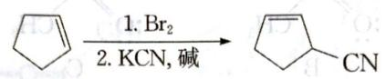

## 10 (10分,全国化学竞赛初赛试题)>>>

1964 年伊顿(Eaton)合成了一种新奇的烷,叫立方烷,化学式为 $C_{8}H_{8}(A)$ 。20 年后,他的研究团队又合成了这种烷的四硝基衍生物(B),是一种烈性炸药。最近,有人计划将 B 的硝基用 19 种氨基酸取代,得到立方烷的四酰胺基衍生物(C),认为极有可能从中筛选出最好的抗癌、抗病毒,甚至抗艾滋病的药物来。回答如下问题:

10-1 四硝基立方烷理论上可以有多种异构体,但仅有一种是最稳定的,它就是(B),请画出它的结构式。

10-2 写出四硝基立方烷(B)爆炸反应方程式。

10-3 C中每个酰胺基是一个氨基酸基团。请估算，B的硝基被19种氨基酸取代，理论上总共可以合成多少种氨基酸组成不同的四酰胺基立方烷(C)?

10-4 C中有多少对对映异构体？

(1) 钢盘时事要关系其受性部位的定义, 等基本能完全程度 (A: $\beta_{1}$ 和 $\beta_{2}$ 和 $\beta_{3}$ ) 的量, 则
(2) 效能完全与一般题解之。立虫的重要在于盲古中等必用盲迹,

4-6 基因氯化钠剂的产物是混合溶剂中无源碱溶液和中间感接触即2.8g方法，主要用四氯化钠，可采取\_\_\_\_方法。每种产物均是重要的溶剂与试剂，工业上通过

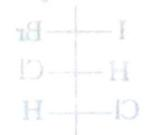

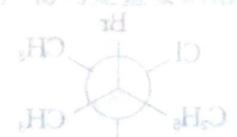

部分两烷与卤素自由基发生的反应及其相应的反应焓变如下：

H

# 能力测试 B 卷

# (满分 100 分，时间 150 分钟)

## (8分) <<<

观察下列路易斯结构式,回答以下问题:

A

B

C

D

(a) 哪个结构(或多个结构)含有带正电荷的碳: \_\_\_\_；

(b) 哪个结构(或多个结构)含有带正电荷的氮: \_\_\_\_；

(c) 哪个结构(或多个结构)含有带正电荷的氧: \_\_\_\_；

(d) 哪个结构含有带负电荷的碳: \_\_\_\_；

(e) 哪个结构(或多个结构)含有带负电荷的氮: \_\_\_\_；

(f) 哪个结构含有带负电荷的氧: \_\_\_\_；

(g) 哪个结构最稳定: \_\_\_\_；

(h) 哪个结构最不稳定: \_\_\_\_。

## 2 (7分)>>>

写出符合下列条件的烷烃构造式,并用系统命名法命名。

2-1 只含有伯氢原子的最简单烷烃。

2-2 有四种一氯取代的戊烷。

2-3 含有一个季碳原子的己烷。

2-4 只含有伯氢和仲氢原子的己烷。

2-5 某烃相对分子质量为100,请给出其主链为含5个碳原子并且一卤代物只有3种异构体的物质的结构式和系统命名的名称。

## 3 (15分) <<<

立体化学(stereochemistry)是研究分子的立体结构、反应的立体性及其相关规律和应用的科学,在有机化学中占有十分重要的地位。

3-1 用 $R$ 、 $S$ 标明下列物质中不对称碳原子的构型。

$$
\mathrm{C} _ {2} \mathrm{H} _ {5}
$$

3-2 下列化合物各有几个手性碳？各有几个立体异构体？

(1)

(2)

(3)

COOH

(4)

3-3 指出下列物质有无光学活性，并简要分析原因。

(1)

(2)

(3)

(4)

(5)

4 (15分)>>>

烷烃中的氢原子被卤原子取代的反应称为卤化反应。甲烷在紫外光或热(250～400℃)作用下，与氯反应得各种氯代甲烷，甲烷的氯化是一个自由基型的取代反应。

4-1 请写出生成一氯甲烷的反应机理。

4-2 已知化学键的解离能 $(\mathrm{kJ} \cdot \mathrm{mol}^{-1}$ , 标态)如下:

| Cl—Cl | H—Cl | CH3—H | CH3—Cl |
| --- | --- | --- | --- |
| 242.7 | 431.8 | 439.3 | 355.6 |

试分析计算链转移过程中各步反应的反应热 $\Delta H^{\ominus}$ ，画出该过程的反应势能图，并在图中相应位置标明反应中间体及过渡态的结构（提示：该过程的反应先慢后快）。

4-3 实验发现当反应体系中存在氧气等杂质时,反应前期异常缓慢,几乎停止,试分析原因。

4-4 柏林大学学者在实验中发现, 当一股四甲基铅 $\left[\left(\mathrm{CH}_{3}\right)_{4}\mathrm{Pb}\right]$ 蒸气通过有一处被加热了的石英管时, 在加热处附着一层金属铅镜, 由管子流出来的气体经分析后主要是乙烷。然后再继续通入四甲基铅, 在生成铅镜的前方加热, 则发现在加热处又产生一新的铅镜, 而原有的铅镜却慢慢消失。试分析原因。

4-5 甲烷与氯气通常需要加热到 $250^{\circ}\mathrm{C}$ 以上才能反应，但加入少量 $(0.02\%)$ 四甲基铅后，则在 $140^{\circ}\mathrm{C}$ 就能发生反应，试解释之。

4-6 甲烷氯化得到的产物是混合物,若主要得到一氯甲烷,可采取\_\_\_\_的方法;若主要得到四氯化碳,可采取\_\_\_\_的方法。每种产物均是重要的溶剂与试剂,工业上通过\_\_\_\_的方法,将它们一一分开。

(9分) <<<

部分丙烷与卤素自由基发生的反应及其相应的反应焓变如下：

$$
\mathrm{CH} _ {3} \mathrm{CH} _ {2} \mathrm{CH} _ {3} + \mathrm{Cl} \cdot \longrightarrow \mathrm{CH} _ {3} \dot {\mathrm{CH}} \mathrm{CH} _ {3} + \mathrm{HCl}
$$

$$
\Delta H ^ {\ominus} = - 3 4 \mathrm{kJ} \cdot \mathrm{mol} ^ {- 1}\tag{1}
$$

$$
\mathrm{CH} _ {3} \mathrm{CH} _ {2} \mathrm{CH} _ {3} + \mathrm{Cl} \cdot \longrightarrow \mathrm{CH} _ {3} \mathrm{CH} _ {2} \dot {\mathrm{CH}} _ {2} + \mathrm{HCl}
$$

$$
\Delta H ^ {\ominus} = - 2 2 \mathrm{kJ} \cdot \mathrm{mol} ^ {- 1}\tag{2}
$$

$$
\mathrm{CH} _ {3} \mathrm{CH} _ {2} \mathrm{CH} _ {3} + \mathrm{Br} \cdot \longrightarrow \mathrm{CH} _ {3} \mathrm{CH} _ {2} \dot {\mathrm{CH}} _ {2} + \mathrm{HBr}
$$

$$
\Delta H ^ {\ominus} = + 4 4 \mathrm{kJ} \cdot \mathrm{mol} ^ {- 1}\tag{3}
$$

5-1 25℃，下列反应两种产物的比例已经给出：

$$
\mathrm{CH} _ {3} \mathrm{CH} _ {2} \mathrm{CH} _ {3} + \mathrm{Cl} \cdot \longrightarrow \mathrm{CH} _ {3} \mathrm{CH} _ {2} \dot {\mathrm{CH}} _ {2} + \mathrm{CH} _ {3} \dot {\mathrm{CH}} \mathrm{CH} _ {3} + \mathrm{HCl}
$$

结合题中给出的信息,预测当反应温度升高而其他反应条件不变时,一级自由基的比例将()。
A. 降低
B. 升高
C. 不变
D. 无法判断

5-2 已知 $25^{\circ} \mathrm{C}$ 时, 在紫外光作用下, 丙烷与 2-甲基丙烷的氯化产物的比例分别如下:

$$
2 \mathrm{CH} _ {3} \mathrm{CH} _ {2} \mathrm{CH} _ {3} + 2 \mathrm{Cl} _ {2} \xrightarrow {\text {光, } 25 ^ {\circ} \mathrm{C}} \mathrm{CH} _ {3} \mathrm{CH} _ {2} \mathrm{CH} _ {2} \mathrm{Cl} + \mathrm{CH} _ {3} \mathrm{CHCH} _ {3} + 2 \mathrm{HCl}
$$

$$
2 \mathrm{CH} _ {3} \stackrel {\mathrm{CH} _ {3}} {\mathrm{CHCH} _ {3}} + 2 \mathrm{Cl} _ {2} \xrightarrow [ 64 \% ]{\text {光,} 25 ^ {\circ} \mathrm{C}} \mathrm{CH} _ {3} \stackrel {\mathrm{CH} _ {3}} {\mathrm{CHCH} _ {2}} \mathrm{Cl} + (\mathrm{CH} _ {3}) _ {3} \mathrm{CCl} + 2 \mathrm{HCl}
$$

试计算伯氢(1°H)、仲氢(2°H)、叔氢(3°H)的反应活性之比。

5-3 实验测得烷烃在发生溴化反应时,三种氢的反应活性大致为: $3^{\circ}\mathrm{H}:2^{\circ}\mathrm{H}:1^{\circ}\mathrm{H}=1600:82:1$ ,结合5-3的计算结果,分析氯化、溴化反应的特点。

5-4 写出下列反应的产物，并指出哪一种为主要产物。

$$
\mathrm {CH_ {3} CH_ {2} CH_ {2} CH_ {2} CH_ {3}} \xrightarrow [ \triangle ]{\mathrm {Br_ {2}} , h \nu}
$$

5-5 由下列指定化合物合成相应的卤化物,根据以上讨论结果,选择合适的卤素单质。

(2)

## 6 (12分)>>>

自1883年合成三元和四元碳环化合物后，人们发现，小环化合物比较容易开环，而五元、六元环系则是稳定的。为了解释各种环的稳定性，1885年，德国化学家拜耳(A.Baeyer)提出了张力学说。虽然该学说存在一些问题，但分子内的键角由于某种原因偏离正常键角时会产生张力的现象，却是经常存在的。张力的大小会影响化合物的结构与性质

6-1 下列物质的燃烧热由大到小的顺序为：

  
1

  
2

  
3

  
4

## 6-2 环丙烷为什么特别容易发生开环反应？

6-3 写出 $\mathrm{CH(CH_3)_2}$ 在下列条件下反应的化学方程式，并指出哪些是自由基型反应，哪些是离子型反应。  
(i) $\mathrm{H}_2$ ，Pt/C， $50^{\circ}\mathrm{C}$ (ii) HI (iii) $\mathrm{Br}_2$ ，室温  
(iv) $\mathrm{Cl}_2$ ， $\mathrm{FeCl}_3$ (v) $\mathrm{Br}_2$ ， $h\nu$

## 7 (6分) <<<

用2-甲基-1-溴丁烷和其他必要的一碳或二碳化合物，以较高产率合成下列产物： $①$ 2-甲基丁烷 $②$ 3-甲基己烷

## 8 (8分,全国化学竞赛初赛试题)>>>

家蝇的雌性信息素可用芥酸(来自菜籽油)与羧酸 X(摩尔比 1:1)在浓 NaOH 溶液中进行阳极氧化得到。

  
家蝇雌性信息素

  
芥酸

8-1 写出羧酸X的名称和结构式以及生成上述信息素的电解反应的化学方程式。

8-2 该合成反应的理论产率(摩尔分数)多大?说明理由。

## 9 (10分) <<<

在合成用于香料、医药的许多天然多环化合物中,经常含有1,1-二甲基结构的中等大小的环这样重要的结构片段。如下流程为1,1-二甲基环戊烷(I)的一种合成方法:

$$
\mathrm{A} \xrightarrow {\mathrm{Ba} (\mathrm{OH}) _ {2} / 3 0 0 ^ {\circ} \mathrm{C}} \mathrm{B} \xrightarrow [ - \mathrm{Ph} _ {3} \mathrm{PO} ]{\mathrm{Ph} _ {3} \mathrm{P} = \mathrm{CH} _ {2}} \mathrm{C} \xrightarrow [ ]{\mathrm{CH} _ {2} \mathrm{I} _ {2} / \mathrm{Zn}, \mathrm{Cu}} \mathrm{D} \xrightarrow [ ]{\mathrm{H} _ {2} / \mathrm{PtO} _ {2}}
$$

已知：A具有最简单的分子式 $\mathrm{C}_x\mathrm{H}_{x + y}\mathrm{O}_y$ ， $w(\mathrm{H}) = 6.85\%$ ，滴定时需消耗两当量的碱；B和C为单环；D是一个螺环，HNMR光谱显示其具有三个强度相同的信号。

请给出化合物 A, B, C, D 的结构。

## 10 (10分,全国化学竞赛初赛试题)>>>

1932 年捷克人兰达等人从南摩拉维亚油田的石油分馏物中发现一种烷(代号 A)，次年借 X-射线技术证实了其结构，竟是由一个叫卢克斯的人早就预言过的。后来 A 被大量合成，并发现它的胺类衍生物具有抗病毒、抗震颤的药物活性，开发为常用药。下图给出三种已经合成的由 2,3,4 个 A 为基本结构单元“模块”像搭积木一样“搭”成的较复杂笼状烷。

## (10分) >>

  
B

  
C

  
D

10-1 请根据这些图形画出 A 的结构, 并给出 A 的分子式: \_\_\_\_。

10-3 如果在 D 上继续增加一“块”A“模块”，得到 E，给出 E 的分子式。E 有无异构体？著有，给出异构体的数目，并用 100 字左右说明你得出结论的理由，也可以通过作图来说明。

（1）在 $55\%$ 、 $55\%$ 、 $55\%$ 、 $55\%$ 、 $55\%$ 、 $55\%$ 、 $55\%$ 、 $55\%$ 、 $55\%$ 、 $55\%$ 、 $55\%$ 、 $55\%$ 、 $55\%$ 、 $55 \text{，}$ 气原子和合金表面高透明；综合外膜二类膜内膜-共体其暗微汇膜基甲-S-8级及非金属材料及非金属材料及非金属材料及非金属材料及非金属材料及非金属材料及非金属材料及非金属材料及非金属材料及非金属材料及非金属材料及非金属材料及非金属材料及非金属材料及非金属材料及非金属材料及非金属材料及非金属材料及非金属材料及非金属材料及非金属材料及非金属材料及非金属材料及非金属材料及非金属材料及非金属材

（碘行赛西赛普学）园全，代8） 阔行赛中亚翁HOsV苯由(1:1)出不氧）X烯黄色（鲜辣菜自来）烯花用可意息粉针脑的酸盐。[附图]

筆記
索息計對題案

发野菜学的边文额由陈紫息龄发土发主受以方肉苦味和谷的X通出言1-8 由酸酐的O-大苯(遇伏浓率)率气含钡的应氧组合对 S-8

被赠小为弟中的副部基甲二产的丁醇含秦，中部含非符邀然天送肉药因，抹香干用如合出：去甙如合转一卤(I)黏负和基甲二 $_{3}$ I, I大唇而不吐。虽中部除的要重于

$$
\mathrm{A} \xrightarrow {\mathrm{ps(OH)} _ {3 0 0} \mathrm{C}} \mathrm{B} \xrightarrow {\mathrm{Bp} _ {6} = (\mathrm{H})} \mathrm{C} \xrightarrow {\mathrm{CH} _ {2} \mathrm{FeNO} _ {3}} \mathrm{O}
$$

③ 解 8: 短的量价两斜所需的可解, $N^{38} \cdot \delta = (H)_{ax}, O_{xy}H_{xy}$ 大于代的单商量言具 A: 成日 (1). 易盲的间的复数个三首具其不显断光 $R_{M}H^{t}$ , 不触一个一点 D: 取消. 剂解的 D, C, D 合并出微

《文》自《白书》中，以“白书”为一个字词，用“白书”来代替“白书”，用“白书”来代替“白书”。

# 第 10 章

# 不饱和烃

# 能力测试 A 卷

(满分 100 分，时间 120 分钟)

(12 分) <<<

1-1 用系统命名法命名下列化合物。

②

：不暖縣齋臨合館

1-2 写出下列化合物的构造式,检查其命名是否正确,如有错误予以改正,并写出正确的系统名称。

① 顺-2-甲基-3-戊烯 ② $(E)-3-$ 乙基-3-戊烯

2 (10 分) >>>

EBR
郊

给出下列化合物或离子的极限结构式,并指出哪个贡献最大?

① $CH_{2}=CH-\dot{CH}_{2}$ ② $CO_{2}$ ③ $-CH_{2}-C-CH_{3}$ ④ $CH_{3}-C-CH=CH_{2}$

(10 分) <<<

3-1 将下列各组活性中间体按稳定性由大到小排列成序： $CH_{3}^{+}CH_{2}$ $Ph_{3}C^{+}$ $(CH_{3})_{3}C^{+}$ $CH_{2}=CH-CH_{2}^{+}$ $PhC^{+}H_{2}$

3-2 乙烯、丙烯、异丁烯在酸催化下与水加成，试按反应速率由大到小排列，并说明理由。

3-3 下列各组化合物分别与溴进行加成反应,指出每组中哪一个反应较快。为什么?

① $CF_{3}CH=CH_{2}$ 和 $CH_{3}CH=CH_{2}$

② $CH_{3}CH=CH_{2}$ 和 $(CH_{3})_{3}\overset{+}{NCH}=CH_{2}$

③ $CH_{2}=CHCl$ 和 $CH_{2}=CH_{2}$

④ CHCl=CHCl 和 $CH_{2}=CHCl$

$$
\mathrm{CH} _ {3} \left| \begin{array}{c} \mathrm{O} (\mathrm{I}) \\ \mathrm{O} _ {2} \mathrm{H}, \mathrm{nS} (\mathrm{S}) \end{array} \right.
$$

4 (10分)>>>

完成下列反应,写出主要产物。

4-1 $\left(\mathrm{CH}_{3}\right)_{3}\mathrm{CCH}=\mathrm{CH}_{2}\xrightarrow{\text{① } BH_{3}/THF}$ ② $H_{2}O_{2}, OH^{-}, H_{2}O$

$$
\mathrm {(CH_ {3}) _ {2} C = CCH_ {2} CH = CH_ {2}} \xrightarrow [ \text {氯仿,25℃} ]{1 \mathrm{mol} \text {过氧间氯苯甲酸}}
$$

4-3 $\mathrm{H_2C = CHCH_2C\equiv CH + HBr}$

$$
4 - 4 \quad \mathrm{CH} _ {3} (\mathrm{CH} _ {2}) _ {2} \mathrm{C} \equiv \mathrm{CC} _ {2} \mathrm{H} _ {5} \xrightarrow [ \text {②} ]{\text {①} 1 / 2 (\mathrm{BH} _ {3}) _ {2}}
$$

$$
4 - 5 \quad \mathrm {C_ {4} H_ {9} C\equiv CH} \xrightarrow [ \text {②} \mathrm {H_ {2} O_ {2}} , \mathrm {OH^ {-}} , \mathrm {H_ {2} O} ]{\text {①} \mathrm {BH_ {3} : THF}}
$$

。赠合外医不各命者各命激衰阻（1-1

5 (12分,北京市化学竞赛试题) <<<

EPR橡胶 $\left[\mathrm{CH}_{2}-\mathrm{CH}_{2}-\mathrm{CH}-\mathrm{CH}_{2}\right]_{n}$ 和PC塑料 $\left(\mathrm{H}-\mathrm{O}-\mathrm{C}_{6}\mathrm{H}_{4}-\mathrm{C}-\mathrm{C}_{6}\mathrm{H}_{4}-\mathrm{O}-\mathrm{C}\right]_{n}\mathrm{O}-\mathrm{CH}_{3})$

的合成路线如下：

5-1 A 的名称是\_\_\_\_。

5-2 C结构简式是\_\_\_\_。

5-3 下列说法正确的是(选填字母)\_\_\_\_。
A. 反应Ⅱ的原子利用率为100%
B. 反应Ⅲ为取代反应

C. $1 \mathrm{~mol} \mathrm{E}$ 与足量金属 $\mathrm{Na}$ 反应, 最多可生成标准状况下 $22.4 \mathrm{~L} \mathrm{H}_{2}$ D. $\mathrm{CH}_{3} \mathrm{OH}$ 在合成 PC 塑料的过程中可以循环利用

5-4 反应I的化学方程式是\_\_\_\_。

5-5 反应IV的化学方程式是\_\_\_\_。

5-6 已知: $\ce{C6H5 ->[ (1) O3 ] CH2CHO}$ (2) Zn, H2O
CH2
CH2CHO

以 D 和乙酸为起始原料合成 $\mathrm{CH_{3}CO(CH_{2})_{6}OCCH_{3}}$ ，无机试剂任选，写出合成路线（用结构简式表示有机物，用箭头表示转化关系，箭头上注明试剂和反应条件）。

## 6 (8分)>>>

化合物 A, 具光学活性, 与 $Br_{2}/CCl_{4}$ 反应, 生成三溴化合物 B, 仍具光学活性; A 与 $C_{2}H_{5}ONa/C_{2}H_{5}OH$ 共热生成化合物 C, C 无光学活性, 也不能被拆分为光学活性物质, C 能使 $Br_{2}/CCl_{4}$ 溶液褪色。C 与丙烯醛共热生成分子式为 $C_{7}H_{10}O$ 的环状化合物 D。试推测 A\~D 的结构。

## 7 (8分,山西省化学竞赛试题) <<<

下图是从环戊烷出发经过一系列反应得到的目标产物。写出下面标数字的方框中的试剂、反应条件或产物。

## 8 (10分)>>>

8-1 某些不饱和烃经臭氧解分别得到下列化合物，试推测原来不饱和烃的结构。

$$
① \mathrm{CH} _ {3} \mathrm{CH} _ {2} \mathrm{CHO} + \mathrm{CH} _ {3} \mathrm{CHO} \quad ② \mathrm{C} _ {2} \mathrm{H} _ {5} \mathrm{CHCHO} + \mathrm{HCHO}
$$

$$
③ \mathrm{CH} _ {3} \mathrm{CHO} + \mathrm{CH} _ {3} \underset {\text { O }} {\overset {} {\mathrm{C}}} \mathrm{CH} _ {2} \mathrm{CO} _ {2} \mathrm{H} + \mathrm{CH} _ {3} \mathrm{CO} _ {2} \mathrm{H}
$$

8-2 某化合物分子式为 $\mathrm{C_6H_{12}}$ ，经臭氧解得到一分子醛和一分子酮，试推测 $\mathrm{C_6H_{12}}$ 可能的结构。如果已知得到的醛为乙醛，是否可以确定化合物的结构？写出其构造式。

(10 分) <<<

9-1 化合物 A 经过如下转化生成目标产物：

$$
\mathrm{A} \xrightarrow {\mathrm{KOC} (\mathrm{CH} _ {3}) _ {3}} \mathrm{B} \xrightarrow {\mathrm{Br} _ {2}} \mathrm{C} \xrightarrow [ (2 \text {当量}) ]{\mathrm{KOC} (\mathrm{CH} _ {3}) _ {3}} \mathrm{D} \xrightarrow {\mathrm{NaNH} _ {2}} \mathrm{E} \xrightarrow {\mathrm{CH} _ {3} \mathrm{I}} \bigcirc - \mathrm{C} \equiv \mathrm{CCH} _ {3}
$$

写出上述合成路线中各步反应产物 A～E 的结构式。

9-2 写出下列转化的方法步骤,其他必要试剂自选。

$$
\mathrm{OH} \rightleftharpoons \mathrm{OCH} _ {3}
$$

(10 分) >>>

写出下列反应机理

10-1 $\mathrm{CH_2CH_2OH}\xrightarrow{\mathrm{Br}_2}\mathrm{C}_6\mathrm{H}_4\mathrm{Br} + \mathrm{HBr}$

$$
\boxed {5} = \boxed {1} \frac {\mathrm{H} (\mathrm{H})}{\text {   精   }} \quad \boxed {0} = \boxed {5}
$$

$\text{H}_2\text{O} + \text{OH}_2\text{H}_2\text{O} \rightarrow \text{H}_2\text{O} + \text{OH}_2\text{H}_2\text{O}$

$\mathrm{H}_{2}(\mathrm{O})_{3}\mathrm{HO}=\mathrm{H}_{2}(\mathrm{O})_{3}\mathrm{H}_{2}\mathrm{O}_{3}\mathrm{H}_{2}+\mathrm{OH}(\mathrm{CH}_{3})$

(1) $\frac{1}{2}$ ① $\frac{1}{2}$ ② $\frac{1}{2}$ ③ $\frac{1}{2}$ ④ $\frac{1}{2}$ ⑤ $\frac{1}{2}$ ⑥ $\frac{1}{2}$ ⑦ $\frac{1}{2}$ ⑧ $\frac{1}{2}$ ⑨ $\frac{1}{2}$ ⑩ $\frac{1}{2}$ ⑪ $\frac{1}{2}$ ⑫ $\frac{1}{2}$ ⑬ $\frac{1}{2}$ ⑭ $\frac{1}{2}$ ⑮ $\frac{1}{2}$ ⑯ $\frac{1}{2}$ ⑰

$\therefore {S}_{\Delta ACD} = {S}_{\Delta COD} + {S}_{\Delta COD} - {S}_{\Delta COD} + {S}_{\Delta COD}$

$\left(1-\frac{1}{2}\right)^{2}=\left(1-\frac{1}{2}\right)^{2}-\left(1-\frac{1}{2}\right)^{2}-\left(1-\frac{1}{2}\right)^{2}-\left(1-\frac{1}{2}\right)^{2}-\left(1-\frac{1}{2}\right)^{2}-\left(1-\frac{1}{2}\right)^{2}-\left(1-\frac{1}{2}\right)^{2}-\left(1+\infty\right)^{2}$

1. 2014年，公司与上海浦东发展银行股份有限公司签订了《关于使用部分闲置募集资金进行现金管理的协议》，同意公司使用不超过人民币5亿元的闲置募集资金进行现金管理。

$$
\mathrm{H} (\mathrm{O})
$$

# 能力测试 B 卷 (满分 100 分, 时间 150 分钟)

1-1 写出 HI 与下列各化合物反应的主要产物。 $CH_{3}OCH=CH_{2}$ $CF_{3}CH=CHCl$ $(CH_{3}CH_{2})_{3}CCH=CH_{2}$ $(CH_{3})_{3}\overset{+}{N}CH=CH_{2}$

1-2 写出下列反应的产物，并解释原因。

$$
\xrightarrow {1 \text {当量} \mathrm{Br} _ {2}}
$$

$$
\mathrm {\text {   (  -  ) } _ {n} \equiv} \xrightarrow [ ]{1 \text {   当量   Br } _ {2}}
$$

2 (10 分) >>>

2-1 根据下列反应中各化合物的酸碱性,试判断每个反应能否发生? (pKa 的近似值:ROH 为 $16, NH_{3}$ 为 34, RC≡CH 为 25, $H_{2}O$ 为 15.7)

① $\mathrm{RC}\equiv \mathrm{CH} + \mathrm{NaNH}_2\longrightarrow \mathrm{RC}\equiv \mathrm{CNa} + \mathrm{NH}_3$

② $\mathrm{RC} \equiv \mathrm{CH} + \mathrm{RONa} \longrightarrow \mathrm{RC} \equiv \mathrm{CNa} + \mathrm{ROH}$

$$
\mathrm{CH} _ {3} \mathrm{C} \equiv \mathrm{CH} + \mathrm{NaOH} \longrightarrow \mathrm{CH} _ {3} \mathrm{C} \equiv \mathrm{CNa} + \mathrm{H} _ {2} \mathrm{O}
$$

④ ROH + NaOH → RONa + H₂O

2-2 丙炔加水时生成丙酮 $\left(\mathrm{CH}_{3} \mathrm{COCH}_{3}\right)$ , 而不是丙醛 $\left(\mathrm{CH}_{3} \mathrm{CH}_{2} \mathrm{CHO}\right)$ , 这对加成反应的取向说明了什么? 是否符合马氏 (Markovnikov) 规则?

2-3 在 $\mathrm{C}_2\mathrm{H}_5\mathrm{O}^-$ 的催化下， $\mathrm{CH}_3\mathrm{C} \equiv \mathrm{CH}$ 与 $\mathrm{C}_2\mathrm{H}_5\mathrm{OH}$ 反应，产物是 $\mathrm{CH}_2 = \mathrm{C}(\mathrm{CH}_3) \mathrm{OC}_2\mathrm{H}_5$ ，而不是 $\mathrm{CH}_3\mathrm{CH} = \mathrm{CHOC}_2\mathrm{H}_5$ ，为什么？

2-4 下列两组化合物分别与 1,3-丁二烯[①组]或顺丁烯二酸酐[②组]进行狄尔斯-阿尔德 (Diels-Alder) 反应，试将其按反应活性由大到小排列成序。

① (A) $\ce{CH3}$ , (B) $\ce{CN}$ , (C) $\ce{CH2Cl}$

② (A) $\mathrm{CH}_2 = \mathrm{C}-\mathrm{CH}=\mathrm{CH}_2$ ，(B) $\mathrm{CH}_2 = \mathrm{CH}-\mathrm{CH}=\mathrm{CH}_2$ ，(C) $\mathrm{CH}_2 = \mathrm{C}-\mathrm{C}=\mathrm{CH}_2$ $\mathrm{CH}_3$ $(\mathrm{CH}_3)_3\mathrm{C}\quad \mathrm{C}(\mathrm{CH}_3)_3$

(10 分) <<<

写出下列反应的主要产物。

$$
3 - 1 \quad (\mathrm{CH} _ {3}) _ {2} \mathrm{C} = \mathrm{CHCH} _ {2} \mathrm{CH} = \mathrm{CHCH} _ {3} \xrightarrow {\mathrm{H} _ {2} \mathrm{SO} _ {4}}
$$

>>>（题知赛章举齐省北疆，代AI）

| 谓因A中谓当 | 国别执义 | 科荣血义 | 是融健义 |
| --- | --- | --- | --- |
| $ \text{缺} $ | nina | $ \text{可} $ | 1 |
| $ \text{总} $ | nim | $ \text{可} $ | $ \text{总} $ |

## 4 (10分,福建省化学竞赛试题)>>>

（10分，福建省化学竞赛试题）》》
碳正离子是许多有机反应过程中经历的一种活性中间体，但绝大多数碳正离子的活性高无法分离获得。研究人员利用腈成功地“捕获”了碳正离子，水解形成酰胺：

1 水解形成 2 的反应过程如下:

$$
1 \xrightarrow {\mathrm{H} _ {2} \mathrm{O}} 3 \xrightarrow {- \mathrm{H} ^ {+}} 4 \rightleftharpoons 2
$$

其中 3 是带正电荷的中间体,4 不带电荷。

4-1 写出3、4的结构简式。

4-2 写出下列反应主要产物 $5 \sim 10$ 的结构简式。

$$
\mathrm{CH} _ {3} - \mathrm{C} = \mathrm{CH} _ {2} + \mathrm{CH} _ {3} \mathrm{CN} \xrightarrow {\mathrm{H} _ {2} \mathrm{SO} _ {4}} 5
$$

$$
\mathrm{CH} _ {3} - \mathrm{C} - \mathrm{OC} (\mathrm{CH} _ {3}) _ {3} + \mathrm{PhCN} \xrightarrow {\mathrm{H} _ {2} \mathrm{SO} _ {4}} 6 + 7
$$

$$
\mathrm{OH} \quad \mathrm{OH} + \mathrm{CH} _ {3} \mathrm{CN} \xrightarrow {\mathrm{H} _ {2} \mathrm{SO} _ {4}} 8 (\mathrm{C} _ {8} \mathrm{H} _ {1 5} \mathrm{NO})
$$

$$
\mathrm{C} _ {6} \mathrm{H} _ {5} \mathrm{CH} _ {3} + \mathrm{HS} - \mathrm{C} _ {6} \mathrm{H} _ {4} - \mathrm{CH} _ {3} + \mathrm{CH} _ {3} \mathrm{CN} \xrightarrow [ \mathrm{DMSO} , 8 0 ^ {\circ} \mathrm{C} ]{\mathrm{I} _ {2} (3 0 \mathrm{mol} \%)} 9 (\mathrm{C} _ {1 7} \mathrm{H} _ {1 9} \mathrm{NOS})
$$

$$
\begin{array}{r l} & \mathrm {CH_ {3} CHO + \overset {\mathrm{OH}} {\underset {|} {C}} -CH_ {2} -OTs + CH_ {3} CN\xrightarrow {H^ {+}} 10(C_{16} H_{23} NO_ {5} S)} \\ & \boxed {\mathrm{Ts=CH} _ {3} - \underset {\mathrm{O}} {\overset {\mathrm{O}} {\mathrm{C}}} - \mathrm{S}} \end{array}
$$

(14 分, 湖北省化学竞赛试题) <<<

当1,3-丁二烯和溴单质1:1加成时,不同反应条件下,经过相同时间测得生成物组成如下表:

| 实验编号 | 反应条件 | 反应时间 | 产物中A的物质的量分数 | 产物中B的物质的量分数 |
| --- | --- | --- | --- | --- |
| 1 | -15°C | t min | 54% | 46% |
| 2 | 25°C | t min | 20% | 80% |

5-1 画出化合物A和B的结构简式；并确定哪个为热力学稳定产物，哪个为动力学产物。

5-2 实验1在 $t\mathrm{min}$ 时，若升高温度至 $25^{\circ}\mathrm{C}$ ，部分产物A会经活性中间体C转化成产物B，画出此转换过程的反应势能示意图和中间体的结构简式。

5-3 根据以上的研究结果,确定以下反应的产物:

5-4 1,3-丁二烯聚合时，除生成高分子化合物外，还得到一种二聚体A，A能发生下列反应：

① 写出化合物 A、B、C 的结构简式：

A 的结构简式: \_\_\_\_, B 的结构简式: \_\_\_\_, C 的结构简式: \_\_\_\_

② 化合物 A、B、C 是否含有不对称碳原子？如有，请指出其所含的不对称碳原子数目及可能存在的旋光异构体数目。

(7 分) >>>

下列为合成某天然产物的反应过程,请写出 A\~G 各字母所表示的化合物。

$$
_ {1} H I A i J
$$

(12分,全国化学竞赛决赛试题) <<<

一般地，炔烃与卤化氢的反应比较慢，且因卤代烯烃更容易发生加成反应，所以卤代烯烃的产

率不高。而在氧化铝存在下，炔烃的氢卤化反应能够很好地得到控制，生成产物为卤代烯烃。
根据如下实验结果：
在氧化铝存在下，1-苯基丙炔与氯化氢反应，主要产物为氯代烯烃 A 和 B。

$$
\mathrm{C} \stackrel {1} {\mathrm{C}} \equiv \mathrm{C} \stackrel {2} {\mathrm{C}} - \mathrm{CH} _ {3} \xrightarrow [ \mathrm{Al} _ {2} \mathrm{O} _ {2} ]{\mathrm{HCl}} \mathrm{A} + \mathrm{B}
$$

1-苯基丙炔及产物的含量随时间延长而变化,达到平衡时 A 与 B 的含量之比为 1:35,如下图所示:

7-1 写出主要产物 A 和 B 的结构简式, 指出其几何构型 (Z 或 E)。

7-2 写出生成产物 A 的中间体, 画出其中 1,2 号碳原子形成 $\pi$ 键的原子轨道重叠示意图, 解释反应初期主要生成 A 的主要原因。

7-3 写出反应机理,解释随时间延长,A的含量减少而B的含量增加。

## 8 (7分)>>>

分子式为 $C_{7}H_{14}$ 的两同分异构体 A 和 B，它们都能使 $Br_{2}/CCl_{4}$ 溶液褪色。化合物 A 在 THF- $H_{2}O$ 溶液中与 $\mathrm{Hg(OAc)_{2}}$ 反应得到可以被拆分的化合物 C，A 经 $O_{3}$ 氧化和 $Zn/H_{2}O$ 水解得到化合物 D，D 用 $LiAlH_{4}$ 还原得到 3-已醇。化合物 B 先后经与 $B_{2}H_{6}/THF$ 及 $H_{2}O_{2}/OH^{-}$ 反应，得到手性化合物 E，E 用高锰酸钾氧化得到手性羧酸 F，B 经 $O_{3}$ 氧化和 $Zn/H_{2}O$ 水解得到化合物 G，G 用 $LiAlH_{4}$ 还原得到 2-甲基-3-戊醇。试推出 A、B、C、D、E、F、G 的结构。

## (8分) <<<

9-1 写出下列反应机理：

9-2 写出下列反应产物，试用相关反应机理解释产物。

10 (12分)>>>

诱杀烯醇(Grandisol)是棉籽象鼻虫(Anthonomus grandis)的信息素之一。象鼻虫是棉花植物的一种害虫，为了对抗这些昆虫，科学家使用了一种四组分混合物，其中诱杀烯醇是主要组分，其结构如图所示。

10-1 给出诱杀烯醇所有可能的立体异构体，并指出立体中心的 Grandisol 构型。

10-2 写出下列试剂与诱杀烯醇反应产物的结构(忽略立体化学):
(1) Na (2) mCPBA(间氯过氧苯甲酸) (3) NBS, $(\mathrm{PhCO}_{2})_{2}$ (4) $CrO_{3} \cdot 2Py$

10-3 从昆虫中提取诱杀烯醇的过程非常漫长且费力,这使得化学合成成为非常有吸引力的替代方法。目前,已有许多种不同的合成途径,如下是其中之一。请给出 A、B、D、E、F 的结构

# 芳香烃

# 能力测试 A 卷

# (满分 100 分，时间 120 分钟)

## (11 分) <<<

1-1 每个分子中含有多少 $\pi$ 电子？

c.

d.

1-2 以下哪些物质是具有芳香性的？

a.

b.

c.

d.

e.

1-3 烃类化合物 A 具有明显的偶极矩, 尽管它只由 C—C 和 C—H 键组成。解释偶极矩产生的原因, 并使用共振结构来说明偶极矩的方向。哪个环更富电子?

A

## (10 分) >>>

写出下列化合物进行一元溴代的主要产物的名称：

A

B

C

D

E

(7 分) <<<

3-1 下列各磺酸,哪一个 pKa 值最小?

3-2 比较硝基甲烷、硝基乙烷、2-硝基丙烷的酸性强弱，并作出合理解释。

## 4 (8分)>>>

溴苯氯代后分离得到两个分子式为 $\mathrm{C_6H_4ClBr}$ 的异构体A和B，将A溴代得到几种分子式为 $\mathrm{C_6H_3ClBr_2}$ 的产物，而B经溴代得到两种分子式为 $\mathrm{C_6H_3ClBr_2}$ 的产物C和D。A溴代后所得产物之一与C相同，但没有任何一个与D相同。推测A，B，C，D的结构式。

## 5 (11分) <<<

芬必得是一种高效的消炎药物,其主要成分为化合物布洛芬 F,分子式为 $C_{13}H_{18}O_{2}$ ,有多种合成路线,下面是一种合成方法,其路线为:

请画出 A、B、D、E、F 的结构及给出 C 的化学式。

## 6 (10分)>>>

在凯库勒苯环结构提出之前,许多人都提出了假想的苯的结构式。下面 A、B、C、D、E 都是假想苯 $\left(\mathrm{C}_{6}\mathrm{H}_{6}\right)$ 的结构式。

已知两个双键间能发生成环反应,如:

① A 和 B 都是一种不很稳定的结构, 其 1 mol 与 $Br_{2}$ 的 $CCl_{4}$ 溶液反应, 最多能与 2 mol 溴反应。A 和 B 都含有 2 类 H, 个数比都是为 2:1。

② A 和 B 都可自身反应生成 C, C 分子内相同的原子化学环境一模一样。

③ D 分子内氢原子的化学环境是一样的,但碳原子不完全相同。

④ E 分子内碳、氢原子各有三种化学环境, 其比例分别都是 $1: 1: 1$ , E 可以使溴水褪色。

6-1 写出 $\mathrm{A} \sim \mathrm{E}$ 各假想苯的结构简式。

6-2 写出 $\mathrm{A} \sim \mathrm{E}$ 各假想苯的二氯取代物种数。

## (14 分) <<<

甲苯经以下反应可合成 2-甲基萘, 写出 A\~G 的结构。

$$
\mathrm{C} _ {6} \mathrm{H} _ {5} + \xrightarrow [ \mathrm{AlCl} _ {3} ]{\mathrm{O}} \mathrm{A} (\mathrm{C} _ {1 1} \mathrm{H} _ {1 2} \mathrm{O} _ {3}) \xrightarrow [ \text {加热} ]{\mathrm{NH} _ {2} \mathrm{NH} _ {2} , \mathrm{KOH}} \mathrm{B} (\mathrm{C} _ {1 1} \mathrm{H} _ {1 4} \mathrm{O} _ {2})
$$

$$
\xrightarrow {\mathrm{SOCl} _ {2}} \mathrm{C} (\mathrm{C} _ {1 1} \mathrm{H} _ {1 3} \mathrm{ClO}) \xrightarrow {\mathrm{AlCl} _ {3}} \mathrm{D} (\mathrm{C} _ {1 1} \mathrm{H} _ {1 2} \mathrm{O}) \xrightarrow {\mathrm{NaBH} _ {4}} \mathrm{E} (\mathrm{C} _ {1 1} \mathrm{H} _ {1 4} \mathrm{O})
$$

$$
\xrightarrow [ \text {加热} ]{\mathrm{H} _ {2} \mathrm{SO} _ {4}} \mathrm{F} (\mathrm{C} _ {1 1} \mathrm{H} _ {1 2}) \xrightarrow [ \text {光照} ]{\mathrm{NBS}} \mathrm{G} (\mathrm{C} _ {1 1} \mathrm{H} _ {1 2} \mathrm{Br}) \xrightarrow [ \mathrm{EtOH,加热} ]{\mathrm{NaOEt}}
$$

## 8 (8分)>>>

以下两个合成是否可以成功？请解释原因。

(1) $\mathrm{HNO}_3 / \mathrm{H}_2\mathrm{SO}_4$

$$
\begin{array}{l} \mathrm{HNO} _ {3} / \mathrm{H} _ {2} \mathrm{SO} _ {4} \\ \mathrm{CH} _ {3} \mathrm{COCl} / \mathrm{AlCl} _ {3} \end{array}
$$

(a)

伏慰朝其，去氏如合阵一显而不，伏慰朝

(2) ${\mathrm{CH}}_{3}\mathrm{COCl}/{\mathrm{AlCl}}_{3}$

(3) $NH_{2}NH_{2}$ , $HO^{-}$ , 加热

(1) NBS, 光照

(b)

(2) NaOEt, EtOH, 加热

(3) $\mathrm{Br}_2$ ，FeBr₃

## 9 (9分) <<<

刚果红(结构如下)是一种酸碱指示剂, 当 pH 低于 3.0 时呈蓝色, 高于 5.2 时呈红色。在生物学上可用刚果红筛选纤维素分解菌。

A、B、C、D、E、F

以苯、萘以及必要的无机、有机试剂为原料通过重氮偶联法合成刚果红的路线如下：

$$
\text {   1.   } \mathrm{HNO} _ {3} \xrightarrow [ 2 . \mathrm{Fe,HCl} ]{\mathrm{A}} \mathrm{Ac} _ {2} \mathrm{O}, \mathrm{NEt} _ {3} \xrightarrow {\mathrm{B}} \mathrm{H} _ {2} \mathrm{SO} _ {4} \text {   有机物   C   }
$$

又奥tom8

$$
\text {   } \xrightarrow {\mathrm{D}} \mathrm{E} \xrightarrow {\mathrm{F}} \mathrm{G} \xrightarrow {\mathrm{HNO} _ {2} , \mathrm{HCl}} \mathrm{H} \xrightarrow [ 2 . \mathrm{Zn,NaOH} ]{1 .} \text {   I   }
$$

$$
\xrightarrow {\mathrm{H} ^ {+}} \mathrm{H} _ {2} \mathrm{N} - \text {   } \text {   } \text {   } \text {   } \text {   } \text {   } \text {   } \text {   } \text {   } \text {   } \text {   } \text {   } \text {   } \text {   } \text {   } \text {   } \text {   } \text {   } \text {   } \text {   } \text {   }
$$

请写出字母代表的反应条件或中间产物的结构。

10 (12分,国际奥赛预备试题)>>>

2,7-二甲基萘可由格式试剂(A)与缩醛(B)反应而制备。

10-1 写出制备A和B的条件。

10-2 写出生成 2,7-二甲萘的反应机理。

10-3 2,7-二甲萘可经如图所示的反应而转换成E(化合物E的分子式为 $\mathrm{C_{24}H_{12}}$ )。请分别写出C、D和E

# 能力测试B卷（满分100分，时间150分钟）

## 1 (9分)

1-1 环庚三烯酮(Ⅰ)非常稳定。相比之下,环戊二烯酮(Ⅱ)是非常不稳定的,并且很快就与自身发生反应。

10-1 出出需要 A 和 B 的条件。

。斑脉血文的秦甲二-5,S 鼠虫出苷 S-01

(1) 试解释这两种化合物的不同稳定性。

(2) 写出环戊二烯酮与自身反应产物的结构。

1-2 画出下面机理。

## 2 (10分)>>>

2-1 请写出A、B、C、D、E、F的结构式。

$$
\begin{array}{r l} \text {   } & \mathrm{NO} _ {2} ^ {\oplus} \xrightarrow {\mathrm{F}} \delta_ {\mathrm{H}} \\ & 7. 7 7 (4 \mathrm{H}, \text {双峰}) \\ & 8. 2 6 (4 \mathrm{H}, \text {双峰}) \end{array}
$$

2-2 磺酸基由于其特殊的性质,在有机合成具有重要作用。请画出下列合成中字母 G、H、I 所表示的结构。

(12 分) <<<

利用芳香族化合物芳环上的各类取代反应可以制备品种繁多的芳香衍生物，这些芳香衍生物极大地影响着我们的生活。目前，芳香族化合物芳环上的取代反应从机理上分类，主要包括亲电取代、亲核取代以及自由基取代三种类型。

3-1 为了实现如下转化,学习小组进行了有趣的探讨:

(1) 某同学说可以通过先硝化再还原引入— $NH_{2}$ ，你认为该法是否可取，为什么？

(2) 经过讨论, 大家成功设计了如下合成路线, 请给出中间产物 A 及中间体 $\mathrm{B}_{1} 、 \mathrm{~B}_{2}$ 的结构。

(3) 该合成第一步的反应类型为: \_\_\_\_；第二步的反应类型为: \_\_\_\_, 具体机理为: \_\_\_\_。

3-2 通过进一步的讨论学习,大家利用四步反应完成了如下转化:

请给出中间产物 C、D、E 的结构及前三步的反应条件 a、b、c。

。为图集的O，B，A本图中出法 1-3

(9 分) >>>

某芳香族化合物分子式为 $C_{6}H_{3}NO_{2}ClBr$ ，试根据下列反应回答相关问题。

$$
\begin{array}{r l} & \mathrm {C_ {6} H_ {3} NO_ {2} ClBr\xrightarrow {\mathrm{Fe+HCl}} A\xrightarrow [ \text {低温} ]{\mathrm{NaNO} _ {2} , \mathrm{HCl}} B\xrightarrow [ \triangle ]{\mathrm{C} _ {2} \mathrm{H} _ {5} \mathrm{OH}} C(p - ClC_ {6} H_ {4} Br)} \\ & \xrightarrow [ \triangle ]{\mathrm{NaOH, H} _ {2} \mathrm{O}} \mathrm{D(不含溴元素)} \end{array}
$$

4-1 试确定该芳香族化合物及 A、B、C 的结构简式。

4-2 试确定 D 的结构, 并分析原因。

(12 分,陕西省化学竞赛试题) <<<

麻黄素 M 是拟交感神经药。合成 M 的一种路线如图所示：

已知芳香烃 A 的相对分子质量为 92。请回答下列问题：

5-1 请给出 A、B、D、G、H、X 的结构简式。

5-2 反应⑦的化学方程式为：\_\_\_\_；该反应的类型为：\_\_\_\_。

5-3 X 分子中最多有 \_\_\_\_ 个碳原子共平面。

5-4 在 H 的同分异构体中,既能发生水解反应又能发生银镜反应的芳香族化合物有\_\_\_\_种。其中核磁共振氢谱有 4 组峰,且峰面积之比为 $1:1:2:6$ 的结构简式为 \_\_\_\_ 和 \_\_\_\_ 。

5-5 仿照上述流程,设计以苯、乙醛为主要原料(无机试剂任选)制备某药物中间体 $\ce{C6H5-N=CHCH3}$ 的合成路线。

## 6 (9分)>>>

2005年2月28日英国食品标准署在网上公布了亨氏、联合利华等30家企业生产的可能含有“苏丹红(一号)”食品的清单以后，一场搜捕清剿含有苏丹红(一号)食品的战略在全国范围内展开，苏丹红(一号)是一种红色色素，具有致癌作用，在汽油、机油、汽车蜡、鞋油等工业中作为添加剂，但不能用于食品。苏丹红(一号)的一种合成路线如下：

$$
\text {   } \xrightarrow [ \mathrm{H} _ {2} \mathrm{SO} _ {4} ]{\mathrm{HNO} _ {3}} \mathrm{A} \xrightarrow [ \mathrm{HX} ]{\mathrm{Zn/HCl}} \mathrm{B} \xrightarrow [ \mathrm{pH} 7 \sim 8 ]{\mathrm{NaNO} _ {2}} \mathrm{C} \xrightarrow [ \beta - \text {   萘酚   } ]{\beta - \text {   萘酚   }} \text {   苏丹红(一号)   }
$$

6-1 写出中间体 A、B、C 的结构式。

6-2 写出萘酚和苏丹红(一号)的结构式。

6-3 对硝基重氮苯与 $\beta$ -萘酚发生偶联反应也生成一种红色染料——对位红，其化学名称为1-(4-硝基苯偶氮)-2-萘酚，写出对位红的结构式。

## (10 分) <<<

7-1 $\mathrm{Na}-\mathrm{NH}_{3}(\mathrm{l})$ 体系在有机化学中有许多应用。试写出在这种溶液中以下物质反应的产物：

7-2 文献上报道了如下反应：

根据你的合理猜想：

① 画出有机物 R 的结构。

② 写出反应所属类型并试描述其机理。

## 8 (11分)>>>

8-1 室温下，向苯酚水溶液中滴加溴水，会产生白色沉淀 A。写出产物 A 的结构式，并与苯的溴化反应作比较。

8-2 如果我们在有机溶液中继续用溴处理A,则会生成具有二重旋转轴的四溴代物B。

B在溴化反应中很有用,可以避免使用令人不快的 $Br_{2}$ ,例如:

请画出 B、C 的结构,试写出 A 转化为 B、B 转化为 C 的反应机理。

## (10 分) <<<

解释为什么下面的每个反应都不能形成给定的产物。然后，设计以苯为原料合成 A 及以苯酚 $\left(\mathrm{C}_{6}\mathrm{H}_{5}\mathrm{OH}\right)$ 为原料合成 B 的工艺。

## 10 (8分,国际奥赛理论试题) >>>

10-1 在 $75^{\circ} \mathrm{C}$ 与酸性条件下，将2当量2-三级丁基苯酚(2-tert-butylphenol)，2当量甲醛(formaldehyde)和 $N, N'$ -二甲基乙-1,2-二胺（ $N, N'$ -dimethylethylene-1,2-diamine）反应得到具

有相同化学式 $C_{26}H_{40}N_{2}O_{2}$ 的三种主要产物, 如下面的反应式所示, 请画出每种产物的结构。

10-2 如果使用 2,4-二(三级丁基)苯酚(2,4-di-tert-butylphenol)代替 2-三级丁基苯酚作为起始物,使用与 10-1 相同的化学计量,则仅得到一种产物 X4,请画出 X4 的结构。

$$
\mathrm{S} \xleftarrow [ \mathrm{AOH} ]{\mathrm{p} _ {2} \mathrm{B}} \mathrm{A} \xleftarrow [ \mathrm{HO} _ {3} \mathrm{E} _ {4} \mathrm{O} _ {5} \mathrm{H} ]{\mathrm{p} _ {2}} \text {   Bq   }
$$

：城圆，B帕对不人今用史灵摇入问，用首卧中血文卦则出

2005年1月28日苏丹红(一号)“苏丹红(一号)”是苏丹红的 $^{4}M/$ 。苏丹红(一号)是一种用于食品。

醋苯划支 A 配合酵果式聚酯纤维，可蒸。燃气消缩混合酶不溶化又个蛋白而不公力分解。

6-3 每出中间体 2014 年 10 月 1 日

精工的B组合酵果式（HOH）

6-3 对制基苯胺和乙酸酯的分子结构式：[1] $\ce{CH_{2}COOH, \ce{VIGI}, \ce{COOH}}$ $\ce{H_{2}O_{2}}$

$\text{COOH}$ $\text{H}_2\text{O}$ $\text{NH}$ $\text{CH}_3\text{OH}$ $\text{CH}_2\text{OH}$ $\text{CH}_3\text{OH}$ $\text{CH}_2\text{OH}$ $\text{CH}_3\text{OH}$ $\text{CH}_2\text{OH}$ $\text{CH}_3\text{OH}$ $\text{CH}_2\text{OH}$ $\text{CH}_3\text{OH}^+$ $\text{CH}_2\text{OH}^+$ $\text{CH}_3\text{OH}^+$ $\text{CH}_2\text{OH}^+$ $\text{CH}_3\text{OH}^+$ $\text{CH}_2\text{OH}^+$ $\text{CH}_3\text{OH}^+$ $\text{CH}_2\text{OH}^+$ $^+$ $\text{CH}_2\text{OH}^+$ $\text{CH}_3\text{OH}^+$ $\text{CH}_2\text{OH}^+$ $\text{CH}_3\text{OH}^+$ $\text{CH}_2\text{OH}^+$ $\text{CH}_3\text{OH}^+$

甲量当S，(longitudinal-s)量基丁增三-S量当S株，可补录野良C25王-1-01
具接桥直义(animib-S, I-anlydodeo-mib-V, V)增三+S，I-S基甲E-V，V体(ohyablisn

# 第 12 章

## 卤代烃

# 能力测试 A 卷

# （满分100分，时间120分钟）

## (10 分) <<<

1-1 用系统命名法命名下列各化合物。

1-2 某化合物的分子式为 $\mathrm{C_4H_9Br}$ , 其核磁共振谱数据为:

$\delta=1.04$ （双峰，6H）， $\delta=1.93$ （多重峰，1H）， $\delta=3.33$ （双峰，2H），试写出该化合物的构造式。

1-3 在测定 $\mathrm{C_4H_8Br_2}$ 的两种异构体(A和B)的核磁共振谱时，得到以下结果，试写出其各自的构造式。

(A) $\delta=1.7$ (双峰,6H), $\delta=4.4$ (四重峰,2H)

(B) $\delta = 1.2$ (双峰, $3\mathrm{H}$ ), $\delta = 2.3$ (四重峰, $2\mathrm{H}$ ), $\delta = 3.5$ (三重峰, $2\mathrm{H}$ ), $\delta = 4.2$ (多重峰, $1\mathrm{H}$ )

## (12 分) >>>

试预测下列各反应的主要产物,并简单说明理由。

2-1 $(\mathrm{CH}_3)_3\mathrm{CBr} + \mathrm{CN}^-\longrightarrow$

2-2 $\mathrm{CH}_3(\mathrm{CH}_2)_4\mathrm{Br} + \mathrm{CN}^-\longrightarrow$

$$
2 - 3 \quad (\mathrm{CH} _ {3}) _ {3} \mathrm{CBr} + \mathrm{C} _ {2} \mathrm{H} _ {5} \mathrm{ONa} \longrightarrow
$$

$$
2 - 4 \quad (\mathrm{CH} _ {3}) _ {3} \mathrm{CONa} + \mathrm{CH} _ {3} \mathrm{CH} _ {2} \mathrm{Cl} \longrightarrow
$$

## (12 分) <<<

写出异丁基溴和溴代环己烷分别与下列试剂反应时的主要产物。
3-1 KOH/H₂O 3-2 CH₃CH₂ONa/乙醇
3-3 AgNO₃/乙醇 3-4 NaCN/水-乙醇
3-5 NaSCH₃ 3-6 NaI/丙酮

## 4 (10分)>>>

4-1 分子式 $\mathrm{C_4H_9Br}$ 存在多种同分异构体，请按 $\mathrm{S_N2}$ 反应中反应性降低的顺序列出它们。

4-2 试解释为什么在质子溶剂中 $\mathrm{I}^{-}$ 既是一个好的亲核试剂，又是一个好的离去基团。

4-3 尽管 1,2,3,4,5,6-六氯环己烷有 9 种立体异构体，但在 E2 消除中，有一种立体异构体的反应速率比其他任何一种要慢 7000 倍。画出这种异构体的结构，并解释其中的原因。

## (9分)

有机金属化合物可以由卤代烃与许多金属反应制得,这类化合物在有机合成中有着重要作用
5-1 完成下列各反应式:

① $CH_{3}CH_{2}CH_{2}CH_{2}Br$ $\xrightarrow{Li}$ 四氢呋喃

$$
② \mathrm{CH} _ {3} \mathrm{CH} _ {2} \mathrm{MgI} + \mathrm{CH} _ {3} \mathrm{OH} \longrightarrow
$$

$$
③ (\mathrm{CH} _ {3}) _ {3} \mathrm{CCl} + \mathrm{Mg} \xrightarrow [ \text {回流} ]{\text {乙醚}}
$$

$$
④ \mathrm{C} _ {6} \mathrm{H} _ {\mathrm{H}} ^ {\mathrm{H}} + \mathrm{C} _ {2} \mathrm{H} _ {5} \mathrm{MgBr} \xrightarrow {\text {苯}}
$$

$$
⑤ \mathrm{C} _ {5} \mathrm{H} _ {1 1} \mathrm{Br} + [ (\mathrm{CH} _ {3}) _ {3} \mathrm{C} ] _ {2} \mathrm{CuLi} \longrightarrow
$$

5-2 试画出下述反应 C 和 D 的结构简式, 注意立体化学并标出 D 中环上手性碳的构型。

6 (12分)>>>

考虑如下反应：

$$
\mathrm {CH_ {3} -\overset {\mathrm {C H_ {3}}} {\underset {\mathrm{I}} {\mathrm{C}}} -CH_ {2} CH_ {3}} + \mathrm {H_ {2} O} \longrightarrow \mathrm {CH_ {3} -\overset {\mathrm {CH_ {3}}} {\underset {\mathrm {OH_ {2}}} {\mathrm{C}}} -CH_ {2} CH_ {3}} + \mathrm {I ^ {-}}
$$

6-1 使用鱼钩箭头绘制此反应的机理。

6-2 画出该反应的势能图,标示出坐标轴、原料、产物、Ea 和 $\Delta H$ (假设原料和产物的能量相同)。

6-3 给出该反应过渡态的结构。

6-4 写出反应的速率方程。

6-5 在下列每一种情况下,反应速率将会发生如何变化?
a. 离去基团由 $I^{-}$ 改为 $Cl^{-}$

b. 溶剂由 $\mathrm{H}_2\mathrm{O}$ 改为DMF

c. 卤代烷由 $(\mathrm{CH}_3)_2\mathrm{C(I)CH}_2\mathrm{CH}_3$ 改为 $(\mathrm{CH}_3)_2\mathrm{CHCH(I)CH}_3$ d. $\mathbf{H}_2\mathbf{O}$ 的浓度增加了五倍

e. 卤代烷和 $\mathrm{H}_2\mathrm{O}$ 的浓度都增加了五倍

(8分) <<<

写出下列反应的产物及反应类型 $(S_{N}1、S_{N}2)$ ，并画出相应的反应机理。

化学竞赛能力测试一高中第二分册

基磺 R-1 进行的碳烷基化反应的主要产物(79%): D 中 sp² 气化上的碳烯酸钠（C1、C2、R-1、D 和 E 的结构。（时代 021 国际、台 001 全部）

## 8 (10分)>>>

麝香胺是一种常见的性信息素，可以通过如下反应制备。

$$
\begin{array}{r l} & \mathrm {H - C\equiv C - H\xrightarrow {\text { NaH }} A\xrightarrow [ + H_ {2} ]{CH_ {3} (CH_ {2}) _ {7} CH_ {2} Br} B\xrightarrow {\text { NaH }} C+ H_ {2}} \\ & \mathrm {C(= C - H) = CH_ {3} (CH_ {2}) _ {7} CH_ {2}} \xrightarrow [ \text { 麝香胺 } ]{\text { H } _ {2}} \mathrm {C(= C - H) = CH_ {2} (CH_ {2}) _ {11} CH_ {3}} \end{array}
$$

8-1 画出化合物A-D的结构。

8-2 请给出从D到产物麝香胺的反应条件。

## 9 (7分) <<<

以 $CH_{3}CH_{2}Br$ 为唯一的有机起始原料, 设计合成酮 3-己酮 ( $CH_{3}CH_{2}COCH_{2}CH_{2}CH_{3}$ )。也就是说, 3-己酮中的所有碳原子都必须来自 $CH_{3}CH_{2}Br$ , 你可以使用任何其他需要的试剂。

## 10 (10 分) >>>

化合物(A)与 $Br_{2}-CCl_{4}$ 溶液作用生成一个三溴化合物(B)。(A)很容易与 NaOH 水溶液作用,生成两种同分异构的醇(C)和(D)。(A)与 KOH- $C_{2}H_{5}OH$ 溶液作用,生成一种共轭二烯烃(E)。将(E)臭氧化、锌粉水解后生成乙二醛(OHC—CHO)和 4-氧代戊醛( $OHCCCH_{2}CH_{2}COCH_{3}$ )。试推导(A)～(E)的构造。

合并实验，由主讲集因）随知主讲来各工合因，试式数除除题林一丁受开因人，分平 OS 5 表析 OS
解的三离页数其，3 负例某工加合题并不切进其中工学外试式图型。因补正时的除知则亲已（即
SO 演 IO 调龄录共个两式示奏以顶时

$$
\mathrm{C} _ {2} \mathrm{H} _ {5} \mathrm{O} _ {1 / 2} + \frac {\mathrm{C} _ {3} \mathrm{H} _ {7} \mathrm{Cl}}{\mathrm{A}} \rightarrow \mathrm{C} _ {2} \mathrm{H} _ {1 0} \mathrm{O}
$$

# 能力测试 B 卷

## (10 分) <<<

1-1 下列化合物与 $\mathrm{AgNO_3}$ 的醇溶液反应, 活性最大的是( )

A. Br

B. CH₂Br

C. CH₂Br

D. CH₂CH₂Br

1-2 下列异构体中,能进行 $S_{N} 2$ 反应,而无 E2 反应的是( )

A. $\mathrm{CH=CH_2}$ B. $\mathrm{CH_2CH_2Br}$ C. $\mathrm{CH_3}$ D. $\mathrm{CH_2CH_2CH_2Br}$

1-3 按 $S_{\mathrm{N}}1$ 取代反应活性次序排列, 下列化合物排列正确的是( )

① $CH_{3}CHCH=CH_{2}$ ② $CH_{3}CH_{2}CH_{2}CH_{2}Br$ ③ $CH_{3}CH=CHCH_{2}Br$

④ $CH_{3}CHCH_{2}CH_{3}$ Br
>>> (分7)

A. ①＞②＞③＞④ B. ①＞③＞④＞② C. ②＞④＞③＞① D. ③＞①＞④＞②

1-4 下列化合物进行 $\mathrm{S_N2}$ 取代反应，相对活性最大的是（ ），活性最小的是（ ）

1-4 下列化合物进行 $S_{N}2$ 取代反应, 相对活性最大的是 ( ) , 活性最小的是 ( )

A. $\mathrm{CHCH}_{2} \mathrm{CH}_{3}$ B. $\mathrm{C(CH}_{3})_{2}$ C. $\mathrm{BrCH}_{2} \mathrm{CHCH}_{3}$ D. $\mathrm{CH}_{2} \mathrm{CH}_{2} \mathrm{CH}_{2} \mathrm{Br}$

1-5 下列化合物能与 $\mathrm{NaOC}_2\mathrm{H}_5$ 进行亲核取代反应的是（ ）

A.

B.

C.

D.

## 2 (10分)>>>

20 世纪 70 年代,人们开发了一种碳链构建方法,包含了各种亲电试剂(卤素衍生物、羰基化合物)与亲核试剂的相互作用。运用该方法化学工作者按如下步骤合成了某物质 E,其碳负离子的结构可以表示为两个共振结构 C1 和 C2。

$$
\mathrm{C} _ {2} \mathrm{H} _ {5} \mathrm{ONa} + \underset {\mathrm{C} _ {3} \mathrm{H} _ {5} \mathrm{Cl}} {\mathrm{A}} \longrightarrow \underset {\mathrm{C} _ {5} \mathrm{H} _ {1 0} \mathrm{O}} {\mathrm{B}} \xrightarrow {\mathrm{sec-BuLi}} [ \mathrm{Cl} \leftrightarrow \mathrm{C2} ] \underset {\mathrm{LiC} _ {5} \mathrm{H} _ {9} \mathrm{O}} {\mathrm{R-I}} \underset {(- \mathrm{Lil})} {\mathrm{D}} \xrightarrow [ (- \mathrm{C} _ {2} \mathrm{H} _ {5} \mathrm{OH}) ]{\mathrm{H} _ {2} \mathrm{O/H} ^ {+}} \mathrm{E}
$$

已知：D是碳负离子与直链烷基碘R-I进行的碳烷基化反应的主要产物 $(79\%)$ ；D中 $\mathfrak{sp}^3$ 杂化的碳上H原子数为 $\mathrm{sp}^2$ 杂化的碳上的10倍。请确定A、B、C1、C2、R-I、D和E的结构。

(10 分) <<<

请给出 A\~J 的结构式。

$$
3 - 1 \quad \mathrm{CH} _ {3} \mathrm{CH} _ {2} \mathrm{CH} _ {2} \mathrm{CHBr} \xrightarrow {\mathrm{HC} \equiv \mathrm{CNa}} \mathrm{A} \xrightarrow [ \text {林德拉催化剂} ]{\mathrm{H} _ {2}} \mathrm{B} \xrightarrow [ ]{\mathrm{HCl}} \mathrm{C} \xrightarrow [ ]{\mathrm{NaCN}} \mathrm{D}
$$

$$
3 - 2 \quad (\mathrm{CH} _ {3}) _ {2} \mathrm{HC} \xrightarrow [ \mathrm{Br} ]{\mathrm{CH} _ {3}} \mathrm{CH} _ {3} \xrightarrow {\left(\mathrm{CH} _ {3}\right) _ {3} \mathrm{COK}} \mathrm{E} + \mathrm{F} + \mathrm{G}
$$

$$
3 - 3 \quad \mathrm{BrCH} _ {2} \mathrm{CH} _ {2} \mathrm{CH} _ {2} \mathrm{CH} _ {2} \mathrm{Br} \xrightarrow [ ]{1 \mathrm{molNaHS}} \mathrm{H} \xrightarrow [ \triangle ]{\mathrm{NaOH}} \mathrm{I}
$$

4 (10分)>>>

1-叔丁基-4-溴环己烷存在顺式和反式异构体,如下所示:

4-1 1-叔丁基-4-溴环己烷的顺式和反式异构体以不同的速率与 $\mathrm{KOC}(\mathrm{CH}_3)_3$ 反应，得到相同的对映异构体A和B混合物。绘制A和B的结构。

4-2 哪种异构体与 $\mathrm{KOC}(\mathrm{CH}_3)_3$ 反应更快？试对这种反应性的差异作出解释。

4-3 顺式-1-叔丁基-4-溴环己烷与 $\mathrm{NaOCH}_3$ 的反应得到C作为主要产物，而反式-1-叔丁基-4-溴环己烷的反应得到D的主要产物。请给出C和D的结构。

4-4 顺式和反式异构体与 $\mathrm{NaOCH}_3$ 的反应速率不同，哪种异构体反应更快？试对这种反应性的差异作出解释。

4-5 当使用两种不同的醇盐作为试剂时,为什么由这些卤代烃形成不同的产物?

(10 分) <<<

5-1 比较下列物质发生 $\mathrm{S_N2}$ 反应的速率快慢。

5-2 试用反应机理解释如下反应：

5-3 像其他亲电试剂一样,碳正离子会加到烯烃中形成新的碳正离子,然后根据反应条件发生取代或消除反应。请考虑以下反应:从柠檬草和其他植物来源中分离出来的天然产物橙花醇Nerol,用 TsOH 处理会形成主要产物 $\alpha$ -萜品醇,而用氯磺酸 $HSO_{3}Cl$ 处理会形成结构异构体 $\alpha$ -环香叶醇。试给出这两个过程的反应机理。

## 6 (10分)>>>

6-1 比较以下 $2^{\circ}$ 卤代烃在 $\mathrm{S_N}1$ 反应中的反应速率，并作出合理解释。

6-2 当用 $\mathrm{CH}_3\mathrm{OH}$ 处理三氯化物J时，通过亲核取代反应形成二卤化物K。画出K的结构式，给出反应机理并解释为什么一个Cl比另两个Cl更具反应性，从而形成单一取代产物。

## (10 分) <<<

在有机合成中,通常需要将羟基转化为卤素原子以满足合成的需要。
7-1 由于羟基较难离去,需要使用其化合物

7-1 由于羟基较难离去,需要使用其他试剂将其转化为好的离去基团,如质子酸或路易斯酸催化。请写出下列反应的产物,并给出转化过程两个中间体:

$$
(\mathrm{CH} _ {3} \mathrm{CH} _ {2}) _ {3} \mathrm{CCH} _ {2} \mathrm{OH} \xrightarrow [ \mathrm{H} _ {2} \mathrm{SO} _ {4} , \triangle ]{\mathrm{HBr}}
$$

7-2 也可使用 $\mathrm{SOCl}_2$ 或卤化磷等试剂，写出下列反应的主要产物 OH

$$
\mathrm{(i)} (\mathbf {S}) - \mathrm{CH} _ {3} \mathrm{CH} _ {2} \mathrm{CHCH} _ {3} + \mathrm{SOCl} _ {2} \longrightarrow
$$

$$
\mathrm{(ii)} \xrightarrow [ \text { 吡啶 } ]{\mathrm{H} _ {\mathrm{OH}}} \mathrm{SOCl} _ {2}
$$

7-3 研究发现，醇在三苯基膦和四卤化碳的作用下，也可以生成相应的有机卤化物，如：

试给出该反应的机理。

## 8 (9分)>>>

拟除虫菊酯是一类杀虫性强、广谱、低毒、低残留的杀虫剂，其中二氯菊酸酯(C)是合成中的重要中间体。该中间体的合成路线之一如下。

8-1 由丙烯酸为原料合成 A 的第一步为自由基加成反应。 $\mathrm{Cu}^{+}$ 为自由基引发剂，将 Cl 还原为 $\mathrm{Cl}^{-}$ 并产生另一稳定自由基。试写出该自由基反应的链引发以及链转移机理。

8-2 给出产物 A 的结构。

8-3 二氯菊酸酯中含有三元环结构,试写出 B、C 的结构式,并给出生成 B 的重排反应名称。

## (11 分) <<<

1960 年, 苏联科学家开发合成了 1-甲基-1,2-二环丙基环丙烷(M), 在 80 年代, 它被用作联盟号-U2 运载火箭、DM 助推器和 Buran 发动机的燃料。与其他液体火箭燃料相比, M 具有高燃烧比热, 高密度, 流动性和极高的化学稳定性, 其保质期几乎不受限制。但是, 苏联解体后, 由于成本高昂而停止了生产。以下是由乙醇合成 M 的方案:

$$
\begin{array}{l} \mathrm{C} _ {2} \mathrm{H} _ {5} \mathrm{OH} \xrightarrow [ \mathrm{H} _ {3} \mathrm{O} ^ {+} ]{\mathrm{KMnO} _ {4}} \mathrm{A} \xrightarrow [ \mathrm{H} ^ {+} ]{\mathrm{C} _ {2} \mathrm{H} _ {5} \mathrm{OH}} \mathrm{B} \xrightarrow [ \mathrm{C} _ {6} \mathrm{H} _ {1 0} \mathrm{O} _ {3} ]{\mathrm{C} _ {2} \mathrm{H} _ {5} \mathrm{ONa}} \mathrm{C} \xrightarrow [ 2) \bigtriangledown^ {\mathrm{O}} ]{1) \mathrm{C} _ {2} \mathrm{H} _ {5} \mathrm{ONa}} \mathrm{D} \xrightarrow [ \mathrm{SOCl} _ {2} ]{\mathrm{H} _ {3} \mathrm{O} ^ {+}} \mathrm{E} \\ \text {M} \xleftarrow [ \triangle ]{\text {KOH}} \mathrm{I} \xleftarrow [ \text {N} _ {2} \mathrm{H} _ {4} \cdot \mathrm{H} _ {2} \mathrm{O} ]{\text {N} _ {2} \mathrm{H} _ {4} \cdot \mathrm{H} _ {2} \mathrm{O}} \mathrm{H} \xleftarrow [ \text {C} _ {1 0} \mathrm{H} _ {1 4} \mathrm{O} ]{\text {Al(OC(CH} _ {3}) _ {3}}, \text {G} \xleftarrow [ \text {K} _ {2} \mathrm{CO} _ {3} ]{\text {K} _ {2} \mathrm{CO} _ {3}} \text {F} \end{array}
$$

已知 G 到 H 的转化是羟醛缩合反应, E 物质也可以根据以下方案从生物质加工产品乙酰丙酸中获得:

$$
\mathrm{COOH} \xrightarrow [ \mathrm{H} ^ {+} , \triangle ]{\mathrm{C} _ {2} \mathrm{H} _ {5} \mathrm{OH}} \mathrm{J} \xrightarrow {\mathrm{LiAlH} _ {4}} \mathrm{K} \xrightarrow {\mathrm{H} _ {3} \mathrm{O} ^ {+}} \mathrm{E}
$$

请写出化合物 A\~K 的结构式。

## 10 (10 分, 全国化学竞赛初赛试题) >>>

10-1 按稳定性顺序分别画出由氯甲基苯、对甲氧基氯甲基苯以及对硝基氯甲基苯生成的稳定阳离子的结构简式。

10-2 画出下列两个转换中产物1、2和3的结构简式，并简述在相同条件下反应，对羟基苯甲醛只得到一种产物，而间羟基苯甲醛却得到两种产物的原因。

。淋浴的A排气出货 5-8
。淋浴应非建的B粉尘出货并，为20吨O，进出气瓶，内壁木头含中油氨溶液二 5-8
式，给出反应机理操作对水、气和水反应液反应反应液

## >>>（代[1]）

解非因数为，外半08吉，(M)裂丙和基丙松二-S，P-基甲-L丁组合受开素学标郑志：手正即然高音具M，出的珠燃谱火剂新研其已。珠燃的附壁受metD床器斜调MCL，消火弹到S.1-圆如干由，汽料罐郑志，虽旦。随卵受不平几即则其，扑宝磨举补的高脚床卦也离，变油离，赤鲜安：染氏的M复合糖S由是不以。当主丁虫剖面有

（10分）在有机溶化过程中， $\mathrm{O}_2\mathrm{H} \xrightarrow{\text{O}_2\mathrm{H}} \mathrm{O} + \frac{\text{SO}_2\mathrm{H}(\text{COOH})_2}{\text{SO}_2\text{H}(\text{COOH})_2} \xrightarrow{\text{SO}_2\mathrm{H}(\text{COOH})_2} \mathrm{O} + \frac{\mathrm{HO}_2\mathrm{H}_2\mathrm{O}}{\mathrm{H}^+} \xrightarrow{\text{O}_2\mathrm{M}\mathrm{O} + \text{H}}$ 催化。请写出 $\mathrm{O}_2\mathrm{H} \xrightarrow{\text{O}} \mathrm{O} + \frac{\text{SO}_2\mathrm{H}(\text{COOH})_2}{\text{SO}_2\mathrm{H}(\text{COOH})_2} \xrightarrow{\text{O}_2\mathrm{H}_2\mathrm{COOH}} \mathrm{O} + \frac{\text{HO}_2\mathrm{H}_2\mathrm{O}}{\Delta}$

頸丙類品請生能與他人姿式不相願身如何也頭博之，如合無語是外解的H區。

## 醇、酚、醚

# 能力测试A卷

# （满分100分，时间120分钟）

1 (10分) <<<

写出下列反应的主要产物：

$$
1 - 1 \quad \mathrm{CH} _ {3} \mathrm{CH} _ {2} \mathrm{CH} _ {2} \mathrm{OH} \xrightarrow [ \mathrm{H} _ {2} \mathrm{SO} _ {4} , \mathrm{H} _ {2} \mathrm{O} ]{\mathrm{K} _ {2} \mathrm{Cr} _ {2} \mathrm{O} _ {7}}
$$

$$
\mathrm{H} _ {2} \mathrm{C} \xrightarrow {\mathrm{O} _ {2} \mathrm{H} , \mathrm{HO} _ {6} \mathrm{H}} \mathrm{B} (\mathrm{C} ^ {2} \mathrm{H} ^ {2 +})
$$

不开坐线端的同不良偏出，对率数，咏脂朴杀边灵，边灵不开坐线端已回综合并降 $R = S$ 。

2 (10分)>>>

2-1 下列反应是工业常用制取苯酚的方法之一,请写出中间产物 A 和副产物 B 的结构简式:

2-2 $(\mathrm{A}^{\prime})(\mathrm{B}^{\prime})(\mathrm{C}^{\prime})$ 互为分子式为 $\mathrm{C_7H_8O}$ 的同分异构体，它们均不溶于水和 $\mathrm{NaHCO_3}$ 水溶液，但可溶于稀的 $\mathrm{NaOH}$ 水溶液。 $\mathrm{A}^{\prime}$ 用溴水处理很快得到分子式为 $\mathrm{C_7H_5OBr_3}$ 的化合物 $\mathrm{D}^{\prime}$ 。 $\mathrm{B}^{\prime}$ 和 $\mathbf{C}'$ 用溴水处理分别得到 $\mathrm{E}^{\prime}$ 和 $\mathrm{F}^{\prime}$ ， $\mathrm{E}^{\prime}$ 和 $\mathrm{F}^{\prime}$ 的分子式均为 $\mathrm{C_7H_6OBr_2}$ ， $\mathrm{E}^{\prime}$ 有三组不等性质子， $\mathrm{F}^{\prime}$ 有四组不等性质子。请写出 $\mathrm{A}^{\prime}$ 、 $\mathrm{B}^{\prime}$ 、 $\mathrm{C}^{\prime}$ 、 $\mathrm{D}^{\prime}$ 、 $\mathrm{E}^{\prime}$ 、 $\mathrm{F}^{\prime}$ 的结构式。

(6分) <<<

已知如下实验事实：

$$
\mathrm{H} _ {3} \mathrm{C} - \underset {\mathrm{CH} _ {3}} {\overset {\mathrm{CH} _ {3}} {\mathrm{C}}} - \mathrm{OCH} _ {3} \xrightarrow [ \triangle ]{\mathrm{H} _ {2} \mathrm{SO} _ {4}} \mathrm{A} (\text {一种烯烃}) + \mathrm{B} (\text {一种醇})
$$

3-1 请写出A和B的结构。

3-2 解释为何会生成A。

## 4 (12分)>>>

已知:有机物 A、B、C 有如下转化:

$$
\mathrm{A} \left(\mathrm{C} _ {5} \mathrm{H} _ {1 1} \mathrm{Br}\right) \xrightarrow [ \triangle ]{\mathrm{NaOH} , \mathrm{H} _ {2} \mathrm{O}} \mathrm{B} \left(\mathrm{C} _ {5} \mathrm{H} _ {1 2} \mathrm{O}\right) \xrightarrow [ \triangle ]{\text {浓} \mathrm{H} _ {2} \mathrm{SO} _ {4}} \mathrm{C} \left(\mathrm{C} _ {5} \mathrm{H} _ {1 0}\right) \xrightarrow [ ]{1) \mathrm{O} _ {3}} 2) \mathrm{Zn} / \mathrm{H} _ {2} \mathrm{O} \quad \mathrm{CH} _ {3} \mathrm{COCH} _ {3} + \mathrm{CH} _ {3} \mathrm{CH} _ {0}
$$

括号内为有机物分子式,已知 B 有旋光性,能和 Na 反应放出氢气。写出 A\~C 的结构,并写出各步反应式。

## 5 (12分) <<<

写出下列反应的主要产物：

$$
5 - 2 \quad \mathrm{H} _ {3} \mathrm{CO} - \mathrm{C} _ {6} \mathrm{H} _ {4} - \mathrm{CH} _ {3} \xrightarrow {\mathrm{HBr}}
$$

$$
5 - 3 \quad \mathrm{HO} - \mathrm{CH} _ {3} \xrightarrow [ \mathrm{H} _ {2} \mathrm{SO} _ {4} ]{\mathrm{KMnO} _ {4}}
$$

## 6 (11分)>>>

1,2-环氧化合物可与酸发生开环反应,反应条件温和,速率快,也能与不同的碱发生开环反应。

6-1 分别补充完整

在酸性和碱性条件下与 $CH_{3}OH$ 反应的反应式：

(2) $\ce{H3C-CH2-CH2-CH(OCH3)-O}$

6-2 说明为什么6-1中酸性和碱性条件下产物不同。

6-3 请写出 $\ce{H3C-\overset{H}{\underset{|}{\chemfig{*6(-=-(-O)=-=)}}} }$ 的名称,并用弯箭头注明其在酸性条件下开环的机理,并写出产物

的名称。

## 7 (7分,山东省化学竞赛试题) <<<

有机物 A 的碳链结构无支链，化学式为 $C_{4}H_{6}O_{5}$ ; 1.34 g A 与足量碳酸氢钠溶液反应，生成标准状况下的气体 0.448 L。A 在一定条件下可发生如下转化：

$$
\mathrm{A} \xrightarrow [ \text {加热} ]{\text {催化剂}} \mathrm{B} \xrightarrow {\mathrm{Br} _ {2}} \mathrm{C} \xrightarrow {\text {足量NaOH溶液}} \mathrm{D} \xrightarrow {\text {稀盐酸}} \mathrm{E}
$$

其中，B、C、D、E分别代表一种直链有机物，它们的碳原子数相等。E的化学式为 $\mathrm{C_4H_6O_6}$ （转化过程中的其他生成物略去）。已知：

$$
- \mathrm{CHO} + - \underset {\mathrm{X}} {\overset {|} {\mathrm{C}}} - \mathrm{COOR} \xrightarrow {\mathrm{Zn}} \xrightarrow {\mathrm{H} _ {2} \mathrm{O}} - \underset {\mathrm{OH}} {\overset {|} {\mathrm{C}}} - \mathrm{C} - \mathrm{COOR} + \mathrm{Zn(OH)X}
$$

(X代表卤素原子,R代表烃基)

A的合成方法如下：

$$
① \mathrm{F} + \mathrm{Br} - \mathrm{CH} _ {2} \mathrm{COOCH} _ {2} \mathrm{CH} _ {3} \xrightarrow {\mathrm{Zn}} \xrightarrow {\mathrm{H} _ {2} \mathrm{O}} \mathrm{G} + \mathrm{Zn(OH)Br}
$$

② $\mathrm{G} + 2\mathrm{H}_2\mathrm{O}\xrightarrow{\text{催化剂}}\mathrm{A} + 2\mathrm{M}$

其中，F、G、M分别代表一种有机物。请回答下列问题：

7-1 写出 A 的结构简式(不考虑立体异构)。

7-2 写出 C 生成 D 的化学方程式。

7-3 A与乙醇发生分子间脱水,可能生成的有机物共有\_\_\_\_种(不考虑立体异构)。

7-4 写出F的结构简式。

7-5 写出 G 与水反应生成 A 和 M 的化学方程式。

## 8 (8分,山东省化学竞赛试题)>>>

某天然有机化合物 A 仅含有 C、H、O 三种元素，与 A 相关的反应框图如下：

8-1 S→A 第①步反应的类型是\_\_\_\_。

8-2 写出B、P、E、S的结构简式。

8-3 写出与D具有相同官能团的所有同分异构体的结构简式。

9 (10分) <<<

乙炔是一种易得的工业原料。乙炔和炔烃在有机合成中起到特殊的作用。润湿剂(A)(分子式 $C_{14}H_{26}O_{2}$ )由乙炔和4-甲基-2-戊酮(记作酮B)在一定条件下合成,合成线路如下:

$$
\mathrm{C} _ {2} \mathrm{H} _ {2} \xrightarrow {\text {1. BuLi}} \xrightarrow {\text {2. 酮 B}} \xrightarrow {\text {3. H} _ {2} \mathrm{O}} \mathrm{C} \xrightarrow {\text {BuLi(2eq)}} \mathrm{D} \xrightarrow {\text {1. 酮 B}} \xrightarrow {\text {2. H} _ {2} \mathrm{O}} \mathrm{A}
$$

9-1 写出 B、C、D 和 A 的结构。

9-2 说明为何 $\mathrm{C} \rightarrow \mathrm{D}$ 的反应需要两当量的 BuLi。

10 (14 分,北京市化学竞赛试题)>>>

布洛芬缓释高分子药物 P 的合成路线如下：

10-1 A是2-甲基丙烯酸，A的结构简式是

10-2 B的核磁共振氢谱有2种峰，B含有的官能团是\_\_\_\_。

10-3 反应条件I是

10-4 A与过量的B反应生成C;若A过量,将得到C'。C和C'的结构简式是\_\_\_\_。
10-5 D的结构简式是

10 - 5 D 的结构简式是\_\_\_\_。

10-6 D生成P的反应类型是

10-7 P用NaOH水溶液处理,完全水解后的产物是 10-8 研究表明S构型有水性

10-8 研究表明 $S$ 构型布洛芬的药效比 $R$ 构型布洛芬的药效更高。 $S$ 构型布洛芬的费歇尔投影式是 \_\_\_\_。

\_\_\_\_ 出量类的边又走①系 $A \rightarrow 2$

大黄蜂群由2,3,9,8出第5

# 能力测试 B 卷

# （满分100分，时间150分钟）

(5 分) <<<

1-1 下列醇中酸性最强的是(填序号)\_\_\_\_。

(A) $\mathrm{CH}_3\mathrm{OH}$ (B) $\mathrm{CH}_3\mathrm{CH}_2\mathrm{OH}$

(C) $\mathrm{CH}_2\mathrm{FCH}_2\mathrm{CH}_2\mathrm{OH}$ (D) $\mathrm{CF}_3\mathrm{CH}_2\mathrm{OH}$

1-2 下列化合物酸性由强到弱的顺序是(用序号表示)\_\_\_\_。

A

$\text{OCH}_{3}$

C

$\text{OCH}_{3}$

$\overset{\cdot}{NO}_{2}$

D

E

Cl

1-3 下列各组醇与 HBr 反应的相对速率由快到慢的顺序是(用序号表示)\_\_\_\_。
A $\ce{C6H5CH2OH}$ B $H_{3}CO-\ce{C6H5CH2OH}$ C $O_{2}N-\ce{C6H5CH2OH}$

1-4 下列化合物在酸性条件下最难发生水解的是(填序号)，原因是。

A

$$
\mathrm{(} \mathrm{O} _ {\partial \mathrm{S}} \mathrm{H} _ {\mathrm{SL}} \mathrm{O} \stackrel {\mathrm{O} _ {\mathrm{C}} \mathrm{H}} {\underset {0 \in - 2 W} {\rightleftharpoons}} \mathrm{Q} (\mathrm{C} ^ {3} \mathrm{H} ^ {5} \mathrm{O})
$$

B

C

D

2 (6分) >>>

Jones 试剂是由 $CrO_{3}$ 、硫酸与水配成的水溶液，是一种较强的氧化剂。被 Jones 试剂氧化的各步机理为：

A: 三氧化铬在酸性条件下与水反应生成 M;

B:醇的孤电子对进攻 M,脱掉一分子水生成 N;

C:N 在酸性条件下形成的 P 脱掉一个无机分子 K, 生成有机产物 Q。

2-1 请写出 $\mathrm{K}$ 的分子式，并说明反应过程中 $\mathrm{Cr}$ 的氧化态发生了什么变化。

2-2 写出以上各步反应中间产物或中间体 M\~P 及最终产物 Q 的结构。

## 3 (12分,福建省化学竞赛试题) <<<

薄荷醇是最常用的食用凉味剂,以薄荷醇为基本骨架衍生出的许多化合物也有纯正的凉味,其中部分化合物 TK-10(化合物 D)、FEMA 3849(化合物 K)、WS-30(化合物 Q)、WS-3(化合物 R)的合成方法如下:

$$
\xrightarrow [ \mathrm{H} _ {2} \mathrm{SO} _ {4} , \triangle ]{\mathrm{H} _ {2} \mathrm{O}} \mathrm{E} \xrightarrow [ \mathrm{H} _ {2} \mathrm{SO} _ {4} ]{\mathrm{Na} _ {2} \mathrm{Cr} _ {2} \mathrm{O} _ {7}} \mathrm{F} \xrightarrow [ (2) \mathrm{H} _ {3} \mathrm{O} ]{(1) \mathrm{CH} _ {3} \mathrm{Li}} \mathrm{G} \xrightarrow [ \triangle ]{\mathrm{H} _ {2} \mathrm{SO} _ {4}} \mathrm{H} \xrightarrow [ h \nu ]{\mathrm{Cl} _ {2}} \mathrm{I} \xrightarrow [ ]{\mathrm{A}} \mathrm{J} \xrightarrow [ \text {FEMA3849} ]{\mathrm{OsO} _ {4}} \mathrm{K}
$$

$$
\begin{array}{r l} & \text {薄荷醇} \xrightarrow {\mathrm{SOCl} _ {2}} \mathrm{L} \xrightarrow [ (\mathrm{C} _ {2} \mathrm{H} _ {5}) _ {2} \mathrm{O} ]{\mathrm{Mg}} \mathrm{M} \xrightarrow [ (2) \mathrm{H} _ {3} \mathrm{O} ^ {+} ]{(1) \mathrm{CO} _ {2}} \mathrm{N} \xrightarrow {\mathrm{SOCl} _ {2}} \mathrm{O} \xrightarrow [ \mathrm{CH} _ {3} \mathrm{CH} _ {2} \mathrm{NH} _ {2} ]{\mathrm{HO}} \mathrm{P} \\ & \xrightarrow {\mathrm{H} _ {3} \mathrm{O} ^ {+}} \mathrm{Q} (\mathrm{C} _ {1 4} \mathrm{H} _ {2 6} \mathrm{O} _ {4}) \\ & \quad \text {WS - 30} \end{array}
$$

3-1 薄荷醇分子中含有 3 个手性碳原子, 它可能存在几个旋光异构体? 在所有旋光异构体中, 以构型为 $(1R, 2S, 5R)$ 的左旋薄荷醇凉味最纯, 请用虚线-楔线式画出左旋薄荷醇的立体结构式并用系统命名法命名。

3-2 写出上述合成路线中化合物 A\~R 的结构简式。

## (5 分,福建省化学竞赛试题)>>>

化合物 MON-0585 是一种无毒且具有高选择性的蚊子幼虫杀虫剂, 可由苯为原料按下列方法合成, 请写出 A—E 各步骤所需的试剂及必要的反应条件。

## 5 (16分,国际奥赛理论试题) <<<

尽管目前还没有治疗老年痴呆症的方法,但是科学家们已经发展了一些治疗神经组织退化性疾病的药物。在这些乙酰胆碱酯酶抑制剂中,药物加兰他敏1就是其中一个。这个分子可以从格鲁吉亚当地植物高加索雪莲中分离得到,但是必须通过人工大量合成才能满足临床治疗的需求。人工大量制备加兰他敏的合成路线如下所示。

$$
\text { 已知:① } \mathrm{R} - \mathrm{C} - \mathrm{R} ^ {\prime} (\mathrm{H}) \xrightarrow [ \text { 干燥   HCl } ]{\mathrm{R} ^ {\prime \prime} \mathrm{OH}} \mathrm{R} - \mathrm{C} - \mathrm{R} ^ {\prime} (\mathrm{H})
$$

② $\mathrm{R}-\mathrm{C}(=\mathrm{O})-\mathrm{R}'(\mathrm{H}) \xrightarrow{\mathrm{H}_2 \ddot{\mathrm{N}}-\mathrm{G}} \mathrm{R} \backslash \mathrm{C}=\mathrm{N}-\mathrm{G}$ (G代表取代基) $\mathrm{R}'(\mathrm{H})$

关于此合成的说明： $^{1}$ H NMR 图谱表明化合物 A 中苯环上 2 个氢处在芳环的对位；在水相中，化合物 C 易分解，不能分离得到；但是很快能被 $NaBH_{4}$ 还原为化合物 D。

5-1 画出化合物 A、B、C、D、F 以及 G 的结构简式；除了最后一步三仲丁基硼氢化锂的还原反应外，其他反应均不是立体选择性的。因此，在你的答题中不需要考虑立体化学。

5-2 确定(一)-1化合物标识为 $(\alpha, \beta, \gamma)$ 的立体中心 $R$ 或 $S$ 构型。MeO

5-3 给出一个与三仲丁基硼氢化锂一样能将 H 转化为 1 的试剂的化学式。无需考虑立体选择性。

## 6 (10分)>>>

将苯酚衍生物与多聚甲醛、苯硼酸在丙酸溶液中加热,可以在酚羟基的邻位高区域选择性地引入羟甲基。为了研究此反应机理,利用2-甲基苯酚为原料,分离得到了此反应的关键中间体,经分析此中间体的分子式为 $\mathrm{C}_{14}\mathrm{H}_{13}\mathrm{O}_{2}\mathrm{B}$ 。画出此中间体的结构式,并推测此反应的转换机理以及苯硼酸的作用:

## 7 (10 分) <<<

6-APA( $\begin{array}{c} \mathrm{H}_{2} \mathrm{~N} \\ | \\ \mathrm{C} - \mathrm{N} - \mathrm{CH} \\ | \\ \mathrm{O} \end{array}$ )是青霉素类抗生素的母核，与有机物F缩合生成阿莫

西林。某同学用对甲基苯酚为原料设计阿莫西林的合成路线如下：

已知：RCHO $\xrightarrow{HCN/OH^{-}}$ RCH-CN $\xrightarrow{H_{2}O/H^{+}}$ RCH-COOH
OH OH

回答下列问题：

7-1 F 中含氧官能团的名称是羟基、\_\_\_\_。

7-2 ①、⑤的反应类型分别是\_\_\_\_、\_\_\_\_。

7-3 D的结构简式是

7-4 反应④的化学方程式是

7-5 反应①的目的是\_\_\_\_。

7-6 芳香族化合物 G 是 E 的同分异构体。G 分子满足下列条件: a. 苯环上的一溴代物只有一种; b. 核磁共振氢谱显示有四种不同化学环境的氢; c. 能发生水解反应且产物之一的分子式是 $\mathrm{C}_{7} \mathrm{H}_{8} \mathrm{O}_{3}$ 。写出所有符合上述条件的 G 的结构简式: \_\_\_\_。

## 8 (14分,国际奥赛理论试题)>>>

西多福韦(1, Cidofovir)是前捷克斯洛伐克霍利教授课题组最早设计和制备的,它是一种具有抗病毒活性的核酸类似物。它被用于治疗病毒感染,主要是艾滋病患者。

L-甘露糖醇（3）  
  
西多福韦（1）

合成西多福韦的关键中间体是光学纯的二醇2,其可从L-甘露糖醇(3)制备。

8-1 画出化合物 A - D 的结构式, 包括立体化学。一个 A 分子产生两个 B 分子。

8-2 画出化合物3的所有其他异构体的结构式——这些异构体可用于相同的反应过程，仅生成相同的产物2。二醇2可以进一步修饰并转化为化合物I。

甲苯独主油，(S)聚氯氟磺胺些派出画，中本时异的 $O_{21}H_{20}$ 嚐合外时官的和苯合分度为 5-01

8-3 画出化合物 E-I 的结构式,包括立体化学。用缩写 MMT 表示 4-甲氧基苯基二苯基甲基((4-methoxyphenyl)diphenylmethyl)基团。

9 (9分) <<<

$\ce{CH2CH2CHC(CH3)3}$ 在酸性条件下可以生成两种分子式为 $C_{13}H_{18}$ 的烃A和B:

$$
\mathrm{CH} _ {2} \mathrm{CH} _ {2} \mathrm{CHC} (\mathrm{CH} _ {3}) _ {3} \xrightarrow [ \triangle ]{\mathrm{H} _ {2} \mathrm{SO} _ {4}} \mathrm{A} + \mathrm{B}
$$

已知 A 经 $O_{3}$ ， $Zn/H_{2}O$ 生成产物之一为丙酮，B 不发生臭氧化反应，且 B 中含有 2 个六元环。试推出 A 和 B 的结构，并给出生成 A 和 B 的反应机理。

## 10 (13分,国际奥赛理论试题)>>>

4个有机异构体A、B、C和D，其分子式均为 $\mathrm{C_8H_{10}O}$ ，并含有一个苯环。阅读下列关于它们性质的描述，回答以下问题，如果有立体异构，给出所有的结构式。

(1)室温下,在装有 A、B 和 C 的试管中分别加入一小粒金属钠,只有 C 放出氢气。将三氯化铁水溶液分别加到 C 和 D 中, C 不变色,而 D 是

将三氯化铁水溶液分别加到C和D中，C不变色，而D显色。(2)向A由加入高锰酸钾的溶液

(3) 当苯环上一个氢被氯取代时, B 可以有 4 种可能的单氯代构造异构体, D 只有 2 种可能的单氯代构造异构体。

催化氢化 C 和 D 的苯环, 都生成饱和醇。由 C 得到的饱和醇(一种或几种)没有不对称碳原子, 由 D 得到的饱和醇(一种或几种)有不对称碳原子。

10-1 在所有含苯环的有机化合物 $\mathrm{C}_{8} \mathrm{H}_{10} \mathrm{O}$ 的异构体中, 画出那些根据步骤(1), 不放出氢气的所有异构体结构式(液体样品将直接加入一小粒金属钠, 固体样品将被溶解在非质子性溶剂中加入一小粒金属钠进行鉴定)。

10-2 在所有含苯环的有机化合物 $\mathrm{C_8H_{10}O}$ 的异构体中, 画出那些根据步骤(2), 能生成苯甲酸的所有构造异构体结构式。

10-3 在含有苯环的有机化合物 $\mathrm{C_8H_{10}O}$ 的异构体中，画出那些根据步骤(3)，可能有4种单氯代产物的所有构造异构体结构式。

10-4 分别画出 A、B、C 和 D 的结构式, 如果几种异构体均有可能, 请画出所有结构式。

## 醛和酮

# 能力测试 A 卷

（满分100分，时间120分钟）

## 1 (18分,安徽省化学竞赛试题) <<<

写出(A)～(I)的结构式：

$$
\text {   } \xrightarrow [ \triangle ]{\mathrm{H} _ {2} \mathrm{SO} _ {4}} (\mathrm{A}) \xrightarrow [ \text {   熔融   } ]{\mathrm{NaOH}} (\mathrm{B}) \xrightarrow [ \text {   Ni压力   } ]{\mathrm{H} ^ {+}} (\mathrm{C}) \xrightarrow [ \text {   HOAc   } ]{\mathrm{H} _ {2}} (\mathrm{D}) \xrightarrow [ \text {   2.   H } _ {2} \mathrm{O} ]{\mathrm{CrO} _ {3}} (\mathrm{E}) \xrightarrow [ \text {   1.   CH } _ {3} \mathrm{MgBr} ]{\mathrm{H} ^ {+}} (\mathrm{F}) \xrightarrow [ \triangle ]{\mathrm{H} ^ {+}}
$$

(G) $\xrightarrow[2.\mathrm{Zn,H_2O}]{1.\mathrm{O_3}}$ (H) $\xrightarrow[\mathrm{TsOH}]{2\mathrm{CH_3OH}}$ (I)

## 2 (6分,安徽省化学竞赛试题)>>>

写出(J)、(K)的结构式,用系统命名法命名化合物(K)

$$
\mathrm{CH} _ {3} - \stackrel {\mathrm{O}} {\mathrm{C}} - \mathrm{CH} _ {3} + \mathrm{CH} \equiv \mathrm{C} - \mathrm{CH} _ {3} \xrightarrow [ 2 . \mathrm{H} _ {2} \mathrm{O} ]{1 . \mathrm{NaNH} _ {2}} (\mathrm{J}) \xrightarrow [ \mathrm{Pd/BaSO} _ {4} , \text {含S化合物} ]{\mathrm{H} _ {2}} (\mathrm{K})
$$

(10分,安徽省化学竞赛试题) <<<

写出(L)～(O)的结构式,并给出(L)到(N)的反应机理。

$$
\mathrm{C} _ {6} \mathrm{H} _ {5} \mathrm{CHO} \xrightarrow {\mathrm{CH} _ {3} \mathrm{SH}} (\mathrm{L}) \xrightarrow [ \text {乙醚} ]{\mathrm{C} _ {6} \mathrm{H} _ {5} \mathrm{Li}} (\mathrm{M}) \xrightarrow [ 2 . \mathrm{H} _ {2} \mathrm{O} ]{1 . \mathrm{CH} _ {3} \mathrm{CH} - \mathrm{CH} _ {2}} (\mathrm{N}) \xrightarrow [ 2 . \mathrm{CH} _ {3} \mathrm{OH} , \mathrm{H} _ {2} \mathrm{O} ]{1 . \mathrm{HgCl} _ {2}} (\mathrm{O})
$$

4 (7分)>>>

4-1 以乙醇为起始物,无机试剂任选,写出合成聚-2-丁烯醛的路线。

4-2 以甲醛、乙醛为原料(无机试剂任选)合成季戊四醇( $\mathrm{HOCH_{2}-C(CH_{2}OH)}$ ，设计合成路线(写成2步即可)。

(7分,山东省化学竞赛试题) <<<

A、B、C、D、E、F、G、H、I、J均为有机化合物，根据以下框图回答问题：

5-1 B和C均为有支链的有机化合物，C在浓硫酸作用下加热反应只能生成一种烯烃D，D的结构为\_\_\_\_。

5-2 G能发生银镜反应,也能使溴的四氯化碳溶液褪色,则G的结构简式为

5-3 ⑤的化学方程式是

5-4 ①的反应类型是\_\_\_\_。

5-5 与 H 具有相同官能团的 H 的同分异构体的结构简式(不考虑立体异构):

## 6 (11分,湖南省化学竞赛试题)>>>

常用作风信子等香精的定香剂 D 及可用作安全玻璃夹层的高分子化合物 PVB 的合成路线如图：

试回答下列问题：

6-1 A 的核磁共振氢谱有两种峰, 则 A 的名称是\_\_\_\_, 它与\$\text{CHO}\$合成 B 的化学

方程式是\_\_\_\_。

6-2 C为反式结构,由B还原得到,C的结构式是

6-3 E能使 $\mathrm{Br}_{2}$ 的 $\mathrm{CCl}_{4}$ 溶液褪色，N由A经反应 $① \sim ③$ 合成。则 $①$ 的反应试剂和条件是\_\_\_\_； $②$ 的反应类型为\_\_\_\_； $③$ 的化学方程式是\_\_\_\_。

6-4 PVAc 由一种单体经加聚反应得到,该单体的结构简式是\_\_\_\_;在碱性条件下,PVAc 完全水解的化学方程式为\_\_\_\_。

(8分) <<<

方简曲辞的Ⅰ，B，A 出算 1-9

的一条合成路线如下：

《》（题知赛竞赛学出省西门·滚门，代订）

：干肢臂痛的血灵化瘀帕舒舒组合工人其，蕴效韩帕寒坚挺悬囊蓄青

请写出该合成路线中有机中间产物 A、B 和反应物 D 的结构简式, 以及反应 C 的试剂和条件。

8 (8分)>>>

下列有机反应能否进行？能进行的，请写出各步主要有机产物，不能进行的请说明原因。

(1) ${\mathrm{CH}}_{3}{\mathrm{CH}}_{2}{\mathrm{CH}}_{2}\mathrm{CHO} + \mathrm{NaHSO}{}_{3}$ (饱和)? $\xrightarrow[]{{\mathrm{Na}}_{2}{\mathrm{CO}}_{3}}$

(2) $\ce{C6H5=O + HSCH2SH ->[H^+]? ->[HgCl2, HgO]}$

(3) $\mathbf{C}_6\mathbf{H}_5\mathbf{CC}_6\mathbf{H}_5 + \mathrm{NaHSO}_3$ (饱和)

## 9 (10分,浙江省化学竞赛试题) <<<

某高能炸药 E 可由 B 或 D 用浓硝酸硝化得到，B 和 D 的制备流程如下图所示，其 $^{1}$ H 核磁共振谱(H-NMR)中显示 B、E 只有一种化学环境的氢原子，D 有两种化学环境的氢原子。

已知： $\mathrm{C}=\mathrm{O}+\mathrm{R}-\mathrm{NH}_{2}\xrightarrow{\mathrm{OH}}-\mathrm{C}-\mathrm{NH}-\mathrm{R}\xrightarrow{-\mathrm{H}_{2}\mathrm{O}}-\mathrm{C}=\mathrm{N}-\mathrm{R}$ 不稳定注:反应②中 A、HCHO 和 $NH_{3}$ 以 1:3:1 计量比反应生成 B。

9-1 写出A、B、D的结构简式

9-2 反应③中除了生成E外,还生成了 $\mathrm{N}_2$ 、 $\mathrm{CO}_{2}$ 气体,写出该反应方程式。

10 (15分, 广东·广西省化学竞赛试题) >>>

青蒿素是抗疟疾的特效药,其人工合成涉及的部分反应的流程如下:

10-1 B中标记为a和b两个手性碳原子,其绝对构型分别是\_\_\_\_、\_\_\_\_。

10-2 C 经氧化后可得到 I，写出 I 的结构式 \_\_\_\_。

10-3 由 D 到 E 的反应由两种类型的反应依次进行,这两种反应的类型分别是\_\_\_\_和\_\_\_\_,写出第一个反应发生后生成的中间产物的结构式\_\_\_\_。

10-4 化合物 E 能与 $\mathrm{H}_{2} / \mathrm{Rh}$ 反应生成化合物 II, 写出 II 的结构式

10-5 化合物G中含氧官能团的数量为

10-6 由化合物G到H及由I到J的目的是

10-7 青蒿素的分子式为\_\_\_\_。

解味用(A)、(O $_{5}$ H $_{2}$ )（B）除用少量出粉(A)，(O=O $^{-1}$ 个一直方存示毒)和的对尖个一直投用(C)、(O $_{5}$ H $_{2}$ )（I）做圆角醋酸(O)漆(B)出厚，(g $_{5}$ H $_{2}$ )（C）配合出味份做度折度及紧密转醋：愿同极不容同为。式醇系中偏伏素，用油(生)和油(母)的O $^{②}$ 每个一民度萃取误差分量

## 。发麻龄肉(3)一(A)出食 I-I

(2) 吕命去吕命然采用(3)味(3)，(A)聚合物 5-1。因丙烯酸化及低于70℃的丙烯酸中高产蒸水的反应后，出示多氧甲烷、甲醇、异丁酯、异戊烷等化合物（化合物4）。生成经过相同的关键中间体2： $[C_{6}H_{10}O]^{+}$ 。

## << (题好赛意举外管数副, 代 E1)

：方氏溶液共其出色。除外酵外用常由，形容附言的用常中—基，O₂MO 将葡萄亚甲二 1-S 千氏酶出比指测定蛋白质丙醇中子代 O₂MO。

關關合(3)血氣剝當味(S₂)血氣外觀對亲兒發常血氣動摩的陰外摩氏非O2MO。(隠遠藏)
。聽去

其，发筒内静的O、B、A，中试风外壁度不出层断，外壁O2MD稀脂不溶溶解室级升向S-S。气外壁长8.4倍间中油黄电五带长A中

(1) 金河化学需要大类试题) (<< O H₂OCH₃) 化合物 A 与 O 水相 ⇌ [H₂O]₂ 活化 H₂O + P₂ 程成 H₂O 得到 H₂O 分

$\text{Fe}_2\text{S}_{\text{Fe}} \text{三亦 O2MO}$ 。稀释二如稀释一补肾不用补肾后补肾稀释，稀释含脂至 O2MO $\varepsilon - S$ ，稀释盐酸钾一量上，补肾中间有黄豆五带量 $X$ 除 $T$ 中其，不取镁长的红又补肾呈支精是不补肾的稀。左筛磷酸酶 M 一因出屑酐，增气补肾式 M

在 $\mathrm{O}_2\mathrm{K}$ 和 $\mathrm{COOH}$ 成化非化合物 $\mathrm{C(OH)}_2\mathrm{O} - \mathrm{O} - \mathrm{O} - \mathrm{O} - \mathrm{O}_2\mathrm{O}$ 转化为 $\mathrm{D(OC_4H_{15}O_5)}$ ，而 $\mathrm{C}$ 的异构体 $\mathrm{E}$ 与 $\mathrm{COOH} = \mathrm{O} - \mathrm{O} - \mathrm{O}_2\mathrm{O}$

$$
\mathrm {(C H_ {3}) _ {5} CHCH_ {3} OH\xrightarrow {1} K + F}
$$

## >>>（题号赛资学外市京北，代01）

武服合同不随置，音操风声，阅：Q本肉吴味三首，辨香的产香望香木音具中一景口圆兰要蒙夏主灯顶抖杀血又铺裂纹面，普捕熟翻如合网不长颜辣顽式猫攀夺以顶口。圆兰要蒙-Y，-θ，-o。朴肉吴味一某如尘

## 能力测试 B 卷

## (满分 100 分，时间 150 分钟)

## 1 (10 分, 安徽省化学竞赛试题) <<<

化合物(A) $\left(\mathrm{C}_{12}\mathrm{H}_{14}\mathrm{O}_{2}\right)$ 由一个芳香醛和丙酮在碱中合成得到。化合物(A)在红外光谱1675 cm $^{-1}$ 处有一个尖锐的峰(表示存在有一个C=O)，(A)催化氢化得到(B) $\left(\mathrm{C}_{12}\mathrm{H}_{16}\mathrm{O}_{2}\right)$ 。(A)用碘和碳酸钾溶液处理得到碘仿和化合物(C) $\left(\mathrm{C}_{11}\mathrm{H}_{12}\mathrm{O}_{3}\right)$ ，氧化(B)和(C)都得到酸(D) $\left(\mathrm{C}_{9}\mathrm{H}_{10}\mathrm{O}_{3}\right)$ 。(D)用溴化氢处理得到另一个酸(E) $\left(\mathrm{C}_{7}\mathrm{H}_{6}\mathrm{O}_{3}\right)$ ，(E)在水蒸气流中易挥发。试回答下列问题：

1-1 写出(A)～(E)的结构式。

1-2 将化合物(A)、(C)和(E)用系统命名法命名。

1-3 试说明(E)在水蒸气流中易挥发的原因。

1-4 化合物(C)和(E)中有无手性碳原子,若有,请用\*符号表示出。

## (13 分,福建省化学竞赛试题)>>>

2-1 二甲亚砜简称 DMSO, 是一种常用的有机溶剂, 也常用作氧化剂。写出其共振结构式: \_\_\_\_。DMSO 分子中氧原子的亲核能力比硫原子 \_\_\_\_ (强或弱)。DMSO 作为氧化剂的氧化反应通常经历亲核取代反应 $(S_{N}2)$ 和消除反应(E2)两个关键步骤。

2-2 卤代烃在碱存在下能被DMSO氧化，请写出下列氧化反应中，A、B、C的结构简式，其中A为带正电荷的中间体，B为氧化产物。

$$
\mathrm{CH} _ {2} \mathrm{Br} + \mathrm{CH} _ {3} - \mathrm{S} - \mathrm{CH} _ {3} \longrightarrow \mathrm{A} \xrightarrow [ \triangle ]{\mathrm{NaHCO} _ {3}} \mathrm{B} + \mathrm{C}
$$

2-3 DMSO 还能在酰氯、酸酐等活化试剂作用下氧化一级醇或二级醇。DMSO 在三氟乙酸酐的活化下与醇发生氧化反应的过程如下, 其中 J 和 K 是带正电荷的中间体, L 是一种酸性物质, M 为氧化产物, 请写出 J\~M 的结构简式。

$$
\begin{array}{r l} & \mathrm {CH_ {3} -S - CH_ {3}} \xrightarrow {\mathrm {F_ {3} C - C - O - C - CF_ {3}}} \mathrm {J+ F_ {3} C - C- O^ {-}} \\ & (\mathrm {CH_ {3}}) _ {2} \mathrm {CHCH_ {2} OH} \xrightarrow {\mathrm{J}} \mathrm{K+L} \\ & \xrightarrow {\mathrm {(CH_ {3} CH_ {2}) _ {3} N / \triangle}} \mathrm{M+C} \end{array}
$$

## 3 (10分,北京市化学竞赛试题) <<<

紫罗兰酮 D 是一种具有木香型香气的香料, 有三种异构体 D1～D3, 依双键位置的不同分别为 $\alpha-$ 、 $\beta-$ 、 $\gamma-$ 紫罗兰酮。D 可以柠檬醛为原料通过下列合成路线制备, 通过控制反应条件可以主要生成某一种异构体。

3-1 D的不饱和度为\_\_\_\_。

3-2 写出由 A 制备 C 所需的试剂 B 的结构简式和反应条件 I: \_\_\_\_。

3-3 写出一种可能的反应条件Ⅱ：\_\_\_\_。

3-4 写出由 C 生成 D1～D3 的反应机理，用箭头标出电子的流动方向。

## 4 (8分,全国化学竞赛决赛试题)>>>

丙烯与过量的乙醛在酸催化及低于 $70^{\circ}\mathrm{C}$ 条件下反应生成化合物1；如果丙烯与乙醛的摩尔比为 $1:1$ 且反应温度高于 $70^{\circ}\mathrm{C}$ ，则主要产物为2,4-戊二醇(化合物3)和3-戊烯-2-醇(化合物4)。进一步研究表明，化合物1、3、4的生成经过相同的关键中间体 $2:[\mathrm{C}_{5}\mathrm{H}_{11}\mathrm{O}]^{+}$ 。

写出关键中间体 2 的构造式, 并用反应机理解释产物 1、3、4 的生成过程。

## (9分,全国化学竞赛决赛试题) <<<

化合物 A 与 Lewis 酸 $O_{3}ReOSiPh_{3}$ 活化的苯甲醛反应得到化合物 B:

$$
\mathrm{O} _ {3} \mathrm{ReOSiPh} _ {3}
$$

转化为 $\mathrm{D}(\mathrm{C}_{14}\mathrm{H}_{18}\mathrm{O}_2)$ ，而C的异构体E

)则转化为 $\mathrm{F(C_{28}H_{36}O_4)}$ 。

5-1 写出 A 到 B 反应历程中的三个中间体的构造式及 B 的构造式, $O_{3}ReOSiPh_{3}$ 用 LA 表示。

5-2 画出 D 和 F 的构造式。

## (8分,全国化学竞赛决赛试题)>>>

化合物 G $\left(\begin{array}{c}HO\\C\end{array}\right)$ R, R 为 $n-C_{6}H_{13}$ ), 经下列反应生成 J $\left(C_{15}H_{28}O_{4}\right)$ :

$$
\mathrm{HO} \xrightarrow [ \mathrm{Et} _ {3} \mathrm{N} ]{\mathrm{H}} \mathrm{EtO} _ {2} \mathrm{C} \xrightarrow [ \mathrm{I} ]{\mathrm{O}} \mathrm{R}
$$

$$
\xrightarrow [ (2) \mathrm{K} _ {2} \mathrm{CO} _ {3} , \mathrm{EtOH} ]{(1) \mathrm{F} _ {3} \mathrm{CCO} _ {2} \mathrm{H}} \mathrm{C} _ {1 5} \mathrm{H} _ {2 8} \mathrm{O} _ {4}
$$

6-1 请画出化合物 H、J 的构造式及构型为 $(2S, 4S, 6S) - J$ 的最稳定构象式。

6-2 化合物 I 如用 $\mathrm{TiCl}_4$ 处理, 则得到含氯产物 $\mathrm{K}(\mathrm{C}_{15}\mathrm{H}_{27}\mathrm{ClO}_3)$ , 请画出 K 的构造式。

## 7 (6分) <<<

预测下列反应的主要有机产物的费歇尔投影式,并解释其立体构型形成的原因。

$$
\begin{array}{r l} & 7 - 1 \quad \mathrm{H} \xrightarrow [ \mathrm{CHO} ]{\mathrm{C} _ {6} \mathrm{H} _ {5}} \xrightarrow [ \mathrm{H} ]{\mathrm{CH} _ {3} \mathrm{MgI}} \xrightarrow [ \mathrm{H} ^ {+} ]{\mathrm{H} _ {2} \mathrm{O}} \\ & 7 - 2 \quad \mathrm{H} \xrightarrow [ \mathrm{CH} _ {3} ]{\mathrm{CHO}} + \mathrm{HCN} \longrightarrow \end{array}
$$

## 8 (15分,国际奥赛理论试题)>>>

大茴香,俗称八角,是生长在越南东北的一种小型本地常绿树。八角果实用于越南传统医学。也是制作风味面食‘phǒ’的重要成分。

酸 A 从八角果实中分离。A 的结构式由下列反应顺序推出：

$$
\begin{array}{r l} & {\mathrm {A(C_ {7} H_ {10} O_ {5}) \xrightarrow [ \text {(I)} ]{\mathrm{i)} \mathrm {O_ {3}}} B(C_ {7} H_ {10} O_ {7}) \xrightarrow [ 25^ {\circ} \mathrm{C} ]{\mathrm {CH_ {3} OH, H^ {+}}} C(C_ {8} H_ {12} O_ {7})}} \\ & {\mathrm {Y_ {3} + OHCCHO + OHCCH(OH)CH_ {2} COCOOH\xleftarrow [ Y _ {1} ]{H_ {2} O, H^ {+}} D}} \\ & {\mathrm {Y_ {2}}} \end{array}
$$

(I): 整个步骤导致 C=C 键的断裂, 断开的每一个碳与一个氧原子以双键相连。
(II): 1,2-二醇的氧化裂解断开 C(OH)−C(OH) 链

$$
\mathrm{C} (\mathrm{OH}) - \mathrm{C} (\mathrm{OH})
$$

画出化合物 $Y_{1}$ 与 $Y_{2}$ 的结构式，以此推断 $Y_{3}$ 与 A, B, C, D 的结构。已知 A 中含六元碳环，且只有一个烯基氢原子。

## (11分,全国化学竞赛决赛) <<<

从简单易得的化合物出发,合成复杂天然产物是合成化学家们追求的目标。复杂天然产物的人工合成挑战着合成化学家的智慧。如下所示为天然产物萜类化合物 Eudesmane(桉叶烷)合成路线的片段(反应条件中“r.t.”表示室温,PCC 为 $CrO_{3}$ /吡啶/盐酸):

9-1 给出产物N的稳定构象。

9-2 给出试剂 E、K 及中间产物 H 的结构简式。

9-3 给出由M到N转换的中间产物的结构简式。

9-4 给出中间产物 C 的逆合成分析(不考虑立体化学), 据此给出反应物 A 的结构简式。

9-5 通过反应过程中关键中间体结构的形成,简述形成 C 的过程中的立体控制机制。

## 10 (10 分) >>>

二酮 A 能在碱性条件下发生反应, 得到有机产物。

10-1 有同学认为,该二酮 A 能在碱性条件下形成烯醇负离子 B,请写出可能的四种烯醇负离子的结构。

10-2 该同学认为上述四种烯醇负离子能发生分子内环合,形成四种负离子 C,请分别写出这四种 B 形成 C 的环合过程中电子流向及对应 C 的结构。

10-3 实验证明,环合后进一步发生消除反应,实际得到的产物却只有一种,请写出产物的结构以及从 A 开始的全部反应历程,用弯箭头表明电子流向。

10-4 请说明只得到该种产物的原因。

# 第15章

# 羧酸及其衍生物

# 能力测试 A 卷

(满分 100 分，时间 120 分钟)

## (6分) <<<

下列4个有机酸中，酸性最弱的是\_\_\_\_，酸性最强的是\_\_\_\_（填序号）。

A.

B.

C.

D.

## 2 (10分)>>>

用“＞”“＜”或“不能确定”填空：

A. $\alpha$ -氢的酸性排序为: $CH_{3}CH_{2}COCl$ \_\_\_\_ $(CH_{3}CH_{2}CO)_{2}O$ \_\_\_\_ $CH_{3}CH_{2}CHO$

B. 亚甲基上的氢的酸性排序为:

$O_{2}NCH_{2}COOCH_{3}$ \_\_\_\_ $NCCH_{2}COOCH_{3}$ \_\_\_\_ $CH_{3}COCH_{2}COCH_{3}$

C. 互变异构体稳定性: $\mathrm{CH}_{3} \mathrm{CH}_{2} \mathrm{C} \mathrm{O} \mathrm{C} \mathrm{O} \mathrm{C} \mathrm{O} \mathrm{C} \mathrm{O} \mathrm{C} \mathrm{O} \mathrm{C} \mathrm{O} \mathrm{C} \mathrm{O} \mathrm{C} \mathrm{O} \mathrm{C} \mathrm{O} \mathrm{C} \mathrm{O} \mathrm{C} \mathrm{OH}$

(8分) <<<

在方框内填上反应的主要产物：

4 (10分)>>>

写出反应的主要产物：

(10 分) <<<

写出反应的主要产物：HOCH₂CH(OH)NH₂

不振\_\_\_\_\_\_许中暂逐题来翻意，\_\_\_\_显速麻痹不， $_{51}$ H $_{2}$ 是先千台的人群合并 1-04
6 (10分)>>> 能力测试 B 卷

7 (10分) <<<

请解释为什么该物质可以在强碱性条件下发生消旋化反应(最终产物不具有旋光性):

## 8 (10分)>>>

物质 在溶液中会发生水合,请分析 a、b、c 三个羰基哪个最容易发生水合,并说

明原因。

(10 分) <<<

## 10 (16分,浙江省化学竞赛试题)>>>

根据反应信息,回答下列问题。

10-1 化合物 A 的分子式是 $C_{6}H_{10}$ ，不饱和度是 \_\_\_\_，核磁共振氢谱中有 \_\_\_\_ 种不的氢。

10-2 画出化合物B、C、D的结构。

10-3 用箭头表示电子对的转移，写出由C转化为D的机理。

# 能力测试B卷（满分100分，时间150分钟）

(6 分) <<<

1-1 乙酰乙酸乙酯在强碱(如 $\mathrm{KNH}_2$ ， $\mathrm{NaNH}_2$ ，RLi等)作用下，能失去酸性强的 $\alpha$ 碳上的氢，写出该负离子的结构。

1-2 上述负离子可继续在强碱作用下继续失去 $\gamma$ 碳上的氢，形成双负离子。写出该双负离子的结构。

1-3 该双负离子与一分子碘甲烷反应时,写出得到的中间体负离子的结构,并说明为何反应生成此种中间体。

1-4 若 1-2 中的双负离子与二分子碘甲烷反应, 写出得到的产物的结构。

2 (8分)>>>

2-1 呋喃在溴的甲醇溶液中反应,没有得到溴化产物,而是2,5-二甲氧基二氢呋喃,请解释其原因。

2-2

请写出 A, B, C, D, E 的结构式。

## (14 分) <<<

请完成下列反应,写出 A-G 的结构简式。

：薛淑娜

$$
\xrightarrow {\mathrm{CrO} _ {3} \mathrm{py} _ {2}} \mathrm{E} \xrightarrow [ \mathrm{HO} ]{\mathrm{N} _ {2} \mathrm{H} _ {4} \mathrm{H} _ {2} \mathrm{O} \mathrm{KOH}} \mathrm{F} \xrightarrow [ \mathrm{HO} ]{\mathrm{LiBH} _ {4}} \mathrm{G} (\mathrm{C} _ {1 5} \mathrm{H} _ {2 6} \mathrm{O})
$$

## (7 分) >>>

阿托伐他汀钙(商品名:立普妥)是全球销量最大的降血脂药物。合成阿托伐他汀钙的关键在

于合成重要手性中间体——ATS-9,其合成路线如下：

4-1 给出下列物质的系统命名： $\mathrm{H}_{2} \mathrm{~N}$

4-2 画出A，B，C，D的结构。

(10 分, 浙江省化学竞赛试题) <<<

根据反应信息,回答下列问题。

5-1 用系统命名法命名化合物 A \_\_\_\_。

5-2 写出化合物 A 在氢氧化钠水溶液中与溴反应的产物名称 \_\_\_\_。

5-3 用箭头代表电子对转移,写出上述生成 A 和 B 的反应机理\_\_\_\_。

5-4 通常反应条件对酯水解反应有较大的影响,有时将改变反应的机理,请预测下面反应的产物结构:

5-5 底物结构对酯水解反应也有较大的影响,也可以改变反应的机理,请预测下面反应的产物结构:

## 6 (22分,国际奥赛理论试题)>>>

石榴在以蔬菜闻名于世的阿塞拜疆被称为“水果之王”。1878年，生物碱——石榴碱(pelletierine)从石榴树(Punicagranatum L., Lythraceae)的树皮中被分离出来。这种生物碱传统上用作驱虫药。最初， $\mathrm{X_w(3 - (哌啶 - 2 - 基)丙醛)[3 - (piperidin - 2 - yl)propionaldehyde]}$ 被误认为是石榴碱(pelletierine)。但现在，天然石榴碱被公认为(S)-1-(哌啶-2-基)丙-2-酮[(S)-1-(piperidin-2-yl)propan-2-one)] $(\mathrm{X_s})$ 。

6-1 写出 $\mathrm{X_w}$ 和 $\mathrm{X_s}$ 的结构式(后者具有立体化学)。

6-2 $\mathrm{X_S}$ 的对映异构体用手性叔丁烷亚磺酰胺(H)来合成：

写出具有立体化学的化合物 I-L 的结构式。

## (5 分, 江苏省化学竞赛试题) <<<

石斛兰属类植物中含有丰富的天然产物,可用作中药,具有治疗感冒发热、促进唾液分泌等功效。“(+)-dendrowardol C”(邓卓瓦德 C)是 2013 年从大苞鞘石斛的茎中分离出的一种天然产物,拥有九个连续立体中心的四环倍半萜结构。以下是“(+)-dendrowardol C”全合成中关键中间体 F 的合成路线。

DMP: Dess-Martin periodinane（戴斯-马丁试剂）

写出 A、B、C、D、E 的结构简式。

## 8 (8分,国际奥赛预备试题)>>>

止咳药那可丁[(-)-α-Noscapine]是1817年P.Robiquet(罗比凯)从罂粟中分离出的一种生物碱,被命名为“那可丁”。这种药品被证明有止痛和止咳的功能。它也被用来治疗癌症,中风,焦虑和一些其他的疾病。临床使用的(-)-α-Noscapine从天然产物或是其外消旋体中提取。现有一些合成外消旋α-noscapine的方法,其中一条路线如下。

解读这条线路,画出 A-I 的结构简式。已知 G 是一种三环化合物。 $NaBH_{4}$ 在三氟乙酸中还原二芳基酮和二芳基甲醇为二芳基甲烷,该方法也可应用于醇的还原。

## 9 (14分,国际奥赛预备试题) <<<

在自然界有许多已知属于瓢虫科的甲虫。除了可爱,它们在控制一些害虫数量上发挥着有益的生态学作用。当这类甲虫被侵扰时,它们从关节喷出雾状液。这个过程被称为反射流血,是有效的威慑方法。这种液体被分离表征,称作瓢虫素,其结构式如下:

9-1 在瓢虫素的实验室合成中使用了很普通且简单易得的起始物。丙二酸二甲酯和丙烯醛在甲醇钠条件下反应得到 A。然后在碱性条件下加热，再在酸性条件下用甲醇酯化得到 B, B 的 $^{13}\mathrm{C}-\mathrm{NMR}$ 谱上在 170 ppm 与 200 ppm 有两个特征峰。然后弱酸性条件下与乙二醇反应得到 C。B 的 200 ppm 处的信号峰没有出现在 C 的 $^{13}\mathrm{C}-\mathrm{NMR}$ 谱上。C 在氢化钠存在下自聚得到 D, D 脱羧得到 E。E 先与醋酸铵再与氰基硼氢化钠反应，F 是 E 的还原氨化产物。

$$
\begin{array}{r l} & \mathrm {H_3CO\overset {\mathrm{O}} {\underset {|} {C}} \overset {\mathrm{O}} {\underset {|} {C}} \overset {\mathrm{O}} {\underset {|} {C}} \mathrm{OCH} _ {3}} + \mathrm {\overset {\mathrm{H}} {\underset {|} {C}} \overset {\mathrm{H}} {\underset {|} {C}}} \xrightarrow {\mathrm{NaOCH} _ {3}} \mathrm{A} \xrightarrow [ 2 . \mathrm{H} ^ {+} , \mathrm{CH} _ {3} \mathrm{OH} ]{\text {加热}} \mathrm{B} \\ & \mathrm{E} \xleftarrow [ \text {加热} ]{\mathrm{OH} ^ {-}, \mathrm{H} _ {2} \mathrm{O}} \mathrm{D} \xleftarrow {\mathrm{NaH}} \mathrm{C} \\ & \downarrow \mathrm{NH} _ {4} \mathrm{OAc} \quad (\mathrm{C} _ {1 5} \mathrm{H} _ {2 4} \mathrm{O} _ {7}) \\ & \downarrow \mathrm{NaCNBH} _ {3} \\ & \mathrm{F} (\mathrm{C} _ {1 3} \mathrm{H} _ {2 5} \mathrm{NO} _ {4}) \end{array}
$$

写出 A\~F 的结构式。

9-2 在下一部分合成中，F 先在 pH=1 环境下脱保护，然后调 pH 至 5，加入容易烯醇化的丙酮二羧酸酯。这步过后，分离纯化只得到三环化合物 G，画出 G 的结构式，写出反应可行的机理（提示：脱保护后生成亚胺离子并与烯醇式丙酮二羧酸酯反应）。

9-3 最后一步反应是 G 在碱性条件下脱羧得到 H， $^{13}$ C-NMR 谱显示 H 在 200 ppm 处有峰，H 与亚甲基三苯基膦反应得到 I，I 氢化得到瓢虫素前体，瓢虫素前体用 m-CPBA 氧化得到瓢虫素。(m-CPBA:间氯过氧苯甲酸)

Precoccinelline（瓢虫素前体）

画出 H 与 I 的结构式。

## (6分)>>>

阿司匹林的有效成分是乙酰水杨酸,制备方程式是:

实验试剂：

水杨酸 2.00 g(0.015 mol)，乙酸酐 5 mL(0.053 mol)，饱和 $\mathrm{NaHCO_{3}(aq)}$ ，4 mol·L $^{-1}$ 盐酸，浓硫酸，冰块，95%乙醇，蒸馏水，1% FeCl $_{3}$ 。

实验仪器：

150 mL 锥形瓶, 5 mL 吸量管(干燥, 附洗耳球), 100 mL、250 mL、500 mL 烧杯各一只, 加热器、橡胶塞、温度计、玻璃棒、布氏漏斗、表面皿、药匙, 50 mL 量筒, 烘箱。

实验步骤：

## 一、乙酰水杨酸的制备

(1) 称取水杨酸 $1.98 \mathrm{~g}$ 于锥形瓶 $(150 \mathrm{~mL})$ ; 在通风条件下用吸量管取乙酸酐 $5 \mathrm{~mL}$ , 加入锥形瓶, 滴入 5 滴浓硫酸, 摇动使固体全部溶解, 盖上带玻璃管的胶塞, 在事先预热的水浴中加热 $10 \sim 15 \mathrm{~min}$ 。

水浴装置: 500 mL 烧杯中加 100 mL 水、沸石, 用温度计控制温度在 85\~90℃。

(2) 取出锥形瓶, 将液体转移至 $250 \mathrm{~mL}$ 烧杯并冷却至室温 (可能会没有晶体析出)。加入 $50 \mathrm{~mL}$ 水, 同时剧烈搅拌; 冰水中冷却 $10 \mathrm{~min}$ 至晶体完全析出。

(3) 抽滤, 冷水洗涤几次, 尽量抽干, 固体转移至表面皿, 风干。

## 二、乙酰水杨酸的提纯

(1) 粗产品置于 $100 \mathrm{~mL}$ 烧杯中缓慢加入饱和 $\mathrm{NaHCO}_{3}$ 溶液, 产生大量气体, 固体大部分溶解, 共加入约 $5 \mathrm{~mL}$ 饱和 $\mathrm{NaHCO}_{3}$ 溶液搅拌至无气体产生。

(2) 用干净的抽滤瓶抽滤,用 $5 \sim 10 \mathrm{~mL}$ 水洗涤,可先转移溶液,后洗。将滤液和洗涤液合并,并转移至 $100 \mathrm{~mL}$ 烧杯中,缓慢加入 $15 \mathrm{~mL} 4 \mathrm{~mol} \cdot \mathrm{L}^{-1}$ 的盐酸,边加盐稀盐,右上角

(3) 用冷水冷却 10 min 后抽滤, 2\~3 mL 冷水洗涤几次, 抽干, 干燥, 称量。

(4) 产品纯度检验: 取几粒结晶, 加 $5 \mathrm{~mL}$ 水, 滴加 $1 \% \mathrm{FeCl}_{3}$ 溶液, 检验纯度。问:

10-1 反应容器为什么要干燥无水？

10-2 为什么用乙酸酐而不用乙酸？

10-3 加入浓硫酸的目的是什么？

10-4 本实验中可能产生什么副产物？

10-5 副产物中的高聚物如何除去？

10-6 水杨酸可以在各步纯化过程和产物的重结晶过程中被除去,那么如何检验水杨酸已被除尽?

# 第16章

# 糖类、蛋白质及杂环化合物

## 能力测试 A 卷

（满分100分，时间120分钟）

1 (8分) <<<

1-1 DNA 复制时,脱氧核苷在多种酶的作用下通过 $5^{\prime}-OH$ 和 $3^{\prime}-OH$ 与 DNA 的磷酸骨架相连。抗病毒药物阿昔洛韦是鸟苷的类似物,既能竞争与相关酶结合,又能连接到 DNA 骨架上导致复制中断,从而抑制病毒繁殖。如果你来设计该药物,“—R”最佳的选择是\_\_\_\_。

  
阿昔洛韦

A. $-\mathrm{CH}_{2} \mathrm{CH}_{2} \mathrm{CH}_{2} \mathrm{CH}_{3}$ B. $-\mathrm{CH}_{2} \mathrm{OCH}_{2} \mathrm{CH}_{2} \mathrm{OH}$

C.

$$
- \mathrm{CH} _ {2} \mathrm{CH} (\mathrm{OH}) \mathrm{CH} _ {2} \mathrm{OH}
$$

1-2 双螺旋结构理论认为,DNA是由两条反向平行的脱氧核糖核酸链通过右手螺旋方式相互缠绕形成,两条链通过嘌呤和嘧啶之间的\_\_\_\_键结合固定。

1-3 下面这个多肽在老年痴呆症发展中起了非常重要的作用,其中含有五个氨基酸,请根据下面此多肽的结构给出这五个氨基酸的结构式:

(11 分) >>>

2-1 下列关于糖类的说法正确的是\_\_\_\_（填标号）。

a. 糖类都有甜味, 具有 $C_{n}H_{2m}O_{m}$ 的通式

b. 麦芽糖水解生成互为同分异构体的葡萄糖和果糖

c. 用银镜反应不能判断淀粉水解是否完全

d. 淀粉和纤维素都属于多糖类天然高分子化合物

2-2 如何区分葡萄糖，蔗糖，淀粉？

2-3 班氏试剂(由柠檬酸、硫酸铜与碳酸钠配制)的原理?

2-4 淀粉为什么遇碘变蓝？

2-5 D-(+)-葡萄糖结构如下,请写出其系统命名,要求确定每个手性中心的绝对构型。

$$
\mathrm{CH} _ {2} \mathrm{OH}
$$

## (10 分) <<<

3-1 在下面方框内填入反应主要产物的结构简式：

3-2 在下面方框内填入反应主要产物的结构简式：

3-3 解释为何许多多胺或羧酸在乙醚中易溶,而氨基酸在乙醚中溶解度较小。

(9 分) >>>

写出下列有机化合物的名称,指出其中杂原子的杂化方式,并将其按照亲电取代活性由大到小进行排列:

. 准合的 Q 出呈 5-8

## (9 分) <<<

5-1 下列各杂环化合物哪些具有芳香性？

>>>（题知赛意学外香花工，代H）

5-2 在 5-1 具有芳香性的杂环中, 标示出参与 $\pi$ 体系的未共用电子对。

6 (8分)>>>

:愿回反不容回

6-1 写出下列反应(1)～(3)的主要产物：

6-2 反应(4)不能进行,原因是什么?在 $\mathrm{H}_{2} \mathrm{O}_{2}$ 作用下又可以进行了,原因是什么?

(10 分) <<<

1,4-二羰基化合物是合成五元芳环的最佳原料，在无水酸性或路易斯酸催化下即可得到呋喃及其衍生物，请写出下列反应在路易斯(用LA表示)催化下反应的机理：

8 (16分)>>>

某含杂环化合物 $\mathrm{G}(\mathrm{C}_{11}\mathrm{H}_{10}\mathrm{O})$ 的合成路线如下：

$$
\xrightarrow [ \triangle ]{\mathrm{H} _ {3} ^ {+} \mathrm{O}} \boxed {\mathrm{E}} \xrightarrow [ 2) \mathrm{H} ^ {+} , \triangle ]{1) \mathrm{OH} ^ {-}} \boxed {\mathrm{F}} \xrightarrow [ \triangle ]{\mathrm{P} _ {2} \mathrm{O} _ {5}} \boxed {\mathrm{G}}
$$

8-1 已知 E 分子式为 $C_{14}H_{16}O_{4}$ ，F 中含有 2 个氧原子。写出 A～G 的结构简式。
8-2 写出 G 的名称。

## 9 (11分, 江苏省化学竞赛试题) <<<

某些四氢异喹啉类化合物(THIQs)在抗癌、抗疟、镇痛、抗血栓等方面具有良好活性,其合成方法之一如下所示(R $^{1}$ 和 R $^{2}$ 均为烃基):

回答下列问题：

9-1 写出同时满足下列条件的 A 的一种同分异构体的结构简式: ① 分子中有 4 种不同化学环境的氢; ② 连在苯环碳上的氢原子只有 1 个; ③ 分子内有氢键。

9-2 $R^{1}$ 和 $R^{2}$ 均为甲基时, 上述反应生成 THIQs 过程中经过 2 个中间产物 $\mathrm{B}(\mathrm{C}_{11} \mathrm{H}_{17} \mathrm{NO}_{3})$ 和 $\mathrm{C}(\mathrm{C}_{11} \mathrm{H}_{15} \mathrm{NO}_{2})$ , 写出 B 和 C 的结构简式。

9-3 相同反应条件下，A与不同 $\mathrm{R}^{1}\mathrm{COR}^{2}$ 反应，按产率从高到低对下列化合物（用字母标记）进行排序。

D

9-4 如下反应得到稠杂环化合物 G, 写出 G 的结构简式。

## 10 (8分)>>>

根据下列反应推断 A、B、C、D 的结构, 写出 A、B、C、D 的费歇尔投影式: $HNO_{3}$

化学竞赛能力测试一高中第二分册

# 能力测试 B 卷

（满分100分，时间150分钟）

## 1 (6分,全国化学竞赛决赛试题) <<<

当聚乙炔分子带上药物、氨基酸、糖基等分子片后，就具有一定的生物活性。以下是我国化学家近年来合成的一些聚乙炔衍生物分子的结构式：

B 左简体龄的 3, 4, 5, C 出言

1-1 写出合成 A 的单体中的手性药物小分子羧酸的结构式并命名。

1-2 写出合成 B 的单体中的氨基酸的结构式并命名。

1-3 写出合成C的单体中的糖分子的费歇尔投影式，并给出该糖的名称。

(6分,全国化学竞赛决赛试题)>>>

根据以下反应路线推导 F、G、H、I 的结构式。

## (13 分) <<<

以下是某含六元杂环的三唑盐的合成路线，D中有醚键，E为腙盐阳离子，M为三唑盐阳离子。

$\xrightarrow{PhNHNH_{3}} HCl$ E $\xrightarrow{HC(OMe)_{3}} M$ （三唑盐阳离子）

3-1 A的名称为\_\_\_\_，试剂1为\_\_\_\_，B→C中NaH的作用是\_\_\_\_。

3-2 写出 B、C、D、E 及 M 的结构。

## (5分, 江苏省化学竞赛试题) >>>

研究发现,化合物 F 对白色念珠菌具有较强的抑制作用,F 可经下图所示合成路线制备:

回答下列问题：

4-1 写出A、C、D、E的结构简式。

4-2 写出 $\mathrm{A} \rightarrow \mathrm{B}$ 的反应类型。

## 5 (5分,全国化学竞赛决赛试题) <<<

画出下列反应的中间体结构简式：

## 6 (14分,全国化学竞赛决赛试题)>>>

对艾滋病进行化疗,通常采用逆转录酚抑制 HIV 蛋白酶作用的机制,但易产生抗药性。近年来,科学家们设计合成了一类基于双四氢呋喃配体的 HIV 酶抑制剂,具有很好的抗 HIV 病毒活性。这类化合物合成的关键中间物(4),可通过如下两条路线合成。

路线 1:

其中 $\mathrm{D}\rightarrow \mathrm{E} + \mathrm{F}$ 的反应为烯烃复分解反应。以下是烯烃复分解反应的一个实例(Ru配合物(2)为烯烃复分解反应的催化剂):

路线2：

(LDA 为二异丙基胺基锂, 是一个位阻比较大的强碱; p-TsOH 为对甲苯磺酸)

6-1 写出路线 1 中 B、D、E、F、G 的结构(不考虑反应过程中的立体化学)。

6-2 写出路线 2 中 H、J、M、N 的结构(不考虑反应过程中的立体化学)和反应条件 K、L。

6-3 化合物(4)的一种立体异构体(4-1)，在温和条件下氧化得化合物Q，化合物Q经 $\mathrm{NaBH}_{4}$ 还原得化合物(4-2)。

画出化合物 Q 和 $(4-2)$ 的立体构型，并解释为何得到该立体构型的产物。

## (11分,全国化学竞赛决赛试题)

杂环化合物 2-甲基四氢呋喃-3-酮(即目标产物)是咖啡香气的主要成分之一,有多种合成方法。下面是一条由乙酰乙酸乙酯为起始原料的合成路线:

$$
\mathrm{H} _ {3} \mathrm{C} \xrightarrow [ \text {EtOH} ]{\mathrm{O}} \mathrm{E} (\mathrm{C} _ {6} \mathrm{H} _ {9} \mathrm{O} _ {3} \mathrm{Na}) \xrightarrow [ \text {O} ]{\mathrm{O}} \mathrm{F} (\mathrm{C} _ {6} \mathrm{H} _ {7} \mathrm{O} _ {3} \mathrm{Na})
$$

$$
\xrightarrow {\mathrm{CH} _ {3} \mathrm{COOH}} \quad \mathrm{G(C} _ {6} \mathrm{H} _ {8} \mathrm{O} _ {3}) \xrightarrow [ 2 0 \% \mathrm{KOH,pH} 8 . 5 , 3 \text {小时} ]{\mathrm{Na} _ {2} \mathrm{B} _ {4} \mathrm{O} _ {7} , \text {过硫酸氢钾(氧化剂)}} \xrightarrow [ \mathrm{pH} 2 , 1 \text {小时} ]{5 0 \% \mathrm{H} _ {2} \mathrm{SO} _ {4}}
$$

在合成路线的最后一步中,化合物 H 在水蒸气蒸馏过程中发生下列反应,最终转变为目标产物 I:

提示:合成步骤中涉及到以下反应:

脱羧反应：

7-1 写出化合物 E、F、G、J、K、L、M、N 的结构式。

7-2 化合物 J 与 K(或 J 与 L), K 与 L 之间是什么异构关系?

7-3 除目标产物 I 被水蒸气蒸出之外, 化合物 K、L 和 M 均留在母液中, 说明它们为何不被水蒸气蒸出?

## 8 (14分,国际化学竞赛预备试题)>>>

具有三氟甲基的杂环化合物是合成生物活性分子的前沿研究方向。向饱和的杂环化合物上引入三氟甲基是一件极其困难的事情，尤其是在杂原子是氮的时候。但是，那些引入三氟甲基的杂环化合物有许多应用前景。因此，许多化学家对此进行了研究。

三氟乙醛(A)用乙醇处理后与苄胺在甲苯中回流得到产物 $\mathrm{B}(\mathrm{C}_{9}\mathrm{H}_{8}\mathrm{NF}_{3})$ 。

产物 B 与重氮乙酸乙酯在 $-78^{\circ}C$ ， $BF_{3} \cdot Et_{2}O$ 下反应 4 小时得到产物 $C(C_{13}H_{14}NO_{2}F_{3})$ 。

C 在 $LiAlH_{4}/THF$ 室温下反应两小时得到产物 D。

D 在室温 $CH_{2}Cl_{2}$ 、 $\mathrm{Pd(OH)}_{2}$ 催化下与氢气反应 60 小时得到 $\mathrm{E}(\mathrm{C}_{4}\mathrm{H}_{6}\mathrm{NOF}_{3})$ 。

E 可以在 DMAP(4-二甲氨基吡啶)与 $NEt_{3}$ 催化下与两当量 TsCl 先在二氯乙烷中室温反应两小时后回流三小时得到化合物 F。

F与1.2当量的苯酚在 $\mathrm{K}_2\mathrm{CO}_3 / \mathrm{DMF}$ 条件下得到 $\mathrm{G}(\mathrm{C}_{17}\mathrm{H}_{16}\mathrm{NSO}_3\mathrm{F}_3)$ 。

G 的衍生物可由如下路线合成：

$$
\begin{array}{r l} & \mathrm {F_3C(= O)OC_2H_5\xrightarrow[CHCl_3]{BnNH_2} H(C_{13}H_{14}NO_2F_3)} \xrightarrow [ \text {THF} ]{\mathrm {NaBH_4}} I \\ & \mathrm{I} \xrightarrow [ \mathrm {CH_2Cl_2} ]{1 . 1 \text {当量SOCl}_2} K \xrightarrow [ \mathrm {N_2, THF} ]{2 . 2 \text {当量LiHMDS}} L (\mathrm {C_{11}H_{12}NF_3}) \end{array}
$$

8-1 写出B到L的结构。

8-2 写出 B 到 C 的机理。

8-3 写出 F 到 G 的机理。

提示: $BnNH_{2}$ :苄胺 $Bn$ :苄基 THF:四氢呋喃 LiHMDS:二(三甲基硅基)氨基锂 Equi:当量

## 9 (9分,全国化学竞赛决赛试题) <<<

近年来,对可再生资源-生物质及其衍生物的研究愈来愈受到人们的重视。尤其对 D-葡萄糖的加氢产物山梨醇(A),已经成为重要的生物质转化平台化合物。如下式所示,A 经分子内脱水生成主要产物为手性化合物 B,B 经多步转化生成化合物 F,F 是一种治疗心绞痛的药物。

$$
\begin{array}{r l} & {\mathrm {D - \text {葡萄糖}} \xrightarrow [ \mathrm {H_ {2}} ]{\text {催化剂}} \mathrm{A} \xrightarrow [ - 2 \mathrm {H_ {2} O} ]{\mathrm {H_ {2} SO_ {4}}} \mathrm{B} \xrightarrow [ \mathrm {(C_ {6} H_ {10} O_ {4})} ]{\mathrm {(CH_ {3} CO) _ {2} O}} \mathrm{C} \xrightarrow [ \mathrm {(C_ {8} H_ {12} O_ {5})} ]{\mathrm {HNO_ {3} (c)}}} \\ & {\mathrm{E} \xrightarrow [ (\mathrm {C_ {8} H_ {11} O_ {7} N}) ]{\mathrm{NaOH}} \mathrm{F}} \\ & {\mathrm {(C_ {6} H_ {9} O_ {6} N)}} \end{array}
$$

9-1 用费歇尔投影式示出A的结构。

9-2 B 主要生成 C 及少量的 D(C 的非对映异构体)。画出 B、C 和 D 的立体结构式，并说明 B 主要生成 C 的具体原因。

9-3 画出 E 和 F 的立体结构式。

## 10 (17分,国际奥赛预备试题)>>>

杂环化学是有机化学与生物化学的一个重要研究领域,有机化学约 55% 的出版物均与此有关,最近还发现杂环化合物的数量远多于同素环化合物的数量。具有两个杂原子的五元杂环化合物存在于许多对生命极其重要的物质中,例如,咪唑环存在于生物必需氨基酸——组氨酸以及它脱羧后的产物组胺中。组氨酸残基存在于核糖核酸酶以及其他若干酶中,也是血红蛋白的重要结构组成部分,对其配位能力具有重要意义。许多药物也是在咪唑环的基础上合成的,如硝基咪唑、甲氰咪胍、氮霉素、甲硝哒唑、咪达唑仑。

10-1 画出 1,3-二唑（咪唑 $\mathrm{C}_3\mathrm{H}_4\mathrm{N}_2$ ）、咪唑-1-阴离子、咪唑阳离子、1,3-噁唑（噁唑 $\mathrm{C}_3\mathrm{H}_3\mathrm{NO}$ ）、1,3-噻唑（噻唑 $\mathrm{C}_3\mathrm{H}_3\mathrm{NS}$ ）的结构。哪些结构具有芳香性？

10-2 按照递减顺序排列咪唑、噁唑以及噻唑的熔点和沸点。

10-3 用结构式写出咪唑、噁唑和噻唑在水中的电离方程式,按照递减顺序排列它们的碱性。  
10-4 写出咪唑催化的条件下RCOOR'水解的机理(此时没有OH⁻参与反应),并用咪唑的结构解释说明这个机理。

10-5 写出咪唑和光气 $\left(\mathrm{COCl}_{2}\right)$ 反应生成 $1,1^{\prime}$ -羰基二咪唑(CDI)的机理。

10-6 CDI 经常在肽链合成、氨基酸偶联中活化羰基。

① 用弯箭头完成下图中用 CDI 与丙氨酸合成活性物质 G 的反应机理。

② 写出 G 和甘氨酸合成二肽 Ala-Gly(丙氨酸-甘氨酸)的反应机理。

$$
\mathrm{R} = \mathrm{CH} _ {3} (\mathrm{NH} _ {2}) \mathrm{CH}
$$

(2) 赫西菌- $Q$ 板其氏。贼西菌的人口交愈来愈终和的雌主的贝黄肉上，属黄牛西顶枝，来手成主水侧内干分发 $A$ ，不通失不能。雌合的合并外异到雌主的贝黄肉为基白，（A）颖梁山卵壳星同种。贼西菌崩突小致合体一或 $J$ ，且雌合外异由外异多至差 $B$ 、 $B$ 综合外异毛氏卵气囊主

(3) 提析: 合成式

脱羧反应 $\left(\mathrm{O}_{21}\mathrm{H}_{2}\mathrm{O}\right)$ $\mathrm{O}_{2}(\mathrm{CO})_{2}(\mathrm{O})$ $\mathrm{H}=\left(\mathrm{O}_{21}\mathrm{H}_{2}\right)$ $\mathrm{O}_{2}\mathrm{H}_{2}=\left(\mathrm{O}_{21}\mathrm{H}_{2}\right)$ $\frac{\text{NaOH}}{\text{H}}$ $\text{NaOH}-\mathrm{O}$

$\mathrm{H}=\mathrm{O}-\mathrm{CH}_{2}\mathrm{O}$

即羽关，为树龄树立的C味O，B出画（对肉吊咖状非油）（印景处见）做主要生B 2-0
7-2 化合物
7-3 镀目标产物
水蒸气盛出？

由Ⅱ内摩擦成的摩擦反应，此时在观察下一（即Ⅲ）内摩擦成的摩擦反应，此时在观察下二（即Ⅳ）内摩擦成的摩擦反应，此时在观察下三（即Ⅴ）内摩擦成的摩擦反应，此时在观察下四（即Ⅵ）内摩擦成的摩擦反应，此时在观察下五（即Ⅶ）内摩擦成的摩擦反应，此时在观察下六（即Ⅷ）内摩擦成的摩擦反应，此时在观察下七（即Ⅸ）内摩擦成的摩擦反应，此时在观察下八（即Ⅹ）内摩擦成的摩擦反应，此时在观察下九（即Ⅺ）内摩擦成的摩擦反应，此时在观察下十（即Ⅻ）内摩擦成的摩擦反应，此时在观察下十一（即Ⅼ）内摩擦成的摩擦反应，此时在观察下十二（即Ⅽ）内摩擦成的摩擦反应，此时在观察下十三（即Ⅾ）内摩擦成的摩擦反应，此时在观察下十四（即Ⅿ）内摩擦成的摩擦反应，此时在观察下十五（即ⅰ）内摩擦成的摩擦反应，此时在观察下十六（即ⅱ）内摩擦成的摩擦反应，此时在观察下十七（即ⅲ）内摩擦成的摩擦反应，此时在观察下十八（即ⅳ）内摩擦成的摩擦反应，此时在观察下十九（即ⅳ）内摩擦成的摩擦反应，此时在观察下二十（即ⅳ）内摩擦成的摩擦反应，此时在观察下三十（即ⅳ）内摩擦成的摩擦反应，此时在观察下四十（即ⅳ）内摩擦成的摩擦反应，此时在观察下五十（即ⅳ）内摩擦成的摩擦反应，此时在观察下六十（即ⅳ）内摩擦成的摩擦反应，此时在观察下七十（即ⅳ）内摩擦成的摩擦反应，此时在观察下八十（即ⅳ）内摩擦成的摩擦反应，此时在观察下八（即ⅳ）内摩擦成的摩擦反应，此时在观察下八（即ⅳ）内摩擦成的摩擦反应，此时在观察下八（即ⅳ）内摩擦成的摩擦反应，此时在观察下八（即ⅳ）内摩擦成的摩擦反应，此时在观察下八（即ⅳ）内摩擦成的摩擦反应，此时在观察下八（即ⅳ）内摩擦成的摩擦反应，此时在观测中没有化学意义。

# 高分子及有机合成路线设计

# 能力测试A卷

（满分100分，时间120分钟）

## (4 分, 浙江省化学竞赛试题) <<<

以下示意了一种新型的合成方法，使得生产兼具良好延展性与硬度的玻璃成为可能。

$m$ 单体 $\mathrm{A} + n$ 单体 $\mathrm{B}\xrightarrow{\text{反应1}}\mathrm{O}\stackrel{\wedge}{\longrightarrow}\mathrm{OMe}$

反应1为两种单体A和B的加聚得到嵌段共聚物,请依据信息写出A和B的结构。

2 (9 分) >>>

某高分子催化剂(VII)合成路线如图所示(Ⅲ和Ⅵ都是Ⅶ的单体;反应均在一定条件下进行)。

回答下列问题：

2-1 写出由Ⅰ和Ⅴ反应生成Ⅱ的反应方程式(不要求标出反应条件)。

2-2 下列关于化合物Ⅰ、Ⅱ和Ⅲ的说法中正确的是\_\_\_\_（填字母）。
A. 化合物Ⅰ可以发生氧化反应
B. 化合物Ⅰ与金属钠反应不生成氢气
C. 化合物Ⅱ可以发生水解反应
D. 化合物Ⅲ不可以使溴的四氯化碳溶液褪色
E. 化合物Ⅲ属于烯烃类化合物

2-3 化合物 VI 是 \_\_\_\_ (填字母) 类化合物: A. 醇 B. 烷烃 C. 烯烃 D. 酸 E. 酯

2-4 写出两种可鉴别 V 和 VI 的化学试剂 \_\_\_\_。

2-5 IV可以作为植物生长调节剂，上述合成路线中，IV和V在“钯-金-醋酸钾-硅胶”催化剂作用下，438～453 K，0.8 MPa时与氧气反应生成VI和水，写出该反应方程式。

## (7 分, 山东省化学竞赛试题) <<<

研究表明,火灾中绝大多数人的第一死因并非高温烘烤或火烧,而是慌乱奔跑时吸入烟雾中毒。且起火的建筑装修越豪华,这一点越明显。聚氯乙烯是制作装修材料的最常用原料,失火时聚氯乙烯在不同的温度下,发生一系列复杂的化学变化,产生大量有害气体,其过程大体如下:

请回答下列问题：

3-1 火灾中由聚氯乙烯产生的有害气体,其化学成分主要是\_\_\_\_\_,你认为其中含量最大的为\_\_\_\_\_,在火灾现场,为防止气体中毒的防护措施是\_\_\_\_\_.

3-2 上述变化中①所属的反应类型为\_\_\_\_；有机化学中将分子加氧或去氢的反应称为氧化反应，加氢去氧的反应称为还原反应，据此，上述反应中属氧化反应的是（填代号）\_\_\_\_。

3-3 在装修中广泛使用的粘合剂也是极易发生火灾的物质,聚乙烯醇缩丁醛就是这样一种粘合剂,它是由聚乙烯醇( $\left[\mathrm{CH}_{2}-\mathrm{CH}\right]_{n}$ )与丁醛缩合得到的含有六元环的高分子化合物,若已知
OH

反应: $2 \mathrm{CH}_{3} \mathrm{OH} + \mathrm{HCHO} \longrightarrow \mathrm{CH}_{3} \mathrm{OCH}_{2} \mathrm{OCH}_{3} + \mathrm{H}_{2} \mathrm{O}$ 可以发生。请写出制取聚乙烯醇缩丁醛粘合剂的化学方程式:

## 4 (13分,江苏省化学竞赛试题)>>>

斑蝥素具有良好的抗肿瘤活性,下列反应是一个合成斑蝥素的路线:

  
E

4-1 化合物 A 中含氧官能团的名称为

4-2 B→C 的反应类型是

4-3 D与乙二醇发生缩聚反应的方程式为

4-4 物质X的结构简式为

4-5 请写出以

为原料制备

的合成路线流程图,无机试剂任选,流

程图示见上述题干。

(11分) <<<

药物(I)吡洛芬(分子式 $\mathrm{C_{13}H_{14}NO_2Cl}$ )的全合成过程如下：

$$
\text {   } \bigcirc \text {   } \text {   } \text {   } \text {   } \text {   } \text {   } \text {   } \text {   } \text {   } \text {   } \text {   } \text {   } \text {   } \text {   } \text {   } \text {   } \text {   } \text {   } \text {   } \text {   } \text {   }
$$

$$
\xrightarrow [ \mathrm{Pd/C} ]{\mathrm{H} _ {2}} \mathrm{D} \xrightarrow [ \triangle ]{\text {乙酸酐}} \mathrm{E} \xrightarrow [ \mathrm{Fe} ]{\mathrm{Cl} _ {2}} \mathrm{F} \xrightarrow {\mathrm{H} _ {3} \mathrm{O} ^ {+}} \mathrm{G} (\mathrm{C} _ {9} \mathrm{H} _ {9} \mathrm{N} _ {2} \mathrm{Cl}) \xrightarrow {\mathrm{ClCH} _ {2} \mathrm{CH} = \mathrm{CHCH} _ {2} \mathrm{Cl}} \mathrm{H} \xrightarrow [ \triangle ]{\mathrm{H} _ {3} \mathrm{O} ^ {+}} \mathrm{I}
$$

5-1 写出 A 的分子式和 B\~I 的结构简式。

5-2 标出 I 中的手性碳原子, 画出 R 构型的结构简式。

6 (10分,江苏省化学竞赛试题)>>>

化合物 H 可由化合物 A 为起始原料经下图所示合成路线制备：

$$
\xrightarrow {\mathrm{EtONa}} (\mathrm{B}) \xrightarrow {\mathrm{CH} _ {3} \mathrm{I}} (\mathrm{C}) \xrightarrow [ \mathrm{HCl} ]{\mathrm{HOCH} _ {2} \mathrm{CH} _ {2} \mathrm{OH}} (\mathrm{D})
$$

$$
\xrightarrow {\mathrm{LiAlH} _ {4}} (\mathrm{E}) \xrightarrow {\mathrm{TsCl}} (\mathrm{F}) \xrightarrow [ \mathrm{H} _ {2} \mathrm{O} ]{\mathrm{H} ^ {+}} (\mathrm{G}) \xrightarrow [ \mathrm{NaH} ]{\mathrm{NaH}} (\mathrm{H})
$$

(注: TsCl=对甲苯磺酰氯)

回答下列问题：

$\text{f. 全叶量的目的 } O_{3}O_{4} \text{ 人胆进二酸的 } B \leftarrow A \quad S - Q$

6-1 请写出 C、D、E、F、G 的结构简式。

6-2 将 C 转化为化合物 D 的反应目的是 \_\_\_\_。

6-3 作为反应中间体的阴离子 B 可以为 B1 或 B2，且 B1 和 B2 可互变，请写出 B1 和 B2 离子的结构简式。

(11分) <<<

两位同学分别设计了两条不同的合成异丁苯的路线：

7-1 经过实践,发现路线Ⅰ得到的主要产物不是异丁苯,而是另外两种有机物。请写出这两种有机物的结构。

7-2 写出路线Ⅱ中间产物X的结构和反应3的条件。

7-3 路线Ⅱ对比路线Ⅰ能成功合成异丁苯的原因有哪些？

8 (12分,安徽省化学竞赛试题)>>>

写出下面反应产物,并解释:

$$
(\mathrm{A}) + (\mathrm{B})
$$

上述反应中哪一个是主要产物，并解释。

$$
\mathrm{CH} _ {3} (\mathrm{CH} _ {2}) _ {3} \mathrm{CH} = \mathrm{CH} _ {2}
$$

上述反应中哪一个是主要产物，并解释。

## (10分) <<<

某有机物的合成路线如下,线路中 A\~D 分别代表一种有机中间产物:

9-1 写出 A\~D 的结构简式。

9-2 A→B的第二步加入 $Ac_{2}O$ 的目的是什么？  
9-3 如果联苯先与 $Cl_{2}$ 反应，再

9-3 如果联苯先与 $\mathrm{Cl}_2$ 反应, 再与 $\mathrm{HNO}_3 - \mathrm{H}_2\mathrm{SO}_4$ 反应是否可行? 为什么?

10 (13分,浙江省化学竞赛试题) >>

局部麻醉剂普鲁卡因(代号为 B)的结构式如下式所示：

化学竞赛能力测试一高中第二分册

已知普鲁卡因盐的阳离子(代号: $BH^{+}$ )的电离常数 $K_{a}=1\times10^{-9}$ 。

10-1 普鲁卡因作为局部麻醉剂的麻醉作用是由于它的分子能够透过神经鞘的膜,但它的阳离子 $\mathrm{BH}^{+}$ 基本上不能透过神经鞘膜。盐酸普鲁卡因溶液里的 $\frac{[\mathrm{B}]}{[\mathrm{BH}^{+}]}=1/1000$ ,此时溶液的 $\mathrm{pH}$ 值为 \_\_\_\_。

10-2 若把上述B分子中的二乙基氨基改成乙基氨基( $-NHC_{2}H_{5}$ )或氨基( $-NH_{2}$ ),分别对应化合物C和D,B、C、D的碱性顺序是C>B>D,则它们通过神经鞘膜的趋势是\_\_\_\_<\_\_\_\_>,其理由为\_\_\_\_。

10-3 作为局部麻醉剂,普鲁卡因在传导麻醉、浸润麻醉及封闭疗法中均有良好药效。它的合成路线如下,请写出以下合成路线中用字母 a、b、c 表示的试剂、A\~E 表示的中间产物的结构简式。

$$
\begin{array}{r l} & \mathrm {H_ {2} C = CH_ {2}} \xrightarrow [ \mathrm {Ag_ {2} O} ]{\mathrm {O_ {2}}} \mathrm{A} \xrightarrow [ \mathrm {NH(C_ {2} H_ {5}) _ {2}} ]{\mathrm {NH(C_ {2} H_ {5}) _ {2}}} \mathrm {B(C_ {6} H_ {15} NO)} \\ & \mathrm {H_ {3} C - \underset {\text { 分离 }} {\overset {\text { 1)   a }} {\ce {C6H5}}}} \xrightarrow [ \text { 2)   分离 } ]{\mathrm{b}} \mathrm {D(C_ {7} H_ {5} NO_ {4})} \end{array} \xrightarrow [ \mathrm{H} ^ {+} ]{\mathrm{H} ^ {+}} \mathrm{E} \xrightarrow [ \mathrm{O} ]{\mathrm{c}} \text { 产物 }
$$

3-1 甲烷R、C、D、E的结构简式。O
H = O₂ - 2 - 2 - 2 - 2 - 2 - 2 - 2 - 2 - 2 - 2 - 2 - 2 - 2 - 2 - 2 - 2 - 2 - 2 - 2 - 2 - 2 - 2 - 2 - 2 - 2 - 2 - 2 - 2 - 2 - 2 - 2 - 2 - 2 - 2
3-2 H₂O₃ + H₂O₃ + H₂O₃ + H₂O₃ + H₂O₃ + H₂O₃ + H₂O₃ + H₂O₃ + H₂O₃ + H₂O₃ + H₂O₃ + H₂O₃ + H₂O₃ + H₂O₃ + H₂O₃ + H₂O₃ + H₂O₃ + H₂O₁

由要心义原始的需词 $\varepsilon, S$ 摇迅，左对角斜立的 $II-\theta, I$ 雨合并出画限长左数则-数型用 $I-I$ 。扑杀立又

1-5 F 草果麵手麵頭子麵果菜 - J S - I

。c圆合外味麺果草-J各命限代表各命促聚用 E-I

（4分，福建省化学竞赛试题）

。：次堡美脑投射带座鱼尘造一案 1-5

# 能力测试 B 卷

(满分 100 分，时间 150 分钟)

## (12 分, 福建省化学竞赛试题) <<<

贝那普利是一种血管紧张素转化酶抑制剂，可由 $L$ -苹果酸经下列方法合成：

$$
\xrightarrow [ \mathrm{HOAc} ]{1 0 \% \mathrm{Pd/C,H} _ {2}} \mathrm{C} _ {6} \mathrm{H} _ {5} \xrightarrow [ \mathrm{CO} _ {2} \mathrm{H} ]{\text {OH}} \xrightarrow [ \mathrm{H} _ {2} \mathrm{SO} _ {4} , \triangle ]{\mathrm{C} _ {2} \mathrm{H} _ {5} \mathrm{OH}} 6 \xrightarrow [ \text {吡啶} ]{\mathrm{MsCl}} 7 \xrightarrow [ \triangle ]{\mathrm{CH} _ {3} \mathrm{CH} _ {2} \mathrm{CO} _ {2} \mathrm{K}} 8
$$

1-1 用虚线-楔线式分别画出化合物 $1,6\sim 11$ 的立体结构式，步骤2、3所需的试剂及必要的反应条件。

1-2 $L$ -苹果酸手性碳原子的构型是 $R$ 还是 $S$ ?

1-3 用系统命名法分别命名 $L$ -苹果酸和化合物5。

## 2 (10分, 江苏省化学竞赛试题) >>>

作为临床药物的分子往往是具有某种特定构型的化合物,因此在合成过程中常需要对外消旋体进行手性拆分。一种和治疗帕金森病的药物盐酸罗替戈汀(Rotigotine Hydrochloride)可由下面的路线合成:

$$
\xrightarrow {\mathrm{CH} _ {3} \mathrm{CH} _ {2} \mathrm{CH} _ {2} \mathrm{Br}} \mathrm{C} \xrightarrow {48 \% \mathrm{HBr}} \mathrm{D} \xrightarrow {\mathrm{HCl}} \text {Rotigotine - Hydrochloride}
$$

请回答下列问题：

2-1 第一步生成 A 的反应类型为：\_\_\_\_。

2-2 写出化合物 A、B、C、D 的结构简式。

2-3 本合成过程中对映异构体的拆分是基于什么样的原理？

(10分, 江苏省化学竞赛试题) <<<

化合物 F 在免疫治疗心血管疾病方面有显著功效。其合成路线如下所示：

## 回答下列问题：

3-1 写出 B、C、D、E 的结构简式。

3-2 A的系统命名为何?

3-3 对 F 手性拆分得到如右立体异构体, 手性碳 1 和 2 的构型分别为何 (以 R 或 S 表示)?

4 (14分,福建省化学竞赛试题)>>>

降龙涎香醚(化合物1)是公认的天然龙涎香最好的代用品之一,具有强烈的、特殊的龙涎香香气,其合成方法的研究一直是化学工作者们的研究热点。下面是文献报道的部分合成方法,请写出2\~15所代表的化合物的结构式(用虚线-楔线表示立体结构)或试剂及必要的反应条件。

方法一：

$$
\frac {(1) \mathrm{O} _ {3}}{(2) \mathrm{H} _ {2} \mathrm{O} , \mathrm{Zn}} 2 + 3 + 4
$$

方法二：

## 5 (9分,国际奥赛理论试题) <<<

5-1 有机化合物 A 是手性的, 只含有三种元素, 其分子量为 149 (四舍五入为整数)。

化合物 A 的 ${}^{1}$ H NMR 谱图表明在芳香区有三种氢；它的 ${}^{13}$ C NMR 谱图表明有八个峰，其中四个在 120—140 ppm。

一个羰基化合物与甲胺反应后,再与 $NaBH_{3}CN$ 反应可以生成化合物 A。画出化合物 A 所有可能的结构简式。不要求立体化学,不包括立体异构体。

5-2 化合物 A 的其中一个位置异构体(A1、A2 或 A3)可以按照以下反应路线由化合物 B 或者 C 和 D 为原料制备。画出化合物 B—F 的结构简式,以及化合物 A 的位置异构体。

(4分,国际奥赛理论试题)>>>

从夏威夷天然植物蜘蛛百合中分离得到的 Pancratistatin(水鬼蕉碱)除了优异的抗病毒活性外,还具有体外和体内抑制癌细胞生长的生理活性。

这些中间体可以按照以下合成路线制备：

在框中画出化合物 A 和 B 的结构简式。

(8分,北京市化学竞赛试题)

抗过敏药物 H 可通过下列合成路线制备：

7-1 B中含氧官能团的名称是：\_\_\_\_。

7-2 写出化合物A、D和F的结构简式。

7-3 下列反应的反应类型分别是什么？① A生成B ②由B生成C ③由F生成

7-4 上述路线合成的 H 为外消旋体, 研究表明, 其 S 构型没有抗过敏活性, R 构型有抗过敏活性且无嗜睡等中枢神经系统副作用。判断 H1 和 H2 中具有抗过敏活性的是 \_\_\_\_

：备備参論如合才对照選項頂本回中選

## 8 (10分,安徽省化学竞赛试题)>>>

完成下列反应式,写出反应产物或试剂:

$$
\mathrm{8-1} \quad (\mathrm{A}) + ^ {1 3} \mathrm{CO} _ {2} \longrightarrow \mathrm{Ph} ^ {1 3} \mathrm{COOH} \xrightarrow {\text {(B)}} \mathrm{Ph} ^ {1 3} \mathrm{COCl} \xrightarrow {\text {(C)}} \mathrm{Ph} - ^ {1 3} \underset {\text {O}} {\mathrm{C}} - \mathrm{CH} _ {3} \xrightarrow {\mathrm{PCl} _ {3}} (\mathrm{D}) \xrightarrow {\mathrm{NaNH} _ {2}} (\mathrm{E})
$$

发简岗泰帕8时A.综合外出画中题

$$
\mathrm{C} _ {6} \mathrm{H} _ {5} - \mathrm{CH} - \mathrm{CH} - \mathrm{C} - \mathrm{OC} _ {2} \mathrm{H} _ {5} \xrightarrow [ \triangle ]{\mathrm{H} ^ {+} , \mathrm{H} _ {2} \mathrm{O}} \mathrm{C} _ {2} \mathrm{H} _ {5} \mathrm{OH} + (\mathrm{A}) + (\mathrm{B})
$$

(7分,安徽省化学竞赛试题) <<<

写出下列反应产物(已知 A 分子式为 $C_{8}H_{4}O_{3}$ ，G 分子式为 $C_{7}H_{5}OCl$ )：

$$
\mathrm{HNO} _ {3} \xrightarrow [ \mathrm{H} _ {2} \mathrm{SO} _ {4} ]{\mathrm{HNO} _ {3}} (\mathrm{A}) \xrightarrow [ \triangle ]{\mathrm{NH} _ {3}} (\mathrm{B}) \xrightarrow [ 2 . \mathrm{H} _ {2} \mathrm{O} ]{1 . \mathrm{NaOH}} (\mathrm{C}) \xrightarrow [ \mathrm{NaOH} ]{\mathrm{Cl} _ {2}}
$$

$$
\mathrm{(D)} \xrightarrow [ 2 . \mathrm{Cu} _ {2} \mathrm{Cl} _ {2} ]{1 . \mathrm{HNO} _ {2}} (\mathrm{E}) \xrightarrow {\mathrm{SOCl} _ {2}} (\mathrm{F}) \xrightarrow {\mathrm{H} _ {2} / \mathrm{Pt}} (\mathrm{G})
$$

(16分,安徽省化学竞赛试题)>>>写出下列反应产物:

$$
1 0 - 1 \quad \mathrm{CH} _ {3} ^ {\mathrm{S}} + \mathrm{Br} _ {2} \longrightarrow (\mathrm{A}) + (\mathrm{B})
$$

$$
\mathrm{10-3} \quad \begin{array}{c} (\mathrm{CH} _ {3}) _ {2} \mathrm{C} - \mathrm{C} (\mathrm{CH} _ {3}) _ {2} - \mathrm{C} (\mathrm{CH} _ {3}) _ {2} \\ | \\ \mathrm{OH} \end{array} \xrightarrow {\mathrm{H} _ {2} \mathrm{SO} _ {4}} (\mathrm{A}) + (\mathrm{B})
$$

$$
1 0 - 4 \quad (\mathrm{CH} _ {3}) _ {2} \mathrm{CHCl} + \mathrm{H} _ {3} \mathrm{C} - \stackrel {\mathrm{O}} {\mathrm{S}} - \mathrm{CH} _ {3} \longrightarrow (\mathrm{A}) \xrightarrow {\text {碱性试剂}} (\mathrm{B}) + (\mathrm{C})
$$

# 第 18 章

# 有机反应机理

# 能力测试 A 卷

(满分 100 分，时间 120 分钟)

## (12 分) <<<

为以下转换提供合理的、分步的反应机理：

## 2 (10分)>>>

为以下转换提供合理的、分步的反应机理：

(10分) <<<

为以下转换提供合理的、分步的反应机理 $(\mathrm{pK}_{\mathrm{a}}(\mathrm{CH}_{3}\mathrm{CO}_{2}\mathrm{R}) = 24, \mathrm{pK}_{\mathrm{a}}(\mathrm{MeOH}) = 15.5)$ :

## 4 (8分,福建省化学竞赛试题)>>>

邻酰基二芳基甲烷在酸催化下环化脱氢生成蒽衍生物的反应称为布拉德舍反应：

布拉德舍反应

该反应过程如下：

其中 3, 5, 6 是带正电荷的中间体，4 是傅克烷基化产物。请写出 3-6 的结构。

## 5 (10分) <<<

活性大的芳香族化合物可以用 N-取代甲酰胺进行甲酰化，常用的催化剂为三氯氧磷，这个反应称为维尔斯迈尔甲酰化反应，也称维尔斯迈尔-哈克反应。

5-1 请在下列框图中填上相应的物质,补充完整 DMF 与三氯氧磷生成维尔斯迈尔-哈克试剂(或维尔斯迈尔试剂)(氯代亚胺盐)的机理,并用弯箭头表示出电子流向:

5-2 与维尔斯迈尔反应类似,有些化合物在酸性条件下不稳定或存在较多副反应,因此发展了一类在碱性条件下在芳环上引入甲酰基的有效方法,画出以下转换分步、合理的反应机理:

$$
\text {   } \mathrm{S} \xrightarrow [ 2 . \mathrm{DMF} ]{1 . n - \mathrm{BuLi}} \xrightarrow {\mathrm{H} _ {3} \mathrm{O} ^ {+}} \text {   } \mathrm{S} \xrightarrow {\mathrm{CHO}}
$$

5-3 如果用 $(\mathrm{CF}_3\mathrm{SO}_2)_2\mathrm{O}$ 代替 $\mathrm{POCl}_3$ ，一些活性较弱的芳环如萘、菲也能进行维尔斯迈尔反应，请写出 $(\mathrm{CF}_3\mathrm{SO}_2)_2\mathrm{O}$ 与DMF生成类似5-1中维尔斯迈尔试剂的机理，并说明这种维尔斯迈尔反应更容易进行的原因。

## 6 (10分)>>>

环状萜类化合物可以从其无环前体化合物关环得到,例如以橙花醇 $\ce{CH2OH}$ 为原料可以制备

一些双环单萜衍生物,其中橙花醇先在酸性条件下脱水生成一种环状关键中间体正离子 $\left(\mathrm{C}_{10}\mathrm{H}_{17}^{+}\right)$ 。

6-1 请写出生成该关键中间体的机理。

6-2 请写出由此关键中间体生成下列各化合物的反应历程(可添加必要反应条件):

(1)

(2)

(3)

(4)

## 7 (10分) <<<

霍夫曼重排反应是酰胺在碱性条件下与次氯酸钠反应形成关键中间体异氰酸酯,然后重排脱掉一个碳的反应。请为下列转换提供合理的、分步的反应机理：

## 8 (10分)>>>

溴自由基与1-丁烯反应的势能变化示意图如下：

势能/ $(\mathrm{kJ}\cdot\mathrm{mol}^{-1})$

I 为 $CH_{3}CH_{2}CH=CH_{2}+Br'$ ，请写出 II、III、IV、V 所代表的过渡态或中间体或产物的结构简式。

## (8分) <<<

完成下列反应,并写出相应的反应机理:

## 10 (12分)>>>

雷默·蒂曼反应常用于制备芳香醛,使酚类及活性芳杂环化合物(如羟基吡啶、羟基喹啉、羟化学竞赛能力测试一高中第二分册

基嘧啶等)在碱金属的氢氧化物溶液中与过量的氯仿一起加热,得到的是邻、对位的混合产物。10-1 请在以下方框中填入有机中间产物或中间体的结构,并写出(Ⅱ)名称:

10-2 请写出苯酚与氯仿在上述条件下生成对羟基苯甲醛的机理(生成Ⅱ的机理可省略)。

10-3 本反应用碱的最佳浓度为 $25\% \sim 50\%$ 。请说明若碱的浓度过低或过高会有何不利影响。

10-4 请写出下列反应主要产物的结构：

(1) $\frac{d}{d\tau} > 0 > (1,3)$

5-1 试为合成路径1中第二、三步反应和合成路径2中的第三步反应提出合理的反应条件和试剂。

5-3 试解翻合成路线1中从D到E转化的历程(用反应式表示)。

5-3 试解解转股路线中从B到G转换成A.  
5-4 合成路线2的第二步反应(从F到G的转化)中还观察到了一种副产物,它是G的同分异构体,试酶出这个副产物的结构式。

(16分, 全脂化学竞赛决赛试题) >>
高血压是常见的心血管病, 治疗高血压多选用钙离子拮抗剂
6-1 由苯甲醇、乙酰乙酸甲酯醋酸（H₂COO）（3）
H
O
OH
O
H
O
H
O
H
O
H
O
H
O
H
O
H
O
H
O
H
O
H
O
H
O
H
O
H
O
H
O
H
O
H
O
H
O
H
O
H
O
H
O
H
O
H
O
H
O
H
O
H
O
I

过程可看作：

华东师范大学出版社

# 能力测试 B 卷

# （满分100分，时间150分钟）

## (8分) <<<

画出可以解释下面每一种产物的机理。第一步与其他的机理相同，要求考虑立体化学。

## 2 (5分)>>>

维生素 $\mathbf{B}_1$ 的结构如图所示：

,请写出它催化以下反应发生的机

理(Ph-表示苯基): 2PhCHO→Ph—CH—C—Ph

(5分) <<<

为以下转换提供合理的、分步的反应机理：

## 4 (6分,全国化学竞赛决赛试题)>>>

为以下转换提供合理的、分步的反应机理：

(15分,全国化学竞赛决赛试题) <<<

2005年诺贝尔化学奖授予在烯烃复分解反应研究方面做出杰出贡献的沙文、格拉布斯和施罗克3位化学家。烯烃复分解反应已被广泛用于有机合成和化学工业，特别是药物和塑料的研发。最近，这一反应在天然产物 $(+)$ -Angelmarin(安几麦恩)的全合成中得到应用。（+）-Angelmarin是中草药独活中的有效成分之一。1971年福兰克小组报道了它的关键中间体E的合成（见合成路线1）。最近，柯斯特小组用廉价易得的烯丙基溴代替福兰克方法中较贵的3-甲基-3-氯-1-丁炔，合成出中间体G，再经过烯烃复分解反应得到D，继而通过对映选择性环氧化等4步反应得到

)(见合成路线2)。

合成路线2：

5-1 画出中间体 B、C 和 F 的结构简式。

5-2 试为合成路线1中第二、三步反应和合成路线2中的第二步反应提出合理的反应条件和试剂。

5-3 试解释合成路线1中从D到E转化的历程(用反应式表示)。

5-4 合成路线2的第二步反应(从F到G的转化)中还观察到了一种副产物,它是G的同分异构体,试画出这个副产物的结构式。

## 6 (16分,全国化学竞赛决赛试题)>>>

高血压是常见的心血管病,治疗高血压多选用钙离子拮抗剂。

6-1 由苯甲醛、乙酰乙酸甲酯、醋酸铵反应生成化合物 $\mathrm{A}(\mathrm{C}_{17}\mathrm{H}_{19}\mathrm{NO}_4)$ 是一种钙离子拮抗剂, 反应式如下: $\mathrm{PhCHO} + 2\mathrm{CH}_3\mathrm{COCH}_2\mathrm{CO}_2\mathrm{CH}_3 + \mathrm{CH}_3\mathrm{CO}_2\mathrm{NH}_4 \xrightarrow[\mathrm{H}_3]{\mathrm{C}_2\mathrm{H}_5\mathrm{OH}, 80^\circ\mathrm{C}} \mathrm{A}$ 过程可看作:

2  

请写出 1、2 和 A 的结构简式，并说明 $CH_{3}CO_{2}NH_{4}$ 的作用。

6-2 上面的反应中,如果将醋酸铵换成羟胺盐酸盐 $\left(\mathrm{NH}_{2}\mathrm{OH}\cdot\mathrm{HCl}\right)$ ，三种物质反应先生成中间体 $\mathrm{B}(\mathrm{C}_{17}\mathrm{H}_{19}\mathrm{NO}_{5})$ ，进一步反应生成 $\mathrm{C}(\mathrm{C}_{17}\mathrm{H}_{17}\mathrm{NO}_{4})$ 。画出 B 和 C 的结构简式。

$$
\mathrm{PhCHO} + 2 \mathrm{CH} _ {3} \mathrm{COCH} _ {2} \mathrm{CO} _ {2} \mathrm{CH} _ {3} + \mathrm{NH} _ {2} \mathrm{OH} \cdot \mathrm{HCl} \xrightarrow {\mathrm{C} _ {2} \mathrm{H} _ {5} \mathrm{OH} , 8 0 ^ {\circ} \mathrm{C}} \mathrm{B} \rightarrow \mathrm{C}
$$

6-3 乙酰乙酸甲酯在甲醇钠的存在下与环氧乙烷反应生成D,经溴化氢处理,加热生成E,E 在氢化钠的作用下生成甲基环丙基甲酮。画出此转化过程中间产物D和E的结构简式。

## 7 (6分,全国化学竞赛决赛试题) <<<

某些物质吸收光后,电子从基态跃迁至激发态,而由激发态跃迁回基态时,以产生荧光的形式将能量释放出。研究发现,在 $\lambda_{max}=645\ \mathrm{nm}$ 的光激发下,化合物1几乎不产生荧光,但是化合物1与甲醛反应生成的化合物2能产生很强的荧光。据此,化合物1能够高选择性识别甲醛。

7-1 简要解释化合物 1 几乎不产生荧光, 而化合物 2 能产生很强的荧光。

7-2 写出化合物 1 与甲醛反应生成化合物 2 的反应机理。

## (11 分,全国化学竞赛决赛试题)>>>

化合物 1 和化合物 2 分别与 $(\mathrm{CH}_{3})_{3}\mathrm{Al}$ 按摩尔比 1:3 投料, 发生下列反应:

$$
\mathrm{H} _ {2} \xrightarrow {\mathrm{O}} \mathrm{S} _ {\mathrm{C} _ {6} \mathrm{H} _ {5}} \xrightarrow [ 2) \text {稀盐酸} ]{1) (\mathrm{CH} _ {3}) _ {3} \mathrm{Al} , \mathrm{CH} _ {2} \mathrm{Cl} _ {2}} (2 \mathrm{R}, 3 \mathrm{R}) - 2 - \text {甲基} - 1 - (\text {苯巯基}) \text {己} - 3 - \text {醇}
$$

2）稀盐酸

8-1 写出产物 A, B 的结构简式, 标注 B 中不对称碳原子的绝对构型 (R 或 S)。

8-2 写出生成 A 和 B 的反应机理, 解释反应的区域选择性和立体选择性。

8-3 用正己烷作溶剂(其他条件相同), A 和 B 的产率很低, 并有大量原料未反应。解释溶剂对反应过程的影响。

(15分,国际奥赛预备试题) <<<

佛木酮(Eremophilone)，(-)-1a，是市售的一种可以消炎，提神的精油的成分之一，它是从澳大利亚的假檀香灌木(佛木)中提取的。

由于其两个甲基处于顺式位置,再加上其中的异丙烯基处于直立键取向,合成光学纯的佛木酮比较具有挑战性。非对映异构体混合物1的合成以酮2为起始原料,将酮2在酸性条件下与乙二醇反应得到A,接着用硼烷的四氢呋喃络合物对其进行区域选择性的还原。将硼烷中间体进行氧化后处理得到B。温和地氧化B得到C。C与某磷叶立德(磷为五价)D进行立体选择性的反应生成3。将3还原得到E,E在醋酸汞的存在下和丁基乙烯基醚反应得到化合物4。将4加热,重排得到F。F在去保护之后,得到了有两个羰基的G。最终将G用试剂H进行分子内的羟醛缩合反应得到了立体异构体混合物1的合成中的关键中间体——双环化合物5。

## 9-1 画出中间产物以及试剂 A—H 的结构。

该合成的关键步骤为由烯基烯丙基醚4的热重排生成化合物F的一步。为了使反应能够进行，化合物4必须采取合适的取向I才能完成下一步的 $\sigma$ -迁移。

9-2 画出使 $\sigma$ -迁移能够进行的化合物4的取向I，并用弯箭头表示重排生成F的电子流向（不要求立体结构）。该重排叫什么名字？

该重排通常需要较高的温度,但这并不是一个硬性要求。比如烯丙基酯,例如酯6也可以进行该转化:先在 $-78^{\circ}C$ 下用一个非亲核性强碱,例如二异丙基氨基锂(LDA)进行去质子化得到相应的烯醇盐。接下来用三甲基氯硅烷捕获该烯醇盐得到烯醇硅醚J。当升温至室温时,J就立刻经过构象K进行重排得到取代的硅基酯L。

9-3 画出 J 和 L 的结构和使 $\sigma$ -迁移能够进行的取向 K，用弯箭头表示重排生成 L 的电子流向（不要求立体结构）。

## 10 (13分,国际奥赛预赛试题)>>>

因宽广多样的生理学特性, 吡咯里西碱和它们的非天然类似物在有机化学中占据着重要的位置。多羟基的吡咯里西碱组成一系列生物碱, 其中许多通常涉及氮杂糖(或者含亚氨基的糖), 它们能够抑制各种糖苷酶, 这对治疗糖尿病、流感、艾滋病和其他疾病有效。二羟基吡咯里西碱((±)-turneforcidine)的合成在路线1中给出。在这条路线中E是一种不稳定的中间体, 自发进行克莱森重排得到产物F。

路线1：

$$
\begin{array}{l} \left[ \mathrm{E} \right] \longrightarrow \mathrm{F} \xrightarrow {\mathrm{NaBH} _ {4}} \mathrm{G} \xrightarrow [ \mathrm{NaH} ]{\mathrm{BnBr}} \mathrm{H} \xrightarrow [ \triangle ]{\mathrm{KOH}} \mathrm{I} \xrightarrow [ ]{\text {PhSCl}} \mathrm{J} \xrightarrow [ 2) \mathrm{H} _ {2} , \mathrm{Pd/C} ]{1) \text {兰尼Ni}} \\ \mathrm{Et} = \mathrm{C} _ {2} \mathrm{H} _ {5}; \mathrm{Bn} = \mathrm{CH} _ {2} \mathrm{C} _ {6} \mathrm{H} _ {5} \\ \mathrm{C} _ {2 5} \mathrm{H} _ {3 1} \mathrm{NO} _ {4} \\ \text {Turneforcidine}\end{array}
$$

Turneforcidine 中 7 号 C 原子的差向异构体(±)-platynecine(狗舌草次碱)通过路线 2 合成。值得注意的是，K 是 $[2+2]$ 环加成的产物。

路线2：

$$
\begin{array}{r l} \mathrm{Bn} & \xrightarrow {\text { Cl }} \mathrm{COCl} \\ & \mathrm{Et} _ {3} \mathrm{N}, \triangle \quad \mathrm{K} \xrightarrow {\mathrm{RCO} _ {3} \mathrm{H}} \mathrm{L} \xrightarrow [ \text { 再用碱处理 } ]{\mathrm{H} _ {2} , \mathrm{Pd(OAc)} _ {2}} \mathrm{M} \xrightarrow {\mathrm{LiAlH} _ {4}} (\pm) - \text { platynecine } \\ & \mathrm{C} _ {1 6} \mathrm{H} _ {1 8} \mathrm{ClNO} _ {3} \end{array}
$$

分析这些路线，画出 A-M 和(±)-platynecine 的结构简式。

该反应为前后气体分子数不变的反应，因此 $K_{\mathrm{p}} = K_{\mathrm{a}} = K_{\mathrm{b}}$ ，1-2 $K_{\mathrm{p}}^{(n + 4)}$

$\Delta G_{m}^{\ominus}(T)=\Delta_{r}H_{m}^{\ominus}(T)-T\cdot\Delta_{r}S_{m}^{\ominus}(T)$

可得 $\ln K^{\mathrm{S}}_1K_1^{\mathrm{C}} = (-\Delta_HH_n^2 /R)\cdot [(T_1 - T_2) / T_2T_1]$

依题意 $K_{2}^{(1)} = 1.9 \times 10^{-11}, K_{1}^{(2)} = 3.9 \times 10^{-16}$

$T_{2}=(1227+273.15)\mathrm{K}=1500.15\mathrm{K}$

$T_{1} = (727 + 273.15)K = 1000.15K$

$R = 8.314\mathrm{J}\cdot K^{-1}\cdot \mathrm{mol}^{-1}$

将有关数据代入可得反应的热效应 $\Delta_{i}H_{m}^{\ominus}$ 为 +441.6 kJ·mol $^{-1}$ 。

题目求的为逆反应，故 $\Delta_{\mathrm{r}}H_{\mathrm{m}}^{\ominus}$ 为 $-441.6\mathrm{kJ}\cdot \mathrm{mol}^{-1}$

$\ln K^{\ominus} = -\Delta_{1}G_{\mathrm{in}}^{2} / RT = -4.75\times 10^{4} / (8.314\times 298.15) = -1.9162.$ $K^{\ominus} = 0.1472$

3-1 $J_{p} = \frac{(p_{\mathrm{N}_{2}\mathrm{O}_{4}} / p^{\ominus})^{2}}{p_{\mathrm{N}_{2}\mathrm{O}_{4}} / p^{\ominus}} = \frac{(1000 / 100)^{2}}{100 / 100} = 100, J_{p} > K^{\ominus}$ , 反应向左。

3-2 $J_{\mathrm{p}} = \frac{(p_{\mathrm{N_2O_4}} / p^{\ominus})^2}{p_{\mathrm{N_2O_4}} / p^{\ominus}} = \frac{(100 / 100)^2}{1000 / 100} = 0.1, J_{\mathrm{p}} < K^{\ominus}$ ，反应向右。

3-3 $J_{\mathrm{r}} = \frac{(p - x_{0} / p^{\ominus})^{2}}{p - x_{0} / p^{\ominus}} = \frac{(200 / 100)^{2}}{300 / 100} = 1.333, J_{\mathrm{r}} > K^{\ominus}$ , 反应向左。

$n_{NH_{3}}=52.3\times10^{-3}(18.72-15.17)\times10^{-1}\mathrm{mol}=0.1857\times10^{-3}\mathrm{mol}$

$n_{\mathrm{H}_{2}} / n_{\mathrm{H}_{2}} = 1 / 3$

$n_{N} + n_{H} = \rho V / RT = [101.325 \times 2.02 / (8.314 \times 273.15)] \text{mol} = 90.13 \times 10^{-3} \text{mol}$

$n_{\mathrm{H}_{2}} = 22.53 \times 10^{-6} \mathrm{~mol}, n_{\mathrm{H}_{2}} = 67.60 \times 10^{-4} \mathrm{~mol}$

$$
n _ {\text { 酸 }} = n _ {N _ {2}} + n _ {R _ {1}} + n _ {N H _ {3}} = 9 0. 3 2 \times 1 0 ^ {- 3} \mathrm{mol}
$$

$$
p _ {N} = p _ {\text {基}} x _ {N} = 3 0 0 0 \times \frac {2 2 . 5 3}{9 0 . 3 2} \mathrm{kPa} = 7 4 8. 3 \mathrm{kPa}
$$

$$
p _ {R _ {1}} = p _ {R} x _ {R _ {1}} = 3 0 0 0 \times \frac {6 7 . 6 0}{9 0 . 3 2} \mathrm{kPa} = 2 2 4 5 \mathrm{kPa}
$$

$$
p _ {\mathrm{M} _ {2}} = (3 0 0 0 - 7 4 8. 3 - 2 2 4 5) \mathrm{kPa} = 6. 7 \mathrm{kPa}
$$

$\therefore K^{\ominus} = p_{\mathrm{NC}}^{2}p^{-1 / 2}(p_{\mathrm{NC}}p_{\mathrm{N}}^{2}) = (6.7\times 100)^{2} / (748.3\times 2245^{2}) = 5.3\times 10^{-8}$

$p_{O_{2}}=pV/KT=[101.325\times13.78(8.314\times273.15)]\mathrm{mol}=0.615\mathrm{mol}$