# 参考解答

## 第1章 化学反应速率与化学平衡

## 能力测试A卷

1 1-1 该反应为前后气体分子数不变的反应，因此 $K_{\mathrm{p}} = K_{\mathrm{c}} = K_{\mathrm{x}} - 1 - 2 - K_{\mathrm{p}} = 4$ 由公式 $\Delta_{\mathrm{r}}G_{\mathrm{m}}^{\ominus} = -RT\ln K^{\ominus}$ 对Cl为3/2级反应，总反应级最为

$$
\Delta_ {\mathrm{r}} G _ {\mathrm{m}} ^ {\ominus} (\mathrm{T}) = \Delta_ {\mathrm{r}} H _ {\mathrm{m}} ^ {\ominus} (\mathrm{T}) - T \cdot \Delta_ {\mathrm{r}} S _ {\mathrm{m}} ^ {\ominus} (\mathrm{T})
$$

可得 $\ln K_2^\ominus /K_1^\ominus = (-\Delta_{\mathrm{r}}H_{\mathrm{m}}^{\ominus} / R)\cdot [(T_{1} - T_{2}) / T_{2}T_{1}]$

$$
K _ {2} ^ {\ominus} = 1. 9 \times 1 0 ^ {- 1 1}, K _ {1} ^ {\ominus} = 3. 9 \times 1 0 ^ {- 1 1}
$$

$$
T _ {2} = (1 2 2 7 + 2 7 3. 1 5) \mathrm{K} = 1 5 0 0. 1 5 \mathrm{K}
$$

$$
T _ {1} = (7 2 7 + 2 7 3. 1 5) \mathrm{K} = 1 0 0 0. 1 5 \mathrm{K}
$$

$$
R = 8. 3 1 4 \mathrm{J} \cdot \mathrm{K} ^ {- 1} \cdot \mathrm{mol} ^ {- 1}
$$

将有关数据代入可得反应的热效应 $\Delta_{r}H_{m}^{\ominus}$ 为 +441.6 kJ·mol $^{-1}$ 。

$$
\Delta_ {\mathrm{r}} H _ {\mathrm{m}} ^ {\ominus}
$$

$$
- 4 4 1. 6 \mathrm{kJ} \cdot \mathrm{mol} ^ {- 1}
$$

3 $\ln K^{\ominus} = -\Delta_{\mathrm{r}}G_{\mathrm{m}}^{\ominus} / RT = -4.75\times 10^{3} / (8.314\times 298.15) = -1.9162,K^{\ominus} = 0.1472$

3-1 $J_{\mathrm{p}} = \frac{(p_{\mathrm{NO_2}} / p^{\ominus})^2}{p_{\mathrm{N_2O_4}} / p^{\ominus}} = \frac{(1000 / 100)^2}{100 / 100} = 100, J_{\mathrm{p}} > K^{\ominus}$ , 反应向左。

3-2 $J_{\mathrm{p}} = \frac{(p_{\mathrm{NO_2}} / p^{\ominus})^2}{p_{\mathrm{N_2O_4}} / p^{\ominus}} = \frac{(100 / 100)^2}{1000 / 100} = 0.1, J_{\mathrm{p}} < K^{\ominus}$ , 反应向右。

3-3 $J_{\mathrm{p}} = \frac{(p_{\mathrm{NO_2}} / p^{\ominus})^2}{p_{\mathrm{N_2O_4}} / p^{\ominus}} = \frac{(200 / 100)^2}{300 / 100} = 1.333, J_{\mathrm{p}} > K^{\ominus}$ , 反应向左。

$$
n _ {\mathrm{NH} _ {3}} = 5 2. 3 \times 1 0 ^ {- 3} (1 8. 7 2 - 1 5. 1 7) \times 1 0 ^ {- 3} \mathrm{mol} = 0. 1 8 5 7 \times 1 0 ^ {- 3} \mathrm{mol}
$$

$$
n _ {\mathrm{N} _ {2}} / n _ {\mathrm{H} _ {2}} = 1 / 3
$$

$$
n _ {\mathrm{N} _ {2}} + n _ {\mathrm{H} _ {2}} = p V / R T = [ 1 0 1. 3 2 5 \times 2. 0 2 / (8. 3 1 4 \times 2 7 3. 1 5) ] \mathrm{mol} = 9 0. 1 3 \times 1 0 ^ {- 3} \mathrm{mol}
$$

$$
\therefore n _ {\mathrm{N} _ {2}} = 2 2. 5 3 \times 1 0 ^ {- 3} \mathrm{mol}, n _ {\mathrm{H} _ {2}} = 6 7. 6 0 \times 1 0 ^ {- 3} \mathrm{mol}
$$

$$
n _ {\mathrm{总}} = n _ {\mathrm {N_ {2}}} + n _ {\mathrm {H_ {2}}} + n _ {\mathrm {NH_ {3}}} = 9 0. 3 2 \times 1 0 ^ {- 3} \mathrm{mol}
$$

$$
p _ {\mathrm{N} _ {2}} = p _ {\text {总}} x _ {\mathrm{N} _ {2}} = 3 0 0 0 \times \frac {2 2 . 5 3}{9 0 . 3 2} \mathrm{kPa} = 7 4 8. 3 \mathrm{kPa}
$$

$$
p _ {\mathrm{H} _ {2}} = p _ {\mathrm{总}} x _ {\mathrm{H} _ {2}} = 3 0 0 0 \times \frac {6 7 . 6 0}{9 0 . 3 2} \mathrm{kPa} = 2 2 4 5 \mathrm{kPa}
$$

$$
p _ {\mathrm{NH} _ {3}} = (3 0 0 0 - 7 4 8. 3 - 2 2 4 5) \mathrm{kPa} = 6. 7 \mathrm{kPa}
$$

$$
\therefore K ^ {\ominus} = p _ {\mathrm{NH} _ {3}} ^ {2} p ^ {\ominus 2} / (p _ {\mathrm{N} _ {2}} p _ {\mathrm{H} _ {2}} ^ {3}) = (6. 7 \times 1 0 0) ^ {2} / (7 4 8. 3 \times 2 2 4 5 ^ {3}) = 5. 3 \times 1 0 ^ {- 8}
$$

5 $n_{\mathrm{O_2}} = pV / RT = [101.325\times 13.78 / (8.314\times 273,15)]\mathrm{mol} = 0.615\mathrm{mol}$ $n_{\mathrm{SO_3}} = 2(1 - 0.615)\mathrm{mol} = 0.77\mathrm{mol}$ $n_{\mathrm{SO_2}} = (1 - 0.77)\mathrm{mol} = 0.23\mathrm{mol}$ $n_{\text{总}} = (0.615 + 0.23 + 0.77)\mathrm{mol} = 1.615\mathrm{mol}$

$\therefore K^{\ominus} = \frac{0.77\times 1.615^{\frac{1}{2}}\times 100^{\frac{1}{2}}}{0.23\times 0.615^{\frac{1}{2}}\times 101.325^{\frac{1}{2}}} = 5.39$ $\Delta_{\mathrm{r}}G_{\mathrm{m}}^{\ominus} = -RT\ln K^{\ominus} = (-8.314\times 903\ln 5.39)\mathrm{J}\cdot \mathrm{mol}^{-1} = -12.65\mathrm{KJ}\cdot \mathrm{mol}^{-1}$

6 ① $\mathrm{Hb(aq) + O_2(g)\rightleftharpoons HbO_2(aq)}$ $K_{1}^{\ominus} = 85.5$

$$
\mathrm{Hb(aq)} + \mathrm {O_ {2} (aq)} \rightleftharpoons \mathrm {HbO_ {2} (aq)} \quad K _ {2} ^ {\ominus} = ?
$$

③ $\mathrm{O}_2(\mathrm{g})\rightleftharpoons \mathrm{O}_2(\mathrm{aq})$ $K_{3}^{\ominus} = ?$

$K_{3}^{\ominus}(292\mathrm{K}) = \frac{c_{\mathrm{O}_{2}}^{\ominus} / c^{\ominus}}{p_{\mathrm{O}_{2}}^{\ominus} / p^{\ominus}} = \frac{2.3\times 10^{-4} / 1.00}{20.2 / 100} = 1.14\times 10^{-3}$

$$
K _ {2} ^ {\ominus} = K _ {1} ^ {\ominus} / K _ {3} ^ {\ominus} = \frac {8 5 . 5}{1 . 1 4 \times 1 0 ^ {- 3}} = 7. 5 \times 1 0 ^ {4}
$$

$$
\Delta_ {\mathrm{r}} G _ {\mathrm{m}} ^ {\ominus} (2 9 2 \mathrm{K}) = - R T \ln K ^ {\ominus} = - 2 7. 2 \mathrm{kJ} \cdot \mathrm{mol} ^ {- 1}
$$

7 7-1 设达到平衡时 $\mathrm{COCl}_2$ 消耗 $x\mathrm{mol}$ , 又设 $\mathrm{COCl}_2$ 起始为 $1\mathrm{mol}$

则平衡

$$
\begin{array}{c c c}\mathrm {COCl_ {2} (g)} \rightleftharpoons \mathrm {CO(g) + Cl_ {2} (g)}\\1 - x&x&n _ {\text {总}} = (1 + x) \mathrm{mol}\end{array}
$$

$$
K ^ {\ominus} = \frac {\left(\frac {x}{1 + x} \cdot \frac {p _ {\text {总}}}{p ^ {\ominus}}\right) ^ {2}}{\left(\frac {1 - x}{1 + x} \cdot \frac {p _ {\text {总}}}{p ^ {\ominus}}\right)} = \left(\frac {x ^ {2}}{1 - x ^ {2}}\right) \cdot \left(\frac {p _ {\text {总}}}{p ^ {\ominus}}\right) = 8. 1 \times 1 0 ^ {- 9}
$$

解得 $x = 6.36 \times 10^{-5}$

$$
7 - 2 \quad \Delta_ {\mathrm{r}} G _ {\mathrm{m}} ^ {\ominus} = - R T \ln K ^ {\ominus} = - 8. 3 1 4 \times 3 7 3. 1 5 \times \ln 8. 1 \times 1 0 ^ {- 9} = 5 7. 8 \mathrm{kJ} \cdot \mathrm{mol} ^ {- 1}
$$

$$
\Delta_ {\mathrm{r}} G _ {\mathrm{m}} ^ {\ominus} = \Delta_ {\mathrm{r}} H _ {\mathrm{m}} ^ {\ominus} - T \Delta_ {\mathrm{r}} S _ {\mathrm{m}} ^ {\ominus} \quad \therefore \Delta_ {\mathrm{r}} H _ {\mathrm{m}} ^ {\ominus} = 5 7. 8 + 3 7 3. 1 5 \times 1 2 5. 6 \times 1 0 ^ {- 3} = 1 0 5 \mathrm{kJ} \cdot \mathrm{mol} ^ {- 1}
$$

7-3 由题设 $373.15\mathrm{K}$ 时， $K_{1}^{\ominus} = 8.1 \times 10^{-9}$ ，而 $\mathrm{COCl}_2$ 离解度为 $0.1\%$ 时，可利用7-1中公式得到 $K_{2}^{\ominus} = 2 \times 10^{-6}$ ，而根据 $\ln \frac{K_{2}^{\ominus}}{K_{1}^{\ominus}} = \frac{\Delta_{\mathrm{r}} H_{\mathrm{m}}^{\ominus}}{R} \left(\frac{1}{T_{1}} - \frac{1}{T_{2}}\right)$

可得 $T_{2} = 446\mathrm{K}$

$$
8 \mathrm{NH} _ {4} \mathrm{Cl(s)} \rightleftharpoons \mathrm{NH} _ {3} (\mathrm{g}) + \mathrm{HCl(g)}, K _ {\mathrm{NH} _ {4} \mathrm{Cl}} = \left(\frac {p _ {\mathrm{NH} _ {3}}}{p ^ {\ominus}}\right) \times \left(\frac {p _ {\mathrm{HCl}}}{p ^ {\ominus}}\right) = \left(\frac {\frac {1}{2} p _ {\text {总}}}{p ^ {\ominus}}\right) ^ {2} = \left(\frac {\frac {1}{2} \times 1 0 4 . 6 7}{1 0 0}\right) ^ {2} =
$$

0.274

$$
\mathrm{NH} _ {4} \mathrm{I(s)} \rightleftharpoons \mathrm{NH} _ {3} (\mathrm{g}) + \mathrm{HI(g)}, K _ {\mathrm{NH} _ {4} \mathrm{I}} = \left(\frac {\frac {1}{2} \times 1 8 . 8 4 6}{1 0 0}\right) ^ {2} = 8. 8 8 \times 1 0 ^ {- 3}
$$

两种固体混和时

$$
\mathrm{NH} _ {4} \mathrm{Cl(s)} \rightleftharpoons \mathrm{NH} _ {3} (\mathrm{g}) + \mathrm{HCl(g)}, \mathrm{NH} _ {4} \mathrm{I(s)} \rightleftharpoons \mathrm{NH} _ {3} (\mathrm{g}) + \mathrm{HI(g)}   x + y \quad x \quad x + y \quad x
$$

$$
\text { 此时 } \left(\frac {x}{2 x + 2 y} \times \frac {p _ {\text { 总 }} ^ {\prime}}{p ^ {\ominus}}\right) \left(\frac {x + y}{2 x + 2 y} \times \frac {p _ {\text { 总 }} ^ {\prime}}{p ^ {\ominus}}\right) = K _ {\mathrm{NH} _ {4} \mathrm{Cl}}
$$

$$
\left(\frac {y}{2 x + 2 y} \times \frac {p _ {\mathrm{总}} ^ {\prime}}{p ^ {\ominus}}\right) \left(\frac {x + y}{2 x + 2 y} \times \frac {p _ {\mathrm{总}} ^ {\prime}}{p ^ {\ominus}}\right) = K _ {\mathrm {NH_ {4} Cl}}
$$

由上式相除，得 $\frac{x}{y} = 30.86$ ，再代入上式可求得 $p_{\text{总}}^{\prime} = 106.4\mathrm{kPa}$

即 $p_{\mathrm{Hf}} = \frac{y}{2x + 2y} \times p_{\text{总}}' = 1.67 \mathrm{kPa}$ , $p_{\mathrm{HCl}} = \frac{x}{2x + 2y} \times p_{\text{总}}' = 51.5 \mathrm{kPa}$

9 9-1 选择实验1、2的数据，有

$$
\nu_ {1} = k \cdot c ^ {m} (\mathrm{CO}) \cdot c _ {1} ^ {n} (\mathrm{Cl} _ {2}), \nu_ {2} = k \cdot c ^ {m} (\mathrm{CO}) \cdot c _ {2} ^ {n} (\mathrm{Cl} _ {2}) = 2 \Delta \cdot T - H _ {4}
$$

代入实验1、2中 $\mathrm{Cl}_2$ 的浓度及对应的速率，求得 $n = 1.5$

同理，选择实验1、3的数据，可求得 $m = 1$

故该反应对 CO 为一级反应, 对 $Cl_{2}$ 为 3/2 级反应, 总反应级数为 2.5 级。

9-2 求速率常数

$$
k = \frac {\nu}{c (\mathrm{CO}) \cdot c ^ {3 / 2} \left(\mathrm{Cl} _ {2}\right)} = \frac {1 . 2 \times 1 0 ^ {- 2} \mathrm{mol} \cdot \mathrm{L} ^ {- 1} \cdot \mathrm{s} ^ {- 1}}{0 . 1 0 \mathrm{mol} \cdot \mathrm{L} ^ {- 1} \times (0 . 1 0 \mathrm{mol} \cdot \mathrm{L} ^ {- 1}) ^ {3 / 2}} = 3. 8 (\mathrm{L} \cdot \mathrm{mol} ^ {- 1}) ^ {3 / 2} \cdot \mathrm{s} ^ {- 1}
$$

该反应速率方程式为 $\nu=k\cdot c(\mathrm{CO})\cdot c^{3/2}(\mathrm{Cl}_{2})$

10 10-1 根据公式 $\lg \frac{k_2}{k_1} = \frac{E_{\mathrm{a}}(T_2 - T_1)}{2.303RT_1T_2}$ 及题设条件 $\frac{k_1}{k_2} = \frac{t_2}{t_1}$ 可得 $E_{\mathrm{a}} = 63.2\mathrm{kJ}\cdot \mathrm{mol}^{-1}$ 。  
10-2 仍根据上述公式，由求得的 $E_{\mathrm{a}}$ 代入，2.5小时即变酸时温度为 $308.5\mathrm{K}$ 。

## 能力测试 B 卷

$$
= \frac {\cos^ {2} x}{\cos^ {2} x}
$$

$$
K _ {\mathrm{p,298}} = \exp \left(- \frac {\Delta_ {\mathrm{r}} G _ {\mathrm{m,298}}}{R T}\right) = \exp \left(- \frac {1 3 0 2 0 0}{8 . 3 1 4 \times 2 9 8}\right) = 1. 5 \times 1 0 ^ {- 2 3}
$$

分解压 $= 1.5 \times 10^{-23} \times 101325 = 1.52 \times 10^{-18} \mathrm{~Pa}$

$$
T = 1 1 1 3 \mathrm{K}
$$

$$
\mathrm{O} _ {3} \mathrm{HS} \cdot_ {2} \mathrm{O} _ {1 2} \quad \mathrm{S} - \mathrm{T}
$$

2 2-1 $\ln (1 / 2) = -kt_{1 / 2}$ $\ln (1 / 2) = -k\times 5720\mathrm{a}$ $k = 1.21\times 10^{-4}\mathrm{a}^{-1}$ $\ln 0.109 = -1.21\times$ $10^{-4}\mathrm{a}^{-1}\times t$ $t = 18317\mathrm{a}$

2-2 不行。 $^{14}$ C 的放射性太弱,已经淹没在背景辐射中。

3 如果:第一个反应为速控步 $v_{1}=k_{1}c(\mathrm{NO})c(\mathrm{Cl}_{2})$

如果:第二个反应为速控步 $v_{2}=k_{2}c(\mathrm{NOCl}_{2})c(\mathrm{NO})$ ，则第一步为快平衡。

$$
\mathrm{NO} + \mathrm{Cl} _ {2} \rightleftharpoons \mathrm{NOCl} _ {2}
$$

$$
K = \frac {c (\mathrm{NOCl} _ {2})}{c (\mathrm{NO}) c (\mathrm{Cl} _ {2})}
$$

$$
\mathrm{M} _ {0 1} \times \mathrm{AS}. \partial = ^ {\ominus} \mathrm{X}
$$

得： $c(\mathrm{NOCl}_{2})=Kc(\mathrm{NO})c(\mathrm{Cl}_{2})$

所以： $v_{2}=k_{2}c(\mathrm{NOCl}_{2})c(\mathrm{NO})$

$^{e}$ -01×1 $^{e}$ -01×5 : 被

$$
= k _ {2} K c (\mathrm{NO}) c (\mathrm{Cl} _ {2}) c (\mathrm{NO}) = k ^ {\prime} c ^ {2} (\mathrm{NO}) c (\mathrm{Cl} _ {2})
$$

4 4-1 $2\mathrm{O}_2^-$ + $2\mathrm{H}^+\xrightarrow{\mathrm{E}}\mathrm{O}_2 + \mathrm{H}_2\mathrm{O}_2$

$$
x - ^ {e} 0! \times 1 x - ^ {e} 0! \times 3
$$

4-2 反应级数 $n = 1$ ，平均速率常数 $k = 501\mathrm{s}^{-1}$ 。

5 5-1 $p_{\mathrm{CO}} = p_{\mathrm{CO_2}} = 600 \mathrm{kPa}$ 5-2 $K_{2} = \frac{600}{100} = 6.00$

5-3 对于反应2:

$$
\Delta H - T \cdot \Delta S = - R T \ln K
$$

$$
. 0 8 = \frac {3}{4}
$$

$$
\left(H _ {\mathrm{CO}} + H _ {\mathrm{Fe}} - H _ {\mathrm{FeO}} - H _ {\mathrm{C}}\right) - T \cdot \left(S _ {\mathrm{CO}} + S _ {\mathrm{Fe}} - S _ {\mathrm{FeO}} - S _ {\mathrm{C}}\right) = - 8. 3 1 4 \cdot 1 2 0 0 \cdot \ln 6
$$

$$
S _ {\mathrm{so}} = 1 8 8. 7 \mathrm{J} \cdot \mathrm{mol} ^ {- 1} \cdot \mathrm{K} ^ {- 1}
$$

对于反应1：

$$
\Delta H - T \cdot \Delta S = - R T \ln K
$$

$$
(H _ {\mathrm{CO} _ {2}} + H _ {\mathrm{Fe}} - H _ {\mathrm{CO}} - H _ {\mathrm{FeO}}) - T \cdot (S _ {\mathrm{SO} _ {2}} + S _ {\mathrm{Fe}} - S _ {\mathrm{FeO}} - S _ {\mathrm{CO}}) = - 8. 3 1 4 \cdot 1 2 0 0 \cdot \ln 1
$$

$$
S _ {\infty} = 2 1 3. 0 \mathrm{J} \cdot \mathrm{mol} ^ {- 1} \cdot \mathrm{K} ^ {- 1}
$$

$$
5 - 4 \quad \mathrm{CA} \quad 5 - 5 \quad \mathrm{CA}
$$

6 6-1 体系中,存在两个独立反应:

$$
(a) \mathrm{SrCO} _ {3} (\mathrm{s}) \rightleftharpoons \mathrm{SrO} (\mathrm{s}) + \mathrm{CO} _ {2} (\mathrm{g}), (b) \mathrm{C} (\text {石墨}) + \mathrm{CO} _ {2} (\mathrm{g}) \rightleftharpoons 2 \mathrm{CO} (\mathrm{g})
$$

$$
6 - 2 K _ {p} ^ {\ominus} = \frac {p _ {\mathrm{co}} ^ {2}}{p _ {\mathrm{co} _ {2}} p ^ {\ominus}} = \frac {2 2 . 1 7 5 ^ {2}}{0 . 3 2 5 \cdot 1 0 0} = 1 5. 1 3
$$

$$
6 - 3 \quad K _ {p} ^ {\ominus} = K _ {x} \frac {p _ {\text {总}}}{p ^ {\ominus}} = \frac {x _ {\mathrm{CO}} ^ {\triangle}}{1 - x _ {\mathrm{CO}}} = 1 5. 1 3
$$

$$
x _ {\mathrm{CO}} = 0. 9 4 1 4, x _ {\mathrm{CO} _ {2}} = 0. 0 5 8 6
$$

$$
\frac {x _ {\mathrm{CO}}}{x _ {\mathrm{CO} _ {2}}} = 1 6. 1
$$

6-4 该分解反应吸热,升温可促使其分解;加入石墨,利用化学反应偶合促使平衡向右移动。
7 7-1 ① $p(\mathrm{H}_{2}\mathrm{O})=1.62\times10^{-3}$ atm ② $p(\mathrm{H}_{2}\mathrm{O})=3.50\times10^{-3}$ atm ③ $p(\mathrm{H}_{2}\mathrm{O})=3.64\times10^{-3}$ atm

7-2 $\mathrm{SrCl}_2\cdot 2\mathrm{H}_2\mathrm{O}$ ，因为与之平衡的水的蒸气压最低。

7-3 相对湿度低于 $0.00364 / 0.00603 \times 100\% = 60.4\%$ 时水合物将会风化。

7-4 当相对湿度大于 $60.4\%$ 时 $\mathrm{Na}_{2} \mathrm{SO}_{4}$ 将会潮解。

$$
\begin{array}{r l} \Delta_ {\mathrm{r}} G _ {\mathrm{m}} ^ {\ominus} & = \Delta_ {\mathrm{f}} G _ {\mathrm{m}} ^ {\ominus} (\mathrm{NO} _ {2}) - \Delta_ {\mathrm{f}} G _ {\mathrm{m}} ^ {\ominus} (\mathrm{NO}) - \Delta_ {\mathrm{f}} G _ {\mathrm{m}} ^ {\ominus} (\mathrm{O} _ {3}) \\ & = 5 1. 8 - 8 6. 7 - 1 6 3. 6 \\ & = - 1 9 8. 5 \mathrm{kJ} \cdot \mathrm{mol} ^ {- 1} \end{array}
$$

$$
\Delta_ {\mathrm{r}} G _ {\mathrm{m}} ^ {\ominus} = - R T \ln K ^ {\ominus}
$$

$$
\ln K ^ {\ominus} = - \Delta_ {\mathrm{r}} G _ {\mathrm{m}} ^ {\ominus} / R T = - 1 9 8. 5 \times 1 0 ^ {3} / (- 8. 3 1 4 \times 2 9 8) = 8 0. 1 2
$$

$$
K ^ {\ominus} = 6. 2 4 \times 1 0 ^ {3 4}
$$

即： $K_{\mathrm{p}} = K_{\mathrm{c}} = K^{\ominus} = 6.24\times 10^{34}$

8-2 NO(g) + O $_{3}$ (g) = NO $_{2}$ (g) + O $_{2}$ (g)

始： $2\times 10^{-9}$ $1\times 10^{-9}$ 0 $2\times 10^{-3}$

转： $x$ $x$ $x$

终： $2\times 10^{-9} - x$ $1\times 10^{-9} - x$ $x$ $2\times 10^{-3} + x$

$$
K _ {\mathrm{c}} = \frac {x (2 \times 1 0 ^ {- 3} + x)}{(2 \times 1 0 ^ {- 9} - x) (1 \times 1 0 ^ {- 9} - x)}
$$

在本题中,由于 $O_{2}$ 的浓度很大,转化的浓度对 $O_{2}$ 的浓度影响很小,所以,应做如下处理: $2 \times 10^{-3} + x \approx 2 \times 10^{-3}$

$$
K = \frac {2 \times 1 0 ^ {- 3}}{(2 \times 1 0 ^ {- 9} - x) (1 \times 1 0 ^ {- 9} - x)} = 6. 2 4 \times 1 0 ^ {3 4}
$$

得 $x \approx 1 \times 10^{-9} \mathrm{~mol} \cdot \mathrm{L}^{-1}$

故 $O_{3}$ 的平衡浓度为 $0 \, \mathrm{mol} \cdot \mathrm{L}^{-1}$ ，可认为基本耗尽了。

8-3 $\mathrm{O_3}$ 被NO破坏的百分数为 $100\%$

9 9-1 减小 增大 9-2 d-2f 9-3 $\sqrt{K_{1}+(1+2\sqrt{K_{2}})}$

10 10-1 约 $550\mathrm{K}$ 约 $850\mathrm{K}$

10-2 $\mathrm{XeF_6}$ 若 $\mathrm{Xe}$ 与 $\mathrm{F}_2$ 生成 $\mathrm{XeF_4}$ 的反应放热多，反应 $\mathrm{XeF_4 + F_2 = XeF_6}$ 将是吸热反应，温度升高应有利于 $\mathrm{XeF_6}$ 的生成，而由附图可见，事实恰恰相反。

10-3 在上图条件下必须在高温下才能制备 $\mathrm{XeF}_2$ ，但高温要求的技术问题太多，因而，应降低投料中 $\mathrm{F}_2 / \mathrm{Xe}$ 的比值，可有效制备 $\mathrm{XeF}_2$ 。

## 第 2 章 电解质溶液和电离平衡

## 能力测试 A 卷

1 因为 $c/K_{a}>400$ ，故 $[H^{+}]=\sqrt{K_{a_{1}}\cdot c}=\sqrt{1.0\times10^{-7}\times0.1}=1.0\times10^{-4}\ \mathrm{mol}\cdot \mathrm{L}^{-1}$ $[HS^{-}]\approx[H^{+}]=1.0\times10^{-4}\ \mathrm{mol}\cdot \mathrm{L}^{-1}$ 由第二步电离 $HS^{-}\rightleftharpoons H^{+}+S^{2-}$ ，得

$$
K _ {\mathrm{a2}} = \frac {[ \mathrm{H} ^ {+} ] [ \mathrm{S} ^ {2 -} ]}{[ \mathrm{HS} ^ {-} ]}
$$

$$
\left[ \mathrm{S} ^ {2 -} \right] \approx K _ {\mathrm{a} 2} = 1. 1 \times 1 0 ^ {- 1 2} \mathrm{mol} \cdot \mathrm{L} ^ {- 1}
$$

2 2-1 对于反应：

$$
0. 8 = (\text {   } ^ {\circ} - 0 \text {   I   } \times \text {   } _ {2} \partial_ {0}. \text {   J   }) \mathrm{gl} + \mathrm{Al} = [ \text {   } ^ {\circ} \mathrm{HO} ] \mathrm{gl} + \mathrm{Al} = \mathrm{Hq}
$$

$HLac + HCO_{3}^{-} \rightleftharpoons H_{2}CO_{3} + Lac^{-}$ 它的平衡常数为：

$$
K = \frac {[ \mathrm{H} _ {2} \mathrm{CO} _ {3} ] [ \mathrm{Lac} ^ {-} ]}{[ \mathrm{HLac} ] [ \mathrm{HCO} _ {3} ^ {-} ]} \cdot \frac {[ \mathrm{H} ^ {+} ]}{[ \mathrm{H} ^ {+} ]} = \frac {K (\mathrm{HLac})}{K _ {1} (\mathrm{H} _ {2} \mathrm{CO} _ {3})} = \frac {8 . 4 \times 1 0 ^ {- 4}}{4 . 3 \times 1 0 ^ {- 7}} = 1. 9 5 \times 1 0 ^ {3}
$$

gm8fe.e=x:群

2-2 由公式：

$$
\mathrm{pH} = \mathrm{pK} _ {1} - \lg \frac {c _ {\mathrm{a}}}{c _ {\mathrm{s}}} = 6. 3 7 - \lg \frac {1 . 4 \times 1 0 ^ {- 3}}{2 . 7 \times 1 0 ^ {- 2}} = 6. 3 7 - (- 1. 2 8) = 7. 6 5
$$

在正常血液中，pH=7.65。

立义的千代宗者如主干离国同五韩 1-8

2-3 由公式：

$$
\mathbf {p H} = \mathbf {p K} _ {1} - \lg \frac {c _ {\mathrm{a}}}{c _ {\mathrm{s}}} = 6. 3 7 - \lg \frac {(1 . 4 + 5 . 0) \times 1 0 ^ {- 3}}{(2 . 7 - 0 . 5) \times 1 0 ^ {- 2}} = 6. 3 7 - (- 0. 5 4) = 6. 9 1
$$

即 $1.0 \, \mathrm{dm}^{3}$ 血液中加入 $5.0 \times 10^{-3} \, \mathrm{mol}$ HLac 后，pH 为 6.91。

$$
3 - 1 - \lg 0. 1 1
$$

$$
\left[ \begin{array}{c c} \mathrm{HAd} & = \\ \text {   } & \text {   } \\ \text {   } & \text {   } \end{array} \right]
$$

3-2 $\mathrm{H}_2\mathrm{SO}_4$ 的第一级电离抑制了 $\mathrm{HSO}_4^-$ 的电离

3-3 大于

3-4 能，因为生成的氯化氢气体可以不断脱离反应体系

3-5 在这两种物质中， $\mathrm{Cu}^{2+}$ 都能水解使溶液呈酸性，而在 $\mathrm{CuSO}_4$ 溶液中， $\mathrm{SO}_4^{2-}$ 能水解一部分产生 $\mathrm{OH}^-$ ，从而使 $\mathrm{Cu}^{2+}$ 水解产生的酸性有一部分被抵消，而 $\mathrm{ClO}_4^-$ 不会发生水解。4-1 HAc 的酸性大于 $\mathrm{HCO}_3^-$ ，而 $\mathrm{CO}_3^{2-}$ 的碱性大于 $\mathrm{Ac}^-$ ，所以反应方向为：

$$
\mathrm{HAc} + \mathrm{CO} _ {3} ^ {2 -} \longrightarrow \mathrm{HCO} _ {3} ^ {-} + \mathrm{Ac} ^ {-}
$$

4-2 $\mathrm{H}_3\mathrm{O}^+$ 是水中最强酸， $\mathrm{H}_2\mathrm{S}$ 的酸性远较 $\mathrm{H}_3\mathrm{O}^+$ 弱，所以反应方向为：

$$
\mathrm{H} _ {3} \mathrm{O} ^ {+} + \mathrm{HS} ^ {-} \longrightarrow \mathrm{H} _ {2} \mathrm{S} + \mathrm{H} _ {2} \mathrm{O}
$$

4-3 酸性： $H_{3}PO_{4}>HS^{-}$ ，碱性： $S^{2-}>H_{2}PO_{4}^{-}$ ，所以反应方向为：

$$
\mathrm{H} _ {3} \mathrm{PO} _ {4} + \mathrm{S} ^ {2 -} \longrightarrow \mathrm{HS} ^ {-} + \mathrm{H} _ {2} \mathrm{PO} _ {4} ^ {-}
$$

4-4 酸性: $\mathrm{HCN} > \mathrm{HS}^{-}$ , 碱性: $\mathrm{S}^{2-} > \mathrm{CN}^{-}$ , 所以反应方向为:

$$
\mathrm{HCN} + \mathrm{S} ^ {2 -} \longrightarrow \mathrm{HS} ^ {-} + \mathrm{CN} ^ {-}
$$

5 5-1 $\mathrm{NH_4^+ + H_2O\rightleftharpoons NH_3\cdot H_2O + H^+}$

$$
\left[ \mathrm{H} ^ {+} \right] = \sqrt {\frac {K _ {\mathrm{w}}}{K _ {\mathrm{b}}} \cdot c _ {\mathrm{NH} _ {4} ^ {+}}} = \sqrt {\frac {1 0 ^ {- 1 4}}{1 . 8 \times 1 0 ^ {- 5}} \times 0 . 5 0 0} = 1. 6 6 7 \times 1 0 ^ {- 5} \mathrm{mol} \cdot \mathrm{L} ^ {- 1}
$$

$$
\mathrm{pH} = - \lg [ \mathrm{H} ^ {+} ] = 4. 8
$$

$$
5 - 2 \quad \mathrm{F} ^ {-} + \mathrm{H} _ {2} \mathrm{O} \rightleftharpoons \mathrm{HF} + \mathrm{OH} ^ {-}
$$

$$
[ \mathrm{OH} ^ {-} ] = \sqrt {\frac {K _ {\mathrm{w}}}{K _ {\mathrm{a}}} \cdot c _ {\mathrm{盐}}} = \sqrt {\frac {1 0 ^ {- 1 4}}{3 . 5 3 \times 1 0 ^ {- 4}} \times 0 . 0 4 0 0} = 1. 0 6 5 \times 1 0 ^ {- 6} \mathrm{mol} \cdot L ^ {- 1}
$$

$$
\mathrm{pH} = 1 4 + \lg [ \mathrm{OH} ^ {-} ] = 1 4 + \lg (1. 0 6 5 \times 1 0 ^ {- 6}) = 8. 0
$$

6 每 25.00 mL 待测液消耗 $Br_{2}$ 所对应的 $Na_{2}S_{2}O_{3}$ 用量相当于空白实验③减去②的用量，即：对甲苯酚～ $2Br_{2}\sim2I_{2}\sim4\Delta S_{2}O_{3}^{2-}$

$$
(2 3. 9 5 - 2 1. 7 8) \mathrm{mL} \times 0. 1 0 1 0 \mathrm{mol} \cdot \mathrm{L} ^ {- 1}
$$

解得： $x = 5.918\mathrm{mg}$

游离对甲苯酚的质量分数 $= \frac{5.918\mathrm{mg}\times 1000\mathrm{mL} / 25.00\mathrm{mL}}{2102.7\mathrm{mg}}\times 100\% = 11.26\%$

7 NaOH 质量分数为 62.9%， $Na_{2}CO_{3}$ 质量分数为 25.0%。

8 8-1 特征阴阳离子生成溶剂分子的反应

8-2 酸 $\mathrm{NH_4Cl}\longrightarrow \mathrm{NH_4^+ + Cl^-}$

碱 $\mathrm{NaH} + \mathrm{NH}_3\longrightarrow \mathrm{H}_2 + \mathrm{NH}_2^- +\mathrm{Na}^+$

$$
\mathbf {8} - \mathbf {3} \quad \mathrm{SbF} _ {5} + \mathrm{BrF} _ {3} \longrightarrow \mathrm{BrF} _ {2} ^ {+} + \mathrm{SbF} _ {6} ^ {-}
$$

$\mathrm{BrF}_2^+$ V型 $\left[\begin{array}{cc} & \mathrm{Br}\\ & \mathrm{F} & \mathrm{F} \end{array}\right]^+$

$\mathrm{SbF_{6}^{-}}$ 正八面体型 $\left[ \begin{array}{c|c} \mathrm{F} & \mathrm{F} \\ \mathrm{Sb} \\ \mathrm{F} & \mathrm{F} \end{array} \right]$

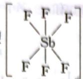

$$
8 - 4 \quad \mathrm{CO} (\mathrm{NH} _ {2}) _ {2} + \mathrm{NH} _ {3} \rightleftharpoons \mathrm{NH} _ {4} ^ {+} + \mathrm{NH} _ {2} \mathrm{CONH} ^ {-}
$$

$NaNH_{2} + NH_{2}CONH_{2} \longrightarrow NH_{2}CONHNa + NH_{3}$ ; 不能,遇水分解

9 9-1 对于 $\mathrm{Na}_{2} \mathrm{HPO}_{4}$ 水溶液, 其中的原始酸碱组分为 $\mathrm{H}_{2} \mathrm{O}$ 和 $\mathrm{HPO}_{4}^{2-}$ , 以它们为参考水准, 则得质子产物有 $\mathrm{H}_{2} \mathrm{PO}_{4}^{-} 、 \mathrm{H}_{3} \mathrm{PO}_{4} 、 \mathrm{H}^{+}$ , 失质子产物为 $\mathrm{PO}_{4}^{3-} 、 \mathrm{OH}^{-}$ , 根据得失质子量相等的原则, 其 PBE 为:

$$
\left[ \mathrm{H} ^ {+} \right] + \left[ \mathrm{H} _ {2} \mathrm{PO} _ {4} ^ {-} \right] + 2 \left[ \mathrm{H} _ {3} \mathrm{PO} _ {4} \right] = \left[ \mathrm{OH} ^ {-} \right] + \left[ \mathrm{PO} _ {4} ^ {3 -} \right]
$$

9-2 $(\mathrm{NH}_4)_2\mathrm{HPO}_4$ 溶液的参考水平可选择 $\mathrm{NH_4^+}$ 、 $\mathrm{HPO_4^{2 - }}$ 和 $\mathrm{H}_2\mathrm{O}$ 。

$$
\left[ \mathrm{H} _ {2} \mathrm{PO} _ {4} ^ {-} \right] + 2 \left[ \mathrm{H} _ {3} \mathrm{PO} _ {4} \right] + \left[ \mathrm{H} ^ {+} \right] = \left[ \mathrm{OH} ^ {-} \right] + \left[ \mathrm{PO} _ {4} ^ {3 -} \right] + \left[ \mathrm{NH} _ {3} \right]
$$

9-3 对于共轭酸碱对 $c_{1} \mathrm{~mol} \cdot \mathrm{L}^{-1} \mathrm{NaAc} - c_{2} \mathrm{~mol} \cdot \mathrm{L}^{-1} \mathrm{HAc}$ , 可选 HAc 和 $\mathrm{H}_{2} \mathrm{O}$ 为参考水平, 其 PBE 为:

$$
c _ {1} + [ \mathrm{H} ^ {+} ] = [ \mathrm{Ac} ^ {-} ] + [ \mathrm{OH} ^ {-} ]
$$

也可选 NaAc 和 $H_{2}O$ 为参考水平, 其 PBE 为:

$$
[ \mathrm{H} ^ {+} ] + [ \mathrm{HAc} ] = [ \mathrm{OH} ^ {-} ] + c _ {2} = (\text {   酸   }) \mathrm{AS} = \varepsilon \times 8 0 1
$$

9-4 对于 $c \mathrm{~mol} \cdot \mathrm{L}^{-1} \mathrm{HCl} + \mathrm{NH}_{4} \mathrm{Ac}$ 溶液可选 $\mathrm{HCl}, \mathrm{NH}_{4}^{+}, \mathrm{Ac}^{-}, \mathrm{H}_{2} \mathrm{O}$ 为参考水平, 其PBE为:

$$
\left[ \mathrm{H} ^ {+} \right] + \left[ \mathrm{HAc} \right] = \left[ \mathrm{OH} ^ {-} \right] + \left[ \mathrm{NH} _ {3} \right] + \left[ \mathrm{Cl} ^ {-} \right]
$$

10 pH=4.00 时，

$$
\delta_ {\mathrm{HAc}} = \frac {[ \mathrm{H} ^ {+} ]}{K _ {a} + [ \mathrm{H} ^ {+} ]} = \frac {1 0 ^ {- 4}}{1 . 8 \times 1 0 ^ {- 5} + 1 . 0 \times 1 0 ^ {- 4}} = \frac {1}{1 . 2}
$$

$$
\delta_ {\mathrm{Ac} ^ {-}} = \frac {K _ {\mathrm{a}}}{K _ {\mathrm{a}} + [ \mathrm{H} ^ {+} ]} = \frac {1 . 8 \times 1 . 0 ^ {- 5}}{1 . 8 \times 1 0 ^ {- 5} + 1 \times 1 0 ^ {- 4}} = 1 - \delta_ {\mathrm{HAc}} = 0. 1 5
$$

$$
\partial \mathrm{I} 0. 0 = \frac {[ ^ {+} \mathrm{H} ]}{\mathrm{C}} = _ {\mathrm{D}}
$$

$$
\therefore
$$

$$
\mathrm{I} _ {\mathrm{D}} 0 \mathrm{I} = \mathrm{s} _ {\mathrm{D}}
$$

pH=8.00 时，

$$
\delta_ {\mathrm{HAc}} = \frac {[ \mathrm{H} ^ {+} ]}{K _ {\mathrm{a}} + [ \mathrm{H} ^ {+} ]} = \frac {1 \times 1 0 ^ {- 8}}{1 . 8 \times 1 0 ^ {- 5} + 1 . 0 \times 1 0 ^ {- 8}} = 5. 6 \times 1 0 ^ {- 4}
$$

$$
\left(_ {2 0} - 1\right) _ {2 0}
$$

$$
\delta_ {\mathrm{Ac} ^ {-}} = \frac {K _ {\mathrm{a}}}{K _ {\mathrm{a}} + [ \mathrm{H} ^ {+} ]} = 1 - \delta_ {\mathrm{HAc}} = 1. 0
$$

## 能力测试 B 卷

1 1-1 碱性由强到弱顺序如下: $S^{2-}$ 、 $CO_{3}^{2-}$ 、 $Ac^{-}$ 、 $HCOO^{-}$ 、 $NO_{2}^{-}$ 、 $HSO_{4}^{-}$ 、 $SO_{4}^{2-}$ 、 $ClO_{4}^{-}$ 。

1-2 酸性由强到弱顺序如下: $B^{3+} 、 Al^{3+} 、 Be^{2+} 、 Fe^{2+} 、 Mg^{2+} 、 Li^{+} 、 Na^{+} 、 K^{+}$ 。

2 设原有 $Na_{2}A$ x mmol, NaHA y mmol, pH=5.70=pK $_{a2}$ , 溶液中 $[HA^{-}]=[A^{2-}]$ , 有: x-0.0100×1.00=y+0.0100×1.00

$\mathrm{pH} = 4.28 = 1 / 2(\mathrm{pK}_{\mathrm{a1}} + \mathrm{pK}_{\mathrm{a2}})$ ，溶液中 $\mathrm{A}^{2-}$ 全转化为 $\mathrm{HA}^{-}$ ，有：

$$
x = 1 0. 0 0 \times 0. 0 1 0 0 = 0. 1 0 0 (\mathrm{mmol})
$$

故 $x = 0.100\mathrm{mmol},y = 0.080\mathrm{mol}$

故初始 $[\mathrm{Na}_2\mathrm{A}] = 0.005\mathrm{mol}\cdot \mathrm{L}^{-1},[\mathrm{NaHA}] = 0.004\mathrm{mol}\cdot \mathrm{L}^{-1}$

$$
\mathrm{pH} = \mathrm{pK} _ {\mathrm{a2}} + \lg \frac {[ \mathrm{A} ^ {2 -} ]}{[ \mathrm{HA} ^ {-} ]} = 5. 8 0
$$

3 3-1 首先起反应的是 $\mathrm{A}^{2-}$ , 因为 $\mathrm{A}^{2-}$ 碱性比 $\mathrm{HA}^{-}$ 强, 产物是 $\mathrm{HA}^{-}$ 。

3-2 产物为 $0.300\mathrm{mmol}$

3-3 $\mathrm{HA^{-} + H_{2}O\rightleftharpoons H_{2}A + OH^{-}}$ $K = 2.2\times 10^{-8} > K_{2}$ HA水解趋势比电离趋势大  
3-4 $\mathrm{nK}_{\mathrm{a}} = 6.35,\mathrm{nK}_{\mathrm{b}} = 10.32$

3-4 $\mathrm{pK}_{\mathrm{a1}} = 6.35\mathrm{pK}_{\mathrm{a2}} = 10.32$

在 pH 为 8.34 时, 该值 $(pK_{a1} + pK_{a2})/2 = (6.35 + 10.32)/2$ , 所有的 $A^{2-}$ 均质子化为 $HA^{-}$ 。故初始溶液中 $A^{2-}$ 的量为 3.00 mmol, 在 pH = 10.33 时为缓冲体系, $[A^{2-}]/[HA^{-}] = 1$ , 故初始溶液中 $HA^{-}$ 的量为 2.40 mmol。

3-5 到达第二个等当点时,所需 HCl 总体积为 28.00 mL。

4 4-1 转折点前的电导率值来自于盐酸中的 $\mathrm{H}^{+}$ 和 $\mathrm{Cl}^{-}$ 的迁移率。加入氢氧化钠后， $\mathrm{H}^{+}$ 与 $\mathrm{OH}^{-}$ 反应，氢氧化钠溶液的电导率降低。过了转折点，氢氧化钠在溶液中过量。电导率值随氢氧化钠加入量的增加而增加。由于 $\mathrm{H}^{+}$ 的离子迁移率高于 $\mathrm{OH}^{-}$ ，因此转折点前后的滴定曲线斜率不同。

4-2 从滴定曲线来看,转折点是终点,在108秒。氢氧化钠流量=3滴/秒。因此,NaOH的体积为 $108\times3=324$ (滴)= $324\times0.029=9.39$ (mL),盐酸的浓度= $9.39\times0.100/25=0.037(\mathrm{mol}\cdot \mathrm{L}^{-1})$ 。

5 设稀释前甲酸的物质的量的浓度为 $c_{1}$ ，稀释后为 $c_{2}$ 。

$$
c _ {1} = \frac {1 0 0 0 \times 1 . 0 0 4 9 \times 3 \%}{4 6 . 0 3} = 6. 5 5 \times 1 0 ^ {- 1} \mathrm{mol} \cdot \mathrm{L} ^ {- 1}
$$

$\mathrm{pH} = 1.97$ 即 $[\mathbf{H}^{+}] = 1.0715\times 10^{-2}\mathrm{mol}\cdot \mathrm{L}^{-1}$

所以： $\alpha_{1}=\frac{[H^{+}]}{c_{1}}=0.01636$ ，即1.636%。

当 $\alpha_{2} = 10\alpha_{1}$ 时，浓度 $c_{2}$ 和 $c_{1}$ 必符合下列关系：

平衡浓度 HCOOH⇌H $^{+}$ +HCOO $^{-}$

稀释前 $c_{1}(1 - \alpha_{1})$ $c_{1}\alpha_{1}c_{1}\alpha_{1}$

稀释后 $c_{2}(1 - \alpha_{2})$ $c_{2}\alpha_{2} c_{2}\alpha_{2}$

$$
K _ {\mathrm{a}} = \frac {c _ {1} \alpha_ {1} \times c _ {1} \alpha_ {1}}{c _ {1} (1 - \alpha_ {1})} = \frac {c _ {1} \alpha_ {1} ^ {2}}{1 - \alpha_ {1}}
$$

$$
K _ {\mathrm{a}} = \frac {c _ {2} \alpha_ {2} ^ {2}}{1 - \alpha_ {2}} = \frac {c _ {2} (1 0 \alpha_ {1}) ^ {2}}{1 - 1 0 \alpha_ {1}}
$$

①式除以 ②式得：

$$
\frac {c _ {1}}{c _ {2}} = \frac {1 0 0 (1 - \alpha_ {1})}{1 - 1 0 \alpha_ {1}} = \frac {1 0 0 (1 - 0 . 0 1 6 3 6)}{1 - 0 . 1 6 3 6} = 1 1 7. 6
$$

6 缓冲范围是 $\mathrm{pH} = \mathrm{pK}_{\mathrm{n}} \pm 1$ ，拟使 $\mathrm{pH} = 7$ ，可以选用 $\mathrm{pK}_{\mathrm{n}} = 7.21$ 的缓冲对 $\mathrm{H}_{2}\mathrm{PO}_{4}^{-} - \mathrm{HPO}_{4}^{2-}$ 。 $\mathrm{pH} = \mathrm{pK}_{\mathrm{n}} - \lg \frac{c_{\text{酸}}}{c_{\text{碱}}} = \lg \frac{c_{\text{酸}}}{c_{\text{碱}}} = \mathrm{pK}_{\mathrm{n}} - \mathrm{pH} = 7.21 - 7.0 = 0.21$ （最终的回测者能再得到 $\frac{c_{\text{酸}}}{c_{\text{碱}}} = 1.62$

可以使 $NaH_{2}PO_{4}$ 和 $Na_{2}HPO_{4}$ 的物质的量浓度之比为 1.62，但要注意两者的浓度皆不宜太小，以保证缓冲容量。

7 7-1 等物质的量的 HCl 和 $NH_{3} \cdot H_{3}O$ 混合生成等物质的量的 $NH_{4}Cl$ 。 $NH_{4}Cl$ 浓度是 HCl 浓度的一半， $c(\mathrm{NH}_{4}\mathrm{Cl}) = \frac{0.10 \times 20}{40} = 0.050 \, \mathrm{mol} \cdot \mathrm{L}^{-1}$ ，按 $NH_{4}Cl$ 的水解来计算溶液的 pH：

$$
\mathrm{NH} _ {4} ^ {+} + \mathrm{H} _ {2} \mathrm{O} \rightleftharpoons \mathrm{NH} _ {3} \cdot \mathrm{H} _ {3} \mathrm{O} + \mathrm{H} ^ {+}
$$

平衡时

$$
\begin{array}{l} 0. 0 5 0 - x \\ K _ {\mathrm{h}} = \frac {K _ {\mathrm{w}}}{K _ {\mathrm{b}}} = 5. 6 \times 1 0 ^ {- 1 0} \\ x = 5. 3 \times 1 0 ^ {- 6} \quad \mathrm{pH} = 5. 2 8 \end{array}
$$

7-2 两溶液混合后发生中和反应,除生成与 HCl 等物质的量的 $NH_{4}Cl$ , $NH_{3} \cdot H_{3}O$ 还有剩余,相当于 $NH_{3} \cdot H_{3}O - NH_{4}Cl$ 的缓冲溶液。

$$
\mathrm{pH} = 1 4 - \lg K _ {b} + \lg \frac {c _ {\text {碱}}}{c _ {\text {盐}}}
$$

$$
_ {1} \mathrm{OO} _ {\mathrm{B}} \mathrm{O}
$$

所以

$$
\mathrm{pH} = 1 4 - 4. 7 4 + \lg \frac {0 . 0 5 0}{0 . 0 5 0} = 9. 2 6
$$

8 8-1 pH=5.3; $\mathrm{CH}_3\mathrm{COO}^-$ 与 $\mathrm{NH_4^+}$ 的水解能力(结合 $\mathrm{H^{+}}$ 或 $\mathrm{OH^{-}}$ 的能力)相同

8-2 ① 否, 指示剂的变色点的 pH 与终点时盐溶液的 pH 不一致 ② 甲基红; 黄色变为橙色 ③ 酚酞; 酚酞的变色点为 pH=8, 溶液呈碱性

9 9-1 $\mathrm{Cs_2SO_3 + SOCl_2 = 2SO_2 + 2CsCl}$

$$
9 - 2 \quad \mathrm {Zn(C_ {2} H_ {5}) _ {2} + 2SO_ {2} = ZnSO_ {3} +(C_ {2} H_ {5}) _ {2} SO}
$$

$$
9 - 3 \quad \mathrm{PCl} _ {5} + \mathrm{SO} _ {2} = \mathrm{POCl} _ {3} + \mathrm{SOCl} _ {2}; \mathrm{NbCl} _ {5} + \mathrm{SO} _ {2} = \mathrm{NbOCl} _ {3} + \mathrm{SOCl} _ {2};
$$

$$
\mathrm{UCl} _ {6} + \mathrm{SO} _ {2} = \mathrm{UOCl} _ {4} + \mathrm{SOCl} _ {2}
$$

9-4 复分解反应 $2\mathrm{NH}_4\mathrm{SCN} + \mathrm{SOCl}_2 = 2\mathrm{NH}_4\mathrm{Cl}\downarrow +\mathrm{SO}(\mathrm{SCN})_2$

10 设混合液中丙二酸钠的物质的量为 a mol; 丙二酸氢钠的物质的量为 b mol。

当加入 $1 \, \mathrm{mL} \, 0.010 \, \mathrm{mol} \cdot \mathrm{L}^{-1} \, HCl$ 后，丙二酸钠的物质的量变为 $(a - 1.0 \times 10^{-5}) \, \text{mol}$ ; 丙二酸氢钠的物质的量为 $(b + 1.0 \times 10^{-5}) \, \text{mol}$ 。由于丙二酸钠和丙二酸氢钠组成缓冲体系，其 $pK_{a} = 5.70$ 加入 $1 \, \mathrm{mL} \, 0.010 \, \mathrm{mol} \cdot \mathrm{L}^{-1} \, HCl$ 后，溶液的 pH = 5.70。根据公式 $pH = pK_{a} - \lg \frac{c_{酸}}{c_{碱}}$ 可得，此时溶液中丙二酸钠和丙二酸氢钠物质的量相等，即 $a - 1.0 \times 10^{-5} = b + 1.0 \times 10^{-5}$

$$
a = b + 2. 0 \times 1 0 ^ {- 5}
$$

当加入 $10 \, \mathrm{mL} \cdot 0.010 \, \mathrm{mol} \cdot \mathrm{L}^{-1} \, HCl$ 后，丙二酸钠的物质的量变为 $(a - 1.0 \times 10^{-4}) \, \text{mol}$ ; 丙二酸氢钠的物质的量为 $(b + 1.0 \times 10^{-4}) \, \text{mol}$ 。公式 $pH = pK_{a} - \lg \frac{c_{酸}}{c_{碱}}$ （忽略因两种盐解离引起的平衡浓度和初始浓度间的差异）

$$
4. 2 8 = 5. 7 0 - \lg \frac {b + 1 . 0 \times 1 0 ^ {- 4}}{a - 1 . 0 \times 1 0 ^ {- 4}}
$$

$$
b + 1. 0 \times 1 0 ^ {- 4} = 2 6. 3 (a - 1. 0 \times 1 0 ^ {- 4})
$$

①带入②后，解得 $b=8.71\times10^{-5}$ ; $a=1.07\times10^{-4}$

① 带入②后，解得 $\theta = 0.71 \times 10^{-3}$ 当用 $0.010 \, \mathrm{mol} \cdot \mathrm{L}^{-1}$ HCl 滴定该混合溶液达到丙二酸化学计量点时，需要 HCl 的体积为

$$
V (\mathrm{HCl}) = \frac {8 . 7 1 \times 1 0 ^ {- 5} + 2 \times 1 . 0 7 \times 1 0 ^ {- 4}}{0 . 0 1} \times 1 0 ^ {3} = 3 0. 1 1 \mathrm{mL}
$$

## 第 3 章 难溶电解质的沉淀溶解平衡

## 能力测试A卷

1 由于氯气溶于水发生了两个过程：

① 氯气分子变成水合氯气分子: $\mathrm{Cl}_{2}(\mathrm{~g}) \rightleftharpoons \mathrm{Cl}_{2}(\mathrm{aq})$ , aq 表示水合。该平衡常数即为亨利常数。

② 1/3 的水合氯气继续反应: $\mathrm{Cl}_{2} + \mathrm{H}_{2} \mathrm{O} \rightleftharpoons \mathrm{HCl} + \mathrm{HClO}$

当把 $Cl_{2}$ 通入到 $CaCO_{3}$ 悬浊液后，氯水中的盐酸与 $CaCO_{3}$ 反应：

$$
2 \mathrm{HCl} + \mathrm{CaCO} _ {3} = \mathrm{CaCl} _ {2} + \mathrm{CO} _ {2} \uparrow + \mathrm{H} _ {2} \mathrm{O}
$$

而 HClO 由于酸性很弱, 不与 $CaCO_{3}$ 反应, 造成氯气不断与水发生反应, 生成的盐酸又不断与 $CaCO_{3}$ 反应, 化学平衡移动, 此时 HClO 的浓度越来越大。

$$
2 \mathrm{H} _ {2} \mathrm{O}: [ \mathrm{Cl} ^ {-} ] = 0, \quad \mathrm{MgCl} _ {2}: [ \mathrm{Cl} ^ {-} ] = 0. 4 \mathrm{mol} \cdot \mathrm{L} ^ {- 1}
$$

$$
\mathrm{NaCl}: [ \mathrm{Cl} ^ {-} ] = 0. 5 \mathrm{mol} \cdot \mathrm{L} ^ {- 1} \quad \mathrm{HCl}: [ \mathrm{Cl} ^ {-} ] = 0. 3 \mathrm{mol} \cdot \mathrm{L} ^ {- 1}
$$

所以有 $a > d > b > c$

3 3-1 因为 $\mathrm{NaAc}$ 溶液是碱性溶液: $\mathrm{Ac}^{-} + \mathrm{H}_{2} \mathrm{O} \rightleftharpoons \mathrm{HAc} + \mathrm{OH}^{-}$ 。而氨水中存在下列平衡: $\mathrm{NH}_{3} \cdot \mathrm{H}_{2} \mathrm{O} \rightleftharpoons \mathrm{NH}_{4}^{+} + \mathrm{OH}^{-}$ , 加入 $\mathrm{NaAc}$ 产生 $\mathrm{OH}^{-}$ , 使电离平衡向左移动解离度减小, 因此, 氨水的电离度减小。

3-2 在带有 $\mathrm{PbCl}_2$ 沉淀的饱和溶液中，由于存在下列平衡 $\mathrm{PbCl}_2 \rightleftharpoons \mathrm{Pb}^{2+} + 2\mathrm{Cl}^-$ ，在加入 $\mathrm{NaAc}$ 溶液后，溶液中发生如下反应： $\mathrm{Pb}^{2+} + 2\mathrm{Ac}^- \rightleftharpoons \mathrm{PbAc}_2$ ，因 $\mathrm{PbAc}_2$ 为弱电解质，因此 $\mathrm{PbCl}_2$ 溶解度增大。

4 $\mathrm{BaCrO_4}$ 在 $\mathrm{HAc}(2.0\mathrm{mol}\cdot \mathrm{L}^{-1}) - \mathrm{NaAc}(2.0\mathrm{mol}\cdot \mathrm{L}^{-1})$ 溶液中的溶解反应为：

$$
2 \mathrm{BaCrO} _ {4} + 2 \mathrm{HAc} = 2 \mathrm{Ba} ^ {2 +} + \mathrm{Cr} _ {2} \mathrm{O} _ {7} ^ {2 -} + \mathrm{H} _ {2} \mathrm{O} + 2 \mathrm{Ac} ^ {-}
$$

假设当上述反应达平衡时， $\mathrm{Ba}^{2+}$ 的浓度是 $x$ （即设 $\mathrm{BaCrO_4}$ 溶解浓度为 $x \, \mathrm{mol} \cdot \mathrm{L}^{-1}$ ），则反应系统各物质浓度如下：

$2BaCrO_{4} + 2HAc = 2Ba^{2+} + Cr_{2}O_{7}^{2-} + H_{2}O + 2Ac^{-}$ 平衡浓度/mol·L $^{-1}$ 2.0

x

x/2

2.0

那么该反应的平衡常数可表示为：

$$
K = \frac {x ^ {2} \times \frac {x}{2} \times 2 . 0 ^ {2}}{2 . 0 ^ {2}}
$$

由于溶解反应可看成由下面三个过程组成：

$$
2 \mathrm{BaCrO} _ {4} \rightleftharpoons 2 \mathrm{Ba} ^ {2 +} + 2 \mathrm{CrO} _ {4} ^ {2 -}
$$

$$
\mathrm{Cr} _ {2} \mathrm{O} _ {7} ^ {2 -} + \mathrm{H} _ {2} \mathrm{O} \rightleftharpoons 2 \mathrm{CrO} _ {4} ^ {2 -} + 2 \mathrm{H} ^ {+}
$$

$$
2 \mathrm{HAc} \rightleftharpoons 2 \mathrm{H} ^ {+} + 2 \mathrm{Ac} ^ {-}
$$

$K_{1} = (K_{\mathrm{sp}})^{2} = (2.0\times 10^{-10})^{2}$ $K_{2} = 2.4\times 10^{-15}$ $K_{3} = (1.8\times 10^{-5})^{2}$ 根据反应式与反应常数的关系可有：

$$
\frac {(\mathrm{H}) _ {\text {c}}}{(\mathrm{H}) _ {\text {c}}}
$$

$$
K = K _ {1} \times (K _ {3}) ^ {2} \times (K _ {2}) ^ {- 1} = 5. 4 \times 1 0 ^ {- 1 5}
$$

将其代入溶解反应的平衡常数的表达式中：

$$
\frac {x ^ {2} \times (x / 2) \times 2 . 0 ^ {2}}{2 . 0 ^ {2}} = 5. 4 \times 1 0 ^ {- 1 5}
$$

解得： $x=2.2\times10^{-5}$ 。可见， $BaCrO_{4}$ 在 HAc—NaAc 溶液中基本不溶解。由反应的化学方程式：

$$
\mathrm{CaCO} _ {3} + (\mathrm{NH} _ {4}) _ {2} \mathrm{C} _ {2} \mathrm{O} _ {4} = \mathrm{CaC} _ {2} \mathrm{O} _ {4} \downarrow + (\mathrm{NH} _ {4}) _ {2} \mathrm{CO} _ {3}
$$

卷8 空腹式論

可知生成 $CaC_{2}O_{4}$ 沉淀的物质的量为：

$$
n (\mathrm{CaCO} _ {3}) = 1. 5 \times 1 0 ^ {- 3} \mathrm{mol} = n (\mathrm{CaC} _ {2} \mathrm{O} _ {4})
$$

因允许损失的量不大于万分之一,因此沉淀液中残留的 $Ca^{2+}$ 的浓度为:

$$
c \left(\mathrm{Ca} ^ {2 +}\right) = 1. 5 \times 1 0 ^ {- 6} \mathrm{mol} \cdot \mathrm{L} ^ {-}
$$

则 $C_{2}O_{4}^{2-}$ 的浓度至少约为 $1.5 \times 10^{-3} \, \mathrm{mol} \cdot \mathrm{L}^{-1}$ ,

故需要的 $(\mathrm{NH}_4)_2\mathrm{C}_2\mathrm{O}_4$ 的质量为 $1.5\times 10^{-3}\mathrm{mol}\cdot \mathrm{L}^{-1}\times 0.1\mathrm{L}\times 124\mathrm{g}\cdot \mathrm{mol}^{-1}\approx 1.9\times 10^{-2}\mathrm{g},$

又 $\left(\mathrm{NH}_{4}\right)_{2}\mathrm{C}_{2}\mathrm{O}_{4}$ 溶液的浓度较小，可近似地认为该溶液的密度为 $1\ g\cdot \mathrm{cm}^{-3}$ ，则 $\left(\mathrm{NH}_{4}\right)_{2}\mathrm{C}_{2}\mathrm{O}_{4}$ 的质量分数为0.019%。

6 浓醋酸铵也能使 $\mathrm{Mg(OH)_2}$ 沉淀溶解, 这说明不能说是因为氯化铵水解呈酸性而使 $\mathrm{Mg(OH)_2}$ 溶解, 因为醋酸铵呈中性。正确的结论是这两种盐都提供了大量的 $NH_4^+$ , 它能与 $OH^-$ 结合生成 $NH_3 \cdot H_2O$ 弱电解质, 使 $\mathrm{Mg(OH)_2}$ 不断溶解。

7 7-1 配制的溶液 $\mathrm{Cu}^{2+}$ 浓度为 $0.04 \, \mathrm{mol} \cdot \mathrm{L}^{-1}$ 。

7-2 $[\mathrm{Cu}^{2+}][\mathrm{OH}^{-}]^2 = 1.0\times 10^{-14} > 4.8\times 10^{-20}$ ，可形成 $\mathrm{Cu(OH)_2}$ 沉淀。

8 8-1 AgCl饱和所需 $\mathrm{Ag^{+}}$ 浓度 $[\mathrm{Ag^{+}}]_{1} = \frac{1.8\times 10^{-10}}{1\times 10^{-3}} = 1.8\times 10^{-7}\mathrm{mol}\cdot \mathrm{L}^{-1};\mathrm{Ag_2CrO_4}$ 饱和所

需 $\mathrm{Ag^{+}}$ 浓度 $[\mathrm{Ag^{+}}]_{2} = \sqrt{\frac{1.9\times 10^{-12}}{0.001}} = 4.36\times 10^{-5}\mathrm{mol}\cdot \mathrm{L}^{-1};[\mathrm{Ag^{+}}]_{1} <   [\mathrm{Ag^{+}}]_{2},\mathrm{Cl^{-}}$ 先沉淀。

8-2 $\mathrm{Ag_2CrO_4}$ 开始沉淀时 $[\mathrm{Cl^-}] = \frac{1.8\times 10^{-10}}{4.36\times 10^{-5}} = 4.13\times 10^{-6} < 10^{-5}$ ，所以能有效地分离。原料加 $\mathrm{H}_2\mathrm{SO}_4$ ，过滤后滤液调 $\mathrm{pH} = 5.5$ ，使 $\mathrm{Fe}^{3+}$ 和 $\mathrm{Al}^{3+}$ 沉淀完全，再过滤除去 $\mathrm{Al}^{3+}$ 、 $\mathrm{Fe}^{3+}$ ，滤液再调 $\mathrm{pH} = 12.5$ 、 $\mathrm{Mg}^{2+}$ 沉淀完全，过滤得 $\mathrm{Mg(OH)}_2$ 。

9-1 适当提高反应温度、增加浸出时间(或其他合理答案)

9-2 $\mathrm{Al(OH)}_3$ 、Fe(OH)3

9-3 $Na_{2}SO_{4}$

9-4 ① 在某一温度时, NaCl 最先达到饱和析出; $\mathrm{Mg(ClO_3)_2}$ 的溶解度随温度的变化最大; NaCl 溶解度与其他物质的溶解度有一定差别 ② 降温前, 溶液中 NaCl 已饱和, 降温过程中, NaCl 溶解度降低, 会少量析出; 重结晶

10 10-1 因 $\mathrm{Hg}^{2+} + \mathrm{Hg} \rightleftharpoons \mathrm{Hg}_{2}^{2+}$ , 开始 $c(\mathrm{Hg}_{2}^{2+})$ 为零,

因此 $\frac{c(\mathrm{Hg}_2^{2+})}{c(\mathrm{Hg}^{2+})} \ll 166$ ，平衡向右移动，形成 $\mathrm{Hg}_2(\mathrm{NO}_3)_2$ 。

10-2 假设同时生成 $\mathrm{HgS}$ 和 $\mathrm{Hg}_2\mathrm{S}$ 沉淀，由于溶液中 $\mathrm{S}^{2-}$ 浓度同时满足两个溶解沉淀平衡：

$$
[ \mathrm{S} ^ {2 -} ] = \frac {4 \times 1 0 ^ {- 5 5}}{[ \mathrm{Hg} ^ {2 +} ]} = \frac {1 \times 1 0 ^ {- 4 7}}{[ \mathrm{Hg} _ {2} ^ {2 +} ]}
$$

则 $\frac{c(\mathrm{Hg}_2^{2+})}{c(\mathrm{Hg}^{2+})} = \frac{[\mathrm{Hg}_2^{2+}]}{[\mathrm{Hg}^{2+}]} = 2.5\times 10^5\gg 166$ 则平衡向左移动

反应式为： $\mathrm{Hg_2^{2 + } + H_2S = HgS + Hg + 2H^-}$

## 能力测试 B 卷

1 根据 $\Delta G_{\mathrm{sol}}^{\ominus} = -RT\ln K_{\mathrm{sp}} = \Delta H_{\mathrm{sol}}^{\ominus} - T\Delta S_{\mathrm{sol}}^{\ominus}$ ，有 $\ln K_{\mathrm{sp}} = -\Delta H_{\mathrm{sol}}^{\ominus} / (RT) + \Delta S_{\mathrm{sol}}^{\ominus} / R,$

假设 $\Delta H_{\mathrm{sol}}^{\ominus}$ and $\Delta S_{\mathrm{sol}}^{\ominus}$ 是不依赖于温度的， $\ln (K_{\mathrm{sp1}} / K_{\mathrm{sp2}}) = -\Delta H_{\mathrm{sol}}^{\ominus} / R(1 / T_1 - 1 / T_2)$

$\ln (9.50 / 2.30) = -\Delta H_{\mathrm{sol}}^{\ominus} / R(1 / 273 - 1 / 323)$ 解得 $\Delta H_{\mathrm{sol}}^{\ominus} = -21\mathrm{kJ}\cdot \mathrm{mol}^{-1}$

2 2-1 AgCl 在纯水中的溶解度比在盐酸中的溶解度大是因为同离子效应。

2-2 $\mathrm{BaSO}_4$ 在硝酸中的溶解度比在纯水中的溶解度大是因为盐效应。

2-3 $\mathrm{Ag_3PO_4}$ 在磷酸中的溶解度比在纯水中的大，是因为 $\mathrm{Ag_3PO_4}$ 与磷酸反应生成易溶的 $\mathrm{AgH_2PO_4}$ 。

2-4 PbS在盐酸中的溶解度比在纯水中的大,是因为 $S^{2-}$ 与 $H^{+}$ 结合生成 $HS^{-}$ 或 $H_{2}S$ 。

2-5 $\mathrm{Ag}_{2} \mathrm{~S}$ 易溶于硝酸但难溶于硫酸是因为硝酸将 $\mathrm{S}^{2-}$ 离子氧化成单质硫。

3 即要求 CdS 已沉淀完全(此时 $\left[Cd^{2+}\right]\leqslant10^{-5}\ \mathrm{mol}\cdot \mathrm{L}^{-1}$ ) 而 FeS 刚开始沉淀的两种 pH；pH 的选择范围为 0.47 < pH < 2.67。

4 4-1 忽略 $\mathrm{H}_{2} \mathrm{~S}$ 的二级电离, 则电离反应式为: $\mathrm{H}_{2} \mathrm{~S} \rightleftharpoons \mathrm{H}^{+} + \mathrm{HS}^{-}$

体系的质子平衡为： $\left[\mathrm{H}^{+}\right] = \left[\mathrm{OH}^{-}\right] + \left[\mathrm{HS}^{-}\right]$

设 $\mathrm{H}^{+}$ 的平衡浓度为 $x$ ，则 $[\mathrm{HS}^{-}] = x - K_{\mathrm{w}}^{\ominus} / x$

代入 $K_{\mathrm{al}}^{\ominus}$ 的表达式，有 $x \cdot (x - K_{\mathrm{w}}^{\ominus} / x) / (1.0 \times 10^{-6} - x + K_{\mathrm{w}}^{\ominus} / x) = K_{\mathrm{al}}^{\ominus}$

解得 $[\mathbf{H}^{+}] = 3.0\times 10^{-7}\mathrm{mol}\cdot \mathrm{L}^{-1}$

4-2 溶解反应 $2\mathrm{H}^{+} + \mathrm{ZnS} = \mathrm{Zn}^{2 + } + \mathrm{H}_{2}\mathrm{S}$ ，平衡常数 $K^{\ominus} = K_{\mathrm{sp}}^{\ominus} / (K_{\mathrm{al}}^{\ominus}K_{\mathrm{a2}}^{\ominus}) = 1.7\times 10^{-2}$ $\mathrm{H}_{2} \mathrm{~S}$ 平衡浓度为 $2.1 \times 10^{-2} \mathrm{~mol} \cdot \mathrm{L}^{-1}$ , 故 $[\mathrm{H}^{+}] = ([\mathrm{Zn}^{2+}][\mathrm{H}_{2} \mathrm{~S}] / K^{\ominus})^{1/2} = 0.16 \mathrm{~mol} \cdot \mathrm{L}^{-1}$ . 故起始浓度为 $c = [\mathrm{H}^{+}] + 2[\mathrm{Zn}^{2+}] = 0.20 \mathrm{~mol} \cdot \mathrm{L}^{-1}$ 4-3 溶解反应 $2 \mathrm{H}^{+} + \mathrm{CdS} = \mathrm{Cd}^{2+} + \mathrm{H}_{2} \mathrm{~S}$ , 平衡常数 $K^{\ominus} = K_{\mathrm{sp}}^{\ominus} / (K_{\mathrm{n1}}^{\ominus} K_{\mathrm{n2}}^{\ominus}) = 5.6 \times 10^{-7} [\mathrm{H}_{2} \mathrm{~S}] = 1.0 \times 10^{-2} \mathrm{~mol} \cdot \mathrm{L}^{-1}$ , 设 $\mathrm{Cd}^{2+}$ 平衡浓度为 $x$ , 则 $\mathrm{H}^{+}$ 的平衡浓度为 $12 - 2x$ 代入得: $[\mathrm{H}_{2} \mathrm{~S}] \cdot x / (12 - 2x)^{2} = K$ , 解得 $[\mathrm{Cd}^{2+}] = 8.1 \times 10^{-4} \mathrm{~mol} \cdot \mathrm{L}^{-1}$

$$
\mathrm{Cr} (\mathrm{OH}) _ {3}, \mathrm{NaOH}
$$

$$
\mathrm{BaCO} _ {3}
$$

$$
\mathrm{PbSO} _ {4}
$$

③ 加入 HOAc 溶液, MnS 溶解

加入 $Na_{2}S$ 溶液, HgS 溶解

④ 加入浓氨水，AgCl溶解

$$
\mathrm{Na} _ {2} \mathrm{S} _ {2}
$$

5-2 发生的反应为： $\mathrm{M}^{2+} + \mathrm{H}_2\mathrm{S} = \mathrm{MS} + 2\mathrm{H}^+$

反应的平衡常数为： $K^{\ominus}=[H^{+}]^{2}/([H_{2}S][M^{2+}])=K_{a1}^{\ominus}K_{a2}^{\ominus}/K_{sp}^{\ominus}$

刚好完全沉淀时， $\left[M^{2+}\right]=1.0\times10^{-6}\ \mathrm{mol}\cdot \mathrm{L}^{-1},\left[H^{+}\right]=0.20\ \mathrm{mol}\cdot \mathrm{L}^{-1}$

代入到平衡常数表达式中, 解得 $K^{\ominus}=4.0\times10^{5}$ 故解得： $K_{\mathrm{sp}}^{\ominus} = K_{\mathrm{al}}^{\ominus}K_{\mathrm{a2}}^{\ominus} / K^{\ominus} = 3.6\times 10^{-26}$

$$
\mathrm{p} K _ {\mathrm{sp}} ^ {\ominus}
$$

6 在 $\mathrm{pH} = 5.5$ 的溶液中， $[\mathrm{H}^{+}] = 3.2 \times 10^{-6} \mathrm{~mol} \cdot \mathrm{L}^{-1}$ 。在 $\mathrm{CO}_{2}$ 饱和溶液中，

$$
\mathrm{H} _ {2} \mathrm{CO} _ {3} \rightleftharpoons 2 \mathrm{H} ^ {+} + \mathrm{CO} _ {3} ^ {2 -}
$$

$$
\begin{array}{r l} K & = \frac {[ \mathrm{H} ^ {+} ] ^ {2} [ \mathrm{CO} _ {3} ^ {2 -} ]}{[ \mathrm{H} _ {2} \mathrm{CO} _ {3} ]} = K _ {\mathrm{a} _ {1}} K _ {\mathrm{a} _ {2}} \\ & = 4. 3 \times 1 0 ^ {- 7} \times 4. 7 \times 1 0 ^ {- 1 1} = 2. 0 \times 1 0 ^ {- 1 7} \end{array}
$$

$$
\begin{array}{r l} \left[ \mathrm{CO} _ {3} ^ {2 -} \right] & = \frac {K \left[ \mathrm{H} _ {2} \mathrm{CO} _ {3} \right]}{\left[ \mathrm{H} ^ {+} \right] ^ {2}} = \frac {2 . 0 \times 1 0 ^ {- 1 7} \times 0 . 0 3 4}{(3 . 2 \times 1 0 ^ {- 6}) ^ {2}} \\ & = 6. 6 \times 1 0 ^ {- 8} \mathrm{mol} \cdot \mathrm{L} ^ {- 1} \end{array}
$$

卷 A 無腹式論

因此溶液中 $Ca^{2+}$ 可达到的最高浓度为：

$$
[ \mathrm{Ca} ^ {2 +} ] = \frac {K _ {\mathrm{sp}} (\mathrm{CaCO} _ {3})}{[ \mathrm{CO} _ {3} ^ {2 -} ]} = \frac {2 . 8 \times 1 0 ^ {- 9}}{6 . 6 \times 1 0 ^ {- 8}} = 0. 0 4 2 \mathrm{mol} \cdot \mathrm{L} ^ {- 1}
$$

7 7-1 $1.6 \times 10^{-4} \mathrm{~mol} \cdot \mathrm{L}^{-1}$ ; $9.2 \times 10^{-4} \mathrm{~g} / 100 \mathrm{~mL}$

7-2 $1.6 \times 10^{-11}$

7-3 $1.6 \times 10^{-7} \mathrm{~mol} \cdot \mathrm{L}^{-1}$ ; $9.2 \times 10^{-7} \mathrm{~g} / 100 \mathrm{~mL}$

$$
7 - 4 \quad [ \mathrm{Mg} ^ {2 +} ] = 0. 0 5 0 \mathrm{mol} \cdot \mathrm{L} ^ {- 1}; [ \mathrm{OH} ^ {-} ] = 1. 8 \times 1 0 ^ {- 5} \mathrm{mol} \cdot \mathrm{L} ^ {- 1}; \mathrm{pH} = 9. 3
$$

8-1 根据溶度积原理,该反应可以发生,反应方程式为: $SrSO_{4} + 2NH_{4}HCO_{3} = SrCO_{3} + (NH_{4})_{2}SO_{4} + CO_{2}\uparrow + H_{2}O$ $SrCO_{3} + 2HCl = SrCl_{2} + H_{2}O + CO_{2}\uparrow$ $SrCl_{2} + 2NH_{4}HCO_{3} = SrCO_{3}\downarrow + 2NH_{4}Cl + H_{2}O + CO_{2}\uparrow$ 8-2 在催化剂的作用下反应方程式为:

$$
\mathrm{SrSO} _ {4} + 2 \mathrm{NH} _ {4} \mathrm{Cl} = \mathrm{SrCl} _ {2} + (\mathrm{NH} _ {4}) _ {2} \mathrm{SO} _ {4}
$$

$$
\mathrm{SrCl} _ {2} + 2 \mathrm{NH} _ {4} \mathrm{HCO} _ {3} = \mathrm{SrCO} _ {3} \downarrow + 2 \mathrm{NH} _ {4} \mathrm{Cl} + \mathrm{CO} _ {2} \uparrow + \mathrm{H} _ {2} \mathrm{O}
$$

9 9-1 $c(\mathrm{Ca}^{2+}) = 0.10\mathrm{g / (40g\cdot mol^{-1}\times 1.4L)} = 1.8\times 10^{-3}\mathrm{mol}\cdot \mathrm{L}^{-1}$

$$
c \left(\mathrm{C} _ {2} \mathrm{O} _ {4} ^ {2 -}\right) = K _ {\mathrm{sp}} / c \left(\mathrm{Ca} ^ {2 +}\right) = 2. 3 \times 1 0 ^ {- 6} / 1. 8 \times 1 0 ^ {- 3} = 1. 3 \times 1 0 ^ {- 6} \mathrm{mol} \cdot \mathrm{L} ^ {- 1}
$$

多饮水,一方面加快排尿速率、降低尿液在体内的停留时间;另一方面加大尿量,减小 $C_{a^{2+}}$ 的浓度,防止尿结石。

$$
9 - 2 \quad 3 \mathrm{C} _ {6} \mathrm{H} _ {8} \mathrm{O} _ {6} + \mathrm{IO} _ {3} ^ {-} \longrightarrow 3 \mathrm{C} _ {6} \mathrm{H} _ {6} \mathrm{O} _ {6} + \mathrm{I} ^ {-} + 3 \mathrm{H} _ {2} \mathrm{O}
$$

10 10-1 $\mathrm{CH}_3\mathrm{COOAg(s)}\rightleftharpoons \mathrm{Ag}^+$ (aq) $+\mathrm{CH}_3\mathrm{COO}^-$ (aq)

$$
1 0 - 2 \quad 2 \mathrm{Ag} ^ {+} (\mathrm{aq}) + \mathrm{Cu(s)} \rightleftharpoons 2 \mathrm{Ag(s)} + \mathrm{Cu} ^ {2 +} (\mathrm{aq})
$$

$$
K _ {\mathrm{sp}} (\mathrm {CH_ {3} COOAg}) = c (\mathrm {A g ^ {+}}) \cdot c (\mathrm {CH_ {3} CO O ^ {-}}) = 2. 0 \times 1 0 ^ {- 3}
$$

$$
c (\mathrm{Ag} ^ {+}) = c (\mathrm{CH} _ {3} \mathrm{COO} ^ {-}) = 0. 0 4 5 \mathrm{mol} \cdot \mathrm{L} ^ {- 1}
$$

因溶液为 100 mL, 故与 Cu 反应的 $Ag^{+}$ 的物质的量应为 $4.5 \times 10^{-2} \, \mathrm{mol} \cdot \mathrm{L}^{-1} \times 0.1 \, L = 4.5 \times 10^{-3} \, \mathrm{mol}$

置换 $\mathrm{Ag^{+}}$ 的 $\mathrm{Cu}$ 的物质的量则为 $n(\mathrm{Cu}) = \frac{4.5\times 10^{-3}\mathrm{mol}}{2} = 2.3\times 10^{-3}\mathrm{mol}$

其质量为 $m(\mathrm{Cu})=2.3\times10^{-3}\ \mathrm{mol}\times64\ \mathrm{g}\cdot\mathrm{mol}^{-1}=0.15\ \mathrm{g}$

反应后 Cu 的质量为 23.4 g - 0.15 g = 23.3 g

10 - 3 若存在固体 $\mathrm{CH}_{3} \mathrm{COOAg}$ , 则随着 $\mathrm{Cu}$ 与 $\mathrm{Ag}^{+}$ 反应的进行, 反应体系中 $\mathrm{Ag}^{+}$ 的物质的量浓度减小, $\mathrm{CH}_{3} \mathrm{COOAg}$ 固体溶解, 平衡向正方向移动, 会产生更多的 $\mathrm{Ag}^{+}$ , 无法验证 $\mathrm{CH}_{3} \mathrm{COOAg}$ 的 $K_{\mathrm{sp}}$ 。

## 第 4 章 原电池及常见化学电源

## 能力测试A卷

$$
1 - 2 \quad \mathrm{NaBiO} _ {3} \quad \mathrm{Bi} _ {2} (\mathrm{SO} _ {4}) _ {3}
$$

$$
\begin{array}{l l} \mathbf {1 - 3} & 2 \mathrm{Mn} ^ {2 +} + 5 \mathrm{NaBiO} _ {3} + 1 4 \mathrm{H} ^ {+} = 2 \mathrm{MnO} _ {4} ^ {-} + 5 \mathrm{Bi} ^ {3 +} + 5 \mathrm{Na} ^ {+} + 7 \mathrm{H} _ {2} \mathrm{O} \\ \mathbf {1 - 4} & \mathrm{Cl} _ {2} \end{array}
$$

$$
2 \mathrm{Mn} ^ {2 +} + 5 \mathrm{S} _ {2} \mathrm{O} _ {8} ^ {2 -} + 7 \mathrm{H} _ {2} \mathrm{O} \xlongequal {\mathrm{Ag} ^ {+}} 2 \mathrm{MnO} _ {4} ^ {-} + 1 0 \mathrm{SO} _ {4} ^ {2 -} + 1 6 \mathrm{H} ^ {+}
$$

溶液的颜色变为紫色, $Mn^{2+}$ 被氧化为紫色的 $MnO_{4}^{-}$ 。

$$
2 \mathrm{Cr} ^ {3 +} + 3 \mathrm{S} _ {2} \mathrm{O} _ {8} ^ {2 -} + 7 \mathrm{H} _ {2} \mathrm{O} \xlongequal {\mathrm{Ag} ^ {+}} \mathrm{Cr} _ {2} \mathrm{O} _ {7} ^ {2 -} + 6 \mathrm{SO} _ {4} ^ {2 -} + 1 4 \mathrm{H} ^ {+}
$$

$\mathrm{Cr}^{3+}$ 被氧化为橙色的 $\mathrm{Cr}_{2} \mathrm{O}_{7}^{2-}$ ，证明 $\mathrm{S}_{2} \mathrm{O}_{8}^{2-}$ 的氧化性比 $\mathrm{MnO}_{4}^{-}$ 、 $\mathrm{Cr}_{2} \mathrm{O}_{7}^{2-}$ 的强。

$$
\mathrm{Cr} _ {2} \mathrm{O} _ {7} ^ {2 -} + 4 \mathrm{H} _ {2} \mathrm{O} _ {2} + 2 \mathrm{H} ^ {+} = 2 \mathrm{CrO} _ {5} + 5 \mathrm{H} _ {2} \mathrm{O}
$$

$$
2 \mathrm{MnO} _ {4} ^ {-} + 5 \mathrm{H} _ {2} \mathrm{O} _ {2} + 6 \mathrm{H} ^ {+} = 2 \mathrm{Mn} ^ {2 +} + 5 \mathrm{O} _ {2} + 8 \mathrm{H} _ {2} \mathrm{O}
$$

$Cr_{2}O_{7}^{2-}$ 被 $H_{2}O_{2}$ 还原为蓝色的 $CrO_{5}$ ， $MnO_{4}^{-}$ 被 $H_{2}O_{2}$ 还原为无色的 $Mn^{2+}$ 。

3 负极: $\mathrm{Zn} + 2{\mathrm{OH}}^{ - } - 2{\mathrm{e}}^{ - } = \mathrm{Zn}{\left( \mathrm{OH}\right) }_{2}$ 正极: ${\mathrm{Ag}}_{2}\mathrm{O} + {\mathrm{H}}_{2}\mathrm{O} + 2{\mathrm{e}}^{ - } = 2\mathrm{Ag} + 2{\mathrm{OH}}^{ - }$ 电池反应: $\mathrm{Zn} + {\mathrm{Ag}}_{2}\mathrm{O} + {\mathrm{H}}_{2}\mathrm{O} = 2\mathrm{Ag} + \mathrm{Zn}{\left( \mathrm{OH}\right) }_{2}$

4 4-1 电池反应： $\mathrm{Sn}^{2+} + 2\mathrm{Fe}^{3+} = \mathrm{Sn}^{4+} + 2\mathrm{Fe}^{2+}$ $E^{\ominus} = +0.617\mathrm{V}$

4-2 $K = 6.92\times 10^{20}$

5 从题给电对数据可知 $E_{\mathrm{MnO}_4^- / \mathrm{Mn}^{2+}}^{\ominus}$ 之值最大， $\mathrm{KMnO_4}$ 是最强氧化剂，它可将 $\mathrm{I}^-, \mathrm{Br}^-, \mathrm{Cl}^-$ 都氧化成 $\mathrm{I}_2, \mathrm{Br}_2, \mathrm{Cl}_2$ 。所以 $\mathrm{KMnO_4}$ 不符合题意。

而 $E_{Fe^{3+}/Fe^{2+}}^{\ominus}$ 之值比 $E_{I_{2}/I^{-}}^{\ominus}$ 大，但小于 $E_{Br_{2}/Br}^{\ominus}$ 和 $E_{Cl_{2}/Cl^{-}}^{\ominus}$ 之值，因此 $Fe^{3+}$ 可把 $I^{-}$ 氧化成 $I_{2}$ ，而不能将 $Br^{-}$ 、 $Cl^{-}$ 氧化成 $Br_{2}$ 、 $Cl_{2}$ 。

6 6-1 $2\mathrm{C}_4\mathrm{H}_{10} + 13\mathrm{O}_2 = 8\mathrm{CO}_2 + 10\mathrm{H}_2\mathrm{O}$

6-2 $O_{2} + 4e^{-} = 2O^{2-}$ $C_{4}H_{10} + 13O^{2-} - 26e^{-} = 4CO_{2} + 5H_{2}O$ 向负极移动 负极

6-3 燃料电池具有较高的能量利用率

6-4 为维持电荷平衡,晶体中的 $O^{2-}$ 将减少

6-5 碳

7 假定 $H_{2}O_{2}$ 作氧化剂, $Fe^{2+}$ 作还原剂, 反应按下式进行:

$$
\begin{array}{r l}&2 \mathrm{Fe} ^ {2 +} + \mathrm{H} _ {2} \mathrm{O} _ {2} + 2 \mathrm{H} ^ {+} = \mathrm{Fe} ^ {3 +} + 2 \mathrm{H} _ {2} \mathrm{O}\\&\mathrm{Fe} ^ {3 +} + \mathrm{e} ^ {-} \rightleftharpoons \mathrm{Fe} ^ {2 +} \quad E ^ {\ominus} = + 0. 7 7 1 \mathrm{V}\\&2 \mathrm{H} ^ {+} + \mathrm{H} _ {2} \mathrm{O} _ {2} + 2 \mathrm{e} ^ {-} \rightleftharpoons 2 \mathrm{H} _ {2} \mathrm{O} \quad E ^ {\ominus} = + 1. 7 7 \mathrm{V}\end{array}
$$

显见 $E_{氧}^{\ominus} > E_{还}^{\ominus}$ ，上述反应能自发进行，反应物是 $Fe^{3+}$ 和 $H_{2}O$ 。

假定 $H_{2}O_{2}$ 作还原剂时, $Fe^{3+}$ 可作氧化剂,

应按下式进行反应：

$$
\mathrm{H} _ {2} \mathrm{O} _ {2} + 2 \mathrm{Fe} ^ {3 +} = 2 \mathrm{Fe} ^ {2 +} + 2 \mathrm{H} ^ {+} + \mathrm{O} _ {2}
$$

从 $E^{\ominus}$ 值分析：

$$
\begin{array}{l l}2 \mathrm{H} ^ {+} + \mathrm{O} _ {2} + 2 \mathrm{e} ^ {-} \rightleftharpoons \mathrm{H} _ {2} \mathrm{O} _ {2}&E ^ {\ominus} = + 0. 6 8 2 \mathrm{V}\\\mathrm{Fe} ^ {3 +} + \mathrm{e} ^ {-} \rightleftharpoons \mathrm{Fe} ^ {2 +}&E ^ {\ominus} = + 0. 7 7 1 \mathrm{V}\end{array}
$$

显见 $E_{氧}^{\ominus} > E_{还}^{\ominus}$ ，上述反应能自发进行，反应物是 $Fe^{2+}$ 和 $O_{2}$ 。

可见总反应为： $2H_{2}O_{2}\rightleftharpoons2H_{2}O+O_{2}$ ， $Fe^{2+}$ 为催化剂。

8 8-1 不可以 金属 Li 可与水发生反应(或 $2Li + 2H_{2}O = 2LiOH + H_{2}\uparrow$ )

$$
8 - 2 \quad \mathrm{Fe} _ {2} \mathrm{O} _ {3} + 6 \mathrm{Li} ^ {+} + 6 \mathrm{e} ^ {-} = 3 \mathrm{Li} _ {2} \mathrm{O} + 2 \mathrm{Fe}
$$

8-3 放电时， $\mathrm{Fe}_{2} \mathrm{O}_{3}$ 作为电池正极被还原为 Fe，电池被磁铁吸引；充电时，Fe 作为阳极被氧化为 $\mathrm{Fe}_{2} \mathrm{O}_{3}$ ，电池不被磁铁吸引。

9 9-1 锰的元素电势图如下：

$$
\mathrm{MnO} _ {4} ^ {-} \xrightarrow {+ 0 . 5 6 \mathrm{V}} \mathrm{MnO} _ {4} ^ {2 -} \xrightarrow {+ 2 . 2 6 \mathrm{V}} \mathrm{MnO} _ {2} \xrightarrow {+ 0 . 9 5 \mathrm{V}} \mathrm{Mn} ^ {3 +} \xrightarrow {+ 1 . 5 1 \mathrm{V}} \mathrm{Mn} ^ {2 +} \xrightarrow {- 1 . 1 8 \mathrm{V}} \mathrm{Mn}
$$

9-2 因为 $\mathrm{MnO}_4^{2-}$ 会歧化， $\mathrm{MnO}_2$ 在酸性介质中氧化能力仍很强， $\mathrm{Mn}^{3+}$ 会歧化，所以 $\mathrm{MnO}_4^-$ 的还原产物一般是较稳定的 $\mathrm{Mn}^{2+}$ 。

9-3 歧化反应为：

$$
2 \mathrm{Mn} ^ {3 +} \longrightarrow \mathrm{MnO} _ {2} + \mathrm{Mn} ^ {2 +}
$$

由能斯特方程：

$$
E ^ {\ominus} = \varphi^ {\ominus} (\mathrm{Mn} ^ {3 +} / \mathrm{Mn} ^ {2 +}) - E ^ {\ominus} (\mathrm{MnO} _ {2} / \mathrm{Mn} ^ {3 +}) = 1. 5 1 - 0. 9 5 = 0. 5 6 \mathrm{V}
$$

由公式：

$$
\ln K ^ {\ominus} = \frac {n E ^ {\ominus}}{0 . 0 5 9 2} = \frac {0 . 5 6}{0 . 0 5 9 2} = 9. 4 6 \mathrm{V}
$$

解得：

$$
K ^ {\ominus} = 2. 9 \times 1 0 ^ {9}
$$

9-4 两种反应情况分别为：

$$
① 2 \mathrm{H} ^ {+} + 2 \mathrm{MnO} _ {4} ^ {-} + \mathrm{I} ^ {-} \longrightarrow 2 \mathrm{MnO} _ {2} + \mathrm{IO} _ {3} ^ {-} + \mathrm{H} _ {2} \mathrm{O}
$$

$$
1 6 \mathrm{H} ^ {+} + 2 \mathrm{MnO} _ {4} ^ {-} + 1 5 \mathrm{I} ^ {-} \longrightarrow 2 \mathrm{Mn} ^ {2 +} + 5 \mathrm{I} _ {3} ^ {-} + 8 \mathrm{H} _ {2} \mathrm{O}
$$

10 因为酸碱度会影响电极电势 $\varphi_{AsO_{4}^{3-}/AsO_{3}^{3-}}$ 的大小, 所以酸碱度会影响氧化还原反应方向。pH > 1 时, 有:

$$
\varphi_ {\mathrm{I} _ {2} / \mathrm{I} ^ {-}} > \varphi_ {\mathrm{AsO} _ {4} ^ {3 -} / \mathrm{AsO} _ {3} ^ {3 -}}
$$

$I_{2}$ 氧化 $Na_{3}AsO_{3}$ 为 $Na_{3}AsO_{4}$ ，其本身被还原为 $I^{-}$ ，故加 $I_{2}$ 水棕黄色褪去。

加 HCl 时会使酸度增大, 当 pH < 1 时:

$$
\varphi_ {\mathrm{AsO} _ {4} ^ {3 -} / \mathrm{AsO} _ {3} ^ {3 -}} > \varphi_ {\mathrm{I} _ {2} / \mathrm{I} ^ {-}}
$$

此时, ${\mathrm{Na}}_{3}{\mathrm{AsO}}_{4}$ 将 ${\mathrm{I}}^{ - }$ 氧化为 ${\mathrm{I}}_{2}$ ,故溶液又出现棕黄色,同时 ${\mathrm{Na}}_{3}{\mathrm{AsO}}_{4}$ 被还原为 ${\mathrm{Na}}_{3}{\mathrm{AsO}}_{3}$ ,加 ${\mathrm{NaHCO}}_{3}$ 将降低酸度,故重复第一个反应。反应式为:

$$
\mathrm{Na} _ {3} \mathrm{AsO} _ {3} + \mathrm{I} _ {2} + \mathrm{H} _ {2} \mathrm{O} \xrightarrow [ \mathrm{pH} <   1 ]{\mathrm{pH} > 1} \mathrm{Na} _ {3} \mathrm{AsO} _ {4} + 2 \mathrm{HI}
$$

## 能力测试 B 卷

1-1 D

$$
1 - 2 \varphi_ {\left(\mathrm{Fe} ^ {3 +} / \mathrm{Fe} ^ {2 +}\right)} ^ {\ominus} = 3 \varphi_ {\left(\mathrm{Fe} ^ {3 +} / \mathrm{Fe}\right)} ^ {\ominus} - 2 \varphi_ {\left(\mathrm{Fe} ^ {2 +} / \mathrm{Fe}\right)} ^ {\ominus} = (- 0. 0 4 1) \times 3 - (- 0. 4 4 7) \times 2 = 0. 7 7 1 \mathrm{V}
$$

$$
\varphi_ {\left(\mathrm{O} _ {2} / \mathrm{H} ^ {+}, \mathrm{H} _ {2} \mathrm{O}\right)} ^ {\ominus} = \varphi_ {\left(\mathrm{O} _ {2} / \mathrm{OH} ^ {-}\right)} ^ {\ominus} - \frac {R T}{F} \ln \left(\left[ \mathrm{OH} ^ {-} \right]\right) = 0. 4 0 1 - \frac {8 . 3 1 4 \times 2 9 8 . 1 5}{9 6 4 8 5} \ln \left(1 0 ^ {- 1 4}\right) = 1. 2 2 9 \mathrm{V}
$$

$$
E ^ {\ominus} = \varphi_ {(\mathrm{O} _ {2} / \mathrm{H} ^ {+}, \mathrm{H} _ {2} \mathrm{O})} ^ {\ominus} - \varphi_ {(\mathrm{Fe} ^ {3 +} / \mathrm{Fe} ^ {2 +})} ^ {\ominus} = 1. 2 2 9 - 0. 7 7 1 = 0. 4 5 8 \mathrm{V}
$$

$$
K _ {1} ^ {\ominus} = \exp \left(\frac {n F E ^ {\ominus}}{R T}\right) = \exp \left(\frac {4 \times 9 6 4 8 5 \times 0 . 4 5 8}{8 . 3 1 4 \times 2 9 8 . 1 5}\right) = 9. 3 0 7 \times 1 0 ^ {3 0}
$$

1-3 可以同时达到平衡

$4\mathrm{Fe(OH)}_{2}(\mathrm{s})+\mathrm{O}_{2}(\mathrm{g})+2\mathrm{H}_{2}\mathrm{O}(1)=4\mathrm{Fe(OH)}_{3}(\mathrm{s})$ 达到了平衡态。

其平衡常数： $K_{2}^{\ominus} = \frac{K_{1}^{\ominus}K_{\mathrm{sp}}^{4}(\mathrm{Fe(OH)}_{2})K_{\mathrm{w}}^{4}}{K_{\mathrm{sp}}^{4}(\mathrm{Fe(OH)}_{3})} = \frac{(9.307\times 10^{30})\times(4.87\times 10^{-17})^{4}\times 10^{-14\times 4}}{(2.79\times 10^{-23})^{4}} =$

：试向文外数 $\varepsilon - \varrho$

故氧气分压： $p(\mathrm{O}_{2})=\frac{p^{\ominus}}{K_{2}^{\ominus}}=\frac{100\ \mathrm{kPa}}{0.864}=115.7\ \mathrm{kPa}$

2 2-1 蓝色； $2H_{2}O + 2e^{-} = H_{2}\uparrow + 2OH^{-}$

2-2 电解反应速率(或电流)

## 2-3 浓度

$$
2 - 5 \quad \mathrm{H} ^ {+} > \mathrm{OH} ^ {-} > \mathrm{Na} ^ {+}
$$

通过试纸Ⅰ上红蓝区域的长度可知单位时间内 $H^{+}$ 迁移更快，导电性强于 $OH^{-}$ ；对比相同浓度 NaOH 和 $Na_{2}SO_{4}$ 的电导率，可知 $OH^{-}$ 的导电能力强于 $Na^{+}$ 与 $SO_{4}^{2-}$ 之和。

2-6 由2-4可知，在试纸Ⅰ中，阳极附近 $c(\mathrm{H}^{+})$ 与 $c(\mathrm{Na}^{+})$ 接近，此时 $\mathrm{H}^{+}$ 导电能力强，起主要导电作用，阴极同理， $\mathrm{OH}^{-}$ 起主要导电作用， $\mathrm{H}^{+}$ 和 $\mathrm{OH}^{-}$ 的迁移导致试纸变色；在试纸Ⅱ中 $\mathrm{Na}_{2}\mathrm{SO}_{4}$ 浓度高， $\mathrm{Na}^{+}$ 、 $\mathrm{SO}_{4}^{2-}$ 的导电能力分别强于 $\mathrm{H}^{+}$ 和 $\mathrm{OH}^{-}$ ，因此主要为 $\mathrm{Na}^{+}$ 和 $\mathrm{SO}_{4}^{2-}$ 迁移，试纸颜色保持不变。

## 2-7 红蓝区之间又出现黄色区域

## 3 根据能斯特方程,有

$$
\varphi (\mathrm{Cu} ^ {2 +} / \mathrm{Cu}) = 0. 3 4 + (0. 0 5 9 1 / 2) \lg (0. 0 1 0) = 0. 2 8 \mathrm{V}
$$

$$
\begin{array}{r l} \varphi (\mathrm{AgI/Ag}) & = 0. 8 0 + (0. 0 5 9 1 / 1) \lg (K _ {\mathrm{sp}} / [ \mathrm{I} ^ {-} ]) \\ & = 0. 8 0 + 0. 0 5 9 1 \lg (1. 0 \times 1 0 ^ {- 1 8} / 0. 1 0) = - 0. 2 0 \mathrm{V} \end{array}
$$

所以原电池符号为：

$$
\mathrm{Ag}, \mathrm{AgI} (\mathrm{s}) \mid \mathrm{I} ^ {-} (0. 1 0 \mathrm{mol} \cdot \mathrm{L} ^ {- 1}) \mid \mid \mathrm{Cu} ^ {2 +} (0. 0 1 0 \mathrm{mol} \cdot \mathrm{L} ^ {- 1}) \mid \mathrm{Cu} (\mathrm{s})
$$

电池反应式：

$$
2 \mathrm{Ag} + \mathrm{Cu} ^ {2 +} + 2 \mathrm{I} ^ {-} = 2 \mathrm{AgI} + \mathrm{Cu}
$$

$$
\mathrm{H} _ {2} \mathrm{COO} ^ {3 -} \rightleftharpoons \mathrm{H} _ {4} + \mathrm{HCO} ^ {2 -}
$$

$$
\varphi_ {(\mathrm{AgI/Ag})} ^ {\ominus} = \varphi_ {(\mathrm{Ag} ^ {+} / \mathrm{Ag})} ^ {\ominus} + 0. 0 5 9 1 \lg K _ {\mathrm{sp}} (\mathrm{AgI})
$$

$$
= 0. 8 0 + 0. 0 5 9 \lg (1. 0 \times 1 0 ^ {- 1 8}) = - 0. 2 6 \mathrm{V}
$$

故：

$$
E ^ {\ominus} = \varphi_ {(\mathrm{Cu} ^ {2 +} / \mathrm{Cu})} ^ {\ominus} - \varphi_ {(\mathrm{AgI/Ag})} ^ {\ominus} = 0. 3 4 - (- 0. 2 6) = 0. 6 0 \mathrm{V}
$$

于是：

$$
_ {5} \mathrm{OO} _ {3} \mathrm{H}
$$

$$
\lg K ^ {\ominus} = z E ^ {\ominus} / 0. 0 5 9 1 = 2 \times 0. 6 0 / 0. 0 5 9 1 = 2 0. 3 0
$$

解得： $K^{\ominus}=2.02\times10^{20}$

$$
K ^ {\ominus} = 2. 0 2 \times 1 0 ^ {2 0} \text {   (H) } _ {3} \text {   01 } \times \text {   7.A } = (\text {   H }) _ {3} \text {   01 } \times \text {   7.A } \times (\text {   OOH }) _ {3} = (\text {   COO }) _ {3}
$$

## 4 4-1 由化学能转化为电能;由 a 到 b

$$
\mathrm{H} _ {2} \mathrm{O}
$$

$$
4 - 2 \quad \mathrm{H} _ {2} + 2 \mathrm{OH} ^ {-} - 2 \mathrm{e} ^ {-} \longrightarrow 2 \mathrm{H} _ {2} \mathrm{O}
$$

4-3 增大电极单位面积吸附 $\mathrm{H}_{2}$ 、 $\mathrm{O}_2$ 分子数，加快电极反应速率。

$$
\mathrm{D} \cdot \mathrm{S}. \mathrm{S} = (\varepsilon \mathrm{OO} _ {3} \mathrm{H})
$$

4-4 ① Li; $\mathrm{H}_2\mathrm{O}$ ② $8.7\times 10^{-4}$ ③ $32\mathrm{mol}$

5 5-1 $2\mathrm{CH}_3\mathrm{OH} + 3\mathrm{O}_2 \longrightarrow 2\mathrm{CO}_2 + 4\mathrm{H}_2\mathrm{O}$

5-2 $3\mathrm{O}_2 + 12\mathrm{H}^+ +12\mathrm{e}^- \longrightarrow 6\mathrm{H}_2\mathrm{O};2\mathrm{CH}_3\mathrm{OH} + 2\mathrm{H}_2\mathrm{O} - 12\mathrm{e}^- \longrightarrow 2\mathrm{CO}_2 + 12\mathrm{H}^+$ ；正极；负极

5-3 甲醇比氢气更廉价,更易制得。

5-4 多数燃气和氧气常温下在溶液中溶解度很小,多孔电极可增大电极的比表面积,提高工作效率

5-5 燃料电池减少对空气的污染(燃料直接燃烧对空气污染大)。

6 6-1 $\mathrm{CO}_{2}$ (或 $\mathrm{N}_2\mathrm{O}$ ); 直线形: $[N = N = N]$ (或 $[N - N = N]$ ) 6-2 $<; <$

$$
\begin{array}{l l} \text {6 - 3} & 2 \mathrm{AgN} _ {3} \longrightarrow 2 \mathrm{Ag} + 3 \mathrm{N} _ {2} \uparrow \\ & \text {Cl} + \mathrm{Cl} ^ {-} = 0. 5 \mathrm{g} \end{array} \quad \text {6 - 4} \quad 2 \mathrm{H} ^ {+} + 2 \mathrm{e} ^ {-} \longrightarrow \mathrm{H} _ {2} \uparrow ; \mathrm{Cu} - \mathrm{e} ^ {-} + \mathrm{Cl} ^ {-} \longrightarrow \mathrm{CuCl} _ {4}
$$

$$
\mathrm{CuCl} + \mathrm{Cl} ^ {-} \longrightarrow [ \mathrm{CuCl} _ {2} ] ^ {-}
$$

$$
7 - 1 \quad 2 H _ {\text {吸附}} - 2 e ^ {-} \rightarrow 2 H ^ {+}: \frac {1}{2} O _ {2 \text {吸附}} + 2 e ^ {-} + 2 H ^ {+} \rightarrow H _ {2} O
$$

$$
7 - 2 \quad H _ {2} + \frac {1}{2} O _ {2} \longrightarrow H _ {2} O
$$

7-3 燃料电池有很高的能质比；光电池；燃料电池的产物为水，经过处理之后可供宇航员使用
8 8-1 电极反应：负极： $Zn-2e=Zn^{2+}$ ；正极 $1/2O_{2}+2H^{+}+2e^{-}=H_{2}O$ 总反应 $Zn+1.2O_{2}+2H^{+}=Zn^{2+}+H_{2}O$ 8-2 电流 = 功率 / 电压 = $4.0 \times 10^{-5}/0.80 = 5.0 \times 10^{-5} A$ $5.0 g Zn$ 溶解放出电量为(5.0/65.39)×2×96500C 输出5.0×10⁻⁵A电流时可维持时间=电量/电流=
2×(5.0/65.39)×96500C/(5.0×10⁻⁵)=3.0×10⁸秒=9.5年(9.3年～9.6年均可)

$$
9 - 1 \mathrm{Al} (\mathrm{OH}) _ {3}, \mathrm{CoSO} _ {4}, \mathrm{Li} _ {2} \mathrm{CO} _ {3}
$$

9-2 隔绝空气和水分

$$
9 - 3 \quad 2 \mathrm{Al} + 2 \mathrm{OH} ^ {-} + 2 \mathrm{H} _ {2} \mathrm{O} = 2 \mathrm{AlO} _ {2} ^ {-} + 3 \mathrm{H} _ {2} \uparrow
$$

$$
9 - 4 \quad 2 \mathrm{LiCoO} _ {2} + \mathrm{H} _ {2} \mathrm{O} _ {2} + 3 \mathrm{H} _ {2} \mathrm{SO} _ {4} = \mathrm{Li} _ {2} \mathrm{SO} _ {4} + 2 \mathrm{CoSO} _ {4} + \mathrm{O} _ {2} \uparrow + 4 \mathrm{H} _ {2} \mathrm{O}
$$

有氯气生成,污染较大

$$
9 - 5 \quad \mathrm{Li} _ {2} \mathrm{SO} _ {4} + \mathrm{Na} _ {2} \mathrm{CO} _ {3} = \mathrm{Na} _ {2} \mathrm{SO} _ {4} + \mathrm{Li} _ {2} \mathrm{CO} _ {3} \downarrow
$$

$$
\mathrm{H} _ {2} \mathrm{CO} _ {3} \rightleftharpoons \mathrm{H} ^ {+} + \mathrm{HCO} _ {3} ^ {-}
$$

$$
K _ {a _ {1}} = c (\mathrm{H} ^ {+}) c (\mathrm{HCO} _ {3} ^ {-}) / c (\mathrm{H} _ {2} \mathrm{CO} _ {3}) = 4. 5 \times 1 0 ^ {- 7}
$$

$$
\mathrm{HCO} _ {3} ^ {-} \rightleftharpoons \mathrm{H} ^ {+} + \mathrm{CO} _ {3} ^ {2 -} K _ {\mathrm{a} _ {2}} = c (\mathrm{H} ^ {+}) c (\mathrm{CO} _ {3} ^ {2 -}) / c (\mathrm{HCO} _ {3} ^ {-}) = 4. 7 \times 1 0 ^ {- 1 1}
$$

$$
\mathrm{pH} = 4, c (\mathrm{H} ^ {+}) = 1. 0 \times 1 0 ^ {- 4} \mathrm{mol} \cdot \mathrm{L} ^ {- 1}
$$

$$
c (\mathrm{H} _ {2} \mathrm{CO} _ {3}) = c (\mathrm{H} ^ {+}) c (\mathrm{HCO} _ {3} ^ {-}) / 4. 5 \times 1 0 ^ {- 7} = 2. 2 \times 1 0 ^ {- 7} c (\mathrm{HCO} _ {3} ^ {-})
$$

$$
c (\mathrm{CO} _ {3} ^ {2 -}) = c (\mathrm{HCO} _ {3} ^ {-}) \times 4. 7 \times 1 0 ^ {- 1 1} / c (\mathrm{H} ^ {+}) = 4. 7 \times 1 0 ^ {- 7} c (\mathrm{HCO} _ {3} ^ {-})
$$

$$
\mathrm{H} _ {2} \mathrm{CO} _ {3}
$$

$$
c (\mathrm{H} _ {2} \mathrm{CO} _ {3}) = 1. 0 \times 1 0 ^ {- 2} \mathrm{mol} \cdot \mathrm{L} ^ {- 1}
$$

$$
\mathrm{pH} = 6, c (\mathrm{H} ^ {+}) = 1. 0 \times 1 0 ^ {- 6} \mathrm{mol} \cdot \mathrm{L} ^ {- 1}
$$

$$
c (\mathrm{H} _ {2} \mathrm{CO} _ {3}) = c (\mathrm{H} ^ {+}) c (\mathrm{HCO} _ {3} ^ {-}) / 4. 5 \times 1 0 ^ {- 7} = 2. 2 c (\mathrm{HCO} _ {3} ^ {-})
$$

$$
c (\mathrm{CO} _ {3} ^ {2 -}) = c (\mathrm{HCO} _ {3} ^ {-}) \times 4. 7 \times 1 0 ^ {- 1 1} / c (\mathrm{H} ^ {+}) = 4. 7 \times 1 0 ^ {- 5} c (\mathrm{HCO} _ {3} ^ {-})
$$

溶液中以 $H_{2}CO_{3}$ 和 $HCO_{3}^{-}$ 形成缓冲溶液。

$$
c (\mathrm{HCO} _ {3} ^ {-}) = 1. 0 \times 1 0 ^ {- 2} \mathrm{mol} \cdot \mathrm{L} ^ {- 1} / 3. 2 = 3. 1 \times 1 0 ^ {- 5} \mathrm{mol} \cdot \mathrm{L} ^ {- 1}
$$

$$
c (\mathrm{H} _ {2} \mathrm{CO} _ {3}) = 2. 2 c (\mathrm{HCO} _ {3} ^ {-}) = 6. 8 \times 1 0 ^ {- 3} \mathrm{mol} \cdot \mathrm{L} ^ {- 1}
$$

$$
1 0 - 2 \quad a: U O _ {2} ^ {2 -} + H _ {2} C O _ {3} = U O _ {2} C O _ {3} + 2 H ^ {+}
$$

$$
\mathrm{b:UO} _ {2} \mathrm{CO} _ {3} + 2 \mathrm{HCO} _ {3} ^ {-} = \mathrm{UO} _ {2} (\mathrm{CO} _ {3}) _ {2} ^ {2 -} + \mathrm{H} _ {2} \mathrm{CO} _ {3}
$$

$$
1 0 - 3 \quad c: 4 \mathrm{UO} _ {2} ^ {2 -} + \mathrm{H} _ {2} \mathrm{O} + 6 \mathrm{e} ^ {-} = \mathrm{U} _ {4} \mathrm{O} _ {9} + 2 \mathrm{H} ^ {+}
$$

该半反应消耗 $H^{+}$ ，pH 增大， $H^{+}$ 浓度减小，不利于反应进行，故电极电势随 pH 增大而降低，即 E-pH 线的斜率为负。

$$
\mathrm{10-4} \quad \mathrm {d: U^ {3 + } +2H_ {2} O\xlongequal {\quad} UO_ {2} +1 / 2H_ {2} +3 H^ {+}}
$$

由图左下部分的 $E(\mathrm{UO}_{2}/\mathrm{U}^{3+})-\mathrm{pH}$ 关系推出，在 pH=4.0 时， $E(\mathrm{UO}_{2}/\mathrm{U}^{3+})$ 远小于 $E(\mathrm{H}^{+}/\mathrm{H}_{2})$ ，故 $UCl_{3}$ 加入水中，会发生上述氧化还原反应。

10-5 $\mathrm{UO}_2(\mathrm{CO}_3)_3^{4-}$ 和 $\mathrm{U}_4\mathrm{O}_9$ 能共存

理由： $E(\mathrm{UO}_{2}(\mathrm{CO}_{3})_{3}^{4-}/\mathrm{U}_{4}\mathrm{O}_{9})$ 低于 $E(\mathrm{O}_{2}/\mathrm{H}_{2}\mathrm{O})$ 而高于 $E(\mathrm{H}^{+}/\mathrm{H}_{2})$ ，因此，其氧化形态 $\mathrm{UO}_{2}(\mathrm{CO}_{3})_{3}^{4-}$ 不能氧化水而生成 $O_{2}$ ，其还原形态 $\mathrm{U}_{4}\mathrm{O}_{9}(\mathrm{s})$ 也不能还原水产生 $H_{2}$ 。

$\mathrm{UO_{2}(CO_{3})_{3}^{4-}}$ 和 $\mathrm{UO_{2}(s)}$ 不能共存。

理由： $E(\mathrm{UO}_{2}(\mathrm{CO}_{3})_{3}^{4-}/\mathrm{U}_{4}\mathrm{O}_{9})$ 高于 $E(\mathrm{U}_{4}\mathrm{O}_{9}/\mathrm{UO}_{2})$ ，当 $\mathrm{UO}_{2}(\mathrm{CO}_{3})_{3}^{4-}$ 和 $\mathrm{UO}_{2}(\mathrm{s})$ 相遇时，会发生反应： $\mathrm{UO}_{2}(\mathrm{CO}_{3})_{3}^{4-} + 3\mathrm{UO}_{2} + \mathrm{H}_{2}\mathrm{O} = \mathrm{U}_{4}\mathrm{O}_{9} + 2\mathrm{HCO}_{3}^{-} + \mathrm{CO}_{3}^{2-}$ 。

## 第 5 章 电解的原理及应用

## 能力测试 A 卷

1 1-1 列出从原子到水合离子的波恩-哈伯循环,对整个过程能量变化影响较大的是水合焓。因为锂离子的水合焓大于钠,所以可以补偿因电离和升华所需要的能量,使得锂更活泼。

1-2 燃烧反应是发光发热的激烈氧化还原反应:燃料电池中发生的是与燃烧相同的氧化还原反应却不是燃烧反应。当电池反应是熵增大反应,电池理论效率将超过 $100\%$ 。 $\Delta G = \Delta H - T\Delta S$ ，所以对熵增反应温度升高， $\Delta G$ 减小，自发程度更大(熵增加， $\Delta S > 0$ )，由此影响理论效率。

2 2-1 $2\mathrm{Fe}^{3+} + \mathrm{Fe} = 3\mathrm{Fe}^{2+}$

$$
\mathrm{Fe} ^ {3 +} / \mathrm{Fe} ^ {2 +} = 0. 7 7 0 \mathrm{V};
$$

$$
/ \mathrm{Fe} - 0. 4 4 0 2 \mathrm{V}
$$

$$
\mathrm{Fe} ^ {3 +} / \mathrm{Fe} ^ {2 +}
$$

$$
\mathrm{Fe} ^ {2 +} / \mathrm{Fe}
$$

$$
\mathrm{Fe} ^ {3 +}
$$

正极反应: $\mathrm{Fe}^{3+}+\mathrm{e}^{-}= \mathrm{Fe}^{2+}$ 负极反应: $\mathrm{Fe}-2\mathrm{e}^{-}= \mathrm{Fe}^{2+}$

电动势： $E^{\ominus}=0.770-(-0.4402)=1.211V$

电池符号：(一) $Fe \mid Fe^{2+}(1\ \mathrm{mol}\cdot \mathrm{L}^{-1})\parallel Fe^{3+}(1\ \mathrm{mol}\cdot \mathrm{L}^{-1}),Fe^{2+}(1\ \mathrm{mol}\cdot \mathrm{L}^{-1})\mid Pt(+)$ 2-2 $H_{2} + Cl_{2} = HCl$

电对及其电极电势 $H^{+}/H_{2}$ 0 V; $Cl_{2}/Cl^{-}$ 1.3583 V

$$
\mathrm{Cl} _ {2} / \mathrm{Cl} ^ {-},
$$

$$
\mathrm{H} _ {2}
$$

$$
\mathrm{Cl} _ {2}
$$

正极反应： $Cl_{2} + 2e^{-} = 2Cl^{-}$

$$
\mathrm{S} \mathrm{A} \mathrm{g} + \mathrm{C} \mathrm{u} = \mathrm{S} \mathrm{A} \mathrm{g} + \mathrm{C} \mathrm{u} ^ {+}
$$

负极反应： $H_{2}-2e^{-}=2H^{+}$

电动势： $E^{\ominus}=1.3583-0=1.3583\ V$

$$
\begin{array}{r l} & \mathrm{Re} (0. 0) + (\nu C \backslash^ {+ s} \nu C) ^ {- \ominus} \varphi = (\nu C \backslash^ {+ s} \nu C) \varphi = \\ & + \mathrm{OH} ^ {-} \quad 0 \partial_ {-}. 0 \mathrm{g} / \partial \mathrm{e} S O. 0 + 7 8 3 2. 0 = \\ & \mathrm{V} _ {\mathrm{H} _ {2} (\mathrm{g}) + 2 \mathrm{OH} ^ {-}} \quad \mathrm{V} _ {\mathrm{8SSE}. 0} = \end{array}
$$

电池符号：(一)Pt, $\mathrm{H}_2p^{\ominus}|\mathrm{H}^{+}(1\mathrm{mol}\cdot \mathrm{L}^{-1})||\mathrm{Cl}^{-}(1\mathrm{mol}\cdot \mathrm{L}^{-1})|\mathrm{Pt},\mathrm{Cl}_2p^{\ominus}(+)$ 2-3 电对及其电极电势

$$
\begin{array}{c} \mathrm{IO} _ {3} ^ {-} \xrightarrow {\text { mol }} 1 / 2 \mathrm{I} _ {2} \xrightarrow {0 . 5 3 5} \Gamma \\ \left[ \begin{array}{c} \mathrm{J} \cdot \log x = [ ^ {+} u) ] t a \\ 0. 2 6 \end{array} \right] \end{array}
$$

$$
\varphi^ {\ominus} (\mathrm{IO} _ {3} ^ {-} / \mathrm{I} _ {2}) = \frac {0 . 2 6 \times 6 - 0 . 5 3 5 \times 1}{5} = 0. 2 0 5 \mathrm{V}
$$

$l_{2}/l^{-}$ 0.535 V; $IO_{3}/l_{2}$ 0.205 V

所以，正极为 $\mathrm{I}_2 / \mathrm{I}$ ，负极为 $\mathrm{IO}_3^- / \mathrm{I}_2$

电子从 $l_{2}$ 传递给 $l_{4}$

正极反应： $1 / 2\mathrm{l}_{\mathrm{p}} + \mathrm{e} = 1$

负极反应： $1/2l_{2}+6OH-5e^{-}$ $=IO_{3}+3H_{2}O$

电动势： $E^{\ominus}=0.54-0.205=0.33\ V$

电池符号： $(-)Pt, I_{2} \mid IO_{3}(1\ \mathrm{mol} \cdot \mathrm{L}^{-1}) \parallel I^{-}(1\ \mathrm{mol} \cdot \mathrm{L}^{-1}) \mid Pt, I_{2}(+)$

$$
\begin{array}{r l} \varphi^ {\ominus} (\mathrm {O_ {2} /OH^ {-}}) & = \varphi (\mathrm {O_ {4} /H_ {2} O}) \\ & = \varphi^ {\ominus} (\mathrm {O_ {2} /H_ {2} O}) + \frac {0 . 0 5 9 1}{z} \lg (p _ {\mathrm {O_ {2}}} \times [ \mathrm {H^ {+}} ] ^ {4}) \\ & = 1. 2 2 9 + \frac {0 . 0 5 9 1}{4} \lg (1. 0 \times 1 0 ^ {- 1 4}) ^ {4} = 0. 4 0 2 \mathrm{V} \end{array}
$$

4 4-1 $\mathrm{Fe} + \mathrm{RCH}_2\mathrm{X} + \mathrm{H}^+ = \mathrm{Fe}^{2+} + \mathrm{RH}_3 + \mathrm{X}^-$

反应中 1 mol Fe 失 2 mol 电子, C 得 2 mol 电子。

4-2 主要是生产无水 $\mathrm{AlCl}_3$ 困难，制无水 $\mathrm{AlCl}_3$ 的方法：

① $2Al + 3Cl_{2} = 2AlCl_{3}$

② $\mathrm{Al}_{2} \mathrm{O}_{3} + 3 \mathrm{C} + 3 \mathrm{Cl}_{2} = 2 \mathrm{AlCl}_{3} + 3 \mathrm{CO}$

若据①法制无水 $AlCl_{3}$ ，无意义（因用 Al 制成 $AlCl_{3}$ 再电解制 Al）；

②法需 $Cl_{2}$ ，而制 $Cl_{2}$ 需电能。

5 5-1

$$
\begin{array}{r l} \text { 溴指数 } & = \frac {Q}{V \times d} \times \frac {7 9 . 9 0 \mathrm{g} \cdot \mathrm{mol} ^ {- 1} \times 1 0 0 0 \mathrm{mg} \cdot \mathrm{g} ^ {- 1}}{9 6 5 0 0 \mathrm{C} \cdot \mathrm{mol} ^ {- 1}} \times 1 0 0 \\ & = \frac {Q}{V \times d} \times 8 2. 8 \mathrm{mg} \cdot \mathrm{C} ^ {- 1} \end{array}
$$

5-2 优点: 增加汽油溶解度, 有利于烯烃的加成过程;

缺点:降低溶液电导,将使库伦仪输出电压增加。

6 6-1 (一) | Cu/Cu $^{2+}$ (0.5 mol·L $^{-1}$ ) || Ag $^{+}$ (0.50 mol·L $^{-1}$ ) | Ag(+)

电池反应： $2Ag^{+} + Cu = 2Ag + Cu^{2+}$

$$
\begin{array}{r l} \varphi_ {-} & = \varphi (\mathrm {Cu^ {2 + } /Cu}) = \varphi^ {\ominus} (\mathrm {Cu^ {2 + } /Cu}) + (0. 0 5 9 1 / 2) \lg [ \mathrm {Cu^ {2 + }} ] \\ & = 0. 3 3 7 + 0. 0 2 9 6 \lg 0. 5 0 \\ & = 0. 3 2 8 \mathrm{V} \end{array} \tag {6-2}
$$

$$
\begin{array}{r l} \varphi_ {+} & = \varphi (\mathrm{Ag} ^ {+} / \mathrm{Ag}) = \varphi^ {\ominus} (\mathrm{Ag} ^ {+} / \mathrm{Ag}) + 0. 0 5 9 1 \lg [ \mathrm{Ag} ^ {+} ] \\ & = 0. 7 9 9 + 0. 0 5 9 1 \lg 0. 5 0 \\ & = 0. 7 8 1 \mathrm{V} \end{array}
$$

6-3 设通 $\mathrm{H}_2\mathrm{S}$ 达饱和后，平衡时 $[\mathrm{Cu}^{2+}] = x\mathrm{mol}\cdot \mathrm{L}^{-1}$

$$
\mathrm{Cu} ^ {2 +} + \mathrm{H} _ {2} \mathrm{S} = \mathrm{CuS} + 2 \mathrm{H} ^ {+}
$$

起始浓度/mol·L $^{-1}$

平衡浓度/mol·L $^{-1}$

$$
\begin{array}{l l l} 0. 5 0 & 0. 1 0 & 0 \\ x & 0. 1 0 & 2 \times (0. 5 0 - x) \end{array}
$$

$$
K = \frac {K _ {\mathrm{al}} K _ {\mathrm{a2}}}{K _ {\mathrm{sp}}} = \frac {5 . 7 \times 1 0 ^ {- 8} \times 1 . 2 \times 1 0 ^ {- 1 6}}{1 . 2 7 \times 1 0 ^ {- 3 6}} = 5. 3 8 \times 1 0 ^ {1 3} = \frac {4 \times (0 . 5 0 - x) ^ {2}}{x \times 0 . 1}
$$

因为 $K_{\mathrm{sp}}(\mathrm{CuS}) = 1.27 \times 10^{-36}$ 很小，所以达平衡时 $x$ 数值很小，所以 $0.50 - x \approx 0.50$ 解得 $x = 1.86 \times 10^{-13}$ 。

$$
\begin{array}{r l} \text {   则此时   } & \varphi_ {-} = \varphi (\mathrm{Cu} ^ {2 +} / \mathrm{Cu}) = \varphi^ {\ominus} (\mathrm{Cu} ^ {2 +} / \mathrm{Cu}) + (0. 0 5 9 1 / 2) \lg [ \mathrm{Cu} ^ {2 +} ] \\ & = 0. 3 3 7 + 0. 0 2 9 6 \lg (1. 8 6 \times 1 0 ^ {- 1 3}) \\ & = - 0. 0 4 \mathrm{V} \end{array}
$$

$$
E = 0. 7 8 1 - (- 0. 0 4) = 0. 8 2 1 \mathrm{V}
$$

$$
7 7 - 1 \varphi^ {\ominus} \left(\mathrm{IO} _ {3} ^ {-} / \mathrm{I} ^ {-}\right) = \frac {1 . 1 9 5 \times 5 + 0 . 5 3 5 \times 1}{6} = 1. 0 8 5 \mathrm{V}
$$

$$
\varphi^ {\ominus} (\mathrm{IO} _ {3} ^ {-} / \mathrm{HIO}) = \frac {1 . 1 9 5 \times 5 - 1 . 4 5 \times 1}{4} = 1. 1 3 \mathrm{V}
$$

$$
- 5 0 0
$$

$$
+ \mathrm{e} _ {0})
$$

7-2 $1.45 > 1.13$ 所以HIO能发生歧化反应

1.77 > 0.68 所以 $H_{2}O_{2}$ 能发生歧化反应

$$
\begin{array}{r l} & 1 0 \mathrm{HIO} = 2 \mathrm{HIO} _ {3} + 4 \mathrm{I} _ {2} + 4 \mathrm{H} _ {2} \mathrm{O} \\ & 2 \mathrm{H} _ {2} \mathrm{O} _ {2} = 2 \mathrm{H} _ {2} \mathrm{O} + \mathrm{O} _ {2} \end{array}
$$

7-3 在酸性介质中, 因为 $\varphi^{\ominus} (\mathrm{IO}_{3}^{-}/\mathrm{I}_{2}) = 1.195 \mathrm{~V} > \varphi^{\ominus} (\mathrm{O}_{2} / \mathrm{H}_{2} \mathrm{O}_{2}) = 0.68 \mathrm{~V}$ , 所以 $\mathrm{H}_{2} \mathrm{O}_{2}$ 与 $\mathrm{HIO}_{3}$ 能反应: $\mathrm{H}_{2} \mathrm{O}_{2} + \mathrm{HIO}_{3} \longrightarrow \mathrm{I}_{2} + \mathrm{O}_{2}$

7-4 在酸性介质中, 因为 $\varphi^{\ominus} (\mathrm{H}_{2} \mathrm{O}_{2} / \mathrm{H}_{2} \mathrm{O}) = 1.77 \mathrm{~V} > \varphi^{\ominus} (\mathrm{IO}_{3}^{-} / \mathrm{I}_{2}) = 1.195 \mathrm{~V}$ , 所以 $\mathrm{I}_{2}$ 与 $\mathrm{H}_{2} \mathrm{O}_{2}$ 能反应: $\mathrm{I}_{2} + \mathrm{H}_{2} \mathrm{O}_{2} \longrightarrow \mathrm{H}_{2} \mathrm{O} + \mathrm{IO}_{3}^{-}$ 7-5 $\mathrm{H}_{2} \mathrm{O}_{2} + \mathrm{HIO}_{3} \longrightarrow \mathrm{I}_{2} + \mathrm{O}_{2}$

$$
\mathrm{I} _ {2} + \mathrm{H} _ {2} \mathrm{O} _ {2} \longrightarrow \mathrm{H} _ {2} \mathrm{O} + \mathrm{IO} _ {3} ^ {-}
$$

上面两个方程式相加,最终方程式实质为 $H_{2}O_{2}$ 的分解反应,即 $2HIO_{3} + 5H_{2}O_{2} = I_{2} + 5O_{2} + 6H_{2}O$ $I_{2} + 5H_{2}O_{2} = 2HIO_{3} + 4H_{2}O$

所以总反应为： $2H_{2}O_{2}=O_{2}+2H_{2}O$

## 8 8-1 阳极反应: $\mathrm{Cu(s)} \longrightarrow \mathrm{Cu^{2+} + 2e^{-}}$

阴极反应： $\mathrm{H}_2\mathrm{O} + \mathrm{e}^{-}\longrightarrow 1 / 2\mathrm{H}_2(\mathrm{g}) + \mathrm{OH}^-$

电池反应: $\mathrm{Cu(s)} + 2\mathrm{H}_{2}\mathrm{O} \longrightarrow \mathrm{Cu}^{2+} + \mathrm{H}_{2}(\mathrm{g}) + 2\mathrm{OH}^{-}$

$Cu^{2+}$ 与 EDTA 按 1:1 络合, 因此, 阴极放出的氢气的摩尔数等于阳极产生的 $Cu^{2+}$ 的摩尔数, 即等于消耗的 EDTA 的摩尔数:

$$
n _ {\mathrm{H} _ {2}} = n _ {\mathrm{Cu} ^ {2 +}} = M _ {\mathrm{EDTA}} V _ {\mathrm{EDTA}} = 0. 0 5 1 1 5 \mathrm{mol} \cdot \mathrm{L} ^ {- 1} \times 5 3. 1 2 \times 1 0 ^ {- 3} \mathrm{L} = 2. 7 1 7 \times 1 0 ^ {- 3} \mathrm{mol}
$$

给定条件下的体积为：

$$
V _ {\mathrm{H} _ {2}} = \frac {n _ {\mathrm{H} _ {2}} \times R \times T}{p} = \frac {2 . 7 1 7 \times 1 0 ^ {- 3} \mathrm{mol} \times 8 . 3 1 4 \mathrm{J} \cdot \mathrm{K} ^ {- 1} \cdot \mathrm{mol} ^ {- 1} \times 2 9 8 . 2 \mathrm{K}}{1 . 0 1 3 2 5 \times 1 0 ^ {5} \mathrm{Pa}} = 6 6. 4 8 \mathrm{mL}
$$

$$
t = \frac {5 . 4 3 4 \times 1 0 ^ {- 3} \mathrm{mol} \times 9 6 4 8 5 \mathrm{C} \cdot \mathrm{mol} ^ {- 1}}{0 . 0 4 1 9 3 \mathrm{A}} = 1. 2 5 0 \times 1 0 ^ {4} \mathrm{s} = 3. 4 7 2 \mathrm{h}
$$

$$
\mathrm{AgCl} + \mathrm{e} ^ {-} \rightleftharpoons \mathrm{Ag} + \mathrm{Cl} ^ {-}
$$

$$
\varphi^ {\ominus} (\mathrm{AgCl} / \mathrm{Ag}) = \varphi (\mathrm{Ag} ^ {+} / \mathrm{Ag}) = \varphi^ {\ominus} (\mathrm{Ag} ^ {+} / \mathrm{Ag}) + 0. 0 5 9 1 \lg [ \mathrm{Ag} ^ {+} ]
$$

$$
\mathrm{Ag} ^ {+} + \mathrm{e} ^ {-} \rightleftharpoons \mathrm{Ag}
$$

$K_{\mathrm{sp}} = [\mathrm{Ag}^{+}]$

代入数据： $\varphi^{\ominus}(\mathrm{AgCl / Ag}) = 0.7996 + 0.0591\lg (1.77\times 10^{-10})$

解得： $\varphi^{\ominus}(\mathrm{AgCl / Ag}) = 0.22\mathrm{V}$

10 正极反应: $\mathrm{O}_{2} + 2\mathrm{H}_{2}\mathrm{O} + 4\mathrm{e}^{-} = 4\mathrm{OH}^{-}$

负极反应： $\left[\mathrm{Co}(\mathrm{NH}_3)_6\right]^{3 + } + \mathrm{e}^{-} = \left[\mathrm{Co}(\mathrm{NH}_3)_6\right]^{2 + }$

$$
\varphi_ {-} ^ {\ominus} = \varphi^ {\ominus} (\mathrm{Co} (\mathrm{NH} _ {3}) _ {6} ^ {3 +} / \mathrm{Co} (\mathrm{NH} _ {3}) _ {6} ^ {2 +}) = \varphi (\mathrm{Co} ^ {3 +} / \mathrm{Co} ^ {2 +}) = \varphi^ {\ominus} (\mathrm{Co} ^ {3 +} / \mathrm{Co} ^ {2 +}) + 0. 0 5 9 1 \lg [ \mathrm{Co} ^ {3 +} ] / [ \mathrm{Co} ^ {2 +} ]
$$

假定除了 $\mathrm{Co}^{3+}$ 和 $\mathrm{Co}^{2+}$ 以外, 其余物质都处于标准状态, 则

$$
\mathrm{Co} ^ {3 +} + 6 \mathrm{NH} _ {3} = \mathrm{Co(NH} _ {3}) _ {6} ^ {3 +}
$$

$$
[ \mathrm{Co} ^ {3 +} ] \quad 1 \quad 1
$$

$$
K a (C o (N H _ {3}) _ {6} ^ {3 +}) = 1 / [ C o ^ {3 +} ]
$$

$$
[ \mathrm{Co} ^ {3 +} ] = 1 / (1. 6 0 \times 1 0 ^ {3 5})
$$

$$
\mathrm{Co} ^ {2 +} + 6 \mathrm{NH} _ {3} = \mathrm{Co(NH} _ {3}) _ {6} ^ {2 +}
$$

同理 $[\mathrm{Co}^{2+}] = 1 / (1.28\times 10^{5})$

$$
\begin{array}{r l} \varphi_ {-} ^ {\ominus} & = \varphi^ {\ominus} (\mathrm{Co} ^ {3 +} / \mathrm{Co} ^ {2 +}) + 0. 0 5 9 1 \lg [ \mathrm{Co} ^ {3 +} ] / [ \mathrm{Co} ^ {2 +} ] \\ & = 1. 8 2 + 0. 0 5 9 1 \lg (1. 2 8 \times 1 0 ^ {5}) / (1. 6 0 \times 1 0 ^ {3 5}) \\ & = 0. 0 4 \mathrm{V} \end{array}
$$

$$
\varphi_ {+} = \varphi (\mathrm{O} _ {2} / \mathrm{OH} ^ {-}) = \varphi^ {\ominus} (\mathrm{O} _ {2} / \mathrm{OH} ^ {-}) + 0. 0 5 9 1 \lg 1 / [ \mathrm{OH} ^ {-} ] ^ {4}
$$

$$
\mathrm{NH} _ {3} \cdot \mathrm{H} _ {2} \mathrm{O} = \mathrm{NH} _ {4} ^ {+} + \mathrm{OH} ^ {-}
$$

$$
1 / (1. 8 \times 1 0 ^ {- 5}) \gg 5 0 0
$$

$$
[ \mathrm{OH} ^ {-} ] = \sqrt {c K _ {\mathrm{b}}} = \sqrt {1 \times 1 . 8 \times 1 0 ^ {- 5}} = 4. 2 \times 1 0 ^ {- 3} \mathrm{mol} \cdot \mathrm{L} ^ {- 1}
$$

$$
\begin{array}{r l} \varphi_ {+} & = 0. 4 0 1 + 0. 0 5 9 1 \mathrm{lg} 1 / (4. 2 \times 1 0 ^ {- 3}) \\ & = 0. 5 4 2 \mathrm{V} \end{array}
$$

$$
\lg K = \frac {4 \times (0 . 5 4 2 - 0 . 0 4)}{0 . 0 5 9 1} = 3 3. 9 7
$$

$$
K = 9. 3 3 \times 1 0 ^ {3 3}
$$

## 能力测试 B 卷

1 原电池符号： $(-)Pt, H_{2} \mid OH^{-}(aq) \parallel H^{+}(aq) \mid H_{2}, Pt(+)$ 正极反应： $2H^{+}+2e^{-}=H_{2}$ 负极反应： $H_{2}+2OH^{-}=2H_{2}O+2e^{-}$ 电池反应： $H^{+}+OH^{-}=H_{2}O$ 正极电极电势在 $25^{\circ}C$ 时， $\varphi^{\ominus}(H^{+}/H_{2})=0.00V$

负极电极电势在 $25^{\circ}$ C 时，

$$
\begin{array}{r l} \varphi^ {\ominus} (\mathrm{H} _ {2} \mathrm{O} / \mathrm{H} _ {2}, \mathrm{OH} ^ {-}) & = \varphi^ {\ominus} (\mathrm{H} ^ {+} / \mathrm{H} _ {2}) + 0. 0 5 9 1 \times \lg [ \mathrm{H} ^ {+} ] = \varphi^ {\ominus} (\mathrm{H} ^ {+} / \mathrm{H} _ {2}) - 0. 0 5 9 1 \mathrm{pH} \\ & = 0. 0 0 - 0. 0 5 9 \times 1 4 = - 0. 8 3 (\mathrm{V}) \end{array}
$$

所以该原电池的标准电动势(25℃):

$$
E ^ {\ominus} = \varphi_ {\mathrm{正}} ^ {\ominus} - \varphi_ {\mathrm{负}} ^ {\ominus} = 0 - (- 0. 8 3) = 0. 8 3 (\mathrm{V})
$$

2 $\varphi (\mathrm{Cu}^{2 + } / \mathrm{Cu}) = 0.34 + (0.0591 / 2)\lg (0.010) = 0.28\mathrm{V}$ $\varphi (\mathrm{AgI} / \mathrm{Ag}) = 0.80 + (0.0591 / 1)\lg (K_{\mathrm{sp}} / [\Gamma^{-}])$ $= 0.80 + 0.0591\lg (1.0\times 10^{-18} / 0.10) = -0.20\mathrm{V}$ 所以原电池符号：  
(-) $\mathrm{Ag, AgI(s)}\mid \Gamma^{-}(0.10\mathrm{mol}\cdot \mathrm{L}^{-1})\parallel \mathrm{Cu}^{2 + }(0.010\mathrm{mol}\cdot \mathrm{L}^{-1})\mid \mathrm{Cu(s)}(+)$ 电池反应式： $2\mathrm{Ag} + \mathrm{Cu}^{2 + } + 2\Gamma^{-} = 2\mathrm{AgI} + \mathrm{Cu}$ $E = \varphi (\mathrm{Cu}^{2 + } / \mathrm{Cu}) - \varphi (\mathrm{AgI} / \mathrm{Ag})$ $= 0.28 - (-0.20) = 0.48\mathrm{V}$ $\lg K^{\ominus} = \frac{2E}{0.0591} = \frac{2\times 0.48}{0.0591} = 16.24$ $K^{\ominus} = 1.74\times 10^{16}$

3-1 $4\mathrm{OH}^{-} - 4\mathrm{e}^{-} = \mathrm{O}_{2} + 2\mathrm{H}_{2}\mathrm{O}$ $2\mathrm{H}_{2}\mathrm{O} + 2\mathrm{e}^{-} = \mathrm{H}_{2} + 2\mathrm{OH}^{-}$ 3-2 用阴极室产生的NaOH中和至 $\mathrm{pH} = 8.1$ ，排入海中 3-3 $\mathrm{Mg(OH)}_{2}$ 正负极对调

4 阳极反应： $\left[\mathrm{Fe}(\mathrm{CN})_6\right]^{4 - } - \mathrm{e}^{-} = \left[\mathrm{Fe}(\mathrm{CN})_6\right]^{3 - }$

阴极反应： $2HCO_{3}^{-} + 2e^{-} = 2CO_{3}^{2-} + H_{2}$

涉及硫化氢转化为硫的总反应: $2 \mathrm{Fe}(\mathrm{CN})_{6}^{3-} + 2 \mathrm{CO}_{3}^{2-} + \mathrm{H}_{2} \mathrm{~S} = 2 \mathrm{Fe}(\mathrm{CN})_{6}^{4-} + 2 \mathrm{HCO}_{3}^{-} + \mathrm{S}$

$$
5 - 1 \quad 1 \times 0. 5 6 + 2 \times 2. 2 6 = 3 \times \varphi^ {\ominus}
$$

$$
\varphi^ {\ominus} = 1. 6 9 \mathrm{V}
$$

5-2 歧化反应的判断标准 $\varphi_{\text{右}}^{\ominus} > \varphi_{\text{左}}^{\ominus}$ ,

所以，根据 2.26 > 0.56，可以判断 $MnO_{4}^{2-}$ 可以歧化为 $MnO_{4}^{-}$ 和 $MnO_{2}$ ；根据 1.51 > 0.95，可以判断 $Mn^{3+}$ 可以歧化为 $MnO_{2}$ 和 $Mn^{2+}$ 。

即:酸性条件下, $MnO_{4}^{2-}$ 和 $Mn^{3+}$ 不稳定,容易发生歧化反应。

5-3 $\mathrm{MnO_4}$ 氧化 $\mathrm{Fe}^{2+}$ 时，会发生反应： $\mathrm{MnO_4^- + 5Fe^{2+} + 8H^+ = Mn^{2+} + 5Fe^{3+} + 4H_2O}$

当 $KMnO_{4}$ 过量时，会与溶液中产生的 $Mn^{2+}$ 反应： $2MnO_{4}^{-} + 3Mn^{2+} + 2H_{2}O = 5MnO_{2} + 4H^{+}$ 用电极电势判断：1.69 - 1.23 > 0，所以反应可以发生。

6 要点 1: $\varphi^{\ominus}(\mathrm{Am}^{n+}/\mathrm{Am})<0$ , 因此 Am 可与稀盐酸反应放出氢气转化为 $\mathrm{Am}^{n+}$ , $n=2,3,4$ ; 但 $\varphi^{\ominus}(\mathrm{Am}^{3+}/\mathrm{Am}^{2+})<0$ , $\mathrm{Am}^{2+}$ 一旦生成可继续与 $\mathrm{H}^{+}$ 反应转化为 $\mathrm{Am}^{3+}$ 。

(或答： $\varphi^{\ominus}\left(\mathrm{Am}^{3+}/\mathrm{Am}\right)<0,n=3)$

要点 2: $\varphi^{\ominus}(\mathrm{Am}^{4+}/\mathrm{Am}^{3+}) > \varphi^{\ominus}(\mathrm{AmO}_{2}^{+}/\mathrm{Am}^{4+})$ ，因此一旦生成的 $\mathrm{Am}^{4+}$ 会自发歧化为 $\mathrm{AmO}_{2}^{+}$ 和 $\mathrm{Am}^{3+}$ 。

要点 3: $AmO_{2}^{+}$ 是强氧化剂, 一旦生成足以将水氧化为 $O_{2}$ , 或将 $Cl^{-}$ 氧化为 $Cl_{2}$ , 转化为 $Am^{3+}$ ,

也不能稳定存在。

相反， $AmO_{2}^{+}$ 是弱还原剂，在此条件下不能被氧化为 $AmO_{2}^{2+}$ 。

要点 4: $Am^{3+}$ 不会发生歧化(原理同上), 可稳定存在。

结论：馏溶于稀盐酸得到的稳定形态为 $\mathrm{Am}^{3+}$ 。

7 7-1 $\Delta G^{\ominus} = \Delta H^{\ominus} - T\Delta S^{\ominus}$

$$
\Delta G ^ {\ominus} = - n F E ^ {\ominus}
$$

所以， $\Delta H^{\ominus}-T\Delta S^{\ominus}=-nFE^{\ominus}$ ，代入数据：

$-[2.816\times 10^{6}\mathrm{J}\cdot \mathrm{mol}^{-1} - 298\times (-182\mathrm{J}\cdot \mathrm{K}^{-1}\cdot \mathrm{mol}^{-1})] = -24\times 96485\mathrm{J}\cdot \mathrm{K}^{-1}\cdot \mathrm{mol}^{-1}\times E^{\ominus}$ 解得： $E^{\ominus} = 1.84\mathrm{V}$

解得： $E^{\ominus} = 1.24\mathrm{V}$

7-2 $\Delta E = \Delta H^{\ominus} = h\frac{c}{\lambda}\times n$

$$
2. 8 1 6 \times 1 0 ^ {6} = \frac {6 . 6 2 6 \times 1 0 ^ {- 3 4} \times 3 . 0 \times 1 0 ^ {8}}{5 0 0 \times 1 0 ^ {- 9}} \times n
$$

$$
n = 7. 0 8 \times 1 0 ^ {2 4}
$$

## 7-3 功率 $P = IE^{\ominus}$

游泳池面积为 $100 \, m^{2}$ ，即 $1 \times 10^{6} \, \mathrm{cm}^{2}$ ，

$$
I = 1 0 ^ {6} \times 1 \times 1 0 ^ {- 3} \mathrm{A} = 1 0 ^ {3} \mathrm{A}
$$

$$
P = 1 0 ^ {3} \times 1. 2 4 = 1. 2 4 \times 1 0 ^ {3} \mathrm{W}
$$

8 电解反应: $CrO_{3}=Cr+3/2O_{2}$

阴极 阳极

$$
\mathrm{H} _ {2} \mathrm{O} = \mathrm{H} _ {2} + 1 / 2 \mathrm{O} _ {2}
$$

B

阴极 阳极

反应 A 是主反应, 反应 B 是副反应。

8-1 通过电解池的电量为：

$$
Q = I t = 1 5 0 0 \mathrm{A} \times 1 0 \mathrm{h} = 1 5 0 0 \mathrm{C} \cdot \mathrm{s} ^ {- 1} \times 1 0 \times 6 0 \times 6 0 \mathrm{s} = 5. 4 \times 1 0 ^ {7} \mathrm{C}
$$

通过电解质的电子的量为：

$$
n = 5. 4 \times 1 0 ^ {7} \mathrm{C/(96485C} \cdot \mathrm{mol} ^ {- 1}) = 5 5 9. 7 \mathrm{mol}
$$

沉淀 0.679 kg 铬耗用的电量为：

$$
n ^ {\prime} = 6 \times 0. 6 7 9 \times 1 0 ^ {3} / 5 1. 9 9 6 = 7 8. 3 5 \mathrm{mol}
$$

电镀时电解效率为：78.35/559.7×100%=14.0%

8-2 阳极放出的氧气是A和B两个反应放出的氧气的总和。

通入电解槽总电量计算应放氧 559.7/4=139.9 mol(反应 A 放出的氧气应是氧气总量的 14%; 反应 B 放出的氧气应是氧气总量的 86%)

放出的氢气的量是 $559.7/2 \times 0.86 = 240.67 \, \mathrm{mol}$

因此，阴极和阳极放出的气体体积比是 $240.67 / 139.9 = 1.720$

8-3 题面给定阴极和阳极放出的气体体积比是 $V_{\mathrm{A}} / V_{\mathrm{B}} = 1.603$ 。所以可以判定测量误差或者非化学过程包括电化学过程引起的。

设反应A的电流效率为 $\eta_{1}(14\%)$ ，反应B的电流效率为 $\eta_{2}$ 。可以从实验测定的气体体积比得出： $V(\mathrm{H}_{2}) / V(\mathrm{O}_{2}) = 1.603 = (1/2)\eta_{2} / [(1/4)(\eta_{1} + \eta_{2})]$

解得： $\eta_{2} = 56.6\%$

所以反应 A 和 B 总的电流效率为 $14\% + 56.6\% = 70.6\%$ 。这就表明，还有 29.4% 的电能消耗在某种尚未估计到的，在外观上没有表现出来的化学反应上。可能是 Cr(VI) 和 Cr(III) 的相互转化的循环反应。

9 正极反应： $\mathrm{PbO_2(s) + H_2SO_4(aq) + 2e^- = PbSO_4(s) + 2H_2O(l)}$

负极反应： $\mathrm{Pb(s) + H_2SO_4(aq) = PbSO_4(s) + 2e^-}$

电池反应为： $\mathrm{Pb(s) + PbO_2(s) + 2H_2SO_4(aq)\xlongequal[充电]{放电} PbSO_4(s) + PbSO_4(s) + 2H_2O(l)}$

电池放电时消耗了硫酸并生成了水,所以如果电解质硫酸的浓度降低,则说明充电不足。充电时为水的电解,水电解产生氢气和氧气,这样提高了硫酸的浓度,电池又可以继续使用。

10 正极反应: $\mathrm{Cu}^{2+} + 2\mathrm{e}^{-} = \mathrm{Cu}$

负极反应： $Zn^{2+} + 2e^{-} = Zn$

$$
\begin{array}{r l} \varphi_ {-} = & \varphi (Z n ^ {2 +} / Z n) = \varphi^ {\ominus} (Z n ^ {2 +} / Z n) + (0. 0 5 9 2 / 2) \lg [ Z n ^ {2 +} ] \\ & = - 0. 7 6 3 + 0. 0 2 9 6 \lg 0. 1 \\ & = - 0. 7 9 2 6 V \end{array}
$$

$$
\varphi_ {+} = \varphi (\mathrm{Cu} ^ {2 +} / \mathrm{Cu}) = \varphi^ {\ominus} (\mathrm{Cu} ^ {2 +} / \mathrm{Cu}) + (0. 0 5 9 2 / 2) \lg [ \mathrm{Cu} ^ {2 +} ]
$$

$$
E = \varphi_ {+} - \varphi_ {-} = \varphi_ {+} - (- 0. 7 9 2 6) = 0. 6 7 \mathrm{V}
$$

$$
\varphi_ {+} = - 0. 1 2 2 6 \mathrm{V}
$$

$$
\mathrm{所以}, \varphi_ {+} = 0. 3 3 7 + (0. 0 2 9 6) \lg [ \mathrm{Cu} ^ {2 +} ] = - 0. 1 2 2 6
$$

$$
[ \mathrm{Cu} ^ {2 +} ] = 2. 9 7 \times 1 0 ^ {- 1 6} \mathrm{mol} \cdot \mathrm{L} ^ {- 1}
$$

在下列平衡中：

$$
\mathrm{Cu} ^ {2 +} \quad + \quad \mathrm{H} _ {2} \mathrm{S} = \mathrm{CuS} \quad + \quad 2 \mathrm{H} ^ {+}
$$

$$
2. 9 7 \times 1 0 ^ {- 1 6} \quad 0. 1 \quad 2 (0. 1 - 2. 9 7 \times 1 0 ^ {- 1 6}) \approx 0. 2
$$

$$
K = \frac {K _ {1} ^ {\ominus} K _ {2} ^ {\ominus}}{K _ {\mathrm{sp}}} = \frac {1 . 3 2 \times 1 0 ^ {- 7} \times 7 . 1 0 \times 1 0 ^ {- 1 6}}{K _ {\mathrm{sp}}} = \frac {0 . 2 ^ {2}}{2 . 9 7 \times 1 0 ^ {- 1 6} \times 0 . 1}
$$

解得： $K_{\mathrm{sp}} = 6.96\times 10^{-38}$

## 第6章 配位化学基础

## 能力测试A卷

1 $\left[\mathrm{Zn}\left(\mathrm{NH}_{3}\right)_{4}\right]\mathrm{Cl}_{2}$ $\mathrm{Zn(II)}$ $NH_{3}$ 4;氯化一氯一硝基四氨合钴(Ⅲ) Co(Ⅲ) Cl、 $NO_{2}$ 、 $NH_{3}$ 4;六氰合铁(Ⅲ)酸钾 Fe(Ⅲ) $CN^{-}$ 6; K $\left[PtCl_{5}NH_{3}\right]$ $Pt(IV)$ 、 $Cl^{-}$ $NH_{3}$ 6

$$
2 \mathrm{K} _ {2} \left[ \mathrm{PtCl} _ {4} \right] \xrightarrow {\mathrm{NH} _ {3}} \mathrm{Pt} \left(\mathrm{NH} _ {3}\right) _ {2} \mathrm{Cl} _ {2} \xrightarrow {\mathrm{OH} ^ {-}} \mathrm{Pt} \left(\mathrm{NH} _ {3}\right) _ {2} (\mathrm{OH}) _ {2} \xrightarrow {\mathrm{C} _ {2} \mathrm{O} _ {4} ^ {2 -}} \mathrm{Pt} \left(\mathrm{NH} _ {3}\right) _ {2} \mathrm{C} _ {2} \mathrm{O} _ {4}
$$

由相似相溶原理证实产物 $\mathrm{Pt(NH_{3})_{2}Cl_{2}}$ 有极性；加之可将 $\mathrm{Pt(NH_{3})_{2}(OH)_{2}}$ 转化为 $\mathrm{Pt(NH_{3})_{2}C_{2}O_{4}}$ ，证实 $\mathrm{Pt(NH_{3})_{2}Cl_{2}}$ 为顺式异构体。

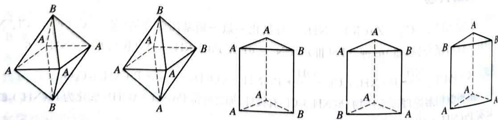

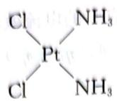

3 该化合物有6种异构体，结构如下：

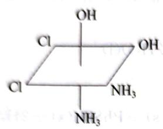  
I

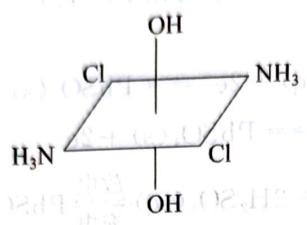  
II

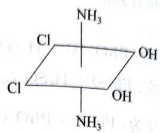  
III

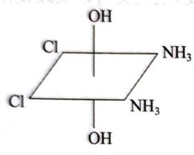  
IV

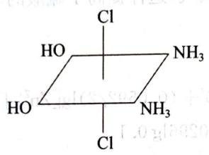  
V

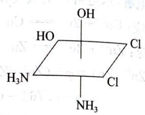  
VI

(VI)是(I)的对映体

$$
- 4 \mathrm{Dq}; - 2 4 \mathrm{Dq}
$$

5 ① 先假设全部 $\mathrm{Cu}^{2+}$ 被络合, 然后解离。

$$
\mathrm{Cu} ^ {2 +} (0. 1 0 \mathrm{mol} \cdot \mathrm{L} ^ {- 1}) \longrightarrow [ \mathrm{Cu(NH} _ {3}) _ {4} ] ^ {2 +} (0. 1 0 \mathrm{mol} \cdot \mathrm{L} ^ {- 1})
$$

$$
[ \mathrm {Cu(NH_ {3}) _ {4}} ] ^ {2 +} \rightleftharpoons \mathrm {Cu^ {2 + }} + 4 \mathrm {NH_ {3}}
$$

平衡关系

$$
0. 1 0 - x
$$

$$
6. 0 - (0. 1 \times 4) + 4 x
$$

$$
K _ {\mathrm{不稳}} = \frac {[ \mathrm{Cu} ^ {2 +} ] [ \mathrm{NH} _ {3} ] ^ {4}}{[ \mathrm{Cu(NH} _ {3}) _ {4} ^ {2 +} ]} = \frac {x (5 . 6 + 4 x) ^ {4}}{0 . 1 0 - x} = 4. 7 9 \times 1 0 ^ {- 1 4}
$$

解得： $x=4.90\times10^{-18}$ ；x很小可忽略，上式中 $5.6+4x\approx5.6,0.10-x\approx0.10$ 。

② 计算各组分浓度 c:

$$
c (\mathrm{Cu} ^ {2 +}) = 4. 9 \times 1 0 ^ {- 1 8} \mathrm{mol} \cdot \mathrm{L} ^ {- 1}
$$

$$
c (\mathrm{NH} _ {3}) = 6. 0 - 0. 1 0 \times 4 = 5. 6 \mathrm{mol} \cdot \mathrm{L} ^ {- 1}
$$

$c(SO_{4}^{2-})=0.10\ \mathrm{mol}\cdot \mathrm{L}^{-1}$ （原始 $CuSO_{4}$ 浓度）

$$
c \left[ \mathrm{Cu} (\mathrm{NH} _ {3}) _ {4} ^ {2 +} \right] = 0. 1 0 - \left[ \mathrm{Cu} ^ {2 +} \right] = 0. 1 0 \mathrm{mol} \cdot \mathrm{L} ^ {- 1}
$$

卷 A

化学竞赛能力测试一高中第二分册

故该配合物应为八面体型结构

7 ① $\left[\mathrm{MnBr}_{4}\right]^{2-}$ 中 $\mu = 5.9\mathrm{B},\mathrm{M}$ , 由 $\mu = \sqrt{n(n + 2)}$ 可知, 中心离子 $\mathrm{Co}^{3+}$ 的未成对电子数为 5 , 故中心离子应采取 $\mathfrak{sp}^3$ 杂化, 配离子的空间构型为正四面体。

② $\left[\mathrm{Mn}(\mathrm{CN})_{6}\right]^{4-}$ 中 $\mu = 1.8\mathrm{B},\mathrm{M},$ ，由 $\mu = \sqrt{n(n + 2)}$ 可知，中心离子 $\mathrm{Mn}^{2+}$ 的未成对电子数为1，故中心离子应采取 $\mathrm{d}^2\mathrm{sp}^3$ 杂化，配离子的空间构型为正八面体。

③ $\left[\mathrm{Ni}(\mathrm{NH}_{3})_{6}\right]^{2+}$ 中 $\mu = 3.11\mathrm{B.M.}$ ，由 $\mu = \sqrt{n(n + 2)}$ 可知，中心离子 $\mathrm{Ni}^{2+}$ 的未成对电子数为2.故中心离子应采取 $\mathrm{sp}^3\mathrm{d}^2$ 杂化，配离子的空间构型为正八面体。

8 8-1

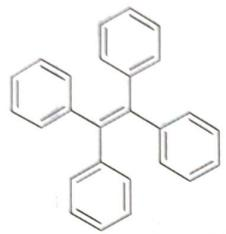

存在大的共轭体系 $\pi_{26}^{26}$ 。

8-2  
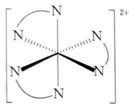

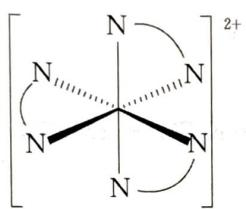

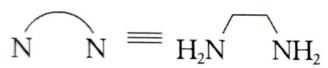

8-3  
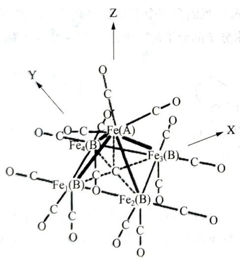  
9 9-1

<table><tr><td>A</td><td></td><td>Ru氧化数为+8</td></tr><tr><td>B</td><td></td><td>Ru氧化数为+6</td></tr></table>

续 表

<table><tr><td>C</td><td></td><td>Ru氧化数为+4</td></tr><tr><td>D</td><td></td><td>Ru氧化数为+6</td></tr><tr><td>E</td><td></td><td>Ru氧化数为+8</td></tr><tr><td>F</td><td></td><td>Ru氧化数为+6(E,F的答案可以互换)</td></tr></table>

9-2 氧化剂 取代基(或配位剂)

9-3 还原剂

$$
5 \mathrm{H} _ {2} \mathrm{O} _ {2} + 2 \mathrm{KMnO} _ {4} + 3 \mathrm{H} _ {2} \mathrm{SO} _ {4} = \mathrm{K} _ {2} \mathrm{SO} _ {4} + 2 \mathrm{MnSO} _ {4} + 5 \mathrm{O} _ {2} + 8 \mathrm{H} _ {2} \mathrm{O}
$$

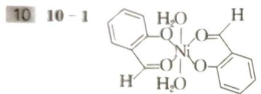

首先由镍的质量分数得到 X 的分子量为 336.9，推测含两个水杨醛阴离子。减去 Ni 的原子质量以及两个水杨醛阴离子的分子量后恰为两个水分子的分子量。再由对称性可得 X 的结构。

10 - 2  
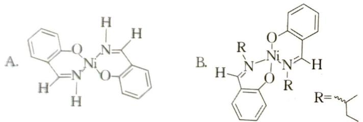

首先猜测氨(胺)可能直接配位,或者和水杨醛反应得到席夫碱再配位。由 Ni 的含量计算的分子量可估算得前一种配位会得到更大的分子量。故推测氨(胺)与水杨醛反应产生了席夫碱。再经过简单计算即可得 A, B 的分子式。由磁矩可得 A 为平面四方结构,B 为四面体结构。

仲丁基空间位阻大，若配合物为平面型结构，配体之间会产生较大的排斥力，使配合物不稳定。四面体结构可以减少配体间的斥力。

## 能力测试B卷

1 1-1 价键理论:由“四面体”判断, $\left[CoCl_{4}\right]^{2-}$ 的中心离子 $Co^{2+}$ 用4个 $sp^{3}$ 杂化轨道接受 $4Cl^{-}$ 提供的孤对电子,形成配位键。

晶体场理论:在四面体场中, $Co^{2+}$ 的3d轨道分裂为能级较低的 $d_{y}$ 和能级较高 $d_{\varepsilon}$ ; $Co^{2+}$ 有7个d电子,电子排布为 $d_{y}^{4}d_{\varepsilon}^{3}$ 。

1-2 价键理论:由配位数为6和“内轨型”判断, $\left[\mathrm{Fe}(\mathrm{CN})_{6}\right]^{3-}$ 的中心离子 $Fe^{3+}$ 用6个 $d^{2}sp^{3}$ 杂化轨道接受6个 $CN^{-}$ 提供的孤对电子,形成配位键。

晶体场理论: 在八面体场中, $Fe^{3+}$ 的 3d 轨道分裂为能级较低的 $d_{e}$ 和能级较高 $d_{\gamma}$ ; $Fe^{3+}$ 有 5 个 d 电子, “内轨型”对应于低自旋, 由此判断, 电子排布为 $d_{e}^{5}d_{\gamma}^{0}$ 。

$$
\mathrm{SbF} _ {5} + \mathrm{HSO} _ {3} \mathrm{F} = \mathrm{HSO} _ {3} \mathrm{SbF} _ {6}
$$

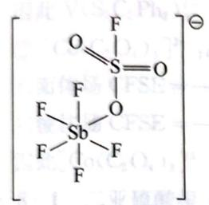

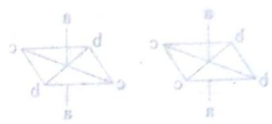

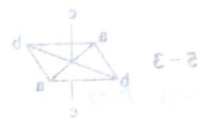

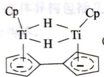

(图中 Cp 为环戊二烯基)

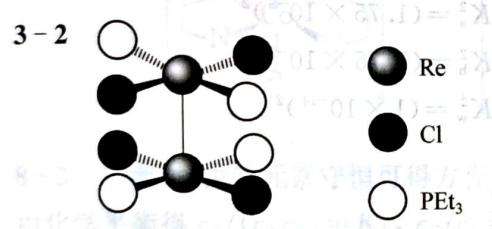

3-3 +2 价, 键级为三, 两个金属原子共有十个电子, 其中一对填入 $\delta^{*}$ 反键轨道, 使得键级从四降为三。

3-4 由于 $\mathrm{Re}$ 与 $\mathrm{Re}$ 之间形成了四重键 $\mathrm{Re} \equiv \mathrm{Re}(\sigma + 2\pi + \delta)$ ，要求 $\mathrm{Re}_2\mathrm{Cl}_4(\mathrm{PEt}_3)_4$ 采取面对面的重叠构型，但由于膦配体的大位阻，故膦配体处于交错位置，这并不和第三小问得出的结论矛盾。

4 A 是顺式异构体, B 是反式异构体。

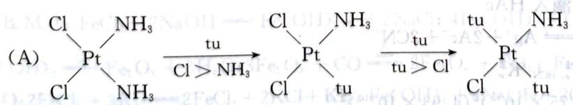

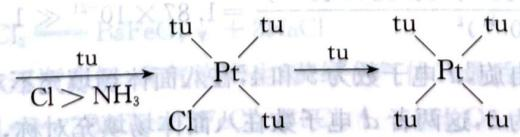

(B)

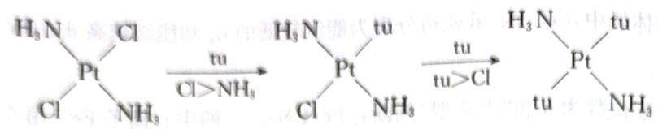

$$
\mathrm{MnCl} _ {2} \mathrm{C} _ {1 2} \mathrm{H} _ {2 8} \mathrm{N} _ {8} \mathrm{O} _ {2}
$$

$$
\mathrm{MnCl} _ {2} (\mathrm{H} _ {2} \mathrm{O}) _ {2} [ \mathrm{N} _ {4} (\mathrm{CH} _ {2}) _ {6} ] _ {2}
$$

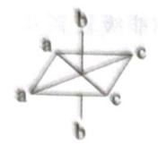

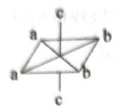

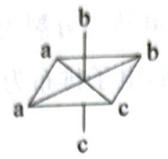

(或它的对映异构体

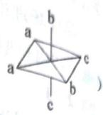

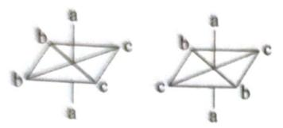

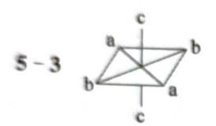

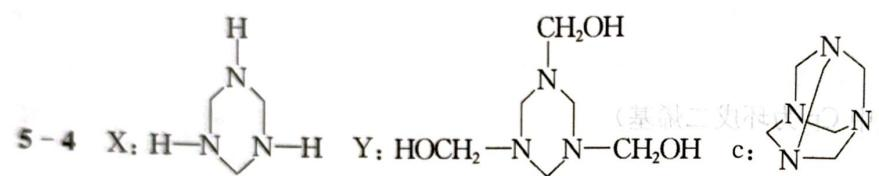

6 ① $\left[\mathrm{Ag}(\mathrm{NH}_3)_2\right]^+\rightleftharpoons \mathrm{Ag}^+ +2\mathrm{NH}_3$

$$
② \times 2 \quad 2 \mathrm{HAc} \rightleftharpoons 2 \mathrm{H} ^ {+} + 2 \mathrm{Ac} ^ {-}
$$

$$
K _ {\mathrm{不稳}} = 5. 8 9 \times 1 0 ^ {- 8}
$$

$$
③ \times 2 \quad 2 \mathrm{NH} _ {3} + 2 \mathrm{H} _ {2} \mathrm{O} \rightleftharpoons 2 \mathrm{OH} ^ {-} + 2 \mathrm{NH} _ {4} ^ {+}
$$

$$
K _ {\mathrm{a}} ^ {2} = (1. 7 5 \times 1 0 ^ {- 5}) ^ {2}
$$

$$
K _ {\mathrm{b}} ^ {2} = (1. 7 5 \times 1 0 ^ {- 5}) ^ {2}
$$

$$
④ \times 2 \quad 2 \mathrm{H} _ {2} \mathrm{O} \rightleftharpoons 2 \mathrm{H} ^ {+} + 2 \mathrm{OH} ^ {-}
$$

$$
K _ {\mathrm{w}} ^ {2} = (1 \times 1 0 ^ {- 1 4}) ^ {2}
$$

$$
① + ② + ③ - ④ \text {   得:   }
$$

$$
⑤ \left[ \mathrm {Ag(NH_ {3}) _ {2}} \right] ^ {+} + 2 \mathrm{HAc} \rightleftharpoons \mathrm {Ag^ {+}} + 2 \mathrm {Ac^ {-}} + 2 \mathrm {NH_ {4} ^ {+}}
$$

$$
K _ {5} = K _ {\mathrm{不稳}} \cdot K _ {\mathrm{a}} ^ {2} \cdot K _ {\mathrm{b}} ^ {2} / K _ {\mathrm{w}} ^ {2}
$$

$$
= \frac {5 . 8 9 \times 1 0 ^ {- 8} \times (1 . 7 5 \times 1 0 ^ {- 5}) ^ {2} \times (1 . 7 5 \times 1 0 ^ {- 5}) ^ {2}}{(1 \times 1 0 ^ {- 1 4}) ^ {2}} = 5 5. 2 4 \gg 1
$$

转化可实现

$$
⑥ \mathrm{AgCl} \rightleftharpoons \mathrm{Ag} ^ {+} + \mathrm{Cl} ^ {-} \quad K _ {\mathrm{sp}} = 1. 5 6 \times 1 0 ^ {- 1 0}
$$

$$
⑤ - ⑥ \text {   得:   } [ \mathrm{Ag} (\mathrm{NH} _ {3}) _ {2} ] ^ {+} + \mathrm{Cl} ^ {-} + 2 \mathrm{HAc} \rightleftharpoons \mathrm{AgCl} + 2 \mathrm{Ac} ^ {-} + 2 \mathrm{NH} _ {4} ^ {+}
$$

$$
K = \frac {K _ {5}}{K _ {\mathrm{sp}}} = \frac {5 5 . 2 4}{1 . 5 6 \times 1 0 ^ {- 1 0}} = 3. 5 4 \times 1 0 ^ {1 1} \gg 1
$$

转化可实现,即有 AgCl 析出

若换成 $[\mathrm{Ag}(\mathrm{CN})_2]^{-}$ 中滴入HAc

$$
[ \mathrm{Ag(CN)} _ {2} ] ^ {-} + 2 \mathrm{HAc} \rightleftharpoons \mathrm{Ag} ^ {+} + 2 \mathrm{Ac} ^ {-} + 2 \mathrm{CN} ^ {-}
$$

$$
K = K _ {\mathrm{不稳}} \cdot K _ {\mathrm{a,HAc}} ^ {2} \cdot K _ {\mathrm{a,HCN}} ^ {2} / K _ {\mathrm{w}} ^ {2}
$$

$$
K = \frac {(2 . 5 1 \times 1 0 ^ {- 2 1}) (1 . 7 5 \times 1 0 ^ {- 5}) ^ {2} (4 . 9 3 \times 1 0 ^ {- 1 0}) ^ {2}}{(1 \times 1 0 ^ {- 1 4}) ^ {2}} = 1. 8 7 \times 1 0 ^ {- 2 1} \ll 1
$$

转化不能实现

7 7-1 AD (A, D都是低自旋, d 电子数为5和4, 在八面体场填充不对称, 会畸变; B 中 d 电子数为3, C 为高自旋, d 电子数为5, 这两者 d 电子数在八面体场填充对称, 不畸变。)

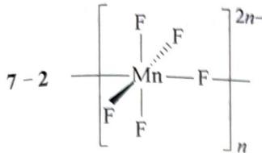

7-2 $\left[\begin{array}{c}\mathrm{F}\\ \mid \\ \mathrm{Mn} - \mathrm{F}\\ \mid \\ \mathrm{F}\end{array}\right]_{n}^{2n - }$ 而 $\mathrm{Cs}[\mathrm{MnF}_4]$ 中 $[\mathrm{MnF}_6]$ 八面体中有4个F原子与邻近的 $[\mathrm{MnF}_6]$ 八

面体共用,由此形成二维面结构。

7-3 ① $\mathrm{V(S_2C_2Ph_2)_3^{4 - }}:d$ 电子数为3八面体场 $\mathrm{CFSE} = -4.00\times 3 = -12.00(\mathrm{Dq})$ 三棱柱场 $\mathrm{CFSE} = -5.84\times 3 = -17.52(\mathrm{Dq})$ 因此 $\mathrm{V(S_2C_2Ph_2)_3^{4 - }}$ 为三棱柱形，磁矩为1.73B.M. $② [\mathrm{Co}(\mathrm{C}_2\mathrm{O}_4)_3]^{3 - }:d$ 电子数为6八面体场 $\mathrm{CFSE} = -4.00\times 6 = -24.00(\mathrm{Dq})$ 三棱柱场 $\mathrm{CFSE} = -5.84\times 4 + 0.96\times 2 = -21.44(\mathrm{Dq})$ 因此 $[\mathrm{Co}(\mathrm{C}_2\mathrm{O}_4)_3]^{3 - }$ 为八面体形，磁矩为OB.M

8 8-1 二亚硫酸根·二乙二胺合钴(Ⅲ)离子

8-2 （用 S 代表 $SO_{3}^{2-}$ ， $N\quad N$ 代表 en）

立体异构包括几何异构和旋光异构。两个 S 可以在对位也可以在邻位，注意 S 在邻位时有对映异构体。

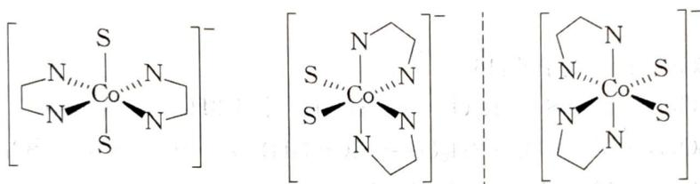

8-3 平衡时，由钴元素守恒可得方程 $c_{\mathrm{A}} + c_{\mathrm{B}} + c_{\mathrm{C}} + c_{\mathrm{D}} = 0.1$ ①

由化学平衡得 $c_{\mathrm{B}} / (c_{\mathrm{A}}c_{\mathrm{S}}) = K_{1}, c_{\mathrm{C}} / c_{\mathrm{B}} = K_{2}, c_{\mathrm{D}} / c_{\mathrm{C}} = K_{3}$

$$
c _ {\mathrm{B}} = K _ {1} c _ {\mathrm{A}} c _ {\mathrm{S}}, c _ {\mathrm{C}} = K _ {2} c _ {\mathrm{B}} = K _ {1} K _ {2} c _ {\mathrm{A}} c _ {\mathrm{S}}, c _ {\mathrm{D}} = K _ {3} c _ {\mathrm{C}} = K _ {1} K _ {2} K _ {3} c _ {\mathrm{A}} c _ {\mathrm{S}}
$$

从而①式化为 $(K_{1}+K_{1}K_{2}+K_{1}K_{2}K_{3})c_{A}c_{S}+c_{A}=0.1$ ③

因为 $c_{\mathrm{S}} = 0.1$ ，故 $c_{\mathrm{A}} = 1 / (10 + K_1 + K_1K_2 + K_1K_2K_3)$

代入②得 $c_{\mathrm{D}} = K_{1}K_{2}K_{3}c_{\mathrm{A}}c_{\mathrm{S}} = 0.1K_{1}K_{2}K_{3} / (10 + K_{1} + K_{1}K_{2} + K_{1}K_{2}K_{3})$

9 9-1 金属 M 为 Fe; A:Fe(OH) $_{2}$ ; B:Fe(OH) $_{3}$ ; C:Fe $_{2}$ O $_{3}$ ; D:Fe $_{3}$ O $_{4}$ ; E:FeCl $_{3}$ ; F:Na $_{2}$ FeO $_{4}$ ;

9-1 金属 M 为 Fe; A: $\mathrm{Fe(OH)_2}$ ; B: $\mathrm{Fe(OH)_3}$ ; C: $\mathrm{Fe_2O_3}$ ; D: $\mathrm{Fe_3O_4}$ ; E: $\mathrm{FeCl_3}$ ; F: $\mathrm{Na_2FeO_4}$ ;

G: $\mathrm{BaFeO_4}$ ; Fe + 2HCl = $\mathrm{FeCl_2} + \mathrm{H_2} \uparrow (\mathrm{Fe^{2+}})$ □ □ □ 磁矩: $\sqrt{4(4+2)} \approx 5.0 \text{ B.M. }$ ; $\mathrm{FeCl_2} + 2\mathrm{NaOH} = \mathrm{Fe(OH)_2} \downarrow + 2\mathrm{NaCl}$ ; $4\mathrm{Fe(OH)_2} + \mathrm{O_2} + 2\mathrm{H_2O} = 4\mathrm{Fe(OH)_3}$ ; $2\mathrm{Fe(OH)_3} \xlongequal{\triangle} \mathrm{Fe_2O_3} + 3\mathrm{H_2O}$ ; $3\mathrm{Fe_2O_3} + \mathrm{CO} \xlongequal{\triangle} 2\mathrm{Fe_3O_4} + \mathrm{CO_2}$ ; $\mathrm{Fe_2O_3} + 6\mathrm{HCl} = 2\mathrm{FeCl_3} + 3\mathrm{H_2O}$ ; $2\mathrm{FeCl_3} + 3\mathrm{KI} = 2\mathrm{FeCl_2} + 2\mathrm{KCl} + \mathrm{KI_3}$ ; $\mathrm{Fe(OH)_2} + 6\mathrm{NaOH} + 2\mathrm{Cl_2} = \mathrm{Na_2FeO_4} + 4\mathrm{NaCl} + 4\mathrm{H_2O}$ ; $\mathrm{Na_2FeO_4} + \mathrm{BaCl_2} = \mathrm{BaFeO_4} \downarrow + 2\mathrm{NaCl}$

9-2 红棕色固体逐渐溶解,有气泡产生(黄绿色气体),最后溶液呈棕黄色

$$
2 \mathrm{BaFeO} _ {4} + 1 6 \mathrm{HCl} = 2 \mathrm{BaCl} _ {2} + 2 \mathrm{FeCl} _ {3} + 3 \mathrm{Cl} _ {2} \uparrow + 8 \mathrm{H} _ {2} \mathrm{O}
$$

$$
9 - 3 \quad \mathrm{Fe(CO)} _ {5} + \textcircled {=} \xrightarrow {- 2 \mathrm{CO}} \mathrm{Fe(CO)} _ {3} (\mathrm{C} _ {6} \mathrm{H} _ {6}) \xrightarrow {- \mathrm{CO}} \mathrm{Fe(CO)} _ {2} \mathrm{H} (\mathrm{C} _ {6} \mathrm{H} _ {6}) \xrightarrow [ \text {二聚} ]{- \mathrm{H}} \mathrm{Fe} _ {2} (\mathrm{CO}) _ {4} (\mathrm{C} _ {5} \mathrm{H} _ {6}).
$$

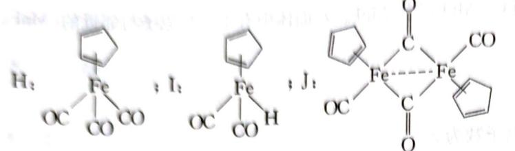

$$
1 0 \quad 1 0 - 1 \quad 6 \mathrm{C} _ {6} \mathrm{H} _ {6} + 2 \mathrm{Al} + 3 \mathrm{CrCl} _ {3} + \mathrm{AlCl} _ {3} = 3 [ (\mathrm{C} _ {6} \mathrm{H} _ {6}) _ {2} \mathrm{Cr} ] ^ {+} [ \mathrm{AlCl} _ {4} ] ^ {-}
$$

$$
2 \left[ \left(\mathrm{C} _ {6} \mathrm{H} _ {6}\right) _ {2} \mathrm{Cr} \right] ^ {+} + \mathrm{S} _ {2} \mathrm{O} _ {4} ^ {2 -} + 4 \mathrm{OH} ^ {-} = 2 \left(\mathrm{C} _ {6} \mathrm{H} _ {6}\right) _ {2} \mathrm{Cr} + 2 \mathrm{SO} _ {3} ^ {2 -} + 2 \mathrm{H} _ {2} \mathrm{O}
$$

$$
1 0 - 3 \quad 4 (\mathrm{C} _ {6} \mathrm{H} _ {6}) _ {2} \mathrm{Cr} + 6 3 \mathrm{O} _ {2} = 4 8 \mathrm{CO} _ {2} + 2 4 \mathrm{H} _ {2} \mathrm{O} + 2 \mathrm{Cr} _ {2} \mathrm{O} _ {3}
$$

$$
1 0 - 4 \quad 2 \left(\mathrm{C} _ {6} \mathrm{H} _ {6}\right) _ {2} \mathrm{Cr} + 2 \mathrm{H} _ {2} \mathrm{O} + \mathrm{O} _ {2} = 2 \left[ \left(\mathrm{C} _ {6} \mathrm{H} _ {6}\right) _ {2} \mathrm{Cr} \right] \mathrm{OH} + \mathrm{H} _ {2} \mathrm{O} _ {2}
$$

## 第 7 章 常见的过渡元素（上）

## 能力测试A卷

1 1-1 作还原剂并与低氧化态的 Ti 配位 离域键为: $\Pi_{10}^{11}$

1-2 作为 $\mathrm{K}^{+}$ 的络合剂，与 $\mathrm{K}^{+}$ 配位形成 $[\mathrm{K}(18 - \mathrm{Crown - }6)]^{+}$

1-3 $\mathrm{TiCl}_4(\mathrm{THF})_2 + 6\mathrm{KC}_{10}\mathrm{H}_8 + 2(18\text{-Crown - }6) = 4\mathrm{KCl} + 4\mathrm{C}_{10}\mathrm{H}_8 + [\mathrm{K}(18\text{-Crown - }6)]_2$ $[\mathrm{Ti}(\mathrm{C}_{10}\mathrm{H}_8)_2]$

1-4 氧化数:0 价层电子数:16

$$
2 2 - 1 \mathrm{Cr} _ {2} (\mathrm{SO} _ {4}) _ {3} + 3 \mathrm{Na} _ {2} \mathrm{S} + 6 \mathrm{H} _ {2} \mathrm{O} = 2 \mathrm{Cr} (\mathrm{OH}) _ {3} \downarrow + 3 \mathrm{H} _ {2} \mathrm{S} + 3 \mathrm{Na} _ {2} \mathrm{SO} _ {4}
$$

$$
\mathrm{Cr} _ {2} \left(\mathrm{SO} _ {4}\right) _ {3} + 3 \mathrm{Na} _ {2} \mathrm{CO} _ {3} + 3 \mathrm{H} _ {2} \mathrm{O} = 2 \mathrm{Cr} (\mathrm{OH}) _ {3} \downarrow + 3 \mathrm{CO} _ {2} + 3 \mathrm{Na} _ {2} \mathrm{SO} _ {4}
$$

$$
\mathrm{Cr} _ {2} (\mathrm{SO} _ {4}) _ {3} + 8 \mathrm{NaOH} = 2 \mathrm{NaCr(OH)} _ {4} + 3 \mathrm{Na} _ {2} \mathrm{SO} _ {4}
$$

2-2 第一步: 先将废水用硫酸酸化后用 $NaHSO_{3}$ 进行还原处理, 还原废水中 Cr(VI) 为 Cr(III):

$$
2 \mathrm{H} _ {2} \mathrm{Cr} _ {2} \mathrm{O} _ {7} + 6 \mathrm{NaHSO} _ {3} + 3 \mathrm{H} _ {2} \mathrm{SO} _ {4} = 2 \mathrm{Cr} _ {2} (\mathrm{SO} _ {4}) _ {3} + 3 \mathrm{Na} _ {2} \mathrm{SO} _ {4} + 8 \mathrm{H} _ {2} \mathrm{O}
$$

第二步:用生石灰将经还原处理后的废水中和至呈碱性,使 Cr(Ⅲ)沉淀然后过滤分离:

$$
\mathrm{Cr} _ {2} \left(\mathrm{SO} _ {4}\right) _ {3} + 3 \mathrm{CaO} + 3 \mathrm{H} _ {2} \mathrm{O} = 2 \mathrm{Cr} (\mathrm{OH}) _ {3} \downarrow + 3 \mathrm{CaSO} _ {4} \downarrow
$$

第三步:焙烧,氢氧化铬分解得到铬绿 $2\mathrm{Cr(OH)}_{3}=\mathrm{Cr}_{2}\mathrm{O}_{3}+3\mathrm{H}_{2}\mathrm{O}$

3 3-1 阳极反应: $\mathrm{Fe} = \mathrm{Fe}^{2+} + 2\mathrm{e}^{-}$ 阴极反应: $2\mathrm{H}^{+} + 2\mathrm{e}^{-} = \mathrm{H}_{2}$

3-2 随着阳极 Fe 溶解成 $Fe^{2+}$ 离子，溶液中的 $Cr_{2}O_{7}^{2-}$ 被 $Fe^{2+}$ 还原为 $Cr^{3+}$ 离子：

$$
\mathrm{Cr} _ {2} \mathrm{O} _ {7} ^ {2 -} + 6 \mathrm{Fe} ^ {2 +} + 1 4 \mathrm{H} ^ {+} = 2 \mathrm{Cr} ^ {3 +} + 6 \mathrm{Fe} ^ {3 +} + 7 \mathrm{H} _ {2} \mathrm{O}
$$

3-3 由于阴极附近的 $\mathrm{H}^{+}$ 离子浓度降低, 碱性增强, 使 $\mathrm{Cr}^{3+}$ 和 $\mathrm{Fe}^{3+}$ 离子在阴极生成氢氧化物沉淀:

$$
\mathrm{Cr} ^ {3 +} + 3 \mathrm{OH} ^ {-} = \mathrm{Cr} (\mathrm{OH}) _ {3} \downarrow \quad \mathrm{Fe} ^ {3 +} + 3 \mathrm{OH} ^ {-} = \mathrm{Fe} (\mathrm{OH}) _ {3} \downarrow
$$

3-4 加一些 NaCl 是为了提高导电率。

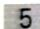

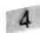

4 4-1 向 $\mathrm{CrCl}_3$ 溶液中缓慢滴加 $\mathrm{NaOH}$ 溶液，先有灰蓝色沉淀生成：

$$
\mathrm{Cr} ^ {3 +} + 3 \mathrm{OH} ^ {-} = \mathrm{Cr(OH)} _ {3} \downarrow
$$

NaOH溶液过量则沉淀逐渐溶解,最后得到绿色溶液:

$$
\mathrm{Cr(OH)} _ {3} + \mathrm{OH} ^ {-} = [ \mathrm{Cr(OH)} _ {4} ] ^ {-}
$$

4-2 溶液先变为蓝色,因生成了 $CrO_{5}$ :

$$
\mathrm{K} _ {2} \mathrm{CrO} _ {4} + 2 \mathrm{H} _ {2} \mathrm{O} _ {2} + \mathrm{H} _ {2} \mathrm{SO} _ {4} = \mathrm{CrO} _ {5} + 3 \mathrm{H} _ {2} \mathrm{O} + \mathrm{K} _ {2} \mathrm{SO} _ {4}
$$

$\mathrm{CrO_5}$ 在酸性溶液中不稳定而分解放出 $\mathrm{O}_2$ ，最后得到绿色溶液：

$$
4 \mathrm{CrO} _ {5} + 1 2 \mathrm{H} ^ {+} = 4 \mathrm{Cr} ^ {3 +} + 7 \mathrm{O} _ {2} \uparrow + 6 \mathrm{H} _ {2} \mathrm{O}
$$

4-3 向 $\mathrm{MnCl}_2$ 溶液加入 $\mathrm{NaOH}$ 溶液生成白色沉淀：

$$
\mathrm{Mn} ^ {2 +} + 2 \mathrm{OH} ^ {-} = \mathrm{Mn(OH)} _ {2} \downarrow
$$

再加入 $\mathrm{H}_2\mathrm{O}_2$ 则沉淀变为棕褐色：

$$
\mathrm {Mn(OH) _ {2} + H_ {2} O_ {2} \xlongequal   MnO(OH) _ {2} + H_ {2} O}
$$

4-4 $\mathrm{KMnO_4}$ 的氧化能力和还原产物因介质的酸碱度不同而不同。在强酸性溶液中被还原成 $\mathrm{Mn}^{2+}$ ，强碱性溶液中被还原成 $\mathrm{MnO_4}^{2-}$ ，在近中性溶液中则被还原成 $\mathrm{MnO_2}$ ，因为这些产物在相应的介质中稳定：

酸性

$$
2 \mathrm{MnO} _ {4} ^ {-} + 6 \mathrm{H} ^ {+} + 5 \mathrm{SO} _ {3} ^ {2 -} = 2 \mathrm{Mn} ^ {2 +} + 5 \mathrm{SO} _ {4} ^ {2 -} + 3 \mathrm{H} _ {2} \mathrm{O}
$$

中性

$$
2 \mathrm{MnO} _ {4} ^ {-} + \mathrm{H} _ {2} \mathrm{O} + 3 \mathrm{SO} _ {3} ^ {2 -} = 2 \mathrm{MnO} _ {2} \downarrow + 3 \mathrm{SO} _ {4} ^ {2 -} + 2 \mathrm{OH} ^ {-}
$$

碱性

$$
2 \mathrm{MnO} _ {4} ^ {-} + 2 \mathrm{OH} ^ {-} + \mathrm{SO} _ {3} ^ {2 -} = 2 \mathrm{MnO} _ {4} ^ {2 -} + \mathrm{SO} _ {4} ^ {2 -} + \mathrm{H} _ {2} \mathrm{O}
$$

5 5-1 A. $\mathrm{CaWO_4 + 2HCl = H_2WO_4 + CaCl_2}$

$$
\mathrm{H} _ {2} \mathrm{WO} _ {4} + 2 \mathrm{NH} _ {3} \cdot \mathrm{H} _ {2} \mathrm{O} = (\mathrm{NH} _ {4}) _ {2} \mathrm{WO} _ {4} + 2 \mathrm{H} _ {2} \mathrm{O}
$$

$$
1 2 (\mathrm{NH} _ {4}) _ {2} \mathrm{WO} _ {4} + 1 2 \mathrm{H} _ {2} \mathrm{O} = (\mathrm{NH} _ {4}) _ {1 0} \mathrm{W} _ {1 2} \mathrm{O} _ {4 1} \cdot 5 \mathrm{H} _ {2} \mathrm{O} + 1 4 \mathrm{NH} _ {3} \cdot \mathrm{H} _ {2} \mathrm{O}
$$

$$
\mathrm {(NH_ {4}) _ {10} W_ {12} O_ {41} \cdot 5H_ {2} O\xlongequal {\triangle} 12WO_ {3} + 10H_ {2} O + 10NH_ {3} \uparrow}
$$

5-2 对于反应: $3\mathrm{H}_{2} + \mathrm{WO}_{3} = 3\mathrm{H}_{2}\mathrm{O} + \mathrm{W}$

在 298 K 时,该反应的 $\Delta G^{\ominus}=3\times(-228)-(-764.1)=80.1\mathrm{kJ}\cdot\mathrm{mol}^{-1}$

由 $\Delta G^{\ominus}=-RT\ln K$ 得: $80.1\times10^{3}=-8.314\times298\times\ln K$ , 解得 $K=9.104\times10^{-15}$

该反应的 $\Delta H^{\ominus} = 3\times (-242) - (-842.9) = 116.9\mathrm{kJ}\cdot \mathrm{mol}^{-1}$

$$
\because \ln (K _ {2} / K _ {1}) = \Delta H ^ {\ominus} (1 / T _ {1} - 1 / T _ {2}) / R
$$

∴当 $K_{2}=1$ 时，代入 $T_{1}=298\ K,\ K_{1}=9.104\times10^{-15}$ ，可解得 $T_{2}=946.6\ K$

5-3 灯丝蒸发后沉积在灯壁上的钨与碘反应生成碘化钨： $\mathrm{W(s)+I_{2}(g)\rightleftharpoons WI_{2}(g)}$ ，当 $\mathrm{WI_{2}(g)}$ 接触到高温的灯丝（尤其是较细处的灯丝）时，又会分解得到 W 而重新沉积在灯丝上，从而延长了灯泡的使用寿命。

5-4 每个 W 平均键合的 Cl 原子数 $4 \times 1/2 = 2$ 个，则 $18 - n = 6 \times 2$ ，得 n = 6。

或:每个 W 原子与四个 Cl 原子相连;共 $6 \times 4 = 24$ 个 Cl,而每个 Cl 与两个 W 相连,所以 Cl 原子一共有 24/2 = 12 个,因此 n = 18 - 12 = 6。(Cl 原子只能在八面体的 12 条棱上)

6 6-1 $M = \frac{\rho VN_{\mathrm{A}}}{Z} = \frac{4.59^2\times 2.96\times 10^{-24}\times 4.25\times 6.02\times 10^{23}}{2} = 79.8\mathrm{g}\cdot \mathrm{mol}^{-1}$

6-2 $\mathrm{B}_{2}\mathrm{TiOSO}_{4}$ ; $\mathrm{D}_{2}\mathrm{TiCl}_{4}$ ; E500(II): $\mathrm{NaHCO}_{3}$ ; E171: $\mathrm{TiO}_{2}$ ; N: NaCl

6-3 $2\mathrm{NaH}_2\mathrm{PO}_4\xrightarrow{170^\circ C}\mathrm{Na}_2\mathrm{H}_2\mathrm{P}_2\mathrm{O}_7 + \mathrm{H}_2\mathrm{O}$

6-4 $\mathrm{NaHCO_3 + Na_2H_2P_2O_7 = CO_2 + Na_3HP_2O_7 + H_2O}$

7 7-1 +3 氧化态 $2\mathrm{V} + 6\mathrm{H}^{+} = 2\mathrm{V}^{3 + } + 3\mathrm{H}_{2}\uparrow$

$$
\begin{array}{r l} 7 - 2 & E ^ {\ominus} (V ^ {3 +} / V) = \frac {E ^ {\ominus} (V ^ {3 +} / V ^ {2 +}) \times 1 + E ^ {\ominus} (V ^ {2 +} / V) \times 2}{1 + 2} \\ & = \frac {(- 0 . 2 6) \times 1 + (- 1 . 1 3) \times 2}{1 + 2} \\ & = - 0. 8 4 V \end{array}
$$

7-3 从电势图中, 可以看出 $E^{\ominus}$ (右) $< E^{\ominus}$ (左), 所以, 在钒的不同氧化态物质间不能发生歧化反应

7-4 从电势图中, 可以看出, $E^{\ominus} \left( \mathrm{V}^{3+} / \mathrm{V}^{2+} \right) > E^{\ominus} \left( \mathrm{V}^{2+} / \mathrm{V} \right)$ , 所以发生 $\mathrm{V}^{2+}$ 的逆歧化反应: $\mathrm{V} + 2\mathrm{V}^{3+} = 3\mathrm{V}^{2+}$

$$
2 \mathrm{VO} _ {2} ^ {+} (\text { 黄色 }) + \mathrm{Zn} + 4 \mathrm{H} ^ {+} = 2 \mathrm{VO} ^ {2 +} (\text { 蓝色 }) + \mathrm{Zn} ^ {2 +} + 2 \mathrm{H} _ {2} \mathrm{O}
$$

$$
2 \mathrm{VO} ^ {2 +} + \mathrm{Zn} + 4 \mathrm{H} ^ {+} = 2 \mathrm{V} ^ {3 +} (\text {绿色}) + \mathrm{Zn} ^ {2 +} + 2 \mathrm{H} _ {2} \mathrm{O}
$$

$$
2 \mathrm{V} ^ {3 +} + \mathrm{Zn} = 2 \mathrm{V} ^ {2 +} (\text {紫色}) + \mathrm{Zn} ^ {2 +}
$$

8 8-1 A:MnO B: $\mathrm{Mn(NO_3)_2}$ C:MnO2 D: $\mathrm{Na_2MnO_4}$

E: NaMnO $_{4}$ F: Mn(OH) $_{2}$ G: MnO(OH) $_{2}$

$$
8 - 2 \quad \mathrm{MnO} _ {2} + \mathrm{H} _ {2} \mathrm{O} _ {2} + 2 \mathrm{H} ^ {+} = \mathrm{Mn} ^ {2 +} + \mathrm{O} _ {2} + 2 \mathrm{H} _ {2} \mathrm{O} \quad \mathrm{MnO} _ {2} + \mathrm{Nn} _ {2} \mathrm{O} _ {2} \xrightarrow [ \mathrm{NaOH} ]{\text {共熔}} \mathrm{Nn} _ {2} \mathrm{MnO} _ {4}
$$

8-3 正四面体

9 (A) $(\mathrm{NH}_4)_2\mathrm{Cr}_2\mathrm{O}_7$ (B) $\mathrm{Cr_2O_3}$ (C) $\mathrm{N}_2$ (D) $\mathrm{Mg}_3\mathrm{N}_2$ (E) $\mathrm{CrO}_2^-$ 或 $[\mathrm{Cr(OH)}_4]^-$

(F) $CrO_{4}^{2-}$ (G) $Cr_{2}O_{7}^{2-}$ (H) $BaCrO_{4}$ (I) $K_{2}Cr_{2}O_{7}$ (J) $O_{2}$

各步反应方程式如下：

$$
(\mathrm{NH} _ {4}) _ {2} \mathrm{Cr} _ {2} \mathrm{O} _ {7} \stackrel {\triangle} {=} \mathrm{Cr} _ {2} \mathrm{O} _ {3} + \mathrm{N} _ {2} \uparrow + 4 \mathrm{H} _ {2} \mathrm{O}
$$

$$
3 \mathrm{Mg} + \mathrm{N} _ {2} \stackrel {\triangle} {=} \mathrm{Mg} _ {3} \mathrm{N} _ {2}
$$

$$
\mathrm{Cr} _ {2} \mathrm{O} _ {3} + 2 \mathrm{NaOH} = 2 \mathrm{NaCrO} _ {2} + \mathrm{H} _ {2} \mathrm{O}
$$

$$
2 \mathrm{CrO} _ {2} ^ {-} + 3 \mathrm{H} _ {2} \mathrm{O} _ {2} + 2 \mathrm{OH} ^ {-} = 2 \mathrm{CrO} _ {4} ^ {2 -} + 4 \mathrm{H} _ {2} \mathrm{O}
$$

$$
2 \mathrm{CrO} _ {4} ^ {2 -} + 2 \mathrm{H} ^ {+} = \mathrm{Cr} _ {2} \mathrm{O} _ {7} ^ {2 -} + \mathrm{H} _ {2} \mathrm{O}
$$

$$
\mathrm{Cr} _ {2} \mathrm{O} _ {7} ^ {2 -} + 2 \mathrm{Ba} ^ {2 +} + \mathrm{H} _ {2} \mathrm{O} = 2 \mathrm{BaCrO} _ {4} \downarrow + 2 \mathrm{H} ^ {+}
$$

$$
\mathrm{Na} _ {2} \mathrm{Cr} _ {2} \mathrm{O} _ {7} + 2 \mathrm{KCl} = \mathrm{K} _ {2} \mathrm{Cr} _ {2} \mathrm{O} _ {7} + 2 \mathrm{NaCl}
$$

$$
2 \mathrm{K} _ {2} \mathrm{Cr} _ {2} \mathrm{O} _ {7} \stackrel {\triangle} {=} 2 \mathrm{Cr} _ {2} \mathrm{O} _ {3} + 2 \mathrm{K} _ {2} \mathrm{O} + 3 \mathrm{O} _ {2} \uparrow
$$

10 10 - 1 $\mathrm{Cr}^{3+} + 4\mathrm{OH}^{-} = \mathrm{Cr(OH)}_{4}^{-}$

$$
2 \mathrm{Cr} (\mathrm{OH}) _ {4} ^ {-} + 3 \mathrm{H} _ {2} \mathrm{O} _ {2} + 2 \mathrm{OH} ^ {-} = 2 \mathrm{CrO} _ {4} ^ {2 -}
$$

$$
2 \mathrm{CrO} _ {4} ^ {2 -} + 2 \mathrm{H} ^ {+} = \mathrm{Cr} _ {2} \mathrm{O} _ {7} ^ {2 -} + \mathrm{H} _ {2} \mathrm{O}
$$

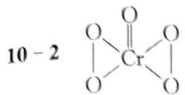

不是氧化还原反应

总反应： $2Cr_{2}O_{7}^{2-}+8H_{2}O_{2}+16H^{+}=4Cr^{3+}+7O_{2}\uparrow+16H_{2}O$ 相当于 $8.0\times10^{-5}$ mol $H_{2}O_{2}$ 10 - 3 交换出 $n_{H^{+}}=0821\ \mathrm{mmol}$ $n_{配}=0.822\ \mathrm{mmol}$

配离子： $\left[\mathrm{Cr}\left(\mathrm{H}_{2} \mathrm{O}\right)_{4} \mathrm{Cl}_{2}\right]^{+}$ 有两种结构，Cl在邻位和对位

$$
\begin{array}{c} \mathrm{H} _ {2} \mathrm{O} \quad \mathrm{Cl} \quad \mathrm{H} _ {2} \mathrm{O} \\ \mathrm{H} _ {2} \mathrm{O} \quad \mathrm{Cl} \quad \mathrm{H} _ {2} \mathrm{O} \end{array} \qquad \begin{array}{c} \mathrm{H} _ {2} \mathrm{O} \quad \mathrm{H} _ {2} \mathrm{O} \\ \mathrm{H} _ {2} \mathrm{O} \quad \mathrm{Cl} \quad \mathrm{H} _ {2} \mathrm{O} \\ \mathrm{H} _ {2} \mathrm{O} \quad \mathrm{Cl} \quad \mathrm{Cl} \end{array}
$$

## 能力测试 B 卷

$$
1 - 1 \quad 2 \mathrm{KMnO} _ {4} + 3 \mathrm{H} _ {2} \mathrm{O} _ {2} + 2 \mathrm{KF} + 1 0 \mathrm{HF} = 2 \mathrm{K} _ {2} \mathrm{MnF} _ {6} + 3 \mathrm{O} _ {2} + 8 \mathrm{H} _ {2} \mathrm{O}
$$

$$
1 - 2 \quad 2 \mathrm{Pb} ^ {2 +} + \mathrm{H} _ {2} \mathrm{O} + 3 \mathrm{CrO} _ {4} ^ {2 -} \longrightarrow \mathrm{Pb} _ {2} (\mathrm{OH}) _ {2} \mathrm{CrO} _ {4} \downarrow + \mathrm{Cr} _ {2} \mathrm{O} _ {7} ^ {2 -}
$$

$$
1 - 3 \quad 5 \mathrm{Fe} (\mathrm{CN}) _ {6} ^ {4 -} + 6 1 \mathrm{MnO} _ {4} ^ {-} + 1 8 8 \mathrm{H} ^ {+} \longrightarrow 5 \mathrm{Fe} ^ {3 +} + 3 0 \mathrm{NO} _ {3} ^ {-} + 3 0 \mathrm{CO} _ {2} \uparrow + 6 1 \mathrm{Mn} ^ {2 +} + 9 4 \mathrm{H} _ {2} \mathrm{O}
$$

$$
1 - 4 \quad 2 \mathrm{CrO} _ {4} ^ {2 -} + 3 \mathrm{S} _ {2} \mathrm{O} _ {4} ^ {2 -} + 4 \mathrm{H} _ {2} \mathrm{O} \longrightarrow 2 \mathrm{Cr(OH)} _ {3} \downarrow + 4 \mathrm{SO} _ {3} ^ {2 -} + 2 \mathrm{HSO} _ {3} ^ {-}
$$

2 2-1 $\mathrm{CrO_3 + 3Fe^{2+} + 6H^+ = Cr^{3+} + 3Fe^{3+} + 3H_2O}$

$$
W _ {\mathrm{FeSO} _ {4} \cdot 7 \mathrm{H} _ {2} \mathrm{O}} / W _ {\mathrm{CrO} _ {3}} = 3 M _ {\mathrm{FeSO} _ {4} \cdot 7 \mathrm{H} _ {2} \mathrm{O}} / M _ {\mathrm{CrO} _ {3}} = 3 \times 2 7 8 / 1 0 0 = 8. 3 4
$$

按铁氧体组成需 $2 \, \text{mol} \, \text{M}^{3+} (\text{Cr}^{3+} + \text{Fe}^{3+}) 1 \, \text{mol} \, \text{Fe}^{2+}$ ,

由上式得 $1 \, \mathrm{mol} \, CrO_{3}$ 产生 $1 \, \mathrm{mol} \, Cr^{3+}$ 、 $3 \, \mathrm{mol} \, Fe^{3+}$ ，因此需 $2 \, \mathrm{mol} \, Fe^{2+}$ 。

$$
W _ {\mathrm{FeSO} _ {4} \cdot 7 \mathrm{H} _ {2} \mathrm{O}} / W _ {\mathrm{CrO} _ {3}} = 2 M _ {\mathrm{FeSO} _ {4} \cdot 7 \mathrm{H} _ {2} \mathrm{O}} / M _ {\mathrm{CrO} _ {3}} = 2 \times 2 7 8 / 1 0 0 = 5. 5 6
$$

所以至少需加 $(8.34+5.56)=13.9$ 倍质量的 $FeSO_{4}\cdot7H_{2}O$ 。

2-2 要使还原反应发生,首先保证 $Fe^{2+}$ 不沉淀。

$$
[ \mathrm{OH} ^ {-} ] \leqslant \sqrt {\frac {K _ {\mathrm{sp}}}{[ \mathrm{Fe} ^ {2 +} ]}} = \sqrt {8 . 0 \times 1 0 ^ {- 1 6}}, \mathrm{pH} \leqslant 6. 4 5
$$

因 $E(\mathrm{Cr}_{2}\mathrm{O}_{7}^{2-}/\mathrm{Cr}^{3+})$ 受 $[H^{+}]$ 影响，必须保证 $E(\mathrm{Cr}_{2}\mathrm{O}_{7}^{2-}/\mathrm{Cr}^{3+})$ 在 $E^{\ominus}(\mathrm{Fe}^{3+}/\mathrm{Fe}^{2+})=0.77\mathrm{~v}$ 以上。

$$
0. 7 7 <   1. 3 3 + 0. 0 5 9 2 / 6 \lg [ \mathrm{H} ^ {+} ] ^ {1 4}, [ \mathrm{H} ^ {+} ] > 8. 8 \times 1 0 ^ {- 5}, \mathrm{pH} <   4. 0 5
$$

所以:pH 值应小于 4.05。

2-3 pH 值较高, 保证 $Fe^{2+}$ 、 $Cr^{3+}$ 、 $Fe^{3+}$ 能够完全沉淀, 但 pH 值又不能太高, 防止 $\mathrm{Cr(OH)}_{3}$ 溶解生成 $\mathrm{Cr(OH)}_{4}^{-}$ , 因此控制 pH 在 8\~10。

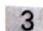

3 3-1 试样处理与滴定反应为：

$$
\begin{array}{r l} & \mathrm {MnO + 2Na_ {2} O_ {2} + H_ {2} O = MnO_ {4} ^ {2 - } +2OH^ {-} +4Na^ {2 + }} \\ & \mathrm {Cr_ {2} O_ {3} +3Na_ {2} O_ {2} + H_ {2} O = 2CrO_ {4} ^ {2 - } +2OH^ {-} +6Na^ {2 + }} \\ & \quad 3 \mathrm {MnO_ {4} ^ {2 - } +4H^ {+} = 2MnO_ {4} ^ {-} +MnO_ {2} +2H_ {2} O} \\ & \mathrm {MnO_ {2} +2Fe^ {2 + } +4H^ {+} = Mn^ {2 + } +2Fe^ {3 + } +2H_ {2} O} \\ & \mathrm {MnO_ {4} ^ {-} +5Fe^ {2 + } +8H^ {+} = Mn^ {2 + } +5Fe^ {3 + } +4H_ {2} O} \\ & \mathrm {CrO_ {4} ^ {2 - } +3Fe^ {2 + } +8H^ {+} = Cr^ {3 + } +3Fe^ {3 + } +4H_ {2} O}. \end{array}
$$

3-2 各物质间的化学计量关系为：

$$
\begin{array}{l} 3 \mathrm{MnO} \sim 3 \mathrm{MnO} _ {4} ^ {- 2} \sim \mathrm{MnO} _ {2} \sim 2 \mathrm{Fe} ^ {2 +} \\ 5 \mathrm{Fe} ^ {2 +} \sim \mathrm{MnO} _ {4} ^ {-} \\ 6 \mathrm{Fe} ^ {2 +} \sim 2 \mathrm{CrO} _ {4} ^ {2 -} \sim \mathrm{Cr} _ {2} \mathrm{O} _ {3} \end{array}
$$

试样中 MnO 的物质的量等于歧化产生的 $MnO_{2}$ 的物质的量的 3 倍，故：

$$
w _ {\mathrm{MnO}} = \frac {(0.1000 \times 10.00 - 0.01000 \times 8.24 \times 5) \times 10^{-3} \times \frac {1}{2} \times 70.937 \times 3}{2.000} \times 100\% = 3.13\%
$$

歧化产生 $MnO_{4}^{-}$ 的物质的量是 $MnO_{2}$ 的 2 倍, 因此, 滤液中的 $MnO_{4}^{-}$ 消耗的 $FeSO_{4}$ 的物质的量为:

$$
n _ {1} = 2 n _ {\mathrm{MnO} _ {2}} \times 5 = 2 \times (0. 1 0 0 0 \times 1 0. 0 0 - 0. 0 1 0 0 0 \times 8. 2 4 \times 5) \mathrm{mmol} \times \frac {1}{2} \times 5 = 2. 9 4 \mathrm{mmol}
$$

$Cr_{2}O_{3}$ 的质量分数可通过处理滤液所用 $FeSO_{4}$ 的物质的量及其中的 $MnO_{4}^{-}$ 消耗的 $FeSO_{4}$ 物质的量来计算。

$$
w_{\mathrm{Cr}_{2}\mathrm{O}_{3}} = \frac{(0.1000\times 50.00 - 0.01000\times 18.40\times 5 - 2.94)\times 10^{-3}\times\frac{1}{6}\times 151.99}{2.000}\times 100\% = 1.44\%
$$

4 4-1 由题意可以推测 A 为 X 的草酸盐结晶水合物, B 为失水产物, C 应为 X 的氧化物。而 X 属于稀土元素, 其常见氧化态是 +3 价, 所以 C 可写为 $\mathrm{X}_{2} \mathrm{O}_{3}$ 。由题意得

$$
\begin{array}{r l} & {\mathrm {X_ {2} O_ {3} + 6NaF + 6HCl = 2XF_ {3} + 6NaCl + 3H_ {2} O}} \\ & {\mathrm {X_ {2} O_ {3} + 12NaF + 6HCl = 2Na_ {3} XF_ {6} + 6NaCl + 3H_ {2} O}} \\ & {\frac {3 \cdot 2 3 + x + 6 \cdot 1 9}{x + 3 \cdot 1 9} = 2. 2 3 5, x = 4 4. 9 8 \quad \mathrm{X:Sc}} \end{array}
$$

$$
\mathrm{A}: \mathrm{Sc} _ {2} \left(\mathrm{C} _ {2} \mathrm{O} _ {4}\right) _ {3} \cdot 5 \mathrm{H} _ {2} \mathrm{O} \quad \mathrm{B}: \mathrm{Sc} _ {2} \left(\mathrm{C} _ {2} \mathrm{O} _ {4}\right) _ {3} \quad \mathrm{C}: \mathrm{Sc} _ {2} \mathrm{O} _ {3} \quad \mathrm{D}: \mathrm{ScF} _ {3} \quad \mathrm{E}: \mathrm{Na} _ {3} \mathrm{ScF} _ {6}
$$

$$
\mathrm{Sc} _ {2} (\mathrm{C} _ {2} \mathrm{O} _ {4}) _ {3} \cdot n \mathrm{H} _ {2} \mathrm{O} = \mathrm{Sc} _ {2} (\mathrm{C} _ {2} \mathrm{O} _ {4}) _ {3} + n \mathrm{H} _ {2} \mathrm{O} \quad n = 5
$$

$$
2 \mathrm{Sc} _ {2} (\mathrm{C} _ {2} \mathrm{O} _ {4}) _ {3} + 3 \mathrm{O} _ {2} = 3 \mathrm{Sc} _ {2} \mathrm{O} _ {3} + 1 2 \mathrm{CO} _ {2}
$$

$$
2 \mathrm{ScF} _ {3} + 3 \mathrm{Ca} = 3 \mathrm{CaF} _ {2} + 2 \mathrm{Sc}
$$

(钪的性质也证实了这一点,因为它的氟化物和草酸不溶于水)

$$
4 - 2 \quad 4 \mathrm{ScCl} _ {3} + 3 \mathrm{Sc} = \mathrm{Sc} _ {7} \mathrm{Cl} _ {1 2} \quad \mathrm{F}: \mathrm{Sc} _ {7} \mathrm{Cl} _ {1 2} \text {或} \mathrm{ScCl} _ {1. 7 1 4}
$$

$\mathrm{Sc}_{7}\mathrm{Cl}_{12} = \mathrm{I}:7\mathrm{ScCl}_{x} + y\mathrm{Cl}_{2}$ 失重 $23.95\%$ $\mathrm{I:Sc_{7}Cl_{7}}$ 或 $\mathrm{ScCl}$

$$
3 \mathrm{Sc} _ {7} \mathrm{Cl} _ {1 2} + 2 \mathrm{Sc} _ {7} \mathrm{Cl} _ {1 0} = 7 \mathrm{Sc} _ {5} \mathrm{Cl} _ {8} \quad \mathrm{G:ScCl} _ {1. 6} \text {   或   } \mathrm{Sc} _ {5} \mathrm{Cl} _ {8} \quad \mathrm{H:Sc} _ {7} \mathrm{Cl} _ {1 0}
$$

5 5-1 [Kr]4d $^{5}$ 5s $^{1}$ 第四周期第VIB族

5-2 10.3 g·cm $^{-3}$ 68.0%

$$
\left[ \mathrm{Mo} _ {7} \mathrm{O} _ {2 4} \right] ^ {6 -}
$$

5-4 正方体

$$
5 - 5 \quad ① 2 \mathrm{MnS} _ {2} + 9 \mathrm{O} _ {2} + 1 2 \mathrm{OH} ^ {-} = 2 \mathrm{MoO} _ {4} ^ {2 -} + 4 \mathrm{SO} _ {4} ^ {2 -} + 6 \mathrm{H} _ {2} \mathrm{O}
$$

$$
2 \mathrm{NO} + \mathrm{O} _ {2} = 2 \mathrm{NO} _ {2}
$$

$$
3 \mathrm{NO} _ {2} + \mathrm{H} _ {2} \mathrm{O} = 2 \mathrm{HNO} _ {3} + \mathrm{NO}
$$

$$
\text { 总: } 2 \mathrm{MoS} _ {2} + 9 \mathrm{O} _ {2} + 6 \mathrm{H} _ {2} \mathrm{O} \xrightarrow {\mathrm{HNO} _ {3}} 2 \mathrm{H} _ {2} \mathrm{MoO} _ {4} + 4 \mathrm{H} _ {2} \mathrm{SO} _ {4}
$$

6 6-1 4个锆原子，8个钨原子

6-2 $\mathrm{ZrW_2O_8}$

6-3 氧原子有两种类型: 桥氧和端氧 桥氧 24 个, 端氧 8 个

$$
\begin{array}{r l} D = z M / (V _ {c} N _ {A}) & = [ 4 \times (9 1. 2 2 + 1 8 3. 8 \times 2 + 1 6. 0 0 \times 8) g \cdot m o l ^ {- 1} ] / (V _ {c} N _ {A}) \\ & = 4 \times 5 8 6. 8 g \cdot m o l ^ {- 1} / (0. 9 1 6 3 ^ {3} \times 1 0 ^ {- 2 1} c m ^ {3} \times 6. 0 2 2 \times 1 0 ^ {2 3} m o l ^ {- 1}) \\ & = 5. 0 7 g \cdot c m ^ {- 3} \end{array}
$$

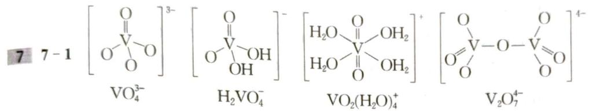

以下画法不扣分：

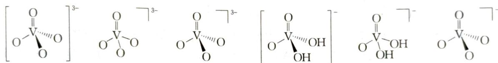

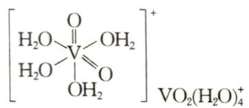

$$
7 - 2 \quad \mathrm{Mtrc-Fe} ^ {2 +} + \mathrm{H} _ {2} \mathrm{VO} _ {4} + 4 \mathrm{H} ^ {+} = \mathrm{Mtrc-Fe} ^ {3 +} + \mathrm{VO} ^ {2 +} + 3 \mathrm{H} _ {2} \mathrm{O}
$$

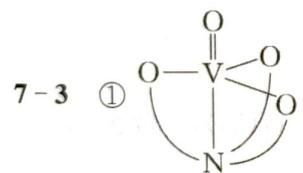

② 分子的手性来源于螯环的扭曲导致镜面对称性破缺

8 8-1 $\mathrm{TiO}^{2+}$ 中的 Ti(IV) 为 $3\mathrm{d}^0 4\mathrm{s}^0$ 。3d 轨道全空，无 d-d 跃迁。另外 $\mathrm{O}^{2-}$ 变形性小，所以为无色。 $\mathrm{TiCl}_3$ 中的 Ti(III) 为 $3\mathrm{d}^1$ ，可发生 d-d 跃迁，所以 $\mathrm{TiCl}_3$ 不是白色，而是紫色（ $\mathrm{Cl}^-$ 为弱场）。而 $\mathrm{TiI}_4$ ， $\mathrm{Ti(IV)}$ 具有很大的电荷，且 $\mathrm{I}^-$ 易变形， $\mathrm{Ti}^{4+}$ 对 $\mathrm{I}^-$ 产生很大的极化，使荷移跃迁容易发生，所以 $\mathrm{TiI}_4$ 呈暗棕色。

8-2 Mn有5个单电子， $\left[\mathrm{Mn}\left(\mathrm{H}_2\mathrm{O}\right)_6\right]^{2 - }$ 在弱场 $\mathrm{H}_2\mathrm{O}$ 的作用下，d轨道产生分裂，5个电子分别填于 $\mathrm{t}_{2\mathrm{g}}^3\mathrm{e_g}^2$ ，自旋方向相同，自旋禁阻，d-d跃迁受“自旋禁阻”影响，跃迁几率小，显示浅颜色（粉红色或是肉色）。

$$
8 - 3 \text {   酸性钒酸盐中含   } \mathrm{VO} _ {2} ^ {+}: 2 \mathrm{VO} _ {2} ^ {+} (\mathrm{aq}, \text { 黄色 }) + \mathrm{SO} _ {2} = 2 \mathrm{VO} ^ {2} (\mathrm{aq}, \text { 蓝色 }) + \mathrm{SO} _ {4} ^ {2 -}
$$

$2VO_{2}^{+}(aq,黄色)+3Zn+8H^{+}=2V^{2+}(aq,紫色)+3Zn^{2+}+4H_{2}O$

$$
2 \mathrm{H} ^ {+} + \mathrm{VO} ^ {2 +} (\mathrm{aq}, \text {蓝色}) + \mathrm{V} ^ {2 +} (\mathrm{aq}, \text {紫色}) = 2 \mathrm{V} ^ {3 +} (\mathrm{aq}, \text {绿色}) + \mathrm{H} _ {2} \mathrm{O}
$$

9 9-1 AB线段： $\mathrm{Cr_2O_7^{2 - } + 14H^+ + 6e^- = 2Cr^{3 + } + 7H_2O}$

BO线段： $\mathrm{Cr}^{3 + } + \mathrm{OH}^{-}\rightleftharpoons \mathrm{Cr(OH)}^{2 + }$

$$
\mathrm{Cr} _ {2} \mathrm{O} _ {7} ^ {2 -} + \mathrm{H} _ {2} \mathrm{O} \rightleftharpoons 2 \mathrm{CrO} _ {4} ^ {2 -} + 2 \mathrm{H} ^ {+}
$$

DF 线段： $CrO_{4}^{2-} + 4H_{2}O + 3e^{-} = Cr(OH)_{3}\downarrow + 5OH^{-}$

OM线段： $\mathrm{Cr(OH)^{2 + } + e^{-}\longrightarrow Cr^{2 + } + OH^{-}}$

$$
\mathrm{Cr} _ {2} \mathrm{O} _ {7} ^ {2 -} + 6 \mathrm{Br} ^ {-} + 1 4 \mathrm{H} ^ {+} = 2 \mathrm{Cr} ^ {3 +} + 3 \mathrm{Br} _ {2} + 7 \mathrm{H} _ {2} \mathrm{O}
$$

$$
2 \mathrm{Cr} (\mathrm{OH}) _ {3} + 3 \mathrm{Br} _ {2} + 1 0 \mathrm{OH} ^ {-} = 2 \mathrm{CrO} _ {4} ^ {2 -} + 6 \mathrm{Br} ^ {-} + 8 \mathrm{H} _ {2} \mathrm{O}
$$

$$
\mathrm{pH} > 1 4 \text {   时,   } 2 \mathrm{CrO} _ {2} ^ {-} + 3 \mathrm{Br} _ {2} + 8 \mathrm{OH} ^ {-} = 2 \mathrm{CrO} _ {4} ^ {2 -} + 6 \mathrm{Br} ^ {-} + 4 \mathrm{H} _ {2} \mathrm{O}
$$

$$
5 \mathrm{Cr} _ {2} \mathrm{O} _ {7} ^ {2 -} + 3 \mathrm{I} _ {2} + 3 4 \mathrm{H} ^ {+} = 1 0 \mathrm{Cr} ^ {3 +} + 6 \mathrm{IO} _ {3} ^ {-} + 1 7 \mathrm{H} _ {2} \mathrm{O}
$$

$$
1 0 \mathrm{Cr} ^ {3 +} + 6 \mathrm{IO} _ {3} ^ {-} + 1 7 \mathrm{H} _ {2} \mathrm{O} = 5 \mathrm{Cr} _ {2} \mathrm{O} _ {7} ^ {2 -} + 3 \mathrm{I} _ {2} + 3 4 \mathrm{H} ^ {+}
$$

10 10-1 A. $\left[\mathrm{Cr}(\mathrm{dipy})_{3}\right]\mathrm{Br}_{2} \cdot 4\mathrm{H}_{2}\mathrm{O}$ $(t_{2g})^{4}$ 有2个单电子 B. $\left[\mathrm{Cr}(\mathrm{dipy})_{3}\right](\mathrm{ClO}_{4})_{3}$ $(t_{2g})^{3}$ 有3个单电子 C. $\left[\mathrm{Cr}(\mathrm{dipy})_{3}\right]\mathrm{ClO}_{4}$ $(t_{2g})^{5}$ 有1个单电子

10-2 $\left[\mathrm{Cr}(\mathrm{dipy})_3\right]^+ +\mathrm{I}_2 = \left[\mathrm{Cr}(\mathrm{dipy})_3\right]^{3 + } + 2\mathrm{I}^-$

10-3 (a) $\mathrm{CrBr}_2$ 必须是新制备的, 因为在水溶液中 $\mathrm{Cr}^{2+}$ 很容易被空气氧化到 $\mathrm{Cr}^{3+}$ 。

（b）高氯酸根大阴离子可以取代 A 化合物中外界 $Br^{-}$ ，因为大阳离子与大阴离子结合稳定，在空气中摇动导致空气中氧气充分氧化 $\left[\mathrm{Cr}(\mathrm{dipy})_{3}\right](\mathrm{ClO}_{4})_{2}$ 成为 $\left[\mathrm{Cr}(\mathrm{dipy})_{3}\right](\mathrm{ClO}_{4})_{3}$ 。前者是高自旋配合物，后者是低自旋配合物，后者比前者稳定。

(c) 只有在无氧条件下, 镁粉才能把 $Cr^{2+}$ 还原到 $Cr^{+}$ , 在 $ClO_{4}^{-}$ 的作用下, 形成 $Cr^{+}$ 的高氯酸盐配合物而结晶出来。因为大的阴、阳离子形成的盐溶解度小。

## 第 8 章 常见的过渡元素（下）

## 能力测试A卷

1 1-1 向黄血盐溶液中滴加碘水, 溶液由黄色变成红色: $2[\mathrm{Fe}(\mathrm{CN})_{6}]$ (黄色) $+ \mathrm{I}_{2} = 2[\mathrm{Fe}(\mathrm{CN})_{6}]^{3-}$ (红色) $+ 2\mathrm{I}^{-}$

1-2 将 $3 \mathrm{~mol} \cdot \mathrm{L}^{- 1}$ 的 $\mathrm{COCl}_{2}$ 溶液加热, 溶液由粉红色变蓝色: $[\mathrm{Co(H_{2}O)}_{6}]^{2+} + 4\mathrm{Cl}^{-} \xlongequal{\triangle} \mathrm{CoCl}_{4}^{2-}$ (蓝色) $+6 \mathrm{H}_{2} \mathrm{O}$

再加入 $AgNO_{3}$ 溶液时, 溶液由蓝色变红色, 并有白色沉淀生成:

$$
\mathrm{CoCl} _ {4} ^ {2 -} + 4 \mathrm{Ag} ^ {+} + 6 \mathrm{H} _ {2} \mathrm{O} = [ \mathrm{Co(H} _ {2} \mathrm{O)} _ {6} ] ^ {2 +} + 4 \mathrm{AgCl} \downarrow (\text {白色})
$$

1-3 水浴加热一段时间后,有绿色沉淀生成: $\left[\mathrm{Ni}\left(\mathrm{NH}_{3}\right)_{6}\right]^{2+} + 2\mathrm{H}_{2}\mathrm{O} \xlongequal{\triangle} \mathrm{Ni(OH)}_{2} \downarrow$ (绿色) $+ 2\mathrm{NH}_{4}^{+} + 4\mathrm{NH}_{3} \uparrow$

再加入氨水,沉淀又溶解,得蓝色溶液: $\mathrm{Ni(OH)}_{2} + 2\mathrm{NH}_{4}^{+} + 4\mathrm{NH}_{3} = [\mathrm{Ni(NH}_{3})_{6}]^{2+}$ (蓝色) $+2\mathrm{H}_{2}\mathrm{O}$

2 分析: CO 与 $PdCl_{2} \cdot H_{2}O$ 产物是 Pd、HCl 和 $CO_{2}$ ，只有 Pd 与 $CuCl_{2}$ 反应能复原。 $CuCl_{2}$ 与 Pd 反应生成 Cu 还是 CuCl 呢？因为 Cu(I) 比 Cu(0) 更易被氧化，只能是 CuCl(CuCl 可被空气中的 $O_{2}$ 氧化成 $CuCl_{2}$ )。

$$
2 - 1 \quad \mathrm{CO} + \mathrm{PdCl} _ {2} \cdot \mathrm{H} _ {2} \mathrm{O} = \mathrm{CO} _ {2} + \mathrm{Pd} + 2 \mathrm{HCl} + \mathrm{H} _ {2} \mathrm{O}
$$

$$
2 - 2 \quad \mathrm{Pd} + \mathrm{CuCl} _ {2} \cdot 2 \mathrm{H} _ {2} \mathrm{O} = \mathrm{PdCl} _ {2} \cdot 2 \mathrm{H} _ {2} \mathrm{O} + 2 \mathrm{CuCl} + 2 \mathrm{H} _ {2} \mathrm{O}
$$

$$
2 - 3 \quad 4 \mathrm{CuCl} + 4 \mathrm{HCl} + 6 \mathrm{H} _ {2} \mathrm{O} + \mathrm{O} _ {2} = 4 \mathrm{CuCl} _ {2} \cdot 2 \mathrm{H} _ {2} \mathrm{O}
$$

3 3-1 ① $\left[\begin{array}{c}\mathrm{Cl}\\ \mathrm{H}_{3}\mathrm{N}\\ \mathrm{H}_{3}\mathrm{N}\end{array}\right]\xrightarrow{\mathrm{Co}}\left[\begin{array}{c}\mathrm{NH}_{3}\\ \mathrm{NH}_{3}\end{array}\right]^{2+}\mathrm{SO}_{4}^{2-}$

② $d^{2}sp^{3}$

③ 抗磁性

## 3-2 Au 的氧化态: +II Au 的杂化形式: $\mathrm{dsp}^2$ 杂化

阴离子结构为： $\left[\begin{array}{c}F\\F\\F\end{array}\right]\left[\begin{array}{c}F\\Sb\\F\end{array}\right]\left[\begin{array}{c}F\\F\\F\end{array}\right]$ ，阳离子结构为： $\left[\begin{array}{c}Xe\\Xe\end{array}\right]^{2-}$

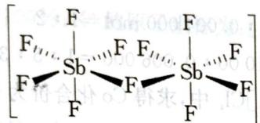

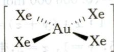

3-3 ① Ni(0, 0, 0); (0, 0, 1/2) As(1/3, 2/3, 1/4); (2/3, 1/3, 3/4)

② As 六方最密堆积, Ni 填充在八面体空隙中

$$
D = Z M / \left(N _ {\mathrm{A}} \cdot a ^ {2} \cdot c \cdot \sin 6 0\right) = 7. 8 8 7 \mathrm{g} \cdot \mathrm{cm} ^ {- 3}
$$

4 4-1 A为 $\mathrm{CuNH_4SO_3}$ 4-2 $2\mathrm{Cu(NH_3)_4SO_4 + 3SO_2 + 4H_2O = 2CuNH_4SO_3\downarrow + 3(NH_4)_2SO_4}$ 4-3 $2\mathrm{CuNH_4SO_3 + 2H_2SO_4 = Cu + CuSO_4 + 2SO_2 + 2H_2O + (NH_4)_2SO_4}$

4-4 A 与 $H_{2}SO_{4}$ 混合发生复分解反应生成 $SO_{2}$ 气体，同时 $Cu^{+}$ 在酸性条件下歧化为 $Cu^{2+}$ 和 $Cu:2Cu^{+}=Cu^{2+}+Cu$ ，故产率最大为 50%。

4-5 因为在密闭容器中反应,生成的 $SO_{2}$ 可循环使用,直至所有 $CuSO_{4}$ 还原为 Cu,故理论产率可达 100%。

5 5-1 M:Fe A: $\mathrm{Fe(CO)}_{5}$ B: $K_{3}[Fe(CN)_{6}]$ C: $K_{4}[Fe(CN)_{6}]$ D: $FeC_{2}$ E:KCN

F: $N_{2}$ $G:FeO_{4}^{2-}$ （或者 $Na_{2}FeO_{4}$ ）H: $O_{2}$

5-2 ① $3\mathrm{Fe(CN)}_{6}^{3-} + \mathrm{Cr(OH)}_{3} + 5\mathrm{OH}^{-} = 3\mathrm{Fe(CN)}_{6}^{4-} + \mathrm{CrO}_{4}^{2-} + 4\mathrm{H}_{2}\mathrm{O}$ ② $2\mathrm{Fe(OH)}_{3} + 3\mathrm{ClO}^{-} + 4\mathrm{OH}^{-} = 2\mathrm{FeO}_{4}^{2-} + 3\mathrm{Cl}^{-} + 5\mathrm{H}_{2}\mathrm{O}$

③ $4FeO_{4}^{2-} + 20H^{+} = 4Fe^{3+} + 3O_{2}\uparrow + 10H_{2}O$ $FeO_{4}^{2-}$ 是氧化剂， $H_{2}O$ 是还原剂

$$
6 - 1 \quad \mathrm{NaOH} + \mathrm{HCl} = \mathrm{NaCl} + \mathrm{H} _ {2} \mathrm{O} \quad \mathrm{NH} _ {3} + \mathrm{HCl} = \mathrm{NH} _ {4} \mathrm{Cl}
$$

20.00 mL B 溶液消耗 $0.1000 \, \mathrm{mol} \cdot \mathrm{L}^{-1}$ NaOH 30.00 mL, 20.00 mL B 溶液中过量的 HCl: $n(\mathrm{HCl}) = 0.003\,000 \, \mathrm{mol}$

100 mL B 溶液中过量的 HCl: $n(\mathrm{HCl}) = 0.01500 \, \mathrm{mol}$ ，则与 $NH_{3}$ 反应的 $n(\mathrm{HCl}) = 0.01000 \, \mathrm{mol}$ 故 0.5010 g 样品中 $n(\mathrm{NH}_{3}) = 0.01000 \, \mathrm{mol}$ ， $n(\mathrm{N}) = 0.01000 \, \mathrm{mol}$

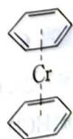

$\mathrm{[Co(NH_3)_xCl_y]Cl_z}$ 中氮元素的质量分数： $\frac{0.01000\mathrm{mol}\times 14\mathrm{g}\cdot\mathrm{mol}^{-1}}{0.5010\mathrm{g}}\times 100\% = 27.94\%$

$$
6 - 2 \quad I _ {2} + 2 N a _ {2} S _ {2} O _ {3} = 2 N a I + N a _ {2} S _ {4} O _ {6}
$$

因反应用去 $0.1000\mathrm{mol}\cdot \mathrm{L}^{-1}\mathrm{Na}_2\mathrm{S}_2\mathrm{O}_3$ 溶液 $20.00~\mathrm{mL}$ ，推算出： $n(\mathrm{I}_2) = 0.001000\mathrm{mol}$ Co与Fe同一族， $\mathrm{Co^{m + }}$ 具有较强氧化性，故设 $m = 3$

则有： $2Co^{3+}+2I^{-}=2Co^{2+}+I_{2}$ ， $n(Co^{3+})=0.002\ 000\ \mathrm{mol}$

0.5010 g 样品中 Cl 的总质量为：

$$
\begin{array}{r l} m (\mathrm{Cl}) & = 0. 5 0 1 0 \mathrm{g} - 0. 0 0 2 0 0 0 \mathrm{mol} \times 5 9 \mathrm{g} \cdot \mathrm{mol} ^ {- 1} - 0. 0 1 0 0 0 \mathrm{mol} \times 1 7 \mathrm{g} \cdot \mathrm{mol} ^ {- 1} = 0. 2 1 3 0 \mathrm{g}, \\ n (\mathrm{Cl}) & = 0. 0 0 6 0 0 0 \mathrm{mol} \end{array}
$$

$$
\left[ \mathrm{Co} \left(\mathrm{NH} _ {3}\right) _ {x} \mathrm{Cl} _ {y} \right] \mathrm{Cl} _ {z} + z \mathrm{AgNO} _ {3} = \left[ \mathrm{Co} \left(\mathrm{NH} _ {3}\right) _ {x} \mathrm{Cl} _ {y} \right] \left(\mathrm{NO} _ {3}\right) _ {z} + z \mathrm{AgCl} \downarrow
$$

0.2505 g 样品扩大一倍来算(即用 0.5010 g)推算出:

$$
\mathrm{AgNO} _ {3}: n (\mathrm{AgNO} _ {3}) = 0. 1 0 0 0 \mathrm{mol} \cdot \mathrm{L} ^ {- 1} \times 4 0. 0 0 \mathrm{mL} = 0. 0 0 4 0 0 0 \mathrm{mol}
$$

$$
n \left(\mathrm{Cl} ^ {-}\right) = 0. 0 0 4 0 0 0 \mathrm{mol}
$$

则有 $y: z = (0.006000 \mathrm{~mol} - 0.004000 \mathrm{~mol}): 0.004000 \mathrm{~mol} = 1:2$

同时还有 $1:x:(y+z)=0.002000:0.01000:0.006000=1:5:3$

解得: $x = 5, y = 1, z = 2$ , 带入 $\left[\mathrm{Co}\left(\mathrm{NH}_{3}\right)_{x} \mathrm{Cl}_{y}\right] \mathrm{Cl}_{z}$ 中, 求得 Co 化合价为 $+3$ , 假设成立该钴化合物的化学式为: $\left[\mathrm{Co}\left(\mathrm{NH}_{3}\right)_{5} \mathrm{Cl}\right] \mathrm{Cl}_{2}$ 。

## 7 7-1 三氯·乙烯合铂(Ⅱ)酸钾

7-2 $\mathrm{K}_2[\mathrm{PtCl}_4] + \mathrm{C}_2\mathrm{H}_4 = \mathrm{K}[\mathrm{Pt}(\mathrm{C}_2\mathrm{H}_4)\mathrm{Cl}_3] + \mathrm{KCl}$ ，反应在稀 HCl 溶液中进行

7-3 $\left[\mathrm{Pt}(\mathrm{C}_2\mathrm{H}_4)\mathrm{Cl}_3\right]^{-}$ 离子是平面四方结构。在此离子中， $\mathrm{Pt(II)}$ 接受 3 个 $\mathrm{Cl}^-$ 的 3 对孤对电子和 1 个乙烯分子中成键 $\pi$ 轨道上的一对电子而形成 4 个 $\sigma$ 配键。同时 $\mathrm{Pt(II)}$ 提供 5d 轨道上孤对电子，乙烯分子提供 $\pi *$ 反键空轨道形成反馈 $\pi$ 键。此盐的配阴离子是 16 电子构型，可以用 X 射线测定。

7-4 此化合物的可能的分子式为 $\left[\mathrm{Pt}\left(\mathrm{C}_{2} \mathrm{H}_{4}\right) \mathrm{Cl}_{2}\right]_{2}$ , 它是一个具有桥式结构的二聚物, 两个乙

烯分子的排布是反式的可能的结构式为：

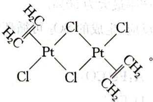

8 8-1 $\mathrm{Fe(CO)_5}$ 、 $\mathrm{Cr(CO)_6}$

8-2 $\mathrm{Cr(NO)_4}$

8-3 由于 $\mathrm{Mn}^{(0)}$ 和 $\mathrm{Co}^{(0)}$ 的价电子为奇数, 所以不能形成单核中性羰基化合物, 只能形成有金属键的双核中性羰基化合物: $\mathrm{Mn}_{2}(\mathrm{CO})_{10}, \mathrm{Co}_{2}(\mathrm{CO})_{8}$ 。

8-4 $\mathrm{V}(\mathrm{CO})_6$ 属于17电子构型，是顺磁性的；而(1)、(2)问中提出的化合物都属于18电子构型，因此都是反磁性的。

8-5 见右图

$$
9 \quad 9 - 1 \quad A: C u O \quad B: C u C l _ {2} \quad C: H [ C u C l _ {2} ] \quad D: C u C l \quad E: [ C u (N H _ {3}) _ {2} ] ^ {+}
$$

$$
\mathrm{F}: \left[ \mathrm{Cu} \left(\mathrm{NH} _ {3}\right) _ {4} \right] ^ {2 +} \quad \mathrm{G}: \left[ \mathrm{Cu} (\mathrm{CN}) _ {4} \right] ^ {2 -} \quad \mathrm{H}: \mathrm{Cu} \quad \mathrm{I}: \mathrm{Cu} \left(\mathrm{NO} _ {3}\right) _ {2} \quad \mathrm{J}: \mathrm{Cu} (\mathrm{OH}) _ {2}
$$

9-2 有关的反应式如下：

$$
\mathrm{CuCl} _ {2} + \mathrm{Cu} + 2 \mathrm{HCl} = 2 \mathrm{H} [ \mathrm{CuCl} _ {2} ]
$$

$$
2 \mathrm{H} [ \mathrm{CuCl} _ {2} ] \xrightarrow {\text {稀释}} 2 \mathrm{CuCl} \downarrow + 2 \mathrm{HCl}
$$

$$
\mathrm{CuCl} + 2 \mathrm{NH} _ {3} = [ \mathrm{Cu(NH} _ {3}) _ {2} ] ^ {4} + \mathrm{Cl} ^ {-}
$$

$$
4 \left[ \mathrm{Cu} \left(\mathrm{NH} _ {3}\right) _ {2} \right] ^ {+} + \mathrm{O} _ {2} + 8 \mathrm{NH} _ {3} + 2 \mathrm{H} _ {2} \mathrm{O} = 4 \left[ \mathrm{Cu} \left(\mathrm{NH} _ {3}\right) _ {4} \right] ^ {2 +} + 4 \mathrm{OH} ^ {-}
$$

$$
\left[ \mathrm{Cu} (\mathrm{NH} _ {3}) _ {4} \right] ^ {2 +} + 4 \mathrm{CN} ^ {-} = \left[ \mathrm{Cu} (\mathrm{CN}) _ {4} \right] ^ {2 -} + 4 \mathrm{NH} _ {3}
$$

$$
1 0 \quad 1 0 - 1 \quad 3 \mathrm{Pt} + 4 \mathrm{HNO} _ {3} + 1 8 \mathrm{HCl} = 3 \mathrm{H} _ {2} \mathrm{PtCl} _ {6} + 4 \mathrm{NO} + 8 \mathrm{H} _ {2} \mathrm{O}
$$

$$
\begin{array}{l} \mathrm{H} _ {2} \mathrm{PtCl} _ {6} + 2 \mathrm{NH} _ {4} \mathrm{Cl} = (\mathrm{NH} _ {4}) _ {2} \mathrm{PtCl} _ {6} + 2 \mathrm{HCl} \\ 2 \mathrm{HCl} \uparrow + 2 \mathrm{Cl} _ {2} \end{array} \quad (\mathrm{NH} _ {4}) _ {2} \mathrm{PtCl} _ {6} \stackrel {\triangle} {=} \mathrm{Pt} + 2 \mathrm{NH} _ {3} +
$$

$$
1 0 - 2 \quad \mathrm{H} _ {2} \mathrm{PtCl} _ {6} + 2 \mathrm{NaNO} _ {3} \xlongequal {\triangle} \mathrm{PtO} _ {2} + 3 \mathrm{Cl} _ {2} + 2 \mathrm{NO} + 2 \mathrm{NaOH} \quad \mathrm{PtO} _ {2} + 2 \mathrm{H} _ {2} = \mathrm{Pt} + 2 \mathrm{H} _ {2} \mathrm{O}
$$

实际上起催化作用的是反应中二氧化铂被氢还原而成的铂黑。

10-3 $\mathrm{d}^2\mathrm{sp}^3$ ；八面体；四面体空隙；面心立方晶胞含四个结构基元，即有8个 $\mathbf{K}^{+}$ ，亦有8个四面体空隙，故占据率 $100\%$ ； $\mathbf{K}^{+}$ 的原子坐标为：[1/4, 1/4, 1/4]

## 能力测试B卷

$$
\begin{array}{r l} {1 - 1} & {5 \mathrm{Cu} + 4 \mathrm{H} _ {2} \mathrm{SO} _ {4} = \mathrm{Cu} _ {2} \mathrm{S} + 3 \mathrm{CuSO} _ {4} + 4 \mathrm{H} _ {2} \mathrm{O}} \\ {1 - 2} & {6 \mathrm{HCN} + \mathrm{Fe} + 2 \mathrm{K} _ {2} \mathrm{CO} _ {3} = \mathrm{K} _ {4} \mathrm{Fe(CN)} _ {6} + \mathrm{H} _ {2} \uparrow + 2 \mathrm{CO} _ {2} \uparrow + 2 \mathrm{H} _ {2} \mathrm{O}} \\ {1 - 3} & {\mathrm{Au} + 2 \mathrm{SC(NH} _ {2}) _ {2} + \mathrm{Fe} ^ {3 +} = [ \mathrm{Au(SC(NH} _ {2}) _ {2}) _ {2} ] ^ {+} + \mathrm{Fe} ^ {2 +}} \\ {1 - 4} & {3 \mathrm{Ag(NH} _ {3}) _ {2} \mathrm{OH} + 2 \mathrm{H} _ {2} \mathrm{O} = 5 \mathrm{NH} _ {3} \cdot \mathrm{H} _ {2} \mathrm{O} + \mathrm{Ag} _ {3} \mathrm{N} \text {或} 3 \mathrm{Ag(NH} _ {3}) \mathrm{OH} = 5 \mathrm{NH} _ {3} +} \\ & {3 \mathrm{H} _ {2} \mathrm{O} + \mathrm{Ag} _ {3} \mathrm{N}} \end{array}
$$

2 2-1 由配体 $\mathrm{NO}_2$ 的氮氧键不等长, 说明 $(\mathrm{NO}_2)$ 不用 N 配位, 两个 O 原子中只有一个配位, $(\mathrm{NO}_2)$ 为氧配位的单基配体 $\mathrm{NO}_2^-$ 。由于配合物为六配位的单核金属, 则配体 A 为双齿配体; 由于 A 不含氧, 且配合物的氮含量较高, 则 A 可能为乙二胺。

设 M 的原子量为 X，则有 $21.68\% = X / (X + 60 \times 2 + 46 \times 2)$ ，得 X = 58.7，M 为 Ni

在配合物中以稳定氧化数+2存在,所以其化学式应该为: $\left[\mathrm{Ni}(\mathrm{en})_{2}\left(\mathrm{NO}_{2}\right)_{2}\right]$

2-2 $\left[\mathrm{Ni}(\mathrm{en})_{2}\left(\mathrm{NO}_{2}\right)_{2}\right]$ 为八面体结构，有两种几何异构体，一对光学异构体：

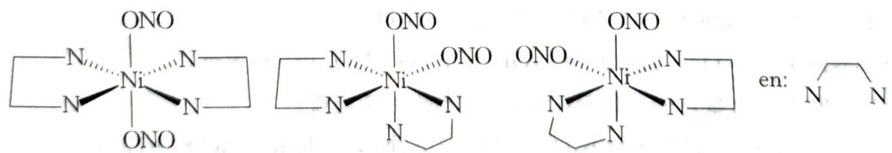

3 3-1 正四面体 $\mathrm{T_d}$ $\mathrm{RuO_4\xrightarrow{\triangle}RuO_2 + O_2}$

3-2 抗磁性

$$
\left[ \begin{array}{c c c c} \mathrm{Cl} & \mathrm{Cl} & \mathrm{Cl} & \mathrm{Cl} \\ \mathrm{Cl} - \mathrm{Ru} - \mathrm{O} - \mathrm{Ru} - \mathrm{Cl} \\ \mathrm{Cl} & \mathrm{Cl} & \mathrm{Cl} & \mathrm{Cl} \end{array} \right] ^ {4 -}
$$

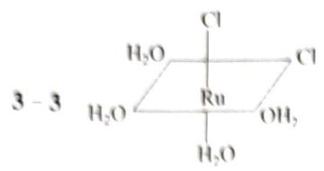  
(A)

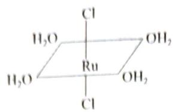  
(B)

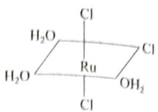  
(C)

  
(D)

因为反位效应 $Cl^{-}$ 比 $H_{2}O$ 强，因此用 $H_{2}O$ 取代 C 中的一个 $Cl^{-}$ 时，只能发生在 $Cl^{-}$ 的反位的位置上，因此产物为 A，如果用 $H_{2}O$ 取代 D 中的一个 $Cl^{-}$ ，无论取代哪一个 $Cl^{-}$ ，产物都是 A

$$
\mathrm{A} _ {\circ}
$$

$$
D _ {4 \mathrm{h}}
$$

$$
\mathbf {t} _ {2 \mathrm{g}} ^ {6} \mathbf {e} _ {\mathrm{g}} ^ {1}
$$

4-2 设在 $0.4237\mathrm{g}$ 混合物中， $\mathrm{K}_2\mathrm{NiF}_6$ 物质的量为 $x$ ， $\mathrm{K}_3\mathrm{NiF}_6$ 物质的量为 $y$

可列出第一个方程式为： $250.89x + 289.99y = 0.4237\mathrm{g}$

消耗的电子总量为 $n = c(\mathrm{S}_2\mathrm{O}_3^{2 - })\times V(\mathrm{S}_2\mathrm{O}_3^{2 - }) = 2.165\times 10^{-3}\mathrm{mol}$

故第二个方程式为： $2x + y = 2.165 \times 10^{-3} \, \mathrm{mol}$

解得： $x = 6.204\times 10^{-4}\mathrm{mol},y = 9.24\times 10^{-4}\mathrm{mol}$

因此 $K_{2}NiF_{6}$ 的质量分数为 $\omega=250.89x/m\times100\%=36.74\%$ , $K_{3}NiF_{6}$ 的质量分数为:

$$
\omega = 289.99y / m\times 100\% = 63.24\%
$$

4-3 $\mathrm{K}_2\mathrm{NiF}_6 + 6\mathrm{HCl} = 2\mathrm{KCl} + \mathrm{NiCl}_2 + 6\mathrm{HF} + \mathrm{Cl}_2$

5 5-1 A: $\mathrm{Co}_{2}\mathrm{O}_{3}$ B: $\mathrm{CoCl}_2$ C: $\mathrm{Co(OH)}_2$ D: $\mathrm{Co(OH)}_3$

$$
\mathrm{E}: \left[ \mathrm{Co} \left(\mathrm{NH} _ {3}\right) _ {6} \right] \mathrm{Cl} _ {2} \quad \mathrm{F}: 4 \left[ \mathrm{Co} \left(\mathrm{NH} _ {3}\right) _ {6} \right] \mathrm{Cl} _ {3} \quad \mathrm{G}: \left[ \mathrm{Co} (\mathrm{NCS}) _ {4} \right] ^ {2 -}
$$

$$
\mathrm{H}: \mathrm{K} _ {3} [ \mathrm{Co} (\mathrm{NO} _ {2}) _ {6} ] \quad \mathrm{I}: \mathrm{NO} \quad \mathrm{J}: [ \mathrm{Fe} (\mathrm{NO}) ] \mathrm{SO} _ {4}
$$

$$
5 - 2 \quad \mathrm{Co} _ {2} \mathrm{O} _ {3} + 6 \mathrm{HCl} = 2 \mathrm{CoCl} _ {2} + \mathrm{Cl} _ {2} \uparrow + 3 \mathrm{H} _ {2} \mathrm{O}
$$

$$
4 [ \mathrm{Co} (\mathrm{NH} _ {3}) _ {6} ] ^ {2 +} + \mathrm{O} _ {2} + 2 \mathrm{H} _ {2} \mathrm{O} = 4 \mathrm{OH} ^ {-} + 4 [ \mathrm{Co} (\mathrm{NH} _ {3}) _ {6} ] ^ {3 +} (\text {橙黄色})
$$

$Co^{2+} + 4SCN^{-}$ （过量） $= [Co(NCS)_4]^{2-}$ （丙酮中，宝石蓝）

$$
\mathrm{CoCl} _ {2} + 7 \mathrm{KNO} _ {2} + 2 \mathrm{HAc} = \mathrm{K} _ {3} \left[ \mathrm{Co} (\mathrm{NO} _ {2}) _ {6} \right] + 2 \mathrm{KCl} + 2 \mathrm{KAc} + \mathrm{NO} \uparrow + \mathrm{H} _ {2} \mathrm{O}
$$

$$
\mathrm{FeSO} _ {4} + \mathrm{NO} + 5 \mathrm{H} _ {2} \mathrm{O} = [ \mathrm{Fe(NO)} (\mathrm{H} _ {2} \mathrm{O}) _ {5} ] \mathrm{SO} _ {4} (\text {棕色})
$$

$$
6 6 - 1 m = 1 0. 0 + 2 1. 7 + 9. 0 5 - 3 4. 0 = 6. 7 5 \mathrm{g}
$$

6-2 在 $850^{\circ}\mathrm{C}$ , 气态产物的物质的量为:

$$
n _ {1} = \frac {p V}{R T} = \frac {1 0 1 3 2 5 \mathrm{Pa} \cdot 0 . 0 1 6 7 \mathrm{m} ^ {3}}{8 . 3 1 4 \mathrm{J} \cdot \mathrm{mol} ^ {- 1} \cdot \mathrm{K} ^ {- 1} \cdot (8 5 0 \mathrm{K} + 2 7 3 \mathrm{K})} = 0. 1 8 1 \mathrm{mol}
$$

而在 $0^{\circ}\mathrm{C}$ 时：

$$
n _ {2} = \frac {p V}{R T} = \frac {1 0 1 3 2 5 \mathrm{Pa} \cdot 0 . 0 0 3 0 4 \mathrm{m} ^ {3}}{8 . 3 1 4 \mathrm{J} \cdot \mathrm{mol} ^ {- 1} \cdot \mathrm{K} ^ {- 1} \cdot 2 7 3 \mathrm{K}} = 0. 1 3 6 \mathrm{mol}
$$

0.045 摩尔的差别可能是凝结的水。因此，气体在 $0^{\circ}C$ 时的质量为 $m = 6.75 - 0.045 \cdot 18 = 5.94 \, g$ ，摩尔质量为 $m/n_{2} \approx 44 \, g \cdot \mathrm{mol}^{-1}$ 。考虑到我们处理的是矿物，而且温度很高，我们可以得出剩余的气体是二氧化碳。

在 $850^{\circ}$ C 下形成的气体含有 0.045 摩尔水和 0.136 摩尔二氧化碳。

6-3 单独用二氧化硅加热矿物 A 产生一半在 B 存在下形成的气体。因此，B 应形成其余的 0.181/2 = 0.0905 摩尔的气体，并且是一些金属的碳酸盐。如果它形成纯二氧化碳，每一碳酸盐组的 B 摩尔质量为 9.05 g/0.0905 mol = 100 g·mol $^{-1}$ 。CO $_{3}$ 基团的摩尔质量为 60 g·mol $^{-1}$ ，因此每个碳酸盐基的金属质量为 40 g·mol $^{-1}$ ，这对应于 Ca，因此，B 为 CaCO $_{3}$ 。

6-4 与前一个问题类似,每个碳酸盐组的 C 摩尔质量为 $17.8 \, g/0.0905 \, \mathrm{mol} = 197 \, g \cdot \mathrm{mol}^{-1}$ 。每个碳酸盐基的金属质量为 $137 \, g \cdot \mathrm{mol}^{-1}$ 。这对应于 Ba, 因此, C 为 $BaCO_{3}$ 。

6-5 考虑到已知化合物的摩尔比,我们可以写出埃及蓝形成的一般方程式:

$$
\mathrm{A} + 2 \mathrm{CaCO} _ {3} + 8 \mathrm{SiO} _ {2} = \mathrm{Pigment(颜料)} + 3 \mathrm{CO} _ {2} + \mathrm{H} _ {2} \mathrm{O}
$$

埃及蓝的成分可以写成 $2CaO \cdot 8SiO_{2} \cdot nMe_{x}O_{y}$ 。氧化物 $Me_{x}O_{y}$ 由矿物 A 形成。让我们找出 $nMe_{x}O_{y}$ 的摩尔质量：

$$
\begin{array}{r l} & M (\mathrm{pigment}) = M (2 \mathrm{CaO} \bullet 8 \mathrm{SiO} _ {2}) + M (n \mathrm{Me} _ {x} \mathrm{O} _ {y}) \\ & M (\mathrm{pigment}) = 2 M (\mathrm{CaCO} _ {3}) \frac {m (\mathrm{pigment})}{m (\mathrm{CaCO} _ {3})} \\ & M (n \mathrm{Me} _ {x} \mathrm{O} _ {y}) = 2 M (\mathrm{CaCO} _ {3}) \frac {3 4 . 0 \mathrm{g}}{9 . 0 5 \mathrm{g}} - M (2 \mathrm{CaO} \bullet 8 \mathrm{SiO} _ {2}) \approx 1 5 9 \mathrm{g} \bullet \mathrm{mol} ^ {- 1} \end{array}
$$

尝试 n、x 和 y 的不同值(至少从 1 到 3)，我们确保唯一的可能性是 n=2，x=y=1，Me 是 Cu。这是合理的。

埃及蓝的配方是 $CaCuSi_{4}O_{10}$ 。

中国蓝的配方是 $BaCuSi_{4}O_{10}$ 。

6-6 加热后 A 变成 $2CuO$ 、 $1CO_{2}$ 和 $1H_{2}O$ ，这意味着 A 是孔雀石 $\mathrm{Cu}_{2}\mathrm{CO}_{3}(\mathrm{OH})_{2}$ 。

$$
7 7 - 1 \mathrm{A}: \mathrm{Cu} (\mathrm{NO} _ {3}) _ {2} \quad \mathrm{B}: \mathrm{CuO} \quad \mathrm{C}: \mathrm{CuCl} _ {2} \cdot 2 \mathrm{H} _ {2} \mathrm{O} \quad \mathrm{E}: \mathrm{CuSO} _ {4}
$$

7-2 变黄,有沉淀生成:

$$
2 \mathrm{Cu} ^ {2 +} + 5 \mathrm{I} ^ {-} = 2 \mathrm{CuI} \downarrow + \mathrm{I} _ {3} ^ {-} \quad \text {或} \quad 2 \mathrm{Cu} ^ {2 +} + 4 \mathrm{I} ^ {-} = 2 \mathrm{CuI} \downarrow + \mathrm{I} _ {2}
$$

黄色逐渐褪去,沉淀变白:

$$
\mathrm{I} _ {3} ^ {-} + 2 \mathrm{S} _ {2} \mathrm{O} _ {3} ^ {2 -} = 3 \mathrm{I} ^ {-} + \mathrm{S} _ {4} \mathrm{O} _ {6} ^ {2 -} \quad \text {或} \quad \mathrm{I} _ {2} + 2 \mathrm{S} _ {2} \mathrm{O} _ {3} ^ {2 -} = 2 \mathrm{I} ^ {-} + \mathrm{S} _ {4} \mathrm{O} _ {6} ^ {2 -}
$$

白色沉淀溶解,得无色溶液:

$$
\mathrm{CuI} + 2 \mathrm{S} _ {2} \mathrm{O} _ {3} ^ {2 -} = [ \mathrm{Cu(S} _ {2} \mathrm{O} _ {3}) _ {2} ] ^ {3 -} + \mathrm{I} ^ {-}
$$

7-3 加热时, $\mathrm{Cu(NO_{3})_{2}}$ 由离子晶体向分子晶体转化。分子晶体中:两个 $NO_{3}^{-}$ 向一个 $Cu^{2+}$ 配位:

8-1 设化学式为 $\mathrm{Na_2[FeX_xY_y]}$ ，由于具有四重轴而无对称中心，必有 $x = 5, y = 1$ 。根据氧化态判断，X 为氰根配体，为平衡电荷，Y 应为 $\mathrm{NO}^+$ 配体。

根据失重百分数得化学式为： $Na_{2}[Fe(CN)_{5}(NO)] \cdot 2H_{2}O$ 。

8-2 $t_{2g}^{6}e_{g}^{0}$ 低自旋 +2

$$
8 - 3 \quad \mathrm{Fe(CN)} _ {6} ^ {4 -} + 4 \mathrm{H} ^ {+} + \mathrm{NO} _ {3} ^ {-} = \mathrm{Fe(CN)} _ {5} (\mathrm{NO}) ^ {2 -} + \mathrm{NH} _ {4} ^ {+} + \mathrm{CO} _ {2}
$$

8-4 NO

$$
[ \mathrm{Fe(CN)} _ {5} (\mathrm{NO}) ] ^ {2 -} + 2 \mathrm{OH} ^ {-} = [ \mathrm{Fe(CN)} _ {5} (\mathrm{NO} _ {2}) ] ^ {4 -} + \mathrm{H} _ {2} \mathrm{O}
$$

9 9-1 A是正方形平面结构，B是正四面体结构。

9-2 光谱Ⅰ属于异构体A,光谱Ⅱ属于异构体B,这是因为 $\Delta_{t}<\Delta_{sq}$ ,所以四面体配合物的最低d-d跃迁能量总是比平面四方型配合物相应的吸收带低。

9-3 A 由 $500 \mathrm{~nm}$ 附近吸收带判断, 显红色; B 由 $485 \mathrm{~nm}, 700 \mathrm{~nm}$ 附近吸收带判断, 显绿色。

9-4 在氯的仿溶液中,少量绿色四面体配合物 B 发生重排,变成红色平面四方异构体 A,致使溶液呈微带红色的绿色,并使测得的磁矩为 $2.69\mu_{B}$ ,比纯异构体 B 小。

9-5 A呈黑色。

10 10 - 1 Pt: [Xe]4f $^{14}$ 5d $^{9}$ 6s $^{1}$ Rh: [Kr]4d $^{8}$ 5s $^{1}$

$$
1 0 - 2 \quad 3 \mathrm{Pt} + 1 8 \mathrm{HCl} + 4 \mathrm{HNO} _ {3} = 3 \mathrm{H} _ {2} \mathrm{PtCl} _ {6} + 4 \mathrm{NO} + 8 \mathrm{H} _ {2} \mathrm{O}
$$

B:KCl C: $\mathrm{Cl}_2$

D:

# 第 9 章 烷烃及环烷烃

能力测试A卷

1 1 - 1

1-2 见上图所示

1-3 $\mathrm{CH}_3\mathrm{OH}$ 和HCHO均为极性分子 测定分子偶极矩

2 2-1 (a) $11\sigma; 1\pi$ (b) $9\sigma; 2\pi$ (c) $12\sigma; 4\pi$ (d) $13\sigma; 4\pi$

(c) 所有碳均为 $\mathfrak{sp}^2$

(d)

2-3 (1) $③ < ① < ②$ 。因为碳原子的杂化轨道中s成分的含量越多，该碳原子的电负性越大。电负性大的碳原子对电子的吸引强，相应的C—H键键长会短一些。

(2) ③＞②＞⑤＞①＞④。因为 ④ 是碳碳叁键, 一根 Csp—Csp σ 键和两根 Cp—Cp π 键。① 是碳碳双键, 一根 Csp²—Csp² σ 键和一根 Cp—Cp π 键。②③⑤ 虽然均为碳碳单键, 但碳原子成键的杂化轨道不同。⑤ 为 Csp³—Csp σ 键, ② 为 Csp³—Csp² σ 键, ③ 为 Csp³—Csp³ σ 键。由于键级不同和形成 σ 键的杂化轨道不同, 所以它们的键长不相等。

(3) 7

3 3-1 (1) 2,2,5-三甲基-4-正丙基庚烷 (2) 2,6-二甲基-4-仲丁基辛烷

(3) 2,5,5-三甲基-3-乙基庚烷 (4) 顺-1-甲基-3-异丙基环己烷

3-2 (1)

(2)

(3)

A

B

C

D

  
a

  
b

  
c

  
d

5-2 1,2-二溴乙烷是以反式构象存在， $\mathrm{C} \rightarrow \mathrm{Br}$ 偶极得以抵消，因而分子净偶极矩为0。乙二醇由于分子内氢键以邻交叉式构象存在，这种构象比反式构象能量更低，更为稳定。

$$
6 - 1 > 6 - 2
$$

7 7-1 $\mathrm{CH}_3\mathrm{CH}_2\mathrm{CH}_2\mathrm{Br} + 2\mathrm{Li}\xrightarrow{\text{醚}}\mathrm{CH}_3\mathrm{CH}_2\mathrm{CH}_2\mathrm{Li} + \mathrm{LiBr}$

$$
\mathrm{CH} _ {3} \mathrm{CH} _ {2} \mathrm{CH} _ {2} \mathrm{Li} + \mathrm{CuI} \xrightarrow {\text {无水乙醚}} (\mathrm{CH} _ {3} \mathrm{CH} _ {2} \mathrm{CH} _ {2}) _ {2} \mathrm{CuLi}
$$

$$
\mathrm {(CH_ {3} CH_ {2} CH_ {2}) _ {2} CuLi + CH_ {3} CH_ {2} Br\longrightarrow CH_ {3} CH_ {2} CH_ {2} CH_ {2} CH_ {3} +CH_ {3} CH_ {2} CH_ {2} Cu+ LiBr}
$$

8 8-1

<table><tr><td>化合物</td><td>结构简式</td><td>系统命名</td></tr><tr><td>A</td><td></td><td>2,2-二甲基丁烷</td></tr><tr><td>B</td><td></td><td>2,2-二甲基-1-氯丁烷</td></tr><tr><td>C</td><td></td><td>3,3-二甲基-1-氯丁烷</td></tr><tr><td>D</td><td></td><td>2,2-二甲基-3-氯丁烷</td></tr><tr><td>E</td><td></td><td>3,3-二甲基-1-丁烯</td></tr></table>

8 - 2

8-3 A→B:取代反应 C→E:消去反应 E→F:还原反应

8-4 ① 对 ② 错 ③ 错 ④ 错

9 9-1 2种；3-甲基己烷（或2,3-二甲基戊烷）

10-2 $\mathrm{C_8H_4(NO_2)_4 = 2H_2O + 6CO + 2C + 2N_2}$

10-3 分别用 X、Y、Z、Q、P……代表不同的氨基酸,可以作如下计算:

只含一种氨基酸基团，如 $AX_{4}$ 、 $AY_{4}$ ……，有 19 种；

含有两种氨基酸基团的有两种情形,分别是 $AX_{3}Y$ 和 $AX_{2}Y_{2}$ ,

$\mathrm{AX}_3\mathrm{Y}$ 类型有 $19\times 18 = 342$

$AX_{2}Y_{2}$ 类型有 $19 \times 18 \div 2 = 171$

含有三种氨基酸基团，即

$AX_{2}YZ$ 有 $19 \times 18 \times 17 \div 2 = 2907$

含有四种氨基酸基团，即

AXYZQ有 $19\times 18\times 17\times 16\div (4\times 3\times 2\times 1) = 3876$

这种情形还要考虑对映异构,数量翻倍。

总计 $19 + 342 + 171 + 2907 + 7752 = 11191$ 种

10-4 AXYZQ有对映异构体，3876对

## 能力测试 B 卷

1 (a) D (b) A, B (c) 无 (d) B (e) 无 (f) A, D (g) A (h) C

2

<table><tr><td>2-1</td><td>2-2</td><td>2-3</td><td>2-4</td></tr><tr><td></td><td> $\begin{array}{c} \mathrm{CH}_{3}-\mathrm{CH}-\mathrm{CH}_{2}-\mathrm{CH}_{3} \\ | \\ \mathrm{CH}_{3}\end{array}$ </td><td> $\begin{array}{c} \mathrm{CH}_{3} \\ | \\ \mathrm{CH}_{3}-\mathrm{C}-\mathrm{CH}_{2}-\mathrm{CH}_{3} \\ | \\ \mathrm{CH}_{3}\end{array}$ </td><td> $\mathrm{CH}_{3}-\mathrm{CH}_{2}-\mathrm{CH}_{2}-\mathrm{CH}_{2}-\mathrm{CH}_{3}$ </td></tr><tr><td>2,2-二甲基丙烷</td><td>2-甲基丁烷</td><td>2,2-二甲基丁烷</td><td>己烷</td></tr></table>

2-5

<table><tr><td> $H_3C-CH-CH_2-CH-CH_3$  $\begin{array}{c} | \\ CH_3 \end{array}$  $\begin{array}{c} | \\ CH_3 \end{array}$ </td><td> $H_3C-CH_2-CH-CH_2-CH_3$  $\begin{array}{c} | \\ CH_3 \end{array}$ </td><td></td></tr><tr><td>2,3-二甲基戊烷</td><td>3-乙基戊烷</td><td>3,3-二甲基戊烷</td></tr></table>

3-2 （1）有 3 个手性碳，由于环小不能反式相连，所以两个桥头手性碳算一个手性碳，构型异构体数目为 $2^{2} = 4$ ，组成两对外消旋体：

(2) 无手性碳,有对称面;无立体异构。

(3) 无手性碳, 不对称分子; 有一对对映体。

(4) 有两个手性碳, 四个立体异构体; 一对对映体, 两个内消旋体。

3-3 (1) 有, 含手性轴 (2) 无, 有对称面 (3) 无, 有对称面 (4) 有, 含手性轴 (5) 有, 含手性面

4 4-1 链引发 (1) $\mathrm{Cl}_2\xrightarrow{h\nu}2\mathrm{Cl}\cdot$

链转移 (2) $\mathrm{Cl} \cdot + \mathrm{CH}_4 \longrightarrow \mathrm{CH}_3 \cdot + \mathrm{HCl}$

$$
\Delta H ^ {\ominus} = + 7. 5 \mathrm{kJ} \cdot \mathrm{mol} ^ {- 1}
$$

(3) $\mathrm{CH}_3\cdot +\mathrm{Cl}_2\longrightarrow \mathrm{CH}_3\mathrm{Cl} + \mathrm{Cl}$

$$
\Delta H ^ {\ominus} = - 1 1 2. 9 \mathrm{kJ} \cdot \mathrm{mol} ^ {- 1}
$$

链终止 (4) $\mathrm{Cl} \cdot + \mathrm{Cl} \cdot \longrightarrow \mathrm{Cl}_2$

(5) $\mathrm{CH}_3\cdot +\mathrm{CH}_3\cdot \longrightarrow \mathrm{CH}_3\mathrm{CH}_3$

(6) $\mathrm{CH}_3\cdot +\mathrm{Cl}\cdot \longrightarrow \mathrm{CH}_3\mathrm{Cl}$

说明:不用标出反应活化能 $E_{a_{1}}$ 、 $E_{a_{2}}$ 的数值,此处给出数据仅作参考。

4-3 氧气(或捕捉自由基的杂质)是自由基反应的阻抑剂,使反应出现一个诱导期。(氧气可以与 $CH_{3} \cdot$ 自由基结合,形成稳定的自由基 $CH_{3}OO \cdot$ , 其活泼性远不如 $CH_{3} \cdot$ , 几乎使反应停止,待氧消耗完后,自由基链反应立即开始,这就是自由基反应出现一个诱导期的原因。)

4-4 铅镜的形成: $\mathrm{Pb(CH_3)_4\xrightarrow{\triangle}\bullet\dot{Pb}\bullet + 4CH_3\bullet CH_3\bullet + CH_3\bullet \longrightarrow CH_3CH_3}$

铅镜的消失： $4 \cdot CH_{3} + \cdot Pb \cdot \longrightarrow Pb(CH_{3})_{4}$

4-5 这是由于 $\mathrm{Pb}-\mathrm{CH}_{3}$ 的键能比 $\mathrm{Cl}-\mathrm{Cl}$ 的低所致。四乙基铅在 $140^{\circ} \mathrm{C}$ 下即发生均裂, 产生 $\mathrm{CH}_{3} \cdot$ 自由基。该自由基可以与 $\mathrm{Cl}_{2}$ 反应, 产生 $\mathrm{Cl} \cdot$ 自由基, 从而引发 $\mathrm{CH}_{4}$ 与 $\mathrm{Cl}_{2}$ 间的自由基链式取代反应。

4-6 使用大量甲烷 使用大量氯气 精馏

5 5-1 B

5-2 $1^{\circ}\mathrm{H}:2^{\circ}\mathrm{H}:3^{\circ}\mathrm{H} = 1:3.7:5.1$

5-3 ①在氯化或溴化反应中,三种氢的反应活性均为 $3^{\circ}\mathrm{H} > 2^{\circ}\mathrm{H} > 1^{\circ}\mathrm{H}$ ; ②氯化反应中,三种氢的反应活性差别不是很大,而在溴化反应中却相差很悬殊,即氯化反应三种氢的选择性小,而溴化反应三种氢的选择性很高。

5-5 (1) $\mathrm{Br}_2$ (2) $\mathrm{Cl}_2$

6 6-1 燃烧热大到小的顺序为 $2 > 4 > 1 > 3$

6-2 环丙烷易发生开环反应是由于以下因素引起的:(1)分子为全重叠型构象;(2)键角不符合 $\mathrm{sp}^3$ 杂化的角度产生角张力;(3)C—Cσ键没有按轴向重叠,电子云重叠少;(4)不同碳上的两个氢原子之间的距离小于范德华力半径之和,有排斥力。

$$
\xrightarrow {\mathrm{CH} _ {3} \mathrm{CH} _ {2} \mathrm{Br}} \mathrm{CH} _ {3} \mathrm{CH} _ {2} \mathrm{CH} _ {2} \mathrm{CHCH} _ {2} \mathrm{CH} _ {3}
$$

$$
+ 2 \mathrm{Na} _ {2} \mathrm{CO} _ {3} + 2 \mathrm{H} _ {2} \mathrm{O} + \mathrm{H} _ {2}
$$

8-2 芥酸和丙酸氧化脱羧形成摩尔分数相等的 2 种烃基, 同种烃基偶联的摩尔分数各占 25%, 异种烃基偶联形成家蝇性信息素的摩尔分数占 50%。

$$
9 M (C _ {x} H _ {x + y} O _ {y}) = 1 2 x + x + y + 1 6 y = 1 3 x + 1 7 y
$$

$$
w (\mathrm{H}) = (x + y) \cdot 100 \% / (13x + 17y) = 6.85\%; x = 1.5y
$$

因为滴定 A 时需消耗两当量的碱, 推测其中含有 2 个羧基, 即 y=4, x=6

A 的分子式应为: $C_{6}H_{10}O_{4}$ ，其他物质由反应条件及题干信息可以推出。

10-2 是同系列。A、B、C、D 在结构上具有相同的特征，在组成上总是相差一个 $(-\mathrm{C}_4\mathrm{H}_4)$ 级差，可以用一个通式来表示： $\mathrm{C}_{4n + 6}\mathrm{H}_{4n + 12}, n = 1,2,3,4\dots$ ，符合同系列的定义，因此它们是一

个同系列。

10-3 $\mathrm{C}_{26}\mathrm{H}_{32}$ ，有异构体。A共有4个六元环(全是椅式结构)，完全相等。D中的六元环可分为三组，互不相同，因此， $\mathrm{C}_{26}\mathrm{H}_{32}$ 有3种异构体。

## 第 10 章 不饱和烃

## 能力测试 A 卷

1 1-1 ① (Z)-1,4-二氯-1-丁烯 ② (2E)-2-甲基-3-(2-氯乙基)-1,4-二氯-2-戊烯 ③ (7S,3Z)-4-甲基-3,7-二氯-3-辛烯 ④ 反-1,3-戊二烯

1-2 ① $\mathrm{H_3C}$ $\mathrm{CH}_3$ 正确命名： $Z - 4$ -甲基-2-戊烯

正确命名:3-乙基-2-戊烯

2 ① $\mathrm{CH}_2 = \mathrm{CH}-\dot{\mathrm{CH}}_2 \leftrightarrow \dot{\mathrm{CH}}_2\mathrm{CH}=\mathrm{CH}_2$ ，两者贡献相同

② $\mathrm{O} = \mathrm{C} = \mathrm{O}\leftrightarrow \mathrm{O} = \stackrel {+}{\mathrm{C}} -\stackrel {-}{\mathrm{C}}\leftrightarrow \stackrel {-}{\mathrm{O}} -\stackrel {+}{\mathrm{C}} = \mathrm{O}$ ，前者贡献大

③ $CH_{2}-C-CH_{3}$ $\leftrightarrow$ $CH_{2}=C-CH_{3}$ ，后者贡献较大
O    O⁻

④ $CH_{3}-C-CH=CH_{2}\leftrightarrow CH_{3}C=CHCH_{2}^{+}$ ，前者贡献较大

3 3-1 $\mathrm{Ph}_3\mathrm{C}^+ >\mathrm{Ph}^+\mathrm{CH}_2 > (\mathrm{CH}_3)_3\mathrm{C}^+ >\mathrm{CH}_2 = \mathrm{CH}-\mathrm{CH}_2 > \mathrm{CH}_3^+\mathrm{CH}_2$

3-2 根据烯或炔烃与亲电试剂加成后形成的碳正离子的稳定性大小,可以推测:异丁烯>丙烯>乙烯。

3-3 与溴的反应为亲电加成反应。双键上吸电子取代基的存在会降低双键上碳原子周围的电子云密度，不利于反应的进行。因此：

① $\mathrm{CF_3CH = CH_2 <   CH_3CH = CH_2}$

② $\mathrm{CH}_3\mathrm{CH} = \mathrm{CH}_2 > (\mathrm{CH}_3)_3\mathrm{NCH} = \mathrm{CH}_2$

③ $\mathrm{CH}_2 = \mathrm{CHCl} <   \mathrm{CH}_2 = \mathrm{CH}_2$

④ CHCl=CHCl<CH₂=CHCl

5-1 丙烯

5-3 ACD

6 丙烯醛为 $\mathrm{CH}_2 = \mathrm{CHCHO}$ ，分子式为 $\mathrm{C}_3\mathrm{H}_4\mathrm{O}$ ，因此，C的分子式可能为 $\mathrm{C}_7\mathrm{H}_{10}\mathrm{O} - \mathrm{C}_3\mathrm{H}_4\mathrm{O} = \mathrm{C}_4\mathrm{H}_6$ ，具两个不饱和度，C的合理结构为共轭丁二烯，A为 $\mathrm{CH}_3\mathrm{CHCH} = \mathrm{CH}_2$ ，B为 $\mathrm{CH}_3\mathrm{CHCHCH}_2$ ，C为 Br Br Br Br

$CH_{2}=CH-CH=CH_{2}$ ，D为 $\ce{C6H5-CHO}$

⑥ a $\mathrm{KMnO_4}$ ， $\mathrm{H}_2\mathrm{O}$ ，OH-，△ b $\mathrm{H}_3\mathrm{O}^+$

8 8-1

① $CH_{3}CH_{2}CH=CHCH_{3}$ ② $C_{2}H_{5}CH=CH_{2}$ ③ $CH_{3}CH=CCH_{2}C=C-CH_{3}$

8-2 可能的结构为：

① $CH_{3}CH_{2}CH_{2}\overset{C=CH_{2}}{\underset{CH_{3}}{|}}$ ② $(CH_{3})_{2}CHC=CH_{2}$ ③ $CH_{3}CH_{2}C=CH_{2}$

④ $CH_{3}CH_{2}$

若醛为乙醛,则其结构式为④。

9 9-1

10 10 - 1

能力测试B卷

生成共轭体系更稳定 烯烃比炔烃更易发生亲电加成反应

2 2-1 由于 $\mathrm{pKa}$ 较小的酸易与 $\mathrm{pKa}$ 较大的酸的共轭碱发生反应。因此：

① 易发生 ② 难以发生 ③ 不发生 ④ 可以发生

2-2 这说明 $\mathrm{CH}_3 - \mathrm{C} = \mathrm{CH}_2$ 的稳定性比 $\mathrm{CH}_3\mathrm{CH} = \mathrm{CH}$ 大，即取代基多的烯基碳正离子的稳定性高。因此，符合马尔科夫尼科夫规则（Markovnikov规则）。

2-3 由反应历程可以看出：

由于中间体 $CH_{3}C=CHOC_{2}H_{5}$ 碳负离子上连有给电子取代基甲基, 所以能量比 $CH_{3}C=CH$ 高, $OC_{2}H_{5}$

所以 $C_{2}H_{5}O^{-}$ 易进攻取代基多的叁键碳原子。

2-4 根据富电子的双烯易与缺电子的单烯发生Diels-Alder反应，可以判断：

① (B) > (C) > (A)

② (A) > (B) > (C), (C) 不能形成 s-顺式构象

<table><tr><td>3</td><td colspan="2">4</td><td>5</td></tr><tr><td>6</td><td colspan="2">7 $CH_3CO_2H$ 6、7可互换</td><td>8</td></tr><tr><td colspan="2">9</td><td>10</td><td></td></tr></table>

5 5-1 A 的结构简式: 动力学产物

B的结构简式： $\mathrm{Br}$ 热力学稳定产物

5-2 如图：

5-3 所有产物的结构简式:

<table><tr><td>A的结构简式: </td><td>B的结构简式: </td><td>C的结构简式:  $\begin{array}{c} \mathrm{CHO} \\ | \\ \mathrm{OHCCH}_{2}\mathrm{CH}_{2}\mathrm{CHCH}_{2}\mathrm{CHO} \end{array}$ </td></tr></table>

A, B, C 都含有不对称碳原子:
A 含 1 个不对称碳原子, 可能存在 2 个旋光异构体
B 含 4 个不对称碳原子, 可能存在 16 个旋光异构体
C 含 1 个不对称碳原子, 可能存在 2 个旋光异构体

碳正离子的碳原子采取 sp 杂化, 氯负离子更容易从甲基的反侧, 即空间位阻较小的一侧进攻, 形成过渡态的能垒低, 所以反应初期主要生成 A。

A 结构中甲基与苯基之间的空间位阻较大，A 能量较高，不稳定。而 B 结构中，甲基与苯基处于反式，能量较低。所以，随时间延长，产物 A 逐渐转化成产物 B，直至达到平衡。

产物 B 是热力学稳定产物。

9 9-1

章江葉

卷 A 答案口指

10 10-1

## 第 11 章 芳香烃

## 能力测试A卷

1 1 - 1 $10\pi$ $7\pi$ $10\pi$ $14\pi$ $12\pi$

1-2 b、d、e有芳香性

2 A:2-溴氯苯/4-溴氯苯 B:间-溴苯甲酸 C:4-溴乙酰苯氨

D:2-溴4-硝基甲苯 E:2-溴苯甲醚/4-溴苯甲醚

3 3-1 化合物④的酸性最强，pKa值最小，这是由—NO₂的强拉电子效应所引起的

3-2 酸性强弱顺序为:2-硝基丙烷>硝基乙烷>硝基甲烷

这可通过比较它们的酸式盐的负离子结构的稳定性来说明：

相对而言,随着甲基的增加,超共轭效应增强,酸式盐负离子稳定性也就增加,相应共轭酸的酸性也就增强。

D

B

C

E

F

8 都将失败,因为:

no Friedel-Crafts(不发生傅克反应)
reaction

步骤(2)将失败,因为傅-克反应不会发生在带有一 $NO_{2}$ 的环上

最后一步将首先溴化双键。

9 反应条件或中间产物的结构如下：

10 10-1 i. 1) $\mathrm{Br}_2 / \mathrm{UV}$ 或NBS 2) $\mathrm{Mg}$ , 乙醚(碘作催化剂)

ii. 乙二醇,酸催化

10-2 反应机理为：

能力测试B卷

1 1-1 其稳定性可以用共振论解释，I和Ⅱ的共振式如下，IA有6个π电子，类似于芳香化合物,非常稳定,对杂化体贡献较大,因此非常稳定;而ⅡA有4个π电子,类似于反芳香化合物,稳定性很差,导致Ⅱ很不稳定。

注：

2-2

G

H

I

3 3-1 (1) 不可取,由于甲氧基的定位效应比甲基强,在进行硝化反应时,主要得到的是甲氧基邻位硝化产物。

$B_{1}$

(3) 芳香亲电取代反应 芳香亲核取代反应 苯炔中间体机理(或消除-加成机理)

3-2 如下图所示：

C

D

注: 反应条件 a、b、c 可为其他条件, 合理即可。

4 4-1 该化合物的硝基经还原、重氮化、脱氮(被氢原子取代),得到对氯溴苯,这就明确了氯原子与溴原子在苯环上的相对位置。硝基的位置通过该化合物的水解反应产物即可推出:由于羟基取代了溴原子,这说明分子中硝基在亲核取代中对溴原子的影响大于对氯原子的影响,也就是说硝基应该在溴原子的邻位。

A

该芳香硝基卤化物在加热条件下,与 NaOH 发生芳香亲核取代反应,此时硝基具有邻对位定位效应,且溴离子比氯离子更易离去,因此硝基邻位的溴被羟基取代。

5-2

5-3 10个

5-4 14

5-5 $\ce{C6H5 ->[浓硝酸、浓硫酸][\Delta] C6H5 - NO2 ->[Fe/HCl] C6H5 - NH2 ->[CH3CHO][H2O] C6H5 - N=CHCH3}$

6 6-1 A:PhNO $_2$ B:PhNH $_2$ C:PhN≡NX

6-2 萘酚

苏丹红(一号)

7 7-1

7-2 ①

② 类型:亲电取代 机理:

后者分解生成溴正离子,对芳环进行亲电取代。

8 8-1 A

苯的溴化通常需要在路易斯酸的作用下进行，并生成单取代的产物；而苯酚在水溶液中就可

以溴化，并生成三溴化产物。说明羟基的引入大大提高了苯环的亲电取代反应活性。

该反应中,对位的一个活性溴转移到胺中。它本可以在 $\mathrm{NMe}_{2}$ 基中加入邻位或对位基团,但 $\mathrm{CF}_{3}$ 很小, $\mathrm{NMe}_{2}$ 很大,因为这两个甲基位于环的平面上,所以存在空间位阻。另一种产品是回收的三溴苯酚。9 a 步骤[1]不能反应,因为— $\mathrm{SO}_{3} \mathrm{H}$ 是吸电子基,会使苯环的亲电取代反应活性降低,导致傅-克反应无法进行。即使步骤[1]顺利进行,第二步也会将 Cl 原子引入— $\mathrm{SO}_{3} \mathrm{H}$ 的间位,也无法得到 A。A 合成方案:

b步骤[1]傅-克反应主要得到重排的烷基化产物，难以得到正丁基取代产物。

B 合成方案：

  
(o,o-substituted)(邻,邻取代产物)

  
$(o, p\text{-substituted})$ (邻，对取代产物)

  
$(p, p\text{-substituted})$ (对, 对取代产物)  
10 - 2

## 第 12 章 卤代烃

## 能力测试 A 卷

1 1-1 2-甲基-3,3,5-三氯己烷 1-氯-2,3-二溴丙烯

$$
\begin{array}{c} \text {A:CH_{3} CHCHCH_{3}} \\ | \\ \text {Br} \quad \text {Br} \end{array}
$$

$$
\mathrm{CH} _ {2} \mathrm{Br}
$$

B: $CH_{3}CHCH_{2}CH_{2}Br$ $\delta=1.2$ 为 $CH_{3}$ ，2.3 为 $CH_{2}$ ，3.5 为 $CH_{2}Br$ ，4.2 为 CHBr
Br

2 2-1 由于亲核取代反应将遇到很大的立体位阻,所以产物主要为消除产物,即异丁烯 $\left(\mathrm{CH}_{3}\right)_{2}\mathrm{C}=\mathrm{CH}_{2}$ 。

2-2 由于 $\mathrm{CN}^{-}$ 为强亲核试剂，但碱性很弱，所以主要反应产物为： $\mathrm{CH}_{3}(\mathrm{CH}_{2})_{4}\mathrm{CN}$ 。

2-3 主要生成异丁烯 $\left(\mathrm{CH}_{3}\right)_{2}\mathrm{C}=\mathrm{CH}_{2}$ 。理由同2-1。

2-4 主要生成 $(\mathrm{CH}_3)_3\mathrm{COCH}_2\mathrm{CH}_3$ 。因为 $\mathrm{CH}_3\mathrm{CH}_2\mathrm{Cl}$ 的位阻较小，易发生亲核取代。

$$
\begin{array}{r l} & 3 - 1 \quad (\mathrm{CH} _ {3}) _ {2} \mathrm{CHCH} _ {2} \mathrm{Br} \xrightarrow {\mathrm{KOH,H} _ {2} \mathrm{O}} (\mathrm{CH} _ {3}) _ {2} \mathrm{CHCH} _ {2} \mathrm{OH} \\ & \text {   } \text {   } \text {   } \text {   } \text {   } \text {   } \text {   } \text {   } \text {   } \text {   } \text {   } \text {   } \text {   } \text {   } \text {   } \text {   } \text {   } \text {   } \text {   } \text {   } \text {   }. \end{array}
$$

$$
\begin{array}{r l} & {\mathrm {3 - 2 (C H _ {3}) _ {2} CHCH_ {2} Br\xrightarrow [ \mathrm {CH_ {3} CH_ {2} OH} ]{\mathrm {CH_ {3} CH_ {2} ONa}} (C H _ {3}) _ {2} C = C H _ {2}}} \\ & {\mathrm {\bigcirc - Br\xrightarrow [ \mathrm {CH_ {3} CH_ {2} OH} ]{\mathrm {CH_ {3} CH_ {2} ONa}} \bigcirc - OC_ {2} H_ {5}}} \\ & {\mathrm {3 - 3 (C H _ {3}) _ {2} CHCH_ {2} Br\xrightarrow [ \mathrm{AgNO_ {3}/乙醇} ]{\mathrm{AgNO_ {3}/乙醇}} (C H _ {3}) _ {2} CHCH_ {2} ONO_ {2} + (C H _ {3}) _ {2} C = C H _ {2}}} \\ & {\mathrm {\bigcirc - Br\xrightarrow [ \mathrm{AgNO_ {3}/乙醇} ]{\mathrm{AgNO_ {3}/乙醇}} \bigcirc - ONO_ {2}}} \\ & {\mathrm {3 - 4 (C H _ {3}) _ {2} CHCH_ {2} Br\xrightarrow [ \mathrm{NaCN/水-乙醇} ]{\mathrm{NaCN/水-乙醇}} (C H _ {3}) _ {2} CHCH_ {2} CN}} \\ & {\mathrm {\bigcirc - Br\xrightarrow [ \mathrm{NaCN/水-乙醇} ]{\mathrm{NaCN/水-乙醇}} \bigcirc - CN}} \\ & {\mathrm {3 - 5 (C H _ {3}) _ {2} CHCH_ {2} Br\xrightarrow [ \mathrm{NaSCH_ {3}} ]{\mathrm{NaSCH_ {3}}} (C H _ {3}) _ {2} CHCH_ {2} SCH_ {3}}} \\ & {\mathrm {\bigcirc - Br\xrightarrow [ \mathrm{NaSCH_ {3}} ]{\mathrm{NaSCH_ {3}}} \bigcirc - SCH_ {3}}} \\ & {\mathrm {3 - 6 (C H _ {3}) _ {2} CHCH_ {2} Br\xrightarrow [ \mathrm{NaI,丙酮} ]{\mathrm{NaI,丙酮}} (C H _ {3}) _ {2} CHCH_ {2} I}} \\ & {\mathrm {\bigcirc - Br\xrightarrow [ \mathrm{NaI,丙酮} ]{\mathrm{NaI,丙酮}} \bigcirc - I}} \end{array}
$$

4-2 $\mathrm{I}^{-}$ 碱性很弱, 因此 $\mathrm{I}^{-}$ 是一个好的离去基团。由于 $\mathrm{I}^{-}$ 碱性比较弱, 所以在质子溶剂中溶剂化效应比较差, 因此裸露的负电荷会具有强的亲核性, $\mathrm{I}^{-}$ 半径比较大, 电荷密度低, 可极化性较强, 综合以上两点, $\mathrm{I}^{-}$ 在质子溶剂中的亲核性强。

为了可以顺利消除,六氯环己烷必须具有处于反式共平面的 H 和 Cl。该异构体的两个构型都没有这样的 H 和 Cl 原子。因此,该异构体消除 HCl 非常缓慢。

5 5-1

$$
\begin{array}{r l} & {\text {①} \mathrm {CH_ {3} CH_ {2} CH_ {2} CH_ {2} Br\xrightarrow [ \text {四氢呋喃} ]{\mathrm{Li}} CH_ {3} CH_ {2} CH_ {2} CH_ {2} Li + LiBr}} \\ & {\text {②} \mathrm {CH_ {3} CH_ {2} MgI + CH_ {3} OH\longrightarrow CH_ {3} CH_ {3} + CH_ {3} OMgI}} \\ & {\text {③} (\mathrm {CH_ {3}}) _ {3} \mathrm{CCl+Mg\xrightarrow [ \text {回流} ]{\text {乙醚}} (\mathrm {CH_ {3}}) _ {3} CMgCl}} \\ & {\text {④} \bigotimes_ {\mathrm{H}} ^ {\mathrm{H}} + \mathrm {C_ {2} H_ {5} MgBr\xrightarrow [ \text {苯} ]{\mathrm{H}}} \bigotimes_ {\mathrm{MgBr}} ^ {\mathrm{H}} + \mathrm {C_ {2} H_ {6}}} \\ & {\text {⑤} \mathrm {C_ {5} H_{11} Br + [(CH_ {3}) _ {3} C] _ {2} CuLi\longrightarrow (CH_ {3}) _ {3} C- C_ {5} H_{11}}} \end{array}
$$

6-1 反应的机理为：

6-2 反应的势能图为：

  
Reaction coordinate（反应坐标）

6-3 反应的过渡态为：

$$
\left[ \begin{array}{c} \mathrm{CH} _ {3} \backslash \delta^ {+} \\ \mathrm{CH} _ {3} \backslash \mathrm{C} - \mathrm{CH} _ {2} \mathrm{CH} _ {3} \\ : \mathrm{I}: \delta^ {-} \end{array} \right] ^ {\ddagger} \quad \left[ \begin{array}{c} \mathrm{CH} _ {3} \backslash \delta^ {+} \\ \mathrm{CH} _ {3} \backslash \mathrm{C} - \mathrm{CH} _ {2} \mathrm{CH} _ {3} \\ : \mathrm{OH} _ {2} \\ \delta^ {+} \end{array} \right] ^ {\ddagger}
$$

6-4 该反应的速率方程为：rate(速率) $= k[(\mathrm{CH}_3)_2\mathrm{ClCH}_2\mathrm{CH}_3]$

6-5 a. 速率降低, 因为 I⁻ 是一个更好的离去基团。

b. 溶剂从 $H_{2}O$ (极性质子) 变为 DMF (极性非质子): 由于极性质子溶剂有利于 $S_{N}1$ ，速率降低。

c. 卤代烷从 $3^{\circ}$ 变为 $2^{\circ}$ : 速率降低, 因为 $2^{\circ}$ 碳正离子不稳定。

d. $\left[H_{2}O\right]$ 增加了五倍:由于 $H_{2}O$ 不在速率方程中,因此速率没有变化。

e. [RX]和 $\left[\mathrm{H}_{2} \mathrm{O}\right]$ 增加了五倍: 速率增加了五倍(仅 R—X 的浓度会影响速率)。

8-2 Pd/PbO, $\mathrm{CaCO_3}$ 或林德拉(Lindlar)催化剂

10 由臭氧化产物可以知道(E)的结构式,再由(E)的结构式可以推测化合物(A)的可能结构式为
Br CH₃

## 能力测试B卷

1 1-1 C 1-2 A 1-3 B 1-4 DB 1-5 D

2 A、B、C1、C2、R-1、D和E的结构如下所示：

$$
3 3 - 1 \mathrm{A:CH} _ {3} \mathrm{CH} _ {2} \mathrm{CH} _ {2} \mathrm{CH} _ {2} \mathrm{C} \equiv \mathrm{CH} \quad \mathrm{B:CH} _ {3} \mathrm{CH} _ {2} \mathrm{CH} _ {2} \mathrm{CH} _ {2} \mathrm{CH} = \mathrm{CH} _ {2}
$$

4-2 顺式异构体反应更快。两者与 $\mathrm{KOC(CH_3)_3}$ 反应均属于E2反应，只有与Br原子处于反式共平面的 $\beta -\mathrm{H}$ 才可顺利消除。顺式异构体容易反应，而反式异构体需要先进行构型转换形成能量较高的不稳定的构象，才能进行反应，所以反应要慢得多。

4-4 顺式异构体反应更快。该反应为 $\mathrm{S_N2}$ 机理，强亲核试剂 $\mathrm{CH}_3\mathrm{O}^-$ 会从Br背面进攻。对于顺式异构体，亲核试剂可以从赤道方向接近，从而避免了1,3-二直键作用，所以速率较快。

1,3-二直键作用

4-5 $(\mathrm{CH}_3)_3\mathrm{CO}^-$ 体积较大亲核性弱，碱性强，有利于E2消除，从而生成两种对映体A和B的混合物。而 $\mathrm{CH}_3\mathrm{O}^-$ 体积小亲核性强，有利于 $S_{\mathrm{N}}2$ 机理的亲核取代。构型的反转是由亲核试剂的背面进攻引起的。

5 5-1

稳定性增加  

6-1 其反应速率大小为：

因为其相应的中间体及稳定性分别为：

6个π电子，具有芳香性，非常稳定

所以相应反应物的反应性也逐渐增大,反应速率加快。

6-2 K 的结构式为：

其反应机理为：

形成单一取代产物的原因为：

a 处, Cl 与 $sp^{2}$ 杂化的 C 键合, C—Cl 键具有双键性质, 难以断裂, 不能发生 $S_{N}1$ 反应。

b处,对于此处形成的碳正离子,不可能通过共振而稳定。

c处,此处形成的碳正离子的正电荷可以通过共振分散到相邻的氧原子上,从而可以形成较稳定的碳正离子,适合发生 $S_{N}1$ 反应。

因此,最终形成单一取代产物 K。

华东师范大学出版社

## 8 8-1

链引发： $\mathrm{CCl_4 + Cu^+ \longrightarrow \dot{CCl}_3 + CuCl^+}$

链传递： $\dot{CCl}_{3} + \Delta COOH \rightarrow Cl_{3}C \xrightarrow{\Delta} COOH$

由B到C为法沃斯基重排。

10 10 - 1

原因:连在苯环的烷氧基对苯环的对位比对苯环的间位有更强的给电子共轭效应和更弱的吸电子诱导效应,致使羟基间位的醛基比对位的醛基有更强的亲电性,所以在碳酸钾的弱碱条件下,对羟基苯甲醛与丙酮不发生缩合反应而间位羟基苯甲醛可与丙酮发生羟醛缩合反应。

## 第 13 章 醇、酚、醚

能力测试 A 卷

香茅醛

2 2-1 (A)

(B) $CH_{3}CCH_{3}$

3-2 醚键断裂反应实质是醚先与强酸形成锌盐，增加碳氧键的极性，将醚中不易离去的基团变为容易离去的基团、混合醚键C—O键三级烷基较一级烷基容易断裂，而叔丁基醚易发生 $S_{N1}$ 反应，发生醚键断裂同时还可能发生消除反应生成烯烃。

$$
\begin{array}{r l} & {\mathrm{CH} _ {3} \xrightarrow [ \mathrm{CH} _ {3} ]{\mathrm{CH} - \mathrm{CHBrCH} _ {3}} \mathrm{B}: (\mathrm{CH} _ {3}) _ {2} \mathrm{CHCHOHCH} _ {3} \quad \mathrm{C}: (\mathrm{CH} _ {3}) _ {2} \mathrm{C} = \mathrm{CHCH} _ {3}} \\ & {\mathrm{CH} _ {3}} \\ & {\mathrm{(CH} _ {3}) _ {2} \mathrm{CHCHBrCH} _ {3} + \mathrm{NaOH} \xrightarrow [ \triangle ]{\mathrm{H} _ {2} \mathrm{O}} (\mathrm{CH} _ {3}) _ {2} \mathrm{CHCHOHCH} _ {3} + \mathrm{NaBr}} \\ & {(\mathrm{CH} _ {3}) _ {2} \mathrm{CHCHOHCH} _ {3} \xrightarrow [ \triangle ]{\text {浓H} _ {2} \mathrm{SO} _ {4}} (\mathrm{CH} _ {3}) _ {2} \mathrm{C} = \mathrm{CHCH} _ {3} + \mathrm{H} _ {2} \mathrm{O}} \\ & {(\mathrm{CH} _ {3}) _ {2} \mathrm{C} = \mathrm{CHCH} _ {3} \xrightarrow [ ]{\text {1)O} _ {3}} 2) \mathrm{Zn/H} _ {2} \mathrm{O}} \\ & {\mathrm{CH} _ {3} \mathrm{COCH} _ {3} + \mathrm{CH} _ {3} \mathrm{CHO}} \end{array}
$$

麵酒，酒章31葉

$$
② \mathrm{HC} - \mathrm{CH} _ {2} \xrightarrow [ \mathrm{OCH} _ {3} ]{\mathrm{CH} _ {3} \mathrm{OH}} \mathrm{HO} - \underset {\mathrm{CH} _ {3}} {\overset {\mathrm{H}} {\mathrm{C}}} - \mathrm{CH} _ {2} \mathrm{OCH} _ {3}
$$

6-2 酸性条件下,亲核试剂进攻取代基较多的环碳原子,生成较稳定的碳正离子;碱性开环试剂亲核能力强,进攻空阻较小的碳原子。

反应物和产物名称分别为:(S)-1,2-环氧丙烷;(R)-2-甲氧基-1-丙醇

7-3 7

8-1 取代(水解)反应  

E: HOOCC≡CCOOH S: HOOC—CHCl—CH₂—COOH

9-2 C中羟基质子比炔烃质子酸性强，故需要先将羟基质子反应掉。（合理说法均可）

## 能力测试 B 卷

1 1-1 D 1-2 C>E>D>B>A 1-3 B>A>C 1-4 C 结构刚性强

2 2-1 $\mathrm{H}_2\mathrm{CrO}_3$ Cr从 $+6$ 价被还原为 $+4$ 价

3 3-1

<table><tr><td>示例:虚线一楔线式</td><td>薄荷醇的旋光异构体数目8</td><td colspan="2">左旋薄荷醇的立体结构式及系统命名:(1R,2S,5R)-5-甲基-2-(1-甲基乙基)环己醇</td></tr><tr><td colspan="4">3-2</td></tr><tr><td>A</td><td>B</td><td colspan="2">C</td></tr><tr><td>D</td><td>E</td><td colspan="2">F</td></tr><tr><td>G</td><td></td><td colspan="2"></td></tr><tr><td>J</td><td>K</td><td colspan="2">L</td></tr><tr><td>M</td><td>N</td><td colspan="2">OR</td></tr></table>

| ABr2, FeBr3 | BMg, (C2H5)2O | C(1) CH3CCH3(2) H3O+ |
| --- | --- | --- |
| D—OH, H+ | E(CH3)3COH, H+ |  |

## (A, B, C 写成如下答案也得分)

<table><tr><td></td><td>B $CH_3MgI$ </td><td>C $H_3O^+$ </td></tr></table>

5-2 $\alpha :\mathrm{S}$ $\beta :\mathrm{R}$ $\gamma :\mathrm{S}$ 5-3 $\mathrm{NaBH}_4$ ，LiAlH等

反应转换机理：

苯硼酸的配位作用使得反应选择性地在邻位进行

反应机理: 在酸性条件下, 醇羟基先质子化, 形成相应的锌盐, 然后离去水分子, 得到碳正离子中间体, 再经过相关反应得到产物:

重排后的碳正离子还可以在分子内发生相应的傅氏烷基化反应：

## 第14章 醛和酮

能力测试A卷

(B)

(F):

(G):

(Z)-2-甲基-3-戊烯-2-醇

反应机理： $C_{6}H_{5}-C-H$ 由于受两个 S 原子的吸电子作用， $\alpha-H$ 酸性较强，易被强碱

$C_{6}H_{5}Li$ 夺走，生成碳负离子，极性转换，形成的碳负离子与环氧化物发生亲核反应。

5 5-1 $(\mathrm{CH}_3)_2\mathrm{C} = \mathrm{CH}_2$ 5-2 $\mathrm{CH}_2 = \mathrm{C}(\mathrm{CH}_3)\mathrm{CHO}$

5-4 水解(取代)反应 5-5 $\mathrm{CH}_2 = \mathrm{CHCH}_2\mathrm{COOH}$ $\mathrm{CH}_3\mathrm{CH} = \mathrm{CHCOOH}$

6 6-1 乙醛

6-3 ①的试剂和条件:稀 NaOH,加热 ②的反应类型:加成(还原)反应

③ 的化学方程式： $2CH_{3}(CH_{2})_{3}OH + O_{2}\xrightarrow[\triangle]{Cu}2CH_{3}(CH_{2})_{2}CHO + 2H_{2}O$

$$
6 - 4 \quad \mathrm{CH} _ {2} = \mathrm{CHOOCCH} _ {3}
$$

$n\mathrm{CH}_{3}\mathrm{COONa}$

7 (A)

$$
\mathrm{CH} _ {2} = \mathrm{CH} _ {2}
$$

$$
\mathrm{Na}, \mathrm{NH} _ {3} (\mathrm{l})
$$

8 (1)

(3) 不反应, 因为苯基的空阻

大 (4)

## 能力测试B卷

1-2 (A):4-(邻乙氧基苯基)-3-丁烯-2-酮

(C):3-(邻乙氧基苯基)-丙烯酸

(E):邻羟基苯甲酸

1-3 能形成分子内氢键,削弱分子间氢键导致分子间作用力小,故在水蒸气流中易挥发。

1-4 化合物(C)和(E)中无手性碳原子。

2 2-1 共振式: $\mathrm{CH}_{3}-\mathrm{S}-\mathrm{CH}_{3}\longleftrightarrow\mathrm{CH}_{3}-\mathrm{S}^{+}-\mathrm{CH}_{3}$ 强

2-2 A $\ce{C6H5CH2O}$ B $\ce{C6H5CHO}$ C $\ce{CH3-S-CH3}$ H $_3$ C S CH $_3$

2-3

<table><tr><td>J</td><td>K $\begin{array}{c} \mathrm{CH}_{3}-\stackrel{+}{\mathrm{S}}-\mathrm{CH}_{3} \\ | \\ (\mathrm{CH}_{3})_{2}\mathrm{CHCH}_{2}-\mathrm{O} \end{array}$ </td></tr><tr><td>L</td><td>M $(\mathrm{CH}_{3})_{2}\mathrm{CHCHO}$ </td></tr></table>

3 3-1 4 3-2 B:CH₃COCH₃ 反应条件Ⅰ:稀 NaOH

3-3 酸性条件

7 7-1 产物： $\ce{H-C6H5-H-Et}$ ，反应机理：醛酮的羰基与格氏试剂加成时，Mg与羰基的氧原子配

位，羰基氧一端空阻增大，导致 $\alpha -\mathrm{C}$ 最大基团与羰基处于反式构象有利：

7-2 产物：HO—H
    |   |
    H—OH
    |   |
    CH₃
反应机理:当醛酮的α-C上有一OH等基团可形成氢键时,反应物

主要取重叠构象,发生亲核加成时从重叠构象小的基团一侧进攻:

D:

| E | K | H |
| --- | --- | --- |
|  | Me2CuLi |  |
| 若E写成相应的烃基锂或K写成CH3MgX/CuX也可 |  |  |

9-5 二苯基甲氧基的空间位阻效应限制了烯胺结构的形成；烯胺对反应物A的1,4-加成反应的面选择性。

10-4 只有上述过程中C能发生消除反应，并得到的是含两个无张力五元并环产物。

## 第 15 章 羧酸及其衍生物

## 能力测试 A 卷

1 D A

2 A: > J B: > C: < 沈的内壁钢筋丁筛界面效应圆立回空的基厚甲基苯二

7 强碱性条件下,强碱会夺取 $\alpha-H$ , 异构化形成烯醇负离子,重新加质子会生成等量的一对对

映异构体而外消旋化： $\mathrm{R} - \mathrm{C}(\mathrm{O})\stackrel{\mathrm{O}^{-}}{\longrightarrow}\mathrm{H}^{+}$

8 b的羰基最容易发生水合。羰基的水合过程首先是羰基碳原子吸引水分子中的氧原子，苯环有给电子效应，离苯环远的羰基受到的给电子效应弱，故b羰基正电性相对较强。
9 反应机理如下：

10 10-1 化合物 A 的不饱和度是 2, 核磁共振氢谱中有 3 种不同的氢  

能力测试 B 卷

1-3 $\mathrm{CH}_3\mathrm{CH}_2\mathrm{CCHCOOC}_2\mathrm{H}_5$ $\alpha$ 氢酸性强，形成的烯醇负离子更稳定，因此 $\gamma$ 位发生反应，

使负电荷在 $\alpha$ 位 1-4 $\mathrm{CH}_3\mathrm{CH}_2\mathrm{C} \mathrm{CH} \mathrm{COC}_2 \mathrm{H}_5$ $\mathrm{CH}_3$

  
2-1 发生了取代(合理即可)

4 4-1 $(3R,5R)-7-$ 氨基-3,5-二羟基庚酸

5 5-1 2,4,6-三甲基苯甲酰胺 5-2 2,4,6-三甲基苯胺 5-3

9 9-1  

s1/4()  
eM()  

  
9-3

10 10-1 乙酰水杨酸分子结构中含有酯键，而酯键容易水解。所以制备乙酰水杨酸的反应容器都要干燥无水，防止水解。

10-2 由于酚存在共轭体系,氧原子上的电子云向苯环移动,使羟基氧上的电子云密度降低,导致酚羟基亲核能力变弱,进攻乙酸羟基的能力变弱,所以反应很难发生。乙酸酐上的羰基比乙酸极性要强,有利于水杨酸的羟基的进攻,使反应更易进行。

10-3 浓硫酸是催化剂，催化水杨酸和乙酸酐的反应。

10-4 副产物为水杨酸水杨酯，乙酰水杨酸水杨酯和聚合物。

10-5 高聚物不溶于水，可利用阿斯匹林的钠盐溶于水这一性质，通过过滤分离不溶性高聚物。

10-6 在产品中加入一定量的 $\mathrm{FeCl}_3$ ，若水杨酸未除尽，酚羟基遇 $\mathrm{FeCl}_3$ 呈紫色；若除尽则无颜色变化，此外还可采用测定熔点的方法检测纯度。

## 第 16 章 糖类、蛋白质及杂环化合物

## 能力测试 A 卷

1 1-1 B 1-2 氢 1-3 如下：

2 2-1 cd

2-2 首先用碘可以鉴别出淀粉(现象为有特殊的蓝色)。再用银氨溶液鉴别葡萄糖和蔗糖，葡萄糖和银氨溶液发生银镜反应，而蔗糖则不反应，则可以区分出三者。

2-3 柠檬酸钠作为络合剂,由碳酸钠提供碱性, $\mathrm{CuSO_{4}}$ 与柠檬酸钠溶液和 $\mathrm{Na_{2}CO_{3}}$ 溶液结合时生成柠檬酸络铜离子,柠檬酸络铜离子与葡萄糖中的醛基反应生成砖红色沉淀。

2-4 碘和淀粉的显色除吸附原因外,主要是由于生成包合物的缘故。直链淀粉是由 $\alpha$ -葡萄糖分子缩合而成螺旋状的长长的螺旋体。碘分子嵌入淀粉螺旋体的中间隧道,生成包合物,包合物的颜色跟淀粉的聚合度或相对分子质量有关。

2-5 (2R,3S,4R,5R)-2,3,4,5,6-五羟基己醛

3-3 多胺或羧酸能与乙醚形成分子间氢键，增大溶解度；氨基酸在晶体中形成内盐，极性很大，难以溶于非极性的醚类溶剂，溶剂化的稳定化能不足以弥补类似离子晶格的高晶格能。4 名称依次为：苯，吡啶、呋喃、噻吩、吡咯；杂原子均为 $\mathfrak{sp}^2$ 杂化。

亲电取代反应活性：

5 芳香性杂环及参与 $\pi$ 体系的未共用电子对，如下：

6-1

(1)

(2)

(3)

6-2 噻吩中的 $\mathrm{p}$ 电子分散得好, 具有很强的芳香性, 但 $\mathrm{S}$ 被氧化后生成 $\begin{array}{c}\text{苯环} \\ \text{苯环} \\ \text{苯环} \end{array}$ , 破坏了芳香

性，表现出共轭双烯的性质。

8 8-1 A\~G 的结构如下：

  
8-2 G的名称：2-甲基-5-苯基呋喃

$$
9 - 1
$$

1. 2017年1月1日

9-3 产率顺序： $\mathrm{F} > \mathrm{D} > \mathrm{E}$ 9-4

10 A:

COOH

B:

COOH

COOH

D:

COOH

## 能力测试 B 卷

1-2

(S)-2-(6-甲氧基-2-萘基)丙酸

1-3

(R)-3-甲基-2-氨基丁酸

$\mathrm{C_8H_6O_5}$

$\mathrm{C_8H_6O_5}$

$\mathrm{C_6H_4O_5}$

## 3 3-1 苯丙氨酸(或苯基丙氨酸), $\mathrm{LiAlH_4}$ , 碱

3-2

B

C

D

E

4

4-1

A

C

D

E

## 4-2 亲电取代反应

B

C

D

$$
\mathrm{CrO} _ {3}
$$

$$
\mathrm{M} (\mathrm{C} _ {8} \mathrm{H} _ {1 4} \mathrm{O} _ {3})
$$

(4-2)

Q

纸外面进攻

根据克拉姆规则,羰基与大基团处在反式共平面位置,亲核试剂从体积较小的基团 H 的一侧进攻,主要得到(4-2)。

7 7-1 化合物 E、F、G、J、K、L、M、N 的结构式如下：

7-2 J与K(或J与L)之间是互变异构体；K与L之间是构造异构体(或同分异构体)。

7-3 主要原因是这几个化合物为多羟基化合物,能形成分子间氢键,蒸汽压较低,故不被水蒸气蒸出。

8 8-1 B\~L 结构见下图：

基的空阻较小 9-3 E.

10 10-1 结构依次为：

10-2 熔点:咪唑>噻唑>噁唑 沸点:咪唑>噻唑>噁唑

$K_{b}$ : 咪唑＞噻唑＞噁唑

10-4

解释:咪唑中3号位N原子具有强的亲核性,形成的中间体正电荷是离域的,咪唑是好的离去基团。

## 第 17 章 高分子及有机合成线路设计

能力测试 A 卷

2-2 AC 2-3 E 2-4 饱和碳酸钠溶液、酸性高锰酸钾溶液(合理即可)

$$
2 - 5 \quad 2 \mathrm{CH} _ {2} = \mathrm{CH} _ {2} + 2 \mathrm{CH} _ {3} \mathrm{COOH} + \mathrm{O} _ {2} \xrightarrow {\text {催化剂}} 2 \mathrm{CH} _ {3} \mathrm{COOCH} = \mathrm{CH} _ {2} + 2 \mathrm{H} _ {2} \mathrm{O}
$$

3 3-1 HCl、CO、 $\mathrm{C}_{6} \mathrm{H}_{6}$ 等 HCl ① 用湿毛巾捂住口鼻 ② 弯下腰吸低处空气

3-2 消去反应 ④

5 5-1 A: $\mathrm{P}_2\mathrm{O}_5$ 或 $\mathrm{POCl}_3$ 或 $\mathrm{SOCl}_2$ 等合理答案均可

卷 A 线断口指

6 6-1

<table><tr><td></td><td></td><td></td><td></td><td></td></tr><tr><td>C</td><td>D</td><td>E</td><td>F</td><td>G</td></tr></table>

6-2 保护羰基

7-2 $\ce{C6H5COCH3}$ ; Zn-Hg/HCl 或 $H_{2}NNH_{2}$ , NaOH 在 $(\mathrm{HOCH}_{2}\mathrm{CH}_{2})_{2}\mathrm{O}$ 中加热

7-3 傅克 烷基化时 易发生重排,而酰基不会重排;此外苯环上引入吸电子基后,产物被钝化,也限制了进一步被亲电进攻生成多取代物。

(B)

(A) 为主要产物: 因为这是顺式加成反应, 试剂易从位阻小的一边接近双键。

$$
\mathrm{S} - 2 \quad (\mathrm{A}) \begin{array}{c} \mathrm{CH} _ {3} (\mathrm{CH} _ {2}) _ {3} \mathrm{CH} - \mathrm{CH} _ {3} \\ | \\ \mathrm{OH} \end{array} \quad (\mathrm{B}) \begin{array}{c} \mathrm{CH} _ {3} (\mathrm{CH} _ {2}) _ {3} \mathrm{CH} _ {2} \mathrm{CH} _ {2} \mathrm{OH} \\ | \\ \mathrm{OH} \end{array}
$$

(B) 为主要产物, 其原因: (1) 硼原子电负性比氢小, 由于 $\mathrm{B} - \mathrm{H}$ 键极化, 使硼原子加在烯烃的烃基较少的碳原子上。(2) 烷基的空间位阻效应也使硼原子容易加在双键取代基较少的碳原子上。综合上述因素在 $\mathrm{H}_{2} \mathrm{O}_{2}, \mathrm{OH}^{-}$ 作用下生成主要产物为 (B) 是反马尔尼科夫规则。

9-2 A 中— $\mathrm{NO}_{2}$ 被还原为— $\mathrm{NH}_{2}$ 是一个强邻对位定位基,将其乙酰化以防过度氯化。

9-3 不可行,苯基是一个弱的邻对位定位基,联苯与亲电试剂反应发生在对位,Cl 将不能引入到正确的位置。

10 10 - 1 6

10-2 C<B<D 因为碱性越强,其盐酸盐越难电离,中性分子对阳离子的浓度比越小,药效越低。

10-3 a: $\mathrm{HNO}_3 + \mathrm{H}_2\mathrm{SO}_4$ b: $\mathrm{KMnO_4 / H^+}$ c: Fe/HCl或 $\mathrm{Sn + HCl}$ , $\mathrm{Zn + HCl}$ , $\mathrm{SnCl_2 + HCl}$ 等其他合理试剂

## 能力测试B卷

1 1 - 1

  
步骤2：苯/AlCl₃ 步骤3：(1) H₂O, OH⁻ (2) H⁺或H₂O, H⁺

1-2 S 1-3 L-苹果酸:(S)-2-羟基丁二酸 化合物5:(S)-4-苯基-2-羟基丁酸
2 2-1 亲核加成-消除反应

D  
2-3 非对映异构体具有不同的物理性质，建立实验依据的两个基本，可不  
3 3-1  
置立的前五座入

<table><tr><td>B</td><td>C</td><td>D</td><td>E</td></tr><tr><td></td><td></td><td></td><td></td></tr></table>

3-2 4-溴-2-氟苯乙酮 或者 2-氟-4-溴苯乙酮
英文名称: 4-Bromo-2-fluoroacetophenone

4

<table><tr><td>2 </td><td>3  3和4可互换</td><td>4  ${\mathrm{CH}}_{2}\mathrm{O}$  4和3可互换</td></tr><tr><td>5 </td><td></td><td>7  ${\mathrm{CrO}}_{3}$ /吡啶或PCC PCC写成如下结构也得分: </td></tr><tr><td>8  ${\mathrm{CH}}_{3}\mathrm{OCH} = {\mathrm{PPh}}_{3}$  或  ${\mathrm{CH}}_{3}{\mathrm{OCH}}^{ - } - {\mathrm{PPh}}_{3}^{ + }$ </td><td>9  ${\mathrm{H}}_{3}{\mathrm{O}}^{ + }$ </td><td>10  ${\mathrm{NaBH}}_{4}$ 或(1)LiAl  ${\mathrm{H}}_{4}$ ,(2)  ${\mathrm{H}}_{3}{\mathrm{O}}^{ + }$ </td></tr><tr><td>11  ${\mathrm{OsO}}_{4}$ 或稀冷 ${\mathrm{KMnO}}_{4}$ </td><td>12 TsCl/吡啶</td><td>13 吡啶,△</td></tr><tr><td>14  ${\mathrm{CrO}}_{3}$ /吡啶或PCC用下列之一氧化也得分:  ${\mathrm{CrO}}_{3}/{\mathrm{H}}_{2}{\mathrm{SO}}_{4}$   ${\mathrm{H}}_{2}{\mathrm{CrO}}_{4}$ 或 ${\mathrm{Na}}_{2}{\mathrm{CrO}}_{4}$   ${\mathrm{H}}_{2}{\mathrm{Cr}}_{2}{\mathrm{O}}_{7}$ 或 ${\mathrm{Na}}_{2}{\mathrm{Cr}}_{2}{\mathrm{O}}_{7}$   ${\mathrm{KMnO}}_{4}$ </td><td>15  ${\mathrm{N}}_{2}{\mathrm{H}}_{4},\mathrm{KOH},{\left( {\mathrm{HOCH}}_{2}{\mathrm{CH}}_{2}\right) }_{2}\mathrm{O}$ , Δ或Zn(Hg),HCl</td><td></td></tr><tr><td colspan="3">5 5-1</td></tr><tr><td></td><td> A2</td><td></td></tr></table>

## 8-3 A: $\mathrm{C_6H_5CH_2CHO}$ B: $\mathrm{CO}_{2}$

10-3 (A) $(\mathrm{CH}_3)_2\mathrm{C} = \mathrm{O}$ (B) $(\mathrm{CH}_3)_2\mathrm{C} = \mathrm{C}(\mathrm{CH}_3)_2$

10-4 (A) $(\mathrm{CH}_3)_2\mathrm{C} - \mathrm{O}-\overset{\oplus}{\mathrm{S}}-\mathrm{CH}_3\overset{\ominus}{\mathrm{Cl}}$ (B) $\mathrm{CH}_3 - \mathrm{C} - \mathrm{CH}_3$ (C) $\mathrm{S}(\mathrm{CH}_3)_2$

## 第 18 章 有机反应机理

## 能力测试 A 卷

1 1-1

2 2-1

与维尔斯迈尔试剂相比，TfO 是比 Cl 更强的吸电子基团，也是更好的离去基团，使得中间碳的亲电性更强，可以与活性较弱的芳环发生反应。

华东师范大学出版社

8 II $\left[CH_{3}CH_{2}\stackrel{\delta}{\mathrm{CH}}=\mathrm{CH}_{2}\cdots\stackrel{\delta}{\mathrm{Br}}\right]^{\ddagger}$ III $CH_{3}CH_{2}\dot{CH}CH_{2}Br+HBr$

10 10-1(Ⅱ)的名称:二氯卡宾

10-3 碱浓度过低难于形成二氯卡宾；碱的浓度过高，则利于康尼查罗反应的发生，也会导致产率降低。

能力测试 B 卷

2 维生素 $\mathrm{B}_{1}$ 是离子盐, 这是一个安息香缩合反应:

5-2 合成路线 1, 第二步反应: $H_{2}/L$ 林德拉催化剂 第三步反应: 加热合成路线 2, 第二步反应: 加热

$CH_{3}CO_{2}NH_{4}$ 的作用:(1)作为氨的来源;(2)达到还原胺化所需要的 pH

7 7-1 化合物1为螺环结构,共轭体系较小,荧光弱;而化合物2是平面的共轭结构,共轭体系比1大得多,故产生的荧光也强得多。

2-氮杂-柯普重排

三甲基铝与环氧烷的氧原子配位,形成配合物。

硫醚的硫原子作为亲核试剂进攻邻位环氧烷的碳原子,即邻基参与,区域选择性地发生亲核加成开环反应,同时,立体选择性地形成环硫正离子中间体,然后,甲基碳负离子进攻环硫的碳原子,同样具有区域选择性与立体选择性。

8-3 非极性溶剂中,带电荷中间体不稳定,过渡态能量高,反应慢,甚至不反应。

9-2 克莱森重排(Claisen rearrange 或 Claisen 重排)

