Solutions manual to accompany
ORGANIC
CHEMISTRY
SECOND EDITION

Jonathan Clayden and Stuart Warren

# Organic Chemistry

Second Edition

Jonathan Clayden, Nick Greeves, and Stuart Warren

Jonathan Clayden
University of Manchester

Stuart Warren
University of Cambridge

OXFORD

UNIVERSITY PRESS

Great Clarendon Street, Oxford, OX2 6DP, United Kingdom

Oxford University Press is a department of the University of Oxford. It furthers the University's objective of excellence in research, scholarship, and education by publishing worldwide. Oxford is a registered trade mark of Oxford University Press in the UK and in certain other countries

© Oxford University Press 2013

The moral rights of the authors have been asserted

First edition published 2001

Impression: 1

All rights reserved. No part of this publication may be reproduced, stored in a retrieval system, or transmitted, in any form or by any means, without the prior permission in writing of Oxford University Press, or as expressly permitted by law, by licence or under terms agreed with the appropriate reprographics rights organization. Enquiries concerning reproduction outside the scope of the above should be sent to the Rights Department, Oxford University Press, at the address above

You must not circulate this work in any other form and you must impose this same condition on any acquirer

British Library Cataloguing in Publication Data
Data available

978-0-19-966334-7

Printed in Great Britain by

Ashford Colour Press Ltd, Gosport, Hampshire

Links to third party websites are provided by Oxford in good faith and for information only. Oxford disclaims any responsibility for the materials contained in any third party website referenced in this work.

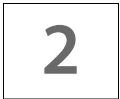

# Suggested solutions for Chapter 2

## PROBLEM 1

Draw good diagrams of saturated hydrocarbons with seven carbon atoms having (a) linear, (b) branched, and (c) cyclic structures. Draw molecules based on each framework having both ketone and carboxylic acid functional groups in the same molecule.

## Purpose of the problem

To get you drawing simple structures realistically and to steer you away from rules and names towards more creative and helpful ways of representing molecules.

## Suggested solution

There is only one linear hydrocarbon but there are many branched and cyclic options. We offer some possibilities, but you may have thought of others.

linear saturated hydrocarbon (n-heptane)

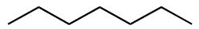

some branched hydrocarbons

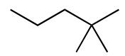

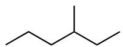

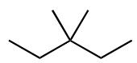

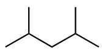

some cyclic hydrocarbons

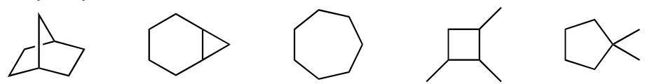

We give you a few examples of keto-carboxylic acids based on these structures. A ketone has to have a carbonyl group not at the end of a chain; a carboxylic acid functional group by contrast has to be at the end of a chain. You will notice that no carboxylic acid based on the first three cyclic structures is possible without adding another carbon atom.

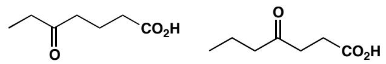

linear molecules containing ketone and carboxylic acid

some branched keto-acids

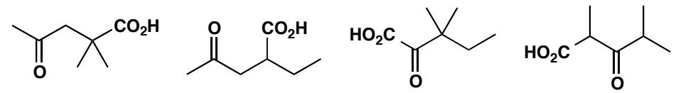

some cyclic keto-acids

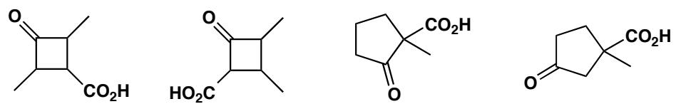

## PROBLEM 2

Draw for yourself the structures of amoxicillin and Tamiflu shown on page 10 of the textbook. Identify on your diagrams the functional groups present in each molecule and the ring sizes. Study the carbon framework: is there a single carbon chain or more than one? Are they linear, branched, or cyclic?

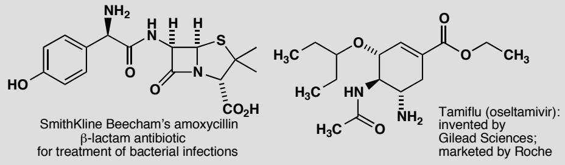

## Purpose of the problem

To persuade you that functional groups are easy to identify even in complicated structures: an ester is an ester no matter what company it keeps and it can be helpful to look at the nature of the carbon framework too.

## Suggested solution

The functional groups shouldn't have given you any problem except perhaps for the sulfide (or thioether) and the phenol (or alcohol). You should have seen that both molecules have an amide as well as an amine.

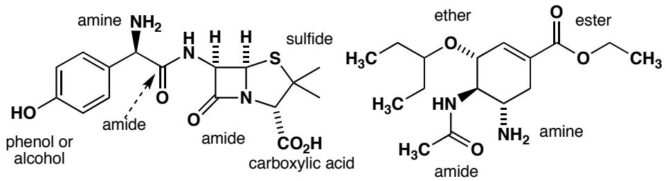

The ring sizes are easy and we hope you noticed that one bond between the four- and the five-membered ring in the penicillin is shared by both rings.

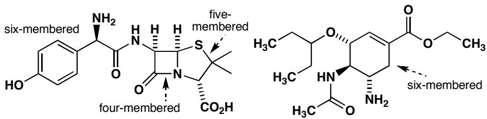

The carbon chains are quite varied in length and style and are broken up by N, O, and S atoms.

cyclic $C_{3}$

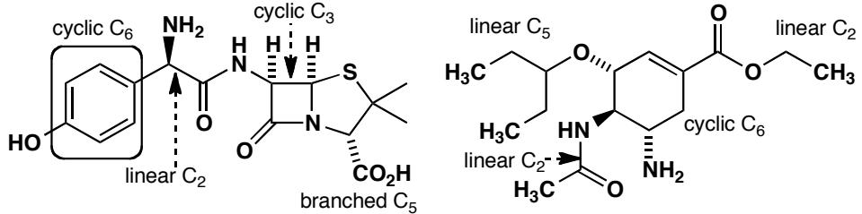

## PROBLEM 3

Identify the functional groups in these two molecules

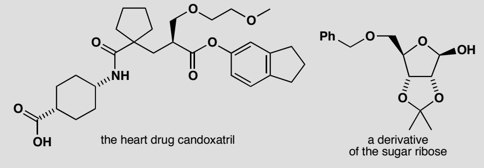

## Purpose of the problem

Identifying functional groups is not just a sterile exercise in classification: spotting the difference between an ester, an ether, an acetal and a hemiacetal is the first stage in understanding their chemistry.

## Suggested solution

The functional groups are marked on the structures below. Particularly important is to identify an acetal and a hemiacetal, in which both ‘ether-like’ oxygens are bonded to a single carbon, as a single functional group.

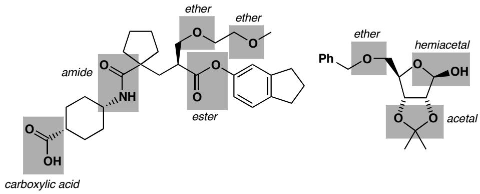

## PROBLEM 4

What is wrong with these structures? Suggest better ways to represent these molecules

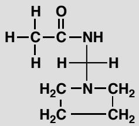

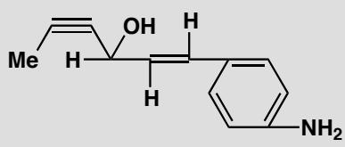

## Purpose of the problem

To shock you with two dreadful structures and to try to convince you that well drawn realistic structures are more attractive to the eye as well as easier to understand and quicker to draw.

## Suggested solution

The bond angles are grotesque with square planar saturated carbon atoms, bent alkynes with $120^{\circ}$ bonds, linear alkenes with bonds at $90^{\circ}$ or $180^{\circ}$ , bonds coming off a benzene ring at the wrong angles and so on. If properly drawn, the left hand structure will be clearer without the hydrogen atoms. Here are better structures for each compound but you can think of many other possibilities.

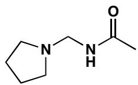

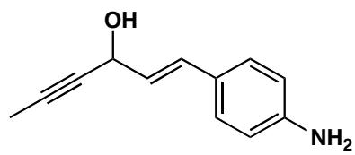

## PROBLEM 5

Draw structures for the compounds named systematically here. In each case suggest alternative names that might convey the structure more clearly if you were speaking to someone rather than writing.

(a) 1,4-di-(1,1-dimethylethyl)benzene

(b) 1-(prop-2-enyloxy)prop-2-ene

(c) cyclohexa-1,3,5-triene

## Purpose of the problem

To help you appreciate the limitations of systematic names, the usefulness of part structures and, in the case of (c), to amuse.

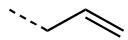

## Suggested solution

(a) A more helpful name would be para-di-t-butyl benzene. It is sold as 1,4-di-tert-butyl benzene, an equally helpful name. There are two separate numerical relationships.

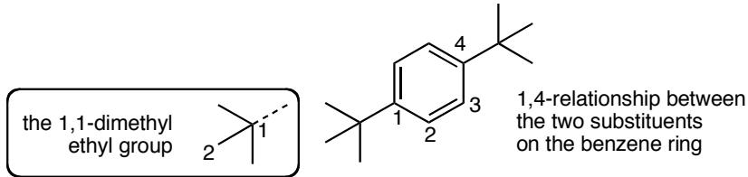

(b) This name conveys neither the simple symmetrical structure nor the fact that it contains two allyl groups. Most chemists would call it ‘diallyl ether’ though it is sold as ‘allyl ether’.

the allyl group

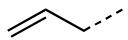

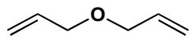

the allyl group

(c) This is of course simply benzene!

## PROBLEM 6

Translate these very poor structural descriptions into something more realistic. Try to get the angles about right and, whatever you do, don't include any square planar carbon atoms or any other bond angles of $90^{\circ}$ .

(a) $C_{6}H_{5}CH(OH)(CH_{2})_{4}COC_{2}H_{5}$

(b) $\mathrm{O}(\mathrm{CH}_{2}\mathrm{CH}_{2})_{2}\mathrm{O}$

(c) $(\mathrm{CH}_{3}\mathrm{O})_{2}\mathrm{CH}=\mathrm{CHCH}(\mathrm{OCH}_{3})_{2}$

## Purpose of the problem

An exercise in interpretation and composition. This sort of ‘structure’ is sometimes used in printed text. It gives no clue to the shape of the molecule.

## Suggested solution

You probably need a few ‘trial and error’ drawings first but simply drawing out the carbon chain gives you a good start. The first is straightforward—the (OH) group is a substituent joined to the chain and not part of it. The second compound must be cyclic—it is the ether solvent commonly known as dioxane. The third gives no hint as to the shape of the alkene and we have chosen trans. It also has two ways of representing a methyl group. Either is fine, but it is better not to mix the two in one structure.

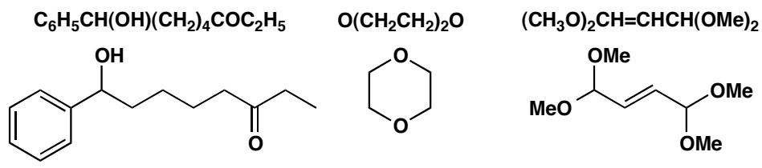

## PROBLEM 7

Identify the oxidation level of all the carbon atoms of the compounds in problem 6.

## Purpose of the problem

This important exercise is one you will get used to very quickly and, before long, do without thinking. If you do it will save you from many trivial errors. Remember that the oxidation state of all the carbon atoms is +4 or C(IV). The oxidation level of a carbon atom tells you to which oxygen-based functional group it can be converted without oxidation or reduction.

## Suggested solution

Just count the number of bonds between the carbon atom and heteroatoms (atoms which are not H or C). If none, the atom is at the hydrocarbon level (□), if one, the alcohol level (○), if two the aldehyde or ketone level, if three the carboxylic acid level (●) and, if four, the carbon dioxide level.

■ Why alkenes have the alcohol oxidation level is explained on page 33 of the textbook.

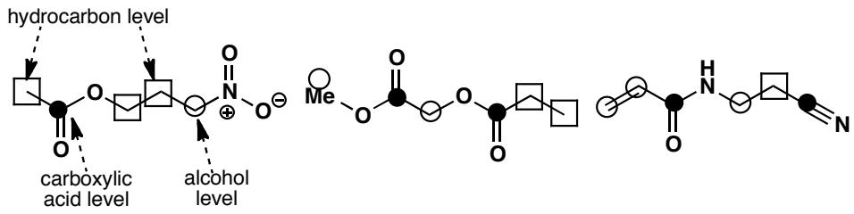

## PROBLEM 8

Draw full structures for these compounds, displaying the hydrocarbon framework clearly and showing all the bonds in the functional groups. Name the functional groups.

(a) $\mathrm{AcO(CH_{2})_{3}NO_{2}}$

(b) $MeO_{2}CCH_{2}OCOEt$

(c) $CH_{2}=CHCONH(CH_{2})_{2}CN$

## Purpose of the problem

This problem extends the purpose of problem 6 as more thought is needed and you need to check your knowledge of the ‘organic elements’ such as Ac.

## Suggested solution

For once the solution can be simply stated as no variation is possible. In the first structure ‘AcO’ represents an acetate ester and that the nitro group can have only four bonds (not five) to N. The second has two ester groups on the central carbon, but one is joined to it by a C–O and the other by a C–C bond. The last is straightforward.

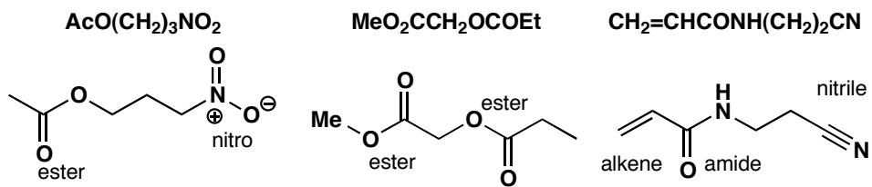

## PROBLEM 9

Draw structures for the following molecules, and then show them again using at least one ‘organic element’ symbol in each.

(a) ethyl acetate

(b) chloromethyl methyl ether

(c) pentanenitrile

(d) N-acetyl p-aminophenol

(e) 2,4,6,-tri-(1,1-dimethylethyl)phenylamine

## Purpose of the problem

Compound names mean nothing unless you can visualize their structures. More practice using ‘organic elements’.

EtOAc

## Suggested solution

The structures are shown below—things to look out for are the difference between acetyl and acetate, the fact that the carbon atom of the nitrile group is included in the name, and the way that a tert-butyl group can be named as '1,1-dimethylethyl'.

■ There is a list of the abbreviations known as 'organic elements' on page 42 of the textbook.

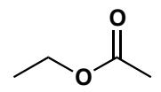

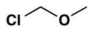

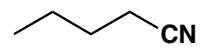

BuCN

chloromethyl methyl ether

pentanenitrile

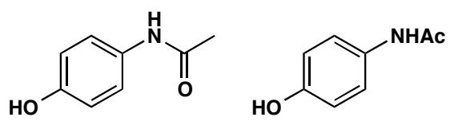  
N-acetyl p-aminophenol

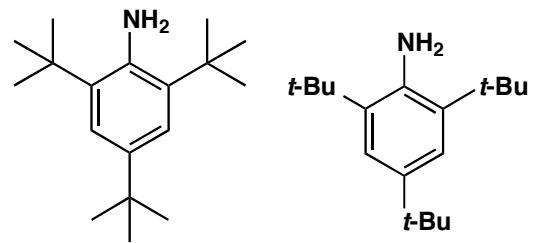  
2,4,6,-tri-(1,1-dimethylethyl)phenylamine

## PROBLEM 10

Suggest at least six different structures that would fit the formula $C_{4}H_{7}NO$ . Make good realistic diagrams of each one and say which functional groups are present.

## Purpose of the problem

The identification and naming of functional groups is more important than the naming of compounds, because the names of functional groups tell you about their chemistry. This was your chance to experiment with different groups and different carbon skeletons and to experience the large number of compounds you could make from a formula with few atoms.

## Suggested solution

We give twelve possible structures – there are of course many more. You need not have used the names in brackets as they are ones more experienced chemists might use.

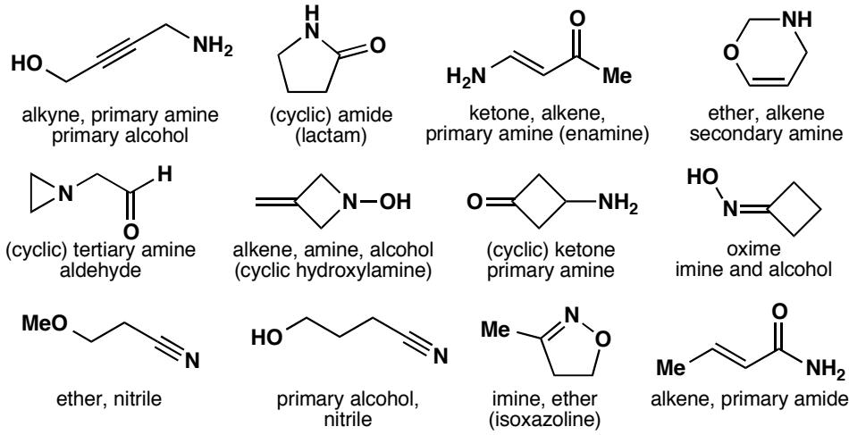

# Suggested solutions for Chapter 3

## PROBLEM 1

Assuming that the molecular ion is the base peak (100% abundance) what peaks would appear in the mass spectrum of each of these molecules:

(a) $C_{2}H_{5}BrO$

(b) $C_{60}$

(c) $C_{6}H_{4}BrCl$

In cases (a) and (c) suggest a possible structure of the molecule. What is (b)?

## Purpose of the problem

To give you some practice with mass spectra and, in particular, at interpreting isotopic peaks. The molecular ion is the most important ion in the spectrum and often the only one that interests us.

## Suggested solution

Bromine has two isotopes, ${}^{79}Br$ and ${}^{81}Br$ in about a 1:1 ratio. Chlorine has two isotopes ${}^{35}Cl$ and ${}^{37}Cl$ in about a 3:1 ratio. There is about 1.1% ${}^{13}C$ in normal compounds.

(a) $C_{2}H_{5}BrO$ will have two main molecular ions at 124 and 126. There will be very small (2.2%) peaks at 125 and 126 from the 1.1% of ${}^{13}C$ at each carbon atom.

(b) $C_{60}$ has a molecular ion at 720 with a strong peak at 721 of 60 x 1.1 = 66%, more than half as strong as the ${}^{12}C$ peak at 720. This compound is buckminsterfullerene.

(c) This compound is more complicated. It will have a 1:1 ratio of $^{79}\mathrm{Br}$ and $^{81}\mathrm{Br}$ and a 3:1 ratio of $^{35}\mathrm{Cl}$ and $^{37}\mathrm{Cl}$ in the molecular ion. There are four peaks from these isotopes (ratios in brackets) $\mathrm{C_6H_4^{79}Br^{35}Cl}$ (3), $\mathrm{C_6H_4^{81}Br^{35}Cl}$ (3), $\mathrm{C_6H_4^{79}Br^{37}Cl}$ (1), and $\mathrm{C_6H_4^{81}Br^{37}Cl}$ (1), the masses of these peaks being 190, 192, 192, and 194. So the complete molecular ion will have three main peaks at 190, 192, and 194 in a ratio of 3:4:1 with peaks at 191, 193, and 194 at $6.6\%$ of the peak before it.

Compounds (a) and (c) might be isomers of compounds such as these:

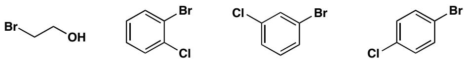

## PROBLEM 2

Ethyl benzoate $PhCO_{2}Et$ has these peaks in its ${}^{13}C$ NMR spectrum: 17.3, 61.1, 100–150 (four peaks) and 166.8 ppm. Which peak belongs to which carbon atom? You are advised to make a good drawing of the molecule before you answer.

## Purpose of the problem

To familiarize you with the four regions of the spectrum.

## Suggested solution

It isn't possible to say which aromatic carbon is which and it doesn't matter. The rest are straightforward.

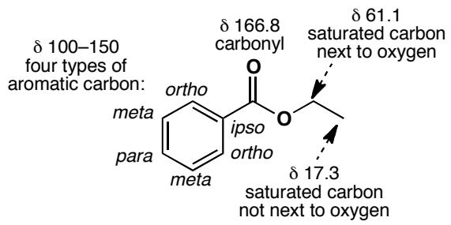

## PROBLEM 3

Methoxatin was mentioned on page 44 of the textbook where we said 'it proved exceptionally difficult to solve the structure by NMR.' Why is it so difficult? Could anything be gained from the $^{13}\mathrm{C}$ or $^{1}\mathrm{H}$ NMR? What information could be gained from the mass spectrum and the infra red?

## Purpose of the problem

To convince you that this structure really needs an X-ray solution but also to get you to think about what information is available by the other methods. Certainly mass spectroscopy, NMR, and IR would have been tried first.

## Suggested solution

There are only two hydrogens on carbon atoms and they are both on aromatic rings. There are only two types of carbon atom: carbonyl groups and unsaturated ring atoms. This information is mildly interesting but is essentially negative—it tells us what is not there but gives us no information on the basic skeleton, where the carboxylic acids are, nor does it reveal the 1,2-diketone in the middle ring.

The mass spectrum would at least give the molecular formula $C_{14}H_{6}N_{2}O_{8}$ and the infra-red would reveal an N–H group, carboxylic acids, and perhaps the 1,2-diketone. The X-ray was utterly convincing and the molecule has now been synthesized, confirming the structure.

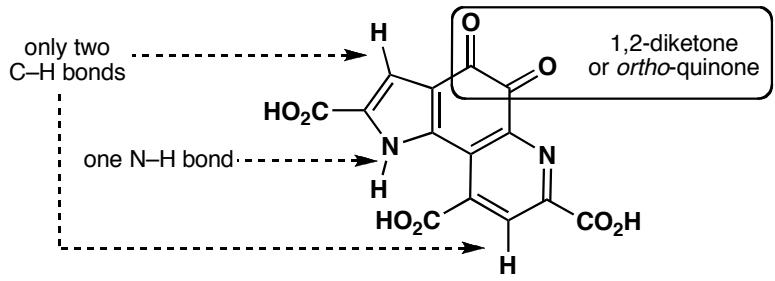  
■ The synthesis of methoxatin is described in J. A. Gainor and S. M. Weinreb, J. Org. Chem., 1982, 47, 2833.

## PROBLEM 4

The solvent formerly used in some correcting fluids is a single compound $C_{2}H_{3}Cl_{3}$ , having ${}^{13}C$ NMR peaks at 45.1 and 95.0 ppm. What is its structure? How would you confirm it spectroscopically? A commercial paint thinner gives two spots on chromatography and has ${}^{13}C$ NMR peaks at 7.0, 27.5, 35.2, 45.3, 95.6, and 206.3 ppm. Suggest what compounds might be used in this thinner.

## Purpose of the problem

To start you on the road to structure identification with one very simple problem and some deductive reasoning. It is necessary to think about the size of the chemical shifts to solve this problem.

## Suggested solution

With the very small molecule $C_{2}H_{3}Cl_{3}$ it is best to start by drawing all the possible structures. In fact there are only two.

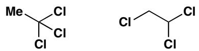

The first would have a peak for the methyl group in the 0–50 region and one for the $CCl_{3}$ group at a very large chemical shift because of the three chlorine atoms. The second isomer would have two peaks in the 50–100 region, not that far apart. The second structure looks better but it would be easily confirmed by proton NMR as the first structure would have one peak only but the second would have two peaks for different CHs. The solvent is indeed the second structure 1,1,2-trichloroethane.

Two of the peaks (45.3 and 95.6) in the paint thinner are much the same as those for this compound (chemical shifts change slightly in a mixture as the two compounds dissolve each other). The other compound has a carbonyl group at 206.3 and three saturated carbon atoms, two close to the carbonyl group (larger shifts) and one further away. Butanone fits the bill perfectly. You were not expected to decide which $CH_{2}$ group belongs to which molecule—that can be found out by running a spectrum of pure butanone.

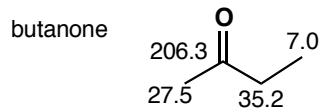

## PROBLEM 5

The ‘normal’ O–H stretch in the infrared (i.e. without hydrogen bonding) comes at about $3600 \, cm^{-1}$ . What is the reduced mass ( $\mu$ ) for O–H? What happens to the reduced mass when you double the mass of each atom in turn, i.e. what is $\mu$ for O–D and what is $\mu$ for S–H? In fact, both O–D and S–H stretches come at about $2,500 \, cm^{-1}$ . Why?

## Purpose of the problem

To get you thinking about the positions of IR bands in terms of the two main influences: reduced mass and bond strength.

## Suggested solution

Using the equation on page 64 of the textbook we find that the reduced mass of OH is 16/17 or about 0.94. When you double the mass of H, the reduced mass of OD becomes 32/18 or about 1.78—nearly double that of OH. But when you double the mass of O, the reduced mass of SH is 32/33 or about 0.97 – hardly changed from OH! The change in the reduced mass from OH to OD is enough to account for the change in stretching frequency—a change of about $\sqrt{2}$ . But the change in reduced mass from OH to SH cannot account for the change in frequency. The explanation is that the S–H bond is weaker than the O–H bond by a factor of about 2. So both both O–D and S–H absorb at about the same frequency.

There is an important principle to be deduced from this problem. Very roughly, all the reduced masses of all bonds involving the heavier elements (C, N, O, S etc.) differ by relatively small amounts and the differences in stretching frequency are mainly due to changes in bond strength, though it can be significant in comparing, say, C–O with C–Cl. With bonds involving hydrogen the reduced mass becomes by far the most important factor.

## PROBLEM 6

Three compounds, each having the formula $C_{3}H_{5}NO$ , have the IR data summarized here. What are their structures? Without ${}^{13}C$ NMR data it might be easier to draw some or all possible structures before trying to decide which is which. In what ways would ${}^{13}C$ NMR data help?

(a) One sharp band above $3000 \, cm^{-1}$ and one strong band at about $1700 \, cm^{-1}$

(b) Two sharp bands above $3000~\mathrm{cm}^{-1}$ and two bands between 1600 and $1700~\mathrm{cm}^{-1}$

(c) One strong broad band above $3000 \, cm^{-1}$ and a band at about $2200 \, cm^{-1}$

## Purpose of the problem

To show that IR alone does have some use but that NMR data are usually essential as well. In answers to exam questions of this type it is important to show how you interpret the data as well as to give a structure. If you get the structure right, this doesn't matter, but if you get it wrong, you may still get credit for your interpretation.

## Suggested solution

(a) One sharp band above $3000 \, cm^{-1}$ must be an N–H and one strong band at about $1700 \, cm^{-1}$ must be a carbonyl group. That leaves $C_{2}H_{4}$ , so we might have one of the structures shown below, though other less likely structures are possible too. ${}^{13}C$ NMR data would help as it would definitely show two types of saturated carbon (along with the carbonyl group) for the first compound, but only one for the second.

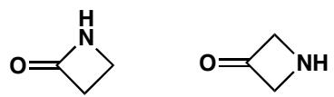

(b) Two sharp bands above $3000 \, cm^{-1}$ must be an $NH_{2}$ group and two bands between 1600 and $1700 \, cm^{-1}$ suggest a carbonyl group and an alkene. This leaves us with three hydrogen atoms so we must have something like the molecules below. ${}^{13}C$ NMR data would help as it would show an alkene carbon shifted downfield by being joined to electronegative nitrogen in the second case.

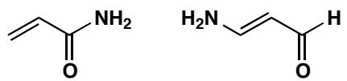  
■ You will meet other ways of distinguishing these compounds in chapters 13 and 18.

(c) One strong broad band above $3000 \, cm^{-1}$ must be an OH group and a band at about $2200 \, cm^{-1}$ must be a triple bond, presumably CN as otherwise we have nowhere to put the nitrogen atom. This means structures of this sort.

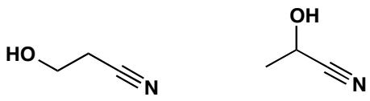

## PROBLEM 7

Four compounds having the formula $C_{4}H_{6}O_{2}$ have the IR and NMR data given below. How many DBEs (double bond equivalents—see p. 75 in the textbook) are there in $C_{4}H_{6}O_{2}$ ? What are the structures of the four compounds? You might again find it useful to draw a few structures to start with.

(a) IR: $1745 \, cm^{-1}$ ; ${}^{13}C$ NMR 214, 82, 58, and 41 ppm

(b) IR: $3300 \, cm^{-1}$ (broad); ${}^{13}C$ NMR 62 and 79 ppm.

(c) IR: $1770 \, cm^{-1}$ ; ${}^{13}C$ NMR 178, 86, 40, and 27 ppm.

(d) IR: 1720 and 1650 cm $^{-1}$ (strong); ${}^{13}$ C NMR 165, 133, 131, and 54 ppm.

## Purpose of the problem

First steps in identifying a compound from two sets of data. Because the molecules are so small (only four carbon atoms) drawing out a few trial structures is a good way to start.

## Suggested solution

Here are some possible structures for $C_{4}H_{6}O_{2}$ . It is clear that there are two double bond equivalents and that double bonds and rings are likely to feature. Functional groups are likely to include alcohol, aldehyde, ketone and carboxylic acid.

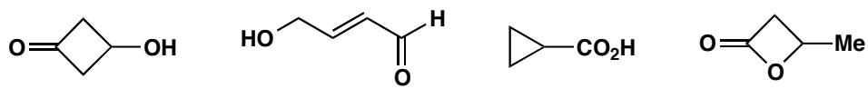

(a) IR: $1745 \, cm^{-1}$ must be a carbonyl group; ${}^{13}C$ NMR 214 must be an aldehyde or ketone, 82 and 58 look like two carbons next to oxygen and 41 is a carbon not next to oxygen but not far away. As the second oxygen doesn't show up in the IR, it must be an ether. As there is only one double bond, the compound must be cyclic. This suggests just one structure.

■ The alkyne does not show up in the IR as it is symmetrical: see p. 71 of the textbook.

(b) IR: $3300 \, cm^{-1}$ (broad) must be an OH; ${}^{13}C$ NMR 62 and 79 show a symmetrical molecule and no C=O so it must have a triple bond and a saturated carbon next to oxygen. This again gives only one structure.

(c) IR: $1770 \, cm^{-1}$ must be some sort of carbonyl group; ${}^{13}C$ NMR 178 suggests an acid derivative, 86 is a saturated carbon next to oxygen, 40 and 27 are saturated carbons not next to oxygen. There is only one double bond so it must be a ring. Looks like a close relative of (a).

(d) IR 1720 and 1650 cm $^{-1}$ (strong) must be C=C and C=O; ${}^{13}$ C NMR 165 is an acid derivative, 131 and 133 must be an alkene, and 54 is a saturated carbon next to oxygen. That defines all the carbon atoms. It is not significant that we cannot say which alkene carbon is which.

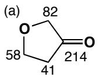

(b)  
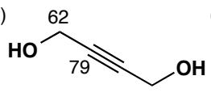  
(c)

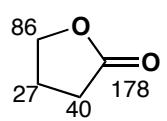

(d)  
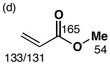

## PROBLEM 8

You have dissolved tert-butanol in MeCN with an acid catalyst, left the solution overnight, and found crystals in the morning with the following characteristics. What are the crystals?

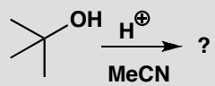

IR: 3435 and $1686~\mathrm{cm}^{-1}$ ; ${}^{13}\mathrm{C}$ NMR: 169, 50, 29, and 25 ppm; ${}^{1}\mathrm{H}$ NMR: 8.0, 1.8, and 1.4 ppm; Mass spectrum (%): 115 (7), 100 (10), 64 (5), 60 (21), 59 (17), 58 (100), and 56 (7). Don't try to assign all the peaks in the mass spectrum.

## Purpose of the problem

This is a common situation: you carry out a reaction and find a product that is not starting material, but what is it? You'll need to use all the information and some logic. What you must not do is to decide in advance what the product is from your (limited) knowledge of chemistry and make the data fit.

## Suggested solution

The molecular ion in the mass spectrum is 115 and is presumably $C_{6}H_{13}NO$ —the sum of the two reagents t-BuOH and MeCN. It appears that they have added together but the IR shows that neither OH nor CN has survived. So what do we know?

\- The IR tells us we have an N–H and a C=O group, accounting for both heteroatoms.

\- The ${}^{13}$ C NMR shows a carbonyl group (169) and three types of saturated carbon.

\- There must be a lot of symmetry, suggesting that the t-Bu group has survived.

This leaves four fragments: NH, C=O, Me, and t-Bu, confirmed also by the ${}^{1}$ H NMR spectrum, which tells us that we have three types of H atoms. We can join these fragments up in two ways:

■ If you are solving this problem after having already studied the more detailed description of ${}^{1}$ H NMR spectroscopy in chapter 13, it will help you to know that all three signals in the ${}^{1}$ H spectrum are singlets: no two types of H atom can be adjacent to each other.

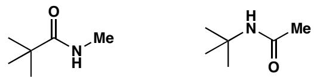

We might prefer the second as it retains the skeleton of MeCN, but a better reason is the base (100%) peak in the mass spectrum at 58. This is $Me_{2}C=NH_{2}^{+}$ which could easily come from the second structure but only by extensive reorganization of the first structure.

The second structure is in fact correct but we need further analysis of the proton NMR (chapter 13) to be sure.

## PROBLEM 9

How many signals would you expect in the ${}^{13}$ C NMR spectrum of these compounds?

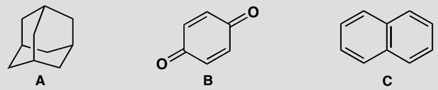

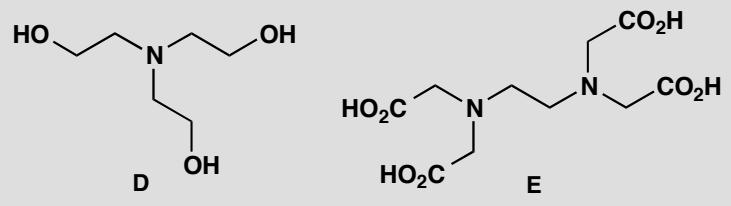

## Purpose of the problem

To get you thinking about symmetry.

## Suggested solution

Compound A has tetrahedral symmetry and there are only two types of carbon: every $CH_{2}$ is the same, as is every CH, so it has two signals. This is the famous compound adamantane—a crystalline solid in spite of its being a hydrocarbon with only ten carbon atoms. If you do not see the symmetry, make a model—it is a beautiful structure.

Compound B is symmetrical too: the two C=O groups are the same and so are all the other carbon atoms in the ring. It is an orange crystalline solid called quinone. Two signals.

Compound C is naphthalene and has high symmetry: the two benzene rings are the same and there are only three types of carbon atom. Three signals.

Compound D is ‘triethanolamine’ used a lot by biochemists. It has threefold symmetry and only two types of carbon atom. Two signals.

Compound E is ‘EDTA’ (ethylenediaminetetraacetic acid) an important chelating agent for metals. This time there are three types of carbon atom. Three signals.

## PROBLEM 10

When benzene is treated with tert-butyl chloride and aluminium trichloride, a crystalline product A is formed that contains only C and H. Mass spectrometry tells us the molecular mass is 190. The ${}^{1}$ H NMR spectrum looks like this:

If crystals of A are treated again with more tert-butyl chloride and aluminium chloride, a new oily compound B may be isolated, this time with a molecular mass of 246. Its ${}^{1}$ H NMR spectrum is similar to that of A, but not quite the same:  
  
What are the two compounds? How many signals do you expect in the ${}^{13}$ C NMR spectrum of each compound?

## Purpose of the problem

Identifying compounds from spectroscopic data, whether you know the reaction or not, is a key skill you must develop.

## Suggested solution

The ${}^{1}$ H NMR spectrum is so simple that both compounds must have a lot of symmetry. Each of the two signals is in a different region of the spectrum (see p. 60 of the textbook), so both compounds have one type of H attached to $sp^{2}$ -hybridized C atoms (presumably from the benzene starting material) and one type of H attached to $sp^{3}$ -hybridized C atoms (presumably from the tert-butyl chloride starting material).

Often a good place to start with this sort of problem is to use the molecular mass to work out approximately how many of each of the starting molecules have been incorporated into the product: benzene has a mass of 78 and the tert-butyl group a mass of 57 (the chloride must be lost as there is no chlorine in the product), so it looks as though A is made up from one benzene molecule plus two tert-butyl groups and B from one benzene molecule and three tert-butyl groups (with loss of two or three hydrogen atoms where the tert-butyls are bonded to the benzene ring).

So, the only question left is how the substituents are arranged. Two tert-butyl groups could be arranged ortho, meta or para to each other, but only the para arrangement is possible for A because only when the two groups are para are all the protons of the aromatic ring identical (check for yourself).

With three tert-butyl groups, there are three possible arrangements (again, draw them for yourself to check), but as before only one of these allows all the protons on the benzene ring to be identical, each sandwiched between two tert-butyl groups. We have our structures for A and B. Both of them will show four signals in the ${}^{13}$ C NMR spectrum, two of them between 100 and 150 ppm (C atoms in aromatic rings) and two of them between 0 and 50 ppm (saturated C atoms).

  
A

  
B

This page intentionally left blank

# Suggested solutions for Chapter 4

## PROBLEM 1

Textbooks sometimes describe the structure of sodium chloride like this ‘an electron is transferred from the valence shell of a sodium atom to the valence shell of a chlorine atom.’ Why would this not be a sensible way to make sodium chloride?

## Purpose of the problem

To make you think about genuine ways to make compounds rather than theoretical ways.

## Suggested solution

Of course sodium chloride consists of arrays of sodium cations without their 2s electron and chloride anions that have eight electrons in the 2s and 2p orbitals, but that is not how sodium chloride is made. Sodium atoms are present in sodium metal but where would you get the chlorine atoms? Mixing sodium and chlorine (Cl₂) would undoubtedly give sodium chloride but these are two aggressive reagents that would probably explode. Indeed, you would be more likely to make sodium and chlorine by the electrolysis of sodium chloride than the other way round. In any case, why make sodium chloride? Salt mines and the oceans are full of it.

## PROBLEM 2

The H–C–H bond angle in methane is $109.5^{\circ}$ . The H–O–H bond angle of water is close to this number but the H–S–H bond angle of $H_{2}S$ is near $90^{\circ}$ . What does this tell us about the bonding in water and $H_{2}S$ ? Draw a diagram of the molecular orbitals in $H_{2}S$ .

## Purpose of the problem

An exploration of hybridization.

## Suggested solution

If the bond angle in water is close to the tetrahedral angle of perfectly symmetrical methane, water must be more or less tetrahedral (with respect to the arrangement of its electrons) too. We can think of the 2s and 2p electrons in water as hybridized into four pairs of electrons, two in H–O bonds and two as lone pairs on the oxygen atom. But $H_{2}S$ has a near right angle for its H–S–H bond. This suggests that the bonds are formed with p orbitals on the sulfur atom and that $H_{2}S$ is not hybridized. Orbital diagram of $H_{2}S$ : you might have drawn something like this:

## PROBLEM 3

Though the helium molecule $He_{2}$ does not exist (p. 91 of the textbook explains why), the cation $He_{2}^{+}$ does exist. Why?

## Purpose of the problem

To encourage you to think about the filling of molecular orbitals and to accept surprising conclusions.

## Suggested solution

$He_{2}$ does not exist because the number of anti-bonding electrons is the same as the number of bonding electrons. The bond order is zero. But if we remove an electron from the diagram on p. 91 of the textbook we have $He_{2}^{+}$ , with two bonding electrons and only one anti-bonding electron. The bond order is one half. $He_{2}^{+}$ does exist.

## PROBLEM 4

Construct an MO diagram for LiH and suggest what type of bond it might have.

## Purpose of the problem

To demonstrate that a simple MO treatment can be applied to to ionic as well as covalent structures.

## Suggested solution

H has of course only one electron in a 1s orbital. Li has three – a full 1s shell and one electron in the 2s orbital. Li is very electropositive so its 2s orbital is high in energy—much higher than that of the 1s orbital of H. An electron is more stable in the 1s orbital of H than in the 2s orbital of Li, and the molecule is ionic. Both ions have the same electronic configuration: $1s^{2}$ .

Li and H: the atoms

LiH: the molecule

$$
\mathsf {L i} ^ {\oplus} \mathsf {H} ^ {\ominus}
$$

## PROBLEM 5

What is the hybridization and shape of each carbon atom in these molecules?

## Purpose of the problem

To give you practice at selecting the correct hybridization of carbon atoms.

## Suggested solution

Simply count the number of $\sigma$ -bonds at each carbon atom (not forgetting the hydrogens that may not be shown). Two $\sigma$ -bonds means sp and linear, three means $sp^{2}$ and trigonal, and four means $sp^{3}$ and tetrahedral. In each case the bonds stay as far from each other as they can.

## PROBLEM 6

Draw detailed structures for these molecules and predict their shapes. We have deliberately made non-committal drawings to avoid giving away the answer to the question. Don't use these sorts of drawings in your answer.

$$
\mathrm{CO} _ {2}, \mathrm{CH} _ {2} = \mathrm{NCH} _ {3}, \mathrm{CHF} _ {3}, \mathrm{CH} _ {2} = \mathrm{C} = \mathrm{CH} _ {2}, (\mathrm{CH} _ {2}) _ {2} \mathrm{O}
$$

## Purpose of the problem

To give you practice at selecting the right hybridization state for carbon atoms and translating this information into three-dimensional structures for the molecules.

## Suggested solution

Carbon dioxide is linear as it has only two C–C σ-bonds and no lone pairs on C. The C atom must be sp hybridized and the only trick is to get the two π-bonds orthogonal to each other. They must be like that because the p orbitals on C used to make the two π-bonds are themselves orthogonal ( $p_{x}$ and $p_{y}$ ). Most people draw the O atoms as $sp^{2}$ hybridized rather than sp or even unhybridized but this doesn’t matter as you really can’t tell.

$$
\begin{array}{c c} \text {   the   two   } \sigma \text {   bonds   } & \text {   the   two   } \pi \text {   bonds   } \\ \text {   sp } ^ {2} \quad \text {   sp } ^ {2} \\ \text {   O = C = O   } & \text {   sp   } \\ \text {   O - C - O   } & \text {   O   } \\ \text {   O - C - O   } & \text {   O   } \\ \text {   O - C - O   } & \text {   O   } \\ \text {   O - C - O   } & \text {   O   } \\ \text {   O - C - O   } & \text {   O   } \\ \text {   O - C - O   } & \text {   P   } \\ \text {   O - C - O   } & \text {   P   } \\ \text {   O - C - O   } & \text {   P   } \\ \text {   O - C - O   } & \text {   P   } \\ \text {   O - C - O   } & \text {   P   } \\ \text {   O - C - O   } & \text {   N   } \\ \text {   O - C - O   } & \text {   N   } \\ \text {   O - C - O   } & \text {   N   } \\ \text {   O - C - O   } & \text {   N   } \\ \text {   O - C - O   } & \text {   N   } \\ \text {   O - C - O   } & \text {   P   } \\ \text {   O - C - O   } & \text {   P   } \\ \text {   O - C - O   } & \text {   P   } \\ \text {   O - C - O   } & \text {   P   } \\ \text {   O - C - O   } & \text {   R   } \\ \text {   O - C - O   } & \text {   R   } \\ \text {   O - C - O   } & \text {   R   } \\ \text {   O - C - O   } & \text {   R   } \\ \text {   O - C - O   } & \text {   R   } \\ \text {   O - C - O   } & \text {   S   } \\ \text {   O - C - O   } & \text {   S   } \\ \text {   O - C - O   } & \text {   S   } \\ \text {   O - C - O   } & \text {   S   } \\ \text {   O - C - O   } & \text {   S   } \\ \text {   O - C - O   } & \text {   T   } \\ \text {   O - C - O   } & \text {   T   } \\ \text {   O - C - O   } & \text {   T   } \\ \text {   O - C - O   } & \text {   T   } \\ \text {   O - C - O   } & \text {   T   } \\ \text {   O - C - O   } & \text    S.156013894789898989898989898989898989898989898989898989898989898989898989898989898989898989898989898989898989898 0.0000000000000000000000000000000000000000000000000000000000000000000000000000000000000000000000000000 0.0001236666666666666666666666666666666666666666666666666666666666666666666666666666666666666666666666666666 1.1111111111111111111111111111111111111111111111111111111111111111111111111111111111111111111111111111 2.2222222222222222222222222222222222222222222222222222222222222222222222222222222222222222222222222222< fcel>The two  $ \sigma $ bonds, the two  $ \sigma $ bonds, the two  $ \sigma $ bonds, the two  $ \sigma $ bonds, the two  $ \sigma $ bonds, the two  $ \sigma $ bonds, the two  $ \sigma $ bonds, the two  $ \sigma $ bonds, the two  $ \sigma $ bonds, the two  $ \sigma $ bonds, the two  $ \sigma $ bonds, the two  $ \sigma $ bonds, the Two  $ \sigma $ bonds, the Two  $ \sigma $ bonds, the Two  $ \sigma $ bonds, the Two  $ \sigma $ bonds, the Two  $ \sigma $ bonds, the Two  $ \sigma $ bonds, the Two  $ \sigma $ bonds, the Two  $ \sigma $ bonds, the Two  $ \sigma $ bonds, the Two  $ \sigma $ bonds, the Two  $ \sigma $ bonds, the Two \( P_{\mathrm{p}}^{\mathrm{a}}\mathrm{O}^{\mathrm{a}}\mathrm{O}^{\mathrm{a}}\mathrm{O}^{\mathrm{a}}\mathrm{O}^{\mathrm{a}}\mathrm{O}^{\mathrm{a}}\mathrm{O}^{\mathrm{a}}\mathrm{O}^{\mathrm{a}}\mathrm{O}^{\mathrm{a}}\mathrm{O}^{\mathrm{a}}\mathrm{O}^{+} + 3\mathrm{O}^{-}\mathrm{O}_{-}\mathrm{O}_{-}\mathrm{O}_{-}\mathrm{O}_{-}\mathrm{O}_{-}\mathrm{O}_{-}\mathrm{O}_{-}\mathrm{O}_{-}\mathrm{O}_{-}\mathrm{O}_{-}\mathrm{O}_{-}\mathrm{O}_{-}\mathrm{O}_{-}\mathrm{O}_{-}\mathrm{O}_{-}\mathrm{O}_{-}\mathrm{O}_{-}\mathrm{C}^{+}\mathrm{C}_{-}\mathrm{C}_{-}\mathrm{C}_{-}\mathrm{C}_{-}\mathrm{C}_{-}\mathrm{C}_{-}\mathrm{C}_{-}\mathrm{C}_{-}\mathrm{C}_{-}\mathrm{C}_{-}\mathrm{C}_{-}\mathrm{C}_{-}\mathrm{C}_{-}\mathrm{C}_{-}\mathrm{C}_{-}\mathrm{C}_{-}\mathrm{C}_{-}\mathrm{O}^{+} + 3\mathrm{O}^{-}\mathrm{O}_{-}\mathrm{O}_{-}\mathrm{O}_{-}\mathrm{O}_{-}\mathrm{O}_{-}\mathrm{O}_{-}\mathrm{O}_{-}\mathrm{O}_{-}\mathrm{O}_{-}\mathrm{O}_{-}\mathrm{O}_{-}\mathrm{O}_{-}\mathrm{O}_{-}\mathrm{O}_{+} + 3\mathrm{O}^{-}\mathrm{O}_{-}\mathrm{O}_{-}\mathrm{O}_{-}\mathrm{O}_{-}\mathrm{O}_{-}\mathrm{O}_{-}\mathrm{O}_{-}\mathrm{O}_{-}\mathrm{O}_{-}\mathrm{O}_{-}\mathrm{O}_{-}\mathrm{O}_{-}\mathrm{O}_{-}\mathrm{O}_{-}\mathrm{O}_ {-} + 3\mathrm{O}^{-}\mathrm{O}_ {-} + 3\mathrm{O}^{-}\mathrm{O}_ {-} + 3\mathrm{O}^{-}\mathrm{O}_ {-} + 3\mathrm{O}^{-}\mathrm{O}_ {-} + 3\mathrm{O}^{-}\mathrm{O}_ {-} + 3\mathrm{O}^{-}\mathrm{O}_ {-} + 3\mathrm{O}^{-}\end{array}
$$

The imine has a C=N double bond so it must have $sp^{2}$ hybridized C and N. This means that the lone pair on nitrogen is in an $sp^{2}$ orbital and not in a p orbital. The molecule is planar (except for the methyl group which is, of course, tetrahedral) and is bent at the nitrogen atom.

Trifluoromethane is, of course, tetrahedral with an $sp^{3}$ hybridized carbon atom. The arrangement of the lone pairs round the fluorine (not shown) can also be assumed to be tetrahedral.

$$
\mathrm{sp} ^ {3} \xrightarrow {\text {   }} \begin{array}{c} \text {   F   } \\ \text {   F   } \\ \text {   H   } \end{array}
$$

The next molecule $CH_{2}=C=CH_{2}$ is allene and it has the same shape as $CO_{2}$ , and for the same reasons. We can now be sure that the end carbons are $sp^{2}$ hybridized as they are planar, with the hydrogen substituents at $120^{\circ}\cdot$ to each other and to the rest of the molecule. As with $CO_{2}$ , the two $\pi$ bonds are orthogonal, meaning that the planes of the two terminal carbon atoms are also orthogonal, meaning that the molecule as a whole is not planar.

Finally, $(\mathrm{CH}_{2})_{2}\mathrm{O}$ must be a three-membered ring and therefore the C–C–O skeleton must be planar (three points are always in a plane!). The two carbon atoms are $sp^{3}$ hybridized (four $\sigma$ bonds) and are tetrahedral (though very distorted as the ring angle is $60^{\circ}$ ) with the H atoms above and below the ring. The oxygen atom is presumably also $sp^{3}$ hybridized, but it's hard to tell experimentally.

## PROBLEM 7

Draw the shapes, showing estimated bond angles, of the following molecules:

(a) hydrogen peroxide, $H_{2}O_{2}$

(b) methyl isocyanate $CH_{3}NCO$

(c) hydrazine, $NH_{2}NH_{2}$

(d) diimide, $N_{2}H_{2}$

(e) the azide anion, $N_{3}^{-}$

## Purpose of the problem

To think about shape and bond angles at elements other than carbon.

## Suggested solution

Hydrogen peroxide, $H_{2}O_{2}$ , has only single bonds: each oxygen atom has two lone pairs and the electron pairs, both bonding and non-bonding, are arranged tetrahedrally. The bond angles at oxygen will be approximately the tetrahedral angle of $109^{\circ}$ .

In methyl isocyanate, $CH_{3}NCO$ , the interesting atoms are the N and the C. The N atom must have a double bond to C, for which it must use a p orbital, leaving an s and two p orbitals for the remainder of the electrons. The N atom is $sp^{2}$ and trigonal, with one lone pair, so the bond angle at N is about $120^{\circ}$ . The C atom is double bonded to both N and O, so the C atom is like the one in $CO_{2}$ —linear, and sp hybridized.

In hydrazine, $NH_{2}NH_{2}$ , there are only single bonds: both nitrogens are like amine nitrogens, pyramidal and $sp^{3}$ hybridized.

In diimide the only reasonable structure has a double bond between the two nitrogen atoms, $\mathrm{HN} = \mathrm{NH}$ , making the nitrogens trigonal (they must use a p orbital to make this double bond, leaving an s and two p orbitals for the remainder of the bonding, i.e. they are $\mathfrak{sp}^2$ hybridized). Each nitrogen is trigonal, with $120^{\circ}$ bond angles. An interesting point about diimide is that, like an alkene, it can have a cis and a trans isomer.

Bonding in the azide anion $N_{3}^{-}$ is identical with that in carbon dioxide: the two molecules are isoelectronic (count the electrons to make sure). The central nitrogen is sp hybridized and linear.

$$
\begin{array}{c c c c} \mathrm{H} _ {\sim 1 0 9 ^ {\circ}} \mathrm{O} - \mathrm{H} & \stackrel {{\mathrm{H}}} {{\sim 1 0 9 ^ {\circ}}} \stackrel {{\mathrm{C}}} {{\sim 1 2 0 ^ {\circ}}} \\ & \mathrm{N} = \mathrm{C} = \mathrm{O} \\ & \stackrel {{\mathrm{H}}} {{\sim 1 0 9 ^ {\circ}}} \stackrel {{\mathrm{N}}} {{\sim 1 2 0 ^ {\circ}}} \end{array} \quad \begin{array}{c c c c} \mathrm{H} _ {\sim 1 0 9 ^ {\circ}} \stackrel {{\mathrm{N}}} {{\sim 1 2 0 ^ {\circ}}} \stackrel {{\mathrm{H}}} {{\sim 1 2 0 ^ {\circ}}} \\ & \stackrel {{\mathrm{N} = \mathrm{N}}} {{\sim 1 2 0 ^ {\circ}}} [ \mathrm{N} = \mathrm{N} ] ^ {\ominus} \\ & \stackrel {{\mathrm{H}}} {{\sim 1 2 0 ^ {\circ}}} [ \mathrm{N} = \mathrm{N} ] ^ {\ominus} \end{array}
$$

## PROBLEM 8

Where would you expect to find the lone pairs in (a) water, (b) acetone $(\mathrm{Me}_2\mathrm{C} = \mathrm{O})$ , and (c) nitrogen $(\mathrm{N}_2)$ ?

## Purpose of the problem

More thinking about the arrangements of electrons at O and N. The location of lone pairs might not seem easy to determine, but it affects the way that molecules form coordination complexes, for example.

## Suggested solution

The oxygen atom of water is surrounded by eight electrons in two bonding and two non-bonding orbitals: it is $sp^{3}$ hybridized and the electron pairs are arranged tetrahedrally, so the lone pairs point towards the remaining two vertices of a tetrahedron.

In acetone, the oxygen atom must use one of its p orbitals to form the $\pi$ bond to carbon, so it is left with an s and two p orbitals to accommodate the six electrons making up the $\sigma$ bond to C and the two lone pairs. These three electron pairs are presumably arranged trigonally, so the lone pairs will lie in the plane of the carbonyl group, about $120^{\circ}$ apart.

The two nitrogen atoms of $N_{2}$ each need two of their p orbitals to form the two $\pi$ bonds, so they are left with one s and one p orbital for the two remaining electron pairs: the $\sigma$ bond and the lone pair. The nitrogen atoms are sp hybridized and the lone pairs are $180^{\circ}$ from the other N.

This page intentionally left blank

# Suggested solutions for Chapter 5

## PROBLEM 1

Each of these molecules is electrophilic. Identify the electrophilic atom and draw a mechanism for a reaction with a generalized nucleophile $Nu^{-}$ , giving the structure of the product in each case.

## Purpose of the problem

The recognition of electrophilic sites is half the battle in starting to understand mechanisms.

## Suggested solution

We have two cations, two carbonyl compounds and two compounds with $\sigma$ bonds only. One of the cations has three bonds to a positively charged carbon so that is the electrophilic site as it has an empty orbital. The nucleophile will attack here.

The other cation has a three-valent oxygen atom that cannot be the electrophilic site. The nucleophile must attack the proton instead. Some nucleophiles might attack the carbon atom joined to the cationic oxygen.

The two carbonyl compounds will be attacked at the carbonyl group by the nucleophile. In general, $\pi$ -bonds are more easily broken than $\sigma$ -bonds and the negative charge goes on to the electronegative oxygen atom. In fact these anions will not be the final products of the reactions. As we will explore in more detail in later chapters, the first will pick up a proton to give an alcohol but the second might decompose with the release of the stable carboxylate anion.

■ This type of substitution reaction is discussed in much more detail in chapter 10.

The remaining electrophiles have $\sigma$ -bonds only, one of which must break. Chlorine is symmetrical so it doesn't matter which end you attack. You have more choice with MeSCl but the stability of the chloride ion wins the day: attack occurs at sulfur.

$$
\mathrm{Nu} ^ {\ominus} \xrightarrow [ ]{\mathrm{Cl}} \mathrm{Cl} \xrightarrow [ ]{\mathrm{Cl}} \longrightarrow \mathrm{Nu} - \mathrm{Cl} + \mathrm{Cl} ^ {\ominus}
$$

$$
\mathrm{Nu} ^ {\ominus} \xrightarrow [ \mathrm{Me} ]{\mathrm{S}} \mathrm{Cl} \longrightarrow \mathrm{Nu} ^ {\ominus} \mathrm{S} _ {\mathrm{Me}} + \mathrm{Cl} ^ {\ominus}
$$

## PROBLEM 2

Each of these molecules is nucleophilic. Identify the nucleophilic atom and draw a mechanism for a reaction with a generalized nucleophile $E^{+}$ , giving the structure of the product in each case.

## Purpose of the problem

The recognition of nucleophilic sites is the other half of the battle in starting to understand mechanisms.

## Suggested solution

This time there are three anions but two of them (the alkyne and the sulfur anions) have lone pair electrons. We should start our arrows from the negative charges and they are the points of attachment of the electrophile in the product.

The third anion is like the borohydride anion discussed on p. 119 of the textbook. The negative charge does not represent a pair of electrons on Al: all the electrons are in the Al–H bonds and we must start our arrow from one of those. The nucleophilic site is a hydrogen atom.

The remaining nucleophiles have lone pairs. The nitrogen-containing molecule is hydrazine: both nitrogens are the same, and the product is positively charged, so it will lose a proton to become more stable.

The phosphorus compound has four atoms with lone pairs, the P and three O atoms. The lone pairs on oxygen are in lower energy orbitals than the one on phosphorus (P is lower down the periodic table and less electronegative than O), so it is the lone pair on P that reacts. The product is positively charged but this time it can't lose a proton.

## PROBLEM 3

Complete these mechanisms by drawing the structure of the product(s).

## Purpose of the problem

Practice in interpreting curly arrows and drawing the products. Once the arrows are drawn, there is no more scope for decision making, so just draw the products.

## Suggested solution

Just break the bonds that are broken and make the bonds that are being formed. Don't forget to put in any charges and make sure you have neither created nor destroyed charge overall. You might straighten out the products a bit so that there are no funny angles.

## PROBLEM 4

Put in the curly arrows on these starting materials to show how the product is formed. The compounds are drawn in a convenient arrangement to help you.

## Purpose of the problem

To encourage you to be prepared to try and draw mechanisms for reactions you have never seen and to show you how easy it is.

## Suggested solution

Just work out which bonds are lost and which are formed and draw arrows out of the one into the space for the other. Start your arrows on a source of electrons: an oxyanion in both these cases. End your arrows on an electronegative atom: oxygen in the first and bromine in the second example here.

Don't worry if your arrows are not exactly the same as ours – so long as they start and finish in the right place they're all right. The notes on the mechanisms are just to help you see what is going on: you would not normally include them. The second reaction looks more complicated than the first but it is actually easier: just move electrons through the molecule.

## PROBLEM 5

Draw mechanisms for the reactions in the following sequence.

## Purpose of the problem

Practice in drawing curly arrows for a simple sequence of reactions.

## Suggested solution

First look for the bond being broken and the bond being formed. In the first reaction, the weak C–I bond is breaking and a C–O is forming. The new OH group must come from the hydroxide, so here we have our nucleophile: $HO^{-}$ . The electrophile is the alkyl iodide. Make your first arrow start on a source of electrons in the nucleophile—in this case that has to be the hydroxide’s negative charge. Those electrons make the new C–O bond, so send them towards C. The old C–I bond must break at the same time, forming an iodide anion.

In the next step, we just lose H, or rather $H^{+}$ , from the hydroxyl group. Sodium hydride is the reagent, and hydride is a base. Bases are just nucleophiles which attack H, so we can start our arrow on the negative charge again, attack H and break the H–O bond, pushing the electrons onto oxygen to make the anion. You need to draw out the bond between O and H to represent this mechanism clearly. The other product is of course gaseous hydrogen.

In the final step, the oxyanion must act as the nucleophile and the electrophile is benzyl bromide. The arrows start on the negative charge, and show the new C–O bond forming and the old C–Br bond breaking.

## PROBLEM 6

Each of these electrophiles could react with a nucleophile at one of (at least) two atoms. Identify these atoms and draw a mechanism and products for each reaction.

## Purpose of the problem

Considering possible alternative reactions. One of the reactions might seem trivial, but it isn't.

## Suggested solution

In each case one of the electrophilic sites is an acidic proton. There is also the electrophilic $\pi$ bond (C=N $^{+}$ or C=O). For the first case, we draw the two reactions separately.

In case you were seduced by the positively charged nitrogen atom (we hope you weren't), we should also remind you of a reaction that most definitely cannot happen: direct attack at N: the supposed product has an impossible five bonds to nitrogen.

In the second compound there are three possibilities. The acidic proton of the carboxylic acid and the electrophilic C=O bond are both possible reaction sites, but now so is the positively charged phosphorus. Phosphorus comes below nitrogen in the periodic table so, unlike N, it can have five bonds.

## PROBLEM 7

These three reactions all give the products shown, but not by the mechanisms drawn! For each mechanism, explain what is wrong, and draw a better one.

## Purpose of the problem

Getting a feel for how you can, and can't, use curly arrows to represent mechanisms.

## Suggested solution

In the first reaction, the nucleophile is the amine and the electrophile is the methyl iodide, so the arrow is right in the sense that it starts on the nucleophile, where the electrons come from. However, we have stressed that a curly arrow should start on a representation of an electron pair, in other words on a lone pair, a bond or a negative charge. Here the arrow just starts on an atom: this is no good, and we must draw in the lone pair. The other problem is at the end of the arrow. It shows a new bond being formed to C, so unless a bond breaks then the C atom will have an impossible five bonds. We need another arrow to show the C–I bond breaking.

In the second reaction we form a cation by attack of a proton on an alkene. Which is the nucleophile? It can't be $H^{+}$ : by definition a proton can't have a pair of electrons! The arrow must therefore start on the alkene and show the electrons moving towards the proton, not the other way round. The electrons come from the $\pi$ bond, so the double bond is where we start the arrow. We only need one arrow, because as the new C–H bond forms, the C atom at other end of the old $\pi$ bond is left with only 6 electrons, and becomes positively charged.

The last reaction forms a new S–Cl bond. The arrow we have drawn starts on a lone pair, but if electrons are moving from Cl to S, surely the S will become negatively charged? The mistake is that the arrow is the wrong way round: the sulfur atom is the nucleophile, and the more electronegative chlorine is the electrophile. Start the arrow on the sulfur lone pair, and break the old Cl–Cl bond as the electrons arrive at Cl.

## PROBLEM 8

In your corrected mechanisms for problem 7, explain in each case which orbital is the HOMO of the nucleophile and which orbital is the LUMO of the electrophile.

## Purpose of the problem

Reinforcing the link between curly arrows and molecular orbitals.

## Suggested solution

The nucleophilic amine of the first reaction uses its lone pair to form the new bond: the HOMO is the $sp^{3}$ orbital containing this non-bonding electron pair. The empty orbital used by the electrophile must be an antibonding orbital, since as the electrons arrive there they cause the C–I bond to break: the LUMO is the C–I $\sigma^{*}$ orbital.

When the alkene is protonated, it loses its $\pi$ bond, and we have already pointed out that the electrons must come from this bond (that's why we start the arrow there). So the HOMO is the C=C π orbital. The LUMO is the only orbital the $H^{+}$ ion has available: its empty 1s orbital.

In the third reaction, the LUMO of the electrophile is easy to spot: it must be the Cl–Cl $\sigma^{*}$ orbital, since that is the bond that breaks. The nucleophile uses the lone pair on sulfur to react, so the HOMO is the non-bonding orbital occupied by this lone pair.

## PROBLEM 9

Draw a mechanism for the following reaction. (This is harder, but if you draw out the structures of the reactants first, and consider that one is an acid and one is a base, you will make a good start.)

$$
\mathrm{PhCHBrCHBrCO} _ {2} \mathrm{H} + \mathrm{NaHCO} _ {3} \longrightarrow \mathrm{PhCH=CHBr+NaHCO} _ {3}
$$

## Purpose of the problem

Working out the mechanism for a more difficult transformation.

## Suggested solution

Working out the structure of the starting material, even through it's written very unhelpfully, is straightforward if you take into account the fact that each carbon has four substituents. Bicarbonate is a base, so you expect the carboxylic acid to be deprotonated to form a carboxylate anion.

Now for the real reaction. Looking at the product tells us we have to lose $CO_{2}$ , along with one of the bromine atoms, so the bonds that have to break are the ones shown in the structure above. The best thing to do in this case is to start ‘pushing arrows’—one of the reasons they are so powerful is they often lead you through to the product. Start at the obvious place—the negative charge—and be guided by the bonds that have to break and form.

Everything works and the electrons end up happily on a bromide anion.

# Suggested solutions for Chapter 6

## PROBLEM 1

Draw mechanisms for these reactions:

## Purpose of the problem

Rehearsal of a simple but important mechanism that works for all aldehydes and ketones.

## Suggested solution

Draw out the $BH_{4}$ and $AlH_{4}$ anions, with the carbonyl compound positioned so that one of the hydrogens can be transferred to the carbonyl group, and then transfer the hydrogen from B or Al to C. A proton transfer is needed to make the alcohol: from the solvent in the first case and during the work-up with water in the second.

  
■ This reaction shows that you can reduce aldehydes with lithium aluminium hydride, even if you would usually prefer the more practical sodium borohydride.

## PROBLEM 2

Cyclopropanone exists as the hydrate in water but 2-hydroxyethanal does not exist as the hemiacetal. Explain.

## Purpose of the problem

To get you thinking about equilibria and hence the stability of compounds.

## Suggested solution

Hydration is an equilibrium reaction so the mechanism is not strictly relevant to the question, though there is no shame in including mechanisms whenever you can. To answer the question we must consider the effect of the three-membered ring on the relative stability of starting material and product. All three-membered rings are very strained because the bond angles are $60^{\circ}$ instead of $109^{\circ}$ or $120^{\circ}$ . Cyclopropanone is particularly strained because the $sp^{2}$ carbonyl carbon would like a bond angle of $120^{\circ}$ —there is ‘ $60^{\circ}$ of strain.’ In the hydrate that carbon atom is $sp^{3}$ hybridized and so there is only about ‘ $49^{\circ}$ of strain.’ Not much gain, but the hydrate is more stable than the ketone.

The second case is totally different. The hydroxy-aldehyde is not strained at all but the hemiacetal has '49° of strain' at each atom. Even without strain, hydrates and hemiacetals are usually less stable than their aldehydes or ketones because one C=O bond is worth more than two C-O bonds. In this case the hemiacetal is even less stable and, unlike the cyclopropanone, can escape strain by breaking a C-O ring bond.

## PROBLEM 3

One way to make cyanohydrins is illustrated here. Suggest a detailed mechanism for the process.

## Purpose of the problem

To help you get used to mechanisms involving silicon and revise an important way to promote additions to the carbonyl group.

## Suggested solution

The silyl cyanide is an electrophile while the cyanide ion in the catalyst is the nucleophile. Cyanide adds to the carbonyl group and the oxyanion product is captured by silicon, liberating another cyanide ion for the next cycle.

## PROBLEM 4

There are three possible products from the reduction of this compound with sodium borohydride. What are their structures? How would you distinguish them spectroscopically, assuming you can isolate pure compounds?

## Purpose of the problem

To let you think practically about reactions that may give more than one product.

## Suggested solution

The three compounds are easily drawn: one or other carbonyl group, or both, may be reduced.

■ Calculations from D. H. Williams and Ian Fleming (2007), Spectroscopic methods in organic chemistry (6th edn) McGraw Hill, London, 2007 suggest about 80 ppm for the C–OH carbon in the ketone and about 60 ppm for the aldehyde.

The third compound, the diol, has no carbonyl group in the ${}^{13}$ C NMR spectrum or the infrared and has a molecular ion two mass units higher than the other two products. Distinguishing those is more tricky, and needs techniques you will meet in detail in chapter 18. The hydroxyketone has a conjugated carbonyl group (C=O stretch at about $1680\ cm^{-1}$ in the infrared spectrum) while the hydroxyaldehyde is not conjugated (C=O stretch at about $1730\ cm^{-1}$ in the infrared). The chemical shift of the C–OH carbons will also be different because the benzene ring is joined to this carbon in the aldehyde but not in the ketone.

## PROBLEM 5

The triketone shown here is called ‘ninhydrin’ and is used for the detection of amino acids. It exists in aqueous solution as a hydrate. Which ketone is hydrated and why?

## Purpose of the problem

To let you think practically about reactions that may give more than one product.

## Suggested solution

The two ketones next to the benzene ring are stabilized by conjugation with it but also destabilized by the central ketone—two electron-withdrawing groups next to each other is a bad thing. The central carbonyl group is not stabilized by conjugation and is destabilized by two other ketones so it forms the hydrate. Did you remember that hydrate formation is thermodynamically controlled?

## PROBLEM 6

This hydroxyketone shows no peaks in its infrared spectrum between 1600 and $1800 \, cm^{-1}$ , but it does show a broad absorption at $3000–3400 \, cm^{-1}$ . In the ${}^{13}C$ NMR spectrum there are no peaks above 150 ppm but there is a peak at 110 ppm. Suggest an explanation.

## Purpose of the problem

Structure determination to solve a conundrum.

## Suggested solution

The evidence shows that there is no carbonyl group in the molecule but that there is an OH group. The peak at 110 ppm looks at first sight like an alkene, but it could also be an unusual saturated carbon atom bonded to two oxygens. You might have argued that an alcohol and a ketone could combine to give a hemiacetal, and that is, of course, just what it is. The compound exists as a stable hemiacetal because it has a favourable five-membered ring.

■ P. 136 of the textbook explains why cyclic hemiacetals are stable.

## PROBLEM 7

Each of these compounds is a hemiacetal and therefore formed from an alcohol and a carbonyl compound. In each case give the structures of the original materials.

## Purpose of the problem

To give you practice in seeing the underlying structure of a hemiacetal.

## Suggested solution

Each OH group represents a carbonyl group in disguise (marked with a grey circle). Just break the bond between this carbon and the other oxygen atom and you will see what the hemiacetal was made from. The first example shows how it is done.

The next is similar but the alcohol is a different molecule.

Do not be deceived by the third example. There is one hemiacetal (two oxygens joined to the same carbon atom) but the other OH is just a tertiary alcohol.

The last two examples are not quite the same. The first is indeed symmetrical but the second has one oxygen atom in a different position so that there is only one hemiacetal. Note that these hemiacetals may not be stable.

## PROBLEM 8

Trichloroethanol my be prepared by the direct reduction of chloral hydrate in water with sodium borohydride. Suggest a mechanism for this reaction. Take note that sodium borohydride does not displace hydroxide from carbon atoms!

## Purpose of the problem

To help you detect bad mechanisms and find concealed good ones.

## Suggested solution

If sodium borohydride doesn't displace hydroxide from carbon atoms, then what does it do? We know it attacks carbonyl groups to give alcohols and to get trichloroethanol we should have to reduce chloral. Hemiacetals are in equilibrium with their carbonyl equivalents, so...

## PROBLEM 9

It has not been possible to prepare the adducts from simple aldehydes and HCI. What would be the structure of such compounds, if they could be made, and what would be the mechanism of their formation? Why can't these compounds be made?

## Purpose of the problem

More revision of equilibria to help you develop a judgement on stability.

## Suggested solution

This time we need a mechanism so that we can work out what would be formed. Protonation of the carbonyl group and then nucleophilic addition of chloride ion would give the supposed products.

There's nothing wrong with the mechanism, it's just that the reaction is an equilibrium that will run backwards. Hemiacetals are unstable because they decompose back to carbonyl compounds. Chloride ion is very stable and decomposition will be faster than it is for hemiacetals.

## PROBLEM 10

What would be the products of these reactions? In each case give a mechanism to justify your prediction.

$$
\xrightarrow [ \mathrm{Et} _ {2} \mathrm{O} ]{\mathrm{EtMgBr}}?
$$

## Purpose of the problem

Giving you practice in the art of predicting products—more difficult than simply justifying a known answer.

## Suggested solution

The Grignard reagent will add to the carbonyl group and the work-up will give a tertiary alcohol as the final product.

The second reaction should give you brief pause for thought as you need to recall that borohydride reduces ketones but not esters.

This page intentionally left blank

# Suggested solutions for Chapter 7

## PROBLEM 1

Are these molecules conjugated? Explain your answer in any reasonable way.

## Purpose of the problem

Revision of the basic kinds of conjugation and how to show conjugation with curly arrows.

## Suggested solution

The first compound is straightforward with one conjugated system (an enone) and a non-conjugated alkene. You could draw curly arrows to show the conjugation, like this, and/or give a diagram to show the distribution of the electrons.

The last three compounds obviously form a related group with the same skeleton and only the alkene moved round. There is of course ester conjugation in all three and this is the only conjugation in the last molecule. The first has extended conjugation between the nitrogen lone pair and the carbonyl group and the second has simple conjugation between the alkene and the ester.

The only conjugation in the last compound is the delocalization of the ester oxygen lone pair. This is of course there in all the other compounds too.

## PROBLEM 2

How extensive is the conjugated system(s) in these compounds?

## Purpose of the problem

To explore more extensive conjugated systems.

## Suggested solution

Both compounds are completely conjugated: even including the nitrogen atom in the first and the carbonyl group in the second. You can draw the arrows going either way round the ring to give different ways of writing the same structure. The arrows on the second compound should end on the carbonyl oxygen.

## PROBLEM 3

Draw diagrams to represent the conjugation in these molecules. Draw two types of diagram:

(a) Show curly arrows linking at least two different ways of representing the molecule

(b) Indicate with dotted lines and partial charges (where necessary) the partial double bond (and charge) distribution.

## Purpose of the problem

A more exacting exploration of the precise details of conjugation.

## Suggested solution

Treating each compound separately in the styles demanded by the question, the first (the guanidinium ion) is a very stable cation because of conjugation. The charge is delocalized onto all three nitrogen atoms as the first three structures show. Each nitrogen has an equal positive charge so our fourth diagram shows one third + on each.

The second compound is what you will learn to call an enolate anion. The negative charge is delocalized throughout the molecule, mostly on the oxygens but some on carbon. It is difficult to represent this with partial charges but the charges on the oxygens will be nearly a half each.

The third compound is naphthalene. The structure drawn in the question is the best as both rings are benzene rings. The results of curly arrow diagrams show how naphthalene is delocalized all round the outer ring. In fact these diagrams show the ten electrons in the outer ring – this is a $4n + 2$ number and all three diagrams show that naphthalene is aromatic.

## PROBLEM 4

Draw curly arrows linking alternative structures to show the delocalization in (a) diazomethane $\mathrm{CH}_2\mathrm{N}_2$

(b) nitrous oxide, $N_{2}O$

(c) dinitrogen tetroxide, $N_{2}O_{4}$

## Purpose of the problem

Delocalization in some neutral molecules we nonetheless have to draw using charges.

## Suggested solution

You saw on page 154 of the textbook that the nitro group, although it is neutral, can be represented as a pair of delocalized structures containing charges. The same is true for the explosive gas diazomethane. It has a linear structure, and we can draw two alternative structures, both with charges, even though it is a neutral compound. They're linked with the double headed arrow used for alternative representations for the same compound. We hope you remembered to avoid the trap of giving nitrogen five bonds!

■ The idea of isoelectronic structures is introduced on p. 102 of the textbook. These compounds are also isoelectronic with carbon dioxide and azide ( $N_{3}^{-}$ ).

Nitric oxide is very similar—in fact it is isoelectronic with diazomethane. You can think of is as a nitrogen molecule in which an oxygen atom has captured one of the lone pairs.

Dinitrogen tetroxide is a gas which decomposes to the more familiar brown air pollutant nitrogen dioxide $\left(\mathrm{NO}_{2}\right)$ at higher temperatures. The only way we can draw it seems most unsatisfactory: both nitrogens with positive charges! Even though these are not full positive charges, and this molecule does bring into focus the inadequacy of some valence bond representations, perhaps our discomfort with the structure is an indication of why this N–N bond is so weak...

## PROBLEM 5

Which (parts) of these compounds are aromatic? Justify your answer with some electron counting. You may treat rings separately or together as you wish. You may notice that two of them are compounds we met in problem 2 of this chapter.

## Purpose of the problem

A simple exploration of the idea of aromaticity: can you count up to six? Remember: count only those $\pi$ electrons in the ring and on no account put one electron on both atoms at either end of the bond: put the electrons where they are—in the bond.

## Suggested solution

The numbers show how many $\pi$ electrons there are in each bond or at each atom. The first compound has a lone pair on nitrogen in a p-orbital shared between both rings. Each ring has six electrons and the periphery of the whole molecule has ten electrons. Both rings and the entire molecule are aromatic. The second has four $\pi$ electrons only so there is no aromaticity anywhere. The third has six $\pi$ electrons in the ring including the lone pair on oxygen but not including the carbonyl group which is outside the ring. The compound is aromatic.

For the rest we have put the number of $\pi$ electrons inside each ring and there are two aromatic rings in each compound. Again we don't count carbonyl group electrons as they are outside the ring. So one ring in aklavinone has only four electrons and is not aromatic while one of the seven-membered rings in colchicine is aromatic. Each compound has one saturated ring that cannot be aromatic.

## PROBLEM 6

The following compounds are considered to be aromatic. Account for this by identifying the appropriate number of delocalized electrons.

  
indole

  
azulene

  
α-pyrone

  
adenine

## Purpose of the problem

Accounting for aromaticity in less familiar circumstances.

## Suggested solution

Indole, as drawn here, has eight double bonds, which give eight delocalized electrons. To be aromatic, it needs $2n+2$ , so two more electrons must come from the lone pair of the nitrogen atom.

Azulene is isomeric with naphthalene, and it's quite easy to find the ten electrons – four in one ring and six in the other.

Pyridone has six electrons—two from the double bonds in the ring and two from nitrogen. That means that the carbonyl group, whose double bond is not part of the ring, does not contribute to the aromatic sextet. This is generally true for double bonds which stick out of the ring—see problem 2.

Adenine is one of the four bases which carry the genetic code in DNA. Its ten electrons arise as shown: eight from the double bonds and two from one of the nitrogen atoms in the five-membered ring. The other three nitrogens don't contribute their lone pairs, because they are not delocalized—like the lone pair in pyridine.

  
■ The details of bonding in pyridine will be explained in chapter 29, on page 724 of the textbook.

## PROBLEM 7

Cyclooctatetraene (see p. 158 of the textbook) reacts readily with potassium metal to form a salt, $K_{2}$ [cyclooctatetraene]. What shape do you expect the ring to have in this compound? A similar reaction of hexa(trimethylsilyl)benzene with lithium also gives a salt. What shape do you expect this ring to have?

## Purpose of the problem

The consequences of aromaticity and ‘antiaromaticity’.

## Suggested solution

Cyclooctatetraene, as explained on p. 158 of the textbook, is 'tub-shaped' and not planar, because its eight $\pi$ electrons do not form a 2n+2 number. However, two atoms of potassium can reduce the cyclooctatetraene to a dianion by giving it two electrons, so now it has ten electrons, is aromatic, and is planar. Just one of the many possible delocalized structures of the product is shown here.

  
one way of drawing the flat, aromatic dianion

  
this dianion is no longer flat

When lithium reduces hexa(trimethylsilyl)benzene, the aromatic sextet is increased to a total of eight delocalized electrons, so the compound is no longer aromatic. The six membered ring in the salt is no longer flat.

## PROBLEM 8

How would you expect the hydrocarbon below to react with bromine, $Br_{2}$ ?

## Purpose of the problem

The consequences of aromaticity for reactivity.

## Suggested solution

Aromatic rings typically react by substitution, so that they can retain the aromatic sextet. By contrast, alkenes react by electrophilic addition—the classic test for an alkene is that they decolourize bromine water. So, how will our hydrocarbon (known as indene) react? It contains an aromatic ring, but the five-membered ring is not aromatic—it contains a saturated carbon atom. So there is a choice of substitution on the six-membered ring or addition to the alkene in the five-membered ring. Alkenes are more reactive than benzene, so the alkene reacts first:

■ This contrasting behaviour was one of the pieces of evidence for aromaticity, and is on page 157 of the textbook.

## PROBLEM 9

In aqueous solution, acetaldehyde (ethanal) is about 50% hydrated. Draw the structure of the hydrate of acetaldehyde. Under the same conditions, the hydrate of N,N-dimethylformamide is undetectable. Why the difference?

## Purpose of the problem

The consequences of delocalization for reactivity.

## Suggested solution

As you saw in chapter 6, aldehydes are readily hydrated. For amides, however, there is a price to pay: the delocalization that contributes to the stability of the amide would be lost on hydration, so dimethylformamide is not hydrated in aqueous solution.

# Suggested solutions for Chapter 8

## PROBLEM 1

How would you separate a mixture of these three compounds?

  
naphthalene

  
pyridine

  
para-toluic acid

## Purpose of the problem

Revision of simple acidity and basicity in a practical situation.

## Suggested solution

Pyridine is a weak base ( $pK_{a}$ of the pyridinium ion is about 5.5) and can be dissolved in aqueous acid. Naphthalene is neither an acid nor a base and is not soluble in water at any pH. p-Toluic acid is a weak acid ( $pK_{a}$ about 4.5) and can be dissolved in aqueous base. So dissolve the mixture in an organic solvent immiscible with water (say ether $Et_{2}O$ or dichloromethane $CH_{2}Cl_{2}$ ) and extract with aqueous acid. This will dissolve the pyridine as its cation. Then extract the remaining organic layer with aqueous base such as $NaHCO_{3}$ which will remove the toluic acid as its water-soluble anion. You now have three solutions. Evaporate the organic solution to give crystalline naphthalene. Acidify the basic solution of p-toluic acid and the free acid will precipitate out and can be recrystallized. Add base to the pyridine solution, extract the pyridine with an organic solvent, and distil the pyridine. It doesn't matter if you extract the original solution with base first and acid second.

## PROBLEM 2

In the separation of benzoic acid from toluene on p. 164 of the textbook we suggested using KOH solution. How concentrated a solution would be necessary to ensure that the pH was above the $pK_{a}$ of benzoic acid (4.2)? How would you estimate how much KOH solution to use?

## Purpose of the problem

To ensure you understand the relationship between pH and concentration.

## Suggested solution

Even a very weak solution of KOH has a pH>4.2. If we want a pH of 5 (just above the $pK_{a}$ of benzoic acid) we must ensure that we have $[H_{3}O^{+}] = 10^{-5}$ mol dm $^{-3}$ . The ionic product of water is $[H_{3}O^{+}]$ x $[HO^{-}] = 10^{-14}$ and so we need $10^{-9}$ mol dm $^{-3}$ of KOH. This is very dilute! The trouble would be that you need one hydroxide ion for each molecule of benzoic acid and so if you had, say, 1.22 g PhCO $_{2}$ H (= 0.01 equiv.) you would need 1000 litres (dm $^{3}$ ) of KOH solution. It makes more sense to use a much more concentrated solution, say 0.1M. This would give an unnecessarily high pH (13) but you would need only 100 ml (0.1 dm $^{3}$ ) to extract your benzoic acid.

## PROBLEM 3

What species would be present in a solution of this hydroxy-acid in (a) water at pH 7, (b) aqueous alkali at pH 12, and (c) in concentrated mineral acid?

## Purpose of the problem

To get you thinking about what really is present in solution using rough $pK_{a}$ as a guide in a practical situation.

## Suggested solution

■ See page 173 of the textbook for the $pK_{a}$ of phenol.

The $CO_{2}H$ group will have a $pK_{a}$ of about 4–5 and the phenolic OH a $pK_{a}$ of about 10. So the carboxylic acid but not the phenol will be ionized at pH 7, they will both be ionized at pH 12, and there will be a mixture of free acid and protonated acid at very low pH. The proton will be on the carbonyl oxygen atom as this gives a delocalized cation.

## PROBLEM 4

What would you expect to be the site of (a) protonation and (b) deprotonation if these compounds were treated with the appropriate acid or base? In each case suggest a suitable acid or base and give the structure of the products.

## Purpose of the problem

Progressing to more taxing judgements on more interesting molecules.

## Suggested solution

The simple amine piperidine will easily be protonated by even weak acids as the conjugate base has a $pK_{a}$ of about 11. Any mineral acid such as HCl will do the job as would weaker acids such as $RCO_{2}H$ . Deprotonation will remove the NH proton as nitrogen is more electronegative than carbon but a very strong base such as BuLi will be needed as the $pK_{a}$ will be about 30–35. You could represent the product with an N–Li bond or as an anion.

The second example is more complicated but contains a normal tertiary amine so protonation will occur there with most acids as as the conjugate base has a $pK_{a}$ of about 11. We use TsOH this time but that has no special significance. The tertiary amine cannot be deprotonated and in any case the alcohol is more acidic and a strong base will be needed, say NaH.

The third example is more complicated still. There is a normal OH group ( $pK_{a}$ of about 16) and a slightly acidic alkyne ( $pK_{a}$ of about 32). The basic group is not a simple amine but a delocalized amidine. Protonation occurs on the top (imine) nitrogen as the positive charge is then delocalized over both nitrogens. Protonation on the other nitrogen does not occur. The $pK_{a}$ of the conjugate base is about 12.

The first proton to be removed by base will be from the alcohol and this will need a reasonably strong base such as NaH. Removal of the alkyne proton requires a much stronger base such as BuLi. You might represent the product as an alkyne anion or a covalently bonded alkyllithium.

## PROBLEM 5

Suggest what species would be formed by each of these combinations of reagents. You are advised to use estimated $pK_{a}$ values to help you and to beware of those cases where nothing happens.

## Purpose of the problem

Learning to compare species of similar acidity or basicity.

## Suggested solution

In each case one of the reagents might take a proton from the other. In example (a), would the phenolate anion remove a proton from acetic acid? The answer is yes because acetic acid is a much stronger acid than phenol. The difference is five pH units so the equilibrium constant would be about $10^{5}$ and the equilibrium would lie far across to the right.

Example (b) has a similar possible reaction but this time the $pK_{a}$ difference is much smaller and the other way so the equilibrium constant is 100 and favours the starting materials.

Example (c) is rather different. We do have another carboxylic acid but this is a much stronger acid because of the three fluorine atoms and the equilibrium is far over to the left.

■ See page 178 of the textbook for the effect of fluorine on $pK_{a}$ .

## PROBLEM 6

What is the relationship between these two molecules? Discuss the structure of the anion that would be formed by the deprotonation of each compound.

## Purpose of the problem

To help you recognize that conjugation may be closely related to tautomerism.

## Suggested solution

They are tautomers: they differ only in the position of one hydrogen atom. It is on nitrogen in the first structure and on oxygen in the second. As it happens the first structure is more stable. They are both aromatic (check that you see why) but the first has a strong carbonyl group while the second has a weaker imine. Deprotonation may appear to give two different anions but they are actually the same because of delocalization. Note the different ‘reaction’ arrows: equilibrium sign for deprotonation and double headed arrow for delocalization.

## PROBLEM 7

The carbon NMR spectrum of these compounds can be run in $D_{2}O$ under the conditions shown. Why are these conditions necessary? What spectrum would you expect to observe?

## Purpose of the problem

NMR revision and practice at judging the states of compounds at different pHs. Observation of hidden symmetry from conjugation.

## Suggested solution

Both compounds are quite polar and not very soluble in the usual NMR solvents. In addition they have NH or OH protons that exchange in solution and broaden the spectrum. With acid or base catalysis the NH and OH protons are exchanged with deuterium and sharp signals appear. But in the strong acid or base used here, ions are formed. The first compound, a strongly basic guanidine (see p. 167 of the textbook) forms a cation in DCl. The cation is symmetrical, unlike the original guanidine, and a very simple spectrum results: just three types of carbon in the benzene ring and one very low field carbon (at large $\delta$ ) for the carbon in the middle of the cation.

The second compound loses a proton from the OH group to give a delocalized symmetrical anion. There will be five signals in the NMR: the two methyl groups are the same (at small $\delta$ ) as are the two $CH_{2}$ groups in the ring (at slightly larger $\delta$ ). There is one unique carbon joined to the two methyl groups (at small $\delta$ ) and another in the middle of the anion (at large $\delta$ ). Finally both carbonyl groups are the same (at even larger $\delta$ ).

## PROBLEM 8

These phenols have approximate $pK_{a}$ values of 4, 7, 9, 10, and 11. Suggest with explanations which $pK_{a}$ value belongs to which phenol.

## Purpose of the problem

Detailed examination of electronic effects to estimate $pK_{a}$ values.

## Suggested solution

Electron-withdrawing effects make phenols more acidic and electron-donating effects make them less acidic. Phenol itself (the fourth example) has a $pK_{a}$ of 10. The only compound less acidic than phenol must be the third with three weakly electron-donating methyl groups. One chlorine atom has an inductive electron-withdrawing effect so the last compound has $pK_{a}$ 9. The remaining two have the powerful electron-withdrawing nitro group. So the first compound, with two nitro groups, must have $pK_{a}$ of 4 (making it as strong an acid as acetic acid) and the second, with one nitro group, must have $pK_{a}$ of 7.

## PROBLEM 9

The $pK_{a}$ values of these two amino acids are as follows:

(a) cysteine: 1.8, 8.3, and 10.8

(b) arginine: 2.2, 9.0, and 13.2.

Assign these $pK_{a}$ values to the functional groups in each amino acid and draw the most abundant structure that each molecule will have at pH 1, 7, 10, and 14.

## Purpose of the problem

Further revision in thinking about acidity and basicity of functional groups, and reinforcement of expected $pK_{a}$ values for functional groups. Amino acids are particularly important.

## Suggested solution

At high pH cysteine exists as a dianion as both the thiol and the carboxylic acid are anions. If we now add acid, at about pH 10 (actually 10.8) the amine will get protonated, then the thiol will be protonated at about pH 8 (actually 8.3) and finally the carboxylic acid will be protonated at low pH, rather lower than say $MeCO_{2}H$ , as the electron-withdrawing ammonium group increases its acidity (actually at 1.8).

At high pH arginine exists as a monoanion—even the very basic guanidine group cannot be protonated at pH 14. If we now add acid, at about pH 13 the guanidine will get protonated, then the amino group will be protonated at about pH 10 (actually 9.0) and finally the carboxylic acid will be protonated at low pH. This carboxylic acid is rather more acidic than you might expect, but not surprisingly it is harder to protonate an anion in a molecule which already has an overall positive charge.

■ The basicity of arginine, and of the guanidine functional group it contains, was discussed on p. 175 of the textbook.

## PROBLEM 10

Neither of these two methods for making pentan-1,4-diol will work. What will happen instead?

## Purpose of the problem

To help you appreciate the disastrous effects that innocent-looking groups may have because of their weak acidity.

## Suggested solution

The OH group is the Wicked Witch of the West in this problem. Whoever planned these syntheses expected it to lie quietly and do nothing. All chemists have to learn that things don't go our way just because we want them to do so. Here, although the OH group is only a weak acid ( $pK_{a}$ about 16) it will give up its proton to the very basic Grignard reagents. In the first case, one molecule of Grignard is destroyed but the reaction might succeed if two equivalents were used.

The second case is hopeless as the Grignard reagent destroys itself by intramolecular deprotonation. This synthesis could be rescued by putting a protecting group on the OH.

## PROBLEM 11

Which of these bases would you choose to deprotonate the following molecules? Very strong bases are more challenging to handle so you should aim to use a base which is just strong enough for the job, but not unnecessarily strong.

Choice of bases:

KOH NaH BuLi NaHCO $_{3}$

## Purpose of the problem

To help you match basicity to acidity—an important part of choosing reagents for many reactions.

## Suggested solution

We can start by estimating the $pK_{a}$ of the most acidic proton in each of the substrates to be deprotonated, and likewise estimating the $pK_{a}$ of the conjugate acids of the proposed bases. Most of these values were discussed in chapter 8, and you were encouraged to commit some of them to memory.

■ Bicarbonate may be new to you, but you might reasonably guess that it has basicity similar to a carboxylate anion. The base sodium hydride, and the $pK_{a}$ of its conjugate acid, appears on p. 237 of the textbook.

Any of the bases will deprotonate compounds above and to the left of them. So, to deprotonate the least acidic of these, the amine, you would choose to use butyllithium. To deprotonate the alkyne (a reaction which is commonly used to make C–C bonds) you could use BuLi, or alternatively sodium hydride (NaH). BuLi has to be handled under an inert atmosphere, while NaH, although it reacts with water, can be spooned out safely as a suspension in oil.

■ The lithium derivative that results from deprotonating this amine with BuLi is known as 'LDA' and features frequently in later chapters of the textbook.

The alcohol has a $pK_{a}$ close to that of water, so hydroxide is not a good choice for complete deprotonation, and sodium hydride is commonly used for this purpose. Hydroxide will however deprotonate both the carboxylic acid, to make a carboxylate salt, or the ammonium ion, to make the free amine. Bicarbonate is also commonly used for this purpose: although it is only just basic enough to do the job, the deprotonation reaches completion because it is not an equilibrium: protonated bicarbonate forms carbonic acid which decomposes irreversibly to water and carbon dioxide.

This page intentionally left blank

# Suggested solutions for Chapter 9

## PROBLEM 1

Propose mechanisms for the first four reactions in the chapter.

## Purpose of the problem

Rehearsal of the basic mechanisms from chapter 9.

## Suggested solution

Each reaction involves nucleophilic attack of the organometallic reagent on the aldehyde or ketone followed by protonation. You may draw the intermediate as an anion or with an O-metal bond as you please. Note the atom-specific arrows to show which atom is the nucleophile. In the third reaction the allyl-Li might attack through either end.

PROBLEM 2

What products would be formed in these reactions?

## Purpose of the problem

The toughest test: predicting the product. The sooner you get practice the better.

## Suggested solution

Though prediction is harder than explanation, you should get these right the first time as only the last one has a hint of difficulty. In the first example, the ethyl Grignard reagent acts as a base to remove a proton from the alkyne. Whether you draw the intermediate as an alkyne anion or a Grignard reagent is up to you. Notice that sometimes we give the protonation step at the end and sometimes not. This is the general practice among organic chemists and you may or you may not bother to draw the mechanism of this step.

For the second example, just make the organometallic reagent and add it to the carbonyl group. Cyclobutanone is more electrophilic than many other ketones because of the strain of a carbonyl group in a four-membered ring. This time the protonation is shown.

The third example raises the question of which halogen is replaced. In fact bromine is more easily replaced than chlorine. Iodine is more easily replaced than either and fluorine usually does not react. Don't be disappointed if you failed to see this.

■ This synthesis of carboxylic acids is on pp. 190-191 of the textbook.

## PROBLEM 3

Suggest alternative routes to fenarimol different from the one in the textbook on p. 192. Remind yourself of the answer to problem 2 above.

## Purpose of the problem

Practice in choosing alternative routes.

## Suggested solution

Three aromatic rings are joined to a tertiary alcohol in fenarimol, so the alternatives are to make organometallic reagents from different aromatic compounds. Two aromatic compounds must be joined to form a ketone and the third added as an organometallic reagent. You will meet ways to make ketones like these in chapter 21. You'll need the insight from problem 2 above to help you choose Br as the functional group to be lithiated or converted into a Grignard reagent. Here are two possible methods:

## PROBLEM 4

Suggest two syntheses of the bee pheromone heptan-2-one.

## Purpose of the problem

Further exploration of the use of organometallic compounds. This time you'll probably need the oxidation of alcohols from p. 194 of the textbook.

## Suggested solution

There are of course many different solutions but the most obvious are to make the corresponding secondary alcohol and oxidize it. Two alternatives are shown here.

## PROBLEM 5

The antispasmodic drug biperidin is made by the Grignard addition reaction shown here. What is the structure of the drug? Do not be put off by the apparent complexity of the structure: just use the chemistry of Chapter 9.

How would you suggest that the drug procyclidine should be made?

## Purpose of the problem

Exercise in product prediction in a more complicated case and a logical extension to something new.

## Suggested solution

A Grignard reagent must be formed from the alkyl bromide and this must add to the ketone. Aqueous acidic work up (not mentioned in the problem as is often the case) must give a tertiary alcohol and that is biperidin.

To get procyclidine, we must change both the alkyl halide and the ketone but the reaction is very similar.

## PROBLEM 6

The synthesis of the gastric antisecretory drug rioprostil requires this alcohol.

(a) Suggest possible syntheses starting from ketones and organometallics.

(b) Suggest possible syntheses of the ketones in part (a) from aldehydes and organometallics (don't forget about $\mathrm{CrO}_3$ oxidation).

## Purpose of the problem

Your first introduction to sequences of reactions where more complex molecules are created.

## Suggested solution

There are three one-step syntheses from ketones and organometallic compounds. We have used 'M' to indicate the metal—it might be Li or MgX (in other words, the organometallic could be an organolithium or a Grignard reagent).

Each of these ketones can be made by oxidation of an alcohol that can in turn be made from an organometallic compound and an aldehyde.

## PROBLEM 7

Why is it possible to make the lithium derivative A by Br/Li exchange, but not the lithium derivative B?

## Purpose of the problem

Revision of the stability of carbanions and its relevance to lithium/bromine exchange.

## Suggested solution

The first example is a vinyl bromide and vinyl $\left(\mathrm{sp}^{2}\right)$ carbanions are more stable than saturated $\left(\mathrm{sp}^{3}\right)$ carbanions because of the greater s-character in the C–Li bond. The second example is saturated, like BuLi, but it is a tertiary alkyl bromide. The t-alkyl carbanion would be less stable than the primary one and its lithium derivative less stable than BuLi, so it is not formed.

## PROBLEM 8

How could you use these four commercially available starting materials

to make the following three compounds?

## Purpose of the problem

Thinking about synthesis: how to put molecules together

## Suggested solution

The first compound contains a phenyl and an ethyl group, so you could convert the ethyl iodide to a Grignard reagent and add it to the aldehyde. The product is an alcohol, so you need to use $CrO_{3}$ to oxidize it to the ketone

The second compound is a carboxylic acid, which can come from addition of the Grignard reagent derived from cyclopentyl bromide to carbon dioxide.

The third compound is a tertiary alcohol, which you could make by addition of the same cyclopentyl Grignard reagent to a ketone. The ketone will also need to be made by oxidation of an alcohol, itself derived from benzaldehyde and the cyclopentyl Grignard reagent.

# Suggested solutions for Chapter 10

10

## PROBLEM 1

Suggest reagents to make the drug phenaglycodol by the route below.

## Purpose of the problem

Simple revision of addition to carbonyl groups from chapter 6.

## Suggested solution

The first step is a simple addition of cyanide to a ketone (p. 127 of the textbook) usually carried out with NaCN and an acid, such as acetic acid. The second step is an acid-catalysed addition of an alcohol to a nitrile (p.-213 of the textbook). Finally there is a double addition of an organometallic reagent to an ester (p. 216 of the textbook). One way of doing all this is shown below.

## PROBLEM 2

Direct ester formation from carboxylic acids ( $R^{1}CO_{2}H$ ) and alcohols ( $R^{2}OH$ ) works in acid solution but not in basic solution. Why not? By contrast, ester formation from alcohols ( $R^{2}OH$ ) and acid anhydrides $[(R^{1}CO)_{2}O]$ or chlorides ( $R^{1}COCl$ ) is commonly carried out in basic solution in the presence of bases such as pyridine. Why does this work?

## Purpose of the problem

These questions may sound trivial but students starting organic chemistry often fall into the trap of trying to make esters from carboxylic acids and alcohols in basic solution. Thinking about the reasons my help you avoid this error.

## Suggested solution

■ This mechanism is described in detail on p. 208 of the textbook.

The direct reaction works in acid solution as the carboxylic acid is protonated (at the carbonyl group, note) and becomes a good electrophile. Later the tetrahedral intermediate is protonated and can lose a molecule of water.

In basic solution, the first thing that happens is the removal of the proton from the carboxylic acid to form a stable delocalized anion. Nucleophiles cannot attack this anion and no further reaction occurs.

Acid anhydrides and acid chlorides do not have this acidic hydrogen so the alcohol attacks them readily and the base is helpful in removing the acidic proton from the intermediate. The weak base pyridine ( $pK_{a}$ of the conjugate acid 5.5) is ideal. The product from the uncatalysed reaction would be HCl from the acid chloride and the base also removes that.

## PROBLEM 3

Predict the success or failure of these attempted substitutions at the carbonyl group. You should use estimated $pK_{a}$ values in your answer and, of course, draw mechanisms.

## Purpose of the problem

A chance to try out the correlation between leaving group ability and $pK_{a}$ explained in the textbook (p. 205).

## Suggested solution

You need to draw mechanisms for the formation of the tetrahedral intermediate and check that it is in the right protonated form. Then you need to check which potential leaving group is the best, using appropriate estimated $pK_{a}$ values. The first and the last proposals will succeed but the second will not as chloride ion is a better leaving group than even a protonated amine and this reaction would go backwards.

PROBLEM 4

Suggest mechanisms for these reactions.

## Purpose of the problem

Drawing mechanisms for nucleophilic substitution on important compounds including cyclic and dicarbonyl compounds.

## Suggested solution

In the first reaction there are two nucleophilic substitutions and you must decide which nucleophile attacks first. The amine is a better nucleophile than the alcohol. The cyclization occurs because, in the intermediate for the second substitution, there are two alcohols as potential leaving groups. Either can leave but when the ring opens again, the alcohol is still part of the molecule and will re-cyclize, but if the ethoxide leaves it is lost into solution and does not come back.

The second reaction is more straightforward. The amide proton is quite acidic and will be removed by the base making a better nucleophile. Notice that in these suggested solutions we are using the shorthand of the double-headed arrow on the carbonyl group.

■ The use of the 'double-headed' arrow shorthand is explained on p.217 of the textbook.

## PROBLEM 5

In making esters of the naturally occurring amino acids (general structure below) it is important to keep them as their hydrochloride salts. What would happen to these compounds if they were neutralized?

$$
\mathrm{R} \xrightarrow [ \mathrm{CO} _ {2} \mathrm{H} ]{\mathrm{NH} _ {2}} \xrightarrow [ \mathrm{HCl} ]{\text {EtOH}} \mathrm{R} \xrightarrow [ \mathrm{CO} _ {2} \mathrm{Et} ]{\oplus \mathrm{NH} _ {3}}
$$

## Purpose of the problem

Exploration of a simple reaction that can go seriously wrong if we do not think about what we are doing.

## Suggested solution

The amino acids do not usually react with themselves as they exist mostly as the zwitterion. But after the acid is esterified it is much more electrophilic and the amino group is now nucleophilic.

The amine of one compound attacks the ester group of another to form a dimer (a peptide) which may cyclize to form a double amide, known as a diketopiperazine. The cyclization is usually faster than the dimerization as it is an intramolecular reaction forming a stable six-membered ring.

## PROBLEM 6

It is possible to make either the diester or the monoester of butanedioic acid (succinic acid) from the cyclic anhydride as shown. Why does one method give the diester and one the monoester?

## Purpose of the problem

An exploration of selectivity in carbonyl substitutions. Mechanistic thinking allows you to say confidently whether a reaction will happen or not. This problem builds on problem 2.

## Suggested solution

In basic solution the nucleophile is methoxide ion. This strong nucleophile attacks the carbonyl group to give a tetrahedral intermediate having two possible leaving groups. The ester anion is preferred ( $pK_{a}$ of $RCO_{2}H$ about 5) to the alkoxide ion ( $pK_{a}$ of ROH about 15). This carboxylate anion cannot be protonated in basic solution and is not attacked by methoxide ion.

In acid solution the first reaction is similar, though the tetrahedral intermediate is neutral, and the carboxyl is still the better leaving group. The second esterification is now all right because methanol can attack the protonated carboxylic acid and water can be driven out after a second protonation. The second step is an equilibrium, with water and methanol about equal as leaving groups, but methanol is present in large excess as the solvent and drives the equilibrium across. We have omitted proton transfer steps.

## PROBLEM 7

Suggest mechanisms for these reactions, explaining why these particular products are formed.

## Purpose of the problem

A contrast between very reactive (acid chloride), less reactive (anhydride) and unreactive (amide) carbonyl compounds.

## Suggested solution

The acid chloride reacts rapidly with the water and the carboxylic acid produced reacts rapidly with a second molecule of acid chloride. The anhydride reacts much more slowly ( $pK_{a}$ of HCl is -7 but the $pK_{a}$ of $RCO_{2}H$ is about 5) with water so there is a good chance of stopping the reaction there, especially when we use a low concentration of water in acetone solution. In this instance the chance is made a certainty because the anhydride precipitates from the solution and is no longer in equilibrium

■ The reactivity sequence of carboxylic acid derivatives is explained on pp. 202 and 206 of the textbook.

with the other reagents. It is usually possible to descend the reactivity sequence of acid derivatives.

■ The alkaline hydrolysis of amides is on p. 213 of the textbook.

The second reaction is an example of the alkaline hydrolysis of amides. Though the nitrogen atom is never a good leaving group, it will leave from the dianion and, once gone, it is quickly protonated and does not come back. This example also benefits from the release of the slight strain in the five-membered ring.

PROBLEM 8

Give mechanisms for these reactions, explaining the selectivity (or lack of it!) in each case.

## Purpose of the problem

Analysis of a sequence of reactions where the first stops at the halfway stage but the second does not.

## Suggested solution

One of the carbonyl groups of the anhydride must be attacked by $LiAlH_{4}$ and we need to follow that reaction through to see what happens next. The first addition of $AlH_{4}^{-}$ produces a tetrahedral intermediate that decomposes with the loss of the only possible leaving group, the carboxylate ion, to give an aldehyde. That too is quickly reduced by $AlH_{4}^{-}$ to give the hydroxy-acid as its anion, which is resistant to further reduction. In the acidic aqueous work-up, excess $LiAlH_{4}$ is instantly destroyed and the hydroxy-acid cyclizes to the lactone. The fact that the lactone is not formed under the reaction conditions is important: if it were, then it too would be reduced by the $LiAlH_{4}$ .

The second reaction starts similarly with the Grignard reagent adding to the ester carbonyl group and the tetrahedral intermediate losing the only possible leaving group. Again, a reactive carbonyl compound is produced: a ketone that is more electrophilic than the ester, so it adds the Grignard reagent even faster. Work-up in aqueous acid gives the diol.

## PROBLEM 9

This reaction goes in one direction in acid solution and in the other direction in basic solution. Draw mechanisms for the reactions and explain why the product depends on the conditions.

## Purpose of the problem

A reminder that carbonyl substitutions are equilibria and that removal of a product from an equilibrium may decide which way the reaction goes. Practice at drawing mechanisms for intramolecular reactions.

## Suggested solution

The equilibrium we are concerned with is that between the two products and we can draw what would happen in neutral solution.

The amine attacks the ester in the usual way to give the tetrahedral intermediate which decomposes with the loss of the better leaving group: phenols are reasonably acidic ( $pK_{a}$ PhOH = 10) so the phenoxy anion is a much better leaving group than ArNH $^{-}$ . In strongly basic solution, the phenol product is fully deprotonated, so again, the equilibrium lies to the right. In acidic solution the starting amine is fully protonated, pulling the equilibrium back over to the left.

## PROBLEM 10

Amelfolide is a drug used to treat cardiac arrhythmia. Suggest how it could be made from 4-nitrobenzoic acid and 2,5-dimethylaniline.

## Purpose of the problem

A reminder to avoid a common error in proposed reactions of carboxylic acids.

## Suggested solution

It is tempting to try and react the amine directly with the acid, but unfortunately the only product this would give is the ammonium carboxylate salt: the amine deprotonates the acid, and the carboxylate anion that results is no longer electrophilic. With alcohols, esters can be formed from carboxylic acids under acid catalysis, but with amines the acid catalyst just protonates the amine, and it is no longer nucleophilic! The simplest solution is to convert the carboxylic acid to an acid chloride and allow that to react with the amine. Additional base will neutralize the HCl by-product.

## PROBLEM 11

Given that the $pK_{a}$ of tribromomethane, $CHBr_{3}$ (also known as bromoform) is 13.7, suggest what will happen when this ketone is treated with sodium hydroxide.

## Purpose of the problem

Predicting reactivity with an unusual leaving group.

## Suggested solution

The best approach to new reactions is to start drawing curly arrows for steps you know are reasonable, and to see where they take you. Here, we are treating a carbonyl compound, an electrophile, with hydroxide, a nucleophile, so the first step is likely to be addition of hydroxide to the C=O group. You have seen many, many reactions that start this way.

This reaction is known as the 'bromoform' reaction and is described on pp. 462-3 of the textbook.

The result looks like a tetrahedral intermediate: the only possible leaving groups are the hydroxide (which takes us back to starting materials) or the anion $Br_{3}C^{-}$ . You learnt in chapter 10 to use $pK_{a}$ to estimate leaving group ability, so the relatively low value of 13.7 should encourage you to eject it, giving a carboxylic acid as well. Neutralization of the acid by the tribromomethyl anion gives the products—the carboxylate anion and tribromomethane.

## PROBLEM 12

This sequence of reactions is used to make a precursor to the anti-asthma drug montelukast (Singulair). Suggest structures for compounds A and B.

## Purpose of the problem

Deducing the presence of functional groups from mass and infra-red spectra.

## Suggested solution

Lithium aluminium hydride reduces esters to alcohols, so the only question here is whether it reduces one, or both esters. The IR tells us that there is an alcohol (3600 cm $^{-1}$ ) and no carbonyl group (which you would expect around 1700 cm $^{-1}$ ) so we can assume that both esters have been reduced. The diol structure below is consistent with the mass of the molecular ion.

Alcohols react with acid chlorides to form esters, so again we have the choice between a single or double ester formation. The IR tells us that one of the alcohols is still present, along with a carbonyl at $1710 \, cm^{-1}$ , and the mass of the product is consistent with the structure below.

# Suggested solutions for Chapter 11

11

## PROBLEM 1

Draw mechanisms for these reactions, both of which involve loss of the carbonyl's oxygen atom.

## Purpose of the problem

To see if you can draw mechanisms for two of the main classes of reactions in the chapter.

## Suggested solution

As MeOH is present in large excess as the solvent, it probably adds first. This also makes the intermediate for the addition of chloride a stable oxonium ion. The mechanism is very like that for acetal formation and, if you added chloride first, that is also a reasonable mechanism.

The second example is imine formation—attack by an amine nucleophile and dehydration of the intermediate. Don't forget to protonate the OH group so that it can leave as a water molecule.

## PROBLEM 2

Each of these compounds is an acetal, that is a molecule made from an aldehyde or ketone and two alcohol groups. Which compounds were used to make these acetals?

## Purpose of the problem

Practice at the recognition of acetals and working out how to make them.

## Suggested solution

All we have to do is to identify the hidden carbonyl group by finding the only carbon atom having two C–O bonds. This atom is marked with a grey circle. If you imagine breaking the two C–O bonds you will discover the carbonyl group and the alcohols.

## PROBLEM 3

Suggest mechanisms for these two reactions of the smallest aldehyde, formaldehyde (methanal $CH_{2}=O$ ).

## Purpose of the problem

Extension of simple acetal chemistry into related reactions with nitrogen.

## Suggested solution

Both reactions start in the same way by attack of a nitrogen nucleophile on formaldehyde. Acid catalysis is not necessary for this step. The first reaction ends with the formation of the iminium ion by acid-catalysed dehydration.

In the other reaction a second amino group is waiting to capture the iminium ion by cyclization to form a stable five-membered ring.

## PROBLEM 4

In the textbook (p. 104) we showed you a selective hydrolysis of an acetal. Why were the other acetals (one is a thioacetal) not affected by this treatment? How would you hydrolyse them? Chloroform $(\mathrm{CHCl}_3)$ is the solvent.

## Purpose of the problem

Revision of the different types of acetal and their relative reactivity.

## Suggested solution

Cyclic acetals are more stable than non-cyclic ones as we explain on p. 228 of the textbook. Hydrolysis needs more vigorous conditions. Thioacetals are much harder to hydrolyse because sulfides are even less basic than ethers. They can be hydrolysed using electrophiles that attack sulfur readily, such as Hg(II) or methylating agents. This is one possible solution:

## PROBLEM 5

In the textbook (p. 228) we say that the Grignard reagent below is ‘an unstable structure—impossible to make.’ Why is this? What would happen if you tried to make it?

## Purpose of the problem

Revision of the danger of mutually destructive functional groups.

## Suggested solution

There are various possibilities that all arise from the presence of a carbonyl group and a Grignard in the same molecule. These two would react together. They might cyclize to form a four-membered ring or a bimolecular reaction might lead to a dimer and perhaps polymerization.

## PROBLEM 6

Suggest mechanisms for these reactions.

## Purpose of the problem

Extension of acetal and imine formation into examples where the intermediate is trapped by a different nucleophile.

## Suggested solution

The first reaction starts with the usual attack of an alcohol on the aldehyde but the second nucleophile is the carboxylic acid. Though a poor nucleophile, it is good enough to react with an oxonium ion, particularly in a cyclization.

The second reaction starts with nucleophilic attack by the amine on the more electrophilic carbonyl group—the ketone. Imine formation is followed by cyclization and this second step is normal nucleophilic substitution of an ester (chapter 10). The imine double bond moves into the ring to secure conjugation with the ester.

The third example uses very simple molecules and again starts with imine formation. Cyanide is the nucleophile that captures the iminium ion and a second imine formation completes the mechanism.

## PROBLEM 7

Don't forget the problem in the summary on p. 238 of the textbook: suggest a mechanism for the formation of this thioacetal.

## Purpose of the problem

Extension of the mechanism for acetal formation to dithioacetal (dithiane) formation.

## Suggested solution

The mechanism is a direct analogue of acetal formation. The dehydration step is more difficult: the C=S bond is less stable than the C=O bond because overlap of 2p and 3p orbitals is not as good as overlap of two 2p orbitals of similar size and energy.

## PROBLEM 8

In chapter 6 we described how the anti-leprosy drug dapsone could be made soluble by the formation of a 'bisulfite adduct'. Now that you know about the reactions described in chapter 11, you should be able to draw a mechanism for this reaction. The adduct is described as a 'prodrug', meaning that it is not the drug but gives rise to the drug by chemistry within the body. How might this happen?

## Purpose of the problem

Revision of chemistry from chapter 6 with a challenging mechanistic problem: did you avoid the trap?

## Suggested solution

The trap is to go straight to the product by displacing hydroxide ion from the formaldehyde bisulfite adduct. Hydroxide is a very bad leaving group and reactions like this never occur.

To avoid this trap we must use carbonyl chemistry. First we must make formaldehyde from its adduct and add it to the amino group of dapsone.

Now we can form an iminium salt and add the bisulfite back into this reactive electrophile to give the final product. This is loss of carbonyl oxygen in an unusual setting as the carbonyl was not there at the start and is present only in the intermediates.

## PROBLEM 9

This stable product can be isolated from the reaction between benzaldehyde and ammonia. Suggest a mechanism.

## Purpose of the problem

Revision of aminal formation—the all-nitrogen version of acetal formation.

## Suggested solution

Imine formation follows the usual pathway (pp. 230–32 of the textbook) but this imine is unstable, as are most primary imines, and it reacts with more benzaldehyde. This reaction starts normally enough but dehydration of the first intermediate produces a strange looking cation with two double bonds to the same nitrogen atom. Addition of another imine gives the final product. The benzene rings play no part in these reactions so we shall represent them as Ph, but they do stabilize the final product by conjugation with the imines.

## PROBLEM 10

In the following scheme

(a) Identify the functional group in each molecule, and

(b) Suggest a reagent or reagents for carrying out each transformation represented by an arrow.

## Purpose of the problem

Some important transformations of nitrogen containing functional groups.

## Suggested solution

Primary amines are transformed into amides by substitution reactions of acid chlorides, and to imines by condensation with an aldehyde in the presence of an acid catalyst. Both amides and imines may be reduced to amines: amides need $LiAlH_{4}$ , while imines may be reduced by sodium borohydride, sodium cyanoborohydride, or hydrogenation over a palladium catalyst.

Secondary amines react with aldehydes to form enamines, which may be reduced to amines by hydrogenation, or (via their iminium ion tautomer) with sodium borohydride or sodium cyanoborohydride.

## PROBLEM 11

Three chemical steps convert cyclohexane-1,4-dione into a compound which is used for the synthesis of the anti-migraine drug frovatriptan. Suggest how this transformation is carried out.

## Purpose of the problem

Designing a route to a real pharmaceutical target.

## Suggested solution

Both carbonyl groups have undergone substitution. One of them is converted to an acetal, so we must treat the ketone with a diol and an acid catalyst. Primary amines are transformed into amides by substitution reactions of acid chlorides, and to imines by condensation with an aldehyde in the presence of an acid catalyst.

The other ketone must be converted into an amine, so we can use reductive amination: we could first make the imine with methylamine, and reduce it; alternatively we can use $NaCNBH_{3}$ to reduce the imine as it forms.

# Suggested solutions for Chapter 12

12

## PROBLEM 1

In the comparison of stability of the last intermediates in the substitution at the carbonyl group of acid chlorides or anhydrides to make esters (chapter 10) we preferred one of these intermediates to the other:

Why is the one more stable than the other? If you were to treat an ester with acid, which of the two would be formed?

## Purpose of the problem

Revision of contribution of delocalization to stability, particularly of cations.

## Suggested solution

The positive charge on the more stable cation is delocalized over both oxygen atoms making it more stable than the other that has a localized cation on one oxygen atom. Protonation of the ester gives the more stable cation as both oxygens combine to make the carbonyl oxygen more nucleophilic.

## PROBLEM 2

This reaction shows third-order kinetics as the rate expression is

$$
\text { rate } = [ \text { ketone } ] [ \text { HO } ^ {-} ] ^ {2}
$$

Suggest a mechanism for the reaction.

## Purpose of the problem

Interpretation of unexpected kinetics to find a mechanism

## Suggested solution

The hydroxide ion must attack the ketone to form a tetrahedral intermediate. The best leaving group from this intermediate is the hydroxide ion that has just come in $(pK_{a}$ of $H_{2}O$ is about 15) rather than the alkyne anion. If we use the second hydroxide ion to deprotonate the intermediate, only one leaving group remains, though it is a poor one, and the decomposition of the dianion must be the rate-determining step. This mechanism is found for substitutions at the carbonyl group with very bad leaving groups, as in the hydrolysis of amides (p. 213 in the textbook).

## PROBLEM 3

Draw an energy profile diagram for this reaction. You will of course need to draw the mechanism first. Suggest which step in this mechanism is likely to be the slow step and what kinetics would be observed

## Purpose of the problem

Practice at drawing energy profile diagrams as one way to present the energetics of mechanisms.

## Suggested solution

The first thing is to draw the mechanism of the reaction.

■ This mechanism is described in detail on p. 127 of the textbook.

The first step is bimolecular and forms a new C–C bond. The second step is just a proton transfer between oxygen atoms and is certainly fast. The first step must be the rate-determining step and the intermediate must have a higher energy than the starting material or the product. In this answer we have used the style of energy-profile diagrams used in the textbook (e.g. p. 252) but there is nothing sacred about this—any similar diagram is fine.

## PROBLEM 4

What would be the effect of solvent changes on these reactions? Would the reactions be accelerated or retarded by a change from a polar to a non-polar solvent?

## Purpose of the problem

Practice at assessing the likely effect of solvent polarity in terms of the mechanism of the reaction.

## Suggested solution

It is essential to draw a mechanism for each reaction and to identify the rate-determining step in each case. The first two reactions are one-step processes so that makes life easier.

Now we need to draw the transition state for each reaction so that we can assess whether it is more or less polar than the starting materials. The way to do this is described on p. 251 of the textbook.

In the first reaction uncharged starting materials form a partly charged transition state. A polar solvent will stabilize the transition state and accelerate the reaction. In the second case a charged (zwitterionic) starting material gives a partly charged transition state. A polar solvent will stabilize both starting material and transition state but it will stabilize the starting material more. The energy gap will increase and the reaction go more slowly.

The third reaction is different as it has more than one step. It is a carbonyl substitution of the kind we met in chapter 10. The nucleophile (ammonia) attacks the carbonyl group to form a tetrahedral intermediate that decomposes with the loss of the better leaving group.

We have marked two steps ‘fast’ because they are just proton transfers between nitrogen and oxygen atoms. Either of the other two steps might be rate determining. In this substitution the leaving group is relatively good (compare problem 2) and the rate-determining step is the first: the usual one for carbonyl substitutions. In this step, neutral starting materials turn into a charged (zwitterionic) intermediate so the transition state is becoming charged and the reaction is accelerated by more polar solvents.

## PROBLEM 5

Comment on the effect of acid and base on these equilibria.

## Purpose of the problem

Practice at assessing how equilibrium constants respond to acid and base.

## Suggested solution

■ The mechanisms in acid and in base are described on p. 208 and p. 210 of the textbook.

The first example is cyclic ester (lactone) formation that will go well in acid solution. In base the acidic proton will be removed and cyclization is no longer possible (see p. 210 in the textbook).

The second example is cyanohydrin formation from a ketone (see p. 127 in the textbook). The reaction is reversible but in basic solution the cyanide anion is more stable than the oxyanion of the cyanohydrin and the carbonyl group is more stable than C–O plus C–C so the reaction runs backwards. In more acidic solution (pH less than about 12) the oxyanion will be protonated and the reaction driven towards the right.

# Suggested solutions for Chapter 13

13

## PROBLEM 1

How many signals will there be in the ${}^{1}$ H NMR spectrum of each of these compounds? Estimate the chemical shifts of the signals.

## Purpose of the problem

Considering the effects of symmetry on proton (rather than carbon) NMR, and practice in estimating chemical shift.

## Suggested solution

Considerations of symmetry apply equally to ${}^{1}$ H and to ${}^{13}$ C NMR. This is the answer, with different types of proton marked with different letters.

Estimating the chemical shift in ${}^{1}$ H NMR requires you to modify your experience of ${}^{13}$ C NMR to the narrower range of proton shifts and to consider that aromatic protons are in a distinct region from alkene protons. In each case we give a reasonable estimate and then the actual values. If your values agree with our estimates, you have done well. If you get something near the actual values, be very proud of yourself. The first compound has hydrogens on $sp^{2}$ carbon atoms bonded to two nitrogen atoms—hence the very large shift. The fourth molecule has two methyl groups directly bonded to electropositive silicon—hence the very small shift. The rest are more easily explained.

## PROBLEM 2

The following products might possibly be formed from the reaction of MeMgBr with the cyclic anhydride shown. How would you tell the difference between these compounds using IR and ${}^{13}$ C NMR? With ${}^{1}$ H NMR available as well, how would your task be easier?

## Purpose of the problem

Further thinking the other way round—from structure to data. Contrasting the limitations of ${}^{13}$ C NMR with data from ${}^{1}$ H NMR spectra.

## Suggested solution

The molecular formula of the compounds varies so a mass spectrum would be useful. The compounds with an OH group would show a broad U-shaped band at above $3000 \, cm^{-1}$ . The cyclic ester would have a C=O stretch at about $1775 \, cm^{-1}$ , the ketones at about $1715 \, cm^{-1}$ , and the $CO_{2}H$ group a band at about $1715 \, cm^{-1}$ as well as a very broad band from 2500 to $3500 \, cm^{-1}$ . In the ${}^{13}C$ NMR the acid and ester would have a carbonyl peak at about 170–180 ppm, but the ketones would have one at about 200 ppm. The number and position of the other signals would also vary.

In the proton NMR, all compounds would show two linked $CH_{2}$ groups as a pair of triplets except in the second compound as there the symmetry makes the two the same and would give a singlet. All except the second have a 6H singlet for the $CMe_{2}$ group. The second compound has two singlets because of the symmetry. The last has an isolated Me group. The OH and $CO_{2}H$ protons might show up as broad signals at any chemical shift.

## PROBLEM 3

One isomer of dimethoxybenzoic acid has the ${}^{1}$ H NMR spectrum $\delta_{H}$ (ppm) 3.85 (6H, s), 6.63 (1H, t, J 2 Hz), and 7.17 (2H, d, J 2 Hz). One isomer of coumalic acid has the ${}^{1}$ H NMR spectrum $\delta_{H}$ (ppm) 6.41 (1H, d, J 10 Hz), 7.82 (1H, dd, J 2, 10 Hz), and 8.51 (1H, d, J 2 Hz). In each case, which isomer is it? The bonds sticking into the centre of the ring can be to any carbon atom.

## Purpose of the problem

First steps in using coupling to decide structure.

## Suggested solution

The coupling constants in the first spectrum are all too small to be between hydrogens on neighbouring carbon atoms, and there must be symmetry in the molecule. There is only one structure that answers these criteria: 3,5-dimethoxybenzoic acid.

The second compound has one coupling of 10 Hz, and this must be between protons on neighbouring carbon atoms. The other coupling is 2 Hz and this is too small to be anything but meta coupling. There are two structures that might be right. In fact the first one is correct and you might have worked this out from the very large chemical shift—almost in the aldehyde region—of the isolated proton with only a 2 Hz coupling. This proton is on an alkene carbon bonded to oxygen in the first structure, but on a simple alkene carbon in the second.

## PROBLEM 4

Assign the NMR spectra of this compound and justify your assignments. 'Assign' means 'say which signal belongs to which atom'.

## Purpose of the problem

Practice in the interpretation of real NMR spectra – this is harder than if the spectra have already been analysed and reported as a list of peaks.

## Suggested solution

There is no coupling in this proton NMR spectrum which makes it much easier, but you should measure the chemical shifts and estimate the number of protons in each signal from the integration. Here we have: $\delta_{H}$ (ppm) 1.4

δ 1.00 (3H, t, J 7 Hz)

(6H), 1.8 (3H), 2.9 (2H) and 5.6 (1H). The peak at 7.5 is $CHCl_{3}$ impurity in the $CDCl_{3}$ solvent. This is enough to assign the spectrum but we should check that the chemical shifts are right and they are.

The carbon spectrum is more familiar to you from chapter 3 and you will remember that integration means little here. There are three peaks in the 0–50 ppm region corresponding to the methyl group on the alkene, the $CH_{2}$ group and the pair of methyls on the same carbon atom. The 1:1:1 triplet at 77 ppm is the solvent $CDCl_{3}$ . The other signal in the 50–100 ppm region must be the carbon next to oxygen in the $Me_{2}C$ group. The two signals in the 100–150 ppm region are the two carbons of the alkene and the very small peak at 150 ppm is the carbonyl group. No further assignment is necessary.

## PROBLEM 5

Assign the ${}^{1}$ H NMR spectra of these compounds and explain the multiplicity of the signals

δ 0.97 (3H, t, J7 Hz)
δ 1.42 (2H, sextuplet, J7 Hz)
δ 2.00 (2H, quintet, J7 Hz)
δ 4.40 (2H, t, J7 Hz)

δ 1.08 (6H, d, J7 Hz)
δ 2.45 (4H, t, J5 Hz)
δ 2.80 (4H, t, J5 Hz)
δ 2.93 (1H, sextuplet J7 Hz)

## Purpose of the problem

First serious practice in correlating splitting patterns and chemical shift.

## Suggested solution

Redrawing the molecules with all the hydrogens showing probably helps at this stage, though you will not do this for long. The spectrum of 1-nitrobutane can be assigned by integration and splitting pattern without even looking at the chemical shifts! Just counting the number of neighbours and adding one gives the multiplicity and leads to the assignment. Alternatively you could inspect the chemical shifts which get smaller the further the protons are from the nitro group. Everything fits.

The next compound has an isopropyl group, typically a 6H doublet at about $\delta$ 1 ppm and a 1H septuplet with a larger chemical shift. Assigning the two triplets for the two $\mathrm{CH}_2$ groups in the ring is not so easy as they are very similar. It doesn't really matter which is which as this uncertainty does not affect our identification of the compound.

assignment by
chemical shift

The aromatic ketone happens to have all five aromatic protons overlapping so they cannot be sorted out. This is not unusual and a signal in the 6.5–8 region described as '5H, m' usually means a monosubstituted benzene ring. The side chain is straightforward with the $CH_{2}$ group next to the ketone having the largest shift. All the coupling constants happen to be the same (7 Hz) as is usual in an open-chain compound.

2H integration
5 neighbours: sextet assignment by chemical shift

## PROBLEM 6

The reaction below was expected to give the product A and did indeed give a compound with the correct molecular formula by its mass spectrum. However the NMR spectrum of this product was:

$\delta_{H}$ (ppm) 1.27 (6H, s), 1.70 (4H, m), 2.88 (2H, m), 5.4–6.1 (2H, broad s, exchanges with $D_{2}O$ ) and 7.0–7.5 (3H, m).

Though the detail is missing from this spectrum, how can you already tell that this is not the expected product?

## Purpose of the problem

To show that it is helpful to predict the NMR spectrum of an expected product provided that the structure is rejected if the NMR is ‘wrong’.

## Suggested solution

The spectrum is all wrong. There are only three aromatic Hs instead of the four expected. There are two exchanging hydrogens, presumably in $NH_{2}$ and not the one expected. The only thing that is expected is the chain of three $CH_{2}$ groups. If you managed to work out the product that was actually formed, you should be very pleased.

This surprising result was reported by B. Amit and A. Hassner, Synthesis, 1978, 932. The expected reaction was a Beckmann rearrangement (pp. 958–960) but what actually happened was a Beckmann fragmentation (pp. 959–960) followed by intramolecular Friedel-Crafts alkylation.

Now you know the structure of the product, you should be able to assign the spectrum and confirm the result.

## PROBLEM 7

Assign the 400 MHz ${}^{1}$ H NMR spectrum of this enynone as far as possible, justifying both chemical shifts and coupling patterns.

## Purpose of the problem

Practice at interpretation of more complicated ${}^{1}$ H NMR spectra.

## Suggested solution

First measure the spectrum and list the data. The expansions make it easier to see the coupling but even so we are going to have to call the signal at 5.6 ppm a multiplet. For the rest of the signals you should have measured the J values. Coupling is measured in Hz and at 400 MHz each chemical shift unit of 1 ppm is 400 Hz, so each subunit of 0.1 ppm is 40 Hz.

<table><tr><td>δ /ppm</td><td>integration</td><td>multiplicity</td><td>coupling, J / Hz</td><td>comments</td></tr><tr><td>5.6</td><td>1H</td><td>m</td><td>?</td><td>alkene region</td></tr><tr><td>5.05</td><td>1H</td><td>d with fine splitting</td><td>16.3</td><td>alkene region</td></tr><tr><td>4.97</td><td>1H</td><td>d with fine splitting</td><td>10.4</td><td>alkene region</td></tr><tr><td>2.58</td><td>2H</td><td>t with fine splitting</td><td>6.5</td><td>next to C=O or C=C</td></tr><tr><td>2.47</td><td>2H</td><td>t with fine splitting</td><td>6.5</td><td>next to C=O or C=C</td></tr><tr><td>2.32</td><td>2H</td><td>q with fine splitting</td><td>6.5</td><td>next to C=O or C=C</td></tr><tr><td>2.21</td><td>2H</td><td>t with fine splitting</td><td>6.5</td><td>next to C=O or C=C</td></tr><tr><td>1.95</td><td>1H</td><td>broad s</td><td>-</td><td>alkyne?</td></tr><tr><td>1.77</td><td>2H</td><td>q</td><td>6.5</td><td>not next to anything</td></tr></table>

That gives us three protons in the alkene region, five $CH_{2}$ groups and one solitary proton which must be on the alkyne. In the alkene region, the multiplet must be $H^{2}$ which couples to the the $CH_{2}$ at C3 and the other two alkene Hs. On C1, $H^{1a}$ has a large trans coupling (16 Hz) to $H^{2}$ while $H^{1b}$ has a smaller cis coupling (10 Hz). The coupling between $H^{1a}$ and $H^{1b}$ is very small.

Of the five $CH_{2}$ groups, the quintet at small chemical shift must be C7. Those at C4, C6, and C8 have two neighbours and are basically triplets, but that at C3 couples to three protons and must be the quartet at 2.32 ppm.

## PROBLEM 8

A nitration product $\left(\mathrm{C}_{8}\mathrm{H}_{11}\mathrm{N}_{3}\mathrm{O}_{2}\right)$ of this pyridine has been isolated which has a nitro group somewhere in the molecule. From the spectrum deduce where the nitro group is and give a full analysis of the spectrum.

  
Purpose of the problem

Practice at working out the structure of a reaction product.

## Suggested solution

The nitro group might go on the pyridine ring or on the aliphatic side chain or even, perhaps, on the nitrogen atom. Checking the integral shows that it must have gone on the pyridine: the propyl side chain is still there ( $CH_{3}$ triplet, $CH_{2}$ quintet, and a $CH_{2}$ triplet with a large chemical shift). The NH proton is till there at 4.0 ppm. But there are now only three protons on the pyridine ring (at 6.7, 8.3, and 8.8 ppm).

There are four possible structures. The most significant feature of the aromatic ring is the proton at very large chemical shift (8.8) with only very small coupling. Protons next to nitrogen in pyridine rings have very large chemical shifts so this rules out all the structures except the second.

The nitro group also increases the shifts of neighbouring protons and so we can assign the spectrum. The rather high field of the proton on the pyridine ring at 6.6 ppm is explained by the electron-donating effect of the amino group.

## Purpose of the problem

Further correlation of chemical shift and coupling with interpretation of longer-range coupling.

## Suggested solution

The ethyl group is easy to find—a typical 3H triplet at 1.2 ppm and a 2H quartet at 4.3 ppm. The large shift of the $CH_{2}$ group tells us it is next to O. The methyl group is also easy—a 3H singlet at 2.3 ppm, typical of a methyl group on an alkene. At the other end of the spectrum, the broad singlet at 12.5 ppm can be only the OH or the NH; the other is at 5.4 ppm. That leaves the three signals in the aromatic region. You may not be able to see clearly the couplings, but they are: $\delta_{\mathrm{H}}$ (ppm) 7.2 (1H, dd, J 9, 2 Hz), 7.5 (1H, d, J 9 Hz), and 8.4 (1H, d, J 2 Hz). The larger coupling is typical ortho and the small coupling typically meta so we can assign the whole spectrum.

## PROBLEM 10

Suggest structures for the products of these reactions, interpreting the spectroscopic data. Most of the reactions will be new to you, and you should aim to solve the structures from the data, not by guessing what might happen.

A, $C_{10}H_{14}O$ $v_{max}$ (cm $^{-1}$ ) C–H and fingerprint only $\delta_{C}$ (ppm) 153, 141, 127, 115, 59, 33, 24 $\delta_{H}$ (ppm) 1.21 (6H, d, J7 Hz), 2.83 (1H, septuplet, J7 Hz), 3.72 (3H, s), 6.74 (2H, d, J9 Hz) and 7.18 (2H, d, J9 Hz)

B, $C_{8}H_{14}O_{3}$ $v_{max}$ (cm $^{-1}$ ) 1745, 1730 $\delta_{C}$ (ppm) 202, 176, 62, 48, 34, 22, 15 $\delta_{H}$ (ppm) 1.21 (6H, s), 1.8 (2H, t, J7 Hz),

2.24 (2H, t, J7 Hz), 4.3 (3H, s) and 10.01 (1H, s)

C, $C_{14}H_{15}NO_{2}$ $v_{max}$ (cm $^{-1}$ ) 1730 $\delta_{C}$ (ppm) 191, 164, 132, 130, 115, 64, 41, 29 $\delta_{H}$ (ppm) 2.32 (6H, s), 3.05 (2H, t, J6 Hz)

4.20 (2H, t, J6 Hz), 6.97 (2H, d, J7 Hz),

7.82 (2H, d, J7 Hz) and 9.97 (1H, s)

## Purpose of the problem

Practice at determining the structures of reaction products of moderate complexity. This is a very common pastime of real chemists!

## Suggested solution

Compound A contains the two reagents combined with the loss of HBr. The four Hs at 6.4 and 7.18 suggest the other reagent is attached to the benzene ring. The OMe group is still there (3H singlet at 3.72 ppm) and the new signals are a coupled 6H doublet and 1H septuplet—an isopropyl group. The compound is one of three isomers.

The two 2H doublets coupled with J 9 Hz show that the product has symmetry and only the para isomer will fit, as both the ortho and meta compounds have four different protons. We have used the proton NMR alone but we could have mentioned that there are no functional groups other than the ether and that the four aromatic signals in the ${}^{13}$ C NMR reflect the symmetry of the product.

Compound B combines the two reagents with the loss of $Me_{3}Si$ and the gain of H. Both the IR and the ${}^{13}C$ NMR show the appearance of a second carbonyl group—the ester (1745 cm $^{-1}$ and 176 ppm) has been joined by an aldehyde or ketone (1730 cm $^{-1}$ and 202 ppm). The proton NMR shows it is an aldehyde (10.01, 1H, s). There is also a $CMe_{2}$ group but it is no longer part of an alkene (proton and carbon NMR show that the alkene has gone). The OMe of the ester has survived. Finally, and very helpfully, there are two open chain $CH_{2}$ groups linked together (the two triplets with J 7 Hz). One of them (2.24 ppm) has to be next to something and that can only be a carbonyl group as there is nothing else. So we have:

Though saying what ‘ought to happen’ is not always helpful, it obviously makes much more sense to consider first a solution in which the ester group stays where it is, on a chain of two carbon atoms, than one in which it moves mysteriously to the other end of the molecule. We prefer the first of these two possibilities:

Real evidence comes from the lack of coupling of the aldehyde proton which would surely be a triplet in the second structure. The first structure is indeed correct.

Adding up the atoms for compound C reveals that the two reagents have joined together with the loss of HF. The 1,4-disubstituted benzene ring is still there (same pattern as compound A) as is the aldehyde (1730 cm $^{-1}$ , 191 ppm and 9.97 ppm). The NMe $_{2}$ group and the CH $_{2}$ -CH $_{2}$ chain from the other reagent have also survived. It looks as though the fluoride has been displaced by the oxygen of the alcohol and this is indeed what has happened.

This page intentionally left blank

# Suggested solutions for Chapter 14

14

## PROBLEM 1

Are these molecules chiral? Draw diagrams to justify your answer.

## Purpose of the problem

Reinforcement of the very important criterion for chirality. Make sure you understand the answer.

## Suggested solution

Only one thing matters: does the molecule have a plane of symmetry? We need to redraw some of them to see if they do. On no account look for chiral centres or carbon atoms with four different groups or anything else. Just look for a plane of symmetry. If the molecule has one, it isn't chiral. The first compound has been drawn with carboxylic acids represented in two different ways. The two $\mathrm{CO}_{2}\mathrm{H}$ groups are in fact the same and the molecule has a plane of symmetry (shown by the dashed lines). It isn't chiral.

The second compound is chiral but if you got this wrong don't be dismayed. Making a model would help but there are only two plausible candidate planes of symmetry: the ring itself, in the plane of the page, and a plane at right angles to the ring. The molecule redrawn below with the tetrahedral centre displayed shows that the plane of the page isn't a plane of symmetry as the $\mathrm{CO}_{2}\mathrm{H}$ is on one side and the H on the other, and neither is the plane perpendicular to the ring, as Ph is on one side and H on the other. No plane of symmetry: molecule is chiral.

The third compound is not chiral because of its high symmetry. All the $CH_{2}$ groups are identical so the alcohol can be attached to any of them. The plane of symmetry (shown by the dotted lines) may be easier to see after redrawing, and will certainly be much easier to see if you make a model.

The fourth compound needs only the slightest redrawing to make it very clear that it is not chiral. The dashed line shows the plane of symmetry at right angles to the paper.

■ Spiro compounds, which contain two rings joined at a single atom, are discussed on p. 653 of the textbook.

The final acetal (which is a spiro compound) is drawn flat but the central carbon atom must in fact be tetrahedral so that the two rings are orthogonal. By drawing first one and then the other ring in the plane of the page it is easy to see that neither ring is a plane of symmetry for the other because of the oxygen atoms.

## PROBLEM 2

If a solution of a compound has an optical rotation of +12, how could you tell if this was actually +12 or really -348 or +372?

## Purpose of the problem

Revision of the meaning of optical rotation and what it depends on.

## Suggested solution

Check the equation (p. 310 of the textbook) that states that rotation depends on three things: the rotating power of the molecule, the length of the cell used in the polarimeter, and the concentration of the solution. We can't change the first, we may be able to change the second, but the third is easiest to change. If we halve the concentration, the rotation will change to +6, -174, or +186. That is not quite good enough as the last two figures are the same, but any other change of concentration will distinguish them.

## PROBLEM 3

Cinderella's glass slipper was undoubtedly a chiral object. But would it have rotated the plane of polarized light?

## Purpose of the problem

Revision of cause of rotation and optical activity.

## Suggested solution

No. The macroscopic shape of an object is irrelevant. Only the molecular structure matters as light interacts with electrons in the molecules. Glass is not chiral (it is usually made up of inorganic borosilicates). Only if the slipper had been made of single enantiomers of a transparent substance would it have rotated the plane of polarized light. The molecules of Cinderella's left foot are the same as those in her right foot, despite both feet being macroscopically enantiomeric.

plane of symmetry

one compound no diastereoisomers plane of symmetry not chiral

## PROBLEM 4

Discuss the stereochemistry of these compounds. Hint: this means saying how many diastereoisomers there are, drawing clear diagrams of each, and stating whether they are chiral or not.

## Purpose of the problem

Making sure you can handle this important approach to the stereochemistry of molecules.

## Suggested solution

Just follow the hint in the question! Diastereoisomers are different compounds so they must be distinguished first. Then it is easy to say if each diastereoisomer is chiral or not. The first two are simple:

  
one compound no diastereoisomers no plane of symmetry: chiral

The third structure could exist as two diastereoisomers. The one with the cis ring junction has a plane of symmetry and is not chiral. The one with the trans ring junction has no plane of symmetry and is chiral (it has $C_{2}$ symmetry). Only one enantiomer is shown here.

not chiral

  
no plane of symmetry

chiral

$C_{2}$ axis of symmetry

The last compound is most complicated as it has no symmetry at all. We can have two diastereoisomers and neither has a plane of symmetry. Both the cis compound and the trans compound can exist as two enantiomers.

  
enantiomers of the cis compound

  
enantiomers of the trans compound

## PROBLEM 5

In each case state, with explanations, whether the products of these reactions are chiral and/or enantiomerically pure.

## Purpose of the problem

Combining mechanism and stereochemical analysis for the first time.

## Suggested solution

We need a mechanism for each reaction, a stereochemical description for each starting material (achiral, chiral? enantiomerically enriched?) and an analysis of what happens to the stereochemistry in each reaction. Don't forget: you can't get single enantiomers out of nothing—if everything that goes into a reaction is racemic or achiral, so is the product.

In the first reaction the starting material is achiral as the two $CH_{2}OH$ side chains are identical. The product is chiral as it has no plane of symmetry but it cannot be one enantiomer as that would require one of the $CH_{2}OH$ side chains to cyclize rather than the other. It must be racemic.

The starting material for the second reaction is planar and achiral. If the reagent had been sodium borohydride, the product would be chiral but racemic. But an enzyme, because it is made up of enantiomerically pure components (amino acids), can deliver hydride to one side of the ketone only. We expect the product to be enantiomerically enriched.

In the third reaction, the starting material is one enantiomer of a chiral compound. So we need to ask what happens to the chiral centre during the reaction. The answer is nothing as the reaction takes place between the amine and the carboxylic acid. The product is a single enantiomer too.

\- Amides don't usually form well from amines and carboxylic acids (see p. 207 of the textbook). But in this case the reaction is intramolecular, and with a fair degree of heating (the product is known trivially as 'pyroglutamic acid') the amide-forming reaction is all right.

The final problem is a bit of a trick. The starting material is chiral, but racemic while the product is achiral as the two $\mathrm{CH}_2\mathrm{CH}_2\mathrm{OH}$ side chains are identical so there can be a plane of symmetry between them. The mechanism doesn't really matter but we might as well draw it.

## PROBLEM 6

This compound racemizes in base. Why is that?

## Purpose of the problem

To draw your attention to the dangers in working with nearly symmetrical molecules and revision of ester exchange (textbook p. 209).

## Suggested solution

Ester exchange in base goes in this case through a symmetrical (achiral) tetrahedral intermediate with a plane of symmetry. Loss of the right hand leaving group gives one enantiomer of the ester and loss of the left hand leaving group gives the other.

PROBLEM 7

Assign a configuration (R or S) to each of these compounds.

## Purpose of the problem

Nomenclature may be the least important of the organic chemist's necessary skills, but giving $R$ or $S$ designation to simple compounds is an essential skill. These three examples check your basic knowledge of the rules.

## Suggested solution

Carrying out the procedure given in the chapter (pp. 308–9 of the textbook) we prioritize the substituents 1–4 and deduce the configuration. In all these cases '4' is H and goes at the back when we work out the configuration. The first compound is Pirkle's chiral solvating agent, used to check the purity of enantiomerically enriched samples. The next is the amino acid cysteine and, despite being the natural enantiomer, is R because S ranks higher than O (all other natural amino acids are S). The third is natural citronellol having three carbon atoms on the chiral centre. They are easily ranked by the next atom along the chain or the atom beyond that if necessary.

  
(R)-2,2,2-trifluoro-1-(9-anthryl)ethanol

## PROBLEM 8

Just for fun, you might try and work out just how many diastereoisomers there are of inositol and how many of them are chiral.

## Purpose of the problem

Fun, it says! There is a more serious purpose in that the relationship between symmetry and stereochemistry is interesting, and, for this human brain chemical, important to understand.

## Suggested solution

If we start with all the OH groups on one side and gradually move them over, we should get the answer. If you got too many diastereoisomers, check that some are not the same as others. There are eight diastereoisomers altogether and, remarkably, only one is chiral. All the others have at least one plane of symmetry (shown as dotted lines).

all OHs up

four OHs up

four OHs up

four OH§ up

five OHs up

This page intentionally left blank

# Suggested solutions for Chapter 15

15

## PROBLEM 1

Suggest mechanisms for the following reactions, commenting on your choice of $S_{N}1$ or $S_{N}2$ .

## Purpose of the problem

Simple example of the two important mechanisms of chapter 15: $S_{N}1$ and $S_{N}2$ .

## Suggested solution

NaOH ( $pK_{a}$ of water about 16) removes the proton from PhSH ( $pK_{a}$ about 7) rapidly as this is a proton transfer between electronegative atoms. Clearly the methyl group must be transferred from O to S and this must be an $S_{N}2$ reaction.

The first reagent in the second reaction resembles the reagent in the first reaction but it is the free sulfonic acid and not the ester. The ether product must come from the displacement of OH from one molecule of t-BuOH by the OH group of the other and this can only be an $S_{N}1$ reaction. The OH group leaves as $H_{2}O$ after being protonated by the sulfonic acid.

## PROBLEM 2

Arrange the following in order of reactivity towards the nucleophile sodium azide. Give a brief comment for each compound to explain what factor influences its place in the reactivity scale.

## Purpose of the problem

Revision of the factors affecting reactivity in a series of $S_{N}2$ -reactive molecules.

## Suggested solution

None of these compounds has structural features necessary to promote $S_{N}1$ (not even the third: notice that the bromine is attached to a primary carbon, even though there is a tert-butyl group in the molecule), so we need to think about $S_{N}2$ reactivity only. In general, steric hindrance slows down $S_{N}2$ reactions, so we can start by saying that methyl bromide > n-butyl bromide > cyclohexyl bromide. But how do the other two fit into the scale? An adjacent carbonyl group accelerates $S_{N}2$ reactions enormously, so the ketone will react even faster than methyl bromide. On the other hand, a bulky tert-butyl group adjacent to a reaction centre leads to very slow substitution, so this compound ('neopentyl bromide') goes at the bottom of the scale.

■ The summary table on p. 347 of the textbook might be useful revision here.

## PROBLEM 3

Draw mechanisms for these reactions, explaining why these particular products are formed.

## Purpose of the problem

How to choose between $S_{N}1$ and $S_{N}2$ when the choice is more subtle.

## Suggested solution

The first compound has two leaving groups—both secondary chlorides. The one that leaves is next to oxygen so that suggests $S_{N}1$ (the oxygen lone pair can stabilize the cation) as does the reagent: surely $MeO^{-}$ would be used for $S_{N}2$ .

The second compound has only one leaving group and that must be protonated before it can leave. It has two possible sites for attack by the nucleophile $(\mathrm{Cl}^{-})$ , one primary and one secondary. As the primary is chosen, this must be $S_{N}2$ .

## PROBLEM 4

Suggest how to carry out the following transformations.

## Purpose of the problem

Choosing reagents for substitution reactions of alcohols.

## Suggested solution

The first compound can react by $S_N1$ , so we have an opportunity to use an excellent reaction: just treating the alcohol with HBr will give the bromide. The second compound is primary, so we have to make it react by $S_N2$ . But we can't simply try to get $OH^-$ to leave (hydroxide is never a leaving group!). We have to convert the alcohol into a better leaving group, and we can do this just by treating with $PCl_3$ (or we could make a sulfonate leaving group and displace with chloride).

The final example must be an $S_{N}2$ reaction because it involves an inversion of configuration. Again, hydroxide cannot be a leaving group, so we have to make the alcohol into a tosylate first. We could then use hydroxide as a nucleophile, but to avoid competing elimination reactions the next step is usually done in two stages using acetate as the nucleophile and then hydrolysing to the alcohol.

## PROBLEM 5

Draw mechanisms for these reactions and give the stereochemistry of the product.

## Purpose of the problem

Drawing mechanisms for two types of nucleophilic substitution in the same sequence to make a $\beta$ -lactam antibiotic.

## Suggested solution

We need an $S_{N}2$ reaction at a primary carbon and a nucleophilic substitution at the carbonyl group with the amino group as the nucleophile in both cases. The carbonyl group reaction probably happens first. Don’t worry if you didn’t deprotonate the amide before the $S_{N}2$ reaction. The stereochemistry is the same as that of the starting material ( $CO_{2}Et$ up as drawn) as no change has occurred at the chiral centre.

## PROBLEM 6

Suggest a mechanism for this reaction. You will find it helpful first of all to draw good diagrams of reagents and products.

$$
t - \mathrm{BuNMe} _ {2} + (\mathrm{MeCO}) _ {2} \mathrm{O} \longrightarrow \mathrm{Me} _ {2} \mathrm{NCOMe} + t - \mathrm{BuO} _ {2} \mathrm{CMe}
$$

## Purpose of the problem

Revision of chapter 2 and practice at drawing mechanisms of unusual reactions.

## Suggested solution

First draw good diagrams of the molecules as the question suggests.

With an unfamiliar reaction, it is best to identify the nucleophile and the electrophile and see what happens when we unite them. The nitrogen atom is obviously the nucleophile and one of the carbonyl groups must be the electrophile.

We must lose a t-butyl group from this intermediate to give one of the products and unite it with the acetate ion to give the other. This must be an $S_{N}1$ rather than an $S_{N}2$ at a t-butyl group.

## PROBLEM 7

Predict the stereochemistry of these products. Are they diastereoisomers, enantiomers, racemic or what?

## Purpose of the problem

Revision of stereochemistry from chapter 14 and practice at applying it to substitution reactions.

## Suggested solution

The starting material in the first reaction has a plane of symmetry so it is achiral: the stereochemistry shows only which diastereoisomer we have. Attack by the amine nucleophile at either end of the epoxide (the two ends are the same) must take place from underneath for inversion to occur. The product is a single diastereoisomer but cannot, of course, be a single enantiomer so it doesn't matter which enantiomer you have drawn. The stereochemistry of the Ph group cannot change—it is just a spectator.

The starting material for the second reaction is also achiral as it too has a plane of symmetry. The stereochemistry merely shows that the two OTs groups are on the same side of the molecule as drawn. Displacement with sulfur will occur with inversion and it is wise to redraw the intermediate before the cyclization. This ‘inverts’ the chiral centre so that we can see that the stereochemistry of the product has the methyl groups cis. There are various ways to draw this.

## PROBLEM 8

What are the mechanisms of these reactions, and what is the role of the $\mathrm{ZnCl}_2$ in the first step and the NaI in the second?

## Purpose of the problem

Exploration of two different kinds of catalysis in substitution reactions.

## Suggested solution

The $ZnCl_{2}$ acts as a Lewis acid and can be used either to remove chloride from MeCOCl or to complex with its carbonyl oxygen atom, in either case making it a better electrophile so that it can react with the unreactive oxygen atom of the cyclic ether. Ring cleavage by chloride follows.

■ lodide behaves as a nucleophilic catalyst: see p. 358 of the textbook.

The second reaction is an $S_{N}2$ displacement of a reasonable leaving group (chloride) by a rather weak nucleophile (acetate). The reaction is very slow unless catalysed by iodide ion—a better nucleophile than acetate and a better leaving group than chloride.

■ You can read more about this in B. S. Furniss et al., Vogel's textbook of organic chemistry (5th edn), Longmans, Harlow, 1989, p. 492.

## PROBLEM 9

Describe the stereochemistry of the products of these reactions.

## Purpose of the problem

Nucleophilic substitution and stereochemistry, with a few extra twists.

## Suggested solution

The ester in the first example is removed by reduction leaving an oxyanion that cyclizes by intramolecular $S_{N}2$ reaction with inversion giving one diastereoisomer (cis) of the product. The product is achiral.

The second case involves an intramolecular $S_{N}2$ reaction on one end of the epoxide. The reaction occurs stereospecifically with inversion and so one enantiomer of one diastereoisomer of the product is formed. Some redrawing is needed and we have left the epoxide in its original position to avoid mistakes.

## PROBLEM 10

State, with reasons, whether these reactions will be $S_{N}1$ or $S_{N}2$ .

## Purpose of the problem

Taxing examples of the choice between our two main mechanisms. The last two differ only in reaction conditions.

## Suggested solution

The first reaction offers a choice between an $S_{N}2$ reaction at a tertiary carbon or an $S_{N}1$ reaction next to a carbonyl group. Neither looks very good but experiments have shown that these reactions go with inversion of configuration and they are about the only examples of $S_{N}2$ reactions at tertiary carbon. They work because the p orbital in the transition state is stabilized by conjugation with the carbonyl group: $S_{N}2$ reactions adjacent to C=O groups are usually fast.

The moment that you see acetal-like compounds in the second example, you should suspect $S_{N}1$ with oxonium ion intermediates. In fact the compounds are orthoesters but this makes no difference to the mechanism. If you are not sure of this sort of chemistry, have a look at chapter 11. The OH group displaces the OMe group by an acid-catalysed $S_{N}1$ reaction.

The last two examples add the same group (OPr) to the same compound (an epoxide) to give different products. We can tell that the first is $S_{N}1$ as PrOH adds to the more substituted (tertiary and benzylic) position. Inversion occurs because the nucleophile prefers to add to the less hindered face opposite the OH group. If you said that it is an $S_{N}2$ reaction at a benzylic centre with a loose cationic transition state, you may well be right.

The second is easier as the more reactive anion adds to the less hindered centre with inversion and this must be $S_{N}2$ .

## PROBLEM 11

The pharmaceutical company Pfizer made the antidepressant reboxetine by the following sequence of reactions. Suggest a reagent for each step, commenting on aspects of stereochemistry or reactivity.

## Purpose of the problem

Thinking about substitution reactions in a real synthesis. It might look challenging, but each step uses a reaction you have already met.

## Suggested solution

The first step is the attack of a nucleophile on an epoxide. It's an $S_{N}2$ reaction, because it goes with inversion of configuration, and we need a phenol as the nucleophile. To make the phenol more reactive, we probably want to deprotonate it to make the phenoxide, and NaOH will do this. Why does this end of the epoxide react? Well, it is next to a phenyl ring, and benzylic $S_{N}2$ reactions are faster than reactions at 'normal' secondary carbons. Next the end hydroxyl group is made into a leaving group (a 'mesylate'), for which we need methanesulfonyl chloride (mesyl chloride) and triethylamine. The primary hydroxyl group must react faster than the secondary one because it is less hindered.

The next stage is an intramolecular substitution leading to formation of a new epoxide. The hydroxyl group is the nucleophile and the methanesulfonate (MsO $^{-}$ ) group the leaving group. We need base to do this, and sodium hydroxide is a good choice. Now the epoxide can be opened (at its more reactive, less hindered end) with a nitrogen nucleophile: ammonia might be a possible choice, but often better is azide, followed by reduction by hydrogenation or LiAlH $_{4}$ . The amine product is converted into an amide, so we need an acid chloride and base.

■ The use of azide as a nitrogen nucleophile and as an alternative to ammonia is described on pp. 353-4 of the textbook.

Another intramolecular substitution follows, this time with an alcohol nucleophile displacing a chloride leaving group to make a new ring. A strong base will make the alcohol nucleophilic by deprotonating it to form the epoxide, and KOt-Bu works here (though if you just suggested 'base' that is fine: only experimentation will show which works best). Finally, the amide is reduced to an amine, for which we need $LiAlH_{4}$ .

This page intentionally left blank

## Suggested solutions for Chapter 16

16

## PROBLEM 1

Identify the chair or boat rings in the following structures and say why this particular structure is adopted.

## Purpose of the problem

Exploration of simple examples of chair and boat forms.

## Suggested solution

The first three are relatively simple. The first has a chair with all substituents equatorial. The second is forced to have a boat as no chair is possible but the third has a normal chair with a 1,3-diaxial bridge.

Two have nothing but boats as chairs are impossible. One has three boats and the other just the one as there is only one six-membered ring.

The remaining molecule is adamantane – a tiny fragment of a diamond. It is more symmetrical than a paper diagram can show but a model reveals a beautifully symmetrical structure. All the rings are chairs, though some don't look very chair-like in our diagrams.

## PROBLEM 2

Draw clear conformational drawings of these molecules, labelling each substituent as axial or equatorial.

## Purpose of the problem

Simple practice at drawing chair cyclohexanes with axial and equatorial substituents.

## Suggested solution

Your drawings may look different from ours but make sure the rings have parallel sides and don't ‘climb upstairs’ (pp. 371–372 in the textbook). Make sure that the axial bonds are vertical and the equatorial bonds parallel to the next ring bond but one. The easiest strategy with this question is to draw a ring accurately, and then to add the substituents. The first molecule is simple: there is only one substituent, a large bromine atom, so it goes equatorial. In the second molecule, the two substituents have to be on opposite sides of the ring: this allows them both to be equatorial, which of course they prefer. The last two molecules are dominated by the large t-butyl group which insists on being equatorial. Once you have put an equatorial t-butyl group on the last molecule you find that there is no choice but to put the Me and OH groups axial.

## PROBLEM 3

Would the substituents in these molecules be axial, equatorial, or a mixture between the two?

## Purpose of the problem

Simple practice at drawing chair cyclohexanes and deciding whether the substituents are axial or equatorial. Remember to decide by drawing and not by trying to remember rules.

## Suggested solution

All three molecules have a free choice as the substituents aren't large and are about the same size. Note that all three molecules have their substituents 'trans' but in two they are both equatorial and in one they are axial/equatorial.

  
both equatorial

  
about 50:50 — one has to go axial

  
both equatorial

## PROBLEM 4

Which of these two compounds would form an epoxide on treatment with base?

## Purpose of the problem

Exploration of the relationship between conformation and mechanism.

## Suggested solution

The mechanism is easy (intramolecular $S_{N}2$ ) and the conformation of a trans decalin is fixed so we can start with the conformational drawings.

The first compound can get the necessary ‘attack from the back’ angle of $180^{\circ}$ between the nucleophile (O $^{-}$ ) and the leaving group (Br) for the intramolecular reaction. But this is impossible for the second compound.

## PROBLEM 5

It is more difficult to form an acetal from the first of these compounds than from the second. Why is this?

■ Acetal formation is on p. 224 in the textbook; the importance of thermodynamic control in acetal formation is discussed on p. 226.

## Purpose of the problem

Exploration of the effect of conformation on equilibria in thermodynamically controlled reactions.

## Suggested solution

The mechanism of the reaction is normal acetal formation and is irrelevant to the question as acetal formation is thermodynamically controlled: it is only the structure and stability of the product that matters. We need to look at the conformations of the molecules to find out which is the more stable.

Axial groups 1,3-related to the ketone are not important as there is no axial group on the ketone. But one of the oxygen atoms in the acetal must be axial and there is now a bad 1,3-diaxial interaction with the methyl group in the first but not in the second acetal. Though the first ketone is slightly less stable than the second, the first acetal is markedly less stable than the second.

## PROBLEM 6

Hydrolysis of the tricyclic bromide below in water gives an alcohol. What is the conformation of the bromide and what will be the stereochemistry of the alcohol?

## Purpose of the problem

Exploring the conformation of a tricyclic system and discovering that conformation can control stereochemistry even of $S_{N}1$ reactions. (Yes, you do need to work out for yourself that this is an $S_{N}1$ reaction.)

## Suggested solution

The mechanism of the reaction is obviously $S_{N}1$ as it is a tertiary bromide and the reagent is water, a weak nucleophile. The water molecule can approach from either side of the planar cation intermediate. There is a unique conformation of the starting material with all three rings in chair conformations and this will be much preferred in the product. The reaction goes with retention as it is under thermodynamic control.

## PROBLEM 7

Treatment of the triol below with benzaldehyde in acid solution produces one diastereoisomer of an acetal but none of the alternative acetal. Why is one acetal preferred? (Hint: what controls acetal formation?) What is the stereochemistry of the undefined centre in the acetal that is formed?

## Purpose of the problem

Exploration of conformational control in acetal formation.

## Suggested solution

Acetal formation is thermodynamically controlled (p. 226 in the textbook) so we need look only for the most stable possible product. The one that is not formed is a cis-decalin as that would be significantly less stable than the trans-decalin that is formed. The phenyl group prefers to adopt an equatorial position and that will decide the stereochemistry as all the acetals are in equilibrium. The remaining OH has to be axial because of its configuration in the starting material.

## PROBLEM 8

The compound below is the painkiller tramadol. Draw the most likely conformation of its six-membered ring.

## Purpose of the problem

Conformation of a drug molecule.

## Suggested solution

As before, just draw a chair, then add substituents. Here we have one carbon with two substituents, but the large aryl ring will prefer to be equatorial. This also allows the amine substituent to be equatorial.

This page intentionally left blank

17

# Suggested solutions for Chapter 17

## PROBLEM 1

Draw mechanisms for these elimination reactions.

## Purpose of the problem

Exercise in drawing simple eliminations.

## Suggested solution

These are both E2 reactions as the leaving groups are on primary carbons. In fact both of these reaction are in the textbook (pp. 387 and 391 of the textbook).

## PROBLEM 2

Give a mechanism for the elimination reaction in the formation of tamoxifen, a breast cancer drug, and comment on the roughly 50:50 mixture of geometrical isomers (cis- and trans-alkenes)

## Purpose of the problem

Thinking about the stereochemical consequences of E1.

## Suggested solution

■ The fact that equilibration of the products of E1 elimination gives the most stable possible alkene is discussed in the textbook on p. 394.

The tertiary alcohol leaving group, the acid catalyst, and the 50:50 mixture all suggest E1 rather than E2. There is only one proton that can be lost and, as there is very little difference between the isomeric alkenes, equilibration probably gives the 50:50 mixture.

## PROBLEM 3

Suggest mechanisms for these eliminations. Why does the first give a mixture and the second a single product?

## Purpose of the problem

Regioselectivity of eliminations.

## Suggested solution

Whether the first reaction is E1 or E2, there are two sets of hydrogen atoms that could be lost in the elimination. The conditions suggest E1 and the major product may be so because of equilibration.

■ The fact that equilibration of the products of E1 elimination gives the most stable possible alkene is discussed in the textbook on p. 394.

The second reaction produces a more stable tertiary cation from which any of six protons could be lost, but all give the same product. Repetition gives the diene.

## PROBLEM 4

Explain the position of the alkene in the products of these reactions. The starting materials are enantiomerically pure. Are the products also enantiomerically pure?

## Purpose of the problem

Examples of E1cB in the context of absolute stereochemistry.

## Suggested solution

■ E1cB reactions are on p. 399 in the textbook

The first reaction is an E1cB elimination of a $\beta$ -hydroxy-ketone. The product is still chiral although it has lost one stereogenic centre. The other (quaternary) centre is not affected by the reaction so the product is enantiomerically pure.

The second example already has an electron-rich alkene (an enol ether) present in the starting material so this is more of an E1 than an E1cB mechanism. The intermediate is a hemiacetal that hydrolyses to a ketone (p. 224 in the textbook). The product has two chiral centres unaffected by the reaction and is still chiral so it is also enantiomerically pure.

## PROBLEM 5

Explain the stereochemistry of the alkenes in the products of these reactions.

## Purpose of the problem

Display your skill in a deceptive example of control of alkene geometry by elimination.

## Suggested solution

The first reaction is stereospecific cis addition of hydrogen to an alkyne to give the cis-alkene. The intermediate is therefore a cis,cis-diene and it may seem remarkable that it should become a trans,trans-diene on elimination. However, when we draw the mechanism for the elimination, we see that there need be no relationship between the stereochemistry of the intermediate and the product as this is an E1 reaction and the cationic intermediate can rotate into the most stable shape before conversion to the aldehyde.

■ The hydrogenation of alkynes to give cis alkenes is described on p. 537 of the textbook.

## PROBLEM 6

Suggest a mechanism for this reaction and explain why the product is so stable.

## Purpose of the problem

Exploring what might happen on the way to an elimination and explaining special stability.

## Suggested solution

■ If you have already read chapter 20 you may have preferred to form the enol of the remaining ketone and eliminate directly.

The obvious place to start is cyclization of the phenol onto a ketone to form a six-membered ring. The product is a hemiacetal that will surely eliminate by a combination of hemiacetal hydrolysis and the E1cB mechanism.

The final product is particularly stable as the right hand ring is aromatic. It has two alkenes and a lone pair on oxygen, making six electrons in all. If you prefer you can show the delocalization to make the ring more benzene-like.

## PROBLEM 7

Comment on the position taken by the alkene in these eliminations.

## Purpose of the problem

Further exploration of the site occupied by the alkene after an elimination.

## Suggested solution

The first is an E1cB reaction after methylation makes the amine into a leaving group. The alkene has to go where the amine was (and in conjugation with the ketone).

The second is also E1cB and so the alkene must end up conjugated with the ketone. But this time the leaving group is on the ring so that is where the alkene goes. The stereochemistry is irrelevant as the enolate has lost one chiral centre and there is no requirement in E1cB for H and OH to be antiperiplanar.

The third is an E2 reaction so there is now a requirement for H and Br to be anti-periplanar. This means that the Br must be axial and only one hydrogen is then in the right place.

## PROBLEM 8

Why is it difficult (though not impossible) for cyclohexyl bromide to undergo an E2 reaction? What conformational changes must occur during this reaction?

## Purpose of the problem

Simple exploration of the relationship between conformation and mechanism.

## Suggested solution

Cyclohexyl bromide prefers the chair conformation with the bromine equatorial. It cannot do an E2 reaction in this conformation as E2 requires the reacting C–H and C–Br bonds to be anti-periplanar. This can be achieved if the molecule first flips to put the C–Br bond in an unfavourable axial conformation.

## PROBLEM 9

Only one of these bromides eliminates to give alkene A. Why? Neither alkene eliminates to give alkene B. Why not?

## Purpose of the problem

Helping you to understand that cage molecules often have restricted opportunity for elimination.

## Suggested solution

The first molecule has one H antiperiplanar to the Br atom so elimination can occur. The second has no hydrogens antiperiplanar to Br. Alkene B is a bridgehead alkene and cannot exist (see the textbook, pp. 389–390).

## PROBLEM 10

Account for the constrasting results of these two reactions.

## Purpose of the problem

How configuration controls mechanism, and an alternative type of elimination.

## Suggested solution

The two compounds differ only in their configuration, and as they both have a tert-butyl group they have no choice about their conformation. The bromide must be the leaving group, and when you draw the molecules you find that it must also be axial. In the first case there is a proton antiperiplanar to it that can lead to a conjugated alkene. In the second case, the bond antiperiplanar to the bromine is a C–C bond, but that's OK on this occasion because decarboxylation can take place by the mechanism shown. There is an antiperiplanar C–H bond on the other side of course, but the decarboxylation must be faster than simple E2 elimination.

# Suggested solutions for Chapter 18

18

## PROBLEM 1

A compound $C_{6}H_{5}FO$ has a broad peak in the infrared at about 3100-3400 cm $^{-1}$ and the following signals in its (proton decoupled) ${}^{13}C$ NMR spectrum. Suggest a structure for the compound and interpret the spectra.

$\delta_{C}$ (ppm) 157.4 (d, J 229 Hz), 151.2 (s), 116.3 (d J 7.5 Hz), and 116.0 (d, J 23.2 Hz).

## Purpose of the problem

A reminder that coupling may occur in ${}^{13}$ C NMR spectra too and can be useful.

## Suggested solution

All the signals are in the $sp^{2}$ region and two (at >150 ppm) are of carbons attached to electronegative elements. As the formula contains $C_{6}$ , a benzene ring is strongly suggested. The IR spectrum tells us that we have an OH group, so the compound is one of these three:

The symmetry of the spectrum suggests the para disubstituted compound as there are only four types of carbon atom. We can assign the spectrum by noting that the very large coupling (J 229) must be a ${}^{2}J_{CF}$ and the zero coupling must be the carbon furthest from F, i.e. the para carbon. The intermediate couplings are for the other two carbons and the CF coupling diminishes with distance.

116.3 (d, J 7.5 Hz) → 157.4 (d, J 229 Hz)

151.2 (s) HO 116.0 (d, J 23.2 Hz)

## PROBLEM 2

The natural product bullatenone was isolated in the 1950s from a New Zealand myrtle and assigned the structure A. Then authentic compound A was synthesized and found not to be identical to natural bullatenone. Predict the expected ${}^{1}$ H NMR spectrum of A. Given the full spectroscopic data, not available in the 1950s, say why A is definitely wrong and suggest a better structure for bullatenone.

Spectra of isolated bullatenone:

Mass spectrum: m/z 188 (10%) (high resolution confirms $C_{12}H_{12}O_{2}$ ), 105 (20%),

102 (100%), and 77 (20%)

Infrared: 1604 and $1705\mathrm{cm}^{-1}$

$^{1}$ H NMR: $\delta_{H}$ (ppm) 1.43 (6H, s), 5.82 (1H, s), 7.35 (3H, m), and 7.68 (2H, m).

## Purpose of the problem

Detecting wrong structures teaches us to be alert to what the spectra are telling us rather than what we expect or want.

## Suggested solution

The mass spectrum and IR are all right for A but the NMR shows at once that the structure is wrong. There is a monosubstituted benzene ring all right, but the aliphatic protons are a 6H singlet, presumably a $CMe_{2}$ group, and a 1H singlet in the alkene region at 5.82 ppm.

The fragments we have are Ph, carbonyl, a $CMe_{2}$ group, and an alkene with one proton on it. That adds up to $C_{12}H_{12}O$ leaving only one oxygen to fit in somewhere. There must still be a ring or there would not be enough hydrogen atoms and the ring must be five-membered (just try other possibilities yourself). There are three ring systems we can choose and each can have the Ph group at either end of the alkene, making six possibilities in all.

The last four are esters (cyclic esters or lactones) and they would have a C=O frequency at 1745–1780 cm $^{-1}$ so D–G are all wrong. The hydrogen on the alkene cannot be next to oxygen as it would have a very large chemical shift indeed whereas it is close to the ‘normal’ alkene shift of 5.25 ruling out structure C. Structure B is correct and the spectrum can be assigned. Compound B has now been synthesized and proved identical to natural bullatenone.

  
■ You can read the full story in W. Parker et al., J. Chem. Soc. 1958, 3871. See also T. Reffstrup and P. M. Boll, Acta Chem. Scand., 1977, 31B, 727; Tetrahedron Lett., 1971, 4891, and R. F. W. Jackson and R. A. Raphael, J. Chem. Soc., Perkin Trans. 1, 1984, 535.

## PROBLEM 3

Suggest structures for each of these reaction products, interpreting the spectroscopic data. You are not expected to give mechanisms for the reactions and you must resist the temptation to say what 'ought to happen'. These are all unexpected products.

## Purpose of the problem

A common situation in real life—you carry out a reaction, isolate the product, and it’s something quite different from what you were expecting. What is it?

## Suggested solution

Compound A has a carbonyl group (IR) that is an acid derivative (179 ppm in the ${}^{13}$ C NMR). The 9H singlet in the proton NMR must be a t-Bu group and the 3H singlet at 3.67 ppm must be an OMe group. Putting these four fragments together we get a structure immediately. The IR is typical for an ester ( $1715 + 30 = 1745 \, cm^{-1}$ ).

Compound B again has an ester (1745 cm $^{-1}$ and 170 ppm) but it also has a ketone (1710 cm $^{-1}$ and 203 ppm). The proton NMR shows an OEt group (3H triplet and 2H quartet) together with another methyl group next to something electron-withdrawing (that can only be a C=O as there isn't anything else), and a CH $_{2}$ group with no coupling at 3.24 ppm. This is 2 ppm away from a 'normal' CH $_{2}$ but it can't be next to O as we've used up all the O atoms already. It must be between two electron-withdrawing groups. These can only be carbonyls so this CH $_{2}$ is isolated between the two carbonyl groups and we have the structure.

Compound C has no formula given, just a molecular ion in the mass spectrum. The most obvious formula is $C_{5}H_{10}O_{3}$ but S is 32 while O is 16 so it might be $C_{5}H_{10}OS$ . We must look at the rest of the spectra for clarification. There is a carbonyl group (1730 cm $^{-1}$ ) that is an aldehyde or ketone (202 ppm). The proton NMR shows a $CMe_{2}$ group (6H, s), a methyl group at 2.8 ppm that doesn't look like an OMe (expected 3-3.5 ppm), but might be an SMe. The carbon spectrum also suggests SMe rather than OMe at 45 ppm, and one hydrogen atom at 9.8 ppm that looks like an aldehyde. We know we have these fragments:

It is not possible to construct a molecule with two extra oxygen atoms but without an OMe, and those we could propose look rather unstable, such as:

Only one compound is possible if we have an S atom—this fits the data very much better and indeed is the correct structure. It has a genuine aldehyde (not a formate ester) and SMe fits better than OMe the signal at $\delta_{H}$ 2.8 ppm and $\delta_{C}$ 45 ppm.

## PROBLEM 4

Suggest structures for the products of these reactions.

Compound A: $C_{7}H_{12}O_{2}$ ; IR 1725 cm $^{-1}$ ; $\delta_{H}$ (ppm) 1.02 (6H, s), 1.66 (2H, t, J 7 Hz), 2.51 (2H, t, J 7 Hz), and 4.6 (2H, s).

Compound B: m/z 149/151 (M $^{+}$ ratio 1:3); IR 2250 cm $^{-1}$ ; δ $_{H}$ (ppm) 2.0 (2H, quintet, J 7 Hz), 2.5 (2H, t, J 7 Hz), 2.9 (2H, t, J 7 Hz), and 4.6 (2H, s).

## Purpose of the problem

More practice at the important skill of total structure determination.

## Suggested solution

The starting material for A is $C_{7}H_{12}O_{3}$ and appears just to have lost an oxygen atom. As the reagent is $NaBH_{4}$ , the chances are that two hydrogens have been added and the oxygen lost as a water molecule. The IR spectrum shows a carbonyl group and the frequency suggests an ester or a strained ketone. The NMR shows two joined $CH_{2}$ groups, one at 2.51 being next to a functional group, not O and so it must be C=O. There is also an unchanged $CMe_{2}$ group and an isolated $CH_{2}$ group next to oxygen at 3.9 ppm. There is only one reasonable structure.

The mass spectrum of compound B shows that it has chlorine in it, the IR shows a CN group and the proton NMR shows eight Hs. If we assume that no carbons have been lost, the most reasonable formula is $C_{5}H_{8}ClNS$ . The compound has lost a water molecule. The NMR shows three linked $CH_{2}$ groups with triplets at the ends and a quintet in the middle. The shifts of the terminal $CH_{2}s$ show that they are next to functional groups but not Cl. This means we must have a unit $-SCH_{2}CH_{2}CH_{2}CN$ . All that remains is the isolated $CH_{2}$ group with a large chemical shift evidently joined to both the S and Cl. The large shift comes from $1.5 + 1 (S) + 2 (Cl) = 4.5$ ppm. Again only one structure emerges.

## PROBLEM 5

Two alternative structures are shown for the products of these reactions. Explain in each case how you would decide which product is actually formed. Several pieces of evidence will be required and estimated values are better than general statements.

## Purpose of the problem

To get you thinking the other way round: from structure to data. What are the important pieces of evidence?

## Suggested solution

There are many acceptable ways in which you could answer this question ranging from choosing just one vital statistic for each pair to analysing all the data. We'll adopt a middle way and point out several important distinctions. In the first example, one main difference is the ring size, seen mainly in the IR. Both are esters (about $1745~\mathrm{cm}^{-1}$ ) but we should add 30 $\mathrm{cm}^{-1}$ for the five-membered ring. The functional group next to $\mathrm{OCH}_2$ is also different—an OH in one case and an ester in another. There will be other differences too of course.

In the second case there are also differences in the IR C=O stretch between the aldehyde (about $1730 \, cm^{-1}$ ) and the conjugated ketone (about

1680 cm $^{-1}$ ). The aldehyde proton and the number of protons next to oxygen make a clear distinction. There will also be differences in the ${}^{1}$ H and ${}^{13}$ C NMR signals of the benzene rings as one is conjugated to a C=O group and the other is not. This reaction actually gave a mixture of both compounds.

## PROBLEM 6

The NMR spectra of sodium fluoropyruvate in $D_{2}O$ are given below. Are these data compatible with the structure shown? If not, suggest how the compound might exist in this solution.

$\delta_{H}$ (ppm) 4.43 (2H, d, J 47 Hz);

$\delta_{C}$ (ppm) 83.5 (d, J 22 Hz), 86.1 (d, J 171 Hz), and 176.1 (d, J 2 Hz).

## Purpose of the problem

To show how NMR spectra can reveal more than just the identity of a compound.

## Suggested solution

The proton NMR spectrum is all right as we expect a large shift: from the chart on p. 276 of the textbook, we can predict $1.3 + 1 \left( C=O \right) + 2 \left( F \right) = 4.3$ ppm and the coupling to fluorine is fine. The carbon NMR shows the carboxylate carbon at 176 ppm with a small coupling to F as it is so far away. The $CH_{2}$ carbon is at 86.1 ppm with a huge coupling as it is joined directly to F. So far, so good. But what about the C=O group itself? We should expect it at about 200 ppm but it is at 83.5 with the expected intermediate coupling. It cannot be a carbonyl group at all. So what could have happened in $D_{2}O$ ? The obvious answer is that a hydrate is formed from this very electrophilic carbonyl group.

## PROBLEM 7

An antibiotic isolated from a microorganism was crystallized from water and formed different crystalline salts in either acid or base. The spectroscopic data were:

Mass spectrum 182 ( $M^{+}$ , 9%), 109 (100%), and 74 (15%).

$\delta_{H}$ (ppm in $D_{2}O$ at pH<1) 3.67 (2H, d, J 7), 4.57 (1H, t, J 7), 8.02 (2H, m), and 8.37 (1H, m).

$\delta_{C}$ (ppm in $D_{2}O$ at pH<1) 33.5, 52.8, 130.1, 130.6, 130.9, 141.3, 155.9, and 170.2. Suggest a structure for the antibiotic.

## Purpose of the problem

Structure determination of a compound with biological activity from a natural source.

## Suggested solution

The solubility and salt formation suggest the presence of both acidic and basic groups, perhaps $CO_{2}H$ and $NH_{2}$ as this is a natural compound. If so, the ${}^{13}C$ peak at 170.2 ppm is the $CO_{2}H$ group. The five carbons in the $sp^{2}$ region and protons at 8.0 and 8.4 suggest an aromatic ring, probably a pyridine. The mass spectrum gives an even molecular ion (182) so there must be another nitrogen atom beyond the one in the pyridine. The two sets of aliphatic protons are coupled and the large shift of the ${}^{1}H$ signal at 4.57 ppm suggests a proton between $CO_{2}H$ and $NH_{3}^{+}$ (pH <1). We have these fragments:

Presumably the aliphatic part must be X or Y, and that leaves just one oxygen atom for a formula of $C_{8}H_{10}N_{2}O_{3} = 182$ . Only six of the ten H atoms show up in the NMR because the OH, $NH_{3}^{+}$ , and $CO_{2}H$ protons all exchange rapidly at pH <1.

■ The details of the structure and spectra are in S. Inouye et al., Chem. Pharm. Bull., 1975, 23, 2669; S. R. Schow et al., J. Org. Chem., 1994, 59, 6850 and B. Ye and T. R. Burke, J. Org. Chem., 1995, 60, 2640.

## PROBLEM 8

Suggest structures for the products of these two reactions.

Compound A:
m/z 170 (M+, 1%), 84 (77%), and 66 (100%);
IR 1773, 1754 cm $^{-1}$ ;
δH (ppm, CDCl $_{3}$ ) 1.82 (6H, s) and 1.97 (4H, s);
δC (ppm, CDCl $_{3}$ ) 22, 23, 28, 105, and 169.
Compound B:
m/z 205 (M+, 40%), 161 (50%), 160 (35%), 105 (100%), and 77 (42%);
IR 1670, 1720 cm $^{-1}$ ;
δH (ppm, CDCl $_{3}$ ) 2.55 (2H, m), 3.71 (1H, t, J 6 Hz), 3.92 (2H, m), 7.21 (2H, d, J 8 Hz), 7.35 (1H, t, J 8 Hz), and 7.62 (2H, d, J 8 Hz);
δC (ppm, CDCl $_{3}$ ) 21, 47, 48, 121, 127, 130, 138, 170, and 172.

## Purpose of the problem

The other important kind of structure determination: compounds isolated from a chemical reaction.

## Suggested solution

Compound A is much simpler so we start with that. The two reagents are $C_{5}H_{6}O_{4}$ and $C_{5}H_{8}O_{2}$ these add up to $C_{10}H_{14}O_{6}$ (230) so 60 has been lost. This looks like $C_{2}H_{4}O_{2}$ or, less likely (because it must be saturated—it has no double bond equivalents), $C_{3}H_{8}O$ . If the first is right, A is $C_{8}H_{10}O_{4}$ which at least fits the proton NMR. The IR suggests two carbonyl groups. The ${}^{13}C$ NMR shows only one, but there must be some symmetry as there are only five signals for eight carbon atoms. The only unsaturation we have identified is the two carbonyl groups so the signal at 105 ppm is very strange. It must be next to two oxygen atoms to have such a large shift. Either 22 or 105 must be the C of $CMe_{2}$ . $C_{8}H_{10}O_{4}$ would have four double bond equivalents, so the last two degrees of unsaturation must be rings. The cyclopropane provides one and the other must link the two oxygen atoms in the second part-structure. So we have:

This accounts for all the atoms in A so all we need to do is join these two fragments together! The carbonyls are arranged rather like those in cyclic anhydrides and the two carbonyl peaks must be the symmetric and antisymmetric stretches.

Compound B has nitrogen in it (it has an odd molecular weight) and clearly has a benzene ring from the NMR spectra, so we can put down PhN (= 91) as part of the structure. It also has two carbonyl groups (in the IR the one at $1670 \, cm^{-1}$ looks like an amide) and they are both acid derivatives (you can see that in the ${}^{13}C$ NMR). There are three aliphatic carbons, two $CH_{2}s$ and one CH. Adding that together gives $C_{11}H_{10}NO_{3} = 188$ so there is 17 missing that looks like OH. Since we need a second acid derivative and the OH is the only remaining heteroatom, it must be a carboxylic acid. Given that the CH is a triplet, it must be joined to one of the $CH_{2}$ groups and, as they are both multiplets, they must be joined to each other. There is one double bond equivalent to account for and that must be a ring. So we have:

To assemble these three fragments into a molecule we must plug the amide into the $C_{3}$ fragment and put the $CO_{2}H$ group in the last free position. We can do this in two ways. Proton NMR distinguishes them. The end $CH_{2}$ is attached either to the nitrogen atom (which would give an estimated shift of 3.2 ppm) or to the carbonyl group (estimated shift 2.2 ppm) of the amide. The observed value (3.92) fits the first better. A similar estimate for the CH gives the same answer and the first structure is indeed correct.

## PROBLEM 9

Treatment of this epoxy-ketone with tosyl hydrazine gives a compound with the spectra shown below. What is its structure?

m/z 138 (M+, 12%), 109 (56%), 95 (100%), 81 (83%), 82 (64%), and 79 (74%);

IR 3290, 2115, 1710 cm $^{-1}$ ;

$\delta_{\mathrm{H}}$ (ppm in $\mathrm{CDCl}_3$ ) 1.12 (6H, s), 2.02 (1H, t, J 3 Hz), 2.15 (3H, s), 2.28 (2H, d, J 3 Hz), and 2.50 (2H, s);

$\delta_{C}$ (ppm in CDCl $_{3}$ ) 26, 31, 32, 33, 52, 71, 82, 208.

## Purpose of the problem

Further practice at structure determination, adding a curious chemical shift.

## Suggested solution

The compound is an alkyne formed by a reaction known as the Eschenmoser fragmentation. It is not possible to assign all the ${}^{13}$ C NMR signals but you can spot the alkyne carbons in the region 70–85 ppm and the alkyne CH at about 2 in the proton NMR. The triple bond signals in the IR at about 2150 cm $^{-1}$ is a give-away too. Alkyne C–H bonds are strong and come well above 3000 in the IR. The lack of vicinal coupling in the ${}^{1}$ H NMR helps identify the rest of the skeleton of the molecule.

■ G. Magnusson and S. Thorén, J. Org. Chem., 1973, 38, 1380.

## PROBLEM 10

Reaction of the epoxy-alcohol below with LiBr in toluene gave a 92% yield of compound A. Suggest a structure for this compound from the data:

mass spectrum gives $C_{8}H_{12}O$ ;

$v_{max}$ (cm $^{-1}$ ) 1685, 1618;

$\delta_{H}$ (ppm) 1.26 (6H, s), 1.83, 2H, t, J 7 Hz), 2.50 (2H, dt, J 2.6, 7 Hz), 6.78 (1H, t (J 2.6 Hz), and 9.82 (1H, s);

$\delta_{C}$ (ppm) 189.2, 153.4, 152.7, 43.6, 40.8, 30.3, and 25.9.

## Purpose of the problem

Further practice at structure determination including a change in the carbon skeleton—a ring contraction.

## Suggested solution

The compound A is a simple cyclopentenal. The ${}^{13}$ C NMR assignment is not at all certain.

## PROBLEM 11

Female boll weevils (a cotton pest) produce two isomeric compounds that aggregate the males for food and sex. A few mg of two isomeric active compounds, grandisol and Z-ochtodenol, were isolated from 4.5 million insects. Suggest structures for these compounds from the data below. Signals marked \* exchange with D₂O.

Z-ochtodenol:

m/z 154 (C $_{10}$ H $_{18}$ O), 139, 136, 121, 107, 69 (100%);

$v_{max}$ (cm $^{-1}$ ) 3350, and 1660;

$\delta_{H}$ (ppm) 0.89 (6H, s), 1.35-1.70 (1H, broad m), 1.41\* (1H, s), 1.96 (2H, s), 2.06 (2H, t, J 6 Hz), 4.11 (2H, d, J 7 Hz), and 5.48 (1H, t, J 7 Hz).

Grandisol:

m/z 154 (C $_{10}$ H $_{18}$ O), 139, 136, 121, 109, 68 (100%);

$v_{max}$ (cm $^{-1}$ ) 3630, 3520, 3550, and 1642;

$\delta_{\mathrm{H}}$ (ppm) 1.15 (3H, s), 1.42 (1H, dddd, J 1.2, 6.2, 9.4, 13.4 Hz), 1.35-1.45 (1H, m), 1.55-1.67 (2H, m), 1.65 (3H, s), 1.70-1.81 (2H, m), 1.91-1.99 (1H, m), $2.52^{*}$ (1H, broad t, J 9.0 Hz), 3.63 (1H, ddd, J 5.6, 9.4, 10.2 Hz), 3.66 (1H, ddd, J 6.2, 9.4, 10.2 Hz), 4.62 (1H, broad s), and 4.81 (1H, broad s);

$\delta_{C}$ (ppm) 19.1, 23.1, 28.3, 29.2, 38.8, 41.2, 52.4, 59.8, 109.6, and 145.1.

## Purpose of the problem

Further practice at structure determination of natural products.

## Suggested solution

■ J. M. Tumlinson et al., Science, 1969, 166, 1010; but see K. Mori et al., Liebigs Annalen, 1989, 969 for the spectra of ochtodenol and K. Narasaka, et al., Bull. Chem. Soc. Jap., 1991, 64, 1471 for the spectra of grandisol.

These are the structures. If you have other answers, check that these structures fit the data better.

## PROBLEM 12

Suggest structures for the products of these reactions.

Compound A:

$C_{10}H_{13}OP, IR (cm^{-1}) 1610, 1235;$

$\delta_{\mathrm{H}}$ (ppm) 6.5-7.5 (5H, m), 6.42 (1H, t, J 17 Hz), 7.47 (1H, dd, J 17, 23 Hz), and 2.43 (6H, d, J 25 Hz).

Compound B:

$C_{12}H_{17}O_{2}$ , IR ( $cm^{-1}$ ) C-H and fingerprint only;

$\delta_{\mathrm{H}}$ (ppm) 7.25 (5H, s), 4.28 (1H, d, J 4.8 Hz), 3.91 (1H, d, J 4.8 Hz), 2.96 (3H, s), 1.26 (3H, s) and 0.76 (3H, s).

## Purpose of the problem

Structure determination of reaction products with extra twists: a nucleus with spin (P) and protons on the same carbon atom that are different in the NMR.

## Suggested solution

The coupling constants ${}^{3}J_{PH}$ across the alkene are very large. Typically cis ${}^{3}J_{PH}$ is about 20 and trans ${}^{3}J_{PH}$ about 40. Geminal ( ${}^{2}J_{PH}$ ) are also large but more variable. In B there is a stereogenic centre, meaning that the hydrogen atoms and methyl groups in the ring are different: they are either on the same side as MeO or the same side as Ph. (The term we will introduce in chapter 31 to describe such groups is ‘diastereotopic’). We cannot say which H gives which signal.

## PROBLEM 13

Identify the compounds produced in these reactions. Warning! Do not attempt to deduce the structures from the starting materials, but use the data. These molecules are so small that you can identify them from ${}^{1}$ H NMR alone.

Data for A: $C_{4}H_{6}$ ; $\delta_{H}$ (ppm) 5.35 (2H, s) and 1.00 (4H, s)

Data for B: $C_{4}H_{6}O$ ; $\delta_{H}$ (ppm) 3.00 (2H, s), 0.90 (2H, d, J 3 Hz) and 0.80 (2H, d, J 3 Hz)

Data for C: $C_{4}H_{6}O$ ; $\delta_{H}$ (ppm) 3.02 (4H, t, J 5 Hz) and 1.00 (2H, quintet, J 5 Hz).

## Purpose of the problem

Structure determination of reaction products by ${}^{1}$ H NMR alone.

## Suggested solution

The very small shifts of cyclopropane protons may have worried you but they often have shifts of less than 1 ppm. Compounds A and C are simple enough but B may have amazed you. It is unstable but can be isolated and the two three-membered rings sit at right angles to each other, so as in problem 12 the protons on each side of the cyclopropane ring are different.

## PROBLEM 14

The yellow crystalline antibiotic frustulosin was isolated from a fungus in 1978 and it was suggested the structure was an equilibrium mixture of A and B. Apart from the difficulty that the NMR spectrum clearly shows one compound and not an equilibrium mixture of two compounds, what else makes you unsure of this assignment? Suggest a better structure. Signals marked \* exchange with D₂O.

Frustulosin:

m/z 202 (100%), 174 (20%);

$v_{max}$ (cm $^{-1}$ ) 3279, 1645, 1613, and 1522;

$\delta_{H}$ (ppm) 2.06 (3H, dd, J 1.0, 1.6 Hz), 5.44 (1H, dq, J 2.0, 1.6 Hz), 5.52 (1H, dq, J 2.0, 1.0 Hz), 4.5\* (1H, broad s), 7.16 (1H, d, J 9.0 Hz), 6.88 (1H, dd, J 9.0, 0.4 Hz), 10.31 (1H, d, J 0.4 Hz), and 11.22\* (1H, broad s);

$\delta_{C}$ (ppm) 22.8, 80.8, 100.6, 110.6, 118.4, 118.7, 112.6, 125.2, 129.1, 151.8, 154.5, and 196.6.

Warning! This is difficult—after all, the original authors got it wrong initially. Hint: How might the DBEs be achieved without a second ring?

## Purpose of the problem

A serious and difficult determination of a natural product as a final challenge.

## Suggested solution

Structure B is definitely wrong because the NMR shows only one methyl group, not two, and only one carbonyl group, not two. Structure A looks unlikely because it appears to be unstable, but that is not evidence. The NMR shows two protons on the same end of a double bond (at 5.44 and 5.52 ppm) with the characteristic small coupling, but they are coupled to a methyl group, presumably by allylic coupling, and the methyl group is too far away in B. But what is the signal at 80.8 in the ${}^{13}$ C NMR? The ‘hint’ was meant to guide you towards suggesting an alkyne. That solves many of the problems even though the carbons of the alkene and the aromatic ring cannot be assigned with confidence. At least the revised structure is one compound and not two.

■ The true structure was later described with the help of NMR as you can read in R. C. Ronald et al., J. Org. Chem., 1982, 47, 2541 and M. S. Nair and M. Anchel, Phytochemistry, 1977, 16, 390, revised from M. S. Nair and M. Anchel, Tetrahedron Lett., 1975, 2641.

## Suggested solutions for Chapter 19

19

## PROBLEM 1

Predict the orientation of HCl addition to these alkenes.

## Purpose of the problem

Simple examples of addition with regioselectivity.

## Suggested solution

The first and last alkenes have different numbers of substituents at each end of the alkene and will give the more stable, more highly substituted cation on protonation. The middle one has the same number of substituents (one) at each end but they are very different in kind. The secondary benzylic cation is preferred to the non-conjugated alternative.

PROBLEM 2

Suggest mechanism and products for these reactions.

## Purpose of the problem

Checking that you understand the bromination mechanism.

## Suggested solution

The question of what product is formed is easily answered as we know bromine adds trans to alkenes. The products are both racemic, of course, as all reagents are achiral and only the relative stereochemistry is shown.

The mechanism is bromonium ion formation by electrophilic attack of bromine on the alkene and trans opening of the bromonium ion by bromide ion.

## PROBLEM 3

What will be the products of the addition of bromine water to these alkenes?

## Purpose of the problem

Checking that you understand the bromonium ion mechanism with an external nucleophile.

## Suggested solution

The bromonium ion is formed again but now water attacks as the nucleophile as it is in large excess as the solvent. If the alkene is unsymmetrical, water attacks the more substituted end of the bromonium ion (p. 441 of the textbook). In any case, it does so with inversion.

## PROBLEM 4

By working at low temperature with one equivalent of buffered solution of a peroxy-acid, it is possible to prepare the monoepoxide of cyclopentadiene. Why are these precautions necessary and why does a second epoxidation not occur under these conditions?

## Purpose of the problem

A more complicated electrophilic addition with questions of stability and selectivity to consider.

## Suggested solution

■ More details on this explanation of the reactivity of dienes can be found on pp. 146–8 of the textbook.

One of the alkenes in the diene reacts in the usual way to give, first of all, the monoepoxide. The reaction can be stopped there only if the remaining alkene is less nucleophilic than the alkenes in cyclopentadiene. This is indeed the case because the HOMO of a diene is higher in energy than the HOMO of a simple alkene. The HOMO of the diene ( $\Psi_{2}$ ) results from antibonding addition of the two separate $\pi$ -orbitals, making the diene more reactive than an isolated alkene.

  
HOMO of the diene

The other questions concern the low temperature, which favours the kinetic product and encourages epoxide formation on the remaining alkene. A by-product from the reaction is $RCO_{2}H$ which could catalyse the opening of the epoxide to give a stable allyl cation (p. 336 in the textbook). The buffer prevents the mixture becoming too acidic.

danger of decomposition by allyl cation formation

## PROBLEM 5

The synthesis of a tranquilizer uses this step. Give mechanisms for the reactions.

## Purpose of the problem

An electrophilic addition followed by a substitution: revision of chapter 17.

## Suggested solution

HBr adds to the alkene to form the tertiary cation that captures bromide ion.

The bromide is hydrolysed by water. This must be an $S_{N}1$ reaction as the bromide is tertiary and the nucleophile is water. The same cation is an intermediate in both reactions.

## PROBLEM 6

Explain this result:

## Purpose of the problem

An electrophilic addition followed by an elimination (revision of chapter 17) and a substitution (revision of chapter 15).

## Suggested solution

Addition of bromine occurs first to give the trans dibromide in the usual way. Base then eliminates one of the bromides in an E2 reaction using the only available trans hydrogen atom. This gives a reactive allylic bromide (p. 336 in the textbook) that reacts with cyanide ion by a favourable $S_{N}2$ reaction to give the product.

## PROBLEM 7

Suggest a mechanism for the following reaction. What is the stereochemistry and conformation of the product? The product has these signals in its ${}^{1}$ H NMR spectrum: $\delta_{H}$ 3.9 (1H, ddq, J 12, 4, 7) and $\delta_{H}$ 4.3 (1H, dd, J 11, 3).

## Purpose of the problem

Drawing a mechanism for bromination of an alkene with an internal nucleophile, and revision of NMR.

## Suggested solution

The mechanism is formation of the bromonium ion and nucleophilic attack by the OH group at the more substituted carbon. The product has one carbon with two methyl groups, of which one must be axial and one equatorial. The remaining substituted carbons, with a Br and a Me substituent, could be axial or equatorial: you might expect them to prefer to be equatorial but is there any evidence? The NMR spectrum shows that the two protons listed, whose large shift indicates that they are next to Br and O, both have large coupling constants. You will see details of the values of coupling constants in six-membered rings in chapter 31, but you already know that large J values indicate parallel bonds (see pp. 293–4 of the textbook). This suggests that these C–H bonds are parallel (antiperiplanar) to their neighbours, something that is possible only if the C–H bonds are axial. The Br and the methyl group must therefore be equatorial.

## PROBLEM 8

The two alkenes below can be converted into two regioisomers or two diastereoisomers as shown. Suggest reagents to achieve these transformations. What alternative starting material could you use to make the trans diol (bottom right)?

## Purpose of the problem

Overview of methods for controlling selectivity in the reactions of alkenes.

## Suggested solution

Hydration of the top alkene with aqueous acid goes via a carbocation intermediate, and would therefore give the product on the left. To get the product on the right we need a more roundabout method, involving hydroboration to place boron on the less hindered carbon and then oxidation to the alcohol (p. 446 of the textbook).

Using osmium tetroxide to add two hydroxyl groups to the second alkene will give the diastereoisomer on the left, because the mechanism ensures both O atoms add to the same side of the alkene (p. 442 of the textbook). To get the trans diol, we can make an epoxide with m-CPBA and then open it with water, an $S_{N}2$ reaction that proceeds with inversion of configuration.

A possible alternative would be to start with the cis alkene: the product will be the diol shown, which, if we redraw it in an open chain conformation, is the same diol as the one that comes from the trans alkene vis the epoxide.

rotate about

# Suggested solutions for Chapter 20

20

## PROBLEM 1

Draw all possible enol forms of these carbonyl compounds and comment on their stability.

## Purpose of the problem

Simple exercise in drawing enols with an extra twist.

## Suggested solution

There is only one enol for the first compound and it might be stable because it is aromatic (two alkenes and one oxygen giving two electrons each, making six in all).

■ Aromaticity is discussed in chapter 7 of the textbook, pages 157–162. Compounds in which lone pairs contribute to the aromatic sextet are introduced on page 162, but also have two whole chapters devoted to them (chapters 29 and 30). These chapters are more advanced than you need at this stage.

The second compound has more possibilities, one of which is very stable indeed as it has two benzene rings. We haven't drawn the mechanism for each enolization this time but note the different reaction arrows for tautomerism (equilibrium) and delocalization (two ways of drawing the same compound).

## PROBLEM 2

The proportions of enol in a neat sample of the two ketones below are rather different. Why is this?

## Purpose of the problem

Thinking about the stability of enols bearing stabilizing substituents.

## Suggested solution

The first compound is an ordinary ketone with its strong C=O bond and so the less stable enol with its weaker C=C bond is present in only tiny amounts. The second compound has the special 1,3-relationship between two carbonyl groups that means a very stable enol. The stability comes from a major reason—conjugation of C=C and C=O—and a minor reason—intramolecular hydrogen bonding.

