## PROBLEM 3

The NMR spectrum of this dimethyl ether is complicated: the two MeO groups are different as are all the hydrogen atoms on the rings. However the diphenol has a very simple NMR spectrum—there are only two types of proton on the rings marked 'a' and 'b' on the diagram. Explain.

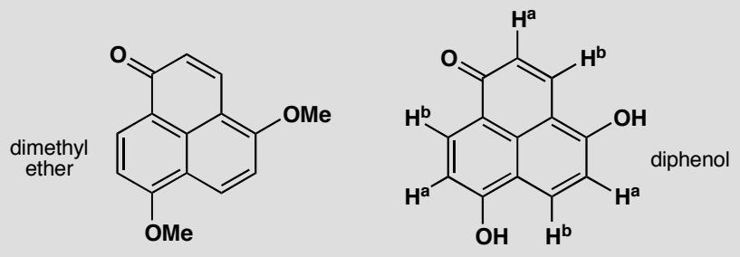

## Purpose of the problem

Exploring the way that tautomerism leads to equivalence.

## Suggested solution

The protons in the ether are obviously all different as it has no symmetry. Tautomerization interconverts carbonyl groups and enols, and can make either of the enols in the diphenol into a carbonyl group and can make the carbonyl group into an enol, so all structures are equivalent. If this proton transfer (note that it is not a delocalization) is fast on the NMR time scale, all the $H^{a}s$ will appear in one signal and all the $H^{b}s$ will appear in another signal.

## ■ The idea that some

interconversions take place too fast to be detected by NMR (they are fast on the NMR timescale) is covered in the blue boxes on p. 363 and p. 374 of the textbook.

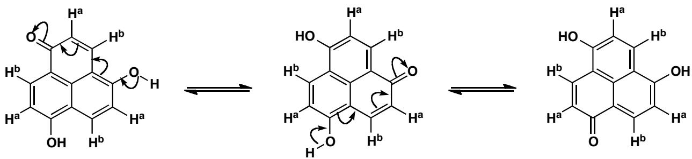

## PROBLEM 4

Suggest mechanisms for these reactions:

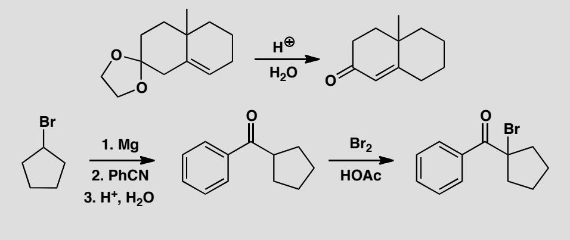

## Purpose of the problem

Revision of mechanisms plus exploration of reactions involving enols.

## Suggested solution

The first reaction starts with acetal hydrolysis and the product is an enone that is not conjugated. It can become conjugated in acid solution via the enol.

■ The mechanism of acetal hydrolysis is on p. 226 of the textbook.

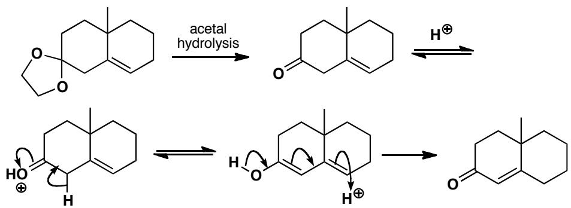

The second sequence starts with the reaction of a nitrile with a Grignard reagent and the hydrolysis of the product to a ketone: this is mentioned on pp. 220 and 231 of the textbook. The bromination in acid solution makes use of the only enol possible.

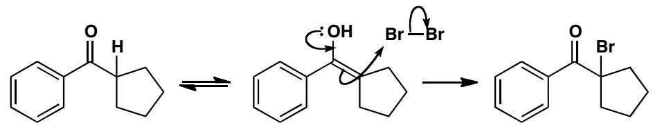

## PROBLEM 5

Suggest mechanisms for these reactions and explain why these products are formed.

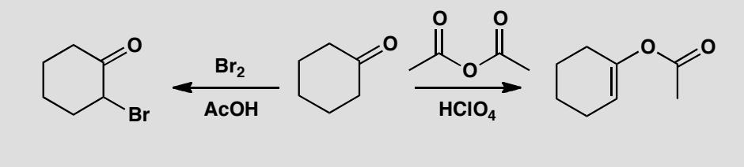

## Purpose of the problem

Making sure that you understand why enols usually react through carbon but sometimes react through oxygen.

## Suggested solution

The same ketone reacts in similar acidic conditions with different selectivity according to the electrophile. The bromination occurs at carbon as we should expect but the anhydride reacts at oxygen. So we can draw mechanisms to suit the product.

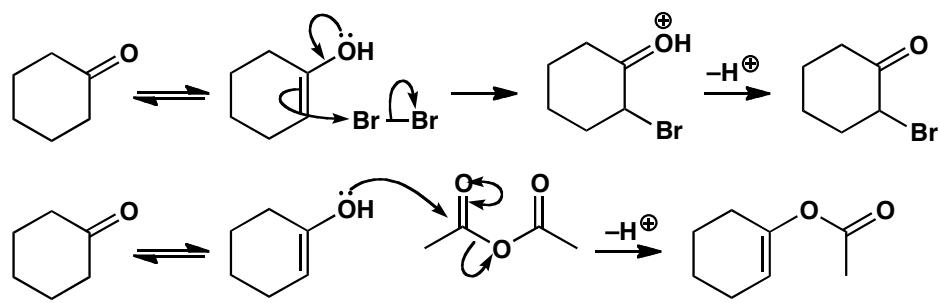  
■ This ‘double-headed curly arrow’ short-hand is explained on p. 217 of the textbook.

Acid anhydrides, being carbonyl electrophiles, respond to charge density (they are 'hard' electrophiles) and react well with oxygen nucleophiles. Bromine, by contrast, is uncharged and unpolarized (it is a 'soft' electrophile) and reacts well with neutral nucleophiles such as alkenes.

■ 'Hard' and 'soft' reagents are explained on p. 357 of the textbook and revisited on p. 467.

## PROBLEM 6

1,3-Dicarbonyl compounds such as A are usually mostly enolized. Why is this? Draw the enols available to compounds B–E and explain why B is 100% enol but C, D, and E are 100% ketone.

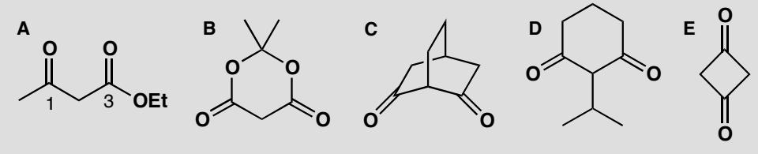

## Purpose of the problem

Exploring enols of different kinds of 1,3-dicarbonyl compounds—an important class of enolizable compounds.

## Suggested solution

Compound A is mostly enol because only the enol is delocalized over five atoms. A minor reason for this particular compound is the intramolecular hydrogen bond in the enol.

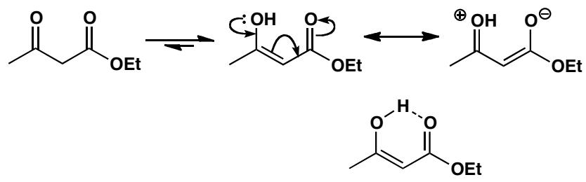

You might also have pointed out that there is another equally good enol that has the other carbonyl group enolized. The two enols are tautomers of each other and of the keto-ester.

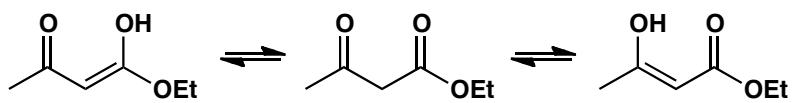

That compound B is completely enolized shows that conjugation is much more important than hydrogen bonding, which is impossible with B. However, B has extra conjugation from the lone pairs on the extra oxygen atoms.

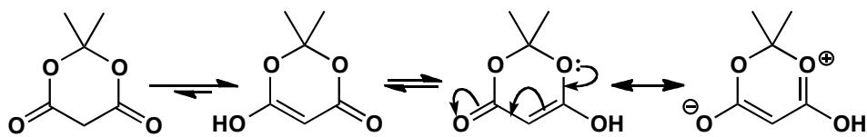

The remaining compounds have problems with enolization. Compound C can form an enol on the side away from the other carbonyl group, but cannot form an enol between the two ketones as it would be a ‘bridgehead alkene’. These do not generally exist as the four substituents around the alkene cannot become planar.

■ See pp. 389–90 and p. 914 of the textbook for more on why bridgehead alkenes are usually impossible.

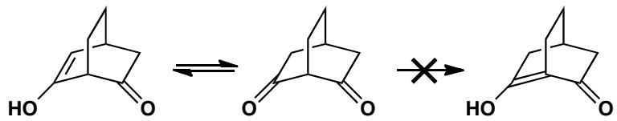

Compound D seems to have a perfectly reasonable enol. But the very large tert-butyl group, which would be out of the plane in the diketone, would have to lie in the plane if the enol were formed. The four-membered ring in E is already strained enough with two $sp^{2}$ atoms having $90^{\circ}$ bond angles. The enol would have three such atoms and this is too much strain.

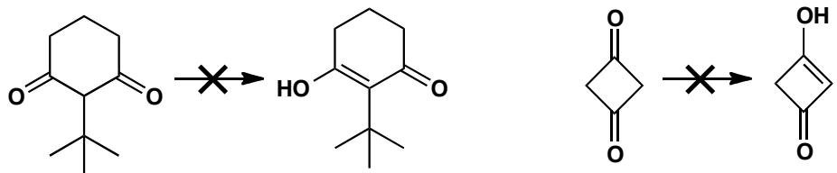

## PROBLEM 7

Attempted nitrosation of this carboxylic acid leads to formation of an oxime with loss of $CO_{2}$ . Why?

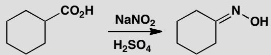

## Purpose of the problem

Nitrosation of an enol, followed by an unusual step.

## Suggested solution

Sodium nitrite in acid generates $NO^{+}$ , which usually reacts with enols to form nitroso compounds and then oximes (p. 464 of the textbook). Let's follow the mechanism through with this acid. Enolization gives the nucleophile, which picks up $NO^{+}$ .

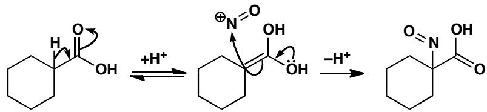

This nitroso compound can't tautomerize because there are no adjacent protons, so instead the compound forms an oxime by losing $\mathrm{CO}_{2}$ . We can draw a cyclic mechanism for this:

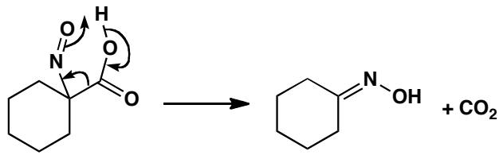

## PROBLEM 8

This molecule is a perfumery compound with an intense flowery odour, but it isomerizes rapidly in base to its odourless diastereoisomer. Why?

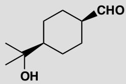

## Purpose of the problem

The stereochemical consequences of enolization in a cyclohexane.

## Suggested solution

Base will catalyse the enolization of our aldehyde, and when the carbonyl compound reforms, the proton could return to either the face it left from or the other side, allowing the compound to intercovert with its diastereoisomer. If we draw the compounds in their chair conformation, you can see that while the starting aldehyde has an axial substituent (which must be the less bulky CHO group), the diastereoisomer formed through enolization has two equatorial substituents and is more stable. In fact, the equilibrated mixture contains 92% of the equatorial product.

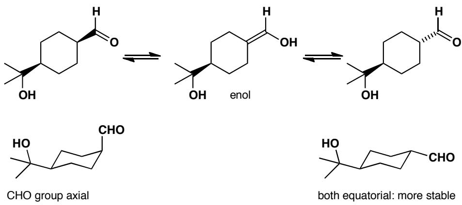

This page intentionally left blank

# Suggested solutions for Chapter 21

## PROBLEM 1

All you have to do is to spot the aromatic rings in these compounds. It may not be as easy as you think and you should give some reasons for questionable decisions.

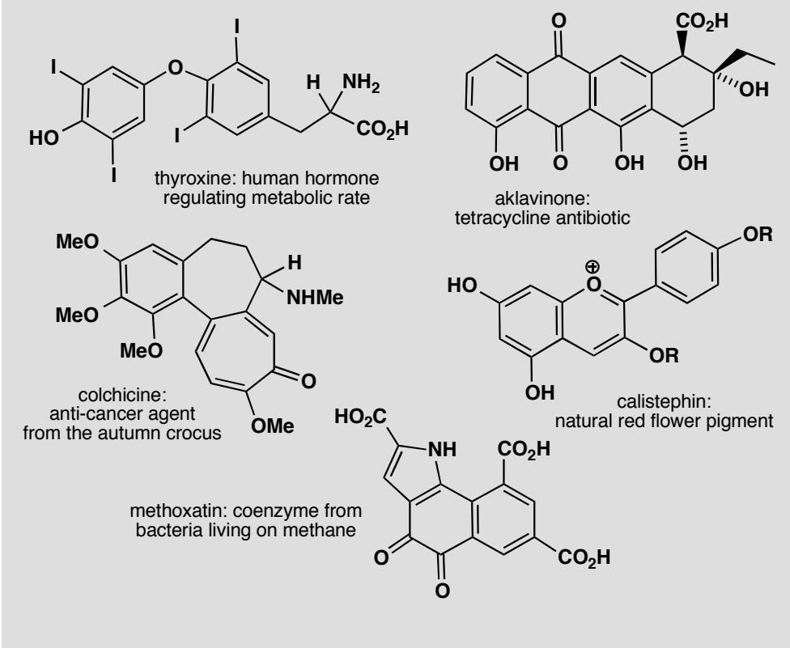

## Purpose of the problem

Simple exercise in counting electrons with a few hidden tricks.

## Suggested solution

Truly aromatic rings are marked with bold lines. Thyroxine has two benzene rings—obviously aromatic—and that's that. Aklavinone also has two aromatic benzene rings and we might argue about ring 2. It has four electrons as drawn, and you might think that you could push electrons round from the OH groups to give ring 2 six electrons as well. But if you try it, you'll find you can't.

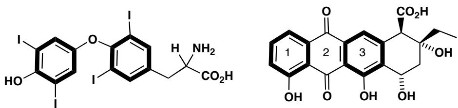

Colchicine has one benzene ring and a seven-membered conjugated ring with six electrons in double bonds (don't count the carbonyl electrons as they are out of the ring). It perhaps looks more aromatic if you delocalize the electrons and represent it as a zwitterion. Either representation is fine.

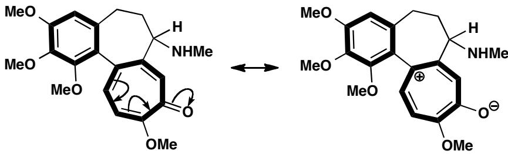

Methoxatin has one benzene ring and one pyrrole ring—an example of an aromatic compound with a five-membered ring. The six electrons come from two double bonds and the lone pair on the nitrogen atom. The middle ring is not aromatic—even if you try drawing other delocalized structures, you can never get six electrons into this ring.

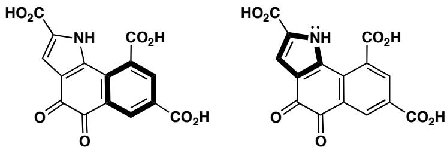

## PROBLEM 2

First, as some revision, write out the detailed mechanism for these steps.

$$
\mathrm{HNO} _ {3} + \mathrm{H} _ {2} \mathrm{SO} _ {4} \longrightarrow {} ^ {\oplus} \mathrm{NO} _ {2}
$$

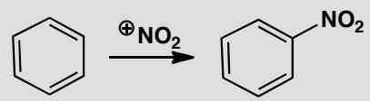

In a standard nitration reaction with, say, $HNO_{3}$ and $H_{2}SO_{4}$ , each of these compounds forms a single nitration product. What is its structure? Explain your answer with at least a partial mechanism.

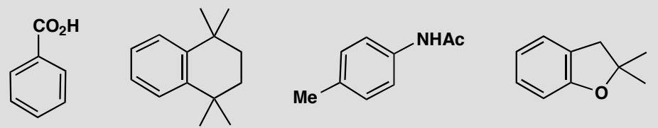

## Purpose of the problem

Revision of the basic nitration mechanism and extension to compounds where selectivity is an issue.

## Suggested solution

The basic mechanisms for the formation of $NO_{2}^{+}$ and its reaction with benzene appear on p. 476 of the textbook. Benzoic acid has an electron-withdrawing substituent so it reacts in the meta position. The second compound is activated in all positions by the weakly electron-donating alkyl groups (all positions are either ortho or para to one of these groups) but will react at one of the positions more remote from the alkyl groups because of steric hindrance.

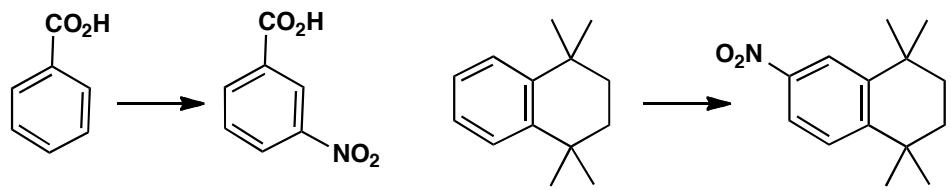

The remaining two compounds have competing ortho, para-directing substituents but in each case the one with the lone pair of electrons (N or O) is a more powerful director than the simple alkyl group. In the first case nitrogen directs ortho but in the second oxygen activates both ortho and para and steric hindrance makes the para position marginally more reactive.

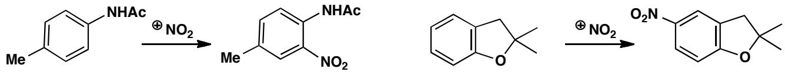

## PROBLEM 3

How reactive are the different sites in toluene? Nitration of toluene produces the three possible products in the ratios shown. What would be the ratios if all the sites were equally reactive? What is the actual relative reactivity of the three sites? You could express this as x:y:1 or as a:b:c where $a+b+c = 100$ . Comment on the ratio you deduce.

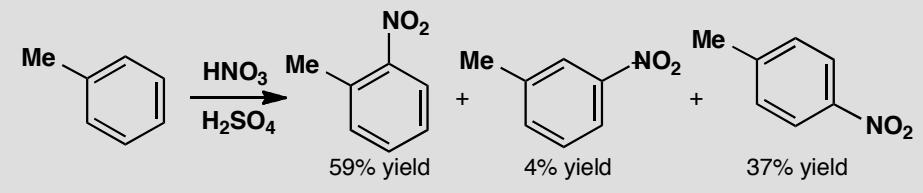

## Purpose of the problem

A more quantitative assessment of relative reactivities.

## Suggested solution

As there are two ortho and two meta sites, the ratio if all were equally reactive would be 2:2:1 o:m:p. The observed reactivity is 30:2:37 or 15:1:18 or 43:3:54 depending on how you expressed it. The ortho and para positions are roughly equally reactive because the methyl group is electron-donating. The para is slightly more reactive than the ortho because of steric hindrance. The meta position is an order of magnitude less reactive because the intermediate is not stabilized by electron-donation ( $\sigma$ -conjugation) from the methyl group.

reaction in the ortho position

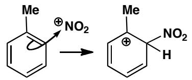

reaction in the meta position

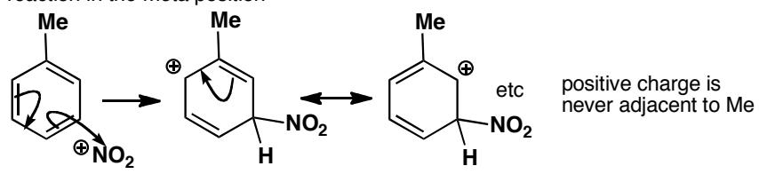

## PROBLEM 4

Draw mechanisms for these reactions and explain the positions of substitution.

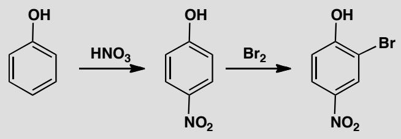

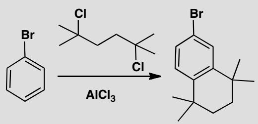

## Purpose of the problem

More advanced questions of orientation with more powerful electron-donating groups.

## Suggested solution

The OH group has a lone pair of electrons and dominates reactivity and selectivity. Steric hindrance favours the para product in the first reaction. The bromination has to occur ortho to the phenol as the para position is blocked.

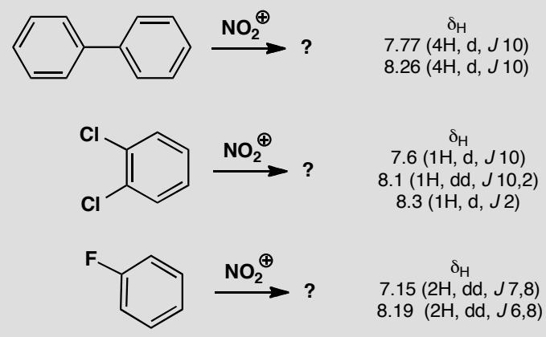

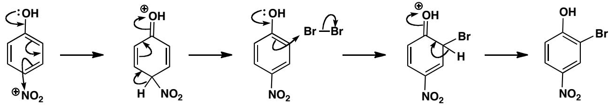

The second example has two Friedel-Crafts alkylations with tertiary alkyl halides. The first occurs para to bromine, a deactivating but ortho, para-directing group (see p. 489 in the textbook), preferring para because of steric hindrance. The second is a cyclization—the new ring cannot stretch any further than the next atom.

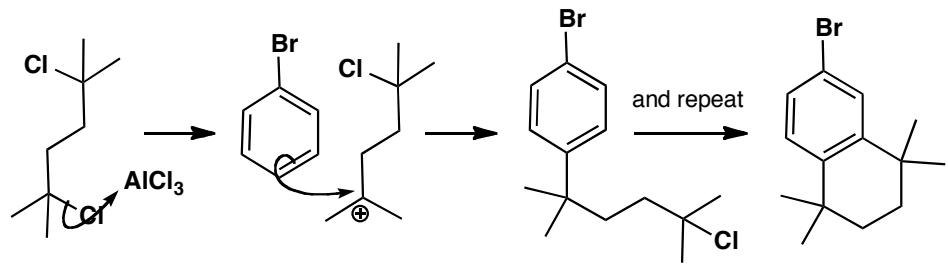

## PROBLEM 5

Nitration of these compounds gives products with the ${}^{1}$ H NMR spectra shown. Deduce the structures of the products and explain the position of substitution. WARNING: do not decide the structure by saying where the nitro group ‘ought to go’! Chemistry has many surprises and it is the evidence that counts.

## Purpose of the problem

Revision of the relationship between NMR and substitution pattern.

## Suggested solution

The first product has only eight hydrogens so two nitro groups must have been added. The molecule is clearly symmetrical and the coupling constant is right for neighbouring hydrogens so a substitution on each ring must have occurred in the para position. Note that the hydrogen next to the nitro group has the larger shift. We can deduce that each benzene ring is an ortho,para-directing group on the other because the intermediate cation is stabilized by conjugation.

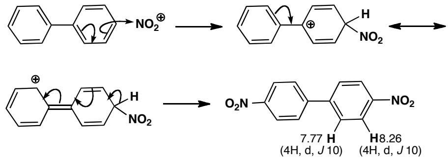

The hydrogen count reveals that the next two products are mono-nitro compounds. There are two hydrogens ortho to nitro in the second compound and one of them also has a typical ortho coupling to a neighbouring hydrogen while the other has only a small coupling (2 Hz) which must be a meta coupling. Substitution has occurred para to one of the chlorines and ortho to the other. The chlorines are ortho,para-directing thus activating all remaining positions so steric hindrance must explain the site of nitration.

■ Vicinal (ortho) coupling constants in benzene rings are typically 8–10 Hz; meta coupling constants are typically <2 Hz: see pp. 295-6 of the textbook.

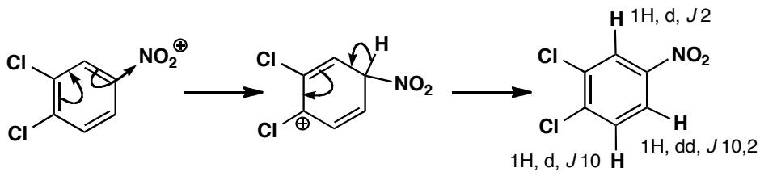

The third compound has the extra complication of couplings to fluorine. The coupling of 7 Hz shown by one hydrogen and 6 Hz shown by the other must be to fluorine as they occur once only. The symmetry of the compound and the typical ortho coupling between the hydrogens (8 Hz) shows that para substitution must have occurred.

■ The idea that heteronuclear couplings leave ‘unpaired’ coupling constants in the ${}^{1}$ H NMR spectrum is explained in the green box on p. 416 of the textbook.

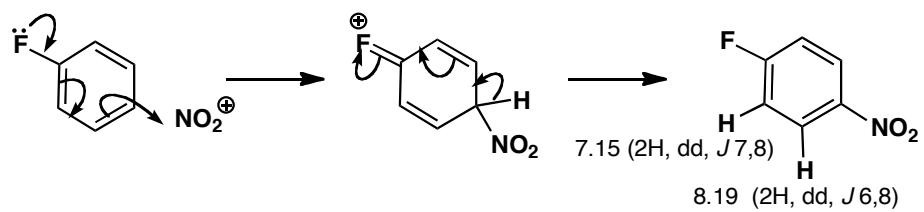

## PROBLEM 6

Attempted Friedel-Crafts acylation of benzene with t-BuCOCl gives some of the expected ketone A as a minor product, as well as some t-butylbenzene B, but the major product is the substituted ketone C. Explain how these compounds are formed and suggest the order in which the two substituents are added to form compound C.

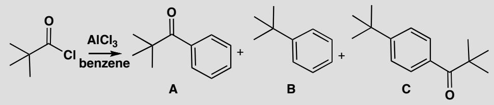

## Purpose of the problem

Detailed analysis of a revealing example of the Friedel-Crafts reaction.

## Suggested solution

■ Friedel-Crafts acylation is on p. 477 of the textbook.

The expected reaction to give A is a simple Friedel-Crafts acylation with the usual acylium ion intermediate.

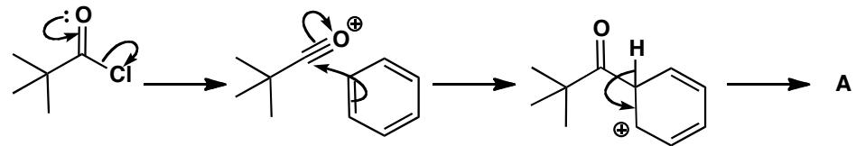

Product B must arise from a t-butyl cation and the only way that might be formed is by loss of carbon monoxide from the original acylium ion. Such a reaction happens only when the resulting carbocation is reasonably stable.

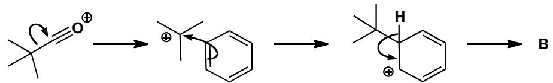

The main product C comes from the addition of both these electrophiles, but which adds first? The ketone in A is deactivating and meta directing but the t-butyl group in B is activating and para-directing so it must be added first.

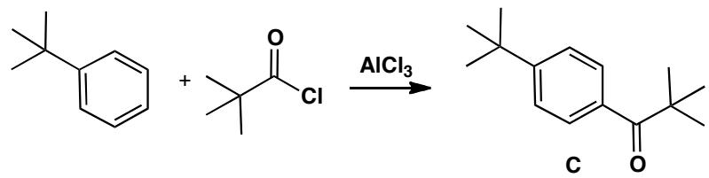

That answers the question but you might like to go further. Both A and C are formed by the alkylation of benzene as the first step. The decomposition of the acylium ion is evidently faster than the acylation of benzene. However, when B reacts further, it is mainly by acylation as only a small amount of di-t-butyl benzene is formed. Evidently the decomposition of the acylium ion is slower than the acylation of B! This is not unreasonable as the t-butyl group accelerates electrophilic attack—but it is a dramatic demonstration of that acceleration.

## PROBLEM 7

Nitration of this heterocyclic compound with the usual $HNO_{3}/H_{2}SO_{4}$ mixture gives a single nitration product with the ${}^{1}H$ NMR spectrum shown below. Suggest which product is formed and why.

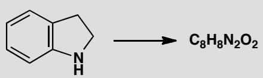

$\delta_{H}$

3.04 (2H, t, J 7 Hz)

3.68 (2H, t, J 7 Hz)

6.45 (1H, d, J 8 Hz)

7.28 (1H, broad s)

7.81 (1H, d, J 1 Hz)

7.90 (1H, dd, J8, 1 Hz)

## Purpose of the problem

Revision of NMR and an attempt to convince you that the methods of chapter 21 can be applied to molecules you've not met before.

## Suggested solution

The two 2H triplets and the broad NH signal show that the heterocyclic ring is intact. One nitro group has been added to the benzene ring. The proton at 7.81 with only one small (meta) coupling must be between the nitro group and the other ring and is marked on the two possible structures.

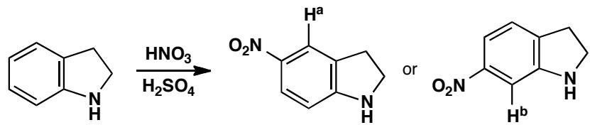

You could argue that NH is ortho, para-directing and so the second structure is more likely. But this is a risky argument as the reaction is carried out in strong acid solution where the nitrogen will mostly be protonated. It is safer to use the predicted $\delta_{H}$ from tables. Here we get:

<table><tr><td>Proton</td><td>ortho</td><td>meta</td><td>para</td><td>predicted  $\delta_{H}$ </td></tr><tr><td> $H^{a}$ </td><td> $NO_{2}=+0.95$ </td><td> $CH_{2}=-0.14$ </td><td> $NH=-0.25$ </td><td>7.73</td></tr><tr><td> $H^{b}$ </td><td> $NO_{2}=+0.95$ </td><td> $NH=-0.75$ </td><td> $CH_{2}=-0.06$ </td><td>7.31</td></tr></table>

There's not much difference but $\mathrm{H}^{\mathrm{a}}$ at 7.73 is closer to the observed 7.81, so it looks as though the small amount of unprotonated amine directs the reaction.

## PROBLEM 8

What are the two possible isomeric products of this reaction? Which structure do you expect to predominate? What would be the bromination product from each?

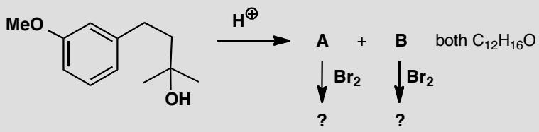

## Purpose of the problem

Getting you to think about alternative products and possible reactions on compounds that haven't been made (yet).

## Suggested solution

■ A Top Tip: when you have a formula for a product, but no structure, is to compare it with the formula for the starting material—in this case, $C_{12}H_{18}O_{2}$ .

The reaction is a Friedel-Crafts cyclization, as you could have deduced by the simple loss of water. The resulting cation could cyclize in two ways, arbitrarily called A and B. Steric hindrance suggests that A would be the more likely product.

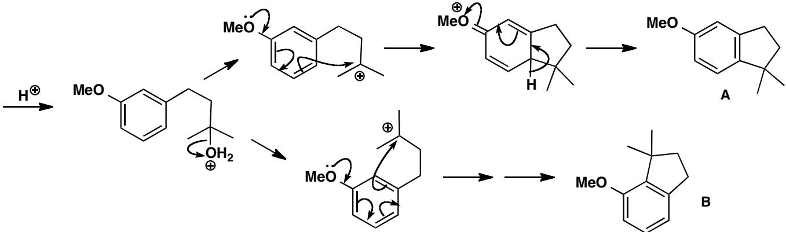

Bromination will go either ortho or para to the methoxy group: A has two different positions ortho to the OMe, but the para position is blocked. The least sterically hindered position gives a 1,2,4,5-tetrasubstituted ring. B might give a mixture of ortho and para substitution.

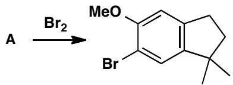

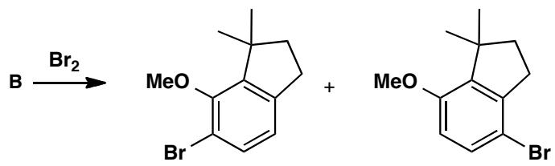

## PROBLEM 9

On p. 479 of the textbook we explain the formation of 2,4,6-tribromophenol by bromination of phenol in water. It looks as though we can go no further as all the ortho and para positions are brominated. But we can if we treat the tribromo-compound with bromine in an organic solvent. Account for the formation of the tetrabromo-compound.

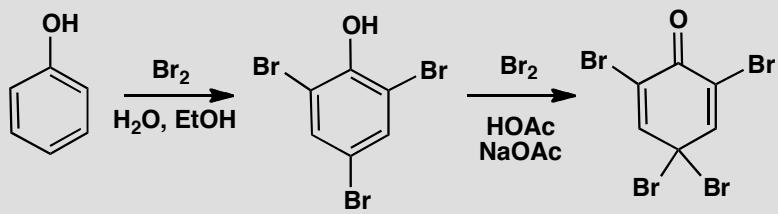

The product is useful in brominations as it avoids using unpleasant $Br_{2}$ . Suggest a mechanism for the following bromination and account for the selectivity.

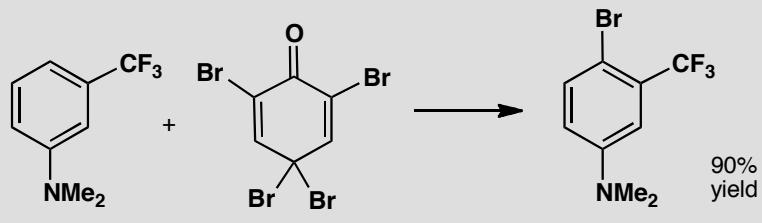

## Purpose of the problem

Exploration of interesting chemistry associated with electrophilic substitution on benzene rings.

## Suggested solution

Phenol is so reactive that the fourth bromine adds in the para position. Now the molecule has a problem as there is no hydrogen on that carbon to be lost. So the phenolic hydrogen is lost instead. It is surprising but revealing that this loss of aromaticity is preferred to the alternative bromination at the meta position.

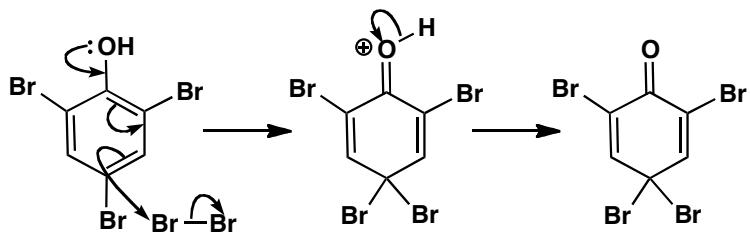

In the second reaction, one of the reactive bromines in the para position is transferred to the amine. It could have added ortho or para to the $NMe_{2}$ group but $CF_{3}$ is small and $NMe_{2}$ is large, because the two methyl groups lie in the plane of the ring, so steric hindrance rules. The other product is recovered tribromophenol.

■ Note that the meta directing effect of the deactivating $CF_{3}$ group is irrelevant (see p. 491 of the textbook).

## PROBLEM 10

How would you make each of the following compounds from benzene?

## Purpose of the problem

Choosing a synthetic route, taking into account the directing effects of the substituents involved.

## Suggested solution

The first compound has a ketone substituent, which is electron-withdrawing and therefore meta-directing, and an amino group, which is electron-donating and therefore ortho,para-directing. Aromatic amino groups are best made by reduction of nitro groups, which are also meta directing, so there are two possibilities. We can either start with a Friedel-Crafts acylation of benzene to give the ketone, which we can nitrate in the meta position and then reduce, or we can start by nitrating benzene, then do the acylation and then reduce. Either is a reasonable solution.

The second compound has a bromo substituent, which is ortho, para-directing, and a meta-directing nitro group. We need the para relationship, so we must put the bromine in first, then nitrate.

Finally, a compound with two para-directors arranged meta to one another. This may seem a problem, but we must introduce the alkyl group by Friedel-Crafts acylation and reduction, since primary alkyl groups cannot be introduced by Friedel-Crafts alkylation. The acyl group will be meta directing, so that solves both problems. First acylate, then brominate, then reduce.

# Suggested solutions for Chapter 22

22

## PROBLEM 1

Draw a mechanism for this reaction. Why is base unnecessary?

## Purpose of the problem

Simple example of conjugate addition with a nucleophile from the second row of the periodic table.

## Suggested solution

The phosphine is a good soft nucleophile with a high energy lone pair, well able to add in a conjugate fashion without help. In particular, the neutral phosphine does not need to be converted into its anion. The intermediate is a good base and removes a proton from itself, not necessarily intramolecularly.

## PROBLEM 2

Which of the two routes suggested here would actually lead to the product?

## Purpose of the problem

Do you understand the essentials of conjugate addition? Can you say when it won't happen?

## Suggested solution

To get the product, the chloride must add in a conjugate fashion and ethyl Grignard in a direct fashion that removes the carbonyl group. Conjugate addition can happen only if the carbonyl group is intact so HCl must be added first.

In the other sequence, EtMgBr is likely to add to the carbonyl group direct and further addition of HCl may either substitute on the allylic alcohol or add the ‘wrong way round’ to the alkene.

## PROBLEM 3

Suggest reasons for the different outcome of each of these reactions. Your answer must of course be mechanistically based.

## Purpose of the problem

A reminder of the reactions possible with enones.

## Suggested solution

The three reactions are: enolization and trapping with silicon, direct addition with a hard irreversible nucleophile, and conjugate addition with a softer reversible nucleophile.

## PROBLEM 4

Suggest a mechanism for this reaction.

## Purpose of the problem

Combination of conjugate addition and electrophilic aromatic substitution.

## Suggested solution

The weakly nucleophilic benzene has evidently added in conjugate fashion to the enone in a kind of Friedel-Crafts reaction and we can use the Lewis acid to make the enone into the necessary cation.

## PROBLEM 5

What is the structure of the product of this reaction and how is it formed? It has $\delta_{C}$ 191, 164, 132, 130, 115, 64, 41, 29 and $\delta_{H}$ 2.32 (6H, s), 3.05 (2H, t, J 6 Hz), 4.20 (2H, t, J 6 Hz), 6.97 (2H, d, J 7 Hz), 7.82 (2H, d, J 7 Hz), 9.97 (1H, s). You should obviously interpret the spectra to get the structure.

## Purpose of the problem

Revision of NMR with an exercise in nucleophilic aromatic substitution.

## Suggested solution

Summing the formulae of the two starting materials shows that this is a substitution of fluoride (the product is the sum of the starting materials less

HF). The aldehyde is still there (from the IR and the proton at 10 ppm) so the spectra are best interpreted by this structure:

That suggests a simple nucleophilic aromatic substitution by the addition-elimination mechanism with both F and CHO assisting the first step.

## PROBLEM 6

Suggest a mechanism for this reaction, explaining the selectivity.

## Purpose of the problem

Introduction to the mechanism and selectivity of nucleophilic aromatic substitution.

## Suggested solution

Both ortho and para positions are activated by the ketone towards nucleophilic attack by the amine, but the para position is preferred because of steric hindrance between the large heterocyclic ring and the ketone. The substitution works because those five fluorine atoms make the ring very electron-deficient.

## PROBLEM 7

Pyridine is a six-electron aromatic system like benzene. You have not yet been taught anything systematic about pyridine (that will come in chapter 29) but see if you can work out why 2- and 4-chloropyridines react with nucleophiles but 3-chloropyridine does not.

## Purpose of the problem

Extension of the ideas on nucleophilic aromatic substitution into new compounds.

## Suggested solution

The problem is to find somewhere to park the negative charge in the intermediate and the only possible place is on the pyridine nitrogen atom. This is easy with 2- and 4-choropyridine but impossible with 3-chloropyridine. Using a general nucleophile:

Amine formation by this reaction is particularly important as you will see in chapters 29 and 30. The mechanism is the same with a few proton transfers.

## PROBLEM 8

How would you carry out these two conversions?

## Purpose of the problem

Application of nucleophilic aromatic substitution in synthesis.

## Suggested solution

Usually you would think of introducing $NH_{2}$ by nitration and reduction (chapter 21), but the regioselectivity is wrong for the first reaction: the methoxy group will direct nitration ortho to itself. An alternative is to introduce both $NH_{2}$ and CN as nucleophiles, but the ring is unactivated so we can't use the addition-elimination mechanism (there is nowhere for the negative charge to go). The successful alternatives are electrophilic aromatic substitution followed by diazonium salt formation and the benzyne method. Here are two possible routes. Nitration will insert the nitro group ortho to the more strongly electron-donating MeO group. Reduction, diazotization and substitution with copper cyanide by the $S_{N}1$ mechanism gives one product.

The other product could come from chlorination, elimination to give a benzyne, addition of amide anion to put the anion ortho to MeO (p. 524 in the textbook) and protonation.

  
PROBLEM 9

Suggest mechanisms for these reactions, pointing out why you chose the pathways.

## Purpose of the problem

Studies in selectivity and choosing the right mechanism.

## Suggested solution

In the first reaction, the nucleophile adds in the ‘wrong’ position (i.e. where the leaving group isn’t) so a benzyne mechanism is likely. Notice that the nucleophile and the benzyne are formed with the same strong base, that the anion is recycled and that the nucleophile adds to the benzyne to put the negative charge next to OMe (p. 524 in the textbook).

The second reaction is a straightforward substitution by the addition-elimination mechanism activated by the nitro group. The amino group is a spectator.

## PROBLEM 10

When we discussed reduction of cyclopentenone to cyclopentanol, we suggested that conjugate addition of borohydride must occur before direct addition of borohydride: in other words, the scheme below must be followed. What is the alternative scheme? Why is the scheme shown definitely correct?

## Purpose of the problem

Serious thinking about mechanisms is an advantage when reactions get more complex.

## Suggested solution

The alternative scheme would be to reduce the ketone first and the alkene second. This order must be wrong though, because simple alkenes are nucleophilic and are not reduced by $NaBH_{4}$ . $NaBH_{4}$ is a nucleophilic reducing agent and attacks alkenes only if they are conjugated with an electron-withdrawing group. The conjugate addition must always occur first so as to keep the carbonyl group intact for the second step.

## PROBLEM 11

Stirring thioacetic acid with acrolein (propenaldehyde) in acetone gives a compound with the NMR data shown below. What is the compound?

$\delta_{H}$ : 2.28 (3H, s), 3.58 (2H, d, J 8), 4.35 (1H, td, J 8, 6), 6.44 (1H, t, J 6, 7.67 (1H, d, J 6).

$\delta_{\mathrm{C}}$ : 23.5, 31.0, 99.3, 144.2, 196.5.

## Purpose of the problem

Using NMR to gain insight into a conjugate addition.

## Suggested solution

The product formula is the sum of the reaction partners, and all 5 C and 8 H atoms are visible in the NMR spectra, so this looks like an addition reaction. The $^{13}$ C NMR tells us that there are two alkene carbons and one carbonyl, and the proton NMR clearly shows the aldehyde has gone. But it can't be direct addition to the C=O group, because the coupling pattern isn't right for a terminal alkene. The product is in fact the enol formed from conjugate addition of the sulfur, which is stable under these conditions. The low coupling constant across the alkene tells us it's formed unusually as the Z-isomer, probably because of an intramolecular proton transfer from the thioacid to the new OH group. The anhydrous conditions in dry acetone prevent the enol from tautomerizing back to the aldehyde.

■ This work is described by Lukas Hintermann in J. Org. Chem., 2012, 77, 11345.

## Suggested solutions for Chapter 23

Several problems in this chapter ask you to suggest ways to carry out conversions of one molecule into another. We always give one possible answer and sometimes comment on alternatives but you should realize that there are usually many possible ‘right’ answers to questions of this sort. Make sure you understand the principle behind the question and, if your answer is very different from ours, check with someone with experience of synthesis.

## PROBLEM 1

How would you convert this bromo-aldehyde chemoselectively into the two products shown?

## Purpose of the problem

A simple exercise in chemoselectivity and protection.

## Suggested solution

You would like to add an organometallic reagent to go to the right and that's very simple as no protection is needed. A Grignard reagent will do the job.

The other product demands more care to avoid the reactions we have just done. The aldehyde needs to be protected, as an acetal, say, before we make the Grignard reagent from the aryl bromide. Then we can add to RCHO, and deprotect with acid, and we have our product.

How would you convert this lactone selectively into either the hydroxyacid or the unfunctionalized acid?

## Purpose of the problem

Exploration of chemoselectivity.

## Suggested solution

The conversion into the hydroxy-acid is just hydrolysis and can be carried out in aqueous base. Conversion into the unfunctionalized acid demands selective reduction of the C–O at the secondary benzylic centre. Possibilities include catalytic hydrogenolysis (p. 539 in the textbook) or HBr followed by C–Br reduction.

  
■ See pp. 542–543 in the textbook for explanation of why this approach works.

## PROBLEM 3

Predict the products of Birch reduction of these aromatic compounds.

## Purpose of the problem

Exploring the principles of Birch reduction.

## Suggested solution

In each case a unique product results if you draw a dianion intermediate placing the electron-withdrawing groups where they can stabilize the negative charges, and put the electron-donating groups on the alkenes, where they don't destabilize the negative charges.

## PROBLEM 4

How would you carry out these reactions? In some cases more than one step may be required.

## Purpose of the problem

Reduction, selectivity, and protection in the same sequence.

## Suggested solution

■ The final product was used to make an analogue of thromboxane, a human blood clotting agent, by M. Hayashi and group, Tetrahedron Lett., 1979, 3661.

Every step is straightforward except the final reduction where a less reactive ester must be reduced in the presence of a more reactive ketone. Protection is the answer and an acetal is suitable.

## PROBLEM 5

How would you convert this nitro compound into the two products shown? Explain the order of events with special regard for reduction steps.

## Purpose of the problem

Reduction, selectivity, and protection in two related sequences.

## Suggested solution

The nitro group must be reduced to an amino group and cyclized onto the ketone or the carboxylic acid. Reductive amination (pp. 234–7 in the textbook) allows the amine to cyclize onto the more electrophilic ketone.

Forming the six-membered ring requires more control. Protection of the ketone (say as the acetal) before reduction will give the six-membered cyclic amide. Now the amide carbonyl must be reduced with $LiAlH_{4}$ (p. 236 in the textbook) and the ketone deprotected. There are many good alternative answers to this problem.

## PROBLEM 6

Why is this particular amine formed by reductive amination here?.

## Purpose of the problem

Extending the concept of reductive amination by combining it with deprotection and cyclization.

## Suggested solution

The two acetals will be hydrolysed at pH 5.5 to give the amine a choice between cyclization to one or other of the two aldehydes.

Cyclization to a five-membered ring is preferred to cyclization to a (strained) four-membered ring so reductive amination occurs to the right and not to the left (as drawn). Cyanoborohydride is stable under the weakly acidic conditions and does not reduce the remaining aldehyde.

■ This problem is based on work by G. W. Gribble and R. M. Soll, J. Org. Chem., 1981, 46, 2433.

## PROBLEM 7

Account for the chemoselectivity of the first reaction and the stereoselectivity of the second. A conformational drawing of the intermediate is essential.

## Purpose of the problem

Extending chemoselectivity into more subtle distinctions and conformational analysis.

## Suggested solution

The two ketones are different only because one is conjugated. Since acetal formation is a thermodynamically controlled reversible reaction, the one that is formed retains the enone as the stabilizing effect of conjugation can be retained. A conformational diagram of the intermediate shows that there is inevitably one axial oxygen atom belonging to the acetal preventing the bottom face of the alkene from getting close to the catalyst. The axial methyl group is further away and more in the plane of the alkene. Hydrogen is delivered from the top face and the observed product results.

The conformation of decalin is discussed on pp. 378–9 of chapter 16 of the textbook. The 'flattening' effect of the alkene is dealt with in chapter 32.

## PROBLEM 8

How would you convert this diamine to either of these two protected derivatives?

## Purpose of the problem

Using protecting groups to reveal reactive groups selectively.

## Suggested solution

The Boc group is a common acid-sensitive protecting group for amines, and making the first derivative is easy because the amine attached to the primary carbon is less hindered and more reactive. Treating the diamine with one equivalent of ‘Boc anhydride’ (Boc $_{2}$ O) gives the correctly protected product.

The second is more of a challenge, because we have to protect the less reactive amino group. The solution is first to protect with a different protecting group: Cbz will do, using CbzCl (benzyl chloroformate) and base. Now the other amino group can be protected with Boc, and finally the Cbz protecting group removed by hydrogenation. Other protecting groups might be all right too, but they have to be removable without using acid, which would remove the Boc group.

  
■ This chemistry was used by chemists in Bordeaux and Manchester to build some new polymeric structures out of the two different amine products.

This page intentionally left blank

# Suggested solutions for Chapter 24

24

## PROBLEM 1

Two routes are proposed for the preparation of this amino-alcohol. Which do you think is more likely to succeed and why?

## Purpose of the problem

Practical application of the choice of reagent to ensure the correct regioselectivity in a conjugate addition.

## Suggested solution

Either route might give the product but enals are more likely to undergo direct addition to the carbonyl group rather than conjugate addition while conjugated esters are better at conjugate addition. So the ester is probably better.

■ See pages 505–510 and 581–582 in the textbook.

## PROBLEM 2

Predict the products of these reactions.

## Purpose of the problem

Practice at predicting the regioselectivity of a direct or conjugate addition.

## Suggested solution

Both reactions involve addition of organometallic compounds to unsaturated carbonyl compounds. The key difference is the metal. With Cu(I) as catalyst, the Grignard reagent will give conjugate addition in the first case. MeLi will give direct addition in the second.

## PROBLEM 3

Explain the different regioselectivity in these two brominations of 1,2-dimethylbenzene.

## Purpose of the problem

Regioselectivity in electrophilic aromatic substitution and in radical substitution.

## Suggested solution

■ Make sure you understand why methyl groups direct ortho, para: if you need reminding, see p. 484 of the textbook.

$\mathrm{AlCl}_3$ is a commonly used Lewis acid in electrophilic aromatic substitution reactions. Here it activates the bromine to form the electrophile 'Br', which attacks the aromatic ring. Methyl groups are ortho,para directors, so any of the four unsubstituted positions could be attacked, but steric hindrance directs the first bromine to go to one of the positions that does not lead to a 1,2,3-trisubstituted ring.

Now we have three ortho, para directors, and bromine (with its lone pairs) is the strongest, so the next bromine will go ortho to the bromine in the less sterically hindered of the two possibilities.

In the presence of light, bromine's weak Br–Br bond undergoes homolysis, and Br• radicals are formed. One of these can abstract a hydrogen atom, breaking the weakest C–H bond. The methyl groups' C–H bonds are weaker than those of the phenyl ring because the benzyl radical that forms is delocalized into the aromatic ring. The benzyl radical attacks another molecule of bromine, and the cycle continues.

■ A similar argument was used on p. 573 of the textbook to explain why Br' abstracts H from an allylic, rather than a vinylic, position.

The mechanism is shown here for the first bromination; the same thing can happen on the other methyl group.

## PROBLEM 4

The nitro compound below was needed for the synthesis of an anti-emetic drug. It was proposed to make it by nitration of the hydrocarbon shown. How successful do you think this would be?

## Purpose of the problem

Predicting regioselectivity in electrophilic aromatic substitution where directing effects are more subtle.

## Suggested solution

The standard conditions for nitration generate the electrophile $NO_{2}^{+}$ , and to get the product shown here, this species has to attack the ring as shown below. The intermediate cation looks quite all right, since the positive charge can be delocalized even into the other ring.

What about the alternatives? A similar cation is formed if the electrophile attacks the position labelled '1', but the nitro group is in a more hindered position here, so we don't expect this to contribute much to the product mixture. Position '2' gives the cation shown below, which although perfectly feasible as an intermediate, does not benefit from the same degree of stabilization as the one in the reaction we want (it can't be delocalized into the other ring). Position 4 is similar but more hindered. Overall we can reasonably expect the reaction to give the product we want.

  
PROBLEM 5

Comment on the regioselectivity and chemoselectivity of the reactions shown below.

## Purpose of the problem

Regioselectivity in electrophilic aromatic substitution with an intramolecular electrophile: an important reaction for making heterocycles.

## Suggested solution

The reaction of an aldehyde with an amine gives an imine, and in acid (HCl), protonation gives an iminium ion, the electrophile that attacks the aromatic ring. The iminium ion is tethered to the ring, so it has only two choices of reaction site, since it can't reach any further than the positions ortho to the tether. The one it chooses is the less hindered. It is also para to an electron-donating methoxy group, so the reaction works well.

In the second case, there is only one methoxy group, and both the positions ortho to the tether are meta to it, where it can't activate substitution. The positions ortho to itself, where it can activate, are too far away for the iminium to reach, so no substitution takes place. Presumably the iminium ion forms, but it is just hydrolysed back to the aldehyde.

This reaction is a useful way of making some important alkaloid natural products (and indeed it mimics the way nature makes them). It is sometimes known as the 'Pictet-Spengler reaction'.

## PROBLEM 6

Identify A and B and account for the selectivity displayed in this sequence of reactions.

## Purpose of the problem

Analysing selectivity in a useful ring-forming sequence.

## Suggested solution

The Friedel-Crafts acylation in the first step is controlled by the bromo substituent, which is an ortho,para director: here we get para selectivity as usual for steric reasons. Work through the mechanism and you find a ketoacid as the product A.

■ You have seen this sort of thing in the textbook on pp. 49--4

The next step is the reduction we introduced on p. 540 of the textbook, the ‘Wolff-Kishner’ reduction. The mechanism is there so we need not repeat it here; the product is the acid B (or, rather, its potassium salt). Now adding acid forms a ring in another Friedel-Crafts acylation. The electrophile must be the acylium ion: usually Friedel-Crafts acylations need more than just strong acid, but this one is fast because it is intramolecular. What about regioselectivity? Well, the only positions the electrophile can reach are ortho to the carbon chain, so it must react there (they are both the same) even though that means it has to attack meta to the Br group. It’s still ortho to the alkyl chain though, which is ortho, para directing.

## PROBLEM 7

The sequence of reactions below shows the preparation of a compound needed for the synthesis of a powerful anti-cancer compound. Explain the regioselectivity of the reactions. Why do you think two equivalents of BuLi are needed in the second step?

## Purpose of the problem

Explaining regioselectivity in ortholithiation reactions.

## Suggested solution

Both reactions involve ortholithiation—deprotonation of the aromatic ring to form an intermediate aryllithium. As we explain on pp. 563–4 of the textbook, the deprotonation occurs where the BuLi can be ‘guided in’ by coordinating oxygen atoms. The methoxymethyl acetal, with its two oxygen atoms, is very good at doing this, so we expect deprotonation at one of the two positions ortho to this group. The other acetal is also a complexing group, so the deprotonation happens in between the two oxygen atoms.

In the second step, deprotonation can again take place next to the methoxymethyl group. Two equivalents of BuLi are needed because the most acidic proton is in fact one of the protons of the methyl group: a benzyl lithium forms first, and then a more reactive aryllithium. When the electrophile (DMF) is added, it reacts only with the last formed, more basic anion.

  
■ Phenyllithiums are more basic than benzyllithiums, because in benzyllithiums the 'anion' is conjugated with the ring; in phenyllithiums the 'anion' is perpendicular to the $\pi$ system (like the lone pair in pyridine).

■ Selectivity in the reactions of dianions is described on p. 547 of the textbook.

■ This chemistry is from Corey's synthesis of ecteinascidin: E. J. Corey, D. Y. Gin and R. S. Kania, J. Am. Chem. Soc. 1996, 118, 9202; E. J. Martinez and E. J. Corey, Org. Lett. 2000, 2, 993.

## PROBLEM 8

Comment on the regioselectivity and chemoselectivity of the reactions in the sequence below.

## Purpose of the problem

Practice using simple principles of reactivity to explain why nucleophiles and electrophiles choose to react at particular sites, and using your knowledge of reactivity to deduce mechanisms for some unfamiliar reactions.

## Suggested solution

Benzyl bromide is a good electrophile and it reacts well with alkoxides to make ethers. With neutral alcohols however the substitution is very slow, so only the more nucleophilic (and more basic) pyridine nitrogen is attacked, to make a pyridinium salt.

The pyridinium salt is a bit like an iminium ion, so sodium borohydride attacks it at the $\mathrm{C = N^{+}}$ bond to make a neutral enamine. Looking at the product, you can see that another reduction must take place as well, but enamines are nucleophilic, so the borohydride can't attack directly. What must happen instead is that the enamine is protonated to make another iminium, which can then be reduced. The final double bond is safe from attack, since it is an isolated, electron-rich alkene.

In the final step, another electrophile is added: it's an acid chloride, though a slightly unusual one, usually called 'methyl chloroformate'. As in the first step, the most nucleophilic atom is the pyridine N, so we use its lone pair to attack the carbonyl group and displace chloride. Now we have to lose the benzyl group, but the only reagent we have to help us is the chloride we just lost. Chloride is a nucleophile—a weak one, but powerful enough to attack the cationic species we have just generated. Which is the site most susceptible to nucleophilic substitution? The benzylic carbon, quite reasonably, because of the accelerating effect of the adjacent $\pi$ system. Nucleophilic substitution here gives the final product.

■ See p. 431 of the textbook for a reminder about the reactivity of benzylic electrophiles.  

## PROBLEM 9

Explain the regioselectivity displayed in this synthesis of the drug tanomastat.

## Purpose of the problem

Explaining why moderately complex molecules choose to react selectively.

## Suggested solution

■ The effect of halogens on the reactivity of aromatic rings is described on pp. 489–490 of the textbook.

The first reaction is a Friedel-Crafts acylation. There are two rings and two carbonyl groups, so we must explain first of all the choice between each of these pairs. One ring is chlorinated: chlorine has a deactivating effect on electrophilic aromatic substitution, so the non-chlorinated ring reacts. The two carbonyls differ in that the top one is (a) less hindered and (b) not conjugated, both of which contribute to its greater reactivity. There is also the question of regioselectivity in the way that the acylation occurs at the para position of the non-chlorinated ring. Aryl substituents are ortho,para directing, because they can delocalize the positive charge formed from attack in this way; steric factors favour the para over the ortho positions.

■ The synthesis of tanomastat, a protease inhibitor, is from US patent 5,789,434.

In the second step, thiophenol gives the conjugate addition, rather than the direct addition product to either carbonyl group. Sulfur nucleophiles are soft, and this is typical behaviour for thiols.

## PROBLEM 10

This compound is needed as a synthetic precursor to the drug etalocib. Suggest a synthesis. Hint: consider using nucleophilic aromatic substitution.

## Purpose of the problem

Thinking about regioselectivity and reactivity in the synthesis of a moderately complex aromatic compound.

## Suggested solution

There are lots of ortho relationships in this compound! And somehow we have to join the two aromatic rings together to make an ether. This can only really be done by nucleophilic aromatic substitution, so we need to look for an electron-withdrawing group to help us. The nitrile is in the right place, provided we have a leaving group (such as fluoride) ortho to it. So our last step can be as shown here:

To make the left hand ring we have to consider what methods are available to introduce the three substituents we have. It's always easier to add C-substituents than O-substituents, so we might consider how to alkylate the phenol below. Both the OH and OMe groups are ortho,para directing, so we could consider a Friedel-Crafts reaction, but there are problems with this approach. One is the usual problem with primary alkyl groups—we would have to do an acylation and then reduce. Another is more serious: the less hindered positions the other side of the OMe or OH groups are also activated, so we will have a regioselectivity problem. The solution used by the chemists making this compound for the first time was to use ortholithiation, making the dianion with two equivalents of BuLi and making use of the fact that two O substituents guide the BuLi in to deprotonate the position between them.

  
■ See pp. 514–520 of the textbook for a reminder of nucleophilic aromatic substitution.

This page intentionally left blank

# Suggested solutions for Chapter 25

25

## PROBLEM 1

Suggest how these compounds might be made by alkylation of an enol or enolate.

## Purpose of the problem

An exercise in choosing good routes to simple compounds.

## Suggested solution

As you can see from the carbonyl groups in these compounds, it is pretty obvious which is the new bond to be made. In both cases, the electrophile will need to be an allylic halide. These are good electrophiles for $S_{N}2$ reactions so they will work well here. We need to use the electrophile twice in the first case and the enolate is that of diethyl malonate. The second case will require an enol or enolate equivalent to prevent self-condensation: a silyl enol ether (p. 595 in the textbook) or an enamine (p. 591 in the textbook) is ideal. If you use a silyl enol ether, don’t forget the Lewis acid!

■ The reason why allylic halides make good electrophiles is discussed in the textbook on p. 341.

## PROBLEM 2

How might these compounds be made using alkylation of an enol or enolate as one step in the synthesis?

## Purpose of the problem

An exercise in using enolate chemistry to make carbonyl compounds disguised as acetals.

## Suggested solution

■ See p. 227 of the textbook for a reminder of how to make cyclic acetals.

The only functional group in either compound is an acetal. Cyclic acetals are made from diols and carbonyl compounds so we need to have a look at the deprotected molecules before taking any further decisions.

If we are going to use enolate chemistry, we have to make the diols by reduction of carbonyl compounds. As both diols have a 1,3-relationship between the OH groups, the carbonyl precursors will be the very enolizable 1,3-dicarbonyl compounds, which can be alkylated and reduced. We have chosen arbitrarily to use ethyl esters here, so we should use ethoxide as the base in the alkylation step.

## PROBLEM 3

How might these amines be prepared using enolate-style alkylation as part of the synthesis?

## Purpose of the problem

An exercise in using enolates and related compounds in the synthesis of amines.

## Suggested solution

The first amine could be made by reduction of a nitrile, and that could be made by alkylation of the ‘enolate’ from $PhCH_{2}CN$ .

The second amine could be made by reductive amination of a ketone so we need to make the ketone by alkylation of an enolate. You could have chosen various specific enol equivalents for this job—we have chosen an enamine.

## PROBLEM 4

This attempted enolate alkylation does not give the required product. What has gone wrong? What products would actually be formed? How would you make the required product?

## Purpose of the problem

An exercise in trouble-shooting—it is important for you to recognize what might go wrong and how to get round the problem.

## Suggested solution

The intention was obviously to make the lithium enolate of the aldehyde and to alkylate it with i-PrCl, but BuLi will attack the aldehyde carbonyl group rather than remove a proton. Even if it did make some of the enolate, the enolate would react with the aldehyde and self-condense (p. 590 in the textbook).

There is also a problem with i-PrCl: it is a secondary halide and chloride is the worst leaving group among the halogens Cl, Br, I—it is prone to elimination rather than substitution reactions. To make the required product, an aza-enolate (p. 593 in the textbook) or a silyl enol ether (p. 595 in the textbook) would be a better bet.

## PROBLEM 5

Draw mechanisms for the formation of this enamine, its reaction with the alkyl halide, and the hydrolysis of the product.

## Purpose of the problem

Exploration of the details of enamine formation and reaction. These are often misunderstood.

## Suggested solution

The first step of the mechanism for enamine formation is not acid-catalysed—amines need no help in attacking carbonyl compounds. But the dehydration step is acid-catalysed as $HO^{-}$ is not a good leaving group. The selectivity for elimination into the unbranched chain is because the enamine is planar and there would be a bad steric clash between the methyl group and the nitrogen substituents (all of which are in the same plane) if elimination occurred the other way.

■ The mechanism of enamine formation is given on p. 233 of the textbook.

The reaction of the enamine with the alkyl halide goes as expected—these very good $S_{N}2$ electrophiles work particularly well with enamines and the first product under the reaction conditions is another enamine.

Finally the enamine is hydrolysed by reprotonation to the same iminium salt and addition of water. These steps are the exact reverse of what happens in enamine formation.

## PROBLEM 6

How would you produce specific enols or enolates at the points marked with the arrows (not necessarily starting with the ketones themselves)?

## Purpose of the problem

First steps in making enol(ate)s with regiochemical control.

## Suggested solution

The last two ketones have two different $\alpha$ -positions so there is a good chance of controlling enol formation from the parent ketone. But the first ketone has two primary $\alpha$ -positions and the difference appears only in the two $\beta$ -positions. The obvious solution is conjugate addition and trapping (described in the textbook on p. 603). The thermodynamic enol is needed from the second ketone and direct silylation is a good bet. The third requires kinetic enolate formation and LDA is a good way to do that.

## PROBLEM 7

How would the enol(ate) equivalents we have just made react with (a) bromine and (b) a primary alkyl halide $\mathrm{RCH}_2\mathrm{Br}$ ?

## Purpose of the problem

Moving on from the formation of enol(ate)s to their reactions.

## Suggested solution

The two silyl enol ethers will react well with bromine and won't need Lewis acid catalysis as bromine is such a powerful electrophile—so powerful that it might be dangerous to react the lithium enolate directly with bromine and making the silyl enol ether first might be advisable.

In the reaction with the primary alkyl halide, the boot is on the other foot as there will be a good reaction with the lithium enolate but no reaction with the more stable silyl enol ethers. Lewis acid won't help here either as primary cations are unstable. Preliminary conversion into a lithium enolate or a ‘naked’ enolate (using fluoride ion) would be better.

## PROBLEM 8

Draw a mechanism for the formation of this imine:

## Purpose of the problem

Revision of the often forgotten mechanism for imine formation.

## Suggested solution

The main points in the mechanism are addition of the amine to the carbonyl group without catalysis and dehydration of the intermediate with acid catalysis.

## PROBLEM 9

How would the imine from problem 8 react with the reagents below? Draw mechanisms for each step: the reaction with LDA, the addition of BuBr, and the work-up.

## Purpose of the problem

Checking you know how to make and use an aza-enolate.

## Suggested solution

LDA removes the most acidic proton of the imine so that the Li atom is transferred to the nitrogen atom to give the aza-enolate. Electrophiles, even alkyl halides, then add to the ‘enolate’ position and the work-up is hydrolysis of the imine with aqueous acid.

■ Aza-enolate chemistry is described on p. 593 of the textbook.

■ Imine hydrolysis is the reverse of imine formation and is discussed on p. 231 of the textbook.

## PROBLEM 10

What would happen if you tried this short cut for the reactions in problems 8 and 9?

## Purpose of the problem

Reminder of the problems with lithium enolates of aldehydes.

## Suggested solution

Some aldehydes can be converted directly into lithium enolates but this is not usually very successful because the rate of reaction of the lithium enolate with the very electrophilic aldehyde is too great and at least some aldol reaction will occur.

■ The problem of aldol reactions competing with alkylations is mentioned in the green box on p. 584 and on p. 590 of the textbook. The aldol reaction itself is the subject of chapter 26.

## PROBLEM 11

Suggest mechanisms for these reactions.

## Purpose of the problem

Learning to unravel complicated looking sequences that are quite easy when you get into them.

## Suggested solution

■ The hydrolysis-decarboxylation sequence is explained on p. 597 of the textbook.

Double alkylation of the malonate enolate gives the four-membered ring and hydrolysis and decarboxylation gives the carboxylic acid product.

## PROBLEM 12

How does this synthesis of a cyclopropyl ketone work?

## Purpose of the problem

Enols and enolates are involved in an unlikely looking sequence that you can work out if you persist.

## Suggested solution

Alkylation of the enolate with the epoxide gives an alkoxide that cyclizes to give the lactone.

Now $S_{N}2$ opening of the protonated lactone with the soft nucleophile (bromide ion) gives the $\gamma$ -bromoketone that cyclizes through its enolate. The formation of three-membered rings is favoured kinetically.

## PROBLEM 13

Give the structures of the intermediates in the following reaction sequence and mechanisms for the reactions.

## Purpose of the problem

A reminder that enolate-like intermediates can be formed at nitrogen as well as carbon providing that an oxygen atom can carry the negative charge.

## Suggested solution

The first base removes the proton from nitrogen to make an enolate-like intermediate that reacts at nitrogen. Now that the NH is blocked, the second base makes the amide enolate that is alkylated on carbon.

# Suggested solutions for Chapter 26

26

## PROBLEM 1

The aldehyde and the ketone below are self-condensed with aqueous NaOH so that an unsaturated carbonyl compound is the product in both cases. Give a structure for each product and explain why you think this product is formed.

$$
\mathrm{CHO} \xrightarrow [ \mathrm{H} _ {2} \mathrm{O} ]{\mathrm{NaOH}}?
$$

## Purpose of the problem

Drawing mechanisms for the simplest of aldols: self-condensation of aldehydes and ketones.

## Suggested solution

In both cases only one compound can form an enolate and only one compound—the same one—can be the electrophile. This is very obvious with the aldehyde

With the ketone, there is a question of regioselectivity in enolate formation, but the aldol product can lose water only if the enolate from the methyl group is the nucleophile. If we draw both enolates and combine them with the ketone in an aldol reaction, it is clear that one can dehydrate as it has two enolizable H atoms but the other cannot dehydrate as it has no H atoms on the vital carbon atom (in grey). The mechanism is the same as the one with the aldehyde and the elimination in both cases is by the E1cB mechanism.

■ See p. 399 and p. 616 in the textbook for the E1cB mechanism.

## PROBLEM 2

Propose mechanisms for the ‘aldol’ and dehydration steps in the termite defence compound presented on p. 623 in the textbook.

## Purpose of the problem

Revision of elimination reactions and the mechanism for ‘an aldol that can’t go wrong.’

## Suggested solution

■ See p. 587 in the textbook: a nitro group acidifies adjacent C–H bonds as much as two carbonyl groups.

The nitro group is twice as electron-withdrawing as a carbonyl group so it will readily form an ‘enolate.’ It cannot self-condense as nucleophilic attack rarely occurs on nitro groups so it attacks the aldehyde instead. Notice that the alkoxide product is basic enough to deprotonate another molecule of nitromethane so the reaction is catalytic in base.

■ E1cB elimination is on pp. 399 and 616 in the textbook.

The elimination step involves acylation of the hydroxyl group and an E1cB elimination again driven by the ‘enolate’ of the nitro group. Note that pyridine, a weak base, is strong enough.

## PROBLEM 3

How would you synthesize the following compounds?

## Purpose of the problem

Application of the aldol reaction to make unsaturated carbonyl compounds.

## Suggested solution

Just find the conjugated alkene and so find the hidden carbonyl group. In the first case, cyclohexanone provides two enols to react with benzaldehyde. The phenyl rings in the product lie trans to the carbonyl group so that they can be planar.

In the second case, more options are available. Our solution suggests using a Wittig reaction for the first as we need the enolate of acetaldehyde (p. 628 in the textbook), and malonic acid for the second (p. 630 in the textbook). There are many alternatives such as using an aldol reaction for the first step, but with an excess of acetaldehyde, to compensate for self-condensation.

## PROBLEM 4

How would you use a silyl enol ether to make this aldol product? Why is it necessary to use this particular intermediate? What would be the products be if the two carbonyl compounds were mixed and treated with base?

## Purpose of the problem

Exploring control, and the lack of it, in different styles of aldol reaction.

## Suggested solution

This is about the most difficult type of aldol reaction: two slightly different aldehydes, both enolizable, both capable of self-condensation. The only solution is to couple the silyl enol ether of one aldehyde with the other aldehyde using a Lewis acid as catalyst. This gives the aldol itself that can be dehydrated to the enal.

Without this control, each aldehyde would self-condense and would condense with the other aldehyde giving four products in unpredictable amounts. One of the cross-condensation products is, of course, the enal we are trying to make.

self-condensation

self-condensation

cross-condensation + the enal
required in
the problem

cross-condensation

## PROBLEM 5

In what way does this reaction resemble an aldol reaction? Comment on the choice of base. How can the same product be made without using phosphorus chemistry?

## Purpose of the problem

Showing that there are reactions closely related to the aldol reaction that give similar products.

## Suggested solution

The formation of an alkene and the loss of phosphorus are typical of a Wittig reaction but the formation of an unsaturated carbonyl compound using an enolate is very like an aldol reaction. The phosphonate ester reagent is also like a 1,3-dicarbonyl compound, with P replacing C. The very weak base used shows how stable the enolate must be. The enolate attacks the aldehyde, perhaps to form an intermediate oxyanion.

There is no doubt that the next intermediate is formed. It is a stable four-membered ring (phosphorus likes $90^{\circ}$ bond angles). Finally phosphorus captures oxygen (the P–O bond is very strong) eliminating the alkene in its preferred trans stereochemistry.

The final product could also be made by the aldol condensation of a silyl enol ether and the same aldehyde. The silyl enol ether is the less substituted possibility so it will have to be made via the lithium enolate. The product will be the aldol itself and this can be dehydrated to the enone with TsOH.

## PROBLEM 6

Suggest a mechanism for this attempted aldol reaction. How could the aldol product be made?

## Purpose of the problem

A demonstration of one way that aldol reactions with formaldehyde may fail.

## Suggested solution

The aldol reaction appears to have taken place and then the ketone has been reduced. The only possible reducing agent is more formaldehyde and the reduction takes place by the Cannizarro reaction (p. 620 in the textbook). The aldol can be successful if a weaker base such as $Na_{2}CO_{3}$ is used as the Cannizarro requires a dianion intermediate.

## PROBLEM 7

The synthesis of six-membered ketones by intramolecular Claisen condensation was described in the chapter where we pointed out that it doesn't matter which way round the cyclization happens as the product is the same.

Strangely enough, five-membered heterocyclic ketones can be made by a similar sequence. The starting material is not symmetrical and two cyclized products are possible. Draw structures for these products and explain why it is unimportant which is formed.

## Purpose of the problem

To make sure you understand how extra ester groups can solve apparently complex acylation problems.

## Suggested solution

The cyclization can occur in two different ways to give two different products as either ester can form an enolate that attacks the other in an intramolecular acylation. We should draw the two products.

Though these compounds are different, each gives the same ketone after hydrolysis and decarboxylation as the ketone carbonyl group is on the same position in the ring in both compounds.

## PROBLEM 8

Attempted acylation at carbon often fails. What would be the actual products of these attempted acylations and how would you successfully make the target molecules?

## Purpose of the problem

Revision of simple enolate reactions (chapter 20) and encouragement to clear thinking about what happens when you put carbonyl compounds in basic solutions.

## Suggested solution

In the first case we want the aldehyde to form an enolate and then attack the ester. The first part is all right: the aldehyde will form an enolate more readily than the ester. But under these equilibrating conditions, the small amount of enolate that is formed will react faster with the aldehyde than with the less electrophilic ester. The aldehyde will self-condense in an aldol reaction.

To make the required compound we shall need to convert the aldehyde into a specific enol equivalent. There are various alternatives of which the best are an enamine or a silyl enol ether. Esters fail to acylate either and an acid chloride should be used instead. Don't forget the Lewis acid if you use the silyl enol ether.

The enolate formation in the second example is a separate step and will work well because the two carbonyl groups cooperate in forming a stable enolate and NaOMe is quite strong enough to convert the diketone entirely into the enolate. The problem is the acylation step. With a sodium enolate and a reactive acylating agent such as PhCOCl, a charge-controlled (hard/hard) interaction will occur at the oxygen atom to give an enol ester.

  
■ Reactions of enolate at oxygen and the role of hard and soft reagents are discussed on p. 467 of the textbook. Acylation at O appears on p. 648.

The escape route from this problem suggested in the chapter (p. 648) was to use a lithium or magnesium enolate. Magnesium is chelated by the two oxygen atoms of the stable enolate and blocks attack there so that C-acylation occurs even with acid chlorides.

## PROBLEM 9

Acylation of the phenolic ketone gives compound A, which is converted into an isomeric compound B in base. Cyclization of B gives the product shown. Suggest mechanisms for the reactions and structures for A and B.

## Purpose of the problem

Predicting products of acylation reactions. This is always more difficult than just drawing mechanisms but here you might work backwards from the final product as well as forwards.

## Suggested solution

The starting material is $C_{8}H_{8}O_{2}$ so A has an extra $C_{7}H_{4}O$ . This looks like the addition of PhCOCl with the loss of HCl. The most obvious reaction is acylation of the phenolic oxygen rather than enolate formation as OH is much more acidic than CH and pyridine is a weak base. This phenol is unusually acidic as the carbonyl group helps to stabilize the anion. Compound A is simply the benzoate ester of the phenol. Treatment with KOH isomerizes A to B and this is the heart of the problem. An intramolecular acylation of the only possible enolate can be catalysed by KOH even though it produces only a little enol as cyclization to form a six-membered ring is so easy.

The final step is acid-catalysed and clearly involves the attack of the phenolic OH group on one of the ketones. This intramolecular reaction much prefers to form a six-membered ring rather than a strained four-membered ring, and dehydration gives an aromatic ring—two electrons each from the double bonds and two from a lone pair on oxygen making six in all. Drawing the delocalization my help you to see this.

## PROBLEM 10

How could these compounds be made using the acylation of an enol or enolate as a key step?

## Purpose of the problem

Practice in using acylation at carbon to make compounds.

## Suggested solution

The first problem has two possible solutions by direct acylation, labelled A and B in the diagram. A would have to be controlled as the straight chain ester could self-condense. B needs no control as only the ketone can enolize. Diethyl carbonate $(\mathrm{EtO})_{2}\mathrm{CO}$ is more electrophilic than a ketone and only the wanted product can enolize again and form a stable enolate under the reaction conditions. However, route B adds only one carbon atom.

Route A can be realized with either a lithium enolate or a silyl enol ether, as explained on p. 649 of the textbook, using an acid chloride as the electrophile.

Route B requires the synthesis of the ketone starting material and this could be done by Grignard methods (chapter 9) or by acylation of an organo-copper compound with an acid chloride. Acylation with diethyl carbonate requires no special control.

## PROBLEM 11

Suggest how the following reactions might be made to work. You will probably have to select a specific enol equivalent.

## Purpose of the problem

Making reactions work is an important part of organic chemistry.

## Suggested solution

The first reaction is a standard acylation of an aldehyde creating a quaternary centre. You might have used a silyl enol ether but an enamine, such as one made from a cyclic secondary amine, is probably better.

The second example might just go with simple base (MeO $^{-}$ ) catalysis as the conjugated ketone enolate is much more stable than the enolate of the ester. However, it’s probably safer to use a lithium enolate (or a silyl enol ether—though you’d then have to use an acid chloride as the electrophile).

## PROBLEM 12

Base-catalysed reaction between these two esters allows the isolation of a product A in 82% yield.

$$
\mathrm{EtO} _ {2} \mathrm{C} \xrightarrow {\mathrm{HCO} _ {2} \mathrm{Et}} \mathrm{A}   \mathrm{EtO} ^ {\ominus} \quad \mathrm{C} _ {9} \mathrm{H} _ {1 4} \mathrm{O} _ {5}
$$

The NMR spectrum of this product shows that two species are present. Both show two 3H triplets at about $\delta_{\mathrm{H}} = 1$ and two 2H quartets at about $\delta_{\mathrm{H}} = 3$ ppm. One has a very low field proton and an ABX system at 2.1–2.9 with $J_{\mathrm{AB}}$ 16 Hz, $J_{\mathrm{AX}}$ 8 Hz, and $J_{\mathrm{BX}}$ 4 Hz. The other has a 2H singlet at 2.28 and two protons at 5.44 and 8.86 coupled with $J$ 13 Hz. One of these protons exchanges with D $_2$ O. Any attempt to separate the mixture (for example by distillation or chromatography) gives the same mixture. Both compounds, or the mixture, on treatment with ethanol in acid solution give the same product B.

$$
\mathrm{C} _ {9} \mathrm{H} _ {1 4} ^ {\mathrm{A}} \mathrm{O} _ {5} \xrightarrow [ \mathrm{EtOH} ]{\mathrm{H} ^ {\oplus}} \mathrm{C} _ {1 3} \mathrm{H} _ {2 4} ^ {\mathrm{B}} \mathrm{O} _ {6}
$$

Compound B has IR 1740 cm $^{-1}$ , $\delta_{H}$ 1.15–1.25 (four t, each 3H), 2.52 (2H, ABX system $J_{AB}$ 16 Hz), 3.04 (1H, X of ABX split into a further doublet by J 5 Hz), and 4.6 (1H, d, J 5 Hz). What are the structures of A and B?

## Purpose of the problem

Revision of enol structure by NMR and a further exploration of what happens to acylation products.

■ The couplings between $H_{A}$ and $H_{X}$ and between $H_{B}$ and $H_{X}$ are not quoted in the paper, but this should not prevent you identifying B. AB and ABX systems are discussed on pp. 296–8 of the textbook

## Suggested solution

Only the diester can form an enolate and ethyl formate ( $HCO_{2}Et$ —it is half an ester and half an aldehyde) is much more electrophilic than the diester. We should expect the diester to be acylated by ethyl formate.

The compound A1 fits the formula for A and the ${}^{1}$ H NMR spectrum of the compound with the low field signal (assigned to the CHO proton). This structure would also show an ABX system in its ${}^{1}$ H NMR spectrum. But what is the other compound (A2)? It is obviously in equilibrium with A1 and it lacks both the aldehyde proton and the ABX system and it sounds like an enol. Compound A1 is chiral so the $CH_{2}$ group appears as an ABX system but A2 is not chiral so the $CH_{2}$ group is a singlet. Here are the structures with their NMR assignments. In both cases the 3H triplets and 2H quartets are ethyl groups.

Treatment with acidic ethanol simply makes the acetal from the aldehyde group of A1. Since A1 and A2 are in equilibrium, all A2 is eventually converted into A1 and then into B. Compound B is again chiral so the ABX system reappears with further coupling of X with the acetal proton. There are now four triplets and four quartets from the four ethyl groups.

# Suggested solutions for Chapter 27

27

## PROBLEM 1

Suggest a mechanism for this reaction, commenting on the selectivity and the stereochemistry.

## Purpose of the problem

The opportunity to explore the consequences of the intramolecular version of an important reaction.

■ The original work can be found in R. S. Matthews and T. E. Meteyer, J. Chem. Soc., Chem. Commun, 1971, 1536.

## Suggested solution

The ylid forms in the usual way but can't reach across the ring to attack the carbonyl group directly so it has to do conjugate addition instead. It also has to attack from the top face as it is tethered there. Completion of the cyclopropane forming reaction leaves the sulfur still attached to the angular methyl group. Raney nickel reduces the C–S bond (this reagent is commonly used for this purpose). This reaction shows that simple sulfonium ylids can do conjugate addition—they just prefer to add to carbonyl groups if that possibility is available.

## PROBLEM 2

Explain the regiochemistry and stereochemistry of this reaction.

## Purpose of the problem

Exploration of sulfur ylid chemistry.

## Suggested solution

■ Stereochemistry and stereoselectivity in fused rings is discussed in detail in chapter 32 of the textbook.

The ylid is stabilized by conjugation with the ester group—you can think of it also as an enolate. We can expect reversible addition to the carbonyl group and hence conjugate addition under thermodynamic control. The stereochemistry of the ring junction is inevitable: only a cis ring can be made (a trans-fused ring would be too strained). The interesting centre is that of the ester on the three-membered ring. It too is in a more stable configuration: on the outside of a folded molecule. The intermediate is probably a mixture of diastereoisomers, but as the conjugate addition is reversible the cyclopropane may be formed by cyclization of only the diastereoisomer that can give the more stable product.

## PROBLEM 3

Give mechanisms for these reactions, explaining the role of sulfur.

## Purpose of the problem

Sulfur acetals as good nucleophiles: in the terminology of chapter 28, ‘acyl anion equivalents’ or ‘d $^{1}$ reagents’.

## Suggested solution

The first reaction is an acetal exchange controlled by entropy: three molecules go in and four come out (the product, two molecules of methanol and one of water). We show just part of the mechanism.

■ This chemistry was used to make the perfume cis-jasmone by R. A. Ellison and W. D. Woessner, J. Chem. Soc., Chem. Commun., 1972, 529.

continued...

Now the sulfur atoms work to stabilize an anion (organolithium) formed by deprotonation. Alkylation and hydrolysis with a mercury catalyst gives the product.

PROBLEM 4

Suggest a mechanism by which this cyclopropane might be formed.

Attempts to repeat this synthesis on the related compound below led to a different type of product. What is different this time?

Purpose of the problem

Can you disentangle a curious variation on a simple mechanism?

## Suggested solution

The first reaction is a straightforward cyclopropane formation with a sulfoxonium ylid and a conjugated ketone. The only unusual feature, the MeO group, makes no difference.

In the second example, the bromine atom and the phenolic OH evidently do make a difference. No doubt the reaction starts in the same way and a cyclopropane is formed. Under the reaction conditions, the phenol will exist as an anion and this displaces the bromine. This unusual $S_{N}2$ reaction at a tertiary centre is possible because of activation by the carbonyl group.

  
■ The accelerating effect of the carbonyl group on $S_{N}2$ reactions is demonstrated on p. 342 of the textbook.

## PROBLEM 5

Deduce the structure of the product of this reaction from the NMR spectra and explain the stereochemistry. Compound A has $\delta_{H}$ 0.95 (6H, d, J 7 Hz), 1.60 (3H, d, J 5), 2.65 (1H, double septuplet, J 4 and 7), 5.10 (1H, dd, J 10 and 4), and 5.35 (1H, dq, J, 10 and 5).

## Purpose of the problem

A simple way to make Z-alkenes, with a bit of NMR revision.

## Suggested solution

This is obviously a Wittig reaction and we should expect a Z-alkene as the ylid is not stabilized by further conjugation. The evidence is plain: the signals at 5.10 and 5.35 are the alkene hydrogens and the coupling constant between them is 10 Hz. This is definitely a Z-alkene.

## PROBLEM 6

A single geometrical isomer of an insect pheromone was prepared in the following way. Which isomer is formed and why?

## Purpose of the problem

Testing your knowledge of the stereochemistry of the Wittig reaction.

## Suggested solution

The first Wittig with a stabilized ylid gives the E-enal A. The second, with an unstabilized ylid, gives a Z-alkene so the final product is an E,Z-diene.

A

the insect pheromone

## PROBLEM 7

How would you prepare samples of both geometrical isomers of this compound?

## Purpose of the problem

A simple stereocontrolled alkene synthesis but both isomers are needed.

## Suggested solution

There are many methods that can be used to tackle this question. The only snags are protecting the OH group if necessary and care in isolating the Z-compound as it may isomerize easily to the E-compound by reversible conjugate addition. One way to the Z-alkene uses reduction of an alkyne to control the stereochemistry. The OH group is protected as a benzyl ether removed by hydrogenation, perhaps under the same conditions as the reduction of the alkyne.

The E-alkene might be produced by reduction of the alkyne with an alkali metal in liquid ammonia but a Wittig reaction is probably easier. Either a phosphonium ylid or a phosphonate ester could be used. Protection of the alcohol as an ester allows hydrolysis of both esters in one step.

## PROBLEM 8

Which alkene would be formed in each of these elimination reactions? Explain your answer mechanistically.

## Purpose of the problem

Revision of the three main methods for stereoselective (or stereospecific) alkene bond formation.

## Suggested solution

The first is sort of a Wittig reaction (the starting material is made by opening an epoxide with $Ph_{3}P$ ), the second a Julia reaction and the third and the fourth are Peterson reactions under different conditions. Each is described in detail in chapter 27 of the textbook. The Wittig reaction is under kinetic control and is a stereospecific cis elimination. In this case the product is a Z-alkene.

The Julia reaction is under thermodynamic control as equilibration occurs under the reaction conditions. The stereoselective product is the E-alkene.

The Peterson reaction is a syn-elimination under basic conditions, giving the Z-alkene from this starting material, but an E2 anti-elimination under acidic conditions, giving the E-alkene from this starting material.

## PROBLEM 9

Give mechanisms for these reactions, explaining the role of silicon.

## Purpose of the problem

Reminder of the anion-stabilizing role of sulfones and the excellence of the mesylate leaving group plus the special role of fluoride as a nucleophile for silicon.

## Suggested solution

Sodium hydride removes a proton from the sulfone to give an anion that can act as a nucelophile. Displacement of mesylate gives an allyl silane, which is converted into an allylic anion by fluoride. Addition to the ketone gives a 5/5 fused system with the more stable cis ring junction.

## PROBLEM 10

Give mechanisms for these reactions, explaining the role of silicon. Why is this type of lactone difficult to make by ordinary acid- or base-catalysed reactions?

## Purpose of the problem

Basic organosilicon chemistry: the Peterson reaction and allyl silanes as nucleophiles.

## Suggested solution

Acylation of the Grignard reagent is followed by a second attack on the ketone as expected but the tertiary alcohol is a Peterson intermediate and eliminates to give the alkene.

Now a Lewis acid catalysed reaction of the allyl silane via a $\beta$ -silyl cation gives the lactone. The double bond in these ‘exo-methylene’ lactones easily moves into the ring in acid or base so mild conditions are ideal for these reactions.

## PROBLEM 11

How would you carry out the first step in this sequence? Give a mechanism for the second step and suggest an explanation for the stereochemistry. You may find that a Newman projection helps.

## Purpose of the problem

An important way to make an allyl silane and an important reaction of the product.

## Suggested solution

The best route to the allyl silane is the Wittig reaction (p. 675 of the textbook). The ylid is not stabilized by extra conjugation so the Z-isomer is favoured.

The reaction with $EtAlCl_{2}$ is a Lewis acid-catalysed conjugate addition of the allyl silane to the enone. Conjugate addition is preferred because the nucleophile (the allyl silane) is tethered to the electrophile (enone) and the five-membered ring is preferred to a seven-membered ring.

The stereochemistry comes from the way the molecule prefers to fold and the Newman projection below should make that clear. The hydrogen atom on the allyl silane tucks underneath the six-membered ring while the double bond of the allyl silane projects out into space to give the stereochemistry found in the product. The ratio between this diastereoisomer and the other varies from 2:1 to 7.5:1 depending on conditions so the preference is really quite weak.

  
PROBLEM 12

The following reaction between a phosphonium salt, base, and an aldehyde gives a hydrocarbon $C_{6}H_{12}$ with the 200 MHz ${}^{1}H$ NMR spectrum shown. Give a structure for the product and comment on its stereochemistry.

  
Purpose of the problem

Confirming the stereochemistry of the product from a Wittig reaction.

## Suggested solution

We'll approach this as a spectroscopic problem, rather than predicting the outcome and then making the data fit. First analyse the data, measuring chemical shifts, integrals and $J$ values.

<table><tr><td> $\delta_{H}$  ppm</td><td>integral</td><td>multiplicity</td><td>J values Hz</td><td>comments</td></tr><tr><td>0.97</td><td>6H</td><td>d</td><td>7</td><td>CHMe2</td></tr><tr><td>1.60</td><td>3H</td><td>d</td><td>5</td><td>MeCHX</td></tr><tr><td>2.70</td><td>1H</td><td>double septuplet</td><td>7,4</td><td>Me2CH-CH</td></tr><tr><td>5.15</td><td>1H</td><td>dd</td><td>10, 4</td><td>alkene</td></tr><tr><td>5.35</td><td>1H</td><td>1:3:4:4:3:1?</td><td>5?</td><td>alkene</td></tr></table>

From this alone we can see an alkene with two vicinal Hs, a methyl group, and an isopropyl group. That adds up to $C_{6}H_{12}$ so we have found everything and we can join it up in two ways as the alkene could be cis or trans. There is also a puzzle over the J values—there are too many 5 Hz couplings and the second 10 Hz coupling is missing, but we’ll unravel that later.

The isopropyl group contains a 7 Hz coupling between the two methyl groups and the H at 2.70 ppm which is coupled to one of the alkene protons with J = 4 Hz. The remaining coupling of the alkene proton at 5.15 ppm (10 Hz) must be to the other alkene proton and that fits with a cis double bond. Working from the other end, the methyl group at 1.60 ppm is coupled to the alkene proton at 5.35 Hz with J = 5 Hz. Now we can solve the coupling constant mystery. We know that the alkene proton at 5.35 is actually a double quartet but it just so happens that the double coupling is exactly twice the quartet coupling. So we have two 1:3:3:1 quartets overlapping so that the inner lines coincide and give six lines in the ratio 1:3:4:4:3:1. The compound is cis (Z) 4-methylpent-2-ene. This is a Wittig reaction with an unstabilized ylid, so you should expect to find a cis double bond.

This page intentionally left blank

# Suggested solutions for Chapter 28

28

## PROBLEM 1

How would you make these four compounds? Give your disconnections, explain why you chose them and then give reagents for the synthesis.

## Purpose of the problem

Exercises in basic one-group C-X disconnections.

## Suggested solution

We wish to disconnect one of the C–N bonds and prefer the one not to the benzene ring as we aim to use reductive amination (p. 234 of the textbook) as the best way to make amines.

analysis

However the second aromatic amine can be made a different way. The two nitro groups promote nucleophilic aromatic substitution (p. 514 of the textbook) and the compound can be made by the addition-elimination mechanism from the dinitro chloro compound that can be made by direct nitration.

analysis

synthesis

For the ether we again have a choice from two C–O disconnections. We prefer not to add the t-butyl group by $S_{N}2$ (though we could by $S_{N}1$ ) and disconnect on the other side. The synthesis is trivial: we just mix the two reagents with base or make the anion from the alcohol first.

For the sulfide we shall want to use an $S_{N}2$ reaction and there is a slight preference for the disconnection we show as the allylic halide is very reactive. You would not be wrong if you had chosen the alternative C–S bond. This time only a weak base will be needed as the SH group is much more acidic than the OH group.

## PROBLEM 2

How would you make these compounds? Give your disconnections, explain why you chose them and then give reagents for the synthesis.

## Purpose of the problem

Exercises in basic one-group C–C disconnections.

## Suggested solution

There are obviously more choices when you use C–C disconnections, but choose wisely! We suggest a solution, but you may have thought of others. The first compound is an alkyne and disconnection next to the alkyne (but not on the side of the benzene ring) makes a simple synthesis.

synthesis

The alcohol has some symmetry: you will want to use Grignard or organolithium chemistry (chapter 9) and you could disconnect one or two of the identical groups using a ketone or an ester as the electrophile. The double disconnection leads to a shorter synthesis.

analysis

synthesis

## PROBLEM 3

Suggest ways to make these two compounds. Show your disconnections and make sure you number the functional group relationships.

## Purpose of the problem

First steps in using two functional groups to design a synthesis.

## Suggested solution

Both compounds have two oxygens singly bonded to the same carbon atom: they are acetals so they come from a carbonyl compound. Disconnecting the acetals helps us see what we are really trying to make.

The diol has a 1,3-relationship between the two alcohols so we need aldol or Claisen ester chemistry (chapter 26). One alcohol will have to be changed into a carbonyl group, perhaps an aldehyde or ester. Since we shall reduce all carbonyl groups to alcohols, it doesn't really matter whether we have aldehydes, ketones, or esters.

We prefer to make the disconnection between C2 and C3 to cut the molecule more or less in half and simplify the problem. There are various ways to do this—either the lithium or the zinc enolate would do, and below we show the use of zinc in a Reformatsky reaction.

If the keto-ester is used as a starting material it can be made by the same strategy (disconnection A) or alternatively (disconnection B) by first removing just one methyl group to reveal a symmetrical keto-ester made by a Claisen ester condensation.

Disconnection A

Disconnection B

The advantage of disconnection B is that the synthesis involves a simple self-condensation of ethyl propionate. Methylation of the resulting keto-ester followed by reduction to the diol and acetal formation gives the target molecule.

The other compound has a 1,5-relationship between the two functional groups and will need some sort of conjugate addition of an enolate (chapter 25). This time we want to reduce only one of the two carbonyl groups so we must make sure they are different. We already have an aldehyde so we choose an ester for the other one.

We must use a specific enol equivalent for the aldehyde enolate to avoid self-condensation: an enamine or a silyl enol ether would be fine. Since we must reduce the ester in the presence of the aldehyde, it makes sense to put the acetal in before we do this.

## PROBLEM 4

Propose syntheses of these two compounds, explaining your choice of reagents and how any selectivity is achieved.

## Purpose of the problem

First steps in designing syntheses in which selectivity is required.

## Suggested solution

The first compound is an $\alpha, \beta$ -unsaturated carbonyl compound and this is one of the most important functional group combinations for you to recognize in planning syntheses. It is the product of an aldol reaction so simply disconnect the alkene and write a new carbonyl group at the far end of the old one. Don't lose any carbon atoms!

We need a crossed aldol reaction between two ketones so we also need chemoselectivity. We have to make one enol(ate) from an unsymmetrical ketone so we need regioselectivity as well. The obvious solution is to use a lithium enolate, a silyl enol ether, or a $\beta$ -ketoester. Here is one solution.

The second compound contains another common functional group: a lactone or cyclic ester. We should first disconnect the structural C–O bond to see the carbon skeleton.

We discover that we have a 1,5-relationship between the functional groups and so we shall need conjugate addition. We must change the alcohol into a ketone, and the acid group to an ester. Notice that there are two reasonable disconnections and that we have added an ester group to each potential enolate as the way of making a specific enolate.

One possibility is to add malonate to the unsaturated ketone, which is an aldol dimer of acetone and readily available. We can reduce the ketone, expecting cyclization to be spontaneous, and decarboxylate to give our target molecule.

■ The strategy of using decarboxylation of a $\beta$ -dicarbonyl compound is described on p. 597 of the textbook.

## PROBLEM 5

The reactions to be discussed in this problem were planned to give syntheses of these three molecules.

In the event each reaction gave a different product from what was expected, as shown below. What went wrong? Suggest syntheses that would give the target molecules above.

## Purpose of the problem

Finding out what might go wrong is an important part of planning a synthesis.

## Suggested solution

The aldol reaction planned for target molecule 1 looks all right but enol formation has occurred on the wrong side. This is not surprising in acid solution, so use base instead.

In the second case, alkylation of the enolate of the ketone was planned but evidently it is easier to form the enolate of the chloro-ester. The reaction that occurred is the Darzens condensation. To avoid this problem use a specific enolate of the ketone such as an enamine or a $\beta$ -ketoester.

■ The Darzens condensation is on p. 639 of the textbook.

In the third case, the cyclopentanone has self-condensed and ignored the enone. The answer again is to use a specific enolate, such as the easily made $\beta$ -keto-ester below. The six-membered ring is then easily formed by intramolecular aldol reaction. These two reactions together make a Robinson annellation. Finally the $CO_{2}Me$ group must be removed by hydrolysis and decarboxylation.

  
■ The Robinson annellation: p. 638 of the textbook.

## PROBLEM 6

The natural product nuciferal was synthesized by the route summarized here.

(a) Suggest a synthesis of the starting material.

(b) Suggest reagents for each step.

(c) Draw the retrosynthetic analysis giving the disconnections that you consider the planners may have used and label them suitably.

(d) Which synthon does the starting material represent?

## Purpose of the problem

Practice at an important skill—learning from published syntheses—as well as a popular style of exam question.

## Suggested solution

(a) Grignard reagents are made from the corresponding halide and the rest of the analysis used simple C-X disconnections.

It turns out that the addition of HBr to the unsaturated aldehyde (trivially known as acrolein) and the protection as an acetal can be carried out in a single step as both are acid-catalysed.

(b) The Grignard has obviously been added to a ketone to give the tertiary alcohol, but how do we replace OH by H? One way is direct catalytic hydrogenation but an easier way is to eliminate the tertiary (and benzylic) alcohol and hydrogenate the alkene. The acid used for dehydration will also remove the acetal.

The last step is an aldol reaction between two aldehydes. The easiest way to do this is by a Wittig reaction but a specific enol of propanal would also be fine.

(c) and (d) The retrosynthetic analysis is straightforward except for the last step. It is not obvious what reagent to use for the synthon in brackets. But you already know what was used: a Grignard reagent with a protected aldehyde, i.e. a $d^{3}$ reagent. This is needed because the 1,4 relationship between OH and CHO requires umpolung (p. 720 of the textbook).

## PROBLEM 7

Show how the relationship between the alkene and the carboxylic acid influences your suggestions for a synthesis of these three compounds.

## Purpose of the problem

An exploration of the importance of functional group relationships.

## Suggested solution

The first is an $\alpha,\beta$ -unsaturated carbonyl compound and can best be made by an aldol reaction using some sort of specific enol equivalent for the acid part. A Wittig reagent, a malonate, or a silyl enol ether look the best.

The second synthesis is difficult because the alkene can easily slip into conjugation with the carbonyl group. Perhaps the easiest strategy is to use cyanide ion as synthetic equivalent of $-CO_{2}H$ since then the electrophile is an allylic halide. Other alternative routes could include alkyne reduction.

The third is best approached by alkylation of a malonate with allyl bromide itself followed by hydrolysis and decarboxylation.

analysis

synthesis

## PROBLEM 8

How would you make these compounds?

## Purpose of the problem

A reminder of reductive amination and that simple syntheses of apparently related compounds may require very different chemistry.

## Suggested solution

The secondary amine is best made by reductive amination via the imine (not usually isolated).

analysis

synthesis

The secondary alcohol can be made by some sort of Grignard chemistry. Cyclohexyl Grignard could be added twice to ethyl formate or once to the cyclohexane aldehyde.

analysis OH

synthesis

The carboxylic acid could be made by double alkylation of malonate or some other specific enol equivalent.

analysis

Finally the primary amine could be made by reductive amination of a ketone that could in turn be made by oxidation of the secondary alcohol we have already made. Among many alternatives is the displacement of the tosylate of the same alcohol with azide ion and reduction of the azide.

## PROBLEM 9

Show how the relationship between the two carbonyl groups influences your choice of disconnection when you design a synthesis for each of these ketones.

## Purpose of the problem

An exercise in counting to reinforce the way that odd and even relationships affect the choice of a synthetic route.

## Suggested solution

The three diketones have 1,3-, 1,4-, and 1,5-dicarbonyl relationships. In each case the obvious disconnection is of the bond joining the ring to the chain. But the chemistry is very different in each case. The 1,3-diketone can be made by acylation of a specific enolate. An enamine or a silyl enol ether is a good choice.

The same disconnection on the 1,4-diketone leads to different chemistry (alkylation of an enolate) and requires an enamine as the specific enol.

The 1,5-diketone requires conjugate addition of the same enolate and we suggest a different specific enolate equivalent though others would be just as good. This time the specific enol equivalent is needed to stop self-condensation of the cyclopentanone.

analysis

synthesis

## PROBLEM 10

A synthesis of this enantiomerically pure ant pheromone was required for the purposes of pest control. Given a supply of the enantiomerically pure alkyl bromide as a starting material, suggest a synthesis of the pheromone.

## Purpose of the problem

Planning the strategy of a synthesis from a given starting material.

## Suggested solution

We know what the disconnection must be, since we have been given one starting material. This looks like an enolate alkylation, and we need to use a specific enolate to stop the ketone self-condensing. The best enolate equivalent will be one that is not too basic, to avoid competing elimination. The simplest solution is probably to use a keto-ester, easily made by Claisen condensation with diuethyl carbonate. After alkylation, the ester group is removed by decarboxylation.

analysis

This page intentionally left blank

# Suggested solutions for Chapter 29

29

## PROBLEM 1

For each of the following reactions (a) state what kind of substitution is suggested and (b) suggest what product might be formed if monosubstitution occurred.

## Purpose of the problem

A simple exercise in aromatic substitution on heterocycles.

## Suggested solution

The first three reactions are all electrophilic substitutions: a bromination of a pyrrole, the nitration of quinoline, and a Friedel-Crafts reaction of thiophene. Bromination of the pyrrole occurs at the only remaining site. Nitration of quinoline occurs on the benzene rather than the pyridine ring (actually giving a mixture of 5- and 8-nitroquinolines) and the acylation occurs next to sulfur.

\- You needn't be concerned with the mixture of 5- and 8-nitroquinoline here, but p. 749 of the textbook has more detail.

The last reaction is a nucleophilic aromatic substitution on a pyridine. It occurs only at the site where the negative change in the intermediate can be delocalized onto the nitrogen.

## PROBLEM 2

Give a mechanism for this side-chain extension of a pyridine.

## Purpose of the problem

An exercise in thinking about the reactivity of alkylated pyridines.

## Suggested solution

The strong base (LHMDS, lithium hexamethyldisilazide) removes a proton from the methyl group so that the anion is stabilized both by the nitrile and the pyridine nitrogen atom. Acylation occurs outside the ring to preserve the aromaticity. If you drew the lithium atom covalently bound to nitrogen, your answer is better than ours.

This sort of chemistry was introduced by D. J. Sheffield and K. R. H. Wooldridge, J. Chem. Soc., Perlin 1, 1972, 2506 and by A. S. Kende and T. P. Demuth, Tetrahedron Lett., 1980, 21, 715 in a synthesis of the antileukaemic sesbanine.

## PROBLEM 3

Give a mechanism for this reaction, commenting on the position in the furan ring that reacts.

## Purpose of the problem

An unusual electrophilic substitution on furan with interesting selectivity.

## Suggested solution

Furans normally prefer substitution at the $\alpha$ -positions (2 or 5) but one $\alpha$ -position is already blocked and the other is too far away to reach the allyl cation. Attack at the other end of the allylic system would give an eight-membered ring with a trans alkene in it. This would theoretically be possible but closure of a six-membered ring is much faster. In other words, the electrophile and nucleophile are tethered.

## PROBLEM 4

Suggest which product might be formed in these reactions and justify your choice.

## Purpose of the problem

Regioselectivity test with contrasted electrophilic aromatic substitution.

## Suggested solution

In each case we have a choice between reaction on a benzene ring or an aromatic heterocycle. The pyrrole is more reactive than the benzene and the pyridine less so. The pyrrole does a Vilsmeier reaction (p. 734 of the textbook) in the remaining free position while nitration occurs on the benzene. Pyridine acts as an electron-withdrawing and deactivating substituent, and therefore directs meta.

## PROBLEM 5

Explain the formation of the product in this Friedel-Crafts alkylation of an indole.

## Purpose of the problem

Checking up on your understanding of indole chemistry.

## Suggested solution

■ The textbook, pp. 745–6, explains why it is the 3- and not the the 2-position that is attacked.

The Lewis acid combines with allyl bromide to give either the allyl cation or the complex we show here. In either case, electrophilic attack occurs at the 3-position of the indole. The benzyl group migrates to the 2-position where there is a proton that can be lost to restore aromaticity.

## PROBLEM 6

Suggest what the products of these nucleophilic substitutions might be.

## Purpose of the problem

Checking your understanding of nucleophilic aromatic substitution involving decisions on chemoselectivity and regioselectivity.

## Suggested solution

Each compound has potential nucleophilic and electrophilic sites. In the first case the benzene ring is not activated towards nucleophilic substitution but the pyridine is, both by the pyridine nitrogen atom and by the ester group. The $NH_{2}$ on the benzene ring is much more nucleophilic than the pyridine nitrogen atom.

In the second case, the chlorine on the heterocyclic ring is much more reactive towards nucleophilic substitution as the intermediate is stabilized by two nitrogen atoms and the benzene ring is not disturbed. The saturated heterocycle (piperazine) can be made to react once only as the product under the reaction conditions is strictly the hydrochloride of the unreacted amino group. This is much more basic than the one that has reacted as that lone pair is conjugated with the heterocyclic ring.

## PROBLEM 7

Suggest how 2-pyridone might be converted into the amine shown. This amine undergoes nitration to give compound A with the NMR spectrum given. What is the structure of A? Why is this isomer formed?

NMR of A: $\delta_{H}$ 1.0 (3H, t, J 7 Hz), 1.7 (2H, sextet, J 7 Hz), 3.3 (2H, t, J 7 Hz), 5.9 (1H, broad s), 6.4 (1H, d, J 8 Hz), 8.1 (1H, dd, J 8 and 2 Hz), and 8.9 (1H, d, J 2 Hz). Compound A was needed for conversion into the enzyme inhibitor below. How might this be achieved?

## Purpose of the problem

Revision of proof of structure together with electrophilic and nucleophilic substitution on pyridines and a bit of synthesis.

## Suggested solution

The first step requires nucleophilic substitution so we could convert the pyridine into 2-chloropyridine and displace the chlorine with the amine.

The nitration occurs only because this pyridine is activated by the extra amino group so you could start by predicting which compound might be made. Alternatively you could work out the structure from the NMR. The key points are (i) A has only three aromatic protons so nitration has occurred on the ring, (ii) there is only one coupling large enough to be between ortho hydrogens (8 Hz), and (iii) there is a proton that has only meta coupling (2 Hz) a long way downfield (at large chemical shift). The pyridine nitrogen causes large downfield shifts at positions 2, 4, and 6, the nitro group causes large downfield ortho shifts, and the amino group causes upward ortho shifts (to smaller $\delta$ ). All this fits the structure and mechanism shown. The amino group directs ortho, para and para is preferred sterically.

To get the enzyme inhibitor we need to reduce the nitro group to an amine and add the new chain to the other amine. This conjugate addition is best done first while there is only one nucleophilic amine. The ester is probably the best derivative to use, but you may have chosen something else.

## PROBLEM 8

The reactions outlined in the chart below were the early stages in a synthesis of an antiviral drug by the Parke-Davis company. Consider how the reactivity of imidazoles is illustrated in these reactions, which involve not only the skeleton of the molecule but also the reagent D. You will need to draw mechanisms for the reactions and explain how they are influenced by the heterocycles.

## Purpose of the problem

An exploration of the chemistry of imidazole beyond that considered in chapter 29.

## Suggested solution

The first reaction is the nitration of an imidazole in one of only two free positions. The position next to one nitrogen is more nucleophilic than the one between the two nitrogens. Imidazole has one pyridine-like and one pyrrole-like nitrogen so it is more nucleophilic than pyridine but less so than pyrrole.

The second reaction is like an aldol condensation between the methyl group on the ring and the benzaldehyde as the electrophile. The nitro group provides some stabilization for the ‘enolate’ but that would not be enough without the imidazole—ortho-nitro toluene would not do this reaction. The elimination is E1cB-like, going through a similar ‘enol’ intermediate.

Next, alkylation occurs on one of the nitrogen atoms in the imidazole ring. We need the anion of the imidazole which could be alkylated on either nitrogen. Alkylation on the lower N is preferred because the product has the longer conjugated system—we've put in the curly arrows to show it.

Ozonolysis of the alkene of C frees the carboxylic acid of D which reacts with carbonyl diimidazole E (CDI) in a nucleophilic substitution at the carbonyl group, with the relatively stable imidazole anion as the leaving group. The product is an ‘activated ester’, like an anhydride, from which the anion of nitromethane displaces the second molecule of imidazole to give the product F.

E = carbonyl diimidazole (CDI)

## PROBLEM 9

What aromatic system might be based on this ring system? What sort of reactivity might it display?

## Purpose of the problem

A chance for you to think creatively about aromatic heterocycles.

## Suggested solution

The aromatic system has the poetic name ‘pyrrocoline’ and you will have found it by trial and error. One ring looks like a pyridine and one like a pyrrole but counting the electrons should have made you realize that you need the lone pair on nitrogen to give a ten electron system. The nitrogen is therefore pyrrole-like and so if you predicted that this compound would react well in electrophilic substitutions on the five-membered ring you would be right: that is exactly what it does. The easiest pyrrocolines to make have alkyl groups at position 3 and these compounds are nitrated to give the 4-nitro compounds. Friedel-Crafts reactions happen at the same atom.

## PROBLEM 10

Explain the order of events and the choice of bases in this sequence.

## Purpose of the problem

The use of selective lithiation in furan chemistry.

## Suggested solution

The allylic group evidently goes into the 2-position so deprotonation of the starting material by LDA must occur there, directed by both the oxygen and bromine atoms. The second electrophile (MeI) talks the place of the Br atom, so BuLi must lead to bromine-lithium exchange rather than deprotonation. The alternative order of events would require selective lithiation adjacent to the methyl group—not something you would expect to work reliably.

■ Ortholithiation is introduced on pp. 563–4 of the textbook, and the lithiation of furan is on p. 737. Halogen-metal exchange is on p. 188.

  
■ The product is related to a constituent of the perfume of roses and was made by N. D. Ly and M. Schlosser, Helv. Chim. Acta 1977, 60, 2085.

This page intentionally left blank

# Suggested solutions for Chapter 30

30

## PROBLEM 1

Suggest a mechanism for this synthesis of a tricyclic aromatic heterocycle.

## Purpose of the problem

A simple exercise in the synthesis of a pyridine fused to a pyrrole (or an indole with an extra nitrogen atom).

## Suggested solution

The first step must be the formation of an enamine between the primary amine and the ketone. Now, because we have a pyridine and not a benzene ring, nucleophilic aromatic substitution can occur. These ‘aza-indoles’ are more easily formed than indoles.

## PROBLEM 2

Is the heterocyclic ring created in this reaction aromatic? How does the reaction proceed? Comment on the regioselectivity of this cyclization.

## Purpose of the problem

Exploring the synthesis and aromaticity of an unfamiliar heterocycle.

## Suggested solution

The left-hand ring is obviously aromatic as it is a benzene ring. The right-hand ring has four electrons from the double bonds and can have two from a lone pair on oxygen, making six in all. This is more obvious in a delocalized form. Alternatively the whole system can be considered as a 10-electron molecule. Strangely enough, this is easier to see in the other Kekulé form.

■ This is a very old reaction discovered by H. von Pechmann and C. Duisberg, Ber., 1883, 2119.

The first step in the reaction is a transesterification and cyclization then occurs in the ortho position, para to the other hydroxyl group. Cyclization might have happened to the position in between the two substituents, as the other OH is ortho, para-directing, but the position chosen is more reactive for both steric and electronic reasons.

■ See p. 483 of the textbook for more on the selectivity between the ortho and para positions.

## PROBLEM 3

Suggest mechanisms for this unusual indole synthesis. How does the second mechanism relate to electrophilic substitution on indoles (p. 746)?

## Purpose of the problem

A combination of a Fischer indole synthesis with revision of a bit of indole chemistry from the last chapter.

## Suggested solution

The first step starts off as a normal Fischer indole synthesis (we have omitted the first step); you just have to draw the molecules carefully to show the spiro ring system, and you have to stop before an indole is formed as the quaternary centre prevents aromatization.

Treatment with a Lewis acid initiates a rearrangement very like those occurring when 3-substituted indoles are attacked by electrophiles (p. 746 of the textbook). The aromatic ring is a better migrating group than the primary alkyl alternative and an indole can finally be formed.

■ Diazotization: see p. 521 of the textbook.

■ The new seven-membered heterocycle (an azepine) is found in some tranquilizers: see T. S. T. Wang, Tetrahedron Lett., 1975, 1637.

## PROBLEM 4

Explain the reactions in this partial synthesis of methoxatin, the coenzyme of bacteria living on methanol.

## Purpose of the problem

A combination of Fischer indole synthesis with revision of indole chemistry from chapter 29.

## Suggested solution

There is clearly a Fischer indole synthesis in the second step but the first step makes the usual hydrazone in a most unusual way. The first reaction is a diazotization so we have to combine the diazonium salt with the enolate of the keto-ester. That creates a quaternary centre and the KOH deacylates it to give the aryl hydrazone needed for the next step.

Now that we have the hydrazone, the Fischer indole step is straightforward and gives the indole-2-carboxylic acid derivative. There is only one site for an enamine and the indole is formed on the side of the benzene ring away from the other substituents.

The next stage must involve the primary amine as nucleophile and the conjugated keto-diester as electrophile. You may have expected direct addition of the amine to the ketone as that gives the product by a reasonable mechanism. In fact, conjugate addition must occur first as the tertiary alcohol A can be isolated. The dehydration is obviously acid-catalysed and the oxidation by air [or Ce(IV)] is also acid-catalysed.

## PROBLEM 5

Explain why these two quinoline syntheses from the same starting materials give (mainly) different products.

## Purpose of the problem

An exercise in regioselectivity in a heterocyclic synthesis controlled by pH.

## Suggested solution

■ This selective route to quinolines by the Friedländer synthesis was discovered by E. A. Fehnel, J. Org. Chem., 1966, 31, 2899.

You have a choice here: either you first form an enol(ate) from butanone and do an aldol reaction with the aromatic ketone or you first make an imine and then form enamines from that. In either case, you would expect enol or enamine formation on the more substituted side in acid but the less substituted side in base.

## PROBLEM 6

Give mechanisms for these reactions used to prepare a fused pyridine. Why is it necessary to use a protecting group?

## Purpose of the problem

Saturated and aromatic heterocycles combined with stereochemistry make an interesting synthesis for you to explore.

## Suggested solution

The first starting material is a stable cyclic enamine and conjugate addition is what we should expect with an enone. Of course, if the aldehyde were unprotected, direct addition might occur there as well as carbonyl condensations. The product is in equilibrium with both its enols, one of which can cyclize to form the new six-membered ring.

The enol must attack the five-membered ring in a cis fashion as the tether is too short to reach the other side. There is no control over one stereogenic centre (represented with a wiggly line) but that is unimportant as it is soon to disappear.

Now the reaction with hydroxylamine in acid solution. Formation of the oxime of the ketone produces one molecule of water—just enough to hydrolyse the acetal—and the pyridine synthesis is completed by cyclization and a double dehydration (p. 765 of the textbook).

## PROBLEM 7

Identify the intermediates and give mechanisms for the steps in this synthesis of a triazole.

## Purpose of the problem

Revision of aromatic nucleophilic substitution and a chance to unravel an interesting mechanism.

## Suggested solution

The first reaction forms A, just the enamine from the ketone and the secondary amine (morpholine). Below we have diazotization of an aromatic amine and replacement by azide to give B. This nucleophilic substitution could occur by the addition-elimination mechanism activated by the nitro group or by the $S_{N}1$ mechanism (chapter 22).

Now comes the interesting bit. The two reagents A and B combine without losing anything—it is evident that the enamine must be the nucleophile and so the azide must be the electrophile. We can see from the final product that the enamine attacks one end or the other of the azide. Trial and error takes over! Here is one possible solution with some side chains in the intermediate abbreviated for clarity. This product C can be isolated but its stereochemistry is not known.

Finally, the new aromatic system (a triazole) is formed by elimination of the aminal. Protonation of the most basic nitrogen is followed by expulsion of morpholine and aromatization by deprotonation.

■ An alternative is a 1,3-dipolar cycloaddition, see chapter 34.

■ This synthesis was discovered in Milan during a mechanistic study of the reactions between enamines and azides: R. Fusco et al., Gazz. Chim. Ital., 1961, 91, 849.

## PROBLEM 8

Give detailed mechanisms for this pyridine synthesis.

## Purpose of the problem

Revision of aldol and conjugate addition reactions of enol(ate)s and a synthesis involving two furans and one pyridine.

## Suggested solution

The first reactions are an aldol condensation and a conjugate addition. We have shown just the first steps, but make sure that you can draw full mechanisms for both. The last step is a standard pyridine synthesis.

## PROBLEM 9

Suggest a synthesis for this compound.

## Purpose of the problem

The synthesis of an indole with a slight twist.

## Suggested solution

This looks very much like a perfect subject for the Fischer indole synthesis. Let's see.

This looks fine, though we may wonder how we are going to have an amino group in that position on the keto ester. Surely it will cyclize onto the ester to form a lactam? One solution would be to protect it with something like a Boc group, but the solution found by the Sterling drug company was partly motivated by a desire to make a variety of compounds with different amine substituents. They chose hydroxyl as an easily replaceable group and accepted that the starting material would exist as a lactone. They made it like this:

The first step is a typical Claisen ester condensation and the second is an acid-catalysed thermodynamically controlled transesterification (the lactone and ethyl ester exchange alcohol partners) to give the more stable six-membered lactone, followed by decarboxylation. Now the Fischer indole synthesis works well and work-up with dry HCl in methanol gave the alkyl chloride that could be displaced with amines to give a series of anti-depressants.

## PROBLEM 10

How would you synthesize these aromatic heterocycles?

## Purpose of the problem

A chance to devise syntheses for five-membered aromatic heterocycles with one or two heteroatoms.

## Suggested solution

These compounds all look much the same but the strategies needed for each are rather different. Removing the heteroatom from the thiophene reveals a 1,4-diketone to be made by one of the methods in chapter 28. We have chosen to propose an enamine and an $\alpha$ -bromoketone though there are many other good choices.

analysis

The second compound is a thiazole and we want to use a thioamide to make it (see p. 771 of the textbook). We should disconnect C–N and C–S bonds to give the thioamide and another $\alpha$ -bromoketone remembering to let the nucleophiles exercise their natural preferences: sulfur attacking saturated carbon and nitrogen attacking the carbonyl group.

analysis

synthesis

The third compound has the two heteroatoms joined together so we should keep them that way. We disconnect both C–N bonds revealing the hidden molecule of hydrazine $\left(\mathrm{NH}_{2}\mathrm{NH}_{2}\right)$ . We then need a 1,3-diketone so we need Claisen ester chemistry (chapter 26).

analysis

synthesis

This page intentionally left blank

# Suggested solutions for Chapter 31

31

## PROBLEM 1

Predict the most favourable conformation for these insect pheromones.

## Purpose of the problem

Practice at drawing the conformations of cyclic acetals.

## Suggested solution

There are many good ways to draw these conformations and yet more not quite so good. The one thing you must do is place each acetal oxygen atom axial on the other ring to enjoy the full anomeric effect. We show three ways of drawing each compound. You get extra credit if you noticed that these compounds can each exist as two diastereoisomers and each diastereoisomer as two enantiomers.

■ The natural products are two compounds in the middle according to R. Baker et al., J. Chem. Soc., 1982, 601

## PROBLEM 2

The Lolium alkaloids have a striking saturated heterocyclic skeleton. One way to make this skeleton appears below. Suggest a mechanism and explain the stereochemistry.

  
Lolium alkaloid skeleton

## Purpose of the problem

Analysis of a reaction to make a bicyclic heterocycle stereospecifically.

## Suggested solution

Bromine, of course, attacks the alkene to form a bromonium ion. If it has the right stereochemistry, it cyclizes but, if it doesn't, it reverts to starting materials. The reaction may remind you of halolactonization (p. 568 of the textbook).

This particular reaction was used by S. R. Wilson et al., J. Org. Chem., 1981, 46, 3887, to help establish the correct structure of the Lolium alkaloids.

this bromonium ion can't cyclize

## PROBLEM 3

One of the sugar components of the antibiotic kijanimycin has the basic structure shown here and NMR spectrum given below. What is the stereochemistry? When you have deduced the structure, suggest which conformation the molecule will prefer.

$\delta_{H}$ 1.33 (3H, d, J 6 Hz), 1.61\* (1H, broad s), 1.87 (1H, ddd, J 14, 3, 3.5 Hz), 2.21 (1H, ddd, J 14, 3, 1.5 Hz), 2.87 (1H, dd, J 10, 3 Hz), 3.40 (3H, s), 3.99 (1H, dq, J 10, 3 Hz), 3.40 (3H, s), 1.33 (3H, d, J 6 Hz), 4.24 (1H, ddd, J 3, 3, 3.5 Hz) and 4.79 (1H, dd, J 3.5, 1.5 Hz). The signal marked \* exchanges with D₂O.

## Purpose of the problem

Using NMR to deduce stereochemistry and seeing how stereoelectronics decide the conformation of a cyclic acetal.

## Suggested solution

You can make some preliminary assignments from a combination of shift and coupling:

<table><tr><td>Signal</td><td>Integral and splitting</td><td>Comments</td><td>Assignment</td></tr><tr><td>1.33</td><td>3H, d, J 6</td><td>3H, d must be CHMe</td><td> $Me^7$ </td></tr><tr><td>1.61*</td><td>1H broad s</td><td>exchanges so must be OH</td><td>OH</td></tr><tr><td>1.87</td><td>1H, ddd, J 14, 3, 3.5</td><td>14 Hz looks like  $CH_2$ </td><td> $H^2$  or  $H^3$ </td></tr><tr><td>2.21</td><td>1H, ddd, J 14, 3, 1.5</td><td>2.21 and 1.87 are  $CH_2$ </td><td> $H^2$  or  $H^3$ </td></tr><tr><td>2.87</td><td>1H, dd, J 10, 3</td><td>must be axial H (10 Hz)</td><td> $H^4$  or  $H^5$ </td></tr><tr><td>3.40</td><td>3H, s</td><td>one OMe group</td><td>OMe</td></tr><tr><td>3.47</td><td>3H, s</td><td>the other OMe group</td><td>OMe</td></tr><tr><td>3.99</td><td>1H, dq, J 10, 6</td><td>q means  $H^6$  (axial)</td><td> $H^6$ </td></tr><tr><td>4.24</td><td>1H, ddd, J 3, 3, 3.5</td><td>small J must be equatorial</td><td> $H^4$  or  $H^5$ </td></tr><tr><td>4.79</td><td>1H, dd, J 3.5, 1.5</td><td>small J must be equatorial</td><td> $H^1$ </td></tr></table>

We don't mind which is $\mathrm{H}^2$ or $\mathrm{H}^3$ as they don't affect the stereochemistry, but we do mind which is $\mathrm{H}^4$ or $\mathrm{H}^5$ . Since $\mathrm{H}^6$ is a $10\mathrm{Hz}$ doublet coupled with $\mathrm{H}^5$ , we know that $\mathrm{H}^5$ is at 2.87 and is axial. This gives the entire assignment

■ For the original analysis, see A. K. Mallams et al., J. Am. Chem. Soc., 1981, 103, 3938.

and the stereochemistry: $H^{5}$ and $H^{6}$ are axial; $H^{1}$ and $H^{4}$ are equatorial. That is why there are no large vicinal ( $^{3}J$ ) couplings to the diastereotopic $CH_{2}$ group ( $H^{2}$ and $H^{3}$ ). All couplings not shown on the second diagram are <4 Hz.

## PROBLEM 4

Explain why this cyclization gives a preponderance (3:1) of the oxetane, though the tetrahydrofuran is much more stable.

## Purpose of the problem

A reminder that Baldwin's rules may apply to any cyclization.

## Suggested solution

Clearly iodine attacks the alkene and the OH group adds to the intermediate iodonium ion. Let's draw this first without stereochemistry to see what happens. The starting material is in the middle, with the pathway to the tetrahydrofuran (THF) running to the left and the oxetane to the right.

Whether the oxetane or the tetrahydrofuran is formed depends on which end of the iodonium ion is attacked by the OH group. In terms of Baldwin's rules, oxetane formation is a simple 4-exo-tet reaction and is favoured. The THF formation is slightly more complicated. It is a 5-exo-tet as far as the $\mathrm{S_N2}$ reaction is concerned, but in the transition state the nucleophile, the carbon atom under attack and the leaving group are also all in the same six-membered ring—there is disfavoured 6-endo-tet character. It is very difficult to get the two dotted lines in the transition state diagram at the required $180^{\circ}$ to each other.

Now what about the stereochemistry? Did you notice that each product has an all-trans arrangement of substituents around the ring? And what about the second alkene? The two alkenes are in fact diastereotopic and which one is attacked by iodine as well as on which face determines the stereochemistry of the product. This is rather like iodolactonization. Iodine adds randomly and reversibly to both faces of both alkenes. Only when cyclization can gives the most stable all-trans product does the reaction continue.

## PROBLEM 5

Draw a mechanism for the following multistep reaction. Do the cyclization steps follow Baldwin's rules?

## Purpose of the problem

Baldwin's rules at work in the synthesis of a bicyclic heterocycle with one nitrogen atom in both rings.

## Suggested solution

Hydrolysis of the acetal releases an aldehyde and Mannich-style condensation leads to the product. The iminium ion forms by (favoured) 5-exo-trig attack on the aldehyde. The cyclization step in which the enol attacks the iminium ion is 6-endo-trig and is thus also favoured. By folding the molecule into a chair a reasonable overlap between the required p orbitals is possible.

  
PROBLEM 6

Consider the question of Baldwin's rules for each of these reactions. Why do you think they are both successful?

## Purpose of the problem

Developing judgement in using Baldwin's rules in the synthesis of heterocyclic compounds.

## Suggested solution

The first ring system is the same as the one we have just been considering but the route to it is decidedly different and is more demanding of Baldwin's rules, though we should still describe it as 6-endo-trig. Manganese dioxide is a specific oxidant for allylic alcohols and conjugate addition of the amine to the enone gives the bicyclic amine. This works because endo reactions are just about all right when six-membered rings are formed and because conjugate addition is under thermodynamic control: as long as some of the reaction occurs, the product is the most stable compound in the mixture—any competing attack of the amine on the ketone gives a much less stable four-membered ring.

■ J. J. Tufariello and R. C. Gatrone, Tetrahedron Lett., 1978, 2753.

The second example is again 6-endo-trig but it is acid-catalysed: protonation increases the reactivity of the enone and reduces its rigidity. Both these 6-endo-trig reactions occur through chair-like transition states rather like the example in the previous problem.

## PROBLEM 7

A revision problem in spectroscopy. A Pacific sponge contains 2.8% dry weight of a sweet-smelling oil with the following spectroscopic details. What is its structure and stereochemistry?

Mass spectrum gives formula: $C_{9}H_{16}O$ . IR 1680 and 1635 cm $^{-1}$ .

$\delta_{H}$ 0.90 (6H, d, J 7), 1.00 (3H, t, J 7), 1.77 (1H, m), 2.09 (2H, t, J 7), 2.49 (2H, q, J 7),

5.99 (1H, d, J 16), and 6.71 (1H, dt, J 16, 7).

$\delta_{C}$ 8.15 (q), 22.5 (two qs), 28.3 (d), 33.1 (t), 42.0 (t), 131.8 (d), 144.9 (d), and 191.6 (s).

## Purpose of the problem

A reminder of stereochemistry in two dimensions.

## Suggested solution

The IR suggests a conjugated carbonyl compound, confirmed by the carbonyl and two alkene signals in the carbon NMR with the additional information that the carbonyl group is an aldehyde or ketone ( $\delta_{C}$ about 200). The proton NMR shows it is a ketone (no CHO proton), that the alkene has two protons (5.99 and 6.71), and that they are trans (J = 16 Hz). We also see an ethyl group (2H q and 3H t) attached to something with no Hs (could it be the carbonyl group?). This suggests the unit in the margin which leaves only $C_{4}H_{8}$ . We know we have $Me_{2}CH-$ from the 6H d and that leaves only $CH_{2}$ . We have a structure.:

■ The distinctive features of ${}^{13}$ C NMR spectra of C=O compounds are described on p. 408 of the textbook.

  
PROBLEM 8

Reaction between this aldehyde and ketone in base gives a compound A with the proton NMR spectrum: $\delta_{\mathrm{H}}$ 1.10 (9H, s), 1.17 (9H, s), 6.4 (1H, d, J 15), and 7.0 (1H, d, J 15). What is its structure? (Don't forget stereochemistry!). When this compound reacts with HBr it gives compound B with this NMR spectrum: $\delta_{\mathrm{H}}$ 1.08 (9H, s), 1.13 (9H, s), 2.71 (1H, dd, J 1.9, 17.7), 3.25 (dd, J 10.0, 17.7), and 4.38 (1H, dd, J 1.9, 10.0). Suggest a structure, assign the spectrum, and give a mechanism for the formation of B.

## Purpose of the problem

Slightly more difficult determination of stereochemistry moving from two to three dimensions. Revision of the Karplus relationship and of conjugate addition.

## Suggested solution

The structure of A is easy. It has a trans alkene with two H's (J 15) and two tertiary butyl groups. There isn't much else except a carbonyl group so it must be an aldol product between the enolizable ketone and the unenolizable aldehyde.

B is more difficult. The alkene has obviously gone (no signals beyond 4.48) and there is one extra H. It looks as though HBr has added. The 17.7 coupling cannot be a trans alkene as the chemical shifts are too small, so it must be geminal coupling. This means that the molecule must be chiral so that the two hydrogens on the same carbon are diastereotopic. In fact, the expected conjugate addition of HBr to the enone has occurred.

  
■ See E. R. Kennedy and R. S. Macomber, J. Org. Chem., 1974, 38, 1952.

The three hydrogens that we have drawn in form an ABX system: A and B are the diastereotopic $CH_{2}$ group ( $J_{AB} = 17.7$ ) and X is the CHBr proton ( $J_{AX} = 10$ and $J_{BX} = 1.9$ ). It is not normally possible to say which proton is A and which B but here the large groups, along with the big difference between the two coupling constants, allow us to surmise there is one favoured conformation with dihedral angles of about $180^{\circ}$ and $60^{\circ}$ .

  
favoured conformation has large groups antiperiplanar

  
$^{3}$ J 1.9 Hz (60° angle)  
(180° angle)

## PROBLEM 9

Two diastereoisomers of this cyclic keto-lactam have been prepared. The NMR spectra have many overlapping signals but the marked proton can be seen clearly. In isomer A it is at $\delta_{H}$ 4.12 (1H, q, J 3.5) and in isomer B it is $\delta_{H}$ 3.30 (1H, dt, J 4, 11). Which isomer has which stereochemistry?

## Purpose of the problem

Assignment of three-dimensional stereochemistry from NMR when only one signal can be clearly seen.

## Suggested solution

The two isomers have cis and trans ring junctions so we should start by making conformational drawings of both. The trans compound is easy as it has a fixed trans-decalin shape. The cis compound can have two conformations as both conformers can flip.

one axial-equatorial coupling 4 Hz  

The vital proton is clearly axial in isomer B as it has two large couplings (10 Hz) to other axial protons so this must be the trans isomer. Isomer A has three equal small couplings and this fits one conformation of the cis isomer.

two axial-axial couplings

no axial-axial couplings

## PROBLEM 10

Given a sample of each of these two compounds, how would you determine the stereochemistry?

## Purpose of the problem

An approach from the other end: how would you do the job? Also to remind you that we can determine the relative stereochemistry (i.e. which diastereoisomer do we have?) but not the absolute stereochemistry (i.e. which enantiomer do we have?) by NMR.

## Suggested solution

By NMR of course. Both compounds are six-membered rings so we should first make conformational diagrams of all the possibilities. Both will have the t-butyl group equatorial. The first compound can have the methyl group cis or trans to the t-butyl group while the second compound can have both methyl groups on the same side, on the other side to the t-butyl group, or one on each side. Two of these are meso compounds though this doesn't affect the assignment.

It is better, if we can, to draw the carbonyl group at the 'end' of the ring, because then we can easily make it look planar. Compare the less pleasing structures in the solution to problem 9, where we were forced to put the carbonyl group at the back or front of the ring.

The key H atoms in the NMR spectrum are those shown below. In the first compound $H^{D}$ tells us nothing as it has no neighbours and no coupling. $H^{B}$ and $H^{C}$ are useful as they tell us about $H^{A}$ . $H^{A}$ is easily identified by its quartet coupling to the methyl group. If it has a large axial-axial coupling (about 10 Hz) to $H^{B}$ we have the cis compound, but if all its couplings are small (perhaps <4 Hz) then it is the trans compound.

In the second compound a difficulty emerges: there is no coupling! We can tell by symmetry whether we have, on the one hand, the symmetrical cis, cis- or the trans, trans- compounds or, on the other hand, the non-symmetrical cis, trans- compound. The symmetrical compounds will of course show only one peak for the two methyl groups, for example. But how can we tell which of the symmetrical compounds we have? The chemical shifts will be different but we won't know which is which. However, if we irradiate the signal for the methyl groups, we should get a strong NOE (pp. 799–800 of the textbook) at H $^{A}$ for the trans compound and not for the all-cis compound.

symmetrical compounds

unsymmetrical compound

## PROBLEM 11

The structure and stereochemistry of the antifungal antibiotic ambruticin was in part deduced from the NMR spectrum of this simple cyclopropane which forms part of its structure. Interpret the NMR and show how it gives definite information on the stereochemistry.

$\delta_{H}$ 1.21 (3H, d, J 7 Hz), 1.29 (3H, t, J 9), 1.60 (1H, t, J 6), 1.77 (1H, ddq, J 13, 6, 7), 2.16 (1H, dt, J 6, 13), 4.18 (2H, q, J 9), 6.05 (1H, d, J 20), and 6.62 (1H, dd, J 20, 13).

## Purpose of the problem

Assigning a more complex NMR and making decisions about stereochemistry in small rings.

## Suggested solution

In cyclopropanes the cis coupling is usually larger than the trans coupling because the dihedral angle for cis Hs is $0^{\circ}$ but that of trans Hs is not $180^{\circ}$ . Assigning the three ring hydrogens depends on (a) the quartet coupling to the methyl group, and (b) the 13 Hz coupling to the proton on the alkene. This means that the third proton on the ring (t, J 7) must be next to the carbonyl group. The two trans couplings round the ring are the same (6 Hz) and smaller than the cis coupling (7 Hz). The double bond geometry is on more certain grounds as 20 Hz can be only a trans coupling.

■ This work is described in J. A. Donelly et al., J. Chem. Soc., Perkin Trans. 1, 1979, 2629.

$\delta 1.21$ $\delta 1.77$

## PROBLEM 12

A reaction produces two diastereoisomers of the product below: isomer A has $\delta_{H}$ 3.08 (1H, dt, J 4, 9, 9) and 4.32 (1H, d, J 9), while isomer B has $\delta_{H}$ 4.27 (1H, d, J 4). All other protons (except those of the Me groups) overlap in the NMR. Isomer B is converted into isomer A in base. What is the stereochemistry of A and B?

## Purpose of the problem

Determining stereochemistry with the minimum of information.

## Suggested solution

There are only two diastereoisomers and the difference in coupling constants is striking. The observed Hs must be those next to the functional groups. These compounds are not true cyclohexanes as they are flattened by the benzene ring and are best drawn as cyclohexenes. You should imagine the benzene ring coming towards you from the double bond.

The two protons we can see in isomer A must be $H^{1}$ and $H^{2}$ as they have the largest shifts. The proton with only one coupling must be $H^{1}$ as it has only one neighbour $H^{2}$ . The coupling between these two is 9 Hz so they must both be axial. Isomer A is therefore the trans compound. $H^{2}$ is a double triplet because it has two axial neighbours and one equatorial neighbour ( $H^{4}$ ). Isomer B shows $H^{1}$ alone and it is clearly equatorial (J 4) and so it must be the cis isomer.

  
■ A reminder: we are showing only relative configuration here: NMR tells us nothing about whether we have one or both enantiomers of each diastereoisomer.

Conversion to A occurs by enolate formation and the trans compound is more stable than the cis, as you might expect.

## PROBLEM 13

Muscarine, the poisonous component of the death cap mushroom, has the structure below. We give the proton NMR spectrum. Can you see any definite evidence for the stereochemistry? Couplings are in Hz, m stands for multiplet, and \* means that the proton exchanges with D₂O.

$\delta_{H}$ 1.16 (3H, d, J 6.5), 1.86 (1H, ddd, J 12.5, 9.5, 9.5), 2.02 (1H, ddd, J 12.5, 6.0, 2.0), 3.36 (9H, s), 3.54 (1H, dd, J 13, 9.0), 3.92 (1H, dq, J 2.5, 6.5), 4.03 (91H, m), 4.30\* (1H, d, J 3.5), and 4.68(1H, m).

## Purpose of the problem

Demonstrating that it can be difficult to determine stereochemistry even with all the information.

## Suggested solution

Couplings round five-membered rings tend to be much the same whether they are ${}^{2}J$ (geminal), ${}^{3}J_{cis}$ , or ${}^{3}J_{trans}$ (vicinal). Even so, the two diastereotopic $CH_{2}$ groups are easy to find with their large ${}^{2}J$ couplings of 13 and 12.5 Hz. The one with extra coupling must be in the side chain and the other in the ring. Here is the full analysis. You will see that it is very difficult to get conclusive evidence on stereochemistry from NMR alone without using NOE. You should see that, in general, cis couplings in five-membered rings tend to be larger than trans, though there are many, many exceptions!

■ The details are in J. Mulzer et al., Liebigs Ann. Chem., 1987, 7

## PROBLEM 14

Treatment with base of the two compounds shown here gives an unknown compound with the spectra given below. What is its structure?

m/z: 241 (M $^{+}$ , 60%), 90 (100%), 89 (62%)

$\delta_{\mathrm{H}}$ (ppm in $\mathrm{CDCl}_3$ ) 3.89 (1H, d, $J3\mathrm{Hz}$ ), 4.01 (1H, d, $J3\mathrm{Hz}$ ), 7.31 (5H, s), 7.54 (2H, d, $J10\mathrm{Hz}$ ) and 8.29 (2H, d, $J10\mathrm{Hz}$ )

$\delta_{C}$ (ppm in $\mathrm{CDCl}_3$ ) 62, 64, 122, 125, 126, 127, 130, 136, and 148 (the last three are weak).

## Purpose of the problem

Further practice at structure determination, making use of the size of the coupling constant.

## Suggested solution

The compound is an epoxide: the coupling constants around the three-membered ring are small (3 Hz: contrast 10 Hz on the benzene ring) because of ring size and the oxygen atom. All the Hs on the Ph ring happen to come at the same chemical shift. Those on the nitrated ring are at lower field and separated by the nitro group.

This page intentionally left blank

# Suggested solutions for Chapter 32

32

## PROBLEM 1

Explain how the stereo- and regio-chemistry of these reactions are controlled. Why is the epoxidation only moderately diastereoselective, and why does the amine attack where it does?

## Purpose of the problem

An exercise to remind you how important conformational analysis is in any stereoselective reactions of saturated six-membered rings.

## Suggested solution

The conformation of the cyclohexene will place the ester group in an equatorial position, almost in the plane of the alkene, so that it offers only slight steric hindrance. The opening of the epoxide is dominated by conformation: approach a would give a twist-boat product but approach b gives the chair cyclohexane observed.

Before cyclization, the compound must go into a boat form so that the amine and the ester can approach one another. This boat is fixed in the final bicyclic structure. The cyclization does not affect the stereochemistry.

## PROBLEM 2

Explain the stereochemistry of this sequence of reactions, noting the second step in particular.

## Purpose of the problem

To show how even ‘non-reactions’ can influence stereochemistry.

## Suggested solution

The hydrogenation will add a molecule of hydrogen in cis fashion to give what appears at first to be the wrong product.

■ H. W. Pinnick and Y. Chang, Tetrahedron Lett., 1979, 837.  

The second step is important as it changes the stereochemistry. Ethoxide will form the enolate of the ester reversibly and allow it to move to the outside, convex face of the folded molecule. Though neutral nitrogen is not normally a chiral centre because it undergoes rapid pyramidal inversion, here it is fixed by by the need of the 5/5 fused system to have a cis ring junction. The last step is just reduction of the ester with no change in stereochemistry.

## PROBLEM 3

Comment on the control over stereochemistry achieved in this sequence.

## Purpose of the problem

An exploration of stereochemistry in rings.

## Suggested solution

The reducing agent could attack either side of the ring in the first step but by reacting with the OH group it can deliver hydride intramolecularly from the bottom face. The mesylation does not affect the stereochemistry as no bonds are formed or broken at any of the stereogenic centres.

The reaction with ammonia probably starts with displacement of the primary mesylate and the second displacement is intramolecular. It is also stereospecific as $S_{N}2$ reactions must occur with inversion and, fortunately, the amine is on the bottom face.

■ As described by E. J. Corey and group in Tetrahedron Lett., 1979, 671.

## PROBLEM 4

What controls the stereochemistry of this product? You are advised to draw the mechanism first and then consider the stereochemistry.

## Purpose of the problem

To show how ring-closing reactions, particularly those on the side of an already existing ring, can give excellent stereochemical control. And again, the importance of conformation in six-membered rings.

## Suggested solution

We'd better draw the mechanism first, as the question suggests. Grignard reagents tend to do direct rather than conjugate addition to enones, and the product shows that the methyl group has done just that. But the OH group is in the wrong position to cyclize to the ester and there doesn't seem to be much scope for stereochemical control so we probably get a mixture of diastereoisomers.

The first product is a tertiary allylic alcohol so it will lose water under the acidic work-up conditions to form a carbocation. Readdition of water to the other end of the allylic cation gives an alcohol that could cyclize to the final product.

An alternative and probably better mechanism is that the ester, or the acid derived from it by hydrolysis, cyclizes onto the allylic cation. In our first mechanism, the OH group would have to be on the same side of the ring as

■ P. F. Hudrlik et al., J. Am. Chem. Soc., 1973, 95, 6848.

the ester or acid to allow the lactone to form, but this cyclization gives the cis lactone directly from the allylic cation intermediate.

■ E. W. Colvin and R. A. Raphael, J. Chem. Soc, Chem. Commun., 1971, 858.

## PROBLEM 5

Why is one of these esters more reactive than the other?

## Purpose of the problem

Reminder of the power of folded molecules with concave and convex sides.

## Suggested solution

The molecule is folded along the ring junction with one of the esters inside the fold (on the concave side) and one out in the open (on the convex side). In the rate-determining step of ester hydrolysis, the attack of the hydroxide ion on the carbonyl group, the forming tetrahedral intermediate is larger than the starting ester. This means that the ester on the outside, which has more room to 'expand', reacts faster than the ester on the inside.

## PROBLEM 6

Explain the stereoselectivity in these reactions.

## Purpose of the problem

Another cyclization reaction and an example of a controlled inversion of configuration not using the $S_{N}2$ reaction.

## Suggested solution

The first stereoselective reaction is surprising as it may appear that the initial alkylation decides the stereochemistry. But that is not the case as you will see if you draw the mechanism. The ester enolate is very easily formed as it is stabilized by the pyridine ring and the nitrile as well as by the ester. Even a weakish base such as carbonate is good enough.

The first intermediate produced by alkylation with the primary alkyl bromide (or the epoxide) has two stereogenic centres and will no doubt be formed as a mixture of diastereoisomers. But this doesn't matter as the enolate has to be reformed for the next alkylation, and that destroys one of the chiral centres. We are back to a single compound again.

All now depends on the arrangement of the molecule for the cyclization step. The mechanism is straightforward enough but drawing the transition state is tricky. We offer two representations: an attempt at a conformational diagram and a Newman projection. The vital feature in both is that the enolate carbon and the C–O bond of the epoxide must be collinear. The molecule folds so that the five-membered ring bends upwards away from the large pyridine ring. This is not obvious even when you know the answer. You may have a better diagram.

The rest of the reactions are straightforward. Cyclization is spontaneous in base and the oxidation and reduction simply invert the OH group as the borohydride ion approaches the ketone from the side opposite the large pyridine ring.

This stereochemistry was not predicted by the chemists who did the work (A. S. Kende and T.P. Demuth, Tetrahedron Lett., 1980, 21, 715) who said 'The product was obtained as a single racemic isomer rather than the expected cis/trans mixture.'

## PROBLEM 7

The synthesis of a starting material used in chapter 32 (p. 834 of the textbook) is a good example of how cyclic compounds can be used in a simple way to control stereo-chemistry. Draw mechanisms for each reaction and explain the stereochemistry.

## Purpose of the problem

Reinforcement of material from chapter 32 and some important reactions.

## Suggested solution

Tosylation of the primary alcohol is followed by ester exchange with methanol to release the anion of a secondary alcohol that promptly closes to an epoxide. There is no change at the stereogenic centre.

Now the vinyl cuprate attacks the epoxide at its less substituted end, releasing the same oxyanion, which promptly closes the lactone again. Once more there is no change at the stereogenic centre.

Finally, the double bond is introduced by selenium chemistry (p. 686 of the textbook). The steps are straightforward and the geometry of the alkene is dictated by the ring.

## PROBLEM 8

Draw conformational drawings for these compounds. State in each case why the substituents have the positions you give. To what extent could you confirm your predictions experimentally?

## Purpose of the problem

Further exploration of conformation and establishing the link with NMR spectra.

## Suggested solution

The first two compounds have no choice about their conformation but the third does. The two functional groups prefer to be equatorial rather than axial.

Confirming the conformations experimentally means measuring coupling constants in the proton NMR so we need to look at the vital protons (marked 'H' in the diagrams below) and consider whether they can be seen in the spectrum. Fortunately the interesting protons are all next to functional groups so they will all be easily recognizable. We may find it difficult to identify the axial proton at the ring junction in the first example but trans decalins must have axial groups at the ring junction so that it not important.

In the first molecule, proton H has two neighbours, one axial (H $^{a}$ ) and one equatorial (H $^{e}$ ) so it will appear as a double doublet with characteristic large axial/axial and small axial/equatorial couplings. By contrast the two marked equatorial Hs in the second compound have each got two axial and two equatorial neighbours and all the coupling constants will be about the same and small. They will both appear as narrow triplets of triplets but may be difficult to analyse. The important thing is that they have no large couplings. The two axial protons in the third example have each got two axial and two equatorial neighbours (one pair shown) and will again appear as triple triplets but this time one triplet will have a large axial/axial coupling.

## PROBLEM 9

Predict which products would be formed on opening these epoxides with a nucleophile, say cyanide ion.

## Purpose of the problem

Practice at choosing the correct regiochemistry of a stereoelectronically controlled epoxide opening.

## Suggested solution

The opening of cyclohexene epoxides is controlled by the need to get the trans diaxial products. To get the right answer we need merely to draw the only possible trans diaxial (i.e with CN and O $^{-}$ diaxial) product from each of these conformationally fixed trans decalins. Cyanide must, of course, open the epoxide with inversion so the OH group in the products is on the same side as the oxygen atom in the original epoxides.

## PROBLEM 10

These two sugar analogues are part structures of two compounds used to treat poultry diseases. Which conformation will they prefer?

## Purpose of the problem

Exploration of conformations in natural products with many substituents.

## Suggested solution

Trial and error gives the conformation with the most equatorial substituents. The first compound can have all its substituents equatorial. The second can have three groups equatorial and one OH group axial, the preferred conformation due to the anomeric effect (pp. 801–3 of the textbook).

## PROBLEM 11

Suggest a mechanism for the following reaction. The product has the following signals in its ${}^{1}$ H NMR spectrum: $\delta_{H}$ 3.9 (1H, ddq, J 12, 4, 7) and 4.3 (1H, dd, J 11, 3). What is the stereochemistry and conformation of the product?

## Purpose of the problem

A variation of a familiar mechanism, and illustration of how even limited spectroscopic data can help identify stereochemistry.

## Suggested solution

This ‘bromoetherification’ is a variant of the more familiar mechanism of bromolactonization (pp. 568–9 of the textbook).

The mechanism is formation of a bromonium ion by attack on the electron-rich alkene, followed by intramolecular nucleophilic attack by the OH group at the more substituted carbon atom. The NMR spectrum shows that the protons next to Br and O (shown as $H^{a}$ and $H^{b}$ ) are both axial, since they have a large coupling constant of around 12 Hz (see pp. 796–9 of the textbook). The Br atom and the Me group must therefore be equatorial.

  
PROBLEM 12

Revision problem. Give mechanisms for each step in this synthesis and explain any regio- or stereochemistry.

## Purpose of the problem

Revision of chapters 11 (acetal formation and hydrolysis) and 17 (eliminations) together with two reactions from this chapter: epoxidation and conformationally controlled opening of an epoxide on a six-membered ring.

■ Acetal formation and hydrolysis is on p. 226 of the textbook, conformational analysis is in chapter 16, and elimination reactions are in chapter 17.

## Suggested solution

The first step is the standard formation of an acetal from a ketone. The epoxidation occurs from the bottom face of the ring (as drawn) because the axial methyl group blocks the top face. Ring opening with HF gives the trans di-axial product. The elimination is by the E1cB mechanism and the hydroxyl group is easily lost as it is axial.

This page intentionally left blank

# Suggested solutions for Chapter 33

33

## PROBLEM 1

How would you make each diastereoisomer of this product from the same alkene?

## Purpose of the problem

A gentle introduction to stereochemical control in open-chain compounds.

## Suggested solution

The compounds are acetals and can be made from the corresponding diols with no change in stereochemistry. The question really is: how do you make cis and trans diols from the alkene?

The cis diol is best made by dihydroxylation with $OsO_{4}$ as the reagent and a co-oxidant to regenerate it. The trans diol comes from the epoxide by nucleophilic attack with water.

## PROBLEM 2

Explain the stereochemistry shown in this sequence of reactions.

## Purpose of the problem

Chelation-controlled reduction is an important method for stereochemical control in open-chain compounds.

## Suggested solution

■ T. Nakata and group, Tetrahedron Lett., 1983, 24, 2657.

In both reductions the zinc atom is coordinated to the oxygen of the nearer functional group ( $CO_{2}Bn$ in the first and OH in the second) and the oxygen of the ketone being reduced. This fixes the conformation of the molecule and the borohydride ion attacks from the less hindered side. Anti stereochemistry results in both cases.

  
■ You might prefer to draw the zinc-chelated structures as Newman projections, as shown in the textbook on p. 863.

## PROBLEM 3

How is the relative stereochemistry of this product controlled? Why was this method chosen?

## Purpose of the problem

This may seem trivial but the principle is important.

## Suggested solution

The relationship between the two chiral centres in the product is 1,5 and that is too remote for any realistic control. The only plan is to disconnect between the two centres and add a removable anion-stabilizing group to one side and a leaving group to the other. The starting materials must of course be single enantiomers—then only one diastereoisomer can be formed.

  
■ The synthesis of this compound, a precursor to the aggregation pheromone of flour beetles, is described by K. Mori et al. in Tetrahedron, 1983, 39, 2439.

## PROBLEM 4

When this hydroxy-ester is treated with a two-fold excess of LDA and then alkylated, one diastereoisomer of the product predominates. Why?

## Purpose of the problem

Analysis of an apparently simple case where chelation has the last word.

## Suggested solution

The first LDA molecule removes the OH proton and only the second gives the lithium enolate. The enolate is held in a ring by chelation to the first lithium atom so that the allyl group adds to the less hindered face—opposite the methyl group. We’ve rotated the right hand end of the product to compare the stereochemistry clearly with the structure in the problem: make sure you can see that there is no change at the ester-bearing centre when you do this.

## PROBLEM 5

Explain the stereochemical control in this reaction, drawing all the intermediates.

## Purpose of the problem

Aldols are versatile and important ways of controlling open-chain stereochemistry by way of a cyclic transitions state.

## Suggested solution

The geometry of the enolate is all important (p. 868 of the textbook) and here the large t-butyl group will direct the formation of the cis lithium enolate. Then the aldol reaction goes through a six-membered cyclic transition state (Zimmerman-Traxler) with the R group of the aldehyde taking up an equatorial position. This gives the syn aldol product.

## PROBLEM 6

Explain how the stereochemistry of this epoxide is controlled.

## Purpose of the problem

An example of the important iodolactonization reaction.

## Suggested solution

The bicarbonate $\left(\mathrm{NaHCO}_{3}\right)$ is a strong enough base to remove the proton from the carboxylic acid. Iodine attacks the alkene reversibly to give a mixture of diastereoisomers of the iodonium ion. If the $I^{+}$ and Me groups are on the same side of the chain, the carboxylate group can attack the iodonium ion from the back and set up a trans iodolactone. The iodolactone is cleaved by methoxide and the oxyanion displaces iodide to give the epoxide.

## PROBLEM 7

Explain how these reactions give different isomers of the same product.

## Purpose of the problem

Practice at analysing stereochemical control using the Felkin-Anh model.

## Suggested solution

In each case we have nucleophilic attack on a carbonyl group with a neighbouring chiral centre. The Felkin-Anh analysis tells us first to put the largest group prependicular to the carbonyl group and then to bring the nucleophile in alongside the smaller substituent. This is best shown as a Newman projection. In the first case it is better to rotate the front atom in the product so that the two Ph groups are at $180^{\circ}$ and we can then draw the structure in the same arrangement.

## PROBLEM 8

Explain the stereoselectivity of this reaction. What isomer of the epoxide would be produced by treatment of the product with base?

## Purpose of the problem

A stereoelectronically controlled Felkin-Anh analysis.

## Suggested solution

In this case the chloro substituent dominates because it has an electronic interaction with the carbonyl group. The two alkyl chains come out opposite one another so it is easy to draw the product in a reasonable fashion by imagining yourself observing the Newman projection from the top right.

To draw the stereochemistry of the epoxide formation it is sensible to put the reacting groups in the plane of the paper and arranged so that the oxyanion can do an $S_{N}2$ displacement.

## PROBLEM 9

How could this cyclic compound be used to produce the open-chain compound with correct relative stereochemistry?

## Purpose of the problem

Practice at relating the stereochemistry of cyclic and open-chain compounds.

## Suggested solution

We should first discover which atoms in the cyclic compound provide which atoms in the product. Numbering the atoms is the easiest way and it shows little change except that C9 has gone and C8 has become an aldehyde.

■ Oxidative cleavage of diols is on p. 443 of the textbook.

We need to hydrolyse the ester and the acetal and oxidize the 1,2-diol to cleave the C–C bond between the two OH groups. The stereochemistry at C3 and C7 is unchanged and neither is threatened by any of the reaction conditions.

## PROBLEM 10

How would you transform this alkene stereoselectively into either of the diastereoisomers of the amino alcohol?

## Purpose of the problem

A more difficult extension of problem 1.

## Suggested solution

Opening the epoxide with a nitrogen nucleophile makes one isomer. At least the alkene is symmetrical so it doesn't matter which end of the epoxide is attacked by the nucleophile. We have chosen azide ion as the nucleophile. You were not asked to make both diastereoisomers so we can stop there.

## PROBLEM 11

Explain the formation of essentially one stereoisomer in this reaction.

## Purpose of the problem

A more difficult extension of problem 4 with added Felkin-Anh considerations.

## Suggested solution

The syn selectivity of the aldol reactions comes from the chair conformation of the cyclic (Zimmerman-Traxler) transition state. Ignoring the stereochemistry of the aldehyde we have this simplified explanation. The transition state contains a chair in which the methyl group has no choice but to be axial while the aldehyde's R substituent chooses to be equatorial.

We have inevitably drawn the syn aldol product as one enantiomer but so far we have no explanation for the control of absolute stereochemistry. The aldehyde itself is a single enantiomer so the two faces of the carbonyl group are diastereotopic and we might expect one would be chosen by the normal Felkin-Anh argument.

= X in previous diagram

This was also to the surprise of Satoru Masamune and his co-workers: see Angew. Chem., Int. Ed. Engl., 1980, 19, 557.

To our surprise this is not the preferred isomer. In fact the ‘anti-Felkin’ isomer predominates by about 3:1. The compound is entirely the syn aldol, as predicted, but attack has occurred on the aldehyde in the alternative conformation.

= X in previous diagram

There is an important lesson to be learnt here. The principles we have been explaining are generally true but in any new individual case the result may not follow the principle. This is particularly true of Felkin-Anh control with aldehydes as the small size of the H atom allows other conformations to become relatively favourable.

## PROBLEM 12

The following sequences show parts of the syntheses of two different HIV protease inhibitors. What reagents are required for steps 1–4? (For steps 1 and 3, consider carefully how the stereochemistry of the product might be controlled.)

## Purpose of the problem

Choosing reagents to achieve desired stereo- and chemoselectivity.

## Suggested solution

In step 1, we need to achieve diastereoselectivity during the addition of a nucleophile, CN $^{-}$ , to a carbonyl group adjacent to a stereogenic centre. The question is: do we need chelation control, or just Felkin-Anh control? Drawn out below is the conformation in which the aldehyde would react with cyanide if simple Felkin-Anh control were operating: check for yourself that the product is the correct one (you may need to build a model if you cannot see this easily). No chelation is needed. In step 2, the nitrile is hydrolysed to the acid and the benzyl groups are hydrogenolysed. This has to be the order: hydrogenolysis first risks reducing the nitrile to an amine.

In fact, this step was carried out with KCN in the presence of a Lewis acid (Me $_3$ Al) because the bulky benzyl groups prevent the nitrogen participating in chelation.

In the second sequence, the nucleophile in step 3 must be a vinyl anion equivalent, maybe vinylmagnesium bromide. Comparison of the relative configuration of this product with the one above it immediately suggests that Felkin-Anh control is not operative here, since the opposite diastereoisomer is formed. Drawn below is the expected reactive conformation for a reaction involving chelation control: note that the acidic NH proton must be removed by any basic nucleophile. The outcome is correct: we need to achieve chelation control, so a magnesium counterion is a good choice ( $Mg^{2+}$ readily takes part in chelated transition states). The final C=C bond cleavage in step 4 can be achieved by ozonolysis.

# Suggested solutions for Chapter 34

34

## PROBLEM 1

Predict the structure of the product of this Diels-Alder reaction.

## Purpose of the problem

Can you deal with a moderately complicated Diels-Alder?

## Suggested solution

The diene is electron-rich and will use its HOMO in the cycloaddition. It will therefore prefer the alkene with the lowest LUMO and that must be the unsaturated ester. Both substituents on the diene direct reaction to the same end. We can predict this from electron donation from either of the oxygen atoms of the diene and in other ways.

The stereochemistry of the alkene (H and $CO_{2}Me$ cis) will be faithfully reproduced in the product. The stereochemistry at the OMe group comes from endo attack—we should tuck the ester group underneath (or above—makes no difference) the diene so that it can overlap with the orbitals of the middle two atoms of the diene. If you also said that this product would eliminate methanol on workup so that only the stereochemistry of the ring junction matters, you’d be right.

■ This chemistry is part of a synthesis of the antitumour agent vernolepin by S. Danishefsky and group, J. Am. Chem. Soc., 1976, 98, 3028.

## PROBLEM 2

Comment on the difference in rate between these two reactions.

## Purpose of the problem

More details of the intramolecular Diels-Alder reaction.

## Suggested solution

The dienes are the same, the ring sizes are the same, and the only difference is the presence of a benzene ring in the faster reacting compound. We should draw a mechanism for one of the reactions to see what is happening.

■ This reaction is part of a synthesis of the taxane skeleton by K. J. Shea and P. D. Davis, Angew. Chem. Int. Ed. Engl., 1983, 22, 419.

We are making two new rings. The six-membered ring containing an alkene in the product presents no problem. The eight-membered ring with a ketone in it might present a problem, but the ten-membered ring containing a trans alkene is definitely a problem. It is much easier to make medium rings (8- to 14-membered) when there is a cis alkene in the ring and the benzene ring helps there. It also increases the population of conformers with the ends of their chains close together and probably lowers the LUMO energy by conjugation with the ketone.

## PROBLEM 3

Justify the stereoselectivity in this intramolecular Diels-Alder reaction.

## Purpose of the problem

Exploring the stereochemistry of an intramolecular Diels-Alder reaction.

## Suggested solution

Intramolecular Diels-Alder reactions can give endo- or exo- products. We should first discover which this is. Drawing the transition state for the endo reaction, we find that it is correct—the endo product is formed. So electronic factors dominate, perhaps because the dienophile has such a low-energy LUMO and it has two carbonyl groups for secondary orbital overlap with the back of the diene.

## PROBLEM 4

Explain the formation of single adducts in these reactions.

## Purpose of the problem

Investigating the regio- and stereoselectivity of one inter- and one intramolecular Diels-Alder reaction.

## Suggested solution

The stereochemistry of the first reaction is straightforward: it gives the endo product.

These are early steps in Corey's synthesis of the plant hormone gibberellic acid. E. J. Corey et al., J. Am. Chem. Soc., 1978, 100, 8031.

The regiochemistry is not quite so simple. The diene has the larger HOMO coefficient at the top end as drawn, so we must deduce that the largest LUMO coefficient in the unsymmetrical quinone is at the top left as drawn. This would result from the electron-donating MeO group making the top carbonyl group and the right-hand alkene less electrophilic, while the bottom carbonyl activates the top end of the left-hand alkene. Or, if you use the mnemonic, this is an ‘ortho’ product.

The second example is intramolecular so the regiochemistry is determined by that alone: the ester linkage between the diene and the dienophile is too short for any variation. This same link ('tether') also forces the dienophile to approach the diene from below. All that remains is the endo/exo question and the diagram shows that the product is endo with the carbonyl group tucked under the back of the diene.

## PROBLEM 5

Suggest two syntheses of this spirocyclic ketone from the starting materials shown. Neither starting material is available.

## Purpose of the problem

Revision of synthesis (chapters 24 and 28) with some cycloaddition. Helping you to see that there are alternative ways of making six-membered rings.

## Suggested solution

The most obvious disconnection is of the $\alpha,\beta$ -unsaturated ketone with an aldol reaction in mind. This reveals a 1,4-dicarbonyl compound. Direct disconnection to one of the starting materials is now possible and each can be made by a Diels-Alder reaction.

The Diels-Alder reaction has the right ('para') regioselectivity, especially if we use a Lewis acid catalyst such as $SnCl_{4}$ , and we shall need a non-basic specific enol equivalent for the alkylation: an enamine will do fine.

The other route demands a different disconnection of the keto-aldehyde plus one further aldol disconnection. The starting material is more easily made by Birch reduction than by a Diels-Alder reaction.

■ The use of Birch reduction to make cyclohexenes is on p. 542 of the textbook.

The Birch reduction gives the enol ether of the ketone and demands careful hydrolysis to avoid the alkene moving into conjugation with the ketone. The aldol reaction requires some kind of control—perhaps the silyl enol ether of acetone will do. Now we need a reagent for ‘-CHO’ that will do conjugate addition. The most obvious choices are cyanide ion or nitromethane. The last step is the same as in the first synthesis.

## PROBLEM 6

Draw mechanisms for these reactions and explain the stereochemistry.

## Purpose of the problem

Exploration of stereochemical control by 1,3-dipolar cycodaddition reactions. Revision of the importance of cyclic compounds in stereochemistry.

## Suggested solution

The nitrile oxide adds in one step to the cis alkene to give a single diastereoisomer of the 1,3-dipolar cycloadduct. This is a $[3+2]$ cycloaddition with the three-carbon dipole supplying four electrons. The two methyl groups on the alkene start cis and remain so in the adduct.

The first reduction must be of the imine as it is stereoselective, with hydride being transferred to the face of the five-membered ring opposite to the methyl groups. N–O reduction follows.

  
If reduction of the N–O bond occurred first, we should expect little control in the reduction of the open chain imine.

## PROBLEM 7

Give mechanisms for these reactions and explain the regio- and stereochemical control (or lack of it!). Note that $MnO_{2}$ oxidizes allylic alcohols to enones.

## Purpose of the problem

Selectivity and application of a 1,3-dipolar cycloaddition.

## Suggested solution

■ The 1,3-dipolar cycloaddition was developed by J. J. Tufariello and R. G. Gatrone, Tetrahedron Lett., 1978, 2753.

The first thing to do is to sort out the mechanism for the cycloaddition. The nitrone uses its LUMO (the $\pi^{*}$ of the C=N bond) to react with the HOMO of the diene whose largest coefficient is at the end away from the phenyl group (this is where an electrophile would react). There is no selectivity as there is no conjugation and no exo/endo selection.

Reduction with zinc cleaves the N–O bond and $MnO_{2}$ oxidizes the allylic alcohol to the enone. At this point there is only one chiral centre so the mixture of diastereoisomers has become one compound. Conjugate addition of the amine gives the new ring.

The stereochemistry is more difficult to explain. The product will choose a trans ring junction (the nitrogen can invert and trans 6,6-ring fusions are more stable), but that means the phenyl group has to be axial, which is presumably not the more stable arrangement. It seems likely that this is the kinetic product. It looks as though the ring closes with the best overlap between the nitrogen lone pair and the $\pi^{*}$ orbital of the enone to give a cis ring junction that equilibrates by pyramidal inversion at nitrogen to the more stable trans ring junction. Axial phenyl is not so bad here as there is only one 1,3-diaxial interaction to the phenyl group, and even that is just with a hydrogen atom.

  
■ This is part of a synthesis of various alcohols by C. Kibayashi et al., J. Chem. Soc., Chem. Commun., 1983, 1143.  
PROBLEM 8

Suggest a mechanism for this reaction and explain the stereo- and regiochemistry.

## Purpose of the problem

Two non-routine Diels-Alder-type reactions.

## Suggested solution

The reaction is clearly a cycloaddition but at first sight the selectivity is all wrong. The puzzle is solved when we realize that this is a reverse electron demand Diels-Alder. The diene is very electron-deficient with its two conjugated carbonyl groups so the dienophile needs to be electron-rich. It is not very electron rich as drawn, but its enol is. The first formed adduct loses carbon dioxide in a reverse cycloaddition.

■ This sequence was used by D. S. Watt and E. J. Corey in a synthesis of occidentalol (Tetrehedron Lett., 1972, 4651).

## PROBLEM 9

Photochemical cycloaddition of these two compounds is claimed to give the diastereoisomer shown. The chemists who did this work claimed that the stereochemistry of the adduct is simply proved by its conversion into a lactone on reduction. Comment on the validity of this deduction and explain the stereochemistry of the cycloaddition.

## Purpose of the problem

Selectivity and application of photochemical $[2 + 2]$ cycloadditions.

## Suggested solution

Either of the two starting materials could absorb the light to provide the SOMO for the cycloaddition. This does not affect the stereochemistry of the reaction. There is no endo effect in $[2 + 2]$ photocycloadditions so the molecules simply come together with the rings arranged in an exo fashion to give the least steric hindrance.

The stereochemistry is easy to explain as the molecule is folded in such a way that only the bottom face of the carbonyl group is open to nucleophilic attack. The oxyanion produced can immediately cyclize to form the lactone. Clearly this is possible only if the $O^{-}$ group is up but also only if the $CO_{2}Me$ groups are on the same side of the middle four-membered ring as the $O^{-}$ group. The formation of the lactone does indeed prove the stereochemistry.

## PROBLEM 10

Thioketones, with a C=S bond, are not usually stable. However, this thioketone is quite stable and undergoes reaction with maleic anhydride to give an addition product. Comment on the stability of the thioketone, the mechanism of the reaction, and the stereochemistry of the product.

## Purpose of the problem

Exploration of a new structure, revision of aromaticity, and an encounter with $[8 + 2]$ cycloadditions.

## Suggested solution

This particular thioketone is stable because the C=S bond is very polarized by delocalization making the seven-membered ring an aromatic cation with six electrons in it. You can represent this in various ways.

The cycloaddition uses maleic anhydride as a two-electron component with a low LUMO. Although in principle this could undergo a Diels-Alder reaction with one of the dienes in the thioketone, it prefers to react by including the sulfur atom, using eight electrons in a component with a high HOMO coefficient. The tricyclic product is clearly folded back on itself so that the triene in the seven-membered ring and the carbonyl groups in the anhydride are close to each other. From the outcome, it seems there must be an endo effect in this $[8 + 2]$ cycloaddition.

## PROBLEM 11

This unsaturated alcohol is perfectly stable until it is oxidized with Cr(VI): it then cyclizes to the product shown. Explain.

## Purpose of the problem

Discovery of a common effect in intramolecular cycloadditions.

## Suggested solution

The starting material might undergo a Diels-Alder reaction but the diene and the dienophile are poorly matched. Both have high energy HOMOs and there isn't a low energy LUMO in sight. Once the enone is formed, the alkene becomes electron-deficient: now the energies match well and cycloaddition is fast. The stereochemistry comes from an endo arrangement.

## PROBLEM 12

Give mechanisms for these reactions, explaining the stereochemistry.

## Purpose of the problem

Looking at $[2 + 2]$ cycloadditions of ketenes.

## Suggested solution

Treatment of acid chlorides with tertiary amines produces ketenes. In this case an intramolecular $[2 + 2]$ cycloaddition is possible. The stereochemistry is trivial: a cis ring junction is the only one possible.

If a more reactive alkene (in this case the electron-donating O makes the enol ether more reactive) is available, the ketene adds to that instead. Note that the alkene must be present as the ketene is generated. The mechanism and part of the stereochemistry are simple. Because the cyclic alkene has cis stereochemistry, the two hydrogens on the six-membered ring must be cis in the product. The regiochemistry arises because the alkene is an enol ether and the large coefficient in its HOMO interacts with the central atom of the ketene, the one with the larger LUMO coefficient.

■ There is rather more in this chemistry than we can discuss here: see R. H. Bisceglia and C. J. Cheer, J. Chem. Soc., Chem. Commun., 1973, 165.

The stereochemistry at the remaining centre comes from the way the two molecules approach one another. The two components are orthogonal and the dotted lines in the middle diagram below show how the new bonds are formed. The carbonyl group of the ketene will prefer to be in the middle of the ring and the side chain of the ketene will bend down away from the top ring. These $[2 + 2]$ thermal cycloadditions normally give an all cis product.

# Suggested solutions for Chapter 35

35

## PROBLEM 1

Give mechanisms for these steps, commenting on the regioselectivity of the pericyclic step and the different regioselectivity of the two metals.

## Purpose of the problem

A gentle introduction to an electrocyclic reaction without stereoselectivity.

## Suggested solution

Grignard reagents generally prefer direct to conjugate addition, especially with unsaturated aldehydes. $MnO_{2}$ specializes in oxidizing allylic alcohols and is the gentle oxidant we need to produce the unstable enone.

The pericyclic process comes next and it is a Nazarov reaction (p. 927 of the textbook), a conrotatory electrocyclic closure of a pentadienyl cation to give a cyclopentenyl cation. There is no stereochemistry and the only regiochemistry is the position of the alkene at the end of the reaction. It prefers the more substituted side of the ring.

The final cuprate addition goes in a conjugate fashion as we should expect as this is what $\mathrm{Cu(I)}$ cuprates do. The cis 5,5 ring junction is much preferred to trans and can equilibrate on work-up by enolization.

## PROBLEM 2

Predict the product of this reaction.

## Purpose of the problem

A gentle introduction to a sigmatropic reaction without stereo- or regioselectivity.

## Suggested solution

This is a classic Claisen $[3,3]$ -sigmatropic rearrangement sequence starting with an allylic alcohol and forming a vinyl ether by acetal (or in this case orthoester) exchange. The reaction is very trans selective.

■ This product was used in a synthesis of chrysanthemic acid by Jacqueline Ficini and Jean d'Angelo: Tetrahedron Lett., 1976, 2441.

## PROBLEM 3

Give mechanisms for this alternative synthesis of two fused five-membered rings.

## Purpose of the problem

Exploring another aspect of the Nazarov cyclization.

## Suggested solution

The first stage is an aliphatic Friedel-Crafts reaction with an acylium ion attacking the alkene.

Next, a Nazarov reaction catalysed by a different Lewis acid closes the five-membered ring and puts the alkene in the only place it can go. The electrocyclic step is conrotatory but that has no meaning with this achiral product.

■ W. Oppolzer and K. Bättig., Helv. Chim. Acta, 1981, 64, 2489.

## PROBLEM 4

Explain what is going on here.

## Purpose of the problem

Two pericyclic reactions: a sigmatropic shift and a cycloaddition in one reaction scheme.

## Suggested solution

This sort of Diels-Alder reaction was used in a synthesis of cedrol by E. G. Breitholler and A. G. Fallis, J. Org. Chem., 1978, 43, 1964.

The aromatic anion of cyclopentenone displaces tosylate from the alkyl group and then a $[1,5]$ hydrogen shift gives the first product. Such a shift is allowed suprafacially on the ring.

Now there is an intramolecular Diels-Alder reaction requiring a high temperature because the dienophile is not activated. The stereochemistry is not obvious but there is no endo effect so the molecule folds to give the new five-membered ring a cis junction with the old.

## PROBLEM 5

A tricyclic hydroxyketone was made by hydrolysis of a bis silyl ether. Further reaction gave a new compound. Explain these reactions including the stereochemistry. The diene has the proton NMR spectrum: $\delta_{H}$ 6.06 (1H, dd, J 10.3, 12.1), 6.23 (1H, dd, J 10.3, 14.7), 6.31 (1H, d, J 14.7), and 7.32 (1H, d, J 12.1). Does this agree with the structure given?

## Purpose of the problem

Relating the material of this chapter to that of previous chapters with some revision of basic mechanisms.

## Suggested solution

The first sequence of reactions is simple. Protonation of the enol ether occurs on the convex face so the OH group is pushed into the endo side. Hydrolysis gives the hydroxy-ketone and the tosylate.

The tosylate is displaced with inversion by the excellent $S_{N}2$ nucleophile $PhS^{-}$ and reduction of the ketone from the exo face followed by acetylation gives the key intermediate.

Heating this product leads to a retro Diels-Alder reaction: cyclopentadiene is released and a cyclobutene is formed stereospecifically trans. This now decomposes by a four-electron conrotatory electrocyclic reaction that could give either the E,E- or the Z,Z- diene.

  
It's worth noting for future reference that enol ethers (and enol esters) often have surprisingly small alkene coupling constants.

The NMR spectrum clearly shows that the E,E-diene is formed. The coupling constants for the simple doublets must be for the terminal hydrogens and 14.7 Hz is definitely a trans coupling. You might think 12.1 is a bit small for the other trans coupling as it is on the low side but the alkene has an electronegative substituent (OAc) and this reduces J.

## PROBLEM 6

Treatment of this imine with base followed by an acidic work-up gives a cyclic product with two phenyl groups cis to one another. Why is this?

## Purpose of the problem

An unusual example of an electrocyclic reaction on an anion.

## Suggested solution

The proton from the middle of the molecule is removed to give an anion stabilized by two nitrogens and three phenyl groups. A six-electron electrocyclic reaction closes the five-membered ring and this must be disrotatory, moving both phenyl groups up (or down).

## PROBLEM 7

This problem concerns the structure and chemistry of an unsaturated nine-membered ring. Comment on the structure. Explain its different behaviour under thermal or photochemical conditions.

## Purpose of the problem

Revision of aromaticity and two alternative electrocyclic reactions.

## Suggested solution

The amine has eight electrons in alkenes and two on the nitrogen atom making ten in all. It could be aromatic with $4n + 2$ electrons (n = 2). The two reactions are clearly electrocyclic and must be disrotatory to get cis ring junctions, the only possible arrangement for two flat rings. Thermally this means a six electron process, but photochemically an eight electron process is all right. The nitrogen does not appear to be involved in either reaction.

This was an investigation into the aromaticity of the starting material by A. G. Anastassiou and J. H. Gebrian, Tetrahedron Lett., 1969, 5239.

## PROBLEM 8

Propose a mechanism for this reaction that accounts for the stereochemistry of the product.

## Purpose of the problem

Another electrocyclic/cycloaddition combination for you to work out.

## Suggested solution

The three-membered ring opens using the lone pair on nitrogen in a four-electron conrotatory electrocyclic process. One phenyl group must rotate inwards and the other outwards. Then a cycloaddition of the four-electron 1,3-dipole onto the two-electron dienophile goes without change of stereochemistry. The ester groups remain cis and the phenyls must be one up and one down.

This extensive study of the opening of three-membered heterocyclic rings came from Huisgen's group in Munich (J. Chem. Soc., Chem. Commun., 1971, 1187, 1188, 1190, and 1192).

## PROBLEM 9

Treatment of this amine with base at low temperature gives an unstable anion that isomerizes to another anion above $-35^{\circ}\mathrm{C}$ . Aqueous work-up gives a bicyclic amine. What are the two anions? Explain the stereochemistry of the product. In the NMR spectrum of the product the two protons in the grey box appear as an ABX system with $J_{\mathrm{AB}}$ 15.4 Hz. Comment.

