## Purpose of the problem

An unusual electrocyclic reaction on an anion with stereochemistry and NMR revision.

## Suggested solution

The first anion A is formed by removal of the only possible proton: one from the $NCH_{2}$ group. This anion might be considered aromatic (six electrons from the three alkenes, two from N and two from the anion) but it is clearly unstable as it closes in an electrocyclic reaction at $>-35^{\circ}C$ . This is a six-electron process and must therefore be disrotatory. The rotating hydrogens are shown on the structure of A. It is essential that the 5,5 ring closure must be cis and that demands a disrotatory reaction. Both anions A and B are extensively delocalized and it is a matter of choice where you draw the anion.

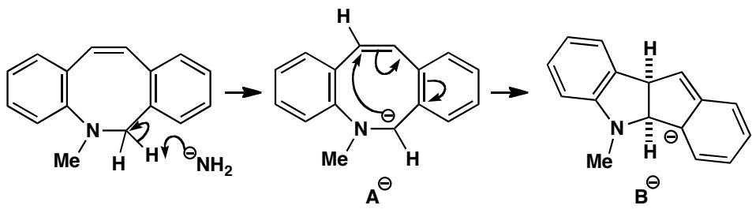

Anion B is protonated by water with preservation of the right hand aromatic ring. The final product is a chiral molecule having no plane of symmetry so the boxed $CH_{2}$ group is diastereotopic with $J_{AB}$ 15.4 Hz. This is larger than usual because of the $\pi$ -contribution: a neighbouring $\pi$ -bond increases ${}^{2}J$ by about 2 Hz.

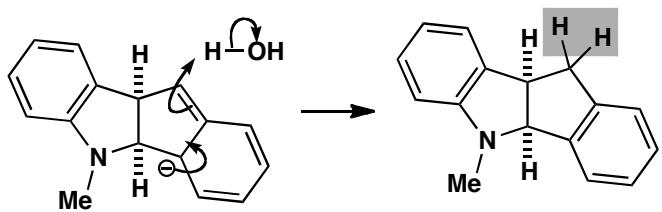  
This study was originally aimed at finding out the nature of the starting material, A. G. Anastassiou and group, J. Chem. Soc., Chem. Commun., 1981, 647.

## PROBLEM 10

How would you make the starting material for these reactions? Treatment of the anhydride with butanol gives an ester that in turn gives two inseparable compounds on heating. On treatment with an amine, an easily separable mixture of an acidic and a neutral compound is formed. What are the components of the first mixture and how are they formed?

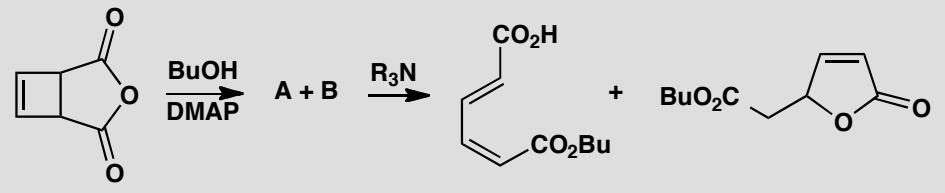

## Purpose of the problem

Exploration of alternative conrotatory openings of a cyclobutene.

## Suggested solution

The starting material is made by a photochemical $[2 + 2]$ cycloaddition of acetylene and maleic anhydride. Treatment with butanol and base gives the monoester because, after butanol has attacked once, the product is the anion of a carboxylic acid and cannot be attacked again by the nucleophile.

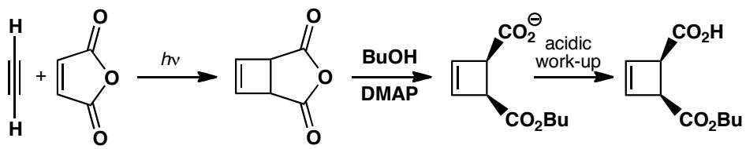

Heat opens the cyclobutene in a conrotatory four-electron electrocyclic reaction. As the two groups are cis on the cyclobutene, one must rotate outwards and one inwards. The two groups are similar but not the same so there is little selection and both products are formed.

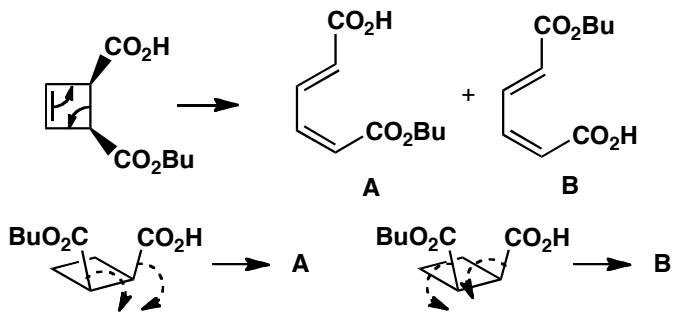

Treatment with the tertiary amine forms the anions of the carboxylic acids. The one from B can do a conjugate addition to the unsaturated ester and form a lactone but that of A is too far away and cannot react.

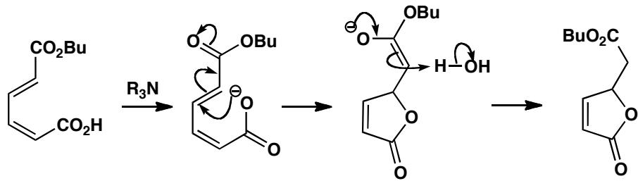

## PROBLEM 11

Treatment of this keto-aldehyde (which exists largely as an enol) with the oxidizing agent DDQ (a quinone—see p. 764 of the textbook) gives an unstable compound that turns into the product shown. Explain the reactions and comment on the stereochemistry.

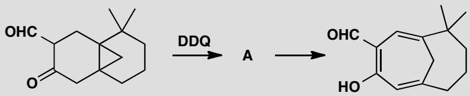

## Purpose of the problem

Exploration of a less well defined pericyclic sequence.

## Suggested solution

DDQ oxidizes the position between the two carbonyl groups to insert an alkene conjugated with both. We can now put in some stereochemistry as the three-membered ring must be cis fused to both six-membered rings. The diene undergoes electrocyclic ring opening to form a seven-membered ring. This is a six-electron and therefore disrotatory reaction and the two bonds to the old three-membered ring are therefore allowed to rotate inwards—the only rotation that can give the product.

■ This observation was vital in developing a synthesis of varucarin A, a natural product with antitumour activity. B. M. Trost and P. G. McDougal, J. Org. Chem., 1984, 49, 458.

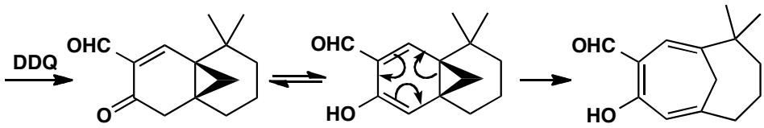

## PROBLEM 12

Explain the following observations. Heating this phenol brings it into rapid equilibrium with a bicyclic compound that does not spontaneously give the final product unless treated with acid.

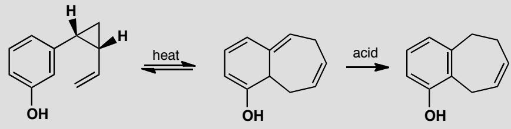

## Purpose of the problem

A sigmatropic rearrangement involving a three-membered ring. The $\sigma$ -bonds in three-membered rings are strained and more reactive than normal $\sigma$ -bonds and take part readily in pericyclic reactions.

## Suggested solution

The first step is a Cope rearrangement—a $[3,3]$ -sigmatropic rearrangement made favourable in this case because the $\sigma$ -bond that is broken is in a three-membered ring. The product cannot go directly to an aromatic compound as that would require a $[1,3]$ (or a $[1,7]$ depending on how you count) hydrogen shift. Such a shift would have to be antarafacial on the $\pi$ -system and that is impossible in such a rigid structure.

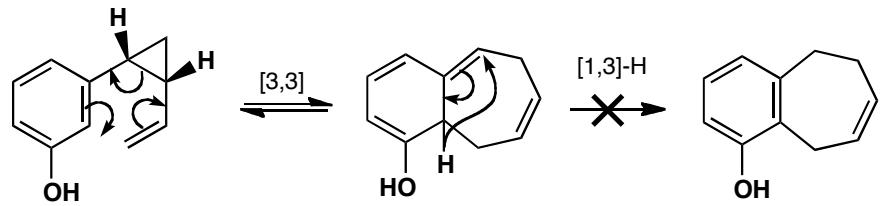  
■ This reaction was carried out as part of a mechanistic study by E. N. Marvell and S. W. Almond, Tetrahedron Lett., 1979, 2777.

The aromatization can happen instead by an ionic mechanism. If the extended enol is protonated at the remote end, it can lose a proton from the ring junction to reform the phenol.

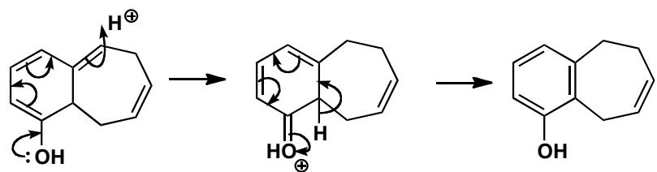

## PROBLEM 13

Treatment of cyclohexa-1,3-dione with this acetylenic amine gives a stable enamine in good yield. Refluxing the enamine in nitrobenzene gives a pyridine after a remarkable series of reactions. Fill in the details, give mechanisms for the reaction, structures for the intermediates, and suitable explanations for each pericyclic step. A mechanism is not required for the last step as nitrobenzene simply acts as an oxidant.

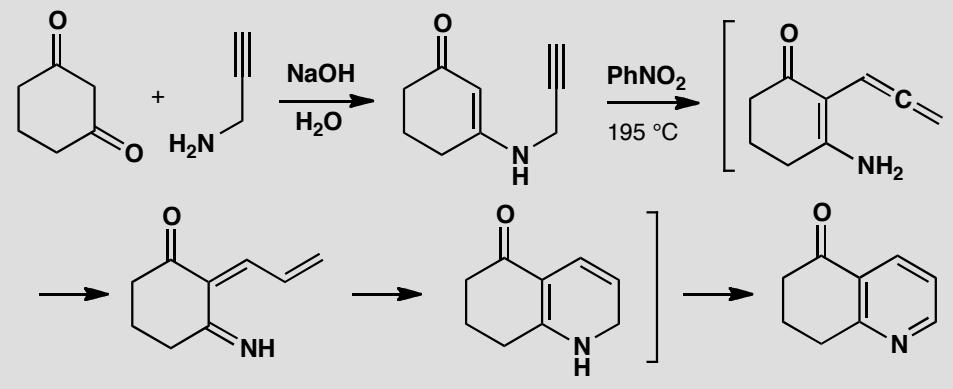

## Purpose of the problem

Practice in unravelling complicated reaction sequences involving pericyclic steps.

## Suggested solution

The formation of the enamine requires only patient adding and subtracting of protons.

■ This enamine is unusually stable and easy to form because it is a vinylogous amide (see p. 512 of the textbook).

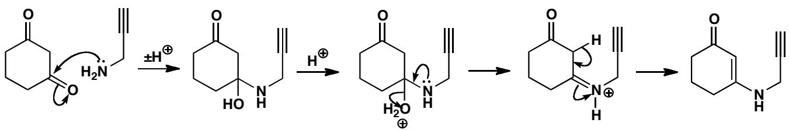

The cascade of reactions in hot nitrobenzene starts with a $[3,3]$ -sigmatropic rearrangement that is unusual in that it forms an allene but is otherwise straightforward. To get to the next intermediate, we must go from the ketone to the enol and back again, but with the alkene now in conjugation.

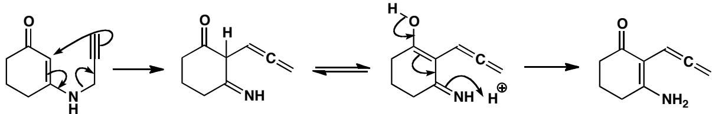

■ K. Berg-Nielsen and L. Skattebøl, Acta Chem. Scand., 1978, B32B, 553.

Now we can transfer a proton from nitrogen to the middle of the allene. This is formally a $[1,5]$ -H shift and is, of course, allowed, but it may be an ionic reaction as nitrogen is involved. This gives a diene that can twist round for a six-electron electrocyclic reaction. This is no doubt disrotatory but we can't tell as no stereochemistry is involved.

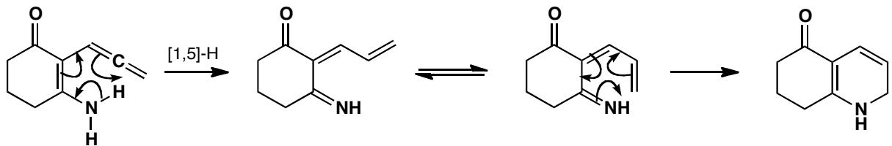

# Suggested solutions for Chapter 36

36

## PROBLEM 1

Rearrangements by numbers: just draw a mechanism for each reaction.

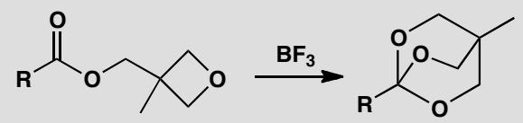

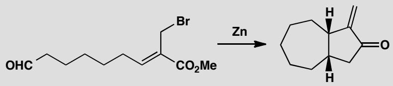

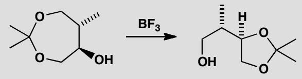

## Purpose of the problem

This problem is just to help you acquire the skill of tracking down rearrangements by numbering (arbitrarily) the atoms in the starting material and working out where they've gone in the product.

## Suggested solution

The first reaction is the preparation of Corey's ‘OBO’ protecting group for carboxylic acids. The Lewis acid complexes one of the oxygen atoms and all the atoms of the starting material survive in the product. Atoms 3 and 5 are easy to identify in the product and it doesn’t much matter which of the $CH_{2}$ groups you label 1, 2, and 4. Of course you may use a completely different numbering system and that’s fine. The dotted lines show which new bonds are made and which old bonds are broken.

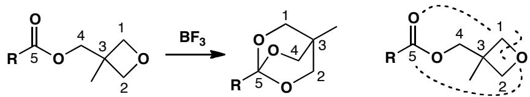

There is more than one reasonable mechanism: here are two possibilities, the second being perhaps the better.

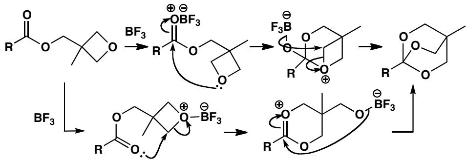

The second reaction is even easier to work out. Atoms 2 and 3 are easy to find and they identify 1 and 4 in the product.

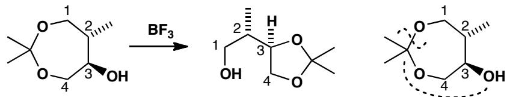

■ Revisit p. 338-9 of the textbook if you need reminding why.

As the compounds are acetals we must use oxonium ions and not $S_{N}2$ reactions. Loss of $BF_{3}$ and rotation of the last intermediate gives the product.

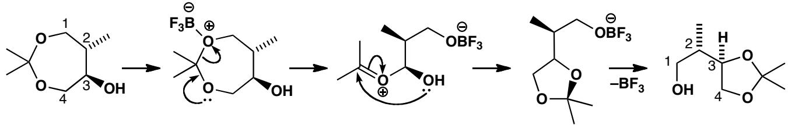

The third reaction involves a cyclization. Atoms 1 and 7 clearly make the new bond and the rest of the atoms fit into place except that the bromine has gone and the alkene has moved from 7/8 to 8/9. Zinc inserts oxidatively into the C–Br bond and the mechanism follows from the nucleophilic nature of the organometallic compound.

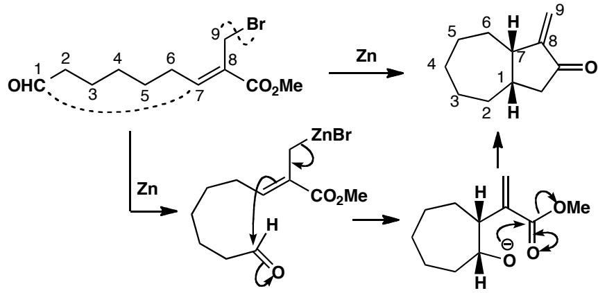

## PROBLEM 2

Explain this series of reactions.

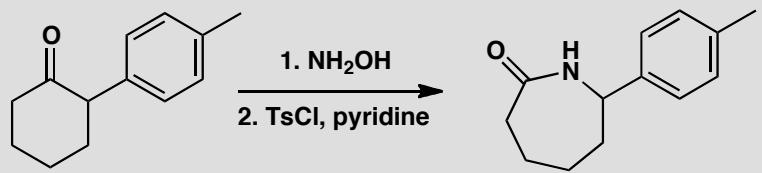

## Purpose of the problem

Working out the stereochemistry and mechanism of the Beckmann rearrangement.

## Suggested solution

The first reaction forms the oxime by the usual mechanism (chapter 11). This reaction is under thermodynamic control so the OH group will bend away from the aryl substituent. Then we have the Beckmann rearrangement itself (p. 958 of the textbook). The group anti to the OH group migrates from C to N and that gives the product after rehydration and adjustment of protons.

This example comes from a general investigation into the Beckmann and the related Schmidt rearrangements by R. H. Prager et al., Aust. J. Chem., 1978, 31, 1989.

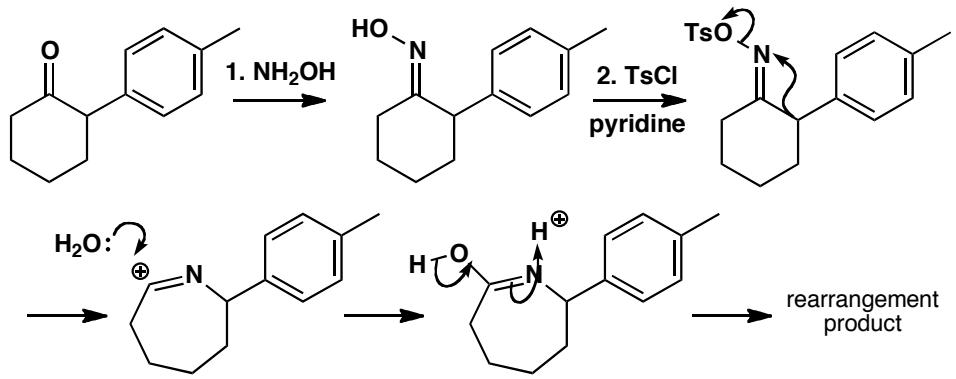

## PROBLEM 3

Draw mechanisms for the reactions and structures for the intermediates. Explain the stereochemistry, especially of the reactions involving boron. Why was 9-BBN chosen as the hydroborating agent?

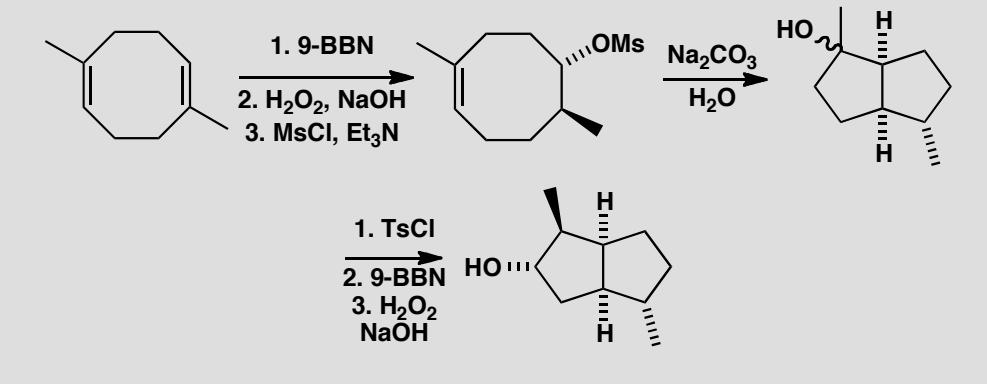

## Purpose of the problem

Rearrangements involving boron and a ring-closing rearrangement of sorts plus stereochemistry.

## Suggested solution

■ The structure of 9-BBN and the mechanism of the oxidation are described on p. 446 of the textbook: here we represent 9-BBN simply as R₂BH.

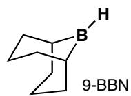

The starting material is symmetrical so it doesn't matter which face of which alkene you attack. The only important things are that boron binds to the more nucleophilic end of the alkene and that $\mathrm{R}_2\mathrm{B}$ and H are added cis. Alkaline $\mathrm{H}_2\mathrm{O}_2$ makes the hydroperoxide anion $(\mathrm{HOO}^-)$ which attacks boron.

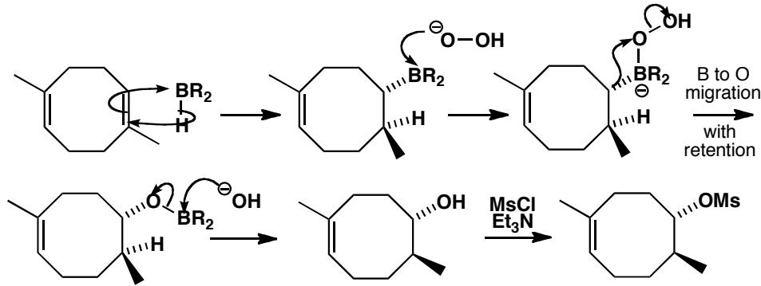

The mesylate cyclizes in aqueous base. The more nucleophilic end of the remaining alkene displaces the mesylate with inversion to make the cis ring junction much preferred by the 5,5 fused system. Water adds to the tertiary cation to give the next intermediate.

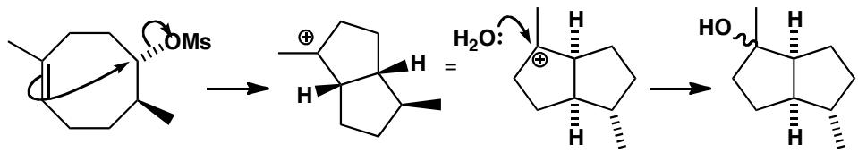

Elimination of the alcohol (E1 of course as it is tertiary) gives the alkene and a repeat of the hydroboration from the outside (convex face) of the folded molecule gives the final alcohol with five new stereogenic centres.

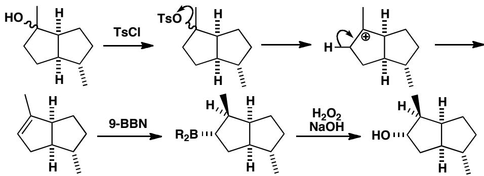

9-BBN was chosen because it is very large and reinforces the natural electronic preference of boron to bind to the less substituted end of the alkene with an extra steric effect. It also has bridgehead atoms bound to boron and they make poor migrating groups, forcing the migration of the third B substituent.

■ The final product of these reactions was used as a foundation for the synthesis of the 'iridoid' terpenes by R. S. Matthews and J. J. Whitesell, J. Org. Chem., 1975, 40, 3313.

## PROBLEM 4

It is very difficult to prepare three-membered lactones. One attempted preparation, by the epoxidation of di-t-butyl ketone, gave an unstable compound with an IR stretch at $1900 \, cm^{-1}$ . This compound decomposed rapidly to a four-membered ring lactone that could be securely identified. Do you think they made the three-membered ring?

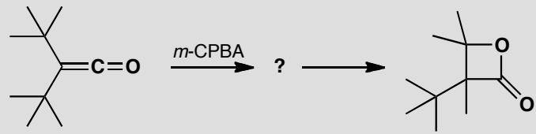

## Purpose of the problem

Rearrangements as a proof of structure?

## Suggested solution

■ See J. Am. Chem. Soc., 1970, 92, 6057 and also J. K. Crandall and S. A. Sojka, Tetrahedron Lett., 1972, 1641.

The expected three-membered lactone would have a very high carbonyl stretching frequency because of ring strain. Three-membered cyclic ketones have carbonyl stretches at about $1815 \, cm^{-1}$ and lactones have higher frequencies than ketones. So it might be the lactone. If it is, we should find a mechanism for the ring expansion to the four-membered lactone isolated. There is a good mechanism involving migration of a methyl group from one of the t-butyl groups. The general conclusion is that R. Wheeland and P. D. Bartlett did indeed make the first $\alpha$ -lactone.

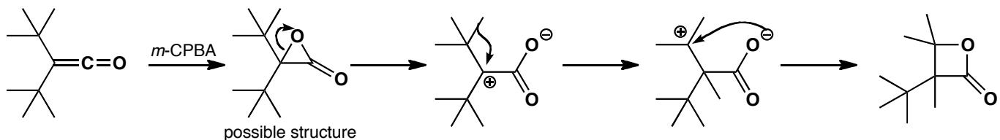  
PROBLEM 5  
Suggest a mechanism for this rearrangement.

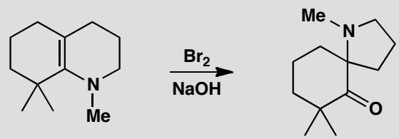

## Purpose of the problem

Working out the mechanism of a new rearrangement.

## Suggested solution

■ This reaction was discovered by L. Duhamel and J.-M. Poirier, J. Org. Chem., 1979, 44, 3576.

The starting material is an enamine and will react with bromine in the manner of an enol. Addition of hydroxide gives the starting material for the rearrangement. Notice that the nitrogen atom migrates rather than the carbon atom and this suggests that it does so by participation. If you numbered the atoms you would have found that the gem-dimethyl group and the nitrogen atom give the answer away immediately.

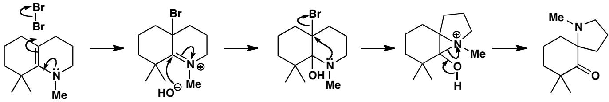

## PROBLEM 6

A single enantiomer of the epoxide below rearranges with Lewis acid catalysis to give a single enantiomer of the product. Suggest a mechanism and comment on the stereochemistry.

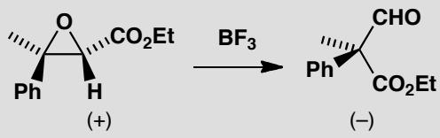

## Purpose of the problem

An unusual group migrates and stereochemistry gives a clue to mechanism.

## Suggested solution

The mechanism for the reaction must involve Lewis acid complexation of the epoxide oxygen atom, cation formation, and migration of $CO_{2}Et$ . This last point may surprise you but inspection of the product shows that $CO_{2}Et$ is indeed bonded to the other carbon of what was the epoxide.

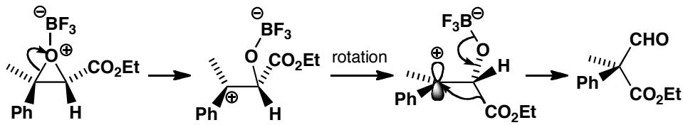

Although something like this must happen, our mechanism raises as many questions as it answers:

\- Why does that bond of the epoxide open? Answer. Because the tertiary benzylic cation is much more stable than a secondary cation with a $CO_{2}Et$ substituent.

\- Why does $CO_{2}Et$ migrate rather than the H atom? Answer. For the same reason! If the H atom migrates, the product would be a cation (or at least a partial positive charge would appear in the transition state) next to the $CO_{2}Et$ group.

■ This mechanism was investigated by R. D. Bach and coworkers; J. Am. Chem. Soc., 1976, 98, 1975 and 1978, 100, 1605.

\- Surely the carbocation intermediate is planar and the product would be racemic? Answer. This was the purpose of the investigation. One chiral centre is lost in the reaction so only absolute stereochemistry is relevant. One explanation is that the cation is short-lived and that bond rotation is fast in the direction shown (the $\mathrm{CO}_{2}\mathrm{Et}$ group is already down and has to rotate by only $30^{\circ}$ to get to the right position for migration). The other is that migration is concerted with epoxide opening. This looks unlikely as the overlap is poor.

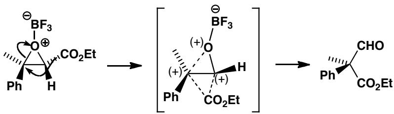

## PROBLEM 7

The ‘pinacol’ dimer of cyclobutanone rearranges with expansion of one of the rings in acid solution to give a cyclopentanone fused spiro to the remaining four-membered ring. Draw a mechanism for this reaction. Reduction of the ketone gives an alcohol that rearranges to a bicyclic alkene also in acid. Suggest a mechanism for this reaction and suggest why the rearrangements happen.

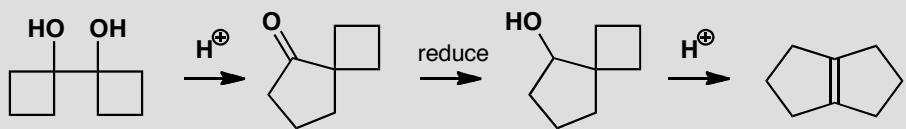

## Purpose of the problem

An illustration of the easy rearrangement of four-membered rings to form five-membered rings.

## Suggested solution

The first reaction is a simple pinacol rearrangement. The diol is symmetrical so protonation of either alcohol and migration of either C–C bond give the product.

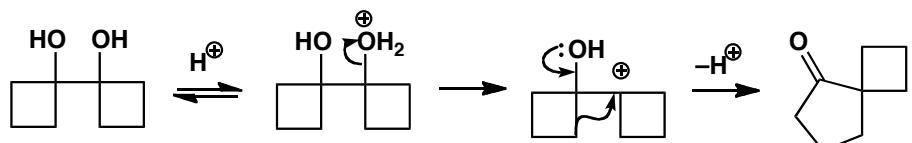

Reduction to the alcohol is trivial and then acid treatment allows the loss of water and ring expansion of the remaining four-membered ring. You may well have drawn this as a stepwise process. Elimination gives the most substituted alkene. Both rearrangements occur very easily because of the relief of strain in going from a four- to a five-membered ring.

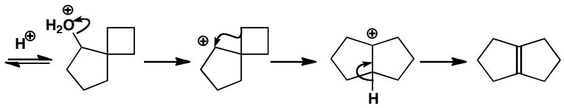

## PROBLEM 8

Give the products of Baeyer-Villiger rearrangements on these compounds, with reasons.

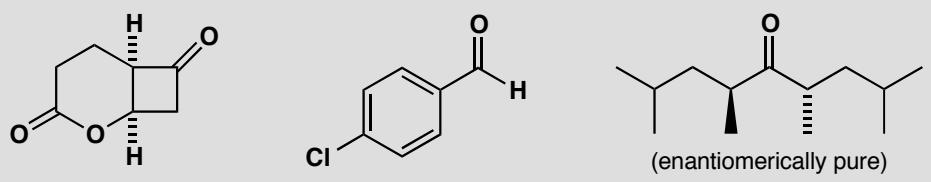

## Purpose of the problem

Prediction in rearrangements is as important as elsewhere and the Baeyer-Villiger is one of the more predictable rearrangements.

## Suggested solution

There are a few minor traps here that we're sure you've avoided. The first compound has two carbonyl groups but esters don't do the Baeyer-Villiger rearrangement so only the ketone reacts. The more substituted carbon migrates with retention of configuration. The aldehyde rearranges with migration of the benzene ring in preference to the hydrogen atom. The last compound is $C_2$ symmetric so it doesn't matter which group you migrate as long as you ensure retention of configuration. Take care when drawing the product as the migrating group has to be drawn the other way up.

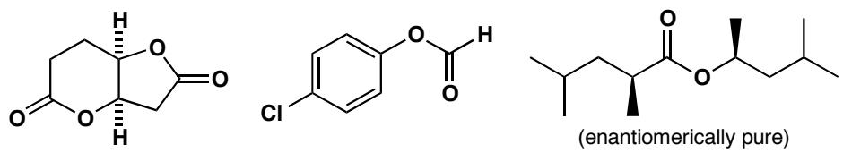

## PROBLEM 9

Suggest mechanisms for these rearrangements, explaining the stereochemistry in the second reaction.

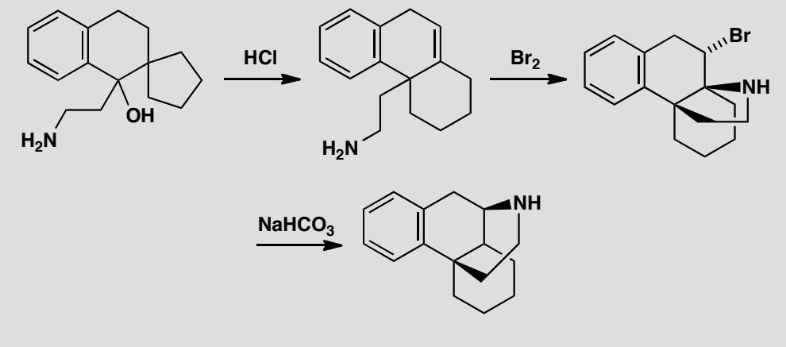

## Purpose of the problem

Unravelling one rearrangement after another with some stereochemistry.

## Suggested solution

The first reaction is a simple ring expansion. The amine is not involved, presumably because it is fully protonated. The final loss of proton might be concerted with the migration as this would help explain the position of the alkene in the product.

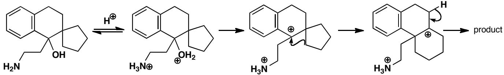

The second reaction starts with bromination of the alkene and interception of the bromonium ion by the amine. Only when bromine adds to the opposite face of the alkene can the amine cyclize so this reaction resembles iodolactonization. Probably the bromination is reversible.

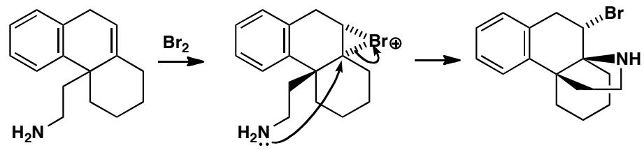

Finally, the weak base bicarbonate $\left(\mathrm{HCO}_{3}^{-}\right)$ is enough to remove a proton from the nitrogen atom and allow participation in nitrogen migration by displacement of bromide. This alkene is formed because the $C-N^{+}$ bond to tertiary carbon is broken preferentially.

■ This work allowed the synthesis and trial of some early morphine analogues as painkillers: L Moncovic et al., J. Am. Chem. Soc., 1973, 95, 647.

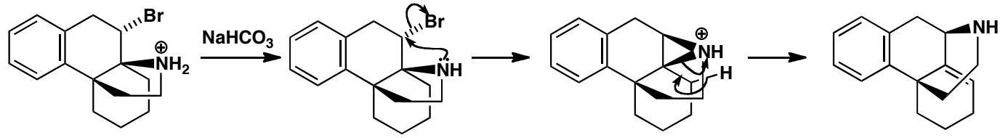

## PROBLEM 10

Give mechanisms for these reactions that explain any selectivity.

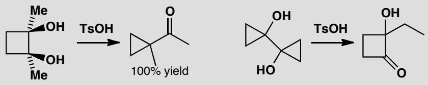

## Purpose of the problem

To show that ring expansion from three- to four-membered rings and ring contraction the other way are about as easy.

## Suggested solution

The first mechanism is a pinacol rearrangement and the compound is symmetrical so it doesn't matter which alcohol is protonated. Both three- and four-membered rings are strained and the $\sigma$ -bonds are more reactive than normal (they have a high energy HOMO). This makes ring contraction an easy reaction even though the strain is not relieved.

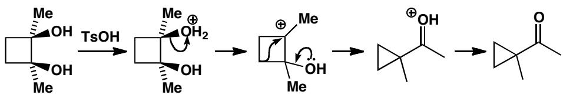

The second example looks at first to be a similar pinacol rearrangement. But the resulting ketone cannot easily be transformed into the product.

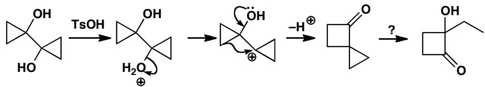

Breaking open one of the three-membered rings gets us off to a better start. This gives a hydroxy-ketone that can rearrange in a pinacol fashion with ring expansion of the remaining cyclopropane.

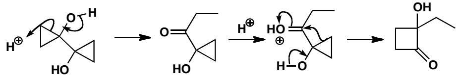

## PROBLEM 11

Attempts to produce the acid chloride from this unusual amino acid by treatment with $\mathrm{SOCl}_2$ gave instead a $\beta$ -lactam. What has happened?

## Purpose of the problem

To show that ring expansion in small rings is even easier in heterocycles because of participation.

## Suggested solution

■ This surprising reaction is one way to make the important $\beta$ -lactams present in penicillins and other antibiotics. J. A. Deyrup and S. C. Clough, J. Am. Chem Soc., 1969, 91, 4590.

The formation of the acid chloride might go to completion or it might be that some intermediate on the way to the acid chloride rearranges. We shall use an intermediate. Whichever you use, it is participation by nitrogen that starts the ring expansion going, though the next intermediate is very unstable. When chloride attacks the bicyclic cation, it cleaves the most strained bond, the one common to two three-membered rings.

## PROBLEM 12

Treatment of this hydroxy-ketone with base followed by acid gives the enone shown. What is the structure of intermediate A, how is it formed, and what is the mechanism of its conversion to the final product?

## Purpose of the problem

Fragmentation may be followed by another reaction.

## Suggested solution

Removal of the hydroxyl proton by the base promotes a fragmentation that is a reverse aldol reaction. It works because the C–C bond being broken is in a four-membered ring. Then an acid catalysed aldol reaction in the normal direction and elimination via the enol (E1cB) allows the formation of the much more stable six-membered ring.

## PROBLEM 13

Just to check your skill at finding fragmentations by numbers, draw the mechanism for each of these one-step fragmentations in basic solution with acidic work-up.

## Purpose of the problem

As the problem says, to help you unravel simple fragmentations.

## Suggested solution

We can identify the six-membered ring in both compounds—the sequence 1–6 is clearly the same in both with a side chain at C3. The fragmentation is easy enough too—the OH proton is removed and the mesylate must be the leaving group so the groups doing the ‘pushing’ and ‘pulling’ are clear from the start.

The two $\mathrm{CO}_{2}\mathrm{H}$ groups in the second product might cause a moment's concern but one is on a $-\mathrm{CH}_2 - \mathrm{CH}_2-$ side chain and the other is at a branch point and we can soon fill in the rest of the numbers.

Clearly the OH proton is removed and one of the carboxyls is a leaving group. The stereochemistry disappears in the fragmentation but it is important, as the conformational drawing shows. One lone pair on the $O^{-}$ , the bond being fragmented, and the bond to the leaving group are all parallel (shown in thick lines).

## PROBLEM 14

Explain why both these tricyclic ketones fragment to the same diastereoisomer of the same cyclo-octane.

## Purpose of the problem

Fragmentations linked to ester hydrolysis.

## Suggested solution

It is obvious from the reactions that two features have disappeared from the starting materials: an ester group (OAc) and a four-membered ring. The ester can be hydrolysed by KOH and the four-membered ring disappears in the fragmentation. As usual, draw the mechanism first and worry about the stereochemistry later. For the first compound, this sequence gives the enolate of a diketone and hence the diketone itself.

The second compound follows the same sequence and a different enolate emerges, but it is simply another enolate of the same ketone. Both compounds give the same basic structure.

But what about stereochemistry? We are not told the stereochemistry of the starting materials but know that 5,4 fused rings must have a cis ring junction. This junction survives in the first compound so the stereochemistry must have changed. The second compound gives us the clue as to how. When it tautomerizes to the ketone it will select the more stable trans 8,5 ring junction. In the same way, the enolate from the first sequence is in equilibrium under the reaction conditions with all the other enolates of the same ketone, including those at ring junctions. This is a stereoselective reaction.

## PROBLEM 15

Suggest a mechanism for this fragmentation and explain the stereochemistry of the alkenes in the product. This is a tricky problem, but find the mechanism and the stereochemistry will follow.

## Purpose of the problem

Probably the most beautiful application of fragmentation yet by a true genius of chemistry, Albert Eschenmoser.

## Suggested solution

The tosylate is obviously the leaving group, the two oxygens in the ring must become the ester group, and the $CO_{2}^{-}$ must leave as $CO_{2}$ . All that remains is to trace a pathway from $CO_{2}^{-}$ to OTs via one of the ring oxygens using parallel bonds. Though you could draw a mechanism for this double fragmentation, it is not convincing. The only electrons anti-parallel to the C–OTs bond are those in the ring junction bond and the equatorial lone pair on one of the ring oxygens. Marking these with heavy lines, we carry out the first fragmentation. We’ve also drawn in the hydrogen that ends up on the alkene so you can see clearly where the trans geometry comes from

  
■ Angew. Chem. Int. Ed. Engl., 1979, 18, 634, 636.

The second fragmentation is easier to see if we redraw the intermediate so that we can see which groups are antiparallel. A conformational drawing also reveals the correct alkene geometry.

  
PROBLEM 16

Suggest a mechanism for this reaction and explain why the molecule is prepared to abandon a stable six-membered ring for a larger ring.

## Purpose of the problem

A simple example of fragmentation used to create a medium size (11-membered) ring.

## Suggested solution

The strong base removes the proton from the OH group and the oxyanion attacks one of the carbonyl groups (they are the same). This intermediate might decompose back to starting materials but it can also fragment with the loss of an enolate. The product is then an ester, and protonation of the enolate completes the reaction. The eleven-membered ring is more stable than usual because of the benzene ring (see problem 2, chapter 34), and because the ester does not suffer from cross-ring interactions in its favoured s-trans conformation.

■ J. R. Mahajan and H. de Carvalho, Synthesis, 1979, 518.

## PROBLEM 17

Give mechanisms for these reactions, commenting on the fragmentation.

## Purpose of the problem

Revision of conjugate addition of enols, another ring expansion with an enolate as leaving group and an interesting piece of stereochemistry.

## Suggested solution

The first step is enamine formation and the second is conjugate addition. This appears to lead to a dead end as we cannot find a way to make the intermediate from the product.

The answer is to exchange the enamine of the ketone with the enamine of the aldehyde. Under the conditions, enamine formation is reversible and there are various ways you could draw details. Cyclization of this compound now gives the intermediate we are looking for.

The last two diagrams show where the stereochemistry comes from. The final product has a chair six-membered ring. The 1,3-bridge on the bottom of this ring must be diaxial or it cannot reach round. The pyrrolidine is equatorial and the five-membered ring must be cis fused. No doubt the stereochemistry as well as the intermediates are under thermodynamic control.

Finally the fragmentation itself. Methylation of the nitrogen makes it into a leaving group and addition of hydroxide to the ketone provides the electronic push. Notice that the C–N $^{+}$ bond, the C–C bond being fragmented, and a lone pair on the O $^{-}$ group are all parallel. The stereochemistry is already there in the intermediate.

## PROBLEM 18

Suggest mechanisms for these reactions, explaining the alkene geometry in the first case. Do you consider that they are fragmentations?

## Purpose of the problem

Simple fragmentations involving the opening of three-membered rings.

## Suggested solution

The first reaction is a fragmentation without any ‘push’ but that is all right because the bond that is being broken is in a three-membered ring. You may have drawn a concerted mechanism or a stepwise one with a cation as intermediate. Either may be correct. The stereochemistry of the alkene is thermodynamically controlled.

The second reaction is base-catalysed and starts with the hydrolysis of the ester by NaOH. This fragmentation also needs ‘push’, though only a three-membered ring is being broken, because the leaving group is an enolate, nowhere near as electron-withdrawing as the water molecule or the carbocation in the first example. Are they fragmentations? In both cases a C–C bond is being broken but we would understand if you felt the first was not strictly a fragmentation, particularly if it goes stepwise. Neither reaction breaks the molecule into three pieces and the terminology is merely a matter of opinion.

## PROBLEM 19

What steps would be necessary to carry out an Eschenmoser fragmentation on this ketone, and what products would be formed?

## Purpose of the problem

Revision of an important and complex reaction involving fragmentation.

## Suggested solution

The Eschenmoser fragmentation (p. 965 of the textbook) uses the tosylhydrazone of an $\alpha, \beta$ -epoxy-ketone. The epoxide can be made with alkaline hydrogen peroxide and the tosylhydrazone needs just tosylhydrazine to form what is essentially an imine. Then the fun can begin. The stereochemistry doesn't matter for once.

The fragmentation is initiated with base that removes the proton from the NHTs group. This anion fragments the molecule one way and then the oxyanion fragments it the other way with nitrogen gas and $Ts^{-}$ as leaving groups. The product is an acetylenic aldehyde or ketone.

## PROBLEM 20

Revision content. Suggest mechanisms for these reactions to explain the stereochemistry.

## Purpose of the problem

Rearrangements and a fragmentation.

## Suggested solution

The ring opening and the rearrangement cannot be concerted because the group on the ‘wrong’ side of the molecule migrates. There must be a cationic intermediate. In contrast, attack of bromide occurs stereospecifically from the side opposite the migrating group, so this is presumably concerted with the rearrangement.

The second reaction is a fragmentation. Silver(I) is an excellent Lewis acid for halogens and probably produces a secondary carbocation intermediate. Push from the OH group completes the fragmentation.

  
■ As it happens the starting epoxide is that of natural $\alpha$ -pinene so it and the product are single enantiomers. P. H. Boyle et al., J. Chem. Soc., Chem. Commun., 1971, 395.

This page intentionally left blank

# Suggested solutions for Chapter 37

37

## PROBLEM 1

Give a mechanism for the formation of this silylated ene-diol and explain why the $Me_{3}SiCl$ is necessary.

## Purpose of the problem

Reminder of an important radical reaction.

## Suggested solution

This is an acyloin condensation linking radicals derived from esters by electron donation from a dissolving metal (here sodium). If the esters can form enolates, the addition of $Me_{3}SiCl$ protects against that problem by removing the $MeO^{-}$ by-product.

The first product is a very electrophilic 1,2-dione and it accepts electrons from sodium atoms even more readily than do the original esters. The product is an ene diolate that is also silylated under the reaction conditions.

■ Details from B. M. Trost and group, J. Org. Chem., 1978, 43, 4559.

## PROBLEM 2

Heating the diazonium salt below in the presence of methyl acrylate gives a reasonable yield of a chloroacid. Why is this unlikely to be nucleophilic aromatic substitution by the $S_{N}1$ mechanism (p. 520 of the textbook)? Suggest an alternative mechanism that explains the regioselectivity.

## Purpose of the problem

Revision of nucleophilic aromatic substitution with diazonium salts and contrasting cations and radicals.

## Suggested solution

The cation mechanism is perfectly reasonable as far as the diazonium salt is concerned but it will not do for the alkene. Conjugated esters are electrophilic and not nucleophilic alkenes. Even if it were to attack the aryl cation, we should find the reverse regioselectivity.

The only way to produce the observed product is to decompose the diazonium salt homolytically. To do this we can draw the salt as a covalent compound or transfer one electron from the chloride ion to the diazonium salt. The other product would be a chlorine radical. Addition to the alkene gives the more stable radical which abstracts chlorine from the diazonium salt and keeps the chain going.

  
■ Notice that in the last step we have put in only half the mechanism—we shall generally do this from now on as it is clearer. There is nothing wrong with putting in another chain of half-headed arrows going in the other direction.

## PROBLEM 3

Suggest a mechanism for this reaction and comment on the ring size formed. What is the minor product likely to be?

## Purpose of the problem

Activated alkenes are not necessary in radical cyclizations.

## Suggested solution

The peroxide is a source of benzoyloxy radicals (PhCO $_2^{\bullet}$ ) and these capture hydrogen atoms to give the most stable radical. The best one here is stabilized by both CN and CO $_2$ Et. Cyclization onto the alkene gives mainly a secondary radical on a six-membered ring and this abstracts a hydrogen from starting material to complete the cycle.

The alternative is to add to the more substituted end of the alkene. This gives a less stable primary radical, but this ‘5-exo’ ring closure is often preferred because the orbital alignment is better. The minor product has a five-membered ring.

## PROBLEM 4

Treatment of this aromatic heterocycle with NBS (N-bromosuccinimide) and AIBN gives mainly one product but this is difficult to purify from minor impurities containing one or three bromine atoms. Further treatment with 10% aqueous NaOH gives one easily separable product in modest yield (50%). What are the mechanisms for the reactions?

## Purpose of the problem

An important radical reaction: bromination at benzylic and allylic positions by NBS, and an application.

## Suggested solution

Two preliminary reactions need to take place: NBS is a source of a low concentration of bromine molecules and AIBN initiates the radical chain by forming a nitrile-stabilized tertiary radical.

The new radical abstracts hydrogen atoms from the benzylic positions to make stable delocalized radicals. These react with bromine to give the benzylic bromide and release a bromine atom.

All subsequent hydrogen abstractions are carried out by bromine atoms, either of the kind we have just seen or to remove a hydrogen atom from the other methyl group. This reaction provides the HBr that generates more bromine from NBS.

Finally the dibromide reacts with NaOH to give the new heterocycle. Both $S_{N}2$ displacements are very easy at a benzylic centre and the second is intramolecular.

■ This product was used to make constrained amino acids by S. Kotha and co-workers, Tetrahedron Lett., 1997, 38, 9031.

## PROBLEM 5

Propose a mechanism for this reaction accounting for the selectivity. Include a conformational drawing of the product.

## Purpose of the problem

Another important radical reaction: cyclization of alkyl bromides onto alkenes.

## Suggested solution

This time AIBN abstracts the hydrogen from $Bu_{3}SnH$ and the tin radicals carry the chain along. First they remove the bromine atom from the starting material to make a vinyl radical that cyclizes onto the unsaturated ketone to give a radical stabilized by conjugation with the carbonyl group. The chain is completed by abstraction of hydrogen from another molecule of $Bu_{3}SnH$ , the tin radical formed then allowing the cycle to restart.

The stereochemistry of the product comes from the requirement of a 1,3-bridge to be diaxial as this is the only way the bridge can reach across the ring. At the moment of cyclization, the vinyl radical side chain must be in an axial position.

## PROBLEM 6

An ICI process for the manufacture of the diene used to make pyrethroid insecticides involved heating these compounds to 500 °C in a flow system. Propose a radical chain mechanism for the reaction.

## Purpose of the problem

Learning how to avoid a trap in writing radical reactions and to show you that radical reactions can be useful.

## Suggested solution

The most likely initiation at 500 °C is the homolytic cleavage of the C–Cl bond to release allyl and chloride radicals. The chloride radicals then attack the alkene and abstract a hydrogen atom to give more of the same allylic radical.

The trap is to form the product by dimerizing the allylic radical. Dimerizing radicals does sometimes occur (in the acyloin reaction for example) but it is a rare process.

Much more likely is a chain reaction. If we add the allylic radical to the alkene part of the allylic chloride we make a stable tertiary radical that can lose chloride radical and propagate the chain.

## PROBLEM 7

Heating this compound to 560 °C gives two products with the spectroscopic data shown below. What are they and how are they formed?

A has IR 1640 cm $^{-1}$ ; m/z 138 (100%) and 140 (33%), $\delta_{H}$ (ppm) 7.1 (4H, s), 6.5 (1H, dd, J 17, 11 Hz), 5.5 (1H, dd, J 17, 2 Hz), and 5.1 (1H, dd, J 11, 2 Hz).

B has IR 1700 cm $^{-1}$ ; m/z 111 (45%), 113 (15%), 139 (60%), 140 (100%), 141 (20%), and 142 (33%), $\delta_{H}$ (ppm) 9.9 (1H, s), 7.75 (2H, d, J 9 Hz), and 7.43 (2H, d, J 9 Hz).

## Purpose of the problem

Revision of structure determination and a radical reaction with a difference.

## Suggested solution

Compound A contains chlorine (m/z 138/140, 3:1) and that fits $C_{8}H_{7}Cl$ . It still has the 1,4-disubstituted benzene ring (four aromatic Hs) and it is an alkene (IR 1640) with three hydrogens on it with characteristic coupling. We can write the structure immediately as there is no choice. The four aromatic hydrogens evidently have the same chemical shift.

Compound B has m/z 140/142, 3:1 and a carbonyl group (at $1700 \, cm^{-1}$ ) which fits $C_{7}H_{5}ClO$ and looks like an aldehyde ( $\delta_{H}$ 9.9). It still has the disubstituted benzene. The structure is even easier this time!

So how are these products formed? At such high temperatures, $\sigma$ -bonds break and the weakest bonds in the molecule are the C–C and C–O bonds in the four-membered ring next to the benzene ring. Breaking these bonds releases strain and allows one of the radical products to be secondary and delocalized.

## PROBLEM 8

Treatment of methylcyclopropane with peroxides at very low temperature ( $-150\ ^{\circ}C$ ) gives an unstable species whose ESR spectrum consists of a triplet with coupling of 20.7 gauss and fine splitting showing dtt coupling of 2.0, 2.6, and 3.0 gauss. Warming to a mere $-90\ ^{\circ}C$ gives a new species whose ESR spectrum consists of a triplet of triplets with coupling 22.2 and 28.5 gauss and fine splitting showing small ddd coupling of less than 1 gauss.

If methylcyclopropane is treated with t-BuOCl, various products are obtained but the two major products are C and D. At lower temperatures more of C is formed and at higher temperatures more of D.

Treatment of the more substituted cyclopropane below with PhSH and AIBN gives a single product in quantitative yield. Account for all these reactions, identifying A and B and explaining the differences between the various experiments.

## Purpose of the problem

Working out the consequences of an important substituent effect on radical reactions: the cyclopropyl group.

■ C. S. Walling and P. S. Fredericks, J. Am. Chem. Soc., 1962, 91, 1877.

## Suggested solution

The peroxide is a source of $t$ -BuO $\cdot$ radicals and these abstract a hydrogen from the methyl group of the hydrocarbon. The first spectrum is that of the cyclopropylmethyl radical. The odd electron is in a p orbital represented by a circle and the planar CH $_2$ $\cdot$ group is orthogonal to the plane of the ring but the two H $^a$ s are the same because of rapid rotation. The odd electron has a large coupling to the two hydrogens (H $^a$ ) on the same carbon, a smaller doublet coupling to H $^b$ , and small couplings to the two H $^c$ s and two H $^d$ s. The coupling to H $^b$ is small because the p orbital containing the odd electron is orthogonal to the C–H $^b$ bond.

Warming to $-90\ ^{\circ}C$ causes decomposition to an open-chain radical. The odd electron is coupled to the two hydrogens on its own carbon ( $H^{a}$ ) and those on the next carbon ( $H^{b}$ ) each giving a triplet (22.2 and 28.5). Coupling to the more remote hydrogens is small.

Decomposition of the same hydrocarbon with t-BuOCl produces the same sequence of radicals but they can now be intercepted by the chlorine atom of the reagent, releasing more t-BuO• radicals and a radical chain is started. At lower temperatures the ring opening is slower so more of the cyclopropane is captured.

The last example also produces a radical next to a cyclopropane ring but this time it can decompose very easily to give a stable secondary benzylic radical. This captures a hydrogen atom from PhSH releasing PhS• and maintaining an efficient radical chain. Ring opening of cyclopropanes is now a standard way of detecting radicals.

## PROBLEM 9

The last few stages of Corey's epibatidine synthesis are shown here. Give mechanisms for the first two reactions and suggest a reagent for the last step.

## Purpose of the problem

Application of radical reactions in an important sequence plus revision of conformation and stereochemistry.

## Suggested solution

The first step involves deprotonation of the rather acidic amide (the $CF_{3}$ group helps) and the displacement of the only possible bromide—the one on the opposite face of the six-membered ring as the $S_{N}2$ reaction must take place with inversion.

The second step is a standard dehalogenation by $Bu_{3}SnH$ . AIBN generates $Bu_{3}Sn^{\bullet}$ by hydrogen abstraction from the reagent and this removes the bromine. Make sure you complete the chain and do not use $H^{\bullet}$ at any point.

Finally we need to hydrolyse the amide. This normally requires strong acid or alkali but the $CF_{3}$ group makes this amide significantly more electrophilic than most and milder conditions can be used. Corey actually used NaOMe in methanol at 13 °C for two hours and got a yield of 96%. Any reasonable conditions you may have chosen would be fine too.

## PROBLEM 10

How would you make the starting material for this sequence of reactions? Give a mechanism for the first reaction that explains its regio- and stereoselectivity. Your answer should include a conformational drawing of the product. What is the mechanism of the last step? Attempts to carry out this last step by iodine/lithium exchange and reaction with allyl bromide failed. Why? Why is the alternative shown here successful?

## Purpose of the problem

Application of radical reactions when the alternative ionic reactions fail.

## Suggested solution

The starting material is an obvious Diels-Alder product as it is a cyclohexene with a carbonyl group outside the ring on the opposite side. The first step is iodolactonization. Iodine attacks the alkene reversibly on both sides but, when it attacks opposite the carboxylate anion, the lactone ring snaps shut.

The problem asks for a conformational drawing of the product and indeed that is necessary. The 1,3-lactone bridge must be diaxial as that is the only way for the carboxylate to reach across and therefore it must attack from an axial direction too.

■ You can regard this as the formation of a diaxial product as in the opening of a cyclohexene oxide with a nucleophile (p. 836 of the textbook).

The last step is initiated by AIBN which removes the iodine atom from the compound to make a secondary radical. This attacks the allyl stannane and the intermediate loses $Bu_{3}Sn^{\bullet}$ and that takes over the job of removing iodine atoms to keep the chain going. The radical intermediate has no stereochemistry at the planar radical carbon and attack occurs from the bottom face to avoid the blocking lactone bridge.

Anionic reactions cannot be used for this allylation. If the iodine were metallated, the organometallic compound would immediately expel the lactone bridge as carboxylate ion is a good leaving group. The radical is stable because the C–O bond is strong and not easily cleaved in radical reactions.

## PROBLEM 11

Suggest a mechanism for this reaction explaining why a mixture of diastereoisomers of the starting material gives a single diastereoisomer of the product. Is there any other form of selectivity?

## Purpose of the problem

A radical ring-closing reaction with a curious stereochemical outcome.

## Suggested solution

The abstraction of bromine, at first by AIBN and thereafter by $Bu_{3}Sn^{\bullet}$ produces a radical that again does not eliminate but adds to an alkene. A five-membered ring is formed (this is usually the more favourable closure) by attack on the alkene on the opposite side from that occupied by the i-Pr group. The product is a mixture of diastereoisomers as no change occurs at the acetal centre.

Acid-catalysed oxidation first hydrolyses the acetal and then oxidizes either the hemiacetal or the aldehyde to the lactone. Now the molecule is one diastereoisomer as the ambiguous centre is planar. The other form of selectivity is the ring size (see the textbook, p. 1000).

## PROBLEM 12

Reaction of this carboxylic acid $\left(\mathrm{C}_{5}\mathrm{H}_{8}\mathrm{O}_{2}\right)$ with bromine in the presence of dibenzoyl peroxide gives an unstable compound A $\left(\mathrm{C}_{5}\mathrm{H}_{6}\mathrm{Br}_{2}\mathrm{O}_{2}\right)$ that gives a stable compound B $\left(\mathrm{C}_{5}\mathrm{H}_{5}\mathrm{BrO}_{2}\right)$ on treatment with base. Compound B has IR 1735 and 1645 cm $^{-1}$ and NMR $\delta_{H}$ 6.18 (1H, s), 5.00 (2H, s) and 4.18 (2H, s). What is the structure of the stable product B? Deduce the structure of the unstable compound A and mechanisms for the reactions.

$$
\mathrm{CO} _ {2} \mathrm{H} \xrightarrow [ (\mathrm{PhCO} _ {2}) _ {2} ]{\mathrm{Br} _ {2}} \mathrm{A} \xrightarrow {\text {base}} \mathrm{B}
$$

## Purpose of the problem

Revision of structural analysis in combination with an important radical functionalization.

## Suggested solution

The starting material is $C_{5}H_{8}O_{2}$ so the stable compound B has gained a bromine and lost three hydrogens. There must be an extra double bond equivalent (DBE) somewhere in B. The IR spectrum shows that the OH has gone and suggests a carbonyl group, possibly an ester because of the high frequency, and an alkene. The NMR shows that both methyl groups have gone and have been replaced by $CH_{2}$ groups. The bromine must be on one of them and the ester oxygen on the other. The extra DBE is a ring.

Since both methyl groups are functionalized, unstable A must have one Br on each methyl group. The peroxide produces benzoyl radicals that abstract protons from both allylic positions to give stabilized radicals that attack bromine molecules to give bromide radicals to continue the chain reaction. In base the carboxylate cyclizes onto the cis CH $_{2}$ Br group.

# Suggested solutions for Chapter 38

38

## PROBLEM 1

Suggest mechanisms for these reactions.

## Purpose of the problem

Two simple carbene reactions initiated by base.

## Suggested solution

Going to the right we must remove the rather acidic proton from $CHBr_{3}$ to give the carbanion. This loses bromide to give dibromocarbene and insertion into cyclohexene gives the product.

The second reaction is very similar. $\alpha$ -Elimination of HCl gives a carbene that inserts into an alkene. These are the simplest reactions of carbenes and are very common.

## PROBLEM 2

Suggest a mechanism for this reaction and explain the stereochemistry.

## Purpose of the problem

Another important carbene method used in the synthesis of a natural antibiotic.

## Suggested solution

■ This reaction established the skeleton of cycloeudesmol and was carried out by E. Y. Chen, Tetrahedron Lett., 1982, 23, 4769, at Sandoz.

The diazo compound decomposes to gaseous nitrogen and a carbene under catalysis by Cu(II). Insertion into the exposed alkene gives the three-membered ring. The stereochemistry partly comes from the 'tether'—the linkage between the carbene and the rest of the molecule that delivers the carbene to the bottom face of the alkene. The rest comes from the inevitable cis fusion between the five- and three-membered rings.

## PROBLEM 3

Comment on the selectivity shown in these reactions.

## Purpose of the problem

A study in chemoselectivity during carbene insertion into alkenes.

## Suggested solution

The first reaction is a variation on Simmons-Smith cyclopropanation. Though strictly a carbenoid rather than a carbene, it delivers a $CH_{2}$ group from an organozinc compound bound to an oxygen atom, in this case the OMe group. Only that alkene reacts.

The second cyclopropanation occurs at the only remaining alkene with a carbene generated from a diazoester. The stereoselectivity comes from attack on the opposite side of the ring from the already established cyclopropane.

There is little selectivity for the stereochemistry of the $CO_{2}Et$ group but this fortunately did not matter in the synthesis of a natural defence substance from a sponge by G. A. Schieser and J. D. White, J. Org. Chem., 1980, 45, 1864.

## PROBLEM 4

Suggest a mechanism for this ring contraction.

## Purpose of the problem

Drawing mechanisms for a rearrangement involving a carbene formed photochemically.

## Suggested solution

■ Reaction used by J. Froborg and G. Magnusson, J. Am. Chem. Soc., 1978, 100, 6728.

The carbene formed by loss of nitrogen from the diazoketone rearranges with the migration of either C-C bond to give a ketene picked up by methanol.

## PROBLEM 5

Suggest a mechanism for the formation of this cyclopropane.

## Purpose of the problem

An unusual type of carbene but it behaves normally.

## Suggested solution

There is no doubt that $t$ -BuO $^{-}$ is a base, but which proton does it remove? The OH proton perhaps, but that doesn't lead to a carbene. The proton on the alkyne? That molecule has a leaving group, but is it too far away?

Not if you push the electrons through the molecule in a $\gamma$ -elimination. Normal elimination is $\beta$ -elimination: both $\alpha$ - and $\gamma$ -elimination can produce carbenes. The arrows are easy to make sense of if you think of a carbene as a carbon with both a + and a – charge. The carbene is an allenyl carbene with no substituent at the carbene centre. It inserts into the alkene in the other molecule.

## PROBLEM 6

Decomposition of this diazo compound in methanol gives an alkene A (C $_{8}$ H $_{14}$ O) whose NMR spectrum contains two signals in the alkene region: δ $_{H}$ 3.50 (3H, s), 5.50 (1H, dd, J 17.9, 7.9), 5.80 (1H, ddd, J 17.9, 9.2, and 4.3), 4.20 (1H, m) and 1.3–2.7 (8H, m). What is its structure and geometry?

When you have done that, suggest a mechanism for the reaction using this extra information: Compound A is unstable and even at $20\ °C$ isomerizes to B. If the diazo compound is decomposed in methanol containing a diene, compound A is trapped as the adduct shown. Account for all these reactions.

## Purpose of the problem

Revision of structural analysis, alkene geometry, and cycloadditions with carbenes as a mechanistic link.

## Suggested solution

The starting material is $C_{7}H_{10}N_{2}$ so it has lost nitrogen and gained $CH_{4}O$ —one molecule of methanol. We can see the MeO group at $\delta_{H}$ 3.50 and the four $CH_{2}$ groups in the ring are still there (8H m at 1.3–2.7). All that is left is a multiplet at $\delta_{H}$ 4.2, obviously next to OMe, and a pair of alkene protons at $\delta_{H}$ 5.5 and 5.8, coupled with J 17.9—obviously a trans alkene. That at $\delta_{H}$ 5.5 is coupled to one proton and the one at 5.8 is coupled to two. We now have these fragments:

But these add up to $C_{2}H_{3}$ too much! Clearly the CH attached to OMe and the CH attached to the alkene are the same atom and the $CH_{2}$ at the other end of the alkene must be one end of the chain of four $CH_{2}s$ . We now have a structure but it doesn't join up!

This is the test of your belief in spectroscopy—the dotted ends must join up to give A. Yes, this does put an E-alkene in a seven-membered ring, and it is difficult to draw, but you were warned that A is unstable. The $CH_{2}$ group next to the CHOMe group is diastereotopic so the coupling constants are different.

This was the discovery of H. Jendralla, Angew. Chem. Int. Ed. Engl., 1980, 19, 1032. If you were really on the ball, you'll have noticed that a trans-cycloheptene is chiral, so this compound must be a single diastereoisomer though we don't know which.

Now that we know the structure of A, it is easy enough to find a mechanism. Loss of nitrogen produces a carbene that gives an allene in a pericyclic process and this twisted compound (the two alkenes are at $90^{\circ}$ to each other) and protonation gives the trans alkene as a cation that reacts with methanol to give A.

The twisted alkene is unstable and rotates to the much more stable cis alkene even at $20\ °C$ . It can rotate because the overlap between the p orbitals is weak as they are not parallel. Trapping in a Diels-Alder reaction preserves the trans stereochemistry.

## PROBLEM 7

Give a mechanism for the formation of the three-membered ring in the first of these reactions and suggest how the ester might be converted into the amine with retention of configuration

## Purpose of the problem

A routine carbene insertion and a reminder of nitrenes as analogues of carbenes.

## Suggested solution

The diazoester gives the carbene under Cu(I) catalysis and insertion into the alkene follows its usual course. The only extra is stereoselectivity: the insertion happens more easily if the two large groups (Ph and $CO_{2}Et$ ) keep as far apart as possible.

Conversion of acid derivatives into amines with the loss of the carbonyl group can be done in various ways. In chapter 36 we recommended the Curtius and the Hofmann. The Hofmann degradation is the easier if we start with an ester, converting into the amide with ammonia and then treating with bromine in basic solution. The N-bromo amide undergoes $\alpha$ -elimination to a nitrene that rearranges to an isocyanate.

## PROBLEM 8

Explain how this highly strained ketone is formed, albeit in very low yield, by these reactions. How would you attempt to make the starting material?

## Purpose of the problem

To show that intramolecular carbene insertion is a powerful way to make cage compounds.

## Suggested solution

Oxalyl chloride makes the acid chloride, and diazomethane converts this into the diazoketone.

Now the carbene chemistry. Treatment with Cu(I) removes nitrogen and forms the carbene. Remarkably, this is able to reach across the molecule and insert into the alkene, thus forming one three- and two new four-membered rings in one step. You will not be surprised at the yield: 10%.

■ This very strained ketone was used in vain while attempting to make tetrahedrane by G. Maier and group (Angew. Chem. Int. Ed. Engl., 1983, 22, 990).

How would you attempt to make the starting material? The original workers used another carbene reaction—the Cu(I) catalysed insertion of a diazoester into bis-trimethylsilyl acetylene.

## PROBLEM 9

Attempts to prepare compound A by phase-transfer catalysed cyclization required a solvent immiscible with water. When chloroform (CHCl $_{3}$ ) was used, compound B was formed instead and it was necessary to use the more toxic CCl $_{4}$ for success. What went wrong?

## Purpose of the problem

Carbene chemistry is not always what is wanted: how do you avoid it?

## Suggested solution

Product B is clearly the adduct of product A and dichlorocarbene which must have come from the chloroform and base. The good news is that product A was evidently formed in the basic reaction mixture so, if we simply avoid a solvent that is also a carbene source, all is well.

  
■ This chemistry was used to make new $\beta$ -lactams at ICI by S. R. Fletcher and L. T. Kay, J. Chem. Soc., Chem. Commun., 1978, 903.

## PROBLEM 10

Revision content. How would you carry out the first step in this sequence? Propose mechanisms for the remaining steps explaining any selectivity.

## Purpose of the problem

Revision of specific enol formation, rearrangement reactions, electrocyclic reactions and conjugate addition plus some carbene chemistry.

## Suggested solution

The first step requires a specific enol from an enone. Treatment with LDA achieves kinetic enolate formation by removing one of the more acidic hydrogens immediately next to the carbonyl group. The lithium enolate is trapped with $Me_{3}SiCl$ to give the silyl enol ether.

The next step is dichlorocarbene insertion into the more nucleophilic of the two akenes. Dichlorocarbene is an electrophilic carbene so the main interaction is between the HOMO ( $\pi$ ) of the alkene and the empty p orbital of the carbene. The carbene is formed by decarboxylation, a process that needs no strong base.

You can draw the ring expansion in a number of ways. All start with the removal of the $Me_{3}Si$ group with water. You might then simply use a one-step mechanism (a) but an electrocyclic process via the cyclopropyl cation (b) might be better. This is allowed since the inevitable cis ring junction requires H and OH to rotate outwards.

Finally, a double conjugate addition of $\mathrm{MeNH_2}$ to the dienone forms the bicyclic amine. Conjugate addition probably occurs first on the more electrophilic chloroenone, though it doesn't much matter. There is some stereoselectivity in that the remaining chlorine prefers the equatorial position on the new six-membered ring but this is thermodyanmic control as that position is easily enolized.

■ The product has the skeleton of the tropane alkaloids and this chemistry allowed T. L. Macdonald and R. Dolan (J. Org. Chem., 1979, 44, 4973) to make a number of these natural products.

## PROBLEM 11

How would you attempt to make these alkenes by metathesis?

## Purpose of the problem

Applications of this important and powerful method.

## Suggested solution

Metathesis is usually E-selective and these are both E-alkenes so prospects are good. We must disconnect each compound at the alkene and add something to the end of each, probably just $CH_{2}$ as the by-product will then be volatile ethylene.

Each starting material must now be made. The stereochemistry of the first tells us that we should add an allyl metal compound to an epoxide. The metathesis catalyst will be one of those mentioned in the chapter.

The second molecule is not symmetrical but this is all right as it will be an intramolecular (ring-closing) metathesis so we can expect few cross-products. There are many ways to make the starting material: alkylation of a ketone is probably the simplest though conjugate addition would have its advantages. The same catalyst can be used and very little would be needed.

## PROBLEM 12

Heating this acyl azide in dry toluene under reflux for three hours gives a 90% yield of a heterocycle. Suggest a mechanism, emphasizing the role of any reactive intermediates.

## Purpose of the problem

Demonstrating the practical nature of nitrene chemistry in the context of heterocyclic synthesis.

## Suggested solution

Heating an azide liberates nitrogen gas and forms a nitrene. In this case, rearrangement to an isocyanate is followed by intramolecular nucleophilic attack by the ortho amino group.

## PROBLEM 13

Give mechanisms for the steps in this conversion of a five- into a six-membered aromatic heterocycle.

## Purpose of the problem

It is the turn of carbene chemistry to show its usefulness in that most practical of all subjects: heterocyclic synthesis.

## Suggested solution

Decomposition of trichloroacetate ion releases the $Cl_{3}C^{-}$ carbanion. Loss of chloride gives dichlorocarbene and addition to one of the double bonds in the pyrrole gives a bicyclic intermediate.

  
■ A. O. Fitton and R. K. Smalley, Practical heterocyclic chemistry, Academic Press, London, 1968, p. 17.

Ring expansion can be drawn in various ways. There is a direct route from the neutral amine, or its anion, that doesn't look very convincing, or you can ionize one of the chlorides first and open the cyclopropyl cation in an electrocyclic reaction. However you explain it, this is a good way to make 3-substituted pyridines.

# Suggested solutions for Chapter 39

39

## PROBLEM 1

Propose three fundamentally different mechanisms (other than variations of the same mechanism with different kinds of catalysis) for this reaction. How would (a) D labelling and (b) ${}^{18}$ O labelling help to distinguish the mechanisms? What other experiments would you carry out to rule out some of these mechanisms?

## Purpose of the problem

Investigating a reaction where there are several reasonable mechanisms.

## Suggested solution

The reaction is an ester hydrolysis so the obvious mechanism is to attack the carbonyl group with hydroxide. Notice that we draw out each stage of the mechanism and do not use any summary or shorthand.

Mechanism 1: Normal ester hydrolysis

But the ester oxygen atom is attached to an aromatic ring with a para nitro group. Nucleophilic aromatic substitution would give the same product.

Mechanism 2: Nucleophilic aromatic substitution

Finally, the ester can be transformed into an enolate, using hydroxide as a base. Elimination gives a ketene that can be attacked by hydroxide as a nucleophile to give the product.

Mechanism 3: Enolate elimination to give a ketene

Mechanism 3 requires the exchange of at least one hydrogen atom with the solvent so, if $D_{2}O$ were used as the solvent, or better deuterated starting material were used, the exchange of one whole deuterium atom would indicate mechanism 3 while no exchange, or only minor amounts from the inevitable enolization, would show mechanisms 1 or 2. In mechanisms 1 and 3, the added OH group ends up in in $CO_{2}H$ but in mechanism 2 it ends up as the phenol. Using $H_{2}^{18}O$ as solvent, or better labelling the ester oxygen as ${}^{18}O$ would separate mechanisms 1 and 3 from 2.

Other experiments we could do might include trying to trap the ketene intermediate in a $[2 + 2]$ cycloaddition, studying the reaction by UV, hoping to see the release of p-nitrophenolate in mechanism 3, changing the structure of the starting material so that one or other of the mechanisms would be difficult, even measuring the effects of the substituent on the benzene ring on the rate, or looking for a deuterium isotope effect in the labelled lactone.

## PROBLEM 2

Explain the stereochemistry and labelling pattern in this reaction.

## Purpose of the problem

A combination of labelling and stereochemistry reveals the details of a surprisingly interesting rearrangement.

## Suggested solution

The randomization of the label and the racemization suggest that the carboxylate falls off the allyl cation and then comes back on again at either end. While they are detached the distinction between the two ends of both cation and anion disappears as they are delocalized.

The product is racemic because the two intermediates each have a plane of symmetry and are achiral. The retention of relative stereochemistry (formation of the trans product from trans starting material) could result from stereoselective recombination (the two faces of the allyl cation are not the same) or from the two ions sticking together as an ion pair so that the acetate slides across one face of the cation. An alternative $[3,3]$ sigmatropic rearrangement would not randomize the labels in the same way.

■ This question is based on more complex chemistry described by H. L. Goering et al., J. Am. Chem. Soc., 1964, 86, 1951.

## PROBLEM 3

The Hammett $\rho$ value for migrating aryl groups in the acid-catalysed Beckmann rearrangement is -2.0. What does that tell us about the rate-determining step?

## Purpose of the problem

The Hammett relationship gives an intimate picture of the Beckmann rearrangement.

## Suggested solution

The normal mechanism for the Beckmann rearrangement (pp. 958–960 of the textbook) involves protonation at OH and migration of the group anti to the N–O bond: in this case the substituted benzene ring.

If this mechanism is correct here, we should expect the migration itself to be the slow step. The first step is just a proton transfer to oxygen and must be fast. The steps after the migration involve attack of water on a carbocation and proton transfers to O and N and these must all be fast. The migration breaks a C–C bond, forms a C–N bond and creates an unstable cation. But does this agree with the evidence? Starting material and product in the migration step are cations so the transition state must be a cation too. Any contribution to cation stability made by the migrating group should help and we should therefore expect electron-donating groups to migrate faster. This is what we see: a $\rho$ value of -2.0 shows a modest acceleration by electron-donating groups (p. 1041 ff.).

In the Beckmann rearrangement, the anti group migrates but in other rearrangements the migrating group is chosen for a very different reason: it is normally the group that is best able to stabilize a positive charge and benzene rings can do this by $\pi$ participation. This would be the participation mechanism:

The Hammett $\rho$ value of -2.0 gives very definite evidence that participation does not occur. If it did the closure of the unstable three-membered ring would be the slow step and a positive charge would form on the benzene ring itself. This would give a much larger $\rho$ value of something like -5.0. One reason that participation does not occur is that the starting material is planar and the p orbitals in the benzene ring cannot point in the right direction to interact with the $\sigma^{*}$ orbital of the N-O bond. They are orthogonal to it.

## PROBLEM 4

Between pH 2 and 7 the rate of hydrolysis of this ester is independent of pH. At pH 5 the rate is proportional to the concentration of acetate ion (AcO $^{-}$ ) in the buffer solution and the reaction goes twice as fast in H $_{2}$ O as in D $_{2}$ O. Suggest a mechanism for the pH-independent hydrolysis. Above pH 7 the rate increases with pH. What kind of change is this?

## Purpose of the problem

Time for you to try your skill at interpreting pH-rate profiles.

## Suggested solution

The second part of the question is easily dealt with. In alkaline solution the rate of hydrolysis simply increases with pH and we have the normal specific base-catalysed reaction in which hydroxide ion attacks the carbonyl group.

Nucleophilic attack on this ester is much faster than that on $MeCO_{2}Et$ but is still the slow step. This is a much simplified description of a series of experiments described by L. R. Fedor and T. C. Bruice, J. Am. Chem. Soc., 1965, 87, 4138.

But this is no ordinary ester. The leaving group is a thiol ( $pK_{a}$ about 8) not the usual alcohol ( $pK_{a}$ about 16) and so the thiolate anion is a much better leaving group than $EtO^{-}$ . Also the $CF_{3}$ group is very electron-withdrawing so nucleophilic attack on the carbonyl group will be unusually fast. This is why there is a region of pH-independent hydrolysis not found with EtOAc. You might have suggested that acetate is a nucleophile or a general base catalyst but the solvent deuterium isotope effect suggests that it is a general base. The change at pH 7 is a change of mechanism as the faster of two mechanisms applies—a sketch of the pH-rate profile will show you the upward curve.

## PROBLEM 5

In acid solution, the hydrolysis of this carbodiimide has a Hammett $\rho$ value of -0.8. What mechanism might account for this?

$$
\mathrm{Ar} ^ {- \mathrm{N}} = \mathrm{C} = \mathrm{N} ^ {-} \mathrm{Ar} \quad \xrightarrow [ \mathrm{H} _ {2} \mathrm{O} ]{\mathrm{H} ^ {\oplus}} \quad \mathrm{ArNH} _ {2}
$$

## Purpose of the problem

Interpretation of a small Hammett $\rho$ value.

## Suggested solution

The most obvious explanation for a low Hammett $\rho$ value, that the aromatic ring is too far away from the reaction, will not wash here as the aromatic rings are joined directly to the reacting nitrogen atoms of the carbodiimide. The reaction must surely start with the protonation of one of the nitrogens. This cannot be the slow step and it would in any case have a large negative $\rho$ value. The small $\rho$ value observed suggests that the rate-determining step must have a large positive $\rho$ value that nearly cancels out the large negative value for the first step. Attack by water on the protonated carbodiimide looks about right.

The expected equilibrium Hammett $\rho$ value for the protonation would be about -2.5 to -3 so the kinetic Hammett $\rho$ value for the attack of water would have to be about +2 to give a net Hammett $\rho$ value of -0.8. This looks fine. The rest of the mechanism involves proton transfers, hydrolysis of an imide, and decarboxylation.

■ The hydrolysis of carbdiimides in acid and base was studied by S. Hünig et al., Liebigs Annalen, 1953, 579, 87.

## PROBLEM 6

Explain the difference between these Hammett $\rho$ values by mechanisms for the two reactions. In both cases the ring marked with the substituent X is varied. When R = H, $\rho = -0.3$ but when R = Ph, $\rho = -5.1$ .

## Purpose of the problem

Interpretation of a variation in Hammett $\rho$ value with another structural variation.

## Suggested solution

The reaction is obviously nucleophilic substitution at the benzylic centre so we are immediately expecting $S_{N}1$ or $S_{N}2$ . When R = H, the reaction occurs at a primary alkyl group and $S_{N}2$ is expected. When R = Ph, the reaction occurs at a secondary benzylic centre and $S_{N}1$ is expected.

Since $S_{N}1$ produces a cation delocalized round the benzene ring in the slow step, a large negative Hammett $\rho$ value is reasonable. It is not obvious what sign the Hammett $\rho$ value would have in the $S_{N}2$ reaction but as there is no build-up of negative charge on the carbon atom in the transition state, a small value is reasonable. The actual value (-0.3) is very small indeed but, if we can read anything into it, it suggests a loose $S_{N}2$ transition state with a small positive charge on carbon.

## PROBLEM 7

Explain how chloride catalyses this reaction.

## Purpose of the problem

An extreme example of surprising catalysis.

## Suggested solution

At first you might ask how chloride can catalyse anything at all. It is a weak base and not a very good nucleophile for the carbonyl group. However, in polar aprotic solvents like acetonitrile (MeCN), chloride is not solvated and is both more basic and more nucleophilic. In this reaction it cannot be a nucleophilic catalyst as attack on the carbonyl group simply regenerates starting material. It cannot be a specific base as it is too weak, even in acetonitrile, to remove a proton from methanol. But it can act as a general base. As methanol attacks the carbonyl group its proton becomes more acidic and, in the transition state, chloride is at last able to act.

## PROBLEM 8

The hydrolysis of this oxaziridine in 0.1M sulfuric acid has $k(\mathrm{H}_2\mathrm{O}) / k(\mathrm{D}_2\mathrm{O}) = 0.7$ and an entropy of activation of $\Delta S = -76\mathrm{J mol}^{-1}\mathrm{K}^{-1}$ . Suggest a mechanism.

$$
\mathrm{Ph} \xrightarrow {\mathrm{O}} \mathrm{N} - t - \mathrm{Bu} \quad \xrightarrow [ \mathrm{H} _ {2} \mathrm{O} ]{\mathrm{H} ^ {\oplus}} \quad \text { PhCHO } + t - \mathrm{BuNHOH}
$$

## Purpose of the problem

Deducing a mechanism from isotope effects and entropy of activation.

## Suggested solution

The inverse solvent deuterium isotope effect indicates specific acid catalysis and the modest negative entropy of activation suggests some bimolecular involvement. There are various mechanisms you might have proposed and a likely one involves cleavage of the three-membered ring in the protonated amine. The second or possibly the third step could be rate-determining.

Once the three-membered ring is opened, the rest of the mechanism amounts to acid-catalysed hemiacetal hydrolysis. The original workers favoured an alternative mechanism that starts with protonation of the

■ The original work was by J. H. Fendler and group, J. Chem. Soc., Perkin Trans 2, 1973, 1744. You might also have considered an electrocyclic opening of the three-membered ring.

oxygen atom and ends up with the hydrolysis of an imine. Again, the second or third step could be rate-determining.

## PROBLEM 9

Explain how both methyl groups in the product of this reaction come to be labelled. If the starting material is reisolated at 50% reaction, its methyl group is also labelled.

## Purpose of the problem

Exploring a mechansim through labelling.

## Suggested solution

The role of silver ion (Ag $^{+}$ ) is the removal of the halide to give an acylium ion that reacts, not at the carbonyl group, but at the methyl group to give CO $_{2}$ and a methylated benzene ring. The simple Friedel-Crafts route cannot be the whole story: it explains how the added methyl group is labelled, but not why it is only partly labelled and how label gets into the other methyl group.

The only way in which we can explain those extra features is to suggest that methylation initially occurs on the oxygen atom and that a methyl group is transferred from there to the benzene ring. We should never have detected this detail without the labelling experiment. Alkylation on oxygen provides an alkylating agent that can transfer either $CH_{3}$ or $CD_{3}$ and also explains the formation of trideuterotoluene.

<table><tr><td>X</td><td>H</td><td>3-Cl</td><td>3-Me</td><td>4-Me</td><td>3-MeO</td><td>4-MeO</td><td> $3-NO_2$ </td></tr><tr><td> $pK_a$ </td><td>5.2</td><td>2.84</td><td>5.68</td><td>6.02</td><td>4.88</td><td>6.62</td><td>0.81</td></tr></table>

■ We hope you didn't suggest a methyl cation as an intermediate.

## PROBLEM 10

The $pK_{a}$ values of some protonated pyridines are as follows:

Can the Hammett correlation be applied to pyridines using the $\sigma$ values for benzene? What equilibrium $\rho$ value does it give and how do you interpret it? Why are no 2-substituted pyridines included in the list?

## Purpose of the problem

Making sure you understand the ideas behind the Hammett relationship.

## Suggested solution

The obvious thing to do is to plot the $pK_{a}$ values against the $\sigma$ values for the substituents using the meta values for the 3-substituted and para values for the 4-substituted compounds (see table on p. 1042 of the textbook). This gives quite a good straight line and we get a slope (Hammett $\rho$ value) of +5.9. The sign is of course positive as the same electronic effects that make benzoic acids more acidic will also make pyridinium ions more acidic. The large $\rho$ value may have surprised you, but reflect: ionization of benzoic acids occurs outside the ring and the charge isn't delocalized round the ring. Deprotonation of pyridinium ions occurs on the ring and the charge (positive this time) is delocalized round the ring.

This work was done to apply the Hammett relationship to reactions of pyridines with acid chlorides. R. B. Moody and group, J. Chem. Soc., Perkin Trans 2, 1976, 68.

There are no 2-substituted pyridines on the list since, like ortho-substituted benzenes, they cannot be expected to give a good correlation because of steric effects.

## PROBLEM 11

These two reactions of diazo compounds with carboxylic acids give gaseous nitrogen and esters as products. In both cases the rate of reaction is proportional to [diazo compound][RCO $_2$ H]. Use the data for each reaction to suggest mechanisms and comment on the difference between them.

## Purpose of the problem

Application of contrasting isotope effects to detailed mechanistic analysis.

## Suggested solution

The first reaction has a normal kinetic isotope effect (RCO $_2$ H reacts faster than RCO $_2$ D) while the second has an inverse deuterium isotope effect (RCO $_2$ H reacts slower than RCO $_2$ D). This suggests that there is a rate-determining proton transfer in the first reaction but specific acid catalysis in the second (i.e. fast equilibrium proton transfer followed by slow reaction of the protonated species). Protonation occurs at carbon in both reactions, and this can be a slow step.

The second reaction follows much the same pathway except that loss of nitrogen is now difficult because the cation would be very unstable (primary and next to a $CO_{2}Et$ group) so the second step is $S_{N}2$ and rate determining.

## PROBLEM 12

Suggest mechanisms for these reactions and comment on their relevance to the Favorskii family of mechanisms.

## Purpose of the problem

Extension of a section of the chapter (pp. 1061–3 of the textbook) into new reactions with internal trapping of intermediates.

## Suggested solution

In the first reaction the bromination must occur on the alkene to give a dibromide. We cannot suggest stereochemistry at this stage and it is better to continue with the standard Favorskii mechanism and see what happens. Everything follows until the very last step when the opening of the cyclopropane provides electrons in just the right place to eliminate the second bromide and put the alkene back where it was. This alternative behaviour of a proposed intermediate gives us confidence that the intermediate really is involved.

The stereochemistry of the initial bromination turns out to be irrelevant as it disappears when the oxyallyl cation is formed. We know the stereochemistry of the final product so we know the stereochemistry of the cyclopropanone: it must be on the opposite face of the five-membered ring to the methyl group. The disrotatory closure of the oxyallyl cation evidently goes preferentially one way with the H and the $CMe_{2}Br$ substituents going upwards and the carbonyl group going down.

The second reaction to the right is a normal Favorskii. The only point of interest is the way the three-membered ring breaks up. The more stable carbanion is the doubly benzylic one so that leaves.

The reaction with excess bromoketone starts the same way but the oxyallyl cation is intercepted by one of the benzene rings in a four-electron conrotatory electrocyclic reaction like the Nazarov reaction (p. 927 of the textbook).

You may wonder how excess $\mathrm{MeO}^{-}$ stops this from happening. It doesn't. The oxyallyl cation and the cyclopropanone are in equilibrium and excess $\mathrm{MeO}^{-}$ captures the cyclopropanone and drives the normal Favorskii onwards. If there is no excess $\mathrm{MeO}^{-}$ the oxyallyl cation lasts long enough for the five-membered ring to be the main product.

This work was part of a thorough investigation into the mechanism of the Favorskii rearrangement by F. G. Bordwell and group, J. Am. Chem. Soc., 1970, 92, 2172.

## PROBLEM 13

A typical Darzens reaction involves the base-catalysed formation of an epoxide from an $\alpha$ -haloketone and an aldehyde. Suggest a mechanism consistent with the data below.

(a) The rate expression is: rate = $k_{3}[PhCOCH_{2}Cl][ArCHO][EtO^{-}]$

(b) When Ar is varied, the Hammett $\rho$ value is +2.5.

(c) The following attempted Darzens reactions produced unexpected results:

## Purpose of the problem

Trying to get a complete picture of a reaction using physical data and structural variation.

## Suggested solution

The ethoxide is not incorporated into the product but appears in the rate expression. Its role must be as a base and there is only one set of enolizable protons. We start by making the enolate of the chloroketone. This cannot be the slow step as the aldehyde appears in the rate expression. Then we can attack the aldehyde with the enolate and finally close the epoxide ring by nucleophilic displacement of chloride ion.

If this mechanism is right, the kinetic data show that the second step is rate-determining (a reasonable deduction as it is a bimolecular step) and that the first step is a pre-equilibrium. We can write:

$$
\mathrm{rate} = k _ {2} [ \text { enolate } ] [ \mathrm{ArCHO} ]
$$

And we know from the pre-equilibrium that

$$
K _ {1} = \frac {[ \text {enolate} ]}{[ \mathrm{PhCOCH} _ {2} \mathrm{Cl} ] [ \mathrm{EtO} ^ {-} ]}
$$

So the rate expression becomes when we substitute for [enolate]:

$$
\mathrm{rate} = K _ {1} k _ {2} \left[ \mathrm{PhCOCH} _ {2} \mathrm{Cl} \right] \left[ \mathrm{EtO} ^ {-} \right] \left[ \mathrm{ArCHO} \right]
$$

and this matches the observed rate expression though the apparently third order rate constant is revealed as the product of an equilibrium constant and a second order rate constant.

The Hammett $\rho$ value shows a modest gain of electrons near the Ar group in the rate-determining step. We must not take the pre-equilibrium into account as ArCHO is not involved in this step. In fact a Hammett $\rho$ value of +2.5 is typical of nucleophilic attack on a carbonyl group conjugated to the benzene ring.

The unexpected products come from variations in this mechanism. para-Methoxybenzaldehyde is conjugated and unreactive so the enolate ignores it and reacts with the unenolized version of itself.

With salicylaldehyde, the second example, the phenolic OH group will exist as an anion under the reaction conditions. Alkylation by the chloroketone allows enolate formation leading to an intramolecular aldol reaction.

## PROBLEM 14

If you believed that this reaction went by elimination followed by conjugate addition, what experiments would you carry out to try and prove that the enone is an intermediate?

## Purpose of the problem

Turning the usual question backwards: what evidence do you want, rather than how to interpret what you are given.

## Suggested solution

The suggested mechanism of elimination followed by conjugate addition might be contrasted with direct $S_{N}2$ to see what evidence is needed.

mechanism 1:
simple $S_{N}2$ displacement

mechanism 2: elimination-addition

(a) elimination

There are many types of evidence you might suggest: here are some of them.

\- Exchange of protons in $\mathrm{D}_2\mathrm{O} / \mathrm{EtOD}$ would suggest elimination/addition.

\- Kinetic evidence (tricky as you cannot be sure which is the slow step.

\- A Hammett plot with substituted benzene rings. The $S_{N}2$ mechanism would have a small $\rho$ as the benzene ring is a long way from the action.

\- Base catalysis: mechanism 2 is base catalysed, mechanism 1 isn't.

• Kinetic isotope effect might be found in mechanism 2.

\- Stereochemistry. If a substituent were added to make the terminal carbon chiral, inversion would be expected for mechanism 1 and racemization for mechanism 2. But choose a small substituent otherwise it would be a very different compound.

# Suggested solutions for Chapter 40

40

## PROBLEM 1

Suggest mechanisms for these reactions, explaining the role of palladium in the first step.

## Purpose of the problem

Revision of enol ethers and bromination, the Wittig reaction, and, of course, first steps in palladium chemistry.

## Suggested solution

The first step is a reaction of an enol with an allylic acetate catalysed by palladium(0) via an $\eta^{3}$ allyl cation. There is no regiochemistry to worry about as the diketone and allylic acetate are both symmetrical.

■ You might have drawn the $\eta^{3}$ allyl cation complex in various satisfactory ways—some are mentioned on p. 1089 of the textbook.

NBS in aqueous solution is a polar brominating agent, ideal for reaction with an enol ether. The intermediate is hydrolysed to the ketone by the usual acetal style mechanism.

Finally, an intramolecular Wittig reaction. This is a slightly unusual way to do what amounts to an aldol reaction but the 5,5 fused enone system is strained and the Wittig went under very mild conditions ( $K_{2}CO_{3}$ in aqueous solution). The stereochemistry of the new double bond is the only one possible and Wittig reactions with stabilized ylids generally give the most stable of the possible alkene.

This process is a general way to make 5,5 fused systems devised by B. M. Trost and D. P. Curran, J. Am. Chem. Soc., 1980, 102, 5699.

## PROBLEM 2

This Heck-style reaction does not lead to regeneration of the alkene. Why not? What is the purpose of the formic acid (HCO $_2$ H) in the reaction mixture?

## Purpose of the problem

Making sure you understand the steps in the mechanism of the Heck reaction.

## Suggested solution

The reaction must start with the oxidative addition of Pd(0) into the Ph–I bond. The reagent added is Pd(II) so one of the reduction methods on page 1081 of the textbook must provide enough Pd(0) to start the reaction going. The oxidative addition gives PhPdI and this does the Heck reaction on the alkene. Addition occurs on the less hindered top (exo-) face and the phenyl group is transferred to the same face.

Normally now the alkyl palladium(II) species would lose palladium by $\beta$ -elimination. This is impossible in this example as there is no hydrogen atom syn to the PdI group. Instead, an external reducing agent is needed and that is the role of the formate anion: it provides a hydride equivalent by ‘transfer hydrogenation’ when it loses $CO_{2}$ .

■ A heterocyclic version of this reaction was part of a synthesis of the natural analgesic epibatidine by S. C. Clayton and A. C. Regan, Tetrahedron Lett., 1993, 34, 7493.

## PROBLEM 3

Cyclization of this unsaturated amine with catalytic Pd(II) under an atmosphere of oxygen gives a cyclic unsaturated amine in 95% yield. How does the reaction work? Why is the atmosphere of oxygen necessary? Explain the stereochemistry and regiochemistry of the reaction. How would you remove the $CO_{2}Bn$ group from the product?

## Purpose of the problem

Introducing you to ‘aminopalladation’: like oxypalladation, nucleophilic attack on a palladium $\pi$ -complex.

## Suggested solution

The $\pi$ -complex between the alkene and Pd(II) permits nucleophilic attack by the amide on its nearer end and in a cis fashion because the nucleophile is tethered by a short chain of only two carbon atoms. Nucleophilic attack and elimination of Pd(0) occur in the usual way. The removal of the $CO_{2}Bn$ group would normally be done by hydrogenolysis but in this case ester hydrolysis by, say, HBr would be preferred to avoid reduction of the alkene. The free acid decarboxylates spontaneously.

■ This general synthesis of heterocycles was introduced by J.-E. Bäckvall and group, Tetrahedron Lett., 1995, 36, 7749.

## PROBLEM 4

Suggest a mechanism for this lactone synthesis.

## Purpose of the problem

Introducing you to carbonyl insertion into a palladium (II) $\sigma$ -complex.

## Suggested solution

Oxidative insertion into the aryl bromide, carbonylation, and nucleophilic attack on the carbonyl group with elimination of $Pd(0)$ form the catalytic cycle. No doubt the palladium has a number (1 or 2?) of phosphine ligands complexed to it during the reaction and these keep the $Pd(0)$ in solution between cycles.

■ M. Moru et al., Heterocycles, 1979, 12, 921.

## PROBLEM 5

Explain why enantiomerically pure lactone gives syn but racemic product in this palladium-catalysed reaction.

## Purpose of the problem

Helping you to understand the details of palladium-catalysed allylation.

## Suggested solution

Following the usual mechanism, the palladium complexes to the face of the alkene opposite the bridge. The ester leaves to give an allyl cation complex. This is attacked by the malonate anion from the opposite face to the palladium. So the overall result is retention of configuration, the syn starting material giving the syn product.

The racemization comes from the structure of the allyl cation complex. It is symmetrical with a plane of symmetry running vertically through the complex as drawn. Attack by the malonate anion occurs equally at either side of the plane giving the two enantiomers of the syn diasterereoisomer in equal amounts.

■ This investigation helped to establish the mechanism of these reactions: B. M. Trost and N. R. Schmuff, Tetrahedron Lett., 1981, 22, 2999.

## PROBLEM 6

Explain the reactions in this sequence, commenting on the regioselectivity of the organometallic steps.

## Purpose of the problem

Revision of allylic Grignard reagents, the synthesis of pyridines, and the mechanism of the Wacker oxidation.

## Suggested solution

The allylic Grignard reagent does direct addition from the end remote to the magnesium atom, as often happens. Hydrolysis of the silyl enol ether reveals an aldehyde.

Now the Wacker oxidation, by whatever detailed mechanism you prefer, must involve the addition of water to a Pd(II) $\pi$ -complex of the alkene and $\beta$ -elimination of palladium to give Pd(0) which is recycled by oxidation with oxygen mediated by copper.

Finally, the pyridine synthesis is simply a double enamine/imine formation between ammonia and the two carbonyl groups. Probably the aldehyde reacts first.

  
PROBLEM 7

Give a mechanism for this carbonylation reaction. Comment on the stereochemistry and explain why the yield is higher if the reaction is carried out under a carbon monoxide atmosphere.

Hence explain this synthesis of part of the antifungal compound pyrenophorin.

## Purpose of the problem

More carbonylation with a Stille coupling.

## Suggested solution

The tin-palladium exchange (transmetallation) occurs with retention of configuration at the alkene. The exchange of the benzyl group for the benzoyl group is necessary to get the reaction started.

Now the coupling can take place on the palladium atom producing the product and $Pd(0)$ which can insert oxidatively into the C–Cl bond. Transmetallation sets up a sustainable cycle of reactions. It is better to have an atmosphere of carbon monoxide because the acyl palladium complex can give off CO and leave a PdPh σ-complex. The atmosphere of CO reverses this reaction.

The second sequence starts with a radical hydrostannylation (chapter 37) giving the E-vinyl stannane preferentially if a slight excess of $Bu_{3}SnH$ is used.

Now the coupling with the acid chloride takes place as before though this time we have an aliphatic carbonyl complex. There is no problem with $\beta$ -elimination as that would give a ketene. Again, the stereochemistry of the vinyl stannane is retained in the product.

## PROBLEM 8

A synthesis of an antifungal drug made use of this palladium-catalysed reaction. Give a mechanism, explaining the regio- and stereochemistry.

## Purpose of the problem

A simple example of amine synthesis using palladium.

## Suggested solution

The palladium forms the usual allyl cation complex and the nitrogen nucleophile attacks the less hindered end thus also retaining the conjugation. Attack at the triple bond would give an allene. The E stereochemistry of the palladium complex is retained in the product.

## PROBLEM 9

Work out the structures of the compounds in this sequence and suggest mechanisms for the reactions, explaining any selectivity.

B has IR: 1730, 1710 cm $^{-1}$ , $\delta_{H}$ 9.4 (1H, s), 2.6 (2H, s), 2.0 (3H, s), and 1.0 (6H, s).
C has IR: 1710 cm $^{-1}$ , $\delta_{H}$ 7.3 (1H, d, J 5.5 Hz), 6.8 (1H, d, J 5.5 Hz), 2.1 (2H, s), and 1.15 (6H, s).

## Purpose of the problem

An intramolecular aldol reaction (p. 636 of the textbook) and a Wacker oxidation (p. 1096 of the textbook).

## Suggested solution

B clearly has aldehyde and ketone functional groups with nothing but singlets in the NMR. On the other hand C has a cis disubstituted alkene with a small (and therefore cis) J value and is a cyclopentenone.

## PROBLEM 10

A synthesis of the Bristol-Myers Squibb anti-migraine drug Avitriptan (a 5-HT receptor antagonist) involves this palladium-catalysed indole synthesis. Suggest a mechanism and comment on the regioselectivity of the alkyne attachment.

## Purpose of the problem

A new reaction for you to try—a palladium-catalysed indole synthesis.

## Suggested solution

Although palladium(II) is added to the solution, the aryl iodide tells you that this is an oxidative insertion of Pd(0) produced by one of the methods described on p. 1081 of the textbook. The resulting Pd(II) species complexes to the alkyne and the amine can now attack the triple bond. This gives a heterocycle with the Pd(II) in the ring. Coupling of the two organic fragments extrudes Pd(0) to start a new cycle. The nitrogen attacks the more hindered end of the alkyne so that the palladium can occupy the less hindered end.

This is the Larock indole synthesis (R. C. Larock and E. K. Yum, J. Am. Chem. Soc., 1991, 113, 6689) and its use in the synthesis of Avitriptan is described in P. D. Brodfuehrer et al., J. Org. Chem., 1997, 62, 9192).

# Suggested solutions for Chapter 41

41

## PROBLEM 1

Explain how this synthesis of amino acids, starting with natural proline, works. Explain the stereoselectivity of each step after the first.

## Purpose of the problem

A simple exercise in the creation of a new stereogenic centre via a cyclic intermediate.

## Suggested solution

Nothing exciting happens until the hydrogenation step. The stereoselectivity of the reaction with ammonia is interesting but not of any consequence as that stereochemistry disappears in the elimination. This gives the E-enone as expected since the alkene and the carbonyl group are in the same plane.

■ This method was invented by B. W. Bycroft and G. R. Lee, J. Chem. Soc., Chem. Commun., 1975, 988.

The new stereogenic centre is created in the hydrogenation step. The molecule is slightly folded and the catalyst interacts best with the outside (convex) face so that it adds hydrogen from the same face as the ring junction hydrogen. All that remains is to hydrolyse the product without racemization. Did you notice that the configuration of the new amino acid (S) is the same as that of the natural amino acids?

## PROBLEM 2

This is a synthesis of the racemic drug tazodolene. If the enantiomers of the drug are to be evaluated for biological activity, they must be separated. At which stage would you recommend separating the enantiomers and how would you do it?

## Purpose of the problem

First steps in planning an asymmetric synthesis by resolution.

## Suggested solution

You need to ask: which is the first chiral intermediate? Can it be conveniently resolved? Will the chirality survive subsequent steps? The first intermediate is chiral but it enolizes very readily and the enol is achiral, so that's no good. The second intermediate is chiral but it has three chiral centres and these are evidently not controlled. We would have to separate the diastereoisomers before resolution and that would be a waste of time and material since all of them give the next intermediate anyway.

The next intermediate, the amino alcohol is ideal: it has only one chiral centre and that is not affected by the last reaction. It has two ‘handles’ for resolution—the amine and the alcohol. We might make a salt with tartaric acid or an ester of the alcohol with some chiral acid. Alternatively we could resolve tazadolene itself: it still has an amino group and we could form a salt with a suitable acid.

■ This synthesis is from the Upjohn company and is in only the patent literature (Chem. Abstr., 1984, 100, 6311.

## PROBLEM 3

How would you make enantiomerically enriched samples of these compounds (either enantiomer)?

## Purpose of the problem

First steps in planning an asymmetric synthesis.

## Suggested solution

There are many possible answers here. What we had in mind was some sort of asymmetric Diels-Alder reaction for the first, an asymmetric aldol for the second or else opening an epoxide made by Sharpless epoxidation, asymmetric dihydroxylation for the third, and perhaps asymmetric dihydroxylation of a Z-alkene for the fourth. Of course you might have used resolution or asymmetric hydrogenation, or the chiral pool, or any other strategy from chapter 41.

## PROBLEM 4

In the following reaction sequence, the stereochemistry of mandelic acid is transmitted to a new hydroxy-acid by stereochemically controlled reactions. Give mechanisms for each reaction and state whether it is stereospecific or stereoselective. Offer some rationalization for the creation of new stereogenic centres in the first and last reactions.

## Purpose of the problem

Your chance to examine an ingenious method of asymmetric induction.

## Suggested solution

The first reaction amounts to cyclic acetal formation except that one of the ‘alcohols’ is a carboxylic acid. The reaction is stereospecific (no change) at the original chiral centre and stereoselective at the new one.

The second reaction creates a lithium enolate and alkylates it. It is again stereospecific at the unchanged chiral centre and stereoselective at the new one. Finally, acetal hydrolysis preserves the new quaternary centre unchanged (stereospecific) by a mechanism that is the reverse of the first step.

Now, as far as the rationalization is concerned, the first step takes place through a sequence of reversible reactions and therefore under thermodynamic control so the most stable product will be formed. It may seem surprising that this should be the cis compound, but the conformation of this chair-like five-membered ring prefers to have the two substituents pseudoequatorial.

The alkylation is under kinetic control and, as a lithium enolate has more or less a flat ring, the alkyl halide approaches the opposite face to the t-Bu group. It has to approach orthogonally to the ring as it must overlap with the p orbital of the enolate.

This is Seebach's clever method of preserving the knowledge of a chiral centre while it is destroyed in a reaction. First a temporary centre (at the t-butyl group) is created in a stereoselective reaction; the original centre is destroyed by enolization but the temporary centre can be used to re-create it: D. Seebach et al., J. Am. Chem. Soc., 1983, 105, 5390.

## PROBLEM 5

This reaction sequence can be used to make enantiomerically enriched amino acids. Which compound is the origin of the chirality and how is it made? Suggest why this particular enantiomer of the product amino acid might be formed. Suggest reagents for the last stages of the process. Would the enantiomerically enriched starting material be recovered?

## Purpose of the problem

Step-by-step discussion of a simple but useful sequence.

## Suggested solution

The amine, phenylethylamine, is the origin of the chirality. It is easily made by resolution, for example by crystallizing the salt of the racemic amine with tartaric acid. This means that both enantiomers are readily available.

■ There is a good example of the application of this method by K. Q. Do et al. in Helv. Chim. Acta, 1979, 62, 956.

This particular enantiomer of the amino acid product belongs to the natural (S) series. The unnatural (R) enantiomer would also be valuable and can be made from the other enantiomer of the starting material. The last stages of the process require cleavage of one C–N bond and hydrolysis of the nitrile. It will be important to do this without racemizing the newly created centre.

The C–N bond can be cleaved reductively by hydrogenation as it is an N-benzyl bond. This would also hydrogenate the nitrile so that must first be hydrolysed using acid or base, as weak as possible. The starting material is not recovered and the chirality is lost as the by-product is just ethyl benzene, the nitrogen atom being transferred to the product.

## PROBLEM 6

Explain the stereochemistry and mechanism in the synthesis of the chiral auxiliary 8-phenylmenthol from (+)-pulegone. After the reaction with Na in i-PrOH, what is the minor (13%) component of the mixture?

## Purpose of the problem

A combination of conformational analysis, stereoselective reactions, and resolution to get a single enantiomer.

## Suggested solution

The first reaction is a conjugate addition that evidently goes without any worthwhile stereoselectivity. The stereochemistry is not fixed in the addition but in the protonation of the enolate in the work-up. Equilibration of the mixture by reversible enolate formation with KOH in ethanol gives mostly the all-equatorial compound.

Reduction by that smallest of reagents, an electron, gives the all-equatorial product. Since the stereochemical ratio in the product is the same as in the starting materials (87:13), the reduction must be totally stereoselective. The all-equatorial ketone gives 100% all-equatorial alcohol and the minor isomer must give one other diastereoisomer (we cannot say which).

■ Two fractional crystallizations actually give 50% of the required compound according to the details given by O. Ort, Org. Synth. Coll., 1993, VIII, 552.

The mixture still has to be separated and, as it is a mixture of diastereoisomers, it can be separated by physical means. The chloroacetate is just a convenient crystalline derivative.

## PROBLEM 7

Suggest syntheses for single enantiomers of these compounds.

## Purpose of the problem

Devising your own asymmetric syntheses.

## Suggested solution

The first compound is an ester derived from a cyclic secondary alcohol that could be made from the corresponding enone by asymmetric reduction.

Reduction with Corey's CBS reducing agent gave the alcohol in $93\%$ ee.

■ This compound was used to make a compound from the gingko tree by E. J. Corey and A. V. Gaval, Tetrahedron Lett., 1988, 29, 3201.

The second compound could be made by a Wittig reaction with a stabilized ylid and the required diol aldehyde derived from an epoxy-alcohol and hence an allylic alcohol by Sharpless epoxidation.

The first part of the synthesis gives an intermediate that had been used in the synthesis of the antibiotic methymycin. In practice the Wittig was carried out on the epoxy-aldehyde and treatment of the last intermediate with aqueous acid gave the target molecule.

■ S. Masamune et al., J. Am. Chem. Soc. 1975, 97, 3512

## PROBLEM 8

This compound is a precursor to a Novartis drug used for the control of inflammation. How might it be made from a chiral pool starting material?

## Purpose of the problem

Spotting in a target structural features of available chiral pool compounds.

## Suggested solution

The hydrocarbon skeleton of the target is that of the amino acid phenylalanine. The configuration is $(S)$ , the same as the natural amino acid, so we can use the standard amino acid to hydroxy acid conversion via diazotization, described on p. 1105 of the textbook, which goes with retention of configuration. The aromatic ring needs hydrogenating too.

L-phenylalanine

## PROBLEM 9

Propose catalytic methods for the asymmetric synthesis of these four precursors to drug molecules.

  
precursor to AZT

  
precursor to indicine

## Purpose of the problem

Identifying reliable catalytic reactions that give desired structural features.

## Suggested solution

The sertraline precursor is a chiral alcohol with the stereogenic centre adjacent to an aromatic ring. An obvious approach is to make the hydroxyl group by asymmetric reduction of the corresponding ketone. CBS reduction is a possibility, as is a ruthenium-catalysed hydrogenation using the ligand TsDPEN (p. 1115 of the textbook).

  
■ You should not try to remember which enantiomer of the ligand you need for which enantiomer of the product: that can easily be looked up later. It is much more important to recognize the classes of molecules that can be reliably prepared by catalytic asymmetric reactions.

The second compound is a chiral sulfide. Although there are direct asymmetric ways of making chiral sulfur compounds, a reliable approach to sulfides is to use $S_{N}2$ substitution of a more readily made chiral precursor, because a thiolate is usually a good nucleophile. The $S_{N}2$ reaction goes with inversion, so we need the chiral alcohol shown below, converted to a derivative (such as a tosylate) capable of undergoing substitution. Care will be needed to avoid elimination, but thiolates are excellent nucleophiles and not too basic, so you would expect a successful outcome.

The third compound contains a 1,2,3-trifunctionalized arrangement that should prompt you to think of asymmetric epoxidation. Azide is a good nucleophile for opening epoxides, so we can start with the allylic alcohol shown here, carry out an asymmetric epoxidation, and convert to the target with inversion of configuration.

The final compound is a diol, so asymmetric dihydroxylation is a possible approach. The precursor is a rather unreactive alkene, but asymmetric dihydroxylation is a versatile reaction which can still perform well on challenging substrates.

## PROBLEM 10

The triatomine bug which causes Chagas' disease can be trapped by using synthetic samples of its communication pheromone, which consists of a 4:1 mixture of the enantiomers of this heterocycle. How would you synthesize the required mixture of enantiomers? Why would the other diastereoisomer of this compound be more of a challenge to make?

## Purpose of the problem

Identifying structural features that can be made by asymmetric synthesis.

## Suggested solution

To make a 4:1 mixture of enantiomers you need either to mix them in the right proportions, or to mix equal amounts of racemic mixture and a single enantiomer. In either case you need an asymmetric synthesis. The target compound is an acetal that can be made from a chiral diol, so you should immediately consider asymmetric dihydroxylation. The advantage of Sharpless' asymmetric dihydroxylation is that it can very easily give either enantiomer: in fact, it is one reaction where the enantioselective version is better than the racemic one, so you would be advised to make the two enantiomers using the two alternative chiral ligands, mix them in the correct proportions, then form the acetal. Note that the starting alkene is trans.

  
■ The discovery and synthesis of this pheromone is described by C. R. Unelius and co-workers in Org. Lett. 2010, 12, 5601.

Making the other diastereoisomer would require the cis alkene. This is not a problem in itself, but more of a challenge for the catalyst, because now it has to distinguish between two similar groups (Et and Me) in order to oxidize one face of the alkene enantioselectively (for the trans alkene, the selection is between either Et and H or Me and H; switching Et for Me makes no difference to the outcome).

## PROBLEM 11

This compound was developed by the Nutrasweet company as an artificial sweetener. Propose a strategy for its synthesis. Would your proposed approach still be suitable if the compound had turned out to be a successful product, required in multi-tonne quantities?

## Purpose of the problem

Proposing an efficient synthetic route to a chiral target molecule: a common challenge in the pharmaceutical and related industries.

## Suggested solution

The target can be best disconnected into three fragments at the amide bonds. The aminopyridine can be made by the standard methods of heterocycle synthesis (chapter 30), so we are more interested in the other two chiral fragments. The middle one is an amino acid, and you should recognize it as a member of the chiral pool, (S)-glutamic acid, so this poses no problem of synthesis. (Though it will need to be appropriately protected to form the correct amide).

The final fragment is a simple chiral carboxylic acid, so we need a method for its asymmetric synthesis. The most obvious choice is probably an asymmetric alkylation using Evans' oxazolidinone auxiliary: formation of the appropriate derivative of hexanoic acid is simple, and the enolate will be alkylated diastereoselectively by methyl iodide. You would probably take this approach if you need to make a few grams for initial studies.

If this compound were needed on the tonne scale then auxiliary chemistry is no good, however efficient recycling may be. A good alternative for the synthesis of compounds with unfunctionalized chiral centres adjacent to carboxylic acids or alcohols is the use of ruthenium-catalysed hydrogenation.

## PROBLEM 12

The two aldehydes below are valuable products in the perfumery industry (Tropional® is a component of Issey Miyake's L'Eau d'Issey and Florhydral® is a component of Allure by Chanel). How would you make them as single enantiomers?

## Purpose of the problem

Designing a synthesis where absolute stereochemistry must be controlled.

## Suggested solution

Both targets have a single, simple chiral centre carrying a methyl group, so we need to devise a synthesis passing through an achiral precursor. For Tropional, you might imagine alkylating a derivative of Evans' auxiliary, followed by reduction to the aldehyde, but a more economical approach would be to use asymmetric reduction of an unsaturated carboxylic acid, since the compound required is readily made using an aldol-type condensation of the available aldehyde piperonal.

Florhydral has the methyl group $\beta$ to the aldehyde. One possible approach is an asymmetric conjugate addition, but again asymmetric reduction of the acid (or allylic alcohol) is preferable, since the required alkene is easy to make by aldol chemistry. Here we show one example with the acid and one with the alcohol, but either are possibilities in both cases.

# Suggested solutions for Chapter 42

## PROBLEM 1

Do you consider that thymine and caffeine are aromatic compounds? Explain.

  
thymine

  
caffeine

## Purpose of the problem

Revision of aromaticity and exploration of the structures of nucleic acid bases.

## Suggested solution

Thymine, a pyrimidine, has an alkene and lone pair electrons on two nitrogens, making six in all for an aromatic structure. You may have shown this by drawing delocalized structures.

Caffeine, a purine, is slightly more complicated as it has two rings. You might have said that each ring is aromatic if you counted all the lone pairs on nitrogen except those on the 'pyridine-like' nitrogen (see p. 741 of the textbook for what we mean here) in the five-membered ring. Or you might have drawn a delocalized structure with ten electrons around its periphery.

  
six electrons in
six-membered ring

  
six electrons in
five-membered ring

  
ten electrons in
two rings together

## PROBLEM 2

Human hair is a good source of cystine, the disulfide dimer of cysteine. Hair is boiled with aqueous HCl and $HCO_{2}H$ for a day, the solution concentrated, and a large amount of sodium acetate added. About 5% of the hair by weight crystallizes out as pure cystine $[\alpha]_{D}$ -216. How does the process work? Why is such a high proportion of hair cystine? Why is no cysteine isolated by this process? Make a drawing of cystine to show why it is chiral. How would you convert the cystine to cysteine?

  
(S)-cysteine

## Purpose of the problem

Some slightly more complicated amino acid chemistry including stereochemistry and the SH group.

## Suggested solution

Prolonged boiling with HCl hydrolyses the peptide linkages (shown as thick bonds below in a generalized structure) and breaks the hair down into its constituent amino acids. The cystine crystallizes at neutral pHs and the mixture of HCl and NaOAc provides a buffer. Hair is much cross-linked by disulfide bridges and these are not broken down by hydrolysis.

No cysteine is isolated because (i) most of it is present as cystine in hair and (ii) any cysteine released in the hydrolysis will be oxidized in the air to cystine. The stereochemistry of cysteine is preserved in cystine which has $C_{2}$ symmetry and no plane or centre of symmetry so either of the diagrams below will suit. It is not important whether you draw the zwitterion or the uncharged structure. Reduction of the S–S bond by $NaBH_{4}$ converts cystine to cysteine.

## PROBLEM 3

The amide of alanine can be resolved by pig kidney acylase. Which enantiomer of alanine is acylated faster with acetic anhydride? In the enzyme-catalysed hydrolysis, which enantiomer hydrolyses faster? In the separation, why is the mixture heated in acid solution, and what is filtered off? How does the separation of the free alanine by dissolution in ethanol work?

If the acylation is carried out carelessly, particularly if the heating is too long or too strong, a by-product is formed that is not hydrolysed by the enzyme. How does this happen?

## Purpose of the problem

Rehearsal of some basic amino acid and enzyme chemistry plus revision of stereochemistry and asymmetric synthesis.

## Suggested solution

■ You may feel that was a catch question. It was in a way but it is very important that you cling on to the fact that the chemistry of enantiomers is identical in every way except in reactions with enantiomerically pure chiral reagents.

The acylation takes place by the normal mechanism for the formation of amides from anhydrides, that is, by nucleophilic attack on the carbonyl group and loss of the most stable anion (acetate) from the tetrahedral intermediate. The two isomers of alanine are enantiomers and enantiomers must react at the same rate with achiral reagents.

In the enzyme-catalysed reaction, the acylase hydrolyses the amide of one enantiomer but not the other. This time the two enantiomers do not react at the same rate as the reagent (or catalyst if you prefer) is the single enantiomer of a large peptide. Not surprisingly, the enzyme cleaves the amide of natural alanine and leaves the other alone.

The purification and separation first requires removal of the enzyme. This is soluble in pH 8 buffer but acidification and heating denature the enzyme (this is rather like what happens to egg white on heating) and destroy its structure. The solid material filtered off is this denatured enzyme. The separation in ethanol works because the very polar amino acid is soluble only in water but the amide is soluble in ethanol.

■ The practical details of this process are in L. F. Fieser, Organic Experiments (second edn), D. C. Heath, Lexington Mass., 1968, 139.

Overheating the acid solution causes cyclization of the amide oxygen atom onto the carboxylic acid. This reaction happens only because the formation of a five-membered ring, an ‘azlactone’. These compounds are dreaded by chemists making peptides because they racemize easily by enolization (the enol is achiral).

## PROBLEM 4

A patent discloses this method of making the anti-AIDS drug d4T. The first few stages involve differentiating the three hydroxyl groups of 5-methyluridine as we show below. Explain the reactions, especially the stereochemistry at the position of the bromine atom.

Suggest how the synthesis might be completed.

## Purpose of the problem

A chance for you to explore nucleoside chemistry, particularly the remarkable control the heterocyclic base can exert over the stereochemistry of the sugar.

## Suggested solution

There is a remarkable regio- and stereochemical control in this sequence. How are three OH groups converted into three different functional groups with retention of configuration? The first step must be the formation of the trimesylate. Then treatment with base brings the pyrimidine into play and allows replacement of one mesylate by participation through a five-membered ring.

Now the weakly nucleophilic benzoate can replace the only primary mesylate and the participation process is brought to completion with HBr. Opening the ring gives a bromide with double inversion—that is, retention.

■ The synthesis of d4T is reported by the Bristol-Myers Squibb company in 1997 by US patent 5,672,698. Some details are in B. Chen et al., Tetrahedron Lett., 1995, 36, 7957.

To complete the synthesis of the drug, some sort of elimination is needed, removing both Br and Ms in a syn fashion. You might do this in a number of ways probably by metallation of the bromide and loss of mesylate. It turns out that the two-electron donor zinc does this job well. Finally the benzoate protecting group must be removed. There are many ways to do this but butylamine was found to work well.

## PROBLEM 5

How are phenyl glycosides formed from phenols (in nature or in the laboratory)? Why is the configuration of the glycoside not related to that of the original sugar?

## Purpose of the problem

Revision of the mechanism of acetal formation and the anomeric effect.

## Suggested solution

The hemiacetal gives a locally planar oxonium ion that can add the phenol from the top or bottom face. The bottom face is preferred because of the anomeric effect and acetal formation is under thermodynamic control.

■ See pp. 801–803 of the textbook.

## PROBLEM 6

'Caustic soda' (NaOH) was used to clean ovens and blocked drains. Many commercial products for these jobs still contain NaOH. Even concentrated sodium carbonate $(\mathrm{Na}_2\mathrm{CO}_3)$ does quite a good job. How do these cleaners work? Why is NaOH so dangerous to humans especially if it gets into the eye?

## Purpose of the problem

Relating the structure of fats to everyday things as well as to everyday chemical reactions.

## Suggested solution

The grease in ovens and blockages in drains are generally caused by hard fats that solidify there. Fats are triesters of glycerol (p. 1148 of the textbook) and are hydrolysed by strong base giving liquid glycerol and the water-soluble sodium salts of the acids.

Sodium hydroxide is dangerous to humans because it not only hydrolyses esters but attacks proteins. It damages the skin and is particularly dangerous in the eyes as it quickly destroys the tissues there. Strong bases are more dangerous to us than are strong acids, though they are bad enough. The sodium salts from fats as well as glycerol are used in soaps.

## PROBLEM 7

Draw all the keto and enol forms of ascorbic acid (the reduced form of vitamin C). Why is the one shown here the most stable?

## Purpose of the problem

Revision of enols and an assessment of stability by conjugation.

## Suggested solution

There can be two keto forms with one carbonyl group and two keto (or ester) forms with two carbonyl groups.

Two forms have greater conjugation than the other two and the favoured form preserves the ester rather than a ketone and so has extra conjugation.

## PROBLEM 8

The amino acid cyanoalanine is found in leguminous plants (Lathyrus spp.) but not in proteins. It is made in the plant from cysteine and cyanide by a two-step process catalysed by pyridoxal phosphate. Suggest a mechanism. We suggest you use the shorthand form of pyridoxal phosphate shown here.

## Purpose of the problem

Exploration of a new reaction in pyridoxal chemistry using pyridoxal itself rather than pyridoxamine.

## Suggested solution

The reaction starts with the formation of the usual imine/enamine equilibrium but what looks like an $S_{N}2$ displacement of $^{-}SH$ by $^{-}CN$ turns out to be an elimination followed by a conjugate addition. Any attempt at an $S_{N}2$ displacement would simply remove the proton from the SH group. Notice that the pyridoxal is regenerated.

## PROBLEM 9

Assign each of these natural products to a general class (such as amino acid metabolite, terpene, polyketide) explaining what makes you choose that class. Then assign them to a more specific part of the class (such as pyrrolidine alkaloid).

## Purpose of the problem

Practice at the recognition needed to classify natural products.

## Suggested solution

■ They are also an insect pheromone (grandisol), a defence substance (polyzonimine), an important human metabolite (serotonin), a fungal metabolite (scytalone), and a toxic compound from hemlock (pelletierine).

Grandisol and polyzonimine have ten carbon atoms each with branched chains having methyl groups at the branchpoints. They are terpenes and specifically monoterpenes. You might also have said that polyzonimine is an alkaloid as it has a basic nitrogen. Serotonin is an amino acid metabolite derived from tryptophan. Scytalone has the characteristic unbranched chain and alternate oxygen atoms of a polyketide, an aromatic pentaketide in fact. Pelletierine is an alkaloid, specifically a piperidine alkaloid.

## PROBLEM 10

The piperidine alkaloid pelletierine, mentioned in problem 9, is made in nature from the amino acid lysine by pyridoxal chemistry. Fill in the details from this outline:

## Purpose of the problem

A more thorough exploration of the biosynthesis of one group of alkaloids.

## Suggested solution

The first stage produces the usual pyridoxal imine/enamine compound and decarboxylation gives a compound that can cyclize and give the cyclic iminium salt by loss of pyridoxamine.

Now the enol of acetyl CoA adds to the iminium salt to complete the skeleton of the piperidine alkaloids. Hydrolysis and decarboxylation gives pelletierine.

  
PROBLEM 11

Aromatic polyketides are typically biosynthesized from linear ketoacids with a carboxylic acid terminus. Suggest what polyketide starting material might be the precursor of orsellinic acid and how the cyclization might occur.

## Purpose of the problem

More detail on polyketide folding.

## Suggested solution

Looking at this problem as if it were a chemical synthesis, we could disconnect orsellinic acid by aldol style chemistry.

But how are we to go further? Those cis alkenes and alcohols are a problem. This is easily resolved as the alkenes are enols and we need to replace them by the corresponding ketones.

■ See p. 1162 of the textbook.

We discover a linear polyketide derived from an acetate starter and three malonyl CoA units. The only C–C bond that needs to be made is the one that closes the six-membered ring. Enolization then gives aromatic orsellinic acid.

## PROBLEM 12

Chemists like to make model compounds to see whether their ideas about mechanisms in nature can be reproduced in simple organic compounds. Nature's reducing agent is NADPH and, unlike $\mathrm{NaBH}_4$ , it reduces stereoperically (p. 1150 of the textbook). A model for a proposed mechanism uses a much simpler molecule with a close resemblance to NADH. Acylation and treatment with Mg(II) causes stereospecific reduction of the remote ketone. Suggest a mechanism for this stereochemical control. How would you release the reduced product?

## Purpose of the problem

An example of a model compound to support mechanistic suggestions.

## Suggested solution

The ketone is too far away from the chiral centre for there to be any interaction across space. The idea was that the side chain would bend backwards so that the benzene ring would sit on top of the pyridine ring and that this could happen with NADH too.

This is a difficult problem but examination of the proposed mechanism should show you that binding to the magnesium holds the side chain over the pyridine ring. Enzymatic reactions often use binding to metals to hold substrates in position. Of course, in this example, the substrate is covalently bound to the reagent but simple ester exchange with $MeO^{-}$ in MeOH releases it.

## PROBLEM 13

Both humulene, a flavouring substance in beer, and caryophyllene, a component of the flavour of cloves, are made in nature from farnesyl pyrophosphate. Suggest detailed pathways. How do the enzymes control which product will be formed?

## Purpose of the problem

Some serious terpene biosynthesis for you to unravel.

## Suggested solution

Judging from the number of carbon atoms (15) and the pattern of their methyl groups, these closely related compounds are clearly sequiterpenes. They can both be derived from the same intermediate by cyclization of farnesyl pyrophosphate without the need to isomerize an alkene. The eleven-membered ring in humulene can accommodate three E-alkenes.

Caryophyllene needs a second cyclization to give a four-membered ring—the stereochemistry is already there in the way that the molecule folds—and a proton must be lost. The enzymes control the processes so that the starting material is held in the right shape and, more subtly, to make the ‘wrong’ (more substituted) end of the alkene cyclize in the humulene synthesis. It might do this by removing the proton as the cyclization happens.

## PROBLEM 14

This experiment aims to imitate the biosynthesis of terpenes. A mixture of products results. Draw a mechanism for the reaction. To what extent is it biomimetic, and what can the natural system do better?

## Purpose of the problem

Reminder of the weaknesses inherent in, and the reassurance possible from, biomimetic experiments.

## Suggested solution

The relatively weak leaving group (acetate) is lost from the allylic acetate with Lewis acid catalysis to give a stable allyl cation. This couples with the other (isopentenyl) acetate in a way very similar to the natural process. However, what happens to the resulting cation is not well controlled. Loss of each of the three marked protons gives a different product. In the enzymatic reaction, loss of the proton would probably be concerted with C–C bond formation as a basic group, such as an imidazole of histidine or a carboxylate anion, would be in the right position to remove one of the protons selectively.

These experiments still give us confidence that the rather remarkable reactions proposed for the biosynthesis are feasible: M. Julia et al., J. Chem. Res., 1978, 268, 269

