# 一化: 高考化学核心方法

## 目录

第10章 水溶液中的离子反应与平衡 …… 393

模块1 电离平衡 …… 393

第1节 弱电解质电离平衡的影响因素 …… 393

类型Ⅰ:弱酸、弱碱、水的电离基本常识 …… 394

类型Ⅱ:电离平衡的影响因素 …… 395

类型Ⅲ:强酸(碱)与弱酸(碱)的比较 …… 396

第2节 α、 $K_{a}$ 、 $K_{b}$ 、 $K_{w}$ 计算及其运用 …… 398

类型Ⅰ:利用 $K_{a}$ 或 $K_{b}$ 书写化学方程式 …… 399

类型Ⅱ:利用 $K_{a}$ 、 $K_{b}$ 、 $K_{w}$ 的表达式解决粒子浓度比值的变化问题 …… 399

类型Ⅲ:利用 $K_{a}$ 、 $K_{b}$ 、 $K_{w}$ 计算α和pH …… 400

第3节 溶液酸碱性与pH …… 401

类型Ⅰ:基本概念的易错辨析 …… 406

类型Ⅱ:pH的计算 …… 407

类型Ⅲ:水电离的 $c(\mathrm{H}^{+})$ 、 $c(\mathrm{OH}^{-})$ 的计算 …… 408

第4节 水溶液各种“比大小”问题 …… 408

类型Ⅰ:等物质的量浓度或等pH的“比大小”问题 …… 410

类型Ⅱ:溶液混合后的酸碱性判断 …… 412

类型Ⅲ:混合溶液限定为“中性”的大小问题 …… 413

模块2 盐类的水解 …… 415

第1节 盐类水解平衡、规律及其运用 …… 415

类型Ⅰ:基本概念的易错辨析 …… 421

类型Ⅱ:水解方程式的书写 …… 422

类型Ⅲ:盐类水解与阿伏加德罗常数题型 …… 422

类型Ⅳ:水解常数的计算 …… 422

类型Ⅴ:盐溶液的酸碱性判断 …… 423

第2节 粒子浓度大小比较 …… 424

类型Ⅰ:不同溶液中同一粒子浓度大小比较 …… 425

类型Ⅱ:同一溶液中粒子浓度大小比较 …… 426

第3节 溶液中的三大守恒 …… 430
类型Ⅰ:利用三大守恒判断等式或不等式的正误…… 433
类型Ⅱ:酸碱滴定与溶液的三大守恒…… 434
类型Ⅲ:利用三大守恒求 $K_a$ …… 434
第4节 电解质溶液的电离与水解综合图像分析 …… 435
类型Ⅰ:稀释曲线图…… 435
类型Ⅱ:水的电离平衡曲线图…… 436
类型Ⅲ:中和滴定的pH图像…… 437
类型Ⅳ:分布系数—pH图像…… 440
类型Ⅴ:浓度比值的对数图像题型…… 444
类型Ⅵ:多坐标曲线…… 447
模块3 难溶电解质的溶解平衡 …… 450
第1节 溶解平衡的影响因素及其运用 …… 450
类型Ⅰ:验证溶解度大小的实验问题…… 453
类型Ⅱ: $K_{sp}$ 的影响因素…… 454
类型Ⅲ: $K_{sp}$ 的计算和运用…… 454
第2节 沉淀溶解平衡图像分析 …… 456
类型Ⅰ:pM-pH关系图…… 459
类型Ⅱ:离子浓度的负对数关系图…… 460
类型Ⅲ:沉淀滴定曲线图…… 463
类型Ⅳ:分布系数-pH关系图与沉淀溶解平衡的综合…… 466
第11章 电化学 …… 469
模块1 原电池 …… 469
第1节 原电池基本概念 …… 469
类型Ⅰ:基本概念的易错辨析…… 471
类型Ⅱ:原电池工作原理…… 472
类型Ⅲ:设计原电池…… 473
第2节 原电池电极反应式的书写 …… 473
类型Ⅰ:燃料电池电极反应式书写…… 474
类型Ⅱ:二次电池电极反应式书写…… 475
类型Ⅲ:新型原电池装置的电极反应式书写…… 476
第3节 常见化学电源 ——一次电池、二次电池、燃料电池 …… 477

类型Ⅰ:化学电源基本概念……481
类型Ⅱ:一次电池……481
类型Ⅲ:新型二次电池……482
类型Ⅳ:新型燃料电池……484
类型Ⅴ:微生物燃料电池……486

第4节 高频考查的原电池题型 …… 487
类型Ⅰ:原电池中电解质溶液 pH 变化问题……487
类型Ⅱ:浓差电池……488
类型Ⅲ:含双极膜的原电池问题……489
类型Ⅳ:多室原电池问题……490
类型Ⅴ:有机化学与原电池综合题型……491
类型Ⅵ:晶胞与原电池综合题型……492

模块2 电解池 …… 494
第1节 电解池基本概念 …… 494
类型Ⅰ:基本概念的易错辨析……495
类型Ⅱ:电解池工作原理……495

第2节 电解池电极方程式的书写 …… 497
类型Ⅰ:基础电极反应式书写……498
类型Ⅱ:根据装置图信息书写电极反应式……499

第3节 电解原理的应用 …… 500
类型Ⅰ:基本常识易错辨析……503
类型Ⅱ:海水的电解应用……503
类型Ⅲ:氯碱工业问题……505
类型Ⅳ:电镀与电解精炼铜……505

第4节 高频考查的电解池题型 …… 506
类型Ⅰ:溶液质量变化量的计算……506
类型Ⅱ:溶液 pH 变化问题……507
类型Ⅲ:电解池溶液复原问题……508
类型Ⅳ:多离子交换膜的电解池装置……508
类型Ⅴ:有机化学与电解池综合题型……509
类型Ⅵ:原电池与电解池综合……511

模块3 金属的腐蚀和防腐 …… 513
类型Ⅰ:金属的腐蚀与防护基本概念……514

类型Ⅱ:金属的电化学防腐 …… 514
12 章 有机化学基础 …… 516
模块 1 有机化合物的分类与命名 …… 516
第 1 节 有机化合物的分类 …… 516
类型Ⅰ:有机化合物的分类 …… 517
类型Ⅱ:有机化合物中官能团的识别 …… 518
类型Ⅲ:同系物 …… 519
第 2 节 有机化合物的命名 …… 520
类型Ⅰ:烷烃、烯烃、炔烃的命名 …… 524
类型Ⅱ:烃的衍生物的命名 …… 525
类型Ⅲ:芳香族化合物的命名 …… 526
模块 2 有机化合物实验式、分子式、分子结构的确定 …… 528
类型Ⅰ:质谱图、红外光谱、核磁共振氢谱、X 射线衍射基本概念 …… 529
类型Ⅱ:核磁共振氢谱图的波峰数与峰面积比问题 …… 530
类型Ⅲ:确定有机物实验式、分子式和分子结构问题 …… 532
模块 3 烃 …… 534
第 1 节 烷烃、烯烃、炔烃 …… 534
类型Ⅰ:烷烃基本概念 …… 536
类型Ⅱ:烯烃、炔烃的基本概念 …… 537
类型Ⅲ:共轭烯烃问题 …… 538
类型Ⅳ:烯烃、炔烃和酸性 KMnO₄ 溶液的反应问题 …… 539
第 2 节 芳香烃 …… 540
类型Ⅰ:苯及其同系物基本概念 …… 543
类型Ⅱ:芳香烃基本概念 …… 544
类型Ⅲ:烃类的重要实验 …… 545
模块 4 卤代烃 …… 546
类型Ⅰ:卤代烃的性质 …… 547
类型Ⅱ:卤代烃中卤素原子的检验 …… 549
类型Ⅲ:卤代烃引入“相邻双官能团”的应用 …… 549
模块 5 醇 酚 …… 551
第 1 节 醇 …… 551
类型Ⅰ:醇的基本常识 …… 553

类型Ⅱ:实验基础 …… 554
类型Ⅲ:醇的催化氧化反应和消去反应问题 …… 555
第2节 酚 …… 556
类型Ⅰ:酚的基本概念 …… 557
类型Ⅱ:苯酚的弱酸性问题 …… 558
类型Ⅲ:分子中基团相互影响的问题 …… 559
模块6 醛酮 …… 560
类型Ⅰ:醛酮的基本常识 …… 562
类型Ⅱ:醛与银氨溶液、新制Cu(OH) $_{2}$ 反应问题 …… 565
类型Ⅲ:醛的计算题 …… 566
模块7 羧酸羧酸衍生物 …… 567
第1节 羧酸 …… 567
类型Ⅰ:羧酸的基本概念 …… 569
类型Ⅱ:乙酸乙酯的制备实验 …… 571
类型Ⅲ:常见羧酸——草酸 …… 572
第2节 酯 …… 573
类型Ⅰ:酯的水解问题 …… 574
类型Ⅱ:酚酯、甲酸酯的特殊性 …… 576
类型Ⅲ:含酯基有机物的综合考查 …… 578
第3节 油脂 …… 579
类型Ⅰ:油脂的基本概念 …… 581
第4节 胺酰胺 …… 582
类型Ⅰ:胺与酰胺的基本概念 …… 583
类型Ⅱ:给定有机物结构简式考查氨基、酰胺基性质 …… 584
模块8 生物大分子 …… 585
第1节 糖类 …… 585
类型Ⅰ:糖类的基本概念 …… 586
类型Ⅱ:糖类水解实验问题 …… 587
第2节 蛋白质与核酸 …… 589
类型Ⅰ:氨基酸、蛋白质、酶的基本概念 …… 591
类型Ⅱ:氨基酸的成肽与蛋白质的水解问题 …… 592
类型Ⅲ:核酸的基本概念 …… 593
模块9 合成高分子 …… 595

类型Ⅰ：加聚反应、缩聚反应方程式的书写方法 …… 599
类型Ⅱ：高聚物单体的推断方法 …… 600
类型Ⅲ：聚合度问题 …… 601
类型Ⅳ：高分子材料 …… 602

模块 10 有机化合物中的原子共面、共线问题 …… 604
类型Ⅰ：简单有机物的共面问题 …… 605
类型Ⅱ：有机物共面、共线综合题型 …… 606

模块 11 有机物的同分异构体 …… 607
第 1 节 不饱和度 …… 607
类型Ⅰ：用不饱和度判断分子式的正误或书写分子式 …… 608
类型Ⅱ：用不饱和度推分子可能的结构 …… 609
第 2 节 脂肪烃、卤代烃的同分异构体问题 …… 609
类型Ⅰ：同分异构体的常识辨析 …… 614
类型Ⅱ：卤代烃的同分异构体问题 …… 614
类型Ⅲ：单烯烃的同分异构体问题 …… 615
第 3 节 苯的同系物、稠环类芳香烃、联苯的同分异构体问题 …… 616
类型Ⅰ：苯及其同系物的同分异构体 …… 617
类型Ⅱ：萘、蒽卤代物的同分异构体 …… 618
类型Ⅲ：联苯的卤代物异构数问题 …… 619
第 4 节 烃的衍生物的同分异构体问题 …… 619
类型Ⅰ：烃的衍生物的同分异构体常识辨析 …… 622
类型Ⅱ：烃的含氧衍生物同分异构体的书写 …… 622
第 5 节 限制条件下的同分异构体判断 …… 624
类型Ⅰ：明确官能团的同分异构体问题 …… 627
类型Ⅱ：未明确官能团的同分异构体问题 …… 628
类型Ⅲ：含酯基结构的同分异构体问题 …… 628
类型Ⅳ：含 N 原子的同分异构体问题 …… 630
类型Ⅴ：异构体需考虑“吡啶”的问题 …… 632
类型Ⅵ：异构体需考虑“顺反异构”的问题 …… 632
类型Ⅶ：异构体需考虑“手性碳”的问题 …… 633
类型Ⅷ：异构体需考虑“环状结构”的问题 …… 634

模块 12 有机合成与推断 …… 635
类型Ⅰ：以药物合成为载体的有机推断题 …… 643

类型Ⅱ:涉及成环与开环的推断题型 …… 649
类型Ⅲ:考查官能团保护的题型 …… 652
类型Ⅳ:常见的有机反应信息——羟醛缩合反应 …… 654
类型Ⅴ:常见的有机反应信息——第尔斯—阿尔德反应(D—A反应) …… 656
类型Ⅵ:常见的有机反应信息——利用格氏试剂增长碳链 …… 659
类型Ⅶ:常见的有机反应信息——有机物的酰化 …… 663
类型Ⅷ:常见的有机反应信息——羧酸衍生物的醇解、氨解(亲核取代) …… 667
类型Ⅸ:异构化问题 …… 671

第13章 化学实验综合 …… 675

模块1 化学实验基础 …… 675
第1节 化学中常考的仪器 …… 675
类型Ⅰ:实验基本常识正误判断 …… 678
类型Ⅱ:实验装置图的辨析 …… 679
第2节 物质的保存、取用以及常见事故的安全处理 …… 680
类型Ⅰ:物质的保存与取用 …… 681
类型Ⅱ:实验事故的安全处理 …… 682
第3节 物质分离、提纯 …… 683
类型Ⅰ:分离、提纯的实验方法 …… 686
类型Ⅱ:分离、提纯实验的仪器使用 …… 687
类型Ⅲ:以中国传统文化为背景的分离、提纯问题 …… 688
类型Ⅳ:物质分离流程图题型 …… 688
第4节 常见物质的检验、性质强弱比较 …… 690
类型Ⅰ:物质的鉴别与检验 …… 694
类型Ⅱ:实验方案设计、操作、现象、结论综合题型 …… 697
第5节 常见物质的制备 …… 699
类型Ⅰ:常见气体制备与收集装置的正误判断 …… 704
类型Ⅱ:气体的制备和检验试验 …… 704
第6节 重点定量实验 …… 705
类型Ⅰ:一定物质的量浓度溶液的配制 …… 705
类型Ⅱ:酸碱中和滴定 …… 707
类型Ⅲ:氧化还原滴定 …… 711
类型Ⅳ:沉淀滴定 …… 713

第7节 实验装置图综合判断 …… 715
模块2 化学实验综合 …… 720
第1节 探究物质的制备 …… 720
类型Ⅰ:无机物的制备实验 …… 723
类型Ⅱ:有机物的制备实验 …… 728
第2节 探究物质的组成、性质和含量 …… 730
类型Ⅰ:组成验证法 …… 732
类型Ⅱ:性质验证法 …… 734
类型Ⅲ:重量分析法 …… 735
类型Ⅳ:气体体积分析法 …… 737
类型Ⅴ:滴定分析法 …… 738
第3节 探究反应原理 …… 742
类型Ⅰ:探究反应类型或反应机理 …… 743
类型Ⅱ:探究性质变化、强弱规律 …… 746
类型Ⅲ:探究影响速率的因素 …… 748
第14章 阿伏加德罗常数 …… 751
模块1 物质组成问题 …… 751
模块2 物质结构问题 …… 754
模块3 物理性质问题 …… 757
模块4 化学性质问题 …… 759
第15章 化学用语 …… 764
模块1 常考化学用语 …… 764
类型Ⅰ:电子式的书写 …… 768
类型Ⅱ:化学用语高考真题 …… 769
第16章 化学与生活 …… 771
模块1 常见物质性质、原理的应用 …… 771
模块2 化学与材料 …… 780
模块3 化学与资源开发利用 …… 783
模块4 化学与环境保护 …… 786
模块5 化学与传统文化 …… 788

# 模块 1 电离平衡

习题：P63

## 第 1 节 弱电解质电离平衡的影响因素(★★★)

## 内容提要

## 一、弱电解质电离方程式的书写

(1)用“⇌”连接。

(2)多元弱酸分步电离,以第一步为主。

(3)多元弱碱实际是分步电离,但为了简便起见,书写时将 $OH^{-}$ 全部电离,但仍用“⇌”连接。

注： $H_{3}BO_{3}$ 、 $\mathrm{Al(OH)}_{3}$ 为一元弱酸，他们电离的本质是通过与 $H_{2}O$ 电离的 $OH^{-}$ 形成配位键，促使 $H_{2}O$ 电离出 $H^{+}$ 来体现： $\mathrm{H}_{3}\mathrm{BO}_{3}+\mathrm{H}_{2}\mathrm{O}\rightleftharpoons\left[\mathrm{B(OH)}_{4}\right]^{-}+\mathrm{H}^{+}$ 、 $\mathrm{Al(OH)}_{3}+\mathrm{H}_{2}\mathrm{O}\rightleftharpoons\left[\mathrm{Al(OH)}_{4}\right]^{-}+\mathrm{H}^{+}$ 。

## 二、弱酸、弱碱电离平衡的影响因素

1. 以醋酸电离为例: $CH_{3}COOH \rightleftharpoons CH_{3}COO^{-} + H^{+}$ $\Delta H > 0$

<table><tr><td>改变条件</td><td>平衡移动方向</td><td> $n(H^{+})$ </td><td> $c(H^{+})$ </td><td>pH</td><td>电离度</td><td> $K_{a}$ </td></tr><tr><td>升高温度</td><td>右移</td><td>增大</td><td>增大</td><td>减小</td><td>增大</td><td>增大</td></tr><tr><td>加水稀释</td><td>右移</td><td>增大</td><td>减小</td><td>增大</td><td>增大</td><td>不变</td></tr><tr><td>加入少量冰醋酸</td><td>右移</td><td>增大</td><td>增大</td><td>减小</td><td>减小</td><td>不变</td></tr><tr><td>加NaOH(s)</td><td>右移</td><td>减小</td><td>减小</td><td>增大</td><td>增大</td><td>不变</td></tr><tr><td>加 $CH_3COONa(s)$ </td><td>左移</td><td>减小</td><td>减小</td><td>增大</td><td>减小</td><td>不变</td></tr><tr><td>通入HCl(g)</td><td>左移</td><td>增大</td><td>增大</td><td>减小</td><td>减小</td><td>不变</td></tr></table>

2. 弱酸、弱碱的电离平衡规律

(1)升温促进电离

(2)加水促进电离(越稀越电离)

(3) 离子发生化学变化促进电离

(4) 同离子效应抑制电离

3. 没有特殊说明, 一般是指新、旧平衡的对比。对于 $K_{\mathrm{a}}$ 的比较, 除了温度改变外, 其余的改变虽然过程中可能有温度的变化, 但最后都是回到同温进行新、旧平衡的比较, 因此 $K_{\mathrm{a}}$ 不变。

## 三、水的电离平衡影响因素

1. 水的电离方程式: $H_{2}O + H_{2}O \rightleftharpoons H_{3}O^{+} + OH^{-}$ ，简写为: $H_{2}O \rightleftharpoons H^{+} + OH^{-}$

2. 水的电离平衡的影响因素(其他条件均不考虑温度变化)

<table><tr><td>改变条件</td><td>平衡移动方向</td><td> $n(H^{+})$ </td><td> $c(H^{+})$ </td><td>pH</td><td>电离度</td><td> $K_{w}$ </td></tr><tr><td>升高温度</td><td>右移</td><td>增大</td><td>增大</td><td>减小</td><td>增大</td><td>增大</td></tr><tr><td>金属Na</td><td>右移</td><td>减小</td><td>减小</td><td>增大</td><td>增大</td><td>不变</td></tr><tr><td>加 $CH_3COONa(s)$ </td><td>右移</td><td>减小</td><td>减小</td><td>增大</td><td>增大</td><td>不变</td></tr><tr><td>加 $NH_4Cl(s)$ </td><td>右移</td><td>增大</td><td>增大</td><td>减小</td><td>增大</td><td>不变</td></tr><tr><td>加NaOH(s)</td><td>左移</td><td>减小</td><td>减小</td><td>增大</td><td>减小</td><td>不变</td></tr><tr><td>通入HCl(g)</td><td>左移</td><td>增大</td><td>增大</td><td>减小</td><td>减小</td><td>不变</td></tr></table>

3. 水的电离平衡规律: (1) 升温促进电离; (2) 离子发生化学变化促进电离; (3) 同离子效应抑制电离。

4. 盐电离的弱碱阳离子或弱酸阴离子会促进水的电离(即盐的水解会增大水的电离程度)。

5. 外加酸或碱,皆会抑制水的电离,此即同离子效应。 $NaHSO_{4}$ 虽然是盐不是酸,但能电离出 $H^{+}$ ,也会抑制水的电离。

注:溶液稀释过程中,粒子浓度的变化特征:除了“隐性”离子浓度增加外,其他离子浓度均减小(酸性溶液中“OH $^{-}$ ”为“隐性”离子,碱性溶液中“H $^{+}$ ”为“隐性”离子)。

## 类型 I: 弱酸、弱碱、水的电离基本常识

【例 1】正误判断, 正确的填“√”, 错误的填“×”

(1)氢硫酸的电离方程式为: $H_{2}S\rightleftharpoons2H^{+}+S^{2-}$ ( )

(2)往醋酸溶液中加入冰醋酸,醋酸的电离平衡正向移动,醋酸的电离度增大()

(3)往冰醋酸中逐滴加入蒸馏水, $c(\mathrm{H}^{+})$ 先增加,再减小()

(4)盐可能抑制水的电离,也可以促进水的电离,还可能不影响水的电离()

(5)强酸、强碱抑制水的电离,弱酸、弱碱促进水的电离()

(6)不考虑弱电解质的挥发和分解,升高温度弱电解质的电离一定被促进()

(7)往醋酸溶液中加水,体系中的各离子浓度均减小()

(8)NaCl溶液和 $\mathrm{CH}_3\mathrm{COONH}_4$ 溶液均显中性，两溶液中水的电离程度相同（

解析:(1)(×)二元弱酸 $H_{2}S$ 分步电离,不能将两步加在一起写,正确的写法为: $H_{2}S \rightleftharpoons H^{+} + HS^{-}$ 、 $HS^{-} \rightleftharpoons H^{+} + S^{2-}$ 。

(2)(×)电离度相当于化学反应平衡中的转化率,增大醋酸的浓度,电离平衡虽然正向移动,但醋酸的转化率降低,电离度减小。(加水稀释醋酸溶液,醋酸浓度减小,电离度增大,即所谓的“越稀越电离”;若往醋酸溶液中加入冰醋酸,醋酸浓度增大,则电离度减小。)

(3)(√)冰醋酸是共价化合物,其电离需要水的存在。加水的初期阶段,因为水分子的作用,让醋酸能电离出 $H^{+}$ ,使 $c(H^{+})$ 增大,此为主要因素;加水的后期阶段,水的加入使溶液体积增大,导致 $c(H^{+})$ 降低则变为主要因素。根据上述分析,往冰醋酸中逐滴加入蒸馏水, $c(H^{+})$ 先增加,再减小。

(4)(√)盐是否影响水的电离,关键看盐电离出的离子能否促进或抑制水的电离。比如 NaCl 既不电离出 $H^{+}$ 或 $OH^{-},Na^{+},Cl^{-}$ 也不发生水解,因此 NaCl 对水的电离无影响; $Na_{2}CO_{3}$ 电离出的 $CO_{3}^{2-}$ 会发生水解,可促进水的电离; $NaHSO_{4}$ 则会电离 $H^{+}$ ,抑制水的电离。

(5)(×)无论强酸或弱酸,都能电离出 $H^{+}$ 而抑制水的电离;同理,无论强碱或弱碱,都能电离出 $OH^{-}$ 而抑制水的电离。

(6)(√)弱电解质的电离过程是吸热的,所以温度升高可以促进弱电解质的电离。

(7)(×)往醋酸溶液中加水,溶液酸性减弱,即 $c(\mathrm{H}^{+})$ 减小。由于定温下, $K_{\mathrm{w}}=c(\mathrm{H}^{+})\times c(\mathrm{OH}^{-})$ 为定值,因此 $c(\mathrm{H}^{+})$ 减小, $c(\mathrm{OH}^{-})$ 则会增大。(当醋酸溶液被稀释后, $c(\mathrm{CH}_{3}\mathrm{COOH})$ 、 $c(\mathrm{CH}_{3}\mathrm{COO}^{-})$ 、 $c(\mathrm{H}^{+})$ 这种醋酸电离平衡中看得到的“显性”离子都减小,而藏着水电离平衡中的“隐性”离子 $OH^{-}$ 的浓度则会增大。)

(8)(×)NaCl 对水的电离无影响, 而 $CH_{3}COONH_{4}$ 溶液中存在 $CH_{3}COO^{-}$ 和 $NH_{4}^{+}$ 的水解, 会促进水的电离, 所以 $CH_{3}COONH_{4}$ 溶液中水电离程度较大。
答案: (1)× (2)× (3)√ (4)√ (5)× (6)√ (7)× (8)×

【例 2】(2022·湖北)根据酸碱质子理论,给出质子 $\left(\mathrm{H}^{+}\right)$ 的物质是酸,给出质子的能力越强,酸性越强。已知: $N_{2}H_{5}^{+}+NH_{3}=NH_{4}^{+}+N_{2}H_{4},N_{2}H_{4}+CH_{3}COOH=N_{2}H_{5}^{+}+CH_{3}COO^{-}$ ,下列酸性强弱顺序正确的是()  
A. $N_{2}H_{5}^{+}>N_{2}H_{4}>NH_{4}^{+}$ B. $N_{2}H_{5}^{+}>CH_{3}COOH>NH_{4}^{+}$ C. $NH_{3}>N_{2}H_{4}>CH_{3}COO^{-}$ D. $CH_{3}COOH>N_{2}H_{5}^{+}>NH_{4}^{+}$

解析:根据酸碱质子理论,给出质子(即 $H^{+}$ )的物质是酸,则反应 $N_{2}H_{4} + CH_{3}COOH = N_{2}H_{5}^{+} + CH_{3}COO^{-}$ 中, $CH_{3}COOH$ 给出 $H^{+}$ 是酸,且根据强酸可制弱酸,因此酸性: $CH_{3}COOH > N_{2}H_{5}^{+}$ 。反应 $N_{2}H_{5}^{+} + NH_{3} = NH_{4}^{+} + N_{2}H_{4}$ 中, $N_{2}H_{5}^{+}$ 给出 $H^{+}$ 是酸,因此酸性: $N_{2}H_{5}^{+} > NH_{4}^{+}$ ,故酸性: $CH_{3}COOH > N_{2}H_{5}^{+} > NH_{4}^{+}$ 。答案:D

类型Ⅱ:电离平衡的影响因素

【例 3】 $SO_{2}$ 饱和溶液中存在: ① $SO_{2} + H_{2}O \rightleftharpoons H_{2}SO_{3}$ 、② $H_{2}SO_{3} \rightleftharpoons HSO_{3}^{-} + H^{+}$ 、③ $HSO_{3}^{-} \rightleftharpoons SO_{3}^{2-} + H^{+}$ ，对该溶液的描述正确的是（）
A. $SO_{2}$ 的饱和溶液中只存在上述三个平衡状态
B. 往该溶液中加入 $NaHSO_{3}$ 固体，会逸出 $SO_{2}$ 气体
C. 往该溶液通入 $H_{2}S$ 气体，溶液变浑浊，且酸性增强
D. 往体系中滴加几滴 $BaCl_{2}$ 浓溶液，溶液变浑浊，且酸性减小

解析: A. $SO_{2}$ 的饱和溶液还存在水的电离平衡 $H_{2}O \rightleftharpoons H^{+} + OH^{-}$ ，A 选项错误。（在水溶液体系中，一定存在水的电离平衡，不要忽略了！）

B. $NaHSO_{3}$ 电离出的 $HSO_{3}^{-}$ 使②平衡逆移， $c(\mathrm{H}_{2}\mathrm{SO}_{3})$ 增大；而 $c(\mathrm{H}_{2}\mathrm{SO}_{3})$ 增大，将导致①逆向移动，有利于 $SO_{2}$ 逸出，B 选项正确。

C. 通入的 $H_{2}S$ 会与 $SO_{2}$ 反应： $SO_{2} + 2H_{2}S = 3S + 2H_{2}O$ ，该反应会使①、②、③均逆向移动， $c(\mathrm{H}^{+})$ 减小，酸性减弱，C 选项错误。

D. $SO_{2}$ 与 $BaCl_{2}$ 不反应，溶液不会变浑浊，D 选项错误。

答案:B

【例 4】在相同温度下，10 mL 0.1 mol·L $^{-1}$ 的醋酸溶液与 100 mL 0.01 mol·L $^{-1}$ 的醋酸溶液相比较，下列数值前者大于后者的有几项（）

①电离的程度 ② $n(\mathrm{CH}_{3}\mathrm{COOH})$ ③ $n(\mathrm{CH}_{3}\mathrm{COO}^{-})$ ④ $c(\mathrm{H}^{+})$ ⑤ $n(\mathrm{H}^{+})$ ⑥完全中和时所需 NaOH 的物质的量 ⑦ $K_{a}(\mathrm{CH}_{3}\mathrm{COOH})$ A. 2 项 B. 3 项 C. 4 项 D. 5 项

解析：

相当于加水稀释10倍

<table><tr><td></td><td>10 mL 0.1 mol·L−1的醋酸溶液(前者)</td><td>100 mL 0.01 mol·L−1的醋酸溶液(后者)</td></tr><tr><td>1电离的程度</td><td colspan="2">醋酸为弱酸,浓度越小、电离程度越大(越稀越电离),前者小于后者。</td></tr><tr><td>2 $n(CH_3COOH)$ </td><td colspan="2">根据 $n=c×V,0.1\ \text{mol}·\text{L}^{-1}×(10×10^{-3})\text{L}=10^{-3}\ \text{mol}=0.01\ \text{mol}·\text{L}^{-1}×(100×10^{-3})\text{L}$ ,因此发生电离前 $n(CH_3COOH)$ 二者相同。由于溶液越稀,电离程度越大,平衡时 $n(CH_3COOH)$ 越小,因此 $n(CH_3COOH)$ 前者大于后者。</td></tr><tr><td>3 $n(CH_3COO^-)$ </td><td colspan="2">方法一: $n(CH_3COOH)$ 原相同,由于稀溶液电离程度大,因此 $n(CH_3COO^-)$ 前者小于后者。方法二:溶解的 $n(CH_3COOH)$ 相同,由2可知平衡时 $n(CH_3COOH)$ 前者大于后者,根据元素守恒可知,平衡时 $n(CH_3COO^-)$ 前者小于后者。</td></tr><tr><td>4 $c(H^+)$ </td><td colspan="2">将醋酸溶液由10 mL 0.1 mol·L−1加水稀释10倍,变为100 mL 0.01 mol·L−1,显然 $c(H^+)$ 前者大于后者。(虽然加水后醋酸电离平衡正移,可使 $c(H^+)$ 增大,但平衡移动的效果较微弱。由此可知加水稀释后溶液体积增大,导致 $c(H^+)$ 降低是主要矛盾,而平衡正移使 $c(H^+)$ 增加是次要矛盾,因此加水稀释酸, $c(H^+)$ 必然降低。)</td></tr><tr><td>5 $n(H^+)$ </td><td colspan="2">两溶液所溶解的 $CH_3COOH$ 物质的量相同,溶液越稀, $CH_3COOH$ 电离程度越大,平衡时 $n(H^+)$ 越多,因此 $n(H^+)$ 前者小于后者。( $n(H^+)$ 前者小于后者,但 $c(H^+)$ 前者却大于后者,这是因为加水稀释电离平衡正移, $n(H^+)$ 增大,但溶液体积同时也增大且为主导因素,因此导致 $c(H^+)$ 反而减小。)</td></tr><tr><td>6完全中和时所需 $n(NaOH)$ </td><td colspan="2">由于两溶液溶解的 $n(CH_3COOH)$ 相同,因此完全中和时所需的 $n(NaOH)$ 也相同。(中和时所需的 $n(NaOH)$ ,判断依据不是根据“已电离”的 $n(H^+)$ ,而是根据“可电离”的 $n(H^+)$ 。两溶液虽然电离的 $n(H^+)$ 是前者小于后者,但由于溶解的 $n(CH_3COOH)$ 相同,因此可电离的 $n(H^+)$ 相同,完全中和时所需的 $n(NaOH)$ 也相同。)</td></tr><tr><td>7 $K_a(CH_3COOH)$ </td><td colspan="2">温度相同,则 $K_a(CH_3COOH)$ 也相同</td></tr></table>

答案:A

## 类型Ⅲ: 强酸(碱)与弱酸(碱)的比较

【例 5】下列事实能证明 $CH_{3}COOH$ 为弱酸的叙述, 正确的填“√”, 错误的填“×”

(1) $CH_{3}COOH$ 易溶于水()

(2) $CH_{3}COOH$ 是共价化合物()

(3)0.1 mol·L $^{-1}$ CH $_{3}$ COOH溶液可以使石蕊溶液变红()

(4)相同温度下, $CH_{3}COOH$ 溶液的导电能力比盐酸弱()

(5)常温下,0.010 mol·L $^{-1}$ 的 CH $_{3}$ COOH 溶液 pH>2()

(6)室温时用 $\mathrm{pH}$ 试纸测得 $0.1\mathrm{mol}\cdot \mathrm{L}^{-1}$ 的 $\mathrm{CH}_3\mathrm{COONa}$ 溶液 $\mathrm{pH}$ 大于7（ ）(7) $0.1\mathrm{mol}\cdot \mathrm{L}^{-1}\mathrm{CH}_3\mathrm{COOH}$ 溶液中通入 $\mathrm{HCl},c(\mathrm{CH}_3\mathrm{COO}^-)$ 减小（ ）

(8)等体积、等浓度的 $CH_{3}COOH$ 溶液与 NaOH 溶液恰好完全反应()

(9)将 $CH_{3}COOH$ 溶液滴加至 $NaHCO_{3}$ 溶液中,有气泡生成( )
(10)25℃时,将1 L pH=3的 $CH_{3}COOH$ 稀释到100 L后,溶液的pH<5()

解析:(1)(×) $CH_{3}COOH$ 易溶于水,无法说明 $CH_{3}COOH$ 在水中是否完全电离,不能证明 $CH_{3}COOH$ 为弱酸。

(2)(×) $CH_{3}COOH$ 是共价化合物只能说明分子中的化学键类型,像 $HCl、H_{2}SO_{4}$ 等强酸也是共价化合物,不能证明 $CH_{3}COOH$ 为弱酸。

(3)(×)0.1 mol/L HA 溶液使石蕊溶液变红只能说明溶液显酸性,不能证明酸分子是否完全电离或是否存在电离平衡,因此无法证明 $CH_{3}COOH$ 为弱酸。

(4)(×)溶液导电能力与溶液中离子的浓度与所带电荷有关,该实验必须控制变量。比较“同浓度”的 $\mathrm{CH}_{3}\mathrm{COOH}$ 溶液和盐酸的导电能力, $\mathrm{CH}_{3}\mathrm{COOH}$ 导电能力弱于盐酸,才能证明 $\mathrm{CH}_{3}\mathrm{COOH}$ 为弱酸。(与实验相关的题目,一定要注意控制变量!电解质的种类与在溶液中的离子浓度、离子所带电荷量、溶液温度等都会影响导电能力,本实验除了电解质种类不一样外,其余都要控制条件相同。此外,若题目改为与“同浓度的稀 $\mathrm{H}_{2}\mathrm{SO}_{4}$ ”比较导电性,也无法证明 $\mathrm{CH}_{3}\mathrm{COOH}$ 为弱酸,因为无论 $\mathrm{CH}_{3}\mathrm{COOH}$ 是一元强酸还是弱酸,溶液导电性都弱于同浓度的二元强酸 $\mathrm{H}_{2}\mathrm{SO}_{4}$ 。)

(5)(√)常温下, $0.010 \mathrm{~mol} \cdot \mathrm{L}^{-1}$ 的 $\mathrm{CH}_{3} \mathrm{COOH}$ 溶液 $\mathrm{pH} > 2$ , 即溶液中 $c(\mathrm{H}^{+}) < 0.010 \mathrm{~mol} \cdot \mathrm{L}^{-1}$ , 说明 $\mathrm{CH}_{3} \mathrm{COOH}$ 没有完全电离, 可证明 $\mathrm{CH}_{3} \mathrm{COOH}$ 为弱酸。

(6)(√) $Na^{+}$ 不水解,不影响盐溶液酸碱性,因此 $CH_{3}COONa$ 溶液pH>7是因为 $CH_{3}COO^{-}$ 发生水解: $CH_{3}COO^{-}+H_{2}O\rightleftharpoons CH_{3}COOH+OH^{-}$ ,根据“有弱才水解、无弱不水解”原理,可知 $CH_{3}COO^{-}$ 为弱酸根,即 $CH_{3}COOH$ 为弱酸,因此该叙述可证明 $CH_{3}COOH$ 为弱酸。(请注意,若题目改为“室温时用pH试纸测量NaClO溶液的pH证明HClO是弱酸”,这个实验操作是错误的,因为NaClO溶液的强氧化性会漂白pH试纸,无法利用试纸颜色判读溶液的pH,不能达到实验目的。)

(7)(√)向 $CH_{3}COOH$ 溶液中通入 HCl, $c(\mathrm{CH}_{3}\mathrm{COO}^{-})$ 减小, 说明溶液中存在电离平衡 $CH_{3}COOH \rightleftharpoons CH_{3}COO^{-} + H^{+}$ , 弱酸存在电离平衡而强酸不存在, 因此该叙述可证明 $CH_{3}COOH$ 为弱酸。

(8)(×)等体积、等浓度的 $CH_{3}COOH$ 溶液与 NaOH 溶液恰好完全反应, 可以证明 $CH_{3}COOH$ 是一元酸, 但无法证明是一元强酸还是一元弱酸。(一元酸 HA 和 NaOH 反应, 无论 HA 是强酸还弱酸, 完全中和时消耗的 $n(\mathrm{NaOH})$ 皆相同, 因为完全中和消耗多少 NaOH 是根据可电离的 $H^{+}$ 数, 与电离的难易程度无关。)

(9)(×)将 $CH_{3}COOH$ 溶液滴加至 $NaHCO_{3}$ 溶液中,有气泡生成,可证明 $CH_{3}COOH$ 的酸性比 $H_{2}CO_{3}$ 强,但无法证明醋酸是弱酸。(若本题改成“将 HClO 溶液滴加至 $NaHCO_{3}$ 溶液中,无气泡生成”,可证明 HClO 酸性比 $H_{2}CO_{3}$ 弱,由于 $H_{2}CO_{3}$ 是弱酸,因此可证明比 $H_{2}CO_{3}$ 酸性更弱的 HClO 为弱酸。即比“弱”还强的不一定真强,比“弱”还弱的,是一定真弱。)

(10)(√)25℃时，pH=3的 $CH_{3}COOH$ 溶液 $c(H^{+})=10^{-3}\ mol\cdot L^{-1}$ ，若 $CH_{3}COOH$ 为强酸，则由1L加水稀释至100L, $c(H^{+})$ 应降为 $10^{-5}\ mol\cdot L^{-1}$ , pH=5；但由于pH=3的醋酸溶液加水稀释100倍后pH<5，说明溶液中存在电离平衡，加水稀释过程中溶液中仍有未电离的 $CH_{3}COOH$ 分子继续电离出 $H^{+}$ ，使溶液pH<5，由此可证明 $CH_{3}COOH$ 为弱酸。
答案:(1)× (2)× (3)× (4)× (5)√ (6)√ (7)√ (8)× (9)× (10)√

【反思】判断弱酸(或弱碱)的三个依据：

1. 根据定义, 弱酸(或弱碱)不能完全电离。

2. 弱酸(或弱碱)溶液中存在电离平衡,条件改变(如加水、外加酸或碱、外加可电离出同离子的可溶性盐等),平衡会发生移动。

3. 弱酸(或弱碱)形成的盐类能发生水解。

# 第 2 节 $\alpha$ 、 $K_{a}$ 、 $K_{b}$ 、 $K_{w}$ 计算及其运用 (★★★)

## 内容提要

## 一、电离度( $\alpha$ )

1. 弱电解质的电离度相当于化学反应中的转化率, 计算公式: $\alpha=\frac{已电离的电解质分子数}{弱电解质初始分子数} \times 100\%$ .

2. 影响因素(外因): 浓度、温度、酸碱性等。

$$
\mathrm{二、} K _ {\mathrm{a}}, K _ {\mathrm{b}}, K _ {\mathrm{w}}
$$

1. 表示方法：

(1)对于弱酸:HA⇌H $^{+}$ +A $^{-}$ ,K $_{a}$ =c(H $^{+}$ )·c(A $^{-}$ )/c(HA)。

例： $K_{a}(CH_{3}COOH)=\frac{c(CH_{3}COO^{-})\cdot c(H^{+})}{c(CH_{3}COOH)}$ 、 $K_{a_{1}}(H_{2}CO_{3})=\frac{c(HCO_{3}^{-})\cdot c(H^{+})}{c(H_{2}CO_{3})}$ 、 $K_{a_{2}}(H_{2}CO_{3})=\frac{c(CO_{3}^{2-})\cdot c(H^{+})}{c(HCO_{3}^{-})}$ 。

(2)对于弱碱: $\mathrm{BOH}\rightleftharpoons\mathrm{B}^{+}+\mathrm{OH}^{-},K_{\mathrm{b}}=\frac{c(\mathrm{B}^{+})\cdot c(\mathrm{OH}^{-})}{c(\mathrm{BOH})}$ 。

例： $K_{\mathrm{b}}(\mathrm{NH}_{3}\cdot\mathrm{H}_{2}\mathrm{O})=\frac{c(\mathrm{NH}_{4}^{+})\cdot c(\mathrm{OH}^{-})}{c(\mathrm{NH}_{3}\cdot\mathrm{H}_{2}\mathrm{O})}$

(3)水的电离方程式为: $\mathrm{H}_{2}\mathrm{O} \rightleftharpoons \mathrm{H}^{+} + \mathrm{OH}^{-}$ , 当水的电离达到平衡时, 电离产物 $\mathrm{H}^{+}$ 和 $\mathrm{OH}^{-}$ 浓度之积是一个常数, 记作 $K_{\mathrm{w}}$ 。 $K_{\mathrm{w}}$ 叫做水的离子积常数 (简称水的离子积), $K_{\mathrm{w}} = c(\mathrm{H}^{+}) \cdot c(\mathrm{OH}^{-})$ 。常温下 $K_{\mathrm{w}} = 1 \times 10^{-14}$ 。

2. 影响因素: $K_{a}$ 、 $K_{b}$ 、 $K_{w}$ 只受温度的影响, 并和温度正相关。

注:(1)一般 $K_{a}$ 表示酸的电离常数, $K_{b}$ 表示碱的电离常数。

(2) 同种酸的逐级电离常数依次减小, 且 $K_{a_1} \gg K_{a_2} \gg K_{a_3}$ ……, 所以多元弱酸主要考虑第一步电离。

(3) 计算 $K_{w}$ 时, 代入的 $c(\mathrm{H}^{+})$ 、 $c(\mathrm{OH}^{-})$ 均为水溶液中的浓度, 不一定只来自于水。

3. $K_{\mathrm{a}}, K_{\mathrm{b}}, K_{\mathrm{w}}$ 的运用

(1) 利用 $K_{a}$ 、 $K_{b}$ 比较酸、碱的相对强弱，进而推导化学方程式

① 常见 $K_{a}$ 的大小顺序: $CH_{3}COOH > H_{2}CO_{3} > HClO > C_{6}H_{5}OH$ (苯酚) > $HCO_{3}^{-} > Al(OH)_{3}$

注: 记忆口诀“醋坛次, 本坛绿”。

② 常见 $K_{b}$ 的大小顺序: $\mathrm{Mg(OH)}_{2} > \mathrm{NH}_{3} \cdot \mathrm{H}_{2}\mathrm{O} > \mathrm{Fe(OH)}_{2} > \mathrm{Fe(OH)}_{3}$

注： $\mathrm{CH}_3\mathrm{COOH}$ 的酸性 $(K_{\mathrm{a}}$ 约 $1.8\times 10^{-5})\approx \mathrm{NH}_3\cdot \mathrm{H}_2\mathrm{O}$ 的碱性 $(K_{\mathrm{b}}$ 约 $1.8\times 10^{-5})$

(2) 利用 $K_{a}$ 、 $K_{b}$ 、 $K_{w}$ 的表达式分析离子浓度比值的变化

(3) 利用 $K_{a}$ 、 $K_{b}$ 、 $K_{w}$ 计算电离度、pH

类型 I: 利用 $K_{a}$ 或 $K_{b}$ 书写化学方程式

【例1】已知：常温下， $K_{a_{1}}(H_{2}CO_{3})=4.2\times10^{-7},K_{a_{2}}(H_{2}CO_{3})=5.6\times10^{-11},K_{a}(HClO)=3\times10^{-8}$ ，往次氯酸钠的溶液中通入少量 $CO_{2}$ 的离子方程式为：\_\_\_\_。
解析:根据 $K_{a}$ 的相对大小可知酸性由强到弱的顺序： $H_{2}CO_{3}>HClO>HCO_{3}^{-}$ ，根据由强酸制弱酸的原理： $CO_{2}$ （即 $H_{2}CO_{3}$ ）与 $ClO^{-}$ 反应可生成HClO， $CO_{2}$ 最终变成 $HCO_{3}^{-}$ 还是 $CO_{3}^{2-}$ ，关键看过量的 $ClO^{-}$ 能否与 $HCO_{3}^{-}$ 继续反应。由于酸性 $HCO_{3}^{-}$ 弱于HClO，所以 $HCO_{3}^{-}$ 与 $ClO^{-}$ 无法进一步反应生成 $CO_{3}^{2-}$ 和HClO。所以最终的离子方程式为： $ClO^{-}+CO_{2}+H_{2}O=HClO+HCO_{3}^{-}$ 。
答案： $ClO^{-}+CO_{2}+H_{2}O=HClO+HCO_{3}^{-}$

【反思】我们也可以换个角度思考，反应生成的 HClO 与 $CO_{3}^{2-}$ 不能大量共存， $CO_{3}^{2-}$ 会进一步反应生成 $HCO_{3}^{-}$ ，因此方程式不会出现 $HClO + CO_{3}^{2-}$ 的情况。总之，无论是少量还是过量 $CO_{2}$ 通入次氯酸钠溶液，离子方程式都是 $ClO^{-} + CO_{2} + H_{2}O = HClO + HCO_{3}^{-}$ 。

【例 2】已知： $K_{a_{1}}(H_{2}CO_{3})=4.2\times10^{-7},K_{a_{2}}(H_{2}CO_{3})=5.6\times10^{-11},K_{a_{1}}(H_{2}S)=1.0\times10^{-7},K_{a_{2}}(H_{2}S)=7.1\times10^{-15}$ ，往硫化钠的溶液中通入过量 $CO_{2}$ 的离子方程式为 \_\_\_\_。

解析:根据 $K_{a}$ 的相对大小可知酸性由强到弱的顺序为: $H_{2}CO_{3}>H_{2}S>HCO_{3}^{-}>HS^{-}$ ，根据由强酸制弱酸的原理: 过量 $CO_{2}$ (即 $H_{2}CO_{3}$ ) 与 $S^{2-}$ 反应可生成 $H_{2}S$ ，由于 $CO_{2}$ 过量，C 的最终形态为 $HCO_{3}^{-}$ ，所以离子方程式为： $S^{2-}+2CO_{2}+2H_{2}O=H_{2}S+2HCO_{3}^{-}$ 。

答案: $S^{2-}+2CO_{2}+2H_{2}O=H_{2}S+2HCO_{3}^{-}$

【反思】1. 已知 $K_{a}$ 的相对大小书写方程式的步骤

(1) 先根据 $K_{a}$ 的数据将酸性由强到弱进行排序；

(2)再根据由强制弱的原理推导产物；

(3)最后根据量的相对多少检查产物与过量物质能否继续反应,若能继续反应则产物推导错误;若不能继续反应,则产物推导正确。
2. $CO_{2}$ 与盐反应的总结: $CO_{2}$ 过量则产物为 $HCO_{3}^{-}$ ; $CO_{2}$ 少量则产物多数情况为 $CO_{3}^{2-}$ , 但 $CO_{2}$ 与 NaClO、Na $\left[\mathrm{B(OH)}_{4}\right]$ 、苯酚钠溶液反应, $CO_{2}$ 少量时产物为 $HCO_{3}^{-}$ 。

类型Ⅱ: 利用 $K_{a}$ 、 $K_{b}$ 、 $K_{w}$ 的表达式解决粒子浓度比值的变化问题

【例 3】常温下，在 0.1 mol/L 的氨水中，填写下列表达式随条件改变而发生的变化趋势（选填“变大”、“变小”或“不变”）。

(1)升高温度: $\frac{c(\mathrm{NH}_{4}^{+})\cdot c(\mathrm{OH}^{-})}{c(\mathrm{NH}_{3}\cdot\mathrm{H}_{2}\mathrm{O})}$ \_\_\_\_；(2)加水稀释: $\frac{c(\mathrm{NH}_{4}^{+})}{c(\mathrm{NH}_{3}\cdot\mathrm{H}_{2}\mathrm{O})}$ \_\_\_\_；

(3)加入浓氢氧化钠: $\frac{c(\mathrm{OH}^{-})}{c(\mathrm{NH}_{3} \cdot \mathrm{H}_{2}\mathrm{O})}$ \_\_\_\_；(4)加入氯化铵固体: $\frac{c(\mathrm{NH}_{4}^{+})}{c(\mathrm{NH}_{3} \cdot \mathrm{H}_{2}\mathrm{O}) \cdot c(\mathrm{H}^{+})}$ \_\_\_\_。

解析:(1)方法一:利用电离平衡的移动解决问题。温度升高电离平衡 $NH_{3} \cdot H_{2}O \rightleftharpoons NH_{4}^{+} + OH^{-}$ 正向移动, $c(\mathrm{NH}_{4}^{+})$ 、 $c(\mathrm{OH}^{-})$ 增大, $c(\mathrm{NH}_{3} \cdot \mathrm{H}_{2}\mathrm{O})$ 减小, $\frac{c(\mathrm{NH}_{4}^{+}) \cdot c(\mathrm{OH}^{-})}{c(\mathrm{NH}_{3} \cdot \mathrm{H}_{2}\mathrm{O})}$ 的值变大。

方法二:该式子即 $NH_{3} \cdot H_{2}O$ 的 $K_{b}$ ，温度升高， $K_{b}$ 变大（升温促进电离）。

(2)方法一:利用电离平衡的移动解决问题。同一溶液 V 相同,根据 $c=\frac{n}{V}$ , 可将 c 的比较转化成 n 的比较。
加水电离平衡正向移动, $n(\mathrm{NH}_{4}^{+})$ 增大, $n(\mathrm{NH}_{3}\cdot\mathrm{H}_{2}\mathrm{O})$ 减小, $\frac{c(\mathrm{NH}_{4}^{+})}{c(\mathrm{NH}_{3}\cdot\mathrm{H}_{2}\mathrm{O})}$ 的值变大。

方法二：将 $\frac{c(\mathrm{NH}_4^+)$ $c(\mathrm{NH}_3\cdot\mathrm{H}_2\mathrm{O})$ 的分子、分母均乘以 $c(\mathrm{OH}^{-})$ 变形成 $\frac{K_{\mathrm{b}}}{c(\mathrm{OH}^{-})}$ 。稀释过程中 $K_{\mathrm{b}}$ 不变， $c(\mathrm{OH}^{-})$ 变小， $\frac{K_{\mathrm{b}}}{c(\mathrm{OH}^{-})}$ 的值变大，因此 $\frac{c(\mathrm{NH}_4^+)$ $c(\mathrm{NH}_3\cdot\mathrm{H}_2\mathrm{O})$ 的值也变大。

(3)方法一:利用电离平衡的移动解决问题,加入氢氧化钠, $c(\mathrm{OH}^{-})$ 瞬间增大,虽然电离平衡逆向移动将导致 $c(\mathrm{OH}^{-})$ 减小、 $c(\mathrm{NH}_{3}\cdot\mathrm{H}_{2}\mathrm{O})$ 增大,但根据勒夏特列原理可知,平衡的移动只能“削弱”瞬间的改变,因此再达平衡时, $c(\mathrm{OH}^{-})$ 增大的值依然大于 $c(\mathrm{NH}_{3}\cdot\mathrm{H}_{2}\mathrm{O})$ 增大的值,因此 $\frac{c(\mathrm{OH}^{-})}{c(\mathrm{NH}_{3}\cdot\mathrm{H}_{2}\mathrm{O})}$ 的值变大。

方法二: 将 $\frac{c(\mathrm{OH}^{-})}{c(\mathrm{NH}_{3}\cdot\mathrm{H}_{2}\mathrm{O})}$ 的分子、分母均乘以 $c(\mathrm{NH}_{4}^{+})$ 变形成 $\frac{K_{b}}{c(\mathrm{NH}_{4}^{+})}$ ，加入氢氧化钠， $K_{b}$ 不变， $c(\mathrm{NH}_{4}^{+})$ 变小， $\frac{K_{b}}{c(\mathrm{NH}_{4}^{+})}$ 的值变大，因此 $\frac{c(\mathrm{OH}^{-})}{c(\mathrm{NH}_{3}\cdot\mathrm{H}_{2}\mathrm{O})}$ 的值也变大。

方法三:利用极值思维,在氨水体系中 $c(\mathrm{NH}_{3} \cdot \mathrm{H}_{2}\mathrm{O}) > c(\mathrm{OH}^{-})$ , $OH^{-}$ 是次要粒子浓度小; 若加入大量氢氧化钠, $OH^{-}$ 变为主要粒子, 所以 $\frac{c(\mathrm{OH}^{-})}{c(\mathrm{NH}_{3} \cdot \mathrm{H}_{2}\mathrm{O})}$ 变大。

(4) 将 $\frac{c(\mathrm{NH}_{4}^{+})}{c(\mathrm{NH}_{3} \cdot \mathrm{H}_{2}\mathrm{O}) \cdot c(\mathrm{H}^{+})}$ 的分子、分母同时乘以 $c(\mathrm{OH}^{-})$ 变形成 $\frac{K_{b}}{K_{w}}$ ，加入氯化铵后 $K_{b}$ 、 $K_{w}$ 均不变，该式子的值也不变。

## 答案:(1)变大 (2)变大 (3)变大 (4)不变

【反思】1. 利用平衡移动结合勒夏特列原理直接分析各个物质的浓度变化。

2. 将数学的“配方法”运用于化学, 利用 K 的不变应万变, 将多个对象转化成单一变量进行研究。

3. 利用极值思维放大某一项的变化, 抓住“主要矛盾”解决变化问题。

4. 若为两个微粒的浓度比, 可将浓度转化成物质的量之比, 这样就不用考虑体积变化对比值的影响。

类型Ⅲ: 利用 $K_{a}$ 、 $K_{b}$ 、 $K_{w}$ 计算 $\alpha$ 和 pH

【例 4】计算常温下，0.1 mol/L 醋酸溶液的 pH 以及 $\alpha$ （电离度）。已知： $K_{a}(CH_{3}COOH)=1\times10^{-5}$

解析:假设平衡时 $CH_{3}COOH$ 的变化浓度为 x mol/L, 根据醋酸的电离方程式列三段式:

$CH_{3}COOH \rightleftharpoons CH_{3}COO^{-} + H^{+}$ 起始浓度(mol/L) 0.1 0 0

变化浓度(mol/L) x x x

平衡浓度(mol/L) 0.1-x x x

$K_{a}(CH_{3}COOH)=\frac{c(CH_{3}COO^{-})\cdot c(H^{+})}{c(CH_{3}COOH)}=\frac{x\cdot x}{0.1-x}\approx\frac{x^{2}}{0.1}=1\times10^{-5}$ ，因此 $c(H^{+})=1\times10^{-3}$ mol/L，该溶液的pH=3, $\alpha=\frac{1\times10^{-3}}{0.1}\times100\%=1\%$ 。

答案:3 1%

【反思】1. 化学上的近似处理原则: 计算 $(a+b)$ 或 $(a-b)$ 时, 若 $b \leqslant \frac{a}{100}$ , 则 $a+b \approx a, a-b \approx a$ 。

2. 利用“三段式”解决与 K 有关的计算。

【例 5】工业尾气中的 $SO_{2}$ 一直是环境污染的主要原因之一，工业上常采用氨水将 $SO_{2}$ 转化为 $NH_{4}HSO_{3}$ ，再氧化为 $(\mathrm{NH}_{4})_{2}\mathrm{SO}_{4}$ 的方法降低尾气中的含硫量。实验测得 $NH_{4}HSO_{3}$ 溶液中 $c(\mathrm{SO}_{3}^{2-}):c(\mathrm{H}_{2}\mathrm{SO}_{3})=1\ 500$ ，则溶液的 pH 为 \_\_\_\_（已知： $H_{2}SO_{3}$ 的 $K_{a_{1}}=1.5\times10^{-2}$ ， $K_{a_{2}}=1.0\times10^{-7}$ ）

解析: $K_{a_1} = \frac{c(H^+) \cdot c(HSO_3^-)}{c(H_2SO_3)}$ , $K_{a_2} = \frac{c(H^+) \cdot c(SO_3^{2-})}{c(HSO_3^-)}$ , $K_{a_1} \cdot K_{a_2} = c^2(H^+) \times \frac{c(SO_3^{2-})}{c(H_2SO_3)}$ ,

代入数值 $(1.5\times 10^{-2})\times (1.0\times 10^{-7}) = c^{2}(\mathrm{H}^{+})\times \frac{1500}{1}$ ，则 $c(\mathrm{H}^{+}) = 1\times 10^{-6}\mathrm{mol}\cdot \mathrm{L}^{-1}$ ，溶液的 $\mathrm{pH}$ 为6。答案：6

【反思】对于二元弱酸 $H_{2}A$ ，若无 $c(HA^{-})$ 信息，但有 $c(H_{2}A)$ 、 $c(A^{2-})$ 、 $K_{a_{1}}$ 、 $K_{a_{2}}$ 、pH 等相关信息，试着利用 $K_{a_{1}} \cdot K_{a_{2}}$ 解决题目的问题。

## 第 3 节 溶液酸碱性与 pH(★★★)

## 内容提要

一、溶液呈酸碱性的本质: 溶液中 $c(\mathrm{H}^{+})$ 、 $c(\mathrm{OH}^{-})$ 的相对大小决定溶液的酸碱性。

<table><tr><td> $c(H^{+})$ 、 $c(OH^{-})$ 的相对大小</td><td> $c(H^{+})>c(OH^{-})$ </td><td> $c(H^{+})=c(OH^{-})$ </td><td> $c(H^{+})<c(OH^{-})$ </td></tr><tr><td>溶液的酸碱性</td><td>酸性</td><td>中性</td><td>碱性</td></tr></table>

## 二、溶液酸碱性的表示方法

1. 本质法: 用 $c(\mathrm{H}^{+})$ 、 $c(\mathrm{OH}^{-})$ 的相对大小表示。

2. 绝对浓度法: 当某温度下的 $K_{w}$ 已知, 且溶液的 $c(\mathrm{H}^{+})$ 或 $c(\mathrm{OH}^{-})$ 较大时, 一般用 $H^{+}$ 或 $OH^{-}$ 的绝对浓度表示溶液的酸碱性。如: 常温下, $c(\mathrm{H}^{+}) = 1.0 \, \mathrm{mol/L}$ 表示溶液呈酸性。

注：用绝对浓度表示酸碱性时，必须已知温度，通过 $K_{w}$ 寻找 $c(\mathrm{H}^{+})$ 、 $c(\mathrm{OH}^{-})$ 的关系。

3. pH 法或 pOH 法

(1) 公式: $\mathrm{pH} = -\lg c(\mathrm{H}^{+})$ ; 若 $c(\mathrm{H}^{+}) = a \times 10^{-b} \, \mathrm{mol/L}$ ，则 $\mathrm{pH} = -\lg c(\mathrm{H}^{+}) = b - \lg a$ 。 $\mathrm{pOH} = -\lg c(\mathrm{OH}^{-})$ ; 若 $c(\mathrm{OH}^{-}) = a \times 10^{-b} \, \mathrm{mol/L}$ ，则 $\mathrm{pOH} = -\lg c(\mathrm{OH}^{-}) = b - \lg a$ 。

(2) 目的: 当溶液中 $c(\mathrm{H}^{+})$ 或 $c(\mathrm{OH}^{-})$ 较小时, 用绝对浓度表示酸碱性不方便, 进行负对数处理后, 可将很小的数转化成 1\~14 一类的简单数字。

(3)一定温度下，pH、pOH与溶液酸碱性的关系（已知 $100^{\circ}\mathrm{C}$ 时 $K_{\mathrm{w}} \approx 1 \times 10^{-12}$ ）pH、pOH的关系： $\mathrm{pH} + \mathrm{pOH} = -\lg K_{\mathrm{w}} = \mathrm{p}K_{\mathrm{w}}$

<table><tr><td>温度</td><td>pH+pOH</td><td colspan="2">酸性</td><td colspan="2">中性</td><td colspan="2">碱性</td></tr><tr><td>常温(25°C)</td><td>14</td><td>pH&lt;7</td><td>pOH&gt;7</td><td>pH=7</td><td>pOH=7</td><td>pH&gt;7</td><td>pOH&lt;7</td></tr><tr><td>100°C</td><td>12</td><td>pH&lt;6</td><td>pOH&gt;6</td><td>pH=6</td><td>pOH=6</td><td>pH&gt;6</td><td>pOH&lt;6</td></tr></table>

(4) $25^{\circ} \mathrm{C}$ 时, $\mathrm{pH}$ 与溶液酸碱性图像

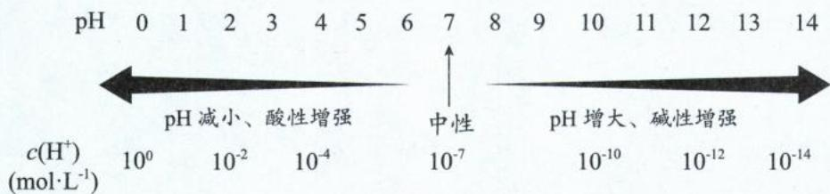

注:①pH 只由 $c(\mathrm{H}^{+})$ 决定,与温度无关;pOH 只由 $c(\mathrm{OH}^{-})$ 决定,与温度无关。但要由已知的 pH 求 pOH(或由已知的 pOH 求 pH), 因为涉及到 $pK_{w}$ , 就会受温度影响了。例如 pH=7, $c(\mathrm{H}^{+})$ 就是 $10^{-7} \, mol \cdot L^{-1}$ , 与温度无关; 但 pH=7, 只有在 $25^{\circ}C$ , pOH 才会是 7, $c(\mathrm{OH}^{-})$ 才会是 $10^{-7} \, mol \cdot L^{-1}$ 。

②用 pH 表示溶液酸碱性时, 必须确定溶液温度。例如 pH=7, 在 $25^{\circ}$ C 时溶液为中性, 但在大于 $25^{\circ}$ C 时, 溶液却是碱性; 小于 $25^{\circ}$ C 时, 溶液则是酸性。

③溶液的 pH 可以小于 0, 也可以大于 14。这些数字不常见的原因是, pH 常用于表示稀溶液的酸碱性。

④由于负对数是减函数,所以 pH 与 $c(H^{+})$ 反相关,同一温度下,pH 越小、酸性越强。

## 三、溶液酸碱性的测定

1. 酸碱指示剂(只能测定溶液的 pH 范围)

<table><tr><td>指示剂</td><td colspan="3">变色范围(颜色与pH的关系)</td></tr><tr><td>甲基橙</td><td>&lt;3.1红色</td><td>3.1~4.4橙色</td><td>&gt;4.4黄色</td></tr><tr><td>石蕊</td><td>&lt;5.0红色</td><td>5.0~8.0紫色</td><td>&gt;8.0蓝色</td></tr><tr><td>酚酞</td><td>&lt;8.2无色</td><td>8.2~10.0浅红色</td><td>&gt;10.0深红色</td></tr></table>

(1)甲基橙显黄色的溶液,可以是酸性,也可以是碱性,还可以是中性;石蕊显紫色的溶液,可以是酸性,也可以是碱性,还可以是中性;酚酞无色的溶液,可以是酸性,也可以是碱性,还可以是中性。

(2) 定性实验一般用石蕊, 中和滴定一般用甲基橙或酚酞。

(3)石蕊试纸一般有两种,分别是红色石蕊试纸(酸性)和蓝色石蕊试纸(碱性)。

注:以上数据均为常温下(25℃)的数据,用口诀法以及思维有序性记忆指示剂的变色点以及颜色。口诀:太实诚,怕饿咬你,我怕,三姨试试。“太实诚”即“酚酞、石蕊、甲基橙”,“怕饿\~咬你”即“8.2\~10”,“我\~怕”即“5\~8”,“三姨\~试试”即“3.1\~4.4”。按照pH由大到小的顺序(酚酞、石蕊、甲基橙,即“太实诚”)有序记忆。

## 2. pH 试纸

(1)分类:广泛的 pH 试纸(精确到整数)和精密的 pH 试纸(精确到小数点后 1 位)。

(2) 操作: 将 pH 试纸放在玻璃片或表面皿上, 用干燥洁净的玻璃棒蘸取少量待测液点在 pH 试纸的中央, 待其显色后, 对比比色卡读数。

注:①pH试纸不能先用蒸馏水润湿。②pH试纸不能测定浓硫酸、氯水、漂白液、漂白粉溶液等的pH。

3. pH 计: 可精确测定溶液的 pH, 能精确到小数点后 2 位。

四、溶液 pH 或 pOH 的计算

## 1. 单一溶液

<table><tr><td></td><td>pH的计算方法</td><td>实例</td></tr><tr><td>强酸</td><td>(1)先根据酸的物质的量浓度、酸的元数计算 $c(H^{+})$ ;(2)再根据公式 $pH=-\lg c(H^{+})$ 求pH。</td><td>求0.05mol/L  $H_{2}SO_{4}$ 的pH。解: $c(H^{+})=0.05mol/L\times2=0.1mol/L$ ,pH=1。</td></tr><tr><td>强碱</td><td>(1)先根据碱的物质的量浓度、碱的元数计算 $c(OH^{-})$ ;(2)再根据公式 $pOH=-\lg c(OH^{-})$ 求pOH;(3)在温度已知时,根据 $pH=pK_{w}-pOH$ ,计算pH。</td><td>求常温下,0.05mol/L  $Ba(OH)_{2}$ 的pH。解: $c(OH^{-})=0.05mol/L\times2=0.1mol/L$ ,pOH=1,pH=14-1=13。</td></tr><tr><td>弱酸</td><td>(1)先根据酸的物质的量浓度、 $K_{a}$ 或α计算 $c(H^{+})$ ;(2)再根据公式 $pH=-\lg c(H^{+})$ 求pH。</td><td rowspan="2">求常温下,0.1mol/L氨水的pH。(已知:常温下 $K_{b}=1\times10^{-5}$ )解: $NH_{3}\cdot H_{2}O\rightleftharpoons NH_{4}^{+}+OH^{-}$  $c_{0}(mol/L)$  0.1 0 0 $\Delta c(mol/L)$  x x xc平(mol/L) 0.1-x x x $K_{b}=\frac{x^{2}}{0.1-x}\approx\frac{x^{2}}{0.1}=1\times10^{-5}$ ,解得x=c( $OH^{-}$ )=1× $10^{-3}$ mol/L,pOH=3,pH=14-3=11。</td></tr><tr><td>弱碱</td><td>(1)先根据碱的物质的量浓度、 $K_{b}$ 或α计算 $c(OH^{-})$ ;(2)再根据公式 $pOH=-\lg c(OH^{-})$ 求pOH;(3)在温度已知时,根据 $pH=pK_{w}-pOH$ ,计算pH。</td></tr></table>

## 2. 强酸与强碱溶液的稀释

<table><tr><td></td><td>pH的计算方法</td><td>实例</td></tr><tr><td>强酸</td><td>方法一:(1)先根据酸的物质的量浓度、酸的元数计算 $c_0(H^+)$ ;(2)再根据稀释倍数算出稀释后的 $c(H^+)$ ;(3)最后根据公式 $pH=-lg c(H^+)$ 求pH。方法二: $pH_{后}=pH_{前}+lg$ 倍数(需注意 $pH_{后}$ 必小于7,只适用于强酸)。</td><td>求pH=1的 $H_2SO_4$ 稀释100倍后的pH。解:方法一:pH=1的 $H_2SO_4$ , $c(H^+)$ =0.1mol/L; $c_{后}(H^+)$ =0.1mol/L÷100=0.001mol/L,pH=3。方法二: $pH_{后}=pH_{前}+lg$ 倍数=1+2=3。</td></tr><tr><td>强碱</td><td>方法一:(1)先根据碱的物质的量浓度、碱的元数计算 $c(OH^{-})$ ;(2)再根据稀释倍数算出稀释后的 $c(OH^{-})$ ,并根据公式 $pOH = -\lg c(OH^{-})$ 求 $pOH$ ;(3)在温度已知时,根据 $pH = pK_{w} - pOH$ ,计算 $pH$ 。方法二: $pH_{后} = pH_{前} - lg$ 倍数(需注意 $pH_{后}$ 必大于7,只适用于强碱)</td><td>求常温下, $pH=13$ 的 $Ba(OH)_2$ 稀释100倍后的 $pH$ 。解:方法一: $pH=13$ 的 $Ba(OH)_2$ , $pOH=14-13=1$ , $c(OH^{-})=0.1mol/L$ ;稀释100倍 $c_{后}(OH^{-})=0.1mol/L \div 100=0.001mol/L$ ,因此 $pOH=3$ , $pH=14-3=11$ 。方法二: $pH_{后} = pH_{前} - lg$ 倍数 $=13-2=11$ 。</td></tr></table>

注：①强碱稀释时，抓住主要矛盾 $c(\mathrm{OH}^{-})$ 降低进行计算，不能抓 $c(\mathrm{H}^{+})$ 计算。

②强酸与水等体积混合(或强碱与水等体积混合)规律:已知 $\lg 2 = 0.3, pH_{酸} = pH + 0.3, pH_{碱} = pH - 0.3$ 。

③使用经验公式或者二级结论时,一定要看清楚使用条件和对象。

④善于将数学与化学学科建立联系,用数学方法快速解决化学问题。

3. 弱酸与弱碱的稀释

<table><tr><td>弱酸</td><td>(1)先根据稀释倍数计算酸的物质的量浓度;(2)再根据 $K_a$ 计算 $c(H^+)$ ;(3)最后根据公式 $pH = -\lg c(H^+)$ 求pH。</td><td>求常温下,1mol/L氨水与等体积水混合后的pH(已知:常温下 $K_b = 1.8\times 10^{-5}$ 、 $\lg 3 = 0.48$ )。解:1mol/L氨水与等体积水混合后, $c_0(NH_3 \cdot H_2O) = 0.5 \text{ mol/L}$  $NH_3 \cdot H_2O \rightleftharpoons NH_4^+ + OH^-$ </td></tr><tr><td>弱碱</td><td>(1)先根据稀释倍数计算碱的物质的量浓度;(2)再根据 $K_b$ 计算 $c(OH^-)$ ;(3)根据公式 $pOH = -\lg c(OH^-)$ 求pOH;(4)在温度已知时,根据 $pH = pK_w - pOH$ ,计算pH。</td><td> $c_0(mol/L)$  0.5 0 0 $\Delta c(mol/L)$  x x xc平(mol/L) 0.5-x x x $K_b = \frac{x^2}{0.5-x} \approx \frac{x^2}{0.5} = 1.8\times 10^{-5}$ ,解得 $x = c(OH^-) = 3\times 10^{-3} \text{ mol/L}$ , $pOH = 3 - \lg 3 = 3 - 0.48 = 2.52$ , $pH = 14 - 2.52 = 11.48$ 。</td></tr></table>

注:①若无弱酸、弱碱的 $K_{a}$ 、 $K_{b}$ 信息, 只知道稀释前的 pH, 则只能确定稀释后的大概范围。弱酸稀释后的 $pH_{后}$ 范围: $pH_{前} < pH_{后} < (pH_{前} + lg 倍数)$ ; 弱碱稀释后的 $pH_{后}$ 范围: $pH_{前} - lg 倍数 < pH_{后} < pH_{前}$ 。

②当溶液无限稀释时,溶质浓度无限小,则将溶液看成水处理,pH趋近中性的值。

## 4. 溶液的混合

<table><tr><td></td><td colspan="2">pH的计算方法</td><td>实例</td></tr><tr><td rowspan="3">同性混合</td><td>酸酸混合</td><td>(1)先根据 $c_{\text{混}}(\text{H}^{+})=\frac{c_{1}(\text{H}^{+})\cdot V_{1}(\text{H}^{+})+c_{2}(\text{H}^{+})\cdot V_{2}(\text{H}^{+})}{V_{1}+V_{2}}$ ,计算混合后的 $c_{\text{混}}(\text{H}^{+})$ ;(2)再根据公式 $\text{pH}=-\lg c(\text{H}^{+})$ 求 $\text{pH}$ 。</td><td>常温下,0.1mol/L HCl溶液和0.05mol/ $\text{H}_{2}\text{SO}_{4}$ 溶液等体积混合,求混合溶液的pH。解:设两种酸溶液体积各为VL, $c_{\text{混}}(\text{H}^{+})=\frac{0.1\text{mol/L}\times\text{V}\text{L}+0.05\text{mol/L}\times2\times\text{V}\text{L}}{\text{V}\text{L}+\text{V}\text{L}}=0.1\text{mol/L}$ ,则pH=1。</td></tr><tr><td>碱碱混合</td><td>(1)根据 $c_{\text{混}}(\text{OH}^{-})=\frac{c_{1}(\text{OH}^{-})\cdot V_{1}(\text{OH}^{-})+c_{2}(\text{OH}^{-})\cdot V_{2}(\text{OH}^{-})}{V_{1}+V_{2}}$ ,计算混合后的 $c_{\text{混}}(\text{OH}^{-})$ ;(2)根据公式 $\text{pOH}=-\lg c(\text{OH}^{-})$ 求pOH;(3)在温度已知时,根据 $\text{pH}=\text{pK}_{\text{w}}-\text{pOH}$ ,计算pH。</td><td>常温下,10mL 0.1mol/L NaOH与20mL 0.05mol/L  $\text{Ba(OH)}_{2}$ 混合,求混合溶液的pH。解: $c_{\text{混}}(\text{OH}^{-})=\frac{0.1\text{mol/L}\times0.01\text{L}+0.05\text{mol/L}\times2\times0.02\text{L}}{0.01\text{L}+0.02\text{L}}=0.1\text{mol/L}$ ,则pOH=1,pH=14-1=13。</td></tr><tr><td colspan="3">注:1溶液的体积没有加和性,但为了简便起见,忽略体积混合的微小变化。2pH相差2以上,则稀溶液直接看作蒸馏水,其不为溶质做贡献,只增大体积。例1:常温时pH=1和pH=4的 $\text{H}_{2}\text{SO}_{4}$ 等体积混合,混合后溶液的pH=1+0.3=1.3(相当于是pH=1的 $\text{H}_{2}\text{SO}_{4}$ 与等体积的水混合,混合后的pH: $\text{pH}_{\text{后}}=\text{pH}_{\text{小}}+0.3$ )。例2:常温时pH=13和pH=8的 $\text{Ba(OH)}_{2}$ 等体积混合,混合后溶液的pH=13-0.3=12.7(相当于是pH=13的 $\text{Ba(OH)}_{2}$ 与等体积的水混合,混合后的pH: $\text{pH}_{\text{后}}=\text{pH}_{\text{大}}-0.3$ )。3善于将哲学中的“解决问题抓主要矛盾”的方法论运用于化学的学习。</td></tr><tr><td>异性混合</td><td colspan="2">强酸强碱的混合:(1)先进行过量判断,判断酸碱是恰好完全反应,还是酸(或碱)过量;(2)若恰好完全反应,反应后的溶液为盐溶液,溶液显中性(强酸强碱盐不水解)。(3)若酸过量: $c_{\text{混}}(\text{H}^{+})=\frac{c(\text{H}^{+})\cdot V_{1}(\text{H}^{+})-c(\text{OH}^{-})\cdot V_{2}(\text{OH}^{-})}{V_{1}+V_{2}}$ ,再根据公式 $\text{pH}=-\lg c(\text{H}^{+})$ 求pH。(4)若碱过量: $c_{\text{混}}(\text{OH}^{-})=\frac{c(\text{OH}^{-})\cdot V_{1}(\text{OH}^{-})-c(\text{H}^{+})\cdot V_{2}(\text{H}^{+})}{V_{1}+V_{2}}$ ,再根据公式 $\text{pOH}=-\lg c(\text{OH}^{-})$ 求pOH;在温度已知时,根据 $\text{pH}=\text{pK}_{\text{w}}-\text{pOH}$ ,计算pH。</td><td>常温下,将0.1mol· $\text{L}^{-1}$ NaOH溶液与0.06mol· $\text{L}^{-1}$  $\text{H}_{2}\text{SO}_{4}$ 溶液等体积混合,求混合后的pH。解:0.1mol· $\text{L}^{-1}$ NaOH溶液中 $c(\text{OH}^{-})=0.1\text{mol}\cdot\text{L}^{-1},0.06\text{mol}\cdot\text{L}^{-1}\text{H}_{2}\text{SO}_{4}$ 溶液中 $c(\text{H}^{+})=0.12\text{mol}\cdot\text{L}^{-1}$ ,等体积混合,酸过量。设酸、碱溶液各1L, $c_{\text{混}}(\text{H}^{+})=\frac{0.06\text{mol}\cdot\text{L}^{-1}\times2-0.1\text{mol}\cdot\text{L}^{-1}}{2}=0.01\text{mol}\cdot\text{L}^{-1}$ ,因此混合后溶液的pH=2。</td></tr></table>

续表

注:常温下,溶液“等体积”混合后的酸碱性判断:

①强酸强碱混合: $\text{pH}_\text{酸} + \text{pH}_\text{碱} > 14$ , 混合后溶液呈碱性; $\text{pH}_\text{酸} + \text{pH}_\text{碱} < 14$ , 混合后溶液呈酸性; $\text{pH}_\text{酸} + \text{pH}_\text{碱} = 14$ , 混合后溶液呈中性。

②强酸弱碱混合: $pH_{酸}=pOH_{碱}$ ，弱碱过量很多，混合后溶液呈碱性。

③弱酸强碱混合: $pH_{酸}=pOH_{碱}$ ，弱酸过量很多，混合后溶液呈酸性。

④醋酸、氨水混合： $pH_{酸}=pOH_{碱}$ ，混合后溶液呈中性。

5. 计算溶液中水电离的 $c(\mathrm{H}^{+})$ 或水电离的 $c(\mathrm{OH}^{-})$ 的方法

(1)先判断溶质对水的电离平衡是抑制作用还是促进作用

①酸、碱、溶液呈酸性的酸式盐均对水的电离平衡起抑制作用。

②会发生水解的正盐、溶液呈碱性的酸式盐均对水的电离平衡起促进作用。

(2)根据“显性”或“隐性”进行计算

①若溶质对水的电离平衡起“抑制”作用,水电离出的离子浓度会很小,在水中充当“隐性”离子;因此只要计算出该体系中的“隐性”离子浓度,即水电离的 $c(\mathrm{H}^{+})$ 或 $c(\mathrm{OH}^{-})$ 。

②若溶质对水的电离平衡起“促进”作用,水电离出的离子浓度会较大,在水中充当“显性”离子;因此只要计算出该体系中的“显性”离子浓度即水电离的 $c(\mathrm{H}^{+})$ 或 $c(\mathrm{OH}^{-})$ 。

例: 常温下, pH=5 的 $MgCl_{2}$ 溶液中, 由水电离的 $c(\mathrm{OH}^{-})$ 是多少?

解: $MgCl_{2}$ 溶液中的 $Mg^{2+}$ 对应的碱 $\mathrm{Mg(OH)}_{2}$ 是弱碱, 所以会发生水解反应, 从而促进水的电离。因此水电离的 $OH^{-}$ 、 $H^{+}$ 较多, 则溶液中的显性离子 $H^{+}$ 全部来自于水的电离。根据 $\mathrm{pH} = -\lg c(\mathrm{H}^{+})$ , 可求得 $c(\mathrm{H}^{+}) = 1 \times 10^{-5} \, \mathrm{mol/L}$ 。由于水电离的 $c(\mathrm{H}^{+}) = c(\mathrm{OH}^{-})$ , 所以由水电离的 $c(\mathrm{OH}^{-})$ 也等于 $1 \times 10^{-5} \, mol/L$ 。

## 类型 I: 基本概念的易错辨析

【例 1】正误判断, 正确的填“√”, 错误的填“×”

(1)一定温度下，pH=6.5 的溶液一定呈酸性()

(2)一定温度下，pH=6.5 的纯水一定呈中性()

(3) $c(\mathrm{H}^{+})>c(\mathrm{OH}^{-})$ ，说明溶液一定呈酸性()

(4)pH 减小,酸性一定增强()

(5) $c(\mathrm{H}^{+})=\sqrt{K_{\mathrm{w}}}\ \mathrm{mol}\cdot\mathrm{L}^{-1}$ 的溶液一定显中性()

(6)不存在 pH 为负数的溶液()

(7)常温下, $1.0\times10^{-3}\ mol\cdot L^{-1}$ 盐酸的pH=3, $1.0\times10^{-8}\ mol\cdot L^{-1}$ 盐酸的pH=8()

(8) $100^{\circ}\mathrm{C}$ 时 $K_{\mathrm{w}} = 1.0\times 10^{-12},0.01\mathrm{mol}\cdot \mathrm{L}^{-1}$ 盐酸的 $\mathrm{pH} = 2,0.01\mathrm{mol}\cdot \mathrm{L}^{-1}$ 的NaOH溶液的 $\mathrm{pH} = 10(\quad)$

(9)用湿润的 pH 试纸测定盐酸的 pH,会导致测定结果偏小()

(10)常温下,用广泛 pH 试纸测得醋酸溶液的 pH 为 3.4()

(11)常温下,用 pH 试纸测得某氯水的 pH 为 5()

(12)常温下,能使甲基橙显黄色的溶液一定显碱性()

解析:(1)(×)pH=6.5 即 $c(\mathrm{H}^{+})=10^{-6.5}\ \mathrm{mol/L}$ ，由于温度未知，则 $K_{w}$ 未知，无法将 $c(\mathrm{H}^{+})$ 转化成 $c(\mathrm{OH}^{-})$ ，因此无法比较 $c(\mathrm{OH}^{-})$ 与 $c(\mathrm{H}^{+})$ 的相对浓度，也就无法判断溶液的酸碱性。

(2)(√)虽然温度未知,但该题的研究对象是纯水,纯水中的 $c(\mathrm{OH}^{-})$ 、 $c(\mathrm{H}^{+})$ 相等,溶液呈中性。

(3)(√)溶液的酸碱性由 $c(\mathrm{OH}^{-})$ 、 $c(\mathrm{H}^{+})$ 的相对大小决定。当 $c(\mathrm{H}^{+})>c(\mathrm{OH}^{-})$ 时，溶液一定呈酸性。

(4) $(\times)$ pH 减小,酸性不一定增强,例如纯水的温度升高,电离出的 $c(\mathrm{H}^{+})$ 增大,pH 减小,但纯水依然是中性,这是因为 $c(\mathrm{H}^{+})$ 增大的同时 $c(\mathrm{OH}^{-})$ 也同等程度增大,始终维持 $c(\mathrm{H}^{+})=c(\mathrm{OH}^{-})$ 。

(5)(√)当溶液呈中性,即 $c(\mathrm{H}^{+})=c(\mathrm{OH}^{-})$ , 则 $K_{\mathrm{w}}=c(\mathrm{H}^{+})\times c(\mathrm{OH}^{-})=c^{2}(\mathrm{H}^{+})$ , 可得 $c(\mathrm{H}^{+})=\sqrt{K_{\mathrm{w}}}\mathrm{mol}\cdot\mathrm{L}^{-1}$ 。

(6)(×)当溶液中 $c(\mathrm{H}^{+})$ 大于 1 mol/L (即 $10^{0}$ mol/L) 时，pH 则小于 0，为负数。

(7)(×) $1.0\times10^{-3}\ mol\cdot L^{-1}$ 盐酸的pH=3,但 $1.0\times10^{-8}\ mol\cdot L^{-1}$ 盐酸的pH不等于8,因为溶液中除了盐酸电离出的 $c(\mathrm{H}^{+})=1.0\times10^{-8}\ mol\cdot L^{-1}$ 外,还要考虑水电离的 $H^{+}$ ,溶液中的 $c(\mathrm{H}^{+})$ 必大于 $c(\mathrm{OH}^{-})$ ,因此在常温下, $1.0\times10^{-8}\ mol\cdot L^{-1}$ 盐酸的pH接近7,但小于7。

(8)(√)100℃时 $K_{w}=1.0\times10^{-12}$ , $0.01\ mol\cdot L^{-1}$ 盐酸的 pH=2, $0.01\ mol\cdot L^{-1}$ 的 NaOH 溶液 pOH=2, 其 pH=pK $_{w}$ -pOH=12-2=10。

(9)(×)湿润的 pH 试纸会稀释盐酸, 导致 $c(\mathrm{H}^{+})$ 减小, 由于 pH 是减函数, 最终 pH 增大。

(10)(×)广泛的 pH 试纸的读数只能精确到整数,无法测定出 pH 为 3.4。

(11)(×)氯水中的次氯酸有强氧化性,会漂白试纸,无法达到测 pH 目的。

(12)(×)常温下能使甲基橙显黄色的溶液其pH大于4.4,可能是酸性、中性或碱性。

答案:(1)× (2)√ (3)√ (4)× (5)√ (6)× (7)× (8)√ (9)× (10)× (11)× (12)×

类型Ⅱ: pH 的计算

## 【例 2】计算下列溶液的 pH

$$
\mathrm{pH} = 1
$$

(2)某温度下,纯净水的 pH=6,求该温度下,0.1 mol/L KOH 的 pH。

$$
\mathrm{pH} _ {\circ}
$$

(3)常温下,用蒸馏水将 $\mathrm{pH} = 5$ 的硫酸稀释 $10^{4}$ 倍,稀释之后的溶液中 $c(\mathrm{H}^{+}):c(\mathrm{SO}_{4}^{2-})$ 为多少? (4)某温度下,测得 $0.001\mathrm{mol/L}$ HCl溶液中水电离出的 $c(\mathrm{H}^{+}) = 1\times 10^{-9}\mathrm{mol/L}$ ,将 $V_{\mathrm{a}}\mathrm{L}\mathrm{pH} = 4$ 的 HCl溶液和 $V_{\mathrm{b}}\mathrm{L}\mathrm{pH} = 9$ 的 $\mathrm{Ba(OH)}_2$ 溶液混合均匀,测得溶液的 $\mathrm{pH} = 7$ ,则 $V_{\mathrm{a}}:V_{\mathrm{b}}=$ \_\_\_\_。解析:(1)第一步:解决酸碱混合问题,先进行过量判断。由于 HCl 和 NaOH 中和反应时计量数之比为 $1:1$ ,所以此时的盐酸过量,计算混合后的 $c(\mathrm{H}^{+})$ 。第二步: $c(\mathrm{H}^{+}) = \frac{c(\mathrm{H}^{+})\cdot V_{1}(\mathrm{H}^{+}) - c(\mathrm{OH}^{-})\cdot V_{2}(\mathrm{OH}^{-})}{V_{1} + V_{2}} = \frac{0.1\mathrm{mol/L}\times(25.00\times 10^{-3})\mathrm{L}-0.1\mathrm{mol/L}\times(24.95\times 10^{-3})\mathrm{L}}{(25.00\times 10^{-3})\mathrm{L}+(24.95\times 10^{-3})\mathrm{L}} = \frac{5\times 10^{-6}\mathrm{mol}}{(49.95\times 10^{-3})\mathrm{L}}\approx \frac{5\times 10^{-6}\mathrm{mol}}{(5\times 10^{-2})\mathrm{L}} = 1\times 10^{-4}\mathrm{mol/L}$ ,因此溶液的 $\mathrm{pH} = 4$ 。 (2)方法一:首先根据纯净水的 $\mathrm{pH} = 6$ ,可知在该温度下 $c(\mathrm{H}^{+}) = 10^{-6}\mathrm{mol/L} = c(\mathrm{OH}^{-}),K_{\mathrm{w}} = c(\mathrm{H}^{+})\times c(\mathrm{OH}^{-}) = 10^{-12}$ 。 $0.1\mathrm{mol/L}$ KOH, $c(\mathrm{OH}^{-}) = 10^{-1}\mathrm{mol/L},c(\mathrm{H}^{+}) = \frac{K_{\mathrm{w}}}{c(\mathrm{OH}^{-)}} = \frac{10^{-12}}{10^{-1}} = 10^{-11}\mathrm{mol/L}$ ,溶液 $\mathrm{pH} = 11$ 。方法二: $K_{\mathrm{w}} = 10^{-12}$ ,则 $\mathrm{pK}_{\mathrm{w}} = 12;c(\mathrm{OH}^{-}) = 10^{-1}\mathrm{mol/L}$ ,则 $\mathrm{pOH} = 1$ 。因此 $\mathrm{pH} = \mathrm{pK}_{\mathrm{w}} - \mathrm{pOH} = 12 - 1 = 11$ 。 (3) $\mathrm{pH} = 5$ 的硫酸, $c(\mathrm{H}^{+}),c(\mathrm{SO}_{4}^{2-})$ 分别为 $1\times 10^{-5}\mathrm{mol/L},5\times 10^{-6}\mathrm{mol/L}$ 。将该溶液稀释 $10^{4}$ 倍,该溶液无限趋近于水。解决问题抓主要矛盾,稀释后的体系中 $\mathbf{H}^+$ 主要来源于水,约为 $1\times 10^{-7}\mathrm{mol/L}$ 。稀释后的 $c(\mathrm{SO}_{4}^{2-})$ 为 $5\times 10^{-10}\mathrm{mol/L}$ 。所以 $c(\mathrm{H}^{+})/c(\mathrm{SO}_{4}^{2-}) = 1\times 10^{-7}/5\times 10^{-10} = 200$ 。 (4) $0.001\mathrm{mol/L}$ HCl溶液中 $c_{\text {水 }}(\mathrm{H}^{+}) = 1\times 10^{-9}\mathrm{mol/L}$ ,则 $c_{\text {水 }}(\mathrm{H}^{+}) = c_{\text {水 }}(\mathrm{OH}^{-}) = 1\times 10^{-9}\mathrm{mol/L}$ ;溶液中氢离子浓度为 $c(\mathrm{H}^{+}) = 1\times 10^{-3}\mathrm{mol/L}$ ,则 $K_{\mathrm{w}} = 1\times 10^{-12}$ 。 $V_{\mathrm{a}}\mathrm{LpH} = 4$ 的 HCl 溶液, $c(\mathrm{H}^{+}) = 1\times 10^{-4}\mathrm{mol/L}, V_{\mathrm{b}}\mathrm{LpH} = 9$ 的 $\mathrm{Ba(OH)}_2$ ,溶液 $c(\mathrm{OH}^{-}) = \frac{10^{-12}}{10^{-9}}\mathrm{mol/L} = 1\times 10^{-3}\mathrm{mol/L}$ 。混合均匀后测得溶液的 $\mathrm{pH} = 7,$ $c(\mathrm{H}^{+}) = 1\times 10^{-7}\mathrm{mol/L}$ ,则 $c(\mathrm{OH}^{-}) = \frac{10^{-12}}{10^{-7}} = 10^{-5}\mathrm{mol/L}$ ,由于 $c(\mathrm{H}^{+}) < c(\mathrm{OH}^{-})$ ,可知混合溶液为碱性,$c_{\text{混}}(\mathrm{OH}^{-}) = \frac{(1\times 10^{-3}\mathrm{mol / L}\times V_{\mathrm{b}}\mathrm{L}) - (1\times 10^{-4}\mathrm{mol / L}\times V_{\mathrm{a}}\mathrm{L})}{V_{\mathrm{a}}\mathrm{L} + V_{\mathrm{b}}\mathrm{L}} = 10^{-5}\mathrm{mol / L},$ 解得 $V_{\mathrm{a}}:V_{\mathrm{b}} = 9:1$

答案:(1)4 (2)11 (3)200 (4)9:1

【反思】对于 HCl 溶液, 我们一定要清楚 $c(\mathrm{H}^{+})$ 有两个来源, 一个是 HCl 电离的 $H^{+}$ , 另一个是水电离的 $H^{+}$ ; 而溶液中 $OH^{-}$ 只来自水的电离。由于 HCl 电离的 $c(\mathrm{H}^{+}) = 0.001 \, \mathrm{mol/L}, c_{\text{水}}(\mathrm{H}^{+}) = 1 \times 10^{-9} \, \mathrm{mol} \cdot \mathrm{L}^{-1}$ , 相差太多了, 因此整个溶液的 $c(\mathrm{H}^{+})$ 视为 0.001 mol/L, $K_{\mathrm{w}} = c(\mathrm{H}^{+}) \times c(\mathrm{OH}^{-}) = 1 \times 10^{-12}$ 。

类型Ⅲ:水电离的 $c(\mathrm{H}^{+})$ 、 $c(\mathrm{OH}^{-})$ 的计算

【例 3】回答下列问题：

(1)常温下， $\mathrm{pH} = 6$ 的 $\mathrm{HCl}$ 中，水电离的 $c(\mathrm{H}^{+})$ 为多少？

(2)常温下， $\mathrm{pH} = 13$ 的 $\mathrm{Ba(OH)}_2$ 中，水电离的 $c(\mathrm{OH}^{-})$ 为多少？

(3)常温下， $\mathrm{pH} = 6$ 的 $\mathrm{NH_4Cl}$ 中，水电离的 $c(\mathrm{OH}^-)$ 为多少？

(4)常温下，pH=6 的 $NaHSO_{3}$ 中，水电离的 $c(H^{+})$ 为多少？

解析:(1)HCl电离出的 $H^{+}$ 抑制水的电离,导致水电离的 $c_{\text{水}}(\text{H}^{+})$ 或 $c_{\text{水}}(\text{OH}^{-})$ 极小,所以此时计算体系中的隐性离子 $c(\text{OH}^{-})$ 。常温下pH=6, $c_{\text{溶液}}(\text{H}^{+})=1\times10^{-6}\ \text{mol/L}$ ,则体系中 $c_{\text{溶液}}(\text{OH}^{-})=c_{\text{水}}(\text{OH}^{-})=1\times10^{-8}\ \text{mol/L}$ ,且 $c_{\text{水}}(\text{OH}^{-})=c_{\text{水}}(\text{H}^{+})$ ,因此 $c_{\text{水}}(\text{H}^{+})=1\times10^{-8}\ \text{mol/L}$ 。

(2) $\mathrm{Ba(OH)_2}$ 电离出的 $OH^-$ 抑制水的电离, 所以此时算体系中的隐性离子 $c(H^+)$ 。常温下 pH=13, 则体系中 $c_{\text{溶液}}(H^+) = 1 \times 10^{-13} \, \mathrm{mol/L} = c_{\text{水}}(H^+)$ , 且 $c_{\text{水}}(OH^-) = c_{\text{水}}(H^+)$ , 所以 $c_{\text{水}}(OH^-) = 1 \times 10^{-13} \, \mathrm{mol/L}$ 。

(3) $NH_{4}^{+}$ 促进水的电离,所以此时计算体系中的显性离子 $c(\mathrm{H}^{+})$ 。 $c_{\text{溶液}}(\mathrm{H}^{+})=1\times10^{-6}\ \mathrm{mol/L}=c_{\text{水}}(\mathrm{H}^{+})$ ,且 $c_{\text{水}}(\mathrm{OH}^{-})=c_{\text{水}}(\mathrm{H}^{+})$ ,所以 $c_{\text{水}}(\mathrm{OH}^{-})=1\times10^{-6}\ \mathrm{mol/L}$ 。

【反思】大家发现了吗？常温下纯水 $c_{\text{水}}(\mathrm{H}^{+}) = c_{\text{水}}(\mathrm{OH}^{-}) = 1 \times 10^{-7} \, \mathrm{mol/L}$ ，由于 $\mathrm{NH}_{4}^{+}$ 会发生水解（可理解为强迫水解离），因此水的电离程度就增大了，变为 $c_{\text{水}}(\mathrm{H}^{+}) = c_{\text{水}}(\mathrm{OH}^{-}) = 1 \times 10^{-6} \, \mathrm{mol/L}$ 。但 $\mathrm{pH} = 6$ 的 $\mathrm{NH}_{4} \mathrm{Cl}$ 中，为何 $c_{\text{溶液}}(\mathrm{OH}^{-})$ 只有 $1 \times 10^{-8} \, \mathrm{mol/L}$ 呢？明明水电离出的 $c(\mathrm{OH}^{-}) = 1 \times 10^{-6} \, \mathrm{mol/L}$ ，少的 $\mathrm{OH}^{-}$ 去哪里了呢？这是因为，溶液中的部分 $\mathrm{NH}_{4}^{+}$ 会结合水电离出的 $\mathrm{OH}^{-}$ 转化为 $\mathrm{NH}_{3} \cdot \mathrm{H}_{2} \mathrm{O}$ ，使 $c_{\text{水}}(\mathrm{OH}^{-})$ 不等于 $c_{\text{溶液}}(\mathrm{OH}^{-})$ ；但由于 $\mathrm{Cl}^{-}$ 不水解，所以 $c_{\text{水}}(\mathrm{H}^{+})$ 就等于 $c_{\text{溶液}}(\mathrm{H}^{+})$ 了。这也是为什么，本题求水电离的 $c(\mathrm{OH}^{-})$ ，是要通过 $c_{\text{溶液}}(\mathrm{H}^{+})$ 而不是 $c_{\text{溶液}}(\mathrm{OH}^{-})$ 了的原因。

(4) $HSO_{3}^{-}$ 为弱酸酸式根，在水中既能电离又能水解，由于 $NaHSO_{3}$ 溶液呈酸性，说明其电离大于水解，则 $HSO_{3}^{-}$ 对水的电离主要起到抑制效果，此时计算体系中的隐性离子 $c(\mathrm{OH}^{-})$ 。 $c_{\text{溶液}}(\mathrm{OH}^{-}) = c_{\text{水}}(\mathrm{OH}^{-}) = 1 \times 10^{-8} \, \mathrm{mol/L}$ ，且 $c_{\text{水}}(\mathrm{OH}^{-}) = c_{\text{水}}(\mathrm{H}^{+})$ ，所以 $c_{\text{水}}(\mathrm{H}^{+}) = 1 \times 10^{-8} \, \mathrm{mol/L}$ 。

答案:(1) $1\times10^{-8}$ mol/L (2) $1\times10^{-13}$ mol/L (3) $1\times10^{-6}$ mol/L (4) $1\times10^{-8}$ mol/L

## 第 4 节 水溶液各种“比大小”问题(★★★★)

## 内容提要

## 一、等物质的量浓度(c)与等pH的辨析(常温下, $K_{a}(CH_{3}COOH)=1\times10^{-5}$ )

<table><tr><td>研究对象</td><td>含义</td></tr><tr><td>0.1 mol/L 的  $H_{2}SO_{4}$ </td><td>指的是硫酸浓度为 0.1 mol/L。溶液中  $H^{+}$  有两个来源:水的电离和  $H_{2}SO_{4}$  的电离。由于  $H_{2}SO_{4}$  电离出的  $H^{+}$  会抑制水的电离且水自身电离极弱,因此溶液中的电荷守恒: $c(H^{+}) = 2c(SO_{4}^{2-}) + c(OH^{-}) \approx 0.2 \text{ mol/L}$ 。</td></tr><tr><td>pH=1的 $H_2SO_4$ </td><td>指的是溶液中的 $c(H^+) = 0.1 \text{ mol/L}$ 。根据电荷守恒: $c(H^+) = 2c(SO_4^{2-}) + c(OH^-)$ ,以及 $c(OH^-)$ 极少,求得 $c(\text{硫酸}) \approx 0.05 \text{ mol/L}$ 。</td></tr><tr><td>0.1mol/L的 $CH_3COOH$ </td><td>指的是醋酸浓度为0.1mol/L。溶液中 $H^+$ 有两个来源:水的电离和醋酸的电离。由于醋酸电离出的 $H^+$ 会抑制水的电离且水自身电离极弱,溶液中的电荷守恒: $c(H^+) = c(CH_3COO^-) + c(OH^-) \approx 1 \times 10^{-3} \text{ mol/L (根据 } K_a \text{ 计算)}$ 。</td></tr><tr><td>pH=3的 $CH_3COOH$ </td><td>指的是溶液中的 $c(H^+) = 0.001 \text{ mol/L}$ 。由于 $CH_3COOH$ 部分电离,已经电离出的 $c(H^+)$ 有0.001mol/L,未电离的 $CH_3COOH$ 分子远多于已电离的 $CH_3COOH$ ,所以原 $c(CH_3COOH)$ 远大于0.001mol/L,约为0.1mol/L(根据 $K_a$ 计算)。</td></tr></table>

注:1. 将 c(酸)转化为 pH, 先要考虑酸的强弱(定性), 如果该酸是强酸, 还要考虑酸的元数(定量)。

2. 一定温度下, 若已知酸溶液的 $\mathrm{pH}$ , 则 $c_{\text {溶液}}(\mathrm{H}^{+})$ 与酸的强弱和元数都没有关系。

3. c(酸)表示酸的总浓度, pH 表示已经电离出的 $H^{+}$ 浓度。

## 二、等 c 与等 pH 的一元强酸、一元弱酸的比较(温度为 $25^{\circ}$ C)

<table><tr><td>比较项目</td><td>浓度均为0.01mol·L-1的强酸HA与弱酸HB</td><td>pH均为2的强酸HA与弱酸HB</td></tr><tr><td>pH或溶质物质的量浓度</td><td>pH(HA)=2,pH(HB)&gt;2</td><td>c(HA)=0.01mol·L-1c(HB)&gt;0.01mol·L-1</td></tr><tr><td>c(H+)</td><td>c(H+)HA=0.01mol·L-1c(H+)HB&lt;0.01mol·L-1</td><td>HA=HB</td></tr><tr><td>c(A-)与c(B-)大小</td><td>c(A-) &gt;c(B-)</td><td>c(A-) = c(B-)</td></tr><tr><td>溶液的导电性</td><td>HA&gt;HB</td><td>HA=HB</td></tr><tr><td>水的电离程度</td><td>HA &lt; HB</td><td>HA=HB</td></tr><tr><td>加水稀释10倍后的pH</td><td>pH(HA)=3、pH(HB)&gt;3</td><td>pH(HA)=3、2 &lt; pH(HB)&lt;3</td></tr><tr><td>与锌反应的速率</td><td>HA&gt;HB</td><td>初始瞬间速率:HA=HB;瞬间后:HA &lt; HB</td></tr><tr><td>体积相同时与过量活泼金属反应产生H2的量</td><td>HA=HB</td><td>HA &lt; HB</td></tr><tr><td>体积相同时与过量的碱反应时消耗碱的量</td><td>HA=HB</td><td>HA &lt; HB</td></tr></table>

表格中相对大小的解释说明如下：

1. 浓度均为 $0.01 \, mol \cdot L^{-1}$ 的强酸 HA 与弱酸 HB，由于强酸完全电离、弱酸部分电离，因此溶液中 $c(\mathrm{H}^{+})$ 是 HA > HB。

2. pH 均为 2 的强酸 HA 与弱酸 HB, 说明达平衡时溶液中 $c(\mathrm{H}^{+})$ 都是 $0.01 \, mol \cdot L^{-1}$ , 由于强酸完全电离, 因此 $c(\mathrm{HA})$ 就是 $0.01 \, mol \cdot L^{-1}$ ; 弱酸部分电离出 $H^{+}$ 后溶液 $c(\mathrm{H}^{+}) = 0.01 \, \mathrm{mol} \cdot \mathrm{L}^{-1}$ , 则 $c(\mathrm{HB})$ 大于 $0.01 \, mol \cdot L^{-1}$ 。

3. $c(\mathrm{H}^{+})$ 越大, 对应的酸根离子浓度越大, 溶液中整体的离子浓度也越大, 因此溶液的导电性就越强 (虽然 $c(\mathrm{OH}^{-})$ 是减少的, 但以显性离子 $H^{+}$ 、 $CH_{3}COO^{-}$ 为决定性因素)。

4. 酸的水溶液中, 水的电离程度由酸电离出的 $c(\mathrm{H}^{+})$ 决定, $c(\mathrm{H}^{+})$ 越大, 对水的电离抑制效果越大 (同离子效应), 水的电离程度就越小。

5. 加水稀释相同倍数前后的 pH 变化的分析思路：

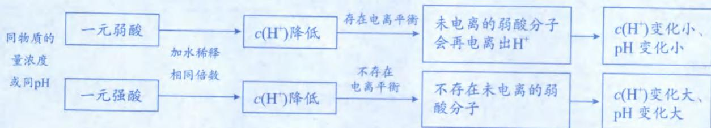

注：平衡移动导致的 $c(\mathrm{H}^{+})$ 变化幅度小于瞬间稀释导致的 $c(\mathrm{H}^{+})$ 变化幅度。

6.“等体积、等 pH”的条件下，一元弱酸 HA 与 HCl 电离出的 $c(\mathrm{H}^{+})$ 与 $n(\mathrm{H}^{+})$ 都相同，但由于弱酸溶液中有许多“可电离但未电离”的弱酸分子，无论是与锌还是与 NaOH 反应，这些未电离的弱酸分子可以持续电离出 $H^{+}$ ，不断和锌或 NaOH 反应；但强酸溶液不存在酸分子，无法再补充 $H^{+}$ ，因此二者相比，弱酸与锌反应生成的 $H_{2}$ 是又快又多，完全中和时消耗的 $n(\mathrm{NaOH})$ 也更多。

## 类型 I: 等物质的量浓度或等 pH 的“比大小”问题

【例 1】常温下，①0.1 mol·L $^{-1}$ 的 CH $_{3}$ COOH 溶液；②0.1 mol/L 的 HCl 溶液；③0.1 mol/L 的 H $_{2}$ SO $_{4}$ 溶液；④0.1 mol/L 的 NaOH 溶液；⑤0.1 mol/L 的 Ba(OH) $_{2}$ 溶液

(1) $c(\mathrm{H}^{+})$ 由大到小的顺序\_\_\_\_；(填序号,下同)

(2)pH 由大到小的顺序 \_\_\_\_ ;

(3)溶液中水的电离程度由大到小的顺序；

(4)等体积的①、②、③，与 NaOH 完全中和时消耗的 $n(\mathrm{NaOH})$ ，由大到小的顺序 \_\_\_\_；

$$
\mathrm{H} _ {2}
$$

(6)等体积溶液分别与足量 Al 粉反应,生成 $H_{2}$ 的物质的量由大到小的顺序 \_\_\_\_。

解析:(1)①的 $c(\mathrm{H}^{+})$ 小于 0.1 mol/L,由于溶液是酸性,因此常温下 $c(\mathrm{H}^{+})$ 大于 $10^{-7}$ mol/L;②的 $c(\mathrm{H}^{+})=0.1\ \mathrm{mol}/\mathrm{L}$ ;③的 $c(\mathrm{H}^{+})=0.2\ \mathrm{mol}/\mathrm{L}$ ;④的 $c(\mathrm{OH}^{-})=0.1\ \mathrm{mol}/\mathrm{L}$ ,常温下 $c(\mathrm{H}^{+})=\frac{10^{-14}}{0.1}=10^{-13}\ \mathrm{mol}/\mathrm{L}$ ;⑤的 $c(\mathrm{OH}^{-})=0.2\ \mathrm{mol}/\mathrm{L}$ ,常温下 $c(\mathrm{H}^{+})=\frac{10^{-14}}{0.2}=5\times10^{-14}\ \mathrm{mol}/\mathrm{L}$ 。根据以上分析, $c(\mathrm{H}^{+})$ 由大到小顺序为:

③＞②＞①＞④＞⑤。

(2) $c(\mathrm{H}^{+})$ 越大,则pH越小,顺序与第(1)问相反,即pH由大到小为:⑤＞④＞①＞②＞③。

(3)由于酸、碱会抑制水的电离,因此酸电离出的 $H^{+}$ (或碱电离出的 $OH^{-}$ ) 越多,则水电离程度越小;且酸电离出的 $H^{+}$ 、碱电离出的 $OH^{-}$ ,当二者浓度相同时,对水的抑制效果也相同。由酸电离出的 $c(H^{+})$ 分别为:①小于 0.1 mol/L;②等于 0.1 mol/L;③等于 0.2 mol/L;由碱电离出的 $c(OH^{-})$ 分别为:④0.1 mol/L;⑤0.2 mol/L,因此溶液中水的电离程度由大到小的顺序为:①＞②=④＞③=⑤。

(4)同浓度、同体积的①、②、③，表示溶解的 $n(\mathrm{CH}_{3}\mathrm{COOH})=n(\mathrm{HCl})=n(\mathrm{H}_{2}\mathrm{SO}_{4})$ ，由于 $CH_{3}COOH$ 、HCl与NaOH都是按物质的量1∶1反应，而 $H_{2}SO_{4}$ 与NaOH是按物质的量1∶2反应，因此完全中和时消耗的 $n(\mathrm{NaOH})$ 由大到小的顺序为：③＞②=①。（酸碱完全中和时，消耗 $n(\mathrm{NaOH})$ 的多少取决于酸“可电离”的 $n(\mathrm{H}^{+})$ 。 $CH_{3}COOH$ 虽然在水中未完全电离，但酸碱中和时“可电离”的 $H^{+}$ 都能与NaOH反应。因此等浓度、等体积的一元酸 $CH_{3}COOH$ 、HCl，甚至是酸性更弱的HClO、HCN，完全中和时消耗的 $n(\mathrm{NaOH})$ 都是相同的。）

(5)Zn与 $H^{+}$ 反应生成 $H_{2}$ ，因此平均速率与 $c(H^{+})$ 正相关，由大到小的顺序为：③＞②＞①。

(6)由于 Al 粉足量,因此酸可电离的 $H^{+}$ 越多(即可电离的 $H^{+}$ 越多),或碱可电离的 $OH^{-}$ 越多,则生成的 $H_{2}$ 越多。因此①、②、③与足量 Al 粉反应生成 $H_{2}$ 的物质的量:③>②=①;④、⑤与足量 Al 粉反应生成 $H_{2}$ 的物质的量:⑤>④。根据 Al 与强酸反应的关系式 $2Al\sim6H^{+}\sim3H_{2}$ ,以及 Al 与强碱反应的关系式 $2Al\sim2OH^{-}\sim3H_{2}$ ,每 $1\ mol\ H^{+}$ 反应生成 $0.5\ mol\ H_{2}$ 、每 $1\ mol\ OH^{-}$ 反应生成 $1.5\ mol\ H_{2}$ ,因此等物质的量的 $H_{2}SO_{4}$ 与 NaOH,NaOH 生成的 $H_{2}$ 较多。由以上分析可知,生成 $H_{2}$ 的物质的量由大到小的顺序:⑤>④>③>②=①。

答案:(1)③>②>①>④>⑤ (2)⑤>④>①>②>③ (3)①>②=④>③=⑤ (4)③>②=①

(5)③>②>① (6)⑤>④>③>②=①

【例 2】常温下，①pH=2 的 $CH_{3}COOH$ 溶液；②pH=2 的 HCl 溶液；③pH=2 的 $H_{2}SO_{4}$ 溶液；④pH=12 的 $NH_{3}\cdot H_{2}O$ 溶液；⑤pH=12 的 NaOH 溶液；⑥pH=12 的 $\mathrm{Ba(OH)}_{2}$ 溶液

(1) $c(\mathrm{H}^{+})$ 的由大到小的顺序；(填序号,下同)

(2)①、②、③的酸浓度由大到小的顺序\_\_\_\_；

(3)溶液中水的电离程度由大到小的顺序；

(4)等体积的④、⑤、⑥，与 HCl 完全中和时消耗的 $n(\mathrm{HCl})$ ，由大到小的顺序 \_\_\_\_；

$$
\mathrm{Zn}
$$

$$
\mathrm{H} _ {2}
$$

(6)等体积的①、②、③与足量 Zn 反应,生成 $H_{2}$ 体积大小顺序\_\_\_\_;

(7)等体积的①、②、③、⑤、⑥溶液分别与足量 Al 粉反应,生成 $H_{2}$ 的物质的量由大到小的顺序: \_\_\_\_;

(8)向 10 mL 上述溶液各加入 90 mL 水后, 溶液的 pH 由大到小的顺序: \_\_\_\_。

解析:(1)①、②、③pH皆为2,因此 $c(\mathrm{H}^{+})$ 皆为 $10^{-2}\ \mathrm{mol/L}$ ; ④、⑤、⑥pH皆为12,因此 $c(\mathrm{H}^{+})$ 皆为 $10^{-12}\ \mathrm{mol/L}$ , $c(\mathrm{H}^{+})$ 的大小顺序为①=②=③>④=⑤=⑥。

(2)由于 $CH_{3}COOH$ 部分电离, 其未电离部分远大于电离部分, 所以酸浓度最大。而 $HCl、H_{2}SO_{4}$ 均为强酸, 二者完全电离, 盐酸为一元酸, 硫酸是二元酸, 二者酸的浓度分别为 0.01 mol/L、0.005 mol/L, 所以酸浓度顺序为①＞②＞③。

(3)①、②、③的 $c(\mathrm{H}^{+})$ 皆为 $10^{-2}\ \mathrm{mol/L}$ ，④、⑤、⑥的 $c(\mathrm{OH}^{-})$ 皆为 $10^{-2}\ \mathrm{mol/L}$ ，酸电离出的 $H^{+}$ 与碱电离出的 $OH^{-}$ 若浓度相同，则对水的抑制效果也相同，因此溶液中水的电离程度：①=②=③=④=⑤=⑥。（这六种溶液中， $c_{\text{水}}(\mathrm{H}^{+}) = c_{\text{水}}(\mathrm{OH}^{-}) = 10^{-12}\ \mathrm{mol/L}$ 。）

(4)等体积的④、⑤、⑥，由于 $\mathrm{NaOH}$ 和 $\mathrm{Ba(OH)_2}$ 是强碱，在水中完全电离，两溶液 $c(\mathrm{OH}^{-})$ 皆为 $10^{-2}\mathrm{mol / L}$ ，与HCl完全中和时消耗的 $n(\mathrm{HCl})$ 相同； $\mathrm{pH} = 12$ 的 $\mathrm{NH_3\cdot H_2O}$ 溶液 $c(\mathrm{OH}^{-})$ 也是 $10^{-2}\mathrm{mol / L}$ ，但溶液中还存在大量未电离的 $\mathrm{NH_3\cdot H_2O}$ ，完全中和时消耗的 $n(\mathrm{HCl})$ 最多。由以上分析可知，等体积的④、⑤、⑥，完全中和时消耗的 $n(\mathrm{HCl})$ 由大到小的顺序为④＞⑤＝⑥。

(5)生成 $H_{2}$ 的平均速率与 $c(H^{+})$ 正相关,由于三者开始时的 $c(H^{+})$ 相同,所以反应初始时生成 $H_{2}$ 的速率也相同。随着反应进行， $\mathrm{CH}_3\mathrm{COOH}$ 电离平衡正向移动，其 $c(\mathrm{H}^{+})$ 大于盐酸和硫酸，所以生成 $\mathrm{H}_{2}$ 的平均速率为①>②=③。

(6)与足量 Zn 反应, 生成的 $H_{2}$ 体积由酸可电离的 $n(\mathrm{H}^{+})$ 来决定。由于 $CH_{3}COOH$ 浓度最大, 等体积时可电离的 $n(\mathrm{H}^{+})$ 最多, 而盐酸、硫酸可电离的 $n(\mathrm{H}^{+})$ 相同, 所以最终生成 $H_{2}$ 的体积顺序为①＞②=③。(等 pH、等体积的强酸与弱酸, 与足量锌反应, 弱酸生成 $H_{2}$ 是又快又多。)

(7)由于 Al 粉足量,因此酸可电离的 $H^{+}$ 越多,或碱可电离的 $OH^{-}$ 越多,则生成的 $H_{2}$ 越多。设溶液体积皆为 1 L,pH=2 的 HCl 溶液和 $H_{2}SO_{4}$ 溶液可电离的 $n(\mathrm{H}^{+})$ 皆为 0.01 mol;pH=12 的 NaOH 溶液和 $\mathrm{Ba(OH)}_{2}$ 溶液可电离的 $n(\mathrm{OH}^{-})$ 皆为 0.01 mol。根据 Al 与强酸反应的关系式 $2Al\sim6H^{+}\sim3H_{2}$ ,以及 Al 与强碱反应的关系式 $2Al\sim2OH^{-}\sim3H_{2}$ ,每 0.01 mol $H^{+}$ 反应生成 0.005 mol $H_{2}$ ,每 0.01 mol $OH^{-}$ 反应生成 0.015 mol $H_{2}$ 。由于 $CH_{3}COOH$ 的电离程度很小(约 1%),可电离的 $n(\mathrm{H}^{+})$ 远高于 0.01 mol,因此加入足量 Al 粉最后生成的 $H_{2}$ 最多。根据上述分析可知,生成 $H_{2}$ 的物质的量①＞⑤＝⑥＞②＝③。

(8)向 10 mL、pH=2 的 HCl 溶液和 $H_{2}SO_{4}$ 溶液加入 90 mL 水，溶液体积变为 10 倍，pH 都升至 3；而 $CH_{3}COOH$ 存在电离平衡，加水后未电离的 $CH_{3}COOH$ 会电离出 $H^{+}$ ，pH 最终小于 3。向 10 mL、pH=12 的 NaOH 溶液和 $\mathrm{Ba(OH)}_{2}$ 溶液加入 90 mL 水，溶液体积变为 10 倍，pH 都降至 11；而 $NH_{3}\cdot H_{2}O$ 存在电离平衡，加水后未电离的 $NH_{3}\cdot H_{2}O$ 会电离出 $OH^{-}$ ，pH 最终大于 11。因此稀释后溶液的 pH:④＞⑤=⑥＞②=③＞①

答案:(1)①=②=③＞④=⑤=⑥ (2)①＞②＞③ (3)①=②=③=④=⑤=⑥ (4)④＞⑤=⑥
(5)①＞②=③ (6)①＞②=③ (7)①＞⑤=⑥＞②=③ (8)④＞⑤=⑥＞②=③＞①

## 类型Ⅱ: 溶液混合后的酸碱性判断

【例 3】常温下,判断溶液混合后的酸碱性大小(空格填“>”、“<”或“=”)

(1)0.1 mol/L 的 HCl 与 0.1 mol/L 的 NaOH 等体积混合, pH \_\_\_\_7;

(2)0.1 mol/L 的 $CH_{3}COOH$ 与 0.1 mol/L 的 NaOH 等体积混合, pH \_\_\_\_ 7;

(3)0.1 mol/L 的 HCl 与 0.1 mol/L 的 $NH_{3} \cdot H_{2}O$ 等体积混合, pH \_\_\_\_ 7;

(4)0.1 mol/L 的 $H_{2}SO_{4}$ 与 0.1 mol/L 的 NaOH 等体积混合，pH \_\_\_\_ 7。

解析:等物质的量浓度、等体积的酸与碱混合(即酸、碱按物质的量1:1混合):

<table><tr><td>题号</td><td>混合后产物</td><td>产物在水中的水解或电离情况</td><td>溶液酸碱性</td></tr><tr><td>(1)</td><td>NaCl</td><td> $Na^{+}$ 、 $Cl^{-}$ 不水解</td><td>中性,pH=7</td></tr><tr><td>(2)</td><td> $CH_{3}COONa$ </td><td> $CH_{3}COO^{-}$ 水解: $CH_{3}COO^{-} + H_{2}O \rightleftharpoons CH_{3}COOH + OH^{-}$ </td><td>碱性,pH&gt;7</td></tr><tr><td>(3)</td><td> $NH_{4}Cl$ </td><td> $NH_{4}^{+}$ 水解: $NH_{4}^{+} + H_{2}O \rightleftharpoons NH_{3} \cdot H_{2}O + H^{+}$ </td><td>酸性,pH&lt;7</td></tr><tr><td>(4)</td><td> $Na_{2}SO_{4}$ 、 $H_{2}SO_{4}$ </td><td> $Na_{2}SO_{4}$ 是强酸强碱的正盐,不水解,其溶液显中性;剩余 $H_{2}SO_{4}$ 完全电离,导致溶液显酸性。</td><td>酸性,pH&lt;7</td></tr></table>

答案:(1)=(2)>(3)<(4)<

【反思】“等物质的量浓度、等体积”必须转化为关键词“等物质的量”。当一元酸与一元碱按等物质的量混合，即酸碱恰好完全中和，马上想到混合后为“正盐溶液”，其酸碱性按照“谁强显谁性”进行判断。如 NaCl 为强酸强碱盐，溶液显中性； $CH_{3}COONa$ 为强碱弱酸盐，溶液显碱性； $NH_{4}Cl$ 为强酸弱碱盐，溶液显酸性。

【例 4】判断溶液混合后的酸碱性大小(空格填“＞”、“＜”或“＝”)

(1)25 ℃时, pH=2 的 HCl 与 pH=12 的 NaOH 等体积混合, pH \_\_\_\_ 7;

(2) $25^{\circ}$ C时，pH=2的 $CH_{3}COOH$ 与pH=12的NaOH等体积混合，pH 7；

(3) $25^{\circ} \mathrm{C}$ 时, $\mathrm{pH} = 2$ 的 $\mathrm{HCl}$ 与 $\mathrm{pH} = 12$ 的 $\mathrm{NH}_{3} \cdot \mathrm{H}_{2} \mathrm{O}$ 等体积混合, $\mathrm{pH} = 7$ ;

(4) $25^{\circ} \mathrm{C}$ 时, $\mathrm{pH} = 2$ 的 $\mathrm{H}_{2} \mathrm{SO}_{4}$ 与 $\mathrm{pH} = 12$ 的 $\mathrm{NaOH}$ 等体积混合, $\mathrm{pH} = 7$ ;

(5) $25^{\circ} \mathrm{C}$ 时, $\mathrm{pH} = 2$ 的 $\mathrm{HCl}$ 与 $\mathrm{pH} = 12$ 的 $\mathrm{Ba(OH)}_2$ 等体积混合, $\mathrm{pH} = 7$ ;

(6) $80^{\circ} \mathrm{C}$ 时, $\mathrm{pH} = 2$ 的盐酸与 $\mathrm{pH} = 12$ 的 $\mathrm{NaOH}$ 溶液等体积混合, 溶液呈\_\_\_\_性。

解析：

<table><tr><td>题号</td><td>酸</td><td>碱</td><td>混合后产物</td><td>溶液酸碱性</td></tr><tr><td>(1)</td><td>pH=2的HCl, $c(H^{+})$ =0.01 mol/L,HCl完全电离</td><td>pH=12的NaOH, $c(OH^{-})$ =0.01 mol/L,NaOH完全电离</td><td>NaCl(强酸强碱盐)</td><td>中性,pH=7</td></tr><tr><td>(2)</td><td>pH=2的 $CH_3COOH$ , $c(H^{+})$ =0.01 mol/L,且有许多未电离的 $CH_3COOH$ </td><td>pH=12的NaOH, $c(OH^{-})$ =0.01 mol/L,NaOH完全电离</td><td> $CH_3COONa$ (少)+ $CH_3COOH$ (多)</td><td>量多的 $CH_3COOH$ 决定溶液显酸性,pH&lt;7</td></tr><tr><td>(3)</td><td>pH=2的HCl, $c(H^{+})$ =0.01 mol/L,HCl完全电离</td><td>pH=12的 $NH_3·H_2O$ , $c(OH^{-})$ =0.01 mol/L,且有许多未电离的 $NH_3·H_2O$ </td><td> $NH_4Cl$ (少)+ $NH_3·H_2O$ (多)</td><td>量多的 $NH_3·H_2O$ 决定溶液显碱性,pH&gt;7</td></tr><tr><td>(4)</td><td>pH=2的 $H_2SO_4$ , $c(H^{+})$ =0.01 mol/L, $H_2SO_4$ 完全电离</td><td>pH=12的NaOH, $c(OH^{-})$ =0.01 mol/L,NaOH完全电离</td><td> $Na_2SO_4$ (强酸强碱盐)</td><td>中性,pH=7</td></tr><tr><td>(5)</td><td>pH=2的HCl, $c(H^{+})$ =0.01 mol/L,HCl完全电离</td><td>pH=12的 $Ba(OH)_2$ , $c(OH^{-})$ =0.01 mol/L, $Ba(OH)_2$ 完全电离</td><td> $BaCl_2$ (强酸强碱盐)</td><td>中性,pH=7</td></tr></table>

(6) $\mathrm{pH} = 2$ 表示 $c(\mathrm{H}^{+}) = 0.01 \, \mathrm{mol/L}$ , $\mathrm{pH} = 12$ 表示 $c(\mathrm{H}^{+}) = 10^{-12} \, \mathrm{mol/L}$ , 和温度、强弱、几元酸或碱无关, 但利用 $c(\mathrm{H}^{+})$ 算 $c(\mathrm{OH}^{-})$ , 会受温度影响。 $\mathrm{pH} = 12$ 的 $\mathrm{NaOH}$ 溶液 $c(\mathrm{H}^{+}) = 10^{-12} \, \mathrm{mol/L}$ , 但 $80^{\circ} \mathrm{C}$ 时 $K_{\mathrm{w}} > 10^{-14}$ , 因此 $c(\mathrm{OH}^{-}) > 0.01 \, \mathrm{mol/L}$ , 可知 $80^{\circ} \mathrm{C}$ 时, $\mathrm{pH} = 2$ 的盐酸与 $\mathrm{pH} = 12$ 的 $\mathrm{NaOH}$ 溶液等体积混合, $\mathrm{OH}^{-}$ 过量, 溶液显碱性。

答案:(1)= (2)< (3)> (4)= (5)= (6)碱

【反思】酸碱混合后判断溶液酸碱性

<table><tr><td>题目条件</td><td>特点</td><td>溶液酸碱性判断</td></tr><tr><td>25°C、等物质的量浓度、一元酸+一元碱(无论强弱)、等体积混合</td><td>恰好完全中和生成正盐</td><td>谁强显谁性</td></tr><tr><td>25°C、pH相加等于14、酸+碱、一强一弱、等体积混合</td><td>弱的过量</td><td>谁弱显谁性</td></tr><tr><td>25°C、pH相加等于14、强酸+强碱(无论几元酸、几元碱)、等体积混合</td><td>恰好完全中和,生成强酸强碱正盐</td><td>溶液为中性</td></tr></table>

类型Ⅲ: 混合溶液限定为“中性”的大小问题

【例 5】在常温下，比较大小（空格填“＞”、“＜”、“＝”、“≥”、“≤”）

(1) 若 $V_{1}$ L pH = 3 的 HA 溶液与 $V_{2}$ L pH = 11 的 NaOH 溶液混合后显中性，则 $V_{1}$ $V_{2}$ ;

(2)若 $\mathrm{pH} = 3$ 的HA溶液与 $\mathrm{pH} = 11$ 的NaOH溶液等体积混合后显中性,混合后的溶液中 $c(\mathrm{Na}^{+})$ \_\_\_\_ $c(\mathrm{A}^{-})$ ;

(3) $a \, mol \cdot L^{-1}$ 一元酸 HA $V_{1}$ L 与 $a \, mol \cdot L^{-1}$ NaOH $V_{2}$ L 混合后，pH 为 7，则 $V_{1}$ $V_{2}$ ;

(4) $a\ mol\cdot L^{-1}$ 一元酸 HA 与 $b\ mol\cdot L^{-1}\ NaOH$ 等体积混合后，pH 为 7，混合后的溶液中 $c(\mathrm{Na}^{+})$ \_\_\_\_ $c(\mathrm{A}^{-})$ ;

(5) $a\ mol\cdot L^{-1}$ 一元酸 HA 与 $b\ mol\cdot L^{-1}\ NaOH$ 等体积混合后，pH 为 7，则 a \_\_\_\_ b。

解析: 解题策略: 先抓特殊点(如等体积、或等物质的量浓度), 再进行微调。

(1) HA 可能强酸、可能弱酸, 分别讨论: ① 若 HA 为强酸, 则属于“pH 相加等于 14、强酸 + 强碱”题型, 若要混合后溶液显中性, 则 $V_{1} = V_{2}$ 。② 若 HA 为弱酸, 则属于“pH 相加等于 14、酸 + 碱、一强一弱”题型, 第一步先抓特殊点 $V_{1} = V_{2}$ , 混合后溶液显酸性 (谁弱显谁性); 第二步进行微调, 要使溶液显中性, 则酸需要少一点, 即 $V_{1} < V_{2}$ 。由上述分析可知, 符合题意的答案为 $V_{1} \leqslant V_{2}$ 。

(2)本题为“混合溶液显中性”且比较“离子浓度大小”，解题关键在于列出“电荷守恒”： $c(\mathrm{Na}^{+})+c(\mathrm{H}^{+})=c(\mathrm{A}^{-})+c(\mathrm{OH}^{-})$ ，中性溶液说明 $c(\mathrm{H}^{+})=c(\mathrm{OH}^{-})$ ，因此 $c(\mathrm{Na}^{+})=c(\mathrm{A}^{-})$ 。（本题只有当HA为强酸时才符合，若HA为弱酸，属于“pH相加等于14、酸+碱、一强一弱、等体积混合”题型，则混合溶液为酸性（谁弱显谁性）而不会是中性。列出电荷守恒比较离子浓度大小，就不需要考虑强弱、几元、是否等体积等问题，简单且高效！）

(3) HA 可能强酸、可能弱酸, 分别讨论: ① 若 HA 为强酸, 则等浓度的一元强酸与一元强碱混合溶液显中性,说明二者恰好完全中和, 即 $V_{1} = V_{2}$ 。② 若 HA 为弱酸, 则属于“等物质的量浓度、一元酸+一元碱、等体积混合”题型, 第一步先抓特殊点 $V_{1} = V_{2}$ , 则混合溶液显碱性 (谁强显谁性); 第二步进行微调, 要使溶液显中性, 则碱需要少一点, 即 $V_{1} > V_{2}$ 。由上述分析可知, 符合题意的答案为 $V_{1} \geqslant V_{2}$ 。

(4)本题为“混合溶液显中性”且比较“离子浓度大小”，直接列出“电荷守恒”： $c(\mathrm{Na}^{+})+c(\mathrm{H}^{+})=c(\mathrm{A}^{-})+c(\mathrm{OH}^{-})$ ，中性溶液说明 $c(\mathrm{H}^{+})=c(\mathrm{OH}^{-})$ ，因此 $c(\mathrm{Na}^{+})=c(\mathrm{A}^{-})$ 。（本题不需要考虑a、b大小，不需要考虑HA是强酸还是弱酸，直接列出电荷守恒，即可判断 $c(\mathrm{Na}^{+})$ 和 $c(\mathrm{A}^{-})$ 的大小关系；若本题条件不变但混合后“pH<7”，可知 $c(\mathrm{H}^{+})>c(\mathrm{OH}^{-})$ ，则根据电荷守恒也可知 $c(\mathrm{Na}^{+})<c(\mathrm{A}^{-})$ 。因此什么题型，用什么角度切入，用最优解而不把题目搞复杂，是解决此类题型的关键！）

(5) HA 可能强酸、可能弱酸, 分别讨论: ① 若 HA 为强酸且 HA 与 NaOH 等体积混合后溶液显中性, 说明恰好完全中和生成强酸强碱盐, 因此 $a = b$ 。② 若 HA 为弱酸, 第一步先抓特殊点 $a = b$ , 属于“等物质的量浓度、一元酸+一元碱、等体积混合”题型, 混合溶液显碱性 (谁强显谁性); 第二步进行微调, 若要使溶液显中性, 则碱浓度要稍微少一点, 即 $a > b$ 。由上述分析可知, 符合题意的答案为 $a \geqslant b$ 。

答案:(1) $\leqslant$ (2)= (3) $\geqslant$ (4)= (5) $\geqslant$

## 模块 2 盐类的水解

习题：P65

# 第 1 节 盐类水解平衡、规律及其运用 (★★★)

## 内容提要

## 一、盐类水解的定义与本质

1. 定义: 盐电离出的弱酸阴离子或弱碱阳离子, 与水电离的 $\mathrm{H}^{+}$ 或 $\mathrm{OH}^{-}$ 结合生成弱酸或弱碱, 从而促进水电离的过程。

2. 本质: 盐电离的离子消耗水电离的离子, 从而促进水的电离平衡正向移动。

## 二、盐类水解的分类

1. 根据弱离子水解时吸引的离子种类分为: 单水解和双水解

注:单水解和双水解不从盐入手分类,而是根据水提供的离子种类进行分类。若盐电离的离子只能消耗水电离的 $H^{+}$ 或 $OH^{-}$ 中某一种离子,则为单水解,如 $NH_{4}Cl$ 、 $NH_{4}Al(SO_{4})_{2}$ ; 若盐电离的离子既能消耗水电离的 $H^{+}$ ,又能消耗水电离的 $OH^{-}$ ,则为双水解,如 $(NH_{4})_{2}CO_{3}$ 、 $CH_{3}COONH_{4}$ 。

## 2. 根据水解程度分为: 不彻底水解和彻底水解

(1)一般情况下,双水解往往比单水解进行的程度更大,但不能说双水解就彻底。水解是否彻底的关键看 $K_{h}$ 是否大于 $1\times10^{5}$ ,大于 $1\times10^{5}$ 则彻底,反之则不彻底。

## (2)高中阶段常考的彻底双水解组合

<table><tr><td>阳离子</td><td>彻底双水解的阴离子</td></tr><tr><td> $Al^{3+}$ </td><td> $CO_{3}^{2-}$ 、 $HCO_{3}^{-}$ 、 $ClO^{-}$ 、 $SiO_{3}^{2-}$ 、 $[Al(OH)_{4}]^{-}$ 、 $S^{2-}$ 、 $HS^{-}$ ,口诀:女谈谈次闺女妞妞(铝、碳、碳、次、硅、铝、硫、硫)</td></tr><tr><td> $Fe^{3+}$ </td><td> $CO_{3}^{2-}$ 、 $HCO_{3}^{-}$ 、 $ClO^{-}$ 、 $SiO_{3}^{2-}$ 、 $[Al(OH)_{4}]^{-}$ ,口诀:爹谈谈次闺女(铁、碳、碳、次、硅、铝)</td></tr><tr><td> $NH_{4}^{+}$ </td><td> $SiO_{3}^{2-}$ 、 $[Al(OH)_{4}]^{-}$ ,口诀:爱闺女(铵、硅、铝)</td></tr></table>

注:彻底双水解组合一定是“阴阳”组合。

## 三、盐类水解的特征

1. 盐类水解与中和反应互为逆过程。

2. 盐类水解是吸热反应, $\Delta H>0$ 。

3. 绝大多数盐类水解很微弱, 是典型的可逆反应。

## 四、盐类水解方程式的书写

<table><tr><td>类别</td><td>不彻底水解</td><td>彻底水解</td></tr><tr><td>规则</td><td>1.连接符号用“⇌”;2.产物中没有“↓”、“↑”符号;3.产物中的“ $H_{2}CO_{3}$ ”、“ $NH_{3} \cdot H_{2}O$ ”等不考虑分解;4.多元弱酸根分步水解,以第一步为主。</td><td>1.连接符号用“=”;2.产物中有“↓”、“↑”符号;3.产物中的“ $H_{2}CO_{3}$ ”、“ $NH_{3} \cdot H_{2}O$ ”要写成“ $H_{2}O$ 和 $CO_{2}$ ”、“ $H_{2}O$ 和 $NH_{3}$ ”;4.多元弱酸根直接水解成多元酸分子或其分解产物。</td></tr><tr><td>实例</td><td>碳酸钠溶液呈碱性的原因: $CO_{3}^{2-} + H_{2}O \rightleftharpoons HCO_{3}^{-} + OH^{-}$ </td><td>泡沫灭火器的工作原理: $Al^{3+} + 3HCO_{3}^{-} = Al(OH)_{3} \downarrow + 3CO_{2} \uparrow$ </td></tr></table>

注:(1)水解反应化合价不变,常将复杂产物的计量数赋值为“1”,再利用原子守恒进行配平会更高效。

(2)由于彻底双水解产物不带电,利用电荷守恒配平彻底双水解的离子方程式会更高效。

五、盐类水解平衡的影响因素(以 $FeCl_{3}$ 溶液水解为例: $\mathrm{Fe}^{3+} + 3\mathrm{H}_{2}\mathrm{O} \rightleftharpoons \mathrm{Fe(OH)}_{3} + 3\mathrm{H}^{+} \quad \Delta H > 0$ )

<table><tr><td>改变条件</td><td>平衡移动方向</td><td>原因解释</td><td>水解程度</td><td> $K_h$ </td></tr><tr><td>升高温度</td><td>右移(或正移)</td><td> $\Delta H>0$ ,升高温度,平衡正向移动</td><td>增大</td><td>增大</td></tr><tr><td>加水稀释</td><td>右移(或正移)</td><td>加水稀释,相当于气体参加的反应扩大体积减小压强,平衡往计量数和大(水的计量数不考虑)的方向移动,即正向移动。</td><td>增大</td><td>不变</td></tr><tr><td>加入 $FeCl_3$ 固体</td><td>右移(或正移)</td><td>增大反应物浓度,平衡正向移动</td><td>减小</td><td>不变</td></tr><tr><td>加入碳酸镁固体</td><td>右移(或正移)</td><td>碳酸镁消耗 $H^+$ ,平衡正向移动</td><td>增大</td><td>不变</td></tr><tr><td>加入HCl气体</td><td>左移(或逆移)</td><td>增加 $c(H^+)$ ,平衡逆向移动</td><td>减小</td><td>不变</td></tr></table>

注:盐类水解的“三促一抑”:升温促进水解、加水促进水解(或越稀越水解)、产物化学变化促进水解;同离子效应抑制水解。

六、盐类水解常数(以碳酸钠水解为例: $CO_{3}^{2-}+H_{2}O\rightleftharpoons HCO_{3}^{-}+OH^{-}$ )

1. 表达式: $K_{h}=\frac{c(\mathrm{HCO}_{3}^{-})\times c(\mathrm{OH}^{-})}{c(\mathrm{CO}_{3}^{2-})}$

## 2. 水解常数 $K_{\mathrm{h}}$ 与 $K_{\mathrm{a}}$ 的关系

<table><tr><td>盐的种类</td><td colspan="2">强碱弱酸盐</td><td>强酸弱碱盐</td><td>弱酸弱碱盐</td></tr><tr><td>实例</td><td> $Na_{2}CO_{3}$ </td><td> $NaHCO_{3}$ </td><td> $NH_{4}Cl$ </td><td> $CH_{3}COONH_{4}$ </td></tr><tr><td> $K_{h}$ 与 $K_{a}$ 、 $K_{b}$ 的关系</td><td> $K_{h}=\frac{K_{w}}{K_{a_{2}}}$ </td><td> $K_{h}=\frac{K_{w}}{K_{a_{1}}}$ </td><td> $K_{h}=\frac{K_{w}}{K_{b}}$ </td><td> $K_{h}=\frac{K_{w}}{K_{a}K_{b}}$ </td></tr></table>

注:(1)由于 $K_{a}$ 或 $K_{b}$ 一般大于 $K_{w}$ ，则 $K_{h}$ 数值比较小，因此绝大多数盐类水解比较微弱。

(2)根据 $K_{h}$ 与 $K_{a}$ 、 $K_{b}$ 的关系可知,一般情况下双水解的程度往往大于单水解程度,但有些单水解也很剧烈,比如 $TiCl_{4}$ 。 $TiCl_{4}$ 水解比较剧烈,从微观结构上说是因为 $Ti^{4+}$ 的电荷量较大、半径较小,对 $OH^{-}$ 的吸引力大。

(3)多元弱酸根对应的“酸”是其获得一个 $\mathrm{H}^{+}$ 后生成的酸式酸根,如 $\mathrm{CO}_{3}^{2-},\mathrm{SO}_{3}^{2-},\mathrm{PO}_{4}^{3-}$ 、 $\mathrm{HPO}_{4}^{2-}$ 对应的酸根分别是 $\mathrm{HCO}_{3}^{-},\mathrm{HSO}_{3}^{-},\mathrm{HPO}_{4}^{2-},\mathrm{H}_{2}\mathrm{PO}_{4}^{-}$ 。

3. $K_{h}$ 的影响因素: $K_{h}$ 只受温度的影响, 由于 $\Delta H > 0$ , $K_{h}$ 与温度正相关。

4. $K_{\mathrm{h}}$ 的运用：

(1)通过比较 $K_{h}$ 与 $K_{a}$ 、 $K_{b}$ 的相对大小,确定酸式盐的酸碱性。

(2)通过比较 $K_{h}$ 与 $K_{a}$ 、 $K_{b}$ 的相对大小,确定等浓度的正盐与弱酸或弱碱混合物的酸碱性。

(3) 利用 $K_{h}$ 求 $K_{a}$ 、 $K_{b}$ 的大小。

(4)利用 $K_{h}$ 求溶液的 pH 值。

## 七、盐类水解的运用

## 1. 溶液的配制或保存

(1)配制强酸弱碱盐时,往往需要加入对应的酸溶解,抑制弱碱阳离子水解,比如用 HCl 溶解 $FeCl_{3}$ 。

(2)配制强碱弱酸盐时,往往需要加入对应的碱,抑制弱酸阴离子水解,比如配制 $Na_{2}S$ 会加入 NaOH。

(3) 氢氟酸对应的盐溶液不能保存在玻璃瓶中, 因为 $F^{-}$ 水解产生 HF 会腐蚀玻璃。

(4)保存强碱弱酸盐溶液的试剂瓶塞不用玻璃塞,因为盐水解产生的 $OH^{-}$ 会与 $SiO_{2}$ 反应,反应产生的硅酸盐会将玻璃塞和玻璃瓶粘在一起。

2. 明矾净水原理: 明矾电离的 $Al^{3+}$ 在水中水解成 $\mathrm{Al(OH)}_{3}$ 胶体, 该胶体可以吸附水中的杂质而聚沉。

注: 明矾净水包括化学变化(盐类的水解), 也包括物理变化(胶体的聚沉), 但明矾不能杀菌消毒。

3. $\mathrm{Fe(OH)}_{3}$ 胶体的制备: 将 $\mathrm{FeCl}_{3}$ 饱和溶液加入到沸水中, 运用了升温促进 $\mathrm{Fe}^{3+}$ 水解。4. 除去盐溶液中某些金属杂质: 为了除去 $\mathrm{MgCl}_{2}$ 溶液中的 $\mathrm{FeCl}_{3}$ , 可往溶液中加入 $\mathrm{MgO}, \mathrm{Mg(OH)}_{2}, \mathrm{MgCO}_{3}$ 消耗体系中的 $\mathrm{H}^{+}$ , 促进 $\mathrm{Fe}^{3+}$ 水解生成 $\mathrm{Fe(OH)}_{3}$ 沉淀而除去。

5. 除锈剂的运用: $ZnCl_{2}$ 溶液可以除去 Fe 表面的 $Fe_{2}O_{3}$ ，因为 $Zn^{2+}$ 水解后溶液呈弱酸性，浓度较小的 $H^{+}$ 可溶解铁锈，同时又不会腐蚀 Fe 单质。

6. 热的纯碱除油污: 加热促进 $CO_{3}^{2-}$ 水解, 增强其溶液的碱性, 碱性环境又促进油脂水解为可溶性盐和甘油。

7. 泡沫灭火器的工作原理: 泡沫灭火器的原料是 $\mathrm{Al}_{2}(\mathrm{SO}_{4})_{3}$ 和 $NaHCO_{3}, Al^{3+}$ 与 $HCO_{3}^{-}$ 发生彻底双水解生成 $\mathrm{Al(OH)}_{3}, \mathrm{CO}_{2}$ ，对应的离子方程式为： $3\mathrm{HCO}_{3}^{-} + \mathrm{Al}^{3+} = \mathrm{Al(OH)}_{3} \downarrow + 3\mathrm{CO}_{2} \uparrow$ 。

8. 草木灰和铵态氮肥不能混施: $CO_{3}^{2-}$ 与 $NH_{4}^{+}$ 相互促进生成较多 $NH_{3} \cdot H_{2}O$ ，浓度较大的 $NH_{3} \cdot H_{2}O$ 会分解损失，从而降低氮肥肥效。

## 9. 中和滴定酸碱指示剂的选择

(1)用强酸滴定弱碱,达到滴定终点时溶质是强酸弱碱盐,强酸弱碱盐水解后溶液呈酸性,应该选择甲基橙作指示剂。

(2)用强碱滴定弱酸,达到滴定终点时溶质是强碱弱酸盐,强碱弱酸盐水解后溶液呈碱性,应该选择酚酞作指示剂。

10. 判断酸碱的强弱: 证明 HA 是否为弱酸的最佳方法是测定常温下 NaA 溶液的 pH, pH=7, HA 为强酸; pH>7, HA 为弱酸。(该过程利用了正盐“谁强显谁性”的规律)

## 11. 加热蒸干盐溶液(或灼烧), 最终得到的固体成分

<table><tr><td>对象</td><td>原理</td><td>蒸干后的固体</td><td>灼烧后的固体</td></tr><tr><td>氯化镁</td><td> $\text{MgCl}_2 + 2\text{H}_2\text{O} \rightleftharpoons \text{Mg(OH)}_2 + 2\text{HCl}$ ,温度升高 HCl 挥发,平衡正向移动。蒸干后固体是  $\text{Mg(OH)}_2$ ,  $\text{Mg(OH)}_2$  灼烧后分解生成 MgO。</td><td> $\text{Mg(OH)}_2$ </td><td>MgO</td></tr><tr><td>硫酸镁</td><td> $\text{MgSO}_4 + 2\text{H}_2\text{O} \rightleftharpoons \text{Mg(OH)}_2 + \text{H}_2\text{SO}_4$ ,温度升高  $\text{H}_2\text{SO}_4$  难挥发,主要是水挥发损失。蒸干后固体是  $\text{MgSO}_4$ ,灼烧后固体还是  $\text{MgSO}_4$ 。</td><td> $\text{MgSO}_4$ </td><td> $\text{MgSO}_4$ </td></tr><tr><td>碳酸氢钠</td><td> $\text{NaHCO}_3 + \text{H}_2\text{O} \rightleftharpoons \text{NaOH} + \text{H}_2\text{CO}_3$ , $\text{H}_2\text{CO}_3$  是弱酸没法脱离强碱 NaOH 所在体系,蒸干时主要是水挥发损失。蒸干后固体是  $\text{NaHCO}_3$ ,后期灼烧时,会分解成  $\text{Na}_2\text{CO}_3$ 。</td><td> $\text{NaHCO}_3$ </td><td> $\text{Na}_2\text{CO}_3$ </td></tr><tr><td>氯化铵</td><td> $\text{NH}_4\text{Cl} + \text{H}_2\text{O} \rightleftharpoons \text{NH}_3 \cdot \text{H}_2\text{O} + \text{HCl}$ ,温度升高 HCl、氨水均易挥发,平衡正向移动,蒸干后无固体。</td><td>无</td><td>无</td></tr><tr><td>亚硫酸钠</td><td> $\text{Na}_2\text{SO}_3$  具有强还原性,加热时与空气反应生成热稳定好的  $\text{Na}_2\text{SO}_4$ ,对应的化学方程式为:  $2\text{Na}_2\text{SO}_3 + \text{O}_2 \xrightarrow{\triangle} 2\text{Na}_2\text{SO}_4$ 。</td><td> $\text{Na}_2\text{SO}_4$ </td><td> $\text{Na}_2\text{SO}_4$ </td></tr></table>

【总结】(1)若溶质有强还原性,溶质在蒸干过程会被氧气氧化,最终所得固体为其氧化产物。

(2) 若溶质水解生成易挥发的强酸, 溶液蒸干后最终所得固体是水解产物。

(3) 若溶质水解生成难挥发的强酸, 溶液蒸干后最终所得固体是溶质本身。

(4) 若溶质受热极易分解, 溶液蒸干后最终所得固体是分解固体产物 (也可能没有固体, 如氯化铵)。

(5)蒸干溶液为了获得溶质本身,需要抑制盐类的水解。如加热 $AlCl_{3}$ 溶液为了获得 $AlCl_{3}$ 固体,需要在干燥的 HCl 气流中蒸发结晶。

## 八、盐类水解的规律及其运用

## 1. 有弱才水解

(1) 含义: 盐能电离出弱酸阴离子或弱碱阳离子, 该盐才可以水解。

注:请同学务必记住高中常见的六大强酸: $HNO_{3}$ 、 $H_{2}SO_{4}$ 、HCl、HBr、HI、 $HClO_{4}$ ，以及四大强碱:NaOH、KOH、 $Ca(OH)_{2}$ 、 $Ba(OH)_{2}$ ，强酸阴离子和强碱阳离子在水溶液中不会水解。

(2)运用:判断盐溶液中水的电离程度以及离子浓度。

2. 都弱都水解: 盐若能电离出多种弱酸阴离子或弱碱阳离子, 只要是弱离子均能水解。

## 3. 同弱相抑制

(1)含义:盐电离出的弱离子同为弱酸阴离子或同为弱碱阳离子,二者的水解会相互抑制。

(2)运用:比较等浓度的盐溶液中某些离子浓度。

## 4. 异弱相促进

(1) 含义: 盐既能电离出弱碱阳离子, 又能电离出弱酸阴离子, 二者会相互促进对方的水解。

(2)运用:比较等浓度的盐溶液中某些离子浓度。

## 5. 越弱越水解

(1) 含义: 盐电离出的离子对应酸或碱越弱, 该离子水解程度就越大。

## (2)理解

①定性理解:酸或碱越弱,其电离出 $H^{+}$ 或 $OH^{-}$ 就越难,即弱酸根结合 $H^{+}$ 能力或弱碱阳离子结合 $OH^{-}$ 的能力就越强。

②定量理解: $K_{h}=\frac{K_{w}}{K_{b}}$ 或 $K_{h}=\frac{K_{w}}{K_{a}}$ 可知,对应的酸、碱越弱,即 $K_{a}$ 、 $K_{b}$ 越小,则 $K_{h}$ 就越大。

③常见弱酸酸性由强到弱的顺序为: $\mathrm{CH_{3}COOH>H_{2}CO_{3}>HClO>C_{6}H_{5}OH(苯酚)>HCO^{-}>Al(OH)_{3}}$ , 则对应的弱酸根水解程度(或结合 $H^{+}$ 能力)为: $\mathrm{CH_{3}COO^{-}<HCO_{3}^{-}<ClO_{3}^{-}<C_{6}H_{5}O^{-}<CO_{3}^{2-}<[Al(OH)_{4}]^{-}}$ 。

例:常温下,等浓度的 $NaHCO_{3}$ 、 $Na_{2}CO_{3}$ 、NaClO、 $CH_{3}COONa$ , pH 由大到小的顺序是\_\_\_\_。

答:根据酸性顺序: $\mathrm{CH_{3}COOH>H_{2}CO_{3}>HClO>HCO_{3}^{-}}$ 以及越弱越水解的规律可知,酸的酸性越弱则酸根水解能力越强,而强碱弱酸盐水解能力越强则溶液碱性越强、pH越大,因此pH由大到小的顺序为 $Na_{2}CO_{3}>NaClO>NaHCO_{3}>CH_{3}COONa$ 。

(3)运用:比较等浓度的盐溶液中某些离子浓度。

## 6. 谁强显谁性

## (1) 含义

①若为“正盐”，强酸弱碱盐（如 $NH_{4}Cl$ ）水溶液呈酸性；强碱弱酸盐（如 $Na_{2}CO_{3}$ ）水溶液呈碱性。

②若为“酸式盐”，酸式酸根的水解程度和电离程度的相对大小决定了溶液最终的性质。

例 1: 常温下, $H_{2}CO_{3}$ 的 $K_{a_{1}}$ 、 $K_{a_{2}}$ 分别为: $4.5 \times 10^{-7}$ 、 $4.7 \times 10^{-11}$ ，则 $NaHCO_{3}$ 溶液呈 \_\_\_\_ 性。

答: $HCO_{3}^{-}$ 的水解程度 $(K_{\mathrm{h}}=\frac{K_{\mathrm{w}}}{K_{\mathrm{a}_{1}}}=\frac{10^{-14}}{4.5\times10^{-7}}\approx2\times10^{-8})$ 大于其电离程度 $(K_{\mathrm{a}_{2}}=4.7\times10^{-11})$ ，则 $NaHCO_{3}$ 溶液呈碱性。

例 2: 常温下, $H_{2}SO_{3}$ 的 $K_{a_{1}}$ 、 $K_{a_{2}}$ 分别为: $1.4 \times 10^{-2}$ 、 $6.0 \times 10^{-8}$ ，则 $NaHSO_{3}$ 溶液呈性。

答: $\mathrm{HSO}_{3}^{-}$ 的电离程度 $(K_{\mathrm{a}_{2}}=6.0\times10^{-8})$ 大于其水解程度 $(K_{\mathrm{h}}=\frac{K_{\mathrm{w}}}{K_{\mathrm{a}_{1}}}=\frac{10^{-14}}{1.4\times10^{-2}}\approx7\times10^{-13})$ ，则 $NaHSO_{3}$ 溶液呈酸性。

注： $HSO_{3}^{-}$ 、 $HC_{2}O_{4}^{-}$ 、 $H_{2}PO_{4}^{-}$ 这三种酸式酸根，电离程度大于水解程度，其强碱盐溶液呈酸性； $HCO_{3}^{-}$ 、 $HS^{-}$ 、 $HPO_{4}^{2-}$ 这三种酸式酸根，水解程度大于电离程度，其强碱盐溶液呈碱性。以上可作为结论记忆，考试时可直接用来解题。

③等浓度酸及其盐的混合物(或等浓度碱及其盐的混合物)最终显什么性,也是由其电离程度和水解程度的相对大小决定。

例 1: 常温下, $K_{\mathrm{a}}(\mathrm{CH}_{3}\mathrm{COOH}) = 1.75 \times 10^{-5}$ , 则等浓度的 $\mathrm{CH}_{3}\mathrm{COOH}$ 和 $\mathrm{CH}_{3}\mathrm{COONa}$ 混合溶液呈\_\_\_\_性。

答: $CH_{3}COOH$ 的电离程度 $(K_{a}=1.75\times10^{-5})$ 大于 $CH_{3}COO^{-}$ 的水解程度 $(K_{h}=\frac{K_{w}}{K_{a}}=\frac{10^{-14}}{1.75\times10^{-5}}\approx5.7\times10^{-10})$ ，则等浓度的 $CH_{3}COOH$ 和 $CH_{3}COONa$ 混合溶液呈酸性。

例 2: 常温下, $K_{a}(HCN)=6.2\times10^{-10}$ , 则等浓度的 HCN 和 NaCN 溶液呈性。

答: $CN^{-}$ 的水解程度( $K_{h}=\frac{K_{w}}{K_{a}}=\frac{10^{-14}}{6.2\times10^{-10}}\approx1.6\times10^{-5}$ )大于HCN的电离程度( $K_{a}=6.2\times10^{-10}$ ),则等浓度的HCN和NaCN溶液呈碱性。

(2)运用:判断溶液的酸碱性或比较某些粒子浓度大小

注:常温下, $\left(\mathrm{NH}_{4}\right)_{2}\mathrm{CO}_{3}$ 的溶液呈碱性,因为 $\mathrm{NH}_{3}\cdot\mathrm{H}_{2}\mathrm{O}$ 的 $K_{\mathrm{b}}(1.75\times10^{-5})$ 大于 $HCO_{3}^{-}$ 的电离常数 $(K_{a_{2}}=4.7\times10^{-11})$ ,根据谁强显谁性可知该溶液显碱性。“强”、“弱”是相对的,而不是绝对的。

## 7. 同强显中性

(1) 含义

①若为“正盐”，组成正盐的酸和碱相对强弱一样，则该正盐显中性。如氯化钠水溶液呈中性。 $CH_{3}COOH$ 的 $K_{a}$ 和 $NH_{3} \cdot H_{2}O$ 的 $K_{b}$ 几乎相等，因此 $CH_{3}COONH_{4}$ 溶液几乎呈中性。

②若为“酸式盐”,酸式酸根水解程度和电离程度的相对大小决定了溶液最终的性质。若酸式酸根水解程度和电离程度相同,该酸式盐呈中性。

③弱酸及其盐的混合物(或弱碱及其盐的混合物)若电离程度和水解程度的相等,则溶液也呈中性。

(2)运用:判断溶液酸碱性或比较某些粒子浓度大小

## 类型 I: 基本概念的易错辨析

【例 1】正误判断,正确的填“√”,错误的填“×”

(1)盐可能对水的电离无影响,也可能促进水的电离,但不会抑制水的电离()

(2)弱酸强碱盐的水溶液一定呈碱性()

(3)同一温度下,两溶液的 pH 相同,则溶液中水的电离程度也相同()

(4)若两种离子要发生双水解反应,则这两种离子一定不能大量共存()

(5)往滴加了酚酞的碳酸钠溶液中加入氯化钡固体,通过溶液颜色的变化可证明水解平衡的存在()

(6)盐类水解反应一定是吸热反应,温度升高 $K_{h}$ 一定增大( )
(7)若水解平衡正向移动,则盐的水解程度一定增大()

解析:(1)(×) $NaHSO_{4}$ 不水解,电离出的 $H^{+}$ 会抑制水的电离; $Na_{2}CO_{3}$ 电离的 $CO_{3}^{2-}$ 消耗水电离的 $H^{+}$ ,从而促进水的电离;NaCl对水的电离无影响。盐对水的电离到底是促进、抑制还是无影响,关键看盐电离出的离子与水电离的 $H^{+}$ 、 $OH^{-}$ 是怎样的关系。

(2)(×)若弱酸强碱盐是正盐,其水溶液呈碱性,如 $Na_{2}CO_{3}$ ; 若弱酸强碱盐是酸式盐,且电离大于水解,其盐溶液呈酸性,如 $NaHSO_{3}$ 。酸式盐、正盐的“谁强显谁性”意义不一样,酸式盐比较的是酸式酸根水解与电离的相对强弱,而正盐比较的是酸根对应酸与阳离子对应碱的相对强弱。

(3)(×)水的电离程度受到溶质种类的影响。pH 均为 8 的 NaOH、NaClO，前者抑制水的电离，后者促进水的电离，后者水的电离程度更大。

(4)(×)彻底双水解的阴阳离子不能大量共存,如 $Al^{3+}$ 与 $CO_{3}^{2-}$ ;但不彻底双水解的阴阳离子可以大量共存,如 $NH_{4}^{+}$ 与 $CO_{3}^{2-}$ 。

(5)(√) $Na_{2}CO_{3}$ 溶液中存在水解平衡: $CO_{3}^{2-} + H_{2}O \rightleftharpoons HCO_{3}^{-} + OH^{-}$ ，加入 $BaCl_{2}$ 固体，电离出的 $Ba^{2+}$ 与 $CO_{3}^{2-}$ 形成沉淀，溶液红色变浅，说明水解平衡逆向移动。（若加入 $BaCl_{2}$ 的稀溶液，溶液红色变浅不能证明水解平衡，因为可能是水的稀释导致颜色变浅。）

(6)(√)盐类水解和中和互逆,中和反应是放热反应,所以盐类水解反应是吸热反应,升温 $K_{h}$ 一定增大。

(7)(×)若是增加盐的浓度,水解平衡正向移动,但盐的水解程度却下降;若是加水稀释盐溶液,水解平衡逆向移动,盐的水解程度增大。所以盐类水解正向移动,盐的水解程度不一定增大。

答案:(1)× (2)× (3)× (4)× (5)√ (6)√ (7)×

类型Ⅱ: 水解方程式的书写

## 【例 2】书写下列过程对应的离子方程式

(1)用离子方程式解释硫化钠溶液呈碱性的原因：\_\_\_\_。

(2)硫化钠和氯化铝溶液混合发生反应的离子方程式：\_\_\_\_。

解析:(1) $S^{2-}$ 是多元弱酸阴离子,其分步水解,以第一步为主。所以对应的离子方程式为: $S^{2-}+H_{2}O\rightleftharpoons HS^{-}+OH^{-}$ 。

(2) $S^{2-}$ 与 $Al^{3+}$ 会发生彻底双水解， $S^{2-}$ 、 $Al^{3+}$ 分别生成 $H_{2}S$ 气体、 $\mathrm{Al(OH)}_{3}$ 沉淀。先通过电荷守恒配平 $S^{2-}$ 、 $Al^{3+}$ 、 $H_{2}S$ 、 $\mathrm{Al(OH)}_{3}$ 的计量数分别为3、2、3、2，再通过H原子守恒补6个 $H_{2}O$ 即可。最终的离子方程式为： $3S^{2-}+2Al^{3+}+6H_{2}O=3H_{2}S\uparrow+2\mathrm{Al(OH)}_{3}\downarrow$ 。

$$
(1) \mathrm{S} ^ {2 -} + \mathrm{H} _ {2} \mathrm{O} \rightleftharpoons \mathrm{HS} ^ {-} + \mathrm{OH} ^ {-} (2) 3 \mathrm{S} ^ {2 -} + 2 \mathrm{Al} ^ {3 +} + 6 \mathrm{H} _ {2} \mathrm{O} \rightleftharpoons 3 \mathrm{H} _ {2} \mathrm{S} \uparrow + 2 \mathrm{Al} (\mathrm{OH}) _ {3} \downarrow
$$

## 类型Ⅲ:盐类水解与阿伏加德罗常数题型

【例 3】 $N_{A}$ 表示阿伏加德罗常数的值, 下列关于 $N_{A}$ 的说法正确的是( )

A. 常温下, 1 L 1 mol/L 的 $CH_{3}COONH_{4}$ 溶液呈中性, 溶液中 $NH_{4}^{+}$ 个数为 $N_{A}$ B. 常温下, 1 L pH = 3 的 $NaHC_{2}O_{4}$ 溶液中由水电离的 $H^{+}$ 个数为 0.001 $N_{A}$ C. 常温下, 1 L 0.1 mol/L 的 NaCN 溶液阴离子总数小于 0.1 $N_{A}$ D. 常温下, 1 L 0.1 mol/L 的 $Na_{2}CO_{3}$ 溶液中 $CO_{3}^{2-}$ 、 $HCO_{3}^{-}$ 、 $H_{2}CO_{3}$ 个数之和为 0.1 $N_{A}$

解析: A. 醋酸铵溶液虽然呈中性, 但 $NH_{4}^{+}$ 、 $CH_{3}COO^{-}$ 均会水解损耗, 只是二者水解程度相同而已。 $NH_{4}^{+}$ 个数应小于 $N_{A}$ , A 选项错误。

B. $HC_{2}O_{4}^{-}$ 既要水解又要电离，溶液呈酸性说明电离为主。 $HC_{2}O_{4}^{-}$ 电离产生的 $H^{+}$ “抑制”水的电离，此时体系中水电离的 $H^{+}$ 个数要计算体系中的“隐性”离子 $OH^{-}$ 。由于该溶液的 pH=3，即溶液中的 $c(H^{+})=1\times10^{-3}\ \text{mol/L}$ ，常温下 $c(\text{OH}^{-})=\frac{K_{\text{w}}}{c(\text{H}^{+})}=\frac{1\times10^{-14}}{1\times10^{-3}}=1\times10^{-11}\ \text{mol/L}, n(\text{OH}^{-})=1\times10^{-11}\ \text{mol/L}\times1\ \text{L}=1\times10^{-11}\ \text{mol}$ ，因此由水电离的 $OH^{-}$ 个数=由水电离的 $H^{+}$ 个数 $=1\times10^{-11}\ N_{A}$ ，B选项错误。

C. $Na^{+}$ 个数为 $N_{A}$ ，体系中还有少量 $H^{+}$ ，根据电荷守恒： $N(\mathrm{Na}^{+}) + N(\mathrm{H}^{+}) = N(\mathrm{CN}^{-}) + N(\mathrm{OH}^{-})$ 可知，体系中的阴离子个数之和应大于 $N_{A}$ ，C 选项错误。（化学中常运用“以不变应万变”的思想，将变量进行等量转化。如该题目中的 $CN^{-}$ 会发生水解变化，而 $Na^{+}$ 却不发生改变，以 $Na^{+}$ 的不变应 $CN^{-}$ 的万变。最后利用电荷守恒进行等量代换。）

D. $CO_{3}^{2-}$ 会水解生成 $HCO_{3}^{-}$ 、 $H_{2}CO_{3}$ ，根据元素守恒可知， $CO_{3}^{2-}$ 、 $HCO_{3}^{-}$ 、 $H_{2}CO_{3}$ 个数之和为 $0.1\ N_{A}$ ，D 选项正确。

答案:D

类型Ⅳ: 水解常数的计算

【例 4】常温下，0.1 mol/L $CH_{3}COONa$ 的 pH=9，求 $CH_{3}COONa$ 的水解常数 $K_{h}$ 。

解析: 常温下, pH=9 的溶液中 $c(\mathrm{H}^{+})=1\times10^{-9}\ \mathrm{mol/L}$ , 则 $c(\mathrm{OH}^{-})=\frac{K_{\mathrm{w}}}{c(\mathrm{H}^{+})}=\frac{1\times10^{-14}}{1\times10^{-9}}=1\times10^{-5}\ \mathrm{mol/L}$ , $CH_{3}COONa$ 溶液中存在 $CH_{3}COO^{-}$ 的水解平衡, 列三段式计算:

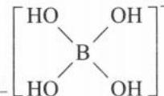

$$
\begin{array}{r l r l r l}&\mathrm {CH_ {3} COO^ {-}}&+&\mathrm {H_ {2} O}&\rightleftharpoons&\mathrm {CH_ {3} COOH}&+&\mathrm {OH^ {-}}\\c _ {0} / \mathrm{mol} \cdot \mathrm{L} ^ {- 1}&0. 1&&&0&&0\\\Delta c / \mathrm{mol} \cdot \mathrm{L} ^ {- 1}&1 \times 1 0 ^ {- 5}&&&1 \times 1 0 ^ {- 5}&&1 \times 1 0 ^ {- 5}\\c _ {\text {平}} / \mathrm{mol} \cdot \mathrm{L} ^ {- 1}&0. 1 - 1 \times 1 0 ^ {- 5}&&&1 \times 1 0 ^ {- 5}&&1 \times 1 0 ^ {- 5}\end{array}
$$

$$
K _ {\mathrm{h}} = \frac {c (\mathrm{CH} _ {3} \mathrm{COOH}) \times c (\mathrm{OH} ^ {-})}{c (\mathrm{CH} _ {3} \mathrm{COO} ^ {-})} = \frac {(1 \times 1 0 ^ {- 5}) \times (1 \times 1 0 ^ {- 5})}{0 . 1 - 1 \times 1 0 ^ {- 5}} \approx \frac {(1 \times 1 0 ^ {- 5}) \times (1 \times 1 0 ^ {- 5})}{0 . 1} = 1 \times 1 0 ^ {- 9} 。
$$

答案: $1 \times 10^{-9}$

【反思】 $K_{h}$ 从属于 K，其计算方法和 K 一样，用三段式求解。

【例 5】常温下, 已知 HClO 的 $K_{a}=1\times10^{-8}$ , 求 0.01 mol/L NaClO 溶液的 pH。

解析: NaClO 溶液中存在 ClO $^{-}$ 的水解平衡, 设 ClO $^{-}$ 转化 x mol·L $^{-1}$ , 列三段式计算:

$$
\begin{array}{r l r l r l}&\mathrm{ClO} ^ {-}&+&\mathrm{H} _ {2} \mathrm{O}&\rightleftharpoons&\mathrm{HClO} + \mathrm{OH} ^ {-}\\c _ {0} / \mathrm{mol} \cdot \mathrm{L} ^ {- 1}&0. 0 1&&&0&0\\\Delta c / \mathrm{mol} \cdot \mathrm{L} ^ {- 1}&x&&&x&x\\c _ {\text {平}} / \mathrm{mol} \cdot \mathrm{L} ^ {- 1}&0. 0 1 - x&&&x&x\end{array}
$$

$K_{h}=\frac{c(HClO)\times c(OH^{-})}{c(ClO^{-})}=\frac{x\cdot x}{0.01-x}\approx\frac{x^{2}}{0.01}$ ，又 $K_{h}=\frac{K_{w}}{K_{a}}=\frac{1\times10^{-14}}{1\times10^{-8}}=1\times10^{-6}$ ，即 $\frac{x^{2}}{0.01}=1\times10^{-6}$ ，解出 $x=1\times10^{-4}$ 。

$x = c(\mathrm{OH}^{-}) = 1\times 10^{-4}\mathrm{mol / L},$ 则 $c(\mathrm{H}^{+}) = \frac{K_{\mathrm{w}}}{c(\mathrm{OH}^{-})} = \frac{1\times 10^{-14}}{1\times 10^{-4}} = 1\times 10^{-10}\mathrm{mol / L},\mathrm{pH} = -\lg c(\mathrm{H}^{+}) =$ $-\lg (1\times 10^{-10}) = 10$

答案:10

【反思】除了要掌握 $K_{h}$ 的常规表达式外，还要熟悉其变形公式（即与 $K_{a}$ 、 $K_{b}$ 、 $K_{w}$ 的关系）。

类型 V: 盐溶液的酸碱性判断

【例 6】(2024·贵州卷)硼砂 $\left[\mathrm{Na}_{2}\mathrm{B}_{4}\mathrm{O}_{5}(\mathrm{OH})_{4}\cdot8\mathrm{H}_{2}\mathrm{O}\right]$ 水溶液常用于pH计的校准。硼砂水解生成等物质的量的 $\mathrm{B(OH)}_{3}$ (硼酸)和 $\mathrm{Na[B(OH)}_{4}$ (硼酸钠)。

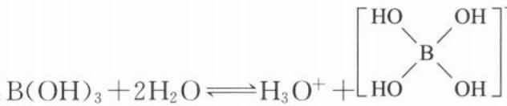

已知:①25℃时,硼酸显酸性的原理: $\mathrm{B(OH)_3 + 2H_2O \rightleftharpoons H_3O^+ + \left[ \begin{array}{c} HO \\ B \\ HO \end{array} \right]^-, K_a = 5.8 \times 10^{-10}$ ;② $\lg\sqrt{5.8} \approx 0.38$ 。下列说法正确的是( )

A.硼砂稀溶液中 $c(\mathrm{Na}^+) = c[\mathrm{B(OH)}_3]$ B.硼酸水溶液中的 $\mathrm{H}^+$ 主要来自水的电离

C.25℃时,0.01 mol·L $^{-1}$ 硼酸水溶液的pH≈6.38

D.等浓度等体积的 $\mathrm{B(OH)_3}$ 和 $\mathrm{Na[B(OH)_4]}$ 溶液混合后,溶液显酸性

解析：A.根据题干信息“硼砂水解生成等物质的量的 $\mathrm{B(OH)_3}$ （硼酸）和 $\mathrm{Na[B(OH)_4]}$ （硼酸钠）”，若不考虑 $\mathrm{B(OH)_3}$ 的电离以及 $\mathrm{Na[B(OH)_4]}$ 的水解，则 $n[\mathrm{B(OH)}_3] = n(\mathrm{Na[B(OH)_4]}) = n(\mathrm{Na}^+)$ 。但实际上 $\mathrm{B(OH)_3}$

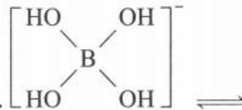

要电离： $\mathrm{B(OH)_3 + 2H_2O \rightleftharpoons H_3O^+ + \left[\begin{array}{c} HO \\ B \\ HO \end{array} \right]^-, Na[B(OH)_4]$ 也要水解： $\left[\begin{array}{c} HO \\ B \\ HO \end{array} \right]^-\rightleftharpoons B(OH)_3 + OH^-$ （该过程和常规的电离、水解表达式有所不同）。根据信息可知 $\mathrm{B(OH)_3}$ 的电离常数为 $K_a = 5.8 \times 10^{-10}$ ，由于 $\mathrm{Na[B(OH)_4]}$ 的水解常数 $K_h = \frac{K_w}{K_a} = \frac{1 \times 10^{-14}}{5.8 \times 10^{-10}} \approx 1.7 \times 10^{-5}$ 大于 $K_a = 5.8 \times 10^{-10}$ ，可知 $\mathrm{Na[B(OH)_4]}$ 水解生成的 $\mathrm{B(OH)_3}$ 大于 $\mathrm{B(OH)_3}$ 电离消耗的 $\mathrm{B(OH)_3}$ ，则 $c(\mathrm{Na}^+) < c[\mathrm{B(OH)_3}]$ ，A选项错误。

B. 根据题干信息“ $\mathrm{B(OH)_3 + 2H_2O \rightleftharpoons H_3O^+ + [HO^- OH]}$ ”可知，硼酸的酸性是通过 B 原子的空轨道接受水电离出来的 $OH^-$ 中 O 的孤电子对，从而促进水电离出 $H^+$ 来体现，因此硼酸水溶液中的 $H^+$ 来自于水的电离，B 选项正确。

C. $25^{\circ}$ C时，设 $0.01 \, mol \cdot L^{-1}$ 硼酸中已经转化的 $\mathrm{B(OH)}_{3}$ 为 x mol/L，列三段式计算：

$$
\begin{array}{r l r l r l}&\mathrm {B(OH) _ {3}} + 2 \mathrm {H_ {2} O}&\rightleftharpoons&\mathrm {H_ {3} O^ {+}} +&\left[\begin{array}{c c}\mathrm{HO}&\mathrm{OH}\\\mathrm{B}&\mathrm{OH}\\\mathrm{HO}&\mathrm{OH}\end{array}\right] ^ {-}\\c _ {0} / \mathrm{mol} \cdot \mathrm{L} ^ {- 1}&0. 0 1&&0&&0\\\Delta c / \mathrm{mol} \cdot \mathrm{L} ^ {- 1}&x&&x&&x\\c _ {\text {平}} / \mathrm{mol} \cdot \mathrm{L} ^ {- 1}&0. 0 1 - x&&x&&x\end{array}
$$

$K_{\mathrm{a}} = \frac{c(\mathrm{H}^{+})\times c([\mathrm{B(OH)}_{4}^{-}])}{c[\mathrm{B(OH)}_{3}]} = \frac{x\cdot x}{0.01 - x}\approx \frac{x^{2}}{0.01} = 5.8\times 10^{-10},$ 解出 $x = \sqrt{5.8}\times 10^{-6}\mathrm{mol / L}$ 。 $x = c(\mathrm{H}^{+}) =$

$\sqrt{5.8} \times 10^{-6} \mathrm{~mol} / \mathrm{L}$ , 则 $\mathrm{pH} = -\lg c(\mathrm{H}^{+}) = -\lg (\sqrt{5.8} \times 10^{-6}) = 6 - \lg \sqrt{5.8} = 6 - 0.38 = 5.62, \mathrm{C}$ 选项错误。D. 等浓度等体积的 $\mathrm{B(OH)}_{3}$ 和 $\mathrm{Na[B(OH)}_{4}]$ 溶液混合后, 溶液最终显什么性, 由二者电离和水解程度的相对大小决定。根据 A 选项的分析可知, $\mathrm{Na[B(OH)}_{4}]$ 的水解常数 $K_{\mathrm{h}}$ 大于 $\mathrm{B(OH)}_{3}$ 的 $K_{\mathrm{a}}$ , 则混合体系中以 $\mathrm{Na[B(OH)}_{4}]$ 的水解为主。 $\mathrm{Na[B(OH)}_{4}]$ 为强碱弱酸对应的正盐, 根据“谁强显谁性”可知, $\mathrm{Na[B(OH)}_{4}]$ 的水溶液显碱性, 因此该混合溶液显碱性, D 选项错误。

答案:B

## 第 2 节 粒子浓度大小比较(★★★★★)

## 内容提要

## 一、等浓度的不同溶液中同种粒子的浓度比较

1. pH 的比较方法

(1)先根据溶质组成和性质将溶液分成酸性、中性、碱性三类。

(2)再根据强弱的不同对同类进行比较。

2. 共有离子或分子比较方法

(1) 先判断研究对象在溶液中是主要粒子还是次要粒子。

(2) 若研究对象均为主要粒子, 再去比较主要粒子的后续反应的强弱。

(3) 若研究对象均为次要粒子, 再去比较次要粒子的来源途径的强弱。

3. 阴离子或阳离子总数比较方法

(1)先判断阴、阳离子在水中的变化。

(2)再用“不变应万变”的方法进行等量代换。

## 二、同一溶液中不同粒子浓度比较方法及步骤

1. 分主次, 主大于次: 先将需要比较的粒子分成主要粒子和次要粒子。

(1)主要粒子包括“完全电离产生的离子”和“部分电离剩余的分子”。

(2)次要粒子包括“部分电离产生的离子”和“微弱水解产生的粒子”。

例 1:1 mol/L $CH_{3}COOH$ 溶液中, $CH_{3}COOH$ 为弱电解质, 其为主要粒子。醋酸、水的电离程度很弱, $H^{+}$ 、 $CH_{3}COO^{-}$ 、 $OH^{-}$ 均为次要粒子, 水一般不参与比较。则醋酸溶液中的 $CH_{3}COOH$ 比 $H^{+}$ 、 $CH_{3}COO^{-}$ 、 $OH^{-}$ 浓度更大。

例 2:1 mol/L $CH_{3}COONa$ 溶液中, $CH_{3}COONa$ 为强电解质完全电离, $Na^{+}$ 、 $CH_{3}COO^{-}$ 为主要粒子。由于水为极弱电解质, 由其电离产生的 $H^{+}$ 、 $OH^{-}$ 为次要粒子。 $CH_{3}COO^{-}$ 为弱酸阴离子, 其水解程度比较小, 由 $CH_{3}COO^{-}$ 水解产生的 $CH_{3}COOH$ 为次要粒子。因此醋酸钠溶液中的 $Na^{+}$ 、 $CH_{3}COO^{-}$ 比 $H^{+}$ 、 $OH^{-}$ 、 $CH_{3}COOH$ 浓度更大。(若离子水解程度很大, 其水解产生的粒子浓度也可能大于盐完全电离产生的离子浓度。)

2. 主主看去向: 若比较粒子均为主要粒子, 观察主要粒子是否发生后续反应而被消耗。

例 1:1 mol/L $CH_{3}COONa$ 溶液中 $Na^{+}$ 、 $CH_{3}COO^{-}$ 为主要粒子。若不考虑 $CH_{3}COO^{-}$ 的水解，则 $c(\mathrm{Na}^{+})$ 与 $c(\mathrm{CH}_{3}\mathrm{COO}^{-})$ 浓度一样。但 $CH_{3}COO^{-}$ 会水解损耗，导致 $c(\mathrm{CH}_{3}\mathrm{COO}^{-}) < c(\mathrm{Na}^{+})$ 。

例 2:1 mol/L $NH_{4}HSO_{4}$ 溶液中 $NH_{4}^{+}$ 、 $H^{+}$ 、 $SO_{4}^{2-}$ 为主要粒子。若不考虑 $NH_{4}^{+}$ 的水解以及水的电离，则 $NH_{4}^{+}$ 、 $H^{+}$ 、 $SO_{4}^{2-}$ 三种离子的浓度相等。但 $NH_{4}^{+}$ 要水解损耗，水的电离还要提供 $H^{+}$ ，所以溶液中 $c(\mathrm{NH}_{4}^{+})<c(\mathrm{SO}_{4}^{2-})<c(\mathrm{H}^{+})$ 。(方法并非一成不变，解决问题时要具体问题具体分析。)

3. 次次看来源: 若均为次要粒子, 观察次要粒子有哪些来源。若有多个来源先比较来源的强度, 再比较来源的途径数。

例: pH=5 的 $NaHSO_{3}$ 溶液中, $SO_{3}^{2-}$ 、 $H_{2}SO_{3}$ 分别来自 $HSO_{3}^{-}$ 的电离和水解。由于溶液呈酸性, 说明 $HSO_{3}^{-}$ 的电离程度大于 $HSO_{3}^{-}$ 的水解程度, 则由 $HSO_{3}^{-}$ 电离产生的 $c(SO_{3}^{2-})$ 更大, 即 $c(H_{2}SO_{3})<c(SO_{3}^{2-})$ 。

## 类型 I: 不同溶液中同一粒子浓度大小比较

【例 1】常温下,浓度均为 0.1 mol/L 的下列溶液, $c(\mathrm{NH}_{4}^{+})$ 由大到小的顺序为 \_\_\_\_。
① $NH_{3}\cdot H_{2}O$ ② $CH_{3}COONH_{4}$ ③ $NH_{4}Cl$ ④ $NH_{4}HSO_{4}$ ⑤ $NH_{4}Al(SO_{4})_{2}$ ⑥ $(NH_{4})_{2}CO_{3}$ ⑦ $(NH_{4})_{2}Fe(SO_{4})_{2}$ ⑧ $(NH_{4})_{2}SO_{4}$ ⑨ $NH_{4}HCO_{3}$

解析:(1) $NH_{3}\cdot H_{2}O$ 是弱电解质,其溶液中的 $NH_{4}^{+}$ 是次要离子;其他溶质均为可溶性铵盐,是强电解质完全电离, $NH_{4}^{+}$ 为主要离子。所以 $NH_{3}\cdot H_{2}O$ 中的 $c(NH_{4}^{+})$ 最小。

(2)⑥⑦⑧中的 $c_{\text{始}}(\mathrm{NH}_4^+)$ 是②③④⑤⑨中 $c_{\text{始}}(\mathrm{NH}_4^+)$ 的2倍。则⑥⑦⑧中的 $c(\mathrm{NH}_4^+)$ 大于②③④⑤⑨。

(3)⑥中的 $CO_{3}^{2-}$ 对 $NH_{4}^{+}$ 水解起促进作用（异弱相促进）；⑦中的 $Fe^{2+}$ 对 $NH_{4}^{+}$ 水解起抑制作用（同弱相抑制）； $SO_{4}^{2-}$ 对 $NH_{4}^{+}$ 的水解既不促进也不抑制。 $NH_{4}^{+}$ 水解程度越大，则溶液中 $c(\mathrm{NH}_{4}^{+})$ 越小，所以 $c(\mathrm{NH}_{4}^{+})$ 由大到小的顺序为：⑦＞⑧＞⑥（以⑧的不变应⑦、⑥的万变）。

(4)同理，④、⑤、③、②、⑨中的 $\mathrm{H^{+}}$ 、 $\mathrm{Al}^{3 + }$ 、 $\mathrm{Cl^-}$ 、 $\mathrm{CH_3COO^-}$ 、 $\mathrm{HCO_3^-}$ 分别对 $\mathrm{NH_4^+}$ 水解起抑制作用、抑制作用、无影响、促进作用、促进作用。根据 $NH_{4}^{+}$ 水解： $NH_{4}^{+} + H_{2}O \rightleftharpoons NH_{3} \cdot H_{2}O + H^{+}$ 可知， $HSO_{4}^{-}$ 完全电离的 $H^{+}$ 浓度较大， $Al^{3+}$ 部分水解产生的 $H^{+}$ 浓度较小，因此 $HSO_{4}^{-}$ 对 $NH_{4}^{+}$ 水解的抑制作用强于 $Al^{3+}$ ，则 $NH_{4}HSO_{4}$ 溶液中的 $c(\mathrm{NH}_{4}^{+})$ 大于 $\mathrm{NH}_{4}\mathrm{Al}(\mathrm{SO}_{4})_{2}$ 溶液中的 $c(\mathrm{NH}_{4}^{+})$ 。根据越弱越水解规律， $H_{2}CO_{3}$ 酸性弱于 $CH_{3}COOH$ ，因此 $HCO_{3}^{-}$ 对 $NH_{4}^{+}$ 水解促进作用强于 $CH_{3}COO^{-}$ ，则 $CH_{3}COONH_{4}$ 溶液中的 $c(\mathrm{NH}_{4}^{+})$ 大于 $NH_{4}HCO_{3}$ 溶液中的 $c(\mathrm{NH}_{4}^{+})$ 。所以 $c(\mathrm{NH}_{4}^{+})$ 由大到小的顺序为：④＞⑤＞③＞②＞⑨。

(5)综上所述, $c(\mathrm{NH}_{4}^{+})$ 由大到小的顺序为:⑦＞⑧＞⑥＞④＞⑤＞③＞②＞⑨＞①。

答案:⑦⑧⑥④⑤③②⑨①

【反思】先判断研究对象的主次，再根据离子的初始浓度分类，接着对同类的环境进行对比（即其他离子对其是促进、抑制还是无影响），最后对同种影响的程度进行比较。

【例 2】常温下，pH 相同的① $\left(\mathrm{NH}_{4}\right)_{2}\mathrm{SO}_{4}$ ② $\mathrm{NH}_{4}\mathrm{Al}\left(\mathrm{SO}_{4}\right)_{2}$ ③ $NH_{4}Cl$ ④ $NH_{4}HSO_{4}$ ，溶液中 $c\left(\mathrm{NH}_{4}^{+}\right)$ 由大到小排序：\_\_\_\_。

解析:铵根离子水解: $\mathrm{NH}_{4}^{+}+\mathrm{H}_{2}\mathrm{O}\rightleftharpoons\mathrm{NH}_{3}\cdot\mathrm{H}_{2}\mathrm{O}+\mathrm{H}^{+}$ 、铝离子水解: $\mathrm{Al}^{3+}+3\mathrm{H}_{2}\mathrm{O}\rightleftharpoons\mathrm{Al(OH)}_{3}+3\mathrm{H}^{+}$ ，二者水解都使溶液 $c(\mathrm{H}^{+})$ 增大。且碱性: $\mathrm{NH}_{3}\cdot\mathrm{H}_{2}\mathrm{O}>\mathrm{Al(OH)}_{3}$ ，根据“越弱越水解”可知，水解程度： $NH_{4}^{+}<Al^{3+}$ 。

方法一:①～④均为铵盐,都是强电解质完全电离, $NH_{4}^{+}$ 均为各溶液的主要离子。①、③中溶液均呈酸性,是因为 $NH_{4}^{+}$ 水解;又因为 $SO_{4}^{2-}$ 、 $Cl^{-}$ 不水解,则①、③的环境一样,pH一样,其 $c(NH_{4}^{+})$ 也一样,即①=③。

$\mathrm{NH}_{4}\mathrm{Al}(\mathrm{SO}_{4})_{2}$ 溶液呈酸性,既有 $\mathrm{NH}_{4}^{+}$ 水解,又有 $\mathrm{Al}^{3+}$ 水解所作贡献。若②与③的浓度相等,由于②还存在 $\mathrm{Al}^{3+}$ 的水解,则②的pH应该更小;但现在二者的pH一样大,则②的浓度要小于③,因此 $c(\mathrm{NH}_{4}^{+}):①=③>②$ 。(可以想像为“熬汤”, $\mathrm{NH}_{4}^{+}$ 和 $\mathrm{Al}^{3+}$ 是“酸性调味料”,且 $\mathrm{Al}^{3+}$ 酸性比同浓度的 $\mathrm{NH}_{4}^{+}$ 强。②同时加入 $\mathrm{NH}_{4}^{+}$ 和 $\mathrm{Al}^{3+},③$ 只加入 $\mathrm{NH}_{4}^{+}$ ;由于②与③的pH相同,且②已经有“酸性调味料” $\mathrm{Al}^{3+}$ 了,因此②中的另一种“酸性调味料” $\mathrm{NH}_{4}^{+}$ 浓度要比③小,这两锅汤才能调成“酸性”相同。)

$NH_{4}HSO_{4}$ 溶液呈酸性, 主要原因是 $HSO_{4}^{-}$ 完全电离, 而完全电离出 $H^{+}$ 的“ $HSO_{4}^{-}$ ”所体现酸性居然与微弱水解体现的酸性一样, 则说明 $NH_{4}HSO_{4}$ 的浓度极小, 因此④的浓度最小, 其体系中的 $c(NH_{4}^{+})$ 也最小。(可以想像为“熬汤”, $HSO_{4}^{-}$ 是酸性很强的“调味料”, 所以只需要加一点点, ④这锅汤的酸性就可以和另外三锅汤的酸性一样, 因此④所含溶质浓度最小、 $NH_{4}^{+}$ 浓度也最小。)

综上所述，溶液中的 $c(\mathrm{NH}_{4}^{+})$ 由大到小的顺序为：①=③＞②＞④。

方法二: 假设法、反推法

若①～④的体系中 $c(\mathrm{NH}_{4}^{+})$ 一样，由于④中 $HSO_{4}^{-}$ 完全电离，其溶液中的 $c(\mathrm{H}^{+})$ 最大，pH 最小；②中 $Al^{3+}$ 水解程度大于 $NH_{4}^{+}$ 水解程度，若 $c(\mathrm{NH}_{4}^{+})$ 与①、③一样，则其 pH 应该比①、③小；①、③的阴离子不会对 $NH_{4}^{+}$ 水解造成影响，二者的 pH 相同，则其 $c(\mathrm{NH}_{4}^{+})$ 相同。

为了让含等浓度 $c(\mathrm{NH}_{4}^{+})$ 的①～④溶液 pH 相同，则需要稀释②、④，且④稀释的倍数要更大。因此最终溶液中的 $c(\mathrm{NH}_{4}^{+})$ 由大到小的顺序为：①=③＞②＞④。

答案:①=③＞②＞④

类型Ⅱ: 同一溶液中粒子浓度大小比较

【例 3】常温下, 比较下列溶液中指定粒子浓度大小顺序( $H_{2}O$ 不参与比较)

(1)0.1 mol/L $CH_{3}COONa$

(2)0.1 mol/L $Na_{2}CO_{3}$ (比较粒子: $Na^{+}$ , $CO_{3}^{2-}$ , $OH^{-}$ , $HCO_{3}^{-}$ , $H_{2}CO_{3}$ )

(3)0.1 mol/L $NaHCO_{3}$ (比较离子: $Na^{+}$ , $CO_{3}^{2-}$ , $HCO_{3}^{-}$ , $H_{2}CO_{3}$ )

(4)浓度均为 $0.1 \, mol/L \, NaHCO_{3}$ 、 $Na_{2}CO_{3}$ 的混合物（比较粒子： $Na^{+}$ 、 $CO_{3}^{2-}$ 、 $HCO_{3}^{-}$ 、 $H_{2}CO_{3}$ ）

(5)浓度均为 0.1 mol/L $CH_{3}COONa$ 、 $CH_{3}COOH$ 的混合溶液 (pH<7) (比较粒子: $Na^{+}$ 、 $CH_{3}COO^{-}$ 、 $OH^{-}$ 、 $CH_{3}COOH$ 、 $H^{+}$ )

(6)浓度均为 0.1 mol/L HCN、NaCN 的混合物(pH>7)(比较粒子: $Na^{+}$ 、 $CN^{-}$ 、 $OH^{-}$ 、HCN、 $H^{+}$ )

解析:(1)0.1 mol/L $CH_{3}COONa$ :

<table><tr><td rowspan="2">主要粒子</td><td>粒子种类</td><td> $CH_3COO^-$ 、 $Na^+$ </td></tr><tr><td>粒子变化及比较</td><td> $CH_3COO^-$ 、 $Na^+$ 的浓度之比本应为1∶1,由于 $CH_3COO^-$ 会水解损耗,所以 $c(Na^+) > c(CH_3COO^-)$ 。</td></tr><tr><td rowspan="2">次要粒子</td><td>粒子种类及来源</td><td> $CH_3COOH:CH_3COO^-$ 的水解; $OH^-$ :大部分来自 $CH_3COO^-$ 水解所产生,少部分来自 $H_2O$ 自身电离; $H^+:H_2O$ 的电离。</td></tr><tr><td>粒子变化及比较</td><td> $c(OH^-)$ 有两个来源: $CH_3COO^-$ 的水解( $CH_3COO^- + H_2O \rightleftharpoons CH_3COOH + OH^-$ )和水自身电离( $H_2O \rightleftharpoons H^+ + OH^-$ ),所以 $c(OH^-) > c(CH_3COOH)$ 。溶液中主要反应为 $CH_3COO^-$ 水解,水自身电离出的 $c(H^+)$ 、 $c(OH)^-$ 是极少的,即 $c(OH^-)$ 略大于 $c(CH_3COOH)$ ,但远大于 $c(H^+)$ ,因此 $c(OH^-) > c(CH_3COOH) > c(H^+)$ 。</td></tr><tr><td colspan="2">最终比较结果</td><td> $c(Na^+) > c(CH_3COO^-) > c(OH^-) > c(CH_3COOH) > c(H^+)$ </td></tr></table>

关于 $c(\mathrm{OH}^{-})$ 、 $c(\mathrm{CH}_3\mathrm{COOH})$ 、 $c(\mathrm{H}^{+})$ 的大小比较，也可以利用“质子守恒”概念解题。 $\mathrm{CH}_3\mathrm{COONa}$ 溶液的质子守恒为 $c(\mathrm{OH}^{-}) = c(\mathrm{CH}_3\mathrm{COOH}) + c(\mathrm{H}^{+})$ ，由于水电离出的 $c(\mathrm{H}^{+})$ 必等于水电离出的 $c(\mathrm{OH}^{-})$ ，但 $\mathrm{OH}^{-}$ 不与 $\mathrm{Na}^{+}$ 发生反应，而水电离出的 $\mathrm{H}^{+}$ 绝大部分与 $\mathrm{CH}_3\mathrm{COO}^-$ 结合变为 $\mathrm{CH}_3\mathrm{COOH}$ ，不反应的 $\mathrm{H}^{+}$ 极少，因此 $c(\mathrm{OH}^{-}) > c(\mathrm{CH}_3\mathrm{COOH}) > c(\mathrm{H}^{+})$ 。

(2)0.1 mol/L $Na_{2}CO_{3}$ (比较粒子: $Na^{+}$ , $CO_{3}^{2-}$ , $OH^{-}$ , $HCO_{3}^{-}$ , $H_{2}CO_{3}$ )

<table><tr><td rowspan="2">主要粒子</td><td>粒子种类</td><td> $CO_{3}^{2-}$ 、 $Na^{+}$ </td></tr><tr><td>粒子变化及比较</td><td> $CO_{3}^{2-}$ 、 $Na^{+}$ 的浓度之比本应为1∶2,由于 $CO_{3}^{2-}$ 会水解损耗,所以 $c(Na^{+})>2c(CO_{3}^{2-})$ 。</td></tr><tr><td rowspan="2">次要粒子</td><td>粒子种类及来源</td><td> $HCO_{3}^{-}$ :来自 $CO_{3}^{2-}$ 的第一步水解; $H_{2}CO_{3}$ :来自 $CO_{3}^{2-}$ 的第二步水解; $OH^{-}$ :来自 $CO_{3}^{2-}$ 的两步水解以及 $H_{2}O$ 自身电离。</td></tr><tr><td>粒子变化及比较</td><td>溶液中主要反应为 $CO_{3}^{2-}$ 的第一步水解: $CO_{3}^{2-}+H_{2}O\rightleftharpoons HCO_{3}^{-}+OH^{-}$ ,而 $CO_{3}^{2-}$ 的第二步水解: $HCO_{3}^{-}+H_{2}O\rightleftharpoons H_{2}CO_{3}+OH^{-}$ 、水自身电离: $H_{2}O\rightleftharpoons H^{+}+OH^{-}$ 都是极微弱的,即 $c(OH^{-})$ 略大于 $c(HCO_{3}^{-})$ , $c(HCO_{3}^{-})$ 远大于 $c(H_{2}CO_{3})$ 。由于 $CO_{3}^{2-}$ 的第二步水解(生成 $H_{2}CO_{3}$ )和水自身电离(生成 $H^{+}$ )都极弱,难以比较 $c(H^{+})$ 、 $c(H_{2}CO_{3})$ 的相对大小,且会受溶质 $Na_{2}CO_{3}$ 浓度的影响,因此题目会避开二者的比较。</td></tr><tr><td colspan="2">最终比较结果</td><td> $c(Na^{+})>c(CO_{3}^{2-})>c(OH^{-})>c(HCO_{3}^{-})>c(H_{2}CO_{3})$ 。若题目换作是讨论“离子”浓度大小,则结果为 $c(Na^{+})>c(CO_{3}^{2-})>c(OH^{-})>c(HCO_{3}^{-})>c(H^{+})$ 。</td></tr></table>

$$
\mathrm{NaHCO} _ {3}
$$

$$
\left. \mathrm{Na} ^ {+}, \mathrm{CO} _ {3} ^ {2 -}, \mathrm{HCO} _ {3} ^ {-}, \mathrm{H} _ {2} \mathrm{CO} _ {3}\right)
$$

<table><tr><td rowspan="2">主要粒子</td><td>粒子种类</td><td> $HCO_{3}^{-}$ 、 $Na^{+}$ </td></tr><tr><td>粒子变化及比较</td><td> $HCO_{3}^{-}$ 、 $Na^{+}$ 的浓度之比本应为1∶1,由于 $HCO_{3}^{-}$ 会水解和电离损耗,所以 $c(Na^{+})>c(HCO_{3}^{-})$ 。</td></tr><tr><td rowspan="2">次要粒子</td><td>粒子种类及来源</td><td> $CO_{3}^{2-}$ :来自 $HCO_{3}^{-}$ 的电离; $H_{2}CO_{3}$ :来自 $HCO_{3}^{-}$ 的水解</td></tr><tr><td>粒子变化及比较</td><td>根据 $NaHCO_{3}$ 溶液显碱性,可知 $HCO_{3}^{-}$ 的水解程度大于 $HCO_{3}^{-}$ 电离程度,则 $c(H_{2}CO_{3})>c(CO_{3}^{2-})$ 。</td></tr><tr><td colspan="2">最终比较结果</td><td> $c(Na^{+})>c(HCO_{3}^{-})>c(H_{2}CO_{3})>c(CO_{3}^{2-})$ </td></tr></table>

(4)浓度均为 $0.1\mathrm{mol} / \mathrm{LNaHCO}_3$ 、 $\mathrm{Na_2CO_3}$ 的混合物（比较粒子： $\mathrm{Na^{+},CO_{3}^{2 - },HCO_{3}^{-},H_{2}CO_{3}}$ ）

<table><tr><td rowspan="2">主要粒子</td><td>粒子种类</td><td> $HCO_{3}^{-}$ 、 $Na^{+}$ 、 $CO_{3}^{2-}$ </td></tr><tr><td>粒子变化及比较</td><td> $Na^{+}$ 、 $HCO_{3}^{-}$ 、 $CO_{3}^{2-}$ 的浓度之比本应为3∶1∶1,因此 $c(Na^{+})$ 浓度最大,关于 $c(HCO_{3}^{-})$ 、 $c(CO_{3}^{2-})$ 大小分析如下: $\begin{cases} CO_{3}^{2-}水解 \longrightarrow c(CO_{3}^{2-})\downarrow\downarrow、c(HCO_{3}^{-})\uparrow\uparrow \\ HCO_{3}^{-}水解 \longrightarrow c(HCO_{3}^{-})\downarrow、c(H_{2}CO_{3})\uparrow \\ HCO_{3}^{-}电离 \longrightarrow c(HCO_{3}^{-})\downarrow、c(CO_{3}^{2-})\uparrow\cdots \\ HCO_{3}^{-}电离程度最小,忽略其造成的影响\end{cases}$  $CO_{3}^{2-}水解程度大于HCO_{3}^{-}水解程度(HCO_{3}^{-})的水解即\( CO_{3}^{2-}$ 的第二步水解由上述分析可知,体系达平衡的过程中, $c(CO_{3}^{2-})减少$ 、 $c(HCO_{3}^{-})增大$ ,所以 $c(Na^{+})>c(HCO_{3}^{-})>c(CO_{3}^{2-})$ 。</td></tr><tr><td>次要粒子</td><td>粒子种类及来源</td><td> $H_{2}CO_{3}:HCO_{3}^{-}$ 的水解</td></tr><tr><td colspan="2">最终比较结果</td><td> $c(Na^{+})>c(HCO_{3}^{-})>c(CO_{3}^{2-})>c(H_{2}CO_{3})$ </td></tr></table>

## (5) 方法一: 常规法

<table><tr><td rowspan="2">主要粒子</td><td>粒子种类</td><td> $CH_{3}COO^{-}$ 、 $Na^{+}$ 、 $CH_{3}COOH$ </td></tr><tr><td>粒子变化及比较</td><td> $c(Na^{+})$ 、 $c(CH_{3}COO^{-})$ 、 $c(CH_{3}COOH)$ 之比本应为1∶1∶1, $CH_{3}COO^{-}$ 水解使溶液呈碱性、 $CH_{3}COOH$ 电离使溶液呈酸性。等浓度 $CH_{3}COOH$ 与 $CH_{3}COONa$ 混合溶液pH&lt;7,说明 $CH_{3}COOH$ 电离程度大于 $CH_{3}COO^{-}$ 水解程度。 $CH_{3}COOH$ 电离 $\longrightarrow$  $c(CH_{3}COOH) \downarrow \downarrow$ 、 $c(CH_{3}COO^{-}) \uparrow \uparrow$   $CH_{3}COO^{-}$ 水解程度小, $\cdots CH_{3}COO^{-}$ 水解 $\longrightarrow$  $c(CH_{3}COOH) \uparrow$ 、 $c(CH_{3}COO^{-}) \downarrow$ ……忽略其造成的影响以 $c(Na^{+})$ 不变应 $c(CH_{3}COO^{-})$ 、 $c(CH_{3}COOH)$ 万变。根据上述分析可知, $c(CH_{3}COOH)$ 、 $c(CH_{3}COO^{-})$ 此消彼长,所以: $c(CH_{3}COO^{-}) > c(Na^{+}) > c(CH_{3}COOH)$ 。</td></tr><tr><td rowspan="2">次要粒子</td><td>粒子种类</td><td> $OH^{-}$ 、 $H^{+}$ </td></tr><tr><td>粒子比较</td><td>溶液pH&lt;7, $c(H^{+}) > c(OH^{-})$ </td></tr><tr><td colspan="2">最终比较结果</td><td> $c(CH_{3}COO^{-}) > c(Na^{+}) > c(CH_{3}COOH) > c(H^{+}) > c(OH^{-})$ </td></tr></table>

## 方法二:电荷守恒法

次要粒子是 $OH^{-}$ 、 $H^{+}$ ，溶液 pH<7，因此 $c(\mathrm{H}^{+})>c(\mathrm{OH}^{-})$ 。主要粒子有 $CH_{3}COO^{-}$ 、 $Na^{+}$ 、 $CH_{3}COOH$ ，根据电荷守恒表达式： $c(\mathrm{CH}_{3}\mathrm{COO}^{-})+c(\mathrm{OH}^{-})=c(\mathrm{H}^{+})+c(\mathrm{Na}^{+})$ ，并结合 $c(\mathrm{H}^{+})>c(\mathrm{OH}^{-})$ ，可知 $c(\mathrm{CH}_{3}\mathrm{COO}^{-})>c(\mathrm{Na}^{+})$ 。以 $c(\mathrm{Na}^{+})$ 不变应 $c(\mathrm{CH}_{3}\mathrm{COO}^{-})$ 、 $c(\mathrm{CH}_{3}\mathrm{COOH})$ 万变，而 $c(\mathrm{CH}_{3}\mathrm{COOH})$ 、 $c(\mathrm{CH}_{3}\mathrm{COO}^{-})$ 此消彼长， $c(\mathrm{Na}^{+})$ 必然介于 $c(\mathrm{CH}_{3}\mathrm{COO}^{-})$ 、 $c(\mathrm{CH}_{3}\mathrm{COOH})$ 之间，即 $c(\mathrm{CH}_{3}\mathrm{COO}^{-})>c(\mathrm{Na}^{+})>c(\mathrm{CH}_{3}\mathrm{COOH})$ 。最后根据主要离子大于次要粒子可知： $c(\mathrm{CH}_{3}\mathrm{COO}^{-})>c(\mathrm{Na}^{+})>c(\mathrm{CH}_{3}\mathrm{COOH})>c(\mathrm{H}^{+})>c(\mathrm{OH}^{-})$ 。

(6) 方法一：常规法

<table><tr><td rowspan="2">主要粒子</td><td>粒子种类</td><td> $CN^{-}$ 、 $Na^{+}$ 、HCN</td></tr><tr><td>粒子变化及比较</td><td> $c(Na^{+})$ 、 $c(CN^{-})$ 、 $c(HCN)$ 之比本应为1∶1∶1, $CN^{-}$ 水解使溶液呈碱性,HCN电离使溶液呈酸性。等浓度HCN与NaCN混合溶液pH&gt;7,说明HCN电离程度小于 $CN^{-}$ 水解程度。 $\begin{array}{c}\cdots\cdots\\ \cdots\end{array}$  $\begin{array}{c}\cdots\cdots\\ \cdots\end{array}$  $\begin{array}{c}\cdots\cdots\\ \cdots\end{array}$  $\begin{array}{c}\cdots\cdots\\ \cdots\end{array}$  $\begin{array}{c}\cdots\cdots\\ \cdots\end{array}$  $\begin{aligned}&\cdots\cdots\\&\cdots\end{aligned}$  $\begin{aligned}&\cdots\cdots\\&\cdots\end{aligned}$  $\begin{aligned}&\cdots\cdots\\&\cdots\end{aligned}$  $\begin{aligned}&\cdots\cdots\\&\cdots\end{aligned}$  $\begin{aligned}&\cdots\cdots\\&\cdots\end{aligned}$  $\begin{aligned}&\cdots\cdots\\&\cdots\end{aligned}$  $\begin{aligned}&\cdots\cdots\\&\cdots\end{aligned}$  $\begin{aligned}&\cdots\cdots\\&\cdots\end{aligned}$  $\begin{aligned}&\cdots\cdots\\&\cdots\end{aligned}$  $\begin{aligned}&\cdots\cdots\\&\cdots\end{aligned}$  $\begin{aligned}&\cdots \cdots\\&\cdots\end{aligned}$  $\begin{aligned}&\cdots\cdots\\&\cdots\end{aligned}$  $\begin{aligned}&\cdots\cdots\\&\cdots\end{aligned}$  $\begin{aligned}&\cdots\cdots\\&\cdots\end{aligned}$  $\begin{aligned}&\cdots\cdots\\&\cdots \end{aligned}$  $\begin{aligned}&\cdots\cdots\\&\cdots\end{aligned}$  $\begin{aligned}&\cdots\cdots\\&\cdots\end{aligned}$  $\begin{aligned}&\cdots\cdots\\&\cdots\end{aligned}$  $\begin{aligned}&\cdots\cdots\\&\cdots\end{aligned}$  $\substack{\text{以 }c(\mathrm{Na}^{+})\text{ 不变应 }c(\mathrm{CN}^{-}),c(\mathrm{HCN})\text{ 万变。根据上述分析可知 },c(\mathrm{CN}^{-}),c(\mathrm{HCN})\text{ 此消彼长 , 所以 : }c(\mathrm{HCN})>c(\mathrm{Na}^{+})>c(\mathrm{CN}^{-})\text{ 。}}\\&\cdots\cdots\\&\cdots\end{aligned}$ </td></tr><tr><td rowspan="2">次要粒子</td><td>粒子种类</td><td> $OH^{-}$ 、 $H^{+}$ </td></tr><tr><td>粒子比较</td><td>溶液pH&gt;7, $c(H^{+})<c(OH^{-})$ </td></tr><tr><td colspan="2">最终比较结果</td><td> $c(HCN)>c(Na^{+})>c(CN^{-})>c(OH^{-})>c(H^{+})$ </td></tr></table>

方法二:电荷守恒法

次要粒子是 $OH^{-}$ 、 $H^{+}$ ，溶液 pH>7，因此 $c(\mathrm{H}^{+})<c(\mathrm{OH}^{-})$ 。主要粒子有 $CN^{-}$ 、 $Na^{+}$ 、HCN，根据电荷守恒表达式： $c(\mathrm{CN}^{-})+c(\mathrm{OH}^{-})=c(\mathrm{H}^{+})+c(\mathrm{Na}^{+})$ ，并结合 $c(\mathrm{H}^{+})<c(\mathrm{OH}^{-})$ ，可知 $c(\mathrm{CN}^{-})<c(\mathrm{Na}^{+})$ 。以 $c(\mathrm{Na}^{+})$ 不变应 $c(\mathrm{CN}^{-})$ 、 $c(\mathrm{HCN})$ 万变，而 $c(\mathrm{CN}^{-})$ 、 $c(\mathrm{HCN})$ 此消彼长， $c(\mathrm{Na}^{+})$ 必然介于 $c(\mathrm{CN}^{-})$ 、 $c(\mathrm{HCN})$ 之间，即 $c(\mathrm{HCN})>c(\mathrm{Na}^{+})>c(\mathrm{CN}^{-})$ 。最后根据主要粒子大于次要粒子可知： $c(\mathrm{HCN})>c(\mathrm{Na}^{+})>c(\mathrm{CN}^{-})>c(\mathrm{OH}^{-})>c(\mathrm{H}^{+})$

答案：(1) $c(\mathrm{Na}^{+})>c(\mathrm{CH}_{3}\mathrm{COO}^{-})>c(\mathrm{OH}^{-})>c(\mathrm{CH}_{3}\mathrm{COOH})>c(\mathrm{H}^{+})$ (2) $c(\mathrm{Na}^{+})>c(\mathrm{CO}_{3}^{2-})>c(\mathrm{OH}^{-})>c(\mathrm{HCO}_{3}^{-})>c(\mathrm{H}_{2}\mathrm{CO}_{3})$ (3) $c(\mathrm{Na}^{+})>c(\mathrm{HCO}_{3}^{-})>c(\mathrm{H}_{2}\mathrm{CO}_{3})>c(\mathrm{CO}_{3}^{2-})$ (4) $c(\mathrm{Na}^{+})>c(\mathrm{HCO}_{3}^{-})>c(\mathrm{CO}_{3}^{2-})>c(\mathrm{H}_{2}\mathrm{CO}_{3})$ (5) $c(\mathrm{CH}_{3}\mathrm{COO}^{-})>c(\mathrm{Na}^{+})>c(\mathrm{CH}_{3}\mathrm{COOH})>c(\mathrm{H}^{+})>c(\mathrm{OH}^{-})$ (6) $c(\mathrm{HCN})>c(\mathrm{Na}^{+})>c(\mathrm{CN}^{-})>c(\mathrm{OH}^{-})>c(\mathrm{H}^{+})$

【反思】①方法并非一成不变，要灵活运用，利用等式解不等式可能达到事半功倍的效果。  
②做选择题时，不需要将粒子一一比较，只需要在已有顺序中寻找易错点即可。  
③若题干给了 $K_{\mathrm{a}}$ 信息，往往需要利用 $K_{\mathrm{a}}$ 的表达式进行计算。某些定性分析为“次要粒子”的物质，经计算后可能会发现其浓度大于定性分析为主要粒子的浓度。  
④做题过程中要注意总结归纳，熟悉常考粒子的种类以及错误原因。以下是常考的错误陷阱：i.未考虑到物质混合后的组成变化。ii.分不清主、次粒子。

iii. 不清楚竞争途径的相对强弱，从而无法比较粒子浓度的相对大小。

【例 4】(2024·江苏卷)室温下,通过下列实验探究 $SO_{2}$ 的性质。已知 $K_{a_{1}}(H_{2}SO_{3})=1.3\times10^{-2},K_{a_{2}}(H_{2}SO_{3})=6.2\times10^{-8}$ 。

实验 1: 将 $SO_{2}$ 气体通入水中,测得溶液 pH=3。

实验 2: 将 $SO_{2}$ 气体通入 0.1 mol/L NaOH 溶液中,当溶液 pH=4 时停止通气。

实验 3: 将 $SO_{2}$ 气体通入 0.1 mol/L 酸性 $KMnO_{4}$ 溶液中,当溶液恰好褪色时停止通气。

下列说法正确的是( )

A. 实验 1 所得溶液中: $c(\mathrm{HSO}_{3}^{-})+c(\mathrm{SO}_{3}^{2-})>c(\mathrm{H}^{+})$ B. 实验 2 所得溶液中: $c(\mathrm{SO}_{3}^{2-})>c(\mathrm{HSO}_{3}^{-})$ C. 实验 2 所得溶液经蒸干、灼烧制得 $NaHSO_{3}$ 固体

D. 实验 3 所得溶液中: $c(\mathrm{SO}_{4}^{2-})>c(\mathrm{Mn}^{2+})$

解析: A. 将 $SO_{2}$ 通入水中, $SO_{2}$ 会与水反应生成 $H_{2}SO_{3}$ , 亚硫酸溶液体系中的电荷守恒表达式为: $c(\mathrm{OH}^{-}) + 2c(\mathrm{SO}_{3}^{2-}) + c(\mathrm{HSO}_{3}^{-}) = c(\mathrm{H}^{+})$ , 将等式的左侧减掉部分 $c(\mathrm{SO}_{3}^{2-})$ 和 $c(\mathrm{OH}^{-})$ 后, $c(\mathrm{SO}_{3}^{2-}) + c(\mathrm{HSO}_{3}^{-}) < c(\mathrm{H}^{+})$ , A 选项错误。(该不等式的研究对象全为离子, 则该不等式与电荷守恒关系密切, 所以应从电荷守恒表达式找突破口。)

B. 已知实验 2 溶液的 pH=4, 即 $c(\mathrm{H}^{+}) = 1 \times 10^{-4} \, \mathrm{mol/L}$ 。要比较 $c(\mathrm{SO}_{3}^{2-})$ 、 $c(\mathrm{HSO}_{3}^{-})$ 的大小, 需要利用 $K_{a_{2}} = \frac{c(\mathrm{H}^{+}) \cdot c(\mathrm{SO}_{3}^{2-})}{c(\mathrm{HSO}_{3}^{-})} = 6.2 \times 10^{-8}$ , 因为该表达式涉及了 $c(\mathrm{SO}_{3}^{2-})$ 、 $c(\mathrm{HSO}_{3}^{-})$ 、 $c(\mathrm{H}^{+})$ 三个参数。将 $c(\mathrm{H}^{+}) = 1 \times 10^{-4} \, \mathrm{mol/L}$ 带入表达式可计算出 $\frac{c(\mathrm{SO}_{3}^{2-})}{c(\mathrm{HSO}_{3}^{-})} = \frac{K_{a_{2}}}{c(\mathrm{H}^{+})} = \frac{6.2 \times 10^{-8}}{1 \times 10^{-4}} = 6.2 \times 10^{-4} < 1$ , 则 $c(\mathrm{SO}_{3}^{2-}) < c(\mathrm{HSO}_{3}^{-})$ , B 选项错误。(比较离子浓度时, 若溶质组成明确, 用常规方法定性比较即可; 若溶质组成不明确, 又已知 $K_{a}$ 的情况下, 需要将数据代入 $K_{a}$ 表达式中进行定量比较。到底代入 $K_{a_{1}}$ 还是 $K_{a_{2}}$ , 关键看比较的粒子与第几步电离有关。)

C. 由于实验 2 所得体系中 $\frac{c(\mathrm{SO}_{3}^{2-})}{c(\mathrm{HSO}_{3}^{-})} = 6.2 \times 10^{-4}$ , 即 $c(\mathrm{HSO}_{3}^{-})$ 远大于 $c(\mathrm{SO}_{3}^{2-})$ , 则实验 2 所得体系中的主要溶质为 $NaHSO_{3}$ 。 $NaHSO_{3}$ 有强还原性, 在蒸发结晶和灼烧时会被空气氧化成 +6价的 S, 最终所得溶质为

$NaHSO_{4}$ , C 选项错误。(蒸干溶液在蒸发皿中进行, 蒸发皿为敞口体系, 若溶质有还原性要考虑空气中氧气对溶质的影响。)

D. 将 $SO_{2}$ 通入酸性高锰酸钾溶液发生的离子方程式为: $5SO_{2} + 2MnO_{4}^{-} + 2H_{2}O = 5SO_{4}^{2-} + 2Mn^{2+} + 4H^{+}$ ，根据反应的计量数可知 $c(\mathrm{SO}_{4}^{2-}) > c(\mathrm{Mn}^{2+})$ ，D 选项正确。（考试过程中不需要将离子方程式完整书写出来，只需分析氧化剂和还原剂的得失电子守恒，即可获得 $SO_{4}^{2-}$ 、 $Mn^{2+}$ 的计量数关系或大小关系。）
答案:D

## 第 3 节 溶液中的三大守恒(★★★★)

## 内容提要

## 一、电荷守恒

<table><tr><td>意义</td><td>溶液呈电中性,说明电解质溶液中阳离子所带的正电荷总数与阴离子所带的负电荷总数相等。</td></tr><tr><td>对象</td><td>溶质、溶剂直接或间接提供的所有离子。</td></tr><tr><td>通式</td><td> $c(\text{阳}_1) \times \text{单位电荷} + c(\text{阳}_2) \times \text{单位电荷} + \cdots = c(\text{阴}_1) \times \text{单位电荷} + c(\text{阴}_2) \times \text{单位电荷} + \cdots \cdots$ </td></tr><tr><td>步骤</td><td>定性:寻找体系中的所有离子,并将其分类(分成阴、阳离子)。定量:将电荷数的绝对值乘以离子浓度转化成电荷浓度。</td></tr><tr><td>易错点</td><td>定性:将某些微弱的过程忽略了,导致离子未找全。定量:未将电荷数的绝对值与离子浓度乘积,即未考虑电荷浓度的意义。注:离子浓度并不等同于电荷浓度。</td></tr><tr><td>变式</td><td>1.将电荷守恒转化成不等式; 2.利用电荷守恒计算 $K_a$ 等。</td></tr><tr><td>实例</td><td> $Na_2CO_3$ 溶液中的电荷守恒表达式书写步骤如下:第一步:找离子(溶剂提供: $H^+$ 、 $OH^-$ ;溶质直接提供 $Na^+$ 、 $CO_3^{2-}$ ,间接提供 $HCO_3^-$ );第二步:将阴阳离子分类,写在等号的两边;第三步:将电荷数与离子浓度相乘,将离子浓度转成电荷浓度;最终电荷守恒表达式为: $c(H^+) + c(Na^+) = c(OH^-) + c(HCO_3^-) + 2c(CO_3^{2-})$ (书写方式口诀:阳离子放一边、阴离子放一边、电荷取正往前乘。)变式I:根据溶液呈碱性 $c(H^+) < c(OH^-)$ ,则 $c(Na^+) > c(HCO_3^-) + 2c(CO_3^{2-})$ ;变式II:去掉 $c(CO_3^{2-})$ 的系数,则 $c(H^+) + c(Na^+) > c(OH^-) + c(HCO_3^-) + c(CO_3^{2-})$ </td></tr></table>

注:不同体系只要离子种类一样,则其电荷守恒表达式就一样,如 $Na_{2}CO_{3}$ 、 $NaHCO_{3}$ 的电荷守恒一样。

## 二、元素守恒(物料守恒)

<table><tr><td>意义</td><td>溶质提供的某些原子(非H非O原子),在溶解前后的个数不变或个数比例不变。</td></tr><tr><td>对象</td><td>“溶质”提供的非H非O原子(不研究H、O原子)。</td></tr><tr><td>步骤</td><td>定性:寻找体系中某一原子或某些原子(非H非O原子)的真实存在形态。定量:将粒子浓度与研究对象原子个数相乘转化成研究的原子的浓度。</td></tr><tr><td>易错点</td><td>定性:将某些微弱的过程忽略了,导致粒子未找全。定量:忘记乘以一定的系数,或比例错误。</td></tr><tr><td>变式</td><td>1.将元素荷守恒转化成不等式;2.利用元素守恒计算 $K_a$ 等。</td></tr><tr><td>实例</td><td> $Na_2CO_3$ 溶液中的元素守恒表达式第一步:找出非氢非氧原子的个数比: $\frac{Na}{C}=\frac{2}{1}$ ;第二步:寻找Na、C的真实存在: $\frac{2}{1}=\frac{Na}{C}=\frac{c(Na^+)}{c(CO_3^{2-})+c(HCO_3^-)+c(H_2CO_3)}$ ;第三步:将比例式转化成乘积式: $c(Na^+) = 2[c(CO_3^{2-}) + c(HCO_3^-) + c(H_2CO_3)]$ 。</td></tr></table>

<table><tr><td>注:(1)元素守恒可以研究一种或多种原子,如1mol/L Na2CO3溶液中的元素守恒表达式可写成:c(CO32-) + c(HCO3-) + c(H2CO3) = 1 mol/L。</td></tr></table>

$$
\mathrm{CH} _ {3} \text { COONa }
$$

$$
c \left(\mathrm{Na} ^ {+}\right) = c \left(\mathrm{CH} _ {3} \mathrm{COO} ^ {-}\right) + c \left(\mathrm{CH} _ {3} \mathrm{COOH}\right) = 1 \mathrm{mol} / \mathrm{L。}
$$

## 三、质子守恒

<table><tr><td>意义</td><td>狭义:水电离出的 $H^{+}$ 个数等于水电离出的 $OH^{-}$ 个数。广义:溶液中物质所获得的质子数等于其他物质所失去的质子数。</td></tr><tr><td>对象</td><td>狭义:水电离的 $H^{+}$ 和 $OH^{-}$ 。广义:物质获得的 $H^{+}$ 总数以及物质失去 $H^{+}$ 总数。</td></tr><tr><td>步骤</td><td>狭义:先找水电离 $H^{+}$ 和 $OH^{-}$ 的等式,再分析溶质对 $H^{+}$ 和 $OH^{-}$ 的影响,将损失的 $H^{+}$ 或 $OH^{-}$ 补回原等式。广义:将失去质子的物质和质子个数建立联系并进行加和;将获得质子的物质和质子个数建立联系并加和。</td></tr><tr><td>易错点</td><td>定性:将某些微弱的过程忽略了,导致质子未找全。定量:未将粒子和质子的定量关系找对。</td></tr><tr><td>变式</td><td>将质子守恒转化成不等式。</td></tr><tr><td>实例</td><td> $Na_{2}CO_{3}$ 溶液中的质子守恒表达式方法一:狭义法 $c_{水}(H^{+})=c_{水}(OH^{-})$ 加入 $Na_{2}CO_{3}$ 后, $CO_{3}^{2-}$ 会抢 $H^{+}$ 变成 $HCO_{3}^{-}$ 、 $H_{2}CO_{3}$ , $CO_{3}^{2-}$ 抢1个 $H^{+}$ 变成 $HCO_{3}^{-}$ , $CO_{3}^{2-}$ 抢2个 $H^{+}$ 变成 $H_{2}CO_{3}$ 。将体系中剩余的 $H^{+}$ 以及被 $CO_{3}^{2-}$ 抢走的 $H^{+}$ 进行加和,即可获得水电离的所有 $H^{+}$ 。最终质子守恒为: $c(H^{+})+c(HCO_{3}^{-})+2c(H_{2}CO_{3})=c(OH^{-})$ 方法二:广义法 $\begin{array}{c}\text{获得的质子总数} \\ \text{失去的质子总数} \\ \text{HCO}_{3}^{-} \xleftarrow{+H^{+}} \text{H}_{2}\text{CO}_{3} \xleftarrow{+2H^{+}} \text{H}_{3}\text{O}^{+} \xleftarrow{+H^{+}} \text{H}_{2}\text{O} \end{array} \text{失去的质子总数}$  $\begin{array}{c}\text{H}_{2}\text{CO}_{3}^{2-} \\ \text{H}_{3}\text{O}^{+} \xleftarrow{-H^{+}} \text{OH}^{-}\end{array} \text{1.失去的质子总数=获得的质子总数;}$  $2.c(OH^{-})=c(H_{3}O^{+})+c(HCO_{3}^{-})+2c(H_{2}CO_{3})$ ,即 $c(OH^{-})=c(H^{+})+c(HCO_{3}^{-})+2c(H_{2}CO_{3})$ 。方法三:加减法第一步:书写电荷守恒表达式: $c(H^{+})+c(Na^{+})=c(OH^{-})+c(HCO_{3}^{-})+2c(CO_{3}^{2-})$ 第二步:书写物料守恒表达式: $c(Na^{+})=2[c(CO_{3}^{2-})+c(HCO_{3}^{-})+c(H_{2}CO_{3})]$ 第三步:将两式相减消掉 $c(Na^{+})$ 即可获得质子守恒: $c(OH^{-})=c(H^{+})+c(HCO_{3}^{-})+2c(H_{2}CO_{3})$ </td></tr></table>

<table><tr><td>三守恒</td><td>电荷守恒</td><td>原子守恒(物料守恒)</td><td>质子守恒</td></tr><tr><td>特征</td><td>等式中全是离子</td><td>等式中会出现分子,没有 $H^{+}$ 、 $OH^{-}$ </td><td>式子中会出现分子,有 $H^{+}$ 、 $OH^{-}$ </td></tr></table>

②若某等式不是常规的三大守恒表达式,往往先寻找电荷守恒表达式,再在其基础上变形即可。

## 类型 I: 利用三大守恒判断等式或不等式的正误

【例 1】(2021·天津卷)常温下,下列有关电解质溶液的叙述正确的是( )

A. 在 $0.1 \, mol \cdot L^{-1} \, H_{3}PO_{4}$ 溶液中: $c(\mathrm{H}_{3}\mathrm{PO}_{4}) > c(\mathrm{H}_{2}\mathrm{PO}_{4}^{-}) > c(\mathrm{HPO}_{4}^{2-}) > c(\mathrm{PO}_{4}^{3-})$ B. 在 $0.1 \, mol \cdot L^{-1} \, Na_{2}C_{2}O_{4}$ 溶液中: $c(\mathrm{Na}^{+}) + c(\mathrm{H}^{+}) = c(\mathrm{OH}^{-}) + c(\mathrm{HC}_{2}\mathrm{O}_{4}^{-}) + c(\mathrm{C}_{2}\mathrm{O}_{4}^{2-})$ C. 在 $0.1 \, mol \cdot L^{-1} \, NaHCO_{3}$ 溶液中: $c(\mathrm{H}_{2}\mathrm{CO}_{3}) + c(\mathrm{HCO}_{3}^{-}) = 0.1 \, \mathrm{mol} \cdot \mathrm{L}^{-1}$ D. 氨水和 $NH_{4}Cl$ 溶液混合,形成 pH=9 的溶液中: $c(\mathrm{Cl}^{-}) > c(\mathrm{NH}_{4}^{+}) > c(\mathrm{OH}^{-}) > c(\mathrm{H}^{+})$

解析: A. $H_{3}PO_{4}$ 为三元弱酸, 由于 $H_{2}PO_{4}^{-}$ 、 $HPO_{4}^{2-}$ 、 $PO_{4}^{3-}$ 所带负电荷越来越大, 且由于 $H^{+}$ 的同离子效应抑制电离, 导致多元弱酸分步电离, 以第一步为主, 则: $c(\mathrm{H}_{3}\mathrm{PO}_{4}) > c(\mathrm{H}_{2}\mathrm{PO}_{4}^{-}) > c(\mathrm{HPO}_{4}^{2-}) > c(\mathrm{PO}_{4}^{3-})$ , A 选项正确。

B. 等式中研究对象全是离子, 则考查电荷守恒表达式。电荷浓度等于离子浓度乘以单位电荷, 所以等式中 $C_{2}O_{4}^{2-}$ 提供的电荷浓度需要 $c(\mathrm{C}_{2}\mathrm{O}_{4}^{2-})$ 乘以 2, 即电荷守恒表达式为: $c(\mathrm{Na}^{+}) + c(\mathrm{H}^{+}) = c(\mathrm{OH}^{-}) + c(\mathrm{HC}_{2}\mathrm{O}_{4}^{-}) + 2c(\mathrm{C}_{2}\mathrm{O}_{4}^{2-})$ , B 选项错误。

C. 该等式研究对象均与 C 原子有关, 则考查 C 原子的元素守恒。 $NaHCO_{3}$ 溶液中的含碳粒子包括 $HCO_{3}^{-}$ 、 $H_{2}CO_{3}$ (由 $HCO_{3}^{-}$ 水解产生)、 $CO_{3}^{2-}$ (由 $HCO_{3}^{-}$ 电离产生)。 $NaHCO_{3}$ 溶液中的元素守恒表达式有两种, 分别是: $c(\mathrm{CO}_{3}^{2-}) + c(\mathrm{HCO}_{3}^{-}) + c(\mathrm{H}_{2}\mathrm{CO}_{3}) = 0.1\ \mathrm{mol} \cdot \mathrm{L}^{-1}$ 和 $c(\mathrm{CO}_{3}^{2-}) + c(\mathrm{HCO}_{3}^{-}) + c(\mathrm{H}_{2}\mathrm{CO}_{3}) = c(\mathrm{Na}^{+})$ 。等式中不出现 $H^{+}$ 和 $OH^{-}$ 是元素守恒的特征, C 选项错误。

D. 该不等式研究对象全是离子, 可能与电荷守恒有关系。pH = 9 的氨水和氯化铵的混合液中电荷守恒表达式为: $c(\mathrm{Cl}^{-}) + c(\mathrm{OH}^{-}) = c(\mathrm{NH}_{4}^{+}) + c(\mathrm{H}^{+})$ , 由于 pH = 9, 则 $c(\mathrm{OH}^{-}) > c(\mathrm{H}^{+})$ , 因此 $c(\mathrm{NH}_{4}^{+}) > c(\mathrm{Cl}^{-})$ , D 选项错误。

答案:A

【反思】请同学们务必熟悉三大守恒的特征，以及了解各守恒的易错点，从而快速找到解题突破口。

【例 2】(2022·重庆卷)某小组模拟“成垢—除垢”过程如下图所示。

100 mL 0.1 mol/L CaCl₂ 水溶液 $\xrightarrow[\text {①}]{0.01\ \mathrm{mol}\ \mathrm{Na}_{2}\mathrm{SO}_{4}} \xrightarrow[\text {②}]{0.02\ \mathrm{mol}\ \mathrm{Na}_{2}\mathrm{CO}_{3}} \xrightarrow[\text {③}]{0.02\ \mathrm{mol}\ \text {冰醋酸}}$ ……忽略体积变化，且步骤②中反应完全。下列说法正确的是（ ）A. 经过步骤①，溶液中 $c(\mathrm{Ca}^{2+}) + c(\mathrm{Na}^{+}) = c(\mathrm{Cl}^{-})$ B. 经过步骤②，溶液中 $c(\mathrm{Na}^{+}) = 4c(\mathrm{SO}_{4}^{2-})$ C. 经过步骤②，溶液中 $c(\mathrm{Cl}^{-}) = c(\mathrm{CO}_{3}^{2-}) + c(\mathrm{HCO}_{3}^{-}) + c(\mathrm{H}_{2}\mathrm{CO}_{3})$ D. 经过步骤③，溶液中 $c(\mathrm{CH}_{3}\mathrm{COOH}) + c(\mathrm{CH}_{3}\mathrm{COO}^{-}) = c(\mathrm{Cl}^{-})$

解析: 步骤①是 $CaSO_{4}$ 水垢的生成过程, 对应的离子方程式为: $CaCl_{2} + Na_{2}SO_{4} = 2NaCl + CaSO_{4} \downarrow$ 。由此可知, $CaCl_{2}$ 、 $Na_{2}SO_{4}$ 按物质的量之比 1:1 进行反应。 $n(\mathrm{Na}_{2}\mathrm{SO}_{4}) = 0.01\ \mathrm{mol}, n(\mathrm{CaCl}_{2}) = 0.1\ \mathrm{L} \times 0.1\ \mathrm{mol/L} = 0.01\ \mathrm{mol}$ , 因此 $CaCl_{2}$ 、 $Na_{2}SO_{4}$ 恰好完全反应。步骤①反应后的溶质有 0.02 mol NaCl, 微溶盐 $CaSO_{4}$ 溶解平衡产生的少量 $CaSO_{4}$ 。

步骤②中, 加入的 $Na_{2}CO_{3}$ 与 $CaSO_{4}$ 发生沉淀的转化反应, 该过程遵循溶解度大制备溶解度小的原理: $CaSO_{4}(s) + Na_{2}CO_{3}(aq) = CaCO_{3}(s) + Na_{2}SO_{4}(aq)$ , 方程式中 $CaSO_{4}$ 、 $Na_{2}CO_{3}$ 按物质的量之比 1:1 进行反应。由于步骤①产生的 $CaSO_{4}$ 有 0.01 mol 且加入的 $n(\mathrm{Na}_{2}\mathrm{CO}_{3}) = 0.02\ \mathrm{mol}$ , 根据题干已知信息步骤②完全反应, 则通过步骤②反应后的溶液中含有: 0.02 mol NaCl、0.01 mol $Na_{2}SO_{4}$ 、0.01 mol $Na_{2}CO_{3}$ (剩余量), 生成 $n(\mathrm{CaCO}_{3}) = 0.01\ \mathrm{mol}$ 。

步骤③加入的醋酸既可以和步骤②剩余的 $Na_{2}CO_{3}$ 反应, 也能将碳酸钙溶解, 但是由于 $Na_{2}CO_{3}$ 是溶液状态, 其优先与醋酸反应。步骤③反应后的体系中含有: 0.02 mol NaCl、0.01 mol $Na_{2}SO_{4}$ 、0.02 mol $CH_{3}COONa$ 。

A. 根据上述分析, 步骤①反应后的溶质有 0.02 mol NaCl, 微溶盐 $CaSO_{4}$ 溶解平衡产生的极少量 $CaSO_{4}$ 。根据 Na、Cl 的物料守恒可知: $c(\mathrm{Na}^{+}) = c(\mathrm{Cl}^{-})$ , 则 $c(\mathrm{Ca}^{2+}) + c(\mathrm{Na}^{+}) > c(\mathrm{Cl}^{-})$ , A 选项错误。

B. 根据上述分析, 步骤②反应后的溶质有 0.02 mol NaCl、0.01 mol $Na_{2}SO_{4}$ 、0.01 mol $Na_{2}CO_{3}$ , 即 $n(\mathrm{Na}^{+}) = 0.06\ \mathrm{mol}, n(\mathrm{SO}_{4}^{2-}) = 0.01\ \mathrm{mol}$ , 则 $c(\mathrm{Na}^{+}) = 6c(\mathrm{SO}_{4}^{2-})$ , B 选项错误。

C. 该等式没有 $\mathrm{H}^{+}, \mathrm{OH}^{-}$ , 有 $\mathrm{H}_{2} \mathrm{CO}_{3}$ 分子, 具有 $\mathrm{C}, \mathrm{Cl}$ 元素守恒的特征。根据上述分析, 步骤②反应后的溶质有 $0.02 \mathrm{~mol} \mathrm{NaCl}, 0.01 \mathrm{~mol} \mathrm{Na}_{2} \mathrm{SO}_{4}, 0.01 \mathrm{~mol} \mathrm{Na}_{2} \mathrm{CO}_{3}$ , 则 $\frac {c (\mathrm{C})}{c (\mathrm{Cl})} = \frac {1}{2}, \mathrm{C}, \mathrm{Cl}$ 元素守恒表达式为: $c (\mathrm{Cl}^{-}) = 2 [c (\mathrm{CO}_{3}^{2-}) + c (\mathrm{HCO}_{3}^{-}) + c (\mathrm{H}_{2} \mathrm{CO}_{3})]$ , C 选项错误。

D. 该等式没有 $\mathrm{H}^{+}, \mathrm{OH}^{-}$ , 有 $\mathrm{CH}_{3} \mathrm{COOH}$ 分子, 具有 $\mathrm{C}, \mathrm{Cl}$ 物料守恒的特征, 将有机物的碳链作为整体 (2 个 C 碳原子, 用 $\mathrm{C}_{2}$ 表示)。步骤③反应后的体系中含有: $0.02 \mathrm{~mol} \mathrm{NaCl}, 0.01 \mathrm{~mol} \mathrm{Na}_{2} \mathrm{SO}_{4}, 0.02 \mathrm{~mol} \mathrm{CH}_{3} \mathrm{COONa}$ , 则 $\frac {c (\mathrm{C}_{2})}{c (\mathrm{Cl})} = \frac {1}{1}, \mathrm{C}, \mathrm{Cl}$ 元素守恒表达式为: $c (\mathrm{CH}_{3} \mathrm{COOH}) + c (\mathrm{CH}_{3} \mathrm{COO}^{-}) = c (\mathrm{Cl}^{-}), \mathrm{D}$ 选项正确。

答案:D

【反思】溶液混合问题,先分析混合过程中发生的化学变化,再寻找反应后混合溶液的溶质组成。

类型Ⅱ:酸碱滴定与溶液的三大守恒

【例 3】25 ℃时，在 10 mL 浓度均为 0.1 mol/L 的 NaOH 和 $NH_{3} \cdot H_{2}O$ 混合溶液中滴加 0.1 mol/L 的盐酸，下列有关溶液中粒子浓度关系正确的是（）

A. 未加盐酸时： $c(\mathrm{OH}^{-}) > c(\mathrm{Na}^{+}) = c(\mathrm{NH}_{3} \cdot \mathrm{H}_{2}\mathrm{O})$ B. 加入 10 mL 盐酸时： $c(\mathrm{NH}_{4}^{+}) + c(\mathrm{H}^{+}) = c(\mathrm{OH}^{-})$ C. 加入盐酸至溶液 pH = 7 时： $c(\mathrm{Cl}^{-}) = c(\mathrm{Na}^{+})$ D. 加入 20 mL 盐酸时： $c(\mathrm{Cl}^{-}) = c(\mathrm{NH}_{4}^{+}) + c(\mathrm{Na}^{+})$

解析: 往 10 mL 浓度均为 0.1 mol/L 的 NaOH 和 $NH_{3} \cdot H_{2}O$ 混合溶液中滴加 0.1 mol/L 的盐酸, 根据谁强谁优先的原则, 当加入盐酸 $V \leqslant 10 \, mL$ 时, 发生中和反应: $NaOH + HCl = NaCl + H_{2}O$ ; 当加入盐酸 V > 10 mL 时, 发生中和反应: $NH_{3} \cdot H_{2}O + HCl = NH_{4}Cl + H_{2}O$ 。

A. 没加盐酸时，体系的溶质含 0.1 mol/L NaOH、0.1 mol/L $NH_{3} \cdot H_{2}O$ ，若不考虑 $NH_{3} \cdot H_{2}O$ 、 $H_{2}O$ 的电离，则： $c(\mathrm{OH}^{-}) = c(\mathrm{Na}^{+}) = c(\mathrm{NH}_{3} \cdot \mathrm{H}_{2}\mathrm{O})$ ，但 $NH_{3} \cdot H_{2}O$ 会电离出 $OH^{-}$ 和 $NH_{4}^{+}$ ，且水还会电离出 $OH^{-}$ ，最终体系中的粒子浓度满足： $c(\mathrm{OH}^{-}) > c(\mathrm{Na}^{+}) > c(\mathrm{NH}_{3} \cdot \mathrm{H}_{2}\mathrm{O})$ ，A 选项错误。

B. 加入 10 mL 盐酸时, 体系中的溶质含 0.05 mol/L NaCl、0.05 mol/L NH₃·H₂O (混合后体积变 2 倍, 则浓度减半)。该等式研究对象全是离子, 考查电荷守恒。加入 10 mL 盐酸后体系中的电荷守恒表达式为: c(Na⁺) + c(NH₄⁺) + c(H⁺) = c(OH⁻) + c(Cl⁻)。根据 Cl、Na 守恒可知 c(Cl⁻) = c(Na⁺), 则 c(NH₄⁺) + c(H⁺) = c(OH⁻), 所以 B 选项正确。(该等式还是氨水体系的质子守恒, 这是因为溶液中 Na⁺、Cl⁻ 与质子的得失无关。)

C. 一旦加入盐酸, 不管盐酸多少, 体系中的离子有: $\mathrm{Cl}^{-}, \mathrm{NH}_{4}^{+}, \mathrm{H}^{+}, \mathrm{OH}^{-}, \mathrm{Na}^{+}$ , 电荷守恒表达式为: $c(\mathrm{Na}^{+}) + c(\mathrm{NH}_{4}^{+}) + c(\mathrm{H}^{+}) = c(\mathrm{OH}^{-}) + c(\mathrm{Cl}^{-})$ 。当常温下 $\mathrm{pH} = 7$ 时 $c(\mathrm{H}^{+}) = c(\mathrm{OH}^{-})$ , 则 $c(\mathrm{Na}^{+}) + c(\mathrm{NH}_{4}^{+}) = c(\mathrm{Cl}^{-})$ , 即 $c(\mathrm{Na}^{+}) < c(\mathrm{Cl}^{-})$ , C 选项错误。

D. 加入 $20 \mathrm{~mL}$ 盐酸时, 体系中的溶质含 $0.033 \mathrm{~mol} / \mathrm{L} \mathrm{NaCl}, 0.033 \mathrm{~mol} / \mathrm{L} \mathrm{NH}_{4} \mathrm{Cl}$ 。由于氯化铵为强酸弱碱盐, 水解后的溶液呈酸性: $c(\mathrm{H}^{+}) > c(\mathrm{OH}^{-})$ , 再根据电荷守恒 $c(\mathrm{Na}^{+}) + c(\mathrm{NH}_{4}^{+}) + c(\mathrm{H}^{+}) = c(\mathrm{OH}^{-}) + c(\mathrm{Cl}^{-})$ 可知, 体系中 $c(\mathrm{Na}^{+}) + c(\mathrm{NH}_{4}^{+}) < c(\mathrm{Cl}^{-})$ , D 选项错误。

答案:B

【反思】当等式或不等式的研究对象均为离子时，虽然不是标准的电荷守恒表达式，但可以在电荷守恒表达式的基础上进行变形即可获得其他离子的大小关系。

类型Ⅲ: 利用三大守恒求 $K_{a}$

【例 4】25 ℃时,用 0.1 mol/L 的 $CH_{3}COOH$ 溶液滴定 20 mL 0.1 mol/L 的 NaOH 溶液,当滴加 V mL $CH_{3}COOH$ 溶液时,混合溶液的 pH=7。已知 $CH_{3}COOH$ 的电离常数为 $K_{a}$ ,忽略混合时溶液体积的变化, $K_{a}=$ \_\_\_\_。

解析: 若醋酸和氢氧化钠恰好完全反应, 溶质醋酸钠为强碱弱酸盐, 根据谁强显谁性可知溶液呈碱性。而现在的溶液呈中性, 说明醋酸过量, 体系中的溶质既有醋酸钠还有过量的醋酸。体系中既存在醋酸钠的水解平衡, 又存在醋酸的电离平衡, 且两个过程的程度相当并相互抵消, 使得溶液呈中性。该题用分析过程的方法很烦

琐，用三大守恒可以很好的解决。

根据表达式 $K_{\mathrm{a}} = \frac{c(\mathrm{H}^{+})\times c(\mathrm{CH}_{3}\mathrm{COO}^{-})}{c(\mathrm{CH}_{3}\mathrm{COOH})}$ 可知，要计算 $K_{\mathrm{a}}$ 就需要先计算 $c(\mathrm{H}^{+})$ 、 $c(\mathrm{CH}_{3}\mathrm{COO}^{-})$ 、 $c(\mathrm{CH}_{3}\mathrm{COOH})$ 。由于常温下溶液呈中性，则 $c(\mathrm{H}^{+}) = 1\times 10^{-7}\mathrm{mol / L}$ 。体系的溶质是醋酸和醋酸钠，因为常温下溶液呈中性即 $c(\mathrm{H}^{+}) = c(\mathrm{OH}^{-})$ 。体系电荷守恒表达式为： $c(\mathrm{Na}^{+}) + c(\mathrm{H}^{+}) = c(\mathrm{CH}_{3}\mathrm{COO}^{-}) + c(\mathrm{OH}^{-})$ ，则 $c(\mathrm{Na}^{+}) = c(\mathrm{CH}_{3}\mathrm{COO}^{-}),c(\mathrm{CH}_{3}\mathrm{COO}^{-}) = \frac{0.1\times 20}{20 + V}\mathrm{mol / L} = \frac{2}{20 + V}\mathrm{mol / L}$ 。根据碳守恒可知： $c(\mathrm{CH}_3\mathrm{COOH})+$ $c(\mathrm{CH}_3\mathrm{COO}^- ) = \frac{0.1V}{20 + V}\mathrm{mol / L}$ 。溶液体积扩大，碳原子的物质的量没变，但碳原子浓度减小。 $c(\mathrm{CH}_3\mathrm{COOH})$ $= \frac{0.1}{20 + V}\mathrm{mol / L} - c(\mathrm{CH}_3\mathrm{COO}^- ) = \frac{0.1V}{20 + V}\mathrm{mol / L} - \frac{2}{20 + V}\mathrm{mol / L} = \frac{0.1V - 2}{20 + V}\mathrm{mol / L}$ 综上所述， $K_{\mathrm{a}} = \frac{c(\mathrm{H}^{+})\times c(\mathrm{CH}_{3}\mathrm{COO}^{-})}{c(\mathrm{CH}_{3}\mathrm{COOH})} = \frac{\frac{1\times 10^{-7}\times\frac{2}{20 + V}}{\frac{0.1V - 2}{20 + V}} = \frac{2\times 10^{-7}}{0.1V - 2}$

答案： $\frac{2\times 10^{-7}}{0.1V - 2}$

【反思】(1)当体系中存在多个过程竞争时,要避免分析中间过程。利用始态、终态以及守恒法解决问题。(2)当溶液混合时,不要忘记体积的扩大对浓度的影响。

## 第 4 节 电解质溶液的电离与水解综合图像分析(★★★★★)

类型Ⅰ: 稀释曲线图

【例 1】一定温度下, 将一定质量的冰醋酸 $\left(\mathrm{CH}_{3}\mathrm{COOH}\right)$ 加水稀释过程中, 溶液的导电能力变化如图所示, 下列说法正确的是( )

A. 体系中离子总数: b > a > c

B. 溶液中水的电离程度: b > c

C. 三点的 pH: c > a > b

D. 往 c 点加入碳酸钠固体能增大 $K_{a}$ ( $CH_{3}COOH$ )

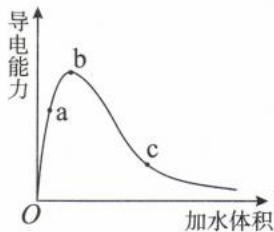

解析:图像分析:(1)O点:冰醋酸是纯净物也是共价化合物,没有水的时候 $CH_{3}COOH$ 无法电离出 $H^{+}$ ,体系中的 $c(\mathrm{H}^{+})$ 离子浓度几乎为零,导电能力也几乎为零。

(2)O 到 b 点: 当加入少量水后, 冰醋酸溶解, 并在水的作用下电离出 $H^{+}$ 和 $CH_{3}COO^{-}$ 。O 到 b 的过程中, 加入的水促进了醋酸分子的电离, 也导致溶液的体积扩大, 但以促进 $CH_{3}COOH$ 电离为主, 所以该过程中 $c(H^{+})$ 增大, 溶液导电性增强, 且 b 点 $c(H^{+})$ 最大。

(3)b到c点:当加入的水足够多了之后,水仍然促进醋酸的电离使 $n(\mathrm{H}^{+})$ 增大。但在此过程中,水对溶液体积的贡献大于水对醋酸电离的促进作用,因此b到c过程 $c(\mathrm{H}^{+})$ 减小,溶液导电性减弱。

(4) 当接近无限稀释时, 就将醋酸溶液视之为水处理。

A. 根据电荷守恒可知: $N(\mathrm{H}^{+}) = N(\mathrm{OH}^{-}) + N(\mathrm{CH}_{3} \mathrm{COO}^{-})$ 。随着水的加入, $\mathrm{CH}_{3} \mathrm{COOH}$ 的电离程度越来越大, $N(\mathrm{H}^{+})$ 越来越多, 即体系中的离子总数: $\mathrm{c} > \mathrm{b} > \mathrm{a}$ , A 选项错误。

B. $CH_{3}COOH$ 电离的 $H^{+}$ 会抑制水的电离，溶液中 $c(H^{+})$ 越大，水电离程度就越小。b 点水的电离程度小于 c 点，B 选项错误。

C. 体系中导电能力越强, 则 $c(\mathrm{H}^{+})$ 越大, $\mathrm{pH}$ 越小。因此三点的 $\mathrm{pH}$ 由大到小的顺序为: $\mathrm{c} > \mathrm{a} > \mathrm{b}, \mathrm{C}$ 选项正确。

D. $K_{a}$ 只受温度的影响, 加入碳酸钠固体 $K_{a}$ 不变, D 选项错误。

答案:C

【例 2】常温下, 浓度均为 $c_{0}$ 、体积均为 $V_{0}$ 的 MOH 和 ROH 两种碱液分别加水稀释至体积为 V, 溶液 pH 随 $\lg \frac{V}{V_{0}}$ 的变化如图所示。

下列叙述错误的是 ( )

A. ROH 是强碱, MOH 是弱碱

B. 电离常数 $K_{\mathrm{b}}(\mathrm{MOH}) \approx 1.1 \times 10^{-3}$ C. 稀释一定倍数后两条线会相交

D. $\lg \frac{V}{V_{0}}$ 相同时, 将两种溶液同时升高相同的温度, 则 $\frac{c(R^{+})}{c(M^{+})}$ 增大

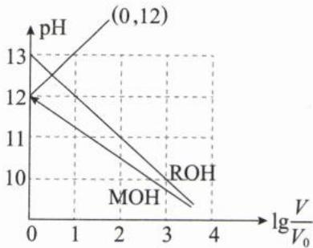

解析: $\lg \frac{V}{V_0} = 1$ , 则 $\frac{V}{V_0} = 10^1$ , 表示加水稀释 10 倍; $\lg \frac{V}{V_0} = 2$ , 则 $\frac{V}{V_0} = 10^2$ , 表示加水稀释 $10^2$ 倍, 依次类推。

A. ROH 每稀释 10 倍, 其 pH 减少 1, 即 $c(\mathrm{OH}^-)$ 变为 $\frac{1}{10}$ 倍, 所以 ROH 是强碱, 则 MOH 是弱碱; 且 ROH 初始的 pH=13, 其 $c_0 = 0.1 \mathrm{~mol} / \mathrm{L}$ , A 选项正确。

B. 未加水稀释时 (即 $\lg \frac{V}{V_0} = 0$ ), MOH 的 pH=12, 即 $c(\mathrm{OH}^-) = 10^{-2} \mathrm{~mol} / \mathrm{L}$ , 根据三段式可知, $c(\mathrm{M}^+) = c(\mathrm{OH}^-) = 10^{-2} \mathrm{~mol} / \mathrm{L}$ , $c(\mathrm{MOH}) = 0.1 - 10^{-2} \mathrm{~mol} / \mathrm{L}$ 。 $K_{\mathrm{b}}(\mathrm{MOH}) = \frac{c(\mathrm{M}^+) \cdot c(\mathrm{OH}^-)}{c(\mathrm{MOH})} = \frac{10^{-2} \times 10^{-2}}{0.1 - 0.01} \approx 1.1 \times 10^{-3}$ , B 选项正确。

C. 强碱稀释时其 pH 变化幅度大于弱碱, 二者的 pH 在稀释过程中越来越接近, 最终会相交 (该选项也可以用极值法解决, 无限稀释二者的 pH 都接近 7), C 选项正确。

D. 强碱 ROH 完全电离, 不存在电离平衡; 弱碱 MOH 部分电离, 存在电离平衡, 升高温度可促进 MOH 的电离。将两种溶液同时升高相同的温度, $c(\mathrm{R}^+)$ 不变, $c(\mathrm{M}^+)$ 增大, $\frac{c(\mathrm{R}^+)}{c(\mathrm{M}^+)}$ 减小, D 选项错误。

答案:D

类型Ⅱ:水的电离平衡曲线图

内容提要

<table><tr><td>图像</td><td>研究对象</td><td>意义</td></tr><tr><td rowspan="3"></td><td>A—B直线</td><td>1.中性线,线上每个点均表示中性,并将平面分成酸面[右侧区域, $c(H^{+}) > c(OH^{-})$ ]、碱面[左侧区域 $c(OH^{-}) > c(H^{+})$ ]。2.由A点求 $K_{w}(25°C) = 10^{-14}$ ,由B点求 $K_{w}(100°C) = 10^{-12}$ 。</td></tr><tr><td>D—E曲线</td><td>等温线,线上每个点的温度一样,则 $K_{w}$ 一样。</td></tr><tr><td>B所在曲线</td><td>该曲线与D—E曲线的温度不同,该曲线上 $K_{w}$ 更大,对应的温度更高。</td></tr></table>

注: 同一曲线上的变化是由酸碱性变化引起的; 不同曲线上的变化是温度引起的。

10 15 20
V(NaOH)/mL

【例 3】如图表示水中 $c(\mathrm{H}^{+})$ 和 $c(\mathrm{OH}^{-})$ 的关系, 下列判断正确的是( )

A. A、B 两点 $K_{\mathrm{w}}:K_{\mathrm{w}}(\mathrm{A})>K_{\mathrm{w}}(\mathrm{B})$ B. E 点 $Al^{3+}$ 、 $Cl^{-}$ 、 $NO_{3}^{-}$ 、 $Cr_{2}O_{7}^{2-}$ 能大量共存

C. 往 C 点溶液中加入一定量的 NaOH 固体, C 点可能会移向 E 点

D. 往 A 点加入一定量的盐, A 点可能往 E 点或 D 点移动

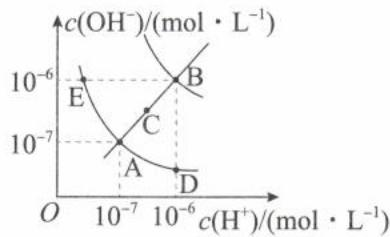

解析：A. $K_{\mathrm{w}}(\mathrm{A}) = c(\mathrm{H}^{+})\cdot c(\mathrm{OH}^{-}) = 10^{-7}\times 10^{-7} = 10^{-14};K_{\mathrm{w}}(\mathrm{B}) = c(\mathrm{H}^{+})\cdot c(\mathrm{OH}^{-}) = 10^{-6}\times 10^{-6} =$ $10^{-12},K_{\mathrm{w}}(\mathrm{A}) <   K_{\mathrm{w}}(\mathrm{B}),\mathrm{A}$ 选项错误。（由于水的电离为吸热反应，温度升高， $K_{\mathrm{w}}$ 增大，因此 $K_{\mathrm{w}}:\mathrm{A} <   \mathrm{B}$ ，则温度： $\mathrm{A} <   \mathrm{B}_{\circ})$

B. A—C—B 线为中性线，中性线右侧 $c(\mathrm{H}^{+}) > c(\mathrm{OH}^{-})$ ，溶液为酸性；左侧 $c(\mathrm{OH}^{-}) > c(\mathrm{H}^{+})$ ，溶液为碱性。E 点溶液呈碱性， $Al^{3+}$ 、 $Cr_{2}O_{7}^{2-}$ 在碱性溶液中不能大量共存， $Al^{3+}$ 会转化成 $\mathrm{Al(OH)}_{3}$ 沉淀， $Cr_{2}O_{7}^{2-}$ 会转化成 $CrO_{4}^{2-}$ ，B 选项错误。

D. A 点为中性点, 往 A 点溶液中加入强碱弱酸盐, 溶液由中性变为碱性, A 点可以往 E 点移动; 往 A 点溶液加强酸弱碱盐, 溶液由中性变为酸性, 可以往 D 点移动, D 选项正确。

答案:D

类型Ⅲ: 中和滴定的 pH 图像

## 内容提要

## 一、中和滴定的 pH—V 图像

例: 常温下, 用 0.1000 mol/L NaOH 溶液滴定 20.00 mL 0.1000 mol/L CH₃COOH 溶液, 溶液 pH 与加入 NaOH 溶液体积的关系如图所示:

点②：滴定一半点， $V(\mathrm{NaOH})=10.00\ \mathrm{mL}$ 1. 溶质是等物质的量的 $\mathrm{CH}_{3}\mathrm{COOH}$ 和 $\mathrm{CH}_{3}\mathrm{COONa}$ (1) 电荷守恒： $c(\mathrm{Na}^{+}) + c(\mathrm{H}^{+}) = c(\mathrm{CH}_{3}\mathrm{COO}^{-}) + c(\mathrm{OH}^{-})$ (2) 元素守恒： $2c(\mathrm{Na}^{+}) = c(\mathrm{CH}_{3}\mathrm{COO}^{-}) + c(\mathrm{CH}_{3}\mathrm{COOH})$ (3) 质子守恒： $c(\mathrm{CH}_{3}\mathrm{COOH}) + 2c(\mathrm{H}^{+}) = c(\mathrm{CH}_{3}\mathrm{COO}^{-}) + 2c(\mathrm{OH}^{-})$ (4) 粒子浓度大小： $c(\mathrm{CH}_{3}\mathrm{COO}^{-}) > c(\mathrm{Na}^{+}) > c(\mathrm{CH}_{3}\mathrm{COOH}) > c(\mathrm{H}^{+}) > c(\mathrm{OH}^{-})$ 2. pH<7, $CH_{3}COOH$ 电离程度 ( $K_{a}$ ) 大于 $CH_{3}COO^{-}$ 水解程度 $K_{h}=\frac{K_{w}}{K_{s}}$

点①：滴定起点， $V(\mathrm{NaOH})=0.00\ \mathrm{mL}$

1. 溶质是 $CH_{3}COOH$ :

(1)电荷守恒： $c(\mathrm{H}^{+})=c(\mathrm{CH}_{3}\mathrm{COO}^{-})+c(\mathrm{OH}^{-})$

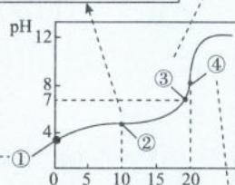

(2)元素守恒： $c(\mathrm{CH}_{3}\mathrm{COOH})+c(\mathrm{CH}_{3}\mathrm{COO}^{-})=0.1\ \mathrm{mol/L}$

2. 可由该点 pH 求 $K_{a}(CH_{3}COOH)$ ; 也可以由

$K_{a}(CH_{3}COOH)$ 求该点 pH。

3. 等c的HA、HB，可由起点的pH，判断HA、HB酸性强弱。

点③：中性点， $c(\mathrm{H}^{+})=c(\mathrm{OH}^{-})$ ，常温时pH=7
1. 溶质是 $CH_{3}COONa$ 和极少 $CH_{3}COOH$ (1)电荷守恒： $c(\mathrm{Na}^{+})+c(\mathrm{H}^{+})=c(\mathrm{CH}_{3}\mathrm{COO}^{-})+c(\mathrm{OH}^{-})$ 由于 $c(\mathrm{H}^{+})=c(\mathrm{OH}^{-})$ ，因此 $c(\mathrm{Na}^{+})=c(\mathrm{CH}_{3}\mathrm{COO}^{-})$ (2)离子浓度大小： $c(\mathrm{Na}^{+})=c(\mathrm{CH}_{3}\mathrm{COO}^{-})>$ $c(\mathrm{H}^{+})=c(\mathrm{OH}^{-})$ 2.该点已经接近滴定终点

过量1倍， $V(\mathrm{NaOH})=40.00\ \mathrm{mL}$

溶质是等物质的量的 $CH_{3}COONa$ 和NaOH

(1)电荷守恒： $c(\mathrm{Na}^{+}) + c(\mathrm{H}^{+}) = c(\mathrm{CH}_{3}\mathrm{COO}^{-}) +$

(2)元素守恒： $c(\mathrm{Na}^{+})=2[c(\mathrm{CH}_{3}\mathrm{COO}^{-})+$

$c(\mathrm{CH}_{3}\mathrm{COOH})$

(3)离子浓度大小： $c(\mathrm{Na}^{+})>c(\mathrm{OH}^{-})>$

点④：恰好反应点， $V(\mathrm{NaOH})=20.00\ \mathrm{mL}$

溶质是 $CH_{3}COONa$ （强碱弱酸正盐，溶液呈碱性，pH>7）

(1)电荷守恒： $c(\mathrm{Na}^{+}) + c(\mathrm{H}^{+}) = c(\mathrm{CH}_{3}\mathrm{COO}^{-}) + c(\mathrm{OH}^{-})$

(2)元素守恒： $c(\mathrm{Na}^{+})=c(\mathrm{CH}_{3}\mathrm{COO}^{-})+c(\mathrm{CH}_{3}\mathrm{COOH})$

(3)质子守恒： $c(\mathrm{H}^{+})+c(\mathrm{CH}_{3}\mathrm{COOH})=c(\mathrm{OH}^{-})$

(4)离子浓度大小： $c(\mathrm{Na}^{+}) > c(\mathrm{CH}_{3}\mathrm{COO}^{-}) > c(\mathrm{OH}^{-}) > c(\mathrm{H}^{+})$

注:分析此类图的关键就是找出每个点的真实组成。

## 二、中和滴定时， $c_{\text{水}}(\mathrm{H}^{+})$ 、 $c_{\text{水}}(\mathrm{OH}^{-})$ 与酸碱体积的关系图

例: 常温下, 向 10 mL 1 mol/L 的 HCOOH 溶液中不断滴加 1 mol/L 的 NaOH 溶液, 并一直保持常温, 所加碱的体积与 $-\lg c_{\text{水}}(\mathrm{H}^{+})$ 的关系如图所示

1. 起点: 溶质 HCOOH 抑制水的电离, 此时 $c_{\text{水}}(\mathrm{H}^{+})$ 与隐性离子 $c(\mathrm{OH}^{-})$ 相同, 均为 $1 \times 10^{-11} \, mol/L$ , 则该溶液的 $c(\mathrm{H}^{+}) = 0.001 \, \mathrm{mol/L}$ ,

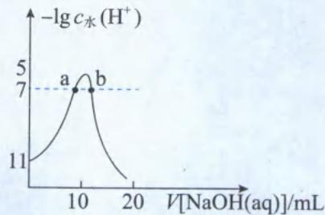

$$
K _ {\mathrm{a}} (\mathrm{HCOOH}) = \frac {c (\mathrm{HCOO} ^ {-}) \cdot c (\mathrm{H} ^ {+})}{c (\mathrm{HCOOH})} = \frac {0 . 0 0 1 \times 0 . 0 0 1}{1 - 0 . 0 0 1} \approx 1 0 ^ {- 6}
$$

2. a 点: 溶质是 HCOONa 和少量 HCOOH(HCOOH 尚未完全中和), HCOOH 电离出 $H^{+}$ 与 $HCOO^{-}$ 水解出 $OH^{-}$ 程度相同, 溶液呈中性, $c(\mathrm{H}^{+}) = c(\mathrm{OH}^{-})$ , $c(\mathrm{Na}^{+}) = c(\mathrm{HCOO}^{-})$ , 此时 $V(\mathrm{NaOH})$ 略小于 10 mL。

3. 最高点: HCOOH 与 NaOH 恰好完全反应, $V(\mathrm{NaOH}) = 10 \mathrm{~mL}$ , 溶质 HCOONa 促进水的电离, 且无多余的 HCOOH 或 NaOH 抑制水的电离, 此时水的电离程度最大, $c_{\text {水}}(\mathrm{H}^{+})$ 最大。

4. b 点: 溶质是 HCOONa 和少量 NaOH, 此时 $HCOO^{-}$ 对水电离的促进作用等于 $OH^{-}$ 对水电离的抑制作用, 需注意 $c_{\text{水}}(\mathrm{H}^{+}) = 10^{-7} \, \mathrm{mol/L}$ , 但溶液中 $c(\mathrm{H}^{+}) < 10^{-7} \, \mathrm{mol/L}$ (有 $HCOO^{-}$ 结合水电离的 $H^{+}$ 变为 HCOOH), 溶液呈碱性。

【例 4】(2023·湖南卷)常温下,用浓度为 0.020 0 mol/L 的 NaOH 标准溶液滴定浓度均为 0.020 0 mol/L 的 HCl 和 CH₃COOH 的混合溶液,滴定过程中溶液的 pH 随 $\eta\left(\eta=\frac{V(\text{标准溶液})}{V(\text{待测溶液})}\right)$ 的变化曲线如图所示。下列说法错误的是( )

A. $K_{a}(CH_{3}COOH)$ 约为 $10^{-4.76}$ B. 点 a: $c(\mathrm{Na}^{+})=c(\mathrm{Cl}^{-})=c(\mathrm{CH}_{3}\mathrm{COO}^{-})+c(\mathrm{CH}_{3}\mathrm{COOH})$ C. 点 b: $c(\mathrm{CH}_{3}\mathrm{COOH})<c(\mathrm{CH}_{3}\mathrm{COO}^{-})$ D. 水的电离程度: a<b<c<d

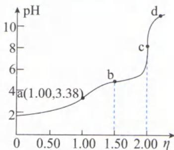

解析:根据“谁强谁优先”原则,往 HCl 和 $CH_{3}COOH$ 体系中加入 NaOH, 则 HCl 先反应。由于 HCl、 $CH_{3}COOH$ 、NaOH 均为一元酸或碱, 所以均按计量数 1:1 反应。当 $\eta=1$ , 即 $V(\mathrm{NaOH})=V(\text{混合酸})$ , 此时 HCl 恰好完全反应, 反应后溶质组成为等浓度的 NaCl 与 $CH_{3}COOH$ 。

$$
\eta = 1. 5
$$

$$
\mathrm{CH} _ {3} \mathrm{COOH}
$$

$$
\mathrm{CH} _ {3} \mathrm{COONa}
$$

$$
\mathrm{NaCl}, \mathrm{CH} _ {3} \mathrm{COOH}
$$

当 $\eta=2$ 时， $CH_{3}COOH$ 恰好完全反应，反应后溶质组成为等浓度的 NaCl 和 $CH_{3}COONa$ ，且浓度比为 1:1。
A. $\eta=1$ 时，是等体积的酸、碱两溶液混合，该溶液的 $c(\mathrm{CH}_{3}\mathrm{COOH})=\frac{1}{2}\times0.020\;\mathrm{mol/L}=0.010\;\mathrm{mol/L}$ （一定要注意溶液混合时体积变化所造成的浓度变化）。因此 $\eta=1$ ，该溶液 pH=3.38 $[c(H^{+})=10^{-3.38}\;\mathrm{mol/L}]$ ，溶液的溶质组成是 0.0100 mol/L NaCl 和 0.0100 mol/L $CH_{3}COOH$ 的混合物，列三段式计算 $K_{a}(CH_{3}COOH)$ ：

$$
\begin{array}{r l r l r}&\mathrm {CH_ {3} COOH}&\rightleftharpoons&\mathrm {CH_ {3} COO^ {-}} +&\mathrm {H^ {+}}\\c _ {0} / (\mathrm{mol/L})&0. 0 1 0 0&0&0\\\Delta c / (\mathrm{mol/L})&1 \times 1 0 ^ {- 3. 3 8}&1 \times 1 0 ^ {- 3. 3 8}&1 \times 1 0 ^ {- 3. 3 8}\\c _ {\text {平}} / (\mathrm{mol/L})&0. 0 1 0 0 - 1 \times 1 0 ^ {- 3. 3 8}&1 \times 1 0 ^ {- 3. 3 8}&1 \times 1 0 ^ {- 3. 3 8}\end{array}
$$

$K_{a}=\frac{c(\mathrm{CH}_{3}\mathrm{COO}^{-})\cdot c(\mathrm{H}^{+})}{c(\mathrm{CH}_{3}\mathrm{COOH})}=\frac{(1\times10^{-3.38})\times(1\times10^{-3.38})}{0.0100-1\times10^{-3.38}}\approx1\times10^{-4.76}$ ，A选项正确。 $(K_{a}(\mathrm{CH}_{3}\mathrm{COOH})$ 的数量级为 $10^{-5}$ 。)

B.a点的组成是0.0100mol/L NaCl和0.0100mol/L CH₃COOH，根据元素守恒可知： $c(\mathrm{Na}^{+})=c(\mathrm{Cl}^{-})=c(\mathrm{CH}_{3}\mathrm{COO}^{-})+c(\mathrm{CH}_{3}\mathrm{COOH})=0.0100\mathrm{~mol/L}$ ，B选项正确。

C.b点CH₃COOH和CH₃COONa浓度相等且溶液呈酸性，可知CH₃COOH的电离程度大于CH₃COO⁻的水解程度，因此点b: $c(\mathrm{CH}_{3}\mathrm{COOH})<c(\mathrm{CH}_{3}\mathrm{COO}^{-})$ ，C选项正确。

D.a、b两点均含CH₃COOH，其电离出的H⁺会抑制水的电离；c点是CH₃COOH恰好完全反应点，溶质CH₃COONa会发生水解而促进水的电离；d点含过量的NaOH，其电离出的OH⁻会抑制水的电离。因此c点水的电离程度最大，D选项错误。

答案:D

【反思】考试中先解决定性选项 B、C、D，可以避免处理 A 选项时的烦琐计算。溶液混合时，求溶质的浓度还要考虑溶液体积的变化，计算较为复杂，因此先了解各点溶质的组成比例即可，除非选项要求计算数值（如本题选项 A），才需要将各溶质实际的浓度计算出来。

【例 5】(2024·广西卷)常温下,用 $0.1000 \, mol \cdot L^{-1}$ NaOH 溶液分别滴定下列两种混合溶液:

I. 20.00 mL 浓度均为 0.100 0 mol·L $^{-1}$ HCl 和 CH $_{3}$ COOH 溶液
Ⅱ. 20.00 mL 浓度均为 0.100 0 mol·L $^{-1}$ HCl 和 NH $_{4}$ Cl 溶液
两种混合溶液的滴定曲线如图。已知 $K_{a}(CH_{3}COOH)=K_{b}(NH_{3}\cdot H_{2}O)=1.8\times10^{-5}$ ，下列说法正确的是（）
A. I 对应的滴定曲线为 N 线
B. a 点水电离出的 $c(\mathrm{OH}^{-})$ 数量级为 $10^{-8}$

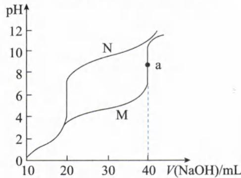

$$
V (\mathrm{NaOH}) = 3 0. 0 0
$$

$$
c \left(\mathrm{Cl} ^ {-}\right) > c \left(\mathrm{NH} _ {3} \cdot \mathrm{H} _ {2} \mathrm{O}\right) > c \left(\mathrm{NH} _ {4} ^ {+}\right)
$$

D. pH=7 时，Ⅰ中 $c(\mathrm{CH}_{3}\mathrm{COOH})$ 、 $c(\mathrm{CH}_{3}\mathrm{COO}^{-})$ 之和小于Ⅱ中 $c(\mathrm{NH}_{3}\cdot\mathrm{H}_{2}\mathrm{O})$ 、 $c(\mathrm{NH}_{4}^{+})$ 之和

解析：当图像中的曲线不只一条时，首先要判断每条曲线代表的研究对象。

方法一:以加入 30 mL NaOH 后两条曲线的 pH 相对大小不同进行区别。根据“谁强谁优先”原则可知,往 HCl 和 CH₃COOH 的混合溶液中滴加 NaOH 时,HCl 先反应,CH₃COOH 后反应。滴加 30 mL NaOH 后,I 体系的组成是:2 份 NaCl、1 份 CH₃COOH、1 份 CH₃COONa。其中 NaCl 显中性、CH₃COOH 电离显酸性 [Kₐ(CH₃COOH)=1.8×10⁻⁵]、CH₃COONa 水解显碱性(Kₕ=K\_w/K\_a=1×10⁻¹⁴/1.8×10⁻⁵≈5×10⁻¹⁰)。由于 Kₐ>K\_h,最终溶液呈酸性,曲线 M 在加 30 mL NaOH 后溶液呈酸性,因此曲线 M 代表溶液 I。

方法二：以加入 40 mL NaOH 后两条曲线的 pH 相对大小不同进行区别。体系 I、Ⅱ分别加入 40 mL NaOH 后，体系 I、Ⅱ的组成分别为 $NaCl + CH_{3}COONa$ 、 $NaCl + NH_{3} \cdot H_{2}O$ 。NaCl 呈中性、 $CH_{3}COONa$ 水解后呈碱性 ( $K_{h} = \frac{K_{w}}{K_{a}} = \frac{1 \times 10^{-14}}{1.8 \times 10^{-5}} \approx 5 \times 10^{-10}$ )、 $NH_{3} \cdot H_{2}O$ 电离后也呈碱性 ( $K_{b}(NH_{3} \cdot H_{2}O) = 1.8 \times 10^{-5}$ )；由于 $K_{b} > K_{h}$ ，则等浓度的 $CH_{3}COONa$ 、 $NH_{3} \cdot H_{2}O$ ，后者的碱性更强，pH 更大。图像中曲线 N 对应加入 40 mL NaOH 后 pH 更大，则曲线 N 表示溶液Ⅱ。

A. 根据上述分析可知，I 对应的滴定曲线为 M 线，A 选项错误。

B. a 点对应溶液的组成是 NaCl 和 $CH_{3}COONa$ 。NaCl 对水的电离无影响，而 $CH_{3}COONa$ 是强碱弱酸盐要水解，从而对水的电离起促进作用，则 a 点水的电离程度应大于纯净水，因此常温下，a 点体系中水电离出的

$c(\mathrm{OH}^{-})$ 数量级 $>10^{-7}$ ，B选项错误。

C. $V(\mathrm{NaOH})=30.00\ \mathrm{mL}$ 时，反应后体系Ⅱ中的溶质包括2份 NaCl、1份 $NH_{3}\cdot H_{2}O$ 、1份 $NH_{4}Cl$ ，即体系中3份 $Cl^{-}$ 、1份 $NH_{3}\cdot H_{2}O$ 、1份 $NH_{4}^{+}$ 。 $NH_{3}\cdot H_{2}O$ 会电离 $\left[K_{\mathrm{b}}(\mathrm{NH}_{3}\cdot\mathrm{H}_{2}\mathrm{O})=1.8\times10^{-5}\right]$ ，而 $NH_{4}^{+}$ 会水解 $(K_{\mathrm{h}}=\frac{K_{\mathrm{w}}}{K_{\mathrm{b}}}=\frac{1\times10^{-14}}{1.8\times10^{-5}}\approx5\times10^{-10})$ ，根据数据可知 $NH_{3}\cdot H_{2}O$ 的电离程度更大，则 $c(\mathrm{NH}_{4}^{+})>c(\mathrm{NH}_{3}\cdot\mathrm{H}_{2}\mathrm{O})$ ，即 $c(\mathrm{Cl}^{-})>c(\mathrm{NH}_{4}^{+})>c(\mathrm{NH}_{3}\cdot\mathrm{H}_{2}\mathrm{O})$ ，C选项错误。

D. 在图像上做一条 $\mathrm{pH} = 7$ 辅助线，如图所示。由图像可知，N曲线（体系Ⅱ）达到 $\mathrm{pH} = 7$ 时，所加NaOH的体积小于M曲线（体系I）。因此体系Ⅱ的溶液体积更小，浓度更大。则体系Ⅱ中 $c(\mathrm{NH}_3\cdot \mathrm{H}_2\mathrm{O})$ 、 $c(\mathrm{NH}_4^+)$ 之和（氮的元素守恒）大于I中 $c(\mathrm{CH}_3\mathrm{COOH})$ 、 $c(\mathrm{CH}_3\mathrm{COO}^-)$ 之和（碳的元素守恒），D选项正确。

答案:D

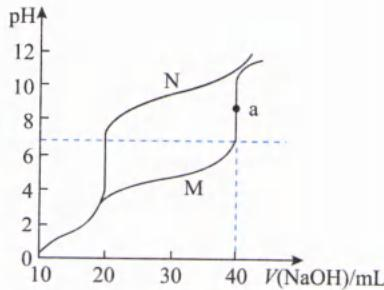

【反思】当图像中有多条曲线时,一定要先判断每条曲线的研究对象。

类型Ⅳ: 分布系数—pH 图像

## 内容提要

## 一、一元弱酸分布系数—pH 图像(以 HClO 为例)

1. HClO 体系中的研究对象: HClO、ClO $^{-}$ 。

2. 分布系数的定义: 溶液中 HClO(或 ClO $^{-}$ ) 占含 Cl 微粒的个数或物质的量或浓度百分比。

3. 表示: $\delta[\delta(X)=\frac{c(X)}{c(HClO)+c(ClO^{-})}$ , X 为 HClO 或 $ClO^{-}$ ]。

4. 规律: 含 Cl 微粒的分布系数之和为 1, HClO 与 ClO $^{-}$ 的分布系数曲线存在此消彼长的关系。

5. 图像解读：

(1)先根据电离平衡的移动确定各曲线的研究对象：HClO存在电离平衡： $HClO \rightleftharpoons H^{+} + ClO^{-}$ ，往次氯酸体系中加入强酸，增大 $c(H^{+})$ ，即pH减小，电离平衡逆向移动，则 $\delta(HClO)$ 增大， $\delta(ClO^{-})$ 减小，因此曲线a、b分别代表 $HClO, ClO^{-}$ 。

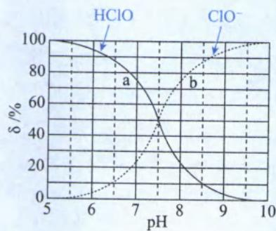

(2) 若需要比较某 pH 的粒子浓度大小, 只需要做一条垂直于横坐标并过该 pH 值的辅助线, 通过观察纵坐标的大小, 即可比较各粒子的浓度。

(3)由两条曲线交点的 $\mathrm{pH}$ 可以计算 $K_{\mathrm{a}}: K_{\mathrm{a}} = \frac{c(\mathrm{H}^{+}) \times c(\mathrm{ClO}^{-})}{c(\mathrm{HClO})}$ , 两条曲线的交点处 $c(\mathrm{HClO}) = c(\mathrm{ClO}^{-})$ , 所以 $K_{\mathrm{a}} = c(\mathrm{H}^{+}), \mathrm{pH} = -\lg c(\mathrm{H}^{+}), K_{\mathrm{a}} = c(\mathrm{H}^{+}) = 10^{-\mathrm{pH}}$ 。

## 二、二元弱酸分布系数—pH 图像(以二元弱酸 $H_{2}X$ 为例)

1. $H_{2}X$ 体系中的研究对象: $H_{2}X$ 、 $HX^{-}$ 、 $X^{2-}$ 。

2. 分布系数的定义: 溶液中 $H_{2}X$ (或 $HX^{-}$ 或 $X^{2-}$ ) 占含 X 微粒的个数或物质的量或浓度百分比。

3. 表示: $\delta[\delta(X^{2-})=\frac{c(X^{2-})}{c(H_{2}X)+c(HX^{-})+c(X^{2-})}]$ 。

4. 规律: 含 X 微粒的分布系数之和为 1, 不会出现 $H_{2}X$ 、 $X^{2-}$ 大量共存的 pH, 因为二者要发生反应: $H_{2}X + X^{2-} = 2HX^{-}$ 。

## 5. 图像解读：

(1)先根据电离平衡的移动确定各曲线的研究对象: $H_{2}X$ 存在电离平衡: $H_{2}X\rightleftharpoons H^{+}+HX^{-},HX^{-}\rightleftharpoons H^{+}+X^{2-}$ ，体系中外加的酸多，即 $c(H^{+})$ 很大，pH很小时，体系中 $H_{2}X$ 最多，则曲线 $\delta_{0}$ 为 $H_{2}X$ ；体系中外加的碱多，即 $c(H^{+})$ 很小，pH很大时，体系中 $X^{2-}$ 最多，则曲线 $\delta_{2}$ 为 $X^{2-}$ ；酸式酸根 $(HX^{-})$ 的分布系数曲线一般随pH的增大呈现出“先增大，再减小”的趋势，则曲线 $\delta_{1}$ 为 $HX^{-}$ 。

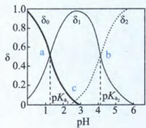

注:二元酸的体系中,不一定存在三条分布系数曲线,若二元酸的第一步完全电离,则图像中只有两条曲线 $HX^{-}$ 、 $X^{2-}$ ,不存在 $H_{2}X$ 的曲线。

(2) 比较某 pH 时的粒子浓度大小: 只需要做一条垂直于横坐标并过该 pH 值的辅助线, 通过观察纵坐标的大小, 即可比较各粒子的浓度。

(3)两条曲线交点的 pH 值可以计算 $K_{a}$ :

①a 点 $H_{2}X$ 、 $HX^{-}$ 百分含量相同， $K_{a_{1}}=\frac{c(H^{+})\times c(HX^{-})}{c(H_{2}X)}=c(H^{+})=10^{-pH_{a}}$ 。

②b点 $\mathrm{HX}^{-},\mathrm{X}^{2-}$ 百分含量相同， $K_{\mathrm{a}_{2}} = \frac{c(\mathrm{H}^{+})\times c(\mathrm{X}^{2-})}{c(\mathrm{HX}^{-})} = c(\mathrm{H}^{+}) = 10^{-\mathrm{pH}_{\mathrm{b}}}$

③c 点 $H_{2}X$ 、 $X^{2-}$ 百分含量相同， $K_{a_{1}} \times K_{a_{2}} = \frac{c(H^{+}) \times c(X^{2-})}{c(HX^{-})} \times \frac{c(H^{+}) \times c(HX^{-})}{c(H_{2}X)} = c^{2}(H^{+}) = 10^{-2pH_{c}}$ 。

(4)通过观察曲线 $HX^{-}$ 的最高点对应的 pH, 可以判断的 $HX^{-}$ 电离和 $HX^{-}$ 水解的相对强弱。

①若 $HX^{-}$ 分布系数最高点对应的 pH<7，则 $HX^{-}$ 的电离程度大于水解程度。

②若 $HX^{-}$ 分布系数最高点对应的 pH>7，则 $HX^{-}$ 的电离程度小于水解程度。

如该图中 $HX^{-}$ 分布系数最高点对应的 $pH \approx 3$ ，则 $HX^{-}$ 的电离程度大于水解程度。

## 三、三元弱酸分布系数—pH 图像

三元弱酸的分布系数曲线读图方式和二元弱酸的读图方式相似,关键是理解每条线的研究对象,以及两条线交点的意义,并利用交点计算 $K_{a}$ ,三元弱酸的分布曲线一般有4条曲线。

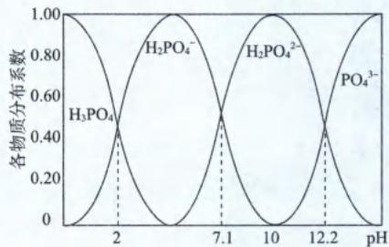

注:除了弱酸有分布系数曲线外,弱碱也有分布系数曲线,其读图方式和上述方法相似,但要看清楚横坐标到底是pH还是pOH。常温下,若为一元弱碱的分布系数—pH曲线,且交点的pH为a(即 $pOH=14-a$ ), $K_{b}=c(OH^{-})=10^{-pOH}=10^{a-14}$ ;若为一元弱碱的分布系数—pOH曲线,且交点的pOH为a,则 $K_{b}=c(OH^{-})=10^{-a}$ 。

【例 6】(2024·新课标卷)常温下 $CH_{2}ClCOOH$ 和 $CHCl_{2}COOH$ 的两种溶液中, 分布系数 $\delta$ 与 pH 的变化关系如图所示。[比如: $\delta(\mathrm{CH}_{2}\mathrm{ClCOO}^{-})=\frac{c(\mathrm{CH}_{2}\mathrm{ClCOO}^{-})}{c(\mathrm{CH}_{2}\mathrm{ClCOO}^{-})+c(\mathrm{CH}_{2}\mathrm{ClCOOH})}$ ], 下

列叙述正确的是( )

A. 曲线 M 表示 $\delta(\mathrm{CHCl}_{2}\mathrm{COO}^{-})\sim\mathrm{pH}$ 的变化关系

B. 若酸的初始浓度为 0.10 mol/L，则 a 点对应的溶液中有 $c(\mathrm{H}^{+})=c(\mathrm{CHCl}_{2}\mathrm{COO}^{-})+c(\mathrm{OH}^{-})$ C. $CH_{2}ClCOOH$ 的电离常数 $K_{a}=10^{-1.3}$ D. pH=2.08 时， $\frac{\text{电离度 } \alpha(\mathrm{CH}_{2}\mathrm{ClCOOH})}{\text{电离度 } \alpha(\mathrm{CHCl}_{2}\mathrm{COOH})}=\frac{0.15}{0.85}$

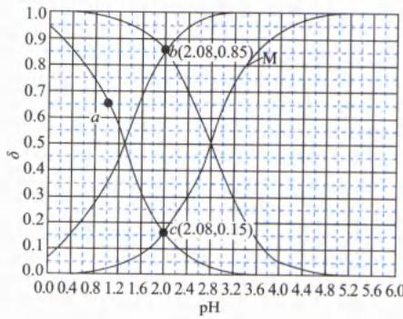

解析:根据电离平衡的影响因素可知,增大 $H^{+}$ 浓度,酸的电离平衡逆向移动,即 pH 越小,弱酸分子分布系数越大、弱酸根的分布系数越小。因此 W、Q 表示酸分子,M、N 表示酸根。在同一种酸的体系中,根据元素守恒可知,酸分子和其酸根的分布系数之和等于 1,从交点 $\delta=0.5$ 判断,W、N 表示一种酸分子及酸根,M、Q 表示另一种酸分子及酸根。根据 $CH_{2}ClCOOH$ 的电离常数表达式 $K_{a}(CH_{2}ClCOOH)=\frac{c(CH_{2}ClCOO^{-})\times c(H^{+})}{c(CH_{2}ClCOOH)}$ 可知,分布系数 $\delta=0.5$ 的交点即酸分子、酸根相等的点,对应的 pH 可用于计算 $K_{a}$ 值。W、N 交点的 pH 约为 1.3,即对应酸的 $K_{a}=10^{-1.3}$ ; M、Q 交点的 pH 为 2.8,即对应酸的 $K_{a}=10^{-2.8}$ 。Cl 的电负性较大,是吸电子基团,α-C 上的 Cl 原子越多,

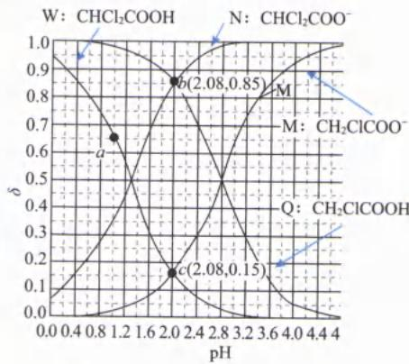

对应酸的酸性越强、 $K_{a}$ 越大。因此酸性： $CHCl_{2}COOH > CH_{2}ClCOOH$ ，即 $K_{a}(CHCl_{2}COOH) = 10^{-1.3}$ 、 $K_{a}(CH_{2}ClCOO) = 10^{-2.8}$ ，所以 W、N、M、Q 分别表示 $CHCl_{2}COOH, CHCl_{2}COO^{-}, CH_{2}ClCOO^{-}, CH_{2}ClCOOH$ 。A. 根据以上分析可知，M 曲线表示 $\delta(CH_{2}ClCOO^{-}) \sim pH$ 的变化关系，A 选项错误。

B. a 点所在的曲线是 $\delta(\mathrm{CHCl}_{2}\mathrm{COOH})\sim\mathrm{pH}$ 的关系曲线，由 $K_{a}(\mathrm{CHCl}_{2}\mathrm{COOH})=10^{-1.3}$ 可知 $CHCl_{2}COOH$ 为弱酸。a 点的 pH 为 1，但 0.10 mol/L 的 $CHCl_{2}COOH pH>1(CHCl_{2}COOH$ 为弱酸，不完全电离），可知 a 点有加入其他酸调 pH，因此电荷守恒表达式： $c(\mathrm{H}^{+})=c(\mathrm{CHCl}_{2}\mathrm{COO}^{-})+c(\mathrm{OH}^{-})+c(\text { 其他酸的酸根 } )$ ，即 $c(\mathrm{H}^{+})>c(\mathrm{CHCl}_{2}\mathrm{COO}^{-})+c(\mathrm{OH}^{- })$ ，B 选项错误。
C. 根据图像和上述分析可知， $CH_{2}ClCOOH$ 的电离常数 $K_{a}=10^{-2.8}$ ，C 选项错误

D. 电离度 $\alpha = \frac{c_{\text{电离}}}{c_{\text{始}}}, c_{\text{始}} = c_{\text{电离}} + c_{\text{未电离}}$ 。即 $\alpha (\mathrm{CH}_2\mathrm{ClCOOH}) = \frac{c(\mathrm{CH}_2\mathrm{ClCOO}^-)}{c(\mathrm{CH}_2\mathrm{ClCOO}^-) + c(\mathrm{CH}_2\mathrm{ClCOOH})} = \delta (\mathrm{CH}_2\mathrm{ClCOO}^-)$ ， $\alpha (\mathrm{CHCl}_2\mathrm{COOH}) = \frac{c(\mathrm{CHCl}_2\mathrm{COO}^-)}{c(\mathrm{CHCl}_2\mathrm{COO}^-) + c(\mathrm{CHCl}_2\mathrm{COOH})} = \delta (\mathrm{CHCl}_2\mathrm{COO}^-)$ ，则 $\alpha (\mathrm{CH}_2\mathrm{ClCOOH}) = \delta (\mathrm{CH}_2\mathrm{ClCOO}^-), \alpha (\mathrm{CHCl}_2\mathrm{COOH}) = \delta (\mathrm{CHCl}_2\mathrm{COO}^-)$ 。根据图像可知， $\mathrm{pH} = 2.08$ 时， $\delta (\mathrm{CH}_2\mathrm{ClCOO}^-) = 0.15, \delta (\mathrm{CHCl}_2\mathrm{COO}^-) = 0.85$ ，则 $\frac{\text{电离度}\alpha (\mathrm{CH}_2\mathrm{ClCOOH})}{\text{电离度}\alpha (\mathrm{CHCl}_2\mathrm{COOH})} = \frac{0.15}{0.85}$ ，D选项正确。

【反思】(1)在一元弱酸体系中,根据元素守恒可知,酸分子和其酸根的分布系数之和等于1。

(2)一元弱酸分布系数为0.5的交点即酸、酸根相等的点，对应的 $\mathrm{pH}$ 可用于计算 $K_{\mathrm{a}}$ 值。若为多元弱酸，分布系数交点可以求 $K_{\mathrm{a}_1}, K_{\mathrm{a}_2}$ 等。

【例 7】(2024·江西卷)废弃电池中锰可通过浸取回收。某温度下, $MnSO_{4}$ 在不同浓度的 KOH 水溶液中,若 $Mn(II)$ 的分布系数 $\delta$ 与 pH 的关系如图。下列说法正确的是()已知: $\mathrm{Mn(OH)}_{2}$ 难溶于水,具有两性;

$$
\delta (\mathrm{MnOH} ^ {+}) = \frac {c (\mathrm{MnOH} ^ {+})}{c (\mathrm{Mn} ^ {2 +}) + c (\mathrm{MnOH} ^ {+}) + c (\mathrm{HMnO} _ {2} ^ {-}) + c [ \mathrm{Mn(OH)} _ {4} ^ {2 -} ] + c (\mathrm{MnO} _ {2} ^ {2 -})};
$$

A. 曲线 z 为 $\delta(\mathrm{MnOH}^{+})$ B. O 点, $c(\mathrm{H}^{+})=\frac{2}{3}\times10^{-10.2}\ \mathrm{mol/L}$ C. P 点, $c(\mathrm{Mn}^{2+})<c(\mathrm{K}^{+})$ D. Q 点, $c(\mathrm{SO}_{4}^{2-})=2c(\mathrm{MnOH}^{+})+2c(\mathrm{MnO}_{2}^{2-})$

解析:根据题干信息“ $Mn(OH)_{2}$ 难溶于水,具有两性”可知,其既能酸式电离,又能碱式电离,且两种电离实际都是分步进行(做题时要联系教材,在教材中去寻找原型,教材中难溶性的两性物质

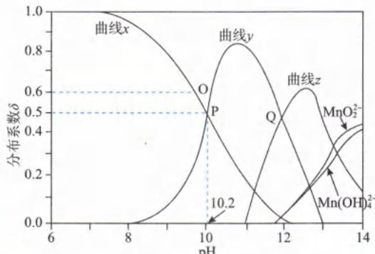

是 $\mathrm{Al(OH)_3}$ 。由于 $\mathrm{Mn(OH)_2}$ 难溶于水，在分布系数曲线中，不存在 $\mathrm{Mn(OH)_2}$ 的分布系数。根据公式 “ $\delta(\mathrm{MnOH}^{+})=\frac{c(\mathrm{MnOH}^{+})}{c(\mathrm{Mn}^{2+})+c(\mathrm{MnOH}^{+})+c(\mathrm{HMnO}_{2}^{-})+c[\mathrm{Mn(OH)}_{4}^{2-}]+c(\mathrm{MnO}_{2}^{2-})}$ ” 可知，溶液中含 Mn 的微粒有： $Mn^{2+}$ 、 $MnOH^{+}$ 、 $HMnO_{2}^{-}$ 、 $\mathrm{Mn(OH)}_{4}^{2-}$ 、 $\mathrm{MnO}_{2}^{2-}$ 。 $\mathrm{Mn(OH)_2}$ 的碱式电离： $\mathrm{Mn(OH)_2}\rightleftharpoons\mathrm{MnOH}^{+}+\mathrm{OH}^{-}$ ; $\mathrm{MnOH}^{+}\rightleftharpoons\mathrm{Mn}^{2+}+\mathrm{OH}^{-}$ 。 $\mathrm{Mn(OH)_2}$ 的酸式电离： $\mathrm{Mn(OH)_2}\rightleftharpoons\mathrm{HMnO}_2^-+\mathrm{H}^+$ ; $\mathrm{HMnO}_2^- \rightleftharpoons\mathrm{MnO}_2^{2-}+\mathrm{H}^+$ 。 $MnO_2^{2-}$ 的水合离子的形式： $\mathrm{MnO}_2^{2-}+2\mathrm{H}_2\mathrm{O}\rightleftharpoons\mathrm{Mn(OH)}_{4}^{2-}$ 。( $MnO_2^{2-}$ 可以类比 $AlO_2^-$ ， $\mathrm{Mn(OH)}_{4}^{2-}$ 可以类比 $\mathrm{Al(OH)}_{4}^{-}$ 。) 增大溶液的酸性，会促进碱式电离，则曲线 x、y 分别代表 $Mn^{2+}$ 、 $MnOH^+$ ；增大溶液的碱性，会促进酸式电离，则曲线 z 代表 $HMnO_2^-$ 。

A. 根据以上分析可知，曲线 z 表示 $\delta(\mathrm{HMnO}_2^-)\sim\mathrm{pH}$ 的变化关系，A 选项错误。

B. O 点， $c(\mathrm{H}^+)$ 可利用电离常数 $K_{b_2}$ 来计算。由于 P 点时 $c(\mathrm{Mn}^{2+})$ 、 $c(\mathrm{MnOH}^+)$ 相等，则 $K_{b_2}=\frac{c(\mathrm{OH}^-)\times c(\mathrm{Mn}^{2+})}{c(\mathrm{MnOH}^+)}=c(\mathrm{OH}^-)$ 。又因为 P 点时 pH=10.2，则 $c(\mathrm{H}^+) = 10^{-\mathrm{pH}} = 10^{-10.2} \, mol/L$ 。常温下 $c(\mathrm{OH}^-)=\frac{K_w}{c(\mathrm{H}^+)}=\frac{1\times10^{-14}}{1\times10^{-10.2}}=1\times10^{-3.8}$ ，即 $K_{b_2}=10^{-3.8}$ 。

O 点时 $\delta(\mathrm{Mn}^{2+})$ 为 0.6，则 O 点 $\delta(\mathrm{MnOH}^+) = 1 - 0.6 = 0.4$ ，即 $\frac{c(\mathrm{MnOH}^+)}{c(\mathrm{Mn}^{2+})} = \frac{0.4}{0.6} = \frac{2}{3}$ 。再结合 $K_{b_2}=\frac{c(\mathrm{OH}^-)\times c(\mathrm{Mn}^{2+})}{c(\mathrm{MnOH}^+)}$ ，则 $c(\mathrm{OH}^-)=K_{b_2}\times\frac{c(\mathrm{MnOH}^+)}{c(\mathrm{Mn}^{2+})}=10^{-3.8}\times\frac{2}{3}\,mol/L$ ， $c(\mathrm{H}^+)=\frac{K_w}{c(\mathrm{OH}^-)}=\frac{1\times10^{-14}}{10^{-3.8}\times\frac{2}{3}\,mol/L}=3/2\times10^{-14+3.8}=3/2\times10^{-10.2}\,mol/L$ ，B 选项错误。（在考场上，可以直接分析题目数据，P 点的 $c(\mathrm{H}^+) = 10^{-10.2}\,mol/L$ ，O 点 pH 比 P 点小，则 O 点 $c(\mathrm{H}^+) >10^{-10.2}\,mol/L$ ，B 选项的 $c(\mathrm{H}^+) < 10^{-10.2}\,mol/L$ ，不合理，可以快速判断 B 选项错误。）

C. 该选项的研究对象是离子，所以可以从电荷守恒入手分析： $2c(\mathrm{Mn}^{2+}) + c(\mathrm{MnOH}^+) + c(\mathrm{H}^+) + c(\mathrm{K}^+) = 2c(\mathrm{SO}_4^{2-}) + c(\mathrm{OH}^-)$ 。题目并未交代 P 点是否有 $\mathrm{Mn(OH)_2}$ ，需要讨论：

① 若不存在 $\mathrm{Mn(OH)_2}$ ，则元素守恒： $c(\mathrm{SO}_4^{2-}) = c(\mathrm{Mn}^{2+}) + c(\mathrm{MnOH}^+)$ ，代入 P 点电荷守恒替换 $c(\mathrm{SO}_4^{2-}) : 2c(\mathrm{Mn}^{2+}) + c(\mathrm{MnOH}^+) + c(\mathrm{H}^+) + c(\mathrm{K}^+) = 2c(\mathrm{Mn}^{2+}) + 2c(\mathrm{MnOH}^+) + c(\mathrm{OH}^-)$ ，整理得 $c(\mathrm{H}^+) + c(\mathrm{K}^+) = c(\mathrm{MnOH}^+) + c(\mathrm{OH}^-)$ 。该环境为碱性环境， $c(\mathrm{H}^+) < c(\mathrm{OH}^-)$ ，则 $c(\mathrm{K}^+) > c(\mathrm{MnOH}^+)$ ，且 P 点 $c(\mathrm{Mn}^{2+}) = c(\mathrm{MnOH}^+)$ ，因此 $c(\mathrm{K}^+) > c(\mathrm{Mn}^{2+})$ 。

② 若存在 $\mathrm{Mn(OH)_2}$ ，则元素守恒： $c(\mathrm{SO}_4^{2-}) > c(\mathrm{Mn}^{2+}) + c(\mathrm{MnOH}^+)$ ，代入 P 点电荷守恒替换 $c(\mathrm{SO}_4^{2-}) : 2c(\mathrm{Mn}^{2+}) + c(\mathrm{MnOH}^+) + c(\mathrm{H}^+) + c(\mathrm{K}^+) > 2c(\mathrm{Mn}^{2+}) + 2c(\mathrm{MnOH}^+) + c(\mathrm{OH}^-)$ ，整理得 $c(\mathrm{H}^+) + c(\mathrm{K}^+) > c(\mathrm{MnOH}^+) + c(\mathrm{OH}^-)$ 。该环境为碱性环境， $c(\mathrm{H}^+) < c(\mathrm{OH}^-)$ ，则 $c(\mathrm{K}^+) > c(\mathrm{MnOH}^+)$ ，且 P 点 $c(\mathrm{Mn}^{2+}) = c(\mathrm{MnO}_4^-) > c(\mathrm{Mn}_4^-)^{-}-10^{-3.8}\,mol/L$ ，故此

D. 该选项的等式研究对象全为离子，表面上看考电荷守恒，但 D 选项研究的对象均与元素 S、Mn 有关，则该等式也可能考查元素守恒；若写电荷守恒表达式，K 元素无法比较，因此最终确定考查元素守恒。本题要判断元素守恒，需要认为曲线 yz 的交点与 $Mn^{2+}, MnO_2^{2-}, Mn(OH)_4^{2-}$ 曲线的交点为相同 pH（题目若给辅助线会更严谨）。若体系无 $\mathrm{Mn(OH)_2}$ 的存在，则体系中的元素守恒表达式为： $c(\mathrm{SO}_4^{2-}) = c(\mathrm{Mn}^{2+}) + c(\mathrm{MnOH}^+) + c(\mathrm{HMnO}_2^- ) + c(\mathrm{MnO}_2^{2-}) + c[\mathrm{Mn(OH)}_4^{2-}]$ ，再根据图像可知，Q 点时： $c(\mathrm{MnOH}^+) = c(\mathrm{HMnO}_2^- )$ ，且同一 pH 时 $c(\mathrm{Mn}^{2+}) = c(\mathrm{MnO}_2^{2-}) = c[\mathrm{Mn(OH)}_4^{2-}]$ ，则元素守恒变形成 $c(\mathrm{SO}_4^{2-}) = 2c(\mathrm{MnOH}^+) + 3c(\mathrm{MnO}_2^{2-})$ 。若体系有 $\mathrm{Mn(OH)_{2}}$ 的存在，则元素守恒表达式为： $c(\mathrm{SO}_{4}^{2-})>c(\mathrm{Mn}^{2+})+c(\mathrm{MnOH}^{+})+c(\mathrm{HMnO}_{2}^{-})+c(\mathrm{MnO}_{2}^{2-})+c[\mathrm{Mn(OH)}_{4}^{2-}]$ ，Q 点时 $c(\mathrm{SO}_{4}^{2-})>2c(\mathrm{MnOH}^{+})+3c(\mathrm{MnO}_{2}^{2-})$ ，D 选项错误。
答案：C

【反思】本题要详细推导是很麻烦的，但在考场上选出答案却不难。A选项列出酸式电离、碱式电离即可判定；B选项利用P点反推O点可快速判断B选项数值错误；D选项揣摩命题老师意图确定考查元素守恒，利用Q点 $c(\mathrm{MnOH}^{+})=c(\mathrm{HMnO}_{2}^{-})$ 且同pH时 $c(\mathrm{Mn}^{2+})=c(\mathrm{MnO}_{2}^{2-})=c[\mathrm{Mn(OH)}_{4}^{2-}]$ ，则选项中 $c(\mathrm{SO}_{4}^{2-})=2c(\mathrm{MnOH}^{+})+“2”c(\mathrm{MnO}_{2}^{2-})$ 必然错误；排除A、B、D后可选择答案为C。

## 类型 V: 浓度比值的对数图像题型

## 内容提要

例: 常温下将 NaOH 溶液滴加到己二酸 $\left(\mathrm{H}_{2}\mathrm{X}\right)$ 溶液中, 混合溶液的 pH 与离子浓度变化的关系如图所示, 求 $K_{a_{1}}\left(\mathrm{H}_{2}\mathrm{X}\right)$ 、 $K_{a_{2}}\left(\mathrm{H}_{2}\mathrm{X}\right)$ 。

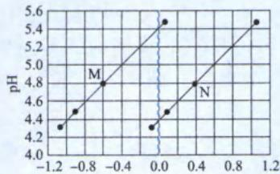

$$
\lg \frac {c (\mathrm{X} ^ {2 -})}{c (\mathrm{HX} ^ {-})} \text {或} \lg \frac {c (\mathrm{HX} ^ {-})}{c (\mathrm{H} _ {2} \mathrm{X})}
$$

<table><tr><td colspan="2">读图基础</td><td>离子浓度比值往往与 $K_{a}$ 有关,且多元弱酸逐级电离常数递减。确定每条线对应 $K_{a}$ 的相对大小即可确定离子浓度比的研究对象。</td></tr><tr><td rowspan="2">读图方法</td><td>画辅助线</td><td>由于 $K_{a_1}=\frac{c(HX^-)}{c(H_2X)}\times c(H^+)$ ,若 $\lg\frac{c(HX^-)}{c(H_2X)}=0$ 时,即 $c(H_2X)=c(HX^-)$ ,溶液pH=a,则 $K_{a_1}=c(H^)=10^{-a}$ 。 $K_{a_2}=\frac{c(X^{2-})}{c(HX^-)}\times c(H^+)$ ,若 $\lg\frac{c(X^{2-})}{c(HX^-)}=0$ 时,即 $c(X^{2-})=c(HX^-)$ ,溶液pH=b,则 $K_{a_2}=c(H^)=10^{-b}$ 。寻找M线、N线分别与 $\lg\frac{c(\text{酸根})}{c(\text{酸})}=0$ 交点的pH,pH越小、 $c(H^+)$ 越大,则对应 $K_{a}$ 越大。所以含N点线段表示 $\lg\frac{c(HX^-)}{c(H_2X)}\sim pH$ 的关系曲线;含M点线段表示 $\lg\frac{c(X^{2-})}{c(HX^-)}\sim pH$ 的关系曲线。</td></tr><tr><td>计算</td><td>方法一:N线段, $\lg\frac{c(HX^-)}{c(H_2X)}=0$ 时,pH=4.4,计算出 $K_{a_1}=\frac{c(H^)+\cdot c(HX^-)}{c(H_2X)}=10^{-4.4}$ 。M线段, $\lg\frac{c(X^{2-})}{c(HX^-)}=0$ 时,pH=5.4,计算出 $K_{a_2}=\frac{c(H^)+\cdot c(X^{2-})}{c(HX^-)}=10^{-5.4}$ 。方法二:根据M点坐标(-0.6,4.8),可计算出 $K_a=10^{-0.6}\times 10^{-4.8}=10^{-5.4}$ ,根据N点坐标(0.4,4.8),可计算出 $K_a=10^{0.4}\times 10^{-4.8}=10^{-4.4}$ 。由于 $K_{a_1}>K_{a_2}$ ,因此 $K_{a_1}=10^{-4.4},K_{a_2}=10^{-5.4}$ 。</td></tr></table>

注:读图时要看清楚是“lg”还是“-lg”;看清楚粒子浓度的比值与 $K_{a}$ 表达式中粒子浓度比值是相同还是互为倒数。

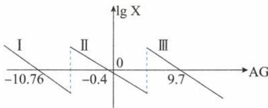

【例8】室温下，向一定浓度的 $\mathrm{Na}_{3}\mathrm{PO}_{4}$ 溶液中滴加盐酸，溶液中 $\lg \frac{c(\mathrm{PO}_{4}^{2-})}{c(\mathrm{HPO}_{4}^{2-})},\lg \frac{c(\mathrm{HPO}_{4}^{2-})}{c(\mathrm{H}_{2}\mathrm{PO}_{4}^{-})},$ $\lg \frac{c(\mathrm{H}_{2}\mathrm{PO}_{4}^{-})}{c(\mathrm{H}_{3}\mathrm{PO}_{4})}$ 随溶液酸度 $AG[AG = \lg \frac{c(H^{+})}{c(OH^{-})} ]$ 的变化如图所示.下列说法错误的是（ ）A.I、II、III分别为 $\lg \frac{c(\mathrm{PO}_4^{3-})}{c(\mathrm{HPO}_4^{2-})},\lg \frac{c(\mathrm{HPO}_4^{2-})}{c(\mathrm{H}_2\mathrm{PO}_4^-)},$ $\lg \frac{c(\mathrm{H}_2\mathrm{PO}_4^-)}{c(\mathrm{H}_3\mathrm{PO}_4)}$ 随AG的变化图像B. $\mathrm{H_3PO_4}$ 的 $K_{\mathrm{a_3}} = 10^{-12.38}$ C.AG=2时， $c(\mathrm{Na}^{+}) + c(\mathrm{H}^{+}) > c(\mathrm{Cl}^{-}) + c(\mathrm{OH}^{-}) + 3c(\mathrm{PO}_4^{3-}) + 3c(\mathrm{H}_2\mathrm{PO}_4^-)$ D.随着AG的增大， $\frac{c^2(H^+) \cdot c(PO_4^{3-})}{c(H_2PO_4^-)}$ 的值不变解析：横坐标上 $\lg \frac{c(\mathrm{PO}_4^{3-})}{c(\mathrm{HPO}_4^{2-})},\lg \frac{c(\mathrm{HPO}_4^{2-})}{c(\mathrm{H}_2\mathrm{PO}_4^-)},\lg \frac{c(\mathrm{H}_2\mathrm{PO}_4^-)}{c(\mathrm{H}_3\mathrm{PO}_4)}$ 均等于0，即横坐标上的点 $c(\mathrm{HPO}_4^{2-}) = c(\mathrm{PO}_4^{3-})$ 、 $c(\mathrm{H}_2\mathrm{PO}_4^-) = c(\mathrm{HPO}_4^{2-}),c(\mathrm{H}_2\mathrm{PO}_4^-) = c(\mathrm{H}_3\mathrm{PO}_4)$ ，又因为 $K_{\mathrm{a_1}} = \frac{c(H^+) \times c(H_2PO_4^-)}{c(H_3PO_4)},K_{\mathrm{a_2}} = \frac{c(H^+) \times c(HPO_4^{2-})}{c(H_2PO_4^-)},K_{\mathrm{a_3}} = \frac{c(H^+) \times c(PO_4^{3-})}{c(HPO_4^{2-})}$ ，由此可知横坐标上的点对应的 $c(H^+)$ 即对应的 $K_{\mathrm{a}}$ 值。根据 $AG = \lg \frac{c(H^+)}{c(OH^-)}$ 可知，当 $AG = 9.7$ 时， $9.7 = \lg \frac{c(H^+)}{c(OH^-)}$ ，即 $\frac{c(H^+)}{c(OH^-)} = 10^{9.7}$ ，常温下， $c(H^+) \times c(OH^-) = 10^{-14}$ ，则 $c^2 (H^+) = 10^{-4.3}$ ，即 $c(H^+) = 10^{-2.15}$ 。当 $AG = -0.4$ 时， $-0.4 = \lg \frac{c(H^+)}{c(OH^-)}$ ，即 $\frac{c(H^+)}{c(OH^-)} = 10^{-0.4}$ ，常温下， $c(H^+) \times c(OH^-) = 10^{-14}$ ，则 $c^2 (H^+) = 10^{-14.4}$ ，即 $c(H^+) = 10^{-7.2}$ 。当 $AG = -10.76$ 时， $-10.76 = \lg \frac{c(H^+)}{c(OH^-)}$ ，即 $\frac{c(H^+)}{c(OH^-)} = 10^{-10.76}$ ，常温下， $c(H^+) \times c(OH^-) = 10^{-14}$ ，则 $c^2 (H^+) = 10^{-24.76}$ ，即 $c(H^+) = 10^{-12.38}$ 。同一种多元弱酸逐级电离常数依次减小，所以 $K_{\mathrm{a_1}} = 10^{-2.15}, K_{\mathrm{a_2}} = 10^{-7.2}, K_{\mathrm{a_3}} = 10^{-12.38}$ ，因此I、II、III分别为 $\lg \frac{c(\mathrm{PO}_4^{3-})}{c(\mathrm{HPO}_4^{2-})},\lg \frac{c(\mathrm{HPO}_4^{2-})}{c(\mathrm{H}_2\mathrm{PO}_4^-)},\lg \frac{c(\mathrm{H}_2\mathrm{PO}_4^-)}{c(\mathrm{H}_3\mathrm{PO}_4)}\text {随 AG 的变化图像。}$ A.根据以上分析可知，I、II、III分别为 $\lg \frac{c(\mathrm{PO}_4^{3-})}{c(\mathrm{HPO}_4^{2-})},\lg \frac{c(\mathrm{HPO}_4^{2-})}{c(\mathrm{H}_2\mathrm{PO}_4^-)},\lg \frac{c(\mathrm{H}_2\mathrm{PO}_4^-)}{c(\mathrm{H}_3\text { PO}_4)}$ 随 AG 的变化图像，A选项正确。B.根据以上分析可知，即 $K_{\mathrm{a_3}} = 10^{-12.38} \, \text {mol/L}$ ，B选项正确。C.该选项的研究对象是离子，可以从电荷守恒入手分析。往磷酸钠溶液中滴加盐酸后，溶液中的电荷守恒表达式为： $c(H^+) + c(Na^+) = c(Cl^-) + c(H_2PO_4^-) + 2c(HPO_4^{2-}) + 3c(PO_4^{3-}) + c(OH^-)$ 。C选项中的表达式与常规电荷守恒表达式相比“=”变成了“>”，多了2个“ $c(H_2PO_4^-)$ ，少了2个“ $c(H_2PO_4^-)$ ”。所以该选项考查的是 $AG = 2$ 时， $c(H_2PO_4^-), c(H_2PO_4^{2-})$ 存在于 $K_{\mathrm{a_2}}$ 的表达式： $K_{\mathrm{a_2}} = \frac{\left( H^+ \right) \times c(HP_{O}^{2-})}{c(H_2PO_4^-)}$ 在于 $K_{\mathrm{a_2}}$ 的表达式： $K_{\mathrm{a_2}} = \frac{\left( H^+ \right) \times c(HP_{O}^{2-})}{c(H_2PO_4^-)}$ 在于 $K_{\mathrm{a_2}}$ 的表达式： $K_{\mathrm{a_2}} = \frac{\left( H^+ \right)\times c(HP_{O}^{2-})}{c(H_2PO_4^-)}$ 在于 $K_{\mathrm{a_2}}$ 的表达式： $K_{\mathrm{a_2}} = \frac{\left( H^+ \right)\times c(HP_{O}^{2-})}{c(H_2PO_4^-)}$ 在于 $K_{\mathrm{a_2}}$ 的表达式； $K_{\mathrm{a_2}} = \frac{\left( H^+ \right)\times c(HP_{O}^{2-})}{c(H_2PO_4^-)}$ 在于 $K_{\mathrm{a_2}}$ 的表达式； $K_{\mathrm{a_2}} = \frac{\left( H^+ \right)\times c(HP_{O}^{2-})}{c(H_2SO_4^-)}$ 在于 $K_{\mathrm{a_2}}$ 的表达式； $K_{\mathrm{a_2}} = \frac{\left( H^+ \right)\times c(HP_{O}^{2-})}{c(H_2SO_4^-)}$ 在于 $K_{\mathrm{a_2}}$ 的表达式； $K_{\mathrm{a_2}} = \frac{\left( h^+ \right)\times c(h^+ )}{h(h^+ )}.$ 得得 $\frac{\left( h^+ \right) - 7.2}{h(h^+ ) - 6} = 10^{-1.2}< 1$ ，即 $c(H_2PO_4^-) > c(HP_{O}^{2-})$ 。则 $AG = 2$ 时， $c(Na^+) + c(H^+) < c(Cl^-) + c(OH^-) + 3c(PO_4^{3-}) + 3c(H_2PO_4^-),C$ 选项错误。D.式子 $\frac{\left( h^+ \right) \times c(PO_4^{3-})}{h(h^+ ) - 6}$ 中，有 $c(H_2PO_4^-), c(PO_4^{3-})$ ，所以该式子与 $K_{\mathrm{a_2}} = \frac{\left( h^+ \right) \times c(HP_{O}^{2-})}{h(h^+ ) - 6}, K_{\mathrm{a_3}} = \frac{\left( h^+ \right) \times c(PO_4^{3-})}{h(h^+ ) - 6}$ 有关。 $K_{\mathrm{n_2}} \times K_{\mathrm{n_3}} = \frac{\left( h^+ \right) \times c(HP_{O}^{2-})}{h(h^+ ) - 6} \times \frac{\left( h^+ \right) \times c(PO_4^{3-})}{h(h^+ ) - 6} = \frac{\left( h^+ \right) \times c(PO_4^{3-})}{h(h^+ ) - 6} = 10^{-7.2} ×$

$10^{-12.38} = 10^{-19.58}$ 。由于 $K_{\mathrm{a}}$ 只受温度的影响。所以随着AG的增大， $\frac{c^2(\mathrm{H}^+) \cdot c(\mathrm{PO}_4^{3-})}{c(\mathrm{H}_2\mathrm{PO}_4^-)}$ 的值不变，D选项正确。

答案:C

【例 9】(2024·河北卷) 在水溶液中, $CN^{-}$ 可与多种金属离子形成配离子。X、Y、Z 三种金属离子分别与 $CN^{-}$ 形成配离子达平衡时, $\lg\frac{c(\text{金属离子})}{c(\text{配离子})}$ 与 $-\lg c(CN^{-})$ 的关系如图。下列说法正确的是()

A. $99\%$ X、Y转化为配离子时，两溶液中 $\mathrm{CN^{-}}$ 的平衡浓度： $\mathrm{X} > \mathrm{Y}$ B.向Q点X、Z的混合液中加少量可溶性Y盐，达平衡时 $\frac{c(\mathrm{X})}{c(\mathrm{X}\text{配离子})} > \frac{c(\mathrm{Z})}{c(\mathrm{Z}\text{配离子})}$ C.由Y和Z分别制备等物质的量的配离子时，消耗 $\mathrm{CN^{-}}$ 的物质的量： $\mathrm{Y} < \mathrm{Z}$ D.若相关离子的浓度关系如P点所示，Y配离子的解离速率小于生成速率

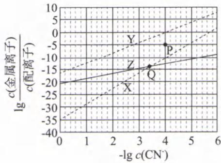

解析：A. $99\%$ 的X、Y转化为配离子时，溶液中： $\frac{c(\mathrm{X})}{c(\mathrm{X}\text{配离子})} = \frac{c(\mathrm{Y})}{c(\mathrm{Y}\text{配离子})} = \frac{1\%}{99\%} \approx 10^{-2}$ ，即 $\lg \frac{c(\mathrm{X})}{c(\mathrm{X}\text{配离子})} = \lg \frac{c(\mathrm{Y})}{c(\mathrm{Y}\text{配离子})} \approx -2$ 。在图像上画一条纵坐标为-2且平行于横坐标的辅助线（蓝色虚线），该辅助线与Y、X曲线均有交点，且与Y点的交点横坐标更小，因为横坐标是负对数，所以横坐标越小，则 $c(\mathrm{CN}^{-})$ 更大，因此溶液中 $\mathrm{CN}^{-}$ 的平衡浓度： $\mathrm{X} < \mathrm{Y},\mathrm{A}$ 选项错误。

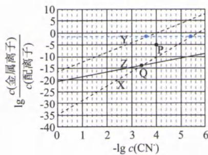

B. 往 Q 混合溶液中加入少量可溶性 Y 盐后，Y 离子会消耗 $CN^{-}$ 形成 Y 配离子，使得溶液中 $c(\mathrm{CN}^{-})$ 减小。从 Q 点开始，随着 $c(\mathrm{CN}^{-})$ 减小（即横坐标大于 3.4 后），X 对应曲线位于 Z 对应曲线上方，即 $\lg \frac{c(\mathrm{X})}{c(\mathrm{X}\text{配离子})} > \lg \frac{c(\mathrm{Y})}{c(\mathrm{Y}\text{配离子})}$ ；纵坐标是以 10 为底的对数函数，是增函数，因此 $\frac{c(\mathrm{X})}{c(\mathrm{X}\text{配离子})} > \frac{c(\mathrm{Z})}{c(\mathrm{Z}\text{配离子})}$ ，B 选项正确。

C. 由 Y 和 Z 分别制备等物质的量的配离子时，若金属离子与 $CN^{-}$ 的配位数越多，则消耗 $CN^{-}$ 的物质的量也越多。设金属离子形成配离子的离子方程式为：金属离子 + m $CN^{-} \rightleftharpoons$ 配离子，则平衡常数 K = $\frac{c(\text{配离子})}{c(\text{金属离子}) \cdot c^{m}(\mathrm{CN}^{-})}$ ， $\lg K = \lg \frac{c(\text{配离子})}{c(\text{金属离子})} - m \lg c (\mathrm{CN}^{-}) = -\lg \frac{c(\text{金属离子})}{c(\text{配离子})} - m \lg c (\mathrm{CN}^{-})$ ，即 $\lg \frac{c(\text{金属离子})}{c(\text{配离子})} = -m \lg c (\mathrm{CN}^{-}) - \lg K$ ，故 X、Y、Z 三种金属离子形成配离子时结合的 $CN^{-}$ 越多，对应 $\lg \frac{c(\text{金属离子})}{c(\text{配离子})} \sim -\lg c (\mathrm{CN}^{-})$ 曲线斜率越大。由图像可知，曲线斜率：Y > Z，则由 Y、Z 制备等物质的量的配离子时，消耗 $CN^{-}$ 的物质的量：Z < Y，C 选项错误。

D. Y 对应的曲线上的每一个点，表示： $Y + m CN^{-} \rightleftharpoons Y$ 配离子，反应达到平衡。设 Y 对应曲线上的点 (4,0) 为 R 点，与 P 点 (4, -5) 相比较，P 点的 $\lg \frac{c(Y)}{c(Y\text{配离子})}$ 较小 [即 $\frac{c(Y)}{c(Y\text{配离子})}$ 较小]，因此 $\frac{c(Y\text{配离子})}{c(Y)}$ 较大。

上述可逆反应的浓度商 $Q = \frac{c(Y\text{配离子})}{c(Y) \cdot c^{m}(\mathrm{CN}^{-})}$ ，P 与 R 的 $-\lg c(\mathrm{CN}^{-})$ 相同 [即 $c(\mathrm{CN}^{-})$ 相同]，但 $\frac{c(Y\text{配离子})}{c(Y)}$ ：P > R，即 P 点时：Q > K，说明逆反应速率 (Y 配离子的解离速率) 大于正反应速率 (Y 配离子的生成速率)，D 选项错误。

解析:B

【反思】(1)将函数的增减性用于理解化学图像,可以更好的进行浓度大小比较。

(2)要熟悉对数的基本运算如: $\lg1=0, \lg10=1, \lg\frac{A}{B}=-\lg\frac{B}{A}, \lg(A\times B)=\lg A+\lg B, \lg\frac{A}{B}=\lg A-\lg B; \lg A^{b}=b\times\lg A$ 。

(3)能将复杂的对数函数或指数函数,转化成简单的一次函数,将所求物理量和斜率、截距挂钩。

(4)溶液中的离子平衡主要包括:电离平衡、水解平衡、溶解平衡和配位反应平衡。电离平衡和水解平衡的各物质计量数均为1,所以其各物理量的对数图像一般为相互平行直线,即斜率相等。溶解平衡和配位平衡的物质计量数可能不一样,其各物理量的对数图像可能斜率不同;一般来说,斜率越大,计量数之比越大。

类型Ⅵ: 多坐标曲线

## 内容提要

## 一、温度—pH—溶液体积坐标曲线

某温度下, 将 n mol/L 氨水滴入 10 mL 1.0 mol/L 盐酸中, 溶液 pH 和温度随加入氨水体积变化曲线如图所示。

1. 温度曲线的变化趋势及其原因: 中和反应是放热反应, 随着中和反应的进行, 体系温度越来越高。当氨水过量后, 无中和反应的放热, 且过量的氨水通过热传递将体系温度降低。所以温度随加入氨水的体积变化趋势为: 先升高, 再下降。

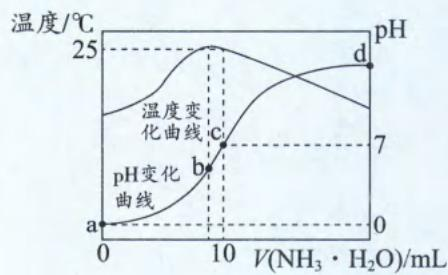

2. 温度曲线的起点: 表示环境初始温度, 观察数值即可确定是否为常温。

3. 温度曲线最高点: 该点表示中和反应恰好完全反应点, 通过此时的氨水体积可计算氨水的浓度。

## 二、浓度对数—pH—酸碱物质的量比的多坐标曲线

$25^{\circ} \mathrm{C}$ 时, 将 HCl 气体缓慢通入 $0.1 \mathrm{~mol} \cdot \mathrm{L}^{- 1}$ 的氨水中, 溶液的 $\mathrm{pH}$ 、体系中粒子浓度的对数值 $(\lg c)$ 与反应物的物质的量之比 $\left[\frac{n(\mathrm{HCl})}{n(\mathrm{NH}_{3} \cdot \mathrm{H}_{2} \mathrm{O})}\right]$ 关系图如下:

图像解读

$P_{1}$ 所示溶液中， $c(\mathrm{NH}_{4}^{+})=c(\mathrm{NH}_{3}\cdot\mathrm{H}_{2}\mathrm{O})$ ，溶液pH=9.25（pOH=14-9.25=4.75），可求 $K_{b}(\mathrm{NH}_{3}\cdot\mathrm{H}_{2}\mathrm{O})=\frac{c(\mathrm{NH}_{4}^{+})c(\mathrm{OH}^{-})}{c(\mathrm{NH}_{3}\cdot\mathrm{H}_{2}\mathrm{O})}=c(\mathrm{OH}^{-})=10^{-4.75}$

$P_{2}$ 所示溶液中， $c(\mathrm{H}^{+})=c(\mathrm{OH}^{-})$ ，根据电荷守恒： $c(\mathrm{H}^{+})+c(\mathrm{NH}_{4}^{+})=c(\mathrm{OH}^{-})+c(\mathrm{Cl}^{-})$ 可知， $c(\mathrm{NH}_{4}^{+})=c(\mathrm{Cl}^{-})$ 。溶液的溶质组成为 $NH_{4}Cl+NH_{3}\cdot H_{2}O$

$P_{3}$ 所示溶液中，反应物 $n(\mathrm{HCl})=n(\mathrm{NH}_{3}\cdot\mathrm{H}_{2}\mathrm{O})$ ，据此可知元素守恒为： $c(\mathrm{Cl}^{-})=c(\mathrm{NH}_{4}^{+})+c(\mathrm{NH}_{3}\cdot\mathrm{H}_{2}\mathrm{O})$ $\frac{n(\mathrm{HCl})}{n(\mathrm{NH}_{3}\cdot\mathrm{H}_{2}\mathrm{O})}$

## 三、分布系数—pH—溶液体积的多坐标曲线

以酚酞为指示剂，用 0.1000 mol/L 的 NaOH 溶液滴定 20.00 mL 未知浓度的二元酸 $H_{2}A$ 溶液。溶液中，pH、分布系数 $\delta$ 随滴加 NaOH 溶液体积 $V_{NaOH}$ 的变化关系如下图所示。[比如 $A^{2-}$ 的分布系数： $\delta(A^{2-})=\frac{c(A^{2-})}{c(H_{2}A)+c(HA^{-})+c(A^{2-})}$ ]

## 图像解读

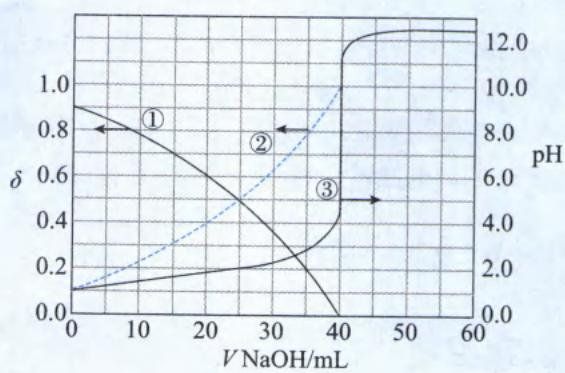

<table><tr><td>第一步</td><td>1.根据分布系数特征和pH变化特征可知:3是 $V_{NaOH}$ 与pH变化关系曲线;1、2是分布系数与 $V_{NaOH}$ 的关系曲线(两条曲线此消彼长);分布系数曲线与pH的“共同坐标”是 $V_{NaOH}$ 。(本图有标注箭头,也可以直接根据箭头指向确定。)2.若 $H_2A$ 是二元弱酸,其分布系数应该有三条曲线、两个交点;但图像中只有两条曲线、一个交点,由此可知 $H_2A$ 第一步完全电离,所以1代表 $HA^-$ 、2代表 $A^{2-}$ 。</td></tr><tr><td>第二步</td><td>曲线1、2的交点[即 $c(HA^-)=c(A^{2-})$ ]对应的pH可计算 $K_a$ 。需注意,该交点对应的pH并非直接向右读pH≈4.6,而是利用曲线1、2、3的“共同坐标”— $V_{NaOH}=25.00\ mL$ ,再利用曲线3读出此时pH=2(曲线3才是pH~ $V_{NaOH}$ 关系图)。因此 $HA^-⇌A^{2-}+H^+$  $K_a=1×10^{-2}$ 。</td></tr><tr><td>第三步</td><td>根据pH突变点对应的 $V_{NaOH}=40.00\ mL$ 可计算 $H_2A$ 的浓度:由0.1000mol/L× $(40.00×10^{-3})L=c(H_2A)×2×(20.00×10^{-3})L$ ,解得 $c(H_2A)=0.1000\ mol/L$ 。</td></tr></table>

【总结】多坐标曲线的解题方法：

1. 根据曲线的变化趋势或变化特征, 确定曲线的类型。

2. 找出多条曲线的“共同坐标”，由曲线 A 转化到曲线 B 的纽带即“共同坐标”。

3. 确定所求点对应的溶质组成。

4. 选择特殊点数值进行计算。

【例 10】(2021·辽宁卷)用 $0.1000 \, mol \cdot L^{-1}$ 盐酸滴定 $20.00 \, mL \, Na_{2}A$ 溶液，溶液中 $H_{2}A$ 、 $HA^{-}$ 、 $A^{2-}$ 的分布分数 $\delta$ 随 pH 变化曲线及滴定曲线如图。下列说法正确的是()

[如： $A^{2-}$ 分布分数： $\delta(A^{2-})=\frac{c(A^{2-})}{c(H_{2}A)+c(HA^{-})+c(A^{2-})}$ 。]
A. $H_{2}A$ 的 $K_{a_{1}}$ 为 $10^{-10.25}$ B. c 点: $c(\mathrm{HA}^{-}) > c(\mathrm{A}^{2-}) > c(\mathrm{H}_{2}\mathrm{A})$ C. 第一次突变, 可选酚酞作指示剂
D. $c(\mathrm{Na}_{2}\mathrm{A})=0.200\ 0\ \mathrm{mol}\cdot\mathrm{L}^{-1}$

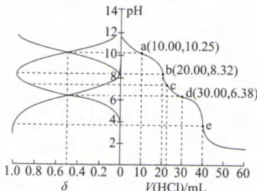

解析: 将图像旋转 $90^{\circ}$ 后, X 曲线在强酸性环境下分布分数最大, 则 X 为 $H_{2}A$ ; Z 曲线在强碱性环境中分布分数最大, 则 Z 为 $A^{2-}$ , 则 Y 表示 $HA^{-}$ 。两个交点对应的 pH 分别为 6.38、10.25, 由交点的 pH 可计算 $K_{a}=10^{-pH}$ , 由于同一多元弱酸的逐级电离常数依次增大, 所以 $K_{a_{1}}=10^{-6.38}$ , $K_{a_{2}}=10^{-10.25}$ 。

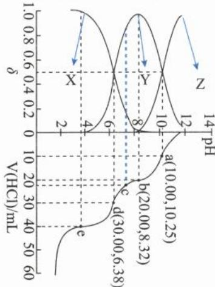

A. 根据以上分析可知， $K_{a_{1}}=10^{-6.38}$ ，A 选项错误。

B. 根据蓝色曲线的辅助线可知，c 点时，Y 最多，Z 最少，因此 $c(\mathrm{HA}^{-}) > c(\mathrm{H}_{2}\mathrm{A}) > c(\mathrm{A}^{2-})$ ，B 选项错误。
C. 第一次突变点对应的 pH=8.32，酚酞的变色范围为 8.2\~10.0, 8.32 处于酚酞的变色范围内，所以第一次突变可以用酚酞作指示剂。滴定终点的现象为：滴加最后半滴盐酸，溶液由红色变成无色，且保持半分钟不恢复原色，C 选项正确。（请同学们务必记住甲基橙、酚酞的变色范围以及各范围的颜色。）

D. b 点对应着第一次滴定终点，此时对应的化学方程式为： $Na_{2}A + HCl = NaHA + NaCl$ ，根据方程式可知 $n(\mathrm{Na}_{2}\mathrm{A}) = n(\mathrm{HCl})$ ，即 $c(\mathrm{Na}_{2}\mathrm{A}) \times V(\mathrm{Na}_{2}\mathrm{A}) = c(\mathrm{HCl}) \times V(\mathrm{HCl})$ ， $c(\mathrm{Na}_{2}\mathrm{A}) = \frac{c(\mathrm{HCl}) \times V(\mathrm{HCl})}{V(\mathrm{Na}_{2}\mathrm{A})} = \frac{0.1000\mathrm{mol/L} \times (20.00 \times 10^{-3})\mathrm{L}}{(20.00 \times 10^{-3})\mathrm{L}} = 0.1000\mathrm{mol/L}$ ，D 选项错误。

答案:C

# 模块 3 难溶电解质的溶解平衡

习题：P67

# 第 1 节 溶解平衡的影响因素及其运用 (★★★)

## 内容提要

一、溶解平衡表达式(以 AgCl 为例): AgCl(s)⇌Ag $^{+}$ (aq)+Cl $^{-}$ (aq)

1. 溶解平衡表达式实质包括两个过程: 一是电解质的溶解过程, 二是电解质的电离过程。

2. 溶解过程和电离过程的热效应最终决定了溶解平衡的 $\Delta H$ 。

3. 溶解平衡表达式需要注明物质的状态, 若不注明, 容易和电离方程式混淆。

## 二、溶解平衡的影响因素(以 AgCl 为例)

<table><tr><td colspan="4">AgCl(s)⇌Ag+(aq)+Cl-(aq) ΔH&gt;0(体系中有大量 AgCl 固体)</td></tr><tr><td>改变条件</td><td>平衡移动方向</td><td>c(Ag+)变化</td><td>Ksp变化</td></tr><tr><td>升高温度</td><td>向右移动</td><td>增大</td><td>增大</td></tr><tr><td>加水(体系中仍有大量 AgCl 固体)</td><td>向右移动</td><td>不变</td><td>不变</td></tr><tr><td>通入氨气</td><td>向右移动</td><td>减小</td><td>不变</td></tr><tr><td>加入少量 Na2S固体</td><td>向右移动</td><td>减小</td><td>不变</td></tr><tr><td>加入少量 AgNO3固体</td><td>向左移动</td><td>增大</td><td>不变</td></tr><tr><td>通入少量 HCl 气体</td><td>向左移动</td><td>减小</td><td>不变</td></tr></table>

注:1. 大多数固体的溶解平衡 $\Delta H > 0$ ，所以升温可以促进固体溶解，必须识记 $\mathrm{Ca(OH)}_{2}$ 例外。

2. 加水会促进溶解,但只要体系中存在难溶电解质的固体,则溶液中的离子浓度为定值。

3. 离子发生化学变化促进溶解。

4. 同离子效应抑制溶解。

## 三、沉淀溶解平衡的运用

1. 沉淀的溶解(以醋酸除水垢为例):

碳酸钙存在溶解平衡: $\text{CaCO}_3(\text{s}) \rightleftharpoons \text{Ca}^{2+}(\text{aq}) + \text{CO}_3^{2-}(\text{aq})$ , 加入醋酸后, $\text{H}^+$ 消耗 $\text{CO}_3^{2-}$ 使 $c(\text{CO}_3^{2-})$ 减小, 溶解平衡正向移动, 使碳酸钙溶解。

2. 离子的沉淀以及沉淀的洗涤: 在某些定量分析实验中, 需要先将某离子转化成沉淀, 再通过测定沉淀的质量来推导待测离子的含量。为了减小实验误差, 希望待测离子尽可能地沉淀完全,并且在洗涤的时候尽量减少溶解损耗。沉淀离子时,加入的沉淀剂常会过量,利用过量的沉淀剂提供的同离子效应减少沉淀的溶解损失(若沉淀剂过量太多发生配位反应,而导致沉淀溶解的情况出现时,则需要注意控制沉淀剂的用量)。洗涤沉淀时,一般不用蒸馏水,而是用含同离子的溶液,以减少洗涤时沉淀的溶解损耗。

3. 沉淀的转化: 根据溶解度大容易转化成溶解度小的规律, 可以将沉淀进行转化。

例:盐碱地中的 $Na_{2}CO_{3}$ 水解使土壤呈碱性: $CO_{3}^{2-} + H_{2}O \rightleftharpoons HCO_{3}^{-} + OH^{-}$ ，往土壤中撒石膏可消除土壤的碱性。原理是石膏( $CaSO_{4}$ ) 是微溶于水的物质，当其遇到 $CO_{3}^{2-}$ 时会转化成难溶于水的 $CaCO_{3}$ ，土壤中的 $CO_{3}^{2-}$ 浓度减少，水解平衡逆向移动，土壤碱性减小。

注:溶解度小的物质也可能转化为溶解度大的物质。

四、 $K_{sp}$ 的计算及其应用

1. $K_{sp}$ 表达式及其影响因素

(1) 表达式 [以 $\mathrm{Fe(OH)}_{3}$ 为例]: $K_{\mathrm{sp}}[\mathrm{Fe(OH)}_{3}] = c(\mathrm{Fe}^{3+}) \times c^{3}(\mathrm{OH}^{-})$ 。

(2) 影响因素: $K_{sp}$ 只受温度的影响。( $K_{sp}$ 与温度的关系由 $\Delta H$ 的符号决定) 若 $\Delta H > 0, K_{sp}$ 与温度正相关; 若 $\Delta H < 0, K_{sp}$ 与温度负相关。

2. $K_{\mathrm{sp}}$ 的应用

## (1) 比较同类型物质的溶解度

①若物质类型一样, $K_{sp}$ 与溶解度正相关。所谓的类型相同,指的是化学式 $A_{n}B_{m}$ 中n、m对应相同。

例： $K_{\mathrm{sp}}(\mathrm{AgCl})=1.8\times10^{-10}$ 、 $K_{\mathrm{sp}}(\mathrm{AgBr})=5.4\times10^{-13}$ 、 $K_{\mathrm{sp}}(\mathrm{AgCl})=8.5\times10^{-17}$ ，都属于AB型难溶电解质， $K_{\mathrm{sp}}:\mathrm{AgCl}>\mathrm{AgBr}>\mathrm{AgI}$ ，则在水中的溶解度大小为： $AgCl>AgBr>AgI$ 。请同学们务必识记AgX溶解度的递变性。

注:此处的溶解度是指用物质的量浓度来衡量的溶解度;未特殊说明,默认是物质的量浓度衡量的溶解度。

<table><tr><td>溶解度分类</td><td>狭义溶解度</td><td>广义溶解度</td></tr><tr><td>定义</td><td>在一定温度下,100g溶剂(常指水)最多溶解的溶质的质量。</td><td>在一定温度下,饱和溶液中溶质的物质的量浓度。</td></tr><tr><td>符号</td><td>S</td><td>c</td></tr><tr><td>单位</td><td>g</td><td>mol/L</td></tr><tr><td>影响因素</td><td colspan="2">温度、同离子效应、化学变化</td></tr><tr><td>关系</td><td colspan="2">难溶电解质的溶解度很低,100g水溶解难溶电解质达饱和后,溶液的质量约为100g,溶液的密度约为水的密度,则其体积约为0.1L。则 $c(A_{n}B_{m})=\frac{Sg}{\frac{Mg/mol}{0.1L}}=\frac{10S}{M}$ mol/L。</td></tr></table>

②若物质类型不一样,需要将 $K_{sp}$ 开 $(m+n)$ 次方后,再比较。

例： $K_{\mathrm{sp}}(\mathrm{AgCl})=1.8\times10^{-10}$ 、 $K_{\mathrm{sp}}(\mathrm{Ag}_{2}\mathrm{CrO}_{4})=1\times10^{-12}$ ，将 $K_{\mathrm{sp}}(\mathrm{AgCl})$ 开2次方： $\sqrt{K_{\mathrm{sp}}(\mathrm{AgCl})}=\sqrt{1.8\times10^{-10}}\approx1.3\times10^{-5}$ ；将 $K_{\mathrm{sp}}(\mathrm{Ag}_{2}\mathrm{CrO}_{4})$ 开3次方： $\sqrt[3]{K_{\mathrm{sp}}(\mathrm{Ag}_{2}\mathrm{CrO}_{4})}=\sqrt[3]{1\times10^{-12}}=1\times10^{-4}$ ，则溶解度： $Ag_{2}CrO_{4}>AgCl$ 。

注： $K_{\mathrm{sp}}(\mathrm{AgCl})>K_{\mathrm{sp}}(\mathrm{Ag}_{2}\mathrm{CrO}_{4})$ ，但溶解度 $AgCl<Ag_{2}CrO_{4}$ ，因此 $K_{sp}$ 越大溶解度不一定越大，前提必须是同类型的难溶电解质。

(2) 利用 $K_{sp}$ 与瞬间离子浓度幂之积 (Q) 判断溶液的状态

①若 $Q=K_{sp}$ ，则溶液处于饱和状态（沉淀与溶解处于平衡状态）。

②若 $Q > K_{sp}$ ，则溶液处于过饱和状态，该溶液会析出沉淀变成浊液。

③若 $Q < K_{sp}$ ，则溶液处于不饱和状态，该溶液会继续溶解难溶电解质。

(3) 利用 $K_{sp}$ 计算某些离子开始沉淀或完全沉淀的 pH 值, 从而确定除杂时调节的 pH 范围。

注:离子完全沉淀的标志是溶液中剩余离子的浓度小于 $1\times10^{-5}$ mol/L。

(4) 计算存在多种沉淀的体系中离子浓度的比值

例: AgCl、AgBr 沉淀共存的浊液, 求 $\frac{c(\mathrm{Cl}^{-})}{c(\mathrm{Br}^{-})}$ 时, 分子、分母同时乘以 $c(\mathrm{Ag}^{+})$ , 将比值变形成为: $\frac{c(\mathrm{Cl}^{-})}{c(\mathrm{Br}^{-})} = \frac{c(\mathrm{Cl}^{-}) \times c(\mathrm{Ag}^{+})}{c(\mathrm{Br}^{-}) \times c(\mathrm{Ag}^{+})} = \frac{K_{\mathrm{sp}}(\mathrm{AgCl})}{K_{\mathrm{sp}}(\mathrm{AgBr})}$ 。

注: 求离子浓度比值时, 往往需要分子分母增添项, 构造 $K_{sp}$ 进行计算。该方法源自数学中的“配方法”, 通过增添项, 构造特殊的计算公式。

(5) 判断沉淀能否完全转化

例: 已知常温下: $K_{\mathrm{sp}}(\mathrm{BaCO}_{3})=2.5\times10^{-9}$ 、 $K_{\mathrm{sp}}(\mathrm{BaSO}_{4})=1\times10^{-10}$ 。将 $BaCO_{3}$ 加入 $Na_{2}SO_{4}$ 溶液中, $BaCO_{3}$ 能否完全转化成 $BaSO_{4}$ ?

解: $\mathrm{BaCO_{3}(s)+SO_{4}^{2-}(aq)\rightleftharpoons BaSO_{4}(s)+CO_{3}^{2-}(aq)}$ ，该反应： $K=\frac{c(\mathrm{CO}_{3}^{2-})}{c(\mathrm{SO}_{4}^{2-})}=\frac{c(\mathrm{CO}_{3}^{2-})\times c(\mathrm{Ba}^{2+})}{c(\mathrm{SO}_{4}^{2-})\times c(\mathrm{Ba}^{2+})}=\frac{K_{\mathrm{sp}}(\mathrm{BaCO}_{3})}{K_{\mathrm{sp}}(\mathrm{BaSO}_{4})}=\frac{2.5\times10^{-9}}{1\times10^{-10}}=25<1\times10^{5}$ ，所以 $BaCO_{3}$ 不能完全转化成 $BaSO_{4}$ 。

注：若沉淀转化的平衡常数 $K > 1 \times 10^{5}$ ，则沉淀能完全转化。

(6) 判断混合体系中离子沉淀的先后顺序

例 1: 已知 $K_{\mathrm{sp}}(\mathrm{AgCl})=1\times10^{-10}$ 、 $K_{\mathrm{sp}}(\mathrm{Ag}_{2}\mathrm{CrO}_{4})=1\times10^{-12}$ 。往浓度均为 0.1 mol/L 的 NaCl、 $Na_{2}CrO_{4}$ 溶液中滴加 $AgNO_{3}$ 溶液，哪种离子会先沉淀？

解: $K_{\mathrm{sp}}(\mathrm{AgCl})=c(\mathrm{Ag}^{+})\times c(\mathrm{Cl}^{-})=1\times10^{-10}$ ，所以 $c(\mathrm{Ag}^{+})>1\times10^{-9}\ \mathrm{mol/L}$ 时，开始产生 $\mathrm{AgCl}$ (白色) 沉淀。 $K_{\mathrm{sp}}(\mathrm{Ag}_{2} \mathrm{CrO}_{4}) = c^{2}(\mathrm{Ag}^{+}) \times c(\mathrm{CrO}_{4}^{2-}) = 1 \times 10^{-12}$ , 所以 $c(\mathrm{Ag}^{+}) > 1 \times 10^{-5.5} \mathrm{~mol} / \mathrm{L}$ 时, 开始产生 $\mathrm{Ag}_{2} \mathrm{CrO}_{4}$ (砖红色) 沉淀。通过上述计算可知, 往浓度均为 $0.1 \mathrm{~mol} / \mathrm{L}$ 的 $\mathrm{NaCl}, \mathrm{Na}_{2} \mathrm{CrO}_{4}$ 溶液中滴加 $\mathrm{AgNO}_{3}$ 溶液, $\mathrm{Cl}^{-}$ 会先沉淀。

例 2: 往浓度均为 $1 \times 10^{-10}$ mol/L 的 NaCl、 $Na_{2}CrO_{4}$ 溶液中滴加 $AgNO_{3}$ 溶液，哪种离子会先沉淀？

解: $K_{\text{sp}}(\text{AgCl}) = c(\text{Ag}^{+}) \times c(\text{Cl}^{-}) = 1 \times 10^{-10}$ , 所以 $c(\text{Ag}^{+}) > 1 \, \text{mol/L}$ 时, 开始产生 AgCl(白色)沉淀。 $K_{\text{sp}}(\text{Ag}_{2}\text{CrO}_{4}) = c^{2}(\text{Ag}^{+}) \times c(\text{CrO}_{4}^{2-}) = 1 \times 10^{-12}$ , 所以 $c(\text{Ag}^{+}) > 0.1 \, \text{mol/L}$ 时, 开始产生 $\text{Ag}_{2}\text{CrO}_{4}$ (砖红色)沉淀。通过上述计算可知, 往浓度均为 $1 \times 10^{-10} \, \text{mol/L}$ 的 NaCl、 $\text{Na}_{2}\text{CrO}_{4}$ 溶液中滴加 $\text{AgNO}_{3}$ 溶液, $\text{CrO}_{4}^{2-}$ 会先沉淀。

注:往混合体系中滴加含“共有离子”的溶液,哪种沉淀需要的“共有离子”越小,哪种离子就会先沉淀。当需要沉淀的离子浓度比较大时,溶解度越小的难溶电解质越先沉淀。

## 类型 I: 验证溶解度大小的实验问题

【例 1】下列实验操作、现象、结论均正确的是（）

<table><tr><td>选项</td><td>操作</td><td>现象</td><td>结论</td></tr><tr><td>A</td><td>往等质量的 $CaSO_4$ 、 $CaCO_3$ 中分别加入稍过量的盐酸</td><td> $CaCO_3$ 完全溶解, $CaSO_4$ 固体减少不明显</td><td>水中溶解度: $CaSO_4 < CaCO_3$ </td></tr><tr><td>B</td><td>往KI、NaCl的混合溶液中滴加几滴 $AgNO_3$ 溶液</td><td>生成黄色沉淀</td><td>水中溶解度: $AgI < AgCl$ </td></tr><tr><td>C</td><td>将等量且少量的AgCl、 $Ag_2S$ 分别放入等浓度等体积的足量氨水中</td><td>AgCl溶解, $Ag_2S$ 不溶解</td><td>水中溶解度: $AgCl > Ag_2S$ </td></tr><tr><td>D</td><td>往10mL 1mol/L NaOH溶液中滴加几滴0.1mol/L  $MgSO_4$ 溶液,后又滴加几滴0.1mol/L  $CuSO_4$ 溶液</td><td>先生成白色沉淀,后生成蓝色沉淀</td><td>水中溶解度: $Cu(OH)_2 < Mg(OH)_2$ </td></tr></table>

解析: A. $CaCO_{3}$ 溶于盐酸, 是因为 $CaCO_{3}$ 在沉淀溶解平衡所产生的 $CO_{3}^{2-}$ 与 $H^{+}$ 能发生化学变化, 促进 $CaCO_{3}$ 沉淀溶解平衡正向移动; 但 $CaSO_{4}$ 在沉淀溶解平衡所产生的 $SO_{4}^{2-}$ 与 $H^{+}$ 不发生化学变化。水中的溶解度: $CaSO_{4} > CaCO_{3}$ , 盐酸中的溶解度: $CaSO_{4} < CaCO_{3}$ , A 选项错误。(溶解过程可以是物理过程, 也可以是化学过程。 $CaCO_{3}$ 溶于水是物理过程, 溶于盐酸是化学过程。)

B. 该实验想通过“竞争实验”比较 AgI、AgCl 溶解度。“竞争实验”需要满足两个条件: 一是两种沉淀的颜色不一样, 二是竞争离子的起始浓度一样。该选项未说明竞争离子 I⁻、Cl⁻ 的浓度关系, B 选项错误。

C. AgCl、 $\mathrm{Ag_2S}$ 溶解均能产生 $\mathrm{Ag^{+}}$ ，氨水中 $\mathrm{NH_3}$ 可以与 $\mathrm{Ag^{+}}$ 发生配位反应，使沉淀溶解平衡正向移动。在提供等浓度氨水的情况下，氨水能溶解 AgCl，而不能溶解 $\mathrm{Ag_2S}$ ，说明 $\mathrm{Ag_2S}$ 沉淀溶解平衡产生的 $c(\mathrm{Ag^{+}})$ 太小，无法与 $\mathrm{NH_3}$ 发生配位反应。综上所述，溶解度： $\mathrm{AgCl} > \mathrm{Ag_2S}$ ，C 选项正确。

D. 用沉淀转化实验证明溶解度大小时，共有离子“OH $^{-}$ ”要少，该实验中 NaOH 过量，Mg $^{2+}$ 和 Cu $^{2+}$ 都会形成氢氧化物沉淀，因此无法证明 Cu(OH) $_{2}$ 是 Mg(OH) $_{2}$ 转化过来的，也无法证明溶解度大小，D 选项错误。

答案:C

类型Ⅱ: $K_{sp}$ 的影响因素

【例 2】下列说法正确的是( )

A. 根据 $K_{\mathrm{sp}}(\mathrm{AgCl})=1\times10^{-10}$ 、 $K_{\mathrm{sp}}(\mathrm{Ag}_{2}\mathrm{CrO}_{4})=1\times10^{-12}$ 可知，氯化银溶解度更大

B. 难溶电解质的溶解度只受温度的影响

C. 难溶电解质的 $K_{sp}$ 只受温度的影响

D. 溶解度小的难溶电解质不能转化成溶解度大的电解质

解析：A. $\mathrm{AgCl},\mathrm{Ag_2CrO_4}$ 为不同类型的电解质，不能直接比较 $K_{\mathrm{sp}}$ 的值比较溶解度，A选项错误。  
B.物质的溶解度受温度、酸碱性、同离子效应等的影响，B选项错误。  
C. $K_{\mathrm{sp}}$ 只受温度的影响，C选项正确。  
D.当两种难溶电解质溶解度相差不大时，在一定条件下，溶解度小的难溶电解质可以转化成溶解度大的难溶电解质，D选项错误。

答案:C

类型Ⅲ: $K_{sp}$ 的计算和运用

【例 3】往 1 L 浓度均为 0.06 mol/L 的 $CaCl_{2}$ 、 $MgCl_{2}$ 的混合溶液中加入 NaF 固体，为了使 $Ca^{2+}$ 、 $Mg^{2+}$ 完全沉淀，至少加入 NaF \_\_\_\_ mol。[已知：常温下， $K_{\mathrm{sp}}(\mathrm{CaF}_{2})=4\times10^{-11}$ 、 $K_{\mathrm{sp}}(\mathrm{MgF}_{2})=9\times10^{-9}$ 。]

$$
\mathrm{Ca} ^ {2 +}, \mathrm{Mg} ^ {2 +}
$$

$$
\mathrm{CaF} _ {2}, \mathrm{MgF} _ {2}
$$

根据 $Ca^{2+}\sim2F^{-},Mg^{2+}\sim2F^{-}$ ，用于沉淀 $Ca^{2+}$ 、 $Mg^{2+}$ 的 $n(\mathrm{NaF})=(0.06\mathrm{~mol/L}\times1\mathrm{~L}\times2)+(0.06\mathrm{~mol/L}\times1\mathrm{~L}\times2)=0.24\mathrm{~mol}$ 。 $CaF_{2}$ 、 $MgF_{2}$ 为同类型的难溶电解质，由于 $K_{\mathrm{sp}}(\mathrm{MgF}_{2})$ 更大，因此溶解度 $MgF_{2}$ 也更大；只要 $Mg^{2+}$ 完全沉淀，则 $Ca^{2+}$ 一定完全沉淀。根据 $K_{\mathrm{sp}}(\mathrm{MgF}_{2})=c(\mathrm{Mg}^{2+})\times c^{2}(\mathrm{F}^{-})$ ，则平衡时，溶液中的 $c(\mathrm{F}^{-})=\sqrt{\frac{K_{\mathrm{sp}}(\mathrm{MgF}_{2})}{c(\mathrm{Mg}^{2+})}}=\sqrt{\frac{9\times10^{-9}}{1\times10^{-5}}}\mathrm{~mol/L}=3\times10^{-2}\mathrm{~mol/L}$ 。综上所述，加入 $n(\mathrm{NaF})=0.24\mathrm{~mol}+(0.03\mathrm{~mol/L}\times1\mathrm{~L})=0.27\mathrm{~mol}$ ，才能让溶液中的 $Ca^{2+}$ 、 $Mg^{2+}$ 完全除尽。
答案:0.27

【反思】当溶液中存在多种沉淀的金属阳离子时(如上题的 $Ca^{2+}$ 、 $Mg^{2+}$ )，为了将其均除尽(或沉淀完全)，溶液中剩余的沉淀剂离子(如上题的 $F^{-}$ )应带入溶解度大的物质的 $K_{sp}$ (如上题的 $MgF_{2}$ ) 进行计算。

【例4】常温下，将 $0.002 \mathrm{~mol} / \mathrm{L}$ 的 $\mathrm{BaCl}_2$ 和 $0.022 \mathrm{~mol} / \mathrm{L}$ 的 $\mathrm{Na}_2\mathrm{CO}_3$ 等体积混合，混合后（选填“无”或“有”）沉淀析出？混合后的溶液中 $c(\mathrm{Ba}^{2+}) =$ \_\_\_\_ mol/L。[常温下， $K_{\mathrm{sp}}(\mathrm{BaCO}_3) = 1 \times 10^{-9}$ 。]解析：将 $0.002 \mathrm{~mol} / \mathrm{L}$ 的 $\mathrm{BaCl}_2$ 和 $0.022 \mathrm{~mol} / \mathrm{L}$ 的 $\mathrm{Na}_2\mathrm{CO}_3$ 等体积混合的一瞬间， $\mathrm{BaCl}_2$ 、 $\mathrm{Na}_2\mathrm{CO}_3$ 的浓度瞬间变成原来的一半，即 $0.001 \mathrm{~mol} / \mathrm{L}, 0.011 \mathrm{~mol} / \mathrm{L}$ ；此时 $Q(\mathrm{BaCO}_3) = c(\mathrm{Ba}^{2+}) \times c(\mathrm{CO}_3^{2-}) = 1.1 \times 10^{-5} > K_{\mathrm{sp}}(\mathrm{BaCO}_3)$ 。 $Q(\mathrm{BaCO}_3) > K_{\mathrm{sp}}(\mathrm{BaCO}_3)$ 说明混合溶液是 $\mathrm{BaCO}_3$ 的过饱和溶液，此时会析出 $\mathrm{BaCO}_3$ 沉淀。由于 $\mathrm{Ba}^{2+}, \mathrm{CO}_3^{2-}$ 以物质的量 $1:1$ 反应，所以剩余的 $c(\mathrm{CO}_3^{2-}) = 0.011 \mathrm{~mol} / \mathrm{L} - 0.001 \mathrm{~mol} / \mathrm{L} = 0.01 \mathrm{~mol} / \mathrm{L}$ 。根据 $K_{\mathrm{sp}}(\mathrm{BaCO}_3) = c(\mathrm{Ba}^{2+}) \times c(\mathrm{CO}_3^{2-}) = 1 \times 10^{-9}$ ，可计算出 $c(\mathrm{Ba}^{2+}) = \frac{K_{\mathrm{sp}}(\mathrm{BaCO}_3)}{c(\mathrm{CO}_3^{2-})} = \frac{1 \times 10^{-9}}{0.01} \mathrm{~mol} / \mathrm{L} = 1 \times 10^{-7} \mathrm{~mol} / \mathrm{L}$ 。答案：有 $1 \times 10^{-7}$

【反思】溶液等体积混合时,首先要考虑体积扩大导致的浓度降低,其次要考虑两溶质是否发生化学变化。

【例 5】25 ℃下,为了除去浓度均为 0.1 mol/L MgCl₂、AlCl₃、FeCl₂ 的混合溶液中的铝元素和铁元素,需要用\_\_\_\_先将 FeCl₂ 氧化,再用\_\_\_\_调节 pH \_\_\_\_ (填 pH 的范围) 将铝元素和铁元素沉淀,最后过滤即可。常用 Ksp 见下表。

<table><tr><td>物质种类</td><td> $\mathrm{{Mg}}{\left( \mathrm{{OH}}\right) }_{2}$ </td><td> $\mathrm{{Fe}}{\left( \mathrm{{OH}}\right) }_{2}$ </td><td> $\mathrm{{Fe}}{\left( \mathrm{{OH}}\right) }_{3}$ </td><td> $\mathrm{{Al}}{\left( \mathrm{{OH}}\right) }_{3}$ </td></tr><tr><td> ${K}_{\mathrm{{sp}}}\left( {{25}^{ \circ }\mathrm{C}}\right)$ </td><td> $1 \times {10}^{-{12}}$ </td><td> $1 \times {10}^{-{16}}$ </td><td> $1 \times {10}^{-{39}}$ </td><td> $1 \times {10}^{-{33}}$ </td></tr></table>

解析:本解析将 $K_{\mathrm{sp}}$ 计算的每一个步骤都详细列出,看似复杂,但其实计算流程完全相同;对 $K_{\mathrm{sp}}$ 计算不熟悉的同学,可以透过这个题目彻底弄清楚、搞明白! $K_{\mathrm{sp}}[\mathrm{Mg(OH)}_2] = c(\mathrm{Mg}^{2+}) \times c^2(\mathrm{OH}^-)$ ,当 $\mathrm{Mg}^{2+}$ 开始沉淀时,带入 $c(\mathrm{Mg}^{2+}) = 0.1 \mathrm{~mol/L}$ 计算: $c(\mathrm{OH}^-) = \sqrt{\frac{K_{\mathrm{sp}}[\mathrm{Mg(OH)}_2]}{c(\mathrm{Mg}^{2+})}} = \sqrt{\frac{1 \times 10^{-12}}{0.1}} \mathrm{~mol/L} = \sqrt{1 \times 10^{-11}} \mathrm{~mol/L} = 1 \times 10^{-5.5} \mathrm{~mol/L}$ ,则 $\mathrm{pOH} = -\lg c(\mathrm{OH}^-) = 5.5, \mathrm{pH} = 14 - \mathrm{pOH} = 14 - 5.5 = 8.5$ 。当 $\mathrm{Mg}^{2+}$ 完全沉淀时,带入 $c(\mathrm{Mg}^{2+}) = 1 \times 10^{-5} \mathrm{~mol/L}$ 计算: $c(\mathrm{OH}^-) = \sqrt{\frac{K_{\mathrm{sp}}[\mathrm{Mg(OH)}_2]}{c(\mathrm{Mg}^{2+})}} = \sqrt{\frac{1 \times 10^{-12}}{1 \times 10^{-5}}} \mathrm{~mol/L} = \sqrt{1 \times 10^{-7}} \mathrm{~mol/L} = 1 \times 10^{-3.5} \mathrm{~mol/L}$ ,则 $\mathrm{pOH} = -\lg c(\mathrm{OH}^-) = 3.5, \mathrm{pH} = 14 - \mathrm{pOH} = 14 - 3.5 = 10.5$ 。 $K_{\mathrm{sp}}[\mathrm{Fe(OH)}_2] = c(\mathrm{Fe}^{2+}) \times c^2(\mathrm{OH}^-)$ ,当 $\mathrm{Fe}^{2+}$ 开始沉淀时,带入 $c(\mathrm{Fe}^{2+}) = 0.1 \mathrm{~mol/L}$ 计算: $c(\mathrm{OH}^-) = \sqrt{\frac{K_{\mathrm{sp}}[\mathrm{Fe(OH)}_2]}{c(\mathrm{Fe}^{2+})}} = \sqrt{\frac{1 \times 10^{-16}}{0.1}} \mathrm{~mol/L} = \sqrt{1 \times 10^{-15}} \mathrm{~mol/L} = 1 \times 10^{-7.5} \mathrm{~mol/L}$ ,则 $\mathrm{pOH} = -\lg c(\mathrm{OH}^-) = 7.5, \mathrm{pH} = 14 - \mathrm{pOH} = 14 - 7.5 = 6.5$ 。当 $\mathrm{Fe}^{2+}$ 完全沉淀时,带入 $c(\mathrm{Fe}^{2+}) = 1 \times 10^{-5} \mathrm{~mol/L}$ 计算: $c(\mathrm{OH}^-) = \sqrt{\frac{K_{\mathrm{sp}}[\mathrm{Fe(OH)}_2]}{c(\mathrm{Fe}^{2+})}} = \sqrt{\frac{1 \times 10^{-16}}{1 \times 10^{-5}}} \mathrm{~mol/L} = \sqrt{1 \times 10^{-11}} \mathrm{~mol/L} = 1 \times 10^{-5.5} \mathrm{~mol/L}$ ,则 $\mathrm{pOH} = -\lg c(\mathrm{OH}^-) = 5.5, \mathrm{pH} = 14 - \mathrm{pOH} = 14 - 5 .5 = 8 .5$ 。 $K_{\mathrm{sp}}[\mathrm{Fe(OH)}_3] = c(\mathrm{Fe}^{3+}) \times c^3(\mathrm{OH}^-)$ ,当 $\mathrm{Fe}^{3+}$ 开始沉淀时,带入 $c(\mathrm{Fe}^{3+}) = 0.1 \mathrm{~mol/L}$ 计算: $c(\mathrm{OH}^-) = \sqrt[3]{\frac{K_{\mathrm{sp}}[\mathrm{Fe(OH)}_3]}{c(\mathrm{Fe}^{3+})}} = \sqrt[3]{\frac{1 \times 10^{-39}}{0.1}} \mathrm{~mol/L} = \sqrt[3]{1 \times 10^{-38}} \mathrm{~mol/L} = 1 \times 10^{-12.7} \mathrm{~mol/L}$ ,则 $\mathrm{pOH} = -\lg c(\mathrm{OH}^-) = 12 .7, \mathrm{pH} = 14 - \mathrm{pOH} = 14 - 12 .7 = 1 .3$ 。当 $\mathrm{Fe}^{3+}$ 完全沉淀时,带入 $c(\mathrm{Fe}^{3+}) = 1 \times 10^{-5} \mathrm{~mol/L}$ 计算: $c(\mathrm{OH}^-) = \sqrt[3]{\frac{K_{\mathrm{sp}}[\mathrm{Fe(OH)}_3]}{c(\mathrm{Fe}^{3+})}} = \sqrt[3]{\frac {1\times 10^{-39}}{1\times 10^{-5}}} \mathrm{~mol/L} = \sqrt[3]{1\times 10^{-34}} \mathrm{~mol/L} = 1\times 10^{-11.3} \mathrm{~mol/L}$ ,则 $\mathrm{pOH} = -\lg c(\mathrm{OH}^-) = 11 .3, \mathrm{pH} = 14 - \mathrm{pOH} = 14 - 11 .3 = 2 .7$ 。 $K_{\mathrm{sp}}[\mathrm{Al(OH)}_3] = c(\mathrm{Al}^{3+}) \times c^3(\mathrm{OH}^-)$ ,当 $\mathrm{Al}^{3+}$ 开始沉淀时,带入 $c(\mathrm{Al}^{3+}) = 0 . 1 \mathrm{~mol/L}$ 计算: $c(\mathrm{OH}^-) = \sqrt[3]{\frac {K_{\mathrm {sp}}[\text { Al(OH)}_3]} {c(Al^{3+})}} = \sqrt[3]{\frac {1\times 10^{-33}} {0.1}} \mathrm{} mol/L = {\sqrt[3]{1\times 10^{-32}}} mol/L = 1\times 10^{-10.7} mol/L,$ 则 $pOH= -\lg c(OH^-) = 10 .7, pH= 14 - pOH= 14 - 10 .7= 3 .3.$ 当 $Al^{3+}$ 完全沉淀时,带入 $c(Al^{3+})= 1\times 10^{-5}$ mol/L 计算: $c(\text { OH } ^{-}) = {\sqrt[3]{\frac {K_{\text { sp }}[\text { Al(OH)}_3]} {c(Al^{3+})}}}={\sqrt[3]{\frac {1\times 10^{-33}} {1\times 10^{-5}}} mol/L={\sqrt[3]{1\times 10^{-28}}} mol/L= 1\times 10^{-9.3} mol/L},$ 则 $pOH= -\lg c(OH^-)=9 .3,pH= 14-pOH= 14-9 .3=4 .7$ 。

根据上述计算可知:

根据上述计算可知：

<table><tr><td>物质种类</td><td> $\mathrm{{Mg}}{\left( \mathrm{{OH}}\right) }_{2}$ </td><td> $\mathrm{{Fe}}{\left( \mathrm{{OH}}\right) }_{2}$ </td><td> $\mathrm{{Fe}}{\left( \mathrm{{OH}}\right) }_{3}$ </td><td> $\mathrm{{Al}}{\left( \mathrm{{OH}}\right) }_{3}$ </td></tr><tr><td> ${K}_{\mathrm{{sp}}}\left( {{25}^{ \circ }\mathrm{C}}\right)$ </td><td> $1 \times {10}^{-{12}}$ </td><td> $1 \times {10}^{-{16}}$ </td><td> $1 \times {10}^{-{39}}$ </td><td> $1 \times {10}^{-{33}}$ </td></tr><tr><td>开始沉淀的pHc(金属离子)=0.1mol/L</td><td>8.5</td><td>6.5</td><td>1.3</td><td>3.3</td></tr><tr><td>完全沉淀的pH</td><td>10.5</td><td>8.5</td><td>2.7</td><td>4.7</td></tr></table>

1. 除杂的要求: 让杂质除尽的同时, 目标离子不能沉淀损失。为了将 Fe 元素和 Al 元素除尽, 不能直接调 pH。因为直接调 pH 除尽 $Fe^{2+}$ 时 (pH=8.5), 目标离子 $Mg^{2+}$ 已经开始沉淀。所以除去铁元素的常规方法为: 先将 +2 价铁元素氧化, 再调 pH 值。为了不引入新的杂质, 选择的氧化剂不能引入可溶性杂质离子, 所

以可以是 $Cl_{2}$ 、 $O_{2}$ 、 $H_{2}O_{2}$ 等。

2. 待 $Fe^{2+}$ 氧化完全后，加入碱性物质将 pH 调高。为了不引入新杂质，碱性物质最好是目标金属元素对应的氧化物、碱或碳酸盐等，此题选 MgO 或 $\mathrm{Mg(OH)}_{2}$ 或 $MgCO_{3}$ 为佳。

3. 调节 pH 的范围是 [杂质完全沉淀的 pH 值, 目标开始沉淀的 pH 值)。当有多种杂质离子时, 应满足溶解度大的难溶电解质完全沉淀的 pH, 此题应满足 $Al^{3+}$ 完全沉淀的 pH, 所以调节的 pH 范围是 [4.7, 8.5)。

答案:空气或氧气或双氧水 MgO 或 $\mathrm{Mg(OH)}_{2}$ 或 $MgCO_{3}$ [4.7,8.5)

【反思】(1)无特殊说明,离子完全沉淀的默认值 $1\times10^{-5}$ ,但题干有要求,以题干要求为准。

(2)除去铁元素的常规方法是:先加 $O_{2}$ 或 $H_{2}O_{2}$ 氧化 $Fe^{2+}$ ，再加与目标金属有关的碱(或碱性氧化物，或碳酸盐)调节 pH，最后加热促进 $\mathrm{Fe(OH)}_{3}$ 沉淀。

(3)当有多种金属阳离子共沉淀时,选择 pH 的最小值要“就大不就小”。“就大”即溶解度大的杂质完全沉淀的 pH 为最小值。如此题中 $\mathrm{Al(OH)}_{3}$ 的溶解度大于 $\mathrm{Fe(OH)}_{3}$ , 所以 pH 的最小值选的是 $\mathrm{Al(OH)}_{3}$ 完全沉淀的 pH 值。

(4)根据上表信息可知， $Fe^{3+}$ 在 pH=2.7 时就完全沉淀，因此 $Fe^{3+}$ 只能存在于强酸性环境。当往环境中加入氧化剂氧化 $Fe^{2+}$ 时，若环境的 pH>2.7， $Fe^{2+}$ 的氧化产物应该是 $\mathrm{Fe(OH)}_{3}$ 。

(5)具体问题具体分析,若目标产物为+2价Fe,则需要将 $Fe^{3+}$ 还原成 $Fe^{2+}$ ,避免pH过高 $Fe^{3+}$ 转化成 $\mathrm{Fe(OH)}_{3}$ 沉淀而损失。

(6) 注意开始沉淀的 pH 所带入初始浓度, 若初始浓度改变, 则开始沉淀的 pH 值也会改变。

(7)化工流程题经常考查难溶性碱开始沉淀的 $\mathrm{pH}$ 或完全沉淀的 $\mathrm{pH}$ 的计算。由于根据 $K_{\mathrm{sp}}$ 计算出的是 $c(\mathrm{OH}^{-})$ ，一定要记得将 $c(\mathrm{OH}^{-})$ 转化成 $c(\mathrm{H}^{+})$ 后，再求 $\mathrm{pH}$ [或将 $c(\mathrm{OH}^{-})$ 转化成 $\mathrm{pOH}$ ，再利用 $\mathrm{pH} = \mathrm{pK}_{\mathrm{w}} - \mathrm{pOH}$ 计算 $\mathrm{pH}$ ]。

## 第 2 节 沉淀溶解平衡图像分析(★★★★★)

## 内容提要

一、离子浓度关系图——以 CdS 在不同条件下沉淀溶解平衡为例: $\mathrm{CdS(s)} \rightleftharpoons \mathrm{Cd}^{2+}(aq) + \mathrm{S}^{2-}(aq) \Delta H > 0$ , (不考虑 $Cd^{2+}$ 、 $S^{2-}$ 的水解。)

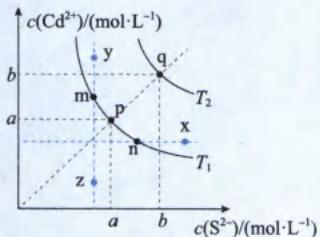

由于 $K_{\mathrm{sp}}(\mathrm{CdS})=c(\mathrm{Cd}^{2+})\cdot c(\mathrm{S}^{2-})$ ，所以 $c(\mathrm{Cd}^{2+})$ 、 $c(\mathrm{S}^{2-})$

的关系曲线与反比例函数图像相似

<table><tr><td>点或线</td><td>意义</td></tr><tr><td>p、q</td><td>p点: $c(Cd^{2+})=c(S^{2-})=a$  mol/L,温度为 $T_1$ 时 $K_{\text{sp(I)}}=a^2$ q点: $c(Cd^{2+})=c(S^{2-})=b$  mol/L,温度为 $T_2$ 时 $K_{\text{sp(II)}}=b^2$ 且 $K_{\text{sp(II)}}=b^2>K_{\text{sp(I)}}=a^2(\Delta H>0,升高温度促进CdS溶解。)$ </td></tr><tr><td>m、n</td><td>m、n均在 $T_1$ 时的溶解平衡线上,因此m、n点横纵坐标之积: $c(Cd^{2+})\cdot c(S^{2-})=a^2$ (温度相同, $K_{\text{sp}}$ 亦相同)。m点时, $c(Cd^{2+})>c(S^{2-})$ ;n点时, $c(Cd^{2+})<c(S^{2-})$ 。</td></tr><tr><td>x、y、z</td><td>“ $T_1$ 温度下”,x、y、z三点的意义:(1)x、y点是过饱和点,这两点的 $Q>K_{\text{sp(I)}}$ ,会生成沉淀。(2)z点是不饱和点,该点 $Q$ </td></tr><tr><td>p→q</td><td>升高温度</td></tr><tr><td>q→p</td><td>降低温度</td></tr><tr><td>p→n</td><td>增大\( c(S^{2-}),利用同离子效应,让溶解平衡逆向移动(温度不变, $K_{\text{sp}}$ 不变)</td></tr><tr><td>p→m</td><td>增大 $c(Cd^{2+})$ ,利用同离子效应,让溶解平衡逆向移动(温度不变, $K_{\text{sp}}$ 不变)</td></tr><tr><td>z→m</td><td>往体系中加入可溶性镉盐的固体,如 $CdCl_2$ 固体</td></tr><tr><td>z→n</td><td>加入一定量的可溶性镉盐和可溶性硫化物</td></tr></table>

## 二、离子浓度的负对数关系图——以 $BaSO_{4}$ 、 $BaCO_{3}$ 为例， $K_{\mathrm{sp}}(\mathrm{BaCO}_{3})>K_{\mathrm{sp}}(\mathrm{BaSO}_{4})$

1. 读图时首先确定坐标轴含义: 负对数图像是减函数, 所以横纵坐标越大, 离子浓度反而越小。

2. 横、纵坐标乘积: ①>②, 说明离子浓度: ①<②, $K_{\mathrm{sp}}$ : ①<②。由于 $K_{\mathrm{sp}}(\mathrm{BaCO}_{3}) > K_{\mathrm{sp}}(\mathrm{BaSO}_{4})$ , 则直线 ① 代表 $\mathrm{BaSO}_{4}$ , 且 $K_{\mathrm{sp}}(\mathrm{BaSO}_{4}) = 1 \times 10^{-10}$ ; 直线 ②: 代表 $\mathrm{BaCO}_{3}$ , $K_{\mathrm{sp}}(\mathrm{BaCO}_{3}) = 1 \times 10^{-8.5}$ 。

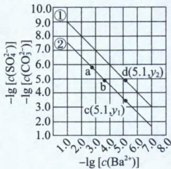

3. $a \rightarrow b$ : 横坐标增大, 纵坐标减小, 即 $c(\mathrm{Ba}^{2+})$ 减小, $c(\mathrm{CO}_{3}^{2-})$ 增大。往 a 点加入 $Na_{2}CO_{3}$ 固体可到 b 点。

4. b→a: 横坐标减小, 纵坐标增大, 即 $c(\mathrm{Ba}^{2+})$ 增大, $c(\mathrm{CO}_{3}^{2-})$ 减小。往 b 点加入 $BaCl_{2}$ 固体可到 a 点。

5. c、d: $c(\mathrm{Ba}^{2+})=1\times10^{-5.1}$ 且 $BaCO_{3}$ 、 $BaSO_{4}$ 固体共存的体系中， $\frac{c(\mathrm{CO}_{3}^{2-})}{c(\mathrm{SO}_{4}^{2-})}=\frac{10^{-y_{1}}}{10^{-y_{2}}}=10^{(y_{2}-y_{1})}$ 。

三、离子浓度负对数与 $\mathrm{pH}$ 的关系图——以 $\mathrm{Fe(OH)}_3$ 、 $\mathrm{Al(OH)}_3$ 和 $\mathrm{Cu(OH)}_2$ 在水中达沉淀溶解平衡时的 $\mathrm{pM - pH}$ 关系图为例。[ $\mathrm{pM} = -\lg c(\mathrm{M}),c(\mathrm{M})\leqslant 1\times 10^{-5}\mathrm{mol / L}$ 可认为M离子沉淀完全。]

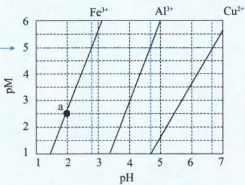

<table><tr><td> $\text{Fe(OH)}_3$ </td><td>1.由a点数据可求 $K_{\text{sp}}[\text{Fe(OH)}_3]$ : $\text{p(Fe}^{3+})=2.5$ ,则 $c(\text{Fe}^{3+})=1\times 10^{-2.5}\text{mol/L}$ ;pH=2,则pOH=14-2=12(题目无特别说明即默认常温), $c(\text{OH}^-)=1\times 10^{-12},K_{\text{sp}}[\text{Fe(OH)}_3]=c(\text{Fe}^{3+})\times c^3(\text{OH}^-)=1\times 10^{-2.5}\times(1\times 10^{-12})^3=1\times 10^{-38.5}$ 。2.根据图中pM=5与 $\text{Fe}^{3+}$ 对应线段的交点可知, $\text{Fe}^{3+}$ 完全沉淀的pH≈2.8。也可以利用 $K_{\text{sp}}$ 计算, $\text{Fe}^{3+}$ 完全沉淀即 $c(\text{Fe}^{3+})=1\times 10^{-5}\text{mol/L}$ ,代入 $K_{\text{sp}}[\text{Fe(OH)}_3]=c(\text{Fe}^{3+})\times c^3(\text{OH}^-)=1\times 10^{-38.5}$ ,可求得 $c(\text{OH}^-)\approx 10^{-11.2}\text{mol/L}$ ,即pOH=11.2,pH=14-11.2=2.8。3.根据图中pM=1与 $\text{Fe}^{3+}$ 对应线段的交点可知,0.1mol/L $\text{Fe}^{3+}$ 开始沉淀的pH≈1.5。也可以利用 $K_{\text{sp}}$ 计算,将 $c(\text{Fe}^{3+})=0.1\text{mol/L}$ ,代入 $K_{\text{sp}}[\text{Fe(OH)}_3]=c(\text{Fe}^{3+})\times c^3(\text{OH}^-)=1\times 10^{-38.5}$ ,可求得 $c(\text{OH}^-)=10^{-12.5}\text{mol/L}$ ,即pOH=12.5,pH=14-12.5=1.5。</td></tr><tr><td> $\text{Al(OH)}_3$ </td><td>按照上述分析方法,由图中pM=6与 $\text{Al}^{3+}$ 对应线段的交点(pH=5)可求 $K_{\text{sp}}[\text{Al(OH)}_3]=1\times 10^{-33},\text{Al}^{3+}$ 完全沉淀的pH≈4.7,0.1mol/L $\text{Al}^{3+}$ 开始沉淀的pH≈3.3。</td></tr><tr><td> $\text{Cu(OH)}_2$ </td><td>按照上述分析方法,由图中pM=1.5与 $\text{Cu}^{2+}$ 对应线段的交点(pH≈5)可求 $K_{\text{sp}}[\text{Cu(OH)}_2]\approx 1\times 10^{-19.5},\text{Cu}^{2+}$ 完全沉淀的pH≈6.7,0.1mol/L $\text{Cu}^{2+}$ 开始沉淀的pH≈4.7。</td></tr><tr><td colspan="2">(1)当 $\text{Fe}^{3+}$ 完全沉淀时(pH≈2.8),0.1mol/L的 $\text{Al}^{3+}$ 还未开始沉淀(pH≈3.3),所以浓度均为0.1mol/L的 $\text{Al}^{3+}$ 和 $\text{Fe}^{3+}$ 可通过分步沉淀进行分离。(2)当 $\text{Al}^{3+}$ 完全沉淀时(pH≈4.7),浓度0.1mol/L的 $\text{Cu}^{2+}$ 已经开始沉淀,所以浓度均为0.2mol/L的 $\text{Al}^{3+}$ 和 $\text{Cu}^{2+}$ 会同时沉淀。(3) $\text{Fe(OH)}_3$ 、 $\text{Al(OH)}_3$ 的pM-pH互为平行线,是因为两种沉淀的阴阳离子均为1∶3。由此可知若pM-pH互为平行线,则两种沉淀阴阳离子个数对应相同。比较 $\text{Al}^{3+}$ 与 $\text{Cu}^{2+}$ 线段可知,pM-pH的斜率越大,则说明阴阳离子的比值越大。(4)若某离子完全沉淀时,另一种离子还未开始沉淀,则二者可以通过分步沉淀进行分离。若某离子还未完全沉淀时,另一种离子已经开始沉淀,则这两种离子会共沉淀。</td></tr></table>

四、沉淀滴定曲线(以 0.100 0 mol/L AgNO $_{3}$ 溶液滴定 50.00 mL 0.050 0 mol/L NaCl 溶液为例)

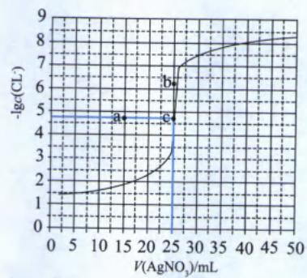

<table><tr><td>原理</td><td>根据 $Cl^{-}+Ag^{+}=AgCl\downarrow$ 可知, $Ag^{+}$ 、 $Cl^{-}$ 按物质的量1∶1反应。往50.00mL0.0500mol/L NaCl溶液中滴加0.1000mol/L  $AgNO_{3}$ 溶液,当50.00mL×0.0500mol/L= $V(AgNO_{3})\times0.1000mol/L$ 时,恰好完全反应,此时 $V(AgNO_{3})=25.00mL$ 。</td></tr><tr><td>c点</td><td> $AgNO_{3}$ 与NaCl恰好完全反应点,则 $c(Ag^{+})=c(Cl^{-})\approx10^{-4.75}mol/L$ (不考虑 $Ag^{+}$ 水解)。 $K_{sp}(AgCl)=c(Ag^{+})\times c(Cl^{-})=c^{2}(Cl^{-})\approx(1\times10^{-4.75})\times(1\times10^{-4.75})\approx1\times10^{-9.5}$ ,则 $K_{sp}(AgCl)$ 的数量级为 $10^{-10}(1\times10^{-a.b}$ 的数量级为 $10^{-(a+1)};1\times10^{a.b}$ 的数量级为 $10^{a}$ )。</td></tr><tr><td>a点</td><td>若a点为恰好完全反应点,此时滴入的 $V(AgNO_{3})=15.00mL$ 。要实现反应终点由c平移至a,即 $V(AgNO_{3})$ 由25.00mL→15.00mL,可行的操作为:1 $V(NaCl)$ 保持不变,将c(NaCl)变为0.0300mol/L;2 $c(NaCl)$ 保持不变,将 $V(NaCl)$ 变为30.00mL。</td></tr><tr><td>b点</td><td>由于纵坐标是负对数,是减函数,b点表示阴离子恰好完全沉淀时,沉淀溶解平衡所产生的阴离子浓度,比AgCl沉淀溶解平衡所产生的 $c(Cl^{-})$ 更少,即沉淀和AgCl同类型,且溶解度比AgCl小的难溶电解质。要实现反应终点由c平移至b,可以将NaCl变成等浓度的NaBr或KI。</td></tr></table>

## 类型 I : pM-pH 关系图

【例 1】(2024·全国甲卷节选)钴在新能源、新材料领域具有重要用途。某炼锌废渣含有锌、铅、铜、铁、钴、锰的+2价氧化物及锌和铜的单质。从该废渣中提取钴的一种流程如下。

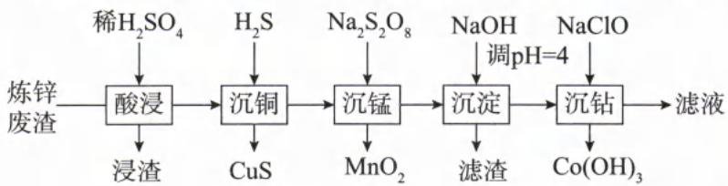

注：加沉淀剂使一种金属离子浓度 $\leqslant 1\times 10^{-5}\mathrm{mol / L}$ ，其他金属离子不沉淀，即认为完全分离。

已知：① $K_{\mathrm{sp}}(\mathrm{CuS})=6.3\times10^{-36},K_{\mathrm{sp}}(\mathrm{ZnS})=2.5\times10^{-22},K_{\mathrm{sp}}(\mathrm{CoS})=4.0\times10^{-21}$ 。
②以氢氧化物形式沉淀时， $\lg\left[c(M)/(mol/L)\right]$ 和溶液pH的关系如图所示。

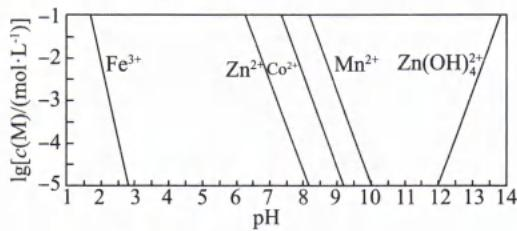

回答下列问题：

(1)假设“沉铜”后得到的滤液中 $c(\mathrm{Zn}^{2+})$ 和 $c(\mathrm{Co}^{2+})$ 均为 $0.10 \, \mathrm{mol/L}$ , 向其中加入 $\mathrm{Na}_{2} \mathrm{~S}$ 至 $\mathrm{Zn}^{2+}$ 沉淀完全, 此时溶液中 $c(\mathrm{Co}^{2+}) =$ \_\_\_\_ mol/L, 据此判断能否实现 $\mathrm{Zn}^{2+}$ 和 $\mathrm{Co}^{2+}$ 的完全分离 (填“能”或“不能”)。

(2)“沉淀”步骤中,用 NaOH 调 pH=4,分离出的滤渣是 \_\_\_\_。

(3)“沉钴”步骤中,控制溶液 pH=5.0\~5.5,加入适量的 NaClO 氧化 $Co^{2+}$ ,根据题中给出的信息,从“沉钴”后的滤液中回收氢氧化锌的方法是:

解析:题干既有金属硫化物的溶解度信息,又有金属氢氧化物的溶解度信息。将问题带回流程,看清楚金属是以硫化物形式沉淀,还是以氢氧化物的形式沉淀。

(1)根据题干的已知信息可知， $c(\mathrm{Zn}^{2+})\leqslant1\times10^{-5}\ \mathrm{mol/L}$ 视为完全沉淀。 $K_{\mathrm{sp}}(\mathrm{ZnS})=c(\mathrm{Zn}^{2+})\times c(\mathrm{S}^{2-})=2.5\times10^{-22}$ ，将 $c(\mathrm{Zn}^{2+})=1\times10^{-5}\ \mathrm{mol/L}$ 带入 $K_{\mathrm{sp}}(\mathrm{ZnS})$ 进行计算， $c(\mathrm{S}^{2-})=\frac{K_{\mathrm{sp}}(\mathrm{ZnS})}{c(\mathrm{Zn}^{2+})}=\frac{2.5\times10^{-22}}{1\times10^{-5}}\ \mathrm{mol/L}=2.5\times10^{-17}\ \mathrm{mol/L}$ 。再将 $c(\mathrm{S}^{2-})=2.5\times10^{-17}\ \mathrm{mol/L}$ 带入 $K_{\mathrm{sp}}(\mathrm{CoS})=c(\mathrm{Co}^{2+})\times c(\mathrm{S}^{2-})=4.0\times10^{-21}$ ，可得 $c(\mathrm{Co}^{2+})=\frac{K_{\mathrm{sp}}(\mathrm{CoS})}{c(\mathrm{S}^{2-})}=\frac{4.0\times10^{-21}}{2.5\times10^{-17}}\ \mathrm{mol/L}=1.6\times10^{-4}\ \mathrm{mol/L}$ ，此时 $Co^{2+}$ 浓度小于其初始浓度0.10 mol/L，可知 $Zn^{2+}$ 沉淀时 $Co^{2+}$ 也共沉淀了，因此不能实现 $Zn^{2+}$ 、 $Co^{2+}$ 的完全分离。

(2)根据题图信息可知,当 $Fe^{3+}$ 完全沉淀,即纵坐标 $\lg c(\mathrm{Fe}^{3+})$ 等于 $-5, c(\mathrm{Fe}^{3+}) = 1 \times 10^{-5} \, \mathrm{mol/L}$ 时,对应的 pH 约为 2.8,所以“沉淀”步骤中,用 NaOH 调 pH=4,分离出的滤渣是 $\mathrm{Fe(OH)}_{3}$ 。

$$
\mathrm{mol} / \mathrm{L} c \left(\mathrm{Zn} ^ {2 +}\right)
$$

$\mathrm{Zn(OH)_2}$ 的 pH 约为 6.3 左右；当 $c(\mathrm{Zn}^{2+}) = 10^{-5} \, \mathrm{mol/L}, c(\mathrm{Zn}^{2+})$ 完全转化成 $\mathrm{Zn(OH)_2}$ ，此时 pH 约为 8.2 左右。由于 $\mathrm{Zn(OH)_2}$ 具有两性，碱性过强， $\mathrm{Zn(OH)_2}$ 又会转化成 $\mathrm{Zn(OH)_4^{2-}}$ ，图中 $\mathrm{Zn(OH)_2}$ 开始转化成 $\mathrm{Zn(OH)_4^{2-}}$ 的 pH = 12。“沉钴”步骤中，控

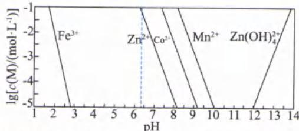

制溶液 pH=5.0\~5.5，此时 $Zn^{2+}$ 还没开始沉淀；继续往该溶液中加入 NaOH 溶液，调节 pH 介于 8.2\~12 之间，让 $Zn^{2+}$ 完全沉淀为 $\mathrm{Zn(OH)_2}$ 且不让 $\mathrm{Zn(OH)_2}$ 溶解成 $\mathrm{Zn(OH)_4^{2-}}$ ，在此 pH 范围内将 $\mathrm{Zn(OH)_2}$ 过滤即可。

答案:(1) $1.6\times10^{-4}$ 不能 (2) $\mathrm{Fe(OH)}_{3}$ (3)往滤液中加入NaOH溶液调节pH为8.2\~12之间,再过滤分离

【反思】①由于 $\mathrm{Cu(OH)_2}$ 的 $K_{sp}$ 与很多氢氧化物的 $K_{sp}$ 相近，且 CuS 的 $K_{sp}$ 极小，所以经常用硫化物除去体系中的杂质 $Cu^{2+}$ 。

②当某离子完全沉淀时，另一种离子的 $Q > K_{sp}$ ，则另一种离子也会共沉淀，导致两种离子不能分步沉淀而被完全分离。

③若体系中出现了两性氢氧化物,一定要控制好 pH 的范围,调节 pH 的范围与实验目的有关。

类型Ⅱ:离子浓度的负对数关系图

【例 2】(2023·全国乙卷)一定温度下, AgCl 和 $Ag_{2}CrO_{4}$ 的沉淀溶解平衡曲线如图所示。下列说法正确的是( )

A. a 点条件下能生成 $Ag_{2}CrO_{4}$ 沉淀, 也能生成 AgCl 沉淀

B. b 点时, $c(\mathrm{Cl}^{-}) = c(\mathrm{CrO}_{4}^{2-}), K_{\mathrm{sp}}(\mathrm{AgCl}) = K_{\mathrm{sp}}(\mathrm{Ag}_{2}\mathrm{CrO}_{4})$ C. $Ag_{2}CrO_{4} + 2Cl^{-} \rightleftharpoons 2AgCl + CrO_{4}^{2-}$ 的平衡常数 $K = 10^{7.9}$ D. 向 NaCl、 $Na_{2}CrO_{4}$ 均为 0.1 mol/L 的混合溶液中滴加 $AgNO_{3}$ 溶液, 先产生 $Ag_{2}CrO_{4}$ 沉淀

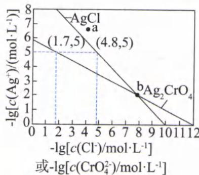

解析:该图像的横纵坐标均为负对数,均为减函数,所以横纵坐标越大,对应的离子浓度越小。

根据图像坐标点(1.7,5)可知， $K_{\mathrm{sp}}(\mathrm{Ag}_{2}\mathrm{CrO}_{4})=c^{2}(\mathrm{Ag}^{+})\cdot c(\mathrm{CrO}_{4}^{2-})=(1\times10^{-5})^{2}\times(1\times10^{-1.7})=10^{-11.7}$ ；根据图像坐标点(4.8,5)可知， $K_{\mathrm{sp}}(\mathrm{AgCl})=c(\mathrm{Ag}^{+})\cdot c(\mathrm{Cl}^{-})=(1\times10^{-5})\times(1\times10^{-4.8})=1\times10^{-9.8}$ 。
A. a 点的横纵坐标“大于”两条曲线上的点（曲线上的点为平衡状态），则 a 点的离子浓度“小于”两条曲线上的点，说明 a 点的 Q 小于 $K_{\mathrm{sp}}(\mathrm{Ag}_{2}\mathrm{CrO}_{4})$ 、 $K_{\mathrm{sp}}(\mathrm{AgCl})$ ，因此 a 点是 $Ag_{2}CrO_{4}$ 以及 AgCl 的不饱和溶液，在此条件下不会生成 $Ag_{2}CrO_{4}$ 、AgCl 沉淀，A 选项错误。
B. b 点的横纵坐标分别相等，即 b 点的 $c(\mathrm{Ag}^{+})$ 、 $c(\mathrm{Cl}^{-})$ 、 $c(\mathrm{CrO}_{4}^{2-})$ 皆相同。根据 $K_{\mathrm{sp}}(\mathrm{Ag}_{2}\mathrm{CrO}_{4})=c^{2}(\mathrm{Ag}^{+})$

$c(\mathrm{CrO}_{4}^{2-})$ 以及 $K_{\mathrm{sp}}(\mathrm{AgCl})=c(\mathrm{Ag}^{+})\cdot c(\mathrm{Cl}^{-})$ 的表达式可知， $K_{\mathrm{sp}}(\mathrm{Ag}_{2}\mathrm{CrO}_{4})<K_{\mathrm{sp}}(\mathrm{AgCl})$ ，B选项错误。[解析一开始即算出 $K_{\mathrm{sp}}(\mathrm{Ag}_{2}\mathrm{CrO}_{4})<K_{\mathrm{sp}}(\mathrm{AgCl})$ ，由于 $K_{\mathrm{sp}}$ 只受温度影响，无论离子浓度如何改变， $K_{\mathrm{sp}}(\mathrm{Ag}_{2}\mathrm{CrO}_{4})$ 始终小于 $K_{\mathrm{sp}}(\mathrm{AgCl})$ 。]

C. 根据选项的数据“ $K=10^{7.9}$ ”可知，该过程需要精确计算。 $\mathrm{Ag_{2}CrO_{4}+2Cl^{-}\rightleftharpoons 2AgCl+CrO_{4}^{2-}}$ 平衡常数

$$
K = \frac {c (\mathrm{CrO} _ {4} ^ {2 -})}{c ^ {2} (\mathrm{Cl} ^ {-})} = \frac {c (\mathrm{CrO} _ {4} ^ {2 -}) \cdot c ^ {2} (\mathrm{Ag} ^ {+})}{c ^ {2} (\mathrm{Cl} ^ {-}) \cdot c ^ {2} (\mathrm{Ag} ^ {+})} = \frac {K _ {\mathrm{sp}} (\mathrm{Ag} _ {2} \mathrm{CrO} _ {4})}{[ K _ {\mathrm{sp}} (\mathrm{AgCl}) ] ^ {2}} = \frac {1 \times 1 0 ^ {- 1 1 . 7}}{1 \times 1 0 ^ {- 9 . 8 \times 2}} = 1 \times
$$

$10^{(-11.7 + 19.6)} = 1 \times 10^{7.9}$ , C 选项正确。  
D. 根据图像上的辅助线与 AgCl 曲线、 $\mathrm{Ag_2CrO_4}$ 曲线的交点可知, AgCl 对应的纵坐标较大, 说明 $c(\mathrm{Cl}^-)$ 和 $c(\mathrm{CrO}_4^{2-})$ 相同时, AgCl 沉淀需要的 $c(\mathrm{Ag}^+)$ 较小, 即 AgCl 溶解度较小。因此往 NaCl、 $\mathrm{Na_2CrO_4}$ 均为 $0.1 \mathrm{~mol} / \mathrm{L}$ 的溶液中滴加 $\mathrm{AgNO_3}$ 溶液时, 先产生 AgCl 沉淀, D 选项错误。

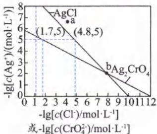

答案:C

【反思】(1)b点是两条曲线的交点，横坐标大于b点（即阴离子浓度小于约 $1\times10^{-8}$ mol/L），往等浓度的NaCl、 $Na_{2}CrO_{4}$ 混合物中滴加硝酸银溶液， $CrO_{4}^{2-}$ 会先沉淀。横坐标小于b点（即阴离子浓度大于约 $1\times10^{-8}$ mol/L），往等浓度的NaCl、 $Na_{2}CrO_{4}$ 混合物中滴加硝酸银溶液， $Cl^{-}$ 会先沉淀。由此可知，若形成沉淀的类型不同，往等浓度的竞争体系中滴加相同离子，到底哪种离子先沉淀，与 $K_{sp}$ 和起始浓度有关。若形成沉淀类型一样，由于两条线为平行线，往等浓度的竞争体系中滴加相同离子，到底哪种离子先沉淀，只与 $K_{sp}$ 有关； $K_{sp}$ 越小的离子越先沉淀。

(2) 多条曲线的体系中, 求某点是否形成沉淀时, 一定要看清楚参考对象。

## 总结

若未告诉每条线的研究对象,且沉淀不是同一类型(即阴阳离子个数比不一样),判断曲线研究对象的方法主要有两种:

方法一: 定性法

根据阴阳离子的个数比，观察曲线横坐标变化对纵坐标的影响幅度。如本题中，横坐标（即阴离子浓度）变化相同单位，AgCl纵坐标变化幅度更大。因为 $c(\mathrm{Cl}^{-}):c(\mathrm{Ag}^{+})=1:1$ ，而 $c(\mathrm{CrO}_{4}^{2-}):c(\mathrm{Ag}^{+})=1:0.5$ 。即 $c(\mathrm{Cl}^{-})$ 变化1个单位， $c(\mathrm{Ag}^{+})$ 变化1个单位，而 $c(\mathrm{CrO}_{4}^{2-})$ 变化1个单位， $c(\mathrm{Ag}^{+})$ 只变化0.5单位。

方法二:定量假设法

选同一曲线上的两点(最好选取坐标点进行计算)，根据同一物质在相同温度下的 $K_{sp}$ 为定值，则两个点算出 $K_{sp}$ 相同。假设图中同线段上的两个点(1,7,5)、(12,0)为AgCl曲线上的点，根据 $K_{\mathrm{sp}}(\mathrm{AgCl}) = c(\mathrm{Cl}^{-}) \times c(\mathrm{Ag}^{+})$ ，两个点算出的 $K_{\mathrm{sp}}$ 分别为 $1 \times 10^{-6.7}$ 、 $1 \times 10^{-12}$ ， $K_{\mathrm{sp}}$ 差距太大，所以假设错误，因此这两点所在曲线研究的是 $\mathrm{Ag}_{2}\mathrm{CrO}_{4}$ 。[根据 $K_{\mathrm{sp}}(\mathrm{Ag}_{2}\mathrm{CrO}_{4}) = c^{2}(\mathrm{Ag}^{+}) \cdot c(\mathrm{CrO}_{4}^{2-})$ ，上述两个点算出的 $K_{\mathrm{sp}}$ 分别为 $1 \times 10^{-11.7}$ 、 $10^{-12}$ ，数值十分接近，则证明该曲线研究的是 $\mathrm{Ag}_{2}\mathrm{CrO}_{4}$ 。因为(12,0)并非精确的坐标点，因此两点算出来会稍微有点差异。]

【例 3】(2024·辽宁卷) $25^{\circ}$ C下，AgCl、AgBr、 $Ag_{2}CrO_{4}$ 的沉淀溶解平衡曲线如下图所示。某实验小组以 $K_{2}CrO_{4}$ 为指示剂，用 $AgNO_{3}$ 标准溶液分别滴定含 $Cl^{-}$ 水样、含 $Br^{-}$ 水样。

已知:① $\mathrm{Ag_{2}CrO_{4}}$ 为砖红色沉淀;②相同条件下 $\mathrm{AgCl}$ 溶解度大于 $\mathrm{AgBr}$ ;③ $25^{\circ}\mathrm{C}$ 时, $\mathrm{pK_{a_{1}}(H_{2}CrO_{4})=0.7,pK_{a_{2}}(H_{2}CrO_{4})=6.5}$ 。 $\mathrm{pAg=-lg[c(Ag^{+})/(mol\cdot L^{-1})],pX=-lg[c(X^{n-})/(mol\cdot L^{-1})]}$ ( $\mathrm{X^{n-}}$ 代表 $\mathrm{Cl^-},\mathrm{Br^-}$ 或 $\mathrm{CrO_4^{2-}}$ ) 下列说法错误的是( )

A. 曲线②为 $\mathrm{AgCl}$ 沉淀溶解平衡曲线

B. 反应 $\mathrm{Ag_{2}CrO_{4}+H^{+}\rightleftharpoons 2Ag^{+}+HCrO_{4}^{-}}$ 的平衡常数 $K=10^{-5.2}$ C. 滴定 $\mathrm{Cl^-}$ 时,理论上混合液中指示剂浓度不宜超过 $10^{-2.0}\mathrm{~mol/L}$

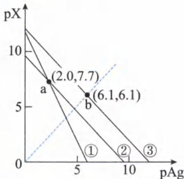

D. 滴定 $\mathrm{Br}^{-}$ 达终点时, 溶液中 $\frac{c(\mathrm{Br}^{-})}{c(\mathrm{CrO}_{4}^{2-})}=10^{-0.5}$

解析: 曲线②③相互平行, 说明曲线②③对应曲线的沉淀类型一样, 则②③可能是 AgCl、AgBr。横纵坐标都是负对数图像, 是减函数图像, 坐标的数值越大, 则对应的离子浓度越小。相同条件下 AgCl 溶解度大于 AgBr, 所以横纵坐标大的曲线③是 AgBr、曲线②是 AgCl, 因此曲线①是 $Ag_{2}CrO_{4}$ 。

$c(\mathrm{Ag}^{+}) = 10^{-\mathrm{pAg}}$ 、 $c(\mathrm{X}^{-}) = 10^{-\mathrm{pX}}$ ，根据 $K_{\mathrm{sp}}(\mathrm{AgBr}) = c(\mathrm{Br}^{-})\times c(\mathrm{Ag}^{+})$ 以及坐标点(6.1,6.1)，可计算 $K_{\mathrm{sp}}(\mathrm{AgBr}) = 10^{-6.1}\times 10^{-6.1} = 10^{-12.2}$ 。根据 $K_{\mathrm{sp}}(\mathrm{AgCl}) = c(\mathrm{Cl}^{-})\times c(\mathrm{Ag}^{+})$ 以及坐标点(2.0,7.7)，可计算 $K_{\mathrm{sp}}(\mathrm{AgCl}) = 10^{-2.0}\times 10^{-7.7} = 10^{-9.7}$ 。根据 $K_{\mathrm{sp}}(\mathrm{Ag_2CrO_4}) = c(\mathrm{CrO_4}^{2 - })\times c^2 (\mathrm{Ag}^+)$ 以及坐标点(2.0,7.7)，可计算 $K_{\mathrm{sp}}(\mathrm{Ag_2CrO_4}) = (10^{-2.0})^2\times 10^{-7.7} = 10^{-11.7}$ 。

B. $pK_{a_{2}}(H_{2}CrO_{4})=6.5$ ，则 $K_{a_{2}}(H_{2}CrO_{4})=1\times10^{-6.5}$ 。 $Ag_{2}CrO_{4}+H^{+}\rightleftharpoons2Ag^{+}+HCrO_{4}^{-}$ 的平衡常数： $K=\frac{c(HCrO_{4}^{-})\times c^{2}(Ag^{+})}{c(H^{+})}=\frac{c(HCrO_{4}^{-})\times c(CrO_{4}^{2-})\times c^{2}(Ag^{+})}{c(H^{+})\times c(CrO_{4}^{2-})}=\frac{K_{sp}(Ag_{2}CrO_{4})}{K_{a_{2}}(H_{2}CrO_{4})}=\frac{1\times10^{-11.7}}{1\times10^{-6.5}}=1\times10^{-5.2}$ ，B 选项正确。

C. 指示剂 $K_{2}CrO_{4}$ 的作用是预测滴定终点的到来，即当 $Cl^{-}$ 恰好反应完时，过量的 $AgNO_{3}$ 与 $K_{2}CrO_{4}$ 反应生成砖红色沉淀。当 $Cl^{-}$ 恰好完全沉淀时 $c(Cl^{-})=c(Ag^{+})$ ，根据 $K_{sp}(AgCl)=c(Cl^{-})\times c(Ag^{+})=c^{2}(Ag^{+})=10^{-9.7}$ ，则 $c(Ag^{+})=\sqrt{K_{sp}(AgCl)}=\sqrt{1\times10^{-9.7}}\ mol/L=1\times10^{-4.85}\ mol/L$ 。

当 $c(Ag^{+})=1\times10^{-4.85}\ mol/L$ 时，根据 $K_{sp}(Ag_{2}CrO_{4})=c(CrO_{4}^{2-})\times c^{2}(Ag^{+})=10^{-11.7}$ 可知， $Ag_{2}CrO_{4}$ 开始沉淀沉淀时， $c(CrO_{4}^{2-})=\frac{K_{sp}(Ag_{2}CrO_{4})}{c^{2}(Ag^{+})}=\frac{10^{-11.7}}{(1\times10^{-4.85})^{2}}=10^{-2.0}\ mol/L$ 。若 $c(CrO_{4}^{2-})>10^{-2.0}\ mol/L$ ，即 $Cl^{-}$ 还未完全沉淀时，就已经开始生成砖红色沉淀 $Ag_{2}CrO_{4}$ ，导致滴定终点提前达到， $V_{标准液}$ 偏小，所测得的 $c(Cl^{-})$ 也偏小，C 选项正确。

D. $\frac{c(Br^{-})}{c(CrO_{4}^{2-})}=\frac{c(Br^{-})\times c^{2}(Ag^{+})}{c(CrO_{4}^{2-})\times c^{2}(Ag^{+})}=\frac{K_{sp}(AgBr)}{K_{sp}(Ag_{2}CrO_{4})}\times c(Ag^{+})=\frac{1\times10^{-12.2}}{1\times10^{-11.7}}\times c(Ag^{+})=1\times10^{-0.5}\times c(Ag^{+})$ ，当 $Br^{-}$ 完全沉淀时， $c(Br^{-})=c(Ag^{+})$ ，根据 $K_{sp}(AgBr)=c(Br^{-})\times c(Ag^{+})=c^{2}(Ag^{+})=10^{-12.2}$ ，则 $c(Ag^{+})=\sqrt{K_{sp}(AgBr)}=\sqrt{1\times10^{-12.2}}\ mol/L=1\times10^{-6.1}\ mol/L$ 。此时 $\frac{c(Br^{-})}{c(CrO_{4}^{2-})}=1\times10^{-0.5}\times c(Ag^{+})=1\times10^{-0.5}\times1\times10^{-6.1}=1\times10^{-6.6}$ ，D 选项错误。

答案:D

【反思】(1)沉淀滴定实验所选指示剂形成的沉淀颜色与待测离子形成的沉淀颜色一定要不同。

(2)指示剂形成的沉淀溶解度尽量要大于待测离子形成的沉淀的溶解度,但又不能太大。指示剂形成沉淀的溶解度太大会导致滴定终点太晚出现,标准溶液消耗过多。

(3)指示剂不能加太多,加入过多的指示剂会导致滴定终点提前达到,使标准溶液消耗过低。

【例 4】(2023·山东卷, 双选) 在含 $\mathrm{HgI}_{2}(\mathrm{s})$ 的溶液中, 一定 $c(\mathrm{I}^{-})$ 范围内, 存在平衡关系: $\mathrm{HgI}_{2}(\mathrm{s}) \rightleftharpoons \mathrm{HgI}_{2}(\mathrm{aq}); \mathrm{HgI}_{2}(\mathrm{aq}) \rightleftharpoons \mathrm{Hg}^{2+} + 2\mathrm{I}^{-}; \mathrm{HgI}_{2}(\mathrm{aq}) \rightleftharpoons \mathrm{HgI}^{+} + \mathrm{I}^{-}; \mathrm{HgI}_{2}(\mathrm{aq}) + \mathrm{I}^{-} \rightleftharpoons \mathrm{HgI}_{3}^{-}; \mathrm{HgI}_{2}(\mathrm{aq}) + 2\mathrm{I}^{-} \rightleftharpoons \mathrm{HgI}_{4}^{2-}$ , 平衡常数依次为 $K_{0}, K_{1}, K_{2}, K_{3}, K_{4}$ 。已知 $\lg c(\mathrm{Hg}^{2+})$ 、

$\lg c(\mathrm{HgI}^{+}), \lg c(\mathrm{HgI}_{3}^{-}), \lg c(\mathrm{HgI}_{4}^{2-})$ 随 $\lg c(\mathrm{I}^{-})$ 的变化关系如图所示，下列说法错误的是（ ）  
A. 线L表示 $\lg c(\mathrm{HgI}_{4}^{2-})$ 的变化情况  
B. 随 $c(\mathrm{I}^{-})$ 增大， $c[\mathrm{HgI}_{2}(\mathrm{aq})]$ 先增大后减小  
C. $a = \lg \frac{K_1}{K_2}$ D. 溶液中I元素与 $\mathrm{Hg}$ 元素的物质的量之比始终为 $2:1$

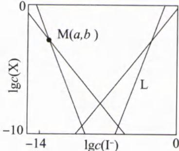

解析：

含 $\mathrm{HgI}_{2}(\mathrm{s})$ 的溶液中，若 $c(\mathrm{I}^{-})$ 较低，主要是 $\mathrm{I}^{-}$ 的同离子效应抑制 $\mathrm{HgI}_{2}(\mathrm{aq})$ 的电离。所以 $c(\mathrm{I}^{-})$ 较低时，随着 $c(\mathrm{I}^{-})$ 的增大， $K_{1}$ 、 $K_{2}$ 代表的平衡逆向移动，则 $c(\mathrm{HgI}^{+})$ 、 $c(\mathrm{Hg}^{2+})$ 均减少，图中的①、②表示 $\mathrm{Hg}^{2+}$ 、 $\mathrm{HgI}^{+}$ 。当体系中 $c(\mathrm{I}^{-})$ 极少时，最有利于 $\mathrm{HgI}_{2}(\mathrm{aq})$ 电离，此时 $\mathrm{Hg}^{2+}$ 与 $\mathrm{I}^{-}$ 分离的最好，即 $\mathrm{Hg}^{2+}$ 百分含量最大。由此可知①代表 $\mathrm{Hg}^{2+}$ ，②代表 $\mathrm{HgI}^{+}$ 。

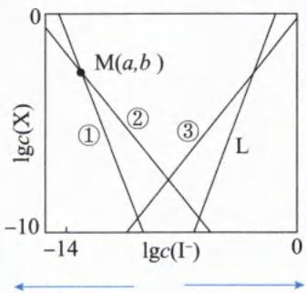  
$c(I^{-})$ 逐渐减小 $c(I^{-})$ 逐渐增大

若加入 $c(\mathrm{I}^{-})$ 较高， $I^{-}$ 主要与 $\mathrm{HgI}_{2}(\mathrm{aq})$ 发生配位反应生成 $HgI_{3}^{-}$ 、 $HgI_{4}^{2-}$ ，且 $c(\mathrm{I}^{-})$ 越高生成的 $HgI_{4}^{2-}$ 越多。当体系中的 $c(\mathrm{I}^{-})$ 无限多时，可以将Hg元素全部转化成 $HgI_{4}^{2-}$ 。由此可知③代表 $HgI_{3}^{-}$ ，L代表 $HgI_{4}^{2-}$ 。

A. 根据上述分析, 曲线 L 表示 $\lg c(\mathrm{HgI}_{4}^{2-})$ 的变化情况, A 选项正确。

B. 由题目信息“在含 $\mathrm{HgI}_2(\mathrm{s})$ 的溶液中”，可知在一定 $c(\mathrm{I}^-)$ 范围内，该溶液为 $\mathrm{HgI}_2$ 饱和溶液， $\mathrm{HgI}_2(\mathrm{s}) \rightleftharpoons \mathrm{HgI}_2(\mathrm{aq})$ 始终达沉淀溶解平衡。根据 $K_0 = c(\mathrm{HgI}_2)$ 且 $K_0$ 只受温度的影响可知，随 $c(\mathrm{I}^-)$ 增大， $c(\mathrm{HgI}_2)$ 一直保持不变，B选项错误。  
C. 由于 $K_1 = \frac{c^2(\mathrm{I}^-) \times c(\mathrm{Hg}^{2+})}{c(\mathrm{HgI}_2)}$ 、 $K_2 = \frac{c(\mathrm{I}^-) \times c(\mathrm{HgI}^+)\}{c(\mathrm{HgI}_2)}$ ，且M点时 $c(\mathrm{HgI}^+) = c(\mathrm{Hg}^{2+})$ 、 $c(\mathrm{I}^-) = 10^a \, \mathrm{mol/L}$ ，则 $\frac{K_1}{K_2} = \frac{c^2(\mathrm{I}^-) \times c(\mathrm{Hg}^{2+})}{c(\mathrm{HgI}_2)} \div \frac{c(\mathrm{I}^-) \times c(\mathrm{HgI}^+)}{c(\mathrm{HgI}_2)} = \frac{c^2(\mathrm{I}^-) \times c(\mathrm{Hg}^{2+})}{c(\mathrm{HgI}_2)} \times \frac{c(\mathrm{HgI}_2)}{c(\mathrm{I}^-) \times c(\mathrm{HgI}^+)} = c(\mathrm{I}^-) = 10^a$ ，则 $\lg \frac{K_1}{K_2} = \lg c(\mathrm{I}^-) = \lg 10^a = a$ ，C选项正确。  
D. 由于溶液中 $c(\mathrm{HgI}_2)$ 为定值，该物质为溶液中I元素与Hg元素的物质的量之比贡献为 $2:1$ 。但实验过程中不断增加 $c(\mathrm{I}^-)$ ，导致I元素与Hg元素的物质的量之比大于 $2:1$ ，D选项错误。

答案: BD

【反思】(1)用极值思维解决问题时,可以在图像上延伸曲线,使曲线之间更有区分度。

(2)该过程可以类比银氨溶液或铜氨溶液的配制过程。

(3)由于图像中线条较多,可以先分类,再通过极值法判断每条线代表的微粒种类。

(4)随着考试难度的加大,水溶液中的离子平衡不仅要考查教材上的电离平衡、水解平衡和难溶电解质的溶解平衡,还要考查配位平衡。处理多种平衡体系时,紧紧抓主K值只受温度的影响,同时利用化学平衡原理解决条件改变时各类平衡的移动方向。

类型Ⅲ: 沉淀滴定曲线图

【例 5】(2022·湖南卷)室温时,用 0.100 mol/L 的标准 AgNO₃ 溶液滴定 15.00 mL 浓度相等的 Cl⁻、Br⁻ 和 I⁻ 的混合溶液,通过电位滴定法获得 lgc(Ag⁺)与 V(AgNO₃)的关系曲线如图所示(忽略沉淀对离子的吸附作用。若溶液中离子浓度小于 1.0×10⁻⁵ mol/L 时,认为该离子沉淀完全。Ksp(AgCl)=1.8×10⁻¹⁰,Ksp(AgBr)=5.4×10⁻¹³,Ksp(AgI)=8.5×10⁻¹⁷。下列说法正确的是()

A. a 点有白色沉淀生成
B. 原溶液中 I⁻ 的浓度为 0.100 mol/L
C. 当 Br⁻ 沉淀完全时，已经有部分 Cl⁻ 沉淀
D. b 点: $c(\mathrm{Cl}^{-}) > c(\mathrm{Br}^{-}) > c(\mathrm{I}^{-}) > c(\mathrm{Ag}^{+})$

解析: $AgNO_{3}$ 与 $X^{-}$ 按物质的量之比为 1:1 反应, 根据 15.00 mL 浓度相等的 $Cl^{-}$ 、 $Br^{-}$ 和 $I^{-}$ 的混合溶液共消耗 4.50 mL 0.100 mol/L 的标准 $AgNO_{3}$ 溶液, 假设 $Cl^{-}$ 、 $Br^{-}$ 和 $I^{-}$ 的浓度均为 x mol/L, 可列出下列计算式:

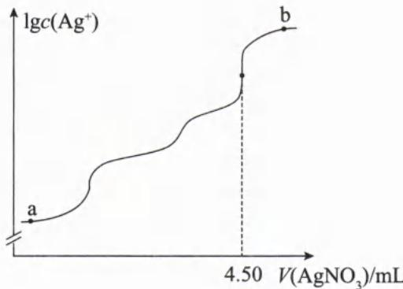

$15x + 15x + 15x = 4.50 \times 0.100$ ，根据计算式可计算出 $x = 0.010$ 。根据 $K_{\mathrm{sp}}(\mathrm{AgCl}) = 1.8 \times 10^{-10}$ ， $K_{\mathrm{sp}}(\mathrm{AgBr}) = 5.4 \times 10^{-13}$ ， $K_{\mathrm{sp}}(\mathrm{AgI}) = 8.5 \times 10^{-17}$ 可计算 $\mathrm{Cl}^{-}$ 、 $\mathrm{Br}^{-}$ 和 $\mathrm{I}^{-}$ 分别开始沉淀和完全沉淀的 $c(\mathrm{Ag}^{+})$ 。 $K_{\mathrm{sp}}(\mathrm{AgCl}) = c(\mathrm{Ag}^{+}) \cdot c(\mathrm{Cl}^{-}) = 1.8 \times 10^{-10}$ ，当 $\mathrm{Cl}^{-}$ 开始沉淀时， $c(\mathrm{Ag}^{+}) = \frac{K_{\mathrm{sp}}(\mathrm{AgCl})}{c(\mathrm{Cl}^{-})} = \frac{1.8 \times 10^{-10}}{0.01} \, \mathrm{mol/L} = 1.8 \times 10^{-8} \, \mathrm{mol/L}$ ；当 $\mathrm{Cl}^{-}$ 完全沉淀时， $c(\mathrm{Ag}^{+}) = \frac{K_{\mathrm{sp}}(\mathrm{AgCl})}{c(\mathrm{Cl}^{-})} = \frac{1.8 \times 10^{-10}}{10^{-5}} \, \mathrm{mol/L} = 1.8 \times 10^{-5} \, \mathrm{mol/L}$ 。 $K_{\mathrm{sp}}(\mathrm{AgBr}) = c(\mathrm{Ag}^{+}) \cdot c(\mathrm{Br}^{-}) = 5.4 \times 10^{-13}$ ，当 $\mathrm{Br}^{-}$ 开始沉淀时， $c(\mathrm{Ag}^{+}) = \frac{K_{\mathrm{sp}}(\mathrm{AgBr})}{c(\mathrm{Br}^{-})} = \frac{5.4 \times 10^{-13}}{0.01} \, \mathrm{mol/L} = 5.4 \times 10^{-11} \, \mathrm{mol/L}$ ；当 $\mathrm{Br}^{-}$ 完全沉淀时， $c(\mathrm{Ag}^{+}) = \frac{K_{\mathrm{sp}}(\mathrm{AgBr})}{c(\mathrm{Br}^{-})} = \frac{5.4 \times 10^{-13}}{10^{-5}} \, \mathrm{mol/L} = 5.4 \times 10^{-8} \, \mathrm{mol/L}$ 。 $K_{\mathrm{sp}}(\mathrm{AgI}) = c(\mathrm{Ag}^{+}) \cdot c(\mathrm{I}^{-}) = 8.5 \times 10^{-17}$ ，当 $\mathrm{I}^{-}$ 开始沉淀时， $c(\mathrm{Ag}^{+}) = \frac{K_{\mathrm{sp}}(\mathrm{AgI})}{c(\mathrm{I}^{-})} = \frac{8.5 \times 10^{-17}}{0.01} \, \mathrm{mol/L} = 8.5 \times 10^{-15} \, \mathrm{mol/L}$ ；当 $\mathrm{I}^{-}$ 完全沉淀时， $c(\mathrm{Ag}^{+}) = \frac{K_{\mathrm{sp}}(\mathrm{AgI})}{c(\mathrm{I}^{-})} = \frac{8.5 \times 10^{-17}}{10^{-5}} \, \mathrm{mol/L} = 8.5 \times 10^{-12} \, \mathrm{mol/L}$ 。

将以上数据整理成表格：

<table><tr><td>物质种类</td><td>AgI</td><td>AgBr</td><td>AgCl</td></tr><tr><td> $K_{sp}(25°C)$ </td><td> $8.5×10^{-17}$ </td><td> $5.4×10^{-13}$ </td><td> $1.8×10^{-10}$ </td></tr><tr><td>开始沉淀的 $c(Ag^{+})[c(X^{-})=0.01mol/L]$ </td><td> $8.5×10^{-15}mol/L$ </td><td> $5.4×10^{-11}mol/L$ </td><td> $1.8×10^{-8}mol/L$ </td></tr><tr><td>完全沉淀的 $c(Ag^{+})$ </td><td> $8.5×10^{-12}mol/L$ </td><td> $5.4×10^{-8}mol/L$ </td><td> $1.8×10^{-5}mol/L$ </td></tr></table>

通过以上数据可知，往混合液中加入 $\mathrm{AgNO_3}$ 溶液， $c(\mathrm{Ag}^{+})$ 由低到高逐渐增大，哪种离子开始沉淀需要的 $c(\mathrm{Ag}^{+})$ 越小，哪种离子就优先沉淀。若先沉淀的离子，其完全沉淀所需 $c(\mathrm{Ag}^{+})$ 小于后沉淀离子开始沉淀的 $c(\mathrm{Ag}^{+})$ ，则这两种离子不会共沉淀；若先沉淀的离子，其完全沉淀所需 $c(\mathrm{Ag}^{+})$ 大于后沉淀离子开始沉淀的 $c(\mathrm{Ag}^{+})$ ，则这两种离子会共沉淀。综上所述，往浓度相等的 $\mathrm{Cl^-}$ 、 $\mathrm{Br^-}$ 和 $\mathrm{I^-}$ 的混合溶液中滴加 $\mathrm{AgNO_3}$ ， $\mathrm{I^-}$ 最先沉淀， $\mathrm{Cl^-}$ 最后沉淀。 $\mathrm{I^-}$ 完全沉淀时， $\mathrm{Br^-}$ 还未开始沉淀，所以可以用沉淀法分离 $\mathrm{Br^-}$ 、 $\mathrm{I^-}$ ；当 $\mathrm{Br^-}$ 完全沉淀时， $\mathrm{Cl^-}$ 已经开始沉淀，所以 $\mathrm{Cl^-}$ 、 $\mathrm{Br^-}$ 会共沉淀，无法分步沉淀分离。

根据图像可知,图像有三次突变点,如右图的 A、B、C 三点。A 点是 I $^{-}$ 恰好完全反应点,此时消耗 AgNO $_{3}$ 体积为 1.50 mL; B 点是 Br $^{-}$ 恰好完全反应点,此时消耗 AgNO $_{3}$ 体积为 3.00 mL; C 点是 Cl $^{-}$ 恰好完全反应点,此时消耗 AgNO $_{3}$ 体积为 4.50 mL。

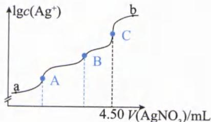

A. a 点 I⁻ 还未沉淀完全, 此时的 $c(\mathrm{Ag}^{+}) < 8.5 \times 10^{-12} \, \mathrm{mol/L}$ , 即此时 $Q(\mathrm{AgCl}) = c(\mathrm{Ag}^{+}) \cdot c(\mathrm{Cl}^{-}) < 8.5 \times 10^{-12} \times 10^{-2} = 8.5 \times 10^{-14}$ , $Q(\mathrm{AgCl}) < K_{\mathrm{sp}}(\mathrm{AgCl})$ , a 点无白色沉淀 AgCl 产生, A 选项错误。

B. 根据上述分析可知, 原溶液 $c(\mathrm{I}^{-})=0.010\ \mathrm{mol/L}$ , B 选项错误。

C. 根据上述表格可知，当 $Br^{-}$ 完全沉淀时， $c(\mathrm{Ag}^{+})$ 约为 $5.4 \times 10^{-8}$ ， $c(\mathrm{Cl}^{-})$ 约为 0.010 mol/L，此时的 $Q(\mathrm{AgCl}) = c(\mathrm{Ag}^{+}) \cdot c(\mathrm{Cl}^{-}) \approx 5.4 \times 10^{-8} \times 10^{-2} \approx 5.4 \times 10^{-10} > K_{\mathrm{sp}}(\mathrm{AgCl}) = 1.8 \times 10^{-10} \, \mathrm{mol/L}$ ，此时有部分 $Cl^{-}$ 已经沉淀，C 选项正确。
D. b 点时 $AgNO_{3}$ 溶液过量，体系中的溶质主要是 $AgNO_{3}$ 。体系中： $c(\mathrm{Ag}^{+}) > c(\mathrm{Cl}^{-}) > c(\mathrm{Br}^{-}) > c(\mathrm{I}^{-})$ ，D 选项错误。

答案:C

【反思】一定要掌握离子开始沉淀、完全沉淀的浓度计算方法。理解什么时候可以分步沉淀，什么时候共沉淀。

【例 6】(2024·全国甲卷) 将 0.10 mmol $Ag_{2}CrO_{4}$ 配制成 1.0 mL 悬浊液, 向其中滴加 0.10 mol/L 的 NaCl 溶液。 $\lg\left[c_{\mathrm{M}}/(\mathrm{mol}/\mathrm{L})\right]$ (M 代表 $Ag^{+}$ 、 $Cl^{-}$ 或 $CrO_{4}^{2-}$ ) 随加入 NaCl 溶液体积 (V) 的变化关系如图所示。下列叙述正确的是 ( )

A. 交点 a 处: $c(\mathrm{Na}^{+}) = 2c(\mathrm{Cl}^{-})$

B. $\frac{K_{\mathrm{sp}}(\mathrm{AgCl})}{K_{\mathrm{sp}}(\mathrm{Ag}_{2}\mathrm{CrO}_{4})}=1\times10^{-2.21}$ C. $V \leqslant 2.0 \, mL$ 时， $\frac{c(\mathrm{CrO}_{4}^{2-})}{c(\mathrm{Cl}^{-})}$ 不变
D. $y_{1} = -7.82, y_{2} = -\lg 34$

解析:首先确定每条曲线研究对象。
方法一:往 $Ag_{2}CrO_{4}$ 的悬浊液中加入 NaCl 溶液会发生沉淀转化反应: $\mathrm{Ag_{2}CrO_{4}(s)+2Cl^{-}(aq)}\rightleftharpoons2\mathrm{AgCl(s)}+\mathrm{CrO_{4}^{2-}(aq)}$ ，通过该反应可知，当 $n(\mathrm{NaCl})=2n(\mathrm{Ag_{2}CrO_{4}})$ ， $Ag_{2}CrO_{4}$ 恰好完全转化 AgCl。由于原料含有 0.10 mmol

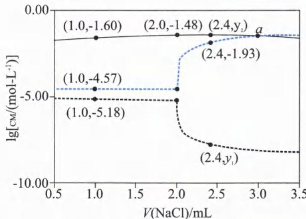

$\text{Ag}_2\text{CrO}_4$ ，其完全反应需要的 $n(\text{NaCl}) = 0.20 \text{ mmol}$ ，则 $V(\text{NaCl}) = 0.20 \text{ mmol} \div 0.10 \text{ mol/L} = 2.0 \text{ mL}$ 。 $V(\text{NaCl}) = 2.0 \text{ mL}$ 的点即恰好完全反应点，该点的溶液中 $\text{CrO}_4^{2-}$ 浓度远大于 $\text{Cl}^-$ 、 $\text{Ag}^+$ ，由图可知黑色实线代表 $\text{CrO}_4^{2-}$ 。当 $V(\text{NaCl}) > 2 \text{ mL}$ 后，随着 NaCl 溶液的不断加入， $c(\text{Cl}^-)$ 增大，AgCl 溶解平衡： $\text{AgCl(s)} \rightleftharpoons \text{Ag}^+(\text{aq}) + \text{Cl}^-(\text{aq})$ 逆向移动。 $c(\text{Cl}^-)$ 增大， $c(\text{Ag}^+)$ 减小；随着溶液体积扩大， $c(\text{CrO}_4^{2-})$ 略有下降。所以黑色实线、蓝色虚线、黑色虚线分别表示 $\text{CrO}_4^{2-}$ 、 $\text{Cl}^-$ 、 $\text{Ag}^+$ 。（这幅图打破常规，在平时练习过程中几乎没见过，所以很难通过定性分析判断每条线的研究对象。）

方法二：平时练习过程中经常遇到 $\text{Ag}_2\text{CrO}_4$ 和 AgCl，并且对二者的 $K_{\text{sp}}$ 数据较为熟悉， $K_{\text{sp}}(\text{AgCl})$ 的数量级为 $10^{-10}$ ， $K_{\text{sp}}(\text{Ag}_2\text{CrO}_4)$ 的数量级为 $10^{-12}$ ，该题可以从众多数据信息入手进行猜测。由于两条虚线上的点对应离子浓度乘积 $= 10^{-4.57} \times 10^{-5.18} = 10^{-9.75}$ ，其数量级为 $10^{-10}$ ，则两条虚线表示 $\text{Cl}^-$ 、 $\text{Ag}^+$ ，实线表示 $\text{CrO}_4^{2-}$ 。假设蓝色虚线是 $\text{Ag}^+$ ，则 $K_{\text{sp}}(\text{Ag}_2\text{CrO}_4) = c(\text{CrO}_4^{2-}) \times c^2(\text{Ag}^+) = 10^{-1.6} \times 10^{-4.57 \times 2} = 10^{-10.74}$ ，数量级为 $10^{-11}$ 。假设黑色虚线是 $\text{Ag}^+$ ，根据坐标点（1.0，-5.18）、（1.0，-1.60），则 $K_{\text{sp}}(\text{Ag}_2\text{CrO}_4) = c^2(\text{Ag}^+) \times c(\text{CrO}_4^{2-}) = (10^{-5.18})^2 \times 10^{-1.6} = 10^{-11.96}$ ，数量级为 $10^{-12}$ ，该数量级符合 $K_{\text{sp}}(\text{Ag}_2\text{CrO}_4)$ 的数量级。因此黑色实线、蓝色虚线、黑色虚线分别表示 $\text{CrO}_4^{2-}$ 、 $\text{Cl}^-$ 、 $\text{Ag}^+$ 。

方法三：根据 $K_{\text{sp}}(\text{AgCl}) = c(\text{Cl}^-) \times c(\text{Ag}^+)$ 可知，当 NaCl 过量时 $c(\text{Cl}^-)$ 与 $c(\text{Ag}^+)$ 必然存在“此消彼长”的关系，因此虚线是 $\text{Ag}^+$ 、 $\text{Cl}^-$ ，黑色实线则表示 $\text{CrO}_4^{2-}$ 。随着 NaCl 的加入， $c(\text{Cl}^-)$ 会增大，所以蓝色虚线、黑色虚线分别 $\text{Cl}^-$ 、 $\text{Ag}^+$ 。

A. 选项的等式中研究对象均为离子，则考查体系中的电荷守恒。a 点 $V(\text{NaCl}) > 2 \text{ mL}$ ， $\text{Ag}_2\text{CrO}_4$ 完全转化为 AgCl 且有过量 NaCl，溶液的溶质有较多 $\text{Na}_2\text{CrO}_4$ 、NaCl 和溶解平衡产生的 AgCl，则该溶液中的电荷守恒表达式为： $c(\text{Na}^+) + c(\text{Ag}^+) + c(\text{H}^+) = 2c(\text{CrO}_4^{2-}) + c(\text{Cl}^-) + c(\text{OH}^-)$ 。根据上述分析以及图像可知，a 点时， $c(\text{Cl}^-) = c(\text{CrO}_4^{2-})$ ，且此时的溶液中 $c(\text{Ag}^+)、c(\text{H}^+)、c(\text{OH}^-)$ 都很小，因此电荷守恒可简写为： $c(\text{Na}^+) = 3c(\text{Cl}^-)$ ，A 选项错误。（由答案反推命题者意图，该选项考查书写电荷守恒时，不要忘记 $c(\text{CrO}_4^{2-})$ 前面要乘上电荷数绝对值“2”。）

B. 当 $V(\text{NaCl}) = 1.0 \text{ mL}$ 时，有一半的 $\text{Ag}_2\text{CrO}_4$ 转化为 AgCl， $\text{Ag}_2\text{CrO}_4$ 与 AgCl 共存，均达到沉淀溶解平衡，取图中横坐标为 1.0 mL 的点，得 $K_{\text{sp}}(\text{AgCl}) = c(\text{Ag}^+) \cdot c(\text{Cl}^-) = 10^{-5.18} \times 10^{-4.57} = 10^{-9.75}$ ， $K_{\text{sp}}(\text{Ag}_2\text{CrO}_4) = c^2(\text{Ag}^+) \cdot c(\text{CrO}_4^{2-}) = (10^{-5.18})^2 \times 10^{-1.60} = 10^{-11.96}$ ，则 $\frac{K_{\text{sp}}(\text{AgCl})}{K_{\text{sp}}(\text{Ag}_2\text{CrO}_4)} = \frac{10^{-9.75}}{10^{-11.96}} = 1 \times 10^{2.21}$ ，B 选项错误。

C. $V < 2.0 \, \text{mL}$ 时， $\text{Ag}_2\text{CrO}_4$ 未完全转化成 AgCl，体系中 $\text{Ag}_2\text{CrO}_4$ 和 AgCl 共存，则 $\frac{K_{\text{sp}}(\text{Ag}_2\text{CrO}_4)}{\overline{\overline{\mathrm{k}_{\mathrm{s p}}}(\mathrm{\mathrm{\Delta C}\mathrm{\Delta P})}} = c(\overline{\mathrm{\mathrm{\Delta C}_{\mathrm{\Delta P}}}} - x)^{-x}(x)^{-x}(x)^{-x}(x)^{-x}(x)^{-x}(x)^{-x}(x)^{-x}(x)^{-x}(x)^{-x}(x)^{-x}(x)^{-x}(x)^{-x}(x)^{-x}(x)^{-x}(x)^{-x}(x)^{-x}(x)^{-x}(x)^{-x}(x)^{-x}(x)^{-x}(x)^{-x}(n - x)^{-n - x / n - x / n - x / n - x / n - x / n - x / n - x / n - x / n - x / n - x / n - x / n - x / n - x / n - x / n - x / n - x / n - x / n - x / n - x / n - x / n - x / n - x / n - x / n - x / n - x / n - x / m - y_1 = -7.82^\circ C_3 + (-7.82^\circ C_3 + (-7.82^\circ C_3 + (-7.82^\circ C_3 + (-7.82^\circ C_3 + (-7.82^\circ C_3 + (-7.82^\circ C_3 + (-7.82^\circ C_3 + (-7.82^\circ C_3 + (-7.82^\circ C_3 + (-(7.82^\circ C_3 + (-7.82^\circ C_3 + (-7.82^\circ C_3 + (-7.82^\circ C_3 + (-7.82^\circ C_3 + (-7.82^\circ C_3 + (-7.82^\circ C_3 + (-7.82^\circ C_3 + (-7.82^\circ C_3 + (-)\cdots(-7.82^\circ C_3 + (-7.82^\circ C_3 + (-7.82^\circ C_3 + (-7.82^\circ C_3 + (-7.82^\circ C_3 + (-7.82^\circ C_3 + (-7.82^\circ C_3 + (-7.82^\circ C_3 + (-7.82^\circ C_3 + (-)) - (-7.82^\circ C_3 + (-7.82^\circ C_3 + (-7.82^\circ C_3 + (-7.82^\circ C_3 + (-7.82^\circ C_3 + (-7.82^\circ C_3 + (-7.82^\circ C_3 + (-7.82^\circ C_3 + (-7.82^\circ C_3 + (+)\cdots(-7.82^\circ C_3 + (-7.82^\circ C_3 + (-7.82^\circ C_3 + (-7.82^\circ C_3 + (-7.82^\circ C_3 + (-7.82^\circ C_3 + (-7.82^\circ C_3 + (-7.82^\circ C_3 + (-7.82^\circ C_n - (\cdots(-7.82^\circ C_n - (\cdots(-7.82^\circ C_n - (\cdots(-7.82^\circ C_n - (\cdots(-7.82^\circ C_n - (\cdots(-7.82^\circ C_n - (\cdots(-7.82^\circ C_n - (\cdots(-7.82^\circ C_n - (\cdots(-7.82^\circ C_n + (\cdots(-7.82^\circ C_n + (\cdots(-7.82^\circ C_n + (\cdots(-7.82^\circ C_n + (\cdots(-7.82^\circ C_n + (\cdots(-7.82^\circ C_n + (\cdots(-7.82^\circ C_n + (\cdots(-7.82^\circ C_n + (\cdots(-7.82^-$ ) - (\cdots(-7.82^\circ C\_n - (\cdots(-7.82^\circ C\_n + (\cdots(-7.82^\circ C\_n + (\cdots(-7.82^\circ C\_n + (\cdots(-7.82^\circ C\_n + (\cdots(-7.82^\circ C\_n + (\cdots(-7.82^\circ C\_n + (\cdots(-7.8$n(\mathrm{Ag}_2\mathrm{CrO}_4)$ ，则 $c(\mathrm{CrO}_4^{2-}) = \frac{n(\mathrm{CrO}_4^{2-})}{V} = \frac{0.1\times 10^{-3}\mathrm{mol}}{(1 + 2.4)\times 10^{-3}\mathrm{L}} = \frac{1}{34}\mathrm{mol / L}$ ，则 $y_{2} = \lg c(\mathrm{CrO}_4^{2-}) = \lg \frac{1}{34} =$ -lg34，D选项正确。

答案:D

【反思】(1)识记一些常见数据,可以将其作为解题突破口。

(2)一定要书写沉淀转化方程式,找准反应物的物质的量之比。

(3)熟悉对数的计算公式,如本题中运用 $\lg \frac{1}{A} = -\lg A$ 。

## 类型Ⅳ: 分布系数-pH 关系图与沉淀溶解平衡的综合

【例 7】(2023·北京卷)利用平衡移动原理,分析一定温度下 $Mg^{2+}$ 在不同 pH 的 $Na_{2}CO_{3}$ 体系中的可能产物。

已知:①图1中曲线表示 $Na_{2}CO_{3}$ 体系中各含碳粒子的物质的量分数与pH的关系。

②图2中曲线Ⅰ的离子浓度关系符合 $c(\mathrm{Mg}^{2+})\cdot c^{2}(\mathrm{OH}^{-})=K_{\mathrm{sp}}[\mathrm{Mg}(\mathrm{OH})_{2}]$ ，曲线Ⅱ的离子浓度关系符合 $c(\mathrm{Mg}^{2+})\cdot c(\mathrm{CO}_{3}^{2-})=K_{\mathrm{sp}}(\mathrm{MgCO}_{3})$ 。

③起始 $c(\mathrm{Na}_{2}\mathrm{CO}_{3})=0.1\ \mathrm{mol/L}$ ，不同 pH 下 $c(\mathrm{CO}_{3}^{2-})$ 由图 1 得到。

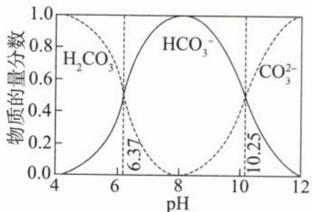  
图1

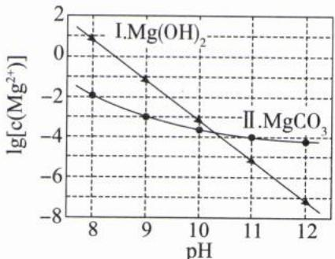  
图2

下列说法错误的是( )

$$
\mathrm{pH} = 1 0. 2 5, c \left(\mathrm{HCO} _ {3} ^ {-}\right) = c \left(\mathrm{CO} _ {3} ^ {2 -}\right)
$$

B. 由图2, 初始状态 $\mathrm{pH} = 11, \lg c(\mathrm{Mg}^{2+}) = -6$ , 无沉淀生成  
C. 由图2, 初始状态 $\mathrm{pH} = 9, \lg c(\mathrm{Mg}^{2+}) = -2$ , 平衡后溶液中存在 $c(\mathrm{H}_2\mathrm{CO}_3) + c(\mathrm{HCO}_3^-) + c(\mathrm{CO}_3^{2-}) = 0.1 \mathrm{~mol/L}$ D. 由图1和图2, 初始状态 $\mathrm{pH} = 8, \lg c(\mathrm{Mg}^{2+}) = -1$ , 发生反应: $\mathrm{Mg}^{2+} + 2\mathrm{HCO}_3^- = \mathrm{MgCO}_3 \downarrow + \mathrm{CO}_2 \uparrow + \mathrm{H}_2\mathrm{O}$

解析:根据图1的含碳微粒分布系数可以计算 $K_{a_1}$ 和 $K_{a_2}$ 。 $HCO_3^-$ 、 $H_2CO_3^-$ 分布系数曲线的交点代表 $c(HCO_3^-)=c(H_2CO_3)$ ，pH=6.73即 $c(H^+) = 10^{-6.73}$ mol/L，则 $K_{a_1} = \frac{c(H^+) \cdot c(HCO_3^-)}{c(H_2CO_3)} = 10^{-6.37}$ 。 $HCO_3^-$ 、 $CO_3^{2-}$ 分布系数曲线的交点代表 $c(HCO_3^-) = c(CO_3^{2-})$ ，pH=10.25即 $c(H^+) = 10^{-10.25}$ mol/L，则 $K_{a_2} = \frac{c(H^+) \cdot c(CO_3^{2-})}{c(HCO_3^-)} = 10^{-10.25}$ 。

A. 根据图 1 的第二个交点可知，pH=10.25 时， $c(\mathrm{CO}_{3}^{2-})=c(\mathrm{HCO}_{3}^{-})$ ，A 选项正确。

B. 由图2可知, 初始状态 $\mathrm{pH} = 11, \lg c (\mathrm{Mg}^{2+}) = -6$ 的交点在图2的 $\mathrm{Mg(OH)}_2$ 和 $\mathrm{MgCO}_3$ 的沉淀溶解平衡曲线下方, 溶液中离子浓度偏小, 为不饱和溶液 (或此时 $Q[\mathrm{Mg(OH)}_2] < K_{\mathrm{sp}}[\mathrm{Mg(OH)}_2]$ 且 $Q[\mathrm{MgCO}_3] < K_{\mathrm{sp}}[\mathrm{MgCO}_3]$ ), 因此不会生成 $\mathrm{Mg(OH)}_2$ 或 $\mathrm{MgCO}_3$ 沉淀, B选项正确。  
C. 根据图2可知, $\mathrm{pH} = 9, \lg c (\mathrm{Mg}^{2+}) = -2$ 的交点处位于:

(1) $\mathrm{Mg(OH)_2}$ 淀溶解平衡曲线下方:该条件下为 $\mathrm{Mg(OH)_2}$ 的不饱和点,无 $\mathrm{Mg(OH)_2}$ 沉淀析出。

(2) $MgCO_{3}$ 沉淀溶解平衡曲线上方:该条件下为 $MgCO_{3}$ 的过饱和点,有 $MgCO_{3}$ 沉淀析出。

C选项考查的等式中研究对象均与碳原子有关,因此该等式考查碳的元素守恒。根据上述分析,有一部分碳原子转化成 $MgCO_{3}$ 沉淀析出，则留在溶液中的碳原子少于 0.1 mol/L。即 $c(\mathrm{H}_{2}\mathrm{CO}_{3}) + c(\mathrm{HCO}_{3}^{-}) + c(\mathrm{CO}_{3}^{2-}) < 0.1 \, \mathrm{mol/L}$ ，C 选项错误。

D. 根据图 2 可知, pH=8, $\lg c(Mg^{2+})=-1$ 的交点位于两条曲线之间, 分析方法同 C 选项, 该条件下有 $Mg-CO_{3}$ 沉淀析出, 无 $\mathrm{Mg(OH)}_{2}$ 沉淀析出; 再根据图 1 可知, 初始状态 pH=8 时, 体系中的 $c(\mathrm{HCO}_{3}^{-})$ 最多。结合图 1 和图 2 可知, 此时的离子方程式为: $\mathrm{Mg}^{2+}+2\mathrm{HCO}_{3}^{-}=\mathrm{MgCO}_{3}\downarrow+\mathrm{CO}_{2}\uparrow+\mathrm{H}_{2}\mathrm{O}, \mathrm{D}$ 选项正确。
答案:C

【反思】当图像涉及到多个点的分析时,一定要做辅助线,才容易观察研究点与各曲线的关系。

【例 8】(2024·浙江卷)室温下, $H_{2}S$ 水溶液中各含硫微粒物质的量分数 $\delta$ 随 pH 变化关系如下图[例如 $\delta(H_{2}S)=\frac{c(H_{2}S)}{c(H_{2}S)+c(HS^{-})+c(S^{2-})}$ ]。已知: $K_{\mathrm{sp}}(\mathrm{FeS})=6.3\times10^{-18},K_{\mathrm{sp}}[\mathrm{Fe(OH)}_{2}]=4.9\times10^{-17}$ 。下列说法正确的是()

$4.9 \times 10^{-17}$ 。下列说法正确的是( )

A. 溶解度: FeS 大于 Fe(OH) $_{2}$ B. 以酚酞为指示剂(变色的 pH 范围 8.2～10.0), 用 NaOH 标准溶液可滴定水溶液的 H $_{2}$ S 浓度

C. 忽略 S $^{2-}$ 的第二步水解, 0.10 mol/L 的 Na $_{2}$ S 溶液中 S $^{2-}$ 水解率约为 62%

D. 0.010 mol/L 的 FeCl $_{2}$ 溶液中加入等体积 0.20 mol/L 的 Na $_{2}$ S 溶液, 反应初始生成的沉淀是 FeS

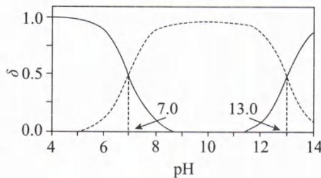

解析: 在 $H_{2}S$ 溶液中存在电离平衡: $H_{2}S \rightleftharpoons H^{+} + HS^{-}$ 、 $HS^{-} \rightleftharpoons H^{+} + S^{2-}$ ，往体系中加入碱，溶液 pH 增大， $H_{2}S$ 的电离平衡正向移动， $H_{2}S$ 的物质的量分数逐渐减小， $HS^{-}$ 的物质的量分数先增大后减小， $S^{2-}$ 的物质的量分数逐渐增大，图中曲线①、②、③依次代表 $H_{2}S$ 、 $HS^{-}$ 、 $S^{2-}$ 的物质的量分数随 pH 的变化。由①和②交点 $\left[c\left(\mathrm{H}_{2}\mathrm{S}\right)=c\left(\mathrm{HS}^{-}\right)\right.$ 且 pH=7.0 可知， $K_{a_{1}}\left(\mathrm{H}_{2}\mathrm{S}\right)=\frac{c\left(\mathrm{HS}^{-}\right)\times c\left(\mathrm{H}^{+}\right)}{c\left(\mathrm{H}_{2}\mathrm{S}\right)}=1\times10^{-7}$ 。由②和③交点 $\left[c\left(\mathrm{S}^{2-}\right)=c\left(\mathrm{HS}^{-}\right)\right.$

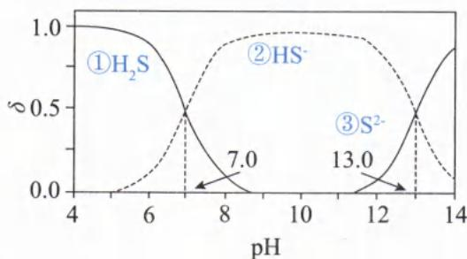

$$
\mathrm{pH} = 1 3. 0 ]
$$

$$
K _ {\mathrm{a} _ {2}} (\mathrm{H} _ {2} \mathrm{S}) = \frac {c (\mathrm{S} ^ {2 -}) \times c (\mathrm{H} ^ {+})}{c (\mathrm{HS} ^ {-})} = 1 \times 1 0 ^ {- 1 3}
$$

A. FeS 的沉淀溶解平衡为: $\mathrm{FeS(s)} \rightleftharpoons \mathrm{Fe}^{2+}(\mathrm{aq}) + \mathrm{S}^{2-}(\mathrm{aq})$ ，饱和 FeS 溶液中 $c(\mathrm{Fe}^{2+}) = c(\mathrm{S}^{2-})$ ，则 $K_{\mathrm{sp}}(\mathrm{FeS}) = c(\mathrm{Fe}^{2+}) \times c(\mathrm{S}^{2-}) = c^2 (\mathrm{S}^{2-}) = 6.3 \times 10^{-18}$ ，因此 $c(\mathrm{S}^{2-}) = \sqrt{K_{\mathrm{sp}}(\mathrm{FeS})} = \sqrt{6.3 \times 10^{-18}} \approx \sqrt{64 \times 10^{-19}} \approx 8 \times 10^{-9.5} (\mathrm{mol/L})$ ，即 FeS 的溶解度约为 $8 \times 10^{-9.5} \, mol/L$ 。 $\mathrm{Fe(OH)}_2$ 的溶解平衡为 $\mathrm{Fe(OH)}_2 \rightleftharpoons \mathrm{Fe}^{2+}(\mathrm{aq}) + 2\mathrm{OH}^-(\mathrm{aq})$ ，饱和 $\mathrm{Fe(OH)}_2$ 溶液中 $2c(\mathrm{Fe}^{2+}) = c(\mathrm{OH}^-)$ ，则 $K_{\mathrm{sp}}[\mathrm{Fe(OH)}_2] = c(\mathrm{Fe}^{2+}) \times c^2 (\mathrm{OH}^-) = 4c^3 (\mathrm{Fe}^{2+}) = 4.9 \times 10^{-17}$ ，因此 $c(\mathrm{Fe}^{2+}) = \sqrt[3]{\frac{K_{\mathrm{sp}}([\mathrm{Fe(OH)}_2])}{4}} = \sqrt[3]{\frac{4.9 \times 10^{-17}}{4}} \approx \sqrt[3]{1 \times 10^{-17}} \approx 10^{-5.7} (\mathrm{mol/L})$ ，即 $\mathrm{Fe(OH)}_2$ 的溶解度约为 $10^{-5.7} \, mol/L$ 。综上所述，溶解度 $\mathrm{Fe(OH)}_2 > \mathrm{FeS}$ ，A 选项错误。

滴定前溶液呈酸性，锥形瓶溶液颜色为无色，当酚酞由无色变成浅红时（即 $\mathrm{pH} = 8.2$ )时，根据图像可知，体系中的 $\mathrm{H}_2\mathrm{S}$ 还未完全转化成 $\mathrm{HS}^{-}$ ，因此不能用酚酞作指示剂判断滴定终点，B选项错误。方法二：计算法

根据 $\mathrm{pH} = 8.2$ 以及 $K_{\mathrm{a_1}}(\mathrm{H_2S}) = \frac{c(\mathrm{HS^-})\times c(\mathrm{H^+})}{c(\mathrm{H_2S})} = \frac{c(\mathrm{HS^-})\times 10^{-8.2}}{c(\mathrm{H_2S})} = 1\times 10^{-7},\frac{c(\mathrm{HS^-})}{c(\mathrm{H_2S})} = \frac{1\times 10^{-7}}{10^{-8.2}} = 10^{1.2}\approx 10^{1}$ 此时还有约 $\frac{1}{11}$ 的 $\mathrm{H}_2\mathrm{S}$ 未反应，误差较大，B选项错误。  
C.设参与水解的 $c(\mathrm{S}^{2 - })$ 为 $x\mathrm{mol / L},\mathrm{Na}_2\mathrm{S}$ 溶液中存在水解平衡：

$$
\begin{array}{r l r l r l}&&{\mathrm {S^ {2 - }}}&{+}&{\mathrm {H_ {2} O}}&{\rightleftharpoons \mathrm {HS^ {-}}}&{+}&{\mathrm {OH^ {-}}}&{(忽 略 第 二 步 水 解),}\\{c _ {0} / (\mathrm{mol/L})}&{0. 1}&&&&{0}&&{0}\\{\Delta c / (\mathrm{mol/L})}&{x}&&&&{x}&&{x}\\{c _ {\text {平}} / (\mathrm{mol/L})}&{0. 1 - x}&&&&{x}&&{x}\end{array}
$$

$K_{\mathrm{h}} = \frac{x^{2}}{0.1 - x}$ ，且 $K_{\mathrm{h}} = \frac{K_{\mathrm{w}}}{K_{\mathrm{a_2}}} = \frac{10^{-14}}{10^{-13}} = 0.1$ ，则 $\frac{x^2}{0.1 - x} = 0.1,x^2 +0.1x - 0.01 = 0$ ，用求根公式法计算：

$$
x = \frac {- 0 . 1 + \sqrt {0 . 1 ^ {2} + 4 \times 1 \times 0 . 0 1}}{2 \times 1} \approx \frac {- 0 . 1 + \sqrt {0 . 0 5}}{2} = \frac {- 0 . 1 + \sqrt {5} \times 0 . 1}{2} \approx \frac {- 0 . 1 + 0 . 2 2 4}{2} \approx \frac {0 . 1 2 4}{2} \approx
$$

$$
0. 0 6 2 (\mathrm{mol} / \mathrm{L})
$$

$\mathrm{S}^{2-}$ 水解率： $\alpha (\mathrm{S}^{2-}) = \frac{\Delta c}{c_0}\times 100\% = \frac{0.062}{0.1}\times 100\% = 62\%$ ，C选项正确。[由 $K_{\mathrm{a}_2}(\mathrm{H}_2\mathrm{S}) = 1\times 10^{-13}$ 数值极小可知，HS电离程度极弱，即 $\mathrm{S}^{2-}$ 水解程度很大，因此三段式中 $c_{\text{平}}(\mathrm{S}^{2-}) = 0.1 - x$ ，这个 $x$ 是不可以忽略的。最后计算所得的 $\mathrm{S}^{2-}$ 水解率为 $62\%$ ，可以证实其水解程度很大。若 $c_{\text{平}}(\mathrm{S}^{2-}) = 0.1 - x$ 的 $x$ 忽略了，算出来的 $\mathrm{S}^{2-}$ 水解率为 $100\%$ ，和正确的 $62\%$ 相差甚远！]

D. 0.010 mol/L FeCl₂ 与 0.20 mol/L Na₂S 等体积混合的瞬间, c(FeCl₂) = 0.005 mol/L、c(Na₂S) = 0.10 mol/L (等体积混合后溶液体积变为原来的 2 倍, 则浓度变为原浓度的一半)。根据 C 选项分析可知, 0.10 mol/L 的 Na₂S 溶液中, c(S²⁻)、c(OH⁻) 分别约为 0.038 mol/L、0.062 mol/L。因此混合溶液的 Q(FeS) = c(Fe²⁺) × c(S²⁻) = 0.005 × 0.038 = 1.9 × 10⁻⁴ > Ksp(FeS), Q[Fe(OH)₂] = c(Fe²⁺) × c²(OH⁻) = 0.005 × (0.062)² = 1.922 × 10⁻⁵ > Ksp[Fe(OH)₂]。综上所述, 此时生成的沉淀有 FeS 和 Fe(OH)₂, D 选项错误。

## 答案:C

【反思】(1)相邻两条分布系数曲线的交点 pH 可计算 $K_{a}$ 。

(2) 不同类型的物质, 不能直接比较 $K_{sp}$ 的数量级来判断溶解度的大小, 而是先开方, 再比较; 开方次数即阴阳离子的个数和。

(3) 若水解程度较大时, 盐电离的弱离子水解后的剩余浓度不能忽略其水解反应中的消耗量。

# 模块 1 原电池

习题：P69

## 第 1 节 原电池基本概念(★★★)

## 内容提要

一、定义：将化学能直接转化为电能的装置。

二、能量转化:化学能→电能。

三、形成原电池的条件：

1. 两极的电势不同(存在电势差),有能自发的氧化还原反应。

2. 形成闭合回路

(1) 外电路: 电极材料用导线连接或相接触。

(2) 内电路: 提供能使阴、阳离子迁移的环境。

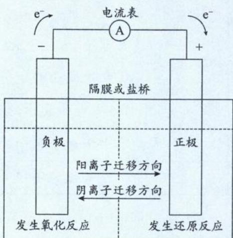

注：①内环境可以是电解质溶液、熔融电解质、固态离子导体。

②原电池构成的四大基本要素:电极反应、电极材料、离子导体、电子导体。

四、原电池基本概念(以锌铜原电池为例):

1. 内电路: 依赖离子导电的电解质部分称为内电路。

2. 外电路: 依赖电子导电的导线部分称为外电路。

3. 盐桥：

(1) 组成: 固定剂是琼脂, 电解质溶液常用饱和 KCl 溶液或饱和 $KNO_{3}$ 溶液。

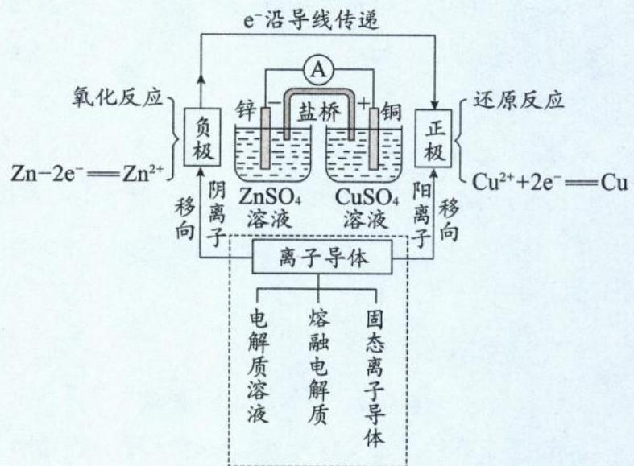  
传导离子

(2)作用:连接内电路,形成闭合回路;使溶液电荷守恒,便于源源不断产生电流;避免氧化剂、还原剂直接接触,增大化学能转化成电能的效率。

(3)离子移动方向:阳离子往正极移动、阴离子往负极移动(原电池“放电”时离子移动口诀:正正负负,即“正”电荷离子往“正”极移动、“负”电荷离子往“负”极移动)。

注:①盐桥中的溶质不能和两个“半电池”中的离子反应。

②盐桥是往两个“半电池”中分别传递阴、阳离子，而不是让半电池中的离子通过盐桥移动（可以理解为原电池的盐桥中的离子只出不进）。

③盐桥使用一段时间后,可重新放回饱和电解质溶液复原。

④电子在外电路通过(电子不下“水”),离子在内电路通过(离子不上“岸”)。

⑤外电路中，电流均从高电势流向低电势，所以正极电势高于负极。

## 4. 正负极判断：

<table><tr><td>负极</td><td>正极</td></tr><tr><td>物质失电子、发生氧化反应、化合价升高的一极</td><td>物质得电子、发生还原反应、化合价降低的一极</td></tr><tr><td>外电路中电子流出的一极</td><td>外电路中电子流入的一极</td></tr><tr><td>内电路中阴离子移向的一极</td><td>内电路中阳离子移向的一极</td></tr><tr><td>电势低的一极</td><td>电势高的一极</td></tr></table>

注:(1)正、负极是矛盾关系,由于矛盾的对立性,正、负极的特征往往相反。为了事半功倍,重点记忆某一极的特征即可。

(2)矛盾既对立又统一,正极得电子总数与负极失电子总数相同。

(3) 注意学科之间的联系, 充分利用物理学中的电学知识来理解并掌握电化学知识。

(4) 记忆原电池放电时“负极”的口诀: “活养父, 失声音, 子出解” (活的养父失声音, 养子出来解释)。

活:两金属电极中相对活泼的一极为负极;养:负极或负极周围的活性物质被氧化、发生氧化反应、生成氧化产物;父:负极;失:失电子;声:负极化合价升高;音:溶液中的阴离子往负极移动;子出:电子从负极流出;解:负极若为金属单质往往会溶解。解题的时候,抓住负极的一个特征,然后各个击破。

## 五、原电池原理的应用

1. 金属活动性比较: 一般情况下, 负极金属单质的活泼性强于正极。

注：高中有两个重要例外，活泼性弱的金属单质作负极

(1) Al 可以与 NaOH 溶液反应而 Mg 不行, 因此 Mg、Al 用导线相连放入 NaOH 溶液所构成的原电池, 活泼性较弱的 Al 反而为负极。

(2) 常温下, Fe、Al 遇浓硝酸会钝化, Fe、Cu (或 Al、Cu) 用导线相连放入冷的浓硝酸所构成的原电池, 活泼性较弱的 Cu 反而为负极。

(3)由于环境会一定程度地影响金属的活泼性,所以做电化学的题目时,一定要注意环境的影响。

2. 加快化学反应速率: 纯净金属和酸反应比较慢, 当加入少量比该金属更惰性的金属形成原电池后, 会加速金属与酸的反应。

3. 金属防腐:为了避免某金属的腐蚀(金属单质失电子被氧化),可以将该金属与比其更活泼的其他金属相连,该金属作为原电池的正极而被保护,该方法称为牺牲阳极法。

注:一般而言,在原电池装置中,电极分正、负极;在电解池中,电极分阴、阳极。但在电化学的广义范畴中,只要是失电子的一极均可称为阳极,得电子的一极均可称为阴极。

六、原电池的设计

利用氧化还原反应原理设计高效的原电池装置(含盐桥),设计流程如下:

第一步:先分析总反应,寻找氧化剂、还原剂和环境。

第二步:选择正、负极材料

1. 若氧化剂、还原剂是固体,一般直接做正极、负极材料。电解质就选不直接和电极发生反应的电解质溶液即可。

2. 若氧化剂、还原剂为溶液中的某种粒子, 则二者分别为两个半电池的正极、负极对应的电解质溶液。电极就选导电而又不会与电解质反应的导体即可(常用石墨或 Pt 作辅助电极)。

3. 若氧化剂、还原剂是气体, 则需要寻找 Pt 或石墨载体(燃料电池的两个电极材料可以相同), 将气体分别通入正极、负极。电解质就选不直接和电极以及气体发生反应的电解质溶液即可。

第三步:选择合适的溶液(多数时候可选饱和 KCl 溶液)构成盐桥。

第四步:用盐桥将内电路连接,用导线将两个电极连通构成外电路。

第五步:画出总装置图即可。

注:原电池装置不一定有盐桥,但高效的原电池以及氧化剂和还原剂均为溶液的电池一般需要盐桥连接内电路。

## 类型 I: 基本概念的易错辨析

【例 1】正误判断, 正确的填“√”, 错误的填“×”

(1)原电池工作时,电子从负极流出,流经电解质溶液,最后流入电池的正极()

(2)原电池工作时,电流的方向由正极→负载→负极→原电池中电解质环境→正极()

(3)原电池工作时,正极电势高于负极()

(4)原电池工作时,负极质量一定减小,正极质量一定增大()

(5)原电池的内电路一定是水溶液()

(6)原电池装置一定存在盐桥()

(7)构成原电池的正极和负极材料必须是两种活泼性不同的金属()

解析:(1)(×)原电池工作时,电子只在外电路流动,不会进入内电路。

(2)(√)原电池工作时,电子、离子分别的运动都不会直接构成闭合回路,但电流会构成闭合回路,即溶液中不会有电子,但离子定向移动可以形成电流。电流的方向为:正极→导线→负载(用电器)→导线→负极→电解质环境→正极。

(3)(√)外电路中,电流方向就是电势由高到低的方向,所以正极电势高于负极。

(4)(×)原电池反应中,正负极的质量变化需要看电极材料以及电解质环境。如铅蓄电池放电时,负极由Pb生成 $PbO_{2}$ ,负极质量增加;又如锌—铜—硫酸电池的正极反应是: $2H^{+}+2e^{-}=H_{2}\uparrow$ ,正极放出气体,正极材料本身质量不变。

(5)(×)内电路主要依赖离子的定向移动导电,内电路可以是电解质溶液,可以是熔融电解质,还可以是允许某些离子通过的固体离子导体。

(6)(×)简易的原电池装置不存在盐桥,只是引入盐桥会提高原电池的能量利用率。

(7)(×)正、负极参与反应的物质不一定是金属单质,也可以是气体或是溶液中的离子,因此构成原电池的正极和负极可以是两种活泼性不同的金属,也可以是相同的金属,或是导电的非金属(如石墨)等。

答案:(1)× (2)√ (3)√ (4)× (5)× (6)× (7)×

类型Ⅱ:原电池工作原理

【例 2】(2021·广东卷)火星大气中含有大量 $CO_{2}$ ，一种有 $CO_{2}$ 参加反应的新型全固态电池有望为火星探测器供电。该电池以金属钠为负极，碳纳米管为正极，放电时（）
A. 负极上发生还原反应
B. $CO_{2}$ 在正极上得电子
C. 阳离子由正极移向负极
D. 将电能转化为化学能

解析: A. 根据题干信息可知, 负极是金属钠, 正极是碳纳米管, 正极参与反应的氧化剂是 $CO_{2}$ 。负极是还原剂被氧化, 发生氧化反应, A 选项错误。
B. $CO_{2}$ 在正极得到电子被还原, B 选项正确。
C. 原电池放电时, 阳离子往正极移动(口诀: 正正负负), C 选项错误。
D. 该装置为原电池, 是将化学能转化成电能, D 选项错误。

答案:B

【例 3】如图 I、Ⅱ分别是甲、乙两组同学将反应“ $AsO_{4}^{3-} + 2I^{-} + 2H^{+} \rightleftharpoons AsO_{3}^{3-} + I_{2} + H_{2}O$ ”设计成的原电池装置，其中 $C_{1}$ 、 $C_{2}$ 均为碳棒。甲组向图 I 的烧杯中逐滴加入适量浓盐酸；乙组向图 II 的 B 烧杯中逐滴加入适量 40% NaOH 溶液。
下列叙述中正确的是( )
A. 甲组操作时, 微安表(G)指针发生偏转
B. 甲组操作时, 溶液颜色变浅
C. 乙组操作时, $C_{2}$ 做正极
D. 乙组操作时, $C_{1}$ 上发生的电极反应为: $I_{2} + 2e^{-} = 2I^{-}$

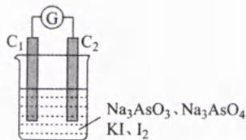  
I

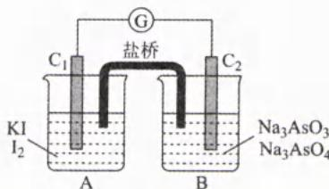

解析：A. $AsO_{4}^{3-} + 2I^{-} + 2H^{+} \rightleftharpoons AsO_{3}^{3-} + I_{2} + H_{2}O$ 是可逆反应，正向、逆向的

II

氧化剂、还原剂均为溶液。溶液一混合，离子直接发生氧化还原反应，不会在电极上得失电子，无法形成原电池。由于甲组未形成原电池，微安表(G)指针不会发生偏转，A选项错误。

B. 甲组加入盐酸使平衡: $\mathrm{AsO}_{4}^{3-} + 2\mathrm{I}^{-} + 2\mathrm{H}^{+} \rightleftharpoons \mathrm{AsO}_{3}^{3-} + \mathrm{I}_{2} + \mathrm{H}_{2}\mathrm{O}$ 正向移动, $\mathrm{I}_{2}$ 增多, 颜色加深, B 选项错误。C、D. 往 II 中 B 烧杯加入 NaOH 后, 平衡 $\mathrm{AsO}_{4}^{3-} + 2\mathrm{I}^{-} + 2\mathrm{H}^{+} \rightleftharpoons \mathrm{AsO}_{3}^{3-} + \mathrm{I}_{2} + \mathrm{H}_{2}\mathrm{O}$ 逆向移动。此时的氧化剂 $\mathrm{I}_{2}$ 在 $\mathrm{C}_{1}$ 发生得电子还原反应: $\mathrm{I}_{2} + 2\mathrm{e}^{-} = 2\mathrm{I}^{-}, \mathrm{C}_{1}$ 为正极, 所以 C 选项错误、D 选项正确。

答案:D

【反思】参与原电池反应的氧化剂、还原剂均为溶液或气体，设计原电池时，需要将氧化剂、还原剂进行隔离。

若不进行隔离,氧化剂与还原剂反应直接将化学能转化成热能,不转化为电能。

类型Ⅲ:设计原电池

【例 4】将反应 $2Fe^{3+} + 2I^{-} = 2Fe^{2+} + I_{2}$ 设计成原电池，画出装置图。
解析:方程式 $2Fe^{3+} + 2I^{-} = 2Fe^{2+} + I_{2}$ 中,氧化剂、还原剂分别是 $Fe^{3+}$ 、 $I^{-}$ ,则可以选可溶性铁盐、可溶性碘化物分别做正极、负极两个半电池的电解质溶液。正极、负极材料本身不参与反应，则可以选择石墨做正、负极。用浸有饱和氯化钾溶液的琼脂做盐桥材料，用导线将电极相连，形成闭合回路即可。
答案: 见右图

## 第 2 节 原电池电极反应式的书写(★★★)

## 内容提要

一、原电池电极反应式的书写步骤和氧化还原方程式中的“缺项配平”极为类似，但需掌握以下关键点：

1. 需准确判断原电池放电时的正、负极(或充电时的阳、阴极)，以及电极上的反应物与该环境下的最终产物。

2. 利用元素的化合价变化确定得失电子数。

3. 根据环境条件或电解质种类,选择正确的离子调平电荷以及正确的物质完成元素守恒。

二、原电池电极反应式书写的具体步骤如下：

1. 先寻找体系中的最强还原剂做负极反应物，最强氧化剂做正极反应物。

2. 根据信息、常识、环境推导负极的氧化产物、正极的还原产物。

注:一定要考虑环境的后续反应,书写出该环境下的最终产物。

3. 根据以上两步, 写出负极、正极的电极反应通式:

(1)负极反应通式:还原剂 $-ne^{-}\rightarrow$ 氧化产物(+其他)

(2)正极反应通式:氧化剂 $+n e^{-}\rightarrow$ 还原产物(+其他)

分析还原剂和氧化产物(氧化剂和还原产物)的化合价变化确定失去(得到)的电子数。

注:写出通式时,先将“变价元素”原子个数前后守恒,再判断得失电子“总数”。

4. 调平电荷: 根据环境条件或电解质种类, 选择正确离子完成电荷守恒。例如酸性水溶液用 $\mathrm{H}^{+}$ 、碱性水溶液用 $\mathrm{OH}^{-}$ 、熔融碳酸盐用 $\mathrm{CO}_{3}^{2-}$ 、熔融氧化物用 $\mathrm{O}^{2-}$ 等。

5. 元素守恒: 若电解质为水溶液, 可利用“看氢补水、用氧检查”完成 H、O 元素守恒; 若有其余条件, 则按照题目条件完成元素守恒。如熔融碳酸盐的装置中, 往往会通入(或释放) $CO_{2}$ , 因此用 $CO_{2}$ 完成碳元素守恒。

6. 书写总反应: 调整电极反应式系数, 使正、负极的得失电子数相等, 将正、负极加和得到总反应。也可以根据题干信息或氧化还原反应的常识直接推导总反应。

## 类型 I: 燃料电池电极反应式书写

【例 1】直接乙醇燃料电池(DEFC)具有很多优点,现有以下三种乙醇燃料电池。

  
碱性乙醇燃料电池

  
熔融盐乙醇燃料电池  
(1)写出酸性乙醇燃料电池中负、正极电极反应式\_\_\_\_、\_\_\_\_。  
(2)写出碱性乙醇燃料电池中负、正极电极反应式 \_\_\_\_ 、 \_\_\_\_ 。

(3)写出熔融碳酸盐乙醇燃料电池中负、正极电极反应式\_\_\_\_、\_\_\_\_。  
解析:(1)酸性乙醇燃料电池

<table><tr><td>负极</td><td>1 $C_{2}H_{5}OH$ 在负极发生氧化反应,酸性环境下氧化产物为 $CO_{2}$ 。2 $C_{2}H_{5}OH$ 中2个C的平均化合价为-2价、 $CO_{2}$ 中C的化合价为+4价,据此写出电极反应式架构: $C_{2}H_{5}OH-12e^{-}\rightarrow2CO_{2}\uparrow$ 。3电解质为稀硫酸,用 $H^{+}$ 调平电荷: $C_{2}H_{5}OH-12e^{-}\rightarrow2CO_{2}+12H^{+}$ 。4最后“看H补 $H_{2}O$ ,用O检查”完成H、O元素守恒,得负极电极反应式: $C_{2}H_{5}OH-12e^{-}+3H_{2}O=2CO_{2}\uparrow+12H^{+}$ 。</td></tr><tr><td>正极</td><td>1 $O_{2}$ 在正极发生还原反应,1个 $O_{2}$ 得4个 $e^{-}$ 。2电解质为稀硫酸,用 $H^{+}$ 调平电荷。3最后“看H补 $H_{2}O$ ,用O检查”,完成H、O元素守恒,得正极电极反应式: $O_{2}+4e^{-}+4H^{+}=2H_{2}O$ </td></tr></table>

## (2) 碱性乙醇燃料电池

<table><tr><td>负极</td><td>1 $C_{2}H_{5}OH$ 在负极发生氧化反应,在KOH溶液的环境下最终产物为 $CO_{3}^{2-}$ ( $CO_{2}$ 和足量 $OH^{-}$ 反应生成 $CO_{3}^{2-}$ )。2 $C_{2}H_{5}OH$ 中2个C的平均化合价为-2价、 $CO_{3}^{2-}$ 中C的化合价为+4价,据此写出电极反应式架构: $C_{2}H_{5}OH-12e^{-}\rightarrow2CO_{3}^{2-}$ 。3电解质为KOH溶液,用 $OH^{-}$ 调平电荷: $C_{2}H_{5}OH-12e^{-}+16OH^{-}\rightarrow2CO_{3}^{2-}$ 。4最后“看H补 $H_{2}O$ ,用O检查”完成H、O元素守恒,得负极电极反应式: $C_{2}H_{5}OH-12e^{-}+16OH^{-}=2CO_{3}^{2-}+11H_{2}O$ 。</td></tr><tr><td>正极</td><td>1 $O_{2}$ 在正极发生还原反应,1个 $O_{2}$ 得4个 $e^{-}$ 。2电解质为KOH溶液,用 $OH^{-}$ 调平电荷。3最后“看H补 $H_{2}O$ ,用O检查”完成H、O元素守恒,得正极电极反应式: $O_{2}+4e^{-}+2H_{2}O=4OH^{-}$ </td></tr></table>

<table><tr><td>负极</td><td>1 $C_{2}H_{5}OH$ 在负极发生氧化反应,由图给信息可知生成物为 $CO_{2}$ 。2 $C_{2}H_{5}OH$ 中2个C的平均化合价为-2价、 $CO_{2}$ 中C的化合价为+4价,据此写出电极反应式架构: $C_{2}H_{5}OH-12e^{-}\rightarrow2CO_{2}\uparrow$ 。3环境为熔融碳酸盐,用 $CO_{3}^{2-}$ 调平电荷: $C_{2}H_{5}OH-12e^{-}+6CO_{3}^{2-}\rightarrow2CO_{2}\uparrow$ 。4最后“看C补 $CO_{2}$ 、看H补 $H_{2}O$ 、用O检查”完成C、H、O元素守恒,得负极电极反应式: $C_{2}H_{5}OH-12e^{-}+6CO_{3}^{2-}=8CO_{2}\uparrow+3H_{2}O$ 。</td></tr><tr><td>正极</td><td>1 $O_{2}$ 在正极发生还原反应,1个 $O_{2}$ 得4个 $e^{-}$ 。2环境为熔融碳酸盐,用 $CO_{3}^{2-}$ 调平电荷。3最后“看C补 $CO_{2}$ ,用O检查”完成C、O元素守恒,得正极电极反应式: $O_{2}+4e^{-}+2CO_{2}=2CO_{3}^{2-}$ 。</td></tr></table>

答案:(1)负极: $C_{2}H_{5}OH-12e^{-}+3H_{2}O=2CO_{2}\uparrow+12H^{+}$ 、正极: $O_{2}+4e^{-}+4H^{+}=2H_{2}O$  
(2)负极： $\mathrm{C_2H_5OH - 12e^- + 16OH^- = 2CO_3^{2 - } + 11H_2O}$ 、正极： $\mathrm{O_2 + 4e^- + 2H_2O = 4OH^-}$  
(3)负极： $\mathrm{C_2H_5OH - 12e^- + 6CO_3^{2 - } = 8CO_2\uparrow + 3H_2O}$ 、正极： $\mathrm{O_2 + 4e^- + 2CO_2 = 2CO_3^{2 - }}$  
【反思】①由以上例题可再次验证,环境会影响最终的生成物和调平电荷的粒子,最终三种燃料电池的电极反应式完全不同。因此书写电极反应式时,务必考虑环境的影响。

②有机燃料电池中,负极通燃料(即有机物),正极通助燃剂(即氧气)。有机物的氧化产物一般为+4价C,环境决定氧化产物的最终存在形态是 $CO_{2}$ ,还是 $CO_{3}^{2-}$ ;环境也决定了氧气的最终还原产物可能是 $H_{2}O$ 、 $OH^{-}$ 、 $O^{2-}$ 、 $CO_{3}^{2-}$ 中的其中一种。

## 类型Ⅱ:二次电池电极反应式书写

【例 2】2023 年星恒电源发布“超钠 F1”开启钠电在电动车上产业化元年。该二次电池的电极材料为 $\mathrm{Na}_{2}\mathrm{Mn}[\mathrm{Fe}(\mathrm{CN})_{6}]$ （普鲁士白）和 $\mathrm{Na}_{x}\mathrm{C}_{y}$ （嵌钠硬碳），该“超钠 F1”二次电池的工作原理是： $2\mathrm{Na}_{x}\mathrm{C}_{y} + x\mathrm{Mn}[\mathrm{Fe}(\mathrm{CN})_{6}] \xrightarrow[\text{充电}]{\text{放电}} x\mathrm{Na}_{2}\mathrm{Mn}[\mathrm{Fe}(\mathrm{CN})_{6}] + 2\mathrm{C}_{y}$

(1)写出放电时正极、负极的电极反应式：\_\_\_\_、\_\_\_\_。

(2)写出充电时阳极、阴极的电极反应式：\_\_\_\_、\_\_\_\_。

解析:(1) $Na_{x}C_{y}$ 表示嵌入了Na的碳材料,所以Na的化合价为0价。当Na失电子后变为 $Na^{+}$ ,从碳材料中脱嵌。在充、放电过程中, $Na^{+}$ 在两个电极之间往返嵌入和脱嵌,利用 $Na^{+}$ 所带的电荷总数,反推电极反应得失的电子总数。根据题干所给的工作原理信息可知,放电时嵌钠硬碳为原电池负极,Na失电子发生氧化反应,负极电极反应式为: $2Na_{x}C_{y}-2xe^{-}=2C_{y}+2xNa^{+}$ (利用 $2xNa^{+}$ 反推失去 $2xe^{-}$ )。Mn $[Fe(CN)_{6}]$ 为原电池正极,得电子并结合由负极移动至正极的 $Na^{+}$ ,转化为 $Na_{2}Mn[Fe(CN)_{6}]$ ,因此正极的电极反应式为:xMn $[Fe(CN)_{6}]+2xe^{-}+2xNa^{+}=xNa_{2}Mn[Fe(CN)_{6}]$ (利用 $2xNa^{+}$ 反推得到 $2xe^{-}$ )。书写完正极、负极电极反应式后,可以加和得总反应式,和题干信息对照,检查是否书写正确(同时书写负极与正极电极反应式,习惯上将两式的得失电子数调成一样)。

(2)根据题干所给的工作原理信息可知,充电是放电的逆反应,放电时正极的逆反应为充电时阳极的电极反应,放电时负极的逆反应为充电时阴极的电极反应,因此充电时阳极的电极反应式: $xNa_{2}Mn[Fe(CN)_{6}]-2xe^{-}=xMn[Fe(CN)_{6}]+2xNa^{+}$ 、阴极的电极反应式: $2C_{y}+2xNa^{+}+2xe^{-}=2Na_{x}C_{y}$ 。书写完阳极、阴极电极反应式后,可以加和得总反应式,和题干信息对照,检查是否书写正确。

$$
: x \mathrm{Mn} [ \mathrm{Fe(CN)} _ {6} ] + 2 x \mathrm{e} ^ {-} + 2 x \mathrm{Na} ^ {+} = x \mathrm{Na} _ {2} \mathrm{Mn} [ \mathrm{Fe(CN)} _ {6} ]
$$

$$
2 \mathrm{Na} _ {x} \mathrm{C} _ {y} - 2 x \mathrm{e} ^ {-} = 2 \mathrm{C} _ {y} + 2 x \mathrm{Na} ^ {+}
$$

(2)阳极: $x\mathrm{Na}_2\mathrm{Mn}[\mathrm{Fe(CN)}_6] - 2xe^{-} = x\mathrm{Mn}[\mathrm{Fe(CN)}_6] + 2x\mathrm{Na}^+$ ; 阴极: $2\mathrm{C_y} + 2x\mathrm{Na}^+ + 2xe^- = 2\mathrm{Na}_x\mathrm{C_y}$

【反思】本题的二次电池,充电与放电过程相反,则利用电池放电时的电极反应式,书写电池充电时的电极反应式技巧:

①将放电时正极电极反应式的反应物与生成物对调，“ $+ne^{-}$ ”改为“ $-ne^{-}$ ”，即可写出充电时阳极的电极反应式。

②将放电时负极电极反应式的反应物与生成物对调，“ $-ne^{-}$ ”改为“ $+ne^{-}$ ”，即可写出充电时阴极的电极反应式。

③若已知充电时的阳极(或阴极)电极反应式,也可以同理推出放电时正极(或负极)的电极反应式。

类型Ⅲ:新型原电池装置的电极反应式书写

【例 3】(2024·上海卷改编)根据右图所示,分别书写电极 a、b 的电极反应式: \_\_\_\_、\_\_\_\_。

解析:首先判断原电池的正负极。

1. 电极 a 发生 $NO_{3}^{-} \rightarrow N_{2}$ ，N 化合价由 +5 价 → 0 价，发生还原反应，因此电极 a 为原电池正极。也可以根据质子的移动方向，结合口诀“正正负负”判断出电极 a 为正极。

(1)先写出正极电极反应式架构: $2NO_{3}^{-}+10e^{-}\rightarrow N_{2}\uparrow$ （先让变价元素N守恒）。

(2)由题目信息“质子交换膜”，可知用 $\mathrm{H^{+}}$ 调平电荷： $2\mathrm{NO}_3^- +10\mathrm{e}^- +12\mathrm{H}^+ \rightarrow \mathrm{N}_2\uparrow$

(3)最后“看 H 补 $H_{2}O$ ，用 O 检查”完成 H、O 元素守恒，得正极电极反应式： $2NO_{3}^{-} + 10e^{-} + 12H^{+} = N_{2} \uparrow + 6H_{2}O$ 。

2. 电极 b 发生 $(\mathrm{CH}_{2}\mathrm{O})_{n}\rightarrow\mathrm{CO}_{2}$ ， $(\mathrm{CH}_{2}\mathrm{O})_{n}$ 的 C 平均化合价为 0 价， $CO_{2}$ 的 C 化合价为 +4 价，发生氧化反应，因此电极 b 为原电池负极。

(1)先写出负极电极反应式架构： $\left(\mathrm{CH}_{2}\mathrm{O}\right)_{n}-4ne^{-}\rightarrow n\mathrm{CO}_{2}\uparrow$ （先让变价元素C守恒）。

(2)用 $\mathrm{H^{+}}$ 调平电荷： $(\mathrm{CH}_2\mathrm{O})_n - 4ne^{-}\rightarrow n\mathrm{CO}_2\uparrow +4n\mathrm{H}^+$

(3)最后“看 H 补 $H_{2}O$ ，用 O 检查”完成 H、O 元素守恒，得负极电极反应式： $(\mathrm{CH}_{2}\mathrm{O})_{n}-4\mathrm{ne}^{-}+n\mathrm{H}_{2}\mathrm{O}=n\mathrm{CO}_{2}\uparrow+4n\mathrm{H}^{+}$ 。

答案:电极 a: $2NO_{3}^{-}+10e^{-}+12H^{+}=N_{2}\uparrow+6H_{2}O$ 电极 b: $(CH_{2}O)_{n}-4ne^{-}+nH_{2}O=nCO_{2}\uparrow+4nH^{+}$

【反思】由于 C 的最高化合价为 +4 价，一般情况下，当有机物参与电极反应并转化为 $CO_{2}$ （或 $CO_{3}^{2-}$ ），可快速判断发生氧化反应，为原电池负极。反之，若是 $CO_{2}$ 参与电极反应并转化为其他有机物，可快速判断发生还原反应，为原电池正极。此外，涉及高分子的电极反应式，在判断得失电子数、调平电荷数、产物计量数等，不要忽略“n”。

# 第3节 常见化学电源 —— 一次电池、二次电池、燃料电池(★★★)

## 内容提要

## 一、一次电池

1. 定义: 随着电池的使用, 发生氧化还原反应的活性物质逐渐被消耗, 当这些物质被消耗到一定程度时, 电池就不能继续使用, 且使用后不可以通过充电将活性物质复原的电池。

2. 常见一次电池—碱性锌锰干电池

<table><tr><td>结构示意图与组成</td><td colspan="2">锌粉和KOH的混合物-MnO2-金属外壳</td><td>负极:Zn正极:MnO2电解质溶液:KOH</td></tr><tr><td rowspan="2">电极反应式</td><td>负极反应式</td><td colspan="2">正极反应式</td></tr><tr><td>Zn-2e-+2OH-=Zn(OH)2</td><td colspan="2">2MnO2+2e-+2H2O=2MnO(OH)+2OH-</td></tr><tr><td>总反应</td><td colspan="3">Zn+2MnO2+2H2O=Zn(OH)2+2MnO(OH)</td></tr><tr><td>特点</td><td colspan="3">碱性锌锰电池比酸性锌锰干电池性能好,它的比能量和可储存时间均有所提高,是普通锌锰干电池的升级换代产品。</td></tr></table>

注:(1)由于 $\mathrm{Zn(OH)_2}$ 是弱碱, 温度稍高可脱水成 ZnO, 所以负极反应式也可以写成: $Zn-2e^{-}+2OH^{-}=ZnO+H_{2}O$ 。

(2)由于 $\mathrm{Zn(OH)_2}$ 具有两性, 若 KOH 的浓度过高且物质的量过多, $\mathrm{Zn(OH)_2}$ 会转化成 $\left[\mathrm{Zn(OH)_4}\right]^{2-}$ , 对应的负极反应为: $\mathrm{Zn}-2\mathrm{e}^{-}+4\mathrm{OH}^{-}=\left[\mathrm{Zn(OH)_4}\right]^{2-}$ 。因此在书写电极反应式时, 一定要仔细阅读题干信息和图像信息, 确定负极的主要产物和主要反应。

(3)一般同时书写正、负极反应时,需要遵循得失电子守恒。若只单写某一极反应,不需要和另一极得失电子守恒。所以只写碱性锌锰干电池正极反应,可以写成: $\mathrm{MnO_{2}+e^{-}+H_{2}O=MnO(OH)+OH^{-}}$ 。

## 二、二次电池

1. 定义: 放电后可再充电而反复使用的电池, 又称可充电电池或蓄电池。

2. 常见的二次电池

(1)铅酸蓄电池

<table><tr><td colspan="3">结构示意图与组成</td><td colspan="2"> 负极:Pb正极: $PbO_{2}$ (Pb) 电解质溶液:稀硫酸</td></tr><tr><td rowspan="6">充放电过程</td><td rowspan="3">放电过程</td><td rowspan="2">电极反应</td><td>负极反应式</td><td>正极反应式</td></tr><tr><td> $Pb-2e^{-}+SO_{4}^{2-}=PbSO_{4}$ </td><td> $PbO_{2}+2e^{-}+SO_{4}^{2-}+4H^{+}=PbSO_{4}+2H_{2}O$ </td></tr><tr><td>总反应</td><td colspan="2"> $Pb+PbO_{2}+2SO_{4}^{2-}+4H^{+}=2PbSO_{4}+2H_{2}O$ </td></tr><tr><td rowspan="3">充电过程</td><td rowspan="2">电极反应</td><td>阴极反应式</td><td>阳极反应式</td></tr><tr><td> $PbSO_{4}+2e^{-}=Pb+SO_{4}^{2-}$ </td><td> $PbSO_{4}-2e^{-}+2H_{2}O=PbO_{2}+SO_{4}^{2-}+4H^{+}$ </td></tr><tr><td>总反应</td><td colspan="2"> $2PbSO_{4}+2H_{2}O\xlongequal{电解}Pb+PbO_{2}+2SO_{4}^{2-}+4H^{+}$ </td></tr><tr><td colspan="3">特点</td><td colspan="2">优点:电压稳定、使用方便、安全可靠、价格低廉,因此在生产、生活中使用广泛。缺点:比能量低、笨重、保养要求严格、废弃后易污染环境。</td></tr></table>

注:充电时电极的连接:外接电源负极接铅酸蓄电池负极(阴极),外接电源正极接铅酸蓄电池正极(阳极)。

## (2)锂离子电池

<table><tr><td rowspan="2" colspan="3">组成</td><td>负极</td><td>正极</td><td>电解质溶液</td></tr><tr><td> $Li_xC_y$ </td><td> $LiCoO_2$ (钴酸锂)</td><td> $LiPF_6$ (六氟磷酸锂)的碳酸酯溶液(无水)</td></tr><tr><td rowspan="6">充放电过程</td><td rowspan="3">放电过程</td><td rowspan="2">电极反应</td><td colspan="2">负极反应式</td><td>正极反应式</td></tr><tr><td colspan="2"> $Li_xC_y - xe^- = xLi^+ + C_y$ </td><td> $Li_{1-x}CoO_2 + xLi^+ + xe^- = LiCoO_2$ </td></tr><tr><td>总反应</td><td colspan="3"> $Li_xC_y + Li_{1-x}CoO_2 = LiCoO_2 + C_y$ </td></tr><tr><td rowspan="3">充电过程</td><td rowspan="2">电极反应</td><td colspan="2">阴极反应式</td><td>阳极反应式</td></tr><tr><td colspan="2"> $xLi^+ + C_y + xe^- = Li_xC_y$ </td><td> $LiCoO_2 - xe^- = Li_{1-x}CoO_2 + xLi^+$ </td></tr><tr><td>总反应</td><td colspan="3"> $C_y + LiCoO_2 \xlongequal{电解} Li_xC_y + Li_{1-x}CoO_2$ </td></tr><tr><td colspan="3">特点</td><td colspan="3">优点:工作寿命长,小型化,供电方便。缺点:锂资源受限、成本较高、耐高温性较差。</td></tr></table>

注:① $Li_{x}C_{y}$ 中的 $C_{y}$ 表示石墨, $Li_{x}C_{y}$ 表示嵌入了Li的石墨材料(石墨本身不参与放电,可将石墨看作载体),所以C、Li的化合价均看做0价。

②放电时,石墨中的 Li 放电形成 $Li^{+}$ ,移向正极,嵌入钴酸锂晶体中,Li 从石墨中脱嵌;充电时, $Li^{+}$ 从钴酸锂晶体中脱嵌,移向负极,发生还原反应生成 Li,嵌入石墨。这样在放电、充电时, $Li^{+}$ 往返于电池的正极、负极之间,完成化学能与电能的相互转化。

## 三、燃料电池

1. 定义: 能连续将燃料和氧化剂的化学能转化成电能的化学电源。

2. 常见的燃料电池

(1)氢氧燃料电池

<table><tr><td rowspan="2" colspan="3">结构示意图与组成</td><td colspan="2"> 负极: $Pt(H_2)$ 正极: $Pt(O_2)$ 电解质溶液: $H_2SO_4/KOH/Na_2SO_4$ </td></tr><tr><td colspan="2">离子父溴膜</td></tr><tr><td rowspan="9">分类</td><td rowspan="3">酸性</td><td rowspan="2">电极反应</td><td>负极反应式</td><td>正极反应式</td></tr><tr><td> $2H_2-4e^-=4H^+$ </td><td> $O_2+4e^-+4H^+=2H_2O$ </td></tr><tr><td>总反应</td><td colspan="2"> $2H_2+O_2=2H_2O$ </td></tr><tr><td rowspan="3">碱性</td><td rowspan="2">电极反应</td><td>负极反应式</td><td>正极反应式</td></tr><tr><td> $2H_2-4e^-+4OH^-=4H_2O$ </td><td> $O_2+4e^-+2H_2O=4OH^-$ </td></tr><tr><td>总反应</td><td colspan="2"> $2H_2+O_2=2H_2O$ </td></tr><tr><td rowspan="3">中性</td><td rowspan="2">电极反应</td><td>负极反应式</td><td>正极反应式</td></tr><tr><td> $2H_2-4e^-=4H^+$ </td><td> $O_2+4e^-+2H_2O=4OH^-$ </td></tr><tr><td>总反应</td><td colspan="2"> $2H_2+O_2=2H_2O$ </td></tr><tr><td colspan="3">优点</td><td colspan="2">由于反应物连续不断进入,而生成物持续排出,所以燃料电池容量极大。其极大提高了能源利用率,又称为“绿色发电站”。</td></tr></table>

注:①环境不同,导致电极反应式可能不同,所以书写电极反应一定要看清环境。  
②燃料电池的正、负极往往是 Pt 或石墨，负极通入的是燃料（还原剂），正极通入助燃剂（氧化剂）。  
③燃料电池总反应不写“燃烧”，因为没有燃烧过程，化学能主要转化成了电能，少部分以热能形式损失。

## (2)有机燃料电池(以丙烷燃料电池为例)

<table><tr><td rowspan="2" colspan="3">组成</td><td>负极</td><td>正极</td><td>电解质溶液</td></tr><tr><td>Pt( $C_3H_8$ )</td><td>Pt( $O_2$ )</td><td>KOH/熔融  $K_2CO_3$ /能传递 $O^{2-}$ 的离子导体</td></tr><tr><td rowspan="9">分类</td><td rowspan="3">碱性</td><td rowspan="2">电极反应</td><td colspan="2">负极反应式</td><td>正极反应式</td></tr><tr><td colspan="2"> $C_3H_8-20e^-+26OH^-=3CO_3^{2-}+17H_2O$ </td><td> $5O_2+20e^-+10H_2O=20OH^-$ </td></tr><tr><td>总反应</td><td colspan="3"> $C_3H_8+5O_2+6OH^-=3CO_3^{2-}+7H_2O$ </td></tr><tr><td rowspan="3">熔融碳酸盐</td><td rowspan="2">电极反应</td><td colspan="2">负极反应式</td><td>正极反应式</td></tr><tr><td colspan="2"> $C_3H_8-20e^-+10CO_3^{2-}=13CO_2+4H_2O$ </td><td> $5O_2+20e^-+10CO_2=10CO_3^{2-}$ </td></tr><tr><td>总反应</td><td colspan="3"> $C_3H_8+5O_2=3CO_2+4H_2O$ </td></tr><tr><td rowspan="3">离子导体</td><td rowspan="2">电极反应</td><td colspan="2">负极反应式</td><td>正极反应式</td></tr><tr><td colspan="2"> $C_3H_8-20e^-+10O^{2-}=3CO_2+4H_2O$ </td><td> $5O_2+20e^-=10O^{2-}$ </td></tr><tr><td>总反应</td><td colspan="3"> $C_3H_8+5O_2=3CO_2+4H_2O$ </td></tr><tr><td colspan="3">优点</td><td colspan="3">由于反应物连续不断进入,而生成物持续排出,所以燃料电池容量极大。其极大提高了能源利用率,又称为“绿色发电站”。</td></tr></table>

注:①绝大多数的有机燃料电池是碱性环境,因为碱性环境可以将 $CO_{2}$ 在电池内部吸收,既可以对碳元素回收利用,还可以减少温室效应。

②熔融态 $K_{2}CO_{3}$ 说明温度很高, 此时不考虑水电离的 $OH^{-}$ 和 $H^{+}$ 。熔融态 $K_{2}CO_{3}$ 燃料电池的正极通入 $CO_{2}$ , 目的是补充 $CO_{3}^{2-}$ 。此类电池在常温下不能工作。

## (3)新型燃料电池(以碱性肼电池为例)

<table><tr><td rowspan="2">组成</td><td>负极</td><td colspan="2">正极</td><td>电解质溶液</td></tr><tr><td>Pt(N2H4)</td><td colspan="2">Pt(O2)</td><td>KOH溶液</td></tr><tr><td rowspan="2">电极反应</td><td colspan="2">负极反应式</td><td colspan="2">正极反应式</td></tr><tr><td colspan="2">N2H4-4e-+4OH-=N2+4H2O</td><td colspan="2">O2+4e-+2H2O=4OH-</td></tr><tr><td>总反应</td><td colspan="4">N2H4+O2=N2+2H2O</td></tr></table>

注:由于氮的稳价为0价,所以燃料电池中氮元素的产物往往为 $N_{2}$ 。

(4) 微生物燃料电池

①定义:利用微生物将有机物中的化学能直接转化成电能的装置。

②本质:在无氧的负极室中,微生物将有机物分解并释放 $e^{-}$ 和质子。

③解题方法:可看成有机物的酸性燃料电池。

注:微生物的生存对温度、pH、氧气有一定要求。

类型 I: 化学电源基本概念

【例1】正误判断,正确的填“√”,错误的填“×”
(1)正、负极的电极材料一样,电极反应和总反应一定相同( )
(2)碱性锌锰电池放电后,电解质的碱性可能增强( )
(3)铅酸蓄电池放电后,正、负极的质量均增加( )
(4)二次电池充电时,阴极连接电源的负极,发生还原反应( )
(5)燃料电池工作时燃料在电池中燃烧,然后热能转化为电能( )

解析:(1)(×)电极材料一样,若环境不一样,电极反应、总反应可能不相同。如酸性氢氧燃料电池、碱性氢氧燃料电池的负极分别为: $H_{2}-2e^{-}=2H^{+}$ 、 $H_{2}-2e^{-}+2OH^{-}=2H_{2}O$ 。
(2)(√)碱性锌锰电池的总反应可能是 $\mathrm{Zn}+2\mathrm{MnO}_{2}+2\mathrm{H}_{2}\mathrm{O}=\mathrm{Zn(OH)}_{2}+2\mathrm{MnO(OH)}$ ,溶液中的水减少,导致KOH浓度增大,溶液的碱性增强。
(3)(√)铅酸蓄电池负极、正极反应分别为: $Pb-2e^{-}+SO_{4}^{2-}=PbSO_{4}$ 、 $PbO_{2}+2e^{-}+SO_{4}^{2-}+4H^{+}=PbSO_{4}+2H_{2}O$ ,负极是Pb转化为 $PbSO_{4}$ 、正极是 $PbO_{2}$ 转化为 $PbSO_{4}$ ， $PbSO_{4}$ 难溶于水和酸，附着在电极表面使两极质量均增加。
(4)(√)二次电池充电时,电源的负极连接二次电池的负极(即阴极),发生还原反应;电源的正极连接二次电池的正极(即阳极),发生氧化反应。(充电时,电源与二次电池的连接遵循“正正负负”的规律。)
(5)(×)燃料电池是一种将燃料中的化学能通过电化学反应直接转化为电能的装置,燃料(如 $H_{2}$ 、 $CH_{4}$ )与氧化剂(如 $O_{2}$ )分别在两极反应,并无燃烧现象。
答案:(1)× (2)√ (3)√ (4)√ (5)×

【例 2】(2024·湖南卷)近年来,我国新能源产业得到了蓬勃发展,下列说法错误的是( )

A. 理想的新能源应具有资源丰富、可再生、对环境无污染等特点

B. 氢氧燃料电池具有能量转化率高、清洁等优点

C. 锂离子电池放电时锂离子从负极脱嵌,充电时锂离子从正极脱嵌

D. 太阳能电池是一种将化学能转化为电能的装置

解析: A. 理想的新能源应具有资源丰富(如钠元素资源储量丰富, 且在全球分布均匀, 可降低钠离子电池的材料成本)、可再生、对环境无污染等特点, A 选项正确。

B. 氢氧燃料电池能连续地将 $\mathrm{H}_{2}$ 和 $\mathrm{O}_{2}$ 的化学能直接转化为电能, 减少了 $\mathrm{H}_{2}$ 和 $\mathrm{O}_{2}$ 直接燃烧的热量损失, 其转化率远高于火力发电, 且可以做到污染物的少排放甚至零排放, 故具有能量转化率高、清洁等优点, B 选项正确。

C. 脱嵌是锂从电极材料中出来的过程。放电时负极的电极反应为: $\mathrm{Li}_{x} \mathrm{C}_{y} - x \mathrm{e}^{-} = x \mathrm{Li}^{+} + \mathrm{C}_{y}$ , 生成的 $\mathrm{Li}^{+}$ 从负极脱嵌移向正极。充电时, 正极(即阳极)的电极反应为: $\mathrm{LiCoO}_{2} - x \mathrm{e}^{-} = \mathrm{Li}_{1-x} \mathrm{CoO}_{2} + x \mathrm{Li}^{+}$ , 生成的 $\mathrm{Li}^{+}$ 从正极脱嵌移向负极(即阴极), C 选项正确。

D. 太阳能电池是一种将太阳能转化为电能的装置, 太阳能电池的工作原理是光电效应, 属于物理变化。D 选项错误。

答案:D

类型Ⅱ:一次电池

【例 3】(2024·江苏卷)碱性锌锰电池的总反应为: $\mathrm{{Zn}} + 2{\mathrm{{MnO}}}_{2} + {\mathrm{H}}_{2}\mathrm{O} = \mathrm{{ZnO}} + 2\mathrm{{MnOOH}}$ ,电池

构造示意图如右图所示。下列有关说法正确的是( )
A. 电池工作时, $MnO_{2}$ 发生氧化反应
B. 电池工作时, $OH^{-}$ 通过隔膜向正极移动
C. 环境温度过低,不利于电池放电
D. 反应中每生成1 mol MnOOH,转移电子数为 $2\times6.02\times10^{23}$ 解析: A. 根据碱性锌锰干电池的总反应可知, 电池工作时, $MnO_{2}$ 中 Mn 的化合价由 +4 价变成 +3 价, 化合价降低, 发生还原反应, A 选项错误。

B. 根据原电池放电时离子移动规律口诀“正正负负”可知， $OH^{-}$ 往负极移动，B选项错误。

C. 环境温度过低,化学反应速率下降,不利于电池放电,C选项正确。

D. 电池工作时， $\mathrm{MnO}_2$ 中 $\mathrm{Mn}$ 的化合价由 $+4$ 价变成 $+3$ 价，每生成 $1\mathrm{mol}$ MnOOH，转移电子数为 $6.02 \times 10^{23}$ ，D选项错误。

答案:C

【例 4】化学电源在日常生活和高科技领域中都有广泛应用,下列说法错误的是()

  
图 I

  
图Ⅱ

  
图Ⅲ

A. 图Ⅰ:锌筒作负极,发生氧化反应,锌筒会变薄
B. 图Ⅰ:放电时,每消耗6.5 g锌时内电路中有0.2 mol电子转移
C. 图Ⅱ:正极的电极反应式为: $Ag_{2}O+2e^{-}+H_{2}O=2Ag+2OH^{-}$ D. 图Ⅲ: $Zn^{2+}$ 向Cu电极方向移动,Cu电极附近溶液中 $H^{+}$ 浓度减小

解析：A. Zn 为原电池负极，发生氧化反应，电极反应为： $Zn-2e^{-}=Zn^{2+}$ ，锌溶解，锌筒会变薄，A 选项正确。

B. 6.5 g Zn(即 0.1 mol Zn) 被消耗时, 外电路有 0.2 mol 电子转移, 电子不会进入内电路(电子不下“水”, 离子不上“岸”, 内电路是“水”环境), B 选项错误。

C. 图Ⅱ装置中活泼金属锌为原电池负极, 失去电子被氧化; $Ag_{2}O$ 作正极, 得到电子被还原成 Ag。电极反应式第一步写出“架构”: $Ag_{2}O + 2e^{-} \rightarrow 2Ag$ ; 第二步用 $OH^{-}$ 调平电荷 (KOH 溶液作电解液): $Ag_{2}O + 2e^{-} \rightarrow 2Ag + 2OH^{-}$ , 第三步看 H 补 $H_{2}O$ 、用 O 检查, 可以写出该电池的正极电极反应式为: $Ag_{2}O + 2e^{-} + H_{2}O = 2Ag + 2OH^{-}$ , C 选项正确。

D. 原电池负极为 Zn，电极反应为： $Zn-2e^{-}=Zn^{2+}$ ， $Zn^{2+}$ 向 Cu 电极（即正极）方向移动。Cu 电极周围的 $H^{+}$ 得电子生成 $H_{2}$ ，正极电极反应为： $2H^{+}+2e^{-}=H_{2}\uparrow$ ，因此 Cu 电极附近溶液中 $H^{+}$ 浓度减小，D 选项正确。
答案：B

类型Ⅲ:新型二次电池

【例 5】(2024·安徽卷)我国学者研发出一种新型水系锌电池,其示意图如下。该电池分别以Zn-TCPP(局部结构如标注框内所示)形成的稳定超分子材料和Zn为电极,以 $ZnSO_{4}$ 和KI混合液为电解质溶液。下列说法错误的是()

混合液为电解质溶液。下列说法错误的是( ) A. 标注框内所示结构中存在共价键和配位键 B. 电池总反应为: $I_{3}^{-} + Zn \xrightarrow[充电]{放电} Zn^{2+} + 3I^{-}$ C. 充电时, 阴极被还原的 $Zn^{2+}$ 主要来自Zn-TCPP D. 放电时, 消耗0.65 g Zn, 理论上转移0.02 mol电子

解析: Zn 为活性电极, 放电时 Zn 作为原电池负极, 发生氧化反应, 电极反应为: $Zn-2e^{-}=Zn^{2+}$ 。放电时超分子材料作为原电池正极, 电极反应为: $I_{3}^{-}+2e^{-}=3I^{-}$ 。充电时 Zn 电极和外电源的负极相连作电解池的阴极, 超分子材料和外电源的正极相连作电解池的阳极。

A. 标注框内所示物质为配合物，配体中 C 和 C、C 和 N、C 和 H 之间以共价键结合，还存在由 N 提供孤电子对、 $Zn^{2+}$ 提供空轨道所形成的配位键，A 选项正确。

B. 将原电池放电时正极与负极的电极反应式相加, 可得电池放电时的总反应。根据示意图可知, 放电过程与充电过程相反, 因此该电池的总反应为: $I_{3}^{-} + Zn \xrightarrow[充电]{放电} Zn^{2+} + 3I^{-}$ , B 选项正确。

C. 放电时负极的 Zn 被氧化为 $Zn^{2+}$ 进入电解质溶液，而充电时电解质溶液的 $Zn^{2+}$ 在阴极发生还原反应： $Zn^{2+} + 2e^{-} = Zn$ ，因此阴极被还原的 $Zn^{2+}$ 主要来自电解质溶液。从另一个角度分析，根据题目信息“Zn-TCPP 形成的稳定超分子材料”，可知 $Zn^{2+}$ 作为配合物的中心离子，是很稳定且不容易从超分子材料中脱离的，由此也可判定 C 选项错误。

$$
\mathrm{Zn} - 2 \mathrm{e} ^ {-} = \mathrm{Zn} ^ {2 +}
$$

答案:C

【反思】本题是电化学结合物质结构与性质的综合性考题，同学们不要被“Zn-TCPP”、“稳定超分子材料”，以及示意图给的配合物结构简式吓倒，掌握好原电池的基本概念，确定电极上反应的物质，能书写出电极反应式，并利用电极反应式做相关计算，则无论题目再怎么“装饰”，也能妥妥得分。

【例 6】(2024 · 河北卷)我国科技工作者设计了如图所示的可充电 $Mg-CO_{2}$ 电池, 以 $\mathrm{Mg(TFSI)_{2}}$ 为电解质, 电解液中加入 1,3-丙二胺(PDA)以捕获 $CO_{2}$ , 使放电时 $CO_{2}$ 还原产物为 $MgC_{2}O_{4}$ 。该设计克服了 $MgCO_{3}$ 导电性差和释放 $CO_{2}$ 能力差的障碍, 同时改善了 $Mg^{2+}$ 的溶剂化环境, 提高了电池充放电循环性能。下列说法错误的是()

A. 放电时, 电池总反应为: $2 \mathrm{CO}_{2} + \mathrm{Mg} = \mathrm{MgC}_{2} \mathrm{O}_{4}$ B. 充电时, 多孔碳纳米管电极与电源正极连接  
C. 充电时, 电子由 $\mathrm{Mg}$ 电极流向阳极, $\mathrm{Mg}^{2+}$ 向阴极迁移  
D. 放电时, 每转移 $1 \mathrm{~mol}$ 电子, 理论上可转化 $1 \mathrm{~mol} \mathrm{CO}_{2}$

解析: 先根据电极材料确定电池放电时的正、负极以及充电时的阴、阳极。镁为活泼金属单质, 放电时作负极, 充电时和电源

<table><tr><td>Mg电极</td><td> $\mathrm{{Mg}}{\left( \mathrm{{TFSI}}\right) }_{2}$ PDA</td><td>隔膜</td><td> ${\mathrm{{CO}}}_{2}$  $\mathrm{{Mg}}{\left( \mathrm{{TFSI}}\right) }_{2}$ PDA ${\mathrm{{MgC}}}_{2}{\mathrm{O}}_{4}$ </td><td>多孔碳纳米管电极</td></tr></table>

的负极相接作阴极。放电时，负极电极反应式为： $Mg-2e^{-}=Mg^{2+}$ 、正极电极反应式为： $Mg^{2+}+2CO_{2}+2e^{-}=MgC_{2}O_{4}$ 。充电时，阴极电极反应式为： $Mg^{2+}+2e^{-}=Mg$ 、阳极电极反应式为 $MgC_{2}O_{4}-2e^{-}=Mg^{2+}+2CO_{2}\uparrow$ 。
A. 多孔碳纳米管电极为正极，根据图像信息可知， $CO_{2}$ 转化为 $MgC_{2}O_{4}$ 时，C的化合价降低，因此示意图表示放电过程。将放电时正、负极的电极反应式加和并消去电子、 $Mg^{2+}$ ，得电池总反应为： $2CO_{2}+Mg=MgC_{2}O_{4}$ ，A选项正确。
B. 多孔碳纳米管为正极，充电时与电源正极连接（充电时电极连接方式口诀为“正正负负”），B选项正确。
C. 充电时镁为阴极，得到电子发生还原反应，此时外电路中的电子由外加电源负极流向阴极， $Mg^{2+}$ 向阴极迁移（充电时离子移动口诀为“阴阳相吸”），C选项错误。
D. 放电时 $CO_{2}$ 中C的化合价由+4价变为+3价，由此可知每转移1mol电子，转化1mol $CO_{2}$ ，D选项正确。
答案：C

【例 7】一种钠离子可充电电池的示意图如下所示。该电池主要依靠钠离子在两极之间移动来工作,其中 $-R_{1}$ 代表没参与反应的—COONa, $-R_{2}$ 代表没参与反应的—ONa。下列说法正确的是()

A. 放电时, a 极为正极

B. 充电时, $Na^{+}$ 由 a 极区向 b 极区迁移

D. 若电池充满电时 a、b 两极室的质量相等，则放电过程中转移 0.5 mol 电子时，两极室的质量差为 23 g

解析:本题关键在于正确判断电极,由于有机物结构较复杂,不易通过化合价变化判断电极,但题目信息“该电池主要依靠钠离子在两极之间移动来工作”,提示我们可利用物质所含 $Na^{+}$ 数目的变化判断电极。放电时 $Na^{+}$ 由负极移向正极(口诀:正正负负),反应后负极 $Na^{+}$ 减少而正极 $Na^{+}$ 增多;充电时 $Na^{+}$ 由阳极移向阴极(口诀:阴阳相吸),反应后阳极 $Na^{+}$ 减少而阴极 $Na^{+}$ 增加。教材上的锂离子电池工作时, $Li^{+}$ 移动的方向与得失电子有关, $Li^{+}$ 移动的数目与得失电子个数有关。因此在做题时,需要进行联想,将试题和教材原型建立联系,这样“陌生人”也会变成“老熟人”。

A. 根据放电时 a 电极中物质所含 $Na^{+}$ 数目减少、b 电极中物质所含 $Na^{+}$ 数目增加，可知放电时 a 电极为负极、b 电极为正极，A 选项错误。

B. 由放电时 a 极为负极、b 极为正极，可推知充电时 a 极为阴极、b 极为阳极，因此充电时 $Na^{+}$ 由 b 极区向 a 极区迁移，B 选项错误。

C. 根据充电时阳极(b电极)的反应物与生成物所含 $Na^{+}$ 数目的变化, 可推得阳极发生的电极反应为

$$
\mathrm{Na} ^ {+}
$$

D. 根据 C 选项分析可知, 该电池工作时, 组成上 C、H、O 的个数均未发生改变, 只有 $Na^{+}$ 个数的变化。若电池充满电时 a、b 两极室质量相等, 则放电过程中转移 0.5 mol 电子时, 将有 $0.5 \, mol \, Na^{+}$ 由负极迁移至正极, 负极减少质量为 $0.5 \, mol \times 23 \, g/mol = 11.5 \, g$ , 正极增加质量为 $0.5 \, mol \times 23 \, g/mol = 11.5 \, g$ , 则两极质量“差”为 $11.5 \, g + 11.5 \, g = 23 \, g$ , D 选项正确。

答案:D

【反思】绝大多数省份的高考题是“单项选择题”，且电化学中存在得与失的矛盾、氧化与还原的矛盾、放电与充电的矛盾。若题干找不到突破口，还可以从选项找突破。A、B、C三个选项都考查“定性”内容，可以假设A选项正确，则a极放电时为正极，充电时为阳极，b极放电时为负极，充电时为阴极。充电时 $Na^{+}$ 由阳极移向阴极，即从a极区向b极区迁移。从而得知B选项也正确。但单项选择题只有一个正确答案，所以假设A选项正确不成立，即A、B均错误。a极放电时应为负极，充电时应为阴极。

用“矛盾的对立”思维可以快速、准确解决电化学问题。对于单项选择而言，若两个选项的结论一致，则两个选项都不是正确答案，剩余选项中结论与之相反的，则为该题的正确答案。若两个选项的结论完全相反，则其一肯定是正确答案，哪个的结论与剩余选项结论相反，该选项即为此题的正确答案。

类型Ⅳ:新型燃料电池

【例 8】如图所示是一种以肼 $\left(\mathrm{N}_{2}\mathrm{H}_{4}\right)$ 为燃料，氧气为氧化剂，某固体氧化物为电解质的新型燃料电池。已知：在工作温度高达700～900℃时， $O^{2-}$ 可在该固体氧化物电解质中自由移动，反应后的生成物均为无毒无害的物质，下列说法正确的是（）

A.该电池可以在常温下正常工作  
B.电池的总反应为： $\mathrm{N}_2\mathrm{H}_4 + 2\mathrm{O}_2 = 2\mathrm{NO} + 2\mathrm{H}_2\mathrm{O}$ C.标况下，当电极甲上消耗 $1\mathrm{mol}\mathrm{N}_2\mathrm{H}_4$ 时，电极乙上有 $22.4\mathrm{LO}_2$ 参与反应  
D.实际工作时，该电池的能量转化效率可达 $100\%$

解析:燃料电池中氧气为氧化剂,因此电极乙为正极、电极甲为负极。根据题目信息“反应后的生成物均为无毒无害的物质”,可知 $N_{2}H_{4}$ 反应后的生成物为 $N_{2}$ 和 $H_{2}O$ 。电极反应式书写方法如下:

<table><tr><td>负极</td><td>正极</td></tr><tr><td> $N_{2}H_{4}$ 中N的化合价为-2, $N_{2}$ 中N的化合价为0,根据化合价变化写出电极反应式架构: $N_{2}H_{4}-4e^{-}\rightarrow N_{2}$ ;环境为固体氧化物电解质,用 $O^{2-}$ 调平电荷: $N_{2}H_{4}-4e^{-}+2O^{2-}\rightarrow N_{2}$ ;最后看H补 $H_{2}O$ 、用O检查,得负极电极反应式: $N_{2}H_{4}-4e^{-}+2O^{2-}=N_{2}+2H_{2}O$ </td><td>每1mol $O_{2}$ 得4mole-,并用 $O^{2-}$ 调平电荷,可得正极电极反应式: $O_{2}+4e^{-}=2O^{2-}$ </td></tr><tr><td colspan="2">将负极、正极电极反应式加和(消去 $e^{-}$ ),得总反应 $N_{2}H_{4}+O_{2}=N_{2}+2H_{2}O$ </td></tr></table>

（题目只问总反应，可直接利用反应物为 $\mathrm{N}_2\mathrm{H}_4$ 、 $\mathrm{O}_2$ ，生成物为 $\mathrm{N}_2$ 、 $\mathrm{H}_2\mathrm{O}$ ，写出电池总反应。本解析是想借此题，再带着同学们练习环境为“固体氧化物电解质”的电极反应式书写技巧。）A.根据题干信息“在工作温度高达 $700\sim 900^{\circ}\mathrm{C}$ 时， $\mathrm{O}^{2 - }$ 可在该固体氧化物电解质中自由移动”，可知常温下 $\mathrm{O}^{2 - }$ 无法自由移动，电池无法正常工作，A选项错误。B.根据题目信息“反应后的生成物均为无毒无害的物质”，则生成物是 $\mathbf{N}_2$ 而不是NO，电池的总反应为 $\mathrm{N}_2\mathrm{H}_4+$ $\mathrm{O_2 = N_2 + 2H_2O}$ ，B选项错误。C.根据总反应可知，当电极甲上消耗 $1\mathrm{mol}$ $\mathrm{N}_2\mathrm{H}_4$ 时，电极乙上有 $1\mathrm{mol}\mathrm{O}_2$ （标况下体积为22.4L)参与反应，C选项正确。D.理论上，燃料电池的能量转化效率可以达到 $100\%$ ，但在实际应用中，受到多种因素的影响，如热量损失等，其能量转化率低于 $100\%$ ，D选项错误。

答案:C

【反思】在高温环境中工作的电池,电解质一般不会选择水溶液,因为水易汽化,导致电池内部压强增大,易爆炸的同时,离子也没有移动的内环境。所以高温环境下的电池,内电路一般是熔融的电解质或可以传递离子的固体电解质。

【例 9】直接过氧化氢燃料电池(DPPFC)是一种以 $H_{2}O_{2}$ 作为燃料和氧化剂的新型液态燃料电池,能在无氧环境下工作,可作为空间站和水下使用的电源,其工作原理如图所示(正、负极电极均为石墨电极)。下列说法错误的是( )

A. $H_{2}O_{2}$ 在左侧石墨电极上发生氧化反应

B.离子交换膜1、2分别为阴、阳离子交换膜

C.右侧石墨电极的电极反应式为: $H_{2}O_{2}+2e^{-}+2H^{+}=2H_{2}O$ D.当外电路转移0.3 mol电子时,中间室溶液质量减轻52.2 g

解析: A. 根据下页图像分析可知, 左侧石墨电极为负极, $H_{2}O_{2}$ 在左侧石墨电极上发生氧化反应, A 选项正确。
B. 中间室的 $SO_{4}^{2-}$ 向左室移动, $K^{+}$ 向右室移动, 故离子交换膜 1 为阴离子交换膜, 离子交换膜 2 为阳离子交换膜, B 选项正确。
C. 右侧石墨为正极, $H_{2}O_{2}$ 得电子发生还原反应变为 $H_{2}O$ , 电极反应式为: $H_{2}O_{2} + 2e^{-} + 2H^{+} = 2H_{2}O$ , C 选项正确。
D. 当外电路转移 0.3 mol 电子时，有 $0.15 \, mol SO_{4}^{2-}$ 移向左室，有 $0.3 \, mol K^{+}$ 移向右室，即中间室减少 $0.15 \, mol K_{2}SO_{4}$ ，中间室溶液质量减轻 $0.15 \, mol \times 174 \, g \cdot mol^{-1} = 26.1 \, g$ , D 选项错误。

答案:D

【反思】外电路转移电子数等于内电路中通过每张离子交换膜的电荷数。

类型 V: 微生物燃料电池

【例 10】某科研小组设计双阴极微生物燃料电池进行同步硝化和反硝化脱氮研究,装置如图所示。下列叙述正确的是()

A. 放电时, 通过左、右质子交换膜的 $\mathrm{H}^{+}$ 数一定相等  
B. 电池工作时, “缺氧阴极”电极附近的溶液 $\mathrm{pH}$ 减小  
C. 该电池工作中“好氧阴极”和“缺氧阴极”之间存在着对电子的竞争, $\mathrm{NH}_{4}^{+}$ 和电极之间存在着对 $\mathrm{O}_{2}$ 的竞争  
D. 若“好氧阴极” $1\mathrm{mol}\mathrm{NH}_{4}^{+}$ 完全生成 $\mathrm{NO}_{3}^{-}$ , 此时向该电极输送电子的物质的量为 $8\mathrm{mol}$

解析:在电化学的广义范畴中,发生氧化反应的一极称为阳极、发生还原反应的一极称为阴极,因此本题的“阳极”即为原电池的负极、“阴极”即为原电池的正极。中间室为厌氧阳极,由题图信息可写出电极反应式: $\mathrm{C}_{6}\mathrm{H}_{12}\mathrm{O}_{6}+6\mathrm{H}_{2}\mathrm{O}-24\mathrm{e}^{-}=6\mathrm{CO}_{2}\uparrow+24\mathrm{H}^{+}$ 。左室为缺氧阴极, $\mathrm{NO}_{3}^{-}$ 得电子变为 $\mathrm{NO}_{2}$ ,电极反应式为: $\mathrm{NO}_{3}^{-}+\mathrm{e}^{-}+2\mathrm{H}^{+}=\mathrm{NO}_{2}\uparrow+\mathrm{H}_{2}\mathrm{O}$ 。 $\mathrm{NO}_{2}$ 可再进一步得电子变为 $\mathrm{N}_{2}$ ,电极反应式为: $2\mathrm{NO}_{2}+8\mathrm{e}^{-}+8\mathrm{H}^{+}=\mathrm{N}_{2}+4\mathrm{H}_{2}\mathrm{O}$ 。右室为好氧阴极, $\mathrm{O}_{2}$ 可以在电极上获得电子,发生的电极反应为 $\mathrm{O}_{2}+4\mathrm{e}^{-}+4\mathrm{H}^{+}=2\mathrm{H}_{2}\mathrm{O}$ ;此外 $\mathrm{O}_{2}$ 也可将 $\mathrm{NH}_{4}^{+}$ 氧化为 $\mathrm{NO}_{2}^{-},\mathrm{NO}_{2}^{-}$ 可进一步再被 $\mathrm{O}_{2}$ 氧化为 $\mathrm{NO}_{3}^{-}$ 。

A. 根据电子与电荷守恒, 电池放电时, 阳极流出的电子总数 = 左、右两个阴极流入的电子总数 = 通过左、右两个质子交换膜的 $\mathrm{H}^{+}$ 总数, 但电子流入左室阴极的电子数不一定等于流入右室阴极的电子数, 因此通过左、右质子交换膜的 $\mathrm{H}^{+}$ 数不一定相等, A 选项错误。(两个阴极可以看成物理电路中的并联关系, 两个并联电路会“分流”, 两阴极分别分了多少电流, 和两边的“电阻”有关, 不一定是相等的关系。)

B. 据缺氧阴极的电极反应总式: $2 \mathrm{NO}_{3}^{-} + 10 \mathrm{e}^{-} + 12 \mathrm{H}^{+} = \mathrm{N}_{2} + 6 \mathrm{H}_{2} \mathrm{O}$ , 以及转移电子数等于通过离子交换膜的电荷数, 可知阴极消耗 $12 \mathrm{~mol} \mathrm{H}^{+}$ 的同时, 经过离子交换膜移向缺氧阴极室来的 $\mathrm{H}^{+}$ 只有 $10 \mathrm{~mol}$ 。因此, 电池工作时, 缺氧阴极电极附近的溶液 $c(\mathrm{H}^{+})$ 会减小, $\mathrm{pH}$ 会增大。或者直接根据“舍小得大”规律, 得电子的一极 $\mathrm{pH}$ 值增大。B 选项错误。

C. 由分析可知，该电池工作中厌氧阳极的电子同时转移到“好氧阴极”和“缺氧阴极”中，故“好氧阴极”和“缺氧阴极”之间存在着对电子的竞争作用。 $O_{2}$ 在“好氧阴极”的电极上可获得电子发生还原反应，同时 $NH_{4}^{+}$ 也可和 $O_{2}$ 发生氧化还原反应，因此 $NH_{4}^{+}$ 和电极之间存在着对 $O_{2}$ 的竞争，C 选项正确。

D.“好氧阴极”中 $1 \, mol \, NH_{4}^{+}$ 完全生成 $NO_{3}^{-}$ ， $O_{2}$ 获得 8 mol 电子，但此时转移的电子是发生在 $NH_{4}^{+}$ 和 $O_{2}$ 之间，而不是 $O_{2}$ 从电极获得电子，不能说明此时向该电极输送电子的物质的量为 8 mol，D 选项错误。

答案:C

【反思】一般情况下，放电时，负极的 $\mathrm{pH}$ 会减小，正极的 $\mathrm{pH}$ 会增大。充电时，阳极的 $\mathrm{pH}$ 会减小，阴极的 $\mathrm{pH}$ 会增大。这种现象可以用“路易斯酸碱理论”即“广义的酸碱理论”来解释。狭义酸碱理论用“ $\mathrm{H}^{+}$ ”来定义酸碱，能提供 $\mathrm{H}^{+}$ 的物质则为酸。 $\mathrm{e}^{-}$ 带负电，与 $\mathrm{H}^{+}$ 的电荷恰好相反，所以可以将 $\mathrm{e}^{-}$ 看成碱（即 $\mathrm{OH}^{-}$ ）。放电时负极失去电子，充电时阳极失电子，即相当于在环境中损失 $\mathrm{OH}^{-}, c(\mathrm{OH}^{-})$ 减小， $\mathrm{pH}$ 减小。总而言之即“舍小得大”即失电子的电极周围 $\mathrm{pH}$ 减小，得电子的电极周围 $\mathrm{pH}$ 增大。

## 第 4 节 高频考查的原电池题型(★★★★)

## 类型 I: 原电池中电解质溶液 pH 变化问题

## 内容提要

判断原电池中电解质溶液 pH 变化的方法：

一、若求电极周围的 pH 变化，则只考虑电极反应本身，不考虑离子的移动。

二、若求工作一段时间后，某极周围溶液 pH 变化，要考虑离子的移动。

三、若求工作一段时间后,整个溶液 pH 变化,主要考虑总反应,既要考虑酸碱的生成与消耗,还要考虑水的生成与消耗。

注:电极周围的 pH 变化可以用“舍小得大”规律来判断。整个溶液体系 pH 变化用总反应判断。

【例 1】酸性锌锰电池是一种一次性电池,外壳为金属锌,中间是碳棒,其周围是由炭粉、 $MnO_{2}$ 、 $ZnCl_{2}$ 和 $NH_{4}Cl$ 等组成的糊状填充物,该电池放电过程产生 $Mn_{2}O_{3}$ 。下列说法错误的是( )

A. 该电池的负极反应式为: $Zn-2e^{-}=Zn^{2+}$ B. 该电池的正极反应式为: $2MnO_{2}+2e^{-}+2NH_{4}^{+}=Mn_{2}O_{3}+2NH_{3}+H_{2}O$ C. 电池工作时,正极周围的 pH 减小

D. 酸性锌锰电池性能不如碱性锌锰干电池,且电解质易泄漏。

解析:酸性锌锰电池,锌是固态还原剂直接作负极,碳棒是导电正极, $MnO_{2}$ 为氧化剂。

$$
\mathrm{Zn}
$$

$$
\mathrm{Zn} ^ {2 +}
$$

$$
\mathrm{Zn} ^ {2 +}
$$

B. $MnO_{2}$ 在正极得电子被还原为 $Mn_{2}O_{3}$ ，用 $NH_{4}^{+}$ 调平电荷，再根据 N 原子守恒且化合价不变写出产物为 $NH_{3}$ ，最后用 $H_{2}O$ 调平 H、O 原子，得正极反应式为： $2MnO_{2} + 2e^{-} + 2NH_{4}^{+} = Mn_{2}O_{3} + 2NH_{3} + H_{2}O$ ，B 选项正确。
C. 根据正极反应可知，正极周围的 $NH_{4}^{+}$ （其水解呈酸性）被消耗，生成了碱性气体 $NH_{3}$ 。因此电池工作时，正极周围的 pH 应增大，C 选项错误。（也可以根据“舍小得大”可知，原电池正极得到电子，pH 增大。）
D. 酸性锌锰电池中锌作为外壳，内部酸性物质会缓慢腐蚀锌，因此此类电池容易漏液，D 选项正确。
答案：C

【例 2】一种碱性“二甲醚 $\left(\mathrm{CH}_{3}\mathrm{OCH}_{3}\right)$ 燃料电池”具有启动快、能量密度高、效率高等优点，其电池总反应为： $CH_{3}OCH_{3}+3O_{2}+4OH^{-}=2CO_{3}^{2-}+5H_{2}O$ ，下列说法正确的是（）

A. 电子从负极流出，经由电解质溶液，流向正极

B. 电池负极发生的反应为： $CH_{3}OCH_{3}-12e^{-}+3H_{2}O=2CO_{3}^{2-}+12H^{+}$ C. 理论上，1 mol 二甲醚放电量是 1 mol 甲醇放电量的 2 倍

D. 电池工作时，正极周围的 pH 减小，负极周围的 pH 增大。放电完成后，电解质溶液的 pH 减小。

解析: 此为二甲醚燃料电池, 因此二甲醚为负极反应物、氧气为正极反应物。 $\mathrm{CH}_{3}\mathrm{OCH}_{3}(\mathrm{C}$ 的化合价为-2价)被氧化为 $\mathrm{CO}_{3}^{2-}$ (C的化合价为+4价), 则1 mol $\mathrm{CH}_{3}\mathrm{OCH}_{3}$ 含2 mol C原子, 共失去12 mol e $^{-}$ 。该电池环境为碱性, 使用 $OH^{-}$ 调平电荷, 因此负极的电极反应式为: $\mathrm{CH}_{3}\mathrm{OCH}_{3}-12\mathrm{e}^{-}+16\mathrm{OH}^{-}=2\mathrm{CO}_{3}^{2-}+11\mathrm{H}_{2}\mathrm{O}$ , 正极的电极反应式为: $3\mathrm{O}_{2}+12\mathrm{e}^{-}+6\mathrm{H}_{2}\mathrm{O}=12\mathrm{OH}^{-}$ 。

A. 电子从负极流出, 经外电路流向正极, 并不会经过电解质溶液(口诀为“电子不下水”), A选项错误。

B. 该电池为碱性电池, 电极反应式不应出现 $H^{+}$ , 负极正确的反应式为: $\mathrm{CH}_{3}\mathrm{OCH}_{3}-12\mathrm{e}^{-}+16\mathrm{OH}^{-}=2\mathrm{CO}_{3}^{2-}+11\mathrm{H}_{2}\mathrm{O}$ , B选项错误。

C. 1 mol二甲醚转移12 mol e $^{-}$ , 甲醇 $(\mathrm{CH}_{3}\mathrm{OH})$ 中的C为-2价, 反应后转化为+4价的C, 1 mol甲醇转移6 mol e $^{-}$ , 由此可知1 mol二甲醚放电量是1 mol甲醇放电量的2倍, C选项正确。

D. 电池工作时, 电极周围的pH变化由电极反应式来决定。正极反应: $3\mathrm{O}_{2}+12\mathrm{e}^{-}+6\mathrm{H}_{2}\mathrm{O}=12\mathrm{OH}^{-}$ , 反应生成 $OH^{-}$ 使正极周围的pH增大。负极反应: $\mathrm{CH}_{3}\mathrm{OCH}_{3}-12\mathrm{e}^{-}+16\mathrm{OH}^{-}=2\mathrm{CO}_{3}^{2-}+11\mathrm{H}_{2}\mathrm{O}$ , 反应消耗 $OH^{-}$ 使负极周围的pH减小。放电一段时间后, 电解质溶液的pH考虑总反应: $\mathrm{CH}_{3}\mathrm{OCH}_{3}+3\mathrm{O}_{2}+4\mathrm{OH}^{-}=2\mathrm{CO}_{3}^{2-}+5\mathrm{H}_{2}\mathrm{O}$ , 总反应消耗 $OH^{-}$ 使电解质溶液的pH减小, D选项错误。(也可以根据“舍小得大”判断电极周围的pH变化。原电池负极失电子, pH减小。正极得到电子, pH增大。)

答案: C

类型Ⅱ: 浓差电池

## 内容提要

一、定义: 利用某些特定离子的浓度差产生电势差的一种装置。

二、特殊条件：为了限定某些离子的移动，需用到“离子交换膜”。

三、解题突破口：离子移动的方向遵循“高浓度到低浓度”，且“阴离子移向负极，阳离子移向正极”。

四、举例说明:某浓差电池的原理如右下图所示,该电池从浓缩海水中提取 LiCl 的同时又获得了电能。

解题突破口有两个：

1. 根据图示中稀盐酸变为 LiCl 溶液，以及离子导体的作用，可知 $Li^{+}$ 的移动方向是从右到左，从而确定 X 极为正极，Y 为负极（原电池放电时离子移动口诀：正正负负）。

2. 根据 X 极生成 $H_{2}$ ，则说明 $H^{+}$ 得到电子被还原，则 X 是正极；Y 极生成 $Cl_{2}$ ，则说明 $Cl^{-}$ 失去电子被氧化，则 Y 是负极。

【例 3】物质由高浓度向低浓度扩散而引发的一类电池称为浓差电池。工作时，A 电极的质量不

断减轻,下列说法正确的是( )
A. $Ag^{+}$ 由交换膜右侧向左侧迁移
B. 开始时: $c_{1} > c_{2}$ C. 若外电路通过 0.1 mol 电子, 则右侧溶液减轻 6.2 g
D. 外电路中的电流方向: B→A

解析:根据题干信息“A电极的质量不断减轻”,可知A电极反应为: $Ag-e^{-}=Ag^{+}$ ,即A极为负极,B极为正极。由于离子交换膜为“阴离子交换膜”,且原电池工作时阴离子往负极移动,所以 $NO_{3}^{-}$ 由右往左移动。根据浓差电池的工作原理可知,离子由高浓度移向低浓度,因此右侧的 $NO_{3}^{-}$ 浓度大于左侧,即 $c_{2}>c_{1}$ 。
A. 由于中间的交换膜为阴离子交换膜, 不允许 $Ag^{+}$ 通过, A选项错误。
B. 根据上述分析可知 $c_{2}>c_{1}$ , B选项错误。
C. B电极反应为: $Ag^{+}+e^{-}=Ag$ 。根据外电路转移的电子数等于内电路移动的电荷数可知,外电路转移0.1 mol 电子时,右侧溶液损失了0.1 mol $AgNO_{3}$ ,即右侧溶液减少17 g,C选项错误。
D. 外电路中电流方向为:正极→负极,D选项正确。

答案:D

【反思】浓差电池常用阴离子离子交换膜将两侧的溶液隔离开，两侧浓度一高一低，就像一个等臂杠杆。通过电极反应，高浓度的一侧发生使阳离子浓度降低的反应，低浓度一侧发生使阳离子浓度增大的反应，交换膜上阴离子由高浓度移向低浓度一侧，最终当两侧溶液浓度达到相等时，反应立即停止。在此过程中转移的电子的物质的量为 $\frac{1}{2}(c_{\text{高浓度}}-c_{\text{低浓度}})\times V_{\text{单侧}}\times$ 阳离子所带电荷数。

类型Ⅲ: 含双极膜的原电池问题

## 内容提要

一、离子交换膜的作用:既可以将两极区隔离,防止两极物质反应,又可以让某特定离子移动,平衡电荷的同时形成闭合回路。

二、分类:根据通过的离子种类分为四种

1. 阳离子交换膜:只允许阳离子通过。

2. 质子交换膜:只允许 $H^{+}$ 通过。

3. 阴离子交换膜:只允许阴离子通过。

4. 双极膜: 由一张阳膜和一张阴膜复合制成的阴、阳复合膜。原电池工作时, 复合层中间的水解离成 $\mathrm{H}^{+}, \mathrm{OH}^{-}, \mathrm{H}^{+}$ 通过阳膜移向正极、 $\mathrm{OH}^{-}$ 通过阴膜移向负极(离子移动遵守“正正负负”)。通过双极膜的离子、通过外电路的电子以及解离水分子的关系式为: $1 \mathrm{H}^{+} \sim 1 \mathrm{OH}^{-} \sim 1 \mathrm{e}^{-} \sim 1 \mathrm{H}_{2} \mathrm{O}$ 。

【例 4】(2024·山东济南一模)我国科学家发现,利用如下装置可以将邻苯二醌类物质转化为邻苯二酚类物质。已知双极膜(膜 a、膜 b)中间层中的 $H_{2}O$ 可解离为 $H^{+}$ 和 $OH^{-}$ ),下列说法错误的是( )

A. 电极电势: M < N

B. M 极电极反应式为: $B_{2}H_{6} + 14OH^{-} - 12e^{-} = 2BO_{2}^{-} + 10H_{2}O$ C. 工作一段时间后,装置中需要定期补充 $H_{2}SO_{4}$ 和 NaOH

D. 制取 0.2 mol 邻苯二酚类物质时, 理论上有 0.8 mol OH $^{-}$ 透过膜 a

解析:该装置没有接电源,为原电池,第一步先判断放电时的正、负极。邻苯二醌类物质转化为邻苯二酚类物质,根据结构简式的变化,可知该过程有机物增加氢原子,发生还原反应,因此N极作正极,则M极作负极。双极膜中的 $H_{2}O$ 解离为 $H^{+}$ 和 $OH^{-}$ ,根据原电池放电时离子移动的口诀“正正负负”, $H^{+}$ 往N极移动、膜b为阳离子交换膜; $OH^{-}$ 往M极移动,膜a为阴离子交换膜。

A. N极为正极、M极为负极，电流从正极（高电势）经外电路流向负极（低电势），因此电极电势：M<N，A选项正确。

B. 由于电负性 $\mathrm{H} > \mathrm{B}$ , 因此 $\mathrm{B}_{2} \mathrm{H}_{6}$ 中 $\mathrm{B}$ 化合价 $+3$ 价、 $\mathrm{H}$ 化合价 $-1$ 价, 该电极反应变价元素为 $\mathrm{H}$ 。但在计算转移电子数时, 可以假定 $\mathrm{B}_{2} \mathrm{H}_{6}$ 中 $\mathrm{H}$ 化合价 $+1$ 价且 $\mathrm{H}$ 反应前后化合价不变, 则 $\mathrm{B}$ 化合价由 $-3$ 价变为 $+3$ 价, 即可求出每 $1 \mathrm{~mol} \mathrm{B}_{2} \mathrm{H}_{6}$ 转化为 $2 \mathrm{~mol} \mathrm{BO}_{2}^{-}$ , 失电子物质的量为 $12 \mathrm{~mol}$ 。由于电解质为 $\mathrm{NaOH}$ , 利用 $\mathrm{OH}^{-}$ 调平电荷, 最后看 $\mathrm{H}$ 补 $\mathrm{H}_{2} \mathrm{O}$ 、用 $\mathrm{O}$ 检查, 可得 $\mathrm{M}$ 极电极反应式: $\mathrm{B}_{2} \mathrm{H}_{6} + 14 \mathrm{OH}^{-} - 12 \mathrm{e}^{-} = 2 \mathrm{BO}_{2}^{-} + 10 \mathrm{H}_{2} \mathrm{O}, \mathrm{B}$ 选项正确。

C. 根据 M 极电极反应式, 可知每转移 $12 \, mol e^{-}$ , M 极消耗的 $OH^{-}$ 为 14 mol, 同时双极膜中间层中的 $H_{2}O$ 可解离出 $12 \, mol OH^{-}$ 移向 M 极区, 所以工作一段时间后, M 极区的 $c(OH^{-})$ 逐渐减小, 装置中需要补充

NaOH。N极电极反应为 $\ce{C6H5O + 4H^+ + 4e^- = C6H5OH}$ ，根据N极电极反应式，可知每转移12 mol e $^-$ ，N极消耗12 mol H $^+$ ，同时双极膜中间层中的H $_2$ O可解离出12 mol H $^+$ 移向N极区，故不需要定期补充H $_2$ SO $_4$ ，C选项错误。

D. 根据 N 极电极反应, 可知制取 0.2 mol 邻苯二酚类物质, 转移 0.8 mol 电子, 则有 0.8 mol OH $^{-}$ 透过膜 a、0.8 mol H $^{+}$ 透过膜 b, D 选项正确。

答案:C

类型Ⅳ: 多室原电池问题

## 内容提要

多室、多交换膜的分析方法：

一、根据装置最终目的，确定每个室的作用。

二、根据每个室离子浓度的相对大小确定离子移动的方向以及离子交换膜的种类。

三、根据离子移动的方向可以确定放电时的正、负极(或充电时的阴、阳极)。

这三个步骤并非一成不变,关键看题干所给信息。

【例 5】反电渗析法盐差电池是用离子交换膜将海水与淡水隔开，阴、阳离子在溶液中定向移动将盐差能转化为电能的电池，原理如图所示。下列叙述正确的是（）
A. 该盐差电池工作时电势：石墨高于钛
B. CM 膜为阳离子交换膜，AM 膜为阴离子交换膜
C. 电池工作时负极反应为： $Fe^{3+} + e^{-} = Fe^{2+}$ D. 该电池经过放电后，a、c 出口变为淡水，b、d 出口变为海水

解析:根据题图可知,钛电极发生还原反应: $Fe^{3+}+e^{-}=Fe^{2+}$ ,则钛作为正极、石墨为负极。又根据进料为淡水和海水,说明海水被稀释,而淡水中的盐浓度却增加,离子移动分析如下图所示。综上所述,CM膜为阳离子交换膜,AM为阴离子交换膜。

A.外电路中，电流由钛电极(正极)流向石墨电极(负极)，所以钛电极的电势更高，A选项错误。  
B.根据上述分析可知CM膜为阳离子交换膜，AM为阴离子交换膜，B选项正确。  
C.负极是失电子的反应： $\mathrm{Fe}^{2 + } - \mathrm{e}^{-} = \mathrm{Fe}^{3 + }$ ，C选项错误。  
D.该装置利用海水和淡水中离子浓度的不同，盐差能转化为电能，最终出来的是浓度相差不大的NaCl溶液，  
D选项错误。

答案:B

【反思】在教材中，一般会将新学的专业术语对应英语单词附在对应的名词旁。专业术语的英文简写也可以作为解题突破口。如此题中“CM”、“AM”分别是“cation exchange membrane”即阳离子交换膜、“anion exchange membrane”即阴离子交换膜的简写。又如在光电池中，“P”、“N”分别表示“positive”即正极、“negative”即负极。

类型 V: 有机化学与原电池综合题型

【例6】通过加入适量乙酸钠,设计成微生物电池可以将废水中的氯苯转化为苯而除去,其原理如图所示。下列叙述正确的是( )

A. b极为正极,发生还原反应

B. a极的电极反应式为: $\ce{Cl+e-=Cl-+}$ C. $H^{+}$ 由a极透过质子交换膜到达b极

D. 处理后的废水pH降低

解析:氯苯中与氯相连的碳化合价为+1价,其余的碳与氢相连,碳的化合价均为-1价。氯苯转化为苯时,与Cl相连的C化合价降低,得到电子,被还原,所以a为正极。 $CH_{3}COO^{-}$ 中碳的平均价为0价, $CH_{3}COO^{-}$ 转化成 $CO_{2}$ 中+4价C时,化合价升高,失去电子,被氧化,所以b为负极。

B. 氯苯中与氯相连的那1个碳原子化合价为+1价，反应后该碳原子与氢相连，化合价降至-1价，因此a极（正极）的电极方程式为： $\left\langle\right\rangle-Cl+2e^{-}+H^{+}=Cl^{-}+\left\langle\right\rangle$ ，B选项错误。

$$
\mathrm{H} ^ {+}
$$

D. b极发生的电极反应为: $CH_{3}COO^{-}-8e^{-}+2H_{2}O=2CO_{2}\uparrow+7H^{+}$ ，结合正极的电极反应，可得总反应为： $4\text{Cl}-\text{CH}_{3}\text{COO}^{-}+2\text{H}_{2}\text{O}=4\text{Cl}^{-}+2\text{CO}_{2}\uparrow+3\text{H}^{+}$ ，处理后的废水 $c(\text{H}^{+})$ 增大，pH降低，D选项正确。

答案:D

总结

有机物的化合价处理方法：
①若有机物只有一个碳周围的化学键发生变化，则直接分析该碳的真实化合价，如该题的氯苯变化。
②若有机物很多碳周围的化学键发生变化，则用分子式分析碳的平均化合价，如该题的醋酸根变化。

## 总结

③若有机物只有氢原子或者氧原子的变化,直接分析组成即可得化合价变化。得氧或失氢化合价升高,得氢或失氧化合价降低,每个氧对应变2价,每个氢对应变1价。如乙醇失去2个氢变为乙醛,则乙醇化合价升高2价。

④若有机物组成上只有 $Na^{+}$ 或 $K^{+}$ 个数的变化，则 $Na^{+}$ 或 $K^{+}$ 减少的个数即负极或阳极失电子的个数。 $Na^{+}$ 或 $K^{+}$ 增加的个数即正极或阴极得电子的个数。

【例 7】(2024·全国新课标卷)一种可植入体内的微型电池工作原理如图所示,通过 CuO 催化消耗血糖发电,从而控制血糖浓度。当传感器检测到血糖浓度高于标准,电池启动。血糖浓度下降至标准,电池停止工作(血糖浓度以葡萄糖浓度计)。电池工作时,下列叙述错误的是()

A. 电池总反应为: $2 \mathrm{C}_{6} \mathrm{H}_{12} \mathrm{O}_{6} + \mathrm{O}_{2} = 2 \mathrm{C}_{6} \mathrm{H}_{12} \mathrm{O}_{7}$

B. b 电极上 CuO 通过 Cu(Ⅱ) 和 Cu(Ⅰ) 相互转变起催化作用
C. 消耗 18 mg 葡萄糖, 理论上 a 电极有 0.4 mmol 电子流入
D. 两电极间血液中的 Na $^{+}$ 在电场驱动下的迁移方向为 b→a

  
葡萄糖

解析: A. 由题图可知, $O_{2}$ 在 a 电极发生还原反应转化为 $OH^{-}$ , 因此 a 电极为正极, 电极反应为: $O_{2} + 4e^{-} + 2H_{2}O = 4OH^{-}$ (式①)。b 电极为负极, 电极反应为: $Cu_{2}O - 2e^{-} + 2OH^{-} = 2CuO + H_{2}O$ (式②), 接着再发生: $C_{6}H_{12}O_{6} + 2CuO = C_{6}H_{12}O_{7} + Cu_{2}O$ (式③)。为了消去电子以及催化剂 CuO, 将①+2×②+2×③, 可得电池的总反应为: $2C_{6}H_{12}O_{6} + O_{2} = 2C_{6}H_{12}O_{7}$ 。也可以根据示意图可知, 箭头符号指入为反应物, 箭头符号指出为产物, 箭头符号形成回路的物质是催化剂和中间产物。因此葡萄糖(五羟基醛糖)转化成葡萄糖酸(五羟基羧酸)从属于“得氧氧化”, 总反应方程式为: $2C_{6}H_{12}O_{6} + O_{2} = 2C_{6}H_{12}O_{7}$ , A 选项正确。

B. 根据示意图以及上述分析可知, 原电池工作时铜的化合价在 I 和 II 之间转化起催化作用, B 选项正确。

C. 葡萄糖 $\left(\mathrm{C}_{6}\mathrm{H}_{12}\mathrm{O}_{6}\right)$ 转化为葡萄糖酸 $\left(\mathrm{C}_{6}\mathrm{H}_{12}\mathrm{O}_{7}\right)$ 为得氧的氧化反应，且每得1个O原子对应化合价升高2，可得关系量 $C_{6}H_{12}O_{6}\sim2e^{-}\sim C_{6}H_{12}O_{7}$ 。因此消耗18mg葡萄糖（即0.1mmol）时，理论上有0.2mmol电子由电极b流入电极a，C选项错误。

D. 原电池工作时, 离子移动的口诀为“正正负负”(阳离子从负极移向正极迁移), 故 $Na^{+}$ 迁移方向为 $b \rightarrow a$ , D 选项正确。

答案:C

【反思】熟悉有机物组成和化合价的关系,可以快速解决有机物与转移电子的关系。

类型 VI: 晶胞与原电池综合题型

【例 8】通过 $Zn^{2+}$ 在 MnO 晶体(正极)中嵌入和脱嵌, 实现电极材料充放电的原理如图所示。

已知:晶体中某结点上的原子空缺了,则称为空位,下列说法正确的是( )
A. ①为 MnO 活化过程,其中 Mn 的价态不变

B. 每个 $Mn_{0.61}\square_{0.39}O$ 晶胞中含有 0.61 个 Mn

C. ②代表放电过程，电极反应式为 $\mathrm{Mn}_{0.61} \square_{0.39} \mathrm{O} + x \mathrm{Zn}^{2+} + 2 x \mathrm{e}^{-} = \mathrm{Zn}_{x} \mathrm{Mn}_{0.61} \square_{0.39} \mathrm{O}$

D. 每个 $Mn_{0.61}\square_{0.39}O$ 晶胞完全转化为 $Zn_{x}Mn_{0.61}\square_{0.39}O$ 晶胞，转移电子数为 2x

解析：A. MnO 中 Mn 为 +2 价， $Mn_{0.61}\square_{0.39}O$ 晶胞中，设 Mn 化合价为 x 价，由化合物中正、负化合价代数和为 0，列式求解： $0.61x+(-2\times1)=0$ ，解得 $x=+\frac{2}{0.61}$ 价，Mn 的价态升高，A 选项错误。

B. 由晶胞图可知，1个 $\mathrm{Mn}_{0.61} \square_{0.39} \mathrm{O}$ 晶胞中， $\mathrm{O}$ 占据8个顶点，6个面心，利用均摊法求出每个晶胞中 $\mathrm{O}$ 个数为 $8 \times \frac{1}{8} + 6 \times \frac{1}{2} = 4$ ，由化学式可知个数比 $\mathrm{Mn}: \mathrm{O} = 0.61:1$ ，因此1个晶胞中含有 $4 \times 0.61$ 个 $\mathrm{Mn}, \mathrm{B}$ 选项错误。

C. 根据题目信息, 过程②是由 $Mn_{0.61}\square_{0.39}O$ 嵌入 $Zn^{2+}$ 变为 $Zn_{x}Mn_{0.61}\square_{0.39}O$ , 可类比教材中锂离子电池的正极反应, $Li^{+}$ 嵌入是放电的正极反应, $Li^{+}$ 脱嵌是充电的阳极反应, 可推导 $Zn^{2+}$ 嵌入时, 是放电的正极反应。利用 Zn 元素守恒, 以及每个 $Zn^{2+}$ 嵌入时转移 2 个 $e^{-}$ , 可推得电极反应式为 $Mn_{0.61}\square_{0.39}O + xZn^{2+} + 2xe^{-} = Zn_{x}Mn_{0.61}\square_{0.39}O$ , C 选项正确。

D. 由 C 项的电极反应式可知, 晶胞中 O 个数: 转移电子数 = 1:2x, 而 B 项中已经求得每个晶胞中 O 的个数为 4, 因此每个 $Mn_{0.61}\square_{0.39}O$ 晶胞完全转化为 $Zn_{x}Mn_{0.61}\square_{0.39}O$ 晶胞, 转移电子数为 $4 \times 2x = 8x$ , D 选项错误。(整个过程中, O 原子个数没有任何变化, 所以要用 “O” 的不变应 “ $Zn^{2+}$ ” 以及 “ $e^{-}$ ” 的万变。)

## 答案:C

【反思】结合晶胞的电化学题目看似很困难,但本质上都是利用嵌入和脱嵌的离子(例如本题的 $Zn^{2+}$ )数目,反推得失电子数,进而写出电极反应式。此外,一定要记住化学式的离子数目不一定等于1个晶胞中的离子数目,例如本题化学式中O虽然为1,但1个晶胞中O却有4个,因此务必要留意化学式(或电极反应式)与1个晶胞对应的粒子数之间的比例关系。

# 模块 2 电解池

习题：P71

# 第 1 节 电解池基本概念(★★★)

## 内容提要

一、定义：将电能直接转化为化学能的装置。

二、能量转化：电能→化学能。

## 三、构成条件

1. 有外加电源(可能是直接的外加电源,也可能是原电池)。

2. 有导电的两极(电极只要导电即可, 对活泼性无要求)。

3. 有电解质环境(内环境可以是电解质溶液, 还可以是熔融的电解质或固体电解质)。

4. 形成闭合回路。

## 四、基本概念

<table><tr><td>阳极</td><td>阴极</td></tr><tr><td>物质失电子、发生氧化反应、化合价升高的一极</td><td>物质得电子、发生还原反应、化合价降低的一极</td></tr><tr><td>外电路中电子流出的一极</td><td>外电路中电子流入的一极</td></tr><tr><td>内电路中阴离子移向的一极</td><td>内电路中阳离子移向的一极</td></tr><tr><td>电势高的一极</td><td>电势低的一极</td></tr></table>

注:1. 阳、阴极是一对矛盾关系,由于矛盾的对立性,阳、阴极的特征往往相反。为了事半功倍,重点记忆一极的现象即可。

2. 矛盾既对立又统一，阴、阳极分别得失的电子总数相同。

3. 注意学科之间的联系,充分利用物理学中的电学知识来理解并掌握电化学知识。

4. 电极还有“活性”与“惰性”之分，惰性电极一般包括金、铂、石墨、其他特殊材料。

5. 记忆“阳极”的口诀：“正痒痒，失声音，子出解”。

正:外加电源的正极连接电解池的阳极。痒:阳极或阳极周围的活性物质被氧化、发生氧化反应、生成氧化产物。痒:阳极。失:阳极失电子。声:阳极化合价升高。音:溶液中的阴离子往阳极移动。子:电子。出:从阳极流出。解:阳极若为活性电极,如Zn、Cu、Ag等金属单质,阳极往往会溶解。(建议与原电池放电时“负极”的口诀:“活养父,失声音,子出解”,一起比较与记忆。)

五、电解池模型(石墨电极电解氯化铜溶液为例)

六、解决电解池问题的思维建模

1. 先根据外加电源的正、负极，确定电解池的阳、阴极。若阳极为活性电极，必须圈出加以强调。

2. 将电解池中的离子归类并排序(阳离子按氧化性由强到弱排序, 阴离子按还原性由强到弱排序)。

3. 根据谁强谁优先以及电极反应式的通式,书写电极反应式。

4. 得失电子守恒的基础上, 加和阴、阳极电极反应, 即可获得总反应。也可以根据氧化还原反应原理直接推导总反应化学方程式。

5. 完成选择题时, 先通过“阳极口诀”确定阳极特征, 排除定性选项, 再根据得失电子守恒进行定量计算。pH 的变化通过“舍小得大”即可判断, 两极溶液的差值计算尽量用排除法确定。

类型 I: 基本概念的易错辨析

【例 1】正误判断,正确的填“√”,错误的填“×”

(1)氢氧化铁胶体的电泳实验装置实际上是电解池装置()

(2)电解氯化铜溶液就是氯化铜的电离()

(3)电解池可以违背“由强制弱”原理()

(4)用电解法研究水的组成时,为了增强水的导电性可以加入氯化钠或盐酸()

(5)电解池的阴极若是铜,在电解时铜会先于溶液中的离子放电发生还原反应()

解析:(1)(√)氢氧化铁胶体的电泳实验装置,包括了外加电源、电极、电解质环境、闭合回路,所以氢氧化铁胶体的电泳实验装置实际上是电解池装置。

(2)(×)电解氯化铜溶液是通过外加直流电源使溶液中的阴、阳离子定向移动，并在电极上发生氧化还原反应的过程。氯化铜的电离是指氯化铜转化为铜离子和氯离子的过程，是物理变化，两个过程并不相同。

(3)(√)电解池主要遵循“谁强谁优先”原则,不遵循“由强制弱”原则。例如,氧化性: $\mathrm{Cl}_{2}>\mathrm{NaCl}$ ,还原性: $\mathrm{Na}>\mathrm{NaCl}$ ,但电解熔融 $\mathrm{NaCl}\left[2\mathrm{NaCl}\left(\text{熔融}\right)\xlongequal{\text{电解}}\mathrm{Cl}_{2}\uparrow+2\mathrm{Na}\right]$ ,可实现“由弱制强”的反应。

(4)(×)电解水的实验中加入盐酸或氯化钠,虽然可以增强水的导电性,但由于 $Cl^{-}$ 在阳极比 $H_{2}O$ 更优先放电,阳极会发生反应 $2Cl^{-}-2e^{-}=Cl_{2}\uparrow$ ,导致通过电解法研究水的组成实验失败。应加入氢氧化钠、硫酸或硫酸钠等电解质增强水的导电性,但本质上依然是电解水,不会影响实验结果。

(5)(×)阴极发生还原反应,化合价降低。铜单质化合价不能降低,所以阴极铜单质不参与反应。

答案:(1)√ (2)× (3)√ (4)× (5)×

类型Ⅱ:电解池工作原理

【例 2】如下图所示装置中属于电解池的是 \_\_\_\_（填序号）。

稀硫酸

  
①

  
②

  
③

  
④

  
稀硫酸

⑤  
  
⑥

  
⑦

  
⑧

解析:根据电解池的构成条件逐个判断。①②⑤无外接直流电源,不能构成电解池。④无电解质溶液或熔融电解质,不能构成电解池。⑦中蔗糖属于非电解质,不能构成电解池。⑧没有形成闭合回路,不能构成电解池。③⑥有外加电源、有导电的两极、有电解质环境并形成闭合回路,属于电解池装置。
答案:③⑥

【例 3】(2024·甘肃卷)某固体电解池工作原理如图所示,下列说法错误的是()

$$
\mathrm{O} ^ {2 -}
$$

$$
\mathrm{O} _ {2} + 4 \mathrm{e} ^ {-} = 2 \mathrm{O} ^ {2 -}
$$

$$
\mathrm{mol} \mathrm{e} ^ {-}
$$

$$
\mathrm{H} _ {2} \mathrm{O}
$$

解析:首先判断电解池的阴、阳极。由题图可知,多孔电极2上 $O^{2-}$ 转化为 $O_{2}$ 多孔电极1 固体电解质 多孔电极2(g),O化合价升高,发生氧化反应,因此多孔电极2为阳极,电极反应为: $2O^{2-}-4e^{-}=O_{2}\uparrow$ 。多孔电极1上 $H_{2}O(g)$ 转化为 $H_{2}(g)$ ,H化合价降低,发生还原反应,因此多孔电极1为阴极,电极反应为: $2H_{2}O+4e^{-}=2H_{2}+2O^{2-}$ (注意,该装置为固体电解质,根据多孔电极2的电极反应可知,应使用 $O^{2-}$ 调平电荷)。
A. 电极1的多孔结构能增大固体电极材料与水蒸气的接触面积,提高电解效率,A选项正确。
B. 根据分析,多孔电极2为阳极,发生氧化反应: $2O^{2-}-4e^{-}=O_{2}\uparrow$ ,B选项错误。
C. 工作时阴离子 $O^{2-}$ 向阳极移动,即 $O^{2-}$ 从多孔电极1迁移到多孔电极2,C选项正确。

D. 将阴、阳极电极反应式加和消去电子，可得电解总反应为： $2\mathrm{H}_{2}\mathrm{O}(\mathrm{g}) \xlongequal{\text{电解}} 2\mathrm{H}_{2}(\mathrm{g}) + \mathrm{O}_{2}(\mathrm{g})$ 。分解 $2\ mol\ H_{2}O$ 转移 4 mol 电子，则理论上电源提供 2 mol 电子能分解 1 mol $H_{2}O$ ，D 选项正确。
答案：B

【例 4】(2023·浙江 1 月选考)在熔融盐体系中,通过电解 $TiO_{2}$ 和 $SiO_{2}$ 获得电池材料(TiSi),电【例 4】(2023·浙江 1 月选考)在熔融盐体系中,通过电解 $TiO_{2}$ 和解装置如图,下列说法正确的是( )

A. 石墨电极为阴极,发生氧化反应

B. 电极 A 的电极反应: $8H^{+} + TiO_{2} + SiO_{2} + 8e^{-} = TiSi + 4H_{2}O$ C. 该体系中,石墨优先于 $Cl^{-}$ 参与反应

D. 电解时,阳离子向石墨电极移动

解析:由题图可知,接通电源后石墨电极上C发生氧化反应生成CO,为电解池阳极,电极反应为: $C-2e^{-}+O^{2-}=CO\uparrow$ 。电极A为电解池阴极,可视为

$\mathrm{SiO_2}$ 得电子转化为产物 TiSi, Si 化合价由 +4 变为 -4, 因此电极反应为: $\mathrm{TiO_2 + SiO_2 + 8e^- = TiSi + 4O^{2-}}$ 。  
A. 石墨电极为阳极, 发生氧化反应, A 选项错误。  
B. 该装置为熔融盐体系, 由题图信息可知, 电极反应式应用 $\mathrm{O}^{2-}$ 调平电荷, 而不是用 $\mathrm{H}^+$ , B 选项错误。  
C. 根据题图信息, 电解池工作时, 阳极是 C 发生氧化反应而不是 $\mathrm{Cl}^-$ , 可知该体系中, 石墨优先于 $\mathrm{Cl}^-$ 参与反应, C 选项正确。  
D. 电解池中 A 电极为阴极, 电解时, 阳离子向 A 电极移动 (电解池离子移动口诀: 阴阳相吸), D 选项错误。  
答案: C

【反思】题干或图像信息优先,没有信息常识优先。该题目中石墨与 $Cl^{-}$ 的放电顺序打破常规,根据图像信息可知,石墨优先于 $Cl^{-}$ 参与反应。物质放电顺序的影响因素有很多,如温度、浓度、电极材料、pH 等。具体问题具体分析,不要局限于高中老师补充的顺序,老师所给的顺序,是没有信息或没有特殊条件下的常规放电顺序,当条件改变,老师所给的放电顺序可能就不适用了。所以做题时一定要仔细审题,抓出关键信息。

## 第 2 节 电解池电极方程式的书写(★★★)

## 内容提要

一、电解池电极反应式的书写与原电池电极反应式的书写类似,但需考虑的因素更多,以下是书写关键:

1. 除了要准确判断阴、阳极之外, 还需注意“阳极”是惰性还是活性电极。若阳极为活性材料(除石墨, 以及 Pt、Au 以外的金属单质, 例如 Zn、Al、Cu、Ag 等), 一定要圈出加以强调, 因为活性阳极会先于电解质环境中的物质放电。若为惰性电极(如石墨、Pt、Au 或题目指定为惰性电极), 则电极材料只导电、不反应。但若有题干信息或图像信息, 一定要仔细审题, 石墨电极也可能会发生改变。

## 2. 需熟悉阴、阳极的放电顺序：

(1)阳极放电顺序(即还原剂的还原性由强到弱的顺序):

金属单质(除 Pt、Au) $>S^{2-}>SO_{3}^{2-}>I^{-}>Fe^{2+}>Br^{-}>Cl^{-}>OH^{-}>$ 最高价含氧酸根(如 $SO_{4}^{2-}$ 、 $NO_{3}^{-}$ 、 $ClO_{4}^{-}$ 等)。

注:阳极放电顺序记忆口诀:金(金属单质)、牛( $S^{2-}$ )、雅( $SO_{3}^{2-}$ )、典( $I^{-}$ )、地铁( $Fe^{2+}$ )、秀( $Br^{-}$ )、绿( $Cl^{-}$ )、箭( $OH^{-}$ )。

(2)阴极放电顺序(即氧化剂的氧化性由强到弱的顺序):

$$
\mathrm{Ag} ^ {+} > \mathrm{Fe} ^ {3 +} > \mathrm{Cu} ^ {2 +} > \mathrm{H} ^ {+} (\text {酸}) > \mathrm{Fe} ^ {2 +} > \mathrm{Zn} ^ {2 +} > \mathrm{H} ^ {+} (\text {水}) > \mathrm{Al} ^ {3 +}, \mathrm{Mg} ^ {2 +}, \mathrm{Na} ^ {+}, \mathrm{Ca} ^ {2 +}, \mathrm{K} ^ {+}
$$

注:①由于溶液的酸碱性、离子浓度的相对大小、电极材料等会影响放电顺序,所以一定要先阅读题干信息,再确定反应的物质。

②电解水溶液中的 $K^{+}$ 、 $Ca^{2+}$ 、 $Na^{+}$ 、 $Mg^{2+}$ 、 $Al^{3+}$ 等离子，阴极电极反应等同电解 $H_{2}O:2H_{2}O+2e^{-}=H_{2}\uparrow+2OH^{-}$ （口诀：放氢生碱）。若用“惰性电极”电解水溶液中的 $SO_{4}^{2-}$ 、 $NO_{3}^{-}$ 、 $ClO_{4}^{-}$ 等最高价含氧酸根，阳极电极反应等同电解 $H_{2}O:2H_{2}O-4e^{-}=O_{2}\uparrow+4H^{+}$ （口诀：放氧生酸）。

③ $K^{+}$ 、 $Ca^{2+}$ 、 $Na^{+}$ 、 $Mg^{2+}$ 、 $Al^{3+}$ 在水溶液中无法放电，因为水电离 $H^{+}$ 的氧化性更强。欲制备金属K、Ca、Na、Mg、Al，需要电解其对应物质的熔融态，如电解熔融NaCl以获得Na单质。

## 二、电解池电极反应式书写的具体步骤如下：

1. 准确判断电解池的阳极、阴极以及各自的反应物，并根据信息、常识、环境推导阳极的氧化产物、阴极的还原产物。

注:一定要考虑环境的后续反应,书写出该环境下的最终产物。

2. 根据第一步, 写出阳极、阴极的电极反应通式:

阳极反应通式:还原剂 $-ne^{-}\rightarrow$ 氧化产物(+其他)

阴极反应通式:氧化剂 $+ne^{-}\rightarrow$ 还原产物(+其他)

注:写出通式时,先将“变价元素”原子个数前后守恒,再判断得失电子“总数”。

3. 分析还原剂和氧化产物(氧化剂和还原产物)的化合价变化确定失去(得到)的电子数。

4. 调平电荷: 根据环境条件或电解质种类, 选择正确离子完成电荷守恒。例如酸性水溶液用 $\mathrm{H}^{+}$ 、碱性水溶液用 $\mathrm{OH}^{-}$ 、熔融碳酸盐用 $\mathrm{CO}_{3}^{2-}$ 、熔融氧化物用 $\mathrm{O}^{2-}$ 等。

5. 元素守恒: 弱电解质为水溶液, 可利用“看氢补水、用氧检查”完成 H、O 元素守恒。若有其余条件, 则按照题目条件完成元素原子个数守恒, 如熔融碳酸盐的装置中, 往往会通入 (或释放) $CO_{2}$ , 因此用 $CO_{2}$ 完成碳元素守恒。

6. 书写总反应: 调整电极反应式系数, 使阴、阳极的得、失电子数相等, 将阳、阴极加和得到总反应。也可以根据信息所给反应物和产物直接书写总反应。书写总反应时, 不要忘记书写条件“电解”或“通电”。

类型 I: 基础电极反应式书写

【例 1】书写下列电极反应与总反应

(1)用惰性电极电解氯化镁溶液

阳极反应：

阴极反应：

总反应：

(2)用惰性电极电解熔融氯化镁

阳极反应：

阴极反应：

总反应：

(3)用惰性电极电解硫酸铜溶液

阳极反应：

阴极反应：

总反应：

(4)用铜电极电解硫酸铜溶液

阳极反应：

阴极反应：

解析:(1)惰性电极不参与反应,只考虑溶液中的离子即可。阴离子还原性由强到弱的顺序为: $Cl^{-}>OH^{-}$ ,所以 $Cl^{-}$ 优先在阳极放电,阳极反应为: $2Cl^{-}-2e^{-}=Cl_{2}\uparrow$ 。阳离子的氧化性顺序为: $H^{+}(水)>Mg^{2+}$ ,所以水电离出的 $H^{+}$ 优先在阴极放电( $2H_{2}O+2e^{-}=H_{2}\uparrow+2OH^{-}$ ),需注意生成的 $OH^{-}$ 与 $Mg^{2+}$ 反应生成 $\mathrm{Mg(OH)}_{2}$ ,因此阴极反应为: $2H_{2}O+2e^{-}+Mg^{2+}=H_{2}\uparrow+Mg(OH)_{2}\downarrow$ 。阴极、阳极两个电极反应总和可得总反应: $2Cl^{-}+Mg^{2+}+2H_{2}O\xlongequal{电解}Cl_{2}\uparrow+H_{2}\uparrow+Mg(OH)_{2}\downarrow$ (写总反应式时,反应条件“电解”或“通电”必须写上)。

(2)惰性电极不参与反应,熔融氯化镁只有 $Cl^{-}$ 、 $Mg^{2+}$ ,不存在离子之间的竞争。阳极反应为: $2Cl^{-}-2e^{-}=Cl_{2}\uparrow$ ;阴极反应为: $\text{Mg}^{2+} + 2\text{e}^- = \text{Mg}$ 。阴极、阳极两个电极反应总和可得总反应: $\text{MgCl}_2$ (熔融) $\xlongequal{\text{电解}} \text{Cl}_2 \uparrow + \text{Mg}$ 。

(3)惰性电极不参与反应, 只考虑溶液中的离子即可。 $\text{SO}_4^{2-}$ 为 S 的最高价含氧酸根, 电解 $\text{SO}_4^{2-}$ 实质上是电解水, 阳极反应为: $2\text{H}_2\text{O} - 4\text{e}^- = \text{O}_2 \uparrow + 4\text{H}^+$ 。阳离子的氧化性顺序是: $\text{Cu}^{2+} > \text{H}^+$ (水), 所以 $\text{Cu}^{2+}$ 优先在阴极放电, 阴极反应为: $2\text{Cu}^{2+} + 4\text{e}^- = 2\text{Cu}$ 。阴、阳极电极反应总和可得总反应: $2\text{H}_2\text{O} + 2\text{Cu}^{2+} \xlongequal{\text{电解}} \text{O}_2 \uparrow + 2\text{Cu} + 4\text{H}^+$ 。

(4)铜为活性电极, 当铜做电极电解硫酸铜溶液时, 由于还原性: Cu 强于 $\text{OH}^-$ 、 $\text{SO}_4^{2-}$ , 所以 Cu 优先于溶液中的 $\text{OH}^-$ 、 $\text{SO}_4^{2-}$ 在阳极放电, 阳极反应为: $\text{Cu} - 2\text{e}^- = \text{Cu}^{2+}$ 。氧化剂氧化性由强到弱的顺序为: $\text{Cu}^{2+} > \text{H}^+$ (水), 所以 $\text{Cu}^{2+}$ 优先在阴极放电, 阴极反应为: $\text{Cu}^{2+} + 2\text{e}^- = \text{Cu}$ 。

答案:

(1)阳极反应: $2Cl^{-}-2e^{-}=Cl_{2}\uparrow$ 阴极反应: $2H_{2}O+2e^{-}+Mg^{2+}=H_{2}\uparrow+Mg(OH)_{2}$ 总反应: $2H_{2}O+2Cl^{-}+Mg^{2+}\xlongequal{电解}Cl_{2}\uparrow+H_{2}\uparrow+Mg(OH)_{2}\downarrow$

(2)阳极反应: $2Cl^{-}-2e^{-}=Cl_{2}\uparrow$ 阴极反应: $Mg^{2+}+2e^{-}=Mg$ 总反应: $MgCl_{2}(熔融)\xlongequal{电解}Cl_{2}\uparrow+Mg$ (3)阳极反应: $2H_{2}O-4e^{-}=O_{2}\uparrow+4H^{+}$ 阴极反应: $2Cu^{2+}+4e^{-}=2Cu$

总反应: $2\mathrm{H}_{2}\mathrm{O} + 2\mathrm{Cu}^{2+}\xlongequal{\text{电解}}\mathrm{O}_{2}\uparrow +2\mathrm{Cu} + 4\mathrm{H}^{+}$

(4)阳极反应: $Cu-2e^{-}=Cu^{2+}$ 阴极反应: $Cu^{2+}+2e^{-}=Cu$

【反思】①审题时，一定要看清楚环境是“溶液”还是“熔融态”，若为溶液，不要忽略水参与的反应。

②审题时，一定要看清楚阳极是“惰性电极”还是“活性电极”，活性电极在阳极优先放电。

③考虑氧化还原反应后,要观察溶液中剩余的离子是否与电极产物生成沉淀或弱电解质。

类型Ⅱ:根据装置图信息书写电极反应式

【例 2】基于电化学原理,我国科学家利用固体氧化物电解池实现高选择性 $C_{3}H_{8}$ 电化学脱氢制 $CH_{2}=CHCH_{3}$ 的工艺,装置如图,分别写出阳极与阴极的电极反应:\_\_\_\_、\_\_\_\_。

解析:根据题图信息,电极乙上 $CO_{2}$ 发生还原反应生成 CO,因此电极乙

为阴极，C化合价由 $+4\rightarrow +2$ ，先写出阴极电极反应式的架构： $\mathrm{CO_2 + 2e^-}\rightarrow \mathrm{CO}$ 。根据题图信息可知，用 $\mathrm{O}^{2 - }$ 调平电荷，根据电荷守恒并检查氧原子守恒，可得阴极电极反应为： $\mathrm{CO_2 + 2e^- = CO + O^2 - }$ 。电极甲为阳极，利用H化合价为 $+1$ ，计算出 $\mathrm{C_3H_8}$ 中3个C化合价总和为-8、 $\mathrm{CH}_2 = \mathrm{CHCH}_3$ 中3个C的化合价总和为-6，可知化合价升2，写出阳极电极反应式架构： $\mathrm{C_3H_8 - 2e^-}\rightarrow \mathrm{CH_2 = CHCH_3}$ ，用 $\mathrm{O}^{2 - }$ 调平电荷，接着看H补 $\mathrm{H}_2\mathrm{O}$ 、用O检查，得阳极电极反应为： $\mathrm{C_3H_8 - 2e^- + O^2 - = H_2O + CH_2 = CHCH_3}$

答案:阳极: $C_{3}H_{8}-2e^{-}+O^{2-}=H_{2}O+CH_{2}=CHCH_{3}$ 阴极: $CO_{2}+2e^{-}=CO+O^{2-}$

【反思】 $C_{3}H_{8}$ 中每个C平均化合价为 $-\frac{8}{3}$ ，在判断化合价变化时尽量避免用分数，在计算上容易犯错，因此本解析将3个C“打包”一起看，就比较容易判断化合价变化。此外，有机物也可以从H、O原子数变化来判断化合价变化，由 $C_{3}H_{8}$ 变为 $CH_{2}=CHCH_{3}$ （分子式为 $C_{3}H_{6}$ ），失去2个H原子，发生氧化反应，可以快速求得化合价升2。

【例 3】电催化 $CO_{2}$ 和含氮物质 $\left(\mathrm{NO}_{3}^{-}\right.$ 等) 在常温常压下合成尿素, 有助于实现碳中和及解决含氮废水污染问题。向一定浓度的 $KNO_{3}$ 溶液中通 $CO_{2}$ 至饱和, 在电极上反应生成 $\mathrm{CO}\left(\mathrm{NH}_{2}\right)_{2}$ , 电解原理如图所示, 写出阴极的电极反应:

质子交换膜

架构： $2NO_{3}^{-}+CO_{2}+16e^{-}\rightarrow CO(NH_{2})_{2}$ 。利用 $H^{+}$ 调平电荷，接着看H补 $H_{2}O$ 、用O检查，得阴极电极反应为： $2NO_{3}^{-}+CO_{2}+16e^{-}+18H^{+}=CO(NH_{2})_{2}+7H_{2}O$ 。

答案: $2NO_{3}^{-}+CO_{2}+16e^{-}+18H^{+}=CO(NH_{2})_{2}+7H_{2}O$

【反思】电极 b 是经典的“放 $O_{2}$ 生酸”，是电解 $H_{2}O$ 的阳极，电极反应为 $2H_{2}O-4e^{-}=O_{2}\uparrow+4H^{+}$ 。该反应极为重要，请直接记忆！

## 第 3 节 电解原理的应用 (★★★)

## 内容提要

## 一、氯碱工业：电解饱和食盐水获得 $Cl_{2}$ 、NaOH、 $H_{2}$ 的工艺。

## 1. 传统的氯碱工业

<table><tr><td>阳离子交换膜电解槽</td><td colspan="2"></td></tr><tr><td>过程分析</td><td colspan="2">阳极室中电极反应: $2Cl^{-}-2e^{-}=Cl_{2}\uparrow$ ,阴极室中的电极反应: $2H_{2}O+2e^{-}=H_{2}\uparrow+2OH^{-}$ 。阴极区 $H_{2}O$ 电离出的 $H^{+}$ 放电,破坏了水的电离平衡,使 $c(OH^{-})$ 增大。阳极区 $Cl^{-}$ 放电,使溶液中的 $c(Cl^{-})$ 减小。为保持电荷守恒,阳极室中的 $Na^{+}$ 通过阳离子交换膜移向阴极室,得到较浓的NaOH溶液。</td></tr><tr><td rowspan="4">电极反应</td><td>阳极(惰性电极)</td><td> $2Cl^{-}-2e^{-}=Cl_{2}\uparrow$ (氧化反应)</td></tr><tr><td>阴极(碳钢网)</td><td> $2H_{2}O+2e^{-}=H_{2}\uparrow+2OH^{-}$ (还原反应)</td></tr><tr><td>总反应化学方程式</td><td> $2NaCl+2H_{2}O\xlongequal{电解}Cl_{2}\uparrow+H_{2}\uparrow+2NaOH$ </td></tr><tr><td>总反应离子方程式</td><td> $2Cl^{-}+2H_{2}O\xlongequal{电解}Cl_{2}\uparrow+H_{2}\uparrow+2OH^{-}$ </td></tr><tr><td>阳离子交换膜的作用</td><td colspan="2">只允许 $Na^{+}$ 等阳离子通过,不允许 $Cl^{-}$ 、 $OH^{-}$ 等阴离子及气体分子通过,可以防止阴极产生的 $H_{2}$ 与阳极产生的 $Cl_{2}$ 混合发生爆炸,也能避免 $Cl_{2}$ 与阴极产生的NaOH溶液反应而影响NaOH溶液的产量。</td></tr><tr><td>副产品</td><td colspan="2">含氯漂白剂、盐酸等</td></tr></table>

## 2. 电渗析法淡化海水

(1) 目的: 获得淡水、浓缩海水、氯气、氢气、氢氧化钠。

(2)装置:电解槽中阴离子交换膜和阳离子交换膜交替排列,将电解槽分隔成多个独立的间隔室。

(3)工作原理:往每个小隔间加入海水,由图可知电极2产生 $H_{2}$ ,电极反应为: $2H_{2}O+2e^{-}=H_{2}\uparrow+2OH^{-}$ ,发生还原反应,故电极2是阴极,电极1为阳极,其电极反应为: $2Cl^{-}-2e^{-}=Cl_{2}\uparrow$ 。①室中的 $Cl^{-}$ 通过阴离子交换膜往左侧移动,①室中的溶液为了保持电中性, $Na^{+}$ 通过阳离子交换膜往右侧②室移动,则①室最终变成淡水。②室为了保持电中性,③室中的 $Cl^{-}$ 往②室移动,则②室最终变成浓缩海水。综上所述,①③⑤⑦室为淡水,②④⑥室为浓缩海水,电极2所在的阴极室获得氢氧化钠和氯化钠的混合溶液。

## 3. 制备漂白液

<table><tr><td colspan="3">氯碱工业阳极产物 $Cl_{2}$ 和阴极产物NaOH可用于制备含氯漂白液。为了让 $Cl_{2}$ 与NaOH接触,而 $Cl_{2}$ 与 $H_{2}$ 不接触,需要将离子交换膜撤掉的同时,改变电极的位置。</td></tr><tr><td rowspan="4">电极</td><td>a为负极</td><td rowspan="4"></td></tr><tr><td>b为正极</td></tr><tr><td>c为阴极,电极反应为: $2H_{2}O+2e^{-}=H_{2}\uparrow+2OH^{-}$ </td></tr><tr><td>d为阳极,电极反应式为: $2Cl^{-}-2e^{-}=Cl_{2}\uparrow$ </td></tr><tr><td>后续反应</td><td colspan="2"> $Cl_{2}+2NaOH=NaCl+NaClO+H_{2}O$ (制备漂白液)</td></tr><tr><td>总反应</td><td colspan="2"> $NaCl+H_{2}O\xlongequal{电解}NaClO+H_{2}\uparrow或Cl^{-}+H_{2}O\xlongequal{电解}ClO^{-}+H_{2}\uparrow$ </td></tr></table>

## 二、电镀与粗铜精炼：

<table><tr><td></td><td>电镀</td><td>电解精炼铜</td></tr><tr><td>介绍</td><td>利用电解池原理在导电物质的表面镀上一层金属或合金的方法。电镀可起到保护金属、美观、增大硬度等目的。</td><td>火法冶铜和湿法冶铜所得的铜均为粗铜(主要成分是铜,有少量的锌、铁、镍、银、金等),工业上用电解法将粗铜提纯。</td></tr><tr><td>装置</td><td></td><td></td></tr><tr><td>阳极材料</td><td>镀层金属Cu</td><td>粗铜(含锌、铁、银、金等杂质)</td></tr><tr><td>阴极材料</td><td>镀件金属Fe</td><td>纯铜</td></tr><tr><td>电解质溶液</td><td>硫酸铜溶液(电镀液一般是含镀层金属阳离子的盐溶液)</td><td>硫酸铜溶液</td></tr><tr><td>阳极反应</td><td> $Cu-2e^{-}=Cu^{2+}$ </td><td>前期: $Zn-2e^{-}=Zn^{2+}$ 、 $Fe-2e^{-}=Fe^{2+}$ 、 $Ni-2e^{-}=Ni^{2+}$ 等后期: $Cu-2e^{-}=Cu^{2+}$ </td></tr><tr><td>阴极反应</td><td> $Cu^{2+}+2e^{-}=Cu$ </td><td> $Cu^{2+}+2e^{-}=Cu$ </td></tr><tr><td>溶液变化</td><td> $Cu^{2+}$ 浓度保持不变</td><td>电解后 $Cu^{2+}$ 浓度减小,阳极中的锌、铁变成离子进入电解质溶液,阳极中的银、金未发生化学变化,以单质的形式存在于阳极泥。</td></tr><tr><td>两极质量</td><td>阳极减少的质量和阴极增加的质量相等</td><td>由于阳极减少的质量并不是只有Cu,因此阳极减少的质量和阴极增加的质量不相等。</td></tr></table>

三、金属的冶炼：金属活动性强的金属，一般采用电解其熔融盐或氧化物的方法获得。

<table><tr><td></td><td>总反应化学方程式</td><td>电极反应式</td></tr><tr><td>冶炼钠</td><td> $2\text{NaCl(熔融)} \xlongequal{\text{电解}} 2\text{Na} + \text{Cl}_2 \uparrow$ </td><td>阳极: $2\text{Cl}^- - 2\text{e}^- = \text{Cl}_2 \uparrow$ 阴极: $2\text{Na}^+ + 2\text{e}^- = 2\text{Na}$ </td></tr><tr><td>冶炼镁</td><td> $\text{MgCl}_2(\text{熔融}) \xlongequal{\text{电解}} \text{Mg} + \text{Cl}_2 \uparrow$ </td><td>阳极: $2\text{Cl}^- - 2\text{e}^- = \text{Cl}_2 \uparrow$ 阴极: $\text{Mg}^{2+} + 2\text{e}^- = \text{Mg}$ </td></tr><tr><td>冶炼铝</td><td> $2\text{Al}_2\text{O}_3(\text{熔融}) \xlongequal[\text{冰晶石}]{\text{电解}} 4\text{Al} + 3\text{O}_2 \uparrow$ </td><td>阳极: $6\text{O}^{2-} - 12\text{e}^- = 3\text{O}_2 \uparrow$ 阴极: $4\text{Al}^{3+} + 12\text{e}^- = 4\text{Al}$ </td></tr></table>

注:1. 金属 K 常用热还原的方法制备(遵循高沸点制低沸点): KCl + Na $\xlongequal{高温}$ NaCl + K↑。

2. 冶炼镁不用 $\mathrm{MgO}$ , 因为其熔点远高于 $\mathrm{MgCl}_{2}$ , 且 $\mathrm{MgCl}_{2}$ 是离子化合物, 熔融状态下可以导电。冶炼铝不用 $\mathrm{AlCl}_{3}$ , 因为 $\mathrm{AlCl}_{3}$ 是共价化合物, 熔融态不导电。

3. 电解法冶金, 阳极一般为惰性电极。惰性电极一般不参与反应, 但是冶炼铝的高温环境以及阳极产物 $\mathrm{O}_{2}$ 会让石墨燃烧损耗。

四、二次电池的充电：

二次电池的充电过程,就是让原电池的活性物质复原的过程。放电时负极发生氧化反应,充电时二次电池的负极需与外加电源的负极相连,作为阴极发生还原反应。同理,放电时正极发生还原反应,充电时二次电池的正极需与外加电源的正极相连,作为阳极发生氧化反应。

注:口诀“正正负负”可适用于:1.电池放电时,带正电荷的阳离子移向正极、带负电荷的阴离子移向负极。2.电池充电时,被充电电池的正极与负极,分别连接电源的正极和负极。

五、金属防腐：

为了不让金属单质失去电子,可以将金属单质和外加电源的负极相连作为阴极。在此情况下,阴极的金属不仅无法失去电子,反而被电源负极输送的电子保护起来,这种保护金属的方法称为“外加电流法”。

## 类型 I: 基本常识易错辨析

【例 1】正误判断, 正确的填“√”, 错误的填“×”

(1)铅酸蓄电池充电时，Pb电极与外加电源正极相连， $\mathrm{PbO_2}$ 电极与外加电源负极相连（）  
(2)氯碱工业既可以用阳离子交换膜，也可以用阴离子交换膜（）  
(3)K金属性极强，工业上只能用电解熔融KCl来冶炼金属K（）  
(4)电解精炼铜时，阴极增重 $64\mathrm{g}$ ，阳极一定减少 $64\mathrm{g}$ （）  
(5)在铁上镀锌，阳极用锌，电解质溶液可用硫酸亚铁（）  
(6)我国古代精美金属器皿表面使用了鎏金工艺，利用的是电镀原理（）

解析:(1)(×)二次电池充电时,需要“正接正、负接负”。Pb电极放电时为负极,充电时Pb与外加电源负极相连作阴极; $PbO_{2}$ 电极放电时为正极,充电时与外加电源正极相连作阳极。

(2)(×)氯碱工业不能用阴离子交换膜,因为阴极反应产生的 $OH^{-}$ ,会通过阴离子交换膜移向阳极并消耗 $Cl_{2}$ ,使 $Cl_{2}$ 、NaOH 的产率均降低。

(3)(×)K 易溶于熔融的 KCl 中,电解熔融的 KCl 不容易将 K 分离出来。工业上常用 Na 和 KCl 在高温下制取金属 K,这是因为 K 的沸点较低,且低于金属钠,可以从反应体系中逸出而分离。

(4)(×)阳极为粗铜,电解精炼铜的过程中其组成和变化均不单一,所以阳极的质量变化无法计算。

(5)(×)在铁上镀锌,镀件金属铁做阴极,镀层金属锌做阳极,电解质溶液用含镀层金属锌的盐溶液。

(6)(×)鎏金工艺是将金熔于水银之中形成金汞齐,将金汞齐涂于金属器皿表面,加热使水银蒸发而金附着于金属器皿表面的过程。鎏金工艺无外接电源,不是利用电镀原理。
答案:(1)× (2)× (3)× (4)× (5)× (6)×

类型Ⅱ: 海水的电解应用

【例 2】(2021·全国乙卷) 沿海电厂采用海水为冷却水,但在排水管中生物的附着和滋生会阻碍冷却水排放并降低冷却效率,为解决这一问题,通常在管道口设置一对惰性电极(如图所示),通入一定的电流。下列叙述错误的是()

A. 阳极发生将海水中的 $Cl^{-}$ 氧化生成 $Cl_{2}$ 的反应  
B. 管道中可以生成氧化灭杀附着生物的 NaClO  
C. 阴极生成的 $H_{2}$ 应及时通风稀释安全地排入大气  
D. 阳极表面形成的 $\mathrm{Mg(OH)}_{2}$ 等积垢需要定期清理

解析：A. 海水主要含 $Cl^{-}$ 、 $Na^{+}$ 、 $Mg^{2+}$ 、 $SO_{4}^{2-}$ 等离子。使用惰性电极对海水进行电解，阳极电极反应为： $2Cl^{-}-2e^{-}=Cl_{2}\uparrow$ ，阴极电极反应为： $2H_{2}O+2e^{-}=H_{2}\uparrow+2OH^{-}$ ，A 选项正确。
B. 阴极生成的 NaOH 会与阳极生成的 $Cl_{2}$ 反应： $Cl_{2} + 2NaOH = NaCl + NaClO + H_{2}O$ ，其中 NaClO 具有强氧化性，可氧化灭杀附着的生物，B 选项正确。
C. 因为 $H_{2}$ 是易燃性气体，所以阴极区生成的 $H_{2}$ 需及时通风稀释，安全地排入大气，以排除安全隐患，C 选项正确。
D. 移向阴极的 $Mg^{2+}$ ，会与阴极生成的 $OH^{-}$ ，形成难溶的 $\mathrm{Mg(OH)}_{2}$ 积垢，需定期清理避免影响电极的导电性，D 选项错误。

答案:D

【例 3】可用电渗析法淡化海水(主要成分为 NaCl)，处理废水的同时进行海水淡化的原理如图所示。下列说法正确的是（）
A. X 极的电极反应式为: $C_{6}H_{5}OH + 12H_{2}O - 30e^{-} = 6CO_{2} + 30H^{+}$ B. d 口流出淡水
C. 乙室中海水的 NaCl 浓度变大
D. 将海水淡化室的阴膜、阳膜互换，则不能获得淡水

解析：苯酚被氧化为 $\mathrm{CO}_{2}$ ，因此

电极X为原电池的负极。

甲室连接原电池负极，为阴极室，电极

$$
\mathrm{Cr} _ {2} \mathrm{O} _ {7} ^ {2 -} (\mathrm{Cr} \text {为} + 6
$$

$$
2 \mathrm{Cl} ^ {-} - 2 \mathrm{e} ^ {-} = \mathrm{Cl} _ {2} \uparrow
$$

A.苯酚的结构简式为 $\mathrm{C_6H_5OH}$ ，6个C化合价总和为-4价；6个 $\mathrm{CO}_{2}$ 的C化合价总和为 $+24$ 价，利用变价元素原子守恒先写出负极的电极反应式架构： $\mathrm{C_6H_5OH - 28e^- \rightarrow 6CO_2\uparrow}$ 。环境有苯酚显弱酸性，利用 $\mathrm{H^{+}}$ 调平电荷，接着看H补 $\mathrm{H}_2\mathrm{O}$ 、用O检查，可得负极电极反应为： $\mathrm{C_6H_5OH + 11H_2O - 28e^- = 6CO_2\uparrow + 28H^+}$ ，A选项错误。  
B.根据装置图分析，b口流出淡水、d口流出的水溶液中含NaOH，B选项错误。  
C.甲室中的 $\mathrm{Cl^-}$ 通过阴膜向乙室移动，丙室中的 $\mathrm{Na^{+}}$ 通过阳膜移向乙室，则乙室中海水的NaCl浓度变大，C选项正确。  
D.将海水淡化室的阴膜、阳膜互换，可在乙室获得淡水，D选项错误。

答案:C

【反思】该题目是原电池和电解池的组合,解决此类问题的关键是分清楚哪个装置是原电池,哪个装置是电解池。苯酚是强还原剂, $Cr_{2}O_{7}^{2-}$ 是强氧化剂,二者会发生自发的氧化还原反应,所以左侧装置是原电池,右侧装置为电解池。此题也可以根据题干信息“电渗法淡化海水”推出，通入海水的装置为电解池装置，即右侧装置为电解池装置，则左侧装置为原电池装置。

类型Ⅲ:氯碱工业问题

【例 4】氯碱工业的一种节能新工艺是将电解池与燃料电池相结合,相关物料的传输与转化关系如图所示(电极未标出)。下列说法正确的是()

A.两池的钠离子均从左往右侧移动B.通入空气的电极为负极C.电解池中产生 $2\mathrm{mol}\mathrm{Cl}_2$ 时，理论上燃料电池中消耗 $0.5\mathrm{mol}\mathrm{O}_2$ D. $a,b,c$ 的大小关系为 $a > b = c$

解析:电解池是电解饱和 NaCl 溶液,燃料电池中通入空气的一极为正极( $O_{2}$ 为氧化剂),则

燃料电池的左侧应该通入来自氯碱工业产生的还原剂 $\left(\mathrm{H}_{2}\right)$ 。氯碱工业生成的0价 $H_{2}$ 来自于水中+1价H，所以电解池的右侧化合价下降，发生还原反应，右侧是电解池的阴极，左侧是电解池的阳极， $Cl^{-}$ 在此发生氧化反应，生成 $Cl_{2}$ 。各室分析如下：

电解池阳极电极反应为： $2Cl^{-}-2e^{-}=Cl_{2}\uparrow$ 即X为 $Cl_{2}$ ，流出的NaCl溶液浓度降低。

电解池阴极电极反应为： $2H_{2}O+2e^{-}=H_{2}\uparrow+2OH^{-}$ ， $Na^{+}$ 通过阳离子交换膜进入阴极室生成NaOH，溶液中NaOH浓度增大，因此a>b。

燃料电池负极电极反应式为： $2H_{2}-4e^{-}+4OH^{-}=4H_{2}O$ ，反应消耗 $OH^{-}$ ，且 $Na^{+}$ 由负极室通过阳离子交换膜进入正极室，NaOH浓度降低

燃料电池正极电极反应式为： $O_{2}+4e^{-}+2H_{2}O=4OH^{-}$ ，生成 $OH^{-}$ 且有 $Na^{+}$ 移入，溶液中NaOH浓度增大，因此c>a

A.电解池离子移动口诀为“阴阳相吸”，电解池中 $\mathrm{Na}^{+}$ 从左往右侧移动；原电池离子移动口诀为“正正负负”，燃料电池中 $\mathrm{Na}^{+}$ 也是从左往右侧移动，A选项正确。  
B.空气中的氧气作为燃料电池的氧化剂，发生还原反应，化合价降低，因此通入空气的电极为正极，B选项错误。（燃料电池通入 $\mathrm{O}_2$ 的一极均为正极。）  
C.根据电极反应，利用电子将 $\mathrm{Cl}_2$ 和 $\mathrm{O}_2$ 建立关系式： $2\mathrm{Cl}_2\sim 4\mathrm{e}^{-}\sim \mathrm{O}_2$ ，电解池中产生 $2\mathrm{molCl}_2$ 时，理论上燃料电池中消耗 $1\mathrm{molO}_2$ ，C选项错误。  
D.根据上述装置图分析， $a,b,c$ 的大小关系为 $c > a > b$ ，D选项错误。

答案:A

类型Ⅳ:电镀与电解精炼铜

【例 5】如下图所示,某同学设计了一个燃料电池并探究“精炼铜原理”和“电镀原理”。下列说法

A. 一段时间后,甲装置中溶液 pH 升高
B. 丙装置中实现铁片上镀铜,b 应为铁片
C. 一段时间后,乙、丙中 $CuSO_{4}$ 溶液浓度均不变
D. 甲中消耗标准状况下 1.12 L 氧气时, 理论上粗铜质量减少 6.4 g

  
甲

  
乙

  
丙

解析: A. 甲为氢氧燃料电池,通入氢气的一极为负极、通入氧气的一极为正极,电解液为 KOH 溶液,该电池总反应为: $2 \mathrm{H}_{2} + \mathrm{O}_{2} = 2 \mathrm{H}_{2} \mathrm{O}$ 。放电一段时间后,由于生成水导致 KOH 浓度减少,因此甲装置中溶液 pH 降低,A 选项错误。(碱越稀,pH 越小;酸越稀,pH 越大。)

B. 丙装置中的 b 连接燃料电池的负极，因此 b 为阴极、a 为阳极。要实现铁片上镀铜，则镀层金属 Cu 为阳极、镀件金属 Fe 为阴极，因此 b 为铁片，B 选项正确。

C. 乙为精炼铜装置，阴极反应为： $Cu^{2+} + 2e^{-} = Cu$ ，而阳极不止有Cu氧化，还有比Cu活泼的金属如Zn、Fe等也会氧化，因此一段时间后，乙中的 $CuSO_{4}$ 溶液浓度会降低。丙为电镀装置，反应过程 $CuSO_{4}$ 溶液浓度不变，C选项错误。

D. 甲中消耗标准状况下 1.12 L(0.05 mol) 氧气时，转移电子为 $0.05 \, mol \times 4 = 0.20 \, mol$ 。根据电子守恒，粗铜转移电子的物质的量应为 0.20 mol，但粗铜除了铜，还有其他活泼金属会失电子，无法确定粗铜减少的质量，D 选项错误。

答案:B

【反思】在 A 上镀 B, 相当于用 B 保护 A。一般情况下是男生保护女生, 即 B 为男生, A 为女生, 而男生称为阳, 女生称为阴。所以被保护的金属应该与外加电源负极相连作为阴极, 而镀层金属应该与外加电源正极相连作为阳极。

## 第 4 节 高频考查的电解池题型(★★★★)

## 类型 I: 溶液质量变化量的计算

【例 1】钴(Co)的合金材料广泛应用于航空航天、机械制造等领域。如右图为水溶液中电解制备金属钴的装置示意图。生成1 mol Co，I室溶液质量理论上减少 \_\_\_\_ g。

解析:根据示意图中有电源可知,该装置是电解池,与外加电源正极相连的I室是电解池的阳极。由于阳极是惰性电极石墨,因此在阳极上放电的物质是水电离的 $OH^{-}$ ,阳极反应为: $2H_{2}O-4e^{-}=O_{2}\uparrow+4H^{+}$ 。I室溶液为了保持

电中性， $\mathrm{H^{+}}$ 通过阳离子交换膜向II室移动，且通过离子交换膜的电荷数等于转移的电子数。生成 $1\mathrm{mol}$ Co 转移 $2\mathrm{mol}$ 电子 $(\mathrm{Co}^{2+} + 2\mathrm{e}^{-} = \mathrm{Co})$ ，则从I室离开的 $\mathrm{H^{+}}$ 为 $2\mathrm{mol}$ ，释放的 $\mathrm{O_2}$ 为 $0.5\mathrm{mol}$ 。综上所述，I室减少的 $\mathrm{O_2}$ 质量为 $0.5\mathrm{mol} \times 32\mathrm{g} \cdot \mathrm{mol}^{-1} = 16\mathrm{g}, \mathrm{H^{+}}$ 质量为 $2\mathrm{mol} \times 1\mathrm{g} \cdot \mathrm{mol}^{-1} = 2\mathrm{g}$ ，即I室质量减少 $18\mathrm{g}$ 。答案：18

【反思】解决电化学计算题的思维流程：

(1) 定性分析电极反应式或总反应方程式。

(2) 将已知数据与转移 $e^{-}$ 数建立关系式。串联电路中，各电极得失 $e^{-}$ 数相同，且转移 $e^{-}$ 数等于通过每张离子交换膜的电荷数。

(3)若要求溶液中质量的变化以及两室变化量的差值,既要分析电极反应式中通入或逸出的气体、溶解的固体或形成的沉淀,还要考虑离子移动导致的质量变化。求溶液质量变化的步骤相对烦琐,考试时遇到此类选项,尽量用排除法解决。

【例 2】(2024·广东卷)一种基于氯碱工艺的新型电解池(右图),可用于湿法冶铁的研究。电解过程中,下列说法不正确的是( )

A. 阳极反应: $2Cl^{-}-2e^{-}=Cl_{2}\uparrow$ B. 阴极区溶液中 $OH^{-}$ 浓度逐渐升高

C. 理论上每消耗 $1 \, mol \, Fe_{2}O_{3}$ ，阳极室溶液减少 $213 \, g$ D. 理论上每消耗 $1 \, mol \, Fe_{2}O_{3}$ ，阴极室物质最多增加 $138 \, g$

解析:根据题目信息,该装置目的为湿法冶铁,即将 $Fe_{2}O_{3}$ 在碱性条件下还原为 Fe,因此左侧电极为阴极,发生还原反应,电极反应为: $Fe_{2}O_{3} + 6e^{-} + 3H_{2}O = 2Fe + 6OH^{-}$ 。右侧电极为阳极,装置为电解饱和食盐水,则 $Cl^{-}$ 放电产生氯气,电极反应为: $2Cl^{-} - 2e^{-} = Cl_{2}\uparrow$ 。中间为阳离子交换膜, $Na^{+}$ 由阳极向阴极移动。

$$
2 \mathrm{Cl} ^ {-} - 2 \mathrm{e} ^ {-} = \mathrm{Cl} _ {2}
$$

B. 由分析可知, 阴极电极反应为: $\mathrm{Fe}_{2} \mathrm{O}_{3} + 6 \mathrm{e}^{-} + 3 \mathrm{H}_{2} \mathrm{O} = 2 \mathrm{Fe} + 6 \mathrm{OH}^{-}$ , 消耗水并产生 $\mathrm{OH}^{-}$ , 阴极区溶液中 $\mathrm{OH}^{-}$ 浓度逐渐升高, B 选项正确。

C. 根据电极反应式, 理论上阴极每消耗 $1 \mathrm{~mol} \mathrm{Fe}_{2} \mathrm{O}_{3}$ , 转移 $6 \mathrm{~mol}$ 电子, 阳极产生 $3 \mathrm{~mol} \mathrm{Cl}_{2}$ , 同时有 $6 \mathrm{~mol} \mathrm{Na}^{+}$ 由阳极室迁移至阴极室, 则阳极室溶液减少 $3 \mathrm{~mol} \times 71 \mathrm{~g} / \mathrm{mol} + 6 \mathrm{~mol} \times 23 \mathrm{~g} / \mathrm{mol} = 351 \mathrm{~g}, \mathrm{C}$ 选项错误。(若只考虑 $\mathrm{Cl}_{2}$ 从阳极室溶液中逸散, 却未考虑 $\mathrm{Na}^{+}$ 由阳极室迁移至阴极室, 则会计算出选项中的 $213 \mathrm{~g}$ 而选到错误答案。因此电化学装置在计算溶液质量增减时, 必须同时考虑气体的通入或逸散、固体的溶解或析出, 以及溶液中离子的迁移。)

D. 根据电极反应式: $\mathrm{Fe}_{2} \mathrm{O}_{3} + 6 \mathrm{e}^{-} + 3 \mathrm{H}_{2} \mathrm{O} = 2 \mathrm{Fe} + 6 \mathrm{OH}^{-}$ , 该过程中没有物质离开阴极室, 但会有 $\mathrm{Na}^{+}$ 由阳极室迁移至阴极室。理论上每消耗 $1 \mathrm{~mol} \mathrm{Fe}_{2} \mathrm{O}_{3}$ , 转移 $6 \mathrm{~mol}$ 电子, 有 $6 \mathrm{~mol} \mathrm{Na}^{+}$ 由阳极转移至阴极, 阴极室物质最多增加 $6 \times 23 \mathrm{~g} = 138 \mathrm{~g}, \mathrm{D}$ 选项正确。

答案:C

类型Ⅱ: 溶液 pH 变化问题

【例 3】(2024·湖南卷)在 KOH 水溶液中,电化学方法合成高能物质 $K_{4}C_{6}N$ 生成,电解原理如图所示,下列说法正确的是( )

A. 电解时, $OH^{-}$ 向 Ni 电极移动

B. 生成 $C_{6}N_{16}^{4-}$ 的电极反应: $2C_{3}N_{8}H_{4}+8OH^{-}-4e^{-}=C_{6}N_{16}^{4-}+8H_{2}O$ C. 电解一段时间后,溶液 pH 升高

D. 每生成 $1\ mol\ H_{2}$ 的同时,生成 $0.5\ mol\ K_{4}C_{6}N_{16}$

$$
\mathrm{O} _ {2}
$$

解析: $C_{3}N_{8}H_{4}$ 中 N 化合价为 -3 价(电负性最大元素以最低化合价计)、H 化合

价为+1价，因此1个C的平均化合价为 $+\frac{20}{3}$ 价， $C_{6}N_{16}^{4-}$ 中1个C的平均化合价为 $+\frac{22}{3}$ 价，反应过程C化合价升高，可知Pt电极为阳极。先根据变价元素C守恒，以及C的化合价变化（6个 $+\frac{20}{3}$ 价的C变为6个 $+\frac{22}{3}$ 价的C，化合价共升4价），可列出： $2C_{3}N_{8}H_{4}-4e^{-}\rightarrow C_{6}N_{16}^{4-}$ 。再根据碱性环境用 $OH^{-}$ 调平电荷，接着看H补 $H_{2}O$ 、用O检查，得阳极的电极反应为： $2C_{3}N_{8}H_{4}+8OH^{-}-4e^{-}=C_{6}N_{16}^{4-}+8H_{2}O$ 。Ni电极为电解池阴极，电解质溶液为KOH水溶液，则电极反应为： $2H_{2}O+2e^{-}=H_{2}\uparrow+2OH^{-}$ （放氢生碱）。A.根据上述分析可知，Ni电极为阴极、Pt电极为阳极，电解过程中，阴离子向阳极移动，即 $OH^{-}$ 向Pt电极移动，A选项错误。B.由分析可知，Pt电极发生反应： $2C_{3}N_{8}H_{4}+8OH^{-}-4e^{-}=C_{6}N_{16}^{4-}+8H_{2}O$ ，B选项正确。

C. 电解一段时间后, 溶液 $\mathrm{pH}$ 变化取决于总反应。将阴极反应的计量数调整为: $4\mathrm{H}_{2} \mathrm{O} + 4\mathrm{e}^{-} = 2\mathrm{H}_{2} \uparrow + 4\mathrm{OH}^{-}$ 后与阳极反应加和, 得总反应为: $2\mathrm{C}_{3}\mathrm{N}_{8}\mathrm{H}_{4} + 4\mathrm{OH}^{-} = \mathrm{C}_{6}\mathrm{N}_{16}^{4-} + 4\mathrm{H}_{2}\mathrm{O} + 2\mathrm{H}_{2} \uparrow$ , 可知电解一段时间后, $n(\mathrm{OH}^{-})$ 减少且 $\mathrm{H}_{2}\mathrm{O}$ 增加, 因此 $c(\mathrm{OH}^{-})$ 减小, 溶液 $\mathrm{pH}$ 降低, C 选项错误。(若求工作一段时间后, 整个溶液 $\mathrm{pH}$ 变化, 主要考虑总反应, 既要考虑碱的生成与消耗, 还要考虑水的生成与消耗。)

D. 根据题目信息, 电解时会伴随少量 $\mathrm{O}_{2}$ 生成, 根据电解水的规律可知, $\mathrm{O}_{2}$ 是在阳极 (Pt 电极) 生成, 电极反应为: $4\mathrm{OH}^{-}-4\mathrm{e}^{-}=\mathrm{O}_{2}\uparrow+2\mathrm{H}_{2}\mathrm{O}$ 。根据电解总反应: $2\mathrm{C}_{3}\mathrm{N}_{8}\mathrm{H}_{4}+4\mathrm{OH}^{-}=\mathrm{C}_{6}\mathrm{N}_{16}^{4-}+4\mathrm{H}_{2}\mathrm{O}+2\mathrm{H}_{2}\uparrow$ 可知, 若阴极所得电子全部来自 $\mathrm{C}_{3}\mathrm{N}_{8}\mathrm{H}_{4}$ , 则每生成 $1\mathrm{mol}\mathrm{H}_{2}$ , 理论上生成 $0.5\mathrm{mol}\mathrm{K}_{4}\mathrm{C}_{6}\mathrm{N}_{16}$ 。但由于阳极同时还有 $\mathrm{OH}^{-}$ 失电子, 由此可知阴极得电子生成 $1\mathrm{mol}\mathrm{H}_{2}$ 时, 阳极生成 $\mathrm{K}_{4}\mathrm{C}_{6}\mathrm{N}_{16}$ 小于 $0.5\mathrm{mol}, \mathrm{D}$ 选项错误。

类型Ⅲ:电解池溶液复原问题

【例 4】用惰性电极电解硫酸铜溶液一段时间后,测得阴、阳极释放的气体标准状况下均为 22.4 L,为了让电解后的溶液复原到开始时的浓度,应该往溶液中加入 \_\_\_\_ mol 的 \_\_\_\_ (填化学式)。

解析: 若溶液中硫酸铜足够多, 电解时阴、阳极反应式分别为: $Cu^{2+} + 2e^{-} = Cu$ 、 $2H_{2}O - 4e^{-} = O_{2}\uparrow + 4H^{+}$ , 只有阳极才有气体生成。若两极都有生成气体, 可推知溶液中的 $CuSO_{4}$ 不足, 阴极上 $Cu^{2+}$ 放电后, $H_{2}O$ 电离的 $H^{+}$ 也参与放电: $2H^{+} + 2e^{-} = H_{2}\uparrow$ 。根据阴、阳极的气体体积可知, 阳极释放 $1\ mol\ O_{2}$ 失去 $4\ mol\ e^{-}$ , 阴极释放 $1\ mol\ H_{2}$ 得到 $2\ mol\ e^{-}$ , 由于得失电子守恒, 可算出 $1\ mol\ Cu^{2+}$ 在阴极获得 $2\ mol\ e^{-}$ 。综上所述, 溶液中损失的物质包括: $1\ mol\ Cu$ 、 $1\ mol\ H_{2}$ 、 $1\ mol\ O_{2}$ 。所以加入 $1\ mol\ Cu(OH)_{2}$ 可让溶液复原。

答案:1 $\mathrm{Cu(OH)}_{2}$

【反思】让电解质复原的方法是先根据现象或常识分析阴、阳极反应，再通过得失电子守恒确定损失固体、气体的物质的量。

类型Ⅳ: 多离子交换膜的电解池装置

【例 5】亚磷酸 $\left(\mathrm{H}_{3}\mathrm{PO}_{3}\right)$ 是二元弱酸,亚磷酸主要用作尼龙增白剂,电解 $\mathrm{Na}_{2}\mathrm{HPO}_{3}$ 溶液可得到亚

磷酸,装置示意图如图。下列说法正确的是( )
A. 若拆掉左侧的阳膜,阳极反应式不会发生改变
B. $Na_{2}HPO_{3}$ 为酸式盐
C. 阴极室中溶液的 pH 逐渐升高
D. 阳极电解一段时间之后,硫酸的物质的量不变,pH 也不变

解析：装置目的是得到亚磷酸，结合膜的种类判断离子移动方向：原料室 $HPO_{3}^{2-}$ 、阳极室 $H^{+}$ 移向产品室，生成 $H_{3}PO_{3}$

A. +3 价的 P 有还原性, 若没有左侧的阳膜, $H_{3}PO_{3}$ 会在阳极被氧化生成 $H_{3}PO_{4}$ , 阳极反应式会改变, A 选项错误。

B. $\mathrm{H}_{3} \mathrm{PO}_{3}$ 是二元弱酸, 因此 $\mathrm{Na}_{2} \mathrm{HPO}_{3}$ 不能再电离出氢离子, $\mathrm{Na}_{2} \mathrm{HPO}_{3}$ 属于正盐, B 选项错误。

C. 阴极室中溶液 pH 变化依据阴极的电极反应。阴极反应为 $2H_{2}O + 2e^{-} = H_{2}\uparrow + 2OH^{-}, c(OH^{-})$ 逐渐增大，pH 逐渐升高，C 选项正确。

D. 电解池工作时, 阳极生成 $\mathrm{H}^{+}$ , 根据转移电子数等于通过离子交换膜的电荷数可知, 生成的 $\mathrm{H}^{+}$ 会全部移向产品室, 因此阳极的硫酸的物质的量无变化。但是由于水减少, 硫酸浓度增大, 会使阳极室的 $\mathrm{pH}$ 减小, D 选项错误。(宏观分析, 阳极室发生电解水的反应, 因此硫酸物质的量无变化, 但浓度增大、 $\mathrm{pH}$ 减小。)

答案:C

【反思】解决多离子交换膜分隔的多室问题的思维流程：

①从端点到中间:先分析电极类型以及电极产物,再根据离子交换膜的种类确定离子移动方向,确定每个室的产品。
②从中间到两端:先根据中间室的目的确定离子移动方向,再根据离子移动方向确定电极的分类以及电极产物。

类型 V: 有机化学与电解池综合题型

【例 6】(2024·山西太原市一模)我国科学家通过电化学耦合丙酮酸和硝酸钾,在 PdCu 纳米珠线(Pd₁Cu₁NBWs)的催化作用下合成了丙氨酸,其工作原理示意图如下。下列说法错误的是()

A. X极上发生氧化反应,与电源的正极相连

C.该工艺可将污水中的硝酸盐转化为氨基酸,实现变废为宝

D. 该离子交换膜为阴离子交换膜

解析:首先分析有机物化合价的变化。由丙酮酸变为丙氨酸,只有一个C原子周围的化学键发生变化:

$\ce{O}$ $\ce{||}$ $\ce{-C-}$ $\rightarrow$ $\ce{-C-}$ ,直接分析 C 原子的真实化合价。 $\ce{-C-}$ 中 C 与 O 形成双键，O 为 -2 价、C 为 +2

价。电负性 N>C>H，因此 $\ce{—C—}$ 中，C 与 N 形成的单键上，C 化合价为 +1 价；C 与 H 形成的单键上，C

的化合价为-1价。因此该C原子的化合价为0价。

A. X电极上 $H_{2}O$ 反应生成 $O_{2}$ ，发生氧化反应，因此X电极为电解池的阳极，与电源的正极相连，A选项正确。
B. Y电极上丙酮酸和硝酸钾反应生成丙氨酸，C和N化合价均降低，发生还原反应，因此Y电极为电解池的阴极。根据上述分析，丙酮酸变为丙氨酸，化合价降低2价， $NO_{3}^{-}$ （N化合价为+5价）变为 $-NH_{2}$ （N的化合价为-3价），化合价降低8价。反应物与生成物皆为酸，可知环境显酸性，用 $H^{+}$ 调平电荷，接着看H补

C. 该工艺中, 阴极可将 $\mathrm{NO}_{3}^{-}$ 结合有机物转化为氨基酸, 实现变废为宝, C 选项正确。

D. 阳极电极反应为: $2 \mathrm{H}_{2} \mathrm{O}-4 \mathrm{e}^{-}=\mathrm{O}_{2} \uparrow+4 \mathrm{H}^{+}$ (口诀: 放氧生酸), 生成的 $\mathrm{H}^{+}$ 需通过离子交换膜移向阴极, 补充阴极消耗的 $\mathrm{H}^{+}$ , 因此该离子交换膜为阳离子交换膜, D 选项错误。(酸性环境下, 一般用质子交换膜。)

【反思】当有机物除了氢、氧原子发生改变外，还有氮原子或卤素原子的变化，此时再通过分析组成变化确定化合价变化就很困难了。应该直接分析结构变化的碳原子真实化合价以确定化合价的变化量。

【例 7】(2024·湖北卷) 我国科学家设计了一种双位点 PbCu 电催化剂, 用 $H_{2}C_{2}O_{4}$ 和 $NH_{2}OH$ 电化学催化合成甘氨酸, 原理如图, 双极膜中 $H_{2}O$ 解离的 $H^{+}$ 和 $OH^{-}$ 在电场作用下向两极迁移。已知在 KOH 溶液中, 甲醛转化为 $HOCH_{2}O^{-}$ , 存在平衡: $HOCH_{2}O^{-} + OH^{-} \rightleftharpoons [OCH_{2}O]^{2-} + H_{2}O$ 。Cu 电极上发生的电子转移反应为: $[OCH_{2}O]^{2-} - e^{-} = HCOO^{-} + H \cdot$ 下列说法错误的是( )

A. 电解一段时间后阳极区 $c(\mathrm{OH}^{-})$ 减小

B. 理论上生成 $1\ mol\ H_{3}\ N^{+}\ CH_{2}\ COOH$ 双极膜中有 $4\ mol\ H_{2}\ O$ 解离

C. 阳极总反应式为: $2HCHO + 4OH^{-} - 2e^{-} = 2HCOO^{-} + H_{2}\uparrow + 2H_{2}\ O$ D. 阴极区存在反应: $H_{2}C_{2}O_{4} + 2H^{+} + 2e^{-} = OHC - COOH + H_{2}O$

解析:本题信息多且杂,抓住反应的核心物质进行分析。

方法一: 过程分析法

Cu极反应流程为 $\mathrm{HCHO}\xrightarrow{\mathrm{OH}^{-}}\mathrm{HOCH}_2\mathrm{O}^{-}\xrightarrow{\mathrm{OH}^{-}}[\mathrm{OCH}_2\mathrm{O}]^{2 - }\xrightarrow{-\mathrm{e}^{-}}\mathrm{HCOO}^{-} + \mathrm{H}\cdot$ ，根据反应失电子可知Cu极为电解池阳极，2个 $\mathrm{H}\cdot$ 结合形成 $\mathrm{H}_{2}$ ，根据流程中量的关系可写出阳极总反应为： $2\mathrm{HCHO} + 4\mathrm{OH}^{-}-$ $2\mathrm{e}^{-} = 2\mathrm{HCOO}^{-} + \mathrm{H}_{2}\uparrow +2\mathrm{H}_{2}\mathrm{O(H}_{2}\mathrm{O}$ 在流程分析时可不理会，最后书写总反应再“看H补 $\mathrm{H}_{2}\mathrm{O}$ 、用O检查”即可）。PbCu电极为阴极，反应流程为：

$\text{HOOC}-\text{COOH} \xrightarrow{+2e^{-}} \text{HOOC}-\text{CHO} \xrightarrow{\text{HO}-\text{N}^{+}\text{H}_{3}} \text{HOOC}-\text{CH}=\text{N}-\text{OH} \xrightarrow{+4e^{-}} \text{HOOC}-\text{CH}_{2}\text{N}^{+}\text{H}_{3},$ 其中 $HOOC-CH_{2}N^{+}H_{3}$ 可视为 $HOOC-CH_{2}NH_{2}$ 结合溶液中的 $H^{+}$ ，无电子得失；而 $HOOC-CH=N-OH \rightarrow HOOC-CH_{2}NH_{2}$ 过程中少 1 个 O 且多 2 个 H，可知得 $4e^{-}$ 。

## 方法二:始末分析法

PbCu 电极上反应物是 $H_{2}C_{2}O_{4}$ 和 $HONH_{3}^{+}$ ，即反应物的总组成是“ $H_{6}C_{2}O_{5}N^{+}$ ”，产物是 $H_{6}C_{2}O_{2}N^{+}$ 。反应过程中失了 3 个 O 原子，化合价降低 6 价，则 PbCu 电极为阴极。且每生成 1 mol $H_{6}C_{2}O_{2}N^{+}$ 转移 6 mol 电子，通过离子交换膜的 $H^{+}$ 、 $OH^{-}$ 的物质的量分别为 6 mol、6 mol，解离的水为 6 mol。

A. 阳极电极反应为: $2 \mathrm{HCHO} + 4 \mathrm{OH}^{-} - 2 \mathrm{e}^{-} = 2 \mathrm{HCOO}^{-} + \mathrm{H}_{2} \uparrow + 2 \mathrm{H}_{2} \mathrm{O}$ , 电路每转移 $2 \mathrm{~mol}$ 电子, 阳极区消耗 $4 \mathrm{~mol} \mathrm{OH}^{-}$ , 而双极膜则会电离出的 $2 \mathrm{~mol} \mathrm{OH}^{-}$ 并移向阳极。由此可知电解过程中, 阳极区消耗的 $\mathrm{OH}^{-}$ 多余双极膜补充的 $\mathrm{OH}^{-}$ , 因此电解一段时间后阳极区 $c(\mathrm{OH}^{-})$ 减小, A 选项正确。

B. 根据上述分析, 理论上生成 $1 \, mol \, H_{3}N^{+}CH_{2}COOH$ 转移 6 mol 的电子, 根据转移电子数等于移动的电荷数可知, 双极膜极膜中有 $6 \, mol \, H_{2}O$ 解离, B 选项错误。

C. 根据上述分析, 阳极总反应为 $2 \mathrm{HCHO} + 4 \mathrm{OH}^{-} - 2 \mathrm{e}^{-} = 2 \mathrm{HCOO}^{-} + \mathrm{H}_{2} \uparrow + 2 \mathrm{H}_{2} \mathrm{O}, \mathrm{C}$ 选项正确。

D. 由 $H_{2}C_{2}O_{4}$ (即 HOOC—COOH) 转化为 OHC—COOH，少 1 个 O 原子，对应有机物得 $2e^{-}$ ，且环境为酸性，可据此写出反应 $H_{2}C_{2}O_{4} + 2H^{+} + 2e^{-} = OHC - COOH + H_{2}O$

## 答案:B

【反思】本题可以说是近几年电化学高考题中,信息量最大的一道题目,而且这种带有复杂信息的题型,未来一定会高频率出现在高考中。遇到这种题目,一定要尽可能化繁为简、读取关键信息、列出主干流程。电化学结合有机化学的综合题型,关键就在于分析有机物的转化以及得失电子数等信息,像 $H^{+}$ 、 $OH^{-}$ 、 $H_{2}O$ 这些粒子都可以先忽略,之后再根据题目信息、电荷守恒、原子守恒去确定个数。

类型Ⅵ: 原电池与电解池综合

【例 8】电解苯酚的乙腈 $\left(\mathrm{CH}_{3}\mathrm{CN}\right)$ 水溶液可在电极上直接合成扑热息痛 $\left(\mathrm{HO}-\underset{\mathrm{O}}{\overset{\mathrm{H}}{\mathrm{C}}}=\mathrm{N}\right)$ ，装置如图，其中电极材料均为石墨。下列说法错误的是（）

  
阴离子交换膜

A. 电极 a 为负极
B. 装置工作时, 乙室溶液 pH 减小
C. 电极 c 的电极反应式为 $\ce{C6H5OH + CH3CN + H2O - 2e^- -> HO-C6H4-N=O} + 2H^+$ D. 合成 1 mol 扑热息痛, 理论上甲室质量增重 64 g

解析:根据图像信息可知,该装置由两个容器组成,且无外加电源和盐桥。说明两个容器中,一个为原电池装置,一个为电解池装置。再根据题干信息“电解苯酚的乙腈 $\left(\mathrm{CH}_{3}\mathrm{CN}\right)$ 水溶液可在电极上直接合成扑热息痛”可知,含有原料苯酚和乙腈的丙池为电解池装置,则左侧为原电池装置。由于左侧装置中阴离子 $\left(\mathrm{SO}_{4}^{2-}\right)$ 往a极移动,根据原电池中离子的移动规律,即“正正负负”规律可知,电极a、b、c、d分别为负极、正极、阳极、阴极。
A. 根据上述分析可知,a 极为负极,A 选项正确。
B. 乙室的 b 电极为原电池正极,正极电极反应式为: $H_{2}O_{2}+2e^{-}+2H^{+}=2H_{2}O$ 。由此可知,随着反应的进行,c $(H^{+})$ 会减小,pH会增大,B选项错误。(也可以根据“舍小得大”的规律判断,电极b得 $e^{-}$ ,电极周围溶液的pH值变大。)
C. 苯酚的分子式为 $C_{6}H_{6}O$ , 乙腈的分子式为 $C_{2}H_{3}N$ , 扑热息痛的分子式为 $C_{8}H_{9}O_{2}N$ 。由此可知,1个苯酚分子与1个乙腈分子生成1个扑热息痛分子时得1个O原子,则有机物在阳极(即c电极)发生了“得氧氧化”,化合价升高2价,扑热息痛分子获得的O原子来自于 $H_{2}O$ 。综上所述,阳极(即c电极)对应的电极方程式

$$
: \mathrm{OH} + \mathrm{CH} _ {3} \mathrm{CN} + \mathrm{H} _ {2} \mathrm{O} - 2 \mathrm{e} ^ {-} \rightarrow
$$

D. 甲室中的 a 电极是原电池的负极，体系中还原剂在负极上失电子，化合价升高，发生氧化反应。甲室中化合价能升高的元素为 O 元素，且 $H_{2}O_{2}$ 中 -1 价 O 原子比 $H_{2}O$ 和 KOH 中 -2 价 O 原子更活泼，所以甲室中对应的负极反应式为： $H_{2}O_{2}-2e^{-}+2OH^{-}=O_{2}\uparrow+2H_{2}O$ 。根据转移电子数等于通过离子交换膜的电荷数

以及 c 极和 a 极的电极方程式, 可提取关系式: 1 $\mathrm{O} \sim 2 \mathrm{e}^{-} \sim \mathrm{O}_{2} \sim \mathrm{SO}_{4}^{2-}$ , 即每生成 $1 \mathrm{~mol}$ 扑热息痛, 甲室逸出 $1 \mathrm{~mol} \mathrm{O}_{2}$ 的同时, 乙室往甲室运送了 $1 \mathrm{~mol} \mathrm{SO}_{4}^{2-}$ 。则甲室的 $\triangle m$ (溶液) $= m(\mathrm{SO}_{4}^{2-}) - m(\mathrm{O}_{2}) = 96 \mathrm{~g} - 32 \mathrm{~g} = 64 \mathrm{~g}, \mathrm{D}$ 选项正确。

答案:B

【反思】当两容器相连且无外加电源时，一定要先判断两个容器都为原电池装置，还是一个为原电池装置，另一个为电解池装置。若两个都为原电池装置，则两容器中间会有盐桥连接。该题图像中未出现盐桥，则一个为原电池装置，另一个为电解池装置。充当原电池装置的容器一般会自发发生氧化还原反应，即该容器中往往会出现强氧化剂和强还原剂。但该题目中，不能直接从图像所给试剂判断哪个装置存在自发的氧化还原反应，所以只能从题干中获取信息。

【例 9】某兴趣小组的同学用如下装置研究有关电化学的问题。当闭合该装置的电键时, 观察到电流表的指针发生了偏转。下列说法正确的是()

甲池

乙池

丙池

A. 装置工作时, 电势: D>C>B>A
B. 装置工作时, D 电极上有无色无味气体生成
C. 电极 B 的电极反应式为: $2H_{2}O-4e^{-}=O_{2}\uparrow+4H^{+}$ D. 消耗 0.1 mol 甲醇, 理论上丙室质量减少 40.5 g

解析:根据图像信息可知,该装置由三个容器组成,且无外加电源和盐桥。说明三个容器中,一个为原电池装置,另外两个为串联电解池装置。由于乙池中C、Ag均不与 $AgNO_{3}$ 溶液反应,丙池中也无自发的氧化还原反应,而甲池为碱性的甲醇—氧气燃料电池,所以甲为原电池装置,乙和丙为串联的电解池装置。甲池中通入氧气的Pt为正极,通入甲醇的Pt为负极。电极D、C、B、A分别为阴极、阳极、阴极、阳极。

A. 外电路中电流由高电势流向低电势, 根据上述分析可知电子由通入甲醇的 Pt 电极流向 D 电极, 再由 C 电极流向 B 电极, 最后由 A 电极流向通入 $\mathrm{O}_{2}$ 的 Pt 电极。外电路中电流方向和电子运动方向相反, 则电流流动方向为: $\mathrm{Pt(O_2)} \rightarrow \mathrm{A} \rightarrow \mathrm{B} \rightarrow \mathrm{C} \rightarrow \mathrm{D} \rightarrow \mathrm{Pt(CH_3OH)}$ , 因此电势: $\mathrm{D} < \mathrm{C} < \mathrm{B} < \mathrm{A}$ , A 选项错误。

B. 丙池是用惰性电极电解氯化铜溶液, 根据上述分析可知, D 电极为电解池的阴极, 对应的电极方程式为: $Cu^{2+} + 2e^{-} = Cu$ , D 上会析出紫红色固体, B 选项错误。

C. 根据上述分析可知, 电极 B 为电解池阴极, 该电极反应式为: $Ag^{+} + e^{-} = Ag$ , C 选项错误。

D. 串联电路中电流处处相等, 则甲池和丙池中电子转移数目相等。有机燃料电池在工作时, 强碱性环境中有机物会转化成 $\mathrm{CO}_{3}^{2-}$ , 则 $\mathrm{CH}_{3} \mathrm{OH}$ 中 $\mathrm{C}$ 由 -2 价升高到 +4 价, 即 1 个 $\mathrm{CH}_{3} \mathrm{OH}$ 反应失去 6 个 $\mathrm{e}^{-}$ 。丙池是用惰性电极电解氯化铜溶液, 对应的电解总反应为: $\mathrm{CuCl}_{2} \xlongequal{\text {电解}} \mathrm{Cl}_{2} \uparrow + \mathrm{Cu}$ , 每消耗 1 份 $\mathrm{CuCl}_{2}$ , 转移 2 份 $\mathrm{e}^{-}$ 。由此可知关系式: $1 \mathrm{CH}_{3} \mathrm{OH} \sim 6 \mathrm{e}^{-} \sim 3 \mathrm{CuCl}_{2}$ , 则每消耗 $0.1 \mathrm{~mol}$ 甲醇, 会消耗 $0.3 \mathrm{~mol} \mathrm{CuCl}_{2}, m(\mathrm{CuCl}_{2}) = n(\mathrm{CuCl}_{2}) \times M(\mathrm{CuCl}_{2}) = 0.3 \mathrm{~mol} \times 135 \mathrm{~g/mol} = 40.5 \mathrm{~g}, \mathrm{D}$ 选项正确。

答案:D

# 模块 3 金属的腐蚀和防腐(★★)

习题：P74

## 内容提要

一、金属腐蚀的本质:金属单质失去电子被氧化成金属阳离子的过程。

二、金属腐蚀的分类(以钢铁腐蚀为例)

金属腐蚀 $\xrightarrow{是否产生}$ 电流 $\xrightarrow{无电流：化学腐蚀}$ 有电流：电化学腐蚀 $\xrightarrow{环境或正极现象}$ $\xrightarrow{析氢腐蚀}$ 吸氧腐蚀

注：1. 电化学腐蚀比化学腐蚀更常见，腐蚀速率更快，危害也更严重。

2. 吸氧腐蚀比析氢腐蚀更普遍。

## 三、电化学腐蚀

1. 定义: 不纯金属接触电解质溶液形成原电池而被腐蚀。

2. 钢铁的电化学腐蚀

<table><tr><td colspan="2">类型</td><td>析氢腐蚀</td><td>吸氧腐蚀</td></tr><tr><td colspan="2">条件</td><td>水膜酸性较强</td><td>水膜酸性很弱或呈中性</td></tr><tr><td rowspan="2">电极反应</td><td>负极</td><td colspan="2"> $Fe-2e^{-}=Fe^{2+}$ </td></tr><tr><td>正极</td><td> $2H^{+}+2e^{-}=H_{2}\uparrow$ </td><td> $O_{2}+2H_{2}O+4e^{-}=4OH^{-}$ </td></tr><tr><td colspan="2">总反应式</td><td> $Fe+2H^{+}=Fe^{2+}+H_{2}\uparrow$ </td><td> $2Fe+O_{2}+2H_{2}O=2Fe(OH)_{2}$ </td></tr><tr><td colspan="2">后续反应</td><td> $4Fe^{2+}+O_{2}+4H^{+}=4Fe^{3+}+2H_{2}O$ </td><td> $4Fe(OH)_{2}+O_{2}+2H_{2}O=4Fe(OH)_{3}$  $Fe(OH)_{3}\rightarrow Fe_{2}O_{3}.xH_{2}O$ </td></tr></table>

注:(1)钢铁的电化学腐蚀负极反应式均为: $Fe-2e^{-}=Fe^{2+}$ 。  
(2)金属活动性排在氢之后的金属(如 Cu、Ag)没有“析氢腐蚀”。

(3)理解“吸”、“析”的不同,“吸”氧腐蚀是“消耗”氧气、“析”氢腐蚀是“生成”氢气。

四、金属防腐(以钢铁为例)

改变金属材料的组成 如把Ni、Cr等加入普通钢中制成不锈钢

金属的防护
覆盖保护层 阻碍金属与氧气接触，如抹油、涂漆、电镀、表面钝化处理、发蓝处理、覆盖搪瓷、包裹塑料等
电化学保护法
    牺牲阳极法 → 利用原电池原理
    负极：比被保护金属更活泼的金属
    正极：被保护的金属设备
    外加电流法 → 利用电解池原理
    阴极：被保护的金属设备（与外加电源的负极相连）
    阳极：惰性金属或石墨

类型 I: 金属的腐蚀与防护基本概念

【例 1】正误判断, 正确的填“√”, 错误的填“×”

(1)干燥环境下,所有金属都不能被腐蚀( )
(2)铜在强酸性环境下发生析氢腐蚀( )
(3)铜吸氧腐蚀的产物为氧化铜( )
(4)铁发生吸氧腐蚀的产物为 $Fe_{2}O_{3}$ ，其负极反应式为： $Fe-3e^{-}=Fe^{3+}$ ( )
(5)在水闸上连镁块可以减缓钢铁水闸的腐蚀( )
(6)纯银器表面变黑和钢铁表面生锈腐蚀原理一样( )

解析:(1)(×)干燥环境下,加热条件下,Fe遇到强氧化剂(如Cl₂),也可以发生化学腐蚀。
(2)(×)铜的活泼性在氢之后,不能置换出氢气,所以铜没有析氢腐蚀。
(3)(×)铜吸氧腐蚀后生成的铜锈不是氧化铜,而是碱式碳酸铜 $\left[\mathrm{Cu}_{2}\left(\mathrm{OH}\right)_{2}\mathrm{CO}_{3}\right]$ 。
(4)(×)铁在自然界不管是发生哪种电化学腐蚀,其负极反应均为 $Fe-2e^{-}=Fe^{2+}$ 。
(5)(√)镁的活泼性强于铁,镁和铁形成原电池装置时,镁做负极保护铁。

(6)(×)纯银器表面变黑发生反应: $4Ag+2H_{2}S+O_{2}=2Ag_{2}S+2H_{2}O$ ，属于化学腐蚀。钢铁表面生锈是形成原电池，发生电化学腐蚀。
答案:(1)× (2)× (3)× (4)× (5)√ (6)×

【例 2】(2024·湖北卷) 2024 年 5 月 8 日, 我国第三艘航空母舰福建舰顺利完成首次海试。舰体表面需要采取有效的防锈措施, 下列防锈措施中不形成表面钝化膜的是( )

A. 发蓝处理    B. 阳极氧化    C. 表面渗镀    D. 喷涂油漆

解析:在金属表面覆盖致密的保护层,将金属制品与周围物质隔开是一种普遍的防护方法。用化学方法在钢铁部件表面进行发蓝处理(生成一层致密的 $Fe_{3}O_{4}$ 薄膜)。利用阳极氧化处理铝制品的表面,使之形成致密的氧化膜而钝化,对应的电极反应式为: $2Al-6e^{-}+3H_{2}O=Al_{2}O_{3}+6H^{+}$ 。另外,采用离子注入、表面渗镀等方式在金属表面也可以形成稳定的钝化膜。喷涂油漆是将油漆涂在待保护的金属表面,并没有在表面形成钝化膜。根据上述分析,D选项符合题意。

答案:D

类型Ⅱ:金属的电化学防腐

【例 3】(2022·广东卷)为检验牺牲阳极的阴极保护法对钢铁防腐的效果,将镀层有破损的镀锌铁片放入酸化的 3% NaCl 溶液中。一段时间后,取溶液分别实验,能说明铁片没有被腐蚀的是 ( )

A. 加入 AgNO₃ 溶液产生沉淀

B. 加入淀粉碘化钾溶液无蓝色出现

C. 加入 KSCN 溶液无红色出现

D. 加入 K₃[Fe(CN)₆]溶液无蓝色沉淀生成

解析:检验铁片是否被腐蚀,就是检验溶液中是否存在 $Fe^{2+}$ 。

A. 无论铁片是否被腐蚀, NaCl 溶液中都有 $Cl^{-}$ , 加入 $AgNO_{3}$ 一定会出现白色沉淀, A 选项不符合题意。

B. 加入淀粉 KI 溶液出现蓝色, 是证明溶液有 $Fe^{3+}$ , 但 Fe 被腐蚀生成 $Fe^{2+}$ 而不是 $Fe^{3+}$ , B 选项不符合题意。

C. 加入 KSCN 溶液是检验溶液中是否有 $Fe^{3+}$ , 无法检验是否有 $Fe^{2+}$ , C 选项不符合题意。

D. 若铁片被腐蚀, 则溶液中含有 $Fe^{2+}$ , 加入 $K_{3}[Fe(CN)_{6}]$ 溶液会反应生成 $KFe[Fe(CN)_{6}]$ 蓝色沉淀, D 项符合题意。

答案: D

【反思】钢铁的电化学腐蚀,无论是析氢腐蚀还是吸氧腐蚀,Fe均氧化为 $Fe^{2+}$ 。

【例 4】利用如图装置可以模拟铁的电化学防护。下列说法错误的是( ) A. 若 X 为锌棒, 开关 K 置于 M 处, 可减缓铁的腐蚀

B. 若 X 为锌棒, 开关 K 置于 M 处, 铁极发生氧化反应  
C. 若 X 为碳棒, 开关 K 置于 N 处, 可减缓铁的腐蚀  
D. 若 X 为碳棒, 开关 K 置于 N 处, X 极发生氧化反应

解析: A. K 连 M 构成原电池, X 的锌做原电池的负极, 铁作为正极被保护, 可减缓铁的腐蚀, A 选项正确。
B. K 连 M 构成原电池, X 的锌做原电池的负极, 铁做正极, 铁上发生还原反应, B 选项错误。
C. K 连 N 构成电解池, X 的碳棒做电解池阳极, 铁做阴极被保护, C 选项正确。
D. K 连 N 构成电解池, X 的碳棒做电解池阳极, 发生氧化反应, D 选项正确。
答案: B

【例 5】(2024·浙江 6 月选考)金属腐蚀会对设备产生严重危害,腐蚀快慢与材料种类、所处环境有关。下图为两种对海水中钢闸门的防腐措施示意图:

  
图1

  
图2

下列说法正确的是( )
A. 图 1、图 2 中, 阳极材料本身均失去电子
B. 图 2 中, 外加电压偏高时, 钢闸门表面可发生反应: $O_{2} + 4e^{-} + 2H_{2}O = 4OH^{-}$ C. 图 2 中, 外加电压保持恒定不变, 有利于提高对钢闸门的防护效果
D. 图 1、图 2 中, 当钢闸门表面的腐蚀电流为零时, 钢闸门、阳极均不发生化学反应

解析:图1为牺牲阳极法,是利用原电池原理的电化学保护法。牺牲阳极一般为较活泼金属,作为原电池的负极,其失去电子被氧化。图2为外加电流法,与电源负极相连的为被保护的阴极,与电源正极相连的为辅助阳极,通常是惰性电极。

A. 图1的牺牲阳极为原电池的负极,会失去电子;图2的阳极材料为辅助阳极,通常是惰性电极,本身不失去电子,而是电解质溶液中的阴离子(如海水中的Cl⁻),在其表面失去电子,A选项错误。

B. 图2中,外加电压偏高时,钢闸门(阴极)除了H₂O能得电子外,海水中溶解的、具有氧化性的O₂也会竞争得电子,因此钢闸门表面可发生反应:O₂+4e⁻+2H₂O=4OH⁻,B选项正确。

C. 图2中,外加电压形成的电流,需抵抗钢闸门表面的腐蚀电流,使其降至零或接近零。但由于海水的温度、盐浓度、溶氧量等等变化都会影响腐蚀电流,即腐蚀电流的大小会随着环境的变化而改变,因此外加电压也要随之改变,才能提高对钢闸门的防护效果,C选项错误。

D. 图1、图2中,当钢闸门表面的腐蚀电流为零时,说明牺牲阳极或外加电源所形成的电子流阻止Fe-2e⁻=Fe²⁺的发生,钢闸门不发生化学反应。但是牺牲阳极和辅助阳极都会发生氧化反应,D选项错误。

答案:B

# 模块 1 有机化合物的分类与命名

习题：P75

## 第 1 节 有机化合物的分类(★)

## 内容提要

## 一、有机化合物依据碳骨架分类

## 二、有机化合物依据官能团分类

<table><tr><td colspan="2">有机化合物类别</td><td>官能团</td><td>代表物</td></tr><tr><td rowspan="4">烃</td><td>烷烃</td><td>—</td><td>甲烷  $CH_{4}$ </td></tr><tr><td>烯烃</td><td>碳碳双键 $\begin{array}{c}\text{C=C}\\ \hline \end{array}$ </td><td>乙烯  $CH_{2}=CH_{2}$ </td></tr><tr><td>炔烃</td><td>碳碳三键 —C≡C—</td><td>乙炔  $CH\equiv CH$ </td></tr><tr><td>芳香烃</td><td>—(注:苯环不是官能团)</td><td>苯</td></tr><tr><td rowspan="11">烃的衍生物</td><td>卤代烃</td><td>碳卤键  (卤素原子-X)</td><td>溴乙烷  $CH_3CH_2Br$ </td></tr><tr><td>醇</td><td>羟基—OH</td><td>乙醇  $CH_3CH_2OH$ </td></tr><tr><td>酚</td><td>羟基—OH</td><td>苯酚  $\text{苯-苯-}$ </td></tr><tr><td>醚</td><td>醚键 </td><td>乙醚  $CH_3CH_2OCH_2CH_3$ </td></tr><tr><td>醛</td><td> 醛基</td><td>乙醛  $CH_3CHO$ </td></tr><tr><td>酮</td><td> 酮羰基(羰基)</td><td>丙酮  $CH_3COCH_3$ </td></tr><tr><td>羧酸</td><td> 羧基</td><td>乙酸  $CH_3COOH$ </td></tr><tr><td>酯</td><td> 酯基</td><td>乙酸乙酯  $CH_3COOCH_2CH_3$ </td></tr><tr><td>胺</td><td>氨基— $NH_2$ </td><td>甲胺  $CH_3NH_2$ </td></tr><tr><td>酰胺</td><td> 酰胺基</td><td>乙酰胺  $CH_3CONH_2$ </td></tr><tr><td>腈</td><td>氰基 —C≡N</td><td>乙腈  $CH_3CN$ </td></tr></table>

类型Ⅰ:有机化合物的分类

【例 1】正误判断, 正确的填“√”, 错误的填“×”

(1)有机化合物一定含碳、氢元素()

(2)分子中含有一个或多个苯环的一类化合物,属于芳香烃()

(3)苯( )、环己烷( )都属于脂环烃()

(4) $\ce{C6H5OH}$ 和 $\ce{C6H5CH2OH}$ 都属于酚类（ ）

(5)含有醛基的有机化合物一定属于醛类()

解析:(1)(×)有机化合物一定含碳元素,但不一定含氢元素,如 $CCl_{4}$ 为有机化合物,但不含氢元素。(有机化合物必含碳元素,但不一定含 H、O、卤素等元素。含碳元素的化合物也不一定是有机化合物,例如 $CO、CO_{2}$ 、 $CaCO_{3}$ 、NaCN、KSCN 等都属于无机化合物。)

(2)(×)芳香烃是分子中含有苯环结构的碳氢化合物,芳香烃只能含C、H两元素,若有机物含有苯环结构但还含有C、H以外的元素,则该有机物不属于芳香烃。(芳香族化合物、芳香烃、苯的同系物的区别:①芳香族

化合物:含有苯环(或类似于苯环,例如吡啶)的化合物,如 $\ce{C6H5OH}$ 、 $\ce{C6H5COOH}$ 、 $\ce{Br-C6H5}$ 。

②芳香烃:含有一个或多个苯环的烃,如 $\ce{C6H5-CH=CH2}$ 、 $\ce{C6H5-C6H5}$ 、 $\ce{C6H5}$ 。③苯的同系物:分子中含有一个苯环,苯环上的侧链全为链状烷基的芳香烃,如 $\ce{C6H5-CH3}$ 、 $\ce{C6H5-C2H5}$ 。

(3)(×)苯( )属于芳香烃,环己烷( )属于脂环烃。

(4)(×)羟基与苯环直接相连而形成的化合物称为酚,最简单的酚类化合物为苯酚( $\ce{C6H5OH}$ )。 $\ce{C6H5CH2OH}$ 中的羟基并没有和苯环直接相连,名称为苯甲醇,不属于酚类。

(5)(×)含有醛基的不一定是醛类,例如甲酸( $\ce{H-C(=O)-OH}$ )、甲酸甲酯( $\ce{H-C(=O)-O}$ )都有含醛基,但不属于醛类。
答案:(1)× (2)× (3)× (4)× (5)×

【例 2】下列各对物质中,按官能团进行分类,属于同一类物质的()

A.

B.

C.

解析: A 项有机物的羟基都和苯环直接相连, 两者都属于酚。B 项前者为苯甲醛, 属于醛; 后者为苯甲醚, 属于醚。C 项前者为苯甲醇, 羟基没有直接连接在苯环上, 不属于酚类; 后者羟基和苯环直接相连, 属于酚类。D 项前者为甲酸甲酯, 属于酯; 后者为乙酸, 属于酸。

答案:A

类型Ⅱ:有机化合物中官能团的识别

【例 3】按题目要求回答下列问题：

(1)化合物 $\times$ 是一种取代有机氯农药 DDT 的新型杀虫剂, 它含有的官能团为 \_\_\_\_ (写名称), 它属于 \_\_\_\_ (填“脂环”或“芳香族”) 化合物。

(2)

中含氧官能团的名称是\_\_\_\_。

(3)有机化合物 $\ce{CH3COO-CH=CH-COOH}$ ，它含有的官能团为 \_\_\_\_（写名称）。

(4)治疗冠心病的药物心酮胺( $CH_{3}$ ),它含有的官能团为

(写名称)。

(5)甜味剂阿斯巴甜的结构如图所示: $\mathrm{H}_{3} \mathrm{CO} \xrightarrow{\text { O }}$ ，它含有的官能团为\_\_\_\_（写名称）。

解析与答案：

(1)该化合物含羟基(—OH)、醛基(—CHO)、碳碳双键( $\ce{C=C}$ );由于分子中有环状结构且不含苯环,因此属于脂环化合物。

(2)该化合物的含氧官能团有羟基(或酚羟基,即—OH直接连在苯环上)、酯基(—C—O—R)。

(3)该化合物含酯基( $\ce{O-C(=O)-O-R}$ )、醚键( $R-O-R'$ )、碳溴键( $\ce{-C(Br)=C-Br}$ )、羧基( $COOH$ )、碳碳双键( $C=C$ )。

(4)该化合物含醚键 $(\mathrm{R - O - R^{\prime}})$ 、酮羰基（—C—）、亚氨基（—NH—）、羟基（—OH）。

(5)该化合物含羧基(—C—OH)、酯基(—C—O—R)、酰胺基(—CONHR)、氨基(—NH₂)。

类型Ⅲ: 同系物

【例 4】正误判断, 正确的填“√”, 错误的填“×”

(1)只要是分子组成上相差一个或若干个 $CH_{2}$ 原子团的化合物就一定为同系物()

(2)互为同分异构体的两种有机物,一定不互为同系物()

(3)符合通式 $C_{n}H_{2n+2}$ 的两种烃,且相对分子质量相差 14n (n 为正整数)的有机物,彼此一定互为同系物()

(4) $C_{2}H_{6}O$ 与 $C_{3}H_{8}O$ 在分子组成上相差 1 个 $CH_{2}$ 原子团，二者一定互为同系物（）

$$
\mathrm{CH} _ {2} = \mathrm{CH} _ {2}
$$

$$
\mathrm{CH} _ {2}
$$

$$
\begin{array}{c} \mathrm{CH} _ {2} - \mathrm{CH} _ {2} \\ | \\ \mathrm{OH} \end{array}
$$

(6) $CH_{3}OH$ 和 $\overset{\cdot}{OH}$ $\overset{\cdot}{OH}$ 都属于醇类,且二者互为同系物()

$\text{ } \ce{C6H5OH 和 C6H5CH2OH 互为同系物（）}$

(8)乙酸和硬脂酸互为同系物()

解析:(1)(×)同系物前提必须是分子结构相似,或具有相同种类与个数的官能团,例如甲酸(HCOOH)与甲酸甲酯( $HCOOCH_{3}$ ),虽然二者分子式差1个 $CH_{2}$ ,但一个是含羧基的羧酸,一个是含酯基的酯,二者并不互为同系物。

(2)(√)互为同分异构体的两种有机物,分子式必相同;而同系物分子组成上相差一个或若干个 $\mathrm{CH}_{2}$ 原子团, 分子式必不同,因此互为同分异构体的两种有机物,一定不互为同系物。

(3)(√)符合通式 $C_{n}H_{2n+2}$ 的烃一定是链状烷烃, 结构相似; 相对分子质量相差 14n (n 为正整数), 表示分子组成上相差一个或若干个 $CH_{2}$ 原子团, 因此必互为同系物。

(4)(×)分子通式符合 $C_{n}H_{2n+2}O$ ，可能是饱和一元醇，也可能是饱和一元醚，例如 $C_{2}H_{6}O$ 若为甲醚$\left(\mathrm{CH}_{3}\mathrm{OCH}_{3}\right)$ 、 $C_{3}H_{8}O$ 若为丙醇 $\left(\mathrm{CH}_{3}\mathrm{CH}_{2}\mathrm{CH}_{2}\mathrm{OH}\right)$ ，二者就不互为同系物。（组成上无不饱和度且含1个O的有机物，可能存在醚、醇的官能团类型异构。）

(5) $(\times)\mathrm{CH}_{2}=\mathrm{CH}_{2}$ 为烯烃， $H_{2}C\stackrel{CH_{2}}{\longrightarrow}CH_{2}$ 为环烷，二者结构不相似（官能团种类不同），不互为同系物。

$$
\mathrm{CH} _ {2} - \mathrm{CH} _ {2}
$$

(6)(×) $CH_{3}OH$ 和 OH OH，二者官能团个数不相同，分子式也不是相差一个或若干个 $CH_{2}$ 原子团，二者不互为同系物。

(7)(×) $\ce{C6H5OH}$ 为苯酚，属于酚类； $\ce{C6H5CH2OH}$ 为苯甲醇，属于醇类。二者不是同一类有机物，不是同系物关系。

(8)(√)乙酸为 $CH_{3}COOH$ ，硬脂酸为 $C_{17}H_{35}COOH$ ，二者分子式相差 16 个 $CH_{2}$ 原子团，且结构相似，均为含 1 个羧基的羧酸，因此两者互为同系物。

答案:(1)× (2)√ (3)√ (4)× (5)× (6)× (7)× (8)√

总结

同系物
概念——结构相似，分子组成上相差一个或若干个CH₂原子团的化合物
特征——官能团种类、数目均相同
具有相同的通式
性质——物理性质：随碳原子数的增加发生规律性变化
化学性质：性质相似

## 第 2 节 有机化合物的命名(★★)

## 内容提要

## 一、烷烃的命名

## 1. 习惯命名法

碳原子数
十个及以下→依次用甲、乙、丙、丁、戊、己、庚、辛、壬、癸表示，如 $C_{7}H_{16}$ 称庚烷
十个以上→用汉字数字表示，如 $C_{12}H_{26}$ 称为十二烷
相同时→用“正”、“异”、“新”等来区别，如 $C_{5}H_{12}$ 的同分异构体有三种，分别是正戊烷、异戊烷、新戊烷

## 2. 系统命名法

<table><tr><td rowspan="2">要点</td><td>基本思路</td><td>(1)将有机化合物分为“母体”和“取代基”两部分(2)将取代基全部假想为氢原子以命名母体(3)确定取代基的名称和位置</td></tr><tr><td>基本方法</td><td>以母体名称作为主体名,注明取代基或官能团的数目和位次,得到名称</td></tr><tr><td rowspan="3">烷烃的系统命名</td><td>找主链选母体</td><td>选择主链要依次遵循“最长”、“最多”原则:(1)选择包含碳原子数最多(长)的碳链为主链,将支链视为氢原子,所得烷烃即为母体。在系统命名法中,直链烷烃采用天干或中文数字直接命名为某烷。例如,右图所示烷烃中最长的碳链有7个碳原子,母体命名为庚烷。(2)若分子中有多条链“最长”,选择支链“最多”的一条为主链。若主链1为7个碳原子,支链有2个;若主链2为7个碳原子,支链有3个;若主链3为7个碳原子,支链有4个。所以最终选定“主链3”。</td></tr><tr><td>编序号</td><td>编号位要遵循“近”、“简”、“小”原则:(1)优先考虑“近”:以离支链较近的一端开始编号,用阿拉伯数字依次给主链上的各个碳原子编号定位。(2)同“近”考虑“简”:若有两个取代基不同,且各自离两端等距离,从简单支链的一端开始编号。(3)同“近”、同“简”考虑“小”:若有两个相同的支链(同“简”),且分别处于距主链两端同近的位置(同“近”),而中间还有其他支链,从主链的两个方向编号,可得到两种不同的编号序列,两序列中各支链位次和最小者为正确的编号。 $CH_3-CH_2-CH-CH_2-CH-CH_3$  $|$  $CH_3-CH_2-CH-CH_3$  $CH_3$ 方式一: $CH_3-CH_2-CH-CH_3$  $CH_3$ 方式二: $CH_3-CH-CH_3$  $CH_3$ 方式一和方式二的甲基位次都是2、5;方式一的乙基在3号、方式二的乙基在4号,因此选择乙基位次小的方式一命名。</td></tr><tr><td>写名称</td><td>(1)将支链的名称写在主链名称的前面,在支链的名称前面用阿拉伯数字注明其在主链位置,并在数字与名称之间用短线隔开,书写格式为:位号一支链名某烷。(2)如果主链上有相同的支链,可以将支链合并,用中文数字表示支链的个数;两个表示支链位置的阿拉伯数字之间用逗号隔开。 $CH_3-CH_2-CH-CH_2-CH-CH-CH_3$ 如  $CH_2CH_3$  $|$  $CH_3$  $CH_3$  $CH_3$ 应该命名为“2,3,4-三甲基-6-乙基辛烷”。</td></tr></table>

## 二、烯烃和炔烃的命名

将含有碳碳双键或碳碳三键的最长碳链作为主链，称为“某烯”或“某炔”。遇到含多个双键（如二烯烃），则主链需要包含所有的双键。

从距离碳碳双键或碳碳三键最近的一端对主链上的碳原子进行编号定位

将支链作为取代基，写在“某烯”或“某炔”的前面，并用阿拉伯数字标明碳碳双键或碳碳三键的位置，写出有机物的名称。含碳碳双键的有机物，写名称时还需要考虑是否有顺反异构体。

## 三、含官能团的有机物的命名

选母体——将含有官能团的最长碳链作为主链，称为“某烯”或“某醇”等

编序号——从距离官能团最近的一端对主链碳原子进行编号

写名称——将支链作为取代基，写在“母体”名称的前面，并用阿拉伯数字标明支链和官能团的位置

例： $CH_{3}-CH-CH-OH$ $CH_{3}$ $CH_{3}$ 的名称为 3—甲基—2—丁醇。

1. 含官能团的有机物系统命名时，选主链、编号位要围绕官能团进行，且要注明官能团的位置及数目。

2. 含有 2 个或 2 个以上相同官能团的有机物命名要称之为“某二……”不能称之为“二某……”。

例： $CH_{2}-CH_{2}$ 为“乙二醇”，而不是“二乙醇”； $CH_{2}=CH-CH=CH_{2}$ 为“1,3-丁二烯”，而不是“1,3-二丁烯”。

3. 高中常考的官能团的优先次序表，排在前面的是命名较优先的官能团。

$-COOH > -COO - > -CONH_{2} > -CHO >$ 醇 $-OH/酚-OH > -NH_{2} >$ 碳碳三键/碳碳双键 $> -Ph(苯基) >$ 烷基 $> -X > -NO_{2}$ （简记为：羧酯和酰胺、醛醇酚和胺、三双后有苯、烷基卤硝基）。在多官能团分子中，以顺序大为主官能团作为命名的母体类别，并以此确定起点位置，对碳链编号；顺序小的为次官能团，作为取代基进行命名，基本原则与烷烃类似。

4. 若是碳碳双键(或碳碳三键), 组合羧基、醛基、羟基等, 可以形成例如烯酸、烯醛、烯醇等, 例如 $\mathrm{CH}_{2}=\mathrm{CHCOOH}$ 为丙烯酸。

四、芳香族化合物的命名

1. 苯的氢原子被卤素原子、硝基取代时，则命名是以苯环作为母体。

2. 苯的 H 原子被 -COOH、-CHO、-OH、-NH₂、碳碳双键、碳碳三键等取代时，则以这些官能团作为母体。

3. 苯的同系物命名: 苯作为母体, 其他基团作为取代基。苯分子中的氢原子被乙基取代后称为乙苯, 如果两个氢原子被两个甲基取代后称为二甲苯。以二甲苯为例: 习惯命名法可分别用邻、间、对表示, 系统命名法则将苯环上的 6 个碳原子编号, 以某个甲基所在的碳原子的位置为 1 号, 选取最小位次号给另一个甲基编号。

<table><tr><td>结构简式</td><td></td><td></td><td></td></tr><tr><td>习惯命名</td><td>邻二甲苯</td><td>间二甲苯</td><td>对二甲苯</td></tr><tr><td>系统命名</td><td>1,2-二甲苯</td><td>1,3-二甲苯</td><td>1,4-二甲苯</td></tr></table>

五、聚合物、醚、酯、酰胺的命名

这几类有机物常用其对应的反应物来命名。

$\left[\mathrm{CH}_{2}-\mathrm{CH}\right]_{n}$ $CH_{2}=CH$ 1. Cl 是由氯乙烯(Cl)经加聚反应所得,则该有机物的名称为聚氯乙烯。

2. $CH_{3}-O-CH_{3}$ 是两个甲醇分子间脱去一个水分子而生成，则该有机物的名称为二甲醚，简称甲醚。命名醚时，只需要将反应物的“醇”改为“醚”即可。结构复杂的醚在命名时，是将“R-O-”当作取代基（命名为烷氧基），如 $CH_{3}CHCH_{2}CH_{2}CH_{3}$ 的名称为：2-甲氧基戊OCH $_{3}$

烷； $HO-\text{苯环}-\text{OCH}_{2}\text{CH}_{3}$ 的名称为：对乙氧基苯酚。

3. O 是丙酸和乙醇经酯化反应所生成, 则该有机物的名称为丙酸乙酯。(酯的名称等于酸的名称加上醇的名称, 将“醇”改为“酯”即可。)

4. 酰胺的命名: 对于氮原子上没有烃基的简单酰胺, 则命名为某酰胺(与酸的命名方式相

分别为乙酰胺、苯甲酰胺、对硝基苯甲酰胺。某些酰胺的名称由酸和胺的名称共同组成，并将

反式聚-1,3-丁二烯

“酸”改为“酰”，如 $\mathrm{H}-\mathrm{C}-\mathrm{NH}-\left\langle \right\rangle$ ，对应反应物为甲酸和苯胺，其名称为甲酰苯胺。若N原子上连有烃基，一般将烃基的名称写在最前面，并冠以“N-”或“N,N-”，以表示该烃基与N原子相连。如 $\mathrm{CH}_3-\mathrm{C}-\mathrm{NHCH}_3$ 、 $\mathrm{H}-\mathrm{C}-\mathrm{N}(\mathrm{CH}_3)_2$ 的名称为 $N-$ 甲基乙酰胺、 $N$ ， $N-$ 二甲基甲酰胺。

类型Ⅰ:烷烃、烯烃、炔烃的命名

【例 1】判断下列有机化合物的命名是否正确,正确的填“√”,错误的填“×”

(1)

(2) $CH_{3}CH(C_{2}H_{5})CH_{2}CH_{2}CH_{3}$

2-乙基戊烷

( )

4—甲基戊烷

( )

(4)

1,3-二甲基-2-丁烯 （）

2,4-二甲基-3-乙基戊烷 （）

(5)

2—甲基丁二烯

(6)

( )

(7)

2,3,4-三甲基-2-乙基戊烷 （）

(8)

3,3-二甲基-1-戊烯 （）

(9)

4-甲基-2-戊炔 （）

(10)

顺-3-甲基-2-戊烯

( )

( )

解析:(1)(×)该分子主链上有5个C原子,编号从右向左,2号C原子上有1个甲基,正确命名为:2—甲基戊烷。(题目名称不遵循“最近”原则。)

碳原子,从下端的— $\mathrm{C}_{2} \mathrm{H}_{5}$ 开始编碳号,使支链— $\mathrm{CH}_{3}$ 编号最小,正确命名为:3—甲基己烷。(题目名称不遵循“最长”原则。)

，需注意该分子主链有6个

(3)(√)该分子主链上有5个C原子,取代基要“小而多”,因此编号方式为

，正确

命名为:2,4-二甲基-3-乙基戊烷。(取代基“小而多”是指在选择主链时,尽量选择取代基碳数小、支链多,使主链最“茂盛”。如本题选择主碳链数目为5时，会出现“2个甲基+1个乙基”的情况，也会出现“1个甲基+1个异丙基”的情况，则按照“小而多”的原则，选择“2个甲基+1个乙基”的情况来命名。

(4)(×)碳碳双键所在的主链有5个碳原子,优先考虑官能团编号最小,因此从最左端的碳原子开始编号,正确命名为:2—甲基—2—戊烯。

(5)(×)两个碳碳双键所在的主链有4个碳原子,从最右端碳原子开始编号使取代基编号最小,命名时必须表明官能团位置,正确命名为:2—甲基-1,3—丁二烯。

(6)(×)该分子主链有6个碳原子,从最右端开始编碳号使取代基编号之和最小:6/5|，正确命名为:2,3,4,4-四甲基己烷。

(7)(√)碳碳双键所在的主链有5个碳原子,优先考虑官能团编号最小,因此从最右端的碳原子开始编号,正确命名为:3,3-二甲基-1-戊烯。

(8)(√)碳碳三键所在的主链有5个碳原子,优先考虑官能团编号最小,因此从最左端的碳原子开始编号,正确命名为:4—甲基—2—戊炔。

(9)(√)碳碳双键所在的主链有5个碳原子,优先考虑官能团编号最小,因此从最左上端的碳原子开始编号;两个相同的甲基( $\mathrm{—CH_{3}}$ )位于双键的同一侧,为顺式结构,正确命名为:顺-3-甲基-2-戊烯。(在高中有机物命名中,遇到双键需考虑是否有顺反异构现象。当每个双键碳原子都连接了不同的原子和原子团,则会有两种结构:一种是相同的原子或原子团位于双键同一侧的“顺式”结构;另一种是相同的原子或原子团位于双键两侧的“反式”结构。)

(10)(√)聚合物命名首先看原先的单体名称为何,若是加成聚合则聚合物命名则是“聚+单体名称”。该聚合物的单体为1,3-丁二烯( $\mathrm{CH_{2}=CH-CH=CH_{2}}$ ),经加成聚合后形成该聚合物,且由结构简式可知,两个相同的H原子位于双键的两侧,为反式结构,正确命名为:反式聚-1,3-丁二烯。

答案:(1)× (2)× (3)√ (4)× (5)× (6)× (7)√ (8)√ (9)√ (10)√

【反思】有机化合物系统命名中常见的错误：

①主链选取不当:不是主链最长、支链最多;或主链未包含官能团的碳原子。

②编号错误:官能团的位置编号不是最小,取代基位置编号之和不是最小,或未遵循“最简”原则。

③阿拉伯数字与中文数字搞混:取代基的位号必须用阿拉伯数字“2、3、4……”表示,相同取代基的个数,必须用中文数字“二、三、四……”表示。

④阿拉伯数字与汉字之间的“一”忘记写；或多个阿拉伯数字之间的“，”忘记写，或书写成错误的“、”。

命名书写口诀: 阿阿逗, 阿中短, 中中无间隔。意思是: 阿拉伯数字之间有逗号, 阿拉伯数字和中文名称之间有短线, 中文名称之间无间隔。

类型Ⅱ:烃的衍生物的命名

【例 2】写出下列有机化合物的名称

(1) $CH_{3}CHCH_{2}CH_{3}$ OH : \_\_\_\_

(3)

OH
Br :

$CH_{3}$ $H_{3}C-C-CH_{2}COOCH_{3}$ $CH_{3}$ : \_\_\_\_

(7) $H_{2}N(CH_{2})_{6}NH_{2}$ : \_\_\_\_ (2) COOH :

(4) $HOCH_{2}CH_{2}CHO:$

(6) OH
|
CH—CH—CH₂—CH
|
CH₃ CH₃
|
CH₃ :

(9)

解析:(1)该有机物属于醇,从最左端的碳原子开始编号使官能团编号最小,因此命名为:2—丁醇。

(2)主链必须包含官能团,以—COOH所在的碳为1号,母体为戊酸,2号碳上有乙基( $\text{—C}_2\text{H}_5$ ),因此命名为:2—乙基戊酸。(一元羧酸在命名时,不需要指明官能团位置,因为羧基必为1号位。)

(3)命名顺序:—OH 优先于—Br, 母体为环己醇且接—OH 的碳原子为 1 号,—Br 为取代基在 2 号碳上, 因此命名为:2—溴环己醇(或邻溴环己醇)。

(4)命名顺序:—CHO 优先于—OH, 母体为丙醛且—CHO 的碳为 1 号,—OH 为取代基在 3 号碳上, 因此命名为:3—羟基丙醛。

(5)该分子是由 $CH_{3}$ (3,3-二甲基丁酸)和 $CH_{3}OH$ (甲醇)经酯化反应所得到的酯类有机物,因此命名为:3,3-二甲基丁酸甲酯(酯类的命名主要依据它们形成时的酸和醇(或酚)来确定,一般的命名规则是将醇名与酸名组合起来,A酸与B醇反应生成的酯叫A酸B酯;酯、醚、聚合物往往以反应物的名称来命名。)

(6)主碳链必须是包含连有—OH的两个碳原子的最长碳链,由结构可知主碳链有6个碳原子。先考虑官能团的位置编号,由于无论从那一侧开始编号,两个—OH都是位于2号碳与5号碳,因此考虑让取代基 $\left(-\mathrm{CH}_{3}\right)$ 编号最小,因此从最左下端的碳原子开始编号,命名为:3—甲基-2,5—己二醇。

(7)胺是烃分子中的氢原子被氨基 $\left(-NH_{2}\right)$ 取代得到的化合物,该分子主碳链有6个碳,其中1号与6号碳各有一个— $NH_{2}$ ,命名为:1,6—己二胺。(胺的命名规则与醇的命名规则极为相似。)

(8)命名顺序:—COOH 优先于—NH₂, 母体为丁酸且—COOH 的碳为 1 号,—NH₂ 为取代基在 3 号碳上, 因此命名为:3—氨基丁酸。

(9) $\mathrm{H}-\mathrm{C}-\mathrm{N}(\mathrm{CH}_{3})_{2}$ 可视为 $\mathrm{H}-\mathrm{C}-\mathrm{NH}_{2}$ （甲酰胺）中 $\mathrm{N}$ 原子上的两个 $\mathrm{H}$ 被— $\mathrm{CH}_{3}$ （甲基）取代，甲基位置需要标注在 $\mathrm{N}$ 原子上且有2个，因此命名为： $N,N-$ 二甲基甲酰胺。

答案:(1)2-丁醇 (2)2-乙基戊酸 (3)2-溴环己醇(或邻溴环己醇) (4)3-羟基丙醛 (5)3,3-二甲基丁酸甲酯 (6)3-甲基-2,5-己二醇 (7)1,6-己二胺 (8)3-氨基丁酸 (9)N,N-二甲基甲酰胺

类型Ⅲ:芳香族化合物的命名

【例 3】写出下列有机化合物的名称

(1) $\ce{C6H5CH=CH2}$ : \_\_\_\_

(2) $CH_{3}$

:

(3)

:

(4) $\mathrm{NH}_2$

:

(5) $NH_{2}$

:

(6)

(7) $\ce{C6H5-CH(CH3)2OH}$ : \_\_\_\_

(8) $\ce{C6H5-CH=CHCOOH:}$

(9) COOCH₃
:

(11) OHC— $\ce{C6H5}$ —CHO : \_\_\_\_

(10) CH₂OOCH
:

解析:(1)命名顺序是碳碳双键优先于苯基,因此母体是烯,该分子命名为:苯乙烯。(请注意,苯乙烯母体是烯,不要写成乙烯苯;同理, $\left\langle \right\rangle - C \equiv CH$ 的正确命名为苯乙炔。)

(2)命名顺序是 $-CH_{3}$ 优先于-Cl,所以母体是甲苯,且连接甲基的碳原子编号为1号,-Cl位于 $-CH_{3}$ 的邻位,因此命名为邻氯甲苯(或2-氯甲苯)。

(3)命名顺序是甲基 $(-CH_{3})$ 优先于硝基 $(-NO_{2})$ ，所以母体是甲苯，且连接甲基的碳原子编号为1号， $-NO_{2}$ 位于2、4、6号碳上，因此命名为2,4,6—三硝基甲苯（即TNT）。

(4)命名顺序是酚羟基优先于氨基 $(-NH_{2})$ ，因此母体为苯酚且连接酚羟基的碳原子为1号， $-NH_{2}$ 位于酚羟基的对位上，因此命名为对氨基苯酚（或4—氨基苯酚）。

(5)命名顺序是氨基 $(-NH_{2})$ 优先于甲基 $(-CH_{3})$ ，因此母体为苯胺且连接氨基的碳原子为1号， $-CH_{3}$ 位于 $-NH_{2}$ 的对位上，因此命名为对甲基苯胺（或4—甲基苯胺）。

(6) 酰胺是羧酸分子中羟基被氨基取代得到的化合物, $\mathrm{C}_{10}\mathrm{H}_{8}\mathrm{O}-\mathrm{NH}_{2}$ 是苯甲酸 ( $\mathrm{COOH}$ ) 的羧基中的羟基被氨基取代得到产物, 因此命名为: 苯甲酰胺。

(7)命名顺序是醇羟基优先于苯基,且包含连接-OH的碳原子的最长主碳链有3个碳原子,连接-OH的碳编号为1号,所以母体是1-丙醇,而苯基则在2号碳上,因此命名为:2-苯基-1-丙醇。

(8)命名顺序是羧基＞碳碳双键＞苯基,母体是包含羧基和碳碳双键的丙烯酸。羧基上的碳编号1号(优先考虑母体官能团的编号最小),则苯基位于3号碳上,因此命名为:3—苯基丙烯酸。

(9)该分子是由苯甲酸( $\ce{C6H5COOH}$ )和甲醇 $(CH_3OH)$ 经酯化反应所得到的酯类有机物,用反应物来命名酯,因此名称为:苯甲酸甲酯。

(10)该分子是由苯甲醇( $\ce{CH2OH}$ )和甲酸(HCOOH)经酯化反应所得到的酯类有机物,因此命名为:甲酸苯甲酯。

(11)命名顺序是醛基(-CHO)优先于苯基,因此母体是醛类。如果只有1个-CHO叫苯甲醛,现有2个-CHO且位于对位上,则命名为对苯二甲醛。同理,HOOC-COOH称为对苯二甲酸、 $H_{3}COOC-COOCH_{3}$ 称为对苯二甲酸二甲酯。

答案:(1)苯乙烯 (2)邻氯甲苯(或2-氯甲苯) (3)2,4,6-三硝基甲苯 (4)对氨基苯酚(或4-氨基苯酚)(5)对甲基苯胺(或4-甲基苯胺) (6)苯甲酰胺 (7)2-苯基-1-丙醇 (8)3-苯基丙烯酸 (9)苯甲酸甲酯 (10)甲酸苯甲酯 (11)对苯二甲醛

# 模块 2 有机化合物实验式、分子式、分子结构的确定(★★)

习题：P76

## 内容提要

## 一、确定实验式

1. 实验式: 有机化合物分子内各元素原子的最简整数比, 又称为最简式。

例: 乙酸的分子式为 $C_{2}H_{4}O_{2}$ ，实验式为 $CH_{2}O$ 。

2. 实验式的测定步骤(李比希法)

3. 实验式(最简式)与分子式的关系: 分子式=(最简式) $_{n}$ 。

## 二、确定分子式

1. 质谱法是快速、精确测定相对分子质量的重要方法。

2. 质谱图: 以质荷比为横坐标, 以各类离子的相对丰度为纵坐标, 根据记录结果所建立的坐标图。

例: 右图为某有机物的质谱图, 从图中可知, 该有机物的相对分子质量为 46, 即质荷比最大的数据就是样品分子的相对分子质量。

注:质谱仪中的碎片峰对确定有机物的分子结构有一定的帮助。

## 三、确定分子结构

## 1. 红外光谱

不同官能团或化学键振动会吸收不同频率的红外光,因此不同官能团或化学键在红外光谱图上将处于不同的位置。通过红外光谱,可以初步判断有机物中含有的官能团或化学键。如分子式为 $C_{2}H_{6}O$ 的有机物A有如下两种可能的结构:

$CH_{3}CH_{2}OH$ 或 $CH_{3}OCH_{3}$ ，利用红外光谱来测定，分子中有 O—H 或 —OH 可确定 A 的结构简式为 $CH_{3}CH_{2}OH$ 。

## 2. 核磁共振氢谱

(1)原理:处于不同化学环境中的氢原子因产生共振时吸收电磁波的频率不同,相应的信号在谱图上出现的位置不同,具有不同的化学位移,而且吸收峰的面积与氢原子数成正比,可以测定有机物分子中氢原子的类型和数目。

(2) 分析: 吸收峰数目 = 氢原子的类型数, 吸收峰面积比 = 氢原子个数比。

例: 分子式为 $C_{2}H_{6}O$ 的有机物 A 的核磁共振氢谱如图, 可知 A 中有 3 种不同化学环境的氢原子且个数比为 3:2:1, 可推知该有机物的结构应为 $CH_{3}CH_{2}OH$ 。

(3)核磁共振氢谱图可以获得该有机化合物分子中有几种处于不同化学环境的氢原子及它们的相对数目，

  
有机物A的核磁共振氢谱

化学环境相同的氢原子可以看作是“等效氢”。判断等效氢原子的三条原则是：

①同一个碳原子上的氢原子是等效的。

例: $CH_{4}$ 中的 4 个氢原子等效、甲基 $(-CH_{3})$ 上的 3 个氢原子等效、亚甲基 $(-CH_{2}-)$ 上的 2 个氢原子等效。

②同一碳原子上所连的甲基上的氢原子是等效的。

例: 异丙基 $\left[-\mathrm{CH}\left(\mathrm{CH}_{3}\right)_{2}\right]$ 的两个甲基, 共6个氢原子等效; 叔丁基 $\left[-\mathrm{C}\left(\mathrm{CH}_{3}\right)_{3}\right]$ 的三个甲基, 共9个氢原子等效。

③处于对称位置上的氢原子是等效的。

例: $CH_{3}CH_{3}$ 中的6个氢原子等效;乙烯分子中的4个H等效;苯分子中的6个氢等效; $(CH_{3})_{3}CC(CH_{3})_{3}$ 中的18个氢原子等效。

3. X 射线衍射: X 射线是一种波长很短的电磁波, 它和晶体中的原子相互作用可以产生衍射图, 可获得分子结构的有关数据, 如键长、键角等, 用于有机化合物晶体结构的测定。

四、确定有机物分子式(结构式)的一般思路

类型Ⅰ:质谱图、红外光谱、核磁共振氢谱、X射线衍射基本概念

【例 1】(2024·山东卷)我国科学家在青蒿素研究方面为人类健康作出了巨大贡献。在青蒿素研究实验中,下列叙述错误的是( )

A. 通过萃取法可获得含青蒿素的提取液

B. 通过 X 射线衍射可测定青蒿素晶体结构

C. 通过核磁共振谱可推测青蒿素相对分子质量

D. 通过红外光谱可推测青蒿素分子中的官能团解析: A. 青蒿素是有机化合物, 可以选择适当的有机溶剂(如乙醚)浸泡, 将植物中的青蒿素提取出来, 这种提纯方法称为萃取, A 选项正确。

B. 晶体中的粒子呈现周期性的有序排列, 能对 X 射线产生衍射效应。通过分析 X 射线在晶体中的衍射角度和强度, 可以推导出晶体的晶格参数、原子位置等信息, 从而确定晶体的结构, B 选项正确。

C. 通过核磁共振氢谱可推测青蒿素分子中不同化学环境的氢原子的种数及其数目之比,但要测定青蒿素相对分子质量,应用质谱法,C选项错误。

D. 有机化合物受到红外线照射时, 能吸收与它的某些化学键或官能团的振动频率相同的红外线, 通过红外光谱仪的记录形成该有机化合物的红外光谱图。谱图中不同的化学键或官能团的吸收频率不同, 因此分析有机化合物的红外光谱图, 可获得分子中所含有的化学键或官能团的信息, D 选项正确。

答案:C

【例 2】(2024·湖南卷)甲苯的质谱图中,质荷比为92的峰归属于 $\ce{C6H5-CH3+}$ ( )（填“√”或“×”）

解析： $\mathrm{CH}_3^+$ $(\mathrm{C}_7\mathrm{H}_8^+)$ 带1个单位电荷，相对原子质量之和为92，因此其质荷比为92，叙述正确。

答案:√

类型Ⅱ:核磁共振氢谱图的波峰数与峰面积比问题

【例 3】下列化合物的核磁共振氢谱中出现三组峰的是( )
A. 2,2,3,3-四甲基丁烷 B. 2,3,4-三甲基戊烷
C. 3,4-二甲基己烷 D. 2,5-二甲基己烷

解析: 利用“等效氢”方法判断核磁共振氢谱中的吸收峰数目与面积比。先根据名称写出结构简式, 并对结构简式进行对称分析。

A. 2,2,3,3—四甲基丁烷的结构简式为 $\mathrm{CH}_{3}$ $\mathrm{CH}_{3}$ ，连接在同一个碳原子上的 3 个 $-\mathrm{CH}_{3}$ 其 H 原子皆等效，且该分子结构对称，因此 18 个 H 原子皆等效，谱图上只有 1 组峰。

$$
\mathrm{CH} _ {3} - \stackrel {1} {\mathrm{CH}} - \stackrel {2} {\mathrm{CH}} - \stackrel {3} {\mathrm{CH}} - \mathrm{CH} _ {3}
$$

B.2,3,4—三甲基戊烷的结构简式为 $\overset{\cdot}{CH}_{3}$ $\overset{\cdot}{CH}_{3}$ $\overset{\cdot}{CH}_{3}$ ，连接在1号C的2个— $CH_{3}$ 上的H原子皆等效，同理连接在3号C的2个— $CH_{3}$ 上的H原子皆等效，且该分子结构对称，因此这4个甲基上的H原子皆等效，这是第一组峰；1号C和3号C上的H原子因结构对称所以等效，这是第2组峰；连接在2号碳的— $CH_{3}$ 上的3个H原子皆等效，这是第3组峰；直接和2号C连接的H原子是第4组峰，因此B在谱图上有4组峰。

$$
\begin{array}{c} \mathrm{CH} _ {3} - \mathrm{CH} _ {2} - \mathrm{CH} + \mathrm{CH} - \mathrm{CH} _ {2} - \mathrm{CH} _ {3} \\ 7 | \\ \mathrm{CH} _ {3} \end{array}
$$

C.3,4-二甲基己烷的结构简式为 $\mathrm{CH}_{3}:\mathrm{CH}_{3}$ ，该分子结构对称，1号和6号碳上的H原子等效、2号和5号碳上的H原子等效、3号和4号碳上的H原子等效、7号和8号碳上的H原子等效，因此C在谱图上有4组峰。

$$
\begin{array}{c} \mathrm{CH} _ {3} - \stackrel {1} {\mathrm{CH}} - \stackrel {2} {\mathrm{CH} _ {2}} + \stackrel {3} {\mathrm{CH} _ {2}} - \stackrel {4} {\mathrm{CH}} - \mathrm{CH} _ {3} \\ \mid \\ \mathrm{CH} _ {3} \end{array}
$$

D.2,5-二甲基己烷的结构简式为 $\dot{C}H_{3}$ $\dot{C}H_{3}$ ，该分子结构对称，连接在1号C和4号碳的4个 $-CH_{3}$ 上的H原子皆等效、1号C和4号C上的H原子等效、2号和3号碳上的H原子等效，因此D在谱图上有3组峰。符合题意的为D选项，答案选D。

答案:D

【反思】寻找等效氢时，先写碳架，再进行对称分析，可以减少干扰。

【例 4】判断正误, 正确的填“√”, 错误的填“×”

(1)核磁共振氢谱可以区分 $CH_{3}CH_{2}CHO$ 和 $CH_{3}COCH_{3}$ ( )

的核磁共振氢谱有 2 个吸收峰, 峰面积比为 1:2()

(3) $H_{3}C-\text{苯环}-\text{苯环}-CH_{3}$ 的核磁共振氢谱有 3 组吸收峰, 峰面积比为 2:2:3()

4) 的核磁共振氢谱有5个吸收峰（）
5) 核磁共振氢谱有4组峰（）

(5) 核磁共振氢谱有4组峰（）
(6) 核磁共振氢谱有6组峰（）

(7)防弹衣的主要材料: HO- $\left[\begin{array}{c}O\\C-\text{苯环}-\text{NH}-\text{苯环}-\text{NH}\end{array}\right]_{n}$ ，两种单体的核磁共振氢谱峰数、峰面积之比均相同()解析:核磁共振氢谱的吸收峰数目=等效氢原子的种类,吸收峰面积比=不同种类氢原子个数比。

(1) $(\sqrt{})$ CH $_{3}$ CH $_{2}$ CHO(丙醛)在核磁共振氢谱中有3组峰,CH $_{3}$ COCH $_{3}$ (丙酮)的结构简式为CH $_{3}$ —C—CH $_{3}$ ,在核磁共振氢谱中有1组峰,因此核磁共振氢谱可以区分CH $_{3}$ CH $_{2}$ CHO和CH $_{3}$ COCH $_{3}$ 。
(2)(√)该分子结构对称,最中心的碳原子连接4个—CH $_{2}$ OH,其中4个—OH的4个H皆等效,为第1组峰;4个—CH $_{2}$ OH中与碳原子相连的H(共8个)皆等效,为第2组峰。由H原子个数可知,两组峰面积比为1:2。

(3)(√)分析该分子所含的H原子位置： $\ce{H3C-\underset{2}{\overset{2}{\ce{C6H4}}}-\underset{3}{\overset{3}{\ce{C6H4}}}-\underset{2}{\overset{2}{\ce{CH3}}}}$ ，可判断其有3种等效氢，核磁共振氢谱中有3组峰，峰面积比为6:4:4=3:2:2（也可以表示为2:2:3）。

(4)(×)分析该分子所含的H原子位置： $CH_{3}$ ，可知有7种不同化学环境的H原子，核磁共振氢谱有7个吸收峰。

(5)(√)分析该分子所含的H原子位置： $^{3}$ ，可知有4种不同化学环境的H原子，核磁共振氢谱有4组峰。

(6)(×)分析该分子所含的H原子位置: $7^{10}$ , 可知有7种不同化学环境的H原子, 核磁共振氢谱有7组峰。

(7)(×) $\mathrm{HO}\left[\mathrm{C}-\mathrm{C}-\mathrm{NH}-\mathrm{NH}\right]_{n}\mathrm{H}$ 的单体为： $HOOC-\mathrm{C}_6\mathrm{H}_4-\mathrm{COOH}$ 和 $H_2N-\mathrm{C}_6\mathrm{H}_4-\mathrm{NH}_2$ ， $HOOC-\mathrm{C}_6\mathrm{H}_4-\mathrm{COOH}$ 苯环上的4个H原子皆等效，2个—COOH上的H因结构对称而等效，因此核磁共振氢谱有2组峰，峰面积比为 $2:1$ 。 $\mathrm{H}_2\mathrm{N}-\left\langle \right\rangle -\mathrm{NH}_2$ 苯环上的4个H原子皆等效，2个— $\mathrm{NH}_2$ 上的H因结构对称而等效，因此核磁共振氢谱有2组峰，峰面积比为 $1:1$ ，二者峰面积比不相同。答案：(1)√ (2)√ (3)√ (4)× (5)√ (6)× (7)×

【反思】判断有机物等效氢与核磁共振氢谱的波峰时，一定要注意结构简式中省略的 H 原子，不要忘记补上！

类型Ⅲ: 确定有机物实验式、分子式和分子结构问题

【例 5】(2024·浙江 6 月选考)有机物 A 经元素分析仪测得只含碳、氢、氧 3 种元素，红外光谱显示 A 分子中没有醚键，质谱和核磁共振氢谱示意图如下。下列关于 A 的说法正确的是（）
A. 能发生水解反应
B. 能与 NaHCO₃ 溶液反应生成 CO₂
C. 能与 O₂ 反应生成丙酮
D. 能与 Na 反应生成 H₂

  
图1 质谱

  
图2 核磁共振氢谱

解析:由质谱图可知,质荷比最大数值为60,因此有机物A相对分子质量为60。A只含C、H、O三种元素,且相对分子质量为60,可推得A的分子式为 $C_{3}H_{8}O$ 或 $C_{2}H_{4}O_{2}$ 。

(1) 若 A 的分子式为 $C_{3}H_{8}O$ ，可能是饱和一元醇 $CH_{3}CH_{2}CH_{2}OH$ （4 种氢原子）、 $CH_{3}CH(OH)CH_{3}$ （3 种氢原子）。由于红外光谱显示 A 分子中没有醚键，排除饱和一元醚 $CH_{3}OCH_{2}CH_{3}$ 的可能。

(2) 若 A 的分子式为 $C_{2}H_{4}O_{2}$ ，可能是饱和一元酸 $CH_{3}COOH$ （2 种氢原子）；也可能是饱和一元酯 $HCOOCH_{3}$ （2 种氢原子）。

(3)由核磁共振氢谱可知，A有4种处于不同化学环境的氢原子，因此确定A为 $CH_{3}CH_{2}CH_{2}OH$ 。

A 为 $CH_{3}CH_{2}CH_{2}OH$ ，不能发生水解反应，A 选项错误。A 中官能团为羟基，不能与 $NaHCO_{3}$ 溶液反应生成 $CO_{2}$ ，B 选项错误。 $CH_{3}CH_{2}CH_{2}OH$ 的羟基位于末端 C 上，与 $O_{2}$ 反应生成丙醛，无法生成丙酮，C 选项错误。 $CH_{3}CH_{2}CH_{2}OH$ 中含有羟基，能与 Na 反应生成 $H_{2}$ ，D 选项正确。

答案:D

【反思】由烃的含氧衍生物的相对分子质量推分子式一般用“减氧、除碳、余氢”法。如此题中的相对分子质量位60，若1个O原子，则60-16=44，用 $44\div12=3\cdots8$ ，则分子式可能是 $C_{3}H_{8}O$ 。

【例 6】扑热息痛是最常用的非抗炎解热镇痛药。对扑热息痛进行结构表征,测得的相关数据和谱图如下。回答下列问题:

将 15.1 g 扑热息痛样品在足量纯氧中充分燃烧，并使其产物依次缓缓通过无水氯化钙、碱石灰，测得产物中 $H_{2}O$ 的质量为 8.1 g、 $CO_{2}$ 的质量为 35.2 g。再将等量的样品通入 $CO_{2}$ 气流中，在氧化铜/铜的作用下将有机物中氮元素转化成 $N_{2}$ ，测得 $N_{2}$ 的体积为 1.12 L（已换算成标准状况）。

(1)扑热息痛的实验式为\_\_\_\_。

Ⅱ. 确定分子式。

测得目标化合物的质谱图如图：
(2)其分子式为\_\_\_\_。
Ⅲ. 推导结构式

  
质荷比

(3)由分子式计算扑热息痛的不饱和度为\_\_\_\_。

用化学方法推断样品分子中的官能团:①加入 $NaHCO_{3}$ 溶液,无明显变化;②加入 $FeCl_{3}$ 溶液,显紫色;③水解可以得到一种两性化合物。