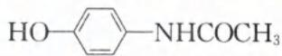

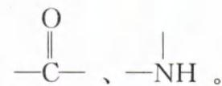

波谱分析:①测得目标化合物的红外光谱图如图(1),该有机化合物分子中存在: $\ce{C6H5-CH2OH}$ 、 $\ce{-NH}$ 。

②测得目标化合物的核磁共振氢谱图如图(2):

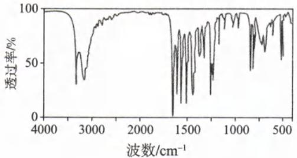  
图（1）

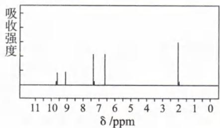  
图（2）

该有机化合物分子含有五种不同化学环境的 H 原子, 其峰面积之比为 1:1:2:2:3 (4) 综上所述, 扑热息痛的结构简式为 \_\_\_\_。

解析:(1)样品在足量纯氧中充分燃烧,生成 $n(\mathrm{H}_{2}\mathrm{O})=\frac{8.1\ \mathrm{g}}{18\ \mathrm{g}/\mathrm{mol}}=0.45\ \mathrm{mol}$ , 可推得样品所含 $n(\mathrm{H})=0.9\ \mathrm{mol}$ ; 生成 $n(\mathrm{CO}_{2})=\frac{35.2\ \mathrm{g}}{44\ \mathrm{g}/\mathrm{mol}}=0.8\ \mathrm{mol}$ , 可推得样品所含 $n(\mathrm{C})=0.8\ \mathrm{mol}$ 。再将等量的样品做第二个实验, 生成 $n(\mathrm{N}_{2})=\frac{1.12\ \mathrm{L}}{22.4\ \mathrm{L}/\mathrm{mol}}=0.05\ \mathrm{mol}$ , 所以 $n(\mathrm{N})=0.1\ \mathrm{mol}$ , 因此 $m(\mathrm{C})+m(\mathrm{N})+m(\mathrm{H})=0.8\ \mathrm{mol}\times12\ \mathrm{g}/\mathrm{mol}+0.1\ \mathrm{mol}\times14\ \mathrm{g}/\mathrm{mol}+0.9\ \mathrm{mol}\times1\ \mathrm{g}/\mathrm{mol}=11.9\ \mathrm{g}$ , 故样品含 $m(\mathrm{O})=15.1\ \mathrm{g}-11.9\ \mathrm{g}=3.2\ \mathrm{g}$ , 即 $n(\mathrm{O})=0.2\ \mathrm{mol}$ 。 $n(\mathrm{C}):n(\mathrm{H}):n(\mathrm{N}):n(\mathrm{O})=0.8:0.9:0.1:0.2=8:9:1:2$ , 则扑热息痛的实验式为 $C_{8}H_{9}NO_{2}$ 。

(2)由实验式 $C_{8}H_{9}NO_{2}$ 的式量为 151, 再结合质谱图可知, 其质荷比最大值为 151, 即扑热息痛的相对分子质量为 151, 因此其分子式为 $C_{8}H_{9}NO_{2}$ 。

(3)根据分子式计算扑热息痛的不饱和度 $\Omega=\frac{(2\times8+2)-(9-1)}{2}=5$ (不饱和度计算方法参照本章模块11第1节)。

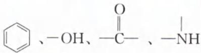

(4)根据题目信息:①加入 $NaHCO_{3}$ 溶液,无明显变化,说明不含—COOH;②加入 $FeCl_{3}$ 溶液,显紫色,说明含有酚羟基;③水解可以得到一种两性化合物,结合分子含 N 元素,可推知扑热息痛含酰胺基。酰胺水解时产生具有酸性的羧基和具有碱性的氨基,但水解后二者必然“分道扬镳”(Ω=5,分配给苯环和酰胺基,可知苯环上不会再出现环状结构),因此水解后所得两性化合物必然同时有氨基(碱性)和酚羟基(酸性)。④测得目标化合物的红外光谱图,得出该有机化合物分子中存在: $\ce{C6H5-CH(OH)-C(=O)-NH}$ ,以上的化学键或结构,正好符合②和③推测的,既有酚羟基(—OH 直接连接在 $\ce{C6H5-CH(OH)-N}$ );⑤测得目标化合物的核磁共振氢谱图,该有机化合物分子含有 5 种不同化学环境的 H 原子,其峰面积之比为 1:1:2:2:3,其中 1 个“1”是 1 个酚羟基,1 个“1”是酰胺基中与 N 相连的 1 个 H,1 个“3”优先考虑甲基(—CH₃),另外两个“2”考虑苯环上的 H,且可知应该是很对称的“对位”结构。综合以上分析可知,扑热息痛的结构简式为 $HO-\ce{C6H5-NHCOCH3}$ 。(扑热息痛的结构简式不能是 $HO-\ce{C6H5-CONHCH3}$ ,因为该结构水解后的产物是对羟基苯甲酸和甲胺,对羟基苯甲酸只有酸性,甲胺只有碱性,不符合水解产物有两性的条件。)

答案:(1) $C_{8}H_{9}NO_{2}$ (2) $C_{8}H_{9}NO_{2}$ (3)5 (4) $HO-\ce{C6H5-NHCOCH3}$

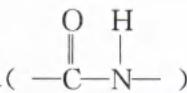

【反思】根据核磁共振氢谱信息要求推出有机物结构,一般题目的设计上,都是偏向较为对称的结构,例如本题在确定有一个酚羟基、一个酰胺基、一个甲基后,可以优先考虑“对位”结构,再利用题目信息进行验证,这样作答速度会比较快!

## 模块 3 烃

习题：P77

## 第 1 节 烷烃、烯烃、炔烃(★★)

## 内容提要

一、烷烃、烯烃、炔烃的组成、结构特点和通式

<table><tr><td rowspan="3">脂肪烃</td><td>烷烃</td><td>碳原子之间全部以单键结合的饱和烃</td><td>链状烷烃通式 $C_{n}H_{2n+2}(n \geqslant 1)$ </td></tr><tr><td>烯烃</td><td>含有碳碳双键的不饱和链烃</td><td>单烯烃通式 $C_{n}H_{2n}(n \geqslant 2)$ </td></tr><tr><td>炔烃</td><td>含有碳碳三键的不饱和链烃</td><td>单炔烃通式 $C_{n}H_{2n-2}(n \geqslant 2)$ </td></tr></table>

## 二、脂肪烃的物理性质

<table><tr><td>性质</td><td>变化规律</td></tr><tr><td>状态</td><td>标准状况下,含有1~4个碳原子的烃都是气态,随着碳原子数的增多,逐渐过渡到液态、固态</td></tr><tr><td>沸点</td><td>随着碳原子数的增多,沸点逐渐升高;同分异构体之间,支链越多,沸点越低</td></tr><tr><td>相对密度</td><td>随着碳原子数的增多,相对密度逐渐增大,密度均比水小</td></tr><tr><td>水溶性</td><td>均难溶于水</td></tr></table>

## 三、烷烃的化学性质

1. 烷烃的取代反应

(1)取代反应:有机物分子中某些原子或原子团被其他原子或原子团所替代的反应。

注:取代反应的化学键变化特征是“断 $\sigma$ 成 $\sigma$ ”。

(2)烷烃的卤代反应

①反应条件:烷烃与气态卤素单质在光照下反应。

②产物成分:多种卤代烃混合物(非纯净物)+HX。

③定量关系： $-\mathrm{C}-\mathrm{H}\sim\mathrm{X}_{2}\sim\mathrm{HX}$ ，即取代1 mol H原子，消耗1 mol 卤素单质，生成1 mol HX。

注:烷烃除了能发生取代反应外,还可以在加热条件下被氧气氧化;在催化剂的作用下,还能发生裂化、裂解、催化重整反应。

## 2. 烯烃、炔烃的加成反应

(1) 加成反应: 有机物分子中的不饱和碳原子与其他原子或原子团直接结合生成新的化合物的反应。

注：加成反应的化学键变化特征是“断 $\pi$ 成 $\sigma$ ”，且类似化合反应。

(2)烯烃、炔烃的加成反应

①乙烯的加成反应：

$$
\mathrm{CH} _ {2} = \mathrm{CH} _ {2} \xrightarrow [ \text {   溴的CCl } _ {4} \text {溶液   } ]{\mathrm{H} _ {2}} \mathrm{CH} _ {2} = \mathrm{CH} _ {2} + \mathrm{H} _ {2} \xrightarrow [ \triangle ]{\text {   催化剂   }} \mathrm{CH} _ {3} - \mathrm{CH} _ {3}
$$

②不对称烯烃和不对称含氢物质发生加成反应时，H原子一般加成在H原子多的碳原子（亲上加亲、物以类聚），这个规则称为马尔可夫尼科夫规则，简称马氏加成。但体系中存在过氧化物时，H原子加成在H原子少的碳原子，该规则称为反马氏加成。

$$
\begin{array}{r l} & {\text {例:} \mathrm{CH} _ {3} - \mathrm{CH} = \mathrm{CH} _ {2} + \mathrm{HBr} \xrightarrow {\text {催化剂}} \mathrm{CH} _ {3} - \mathrm{CHBr} - \mathrm{CH} _ {3} (\text {遵循马氏加成规则})} \\ & {\mathrm{CH} _ {3} - \mathrm{CH} = \mathrm{CH} _ {2} + \mathrm{HBr} \xrightarrow [ \text {过氧化物} ]{\text {催化剂}} \mathrm{CH} _ {3} - \mathrm{CH} _ {2} - \mathrm{CH} _ {2} \mathrm{Br} (\text {反马氏加成})} \end{array}
$$

注: 可以改变条件控制溴原子的定位, 增加目标产物的选择性。

③乙炔的加成反应：

$$
\begin{array}{r l} & \mathrm{CH} \equiv \mathrm{CH} - \xrightarrow [ (\text {少量}) ]{\mathrm{H} _ {2}} \mathrm{CH} \equiv \mathrm{CH} + \mathrm{H} _ {2} \xrightarrow [ \triangle ]{\text {催化剂}} \mathrm{CH} _ {2} = \mathrm{CH} _ {2} \\ & \xrightarrow [ (\text {少量}) ]{\text {溴的CCl} _ {4} \text {溶液}} \mathrm{CH} \equiv \mathrm{CH} + \mathrm{Br} _ {2} \longrightarrow \mathrm{Br} - \mathrm{CH} = \mathrm{CH} - \mathrm{Br} \\ & \xrightarrow [ (\text {足量}) ]{\text {溴的CCl} _ {4} \text {溶液}} \mathrm{CH} \equiv \mathrm{CH} + 2 \mathrm{Br} _ {2} \longrightarrow \begin{array}{c c} & \text {Br} \\ & | \\ & \text {Br} - \mathrm{CH} - \mathrm{CH} - \mathrm{Br} \\ & \end{array} \\ & \xrightarrow [ (1 : 1) ]{\mathrm{HCl}} \mathrm{CH} \equiv \mathrm{CH} + \mathrm{HCl} \xrightarrow [ \triangle ]{\text {催化剂}} \mathrm{CH} _ {2} = \mathrm{CHCl} \\ & \xrightarrow [ ]{\mathrm{H} _ {2} \mathrm{O}} \mathrm{CH} \equiv \mathrm{CH} + \mathrm{H} _ {2} \mathrm{O} \xrightarrow [ \triangle ]{\text {催化剂}} \mathrm{CH} _ {3} - \mathrm{CHO} \\ & \xrightarrow {\mathrm{HCN}} \mathrm{CH} \equiv \mathrm{CH} + \mathrm{HCN} \xrightarrow [ \triangle ]{\text {催化剂}} \mathrm{CH} _ {2} = \mathrm{CH} - \mathrm{CN} \\ & \end{array}
$$

注:异构化(重排)总结

i. 同碳上两个碳碳双键会异构化成碳碳三键: $C = C = C \rightarrow C \equiv C - C$ 。

ii. 同碳上既有碳碳双键又有羟基,会异构化成醛基或羰基(即烯醇重排反应): $\mathrm{C}=\mathrm{C}-\mathrm{OH}\rightarrow\mathrm{C}-\mathrm{C}=\mathrm{O}$ 。烯醇的羟基在“链端”重排为“醛”,例如: $\mathrm{CH}\equiv\mathrm{CH}\xrightarrow{\mathrm{H}_{2}\mathrm{O}}\mathrm{CH}_{2}=\mathrm{CH}-\mathrm{OH}$ (乙烯醇) $\xrightarrow{异构化}$ $\mathrm{CH}_{3}\mathrm{CHO}$ (乙醛);烯醇的羟基在“链中”则重排为“酮”。

iii. 环-2,4-己二烯酮会重排成酚： $\ce{C6H5O -> OH}$

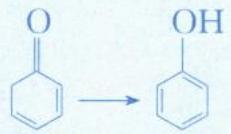

3. 二烯烃的加成反应：

$$
\mathrm{CH} _ {2} = \mathrm{CH} - \mathrm{CH} = \mathrm{CH} _ {2} \xrightarrow [ (1 , 3 - \text {丁二烯}) ]{\text {1,2 - 加成}} \begin{array}{l} \mathrm{Br} _ {2} (1: 1) \\ \text {1,4 - 加成} \\ \mathrm{Br} _ {2} (1: 1) \\ \text {足量Br} _ {2} \end{array} \xrightarrow {\mathrm{CH} _ {2} = \mathrm{CH} - \mathrm{CH} = \mathrm{CH} _ {2} + \mathrm{Br} _ {2}} \begin{array}{c} \mathrm{CH} _ {2} - \mathrm{CH} - \mathrm{CH} = \mathrm{CH} _ {2} \\ | \\ \mathrm{Br} \\ \text {1,2 - 加成} \\ \text {1,4 - 加成} \\ \text {Br} _ {2} (1: 1) \\ \text {Br} _ {2} (1: 1) \\ \text {足量Br} _ {2} \end{array}
$$

4. 烯烃、炔烃的加聚反应：

(1)丙烯加聚反应生成聚丙烯: $nCH_{2}=CH-CH_{3}\xrightarrow{催化剂} \begin{array}{c}[CH_{2}-CH]_{n} \\ |\\ CH_{3}\end{array}$ 。

注:书写加聚反应的产物时,注意半键所在碳原子的位置,以及注意调动双键碳上的原子团的位置。千万不要张冠李戴!

(2)乙炔加聚反应生成聚乙炔： $nCH\equiv CH\xrightarrow{催化剂}[CH=CH]_{n}$ （聚乙炔可用于制备导电高分子材料）。

## 类型 I: 烷烃基本概念

【例 1】判断下列叙述的正误,正确的填“√”,错误的填“×”

(1)分子通式为 $C_{n}H_{2n+2}$ 的烃一定是链状烷烃, $C_{n}H_{2n}$ 的烃一定是链状烯烃()

(3)烷烃的沸点高低仅取决于碳原子数的多少( )
(4)烷烃分子中的碳原子都采取 $sp^{3}$ 杂化,碳原子与碳原子或其他原子形成 $\sigma$ 键( )

(8)可用氯气和甲烷按照比例4:1在光照条件下反应制备纯净的 $CCl_{4}$ ( )

(9)甲烷的二氯代物只有一种可证明甲烷为正四面体结构()

解析:(1)(×)分子通式为 $C_{n}H_{2n+2}$ 的烃一定是链状烷烃,但 $C_{n}H_{2n}$ 的烃其不饱和度是 1,所以可能是链状烯烃,也可能是环烷烃。

(2)(×)碳氢化合物中的碳氢键是极性键、碳碳键为非极性键。

(3)(×)烷烃的沸点高低除了取决于碳原子数的多少以外,碳原子数相同的同分异构体,分子支链越多、沸点往往越低,例如沸点:正戊烷>异戊烷>新戊烷。所以烷烃的沸点高低不是仅取决于碳原子数的多少。

(4)(√)烷烃分子中的碳原子都采取 $sp^{3}$ 杂化(皆为饱和碳原子)，伸向四面体 4 个顶点方向的 $sp^{3}$ 杂化轨道，与其他碳原子或氢原子结合形成 $\sigma$ 键(氢原子的 s 轨道只能形成 $\sigma$ 键)。烷烃分子中的共价键全部是单键。

(5)(√)链状烷烃中,甲烷、乙烷、丙烷均无同分异构体,丁烷有2种同分异构体(正丁烷、异丁烷),戊烷有3种同分异构体(正戊烷、异戊烷、新戊烷), $C_{6}H_{14}$ 有5种同分异构体, $C_{7}H_{16}$ 有9种同分异构体。

(6)(×)分子通式为 $C_{n}H_{2n+2}$ 的烃一定是链状烷烃，碳数不同的链状烷烃互为同系物，因此甲烷、乙烷、丙烷等互为同系物。环丙烷为环状烷烃，结构与链状烷烃不相同，且环丙烷分子式为 $C_{3}H_{6}$ ，与甲烷、乙烷分子式并没有相差 $CH_{2}$ 的整数倍，因此环丙烷与甲烷、乙烷不是同系物的关系。

(7)(×)烷烃在光照条件下可与氯气发生取代反应,但不与溴水反应。

(8)(×)甲烷和氯气光照条件下发生取代反应,生成 $CH_{3}Cl$ 、 $CH_{2}Cl_{2}$ 、 $CHCl_{3}$ 、 $CCl_{4}$ 、HCl 等多种产物,无法得到纯净的 $CCl_{4}$ 。(绝大多数有机反应都伴随着副反应,所以很难得到纯净物。)

(9)(√)如果甲烷分子是平面正方形结构,其二氯代物有2种(两个氯相邻或两个氯相对)。因此甲烷的二氯代物只有1种可证明甲烷为正四面体的立体结构。
答案:(1)× (2)× (3)× (4)√ (5)√ (6)× (7)× (8)× (9)√

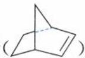

【例 2】降冰片烯( )在一定条件下可以转化为降冰片烷( )。下列说法正确的是( )

A. 降冰片烯和降冰片烷均能使酸性高锰酸钾溶液褪色

B. 降冰片烯转化为降冰片烷发生的是氧化反应

C. 降冰片烯与甲苯互为同分异构体

D. 降冰片烷的一氯代物有 3 种(不含立体异构)

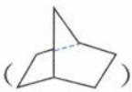

解析: A. 降冰片烯含有碳碳双键结构, 能被酸性高锰酸钾溶液氧化而使酸性高锰酸钾溶液褪色, 而降冰片烷则属于烷烃, 不能使酸性高锰酸钾溶液褪色, A 选项错误。

B. 降冰片烯与氢气发生加成反应转化为降冰片烷(与氢气的加成反应也是还原反应), B 选项项错误。

C. 降冰片烯的分子式为 $C_{7}H_{10}$ , 甲苯的分子式为 $C_{7}H_{8}$ , 二者分子式不同, 不是同分异构体, C 选项错误。

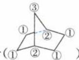

D. 降冰片烷中含有 3 种不同环境的氢原子(①②①)，所以其一氯代物有 3 种(不含立体异构)，D 选项正确。答案：D

类型Ⅱ:烯烃、炔烃的基本概念

【例 3】判断下列叙述的正误, 正确的填“√”, 错误的填“×”

(1)乙烯分子中有5个σ键和1个π键()

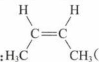

(2)反-2-丁烯的结构简式: $H_{3}C'$ $CH_{3}()$

(3)甲烷中存在少量的乙烯可以通过酸性高锰酸钾溶液除去,使甲烷中无杂质()

(4)丙烯分子中所有 C 原子均为 $sp^{2}$ 杂化()

(5)丙烯与等物质的量的溴化氢加成,只会生成一种产物()

(6)分子式为 $C_{3}H_{6}$ 的烃一定能使酸性 $KMnO_{4}$ 溶液褪色()

(7)1 mol 丙炔最多能与 2 mol $Cl_{2}$ 发生加成反应()

(8)聚丙烯可以使酸性高锰酸钾褪色()

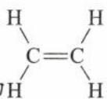

解析:(1)(√)乙烯结构式为H $\begin{array}{c}\text{H}\\ \text{C}=\text{C}\\ \text{H}\end{array}$ ,单键均为σ键,双键中含有1个σ键1个π键,因此乙烯分子中有5个σ键和1个π键。

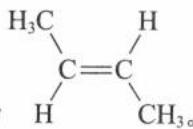

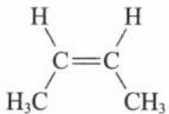

(2)(×)反-2-丁烯中两个相同的甲基在碳碳双键的两侧,其结构简式为 $H^{\prime}$ $CH_{3}$ 。题目所给的 $H_{C}=C$ $H_{3}C$ $CH_{3}$ ，两个相同的甲基在碳碳双键的同一侧，为顺-2-丁烯。

(3)(×)酸性 $\mathrm{KMnO_4}$ 溶液会将乙烯氧化为 $\mathrm{CO}_{2}$ , 引入新的气体杂质, 所以不能用酸性 $\mathrm{KMnO_4}$ 溶液除去甲烷中的乙烯。(易错点比较:①酸性 $KMnO_{4}$ 溶液可以用来“鉴别”甲烷和乙烯,但不可用来除去甲烷中的乙烯;②甲烷不和溴水反应,而乙烯能和溴水发生加成反应生成 $CH_{2}BrCH_{2}Br$ 进而使溴水褪色,所以溴水既可鉴别也可以除杂。③不能用溴的四氯化碳溶液除去甲烷中的乙烯,因为甲烷、四氯化碳均为非极性分子,甲烷会溶解在四氯化碳中而损耗。)

(4)(×)丙烯结构简式为 $CH_{3}CH=CH_{2}$ ，碳碳双键的两个 C 原子杂化方式为 $sp^{2}$ ， $-CH_{3}$ 的 C 原子杂化方式为 $sp^{3}$ 。

(5)(×)丙烯结构不对称,与 HBr 加成可得到两种产物 $CH_{2}BrCH_{2}CH_{3}$ (1—溴丙烷)、 $CH_{3}CHBrCH_{3}$ (2—溴丙烷);在通常情况下,主要得到 2—溴丙烷(遵循马氏规则)。(马氏规则:研究发现,当不对称烯烃与卤化氢发生加成反应时,通常“氢加到含氢多的不饱和碳原子一侧”,即遵循马尔可夫尼可夫规则,简称马氏规则。)(6)(×)有机物 $C_{3}H_{6}$ 可以是环丙烷或丙烯,两烯能使酸性 $KMnO_{4}$ 溶液褪色,但环丙烷不能使酸性 $KMnO_{4}$ 溶液褪色。

(7)(√)丙炔中有1个碳碳三键 $(-C\equiv C-)$ ，有两个不饱和度，因此1 mol丙炔最多能与2 mol $Cl_{2}$ 发生加成反应。

(8)(×)聚丙烯中不存在不饱和键,不能使酸性高锰酸钾褪色。

答案:(1)√ (2)× (3)× (4)× (5)× (6)× (7)√ (8)×

【例 4】(2023·浙江 6 月选考)丙烯可发生如下转化,下列说法不正确的是()

A. 丙烯分子中最多7个原子共平面
B. X的结构简式为 $CH_{3}CH=CHBr$ C. Y与足量KOH醇溶液共热可生成丙炔 $-CH_{2}-CH-$ D. 聚合物Z的链节为 $CH_{3}$ $C_{3}H_{5}Br \xleftarrow{Br_{2}} CH_{3}-CH=CH_{2} \xrightarrow[CCl_{4}]{Br_{2}} C_{3}H_{6}Br_{2}$ X

催化剂 $(C_{3}H_{6})_{n}$ Z

解析:A.以碳碳双键为中心,有6个原子一定共平面(乙烯型);以甲基的碳原子为中心,最多3原子共平面

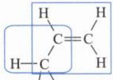

(甲烷型),上述分析如图 H H ,因此丙烯最多7个原子共平面,A选项正确。

$$
\begin{array}{c} \mathrm{CH} _ {2} - \mathrm{CH} = \mathrm{CH} _ {2} \\ | \\ \mathrm{Br} \end{array}
$$

B. $CH_{3}-CH=CH_{2}$ 与 $Br_{2}$ 在光照条件下发生甲基上的取代反应，生成 Br，B 选项错误。

C. $CH_{3}-CH=CH_{2}$ 与 $Br_{2}$ 的 $CCl_{4}$ 溶液发生加成反应，生成 1,2-二溴丙烷，因此 Y 的结构简式为 $CH_{3}-CH-CH_{2}$

$$
\begin{array}{c} \mathrm{CH} _ {3} - \mathrm{CH} - \mathrm{CH} _ {2} \\ | \\ \mathrm{Br} \end{array} ;
$$

Br Br ;Y 与 KOH 醇溶液共热,会发生消去反应,且由于 KOH 足量,因此两个 Br 原子都可以消去最终生成丙炔 $\left(\mathrm{HC}\equiv\mathrm{CCH}_{3}\right)$ , C 选项正确。

$\left[\mathrm{CH}-\mathrm{CH}_{2}\right]_{n}$ $-CH_{2}-CH-$ D. 聚合物 Z 为 $CH_{3}$ ，则其链节为 $CH_{3}$ ，D 选项正确。

答案:B

【反思】由于碳的杂化轨道中 s 轨道成分越多越牢固，则 C—H 键的稳定性顺序为：乙炔＞乙烯＞乙烷。乙烷的 C—H 键在光照条件下即可和氯气发生取代，乙烯、乙炔的 C—H 发生取代反应比乙烷难很多。

类型Ⅲ:共轭烯烃问题

【例 5】2—甲基-1,3—丁二烯和足量的溴发生加成反应,其加成产物中二溴代物有\_\_\_\_种(包括顺反异构,不考虑对映异构)

解析:2-甲基-1,3-丁二烯的键线式为① ③ ,与Br₂发生加成反应形成二溴代物,考虑1,2加成、3,

4 加成和 1,4 加成；此外还得注意产物是否存在顺反异构体。2—甲基—1,3—丁二烯与 $Br_{2}$ 发生 1,2 加成，产

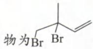

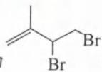

4加成和1,4加成；此外还将注意产物是否存在顺反异构体。2-甲基-1,3-丁二烯与 $\mathrm{Br}_2$ 发生1,2加成，产物为Br Br（无顺反异构体）；发生3,4加成，产物为Br Br（无顺反异构体）；发生1,4加成，产物存在 $\mathrm{CH_2Br}$ CHBr(顺式)和 $\mathrm{CH_2Br}$ (反式)。综上分析，符合题意的二溴代物共有4种。

答案:4

【例 6】(2024·九省联考)高分子的循环利用过程如下图所示。下列说法错误的是(不考虑立体异构)( )

A. b 生成 a 的反应属于加聚反应

B. a 中碳原子杂化方式为 $sp^{2}$ 和 $sp^{3}$ C. a 的链节与 b 分子中氢元素的质量分数不同

D. b 与 $Br_{2}$ 发生加成反应最多可生成 4 种二溴代物

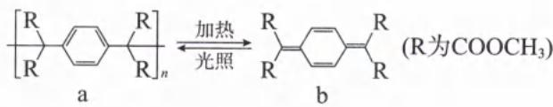

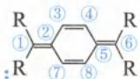

解析: 对有机物 b 的碳原子编号: R ⑦⑧R, 其中①②③④⑤⑥(或①②⑦⑧⑤⑥) 组成共轭三烯烃结构(三组碳碳双键, 且单键与双键交替排列), 其二卤代物的加成可以是: (1) 1, 2 位加成; (2) 3, 4 位加成; (3) 1, 4 位加成; (4) 1, 6 位加成。

A. 由 $b \to a$ 的过程, ①②的 $\pi$ 键断裂形成 2 个电子, 1 个电子由①往外与下一个链节的碳原子形成共价键, 另 1 个电子在②上(⑤⑥同理), 因此②③④⑤⑦⑧各有 1 个电子, 最终可形成大 $\pi$ 键(即 a 中的苯环结构)。根据以上分析可知, 单体是通过加成反应互相结合, 在聚合过程中并没有小分子生成, 因此 b 生成 a 的反应属于加聚反应, A 选项正确。

B. a 中苯环和酯基中的碳原子为 $sp^{2}$ 杂化，甲基中的碳原子以及与 R 相连的碳原子均为 $sp^{3}$ 杂化，B 选项正确。

C. a 是由单体 b 经加成聚合而成, 其链节与单体分子式相同, 氢元素的质量分数相同, C 选项错误。

D. b 中的①②③④⑤⑥的结构属于共轭三烯烃结构，二溴代物可以是两个溴原子加成在①②上（同加成在⑤⑥上）、或加成在③④上（同加成在⑦⑧上）、或加成在①④加成（同加成在①⑧/⑥③/⑥⑦上）、或加成在①⑥上，因此 b 与 Br₂ 发生加成反应最多可生成 4 种二溴代物，D 选项正确。

【反思】请同学们一定要了解共轭烯烃的结构特征，以及其部分加成的断键和成键特征。

类型Ⅳ:烯烃、炔烃和酸性 $KMnO_{4}$ 溶液的反应问题

【例 7】烯烃与酸性 $KMnO_{4}$ 溶液反应时, 不同的结构可以得到不同的氧化产物。烯烃被酸性高锰酸钾溶液氧化时的对应产物如下:

i. RCH=CH₂ $\xrightarrow{KMnO_{4}}$ R-C(OH) + CO₂; ii. RCH=CHR' $\xrightarrow{KMnO_{4}}$ RCOOH + R'COOH;
iii. $\begin{array}{c}R\\C=CH-R^{\prime}\end{array}\xrightarrow{KMnO_{4}}\begin{array}{c}O\\||\\C=C-R^{\prime}\end{array}+R^{\prime\prime}COOH$

则相对分子质量为 70 的单烯烃的分子式为 \_\_\_\_，若该烯烃与足量的 $H_{2}$ 加成后能生成含 3 个甲基的烷烃，则该烯烃可能的结构简式共有 \_\_\_\_ 种；其中，写出能被酸性高锰酸钾溶液氧化生成乙酸的该单烯烃的结构简式，并用系统命名法命名：结构简式为 \_\_\_\_，对应名称为 \_\_\_\_。

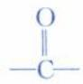

个碳各自变成2个—C—；若有醛基，则在醛基的C-H键中间再插入1个O原子变为最终变为-COOH。

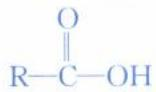

如 $\mathrm{RCH} = \mathrm{CH}_2$ 与酸性 $\mathrm{KMnO_4}$ 溶液反应，“剪刀”咔嚓一剪，生成 $\mathrm{R}-\mathrm{C}-\mathrm{OH}$ 和 $\mathrm{HO}-\mathrm{C}-\mathrm{OH}$ （即 $\mathrm{H}_2\mathrm{CO}_3$ ）， $\mathrm{H}_2\mathrm{CO}_3$ 在酸性条件下则分解变为 $\mathrm{CO}_2$ 。单烯烃的通式为 $\mathrm{C}_n\mathrm{H}_{2n}$ ，单烯烃的相对分子质量为 70，则有 $12n + 2n = 70$ ，解得 $n = 5$ ，该单烯烃的分子式为 $\mathrm{C}_5\mathrm{H}_{10}$ 。若该烯烃与足量的 $\mathrm{H}_2$ 加成后能生成含 3 个甲基的烷

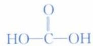

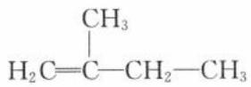

烃，该烯烃的结构有： $\mathrm{H}_2\mathrm{C} = \mathrm{C}-\mathrm{CH}_2-\mathrm{CH}_3$ 、 $\mathrm{CH}_3-\mathrm{C}=\mathrm{CH}-\mathrm{CH}_3$ 、 $\mathrm{H}_3\mathrm{C}-\mathrm{CH}-\mathrm{CH}=\mathrm{CH}_2$ ，共3种。

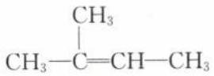

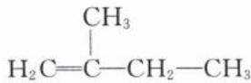

$CH_{3}$ $H_{2}C=C-CH_{2}-CH_{3}$ 与酸性高锰酸钾溶液反应生成 $CO_{2}$ 和 $CH_{3}-C=CH_{2}CH_{3}$

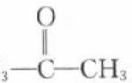

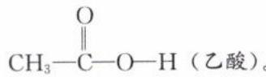

$CH_{3}-C=CH-CH_{3}$ 与酸性高锰酸钾溶液反应生成 $CH_{3}-C=CH_{3}$ （丙酮）和 $CH_{3}-C=O-H$ （乙酸）。 $H_{3}C-CH-CH=CH_{2}$ 与酸性高锰酸钾溶液反应生成 $H_{3}C-CH-C-OH$ 和 $CO_{2}$ 。

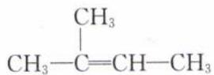

根据以上分析,符合题意的烯烃为 $CH_{3}-C=CH-CH_{3}$ ，系统命名为 2-甲基-2-丁烯。

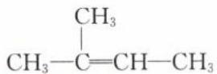

答案: $C_{5}H_{10}$ 3 $CH_{3}-C=CH-CH_{3}$ 2-甲基-2-丁烯

【反思】脂肪烃的氧化反应：

<table><tr><td></td><td>烷烃</td><td>烯烃</td><td>炔烃</td></tr><tr><td>燃烧现象</td><td>火焰明亮</td><td>火焰明亮且伴有黑烟</td><td>火焰很明亮且伴有浓黑烟</td></tr><tr><td>通入酸性KMnO4溶液</td><td>不褪色</td><td>1KMnO4溶液褪色2双键碳上有2个H原子,被氧化成CO23双键碳上有1个H原子,被氧化成羧基4双键碳上无H原子,被氧化成酮羰基</td><td>1KMnO4溶液褪色2三键的端碳被氧化成CO2;链中三键碳被氧化成羧基</td></tr></table>

## 第2节 芳香烃(★★)

## 内容提要

一、芳香烃：分子里含有一个或多个苯环的烃。

芳香烃 $\left\{\begin{array}{l}\text {苯及 } \left\{\begin{array}{l}\text {通式: } C_{n}H_{2n-6}(n\geqslant6)\\ \text {其同 }\end{array}\right.\\ \text {键的特点:苯环中含有介于碳碳单键和碳碳双键之间的特殊的化学键}\\ \text {系物 } \left\{\begin{array}{l}\text {特征反应:能取代,难加成,侧链可被酸性 } KMnO_{4} 溶液氧化(与苯环相连的 C 上含 H)\end{array}\right.\end{array}\right.$ 其他芳香烃:苯乙烯( $\text {苯乙烯} - \text {CH=CH}_{2}$ )、萘( $\text {苯乙烯} - \text {N}_2$ )、蒽( $\text {苯乙烯} - \text {N}_2$ )

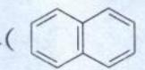

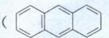

## 二、苯

1. 苯的组成与结构

(1) 分子式为 $C_{6}H_{6}$ 。

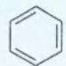

(2) 结构简式为 $\bigcirc$ 或 $\bigcirc$ (不饱和度 $\Omega=4$ )。

(3) 分子结构: 平面正六边形, 所有原子处于同一平面上。

(4) 成键特点：

①苯的6个碳原子均采取 $sp^{2}$ 杂化，分别与氢原子及相邻碳原子以 $\sigma$ 键结合，键间夹角均为 $120^{\circ}$ 。

②每个碳碳键的键长相等，介于碳碳单键和碳碳双键之间。

③每个碳原子余下的 p 轨道垂直于碳、氢原子构成的平面, 相互平行重叠形成大 $\pi$ 键 ( $\Pi_{6}^{6}$ )。

## 2. 苯的物理性质

<table><tr><td>颜色</td><td>状态</td><td>气味</td><td>密度</td><td>溶解性</td><td>挥发性</td><td>毒性</td></tr><tr><td>无色</td><td>液态</td><td>有特殊气味</td><td>比水小</td><td>不溶于水,有机溶剂中易溶</td><td>沸点比较低,易挥发</td><td>有毒</td></tr></table>

注:绝大多数的有机物密度小于水,大于水的有机物包括:含硝基的芳香族、酚类、卤代烃(但一氟代物和一氯代物密度小于水)。

## 3. 苯的化学性质

<table><tr><td>反应类型</td><td>反应对象</td><td>化学方程式</td><td>运用</td></tr><tr><td>氧化反应</td><td>氧气</td><td> $2C_6H_6 + 15O_2 \xrightarrow{\text{点燃}} 12CO_2 + 6H_2O$ </td><td>燃烧有浓的黑烟,可以用燃烧法区别液态同碳烷烃和苯</td></tr><tr><td rowspan="5">取代反应</td><td>液溴</td><td></td><td>苯环上引入溴原子,为以后苯环引入侧链基团打基础</td></tr><tr><td>浓硝酸</td><td></td><td>为引入氨基、酰胺基提供氮原子</td></tr><tr><td>浓硫酸</td><td></td><td>该反应为可逆反应,为以后的“占位效应”打基础</td></tr><tr><td>酰氯</td><td></td><td>在苯环上引入侧链并引入官能团(傅克酰基化反应)</td></tr><tr><td>卤代烃</td><td></td><td>在苯环上引入侧链(傅克烷基化反应)</td></tr><tr><td>加成反应</td><td>氢气</td><td></td><td>将芳香环转化成脂环</td></tr></table>

## 4. 苯的重点实验

(1)证明液溴与苯发生的是取代反应,而非加成反应。

①本质:若发生取代反应,则产物中有 HBr,所以只需要证明 HBr 的存在即可。

②方法:可以用石蕊溶液证明 $H^{+}$ 的存在;也可以用 $HNO_{3}$ 酸化的 $AgNO_{3}$ 证明 $Br^{-}$ 的存在。

③易错点:由于液溴易挥发,所以 HBr 中会混有 $Br_{2}$ , 应该用 $CCl_{4}$ 洗气, 运用了相似相溶原理。

## (2)溴苯的分离提纯

①溴苯中的主要杂质: $Br_{2}$ 、苯

②除杂方法:先用 NaOH 溶液洗涤,再分液(溴苯在下层),接着将分离出的下层液体进行蒸馏。

## (3)硝基苯的分离提纯

①硝基苯中的主要杂质：硝酸、硫酸、硝酸分解产生的 $NO_{2}$ 、苯

②除杂方法:先用 NaOH 溶液洗涤,再分液(硝基苯在下层),接着将分离出的下层液体进行蒸馏。

## 三、苯的同系物——以甲苯为例

1. 加成反应: 苯的同系物能在一定条件下与 $H_{2}$ 发生加成反应, 与苯类似。

## 2. 取代反应

(1)硝化:甲苯与浓硝酸和浓硫酸的混合物在加热条件下可以发生取代反应,生成一硝基取代物、二硝基取代物和三硝基取代物,硝基取代的位置均以甲基的邻、对位为主。其中生成三硝基取代物的化学方程式为:

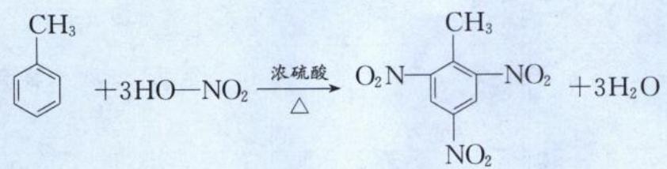

(2) 溴化：

$$
\mathrm{Br} - \mathrm {\text {   }} - \mathrm{CH} _ {3} + \mathrm{HBr} \uparrow)
$$

注：①甲苯苯环上的硝化、卤代数目都与温度有关。

②苯环上的取代基有一定的定位效应,如甲基、羟基、氨基等(一般不含π键)为邻位、对位的定位基团;如硝基、羧基、酰胺基、磺酸基等(一般含π键)为间位的定位基团。

②光照： $\ce{C6H5-CH3 + Cl2 ->[光] C6H5-CH2Cl + HCl}$

注：烷基上的氢都可与氯气取代。

3. 氧化反应

(1)甲苯能使酸性 $KMnO_{4}$ 溶液褪色：

(2)甲苯燃烧: $C_{7}H_{8}+9O_{2}\xrightarrow{点燃}7CO_{2}\uparrow+4H_{2}O$

注:烷基对苯环有影响,所以苯的同系物比苯易发生取代反应;苯环对烷基也有影响,所以苯环上的甲基能被酸性高锰酸钾溶液氧化;与苯环直接相连的碳上有氢,则该碳会被氧化成羧基。

类型 I: 苯及其同系物基本概念

【例 1】判断下列叙述的正误,正确的填“√”,错误的填“×”

(1)苯能与溴水在溴化铁作催化剂的条件下发生取代反应()

(2)苯分子中的碳碳键是一种介于碳碳单键和碳碳双键之间独特的键,因此苯难发生加成反应()

(3)苯分子中每个碳原子还有一个未参与杂化的2p轨道,垂直碳环平面,相互重叠,形成大 $\pi$ 键()

(4)苯的间位二溴代物只有一种能证明苯分子中不存在碳碳单、双键交替的排布()

(5)可用酸性高锰酸钾溶液区别苯与甲苯()

(6)苯不能使酸性 $KMnO_{4}$ 溶液褪色,因此苯不能发生氧化反应()

(7) $\ce{C6H5CH3}$ 与 $\ce{C(CH3)3}$ 互为同系物，且均能使酸性 $KMnO_{4}$ 溶液褪色（）

(8)光照条件下,异丙苯( $\left\langle\right\rangle$ —CH(CH $_{3}$ ) $_{2}$ )与Cl $_{2}$ 发生取代反应生成的一氯代物有3种()

解析:(1)(×)苯与液溴在溴化铁作催化剂的条件下发生取代反应。苯与溴水不反应,苯使溴水褪色的原理是萃取而不是取代反应。

(2)(√)苯结构中存在大π键,苯分子的碳碳键是一种介于碳碳单键和碳碳双键之间独特的键,苯的大π键比较稳定,在通常情况下,苯不如烯烃、炔烃那样容易发生加成反应。

(3)(√)苯分子中 C 原子均以 $sp^{2}$ 杂化方式成键, 因此有每个碳原子皆有 1 个未参与杂化, 且垂直于六元环平面的 p 轨道, 这 6 个 p 轨道相互以肩并肩的方式重叠, 形成大 $\pi$ 键。

(4)(×)不管苯分子中是否存在碳碳单键、碳碳双键交替的排布,苯的间位二溴代物都只有一种。苯的邻位二溴代物只有一种,才可以证明苯分子中不存在碳碳单、双键交替的排布。

(5)(√)苯与酸性高锰酸钾溶液不反应,甲苯可以被酸性高锰酸钾氧化,使酸性高锰酸钾溶液褪色,因此可用酸性高锰酸钾溶液区别苯与甲苯。

(6)(×)苯虽然不能使酸性 $KMnO_{4}$ 溶液褪色,但能燃烧,故苯也能发生氧化反应。

(7)(×) $\ce{C6H5-CH3}$ 与 $\ce{C(CH3)3}$ 结构相似且分子式相差 $CH_{2}$ 的整数倍，二者互为同系物，但由于 $\ce{C(CH3)3}$ 中与苯环直接相连的碳原子上并没有 H 原子，无法被酸性 $KMnO_{4}$ 氧化，不能使酸性 $KMnO_{4}$ 溶液褪色。

(8)(×)异丙苯与 $Cl_{2}$ 在光照条件下发生取代反应,Cl 原子取代在烷基上。由于异丙苯分子中烷基上只有两种不同化学环境的 H 原子,因此光照条件下,反应生成的一氯代物有 2 种。

答案:(1)× (2)√ (3)√ (4)× (5)√ (6)× (7)× (8)×【例 2】在探索苯结构的过程中,人们写出了符合分子式“ $C_{6}H_{6}$ ”的多种可能结构,如图所示,下列说法正确的是( )

A. 1\~5 对应的结构中所有原子均可能处于同一平面的有 2 个

B. 1\~5 对应的结构中一氯取代物只有一种的有 3 个

C. 1\~5 对应的结构中能使溴的四氯化碳溶液褪色的有 4 个

D. 1\~5 对应的结构中能与氢气在一定条件下发生加成反应的有 4 个

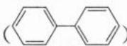  
5

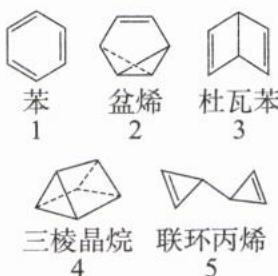  
解析: A. 1\~5 对应的结构中, 只有苯的所有原子共平面; 其他分子结构中, 均含有 $sp^{3}$ 杂化方式的碳原子, 所有原子不可能处于同一平面, A 选项错误。  
B.1和4的一氯取代物只有1种，3和5的的一氯取代物有2种，2的一氯取代物有3种，B选项错误。  
C.2、3、5这3个有机物含有碳碳双键，能使溴的四氯化碳溶液褪色，C选项错误。  
D. 2、3、5 这 3 个有机物含有碳碳双键, 能与氢气在一定条件下发生加成反应。苯含不饱和碳原子, 在一定条件下可与氢气发生加成反应生成环己烷。只有 4 不能与氢气在一定条件下发生加成反应, D 选项正确。

【反思】能与氢气发生加成反应的有机物往往含有 $\pi$ 键，但羧基、酯基、酰胺基的 $\pi$ 键不能加成氢气。  
类型Ⅱ:芳香烃基本概念  
【例 3】下列关于芳香烃的说法错误的是()  
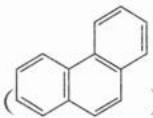  
A. 稠环芳烃菲( )在一定条件下能发生加成反应、硝化反应

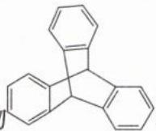  
B. 化合物不是苯的同系物
C. 等质量的 $\ce{C6H5-CH=CH2}$ 与苯完全燃烧消耗氧气的量相等
D. 联苯( $\ce{C6H5-C6H4}$ )分子中所有原子一定共平面  
解析:A.菲属于芳香烃,与苯的性质相似,在一定条件下能发生加成反应、硝化反应,A选项正确。  
B. 苯的同系物只有一个苯环, 侧链均为烷基, 分子通式为 $\mathrm{C}_{n}\mathrm{H}_{2n-6}(n\geqslant7)$ 。该化合物含三个苯环, 不是苯的同系物, B 选项正确。

C. 苯与\$\text{苯环}=\text{CH}\_2\$的最简式相同,皆为 CH,因此等质量的两物质完全燃烧,消耗氧气的量相同,C 选项正确。(最简式相同的有机物,只要质量相同,完全燃烧所消耗的氧气量也相同。)  
D. 联苯分子中两个苯环通过单键相连, 单键可以旋转, 所有原子“可能”共面, 但不能说“一定”共平面, D选项错误。  
答案:D  
【反思】芳香族化合物、芳香烃、苯的同系物辨析

<table><tr><td>对象</td><td>芳香族化合物</td><td>芳香烃</td><td>苯的同系物</td><td>关系</td></tr><tr><td>所含元素种类</td><td>除C外,可含其他元素</td><td>仅含C、H</td><td>仅含C、H</td><td rowspan="3"></td></tr><tr><td>所含苯环数目</td><td>≥1</td><td>≥1</td><td>1</td></tr><tr><td>不饱和度</td><td>≥4</td><td>≥4</td><td>4</td></tr></table>

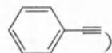

【例 4】(2022·辽宁卷)下列关于苯乙炔( )的说法正确的是( )

A. 不能使酸性 $KMnO_{4}$ 溶液褪色

B. 分子中最多有5个原子共直线

C. 能发生加成反应和取代反应

D. 可溶于水

解析:A.苯乙炔分子中含有碳碳三键,能使酸性KMnO $_{4}$ 溶液褪色,A选项错误。

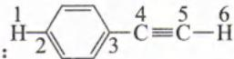

B. 如图： $\ce{H-2-\overset{4}{C}-\overset{5}{C}-H}$ ，苯乙炔分子中最多有6个原子共直线，B选项错误。（根据结构简式计算原子个数时，一定要记得补上氢原子。）
C. 苯乙炔分子中含有苯环结构和碳碳三键，能与 $H_{2}$ 发生加成反应；苯环上的氢原子能被取代（如发生卤代、硝化），可以发生取代反应，C选项正确。
D. 苯乙炔是只含碳氢的烃类，难溶于水，D选项错误。

答案:C

【反思】问分子中共直线的原子个数时,既要考虑碳碳三键,还要考虑苯环的对位原子。

类型Ⅲ:烃类的重要实验

【例 5】如图为实验室制取乙炔并验证其性质的实验装置(夹持装置已略去)。下列说法错误的是( )

A. 用饱和食盐水替代水的目的是降低反应速率
B. CuSO₄ 溶液的作用是除去杂质
C. 酸性 KMnO₄ 溶液褪色说明乙炔具有还原性
D. 可用向上排空气法收集乙炔

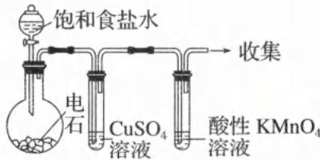

解析:实验室可用电石 $\left(\mathrm{CaC}_{2}\right)$ 与水反应制取乙炔,反应的化学方程式为: $\mathrm{CaC}_{2}+2\mathrm{H}_{2}\mathrm{O}\rightarrow\mathrm{Ca(OH)}_{2}+\mathrm{HC}\equiv\mathrm{CH}\uparrow$ 。
A. 电石与水反应非常剧烈,为了减小其反应速率,可用饱和氯化钠溶液代替水作反应试剂,A选项正确。
B. 电石不纯,反应制得的乙炔中通常会含有 $H_{2}S$ 等杂质气体,由于 $H_{2}S$ 也能使酸性 $KMnO_{4}$ 溶液褪色,会干扰实验,因此需用硫酸铜溶液吸收 $\left(\mathrm{CuSO}_{4}+\mathrm{H}_{2}\mathrm{S}=\mathrm{H}_{2}\mathrm{SO}_{4}+\mathrm{CuS}\downarrow\right)$ , B选项正确。
C. 乙炔具有还原性,可被酸性 $KMnO_{4}$ 溶液氧化,使溶液褪色,C选项正确。
D. 在相同状况下,气体密度与其 $M_{r}$ 成正比。 $M_{r}$ (乙炔)=26,空气的平均 $M_{r}=28.8$ ,乙炔与空气的密度相近,不能用排空气法收集乙炔,应用排水法收集,D选项错误。

答案:D

【例 6】用甲、乙两个装置都可以制取溴苯,下列说法错误的是( )

A. 反应的化学方程式为 $\ce{C6H5 + Br2 ->[FeBr3] C6H5 - Br + HBr\uparrow}$

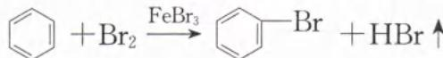

B. 反应后圆底烧瓶得褐色混合物, 是因为溴苯有颜色
C. 乙装置可证明溴和苯在铁粉催化下发生取代反应
D. 甲装置左侧的长导管具有导气与冷凝的作用

解析: A. 苯与溴在 Fe 或 $FeBr_{3}$ 催化下可以发生反应, 苯环上的氢原子可被溴原子取代, 生成溴苯, A 选项正确。

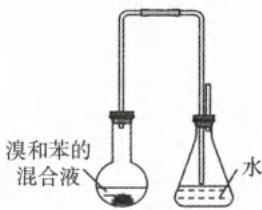  
铁粉  
甲

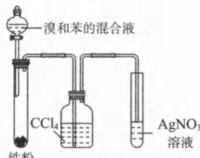  
铁粉  
乙

B. 溴苯为无色液体, 褐色是因为苯中溶解了未反应完的 $Br_{2}$ , B 选项错误。

C. 由于液溴易挥发, 且溴蒸气进入到 $\mathrm{AgNO}_{3}$ 溶液中也会与水发生反应生成 $\mathrm{Br}^{-}$ , 进而形成 $\mathrm{AgBr}$ 浅黄色沉淀, 会对取代反应生成的 $\mathrm{HBr}$ 的检验造成干扰, 因此装置乙中四氯化碳的作用是吸收挥发出的溴蒸气 (利用了相似相溶原则), 以证明该反应是取代反应, C 选项正确。  
D. 甲装置左侧的长导管除了具有导气的作用外, 也可以冷凝回流苯和液溴, D 选项正确。  
答案: B

# 模块 4 卤代烃(★★)

习题：P79

## 内容提要

## 一、卤代烃的概念

1. 卤代烃是烃分子中的氢原子被卤素原子取代后生成的化合物。通式可表示为 R—X（其中 R—表示烃基）。

2. 官能团是碳卤键 —C—X（或卤素原子 —X）。

## 二、卤代烃的物理性质

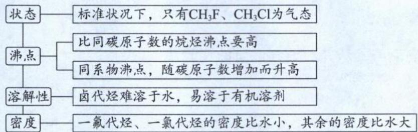

## 三、卤代烃的化学性质

## 1. 水解(取代)反应

(1) 反应条件: 强碱的水溶液、加热。

(2) 断键规律：

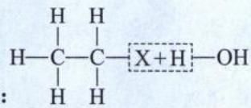

(3) $C_{2}H_{5}Br$ 在碱性条件下水解的化学方程式为 $CH_{3}CH_{2}Br + NaOH \xrightarrow[\Delta]{水} CH_{3}CH_{2}OH + NaBr$ 。（用 $R-CH_{2}-X$ 表示卤代烃，碱性条件下水解的化学方程式为 $R-CH_{2}-X+NaOH \xrightarrow[\Delta]{水} R-CH_{2}OH+NaX$ ，一定要记得在箭号上指明“ $H_{2}O$ ”。）

注:卤代烃都可以发生水解反应,但是芳卤(即卤原子直接和苯环相连)很难水解,其水解条件为“高温高压”。

## 2. 消去反应

(1) 反应条件: 强碱的醇溶液、加热。

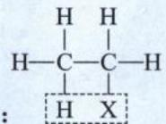

(2) 断键规律：

(3)溴乙烷发生消去反应的化学方程式为 $CH_{3}CH_{2}Br + NaOH \xrightarrow[\triangle]{乙醇} CH_{2} = CH_{2} \uparrow + NaBr + H_{2}O$ 。（用 $R-CH_{2}-CH_{2}-X$ 表示卤代烃，消去反应的化学方程式为 $R-CH_{2}-CH_{2}-X+NaOH \xrightarrow[\triangle]{乙醇} R-CH=CH_{2}+NaX+H_{2}O$ 。）

(4)卤代烃的消去反应规律：

①卤代烃必须有 $\beta-H$ ，且 $\beta-H$ 不能是苯环上的 H（以卤原子为基准，与其直接相连的碳称为 $\alpha-C$ ，与 $\alpha-C$ 直接相连的 C 称为 $\beta-C_{0}$ 。）

②有两个邻位且不对称的碳原子上均有氢原子时,可得到两种不同产物。

③卤代烃发生消去反应也可以生成炔烃。如： $CH_{2}ClCH_{2}Cl+2NaOH\xrightarrow[\Delta]{乙醇}CH\equiv CH\uparrow+2NaCl+2H_{2}O$ 。（消去反应既可以转化官能团，也为后期增多官能团打下了基础。）

## 四、卤代烃中卤素原子的检验

1. 实验流程: R-X $\xrightarrow[水解]{NaOH溶液/\Delta}$ $\xrightarrow[酸化]{稀HNO_{3}}$ $\xrightarrow[溶液]{AgNO_{3}}$ $\xrightarrow{AgCl白色沉淀}$ $\xrightarrow{AgBr浅黄色沉淀}$ $\xrightarrow{AgI黄色沉淀}$

## 2. 实验要点：

(1)通过水解反应将卤素原子转化为卤素离子(因为卤代烃为非电解质,无法在水中电离出 $X^{-}$ )。

(2)卤素原子转化为卤素离子后必须加入稀硝酸中和过量的碱,因为过量碱会与硝酸银反应。

## 五、制取卤代烃的方法

1. 烷烃取代法: $CH_{4} + Cl_{2} \xrightarrow{光照} CH_{3}Cl + HCl$ 。

2. 烯(炔)烃与卤素单质加成: $CH_{2}=CH_{2}+Br_{2}\longrightarrow CH_{2}BrCH_{2}Br$ 。

3. 烯(炔)烃与卤化氢加成: $CH_{2}=CH_{2}+HCl\xrightarrow{催化剂}CH_{3}CH_{2}Cl$ (工业上制备氯乙烷时, 常用 $CH_{2}=CH_{2}$ 与 HCl 发生加成反应制取, 而不是用 $C_{2}H_{6}$ 与 $Cl_{2}$ 的取代反应制取。因为乙烯与氯化氢的加成反应产物纯净, 易分离、提纯。)

4. 芳香烃取代法： $\ce{C6H5 + Br2 ->[FeBr3] C6H5 - Br + HBr}$

5. 醇与浓 HX 的取代反应: $CH_{3}CH_{2}OH + HX \xrightarrow{\triangle} CH_{3}CH_{2}X + H_{2}O$ 。(HX = HCl、HBr、HI。)

## 类型 I: 卤代烃的性质

## 【例 1】正误判断, 正确的填“√”, 错误的填“×”

(1)卤代烃是一类特殊的烃()

(2)只用水就能鉴别己烷、溴乙烷、酒精三种无色液体()

(3)卤代烃不一定是烃分子和卤素单质发生取代反应得到的()

(4)溴乙烷分子中碳溴键极性较强,在与氢氧化钠水溶液的反应中,碳溴键发生了断裂()

(5)溴乙烷通常用溴与乙烷直接反应来制取()

(6)除去溴乙烷中的 $Br_{2}$ ，可用 NaOH 溶液反复洗涤后分液（）

(7)医用防护服的核心材料是微孔聚四氟乙烯薄膜,其单体属于卤代烃()

(8)在平流层中,氟氯代烷在紫外线照射下,分解产生的氯原子可引发损耗臭氧的循环反应( )
解析:(1)(×)烃类只含碳、氢两种元素,卤代烃含有卤素原子,不属于烃类。

(2)(√)己烷不溶于水且密度比水小,与水分层且油状液体己烷在上层;溴乙烷不溶于水且密度比水大,与水分层且油状液体溴乙烷在下层;酒精可与水以任意比互溶,不分层。三者现象不同,故可用水鉴别。

(3)(√)卤代烃除了可以通过取代反应得到(例如甲烷与氯气在光照条件下可以得到一氯甲烷、二氯甲烷等卤代烃)，也可以通过烯烃、炔烃的加成反应得到(例如乙烯与 HBr 加成后得到溴乙烷)。

(4)(√)溴乙烷分子中碳溴键极性较强,在与 NaOH 水溶液的反应中,碳溴键断裂发生取代反应,生成乙醇。(5)(×)溴与乙烷发生取代反应后,会生成多种产物,不易分离得到溴乙烷,因此一般用乙烯与 HBr 进行加成反应来制取溴乙烷。

(6)(×)溴乙烷在 NaOH 溶液中会发生水解反应而损耗。由于 $Br_{2}$ 具有强氧化性，可以用弱碱性或酸性的还原剂 $\left(\mathrm{Na}_{2}\mathrm{SO}_{3}\right.$ 或 $\left.\mathrm{NaHSO}_{3}\right)$ 溶液，将 $Br_{2}$ 还原成 $Br^{-}$ 进入水溶液。而溴乙烷不与 $Na_{2}SO_{3}$ 反应且难溶于水，接着再进行分液可得溴乙烷。

(7)(√)聚四氟乙烯的单体为四氟乙烯,四氟乙烯的结构简式为 $CF_{2}=CF_{2}$ , 四氟乙烯属于卤代烃中的氟代烃。

(8)(√)氟氯代烷(商品名氟利昂)是含有氟和氯的烷烃衍生物,它们化学性质稳定,无毒,具有不燃烧、易挥发、易液化等特性,曾被广泛用作制冷剂和溶剂。然而氟利昂可在强烈的紫外线作用下分解,产生的氯原子自由基会对臭氧层产生长久的破坏作用(氯原子起了催化作用)。

答案:(1)× (2)√ (3)√ (4)√ (5)× (6)× (7)√ (8)√

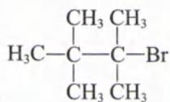

【例 2】下列卤代烃,既能发生水解反应,又能发生消去反应且只能得到一种单烯烃的是( )

A. $CH_{3}CH_{3}$ B. $CH_{3}CH_{3}$ C. $CH_{3}Br$ D. $CH_{3}$

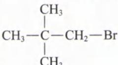

解析: 水解反应对卤代烃的结构无特殊限制, 但消去反应要求卤代烃必须有 $\beta-H$ 且该 $\beta-H$ 不在苯环上。卤代烃都能发生水解反应生成醇, 因此我们要判定的是能否发生消去反应, 以及消去反应所生成的单烯烃种类。

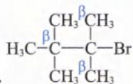

A. $\mathrm{CH_{3}}^{\beta}\mathrm{CH_{3}}$ ，该分子中有3个β-C，但有一个β-C无H原子，另外两个β-C共6个H原子等效（同碳上的甲基氢等效），可以发生消去反应，且生成的产物只有一种： $\mathrm{CH_{3}}$ ，A符合题意。

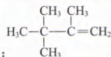

B. $\beta CH_{3}$ ，该分子中有两种 $\beta-H$ ，可以发生消去反应，但生成的产物有两种： $CH_{3}-CH_{2}-C=CH_{2}$ 、 $CH_{3}-CH=C-CH_{3}$ ，B 不符合题意。
C. $\begin{array}{c}\text { CH }_{3}\text { CH }_{3}\text { CH }_{3}\text { CH }_{3}\text { CH }_{3}\text { CH }_{3}\text { CH }_{3}\text { CH }_{3}\text { CH }_{3}\text { CH }_{3}\text { CH }_{3}\text { CH }_{3}\text { CH }_{3}\text { CH }_{3}\text { CH }_{3}\end{array}$ ，该分子中有三种 $\beta-H$ ，可以发生消去反应，但生成的产物有三种： $CH_{3}-CH-C=CH_{2}$ $H_{3}C-CH-C=CH_{2}$ $CH_{3}-CH-C-CH_{3}$ $H_{3}C-C=C-CH_{3}$ $CH_{3}$ 、 $CH_{3}$ ，C 不符合题意。

D. 该分子中与 Br 相连的碳原子, 其邻位碳原子上无 H(无 $\beta-H$ ), 不能发生消去反应, D 不符合题意。

答案:A

【反思】卤代烃中 $\beta-H$ 的有无决定能否发生消去反应， $\beta-H$ 的种类决定消去反应后的烯烃种类。

类型Ⅱ:卤代烃中卤素原子的检验

【例 3】(双选)下列实验操作能达到实验目的的是()

<table><tr><td>选项</td><td>探究方案</td><td>探究目的</td></tr><tr><td>A</td><td>向试管中滴入几滴1-溴丁烷,再加入2mL 5% NaOH溶液,振荡后加热,一段时间后停止加热,静置。取数滴水层溶液,加入几滴AgNO3溶液,观察现象</td><td>检验1-溴丁烷中的溴元素</td></tr><tr><td>B</td><td>向卤代烃水解后的样品溶液中滴加硝酸酸化,再加AgNO3溶液,观察沉淀物颜色</td><td>检验卤代烃中卤素原子种类</td></tr><tr><td>C</td><td>向试管中加入适量的溴乙烷和NaOH的乙醇溶液,加热,将反应后产生的气体通入溴的四氯化碳溶液</td><td>证明溴乙烷发生消去反应有乙烯生成</td></tr><tr><td>D</td><td>向试管中加入适量的溴乙烷和NaOH的乙醇溶液,加热,将反应后产生的气体通入酸性高锰酸钾溶液</td><td>证明溴乙烷发生消去反应有乙烯生成</td></tr></table>

解析：A. 反应后的水溶液呈碱性， $\mathrm{OH}^{-}$ 与 $\mathrm{Ag}^{+}$ 反应生成的 $\mathrm{Ag_2O}$ 或 $\mathrm{AgOH}$ 会干扰实验，应先加硝酸中和至酸性，再加入几滴 $\mathrm{AgNO_3}$ 溶液，观察是否有浅黄色沉淀生成，A选项错误。  
B. 该方案可以检验水解后产生的卤素阴离子，水解反应后的溶液经酸化后加入 $\mathrm{AgNO_3}$ 溶液，F、Cl、Br、I原子分别对应的现象是：无沉淀、白色沉淀、淡黄色沉淀、黄色沉淀，B选项正确。  
C. 向试管中加入适量的溴乙烷和 $\mathrm{NaOH}$ 的乙醇溶液并加热，发生消去反应生成乙烯（混有乙醇蒸气），将反应后产生的气体通入溴的四氯化碳溶液，由于乙烯能使溴的四氯化碳溶液褪色而乙醇不反应，因此溶液褪色可说明有乙烯生成，C选项正确。  
D. 对比C选项的实验方案，乙烯和乙醇都能使酸性高锰酸钾溶液褪色，应先用水溶解挥发的乙醇后，再用酸性高锰酸钾溶液检验乙烯，D选项错误。

答案:BC

【反思】检验卤代烃中的卤原子,中间过程一定要加硝酸调节 pH<7。

类型Ⅲ:卤代烃引入“相邻双官能团”的应用

$$
\begin{array}{c} \mathrm{H} _ {3} \mathrm{C} - \mathrm{CH} - \mathrm{CH} _ {2} \\ | \\ \mathrm{OH} \quad \mathrm{OH} \end{array}
$$

【例 4】由 $CH_{3}CH_{2}CH_{2}Br$ 制备都正确的是()

OH OH , 依次从左至右发生的反应类型和反应条件

<table><tr><td>选项</td><td>反应类型</td><td>反应条件</td></tr><tr><td>A</td><td>加成反应;取代反应;消去反应</td><td>KOH 醇溶液加热;KOH 水溶液加热;常温</td></tr><tr><td>B</td><td>消去反应;加成反应;取代反应</td><td>NaOH 水溶液加热;常温;NaOH 醇溶液加热</td></tr><tr><td>C</td><td>消去反应;加成反应;水解反应</td><td>NaOH 醇溶液加热;常温;NaOH 水溶液加热</td></tr><tr><td>D</td><td>氧化反应;取代反应;消去反应</td><td>加热;KOH 醇溶液加热;KOH 水溶液加热</td></tr></table>

解析: 用逆合成法分析:

$$
\begin{array}{c} \mathrm{H} _ {3} \mathrm{C} - \mathrm{CH} - \mathrm{CH} _ {2} \\ | \\ \mathrm{OH} \quad \mathrm{OH} \end{array} \Longrightarrow \begin{array}{c} \mathrm{H} _ {3} \mathrm{C} - \mathrm{CH} - \mathrm{CH} _ {2} \\ | \\ \mathrm{Br} \quad \mathrm{Br} \end{array} \Longrightarrow \mathrm{H} _ {3} \mathrm{C} - \mathrm{CH} = \mathrm{CH} _ {2} \Longrightarrow \mathrm{CH} _ {3} \mathrm{CH} _ {2} \mathrm{CH} _ {2} \mathrm{Br} 。
$$

$$
\mathrm{CH} _ {3} \mathrm{CH} = \mathrm{CH} _ {2}
$$

与 $Br_{2}$ 发生加成反应得到； $CH_{3}CH=CH_{2}$ 可由 $CH_{3}CH_{2}CH_{2}Br$ 发生消去反应得到。因此由 $CH_{3}CH_{2}CH_{2}Br$ 制备 $\mathrm{CH_{3}CH(OH)CH_{2}OH}$ ，从左至右发生的反应类型是消去反应、加成反应、水解反应。发生消去反应条件是 NaOH 醇溶液、加热；与溴水发生加成反应条件是常温；发生水解反应条件是与 NaOH 水溶液、加热，故选 C。（要从单一官能团变为邻位双官能团，往往是先“消去”再“加成”。）

答案:C

【反思】考场上为了秒选对选择题，首先观察起点和终点的差异可知，该过程需要增多官能团，那需要先发生消去反应，再发生加成反应。所以排除 A、D。卤代烃发生消去反应时会生成 HBr，为了促进消去反应的同时抑制水解反应的发生，反应条件为氢氧化钠醇溶液并加热。

【例 5】1,4—环己二醇可通过下图所示路线合成(某些反应的反应物和反应条件未标出):

(1)A 的结构简式是\_\_\_\_。

(2)写出反应④、⑦的化学方程式:反应④:\_\_\_\_;反应⑦:\_\_\_\_。

(3)反应②的反应类型是\_\_\_\_，反应⑤的反应类型是\_\_\_\_。

(4)环己烷的二氯取代物有\_\_\_\_种。

解析: $\mathrm{Cl}_{2}$ 和 $\mathrm{Cl} \rightarrow \mathrm{Cl}$ , $\mathrm{Cl} \rightarrow \mathrm{Cl}$ 经②、③、④反应生成, 用逆合成法分

析： $\ce{C6H5 -> ClC6H5 -> C6H5 -> ClC6H5}$ ，推测出A为 $\ce{C6H5, B}$ 为 $\ce{ClC6H5}$ 。因此反应②为消去反应，

反应③为加成反应, 反应④为消去反应, 反应⑤是 (共轭二烯烃) 与 $\mathrm{Br}_{2}$ 发生 1,4 加成反应生成 $\mathrm{Br}-\mathrm{Br}-\mathrm{Br}$ , 反应⑥是 $\mathrm{Br}-\mathrm{Br}-\mathrm{Br}$ 与 $\mathrm{H}_{2}$ 发生加成反应生成 C, 因此 C 为 $\mathrm{Br}-\mathrm{Br}-\mathrm{Br}$ ; 反应⑦是 $\mathrm{Br}-\mathrm{Br}-\mathrm{Br}$ 发生水解反应生成 $\mathrm{HO}-\mathrm{OH}$ 。

(1)根据上述分析可知，A 的结构简式是

(2)根据上述分析可知,反应④考查卤代烃的消去反应,一定要注意消去反应的条件(氢氧化钠醇溶液,加热)。反应⑦考查卤代烃的水解反应,水解反应的条件是氢氧化钠水溶液和加热。反应④的化学方程式为:

$\text{Cl}$ +2NaOH $\xrightarrow[\Delta]{\text{乙醇}}$ +2NaCl + 2H $_{2}$ O; 反应⑦的化学方程式为: Br—C₆H₄—Br + 2NaOH $\xrightarrow[\Delta]{H_{2}O}$ HO—C₆H₄—OH + 2NaBr。

(3)根据上述分析可知,反应②的反应类型是消去反应(断σ键成π键);反应⑤的反应类型是加成反应(断π键成σ键)。

(4)书写二取代物时的思维顺序:先建立骨架;再对骨架对称分析;按照同、邻、间的位置关系将卤原子放入骨

架。一定要注意思维的顺序,选择一个中心点,再往两边发散。环己烷的二氯取代产物有:

答案:(1) $\ce{C6H5}$ (2) $\ce{Cl-C6H5-CH2-CH2-CH2-CH2-CH2-CH2-CH2-CH2-CH2-CH2-CH2-CH2-CH2-CH2-CH2-CH2-CH2-CH2-CH2-CH2-CH2-CH2-CH2-CH2-CH2-CH2-CH2-CH2-CH2-CH2-CH2-CH2-CH2-CH2}$

$HO-\text{ } \ce{C6H5OH + 2NaBr}$ (3)消去反应 加成反应 (4)4

【反思】若有机合成题没有信息方程式，则只需要考虑教材上的化学反应即可。

## 模块 5 醇 酚

习题：P80

## 第 1 节 醇(★★★)

## 内容提要

一、醇的概念:醇是羟基与烃基相连的化合物(脂肪醇,如 $CH_{3}CH_{2}OH$ )或羟基与苯环侧链上的碳原子相连的化合物(芳香醇,如 $\ce{C6H5-CH2OH}$ ),饱和一元醇的通式为 $C_{n}H_{2n+1}OH$ $(n\geqslant1)$ 。

## 二、醇类物理性质的变化规律

<table><tr><td>物理性质</td><td>递变规律</td></tr><tr><td>密度</td><td>一元脂肪醇的密度一般小于水( $1\ \text{g} \cdot \text{cm}^{-3}$ )</td></tr><tr><td rowspan="2">沸点</td><td>1.直链饱和一元醇的沸点随着分子中碳原子数的递增而升高</td></tr><tr><td>2.醇分子间存在氢键,所以相对分子质量相近的醇和烷烃相比,醇的沸点远高于烷烃</td></tr><tr><td>水溶性</td><td>低级脂肪醇易溶于水( $C \leqslant 3$ ),饱和一元醇的溶解度随着分子中碳原子数的递增而逐渐减小</td></tr></table>

注:醇由两部分组成,其中羟基是亲水基,烃基是憎水基,每个亲水基一般能促进3个碳以内的烃基溶解,当憎水基碳架太大或太长,以憎水为主。

## 三、醇的化学性质——以乙醇为例

醇的官能团羟基(—OH)，决定了醇的主要化学性质。受羟基的影响，C—H的极性增强，一定条件也可能断键发生化学反应。乙醇发生化学反应时，可断裂不同的化学键。

1. 与钠反应(置换反应): 分子中 a 键断裂, 化学方程式为: $2CH_{3}CH_{2}OH + 2Na \rightarrow 2CH_{3}CH_{2}ONa + H_{2}\uparrow$ 。

注:有机物中的羟基 H 原子均能与钾、钙、钠等发生置换反应。

2. 消去反应: 乙醇在浓硫酸作用下, 加热到 $170^{\circ}$ C, 发生了

消去反应,生成乙烯。分子中 b、d 键断裂,化学方程式为:

$$
\mathrm{CH} _ {3} \mathrm{CH} _ {2} \mathrm{OH} \xrightarrow [ 1 7 0 ^ {\circ} \mathrm{C} ]{\text { 浓 } \mathrm{H} _ {2} \mathrm{SO} _ {4}} \mathrm{CH} _ {2} = \mathrm{CH} _ {2} \uparrow + \mathrm{H} _ {2} \mathrm{O。}
$$

$$
\begin{array}{c} \mathrm{H} \\ | \stackrel {{\mathrm{e}}} {{-}} \stackrel {{\mathrm{c}}} {{-}} \mathrm{O} \\ \mathrm{H} - \stackrel {{\mathrm{C}}} {{-}} \stackrel {{\mathrm{d}}} {{-}} \stackrel {{\mathrm{b}}} {{-}} \stackrel {{\mathrm{a}}} {{-}} \end{array}
$$

注：①醇必须要有β-H才能发生消去反应，且β-H不能是苯环上的H。

②醇发生消去反应脱水分子,所以需要浓硫酸吸水促进消去反应正向进行。

3. 取代反应：

(1)与卤化氢(HX)发生取代反应:分子中b键断裂,化学方程式为: $C_{2}H_{5}OH+HX\xrightarrow{\triangle}C_{2}H_{5}X+H_{2}O$ 。

(2) 分子间脱水成醚: 一分子中 a 键断裂, 另一分子中 b 键断裂, 化学方程式为:

$$
2 \mathrm{CH} _ {3} \mathrm{CH} _ {2} \mathrm{OH} \xrightarrow [ 1 4 0 ° C ]{\text {浓H} _ {2} \mathrm{SO} _ {4}} \mathrm{CH} _ {3} \mathrm{CH} _ {2} \mathrm{OCH} _ {2} \mathrm{CH} _ {3} + \mathrm{H} _ {2} \mathrm{O。}
$$

(3)与含氧酸发生酯化反应(酸脱羟基,醇脱氢):醇断了a键,化学方程式为:

$$
\mathrm{CH} _ {3} - \stackrel {\mathrm{O}} {\mathrm{C}} - \stackrel {\text {   }} {\mathrm{OH}} + \mathrm{H} - \mathrm{O} - \mathrm{C} _ {2} \mathrm{H} _ {5} \xrightarrow [ \triangle ]{\text {   浓硫酸   }} \mathrm{CH} _ {3} - \stackrel {\mathrm{O}} {\mathrm{C}} - \mathrm{OC} _ {2} \mathrm{H} _ {5} + \mathrm{H} _ {2} \mathrm{O}
$$

4. 氧化反应：

(1) 燃烧反应: $C_{2}H_{5}OH + 3O_{2} \xrightarrow{点燃} 2CO_{2} + 3H_{2}O$ 。

注: 计算烃的含氧衍生物完全燃烧的耗氧量, 需要先将分子中的 O 原子组合成 $CO_{2}$ 或 $H_{2}O$ , 再对剩余部分进行耗氧分析。

(2)催化氧化:乙醇在铜或银作催化剂加热的条件下与空气中的氧气反应生成乙醛,分子中a、c键断裂,化学方程式为: $2CH_{3}CH_{2}OH+O_{2}\xrightarrow[\triangle]{Cu或Ag}2CH_{3}CHO+2H_{2}O$ 。

注:醇的催化氧化特征是“失氢”。

(3)酸性 $K_{2}Cr_{2}O_{7}$ 溶液(或酸性 $KMnO_{4}$ 溶液): 乙醇能被酸性重铬酸钾溶液氧化, 溶液颜色由橙色变成灰绿色(酒驾测试仪器的工作原理), 其氧化过程分为两个阶段: $CH_{3}CH_{2}OH \xrightarrow{氧化} CH_{3}CHO \xrightarrow{氧化} CH_{3}COOH$ , 乙醇也能被酸性高锰酸钾溶液氧化成乙酸, 使溶液褪色。

## 四、醇的氧化和消去反应规律

1. 醇能否发生催化氧化及氧化产物类型取决于醇分子中是否有 $\alpha-H$ (与羟基直接相连的碳上的 H) 及其个数：

β-H:离官能团第二近的碳原子上的氢原子 $\beta\downarrow\alpha$ R—CH₂—CH₂OH
α-H:与官能团相连的碳原子上的氢原子

注:也可以根据醇羟基的位置推催化氧化的产物。羟基在链端,被催化氧化成醛;羟基在链中,被催化氧化成酮,或不能发生催化氧化。

2. 醇能否发生被酸性高锰酸钾或重铬酸钾溶液氧化取决于醇分子中是否有 $\alpha-H$ 及其个数: (1) 无 $\alpha-H$ 不能氧化; (2) 1 个 $\alpha-H$ 被氧化成酮; (3) 2 个 $\alpha-H$ 被氧化成羧酸; (4) 3 个 $\alpha-H$ 被氧化成 $\mathrm{CO}_{2}$ 。

$$
\begin{array}{c}\mathrm{H} \quad \mathrm{OH}\\\mathrm{R} - \mathrm{C} - \mathrm{C} - \mathrm{H} \rightarrow \mathrm{R} - \mathrm{CH} = \mathrm{CH} _ {2} + \mathrm{H} _ {2} \mathrm{O}\\: \quad \mathrm{H} \quad \mathrm{H}\end{array}
$$

3. 醇消去反应的原理为： $\overset{\frown}{H}\overset{\frown}{H}$

(1)若醇分子中只有一个碳原子或无 $\beta-\mathrm{H}(\beta$ 碳原子上没有 $\mathrm{H}$ 原子),则不能发生消去反应。如 $\mathrm{CH}_{3}\mathrm{OH}$ 、 $\mathrm{CH}_{3}$ 、 $\mathrm{CH}_{2}\mathrm{OH}$ 等。

(2)某些醇发生消去反应,可以生成不同的烯烃,如: $\beta CH_{2}CH_{2}CH_{3}$ ,三种β-H的化学环境不相同,消去反应后会有三种有机产物。

(3) 卤代烃、醇发生消去反应的总结

<table><tr><td colspan="2">研究对象</td><td>卤代烃</td><td>醇</td></tr><tr><td rowspan="2" colspan="2">断键位置</td><td> $\beta-C+H$ 键和 $C+X$ </td><td> $\beta-C+H$ 键和 $C+OH$ </td></tr><tr><td colspan="2">注: $\beta-C-H$ 不能是苯环上的C-H</td></tr><tr><td colspan="2">脱出的小分子</td><td>HX</td><td> $H_2O$ </td></tr><tr><td rowspan="4">反应条件</td><td rowspan="2">相同点</td><td>加热</td><td>加热</td></tr><tr><td colspan="2">加快化学反应速率</td></tr><tr><td rowspan="2">不同点</td><td>氢氧化钠、醇溶液</td><td>浓硫酸</td></tr><tr><td>氢氧化钠消耗HX促进消去反应正向移动</td><td>浓硫酸吸收水促进消去反应正向移动</td></tr></table>

类型 I: 醇的基本常识

【例 1】下列关于醇的用途中,说法不正确的是( )

A. 甲醇有剧毒,但其为一种重要的化工原料,可用于制备“生物柴油”
B. 质量分数为 70%\~75% 的乙醇溶液,可作消毒酒精
C. 乙二醇可以生产汽车防冻液
D. 丙三醇可用于配制化妆品,主要用于皮肤的保湿

解析: A. 甲醇剧毒, 但可用作燃料和化工原料, 其与废弃油脂发生“醇交换”反应, 将高级脂肪酸甘油酯转化成高级脂肪酸甲酯。“生物柴油”的成分是高级脂肪酸甲酯或乙酯, 柴油的成分主要是烷烃, A 选项正确。

B. 消毒酒精、啤酒、黄酒、白酒、葡萄酒等标注的百分数, 均为体积分数, B 选项错误。

C. 乙二醇作汽车防冻液, 是和水以特定比例混合而得的。纯乙二醇的冰点为 $-11.5^{\circ} \mathrm{C}$ , 但当乙二醇含量为 $68 \%$ 时, 冰点可降为 $-68^{\circ} \mathrm{C}$ , 因此可作为汽车防冻液, C 选项正确。

D. 丙三醇无毒且难挥发, 其保湿的原理主要是两点原因: 1. 吸收环境中的水分; 2. 与皮肤自身的水形成氢键, 可以一定程度上锁住皮肤上的水分, 从而达到保湿的功效, D 选项正确。

答案: B

【例 2】正误判断,正确的填“√”,错误的填“×”
(1)烃基直接和羟基相连的化合物一定是醇( )
(2)乙醇与乙醚互为同分异构体( )

(3)相对分子质量相近的醇和烷烃,醇的沸点远远高于烷烃,低级醇可与水以任意比例混溶,醇的这些物理性质都与羟基间或羟基与水分子形成氢键有关( )
(4)所有的醇都能发生催化氧化反应和消去反应( )
(5)乙醇的分子间脱水反应和酯化反应都属于取代反应( )
(6)溴乙烷与乙醇都能发生消去反应,且反应条件相同( )
(7)可用乙醇能被酸性重铬酸钾溶液氧化的原理来检验酒驾( )

(8)生石灰具有吸水性,向工业酒精中加入新制的生石灰,然后加热蒸馏,可制备无水乙醇( )
解析:(1)(×)羟基与脂肪烃基或苯环侧链上的碳原子相连的是醇,如 $CH_{3}CH_{2}OH$ 、 $\ce{C6H5CH2OH}$ 都属于醇;羟基与苯基(也属于烃基)直接相连的是酚类,如 $\ce{C6H5OH}$ 。

(2)(×)乙醇分子式为 $C_{2}H_{6}O$ ，乙醚又称二乙基醚，结构简式为 $C_{2}H_{5}OC_{2}H_{5}$ ，分子式为 $C_{4}H_{10}O$ ，两者分子式不同，并不互为同分异构体。乙醇和甲醚（即二甲基醚，结构简式为 $CH_{3}OCH_{3}$ ）互为同分异构体中的官能团类型异构。

(3)(√)醇的沸点远高于相对分子质量接近的烷烃,这是由于醇分子中羟基的氧原子与另一醇分子羟基的氢原子间存在着氢键。低级醇如甲醇、乙醇、丙醇、乙二醇、丙三醇等均可与水互溶,这也是因为醇分子与水分子之间形成了氢键。

(4)(×)并不是所有醇都能发生消去反应,例如甲醇只有1个碳原子,不能发生消去反应;与-OH相连的C

其邻位C上没有H(如 CH₃—C—CH₂OH)也不能发生消去反应。并不是所有醇都能发生催化氧化反应，与一OH相连的C上没有H(如 CH₃—C—OH)不能发生催化氧化。

(5)(√)乙醇分子间脱水, 可视为 $C_{2}H_{5}OH$ 的 -H 被 $-C_{2}H_{5}$ 取代, 生成 $C_{2}H_{5}OC_{2}H_{5}$ (乙醚) 和水; 乙醇的酯化反应(以和乙酸的酯化反应为例), 也可视为 $C_{2}H_{5}OH$ 的 -H 被 $CH_{3}-C-$ (乙酰基) 取代, 生成 $CH_{3}COOC_{2}H_{5}$ (乙酸乙酯), 因此两者都是取代反应。(两个反应都断 $\sigma$ 键成 $\sigma$ 键, 这是取代反应的化学键变化特征。)

(6)(×)溴乙烷的消去反应条件为 NaOH 醇溶液、加热；乙醇的消去反应条件为浓 $H_{2}SO_{4}$ 、加热至 $170^{\circ}$ ，二者反应条件不同。（消去反应产生的小分子决定了反应条件的选择，由于二者脱的小分子不一样，所以反应条件不一样。）

(7)(√)乙醇具有还原性,酸性重铬酸钾具有强氧化性,司机口中呼出的乙醇可以使酒精检测仪中橙色的重铬酸钾 $\left(\mathrm{K}_{2}\mathrm{Cr}_{2}\mathrm{O}_{7}\right)$ 转变为绿色的硫酸铬 $\left[\mathrm{Cr}_{2}\left(\mathrm{SO}_{4}\right)_{3}\right]$ ,可用来检验酒驾。

(8)(√)向工业酒精中加入新制的生石灰(即 CaO)，与水反应生成 $\mathrm{Ca(OH)}_{2}$ ，然后加热蒸馏出乙醇，可制备无水乙醇。

类型Ⅱ:实验基础

【例 3】下列关于乙醇实验的叙述中,不正确的是( )

A. 可以用燃烧法鉴别乙醇和苯,也可以用水鉴别乙醇和苯

B. 往乙醇中加入金属钠可检验乙醇中是否有水

C. 将无水乙醇、浓硫酸、溴化钠固体混合加热可获得溴乙烷

D. 可以用高级的醇萃取碘水中的碘单质

解析: A. 乙醇燃烧无黑烟, 但含碳量高的苯燃烧有浓的黑烟, 所以可以用燃烧法鉴别乙醇和苯; 乙醇与水互

溶，苯难溶于水，水与苯混合会分层，油状液体在上层，所以可以用水鉴别乙醇和苯，A选项正确。

B. 乙醇、水均与金属钠反应生成氢气，B选项错误。

C. 浓硫酸是高沸点酸,与溴化钠共热会生成 HBr(遵循高沸点酸制低沸点酸),生成的 HBr 再与乙醇发生取代反应: $C_{2}H_{5}OH + HBr \xrightarrow{\triangle} C_{2}H_{5}Br + H_{2}O$ ,生成溴乙烷,C 选项正确。

D. 高级的醇为弱极性分子, 难溶于水, 并不与碘单质反应, 可以用于萃取碘水中的碘单质, D 选项正确。

答案:B

【例 4】为探究乙醇消去反应的产物,某小组设计如下实验:取15 mL浓硫酸,向其中加入5 mL乙醇和少量碎瓷片;迅速升温至140 ℃;将产生的气体直接通入酸性高锰酸钾溶液中,观察现象。实验中可能会用到如图装置,下列说法错误的是( )

A. 实验中存在2处错误

B. 装置Ⅰ中的球形冷凝管冷凝效果比直形冷凝管好

C. 装置Ⅱ若实验开始后,发现未加碎瓷片,应停止加热并待冷却后再添加

D. 装置Ⅰ比装置Ⅱ的控温效果更好

  
I

  
II

解析: A. 实验中存在三处错误: (1) 液体混合时, 应该把密度大的液体倒入密度小的液体, 所以应该将浓硫酸 (约为 $1.84 \, g/mL$ ) 倒入乙醇; (2) 应将 $140^{\circ}C$ 改为 $170^{\circ}C$ ; (3) 不能直接将气体通入酸性高锰酸钾溶液, 因为乙醇有挥发性, 且副产物有 $SO_{2}$ 。乙醇、 $SO_{2}$ 均能使酸性高锰酸钾溶液褪色, 应先用 NaOH 溶液洗气, A 选项错误。

B. 球形冷凝管中蒸气和冷凝水的接触面积更大, 气体冷却更充分, 原料利用率更高, B 选项正确。

C. 忘记加入沸石, 一定要停止加热, 待体系冷却后, 再打开仪器加入沸石, 防止出现安全事故, C 选项正确。

D. 电热套是一种能精确控温的加热装置, 能使圆底烧瓶均匀受热, D 选项正确。

答案:A

类型Ⅲ:醇的催化氧化反应和消去反应问题

【例 5】分子式为 $C_{7}H_{16}O$ 的饱和一元醇的同分异构体有多种，在下列该醇的同分异构体中：

A. $\mathrm{CH}_3\mathrm{-CH(OH)CH_3}$ B. $\mathrm{CH}_3\mathrm{-C(OH)CH_3}$

C. $\mathrm{CH}_3\mathrm{-}\underset{\mathrm{CH}_3}{\overset{\mathrm{CH}_3}{\mathrm{C}}}-\mathrm{CH}_2\mathrm{-}\underset{\mathrm{OH}}{\overset{\mathrm{OH}}{\mathrm{CH}}}-\mathrm{CH}_3$ D. $\mathrm{CH}_3(\mathrm{CH}_2)_5\mathrm{CH}_2\mathrm{OH}$

(1)可以发生消去反应,生成两种单烯烃的是\_\_\_\_（填字母）
(2)可以发生催化氧化生成醛的是\_\_\_\_（填字母）
(3)不能发生催化氧化的是\_\_\_\_（填字母）
(4)能被催化氧化为酮的有\_\_\_\_种
(5)能使酸性 $KMnO_{4}$ 溶液褪色的有 \_\_\_\_ 种

解析:(1)可以发生消去反应,说明与羟基相连的碳原子其相邻碳原子上有H原子(即有β-H)。发生消去反应后生成2种单烯烃,表示羟基不是位于第1个碳原子上,或该分子结构不对称(即β-H不等效)。A、B、D均只有一种β-H,三种醇经消去反应后只生成1种有机产物。C的β-H不等效,消去反应后可生成两2单烯烃,C符合题意。

(2)链端的羟基才能被催化氧化成醛(或具有2个以上的 $\alpha-H$ 才能被催化氧化成醛),D符合题意。

(3)羟基相连的碳原子上无氢原子(无 $\alpha-H$ ), 则不能发生催化氧化, B 符合题意。

$$
\begin{array}{c} \mathrm{OH} \\ | \\ \mathrm{R} _ {1} - \mathrm{CH} - \mathrm{R} _ {2} \end{array}
$$

(4)若醇只有1个 $\alpha-H$ (结构为 $R_{1}-CH-R_{2}$ )则被催化氧化成酮,A、C符合题意,共2种。

(5)含有 $\alpha -\mathrm{H}$ 的醇，才能被酸性高锰酸钾溶液氧化，则A、C、D均可，答案为3种。答案：（1）C (2)D (3)B (4)2 (5)3

【例 6】分子式 $C_{5}H_{12}O$ 的同分异构体中, 能与金属钠反应生成氢气, 能被氧化为醛又能在浓硫酸作用下生成烯烃的有( )
A. 3 种 B. 4 种 C. 7 种 D. 8 种

解析: 分子式符合 $C_{n}H_{2n+2}O$ 的有机物, 可能是饱和一元醇 ( $n \geqslant 1$ ) 或饱和一元醚 ( $\geqslant 2$ ); 其中能与金属钠反应生成氢气的为饱和一元醇, 结构中含有羟基。根据题意: (1) 能被氧化为醛: 说明有 $\alpha-H$ 有 2 个; (2) 能在浓硫酸作用下生成烯烃 (可发生消去反应), 说明有 $\beta-H$ , 综合 (1) 与 (2) 可知, 结构中含有一 $CH_{2}CH_{2}OH$ 或

$$
\begin{array}{c} \mathrm{CH} _ {3} \\ | \\ (- \mathrm{CH} - \mathrm{CH} _ {3}) \end{array}
$$

$\text{—CHCH}_2\text{OH}$ ；剩余的 3 个饱和碳原子可以构成正丙基 $(\text{CH}_3\text{CH}_2\text{CH}_2-)$ 、异丙基 $(\text{—CH—CH}_3)$ ，或 1 个甲基 $(\text{CH}_3-)$ 加上 1 个乙基 $(\text{CH}_3\text{CH}_2-)$ 。则其同分异构体可以为 $\text{CH}_3(\text{CH}_2)_4\text{OH}$ 、 $(\text{CH}_3)_2\text{CHCH}_2\text{CH}_2\text{OH}$ 和 $\text{CH}_3\text{CH}_2\text{CHCH}_2\text{OH}$ ，共 3 种。 $\text{—CH}_3$

答案:A

## 第2节 酚(★★★)

## 内容提要

一、酚的概念:酚是羟基与苯环直接相连而形成的化合物,最简单的酚类化合物为苯酚( $\ce{C6H5OH}$ )。

## 二、苯酚的物理性质：

物理性质
颜色状态 无色晶体，露置在空气中显粉红色
溶解性 常温下，在水中的溶解度不大，温度高于65℃时能与水混溶，易溶于酒精

## 三、苯酚的化学性质

1. 弱酸性(苯酚俗称石炭酸): 受苯环的影响, 苯酚分子中的氢氧键更容易断裂, 因此苯酚

能在水溶液中发生微弱电离产生 $H^{+}$ : $\ce{C6H5OH} \rightleftharpoons \ce{C6H5O-} + H^{+}$ ，酸性: $H_{2}CO_{3} > C6H5OH > HCO_{3}^{-}$ ，苯酚不能使酸碱指示剂变色，其酸性仅表现在与活泼金属、强碱以及某些盐（如 $Na_{2}CO_{3}$ ）的反应中。

(1)与 $\mathrm{NaOH}$ 反应： $\bigcirc -\mathrm{OH} + \mathrm{NaOH}\rightarrow \bigcirc -\mathrm{ONa} + \mathrm{H}_2\mathrm{O}$

(2)与 $Na_{2}CO_{3}$ 反应： $\ce{C6H5OH + Na_{2}CO_{3} \rightarrow C6H5ONa + NaHCO_{3}}$ （无论苯酚少量还是过量，都是生成 $NaHCO_{3}$ ）。

2. 与溴水的取代反应: 苯酚滴入过量浓溴水中的现象为生成白色沉淀。

邻、对位定位基。)

注：卤素单质参与的有机反应总结

<table><tr><td>卤素种类</td><td>状态</td><td>有机物种类</td><td>反应条件</td><td>反应类型</td></tr><tr><td> $Cl_2$ </td><td>气态</td><td>烷基</td><td>光照</td><td>取代反应</td></tr><tr><td rowspan="6"> $Br_2$ </td><td>气态</td><td>烷基</td><td>光照</td><td>取代反应</td></tr><tr><td>液态</td><td>不含酚羟基的苯基</td><td>催化剂( $FeBr_3$ )</td><td>取代反应</td></tr><tr><td rowspan="3">水溶液</td><td>碳碳双键、碳碳三键</td><td>无</td><td>加成反应</td></tr><tr><td>醛基</td><td>无</td><td>氧化反应</td></tr><tr><td>苯酚(酚羟基邻、对位氢)</td><td>无</td><td>取代反应</td></tr><tr><td> $CCl_4$ 溶液</td><td>碳碳双键、碳碳三键</td><td>无</td><td>加成反应</td></tr></table>

3. 显色反应: 苯酚与 $FeCl_{3}$ 溶液作用显紫色。

4. 苯酚与甲醛在催化剂作用下, 可发生缩聚反应, 化学方程式:

5. 氧化反应: 苯酚易被空气氧化为粉红色物质, 也可以燃烧, 还能被酸性高锰酸钾氧化。

类型 I: 酚的基本概念

【例 1】正误判断, 正确的填“√”, 错误的填“×”

(1)苯酚具有酸性,而环己醇( $\ce{C6H5OH}$ )没有酸性()

(2)苯酚的酸性很弱,不能使指示剂变色,也不能与碳酸钠溶液反应()

(3)苯及其同系物以及苯酚都可以和溴水发生取代反应()

(4)乙醇、苯甲醇、苯酚都既能与 Na 反应,也能与 NaOH 溶液反应()

(5)苯中含有少量苯酚,可先加适量的浓溴水,使苯酚生成三溴苯酚,再过滤而除去()

(6)苯酚有毒,但其稀溶液可用作防腐剂和消毒剂()

(7)苯酚有腐蚀性,不慎沾在皮肤上应立即用酒精冲洗,再用水冲洗()

(8)在酸催化下,以苯酚、甲醛为原料可制备线型结构的酚醛树脂()

解析:(1)(√)苯酚分子中,苯环影响羟基,使酚羟基比醇羟基更活泼,苯酚的羟基在水溶液中能够发生电离显酸性,而环己醇中的醇羟基无法发生电离,醇是非电解质。

(2)(×)苯酚的酸性很弱,不能使指示剂变色。由于酸性强弱顺序为:碳酸>苯酚>HCO₃⁻,所以苯酚能与Na₂CO₃溶液反应,但无论苯酚是否过量都无法生成CO₂(即苯酚不能与NaHCO₃溶液反应)。

(3)(×)苯酚可与溴水发生取代反应,而苯需要在催化剂条件下和“液溴”才能发生取代反应(苯和溴水不发生取代反应,苯使溴水褪色是因为萃取而不是取代)。苯的同系物的溴代有两种情况,第一是类似苯,在催化剂条件下和“液溴”发生取代反应(取代苯环上的H);第二是与溴蒸气在光照条件下发生取代反应(取代侧链烷基上的H),苯的同系物和苯一样都是不能与溴水发生取代反应。(苯环受羟基的影响,使羟基邻、对位碳原子上的氢原子更活泼,比苯上的氢原子更容易被其他原子或原子团取代。)

(4)(×)乙醇、苯甲醇、苯酚都有—OH结构，都能和Na发生置换反应生成 $H_{2}$ ；但乙醇、苯甲醇是非电解质，其羟基在水中不能电离出 $H^{+}$ ，不与NaOH溶液反应；苯酚显弱酸性，可与NaOH溶液反应。

(5)(×)苯酚和溴水反应虽然能生成难溶于水的三溴苯酚,但三溴苯酚是有机物,可溶于苯中,无法达到除杂的目的。若要除去苯中的少量苯酚,应向混合物中加入 NaOH 溶液,苯酚与 NaOH 反应生成可溶于水的苯酚钠,苯与 NaOH 水溶液不反应且难溶于水,最后再用“分液”的方法除去水溶液获得苯。

(6)(√)苯酚能使蛋白质变性,具有消毒防腐作用,低浓度的水溶液可作防腐剂和消毒剂。

(7)(√)苯酚有毒,对皮肤有腐蚀性,苯酚易溶于酒精,沾在皮肤上可用酒精冲洗,再用水冲洗。

(8)(√)苯酚与甲醛在酸或碱作用下均可发生缩聚反应生成树脂。在酸催化下,苯酚与甲醛可以合成线型结构的高分子,在碱催化下,可以生成网状结构的酚醛树脂。
答案:(1)√ (2)× (3)× (4)× (5)× (6)√ (7)√ (8)√

【例 2】已知有抗癌作用的有机物白藜芦醇的结构简式为 $HO-\text{苯环}-CH=CH-\text{苯环}$ ，1 mol 该有机物分别与 $Br_{2}$ （浓溴水）和 $H_{2}$ 反应，最多消耗 $Br_{2}$ 、 $H_{2}$ 的物质的量分别为（）
A. 1 mol, 1 mol    B. 3.5 mol, 7 mol    C. 6 mol, 6 mol    D. 6 mol, 7 mol

解析:饱和溴水与酚类物质苯环上羟基的邻、对位H发生取代反应(每取代1个H原子,消耗1个Br₂),与碳碳双键发生加成反应(每加成1个碳碳双键,消耗1个Br₂)。
白藜芦醇与Br₂反应的位置用“\*”表示：HO-CH=CH-OH，可知1mol白藜芦醇最多消耗6mol Br₂；苯环与碳碳双键均可与H₂在一定条件下发生加成反应，1mol苯环可与3mol H₂加成、1mol碳碳双键可与1mol H₂加成，1mol白藜芦醇含2mol苯环+1mol碳碳双键，最多消耗7mol H₂，故答案选D。
答案:D

类型Ⅱ:苯酚的弱酸性问题

【例 3】已知酸性强弱顺序为 $H_{2}CO_{3} > \ce{C6H5-OH > HCO_{3}^-}$ ，下列化学方程式正确的是（）
A. $\ce{C6H5-ONa + NaHCO_{3} -> C6H5-OH + Na_{2}CO_{3}}$ B. 2 $\ce{C6H5-ONa + H_{2}O + CO_{2} \rightarrow 2 C6H5-OH + Na_{2}CO_{3}}$ C. $\ce{C6H5-OH + NaHCO_{3} -> C6H5-ONa + H_{2}CO_{3}}$ D. $\ce{C6H5-OH + Na_{2}CO_{3} -> C6H5-ONa + NaHCO_{3}}$

解析:根据“由强制弱”的反应规律,由于酸性 $H_{2}CO_{3} > \left\langle \right\rangle - OH > HCO_{3}^{-}$ ，因此选项 A( $HCO_{3}^{-}$ 制

OH）以及选项C（OH制 $\mathrm{H}_2\mathrm{CO}_3$ ）都不会发生。 $\mathrm{CO}_{2}$ 通入ONa，无论 $\mathrm{CO}_{2}$ 是少量还是过量，只生成OH和 $\mathrm{NaHCO_3}$ ，B选项不正确。选项D为OH制 $\mathrm{HCO_3^-}$ ，反应可以发生，且OH无论少量还是过量，与 $\mathrm{Na_2CO_3}$ 反应只生成ONa和 $\mathrm{NaHCO_3}$ ，D选项正确。

答案:D

类型Ⅲ: 分子中基团相互影响的问题

【例 4】有机物分子中基团之间的相互影响会导致物质的化学性质有差异。下列事实可以说明上述观点的是 \_\_\_\_。

A. ②用浓溴水而①用液溴；①需用催化剂而②不需用。
B. ②生成三溴取代产物而①只生成一溴取代产物。
C. CH₃CH₂OH无明显酸性，而OH显弱酸性。

D. 甲苯能使酸性 $\mathrm{KMnO}_4$ 溶液褪色, 甲烷不能使酸性 $\mathrm{KMnO}_4$ 褪色 E. 苯与硝酸反应生成硝基苯, 而甲苯与硝酸反应生成三硝基甲苯

分子中 O-H 键的易断裂程度:3>1>2

$$
\text { G.酸性:CF } _ {3} \mathrm{COOH} > \mathrm{CCl} _ {3} \mathrm{COOH} > \mathrm{CHCl} _ {2} \mathrm{COOH} > \mathrm{CH} _ {2} \mathrm{ClCOOH} > \mathrm{CH} _ {3} \mathrm{COOH}
$$

解析: A、B. 由于羟基对苯环的影响,使苯环在酚羟基的邻、对位上的氢原子较易被取代。相比与苯与苯的同系物,苯酚更容易与卤素单质发生取代反应,因此 A、B 都可以说明羟基影响其相连的苯环的活性。

C. 由于苯环对羟基的影响,使酚羟基上的氢原子比醇羟基上的氢原子活泼,因此苯酚能电离出氢离子显弱酸性,C 能说明基团之间相互影响。

D. 甲烷(可看作是 $\mathrm{H}-\mathrm{CH}_{3}$ )不能使酸性高锰酸钾溶液褪色, 但甲苯( $\left\langle\right\rangle-\mathrm{CH}_{3}$ )却可以, 可说明苯环的影响使侧链甲基易被氧化, D能说明基团之间相互影响。

E. 由于甲基与苯环之间存在相互作用, 甲基使苯环上的甲基处于邻、对位的氢原子活化而易被取代, 所以甲苯与硝酸反应可以生成三硝基甲苯, E 能说明基团之间相互影响。

F. 图中的 2 为醇羟基, 其—OH 连在烃基或苯环侧链上, 故不能电离; 1 为酚羟基, 其—OH 直接连在苯环上的, 受苯环影响能电离出氢离子, 但酸性较弱; 3 为羧基, 其—OH 与碳氧双键相连, 更易电离出 $\mathrm{H}^{+}$ , 酸性更强, 因此 E 能说明基团之间相互影响。

G. 由于 F、Cl 皆为吸电子基团，且电负性 F 大于 Cl，因此极性 $CF_{3} \rightarrow CCl_{3} \rightarrow CHCl_{2} \rightarrow CH_{2}Cl \rightarrow CH_{3}$ ，基团极性越大，则羧基中的羟基极性越大，更易电离出氢离子，酸性越强，G 能说明基团之间相互影响。

答案: ABCDEFG

## 内容提要

## 一、醛、酮的概念

<table><tr><td>物质</td><td>概念</td><td>表示方法</td></tr><tr><td>醛</td><td>烃基或氢原子与醛基相连的化合物</td><td>RCHO</td></tr><tr><td>酮</td><td>羰基与两个烃基相连的化合物</td><td></td></tr></table>

饱和一元醛的通式： $C_{n}H_{2n}O(n\geqslant1)$ ，饱和一元酮的通式： $C_{n}H_{2n}O(n\geqslant3)$ 。

## 二、常见的醛、酮及物理性质

<table><tr><td>名称</td><td>结构简式</td><td>状态(标况下)</td><td>气味</td><td>溶解性</td></tr><tr><td>甲醛(蚁醛)</td><td>HCHO</td><td>气体</td><td>刺激性气味</td><td>易溶于水</td></tr><tr><td>乙醛</td><td>CH3CHO</td><td>液体</td><td>刺激性气味</td><td>与水以任意比互溶</td></tr><tr><td>丙酮</td><td>[46×8]</td><td>液体</td><td>特殊气味</td><td>与水以任意比互溶</td></tr></table>

## 三、醛、酮的化学性质

1. 醛类的氧化反应——以乙醛为例

(1)银镜反应: $\mathrm{CH_{3}CHO+2[Ag(NH_{3})_{2}]OH\xrightarrow{\triangle}CH_{3}COONH_{4}+2Ag\downarrow+3NH_{3}+H_{2}O}$

注:①方程式的记忆口诀:“醛银氨、一二三、醛基变成羧酸铵”;②试管中的 Ag 用稀硝酸洗涤。

(2)与新制的 $\mathrm{Cu(OH)_2}$ 反应: $\mathrm{CH_3CHO + 2Cu(OH)_2 + NaOH\xrightarrow{\triangle} CH_3COONa + Cu_2O\downarrow + 3H_2O}$ 。

注:①不要忘记反应物中有 NaOH 参加反应;②醛基的氧化特征是“得氧”。

2. 醛、酮的还原反应(催化加氢)

$$
\mathrm{R} - \stackrel {\mathrm{O}} {\mathrm{C}} - \mathrm{H} (\mathrm{R} ^ {\prime}) + \mathrm{H} _ {2} \xrightarrow [ \triangle ]{\text {催化剂}} \begin{array}{c} \mathrm{OH} \\ \mathrm{R} - \stackrel {\mid} {\mathrm{C}} - \mathrm{H} \\ \mathrm{H} (\mathrm{R} ^ {\prime}) \end{array} .
$$

注:有机物获得氢原子、失去氧原子的反应称为还原反应。常见的还原反应包括:有机物与氢气发生的加成反应、有机物与万能还原剂 $NaBH_{4}$ 的反应、 $LiAlH_{4}$ 将羧酸还原成醇等。

## 3. 醛、酮的羰基与具有极性键的共价分子发生加成反应

## 四、有机化学中的氧化反应总结

<table><tr><td>定义</td><td colspan="8">有机物得到氧原子(得氧),或失去氢原子(失氢),或既得到氧原子又失去氢原子(既又)的反应</td></tr><tr><td>对象</td><td>烷</td><td colspan="2">烯</td><td>苯</td><td>甲苯</td><td colspan="2">醇</td><td>醛</td></tr><tr><td>特征</td><td>既又</td><td>得氧</td><td>既又</td><td>既又</td><td>既又</td><td>失氢</td><td>既又</td><td>得氧</td></tr><tr><td>条件</td><td>燃烧</td><td> $O_3$ 、Zn</td><td> $KMnO_4$ </td><td>燃烧</td><td> $KMnO_4$ </td><td>Cu、 $O_2$ 加热</td><td> $KMnO_4$ </td><td>新制氢氧化铜悬浊液(或银氨溶液)、加热</td></tr><tr><td>断键</td><td>所有</td><td></td><td></td><td>所有</td><td>甲基中C+H</td><td colspan="2">a-C+H、O+H</td><td></td></tr><tr><td>产物</td><td> $CO_2$ 、 $H_2O$ </td><td>醛、酮</td><td>酮、酸、 $CO_2$ </td><td> $CO_2$ 、 $H_2O$ </td><td>苯甲酸、 $H_2O$ </td><td>醛或酮、 $H_2O$ </td><td>酮或酸、 $H_2O$ </td><td>羧酸钠、 $Cu_2O$ 、 $H_2O$ (或  $H_2O$ 、Ag、铵盐、 $NH_3$ )</td></tr></table>

注:1. 乙烯和溴水发生加成反应的过程, 双键碳的化合价虽发生改变, 从广义上讲也叫氧化还原反应, 但高中有机物的氧化还原反应不从化合价分析, 只看组成变化即可。

2. 有机合成中最常见的连续氧化过程是: 醇 $\xrightarrow{\text{失H}}$ 醛 $\xrightarrow{\text{得O}}$ 酸。

3. 绝大多数的有机物能燃烧, 即绝大多数的有机物能发生氧化反应 (其中 $\mathrm{CCl}_{4}$ 不行)。

4. 乙烯在银作催化剂的条件下加热, 乙烯会被氧化成环氧乙烷( $\bigtriangleup$ )。

5. 乙烯与水发生加成反应的过程中,有机物组成上既得了氧原子,又得了氢原子,不能称为氧化反应。

## 五、醛的计算

1. 一元醛发生银镜反应或与新制的 $\mathrm{Cu(OH)}_{2}$ 反应时, 量的关系如下:

注:由-CHO 氧化为-COOH 时,有机化合物增加 1 个 O 原子,化合价升高 2 价; $\mathrm{Ag(NH_{3})_{2}OH}$ 还原为 Ag、 $\mathrm{Cu(OH)_{2}}$ 还原为 $Cu_{2}O$ ,化合价各降低 1 价。根据化合价升降守恒,可得出上述量的关系。

2. 甲醛发生氧化反应时可理解为：

所以,1个甲醛分子中相当于有2个—CHO,当与足量的银氨溶液或新制的 $\mathrm{Cu(OH)_2}$ 作用时,发生反应的化学方程式为:

$$
\mathrm{HCHO} + 4 \left[ \mathrm{Ag} \left(\mathrm{NH} _ {3}\right) _ {2} \right] \mathrm{OH} \xrightarrow {\triangle} \left(\mathrm{NH} _ {4}\right) _ {2} \mathrm{CO} _ {3} + 4 \mathrm{Ag} \downarrow + 6 \mathrm{NH} _ {3} + 2 \mathrm{H} _ {2} \mathrm{O}
$$

$$
\mathrm{HCHO} + 4 \mathrm{Cu(OH)} _ {2} + 2 \mathrm{NaOH} \xrightarrow {\triangle} \mathrm{Na} _ {2} \mathrm{CO} _ {3} + 2 \mathrm{Cu} _ {2} \mathrm{O} \downarrow + 6 \mathrm{H} _ {2} \mathrm{O}
$$

反应中量的关系如下：

1 mol HCHO\~4 mol Ag

1 mol HCHO\~4 mol Cu(OH) $_{2}$ \~2 mol Cu $_{2}$ O

3. 二元醛发生银镜反应或与新制的 $\mathrm{Cu(OH)}_{2}$ 反应时有如下量的关系：

1 mol 二元醛～4 mol Ag

1 mol 二元醛～4 mol $\mathrm{Cu(OH)}_{2}$ ～2 mol $Cu_{2}O$

类型 I: 醛酮的基本常识

【例 1】正误判断, 正确的填“√”, 错误的填“×”

(1)甲醛是甲基与醛基相连而构成的醛,其官能团为—COH()

(2)甲醛是标准状况下唯一呈气态的烃的含氧衍生物()

(3)居室空气污染的主要来源之一是装饰材料释放出的一种刺激性气味的气体,主要成分是甲醛()

(4)饱和一元脂肪醛的通式为 $C_{n}H_{2n}O(n \geqslant 1, n$ 为整数)()

(5)醛类既能被氧化成羧酸,又能被还原成醇()

(6)甲醛、乙醛、丙醛均无同分异构体()

(7)丙烯醛所有原子可能在同一平面上()

(8)福尔马林是35%\~40%的丙酮水溶液,可用于浸制生物标本()

解析:(1)(×)错误1:醛的官能团是—CHO,不能写成—COH;错误2:甲醛是氢原子与醛基相连而构成的醛(HCHO),乙醛 $\left(\mathrm{CH}_{3}\mathrm{CHO}\right)$ 才是甲基与醛基相连而构成的醛。

(2)(√)碳数较小的烃的含氧衍生物,例如甲酸、甲醇、丙酮、甲醚、甲酸甲酯、甲酰胺等,标准状况下都不是气态,因此碳数更大、相对分子质量更大的含氧衍生物就更不会是气态了。只有甲醛在标准状况下呈气态。

(3)(√)甲醛能使蛋白质失去原有的生理活性而变性,一些装饰材料、胶合板、涂料等会不同程度地释放出甲醛气体,而使室内空气中甲醛含量超标,成为室内空气污染的主要原因之一。

(4)(√)饱和一元脂肪醛是指含有一个醛基(不饱和度为1);烃基不存在不饱和键。因此饱和一元脂肪醛的通式为 $C_{n}H_{2n}O(n\geqslant1,n$ 为整数)。

(5)(√)醛基发生“得氧”氧化反应生成羧酸；醛基也可以与氢气发生“得氢”还原反应生成醇。

(6)(×)甲醛无同分异构体；乙醛与环氧乙烷( $\triangle$ )互为同分异构体；丙醛和丙酮分子式都是 $C_{3}H_{6}O$ ，两者互为同分异构体。

(7)(√)丙烯醛结构式为H，碳原子皆为 $\mathrm{sp}^2$ 杂化，且②、③之间的碳碳单键可以旋转，因此丙烯醛所有原子“可能”共平面。

(8)(×)福尔马林是35%\~40%的甲醛水溶液,可以使蛋白质发生变性,可用于浸制生物标本。
答案:(1)× (2)√ (3)√ (4)√ (5)√ (6)× (7)√ (8)×

【例 2】α—鸢尾酮的分子结构如图所示,下列说法不正确的是( )
A. α—鸢尾酮可能与某种酚互为同分异构体
B. 1 mol α—鸢尾酮最多可与 3 mol H₂ 加成
C. α—鸢尾酮能发生银镜反应

D. $\alpha-$ 鸢尾酮经加氢 $\rightarrow$ 消去 $\rightarrow$ 加氢可转变为

解析: A. $\alpha$ -鸢尾酮的结构中含有1个六元环、2个碳碳双键和1个碳氧双键(即羰基)，其不饱和度为4，并有1个O原子。苯环的不饱和度也是4，故其某种同分异构体中可含有1个苯环与1个酚羟基，能形成属于酚类化合物的同分异构体，A选项正确。

$$
\mathrm{H} _ {2}
$$

$$
3 \mathrm{mol} \mathrm{H} _ {2}
$$

C. $\alpha$ —鸢尾酮不含醛基，不能发生银镜反应，C选项错误。

D. $\alpha$ —鸢尾酮中的碳碳双键与酮羰基可以与氢气发生加成反应, 加氢后得到醇, 通过醇的消去反应得到烯烃 (或 ), 该烯烃加氢后得到 D 选项正确。

答案:C

【例 3】肉桂醛 $\left(\mathrm{C}_{9}\mathrm{H}_{8}\mathrm{O}\right)$ 是一种常用香精，在食品、医药化工等方面都有应用。肉桂醛具有如图转化关系，其中 A 为一氯代烃。（本题均不考虑顺反异构）

(1)肉桂醛是苯的一元取代物,与 $H_{2}$ 加成的产物中没有支链,肉桂醛的结构简式是\_\_\_\_。

(2) 反应 A→B 的化学方程式是 \_\_\_\_。

(3)肉桂醛与银氨溶液反应的化学方程式是\_\_\_\_。

(4)Z不能发生的反应类型是\_\_\_\_（填字母）。
a. 取代反应    b. 加聚反应    c. 加成反应    d. 消去反应

(5)Y与乙醇在一定条件下反应的化学方程式是\_\_\_\_。

(6)写出符合下列条件的 Y 的所有同分异构体的结构简式：\_\_\_\_。

①属于酯类 ②苯环上只有一个取代基 ③能发生银镜反应。

解析:(1)肉桂醛分子式为 $C_{9}H_{8}O$ ，不饱和度 $\Omega=\frac{(2\times9+2)-8}{2}=6$ ，其中苯占4个不饱和度，醛基占1个不饱和度与1个O原子，剩下1个不饱和度可推断为碳碳双键结构（也可以用最后一步的反应条件“ $Br_{2}/CCl_{4}$ ”推出)。根据肉桂醛是苯的一元取代物且与 $\mathrm{H}_{2}$ 加成的产物中没有支链, 可推知肉桂醛结构简式是:

(2)由肉桂醛( $\ce{C6H5CH=CH-CHO}$ )逆推。A是卤代烃,结合A→B反应条件是NaOH水溶液/加热可知,A→B发生卤代烃的水解反应生成醇羟基,B再经过催化氧化生成含醛基的肉桂醛。因此A→B反应的化学方程式是: $\ce{C6H5CH=CH-CH2-Cl}+\text{NaOH} \xrightarrow[\Delta]{\text{水}} \ce{C6H5CH=CH-CH2-OH}+\text{NaCl。}$

(3) 肉桂醛与银氨溶液反应的化学方程式是: $\mathrm{CH=CH-CHO} + 2\mathrm{Ag(NH_3)_2OH}\xrightarrow{\triangle}$

$\text{CH=CH-COONH}_4$ +2Ag↓+3NH₃+H₂O(书写技巧:醛基与银氨溶液的反应,掌握计量数关系为“1-CHO\~2Ag(NH₃)₂OH\~2Ag\~3NH₃\~1-COONH₄”,记忆口诀为“醛银氨、一二三、醛基变成羧酸铵”,最后再看O补水、用H检查即可)。

(4)X为 $\ce{C6H5CH=CH-COOH4}$ ，经酸化后变为Y（ $\ce{C6H5CH=CH-COOH}$ ），接着与Br2的CCl4溶液进行加成反应变为Z（ $\ce{C6H5CH-CH-COOH}$ ）。Z可以发生取代反应（有羧基、碳溴键、苯环结构）；可以与H2发生加成反应（有苯环结构）；可以发生消去反应（有碳溴键，且其邻位碳原子上有氢原子）；没有碳碳双键、碳碳三键结构，不能发生加聚反应，因此答案选b。

(5)Y为 $\mathrm{CH} = \mathrm{CH}-\mathrm{COOH}$ ，羧酸与乙醇发生酯化反应（把握“酸脱羟基醇脱氢”），在一定条件下反应的化学方程式为： $\mathrm{CH} = \mathrm{CH}-\mathrm{COOH} + \mathrm{CH}_3\mathrm{CH}_2\mathrm{OH}\xrightarrow[\triangle]{\text{浓硫酸}}\mathrm{CH}=\mathrm{CH}-\mathrm{COOCH}_2\mathrm{CH}_3$

$H_{2}O$ 。(不要忘记写产物 $H_{2}O$ ; 该反应为可逆反应; 反应条件为浓硫酸加热。)

(6)Y( $\ce{CH=CH-COOH}$ )的同分异构体,既属于酯类、又能发生银镜反应,则确定含甲酸酯结构(HCOO-),Y的一个“羧基(-COOH)”换一个“甲酸酯(HCOO-)",则还有一个碳碳双键结构,且苯环上只有一个取代基条件,符合条件的同分异构体为: $\ce{CH=CH-OOCH}$ $\ce{C(OH)-C(=O)-CH_{2}}$ (相当于酯基在碳碳双键上的位置异构).

在碳碳双键上的位置异构）。

答案:(1)

$$
\mathrm{CH} = \mathrm{CH} - \mathrm{CH} _ {2} - \mathrm{Cl} + \mathrm{NaOH} \xrightarrow [ \triangle ]{\mathrm{H} _ {2} \mathrm{O}} \mathrm{CH} = \mathrm{CH} - \mathrm{CH} _ {2} - \mathrm{OH} + \mathrm{NaCl}
$$

$$
\mathrm{CH} = \mathrm{CH} - \mathrm{CHO} + 2 \mathrm{Ag} (\mathrm{NH} _ {3}) _ {2} \mathrm{OH} \xrightarrow {\triangle} \mathrm{CH} = \mathrm{CH} - \mathrm{COONH} _ {4} + 2 \mathrm{Ag} \downarrow + 3 \mathrm{NH} _ {3} + \mathrm{H} _ {2} \mathrm{O}
$$

$$
\text {(5)} \mathrm{CH} = \mathrm{CH} - \mathrm{COOH} + \mathrm{CH} _ {3} \mathrm{CH} _ {2} \mathrm{OH} \xrightarrow [ \triangle ]{\text {浓硫酸}} \mathrm{CH} = \mathrm{CH} - \mathrm{COOCH} _ {2} \mathrm{CH} _ {3} + \mathrm{H} _ {2} \mathrm{O}
$$

$$
\text {(6)} \quad \mathrm{C} _ {6} \mathrm{H} _ {5} - \mathrm{CH} = \mathrm{CH} - \mathrm{OOCH} \quad \mathrm{C} _ {6} \mathrm{H} _ {5} - \mathrm{C} _ {\|} \mathrm{OOCCH} _ {2}
$$

类型Ⅱ:醛与银氨溶液、新制 $\mathrm{Cu(OH)}_{2}$ 反应问题

【例 4】正误判断, 正确的填“√”, 错误的填“×”

(1)凡是能发生银镜反应的有机物都是醛（）

(2)乙醛、乙酸、乙酸乙酯可用新制 $\mathrm{Cu(OH)_2}$ 鉴别（）

(3)1 mol 甲醛与足量银氨溶液在水浴加热条件下充分反应,最多生成 2 mol Ag ( )
(4)可用新制氢氧化铜(必要时可以加热)鉴别苯、乙醛、甲酸和醋酸溶液 ( )

解析:(1)(×)醛可以发生银镜反应,但能发生银镜反应的不一定是醛,例如甲酸、甲酸酯、葡萄糖等,都可以发生银镜反应,但它们都不是醛。

(2)(√)乙醛、乙酸、乙酸乙酯与新制 $\mathrm{Cu(OH)_2}$ 悬浊液作用，产生的现象分别为砖红色沉淀、溶解得蓝色溶液、分层，所以可用新制 $\mathrm{Cu(OH)_2}$ 鉴别乙醛、乙酸、乙酸乙酯。

(3)(×)甲醛的结构为醛基，其分子中有两个醛基，与足量的银氨溶液反应产生银的定量关系为HCHO\~4Ag，因此1 mol足量银氨溶液在水浴加热条件下充分反应，最多可生成4 mol Ag。

(4)(√)新制氢氧化铜与苯不互溶,分层;新制氢氧化铜与乙醛加热反应可得到砖红色沉淀;新制氢氧化铜与醋酸溶液发生中和反应得到蓝色溶液;新制氢氧化铜与甲酸溶液可以发生中和反应得蓝色溶液,加热反应可得到砖红色沉淀。因此可用新制氢氧化铜鉴别苯、乙醇、乙醛、甲酸和醋酸溶液。

答案:(1)× (2)√ (3)× (4)√

【例 5】下列实验中,实验操作、现象以及结论都正确的是()

<table><tr><td></td><td>实验</td><td>现象</td><td>结论</td></tr><tr><td>A</td><td>在洁净的试管中加入1mL 2%AgNO3溶液,然后边振荡试管边逐滴滴入2%的稀氨水</td><td>先产生沉淀,后沉淀恰好溶解</td><td>实验室制备银氨溶液</td></tr><tr><td>B</td><td>取少许有机物滴入新制氢氧化铜的试管中加热</td><td>产生砖红色沉淀</td><td>该有机物为醛类</td></tr><tr><td>C</td><td>向淀粉溶液中滴加稀硫酸,加热,冷却后加入银氨溶液</td><td>未出现银镜</td><td>淀粉未水解</td></tr><tr><td>D</td><td>向试管中加入2mL 5%硫酸铜溶液,再滴加几滴稀氢氧化钠溶液,混匀,再加入0.5mL乙醛,加热</td><td>可观察到砖红色沉淀生成</td><td>乙醛具有还原性</td></tr></table>

解析: A. 该选项为实验室配制银氨溶液的正确方法。需注意是向 $AgNO_{3}$ 溶液滴入稀氨水至沉淀恰好溶解，而不能向稀氨水中滴加 $AgNO_{3}$ ，也不能在沉淀溶解时继续加氨水，否则会生成易爆炸的物质，A 选项正确。

B. 取少许有机物滴入新制氢氧化铜的试管中加热, 产生砖红色, 可说明该物质有醛基, 但不一定为醛类, 也可能是甲酸、甲酸酯、葡萄糖或果糖等 (果糖虽然不含醛基, 但在碱性环境中会转化为醛糖, 因此也能与新制氢氧化铜反应生成砖红色沉淀), B 选项错误。

C. 要检验淀粉水解后的葡萄糖(含醛基), 向淀粉溶液中滴加稀硫酸并加热, 反应后水解液为酸性, 需要在冷却后加入 NaOH 溶液中和稀硫酸, 将溶液调成碱性后再加入银氨溶液检验葡萄糖, 否则即使淀粉已水解生成葡萄糖也无法出现银镜现象, 导致实验失败, C 选项错误。

D. 乙醛和氢氧化铜的反应必须在碱性条件下进行, 氢氧化钠必须过量。选项中加入 $2 \mathrm{~mL} 5 \%$ 硫酸铜溶液, 再滴加几滴稀氢氧化钠溶液, 显然氢氧化钠不足, 无法出现砖红色沉淀。教材的实验操作为: 在试管里加入 $2 \mathrm{~mL} 10 \% \mathrm{NaOH}$ 溶液, 加入 5 滴 $5 \% \mathrm{CuSO}_{4}$ 溶液, 得到新制的 $\mathrm{Cu(OH)}_{2}$ , 振荡后加入 $0.5 \mathrm{~mL}$ 乙醛溶液, 加热。总之, 氢氧化钠必须过量才行, D 选项错误。

答案:A

【例6】有机物A是一种重要的化工原料,其结构简式如图。下列检验A中官能团的试剂和操作顺序正确的是( )
A.先加入酸性高锰酸钾溶液;后加银氨溶液,微热
B.先加入溴水;后加酸性高锰酸钾溶液
C.先加入银氨溶液,水浴加热;再另取该物质加入溴水
D.先加入新制的氢氧化铜,加热;酸化后再加入溴水

解析:由结构简式可知,该有机物含碳碳双键与醛基。碳碳双键可以使酸性高锰酸钾溶液褪色(或酸性重铬酸钾变色)、使溴水或溴的四氯化碳溶液褪色;醛基可以使酸性高锰酸钾溶液褪色(或酸性重铬酸钾变色)、使溴水褪色、与银氨溶液发生银镜反应、与热的新制氢氧化铜产生砖红色沉淀。由此可知,必须先检验醛基,再检验碳碳双键。

检验这两种官能团的具体实验步骤为：所含官能团：碳双键、醛基 $\xrightarrow{\text{新制的 Cu(OH)}_{2}\text{或银氨溶液，加热}}$ 检验醛基并除去醛基 $\xrightarrow{\text{溴水}}$ 检验碳酸双键。

A. 先加入酸性高锰酸钾溶液, 则碳碳双键和醛基都会被氧化, 无法达到检验这两种官能团的目的, A 选项错误。

B. 先加入溴水, 碳碳双键会发生加成反应, 醛基也会被溴水氧化, 无法达到分别检验的目的, B 选项错误。 C. 先加入银氨溶液, 水浴加热, 若出现银镜, 即可检验有机物含醛基; 再另取该物质加入溴水, 就和 B 选项一样, 溴水与两种官能团都会反应, 只要有醛基就可使溴水褪色, 因此无法检验碳碳双键的存在, C 选项错误。 D. 先加入新制的氢氧化铜并加热, 出现砖红色沉淀, 可检验有机物含醛基; 醛基酸化后变为羧基, 不会与溴水反应, 因此加入溴水, 可检验该有机物的碳碳双键, D 选项正确。

答案:D

【反思】由于溴水也能氧化醛基,所以必须先用银氨溶液(或新制氢氧化铜)氧化醛基;又因为反应后溶液为碱性,碱会与溴水反应,所以应先酸化后再加溴水检验碳碳双键。

类型Ⅲ:醛的计算题

【例 7】某醇和醛的混合物 0.05 mol, 能从足量的银氨溶液中还原出 16.2 g 银, 已知该醇为饱和一元醇, 该醛的组成符合 $C_{n}H_{2n}O$ , 下列结论正确的是 ( )

A. 此混合物中的醛一定是甲醛

B. 此混合物中的醛、醇可以是任意比

C. 此混合物中的醇、醛的物质的量之比是 1:1

D. 此混合物中的醇、醛的物质的量之比是 3:1

解析:醛的组成符合 $C_{n}H_{2n}O$ ，可知该醛为饱和一元醛，根据银镜反应的方程式可知 1 mol 醛基可生成 2 mol Ag，16.2 g 银的物质的量是 0.15 mol (Ag=108)，因此该饱和一元醛的物质的量是 0.075 mol，但混合物一共只有 0.05 mol，所以该醛只能是甲醛。1 mol 甲醛可生成 4 mol 银，所以生成 0.15 mol Ag 消耗甲醛的物质的量是 0.0375 mol，醇是 0.0125 mol，醇和甲醛的物质的量之比是 1:3。

答案:A

# 模块 7 羧酸 羧酸衍生物

习题：P84

## 第 1 节 羧酸(★★★)

## 内容提要

## 一、羧酸的组成和结构

1. 羧酸: 由烃基(或氢原子)与羧基相连而构成的有机化合物。官能团为—COOH 或 —C—OH 。

2. 通式: 一元羧酸的通式为 R-COOH, 饱和一元羧酸的通式: $C_{n}H_{2n}O_{2}(n \geqslant 1)$ 或 $C_{n}H_{2n+1}COOH(n \geqslant 0)$ 。

## 二、几种重要的羧酸

<table><tr><td>名称</td><td>结构</td><td>性质与用途</td></tr><tr><td>甲酸(蚁酸)</td><td>甲酸分子中既有羧基又有醛基,这使得甲酸既表现出羧酸的性质又表现出醛的性质。</td><td>物理性质:无色、有刺激性气味的液体,有腐蚀性,能与水、乙醇等互溶。</td></tr><tr><td>乙酸(醋酸)</td><td></td><td>有强烈刺激性气味的无色液体,与水互溶。乙酸是一元弱酸,其酸性比 $H_2CO_3$ 强,具有酸的通性;可与醇发生酯化反应。</td></tr><tr><td>乙二酸(草酸)</td><td></td><td>无色晶体,可溶于水和乙醇,是一种中强酸,酸性强于醋酸。化学分析中常用的还原剂(能使酸性高锰酸钾溶液褪色),也是重要的化工原料。</td></tr><tr><td>苯甲酸(安息香酸)</td><td></td><td>无色晶体,易升华,微溶于水,易溶于乙醇,主要用于合成香料、药物等,其钠盐是常用的食品防腐剂。</td></tr></table>

## 三、羧酸的物理性质

1. 羧酸是无色液体或固体，低级羧酸具有强烈的刺激性气味。

2. 碳原子数在 4 以下的羧酸能与水互溶(每个亲水基团一般最多带 3 个碳原子溶于水), 随着分子中碳原子数的增加, 羧酸在水中的溶解度迅速减小。

3. 羧酸的沸点比相应的醇的沸点要高, 这是因为羧酸分子间的氢键作用比相应的醇分子间的氢键作用更强。

## 四、羧酸的化学性质

1. 由于-COOH能电离出 $\mathrm{H}^{+}$ , 使羧酸具有弱酸性, 一元羧酸电离的方程式: RCOOH $\rightleftharpoons$ $\mathrm{RCOO}^{-} + \mathrm{H}^{+}$ 。(羧酸酸性的影响因素详见第8章模块5:分子结构与物质的性质。)

2. 酯化反应: 羧酸和醇在酸催化下生成酯和水的反应叫酯化反应, 属于取代反应。羧酸与醇发生酯化反应时, 羧酸脱去羟基, 醇脱去氢。如在浓硫酸催化作用下, 醋酸与乙醇 $\left(\mathrm{CH}_{3} \mathrm{CH}_{2}^{18} \mathrm{OH}\right)$ 酯化反应的化学方程式为: $\mathrm{CH}_{3}-\mathrm{C}=\left[\begin{array}{c} \mathrm{O} \\ || \\ \mathrm{OH} + \mathrm{H} \end{array}\right]^{-18} \mathrm{O}-\mathrm{C}_{2} \mathrm{H}_{5} \xrightarrow[\Delta]{\text { 浓硫酸 }} \mathrm{CH}_{3}-\mathrm{C}=\left[\begin{array}{c} \mathrm{O} \\ || \\ \mathrm{OC}_{2} \mathrm{H}_{5}+\mathrm{H}_{2} \mathrm{O} \end{array}\right]$ 。

3. 与醛、酮的羰基相比，羧基中的羰基较难发生加成反应，只有在特定条件或催化剂作用下，反应才能进行。羧酸很难通过催化加氢的方法被还原，用氢化铝锂能将羧酸还原为相应的醇。另外，羧酸分子中的 $\alpha - H$ 较活泼，易被取代。

<table><tr><td>化学性质</td><td>化学反应实例</td><td>用途实例</td></tr><tr><td>还原反应</td><td> $\text{RCOOH} \xrightarrow{\text{LiAlH}_4} \text{RCH}_2\text{OH}$ </td><td>利用此反应可将羧基转化成醇</td></tr><tr><td>α—H的取代反应</td><td> $\begin{array}{c}\text{RCH}_2\text{COOH} + \text{Cl}_2 \xrightarrow[\Delta]{\text{催化剂}} \\ \text{RCHCOOH} + \text{HCl} \\ \mid \\ \text{Cl}\end{array}$ </td><td>通过羧酸的α—H取代反应,可合成卤代酸,进而制得氨基酸、邻羟基羧酸</td></tr></table>

五、羧基、酚羟基、醇羟基比较(“√”表示能发生反应,“×”表示不发生反应)

<table><tr><td colspan="2">活性</td><td colspan="3">强→弱</td></tr><tr><td rowspan="5">强↓弱</td><td>对象</td><td>-COOH</td><td>-OH(酚)</td><td>-OH(醇)</td></tr><tr><td>Na</td><td>√</td><td>√</td><td>√</td></tr><tr><td>NaOH</td><td>√</td><td>√</td><td>×</td></tr><tr><td> $Na_{2}CO_{3}$ </td><td>√</td><td>√</td><td>×</td></tr><tr><td> $NaHCO_{3}$ </td><td>√</td><td>×</td><td>×</td></tr><tr><td colspan="2">说明</td><td colspan="3">1.记忆顺序:最强者与任意物质均会反应;最弱者只与强者反应。2.只有-COOH才能与碳酸盐、碳酸氢盐反应释放出 $CO_{2}$ 。3.常温下,不考虑酯基水解产物的羧基与 $CO_{3}^{2-}$ 、 $HCO_{3}^{-}$ 的反应。</td></tr></table>

六、设计实验，比较乙酸、碳酸和苯酚的酸性强弱：

<table><tr><td>原理</td><td colspan="2">由强酸制备弱酸</td></tr><tr><td>装置的现象与解释</td><td>1.装置B:有无色气体产生,说明酸性:醋酸&gt;碳酸;反应的化学方程式为: $2CH_3COOH + Na_2CO_3 \rightarrow 2CH_3COONa + H_2O + CO_2 \uparrow$ 2.装置C作用:除去B中挥发出的醋酸3.装置D:溶液变浑浊,说明酸性:碳酸&gt;苯酚;反应的化学方程式为:</td><td></td></tr><tr><td>结论</td><td colspan="2">酸性:醋酸&gt;碳酸&gt;苯酚</td></tr></table>

类型 I: 羧酸的基本概念

【例 1】正误判断, 正确的填“√”, 错误的填“×”

(1)沸点: $\text{HCOOH} > \text{CH}_3\text{CH}_2\text{OH} > \text{CH}_3\text{CH}_2\text{CH}_3$ ( )

(2)羧基官能团可以简写成-COOH 或者 HCOO-( )

(3)乙酸、草酸、硬脂酸和石炭酸均属于羧酸类有机物()

(4)乙酸分子中含有碳氧双键,一定条件下乙酸能与氢气发生加成反应()

(5)乙酸显酸性,电离出 $H^{+}$ ,因此发生酯化反应时断裂 H—O 键()

(6) $1 \mathrm{~mol} \mathrm{C}_{2} \mathrm{H}_{5} \mathrm{OH}$ 和 $1 \mathrm{~mol} \mathrm{CH}_{3} \mathrm{COOH}$ 在浓硫酸作用下加热可以完全反应生成 $1 \mathrm{~mol} \mathrm{CH}_{3} \mathrm{COOC}_{2} \mathrm{H}_{5}$ ( )

(7)甲酸(HCOOH)与乙酸 $\left(\mathrm{CH}_{3}\mathrm{COOH}\right)$ 均可以与银氨溶液发生银镜反应()

解析:(1)(√)HCOOH 和 $CH_{3}CH_{2}OH$ 相对分子质量相同且皆存在分子间氢键,但由于 HCOOH 中的羧基形成的氢键较强且易缔合形成二聚体,因此沸点 HCOOH 高于 $CH_{3}CH_{2}OH$ ; $CH_{3}CH_{2}CH_{3}$ 相对分子质量与 HCOOH、 $CH_{3}CH_{2}OH$ 相近,但不存在分子间氢键,因此沸点最低。

(2)(×)HCOO—为甲酸酯结构而非羧基,羧基可以简写成—COOH或HOOC—。

(3)(×)石炭酸是苯酚的俗称,不含羧基,苯酚属于酚类而不属于羧酸。

(4)(×)乙酸的羧基虽然有碳氧双键结构,但无法与氢气发生加成反应。(醛基、酮羰基的—C—在一定条

件下可以与氢气发生加成反应；羧基、酯基、酰胺基虽有—C—结构，但无法和氢气发生加成反应。)

(5)(×)乙酸发生酯化反应时,乙酸中的C-O键和醇中的O-H键发生断裂(即“酸脱羟基醇脱氢”)。

(6)(×)酯化反应为可逆反应, $1 \mathrm{~mol} \mathrm{C}_{2} \mathrm{H}_{5} \mathrm{OH}$ 和 $1 \mathrm{~mol} \mathrm{CH}_{3} \mathrm{COOH}$ 在浓硫酸作用下加热, 并不能完全反应, 最终生成的 $\mathrm{CH}_{3} \mathrm{COOC}_{2} \mathrm{H}_{5}$ 小于 $1 \mathrm{~mol}$ 。(副反应的发生, 以及原料的挥发, 也导致生成的酯小于 $1 \mathrm{~mol}$ 。)

(7)(×)甲酸结构式为 $\mathrm{H}-\mathrm{C}-\mathrm{O}-\mathrm{H}$ ，不但含羧基结构也含醛基（ $\mathrm{H}-\mathrm{C}-$ ）结构，可以与银氨溶液发生银镜反应，但乙酸不含醛基结构，不能发生银镜反应。（醋酸溶液虽然不与银氨溶液发生银镜反应，但能发生中和反应。）

答案:(1) $\checkmark$ (2) $\times$ (3) $\times$ (4) $\times$ (5) $\times$ (6) $\times$ (7) $\times$

【反思】① $H_{2}$ 与有机物的反应可以归为加成反应，也可归为还原反应。

②能与 $H_{2}$ 反应的有机物均有 $\pi$ 键，但“-COOH（羧基）、-COO-（酯基）、-CONH $_{2}$ （酰胺基）”不行。由于甲酸（HCOOH）、甲酸酯（HCOOR）、甲酰胺（HCONH $_{2}$ ）均含有醛基，可以和 $H_{2}$ 发生加成反应。
③常见官能团与 $H_{2}$ 反应的定量关系如下（均以一个基因的最大耗氧量计算）

③常见官能团与 $H_{2}$ 反应的定量关系如下(均以一个基团的最大耗氢量计算)

<table><tr><td>基团</td><td>碳碳双键</td><td>碳碳三键</td><td>苯环</td><td>醛基</td><td>(酮)羰基</td><td>氰基</td></tr><tr><td>消耗 $H_2$ 的个数</td><td>1</td><td>2</td><td>3</td><td>1</td><td>1</td><td>2</td></tr></table>

A. 1 mol 该有机物与足量的金属钠反应, 最多可消耗 2 mol Na
B. 1 mol 该有机物与足量的 NaOH 液反应, 最多可消耗 2 mol NaOH
C. 1 mol 该有机物与足量的 $NaHCO_{3}$ 溶液反应, 最多可消耗 2 mol $NaHCO_{3}$ D. 羟基的活泼性: ①＞②＞③

解析:①-COOH 为羧基、②- $CH_{2}OH$ 为醇羟基、③ $\ce{C6H5-OH}$ 为酚羟基。

A. 有机物中 O—H 中的 H 均能与 Na 发生置换, 且二者 n 之比为 1:1, 所以 1 mol 该有机物最多可消耗 3 mol Na, A 选项错误。
B. 只有能电离出 $H^{+}$ 的酚羟基和羧基能与 NaOH 溶液反应, 所以 1 mol 该有机物最多可消耗 2 mol NaOH, B 选项正确。(有些有机物虽不能直接电离 $H^{+}$ , 但其水解产物可以电离 $H^{+}$ , 这些有机物也会间接消耗 NaOH, 如酯、卤代烃、酰胺。)
C. 能与 $NaHCO_{3}$ 溶液反应的只有羧基, 故 1 mol 该有机物最多能与 1 mol $NaHCO_{3}$ 反应, C 选项错误。
D. 羟基的活泼性: 羧基中的羟基 > 酚羟基 > 醇羟基, 即①＞③＞②, D 选项错误。

答案:B

【例 3】(2021·河北卷·双选)番木鳖酸具有一定的抗炎、抗菌活性,结构简式如图。下列说法错误的是()

A. 1 mol 该物质与足量饱和 $NaHCO_{3}$ 溶液反应, 可放出 22.4 L (标准状况) $CO_{2}$ B. 一定量的该物质分别与足量 Na、NaOH 反应, 消耗二者物质的量之比为 5:1
C. 1 mol 该物质最多可与 2 mol $H_{2}$ 发生加成反应
D. 该物质可被酸性 $KMnO_{4}$ 溶液氧化

解析: A. 根据结构简式可知, 1 mol 该分子中含有 1 mol -COOH, 可与 $NaHCO_{3}$ 溶液反应生成 1 mol $CO_{2}$ , 在标准状况下其体积为 22.4 L, A 选项正确。
B. -OH 和 -COOH 均能与 Na 按物质的量比 1:1 反应; 该分子中 -COOH 能与 NaOH 按物质的量 1:1 发生中和反应。因此等量的该物质消耗 Na 与 NaOH 的物质的量之比为 6:1, B 选项错误。
C. 该物质中只有碳碳双键可以与 $H_{2}$ 发生加成反应, 故 1 mol 该物质含有 1 mol 碳碳双键, 最多可与 1 mol $H_{2}$ 发生加成反应, C 选项错误。(羧基不与 $H_{2}$ 发生加成反应)
D. 碳碳双键和羟基都能被酸性 $KMnO_{4}$ 溶液氧化, D 选项正确。

答案:BC

【反思】常温下能使酸性高锰酸钾褪色的有机物

(1) 口诀: 纯粉犬本系稀缺 (纯粉红色的犬本来就是稀缺)

(2)含义:纯——通假“醇”,即醇羟基;粉——通假“酚”,即酚羟基;犬——通假“醛”,即醛基;本系——苯的同系物(注意没有“苯”,苯不能使酸性高锰酸钾褪色);稀——通假“烯”,即碳碳双键;缺——通假“炔”,即碳碳

三键。

(3) 补充: ① 若与苯环直接相连的碳原子上无氢原子, 该有机物常温下不能使酸性高锰酸钾溶液褪色; ② 甲酸、甲酸酯、甲酰胺因为有醛基, 也能使酸性高锰酸钾溶液褪色。

类型Ⅱ:乙酸乙酯的制备实验

【例 4】实验室制备乙酸乙酯的装置,如图所示,回答下列问题:

(1)乙醇、乙酸和浓硫酸混合顺序应为\_\_\_\_。

(2)收集乙酸乙酯的试管内盛有的饱和碳酸钠溶液的作用是\_\_\_\_。

(3)导气管下端管口不能浸入饱和碳酸钠溶液的目的是\_\_\_\_。

(4)反应中浓硫酸的作用是\_\_\_\_。

(5)反应中乙醇和乙酸的转化率不能达到100%,原因是\_\_\_\_。

(6)收集在试管内的乙酸乙酯是在碳酸钠溶液的\_\_\_\_层。

(7)该反应的化学方程式为\_\_\_\_。

(8)将收集到的乙酸乙酯分离出来的方法为\_\_\_\_。

解析:(1)浓硫酸密度比水大,溶解时放出大量的热,为防止酸液飞溅,加入药品时应先在试管中加入一定量的乙醇,然后边加边振荡试管将浓硫酸慢慢加入试管,恢复至室温后再加入到乙酸中。液体混合遵循两大规律:首先应该是密度大的液体倒入密度小的液体中(浓硫酸倒入乙醇);其次若三种液体混合,两两混合时放出大量热,则易挥发的物质最后进入体系(醋酸挥发性最强,最后进入体系)。

(2)乙酸乙酯不溶于饱和碳酸钠溶液,乙醇易溶于水,乙酸可与碳酸钠发生反应而被吸收,用饱和碳酸钠溶液可将乙酸乙酯和乙醇、乙酸分离,所以饱和碳酸钠溶液的作用为中和挥发出来的乙酸,溶解挥发出来的乙醇,降低乙酸乙酯在水中的溶解度。(乙酸乙酯是弱极性分子,往水中加入碳酸钠后增强了水的极性,导致水溶液与乙酸乙酯的极性差增大,减小了乙酸乙酯的溶解度。且水中加入碳酸钠后,溶液的密度增大,与乙酸乙酯的密度差增大,更利于其分层。)

(3)加热时,蒸出来的乙酸乙酯中还含有挥发出来的乙酸和乙醇,二者极易溶于水,快速溶解形成负压(即发生装置的压强低于大气压),引发倒吸现象,因此管口不能浸入饱和碳酸钠溶液液面的目的是防止实验过程中产生倒吸现象。

(4) 大多数的有机反应很慢, 所以浓硫酸作催化剂, 增大化学反应速率; 该反应为可逆反应, 产物有水, 浓硫酸作吸水剂, 减少水的浓度, 促进平衡正向移动。综上所述, 反应中的浓硫酸作用是加快化学反应速率的同时促进酯化反应正向进行, 增大产率 (浓硫酸为催化剂、吸水剂)。

(5)①乙醇和乙酸发生的酯化反应是可逆反应,反应不能进行彻底;②乙醇和乙酸均易挥发;③体系中还存在其他副反应。所以反应中乙醇和乙酸的转化率不能达到100%。

(6)因为乙酸乙酯密度比水小,难溶于水,所以收集在试管内的乙酸乙酯是在碳酸钠溶液的上层。

(7)酯化反应的本质为酸脱羟基,醇脱氢,乙酸与乙醇在浓硫酸作用下加热发生酯化反应生成乙酸乙酯和水,

$$
: \mathrm{CH} _ {3} \mathrm{COOH} + \mathrm{CH} _ {3} \mathrm{CH} _ {2} \mathrm{OH} \xrightarrow [ \triangle ]{\text {浓硫酸}} \mathrm{CH} _ {3} \mathrm{COOCH} _ {2} \mathrm{CH} _ {3} + \mathrm{H} _ {2} \mathrm{O。}
$$

(8)互不相溶的液体可用分液的方法分离,由于乙酸乙酯不溶于水,所以将收集到的乙酸乙酯分离出来的方法为分液。

答案：

(1) 向乙醇中慢慢加入浓硫酸, 恢复至室温后再加入到乙酸中 (2) 中和乙酸, 溶解乙醇, 降低乙酸乙酯在水层中的溶解度, 便于分层析出 (3) 防止实验过程中产生倒吸现象 (4) 反应中的浓硫酸作用是加快化学反应速率的同时促进酯化反应正向进行, 增大产率 (5) 乙醇与乙酸的酯化反应为可逆反应, 不能进行到底 (6) 上

$$
\mathrm{CH} _ {3} \mathrm{COOH} + \mathrm{CH} _ {3} \mathrm{CH} _ {2} \mathrm{OH} \xrightarrow [ \triangle ]{\text {浓硫酸}} \mathrm{CH} _ {3} \mathrm{COOCH} _ {2} \mathrm{CH} _ {3} + \mathrm{H} _ {2} \mathrm{O}
$$

(8) 分液

【例 5】用乙醇和乙酸制备乙酸乙酯的反应机理如图所示：

下列说法不正确的是( )

A. 一定条件下可以用乙醛为原料制备乙酸乙酯

B. 以上反应过程中的②为加成反应，④、⑤两步均为消去反应

C. 反应③的前后两种有机物互为同分异构体

D. 不断移除生成的水可提高乙酸乙酯的产率

解析: A. 乙醛经氧化生成乙酸, 经还原生成乙醇, 乙酸与乙醇反应得到乙酸乙酯, A 选项正确。

B. 以上反应过程中反应②为加成反应。消去反应是有机化合物在一定条件下，从一个分子中脱去一个或几个小分子（如 $\mathrm{H}_2\mathrm{O}, \mathrm{HX}$ 等），而生成含不饱和键的化合物的反应，因此反应④为消去反应，反应⑤不是消去反应，B选项错误。

C. 反应③的前后两种有机物 $\ce{CH3-C(=O)-O-CH2H5}$ 与 $\ce{CH3-C(=O)-OH2}$ 组成相同但结构不同，互为同分异构体，C选项正确。
D. 不断移除生成的水可使乙酸与乙醇的反应平衡正向移动，从而提高乙酸乙酯的产率，D选项正确。

答案:B

【反思】分析反应机理题时,不要一步一步分析流程,不仅浪费时间,还可能因为其中一步太过复杂,影响做题节奏。最好的方法是从选项入手,哪个选项研究步骤少,就先从哪个选项入手分析。

类型Ⅲ: 常见羧酸——草酸

【例 6】草酸(乙二酸)存在于自然界的植物中, 其 $K_{1}=5.4\times10^{-2}$ , $K_{2}=5.4\times10^{-5}$ 。草酸的钠盐和钾盐易溶于水, 而其钙盐难溶于水。草酸晶体 $\left(\mathrm{H}_{2}\mathrm{C}_{2}\mathrm{O}_{4}\cdot2\mathrm{H}_{2}\mathrm{O}\right)$ 无色, 熔点为 $101^{\circ}C$ , 易溶于

水,受热脱水、升华, $170^{\circ}$ C以上分解。回答下列问题:

(1)甲组同学按照如图所示的装置,通过实验检验草酸晶体的分解产物。装置C中可观察到的现象是\_\_\_\_,由此可知草酸晶体分解的产物中有\_\_\_\_。装置B的主要作用是\_\_\_\_。

(2)乙组同学认为草酸晶体分解的产物中含有 CO, 为进行验

证,选用甲组实验中的装置 A、B 和下图所示的部分装置(可以重复选用)进行实验。

①乙组同学的实验装置中,依次连接的合理顺序为 A、B、\_\_\_\_。装置 H 反应管中盛有的物质是\_\_\_\_。

②能证明草酸晶体分解产物中有 CO 的现象是 \_\_\_\_。

(3)设计实验证明：

①草酸的酸性比碳酸的强\_\_\_\_。

②草酸为二元酸\_\_\_\_。

解析:(1)草酸(乙二酸)是高中常见的还原剂, $170^{\circ}$ C以上分解生成的气体进入C装置中,该气体和澄清石灰水反应生成难溶于水的 $CaCO_{3}$ ,所以C中观察到的现象是:有气泡冒出且澄清石灰水变浑浊,由此可知草酸晶体分解的产物中有 $CO_{2}$ 。由题目信息①“草酸晶体受热脱水、升华”、②草酸的钙盐难溶于水，可知若草酸晶体升华生成的草酸蒸气进入到 C 装置，会形成难溶的草酸钙，溶液也会出现白色浑浊，对 $CO_{2}$ 检验造成干扰。因此 B 装置的作用是冷凝草酸，避草酸蒸气进入装置 C 反应生成草酸钙沉淀干扰 $CO_{2}$ 的检验。

(2)①要检验分解产物是否有 CO, 选用甲组实验中的装置 A、B, 将反应生成的气体用浓 NaOH 溶液除去 $\mathrm{CO}_{2}$ , 并用澄清石灰水检验 $\mathrm{CO}_{2}$ 是否除尽, 用无水 $\mathrm{CaCl}_{2}$ 干燥 CO 后进入装置 H, CO 被 CuO 氧化生成 $\mathrm{CO}_{2}$ , 再利用澄清石灰水检验 CO 氧化后所生成的 $\mathrm{CO}_{2}$ (这也是为何要在进入装置 H 前先把气流中的 $\mathrm{CO}_{2}$ 除尽的原因), 用排水法收集未反应的 CO 避免环境污染。根据上述分析可知, 装置连接顺序是 F、D、G、H、D、I。由于 CO 具有还原性, 因此 H 装置中盛放的物质需有氧化性, 且和 CO 反应有明显现象发生, CuO 能被 CO 还原, 且反应过程中黑色固体变为红色, 现象明显, 所以 H 中盛放的物质是 CuO。

(3)①要证明草酸酸性大于碳酸,可以利用“较强酸制较弱酸”原理,向盛有少量 $NaHCO_{3}$ 的试管里滴加过量草酸溶液,有气泡产生就说明草酸酸性大于碳酸。

②方法一:如果草酸是二元酸,则与 NaOH 恰好完全中和时,消耗的 NaOH 物质的量会是草酸物质的量的 2 倍。因此可以设计实验,用 NaOH 标准溶液滴定草酸溶液,酚酞作指示剂,达到滴定终点时,消耗 NaOH 的物质的量是草酸的 2 倍,即可说明草酸是二元酸。(注意:若要用达到滴定终点时的“体积”关系,根据 $n=c\times V$ ,在设计实验时务必要注意 NaOH 溶液和草酸溶液要“等浓度”。可设计实验:用 NaOH 标准溶液滴定等浓度的草酸溶液,达到滴定终点时,消耗 NaOH 溶液的体积是草酸溶液的 2 倍,即可说明草酸是二元酸。)

方法二:根据信息“ $K_{1}=5.4\times10^{-2},K_{2}=5.4\times10^{-5}$ ”可知， $KHC_{2}O_{4}$ 的电离程度大于水解程度，即 $K_{2}>K_{h}=\frac{K_{w}}{K_{1}}=\frac{10^{-14}}{5.4\times10^{-2}}\approx2\times10^{-13}$ ，导致溶液呈酸性。所以还可以测定常温下0.1 mol/L $KHC_{2}O_{4}$ 的pH值<7，说明草酸是二元酸。（若草酸是一元酸，则 $HC_{2}O_{4}^{-}$ 在水中只水解、不电离，则 $KHC_{2}O_{4}$ 溶液为碱性。）

答案:(1)有气泡逸出,澄清石灰水变浑浊 $CO_{2}$ 冷凝草酸,避免草酸蒸气进入装置 C 反应生成沉淀,干扰 $CO_{2}$ 的检验

(2)①F、D、G、H、D、I CuO(氧化铜) ②H中的粉末由黑色变为红色,其前的D中无明显现象,其后的D中石灰水变浑浊

(3)①向盛有少量 $NaHCO_{3}$ 溶液的试管中滴加草酸溶液,有气泡产生

②用 NaOH 标准溶液滴定草酸溶液，达到滴定终点时，消耗 $n(\mathrm{NaOH})$ 是草酸的 2 倍，可说明草酸是二元酸（或常温下测定 0.1 mol/L $KHC_{2}O_{4}$ 的 pH 值 <7，说明草酸是二元酸）

## 第2节 酯(★★★)

## 内容提要

一、酯类的一般通式可写为 R—C—O—R'，官能团为 —C—O—。

二、酯的物理性质

低级酯——具有芳香气味的液体
——密度一般比水小
——水中难溶，有机溶剂中易溶

## 三、酯的化学性质——水解反应(取代反应)

1. 在酸性条件下，酯的水解是可逆反应，生成酸和醇（或酚）。

$$
\mathrm{R} - \stackrel {\mathrm{O}} {\mathrm{C}} - \stackrel {\mathrm{O}} {\mathrm{C}} - \mathrm{O} - \mathrm{R} ^ {\prime} + \mathrm{H} _ {2} \mathrm{O} \xrightarrow [ \triangle ]{\text {无机酸}} \mathrm{R} - \stackrel {\mathrm{O}} {\mathrm{C}} - \mathrm{OH} + \mathrm{R} ^ {\prime} \mathrm{OH}
$$

例： $CH_{3}COOC_{2}H_{5}+H_{2}O\xlongequal[\triangle]{稀硫酸}CH_{3}COOH+C_{2}H_{5}OH$

2. 在碱性条件下,酯水解生成羧酸盐和醇。水解反应是不可逆反应,水解程度比在酸性条件下水解程度大。

$$
\text { 如 }: \mathrm{CH} _ {3} \mathrm{COOC} _ {2} \mathrm{H} _ {5} + \mathrm{NaOH} \xrightarrow {\triangle} \mathrm{CH} _ {3} \mathrm{COONa} + \mathrm{C} _ {2} \mathrm{H} _ {5} \mathrm{OH}
$$

<table><tr><td></td><td>酯化反应</td><td>酯的水解反应</td></tr><tr><td>断键规律</td><td> $\begin{array}{c} \mathrm{O} \\ || \\ \mathrm{R}-\mathrm{C}+ \mathrm{OH}+\mathrm{H}+ \mathrm{O}-\mathrm{R}' \\ | \\ \text{酸脱羟基、醇(或酚)脱氢} \end{array}$ </td><td> $\begin{array}{c} \mathrm{O} \\ || \\ \mathrm{R}-\mathrm{C}+ \mathrm{O}-\mathrm{R}' \\ | \\ \text{单键断,碳氧成羧基,单氧成羟基} \end{array}$ </td></tr><tr><td rowspan="2">反应条件</td><td>浓硫酸,加热</td><td>稀硫酸或NaOH溶液,加热</td></tr><tr><td>利用浓硫酸吸水性,提高 $\mathrm{CH_3COOH}$ 和 $\mathrm{C_2H_5OH}$ 的转化率</td><td>(1)酸性条件下水解为可逆反应, $\mathrm{H^+}$ 为催化剂(2)碱性条件下水解,碱作催化剂的同时,还可以中和酯水解生成的羧酸,提高酯的水解率</td></tr><tr><td>反应类型</td><td>酯化反应、取代反应</td><td>水解反应、取代反应</td></tr></table>

注:(1)酯化反应和酯的水解反应一定是取代反应,但取代反应却不一定是水解反应或酯化反应。所以回答反应类型时,尽量答更精确的反应类型。即酯化反应、水解反应尽量不要用取代反应替代。

(2)酯除了发生水解反应外,还可以发生“醇交换”、“氨解”等反应。如将甲醇和油脂作用变成高级脂肪酸甲酯,就是用甲醇交换原酯中的甘油,即“醇交换”反应;又如乙酸乙酯和乙胺在一定条件反应生成乙酰乙胺,乙胺的氨基替代了原乙醇的羟基的角色,即“氨解”反应。氨解反应可以将酯基转化成酰胺基。

(3)酯也可以在氧气中燃烧,发生氧化反应。

## 类型 I: 酯的水解问题

【例 1】(2023·湖北卷)湖北蕲春李时珍的《本草纲目》记载的中药丹参,其水溶性有效成分之一的结构简式如图。下列说法正确的是()

【例 1】(2023·湖北卷)湖北蕲春季时珍的《本》的结构简式如图。下列说法正确的是( )

A. 该物质属于芳香烃

B. 可发生取代反应和氧化反应

C. 分子中有 5 个手性碳原子

D. 1 mol 该物质最多消耗 9 mol NaOH

解析: A. 只含 C、H 两元素的有机物才称为烃, 该有机物含有 O 元素, 不属于烃, 当然也不属于芳香烃, A 选项错误。

B. 所有有机物都能发生取代反应,几乎所有有机物都能发生氧化反应( $CCl_{4}$ 、 $CF_{4}$ 难发生氧化反应),B选项正确。
C. 手性碳原子一定是饱和碳原子( $sp^{3}$ 杂化), 因此苯环、羧基、酯基、碳碳双键上的碳都不是手性碳原子。

该有机物的手性碳原子如图,用“\*”表示:

一共有4个手性碳，C选项错误。

D. 1 mol 该物质含有 2 mol 羧基、2 mol 酯基（属于醇形成的酯基）、7 mol 酚羟基，则 1 mol 该物质最多消耗 11 mol NaOH，D 选项错误。

答案:B

【反思】消耗 NaOH 水溶液的总结

<table><tr><td>分类</td><td colspan="2">直接</td><td colspan="3">间接</td></tr><tr><td>本质</td><td colspan="2">中和反应</td><td colspan="3">先发生水解,再发生中和反应</td></tr><tr><td>对象</td><td>—COOH</td><td>酚—OH</td><td></td><td>C—X</td><td></td></tr><tr><td rowspan="2">1 mol 有机物最多消耗 NaOH 的物质的量</td><td rowspan="2">1 mol</td><td rowspan="2">1 mol</td><td>1 mol 或 2 mol</td><td>1 mol 或 2 mol</td><td rowspan="2">1 mol</td></tr><tr><td colspan="2">O若 —C—O—、C—X 的水解产物有酚—OH,则 1 份官能团消耗 2 份 NaOH</td></tr></table>

【例 2】(2024·浙江 1 月选考)酯在 NaOH 溶液中发生水解反应,历程如下:

$$
\mathrm{R} - \stackrel {\mathrm{O} ^ {\delta -}} {\mathrm{C}} ^ {\delta +} - \mathrm{OR} ^ {\prime} + \mathrm{OH} ^ {-} \xlongequal {\mathrm{I}} \mathrm{R} - \stackrel {\mathrm{O} ^ {-}} {\mathrm{C}} - \mathrm{OR} ^ {\prime} \xlongequal {\mathrm{II}} \mathrm{RCOH} + \mathrm{R} ^ {\prime} \mathrm{O} ^ {-} \xrightarrow {\mathrm{III}} \mathrm{RCO} ^ {-} + \mathrm{R} ^ {\prime} \mathrm{OH}
$$

已知:① $\overset{\frown}{OH}$

② $RCOOCH_{2}CH_{3}$ 水解相对速率与取代基 R 的关系如表：

<table><tr><td>取代基R</td><td>CH3</td><td>ClCH2</td><td>Cl2CH</td></tr><tr><td>水解相对速率</td><td>1</td><td>290</td><td>7200</td></tr></table>

下列说法不正确的是( )

A. 步骤 I 是 $OH^{-}$ 与酯中 $C^{\delta+}$ 作用

B. 步骤Ⅲ使Ⅰ和Ⅱ平衡正向移动，使酯在 NaOH 溶液中发生的水解反应不可逆

C. 酯的水解速率: $\mathrm{FCH}_{2} \mathrm{COOCH}_{2} \mathrm{CH}_{3} > \mathrm{ClCH}_{2} \mathrm{COOCH}_{2} \mathrm{CH}_{3}$

D. $CH_{3}COCH_{2}CH_{3}$ 与 $OH^{-}$ 反应、 $CH_{3}COCH_{2}CH_{3}$ 与 ${}^{18}OH^{-}$ 反应，两者所得醇和羧酸盐均不同

解析: A. 由题目信息可知, 在步骤 I 中酯的 $C^{\delta+}$ 与 $OH^{-}$ 的 O 形成共价键, 可知步骤 I 是 $OH^{-}$ 与酯中 $C^{\delta+}$ 作用, A 选项正确。(根据同性相斥, 异性相吸, 也能判断出 $OH^{-}$ 与 $C^{\delta+}$ 作用。)

B. 根据流程信息, 反应Ⅲ用的连接符号是“→”, 反应 I、Ⅱ用“⇌”。说明反应 I、Ⅱ可逆, 反应Ⅲ不可逆。反

应Ⅲ将反应Ⅱ的产物 RCOH 转化成 $R^{CO}-$ ，促进反应Ⅱ正向移动；反应Ⅱ的正向移动又促进了反应Ⅰ的正向移动，B选项正确。

C. 观察题目的已知②的表格数据, 当吸电子基团 Cl 越多, 则水解相对速率越大 (可以理解为吸电子基团 Cl 越多, 酯基中的 $\mathrm{C}^{\delta+}$ 正电性越大, 水解反应越容易进行)。由于 F 的电负性大于 Cl, 因此取代基的吸电子能力是: $-\mathrm{FCH}_{2}>-\mathrm{ClCH}_{2}$ , 则水解速率: $\mathrm{FCH}_{2} \mathrm{COOCH}_{2} \mathrm{CH}_{3} > \mathrm{ClCH}_{2} \mathrm{COOCH}_{2} \mathrm{CH}_{3}, \mathrm{C}$ 选项正确。(此题可类比羧酸性的强弱分析。)

D. 根据步骤 I 和信息①可知, $\mathrm{CH}_{3} \mathrm{COCH}_{2} \mathrm{CH}_{3}$ 与 $\mathrm{OH}^{-}$ 反应, 既生成 $\mathrm{CH}_{3}-\mathrm{C}-\mathrm{OCH}_{2} \mathrm{CH}_{3}$ 也会生成 $\mathrm{CH}_{3}-\mathrm{C}-\mathrm{OCH}_{2} \mathrm{CH}_{3}$ , 再经过步骤 II 和 III 后生成 $\mathrm{CH}_{3} \mathrm{CH}_{2} \mathrm{OH}, \mathrm{CH}_{3}-\mathrm{C}-\mathrm{O}-\mathrm{H}$ 以及 $\mathrm{CH}_{3}-\mathrm{C}-\mathrm{O}-\mathrm{H}$ 。同理 $\mathrm{CH}_{3} \mathrm{COCH}_{2} \mathrm{CH}_{3}$ 与 $\mathrm{^{18}OH}^{-}$ 反应, 生成的中间体也是有 $\mathrm{CH}_{3}-\mathrm{C}-\mathrm{OCH}_{2} \mathrm{CH}_{3}$ 和 $\mathrm{CH}_{3}-\mathrm{C}-\mathrm{OCH}_{2} \mathrm{CH}_{3}$ , 最终生成醇和羧酸盐均相同, D 选项错误。(作为选择题, 在考场上可以不用完全理解历程, 能判断对错即可。该选项的快速判断方法为: 根据酯基水解原理, 醇中的 O 全部来自原酯基中 C-O 的 O; $\mathrm{CH}_{3} \mathrm{COCH}_{2} \mathrm{CH}_{3}$ 和 $\mathrm{CH}_{3} \mathrm{COCH}_{2} \mathrm{CH}_{3}$ 二者酯基中的 C-O 都相同, 因此无论是与 $\mathrm{OH}^{-}$ 还是与 ${ }^{18} \mathrm{OH}^{-}$ 反应, 所得的醇一定相同, D 选项错误。)

答案: D

类型Ⅱ:酚酯、甲酸酯的特殊性

【例 3】(2021·辽宁卷)我国科技工作者发现某“小分子胶水”(结构如图)能助力自噬细胞“吞没”致病蛋白。下列说法正确的是（）
A.该分子中所有碳原子一定共平面
B.该分子能与蛋白质分子形成氢键
C.1 mol该物质最多能与3 mol NaOH反应
D.该物质能发生取代、加成和消去反应

解析:酯基水解后到底消耗多少 NaOH, 关键看酯基水解成“羧基+醇羟基”还是“羧基+酚羟基”。该题的酯为环内酚酯, 其水解生成后分别形成了酚羟基和羧基(如图所示), 所以 1 mol 该酯基消耗 2 mol NaOH。

  
1 mol 酚-OH+1 mol -COOH

A. 该分子中存在 2 个苯环、碳碳双键、碳氧双键结构, 所有碳原子皆为 $\mathrm{sp}^{2}$ 杂化, 但由于碳碳双键的碳原子与苯环之间的单键可以旋转, 因此该分子中所有碳原子“可能”共平面, 而不是“一定”共平面, A 选项错误。(面与面以单键(即 $\sigma$ 键)相连, 由于可以旋转, 导致两个面的原子可能全部共面, 但不是一定全部共面。)
B. 该分子中有羟基, 能与蛋白质分子中的氨基(或羧基)形成氢键, B 选项正确。

$$
\mathrm{NaOH}
$$

答案:B

【例 4】分子式为 $C_{3}H_{6}O_{2}$ 的有机物有多种同分异构体, 现有其中的四种 X、Y、Z、W, 它们的分子中均含甲基, 将它们分别进行下列实验以鉴别, 其实验记录如下:

<table><tr><td></td><td>NaOH溶液</td><td>银氨溶液</td><td>新制的 $Cu(OH)_2$ </td><td>金属钠</td></tr><tr><td>X</td><td>中和反应</td><td>无现象</td><td>溶解</td><td>产生氢气</td></tr><tr><td>Y</td><td>无现象</td><td>有银镜</td><td>加热后有砖红色沉淀</td><td>产生氢气</td></tr><tr><td>Z</td><td>水解反应</td><td>有银镜</td><td>加热后有砖红色沉淀</td><td>无现象</td></tr><tr><td>W</td><td>水解反应</td><td>无现象</td><td>无现象</td><td>无现象</td></tr></table>

回答下列问题：

(1)写出四种物质的结构简式 X: \_\_\_\_, Y: \_\_\_\_, Z: \_\_\_\_, W: \_\_\_\_。

(2)①Y与新制的 $\mathrm{Cu(OH)}_{2}$ 反应的化学方程式：\_\_\_\_。

②Z与NaOH溶液反应的化学方程式：\_\_\_\_。

解析: 分子通式符合 $C_{n}H_{2n}O_{2}$ ，不饱和度 = 1，优先考虑的结构有: ① 饱和一元羧酸、② 饱和一元酯、③ 一个羟基 + 1 个醛基结构。按照实验结构推断官能团与结构，搭配分子式推断结构简式。

<table><tr><td></td><td>NaOH溶液</td><td>银氨溶液</td><td>新制的Cu(OH)2</td><td>金属钠</td><td>推断的结构简式</td></tr><tr><td>X</td><td>中和反应(有-COOH)</td><td>无现象</td><td>溶解(有-COOH)</td><td rowspan="2">产生氢气(有-COOH或-OH)</td><td>CH3CH2COOH</td></tr><tr><td>Y</td><td>无现象(无-COOH)</td><td>有银镜</td><td>加热后有砖红色沉淀</td><td>CH3CHCHO OH</td></tr><tr><td rowspan="2">Z</td><td>水解反应</td><td>有银镜</td><td>加热后有砖红色沉淀</td><td rowspan="3">无现象(无-COOH或-OH)</td><td rowspan="2">HCOOCH2CH3</td></tr><tr><td colspan="3">既能发生水解反应,又能与银氨溶液发生银镜反应(或与新制氢氧化铜反应生成砖红色沉淀),可优先考虑该分子含有“甲酸酯结构(H-C-O- )”,但也可能是既有酯基又有醛基。若限制分子中只有2个O,则该有机物必含结构。通过题目的实验结果与只有2个O原子判断,有机物Z必含 结构。</td></tr><tr><td>W</td><td>水解反应</td><td colspan="2">无现象</td><td>CH3COOCH3</td></tr></table>

答案:(1) $CH_{3}CH_{2}COOH$ $\begin{array}{c}OH\\|\\\mathrm{CH}_{3}\mathrm{CHCHO}\end{array}$ $HCOOCH_{2}CH_{3}$ $CH_{3}COOCH_{3}$

$$
\begin{array}{r l} & \text {(2)①} \mathrm {CH_ {3} CHCHO + 2Cu(OH) _ {2} + NaOH\xrightarrow {\triangle} CH_ {3} CHCOONa + Cu_ {2} O\downarrow + 3 H _ {2} O} \\ & \text {②HCOOCH_ {2} CH_ {3} +NaOH\xrightarrow {\triangle} HCOONa+ CH_ {3} CH_ {2} OH} \end{array}
$$

【反思】①有机物的碳原子小于6且能发生中和反应的官能团只有一COOH。

②有机物只有两个O原子，却既能发生银镜反应，又能发生水解反应，则该有机物必有H—C—O—。
③能与新制氢氧化铜反应的物质可能是醛基(发生氧化反应)，也可能是羧基(发生中和反应)。

类型Ⅲ: 含酯基有机物的综合考查

【例 5】(2024·东北三省卷)如下图所示的自催化反应,Y作催化剂。下列说法正确的是()

A. X 不能发生水解反应
B. Y 与盐酸反应的产物不溶于水
C. Z 中碳原子均采用 $\mathrm{sp}^2$ 杂化
D. 随 $c(\mathrm{Y})$ 增大, 该反应速率不断增大

解析: A. X既含有酯基又含有酰胺基,二者均能发生水解反应,A选项错误。(能发生水解反应的官能团有“酯基—C—O—R”、“酰胺基—C—NH₂”和“碳卤键—C—X”)

B. Y 含亚氨基 $(-NH-)$ ，其 N 原子的孤电子对能接受 $H^{+}$ ，可与盐酸反应生成盐。Y 与盐酸反应的产物可类比 $NH_{3}$ 与盐酸反应生成 $NH_{4}Cl$ ，铵盐可溶于水，可推得 Y 与盐酸反应的产物也可溶于水，B 选项错误。（“氨基— $NH_{2}$ ”、“亚氨基—NH—”和“次氨基—N=”的氮原子均有孤电子对，能与酸电离的 $H^{+}$ 形成配位键，反应后生成铵盐。）

C. 根据 Z 的结构简式可知, 分子中的碳原子形成 2 个苯环结构以及 1 个碳碳双键结构, 所有碳原子均为 $sp^{2}$ 杂化, C 选项正确。(“碳氧双键的碳”、“碳碳双键的碳”和“苯环碳”均为 $sp^{2}$ 杂化。)

D.随着反应进行， $c(\mathrm{X})$ 逐渐减小、 $c(\mathrm{Y})$ 逐渐增大。在反应初期，催化剂Y浓度增大导致反应速率增大为主要因素；但在反应后期，反应物X浓度减小使反应速率降低则变为主要因素。因此该反应速率应该是先增大、后减小，而不是不断增大，D选项错误。（自催化反应的特征是“慢、快、慢”。）

答案:C

【反思】自催化反应在高中最典型的例子就是酸性 $KMnO_{4}$ 溶液与草酸的反应: $2MnO_{4}^{-} + 5H_{2}C_{2}O_{4} + 6H^{+} = 2Mn^{2+} + 10CO_{2}\uparrow + 8H_{2}O$ ，生成的 $Mn^{2+}$ 可催化该反应。在反应初期，反应速率会明显增加，说明 $Mn^{2+}$ 催化反应速率增大占主导因素；反应一段时间后速率逐渐减小，说明此时反应物浓度降低使反应速率减慢占主导因素。请同学们务必了解各阶段影响速率的“主要矛盾”。

【例 6】(2024·山东卷)植物提取物阿魏萜宁具有抗菌活性,其结构简式如图所示。下列关于阿

魏萜宁的说法错误的是( )
A. 可与 $Na_{2}CO_{3}$ 溶液反应
B. 消去反应产物最多有 2 种
C. 酸性条件下的水解产物均可生成高聚物
D. 与 $Br_{2}$ 反应时可发生取代和加成两种反应

解析:A. 分子中存在酚羟基,酚羟基的酸性强于碳酸氢钠,阿魏萜宁可以与碳酸钠反应,A选项正确。

B. 分子中有醇羟基, 且存在 3 种 $\beta-H$ 且化学环境皆不相同: 其消去反应后的有机产物共三种, B 选项错误。(醇羟基所连的碳为 $\alpha$ 碳, 与 $\alpha$ 碳相邻的碳为 $\beta$ 碳, $\beta$ 碳上的氢为 $\beta$ 氢。醇羟基周围的 $\beta$ 氢种类数, 决定了消去产物中有机物的种类数。)

C. 酸性条件下水解后的产物为

有两个醇羟基,可以发生缩聚反应。Y有羧基和酚羟基,可以发生缩聚反应生成聚酯,C选项正确。能发生加聚反应的单体需含碳碳双键或碳碳三键;能发生缩聚反应的单体需要双(多)官能团,如二元羧酸、二元醇、醇酸、氨基酸等。

D. 碳碳双键与溴水发生加成反应，酚羟基的两个邻位氢原子可与浓溴水发生取代反应，D选项正确。

答案:B

【反思】有机化学中的 $Br_{2}$ 参加的反应

<table><tr><td>反应类型</td><td colspan="3">取代反应</td><td colspan="2">加成反应</td><td>氧化反应</td></tr><tr><td>Br2的状态</td><td>气态</td><td>液态</td><td>溴水</td><td>Br2(CCl4)</td><td>溴水</td><td>溴水</td></tr><tr><td>有机物反应对象</td><td>烷基</td><td>苯及其同系物</td><td>酚类</td><td colspan="2">烯烃、炔烃</td><td>醛基</td></tr><tr><td>反应条件</td><td>光照</td><td>催化剂</td><td colspan="4">无</td></tr></table>

## 第 3 节 油脂(★★)

## 内容提要

## 一、组成和结构

$$
\begin{array}{c} \mathrm{CH} _ {2} - \mathrm{OH} \\ | \\ \mathrm{CH} - \mathrm{OH} \end{array}
$$

1. 油脂是高级脂肪酸与甘油(丙三醇, 结构简式为 $\mathrm{CH}_{2}-\mathrm{OH}$ ) 反应所生成的三元酯, 由 C、H、O 三种元素组成, 其结构可表示为:

官能团:酯基( $-\overset{O}{\underset{\parallel}{C}}-O-$ )

R、R'和R"代表高级脂肪酸的烃基(可能含有碳碳不饱和键)。

2. 常见的高级脂肪酸：

<table><tr><td rowspan="2">名称</td><td colspan="2">饱和脂肪酸</td><td colspan="2">不饱和脂肪酸</td></tr><tr><td>软脂酸</td><td>硬脂酸</td><td>油酸(含1个碳碳双键)</td><td>亚油酸(含2个碳碳双键)</td></tr><tr><td>结构简式</td><td> $C_{15}H_{31}COOH$ </td><td> $C_{17}H_{35}COOH$ </td><td> $C_{17}H_{33}COOH$ </td><td> $C_{17}H_{31}COOH$ </td></tr></table>

## 二、分类

根据状态
液态→油，含有较多的不饱和脂肪酸成分
固态→脂肪，含有较多的饱和脂肪酸成分
根据羧酸中烃基种类
烃基→简单甘油酯（R、R'、R"相同）
相同
烃基→混合甘油酯（R、R'、R"不同）

## 三、物理性质

<table><tr><td>性质</td><td>特点</td></tr><tr><td>密度</td><td>密度比水小</td></tr><tr><td>溶解性</td><td>难溶于水,易溶于有机溶剂</td></tr><tr><td>状态</td><td>含有不饱和脂肪酸成分较多的甘油酯,常温下一般呈液态;含有饱和脂肪酸成分较多的甘油酯,常温下一般呈固态</td></tr><tr><td>熔、沸点</td><td>天然油脂都是混合物,没有固定的熔、沸点</td></tr></table>

## 四、化学性质

1. 不饱和程度较高、熔点较低的液态油，通过催化加氢可提高饱和度，转变成半固态的脂肪，这个过程称为油脂的氢化，也称油脂的硬化。经硬化制得的油脂叫人造脂肪，也称硬化油。硬化油不易被空气氧化变质，便于储存和运输。

例:油酸甘油酯通过氢化反应转变为硬脂酸甘油酯的化学方程式为:

## 2. 水解反应

(1)酸性条件:如硬脂酸甘油酯在酸性溶液中的水解反应方程式为:

(2)碱性条件下——皂化反应:如硬脂酸甘油酯在氢氧化钠溶液中的水解反应方程式为:

碱性条件下其水解程度比酸性条件下水解程度大。

## 五、肥皂的制取

1. 生产流程：

2. 盐析: 工业上利用油脂在碱性条件下的水解生成高级脂肪酸钠盐(肥皂的主要成分), 反应完毕后加食盐进行盐析。因为氯化钠能降低高级脂肪酸钠的溶解度( $\mathrm{Na}^{+}$ 的同离子效应, 抑制硬脂酸钠的溶解), 使混合液分成上下两层, 上层为高级脂肪酸钠盐, 下层为甘油和食盐水的混合液。

注:高级脂肪酸盐的密度小于水的密度。

## 类型 I: 油脂的基本概念

【例 1】正误判断, 正确的填“√”, 错误的填“×”

(1)油脂的主要成分是高级脂肪酸()

(2)油脂是油和脂肪的合称,天然油脂是一种混合物,没有固定的熔、沸点()

(3)花生油、动物脂肪、矿物油、乙酸乙酯均属于油脂()

(4)淀粉、蛋白质、油脂都是人体必需的高分子营养物质()

(5)油脂碱性水解所得高级脂肪酸钠(或钾)盐常用于生产肥皂()

(6)“地沟油”经加工处理后制成肥皂,可以提高资源的利用率()

(7)植物油可以使溴水或酸性高锰酸钾溶液褪色()

(8)液态的油通过催化加氢转变为半固态脂肪的过程,称为油脂的氢化()

(9)油脂和蛋白质水解的最终产物均含有电解质()

解析:(1)(×)油脂是高级脂肪酸和甘油形成的高级脂肪酸甘油酯,属于酯类化合物。

(2)(√)天然的油脂不会只含一种高级脂肪酸甘油酯分子,因此油脂属于混合物,混合物没有固定的熔、沸点(纯净物则有固定的熔、沸点)。

(3)(×)油脂是指高级脂肪酸甘油酯,花生油、动物脂肪均属于油脂,乙酸乙酯不属于油脂,但乙酸乙酯和油脂都属于酯类。矿物油主要是由石油精炼所得液态烃的混合物,不属于油脂。

(4)(×)淀粉、蛋白质属于高分子；油脂的相对分子质量在10 000以下，不属于高分子。

(5)(√)油脂在碱性条件下的水解反应叫皂化反应,油脂在碱性条件下水解生成高级脂肪酸盐与甘油,肥皂的主要成分是高级脂肪酸钠(或高级脂肪酸钾),工业上利用皂化反应来制取肥皂。

(6)(√)地沟油的成分是油脂,经过皂化反应得到的硬脂酸钠用作肥皂,可提高资源的利用率。

(7)(√)植物油的主要成分为不饱和高级脂肪酸甘油酯,含碳碳双键结构,可以使溴水或酸性高锰酸钾溶液褪色。

(8)(√)液态的油脂分子中有不饱和双键,能发生氧化反应易变质,为了便于运输和储存,通常与氢气发生加成反应改变油脂的结构,使其转变为半固态脂肪,这个过程称为油脂的氢化或硬化。油脂的氢化属于还原反应。

(9)(√)油脂在酸性条件下水解得到高级脂肪酸和丙三醇，在碱性环境下水解得到高级脂肪酸盐和丙三醇；蛋白质水解的最终产物为氨基酸。高级脂肪酸、高级脂肪酸盐、氨基酸均属于电解质。
答案:(1)× (2)√ (3)× (4)× (5)√ (6)√ (7)√ (8)√ (9)√

【例 2】能区别地沟油(加工过的餐饮废弃油)与矿物油(汽油、煤油、柴油等)的方法是( )
A. 点燃, 能燃烧的是矿物油    B. 加入足量氢氧化钠溶液共热, 不分层的是地沟油
C. 加入水中, 浮在水面上的是地沟油    D. 测定沸点, 有固定沸点的是矿物油

解析: A. 地沟油的成分是油脂, 矿物油的成分为多种烃混合物, 二者都能够燃烧, 不能区别, A 选项错误。
B. 地沟油中含油脂, 与碱溶液反应, 生成溶于水的甘油和高级脂肪酸钠; 而矿物油不与碱反应, 混合后分层。因此加入足量氢氧化钠溶液共热, 不分层的是地沟油, 分层的是矿物油, 可以区别, B 选项正确。
C. 地沟油和矿物油密度都小于水, 都浮在水面上, 不能区别, C 选项错误。
D. 地沟油和矿物油都是混合物, 没有固定的沸点, 不能区别, D 选项错误。

答案:B

【反思】

油脂、酯、矿物油的比较

<table><tr><td rowspan="2"></td><td colspan="2">油脂</td><td rowspan="2">酯</td><td rowspan="2">矿物油</td></tr><tr><td>油</td><td>脂肪</td></tr><tr><td rowspan="2">组成</td><td colspan="2">高级脂肪酸的甘油酯</td><td rowspan="2">含氧酸(包括有机羧酸和无机含氧酸)与醇类反应的生成物</td><td rowspan="2">多种烃(石油及其分馏产品)</td></tr><tr><td>含较多不饱和烃基</td><td>含较多饱和烃基</td></tr><tr><td>状态</td><td>液态</td><td>固态</td><td>液态或固态</td><td>液态</td></tr><tr><td>性质</td><td colspan="2">具有酯的性质,能水解,兼有不饱和烃的性质</td><td>在酸或碱的作用下水解</td><td>具有烃的性质,不能水解</td></tr><tr><td>存在</td><td>油料作物</td><td>动物脂肪</td><td>水果等</td><td>石油</td></tr><tr><td>类别</td><td colspan="3">油和脂肪统称油脂,均属于酯类</td><td>烃类</td></tr><tr><td>鉴别</td><td colspan="4">加入含酚酞的氢氧化钠溶液,加热,使溶液红色变浅且不再分层的是油脂或酯,无明显变化的是矿物油</td></tr><tr><td>相互关系</td><td colspan="4">酯类 烃类</td></tr></table>

## 第 4 节 胺 酰胺(★★★)

## 内容提要

## 一、胺

1. 定义: 烃基取代氨分子中的氢原子而形成的化合物叫做胺, 胺也可以看作是烃分子中的氢原子被氨基所替代得到的化合物。

2. 官能团: 氨基( $-NH_{2}$ )。

3. 根据取代烃基数目不同, 胺有三种结构通式:

$$
\begin{array}{c} \mathrm{R} ^ {\prime} \\ + \\ \mathrm{N} - \mathrm{R} ^ {\prime \prime} \end{array}
$$

官能团 氨基

4. 常见的胺: 甲胺 $CH_{3}NH_{2}$ 、苯胺 $\ce{C6H5-CH2NH2}$ 。

## 5. 化学性质

(1)胺类化合物具有碱性,可与盐酸反应。

例：苯胺 苯胺盐酸盐

注:苯胺中氨基的 N 原子有孤电子对,与 $NH_{3}$ 类似,可与具有空轨道的 $H^{+}$ 形成配位键,因此苯胺体现碱性。

(2) 在一定条件下可以与羧基发生取代反应。

$$
\mathrm{例:CH} _ {3} \mathrm{NH} _ {2} + \mathrm{CH} _ {3} \mathrm{COOH} \xrightarrow {\text {一定条件}} \mathrm{CH} _ {3} \mathrm{NHOCCCH} _ {3} + \mathrm{H} _ {2} \mathrm{O}
$$

6. 用途: 胺的用途很广, 是重要的化工原料。例如, 甲胺和苯胺都是合成医药、农药和染料等的重要原料。

## 二、酰胺

1. 定义: 羧酸分子中羟基被氨基所替代得到的化合物, 也可看作氨或胺分子中氮原子上的氢原子被酰基取代后的化合物。

2. 通式: R-C-NH₂, 其中 R-C-叫做酰基, -C-NH₂ 叫做酰胺基。

3. 常见的酰胺：乙酰胺 苯甲酰胺 N, N-二甲基甲酰胺

4. 化学性质: 酰胺在酸或碱存在并加热的条件下可以发生水解反应。如果在碱性条件下水解, 可生成羧酸盐和氨; 如果在酸性条件下水解, 可生成羧酸和铵盐。

$$
(1) \mathrm {RCONH_ {2} + H_ {2} O + HCl\xrightarrow {\triangle} RCOOH + NH_ {4} Cl}
$$

$$
(2) \mathrm{RCONH} _ {2} + \mathrm{NaOH} \xrightarrow {\triangle} \mathrm{RCOONa} + \mathrm{NH} _ {3} \uparrow
$$

5. 用途: 酰胺常被用作溶剂和化工原料。例如, N, N-二甲基甲酰胺是良好的溶剂, 可以溶解很多有机化合物和无机化合物, 是生产多种化学纤维的溶剂, 也用于合成农药、医药等。

类型 I: 胺与酰胺的基本概念

【例 1】正误判断, 正确的填“√”, 错误的填“×”

(1)胺和酰胺都可以发生水解()

(2)甲胺是甲基取代氨分子中的一个氢原子形成的()

(3)三聚氰胺 $\left(\mathrm{H}_{2}\mathrm{N}-\mathrm{N}-\mathrm{NH}_{2}\right)$ 具有碱性()

(4)酰胺在酸或碱存在并加热的条件下都可以发生水解反应且均有氨气逸出()

(5)酰胺基中的碳原子杂化方式为 $sp^{3}$ ( )
(6)酰胺常被用作溶剂和化工原料()

解析:(1)(×)胺不能发生水解反应,酰胺可以发生水解。

(2)(√)烃基取代氨分子中的氢原子而形成的化合物叫做胺,因此甲基取代氨分子中的一个氢原子形成甲胺。另外,也可以看作是氨基取代甲烷中的一个氢原子形成甲胺。

(3)(√)三聚氰胺中氨基 $(-NH_{2})$ 的N原子上有孤电子对,能与 $H^{+}$ 结合,因此三聚氰胺具有碱性。

(4)(×)酰胺在酸存在并加热的条件下可以发生水解反应,生成物中有铵盐,无氨气逸出;如果在碱性条件下水解,可生成羧酸盐和氨。(氨气是碱性气体,根据“强酸不生成碱”的原理,酸性环境中不会释放氨气。)

(5)(×)酰胺基一般表示为R-C-NH₂，C原子含3个σ键且无孤电子对，价层电子对数为3，杂化方式为sp²。(6)(√)酰胺常被用作溶剂和化工原料，例如N,N-二甲基甲酰胺可以溶解很多有机化合物和无机化合物，是生产多种化学纤维的溶剂，也用于合成农药、医药等
答案:(1)× (2)√ (3)√ (4)× (5)× (6)√

类型Ⅱ: 给定有机物结构简式考查氨基、酰胺基性质

【例 2】(2024·甘肃卷)曲美托嗪是一种抗焦虑药,合成路线如下所示,下列说法错误的是()

A. 化合物 I 和 II 互为同系物
B. 苯酚和 $(\mathrm{CH}_{3}\mathrm{O})_{2}\mathrm{SO}_{2}$ 在条件①下反应得到苯甲醚
C. 化合物 II 能与 $NaHCO_{3}$ 溶液反应
D. 曲美托嗪分子中含有酰胺基团

解析: A. 化合物 I 含羧基、酚羟基, 化合物 II 含羧基、醚键。化合物 I 的 3 个酚—OH 转化为化合物 II 的 3 个 $-OCH_{3}$ , 虽然二者分子式相差 3 倍 $CH_{2}$ , 但由于官能团不同, 因此不互为同系物, A 选项错误。

B. 根据题目流程可知, I 与 $(\mathrm{CH}_{3}\mathrm{O})_{2}\mathrm{SO}_{2}$ 反应得到 II, 官能团由酚羟基转化为醚键并连接甲基。由此可推知, 苯酚和 $(\mathrm{CH}_{3}\mathrm{O})_{2}\mathrm{SO}_{2}$ 在条件①下反应得到苯甲醚 ( $\ce{C6H5-O-CH3}$ ), B 选项正确。

C. 化合物 II 中含有羧基, 可以与 $NaHCO_{3}$ 溶液反应, C 选项正确。

D. 由曲美托嗪的结构简式可知, 其官能团有醚键和酰胺基, D 选项正确。

答案:A

【例 3】(2023·福建高考)抗癌药物 CADD522 的结构如图。关于该药物的说法错误的是( )

A. 能发生水解反应

B. 含有 2 个手性碳原子

C. 能使 Br₂ 的 CCl₄ 溶液褪色

D. 碳原子杂化方式有 sp² 和 sp³

解析: A. 分子中有酰胺基, 在酸或碱存在并加热条件下可以发生水解反应, A 选项正确。

B. 手性碳原子是连有 4 个完全不相同的原子或原子团的碳原子, 右图中的手性碳原子以 \* 标注, 可知该分子有 4 个手性碳原子, B 选项错误。
C. 分子中含有碳碳双键, 因此能使 $Br_{2}$ 的 $CCl_{4}$ 溶液褪色, C 选项正确。
D. 分子中苯环的 6 个碳原子、酰胺基的碳原子、羧基的碳原子、以及碳碳双键的碳原子, 杂化方式都是 $sp^{2}$ ; 其余的碳原子的杂化方式为 $sp^{3}$ , D 选项正确。

答案:B

# 模块 8 生物大分子

习题：P86

## 第 1 节 糖类(★★)

## 内容提要

## 一、糖类的概念和分类

1. 概念:从分子结构上看,糖类可以定义为多羟基醛、多羟基酮和它们的脱水缩合物。

2. 组成: 碳、氢、氧三种元素。大多数糖类化合物的通式为 $C_{m}(H_{2}O)_{n}$ ，所以糖类也叫碳水化合物。

3. 分类：

## 二、单糖

1. 葡萄糖: 分子式为 $C_{6}H_{12}O_{6}$ ，结构简式为 $\mathrm{CH_{2}OH(CHOH)_{4}CHO}$ ，属于多羟基醛糖。

还原性—能发生银镜反应，能与新制的 $Cu(OH)_{2}$ 反应
加成反应—与 $H_{2}$ 发生加成反应生成己六醇

$$
\begin{array}{r l} & \text {发酵成醇} - \mathrm{C} _ {6} \mathrm{H} _ {1 2} \mathrm{O} _ {6} \xrightarrow {\text {酒化酶}} 2 \mathrm{C} _ {2} \mathrm{H} _ {5} \mathrm{OH} + 2 \mathrm{CO} _ {2} \uparrow \\ & \text {生理氧化} - \mathrm{C} _ {6} \mathrm{H} _ {1 2} \mathrm{O} _ {6} + 6 \mathrm{O} _ {2} \xrightarrow {\text {酶}} 6 \mathrm{CO} _ {2} + 6 \mathrm{H} _ {2} \mathrm{O} + \text {能量} \end{array}
$$

2. 果糖: 果糖在水果和蜂蜜中含量较高, 它比蔗糖的甜度高, 广泛应用于食品和医药的生产中。果糖的分子式为 $C_{6}H_{12}O_{6}$ , 是葡萄糖的同分异构体。果糖是一种多羟基酮

$\left[\mathrm{CH}_{2}\mathrm{OH}(\mathrm{CHOH})_{3}\mathrm{CCH}_{2}\mathrm{OH}\right]$ ，属于酮糖。

## 3. 戊糖——核糖、脱氧核糖：

核糖与脱氧核糖分别是生物体的遗传物质核糖核酸(RNA)与脱氧核糖核酸(DNA)的重要组成部分。它们是含有5个碳原子的单糖——戊糖。

<table><tr><td></td><td>分子式</td><td>环式结构简式</td><td>链式结构</td></tr><tr><td>核糖</td><td> $C_5H_{10}O_5$ </td><td></td><td> $HOCH_2(CHOH)_3CHO$ </td></tr><tr><td>脱氧核糖</td><td> $C_5H_{10}O_4$ </td><td></td><td> $HOCH_2(CHOH)_2CH_2CHO$ </td></tr></table>

## 三、二糖——蔗糖与麦芽糖：

<table><tr><td></td><td>比较项目</td><td>蔗糖</td><td>麦芽糖</td></tr><tr><td rowspan="2">相同点</td><td>分子式</td><td colspan="2">均为 $C_{12}H_{22}O_{11}$ </td></tr><tr><td>性质</td><td colspan="2">都能发生水解反应</td></tr><tr><td rowspan="2">不同点</td><td>是否含醛基</td><td>不含</td><td>含有</td></tr><tr><td>水解产物</td><td>葡萄糖和果糖</td><td>葡萄糖</td></tr><tr><td>相互关系</td><td colspan="3">互为同分异构体</td></tr></table>

四、多糖——淀粉与纤维素：

<table><tr><td>分类</td><td>淀粉</td><td>纤维素</td></tr><tr><td>通式</td><td> $(C_6H_{10}O_5)_n$ </td><td> $(C_6H_{10}O_5)_n$ 或 $[(C_6H_7O_2(OH)_3)]_n$ </td></tr><tr><td>关系</td><td colspan="2">二者既不是同系物,也不互为同分异构体二者都是天然高分子人体能消化淀粉,但无法消化纤维素</td></tr><tr><td>结构特征</td><td>分子中含几百个到几千个单糖单元</td><td>分子中含几千个单糖单元</td></tr><tr><td>物理性质</td><td>无色无味的粉末,不溶于冷水,在热水中发生糊化作用</td><td>无色无味具有纤维结构的固体,不溶于水,也不溶于有机溶剂</td></tr><tr><td>化学性质</td><td>遇碘水显蓝色;水解生成葡萄糖</td><td>能发生酯化反应;能水解生成葡萄糖</td></tr><tr><td>水解反应</td><td colspan="2"> $(C_6H_{10}O_5)_n + nH_2O\xrightarrow{酶或酸} nC_6H_{12}O_6$ (葡萄糖)</td></tr><tr><td>存在</td><td>植物光合作用的产物</td><td>构成植物细胞壁的基础物质</td></tr><tr><td>用途</td><td>制葡萄糖、酒精,生产食品添加剂、表面活性剂等</td><td>纺织、造纸、制造硝酸纤维素、醋酸纤维素等</td></tr></table>

注: 多糖不一定是高分子, 但淀粉和纤维素肯定是高分子。

## 类型 I: 糖类的基本概念

【例 1】正误判断, 正确的填“√”, 错误的填“×”

(1)凡是能溶于水且具有甜味的物质都属于糖类()

(2)糖类物质的组成都可以用通式 $C_{m}(H_{2}O)_{n}$ 来表示()

(3)糖类、油脂、蛋白质都能发生水解反应()

(4)糖类化合物都具有完全相同的官能团()

(5)葡萄糖在酶的作用下水解生成乙醇()

(6)用新制 $\mathrm{Cu(OH)}_{2}$ 可鉴别麦芽糖和蔗糖()

(7)1 mol 麦芽糖水解得到 1 mol 葡萄糖和 1 mol 果糖()

(8)淀粉和纤维素都可以用 $\left(\mathrm{C}_{6}\mathrm{H}_{10}\mathrm{O}_{5}\right)_{n}$ 表示,所以二者互为同分异构体()

解析:(1)(×)有甜味的物质不一定是糖类,如甘油、木糖醇等有甜味,但不是糖类。没有甜味的物质也可能是糖类,如淀粉、纤维素。糖类不一定都能溶于水,如纤维素不溶于水。

(2)(×)大多数糖类分子的组成可用通式 $\mathrm{C}_{m}\left(\mathrm{H}_{2}\mathrm{O}\right)_{n}$ 表示，但有些糖类的组成并不符合该通式，如脱氧核糖 $\left(\mathrm{C}_{5}\mathrm{H}_{10}\mathrm{O}_{4}\right)$ 。符合通式的物质也不一定是糖类，如甲醛 $\left(\mathrm{CH}_{2}\mathrm{O}\right)$ 、乙酸 $\left(\mathrm{C}_{2}\mathrm{H}_{4}\mathrm{O}_{2}\right)$ 。

(3)(×)糖类中的单糖不能发生水解反应。

(4)(×)糖类化合物为多羟基醛或多羟基酮,以及它们的脱水缩合物,因此糖类所含官能团并不一定相同。

(5)(×)葡萄糖在酶的作用下分解生成乙醇和二氧化碳,葡萄糖是单糖不能发生水解反应。

(6)(√)麦芽糖具有还原性,可与新制 $\mathrm{Cu(OH)_2}$ 反应生成砖红色沉淀;蔗糖不是还原糖,不会生成砖红色沉淀,故可用新制 $\mathrm{Cu(OH)_2}$ 鉴别麦芽糖和蔗糖。

(7)(×)1 mol 麦芽糖水解生成 2 mol 葡萄糖；1 mol 蔗糖水解生成 1 mol 葡萄糖和 1 mol 果糖。
(8)(×)纤维素和淀粉属于多糖,都是天然有机高分子,但分子中的结构单元数目不同(即 n 不同),分子式不同,不能互称为同分异构体。
答案:(1)× (2)× (3)× (4)× (5)× (6)√ (7)× (8)×

【例 2】(2024·安徽卷)D—乙酰氨基葡萄糖(结构简式如下)是一种天然存在的特殊单糖。下列有关该物质说法正确的是( )

A. 分子式为 $C_{8}H_{14}O_{6}N$ B. 能发生缩聚反应

C. 与葡萄糖互为同系物 D. 分子中含有 $\sigma$ 键, 不含 $\pi$ 键

解析: A. 由题目所给的结构简式, 先计算 C、O、N 数目分别为 8、6、1, 且该分子有 1 个环结构 +1 个酰胺基 (含 1 个 $\pi$ 键), 因此不饱和度为 2。 $n$ 个 C 原子理论上能接的最多 H 原子数为 $2n+2$ (即链状烷烃的氢原子数), O 原子不影响 H 原子数目, 而每个 N 原子会额外引入 1 个 H 原子, 因此在计算不饱和度时, 要扣除 N 原子所引入的 H 原子。设该分子的 H 原子个数为 $m$ , 不饱和度 ( $\Omega$ ) = $\frac{(2 \times 8+2)-(m-1)}{2}$ = 2, 解得 $m=15$ , 正确的分子式为 C\$\_{8}\$H\$\_{15}\$O\$\_{6}\$N, A 选项错误。(由于 $n$ 个 C 原子能接的最多 H 原子个数为 $2n+2$ , 且每多 1 个 N 原子, 最多 H 原子数加 1; 每多 1 个卤素原子, 最多 H 原子数减 1 (可视为卤素原子替换了氢原子), 因此 H、N、卤素原子的个数和为偶数。了解不饱和度规则, 就可以快速判断 A 选项的分子式 C\$\_{8}\$H\$\_{14}\$O\$\_{6}\$N, 由于 H、N 个数和为 15, 不是偶数, 因此该分子式错误。)

B. 分子中有多个羟基, 可以发生缩聚反应生成聚醚, B 选项正确。

C. 互为同系物的不同有机物，官能团的种类和个数要相同，且分子组成上相差若干个 $CH_{2}$ 。D—乙酰氨基葡萄糖含有酰胺基，而葡萄糖没有酰胺基，二者并非同系物关系，C 选项错误。

D. 酰胺基即蓝圈标注的部分( $NHCOCH_{3}$ ), 分子中的 N—H、N—C 均为 $\sigma$ 键, 酰胺基中的 C=O 存在 $\sigma$ 键、 $\pi$ 键, 因此分子中既含有 $\sigma$ 键也含有 $\pi$ 键, D 项错误。(若有机结合中出现了双键、三键、苯环结构, 则 $\sigma$ 键、 $\pi$ 键均有。)

答案:B

【反思】判断分子式正误的方法

(1)先检查“偶性”，即 H、N、卤素原子的个数之和为偶数。

(2) 检查除 H 原子以外的 C、O、N、卤族原子等个数是否正确。

(3) 若分子对称可直接数氢原子数目。

(4) 若分子不对称, 则看计算出的不饱和度与数出的不饱和度是否一致。

类型Ⅱ:糖类水解实验问题

【例 3】(2024·山东卷)中国美食享誉世界,东坡诗句“芽姜紫醋炙银鱼”描述了古人烹饪时对食醋的妙用。食醋风味形成的关键是发酵,包括淀粉水解、发酵制醇和发酵制酸等三个阶段。下列说法错误的是()

A.淀粉水解阶段有葡萄糖产生 B.发酵制醇阶段有 $\mathrm{CO}_{2}$ 产生C.发酵制酸阶段有酯类物质产生 D.上述三个阶段均应在无氧条件下进行

解析: A. 淀粉水解的化学方程式为: $\left(\mathrm{C}_{6}\mathrm{H}_{10}\mathrm{O}_{5}\right)n + n\mathrm{H}_{2}\mathrm{O} \xrightarrow{\text{酶或酸}} n\mathrm{C}_{6}\mathrm{H}_{12}\mathrm{O}_{6}$ (葡萄糖), 所以淀粉的水解产物为葡萄糖, A 选项正确。

B. 发酵制醇阶段的化学反应为: $C_{6}H_{12}O_{6} \xrightarrow{\text{酒化酶}} 2C_{2}H_{5}OH + 2CO_{2} \uparrow$ , 葡萄糖在酒化酶的作用下可以生成乙醇和 $CO_{2}$ , B 选项正确。

C. 发酵制酸过程在发酵制醇之后, 发酵制酸的过程是将醇羟基氧化成羧基。当羧基和醇羟基共存的过程中, 部分醇与酸发生酯化反应, 生成酯类, C 选项正确。

D. 发酵制酸的过程中, 是将醇羟基转化成羧基, 该过程属于“既得氧, 又失氢”的氧化过程, 需要在有氧环境中进行, D 选项错误。

答案: D

【反思】化学学科与生物学科密切相关,学好化学可以更好的理解生物学中的各种物质变化原理以及检验原理。如双缩脲试剂检验蛋白质的原理,就是蛋白质和铜离子发生配位反应,形成具有特殊颜色的配位化合物。

【例 4】某学生设计了以下四个实验方案,用以检验淀粉的水解情况。

方案甲:淀粉液 $\xrightarrow{稀硫酸}$ 水解液 $\xrightarrow{氢氧化钠溶液}$ 中和液 $\xrightarrow{碘水}$ 溶液不变蓝。结论:淀粉完全水解。
方案乙:淀粉液 $\xrightarrow{稀硫酸}$ 水解液 $\xrightarrow{银氨溶液}$ 无银镜现象。结论:淀粉尚未水解。
方案丙:淀粉液 $\xrightarrow{稀硫酸}$ 水解液 $\xrightarrow{氢氧化钠溶液}$ 中和液有砖红色沉淀出现。结论:淀粉已经水解。
方案丁:淀粉液 $\xrightarrow{稀硫酸}$ 水解液 $\xrightarrow{碘水}$ 溶液变蓝
方案丁:淀粉液 $\xrightarrow{稀硫酸}$ 水解液 $\xrightarrow{氢氧化钠溶液}$ 中和液 $\xrightarrow{银氨溶液}$ 有银镜现象。结论:淀粉部分水解。
根据上述操作现象,回答设计、结论是否正确。然后简要说明理由。

(1)甲方案\_\_\_\_。
(2)乙方案\_\_\_\_。
(3)丙方案\_\_\_\_。
(4)丁方案\_\_\_\_。

解析与答案:(1)甲方案设计和结论都不正确。水解液加入 NaOH 溶液后再加入碘水,若中和液有过量的 NaOH,则 $I_{2}$ 会和 NaOH 发生反应而损耗,无法检验淀粉是否存在。

(2)乙方案设计和结论都不正确。水解液若没有加入 NaOH 中和稀硫酸,加入的银氨溶液会与稀硫酸反应而失效,因此无论淀粉是否有水解生成葡萄糖,都不会有银镜现象出现。

(3)丙方案设计和结论都正确。淀粉不会和新制 $\mathrm{Cu(OH)_2}$ 反应，但淀粉水解生成的葡萄糖可以和新制 $\mathrm{Cu(OH)_2}$ 反应产生砖红色沉淀。按设计的方案进行实验，有砖红色沉淀生成，说明淀粉已水解生成了葡萄糖。

(4)丁方案设计和结论都正确。按设计的方案进行实验,水解液加入碘水溶液变蓝,说明水解液还有淀粉;另一份水解液加入NaOH溶液中和稀硫酸,中和液加入银氨溶液加热后出现银镜现象,说明淀粉有发生水解生成葡萄糖。结合以上两种实验现象,可说明淀粉部分水解。

【反思】检验淀粉水解实验的三个关键点

①检验水解产物葡萄糖时，在加银氨溶液或新制 $\mathrm{Cu(OH)}_{2}$ 之前，一定要先加 NaOH 溶液中和稀硫酸至溶液呈碱性，否则实验会失败。

②检验水解液是否有淀粉,直接加碘水即可,不需要加 NaOH 溶液中和稀硫酸。若 NaOH 溶液加过量, $I_{2}$ 会与 NaOH 反应而损耗,导致实验失败。

③以本题为例，丙方案只能说明淀粉有发生水解，至于是“部分”水解还是“完全”水解，丙方案无法确定，需要使用丁方案，既检验淀粉又检验葡萄糖，才能确定淀粉是部分水解还是完全水解。

## 第2节 蛋白质与核酸(★★)

## 内容提要

## 一、氨基酸的结构与性质

1. 氨基酸的组成与结构: 羧酸分子烃基上的氢原子被氨基取代得到的化合物称为氨基酸。蛋白质水解后得到的几乎都是 $\alpha$ -氨基酸, 其通式为 $\mathrm{R}-\mathrm{CH}-\mathrm{COOH}$ $\mathrm{NH}_{2}$ , 官能团为 $-\mathrm{NH}_{2}$ 和 $-\mathrm{COOH}$ 。

2. 氨基酸的化学性质

(1)两性:氨基酸分子中既含有酸性基团—COOH,又含有碱性基团— $NH_{2}$ ,因此,氨基酸是两性化合物。例:甘氨酸与HCl反应: $NH_{2}$

$CH_{2}-COOH+NaOH\rightarrow CH_{2}-COONa+H_{2}O$ 甘氨酸与 NaOH 反应: $NH_{2}$ $NH_{2}$

(2)成肽反应:两个氨基酸分子(可以相同,也可以不同)在一定条件下,氨基与羧基通过脱水缩合,形成含有肽键 $(-C-N-)$ 的化合物,发生成肽反应。两分子氨基酸脱水形成二肽,

例： $R-CH-COOH+H_{2}N-CH-COOH$ $\xrightarrow{R'}$ $\xrightarrow{O}$ $\xrightarrow{H}$ $\xrightarrow{NH_{2}}$ $\xrightarrow{R'}$

多种氨基酸分子间脱水以肽键相互结合,可形成蛋白质。

## 二、蛋白质的结构与性质

1. 组成与结构

(1)蛋白质含有C、H、O、N、S等元素。

(2)蛋白质是由氨基酸通过缩聚反应生成的,蛋白质属于天然有机高分子。

(3)蛋白质的结构不仅取决于多肽链的氨基酸种类、数目及排列顺序,还与其特定的空间结构有关。

## 2. 蛋白质的性质

(1)水解反应:蛋白质 $\xrightarrow[逐步水解]{酶、酸或碱}$ 多肽 $\xrightarrow[最终水解]{酶、酸或碱}$ 氨基酸。

(2)盐析:少量的某些可溶性盐(如硫酸铵、硫酸钠、氯化钠等)能促进蛋白质的溶解。但当这些盐在蛋白质溶液中达到一定浓度时,反而使蛋白质的溶解度降低而使其从溶液中析出,这种作用称为盐析。盐析是一个可逆过程,可用于分离提纯蛋白质。

(3)变性:在某些物理或化学因素的影响下,蛋白质的性质和生理功能发生改变的现象称为蛋白质的变性。物理因素包括:加热、加压、搅拌、振荡、超声波、紫外线和放射线等;化学因素包括:强酸、强碱、重金属盐、乙醇、甲醛等。蛋白质变性后在水中不能重新溶解,同时也会失去原有的生理活性,发生了不可逆的变化。

(4)两性:形成蛋白质的多肽是由多个氨基酸缩合形成的,在多肽链的两端必然存在着自由的氨基与羧基,同时侧链中也往往存在酸性或碱性基团。因此,蛋白质与氨基酸类似,也是两性分子,既能与酸反应,又能与碱反应。

## (5)特征反应

①显色反应:向蛋白质溶液加入浓硝酸会有白色沉淀产生,加热后沉淀变黄色。含有苯环的蛋白质均能发生这个反应。皮肤、指甲不慎沾上浓硝酸会出现黄色就是由此造成的。

②蛋白质灼烧，可闻到烧焦羽毛的特殊气味。

## 三、酶

1. 酶是一类由细胞产生的、对生物体内的化学反应具有催化作用的有机化合物，其中绝大多数是蛋白质。

2. 酶是一种生物催化剂, 催化作用具有以下特点:

(1) 条件温和,一般在接近体温和中性的条件下进行,此时酶的活性最高。超过适宜温度时,酶将失去活性。

(2) 具有高度的专一性。例如, 蛋白酶只能催化蛋白质的水解反应。

(3) 具有高效催化作用,一般是普通催化剂的 $10^{7}$ 倍。

## 四、核酸的结构与性质

1. 核酸的分类与作用：

天然的核酸根据其组成中所含戊糖的不同,分为脱氧核糖核酸(DNA)和核糖核酸(RNA)。核酸是生物体遗传信息的携带者,绝大多数生物体的遗传物质是DNA,少数生物体的遗传物质是RNA。核酸在生物体的生长、繁殖、遗传、变异等生命现象中起着重要的作用。

## 2. 核酸的基本单元——核苷酸

(1)核酸是由许多核苷酸单体形成的聚合物。

(2) 戊糖与碱基缩合形成核苷, 核苷与磷酸缩合形成了核苷酸, 核苷酸缩合聚合得到核酸。

$$
\begin{array}{l} \text { 戊糖 } \\ \text { 碱基 } \end{array} \left\{ \begin{array}{l} \xrightarrow [ \text { 水解 } ]{\text { 缩合 }} \text { 核苷 } \\ \text { 磷酸 } \end{array} \right. \left\{ \begin{array}{l} \xrightarrow [ \text { 水解 } ]{\text { 缩合 }} \text { 核苷酸 } \\ \text { 缩合聚合 } \\ \text { 水解 } \end{array} \right. \text { 核酸 }
$$

(3) 戊糖有核糖、脱氧核糖, 它们均以环状结构存在于核酸中, 对应的核酸分别是核糖核酸(RNA)和脱氧核糖核酸(DNA)。

(4)碱基：

①RNA 中的碱基主要有腺嘌呤(A)、鸟嘌呤(G)、胞嘧啶(C)、尿嘧啶(U)。

②DNA 中的碱基主要有腺嘌呤(A)、鸟嘌呤(G)、胞嘧啶(C)、胸腺嘧啶(T)。

3. 核酸的结构

核酸结构
DNA: 双螺旋结构
多聚核{外侧：脱氧核糖与磷酸交替连接
苷酸链{内侧：碱基}
氢键→互补配对
多聚核{内侧：碱基}
苷酸链{外侧：脱氧核糖与磷酸交替连接
RNA: 一般呈单链状结构

碱基互补配对原则:在 DNA 或某些双链 RNA 分子结构中,由于碱基之间的氢键具有固定的数目,因此碱基配对必须遵循一定的规律:(1)鸟嘌呤(G)与胞嘧啶(C)配对;(2)DNA 中腺嘌呤(A)与胸腺嘧啶(T)配对;(3)RNA 中腺嘌呤(A)与尿嘧啶(U)配对。

注:DNA 可记为 A=T、G≡C(爱舔、鸡翅);RNA 可记为 A=U、G≡C(爱邮、鸡翅)。其中“=”表示两碱基之间形成 2 个氢键、“≡”表示两碱基之间形成 3 个氢键。

4. 核酸的生物功能: 核酸是生物体遗传信息的载体。有一定碱基排列顺序的 DNA 片段含有特定的遗传信息, 被称为基因。DNA 分子上有许多基因, 决定了生物体的一系列性状。RNA 参与遗传信息的传递过程。

## 类型 I: 氨基酸、蛋白质、酶的基本概念

【例 1】关于氨基酸的叙述,正确的填“√”,错误的填“×”

(1)氨基酸和蛋白质都具有两性（）

(2)天然氨基酸都是晶体,一般都能溶于水()

(3)两个氨基酸分子脱水后形成的二肽中含有2个肽键（）
(4)氨基酸的分子结构都可以表示为 $\ce{NH2}$ （）

(5) $CH_{2}(NH_{2})CH_{2}CH_{2}COOH$ 不是α-氨基酸,但可以和甘氨酸反应生成多肽()

解析:(1)(√)氨基酸分子中的- $COOH$ 能电离出 $H^{+}$ 显酸性, $-NH_{2}$ 能结合 $H^{+}$ 显碱性,氨基酸既能与酸反应,又能与碱反应,具有两性。蛋白质是由氨基酸脱水缩合形成,存在酸性和碱性基团,因此蛋白质与氨基酸类似,也是两性分子,既能与酸反应,又能与碱反应。

(2)(√)天然氨基酸均为无色晶体,熔点较高,多在200\~300℃熔化时分解。一般能溶于水,而难溶于乙醇、乙醚等有机溶剂。

(3)(×)二肽中的“二”指的是发生反应的氨基酸的数目,并不是生成物中肽键的数目。二肽中含有1个肽键。

$$
\begin{array}{c} \mathrm{R-CH-COOH} \\ | \\ \mathrm{NH} _ {2} \end{array}
$$

(4)(×)只有α-氨基酸结构可以表示为 $NH_{2}$ ，像β-氨基酸的羧基与氨基并不在同一个碳原子上，不能用该结构表示。（—COOH的邻位碳原子称为α-碳原子： $NH_{2}$ ，α-氨基酸的氨基连接在α位的碳原子上。常见的α-氨基酸有甘氨酸 $H_{2}N-CH_{2}-COOH$ 、丙氨酸 $NH_{2}$ 、谷氨酸 $HOOC-CH_{2}-CH_{2}-CH-COOH$ $\ce{NH2}$ 、苯丙氨酸 $NH_{2}$ 等。）

(5)(√) $CH_{2}(NH_{2})CH_{2}COOH$ 的氨基连接在β位的碳原子上,不是α-氨基酸。但该分子含有羧基和氨基,可以和甘氨酸反应形成肽键,进而形成多肽。

(6)(×)氨基酸分子中含有氨基和羧基,能发生酯化反应、成肽反应,但不能发生水解反应。
答案:(1)√ (2)√ (3)× (4)× (5)√ (6)×

【例 2】关于蛋白质和酶的叙述, 正确的填“√”, 错误的填“×”

(1)蛋白质是由多种氨基酸加聚反应而生成的生物大分子( )
(2)向两份蛋白质溶液中分别加入饱和 NaCl 溶液和 $CuSO_{4}$ 溶液,均有固体析出,且两者的原理相同( )
(3)蛋白质溶液里加入饱和硫酸铵溶液,有沉淀析出,再加入馏水,沉淀不溶解( )

(4)任何结构的蛋白质遇浓硝酸都会显黄色( )
(5)消毒酒精为质量分数75%的酒精溶液,能使蛋白质失去生理活性,喷洒消毒时要注意防火( )
(6)低维生素、蛋白质都能发生大问题。

(6)纤维素、蛋白质都能发生水解反应,其水解的最终产物都含有羧基和氨基()

(7)用灼烧的方法可以区分蚕丝和人造纤维( )
(8)酶都是蛋白质,是生物体内重要的催化剂( )
(9)温度越高,酶的催化效率也会越高( )

解析:(1)(×)蛋白质是由多种氨基酸发生“缩聚”反应而生成的生物大分子。

(2)(×)蛋白质溶液中滴加饱和 NaCl 溶液, 蛋白质的溶解度降低而析出, 此为盐析。 $CuSO_{4}$ 为重金属盐, 加入 $CuSO_{4}$ 溶液会使蛋白质发生变性, 二者的原理不相同。

(3)(×)蛋白质溶液中加入饱和硫酸铵溶液,蛋白质溶解度降低析出,再加水会溶解。(少量的某些可溶性盐,如硫酸铵、硫酸钠、氯化钠等,能促进蛋白质的溶解,但当这些盐在蛋白质溶液中达到一定浓度时,反而使蛋白质的溶解度降低而使其从溶液中析出,这种作用称为盐析。盐析出来的蛋白质仍保持原有的性质和生理活性,盐析是物理过程,也是可逆的。利用盐析,可分离提纯蛋白质。)

(4)(×)含有苯环结构的蛋白质遇到浓硝酸会变成黄色(显色反应)，并不是所有蛋白质都有此现象。

(5)(×)消毒酒精为体积分数75%的酒精溶液,不是质量分数75%。医用酒精能使病毒的蛋白质变性从而使病毒失去生理活性,达到消毒目的。
(6)(×)纤维素水解的最终产物是葡萄糖,葡萄糖含有的官能团是醇羟基和醛基,而不是羧基和氨基。

(7)(√)蚕丝是蛋白质,灼烧具有烧焦羽毛的气味;人造纤维在灼烧时会蜷缩成一个小球,有浓烈的黑烟。两者现象不同,因此用灼烧的方法可以区分蚕丝和人造纤维。

(8)(×)绝大多数的酶是蛋白质,但有少数的酶为RNA,酶对生物体内进行的复杂反应具有高效的催化作用。(9)(×)大多数酶的主要成分是蛋白质,温度过高,蛋白质会发生变性,导致酶的催化活性降低,催化效率降低。
答案:(1)× (2)× (3)× (4)× (5)× (6)× (7)√ (8)× (9)×

类型Ⅱ:氨基酸的成肽与蛋白质的水解问题

【例 3】回答下列问题(均不考虑立体异构):

(1)用甘氨酸 $\left(\mathrm{H}_{2}\mathrm{N}-\mathrm{CH}_{2}-\mathrm{COOH}\right)$ 和苯丙氨酸 $\left(\text{苯环}\right)\text{NH}_{2}\text{O}$ 缩合最多可形成的链状二肽有\_\_\_\_种；

(2)将天然的甘氨酸、丙氨酸、苯丙氨酸混合,在一定条件下生成的链状二肽有\_\_\_\_种。

解析:(1)2个氨基酸分子脱去1个水分子形成二肽。同种氨基酸脱水形成二肽有2种:甘氨酸—甘氨酸脱水形成二肽,或苯丙氨酸—苯丙氨酸脱水生成二肽。异种氨基酸脱水形成二肽也有2种:可以是甘氨酸脱去羟基、丙氨酸脱氢;也可以丙氨酸脱羟基、甘氨酸脱去氢。因此形成的二肽种类数有4种。

(2)同种氨基酸脱水形成二肽有3种。任意选两种不同的氨基酸都可以形成2种二肽，例如甘氨酸的氨基与丙氨酸的羧基脱水形成二肽、甘氨酸的羧基与丙氨酸的氨基脱水形成二肽，因此甘氨酸的和丙氨酸可以形成2种二肽；同理甘氨酸与苯丙氨酸形成2种二肽、丙氨酸与苯丙氨酸形成2种二肽。根据上述分析，形成的二

肽种类数有9种。

答案:(1)4 (2)9

【反思】多种氨基酸形成二肽的种类数,也可以用“组合”来解决。如第(2)题三种氨基酸形成的二肽= $C_{3}^{1}$ +2× $C_{3}^{2}$ =9。

【例 4】含有下列结构片段的蛋白质在胃液中水解, 不可能产生的氨基酸是( )

A. CH₃—CH—COOH
B. NH₂
C. NH₂—CH₂—COOH
D. CH₃

解析:氨基酸的成肽反应原理与醇和羧酸反应生成酯类似,酯化反应是“酸脱羟基醇脱氢”,成肽反应是“酸脱羟基氨脱氢”。蛋白质水解和酯类水解也类似,酯化反应断裂的是酯基( $-\overset{\underset{\parallel}{O}}{C}-O-$ )的碳氧单键,蛋白质水

解断裂的是肽键（H）中的碳氮单键。蛋白质水解，用线标注断裂的化学键示意图为
…-NH-CH-C-O-NH-CH₂CH₂-C-O-NH-CH-C-O-NH-CH-C-O-NH-CH₂-C-O…
CH₃ CH₃ CH₂SH CH₃-CH-COOH
,因此水解生成的氨基酸的结构简式有 NH₂

(A 项符合)、 $NH_{2}CH_{2}CH_{2}COOH$ 、 $NH_{2}$ （B 项符合）、 $NH_{2}CH_{2}COOH$ （C 项符合）。水解后并未出现 D 项结构的氨基酸，答案选 D。

答案:D

【反思】寻找形成多肽的氨基酸的方法:找接口,断肽键,C补羟,N补H。

类型Ⅲ:核酸的基本概念

【例 5】关于核酸的叙述, 正确的填“√”, 错误的填“×”

(1)核酸属于生物大分子,核酸检测是判断是否感染新冠病毒的手段之一()

(2)2020年诺贝尔化学奖表彰了第三代基因编辑技术,基因的化学本质是脱氧核糖核酸()

(3)具有双螺旋结构的 DNA 分子,内侧两条链上的碱基通过共价键作用结合成碱基对()

(4)核酸分子中碱基配对的原则是使形成的氢键数目最多、结构最稳定( )
(5)核酸指挥控制着蛋白质的合成、细胞的分裂,只存在于细胞质中()

(6)RNA 也是以核苷酸为基本构成单位,其中的戊糖和碱基与 DNA 中的不同,脱氧核糖替代了核糖,尿嘧啶(U)替代了胸腺嘧啶(T)( )

(7)(2024·北京卷)核酸可看作磷酸、戊糖和碱基通过一定方式结合而成的生物大分子( )
解析:(1)(√)核酸属于生物大分子,是遗传物质,不同生命体的核酸不同,核酸检测是判断是否感染新冠病毒的手段之一。

(2)(√)有一定碱基排列顺序的 DNA 片段含有特定的遗传信息,被称为基因,其化学本质是脱氧核糖核酸。

(3)(×)具有双螺旋结构的 DNA 分子,内侧两条链上的碱基通过氢键作用结合成碱基对。

(4)(√)碱基之间形成的氢键数目越多,结构越稳定,因此核酸分子中碱基配对的原则为G与C配对、A与T配对、A与U配对,如此能形成氢键多、稳定的结构。

(5)(×)核酸包括 DNA 和 RNA, RNA 主要存在于细胞质中(病毒的 RNA 在蛋白质外壳内), DNA 大量存在于细胞核中。

(6)(×)RNA 也是以核苷酸为基本构成单位,其中的戊糖和碱基与 DNA 中的不同,核糖替代了脱氧核糖,尿嘧啶(U)替代了胸腺嘧啶(T),其余碱基与DNA相同。RNA分子一般呈单链结构,比DNA分子小得多。(7)(√)核酸是由许多核苷酸单体形成的聚合物。核苷酸进一步水解得到磷酸和核苷,核苷继续水解得到戊糖和碱基。因此,核酸可以看作磷酸、戊糖和碱基通过一定方式结合而成的生物大分子。
答案:(1)√ (2)√ (3)× (4)√ (5)× (6)× (7)√

【例 6】(2024·湖南卷)组成核酸的基本单元是核苷酸,下图是核酸的某一结构片段,下列说法错误的是( )

A. 脱氧核糖核酸(DNA)和核糖核酸(RNA)结构中的碱基相同,戊糖不同

B. 碱基与戊糖缩合形成核苷,核苷与磷酸缩合形成核苷酸,核苷酸缩合聚合得到核酸

C. 核苷酸在一定条件下,既可以与酸反应,又可以与碱反应

D. 核酸分子中碱基通过氢键实现互补配对

解析: A. 脱氧核糖核酸(DNA)的戊糖为脱氧核糖, 碱基为: 腺嘌呤(A)、鸟嘌呤(G)、胞嘧啶(C)、胸腺嘧啶(T); 核糖核酸(RNA)的戊糖为核糖, 碱基为: 腺嘌呤(A)、鸟嘌呤(G)、胞嘧啶(C)、尿嘧啶(U), 二者的碱基不完全相同, 戊糖不同, A选项错误。

B. 碱基与戊糖缩合形成核苷, 核苷与磷酸缩合形成了核酸的基本单元——核苷酸, 核苷酸缩合聚合得到核酸, B选项正确。

C. 核苷酸中的磷酸基团能与碱反应, 碱基中的含N基团能与酸反应, 因此核苷酸在一定条件下, 既可以与酸反应, 又可以与碱反应, C选项正确。

D. 核酸分子中碱基通过氢键实现互补配对。DNA中腺嘌呤(A)与胸腺嘧啶(T)配对, 鸟嘌呤(G)与胞嘧啶(C)配对; RNA中尿嘧啶(U)替代了胸腺嘧啶(T), 腺嘌呤(A)与尿嘧啶(U)配对, 结合成碱基对, 遵循碱基互补配对原则, D选项正确。

答案:A

## 模块 9 合成高分子(★★★)

习题：P88

## 内容提要

## 一、基本概念

1. 单体: 能合成高分子的小分子物质。

2. 链节: 高分子中化学组成相同、可重复的最小单位。

3. 聚合度: 高分子链中含有的链节数目。例: $n: \mathrm{CH}_{2}=\mathrm{CH}_{2} \xrightarrow{\text {催化剂}} \left[ \mathrm{CH}_{2}-\mathrm{CH}_{2} \right]_{(n)}$ 单体 链节 聚合度

## 二、合成高分子的两个基本反应

1. 加聚反应: 由含有不饱和键的化合物分子以加成反应的形式结合成高分子的反应。

2. 缩聚反应: 单体分子间通过脱去小分子(如 $H_{2}O$ 、HX 等)的缩合反应生成高分子的反应。

## 三、高分子的分类及性质特点

天然高分子:如淀粉、纤维素、蛋白质

1. 高分子 $\xrightarrow[\text{来源}]{\text{根据}}$

合成高分子

线型结构: 具有热塑性, 如低压聚乙烯

支链型结构: 具有热塑性, 如高压聚乙烯

网状结构: 具有热固性, 如酚醛树脂

通用高分子材料：塑料、合成纤维、合成橡胶、粘合剂、涂料等。

2. 高分子 $\xrightarrow{用途}$ 材料 性能

功能高分子材料: 高分子分离膜、高吸水性树脂、导电高分子、

医用高分子等。

四、加聚反应、缩聚反应方程式的书写方法

1. 加聚反应方程式的书写

(1) 单烯烃型单体加聚时，“断开 $\pi$ 键，键分两端，添上括号，右下写 n”。

(2)二烯烃型单体加聚时,“单变双,双变单,破两头,移中间,添上括号,右下写n”。

(3)含有一个双键的2种单体聚合时，“ $\pi$ 键打开，中间相连，添上括号，右下写n”。

2. 缩聚物结构简式的书写

书写缩合聚合物(简称缩聚物)结构简式时,与加成聚合物(简称加聚物)结构简式写法有点不同,缩聚物结构简式要在方括号外侧写出链节余下的端基原子或原子团,而加聚物的端基不确定,一般不必写出。

(1) 若单体只有一种, 将反应物抄一遍, 并将要断键的基团放在左右两边 (其他原子团放上、下即可), 在断口处画上中括号, 并在右下角注明 $n$ 即可。

(2) 若单体有两种, 将反应物各抄一遍, 并将要断键的基团放在左右两边 (其他原子团放上、下即可)。在左侧单体的最左侧断口以及右侧分子的最右侧断口处分别画上中括号, 并在右下角注明 $n$ 。最后将左侧分子右侧断口与右侧分子的左侧断口相连即可。

## 3. 缩聚反应方程式的书写

(1) 各单体物质的量与缩聚物结构简式的下角标一般要一致。

(2) 注意生成的小分子的物质的量: 由 1 种单体进行缩聚反应, 生成的小分子物质的量一般为 n-1; 由 2 种单体进行缩聚反应, 生成的小分子物质的量一般为 2n-1。

注：甲醛与苯酚在酸性条件下生成线型高分子时，虽然两种反应物，但水的系数为 n-1。

## 五、高聚物单体的推断方法

推断单体时,一定要先判断是加聚产物还是缩聚产物,并找准分离处。

1. 判断聚合物是加聚产物还是缩聚产物的方法

(1) 若无端基, 且链节主链部分 (即横向骨架) 无 O、N 为接口的聚合物是加聚产物。

(2)一般有端基,且链节主链(即横向骨架)有O、N为接口的聚合物是缩聚产物。

注:酚醛树脂例外(其横向骨架没有 O、N 接口),其单体先发生加成反应,中间产物再发生缩聚反应,其链节的主链上有酚。

2. 加聚产物单体的推断

聚合产物的单体寻找过程,即“倒带”的过程,主要利用逆向合成思维。

(1)凡链节的主链只有两个碳原子的聚合物,其合成单体必为一种,将链节两端两个半键

断开向内闭合形成 $\pi$ 键（单键变双键），即可推断出单体。如

$COOCH_{3}$ ，其单体

(2) 凡链节主链上只有碳原子且链节无双键的聚合物, 将碳原子两两断开, 断开处向内形成 $\pi$ 键, 单键变双键。

$\left[\mathrm{CH}_{2}-\mathrm{CH}_{2}-\mathrm{CH}-\mathrm{CH}_{2}\right]_{n}$ 例：CN 的单体分析方法：

，该聚

合物单体为 $\mathrm{CH}_2 = \mathrm{CH}_2$ 和 $\mathrm{CN}$

(3)凡链节主链中只有碳原子,并存在碳碳双键结构的聚合物,推断方法是“见双键,4个碳;无双键,2个碳”:①链节中的双键为中心,前后各两个碳原子(共四个碳原子)划线断开,形成共轭二烯烃结构;②其余的从一端划线断开,隔一键断一键,断开处向内形成π键。

$\left[CH_{2}-CH=CH-CH_{2}-CH_{2}-CH\right]_{n}$ 的单体分析方法：

例：

①以“=”为中心，共4个碳原子，并将“=”改为“—”、“—”改为“=”
②剩余的，隔一键断一键，将“—”改为“=”，该高聚物单体为 $CH_{2}=CH-CH=CH_{2}$ 和 $CH_{2}=CH$

注:若单体有炔烃,则其部分加聚反应也会导致主链出现碳碳双键。当主链有碳碳双键时,先按常规方法“见双键,四个碳”处理,若切出四个碳后剩余主链碳为奇数,说明单体不是共轭二烯烃,而是炔烃。如聚合物 $\left[CH_{2}-CH_{2}-CH=CH-CH-CH_{2}\right]_{n}$ 按照常规方法切开后 CN

$\left[\mathrm{CH}_{2}-\mathrm{CH}_{2}-\mathrm{CH}=\mathrm{CH}-\mathrm{CH}-\mathrm{CH}_{2}\right]_{n}$ ，主链两端碳的个数为奇数。说明切开位置错误，应该将碳两两切开，则该聚合物的单体是乙烯、乙炔、丙烯腈 $\left(\mathrm{CH}_{2}=\mathrm{CHCN}\right)$ 。

3. 缩聚产物单体的推断——切割法找单体

缩聚产物的链节中不全为碳原子,一般有 $-\overset{\underset{\parallel}{O}}{C}-\overset{\underset{\parallel}{O}}{O}-$ 、 $-\overset{\underset{\parallel}{O}}{C}-\overset{\underset{\parallel}{H}}{N}-$ 等结构,把握“先切断、再补充”的技巧,进行单体的推断。

(1)聚合物为以下结构: $\text{H}[\text{O}-\text{R}]_n\text{OH}$ 、 $\text{H}[\text{O}-\text{R}-\text{C}]_n\text{OH}$ 、 $\text{H}[\text{NH}-\text{R}-\text{C}]_n\text{OH}$ (即链节中看不到酯基、醚键、酰胺基), 其单体只有 1 种。

例: $\text{H}[\text{O}-\text{CH}_2-\text{CH}_2]_n\text{OH}$ 的单体为 $\text{HOCH}_2\text{CH}_2\text{OH}$ ; $\text{H}[\text{O}-\text{CH}_2\text{CH}_2\text{C}]_n\text{OH}$ 的单体为 $\text{HOCH}_2\text{CH}_2\text{COH}$ 。（方法:去中括号和 $n$ 即为单体。）

(2)若链节中含有 $\ce{C-O-}$ ，则单体为羧酸和醇，将 C-O 单键断开，去掉括号和 n，碳氧双键补羟基得 -COOH、氧加氢得 -OH，即可推出单体。

的单体为 HOOC—COOH 和 $HOCH_{2}CH_{2}OH$ 。

(3)若链节中含有 $-\overset{\parallel}{C}-NH-$ ，则单体一般为氨基酸，将 C-N 单键断开，去掉括号和 n，碳氧双键加羟基得 -COOH，氮加氢得 $-NH_{2}$ 或 $-NH-$ ，即可推出单体。

例：

(4) 若链节中含有酚羟基的结构, 单体一般为酚和醛。

## 六、聚合度

1. 定义: 高分子链中含有的链节(重复结构单元)数目即为聚合度, 一般用“n”表示。

（鲁科版对聚合物的定义与其他版本不同，其内容为：形成高分子化合物时反应掉的单体数，称为聚合度。本书采用的是人教版/苏教版/沪科版对聚合度的定义。）

2. 意义: 聚合度越大说明聚合程度越高, 高分子的平均相对分子质量越大

## 3. 计算公式

## (1)加聚反应

①单体只有一种:聚合物的平均相对分子质量=链节的相对原子质量之和×n=单体的相对分子质量×n

②单体有多种:聚合物的平均相对分子质量=链节的相对原子质量之和×n=(单体1+单体2+…)的相对分子质量之和×n

## (2) 缩聚反应

①单体只有一种：

聚合物的平均相对分子质量=链节的相对原子质量之和×n+端基组成的小分子的相对分子质量=单体的相对分子质量×n-端基组成的小分子的相对分子质量×(n-1)

②单体有两种：

聚合物的平均相对分子质量=链节的相对原子质量之和×n+端基组成的小分子的相对分子质量=(单体1+单体2+…)的相对分子质量之和×n-端基组成的小分子的相对分子质量×(2n-1)

类型 I: 加聚反应、缩聚反应方程式的书写方法

【例 1】加聚与缩聚反应方程式书写

(1)有机物

在一定条件下反应生成聚合物的化学方程式\_\_\_\_。

(2)顺丁橡胶是以1,3-丁二烯为原料,在催化剂作用下发生加聚反应得到的以顺式结构为主的聚合物,写出反应的化学方程式\_\_\_\_。

(3)

通过聚合反应可形成一种高分子,该反应的化学方程式为\_\_\_\_。

(4) $\ce{C6H5CH2COOH}$ 在一定条件下可以合成高分子树脂, 其化学方程式为 \_\_\_\_。

(5)涤纶是聚对苯二甲酸乙二酯纤维的商品名称,它是对苯二甲酸与乙二醇在催化剂作用下发生缩聚反应生产,写出反应化学方程式\_\_\_\_。

能与甲醛在一定条件下反应制备一种酚醛树脂,写出化学方程式\_\_\_\_。

解析与答案:(1)由于单体含碳碳双键,则该单体应该发生加聚反应。书写产物时,注意将甲基、苯基写在主链

(2)由于单体是共轭二烯烃,且产物有顺反异构,则该单体发生的是1,4—加聚反应。书写顺式产物时,应该将相同原子团分布在碳碳双键的同一方向(均在双键的上平面或下平面)。其对应的化学方程式为:

(3)由于单体含有双官能团(氨基、羧基),则该单体发生缩聚反应成聚酰胺。由于反应物只有一种,书写产物时,只需要将单体抄写一遍,在左右两端的断口写中括号,并注明聚合度n即可。产物水分子的系数为(n-1)。其

(4)由于单体含有双官能团(羟基、羧基),则该单体发生缩聚反应成聚酯。由于反应物只有一种,书写产物时,只需要将单体抄写一遍,在左右两端的断口写中括号,并注明聚合度n即可。在书写苯环上的侧链时,注意不要移位。产物水分子的系数为(n-1),其对应的化学方程式为:

(5)此为对苯二甲酸与乙二醇发生缩聚反应(生产涤纶),根据“酸脱羟基醇脱氢”,可知羧基要断键的基团是-OH,羟基要断键的则是一H,链节中生成了酯基,产物水分子的系数为(2n-1),其对应的化学方程式为:

线型结构的高分子。化学方程式为： $n\text{—} \begin{array}{c}\text{OH}\\ \text{CH}_2\text{—CH}_3\end{array} + n\text{HCHO} \xrightarrow{\text{一定条件}} \begin{array}{c}\text{OH}\\ \text{CH}_2\text{—CH}_3\end{array} + (n-1)\text{H}_2\text{O}$

类型Ⅱ:高聚物单体的推断方法

【例 2】写出下列高分子化合物的单体

$\text{COOC}_2\text{H}_5$ (1) $\left[\text{CH}_2-\text{CH}\right]_n$ 的单体是 \_\_\_\_。

(2) $\left[\mathrm{CH}_{2}-\mathrm{CH}=\mathrm{C}-\mathrm{CH}_{2}-\mathrm{CH}-\mathrm{CH}_{2}-\mathrm{CH}_{2}-\mathrm{CH}_{2}\right]_{n}$ 的单体是\_\_\_\_。

(3) $\left[\begin{array}{c} \mathrm{CH}_{3} \\ \mathrm{CH}-\mathrm{CH}-\mathrm{CH}=\mathrm{C}-\mathrm{CH}_{2}-\mathrm{CH}\end{array}\right]_{n}$ 由三种单体聚合而成, 则单体是\_\_\_\_。

(4) H[O-CH-C]nOH 的单体是 \_\_\_\_。

(5) HO-[C(=O)-C(=O)-NH-C(=O)-NH]\_{n}H 的单体是 \_\_\_\_。

(6) HO $\left[CH_{2}-\right.$ $\left.\begin{array}{c}OH\\|\\\hline\end{array}\right]$ $\left. \begin{array}{c}CH_{2}-N\\|\\\hline\end{array}\right]_{n}H$ 的单体是\_\_\_\_。

解析与答案:(1)由于链节主链上无缩聚物的特征原子(N、O)或结构(酚),则该物质为加聚产物。利用“半键回归”即可找到单体。链节的主链只有两个碳原子的聚合物,其合成单体必为一种,将链节两端两个半键断开

向内闭合形成 $\pi$ 键（单键变双键），因此该高分子化合物是由单体 $\mathrm{CH}_2 = \mathrm{CH}$ （丙烯酸乙酯）经加聚反应制得。

(2)由于链节主链上无缩聚物的特征原子(N、O)或结构(酚),则该物质为加聚产物。利用“半键回归”即可找到单体。链节主链中只有碳原子,并存在碳碳双键结构的聚合物,单体推断方法是“见双键,四个碳;无双键,两个

$$
\left[ \begin{array}{c} \mathrm{CH} _ {2} - \mathrm{CH} = \mathrm{C} - \mathrm{CH} _ {2} + \mathrm{CH} - \mathrm{CH} _ {2} + \mathrm{CH} _ {2} - \mathrm{CH} _ {2} \\ \mathrm{CH} _ {3} \end{array} \right] _ {n}
$$

①先找双键，以“=”为中心，共四个碳原子，
②剩余的，隔一键断一键，
碳”：并将“=”改为“—”、“—”改为“=”
将“—”改为“=”，该高分子化合物是由

$$
\begin{array}{c} \mathrm{CH} _ {2} = \mathrm{C} - \mathrm{CH} = \mathrm{CH} _ {2} \\ | \\ \mathrm{CH} _ {3} \end{array}
$$

$CH_{3}-CH=CH_{2},CH_{2}=CH_{2}$ 这 3 种单体经加聚反应制得。

(3)和第(2)题不同,该高分子化合物的链节主链虽有碳碳双键,但根据题目信息,是由三种单体加成聚合而成,因此

链节主链每2个碳断开向内闭合形成 $\pi$ 键,让单键变双键、双键变三键:

可知该聚合物单体为 $CH_{3}CH=CHCN(2-丁烯腈)$ 、 $\ce{C6H5-C=C(CH2)2-CH=CH2}$ （苯乙炔）、 $\ce{C6H5-CH=CH2}$ （苯乙烯）。

(4)该高分子化合物符合 $H\left[O-R-C\right]_{n}OH$ 结构,链节主链上有缩聚物的特征原子 O,且单个链节无酯基、醚键和肽键,因此其由一种单体缩聚得到,去中括号和 n 即为单体,可知该聚合物单体为 $C_{2}H_{5}$

$C_{2}H_{5}$ HO—CH—COOH（2-羟基丁酸）。

(5)该高分子化合物的链节中含有 $\ce{C=O-NH-}$ ，是单体经缩聚后得到的产物，把握“先切断、再补充”的技巧，进行单体的推断： 行单体的推断：因此单体为 HOOC- $\ce{C6H5-COOH}$ 和 $H_{2}N-\ce{C6H5-NH2}$ 。

(6)链节中含有酚羟基的结构,单体一般有酚和醛(先加成后缩聚得高聚物):

因此该高分子化合物是由苯酚( $\ce{C6H5OH}$ )、HCHO、苯胺( $\ce{C6H5NH2}$ )缩聚而成。(第二步是“醇脱羟基,胺脱氢”,和形成脲醛树脂的第二步极为相似。)

类型Ⅲ: 聚合度问题

【例 3】感光性高分子又称光敏性高分子, 是一种在彩电荧光屏及大规模集成电路制造中应用较广的新型高分子材料。其中一种分子的结构简式为: $\left[CH_{2}-CH\right]_{n}$ ，该分子的平

均相对分子质量为 16530，则该分子的聚合度 n= \_\_\_\_。

解析:该有机物的链节组成是 $C_{11}H_{10}O_{2}$ ，链节的式量等于 174，根据公式:聚合物的平均相对分子质量=链节的相对质量×n，即 16530=174n，求得 n=95。

答案:95

【例 4】“涤纶”是对苯二甲酸和乙二醇的缩聚产物,某涤纶的聚合度为 102,则该涤纶的平均相对分子质量为 \_\_\_\_。

解析:涤纶的结构简式为: $\left[\begin{array}{c}O\\C\end{array}\right]\left[\begin{array}{c}O\\C\end{array}\right]_{n}$ ，其重复结构单元为 $\left[\begin{array}{c}O\\C\end{array}\right]_{n}$ ，其组成为 $C_{10}H_{8}O_{4}$ ，该链节的式量是192。根据公式:聚合物的平均相对分子质量=链节的相对质量×n+端基小分子的相对分子质量= $192\times102+18=19602$ 。

答案:19 602

类型Ⅳ:高分子材料

【例 5】(2024·河北卷)高分子材料在生产、生活中得到广泛应用。下列说法错误的是( )

A. 线型聚乙烯塑料为长链高分子, 受热易软化

B. 聚四氟乙烯由四氟乙烯加聚合成, 受热易分解

C. 尼龙 66 由己二酸和己二胺缩聚合成, 强度高、韧性好

D. 聚甲基丙烯酸酯(有机玻璃)由甲基丙烯酸酯加聚合成, 透明度高

解析: A. 高分子根据空间结构分为线型高分子(单体有两个接口)和网状结构高分子(单体有三个或三个以上的接口, 可形成网状结构高分子)。线型高分子有热塑性, 加热一般先熔化再燃烧。网状结构高分子具有热固性, 在空气中加热时不熔化只燃烧, A 选项正确。

B. 聚四氟乙烯由四氟乙烯加聚合成, 单体和单体的接口是“C—C 键”, 碳碳键为非极性键不易断裂。分子中的“C—F 键”虽然有极性, 但由于键长小, 键能大, 所以具有一定的热稳定性, 受热不易分解。由缩聚反应生成的高分子, 单体和单体的接口为极性共价键, 更容易断裂, 所以缩聚产物的热稳定性要差一些。综上所述 B 选项错误。

C. “尼龙”又称“锦纶”, 是“聚酰胺”的商品名, 聚酰胺的单体可以是氨基酸(不一定是 $\alpha$ -氨基酸), 也可以是二胺和二酸。尼龙 6 即单体只有 6 个碳的 6-氨基己酸, 尼龙 66 即单体有 6 个碳的己二酸和 6 个碳的己二胺。尼龙 66 的学名为聚己二酰己二胺, 尼龙绳强度高、韧性好, C 选项正确。

D. 以聚甲基丙烯酸甲酯为例, 其结构简式为: $\left[\mathrm{CH}_{2}-\mathrm{C}\right]_{n}$ , 由于该聚合物没有端基, 且链节之间的接
口为碳碳键, 则该聚合物是加聚产物。根据半键回归法可知其单体为: $\mathrm{CH}_{2}=\mathrm{C}-\mathrm{COOCH}_{3}$ 。聚甲基丙烯酸甲酯俗名为有机玻璃, 说明其透明度高, D 选项正确。

答案: B

【例 6】(2024·全国甲卷)我国化学工作者开发了一种回收利用聚乳酸(PLA)高分子材料的方法,其转化路线如下所示。下列叙述错误的是()

A. PLA 在碱性条件下可发生降解反应  
B. MP 的化学名称是丙酸甲酯  
C. MP 的同分异构体中含羧基的有 3 种

D. MMA 可加聚生成高分子 $\left[\mathrm{CH}_{2}-\mathrm{C}\right]_{n}$ COOCH $_{3}$

解析: A. 方法一: 根据 PLA 的结构简式的端基可知, 形成 PLA 的过程遵循“酸脱羟基, 醇脱氢”, 因此 PLA 为聚酯。酯可以在碱性条件下水解, 即降解成乳酸盐。

方法二: 由于链节中未直接看到酯基, 将中括号和 n 消除掉, 即可获得形成 PLA 的单体, 其单体为乳酸 (2-羟基丙酸), 结构简式为 $\mathrm{CH}_{3}-\mathrm{CH}(\mathrm{OH})-\mathrm{COOH}$ 。由于单体为羟酸, 则其形成的聚合物为聚酯, 该聚酯在碱性条件下可以水解为乳酸盐。

方法三: 将两个链节连在一起(如图 O)即可观察到酯基(蓝色圆圈圈出部分), 酯基在碱性环境下会发生水解反应生成乳酸盐。由上述分析可知, A 选项正确。

B. 根据结构简式可知 MP 为酯类, 酯类的名称由两部分组成“酸+醇”, 蓝色虚线将该酯分割成左侧的酸部分

和右侧的醇部分( $\overset{\circ}{O}$ ),左侧含碳氧双键且一共3个碳,则左侧为丙酸;右侧含羟基且只有1个碳,则右侧为甲醇。该酯的名称为丙酸甲酯，B选项正确。（酯的命名方法：先将酯基从C—O键断开，羧基处增添—OH找出对应的羧酸，单键O处增添H原子找出对应的醇。将酸的名称：A酸，和醇的名称：B醇组合，即可获得酯的名称：A酸B酯。）

C. 寻找同分异构体的步骤：

<table><tr><td>第一步</td><td>根据MP的键线式罗列MP的组成</td><td>MP有4个C、2个O、1个不饱和度</td></tr><tr><td>第二步</td><td>根据信息,提取官能团</td><td>含有羧基(—COOH)</td></tr><tr><td>第三步</td><td>用总的组成减掉官能团后,对剩余的碳,建立碳骨架结构,并进行对称分析</td><td>羧基—COOH含有1个C、2个O、1个不饱和度。还剩余3个饱和碳原子用于建立骨架,只有一种结构:C—C—C</td></tr><tr><td>第五步</td><td>将羧基放入碳架中</td><td>由于上述碳骨架只有两种等效氢,所以羧基的位置有两种</td></tr></table>

综上所述，MP 的同分异构体中含羧基的有 2 种，C 选项错误。

D. MMA 含有碳碳双键, 可以发生加聚反应生成 PMMA(即有机玻璃, $\left[\mathrm{CH}_{2}-\mathrm{C}\right]_{n}$ )。所以 D 选项

正确。（或利用“半键回归找单体”的方法，即先去掉 $n$ 和中括号，再将两个半键挪至中间形成1个 $\pi$ 键，即可获得单体MMA。）

答案:C

【反思】(1)通过观察是否有端基,可以判断聚合物是缩聚产物(有端基)还是加聚产物(无端基)。

(2) 加聚产物通过半键回归法寻找单体, 缩聚产物一般用切割法找单体。

(3) 碳碳双键和碳碳三键可以发生加聚反应, 多官能团 (多个羟基、羧基、氨基) 的有机物可以发生缩聚反应。

(4)加聚产物的接口为碳碳 $\sigma$ 键，碳碳 $\sigma$ 键为非极性共价键，不易断裂，所以加聚产物不易降解。缩聚产物（如聚酯、聚酰胺、聚醚等）的接口为碳氧 $\sigma$ 键或碳氮 $\sigma$ 键，均为极性共价键，易断裂，所以缩聚产物可以降解。但酚醛树脂接口为碳碳 $\sigma$ 键不易断裂。

# 模块 10 有机化合物中的原子共面、共线问题(★★★★)

习题：P90

## 内容提要

## 一、常见简单分子的结构

<table><tr><td>名称</td><td>杂化方式</td><td>分子构型</td><td>衍生</td></tr><tr><td>甲烷</td><td> $sp^{3}$ </td><td>正四面体形</td><td rowspan="3">1.分子中若有 $sp^{3}$ 杂化的C或N,则分子中所有原子不可能全部共面。2.分子中若有”形碳架,则分子中所有C原子不可能全部共面。</td></tr><tr><td>氨气</td><td> $sp^{3}$ </td><td>三角锥形</td></tr><tr><td>环己烷</td><td> $sp^{3}$ </td><td>船式或椅式</td></tr><tr><td>乙烯</td><td> $sp^{2}$ </td><td>平面形</td><td> $(CH_{3})_{2}C=C(CH_{3})_{2}$ 分子中C原子一定全部共面</td></tr><tr><td>乙炔</td><td>sp</td><td>直线形</td><td> $CH_{3}-C\equiv C-CH_{3}$ 分子中C原子一定全部共线</td></tr><tr><td>苯</td><td> $sp^{2}$ </td><td>正六边形</td><td>1.与苯环直接相连的碳一定与苯环上的碳在同一平面。2.苯分子中,对位的2个氢原子和2个碳原子在一条直线上。</td></tr><tr><td>甲醛</td><td> $sp^{2}$ </td><td>平面三角形</td><td>丙酮()的C、O一定全部共面</td></tr><tr><td>结论</td><td colspan="3">1.面与面若以单键相连(σ键),由于σ键可以旋转,则所有原子可能全部共面。如联苯()分子中的所有原子可能全部共面。2.面与面若以π键相连,由于π键不能旋转,则所有原子一定全部共面。如萘、蒽()、菲()分子中的所有原子一定全部共面。3.若直线与平面分子共用两个原子,则该直线从属于该平面,所有原子一定全部共面。如苯乙炔(≡)分子中所有原子一定全部共面。联苯()至少14个原子共平面。</td></tr></table>

注:(1)寻找学科之间的联系,善于用简单的立体几何知识、反证法等来理解和解决化学分子的共面、共线问题。

(2)有机化学中的结构问题和《选择性必修2 物质的结构和性质》联系极其紧密,要善于用结构有关知识,理解有机分子的结构问题。

(3) 计算共面、共线的原子个数时, 不要忘记结构简式或键线式中省略的 H 原子。

## 二、判断分子中有多少原子共面、共线的方法

1. 判断分子中最多几个原子共线的方法：

画出体现分子真实键角的结构式,观察最多几个原子共线即可(记得补上省略的 H 原子)。

例：

，最多6个原子共直线。

2. 判断分子中最多或至少几个原子共面的方法：

(1)分子中至少几个原子共平面(即一定共面的原子数):上述分子中至少14个(1\~14号)原子共面。

(2) 分子中最多几个原子共面 (即可能共面的原子数):

方法一:在至少共面原子的基础上加还可能共面的原子数。如上题中最多共面的原子数为 $14(1 \sim 14$ 号 $) + 4(15 \sim 18$ 号原子 $) = 18$ 。

方法二:在所有原子基础上减去一定不共面的原子数,一般 $sp^{3}$ 杂化 C 减去两个原子、 $sp^{3}$ 杂化 N 减去 1 个原子。上题中因为没有 $sp^{3}$ 杂化的 C 和 N,因此所有原子可能全部共面。

## 类型 I: 简单有机物的共面问题

【例 1】下列化合物的分子中,所有原子可能共平面的是( )
A. 甲苯    B. 乙烷    C. 丙炔    D. 1,3-丁二烯

解析:甲苯( )、乙烷 $\left(\mathrm{CH}_{3}-\mathrm{CH}_{3}\right)$ 、丙炔 $\left(\mathrm{CH}_{3}-\mathrm{C}\equiv\mathrm{CH}\right)$ 分子中均含有甲基 $\left(-\mathrm{CH}_{3}\right)$ ，甲基的碳原子为

$sp^{3}$ 杂化,因此所有原子一定不能全部共面,排除 A、B、C。1,3-丁二烯结构式为 $\overset{\frown}{H}\overset{\frown}{H}$ ,蓝色标注的碳碳单键可以旋转,使两组以碳碳双键为中心的平面结构可以在同一平面上,因此 1,3-丁二烯分子中的所有原子可能共平面,D 选项符合题意。

答案:D

【例 2】下列化合物所有碳原子不可能全部共平面的是( )
A. 对二甲苯    B. 丙烷    C. 苯乙炔    D. 异丙基苯解析: A. 对二甲苯可以看成两个碳原子取代了苯环上的两个氢, 8 个碳原子一定共平面, A 选项不符合题意。B. 丙烷只有 3 个碳原子且不共线, 根据数学知识“不共线的三个点可以确定一个平面”, 则丙烷的 3 个碳原子一定共平面, B 选项不符合题意。

C. 苯乙炔是苯和乙炔共用两个原子的组合, 根据数学知识“若直线上的两点属于平面, 则该直线也从属于该平面”, 因此苯乙炔的 8 个碳原子一定共面, C 选项不符合题意。

D. 异丙基苯( )可以看成是甲烷中的三个氢原子,分别被两个甲基和一个苯基替代。根据甲烷结构可知,标注的4个碳原子中最多只有3个共面,即所有碳原子不可能全部共平面(异丙基苯最多个8碳原子共面),D选项符合题意。(分子中出现了Y形碳架,所有碳原子不可能全部共面。)

答案:D

类型Ⅱ:有机物共面、共线综合题型

【例 3】完成下列关于分子 $\ce{C6H5-CH=CH-C\equiv C-CH-CH3}$ 的填空题：

(1)分子中所有原子全部共面\_\_\_\_（填“√”或“×”）。

(2)分子中所有 C 原子全部共面 \_\_\_\_ (填“√”或“×”)。

(3)分子中一定共直线的原子 \_\_\_\_ 个。

(4)分子中至少\_\_\_\_个原子共面。

(5)分子中最多\_\_\_\_个原子共面。

解析:(1)分子中有甲基碳( $sp^{3}$ 杂化的碳),分子中所有原子不可能全部共面。

(2)分子中有次甲基碳(—C—，即图中的2号碳，杂化方式为 $\mathrm{sp}^3$ )，或从结构中H

存在“Y形碳架”判断，分子中所有碳原子不可能全部共面。图中1～4号这4个碳原子中，最多3个碳原子共面。

(3)分子中一定共线的原子既可以寻找苯环的对位原子(如图中的5、6、7、8)，也可以寻找碳碳三键(如图中的1、2、9、10)，以上两种情况均有4个原子一定共直线。(不要受到结构简式“共线”的干扰。结构简式无法体现空间结构和真实键角。一定要把真实键角画出，才能感受原子是否共面和共线。)

(4) 分子中存在苯环, 且苯环碳没有和 sp 杂化的碳直接相连, 则至少 12 个原子共平面, 即蓝线画出的区域。

(5)最多能共面的原子=所有原子-一定不共面的原子=所有原子-2(与苯环相连的甲基上,有2个H原子一定不共面)-3(当1、2、3号碳原子共面时,3号碳上有2个H原子一定不共面、2号碳上的H一定不共面)-4(当1、2、3号碳原子共面时,4号碳甲基的4个原子一定不共面)=30-2-3-4=21。(解决复杂分子中最多共面的原子数,最好用“减法”。)

答案:(1)× (2)× (3)4 (4)12 (5)21

【反思】看清楚题目研究的对象是“所有原子”还是“所有碳原子”，要求的是“共线”还是“共面”；是“至少”还是“最多”；是“一定”、“可能”还是“一定不”。问法不同，答案也会不相同，务必仔细审题。

# 模块 11 有机物的同分异构体

习题：P91

## 第 1 节 不饱和度(★★)

## 内容提要

一、不饱和度意义: 不饱和度又称为缺氢指数, 一般用 $\Omega$ 表示。“不饱和”是与链状烷烃的“饱和”(即氢原子把碳原子喂饱了)作比较。链状烷烃的通式为 $C_{n}H_{2n+2}$ , 和同碳数的链状烷烃的氢原子数相比, 氢原子数少了 2, 即规定不饱和度为 1。

例: $C_{4}H_{6}$ 的分子与同碳数链状烷烃 $(C_{4}H_{10})$ 相比, 氢原子少了 4, 则 $C_{4}H_{6}$ 的不饱和度为 2。

## 二、Ω 计算

1. 烃及其含氧、含硫衍生物: $\Omega=\frac{同碳数链状烷烃的H原子数-现有H原子数}{2}$

例: 分子 $C_{6}H_{6}$ 的 $\Omega=\frac{(2\times6+2)-6}{2}=4$ 。

2. 卤代烃: 卤代烃可看成是卤原子替代了烃分子中的 H, 所以计算卤代烃的不饱和度时, 需要将卤原子看成是 H 原子来处理。

$\Omega=\frac{同碳数链状烷烃的H原子数-(现有H原子数+卤原子数)}{2}$ 。

例: 分子 $C_{6}H_{6}Cl_{2}$ 的 $\Omega=\frac{(2\times6+2)-(6+2)}{2}=3$

3. 含氮化合物: 有机分子中的氮原子一般形成 3 个共价键, 将 N 原子插入碳链时, 每个 N 原子会引入 1 个 H 原子, 所以含氮化合物在计算不饱和度时, 分子中有多少个 N 原子, 就要先扣除这些 N 原子所引入的 H 原子, 再带入剩余的 H 原子数进行计算。

$\Omega=\frac{同碳数链状烷烃的H原子数—(现有H原子数—氮原子数)}{2}$

例: 分子 $C_{6}H_{7}N$ 的 $\Omega=\frac{(2\times6+2)-(7-1)}{2}=4$

注:不饱和度主要研究的是碳原子和氢原子的关系,所以遇到其他种类的元素时,要做适当处理。

(1) 氧原子不影响 $\Omega$ ; (2) 卤原子要看成氢原子来处理; (3) 氮原子引入的氢应该被扣除。

## 4. $\Omega$ 与结构的关系

<table><tr><td>Ω的个数</td><td>分子可能的结构</td></tr><tr><td>1</td><td>双键(碳碳双键、碳氧双键、碳氮双键)或者1个环</td></tr><tr><td>2</td><td>三键(碳碳三键、碳氮三键)、2个双键、2个环、1个环和1个双键</td></tr><tr><td>4</td><td>一般情况为苯环</td></tr><tr><td>≥4</td><td>一般情况下都有苯环</td></tr></table>

注:(1)无论是几元环,只要是1个环,不饱和度均为1。

(2)若有三个或以上的环共用两条边或两条以上的边,数出的Ω要减去1。

如降冰片(如右图)有3个环,分别是2个五元环和1个六元环,但降冰片的 $\Omega=2$ ,分子式为 $C_{7}H_{12}$ 。另外一种方法是,观察该有机物可以最少断几根键而消除所有的环,不饱和度就为几。

(3) 硝基 $(-NO_{2})$ 的 $\Omega$ 为1。

## 5. $\Omega$ 的运用

(1)用于判断分子式书写是否正确:首先根据分子式先计算出 $\Omega$ ,再观察结构信息数出 $\Omega$ 。若两个 $\Omega$ 一样,则分子式正确,反之则不正确。

(2)用于书写分子式:先数 C、O、N 等(非 H 原子)的个数,再根据结构确定 $\Omega$ 的个数,最后根据 $\Omega$ 计算 H 的个数。

注: 若分子结构中有很多苯环(不饱和度多、氢原子数少), 可以不用数 $\Omega$ 确定 H 原子数, 直接数 H 原子数更简单。

(3)用于推导同分异构体数目:首先根据分子式计算不饱和度,再根据Ω以及题目信息,推导可能的结构。

类型 I: 用不饱和度判断分子式的正误或书写分子式

【例 1】异山梨醇( )的分子式是 $C_{6}H_{8}O_{4}$ (正确填“√”，错误填“×”)

解析:根据题目所给分子式 $C_{6}H_{8}O_{4}$ ，计算 $\Omega=\frac{(2\times6+2)-8}{2}=3$ 。再根据题目的结构简式判断不饱和度，由于结构中只有2个环，因此 $\Omega=2$ ，即异山梨醇的分子式为 $C_{6}H_{10}O_{4}$ ，该判断题错误。
答案：×

【例 2】O 的分子式为 \_\_\_\_。

解析:先数 C、N、O 的个数分别为 11、1、3,根据结构简式数出该结构有 4 个 $\pi$ 键,因此 $\Omega=4$ 。利用不饱和度计算出 H 原子数目,设 H 原子数为 m, $\Omega=\frac{(2\times11+2)-(m-1)}{2}=4$ , 解得 m=17,该有机物的分子式为 $C_{11}H_{17}NO_{3}$ 。

答案: $C_{11}H_{17}NO_{3}$

类型Ⅱ:用不饱和度推分子可能的结构

【例 3】有机物 $C_{13}H_{20}OCl_{2}$ 是否存在属于芳香族化合物的同分异构体？

解析:该有机物的 $\Omega=\frac{(2\times13+2)-(20+2)}{2}=3$ 。芳香族化合物含苯环,1个苯环的不饱和度为4,所以该有机物不存在芳香族化合物的同分异构体。

答案:不存在

## 第 2 节 脂肪烃、卤代烃的同分异构体问题(★★★)

## 内容提要

## 一、同分异构体

1. 分类

同分异构现象
{
构造异构{碳架异构(例:正戊烷、异戊烷、新戊烷)
位置异构(例:2-丙醇、1-丙醇)
官能团异构(例:乙醇、甲醚)
}
立体异构{顺反异构(例:顺-2-丁烯、反-2-丁烯)
对映异构(或称手性异构,如D-甘油醛、L-甘油醛)}

注:书写同分异构体的顺序:先考虑官能团的类型异构(即先分类),再考虑碳架异构,最后考虑官能团的位置异构。

## 2. 常考官能团异构

<table><tr><td>组成通式</td><td>不饱和度(Ω)</td><td>可能的类别异构</td></tr><tr><td> $C_{n}H_{2n}(n≥3)$ </td><td>1</td><td>烯烃和环烷烃</td></tr><tr><td> $C_{n}H_{2n-2}(n≥4)$ </td><td>2</td><td>炔烃、二烯烃、环烯烃等</td></tr><tr><td> $C_{n}H_{2n+2}O(n≥2)$ </td><td>0</td><td>饱和一元醇和醚</td></tr><tr><td> $C_{n}H_{2n}O(n≥3)$ </td><td>1</td><td>饱和一元醛和酮、烯醇等</td></tr><tr><td> $C_{n}H_{2n}O_{2}(n≥2)$ </td><td>1</td><td>饱和一元羧酸和酯、羟基醛等</td></tr></table>

## 二、烷烃、烷基同分异构体的书写方法

由于烷烃没有官能团,所以烷烃只可能存在碳架异构。

1. 书写烷烃同分异构体的步骤(即碳架异构的思维顺序)

<table><tr><td colspan="2">以书写 $C_6H_{14}$ 的同分异构体为例进行步骤说明</td></tr><tr><td>步骤及方法</td><td>碳架分析</td></tr><tr><td>主链由长到短(先整体,再局部)</td><td>主链碳架(C个数由多到少的顺序):(1)C—C—C—C—C—C;(2)C—C—C—C—C;(3)C—C—C—C</td></tr><tr><td>支链由整到散(整体思维)</td><td>碳架(3)C—C—C—C主链有4个C,则切下了2个C作支链。2个C首先作为乙基处理(即整);再将2个碳切开,作为2个甲基处理(即散)。</td></tr><tr><td>位置由心到边(主链的对称轴即为中心,用于确定取代基位置)</td><td>对主链进行对称分析,并寻找取代基的位置。碳架(2)主链有5个C,其对称轴的碳为中心,分别将— $CH_3$ 接到3号(即心)、2号C(即边)上。</td></tr><tr><td>两个基同、邻、间(两个取代基的相对位置)</td><td>碳架(3)C—C—C—C主链有4个C,若将2个碳切开,作为2个甲基处理(即散)时。先对碳架进行对称分析。再将2个— $CH_3$ 按照同(22或33)、邻(23)、间(无)的顺序放到碳架上。</td></tr><tr><td>取代基不能到端</td><td>甲基不能放在端碳,乙基不能放在2号位。如碳架(2)主链有5个C,若— $CH_3$ 在1号C上,则和C—C—C—C—C重复。又如碳架31234,切下2个C作乙基( $—CH_2—CH_3$ ),若乙基放在链端与又重复。</td></tr><tr><td> $C_6H_{14}$ 的碳架数目(只写碳架)</td><td></td></tr></table>

注:书写同分异构体时,思维一定要有序,不然容易数漏或数重。

2. 常见烷烃、烷基种类数(即烷烃等效氢的种类数)

烷烃失去一个 H 原子后形成的原子团称为烷基, 如 $CH_{4}$ 失去 1 个 H 原子后形成的 $-CH_{3}$ 称为甲基。烷烃的等效氢数目 = 烷基数目。常见烷烃、烷基的同分异构数如下表:

<table><tr><td>烷烃</td><td> $CH_{4}$ </td><td> $C_{2}H_{6}$ </td><td> $C_{3}H_{8}$ </td><td> $C_{4}H_{10}$ </td><td> $C_{5}H_{12}$ </td><td> $C_{6}H_{14}$ </td><td> $C_{7}H_{16}$ </td></tr><tr><td>同分异构体数目</td><td colspan="3">1种结构,无同分异构体</td><td>2</td><td>3</td><td>5</td><td>9</td></tr><tr><td>烷基</td><td> $-CH_{3}$ </td><td> $-C_{2}H_{5}$ </td><td> $-C_{3}H_{7}$ </td><td> $-C_{4}H_{9}$ </td><td> $-C_{5}H_{11}$ </td><td>—</td><td>—</td></tr><tr><td>烷基种类数</td><td colspan="2">1种结构</td><td>2</td><td>4</td><td>8</td><td>—</td><td>—</td></tr></table>

注：烷基种类数即同碳烷烃一卤代物的同分异构体数目

## 三、单烯烃同分异构体的书写方法

## 1. 单烯烃的同分异构类型

单烯烃的不饱和度(Ω)为1,不饱和度(Ω)为1对应的结构可能是碳碳双键,也可能是环。若C原子数大于等于4,碳碳双键既存在位置异构,又存在碳架异构,甚至还可能出现顺反异构。所以单烯烃需要考虑官能团异构(环或烯)、碳架异构(C≥4)、位置异构(C≥4)、顺反异构。

## 2. 单烯烃同分异构体的书写方法

(1)先利用不饱和度( $\Omega$ )书写官能团的类型异构(碳碳双键、环烷烃)。

(2) 若为碳碳双键: 先书写碳架异构; 对称分析后, 再寻找碳碳双键的位置即可。

(3) 若为环烷烃, 书写顺序与烷烃顺序相似 (环由大到小, 支链由整到散, 两个取代基同、邻、间)。

例:以书写 $C_{4}H_{8}$ 的同分异构体为例

<table><tr><td colspan="2">步骤</td><td>分析</td></tr><tr><td colspan="2">计算Ω,推官能团</td><td>Ω=1可能是单烯烃(即含1个碳碳双键),也可能是环烷烃</td></tr><tr><td rowspan="3">单烯烃</td><td>先碳架异构</td><td></td></tr><tr><td>再位置异构</td><td>寻找碳碳双键的位置:C—C—C=C、C—C=C—C、</td></tr><tr><td>最后顺反异构</td><td>C—C=C—C存在顺反异构:顺-2-丁烯 反-2-丁烯</td></tr><tr><td rowspan="2">环烷烃</td><td>环由大到小</td><td>□、△</td></tr><tr><td>找取代基位置</td><td>▷—</td></tr><tr><td colspan="3">若不考虑顺反异构则 $C_4H_8$ 有5种同分异构体,分别为: $CH_3—CH=CH—CH_3$ 、 $CH_3—CH_2—CH=CH_2$ 、、□、▷—(若考虑顺反异构,则 $CH_3—CH=CH—CH_3$ 有顺式和反式,因此 $C_4H_8$ 有6种同分异构体)。</td></tr></table>

四、卤代烃同分异构体的书写方法：卤代烃无官能团异构，可能存在碳架异构和位置异构。

## 1. 烃类的一卤代物同分异构体书写方法

(1)烷烃的一卤代物同分异构体数目(即烷基种类数,或烷烃等效氢种类数):

<table><tr><td>名称</td><td>一氯甲烷</td><td>一氯乙烷</td><td>一氯丙烷</td><td>一氯丁烷</td><td>一氯戊烷</td></tr><tr><td>同分异构体数目</td><td colspan="2">1种结构,无同分异构体</td><td>2</td><td>4</td><td>8</td></tr></table>

(2)其他烃类物质的一卤代物同分异构体书写方法:建立碳架→对碳架进行对称分析→寻找等效氢种类数。

## 例:以书写 $C_{3}H_{5}Br$ 的同分异构体为例

<table><tr><td colspan="2">步骤</td><td>分析</td></tr><tr><td colspan="2">计算 $\Omega$ ,推官能团</td><td> $\Omega=1$ 可能是单烯烃(即含1个碳碳双键),也可能是环烷烃</td></tr><tr><td rowspan="2">单烯烃</td><td>先碳架异构</td><td>C—C—C</td></tr><tr><td>再位置异构</td><td>寻找碳碳双键的位置即可:C—C=C</td></tr><tr><td>环烷烃</td><td>环由大到小</td><td>只有三元环 $\bigtriangleup$ </td></tr><tr><td rowspan="2">找Br的位置</td><td>先对称分析</td><td>C—C=C无对称轴、 $\bigtriangleup$ 完全对称</td></tr><tr><td>找等效氢</td><td>C—C=C有3种H原子、 $\bigtriangleup$ 只有1种H原子</td></tr><tr><td colspan="3">若不考虑顺反异构则 $C_3H_5Br$ 有4种同分异构体,分别为: $CH_3—CH=CH—Br$ 、 $\begin{array}{c}Br \\ |\\CH_3—C=CH_2、Br—CH_2—CH=CH_2、\end{array}$ 、 $\begin{array}{c}\text{若考虑顺反异构,则 }CH_3—CH=CH—Br \\ 有顺式和反式,因此 }C_3H_5Br \text{有5种同分异构体)}$ 。</td></tr></table>

## 2. 烃类的二卤代物同分异构体书写方法

(1)书写步骤:构建碳架→对碳架对称分析→将两个卤原子按同、邻、间的相对位置放入碳架中。

例:以书写 $C_{3}H_{6}Br_{2}$ 、 $C_{3}H_{6}BrCl$ 同分异构体为例(不考虑立体异构)

<table><tr><td>步骤\对象</td><td> $C_3H_6Br_2$ </td><td> $C_3H_6BrCl$ </td></tr><tr><td>计算Ω,推官能团</td><td colspan="2">Ω=0,链状结构</td></tr><tr><td>先碳架异构</td><td colspan="2">C—C—C</td></tr><tr><td>对称分析</td><td colspan="2">C—C—C1 2 3</td></tr><tr><td>寻找2个卤原子的位置(1、3位等效)</td><td>同:2个Br均连在2号C上、2个Br均连在1号C上邻:2个Br分别连在1、2号C上间:2个Br分别连在1、3号C上</td><td>同:Br、Cl均连在2号C上;Br、Cl均连在1号C上邻:Br连在1号C、Cl连在2号C上;Cl连在1号C、Br连在2号C上间:Br、Cl分别连在1、3号C上</td></tr><tr><td>分别的同分异构体</td><td> $C_3H_6Br_2$ 有4种同分异构体分别为: $\begin{array}{c|c} \text{Br} & \text{Br} \\ | & | \\ \text{CH}_3-\text{C}-\text{CH}_3 & \text{、}\text{CH}-\text{CH}_2-\text{CH}_3 \\ | & | \\ \text{Br} & \text{Br} \\ \end{array}$  $\begin{array}{c|c} \text{Br} & \text{Br} \\ | & | \\ \text{CH}_2-\text{CH}-\text{CH}_3 & \text{、}\text{CH}_2-\text{CH}_2-\text{CH}_2 \end{array}$ </td><td> $C_3H_6BrCl$ 有5种同分异构体分别为: $\begin{array}{c|c} \text{Cl} & \text{Cl} \\ | & | \\ \text{CH}_3-\text{C}-\text{CH}_3 & \text{、}\text{CH}-\text{CH}_2-\text{CH}_3 \\ | & | \\ \text{Br} & \text{Br} \\ \end{array}$  $\begin{array}{c|c} \text{Br} & \text{Cl} \\ | & | \\ \text{CH}_2-\text{CH}-\text{CH}_3 & \text{、}\text{CH}_2-\text{CH}-\text{CH}_3 \\ | & | \\ \text{Br} & \text{Cl} \\ | & | \\ \text{CH}_2-\text{CH}_2-\text{CH}_2 \end{array}$ </td></tr></table>

注:若两个取代基不同,当二者连在“不对称”的两个碳上时,有两种连接方式。

(2) 常见烷烃二卤代物的同分异构体数目总结

<table><tr><td>烷烃</td><td> $CH_4$ </td><td> $C_2H_6$ </td><td> $C_3H_8$ </td><td> $C_4H_{10}$ </td></tr><tr><td>两个取代基相同的同分异构体种类数</td><td>1种结构</td><td>2</td><td>4</td><td>9</td></tr><tr><td>两个取代基不同的同分异构体种类数</td><td>1种结构</td><td>2</td><td>5</td><td>12</td></tr></table>

注:链烃上“定一移一法”(见第3节)解决二卤代物的同分异构体数目容易造成重复,所以一般按“同”、“邻”、“间”顺序连接两个取代基;但用“定一移一法”解决稠环类芳香烃二卤代物的同分异构体数目却极其方便快捷。

3. 烃类的多卤代物同分异构体书写方法: 一般用“换元法”解决多卤代物的同分异构体数目。

例: 已知 $C_{3}H_{6}Br_{2}$ 的同分异构体有 4 种, 则 $C_{3}Br_{6}H_{2}$ 的同分异构体也为 4 种。

$C_{3}H_{6}Br_{2}$ 分子中的 Br 原子位置固定，则分子中 H 原子的位置也随之固定；或 $C_{3}Br_{6}H_{2}$ 分子中的 H 原子位置固定，则分子中 Br 原子的位置也随之固定。 $C_{3}H_{6}Br_{2}$ 分子中 2 个 Br 原子位置即 $C_{3}Br_{6}H_{2}$ 分子中 2 个 H 原子的位置。

注：若 $C_{n}H_{a}X_{b}$ 的同分异构体有 x 种，则 $C_{n}H_{b}X_{a}$ 的同分异构体也有 x 种。

类型 I: 同分异构体的常识辨析

【例 1】判断正误, 正确的填“√”, 错误的填“×”

(1)分子式为 $C_{4}H_{10}$ 的有机物一定表示纯净物()

(2)分子式为 $C_{3}H_{6}$ 且能使溴的四氯化碳溶液褪色的有机物一定是丙烯()

(3)分子式为 $\mathrm{C_4H_8}$ 与分子式为 $\mathrm{C_5H_{10}}$ 的有机物一定互为同系物（

(4) $\ce{C6H5-COOH}$ 和 $\ce{C6H5-OOCH}$ 所含官能团不同,互为官能团异构()

(5)2-丁醇和1-丁醇互为官能团的位置异构()

(6)若有机物互为同分异构体,其化学性质可能相似,也可能有很大差异( )

解析:(1)(×)有机物分子式为 $C_{4}H_{10}$ , $C_{4}H_{10}$ 满足烷烃的通式,4个碳的烷烃存在碳架异构, $C_{4}H_{10}$ 既可以表示正丁烷,也可以表示异丁烷,还可以表示二者的混合物。

(2)(√)分子式为 $C_{3}H_{6}$ 的有机物,不饱和度为1,可能是环丙烷或丙烯。环丙烷不能与溴的四氯化碳溶液发生加成反应,但丙烯能,所以该题的 $C_{3}H_{6}$ 一定是丙烯。

(3)(×) $C_{4}H_{8}$ 、 $C_{5}H_{10}$ 的不饱和度均为1,二者可能是环烷烃或烯烃。环烷烃与烯烃的官能团不同,不是同系物关系。

(4)(√)COOH 和 OOCH 的分子式相同( $C_{7}H_{6}O_{2}$ ),官能团分别是羧基、酯基,所以二者互为官能团异构。

(5)(√)2-丁醇、1-丁醇的分子式均为 $C_{4}H_{10}O$ ，二者碳架、官能团种类均一样，只是羟基的位置不一样，所以2-丁醇、1-丁醇互为官能团的位置异构。

(6)(√)有机物互为同分异构体,可能是碳架异构,如正戊烷、异戊烷,二者化学性质相似;也可能是官能团异构,如甲醚、乙醇,二者官能团不同,化学性质差异大,甲醚不与金属钠反应,但乙醇可以与金属钠发生置换反应。

答案:(1)× (2)√ (3)× (4)√ (5)√ (6)√

类型Ⅱ:卤代烃的同分异构体问题

【例 2】回答下列问题

(1) 分子式为 $C_{4}H_{8}Cl_{2}$ 的同分异构体有 \_\_\_\_ 种。

(2)分子式为 $C_{4}H_{8}ClBr$ 的同分异构体数目为 \_\_\_\_ 种。

解析:(1)第一步:根据分子式可知其 $\Omega$ 等于0,该有机物为链状结构,则只存在碳架异构和官能团的位置异

构。4个碳原子的碳架只有两种,分别是:C—C—C—C和
C C C

第二步:对碳架进行对称分析: $\overset{1}{\mathrm{C}}-\overset{2}{\mathrm{C}}+\overset{2^{\prime}}{\mathrm{C}}-\overset{1^{\prime}}{\mathrm{C}}$ (1、1'等效;2、2'等效)、 $\overset{\mathrm{C}1}{\underset{\mathrm{C}}{\mathrm{C}}}\left(\mathrm{1},\mathrm{1}^{\mathrm{a}},\mathrm{1}^{\mathrm{b}}\right.$ 等效)。

第三步: 将两个氯原子按照“同”、“邻”、“间”的顺序放入碳架上:

$\overset{1}{\mathrm{C}}-\overset{2}{\mathrm{C}}+\overset{2^{\prime}}{\mathrm{C}}-\overset{1^{\prime}}{\mathrm{C}}\left\{\begin{array}{l}\text {同: } 1,1;2,2\\ \text {邻: } 1,2;2,2^{\prime}\\ \text {间: } 1,2^{\prime};1,1^{\prime}\end{array}\right\}6$ 种异构体 $\quad\underset{\substack{1^{\mathrm{a}}\\ \mathrm{C}}}{\overset{\mathrm{C}1}{\mathrm{C}}}\left\{\begin{array}{l}\text {同: } 1,1\\ \text {邻: } 1,2\\ \text {间: } 1,1^{\mathrm{a}}\end{array}\right\}3$ 种异构体

综上所述， $C_{4}H_{8}Cl_{2}$ 的同分异构体有9种。

(2) 第一、二步: 同第(1)题
第三步: 将氯原子、溴原子按照“同”、“邻”、“间”的顺序放入碳架上综上所述， $C_{4}H_{8}ClBr$ 的同分异构体有 12 种。

答案:(1)9 (2)12

【例 3】 $C_{4}HCl_{9}$ 的同分异构体有 \_\_\_\_ 种。

解析: 多卤代烃一般用“换元思维”解决同分异构体的种类数。 $C_{4}HCl_{9}$ 与 $C_{4}H_{9}Cl$ 同分异构体数目相等， $C_{4}H_{9}Cl$ 的不饱和度为 0，所以该有机物是烷基上的 1 个 H 被 Cl 原子取代所得产物，即 $C_{4}H_{9}Cl$ 是—Cl 与 $—C_{4}H_{9}$ 的组合体。 $—C_{4}H_{9}$ 的结构有 4 种，则 $C_{4}H_{9}Cl$ 同分异构体有 4 种，所以 $C_{4}HCl_{9}$ 的同分异构体也是 4 种。

答案:4

【反思】请同学们务必识记常见烷基的结构种类数：1、1、2、4、8。

类型Ⅲ: 单烯烃的同分异构体问题

【例 4】 $C_{5}H_{10}$ 的同分异构体有 \_\_\_\_ 种(不考虑立体异构)。

解析:(1)由于Ω为1,可能是烯烃(碳碳双键),也可能是环烷烃。

(2) 若为烯烃: 先书写 5 个碳(即戊烷)的碳架, 并对称分析。

找出每个碳架中碳碳 $\sigma$ 键的种类，将每种碳碳 $\sigma$ 键变成 $\pi$ 键即可求得烯烃的种类数：Ⅰ、Ⅱ、Ⅲ三种碳架对应的烯烃数分别为 2、3、0。碳架Ⅲ不可能构造成烯烃，因为若有双键，则中心碳原子有 5 个化学键，而每个碳最多形成 4 个共价键。综上所述，满足条件的烯烃有 5 种。

(3)若为环烷烃:书写环烷烃同分异构体的思维顺序和烷烃一样。环由大到小,最大的环为五元环:

将环缩小为四元环: $\square$ , 碳环中只有一种 H 原子, 则切下来的甲基只有一种连接方式 $\diamond$ 。将环缩小为三元环: $\triangle$ , 碳环中只有一种 H 原子, 若切下来的 2 个碳原子作为乙基 ( $-CH_{2}CH_{3}$ ), 乙基只有一种结构, 因此 $\triangle$ 与 $-CH_{2}CH_{3}$ 的连接方式只有一种: $\triangleright$ 。若切下来的 2 个碳原子作为 2 个甲基 ( $-CH_{3}$ ), 甲基只有一种结构, 两个甲基按同、邻、间的相对位置接到 $\triangle$ 上, 分别为 $\times$ (同)、 $\triangle$ (邻)。综上所述, 满足条件的环烷烃有 5 种。综合以上分析, $C_{5}H_{10}$ 的同分异构体一共有 10 种 (不考虑立体异构)。

答案:10

【反思】烯烃中新戊烷的碳架没有碳碳双键的位置，因为碳最多形成4个共价键；环烷烃中易漏掉“乙基环丙烷（）”、“1,1-二甲基环丙烷（）”，书写时缺少这两种的根源是缺乏整体思维，通过多练习、多强调，整体思维会得以提升。整体思维不仅广泛运用于化学，也广泛运用于数学和物理。

## 第 3 节 苯的同系物、稠环类芳香烃、联苯的同分异构体问题(★★★★)

## 内容提要

## 一、苯的同系物同分异构体的书写方法

1. 苯环上只有一个支链, 只存在支链的侧链异构 (侧链 C≥3 时, 才存在侧链异构), 不存在位置异构。

例： $\mathrm{C_4H_9}$ 的侧链为“— $\mathrm{C_4H_9}$ ”即“丁基”，“丁基”有4种，所以该有机物有4种结构。

2. 苯环上有两个支链时,既存在支链在苯环上的位置异构(邻、间、对),又可能存在支链的侧链异构。

例: 分子式为 $C_{9}H_{12}$ 且苯环上有两个取代基的结构有 3 种。除苯环外, 剩余 3 个碳原子分成两份, 组合成 1 个甲基和 1 个乙基。甲基、乙基均不存在侧链异构, 只存在甲基、乙基在苯环上的位置异构。则分子式为 $C_{9}H_{12}$ 且苯环上有两个取代基的同分异构体分别为邻甲乙苯、间甲乙苯、对甲乙苯。

注:(1)苯环对位有取代基时,结构比较对称;(2)苯环上的二取代物的同分异构体数是3的倍数。

## 1. 苯环上有多个支链

<table><tr><td>苯环上支链数目</td><td>同分异构体数目</td><td>说明与拓展</td></tr><tr><td rowspan="3">三支链,且-X、-Y、-Z都只有一种结构</td><td>三个相同取代基,共3种结构</td><td>三种结构在苯环上的位置编号分别为:1,2,3;1,2,4;1,3,51、2、3 1、2、4 1、3、5其中1,3,5取代基一样时,有机物的对称性极好。</td></tr><tr><td>取代基两相同、一不同(即两同一异),共6种结构</td><td>先列出两个相同取代基(-X),位置相邻、相间、相对的三种情况,再讨论不同取代基(-Y)的位置,分析后得6种结构。</td></tr><tr><td>取代基三个都不相同(三相异),共10种结构</td><td>先列出两个不同取代基(-X、-Y),位置相邻、相间、相对的三种情况,再讨论第三个取代基(-Z)的位置,分析后得10种结构。</td></tr><tr><td>四支链或五支链</td><td>“换元法”处理,将H原子视为取代基进行讨论</td><td>例1: 可视为  中的2个Cl原子被H原子取代,因此可以得出2个H相邻、2个H相间、2个H相对,共3种芳香族化合物同分异构体。例2: 可视为  中3个Cl原子被2个F原子、1个H原子取代,属于“两同一异”的情况,因此共有6种芳香族化合物同分异构体。</td></tr></table>

注:一定要熟记苯环上有取代基的异构数结论,考试时不需要一个一个画,利用结论直接得出答案,既快又准!

类型Ⅰ:苯及其同系物的同分异构体

【例 1】分子式为 $C_{10}H_{14}$ 且属于芳香烃的同分异构体有 \_\_\_\_ 种。

解析:第一步:先计算 $\Omega=\frac{(2\times10+2)-14}{2}=4$ 。

第二步:根据信息“芳香烃”可知该分子含苯环,苯环的不饱和度为4,所以除开6个碳后,还有4个碳。第三步:讨论4个碳的分配方式,以及侧链在苯环上的位置异构即可。

<table><tr><td colspan="3">侧链的分配方式</td><td>同分异构体数</td></tr><tr><td>一取代</td><td colspan="2">只存在侧链异构,丁基( $-C_4H_9$ )有4种结构</td><td>4</td></tr><tr><td rowspan="3">二取代</td><td rowspan="2">1,3分配,既有侧链异构(正丙基或异丙基),还有位置异构</td><td>甲基+正丙基,邻、间、对</td><td>3</td></tr><tr><td>甲基+异丙基,邻、间、对</td><td>3</td></tr><tr><td>2,2分配(只有位置异构)</td><td>乙基+乙基,邻、间、对</td><td>3</td></tr><tr><td>三取代</td><td>1,1,2分配,只有位置异构</td><td>2个甲基、1个乙基(两同一异)</td><td>6</td></tr><tr><td>四取代</td><td>1,1,1,1分配,只有位置异构</td><td>4个甲基(看成6个甲基中2个被H取代)</td><td>3</td></tr></table>

所以 $C_{10}H_{14}$ 且属于芳香烃的同分异构体有 22 种。

答案:22

【例 2】分子式为 $C_{7}H_{6}Cl_{2}$ 且属于芳香族的同分异构体有 \_\_\_\_ 种。

解析:第一步:先计算 $\Omega=\frac{(2\times7+2)-(6+2)}{2}=4$ 。

第二步:根据信息“芳香族”可知该分子含苯环,苯环的不饱和度为4,所以除开6个碳后,还有1个C、2个Cl原子。

第三步: 讨论 1 个 C 和 2 个 Cl 原子的分配方式, 以及侧链在苯环上的位置异构即可。

<table><tr><td colspan="2">侧链的分配方式</td><td>同分异构体数</td></tr><tr><td>一取代</td><td>无侧链异构,2个Cl原子均连在甲基C上的组合只有一种( $-CCl_2H$ )</td><td>1种结构</td></tr><tr><td>二取代</td><td>存在位置异构:甲基和1个Cl原子组合( $-CH_2Cl$ )、1个Cl原子接在苯环上</td><td>3</td></tr><tr><td>三取代</td><td>2个Cl原子接在苯环上、一个甲基(两同一异)</td><td>6</td></tr></table>

所以分子式为 $C_{7}H_{6}Cl_{2}$ 且属于芳香族的同分异构体有 10 种。

答案:10

类型Ⅱ: 萘、蒽卤代物的同分异构体

分析方法:①画对称轴确定 H 的种类数;②二取代用“定一移一”法确定异构数

【例 3】萘(

)的二氯代物有\_\_\_\_种。

解析:二氯代物可用“定一移一”法分析:由于萘有两组等效 H( ),因此第一个 Cl 可以有两种取代情况,确定第一个 Cl 的位置后,再讨论第二个 Cl 的位置。因为是两个相同的取代基,需注意避免重复。

第一个Cl取代在第一种等效H的位置上后就不存在对称结构了，因此第二个Cl取代在这7个位置都是不同的异构体。

第一个 Cl 取代在第二种等效 H 的位置上, 由于是两个相同的取代基, 要特别注意
上一个 Cl 取代的第一组等效 H 的位置(图中标记“×”), 不可以再取代 Cl, 否则就会和上面情况重复, 因此第二个 Cl 取代在剩余的 3 个位置都是不同的异构体。

根据以上分析可知,萘的二氯代物有共有10种。

答案:10

【例 4】蒽(

)的二氯代物有\_\_\_\_种。

解析:根据蒽的结构简式画出对称轴: ①②③②①, 可知蒽有三组等效 H(即蒽的一氯代物有 3 种)。二氯代物可用“定一移一”法分析:由于蒽有三组等效 H, 因此第一个 Cl 可以有三种取代情况, 确定第一个 Cl 的位置后, 再讨论第二个 Cl 的位置。因为是两个相同的取代基, 需注意避免重复。

第一个 Cl 取代在第一种等效 H 的位置上后就不存在对称结构了, 因此第二个 Cl 取代在这 9 个位置都是不同的异构体。

第一个 Cl 取代在第二种等效 H 的位置上, 由于是两个相同的取代基, 要特别注意上一个 Cl 取代的第一组等效 H 的位置 (图中标记 “×”), 不可以再取代 Cl, 否则就会和上面情况重复, 因此第二个 Cl 取代在剩余的 5 个位置都是不同的异构体。

同理, 当第一个 Cl 取代在第三种等效 H 的位置上, 则第二个 Cl 不可以取代在图中标记“×”的位置, 否则就会和上面两种情况重复, 因此第二个 Cl 只能取代在“1”的位置, 有 1 种结构。

根据以上分析可知, 葱的二氯代物有共有 15 种

答案:15

## 类型Ⅲ:联苯的卤代物异构数问题

分析方法:①画对称轴确定 H 原子的种类数,需注意两个苯环之间的碳碳单键(为 $\sigma$ 键)可以绕轴旋转;②双取代用“定一移一”法确定异构数。

【例 5】联苯( )的二氯代物有\_\_\_\_种。

解析:根据联苯的结构简式画出对称轴: ② ① ① ② , 可知联苯有三组等效 H(即联苯的一氯代物有 3 种)。二氯代物可用“定一移一”法分析:

第一个 Cl 取代在第一种等效 H 的位置上, 第二个 Cl 取代在同一个苯环上有 4 种异构体 (1\~4), 取代在另一个苯环上需注意联苯的碳碳单键可以绕轴旋转, 因此沿着虚线上下位置对称, 还有 3 种异构体 (5\~7)。

第一个 Cl 取代在第二种等效 H 的位置上, 由于是两个相同的取代基, 要注意上一个 Cl 取代的第一组等效 H 的位置(图中标记“×”), 不可以再取代 Cl; 此外联苯的碳碳单键可以绕轴旋转, 和上述分析相同, 第二个 Cl 取代在编号 1\~4 可形成 4 种异构体。

同理, 当第一个 Cl 取代在第三种等效 H 的位置上, 则第二个 Cl 不可以取代在图中标记“×”的位置, 否则就会和上面两种情况重复, 因此第二个 Cl 只能取代在“1”的位置, 有 1 种异构体。

根据以上分析可知,联苯的二氯代物有共有12种。

答案:12

## 第 4 节 烃的衍生物的同分异构体问题(★★★★)

## 内容提要

## 一、醇、醚的同分异构体(插氧法)

醇和醚的同分异构是由氧原子位置不同引起的,所以只要找出了碳链中的 C—C 键、C—H 键的种类,即可求出同分异构体数。

例: 分子式为 $C_{4}H_{10}O$ 的有机物有 \_\_\_\_ 种结构。

解:该有机物 C、H 原子的个数关系满足烷烃 C、H 原子的个数关系,则该有机物不饱和度为 0。因此 O 原子在有机物中以单键的形式存在,O 可能插在 C—C 键之间成醚,也可能

插在 C—H 键之间成醇。4 个碳构成的碳架有两种结构：a b 、 c d。对称分析后找出 C—C 键、C—H 键的种类数，再将 O 原子插入 C—C 键即为醚（①、②、③），将 O 原子插入 C—H 键中即为醇（a、b、c、d），据此计算同分异构体数。因此分子式为 $C_{4}H_{10}O$ 的有机物有 7 种结构，分别是 3 种醚和 4 种醇。

注:醇也可以看成是羟基取代烷基上的 H 原子后生成的产物,所以饱和一元醇 $\left(\mathrm{C}_{n}\mathrm{H}_{2n+1}\mathrm{OH}\right)$ 的同分异构体数即 n 个碳的烷基数。如 $C_{4}H_{10}O$ 属于醇的同分异构体有 4 种、 $C_{5}H_{12}O$ 属于醇的同分异构体有 8 种。

## 二、醛、酮的同分异构体(插“—C—”法)

醛和酮的同分异构是由“—C—”位置不同引起的，所以只要找出了碳链中的C—C键、C—H键的种类，即可求出同分异构体数。

例: 分子式为 $C_{4}H_{8}O$ 且含“—C—”结构的有机物有 \_\_\_\_ 种结构。

解:该有机物不饱和度为: $\frac{(2\times4+2)-8}{2}=1$ ,而 $-\overset{O}{\underset{\parallel}{C}}-$ 的不饱和度为1。因此只需要分析剩余的3个C原子构成的碳架数,以及该骨架中C—C键、C—H键的数目即可。3个碳构成的碳架只有1种结构:a b。对称分析后找出C—C键、C—H键的种类数,再将 $-\overset{O}{\underset{\parallel}{C}}-$ 插入C—C键中(①)即为酮,将 $-\overset{O}{\underset{\parallel}{C}}-$ 插入C—H键中(a、b)即为醛,据此计算同分异构体数。因此分子式为 $C_{4}H_{8}O$ 的有机物有3种结构,分别是1种酮和2种醛。

注:1. 醛也可以看成是—CHO取代烷基上的H原子后生成的产物,所以饱和一元醛 $\left(\mathrm{C}_{n}\mathrm{H}_{2n+1}\mathrm{CHO}\right)$ 的同分异构体数即n个碳的烷基数。如 $C_{5}H_{10}O$ 属于醛的同分异构体(即 $C_{4}H_{9}CHO$ )有4种、 $C_{6}H_{12}O$ 属于醛的同分异构体(即 $C_{5}H_{11}CHO$ )有8种。

2. 由于“—C—”含有1个C原子、1个O原子和1个不饱和度，1个不饱和度对应的结构还可以是碳碳双键或环，1个O也可能构成醇或醚。由此可知，不限定条件的同分异构体数目很多，试题一般会限定条件（如本题限定条件为含“—C—”结构）。

## 三、酸、酯的同分异构体

例: 分子式为 $C_{4}H_{8}O_{2}$ 且能与 NaOH 水溶液反应的有机物共 \_\_\_\_ 种结构。

解:能与 NaOH 水溶液反应的官能团有羧基、酚羟基、碳卤键、酯基、酰胺基,由于该有机物只有 4 个 C 原子,且无 N 和卤素原子,所以 $C_{4}H_{8}O_{2}$ 只可能含羧基(—COOH)或酯基(—COO—)。 $C_{4}H_{8}O_{2}$ 不饱和度为: $\frac{(2\times4+2)-8}{2}=1$ , 结合上述分析, 可知该有机物含 1 个羧基或 1 个酯基。

## 方法一: 分类组合法

1. $C_{4}H_{8}O_{2}$ 若含羧基, 可以看成是 -COOH 取代丙烷上的 H 原子后生成的产物 (即 $C_{3}H_{7}COOH$ ), 其异构体数目即为丙基的数目, 有 2 种。

2. $C_{4}H_{8}O_{2}$ 若含酯基, 提取酯基结构( $—C—O—$ )后还剩下3个饱和碳原子, 进行排列组合:

<table><tr><td>饱和一元酯结构</td><td> $R_1$ </td><td> $R_2$ </td><td colspan="2">同分异构体数目</td></tr><tr><td rowspan="3"> $R_1$ 可以为H(即甲酸酯),但 $R_2$ 不可以为H( $R_2$ 为H就变为羧基而不是酯基了!)</td><td>-H(1种结构)</td><td> $-C_3H_7$ (2种结构)</td><td>1×2=2</td><td rowspan="3">共4种</td></tr><tr><td> $-CH_3$ (1种结构)</td><td> $-C_2H_5$ (1种结构)</td><td>1×1=1</td></tr><tr><td> $-C_2H_5$ (1种结构)</td><td> $-CH_3$ (1种结构)</td><td>1×1=1</td></tr></table>

方法二: 插入法

羧基、酯基的共同结构为“—C—O—”，C—O的O原子与氢原子相连则为酸，与碳原子相连则为酯。只要找出碳架中C—C键、C—H键的种类，插入“—C—O—”，即可求得同分异构体数目。 $C_{4}H_{8}O_{2}$ 提取“—C—O—”后，剩余3个C原子构成的碳架只有1种结构：①C—C—C
a b 。对称分析后找出C—C键(①)、C—H键(a、b)的种类数，再将—C—O—插入C—C键、C—H键中即可。由于①号C—C键左右两边不对称，将—C—O—插入其中对应两种结构，分别是：C—C—O—C—C（乙酸乙酯）、C—O—C—C—C（丙酸甲酯）。

由于 C—H 键不对称，—C—O—插入 C—H 有两种结构（分别得到羧酸和甲酸酯）。将
—C—O—插入 a 号 C—H 键有：H—O—C—C—C—C（丁酸）、H—C—O—C—C—C（甲酸正
丙酯）；将 —C—O— 插入 b 号 C—H 键有：C—C—C—O—H（2－甲基丙酸）、
C—C—O—C—H（甲酸异丙酯）。因此分子式为 C₄H₈O₂ 的有机物有 6 种结构，分别是 2 种
酸和 4 种酯。

注:1. 对称“C—C”键(如 C—C $^{\downarrow}$ C—C) 插入 —C—O— 的方式只有 1 种; 不对称的 “C—C”键(如 C $^{\downarrow}$ C—C—C), 插入 —C—O— 的方式有 2 种。 —C—O— 插入“C—C”键中, 均形成酯。

2. 涉及羧酸和酯的同分异构体往往是考试难点,遇到复杂的结构时,往往采用“插
—C—O—法”分析。

## 类型Ⅰ:烃的衍生物的同分异构体常识辨析

【例 1】判断正误, 正确的填“√”, 错误的填“×”
(1) 分子式为 $CH_{2}O$ 的有机物一定能发生银镜反应（）
(2) 分子式为 $C_{2}H_{6}O$ 的有机物一定能与金属钠反应放出氢气（）

$$
\mathrm{C} _ {2} \mathrm{H} _ {4} \mathrm{O} _ {2}
$$

$$
\mathrm{NaHCO} _ {3}
$$

$$
\mathrm{CO} _ {2} (
$$

(1)定量分子式为 $C_{2}H_{4}O_{2}$ 的有机物一定能与 $NaHCO_{3}$ 溶液反应放出 $CO_{2}$ 解析:(1)(√)分子式为 $CH_{2}O$ ，其不饱和度为 1，由于只有 1 个 C 原子，则肯定含“—C—”，有机物只能是 $H-C-H$ （甲醛），醛与热的银氨溶液可以发生银镜反应。

(2)(×)分子式为 $C_{2}H_{6}O$ 的有机物，不饱和度为 0，可能是乙醇或甲醚。乙醇可与金属钠发生置换反应生成氢气；但甲醚无羟基，无法与金属钠反应。

(3)(×)丙醛的分子式为 $C_{3}H_{6}O$ ，其不饱和度均为 1。不饱和度为 1 可能是碳碳双键、碳氧双键、环。O 原子也可能对应醇或醚。所以丙醛的同分异构体可能是 $CH_{2}=CH-CH_{2}-OH$ 、 $\boxed{O}$ 等，不一定是丙酮。

(4)(×)分子式为 $C_{2}H_{4}O_{2}$ 的有机物，可能是甲酸甲酯或乙酸，乙酸可以与 $NaHCO_{3}$ 溶液反应放出 $CO_{2}$ ，但甲酸甲酯不与 $NaHCO_{3}$ 溶液反应。

答案:(1)√ (2)× (3)× (4)×

类型Ⅱ:烃的含氧衍生物同分异构体的书写

【例 2】(2023·湖北卷节选)D( $\ce{H3C-\underset{\displaystyle CH3}{\overset{\displaystyle OH}{\vert}}-CH3}$ )的同分异构体中,与其具有相同官能团的有\_\_\_\_种(不考虑对映异构),其中核磁共振氢谱有三组峰,峰面积之比为9:2:1的结构简式为\_\_\_\_。

解析:方法一:根据D的结构简式可知,D为饱和一元醇,寻找与D含有相同官能团(即羟基)的同分异构体时,需要解决5个C的碳架异构,以及每个碳架上羟基的位置异构。5个C的碳架分别是:

将羟基放入 1～8 号 C，即可获得 8 种同分异构体，其结构简式分别是： $CH_{2}-CH_{2}-CH_{2}-CH_{2}-CH_{3}$ 、 $OH$ $CH_{3}-CH-CH_{2}-CH_{2}-CH_{3}$ 、 $CH_{3}-CH_{2}-CH-CH_{2}-CH_{3}$ 、 $CH_{2}-CH_{2}-CH-CH_{3}$ 、 $CH_{3}-CH-CH-CH_{3}$ 、 $OH$ $CH_{3}-CH-CH_{2}-C-CH_{3}$ 、 $CH_{3}-CH_{2}-CH-CH_{2}$ 、 $CH_{3}-C-CH_{2}-OH$ 。除去自身外，还有 7 种同分异构体。

其中核磁共振氢谱有三组峰,峰面积之比为 9:2:1(“9”马上想到 3 个— $CH_{3}$ 接在同一个碳上,9 个 H 原子等效)的有机物结构简式为 $CH_{3}-C-CH_{2}-OH$ 。

方法二:如果题目只问异构体数目(不考虑对映异构),则可以速写答案。分子式 $C_{5}H_{12}O$ 的饱和一元醇异构数=戊基 $(-C_{5}H_{11})$ 的异构数=8(包含D本身),则和D具有相同官能团的的同分异构体数目为8-1=7。

答案:7

【反思】由于同碳数的饱和一元醇与饱和一元醚互为同分异构体,若本题要问“醚类”的异构数(不考虑对映异构),则按照以下方法进行分析:

<table><tr><td>含醚键的结构</td><td> $R_1$ </td><td> $R_2$ </td><td colspan="2">异构数</td></tr><tr><td rowspan="3"> $R_1-O-R_2$ </td><td> $-C_4H_9(4种结构)$ </td><td> $-CH_3(1种结构)$ </td><td> $4\times1=4$ </td><td rowspan="2">共6种</td></tr><tr><td> $-C_3H_7(2种结构)$ </td><td> $-C_2H_5(1种结构)$ </td><td> $2\times1=2$ </td></tr><tr><td colspan="4">\( R_1为-C_2H_5、R_2为-C_3H_7与第二种情况相同;同理R_1为-CH_3、R_2为-C_4H_9与第一种情况相同,不要重复讨论了!</td></tr></table>

除了用上述方法寻找醚的同分异构体之外, 还可以用“插氧法”寻找醚的同分异构体。先建立 5 个 C 原子的碳架:

【例 3】分子式为 $C_{5}H_{10}O_{2}$ 的有机物且能与 NaOH 溶液反应的有 \_\_\_\_ 种(不考虑立体异构)。

解析: 分子式为 $C_{5}H_{10}O_{2}$ ，通式为 $C_{n}H_{2n}O_{2}$ ，不饱和度为 $\frac{(2\times5+2)-10}{2}=1$ ，可能为饱和一元羧酸、饱和一元羧酸酯、羟基醛等。能与 NaOH 溶液反应，则符合条件的有机物为饱和一元羧酸和饱和一元羧酸酯。

## 方法一: 分类组合法

(1)若为饱和一元羧酸,将 $C_{5}H_{10}O_{2}$ 改写为:“-COOH”+“ $-C_{4}H_{9}$ ”, 可知其异构数=丁基( $-C_{4}H_{9}$ )的异构数=4种。

(2)若为饱和一元羧酸酯,则按照以下方法进行分析:

<table><tr><td>含酯基的结构</td><td> $R_1$ </td><td> $R_2$ </td><td colspan="2">同分异构体数目</td></tr><tr><td rowspan="4"> $R_1$ 可以为H(即甲酸酯),但 $R_2$ 不可以为H( $R_2$ 为H就变成羧基而不是酯基了!)</td><td>-H(1种结构)</td><td> $-C_4H_9$ (4种结构)</td><td>1×4=4</td><td rowspan="4">共9种</td></tr><tr><td> $-CH_3$ (1种结构)</td><td> $-C_3H_7$ (2种结构)</td><td>1×2=2</td></tr><tr><td> $-C_2H_5$ (1种结构)</td><td> $-C_2H_5$ (1种结构)</td><td>1×1=1</td></tr><tr><td> $-C_3H_7$ (2种结构)</td><td> $-CH_3$ (1种结构)</td><td>2×1=2</td></tr></table>

根据以上分析,符合条件的 $C_{5}H_{10}O_{2}$ 的同分异构体共 $4+9=13$ 种。

方法二: 插入法

提取羧基、酯基的共同结构“—C—O—”，分析剩余4个C原子构成的碳架数，以及该骨架中C—C键、C—H键的数目即可。

<table><tr><td>C架</td><td>C—C键</td><td>C—H键</td><td colspan="2">同分异构体数</td></tr><tr><td> $\begin{array}{c}① \\a\end{array}\begin{array}{c}② \\b\end{array}\begin{array}{c}C-C\\ \end{array}$ </td><td>1不对称,对应2种酯;2对称,对应1种酯</td><td>a、b均不对称,各对应1种酸和1种甲酸酯</td><td>3+4=7</td><td rowspan="2">共13种</td></tr><tr><td></td><td>3不对称,对应2种酯</td><td>c、d均不对称,各对应1种酸和1种甲酸酯</td><td>2+4=6</td></tr></table>

答案:13

【例 4】分子式为 $C_{5}H_{8}O_{2}$ 且既能使指示剂变色又能使溴的四氯化碳溶液褪色的有机物共 \_\_\_\_ 种(不考虑立体异构)。

解析:能使指示剂变色说明有—COOH,又能使溴的四氯化碳溶液褪色说明有 $\ce{C=C}$ 或 $\ce{-C\equiv C-}$ 。分子式为 $C_{5}H_{8}O_{2}$ 则其不饱和度为 $\frac{5\times2+2-8}{2}=2$ 。由此可知有机物含有的官能团为—COOH 和 $\ce{C=C}$ 。
该题只要建立4个C原子的碳架，找出 $\ce{C=C}$ 、—COOH的位置即可。

<table><tr><td>碳架1~8为羧基的位置</td><td> $^{1}$  $C=C-C-C$ </td><td> $^{5}$  $C-C=C-C$ </td><td> $^{7}$  $C=C$ </td></tr><tr><td rowspan="2">同分异构体数目</td><td>4种</td><td>2种</td><td>2种</td></tr><tr><td colspan="3">共8种</td></tr></table>

## 第 5 节 限制条件下的同分异构体判断(★★★★★)

## 内容提要

## 一、限制条件的同分异构体书写的解题思路

## 二、同分异构体书写题型中常见的限制条件

## 1. 不饱和度(Ω)与结构的关系

(1) $\Omega=1$ : 考虑1个 $\pi$ 键(可能官能团有: 碳碳双键、醛基、酮羰基、羧基、酯基、酰胺基等)或1个环。

(2) $\Omega=2$ : 考虑 2 个 $\pi$ 键(可能官能团有:1 个碳碳三键;或碳碳双键/醛基/酮羧基/羧基/酯基/酰胺基等官能团任意 2 个); 或 1 个 $\pi$ 键 + 1 个环(如 ) ; 或 2 个环(如 )。

(3) $\Omega\geqslant4$ : 在考试中往往涉及含苯环结构, 可以根据题目信息(如前后有机物的结构简式、或限定是芳香族化合物、或确定结构中有酚羟基等)判断是否含苯环。(若不含苯环, 则很大可能考查二炔。)

## 2. 常考化学性质与结构的总结

<table><tr><td>常考化学性质或现象</td><td colspan="2">对应的官能团及其数量</td></tr><tr><td rowspan="3">与Na生成气体</td><td colspan="2">1-OH(醇羟基) ~ 1Na ~  $\frac{1}{2}H_2$ </td></tr><tr><td colspan="2">1-OH(酚羟基) ~ 1Na ~  $\frac{1}{2}H_2$ </td></tr><tr><td colspan="2">1-COOH ~ 1Na ~  $\frac{1}{2}H_2$ </td></tr><tr><td rowspan="5">与NaOH溶液反应</td><td rowspan="2">直接消耗(中和反应)</td><td>1-COOH ~ 1NaOH</td></tr><tr><td>1-OH(酚羟基) ~ 1NaOH</td></tr><tr><td rowspan="3">间接消耗(先发生水解反应,再发生中和反应)</td><td> $\begin{array}{c}\text{O}\\||\\\text{1}-\text{C}-\text{NH}_2\text{(酰胺基)}\sim\text{1NaOH}\end{array}$ </td></tr><tr><td>(酯基,且R不是苯环) ~ 1NaOH(酯基,且R是苯环) ~ 2NaOH过程中涉及酚羟基的中和反应↑</td></tr><tr><td>1 (碳卤键,且C不是苯环碳) ~ 1NaOH1 (碳卤键,且C是苯环碳) ~ 2NaOH过程中涉及酚羟基的中和反应↑</td></tr><tr><td rowspan="2">与 $Na_2CO_3$ 反应</td><td colspan="2">1-OH(酚羟基) ~  $1Na_2CO_3$ (无论量多量少,均无 $CO_2$ 产生)</td></tr><tr><td colspan="2">1-COOH ~  $1Na_2CO_3$  ~ 生成 $1NaHCO_3$ 2-COOH ~  $1Na_2CO_3$  ~ 生成 $1CO_2$ </td></tr><tr><td>与 $NaHCO_3$ 反应</td><td colspan="2">1-COOH ~  $1NaHCO_3$  ~ 生成 $1CO_2$ </td></tr><tr><td>能发生加聚反应</td><td colspan="2"> $\begin{array}{c}\text{C=C}\\|\\\text{、-C≡C-}\end{array}$ </td></tr><tr><td>使溴的四氯化碳褪色</td><td colspan="2">1 $\begin{array}{c}\text{C=C}\\|\\\text{~}\end{array}$  ~  $1Br_2$ ;1-C≡C~ ~最多 $2Br_2$ </td></tr><tr><td rowspan="3">使溴水褪色</td><td>发生加成反应</td><td>1 $\begin{array}{c}\text{C=C}\\|\\\text{~}\end{array}$  ~  $1Br_2$ ;1-C≡C~ ~ 最多 $2Br_2$ </td></tr><tr><td>氧化反应</td><td> $\begin{array}{c}\text{O}\\||\\\text{1-C-H} \sim 1Br_2\end{array}$ </td></tr><tr><td>取代反应</td><td>1-OH(酚羟基) ~  $nBr_2$ (n表示酚羟基邻位、对位氢原子数之和)</td></tr><tr><td>氯化铁显色</td><td>分子中含酚羟基-OH,可同时确定必含苯环结构</td></tr><tr><td>银镜反应(或与氢氧化铜悬浊液共热生成砖红色沉淀)</td><td> $1 - C-H \sim 2[Ag(NH_3)_2]^+ \sim 2Ag$  $1 - C-H \sim 2Cu(OH)_2 \sim 1Cu_2O$ </td></tr><tr><td>既能发生银镜反应,又能发生水解反应</td><td>(1)甲酸酯 HCOO-(做题时优先考虑);(2)醛基+酯基/酰胺基/碳卤键(可通过分子式中元素种类、O原子个数、Ω综合判断)</td></tr><tr><td rowspan="2">与氢气反应</td><td> $1 - C=C \sim 1H_2;1-C≡C- \sim \text{最多 } 2H_2$ </td></tr><tr><td colspan="2"> $1 - C-H \sim 1H_2;1-C-\text{(酮羰基)} \sim 1H_2$ (注:羧基 、酯基 、酰胺基  $-C-NH_2$  不与  $H_2$  发生加成反应)</td></tr></table>

## 3. 常考的结构信息

<table><tr><td>常考信息</td><td>结构说明</td></tr><tr><td>有机物的一氯代物有几种</td><td>有机物的等效氢数等于一氯代物种类数。这类信息往往考查在等效氢偏少、较为对称的结构(如新戊烷、苯环对位上的二相同取代、苯环间位上的三相同取代等。)</td></tr><tr><td>核磁共振氢谱的吸收峰数目</td><td>核磁共振氢谱的波峰数=等效氢种类数</td></tr><tr><td>核磁共振氢谱吸收峰的面积之比</td><td>每种氢的个数值比,若个数出现了3、6、9,一般会出现甲基( $-CH_3$ )(1)出现“6”:优先考虑2个 $-CH_3$ 处于对称位置或连在同一个碳原子上。(2)出现“9”:优先考虑3个 $-CH_3$ 处于对称位置(如),或连在同一个碳原子上(如叔丁基 $H_3C-C-CH_3$ )注:从命题角度而言,给到核磁共振氢谱的峰面积比,并要求写出某个同分异构体的结构简式,往往都是考查极为对称的结构(如苯环邻位或对位上的二相同取代、苯环间位上的三相同取代等),因此做题时优先往对称结构去试试。</td></tr></table>

类型 I: 明确官能团的同分异构体问题

【例 1】(2023·全国甲卷节选)具有相同官能团的 B( $CH_{3}$ $NO_{2}$ ) 的芳香同分异构体还有 \_\_\_\_ 种

(不考虑立体异构,填标号)。

a.10 b.12 c.14 d.16

其中,核磁共振氢谱显示 4 组峰,且峰面积比为 2:2:1:1 的同分异构体结构简式为 \_\_\_\_。

解析:题目考查含苯环的异构数判断——讨论单取代、双取代、三取代的各种情况。B含有的官能团为硝基和碳氯键;具有相同官能团的B的芳香同分异构体数目分析如下:

<table><tr><td>苯环上取代基数目</td><td>同分异构体数目</td><td>说明与拓展</td></tr><tr><td>单取代</td><td></td><td>1种结构符合题意</td></tr><tr><td rowspan="2">双取代</td><td></td><td>有邻位、间位、对位3种异构体</td></tr><tr><td></td><td>有邻位、间位、对位3种异构体</td></tr><tr><td>三取代</td><td></td><td>三相异取代有10种异构体,但要注意的是B本身是这10种异构体中的一种,而B的同分异构体不包含B本身。因此还有9种异构体符合题意。</td></tr></table>

由以上分析可知,具有相同官能团的 B 的芳香同分异构体还有 16 种。其中核磁共振氢谱的峰面积比为 2:2:1:1 的异构体,先排除含— $CH_{3}$ 的三取代基异构体(有— $CH_{3}$ 的峰面积比会有“3”出现),并优先考虑

对称结构(如单取代或对位双取代),分析后可知符合题意的异构体结构为 (补充:本题对位双

取代的结构简式为

答案:d

类型Ⅱ:未明确官能团的同分异构体问题

【例 2】(2023·河北卷节选)写出一种能同时满足下列条件的 G( $\begin{array}{c} CH_{3}OOC \\ HO \\ COOCH_{3} \end{array}$ ) 的同

分异构体的结构简式\_\_\_\_。

①核磁共振氢谱有两组峰，且峰面积比为3:2

②红外光谱中存在 C=O 吸收峰,但没有 O—H 吸收峰

③可与 NaOH 水溶液反应, 反应液酸化后可与 $FeCl_{3}$ 溶液发生显色反应

解析：有 $\mathrm{C = O}$ 结构，可能是醛基（—C—H）、酮羰基（ $\mathrm{R_1 - C - R_2}$ ）、羧基（—C—OH）、酯基（ $\mathrm{R_1 - C - O - R_2}$ ）、酰胺基（ $\mathrm{R_1 - C - N - R_2}$ ）等。

<table><tr><td colspan="3">根据G的结构简式,计算分子式为 $C_{10}H_{10}O_{6}$ ,不饱和度 $\Omega=\frac{(2\times10+2)-10}{2}=6$ ,结构有1个苯环( $\Omega=4$ )、2个酯基(各有1个不饱和度)、2个酚羟基。</td></tr><tr><td rowspan="2">限制条件</td><td>红外光谱中存在C=O吸收峰,但没有O-H吸收峰</td><td>符合条件的官能团为醛基、酮羰基、酯基(分子没有N原子,不会有酰胺基)。</td></tr><tr><td>可与NaOH水溶液反应,反应液酸化后可与 $FeCl_{3}$ 溶液发生显色反应</td><td>(1)分子只有C、H、O,可与NaOH水溶液反应的官能团考虑羧基、酯基、酚羟基;但由于不存在O-H吸收峰,因此确定分子必为酯基。(2)酯基于NaOH水溶液发生水解反应,反应液酸化可与 $FeCl_{3}$ 溶液发生显色反应(即水解产物酸化后有酚羟基),因此确定异构体必含酚酯结构(,结合不饱和度可知有2个酯基。</td></tr><tr><td></td><td>核磁共振氢谱有两组峰,且峰面积比为3:2</td><td>分子式为 $C_{10}H_{10}O_{6}$ ,10个H的峰面积比为3:2,即一种化学环境的H有6个(马上想到2个等效的甲基),另一种化学环境的H有4个,优先考虑苯环的二取代对位结构,且两取代基完全相同,如此能出现4个化学环境完全相同的H原子。</td></tr></table>

根据以上分析可知,符合条件的 G 的同分异构体的结构简式为 $CH_{3}O-C(=O)-O-\ce{C6H5-O-C(=O)-OCH3}$

类型Ⅲ: 含酯基结构的同分异构体问题

【例 3】G 为 $HCOCH_{2}-\ce{C6H5-CH2OCH}$ ，二元取代芳香化合物 H 是 G 的同分异构体，H 满足下列条件：①能发生银镜反应；②酸性条件下水解产物物质的量之比为 2:1；③不与碳酸氢钠溶液反应。则符合上述条件的 H 共有 \_\_\_\_ 种（不考虑立体异构），其中核磁共振氢谱为五组峰的结构简式为 \_\_\_\_ （写出一种即可）。

解析：

<table><tr><td colspan="3">首先拆解G的结构,除了有苯环外,侧链上有两个甲酸酯结构(HCOO-)以及2个饱和碳原子</td></tr><tr><td rowspan="3">限制条件</td><td>不与NaHCO3溶液反应</td><td>无-COOH</td></tr><tr><td>能发生银镜反应</td><td rowspan="2">1能发生银镜反应,考虑醛基(-CHO)或甲酸酯(HCOO-)。2由于分子只含C、H、O,能水解则含酯基(-COO-)。3水解产物物质的量之比为2:1,可知水解后可以生成两个完全相同的醇(或酸)。</td></tr><tr><td>酸性条件下水解产物物质的量之比为2:1</td></tr></table>

根据以上分析可知,二元取代芳香化合物 H 含两个甲酸酯结构,酸性条件下水解产物可以产生 2 个相同的甲酸分子;此外还有两个饱和碳原子,因此符合条件的同分异构体有:

种）； $\mathrm{HCOO}$ （有邻、间、对三种）。除去G自身，符合条件的为 $4\times 3 - 1 = 11$ 种；其中核磁共振氢谱为

5组峰,即结构中含有五种等效氢,因为含有苯环结构,满足条件的有 $\mathrm{HCOOH_{2}C}$ $\mathrm{CH_2OOCH}$ （或

【反思】异构体中含酯基结构的题型,属于同分异构体中难度较大的内容,需要掌握几个重要解题方法:

1. 羧基(—COOH)和酯基(—COO—)的碳、氧原子数相同且不饱和度皆为 1, 在同分异构体题型中可以相互转换, 例如 $\mathrm{CH}_{3} \mathrm{COOH}$ (乙酸) 和 $\mathrm{HCOOCH}_{3}$ (甲酸甲酯) 互为同分异构体, 因此在官能团异构的题型中, 1 个羧基可以换成 1 个酯基 (同理 1 个酯基也可以换成 1 个羧基)。

2. 同分异构体题型中, 若分子只含 C、H、O 且能与 NaOH 溶液反应, 则考虑羧基、酚羟基和酯基; 但若强调能发生“水解”反应, 则结构必含酯基。

3. 既能发生水解反应,又能发生银镜反应(或与新制氢氧化铜反应生成砖红色沉淀),则第一优先考虑甲酸酯(HCOO-)结构,虽然也有可能是独立的醛基和酯基,但高频考查的就是甲酸酯结构。此时题目还会给其他信息,例如分子中只有2个O,不可能一个酯基和一个醛基,则必为甲酸酯结构;或分子中虽然有3个O,但有一个O确定是酚羟基(如信息给到能和 $FeCl_{3}$ 溶液发生显色反应),则另两个O必组成甲酸酯结构。

4. 需注意“酚酯”的情况出现, 会考查量的关系, 例如 $1 \mathrm{~mol}$ 的 $\mathrm{C}_{6}\mathrm{H}_{5}-\mathrm{O}-\mathrm{C}-\mathrm{CH}_{3}$ 与足量 $\mathrm{NaOH}$ 反应, 其中 $1 \mathrm{~mol}$ 酯基水解生成 $1 \mathrm{~mol}$ 醋酸和 $1 \mathrm{~mol}$ 苯酚, 二者均会与 $\mathrm{NaOH}$ 中和, 因此 $1 \mathrm{~mol}$ $\mathrm{C}_{6}\mathrm{H}_{5}-\mathrm{O}-\mathrm{C}-\mathrm{CH}_{3}$ 与足量 $\mathrm{NaOH}$ 反应最多可以消耗 $2 \mathrm{~mol} \mathrm{NaOH}$ 。因此当题目给到有机物与 $\mathrm{NaOH}$ 量的关系时, 要注意是否为酚酯结构。

类型Ⅳ: 含 N 原子的同分异构体问题

【例 4】化合物 C( $\ce{C6H5Br}$ ) 的同分异构体中能同时满足下列三个条件的还有 \_\_\_\_ 种(不

考虑立体异构）。

①苯环上有3个取代基 ②F和Br直接与苯环相连，且仍为间位关系

③具有酰胺类物质的性质

解析:方法一——取代法:首先确定侧链除了 F、Br、酰胺基以外,是否还有饱和碳原子,并以酰胺基为架构进

行讨论,注意思维的有序性,逐一讨论不要落下。根据C的结构简式 $\ce{CH2=CH-C(=O)-F-Br}$ ，以及题目给定的三个

条件, 可知苯环上的取代基有 -F、-Cl, 第 3 个侧链含酰胺基, 且还有 1 个饱和碳原子与酰胺基相连。按照以下思路分析异构体数目:

<table><tr><td>酰胺基的架构</td><td>苯环位置</td><td>饱和碳原子位置</td><td>考虑间位F、Br</td></tr><tr><td rowspan="5">R</td><td rowspan="2">位于 $R_1$ </td><td>位于苯环与酰胺基之间</td><td rowspan="5">当F、Br位于间位时,可知苯环上的4个H原子化学环境皆不同,因此左侧的5种情况在考虑间位F、Br时,各自都还有四种异构体,数目为5x4=20(不考虑立体异构),但题干的分子C本身也是在这20种异构体之中,需要注意“C的同分异构体”不包含C本身。</td></tr><tr><td>位于 $R_2$ (或 $R_3$ )</td></tr><tr><td rowspan="3">位于 $R_2$ (或 $R_3$ )</td><td>位于苯环与酰胺基之间</td></tr><tr><td>位于 $R_1$ </td></tr><tr><td>位于 $R_3$ </td></tr></table>

由上述分析可知,满足题目要求的三个条件的 C( $\ce{C6H5Br}$ ) 的同分异构体还有 20-1=19 种。

方法二——插入法:通过 $\ce{CH2=CH2NBr}$ 的结构简式可知,该有机物含苯环、1个 Br 原子、1个 F 原子、1个

酰胺基、还有1个甲基。根据三个限定条件可知，确定的结构有 $\ce{C6H5Br}$ 、 $\ce{C(=O)NH}$ ，则只需要将 $\ce{C(=O)NH}$ 插

入 C—C 键以及 C—H 键即可。先将甲基取代苯环上的 H 原子，由于 $\ce{F-C6H5-Br}$ 不对称，甲基有 4 种取代方

式。再将 $\mathrm{NH}$ 插入甲基的C—H键以及甲基和苯环连接的C—C键上。由于 $\mathrm{NH}$ 基、C—H键、C—C

键都不对称,所以 $\ce{N-\overset{\displaystyle O}{\underset{\displaystyle H}{\ce{C}}}}$ 可以在 C—H 键插两次,也可以在 C—C 键插两次,共 $4\times4=16$ 次(与插入法寻找

酯、酸的同分异构体的方法相似)。由于 N 原子可以形成 3 个共价键, 所以可以将甲基直接取代 $\ce{CH2NH-C(=O)-CH2}$ 中

的氢原子,再将酰胺基的碳原子与苯环相连,此时又有4种结构(④①)。综上所述,满足条件的同分

异构体共有 $16+4-1$ (自身)=19 种。

答案:19

【反思】涉及到 N 原子的异构体问题,常考查含氨基、酰胺基、硝基 $(-NO_{2})$ 、亚硝基 $(-N=O)$ 的同分异构体,难度大的还会考到类似吡啶( )这样的芳香杂环化合物。由于 N 可以形成 3 个共价键,因此在讨论同分异构体时,需要全面考虑到这 3 个共价键所接基团的各种情况。例如分子式为 $C_{4}H_{11}N$ 的异构体数目(不含立体异构)的分析方法:

方法——取代法：

<table><tr><td rowspan="5">胺可视为烃基取代 $NH_3$ 中的H原子而形成的化合物</td><td> $R_1$ </td><td> $R_2$ </td><td> $R_3$ </td><td>异构数</td></tr><tr><td> $-C_4H_9$ (丁基有4种结构)</td><td>-H</td><td>-H</td><td>4×1×1=4</td></tr><tr><td> $-C_3H_7$ (丙基有2种结构)</td><td> $-CH_3$ </td><td>-H</td><td>2×1×1=2</td></tr><tr><td> $-C_2H_5$ </td><td> $-C_2H_5$ </td><td>-H</td><td>1×1×1=1</td></tr><tr><td> $-C_2H_5$ </td><td> $-CH_3$ </td><td> $-CH_3$ </td><td>1×1×1=1</td></tr></table>

经过以上分析, $C_{4}H_{11}N$ 的异构体数目有8种(不含立体异构)。

方法二——插入法:该分子的不饱和度为0,先构造4个原子的碳架:a $\ce{C-C-C-C-C-C-C}$ ，再将N原子插入①～③号C—C键、a～d号C—H键中，共形成7种同分异构体（这7种同分异构体，N原子上都有连H原子）。由于N原子能形成3个共价键，将4个C原子分配成2个甲基和1个乙基分别连在N原子上还有1种C

结构(C—N—C—C，N原子上没有连H原子)。综上所述， $C_{4}H_{11}N$ 的同分异构体一共8种。

类型 V: 异构体需考虑“吡啶”的问题

【例 5】苯胺( $\ce{C6H5-NH2}$ )与甲基吡啶( $\ce{C6H5N}$ )互为芳香同分异构体。E( $\ce{C6H5NH2}$ )的六

元环芳香同分异构体中，能与金属钠反应，且核磁共振氢谱有四组峰，峰面积之比为6：2：2：1的有\_\_\_\_种，其中芳香环上为二取代的结构简式为\_\_\_\_。

解析:根据题目信息:苯胺与甲基吡啶互为芳香同分异构体,可知E( )的六元环芳香同分异构体

中,既要考虑苯环结构( )也要考虑吡啶结构( )。六元环芳香同分异构体中,能与金属钠反应,可知分子中含有羟基(醇羟基或酚羟基皆符合),E只有1个O原子,因此确定异构体中只有1个羟基。核磁共振氢谱有四组峰,峰面积之比为6:2:2:1,其中“6”考虑2个对称甲基(-CH₃),“1”即为1个羟基(-OH),“2”可以考虑氨基(-NH₂)、亚甲基(-CH₂-)、苯环上对称的2个H原子。由以上分析可知,符合

条件的有:(1)含结构： \( \ce{C6H5 ->[N][OH] C6H4 ->[NH2][OH] C6H4 ->[NH2][OH] C6H4 ->[N][OH] C6H4 ->[HOCH3] C6H4 ->[OH] C6H4 ->[N] C6H4 ->[OHC] C6H4 ->[OHC] C6H4 ->[OHC] C6H4 ->[OHC] C6H4 ->[OHC] C6H4 ->[OHC] C6H4 ->[OHC] C6H4 ->[OHC] C6H4 ->[OHC] C6H4 ->[OHC] C6H4 ->[OHC] C6H4 ->[OHC}

答案:6种、

类型Ⅵ: 异构体需考虑“顺反异构”的问题

【例 6】(2022 湖南卷节选) $\ce{CH3}$ 是一种重要的化工原料, 其同分异构体中能够发生银镜反应的有 \_\_\_\_ 种(考虑立体异构), 其中核磁共振氢谱有 3 组峰, 且峰面积之比为 4:1:1 的结构简式为 \_\_\_\_ 。

解析： $\mathrm{CH}_3\mathrm{O}$ 的分子式为 $\mathrm{C_4H_6O}$ ，结构中有2个π键，不饱和度为2，其同分异构体分析如下：

<table><tr><td rowspan="2">限制条件</td><td>能够发生银镜反应</td><td>考虑醛基(—CHO)或甲酸酯(HCOO—),但由于该分子只有1个O原子,因此确定异构体中必含1个醛基(占1个不饱和度)。</td></tr><tr><td>考虑立体异构</td><td>剩下1个不饱和度,可考虑1个碳碳双键结构或是1个三元环结构(共4个C,其中1个C为醛基,剩下3个C可形成三元环);由于题目要求考虑立体异构,因此出现碳碳双键结构时要注意是否有顺反异构体。</td></tr></table>

根据以上分析进行讨论，(1)含醛基与碳碳双键结构：① $CH_{2}=CHCH_{2}CHO$ 、② $\ce{OHC=CH3C-CHO}$

④ $H_{3}C=CHO$ ，其中①和②无顺反异构体，③和④互为顺反异构体。

(2)含醛基和三元环结构： $\triangleleft$ CHO(无顺反异构体)。则符合条件的同分异构体有5种，其中核磁共振氢谱有3组峰，且峰面积之比为 $4:1:1$ 的结构简式是 $\triangleleft$ CHO。

答案:5 CHO

【反思】(1)立体异构包含顺反异构与对映异构(或手性异构),所以本题其实也要同时考虑各分子是否存在对映异构体,但命题老师设计了这五种分子都不存在对映异构体(在高中考试范围内,若无手性碳原子基本上就不用考虑手性异构体),因此即使没想到对映异构也不影响答案。在高中考查异构体数目基本上是不会要求你考虑对映异构的数目,所以绝大部分题目都是“不考虑立体异构”,或是只考虑“顺反异构”就可以了。

(2)顺反异构现象存在的条件：

若 $a \neq b$ ，且 $x \neq y$ ，则该有机物存在顺反异构现象

例： $CH_{3}CH=CHCH_{3}$ 存在顺反异构现象， $CH_{3}CH=CH_{2}$ 不存在顺反异构现象。

类型Ⅶ: 异构体需考虑“手性碳”的问题

【例 7】(2023·全国新课标卷节选)B( )的同分异构体中,同时满足下列条件的共有

种(不考虑立体异构)

①含有手性碳；②含有三个甲基；③含有苯环。

其中,核磁共振氢谱显示为6组峰,且峰面积比为3:3:3:2:2:1的同分异构体的结构简式为\_\_\_\_。

解析:本题苯环侧链皆为饱和碳原子,确定好官能团种类与个数后,再排列出含手性碳原子的结构出来。B的分子式为 $C_{10}H_{14}O$ , 不饱和度 $\Omega=\frac{(2\times10+2)-14}{2}=4$ 。

<table><tr><td>限制条件</td><td>推断可能官能团或结构</td></tr><tr><td>含有苯环</td><td rowspan="2">1个苯环+3个甲基,共有9个碳原子以及4个不饱和度,还剩下1个饱和碳原子和1个O原子,推得苯环侧链上可以有羟基(一OH)或醚键(一O-)</td></tr><tr><td>含有三个甲基</td></tr><tr><td>含有手性碳</td><td>连有4个不同原子或原子团的碳原子称为手性碳原子</td></tr></table>

根据分析,符合以上条件的 B 的同分异构体有:

(1) 含有苯环、三个甲基、手性碳原子与羟基：，属于苯环上有三取代且“两同一异”，共有6种同分异构体。

(2)含有苯环、三个甲基、手性碳与醚键：，属于苯环上有双取代，共有3种同分异构体。

因此符合以上条件的B的同分异构体共有 $6 + 3 = 9$ 种。其中核磁共振氢谱显示为6组峰，且峰面积比为

3:3:3:2:2:1的同分异构体的结构简式为

答案:9

类型Ⅷ: 异构体需考虑“环状结构”的问题

【例 8】(2022·浙江 6 月选考节选)写出同时符合下列条件的化合物 F(H—N—N—CH₃) 的同分异构体的结构简式 \_\_\_\_。

① $^{1}$ H—NMR 谱和 IR 谱检测表明: 分子中共有 3 种不同化学环境的氢原子, 有 N—H 键。

②分子中含一个环,其成环原子数≥4

解析:除了C原子可以成环,别忘了2个N原子也可以参与成环!由于化合物F的不饱和度为1,因此当同分异构体有了1个环结构后,取代基的C或N皆不会有π键的情况出现,且先从对称结构考虑。首先拆解化合物F,有一个环状结构(不饱和度为1)、5个饱和C原子、2个N原子。由于限定条件为“分子中含一个环,其成环原子数≥4”,可以从四元环、五元环这样有序分析:

<table><tr><td colspan="2">先讨论环状结构(一个环,成环原子数≥4)</td><td colspan="2">分子中共有3种不同化学环境的氢原子,有N-H键</td></tr><tr><td>四元环</td><td></td><td></td><td></td></tr><tr><td rowspan="2">五元环</td><td></td><td colspan="2"></td></tr><tr><td></td><td></td><td></td></tr></table>

其余类似像：√、▽、□、N等环状结构的异构体，都没有符合“分子中共有3种不同化学环境的氢原子，有N-H键”的条件，因此答案就是这4种异构体。

答案： $NH_{2}$ ，HN-NH，

## 模块 12 有机合成与推断(★★★★★)

习题：P93

## 内容提要

一、常见基团或官能团的性质(注明“常见信息”的内容,知道即可,高中生不需要记忆。)

<table><tr><td>对象</td><td>重点性质</td></tr><tr><td>烷烃或烷基</td><td>在光照条件下,与卤素单质发生取代反应,转化成卤代烃。</td></tr><tr><td>碳碳双键</td><td>1.与溴水、溴的四氯化碳发生加成反应。2.在催化剂作用下发生加聚反应。3.不对称烯烃与 $HX$ 、 $H_2O$ 、 $HOX$ 等不对称试剂发生加成反应,其产物遵循马氏规则,即试剂中的H原子主要加到含H原子较多的双键碳上(口诀:物以类聚、亲上加亲)。4.共轭二烯烃与含碳碳双键的化合物在一定条件下发生第尔斯—阿尔德反应,形成六元碳环。5.在催化剂(Ag)作用下被 $O_2$ 氧化成环醚。6.常见信息:能使酸性 $KMnO_4$ 溶液褪色,被足量酸性 $KMnO_4$ 溶液氧化为酮羰基(双键碳原无H原子)、羧基(双键碳原有1个H原子)或 $CO_2$ (双键碳原有2个H原子)。7.常见信息:与 $O_3$ 发生氧化反应后再用Zn粉和 $H_2O$ 处理,可转化为酮羰基(双键碳原无H原子)或醛基(双键碳原有H原子)。(记忆方法:切“双键”后用“氧”堵住。)</td></tr><tr><td>碳碳三键</td><td>1.与溴水、溴的四氯化碳发生加成反应。2.与 $H_2O$ 加成生成不稳定的稀醇,重排后形成稳定的羰基化合物。3.发生加聚反应生成导电高分子。4.与HCN加成,增长碳链。</td></tr><tr><td>苯的同系物</td><td>1.在卤化铁作催化剂条件下与卤素单质发生取代反应。2.加热以及催化剂存在条件下与 $H_2$ 发生加成反应(苯环转化成环己基)。3.在加热条件下以及浓硫酸环境中,与浓硝酸发生硝化反应,苯环上的氢原子被硝基( $-NO_2$ )取代。4.在加热条件下与浓硫酸发生磺化反应,苯环上的氢原子被磺酸基( $-SO_3H$ )取代。5.苯不能使酸性高锰酸钾褪色,但甲苯、乙苯、正丙苯、异丙苯等可以,且无论苯环上的烷基碳链有多长,最终都转化为羧基与苯环直接相连。6.常见信息:与酰氯在催化剂条件下在苯环上引入酰基(傅克酰基化)。7.常见信息:与卤代烃在催化剂条件下在苯环上引入烃基(傅克烷基化)。</td></tr><tr><td>卤代烃</td><td>1.在加热、以及NaOH的水溶液条件下,发生取代(水解)反应生成醇。2.在加热、以及NaOH的醇溶液条件下,发生消去反应生成烯烃。3.常见信息:与Mg形成格氏试剂,再与羰基反应增长碳链。4.常见信息:在氯化铝作催化剂条件下,与苯环上的H原子发生取代(傅克烷基化)。</td></tr><tr><td>醇</td><td>1.与金属钠发生置换反应。2.加热条件下,与浓的HBr发生取代反应成卤代烃。3.加热以及浓硫酸环境中与羧酸发生酯化反应成酯。4.加热条件下,浓硫酸环境中与醇发生取代反应成醚。5.加热以及催化剂条件下,被氧气氧化成醛或酮。6.被酸性高锰酸钾或酸性重铬酸钾氧化成酮、羧酸或CO2。7.加热条件下,浓硫酸环境中发生消去反应生成烯烃。8.常见信息:与酯在一定条件下反应,交换原酯中的醇部分,即酯的“醇解(酯交换)”反应。</td></tr><tr><td>酚</td><td>1.与碱、碳酸盐反应生成盐。2.与FeCl3溶液发生特殊的显色反应(紫色)。3.与浓溴水发生取代反应生成2,4,6-三溴苯酚白色沉淀(酚羟基的邻位和对位氢原子才能与溴水发生取代)。4.与醛类先发生加成反应,再发生脱水缩合反应,生成酚醛树脂。5.常见信息:与酸酐发生取代反应生成酚酯。</td></tr><tr><td>醛</td><td>1.与氢气发生加成反应(或还原反应)生成醇。2.加热条件下,与新制Cu(OH)2发生氧化反应,生成羧酸盐与砖红色Cu2O沉淀。3.加热条件下,与银氨溶液发生氧化反应(银镜反应),生成羧酸盐与Ag。4.与HCN、氨及氨的衍生物(如脲醛树脂的制备反应)、醇类等发生加成反应。5.与醛或酮发生羟醛缩合反应。</td></tr><tr><td>酮</td><td>1.与氢气发生加成反应生成醇。2.与氢氰酸、氨及氨的衍生物、醇类等发生加成反应。3.与醛或酮发生羟醛缩合反应。</td></tr><tr><td>羧酸</td><td>1.与碳酸氢钠、碳酸钠、氢氧化钠均发生复分解反应。2.与金属钠发生置换反应。3.与醇、胺分别发生酯化反应、成肽反应。4.常见信息:加热条件下的脱羧反应转化成烷烃。5.常见信息:与SO2Cl2发生取代反应生成酰氯。</td></tr><tr><td>酯</td><td>1.在碱性条件下发生水解反应生成醇和羧酸盐(不可逆)。2.在酸性条件下发生水解反应生成醇和羧酸(可逆)。3.和其他的醇发生“醇解(酯交换)”反应。4.常见信息:和胺类发生取代反应生成酰胺。</td></tr><tr><td>氨基</td><td>1.具有碱性,能与酸反应生成盐。2.能与羧基发生取代反应形成酰胺。3.与醛发生类似酚醛树脂的反应。4.常见信息:与酯发生“氨解”反应,将酯基转化为酰胺基。</td></tr><tr><td>酰胺基</td><td>在酸性、碱性环境中发生水解反应。</td></tr><tr><td>氰基</td><td>1.酸性条件下发生水解反应形成铵盐和羧基。2.一定条件下和氢气发生加成反应生成氨基。</td></tr></table>

注:有机推断或有机合成中的有机物往往不只一种官能团,所以考虑其化学性质的时候要考虑全面。

## 二、改变与保护官能团的方法

## 1. 引入官能团的方法

<table><tr><td>官能团</td><td>引入方法</td></tr><tr><td>碳碳双键</td><td>(1)碳碳三键的部分加成反应。(2)醇的消去反应。(3)卤代烃的消去反应。</td></tr><tr><td>碳碳三键</td><td>卤代烃的消去反应。</td></tr><tr><td>C-X键</td><td>(1)烷基光照条件下与卤素单质发生取代反应。(2)烯烃、炔烃与HX的加成。(3)烯烃、炔烃与溴水或溴的四氯化碳溶液的加成反应。(4)醇和浓HBr的取代反应。(5)苯环在催化剂存在条件下和液溴发生取代反应。(6)酚和浓溴水的取代反应。(7)羧酸分子中的α-H发生卤代反应。(8)常见信息:羧基和PCl5、POCl3、SOCl2(亚硫酰氯,又名氯化亚砜)的取代反应。</td></tr><tr><td>羟基</td><td>(1)烯烃和水的加成反应。(2)卤代烃的水解反应。(3)醛基或羰基与氢气的加成反应。(4)酯、酰胺的水解反应。(5)醛与醛或酮的加成反应(即羟醛缩合反应)。(6)醛基与HCN的加成反应。(7)羧酸与LiAlH4的还原反应。(8)醛、酮与NaBH4、LiAlH4的还原反应。(9)常见信息:格氏试剂与羰基的反应。</td></tr><tr><td>醛基或羰基</td><td>(1)炔烃和水发生加成反应。(2)醇的催化氧化反应。(3)烯烃被臭氧氧化或酸性KMnO4溶液氧化。(4)常见信息:同碳上的二卤代物的水解反应(后续有脱水)。</td></tr><tr><td>羧基</td><td>(1)醇被KMnO4溶液氧化。(2)苯环上的烷基被酸性KMnO4溶液氧化。(3)醛基被氧化。(4)酯基、酰胺基的水解反应。(5)氰基(—CN)酸性水解反应。(6)烯烃、炔烃被酸性高锰酸钾或酸性重铬酸钾氧化。</td></tr><tr><td>酯基</td><td>醇与羧酸的酯化反应(酸脱羟基醇脱氢)。</td></tr><tr><td>酰胺基</td><td>(1)羧基与氨基的取代反应(酸脱羟基氨脱氢)。(2)常见信息:酰卤与氨基的取代反应。(3)常见信息:酸酐与氨基的取代反应。</td></tr><tr><td>硝基</td><td>苯环上的硝化反应。</td></tr><tr><td>氨基</td><td>(1)酰胺基的水解反应。(2)硝基的还原反应。(3)氰基(—CN)的还原反应(加成H2)。</td></tr><tr><td>磺酸基</td><td>苯环上的磺化反应。</td></tr><tr><td>醚键</td><td>(1)醇与醇发生取代反应。(2)常见信息:醇钠或酚钠与卤代烃发生取代反应(威廉姆逊合成)。</td></tr><tr><td>氰基</td><td>(1)炔烃与HCN的加成反应。(2)醛基与HCN的加成反应。(3)卤代烃与NaCN反应。(4)常见信息:酰胺在一定条件下脱水</td></tr></table>

## 2. 增多官能团的方法

(1)烯烃、炔烃与溴水或溴的四氯化碳的加成反应(在相邻碳上引入多官能团)。

注:若共轭烯烃与溴的四氯化碳发生部分加成,导致相间碳上引入多官能团。

(2)一元醇、一卤代烃先发生消去反应,再与溴水或溴的四氯化碳发生加成反应。

(3)苯环上 C—H 发生取代反应。

(4) 环内酯发生水解反应。

(5)环中的碳碳双键被臭氧氧化或被酸性 $\mathrm{KMnO}_{4}$ 溶液氧化。

3. 保护官能团的方法

<table><tr><td colspan="2">若某官能团开始有,中间过程发生了反应,后来又复原,则让其发生反应的过程即被保护的过程。</td></tr><tr><td>酚羟基</td><td>(1)先与碱性物质反应生成盐,再和酸反应复原酚羟基。(2)先转化成酯基,再发生水解反应复原。(3)先转化成醚键,后复原。</td></tr><tr><td>氨基</td><td>(1)先转化成酰胺基,再水解复原。(2)与酸反应转化成盐,再加氢氧化钠复原。</td></tr><tr><td>醛基</td><td>先转化成羟基,再氧化复原。</td></tr><tr><td>碳碳双键</td><td>先与HX发生加成反应,之后在氢氧化钠醇溶液条件下发生消去反应而复原。</td></tr></table>

## 三、常见反应类型及其特征

注：1. 乙醇与金属钠的反应只能叫置换反应，不能称为取代反应。

2. $NaBH_{4}$ 、 $LiAlH_{4}$ 参与的还原反应，并不是简单的和氢气加成，不能称为加成反应。

3. 皂化反应特指油脂(高级脂肪酸甘油酯)在碱性条件下的水解反应, 是狭义的酯的水解反应。

4. 有机合成中, 苯环发生硝化反应后, 往往会考察 $-NO_{2}$ 被还原成 $-NH_{2}$ 。

5. 有机物参与的氧化还原反应, 只用“半反应”描述。有机物因得氧、失氢化合价升高, 称为氧化反应; 有机物因得氢、失氧化合价降低, 称为还原反应。

## 四、重要有机物的相互转化

## 五、改变碳架的方法

## 1. 减短碳链的方法

(1)烷烃的裂解、裂化反应主要生成短链的烷烃和烯烃：

$$
\mathrm{C} _ {4} \mathrm{H} _ {1 0} \xrightarrow {\text {催化剂}} \mathrm{C} _ {2} \mathrm{H} _ {4} + \mathrm{C} _ {2} \mathrm{H} _ {6} \text {或} \mathrm{C} _ {4} \mathrm{H} _ {1 0} \xrightarrow {\text {催化剂}} \mathrm{CH} _ {4} + \mathrm{C} _ {3} \mathrm{H} _ {6}
$$

(2)烯烃被臭氧或酸性 $\mathrm{KMnO_4}$ 溶液氧化：

$$
\mathrm{CH} _ {3} - \mathrm{CH} = \mathrm{CH} - \mathrm{CH} _ {3} \xrightarrow {\mathrm{O} _ {3} / \mathrm{Zn} , \mathrm{H} _ {2} \mathrm{O}} 2 \mathrm{CH} _ {3} - \mathrm{CHO};
$$

$$
\mathrm{CH} _ {3} - \mathrm{CH} = \mathrm{CH} - \mathrm{CH} _ {3} \xrightarrow {\mathrm{KMnO} _ {4} (\mathrm{H} ^ {+})} 2 \mathrm{CH} _ {3} \mathrm{COOH}
$$

(3)酯、酰胺的水解反应：

$$
\mathrm{CH} _ {3} \mathrm{CH} _ {2} \mathrm{OOCCH} _ {3} + \mathrm{NaOH} \xrightarrow {\text {加热}} \mathrm{CH} _ {3} \mathrm{CH} _ {2} \mathrm{OH} + \mathrm{CH} _ {3} \mathrm{COONa};
$$

$$
\mathrm{CH} _ {3} \mathrm{CONH} _ {2} + \mathrm{H} _ {2} \mathrm{O} + \mathrm{HCl} \xrightarrow {\text {   加热   }} \mathrm{CH} _ {3} \mathrm{COOH} + \mathrm{NH} _ {4} \mathrm{Cl}
$$

2. 增长碳链的方法

(1)烯烃、炔烃的加聚: $nCH_{2}=CH_{2}\xrightarrow{一定条件}[CH_{2}-CH_{2}]_{n}$

(2)烯烃、炔烃与 HCN 的加成: $CH \equiv CH + HCN \xrightarrow{一定条件} CH_{2} = CH - CN$

(3)羧酸分别与醇、氨基酸的取代反应：

$$
\mathrm{CH} _ {3} \mathrm{COOH} + \mathrm{CH} _ {3} \mathrm{CH} _ {2} \mathrm{OH} \xrightarrow [ \triangle ]{\text {浓硫酸}} \mathrm{CH} _ {3} \mathrm{COOCH} _ {2} \mathrm{CH} _ {3} + \mathrm{H} _ {2} \mathrm{O}
$$

(4) 缩聚反应：

$$
n \mathrm{HO} - \mathrm{CH} (\mathrm{CH} _ {3}) - \mathrm{COOH} \xrightarrow {\text {一定条件}} \mathrm{H} [ \mathrm{O} - \mathrm{CH} (\mathrm{CH} _ {3}) - \mathrm{CO} ] _ {n} \mathrm{OH} + (n - 1) \mathrm{H} _ {2} \mathrm{O}
$$

(5)羟醛缩合反应(羰基和羰基的 $\alpha C-H$ 键先发生加成反应生成羟醛, 然后消去羟基成烯醛):

(6)酚醛缩合反应(羰基和酚羟基的邻位或对位 H 先发生加成反应生成羟酚,然后缩聚为酚醛树脂):

先发生： $\ce{C6H5OH + H-C(=O)-H ->[H^+][\Delta] C6H5OH}$

(7)脲醛缩合反应(羰基和氨基N-H键先发生加成反应,然后缩聚为脲醛树脂):

(8)格氏试剂(RMgBr)与羰基反应增长碳链的同时,羰基转化成羟基:

3. 常见的成环反应

(1)醇酸(或氨基酸)发生取代或二元醇与二元酸(或二元胺与二元酸)发生酯化反应(或

成肽反应)生成环内酯(环内酰胺): $\ce{CH2OH + COOH ->[一定条件] \underset{\text{O}}{\overset{\text{O}}{\ce{C}}} + 2H2O}$

(2)二元醇发生取代反应生成环醚：

(3)共轭烯烃与碳碳双键发生加成反应生成六元环(第尔斯-阿尔德反应): 4. 苯环上引入侧链的反应(考试中的常见信息)

(1)傅克烷基化反应:苯与卤代烃(R-Cl)在氯化铝的催化作用下,苯环上引入烷基-R:

(2)傅克酰基化反应:苯与酰氯(R-C-Cl)在氯化铝的催化作用下,苯环上引入酰基
(R-C-):

(3)苯环上引入侧链的位置(定位效应)

①常见邻位、对位的定位基：-OH、 $-NH_{2}$ 、-X(一般不含π键)。

②常见间位定位基： $-SO_{3}H$ 、 $-NO_{2}$ 、-COOH(一般含 $\pi$ 键)。

例: 将苯转化成对硝基甲苯的流程为: 苯先与一氯甲烷发生取代反应生成甲苯, 甲苯再与浓硝酸发生硝化反应。硝化反应和烃基化反应的顺序不能调换, 调换后的产物主要是间硝基甲苯。

## 六、有机物中的三种不稳定结构

1. 同碳上连两个羟基不稳定，会自动脱水变成“羰基”或“醛基”。

例:1,1—二氯乙烷水解后的产物是乙醛,而非1,1—乙二醇。

2. 同碳上连两个碳碳双键，会自动重排成“碳碳三键”。

例:1,2-二溴丙烷发生消去反应后的产物是丙炔,而非丙二烯。

3. 同碳上连羟基和碳碳双键，会自动重排成“羰基”或“醛基”。

例: 乙炔与水加成的产物是乙醛, 而非丙烯醇。

注: 不稳定的结构以“异构化”变形, 异构化后的产物更稳定。

## 七、常考问题总结

1. 有机物的命名
2. 官能团的名称或结构简式, 注意看是否有修饰词“含氧”

3. 流程中某物质的结构简式 4. 流程中某物质的分子式
5. 物质转化时的条件 6. 反应类型的判断

7. 重点方程式的书写
8. 同分异构体数目的判定与符合条件的同分异构体结构简式书写
9. 有机合成路线
10. 手性碳的个数

11. 设计某步骤的原因

## 八、有机合成的解题方法

1. 若对有机化合物的知识掌握的不够牢固,可以直接从问题入手,带着问题从流程中寻找信息作答。若对有机化合物的知识掌握的很好,可以带着题干的目的先通览流程,理解每一步的目的(优点是能清晰掌握流程,缺点是会耗费大量时间)。从问题入手还有一个重要原因是,流程图中的某一环节可能分几步完成,在题目中会告诉几步中的一些信息,有这些信息才能快速解题,直接读流程而不看题目信息根本无法理解流程。

2. 熟记特殊条件,根据条件推官能团的结构。

3. 注意前后联系, 寻找反应前后的组成差异和结构差异。尽量从结构简式入手分析, 因为同一种组成可能对应很多种结构。

4. 有机合成考查“逆向思维”能力, 所以很多时候可以从产物的结构逆推。

类型 I: 以药物合成为载体的有机推断题

【例 1】(2024·全国甲卷)白藜芦醇(化合物 I)具有抗肿瘤、抗氧化、消炎等功效。以下是某课题组合成化合物 I 的路线。

回答下列问题：

(1)A中的官能团名称为\_\_\_\_。(2)B的结构简式为\_\_\_\_。

(3)由 C 生成 D 的反应类型为 \_\_\_\_。 (4)由 E 生成 F 的化学方程式为 \_\_\_\_。

(5)已知 G 可以发生银镜反应, G 的化学名称为 \_\_\_\_。

(6)选用一种鉴别 H 和 I 的试剂并描述实验现象 \_\_\_\_。

(7)I的同分异构体中,同时满足下列条件的共有\_\_\_\_种(不考虑立体异构)。

①含有手性碳(连有4个不同的原子或基团的碳为手性碳); ②含有两个苯环; ③含有两个酚羟基; ④可发生银镜反应。

解析:(1)根据A的结构简式可知,A中所含官能团为 $-NO_{2}$ ,名称为硝基(甲基和苯环均不是官能团)。

(2)有机物A的分子式为 $\mathrm{C_7H_6O_4N_2}$ ，有机物B的分子式为 $\mathrm{C_7H_{10}N_2}$ ，对比A、B的组成可知，A生成B的同时既失去了4个氧原子，又得到了4个氢原子，这个过程是典型的还原反应的特征。再对比A、C的结构可知甲基和苯环未发生改变，则A到B是硝基被还原成氨基；此外，A到B的反应条件是 $\mathrm{Fe / H^{+}}$ ，该条件也是硝基

被还原成氨基的特殊条件。由此可知，B的结构简式为：

推测结构的变化,如本题 A→B 的分子式变化,结合硝基被还原成氨基为“既得氢,又失氧”的组成特征,推断出 B 的结构简式;②利用有机物的相邻物质的结构简式反推前面流程对应有机物的结构变化,如用 C 的结构简式反推 A→B 变化的结构是硝基部分;③识记一些重要官能团转化所需特殊条件,可以帮助快速解官能团的转化过程,如硝基被还原为氨基的条件为“Fe/H⁺”。

(3)方法一:常考的反应类型有加成反应、取代反应、消去反应、氧化反应、还原反应、加聚反应和缩聚反应。由于 $\mathrm{D}(\mathrm{C}_{9}\mathrm{H}_{12}\mathrm{O}_{2})$ 不是高分子(高分子的化学式中有聚合度“n”),所以 $\mathrm{C}\rightarrow\mathrm{D}$ 不是加聚或缩聚反应。 $\mathrm{C}\rightarrow\mathrm{D}$ 的过程中组成上多了碳原子,所以 $\mathrm{C}\rightarrow\mathrm{D}$ 不是氧化反应或还原反应(氧化反应的特征是:得氧、或失氢、或既得氧又失氢;还原反应的特征是:得氢、或失氧、或既得氢又失氧)。醇或卤代烃在特定的条件下才能发生消去反应,且发生消去反应会导致分子式中的原子减少,但C为酚,不发生消去反应。若 $\mathrm{C}(\mathrm{C}_{7}\mathrm{H}_{8}\mathrm{O}_{2})$ 与 $(\mathrm{CH}_{3}\mathrm{O})_{2}\mathrm{SO}_{2}$ 发生加成反应,则D中应该有S原子,但D分子中没有S原子,所以 $\mathrm{C}\rightarrow\mathrm{D}$ 不是加成反应(加成反应的产物是两种反应物分子的组成之和)。综上所述,由C生成D的反应类型应为取代反应。

方法二:除了可以分析组成上的变化得出反应类型外,也可以从结构上的变化分析反应类型。由于E之后的有机物均给了结构简式,可以根据D→E的组成变化可知,D分子的氢原子与NBS的溴原子发生取代反应生成了E,再根据E→F的变化可知E中的溴原子与 $\mathrm{P}(\mathrm{OC}_{2}\mathrm{H}_{5})_{3}$ 发生了取代反应生成F。由D→E→F的过程中,苯环上的—OCH $_{3}$ 均未发生变化,所以C→D是—OH转化成—OCH $_{3}$ ,该过程可以看成酚羟基上的H原

子被— $CH_{3}$ 取代,因此由C生成D的反应类型为取代反应,D的结构简式为

。(试剂

$\left(\mathrm{CH}_{3}\mathrm{O}\right)_{2}\mathrm{SO}_{2}$ （硫酸二甲酯、DMS）常发生取代反应，它可以对羟基、羧基、氨基等进行甲基化反应，如本题C→D即利用DMS在强碱中进行酚羟基上的甲基化反应。另一个常见的试剂 $SOCl_{2}$ （亚硫酰氯、二氯亚砜），常发生取代反应作为氯化剂，常见的如R-OH $\xrightarrow{SOCl_{2}}$ R-Cl、R-COOH $\xrightarrow{SOCl_{2}}$ R-COCl）。

(4)E为 $\ce{CH2Br}$ $\ce{H3CO}$ $\ce{OCH3}$ ，F为 $\ce{C6H5P(OH)OC2H5}$ ，蓝线的左侧组成为 $C_{9}H_{11}O_{2}$ ，比 E 少了 1 个 Br；右

侧组成是 $\mathrm{PO(OC_2H_5)_2}$ ，比 $\mathrm{P(OC_2H_5)_3}$ 少了 $\mathrm{C_2H_5}$ 。由此可知， $\mathrm{E(C_9H_{11}BrO_2)}$ 的Br被 $\mathrm{P(OC_2H_5)_3}$ 的 $\mathrm{PO(OC_2H_5)_2}$

所取代,其化学方程式为: $\ce{CH2Br}$ $+\ce{P(OC2H5)3}\rightarrow\ce{C2H5Br}+$

取代反应时,建议可先写非目标分子,免得将其漏写。)

(5) G 的分子式为 $C_{8}H_{8}O_{2}$ ，其不饱和度为 5。对比 H( $H_{3}CO$ ) 和 F

( H₃CO
    O
    OC₂H₅
    P
    OC₂H₅
H₃CO
)的组成可知，G含有的结构为—OCH₃（苯环占4个不饱和度）；G除

上述结构外还剩下的1个C、1个O和1个不饱和度，由于G能发生银镜反应，因此G含1个—CHO，所以G的结构简式为 $OHC-\ce{C6H5-OCH3}$ 。 $OHC-\ce{C6H5-OCH3}$ 既有醛基又有醚键，那命名是以“苯甲醛”为母体，还是以“苯甲醚”为母体呢？在官能团命名顺序中，含羰基结构的官能团命名顺序会优先于只有氧而没有羰基的官能团，即羧基、酯基、醛基、酮羰基的命名优先于羟基、醚键（一般而言，含氧的官能团中，含有不饱和度的官能团命名优先于无不饱和度的官能团），因此该物质母体为“苯甲醛”。此外还有一个细节，教材中有

出现 $\begin{array}{c}\mathrm{OH}\\ \mathrm{CH}_{2}\mathrm{OH}\\ \mathrm{CH}_{2}\mathrm{OH}\end{array}$ ，命名为2,4-二羟甲基苯酚，因此一 $\mathrm{CH}_2\mathrm{OH}$ 命名为“羟甲基”（由外向内命名，羟基的

“基”省略), 因此 $-\mathrm{OCH}_{3}$ 由外向内就命名为“甲氧基”(甲基的“基”省略), 所以 G 的名称为对甲氧基苯甲醛或 4-甲氧基苯甲醛 (离优先官能团最近的 C 开始编号, 即与醛基相连的苯环 C 为 1 号, 则和甲氧基相连的苯环碳为 4 号)。由此再度说明一件事情, 教材的每一个细节一定要认真研读, 切莫轻忽!

(6)由于I的酚羟基遇氯化铁可以显现特殊的颜色,而H没有酚羟基,所以鉴别H、I的试剂为氯化铁溶液,实验现象为H遇氯化铁溶液无明显现象,I遇氯化铁溶液显紫色。

(7)寻找Ⅰ的同分异构体的步骤

第一步:根据Ⅰ的结构简式罗列Ⅰ的组成

I: HO
HO
，有14个C、3个O、9个不饱和度(两个苯环共8个不饱和度,碳碳双键1个

不饱和度）。

第二步:根据信息,提取官能团或结构

①有两个苯环： $\left\langle\right\rangle$ ；②有两个酚羟基：—OH与苯环相连；③能发生银镜反应，则含有醛基—CHO；④含有1个手性碳，则该碳所连四个原子或原子团互不相同。

两个苯环占12个碳原子以及8个不饱和度；两个酚羟基占2个氧原子；醛基占了1个碳原子，1个氧原子和1个不饱和度，还有1个手性碳原子。上述的官能团与结构可将组成中的14个C、3个O以及9个不饱和度分配完。

第三步: 将推出的官能团与结构进行组合, 求出异构体数目

手性碳为 $\mathrm{sp}^3$ 杂化，为了满足该碳所连的四个原子或原子团互不相同，该碳应该位于两个苯环之间，醛基也连

在手性碳上。即主体结构为：

①2个酚羟基可以在一个苯环上,相当于苯环上的三取代,且2个取代基相同( $\ce{H-C(=O)-C6H5}$ ),因此有6种

异构体(熟记苯环上各类取代基数目对应的同分异构体数,可以快速解题)。

②2个酚羟基也可以分别放在两个苯环上,但两个苯环因为不能一样,所以两个苯环上的羟基位置一定不能

相同,则组合分别是邻间组合:

、邻对组合：

-OH、间对组合：

答案:(1) 硝基 (2)

(3) 取代反应 (4)

$$
\mathrm{FeCl} _ {3}
$$

溶液,实验现象为:分别取少量有机物 H 和有机物 I 的固体溶于水配制成溶液,向溶液中滴加 $FeCl_{3}$ 溶液,溶液呈紫色的即为有机物 I (7)9

【反思】①要更详细了解苯环上的取代基的异构体数判断方法，请阅读这一章的模块11的第3节。

②在同分异构体的题目中,其限制条件“含有两个苯环”,可能会引发“萘环( )”是不是也符合“两个苯环”的争议(若考虑萘环,那同分异构体数目就会相当多)。若是能再加上“两个苯环不能共用碳碳键”的限制条件,那题目就会更加严谨啦!

【例 2】(2024·上海卷)瑞格列奈是一种新型的非黄酰脲类短效口服促胰岛素分泌降糖药,其合成路线之一如下图所示:

(1)瑞格列奈中的含氧官能团除了羧基、醚键,还存在\_\_\_\_。
(2)反应①的反应类型为\_\_\_\_。
A. 还原反应    B. 消去反应    C. 取代反应    D. 氧化反应

(3)反应②的试剂和条件是\_\_\_\_。

(4)D的分子式是 $\mathrm{C_{11}H_{13}OF}$ ，画出D的结构简式

(5)化合物 D 有多种同分异构体,写出满足下列条件的 D 的同分异构体的结构简式\_\_\_\_。

i. 芳香族化合物, 可以发生银镜反应; ii. 核磁共振氢谱中显示出 3 组峰, 其峰面积之比为 6:6:1。

(6)G 对映异构体分离后才能发生下一步反应

①G 中有 \_\_\_\_ 个手性碳

②已知 $RNH_{2}+$ COOCH $\xrightarrow{\text{O}}$ C $_{10}$ NHR+CH $_{3}$ COOH，用C $_{10}$ OCH $_{2}$ 和谷氨酸可制备H $_{3}$ C $_{10}$ NHCH $_{2}$ COOH，该物质可用于分离对映异构体。谷氨酸的结构简式为：\_\_\_\_。检验谷氨酸的试剂是\_\_\_\_。
A. 硝酸    B. 苗三酮    C. NaOH    D. NaHCO $_{3}$

(7)用 $\ce{H3CH2CO}$ $\ce{HOOC}$ $\ce{COOH}$ 与 G 可直接制取 I。但产率变低，请分析原因 \_\_\_\_。

(8)以 $\mathrm{OHC}-\mathrm{C}_6\mathrm{H}_4-\mathrm{CHO}$ 和 $\mathrm{CH}_3\mathrm{MgBr}$ 合成 $\left[\begin{array}{c} \mathrm{O} \\ \mathrm{C} - \mathrm{C}_6\mathrm{H}_4 - \mathrm{C} - \mathrm{O} - \mathrm{C} - \mathrm{C}_6\mathrm{H}_4 - \mathrm{C} - \mathrm{O} \\ | \\ \mathrm{CH}_3 \end{array} \right]_n$ 的途径为：

解析:(1)根据瑞格列奈的结构简式 $\ce{C6H5NHC(=O)CH2C6H4OH}$ 可知,其结构中的含氧官能团有酰胺基

$(-N-C- )$ 、羧基、醚键。

(2)对比F $\left(\begin{array}{c}\text{HO}-\text{N}\\\text{C}_6\text{H}_4-\text{CH}_2\end{array}\right)$ 、G $\left(\begin{array}{c}\text{NH}_2\\\text{C}_6\text{H}_4-\text{CH}_2\end{array}\right)$ 的结构简式可知，F→G失去了氧原子，增加了氢原子，所以该反应的

类型为还原反应。(解题技巧:①该反应虽然断了π键,形成σ键,但同时少了氧原子,所以不能称为加成反应;②NaBH $_{4}$ 中的氢为-1价,其具有极强的还原性,被称为“万能还原剂”,有机物与NaBH $_{4}$ 反应往往属于还原反应;③氧化反应的组成变化特征是“得氧、失氢、既得氧又失氢”,还原反应的特征是“得氢、失氧、既得氢又失氧”;④消去反应会形成π键;⑤取代反应不会断π键。)

的羧基,考察了酯的水解反应条件。由于酯基在酸性或碱性环境均能水解,所以条件一为:稀硫酸、加热;条件二为:先加氢氧化钠水溶液、加热,再加稀硫酸酸化。

(4)方法一:D的分子式为 $C_{11}H_{13}OF$ ,E( )中没有氟原子,D→E有 NH 参与反应。由此可知,

NH（断N-H）与D（断C-F键）发生取代反应生成E( )和HF，因此D的结构简式为：

。再对比 C( $\ce{C6H5F(OH)2}$ ) 和 D( $\ce{C6H5F(OH)2}$ ) 的结构简式可知, C→D 的过程是醇羟基被氧化成酮

羰基。

方法二:题目信息是 D 的分子式“ $C_{11}H_{13}OF$ ”,说明出题人在引导学生从组成入手分析,C 的分子式为“ $C_{11}H_{15}OF$ ”,对比 C、D 组成可知, $C\rightarrow D$ 属于“失氢”氧化,而“失氢”氧化是醇的特征反应,所以可以推出 D 是 C 的醇羟基“失氢”氧化的产物。这也可以从 E 的结构简式得以验证。

(C→D的条件有NaClO,它是一种强氧化剂,所以考查官能团的氧化几率极大;而C中的醇羟基也常考查氧化反应,所以C→D可以往发生“氧化反应”的方向考虑。在做有机合成题时,不能将无机化学和有机化学完全割裂!很多时候运用无机化学中的常识,可以快速解决有机问题。如利用 $\mathrm{NaBH}_{4}$ 的强还原性以及 $\mathrm{NaClO}$ 的强氧化性常识,即可推导F→G的反应类型以及C→D可能的结构变化。)

## (5) 满足 D 的同分异构体的推导步骤

<table><tr><td>第一步:根据D的结构简式罗列组成</td><td>,含11个C原子、1个O原子、1个F原子、5个不饱和度(苯环不饱和度是4,羰基的不饱和度是1)。</td></tr><tr><td>第二步:根据信息,提取官能团或可能结构</td><td>1芳香族化合物:则含有苯环结构(。2可以发生银镜反应:由于只有1个O原子,则确定含有醛基(-CHO)。3核磁共振氢谱中显示出3组峰,则只有3种等效氢。分子中氢原子很多,但种类却很少,由此说明有机物结构非常对称。其峰面积之比为6∶6∶1,则含有4个甲基,且两两对称(若峰面积之比出现了3及其倍数时,往往考虑有甲基-CH3,6往往代表2个等效甲基,9代表3个等效甲基)。峰面积中的数字“1”表示醛基的氢原子。根据上述分析可知,结构中有1个苯环、1个醛基、4个甲基、1个F原子,且这些结构已经将D的组成分配完全。</td></tr><tr><td>第三步:将推出的官能团与结构进行组合,求出异构体数目</td><td>氟原子、甲醛均只有1个,为了保持苯环的对称性,二者处于苯环的对位。苯环的其他位置均被甲基占用。所以符合条件的D的同分异构体的结构简式为:</td></tr></table>

(6)①G: $\ce{C10H5N2CH2CH2CH3}$ , 图中用“\*”标记的碳为手性碳, 因为只有此碳才同时满足 $\mathrm{sp}^3$ 杂化、连接的四个原子团

互不相同的两个条件。

②通过观察已知信息, 可知氨基断了 $\mathrm{N}-\mathrm{H}$ 键, 醋酸酐 ( ) 断了 $\mathrm{C}-\mathrm{O}$ 键 ( 寻找断键切口的方法: 对比反应物和产物的官能团变化, 若官能团没变, 再依次观察其 $\alpha-\mathrm{H}, \beta-\mathrm{H}$ 是否变化), 产生酰胺和醋酸。类比信息反应: $\mathrm{R}-\mathrm{HN}+\mathrm{H}+\underset{\mathrm{O}}{\overset{\mathrm{O}}{\mathrm{C}}} \rightarrow \underset{\mathrm{NHR}}{\overset{\mathrm{O}}{\mathrm{C}}} + \mathrm{CH}_{3} \mathrm{COOH}$ 可知, 蓝色方框标记处为接口, 即氨基和醋酸酐作用时转化成了酰胺基, 这是高考常见的“氨解”反应 ( 在后续的类型 VIII有详细介绍)。 $\mathrm{H}_{3} \mathrm{C}-\underset{\mathrm{N}}{\overset{\mathrm{O}}{\mathrm{C}}} \mathrm{COOH}$ 蓝线处为谷氨酸和醋酸酐反应的接口, 往一NH一加回 1 个 H 原子, 即可推出谷氨酸的结构简式 ( 醋酸酐可提供“乙酰基 ( $\mathrm{CH}_{3}-\mathrm{C}-\underset{\mathrm{O}}{\overset{\mathrm{O}}{\mathrm{C}}} -$ ), 则醋酸酐与氨基反应, 可以生成酰胺)。谷氨酸为 $\alpha$ -氨基酸, 遇茚三酮会发生特殊的 (蓝) 紫色显色反应, 所以可以用茚三酮检验氨基酸。(在加热及弱酸性条件下, 氨基酸能与茚三酮反应生成蓝紫色物质。凡含有一 $\mathrm{NH}_{2}$ 的 $\alpha$ -氨基酸遇茚三酮均显紫色反应。该显色反应非常灵敏, 被广泛应用于氨基酸的鉴定。人的手汗中含有多种氨基酸, 遇茚三酮可起显色反应, 在法医学上, 可利用该反应来采集现场指纹。这个知识点在苏教版与沪科版有提及, 其余版本的同学也可作为常识记忆。)

(7)G→I是氨基(脱氢)与羧基(脱羟基)发生取代反应生成酰胺基， $\ce{H3CH2CO}$ HOOC

COOH 中有两个羧基，

均会与 G( $NH_{2}$ ) 中的氨基发生取代反应, 有机产物可能有以下 3 种: (即 I)、 $\ce{C6H5NH-C(=O)-CH2-CH2-CH2-CH2-CH2-CH2-CH2-CH2-CH2-CH2-CH2-CH2-CH2-CH2-CH2-CH2-CH2-CH2-CH2-CH2-CH2-CH2-CH2-CH2-CH2-CH2-CH2-CH2-CH2-CH2-CH2-CH2-CH2-CH2-}$ 副产物较多, 目标产物的产率太小。当原料有多个相同官能团时, 既要考虑因为官能团位置不同而产生的副产物, 还要考虑官能团个数不同产生的副产物。

(8) 重复结构单元 [C-O-C-O-C-O-C-O-C-O-C-O-C-O-C-O-C-O-C-O-C-O-C-O-C-O-C-O-C-O-C-O-C-O-C-O-C-O-C-O-C-O-C-O-C-O-C-O-C-O-C-O-C-O-C-O-C-O-C-O-C-O-C-O-C-O-C-O-C-O-C-O-C-O-C-O-C-O-C-O-C-O-C-O-C-O-C-O-C-O-C-O-C-O-C-O-C-O-C-O-C-O

解反应而获得—OH。综上所述， $\left[\begin{array}{c}O\\C-\text{苯环}-\text{苯环}-\text{苯环}-\text{苯环}-\text{苯环}-\text{苯环}-\text{苯环}-\text{苯环}-\text{苯环}-\text{苯环}-\text{苯环}-\text{苯环}-\text{苯环}-\text{苯环}-\text{苯环}-\text{苯环}-\text{苯环}-\text{苯元}\end{array}\right]_{n}$ 的合成路线如下：

答案:(1)酰胺基 (2)A (3)稀硫酸、加热(或 NaOH 溶液、加热/H $^{+}$ ) (4) $\ce{C6H5F(OCH2)2}$ (5) $\ce{C6H5CHO}$

(6)①1 ② $\ce{H2N-\overset{COOH}{\underset{|}{\ce{C6H5}}}-COOH}$ B (7)该物质中有2个羧基都会生成酰胺基,所以与G反应会产生副产物,

类型Ⅱ: 涉及成环与开环的推断题型

【例 3】(2022·全国乙卷)左旋米那普伦是治疗成人重度抑郁症的药物之一,以下是其盐酸盐(化合物 K)的一种合成路线(部分反应条件已简化,忽略立体化学):

已知:化合物 F 不能与饱和碳酸氢钠溶液反应产生二氧化碳。

回答下列问题：

(1)A的化学名称是\_\_\_\_。(2)C的结构简式为\_\_\_\_。

(3)写出由 E 生成 F 反应的化学方程式 \_\_\_\_。（4）E 中含氧官能团的名称为 \_\_\_\_。

(5)由 G 生成 H 的反应类型为 \_\_\_\_。

(6)I是一种有机物形成的盐,结构简式为\_\_\_\_。

(7)在 E 的同分异构体中,同时满足下列条件的总数为\_\_\_\_种。

①含有一个苯环和三个甲基；②与饱和碳酸氢钠溶液反应产生二氧化碳；③能发生银镜反应，不能发生水解反应。

上述同分异构体经银镜反应后酸化,所得产物中,核磁共振氢谱显示有四组氢(氢原子数量比为6:3:2:1)的结构简式为\_\_\_\_。

解析:(1)A物质含有“碳碳双键”和“碳氯键”两种官能团,由于卤原子在命名中只能做取代基,所以A物质的母体是烯。根据烯烃的命名规则,可知 $^{1}\xlongequal{23}\mathrm{Cl}$ 的名称为:3-氯-1-丙烯(离官能团“碳碳双键”最近的一端开始标号,并指明官能团的位置)。

$$
\mathrm{C} _ {8} \mathrm{H} _ {7} \mathrm{N}
$$

$$
\Omega = \frac {(2 \times 8 + 2) - (7 + 1)}{2} = 6,
$$

$$
\mathrm{CH} _ {2} - \mathrm{C} \equiv \mathrm{N}
$$

$$
\mathrm{C} \equiv \mathrm{C} - ”
$$

$$
" - \mathrm{C} \equiv \mathrm{N}"
$$

$$
\mathrm{CH} _ {2} \mathrm{CN} (- \mathrm{CN}
$$

(3)E、F分子式分别为 $C_{11}H_{12}O_3$ 、 $C_{11}H_{10}O_2$ ，两分子相差了1个 $\mathrm{H}_2\mathrm{O}$ ，且 $\mathrm{E}\rightarrow \mathrm{F}$ 的条件中出现浓硫酸，可以考虑分子内脱水。情况①：E（HOOC OH）分子含有羟基和羧基，且羟基含有β-H（标记“\*”的碳上的氢原子

为 $\beta-H$ ，其在浓硫酸条件下可以发生分子内脱水，醇羟基发生消去反应（脱羟基以及 $\beta-H$ ）生成 HOOC情况②: 发生酯化反应(酸脱羟基醇脱氢)生成环内酯。根据题干信息“F 不能与饱和 NaHCO₃ 溶液反应产生 CO₂”可知, F 中无羧基(能与 NaHCO₃ 反应生成 CO₂ 的官能团: 羧基和磺酸基)。综上所述, E 在浓硫酸的作用下, 分子内脱水生成了环内酯 F。对应的化学方程式为: HOOC $\xrightarrow[\text{甲苯}]{\text{浓硫酸}}$ + H₂O (解题技巧: 以浓硫酸为条件的反应主要包括酯化反应、硝化反应、醇的消去反应、醇的成醚反应)。

(4)根据 E 的键线式( $\ce{HOOC-CH2OH}$ )可知,分子 E 的含氧官能团为羧基、羟基。(解题顺序技巧:该小问的难度远低于第(3)小问,第(3)小问没有推导出来不影响该小题的作答。请同学们在考试时要勇敢的“跳跃”。有机基础薄弱的孩子们,一定要把这种送分题收入囊中。)

(5)对比 $G(C_{15}H_{21}O_{2}N)$ 、 $H(C_{15}H_{20}ONCl)$ 的分子式可知，H 在 G 的组成上少了 1 个—OH，多了 1 个 Cl。由

$$
\mathrm{SOCl} _ {2}
$$

G 到 H 发生了取代反应( $SOCl_{2}$ 一般参与取代反应, 其作用是在有机物中引入氯原子)。

(6)对比 H(  )与 J( )的结构简式, 可知 H 与 I 发生取代反应生成 J, 其接口在

蓝线处。方框中的组成为 $C_{8}H_{4}NO_{2}$ ，而 I 的化学式为 $C_{8}H_{4}KNO_{2}$ ，可知 I 为 $\ce{C6H5N-^{+}K=O}$ 。(有机物中的酸主

(7)10

要有羧酸、磺酸类。有机物中的碱主要是胺类。所以有机盐主要是羧酸盐、磺酸盐、酚盐、铵盐。)

(7)E的同分异构体的寻找步骤如下：

第一步:根据 E 的结构简式罗列 E 的组成

HOOCCH(OH)OH，11个C原子，3个O原子，6个不饱和度（苯环、三元环、羧基的不饱和度分别为4、1、1）。

第二步:根据信息提取原子团

①含有苯环(4个不饱和度,6个C原子)和3个甲基(共有3个C原子)。

②与饱和碳酸氢钠产生 $\mathrm{CO}_{2}$ , 说明有—COOH(含1个C原子, 2个O原子, 1个不饱和度)。

③能发生银镜反应,不能发生水解反应:能发生银镜反应,可能含醛基或甲酸酯结构,根据题目信息“不能发生水解反应”,排除甲酸酯结构。由于—COOH确定后剩下1个O原子,因此确定结构中只能含1个—CHO(含1个C原子,1个O原子,1个不饱和度)。

以上这些结构已经将 E 的组成(11 个 C 原子, 3 个 O 原子, 6 个不饱和度)分配完全。

第三步: 将上述原子团进行组合并讨论异构数

三个甲基在苯环上有三种排列方式：

排列-CHO、-COOH 3,4,5 这三个位置选两个位置，则有醛 3 羧 4（或羧 5）、醛 4 羧 3（或羧 5）、醛 5 羧 3（或羧 4），共 6 种异构体。

(速解:苯环上有3个甲基、1个醛基、1个羧基、1个氢原子,可用“换元法”快速求出异构体数目。可想成是CH)

的结构中,有3个甲基被1个—COOH、1个—CHO、1个—H给取代,符合苯环上三取代中

的“三相异取代”，同分异构体数目即为10种。

上述同分异构体经银镜反应后酸化,所得产物含两个羧基。根据核磁共振氢谱显示有四组氢(氢原子数量比为6:3:2:1),该分子中有很多氢原子,但种类却只有四种,说明结构非常对称;且原子数之比出现数字“6”,说明有两个— $CH_{3}$ 在非常对称的位置,“3”为另外一个— $CH_{3}$ 、“2”为两个对称的—COOH。综上所述,

答案:(1)3-氯-1-丙烯 (2)

(5)取代反应

类型Ⅲ:考查官能团保护的题型

【例 4】瑞卡帕布樟脑磺酸盐(H)是一种口服有效的PARP蛋白抑制剂,可以影响癌细胞的自我复制,是目前治疗卵巢癌、前列腺癌的一种新药。H的合成路线如下图所示:

已知： $\ce{C6H5-X(X=F,Cl,Br,I)}$ 一般不能水解成苯酚。

回答下列问题：

(1)A的含氧官能团名称：\_\_\_\_。

(2) $E\rightarrow F$ 的反应类型：\_\_\_\_。

(3)请写出 C 在氢氧化钠溶液中水解的化学方程式：\_\_\_\_。

(4)B的分子式是：\_\_\_\_，B的芳香族同分异构体中同时满足以下条件的有\_\_\_\_种。

①含有硝基 ②具有“-C≡C-CHO”的结构 ③苯环上只有3个取代基

(5)已知叔丁氧羰基(-Boc)是目前有机合成中广为采用的氨基保护基,选择性较好,短时间内

一般不会与醇羟基反应。设计以 $\ce{HOCH2CH2NH2}$ 为原料制备的路线 \_\_\_\_（用流程图表示）。

图表示）

$$
\mathrm{R} - \mathrm{NH} _ {2} \xrightarrow [ (\text {易氧化}) ]{(\mathrm{Boc}) _ {2} \mathrm{O} , \mathrm{MeOH}} \mathrm{R} - \mathrm{NH} - \mathrm{Boc} \xrightarrow [ (\text {不易氧化}) ]{\text {一定条件}} \mathrm{R} - \mathrm{NH} _ {2}
$$

解析:(1)根据A的结构简式可知,A的含氧官能团名称为醚键、酰胺基。

(2)观察E、F的结构简式变化，E的-Br变为—CHO，因此 $\mathrm{E}\rightarrow \mathrm{F}$ 的反应类型为取代反应。

(3)C 分子中含酯基, 在氢氧化钠溶液中水解生成钠盐和醇, 化学方程式为: $\mathrm{F} \xrightarrow{\mathrm{OCH}_{3}} \mathrm{NaOH} \xrightarrow{\triangle} \mathrm{F} \xrightarrow{\mathrm{ONa}} \mathrm{NH}$

$$
+ \mathrm{CH} _ {3} \mathrm{OH} 。
$$

(4)B的结构简式为 $\mathrm{O} \xrightarrow{\mathrm{O}} \mathrm{N}$ 分子式是 $\mathrm{C_{10}H_7NO_3}$ , 除了苯环外, 不饱和度为 4(1个五元环 + 3个碳氧双

键)。B的芳香族同分异构体中同时满足:①含有硝基(即 $-NO_{2}$ ，含1个N+2个O，不饱和度为1);②具有“ $-C\equiv C-CHO$ ”的结构(含3个C+1个O，不饱和度为3);③苯环上只有3个取代基:从苯环侧链的不饱和度与C、N、O数目推断,还有1个饱和碳原子,因此第3个取代基为甲基。根据以上分析,符合条件的B的芳香族同分异构体,属于苯环上的三相异取代,其同分异构体有10种。

类型Ⅳ: 常见的有机反应信息——羟醛缩合反应

## 内容提要

羟醛缩合反应在教材中有正式介绍,且在有机合成与推断题中属于高频考点,请同学务必熟悉掌握。

一、醛分子中在醛基邻位碳原子上的氢原子( $\alpha-H$ )受羰基吸电子作用的影响,具有一定的活泼性。分子内含有 $\alpha-H$ 的醛在一定条件下可发生加成反应,生成 $\beta-$ 羟基醛,该产物易失水,得到 $\alpha,\beta-$ 不饱和醛。这类反应被称为羟醛缩合反应,是一种常用的增长碳链的方法。例如:

二、含有 $\alpha$ 氢原子的酮也可以发生类似的反应，生成 $\beta$ -羟基酮，脱水后生成 $\alpha,\beta$ -不饱和酮。

注：羟醛缩合产物反推反应物的口诀：断双键、 $\alpha$ 补氢、 $\beta$ 补氧。

【例 5】以异胡薄荷醇为原料制备合成青蒿素的中间体 G 的路线如下：

已知:①-Bn 代表 $\ce{C6H5-CH2-}$ ;② $\ce{>=\frac{1)BH3}{2)H2O2,OH-}}$ $\ce{>CH(OH)}$ ;

(1)G中所含官能团名称是\_\_\_\_。 (2)B的结构简式为\_\_\_\_。

(3)反应Ⅱ的反应类型是\_\_\_\_。 (4)反应Ⅲ的化学方程式为\_\_\_\_。

(5) 反应Ⅵ中试剂 X 为 \_\_\_\_。

(6)同时满足下列条件的 A 的同分异构体的结构简式为\_\_\_\_。（不考虑立体异构）
①能发生银镜反应
②含有六元环且环上只有两个取代基

③核磁共振氢谱显示6组峰，且峰面积比为 $6:4:4:2:1:1$

(7) 参考上述信息, 设计以丙烯为原料选择性合成

的路线(无机试剂任选)\_\_\_\_。

解析: 反应 I 利用已知②进行推断, A 的碳碳双键变单键, 羟基连接在原先碳碳双键的端基碳上, 故 B 为

B和BnCl发生取代反应，羟基上的氢原子被Bn取代转化为C；C发生催化氧化（醇羟基被氧化为酮

羰基)转化为D。根据反应条件可知,流程中E→F可利用已知③(羟醛缩合反应)推出:

①号位于酮羰基邻位( $\alpha$ 位)，其 $\alpha-H$ 找⑥的羰基氧，转化为醇羟基；①号碳找⑥碳，形成六元环结构

⑥号的—OH与①号的1个H原子发生消去反应生成碳碳双键

最后 F 的碳碳双键与氢气发生加成反应得 G。

(1)由G的结构简式( $O=$ )可知，G中所含官能团为(酮)羰基、醚键。

(2)根据上述分析可知，B的结构简式为 $\ce{HO-CH=CH-CH=CH-}$ （对于环状有机物，其结构简式就是键线式）。

(3) 反应Ⅱ是 B 分子中羟基上的氢原子被 Bn 取代, 反应类型是取代反应。

(4) 反应Ⅲ是 C 催化氧化得 D, 化学方程式为: $\ce{2\chemfig{HO}-\chemfig{*6(-=-(-O-(-[::+60]C(-[::+60])=-=))-=)}} + O2\xrightarrow[\Delta]{催化剂}2\chemfig{O-\chemfig{*6(-=-(-O-(-[::+60]C(-[::+60])=-=))-=)}} + 2H2O^\circ}$ (1 个醇—OH 氧化为 1

个酮羰基 $-\mathrm{C}-$ （或1个醛基-CHO），过程中失去2个氢原子，化合价升2价， $\mathrm{O}_2$ 化合价降4价，因此 $-\mathrm{OH}, \mathrm{O}_2, -\mathrm{C}-$ （或-CHO）的计量数比为 $2:1:2$ 。有机反应中的水一般用O原子守恒来配平，而不用$-OH, O_{2}, -C-$ （或 $-CHO$ ）的计量数比为2:1:2）。有机反应中的水一般用O原子守恒来配平，而不用H原子守恒配平。因为有机物中的O原子数往往远少于H原子数。

(5) 反应Ⅵ是 F 分子中的碳碳双键与 $H_{2}$ ，在催化剂条件下发生加成反应生成 G，故试剂 X 为 $H_{2}$ 。

(6)A的结构中含1个π键+1个环，因此不饱和度为2，分子式为 $C_{10}H_{18}O$ 。

<table><tr><td>限制条件</td><td colspan="2">推断可能官能团或结构</td></tr><tr><td>能发生银镜反应</td><td>考虑醛基或甲酸酯结构,由于只有1个O原子,因此必含1个醛基(占1个C原子+1个O原子+1个不饱和度)</td><td rowspan="2">除了1个醛基和1个六元环外,剩下的3个碳原子全是饱和碳原子</td></tr><tr><td>含有六元环且环上只有两个取代基</td><td>六元环占6个C原子与1个不饱和度</td></tr><tr><td>核磁共振氢谱显示6组峰,且峰面积比为6:4:4:2:1:1</td><td colspan="2">由于六元环上只有2个取代基且必含1个醛基,因此“6”必定是2个甲基连在同1个碳原子上;“4:4”则考虑六元环上对称的2个碳原子,且有两组;由以上分析可知,同时满足条件的A的同分异构体的结构简式为</td></tr></table>

(7)目标产物既有碳碳双键又有醛基,可利用已知③(羟醛缩合反应)来合成。首先将丙烯转化为丙醛(因为羟醛缩合反应会用到醛基或酮羧基),流程为“丙烯→1-丙醇→丙醛”,再将两个丙醛利用已知③合成目标物(反

应细节为 $\ce{CH3CH2CH(OH)(α-H)H + CH3CH(OH)CH(OH)CH -> CH3CH2CH(OH)CH-C(CHO) -> CH3CH2CH=C(CHO)}$ 。其中“丙烯→1-丙醇→丙醛”可

利用题目中的反应Ⅰ和反应Ⅲ来实现,故设计路线如下:

答案:(1)(酮)羰基、醚键

(3)取代反应

(5) $\mathrm{H}_{2}$

$$
(7) \mathrm{CH} _ {3} \mathrm{CH} = \mathrm{CH} _ {2} \xrightarrow [ 2) \mathrm{H} _ {2} \mathrm{O} _ {2} , \mathrm{OH} ^ {-} ]{1) \mathrm{BH} _ {3}} \mathrm{CH} _ {3} \mathrm{CH} _ {2} \mathrm{CH} _ {2} \mathrm{OH} \xrightarrow [ \triangle ]{\mathrm{CuO}} \mathrm{CH} _ {3} \mathrm{CH} _ {2} \mathrm{CHO} \xrightarrow [ 2) \mathrm{H} ^ {+} ]{1) \mathrm{OH} ^ {-}} \mathrm{CH} _ {3} \mathrm{CH} _ {2} \mathrm{CH} = \underset {\mathrm{CH} _ {3}} {\overset {\mathrm{CCHO}} {\mid}}
$$

类型 V: 常见的有机反应信息——第尔斯—阿尔德反应 (D—A 反应)

## 内容提要

共轭二烯烃(含有两个碳碳双键,且两个双键被一个单键隔开的烯烃,如1,3-丁二烯)与含碳碳双键的化合物在一定条件下发生第尔斯—阿尔德反应(DA反应)得到环加成产物,构

建了环状碳骨架。例如： $\ce{C6H5 + COOH -> C6H5COOH}$

注:由“D-A 反应”产物反推反应物的口诀:断π键、断π间、半键回归找反反。意思是:断开产物中的π键,并断掉产物π键的两个间位σ键,将半键分别组合成新的π键,即可获得原来的反应物。

【例 6】化合物 F 是合成某种药物的重要中间体, 其合成路线如下:

Ⅲ.

回答下列问题。

(1)A 的结构简式为 \_\_\_\_；B 的化学名称为 \_\_\_\_。

(2)由 D 生成 E 的化学方程式为 \_\_\_\_。

(3)G中含氧官能团的名称为\_\_\_\_。

(4)C有多种同分异构体,同时满足下列条件的同分异构体有\_\_\_\_种。

①苯环上有2个取代基，且2个取代基皆有含氧官能团；②能够发生水解反应

其中一种该 1 mol 同分异构体能与 3 mol NaOH 反应, 且含 4 种处于不同化学环境的氢原子, 写出该同分异构体的结构简式: \_\_\_\_。

(5)设计以 $\ce{C6H5OH}$ 和 $\ce{C6H5OH}$ 为原料制备的合成路线 \_\_\_\_（无机试剂和有机溶剂任用，合成路线流程图示例见本题题干）。

解析:本题 A、C、D、E、F 皆未知,由已知的 G 开始,利用逆合成法分析:

根据已知Ⅲ，逆推得F
根据已知Ⅱ，逆推得E NaOH醇溶液/加热，想到“碳卤键消去反应出双键”，逆推得D
根据C→D分子式变化可知发生加成反应，逆推得C
根据已知Ⅰ(DA反应)推得A
D (Br Br O C O)
A (O C O)

（由E逆推回D有个细节，若D为 $\begin{array}{c}\text{Br} \quad \text{O}\\ \text{Br} \quad \text{O}\end{array}$ 或 $\begin{array}{c}\text{Br} \quad \text{O}\\ \text{Br} \quad \text{O}\end{array}$ ，经消去反应都可以生成E( $\begin{array}{c}\text{O}\\ \text{C} \end{array}\text{O})$ 。但从C与

$\mathrm{Br}_2$ 发生加成反应生成D来分析，就只有C为 $\text{O}$ 、D为 $\text{Br}$ 能符合。因此推断时要灵活应变，并且要正向、逆向交叉检查，方能得到正确的有机物。）

(1)由分析可知，A的结构简式为 $\mathrm{O}$ ， $\mathrm{C}$ 的名称为1,3—丁二烯。

(2)由分析可知，D(BrBr)在氢氧化钠的醇溶液中共热，发生消去反应生成E(BrO)、溴化钠和水，

反应的化学方程式为 $\mathrm{Br}$ +2NaOH $\xrightarrow[\triangle]{\text{醇}}$ +2NaBr+2H₂O。

(3)由结构简式可知，G中含氧官能团的名称为羧基（—C—OH）、酰胺基（—C—NH₂）。

(4)由C的结构简式( $\ce{C6H5O}$ )可知,含3个π键+2个环,不饱和度=5,分子式为 $C_8H_8O_3$

<table><tr><td>限制条件</td><td>可能的官能团或结构</td></tr><tr><td>分子结构中含有苯环</td><td>苯环占6个C原子+4个不饱和度,因此苯环侧链还有2个C原子、3个O原子以及1个不饱和度。</td></tr><tr><td>能发生水解反应</td><td>侧链只有O,能水解的官能团必为酯基;侧链只有1个不饱和度,因此只有1个酯基。</td></tr><tr><td rowspan="2">苯环上有2个取代基,且2个取代基皆有含氧官能团</td><td>方法一:由于必含1个酯基(占1个C原子、2个O原子与1个不饱和度),因此还剩1个O原子、1个饱和碳原子。由于苯环两个取代基皆有含氧官能团,其中1个必含酯基,另1个取代基只有1个O原子且不饱和度为0,考虑羟基或醚键。按形成酯基的羧酸种类不同,进行异构体的讨论:1甲酸酯结构(HCOO-):HCOO-CH2OH、HCOO-OCH3、HCOOCH2-OH。2乙酸酯结构(CH3COO-):CH3COO-OH。3苯甲酸酯结构(COO-):HO-COOCH3。以上五种情况,皆存在邻、间、对三种位置关系,因此符合条件的异构体共有5×3=15种。</td></tr><tr><td>方法二:由于苯环两个取代基皆有含氧官能团,其中1个必含酯基,另1个取代基只有1个O原子且不饱和度为0。先将两个含氧基团分开放到苯环上,再寻找剩余饱和C原子的位置即可(插碳法)。两个含氧原子团与苯环的连接方式为:(a)HO-COO-(b)HCOO-OH。若为(a)的连接方式,C原子只能与右侧氧原子相连才能满足有1个酯基的条件;若为(b)的连接方式,C原子可分别插入蓝色虚线处HCOO-OH。又因为苯环上的二取代存在邻、间、对的位置异构,则满足条件的同分异构体总数为5×3=15。</td></tr></table>

②仿照题目 A→E 的流程, 可知 $\ce{C6H5 -> Br2 -> BrBrCH2 -> NaOH/醇溶液}$ 制得 (产物为双官能团物质, 而原料为单官能团, 则往往会经历先消去再加成的过程);

③原料 可以通过消去反应(条件:浓硫酸、加热)制备。

类型Ⅵ: 常见的有机反应信息——利用格氏试剂增长碳链

## 内容提要

格式试剂常见通式为 R-Mg-X(X 表示卤素原子), 式中 R 为脂肪烃基或芳香烃基, X 为卤素原子(Cl、Br 或 I)。由于含有碳负离子, 因此属于亲核试剂, 会与醛、酮、酯、酰卤等发生加成反应, 是有机合成中常用的一种试剂, 起到增长碳链的作用。

机理解读:格氏试剂与醛、酮反应时,格氏试剂的烃基(含偏负电性的碳)进攻羰基碳(偏正电性的碳),生成卤代烃氧基镁,酸化后得到醇。

格氏试剂常见信息 2: RCOOC₂H₅ $\xrightarrow[\text{2) H⁺/H₂O}]{\text{1)R'MgBr(足量)}}$ R-C-R'

机理解读:格氏试剂与酯的反应,从形式上可以看成二步。首先格氏试剂的烃基取代酯基中的烷氧基(如上述信息的“ $-OCH_{2}CH_{3}$ ”)生成醛或酮;生成的醛或酮再进一步与格氏试剂反应,最终生成醇。

注:以上内容不需要背,但由于经常考,所以平时理解并熟悉,考试时就可以又快又准!

【例 7】(2024·安徽卷)化合物 I 是一种药物中间体, 可由下列路线合成(Ph 代表苯基, 部分反应条件略去):

已知：i. RX $\xrightarrow[无水醚]{Mg}$ RMgX $\xrightarrow[\text{2)}\mathrm{H}_{3}\mathrm{O}^{+}]{\text{1)}\mathrm{R}_{1}-\mathrm{C}-\mathrm{R}_{2},\text{无水醚}}$ R-C(OH)R₂

ii. RMgX 易与含活泼氢化合物 (HY) 反应: RMgX + HY → RH + Mg $_{X}$ Y, HY 代表 H₂O、ROH、RNH₂、RC≡CH 等。

(1)A、B中含氧官能团名称分别为\_\_\_\_、\_\_\_\_。

(2)E在一定条件下还原得到 $\ce{C6H5CH3}$ ,后者的化学名称为\_\_\_\_。

(3)H 的结构简式为 \_\_\_\_。

(4)E→F反应中、下列物质不能用作反应溶剂的是\_\_\_\_（填标号）。
a. $CH_{3}CH_{2}OCH_{2}CH_{3}$ b. $CH_{3}OCH_{2}CH_{2}OH$ c. O N-H
d.

(5)D的同分异构体中,同时满足下列条件的有\_\_\_\_种(不考虑立体异构),写出其中一种同分异构体的结构简式\_\_\_\_。

①含有手性碳；②含有2个碳碳三键；③不含甲基。

(6)参照上述合成路线,设计以 $CH_{3}C=$ $\ce{C6H5Br}$ 和不超过 3 个碳的有机物为原料,制备一种光刻胶单体 $CH_{2}=CH-C6H5OH$ 的合成路线\_\_\_\_(其他试剂任选)。

解析:(1)A( $CH_{2}OH$ )、B( $CHO$ )中含氧官能团(蓝框内)的名称分别为羟基、醛基。

(2) $\ce{C6H5CH3}$ 是苯的同系物,侧链较为简单,以苯环为母体,甲基做为取代基处理。为了让取代基的位次和最

小,编号如图所示,其名称为邻二甲苯或1,2-二甲基苯。(苯的同系物的命名规则:若侧链简单,选苯环为母体,如果是苯环上的二取代可以编号(遵循位次和最少)确定取代基的位置,也可以用“邻、间、对”表示两个取代基的位置关系。如果是三取代及以上,一般都需要编号以确定取代基的位置。若侧链复杂,则以侧链为母体,苯环做为取代基来处理。)

(3) H 与格氏试剂 $CH_{3}MgBr$ 反应生成 I, 根据题目的已知 i 可推得 H 中含有酮羰基; 也可以由 G→H 的反应条件 $MnO_{2}$ 为突破口, $MnO_{2}$ 有较强的氧化性, 而醇羟基具有较强还原性, $MnO_{2}$ 可将羟基氧化成羰基。综上

所述，H 的结构简式为： $\ce{CH3-C6H4-CH2-N(CPh3)-C(=O)-N}$ 。(善于利用无机化学中的氧化还原反应原理解决有机化学中的

氧化还原反应。无机化学中常见的氧化剂有高锰酸钾、重铬酸钾、次氯酸盐、氧气、二氧化锰、双氧水等。有机化学中有较强还原性的官能团有醛基、羟基、氨基等。)

(4)根据已知 ii:RMgX 易与含活泼氢化合物 $\left(\mathrm{H}_{2}\mathrm{O},\mathrm{ROH},\mathrm{RNH}_{2},\mathrm{RC}\equiv\mathrm{CH}\right.$ 等)反应,因此反应溶剂中不能出现活性氢,例如 H 接在 O 上、H 接在 N 上等。根据选项的结构简式,b 的羟基是 H 接在 O 上、c 的亚氨基是 H 接在 N 上,都会与格氏试剂 RMgBr 反应,不能用作反应溶剂,因此答案为 bc。类比电化学中,醇、酚、羧酸不能作为负极周围的溶剂。

(5)求限定条件下的D的同分异构体,按照以下步骤求解:

<table><tr><td>第一步:根据D的结构简式罗列组成</td><td>由D的结构简式,可知D有8个C原子、1个N原子,4个不饱和度(苯环含4个不饱和度)。</td></tr><tr><td>第二步:根据信息提取基团或官能团</td><td>含有两个碳碳三键(共4个碳原子、4个不饱和度)。</td></tr><tr><td>第三步:将剩余碳原子和氮原子建立骨架</td><td>D共有8个碳原子,除去两个碳碳三键后,还剩余4个碳和1个氮构成的骨架,分别是:1N—C—C—C—C、2C—N—C—C—C、3C—C—N—C—C、4、5、6 $\ce{X\text{N}}$ 、7 $\ce{Y\text{N}}$ 、8</td></tr><tr><td>第四步:将两个碳碳三键和碳架进行组合</td><td>题目限制不含甲基,由于“6、7、8”这三种碳架上已经有3个甲基,将两个碳碳三键放入后其结构必定还含有甲基,所以一定不满足条件。2~5号碳架中都含有2个甲基,因此两个碳碳双键必定接在碳架的甲基位置上(即端位碳)。第“3、5”碳架的两个端位碳极其对称,分别放入碳碳三键后也很对称,不会出现手性碳(所连的4个原子团互不相同),所以也不满足条件。2号碳架的两个端位碳放入碳碳三键后无手性碳,也不满足题干条件。所以最终满足条件的有(手性碳原子以“*”标示):1号碳架: $H_2N-CH-CH_2-CH_2-CH_2-C=CH$ , $H_2N-CH_2-CH-CH_2-C=CH$ , $C≡CH$  $H_2N-CH_2-CH_2-CH-CH_2-C≡CH$ ; $C≡CH$ 4号碳架: $HC≡C-CH_2-CH_2-CH-CH_2-C≡CH$ 。(对含4、5个碳的碳架异构要非常熟悉。此外,将两个碳碳三键做为取代基处理,可以减少构建碳架的难度。)</td></tr></table>

(4)bc  

(6)先对比原料 $CH_{3}C=O$ $\ce{C6H5Br}$ 、目标产物 $CH_{2}=CH-C6H5OH$ 的苯环左侧，将酮羰基先与万

能还原剂 $NaBH_{4}$ 反应生成醇，再将醇羟基在浓硫酸的作用下发生消去反应即可获得碳碳双键。再对比原料

$CH_{3}C=$ Br、目标产物 $CH_{2}=CH-$ $\begin{array}{c}CF_{3}\\|\\CF_{3}\end{array}$ 的苯环右侧，原料苯环右侧的溴原子脱掉，而

接入了含碳基团。对比发现由原料到目标产物需要增长碳链,所以必然用到信息反应 i(利用格氏试剂增长碳链)。先将 $H_{2}C=CH-\bigcirc Br$ 中的溴原子与镁粉在无水醚中转化成格氏试剂 $H_{2}C=CH-\bigcirc MgBr$ ,

可获得目标产物 $\mathrm{CH}_2 = \mathrm{CH}-\underset{\mathrm{CF}_3}{\overset{\mathrm{CF}_3}{\ce{<=>[C(=O)F]_3}}}-\mathrm{OH}$ 。对应的合成流程如下所示：

答案:(1)羟基 醛基 (2)1,2-二甲基苯(邻二甲苯) (3)

$$
\mathrm{CH} \equiv \mathrm{CCH} _ {2} \mathrm{CH} _ {2} \mathrm{CH} _ {2} \mathrm{CH} (\mathrm{NH} _ {2}) \mathrm{C} \equiv \mathrm{CH}, \mathrm{CH} \equiv \mathrm{CCH} _ {2} \mathrm{CH} _ {2} \mathrm{CH} (\mathrm{CH} _ {2} \mathrm{NH} _ {2}) \mathrm{C} \equiv \mathrm{CH}, \mathrm{CH} \equiv \mathrm{CCH} _ {2} \mathrm{CH}
$$

$(CH_{2}CH_{2}NH_{2})C\equiv CH,CH\equiv CCH_{2}CH_{2}CH(NH_{2})CH_{2}C\equiv CH)$ 任写一种

【反思】①根据高中教材,将酮羰基还原成醇羟基,可以使用 $H_{2}$ 并在催化剂、加热条件下实现,但考虑到 $H_{2}$ 也可与苯环发生加成反应,因此使用只与酮羰基反应的还原剂 $NaBH_{4}$ 最为合适。 $NaBH_{4}$ 常用于醛基、酮羰基还原成醇羟基反应中的还原剂,大家作为基础常识进行记忆。

②第(6)问的合成路线中,该过程的某些步骤不能调换顺序,根据信息反应ii可知,格氏试剂存在时,体系中不能有强活性氢如羟基。因此第二步不能和第三步调换。有机合成大题既要考查同学们基础知识的记忆和运用,还要考查同学们高阶的逻辑思维能力。进行有序思维能让复杂的问题条理清晰,使得解决难题时豁然开朗。

类型Ⅶ: 常见的有机反应信息——有机物的酰化

## 内容提要

有机分子中在碳原子、氮原子、氧原子或硫原子上引入酰基的反应叫做酰化反应。酰基指的是从含氧的无机酸、有机羧酸、磺酸的分子中除去一个或几个羟基后剩余的基团。酰化反应通式为：

(Z=卤素、OH、OR'、OCOR、NHR'等; GH为被酰化物)。常见的酰基有乙酰基(CH₃—C—)、苯甲酰基(◯—C—)、苯磺酰基(◯—S—)等。

注:以上内容不需要背,但由于有机合成题中的“取代反应”很多时候是“酰化反应”,如果能精准从反应物中拆解出“酰基”,许多取代反应就可以一目了然。

【例 8】(2024·浙江 1 月选考)某研究小组通过下列路线合成镇静药物氯硝西泮。

已知： $\ce{R-C(=O)-Br}$ $+\ce{HN-}\ce{-}\ce{R-C(=O)-N}$

请回答：

(1)化合物 E 的含氧官能团的名称是 \_\_\_\_。

(2)化合物 C 的结构简式是 \_\_\_\_。

(3)下列说法不正确的是\_\_\_\_。

A. 化合物 A→D 的过程中,采用了保护氨基的方法
B. 化合物 A 的碱性比化合物 D 弱
C. 化合物 B 在氢氧化钠溶液加热的条件下可转化为化合物 A
D. 化合物 G→氯硝西泮的反应类型为取代反应

(4)写出 F→G 的化学方程式 \_\_\_\_。

(5)聚乳酸 $(\mathrm{HO}\left[\begin{array}{c}\mathrm{O}\\ \parallel \\ \mathrm{C}-\mathrm{CH}-\mathrm{O}\\ \mid \\ \mathrm{CH}_{3}\end{array}\right]_{n}\mathrm{H})$ 是一种可降解高分子，可通过化合物X（O）开环聚合得到，

设计以乙炔为原料合成 X 的路线 \_\_\_\_（用流程图表示，无机试剂任选）。

(6)写出同时符合下列条件的化合物 B 的同分异构体的结构简式 \_\_\_\_。

①分子中含有二取代的苯环。

② $^{1}$ H—NMR 谱和 IR 谱检测表明: 分子中共有 4 种不同化学环境的氢原子, 无碳氧单键。

解析：

(1)根据化合物 E 的结构简式, 分子中的含氧官能团有硝基 $(-NO_{2})$ 、(酮)羰基 $\left(\begin{array}{c}O\\R\end{array}\right)$ 。

(2)根据上述分析可知,化合物C结构简式为

(3)A. 氨基易被氧化, 在进行硝化反应前, 先将其转化为稳定的酰胺基, 硝化反应后再水解出氨基, 属于氨基的保护, A 选项正确。

B. 硝基为吸电子基团, 硝基的存在会导致氨基中 N 原子的孤电子对结合质子的能力减弱, 所以碱性: A > D, B 选项错误。

C. B为，属于酰胺类有机物，在氢氧化钠溶液加热的条件下发生水解反应，可生成A（和 $CH_{3}COONa$ ，C选项正确。

D. 化合物 G(①) 其氨基的 N 原子偏负电性(标注①), 羰基的 C 原子偏正电性(标注②), N

原子攻击羰基 C 的原子形成 C-N 键, 羰基中的 $\pi$ 键打开, 而氨基上偏正电性的 H 原子与羰基中偏负电性的

O原子则形成H-O键，该过程为加成反应，生成 $\begin{array}{c}\text{HN} \quad \text{NH} \\| \quad | \quad | \\ \text{OHCl} \quad \text{O}_2\text{N} \end{array}$ ；接着羟基与其邻位N原子上的H原子发生

消去反应形成碳氮双键,获得产物氯硝西泮( $\ce{C6H5NCl}$ ),因此反应类型为先发生加成反应,后发生消去反

应,并非发生取代反应,D选项错误。(考场策略:G分子转化成氯硝西泮时,羰基氧消失,则中间过程必然断裂了碳氧之间的π键,但取代反应不会涉及π键的断裂。即使不知道化合物G→氯硝西泮的反应细节,但在考试中也是可以判断D选项错误。)

(4)F 发生取代反应生成 G: $\ce{BrCH2C(O)NHCOCl} + NH3 \rightarrow \ce{H2NCH2C(O)NHCOCl} + HBr,$ 由于 HBr 可与 $NH_{3}$ 反应生

$$
\mathrm{NH} _ {4} \mathrm{Br}
$$

(5)OCH₃CHCOOH 可由乳酸(OH)发生酯化反应得到；CH₃CHCOOH 可由 CH₃CHCN 在酸性条件下水解得
CH₃CHCN

到；OH 可由乙醛 $\left(\mathrm{CH}_{3}\mathrm{CHO}\right)$ 与 HCN 发生加成反应得到，而乙醛可由乙炔与 $H_{2}O$ 发生加成反应得

到。故合成路线为： $CH\equiv CH\xrightarrow{H_{2}O}CH_{3}CHO\xrightarrow{HCN}\begin{array}{c}CH_{3}CHCN\\OH\end{array}\xrightarrow{H_{2}O,H^{+}}\begin{array}{c}CH_{3}CHCOOH\\OH\end{array}\xrightarrow{\text{浓硫酸}}\begin{array}{c}O\\O\\O\end{array}$ 。

(6)满足条件的化合物 B 的同分异构体的寻找方法：

第一步:根据 B 的结构简式或分子式罗列组成

含有8个碳原子、1个氧原子、1个氮原子、5个不饱和度(苯环含4个不饱和度,酰胺基含1个

不饱和度), 分子式为 $C_{8}H_{9}NO$ 。

第二步:根据信息提取官能团或基团

分子中含有二取代的苯环,说明含苯环结构(含6个碳原子、4个不饱和度)

第三步:对剩余原子与不饱和度进行处理

除苯环结构外,分子中还有2个碳原子、1个氧原子、1个氮原子、1个不饱和度,可以是碳碳双键、碳氧双键、碳氮双键、氮氧双键或1个环。

第四步: 寻找满足限制条件的同分异构体的结构简式

分子中共有9个氢原子,但只有4种不同化学环境的氢原子,表示结构十分对称,优先考虑苯环的对位二取代;此外还需考虑“无碳氧单键”的限制条件。

(1) 碳碳双键、碳氮双键, 都没有满足 4 种氢原子的结构。

(2) 若有碳氧双键, 则还有 1 个饱和碳原子和 1 个氮原子, 符合题目条件的结构有

(3)若有氮氧双键(-NO,即亚硝基),则还有2个饱和碳原子,符合题目条件的结构有

(4)若有1个环,则还有2个饱和碳原子、1个N原子、1个O原子。需注意结构中“无碳氧单键”,因此O原子一定和N原子相连,符合条件的结构有\$\text{C}\_6\text{H}\_5\text{N}-\text{OH}\$ (此结构满足“分子中含有二取代的苯环”)。

故符合题目要求的化合物 B 的同分异构体共有 5 种。

答案:(1)硝基、羰基(或酮羰基、酮基) (2)

【反思】胺类的碱性要和羧酸的酸性进行对比学习，胺类碱性规律和羧酸酸性规律恰好相反。N上的烃基是推电子基团，N上的烃基越多，N原子上的电子云密度越大，胺吸引质子的能力越强，碱性越强。则碱性： $\left(\mathrm{CH}_{3}\mathrm{CH}_{2}\right)_{2}\mathrm{NH}>\mathrm{CH}_{3}\mathrm{CH}_{2}\mathrm{NH}_{2}>\mathrm{CH}_{3}\mathrm{NH}_{2}>\mathrm{NH}_{3}$ ；N上的F、Cl、苯基、N所连苯基上的 $NO_{2}$ 等是吸电子基团，N上的吸电子基团越多，N原子上的电子云密度越小，胺吸引质子的能力越弱，碱性越弱。则碱性： $NH_{3}>$ 苯胺（ $\ce{C6H5-NH2}$ ）>对硝基苯胺（ $O_{2}N-C6H5-NH_{2}$ ）； $NH_{3}>NH_{2}CH_{2}Cl>NH_{2}CH_{2}F>NH_{2}CHF_{2}>$ $NH_{2}CF_{3}$ 。比较酸性与碱性、氧化性与还原性的时候请同学们善于使用“矛盾论”，这样能达到事半功倍的效果。

类型Ⅷ: 常见的有机反应信息——羧酸衍生物的醇解、氨解(亲核取代)

## 内容提要

一、有机化学中，羧酸衍生物有酰氯、酰胺、酯和酸酐等。

<table><tr><td rowspan="4">羧基中的羟基</td><td>被卤素原子取代:如  (乙酰氯)</td></tr><tr><td>被氨基或取代氨基(-NH2、-NHR、-NR2)取代:如 (乙酰胺) </td></tr><tr><td>被烷氧基(-OR)取代:如  (乙酸甲酯)</td></tr><tr><td>被酰氧基(-OCOR)取代:如  (乙酸酐)</td></tr></table>

$$
(\mathrm{CH} _ {3} - \mathrm{C} -) ^ {\prime \prime}
$$

注:从“酰化反应”的角度,以上这几种试剂都可以提供“乙酰基( $\mathrm{CH_{3}-C-}$ )”,使反应物乙酰化。如阿司匹林的制备:

乙酸酐提供乙酰基，将水杨酸“乙酰化”

二、羧酸衍生物都可以进行一些类似的反应,最常考的就是亲核取代反应,如水解、氨解、醇解等。

1. 水解：

(1)酯的水解、酰胺的水解属于教材内容,本章已有详细介绍,请大家熟悉记忆。

(2) 酰氯的水解: $\mathrm{R}-\mathrm{C}-\mathrm{Cl} + \mathrm{H}-\mathrm{O}-\mathrm{H} \rightarrow \mathrm{R}-\mathrm{C}-\mathrm{OH} + \mathrm{HCl}$ , 水分子中偏负电性的 O 原子攻击酰氯中偏正电性的羰基 C 原子 (亲核攻击), 形成羧酸和盐酸。(本书用高中生能理解的方式讲解, 目的是让高中生初步了解亲核取代反应的断键与接合的位置。更多的内容需要在大学或竞赛课程中再深入研究。)

2. 醇解: 酰卤、酸酐、酯等被醇分解, 生成酯和其他化合物的反应, 称为醇解反应。高中常见的信息有酯与醇发生的“酯交换”反应: $RCOOR' + R''OH \xlongequal[\triangle]{催化剂} RCOOR'' + R'OH(R, R', R''代表烃基)$ 。

例：

注:油脂转化成“生物柴油”的过程就是甲醇或乙醇将高级脂肪酸甘油酯中的甘油替换即甲醇或乙醇将酯“解开”的过程。

3. 氨解: 酰氯、酸酐和酯与氨或胺作用, 都可以生成酰胺。

例 1: $ClCH_{2}-C(=O)-OC_{2}H_{5} + NH_{3} \rightarrow ClCH_{2}-C(=O)-NH_{2} + C_{2}H_{5}OH$ (题目中会给信息,例如: $R_{1}$ $NH + R_{3}COOR_{4}$ $\xrightarrow{催化剂}$ $\begin{array}{c} R_{1} \\ | \\ R_{2} \end{array}$ $\begin{array}{c} O \\ | \\ N- \\ | \\ R_{3} \end{array}$ (R为烃基或H)。此即为氨解反应,最后生成酰胺)。

例 2:

(题目中会给信息,例如: $R-C-O-C-R+R'NH_{2}\longrightarrow R-C-NH-R'+R-C-OH(R,R'\text{为烃基}),\text{此即为氨解反应,最后生成酰胺})$ 。

【例 9】(2024·新课标卷)四氟咯草胺(化合物 G)是一种新型除草剂,可有效控制稻田杂草。G 的一条合成路线如下(略去部分试剂和条件,忽略立体化学)。

已知反应I:ROH $\xrightarrow[\mathrm{CH_2Cl_2}]{\mathrm{CH_3SO_2Cl,(C_2H_5)_3N}}\mathrm{ROSO_2CH_3 + (C_2H_5)_3N\cdot HCl}$

已知反应Ⅱ： $HN\overset{R_{1}}{\underset{R_{2}}{|}}+\overset{O}{\underset{R_{3}}{|}}O\overset{R_{4}}{\underset{R_{4}}{|}}\longrightarrow\overset{O}{\underset{R_{3}}{|}}N\overset{R_{1}}{\underset{R_{2}}{|}}+R_{4}OH$ $R_{1}$ 为烃基或H, $R_{2}$ , $R_{3}$ , $R_{4}$ 为烃基

回答下列问题：

(1)反应①的反应类型为\_\_\_\_；加入 $\mathrm{K}_{2} \mathrm{CO}_{3}$ 的作用是\_\_\_\_。

(2)D 分子中采用 $\mathrm{sp}^{3}$ 杂化的碳原子数是

(3)对照已知反应Ⅰ,反应③不使用 $\left(\mathrm{C}_{2}\mathrm{H}_{5}\right)_{3}\mathrm{N}$ 也能进行,原因是\_\_\_\_。

(4)E中含氧官能团名称是\_\_\_\_。

(5)F的结构简式是\_\_\_\_；反应⑤分两步进行，第一步产物的分子式为 $\mathrm{C_{15}H_{18}F_3NO_4}$ ，其结构简式是\_\_\_\_。

(6)G 中手性碳原子是 (写出序号)。

(7)化合物 H 是 B 的同分异构体, 具有苯环结构, 核磁共振氢谱中显示为四组峰, 且可以发生已知反应 II。则 H 的可能结构是 \_\_\_\_。

解析: B 的分子式为 $C_{8}H_{11}N$ ，不饱和度 $\Omega=\frac{(2\times8+2)-(11-1)}{2}=4$ 。则其结构中除了苯环（占有 4 个不饱和度）外无其他不饱和度。观察 A、C 结构简式，推得 B 的结构简式为 $\ce{C6H5N}$ 。A、B 转化成 C 时分别断 C—Br 键、N—H 键，C 的接口为 C—N 键，则反应①为断 σ 键且生成 σ 键的取代反应。该反应除了生成 C 之外，还生成强酸 HBr，所以 $K_{2}CO_{3}$ 以吸收 HBr，促进反应①的正向进行。（有机化学中促进反应正向进行的措施往往是“减小副产物”法。如酯化反应用浓硫酸吸水；乙醇的消去和水解均用氢氧化钠吸收 HBr；乙酸乙酯的水解用氢氧化钠中和产物醋酸等。）

(2)C( $\ce{F3C-C6H4-CH2N-CH2-C6H5}$ )有9个不饱和度(两个苯环各4个不饱和度,1个酮羰基含1个不饱和度),D的不饱

和度 $\Omega=\frac{(2\times17+2)-(18+3-1)}{2}=8$ 。由此可知，C→D 不饱和度少 1，C 中的酮羰基被还原成羟基，因此 D

的结构简式为 $\mathrm{F}_3\mathrm{C}^*$ 中，其中用\*标注的碳为 $\mathrm{sp}^3$ 杂化，共5个（周围全是单键的碳为 $\mathrm{sp}^3$ 杂化；

双键碳为 $sp^{2}$ 杂化；三键碳为 sp 杂化；苯环的 6 个碳原子皆为 $sp^{2}$ 杂化）。

(3) $\left(\mathrm{C}_{2}\mathrm{H}_{5}\right)_{3}\mathrm{N}$ 的结构简式为 $\ce{N-CH2-CH2-CH2-CH2-CH2-CH2-CH2-CH2-CH2-CH2-CH2-CH2-CH2-CH2-CH2-CH2-CH2-CH2-CH2-CH2-CH2-CH2-CH2-CH2-CH2-CH2-CH2-CH2-CH2-CH2-CH2-CH2-CH2-CH2}$ , 通过观察已知反应 I: ROH $\xrightarrow[\text{CH}_2\text{Cl}_2]{\text{CH}_3\text{SO}_2\text{Cl}, (\text{C}_2\text{H}_5)_3\text{N}} \text{ROSO}_2\text{CH}_3 + (\text{C}_2\text{H}_5)_3\text{N} \cdot$

$$
\mathrm{CH} _ {3} \mathrm{SO} _ {2} \mathrm{Cl}
$$

其既有—OH（羟基），又有—N—（次氨基，蓝框圈出）。所以反应③不使用

$(C_{2}H_{5})_{3}N$ 也能进行。

(4)根据 E 的结构简式

(5)通过观察信息反应Ⅱ： $HN\overset{R_{1}}{\underset{R_{2}}{|}}+\overset{O}{\underset{R_{3}}{|}}O\overset{R_{4}}{\underset{R_{3}}{|}}\longrightarrow\overset{O}{\underset{R_{3}}{|}}N\overset{R_{1}}{\underset{R_{2}}{|}}+R_{4}OH$ 可知，该信息反应的本质是氨

基中 N 的孤电子对，攻击酯基中偏正电性的羰基碳原子；氨基的 N-H 键断裂，酯基的 C-O 单键断裂，分别形成 C-N 键、O-H 键，生成酰胺和醇。该过程也可以理解为酯的“氨解”反应，即氨基取代了酯的烷氧基 $(-O-R_{4})$ 部分。

对比 E( $F_{3}C$ )、G( $F_{3}C$ )的结构简式以及反应⑥的条件 $\ce{C6H5F-NH2}$ ，再结合已知反

应Ⅱ的信息可知，F→G过程中，F断酯基中的C-O键，反应物 $\ce{C6H5NH2F}$ 断氨基中的N-H键。接口是G NH2

$(-\mathrm{OCH}_{3})$ 复原成 $\mathrm{F}$ , 则 $\mathrm{F}$ 的结构简式为 $\mathrm{F}_{3} \mathrm{C}$ 。由于 $\mathrm{F}$ 中存在酰胺基(蓝框圈出部分), 可知反

应⑤的第二步发生了已知反应Ⅱ的过程(即氨基+酯基→酰胺基)。现将酰胺基逆推回氨基与酯基:将蓝圈中的C-N键断掉,氮补H原子(复原回亚氨基),羰基补甲氧基 $CH_{3}O-$ (复原回酯基),因此反应⑤第一步产物

的结构简式为（分子式为 $C_{15}H_{18}F_{3}NO_{4}$ ，符合题干信息）。

(该小问用逆向合成法可以理解,正向不易理解,因为 $H_{2}$ 平时都是参加“加成反应”,但在⑤中的第I步, $H_{2}$ 居然发生的是“取代反应”,氢原子取代了氮原子上的苄基( $CH_{2}-$ )。至于E→F第2步的反应为何?

还是利用已知反应Ⅱ的“氨解”反应。第一步产物中氮原子上的孤电子对攻击酯基中偏正电

性的羰基碳(亲核加成反应),接着 $-OCH_{3}$ 离去,酯基氨解变为酰胺基, $-OCH_{3}$ 结合氢原子变为 $CH_{3}OH$ 。这种“负电找正电”的电性概念会在高中有机化学中高频率出现,理解并去应用,将可以大幅提升有机推断的解题能力!)

(5)G分子中 $\mathrm{F_3C}$ HN-1,1号碳有三个完全相等的氢原子；2号碳有两个完全相同的氢原子；5号碳是

$\mathrm{sp}^2$ 杂化，因此1、2、5号碳原子都不是手性碳。3、4号碳皆为 $\mathrm{sp}^3$ 杂化，且四个 $\sigma$ 键接的原子或原子团完全不同，因此3、4号碳为手性碳。

(6)B的结构简式为 $\ce{C6H5N}$ ，其同分异构体H能发生已知反应Ⅱ，说明其具有N-H键（即—NH或—NH2结构）；具有苯环结构，核磁共振氢谱中显示有4组峰，说明结构对称，则H可能的结构简式有

答案:(1)取代反应 与生成的 HBr 反应,促进反应正向进行 (2)5

(3)D 分子中同时存在—OH 和 —N—

(4)酯基

  
(6)3和4

类型Ⅸ: 异构化问题

【例 10】(2024·辽宁卷)特戈拉赞(化合物 K)是抑制胃酸分泌的药物,其合成路线如下:

已知：

I. Bn 为 $\ce{C6H5-CH2-}$ ，咪唑为 N NH；

II. $\mathrm{C}_6\mathrm{H}_5\mathrm{OH}$ 和 $\mathrm{C}_6\mathrm{H}_5\mathrm{O}$ 不稳定，能分别快速异构化为 $\mathrm{C}_6\mathrm{H}_5\mathrm{O}$ 和 $\mathrm{C}_6\mathrm{H}_5\mathrm{OH}$ 。回答下列问题：

(1)B中含氧官能团只有醛基,其结构简式为\_\_\_\_。

(2)G中含氧官能团的名称为\_\_\_\_和\_\_\_\_。

(3) $J\rightarrow K$ 的反应类型为 \_\_\_\_。

(4)D的同分异构体中,与D官能团完全相同,且水解生成丙二酸的有\_\_\_\_种(不考虑立体异构)。

(5) $E\rightarrow F$ 转化可能分三步:①E分子内的咪唑环与羧基反应生成X;②X快速异构化为Y,Y与 $(CH_{3}CO)_{2}O$ 反应生成F。第③步化学方程式为\_\_\_\_。

(6)苯环具有与咪唑环类似的性质。参考 E→X 的转化,设计化合物 I 的合成路线如下(部分反应条件已略去)。其中 M 和 N 的结构简式为 \_\_\_\_ 和 \_\_\_\_ 。

解析:(1)B的分子式为 $C_{3}H_{3}BrO_{2}$ ，其不饱和度 $\Omega=\frac{(2\times3+2)-(3+1)}{2}=2$ （计算不饱和度时，将卤原子看成氢原子处理），含有3个C原子、1个Br原子、2个O原子。通过题目中的信息“含氧官能团只有醛基”以及每个—CHO含有1个不饱和度可知，B分子中含有2个醛基。将2个醛基、1个Br溴子、以及1个C原子组合

后,可获得 B 的结构简式为: H $\ce{C(=O)CH(Br)COOH}$

(2)F( C₂H₅OOC-CH₃)中的含氧官能团为酯基,其在碱性环境中会水解,其中左边的酯基水解(从蓝色

虚线处断裂)时,左侧与水的 $\mathrm{H}^{+}$ 结合转化为 $\mathrm{C}_{2} \mathrm{H}_{5} \mathrm{OH}$ , 右侧结合水的 $\mathrm{OH}^{-}$ 在碱性条件下先转化成羧酸根, 经酸化后再转化成羧基。下方的酯基水解(从黑色虚线处断裂)时, 左侧在碱性条件下先转化成苯酚根, 经酸化变成酚羟基; 右侧先转化成 $\mathrm{CH}_{3} \mathrm{COONa}$ , 酸化后生成 $\mathrm{CH}_{3} \mathrm{COOH}$ 。综上所述, G 的结构简式为:

HO-C(=O)-N(Bn)-CH3, 所以 G 中的含氧官能团名称为羧基、(酚)羟基。(解题技巧: 寻找酯基酸性条件下的水

解产物时，先将酯基圈出，再断掉其中的C-O键，最后根据“酸脱羟基、醇脱氢”的规则将O与H、C与-OH分别相连即可。若水解条件为碱性，则需要考虑水解产物是否和碱发生中和反应的后续。

(3)对比J(

)的结构简式可知,该过程断σ键,形成的也是σ键,符合

取代反应的断键特征。J结构中的Bn(即 $\mathrm{CH}_{2}-$ )被H原子取代,所以该过程发生了取代反应。(解题技巧:取代反应、加成反应、消去反应的化学键变化特征分别为:断σ成σ、断π成σ、断σ成π。这里要特别小心的就是,不能只观察结构变化就冒然确定反应类型,还需要配合组成变化一起分析反应类型!)

(4)符合D的同分异构的寻找步骤

<table><tr><td>第一步:根据D的结构简式推导组成</td><td> 含有8个碳原子、4个氧原子、2个不饱和度(每个酯基的不饱和度是1)。</td></tr><tr><td>第二步:根据信息,提取官能团和基团</td><td>与D含有相同官能团且能水解生成丙二酸 ,则说明同分异构体为丙二酸二酯,丙二酸二酯含有 结构,该结构分配了3个碳原子、4个氧原子以及2个不饱和度。</td></tr><tr><td>第三步:将剩余碳进行处理,寻找满足限制条件的同分异构体的结构简式</td><td>剩余的5个饱和碳原子要分成两部分,分配组合有两种,一种为4、1分配,一种为3、2分配。(1)若为4、1分配,即分配成丁基和甲基,丁基有四种结构,分别为: $-CH_2-CH-CH_3$   $-CH-CH_2-CH_3$  $-CH_2-CH_2-CH_2-CH_3$ 、 $CH_3$ 、 $CH_3$ 、 $CH_3$  $-C-CH_3$ ,甲基- $CH_3$ 只有一种结构。该分配对应的同分异构体数共4种。其结构简式分别为: $-CH_2-CH_2-CH_2-CH_3$ (2)若为3、2分配,即分配成丙基和乙基,丙基的两种结构分别为: $-CH-CH_3$ 、 $-CH_2-CH_2-CH_3$ ,乙基只有一种结构: $-CH_2-CH_3$ 。该分配对应的同分异构体数共2种,其结构简式分别为 $C_2H_5O$  $\ce{C6H5CH3}$ 、 $\ce{C2H5O}$  $\ce{C6H5CH3}$ 、 $\ce{C6H5O}$  $\ce{C6H5CH3}$ 综上所述,满足条件的D的同分异构体共6种。</td></tr><tr><td colspan="2">解题技巧:熟记常见烷基的种类数,甲基、乙基、丙基、丁基的种类数分别为1、1、2、4。</td></tr><tr><td colspan="2">(5)由F与E的结构对比可知,I  比I  多出一个酯基和苯环。其中黑色圈出的酯基相同,则蓝色圈出部分是三步反应引入的酯基。蓝色圈出的部分为醋酸对应的“酚酯”,其中- $OCCH_3$ 部分来自于 $(CH_3CO)_2O$ (乙酸酐),则酚羟基来自于Y,该步骤除了生成F外还生成了 $CH_3COOH$ 。此外,根据题目中的信息II( $\ce{C6H5O}$ 不稳定,能快速异构化为 $\ce{C6H5-OH}$ )可知Y的结构简式为(关键结构在于酚羟基),X的结构简式为:由Y的酚羟基逆推回X不稳定的结构,由X的结构简式也可推知:E的羧基脱羟基</td></tr></table>

(6)

而咪唑环断了 C—H 键)。综上分析, E→F 的第③步反应方程式为:

(解题方法:(1)酚类不易与羧基反应生成酯,但易与醋酸酐 $\left(\mathrm{CH}_{3}\mathrm{CO}\right)_{2}\mathrm{O}$ 生成醋酸酚酯。如将水杨酸

$$
\left(\mathrm{CH} _ {3} \mathrm{CO}\right) _ {2} \mathrm{O}
$$

(2)常见的异构化反应或重排反应有:①同碳上的两个碳碳双键会快速转化成碳碳三键;②同碳上既有羟基又有碳碳双键会重排成羰基,该过程称为烯醇重排,如乙炔与水加成的最终产物不是烯醇,而是乙醛。信息中的

构)。异构反应发生后,有机物往往转化成更稳定的物质。在教材上可以找到异构反应的踪迹,即乙炔与水的加成反应生成乙烯醛不稳定,会快速转化成乙醛。该反应在教材的注释部分有原因解释,所以同学们一定要意识到回归教材的重要性。教材中的注释、课后练习、图片以及资料卡片的信息均可以作为素材在高考题中出现。)

(6)参照 $\mathrm{E} \rightarrow \mathrm{X}$ 的转化以及苯环具有咪唑环类似的性质可知, 原料 ( )转化成 M 需要有羧基,

而原料到 M 的过程为“氧化”，则 $\ce{F-\underset{\ce{OH}}{\overset{\ce{F}}{\ce{C6H4-O}}}$ 中的羟基被氧化后转化成 M( $\ce{F-\underset{\ce{COOH}}{\overset{\ce{F}}{\ce{C6H4-O}}}$ )。M 中

的羧基再和苯环上发生“酸脱羟基,苯脱氢”的反应,生成 N( )。最后 N 发生还原反应将羰基

转化成羟基,即可获得目标产物I( F OH )。

答案:(1)HCH2C(O)CH(Br)CH(O)CH3 (2)羧基 (酚)羟基 (3)取代反应 (4)6

(5)

# 模块 1 化学实验基础

习题：P97

## 第 1 节 化学中常考的仪器(★★)

## 内容提要

## 一、定性仪器

## 1. 各种各样的漏斗

<table><tr><td>名称</td><td>漏斗</td><td>长颈漏斗</td><td colspan="2">分液漏斗</td><td>恒压滴液漏斗</td><td>布氏漏斗</td></tr><tr><td>形状</td><td></td><td></td><td></td><td></td><td></td><td></td></tr><tr><td>主要用途</td><td>(1)过滤(2)防倒吸</td><td>(1)组装缓冲瓶(2)组装气体发生装置</td><td colspan="2">(1)A 控制性滴加液体(2)B 控制性滴加液体;萃取分液</td><td>控制性滴加液体(发生器压强较大时使用)</td><td>减压过滤(或抽滤)</td></tr><tr><td>重点</td><td>(1)尖嘴紧靠烧杯内壁(2)作为防倒吸用途时需倒扣在水面上</td><td>导管必须伸入液面以下(即液封)</td><td colspan="2">(1)使用前需查漏(2)打开旋塞或旋塞凹槽对准瓶颈的小孔,让液体能顺利流下</td><td>(1)使用前需查漏(2)平衡气压,使漏斗内液体顺利流下</td><td>尖嘴口对准抽滤瓶口</td></tr></table>

## 2. 各种各样的烧瓶

<table><tr><td>名称</td><td>圆底烧瓶</td><td>蒸馏烧瓶</td><td>三颈烧瓶</td></tr><tr><td>形状</td><td></td><td></td><td></td></tr><tr><td>主要用途</td><td>加热固液或液液混合物</td><td>(1)蒸馏(2)加热固液或液液混合物</td><td>加热固液或液液混合物(同时需要控温、冷凝回流、控制性滴加液体)</td></tr><tr><td>重点</td><td colspan="3">(1)烧瓶不能直接加热,需要垫陶土网;(2)烧瓶规格的选择:所装液体体积介于烧瓶容积的 $\frac{1}{3} \sim \frac{2}{3}$ 之间。</td></tr></table>

## 3. 各种各样的玻璃管

<table><tr><td>名称</td><td>试管</td><td>具支试管</td><td>硬质玻璃管</td></tr><tr><td>形状</td><td></td><td></td><td></td></tr><tr><td>主要用途</td><td>(1)加热少量液体或固体(2)反应装置</td><td>(1)加热少量液体或固体(2)反应装置</td><td>(1)高温加热少量固体(2)高温下固固反应或固气反应装置</td></tr><tr><td>重点</td><td colspan="3">(1)先要预热;(2)可直接加热;(3)加热液体时,液体体积不超过试管容积的 $\frac{1}{3}$ 。</td></tr></table>

## 4. 各种各样的冷凝管

<table><tr><td rowspan="2">名称</td><td colspan="3">水冷凝管</td></tr><tr><td>直形冷凝管</td><td>球形冷凝管</td><td>蛇形冷凝管</td></tr><tr><td>形状</td><td>[02TZ]</td><td></td><td></td></tr><tr><td>主要用途</td><td>蒸馏</td><td>反应器的冷凝回流</td><td>反应器的冷凝回流,效果比球形冷凝管更好</td></tr><tr><td>重点</td><td colspan="3">(1)冷凝水从下口进、上口出;(2)先通冷凝水,再加热。</td></tr></table>

## 5. 各种各样的坩埚

<table><tr><td>分类</td><td>瓷坩埚(普通坩埚)</td><td>铁坩埚</td><td>石英坩埚</td><td>刚玉坩埚</td></tr><tr><td>坩埚成分</td><td>硅酸盐(少量 $SiO_2$ )</td><td>Fe</td><td> $SiO_2$ </td><td> $Al_2O_3$ </td></tr><tr><td rowspan="2">重点</td><td>不能加热碱性物质</td><td>不能加热强氧化剂</td><td>不能加热碱性物质</td><td>不能熔融碱性、酸性物质</td></tr><tr><td colspan="3">(1)坩埚虽然采用直接加热,但由于太小,应该放在泥三角上;(2)用坩埚钳夹取坩埚。</td><td></td></tr></table>

6. 蒸发皿: 用于蒸发结晶或蒸发浓缩。可以采用直接加热, 不能用于灼烧固体。

7. 烧杯、锥形瓶: 两种仪器不能直接加热, 需要垫陶土网。锥形瓶还可以用于滴定实验、组装气体发生装置、蒸馏实验的接收器等。

## 8. 分水器及其作用

(1) 分离出水, 防止产物水解损失, 增大产率;

(2)根据分水器中的水面高度变化判断反应是否终止；

(3)根据分水器中分离出水的体积计算产率或转化率。

## 二、定量仪器

1. 测质量的仪器(托盘天平、电子天平)

(1)托盘天平:精确度0.1g,左物右码;托盘放等质量的纸后再进行称量;腐蚀性物质(如NaOH)放在烧杯中称量。

(2) 电子天平: 精确度 0.0001g。

## 2. 测液体体积的仪器

<table><tr><td>名称</td><td>量筒</td><td>滴定管</td><td>容量瓶</td></tr><tr><td>分类</td><td colspan="2">量出式</td><td>量入式</td></tr><tr><td>形状</td><td></td><td></td><td></td></tr><tr><td>0刻度位置</td><td>无</td><td>偏上口</td><td>无</td></tr><tr><td>精确度</td><td>0.1 mL</td><td>0.01 mL</td><td>0.01 mL</td></tr><tr><td>重点</td><td>读数时平视;倒出液体后,量筒内壁的残留液不能用水冲洗倒入烧杯中,否则量取的体积会偏大。</td><td>使用前要查漏;水洗后要润洗;初始读数液面在“0”处或“0”之下;装液后要排气泡;酸式滴定管(A)不能装碱性物质;碱式滴定管(B)不能装强氧化剂和酸性物质;读数时平视。</td><td>常用规格:50 mL、100 mL、250 mL、500 mL、1 000 mL;读数时平视;使用前需要查漏;不能加热。</td></tr></table>

## 3. 试纸的分类(pH 计)

<table><tr><td>分类</td><td colspan="3">定性</td><td colspan="3">定量</td></tr><tr><td>名称</td><td>红色石蕊试纸</td><td>蓝色石蕊试纸</td><td>淀粉碘化钾试纸</td><td>广泛pH试纸</td><td>精密pH试纸</td><td>pH计</td></tr><tr><td>作用</td><td>检验碱性</td><td>检验酸性</td><td>检验氧化性</td><td colspan="3">测pH值</td></tr><tr><td rowspan="2">重点</td><td rowspan="2" colspan="3">检测气体时,试纸需要润湿</td><td>读数为整数</td><td>精确到0.1</td><td rowspan="2">可精确到0.01</td></tr><tr><td colspan="2">不能湿润、不能测漂白性物质(如HClO)、浓硫酸的pH值。</td></tr></table>

4. 温度计水银球的位置

<table><tr><td>作用</td><td>蒸馏</td><td>测量中和反应的反应热</td><td>水浴加热</td></tr><tr><td>位置</td><td>蒸馏支管处</td><td>混合液的中央</td><td>水中或反应液中</td></tr></table>

类型 I: 实验基本常识正误判断

【例 1】正误判断,正确的填“√”,错误的填“×”

(1) 分离 $CCl_{4}$ 、 $I_{2}$ 的仪器包括: 分液漏斗、铁架台、烧杯()

(2)利用蒸馏法淡化海水必需的玻璃仪器包括:酒精灯、蒸馏烧瓶、温度计、冷凝管、牛角管、锥形瓶()

(3)从海水中获得氯化钠必需的仪器有:酒精灯、坩埚、泥三角、坩埚钳、陶土网()

(4)由于球形冷凝管冷凝效果优于直形冷凝管,所以蒸馏时用球形冷凝管()

(5)用瓷坩埚熔化 NaOH 测定 NaOH 的熔点()

(6)在蒸发皿中灼烧金属钠会观察到:钠先熔化,再剧烈燃烧,发出黄色火焰,释放大量的热,生成淡黄色固体()

(7)能直接加热的仪器有:坩埚、蒸发皿、圆底烧瓶()

(8)用托盘天平称量 10.00 g 的 NaOH 固体不使用游码()

(10)用碱式滴定管量取 $10.00 \, mL$ 的氯水()

2)配置 $100\mathrm{g}$ 质量分数 $10\%$ 的 $\mathrm{NaOH}$ 溶液，一定需要容量瓶（ ）

(14)用湿润的淀粉碘化钾试纸检验氯气时可能观察到的现象:先变蓝,再褪色()

$$
\mathrm{pH}
$$

解析:(1)(×) $I_{2}$ 易溶于 $CCl_{4}$ ，无法用分液法分离。分离 $CCl_{4}$ 、 $I_{2}$ 的方法是蒸馏，蒸馏操作不需要分液漏斗、烧杯。

(2)(×)蒸馏法淡化海水不需要温度计,也不需要蒸馏烧瓶而是使用圆底烧瓶,因为海水中蒸出的液体主要是水,只要将蒸馏出来的水蒸气冷凝后收集即可。

(3)(×)从海水中获得氯化钠的主要方法是蒸发结晶,蒸发结晶不需要坩埚、泥三角等。

(4)(×)球形冷凝管主要用于冷凝回流,提高易挥发物质的转化率。但球形冷凝管用于蒸馏会导致蒸馏出的液体在凹陷处停留,不能顺利到达锥形瓶中。

(5)(×)瓷坩埚高温下与 NaOH 会发生化学反应而被腐蚀,应该用铁坩埚。

(6)(×)应该在坩埚中灼烧固体。

(7)(×)加热圆底烧瓶需要垫陶土网。

(8)(×)托盘天平只能精确到0.1g,NaOH应放在烧杯中称量,称量烧杯时会用到游码。

(9)(×)量筒没有“0”刻度,一般起始刻度为总容积的1/10。量程为50mL的量筒,起始刻度为5mL,即最小能量取的体积为5mL,无法量取1mL的液体。

(10)(×)氯水中的氯气、次氯酸均有强氧化性会腐蚀橡胶管，不能使用碱式滴定管量取氯水，应改用酸式滴定管。

(11)(×)容量瓶不能用于加热,不能用来溶解或稀释强酸、强碱。

(12)(×)配制一定物质的量浓度的溶液(涉及精准配制溶液体积)，才会用到容量瓶。

(13)(×)检验溶液中的铵根需要先将铵根转化成氨气,然后再用湿润的红色石蕊试纸检验氨气。

(14)(√)氯气少量时可以将 $\mathrm{I}^{-}$ 氧化成 $\mathrm{I}_2$ ，使含淀粉的试纸变蓝；氯气过量时可以将 $\mathrm{I}_2$ 再进一步氧化成 $\mathrm{IO}_3^-$ 使

②

试纸褪色。

(15)(×)氯水中的 HClO 具有漂白性,会漂白 pH 试纸,不能用 pH 试纸测定氯水的 pH 值。
答案:(1)× (2)× (3)× (4)× (5)× (6)× (7)× (8)× (9)× (10)× (11)× (12)×
(13)× (14)√ (15)×

类型Ⅱ:实验装置图的辨析

【例 2】(2023·湖南卷) 下列玻璃仪器在相应实验中选用不合理的是( )

A. 重结晶法提纯苯甲酸: ①②③

B. 蒸馏法分离 $CH_{2}Cl_{2}$ 和 $CCl_{4}$ : ③⑤⑥

C. 浓硫酸催化乙醇制备乙烯: ③⑤

D. 酸碱滴定法测定 NaOH 溶液浓度: ④⑥

  
③

解析:①为漏斗、②为球形冷凝管、③为温度计、④为酸式滴定管、⑤为蒸馏烧瓶、⑥为锥形瓶。
A. 粗苯甲酸含有少量 NaCl 和泥沙，利用重结晶提纯苯甲酸，具体操作有加热溶解、趁热过滤和冷却结晶，用到的玻璃仪器有漏斗、烧杯、玻璃棒，仪器②③不需选用，A 选项错误。
B. 利用 $CH_{2}Cl_{2}$ 和 $CCl_{4}$ 的沸点不用，用蒸馏法分离这两种液体，需要使用蒸馏烧瓶盛装混合液，使用温度计测量蒸气温度，使用直形冷凝管冷凝馏分，使用锥形瓶接收冷凝后的液体，会使用到仪器③⑤⑥，B 选项合理。
C. 用乙醇制备乙烯，需要将溶液迅速升温至 $170^{\circ}C$ ，需要使用温度计测量溶液温度，用蒸馏烧瓶（或圆底烧瓶）盛装混合液体，会使用到仪器③⑤，C 选项合理。
D. 酸碱滴定法测定 NaOH 溶液浓度，使用碱式滴定管量取 NaOH 溶液至锥形瓶中，使用酸式滴定管盛装已知浓度的酸溶液，会使用到仪器④⑥，D 选项正确。

答案:A

【例 3】(2021·广东卷)测定浓硫酸试剂中 $H_{2}SO_{4}$ 含量的主要操作包括:①量取一定量的浓硫酸,稀释;②转移定容得待测液;③移取 20.00 mL 待测液,用 0.100 0 mol·L $^{-1}$ 的 NaOH 溶液滴定。上述操作中,不需要用到的仪器为()

C.

D.

解析: B 是分液漏斗, 用于萃取、分液、控制性滴加液体, 操作①②③均不需要该容器, 所以上述操作中, 不需要用到的仪器为 B。A 是容量瓶用于配置一定物质的量浓度溶液的定容操作, 操作②需要容量瓶。C 是锥形瓶用于滴定实验、蒸馏馏出物的收集以及气体发生装置的装配, 操作③需要该容器。D 是碱式滴定管用于量取一定体积的液体以及滴定实验等, 操作③需要该容器。

答案:B

## 第 2 节 物质的保存、取用以及常见事故的安全处理(★★)

## 内容提要

## 一、保存方法总结

<table><tr><td>依据</td><td>保存方法</td><td>典型实例</td></tr><tr><td>防氧化</td><td>密封或用后立即盖好加入还原剂隔绝空气</td><td> $\mathrm{Na_{2}SO_{3}}$ 、 $\mathrm{Na_{2}S}$ 、KI溶液等用后立即盖好向  $\mathrm{FeSO_{4}}$  溶液中加少量铁屑、K、Na保存在煤油或石蜡油中,Li保存在石蜡中</td></tr><tr><td>防 $\mathrm{CO_{2}}$ </td><td>密封保存,减少暴露时间</td><td> $\mathrm{NaOH}$ 、 $\mathrm{Na_{2}CO_{3}}$ 溶液、石灰水、 $\mathrm{Na_{2}O_{2}}$ 固体等密封保存</td></tr><tr><td>防挥发</td><td>密封,置于阴凉处;液封</td><td>1.浓盐酸、浓氨水等置于阴凉处;2.液溴用水封</td></tr><tr><td>防燃烧</td><td>置于冷暗处,不与氧化剂混合贮存,严禁火种</td><td>苯、汽油、酒精等</td></tr><tr><td>防分解</td><td>保存在棕色瓶中,并置于阴暗处</td><td>浓 $\mathrm{HNO_{3}}$ 、 $\mathrm{KMnO_{4}}$ 溶液、 $\mathrm{AgNO_{3}}$ 溶液、 $\mathrm{AgX}$ 、氯水等</td></tr><tr><td>防水解</td><td>加入酸(碱)抑制水解</td><td> $\mathrm{FeCl_{3}}$ 溶液中加稀盐酸; $\mathrm{Na_{2}S}$ 溶液中加 $\mathrm{NaOH}$ 溶液</td></tr><tr><td>防腐蚀</td><td>腐蚀橡胶的物质用玻璃塞腐蚀玻璃的物质用塑料容器</td><td>1.浓 $\mathrm{HNO_{3}}$ 、酸性 $\mathrm{KMnO_{4}}$ 溶液、氯水、溴水等腐蚀橡胶2.氢氟酸保存在塑料瓶中</td></tr><tr><td>防黏结</td><td>碱性溶液用橡胶塞而不用玻璃塞</td><td> $\mathrm{NaOH}$ 、 $\mathrm{Na_{2}CO_{3}}$ 、 $\mathrm{Na_{2}SiO_{3}}$ 溶液等</td></tr></table>

## 二、试剂瓶的选择

<table><tr><td rowspan="2">要求</td><td colspan="2">试剂瓶材质</td><td colspan="2">试剂瓶颜色</td><td colspan="2">试剂瓶口形状</td><td colspan="2">瓶塞质地</td></tr><tr><td>塑料瓶</td><td>玻璃瓶</td><td>棕色</td><td>无色</td><td>广口</td><td>细口</td><td>玻璃塞</td><td>橡胶塞</td></tr><tr><td>实例</td><td>HF及其对应的盐;强碱固体</td><td>绝大多数物质</td><td>硝酸、硝酸银、卤化银、新制氯水</td><td>绝大多数物质</td><td>固体</td><td>液体</td><td>不能用于盛放碱性物质的试剂瓶</td><td>不能用于盛放强酸、强氧化性物质和有机试剂</td></tr></table>

续表

<table><tr><td>原因解释</td><td>HF与玻璃主要成分 $SiO_{2}$ 会反应</td><td>见光易分解的物质需要避光保存</td><td>便于取用</td><td>1.碱性物质与玻璃塞反应生成具有黏性的物质2.橡胶塞具有还原性易被强氧化剂氧化</td></tr><tr><td>注意</td><td colspan="4">1.金属K、Na保存在煤油或石蜡油中,金属Li固封在石蜡中2.白磷、液溴保存在水中3.有机物与无机物、氧化剂与还原剂要分别放在不同的柜子中保存</td></tr></table>

## 三、试剂的取用

<table><tr><td>状态</td><td colspan="2">固体</td><td colspan="2">液体</td></tr><tr><td>分类</td><td>定性</td><td>定量</td><td>定性</td><td>定量</td></tr><tr><td>仪器</td><td>粉末用钥匙或纸槽;块状或颗粒状用镊子</td><td>托盘天平或电子天平</td><td>少量用胶头滴管;大量直接倾倒</td><td>量筒、滴定管、移液管</td></tr><tr><td>示意图</td><td colspan="2"></td><td colspan="2">  </td></tr><tr><td>重点</td><td colspan="4">已经取出试剂未用完,一般需要处理,不能放回试剂瓶。但未用完的活泼金属钠、钾等必须放回原试剂瓶;镁带、锌粒、石灰石等取出后有剩余也可以放回原试剂瓶。</td></tr></table>

四、常见安全事故的处理方法

<table><tr><td>常见事故</td><td>对应处理方法</td></tr><tr><td>强碱溶液溅到皮肤上</td><td>用水冲洗后涂抹5%H3BO3溶液</td></tr><tr><td>强酸溅到皮肤上</td><td>用水冲洗后涂抹3%~5%NaHCO3溶液</td></tr><tr><td>苯酚溅到皮肤上</td><td>先用CH3CH2OH冲洗后,再用水冲洗</td></tr><tr><td>酒精等有机物在实验台上着火</td><td>用湿抹布盖灭</td></tr><tr><td>水银散落到地上或桌子上</td><td>撒硫粉</td></tr><tr><td>误食重金属盐</td><td>服用大量蛋清或牛奶,并送医</td></tr></table>

类型Ⅰ:物质的保存与取用

【例 1】下列做法错误的是( )

A. 用冷水贮存白磷

B. 苯酚溅到皮肤上用 $70^{\circ}$ C 热水冲洗

C. 用酒精灯直接加热蒸发皿

D. 用干沙扑灭金属钾的燃烧

解析: A. 白磷易自燃且密度大于水, 用冷水可以隔绝空气, 防止白磷自燃, A 选项正确。
B. 苯酚易溶于 $65^{\circ}$ C 的热水、酒精等, 但是 $70^{\circ}$ C 热水会造成二次伤害, 应该用酒精冲洗后再用水大量冲洗, B 选项错误。
C. 蒸发皿可以直接加热，C 选项正确。
D. 金属钾以及其燃烧产物均易与水反应，产物还易与 $CO_{2}$ 反应，钾着火应该用干沙灭火，D 选项正确。

答案:B

【例 2】(2022·山东)下列试剂实验室保存方法错误的是( )

A. 浓硝酸保存在棕色细口瓶中    B. 氢氧化钠固体保存在广口塑料瓶中
C. 四氯化碳保存在广口塑料瓶中    D. 高锰酸钾固体保存在棕色广口瓶中

解析: A. 浓硝酸见光易分解用棕色瓶, 浓硝酸为液体用细口瓶, A 选项正确。
B. 氢氧化钠是强碱用塑料瓶, 氢氧化钠固体放在广口瓶中, B 选项正确。
C. 四氯化碳是非极性有机物用玻璃瓶, 四氯化碳是液体用细口瓶, C 选项错误。
D. 高锰酸钾易分解用棕色瓶, 固体用广口瓶, D 选项正确。

答案:C

## 类型Ⅱ:实验事故的安全处理

【例 3】(2023·山东卷)实验室安全至关重要,下列实验室事故处理方法错误的是( )
A. 眼睛溅进酸液,先用大量水冲洗,再用饱和碳酸钠溶液冲洗
B. 皮肤溅上碱液,先用大量水冲洗,再用 2% 的硼酸溶液冲洗
C. 电器起火,先切断电源,再用二氧化碳灭火器灭火
D. 活泼金属燃烧起火,用灭火毯(石棉布)灭火

解析: A. 饱和碳酸钠溶液碱性太强,会对眼睛造成伤害,不可直接用来冲洗眼睛。应先用大量水冲洗,再用3%—5%的碳酸氢钠溶液冲洗,A选项错误。
B. 皮肤溅上碱液,先用大量水冲洗,并用酸性较弱的硼酸中和,减少碱液对皮肤的腐蚀,B选项正确。

C. 电器设备所引起的火灾, 先切断电源, 并用二氧化碳灭火器灭火 (不能使用泡沫灭火器, 以免触电), C 选项正确。

D. 活泼金属(如 Na、K)会与水反应, 燃烧后的产物会与 $CO_{2}$ 反应, 不可以用水或 $CO_{2}$ 灭火, 应用灭火毯(石棉布)灭火, D 选项正确。

答案:A